# Introduction #

## Navigation

- Links
  - [Download](#download)
- User Guide
  - [Introduction](#user-guide-introduction)
  - [Example Usage](#user-guide-example-usage)
  - [Features](#user-guide-features)
  - [Concepts, Readings, Events](#user-guide-concepts-readings-events)
  - [Crate Configuration](#user-guide-crate-configuration)
  - [DataFusion CLI](#user-guide-cli)
    - [Overview](#user-guide-cli-overview)
    - [Installation](#user-guide-cli-installation)
    - [Usage](#user-guide-cli-usage)
    - [Local Files / Directories](#user-guide-cli-datasources)
    - [CLI Specific Functions](#user-guide-cli-functions)
  - [DataFrame API](#user-guide-dataframe)
  - [Gentle Arrow Introduction](#user-guide-arrow-introduction)
  - [Expression API](#user-guide-expressions)
  - [SQL Reference](#user-guide-sql)
    - [Data Types](#user-guide-sql-data_types)
    - [Struct Type Coercion and Field Mapping](#user-guide-sql-struct_coercion)
    - [SELECT syntax](#user-guide-sql-select)
    - [Subqueries](#user-guide-sql-subqueries)
    - [DDL](#user-guide-sql-ddl)
    - [DML](#user-guide-sql-dml)
    - [EXPLAIN](#user-guide-sql-explain)
    - [Information Schema](#user-guide-sql-information_schema)
    - [Operators and Literals](#user-guide-sql-operators)
    - [Aggregate Functions](#user-guide-sql-aggregate_functions)
    - [Window Functions](#user-guide-sql-window_functions)
    - [Scalar Functions](#user-guide-sql-scalar_functions)
    - [Special Functions](#user-guide-sql-special_functions)
    - [Format Options](#user-guide-sql-format_options)
    - [Prepared Statements](#user-guide-sql-prepared_statements)
  - [Configuration Settings](#user-guide-configs)
  - [Reading Explain Plans](#user-guide-explain-usage)
  - [Metrics](#user-guide-metrics)
  - [Frequently Asked Questions](#user-guide-faq)
  - [Concepts](#python-user-guide-basics)
  - [Data Sources](#python-user-guide-data-sources)
  - [DataFrames](#python-user-guide-dataframe)
    - [DataFrame Rendering](#python-user-guide-dataframe-rendering)
  - [Common Operations](#python-user-guide-common-operations)
    - [Registering Views](#python-user-guide-common-operations-views)
    - [Basic Operations](#python-user-guide-common-operations-basic-info)
    - [Column Selections](#python-user-guide-common-operations-select-and-filter)
    - [Expressions](#python-user-guide-common-operations-expressions)
    - [Joins](#python-user-guide-common-operations-joins)
    - [Functions](#python-user-guide-common-operations-functions)
    - [Aggregation](#python-user-guide-common-operations-aggregations)
    - [Window Functions](#python-user-guide-common-operations-windows)
    - [User-Defined Functions](#python-user-guide-common-operations-udf-and-udfa)
  - [IO](#python-user-guide-io)
    - [Arrow](#python-user-guide-io-arrow)
    - [Avro](#python-user-guide-io-avro)
    - [CSV](#python-user-guide-io-csv)
    - [JSON](#python-user-guide-io-json)
    - [Parquet](#python-user-guide-io-parquet)
    - [Custom Table Provider](#python-user-guide-io-table_provider)
  - [Configuration](#python-user-guide-configuration)
  - [SQL](#python-user-guide-sql)
  - [Upgrade Guides](#python-user-guide-upgrade-guides)
- Library User Guide
  - [Introduction](#library-user-guide)
  - [Upgrade Guides](#library-user-guide-upgrading)
    - [DataFusion 54.0.0](#library-user-guide-upgrading-54.0.0)
    - [DataFusion 53.0.0](#library-user-guide-upgrading-53.0.0)
    - [DataFusion 52.0.0](#library-user-guide-upgrading-52.0.0)
    - [DataFusion 51.0.0](#library-user-guide-upgrading-51.0.0)
    - [DataFusion 50.0.0](#library-user-guide-upgrading-50.0.0)
    - [DataFusion 49.0.0](#library-user-guide-upgrading-49.0.0)
    - [DataFusion 48.0.1](#library-user-guide-upgrading-48.0.1)
    - [DataFusion 48.0.0](#library-user-guide-upgrading-48.0.0)
    - [DataFusion 47.0.0](#library-user-guide-upgrading-47.0.0)
    - [DataFusion 46.0.0](#library-user-guide-upgrading-46.0.0)
  - [Extensions List](#library-user-guide-extensions)
  - [Using the SQL API](#library-user-guide-using-the-sql-api)
  - [Extending SQL Syntax](#library-user-guide-extending-sql)
  - [Working with Expr s](#library-user-guide-working-with-exprs)
  - [Using the DataFrame API](#library-user-guide-using-the-dataframe-api)
  - [Building Logical Plans](#library-user-guide-building-logical-plans)
  - [Catalogs, Schemas, and Tables](#library-user-guide-catalogs)
  - [Functions](#library-user-guide-functions)
    - [Adding User Defined Functions: Scalar/Window/Aggregate/Table Functions](#library-user-guide-functions-adding-udfs)
    - [Spark Compatible Functions](#library-user-guide-functions-spark)
  - [Custom Table Provider](#library-user-guide-custom-table-providers)
  - [Table Constraint Enforcement](#library-user-guide-table-constraints)
  - [Extending Operators](#library-user-guide-extending-operators)
  - [Profiling Cookbook](#library-user-guide-profiling)
  - [Query Optimizer](#library-user-guide-query-optimizer)
- Contributor Guide
  - [Introduction](#contributor-guide)
  - [Community Communication](#contributor-guide-communication)
  - [Development Environment](#contributor-guide-development_environment)
  - [Architecture](#contributor-guide-architecture)
  - [Workspace Dependency Graph](#contributor-guide-architecture-dependency-graph)
  - [Testing](#contributor-guide-testing)
  - [API health policy](#contributor-guide-api-health)
  - [HOWTOs](#contributor-guide-howtos)
  - [Release Management](#contributor-guide-release_management)
  - [Roadmap and Improvement Proposals](#contributor-guide-roadmap)
  - [Governance](#contributor-guide-governance)
  - [Inviting New Committers and PMC Members](#contributor-guide-inviting)
  - [Specifications](#contributor-guide-specification)
    - [Invariants](#contributor-guide-specification-invariants)
    - [Output field name semantics](#contributor-guide-specification-output-field-name-semantic)
  - [Google Summer of Code (GSOC)](#contributor-guide-gsoc)
    - [GSoC Application Guidelines (2025)](#contributor-guide-gsoc-gsoc_application_guidelines_2025)
    - [GSoC Project Ideas (2025)](#contributor-guide-gsoc-gsoc_project_ideas_2025)
  - [Python Extensions](#python-contributor-guide-ffi)
- DataFusion Subprojects
  - [DataFusion Ballista](#ballista)
  - [DataFusion Comet](#comet)
  - [DataFusion Python](#python)
- API
  - [API Reference](#python-autoapi)
    - [datafusion](#python-autoapi-datafusion)
      - [datafusion.catalog](#python-autoapi-datafusion-catalog)
      - [datafusion.context](#python-autoapi-datafusion-context)
      - [datafusion.dataframe](#python-autoapi-datafusion-dataframe)
      - [datafusion.dataframe formatter](#python-autoapi-datafusion-dataframe_formatter)
      - [datafusion.expr](#python-autoapi-datafusion-expr)
      - [datafusion.functions](#python-autoapi-datafusion-functions)
      - [datafusion.input](#python-autoapi-datafusion-input)
        - [datafusion.input.base](#python-autoapi-datafusion-input-base)
        - [datafusion.input.location](#python-autoapi-datafusion-input-location)
      - [datafusion.io](#python-autoapi-datafusion-io)
      - [datafusion.object store](#python-autoapi-datafusion-object_store)
      - [datafusion.options](#python-autoapi-datafusion-options)
      - [datafusion.plan](#python-autoapi-datafusion-plan)
      - [datafusion.record batch](#python-autoapi-datafusion-record_batch)
      - [datafusion.substrait](#python-autoapi-datafusion-substrait)
      - [datafusion.unparser](#python-autoapi-datafusion-unparser)
      - [datafusion.user defined](#python-autoapi-datafusion-user_defined)
- Index
  - [User Guide](#comet-user-guide)
    - [0.17.0-SNAPSHOT](#comet-user-guide-latest)
      - [Installing Comet](#comet-user-guide-latest-installation)
      - [Building From Source](#comet-user-guide-latest-source)
      - [Supported Data Sources](#comet-user-guide-latest-datasources)
      - [Supported Data Types](#comet-user-guide-latest-datatypes)
      - [Supported Operators](#comet-user-guide-latest-operators)
      - [Supported Expressions](#comet-user-guide-latest-expressions)
      - [Configuration Settings](#comet-user-guide-latest-configs)
      - [Compatibility Guide](#comet-user-guide-latest-compatibility)
        - [Parquet Compatibility](#comet-user-guide-latest-compatibility-scans)
        - [Floating-point Number Comparison](#comet-user-guide-latest-compatibility-floating-point)
        - [Regular Expressions](#comet-user-guide-latest-compatibility-regex)
        - [Operator Compatibility](#comet-user-guide-latest-compatibility-operators)
        - [Expression Compatibility](#comet-user-guide-latest-compatibility-expressions)
        - [Spark Version Compatibility](#comet-user-guide-latest-compatibility-spark-versions)
      - [Understanding Comet Plans](#comet-user-guide-latest-understanding-comet-plans)
      - [Tuning Guide](#comet-user-guide-latest-tuning)
      - [Metrics Guide](#comet-user-guide-latest-metrics)
      - [Iceberg Guide](#comet-user-guide-latest-iceberg)
      - [Kubernetes Guide](#comet-user-guide-latest-kubernetes)
    - [0.16.x](#comet-user-guide-0.16)
      - [Installing Comet](#comet-user-guide-0.16-installation)
      - [Building From Source](#comet-user-guide-0.16-source)
      - [Supported Data Sources](#comet-user-guide-0.16-datasources)
      - [Supported Data Types](#comet-user-guide-0.16-datatypes)
      - [Supported Operators](#comet-user-guide-0.16-operators)
      - [Supported Expressions](#comet-user-guide-0.16-expressions)
      - [Configuration Settings](#comet-user-guide-0.16-configs)
      - [Compatibility Guide](#comet-user-guide-0.16-compatibility)
        - [Parquet Compatibility](#comet-user-guide-0.16-compatibility-scans)
        - [Floating-point Number Comparison](#comet-user-guide-0.16-compatibility-floating-point)
        - [Regular Expressions](#comet-user-guide-0.16-compatibility-regex)
        - [Operator Compatibility](#comet-user-guide-0.16-compatibility-operators)
        - [Expression Compatibility](#comet-user-guide-0.16-compatibility-expressions)
        - [Spark Version Compatibility](#comet-user-guide-0.16-compatibility-spark-versions)
      - [Understanding Comet Plans](#comet-user-guide-0.16-understanding-comet-plans)
      - [Tuning Guide](#comet-user-guide-0.16-tuning)
      - [Metrics Guide](#comet-user-guide-0.16-metrics)
      - [Iceberg Guide](#comet-user-guide-0.16-iceberg)
      - [Kubernetes Guide](#comet-user-guide-0.16-kubernetes)
    - [0.15.x](#comet-user-guide-0.15)
      - [Installing Comet](#comet-user-guide-0.15-installation)
      - [Building From Source](#comet-user-guide-0.15-source)
      - [Supported Data Sources](#comet-user-guide-0.15-datasources)
      - [Supported Data Types](#comet-user-guide-0.15-datatypes)
      - [Supported Operators](#comet-user-guide-0.15-operators)
      - [Supported Expressions](#comet-user-guide-0.15-expressions)
      - [Configuration Settings](#comet-user-guide-0.15-configs)
      - [Compatibility Guide](#comet-user-guide-0.15-compatibility)
      - [Tuning Guide](#comet-user-guide-0.15-tuning)
      - [Metrics Guide](#comet-user-guide-0.15-metrics)
      - [Iceberg Guide](#comet-user-guide-0.15-iceberg)
      - [Kubernetes Guide](#comet-user-guide-0.15-kubernetes)
    - [0.14.x](#comet-user-guide-0.14)
      - [Installing Comet](#comet-user-guide-0.14-installation)
      - [Building From Source](#comet-user-guide-0.14-source)
      - [Supported Data Sources](#comet-user-guide-0.14-datasources)
      - [Supported Data Types](#comet-user-guide-0.14-datatypes)
      - [Supported Operators](#comet-user-guide-0.14-operators)
      - [Supported Expressions](#comet-user-guide-0.14-expressions)
      - [Configuration Settings](#comet-user-guide-0.14-configs)
      - [Compatibility Guide](#comet-user-guide-0.14-compatibility)
      - [Tuning Guide](#comet-user-guide-0.14-tuning)
      - [Metrics Guide](#comet-user-guide-0.14-metrics)
      - [Iceberg Guide](#comet-user-guide-0.14-iceberg)
      - [Kubernetes Guide](#comet-user-guide-0.14-kubernetes)
    - [0.13.x](#comet-user-guide-0.13)
      - [Installing Comet](#comet-user-guide-0.13-installation)
      - [Building From Source](#comet-user-guide-0.13-source)
      - [Supported Data Sources](#comet-user-guide-0.13-datasources)
      - [Supported Data Types](#comet-user-guide-0.13-datatypes)
      - [Supported Operators](#comet-user-guide-0.13-operators)
      - [Supported Expressions](#comet-user-guide-0.13-expressions)
      - [Configuration Settings](#comet-user-guide-0.13-configs)
      - [Compatibility Guide](#comet-user-guide-0.13-compatibility)
      - [Tuning Guide](#comet-user-guide-0.13-tuning)
      - [Metrics Guide](#comet-user-guide-0.13-metrics)
      - [Iceberg Guide](#comet-user-guide-0.13-iceberg)
      - [Kubernetes Guide](#comet-user-guide-0.13-kubernetes)
  - [Contributor Guide](#comet-contributor-guide)
    - [Getting Started](#comet-contributor-guide-contributing)
    - [Comet Plugin Architecture](#comet-contributor-guide-plugin_overview)
    - [Plugin Components](#comet-contributor-guide-plugin_overview--plugin-components)
    - [Arrow FFI](#comet-contributor-guide-ffi)
    - [JVM Shuffle](#comet-contributor-guide-jvm_shuffle)
    - [Native Shuffle](#comet-contributor-guide-native_shuffle)
    - [Development Guide](#comet-contributor-guide-development)
    - [Debugging Guide](#comet-contributor-guide-debugging)
    - [ANSI Error Propagation](#comet-contributor-guide-sql_error_propagation)
    - [Benchmarking Guide](#comet-contributor-guide-benchmarking)
      - [Apache DataFusion Comet: Benchmarks Derived From TPC-H](#comet-contributor-guide-benchmark-results-tpc-h)
      - [Apache DataFusion Comet: Benchmarks Derived From TPC-DS](#comet-contributor-guide-benchmark-results-tpc-ds)
      - [Comet Benchmarking on macOS](#comet-contributor-guide-benchmarking_macos)
      - [Comet Benchmarking in EC2](#comet-contributor-guide-benchmarking_aws_ec2)
      - [TPC-DS Benchmarking with spark-sql-perf](#comet-contributor-guide-benchmarking_spark_sql_perf)
    - [Adding a New Operator](#comet-contributor-guide-adding_a_new_operator)
    - [Adding a New Expression](#comet-contributor-guide-adding_a_new_expression)
    - [Adding a New Spark Version](#comet-contributor-guide-adding_a_new_spark_version)
    - [Supported Spark Expressions](#comet-contributor-guide-spark_expressions_support)
    - [Supported Spark Configurations](#comet-contributor-guide-spark_configs_support)
    - [Tracing](#comet-contributor-guide-tracing)
    - [Profiling](#comet-contributor-guide-profiling)
    - [Comet SQL Tests](#comet-contributor-guide-sql-file-tests)
    - [Spark SQL Tests](#comet-contributor-guide-spark-sql-tests)
    - [Iceberg Spark Tests](#comet-contributor-guide-iceberg-spark-tests)
    - [Bug Triage](#comet-contributor-guide-bug_triage)
    - [Roadmap](#comet-contributor-guide-roadmap)
    - [Release Process](#comet-contributor-guide-release_process)
  - [Comparison with Gluten](#comet-about-gluten_comparison)
  - [ASF Links](#comet-asf)
- Cluster Deployment
  - [Deployment](#ballista-user-guide-deployment)
    - [Quick Start](#ballista-user-guide-deployment-quick-start)
    - [Cargo Install](#ballista-user-guide-deployment-cargo-install)
    - [Docker](#ballista-user-guide-deployment-docker)
    - [Docker Compose](#ballista-user-guide-deployment-docker-compose)
    - [Kubernetes](#ballista-user-guide-deployment-kubernetes)
  - [Scheduler](#ballista-user-guide-scheduler)
- Clients
  - [Python](#ballista-user-guide-python)
    - [Quick Start](#ballista-user-guide-python-quickstart)
    - [Querying S3 Data](#ballista-user-guide-python-cloud-storage)
    - [Jupyter Notebooks](#ballista-user-guide-python-jupyter)
  - [Rust](#ballista-user-guide-rust)
  - [SQL CLI](#ballista-user-guide-cli)
- Reference
  - [Configuration](#ballista-user-guide-configs)
  - [Tuning Guide](#ballista-user-guide-tuning-guide)
  - [Ballista Scheduler Metrics](#ballista-user-guide-metrics)
  - [Frequently Asked Questions](#ballista-user-guide-faq)
  - [Extending Ballista Scheduler And Executors](#ballista-user-guide-extending-components)
  - [Spark-Compatible Functions](#ballista-user-guide-spark-compatible-functions)
  - [Extensions Example](#ballista-user-guide-extensions-example)
- Contributors Guide
  - [Ballista Architecture](#ballista-contributors-guide-architecture)
  - [Ballista Code Organization](#ballista-contributors-guide-code-organization)
  - [Ballista Development](#ballista-contributors-guide-development)
- Community
  - [Communication](#ballista-community-communication)
- Other pages
  - [Overview ¶](#ballista-user-guide-introduction)
  - [Introduction ¶](#python-contributor-guide-introduction)
  - [Introduction ¶](#python-user-guide-introduction)

## Content

<a id="download"></a>

<!-- source_url: https://datafusion.apache.org/download.html -->

<!-- page_index: 1 -->

<a id="download--download"></a>

# Download

Most users use DataFusion as a library in their Rust projects by adding it as a dependency
in their `Cargo.toml` file and downloading it from the Rust [crates.io](https://crates.io/crates/datafusion) package registry.

For example:

```

[dependencies]
datafusion
 
=
 
"53.0.0"
```

While DataFusion is distributed via [crates.io](https://crates.io/crates/datafusion) as a convenience, the
official Apache DataFusion releases are provided as source artifacts.

<a id="download--releases"></a>

## Releases

You can find the latest releases, signatures and checksums on
the [ASF Release Page](https://dist.apache.org/repos/dist/release/datafusion)

For previous releases, please check the [archive](https://archive.apache.org/dist/datafusion/).

For releases earlier than 37.0.0, please check [Arrow’s archive](https://archive.apache.org/dist/arrow/).

<a id="download--notes"></a>

## Notes

- When downloading a release, please verify the OpenPGP compatible signature (or failing that, check the SHA-512); these should be fetched from the main Apache site.
- The [KEYS](https://downloads.apache.org/datafusion/KEYS) file contains the public keys used for signing release. It is recommended that (when possible) a web of trust is used to confirm the identity of these keys.
- Please download the [KEYS](https://downloads.apache.org/datafusion/KEYS) file as well as the .asc signature files.

<a id="download--to-verify-the-signature-of-the-release-artifact"></a>

### To verify the signature of the release artifact

You will need to download both the release artifact and the .asc signature file for that artifact. Then verify the signature by:

- Download the KEYS file and the .asc signature files for the relevant release artifacts.
- Import the KEYS file to your GPG keyring:


```
gpg --import KEYS
```

- Verify the signature of the release artifact using the following command:


```
gpg --verify <artifact>.asc <artifact>
```

<a id="download--to-verify-the-checksum-of-the-release-artifact"></a>

### To verify the checksum of the release artifact

You will need to download both the release artifact and the .sha512 checksum file for that artifact. Then verify the checksum by:

```
shasum -a 512 -c <artifact>.sha512
```

---

<a id="user-guide-introduction"></a>

<!-- source_url: https://datafusion.apache.org/user-guide/introduction.html -->

<!-- page_index: 2 -->

<a id="user-guide-introduction--introduction"></a>

# Introduction

DataFusion is a very fast, extensible query engine for building
high-quality data-centric systems in [Rust](http://rustlang.org), using the [Apache Arrow](https://arrow.apache.org) in-memory format.
DataFusion originated as part of the [Apache Arrow](https://arrow.apache.org/)
project.

DataFusion offers SQL and Dataframe APIs, excellent [performance](https://benchmark.clickhouse.com/), built-in support for CSV, Parquet, JSON, and Avro, [python bindings](https://github.com/apache/datafusion-python), extensive customization, a great community, and more.

<a id="user-guide-introduction--project-goals"></a>

## Project Goals

DataFusion aims to be the query engine of choice for new, fast
data centric systems such as databases, dataframe libraries, machine
learning and streaming applications by leveraging the unique features
of [Rust](https://www.rust-lang.org/) and [Apache
Arrow](https://arrow.apache.org/).

<a id="user-guide-introduction--features"></a>

## Features

- Feature-rich [SQL support](#user-guide-sql) and [DataFrame API](#user-guide-dataframe)
- Blazingly fast, vectorized, multithreaded, streaming execution engine.
- Native support for Parquet, CSV, JSON, and Avro file formats. Support
  for custom file formats and non-file datasources via the `TableProvider` trait.
- Many extension points: user defined scalar/aggregate/window functions, DataSources, SQL,
  other query languages, custom plan and execution nodes, optimizer passes, and more.
- Streaming, asynchronous IO directly from popular object stores, including AWS S3,
  Azure Blob Storage, and Google Cloud Storage (Other storage systems are supported via the
  `ObjectStore` trait).
- [Excellent Documentation](https://docs.rs/datafusion/latest) and a
  [welcoming community](#contributor-guide-communication).
- A state of the art query optimizer with expression coercion and
  simplification, projection and filter pushdown, sort and distribution
  aware optimizations, automatic join reordering, and more.
- Permissive Apache 2.0 License, predictable and well understood
  [Apache Software Foundation](https://www.apache.org/) governance.
- Implementation in [Rust](https://www.rust-lang.org/), a modern
  system language with development productivity similar to Java or
  Golang, the performance of C++, and [loved by programmers
  everywhere](https://insights.stackoverflow.com/survey/2021#technology-most-loved-dreaded-and-wanted).
- Support for [Substrait](https://substrait.io/) query plans, to
  easily pass plans across language and system boundaries.

<a id="user-guide-introduction--use-cases"></a>

## Use Cases

DataFusion can be used without modification as an embedded SQL
engine or can be customized and used as a foundation for
building new systems.

While most current use cases are “analytic” or (throughput) some
components of DataFusion such as the plan representations, are
suitable for “streaming” and “transaction” style systems (low
latency).

Here are some example systems built using DataFusion:

- Specialized Analytical Database systems such as [HoraeDB](https://github.com/apache/incubator-horaedb) and more general Apache Spark like system such as [Ballista](https://github.com/apache/datafusion-ballista)
- New query language engines such as [prql-query](https://github.com/prql/prql-query) and accelerators such as [VegaFusion](https://vegafusion.io/)
- Research platform for new Database Systems, such as [Flock](https://github.com/flock-lab/flock)
- SQL support to another library, such as [Vortex](https://vortex.dev/)
- Streaming data platforms such as [Synnada](https://synnada.ai/)
- Tools for reading / sorting / transcoding Parquet, CSV, AVRO, and JSON files such as [qv](https://github.com/timvw/qv)
- Native Spark runtime replacement such as [Auron](https://github.com/apache/auron)
- Distributed data cache to boost GPU utilization of AI workloads with [Kubeflow Trainer](https://www.kubeflow.org/docs/components/trainer/user-guides/data-cache/)

By using DataFusion, projects are freed to focus on their specific
features, and avoid reimplementing general (but still necessary)
features such as an expression representation, standard optimizations, parallelized streaming execution plans, file format support, etc.

<a id="user-guide-introduction--known-users"></a>

## Known Users

Here are some active projects using DataFusion:

- [Arroyo](https://github.com/ArroyoSystems/arroyo) Distributed stream processing engine in Rust
- [ArkFlow](https://github.com/arkflow-rs/arkflow) High-performance Rust stream processing engine
- [Auron](https://github.com/apache/auron) The Auron accelerator for big data engine (e.g., Spark, Flink) leverages native vectorized execution to accelerate query processing
- [Ballista](https://github.com/apache/datafusion-ballista) Distributed SQL Query Engine
- [CnosDB](https://github.com/cnosdb/cnosdb) Open Source Distributed Time Series Database
- [Comet](https://github.com/apache/datafusion-comet) Apache Spark native query execution plugin
- [Cube Store](https://github.com/cube-js/cube.js/tree/master/rust) Cube’s universal semantic layer platform is the next evolution of OLAP technology for AI, BI, spreadsheets, and embedded analytics
- [datafusion-dft](https://github.com/datafusion-contrib/datafusion-dft) Batteries included CLI, TUI, and server implementations for DataFusion.
- [dbt Fusion engine](https://github.com/dbt-labs/dbt-fusion) The dbt Fusion engine, written in Rust, designed for speed and correctness with a native SQL understanding across DWH SQL dialects.
- [delta-rs](https://github.com/delta-io/delta-rs) Native Rust implementation of Delta Lake
- [EDB Postgres Lakehouse](https://www.enterprisedb.com/products/analytics) built with [Seafowl](https://github.com/splitgraph/seafowl)
- [Feldera](https://github.com/feldera/feldera) Fast query engine for incremental computation
- [Funnel](https://funnel.io/) Data Platform powering Marketing Intelligence applications.
- [GlareDB](https://github.com/GlareDB/glaredb) Fast SQL database for querying and analyzing distributed data.
- [GreptimeDB](https://github.com/GreptimeTeam/greptimedb) Open Source & Cloud Native Distributed Time Series Database
- [hiop](https://hiop.io) Serverless Data Logistic Platform
- [HoraeDB](https://github.com/apache/incubator-horaedb) Distributed Time-Series Database
- [Iceberg-rust](https://github.com/apache/iceberg-rust) Rust implementation of Apache Iceberg
- [InfluxDB](https://github.com/influxdata/influxdb) Time Series Database
- [Kamu](https://github.com/kamu-data/kamu-cli) Planet-scale streaming data pipeline
- [Kubeflow Trainer](https://github.com/kubeflow/trainer) Kubernetes-native project designed for
  scalable LLMs fine-tuning and distributed AI model training.
- [LakeSoul](https://github.com/lakesoul-io/LakeSoul) Open source LakeHouse framework with native IO in Rust.
- [Lance](https://github.com/lancedb/lance) Modern columnar data format for ML
- [OpenObserve](https://github.com/openobserve/openobserve) Distributed cloud native observability platform
- [ParadeDB](https://github.com/paradedb/paradedb) PostgreSQL for Search & Analytics
- [Parseable](https://github.com/parseablehq/parseable) Log storage and observability platform
- [Polygon.io](https://polygon.io/) Stock Market API
- [qv](https://github.com/timvw/qv) Quickly view your data
- [R2 Query Engine](https://blog.cloudflare.com/r2-sql-deep-dive/) Cloudflare’s distributed engine for querying data in Iceberg Catalogs
- [rerun.io](https://rerun.io/) Visualize and query robotics logs and transform them into training data.
- [Restate](https://github.com/restatedev) Easily build resilient applications using distributed durable async/await
- [ROAPI](https://github.com/roapi/roapi) Create full-fledged APIs for slowly moving datasets without writing a single line of code
- [Sail](https://github.com/lakehq/sail) Unifying stream, batch and AI workloads with Apache Spark compatibility
- [SedonaDB](https://github.com/apache/sedona-db) A single-node analytical database engine with geospatial as a first-class citizen
- [Sleeper](https://github.com/gchq/sleeper) Serverless, cloud-native, log-structured merge tree based, scalable key-value store
- [Spice.ai](https://github.com/spiceai/spiceai) Building blocks for data-driven AI applications
- [Synnada](https://synnada.ai/) Streaming-first framework for data products
- [VegaFusion](https://vegafusion.io/) Server-side acceleration for the [Vega](https://vega.github.io/) visualization grammar
- [Vortex](https://vortex.dev/) An extensible, state of the art columnar file format
- [Telemetry](https://telemetry.sh/) Structured logging made easy
- [Xorq](https://github.com/xorq-labs/xorq/) Xorq is a multi-engine batch transformation framework built on Ibis, DataFusion and Arrow
- [KalamDB](https://github.com/jamals86/KalamDB) SQL-first realtime state database for AI agents, chat products, and multi-tenant SaaS.

Here are some less active projects that used DataFusion:

- [bdt](https://github.com/datafusion-contrib/bdt) Boring Data Tool
- [Cloudfuse Buzz](https://github.com/cloudfuse-io/buzz-rust)
- [Dask SQL](https://github.com/dask-contrib/dask-sql) Distributed SQL query engine in Python
- [Exon](https://github.com/wheretrue/exon) Analysis toolkit for life-science applications
- [Flock](https://github.com/flock-lab/flock)
- [Tensorbase](https://github.com/tensorbase/tensorbase)

If you know of another project, please submit a PR to add a link!

<a id="user-guide-introduction--integrations-and-extensions"></a>

## Integrations and Extensions

There are a number of community projects that extend DataFusion or
provide integrations with other systems, some of which are described below:

<a id="user-guide-introduction--language-bindings"></a>

### Language Bindings

- [datafusion-c](https://github.com/datafusion-contrib/datafusion-c)
- [datafusion-python](https://github.com/apache/datafusion-python)
- [datafusion-ruby](https://github.com/datafusion-contrib/datafusion-ruby)
- [datafusion-java](https://github.com/datafusion-contrib/datafusion-java)

<a id="user-guide-introduction--integrations"></a>

### Integrations

- [datafusion-bigtable](https://github.com/datafusion-contrib/datafusion-bigtable)
- [datafusion-catalogprovider-glue](https://github.com/datafusion-contrib/datafusion-catalogprovider-glue)
- [datafusion-federation](https://github.com/datafusion-contrib/datafusion-federation)

<a id="user-guide-introduction--why-datafusion"></a>

## Why DataFusion?

- *High Performance*: Leveraging Rust and Arrow’s memory model, DataFusion is very fast.
- *Easy to Connect*: Being part of the Apache Arrow ecosystem (Arrow, Parquet, and Flight), DataFusion works well with the rest of the big data ecosystem
- *Easy to Embed*: Allowing extension at almost any point in its design, and published regularly as a crate on [crates.io](http://crates.io), DataFusion can be integrated and tailored for your specific usecase.
- *High Quality*: Extensively tested, both by itself and with the rest of the Arrow ecosystem, DataFusion can and is used as the foundation for production systems.

<a id="user-guide-introduction--rust-version-compatibility-policy"></a>

## Rust Version Compatibility Policy

The Rust toolchain releases are tracked at [Rust Versions](https://releases.rs) and follow
[semantic versioning](https://semver.org/). A Rust toolchain release can be identified
by a version string like `1.80.0`, or more generally `major.minor.patch`.

DataFusion supports the last 4 stable Rust minor versions released and any such versions released within the last 4 months.

For example, given the releases `1.78.0`, `1.79.0`, `1.80.0`, `1.80.1` and `1.81.0` DataFusion will support 1.78.0, which is 3 minor versions prior to the most minor recent `1.81`.

Note: If a Rust hotfix is released for the current MSRV, the MSRV will be updated to the specific minor version that includes all applicable hotfixes preceding other policies.

DataFusion enforces MSRV policy using a [MSRV CI Check](https://github.com/search?q=repo%3Aapache%2Fdatafusion+rust-version+language%3ATOML+path%3A%2F%5ECargo.toml%2F&amp;type=code)

---

<a id="user-guide-example-usage"></a>

<!-- source_url: https://datafusion.apache.org/user-guide/example-usage.html -->

<!-- page_index: 3 -->

<a id="user-guide-example-usage--example-usage"></a>

# Example Usage

In this example some simple processing is performed on the [`example.csv`](https://github.com/apache/datafusion/blob/main/datafusion/core/tests/data/example.csv) file.

Even [`more code examples`](https://github.com/apache/datafusion/tree/main/datafusion-examples) attached to the project.

<a id="user-guide-example-usage--add-published-datafusion-dependency"></a>

## Add published DataFusion dependency

Find latest available Datafusion version on [DataFusion’s
crates.io](https://crates.io/crates/datafusion) page. Add the dependency to your `Cargo.toml` file:

```
datafusion
=
"53.0.0" tokio
=
{
version
=
"1.0",
features
=
["rt-multi-thread"]
}
```

<a id="user-guide-example-usage--run-a-sql-query-against-data-stored-in-a-csv"></a>

## Run a SQL query against data stored in a CSV

```
use
datafusion::prelude::*;
#[tokio::main] async
fn
main ()
->
datafusion::error::Result <()>
{
// register the table
let
ctx
=
SessionContext::new ();
ctx.register_csv ("example",
"tests/data/example.csv",
CsvReadOptions::new ()).await ?;
// create a plan to run a SQL query
let
df
=
ctx.sql ("SELECT a, MIN(b) FROM example WHERE a <= b GROUP BY a LIMIT 100" ).await ?;
// execute and print results
df.show ().await ?;
Ok (())}
```

See [the SQL API](#library-user-guide-using-the-sql-api) section of the
library guide for more information on the SQL API.

<a id="user-guide-example-usage--use-the-dataframe-api-to-process-data-stored-in-a-csv"></a>

## Use the DataFrame API to process data stored in a CSV

```
use
datafusion::prelude::*;
use
datafusion::functions_aggregate::expr_fn::min;
#[tokio::main] async
fn
main ()
->
datafusion::error::Result <()>
{
// create the dataframe
let
ctx
=
SessionContext::new ();
let
df
=
ctx.read_csv ("tests/data/example.csv",
CsvReadOptions::new ()).await ?;
let
df
=
df.filter (col ("a" ).lt_eq (col ("b" ))) ?
.aggregate (vec! [col ("a" )],
vec! [min (col ("b" ))]) ?
.limit (0,
Some (100 )) ?;
// execute and print results
df.show ().await ?;
Ok (())}
```

<a id="user-guide-example-usage--output-from-both-examples"></a>

## Output from both examples

```
+---+--------+
| a | MIN(b) |
+---+--------+
| 1 | 2      |
+---+--------+
```

<a id="user-guide-example-usage--arrow-versions"></a>

## Arrow Versions

Many of DataFusion’s public APIs use types from the
[`arrow`](https://docs.rs/arrow/latest/arrow/) and [`parquet`](https://docs.rs/parquet/latest/parquet/) crates, so if you use
`arrow` in your project, the `arrow` version must match that used by
DataFusion. You can check the required version on [DataFusion’s
crates.io](https://crates.io/crates/datafusion) page.

The easiest way to ensure the versions match is to use the `arrow`
exported by DataFusion, for example:

```
use
datafusion::arrow::datatypes::Schema;
```

For example, [DataFusion `26.0.0` dependencies](https://crates.io/crates/datafusion/26.0.0/dependencies) require `arrow`
`40.0.0`. If instead you used `arrow` `41.0.0` in your project you may
see errors such as:

```
mismatched types [E0308] expected `Schema`, found `arrow_schema::Schema` Note: `arrow_schema::Schema` and `Schema` have similar names, but are actually distinct types Note: `arrow_schema::Schema` is defined in crate `arrow_schema` Note: `Schema` is defined in crate `arrow_schema` Note: perhaps two different versions of crate `arrow_schema` are being used? Note: associated function defined here
```

Or calling `downcast_ref` on an `ArrayRef` may return `None`
unexpectedly.

<a id="user-guide-example-usage--identifiers-and-capitalization"></a>

## Identifiers and Capitalization

Please be aware that all identifiers are effectively made lower-case in SQL, so if your csv file has capital letters (ex: `Name`) you must put your column name in double quotes or the examples won’t work.

To illustrate this behavior, consider the [`capitalized_example.csv`](assets/files/capitalized-example_3d3b97c93a6b46d3.csv) file:

<a id="user-guide-example-usage--run-a-sql-query-against-data-stored-in-a-csv:"></a>

## Run a SQL query against data stored in a CSV:

```
use
datafusion::prelude::*;
#[tokio::main] async
fn
main ()
->
datafusion::error::Result <()>
{
// register the table
let
ctx
=
SessionContext::new ();
ctx.register_csv ("example",
"tests/data/capitalized_example.csv",
CsvReadOptions::new ()).await ?;
// create a plan to run a SQL query
let
df
=
ctx.sql ("SELECT \" A \" , MIN(b) FROM example WHERE \" A \" <= c GROUP BY \" A \" LIMIT 100" ).await ?;
// execute and print results
df.show ().await ?;
Ok (())}
```

<a id="user-guide-example-usage--use-the-dataframe-api-to-process-data-stored-in-a-csv:"></a>

## Use the DataFrame API to process data stored in a CSV:

```
use
datafusion::prelude::*;
use
datafusion::functions_aggregate::expr_fn::min;
#[tokio::main] async
fn
main ()
->
datafusion::error::Result <()>
{
// create the dataframe
let
ctx
=
SessionContext::new ();
let
df
=
ctx.read_csv ("tests/data/capitalized_example.csv",
CsvReadOptions::new ()).await ?;
let
df
=
df
// col will parse the input string, hence requiring double quotes to maintain the capitalization
.filter (col (" \" A \" " ).lt_eq (col ("c" ))) ?
// alternatively use ident to pass in an unqualified column name directly without parsing
.aggregate (vec! [ident ("A" )],
vec! [min (col ("b" ))]) ?
.limit (0,
Some (100 )) ?;
// execute and print results
df.show ().await ?;
Ok (())}
```

<a id="user-guide-example-usage--output-from-both-examples-2"></a>

## Output from both examples

```
+---+--------+
| A | MIN(b) |
+---+--------+
| 2 | 1      |
| 1 | 2      |
+---+--------+
```

---

<a id="user-guide-features"></a>

<!-- source_url: https://datafusion.apache.org/user-guide/features.html -->

<!-- page_index: 4 -->

<a id="user-guide-features--features"></a>

# Features

<a id="user-guide-features--general"></a>

## General

- SQL Parser
- SQL Query Planner
- DataFrame API
- Parallel query execution
- Streaming Execution

<a id="user-guide-features--optimizations"></a>

## Optimizations

- Query Optimizer
- Constant folding
- Join Reordering
- Limit Pushdown
- Projection push down
- Predicate push down

<a id="user-guide-features--sql-support"></a>

## SQL Support

- Type coercion
- Projection (`SELECT`)
- Filter (`WHERE`)
- Filter post-aggregate (`HAVING`)
- Sorting (`ORDER BY`)
- Limit (`LIMIT`)
- Aggregate (`GROUP BY`)
- cast /try\_cast
- [`VALUES` lists](https://www.postgresql.org/docs/current/queries-values.html)
- [String Functions](#user-guide-sql-scalar_functions--string-functions)
- [Conditional Functions](#user-guide-sql-scalar_functions--conditional-functions)
- [Time and Date Functions](#user-guide-sql-scalar_functions--time-and-date-functions)
- [Math Functions](#user-guide-sql-scalar_functions--math-functions)
- [Aggregate Functions](#user-guide-sql-aggregate_functions) (`SUM`, `MEDIAN`, and many more)
- Schema Queries

  - `SHOW TABLES`
  - `SHOW COLUMNS FROM <table/view>`
  - `SHOW CREATE TABLE <view>`
  - Basic SQL [Information Schema](#user-guide-sql-information_schema) (`TABLES`, `VIEWS`, `COLUMNS`)
  - Full SQL [Information Schema](#user-guide-sql-information_schema) support
- Support for nested types (`ARRAY`/`LIST` and `STRUCT`.

  - Read support
  - Write support
  - Field access (`col['field']` and [`col[1]`])
  - [Array Functions](#user-guide-sql-scalar_functions--array-functions)
  - [Struct Functions](#user-guide-sql-scalar_functions--struct-functions)

    - `struct`
    - [Postgres JSON operators](https://github.com/apache/datafusion/issues/6631) (`->`, `->>`, etc.)
- Subqueries
- Common Table Expressions (CTE)
- Set Operations (`UNION [ALL]`, `INTERSECT [ALL]`, `EXCEPT[ALL]`)
- Joins (`INNER`, `LEFT`, `RIGHT`, `FULL`, `CROSS`)
- Window Functions

  - Empty (`OVER()`)
  - Partitioning and ordering: (`OVER(PARTITION BY <..> ORDER BY <..>)`)
  - Custom Window (`ORDER BY time ROWS BETWEEN 2 PRECEDING AND 0 FOLLOWING)`)
  - User Defined Window and Aggregate Functions
- Catalogs

  - Schemas (`CREATE / DROP SCHEMA`)
  - Tables (`CREATE / DROP TABLE`, `CREATE TABLE AS SELECT`)
- Data Insert

  - `INSERT INTO`
  - `COPY .. INTO ..`
  - CSV
  - JSON
  - Parquet
  - Avro

<a id="user-guide-features--runtime"></a>

## Runtime

- Streaming Grouping
- Streaming Window Evaluation
- Memory limits enforced
- Spilling (to disk) Sort
- Spilling (to disk) Grouping
- Spilling (to disk) Sort Merge Join
- Spilling (to disk) Hash Join

<a id="user-guide-features--data-sources"></a>

## Data Sources

In addition to allowing arbitrary datasources via the [`TableProvider`](https://docs.rs/datafusion/latest/datafusion/catalog/trait.TableProvider.html)
trait, DataFusion includes built in support for the following formats:

- CSV
- Parquet

  - Primitive and Nested Types
  - Row Group and Data Page pruning on min/max statistics
  - Row Group pruning on Bloom Filters
  - Predicate push down (late materialization) [not by default](https://github.com/apache/datafusion/issues/3463)
- JSON
- Avro
- Arrow

---

<a id="user-guide-concepts-readings-events"></a>

<!-- source_url: https://datafusion.apache.org/user-guide/concepts-readings-events.html -->

<!-- page_index: 5 -->

<a id="user-guide-concepts-readings-events--concepts-readings-events"></a>

# Concepts, Readings, Events

<a id="user-guide-concepts-readings-events--background-concepts"></a>

## 🧭 Background Concepts

- **2024-06-13**: [2024 ACM SIGMOD International Conference on Management of Data: Apache Arrow DataFusion: A Fast, Embeddable, Modular Analytic Query Engine](https://dl.acm.org/doi/10.1145/3626246.3653368) - [Download](https://andrew.nerdnetworks.org/pdf/SIGMOD-2024-lamb.pdf), [Talk](https://youtu.be/-DpKcPfnNms), [Slides](https://docs.google.com/presentation/d/1gqcxSNLGVwaqN0_yJtCbNm19-w5pqPuktII5_EDA6_k/edit#slide=id.p), [Recording](https://youtu.be/-DpKcPfnNms)
- **2024-06-07**: [Video: SIGMOD 2024 Practice: Apache Arrow DataFusion A Fast, Embeddable, Modular Analytic Query Engine](https://www.youtube.com/watch?v=-DpKcPfnNms&amp;t=5s) - [Slides](https://docs.google.com/presentation/d/1gqcxSNLGVwaqN0_yJtCbNm19-w5pqPuktII5_EDA6_k/edit#slide=id.p)
- **2023-04-05**: [Video: DataFusion Architecture Part 3: Physical Plan and Execution](https://youtu.be/2jkWU3_w6z0) - [Slides](https://docs.google.com/presentation/d/1cA2WQJ2qg6tx6y4Wf8FH2WVSm9JQ5UgmBWATHdik0hg)
- **2023-04-04**: [Video: DataFusion Architecture Part 2: Logical Plans and Expressions](https://youtu.be/EzZTLiSJnhY) - [Slides](https://docs.google.com/presentation/d/1ypylM3-w60kVDW7Q6S99AHzvlBgciTdjsAfqNP85K30)
- **2023-03-31**: [Video: DataFusion Architecture Part 1: Query Engines](https://youtu.be/NVKujPxwSBA) - [Slides](https://docs.google.com/presentation/d/1D3GDVas-8y0sA4c8EOgdCvEjVND4s2E7I6zfs67Y4j8)
- **2020-02-27**: [Online Book: How Query Engines Work](https://andygrove.io/2020/02/how-query-engines-work/)

<a id="user-guide-concepts-readings-events--good-reads"></a>

## ✨ Good Reads

This is a list of DataFusion related blog posts, articles, and other resources. Please open a PR to add any new resources you create or find

- **2026-04-10** [Blog: DataFusion and the Rise of Deconstructed Data Systems](https://thedataquarry.com/blog/datafusion-and-the-rise-of-deconstructed-data-systems/)
- **2026-04-04** [Video: Generalized Consensus & Native Top-K Joins in ParadeDB](https://www.youtube.com/watch?v=TeFsBVIYBis)
- **2026-03-31** [Blog: Writing Custom Table Providers in Apache DataFusion](https://datafusion.apache.org/blog/2026/03/31/custom-table-providers/)
- **2026-03-24** [Podcast: The Data Fusion Secret & Why Custom Query Engines Fail with Nikita Lapkov](https://www.youtube.com/watch?v=HkYF2So6nHQ)
- **2026-03-20** [Blog: Turning LIMIT into an I/O Optimization: Inside DataFusion’s Multi-Layer Pruning Stack](https://datafusion.apache.org/blog/2026/03/20/multi-layer-pruning/)
- **2026-02-09** [Blog: Vector search using only Parquet and DataFusion](https://blog.xiangpeng.systems/posts/vector-search-with-parquet-datafusion/)
- **2026-02-02** [Blog: Optimizing SQL CASE Expression Evaluation](https://datafusion.apache.org/blog/2026/02/02/case-expression/)
- **2026-01-12** [Blog: Extending SQL in DataFusion: from ->> to TABLESAMPLE](https://datafusion.apache.org/blog/2026/01/12/extending-sql)
- **2025-12-15** [Blog: Optimizing Repartitions in DataFusion: How I Went From Database Noob to Core Contribution](https://datafusion.apache.org/blog/2025/12/15/avoid-consecutive-repartitions)
- **2025-09-21** [Blog: Implementing User Defined Types and Custom Metadata in DataFusion](https://datafusion.apache.org/blog/2025/09/21/custom-types-using-metadata)
- **2025-09-10** [Blog: Dynamic Filters: Passing Information Between Operators During Execution for 25x Faster Queries](https://datafusion.apache.org/blog/2025/09/10/dynamic-filters)
- **2025-08-15** [Blog: Using External Indexes, Metadata Stores, Catalogs and Caches to Accelerate Queries on Apache Parquet](https://datafusion.apache.org/blog/2025/08/15/external-parquet-indexes)
- **2025-07-14** [Blog: Embedding User-Defined Indexes in Apache Parquet Files](https://datafusion.apache.org/blog/2025/07/14/user-defined-parquet-indexes)
- **2025-06-30** [Blog: Using Rust async for Query Execution and Cancelling Long-Running Queries](https://datafusion.apache.org/blog/2025/06/30/cancellation)
- **2025-06-15** [Blog: Optimizing SQL (and DataFrames) in DataFusion, Part 1: Query Optimization Overview](https://datafusion.apache.org/blog/2025/06/15/optimizing-sql-dataframes-part-one)
- **2025-06-15** [Blog: Optimizing SQL (and DataFrames) in DataFusion, Part 2: Optimizers in Apache DataFusion](https://datafusion.apache.org/blog/2025/06/15/optimizing-sql-dataframes-part-two)
- **2025-04-19** [Blog: User defined Window Functions in DataFusion](https://datafusion.apache.org/blog/2025/04/19/user-defined-window-functions)
- **2025-04-10** [Blog: tpchgen-rs World’s fastest open source TPC-H data generator, written in Rust](https://datafusion.apache.org/blog/2025/04/10/fastest-tpch-generator)
- **2025-03-11** [Blog: Using Ordering for Better Plans in Apache DataFusion](https://datafusion.apache.org/blog/2025/03/11/ordering-analysis)
- **2024-05-07** [Blog: Announcing Apache Arrow DataFusion is now Apache DataFusion](https://datafusion.apache.org/blog/2024/05/07/datafusion-tlp)
- **2024-03-06** [Blog: Announcing Apache Arrow DataFusion Comet](https://datafusion.apache.org/blog/2024/03/06/comet-donation)
- **2025-03-21** [Blog: Efficient Filter Pushdown in Parquet](https://datafusion.apache.org/blog/2025/03/21/parquet-pushdown/)
- **2025-03-20** [Blog: Parquet Pruning in DataFusion: Read Only What Matters](https://datafusion.apache.org/blog/2025/03/20/parquet-pruning/)
- **2025-02-12** [Video: Alex Kesling on Apache Arrow DataFusion - Papers We Love NYC](https://www.youtube.com/watch?v=6A4vFRpSq3k)
- **2025-01-30** [Video: Data & Drinks: Building Next-Gen Data Systems with Apache DataFusion](https://www.youtube.com/watch?v=GruBeVDoWq4)
- **2024-11-22** [Blog: Apache Datafusion Comet and the story of my first contribution to it](https://semyonsinchenko.github.io/ssinchenko/post/comet-first-contribution/)
- **2024-11-21** [Blog: DataFusion is featured as one of the coolest 10 open source software tools by CRN](https://www.crn.com/news/software/2024/the-10-coolest-open-source-software-tools-of-2024?page=3)
- **2024-11-20** [Blog: Apache DataFusion Comet 0.4.0 Release](https://datafusion.apache.org/blog/2024/11/20/datafusion-comet-0.4.0/)
- **2024-11-19** [Blog: Comparing approaches to User Defined Functions in Apache DataFusion using Python](https://datafusion.apache.org/blog/2024/11/19/datafusion-python-udf-comparisons/)
- **2024-11-18** [Blog: Apache DataFusion is now the fastest single node engine for querying Apache Parquet files](https://datafusion.apache.org/blog/2024/11/18/datafusion-fastest-single-node-parquet-clickbench/)
- **2024-11-18** [Blog: Building Databases over a Weekend](https://www.denormalized.io/blog/building-databases)
- **2024-10-29** [Video: MiDAS Seminar Fall 2024 on “Apache DataFusion” by Andrew Lamb](https://www.youtube.com/watch?v=CpnxuBwHbUc)
- **2024-10-27** [Blog: Caching in DataFusion: Don’t read twice](https://blog.xiangpeng.systems/posts/caching-datafusion/)
- **2024-10-24** [Blog: Parquet pruning in DataFusion: Read no more than you need](https://blog.xiangpeng.systems/posts/parquet-to-arrow/)
- **2024-09-13** [Blog: Using StringView / German Style Strings to make Queries Faster: Part 2 - String Operations](https://www.influxdata.com/blog/faster-queries-with-stringview-part-two-influxdb/) | [Reposted on DataFusion Blog](https://datafusion.apache.org/blog/2024/09/13/string-view-german-style-strings-part-2/)
- **2024-09-13** [Blog: Using StringView / German Style Strings to Make Queries Faster: Part 1- Reading Parquet](https://www.influxdata.com/blog/faster-queries-with-stringview-part-one-influxdb/) | [Reposted on Datafusion Blog](https://datafusion.apache.org/blog/2024/09/13/string-view-german-style-strings-part-1/)
- **2024-09-23 → 2024-12-02** [Talks: Carnegie Mellon University: Database Building Blocks Seminar Series - Fall 2024](https://db.cs.cmu.edu/seminar2024/)

  - **2024-11-12** [Video: Building InfluxDB 3.0 with the FDAP Stack: Apache Flight, DataFusion, Arrow and Parquet (Paul Dix)](https://www.youtube.com/watch?v=AGS4GNGDK_4)
  - **2024-11-04** [Video: Synnada: Towards “Unified” Compute Engines: Opportunities and Challenges (Mehmet Ozan Kabak)](https://www.youtube.com/watch?v=z38WY9uZtt4)
  - **2024-10-28** [Video: Exon: A Built for Purpose Bioinformatics Database (Trent Hauck)](https://www.youtube.com/watch?v=fltZMO8EGl0&amp;list=PLSE8ODhjZXjZc2AdXq_Lc1JS62R48UX2L&amp;index=6)
  - **2024-10-21** [Video: Accelerating Data and AI with Spice.ai Open-Source Software (Luke Kim)](https://www.youtube.com/watch?v=tyM-ec1lKfU&amp;list=PLSE8ODhjZXjZc2AdXq_Lc1JS62R48UX2L&amp;index=5)
  - **2024-10-07** [Video: ParadeDB – Postgres for Search and Analytics (Philippe Noël)](https://www.youtube.com/watch?v=Vxb8TELNM98&amp;list=PLSE8ODhjZXjZc2AdXq_Lc1JS62R48UX2L&amp;index=4)
  - **2024-09-30** [Video: Accelerating Apache Spark Workloads with Apache DataFusion Comet (Andy Grove)](https://www.youtube.com/watch?v=o59s0d3HE1k&amp;list=PLSE8ODhjZXjZc2AdXq_Lc1JS62R48UX2L&amp;index=3)
  - **2024-09-23** [Video: Apache Arrow DataFusion: A Fast, Embeddable, Modular Analytic Query Engine (Andrew Lamb)](https://www.youtube.com/watch?v=iJhRbDFJjbg&amp;list=PLSE8ODhjZXjZc2AdXq_Lc1JS62R48UX2L&amp;index=2)
- **2024-09-17** [Video: Profiling Apache DataFusion using flamegraph](https://www.youtube.com/watch?v=2z11xtYw_xs)
- **2024-08-25** [Blog: Pydantic/logfire: We’re changing database](https://github.com/pydantic/logfire/issues/408)
- **2024-08-15** [Video: Faster DataFusion with StringView - Xiangpeng Hao (Aug 15, 2024)](https://www.youtube.com/watch?v=RVLshX6fbds)
- **2024-08-14** [Blog: DataFusion @ UWheel](https://uwheel.rs/post/datafusion_uwheel/)
- **2024-06-17** [Blog: Columnar File Readers In-Depth: APIs and Fusion](https://blog.lancedb.com/columnar-file-readers-in-depth-apis-and-fusion/)
- **2024-06-14** [Talk: 2024 Simplicity in Management of Data (SiMOD): DataFusion: The Case for Building Open Data Systems (Keynote)](https://sfu-dis.github.io/simod/) - [Slides](https://docs.google.com/presentation/d/1K3EdknzkqU2LhWi_eNKXdcvNk0OEvk9AqTLqhZkPxuI/edit)
- **2024-05-29** [Blog: Query Push Down in Cube’s Semantic Layer](https://cube.dev/blog/query-push-down-in-cubes-semantic-layer)
- **2024-06-26** [Talk: Microsoft Gray Systems Lab: Building InfluxDB 3.0 (and other systems)](https://www.microsoft.com/en-us/research/group/gray-systems-lab) - [Slides](https://docs.google.com/presentation/d/1a4wHZij_69drdmD32TPombQ9zSaE6l26LZ87DAz2New/edit#slide=id.p)
- **2024-04-06** [Video: 1 billion row challenge in Rust using Apache Arrow](https://www.youtube.com/watch?v=Bc55FBwuJLA)
- **2024-03-26** [Talk: DataCouncil 2024: Building InfluxDB 3.0 with Apache Arrow, DataFusion, Flight, and Parquet](https://www.datacouncil.ai/talks24/building-influxdb-30-with-apache-arrow-datafusion-flight-and-parquet?hsLang=en) - [Slides](https://docs.google.com/presentation/d/12kdYHLyH79B5__9xs3de_hZyG9geW4jC3vUpiy39VA0), [Recording](https://www.youtube.com/watch?v=I-Z7kFGsYRI)
- **2024-03-20** [Video: Profiling DataFusion with Instruments (part of XCode on Mac OSx)](https://www.youtube.com/watch?v=P3dXH61Kr5U)
- **2024-03-18** [Blog: Making Recent Value Queries Hundreds of Times Faster](https://www.influxdata.com/blog/making-recent-value-queries-hundreds-times-faster/)
- **2023-10-25** [Blog: Flight, DataFusion, Arrow, and Parquet: Using the FDAP Architecture to build InfluxDB 3.0](https://www.influxdata.com/blog/flight-datafusion-arrow-parquet-fdap-architecture-influxdb/)
- **2023-09-26** [Blog: 100x Faster Ingest with DataFusion + Better Connectivity with FlightSQL](https://www.kamu.dev/blog/2023-09-datafusion-flightsql/)
- **2023-08-15** [Blog: Running Window Query in Stream Processing](https://www.synnada.ai/blog/running-window-query-in-stream-processing)
- **2023-08-05** [Blog: Aggregating Millions of Groups Fast in Apache Arrow DataFusion](https://www.influxdata.com/blog/aggregating-millions-groups-fast-apache-arrow-datafusion/) | [DataFusion Blog](https://arrow.apache.org/blog/2023/08/05/datafusion_fast_grouping/)
- **2023-07-28** [Blog: Sliding Window Hash Join (SWHJ)](https://www.synnada.ai/blog/sliding-window-hash-join-swhj)
- **2023-07-13** [Blog: Probabilistic Data Structures in Streaming: Count-Min Sketch](https://www.synnada.ai/blog/probabilistic-data-structures-in-streaming-count-min-sketch)
- **2023-05-25** [Video: D3L2: Discussing Rust, Ballista, Ray SQL, Data Fusion with Andy Grove](https://www.youtube.com/watch?v=NEL6DluUxgw)
- **2023-02-20** [Blog: General Purpose Stream Joins via Pruning Symmetric Hash Joins](https://www.synnada.ai/blog/general-purpose-stream-joins-via-pruning-symmetric-hash-joins)
- **2023-09-27** [Slides: MIT Database Group: Implementing InfluxDB IOx](https://docs.google.com/presentation/d/1_JXxapY2jksCOm5hePK8FIjO3buDzsrBBy0jUEpJR4A)
- **2023-06-02** [Talk: Dutch Seminar on Database System Design: Implementing InfluxDB IOx](https://dsdsd.da.cwi.nl/past_talks/post_talks/Andrew-Lamb/) - [Slides](https://docs.google.com/presentation/d/1XTsO2zsHkgBCF6C0YVwk0BnhZzLBrm39oeapOBb-s9A), [Recording](https://youtu.be/Y5K2Ik2oo-8)
- **2023-02-15** [Slides: Invited Talk at Optum Labs: Building a New Time Series Database](https://docs.google.com/presentation/d/1SzqgTtSKVqpuFUDdOHhRNC3mLmJ7oyVp0OyrYwHvgPA)
- **2023-01-01** [Blog: What I Want from DataFusion 2023](https://andygrove.io/2023/01/what-i-want-from-datafusion-2023/)
- **2022-12-07** [Blog: Querying Parquet with Millisecond Latency](https://www.influxdata.com/blog/querying-parquet-millisecond-latency/)
- **2022-06-27** [Talk: DataBricks Data+AI Summit: DataFusion and Arrow](https://www.databricks.com/dataaisummit/session/datafusion-and-arrow-supercharge-your-data-analytical-tool-rusty-query-engine) - [Slides](https://docs.google.com/presentation/d/1wLORMn23RD_sQ84W2w51s-Xysly5S8F5mGXzaeJ4QWY), [Recording](https://www.databricks.com/dataaisummit/session/datafusion-and-arrow-supercharge-your-data-analytical-tool-rusty-query-engine)
- **2022-05-23** [Video: The Data Thread 2022: Apache Arrow and DataFusion](https://www.youtube.com/watch?v=rb61lVH2vYc) - [Slides](https://docs.google.com/presentation/d/1Tkjfup5z_nsrBWIO7dXscEzC5toTQCXj0IsZeO3endc)
- **2021-03-10** [Video: InfluxData Tech Talk: Query Engine Design and Rust-Based DataFusion in Apache Arrow](https://www.youtube.com/watch?v=K6eCAVEk4kU) - [Slides](https://www.Slideshare.net/influxdata/influxdb-iox-tech-talks-query-engine-design-and-the-rustbased-datafusion-in-apache-arrow-244161934)

<a id="user-guide-concepts-readings-events--release-notes-updates"></a>

## 📅 Release Notes & Updates

- **2026-04-02** [Apache DataFusion 53.0.0 Released](https://datafusion.apache.org/blog/2026/04/02/datafusion-53.0.0)
- **2026-03-18** [Apache DataFusion Comet 0.14.0 Release](https://datafusion.apache.org/blog/2026/03/18/datafusion-comet-0.14.0)
- **2026-01-30** [Apache DataFusion Comet 0.13.0 Release](https://datafusion.apache.org/blog/2026/01/30/datafusion-comet-0.13.0)
- **2026-01-12** [Apache DataFusion 52.0.0 Released](https://datafusion.apache.org/blog/2026/01/12/datafusion-52.0.0)
- **2025-12-04** [Apache DataFusion Comet 0.12.0 Release](https://datafusion.apache.org/blog/2025/12/04/datafusion-comet-0.12.0)
- **2025-11-25** [Apache DataFusion 51.0.0 Released](https://datafusion.apache.org/blog/2025/11/25/datafusion-51.0.0)
- **2025-10-21** [Apache DataFusion Comet 0.11.0 Release](https://datafusion.apache.org/blog/2025/10/21/datafusion-comet-0.11.0)
- **2025-09-29** [Apache DataFusion 50.0.0 Released](https://datafusion.apache.org/blog/2025/09/29/datafusion-50.0.0)
- **2025-09-16** [Apache DataFusion Comet 0.10.0 Release](https://datafusion.apache.org/blog/2025/09/16/datafusion-comet-0.10.0)
- **2025-07-28** [Apache DataFusion 49.0.0 Released](https://datafusion.apache.org/blog/2025/07/28/datafusion-49.0.0)
- **2025-07-16** [Apache DataFusion 48.0.0 Released](https://datafusion.apache.org/blog/2025/07/16/datafusion-48.0.0)
- **2025-07-11** [Apache DataFusion 47.0.0 Released](https://datafusion.apache.org/blog/2025/07/11/datafusion-47.0.0)
- **2025-07-01** [Apache DataFusion Comet 0.9.0 Release](https://datafusion.apache.org/blog/2025/07/01/datafusion-comet-0.9.0)
- **2025-05-06** [Apache DataFusion Comet 0.8.0 Release](https://datafusion.apache.org/blog/2025/05/06/datafusion-comet-0.8.0)
- **2025-03-30** [Apache DataFusion Python 46.0.0 Released](https://datafusion.apache.org/blog/2025/03/30/datafusion-python-46.0.0)
- **2025-03-24** [Apache DataFusion 46.0.0 Released](https://datafusion.apache.org/blog/2025/03/24/datafusion-46.0.0)
- **2025-03-20** [Apache DataFusion Comet 0.7.0 Release](https://datafusion.apache.org/blog/2025/03/20/datafusion-comet-0.7.0)
- **2025-02-20** [Apache DataFusion 45.0.0 Released](https://datafusion.apache.org/blog/2025/02/20/datafusion-45.0.0)
- **2025-02-17** [Apache DataFusion Comet 0.6.0 Release](https://datafusion.apache.org/blog/2025/02/17/datafusion-comet-0.6.0)
- **2025-02-02** [Apache DataFusion Ballista 43.0.0 Released](https://datafusion.apache.org/blog/2025/02/02/datafusion-ballista-43.0.0)
- **2025-01-17** [Apache DataFusion Comet 0.5.0 Release](https://datafusion.apache.org/blog/2025/01/17/datafusion-comet-0.5.0)

<a id="user-guide-concepts-readings-events--community-events"></a>

# 🌎 Community Events

- **2026-07-22** [Denver Apache DataFusion Meetup](https://github.com/apache/datafusion/discussions/18428) - [RSVP](https://luma.com/jsu6faie)
- **2026-05-12** [New York City Apache DataFusion Meetup](https://github.com/apache/datafusion/discussions/20030) - [RSVP](https://luma.com/adhshv92)
- **2026-05-11** [San Francisco Apache DataFusion Meetup](https://github.com/apache/datafusion/discussions/21638) - [RSVP](https://luma.com/k3ointcl)
- **2026-04-23** [Seattle Apache DataFusion Meetup](https://github.com/apache/datafusion/discussions/13500) - [RSVP](https://luma.com/hxshbp0m)
- **2026-04-22** [Portland Apache DataFusion Meetup](https://github.com/apache/datafusion/discussions/19817) - [RSVP](https://luma.com/dsp3ud82)
- **2026-03-05** [Stockholm Apache DataFusion Meetup](https://github.com/apache/datafusion/discussions/18429) - [RSVP](https://luma.com/ctqtiqap), [Recording](https://youtu.be/9u4cNmL14Xs)
- **2026-02-19** [San Francisco Apache DataFusion Meetup](https://github.com/apache/datafusion/discussions/19859) - [RSVP](https://luma.com/p7r6fp2z), [Recording](https://www.youtube.com/playlist?list=PL42Ljm2tTt5peGUWMBN7WFkASq73j8PoU)
- **2025-11-12** [Boston Apache DataFusion Meetup](https://github.com/apache/datafusion/discussions/16703) - [Recording](https://youtu.be/wCAud478Dg8), [Slides](https://drive.google.com/file/d/18KGH_wGHkgdAfjy5sQVKFhnN1GyYXSzU)
- **2025-09-15** [New York City Apache DataFusion Meetup](https://github.com/apache/datafusion/discussions/16265) - [RSVP](https://lu.ma/qkcyycg0), [Recording](https://youtu.be/ElAiN_1fX_4)
- **2025-01-23** [Amsterdam Apache DataFusion Meetup](https://github.com/apache/datafusion/discussions/12988) - [Slides](https://github.com/apache/datafusion/discussions/12988)
- **2025-01-22** [Datadog Apache DataFusion Community Meeting](https://www.linkedin.com/posts/seshendranalla_apache-datafusion-community-meeting-2025-activity-7290384383201435648-8tqv) - [Recording](https://www.youtube.com/watch?v=ceTo2vUyRI0)
- **2025-01-15** [Boston Apache DataFusion Meetup](https://github.com/apache/datafusion/discussions/13165) - [Slides](https://docs.google.com/presentation/d/1_zBLHdqxPlhWuNK2oCA2d_hCpb6HWgHbVJBseiUXA80)
- **2024-12-18** [Chicago Apache DataFusion Meetup](https://lu.ma/eq5myc5i) - [Slides](https://github.com/apache/datafusion/discussions/12894), [Recording](https://www.youtube.com/playlist?list=PLrhIfEjaw9ilQEczOQlHyMznabtVRptyX)
- **2024-10-14** [Seattle Apache DataFusion Meetup](https://lu.ma/tnwl866b)
- **2024-09-27** [Belgrade Apache DataFusion Meetup](https://lu.ma/tmwuz4lg) - [Recap](https://github.com/apache/datafusion/discussions/11431#discussioncomment-10832070), [Slides](https://github.com/apache/datafusion/discussions/11431#discussioncomment-10826169), [Recording](https://www.youtube.com/playlist?list=PLrhIfEjaw9ilQEczOQlHyMznabtVRptyX)
- **2024-06-26** [New York City Apache DataFusion Meetup](https://lu.ma/2iwba0xm) - [Slides](https://docs.google.com/presentation/d/1dOLPAFPEMLhLv4NN6O9QSDIyyeiIySqAjky5cVgdWAE/edit#slide=id.g26bebde4fcc_3_7)
- **2024-06-25** [San Francisco Bay Area Apache DataFusion Meetup](https://lu.ma/6bphole2) - [Slides](https://docs.google.com/presentation/d/1Oz2yGllrWBkNGyiRMLr8qXTt4vmvtJWuI_weGThaZak/edit#slide=id.g26bebde4fcc_3_7), [Recording](https://www.youtube.com/playlist?list=PLrhIfEjaw9ilQEczOQlHyMznabtVRptyX)
- **2024-03-27** [Austin Apache DataFusion Meetup](https://github.com/apache/datafusion/discussions/8522) - [Slides](https://docs.google.com/presentation/d/1S51TK8waxHEJaxi_-uiSMrgQZ09m_hfaasPk5X5ExEY), [Recording](https://www.youtube.com/watch?v=q1N3pH3tFw8)

---

<a id="user-guide-crate-configuration"></a>

<!-- source_url: https://datafusion.apache.org/user-guide/crate-configuration.html -->

<!-- page_index: 6 -->

<a id="user-guide-crate-configuration--crate-configuration"></a>

# Crate Configuration

This section contains information on how to configure builds of DataFusion in
your Rust project. The [Configuration Settings](#user-guide-configs) section lists options that
control additional aspects DataFusion’s runtime behavior.

<a id="user-guide-crate-configuration--using-the-nightly-datafusion-builds"></a>

## Using the nightly DataFusion builds

DataFusion changes are published to `crates.io` according to the [release schedule](https://github.com/apache/datafusion/blob/main/dev/release/README.md#release-process)

If you would like to use or test versions of the DataFusion code which are
merged but not yet published, you can use Cargo’s [support for adding
dependencies](https://doc.rust-lang.org/cargo/reference/specifying-dependencies.html#specifying-dependencies) directly to a GitHub branch:

```
datafusion
=
{
git
=
"https://github.com/apache/datafusion",
branch
=
"main"}
```

Also it works on the package level

```
datafusion-common
=
{
git
=
"https://github.com/apache/datafusion",
branch
=
"main",
package
=
"datafusion-common"}
```

And with features

```
datafusion
=
{
git
=
"https://github.com/apache/datafusion",
branch
=
"main",
default-features
=
false,
features
=
["unicode_expressions"]
}
```

More on [Cargo dependencies](https://doc.rust-lang.org/cargo/reference/specifying-dependencies.html#specifying-dependencies)

<a id="user-guide-crate-configuration--optimizing-builds"></a>

## Optimizing Builds

Here are several suggestions to get the Rust compiler to produce faster code when
compiling DataFusion. Note that these changes may increase compile time and
binary size.

<a id="user-guide-crate-configuration--generate-code-with-cpu-specific-instructions"></a>

### Generate Code with CPU Specific Instructions

By default, the Rust compiler produces code that runs on a wide range of CPUs, but may not take advantage of all the features of your specific CPU (such as
certain [SIMD instructions](https://en.wikipedia.org/wiki/SIMD)). This is especially true for x86\_64 CPUs, where the
default target is `x86_64-unknown-linux-gnu`, which only guarantees support for
the `SSE2` instruction set. DataFusion can benefit from the more advanced
instructions in the `AVX2` and `AVX512` to speed up operations like filtering, aggregation, and joins. To tell the Rust compiler to use these instructions, set
the `RUSTFLAGS` environment variable to specify a more specific target CPU.

We recommend setting `target-cpu` or at least `avx2`, or preferably at least
`native` (whatever the current CPU is). For example, to build and run DataFusion
with optimizations for your current CPU:

```
RUSTFLAGS='-C target-cpu=native' cargo run --release
```

<a id="user-guide-crate-configuration--enable-link-time-optimization-single-codegen-unit"></a>

### Enable Link Time Optimization / Single Codegen Unit

You can potentially improve your performance by compiling DataFusion into a
single codegen unit which gives the Rust compiler more opportunity to optimize
across crate boundaries. To do so, modify your projects’ `Cargo.toml` to include
`lto = true` and `codegen-units = 1` as shown below. Beware that using a single
codegen unit *significantly* increases `--release` build times.

```
[profile.release] lto
=
true codegen-units
=
1
```

<a id="user-guide-crate-configuration--profile-guided-optimization-pgo"></a>

### Profile Guided Optimization (PGO)

Profile Guided Optimization can improve DataFusion performance by up to 25%. It works by compiling with instrumentation, running representative workloads to collect profile data, then recompiling with optimizations based on that data.

Build with instrumentation:

```
RUSTFLAGS="-C profile-generate=/tmp/pgo-data" cargo build --release
```

Run your workloads to collect profile data. Use benchmarks like TPCH or Clickbench, or your actual production queries:

```
./target/release/your-datafusion-app --benchmark
```

Rebuild using the collected profile:

```
RUSTFLAGS="-C profile-use=/tmp/pgo-data" cargo build --release
```

Tips:

- Use workloads that match your production patterns
- Run multiple iterations during profiling for better coverage
- Combine with LTO and CPU-specific optimizations for best results

See the [Rust compiler guide](https://rustc-dev-guide.rust-lang.org/building/optimized-build.html#profile-guided-optimization) for more details. Discussion and results in [issue #9507](https://github.com/apache/datafusion/issues/9507).

<a id="user-guide-crate-configuration--alternate-allocator:-snmalloc"></a>

### Alternate Allocator: `snmalloc`

You can also use [snmalloc-rs](https://crates.io/crates/snmalloc-rs) crate as
the memory allocator for DataFusion to improve performance. To do so, add the
dependency to your `Cargo.toml` as shown below.

```

[dependencies]
snmalloc-rs
 
=
 
"0.3"
```

Then, in `main.rs.` update the memory allocator with the below after your imports:

```
use datafusion::prelude::*;

#[global_allocator]
static ALLOC: snmalloc_rs::SnMalloc = snmalloc_rs::SnMalloc;

#[tokio::main]
async fn main() -> datafusion::error::Result<()> {
  Ok(())
}
```

<a id="user-guide-crate-configuration--enable-backtraces"></a>

## Enable Backtraces

By default, Datafusion returns errors as a plain text message. You can enable more verbose details about the error, such as backtraces by enabling the `backtrace` feature to your `Cargo.toml` file like this:

```
datafusion
=
{
version
=
"53.0.0",
features
=
["backtrace" ]}
```

Set environment [variables](https://doc.rust-lang.org/std/backtrace/index.html#environment-variables)

```
RUST_BACKTRACE=1 ./target/debug/datafusion-cli
DataFusion CLI v31.0.0
> select row_numer() over (partition by a order by a) from (select 1 a);
Error during planning: Invalid function 'row_numer'.
Did you mean 'ROW_NUMBER'?

backtrace:    0: std::backtrace_rs::backtrace::libunwind::trace
             at /rustc/5680fa18feaa87f3ff04063800aec256c3d4b4be/library/std/src/../../backtrace/src/backtrace/libunwind.rs:93:5
   1: std::backtrace_rs::backtrace::trace_unsynchronized
             at /rustc/5680fa18feaa87f3ff04063800aec256c3d4b4be/library/std/src/../../backtrace/src/backtrace/mod.rs:66:5
   2: std::backtrace::Backtrace::create
             at /rustc/5680fa18feaa87f3ff04063800aec256c3d4b4be/library/std/src/backtrace.rs:332:13
   3: std::backtrace::Backtrace::capture
             at /rustc/5680fa18feaa87f3ff04063800aec256c3d4b4be/library/std/src/backtrace.rs:298:9
   4: datafusion_common::error::DataFusionError::get_back_trace
             at /datafusion/datafusion/common/src/error.rs:436:30
   5: datafusion_sql::expr::function::<impl datafusion_sql::planner::SqlToRel<S>>::sql_function_to_expr
   ............
```

The backtraces are useful when debugging code. If there is a test in `datafusion/core/src/physical_planner.rs`

```
#[tokio::test] async
fn
test_get_backtrace_for_failed_code ()
->
Result <()>
{
let
ctx
=
SessionContext::new ();
let
sql
=
" select row_numer() over (partition by a order by a) from (select 1 a); ";
let
_
=
ctx.sql (sql ).await ?.collect ().await ?;
Ok (())}
```

To obtain a backtrace:

```
cargo build --features=backtrace
RUST_BACKTRACE=1 cargo test --features=backtrace --package datafusion --lib -- physical_planner::tests::test_get_backtrace_for_failed_code --exact --nocapture

running 1 test
Error: Plan("Invalid function 'row_numer'.\nDid you mean 'ROW_NUMBER'?\n\nbacktrace:    0: std::backtrace_rs::backtrace::libunwind::trace\n             at /rustc/129f3b9964af4d4a709d1383930ade12dfe7c081/library/std/src/../../backtrace/src/backtrace/libunwind.rs:105:5\n   1: std::backtrace_rs::backtrace::trace_unsynchronized\n...
```

Note: The backtrace wrapped into systems calls, so some steps on top of the backtrace can be ignored

To show the backtrace in a pretty-printed format use `eprintln!("{e}");`.

```
#[tokio::test] async
fn
test_get_backtrace_for_failed_code ()
->
Result <()>
{
let
ctx
=
SessionContext::new ();
let
sql
=
"select row_numer() over (partition by a order by a) from (select 1 a);";
let
_
=
match
ctx.sql (sql ).await
{
Ok (result)
=>
result.show ().await ?,
Err (e)
=>
{
eprintln! ("{e}" );
}
};
Ok (())}
```

Then run the test:

```
$ RUST_BACKTRACE=1 cargo test --features=backtrace --package datafusion --lib -- physical_planner::tests::test_get_backtrace_for_failed_code --exact --nocapture

running 1 test
Error during planning: Invalid function 'row_numer'.
Did you mean 'ROW_NUMBER'?

backtrace:    0: std::backtrace_rs::backtrace::libunwind::trace
             at /rustc/129f3b9964af4d4a709d1383930ade12dfe7c081/library/std/src/../../backtrace/src/backtrace/libunwind.rs:105:5
   1: std::backtrace_rs::backtrace::trace_unsynchronized
             at /rustc/129f3b9964af4d4a709d1383930ade12dfe7c081/library/std/src/../../backtrace/src/backtrace/mod.rs:66:5
   2: std::backtrace::Backtrace::create
             at /rustc/129f3b9964af4d4a709d1383930ade12dfe7c081/library/std/src/backtrace.rs:331:13
   3: std::backtrace::Backtrace::capture
   ...
```

---

<a id="user-guide-cli"></a>

<!-- source_url: https://datafusion.apache.org/user-guide/cli/index.html -->

<!-- page_index: 7 -->

<a id="user-guide-cli--datafusion-cli"></a>

# DataFusion CLI

- [Overview](#user-guide-cli-overview)
- [Installation](#user-guide-cli-installation)
  - [Install and run using Cargo](#user-guide-cli-installation--install-and-run-using-cargo)
  - [Install and run using Homebrew (on MacOS)](#user-guide-cli-installation--install-and-run-using-homebrew-on-macos)
  - [Run using Docker](#user-guide-cli-installation--run-using-docker)
- [Usage](#user-guide-cli-usage)
  - [Commands](#user-guide-cli-usage--commands)
  - [Supported SQL](#user-guide-cli-usage--supported-sql)
    - [`SHOW ALL [VERBOSE]`](#user-guide-cli-usage--show-all-verbose)
    - [`SHOW <OPTION>>`](#user-guide-cli-usage--show-option)
    - [`SET <OPTION> TO <VALUE>`](#user-guide-cli-usage--set-option-to-value)
  - [Configuration Options](#user-guide-cli-usage--configuration-options)
  - [Functions](#user-guide-cli-usage--functions)
- [Local Files / Directories](#user-guide-cli-datasources)
- [Remote Files / Directories](#user-guide-cli-datasources--remote-files-directories)
- [`CREATE EXTERNAL TABLE`](#user-guide-cli-datasources--create-external-table)
- [Formats](#user-guide-cli-datasources--formats)
  - [Parquet](#user-guide-cli-datasources--parquet)
    - [Parquet Specific Options](#user-guide-cli-datasources--parquet-specific-options)
  - [CSV](#user-guide-cli-datasources--csv)
- [Locations](#user-guide-cli-datasources--locations)
  - [HTTP(s)](#user-guide-cli-datasources--http-s)
  - [S3](#user-guide-cli-datasources--s3)
  - [OSS](#user-guide-cli-datasources--oss)
  - [COS](#user-guide-cli-datasources--cos)
  - [GCS](#user-guide-cli-datasources--gcs)
- [CLI Specific Functions](#user-guide-cli-functions)
  - [`parquet_metadata`](#user-guide-cli-functions--parquet-metadata)
  - [`metadata_cache`](#user-guide-cli-functions--metadata-cache)
  - [`statistics_cache`](#user-guide-cli-functions--statistics-cache)
  - [`list_files_cache`](#user-guide-cli-functions--list-files-cache)

---

<a id="user-guide-cli-overview"></a>

<!-- source_url: https://datafusion.apache.org/user-guide/cli/overview.html -->

<!-- page_index: 8 -->

<a id="user-guide-cli-overview--overview"></a>

# Overview

DataFusion CLI (`datafusion-cli`) is an interactive command-line utility for executing
SQL queries against any supported data files.

While intended as an example of how to use DataFusion, `datafusion-cli` offers a
full range of SQL and support reading and writing CSV, Parquet, JSON, Arrow and
Avro, from local files, directories, or remote locations such as S3.

Here is an example of how to run a SQL query against a local file, `hits.parquet`:

```
$ datafusion-cli DataFusion CLI v37.0.0 > select count(distinct "URL") from 'hits.parquet'; +----------------------------------+ | COUNT(DISTINCT hits.parquet.URL) | +----------------------------------+ | 18342019                         | +----------------------------------+ 1 row(s) fetched.Elapsed 1.969 seconds.
```

For more information, see the [Installation](#user-guide-cli-installation), [Usage Guide](#user-guide-cli-usage)
and [Data Sources](#user-guide-cli-datasources) sections.

---

<a id="user-guide-cli-installation"></a>

<!-- source_url: https://datafusion.apache.org/user-guide/cli/installation.html -->

<!-- page_index: 9 -->

<a id="user-guide-cli-installation--installation"></a>

# Installation

<a id="user-guide-cli-installation--install-and-run-using-cargo"></a>

## Install and run using Cargo

To build and install the latest release of `datafusion-cli` from source, do:

```
cargo install datafusion-cli
#    Updating crates.io index
#  Installing datafusion-cli v37.0.0
#    Updating crates.io index
# ...
```

<a id="user-guide-cli-installation--install-and-run-using-homebrew-on-macos"></a>

## Install and run using Homebrew (on MacOS)

`datafusion-cli` can also be installed via [Homebrew](https://docs.brew.sh/Installation) (on MacOS) like this:

```
brew install datafusion
# ...
# ==> Pouring datafusion--37.0.0.arm64_sonoma.bottle.tar.gz
# 🍺  /opt/homebrew/Cellar/datafusion/37.0.0: 9 files, 63.0MB
# ==> Running `brew cleanup datafusion`...
```

<a id="user-guide-cli-installation--run-using-docker"></a>

## Run using Docker

There is no officially published Docker image for the DataFusion CLI, so it is necessary to build from source
instead.

Use the following commands to clone this repository and build a Docker image containing the CLI tool. Note
that there is `.dockerignore` file in the root of the repository that may need to be deleted in order for
this to work.

```
git clone https://github.com/apache/datafusion
cd datafusion
# Note: the build can take a while docker build -f datafusion-cli/Dockerfile . --tag datafusion-cli
# You can also bind persistent storage with `-v /path/to/data:/data` docker run --rm -it datafusion-cli
```

---

<a id="user-guide-cli-usage"></a>

<!-- source_url: https://datafusion.apache.org/user-guide/cli/usage.html -->

<!-- page_index: 10 -->

<a id="user-guide-cli-usage--usage"></a>

# Usage

See the current usage using `datafusion-cli --help`:

```
Command Line Client for DataFusion query engine.

Usage: datafusion-cli [OPTIONS]

Options:
  -p, --data-path <DATA_PATH>
          Path to your data, default to current directory
  -b, --batch-size <BATCH_SIZE>
          The batch size of each query, or use DataFusion default
  -c, --command [<COMMAND>...]
          Execute the given command string(s), then exit. Commands are expected to be non empty.
  -m, --memory-limit <MEMORY_LIMIT>
          The memory pool limitation (e.g. '10g'), default to None (no limit)
  -f, --file [<FILE>...]
          Execute commands from file(s), then exit
  -r, --rc [<RC>...]
          Run the provided files on startup instead of ~/.datafusionrc
      --format <FORMAT>
          [default: automatic] [possible values: csv, tsv, table, json, nd-json, automatic]
  -q, --quiet
          Reduce printing other than the results and work quietly
      --mem-pool-type <MEM_POOL_TYPE>
          Specify the memory pool type 'greedy' or 'fair' [default: greedy]
      --top-memory-consumers <TOP_MEMORY_CONSUMERS>
          The number of top memory consumers to display when query fails due to memory exhaustion. To disable memory consumer tracking, set this value to 0 [default: 3]
      --maxrows <MAXROWS>
          The max number of rows to display for 'Table' format
          [possible values: numbers(0/10/...), inf(no limit)] [default: 40]
      --color
          Enables console syntax highlighting
  -d, --disk-limit <DISK_LIMIT>
          Available disk space for spilling queries (e.g. '10g'), default to None (uses DataFusion's default value of '100g')
      --object-store-profiling <OBJECT_STORE_PROFILING>
          Specify the default object_store_profiling mode, defaults to 'disabled'.
          [possible values: disabled, summary, trace] [default: Disabled]
  -h, --help
          Print help
  -V, --version
          Print version
```

<a id="user-guide-cli-usage--commands"></a>

## Commands

Available commands inside DataFusion CLI are:

- Quit

```
> \q
```

- Help

```
> \?
```

- ListTables

```
> \d
```

- DescribeTable

```
> \d table_name
```

- QuietMode

```
> \quiet [true|false]
```

- list function

```
> \h
```

- Search and describe function

```
> \h function
```

- Object Store Profiling Mode

```
> \object_store_profiling [disabled|summary|trace]
```

When enabled, prints detailed information about object store (I/O) operations
performed during query execution to STDOUT.

```
> \ object_store_profiling
trace ObjectStore
Profile
mode
set
to
Trace>
select
count (*)
from
'https://datasets.clickhouse.com/hits_compatible/athena_partitioned/hits_1.parquet';
+ ----------+ |
count (*)
| + ----------+ |
1000000
| + ----------+ 1
row (s)
fetched.Elapsed
0.552
seconds.Object
Store
Profiling Instrumented
Object
Store:
instrument_mode:
Trace,
inner:
HttpStore 2025 - 10 - 17 T18:08:48.457992 + 00:00
operation =Get
duration =0.043592 s
size =8
range:
bytes =174965036 - 174965043
path =hits_compatible / athena_partitioned / hits_1.parquet 2025 - 10 - 17 T18:08:48.501878 + 00:00
operation =Get
duration =0.031542 s
size =34322
range:
bytes =174930714 - 174965035
path =hits_compatible / athena_partitioned / hits_1.parquet Summaries:+ -----------+----------+-----------+-----------+-----------+-----------+-------+ |
Operation
|
Metric
|
min
|
max
|
avg
|
sum
|
count
| + -----------+----------+-----------+-----------+-----------+-----------+-------+ |
Get
|
duration
|
0.031542 s
|
0.043592 s
|
0.037567 s
|
0.075133 s
|
2
| |
Get
|
size
|
8
B
|
34322
B
|
17165
B
|
34330
B
|
2
| + -----------+----------+-----------+-----------+-----------+-----------+-------+
```

<a id="user-guide-cli-usage--supported-sql"></a>

## Supported SQL

In addition to the normal [SQL supported in DataFusion](#user-guide-sql), `datafusion-cli` also
supports additional statements and commands:

<a id="user-guide-cli-usage--show-all-verbose"></a>

### `SHOW ALL [VERBOSE]`

Show configuration options

```
> show all; + -------------------------------------------------+---------+ | name | value | + -------------------------------------------------+---------+ | datafusion.execution.batch_size | 8192 | | datafusion.execution.coalesce_batches | true | | datafusion.execution.time_zone | UTC | | datafusion.explain.logical_plan_only | false | | datafusion.explain.physical_plan_only | false | | datafusion.optimizer.filter_null_join_keys | false | | datafusion.optimizer.skip_failed_rules | true | + -------------------------------------------------+---------+
```

<a id="user-guide-cli-usage--show-option"></a>

### `SHOW <OPTION>>`

Show specific configuration option

```
> show datafusion.execution.batch_size; + -------------------------------------------------+---------+ | name | value | + -------------------------------------------------+---------+ | datafusion.execution.batch_size | 8192 | + -------------------------------------------------+---------+
```

<a id="user-guide-cli-usage--set-option-to-value"></a>

### `SET <OPTION> TO <VALUE>`

- Set configuration options

```
> SET datafusion.execution.batch_size to 1024;
```

<a id="user-guide-cli-usage--configuration-options"></a>

## Configuration Options

All available configuration options can be seen using `SHOW ALL` as described above.

You can change the configuration options using environment
variables. `datafusion-cli` looks in the corresponding environment
variable with an upper case name and all `.` converted to `_`.

For example, to set `datafusion.execution.batch_size` to `1024` you
would set the `DATAFUSION_EXECUTION_BATCH_SIZE` environment variable
appropriately:

```
$ DATAFUSION_EXECUTION_BATCH_SIZE=1024 datafusion-cli DataFusion CLI v12.0.0
> show all; +-------------------------------------------------+---------+ | name | value | +-------------------------------------------------+---------+ | datafusion.execution.batch_size | 1024 | | datafusion.execution.coalesce_batches | true | | datafusion.execution.time_zone | UTC | | datafusion.explain.logical_plan_only | false | | datafusion.explain.physical_plan_only | false | | datafusion.optimizer.filter_null_join_keys | false | | datafusion.optimizer.skip_failed_rules | true | +-------------------------------------------------+---------+ 8 rows in set. Query took 0.002 seconds.
```

You can change the configuration options using `SET` statement as well

```
$ datafusion-cli DataFusion CLI v13.0.0 > show datafusion.execution.batch_size; +---------------------------------+---------+ | name                            | value   | +---------------------------------+---------+ | datafusion.execution.batch_size | 8192    | +---------------------------------+---------+ 1 row in set. Query took 0.011 seconds.
> set datafusion.execution.batch_size to 1024; 0 rows in set. Query took 0.000 seconds.
> show datafusion.execution.batch_size; +---------------------------------+---------+ | name                            | value   | +---------------------------------+---------+ | datafusion.execution.batch_size | 1024    | +---------------------------------+---------+ 1 row in set. Query took 0.005 seconds.
```

<a id="user-guide-cli-usage--functions"></a>

## Functions

`datafusion-cli` comes with build-in functions that are not included in the
DataFusion SQL engine, see [DataFusion CLI specific functions](#user-guide-cli-functions) section
for details.

---

<a id="user-guide-cli-datasources"></a>

<!-- source_url: https://datafusion.apache.org/user-guide/cli/datasources.html -->

<!-- page_index: 11 -->

# Local Files / Directories #

> [!NOTE]
> <a id="user-guide-cli-datasources--local-files-directories"></a>

>
> # Local Files / Directories
>
> Files can be queried directly by enclosing the file, directory name
> or a remote location in single `'` quotes as shown in the examples.
>
> Create a CSV file to query.
>
> ```
> $ echo "a,b" > data.csv
> $ echo "1,2" >> data.csv
> ```
>
> Query that single file (the CLI also supports parquet, compressed csv, avro, json and more)
>
> ```
> $ datafusion-cli DataFusion CLI v17.0.0 > select * from 'data.csv'; +---+---+ | a | b | +---+---+ | 1 | 2 | +---+---+ 1 row in set. Query took 0.007 seconds.
> ```
>
> You can also query directories of files with compatible schemas:
>
> ```
> $ ls data_dir/data.csv data2.csv
> ```
>
> ```
> $ datafusion-cli DataFusion CLI v16.0.0 > select * from 'data_dir'; +---+---+ | a | b | +---+---+ | 3 | 4 | | 1 | 2 | +---+---+ 2 rows in set. Query took 0.007 seconds.
> ```
>
> <a id="user-guide-cli-datasources--remote-files-directories"></a>

>
> # Remote Files / Directories
>
> You can also query directly any remote location supported by DataFusion without
> registering the location as a table.
> For example, to read from a remote parquet file via HTTP(S) you can use the following:
>
> ```
> select
> count (*)
> from
> 'https://datasets.clickhouse.com/hits_compatible/athena_partitioned/hits_1.parquet' + ----------+ |
> COUNT (*)
> | + ----------+ |
> 1000000
> | + ----------+ 1
> row
> in
> set.
> Query
> took
> 0.595
> seconds.
> ```
>
> To read from an AWS S3 or GCS, use `s3` or `gs` as a protocol prefix. For
> example, to read a file in an S3 bucket named `my-data-bucket` use the URL
> `s3://my-data-bucket`and set the relevant access credentials as environmental
> variables (e.g. for AWS S3 you can use `AWS_ACCESS_KEY_ID` and
> `AWS_SECRET_ACCESS_KEY`).
>
> ```
> > select count (*) from 's3://altinity-clickhouse-data/nyc_taxi_rides/data/tripdata_parquet/'; + ------------+ | count (*) | + ------------+ | 1310903963 | + ------------+
> ```
>
> See the [`CREATE EXTERNAL TABLE`](#user-guide-cli-datasources--create-external-table) section below for
> additional configuration options.
>
> <a id="user-guide-cli-datasources--create-external-table"></a>

>
> # `CREATE EXTERNAL TABLE`
>
> It is also possible to create a table backed by files or remote locations via
> `CREATE EXTERNAL TABLE` as shown below. Note that DataFusion does not support
> wildcards (e.g. `*`) in file paths; instead, specify the directory path directly
> to read all compatible files in that directory.
>
> For example, to create a table `hits` backed by a local parquet file named `hits.parquet`:
>
> ```
>
> CREATE
>
> EXTERNAL
>
> TABLE
>
> hits
> STORED
>
> AS
>
> PARQUET
> LOCATION
>
> 'hits.parquet'
> ;
> ```
>
> To create a table `hits` backed by a remote parquet file via HTTP(S):
>
> ```
>
> CREATE
>
> EXTERNAL
>
> TABLE
>
> hits
> STORED
>
> AS
>
> PARQUET
> LOCATION
>
> 'https://datasets.clickhouse.com/hits_compatible/athena_partitioned/hits_1.parquet'
> ;
> ```
>
> In both cases, `hits` now can be queried as a regular table:
>
> ```
> select
> count (*)
> from
> hits;
> + ----------+ |
> COUNT (*)
> | + ----------+ |
> 1000000
> | + ----------+ 1
> row
> in
> set.
> Query
> took
> 0.344
> seconds.
> ```
>
> **Why Wildcards Are Not Supported**
>
> Although wildcards (e.g., *.parquet or \*\*/*.parquet) may work for local
> filesystems in some cases, they are not supported by DataFusion CLI. This
> is because wildcards are not universally applicable across all storage backends
> (e.g., S3, GCS). Instead, DataFusion expects the user to specify the directory
> path, and it will automatically read all compatible files within that directory.
>
> For example, the following usage is not supported:
>
> ```
> CREATE
> EXTERNAL
> TABLE
> test
> (
> message
> TEXT,
> day
> DATE) STORED
> AS
> PARQUET LOCATION
> 'gs://bucket/*.parquet';
> ```
>
> Instead, you should use:
>
> ```
> CREATE
> EXTERNAL
> TABLE
> test
> (
> message
> TEXT,
> day
> DATE) STORED
> AS
> PARQUET LOCATION
> 'gs://bucket/my_table/';
> ```
>
> When specifying a directory path that has a Hive compliant partition structure, by default, DataFusion CLI will
> automatically parse and incorporate the Hive columns and their values into the table’s schema and data. Given the
> following remote object paths:
>
> ```
>
> gs://bucket/my_table/a=1/b=100/file1.parquet
> gs://bucket/my_table/a=2/b=200/file2.parquet
> ```
>
> `my_table` can be queried and filtered on the Hive columns:
>
> ```
> CREATE
> EXTERNAL
> TABLE
> my_table STORED
> AS
> PARQUET LOCATION
> 'gs://bucket/my_table/';
> SELECT
> count (*)
> FROM
> my_table
> WHERE
> b =200;
> + ----------+ |
> count (*)
> | + ----------+ |
> 1
> | + ----------+
> ```
>
> <a id="user-guide-cli-datasources--formats"></a>

>
> # Formats
>
> <a id="user-guide-cli-datasources--parquet"></a>

>
> ## Parquet
>
> The schema information for parquet will be derived automatically.
>
> Register a single file parquet datasource
>
> ```
>
> CREATE
>
> EXTERNAL
>
> TABLE
>
> taxi
> STORED
>
> AS
>
> PARQUET
> LOCATION
>
> '/mnt/nyctaxi/tripdata.parquet'
> ;
> ```
>
> Register a single folder parquet datasource. Note: All files inside must be valid
> parquet files and have compatible schemas
>
> > [!NOTE]
> > Paths must end in Slash `/`
> > :   The path must end in `/` otherwise DataFusion will treat the path as a file and not a directory
>
> ```
>
> CREATE
>
> EXTERNAL
>
> TABLE
>
> taxi
> STORED
>
> AS
>
> PARQUET
> LOCATION
>
> '/mnt/nyctaxi/'
> ;
> ```
>
> <a id="user-guide-cli-datasources--parquet-specific-options"></a>

>
> ### Parquet Specific Options
>
> You can specify additional options for parquet files using the `OPTIONS` clause.
> For example, to read and write a parquet directory with encryption settings you could use:
>
> ```
> CREATE
> EXTERNAL
> TABLE
> encrypted_parquet_table (double_field
> double,float_field
> float) STORED
> AS
> PARQUET
> LOCATION
> 'pq/'
> OPTIONS
> (
> -- encryption
> 'format.crypto.file_encryption.encrypt_footer'
> 'true',
> 'format.crypto.file_encryption.footer_key_as_hex'
> '30313233343536373839303132333435',
> -- b"0123456789012345"
> 'format.crypto.file_encryption.column_key_as_hex::double_field'
> '31323334353637383930313233343530',
> -- b"1234567890123450"
> 'format.crypto.file_encryption.column_key_as_hex::float_field'
> '31323334353637383930313233343531',
> -- b"1234567890123451"
> -- decryption
> 'format.crypto.file_decryption.footer_key_as_hex'
> '30313233343536373839303132333435',
> -- b"0123456789012345"
> 'format.crypto.file_decryption.column_key_as_hex::double_field'
> '31323334353637383930313233343530',
> -- b"1234567890123450"
> 'format.crypto.file_decryption.column_key_as_hex::float_field'
> '31323334353637383930313233343531',
> -- b"1234567890123451" );
> ```
>
> Here the keys are specified in hexadecimal format because they are binary data. These can be encoded in SQL using:
>
> ```
> select
> encode ('0123456789012345',
> 'hex' ); /* +----------------------------------------------+ | encode(Utf8("0123456789012345"),Utf8("hex")) | +----------------------------------------------+ | 30313233343536373839303132333435             | +----------------------------------------------+ */
> ```
>
> For more details on the available options, refer to the Rust
> [TableParquetOptions](https://docs.rs/datafusion/latest/datafusion/common/config/struct.TableParquetOptions.html)
> documentation in DataFusion.
>
> <a id="user-guide-cli-datasources--csv"></a>

>
> ## CSV
>
> DataFusion will infer the CSV schema automatically or you can provide it explicitly.
>
> Register a single file csv datasource with a header row:
>
> ```
>
> CREATE
>
> EXTERNAL
>
> TABLE
>
> test
> STORED
>
> AS
>
> CSV
> LOCATION
>
> '/path/to/aggregate_test_100.csv'
> OPTIONS
>
> (
> 'has_header'
>
> 'true'
> );
> ```
>
> Register a single file csv datasource with explicitly defined schema:
>
> ```
> CREATE
> EXTERNAL
> TABLE
> test
> (
> c1
> VARCHAR
> NOT
> NULL,
> c2
> INT
> NOT
> NULL,
> c3
> SMALLINT
> NOT
> NULL,
> c4
> SMALLINT
> NOT
> NULL,
> c5
> INT
> NOT
> NULL,
> c6
> BIGINT
> NOT
> NULL,
> c7
> SMALLINT
> NOT
> NULL,
> c8
> INT
> NOT
> NULL,
> c9
> BIGINT
> NOT
> NULL,
> c10
> VARCHAR
> NOT
> NULL,
> c11
> FLOAT
> NOT
> NULL,
> c12
> DOUBLE
> NOT
> NULL,
> c13
> VARCHAR
> NOT
> NULL) STORED
> AS
> CSV LOCATION
> '/path/to/aggregate_test_100.csv';
> ```
>
> <a id="user-guide-cli-datasources--locations"></a>

>
> # Locations
>
> <a id="user-guide-cli-datasources--http-s"></a>

>
> ## HTTP(s)
>
> To read from a remote parquet file via HTTP(S):
>
> ```
>
> CREATE
>
> EXTERNAL
>
> TABLE
>
> hits
> STORED
>
> AS
>
> PARQUET
> LOCATION
>
> 'https://datasets.clickhouse.com/hits_compatible/athena_partitioned/hits_1.parquet'
> ;
> ```
>
> <a id="user-guide-cli-datasources--s3"></a>

>
> ## S3
>
> DataFusion CLI supports configuring [AWS S3](https://aws.amazon.com/s3/) via the
> `CREATE EXTERNAL TABLE` statement and standard AWS configuration methods (via the
> [`aws-config`](https://docs.rs/aws-config/latest/aws_config/) AWS SDK crate).
>
> To create an external table from a file in an S3 bucket with explicit
> credentials:
>
> ```
> CREATE
> EXTERNAL
> TABLE
> test STORED
> AS
> PARQUET OPTIONS (
> 'aws.access_key_id'
> '******',
> 'aws.secret_access_key'
> '******',
> 'aws.region'
> 'us-east-2') LOCATION
> 's3://bucket/path/file.parquet';
> ```
>
> To create an external table using environment variables:
>
> ```
> $ export AWS_DEFAULT_REGION=us-east-2 $ export AWS_SECRET_ACCESS_KEY=****** $ export AWS_ACCESS_KEY_ID=******
> $ datafusion-cli `datafusion-cli v21.0.0 > create CREATE TABLE test STORED AS PARQUET LOCATION 's3://bucket/path/file.parquet'; 0 rows in set. Query took 0.374 seconds.> select * from test; +----------+----------+ | column_1 | column_2 | +----------+----------+ | 1        | 2        | +----------+----------+ 1 row in set. Query took 0.171 seconds.
> ```
>
> To read from a public S3 bucket without signatures, use the
> `aws.SKIP_SIGNATURE` option:
>
> ```
>
> CREATE
>
> EXTERNAL
>
> TABLE
>
> nyc_taxi_rides
> STORED
>
> AS
>
> PARQUET
>
> LOCATION
>
> 's3://altinity-clickhouse-data/nyc_taxi_rides/data/tripdata_parquet/'
> OPTIONS
> (
> aws
> .
> SKIP_SIGNATURE
>
> true
> );
> ```
>
> Credentials are taken in this order of precedence:
>
> 1. Explicitly specified in the `OPTIONS` clause of the `CREATE EXTERNAL TABLE` statement.
> 2. Determined by [`aws-config`](https://docs.rs/aws-config/latest/aws_config/) crate (standard environment variables such as `AWS_ACCESS_KEY_ID` and `AWS_SECRET_ACCESS_KEY` as well as other AWS specific features).
>
> If no credentials are specified, DataFusion CLI will use unsigned requests to S3, which allows reading from public buckets.
>
> Supported configuration options are:
>
> | Environment Variable | Configuration Option | Description |
> | --- | --- | --- |
> | `AWS_ACCESS_KEY_ID` | `aws.access_key_id` |  |
> | `AWS_SECRET_ACCESS_KEY` | `aws.secret_access_key` |  |
> | `AWS_DEFAULT_REGION` | `aws.region` |  |
> | `AWS_ENDPOINT` | `aws.endpoint` |  |
> | `AWS_SESSION_TOKEN` | `aws.token` |  |
> | `AWS_CONTAINER_CREDENTIALS_RELATIVE_URI` |  | See [IAM Roles](https://docs.aws.amazon.com/AmazonECS/latest/developerguide/task-iam-roles.html) |
> | `AWS_ALLOW_HTTP` |  | If “true”, permit HTTP connections without TLS |
> | `AWS_SKIP_SIGNATURE` | `aws.skip_signature` | If “true”, does not sign requests |
> |  | `aws.nosign` | Alias for `skip_signature` |
>
> <a id="user-guide-cli-datasources--oss"></a>

>
> ## OSS
>
> [Alibaba cloud OSS](https://www.alibabacloud.com/product/object-storage-service) data sources must have connection credentials configured
>
> ```
> CREATE
> EXTERNAL
> TABLE
> test STORED
> AS
> PARQUET OPTIONS (
> 'aws.access_key_id'
> '******',
> 'aws.secret_access_key'
> '******',
> 'aws.oss.endpoint'
> 'https://bucket.oss-cn-hangzhou.aliyuncs.com') LOCATION
> 'oss://bucket/path/file.parquet';
> ```
>
> The supported OPTIONS are
>
> - access\_key\_id
> - secret\_access\_key
> - endpoint
>
> Note that the `endpoint` format of oss needs to be: `https://{bucket}.{oss-region-endpoint}`
>
> <a id="user-guide-cli-datasources--cos"></a>

>
> ## COS
>
> [Tencent cloud COS](https://cloud.tencent.com/product/cos) data sources data sources must have connection credentials configured
>
> ```
> CREATE
> EXTERNAL
> TABLE
> test STORED
> AS
> PARQUET OPTIONS (
> 'aws.access_key_id'
> '******',
> 'aws.secret_access_key'
> '******',
> 'aws.cos.endpoint'
> 'https://cos.ap-singapore.myqcloud.com') LOCATION
> 'cos://bucket/path/file.parquet';
> ```
>
> The supported OPTIONS are:
>
> - access\_key\_id
> - secret\_access\_key
> - endpoint
>
> Note that the `endpoint` format of urls must be: `https://cos.{cos-region-endpoint}`
>
> <a id="user-guide-cli-datasources--gcs"></a>

>
> ## GCS
>
> [Google Cloud Storage](https://cloud.google.com/storage) data sources must have connection credentials configured
>
> For example, to create an external table from a file in a GCS bucket
>
> ```
> CREATE
> EXTERNAL
> TABLE
> test STORED
> AS
> PARQUET OPTIONS (
> 'gcp.service_account_path'
> '/tmp/gcs.json',) LOCATION
> 'gs://bucket/path/file.parquet';
> ```
>
> It is also possible to specify the access information using environment variables:
>
> ```
> $ export GOOGLE_SERVICE_ACCOUNT=/tmp/gcs.json
> $ datafusion-cli DataFusion CLI v21.0.0 > create external table test stored as parquet location 'gs://bucket/path/file.parquet'; 0 rows in set. Query took 0.374 seconds.> select * from test; +----------+----------+ | column_1 | column_2 | +----------+----------+ | 1        | 2        | +----------+----------+ 1 row in set. Query took 0.171 seconds.
> ```
>
> Supported configuration options are:
>
> | Environment Variable | Configuration Option | Description |
> | --- | --- | --- |
> | `GOOGLE_SERVICE_ACCOUNT` | `gcp.service_account_path` | location of service account file |
> | `GOOGLE_SERVICE_ACCOUNT_PATH` | `gcp.service_account_path` | (alias) location of service account file |
> | `SERVICE_ACCOUNT` | `gcp.service_account_path` | (alias) location of service account file |
> | `GOOGLE_SERVICE_ACCOUNT_KEY` | `gcp.service_account_key` | JSON serialized service account key |
> | `GOOGLE_APPLICATION_CREDENTIALS` | `gcp.application_credentials_path` | location of application credentials file |
> | `GOOGLE_BUCKET` |  | bucket name |
> | `GOOGLE_BUCKET_NAME` |  | (alias) bucket name |

---

<a id="user-guide-cli-functions"></a>

<!-- source_url: https://datafusion.apache.org/user-guide/cli/functions.html -->

<!-- page_index: 12 -->

<a id="user-guide-cli-functions--cli-specific-functions"></a>

# CLI Specific Functions

`datafusion-cli` comes with build-in functions that are not included in the
DataFusion SQL engine by default. These functions are:

<a id="user-guide-cli-functions--parquet_metadata"></a>

## `parquet_metadata`

The `parquet_metadata` table function can be used to inspect detailed metadata
about a parquet file such as statistics, sizes, and other information. This can
be helpful to understand how parquet files are structured.

For example, to see information about the `"WatchID"` column in the
`hits.parquet` file, you can use:

```
SELECT
path_in_schema,
row_group_id,
row_group_num_rows,
stats_min,
stats_max,
total_compressed_size FROM
parquet_metadata ('hits.parquet') WHERE
path_in_schema
=
'"WatchID"' LIMIT
3;
+ ----------------+--------------+--------------------+---------------------+---------------------+-----------------------+ |
path_in_schema
|
row_group_id
|
row_group_num_rows
|
stats_min
|
stats_max
|
total_compressed_size
| + ----------------+--------------+--------------------+---------------------+---------------------+-----------------------+ |
"WatchID"
|
0
|
450560
|
4611687214012840539
|
9223369186199968220
|
3883759
| |
"WatchID"
|
1
|
612174
|
4611689135232456464
|
9223371478009085789
|
5176803
| |
"WatchID"
|
2
|
344064
|
4611692774829951781
|
9223363791697310021
|
3031680
| + ----------------+--------------+--------------------+---------------------+---------------------+-----------------------+ 3
rows
in
set.
Query
took
0.053
seconds.
```

The returned table has the following columns for each row for each column chunk
in the file. Please refer to the [Parquet Documentation](https://parquet.apache.org/) for more information in
the meaning of these fields.

| column\_name | data\_type | Description |
| --- | --- | --- |
| filename | Utf8 | Name of the file |
| row\_group\_id | Int64 | Row group index the column chunk belongs to |
| row\_group\_num\_rows | Int64 | Count of rows stored in the row group |
| row\_group\_num\_columns | Int64 | Total number of columns in the row group (same for all row groups) |
| row\_group\_bytes | Int64 | Number of bytes used to store the row group (not including metadata) |
| column\_id | Int64 | ID of the column |
| file\_offset | Int64 | Offset within the file that this column chunk’s data begins |
| num\_values | Int64 | Total number of values in this column chunk |
| path\_in\_schema | Utf8 | “Path” (column name) of the column chunk in the schema |
| type | Utf8 | Parquet data type of the column chunk |
| stats\_min | Utf8 | The minimum value for this column chunk, if stored in the statistics, cast to a string |
| stats\_max | Utf8 | The maximum value for this column chunk, if stored in the statistics, cast to a string |
| stats\_null\_count | Int64 | Number of null values in this column chunk, if stored in the statistics |
| stats\_distinct\_count | Int64 | Number of distinct values in this column chunk, if stored in the statistics |
| stats\_min\_value | Utf8 | Same as `stats_min` |
| stats\_max\_value | Utf8 | Same as `stats_max` |
| compression | Utf8 | Block level compression (e.g. `SNAPPY`) used for this column chunk |
| encodings | Utf8 | All block level encodings (e.g. `[PLAIN_DICTIONARY, PLAIN, RLE]`) used for this column chunk |
| index\_page\_offset | Int64 | Offset in the file of the [`page index`](https://github.com/apache/parquet-format/blob/master/PageIndex.md), if any |
| dictionary\_page\_offset | Int64 | Offset in the file of the dictionary page, if any |
| data\_page\_offset | Int64 | Offset in the file of the first data page, if any |
| total\_compressed\_size | Int64 | Number of bytes the column chunk’s data after encoding and compression (what is stored in the file) |
| total\_uncompressed\_size | Int64 | Number of bytes the column chunk’s data after encoding |

<a id="user-guide-cli-functions--metadata_cache"></a>

## `metadata_cache`

The `metadata_cache` function shows information about the default File Metadata Cache that is used by the
[`ListingTable`](https://docs.rs/datafusion/latest/datafusion/datasource/listing/struct.ListingTable.html) implementation in DataFusion. This cache is used to speed up
reading metadata from files when scanning directories with many files.

For example, after creating a table with the [CREATE EXTERNAL TABLE](#user-guide-sql-ddl--create-external-table)
command:

```

>
 
create
 
external
 
table
 
hits
  
stored
 
as
 
parquet
  
location
 
's3://clickhouse-public-datasets/hits_compatible/athena_partitioned/'
;
```

You can inspect the metadata cache by querying the `metadata_cache` function:

```
> select * from metadata_cache (); + ----------------------------------------------------+---------------------+-----------------+---------------------------------------+---------+---------------------+------+------------------+ | path | file_modified | file_size_bytes | e_tag | version | metadata_size_bytes | hits | extra | + ----------------------------------------------------+---------------------+-----------------+---------------------------------------+---------+---------------------+------+------------------+ | hits_compatible / athena_partitioned / hits_61.parquet | 2022 - 07 - 03 T15:40:34 | 117270944 | "5db11cad1ca0d80d748fc92c914b010a-6" | NULL | 212949 | 0 |
page_index =false
| |
hits_compatible / athena_partitioned / hits_32.parquet
|
2022 - 07 - 03 T15:37:17
|
94506004
|
"2f7db49a9fe242179590b615b94a39d2-5"
|
NULL
|
278157
|
0
|
page_index =false
| |
hits_compatible / athena_partitioned / hits_40.parquet
|
2022 - 07 - 03 T15:38:07
|
142508647
|
"9e5852b45a469d5a05bf270a286eab8a-8"
|
NULL
|
212917
|
0
|
page_index =false
| |
hits_compatible / athena_partitioned / hits_93.parquet
|
2022 - 07 - 03 T15:44:07
|
127987774
|
"751100bf0dac7d489b9836abf3108b99-7"
|
NULL
|
278318
|
0
|
page_index =false
| |
.
| + ----------------------------------------------------+---------------------+-----------------+---------------------------------------+---------+---------------------+------+------------------+
```

Since `metadata_cache` is a normal table function, you can use it in most places you can use
a table reference.

For example, to get the total size consumed by the cached entries:

```
> select sum (metadata_size_bytes) from metadata_cache (); + -------------------------------------------+ | sum (metadata_cache ().metadata_size_bytes) | + -------------------------------------------+ | 22972345 | + -------------------------------------------+
```

The columns of the returned table are:

| column\_name | data\_type | Description |
| --- | --- | --- |
| path | Utf8 | File path relative to the object store / filesystem root |
| file\_modified | Timestamp | Last modified time of the file |
| file\_size\_bytes | UInt64 | Size of the file in bytes |
| e\_tag | Utf8 | [Entity Tag](https://developer.mozilla.org/en-US/docs/Web/HTTP/Headers/ETag) (ETag) of the file if available |
| version | Utf8 | Version of the file if available (for object stores that support versioning) |
| metadata\_size\_bytes | UInt64 | Size of the cached metadata in memory (not its thrift encoded form) |
| hits | UInt64 | Number of times the cached metadata has been accessed |
| extra | Utf8 | Extra information about the cached metadata (e.g., if page index information is included) |

<a id="user-guide-cli-functions--statistics_cache"></a>

## `statistics_cache`

Similarly to the `metadata_cache`, the `statistics_cache` function can be used to show information
about the File Statistics Cache that is used by the [`ListingTable`](https://docs.rs/datafusion/latest/datafusion/datasource/listing/struct.ListingTable.html) implementation in DataFusion.
For the statistics to be collected, the config `datafusion.execution.collect_statistics` must be
enabled.

You can inspect the statistics cache by querying the `statistics_cache` function. For example:

```
> select * from statistics_cache (); + ------------------+---------------------+-----------------+------------------------+---------+-----------------+-------------+--------------------+-----------------------+ | path | file_modified | file_size_bytes | e_tag | version | num_rows | num_columns | table_size_bytes | statistics_size_bytes | + ------------------+---------------------+-----------------+------------------------+---------+-----------------+-------------+--------------------+-----------------------+ |.../ hits.parquet | 2022 - 06 - 25 T22:22:22 | 14779976446 | 0 - 5 e24d1ee16380 - 370 f48 | NULL | Exact (99997497) | 105 | Exact (36445943240) | 0 | + ------------------+---------------------+-----------------+------------------------+---------+-----------------+-------------+--------------------+-----------------------+
```

The columns of the returned table are:

| column\_name | data\_type | Description |
| --- | --- | --- |
| path | Utf8 | File path relative to the object store / filesystem root |
| file\_modified | Timestamp | Last modified time of the file |
| file\_size\_bytes | UInt64 | Size of the file in bytes |
| e\_tag | Utf8 | [Entity Tag](https://developer.mozilla.org/en-US/docs/Web/HTTP/Headers/ETag) (ETag) of the file if available |
| version | Utf8 | Version of the file if available (for object stores that support versioning) |
| num\_rows | Utf8 | Number of rows in the table |
| num\_columns | UInt64 | Number of columns in the table |
| table\_size\_bytes | Utf8 | Size of the table, in bytes |
| statistics\_size\_bytes | UInt64 | Size of the cached statistics in memory |

<a id="user-guide-cli-functions--list_files_cache"></a>

## `list_files_cache`

The `list_files_cache` function shows information about the `ListFilesCache` that is used by the [`ListingTable`](https://docs.rs/datafusion/latest/datafusion/datasource/listing/struct.ListingTable.html) implementation in DataFusion. When creating a [`ListingTable`](https://docs.rs/datafusion/latest/datafusion/datasource/listing/struct.ListingTable.html), DataFusion lists the files in the table’s location and caches results in the `ListFilesCache`. Subsequent queries against the same table can reuse this cached information instead of re-listing the files. Cache entries are scoped to tables.

You can inspect the cache by querying the `list_files_cache` function. For example,

```
> set datafusion.runtime.list_files_cache_ttl="30s"; > create external table overturemaps stored as parquet location 's3://overturemaps-us-west-2/release/2025-12-17.0/theme=base/type=infrastructure'; 0 row (s) fetched.> select table,path,metadata_size_bytes,expires_in,unnest (metadata_list )['file_size_bytes'] as file_size_bytes,unnest (metadata_list )['e_tag'] as e_tag from list_files_cache () limit 10; + --------------+-----------------------------------------------------+---------------------+-----------------------------------+-----------------+---------------------------------------+ | table | path | metadata_size_bytes | expires_in | file_size_bytes | e_tag | + --------------+-----------------------------------------------------+---------------------+-----------------------------------+-----------------+---------------------------------------+ | overturemaps | release / 2025 - 12 - 17.0 / theme =base / type =infrastructure | 2750 | 0 days 0 hours 0 mins 25.264 secs | 999055952 | "35fc8fbe8400960b54c66fbb408c48e8-60" | | overturemaps | release / 2025 - 12 - 17.0 / theme =base / type =infrastructure | 2750 | 0 days 0 hours 0 mins 25.264 secs | 975592768 | "8a16e10b722681cdc00242564b502965-59" | | overturemaps | release / 2025 - 12 - 17.0 / theme =base / type =infrastructure | 2750 | 0 days 0 hours 0 mins 25.264 secs | 1082925747 | "24cd13ddb5e0e438952d2499f5dabe06-65" | | overturemaps | release / 2025 - 12 - 17.0 / theme =base / type =infrastructure | 2750 | 0 days 0 hours 0 mins 25.264 secs | 1008425557 | "37663e31c7c64d4ef355882bcd47e361-61" | | overturemaps | release / 2025 - 12 - 17.0 / theme =base / type =infrastructure | 2750 | 0 days 0 hours 0 mins 25.264 secs | 1065561905 | "4e7c50d2d1b3c5ed7b82b4898f5ac332-64" | | overturemaps | release / 2025 - 12 - 17.0 / theme =base / type =infrastructure | 2750 | 0 days 0 hours 0 mins 25.264 secs | 1045655427 | "8fff7e6a72d375eba668727c55d4f103-63" | | overturemaps | release / 2025 - 12 - 17.0 / theme =base / type =infrastructure | 2750 | 0 days 0 hours 0 mins 25.264 secs | 1086822683 | "b67167d8022d778936c330a52a5f1922-65" | | overturemaps | release / 2025 - 12 - 17.0 / theme =base / type =infrastructure | 2750 | 0 days 0 hours 0 mins 25.264 secs | 1016732378 | "6d70857a0473ed9ed3fc6e149814168b-61" | | overturemaps | release / 2025 - 12 - 17.0 / theme =base / type =infrastructure | 2750 | 0 days 0 hours 0 mins 25.264 secs | 991363784 | "c9cafb42fcbb413f851691c895dd7c2b-60" | | overturemaps | release / 2025 - 12 - 17.0 / theme =base / type =infrastructure | 2750 | 0 days 0 hours 0 mins 25.264 secs | 1032469715 | "7540252d0d67158297a67038a3365e0f-62" | + --------------+-----------------------------------------------------+---------------------+-----------------------------------+-----------------+---------------------------------------+
```

The columns of the returned table are:

| column\_name | data\_type | Description |
| --- | --- | --- |
| table | Utf8 | Name of the table |
| path | Utf8 | File path relative to the object store / filesystem root |
| metadata\_size\_bytes | UInt64 | Size of the cached metadata in memory (not its thrift encoded form) |
| expires\_in | Duration(ms) | Last modified time of the file |
| metadata\_list | List(Struct) | List of metadatas, one for each file under the path. |

A metadata struct in the metadata\_list contains the following fields:

```
{
  "file_path": "release/2025-12-17.0/theme=base/type=infrastructure/part-00000-d556e455-e0c5-4940-b367-daff3287a952-c000.zstd.parquet",
  "file_modified": "2025-12-17T22:20:29",
  "file_size_bytes": 999055952,
  "e_tag": "35fc8fbe8400960b54c66fbb408c48e8-60",
  "version": null
}
```

---

<a id="user-guide-dataframe"></a>

<!-- source_url: https://datafusion.apache.org/user-guide/dataframe.html -->

<!-- page_index: 13 -->

<a id="user-guide-dataframe--dataframe-api"></a>

# DataFrame API

<a id="user-guide-dataframe--dataframe-overview"></a>

## DataFrame overview

A DataFrame represents a logical set of rows with the same named columns, similar to a [Pandas DataFrame](https://pandas.pydata.org/pandas-docs/stable/reference/api/pandas.DataFrame.html) or [Spark DataFrame](https://spark.apache.org/docs/latest/sql-programming-guide.html).

DataFrames are typically created by calling a method on [`SessionContext`](https://docs.rs/datafusion/latest/datafusion/execution/context/struct.SessionContext.html), such
as [`read_csv`](https://docs.rs/datafusion/latest/datafusion/execution/context/struct.SessionContext.html#method.read_csv), and can then be modified by calling the transformation methods, such as [`filter`](https://docs.rs/datafusion/latest/datafusion/dataframe/struct.DataFrame.html#method.filter), [`select`](https://docs.rs/datafusion/latest/datafusion/dataframe/struct.DataFrame.html#method.select), [`aggregate`](https://docs.rs/datafusion/latest/datafusion/dataframe/struct.DataFrame.html#method.aggregate), and [`limit`](https://docs.rs/datafusion/latest/datafusion/dataframe/struct.DataFrame.html#method.limit) to build up a query
definition.

The query can be executed by calling the [`collect`](https://docs.rs/datafusion/latest/datafusion/dataframe/struct.DataFrame.html#method.collect) method.

DataFusion DataFrames use lazy evaluation, meaning that each transformation
creates a new plan but does not actually perform any immediate actions. This
approach allows for the overall plan to be optimized before execution. The plan
is evaluated (executed) when an action method is invoked, such as [`collect`](https://docs.rs/datafusion/latest/datafusion/dataframe/struct.DataFrame.html#method.collect).
See the [Library Users Guide](#library-user-guide-using-the-dataframe-api) for more details.

The DataFrame API is well documented in the [API reference on docs.rs](https://docs.rs/datafusion/latest/datafusion/dataframe/struct.DataFrame.html).
Please refer to the [Expressions Reference](#user-guide-expressions) for more information on
building logical expressions (`Expr`) to use with the DataFrame API.

<a id="user-guide-dataframe--example"></a>

## Example

The DataFrame struct is part of DataFusion’s `prelude` and can be imported with
the following statement.

```
use
datafusion::prelude::*;
```

Here is a minimal example showing the execution of a query using the DataFrame API.

Create DataFrame using macro API from in memory rows

```
use
datafusion::prelude::*;
use
datafusion::error::Result;
#[tokio::main] async
fn
main ()
->
Result <()>
{
// Create a new dataframe with in-memory data using macro
let
df
=
dataframe ! (
"a"
=>
[1,
2,
3 ],
"b"
=>
[true,
true,
false ],
"c"
=>
[Some ("foo" ),
Some ("bar" ),
None]
) ?;
df.show ().await ?;
Ok (())}
```

Create DataFrame from file or in memory rows using standard API

```
use
datafusion::arrow::array ::{Int32Array,
RecordBatch,
StringArray }; use
datafusion::arrow::datatypes ::{DataType,
Field,
Schema }; use
datafusion::error::Result;
use
datafusion::functions_aggregate::expr_fn::min;
use
datafusion::prelude::*;
use
std::sync::Arc;
#[tokio::main] async
fn
main ()
->
Result <()>
{
// Read the data from a csv file
let
ctx
=
SessionContext::new ();
let
df
=
ctx.read_csv ("tests/data/example.csv",
CsvReadOptions::new ()).await ?;
let
df
=
df.filter (col ("a" ).lt_eq (col ("b" ))) ?
.aggregate (vec! [col ("a" )],
vec! [min (col ("b" ))]) ?
.limit (0,
Some (100 )) ?;
// Print results
df.show ().await ?;
// Create a new dataframe with in-memory data
let
schema
=
Schema::new (vec! [
Field::new ("id",
DataType::Int32,
true ),
Field::new ("name",
DataType::Utf8,
true ),
]);
let
batch
=
RecordBatch::try_new (
Arc::new (schema ),
vec! [
Arc::new (Int32Array::from (vec! [1,
2,
3 ])),
Arc::new (StringArray::from (vec! ["foo",
"bar",
"baz" ])),
],
) ?;
let
df
=
ctx.read_batch (batch) ?;
df.show ().await ?;
Ok (())}
```

---

<a id="user-guide-arrow-introduction"></a>

<!-- source_url: https://datafusion.apache.org/user-guide/arrow-introduction.html -->

<!-- page_index: 14 -->

<a id="user-guide-arrow-introduction--gentle-arrow-introduction"></a>

# Gentle Arrow Introduction

- [Overview](#user-guide-arrow-introduction--overview)
- [Columnar Layout](#user-guide-arrow-introduction--columnar-layout)
- [`RecordBatch`](#user-guide-arrow-introduction--recordbatch)
- [Streaming Through the Engine](#user-guide-arrow-introduction--streaming-through-the-engine)
- [Creating `ArrayRef` and `RecordBatch`es](#user-guide-arrow-introduction--creating-arrayref-and-recordbatches)
- [Working with `ArrayRef` and `RecordBatch`](#user-guide-arrow-introduction--working-with-arrayref-and-recordbatch)
- [Common Pitfalls](#user-guide-arrow-introduction--common-pitfalls)
- [Further reading](#user-guide-arrow-introduction--further-reading)

<a id="user-guide-arrow-introduction--overview"></a>

## [Overview](#user-guide-arrow-introduction--id1)

DataFusion uses [Apache Arrow](https://arrow.apache.org/docs/index.html) as its native in-memory format, so anyone using DataFusion will likely interact with Arrow at some point. This guide introduces the key Arrow concepts you need to know to effectively use DataFusion.

Apache Arrow defines a standardized columnar representation for in-memory data. This enables different systems and languages (e.g., Rust and Python) to share data with zero-copy interchange, avoiding serialization overhead. In addition to zero copy interchange, Arrow also standardizes best practice columnar data representation enabling high performance analytical processing through vectorized execution.

<a id="user-guide-arrow-introduction--columnar-layout"></a>

## [Columnar Layout](#user-guide-arrow-introduction--id2)

Quick visual: row-major (left) vs Arrow’s columnar layout (right). For a deeper primer, see the [arrow2 guide](https://jorgecarleitao.github.io/arrow2/main/guide/arrow.html#what-is-apache-arrow).

```
Traditional Row Storage:          Arrow Columnar Storage:
┌──────────────────┐              ┌─────────┬─────────┬──────────┐
│ id │ name │ age  │              │   id    │  name   │   age    │
├────┼──────┼──────┤              ├─────────┼─────────┼──────────┤
│ 1  │  A   │  30  │              │ [1,2,3] │ [A,B,C] │[30,25,35]│
│ 2  │  B   │  25  │              └─────────┴─────────┴──────────┘
│ 3  │  C   │  35  │                   ↑          ↑         ↑
└──────────────────┘              Int32Array StringArray Int32Array
(read entire rows)                (process entire columns at once)
```

<a id="user-guide-arrow-introduction--recordbatch"></a>

## [`RecordBatch`](#user-guide-arrow-introduction--id3)

Arrow’s standard unit for packaging data is the **[`RecordBatch`](https://docs.rs/arrow-array/latest/arrow_array/struct.RecordBatch.html)**.

A **[`RecordBatch`](https://docs.rs/arrow-array/latest/arrow_array/struct.RecordBatch.html)** represents a horizontal slice of a table—a collection of equal-length columnar arrays that conform to a defined schema. Each column within the slice is a contiguous Arrow array, and all columns have the same number of rows (length). This chunked, immutable unit enables efficient streaming and parallel execution.

Think of it as having two perspectives:

- **Columnar inside**: Each column (`id`, `name`, `age`) is a contiguous array optimized for vectorized operations
- **Row-chunked externally**: The batch represents a chunk of rows (e.g., rows 1-1000), making it a manageable unit for streaming

RecordBatches are **immutable snapshots**—once created, they cannot be modified. Any transformation produces a *new* RecordBatch, enabling safe parallel processing without locks or coordination overhead.

This design allows DataFusion to process streams of row-based chunks while gaining maximum performance from the columnar layout.

<a id="user-guide-arrow-introduction--streaming-through-the-engine"></a>

## [Streaming Through the Engine](#user-guide-arrow-introduction--id4)

DataFusion processes queries as pull-based pipelines where operators request batches from their inputs. This streaming approach enables early result production, bounds memory usage (spilling to disk only when necessary), and naturally supports parallel execution across multiple CPU cores.

For example, given the following query:

```

SELECT
 
name
 
FROM
 
'data.parquet'
 
WHERE
 
id
 
>
 
10
```

The DataFusion Pipeline looks like this:

```
┌─────────────┐    ┌──────────────┐    ┌────────────────┐    ┌──────────────────┐    ┌──────────┐
│ Parquet     │───▶│ Scan         │───▶│ Filter         │───▶│ Projection       │───▶│ Results  │
│ File        │    │ Operator     │    │ Operator       │    │ Operator         │    │          │
└─────────────┘    └──────────────┘    └────────────────┘    └──────────────────┘    └──────────┘
                   (reads data)        (id > 10)             (keeps "name" col)
                   RecordBatch ───▶    RecordBatch ────▶     RecordBatch ────▶        RecordBatch
```

In this pipeline, [`RecordBatch`](https://docs.rs/arrow-array/latest/arrow_array/struct.RecordBatch.html)es are the “packages” of columnar data that flow between the different stages of query execution. Each operator processes batches incrementally, enabling the system to produce results before reading the entire input.

<a id="user-guide-arrow-introduction--creating-arrayref-and-recordbatch-es"></a>

## [Creating `ArrayRef` and `RecordBatch`es](#user-guide-arrow-introduction--id5)

Sometimes you need to create Arrow data programmatically rather than reading from files.

The first thing needed is creating an Arrow Array, for each column. [arrow-rs](https://github.com/apache/arrow-rs) provides array builders and `From` impls to create arrays from Rust vectors.

```
use
arrow::array ::{StringArray,
Int32Array }; // Create an Int32Array from a vector of i32 values let
ids
=
Int32Array::from (vec! [1,
2,
3 ]); // There are similar constructors for other array types, e.g., StringArray, Float64Array, etc.let
names
=
StringArray::from (vec! [Some ("alice" ),
None,
Some ("carol" )]);
```

Every element in an Arrow array can be “null” (aka missing). Often, arrays are
created from `Option<T>` values to indicate nullability (e.g., `Some("alice")`
vs `None` above).

Note: You’ll see [`Arc`](https://doc.rust-lang.org/std/sync/struct.Arc.html) used frequently in the code—Arrow arrays are wrapped in
[`Arc`](https://doc.rust-lang.org/std/sync/struct.Arc.html) (atomically reference-counted pointers) to enable cheap, thread-safe
sharing across operators and tasks. [`ArrayRef`](https://docs.rs/arrow-array/latest/arrow_array/array/type.ArrayRef.html) is simply a type alias for
`Arc<dyn Array>`. To create an `ArrayRef`, wrap your array in `Arc::new(...)` as shown below.

```
use
std::sync::Arc;
// To get an ArrayRef, wrap the Int32Array in an Arc.// (note you will often have to explicitly type annotate to ArrayRef) let
arr:
ArrayRef
=
Arc::new (Int32Array::from (vec! [1,
2,
3 ])); // you can also store Strings and other types in ArrayRefs let
arr:
ArrayRef
=
Arc::new (
StringArray::from (vec! [Some ("alice" ),
None,
Some ("carol" )]) );
```

To create a [`RecordBatch`](https://docs.rs/arrow-array/latest/arrow_array/struct.RecordBatch.html), you need to define its [`Schema`](https://docs.rs/arrow-schema/latest/arrow_schema/struct.Schema.html) (the column names and types) and provide the corresponding columns as [`ArrayRef`](https://docs.rs/arrow-array/latest/arrow_array/array/type.ArrayRef.html)s as shown below:

```
use
arrow_schema ::{DataType,
Field,
Schema }; // Create the columns as Arrow arrays let
ids
=
Int32Array::from (vec! [1,
2,
3 ]); let
names
=
StringArray::from (vec! [Some ("alice" ),
None,
Some ("carol" )]); // Create the schema let
schema
=
Arc::new (Schema::new (vec! [
Field::new ("id",
DataType::Int32,
false ),
// false means non-nullable
Field::new ("name",
DataType::Utf8,
true ),
// true means nullable ])); // Assemble the columns let
cols:
Vec <ArrayRef>
=
vec! [
Arc::new (ids ),
Arc::new (names) ]; // Finally, create the RecordBatch RecordBatch::try_new (schema,
cols ).expect ("Failed to create RecordBatch" );
```

<a id="user-guide-arrow-introduction--working-with-arrayref-and-recordbatch"></a>

## [Working with `ArrayRef` and `RecordBatch`](#user-guide-arrow-introduction--id6)

Most DataFusion APIs are in terms of [`ArrayRef`](https://docs.rs/arrow-array/latest/arrow_array/array/type.ArrayRef.html) and [`RecordBatch`](https://docs.rs/arrow-array/latest/arrow_array/struct.RecordBatch.html). To work with the
underlying data, you typically downcast the [`ArrayRef`](https://docs.rs/arrow-array/latest/arrow_array/array/type.ArrayRef.html) to its concrete type
(e.g., [`Int32Array`](https://docs.rs/arrow/latest/arrow/array/type.Int32Array.html)).

To do so either use the `as_any().downcast_ref::<T>()` method or the
`as_::<T>()` helper method from the [AsArray](https://docs.rs/arrow-array/latest/arrow_array/cast/trait.AsArray.html) trait.

```
// First check the data type of the array match
arr.data_type ()
{
& DataType::Int32
=>
{
// Downcast to Int32Array
let
int_array
=
arr.as_primitive::<Int32Type> ();
// Now you can access Int32Array methods
for
i
in
0 ..int_array.len ()
{
println! ("Value at index {}: {}",
i,
int_array.value (i ));
}
}
_
=>
{
println
!
("Array is not of type Int32" );
}}
```

The following two downcasting methods are equivalent:

```
// Downcast to Int32Array using as_any let
int_array1
=
arr.as_any ().downcast_ref::<Int32Array> ().unwrap (); // This is the same as using the as_::<T>() helper let
int_array2
=
arr.as_primitive::<Int32Type> (); assert_eq! (int_array1,
int_array2 );
```

<a id="user-guide-arrow-introduction--common-pitfalls"></a>

## [Common Pitfalls](#user-guide-arrow-introduction--id7)

When working with Arrow and RecordBatches, watch out for these common issues:

- **Schema consistency**: All batches in a stream must share the exact same [`Schema`](https://docs.rs/arrow-schema/latest/arrow_schema/struct.Schema.html). For example, you can’t have one batch where a column is [`Int32`](https://docs.rs/arrow-schema/latest/arrow_schema/enum.DataType.html#variant.Int32) and the next where it’s [`Int64`](https://docs.rs/arrow-schema/latest/arrow_schema/enum.DataType.html#variant.Int64), even if the values would fit
- **Immutability**: Arrays are immutable—to “modify” data, you must build new arrays or new RecordBatches. For instance, to change a value in an array, you’d create a new array with the updated value
- **Row by Row Processing**: Avoid iterating over Arrays element by element when possible, and use Arrow’s built-in [compute kernels](https://docs.rs/arrow/latest/arrow/compute/index.html) instead
- **Type mismatches**: Mixed input types across files may require explicit casts. For example, a string column `"123"` from a CSV file won’t automatically join with an integer column `123` from a Parquet file—you’ll need to cast one to match the other. Use Arrow’s [`cast`](https://docs.rs/arrow/latest/arrow/compute/fn.cast.html) kernel where appropriate
- **Batch size assumptions**: Don’t assume a particular batch size; always iterate until the stream ends. One file might produce 8192-row batches while another produces 1024-row batches

<a id="user-guide-arrow-introduction--further-reading"></a>

## [Further reading](#user-guide-arrow-introduction--id8)

**Arrow Documentation:**

- [Arrow Format Introduction](https://arrow.apache.org/docs/format/Intro.html) - Understand the Arrow specification and why it enables zero-copy data sharing
- [Arrow Columnar Format](https://arrow.apache.org/docs/format/Columnar.html) - Deep dive into memory layout for performance optimization
- [Arrow Rust Documentation](https://docs.rs/arrow/latest/arrow/) - Complete API reference for the Rust implementation

**Key API References:**

- [RecordBatch](https://docs.rs/arrow-array/latest/arrow_array/struct.RecordBatch.html) - The fundamental data structure for columnar data (a table slice)
- [ArrayRef](https://docs.rs/arrow-array/latest/arrow_array/array/type.ArrayRef.html) - Represents a reference-counted Arrow array (single column)
- [DataType](https://docs.rs/arrow-schema/latest/arrow_schema/enum.DataType.html) - Enum of all supported Arrow data types (e.g., Int32, Utf8)
- [Schema](https://docs.rs/arrow-schema/latest/arrow_schema/struct.Schema.html) - Describes the structure of a RecordBatch (column names and types)

---

<a id="user-guide-expressions"></a>

<!-- source_url: https://datafusion.apache.org/user-guide/expressions.html -->

<!-- page_index: 15 -->

# Expression API #

> [!TIP]
> > [!NOTE]
> > > [!NOTE]
> > > > [!NOTE]
> > > > <a id="user-guide-expressions--expression-api"></a>

> > > >
> > > > # Expression API
> > > >
> > > > DataFrame methods such as `select` and `filter` accept one or more logical expressions and there are many functions
> > > > available for creating logical expressions. These are documented below.
> > > >
> > > > > [!TIP]
> > > > > **Most functions and methods may receive and return an Expr , which can be chained together using a fluent-style API:**
> > > > > ```
> > > > > use
> > > > > datafusion::prelude::*;
> > > > > // create the expression `(a > 6) AND (b < 7)` col ("a" ).gt (lit (6 )).and (col ("b" ).lt (lit (7 )));
> > > > > ```
> > > >
> > > > <a id="user-guide-expressions--identifiers"></a>

> > > >
> > > > ## Identifiers
> > > >
> > > > | Syntax | Description |
> > > > | --- | --- |
> > > > | col(ident) | Reference a column in a dataframe `col("a")` |
> > > >
> > > > > [!NOTE]
> > > > > ident
> > > > > :   A type which implement `Into<Column>` trait
> > > >
> > > > <a id="user-guide-expressions--literal-values"></a>

> > > >
> > > > ## Literal Values
> > > >
> > > > | Syntax | Description |
> > > > | --- | --- |
> > > > | lit(value) | Literal value such as `lit(123)` or `lit("hello")` |
> > > >
> > > > > [!NOTE]
> > > > > value
> > > > > :   A type which implement `Literal`
> > > >
> > > > > [!NOTE]
> > > > > <a id="user-guide-expressions--boolean-expressions"></a>

> > > > >
> > > > > ## Boolean Expressions
> > > > >
> > > > > | Syntax | Description |
> > > > > | --- | --- |
> > > > > | and(x, y), x.and(y) | Logical AND |
> > > > > | or(x, y), x.or(y) | Logical OR |
> > > > > | !x, not(x), x.not() | Logical NOT |
> > > > >
> > > > > > [!NOTE]
> > > > > > **! is a bitwise or logical complement operator in Rust, but it only works as a logical NOT in expression API.**
> > > > > >
> > > > >
> > > > > > [!NOTE]
> > > > > > **Since && and || are logical operators in Rust and cannot be overloaded these are not available in the expression API.**
> > > > > >
> > > >
> > > > <a id="user-guide-expressions--bitwise-expressions"></a>

> > > >
> > > > ## Bitwise Expressions
> > > >
> > > > | Syntax | Description |
> > > > | --- | --- |
> > > > | x & y, bitwise\_and(x, y), x.bitand(y) | AND |
> > > > | x \| y, bitwise\_or(x, y), x.bitor(y) | OR |
> > > > | x ^ y, bitwise\_xor(x, y), x.bitxor(y) | XOR |
> > > > | x << y, bitwise\_shift\_left(x, y), x.shl(y) | Left shift |
> > > > | x >> y, bitwise\_shift\_right(x, y), x.shr(y) | Right shift |
> > > >
> > > > > [!NOTE]
> > > > > <a id="user-guide-expressions--comparison-expressions"></a>

> > > > >
> > > > > ## Comparison Expressions
> > > > >
> > > > > | Syntax | Description |
> > > > > | --- | --- |
> > > > > | x.eq(y) | Equal |
> > > > > | x.not\_eq(y) | Not Equal |
> > > > > | x.gt(y) | Greater Than |
> > > > > | x.gt\_eq(y) | Greater Than or Equal |
> > > > > | x.lt(y) | Less Than |
> > > > > | x.lt\_eq(y) | Less Than or Equal |
> > > > >
> > > > > > [!NOTE]
> > > > > > Comparison operators (`<`, `<=`, `==`, `>=`, `>`) could be overloaded by the `PartialOrd` and `PartialEq` trait in Rust, but these operators always return a `bool` which makes them not work with the expression API.
> > > >
> > > > <a id="user-guide-expressions--arithmetic-expressions"></a>

> > > >
> > > > ## Arithmetic Expressions
> > > >
> > > > | Syntax | Description |
> > > > | --- | --- |
> > > > | x + y, x.add(y) | Addition |
> > > > | x - y, x.sub(y) | Subtraction |
> > > > | x \* y, x.mul(y) | Multiplication |
> > > > | x / y, x.div(y) | Division |
> > > > | x % y, x.rem(y) | Remainder |
> > > > | -x, x.neg() | Negation |
> > > >
> > > > > [!NOTE]
> > > > > <a id="user-guide-expressions--math-functions"></a>

> > > > >
> > > > > ## Math Functions
> > > > >
> > > > > | Syntax | Description |
> > > > > | --- | --- |
> > > > > | abs(x) | absolute value |
> > > > > | acos(x) | inverse cosine |
> > > > > | acosh(x) | inverse hyperbolic cosine |
> > > > > | asin(x) | inverse sine |
> > > > > | asinh(x) | inverse hyperbolic sine |
> > > > > | atan(x) | inverse tangent |
> > > > > | atanh(x) | inverse hyperbolic tangent |
> > > > > | atan2(y, x) | inverse tangent of y / x |
> > > > > | cbrt(x) | cube root |
> > > > > | ceil(x) | nearest integer greater than or equal to argument |
> > > > > | cos(x) | cosine |
> > > > > | cosh(x) | hyperbolic cosine |
> > > > > | degrees(x) | converts radians to degrees |
> > > > > | exp(x) | exponential |
> > > > > | factorial(x) | factorial |
> > > > > | floor(x) | nearest integer less than or equal to argument |
> > > > > | gcd(x, y) | greatest common divisor |
> > > > > | isnan(x) | predicate determining whether NaN/-NaN or not |
> > > > > | iszero(x) | predicate determining whether 0.0/-0.0 or not |
> > > > > | lcm(x, y) | least common multiple |
> > > > > | ln(x) | natural logarithm |
> > > > > | log(base, x) | logarithm of x for a particular base |
> > > > > | log10(x) | base 10 logarithm |
> > > > > | log2(x) | base 2 logarithm |
> > > > > | nanvl(x, y) | returns x if x is not NaN otherwise returns y |
> > > > > | pi() | approximate value of π |
> > > > > | power(base, exponent) | base raised to the power of exponent |
> > > > > | radians(x) | converts degrees to radians |
> > > > > | round(x) | round to nearest integer |
> > > > > | signum(x) | sign of the argument (-1, 0, +1) |
> > > > > | sin(x) | sine |
> > > > > | sinh(x) | hyperbolic sine |
> > > > > | sqrt(x) | square root |
> > > > > | tan(x) | tangent |
> > > > > | tanh(x) | hyperbolic tangent |
> > > > > | trunc(x) | truncate toward zero |
> > > > >
> > > > > > [!NOTE]
> > > > > > **Unlike to some databases the math functions in Datafusion works the same way as Rust math functions, avoiding failing on corner cases e.g.**
> > > > > > ```
> > > > > > select
> > > > > > log (- 1 ),
> > > > > > log (0 ),
> > > > > > sqrt (- 1 ); + ----------------+---------------+-----------------+ |
> > > > > > log (Int64 (- 1 ))
> > > > > > |
> > > > > > log (Int64 (0 ))
> > > > > > |
> > > > > > sqrt (Int64 (- 1 ))
> > > > > > | + ----------------+---------------+-----------------+ |
> > > > > > NaN
> > > > > > |
> > > > > > - inf
> > > > > > |
> > > > > > NaN
> > > > > > | + ----------------+---------------+-----------------+
> > > > > > ```
> > > >
> > > > <a id="user-guide-expressions--conditional-expressions"></a>

> > > >
> > > > ## Conditional Expressions
> > > >
> > > > <table class="table">
> > > > <thead>
> > > > <tr><th><p>Syntax</p></th>
> > > > <th><p>Description</p></th>
> > > > </tr>
> > > > </thead>
> > > > <tbody>
> > > > <tr><td><p>coalesce([value, …])</p></td>
> > > > <td><p>Returns the first of its arguments that is not null. Null is returned only if all arguments are null. It is often used to substitute a default value for null values when data is retrieved for display.</p></td>
> > > > </tr>
> > > > <tr><td><p>case(expr)    .when(expr)    .end(),case(expr)    .when(expr)    .otherwise(expr)</p></td>
> > > > <td><p>CASE expression. The expression may chain multiple <code><span>when</span></code> expressions and end with an <code><span>end</span></code> or <code><span>otherwise</span></code> expression. Example: <pre><code>case(col(“a”) % lit(3))    .when(lit(0), lit(“A”))    .when(lit(1), lit(“B”))    .when(lit(2), lit(“C”))    .end()</code></pre>or, end with <code><span>otherwise</span></code> to match any other conditions: <pre><code>case(col(“b”).gt(lit(100)))    .when(lit(true), lit(“value &gt; 100”))    .otherwise(lit(“value &lt;= 100”))</code></pre></p></td>
> > > > </tr>
> > > > <tr><td><p>nullif(value1, value2)</p></td>
> > > > <td><p>Returns a null value if <code><span>value1</span></code> equals <code><span>value2</span></code>; otherwise it returns <code><span>value1</span></code>. This can be used to perform the inverse operation of the <code><span>coalesce</span></code> expression.</p></td>
> > > > </tr>
> > > > </tbody>
> > > > </table>
> > > >
> > > > <a id="user-guide-expressions--string-expressions"></a>

> > > >
> > > > ## String Expressions
> > > >
> > > > | Syntax | Description |
> > > > | --- | --- |
> > > > | ascii(character) | Returns a numeric representation of the character (`character`). Example: `ascii('a') -> 97` |
> > > > | bit\_length(text) | Returns the length of the string (`text`) in bits. Example: `bit_length('spider') -> 48` |
> > > > | btrim(text, characters) | Removes all specified characters (`characters`) from both the beginning and the end of the string (`text`). Example: `btrim('aabchelloccb', 'abc') -> hello` |
> > > > | char\_length(text) | Returns number of characters in the string (`text`). The same as `character_length` and `length`. Example: `char_length('lion') -> 4` |
> > > > | character\_length(text) | Returns number of characters in the string (`text`). The same as `char_length` and `length`. Example: `character_length('lion') -> 4` |
> > > > | concat(value1, [value2 [, …]]) | Concatenates the text representations (`value1, [value2 [, ...]]`) of all the arguments. NULL arguments are ignored. Example: `concat('aaa', 'bbc', NULL, 321) -> aaabbc321` |
> > > > | concat\_ws(separator, value1, [value2 [, …]]) | Concatenates the text representations (`value1, [value2 [, ...]]`) of all the arguments with the separator (`separator`). NULL arguments are ignored. `concat_ws('/', 'path', 'to', NULL, 'my', 'folder', 123) -> path/to/my/folder/123` |
> > > > | chr(integer) | Returns a character by its numeric representation (`integer`). Example: `chr(90) -> 8` |
> > > > | initcap | Converts the first letter of each word to upper case and the rest to lower case. Example: `initcap('hi TOM') -> Hi Tom` |
> > > > | left(text, number) | Returns a certain number (`number`) of first characters (`text`). Example: `left('like', 2) -> li` |
> > > > | length(text) | Returns number of characters in the string (`text`). The same as `character_length` and `char_length`. Example: `length('lion') -> 4` |
> > > > | lower(text) | Converts all characters in the string (`text`) into lower case. Example: `lower('HELLO') -> hello` |
> > > > | lpad(text, length, [, fill]) | Extends the string to length (`length`) by prepending the characters (`fill`) (a space by default). Example: `lpad('bb', 5, 'a') → aaabb` |
> > > > | ltrim(text, text) | Removes all specified characters (`characters`) from the beginning of the string (`text`). Example: `ltrim('aabchelloccb', 'abc') -> helloccb` |
> > > > | md5(text) | Computes the MD5 hash of the argument (`text`). |
> > > > | octet\_length(text) | Returns number of bytes in the string (`text`). |
> > > > | repeat(text, number) | Repeats the string the specified number of times. Example: `repeat('1', 4) -> 1111` |
> > > > | replace(string, from, to) | Replaces a specified string (`from`) with another specified string (`to`) in the string (`string`). Example: `replace('Hello', 'replace', 'el') -> Hola` |
> > > > | reverse(text) | Reverses the order of the characters in the string (`text`). Example: `reverse('hello') -> olleh` |
> > > > | right(text, number) | Returns a certain number (`number`) of last characters (`text`). Example: `right('like', 2) -> ke` |
> > > > | rpad(text, length, [, fill]) | Extends the string to length (`length`) by prepending the characters (`fill`) (a space by default). Example: `rpad('bb', 5, 'a') → bbaaa` |
> > > > | rtrim | Removes all specified characters (`characters`) from the end of the string (`text`). Example: `rtrim('aabchelloccb', 'abc') -> aabchello` |
> > > > | digest(input, algorithm) | Computes the binary hash of `input`, using the `algorithm`. |
> > > > | split\_part(string, delimiter, index) | Splits the string (`string`) based on a delimiter (`delimiter`) and picks out the desired field based on the index (`index`). |
> > > > | starts\_with(string, prefix) | Returns `true` if the string (`string`) starts with the specified prefix (`prefix`). If not, it returns `false`. Example: `starts_with('Hi Tom', 'Hi') -> true` |
> > > > | strpos | Finds the position from where the `substring` matches the `string` |
> > > > | substr(string, position, [, length]) | Returns substring from the position (`position`) with length (`length`) characters in the string (`string`). |
> > > > | translate(string, from, to) | Replaces the characters in `from` with the counterpart in `to`. Example: `translate('abcde', 'acd', '15') -> 1b5e` |
> > > > | trim(string) | Removes all characters, space by default from the string (`string`) |
> > > > | upper | Converts all characters in the string into upper case. Example: `upper('hello') -> HELLO` |
> > > >
> > > > <a id="user-guide-expressions--array-expressions"></a>

> > > >
> > > > ## Array Expressions
> > > >
> > > > | Syntax | Description |
> > > > | --- | --- |
> > > > | array\_any\_value(array) | Returns the first non-null element in the array. `array_any_value([NULL, 1, 2, 3]) -> 1` |
> > > > | array\_append(array, element) | Appends an element to the end of an array. `array_append([1, 2, 3], 4) -> [1, 2, 3, 4]` |
> > > > | array\_concat(array[, …, array\_n]) | Concatenates arrays. `array_concat([1, 2, 3], [4, 5, 6]) -> [1, 2, 3, 4, 5, 6]` |
> > > > | array\_has(array, element) | Returns true if the array contains the element `array_has([1,2,3], 1) -> true` |
> > > > | array\_has\_all(array, sub-array) | Returns true if all elements of sub-array exist in array `array_has_all([1,2,3], [1,3]) -> true` |
> > > > | array\_has\_any(array, sub-array) | Returns true if any elements exist in both arrays `array_has_any([1,2,3], [1,4]) -> true` |
> > > > | array\_dims(array) | Returns an array of the array’s dimensions. `array_dims([[1, 2, 3], [4, 5, 6]]) -> [2, 3]` |
> > > > | array\_distinct(array) | Returns distinct values from the array after removing duplicates. `array_distinct([1, 3, 2, 3, 1, 2, 4]) -> [1, 2, 3, 4]` |
> > > > | array\_element(array, index) | Extracts the element with the index n from the array `array_element([1, 2, 3, 4], 3) -> 3` |
> > > > | empty(array) | Returns true for an empty array or false for a non-empty array. `empty([1]) -> false` |
> > > > | flatten(array) | Converts an array of arrays to a flat array `flatten([[1], [2, 3], [4, 5, 6]]) -> [1, 2, 3, 4, 5, 6]` |
> > > > | array\_length(array, dimension) | Returns the length of the array dimension. `array_length([1, 2, 3, 4, 5]) -> 5` |
> > > > | array\_ndims(array) | Returns the number of dimensions of the array. `array_ndims([[1, 2, 3], [4, 5, 6]]) -> 2` |
> > > > | array\_pop\_front(array) | Returns the array without the first element. `array_pop_front([1, 2, 3]) -> [2, 3]` |
> > > > | array\_pop\_back(array) | Returns the array without the last element. `array_pop_back([1, 2, 3]) -> [1, 2]` |
> > > > | array\_position(array, element) | Searches for an element in the array, returns first occurrence. `array_position([1, 2, 2, 3, 4], 2) -> 2` |
> > > > | array\_positions(array, element) | Searches for an element in the array, returns all occurrences. `array_positions([1, 2, 2, 3, 4], 2) -> [2, 3]` |
> > > > | array\_prepend(element, array) | Prepends an element to the beginning of an array. `array_prepend(1, [2, 3, 4]) -> [1, 2, 3, 4]` |
> > > > | array\_repeat(element, count) | Returns an array containing element `count` times. `array_repeat(1, 3) -> [1, 1, 1]` |
> > > > | array\_remove(array, element) | Removes the first element from the array equal to the given value. `NULL` elements already in the array are preserved when removing a non-`NULL` value, and `array_remove(array, NULL)` returns `NULL`. `array_remove([1, 2, NULL, 2, 4], 2) -> [1, NULL, 2, 4]` |
> > > > | array\_remove\_n(array, element, max) | Removes the first `max` elements from the array equal to the given value. `NULL` elements already in the array are preserved when removing a non-`NULL` value, and `array_remove_n(array, NULL, max)` returns `NULL`. `array_remove_n([1, 2, NULL, 2, 4], 2, 2) -> [1, NULL, 4]` |
> > > > | array\_remove\_all(array, element) | Removes all elements from the array equal to the given value. `NULL` elements already in the array are preserved when removing a non-`NULL` value, and `array_remove_all(array, NULL)` returns `NULL`. `array_remove_all([1, 2, NULL, 2, 4], 2) -> [1, NULL, 4]` |
> > > > | array\_replace(array, from, to) | Replaces the first occurrence of the specified element with another specified element. `array_replace([1, 2, 2, 3, 2, 1, 4], 2, 5) -> [1, 5, 2, 3, 2, 1, 4]` |
> > > > | array\_replace\_n(array, from, to, max) | Replaces the first `max` occurrences of the specified element with another specified element. `array_replace_n([1, 2, 2, 3, 2, 1, 4], 2, 5, 2) -> [1, 5, 5, 3, 2, 1, 4]` |
> > > > | array\_replace\_all(array, from, to) | Replaces all occurrences of the specified element with another specified element. `array_replace_all([1, 2, 2, 3, 2, 1, 4], 2, 5) -> [1, 5, 5, 3, 5, 1, 4]` |
> > > > | array\_slice(array, begin,end) | Returns a slice of the array. `array_slice([1, 2, 3, 4, 5, 6, 7, 8], 3, 6) -> [3, 4, 5, 6]` |
> > > > | array\_slice(array, begin, end, stride) | Returns a slice of the array with added stride feature. `array_slice([1, 2, 3, 4, 5, 6, 7, 8], 3, 6, 2) -> [3, 5, 6]` |
> > > > | array\_to\_string(array, delimiter) | Converts each element to its text representation. `array_to_string([1, 2, 3, 4], ',') -> 1,2,3,4` |
> > > > | array\_intersect(array1, array2) | Returns an array of the elements in the intersection of array1 and array2. `array_intersect([1, 2, 3, 4], [5, 6, 3, 4]) -> [3, 4]` |
> > > > | array\_union(array1, array2) | Returns an array of the elements in the union of array1 and array2 without duplicates. `array_union([1, 2, 3, 4], [5, 6, 3, 4]) -> [1, 2, 3, 4, 5, 6]` |
> > > > | array\_except(array1, array2) | Returns an array of the elements that appear in the first array but not in the second. `array_except([1, 2, 3, 4], [5, 6, 3, 4]) -> [1, 2]` |
> > > > | array\_resize(array, size, value) | Resizes the list to contain size elements. Initializes new elements with value or empty if value is not set. `array_resize([1, 2, 3], 5, 0) -> [1, 2, 3, 0, 0]` |
> > > > | array\_sort(array, desc, null\_first) | Returns sorted array. `array_sort([3, 1, 2, 5, 4]) -> [1, 2, 3, 4, 5]` |
> > > > | cardinality(array/map) | Returns the total number of elements in the array or map. `cardinality([[1, 2, 3], [4, 5, 6]]) -> 6` |
> > > > | make\_array(value1, [value2 [, …]]) | Returns an Arrow array using the specified input expressions. `make_array(1, 2, 3) -> [1, 2, 3]` |
> > > > | range(start [, stop, step]) | Returns an Arrow array between start and stop with step. `SELECT range(2, 10, 3) -> [2, 5, 8]` |
> > > > | string\_to\_array(array, delimiter, null\_string) | Splits a `string` based on a `delimiter` and returns an array of parts. Any parts matching the optional `null_string` will be replaced with `NULL`. `string_to_array('abc#def#ghi', '#', ' ') -> ['abc', 'def', 'ghi']` |
> > > > | trim\_array(array, n) | Deprecated |
> > > >
> > > > <a id="user-guide-expressions--regular-expressions"></a>

> > > >
> > > > ## Regular Expressions
> > > >
> > > > | Syntax | Description |
> > > > | --- | --- |
> > > > | regexp\_match | Matches a regular expression against a string and returns matched substrings. |
> > > > | regexp\_replace | Replaces strings that match a regular expression |
> > > >
> > > > <a id="user-guide-expressions--temporal-expressions"></a>

> > > >
> > > > ## Temporal Expressions
> > > >
> > > > | Syntax | Description |
> > > > | --- | --- |
> > > > | date\_part | Extracts a subfield from the date. |
> > > > | date\_trunc | Truncates the date to a specified level of precision. |
> > > > | from\_unixtime | Returns the unix time in format. |
> > > > | to\_timestamp | Converts a string to a `Timestamp(_, _)` |
> > > > | to\_timestamp\_millis | Converts a string to a `Timestamp(Milliseconds, None)` |
> > > > | to\_timestamp\_micros | Converts a string to a `Timestamp(Microseconds, None)` |
> > > > | to\_timestamp\_seconds | Converts a string to a `Timestamp(Seconds, None)` |
> > > > | now() | Returns current time. |
> > > >
> > > > <a id="user-guide-expressions--other-expressions"></a>

> > > >
> > > > ## Other Expressions
> > > >
> > > > | Syntax | Description |
> > > > | --- | --- |
> > > > | array([value1, …]) | Returns an array of fixed size with each argument (`[value1, ...]`) on it. |
> > > > | in\_list(expr, list, negated) | Returns `true` if (`expr`) belongs or not belongs (`negated`) to a list (`list`), otherwise returns false. |
> > > > | random() | Returns a random value from 0 (inclusive) to 1 (exclusive). |
> > > > | sha224(text) | Computes the SHA224 hash of the argument (`text`). |
> > > > | sha256(text) | Computes the SHA256 hash of the argument (`text`). |
> > > > | sha384(text) | Computes the SHA384 hash of the argument (`text`). |
> > > > | sha512(text) | Computes the SHA512 hash of the argument (`text`). |
> > > > | to\_hex(integer) | Converts the integer (`integer`) to the corresponding hexadecimal string. |
> > > >
> > > > <a id="user-guide-expressions--aggregate-functions"></a>

> > > >
> > > > ## Aggregate Functions
> > > >
> > > > | Syntax | Description |
> > > > | --- | --- |
> > > > | avg(expr) | Calculates the average value for `expr`. |
> > > > | avg\_distinct(expr) | Creates an expression to represent the avg(distinct) aggregate function |
> > > > | approx\_distinct(expr) | Calculates an approximate count of the number of distinct values for `expr`. |
> > > > | approx\_median(expr) | Calculates an approximation of the median for `expr`. |
> > > > | approx\_percentile\_cont(expr, percentile [, centroids]) | Calculates an approximation of the specified `percentile` for `expr`. Optional `centroids` parameter controls accuracy (default: 100). |
> > > > | approx\_percentile\_cont\_with\_weight(expr, weight\_expr, percentile [, centroids]) | Calculates an approximation of the specified `percentile` for `expr` and `weight_expr`. Optional `centroids` parameter controls accuracy (default: 100). |
> > > > | bit\_and(expr) | Computes the bitwise AND of all non-null input values for `expr`. |
> > > > | bit\_or(expr) | Computes the bitwise OR of all non-null input values for `expr`. |
> > > > | bit\_xor(expr) | Computes the bitwise exclusive OR of all non-null input values for `expr`. |
> > > > | bool\_and(expr) | Returns true if all non-null input values (`expr`) are true, otherwise false. |
> > > > | bool\_or(expr) | Returns true if any non-null input value (`expr`) is true, otherwise false. |
> > > > | count(expr) | Returns the number of rows for `expr`. |
> > > > | count\_distinct(expr) | Creates an expression to represent the count(distinct) aggregate function |
> > > > | cube(exprs) | Creates a grouping set for all combination of `exprs` |
> > > > | grouping\_set(exprs) | Create a grouping set. |
> > > > | max(expr) | Finds the maximum value of `expr`. |
> > > > | median(expr) | Calculates the median of `expr`. |
> > > > | min(expr) | Finds the minimum value of `expr`. |
> > > > | rollup(exprs) | Creates a grouping set for rollup sets. |
> > > > | sum(expr) | Calculates the sum of `expr`. |
> > > > | sum\_distinct(expr) | Creates an expression to represent the sum(distinct) aggregate function |
> > > >
> > > > <a id="user-guide-expressions--aggregate-function-builder"></a>

> > > >
> > > > ## Aggregate Function Builder
> > > >
> > > > You can also use the `ExprFunctionExt` trait to more easily build Aggregate arguments `Expr`.
> > > >
> > > > See `datafusion-examples/examples/query_planning/expr_api.rs` for example usage.
> > > >
> > > > | Syntax | Equivalent to |
> > > > | --- | --- |
> > > > | first\_value\_udaf.call(vec![expr]).order\_by(vec![expr]).build().unwrap() | first\_value(expr, Some(vec![expr])) |
> > > >
> > > > <a id="user-guide-expressions--subquery-expressions"></a>

> > > >
> > > > ## Subquery Expressions
> > > >
> > > > | Syntax | Description |
> > > > | --- | --- |
> > > > | exists | Creates an `EXISTS` subquery expression |
> > > > | in\_subquery | `df1.filter(in_subquery(col("foo"), df2))?` is the equivalent of the SQL `WHERE foo IN <df2>` |
> > > > | not\_exists | Creates a `NOT EXISTS` subquery expression |
> > > > | not\_in\_subquery | Creates a `NOT IN` subquery expression |
> > > > | scalar\_subquery | Creates a scalar subquery expression |
> > > >
> > > > <a id="user-guide-expressions--user-defined-function-expressions"></a>

> > > >
> > > > ## User-Defined Function Expressions
> > > >
> > > > | Syntax | Description |
> > > > | --- | --- |
> > > > | create\_udf | Creates a new UDF with a specific signature and specific return type. |
> > > > | create\_udaf | Creates a new UDAF with a specific signature, state type and return type. |

---

<a id="user-guide-sql"></a>

<!-- source_url: https://datafusion.apache.org/user-guide/sql/index.html -->

<!-- page_index: 16 -->

<a id="user-guide-sql--sql-reference"></a>

# SQL Reference

- [Data Types](#user-guide-sql-data_types)
  - [Character Types](#user-guide-sql-data_types--character-types)
  - [Numeric Types](#user-guide-sql-data_types--numeric-types)
  - [Date/Time Types](#user-guide-sql-data_types--date-time-types)
  - [Boolean Types](#user-guide-sql-data_types--boolean-types)
  - [Binary Types](#user-guide-sql-data_types--binary-types)
  - [Unsupported SQL Types](#user-guide-sql-data_types--unsupported-sql-types)
- [Struct Type Coercion and Field Mapping](#user-guide-sql-struct_coercion)
  - [Overview: Name-Based vs Positional Mapping](#user-guide-sql-struct_coercion--overview-name-based-vs-positional-mapping)
  - [Coercion Paths Using Name-Based Matching](#user-guide-sql-struct_coercion--coercion-paths-using-name-based-matching)
  - [NULL Handling for Missing Fields](#user-guide-sql-struct_coercion--null-handling-for-missing-fields)
  - [Comparison and Ordering](#user-guide-sql-struct_coercion--comparison-and-ordering)
  - [Migration Guide: From Positional to Name-Based Matching](#user-guide-sql-struct_coercion--migration-guide-from-positional-to-name-based-matching)
  - [Best Practices](#user-guide-sql-struct_coercion--best-practices)
  - [Error Messages and Troubleshooting](#user-guide-sql-struct_coercion--error-messages-and-troubleshooting)
  - [Related Functions](#user-guide-sql-struct_coercion--related-functions)
- [SELECT syntax](#user-guide-sql-select)
  - [WITH clause](#user-guide-sql-select--with-clause)
  - [SELECT clause](#user-guide-sql-select--select-clause)
  - [FROM clause](#user-guide-sql-select--from-clause)
  - [WHERE clause](#user-guide-sql-select--where-clause)
  - [JOIN clause](#user-guide-sql-select--join-clause)
  - [GROUP BY clause](#user-guide-sql-select--group-by-clause)
  - [HAVING clause](#user-guide-sql-select--having-clause)
  - [QUALIFY clause](#user-guide-sql-select--qualify-clause)
  - [UNION clause](#user-guide-sql-select--union-clause)
  - [ORDER BY clause](#user-guide-sql-select--order-by-clause)
  - [LIMIT clause](#user-guide-sql-select--limit-clause)
  - [EXCLUDE and EXCEPT clause](#user-guide-sql-select--exclude-and-except-clause)
  - [Pipe operators](#user-guide-sql-select--pipe-operators)
- [Subqueries](#user-guide-sql-subqueries)
  - [Subquery operators](#user-guide-sql-subqueries--subquery-operators)
  - [SELECT clause subqueries](#user-guide-sql-subqueries--select-clause-subqueries)
  - [FROM clause subqueries](#user-guide-sql-subqueries--from-clause-subqueries)
  - [WHERE clause subqueries](#user-guide-sql-subqueries--where-clause-subqueries)
  - [HAVING clause subqueries](#user-guide-sql-subqueries--having-clause-subqueries)
  - [Subquery categories](#user-guide-sql-subqueries--subquery-categories)
- [DDL](#user-guide-sql-ddl)
  - [CREATE DATABASE](#user-guide-sql-ddl--create-database)
  - [CREATE SCHEMA](#user-guide-sql-ddl--create-schema)
  - [CREATE EXTERNAL TABLE](#user-guide-sql-ddl--create-external-table)
  - [CREATE TABLE](#user-guide-sql-ddl--create-table)
  - [DROP TABLE](#user-guide-sql-ddl--drop-table)
  - [CREATE VIEW](#user-guide-sql-ddl--create-view)
  - [DROP VIEW](#user-guide-sql-ddl--drop-view)
  - [DESCRIBE](#user-guide-sql-ddl--describe)
- [DML](#user-guide-sql-dml)
  - [COPY](#user-guide-sql-dml--copy)
  - [INSERT](#user-guide-sql-dml--insert)
- [EXPLAIN](#user-guide-sql-explain)
  - [Syntax](#user-guide-sql-explain--syntax)
  - [`EXPLAIN`](#user-guide-sql-explain--id1)
  - [`EXPLAIN ANALYZE`](#user-guide-sql-explain--explain-analyze)
- [Information Schema](#user-guide-sql-information_schema)
  - [`SHOW TABLES`](#user-guide-sql-information_schema--show-tables)
  - [`SHOW COLUMNS`](#user-guide-sql-information_schema--show-columns)
  - [`SHOW ALL` (configuration options)](#user-guide-sql-information_schema--show-all-configuration-options)
  - [`SHOW FUNCTIONS`](#user-guide-sql-information_schema--show-functions)
- [Operators and Literals](#user-guide-sql-operators)
  - [Numerical Operators](#user-guide-sql-operators--numerical-operators)
  - [Comparison Operators](#user-guide-sql-operators--comparison-operators)
  - [Logical Operators](#user-guide-sql-operators--logical-operators)
  - [Bitwise Operators](#user-guide-sql-operators--bitwise-operators)
  - [Other Operators](#user-guide-sql-operators--other-operators)
  - [Literals](#user-guide-sql-operators--literals)
- [Aggregate Functions](#user-guide-sql-aggregate_functions)
  - [Filter clause](#user-guide-sql-aggregate_functions--filter-clause)
  - [WITHIN GROUP / Ordered-set aggregates](#user-guide-sql-aggregate_functions--within-group-ordered-set-aggregates)
  - [General Functions](#user-guide-sql-aggregate_functions--general-functions)
  - [Statistical Functions](#user-guide-sql-aggregate_functions--statistical-functions)
  - [Approximate Functions](#user-guide-sql-aggregate_functions--approximate-functions)
- [Window Functions](#user-guide-sql-window_functions)
  - [Syntax](#user-guide-sql-window_functions--syntax)
  - [Filter clause for aggregate window functions](#user-guide-sql-window_functions--filter-clause-for-aggregate-window-functions)
  - [Aggregate functions](#user-guide-sql-window_functions--aggregate-functions)
  - [Ranking Functions](#user-guide-sql-window_functions--ranking-functions)
  - [Analytical Functions](#user-guide-sql-window_functions--analytical-functions)
- [Scalar Functions](#user-guide-sql-scalar_functions)
  - [Math Functions](#user-guide-sql-scalar_functions--math-functions)
  - [Conditional Functions](#user-guide-sql-scalar_functions--conditional-functions)
  - [String Functions](#user-guide-sql-scalar_functions--string-functions)
  - [Binary String Functions](#user-guide-sql-scalar_functions--binary-string-functions)
  - [Regular Expression Functions](#user-guide-sql-scalar_functions--regular-expression-functions)
  - [Time and Date Functions](#user-guide-sql-scalar_functions--time-and-date-functions)
  - [Array Functions](#user-guide-sql-scalar_functions--array-functions)
  - [Struct Functions](#user-guide-sql-scalar_functions--struct-functions)
  - [Map Functions](#user-guide-sql-scalar_functions--map-functions)
  - [Hashing Functions](#user-guide-sql-scalar_functions--hashing-functions)
  - [Union Functions](#user-guide-sql-scalar_functions--union-functions)
  - [Other Functions](#user-guide-sql-scalar_functions--other-functions)
- [Special Functions](#user-guide-sql-special_functions)
  - [Expansion Functions](#user-guide-sql-special_functions--expansion-functions)
- [Format Options](#user-guide-sql-format_options)
  - [Specifying Options and Order of Precedence](#user-guide-sql-format_options--specifying-options-and-order-of-precedence)
- [Available Options](#user-guide-sql-format_options--available-options)
  - [JSON Format Options](#user-guide-sql-format_options--json-format-options)
  - [CSV Format Options](#user-guide-sql-format_options--csv-format-options)
  - [Parquet Format Options](#user-guide-sql-format_options--parquet-format-options)
- [Prepared Statements](#user-guide-sql-prepared_statements)
  - [Inferred Types](#user-guide-sql-prepared_statements--inferred-types)
  - [Positional Arguments](#user-guide-sql-prepared_statements--positional-arguments)

---

<a id="user-guide-sql-data_types"></a>

<!-- source_url: https://datafusion.apache.org/user-guide/sql/data_types.html -->

<!-- page_index: 17 -->

<a id="user-guide-sql-data_types--data-types"></a>

# Data Types

DataFusion uses Arrow, and thus the Arrow type system, for query
execution. The SQL types from
[sqlparser-rs](https://github.com/sqlparser-rs/sqlparser-rs/blob/main/src/ast/data_type.rs#L27)
are mapped to [Arrow data types](https://docs.rs/arrow/latest/arrow/datatypes/enum.DataType.html) according to the following table.
This mapping occurs when defining the schema in a `CREATE EXTERNAL TABLE` command or when performing a SQL `CAST` operation.

For background on extension types and custom metadata, see the
[Implementing User Defined Types and Custom Metadata in DataFusion](https://datafusion.apache.org/blog/2025/09/21/custom-types-using-metadata) blog.

You can see the corresponding Arrow type for any SQL expression using
the `arrow_typeof` function. For example:

```
select
arrow_typeof (interval
'1 month' ); + ---------------------------------------------------------------------+ |
arrow_typeof (IntervalMonthDayNano ("79228162514264337593543950336" ))
| + ---------------------------------------------------------------------+ |
Interval (MonthDayNano)
| + ---------------------------------------------------------------------+
```

You can cast a SQL expression to a specific Arrow type using the `arrow_cast` function
For example, to cast the output of `now()` to a `Timestamp` with second precision:

```
select
arrow_cast (now (),
'Timestamp(s)')
as
"now()";
+ ---------------------+ |
now ()
| + ---------------------+ |
2025 - 10 - 24 T20:02:45
| + ---------------------+
```

The older syntax still works as well:

```
select
arrow_cast (now (),
'Timestamp(Second, None)')
as
"now()";
+ ---------------------+ |
now ()
| + ---------------------+ |
2023 - 03 - 03 T17:19:21
| + ---------------------+
```

<a id="user-guide-sql-data_types--character-types"></a>

## Character Types

| SQL DataType | Arrow DataType |
| --- | --- |
| `CHAR` | `Utf8View` |
| `VARCHAR` | `Utf8View` |
| `TEXT` | `Utf8View` |
| `STRING` | `Utf8View` |

By default, string types are mapped to `Utf8View`. This can be configured using the `datafusion.sql_parser.map_string_types_to_utf8view` setting. When set to `false`, string types are mapped to `Utf8` instead.

<a id="user-guide-sql-data_types--numeric-types"></a>

## Numeric Types

| SQL DataType | Arrow DataType |
| --- | --- |
| `TINYINT` | `Int8` |
| `SMALLINT` | `Int16` |
| `INT` or `INTEGER` | `Int32` |
| `BIGINT` | `Int64` |
| `TINYINT UNSIGNED` | `UInt8` |
| `SMALLINT UNSIGNED` | `UInt16` |
| `INT UNSIGNED` or `INTEGER UNSIGNED` | `UInt32` |
| `BIGINT UNSIGNED` | `UInt64` |
| `FLOAT` | `Float32` |
| `REAL` | `Float32` |
| `DOUBLE` | `Float64` |
| `DECIMAL(precision, scale)` where precision ≤ 38 | `Decimal128(precision, scale)` |
| `DECIMAL(precision, scale)` where precision > 38 | `Decimal256(precision, scale)` |

The maximum supported precision for `DECIMAL` types is 76.

<a id="user-guide-sql-data_types--date-time-types"></a>

## Date/Time Types

| SQL DataType | Arrow DataType |
| --- | --- |
| `DATE` | `Date32` |
| `TIME` | `Time64(Nanosecond)` |
| `TIMESTAMP` | `Timestamp(Nanosecond, None)` |
| `INTERVAL` | `Interval(IntervalMonthDayNano)` |

<a id="user-guide-sql-data_types--boolean-types"></a>

## Boolean Types

| SQL DataType | Arrow DataType |
| --- | --- |
| `BOOLEAN` | `Boolean` |

<a id="user-guide-sql-data_types--binary-types"></a>

## Binary Types

| SQL DataType | Arrow DataType |
| --- | --- |
| `BYTEA` | `Binary` |

You can create binary literals using a hex string literal such as
`X'1234'` to create a `Binary` value of two bytes, `0x12` and `0x34`.

<a id="user-guide-sql-data_types--unsupported-sql-types"></a>

## Unsupported SQL Types

| SQL Data Type | Arrow DataType |
| --- | --- |
| `UUID` | *Not yet supported* |
| `BLOB` | *Not yet supported* |
| `CLOB` | *Not yet supported* |
| `BINARY` | *Not yet supported* |
| `VARBINARY` | *Not yet supported* |
| `REGCLASS` | *Not yet supported* |
| `NVARCHAR` | *Not yet supported* |
| `CUSTOM` | *Not yet supported* |
| `ARRAY` | *Not yet supported* |
| `ENUM` | *Not yet supported* |
| `SET` | *Not yet supported* |
| `DATETIME` | *Not yet supported* |

---

<a id="user-guide-sql-struct_coercion"></a>

<!-- source_url: https://datafusion.apache.org/user-guide/sql/struct_coercion.html -->

<!-- page_index: 18 -->

<a id="user-guide-sql-struct_coercion--struct-type-coercion-and-field-mapping"></a>

# Struct Type Coercion and Field Mapping

DataFusion uses **name-based field mapping** when coercing struct types across different operations. This document explains how struct coercion works, when it applies, and how to handle NULL fields.

<a id="user-guide-sql-struct_coercion--overview:-name-based-vs-positional-mapping"></a>

## Overview: Name-Based vs Positional Mapping

When combining structs from different sources (e.g., in UNION, array construction, or JOINs), DataFusion matches struct fields by **name** rather than by **position**. This provides more robust and predictable behavior compared to positional matching.

<a id="user-guide-sql-struct_coercion--example:-field-reordering-is-handled-transparently"></a>

### Example: Field Reordering is Handled Transparently

```
-- These two structs have the same fields in different order SELECT
[{a:
1,
b:
2},
{b:
3,
a:
4} ]; -- Result: Field names matched, values unified -- [{"a": 1, "b": 2}, {"a": 4, "b": 3}]
```

<a id="user-guide-sql-struct_coercion--coercion-paths-using-name-based-matching"></a>

## Coercion Paths Using Name-Based Matching

The following query operations use name-based field mapping for struct coercion:

<a id="user-guide-sql-struct_coercion--1.-array-literal-construction"></a>

### 1. Array Literal Construction

When creating array literals with struct elements that have different field orders:

```
-- Structs with reordered fields in array literal SELECT
[{x:
1,
y:
2},
{y:
3,
x:
4} ]; -- Unified type: List(Struct("x": Int32, "y": Int32)) -- Values: [{"x": 1, "y": 2}, {"x": 4, "y": 3}]
```

**When it applies:**

- Array literals with struct elements: `[{...}, {...}]`
- Nested arrays with structs: `[[{x: 1}, {x: 2}]]`

<a id="user-guide-sql-struct_coercion--2.-array-construction-from-columns"></a>

### 2. Array Construction from Columns

When constructing arrays from table columns with different struct schemas:

```
CREATE
TABLE
t_left
(s
struct (x
int,
y
int ))
AS
VALUES
({x:
1,
y:
2} ); CREATE
TABLE
t_right
(s
struct (y
int,
x
int ))
AS
VALUES
({y:
3,
x:
4} ); -- Dynamically constructs unified array schema SELECT
[t_left.s,
t_right.s]
FROM
t_left
JOIN
t_right;
-- Result: [{"x": 1, "y": 2}, {"x": 4, "y": 3}]
```

**When it applies:**

- Array construction with column references: `[col1, col2]`
- Array construction in joins with matching field names

<a id="user-guide-sql-struct_coercion--3.-union-operations"></a>

### 3. UNION Operations

When combining query results with different struct field orders:

```
SELECT
{a:
1,
b:
2}
as
s UNION
ALL SELECT
{b:
3,
a:
4}
as
s;
-- Result: {"a": 1, "b": 2} and {"a": 4, "b": 3}
```

**When it applies:**

- UNION ALL with structs: field names matched across branches
- UNION (deduplicated) with structs

<a id="user-guide-sql-struct_coercion--4.-common-table-expressions-ctes"></a>

### 4. Common Table Expressions (CTEs)

When multiple CTEs produce structs with different field orders that are combined:

```
WITH
t1
AS
(SELECT
{a:
1,
b:
2}
as
s ),
t2
AS
(SELECT
{b:
3,
a:
4}
as
s) SELECT
s
FROM
t1 UNION
ALL SELECT
s
FROM
t2;
-- Result: Field names matched across CTEs
```

<a id="user-guide-sql-struct_coercion--5.-values-clauses"></a>

### 5. VALUES Clauses

When creating tables or temporary results with struct values in different field orders:

```
CREATE
TABLE
t
AS
VALUES
({a:
1,
b:
2} ),
({b:
3,
a:
4} ); -- Table schema unified: struct(a: int, b: int) -- Values: {a: 1, b: 2} and {a: 4, b: 3}
```

<a id="user-guide-sql-struct_coercion--6.-join-operations"></a>

### 6. JOIN Operations

When joining tables where the JOIN condition involves structs with different field orders:

```
CREATE
TABLE
orders
(customer
struct (name
varchar,
id
int )); CREATE
TABLE
customers
(info
struct (id
int,
name
varchar )); -- Join matches struct fields by name SELECT
*
FROM
orders JOIN
customers
ON
orders.customer
=
customers.info;
```

<a id="user-guide-sql-struct_coercion--7.-aggregate-functions"></a>

### 7. Aggregate Functions

When collecting structs with different field orders using aggregate functions like `array_agg`:

```
SELECT
array_agg (s)
FROM
(
SELECT
{x:
1,
y:
2}
as
s
UNION
ALL
SELECT
{y:
3,
x:
4}
as
s)
t GROUP
BY
category;
-- Result: Array of structs with unified field order
```

<a id="user-guide-sql-struct_coercion--8.-window-functions"></a>

### 8. Window Functions

When using window functions with struct expressions having different field orders:

```
SELECT
id,
row_number ()
over
(partition
by
s
order
by
id)
as
rn FROM
(
SELECT
{category:
1,
value:
10}
as
s,
1
as
id
UNION
ALL
SELECT
{value:
20,
category:
1}
as
s,
2
as
id ); -- Fields matched by name in PARTITION BY clause
```

<a id="user-guide-sql-struct_coercion--null-handling-for-missing-fields"></a>

## NULL Handling for Missing Fields

When structs have different field sets, missing fields are filled with **NULL** values during coercion.

<a id="user-guide-sql-struct_coercion--example:-partial-field-overlap"></a>

### Example: Partial Field Overlap

```
-- Struct in first position has fields: a, b -- Struct in second position has fields: b, c -- Unified schema includes all fields: a, b, c SELECT
[
CAST ({a:
1,
b:
2}
AS
STRUCT (a
INT,
b
INT,
c
INT )),
CAST ({b:
3,
c:
4}
AS
STRUCT (a
INT,
b
INT,
c
INT )) ]; -- Result:-- [--   {"a": 1, "b": 2, "c": NULL},--   {"a": NULL, "b": 3, "c": 4} -- ]
```

<a id="user-guide-sql-struct_coercion--limitations"></a>

### Limitations

**Field count must match exactly.** If structs have different numbers of fields and their field names don’t completely overlap, the query will fail:

```
-- This fails because field sets don't match:-- t_left has {x, y} but t_right has {x, y, z} SELECT
[t_left.s,
t_right.s]
FROM
t_left
JOIN
t_right;
-- Error: Cannot coerce struct with mismatched field counts
```

**Workaround: Use explicit CAST**

To handle partial field overlap, explicitly cast structs to a unified schema:

```
SELECT
[
CAST (t_left.s
AS
STRUCT (x
INT,
y
INT,
z
INT )),
CAST (t_right.s
AS
STRUCT (x
INT,
y
INT,
z
INT ))]
FROM
t_left
JOIN
t_right;
```

<a id="user-guide-sql-struct_coercion--comparison-and-ordering"></a>

## Comparison and Ordering

DataFusion supports comparing `STRUCT` values with standard comparison operators
(`=`, `!=`, `<`, `<=`, `>`, `>=`). Ordering comparisons are lexicographical and
follow DataFusion’s default ascending comparison behavior, where `NULL` sorts
before non-`NULL` values.

<a id="user-guide-sql-struct_coercion--examples"></a>

### Examples

```
SELECT
{x:
1,
y:
2}
<
{x:
1,
y:
3};
-- true SELECT
{x:
1,
y:
NULL}
<
{x:
1,
y:
2};
-- true SELECT
{x:
1,
y:
NULL}
=
{x:
1,
y:
NULL};
--true
```

<a id="user-guide-sql-struct_coercion--migration-guide:-from-positional-to-name-based-matching"></a>

## Migration Guide: From Positional to Name-Based Matching

If you have existing code that relied on **positional** struct field matching, you may need to update it.

<a id="user-guide-sql-struct_coercion--example:-query-that-changes-behavior"></a>

### Example: Query That Changes Behavior

**Old behavior (positional):**

```
-- These would have been positionally mapped (left-to-right) SELECT
[{x:
1,
y:
2},
{y:
3,
x:
4} ]; -- Old result (positional): [{"x": 1, "y": 2}, {"y": 3, "x": 4}]
```

**New behavior (name-based):**

```
-- Now uses name-based matching SELECT
[{x:
1,
y:
2},
{y:
3,
x:
4} ]; -- New result (by name): [{"x": 1, "y": 2}, {"x": 4, "y": 3}]
```

<a id="user-guide-sql-struct_coercion--migration-steps"></a>

### Migration Steps

1. **Review struct operations** - Look for queries that combine structs from different sources
2. **Check field names** - Verify that field names match as expected (not positions)
3. **Test with new coercion** - Run queries and verify the results match your expectations
4. **Handle field reordering** - If you need specific field orders, use explicit CAST operations

<a id="user-guide-sql-struct_coercion--using-explicit-cast-for-compatibility"></a>

### Using Explicit CAST for Compatibility

If you need precise control over struct field order and types, use explicit `CAST`:

```
-- Guarantee specific field order and types SELECT
CAST ({b:
3,
a:
4}
AS
STRUCT (a
INT,
b
INT )); -- Result: {"a": 4, "b": 3}
```

<a id="user-guide-sql-struct_coercion--best-practices"></a>

## Best Practices

<a id="user-guide-sql-struct_coercion--1.-be-explicit-with-schema-definitions"></a>

### 1. Be Explicit with Schema Definitions

When joining or combining structs, define target schemas explicitly:

```
-- Good: explicit schema definition SELECT
CAST (data
AS
STRUCT (id
INT,
name
VARCHAR,
active
BOOLEAN )) FROM
external_source;
```

<a id="user-guide-sql-struct_coercion--2.-use-named-struct-constructors"></a>

### 2. Use Named Struct Constructors

Prefer named struct constructors for clarity:

```
-- Good: field names are explicit SELECT
named_struct ('id',
1,
'name',
'Alice',
'active',
true ); -- Or using struct literal syntax SELECT
{id:
1,
name:
'Alice',
active:
true};
```

<a id="user-guide-sql-struct_coercion--3.-test-field-mappings"></a>

### 3. Test Field Mappings

Always verify that field mappings work as expected:

```
-- Use arrow_typeof to verify unified schema SELECT
arrow_typeof ([{x:
1,
y:
2},
{y:
3,
x:
4} ]); -- Result: List(Struct("x": Int32, "y": Int32))
```

<a id="user-guide-sql-struct_coercion--4.-handle-partial-field-overlap-explicitly"></a>

### 4. Handle Partial Field Overlap Explicitly

When combining structs with partial field overlap, use explicit CAST:

```
-- Instead of relying on implicit coercion SELECT
[
CAST (left_struct
AS
STRUCT (x
INT,
y
INT,
z
INT )),
CAST (right_struct
AS
STRUCT (x
INT,
y
INT,
z
INT )) ];
```

<a id="user-guide-sql-struct_coercion--5.-document-struct-schemas"></a>

### 5. Document Struct Schemas

In complex queries, document the expected struct schemas:

```
-- Expected schema: {customer_id: INT, name: VARCHAR, age: INT} SELECT
{
customer_id:
c.id,
name:
c.name,
age:
c.age}
as
customer_info FROM
customers
c;
```

<a id="user-guide-sql-struct_coercion--error-messages-and-troubleshooting"></a>

## Error Messages and Troubleshooting

<a id="user-guide-sql-struct_coercion--cannot-coerce-struct-with-different-field-counts"></a>

### “Cannot coerce struct with different field counts”

**Cause:** Trying to combine structs with different numbers of fields.

**Solution:**

```
-- Use explicit CAST to handle missing fields SELECT
[
CAST (struct1
AS
STRUCT (a
INT,
b
INT,
c
INT )),
CAST (struct2
AS
STRUCT (a
INT,
b
INT,
c
INT )) ];
```

<a id="user-guide-sql-struct_coercion--field-x-not-found-in-struct"></a>

### “Field X not found in struct”

**Cause:** Referencing a field name that doesn’t exist in the struct.

**Solution:**

```
-- Verify field names match exactly (case-sensitive) SELECT
s ['field_name']
FROM
my_table;
-- Use bracket notation for access -- Or use get_field function SELECT
get_field (s,
'field_name')
FROM
my_table;
```

<a id="user-guide-sql-struct_coercion--unexpected-null-values-after-coercion"></a>

### Unexpected NULL values after coercion

**Cause:** Struct coercion added NULL for missing fields.

**Solution:** Check that all structs have the required fields, or explicitly handle NULLs:

```
SELECT
COALESCE (s ['field' ],
default_value)
FROM
my_table;
```

<a id="user-guide-sql-struct_coercion--related-functions"></a>

## Related Functions

- `arrow_typeof()` - Returns the Arrow type of an expression
- `struct()` / `named_struct()` - Creates struct values
- `get_field()` - Extracts field values from structs
- `CAST()` - Explicitly casts structs to specific schemas

---

<a id="user-guide-sql-select"></a>

<!-- source_url: https://datafusion.apache.org/user-guide/sql/select.html -->

<!-- page_index: 19 -->

<a id="user-guide-sql-select--select-syntax"></a>

# SELECT syntax

The queries in DataFusion scan data from tables and return 0 or more rows.
Please be aware that column names in queries are made lower-case, but not on the inferred schema. Accordingly, if you
want to query against a capitalized field, make sure to use double quotes. Please see this
[example](#user-guide-example-usage) for clarification.
In this documentation we describe the SQL syntax in DataFusion.

DataFusion supports the following syntax for queries:

[ [WITH](#user-guide-sql-select--with-clause) with\_query [, …] ]
[SELECT](#user-guide-sql-select--select-clause) [ ALL | DISTINCT ] select\_expr [, …]
[ [FROM](#user-guide-sql-select--from-clause) from\_item [, …] ]
[ [JOIN](#user-guide-sql-select--join-clause) join\_item [, …] ]
[ [WHERE](#user-guide-sql-select--where-clause) condition ]
[ [GROUP BY](#user-guide-sql-select--group-by-clause) grouping\_element [, …] ]
[ [HAVING](#user-guide-sql-select--having-clause) condition]
[ [QUALIFY](#user-guide-sql-select--qualify-clause) condition]
[ [UNION](#user-guide-sql-select--union-clause) [ ALL | select ]
[ [ORDER BY](#user-guide-sql-select--order-by-clause) expression [ ASC | DESC ][, …] ]
[ [LIMIT](#user-guide-sql-select--limit-clause) count ]
[ [EXCLUDE | EXCEPT](#user-guide-sql-select--exclude-and-except-clause) ]
[Pipe operators](#user-guide-sql-select--pipe-operators)

<a id="user-guide-sql-select--with-clause"></a>

## WITH clause

A with clause allows to give names for queries and reference them by name.

```
WITH
x
AS
(SELECT
a,
MAX (b)
AS
b
FROM
t
GROUP
BY
a) SELECT
a,
b
FROM
x;
```

<a id="user-guide-sql-select--select-clause"></a>

## SELECT clause

Example:

```
SELECT
a,
b,
a
+
b
FROM
table
```

The `DISTINCT` quantifier can be added to make the query return all distinct rows.
By default `ALL` will be used, which returns all the rows.

```

SELECT
 
DISTINCT
 
person
,
 
age
 
FROM
 
employees
```

<a id="user-guide-sql-select--from-clause"></a>

## FROM clause

Example:

```
SELECT
t.a
FROM
table
AS
t
```

<a id="user-guide-sql-select--where-clause"></a>

## WHERE clause

Example:

```
SELECT
a
FROM
table
WHERE
a
> 10
```

<a id="user-guide-sql-select--join-clause"></a>

## JOIN clause

DataFusion supports `INNER JOIN`, `LEFT OUTER JOIN`, `RIGHT OUTER JOIN`, `FULL OUTER JOIN`, `NATURAL JOIN`, `CROSS JOIN`, `LEFT SEMI JOIN`, `RIGHT SEMI JOIN`, `LEFT ANTI JOIN`, `RIGHT ANTI JOIN`, `LATERAL JOIN`, and `LEFT JOIN LATERAL`.

The following examples are based on this table:

```
select
*
from
x;
+ ----------+----------+ |
column_1
|
column_2
| + ----------+----------+ |
1
|
2
| + ----------+----------+
```

<a id="user-guide-sql-select--inner-join"></a>

### INNER JOIN

The keywords `JOIN` or `INNER JOIN` define a join that only shows rows where there is a match in both tables.

```
SELECT
*
FROM
x
INNER
JOIN
x
y
ON
x.column_1
=
y.column_1;
+ ----------+----------+----------+----------+ |
column_1
|
column_2
|
column_1
|
column_2
| + ----------+----------+----------+----------+ |
1
|
2
|
1
|
2
| + ----------+----------+----------+----------+
```

<a id="user-guide-sql-select--left-outer-join"></a>

### LEFT OUTER JOIN

The keywords `LEFT JOIN` or `LEFT OUTER JOIN` define a join that includes all rows from the left table even if there
is not a match in the right table. When there is no match, null values are produced for the right side of the join.

```
SELECT
*
FROM
x
LEFT
JOIN
x
y
ON
x.column_1
=
y.column_2;
+ ----------+----------+----------+----------+ |
column_1
|
column_2
|
column_1
|
column_2
| + ----------+----------+----------+----------+ |
1
|
2
|
|
| + ----------+----------+----------+----------+
```

<a id="user-guide-sql-select--right-outer-join"></a>

### RIGHT OUTER JOIN

The keywords `RIGHT JOIN` or `RIGHT OUTER JOIN` define a join that includes all rows from the right table even if there
is not a match in the left table. When there is no match, null values are produced for the left side of the join.

```
SELECT
*
FROM
x
RIGHT
JOIN
x
y
ON
x.column_1
=
y.column_2;
+ ----------+----------+----------+----------+ |
column_1
|
column_2
|
column_1
|
column_2
| + ----------+----------+----------+----------+ |
|
|
1
|
2
| + ----------+----------+----------+----------+
```

<a id="user-guide-sql-select--full-outer-join"></a>

### FULL OUTER JOIN

The keywords `FULL JOIN` or `FULL OUTER JOIN` define a join that is effectively a union of a `LEFT OUTER JOIN` and
`RIGHT OUTER JOIN`. It will show all rows from the left and right side of the join and will produce null values on
either side of the join where there is not a match.

```
SELECT
*
FROM
x
FULL
OUTER
JOIN
x
y
ON
x.column_1
=
y.column_2;
+ ----------+----------+----------+----------+ |
column_1
|
column_2
|
column_1
|
column_2
| + ----------+----------+----------+----------+ |
1
|
2
|
|
| |
|
|
1
|
2
| + ----------+----------+----------+----------+
```

<a id="user-guide-sql-select--natural-join"></a>

### NATURAL JOIN

A `NATURAL JOIN` defines an inner join based on common column names found between the input tables. When no common
column names are found, it behaves like a `CROSS JOIN`.

```
SELECT
*
FROM
x
NATURAL
JOIN
x
y;
+ ----------+----------+ |
column_1
|
column_2
| + ----------+----------+ |
1
|
2
| + ----------+----------+
```

<a id="user-guide-sql-select--cross-join"></a>

### CROSS JOIN

A `CROSS JOIN` produces a cartesian product that matches every row in the left side of the join with every row in the
right side of the join.

```
SELECT
*
FROM
x
CROSS
JOIN
x
y;
+ ----------+----------+----------+----------+ |
column_1
|
column_2
|
column_1
|
column_2
| + ----------+----------+----------+----------+ |
1
|
2
|
1
|
2
| + ----------+----------+----------+----------+
```

<a id="user-guide-sql-select--left-semi-join"></a>

### LEFT SEMI JOIN

The `LEFT SEMI JOIN` returns all rows from the left table that have at least one matching row in the right table, and
projects only the columns from the left table.

```
SELECT
*
FROM
x
LEFT
SEMI
JOIN
x
y
ON
x.column_1
=
y.column_1;
+ ----------+----------+ |
column_1
|
column_2
| + ----------+----------+ |
1
|
2
| + ----------+----------+
```

<a id="user-guide-sql-select--right-semi-join"></a>

### RIGHT SEMI JOIN

The `RIGHT SEMI JOIN` returns all rows from the right table that have at least one matching row in the left table, and
only projects the columns from the right table.

```
SELECT
*
FROM
x
RIGHT
SEMI
JOIN
x
y
ON
x.column_1
=
y.column_1;
+ ----------+----------+ |
column_1
|
column_2
| + ----------+----------+ |
1
|
2
| + ----------+----------+
```

<a id="user-guide-sql-select--left-anti-join"></a>

### LEFT ANTI JOIN

The `LEFT ANTI JOIN` returns all rows from the left table that do not have any matching row in the right table, projecting
only the left table’s columns.

```
SELECT
*
FROM
x
LEFT
ANTI
JOIN
x
y
ON
x.column_1
=
y.column_1;
+ ----------+----------+ |
column_1
|
column_2
| + ----------+----------+ + ----------+----------+
```

<a id="user-guide-sql-select--right-anti-join"></a>

### RIGHT ANTI JOIN

The `RIGHT ANTI JOIN` returns all rows from the right table that do not have any matching row in the left table, projecting
only the right table’s columns.

```
SELECT
*
FROM
x
RIGHT
ANTI
JOIN
x
y
ON
x.column_1
=
y.column_1;
+ ----------+----------+ |
column_1
|
column_2
| + ----------+----------+ + ----------+----------+
```

<a id="user-guide-sql-select--lateral-join"></a>

### LATERAL JOIN

A `LATERAL JOIN` allows the right-hand side of a join to reference columns from
the left-hand side. Conceptually, the subquery on the right is evaluated once
for each row of the left-hand table, which makes it possible to “parameterize” a
subquery with values from preceding tables.

The `LATERAL` keyword is required; DataFusion does not implicitly detect
correlation in `FROM` clause subqueries.

The following examples use these tables:

```
CREATE
TABLE
departments (id
INT,
name
TEXT)
AS
VALUES
(1,
'HR' ),
(2,
'Eng' ),
(3,
'Sales' ); CREATE
TABLE
employees (id
INT,
dept_id
INT,
name
TEXT)
AS
VALUES
(10,
1,
'Alice' ),
(20,
1,
'Bob' ),
(30,
2,
'Carol' );
```

<a id="user-guide-sql-select--comma-syntax"></a>

#### Comma syntax

The most concise form places `LATERAL` after a comma in the `FROM` clause.
Rows from the left table that have no matching rows in the subquery are excluded
(inner join semantics).

```
SELECT
d.name
AS
dept,
e.name
AS
emp FROM
departments
d,
LATERAL
(
SELECT
employees.name
FROM
employees
WHERE
employees.dept_id
=
d.id)
AS
e ORDER
BY
dept,
emp;
+ ------+-------+ |
dept
|
emp
| + ------+-------+ |
Eng
|
Carol
| |
HR
|
Alice
| |
HR
|
Bob
| + ------+-------+
```

<a id="user-guide-sql-select--cross-join-lateral"></a>

#### CROSS JOIN LATERAL

Equivalent to the comma syntax above.

```
SELECT
d.name
AS
dept,
e.name
AS
emp FROM
departments
d CROSS
JOIN
LATERAL
(
SELECT
employees.name
FROM
employees
WHERE
employees.dept_id
=
d.id)
AS
e ORDER
BY
dept,
emp;
+ ------+-------+ |
dept
|
emp
| + ------+-------+ |
Eng
|
Carol
| |
HR
|
Alice
| |
HR
|
Bob
| + ------+-------+
```

<a id="user-guide-sql-select--join-lateral-on"></a>

#### JOIN LATERAL … ON

`JOIN LATERAL` with an `ON` clause applies the `ON` condition as an additional
filter after the lateral subquery is evaluated.

```
SELECT
d.name
AS
dept,
sub.emp,
sub.cnt FROM
departments
d JOIN
LATERAL
(
SELECT
count (*)
AS
cnt,
min (employees.name)
AS
emp
FROM
employees
WHERE
employees.dept_id
=
d.id)
AS
sub
ON
sub.cnt
> 0 ORDER BY dept; + ------+-------+-----+ | dept | emp | cnt | + ------+-------+-----+ | Eng | Carol | 1 | | HR | Alice | 2 | + ------+-------+-----+
```

<a id="user-guide-sql-select--left-join-lateral"></a>

#### LEFT JOIN LATERAL

`LEFT JOIN LATERAL` preserves all rows from the left table. When the lateral
subquery produces no matching rows, the right-side columns are filled with
NULLs.

```
SELECT
d.name
AS
dept,
e.name
AS
emp FROM
departments
d LEFT
JOIN
LATERAL
(
SELECT
employees.name
FROM
employees
WHERE
employees.dept_id
=
d.id)
AS
e
ON
true ORDER
BY
dept,
emp;
+ -------+-------+ |
dept
|
emp
| + -------+-------+ |
Eng
|
Carol
| |
HR
|
Alice
| |
HR
|
Bob
| |
Sales
|
NULL
| + -------+-------+
```

The `ON` clause can also filter results. Rows that do not satisfy the `ON`
condition are preserved with NULLs, just like a regular `LEFT JOIN`:

```
SELECT
d.name
AS
dept,
sub.cnt FROM
departments
d LEFT
JOIN
LATERAL
(
SELECT
count (*)
AS
cnt
FROM
employees
WHERE
employees.dept_id
=
d.id)
AS
sub
ON
sub.cnt
> 0 ORDER BY dept; + -------+------+ | dept | cnt | + -------+------+ | Eng | 1 | | HR | 2 | | Sales | NULL | + -------+------+
```

<a id="user-guide-sql-select--limitations"></a>

#### Limitations

The following patterns are not yet supported:

- Outer references in the `SELECT` list of the lateral subquery (e.g., `LATERAL (SELECT outer.col + 1)`).
- `HAVING` in lateral subqueries.

<a id="user-guide-sql-select--group-by-clause"></a>

## GROUP BY clause

Example:

```
SELECT
a,
b,
MAX (c)
FROM
table
GROUP
BY
a,
b
```

Some aggregation functions accept optional ordering requirement, such as `ARRAY_AGG`. If a requirement is given, aggregation is calculated in the order of the requirement.

Example:

```
SELECT
a,
b,
ARRAY_AGG (c,
ORDER
BY
d)
FROM
table
GROUP
BY
a,
b
```

<a id="user-guide-sql-select--having-clause"></a>

## HAVING clause

Example:

```
SELECT
a,
b,
MAX (c)
FROM
table
GROUP
BY
a,
b
HAVING
MAX (c)
> 10
```

<a id="user-guide-sql-select--qualify-clause"></a>

## QUALIFY clause

Example:

```
SELECT
ROW_NUMBER ()
OVER
(PARTITION
BY
region)
AS
rk
FROM
table
QUALIFY
rk
> 1;
```

<a id="user-guide-sql-select--union-clause"></a>

## UNION clause

Example:

```
SELECT
a,
b,
c FROM
table1 UNION
ALL SELECT
a,
b,
c FROM
table2
```

<a id="user-guide-sql-select--order-by-clause"></a>

## ORDER BY clause

Orders the results by the referenced expression. By default it uses ascending order (`ASC`).
This order can be changed to descending by adding `DESC` after the order-by expressions.

Examples:

```
SELECT
age,
person
FROM
table
ORDER
BY
age;
SELECT
age,
person
FROM
table
ORDER
BY
age
DESC;
SELECT
age,
person
FROM
table
ORDER
BY
age,
person
DESC;
```

<a id="user-guide-sql-select--limit-clause"></a>

## LIMIT clause

Limits the number of rows to be a maximum of `count` rows. `count` should be a non-negative integer.

Example:

```

SELECT
 
age
,
 
person
 
FROM
 
table
LIMIT
 
10
```

<a id="user-guide-sql-select--exclude-and-except-clause"></a>

## EXCLUDE and EXCEPT clause

Excluded named columns from query results.

Example selecting all columns except for `age` and `person`:

```
SELECT
*
EXCEPT (age,
person) FROM
table;
```

```
SELECT
*
EXCLUDE (age,
person) FROM
table;
```

<a id="user-guide-sql-select--pipe-operators"></a>

## Pipe operators

Some SQL dialects (e.g. BigQuery) support the pipe operator `|>`.
The SQL dialect can be set like this:

```
set
datafusion.sql_parser.dialect
=
'BigQuery';
```

DataFusion currently supports the following pipe operators:

- [WHERE](#user-guide-sql-select--pipe-where)
- [ORDER BY](#user-guide-sql-select--pipe-order-by)
- [LIMIT](#user-guide-sql-select--pipe-limit)
- [SELECT](#user-guide-sql-select--pipe-select)
- [EXTEND](#user-guide-sql-select--pipe-extend)
- [AS](#user-guide-sql-select--pipe-as)
- [UNION](#user-guide-sql-select--pipe-union)
- [INTERSECT](#user-guide-sql-select--pipe-intersect)
- [EXCEPT](#user-guide-sql-select--pipe-except)
- [AGGREGATE](#user-guide-sql-select--pipe-aggregate)
- [JOIN](#user-guide-sql-select--pipe-join)

<a id="user-guide-sql-select--where"></a>

### WHERE

```
select
*
from
range (0,10) |>
where
value
<
2;
+ -------+ |
value
| + -------+ |
0
| |
1
| + -------+
```

<a id="user-guide-sql-select--order-by"></a>

### ORDER BY

```
select
*
from
range (0,3) |>
order
by
value
desc;
+ -------+ |
value
| + -------+ |
2
| |
1
| |
0
| + -------+
```

<a id="user-guide-sql-select--limit"></a>

### LIMIT

```
select
*
from
range (0,3) |>
order
by
value
desc |>
limit
1;
+ -------+ |
value
| + -------+ |
2
| + -------+
```

<a id="user-guide-sql-select--select"></a>

### SELECT

```
select
*
from
range (0,3) |>
select
value
+
10;
+ ---------------------------+ |
range ().value
+
Int64 (10)
| + ---------------------------+ |
10
| |
11
| |
12
| + ---------------------------+
```

<a id="user-guide-sql-select--extend"></a>

### EXTEND

```
select
*
from
range (0,3) |>
extend
- value
AS
minus_value;
+ -------+-------------+ |
value
|
minus_value
| + -------+-------------+ |
0
|
0
| |
1
|
- 1
| |
2
|
- 2
| + -------+-------------+
```

<a id="user-guide-sql-select--as"></a>

### AS

```
select
*
from
range (0,3) |>
as
my_range |>
SELECT
my_range.value;
+ -------+ |
value
| + -------+ |
0
| |
1
| |
2
| + -------+
```

<a id="user-guide-sql-select--union"></a>

### UNION

```
select
*
from
range (0,3) |>
union
all
(
select
*
from
range (3,6) ); + -------+ |
value
| + -------+ |
0
| |
1
| |
2
| |
3
| |
4
| |
5
| + -------+
```

<a id="user-guide-sql-select--intersect"></a>

### INTERSECT

```
select
*
from
range (0,100) |>
INTERSECT
DISTINCT
(
select
3 ); + -------+ |
value
| + -------+ |
3
| + -------+
```

<a id="user-guide-sql-select--except"></a>

### EXCEPT

```
select
*
from
range (0,10) |>
EXCEPT
DISTINCT
(select
*
from
range (5,10 )); + -------+ |
value
| + -------+ |
0
| |
1
| |
2
| |
3
| |
4
| + -------+
```

<a id="user-guide-sql-select--aggregate"></a>

### AGGREGATE

```
select
*
from
range (0,3) |>
aggregate
sum (value)
AS
total;
+ -------+ |
total
| + -------+ |
3
| + -------+
```

<a id="user-guide-sql-select--join"></a>

### JOIN

```
(
SELECT
'apples'
AS
item,
2
AS
sales
UNION
ALL
SELECT
'bananas'
AS
item,
5
AS
sales) |>
AS
produce_sales |>
LEFT
JOIN
(
SELECT
'apples'
AS
item,
123
AS
id
)
AS
produce_data
ON
produce_sales.item
=
produce_data.item |>
SELECT
produce_sales.item,
sales,
id;
+ --------+-------+------+ |
item
|
sales
|
id
| + --------+-------+------+ |
apples
|
2
|
123
| |
bananas |
5
|
NULL
| + --------+-------+------+
```

---

<a id="user-guide-sql-subqueries"></a>

<!-- source_url: https://datafusion.apache.org/user-guide/sql/subqueries.html -->

<!-- page_index: 20 -->

<a id="user-guide-sql-subqueries--subqueries"></a>

# Subqueries

Subqueries (also known as inner queries or nested queries) are queries within
a query.
Subqueries can be used in `SELECT`, `FROM`, `WHERE`, and `HAVING` clauses.

The examples below are based on the following tables.

```
SELECT
*
FROM
x;
+ ----------+----------+ |
column_1
|
column_2
| + ----------+----------+ |
1
|
2
| + ----------+----------+ |
2
|
4
| + ----------+----------+
```

```
SELECT
*
FROM
y;
+ --------+--------+ |
number
|
string
| + --------+--------+ |
1
|
one
| + --------+--------+ |
2
|
two
| + --------+--------+ |
3
|
three
| + --------+--------+ |
4
|
four
| + --------+--------+
```

<a id="user-guide-sql-subqueries--subquery-operators"></a>

## Subquery operators

- [[ NOT ] EXISTS](#user-guide-sql-subqueries--not-exists)
- [[ NOT ] IN](#user-guide-sql-subqueries--not-in)

<a id="user-guide-sql-subqueries--not-exists"></a>

### [ NOT ] EXISTS

The `EXISTS` operator returns all rows where a
*[correlated subquery](#user-guide-sql-subqueries--correlated-subqueries)* produces one or more matches for
that row. `NOT EXISTS` returns all rows where a *correlated subquery* produces
zero matches for that row. Only *correlated subqueries* are supported.

```
[NOT]
EXISTS
(subquery)
```

<a id="user-guide-sql-subqueries--not-in"></a>

### [ NOT ] IN

The `IN` operator returns all rows where a given expression’s value can be found
in the results of a *[correlated subquery](#user-guide-sql-subqueries--correlated-subqueries)*.
`NOT IN` returns all rows where a given expression’s value cannot be found in
the results of a subquery or list of values.

```
expression
[NOT]
IN
(subquery | list - literal)
```

<a id="user-guide-sql-subqueries--examples"></a>

#### Examples

```
SELECT
*
FROM
x
WHERE
column_1
IN
(1,3 ); + ----------+----------+ |
column_1
|
column_2
| + ----------+----------+ |
1
|
2
| + ----------+----------+
```

```
SELECT
*
FROM
x
WHERE
column_1
NOT
IN
(1,3 ); + ----------+----------+ |
column_1
|
column_2
| + ----------+----------+ |
2
|
4
| + ----------+----------+
```

<a id="user-guide-sql-subqueries--in-with-tuple-like-values-and-null"></a>

#### `IN` with tuple-like values and `NULL`

For tuple-like values, `IN` uses DataFusion’s struct equality semantics:

```
SELECT
(1,
1)
IN
((1,
NULL )); -- false SELECT
(1,
NULL)
IN
((1,
NULL )); -- true
```

<a id="user-guide-sql-subqueries--select-clause-subqueries"></a>

## SELECT clause subqueries

`SELECT` clause subqueries use values returned from the inner query as part
of the outer query’s `SELECT` list.
The `SELECT` clause only supports [scalar subqueries](#user-guide-sql-subqueries--scalar-subqueries) that
return a single value per execution of the inner query.
The returned value can be unique per row.

```
SELECT
[expression1 [,
expression2,
...,
expressionN ],]
(<subquery>)
```

> [!NOTE]
> : `SELECT` clause subqueries can be used as an alternative to `JOIN`
> operations.

<a id="user-guide-sql-subqueries--example"></a>

### Example

```
SELECT
column_1,
(
SELECT
first_value (string)
FROM
y
WHERE
number
=
x.column_1
)
AS
"numeric string" FROM
x;
+ ----------+----------------+ |
column_1
|
numeric
string
| + ----------+----------------+ |
1
|
one
| |
2
|
two
| + ----------+----------------+
```

<a id="user-guide-sql-subqueries--from-clause-subqueries"></a>

## FROM clause subqueries

`FROM` clause subqueries return a set of results that is then queried and
operated on by the outer query.

```
SELECT
expression1 [,
expression2,
...,
expressionN]
FROM
(<subquery>)
```

To reference columns from other tables in the same `FROM` clause, use [`LATERAL JOIN`](#user-guide-sql-select--lateral-join).

<a id="user-guide-sql-subqueries--example-2"></a>

### Example

The following query returns the average of maximum values per room.
The inner query returns the maximum value for each field from each room.
The outer query uses the results of the inner query and returns the average
maximum value for each field.

```
SELECT
column_2 FROM
(
SELECT
*
FROM
x
WHERE
column_1
> 1); + ----------+ | column_2 | + ----------+ | 4 | + ----------+
```

<a id="user-guide-sql-subqueries--where-clause-subqueries"></a>

## WHERE clause subqueries

`WHERE` clause subqueries compare an expression to the result of the subquery
and return *true* or *false*.
Rows that evaluate to *false* or NULL are filtered from results.
The `WHERE` clause supports correlated and non-correlated subqueries
as well as scalar and non-scalar subqueries (depending on the operator used
in the predicate expression).

```
SELECT
expression1 [,
expression2,
...,
expressionN] FROM
<measurement> WHERE
expression
operator
(<subquery>)
```

**Note:** `WHERE` clause subqueries can be used as an alternative to `JOIN`
operations.

<a id="user-guide-sql-subqueries--examples-2"></a>

### Examples

<a id="user-guide-sql-subqueries--where-clause-with-scalar-subquery"></a>

#### `WHERE` clause with scalar subquery

The following query returns all rows with `column_2` values above the average
of all `number` values in `y`.

```
SELECT
* FROM
x WHERE
column_2
> (SELECT AVG (number) FROM y); + ----------+----------+ | column_1 | column_2 | + ----------+----------+ | 2 | 4 | + ----------+----------+
```

<a id="user-guide-sql-subqueries--where-clause-with-non-scalar-subquery"></a>

#### `WHERE` clause with non-scalar subquery

Non-scalar subqueries must use the `[NOT] IN` or `[NOT] EXISTS` operators and
can only return a single column.
The values in the returned column are evaluated as a list.

The following query returns all rows with `column_2` values in table `x` that
are in the list of numbers with string lengths greater than three from table
`y`.

```
SELECT
* FROM
x WHERE
column_2
IN
(
SELECT
number
FROM
y
WHERE
length (string)
> 3); + ----------+----------+ | column_1 | column_2 | + ----------+----------+ | 2 | 4 | + ----------+----------+
```

<a id="user-guide-sql-subqueries--where-clause-with-correlated-subquery"></a>

### `WHERE` clause with correlated subquery

The following query returns rows with `column_2` values from table `x` greater
than the average `string` value length from table `y`.
The subquery in the `WHERE` clause uses the `column_1` value from the outer
query to return the average `string` value length for that specific value.

```
SELECT
* FROM
x WHERE
column_2
> (SELECT AVG (length (string )) FROM y WHERE number=x.column_1); + ----------+----------+ | column_1 | column_2 | + ----------+----------+ | 2 | 4 | + ----------+----------+
```

<a id="user-guide-sql-subqueries--having-clause-subqueries"></a>

## HAVING clause subqueries

`HAVING` clause subqueries compare an expression that uses aggregate values
returned by aggregate functions in the `SELECT` clause to the result of the
subquery and return *true* or *false*.
Rows that evaluate to *false* are filtered from results.
The `HAVING` clause supports correlated and non-correlated subqueries
as well as scalar and non-scalar subqueries (depending on the operator used
in the predicate expression).

```
SELECT
aggregate_expression1 [,
aggregate_expression2,
...,
aggregate_expressionN] FROM
<measurement> WHERE
<conditional_expression> GROUP
BY
column_expression1 [,
column_expression2,
...,
column_expressionN] HAVING
expression
operator
(<subquery>)
```

<a id="user-guide-sql-subqueries--examples-3"></a>

### Examples

The following query calculates the averages of even and odd numbers in table `y`
and returns the averages that are equal to the maximum value of `column_1`
in table `x`.

<a id="user-guide-sql-subqueries--having-clause-with-a-scalar-subquery"></a>

#### `HAVING` clause with a scalar subquery

```
SELECT
AVG (number)
AS
avg,
(number
% 2=0) AS even FROM y GROUP BY even HAVING avg=(SELECT MAX (column_1) FROM x); + -------+--------+ | avg | even | + -------+--------+ | 2 | false | + -------+--------+
```

<a id="user-guide-sql-subqueries--having-clause-with-a-non-scalar-subquery"></a>

#### `HAVING` clause with a non-scalar subquery

Non-scalar subqueries must use the `[NOT] IN` or `[NOT] EXISTS` operators and
can only return a single column.
The values in the returned column are evaluated as a list.

The following query calculates the averages of even and odd numbers in table `y`
and returns the averages that are in `column_1` of table `x`.

```
SELECT
AVG (number)
AS
avg,
(number
% 2=0) AS even FROM y GROUP BY even HAVING avg IN (SELECT column_1 FROM x); + -------+--------+ | avg | even | + -------+--------+ | 2 | false | + -------+--------+
```

<a id="user-guide-sql-subqueries--subquery-categories"></a>

## Subquery categories

Subqueries can be categorized as one or more of the following based on the
behavior of the subquery:

- [correlated](#user-guide-sql-subqueries--correlated-subqueries) or
  [non-correlated](#user-guide-sql-subqueries--non-correlated-subqueries)
- [scalar](#user-guide-sql-subqueries--scalar-subqueries) or [non-scalar](#user-guide-sql-subqueries--non-scalar-subqueries)

<a id="user-guide-sql-subqueries--correlated-subqueries"></a>

### Correlated subqueries

In a **correlated** subquery, the inner query depends on the values of the
current row being processed.

**Note:** DataFusion internally rewrites correlated subqueries into JOINs to
improve performance. In general correlated subqueries are **less performant**
than non-correlated subqueries.

<a id="user-guide-sql-subqueries--non-correlated-subqueries"></a>

### Non-correlated subqueries

In a **non-correlated** subquery, the inner query *doesn’t* depend on the outer
query and executes independently.
The inner query executes first, and then passes the results to the outer query.

<a id="user-guide-sql-subqueries--scalar-subqueries"></a>

### Scalar subqueries

A **scalar** subquery returns a single value (one column of one row).
If no rows are returned, the subquery returns NULL.

<a id="user-guide-sql-subqueries--non-scalar-subqueries"></a>

### Non-scalar subqueries

A **non-scalar** subquery returns 0, 1, or multiple rows, each of which may
contain 1 or multiple columns. For each column, if there is no value to return, the subquery returns NULL. If no rows qualify to be returned, the subquery
returns 0 rows.

---

<a id="user-guide-sql-ddl"></a>

<!-- source_url: https://datafusion.apache.org/user-guide/sql/ddl.html -->

<!-- page_index: 21 -->

# DDL #

> [!NOTE]
> <a id="user-guide-sql-ddl--ddl"></a>

>
> # DDL
>
> DDL stands for “Data Definition Language” and relates to creating and
> modifying catalog objects such as Tables.
>
> <a id="user-guide-sql-ddl--create-database"></a>

>
> ## CREATE DATABASE
>
> Create catalog with specified name.
>
> ```
>
> CREATE DATABASE [ IF NOT EXISTS ] catalog
> ```
>
> ```
>
> -- create catalog cat
> CREATE
>
> DATABASE
>
> cat
> ;
> ```
>
> <a id="user-guide-sql-ddl--create-schema"></a>

>
> ## CREATE SCHEMA
>
> Create schema under specified catalog, or the default DataFusion catalog if not specified.
>
> ```
>
> CREATE SCHEMA [ IF NOT EXISTS ] [ catalog. ] schema_name
> ```
>
> ```
> -- create schema emu under catalog cat CREATE
> SCHEMA
> cat.emu;
> ```
>
> <a id="user-guide-sql-ddl--create-external-table"></a>

>
> ## CREATE EXTERNAL TABLE
>
> `CREATE EXTERNAL TABLE` SQL statement registers a location on a local
> file system or remote object store as a named table which can be queried.
>
> The supported syntax is:
>
> ```
> CREATE
> [UNBOUNDED]
> EXTERNAL
> TABLE [
> IF
> NOT
> EXISTS
> ] <TABLE_NAME> [
> (<column_definition>)
> ] STORED
> AS
> <file_type> [
> PARTITIONED
> BY
> (<column
> list>)
> ] [
> WITH
> ORDER
> (<ordered
> column
> list>)
> ] [
> OPTIONS
> (<key_value_list>)
> ] LOCATION
> <literal> <column_definition>
> :=
> (<column_name>
> <data_type>,
> ...) <column_list>
> :=
> (<column_name>,
> ...) <ordered_column_list>
> :=
> (<column_name>
> <sort_clause>,
> ...) <key_value_list>
> :=
> (<literal>
> <literal>,
> <literal>
> <literal>,
> ...)
> ```
>
> For a comprehensive list of format-specific options that can be specified in the `OPTIONS` clause, see [Format Options](#user-guide-sql-format_options).
>
> `file_type` is one of `CSV`, `ARROW`, `PARQUET`, `AVRO` or `JSON`
>
> `LOCATION <literal>` specifies the location to find the data. It can be
> a path to a file or directory of partitioned files locally or on an
> object store.
>
> <a id="user-guide-sql-ddl--example:-parquet"></a>

>
> ### Example: Parquet
>
> Parquet data sources can be registered by executing a `CREATE EXTERNAL TABLE` SQL statement such as the following. It is not necessary to
> provide schema information for Parquet files.
>
> ```
>
> CREATE
>
> EXTERNAL
>
> TABLE
>
> taxi
> STORED
>
> AS
>
> PARQUET
> LOCATION
>
> '/mnt/nyctaxi/tripdata.parquet'
> ;
> ```
>
> > [!NOTE]
> > **SET datafusion . execution . collect\_statistics = false ;**
> > Statistics
> > :   By default, when a table is created, DataFusion will read the files
> >     to gather statistics, which can be expensive but can accelerate subsequent
> >     queries substantially. If you don’t want to gather statistics
> >     when creating a table, set the `datafusion.execution.collect_statistics`
> >     configuration option to `false` before creating the table. For example:
> >
> > See the [config settings docs](#user-guide-configs) for more details.
>
> <a id="user-guide-sql-ddl--example:-comma-separated-value-csv"></a>

>
> ### Example: Comma Separated Value (CSV)
>
> CSV data sources can also be registered by executing a `CREATE EXTERNAL TABLE` SQL statement. The schema will be inferred based on
> scanning a subset of the file.
>
> ```
>
> CREATE
>
> EXTERNAL
>
> TABLE
>
> test
> STORED
>
> AS
>
> CSV
> LOCATION
>
> '/path/to/aggregate_simple.csv'
> OPTIONS
>
> (
> 'has_header'
>
> 'true'
> );
> ```
>
> <a id="user-guide-sql-ddl--example:-compression"></a>

>
> ### Example: Compression
>
> It is also possible to use compressed files, such as `.csv.gz`:
>
> ```
>
> CREATE
>
> EXTERNAL
>
> TABLE
>
> test
> STORED
>
> AS
>
> CSV
> COMPRESSION
>
> TYPE
>
> GZIP
> LOCATION
>
> '/path/to/aggregate_simple.csv.gz'
> OPTIONS
>
> (
> 'has_header'
>
> 'true'
> );
> ```
>
> <a id="user-guide-sql-ddl--example:-specifying-schema"></a>

>
> ### Example: Specifying Schema
>
> It is also possible to specify the schema manually.
>
> ```
> CREATE
> EXTERNAL
> TABLE
> test
> (
> c1
> VARCHAR
> NOT
> NULL,
> c2
> INT
> NOT
> NULL,
> c3
> SMALLINT
> NOT
> NULL,
> c4
> SMALLINT
> NOT
> NULL,
> c5
> INT
> NOT
> NULL,
> c6
> BIGINT
> NOT
> NULL,
> c7
> SMALLINT
> NOT
> NULL,
> c8
> INT
> NOT
> NULL,
> c9
> BIGINT
> NOT
> NULL,
> c10
> VARCHAR
> NOT
> NULL,
> c11
> FLOAT
> NOT
> NULL,
> c12
> DOUBLE
> NOT
> NULL,
> c13
> VARCHAR
> NOT
> NULL) STORED
> AS
> CSV LOCATION
> '/path/to/aggregate_test_100.csv' OPTIONS
> ('has_header'
> 'true' );
> ```
>
> <a id="user-guide-sql-ddl--example:-partitioned-tables"></a>

>
> ### Example: Partitioned Tables
>
> It is also possible to specify a directory that contains a partitioned
> table (multiple files with the same schema)
>
> ```
>
> CREATE
>
> EXTERNAL
>
> TABLE
>
> test
> STORED
>
> AS
>
> CSV
> LOCATION
>
> '/path/to/directory/of/files'
> OPTIONS
>
> (
> 'has_header'
>
> 'true'
> );
> ```
>
> Tables that are partitioned using a Hive compliant partitioning scheme will have their columns and values automatically
> detected and incorporated into the table’s schema and data. Given the following example directory structure:
>
> ```
>
> hive_partitioned/
> ├── a=1
> │   └── b=200
> │       └── file1.parquet
> └── a=2
>     └── b=100
>         └── file2.parquet
> ```
>
> Users can specify the top level `hive_partitioned` directory as an `EXTERNAL TABLE` and leverage the Hive partitions to query
> and filter data.
>
> ```
> CREATE
> EXTERNAL
> TABLE
> hive_partitioned STORED
> AS
> PARQUET LOCATION
> '/path/to/hive_partitioned/';
> SELECT
> count (*)
> FROM
> hive_partitioned
> WHERE
> b =100;
> + ------------------+ |
> count (*)
> | + ------------------+ |
> 1
> | + ------------------+
> ```
>
> <a id="user-guide-sql-ddl--example:-unbounded-data-sources"></a>

>
> ### Example: Unbounded Data Sources
>
> We can create unbounded data sources using the `CREATE UNBOUNDED EXTERNAL TABLE` SQL statement.
>
> ```
>
> CREATE
>
> UNBOUNDED
>
> EXTERNAL
>
> TABLE
>
> taxi
> STORED
>
> AS
>
> PARQUET
> LOCATION
>
> '/mnt/nyctaxi/tripdata.parquet'
> ;
> ```
>
> Note that this statement actually reads data from a fixed-size file, so a better example would involve reading from a FIFO file. Nevertheless, once Datafusion sees the `UNBOUNDED` keyword in a data source, it tries to execute queries that refer to this unbounded source in streaming fashion. If this is not possible according to query specifications, plan generation fails stating it is not possible to execute given query in streaming fashion. Note that queries that can run with unbounded sources (i.e. in streaming mode) are a subset of those that can with bounded sources. A query that fails with unbounded source(s) may work with bounded source(s).
>
> <a id="user-guide-sql-ddl--example:-with-order-clause"></a>

>
> ### Example: `WITH ORDER` Clause
>
> When creating an output from a data source that is already ordered by
> an expression, you can pre-specify the order of the data using the
> `WITH ORDER` clause. This applies even if the expression used for
> sorting is complex, allowing for greater flexibility.
>
> Here’s an example of how to use `WITH ORDER` clause.
>
> ```
> CREATE
> EXTERNAL
> TABLE
> test
> (
> c1
> VARCHAR
> NOT
> NULL,
> c2
> INT
> NOT
> NULL,
> c3
> SMALLINT
> NOT
> NULL,
> c4
> SMALLINT
> NOT
> NULL,
> c5
> INT
> NOT
> NULL,
> c6
> BIGINT
> NOT
> NULL,
> c7
> SMALLINT
> NOT
> NULL,
> c8
> INT
> NOT
> NULL,
> c9
> BIGINT
> NOT
> NULL,
> c10
> VARCHAR
> NOT
> NULL,
> c11
> FLOAT
> NOT
> NULL,
> c12
> DOUBLE
> NOT
> NULL,
> c13
> VARCHAR
> NOT
> NULL) STORED
> AS
> CSV WITH
> ORDER
> (c2
> ASC,
> c5
> +
> c8
> DESC
> NULLS
> FIRST) LOCATION
> '/path/to/aggregate_test_100.csv' OPTIONS
> ('has_header'
> 'true' );
> ```
>
> Where `WITH ORDER` clause specifies the sort order:
>
> ```
> WITH
> ORDER
> (sort_expression1
> [ASC
> |
> DESC]
> [NULLS
> {
> FIRST
> |
> LAST
> }]
> [,
> sort_expression2
> [ASC
> |
> DESC]
> [NULLS
> {
> FIRST
> |
> LAST
> }]
> ...])
> ```
>
> <a id="user-guide-sql-ddl--cautions-when-using-the-with-order-clause"></a>

>
> #### Cautions when using the WITH ORDER Clause
>
> - It’s important to understand that using the `WITH ORDER` clause in the `CREATE EXTERNAL TABLE` statement only specifies the order in which the data should be read from the external file. If the data in the file is not already sorted according to the specified order, then the results may not be correct.
> - It’s also important to note that the `WITH ORDER` clause does not affect the ordering of the data in the original external file.
>
> If data sources are already partitioned in Hive style, `PARTITIONED BY` can be used for partition pruning.
>
> ```
> /mnt/nyctaxi/year=2022/month=01/tripdata.parquet
> /mnt/nyctaxi/year=2021/month=12/tripdata.parquet
> /mnt/nyctaxi/year=2021/month=11/tripdata.parquet
> ```
>
> ```
> CREATE
> EXTERNAL
> TABLE
> taxi STORED
> AS
> PARQUET PARTITIONED
> BY
> (year,
> month) LOCATION
> '/mnt/nyctaxi';
> ```
>
> <a id="user-guide-sql-ddl--create-table"></a>

>
> ## CREATE TABLE
>
> An in-memory table can be created with a query or values list.
>
> ```
>
> CREATE [OR REPLACE] TABLE [IF NOT EXISTS] table_name AS [SELECT | VALUES LIST];
> ```
>
> ```
> CREATE
> TABLE
> IF
> NOT
> EXISTS
> valuetable
> AS
> VALUES (1,'HELLO' ),(12,'DATAFUSION' ); CREATE
> TABLE
> IF
> NOT
> EXISTS
> valuetable (c1
> INT,
> c2
> VARCHAR)
> AS
> VALUES (1,'HELLO' ),(12,'DATAFUSION' ); CREATE
> TABLE
> memtable
> as
> select
> *
> from
> valuetable;
> ```
>
> <a id="user-guide-sql-ddl--drop-table"></a>

>
> ## DROP TABLE
>
> Removes the table from DataFusion’s catalog.
>
> ```
>
> DROP TABLE [ IF EXISTS ] table_name;
> ```
>
> ```
> CREATE
> TABLE
> users
> AS
> VALUES (1,2 ),(2,3 ); DROP
> TABLE
> users;
> -- or use 'if exists' to silently ignore if the table doesn't exist DROP
> TABLE
> IF
> EXISTS
> nonexistent_table;
> ```
>
> <a id="user-guide-sql-ddl--create-view"></a>

>
> ## CREATE VIEW
>
> View is a virtual table based on the result of a SQL query. It can be created from an existing table or values list.
>
> ```
>
> CREATE [ OR REPLACE ] VIEW view_name AS statement;
> ```
>
> ```
> CREATE
> TABLE
> users
> AS
> VALUES (1,2 ),(2,3 ),(3,4 ),(4,5 ); CREATE
> VIEW
> test
> AS
> SELECT
> column1
> FROM
> users;
> SELECT
> *
> FROM
> test;
> + ---------+ |
> column1
> | + ---------+ |
> 1
> | |
> 2
> | |
> 3
> | |
> 4
> | + ---------+
> ```
>
> ```
> CREATE
> VIEW
> test
> AS
> VALUES (1,2 ),(5,6 ); SELECT
> *
> FROM
> test;
> + ---------+---------+ |
> column1
> |
> column2
> | + ---------+---------+ |
> 1
> |
> 2
> | |
> 5
> |
> 6
> | + ---------+---------+
> ```
>
> <a id="user-guide-sql-ddl--drop-view"></a>

>
> ## DROP VIEW
>
> Removes the view from DataFusion’s catalog.
>
> ```
>
> DROP VIEW [ IF EXISTS ] view_name;
> ```
>
> ```
> -- drop users_v view from the customer_a schema DROP
> VIEW
> IF
> EXISTS
> customer_a.users_v;
> ```
>
> <a id="user-guide-sql-ddl--describe"></a>

>
> ## DESCRIBE
>
> Displays the schema of a table, showing column names, data types, and nullable status. Both `DESCRIBE` and `DESC` are supported as aliases.
>
> ```
>
> { DESCRIBE | DESC } table_name
> ```
>
> The output contains three columns:
>
> - `column_name`: The name of the column
> - `data_type`: The data type of the column (e.g., Int32, Utf8, Boolean)
> - `is_nullable`: Whether the column can contain null values (YES/NO)
>
> <a id="user-guide-sql-ddl--example:-basic-table-description"></a>

>
> ### Example: Basic table description
>
> ```
> -- Create a table CREATE
> TABLE
> users
> AS
> VALUES
> (1,
> 'Alice',
> true ),
> (2,
> 'Bob',
> false ); -- Describe the table structure DESCRIBE
> users;
> ```
>
> Output:
>
> ```
> + --------------+-----------+-------------+ |
> column_name
> |
> data_type
> |
> is_nullable
> | + --------------+-----------+-------------+ |
> column1
> |
> Int64
> |
> YES
> | |
> column2
> |
> Utf8
> |
> YES
> | |
> column3
> |
> Boolean
> |
> YES
> | + --------------+-----------+-------------+
> ```
>
> <a id="user-guide-sql-ddl--example:-using-desc-alias"></a>

>
> ### Example: Using DESC alias
>
> ```
>
> -- DESC is an alias for DESCRIBE
> DESC
>
> users
> ;
> ```
>
> <a id="user-guide-sql-ddl--example:-describing-external-tables"></a>

>
> ### Example: Describing external tables
>
> ```
>
> -- Create an external table
> CREATE
>
> EXTERNAL
>
> TABLE
>
> taxi
> STORED
>
> AS
>
> PARQUET
> LOCATION
>
> '/mnt/nyctaxi/tripdata.parquet'
> ;
> -- Describe its schema
> DESCRIBE
>
> taxi
> ;
> ```
>
> Output might show:
>
> ```
> + --------------------+-----------------------------+-------------+ |
> column_name
> |
> data_type
> |
> is_nullable
> | + --------------------+-----------------------------+-------------+ |
> vendor_id
> |
> Int32
> |
> YES
> | |
> pickup_datetime
> |
> Timestamp (Nanosecond,
> None)
> |
> NO
> | |
> passenger_count
> |
> Int32
> |
> YES
> | |
> trip_distance
> |
> Float64
> |
> YES
> | + --------------------+-----------------------------+-------------+
> ```
>
> The `DESCRIBE` command works with all table types in DataFusion, including:
>
> - Regular tables created with `CREATE TABLE`
> - External tables created with `CREATE EXTERNAL TABLE`
> - Views created with `CREATE VIEW`
> - Tables in different schemas using qualified names (e.g., `DESCRIBE schema_name.table_name`)

---

<a id="user-guide-sql-dml"></a>

<!-- source_url: https://datafusion.apache.org/user-guide/sql/dml.html -->

<!-- page_index: 22 -->

<a id="user-guide-sql-dml--dml"></a>

# DML

DML stands for “Data Manipulation Language” and relates to inserting
and modifying data in tables.

<a id="user-guide-sql-dml--copy"></a>

## COPY

Copies the contents of a table or query to file(s). Supported file
formats are `parquet`, `csv`, `json`, and `arrow`.

```

COPY { table_name | query }
TO 'file_name'
[ STORED AS format ]
[ PARTITIONED BY column_name [, ...] ]
[ OPTIONS( option [, ... ] ) ]
```

`STORED AS` specifies the file format the `COPY` command will write. If this
clause is not specified, it will be inferred from the file extension if possible.

`PARTITIONED BY` specifies the columns to use for partitioning the output files into
separate hive-style directories. By default, columns used in `PARTITIONED BY` will be removed
from the output format. If you want to keep the columns, you should provide the option
`execution.keep_partition_by_columns true`. `execution.keep_partition_by_columns` flag can also
be enabled through `ExecutionOptions` within `SessionConfig`.

The output format is determined by the first match of the following rules:

1. Value of `STORED AS`
2. Filename extension (e.g. `foo.parquet` implies `PARQUET` format)

For a detailed list of valid OPTIONS, see [Format Options](#user-guide-sql-format_options).

<a id="user-guide-sql-dml--examples"></a>

### Examples

Copy the contents of `source_table` to `file_name.json` in JSON format:

```
> COPY source_table TO 'file_name.json'; + -------+ | count | + -------+ | 2 | + -------+
```

Copy the contents of `source_table` to one or more Parquet formatted
files in the `dir_name` directory:

```
> COPY source_table TO 'dir_name' STORED AS PARQUET; + -------+ | count | + -------+ | 2 | + -------+
```

Copy the contents of `source_table` to multiple directories
of hive-style partitioned parquet files:

```
> COPY source_table TO 'dir_name' STORED AS parquet,PARTITIONED BY (column1,column2 ); + -------+ | count | + -------+ | 2 | + -------+
```

If the data contains values of `x` and `y` in column1 and only `a` in
column2, output files will appear in the following directory structure:

```
dir_name/
  column1=x/
    column2=a/
      <file>.parquet
      <file>.parquet
      ...
  column1=y/
    column2=a/
      <file>.parquet
      <file>.parquet
      ...
```

Run the query `SELECT * from source ORDER BY time` and write the
results (maintaining the order) to a parquet file named
`output.parquet` with a maximum parquet row group size of 10MB:

```
> COPY (SELECT * from source ORDER BY time) TO 'output.parquet' OPTIONS (MAX_ROW_GROUP_SIZE 10000000 ); + -------+ | count | + -------+ | 2 | + -------+
```

<a id="user-guide-sql-dml--insert"></a>

## INSERT

<a id="user-guide-sql-dml--examples-2"></a>

### Examples

Insert values into a table.

```

INSERT INTO table_name { VALUES ( expression [, ...] ) [, ...] | query }
```

```
> INSERT INTO target_table VALUES (1,'Foo' ),(2,'Bar' ); + -------+ | count | + -------+ | 2 | + -------+
```

---

<a id="user-guide-sql-explain"></a>

<!-- source_url: https://datafusion.apache.org/user-guide/sql/explain.html -->

<!-- page_index: 23 -->

<a id="user-guide-sql-explain--explain"></a>

# EXPLAIN

The `EXPLAIN` command shows the logical and physical execution plan for the specified SQL statement.

<a id="user-guide-sql-explain--syntax"></a>

## Syntax

```

EXPLAIN [ANALYZE] [VERBOSE] [FORMAT format] statement
```

<a id="user-guide-sql-explain--explain-2"></a>

## `EXPLAIN`

Shows the execution plan of a statement.
If you need more detailed output, use `EXPLAIN VERBOSE`.
Note that `EXPLAIN VERBOSE` only supports the `indent` format.

The optional `[FORMAT format]` clause controls how the plan is displayed as
explained below. If this clause is not specified, the plan is displayed using
the format from the [configuration value](#user-guide-configs) `datafusion.explain.format`.

<a id="user-guide-sql-explain--tree-format-default"></a>

### `tree` format (default)

The `tree` format is modeled after [DuckDB plans](https://duckdb.org/docs/stable/guides/meta/explain.html) and is designed to be easier
to see the high level structure of the plan

```
> EXPLAIN FORMAT TREE SELECT SUM (x) FROM t GROUP BY b; + ---------------+-------------------------------+ | plan_type | plan | + ---------------+-------------------------------+ | physical_plan | ┌───────────────────────────┐ | | | │ ProjectionExec │ | | | │ -------------------- │ | | | │ sum (t.x ):sum (t.x) @ 1 │ | | | └─────────────┬─────────────┘ | | | ┌─────────────┴─────────────┐ | | | │ AggregateExec │ | | | │ -------------------- │ | | | │ aggr:sum (t.x) │ | | | │ group_by:b @ 0 as b │ | | | │ │ | | | │ mode:│ | | | │ FinalPartitioned │ | | | └─────────────┬─────────────┘ | | | ┌─────────────┴─────────────┐ | | | │ CoalesceBatchesExec │ | | | └─────────────┬─────────────┘ | | | ┌─────────────┴─────────────┐ | | | │ RepartitionExec │ | | | │ -------------------- │ | | | │ input_partition_count:│ | | | │ 1 │ | | | │ │ | | | │ partitioning_scheme:│ | | | │ Hash ([b @ 0 ],16) │ | | | └─────────────┬─────────────┘ | | | ┌─────────────┴─────────────┐ | | | │ AggregateExec │ | | | │ -------------------- │ | | | │ aggr:sum (t.x) │ | | | │ group_by:b @ 1 as b │ | | | │ mode:Partial │ | | | └─────────────┬─────────────┘ | | | ┌─────────────┴─────────────┐ | | | │ DataSourceExec │ | | | │ -------------------- │ | | | │ bytes:224 │ | | | │ format:memory │ | | | │ rows:1 │ | | | └───────────────────────────┘ | | | | + ---------------+-------------------------------+ 1 row (s) fetched.Elapsed 0.016 seconds.
```

<a id="user-guide-sql-explain--indent-format"></a>

### `indent` format

The `indent` format shows both the logical and physical plan, with one line for
each operator in the plan. Child plans are indented to show the hierarchy.

See [Reading Explain Plans](#user-guide-explain-usage) for more information on how to interpret these plans.

```
> CREATE TABLE t (x int,b int) AS VALUES (1,2 ),(2,3 ); 0 row (s) fetched.Elapsed 0.004 seconds.> EXPLAIN FORMAT INDENT SELECT SUM (x) FROM t GROUP BY b; + ---------------+-------------------------------------------------------------------------------+ | plan_type | plan | + ---------------+-------------------------------------------------------------------------------+ | logical_plan | Projection:sum (t.x) | | | Aggregate:
groupBy =[[t.b ]],
aggr =[[sum (CAST (t.x
AS
Int64 ))]]
| |
|
TableScan:
t
projection =[x,
b]
| |
physical_plan
|
ProjectionExec:
expr =[sum (t.x) @ 1
as
sum (t.x )]
| |
|
AggregateExec:
mode =FinalPartitioned,
gby =[b @ 0
as
b ],
aggr =[sum (t.x )]
| |
|
CoalesceBatchesExec:
target_batch_size =8192
| |
|
RepartitionExec:
partitioning =Hash ([b @ 0 ],
16 ),
input_partitions =1
| |
|
AggregateExec:
mode =Partial,
gby =[b @ 1
as
b ],
aggr =[sum (t.x )]
| |
|
DataSourceExec:
partitions =1,
partition_sizes =[1]
| |
|
| + ---------------+-------------------------------------------------------------------------------+ 2
row (s)
fetched.Elapsed
0.004
seconds.
```

<a id="user-guide-sql-explain--pgjson-format"></a>

### `pgjson` format

The `pgjson` format is modeled after [Postgres JSON](https://www.postgresql.org/docs/current/sql-explain.html) format.

You can use this format to visualize the plan in existing plan visualization
tools, such as [dalibo](https://explain.dalibo.com/)

```
> EXPLAIN FORMAT PGJSON SELECT SUM (x) FROM t GROUP BY b; + --------------+----------------------------------------------------+ | plan_type | plan | + --------------+----------------------------------------------------+ | logical_plan | [| | | {| | | "Plan":{| | | "Expressions":[| | | "sum(t.x)" | | |],| | | "Node Type":"Projection",| | | "Output":[| | | "sum(t.x)" | | |],| | | "Plans":[| | | {| | | "Aggregates":"sum(CAST(t.x AS Int64))",| | | "Group By":"t.b",| | | "Node Type":"Aggregate",| | | "Output":[| | | "b",| | | "sum(t.x)" | | |],| | | "Plans":[| | | {| | | "Node Type":"TableScan",| | | "Output":[| | | "x",| | | "b" | | |],| | | "Plans":[],| | | "Relation Name":"t" | | |} | | |] | | |} | | |] | | |} | | |} | | |] | + --------------+----------------------------------------------------+ 1 row (s) fetched.Elapsed 0.008 seconds.
```

<a id="user-guide-sql-explain--graphviz-format"></a>

### `graphviz` format

The `graphviz` format uses the [DOT language](https://graphviz.org/doc/info/lang.html) that can be used with [Graphviz](https://graphviz.org/) to
generate a visual representation of the plan.

```
> EXPLAIN FORMAT GRAPHVIZ SELECT SUM (x) FROM t GROUP BY b; + --------------+------------------------------------------------------------------------------------------------------------------------------+ | plan_type | plan | + --------------+------------------------------------------------------------------------------------------------------------------------------+ | logical_plan | | | |//Begin DataFusion GraphViz Plan,| | |//display it online here:https:// dreampuf.github.io / GraphvizOnline | | | | | | digraph {| | | subgraph cluster_1 | | | {| | | graph [label ="LogicalPlan"] | | | 2 [shape =box
label ="Projection: sum(t.x)"]
| |
|
3 [shape =box
label ="Aggregate: groupBy=[[t.b]], aggr=[[sum(CAST(t.x AS Int64))]]"]
| |
|
2
->
3
[arrowhead =none,
arrowtail =normal,
dir =back]
| |
|
4 [shape =box
label ="TableScan: t projection=[x, b]"]
| |
|
3
->
4
[arrowhead =none,
arrowtail =normal,
dir =back]
| |
|
}
| |
|
subgraph
cluster_5
| |
|
{
| |
|
graph [label ="Detailed LogicalPlan"]
| |
|
6 [shape =box
label ="Projection: sum(t.x)\nSchema: [sum(t.x):Int64;N]"]
| |
|
7 [shape =box
label ="Aggregate: groupBy=[[t.b]], aggr=[[sum(CAST(t.x AS Int64))]]\nSchema: [b:Int32;N, sum(t.x):Int64;N]"]
| |
|
6
->
7
[arrowhead =none,
arrowtail =normal,
dir =back]
| |
|
8 [shape =box
label ="TableScan: t projection=[x, b]\nSchema: [x:Int32;N, b:Int32;N]"]
| |
|
7
->
8
[arrowhead =none,
arrowtail =normal,
dir =back]
| |
|
}
| |
|
}
| |
|
//
End
DataFusion
GraphViz
Plan
| |
|
| + --------------+------------------------------------------------------------------------------------------------------------------------------+ 1
row (s)
fetched.Elapsed
0.010
seconds.
```

<a id="user-guide-sql-explain--explain-analyze"></a>

## `EXPLAIN ANALYZE`

Shows the execution plan and metrics of a statement. Note that `EXPLAIN ANALYZE`
only supports the `indent` format.

```
EXPLAIN
ANALYZE
SELECT
SUM (x)
FROM
table
GROUP
BY
b;
+ -------------------+-----------------------------------------------------------------------------------------------------------------------------------------------------------+ |
plan_type
|
plan
| + -------------------+-----------------------------------------------------------------------------------------------------------------------------------------------------------+ |
Plan
with
Metrics
|
CoalescePartitionsExec,
metrics =[]
| |
|
ProjectionExec:
expr =[SUM (table.x) @ 1
as
SUM (x )],
metrics =[]
| |
|
HashAggregateExec:
mode =FinalPartitioned,
gby =[b @ 0
as
b ],
aggr =[SUM (x )],
metrics =[outputRows =2]
| |
|
CoalesceBatchesExec:
target_batch_size =4096,
metrics =[]
| |
|
RepartitionExec:
partitioning =Hash ([Column
{
name:
"b",
index:
0
} ],
16 ),
metrics =[sendTime =839560,
fetchTime =122528525,
repartitionTime =5327877]
| |
|
HashAggregateExec:
mode =Partial,
gby =[b @ 1
as
b ],
aggr =[SUM (x )],
metrics =[outputRows =2]
| |
|
RepartitionExec:
partitioning =RoundRobinBatch (16 ),
metrics =[fetchTime =5660489,
repartitionTime =0,
sendTime =8012]
| |
|
DataSourceExec:
file_groups ={1
group:
[[/ tmp / table.csv ]]},
has_header =false,
metrics =[]
| + -------------------+-----------------------------------------------------------------------------------------------------------------------------------------------------------+
```

By default `EXPLAIN ANALYZE` shows the aggregated metrics from all partitions for each operator. If you need to display per-partition metrics, use `EXPLAIN ANALYZE VERBOSE`.

You can also set `datafusion.explain.analyze_level` from the [configuration value](#user-guide-configs) to control the detail level for the metrics displayed.

---

<a id="user-guide-sql-information_schema"></a>

<!-- source_url: https://datafusion.apache.org/user-guide/sql/information_schema.html -->

<!-- page_index: 24 -->

<a id="user-guide-sql-information_schema--information-schema"></a>

# Information Schema

DataFusion supports showing metadata about the tables and views available. This information can be accessed using the
views of the ISO SQL `information_schema` schema or the DataFusion specific `SHOW TABLES` and `SHOW COLUMNS` commands.

<a id="user-guide-sql-information_schema--show-tables"></a>

## `SHOW TABLES`

To show tables in the DataFusion catalog, use the `SHOW TABLES` command or the
`information_schema.tables` view:

```
> show tables; or> select * from information_schema.tables; + ---------------+--------------------+------------+------------+ | table_catalog | table_schema | table_name | table_type | + ---------------+--------------------+------------+------------+ | datafusion | public | t | BASE TABLE | | datafusion | information_schema | tables | VIEW | | datafusion | information_schema | views | VIEW | | datafusion | information_schema | columns | VIEW | + ---------------+--------------------+------------+------------+
```

<a id="user-guide-sql-information_schema--show-columns"></a>

## `SHOW COLUMNS`

To show the schema of a table in DataFusion, use the `SHOW COLUMNS` command or
the `information_schema.columns` view.

```
> show columns from t; or> select table_catalog,table_schema,table_name,column_name,data_type,is_nullable from information_schema.columns; + ---------------+--------------+------------+-------------+-----------+-------------+ | table_catalog | table_schema | table_name | column_name | data_type | is_nullable | + ---------------+--------------+------------+-------------+-----------+-------------+ | datafusion | public | t | Int64 (1) | Int64 | NO | + ---------------+--------------+------------+-------------+-----------+-------------+
```

<a id="user-guide-sql-information_schema--show-all-configuration-options"></a>

## `SHOW ALL` (configuration options)

To show the current session configuration options, use the `SHOW ALL` command or
the `information_schema.df_settings` view:

```
select
*
from
information_schema.df_settings;
+ -------------------------------------------------+---------+ |
name
|
setting
| + -------------------------------------------------+---------+ |
datafusion.execution.batch_size
|
8192
| |
datafusion.execution.coalesce_batches
|
true
| |
datafusion.execution.time_zone
|
UTC
| |
datafusion.explain.logical_plan_only
|
false
| |
datafusion.explain.physical_plan_only
|
false
| ...|
datafusion.optimizer.filter_null_join_keys
|
false
| |
datafusion.optimizer.skip_failed_rules
|
true
| + -------------------------------------------------+---------+
```

<a id="user-guide-sql-information_schema--show-functions"></a>

## `SHOW FUNCTIONS`

To show the list of functions available, use the `SHOW FUNCTIONS` command or the

- `information_schema.information_schema.routines` view: functions and descriptions
- `information_schema.information_schema.parameters` view: parameters and descriptions

Syntax:

```
SHOW
FUNCTIONS
[
LIKE
<pattern>
];
```

Example output

```
> show functions like '%datetrunc'; + ---------------+-------------------------------------+-------------------------+-------------------------------------------------+---------------+-------------------------------------------------------+-----------------------------------+ | function_name | return_type | parameters | parameter_types | function_type | description | syntax_example | + ---------------+-------------------------------------+-------------------------+-------------------------------------------------+---------------+-------------------------------------------------------+-----------------------------------+ | datetrunc | Timestamp (Microsecond,Some ("+TZ" )) | [precision,expression] | [Utf8,Timestamp (Microsecond,Some ("+TZ" ))] | SCALAR | Truncates a timestamp value to a specified precision. | date_trunc (precision,expression) | | datetrunc | Timestamp (Nanosecond,None) | [precision,expression] | [Utf8View,Timestamp (Nanosecond,None )] | SCALAR | Truncates a timestamp value to a specified precision. | date_trunc (precision,expression) | | datetrunc | Timestamp (Second,Some ("+TZ" )) | [precision,expression] | [Utf8View,Timestamp (Second,Some ("+TZ" ))] | SCALAR | Truncates a timestamp value to a specified precision. | date_trunc (precision,expression) | | datetrunc | Timestamp (Microsecond,None) | [precision,expression] | [Utf8View,Timestamp (Microsecond,None )] | SCALAR | Truncates a timestamp value to a specified precision. | date_trunc (precision,expression) | | datetrunc | Timestamp (Second,None) | [precision,expression] | [Utf8View,Timestamp (Second,None )] | SCALAR | Truncates a timestamp value to a specified precision. | date_trunc (precision,expression) | | datetrunc | Timestamp (Microsecond,None) | [precision,expression] | [Utf8,Timestamp (Microsecond,None )] | SCALAR | Truncates a timestamp value to a specified precision. | date_trunc (precision,expression) | | datetrunc | Timestamp (Second,None) | [precision,expression] | [Utf8,Timestamp (Second,None )] | SCALAR | Truncates a timestamp value to a specified precision. | date_trunc (precision,expression) | | datetrunc | Timestamp (Microsecond,Some ("+TZ" )) | [precision,expression] | [Utf8View,Timestamp (Microsecond,Some ("+TZ" ))] | SCALAR | Truncates a timestamp value to a specified precision. | date_trunc (precision,expression) | | datetrunc | Timestamp (Nanosecond,Some ("+TZ" )) | [precision,expression] | [Utf8,Timestamp (Nanosecond,Some ("+TZ" ))] | SCALAR | Truncates a timestamp value to a specified precision. | date_trunc (precision,expression) | | datetrunc | Timestamp (Millisecond,None) | [precision,expression] | [Utf8,Timestamp (Millisecond,None )] | SCALAR | Truncates a timestamp value to a specified precision. | date_trunc (precision,expression) | | datetrunc | Timestamp (Millisecond,Some ("+TZ" )) | [precision,expression] | [Utf8,Timestamp (Millisecond,Some ("+TZ" ))] | SCALAR | Truncates a timestamp value to a specified precision. | date_trunc (precision,expression) | | datetrunc | Timestamp (Second,Some ("+TZ" )) | [precision,expression] | [Utf8,Timestamp (Second,Some ("+TZ" ))] | SCALAR | Truncates a timestamp value to a specified precision. | date_trunc (precision,expression) | | datetrunc | Timestamp (Nanosecond,None) | [precision,expression] | [Utf8,Timestamp (Nanosecond,None )] | SCALAR | Truncates a timestamp value to a specified precision. | date_trunc (precision,expression) | | datetrunc | Timestamp (Millisecond,None) | [precision,expression] | [Utf8View,Timestamp (Millisecond,None )] | SCALAR | Truncates a timestamp value to a specified precision. | date_trunc (precision,expression) | | datetrunc | Timestamp (Millisecond,Some ("+TZ" )) | [precision,expression] | [Utf8View,Timestamp (Millisecond,Some ("+TZ" ))] | SCALAR | Truncates a timestamp value to a specified precision. | date_trunc (precision,expression) | | datetrunc | Timestamp (Nanosecond,Some ("+TZ" )) | [precision,expression] | [Utf8View,Timestamp (Nanosecond,Some ("+TZ" ))] | SCALAR | Truncates a timestamp value to a specified precision. | date_trunc (precision,expression) | + ---------------+-------------------------------------+-------------------------+-------------------------------------------------+---------------+-------------------------------------------------------+-----------------------------------+ 16 row (s) fetched.
```

---

<a id="user-guide-sql-operators"></a>

<!-- source_url: https://datafusion.apache.org/user-guide/sql/operators.html -->

<!-- page_index: 25 -->

<a id="user-guide-sql-operators--operators-and-literals"></a>

# Operators and Literals

<a id="user-guide-sql-operators--numerical-operators"></a>

## Numerical Operators

- [+ (plus)](#user-guide-sql-operators--op-plus)
- [- (minus)](#user-guide-sql-operators--op-minus)
- [\* (multiply)](#user-guide-sql-operators--op-multiply)
- [/ (divide)](#user-guide-sql-operators--op-divide)
- [% (modulo)](#user-guide-sql-operators--op-modulo)

<a id="user-guide-sql-operators--section"></a>

### `+`

Addition

```
> SELECT 1 + 2; + ---------------------+ | Int64 (1) + Int64 (2) | + ---------------------+ | 3 | + ---------------------+
```

<a id="user-guide-sql-operators--section-2"></a>

### `-`

Subtraction

```
> SELECT 4 -3; + ---------------------+ | Int64 (4) -Int64 (3) | + ---------------------+ | 1 | + ---------------------+
```

<a id="user-guide-sql-operators--section-3"></a>

### `*`

Multiplication

```
> SELECT 2 * 3; + ---------------------+ | Int64 (2) * Int64 (3) | + ---------------------+ | 6 | + ---------------------+
```

<a id="user-guide-sql-operators--section-4"></a>

### `/`

Division (integer division truncates toward zero)

```
> SELECT 8/4; + ---------------------+ | Int64 (8)/Int64 (4) | + ---------------------+ | 2 | + ---------------------+
```

<a id="user-guide-sql-operators--section-5"></a>

### `%`

Modulo (remainder)

```
> SELECT 7 % 3; + ---------------------+ | Int64 (7) % Int64 (3) | + ---------------------+ | 1 | + ---------------------+
```

<a id="user-guide-sql-operators--comparison-operators"></a>

## Comparison Operators

- [= (equal)](#user-guide-sql-operators--op-eq)
- [!= (not equal)](#user-guide-sql-operators--op-neq)
- [< (less than)](#user-guide-sql-operators--op-lt)
- [<= (less than or equal to)](#user-guide-sql-operators--op-le)
- [> (greater than)](#user-guide-sql-operators--op-gt)
- [>= (greater than or equal to)](#user-guide-sql-operators--op-ge)
- [<=> (three-way comparison, alias for IS NOT DISTINCT FROM)](#user-guide-sql-operators--op-spaceship)
- [IS DISTINCT FROM](#user-guide-sql-operators--is-distinct-from)
- [IS NOT DISTINCT FROM](#user-guide-sql-operators--is-not-distinct-from)
- [~ (regex match)](#user-guide-sql-operators--op-re-match)
- [~\* (regex case-insensitive match)](#user-guide-sql-operators--op-re-match-i)
- [!~ (not regex match)](#user-guide-sql-operators--op-re-not-match)
- [!~\* (not regex case-insensitive match)](#user-guide-sql-operators--op-re-not-match-i)

<a id="user-guide-sql-operators--section-6"></a>

### `=`

Equal

```
> SELECT 1=1; + ---------------------+ | Int64 (1)=Int64 (1) | + ---------------------+ | true | + ---------------------+
```

<a id="user-guide-sql-operators--section-7"></a>

### `!=`

Not Equal

```
> SELECT 1 !=2; + ----------------------+ | Int64 (1) !=Int64 (2) | + ----------------------+ | true | + ----------------------+
```

<a id="user-guide-sql-operators--section-8"></a>

### `<`

Less Than

```
> SELECT 3 < 4; + ---------------------+ | Int64 (3) < Int64 (4) | + ---------------------+ | true | + ---------------------+
```

<a id="user-guide-sql-operators--section-9"></a>

### `<=`

Less Than or Equal To

```
> SELECT 3 <=3; + ----------------------+ | Int64 (3) <=Int64 (3) | + ----------------------+ | true | + ----------------------+
```

<a id="user-guide-sql-operators--section-10"></a>

### `>`

Greater Than

```
> SELECT 6 > 5; + ---------------------+ | Int64 (6) > Int64 (5) | + ---------------------+ | true | + ---------------------+
```

<a id="user-guide-sql-operators--section-11"></a>

### `>=`

Greater Than or Equal To

```
> SELECT 5 >=5; + ----------------------+ | Int64 (5) >=Int64 (5) | + ----------------------+ | true | + ----------------------+
```

<a id="user-guide-sql-operators--section-12"></a>

### `<=>`

Three-way comparison operator. A NULL-safe operator that returns true if both operands are equal or both are NULL, false otherwise.

```
> SELECT NULL <=> NULL; + --------------------------------+ | NULL IS NOT DISTINCT FROM NULL | + --------------------------------+ | true | + --------------------------------+
```

```
> SELECT 1 <=> NULL; + ------------------------------------+ | Int64 (1) IS NOT DISTINCT FROM NULL | + ------------------------------------+ | false | + ------------------------------------+
```

```
> SELECT 1 <=> 2; + ----------------------------------------+ | Int64 (1) IS NOT DISTINCT FROM Int64 (2) | + ----------------------------------------+ | false | + ----------------------------------------+
```

```
> SELECT 1 <=> 1; + ----------------------------------------+ | Int64 (1) IS NOT DISTINCT FROM Int64 (1) | + ----------------------------------------+ | true | + ----------------------------------------+
```

<a id="user-guide-sql-operators--is-distinct-from"></a>

### `IS DISTINCT FROM`

Guarantees the result of a comparison is `true` or `false` and not an empty set

```
> SELECT 0 IS DISTINCT FROM NULL; + --------------------------------+ | Int64 (0) IS DISTINCT FROM NULL | + --------------------------------+ | true | + --------------------------------+
```

<a id="user-guide-sql-operators--is-not-distinct-from"></a>

### `IS NOT DISTINCT FROM`

The negation of `IS DISTINCT FROM`

```
> SELECT NULL IS NOT DISTINCT FROM NULL; + --------------------------------+ | NULL IS NOT DISTINCT FROM NULL | + --------------------------------+ | true | + --------------------------------+
```

<a id="user-guide-sql-operators--section-13"></a>

### `~`

Regex Match

```
> SELECT 'datafusion' ~ '^datafusion(-cli)*'; + -------------------------------------------------+ | Utf8 ("datafusion") ~ Utf8 ("^datafusion(-cli)*") | + -------------------------------------------------+ | true | + -------------------------------------------------+
```

<a id="user-guide-sql-operators--section-14"></a>

### `~*`

Regex Case-Insensitive Match

```
> SELECT 'datafusion' ~* '^DATAFUSION(-cli)*'; + --------------------------------------------------+ | Utf8 ("datafusion") ~* Utf8 ("^DATAFUSION(-cli)*") | + --------------------------------------------------+ | true | + --------------------------------------------------+
```

<a id="user-guide-sql-operators--section-15"></a>

### `!~`

Not Regex Match

```
> SELECT 'datafusion' !~ '^DATAFUSION(-cli)*'; + --------------------------------------------------+ | Utf8 ("datafusion") !~ Utf8 ("^DATAFUSION(-cli)*") | + --------------------------------------------------+ | true | + --------------------------------------------------+
```

<a id="user-guide-sql-operators--section-16"></a>

### `!~*`

Not Regex Case-Insensitive Match

```
> SELECT 'datafusion' !~* '^DATAFUSION(-cli)+'; + ---------------------------------------------------+ | Utf8 ("datafusion") !~* Utf8 ("^DATAFUSION(-cli)+") | + ---------------------------------------------------+ | true | + ---------------------------------------------------+
```

<a id="user-guide-sql-operators--section-17"></a>

### `~~`

Like Match

```
SELECT
'datafusion'
~~
'dat_f%n';
+ ---------------------------------------+ |
Utf8 ("datafusion")
~~
Utf8 ("dat_f%n")
| + ---------------------------------------+ |
true
| + ---------------------------------------+
```

<a id="user-guide-sql-operators--section-18"></a>

### `~~*`

Case-Insensitive Like Match

```
SELECT
'datafusion'
~~*
'Dat_F%n';
+ ----------------------------------------+ |
Utf8 ("datafusion")
~~*
Utf8 ("Dat_F%n")
| + ----------------------------------------+ |
true
| + ----------------------------------------+
```

<a id="user-guide-sql-operators--section-19"></a>

### `!~~`

Not Like Match

```
SELECT
'datafusion'
!~~
'Dat_F%n';
+ ----------------------------------------+ |
Utf8 ("datafusion")
!~~
Utf8 ("Dat_F%n")
| + ----------------------------------------+ |
true
| + ----------------------------------------+
```

<a id="user-guide-sql-operators--section-20"></a>

### `!~~*`

Not Case-Insensitive Like Match

```
SELECT
'datafusion'
!~~*
'Dat%F_n';
+ -----------------------------------------+ |
Utf8 ("datafusion")
!~~*
Utf8 ("Dat%F_n")
| + -----------------------------------------+ |
true
| + -----------------------------------------+
```

<a id="user-guide-sql-operators--logical-operators"></a>

## Logical Operators

- [AND](#user-guide-sql-operators--and)
- [OR](#user-guide-sql-operators--or)

<a id="user-guide-sql-operators--and"></a>

### `AND`

Logical And

```
> SELECT true AND true; + ---------------------------------+ | Boolean (true) AND Boolean (true) | + ---------------------------------+ | true | + ---------------------------------+
```

<a id="user-guide-sql-operators--or"></a>

### `OR`

Logical Or

```
> SELECT false OR true; + ---------------------------------+ | Boolean (false) OR Boolean (true) | + ---------------------------------+ | true | + ---------------------------------+
```

<a id="user-guide-sql-operators--bitwise-operators"></a>

## Bitwise Operators

- [& (bitwise and)](#user-guide-sql-operators--op-bit-and)
- [| (bitwise or)](#user-guide-sql-operators--op-bit-or)
- [# (bitwise xor)](#user-guide-sql-operators--op-bit-xor)
- [>> (bitwise shift right)](#user-guide-sql-operators--op-shift-r)
- [<< (bitwise shift left)](#user-guide-sql-operators--op-shift-l)

<a id="user-guide-sql-operators--section-21"></a>

### `&`

Bitwise And

```
> SELECT 5 & 3; + ---------------------+ | Int64 (5) & Int64 (3) | + ---------------------+ | 1 | + ---------------------+
```

<a id="user-guide-sql-operators--section-22"></a>

### `|`

Bitwise Or

```
> SELECT 5 | 3; + ---------------------+ | Int64 (5) | Int64 (3) | + ---------------------+ | 7 | + ---------------------+
```

<a id="user-guide-sql-operators--section-23"></a>

### `#`

Bitwise Xor (interchangeable with `^`)

```
> SELECT 5 # 3; + ---------------------+ | Int64 (5) # Int64 (3) | + ---------------------+ | 6 | + ---------------------+
```

<a id="user-guide-sql-operators--section-24"></a>

### `>>`

Bitwise Shift Right

```
> SELECT 5 >> 3; + ----------------------+ | Int64 (5) >> Int64 (3) | + ----------------------+ | 0 | + ----------------------+
```

<a id="user-guide-sql-operators--section-25"></a>

### `<<`

Bitwise Shift Left

```
> SELECT 5 << 3; + ----------------------+ | Int64 (5) << Int64 (3) | + ----------------------+ | 40 | + ----------------------+
```

<a id="user-guide-sql-operators--other-operators"></a>

## Other Operators

- [|| (string concatenation)](#user-guide-sql-operators--op-str-cat)
- [@> (array contains)](#user-guide-sql-operators--op-arr-contains)
- [<@ (array is contained by)](#user-guide-sql-operators--op-arr-contained-by)

<a id="user-guide-sql-operators--section-26"></a>

### `||`

String Concatenation

```
> SELECT 'Hello, ' || 'DataFusion!'; + ----------------------------------------+ | Utf8 ("Hello, ") || Utf8 ("DataFusion!") | + ----------------------------------------+ | Hello,DataFusion ! | + ----------------------------------------+
```

<a id="user-guide-sql-operators--section-27"></a>

### `@>`

Array Contains

```
> SELECT make_array (1,2,3) @> make_array (1,3 ); + -------------------------------------------------------------------------+ | make_array (Int64 (1 ),Int64 (2 ),Int64 (3 )) @> make_array (Int64 (1 ),Int64 (3 )) | + -------------------------------------------------------------------------+ | true | + -------------------------------------------------------------------------+
```

<a id="user-guide-sql-operators--section-28"></a>

### `<@`

Array Is Contained By

```
> SELECT make_array (1,3) <@ make_array (1,2,3 ); + -------------------------------------------------------------------------+ | make_array (Int64 (1 ),Int64 (3 )) <@ make_array (Int64 (1 ),Int64 (2 ),Int64 (3 )) | + -------------------------------------------------------------------------+ | true | + -------------------------------------------------------------------------+
```

<a id="user-guide-sql-operators--literals"></a>

## Literals

Use single quotes for literal values. For example, the string `foo bar` is
referred to using `'foo bar'`

```

select
 
'foo'
;
```

<a id="user-guide-sql-operators--escaping"></a>

### Escaping

Unlike many other languages, SQL literals do not by default support C-style escape
sequences such as `\n` for newline. Instead all characters in a `'` string are treated
literally.

To escape `'` in SQL literals, use `''`:

```
> select 'it''s escaped'; + ----------------------+ | Utf8 ("it's escaped") | + ----------------------+ | it ' s escaped | + ----------------------+ 1 row (s) fetched.
```

Strings such as `foo\nbar` mean `\` followed by `n` (not newline):

```
> select 'foo\nbar'; + ------------------+ | Utf8 ("foo\nbar") | + ------------------+ | foo \ nbar | + ------------------+ 1 row (s) fetched.Elapsed 0.005 seconds.
```

To add escaped characters such as newline or tab, instead of `\n` you use the
`E` style strings. For example, to add the text with a newline

```
foo
bar
```

You can use `E'foo\nbar'`

```
> select E 'foo\nbar'; + -----------------+ | Utf8 ("foo bar") | + -----------------+ | foo bar | + -----------------+
```

---

<a id="user-guide-sql-aggregate_functions"></a>

<!-- source_url: https://datafusion.apache.org/user-guide/sql/aggregate_functions.html -->

<!-- page_index: 26 -->

<a id="user-guide-sql-aggregate_functions--aggregate-functions"></a>

# Aggregate Functions

Aggregate functions operate on a set of values to compute a single result.

<a id="user-guide-sql-aggregate_functions--filter-clause"></a>

## Filter clause

Aggregate functions support the SQL `FILTER (WHERE ...)` clause to restrict which input rows contribute to the aggregate result.

```
function ([exprs ])
FILTER
(WHERE
condition)
```

Example:

```
SELECT
sum (salary)
FILTER
(WHERE
salary
> 0) AS sum_positive_salaries,count (*) FILTER (WHERE active) AS active_count FROM employees;
```

Note: When no rows pass the filter, `COUNT` returns `0` while `SUM`/`AVG`/`MIN`/`MAX` return `NULL`.

<a id="user-guide-sql-aggregate_functions--within-group-ordered-set-aggregates"></a>

## WITHIN GROUP / Ordered-set aggregates

Some aggregate functions accept the SQL `WITHIN GROUP (ORDER BY ...)` clause to specify the ordering the
aggregate relies on. In DataFusion this is opt-in: only aggregate functions whose implementation returns
`true` from `AggregateUDFImpl::supports_within_group_clause()` accept the `WITHIN GROUP` clause. Attempting to
use `WITHIN GROUP` with a regular aggregate (for example, `SELECT SUM(x) WITHIN GROUP (ORDER BY x)`) will fail
during planning with an error: “WITHIN GROUP is only supported for ordered-set aggregate functions”.

Currently, the built-in aggregate functions that support `WITHIN GROUP` are:

- `percentile_cont` — exact percentile aggregate (also available as `percentile_cont(column, percentile)`)
- `approx_percentile_cont` — approximate percentile using the t-digest algorithm
- `approx_percentile_cont_with_weight` — approximate weighted percentile using the t-digest algorithm

Note: rank-like functions such as `rank()`, `dense_rank()`, and `percent_rank()` are window functions and
use the `OVER (...)` clause; they are not ordered-set aggregates that accept `WITHIN GROUP` in DataFusion.

Example (ordered-set aggregate):

```
percentile_cont (0.5)
WITHIN
GROUP
(ORDER
BY
value)
```

Example (invalid usage — planner will error):

```
-- This will fail: SUM is not an ordered-set aggregate SELECT
SUM (x)
WITHIN
GROUP
(ORDER
BY
x)
FROM
t;
```

<a id="user-guide-sql-aggregate_functions--general-functions"></a>

## General Functions

- [array\_agg](#user-guide-sql-aggregate_functions--array-agg)
- [avg](#user-guide-sql-aggregate_functions--avg)
- [bit\_and](#user-guide-sql-aggregate_functions--bit-and)
- [bit\_or](#user-guide-sql-aggregate_functions--bit-or)
- [bit\_xor](#user-guide-sql-aggregate_functions--bit-xor)
- [bool\_and](#user-guide-sql-aggregate_functions--bool-and)
- [bool\_or](#user-guide-sql-aggregate_functions--bool-or)
- [count](#user-guide-sql-aggregate_functions--count)
- [first\_value](#user-guide-sql-aggregate_functions--first-value)
- [grouping](#user-guide-sql-aggregate_functions--grouping)
- [last\_value](#user-guide-sql-aggregate_functions--last-value)
- [max](#user-guide-sql-aggregate_functions--max)
- [mean](#user-guide-sql-aggregate_functions--mean)
- [median](#user-guide-sql-aggregate_functions--median)
- [min](#user-guide-sql-aggregate_functions--min)
- [percentile\_cont](#user-guide-sql-aggregate_functions--percentile-cont)
- [quantile\_cont](#user-guide-sql-aggregate_functions--quantile-cont)
- [string\_agg](#user-guide-sql-aggregate_functions--string-agg)
- [sum](#user-guide-sql-aggregate_functions--sum)
- [var](#user-guide-sql-aggregate_functions--var)
- [var\_pop](#user-guide-sql-aggregate_functions--var-pop)
- [var\_population](#user-guide-sql-aggregate_functions--var-population)
- [var\_samp](#user-guide-sql-aggregate_functions--var-samp)
- [var\_sample](#user-guide-sql-aggregate_functions--var-sample)

<a id="user-guide-sql-aggregate_functions--array_agg"></a>

### `array_agg`

Returns an array created from the expression elements. If ordering is required, elements are inserted in the specified order.
This aggregation function can only mix DISTINCT and ORDER BY if the ordering expression is exactly the same as the argument expression.

```
array_agg (expression
[ORDER
BY
expression ])
```

<a id="user-guide-sql-aggregate_functions--arguments"></a>

#### Arguments

- **expression**: The expression to operate on. Can be a constant, column, or function, and any combination of operators.

<a id="user-guide-sql-aggregate_functions--example"></a>

#### Example

```
> SELECT array_agg (column_name ORDER BY other_column) FROM table_name; + -----------------------------------------------+ | array_agg (column_name ORDER BY other_column) | + -----------------------------------------------+ | [element1,element2,element3] | + -----------------------------------------------+> SELECT array_agg (DISTINCT column_name ORDER BY column_name) FROM table_name; + --------------------------------------------------------+ | array_agg (DISTINCT column_name ORDER BY column_name) | + --------------------------------------------------------+ | [element1,element2,element3] | + --------------------------------------------------------+
```

<a id="user-guide-sql-aggregate_functions--avg"></a>

### `avg`

Returns the average of numeric values in the specified column.

```

avg
(
expression
)
```

<a id="user-guide-sql-aggregate_functions--arguments-2"></a>

#### Arguments

- **expression**: The expression to operate on. Can be a constant, column, or function, and any combination of operators.

<a id="user-guide-sql-aggregate_functions--example-2"></a>

#### Example

```
> SELECT avg (column_name) FROM table_name; + ---------------------------+ | avg (column_name) | + ---------------------------+ | 42.75 | + ---------------------------+
```

<a id="user-guide-sql-aggregate_functions--aliases"></a>

#### Aliases

- mean

<a id="user-guide-sql-aggregate_functions--bit_and"></a>

### `bit_and`

Computes the bitwise AND of all non-null input values.

```

bit_and
(
expression
)
```

<a id="user-guide-sql-aggregate_functions--arguments-3"></a>

#### Arguments

- **expression**: Integer expression to operate on. Can be a constant, column, or function, and any combination of operators.

<a id="user-guide-sql-aggregate_functions--bit_or"></a>

### `bit_or`

Computes the bitwise OR of all non-null input values.

```

bit_or
(
expression
)
```

<a id="user-guide-sql-aggregate_functions--arguments-4"></a>

#### Arguments

- **expression**: Integer expression to operate on. Can be a constant, column, or function, and any combination of operators.

<a id="user-guide-sql-aggregate_functions--bit_xor"></a>

### `bit_xor`

Computes the bitwise exclusive OR of all non-null input values.

```

bit_xor
(
expression
)
```

<a id="user-guide-sql-aggregate_functions--arguments-5"></a>

#### Arguments

- **expression**: Integer expression to operate on. Can be a constant, column, or function, and any combination of operators.

<a id="user-guide-sql-aggregate_functions--bool_and"></a>

### `bool_and`

Returns true if all non-null input values are true, otherwise false.

```

bool_and
(
expression
)
```

<a id="user-guide-sql-aggregate_functions--arguments-6"></a>

#### Arguments

- **expression**: The expression to operate on. Can be a constant, column, or function, and any combination of operators.

<a id="user-guide-sql-aggregate_functions--example-3"></a>

#### Example

```
> SELECT bool_and (column_name) FROM table_name; + ----------------------------+ | bool_and (column_name) | + ----------------------------+ | true | + ----------------------------+
```

<a id="user-guide-sql-aggregate_functions--bool_or"></a>

### `bool_or`

Returns true if all non-null input values are true, otherwise false.

```

bool_and
(
expression
)
```

<a id="user-guide-sql-aggregate_functions--arguments-7"></a>

#### Arguments

- **expression**: The expression to operate on. Can be a constant, column, or function, and any combination of operators.

<a id="user-guide-sql-aggregate_functions--example-4"></a>

#### Example

```
> SELECT bool_and (column_name) FROM table_name; + ----------------------------+ | bool_and (column_name) | + ----------------------------+ | true | + ----------------------------+
```

<a id="user-guide-sql-aggregate_functions--count"></a>

### `count`

Returns the number of non-null values in the specified column. To include null values in the total count, use `count(*)`.

```

count
(
expression
)
```

<a id="user-guide-sql-aggregate_functions--arguments-8"></a>

#### Arguments

- **expression**: The expression to operate on. Can be a constant, column, or function, and any combination of operators.

<a id="user-guide-sql-aggregate_functions--example-5"></a>

#### Example

```
> SELECT count (column_name) FROM table_name; + -----------------------+ | count (column_name) | + -----------------------+ | 100 | + -----------------------+> SELECT count (*) FROM table_name; + ------------------+ | count (*) | + ------------------+ | 120 | + ------------------+
```

<a id="user-guide-sql-aggregate_functions--first_value"></a>

### `first_value`

Returns the first element in an aggregation group according to the requested ordering. If no ordering is given, returns an arbitrary element from the group.

```
first_value (expression
[ORDER
BY
expression ])
```

<a id="user-guide-sql-aggregate_functions--arguments-9"></a>

#### Arguments

- **expression**: The expression to operate on. Can be a constant, column, or function, and any combination of operators.

<a id="user-guide-sql-aggregate_functions--example-6"></a>

#### Example

```
> SELECT first_value (column_name ORDER BY other_column) FROM table_name; + -----------------------------------------------+ | first_value (column_name ORDER BY other_column) | + -----------------------------------------------+ | first_element | + -----------------------------------------------+
```

<a id="user-guide-sql-aggregate_functions--grouping"></a>

### `grouping`

Returns 1 if the data is aggregated across the specified column, or 0 if it is not aggregated in the result set.

```

grouping
(
expression
)
```

<a id="user-guide-sql-aggregate_functions--arguments-10"></a>

#### Arguments

- **expression**: Expression to evaluate whether data is aggregated across the specified column. Can be a constant, column, or function.

<a id="user-guide-sql-aggregate_functions--example-7"></a>

#### Example

```
> SELECT column_name,GROUPING (column_name) AS group_column FROM table_name GROUP BY GROUPING SETS ((column_name ),()); + -------------+-------------+ | column_name | group_column | + -------------+-------------+ | value1 | 0 | | value2 | 0 | | NULL | 1 | + -------------+-------------+
```

<a id="user-guide-sql-aggregate_functions--last_value"></a>

### `last_value`

Returns the last element in an aggregation group according to the requested ordering. If no ordering is given, returns an arbitrary element from the group.

```
last_value (expression
[ORDER
BY
expression ])
```

<a id="user-guide-sql-aggregate_functions--arguments-11"></a>

#### Arguments

- **expression**: The expression to operate on. Can be a constant, column, or function, and any combination of operators.

<a id="user-guide-sql-aggregate_functions--example-8"></a>

#### Example

```
> SELECT last_value (column_name ORDER BY other_column) FROM table_name; + -----------------------------------------------+ | last_value (column_name ORDER BY other_column) | + -----------------------------------------------+ | last_element | + -----------------------------------------------+
```

<a id="user-guide-sql-aggregate_functions--max"></a>

### `max`

Returns the maximum value in the specified column.

```

max
(
expression
)
```

<a id="user-guide-sql-aggregate_functions--arguments-12"></a>

#### Arguments

- **expression**: The expression to operate on. Can be a constant, column, or function, and any combination of operators.

<a id="user-guide-sql-aggregate_functions--example-9"></a>

#### Example

```
> SELECT max (column_name) FROM table_name; + ----------------------+ | max (column_name) | + ----------------------+ | 150 | + ----------------------+
```

<a id="user-guide-sql-aggregate_functions--mean"></a>

### `mean`

*Alias of [avg](#user-guide-sql-aggregate_functions--avg).*

<a id="user-guide-sql-aggregate_functions--median"></a>

### `median`

Returns the median value in the specified column.

```

median
(
expression
)
```

<a id="user-guide-sql-aggregate_functions--arguments-13"></a>

#### Arguments

- **expression**: The expression to operate on. Can be a constant, column, or function, and any combination of operators.

<a id="user-guide-sql-aggregate_functions--example-10"></a>

#### Example

```
> SELECT median (column_name) FROM table_name; + ----------------------+ | median (column_name) | + ----------------------+ | 45.5 | + ----------------------+
```

<a id="user-guide-sql-aggregate_functions--min"></a>

### `min`

Returns the minimum value in the specified column.

```

min
(
expression
)
```

<a id="user-guide-sql-aggregate_functions--arguments-14"></a>

#### Arguments

- **expression**: The expression to operate on. Can be a constant, column, or function, and any combination of operators.

<a id="user-guide-sql-aggregate_functions--example-11"></a>

#### Example

```
> SELECT min (column_name) FROM table_name; + ----------------------+ | min (column_name) | + ----------------------+ | 12 | + ----------------------+
```

<a id="user-guide-sql-aggregate_functions--percentile_cont"></a>

### `percentile_cont`

Returns the exact percentile of input values, interpolating between values if needed.

```
percentile_cont (percentile)
WITHIN
GROUP
(ORDER
BY
expression)
```

<a id="user-guide-sql-aggregate_functions--arguments-15"></a>

#### Arguments

- **expression**: The expression to operate on. Can be a constant, column, or function, and any combination of operators.
- **percentile**: Percentile to compute. Must be a float value between 0 and 1 (inclusive).

<a id="user-guide-sql-aggregate_functions--example-12"></a>

#### Example

```
> SELECT percentile_cont (0.75) WITHIN GROUP (ORDER BY column_name) FROM table_name; + ----------------------------------------------------------+ | percentile_cont (0.75) WITHIN GROUP (ORDER BY column_name) | + ----------------------------------------------------------+ | 45.5 | + ----------------------------------------------------------+
```

An alternate syntax is also supported:

```
> SELECT percentile_cont (column_name,0.75) FROM table_name; + ---------------------------------------+ | percentile_cont (column_name,0.75) | + ---------------------------------------+ | 45.5 | + ---------------------------------------+
```

<a id="user-guide-sql-aggregate_functions--aliases-2"></a>

#### Aliases

- quantile\_cont

<a id="user-guide-sql-aggregate_functions--quantile_cont"></a>

### `quantile_cont`

*Alias of [percentile\_cont](#user-guide-sql-aggregate_functions--percentile-cont).*

<a id="user-guide-sql-aggregate_functions--string_agg"></a>

### `string_agg`

Concatenates the values of string expressions and places separator values between them. If ordering is required, strings are concatenated in the specified order. This aggregation function can only mix DISTINCT and ORDER BY if the ordering expression is exactly the same as the first argument expression.

```
string_agg ([DISTINCT]
expression,
delimiter
[ORDER
BY
expression ])
```

<a id="user-guide-sql-aggregate_functions--arguments-16"></a>

#### Arguments

- **expression**: The string expression to concatenate. Can be a column or any valid string expression.
- **delimiter**: A literal string used as a separator between the concatenated values.

<a id="user-guide-sql-aggregate_functions--example-13"></a>

#### Example

```
> SELECT string_agg (name,', ') AS names_list FROM employee; + --------------------------+ | names_list | + --------------------------+ | Alice,Bob,Bob,Charlie | + --------------------------+> SELECT string_agg (name,', ' ORDER BY name DESC) AS names_list FROM employee; + --------------------------+ | names_list | + --------------------------+ | Charlie,Bob,Bob,Alice | + --------------------------+> SELECT string_agg (DISTINCT name,', ' ORDER BY name DESC) AS names_list FROM employee; + --------------------------+ | names_list | + --------------------------+ | Charlie,Bob,Alice | + --------------------------+
```

<a id="user-guide-sql-aggregate_functions--sum"></a>

### `sum`

Returns the sum of all values in the specified column.

```

sum
(
expression
)
```

<a id="user-guide-sql-aggregate_functions--arguments-17"></a>

#### Arguments

- **expression**: The expression to operate on. Can be a constant, column, or function, and any combination of operators.

<a id="user-guide-sql-aggregate_functions--example-14"></a>

#### Example

```
> SELECT sum (column_name) FROM table_name; + -----------------------+ | sum (column_name) | + -----------------------+ | 12345 | + -----------------------+
```

<a id="user-guide-sql-aggregate_functions--var"></a>

### `var`

Returns the statistical sample variance of a set of numbers.

```

var
(
expression
)
```

<a id="user-guide-sql-aggregate_functions--arguments-18"></a>

#### Arguments

- **expression**: Numeric expression to operate on. Can be a constant, column, or function, and any combination of operators.

<a id="user-guide-sql-aggregate_functions--aliases-3"></a>

#### Aliases

- var\_sample
- var\_samp

<a id="user-guide-sql-aggregate_functions--var_pop"></a>

### `var_pop`

Returns the statistical population variance of a set of numbers.

```

var_pop
(
expression
)
```

<a id="user-guide-sql-aggregate_functions--arguments-19"></a>

#### Arguments

- **expression**: Numeric expression to operate on. Can be a constant, column, or function, and any combination of operators.

<a id="user-guide-sql-aggregate_functions--aliases-4"></a>

#### Aliases

- var\_population

<a id="user-guide-sql-aggregate_functions--var_population"></a>

### `var_population`

*Alias of [var\_pop](#user-guide-sql-aggregate_functions--var-pop).*

<a id="user-guide-sql-aggregate_functions--var_samp"></a>

### `var_samp`

*Alias of [var](#user-guide-sql-aggregate_functions--var).*

<a id="user-guide-sql-aggregate_functions--var_sample"></a>

### `var_sample`

*Alias of [var](#user-guide-sql-aggregate_functions--var).*

<a id="user-guide-sql-aggregate_functions--statistical-functions"></a>

## Statistical Functions

- [corr](#user-guide-sql-aggregate_functions--corr)
- [covar](#user-guide-sql-aggregate_functions--covar)
- [covar\_pop](#user-guide-sql-aggregate_functions--covar-pop)
- [covar\_samp](#user-guide-sql-aggregate_functions--covar-samp)
- [nth\_value](#user-guide-sql-aggregate_functions--nth-value)
- [regr\_avgx](#user-guide-sql-aggregate_functions--regr-avgx)
- [regr\_avgy](#user-guide-sql-aggregate_functions--regr-avgy)
- [regr\_count](#user-guide-sql-aggregate_functions--regr-count)
- [regr\_intercept](#user-guide-sql-aggregate_functions--regr-intercept)
- [regr\_r2](#user-guide-sql-aggregate_functions--regr-r2)
- [regr\_slope](#user-guide-sql-aggregate_functions--regr-slope)
- [regr\_sxx](#user-guide-sql-aggregate_functions--regr-sxx)
- [regr\_sxy](#user-guide-sql-aggregate_functions--regr-sxy)
- [regr\_syy](#user-guide-sql-aggregate_functions--regr-syy)
- [stddev](#user-guide-sql-aggregate_functions--stddev)
- [stddev\_pop](#user-guide-sql-aggregate_functions--stddev-pop)
- [stddev\_samp](#user-guide-sql-aggregate_functions--stddev-samp)

<a id="user-guide-sql-aggregate_functions--corr"></a>

### `corr`

Returns the coefficient of correlation between two numeric values.

```
corr (expression1,
expression2)
```

<a id="user-guide-sql-aggregate_functions--arguments-20"></a>

#### Arguments

- **expression1**: First expression to operate on. Can be a constant, column, or function, and any combination of operators.
- **expression2**: Second expression to operate on. Can be a constant, column, or function, and any combination of operators.

<a id="user-guide-sql-aggregate_functions--example-15"></a>

#### Example

```
> SELECT corr (column1,column2) FROM table_name; + --------------------------------+ | corr (column1,column2) | + --------------------------------+ | 0.85 | + --------------------------------+
```

<a id="user-guide-sql-aggregate_functions--covar"></a>

### `covar`

*Alias of [covar\_samp](#user-guide-sql-aggregate_functions--covar-samp).*

<a id="user-guide-sql-aggregate_functions--covar_pop"></a>

### `covar_pop`

Returns the sample covariance of a set of number pairs.

```
covar_samp (expression1,
expression2)
```

<a id="user-guide-sql-aggregate_functions--arguments-21"></a>

#### Arguments

- **expression1**: First expression to operate on. Can be a constant, column, or function, and any combination of operators.
- **expression2**: Second expression to operate on. Can be a constant, column, or function, and any combination of operators.

<a id="user-guide-sql-aggregate_functions--example-16"></a>

#### Example

```
> SELECT covar_samp (column1,column2) FROM table_name; + -----------------------------------+ | covar_samp (column1,column2) | + -----------------------------------+ | 8.25 | + -----------------------------------+
```

<a id="user-guide-sql-aggregate_functions--covar_samp"></a>

### `covar_samp`

Returns the sample covariance of a set of number pairs.

```
covar_samp (expression1,
expression2)
```

<a id="user-guide-sql-aggregate_functions--arguments-22"></a>

#### Arguments

- **expression1**: First expression to operate on. Can be a constant, column, or function, and any combination of operators.
- **expression2**: Second expression to operate on. Can be a constant, column, or function, and any combination of operators.

<a id="user-guide-sql-aggregate_functions--example-17"></a>

#### Example

```
> SELECT covar_samp (column1,column2) FROM table_name; + -----------------------------------+ | covar_samp (column1,column2) | + -----------------------------------+ | 8.25 | + -----------------------------------+
```

<a id="user-guide-sql-aggregate_functions--aliases-5"></a>

#### Aliases

- covar

<a id="user-guide-sql-aggregate_functions--nth_value"></a>

### `nth_value`

Returns the nth value in a group of values.

```
nth_value (expression,
n
ORDER
BY
expression)
```

<a id="user-guide-sql-aggregate_functions--arguments-23"></a>

#### Arguments

- **expression**: The column or expression to retrieve the nth value from.
- **n**: The position (nth) of the value to retrieve, based on the ordering.

<a id="user-guide-sql-aggregate_functions--example-18"></a>

#### Example

```
> SELECT dept_id,salary,NTH_VALUE (salary,2) OVER (PARTITION BY dept_id ORDER BY salary ASC) AS second_salary_by_dept FROM employee; + ---------+--------+-------------------------+ | dept_id | salary | second_salary_by_dept | + ---------+--------+-------------------------+ | 1 | 30000 | NULL | | 1 | 40000 | 40000 | | 1 | 50000 | 40000 | | 2 | 35000 | NULL | | 2 | 45000 | 45000 | + ---------+--------+-------------------------+
```

<a id="user-guide-sql-aggregate_functions--regr_avgx"></a>

### `regr_avgx`

Computes the average of the independent variable (input) expression\_x for the non-null paired data points.

```
regr_avgx (expression_y,
expression_x)
```

<a id="user-guide-sql-aggregate_functions--arguments-24"></a>

#### Arguments

- **expression\_y**: Dependent variable expression to operate on. Can be a constant, column, or function, and any combination of operators.
- **expression\_x**: Independent variable expression to operate on. Can be a constant, column, or function, and any combination of operators.

<a id="user-guide-sql-aggregate_functions--example-19"></a>

#### Example

```
create
table
daily_sales (day
int,
total_sales
int)
as
values
(1,100 ),
(2,150 ),
(3,200 ),
(4,NULL ),
(5,250 ); select
*
from
daily_sales;
+ -----+-------------+ |
day
|
total_sales
| |
--- | ----------- | |
1
|
100
| |
2
|
150
| |
3
|
200
| |
4
|
NULL
| |
5
|
250
| + -----+-------------+ SELECT
regr_avgx (total_sales,
day)
AS
avg_day
FROM
daily_sales;
+ ----------+ |
avg_day
| + ----------+ |
2.75
| + ----------+
```

<a id="user-guide-sql-aggregate_functions--regr_avgy"></a>

### `regr_avgy`

Computes the average of the dependent variable (output) expression\_y for the non-null paired data points.

```
regr_avgy (expression_y,
expression_x)
```

<a id="user-guide-sql-aggregate_functions--arguments-25"></a>

#### Arguments

- **expression\_y**: Dependent variable expression to operate on. Can be a constant, column, or function, and any combination of operators.
- **expression\_x**: Independent variable expression to operate on. Can be a constant, column, or function, and any combination of operators.

<a id="user-guide-sql-aggregate_functions--example-20"></a>

#### Example

```
create
table
daily_temperature (day
int,
temperature
int)
as
values
(1,30 ),
(2,32 ),
(3,
NULL ),
(4,35 ),
(5,36 ); select
*
from
daily_temperature;
+ -----+-------------+ |
day
|
temperature
| |
--- | ----------- | |
1
|
30
| |
2
|
32
| |
3
|
NULL
| |
4
|
35
| |
5
|
36
| + -----+-------------+ -- temperature as Dependent Variable(Y), day as Independent Variable(X) SELECT
regr_avgy (temperature,
day)
AS
avg_temperature
FROM
daily_temperature;
+ -----------------+ |
avg_temperature
| + -----------------+ |
33.25
| + -----------------+
```

<a id="user-guide-sql-aggregate_functions--regr_count"></a>

### `regr_count`

Counts the number of non-null paired data points.

```
regr_count (expression_y,
expression_x)
```

<a id="user-guide-sql-aggregate_functions--arguments-26"></a>

#### Arguments

- **expression\_y**: Dependent variable expression to operate on. Can be a constant, column, or function, and any combination of operators.
- **expression\_x**: Independent variable expression to operate on. Can be a constant, column, or function, and any combination of operators.

<a id="user-guide-sql-aggregate_functions--example-21"></a>

#### Example

```
create
table
daily_metrics (day
int,
user_signups
int)
as
values
(1,100 ),
(2,120 ),
(3,
NULL ),
(4,110 ),
(5,NULL ); select
*
from
daily_metrics;
+ -----+---------------+ |
day
|
user_signups
| |
--- | ------------- | |
1
|
100
| |
2
|
120
| |
3
|
NULL
| |
4
|
110
| |
5
|
NULL
| + -----+---------------+ SELECT
regr_count (user_signups,
day)
AS
valid_pairs
FROM
daily_metrics;
+ -------------+ |
valid_pairs
| + -------------+ |
3
| + -------------+
```

<a id="user-guide-sql-aggregate_functions--regr_intercept"></a>

### `regr_intercept`

Computes the y-intercept of the linear regression line. For the equation (y = kx + b), this function returns b.

```
regr_intercept (expression_y,
expression_x)
```

<a id="user-guide-sql-aggregate_functions--arguments-27"></a>

#### Arguments

- **expression\_y**: Dependent variable expression to operate on. Can be a constant, column, or function, and any combination of operators.
- **expression\_x**: Independent variable expression to operate on. Can be a constant, column, or function, and any combination of operators.

<a id="user-guide-sql-aggregate_functions--example-22"></a>

#### Example

```
create
table
weekly_performance (week
int,
productivity_score
int)
as
values
(1,60 ),
(2,65 ),
(3,
70 ),
(4,75 ),
(5,80 ); select
*
from
weekly_performance;
+ ------+---------------------+ |
week
|
productivity_score
| |
---- | ------------------- | |
1
|
60
| |
2
|
65
| |
3
|
70
| |
4
|
75
| |
5
|
80
| + ------+---------------------+ SELECT
regr_intercept (productivity_score,
week)
AS
intercept
FROM
weekly_performance;
+ ----------+ | intercept | | intercept
| + ----------+ |
55
| + ----------+
```

<a id="user-guide-sql-aggregate_functions--regr_r2"></a>

### `regr_r2`

Computes the square of the correlation coefficient between the independent and dependent variables.

```
regr_r2 (expression_y,
expression_x)
```

<a id="user-guide-sql-aggregate_functions--arguments-28"></a>

#### Arguments

- **expression\_y**: Dependent variable expression to operate on. Can be a constant, column, or function, and any combination of operators.
- **expression\_x**: Independent variable expression to operate on. Can be a constant, column, or function, and any combination of operators.

<a id="user-guide-sql-aggregate_functions--example-23"></a>

#### Example

```
create
table
weekly_performance (day
int
,user_signups
int)
as
values
(1,60 ),
(2,65 ),
(3,
70 ),
(4,75 ),
(5,80 ); select
*
from
weekly_performance;
+ -----+--------------+ |
day
|
user_signups
| + -----+--------------+ |
1
|
60
| |
2
|
65
| |
3
|
70
| |
4
|
75
| |
5
|
80
| + -----+--------------+ SELECT
regr_r2 (user_signups,
day)
AS
r_squared
FROM
weekly_performance;
+ ---------+ | r_squared | + ---------+ |
1.0
| + ---------+
```

<a id="user-guide-sql-aggregate_functions--regr_slope"></a>

### `regr_slope`

Returns the slope of the linear regression line for non-null pairs in aggregate columns. Given input column Y and X: regr\_slope(Y, X) returns the slope (k in Y = k\*X + b) using minimal RSS fitting.

```
regr_slope (expression_y,
expression_x)
```

<a id="user-guide-sql-aggregate_functions--arguments-29"></a>

#### Arguments

- **expression\_y**: Dependent variable expression to operate on. Can be a constant, column, or function, and any combination of operators.
- **expression\_x**: Independent variable expression to operate on. Can be a constant, column, or function, and any combination of operators.

<a id="user-guide-sql-aggregate_functions--example-24"></a>

#### Example

```
create
table
weekly_performance (day
int,
user_signups
int)
as
values
(1,60 ),
(2,65 ),
(3,
70 ),
(4,75 ),
(5,80 ); select
*
from
weekly_performance;
+ -----+--------------+ |
day
|
user_signups
| + -----+--------------+ |
1
|
60
| |
2
|
65
| |
3
|
70
| |
4
|
75
| |
5
|
80
| + -----+--------------+ SELECT
regr_slope (user_signups,
day)
AS
slope
FROM
weekly_performance;
+ --------+ |
slope
| + --------+ |
5.0
| + --------+
```

<a id="user-guide-sql-aggregate_functions--regr_sxx"></a>

### `regr_sxx`

Computes the sum of squares of the independent variable.

```
regr_sxx (expression_y,
expression_x)
```

<a id="user-guide-sql-aggregate_functions--arguments-30"></a>

#### Arguments

- **expression\_y**: Dependent variable expression to operate on. Can be a constant, column, or function, and any combination of operators.
- **expression\_x**: Independent variable expression to operate on. Can be a constant, column, or function, and any combination of operators.

<a id="user-guide-sql-aggregate_functions--example-25"></a>

#### Example

```
create
table
study_hours (student_id
int,
hours
int,
test_score
int)
as
values
(1,2,55 ),
(2,4,65 ),
(3,6,75 ),
(4,8,85 ),
(5,10,95 ); select
*
from
study_hours;
+ ------------+-------+------------+ |
student_id
|
hours
|
test_score
| + ------------+-------+------------+ |
1
|
2
|
55
| |
2
|
4
|
65
| |
3
|
6
|
75
| |
4
|
8
|
85
| |
5
|
10
|
95
| + ------------+-------+------------+ SELECT
regr_sxx (test_score,
hours)
AS
sxx
FROM
study_hours;
+ ------+ |
sxx
| + ------+ |
40.0
| + ------+
```

<a id="user-guide-sql-aggregate_functions--regr_sxy"></a>

### `regr_sxy`

Computes the sum of products of paired data points.

```
regr_sxy (expression_y,
expression_x)
```

<a id="user-guide-sql-aggregate_functions--arguments-31"></a>

#### Arguments

- **expression\_y**: Dependent variable expression to operate on. Can be a constant, column, or function, and any combination of operators.
- **expression\_x**: Independent variable expression to operate on. Can be a constant, column, or function, and any combination of operators.

<a id="user-guide-sql-aggregate_functions--example-26"></a>

#### Example

```
create
table
employee_productivity (week
int,
productivity_score
int)
as
values (1,60 ),
(2,65 ),
(3,70 ); select
*
from
employee_productivity;
+ ------+--------------------+ |
week
|
productivity_score
| + ------+--------------------+ |
1
|
60
| |
2
|
65
| |
3
|
70
| + ------+--------------------+ SELECT
regr_sxy (productivity_score,
week)
AS
sum_product_deviations
FROM
employee_productivity;
+ ------------------------+ |
sum_product_deviations
| + ------------------------+ |
10.0
| + ------------------------+
```

<a id="user-guide-sql-aggregate_functions--regr_syy"></a>

### `regr_syy`

Computes the sum of squares of the dependent variable.

```
regr_syy (expression_y,
expression_x)
```

<a id="user-guide-sql-aggregate_functions--arguments-32"></a>

#### Arguments

- **expression\_y**: Dependent variable expression to operate on. Can be a constant, column, or function, and any combination of operators.
- **expression\_x**: Independent variable expression to operate on. Can be a constant, column, or function, and any combination of operators.

<a id="user-guide-sql-aggregate_functions--example-27"></a>

#### Example

```
create
table
employee_productivity (week
int,
productivity_score
int)
as
values
(1,60 ),
(2,65 ),
(3,70 ); select
*
from
employee_productivity;
+ ------+--------------------+ |
week
|
productivity_score
| + ------+--------------------+ |
1
|
60
| |
2
|
65
| |
3
|
70
| + ------+--------------------+ SELECT
regr_syy (productivity_score,
week)
AS
sum_squares_y
FROM
employee_productivity;
+ ---------------+ |
sum_squares_y
| + ---------------+ |
50.0
| + ---------------+
```

<a id="user-guide-sql-aggregate_functions--stddev"></a>

### `stddev`

Returns the standard deviation of a set of numbers.

```

stddev
(
expression
)
```

<a id="user-guide-sql-aggregate_functions--arguments-33"></a>

#### Arguments

- **expression**: The expression to operate on. Can be a constant, column, or function, and any combination of operators.

<a id="user-guide-sql-aggregate_functions--example-28"></a>

#### Example

```
> SELECT stddev (column_name) FROM table_name; + ----------------------+ | stddev (column_name) | + ----------------------+ | 12.34 | + ----------------------+
```

<a id="user-guide-sql-aggregate_functions--aliases-6"></a>

#### Aliases

- stddev\_samp

<a id="user-guide-sql-aggregate_functions--stddev_pop"></a>

### `stddev_pop`

Returns the population standard deviation of a set of numbers.

```

stddev_pop
(
expression
)
```

<a id="user-guide-sql-aggregate_functions--arguments-34"></a>

#### Arguments

- **expression**: The expression to operate on. Can be a constant, column, or function, and any combination of operators.

<a id="user-guide-sql-aggregate_functions--example-29"></a>

#### Example

```
> SELECT stddev_pop (column_name) FROM table_name; + --------------------------+ | stddev_pop (column_name) | + --------------------------+ | 10.56 | + --------------------------+
```

<a id="user-guide-sql-aggregate_functions--stddev_samp"></a>

### `stddev_samp`

*Alias of [stddev](#user-guide-sql-aggregate_functions--stddev).*

<a id="user-guide-sql-aggregate_functions--approximate-functions"></a>

## Approximate Functions

- [approx\_distinct](#user-guide-sql-aggregate_functions--approx-distinct)
- [approx\_median](#user-guide-sql-aggregate_functions--approx-median)
- [approx\_percentile\_cont](#user-guide-sql-aggregate_functions--approx-percentile-cont)
- [approx\_percentile\_cont\_with\_weight](#user-guide-sql-aggregate_functions--approx-percentile-cont-with-weight)

<a id="user-guide-sql-aggregate_functions--approx_distinct"></a>

### `approx_distinct`

Returns the approximate number of distinct input values calculated using the HyperLogLog algorithm.

```

approx_distinct
(
expression
)
```

<a id="user-guide-sql-aggregate_functions--arguments-35"></a>

#### Arguments

- **expression**: The expression to operate on. Can be a constant, column, or function, and any combination of operators.

<a id="user-guide-sql-aggregate_functions--example-30"></a>

#### Example

```
> SELECT approx_distinct (column_name) FROM table_name; + -----------------------------------+ | approx_distinct (column_name) | + -----------------------------------+ | 42 | + -----------------------------------+
```

<a id="user-guide-sql-aggregate_functions--approx_median"></a>

### `approx_median`

Returns the approximate median (50th percentile) of input values. It is an alias of `approx_percentile_cont(0.5) WITHIN GROUP (ORDER BY x)`.

```

approx_median
(
expression
)
```

<a id="user-guide-sql-aggregate_functions--arguments-36"></a>

#### Arguments

- **expression**: The expression to operate on. Can be a constant, column, or function, and any combination of operators.

<a id="user-guide-sql-aggregate_functions--example-31"></a>

#### Example

```
> SELECT approx_median (column_name) FROM table_name; + -----------------------------------+ | approx_median (column_name) | + -----------------------------------+ | 23.5 | + -----------------------------------+
```

<a id="user-guide-sql-aggregate_functions--approx_percentile_cont"></a>

### `approx_percentile_cont`

Returns the approximate percentile of input values using the t-digest algorithm.

```
approx_percentile_cont (percentile
[,
centroids ])
WITHIN
GROUP
(ORDER
BY
expression)
```

<a id="user-guide-sql-aggregate_functions--arguments-37"></a>

#### Arguments

- **expression**: The expression to operate on. Can be a constant, column, or function, and any combination of operators.
- **percentile**: Percentile to compute. Must be a float value between 0 and 1 (inclusive).
- **centroids**: Number of centroids to use in the t-digest algorithm. *Default is 100*. A higher number results in more accurate approximation but requires more memory.

<a id="user-guide-sql-aggregate_functions--example-32"></a>

#### Example

```
> SELECT approx_percentile_cont (0.75) WITHIN GROUP (ORDER BY column_name) FROM table_name; + ------------------------------------------------------------------+ | approx_percentile_cont (0.75) WITHIN GROUP (ORDER BY column_name) | + ------------------------------------------------------------------+ | 65.0 | + ------------------------------------------------------------------+> SELECT approx_percentile_cont (0.75,100) WITHIN GROUP (ORDER BY column_name) FROM table_name; + -----------------------------------------------------------------------+ | approx_percentile_cont (0.75,100) WITHIN GROUP (ORDER BY column_name) | + -----------------------------------------------------------------------+ | 65.0 | + -----------------------------------------------------------------------+
```

An alternate syntax is also supported:

```
> SELECT approx_percentile_cont (column_name,0.75) FROM table_name; + -----------------------------------------------+ | approx_percentile_cont (column_name,0.75) | + -----------------------------------------------+ | 65.0 | + -----------------------------------------------+> SELECT approx_percentile_cont (column_name,0.75,100) FROM table_name; + ----------------------------------------------------------+ | approx_percentile_cont (column_name,0.75,100) | + ----------------------------------------------------------+ | 65.0 | + ----------------------------------------------------------+
```

<a id="user-guide-sql-aggregate_functions--approx_percentile_cont_with_weight"></a>

### `approx_percentile_cont_with_weight`

Returns the weighted approximate percentile of input values using the t-digest algorithm.

```
approx_percentile_cont_with_weight (weight,
percentile
[,
centroids ])
WITHIN
GROUP
(ORDER
BY
expression)
```

<a id="user-guide-sql-aggregate_functions--arguments-38"></a>

#### Arguments

- **expression**: The expression to operate on. Can be a constant, column, or function, and any combination of operators.
- **weight**: Expression to use as weight. Can be a constant, column, or function, and any combination of arithmetic operators.
- **percentile**: Percentile to compute. Must be a float value between 0 and 1 (inclusive).
- **centroids**: Number of centroids to use in the t-digest algorithm. *Default is 100*. A higher number results in more accurate approximation but requires more memory.

<a id="user-guide-sql-aggregate_functions--example-33"></a>

#### Example

```
> SELECT approx_percentile_cont_with_weight (weight_column,0.90) WITHIN GROUP (ORDER BY column_name) FROM table_name; + ---------------------------------------------------------------------------------------------+ | approx_percentile_cont_with_weight (weight_column,0.90) WITHIN GROUP (ORDER BY column_name) | + ---------------------------------------------------------------------------------------------+ | 78.5 | + ---------------------------------------------------------------------------------------------+> SELECT approx_percentile_cont_with_weight (weight_column,0.90,100) WITHIN GROUP (ORDER BY column_name) FROM table_name; + --------------------------------------------------------------------------------------------------+ | approx_percentile_cont_with_weight (weight_column,0.90,100) WITHIN GROUP (ORDER BY column_name) | + --------------------------------------------------------------------------------------------------+ | 78.5 | + --------------------------------------------------------------------------------------------------+
```

An alternative syntax is also supported:

```
> SELECT approx_percentile_cont_with_weight (column_name,weight_column,0.90) FROM table_name; + --------------------------------------------------+ | approx_percentile_cont_with_weight (column_name,weight_column,0.90) | + --------------------------------------------------+ | 78.5 | + --------------------------------------------------+
```

---

<a id="user-guide-sql-window_functions"></a>

<!-- source_url: https://datafusion.apache.org/user-guide/sql/window_functions.html -->

<!-- page_index: 27 -->

<a id="user-guide-sql-window_functions--window-functions"></a>

# Window Functions

A *window function* performs a calculation across a set of table rows that are somehow related to the current row.
This is comparable to the type of calculation that can be done with an aggregate function.
However, window functions do not cause rows to become grouped into a single output row like non-window aggregate calls would.
Instead, the rows retain their separate identities. Behind the scenes, the window function is able to access more than just the current row of the query result

Here is an example that shows how to compare each employee’s salary with the average salary in his or her department:

```
SELECT
depname,
empno,
salary,
avg (salary)
OVER
(PARTITION
BY
depname)
FROM
empsalary;
+ -----------+-------+--------+-------------------+ |
depname
|
empno
|
salary
|
avg
| + -----------+-------+--------+-------------------+ |
personnel
|
2
|
3900
|
3700.0
| |
personnel
|
5
|
3500
|
3700.0
| |
develop
|
8
|
6000
|
5020.0
| |
develop
|
10
|
5200
|
5020.0
| |
develop
|
11
|
5200
|
5020.0
| |
develop
|
9
|
4500
|
5020.0
| |
develop
|
7
|
4200
|
5020.0
| |
sales
|
1
|
5000
|
4866.666666666667
| |
sales
|
4
|
4800
|
4866.666666666667
| |
sales
|
3
|
4800
|
4866.666666666667
| + -----------+-------+--------+-------------------+
```

A window function call always contains an OVER clause directly following the window function’s name and argument(s). This is what syntactically distinguishes it from a normal function or non-window aggregate. The OVER clause determines exactly how the rows of the query are split up for processing by the window function. The PARTITION BY clause within OVER divides the rows into groups, or partitions, that share the same values of the PARTITION BY expression(s). For each row, the window function is computed across the rows that fall into the same partition as the current row. The previous example showed how to count the average of a column per partition.

You can also control the order in which rows are processed by window functions using ORDER BY within OVER. (The window ORDER BY does not even have to match the order in which the rows are output.) Here is an example:

```
SELECT
depname,
empno,
salary,
rank ()
OVER
(PARTITION
BY
depname
ORDER
BY
salary
DESC) FROM
empsalary;
+ -----------+-------+--------+--------+ |
depname
|
empno
|
salary
|
rank
| + -----------+-------+--------+--------+ |
personnel
|
2
|
3900
|
1
| |
develop
|
8
|
6000
|
1
| |
develop
|
10
|
5200
|
2
| |
develop
|
11
|
5200
|
2
| |
develop
|
9
|
4500
|
4
| |
develop
|
7
|
4200
|
5
| |
sales
|
1
|
5000
|
1
| |
sales
|
4
|
4800
|
2
| |
personnel
|
5
|
3500
|
2
| |
sales
|
3
|
4800
|
2
| + -----------+-------+--------+--------+
```

There is another important concept associated with window functions: for each row, there is a set of rows within its partition called its window frame. Some window functions act only on the rows of the window frame, rather than of the whole partition. Here is an example of using window frames in queries:

```
SELECT
depname,
empno,
salary,
avg (salary)
OVER (ORDER
BY
salary
ASC
ROWS
BETWEEN
1
PRECEDING
AND
1
FOLLOWING)
AS
avg,
min (salary)
OVER (ORDER
BY
empno
ASC
ROWS
BETWEEN
UNBOUNDED
PRECEDING
AND
CURRENT
ROW)
AS
cum_min FROM
empsalary ORDER
BY
empno
ASC;
+ -----------+-------+--------+--------------------+---------+ |
depname
|
empno
|
salary
|
avg
|
cum_min
| + -----------+-------+--------+--------------------+---------+ |
sales
|
1
|
5000
|
5000.0
|
5000
| |
personnel
|
2
|
3900
|
3866.6666666666665
|
3900
| |
sales
|
3
|
4800
|
4700.0
|
3900
| |
sales
|
4
|
4800
|
4866.666666666667
|
3900
| |
personnel
|
5
|
3500
|
3700.0
|
3500
| |
develop
|
7
|
4200
|
4200.0
|
3500
| |
develop
|
8
|
6000
|
5600.0
|
3500
| |
develop
|
9
|
4500
|
4500.0
|
3500
| |
develop
|
10
|
5200
|
5133.333333333333
|
3500
| |
develop
|
11
|
5200
|
5466.666666666667
|
3500
| + -----------+-------+--------+--------------------+---------+
```

When a query involves multiple window functions, it is possible to write out each one with a separate OVER clause, but this is duplicative and error-prone if the same windowing behavior is wanted for several functions. Instead, each windowing behavior can be named in a WINDOW clause and then referenced in OVER. For example:

```
SELECT
sum (salary)
OVER
w,
avg (salary)
OVER
w FROM
empsalary WINDOW
w
AS
(PARTITION
BY
depname
ORDER
BY
salary
DESC );
```

<a id="user-guide-sql-window_functions--syntax"></a>

## Syntax

The syntax for the OVER-clause is

```
function ([expr ])
OVER (
[PARTITION
BY
expr [,
… ]]
[ORDER
BY
expr
[
ASC
|
DESC
][,
… ]]
[
frame_clause
]
)
```

where **frame\_clause** is one of:

```
{
RANGE
|
ROWS
|
GROUPS
}
frame_start
{
RANGE
|
ROWS
|
GROUPS
}
BETWEEN
frame_start
AND
frame_end
```

and **frame\_start** and **frame\_end** can be one of

```

UNBOUNDED
 
PRECEDING
offset
 
PRECEDING
CURRENT
 
ROW
offset
 
FOLLOWING
UNBOUNDED
 
FOLLOWING
```

where **offset** is an non-negative integer.

RANGE and GROUPS modes require an ORDER BY clause (with RANGE the ORDER BY must specify exactly one column).

<a id="user-guide-sql-window_functions--filter-clause-for-aggregate-window-functions"></a>

## Filter clause for aggregate window functions

Aggregate window functions support the SQL `FILTER (WHERE ...)` clause to include only rows that satisfy the predicate from the window frame in the aggregation.

```
sum (salary)
FILTER
(WHERE
salary
> 0) OVER (PARTITION BY depname ORDER BY salary ROWS BETWEEN UNBOUNDED PRECEDING AND CURRENT ROW)
```

If no rows in the frame satisfy the filter for a given output row, `COUNT` yields `0` while `SUM`/`AVG`/`MIN`/`MAX` yield `NULL`.

<a id="user-guide-sql-window_functions--aggregate-functions"></a>

## Aggregate functions

All [aggregate functions](#user-guide-sql-aggregate_functions) can be used as window functions.

<a id="user-guide-sql-window_functions--ranking-functions"></a>

## Ranking Functions

- [cume\_dist](#user-guide-sql-window_functions--cume-dist)
- [dense\_rank](#user-guide-sql-window_functions--dense-rank)
- [ntile](#user-guide-sql-window_functions--ntile)
- [percent\_rank](#user-guide-sql-window_functions--percent-rank)
- [rank](#user-guide-sql-window_functions--rank)
- [row\_number](#user-guide-sql-window_functions--row-number)

<a id="user-guide-sql-window_functions--cume_dist"></a>

### `cume_dist`

Relative rank of the current row: (number of rows preceding or peer with the current row) / (total rows).

```

cume_dist
()
```

<a id="user-guide-sql-window_functions--example"></a>

#### Example

```
-- Example usage of the cume_dist window function:SELECT
salary,
cume_dist ()
OVER
(ORDER
BY
salary)
AS
cume_dist FROM
employees;
+ --------+-----------+ |
salary
|
cume_dist
| + --------+-----------+ |
30000
|
0.33
| |
50000
|
0.67
| |
70000
|
1.00
| + --------+-----------+
```

<a id="user-guide-sql-window_functions--dense_rank"></a>

### `dense_rank`

Returns the rank of the current row without gaps. This function ranks rows in a dense manner, meaning consecutive ranks are assigned even for identical values.

```

dense_rank
()
```

<a id="user-guide-sql-window_functions--example-2"></a>

#### Example

```
-- Example usage of the dense_rank window function:SELECT
department,
salary,
dense_rank ()
OVER
(PARTITION
BY
department
ORDER
BY
salary
DESC)
AS
dense_rank FROM
employees;
+ -------------+--------+------------+ |
department
|
salary
|
dense_rank
| + -------------+--------+------------+ |
Sales
|
70000
|
1
| |
Sales
|
50000
|
2
| |
Sales
|
50000
|
2
| |
Sales
|
30000
|
3
| |
Engineering
|
90000
|
1
| |
Engineering
|
80000
|
2
| + -------------+--------+------------+
```

<a id="user-guide-sql-window_functions--ntile"></a>

### `ntile`

Integer ranging from 1 to the argument value, dividing the partition as equally as possible

```

ntile
(
expression
)
```

<a id="user-guide-sql-window_functions--arguments"></a>

#### Arguments

- **expression**: An integer describing the number groups the partition should be split into

<a id="user-guide-sql-window_functions--example-3"></a>

#### Example

```
-- Example usage of the ntile window function:SELECT
employee_id,
salary,
ntile (4)
OVER
(ORDER
BY
salary
DESC)
AS
quartile FROM
employees;
+ -------------+--------+----------+ |
employee_id
|
salary
|
quartile
| + -------------+--------+----------+ |
1
|
90000
|
1
| |
2
|
85000
|
1
| |
3
|
80000
|
2
| |
4
|
70000
|
2
| |
5
|
60000
|
3
| |
6
|
50000
|
3
| |
7
|
40000
|
4
| |
8
|
30000
|
4
| + -------------+--------+----------+
```

<a id="user-guide-sql-window_functions--percent_rank"></a>

### `percent_rank`

Returns the percentage rank of the current row within its partition. The value ranges from 0 to 1 and is computed as `(rank - 1) / (total_rows - 1)`.

```

percent_rank
()
```

<a id="user-guide-sql-window_functions--example-4"></a>

#### Example

```
-- Example usage of the percent_rank window function:SELECT
employee_id,
salary,
percent_rank ()
OVER
(ORDER
BY
salary)
AS
percent_rank FROM
employees;
+ -------------+--------+---------------+ |
employee_id
|
salary
|
percent_rank
| + -------------+--------+---------------+ |
1
|
30000
|
0.00
| |
2
|
50000
|
0.50
| |
3
|
70000
|
1.00
| + -------------+--------+---------------+
```

<a id="user-guide-sql-window_functions--rank"></a>

### `rank`

Returns the rank of the current row within its partition, allowing gaps between ranks. This function provides a ranking similar to `row_number`, but skips ranks for identical values.

```

rank
()
```

<a id="user-guide-sql-window_functions--example-5"></a>

#### Example

```
-- Example usage of the rank window function:SELECT
department,
salary,
rank ()
OVER
(PARTITION
BY
department
ORDER
BY
salary
DESC)
AS
rank FROM
employees;
+ -------------+--------+------+ |
department
|
salary
|
rank
| + -------------+--------+------+ |
Sales
|
70000
|
1
| |
Sales
|
50000
|
2
| |
Sales
|
50000
|
2
| |
Sales
|
30000
|
4
| |
Engineering
|
90000
|
1
| |
Engineering
|
80000
|
2
| + -------------+--------+------+
```

<a id="user-guide-sql-window_functions--row_number"></a>

### `row_number`

Number of the current row within its partition, counting from 1.

```

row_number
()
```

<a id="user-guide-sql-window_functions--example-6"></a>

#### Example

```
-- Example usage of the row_number window function:SELECT
department,
salary,
row_number ()
OVER
(PARTITION
BY
department
ORDER
BY
salary
DESC)
AS
row_num FROM
employees;
+ -------------+--------+---------+ |
department
|
salary
|
row_num
| + -------------+--------+---------+ |
Sales
|
70000
|
1
| |
Sales
|
50000
|
2
| |
Sales
|
50000
|
3
| |
Sales
|
30000
|
4
| |
Engineering
|
90000
|
1
| |
Engineering
|
80000
|
2
| + -------------+--------+---------+
```

<a id="user-guide-sql-window_functions--analytical-functions"></a>

## Analytical Functions

- [first\_value](#user-guide-sql-window_functions--first-value)
- [lag](#user-guide-sql-window_functions--lag)
- [last\_value](#user-guide-sql-window_functions--last-value)
- [lead](#user-guide-sql-window_functions--lead)
- [nth\_value](#user-guide-sql-window_functions--nth-value)

<a id="user-guide-sql-window_functions--first_value"></a>

### `first_value`

Returns value evaluated at the row that is the first row of the window frame.

```

first_value
(
expression
)
```

<a id="user-guide-sql-window_functions--arguments-2"></a>

#### Arguments

- **expression**: Expression to operate on

<a id="user-guide-sql-window_functions--example-7"></a>

#### Example

```
-- Example usage of the first_value window function:SELECT
department,
employee_id,
salary,
first_value (salary)
OVER
(PARTITION
BY
department
ORDER
BY
salary
DESC)
AS
top_salary FROM
employees;
+ -------------+-------------+--------+------------+ |
department
|
employee_id
|
salary
|
top_salary
| + -------------+-------------+--------+------------+ |
Sales
|
1
|
70000
|
70000
| |
Sales
|
2
|
50000
|
70000
| |
Sales
|
3
|
30000
|
70000
| |
Engineering
|
4
|
90000
|
90000
| |
Engineering
|
5
|
80000
|
90000
| + -------------+-------------+--------+------------+
```

<a id="user-guide-sql-window_functions--lag"></a>

### `lag`

Returns value evaluated at the row that is offset rows before the current row within the partition; if there is no such row, instead return default (which must be of the same type as value).

```
lag (expression,
offset,
default)
```

<a id="user-guide-sql-window_functions--arguments-3"></a>

#### Arguments

- **expression**: Expression to operate on
- **offset**: Integer. Specifies how many rows back the value of expression should be retrieved. Defaults to 1.
- **default**: The default value if the offset is not within the partition. Must be of the same type as expression.

<a id="user-guide-sql-window_functions--example-8"></a>

#### Example

```
-- Example usage of the lag window function:SELECT
employee_id,
salary,
lag (salary,
1,
0)
OVER
(ORDER
BY
employee_id)
AS
prev_salary FROM
employees;
+ -------------+--------+-------------+ |
employee_id
|
salary
|
prev_salary
| + -------------+--------+-------------+ |
1
|
30000
|
0
| |
2
|
50000
|
30000
| |
3
|
70000
|
50000
| |
4
|
60000
|
70000
| + -------------+--------+-------------+
```

<a id="user-guide-sql-window_functions--last_value"></a>

### `last_value`

Returns value evaluated at the row that is the last row of the window frame.

```

last_value
(
expression
)
```

<a id="user-guide-sql-window_functions--arguments-4"></a>

#### Arguments

- **expression**: Expression to operate on

<a id="user-guide-sql-window_functions--example-9"></a>

#### Example

```
-- SQL example of last_value:SELECT
department,
employee_id,
salary,
last_value (salary)
OVER
(PARTITION
BY
department
ORDER
BY
salary)
AS
running_last_salary FROM
employees;
+ -------------+-------------+--------+---------------------+ |
department
|
employee_id
|
salary
|
running_last_salary
| + -------------+-------------+--------+---------------------+ |
Sales
|
1
|
30000
|
30000
| |
Sales
|
2
|
50000
|
50000
| |
Sales
|
3
|
70000
|
70000
| |
Engineering
|
4
|
40000
|
40000
| |
Engineering
|
5
|
60000
|
60000
| + -------------+-------------+--------+---------------------+
```

<a id="user-guide-sql-window_functions--lead"></a>

### `lead`

Returns value evaluated at the row that is offset rows after the current row within the partition; if there is no such row, instead return default (which must be of the same type as value).

```
lead (expression,
offset,
default)
```

<a id="user-guide-sql-window_functions--arguments-5"></a>

#### Arguments

- **expression**: Expression to operate on
- **offset**: Integer. Specifies how many rows forward the value of expression should be retrieved. Defaults to 1.
- **default**: The default value if the offset is not within the partition. Must be of the same type as expression.

<a id="user-guide-sql-window_functions--example-10"></a>

#### Example

```
-- Example usage of lead window function:SELECT
employee_id,
department,
salary,
lead (salary,
1,
0)
OVER
(PARTITION
BY
department
ORDER
BY
salary)
AS
next_salary FROM
employees;
+ -------------+-------------+--------+--------------+ |
employee_id
|
department
|
salary
|
next_salary
| + -------------+-------------+--------+--------------+ |
1
|
Sales
|
30000
|
50000
| |
2
|
Sales
|
50000
|
70000
| |
3
|
Sales
|
70000
|
0
| |
4
|
Engineering
|
40000
|
60000
| |
5
|
Engineering
|
60000
|
0
| + -------------+-------------+--------+--------------+
```

<a id="user-guide-sql-window_functions--nth_value"></a>

### `nth_value`

Returns the value evaluated at the nth row of the window frame (counting from 1). Returns NULL if no such row exists.

```
nth_value (expression,
n)
```

<a id="user-guide-sql-window_functions--arguments-6"></a>

#### Arguments

- **expression**: The column from which to retrieve the nth value.
- **n**: Integer. Specifies the row number (starting from 1) in the window frame.

<a id="user-guide-sql-window_functions--example-11"></a>

#### Example

```
-- Sample employees table:CREATE
TABLE
employees
(id
INT,
salary
INT ); INSERT
INTO
employees
(id,
salary)
VALUES (1,
30000 ),(2,
40000 ),(3,
50000 ),(4,
60000 ),(5,
70000 ); -- Example usage of nth_value:SELECT
nth_value (salary,
2)
OVER
(
ORDER
BY
salary
ROWS
BETWEEN
UNBOUNDED
PRECEDING
AND
CURRENT
ROW)
AS
nth_value FROM
employees;
+ -----------+ |
nth_value
| + -----------+ |
40000
| |
40000
| |
40000
| |
40000
| |
40000
| + -----------+
```

---

<a id="user-guide-sql-scalar_functions"></a>

<!-- source_url: https://datafusion.apache.org/user-guide/sql/scalar_functions.html -->

<!-- page_index: 28 -->

<a id="user-guide-sql-scalar_functions--scalar-functions"></a>

# Scalar Functions

<a id="user-guide-sql-scalar_functions--math-functions"></a>

## Math Functions

- [abs](#user-guide-sql-scalar_functions--abs)
- [acos](#user-guide-sql-scalar_functions--acos)
- [acosh](#user-guide-sql-scalar_functions--acosh)
- [asin](#user-guide-sql-scalar_functions--asin)
- [asinh](#user-guide-sql-scalar_functions--asinh)
- [atan](#user-guide-sql-scalar_functions--atan)
- [atan2](#user-guide-sql-scalar_functions--atan2)
- [atanh](#user-guide-sql-scalar_functions--atanh)
- [cbrt](#user-guide-sql-scalar_functions--cbrt)
- [ceil](#user-guide-sql-scalar_functions--ceil)
- [cos](#user-guide-sql-scalar_functions--cos)
- [cosh](#user-guide-sql-scalar_functions--cosh)
- [cot](#user-guide-sql-scalar_functions--cot)
- [degrees](#user-guide-sql-scalar_functions--degrees)
- [exp](#user-guide-sql-scalar_functions--exp)
- [factorial](#user-guide-sql-scalar_functions--factorial)
- [floor](#user-guide-sql-scalar_functions--floor)
- [gcd](#user-guide-sql-scalar_functions--gcd)
- [isnan](#user-guide-sql-scalar_functions--isnan)
- [iszero](#user-guide-sql-scalar_functions--iszero)
- [lcm](#user-guide-sql-scalar_functions--lcm)
- [ln](#user-guide-sql-scalar_functions--ln)
- [log](#user-guide-sql-scalar_functions--log)
- [log10](#user-guide-sql-scalar_functions--log10)
- [log2](#user-guide-sql-scalar_functions--log2)
- [nanvl](#user-guide-sql-scalar_functions--nanvl)
- [pi](#user-guide-sql-scalar_functions--pi)
- [pow](#user-guide-sql-scalar_functions--pow)
- [power](#user-guide-sql-scalar_functions--power)
- [radians](#user-guide-sql-scalar_functions--radians)
- [rand](#user-guide-sql-scalar_functions--rand)
- [random](#user-guide-sql-scalar_functions--random)
- [round](#user-guide-sql-scalar_functions--round)
- [signum](#user-guide-sql-scalar_functions--signum)
- [sin](#user-guide-sql-scalar_functions--sin)
- [sinh](#user-guide-sql-scalar_functions--sinh)
- [sqrt](#user-guide-sql-scalar_functions--sqrt)
- [tan](#user-guide-sql-scalar_functions--tan)
- [tanh](#user-guide-sql-scalar_functions--tanh)
- [trunc](#user-guide-sql-scalar_functions--trunc)

<a id="user-guide-sql-scalar_functions--abs"></a>

### `abs`

Returns the absolute value of a number.

```

abs
(
numeric_expression
)
```

<a id="user-guide-sql-scalar_functions--arguments"></a>

#### Arguments

- **numeric\_expression**: Numeric expression to operate on. Can be a constant, column, or function, and any combination of operators.

<a id="user-guide-sql-scalar_functions--example"></a>

#### Example

```
> SELECT abs (- 5 ); + ----------+ | abs (- 5) | + ----------+ | 5 | + ----------+
```

<a id="user-guide-sql-scalar_functions--acos"></a>

### `acos`

Returns the arc cosine or inverse cosine of a number.

```

acos
(
numeric_expression
)
```

<a id="user-guide-sql-scalar_functions--arguments-2"></a>

#### Arguments

- **numeric\_expression**: Numeric expression to operate on. Can be a constant, column, or function, and any combination of operators.

<a id="user-guide-sql-scalar_functions--example-2"></a>

#### Example

```
> SELECT acos (1 ); + ----------+ | acos (1) | + ----------+ | 0.0 | + ----------+
```

<a id="user-guide-sql-scalar_functions--acosh"></a>

### `acosh`

Returns the area hyperbolic cosine or inverse hyperbolic cosine of a number.

```

acosh
(
numeric_expression
)
```

<a id="user-guide-sql-scalar_functions--arguments-3"></a>

#### Arguments

- **numeric\_expression**: Numeric expression to operate on. Can be a constant, column, or function, and any combination of operators.

<a id="user-guide-sql-scalar_functions--example-3"></a>

#### Example

```
> SELECT acosh (2 ); + ------------+ | acosh (2) | + ------------+ | 1.31696 | + ------------+
```

<a id="user-guide-sql-scalar_functions--asin"></a>

### `asin`

Returns the arc sine or inverse sine of a number.

```

asin
(
numeric_expression
)
```

<a id="user-guide-sql-scalar_functions--arguments-4"></a>

#### Arguments

- **numeric\_expression**: Numeric expression to operate on. Can be a constant, column, or function, and any combination of operators.

<a id="user-guide-sql-scalar_functions--example-4"></a>

#### Example

```
> SELECT asin (0.5 ); + ------------+ | asin (0.5) | + ------------+ | 0.5235988 | + ------------+
```

<a id="user-guide-sql-scalar_functions--asinh"></a>

### `asinh`

Returns the area hyperbolic sine or inverse hyperbolic sine of a number.

```

asinh
(
numeric_expression
)
```

<a id="user-guide-sql-scalar_functions--arguments-5"></a>

#### Arguments

- **numeric\_expression**: Numeric expression to operate on. Can be a constant, column, or function, and any combination of operators.

<a id="user-guide-sql-scalar_functions--example-5"></a>

#### Example

```
> SELECT asinh (1 ); + ------------+ | asinh (1) | + ------------+ | 0.8813736 | + ------------+
```

<a id="user-guide-sql-scalar_functions--atan"></a>

### `atan`

Returns the arc tangent or inverse tangent of a number.

```

atan
(
numeric_expression
)
```

<a id="user-guide-sql-scalar_functions--arguments-6"></a>

#### Arguments

- **numeric\_expression**: Numeric expression to operate on. Can be a constant, column, or function, and any combination of operators.

<a id="user-guide-sql-scalar_functions--example-6"></a>

#### Example

```
> SELECT atan (1 ); + -----------+ | atan (1) | + -----------+ | 0.7853982 | + -----------+
```

<a id="user-guide-sql-scalar_functions--atan2"></a>

### `atan2`

Returns the arc tangent or inverse tangent of `expression_y / expression_x`.

```
atan2 (expression_y,
expression_x)
```

<a id="user-guide-sql-scalar_functions--arguments-7"></a>

#### Arguments

- **expression\_y**: First numeric expression to operate on.
  Can be a constant, column, or function, and any combination of arithmetic operators.
- **expression\_x**: Second numeric expression to operate on.
  Can be a constant, column, or function, and any combination of arithmetic operators.

<a id="user-guide-sql-scalar_functions--example-7"></a>

#### Example

```
> SELECT atan2 (1,1 ); + ------------+ | atan2 (1,1) | + ------------+ | 0.7853982 | + ------------+
```

<a id="user-guide-sql-scalar_functions--atanh"></a>

### `atanh`

Returns the area hyperbolic tangent or inverse hyperbolic tangent of a number.

```

atanh
(
numeric_expression
)
```

<a id="user-guide-sql-scalar_functions--arguments-8"></a>

#### Arguments

- **numeric\_expression**: Numeric expression to operate on. Can be a constant, column, or function, and any combination of operators.

<a id="user-guide-sql-scalar_functions--example-8"></a>

#### Example

```
> SELECT atanh (0.5 ); + -------------+ | atanh (0.5) | + -------------+ | 0.5493061 | + -------------+
```

<a id="user-guide-sql-scalar_functions--cbrt"></a>

### `cbrt`

Returns the cube root of a number.

```

cbrt
(
numeric_expression
)
```

<a id="user-guide-sql-scalar_functions--arguments-9"></a>

#### Arguments

- **numeric\_expression**: Numeric expression to operate on. Can be a constant, column, or function, and any combination of operators.

<a id="user-guide-sql-scalar_functions--example-9"></a>

#### Example

```
> SELECT cbrt (27 ); + -----------+ | cbrt (27) | + -----------+ | 3.0 | + -----------+
```

<a id="user-guide-sql-scalar_functions--ceil"></a>

### `ceil`

Returns the nearest integer greater than or equal to a number.

```

ceil
(
numeric_expression
)
```

<a id="user-guide-sql-scalar_functions--arguments-10"></a>

#### Arguments

- **numeric\_expression**: Numeric expression to operate on. Can be a constant, column, or function, and any combination of operators.

<a id="user-guide-sql-scalar_functions--example-10"></a>

#### Example

```
> SELECT ceil (3.14 ); + ------------+ | ceil (3.14) | + ------------+ | 4.0 | + ------------+
```

<a id="user-guide-sql-scalar_functions--cos"></a>

### `cos`

Returns the cosine of a number.

```

cos
(
numeric_expression
)
```

<a id="user-guide-sql-scalar_functions--arguments-11"></a>

#### Arguments

- **numeric\_expression**: Numeric expression to operate on. Can be a constant, column, or function, and any combination of operators.

<a id="user-guide-sql-scalar_functions--example-11"></a>

#### Example

```
> SELECT cos (0 ); + --------+ | cos (0) | + --------+ | 1.0 | + --------+
```

<a id="user-guide-sql-scalar_functions--cosh"></a>

### `cosh`

Returns the hyperbolic cosine of a number.

```

cosh
(
numeric_expression
)
```

<a id="user-guide-sql-scalar_functions--arguments-12"></a>

#### Arguments

- **numeric\_expression**: Numeric expression to operate on. Can be a constant, column, or function, and any combination of operators.

<a id="user-guide-sql-scalar_functions--example-12"></a>

#### Example

```
> SELECT cosh (1 ); + -----------+ | cosh (1) | + -----------+ | 1.5430806 | + -----------+
```

<a id="user-guide-sql-scalar_functions--cot"></a>

### `cot`

Returns the cotangent of a number.

```

cot
(
numeric_expression
)
```

<a id="user-guide-sql-scalar_functions--arguments-13"></a>

#### Arguments

- **numeric\_expression**: Numeric expression to operate on. Can be a constant, column, or function, and any combination of operators.

<a id="user-guide-sql-scalar_functions--example-13"></a>

#### Example

```
> SELECT cot (1 ); + ---------+ | cot (1) | + ---------+ | 0.64209 | + ---------+
```

<a id="user-guide-sql-scalar_functions--degrees"></a>

### `degrees`

Converts radians to degrees.

```

degrees
(
numeric_expression
)
```

<a id="user-guide-sql-scalar_functions--arguments-14"></a>

#### Arguments

- **numeric\_expression**: Numeric expression to operate on. Can be a constant, column, or function, and any combination of operators.

<a id="user-guide-sql-scalar_functions--example-14"></a>

#### Example

```
> SELECT degrees (pi ()); + ------------+ | degrees (0) | + ------------+ | 180.0 | + ------------+
```

<a id="user-guide-sql-scalar_functions--exp"></a>

### `exp`

Returns the base-e exponential of a number.

```

exp
(
numeric_expression
)
```

<a id="user-guide-sql-scalar_functions--arguments-15"></a>

#### Arguments

- **numeric\_expression**: Numeric expression to operate on. Can be a constant, column, or function, and any combination of operators.

<a id="user-guide-sql-scalar_functions--example-15"></a>

#### Example

```
> SELECT exp (1 ); + ---------+ | exp (1) | + ---------+ | 2.71828 | + ---------+
```

<a id="user-guide-sql-scalar_functions--factorial"></a>

### `factorial`

Factorial. Returns 1 if value is less than 2.

```

factorial
(
numeric_expression
)
```

<a id="user-guide-sql-scalar_functions--arguments-16"></a>

#### Arguments

- **numeric\_expression**: Numeric expression to operate on. Can be a constant, column, or function, and any combination of operators.

<a id="user-guide-sql-scalar_functions--example-16"></a>

#### Example

```
> SELECT factorial (5 ); + ---------------+ | factorial (5) | + ---------------+ | 120 | + ---------------+
```

<a id="user-guide-sql-scalar_functions--floor"></a>

### `floor`

Returns the nearest integer less than or equal to a number.

```

floor
(
numeric_expression
)
```

<a id="user-guide-sql-scalar_functions--arguments-17"></a>

#### Arguments

- **numeric\_expression**: Numeric expression to operate on. Can be a constant, column, or function, and any combination of operators.

<a id="user-guide-sql-scalar_functions--example-17"></a>

#### Example

```
> SELECT floor (3.14 ); + -------------+ | floor (3.14) | + -------------+ | 3.0 | + -------------+
```

<a id="user-guide-sql-scalar_functions--gcd"></a>

### `gcd`

Returns the greatest common divisor of `expression_x` and `expression_y`. Returns 0 if both inputs are zero.

```
gcd (expression_x,
expression_y)
```

<a id="user-guide-sql-scalar_functions--arguments-18"></a>

#### Arguments

- **expression\_x**: First numeric expression to operate on. Can be a constant, column, or function, and any combination of operators.
- **expression\_y**: Second numeric expression to operate on. Can be a constant, column, or function, and any combination of operators.

<a id="user-guide-sql-scalar_functions--example-18"></a>

#### Example

```
> SELECT gcd (48,18 ); + ------------+ | gcd (48,18) | + ------------+ | 6 | + ------------+
```

<a id="user-guide-sql-scalar_functions--isnan"></a>

### `isnan`

Returns true if a given number is +NaN or -NaN otherwise returns false.

```

isnan
(
numeric_expression
)
```

<a id="user-guide-sql-scalar_functions--arguments-19"></a>

#### Arguments

- **numeric\_expression**: Numeric expression to operate on. Can be a constant, column, or function, and any combination of operators.

<a id="user-guide-sql-scalar_functions--example-19"></a>

#### Example

```
> SELECT isnan (1 ); + ----------+ | isnan (1) | + ----------+ | false | + ----------+
```

<a id="user-guide-sql-scalar_functions--iszero"></a>

### `iszero`

Returns true if a given number is +0.0 or -0.0 otherwise returns false.

```

iszero
(
numeric_expression
)
```

<a id="user-guide-sql-scalar_functions--arguments-20"></a>

#### Arguments

- **numeric\_expression**: Numeric expression to operate on. Can be a constant, column, or function, and any combination of operators.

<a id="user-guide-sql-scalar_functions--example-20"></a>

#### Example

```
> SELECT iszero (0 ); + ------------+ | iszero (0) | + ------------+ | true | + ------------+
```

<a id="user-guide-sql-scalar_functions--lcm"></a>

### `lcm`

Returns the least common multiple of `expression_x` and `expression_y`. Returns 0 if either input is zero.

```
lcm (expression_x,
expression_y)
```

<a id="user-guide-sql-scalar_functions--arguments-21"></a>

#### Arguments

- **expression\_x**: First numeric expression to operate on. Can be a constant, column, or function, and any combination of operators.
- **expression\_y**: Second numeric expression to operate on. Can be a constant, column, or function, and any combination of operators.

<a id="user-guide-sql-scalar_functions--example-21"></a>

#### Example

```
> SELECT lcm (4,5 ); + ----------+ | lcm (4,5) | + ----------+ | 20 | + ----------+
```

<a id="user-guide-sql-scalar_functions--ln"></a>

### `ln`

Returns the natural logarithm of a number.

```

ln
(
numeric_expression
)
```

<a id="user-guide-sql-scalar_functions--arguments-22"></a>

#### Arguments

- **numeric\_expression**: Numeric expression to operate on. Can be a constant, column, or function, and any combination of operators.

<a id="user-guide-sql-scalar_functions--example-22"></a>

#### Example

```
> SELECT ln (2.71828 ); + -------------+ | ln (2.71828) | + -------------+ | 1.0 | + -------------+
```

<a id="user-guide-sql-scalar_functions--log"></a>

### `log`

Returns the base-x logarithm of a number. Can either provide a specified base, or if omitted then takes the base-10 of a number.

```
log (base,
numeric_expression) log (numeric_expression)
```

<a id="user-guide-sql-scalar_functions--arguments-23"></a>

#### Arguments

- **base**: Base numeric expression to operate on. Can be a constant, column, or function, and any combination of operators.
- **numeric\_expression**: Numeric expression to operate on. Can be a constant, column, or function, and any combination of operators.

<a id="user-guide-sql-scalar_functions--example-23"></a>

#### Example

```
> SELECT log (10 ); + ---------+ | log (10) | + ---------+ | 1.0 | + ---------+
```

<a id="user-guide-sql-scalar_functions--log10"></a>

### `log10`

Returns the base-10 logarithm of a number.

```

log10
(
numeric_expression
)
```

<a id="user-guide-sql-scalar_functions--arguments-24"></a>

#### Arguments

- **numeric\_expression**: Numeric expression to operate on. Can be a constant, column, or function, and any combination of operators.

<a id="user-guide-sql-scalar_functions--example-24"></a>

#### Example

```
> SELECT log10 (100 ); + -------------+ | log10 (100) | + -------------+ | 2.0 | + -------------+
```

<a id="user-guide-sql-scalar_functions--log2"></a>

### `log2`

Returns the base-2 logarithm of a number.

```

log2
(
numeric_expression
)
```

<a id="user-guide-sql-scalar_functions--arguments-25"></a>

#### Arguments

- **numeric\_expression**: Numeric expression to operate on. Can be a constant, column, or function, and any combination of operators.

<a id="user-guide-sql-scalar_functions--example-25"></a>

#### Example

```
> SELECT log2 (8 ); + -----------+ | log2 (8) | + -----------+ | 3.0 | + -----------+
```

<a id="user-guide-sql-scalar_functions--nanvl"></a>

### `nanvl`

Returns the first argument if it’s not *NaN*.
Returns the second argument otherwise.

```
nanvl (expression_x,
expression_y)
```

<a id="user-guide-sql-scalar_functions--arguments-26"></a>

#### Arguments

- **expression\_x**: Numeric expression to return if it’s not *NaN*. Can be a constant, column, or function, and any combination of arithmetic operators.
- **expression\_y**: Numeric expression to return if the first expression is *NaN*. Can be a constant, column, or function, and any combination of arithmetic operators.

<a id="user-guide-sql-scalar_functions--example-26"></a>

#### Example

```
> SELECT nanvl (0,5 ); + ------------+ | nanvl (0,5) | + ------------+ | 0 | + ------------+
```

<a id="user-guide-sql-scalar_functions--pi"></a>

### `pi`

Returns an approximate value of π.

```

pi
()
```

<a id="user-guide-sql-scalar_functions--pow"></a>

### `pow`

*Alias of [power](#user-guide-sql-scalar_functions--power).*

<a id="user-guide-sql-scalar_functions--power"></a>

### `power`

Returns a base expression raised to the power of an exponent.

```
power (base,
exponent)
```

<a id="user-guide-sql-scalar_functions--arguments-27"></a>

#### Arguments

- **base**: Numeric expression to operate on. Can be a constant, column, or function, and any combination of operators.
- **exponent**: Exponent numeric expression to operate on. Can be a constant, column, or function, and any combination of operators.

<a id="user-guide-sql-scalar_functions--example-27"></a>

#### Example

```
> SELECT power (2,3 ); + -------------+ | power (2,3) | + -------------+ | 8 | + -------------+
```

<a id="user-guide-sql-scalar_functions--aliases"></a>

#### Aliases

- pow

<a id="user-guide-sql-scalar_functions--radians"></a>

### `radians`

Converts degrees to radians.

```

radians
(
numeric_expression
)
```

<a id="user-guide-sql-scalar_functions--arguments-28"></a>

#### Arguments

- **numeric\_expression**: Numeric expression to operate on. Can be a constant, column, or function, and any combination of operators.

<a id="user-guide-sql-scalar_functions--example-28"></a>

#### Example

```
> SELECT radians (180 ); + ----------------+ | radians (180) | + ----------------+ | 3.14159265359 | + ----------------+
```

<a id="user-guide-sql-scalar_functions--rand"></a>

### `rand`

*Alias of [random](#user-guide-sql-scalar_functions--random).*

<a id="user-guide-sql-scalar_functions--random"></a>

### `random`

Returns a random float value in the range [0, 1).
The random seed is unique to each row.

```

random
()
```

<a id="user-guide-sql-scalar_functions--example-29"></a>

#### Example

```
> SELECT random (); + ------------------+ | random () | + ------------------+ | 0.7389238902938 | + ------------------+
```

<a id="user-guide-sql-scalar_functions--aliases-2"></a>

#### Aliases

- rand

<a id="user-guide-sql-scalar_functions--round"></a>

### `round`

Rounds a number to the nearest integer.

```
round (numeric_expression [,
decimal_places ])
```

<a id="user-guide-sql-scalar_functions--arguments-29"></a>

#### Arguments

- **numeric\_expression**: Numeric expression to operate on. Can be a constant, column, or function, and any combination of operators.
- **decimal\_places**: Optional. The number of decimal places to round to. Defaults to 0.

<a id="user-guide-sql-scalar_functions--example-30"></a>

#### Example

```
> SELECT round (3.14159 ); + --------------+ | round (3.14159) | + --------------+ | 3.0 | + --------------+
```

<a id="user-guide-sql-scalar_functions--signum"></a>

### `signum`

Returns the sign of a number.
Negative numbers return `-1`.
Zero and positive numbers return `1`.

```

signum
(
numeric_expression
)
```

<a id="user-guide-sql-scalar_functions--arguments-30"></a>

#### Arguments

- **numeric\_expression**: Numeric expression to operate on. Can be a constant, column, or function, and any combination of operators.

<a id="user-guide-sql-scalar_functions--example-31"></a>

#### Example

```
> SELECT signum (- 42 ); + -------------+ | signum (- 42) | + -------------+ | - 1 | + -------------+
```

<a id="user-guide-sql-scalar_functions--sin"></a>

### `sin`

Returns the sine of a number.

```

sin
(
numeric_expression
)
```

<a id="user-guide-sql-scalar_functions--arguments-31"></a>

#### Arguments

- **numeric\_expression**: Numeric expression to operate on. Can be a constant, column, or function, and any combination of operators.

<a id="user-guide-sql-scalar_functions--example-32"></a>

#### Example

```
> SELECT sin (0 ); + ----------+ | sin (0) | + ----------+ | 0.0 | + ----------+
```

<a id="user-guide-sql-scalar_functions--sinh"></a>

### `sinh`

Returns the hyperbolic sine of a number.

```

sinh
(
numeric_expression
)
```

<a id="user-guide-sql-scalar_functions--arguments-32"></a>

#### Arguments

- **numeric\_expression**: Numeric expression to operate on. Can be a constant, column, or function, and any combination of operators.

<a id="user-guide-sql-scalar_functions--example-33"></a>

#### Example

```
> SELECT sinh (1 ); + -----------+ | sinh (1) | + -----------+ | 1.1752012 | + -----------+
```

<a id="user-guide-sql-scalar_functions--sqrt"></a>

### `sqrt`

Returns the square root of a number.

```

sqrt
(
numeric_expression
)
```

<a id="user-guide-sql-scalar_functions--arguments-33"></a>

#### Arguments

- **numeric\_expression**: Numeric expression to operate on. Can be a constant, column, or function, and any combination of operators.

<a id="user-guide-sql-scalar_functions--tan"></a>

### `tan`

Returns the tangent of a number.

```

tan
(
numeric_expression
)
```

<a id="user-guide-sql-scalar_functions--arguments-34"></a>

#### Arguments

- **numeric\_expression**: Numeric expression to operate on. Can be a constant, column, or function, and any combination of operators.

<a id="user-guide-sql-scalar_functions--example-34"></a>

#### Example

```
> SELECT tan (pi () / 4 ); + --------------+ | tan (PI () / 4) | + --------------+ | 1.0 | + --------------+
```

<a id="user-guide-sql-scalar_functions--tanh"></a>

### `tanh`

Returns the hyperbolic tangent of a number.

```

tanh
(
numeric_expression
)
```

<a id="user-guide-sql-scalar_functions--arguments-35"></a>

#### Arguments

- **numeric\_expression**: Numeric expression to operate on. Can be a constant, column, or function, and any combination of operators.

<a id="user-guide-sql-scalar_functions--example-35"></a>

#### Example

```
> SELECT tanh (20 ); + ----------+ | tanh (20) | + ----------+ | 1.0 | + ----------+
```

<a id="user-guide-sql-scalar_functions--trunc"></a>

### `trunc`

Truncates a number to a whole number or truncated to the specified decimal places.

```
trunc (numeric_expression [,
decimal_places ])
```

<a id="user-guide-sql-scalar_functions--arguments-36"></a>

#### Arguments

- **numeric\_expression**: Numeric expression to operate on. Can be a constant, column, or function, and any combination of operators.
- **decimal\_places**: Optional. The number of decimal places to
  truncate to. Defaults to 0 (truncate to a whole number). If
  `decimal_places` is a positive integer, truncates digits to the
  right of the decimal point. If `decimal_places` is a negative
  integer, replaces digits to the left of the decimal point with `0`.

<a id="user-guide-sql-scalar_functions--example-36"></a>

#### Example

```
> SELECT trunc (42.738 ); + ----------------+ | trunc (42.738) | + ----------------+ | 42 | + ----------------+
```

<a id="user-guide-sql-scalar_functions--conditional-functions"></a>

## Conditional Functions

- [coalesce](#user-guide-sql-scalar_functions--coalesce)
- [greatest](#user-guide-sql-scalar_functions--greatest)
- [ifnull](#user-guide-sql-scalar_functions--ifnull)
- [least](#user-guide-sql-scalar_functions--least)
- [nullif](#user-guide-sql-scalar_functions--nullif)
- [nvl](#user-guide-sql-scalar_functions--nvl)
- [nvl2](#user-guide-sql-scalar_functions--nvl2)

<a id="user-guide-sql-scalar_functions--coalesce"></a>

### `coalesce`

Returns the first of its arguments that is not *null*. Returns *null* if all arguments are *null*. This function is often used to substitute a default value for *null* values.

```
coalesce (expression1 [,
...,
expression_n ])
```

<a id="user-guide-sql-scalar_functions--arguments-37"></a>

#### Arguments

- **expression1, expression\_n**: Expression to use if previous expressions are *null*. Can be a constant, column, or function, and any combination of arithmetic operators. Pass as many expression arguments as necessary.

<a id="user-guide-sql-scalar_functions--example-37"></a>

#### Example

```
> select coalesce (null,null,'datafusion' ); + ----------------------------------------+ | coalesce (NULL,NULL,Utf8 ("datafusion" )) | + ----------------------------------------+ | datafusion | + ----------------------------------------+
```

<a id="user-guide-sql-scalar_functions--greatest"></a>

### `greatest`

Returns the greatest value in a list of expressions. Returns *null* if all expressions are *null*.

```
greatest (expression1 [,
...,
expression_n ])
```

<a id="user-guide-sql-scalar_functions--arguments-38"></a>

#### Arguments

- **expression1, expression\_n**: Expressions to compare and return the greatest value.. Can be a constant, column, or function, and any combination of arithmetic operators. Pass as many expression arguments as necessary.

<a id="user-guide-sql-scalar_functions--example-38"></a>

#### Example

```
> select greatest (4,7,5 ); + ---------------------------+ | greatest (4,7,5) | + ---------------------------+ | 7 | + ---------------------------+
```

<a id="user-guide-sql-scalar_functions--ifnull"></a>

### `ifnull`

*Alias of [nvl](#user-guide-sql-scalar_functions--nvl).*

<a id="user-guide-sql-scalar_functions--least"></a>

### `least`

Returns the smallest value in a list of expressions. Returns *null* if all expressions are *null*.

```
least (expression1 [,
...,
expression_n ])
```

<a id="user-guide-sql-scalar_functions--arguments-39"></a>

#### Arguments

- **expression1, expression\_n**: Expressions to compare and return the smallest value. Can be a constant, column, or function, and any combination of arithmetic operators. Pass as many expression arguments as necessary.

<a id="user-guide-sql-scalar_functions--example-39"></a>

#### Example

```
> select least (4,7,5 ); + ---------------------------+ | least (4,7,5) | + ---------------------------+ | 4 | + ---------------------------+
```

<a id="user-guide-sql-scalar_functions--nullif"></a>

### `nullif`

Returns *null* if *expression1* equals *expression2*; otherwise it returns *expression1*.
This can be used to perform the inverse operation of [`coalesce`](#user-guide-sql-scalar_functions--coalesce).

```
nullif (expression1,
expression2)
```

<a id="user-guide-sql-scalar_functions--arguments-40"></a>

#### Arguments

- **expression1**: Expression to compare and return if equal to expression2. Can be a constant, column, or function, and any combination of operators.
- **expression2**: Expression to compare to expression1. Can be a constant, column, or function, and any combination of operators.

<a id="user-guide-sql-scalar_functions--example-40"></a>

#### Example

```
> select nullif ('datafusion','data' ); + -----------------------------------------+ | nullif (Utf8 ("datafusion" ),Utf8 ("data" )) | + -----------------------------------------+ | datafusion | + -----------------------------------------+> select nullif ('datafusion','datafusion' ); + -----------------------------------------------+ | nullif (Utf8 ("datafusion" ),Utf8 ("datafusion" )) | + -----------------------------------------------+ | | + -----------------------------------------------+
```

<a id="user-guide-sql-scalar_functions--nvl"></a>

### `nvl`

Returns *expression2* if *expression1* is NULL otherwise it returns *expression1* and *expression2* is not evaluated. This function can be used to substitute a default value for NULL values.

```
nvl (expression1,
expression2)
```

<a id="user-guide-sql-scalar_functions--arguments-41"></a>

#### Arguments

- **expression1**: Expression to return if not null. Can be a constant, column, or function, and any combination of operators.
- **expression2**: Expression to return if expr1 is null. Can be a constant, column, or function, and any combination of operators.

<a id="user-guide-sql-scalar_functions--example-41"></a>

#### Example

```
> select nvl (null,'a' ); + ---------------------+ | nvl (NULL,Utf8 ("a" )) | + ---------------------+ | a | + ---------------------+\> select nvl ('b','a' ); + --------------------------+ | nvl (Utf8 ("b" ),Utf8 ("a" )) | + --------------------------+ | b | + --------------------------+
```

<a id="user-guide-sql-scalar_functions--aliases-3"></a>

#### Aliases

- ifnull

<a id="user-guide-sql-scalar_functions--nvl2"></a>

### `nvl2`

Returns *expression2* if *expression1* is not NULL; otherwise it returns *expression3*.

```
nvl2 (expression1,
expression2,
expression3)
```

<a id="user-guide-sql-scalar_functions--arguments-42"></a>

#### Arguments

- **expression1**: Expression to test for null. Can be a constant, column, or function, and any combination of operators.
- **expression2**: Expression to return if expr1 is not null. Can be a constant, column, or function, and any combination of operators.
- **expression3**: Expression to return if expr1 is null. Can be a constant, column, or function, and any combination of operators.

<a id="user-guide-sql-scalar_functions--example-42"></a>

#### Example

```
> select nvl2 (null,'a','b' ); + --------------------------------+ | nvl2 (NULL,Utf8 ("a" ),Utf8 ("b" )) | + --------------------------------+ | b | + --------------------------------+> select nvl2 ('data','a','b' ); + ----------------------------------------+ | nvl2 (Utf8 ("data" ),Utf8 ("a" ),Utf8 ("b" )) | + ----------------------------------------+ | a | + ----------------------------------------+
```

<a id="user-guide-sql-scalar_functions--string-functions"></a>

## String Functions

- [ascii](#user-guide-sql-scalar_functions--ascii)
- [bit\_length](#user-guide-sql-scalar_functions--bit-length)
- [btrim](#user-guide-sql-scalar_functions--btrim)
- [char\_length](#user-guide-sql-scalar_functions--char-length)
- [character\_length](#user-guide-sql-scalar_functions--character-length)
- [chr](#user-guide-sql-scalar_functions--chr)
- [concat](#user-guide-sql-scalar_functions--concat)
- [concat\_ws](#user-guide-sql-scalar_functions--concat-ws)
- [contains](#user-guide-sql-scalar_functions--contains)
- [ends\_with](#user-guide-sql-scalar_functions--ends-with)
- [find\_in\_set](#user-guide-sql-scalar_functions--find-in-set)
- [initcap](#user-guide-sql-scalar_functions--initcap)
- [instr](#user-guide-sql-scalar_functions--instr)
- [left](#user-guide-sql-scalar_functions--left)
- [length](#user-guide-sql-scalar_functions--length)
- [levenshtein](#user-guide-sql-scalar_functions--levenshtein)
- [lower](#user-guide-sql-scalar_functions--lower)
- [lpad](#user-guide-sql-scalar_functions--lpad)
- [ltrim](#user-guide-sql-scalar_functions--ltrim)
- [octet\_length](#user-guide-sql-scalar_functions--octet-length)
- [overlay](#user-guide-sql-scalar_functions--overlay)
- [position](#user-guide-sql-scalar_functions--position)
- [repeat](#user-guide-sql-scalar_functions--repeat)
- [replace](#user-guide-sql-scalar_functions--replace)
- [reverse](#user-guide-sql-scalar_functions--reverse)
- [right](#user-guide-sql-scalar_functions--right)
- [rpad](#user-guide-sql-scalar_functions--rpad)
- [rtrim](#user-guide-sql-scalar_functions--rtrim)
- [split\_part](#user-guide-sql-scalar_functions--split-part)
- [starts\_with](#user-guide-sql-scalar_functions--starts-with)
- [strpos](#user-guide-sql-scalar_functions--strpos)
- [substr](#user-guide-sql-scalar_functions--substr)
- [substr\_index](#user-guide-sql-scalar_functions--substr-index)
- [substring](#user-guide-sql-scalar_functions--substring)
- [substring\_index](#user-guide-sql-scalar_functions--substring-index)
- [to\_hex](#user-guide-sql-scalar_functions--to-hex)
- [translate](#user-guide-sql-scalar_functions--translate)
- [trim](#user-guide-sql-scalar_functions--trim)
- [upper](#user-guide-sql-scalar_functions--upper)
- [uuid](#user-guide-sql-scalar_functions--uuid)

<a id="user-guide-sql-scalar_functions--ascii"></a>

### `ascii`

Returns the first Unicode scalar value of a string.

```

ascii
(
str
)
```

<a id="user-guide-sql-scalar_functions--arguments-43"></a>

#### Arguments

- **str**: String expression to operate on. Can be a constant, column, or function, and any combination of operators.

<a id="user-guide-sql-scalar_functions--example-43"></a>

#### Example

```
> select ascii ('abc' ); + --------------------+ | ascii (Utf8 ("abc" )) | + --------------------+ | 97 | + --------------------+> select ascii ('🚀' ); + -------------------+ | ascii (Utf8 ("🚀" )) | + -------------------+ | 128640 | + -------------------+
```

**Related functions**:

- [chr](#user-guide-sql-scalar_functions--chr)

<a id="user-guide-sql-scalar_functions--bit_length"></a>

### `bit_length`

Returns the bit length of a string.

```

bit_length
(
str
)
```

<a id="user-guide-sql-scalar_functions--arguments-44"></a>

#### Arguments

- **str**: String expression to operate on. Can be a constant, column, or function, and any combination of operators.

<a id="user-guide-sql-scalar_functions--example-44"></a>

#### Example

```
> select bit_length ('datafusion' ); + --------------------------------+ | bit_length (Utf8 ("datafusion" )) | + --------------------------------+ | 80 | + --------------------------------+
```

**Related functions**:

- [length](#user-guide-sql-scalar_functions--length)
- [octet\_length](#user-guide-sql-scalar_functions--octet-length)

<a id="user-guide-sql-scalar_functions--btrim"></a>

### `btrim`

Trims the specified trim string from the start and end of a string. If no trim string is provided, all spaces are removed from the start and end of the input string.

```
btrim (str [,
trim_str ])
```

<a id="user-guide-sql-scalar_functions--arguments-45"></a>

#### Arguments

- **str**: String expression to operate on. Can be a constant, column, or function, and any combination of operators.
- **trim\_str**: String expression to operate on. Can be a constant, column, or function, and any combination of operators. *Default is a space.*

<a id="user-guide-sql-scalar_functions--example-45"></a>

#### Example

```
> select btrim ('__datafusion____','_' ); + -------------------------------------------+ | btrim (Utf8 ("__datafusion____" ),Utf8 ("_" )) | + -------------------------------------------+ | datafusion | + -------------------------------------------+
```

<a id="user-guide-sql-scalar_functions--alternative-syntax"></a>

#### Alternative Syntax

```
trim (BOTH
trim_str
FROM
str)
```

```
trim (trim_str
FROM
str)
```

<a id="user-guide-sql-scalar_functions--aliases-4"></a>

#### Aliases

- trim

**Related functions**:

- [ltrim](#user-guide-sql-scalar_functions--ltrim)
- [rtrim](#user-guide-sql-scalar_functions--rtrim)

<a id="user-guide-sql-scalar_functions--char_length"></a>

### `char_length`

*Alias of [character\_length](#user-guide-sql-scalar_functions--character-length).*

<a id="user-guide-sql-scalar_functions--character_length"></a>

### `character_length`

Returns the number of characters in a string.

```

character_length
(
str
)
```

<a id="user-guide-sql-scalar_functions--arguments-46"></a>

#### Arguments

- **str**: String expression to operate on. Can be a constant, column, or function, and any combination of operators.

<a id="user-guide-sql-scalar_functions--example-46"></a>

#### Example

```
> select character_length ('Ångström' ); + ------------------------------------+ | character_length (Utf8 ("Ångström" )) | + ------------------------------------+ | 8 | + ------------------------------------+
```

<a id="user-guide-sql-scalar_functions--aliases-5"></a>

#### Aliases

- length
- char\_length

**Related functions**:

- [bit\_length](#user-guide-sql-scalar_functions--bit-length)
- [octet\_length](#user-guide-sql-scalar_functions--octet-length)

<a id="user-guide-sql-scalar_functions--chr"></a>

### `chr`

Returns a string containing the character with the specified Unicode scalar value.

```

chr
(
expression
)
```

<a id="user-guide-sql-scalar_functions--arguments-47"></a>

#### Arguments

- **expression**: String expression to operate on. Can be a constant, column, or function, and any combination of operators.

<a id="user-guide-sql-scalar_functions--example-47"></a>

#### Example

```
> select chr (128640 ); + --------------------+ | chr (Int64 (128640 )) | + --------------------+ | 🚀 | + --------------------+
```

**Related functions**:

- [ascii](#user-guide-sql-scalar_functions--ascii)

<a id="user-guide-sql-scalar_functions--concat"></a>

### `concat`

Concatenates multiple strings together.

```
concat (str [,
...,
str_n ])
```

<a id="user-guide-sql-scalar_functions--arguments-48"></a>

#### Arguments

- **str**: String expression to operate on. Can be a constant, column, or function, and any combination of operators.
- **str\_n**: Subsequent string expressions to concatenate.

<a id="user-guide-sql-scalar_functions--example-48"></a>

#### Example

```
> select concat ('data','f','us','ion' ); + -------------------------------------------------------+ | concat (Utf8 ("data" ),Utf8 ("f" ),Utf8 ("us" ),Utf8 ("ion" )) | + -------------------------------------------------------+ | datafusion | + -------------------------------------------------------+
```

**Related functions**:

- [concat\_ws](#user-guide-sql-scalar_functions--concat-ws)

<a id="user-guide-sql-scalar_functions--concat_ws"></a>

### `concat_ws`

Concatenates multiple strings together with a specified separator.

```
concat_ws (separator,
str [,
...,
str_n ])
```

<a id="user-guide-sql-scalar_functions--arguments-49"></a>

#### Arguments

- **separator**: Separator to insert between concatenated strings.
- **str**: String expression to operate on. Can be a constant, column, or function, and any combination of operators.
- **str\_n**: Subsequent string expressions to concatenate.

<a id="user-guide-sql-scalar_functions--example-49"></a>

#### Example

```
> select concat_ws ('_','data','fusion' ); + --------------------------------------------------+ | concat_ws (Utf8 ("_" ),Utf8 ("data" ),Utf8 ("fusion" )) | + --------------------------------------------------+ | data_fusion | + --------------------------------------------------+
```

**Related functions**:

- [concat](#user-guide-sql-scalar_functions--concat)

<a id="user-guide-sql-scalar_functions--contains"></a>

### `contains`

Return true if search\_str is found within string (case-sensitive).

```
contains (str,
search_str)
```

<a id="user-guide-sql-scalar_functions--arguments-50"></a>

#### Arguments

- **str**: String expression to operate on. Can be a constant, column, or function, and any combination of operators.
- **search\_str**: The string to search for in str.

<a id="user-guide-sql-scalar_functions--example-50"></a>

#### Example

```
> select contains ('the quick brown fox','row' ); + ---------------------------------------------------+ | contains (Utf8 ("the quick brown fox" ),Utf8 ("row" )) | + ---------------------------------------------------+ | true | + ---------------------------------------------------+
```

<a id="user-guide-sql-scalar_functions--ends_with"></a>

### `ends_with`

Tests if a string ends with a substring.

```
ends_with (str,
substr)
```

<a id="user-guide-sql-scalar_functions--arguments-51"></a>

#### Arguments

- **str**: String expression to operate on. Can be a constant, column, or function, and any combination of operators.
- **substr**: Substring to test for.

<a id="user-guide-sql-scalar_functions--example-51"></a>

#### Example

```
> select ends_with ('datafusion','soin' ); + --------------------------------------------+ | ends_with (Utf8 ("datafusion" ),Utf8 ("soin" )) | + --------------------------------------------+ | false | + --------------------------------------------+> select ends_with ('datafusion','sion' ); + --------------------------------------------+ | ends_with (Utf8 ("datafusion" ),Utf8 ("sion" )) | + --------------------------------------------+ | true | + --------------------------------------------+
```

<a id="user-guide-sql-scalar_functions--find_in_set"></a>

### `find_in_set`

Returns a value in the range of 1 to N if the string str is in the string list strlist consisting of N substrings.

```
find_in_set (str,
strlist)
```

<a id="user-guide-sql-scalar_functions--arguments-52"></a>

#### Arguments

- **str**: String expression to find in strlist.
- **strlist**: A string list is a string composed of substrings separated by , characters.

<a id="user-guide-sql-scalar_functions--example-52"></a>

#### Example

```
> select find_in_set ('b','a,b,c,d' ); + ----------------------------------------+ | find_in_set (Utf8 ("b" ),Utf8 ("a,b,c,d" )) | + ----------------------------------------+ | 2 | + ----------------------------------------+
```

<a id="user-guide-sql-scalar_functions--initcap"></a>

### `initcap`

Capitalizes the first character in each word in the input string. Words are delimited by non-alphanumeric characters.

```

initcap
(
str
)
```

<a id="user-guide-sql-scalar_functions--arguments-53"></a>

#### Arguments

- **str**: String expression to operate on. Can be a constant, column, or function, and any combination of operators.

<a id="user-guide-sql-scalar_functions--example-53"></a>

#### Example

```
> select initcap ('apache datafusion' ); + ------------------------------------+ | initcap (Utf8 ("apache datafusion" )) | + ------------------------------------+ | Apache Datafusion | + ------------------------------------+
```

**Related functions**:

- [lower](#user-guide-sql-scalar_functions--lower)
- [upper](#user-guide-sql-scalar_functions--upper)

<a id="user-guide-sql-scalar_functions--instr"></a>

### `instr`

*Alias of [strpos](#user-guide-sql-scalar_functions--strpos).*

<a id="user-guide-sql-scalar_functions--length"></a>

### `length`

*Alias of [character\_length](#user-guide-sql-scalar_functions--character-length).*

<a id="user-guide-sql-scalar_functions--levenshtein"></a>

### `levenshtein`

Returns the [`Levenshtein distance`](https://en.wikipedia.org/wiki/Levenshtein_distance) between the two given strings.

```
levenshtein (str1,
str2)
```

<a id="user-guide-sql-scalar_functions--arguments-54"></a>

#### Arguments

- **str1**: String expression to compute Levenshtein distance with str2.
- **str2**: String expression to compute Levenshtein distance with str1.

<a id="user-guide-sql-scalar_functions--example-54"></a>

#### Example

```
> select levenshtein ('kitten','sitting' ); + ---------------------------------------------+ | levenshtein (Utf8 ("kitten" ),Utf8 ("sitting" )) | + ---------------------------------------------+ | 3 | + ---------------------------------------------+
```

<a id="user-guide-sql-scalar_functions--lower"></a>

### `lower`

Converts a string to lower-case.

```

lower
(
str
)
```

<a id="user-guide-sql-scalar_functions--arguments-55"></a>

#### Arguments

- **str**: String expression to operate on. Can be a constant, column, or function, and any combination of operators.

<a id="user-guide-sql-scalar_functions--example-55"></a>

#### Example

```
> select lower ('Ångström' ); + -------------------------+ | lower (Utf8 ("Ångström" )) | + -------------------------+ | å ngström | + -------------------------+
```

**Related functions**:

- [initcap](#user-guide-sql-scalar_functions--initcap)
- [upper](#user-guide-sql-scalar_functions--upper)

<a id="user-guide-sql-scalar_functions--lpad"></a>

### `lpad`

Pads the left side of a string with another string to a specified string length.

```
lpad (str,
n [,
padding_str ])
```

<a id="user-guide-sql-scalar_functions--arguments-56"></a>

#### Arguments

- **str**: String expression to operate on. Can be a constant, column, or function, and any combination of operators.
- **n**: String length to pad to. If the input string is longer than this length, it is truncated (on the right).
- **padding\_str**: Optional string expression to pad with. Can be a constant, column, or function, and any combination of string operators. *Default is a space.*

<a id="user-guide-sql-scalar_functions--example-56"></a>

#### Example

```
> select lpad ('Dolly',10,'hello' ); + ---------------------------------------------+ | lpad (Utf8 ("Dolly" ),Int64 (10 ),Utf8 ("hello" )) | + ---------------------------------------------+ | helloDolly | + ---------------------------------------------+
```

**Related functions**:

- [rpad](#user-guide-sql-scalar_functions--rpad)

<a id="user-guide-sql-scalar_functions--ltrim"></a>

### `ltrim`

Trims the specified trim string from the beginning of a string. If no trim string is provided, spaces are removed from the start of the input string.

```
ltrim (str [,
trim_str ])
```

<a id="user-guide-sql-scalar_functions--arguments-57"></a>

#### Arguments

- **str**: String expression to operate on. Can be a constant, column, or function, and any combination of operators.
- **trim\_str**: String expression to trim from the beginning of the input string. Can be a constant, column, or function, and any combination of arithmetic operators. *Default is a space.*

<a id="user-guide-sql-scalar_functions--example-57"></a>

#### Example

```
> select ltrim (' datafusion ' ); + -------------------------------+ | ltrim (Utf8 (" datafusion " )) | + -------------------------------+ | datafusion | + -------------------------------+> select ltrim ('___datafusion___','_' ); + -------------------------------------------+ | ltrim (Utf8 ("___datafusion___" ),Utf8 ("_" )) | + -------------------------------------------+ | datafusion___ | + -------------------------------------------+
```

<a id="user-guide-sql-scalar_functions--alternative-syntax-2"></a>

#### Alternative Syntax

```
trim (LEADING
trim_str
FROM
str)
```

**Related functions**:

- [btrim](#user-guide-sql-scalar_functions--btrim)
- [rtrim](#user-guide-sql-scalar_functions--rtrim)

<a id="user-guide-sql-scalar_functions--octet_length"></a>

### `octet_length`

Returns the length of a string in bytes.

```

octet_length
(
str
)
```

<a id="user-guide-sql-scalar_functions--arguments-58"></a>

#### Arguments

- **str**: String expression to operate on. Can be a constant, column, or function, and any combination of operators.

<a id="user-guide-sql-scalar_functions--example-58"></a>

#### Example

```
> select octet_length ('Ångström' ); + --------------------------------+ | octet_length (Utf8 ("Ångström" )) | + --------------------------------+ | 10 | + --------------------------------+
```

**Related functions**:

- [bit\_length](#user-guide-sql-scalar_functions--bit-length)
- [length](#user-guide-sql-scalar_functions--length)

<a id="user-guide-sql-scalar_functions--overlay"></a>

### `overlay`

Returns the string which is replaced by another string from the specified position and specified count length.

```
overlay (str
PLACING
substr
FROM
pos
[FOR
count ])
```

<a id="user-guide-sql-scalar_functions--arguments-59"></a>

#### Arguments

- **str**: String expression to operate on. Can be a constant, column, or function, and any combination of operators.
- **substr**: Substring to replace in str.
- **pos**: The start position to start the replace in str.
- **count**: The count of characters to be replaced from start position of str. If not specified, will use substr length instead.

<a id="user-guide-sql-scalar_functions--example-59"></a>

#### Example

```
> select overlay ('Txxxxas' placing 'hom' from 2 for 4 ); + --------------------------------------------------------+ | overlay (Utf8 ("Txxxxas" ),Utf8 ("hom" ),Int64 (2 ),Int64 (4 )) | + --------------------------------------------------------+ | Thomas | + --------------------------------------------------------+
```

<a id="user-guide-sql-scalar_functions--position"></a>

### `position`

*Alias of [strpos](#user-guide-sql-scalar_functions--strpos).*

<a id="user-guide-sql-scalar_functions--repeat"></a>

### `repeat`

Returns a string with an input string repeated a specified number.

```

repeat
(
str
,
 
n
)
```

<a id="user-guide-sql-scalar_functions--arguments-60"></a>

#### Arguments

- **str**: String expression to operate on. Can be a constant, column, or function, and any combination of operators.
- **n**: Number of times to repeat the input string.

<a id="user-guide-sql-scalar_functions--example-60"></a>

#### Example

```
> select repeat ('data',3 ); + -------------------------------+ | repeat (Utf8 ("data" ),Int64 (3 )) | + -------------------------------+ | datadatadata | + -------------------------------+
```

<a id="user-guide-sql-scalar_functions--replace"></a>

### `replace`

Replaces all occurrences of a specified substring in a string with a new substring.

```
replace (str,
substr,
replacement)
```

<a id="user-guide-sql-scalar_functions--arguments-61"></a>

#### Arguments

- **str**: String expression to operate on. Can be a constant, column, or function, and any combination of operators.
- **substr**: Substring expression to replace in the input string. Substring expression to operate on. Can be a constant, column, or function, and any combination of operators.
- **replacement**: Replacement substring expression to operate on. Can be a constant, column, or function, and any combination of operators.

<a id="user-guide-sql-scalar_functions--example-61"></a>

#### Example

```
> select replace ('ABabbaBA','ab','cd' ); + -------------------------------------------------+ | replace (Utf8 ("ABabbaBA" ),Utf8 ("ab" ),Utf8 ("cd" )) | + -------------------------------------------------+ | ABcdbaBA | + -------------------------------------------------+
```

<a id="user-guide-sql-scalar_functions--reverse"></a>

### `reverse`

Reverses the character order of a string.

```

reverse
(
str
)
```

<a id="user-guide-sql-scalar_functions--arguments-62"></a>

#### Arguments

- **str**: String expression to operate on. Can be a constant, column, or function, and any combination of operators.

<a id="user-guide-sql-scalar_functions--example-62"></a>

#### Example

```
> select reverse ('datafusion' ); + -----------------------------+ | reverse (Utf8 ("datafusion" )) | + -----------------------------+ | noisufatad | + -----------------------------+
```

<a id="user-guide-sql-scalar_functions--rpad"></a>

### `rpad`

Pads the right side of a string with another string to a specified string length.

```
rpad (str,
n [,
padding_str ])
```

<a id="user-guide-sql-scalar_functions--arguments-63"></a>

#### Arguments

- **str**: String expression to operate on. Can be a constant, column, or function, and any combination of operators.
- **n**: String length to pad to. If the input string is longer than this length, it is truncated.
- **padding\_str**: String expression to pad with. Can be a constant, column, or function, and any combination of string operators. *Default is a space.*

<a id="user-guide-sql-scalar_functions--example-63"></a>

#### Example

```
> select rpad ('datafusion',20,'_-' ); + -----------------------------------------------+ | rpad (Utf8 ("datafusion" ),Int64 (20 ),Utf8 ("_-" )) | + -----------------------------------------------+ | datafusion_ - _ - _ - _ - _ -| + -----------------------------------------------+
```

**Related functions**:

- [lpad](#user-guide-sql-scalar_functions--lpad)

<a id="user-guide-sql-scalar_functions--rtrim"></a>

### `rtrim`

Trims the specified trim string from the end of a string. If no trim string is provided, all spaces are removed from the end of the input string.

```
rtrim (str [,
trim_str ])
```

<a id="user-guide-sql-scalar_functions--arguments-64"></a>

#### Arguments

- **str**: String expression to operate on. Can be a constant, column, or function, and any combination of operators.
- **trim\_str**: String expression to trim from the end of the input string. Can be a constant, column, or function, and any combination of arithmetic operators. *Default is a space.*

<a id="user-guide-sql-scalar_functions--example-64"></a>

#### Example

```
> select rtrim (' datafusion ' ); + -------------------------------+ | rtrim (Utf8 (" datafusion " )) | + -------------------------------+ | datafusion | + -------------------------------+> select rtrim ('___datafusion___','_' ); + -------------------------------------------+ | rtrim (Utf8 ("___datafusion___" ),Utf8 ("_" )) | + -------------------------------------------+ | ___datafusion | + -------------------------------------------+
```

<a id="user-guide-sql-scalar_functions--alternative-syntax-3"></a>

#### Alternative Syntax

```
trim (TRAILING
trim_str
FROM
str)
```

**Related functions**:

- [btrim](#user-guide-sql-scalar_functions--btrim)
- [ltrim](#user-guide-sql-scalar_functions--ltrim)

<a id="user-guide-sql-scalar_functions--split_part"></a>

### `split_part`

Splits a string based on a specified delimiter and returns the substring in the specified position.

```
split_part (str,
delimiter,
pos)
```

<a id="user-guide-sql-scalar_functions--arguments-65"></a>

#### Arguments

- **str**: String expression to operate on. Can be a constant, column, or function, and any combination of operators.
- **delimiter**: String or character to split on.
- **pos**: Position of the part to return (counting from 1). Negative values count backward from the end of the string.

<a id="user-guide-sql-scalar_functions--example-65"></a>

#### Example

```
> select split_part ('1.2.3.4.5','.',3 ); + --------------------------------------------------+ | split_part (Utf8 ("1.2.3.4.5" ),Utf8 ("." ),Int64 (3 )) | + --------------------------------------------------+ | 3 | + --------------------------------------------------+
```

<a id="user-guide-sql-scalar_functions--starts_with"></a>

### `starts_with`

Tests if a string starts with a substring.

```
starts_with (str,
substr)
```

<a id="user-guide-sql-scalar_functions--arguments-66"></a>

#### Arguments

- **str**: String expression to operate on. Can be a constant, column, or function, and any combination of operators.
- **substr**: Substring to test for.

<a id="user-guide-sql-scalar_functions--example-66"></a>

#### Example

```
> select starts_with ('datafusion','data' ); + ----------------------------------------------+ | starts_with (Utf8 ("datafusion" ),Utf8 ("data" )) | + ----------------------------------------------+ | true | + ----------------------------------------------+
```

<a id="user-guide-sql-scalar_functions--strpos"></a>

### `strpos`

Returns the starting position of a specified substring in a string. Positions begin at 1. If the substring does not exist in the string, the function returns 0.

```

strpos
(
str
,
 
substr
)
```

<a id="user-guide-sql-scalar_functions--arguments-67"></a>

#### Arguments

- **str**: String expression to operate on. Can be a constant, column, or function, and any combination of operators.
- **substr**: Substring expression to search for.

<a id="user-guide-sql-scalar_functions--example-67"></a>

#### Example

```
> select strpos ('datafusion','fus' ); + ----------------------------------------+ | strpos (Utf8 ("datafusion" ),Utf8 ("fus" )) | + ----------------------------------------+ | 5 | + ----------------------------------------+
```

<a id="user-guide-sql-scalar_functions--alternative-syntax-4"></a>

#### Alternative Syntax

```
position (substr
in
origstr)
```

<a id="user-guide-sql-scalar_functions--aliases-6"></a>

#### Aliases

- instr
- position

<a id="user-guide-sql-scalar_functions--substr"></a>

### `substr`

Extracts a substring of a specified number of characters from a specific starting position in a string.

```
substr (str,
start_pos [,
length ])
```

<a id="user-guide-sql-scalar_functions--arguments-68"></a>

#### Arguments

- **str**: String expression to operate on. Can be a constant, column, or function, and any combination of operators.
- **start\_pos**: Character position to start the substring at. The first character in the string has a position of 1. If the start position is less than 1, it is treated as if it is before the start of the string and the (absolute) number of characters before position 1 is subtracted from `length` (if given). For example, `substr('abc', -3, 6)` returns `'ab'`.
- **length**: Number of characters to extract. If not specified, returns the rest of the string after the start position.

<a id="user-guide-sql-scalar_functions--example-68"></a>

#### Example

```
> select substr ('datafusion',5,3 ); + ----------------------------------------------+ | substr (Utf8 ("datafusion" ),Int64 (5 ),Int64 (3 )) | + ----------------------------------------------+ | fus | + ----------------------------------------------+
```

<a id="user-guide-sql-scalar_functions--alternative-syntax-5"></a>

#### Alternative Syntax

```
substring (str
from
start_pos
for
length)
```

<a id="user-guide-sql-scalar_functions--aliases-7"></a>

#### Aliases

- substring

<a id="user-guide-sql-scalar_functions--substr_index"></a>

### `substr_index`

Returns the substring from str before count occurrences of the delimiter delim.
If count is positive, everything to the left of the final delimiter (counting from the left) is returned.
If count is negative, everything to the right of the final delimiter (counting from the right) is returned.

```
substr_index (str,
delim,
count)
```

<a id="user-guide-sql-scalar_functions--arguments-69"></a>

#### Arguments

- **str**: String expression to operate on. Can be a constant, column, or function, and any combination of operators.
- **delim**: The string to find in str to split str.
- **count**: The number of times to search for the delimiter. Can be either a positive or negative number.

<a id="user-guide-sql-scalar_functions--example-69"></a>

#### Example

```
> select substr_index ('www.apache.org','.',1 ); + ---------------------------------------------------------+ | substr_index (Utf8 ("www.apache.org" ),Utf8 ("." ),Int64 (1 )) | + ---------------------------------------------------------+ | www | + ---------------------------------------------------------+> select substr_index ('www.apache.org','.',- 1 ); + ----------------------------------------------------------+ | substr_index (Utf8 ("www.apache.org" ),Utf8 ("." ),Int64 (- 1 )) | + ----------------------------------------------------------+ | org | + ----------------------------------------------------------+
```

<a id="user-guide-sql-scalar_functions--aliases-8"></a>

#### Aliases

- substring\_index

<a id="user-guide-sql-scalar_functions--substring"></a>

### `substring`

*Alias of [substr](#user-guide-sql-scalar_functions--substr).*

<a id="user-guide-sql-scalar_functions--substring_index"></a>

### `substring_index`

*Alias of [substr\_index](#user-guide-sql-scalar_functions--substr-index).*

<a id="user-guide-sql-scalar_functions--to_hex"></a>

### `to_hex`

Converts an integer to a hexadecimal string.

```

to_hex
(
int
)
```

<a id="user-guide-sql-scalar_functions--arguments-70"></a>

#### Arguments

- **int**: Integer expression to operate on. Can be a constant, column, or function, and any combination of operators.

<a id="user-guide-sql-scalar_functions--example-70"></a>

#### Example

```
> select to_hex (12345689 ); + -------------------------+ | to_hex (Int64 (12345689 )) | + -------------------------+ | bc6159 | + -------------------------+
```

<a id="user-guide-sql-scalar_functions--translate"></a>

### `translate`

Performs character-wise substitution based on a mapping.

```
translate (str,
from,
to)
```

<a id="user-guide-sql-scalar_functions--arguments-71"></a>

#### Arguments

- **str**: String expression to operate on. Can be a constant, column, or function, and any combination of operators.
- **from**: The characters to be replaced.
- **to**: The characters to replace them with. Each character in **from** that is found in **str** is replaced by the character at the same index in **to**. Any characters in **from** that don’t have a corresponding character in **to** are removed. If a character appears more than once in **from**, the first occurrence determines the mapping.

<a id="user-guide-sql-scalar_functions--example-71"></a>

#### Example

```
> select translate ('twice','wic','her' ); + --------------------------------------------------+ | translate (Utf8 ("twice" ),Utf8 ("wic" ),Utf8 ("her" )) | + --------------------------------------------------+ | there | + --------------------------------------------------+
```

<a id="user-guide-sql-scalar_functions--trim"></a>

### `trim`

*Alias of [btrim](#user-guide-sql-scalar_functions--btrim).*

<a id="user-guide-sql-scalar_functions--upper"></a>

### `upper`

Converts a string to upper-case.

```

upper
(
str
)
```

<a id="user-guide-sql-scalar_functions--arguments-72"></a>

#### Arguments

- **str**: String expression to operate on. Can be a constant, column, or function, and any combination of operators.

<a id="user-guide-sql-scalar_functions--example-72"></a>

#### Example

```
> select upper ('dataFusion' ); + ---------------------------+ | upper (Utf8 ("dataFusion" )) | + ---------------------------+ | DATAFUSION | + ---------------------------+
```

**Related functions**:

- [initcap](#user-guide-sql-scalar_functions--initcap)
- [lower](#user-guide-sql-scalar_functions--lower)

<a id="user-guide-sql-scalar_functions--uuid"></a>

### `uuid`

Returns [`UUID v4`](https://en.wikipedia.org/wiki/Universally_unique_identifier#Version_4_%28random%29) string value which is unique per row.

```

uuid
()
```

<a id="user-guide-sql-scalar_functions--example-73"></a>

#### Example

```
> select uuid (); + --------------------------------------+ | uuid () | + --------------------------------------+ | 6 ec17ef8 - 1934 - 41 cc - 8 d59 - d0c8f9eea1f0 | + --------------------------------------+
```

<a id="user-guide-sql-scalar_functions--binary-string-functions"></a>

## Binary String Functions

- [decode](#user-guide-sql-scalar_functions--decode)
- [encode](#user-guide-sql-scalar_functions--encode)

<a id="user-guide-sql-scalar_functions--decode"></a>

### `decode`

Decode binary data from textual representation in string.

```
decode (expression,
format)
```

<a id="user-guide-sql-scalar_functions--arguments-73"></a>

#### Arguments

- **expression**: Expression containing encoded string data
- **format**: Same arguments as [encode](#user-guide-sql-scalar_functions--encode)

**Related functions**:

- [encode](#user-guide-sql-scalar_functions--encode)

<a id="user-guide-sql-scalar_functions--encode"></a>

### `encode`

Encode binary data into a textual representation.

```
encode (expression,
format)
```

<a id="user-guide-sql-scalar_functions--arguments-74"></a>

#### Arguments

- **expression**: Expression containing string or binary data
- **format**: Supported formats are: `base64`, `base64pad`, `hex`

**Related functions**:

- [decode](#user-guide-sql-scalar_functions--decode)

<a id="user-guide-sql-scalar_functions--regular-expression-functions"></a>

## Regular Expression Functions

Apache DataFusion uses a [PCRE-like](https://en.wikibooks.org/wiki/Regular_Expressions/Perl-Compatible_Regular_Expressions)
regular expression [syntax](https://docs.rs/regex/latest/regex/#syntax)
(minus support for several features including look-around and backreferences).
The following regular expression functions are supported:

- [regexp\_count](#user-guide-sql-scalar_functions--regexp-count)
- [regexp\_instr](#user-guide-sql-scalar_functions--regexp-instr)
- [regexp\_like](#user-guide-sql-scalar_functions--regexp-like)
- [regexp\_match](#user-guide-sql-scalar_functions--regexp-match)
- [regexp\_replace](#user-guide-sql-scalar_functions--regexp-replace)

<a id="user-guide-sql-scalar_functions--regexp_count"></a>

### `regexp_count`

Returns the number of matches that a [regular expression](https://docs.rs/regex/latest/regex/#syntax) has in a string.

```
regexp_count (str,
regexp [,
start,
flags ])
```

<a id="user-guide-sql-scalar_functions--arguments-75"></a>

#### Arguments

- **str**: String expression to operate on. Can be a constant, column, or function, and any combination of operators.
- **regexp**: Regular expression to operate on. Can be a constant, column, or function, and any combination of operators.
- **start**: - **start**: Optional start position (the first position is 1) to search for the regular expression. Can be a constant, column, or function.
- **flags**: Optional regular expression flags that control the behavior of the regular expression. The following flags are supported:

  - **i**: case-insensitive: letters match both upper and lower case
  - **m**: multi-line mode: ^ and $ match begin/end of line
  - **s**: allow . to match \n
  - **R**: enables CRLF mode: when multi-line mode is enabled, \r\n is used
  - **U**: swap the meaning of x\* and x\*?

<a id="user-guide-sql-scalar_functions--example-74"></a>

#### Example

```
> select regexp_count ('abcAbAbc','abc',2,'i' ); + ---------------------------------------------------------------+ | regexp_count (Utf8 ("abcAbAbc" ),Utf8 ("abc" ),Int64 (2 ),Utf8 ("i" )) | + ---------------------------------------------------------------+ | 1 | + ---------------------------------------------------------------+
```

<a id="user-guide-sql-scalar_functions--regexp_instr"></a>

### `regexp_instr`

Returns the position in a string where the specified occurrence of a POSIX regular expression is located.

```
regexp_instr (str,
regexp [,
start [,
N [,
flags [,
subexpr ]]]])
```

<a id="user-guide-sql-scalar_functions--arguments-76"></a>

#### Arguments

- **str**: String expression to operate on. Can be a constant, column, or function, and any combination of operators.
- **regexp**: Regular expression to operate on. Can be a constant, column, or function, and any combination of operators.
- **start**: - **start**: Optional start position (the first position is 1) to search for the regular expression. Can be a constant, column, or function. Defaults to 1
- **N**: - **N**: Optional The N-th occurrence of pattern to find. Defaults to 1 (first match). Can be a constant, column, or function.
- **flags**: Optional regular expression flags that control the behavior of the regular expression. The following flags are supported:

  - **i**: case-insensitive: letters match both upper and lower case
  - **m**: multi-line mode: ^ and $ match begin/end of line
  - **s**: allow . to match \n
  - **R**: enables CRLF mode: when multi-line mode is enabled, \r\n is used
  - **U**: swap the meaning of x\* and x\*?
- **subexpr**: Optional Specifies which capture group (subexpression) to return the position for. Defaults to 0, which returns the position of the entire match.

<a id="user-guide-sql-scalar_functions--example-75"></a>

#### Example

```
> SELECT regexp_instr ('ABCDEF','C(.)(..)' ); + ---------------------------------------------------------------+ | regexp_instr (Utf8 ("ABCDEF" ),Utf8 ("C(.)(..)" )) | + ---------------------------------------------------------------+ | 3 | + ---------------------------------------------------------------+
```

<a id="user-guide-sql-scalar_functions--regexp_like"></a>

### `regexp_like`

Returns true if a [regular expression](https://docs.rs/regex/latest/regex/#syntax) has at least one match in a string, false otherwise.

```
regexp_like (str,
regexp [,
flags ])
```

<a id="user-guide-sql-scalar_functions--arguments-77"></a>

#### Arguments

- **str**: String expression to operate on. Can be a constant, column, or function, and any combination of operators.
- **regexp**: Regular expression to operate on. Can be a constant, column, or function, and any combination of operators.
- **flags**: Optional regular expression flags that control the behavior of the regular expression. The following flags are supported:

  - **i**: case-insensitive: letters match both upper and lower case
  - **m**: multi-line mode: ^ and $ match begin/end of line
  - **s**: allow . to match \n
  - **R**: enables CRLF mode: when multi-line mode is enabled, \r\n is used
  - **U**: swap the meaning of x\* and x\*?

<a id="user-guide-sql-scalar_functions--example-76"></a>

#### Example

```
select
regexp_like ('Köln',
'[a-zA-Z]ö[a-zA-Z]{2}' ); + --------------------------------------------------------+ |
regexp_like (Utf8 ("Köln" ),Utf8 ("[a-zA-Z]ö[a-zA-Z]{2}" ))
| + --------------------------------------------------------+ |
true
| + --------------------------------------------------------+ SELECT
regexp_like ('aBc',
'(b|d)',
'i' ); + --------------------------------------------------+ |
regexp_like (Utf8 ("aBc" ),Utf8 ("(b|d)" ),Utf8 ("i" ))
| + --------------------------------------------------+ |
true
| + --------------------------------------------------+
```

Additional examples can be found [here](https://github.com/apache/datafusion/blob/main/datafusion-examples/examples/builtin_functions/regexp.rs)

<a id="user-guide-sql-scalar_functions--regexp_match"></a>

### `regexp_match`

Returns the first [regular expression](https://docs.rs/regex/latest/regex/#syntax) matches in a string.

```
regexp_match (str,
regexp [,
flags ])
```

<a id="user-guide-sql-scalar_functions--arguments-78"></a>

#### Arguments

- **str**: String expression to operate on. Can be a constant, column, or function, and any combination of operators.
- **regexp**: Regular expression to match against.
  Can be a constant, column, or function.
- **flags**: Optional regular expression flags that control the behavior of the regular expression. The following flags are supported:

  - **i**: case-insensitive: letters match both upper and lower case
  - **m**: multi-line mode: ^ and $ match begin/end of line
  - **s**: allow . to match \n
  - **R**: enables CRLF mode: when multi-line mode is enabled, \r\n is used
  - **U**: swap the meaning of x\* and x\*?

<a id="user-guide-sql-scalar_functions--example-77"></a>

#### Example

```
> select regexp_match ('Köln','[a-zA-Z]ö[a-zA-Z]{2}' ); + ---------------------------------------------------------+ | regexp_match (Utf8 ("Köln" ),Utf8 ("[a-zA-Z]ö[a-zA-Z]{2}" )) | + ---------------------------------------------------------+ | [Köln] | + ---------------------------------------------------------+ SELECT regexp_match ('aBc','(b|d)','i' ); + ---------------------------------------------------+ | regexp_match (Utf8 ("aBc" ),Utf8 ("(b|d)" ),Utf8 ("i" )) | + ---------------------------------------------------+ | [B] | + ---------------------------------------------------+
```

Additional examples can be found [here](https://github.com/apache/datafusion/blob/main/datafusion-examples/examples/builtin_functions/regexp.rs)

<a id="user-guide-sql-scalar_functions--regexp_replace"></a>

### `regexp_replace`

Replaces substrings in a string that match a [regular expression](https://docs.rs/regex/latest/regex/#syntax).

```
regexp_replace (str,
regexp,
replacement [,
flags ])
```

<a id="user-guide-sql-scalar_functions--arguments-79"></a>

#### Arguments

- **str**: String expression to operate on. Can be a constant, column, or function, and any combination of operators.
- **regexp**: Regular expression to match against.
  Can be a constant, column, or function.
- **replacement**: Replacement string expression to operate on. Can be a constant, column, or function, and any combination of operators.
- **flags**: Optional regular expression flags that control the behavior of the regular expression. The following flags are supported:
- **g**: (global) Search globally and don’t return after the first match
- **i**: case-insensitive: letters match both upper and lower case
- **m**: multi-line mode: ^ and $ match begin/end of line
- **s**: allow . to match \n
- **R**: enables CRLF mode: when multi-line mode is enabled, \r\n is used
- **U**: swap the meaning of x\* and x\*?

<a id="user-guide-sql-scalar_functions--example-78"></a>

#### Example

```
> select regexp_replace ('foobarbaz','b(..)','X\\1Y','g' ); + ------------------------------------------------------------------------+ | regexp_replace (Utf8 ("foobarbaz" ),Utf8 ("b(..)" ),Utf8 ("X\1Y" ),Utf8 ("g" )) | + ------------------------------------------------------------------------+ | fooXarYXazY | + ------------------------------------------------------------------------+ SELECT regexp_replace ('aBc','(b|d)','Ab\\1a','i' ); + -------------------------------------------------------------------+ | regexp_replace (Utf8 ("aBc" ),Utf8 ("(b|d)" ),Utf8 ("Ab\1a" ),Utf8 ("i" )) | + -------------------------------------------------------------------+ | aAbBac | + -------------------------------------------------------------------+
```

Additional examples can be found [here](https://github.com/apache/datafusion/blob/main/datafusion-examples/examples/builtin_functions/regexp.rs)

<a id="user-guide-sql-scalar_functions--time-and-date-functions"></a>

## Time and Date Functions

- [current\_date](#user-guide-sql-scalar_functions--current-date)
- [current\_time](#user-guide-sql-scalar_functions--current-time)
- [current\_timestamp](#user-guide-sql-scalar_functions--current-timestamp)
- [date\_bin](#user-guide-sql-scalar_functions--date-bin)
- [date\_format](#user-guide-sql-scalar_functions--date-format)
- [date\_part](#user-guide-sql-scalar_functions--date-part)
- [date\_trunc](#user-guide-sql-scalar_functions--date-trunc)
- [datepart](#user-guide-sql-scalar_functions--datepart)
- [datetrunc](#user-guide-sql-scalar_functions--datetrunc)
- [from\_unixtime](#user-guide-sql-scalar_functions--from-unixtime)
- [make\_date](#user-guide-sql-scalar_functions--make-date)
- [make\_time](#user-guide-sql-scalar_functions--make-time)
- [now](#user-guide-sql-scalar_functions--now)
- [to\_char](#user-guide-sql-scalar_functions--to-char)
- [to\_date](#user-guide-sql-scalar_functions--to-date)
- [to\_local\_time](#user-guide-sql-scalar_functions--to-local-time)
- [to\_time](#user-guide-sql-scalar_functions--to-time)
- [to\_timestamp](#user-guide-sql-scalar_functions--to-timestamp)
- [to\_timestamp\_micros](#user-guide-sql-scalar_functions--to-timestamp-micros)
- [to\_timestamp\_millis](#user-guide-sql-scalar_functions--to-timestamp-millis)
- [to\_timestamp\_nanos](#user-guide-sql-scalar_functions--to-timestamp-nanos)
- [to\_timestamp\_seconds](#user-guide-sql-scalar_functions--to-timestamp-seconds)
- [to\_unixtime](#user-guide-sql-scalar_functions--to-unixtime)
- [today](#user-guide-sql-scalar_functions--today)

<a id="user-guide-sql-scalar_functions--current_date"></a>

### `current_date`

Returns the current date in the session time zone.

The `current_date()` return value is determined at query time and will return the same date, no matter when in the query plan the function executes.

```
current_date ()
(optional)
SET
datafusion.execution.time_zone
=
'+00:00';
SELECT
current_date ();
```

<a id="user-guide-sql-scalar_functions--example-79"></a>

#### Example

```
> SELECT current_date (); + ----------------+ | current_date () | + ----------------+ | 2024 - 12 - 23 | + ----------------+ -- The current date is based on the session time zone (UTC by default)> SET datafusion.execution.time_zone='Asia/Tokyo'; > SELECT current_date (); + ----------------+ | current_date () | + ----------------+ | 2024 - 12 - 24 | + ----------------+
```

<a id="user-guide-sql-scalar_functions--aliases-9"></a>

#### Aliases

- today

<a id="user-guide-sql-scalar_functions--current_time"></a>

### `current_time`

Returns the current time in the session time zone.

The `current_time()` return value is determined at query time and will return the same time, no matter when in the query plan the function executes.

The session time zone can be set using the statement ‘SET datafusion.execution.time\_zone = desired time zone’. The time zone can be a value like +00:00, ‘Europe/London’ etc.

```
current_time ()
(optional)
SET
datafusion.execution.time_zone
=
'+00:00';
SELECT
current_time ();
```

<a id="user-guide-sql-scalar_functions--example-80"></a>

#### Example

```
> SELECT current_time (); + --------------------+ | current_time () | + --------------------+ | 06:30:00.123456789 | + --------------------+ -- The current time is based on the session time zone (UTC by default)> SET datafusion.execution.time_zone='Asia/Tokyo'; > SELECT current_time (); + --------------------+ | current_time () | + --------------------+ | 15:30:00.123456789 | + --------------------+
```

<a id="user-guide-sql-scalar_functions--current_timestamp"></a>

### `current_timestamp`

*Alias of [now](#user-guide-sql-scalar_functions--now).*

<a id="user-guide-sql-scalar_functions--date_bin"></a>

### `date_bin`

Calculates time intervals and returns the start of the interval nearest to the specified timestamp. Use `date_bin` to downsample time series data by grouping rows into time-based “bins” or “windows” and applying an aggregate or selector function to each window.

For example, if you “bin” or “window” data into 15 minute intervals, an input timestamp of `2023-01-01T18:18:18Z` will be updated to the start time of the 15 minute bin it is in: `2023-01-01T18:15:00Z`.

```
date_bin (interval,
expression,
origin - timestamp)
```

<a id="user-guide-sql-scalar_functions--arguments-80"></a>

#### Arguments

- **interval**: Bin interval.
- **expression**: Time expression to operate on. Can be a constant, column, or function.
- **origin-timestamp**: Optional. Starting point used to determine bin boundaries. If not specified defaults 1970-01-01T00:00:00Z (the UNIX epoch in UTC). The following intervals are supported:

  - nanoseconds
  - microseconds
  - milliseconds
  - seconds
  - minutes
  - hours
  - days
  - weeks
  - months
  - years
  - century

<a id="user-guide-sql-scalar_functions--example-81"></a>

#### Example

```
-- Bin the timestamp into 1 day intervals>
SELECT
date_bin (interval
'1 day',
time)
as
bin FROM
VALUES
('2023-01-01T18:18:18Z' ),
('2023-01-03T19:00:03Z')
t (time ); + ---------------------+ |
bin
| + ---------------------+ |
2023 - 01 - 01 T00:00:00
| |
2023 - 01 - 03 T00:00:00
| + ---------------------+ 2
row (s)
fetched.-- Bin the timestamp into 1 day intervals starting at 3AM on  2023-01-01>
SELECT
date_bin (interval
'1 day',
time,
'2023-01-01T03:00:00')
as
bin FROM
VALUES
('2023-01-01T18:18:18Z' ),
('2023-01-03T19:00:03Z')
t (time ); + ---------------------+ |
bin
| + ---------------------+ |
2023 - 01 - 01 T03:00:00
| |
2023 - 01 - 03 T03:00:00
| + ---------------------+ 2
row (s)
fetched.-- Bin the time into 15 minute intervals starting at 1 min>
SELECT
date_bin (interval
'15 minutes',
time,
TIME
'00:01:00')
as
bin FROM
VALUES
(TIME
'02:18:18' ),
(TIME
'19:00:03')
t (time ); + ----------+ |
bin
| + ----------+ |
02:16:00
| |
18:46:00
| + ----------+ 2
row (s)
fetched.
```

<a id="user-guide-sql-scalar_functions--date_format"></a>

### `date_format`

*Alias of [to\_char](#user-guide-sql-scalar_functions--to-char).*

<a id="user-guide-sql-scalar_functions--date_part"></a>

### `date_part`

Returns the specified part of the date as an integer.

```
date_part (part,
expression)
```

<a id="user-guide-sql-scalar_functions--arguments-81"></a>

#### Arguments

- **part**: Part of the date to return. The following date parts are supported:

  - year
  - isoyear (ISO 8601 week-numbering year)
  - quarter (emits value in inclusive range [1, 4] based on which quartile of the year the date is in)
  - month
  - week (week of the year)
  - day (day of the month)
  - hour
  - minute
  - second
  - millisecond
  - microsecond
  - nanosecond
  - dow (day of the week where Sunday is 0)
  - doy (day of the year)
  - epoch (seconds since Unix epoch for timestamps/dates, total seconds for intervals)
  - isodow (ISO 8601 day of the week where Monday is 1 and Sunday is 7)
- **expression**: Time expression to operate on. Can be a constant, column, or function.

<a id="user-guide-sql-scalar_functions--example-82"></a>

#### Example

```
> SELECT date_part ('year','2024-05-01T00:00:00' ); + -----------------------------------------------------+ | date_part (Utf8 ("year" ),Utf8 ("2024-05-01T00:00:00" )) | + -----------------------------------------------------+ | 2024 | + -----------------------------------------------------+> SELECT extract (day FROM timestamp '2024-05-01T00:00:00' ); + ----------------------------------------------------+ | date_part (Utf8 ("DAY" ),Utf8 ("2024-05-01T00:00:00" )) | + ----------------------------------------------------+ | 1 | + ----------------------------------------------------+
```

<a id="user-guide-sql-scalar_functions--alternative-syntax-6"></a>

#### Alternative Syntax

```
extract (field
FROM
source)
```

<a id="user-guide-sql-scalar_functions--aliases-10"></a>

#### Aliases

- datepart

<a id="user-guide-sql-scalar_functions--date_trunc"></a>

### `date_trunc`

Truncates a timestamp or time value to a specified precision.

```
date_trunc (precision,
expression)
```

<a id="user-guide-sql-scalar_functions--arguments-82"></a>

#### Arguments

- **precision**: Time precision to truncate to. The following precisions are supported:

  For Timestamp types:

  - year / YEAR
  - quarter / QUARTER
  - month / MONTH
  - week / WEEK
  - day / DAY
  - hour / HOUR
  - minute / MINUTE
  - second / SECOND
  - millisecond / MILLISECOND
  - microsecond / MICROSECOND

  For Time types (hour, minute, second, millisecond, microsecond only):

  - hour / HOUR
  - minute / MINUTE
  - second / SECOND
  - millisecond / MILLISECOND
  - microsecond / MICROSECOND
- **expression**: Timestamp or time expression to operate on. Can be a constant, column, or function.

<a id="user-guide-sql-scalar_functions--example-83"></a>

#### Example

```
> SELECT date_trunc ('month','2024-05-15T10:30:00' ); + -----------------------------------------------+ | date_trunc (Utf8 ("month" ),Utf8 ("2024-05-15T10:30:00" )) | + -----------------------------------------------+ | 2024 - 05 - 01 T00:00:00 | + -----------------------------------------------+> SELECT date_trunc ('hour','2024-05-15T10:30:00' ); + ----------------------------------------------+ | date_trunc (Utf8 ("hour" ),Utf8 ("2024-05-15T10:30:00" )) | + ----------------------------------------------+ | 2024 - 05 - 15 T10:00:00 | + ----------------------------------------------+
```

<a id="user-guide-sql-scalar_functions--aliases-11"></a>

#### Aliases

- datetrunc

<a id="user-guide-sql-scalar_functions--datepart"></a>

### `datepart`

*Alias of [date\_part](#user-guide-sql-scalar_functions--date-part).*

<a id="user-guide-sql-scalar_functions--datetrunc"></a>

### `datetrunc`

*Alias of [date\_trunc](#user-guide-sql-scalar_functions--date-trunc).*

<a id="user-guide-sql-scalar_functions--from_unixtime"></a>

### `from_unixtime`

Converts an integer to RFC3339 timestamp format (`YYYY-MM-DDT00:00:00.000000000Z`). Integers and unsigned integers are interpreted as seconds since the unix epoch (`1970-01-01T00:00:00Z`) return the corresponding timestamp.

```
from_unixtime (expression [,
timezone ])
```

<a id="user-guide-sql-scalar_functions--arguments-83"></a>

#### Arguments

- **expression**: The expression to operate on. Can be a constant, column, or function, and any combination of operators.
- **timezone**: Optional timezone to use when converting the integer to a timestamp. If not provided, the default timezone is UTC.

<a id="user-guide-sql-scalar_functions--example-84"></a>

#### Example

```
> select from_unixtime (1599572549,'America/New_York' ); + -----------------------------------------------------------+ | from_unixtime (Int64 (1599572549 ),Utf8 ("America/New_York" )) | + -----------------------------------------------------------+ | 2020 - 09 - 08 T09:42:29 - 04:00 | + -----------------------------------------------------------+
```

<a id="user-guide-sql-scalar_functions--make_date"></a>

### `make_date`

Make a date from year/month/day component parts.

```
make_date (year,
month,
day)
```

<a id="user-guide-sql-scalar_functions--arguments-84"></a>

#### Arguments

- **year**: Year to use when making the date. Can be a constant, column or function, and any combination of arithmetic operators.
- **month**: Month to use when making the date. Can be a constant, column or function, and any combination of arithmetic operators.
- **day**: Day to use when making the date. Can be a constant, column or function, and any combination of arithmetic operators.

<a id="user-guide-sql-scalar_functions--example-85"></a>

#### Example

```
> select make_date (2023,1,31 ); + -------------------------------------------+ | make_date (Int64 (2023 ),Int64 (1 ),Int64 (31 )) | + -------------------------------------------+ | 2023 - 01 - 31 | + -------------------------------------------+> select make_date ('2023','01','31' ); + -----------------------------------------------+ | make_date (Utf8 ("2023" ),Utf8 ("01" ),Utf8 ("31" )) | + -----------------------------------------------+ | 2023 - 01 - 31 | + -----------------------------------------------+
```

Additional examples can be found [here](https://github.com/apache/datafusion/blob/main/datafusion-examples/examples/builtin_functions/date_time.rs)

<a id="user-guide-sql-scalar_functions--make_time"></a>

### `make_time`

Make a time from hour/minute/second component parts.

```
make_time (hour,
minute,
second)
```

<a id="user-guide-sql-scalar_functions--arguments-85"></a>

#### Arguments

- **hour**: Hour to use when making the time. Can be a constant, column or function, and any combination of arithmetic operators.
- **minute**: Minute to use when making the time. Can be a constant, column or function, and any combination of arithmetic operators.
- **second**: Second to use when making the time. Can be a constant, column or function, and any combination of arithmetic operators.

<a id="user-guide-sql-scalar_functions--example-86"></a>

#### Example

```
> select make_time (13,23,1 ); + -------------------------------------------+ | make_time (Int64 (13 ),Int64 (23 ),Int64 (1 )) | + -------------------------------------------+ | 13:23:01 | + -------------------------------------------+> select make_time ('23','01','31' ); + -----------------------------------------------+ | make_time (Utf8 ("23" ),Utf8 ("01" ),Utf8 ("31" )) | + -----------------------------------------------+ | 23:01:31 | + -----------------------------------------------+
```

Additional examples can be found [here](https://github.com/apache/datafusion/blob/main/datafusion-examples/examples/builtin_functions/date_time.rs)

<a id="user-guide-sql-scalar_functions--now"></a>

### `now`

Returns the current timestamp in the system configured timezone (None by default).

The `now()` return value is determined at query time and will return the same timestamp, no matter when in the query plan the function executes.

```

now
()
```

<a id="user-guide-sql-scalar_functions--example-87"></a>

#### Example

```
> SELECT now (); + ----------------------------------+ | now () | + ----------------------------------+ | 2024 - 12 - 23 T06:30:00.123456789 | + ----------------------------------+ -- The timezone of the returned timestamp depends on the session time zone> SET datafusion.execution.time_zone='America/New_York'; > SELECT now (); + --------------------------------------+ | now () | + --------------------------------------+ | 2024 - 12 - 23 T01:30:00.123456789 - 05:00 | + --------------------------------------+
```

<a id="user-guide-sql-scalar_functions--aliases-12"></a>

#### Aliases

- current\_timestamp

<a id="user-guide-sql-scalar_functions--to_char"></a>

### `to_char`

Returns a string representation of a date, time, timestamp or duration based on a [Chrono format](https://docs.rs/chrono/latest/chrono/format/strftime/index.html). Unlike the PostgreSQL equivalent of this function numerical formatting is not supported.

```
to_char (expression,
format)
```

<a id="user-guide-sql-scalar_functions--arguments-86"></a>

#### Arguments

- **expression**: Expression to operate on. Can be a constant, column, or function that results in a date, time, timestamp or duration.
- **format**: A [Chrono format](https://docs.rs/chrono/latest/chrono/format/strftime/index.html) string to use to convert the expression.
- **day**: Day to use when making the date. Can be a constant, column or function, and any combination of arithmetic operators.

<a id="user-guide-sql-scalar_functions--example-88"></a>

#### Example

```
> select to_char ('2023-03-01'::date,'%d-%m-%Y' ); + ----------------------------------------------+ | to_char (Utf8 ("2023-03-01" ),Utf8 ("%d-%m-%Y" )) | + ----------------------------------------------+ | 01 - 03 - 2023 | + ----------------------------------------------+
```

Additional examples can be found [here](https://github.com/apache/datafusion/blob/main/datafusion-examples/examples/builtin_functions/date_time.rs)

<a id="user-guide-sql-scalar_functions--aliases-13"></a>

#### Aliases

- date\_format

<a id="user-guide-sql-scalar_functions--to_date"></a>

### `to_date`

Converts a value to a date (`YYYY-MM-DD`).
Supports strings, numeric and timestamp types as input.
Strings are parsed as YYYY-MM-DD (e.g. ‘2023-07-20’) if no [Chrono format](https://docs.rs/chrono/latest/chrono/format/strftime/index.html)s are provided.
Integers and doubles are interpreted as days since the unix epoch (`1970-01-01T00:00:00Z`).
Returns the corresponding date.

Note: `to_date` returns Date32, which represents its values as the number of days since unix epoch(`1970-01-01`) stored as signed 32 bit value. The largest supported date value is `9999-12-31`.

```
to_date ('2017-05-31',
'%Y-%m-%d')
```

<a id="user-guide-sql-scalar_functions--arguments-87"></a>

#### Arguments

- **expression**: String expression to operate on. Can be a constant, column, or function, and any combination of operators.
- **format\_n**: Optional [Chrono format](https://docs.rs/chrono/latest/chrono/format/strftime/index.html) strings to use to parse the expression. Formats will be tried in the order
  they appear with the first successful one being returned. If none of the formats successfully parse the expression
  an error will be returned.

<a id="user-guide-sql-scalar_functions--example-89"></a>

#### Example

```
> select to_date ('2023-01-31' ); + -------------------------------+ | to_date (Utf8 ("2023-01-31" )) | + -------------------------------+ | 2023 - 01 - 31 | + -------------------------------+> select to_date ('2023/01/31','%Y-%m-%d','%Y/%m/%d' ); + ---------------------------------------------------------------------+ | to_date (Utf8 ("2023/01/31" ),Utf8 ("%Y-%m-%d" ),Utf8 ("%Y/%m/%d" )) | + ---------------------------------------------------------------------+ | 2023 - 01 - 31 | + ---------------------------------------------------------------------+
```

Additional examples can be found [here](https://github.com/apache/datafusion/blob/main/datafusion-examples/examples/builtin_functions/date_time.rs)

<a id="user-guide-sql-scalar_functions--to_local_time"></a>

### `to_local_time`

Converts a timestamp with a timezone to a timestamp without a timezone (with no offset or timezone information). This function handles daylight saving time changes.

```

to_local_time
(
expression
)
```

<a id="user-guide-sql-scalar_functions--arguments-88"></a>

#### Arguments

- **expression**: Time expression to operate on. Can be a constant, column, or function.

<a id="user-guide-sql-scalar_functions--example-90"></a>

#### Example

```
> SELECT to_local_time ('2024-04-01T00:00:20Z'::timestamp ); + ---------------------------------------------+ | to_local_time (Utf8 ("2024-04-01T00:00:20Z" )) | + ---------------------------------------------+ | 2024 - 04 - 01 T00:00:20 | + ---------------------------------------------+> SELECT to_local_time ('2024-04-01T00:00:20Z'::timestamp AT TIME ZONE 'Europe/Brussels' ); + ---------------------------------------------+ | to_local_time (Utf8 ("2024-04-01T00:00:20Z" )) | + ---------------------------------------------+ | 2024 - 04 - 01 T00:00:20 | + ---------------------------------------------+> SELECT time,arrow_typeof (time) as type,to_local_time (time) as to_local_time,arrow_typeof (to_local_time (time )) as to_local_time_type FROM (SELECT '2024-04-01T00:00:20Z'::timestamp AT TIME ZONE 'Europe/Brussels' AS time ); + ---------------------------+----------------------------------+---------------------+--------------------+ | time | type | to_local_time | to_local_time_type | + ---------------------------+----------------------------------+---------------------+--------------------+ | 2024 - 04 - 01 T00:00:20 + 02:00 | Timestamp (ns,"Europe/Brussels") | 2024 - 04 - 01 T00:00:20 | Timestamp (ns) | + ---------------------------+----------------------------------+---------------------+--------------------+ # combine ` to_local_time () ` with ` date_bin () ` to bin on boundaries in the timezone rather # than UTC boundaries> SELECT date_bin (interval '1 day',to_local_time ('2024-04-01T00:00:20Z'::timestamp AT TIME ZONE 'Europe/Brussels' )) AS date_bin; + ---------------------+ | date_bin | + ---------------------+ | 2024 - 04 - 01 T00:00:00 | + ---------------------+> SELECT date_bin (interval '1 day',to_local_time ('2024-04-01T00:00:20Z'::timestamp AT TIME ZONE 'Europe/Brussels' )) AT TIME ZONE 'Europe/Brussels' AS date_bin_with_timezone; + ---------------------------+ | date_bin_with_timezone | + ---------------------------+ | 2024 - 04 - 01 T00:00:00 + 02:00 | + ---------------------------+
```

<a id="user-guide-sql-scalar_functions--to_time"></a>

### `to_time`

Converts a value to a time (`HH:MM:SS.nnnnnnnnn`).
Supports strings and timestamps as input.
Strings are parsed as `HH:MM:SS`, `HH:MM:SS.nnnnnnnnn`, or `HH:MM` if no [Chrono format](https://docs.rs/chrono/latest/chrono/format/strftime/index.html)s are provided.
Timestamps will have the time portion extracted.
Returns the corresponding time.

Note: `to_time` returns Time64(Nanosecond), which represents the time of day in nanoseconds since midnight.

```
to_time ('12:30:45',
'%H:%M:%S')
```

<a id="user-guide-sql-scalar_functions--arguments-89"></a>

#### Arguments

- **expression**: String or Timestamp expression to operate on. Can be a constant, column, or function, and any combination of operators.
- **format\_n**: Optional [Chrono format](https://docs.rs/chrono/latest/chrono/format/strftime/index.html) strings to use to parse the expression. Formats will be tried in the order
  they appear with the first successful one being returned. If none of the formats successfully parse the expression
  an error will be returned.

<a id="user-guide-sql-scalar_functions--example-91"></a>

#### Example

```
> select to_time ('12:30:45' ); + ---------------------------+ | to_time (Utf8 ("12:30:45" )) | + ---------------------------+ | 12:30:45 | + ---------------------------+> select to_time ('12-30-45','%H-%M-%S' ); + --------------------------------------------+ | to_time (Utf8 ("12-30-45" ),Utf8 ("%H-%M-%S" )) | + --------------------------------------------+ | 12:30:45 | + --------------------------------------------+> select to_time ('2024-01-15 14:30:45'::timestamp ); + --------------------------------------------------+ | to_time (Utf8 ("2024-01-15 14:30:45" )) | + --------------------------------------------------+ | 14:30:45 | + --------------------------------------------------+
```

Additional examples can be found [here](https://github.com/apache/datafusion/blob/main/datafusion-examples/examples/builtin_functions/date_time.rs)

<a id="user-guide-sql-scalar_functions--to_timestamp"></a>

### `to_timestamp`

Converts a value to a timestamp (`YYYY-MM-DDT00:00:00.000000<TZ>`) in the session time zone. Supports strings, integer, unsigned integer, and double types as input. Strings are parsed as RFC3339 (e.g. ‘2023-07-20T05:44:00’)
if no [Chrono formats](https://docs.rs/chrono/latest/chrono/format/strftime/index.html) are provided.
Strings that parse without a time zone are treated as if they are in the
session time zone, or UTC if no session time zone is set.
Integers, unsigned integers, and doubles are interpreted as seconds since the unix epoch (`1970-01-01T00:00:00Z`).

Note: `to_timestamp` returns `Timestamp(ns, TimeZone)` where the time zone is the session time zone. The supported range
for integer input is between`-9223372037` and `9223372036`. Supported range for string input is between
`1677-09-21T00:12:44.0` and `2262-04-11T23:47:16.0`. Please use `to_timestamp_seconds`
for the input outside of supported bounds.

The session time zone can be set using the statement `SET TIMEZONE = 'desired time zone'`.
The time zone can be a value like +00:00, ‘Europe/London’ etc.

```
to_timestamp (expression [,
...,
format_n ])
```

<a id="user-guide-sql-scalar_functions--arguments-90"></a>

#### Arguments

- **expression**: Expression to operate on. Can be a constant, column, or function, and any combination of arithmetic operators.
- **format\_n**:
  Optional [Chrono format](https://docs.rs/chrono/latest/chrono/format/strftime/index.html) strings to use to parse the expression.
  Formats will be tried in the order they appear with the first successful one being returned. If none of the formats successfully
  parse the expression an error will be returned. Note: parsing of named timezones (e.g. ‘America/New\_York’) using %Z is
  only supported at the end of the string preceded by a space.

<a id="user-guide-sql-scalar_functions--example-92"></a>

#### Example

```
> select to_timestamp ('2023-01-31T09:26:56.123456789-05:00' ); + -----------------------------------------------------------+ | to_timestamp (Utf8 ("2023-01-31T09:26:56.123456789-05:00" )) | + -----------------------------------------------------------+ | 2023 - 01 - 31 T14:26:56.123456789 | + -----------------------------------------------------------+> select to_timestamp ('03:59:00.123456789 05-17-2023','%c','%+','%H:%M:%S%.f %m-%d-%Y' ); + --------------------------------------------------------------------------------------------------------+ | to_timestamp (Utf8 ("03:59:00.123456789 05-17-2023" ),Utf8 ("%c" ),Utf8 ("%+" ),Utf8 ("%H:%M:%S%.f %m-%d-%Y" )) | + --------------------------------------------------------------------------------------------------------+ | 2023 - 05 - 17 T03:59:00.123456789 | + --------------------------------------------------------------------------------------------------------+
```

Additional examples can be found [here](https://github.com/apache/datafusion/blob/main/datafusion-examples/examples/builtin_functions/date_time.rs)

<a id="user-guide-sql-scalar_functions--to_timestamp_micros"></a>

### `to_timestamp_micros`

Converts a value to a timestamp (`YYYY-MM-DDT00:00:00.000000<TZ>`) in the session time zone. Supports strings, integer, unsigned integer, and double types as input. Strings are parsed as RFC3339 (e.g. ‘2023-07-20T05:44:00’)
if no [Chrono formats](https://docs.rs/chrono/latest/chrono/format/strftime/index.html) are provided.
Strings that parse without a time zone are treated as if they are in the
session time zone, or UTC if no session time zone is set.
Integers, unsigned integers, and doubles are interpreted as microseconds since the unix epoch (`1970-01-01T00:00:00Z`).

The session time zone can be set using the statement `SET TIMEZONE = 'desired time zone'`.
The time zone can be a value like +00:00, ‘Europe/London’ etc.

```
to_timestamp_micros (expression [,
...,
format_n ])
```

<a id="user-guide-sql-scalar_functions--arguments-91"></a>

#### Arguments

- **expression**: Expression to operate on. Can be a constant, column, or function, and any combination of arithmetic operators.
- **format\_n**:
  Optional [Chrono format](https://docs.rs/chrono/latest/chrono/format/strftime/index.html) strings to use to parse the expression.
  Formats will be tried in the order they appear with the first successful one being returned. If none of the formats successfully
  parse the expression an error will be returned. Note: parsing of named timezones (e.g. ‘America/New\_York’) using %Z is
  only supported at the end of the string preceded by a space.

<a id="user-guide-sql-scalar_functions--example-93"></a>

#### Example

```
> select to_timestamp_micros ('2023-01-31T09:26:56.123456789-05:00' ); + ------------------------------------------------------------------+ | to_timestamp_micros (Utf8 ("2023-01-31T09:26:56.123456789-05:00" )) | + ------------------------------------------------------------------+ | 2023 - 01 - 31 T14:26:56.123456 | + ------------------------------------------------------------------+> select to_timestamp_micros ('03:59:00.123456789 05-17-2023','%c','%+','%H:%M:%S%.f %m-%d-%Y' ); + ---------------------------------------------------------------------------------------------------------------+ | to_timestamp_micros (Utf8 ("03:59:00.123456789 05-17-2023" ),Utf8 ("%c" ),Utf8 ("%+" ),Utf8 ("%H:%M:%S%.f %m-%d-%Y" )) | + ---------------------------------------------------------------------------------------------------------------+ | 2023 - 05 - 17 T03:59:00.123456 | + ---------------------------------------------------------------------------------------------------------------+
```

Additional examples can be found [here](https://github.com/apache/datafusion/blob/main/datafusion-examples/examples/builtin_functions/date_time.rs)

<a id="user-guide-sql-scalar_functions--to_timestamp_millis"></a>

### `to_timestamp_millis`

Converts a value to a timestamp (`YYYY-MM-DDT00:00:00.000<TZ>`) in the session time zone. Supports strings, integer, unsigned integer, and double types as input. Strings are parsed as RFC3339 (e.g. ‘2023-07-20T05:44:00’)
if no [Chrono formats](https://docs.rs/chrono/latest/chrono/format/strftime/index.html) are provided.
Strings that parse without a time zone are treated as if they are in the
session time zone, or UTC if no session time zone is set.
Integers, unsigned integers, and doubles are interpreted as milliseconds since the unix epoch (`1970-01-01T00:00:00Z`).

The session time zone can be set using the statement `SET TIMEZONE = 'desired time zone'`.
The time zone can be a value like +00:00, ‘Europe/London’ etc.

```
to_timestamp_millis (expression [,
...,
format_n ])
```

<a id="user-guide-sql-scalar_functions--arguments-92"></a>

#### Arguments

- **expression**: Expression to operate on. Can be a constant, column, or function, and any combination of arithmetic operators.
- **format\_n**:
  Optional [Chrono format](https://docs.rs/chrono/latest/chrono/format/strftime/index.html) strings to use to parse the expression.
  Formats will be tried in the order they appear with the first successful one being returned. If none of the formats successfully
  parse the expression an error will be returned. Note: parsing of named timezones (e.g. ‘America/New\_York’) using %Z is
  only supported at the end of the string preceded by a space.

<a id="user-guide-sql-scalar_functions--example-94"></a>

#### Example

```
> select to_timestamp_millis ('2023-01-31T09:26:56.123456789-05:00' ); + ------------------------------------------------------------------+ | to_timestamp_millis (Utf8 ("2023-01-31T09:26:56.123456789-05:00" )) | + ------------------------------------------------------------------+ | 2023 - 01 - 31 T14:26:56.123 | + ------------------------------------------------------------------+> select to_timestamp_millis ('03:59:00.123456789 05-17-2023','%c','%+','%H:%M:%S%.f %m-%d-%Y' ); + ---------------------------------------------------------------------------------------------------------------+ | to_timestamp_millis (Utf8 ("03:59:00.123456789 05-17-2023" ),Utf8 ("%c" ),Utf8 ("%+" ),Utf8 ("%H:%M:%S%.f %m-%d-%Y" )) | + ---------------------------------------------------------------------------------------------------------------+ | 2023 - 05 - 17 T03:59:00.123 | + ---------------------------------------------------------------------------------------------------------------+
```

Additional examples can be found [here](https://github.com/apache/datafusion/blob/main/datafusion-examples/examples/builtin_functions/date_time.rs)

<a id="user-guide-sql-scalar_functions--to_timestamp_nanos"></a>

### `to_timestamp_nanos`

Converts a value to a timestamp (`YYYY-MM-DDT00:00:00.000000000<TZ>`) in the session time zone. Supports strings, integer, unsigned integer, and double types as input. Strings are parsed as RFC3339 (e.g. ‘2023-07-20T05:44:00’)
if no [Chrono formats](https://docs.rs/chrono/latest/chrono/format/strftime/index.html) are provided.
Strings that parse without a time zone are treated as if they are in the
session time zone. Integers, unsigned integers, and doubles are interpreted as nanoseconds since the unix epoch (`1970-01-01T00:00:00Z`).

The session time zone can be set using the statement `SET TIMEZONE = 'desired time zone'`.
The time zone can be a value like +00:00, ‘Europe/London’ etc.

```
to_timestamp_nanos (expression [,
...,
format_n ])
```

<a id="user-guide-sql-scalar_functions--arguments-93"></a>

#### Arguments

- **expression**: Expression to operate on. Can be a constant, column, or function, and any combination of arithmetic operators.
- **format\_n**:
  Optional [Chrono format](https://docs.rs/chrono/latest/chrono/format/strftime/index.html) strings to use to parse the expression.
  Formats will be tried in the order they appear with the first successful one being returned. If none of the formats successfully
  parse the expression an error will be returned. Note: parsing of named timezones (e.g. ‘America/New\_York’) using %Z is
  only supported at the end of the string preceded by a space.

<a id="user-guide-sql-scalar_functions--example-95"></a>

#### Example

```
> select to_timestamp_nanos ('2023-01-31T09:26:56.123456789-05:00' ); + -----------------------------------------------------------------+ | to_timestamp_nanos (Utf8 ("2023-01-31T09:26:56.123456789-05:00" )) | + -----------------------------------------------------------------+ | 2023 - 01 - 31 T14:26:56.123456789 | + -----------------------------------------------------------------+> select to_timestamp_nanos ('03:59:00.123456789 05-17-2023','%c','%+','%H:%M:%S%.f %m-%d-%Y' ); + --------------------------------------------------------------------------------------------------------------+ | to_timestamp_nanos (Utf8 ("03:59:00.123456789 05-17-2023" ),Utf8 ("%c" ),Utf8 ("%+" ),Utf8 ("%H:%M:%S%.f %m-%d-%Y" )) | + --------------------------------------------------------------------------------------------------------------+ | 2023 - 05 - 17 T03:59:00.123456789 | + ---------------------------------------------------------------------------------------------------------------+
```

Additional examples can be found [here](https://github.com/apache/datafusion/blob/main/datafusion-examples/examples/builtin_functions/date_time.rs)

<a id="user-guide-sql-scalar_functions--to_timestamp_seconds"></a>

### `to_timestamp_seconds`

Converts a value to a timestamp (`YYYY-MM-DDT00:00:00<TZ>`) in the session time zone. Supports strings, integer, unsigned integer, and double types as input. Strings are parsed as RFC3339 (e.g. ‘2023-07-20T05:44:00’)
if no [Chrono formats](https://docs.rs/chrono/latest/chrono/format/strftime/index.html) are provided.
Strings that parse without a time zone are treated as if they are in the
session time zone, or UTC if no session time zone is set.
Integers, unsigned integers, and doubles are interpreted as seconds since the unix epoch (`1970-01-01T00:00:00Z`).

The session time zone can be set using the statement `SET TIMEZONE = 'desired time zone'`.
The time zone can be a value like +00:00, ‘Europe/London’ etc.

```
to_timestamp_seconds (expression [,
...,
format_n ])
```

<a id="user-guide-sql-scalar_functions--arguments-94"></a>

#### Arguments

- **expression**: Expression to operate on. Can be a constant, column, or function, and any combination of arithmetic operators.
- **format\_n**:
  Optional [Chrono format](https://docs.rs/chrono/latest/chrono/format/strftime/index.html) strings to use to parse the expression.
  Formats will be tried in the order they appear with the first successful one being returned. If none of the formats successfully
  parse the expression an error will be returned. Note: parsing of named timezones (e.g. ‘America/New\_York’) using %Z is
  only supported at the end of the string preceded by a space.

<a id="user-guide-sql-scalar_functions--example-96"></a>

#### Example

```
> select to_timestamp_seconds ('2023-01-31T09:26:56.123456789-05:00' ); + -------------------------------------------------------------------+ | to_timestamp_seconds (Utf8 ("2023-01-31T09:26:56.123456789-05:00" )) | + -------------------------------------------------------------------+ | 2023 - 01 - 31 T14:26:56 | + -------------------------------------------------------------------+> select to_timestamp_seconds ('03:59:00.123456789 05-17-2023','%c','%+','%H:%M:%S%.f %m-%d-%Y' ); + ----------------------------------------------------------------------------------------------------------------+ | to_timestamp_seconds (Utf8 ("03:59:00.123456789 05-17-2023" ),Utf8 ("%c" ),Utf8 ("%+" ),Utf8 ("%H:%M:%S%.f %m-%d-%Y" )) | + ----------------------------------------------------------------------------------------------------------------+ | 2023 - 05 - 17 T03:59:00 | + ----------------------------------------------------------------------------------------------------------------+
```

Additional examples can be found [here](https://github.com/apache/datafusion/blob/main/datafusion-examples/examples/builtin_functions/date_time.rs)

<a id="user-guide-sql-scalar_functions--to_unixtime"></a>

### `to_unixtime`

Converts a value to seconds since the unix epoch (`1970-01-01T00:00:00`).
Supports strings, dates, timestamps, integer, unsigned integer, and float types as input.
Strings are parsed as RFC3339 (e.g. ‘2023-07-20T05:44:00’)
if no [Chrono formats](https://docs.rs/chrono/latest/chrono/format/strftime/index.html) are provided.
Integers, unsigned integers, and floats are interpreted as seconds since the unix epoch (`1970-01-01T00:00:00`).

```
to_unixtime (expression [,
...,
format_n ])
```

<a id="user-guide-sql-scalar_functions--arguments-95"></a>

#### Arguments

- **expression**: Expression to operate on. Can be a constant, column, or function, and any combination of arithmetic operators.
- **format\_n**: Optional [Chrono format](https://docs.rs/chrono/latest/chrono/format/strftime/index.html) strings to use to parse the expression. Formats will be tried in the order they appear with the first successful one being returned. If none of the formats successfully parse the expression an error will be returned.

<a id="user-guide-sql-scalar_functions--example-97"></a>

#### Example

```
> select to_unixtime ('2020-09-08T12:00:00+00:00' ); + ------------------------------------------------+ | to_unixtime (Utf8 ("2020-09-08T12:00:00+00:00" )) | + ------------------------------------------------+ | 1599566400 | + ------------------------------------------------+> select to_unixtime ('01-14-2023 01:01:30+05:30','%q','%d-%m-%Y %H/%M/%S','%+','%m-%d-%Y %H:%M:%S%#z' ); + -----------------------------------------------------------------------------------------------------------------------------+ | to_unixtime (Utf8 ("01-14-2023 01:01:30+05:30" ),Utf8 ("%q" ),Utf8 ("%d-%m-%Y %H/%M/%S" ),Utf8 ("%+" ),Utf8 ("%m-%d-%Y %H:%M:%S%#z" )) | + -----------------------------------------------------------------------------------------------------------------------------+ | 1673638290 | + -----------------------------------------------------------------------------------------------------------------------------+
```

<a id="user-guide-sql-scalar_functions--today"></a>

### `today`

*Alias of [current\_date](#user-guide-sql-scalar_functions--current-date).*

<a id="user-guide-sql-scalar_functions--array-functions"></a>

## Array Functions

- [any\_match](#user-guide-sql-scalar_functions--any-match)
- [array\_any\_match](#user-guide-sql-scalar_functions--array-any-match)
- [array\_any\_value](#user-guide-sql-scalar_functions--array-any-value)
- [array\_append](#user-guide-sql-scalar_functions--array-append)
- [array\_cat](#user-guide-sql-scalar_functions--array-cat)
- [array\_compact](#user-guide-sql-scalar_functions--array-compact)
- [array\_concat](#user-guide-sql-scalar_functions--array-concat)
- [array\_contains](#user-guide-sql-scalar_functions--array-contains)
- [array\_dims](#user-guide-sql-scalar_functions--array-dims)
- [array\_distance](#user-guide-sql-scalar_functions--array-distance)
- [array\_distinct](#user-guide-sql-scalar_functions--array-distinct)
- [array\_element](#user-guide-sql-scalar_functions--array-element)
- [array\_empty](#user-guide-sql-scalar_functions--array-empty)
- [array\_except](#user-guide-sql-scalar_functions--array-except)
- [array\_extract](#user-guide-sql-scalar_functions--array-extract)
- [array\_has](#user-guide-sql-scalar_functions--array-has)
- [array\_has\_all](#user-guide-sql-scalar_functions--array-has-all)
- [array\_has\_any](#user-guide-sql-scalar_functions--array-has-any)
- [array\_indexof](#user-guide-sql-scalar_functions--array-indexof)
- [array\_intersect](#user-guide-sql-scalar_functions--array-intersect)
- [array\_join](#user-guide-sql-scalar_functions--array-join)
- [array\_length](#user-guide-sql-scalar_functions--array-length)
- [array\_max](#user-guide-sql-scalar_functions--array-max)
- [array\_min](#user-guide-sql-scalar_functions--array-min)
- [array\_ndims](#user-guide-sql-scalar_functions--array-ndims)
- [array\_pop\_back](#user-guide-sql-scalar_functions--array-pop-back)
- [array\_pop\_front](#user-guide-sql-scalar_functions--array-pop-front)
- [array\_position](#user-guide-sql-scalar_functions--array-position)
- [array\_positions](#user-guide-sql-scalar_functions--array-positions)
- [array\_prepend](#user-guide-sql-scalar_functions--array-prepend)
- [array\_push\_back](#user-guide-sql-scalar_functions--array-push-back)
- [array\_push\_front](#user-guide-sql-scalar_functions--array-push-front)
- [array\_remove](#user-guide-sql-scalar_functions--array-remove)
- [array\_remove\_all](#user-guide-sql-scalar_functions--array-remove-all)
- [array\_remove\_n](#user-guide-sql-scalar_functions--array-remove-n)
- [array\_repeat](#user-guide-sql-scalar_functions--array-repeat)
- [array\_replace](#user-guide-sql-scalar_functions--array-replace)
- [array\_replace\_all](#user-guide-sql-scalar_functions--array-replace-all)
- [array\_replace\_n](#user-guide-sql-scalar_functions--array-replace-n)
- [array\_resize](#user-guide-sql-scalar_functions--array-resize)
- [array\_reverse](#user-guide-sql-scalar_functions--array-reverse)
- [array\_slice](#user-guide-sql-scalar_functions--array-slice)
- [array\_sort](#user-guide-sql-scalar_functions--array-sort)
- [array\_to\_string](#user-guide-sql-scalar_functions--array-to-string)
- [array\_transform](#user-guide-sql-scalar_functions--array-transform)
- [array\_union](#user-guide-sql-scalar_functions--array-union)
- [arrays\_overlap](#user-guide-sql-scalar_functions--arrays-overlap)
- [arrays\_zip](#user-guide-sql-scalar_functions--arrays-zip)
- [cardinality](#user-guide-sql-scalar_functions--cardinality)
- [cosine\_distance](#user-guide-sql-scalar_functions--cosine-distance)
- [dot\_product](#user-guide-sql-scalar_functions--dot-product)
- [empty](#user-guide-sql-scalar_functions--empty)
- [flatten](#user-guide-sql-scalar_functions--flatten)
- [generate\_series](#user-guide-sql-scalar_functions--generate-series)
- [inner\_product](#user-guide-sql-scalar_functions--inner-product)
- [list\_any\_match](#user-guide-sql-scalar_functions--list-any-match)
- [list\_any\_value](#user-guide-sql-scalar_functions--list-any-value)
- [list\_append](#user-guide-sql-scalar_functions--list-append)
- [list\_cat](#user-guide-sql-scalar_functions--list-cat)
- [list\_compact](#user-guide-sql-scalar_functions--list-compact)
- [list\_concat](#user-guide-sql-scalar_functions--list-concat)
- [list\_contains](#user-guide-sql-scalar_functions--list-contains)
- [list\_dims](#user-guide-sql-scalar_functions--list-dims)
- [list\_distance](#user-guide-sql-scalar_functions--list-distance)
- [list\_distinct](#user-guide-sql-scalar_functions--list-distinct)
- [list\_element](#user-guide-sql-scalar_functions--list-element)
- [list\_empty](#user-guide-sql-scalar_functions--list-empty)
- [list\_except](#user-guide-sql-scalar_functions--list-except)
- [list\_extract](#user-guide-sql-scalar_functions--list-extract)
- [list\_has](#user-guide-sql-scalar_functions--list-has)
- [list\_has\_all](#user-guide-sql-scalar_functions--list-has-all)
- [list\_has\_any](#user-guide-sql-scalar_functions--list-has-any)
- [list\_indexof](#user-guide-sql-scalar_functions--list-indexof)
- [list\_intersect](#user-guide-sql-scalar_functions--list-intersect)
- [list\_join](#user-guide-sql-scalar_functions--list-join)
- [list\_length](#user-guide-sql-scalar_functions--list-length)
- [list\_max](#user-guide-sql-scalar_functions--list-max)
- [list\_ndims](#user-guide-sql-scalar_functions--list-ndims)
- [list\_pop\_back](#user-guide-sql-scalar_functions--list-pop-back)
- [list\_pop\_front](#user-guide-sql-scalar_functions--list-pop-front)
- [list\_position](#user-guide-sql-scalar_functions--list-position)
- [list\_positions](#user-guide-sql-scalar_functions--list-positions)
- [list\_prepend](#user-guide-sql-scalar_functions--list-prepend)
- [list\_push\_back](#user-guide-sql-scalar_functions--list-push-back)
- [list\_push\_front](#user-guide-sql-scalar_functions--list-push-front)
- [list\_remove](#user-guide-sql-scalar_functions--list-remove)
- [list\_remove\_all](#user-guide-sql-scalar_functions--list-remove-all)
- [list\_remove\_n](#user-guide-sql-scalar_functions--list-remove-n)
- [list\_repeat](#user-guide-sql-scalar_functions--list-repeat)
- [list\_replace](#user-guide-sql-scalar_functions--list-replace)
- [list\_replace\_all](#user-guide-sql-scalar_functions--list-replace-all)
- [list\_replace\_n](#user-guide-sql-scalar_functions--list-replace-n)
- [list\_resize](#user-guide-sql-scalar_functions--list-resize)
- [list\_reverse](#user-guide-sql-scalar_functions--list-reverse)
- [list\_slice](#user-guide-sql-scalar_functions--list-slice)
- [list\_sort](#user-guide-sql-scalar_functions--list-sort)
- [list\_to\_string](#user-guide-sql-scalar_functions--list-to-string)
- [list\_transform](#user-guide-sql-scalar_functions--list-transform)
- [list\_union](#user-guide-sql-scalar_functions--list-union)
- [list\_zip](#user-guide-sql-scalar_functions--list-zip)
- [make\_array](#user-guide-sql-scalar_functions--make-array)
- [make\_list](#user-guide-sql-scalar_functions--make-list)
- [range](#user-guide-sql-scalar_functions--range)
- [string\_to\_array](#user-guide-sql-scalar_functions--string-to-array)
- [string\_to\_list](#user-guide-sql-scalar_functions--string-to-list)

<a id="user-guide-sql-scalar_functions--any_match"></a>

### `any_match`

*Alias of [array\_any\_match](#user-guide-sql-scalar_functions--array-any-match).*

<a id="user-guide-sql-scalar_functions--array_any_match"></a>

### `array_any_match`

Returns whether any elements of an array match the given predicate. Returns true if one or more elements match, false if none match (including empty arrays), and null if the predicate returns null for some elements and false for all others.

```
any_match (array,
predicate)
```

<a id="user-guide-sql-scalar_functions--arguments-96"></a>

#### Arguments

- **array**: Array expression. Can be a constant, column, or function, and any combination of array operators.
- **predicate**: Lambda predicate that returns a boolean

<a id="user-guide-sql-scalar_functions--example-98"></a>

#### Example

```
> select any_match ([1,2,3 ],x -> x > 2 ); + ----------------------------------+ | any_match ([1,2,3 ],x -> x > 2) | + ----------------------------------+ | true | + ----------------------------------+
```

<a id="user-guide-sql-scalar_functions--aliases-14"></a>

#### Aliases

- any\_match
- list\_any\_match

<a id="user-guide-sql-scalar_functions--array_any_value"></a>

### `array_any_value`

Returns the first non-null element in the array.

```

array_any_value
(
array
)
```

<a id="user-guide-sql-scalar_functions--arguments-97"></a>

#### Arguments

- **array**: Array expression. Can be a constant, column, or function, and any combination of array operators.

<a id="user-guide-sql-scalar_functions--example-99"></a>

#### Example

```
> select array_any_value ([NULL,1,2,3 ]); + -------------------------------+ | array_any_value (List ([NULL,1,2,3 ])) | + -------------------------------------+ | 1 | + -------------------------------------+
```

<a id="user-guide-sql-scalar_functions--aliases-15"></a>

#### Aliases

- list\_any\_value

<a id="user-guide-sql-scalar_functions--array_append"></a>

### `array_append`

Appends an element to the end of an array.

```
array_append (array,
element)
```

<a id="user-guide-sql-scalar_functions--arguments-98"></a>

#### Arguments

- **array**: Array expression. Can be a constant, column, or function, and any combination of array operators.
- **element**: Element to append to the array.

<a id="user-guide-sql-scalar_functions--example-100"></a>

#### Example

```
> select array_append ([1,2,3 ],4 ); + --------------------------------------+ | array_append (List ([1,2,3 ]),Int64 (4 )) | + --------------------------------------+ | [1,2,3,4] | + --------------------------------------+
```

<a id="user-guide-sql-scalar_functions--aliases-16"></a>

#### Aliases

- list\_append
- array\_push\_back
- list\_push\_back

<a id="user-guide-sql-scalar_functions--array_cat"></a>

### `array_cat`

*Alias of [array\_concat](#user-guide-sql-scalar_functions--array-concat).*

<a id="user-guide-sql-scalar_functions--array_compact"></a>

### `array_compact`

Removes null values from the array.

```

array_compact
(
array
)
```

<a id="user-guide-sql-scalar_functions--arguments-99"></a>

#### Arguments

- **array**: Array expression. Can be a constant, column, or function, and any combination of array operators.

<a id="user-guide-sql-scalar_functions--example-101"></a>

#### Example

```
> select array_compact ([1,NULL,2,NULL,3 ]) arr; + -----------+ | arr | + -----------+ | [1,2,3] | + -----------+
```

<a id="user-guide-sql-scalar_functions--aliases-17"></a>

#### Aliases

- list\_compact

<a id="user-guide-sql-scalar_functions--array_concat"></a>

### `array_concat`

Concatenates arrays.

```
array_concat (array [,
...,
array_n ])
```

<a id="user-guide-sql-scalar_functions--arguments-100"></a>

#### Arguments

- **array**: Array expression. Can be a constant, column, or function, and any combination of array operators.
- **array\_n**: Subsequent array column or literal array to concatenate.

<a id="user-guide-sql-scalar_functions--example-102"></a>

#### Example

```
> select array_concat ([1,2 ],[3,4 ],[5,6 ]); + ---------------------------------------------------+ | array_concat (List ([1,2 ]),List ([3,4 ]),List ([5,6 ])) | + ---------------------------------------------------+ | [1,2,3,4,5,6] | + ---------------------------------------------------+
```

<a id="user-guide-sql-scalar_functions--aliases-18"></a>

#### Aliases

- array\_cat
- list\_concat
- list\_cat

<a id="user-guide-sql-scalar_functions--array_contains"></a>

### `array_contains`

*Alias of [array\_has](#user-guide-sql-scalar_functions--array-has).*

<a id="user-guide-sql-scalar_functions--array_dims"></a>

### `array_dims`

Returns an array of the array’s dimensions.

```

array_dims
(
array
)
```

<a id="user-guide-sql-scalar_functions--arguments-101"></a>

#### Arguments

- **array**: Array expression. Can be a constant, column, or function, and any combination of array operators.

<a id="user-guide-sql-scalar_functions--example-103"></a>

#### Example

```
> select array_dims ([[1,2,3 ],[4,5,6 ]]); + ---------------------------------+ | array_dims (List ([1,2,3,4,5,6 ])) | + ---------------------------------+ | [2,3] | + ---------------------------------+
```

<a id="user-guide-sql-scalar_functions--aliases-19"></a>

#### Aliases

- list\_dims

<a id="user-guide-sql-scalar_functions--array_distance"></a>

### `array_distance`

Returns the Euclidean distance between two input arrays of equal length.

```
array_distance (array1,
array2)
```

<a id="user-guide-sql-scalar_functions--arguments-102"></a>

#### Arguments

- **array1**: Array expression. Can be a constant, column, or function, and any combination of array operators.
- **array2**: Array expression. Can be a constant, column, or function, and any combination of array operators.

<a id="user-guide-sql-scalar_functions--example-104"></a>

#### Example

```
> select array_distance ([1,2 ],[1,4 ]); + ------------------------------------+ | array_distance (List ([1,2 ],[1,4 ])) | + ------------------------------------+ | 2.0 | + ------------------------------------+
```

<a id="user-guide-sql-scalar_functions--aliases-20"></a>

#### Aliases

- list\_distance

<a id="user-guide-sql-scalar_functions--array_distinct"></a>

### `array_distinct`

Returns distinct values from the array after removing duplicates.

```

array_distinct
(
array
)
```

<a id="user-guide-sql-scalar_functions--arguments-103"></a>

#### Arguments

- **array**: Array expression. Can be a constant, column, or function, and any combination of array operators.

<a id="user-guide-sql-scalar_functions--example-105"></a>

#### Example

```
> select array_distinct ([1,3,2,3,1,2,4 ]); + ---------------------------------+ | array_distinct (List ([1,2,3,4 ])) | + ---------------------------------+ | [1,2,3,4] | + ---------------------------------+
```

<a id="user-guide-sql-scalar_functions--aliases-21"></a>

#### Aliases

- list\_distinct

<a id="user-guide-sql-scalar_functions--array_element"></a>

### `array_element`

Extracts the element with the index n from the array.

```
array_element (array,
index)
```

<a id="user-guide-sql-scalar_functions--arguments-104"></a>

#### Arguments

- **array**: Array expression. Can be a constant, column, or function, and any combination of array operators.
- **index**: Index to extract the element from the array.

<a id="user-guide-sql-scalar_functions--example-106"></a>

#### Example

```
> select array_element ([1,2,3,4 ],3 ); + -----------------------------------------+ | array_element (List ([1,2,3,4 ]),Int64 (3 )) | + -----------------------------------------+ | 3 | + -----------------------------------------+
```

<a id="user-guide-sql-scalar_functions--aliases-22"></a>

#### Aliases

- array\_extract
- list\_element
- list\_extract

<a id="user-guide-sql-scalar_functions--array_empty"></a>

### `array_empty`

*Alias of [empty](#user-guide-sql-scalar_functions--empty).*

<a id="user-guide-sql-scalar_functions--array_except"></a>

### `array_except`

Returns an array of the elements that appear in the first array but not in the second.

```
array_except (array1,
array2)
```

<a id="user-guide-sql-scalar_functions--arguments-105"></a>

#### Arguments

- **array1**: Array expression. Can be a constant, column, or function, and any combination of array operators.
- **array2**: Array expression. Can be a constant, column, or function, and any combination of array operators.

<a id="user-guide-sql-scalar_functions--example-107"></a>

#### Example

```
> select array_except ([1,2,3,4 ],[5,6,3,4 ]); + ----------------------------------------------------+ | array_except ([1,2,3,4 ],[5,6,3,4 ]); | + ----------------------------------------------------+ | [1,2] | + ----------------------------------------------------+> select array_except ([1,2,3,4 ],[3,4,5,6 ]); + ----------------------------------------------------+ | array_except ([1,2,3,4 ],[3,4,5,6 ]); | + ----------------------------------------------------+ | [1,2] | + ----------------------------------------------------+
```

<a id="user-guide-sql-scalar_functions--aliases-23"></a>

#### Aliases

- list\_except

<a id="user-guide-sql-scalar_functions--array_extract"></a>

### `array_extract`

*Alias of [array\_element](#user-guide-sql-scalar_functions--array-element).*

<a id="user-guide-sql-scalar_functions--array_has"></a>

### `array_has`

Returns true if the array contains the element.

```
array_has (array,
element)
```

<a id="user-guide-sql-scalar_functions--arguments-106"></a>

#### Arguments

- **array**: Array expression. Can be a constant, column, or function, and any combination of array operators.
- **element**: Scalar or Array expression. Can be a constant, column, or function, and any combination of array operators.

<a id="user-guide-sql-scalar_functions--example-108"></a>

#### Example

```
> select array_has ([1,2,3 ],2 ); + -----------------------------+ | array_has (List ([1,2,3 ]),2) | + -----------------------------+ | true | + -----------------------------+
```

<a id="user-guide-sql-scalar_functions--aliases-24"></a>

#### Aliases

- list\_has
- array\_contains
- list\_contains

<a id="user-guide-sql-scalar_functions--array_has_all"></a>

### `array_has_all`

Returns true if all elements of sub-array exist in array.

```
array_has_all (array,
sub - array)
```

<a id="user-guide-sql-scalar_functions--arguments-107"></a>

#### Arguments

- **array**: Array expression. Can be a constant, column, or function, and any combination of array operators.
- **sub-array**: Array expression. Can be a constant, column, or function, and any combination of array operators.

<a id="user-guide-sql-scalar_functions--example-109"></a>

#### Example

```
> select array_has_all ([1,2,3,4 ],[2,3 ]); + --------------------------------------------+ | array_has_all (List ([1,2,3,4 ]),List ([2,3 ])) | + --------------------------------------------+ | true | + --------------------------------------------+
```

<a id="user-guide-sql-scalar_functions--aliases-25"></a>

#### Aliases

- list\_has\_all

<a id="user-guide-sql-scalar_functions--array_has_any"></a>

### `array_has_any`

Returns true if the arrays have any elements in common.

```
array_has_any (array1,
array2)
```

<a id="user-guide-sql-scalar_functions--arguments-108"></a>

#### Arguments

- **array1**: Array expression. Can be a constant, column, or function, and any combination of array operators.
- **array2**: Array expression. Can be a constant, column, or function, and any combination of array operators.

<a id="user-guide-sql-scalar_functions--example-110"></a>

#### Example

```
> select array_has_any ([1,2,3 ],[3,4 ]); + ------------------------------------------+ | array_has_any (List ([1,2,3 ]),List ([3,4 ])) | + ------------------------------------------+ | true | + ------------------------------------------+
```

<a id="user-guide-sql-scalar_functions--aliases-26"></a>

#### Aliases

- list\_has\_any
- arrays\_overlap

<a id="user-guide-sql-scalar_functions--array_indexof"></a>

### `array_indexof`

*Alias of [array\_position](#user-guide-sql-scalar_functions--array-position).*

<a id="user-guide-sql-scalar_functions--array_intersect"></a>

### `array_intersect`

Returns an array of elements in the intersection of array1 and array2.

```
array_intersect (array1,
array2)
```

<a id="user-guide-sql-scalar_functions--arguments-109"></a>

#### Arguments

- **array1**: Array expression. Can be a constant, column, or function, and any combination of array operators.
- **array2**: Array expression. Can be a constant, column, or function, and any combination of array operators.

<a id="user-guide-sql-scalar_functions--example-111"></a>

#### Example

```
> select array_intersect ([1,2,3,4 ],[5,6,3,4 ]); + ----------------------------------------------------+ | array_intersect ([1,2,3,4 ],[5,6,3,4 ]); | + ----------------------------------------------------+ | [3,4] | + ----------------------------------------------------+> select array_intersect ([1,2,3,4 ],[5,6,7,8 ]); + ----------------------------------------------------+ | array_intersect ([1,2,3,4 ],[5,6,7,8 ]); | + ----------------------------------------------------+ | [] | + ----------------------------------------------------+
```

<a id="user-guide-sql-scalar_functions--aliases-27"></a>

#### Aliases

- list\_intersect

<a id="user-guide-sql-scalar_functions--array_join"></a>

### `array_join`

*Alias of [array\_to\_string](#user-guide-sql-scalar_functions--array-to-string).*

<a id="user-guide-sql-scalar_functions--array_length"></a>

### `array_length`

Returns the length of the array dimension.

```
array_length (array,
dimension)
```

<a id="user-guide-sql-scalar_functions--arguments-110"></a>

#### Arguments

- **array**: Array expression. Can be a constant, column, or function, and any combination of array operators.
- **dimension**: Array dimension.

<a id="user-guide-sql-scalar_functions--example-112"></a>

#### Example

```
> select array_length ([1,2,3,4,5 ],1 ); + -------------------------------------------+ | array_length (List ([1,2,3,4,5 ]),1) | + -------------------------------------------+ | 5 | + -------------------------------------------+
```

<a id="user-guide-sql-scalar_functions--aliases-28"></a>

#### Aliases

- list\_length

<a id="user-guide-sql-scalar_functions--array_max"></a>

### `array_max`

Returns the maximum value in the array.

```

array_max
(
array
)
```

<a id="user-guide-sql-scalar_functions--arguments-111"></a>

#### Arguments

- **array**: Array expression. Can be a constant, column, or function, and any combination of array operators.

<a id="user-guide-sql-scalar_functions--example-113"></a>

#### Example

```
> select array_max ([3,1,4,2 ]); + -----------------------------------------+ | array_max (List ([3,1,4,2 ])) | + -----------------------------------------+ | 4 | + -----------------------------------------+
```

<a id="user-guide-sql-scalar_functions--aliases-29"></a>

#### Aliases

- list\_max

<a id="user-guide-sql-scalar_functions--array_min"></a>

### `array_min`

Returns the minimum value in the array.

```

array_min
(
array
)
```

<a id="user-guide-sql-scalar_functions--arguments-112"></a>

#### Arguments

- **array**: Array expression. Can be a constant, column, or function, and any combination of array operators.

<a id="user-guide-sql-scalar_functions--example-114"></a>

#### Example

```
> select array_min ([3,1,4,2 ]); + -----------------------------------------+ | array_min (List ([3,1,4,2 ])) | + -----------------------------------------+ | 1 | + -----------------------------------------+
```

<a id="user-guide-sql-scalar_functions--array_ndims"></a>

### `array_ndims`

Returns the number of dimensions of the array.

```
array_ndims (array,
element)
```

<a id="user-guide-sql-scalar_functions--arguments-113"></a>

#### Arguments

- **array**: Array expression. Can be a constant, column, or function, and any combination of array operators.
- **element**: Array element.

<a id="user-guide-sql-scalar_functions--example-115"></a>

#### Example

```
> select array_ndims ([[1,2,3 ],[4,5,6 ]]); + ----------------------------------+ | array_ndims (List ([1,2,3,4,5,6 ])) | + ----------------------------------+ | 2 | + ----------------------------------+
```

<a id="user-guide-sql-scalar_functions--aliases-30"></a>

#### Aliases

- list\_ndims

<a id="user-guide-sql-scalar_functions--array_pop_back"></a>

### `array_pop_back`

Returns the array without the last element.

```

array_pop_back
(
array
)
```

<a id="user-guide-sql-scalar_functions--arguments-114"></a>

#### Arguments

- **array**: Array expression. Can be a constant, column, or function, and any combination of array operators.

<a id="user-guide-sql-scalar_functions--example-116"></a>

#### Example

```
> select array_pop_back ([1,2,3 ]); + -------------------------------+ | array_pop_back (List ([1,2,3 ])) | + -------------------------------+ | [1,2] | + -------------------------------+
```

<a id="user-guide-sql-scalar_functions--aliases-31"></a>

#### Aliases

- list\_pop\_back

<a id="user-guide-sql-scalar_functions--array_pop_front"></a>

### `array_pop_front`

Returns the array without the first element.

```

array_pop_front
(
array
)
```

<a id="user-guide-sql-scalar_functions--arguments-115"></a>

#### Arguments

- **array**: Array expression. Can be a constant, column, or function, and any combination of array operators.

<a id="user-guide-sql-scalar_functions--example-117"></a>

#### Example

```
> select array_pop_front ([1,2,3 ]); + -------------------------------+ | array_pop_front (List ([1,2,3 ])) | + -------------------------------+ | [2,3] | + -------------------------------+
```

<a id="user-guide-sql-scalar_functions--aliases-32"></a>

#### Aliases

- list\_pop\_front

<a id="user-guide-sql-scalar_functions--array_position"></a>

### `array_position`

Returns the position of the first occurrence of the specified element in the array, or NULL if not found. Comparisons are done using `IS DISTINCT FROM` semantics, so NULL is considered to match NULL.

```
array_position (array,
element) array_position (array,
element,
index)
```

<a id="user-guide-sql-scalar_functions--arguments-116"></a>

#### Arguments

- **array**: Array expression. Can be a constant, column, or function, and any combination of array operators.
- **element**: Element to search for in the array.
- **index**: Index at which to start searching (1-indexed).

<a id="user-guide-sql-scalar_functions--example-118"></a>

#### Example

```
> select array_position ([1,2,2,3,1,4 ],2 ); + ----------------------------------------------+ | array_position (List ([1,2,2,3,1,4 ]),Int64 (2 )) | + ----------------------------------------------+ | 2 | + ----------------------------------------------+> select array_position ([1,2,2,3,1,4 ],2,3 ); + ----------------------------------------------------+ | array_position (List ([1,2,2,3,1,4 ]),Int64 (2 ),Int64 (3 )) | + ----------------------------------------------------+ | 3 | + ----------------------------------------------------+
```

<a id="user-guide-sql-scalar_functions--aliases-33"></a>

#### Aliases

- list\_position
- array\_indexof
- list\_indexof

<a id="user-guide-sql-scalar_functions--array_positions"></a>

### `array_positions`

Searches for an element in the array, returns all occurrences.

```
array_positions (array,
element)
```

<a id="user-guide-sql-scalar_functions--arguments-117"></a>

#### Arguments

- **array**: Array expression. Can be a constant, column, or function, and any combination of array operators.
- **element**: Element to search for in the array.

<a id="user-guide-sql-scalar_functions--example-119"></a>

#### Example

```
> select array_positions ([1,2,2,3,1,4 ],2 ); + -----------------------------------------------+ | array_positions (List ([1,2,2,3,1,4 ]),Int64 (2 )) | + -----------------------------------------------+ | [2,3] | + -----------------------------------------------+
```

<a id="user-guide-sql-scalar_functions--aliases-34"></a>

#### Aliases

- list\_positions

<a id="user-guide-sql-scalar_functions--array_prepend"></a>

### `array_prepend`

Prepends an element to the beginning of an array.

```
array_prepend (element,
array)
```

<a id="user-guide-sql-scalar_functions--arguments-118"></a>

#### Arguments

- **array**: Array expression. Can be a constant, column, or function, and any combination of array operators.
- **element**: Element to prepend to the array.

<a id="user-guide-sql-scalar_functions--example-120"></a>

#### Example

```
> select array_prepend (1,[2,3,4 ]); + ---------------------------------------+ | array_prepend (Int64 (1 ),List ([2,3,4 ])) | + ---------------------------------------+ | [1,2,3,4] | + ---------------------------------------+
```

<a id="user-guide-sql-scalar_functions--aliases-35"></a>

#### Aliases

- list\_prepend
- array\_push\_front
- list\_push\_front

<a id="user-guide-sql-scalar_functions--array_push_back"></a>

### `array_push_back`

*Alias of [array\_append](#user-guide-sql-scalar_functions--array-append).*

<a id="user-guide-sql-scalar_functions--array_push_front"></a>

### `array_push_front`

*Alias of [array\_prepend](#user-guide-sql-scalar_functions--array-prepend).*

<a id="user-guide-sql-scalar_functions--array_remove"></a>

### `array_remove`

Removes the first element from the array equal to the given value. NULL elements already in the array are preserved when removing a non-NULL value. If `element` evaluates to NULL, the result is NULL rather than removing NULL entries.

```
array_remove (array,
element)
```

<a id="user-guide-sql-scalar_functions--arguments-119"></a>

#### Arguments

- **array**: Array expression. Can be a constant, column, or function, and any combination of array operators.
- **element**: Element to be removed from the array.

<a id="user-guide-sql-scalar_functions--example-121"></a>

#### Example

```
> select array_remove ([1,2,2,3,2,1,4 ],2 ); + ----------------------------------------------+ | array_remove (List ([1,2,2,3,2,1,4 ]),Int64 (2 )) | + ----------------------------------------------+ | [1,2,3,2,1,4] | + ----------------------------------------------+> select array_remove ([1,2,NULL,2,4 ],2 ); + ---------------------------------------------------+ | array_remove (List ([1,2,NULL,2,4 ]),Int64 (2 )) | + ---------------------------------------------------+ | [1,NULL,2,4] | + ---------------------------------------------------+
```

<a id="user-guide-sql-scalar_functions--aliases-36"></a>

#### Aliases

- list\_remove

<a id="user-guide-sql-scalar_functions--array_remove_all"></a>

### `array_remove_all`

Removes all elements from the array equal to the given value. NULL elements already in the array are preserved when removing a non-NULL value. If `element` evaluates to NULL, the result is NULL rather than removing NULL entries.

```
array_remove_all (array,
element)
```

<a id="user-guide-sql-scalar_functions--arguments-120"></a>

#### Arguments

- **array**: Array expression. Can be a constant, column, or function, and any combination of array operators.
- **element**: Element to be removed from the array.

<a id="user-guide-sql-scalar_functions--example-122"></a>

#### Example

```
> select array_remove_all ([1,2,2,3,2,1,4 ],2 ); + --------------------------------------------------+ | array_remove_all (List ([1,2,2,3,2,1,4 ]),Int64 (2 )) | + --------------------------------------------------+ | [1,3,1,4] | + --------------------------------------------------+> select array_remove_all ([1,2,NULL,2,4 ],2 ); + -----------------------------------------------------+ | array_remove_all (List ([1,2,NULL,2,4 ]),Int64 (2 )) | + -----------------------------------------------------+ | [1,NULL,4] | + -----------------------------------------------------+
```

<a id="user-guide-sql-scalar_functions--aliases-37"></a>

#### Aliases

- list\_remove\_all

<a id="user-guide-sql-scalar_functions--array_remove_n"></a>

### `array_remove_n`

Removes the first `max` elements from the array equal to the given value. NULL elements already in the array are preserved when removing a non-NULL value. If `element` evaluates to NULL, the result is NULL rather than removing NULL entries.

```
array_remove_n (array,
element,
max)
```

<a id="user-guide-sql-scalar_functions--arguments-121"></a>

#### Arguments

- **array**: Array expression. Can be a constant, column, or function, and any combination of array operators.
- **element**: Element to be removed from the array.
- **max**: Number of first occurrences to remove.

<a id="user-guide-sql-scalar_functions--example-123"></a>

#### Example

```
> select array_remove_n ([1,2,2,3,2,1,4 ],2,2 ); + ---------------------------------------------------------+ | array_remove_n (List ([1,2,2,3,2,1,4 ]),Int64 (2 ),Int64 (2 )) | + ---------------------------------------------------------+ | [1,3,2,1,4] | + ---------------------------------------------------------+> select array_remove_n ([1,2,NULL,2,4 ],2,2 ); + ----------------------------------------------------------+ | array_remove_n (List ([1,2,NULL,2,4 ]),Int64 (2 ),Int64 (2 )) | + ----------------------------------------------------------+ | [1,NULL,4] | + ----------------------------------------------------------+
```

<a id="user-guide-sql-scalar_functions--aliases-38"></a>

#### Aliases

- list\_remove\_n

<a id="user-guide-sql-scalar_functions--array_repeat"></a>

### `array_repeat`

Returns an array containing element `count` times.

```
array_repeat (element,
count)
```

<a id="user-guide-sql-scalar_functions--arguments-122"></a>

#### Arguments

- **element**: Element expression. Can be a constant, column, or function, and any combination of array operators.
- **count**: Value of how many times to repeat the element.

<a id="user-guide-sql-scalar_functions--example-124"></a>

#### Example

```
> select array_repeat (1,3 ); + ---------------------------------+ | array_repeat (Int64 (1 ),Int64 (3 )) | + ---------------------------------+ | [1,1,1] | + ---------------------------------+> select array_repeat ([1,2 ],2 ); + ------------------------------------+ | array_repeat (List ([1,2 ]),Int64 (2 )) | + ------------------------------------+ | [[1,2 ],[1,2 ]] | + ------------------------------------+
```

<a id="user-guide-sql-scalar_functions--aliases-39"></a>

#### Aliases

- list\_repeat

<a id="user-guide-sql-scalar_functions--array_replace"></a>

### `array_replace`

Replaces the first occurrence of the specified element with another specified element.

```
array_replace (array,
from,
to)
```

<a id="user-guide-sql-scalar_functions--arguments-123"></a>

#### Arguments

- **array**: Array expression. Can be a constant, column, or function, and any combination of array operators.
- **from**: Initial element.
- **to**: Final element.

<a id="user-guide-sql-scalar_functions--example-125"></a>

#### Example

```
> select array_replace ([1,2,2,3,2,1,4 ],2,5 ); + --------------------------------------------------------+ | array_replace (List ([1,2,2,3,2,1,4 ]),Int64 (2 ),Int64 (5 )) | + --------------------------------------------------------+ | [1,5,2,3,2,1,4] | + --------------------------------------------------------+
```

<a id="user-guide-sql-scalar_functions--aliases-40"></a>

#### Aliases

- list\_replace

<a id="user-guide-sql-scalar_functions--array_replace_all"></a>

### `array_replace_all`

Replaces all occurrences of the specified element with another specified element.

```
array_replace_all (array,
from,
to)
```

<a id="user-guide-sql-scalar_functions--arguments-124"></a>

#### Arguments

- **array**: Array expression. Can be a constant, column, or function, and any combination of array operators.
- **from**: Initial element.
- **to**: Final element.

<a id="user-guide-sql-scalar_functions--example-126"></a>

#### Example

```
> select array_replace_all ([1,2,2,3,2,1,4 ],2,5 ); + ------------------------------------------------------------+ | array_replace_all (List ([1,2,2,3,2,1,4 ]),Int64 (2 ),Int64 (5 )) | + ------------------------------------------------------------+ | [1,5,5,3,5,1,4] | + ------------------------------------------------------------+
```

<a id="user-guide-sql-scalar_functions--aliases-41"></a>

#### Aliases

- list\_replace\_all

<a id="user-guide-sql-scalar_functions--array_replace_n"></a>

### `array_replace_n`

Replaces the first `max` occurrences of the specified element with another specified element.

```
array_replace_n (array,
from,
to,
max)
```

<a id="user-guide-sql-scalar_functions--arguments-125"></a>

#### Arguments

- **array**: Array expression. Can be a constant, column, or function, and any combination of array operators.
- **from**: Initial element.
- **to**: Final element.
- **max**: Number of first occurrences to replace.

<a id="user-guide-sql-scalar_functions--example-127"></a>

#### Example

```
> select array_replace_n ([1,2,2,3,2,1,4 ],2,5,2 ); + -------------------------------------------------------------------+ | array_replace_n (List ([1,2,2,3,2,1,4 ]),Int64 (2 ),Int64 (5 ),Int64 (2 )) | + -------------------------------------------------------------------+ | [1,5,5,3,2,1,4] | + -------------------------------------------------------------------+
```

<a id="user-guide-sql-scalar_functions--aliases-42"></a>

#### Aliases

- list\_replace\_n

<a id="user-guide-sql-scalar_functions--array_resize"></a>

### `array_resize`

Resizes the list to contain size elements. Initializes new elements with value or empty if value is not set.

```
array_resize (array,
size,
value)
```

<a id="user-guide-sql-scalar_functions--arguments-126"></a>

#### Arguments

- **array**: Array expression. Can be a constant, column, or function, and any combination of array operators.
- **size**: New size of given array.
- **value**: Defines new elements’ value or empty if value is not set.

<a id="user-guide-sql-scalar_functions--example-128"></a>

#### Example

```
> select array_resize ([1,2,3 ],5,0 ); + -------------------------------------+ | array_resize (List ([1,2,3 ],5,0 )) | + -------------------------------------+ | [1,2,3,0,0] | + -------------------------------------+
```

<a id="user-guide-sql-scalar_functions--aliases-43"></a>

#### Aliases

- list\_resize

<a id="user-guide-sql-scalar_functions--array_reverse"></a>

### `array_reverse`

Returns the array with the order of the elements reversed.

```

array_reverse
(
array
)
```

<a id="user-guide-sql-scalar_functions--arguments-127"></a>

#### Arguments

- **array**: Array expression. Can be a constant, column, or function, and any combination of array operators.

<a id="user-guide-sql-scalar_functions--example-129"></a>

#### Example

```
> select array_reverse ([1,2,3,4 ]); + ------------------------------------------------------------+ | array_reverse (List ([1,2,3,4 ])) | + ------------------------------------------------------------+ | [4,3,2,1] | + ------------------------------------------------------------+
```

<a id="user-guide-sql-scalar_functions--aliases-44"></a>

#### Aliases

- list\_reverse

<a id="user-guide-sql-scalar_functions--array_slice"></a>

### `array_slice`

Returns a slice of the array based on 1-indexed start and end positions.

```
array_slice (array,
begin,
end)
```

<a id="user-guide-sql-scalar_functions--arguments-128"></a>

#### Arguments

- **array**: Array expression. Can be a constant, column, or function, and any combination of array operators.
- **begin**: Index of the first element. If negative, it counts backward from the end of the array.
- **end**: Index of the last element. If negative, it counts backward from the end of the array.
- **stride**: Stride of the array slice. The default is 1.

<a id="user-guide-sql-scalar_functions--example-130"></a>

#### Example

```
> select array_slice ([1,2,3,4,5,6,7,8 ],3,6 ); + --------------------------------------------------------+ | array_slice (List ([1,2,3,4,5,6,7,8 ]),Int64 (3 ),Int64 (6 )) | + --------------------------------------------------------+ | [3,4,5,6] | + --------------------------------------------------------+
```

<a id="user-guide-sql-scalar_functions--aliases-45"></a>

#### Aliases

- list\_slice

<a id="user-guide-sql-scalar_functions--array_sort"></a>

### `array_sort`

Sort array.

```
array_sort (array,
desc,
nulls_first)
```

<a id="user-guide-sql-scalar_functions--arguments-129"></a>

#### Arguments

- **array**: Array expression. Can be a constant, column, or function, and any combination of array operators.
- **desc**: Whether to sort in ascending (`ASC`) or descending (`DESC`) order. The default is `ASC`.
- **nulls\_first**: Whether to sort nulls first (`NULLS FIRST`) or last (`NULLS LAST`). The default is `NULLS FIRST`.

<a id="user-guide-sql-scalar_functions--example-131"></a>

#### Example

```
> select array_sort ([3,1,2 ]); + -----------------------------+ | array_sort (List ([3,1,2 ])) | + -----------------------------+ | [1,2,3] | + -----------------------------+
```

<a id="user-guide-sql-scalar_functions--aliases-46"></a>

#### Aliases

- list\_sort

<a id="user-guide-sql-scalar_functions--array_to_string"></a>

### `array_to_string`

Converts each element to its text representation.

```
array_to_string (array,
delimiter [,
null_string ])
```

<a id="user-guide-sql-scalar_functions--arguments-130"></a>

#### Arguments

- **array**: Array expression. Can be a constant, column, or function, and any combination of array operators.
- **delimiter**: Array element separator.
- **null\_string**: Optional. String to use for null values in the output. If not provided, nulls will be omitted.

<a id="user-guide-sql-scalar_functions--example-132"></a>

#### Example

```
> select array_to_string ([[1,2,3,4 ],[5,6,7,8 ]],',' ); + ----------------------------------------------------+ | array_to_string (List ([1,2,3,4,5,6,7,8 ]),Utf8 ("," )) | + ----------------------------------------------------+ | 1,2,3,4,5,6,7,8 | + ----------------------------------------------------+
```

<a id="user-guide-sql-scalar_functions--aliases-47"></a>

#### Aliases

- list\_to\_string
- array\_join
- list\_join

<a id="user-guide-sql-scalar_functions--array_transform"></a>

### `array_transform`

transforms the values of an array

```
array_transform (array,
x
->
x * 2)
```

<a id="user-guide-sql-scalar_functions--arguments-131"></a>

#### Arguments

- **array**: Array expression. Can be a constant, column, or function, and any combination of array operators.
- **lambda**: Lambda

<a id="user-guide-sql-scalar_functions--example-133"></a>

#### Example

```
> select array_transform ([1,2,3,4,5 ],x -> x * 2 ); + -------------------------------------------+ | array_transform ([1,2,3,4,5 ],x -> x * 2) | + -------------------------------------------+ | [2,4,6,8,10] | + -------------------------------------------+
```

<a id="user-guide-sql-scalar_functions--aliases-48"></a>

#### Aliases

- list\_transform

<a id="user-guide-sql-scalar_functions--array_union"></a>

### `array_union`

Returns an array of elements that are present in both arrays (all elements from both arrays) without duplicates.

```
array_union (array1,
array2)
```

<a id="user-guide-sql-scalar_functions--arguments-132"></a>

#### Arguments

- **array1**: Array expression. Can be a constant, column, or function, and any combination of array operators.
- **array2**: Array expression. Can be a constant, column, or function, and any combination of array operators.

<a id="user-guide-sql-scalar_functions--example-134"></a>

#### Example

```
> select array_union ([1,2,3,4 ],[5,6,3,4 ]); + ----------------------------------------------------+ | array_union ([1,2,3,4 ],[5,6,3,4 ]); | + ----------------------------------------------------+ | [1,2,3,4,5,6] | + ----------------------------------------------------+> select array_union ([1,2,3,4 ],[5,6,7,8 ]); + ----------------------------------------------------+ | array_union ([1,2,3,4 ],[5,6,7,8 ]); | + ----------------------------------------------------+ | [1,2,3,4,5,6,7,8] | + ----------------------------------------------------+
```

<a id="user-guide-sql-scalar_functions--aliases-49"></a>

#### Aliases

- list\_union

<a id="user-guide-sql-scalar_functions--arrays_overlap"></a>

### `arrays_overlap`

*Alias of [array\_has\_any](#user-guide-sql-scalar_functions--array-has-any).*

<a id="user-guide-sql-scalar_functions--arrays_zip"></a>

### `arrays_zip`

Returns an array of structs created by combining the elements of each input array at the same index. If the arrays have different lengths, shorter arrays are padded with NULLs.

```
arrays_zip (array1 [,
...,
array_n ])
```

<a id="user-guide-sql-scalar_functions--arguments-133"></a>

#### Arguments

- **array1**: First array expression.
- **array\_n**: Optional additional array expressions.

<a id="user-guide-sql-scalar_functions--example-135"></a>

#### Example

```
> select arrays_zip ([1,2,3 ]); + ---------------------------------------------------+ | arrays_zip ([1,2,3 ]) | + ---------------------------------------------------+ | [{1:1},{1:2},{1:3}] | + ---------------------------------------------------+> select arrays_zip ([1,2 ],[3,4,5 ]); + ---------------------------------------------------+ | arrays_zip ([1,2 ],[3,4,5 ]) | + ---------------------------------------------------+ | [{1:1,2:3},{1:2,2:4},{1:NULL,2:5}] | + ---------------------------------------------------+
```

<a id="user-guide-sql-scalar_functions--aliases-50"></a>

#### Aliases

- list\_zip

<a id="user-guide-sql-scalar_functions--cardinality"></a>

### `cardinality`

Returns the total number of elements in the array.

```

cardinality
(
array
)
```

<a id="user-guide-sql-scalar_functions--arguments-134"></a>

#### Arguments

- **array**: Array expression. Can be a constant, column, or function, and any combination of array operators.

<a id="user-guide-sql-scalar_functions--example-136"></a>

#### Example

```
> select cardinality ([[1,2,3,4 ],[5,6,7,8 ]]); + --------------------------------------+ | cardinality (List ([1,2,3,4,5,6,7,8 ])) | + --------------------------------------+ | 8 | + --------------------------------------+
```

<a id="user-guide-sql-scalar_functions--cosine_distance"></a>

### `cosine_distance`

Returns the cosine distance between two input arrays of equal length. The cosine distance is defined as 1 - cosine\_similarity, i.e. `1 - dot(a,b) / (||a|| * ||b||)`. Returns NULL if either array is NULL or contains only zeros.

```
cosine_distance (array1,
array2)
```

<a id="user-guide-sql-scalar_functions--arguments-135"></a>

#### Arguments

- **array1**: Array expression. Can be a constant, column, or function, and any combination of array operators.
- **array2**: Array expression. Can be a constant, column, or function, and any combination of array operators.

<a id="user-guide-sql-scalar_functions--example-137"></a>

#### Example

```
> select cosine_distance ([1.0,0.0 ],[0.0,1.0 ]); + -----------------------------------------------+ | cosine_distance (List ([1.0,0.0 ]),List ([0.0,1.0 ])) | + -----------------------------------------------+ | 1.0 | + -----------------------------------------------+
```

<a id="user-guide-sql-scalar_functions--dot_product"></a>

### `dot_product`

*Alias of [inner\_product](#user-guide-sql-scalar_functions--inner-product).*

<a id="user-guide-sql-scalar_functions--empty"></a>

### `empty`

Returns 1 for an empty array or 0 for a non-empty array.

```

empty
(
array
)
```

<a id="user-guide-sql-scalar_functions--arguments-136"></a>

#### Arguments

- **array**: Array expression. Can be a constant, column, or function, and any combination of array operators.

<a id="user-guide-sql-scalar_functions--example-138"></a>

#### Example

```
> select empty ([1 ]); + ------------------+ | empty (List ([1 ])) | + ------------------+ | 0 | + ------------------+
```

<a id="user-guide-sql-scalar_functions--aliases-51"></a>

#### Aliases

- array\_empty
- list\_empty

<a id="user-guide-sql-scalar_functions--flatten"></a>

### `flatten`

Converts an array of arrays to a flat array.

- Applies to any depth of nested arrays
- Does not change arrays that are already flat

The flattened array contains all the elements from all source arrays.

```

flatten
(
array
)
```

<a id="user-guide-sql-scalar_functions--arguments-137"></a>

#### Arguments

- **array**: Array expression. Can be a constant, column, or function, and any combination of array operators.

<a id="user-guide-sql-scalar_functions--example-139"></a>

#### Example

```
> select flatten ([[1,2 ],[3,4 ]]); + ------------------------------+ | flatten (List ([1,2 ],[3,4 ])) | + ------------------------------+ | [1,2,3,4] | + ------------------------------+
```

<a id="user-guide-sql-scalar_functions--generate_series"></a>

### `generate_series`

Similar to the range function, but it includes the upper bound.

```
generate_series (stop) generate_series (start,
stop [,
step ])
```

<a id="user-guide-sql-scalar_functions--arguments-138"></a>

#### Arguments

- **start**: Start of the series. Ints, timestamps, dates or string types that can be coerced to Date32 are supported.
- **end**: End of the series (included). Type must be the same as start.
- **step**: Increase by step (can not be 0). Steps less than a day are supported only for timestamp ranges.

<a id="user-guide-sql-scalar_functions--example-140"></a>

#### Example

```
> select generate_series (1,3 ); + ------------------------------------+ | generate_series (Int64 (1 ),Int64 (3 )) | + ------------------------------------+ | [1,2,3] | + ------------------------------------+
```

<a id="user-guide-sql-scalar_functions--inner_product"></a>

### `inner_product`

Returns the inner product (dot product) of two input arrays of equal length, computed as `sum(array1[i] * array2[i])`. Returns NULL if either array is NULL or contains NULL elements. Returns 0.0 for two empty arrays.

```
inner_product (array1,
array2)
```

<a id="user-guide-sql-scalar_functions--arguments-139"></a>

#### Arguments

- **array1**: Array expression. Can be a constant, column, or function, and any combination of array operators.
- **array2**: Array expression. Can be a constant, column, or function, and any combination of array operators.

<a id="user-guide-sql-scalar_functions--example-141"></a>

#### Example

```
> select inner_product ([1.0,2.0,3.0 ],[4.0,5.0,6.0 ]); + -------------------------------------------------------+ | inner_product (List ([1.0,2.0,3.0 ]),List ([4.0,5.0,6.0 ])) | + -------------------------------------------------------+ | 32.0 | + -------------------------------------------------------+
```

<a id="user-guide-sql-scalar_functions--aliases-52"></a>

#### Aliases

- dot\_product

<a id="user-guide-sql-scalar_functions--list_any_match"></a>

### `list_any_match`

*Alias of [array\_any\_match](#user-guide-sql-scalar_functions--array-any-match).*

<a id="user-guide-sql-scalar_functions--list_any_value"></a>

### `list_any_value`

*Alias of [array\_any\_value](#user-guide-sql-scalar_functions--array-any-value).*

<a id="user-guide-sql-scalar_functions--list_append"></a>

### `list_append`

*Alias of [array\_append](#user-guide-sql-scalar_functions--array-append).*

<a id="user-guide-sql-scalar_functions--list_cat"></a>

### `list_cat`

*Alias of [array\_concat](#user-guide-sql-scalar_functions--array-concat).*

<a id="user-guide-sql-scalar_functions--list_compact"></a>

### `list_compact`

*Alias of [array\_compact](#user-guide-sql-scalar_functions--array-compact).*

<a id="user-guide-sql-scalar_functions--list_concat"></a>

### `list_concat`

*Alias of [array\_concat](#user-guide-sql-scalar_functions--array-concat).*

<a id="user-guide-sql-scalar_functions--list_contains"></a>

### `list_contains`

*Alias of [array\_has](#user-guide-sql-scalar_functions--array-has).*

<a id="user-guide-sql-scalar_functions--list_dims"></a>

### `list_dims`

*Alias of [array\_dims](#user-guide-sql-scalar_functions--array-dims).*

<a id="user-guide-sql-scalar_functions--list_distance"></a>

### `list_distance`

*Alias of [array\_distance](#user-guide-sql-scalar_functions--array-distance).*

<a id="user-guide-sql-scalar_functions--list_distinct"></a>

### `list_distinct`

*Alias of [array\_distinct](#user-guide-sql-scalar_functions--array-distinct).*

<a id="user-guide-sql-scalar_functions--list_element"></a>

### `list_element`

*Alias of [array\_element](#user-guide-sql-scalar_functions--array-element).*

<a id="user-guide-sql-scalar_functions--list_empty"></a>

### `list_empty`

*Alias of [empty](#user-guide-sql-scalar_functions--empty).*

<a id="user-guide-sql-scalar_functions--list_except"></a>

### `list_except`

*Alias of [array\_except](#user-guide-sql-scalar_functions--array-except).*

<a id="user-guide-sql-scalar_functions--list_extract"></a>

### `list_extract`

*Alias of [array\_element](#user-guide-sql-scalar_functions--array-element).*

<a id="user-guide-sql-scalar_functions--list_has"></a>

### `list_has`

*Alias of [array\_has](#user-guide-sql-scalar_functions--array-has).*

<a id="user-guide-sql-scalar_functions--list_has_all"></a>

### `list_has_all`

*Alias of [array\_has\_all](#user-guide-sql-scalar_functions--array-has-all).*

<a id="user-guide-sql-scalar_functions--list_has_any"></a>

### `list_has_any`

*Alias of [array\_has\_any](#user-guide-sql-scalar_functions--array-has-any).*

<a id="user-guide-sql-scalar_functions--list_indexof"></a>

### `list_indexof`

*Alias of [array\_position](#user-guide-sql-scalar_functions--array-position).*

<a id="user-guide-sql-scalar_functions--list_intersect"></a>

### `list_intersect`

*Alias of [array\_intersect](#user-guide-sql-scalar_functions--array-intersect).*

<a id="user-guide-sql-scalar_functions--list_join"></a>

### `list_join`

*Alias of [array\_to\_string](#user-guide-sql-scalar_functions--array-to-string).*

<a id="user-guide-sql-scalar_functions--list_length"></a>

### `list_length`

*Alias of [array\_length](#user-guide-sql-scalar_functions--array-length).*

<a id="user-guide-sql-scalar_functions--list_max"></a>

### `list_max`

*Alias of [array\_max](#user-guide-sql-scalar_functions--array-max).*

<a id="user-guide-sql-scalar_functions--list_ndims"></a>

### `list_ndims`

*Alias of [array\_ndims](#user-guide-sql-scalar_functions--array-ndims).*

<a id="user-guide-sql-scalar_functions--list_pop_back"></a>

### `list_pop_back`

*Alias of [array\_pop\_back](#user-guide-sql-scalar_functions--array-pop-back).*

<a id="user-guide-sql-scalar_functions--list_pop_front"></a>

### `list_pop_front`

*Alias of [array\_pop\_front](#user-guide-sql-scalar_functions--array-pop-front).*

<a id="user-guide-sql-scalar_functions--list_position"></a>

### `list_position`

*Alias of [array\_position](#user-guide-sql-scalar_functions--array-position).*

<a id="user-guide-sql-scalar_functions--list_positions"></a>

### `list_positions`

*Alias of [array\_positions](#user-guide-sql-scalar_functions--array-positions).*

<a id="user-guide-sql-scalar_functions--list_prepend"></a>

### `list_prepend`

*Alias of [array\_prepend](#user-guide-sql-scalar_functions--array-prepend).*

<a id="user-guide-sql-scalar_functions--list_push_back"></a>

### `list_push_back`

*Alias of [array\_append](#user-guide-sql-scalar_functions--array-append).*

<a id="user-guide-sql-scalar_functions--list_push_front"></a>

### `list_push_front`

*Alias of [array\_prepend](#user-guide-sql-scalar_functions--array-prepend).*

<a id="user-guide-sql-scalar_functions--list_remove"></a>

### `list_remove`

*Alias of [array\_remove](#user-guide-sql-scalar_functions--array-remove).*

<a id="user-guide-sql-scalar_functions--list_remove_all"></a>

### `list_remove_all`

*Alias of [array\_remove\_all](#user-guide-sql-scalar_functions--array-remove-all).*

<a id="user-guide-sql-scalar_functions--list_remove_n"></a>

### `list_remove_n`

*Alias of [array\_remove\_n](#user-guide-sql-scalar_functions--array-remove-n).*

<a id="user-guide-sql-scalar_functions--list_repeat"></a>

### `list_repeat`

*Alias of [array\_repeat](#user-guide-sql-scalar_functions--array-repeat).*

<a id="user-guide-sql-scalar_functions--list_replace"></a>

### `list_replace`

*Alias of [array\_replace](#user-guide-sql-scalar_functions--array-replace).*

<a id="user-guide-sql-scalar_functions--list_replace_all"></a>

### `list_replace_all`

*Alias of [array\_replace\_all](#user-guide-sql-scalar_functions--array-replace-all).*

<a id="user-guide-sql-scalar_functions--list_replace_n"></a>

### `list_replace_n`

*Alias of [array\_replace\_n](#user-guide-sql-scalar_functions--array-replace-n).*

<a id="user-guide-sql-scalar_functions--list_resize"></a>

### `list_resize`

*Alias of [array\_resize](#user-guide-sql-scalar_functions--array-resize).*

<a id="user-guide-sql-scalar_functions--list_reverse"></a>

### `list_reverse`

*Alias of [array\_reverse](#user-guide-sql-scalar_functions--array-reverse).*

<a id="user-guide-sql-scalar_functions--list_slice"></a>

### `list_slice`

*Alias of [array\_slice](#user-guide-sql-scalar_functions--array-slice).*

<a id="user-guide-sql-scalar_functions--list_sort"></a>

### `list_sort`

*Alias of [array\_sort](#user-guide-sql-scalar_functions--array-sort).*

<a id="user-guide-sql-scalar_functions--list_to_string"></a>

### `list_to_string`

*Alias of [array\_to\_string](#user-guide-sql-scalar_functions--array-to-string).*

<a id="user-guide-sql-scalar_functions--list_transform"></a>

### `list_transform`

*Alias of [array\_transform](#user-guide-sql-scalar_functions--array-transform).*

<a id="user-guide-sql-scalar_functions--list_union"></a>

### `list_union`

*Alias of [array\_union](#user-guide-sql-scalar_functions--array-union).*

<a id="user-guide-sql-scalar_functions--list_zip"></a>

### `list_zip`

*Alias of [arrays\_zip](#user-guide-sql-scalar_functions--arrays-zip).*

<a id="user-guide-sql-scalar_functions--make_array"></a>

### `make_array`

Returns an array using the specified input expressions.

```
make_array (expression1 [,
...,
expression_n ])
```

<a id="user-guide-sql-scalar_functions--arguments-140"></a>

#### Arguments

- **expression\_n**: Expression to include in the output array. Can be a constant, column, or function, and any combination of arithmetic or string operators.

<a id="user-guide-sql-scalar_functions--example-142"></a>

#### Example

```
> select make_array (1,2,3,4,5 ); + ----------------------------------------------------------+ | make_array (Int64 (1 ),Int64 (2 ),Int64 (3 ),Int64 (4 ),Int64 (5 )) | + ----------------------------------------------------------+ | [1,2,3,4,5] | + ----------------------------------------------------------+
```

<a id="user-guide-sql-scalar_functions--aliases-53"></a>

#### Aliases

- make\_list

<a id="user-guide-sql-scalar_functions--make_list"></a>

### `make_list`

*Alias of [make\_array](#user-guide-sql-scalar_functions--make-array).*

<a id="user-guide-sql-scalar_functions--range"></a>

### `range`

Returns an Arrow array between start and stop with step. The range start..end contains all values with start <= x < end. It is empty if start >= end. Step cannot be 0.

```
range (stop) range (start,
stop [,
step ])
```

<a id="user-guide-sql-scalar_functions--arguments-141"></a>

#### Arguments

- **start**: Start of the range. Ints, timestamps, dates or string types that can be coerced to Date32 are supported.
- **end**: End of the range (not included). Type must be the same as start.
- **step**: Increase by step (cannot be 0). Steps less than a day are supported only for timestamp ranges.

<a id="user-guide-sql-scalar_functions--example-143"></a>

#### Example

```
> select range (2,10,3 ); + -----------------------------------+ | range (Int64 (2 ),Int64 (10 ),Int64 (3 )) | + -----------------------------------+ | [2,5,8] | + -----------------------------------+> select range (DATE '1992-09-01',DATE '1993-03-01',INTERVAL '1' MONTH ); + --------------------------------------------------------------------------+ | range (DATE '1992-09-01',DATE '1993-03-01',INTERVAL '1' MONTH) | + --------------------------------------------------------------------------+ | [1992 - 09 - 01,1992 - 10 - 01,1992 - 11 - 01,1992 - 12 - 01,1993 - 01 - 01,1993 - 02 - 01] | + --------------------------------------------------------------------------+
```

<a id="user-guide-sql-scalar_functions--string_to_array"></a>

### `string_to_array`

Splits a string into an array of substrings based on a delimiter. Any substrings matching the optional `null_str` argument are replaced with NULL.

```
string_to_array (str,
delimiter [,
null_str ])
```

<a id="user-guide-sql-scalar_functions--arguments-142"></a>

#### Arguments

- **str**: String expression to split.
- **delimiter**: Delimiter string to split on.
- **null\_str**: Substring values to be replaced with `NULL`.

<a id="user-guide-sql-scalar_functions--example-144"></a>

#### Example

```
> select string_to_array ('abc##def','##' ); + -----------------------------------+ | string_to_array (Utf8 ('abc##def' )) | + -----------------------------------+ | ['abc','def'] | + -----------------------------------+> select string_to_array ('abc def',' ','def' ); + ---------------------------------------------+ | string_to_array (Utf8 ('abc def' ),Utf8 (' ' ),Utf8 ('def' )) | + ---------------------------------------------+ | ['abc',NULL] | + ---------------------------------------------+
```

<a id="user-guide-sql-scalar_functions--aliases-54"></a>

#### Aliases

- string\_to\_list

<a id="user-guide-sql-scalar_functions--string_to_list"></a>

### `string_to_list`

*Alias of [string\_to\_array](#user-guide-sql-scalar_functions--string-to-array).*

<a id="user-guide-sql-scalar_functions--struct-functions"></a>

## Struct Functions

- [named\_struct](#user-guide-sql-scalar_functions--named-struct)
- [row](#user-guide-sql-scalar_functions--row)
- [struct](#user-guide-sql-scalar_functions--struct)

<a id="user-guide-sql-scalar_functions--named_struct"></a>

### `named_struct`

Returns an Arrow struct using the specified name and input expressions pairs.
For information on comparing and ordering struct values (including `NULL` handling), see [Comparison and Ordering](#user-guide-sql-struct_coercion--comparison-and-ordering).

```
named_struct (expression1_name,
expression1_input [,
...,
expression_n_name,
expression_n_input ])
```

<a id="user-guide-sql-scalar_functions--arguments-143"></a>

#### Arguments

- **expression\_n\_name**: Name of the column field. Must be a constant string.
- **expression\_n\_input**: Expression to include in the output struct. Can be a constant, column, or function, and any combination of arithmetic or string operators.

<a id="user-guide-sql-scalar_functions--example-145"></a>

#### Example

For example, this query converts two columns `a` and `b` to a single column with
a struct type of fields `field_a` and `field_b`:

```
> select * from t; + ---+---+ | a | b | + ---+---+ | 1 | 2 | | 3 | 4 | + ---+---+> select named_struct ('field_a',a,'field_b',b) from t; + -------------------------------------------------------+ | named_struct (Utf8 ("field_a" ),t.a,Utf8 ("field_b" ),t.b) | + -------------------------------------------------------+ | {field_a:1,field_b:2} | | {field_a:3,field_b:4} | + -------------------------------------------------------+
```

<a id="user-guide-sql-scalar_functions--row"></a>

### `row`

*Alias of [struct](#user-guide-sql-scalar_functions--struct).*

<a id="user-guide-sql-scalar_functions--struct"></a>

### `struct`

Returns an Arrow struct using the specified input expressions optionally named.
Fields in the returned struct use the optional name or the `cN` naming convention.
For example: `c0`, `c1`, `c2`, etc.
For information on comparing and ordering struct values (including `NULL` handling), see [Comparison and Ordering](#user-guide-sql-struct_coercion--comparison-and-ordering).

```
struct (expression1 [,
...,
expression_n ])
```

<a id="user-guide-sql-scalar_functions--arguments-144"></a>

#### Arguments

- **expression1, expression\_n**: Expression to include in the output struct. Can be a constant, column, or function, any combination of arithmetic or string operators.

<a id="user-guide-sql-scalar_functions--example-146"></a>

#### Example

For example, this query converts two columns `a` and `b` to a single column with
a struct type of fields `field_a` and `c1`:

```
> select * from t; + ---+---+ | a | b | + ---+---+ | 1 | 2 | | 3 | 4 | + ---+---+ -- use default names `c0`, `c1`> select struct (a,b) from t; + -----------------+ | struct (t.a,t.b) | + -----------------+ | {c0:1,c1:2} | | {c0:3,c1:4} | + -----------------+ -- name the first field `field_a` select struct (a as field_a,b) from t; + --------------------------------------------------+ | named_struct (Utf8 ("field_a" ),t.a,Utf8 ("c1" ),t.b) | + --------------------------------------------------+ | {field_a:1,c1:2} | | {field_a:3,c1:4} | + --------------------------------------------------+
```

<a id="user-guide-sql-scalar_functions--aliases-55"></a>

#### Aliases

- row

<a id="user-guide-sql-scalar_functions--map-functions"></a>

## Map Functions

- [element\_at](#user-guide-sql-scalar_functions--element-at)
- [map](#user-guide-sql-scalar_functions--map)
- [map\_entries](#user-guide-sql-scalar_functions--map-entries)
- [map\_extract](#user-guide-sql-scalar_functions--map-extract)
- [map\_keys](#user-guide-sql-scalar_functions--map-keys)
- [map\_values](#user-guide-sql-scalar_functions--map-values)

<a id="user-guide-sql-scalar_functions--element_at"></a>

### `element_at`

*Alias of [map\_extract](#user-guide-sql-scalar_functions--map-extract).*

<a id="user-guide-sql-scalar_functions--map"></a>

### `map`

Returns an Arrow map with the specified key-value pairs.

The `make_map` function creates a map from two lists: one for keys and one for values. Each key must be unique and non-null.

```
map (key,
value) map (key:
value) make_map (['key1',
'key2' ],
['value1',
'value2' ])
```

<a id="user-guide-sql-scalar_functions--arguments-145"></a>

#### Arguments

- **key**: For `map`: Expression to be used for key. Can be a constant, column, function, or any combination of arithmetic or string operators.
  For `make_map`: The list of keys to be used in the map. Each key must be unique and non-null.
- **value**: For `map`: Expression to be used for value. Can be a constant, column, function, or any combination of arithmetic or string operators.
  For `make_map`: The list of values to be mapped to the corresponding keys.

<a id="user-guide-sql-scalar_functions--example-147"></a>

#### Example

```
-- Using map function SELECT
MAP ('type',
'test' ); ---- {type:
test} SELECT
MAP (['POST',
'HEAD',
'PATCH' ],
[41,
33,
null ]); ---- {POST:
41,
HEAD:
33,
PATCH:
NULL} SELECT
MAP ([[1,2 ],
[3,4 ]],
['a',
'b' ]); ---- {[1,
2 ]:
a,
[3,
4 ]:
b} SELECT
MAP
{
'a':
1,
'b':
2
};
---- {a:
1,
b:
2} -- Using make_map function SELECT
MAKE_MAP (['POST',
'HEAD' ],
[41,
33 ]); ---- {POST:
41,
HEAD:
33} SELECT
MAKE_MAP (['key1',
'key2' ],
['value1',
null ]); ---- {key1:
value1,
key2:
}
```

<a id="user-guide-sql-scalar_functions--map_entries"></a>

### `map_entries`

Returns a list of all entries in the map.

```

map_entries
(
map
)
```

<a id="user-guide-sql-scalar_functions--arguments-146"></a>

#### Arguments

- **map**: Map expression. Can be a constant, column, or function, and any combination of map operators.

<a id="user-guide-sql-scalar_functions--example-148"></a>

#### Example

```
SELECT
map_entries (MAP
{'a':
1,
'b':
NULL,
'c':
3} ); ---- [{'key':
a,
'value':
1},
{'key':
b,
'value':
NULL},
{'key':
c,
'value':
3}] SELECT
map_entries (map ([100,
5 ],
[42,
43 ])); ---- [{'key':
100,
'value':
42},
{'key':
5,
'value':
43}]
```

<a id="user-guide-sql-scalar_functions--map_extract"></a>

### `map_extract`

Returns a list containing the value for the given key or an empty list if the key is not present in the map.

```
map_extract (map,
key)
```

<a id="user-guide-sql-scalar_functions--arguments-147"></a>

#### Arguments

- **map**: Map expression. Can be a constant, column, or function, and any combination of map operators.
- **key**: Key to extract from the map. Can be a constant, column, or function, any combination of arithmetic or string operators, or a named expression of the previously listed.

<a id="user-guide-sql-scalar_functions--example-149"></a>

#### Example

```
SELECT
map_extract (MAP
{'a':
1,
'b':
NULL,
'c':
3},
'a' ); ---- [1] SELECT
map_extract (MAP
{1:
'one',
2:
'two'},
2 ); ---- ['two'] SELECT
map_extract (MAP
{'x':
10,
'y':
NULL,
'z':
30},
'y' ); ---- [NULL] -- non-existing key SELECT
map_extract (MAP
{'x':
10,
'y':
NULL,
'z':
30},
'a' ); ---- []
```

<a id="user-guide-sql-scalar_functions--aliases-56"></a>

#### Aliases

- element\_at

<a id="user-guide-sql-scalar_functions--map_keys"></a>

### `map_keys`

Returns a list of all keys in the map.

```

map_keys
(
map
)
```

<a id="user-guide-sql-scalar_functions--arguments-148"></a>

#### Arguments

- **map**: Map expression. Can be a constant, column, or function, and any combination of map operators.

<a id="user-guide-sql-scalar_functions--example-150"></a>

#### Example

```
SELECT
map_keys (MAP
{'a':
1,
'b':
NULL,
'c':
3} ); ---- [a,
b,
c] SELECT
map_keys (map ([100,
5 ],
[42,
43 ])); ---- [100,
5]
```

<a id="user-guide-sql-scalar_functions--map_values"></a>

### `map_values`

Returns a list of all values in the map.

```

map_values
(
map
)
```

<a id="user-guide-sql-scalar_functions--arguments-149"></a>

#### Arguments

- **map**: Map expression. Can be a constant, column, or function, and any combination of map operators.

<a id="user-guide-sql-scalar_functions--example-151"></a>

#### Example

```
SELECT
map_values (MAP
{'a':
1,
'b':
NULL,
'c':
3} ); ---- [1,
,
3] SELECT
map_values (map ([100,
5 ],
[42,
43 ])); ---- [42,
43]
```

<a id="user-guide-sql-scalar_functions--hashing-functions"></a>

## Hashing Functions

- [digest](#user-guide-sql-scalar_functions--digest)
- [md5](#user-guide-sql-scalar_functions--md5)
- [sha224](#user-guide-sql-scalar_functions--sha224)
- [sha256](#user-guide-sql-scalar_functions--sha256)
- [sha384](#user-guide-sql-scalar_functions--sha384)
- [sha512](#user-guide-sql-scalar_functions--sha512)

<a id="user-guide-sql-scalar_functions--digest"></a>

### `digest`

Computes the binary hash of an expression using the specified algorithm.

```
digest (expression,
algorithm)
```

<a id="user-guide-sql-scalar_functions--arguments-150"></a>

#### Arguments

- **expression**: String expression to operate on. Can be a constant, column, or function, and any combination of operators.
- **algorithm**: String expression specifying algorithm to use. Must be one of:

  - md5
  - sha224
  - sha256
  - sha384
  - sha512
  - blake2s
  - blake2b
  - blake3

<a id="user-guide-sql-scalar_functions--example-152"></a>

#### Example

```
> select digest ('foo','sha256' ); + ------------------------------------------------------------------+ | digest (Utf8 ("foo" ),Utf8 ("sha256" )) | + ------------------------------------------------------------------+ | 2 c26b46b68ffc68ff99b453c1d30413413422d706483bfa0f98a5e886266e7ae | + ------------------------------------------------------------------+
```

<a id="user-guide-sql-scalar_functions--md5"></a>

### `md5`

Computes an MD5 128-bit checksum for a string expression.

```

md5
(
expression
)
```

<a id="user-guide-sql-scalar_functions--arguments-151"></a>

#### Arguments

- **expression**: String expression to operate on. Can be a constant, column, or function, and any combination of operators.

<a id="user-guide-sql-scalar_functions--example-153"></a>

#### Example

```
> select md5 ('foo' ); + ----------------------------------+ | md5 (Utf8 ("foo" )) | + ----------------------------------+ | acbd18db4cc2f85cedef654fccc4a4d8 | + ----------------------------------+
```

<a id="user-guide-sql-scalar_functions--sha224"></a>

### `sha224`

Computes the SHA-224 hash of a binary string.

```

sha224
(
expression
)
```

<a id="user-guide-sql-scalar_functions--arguments-152"></a>

#### Arguments

- **expression**: String expression to operate on. Can be a constant, column, or function, and any combination of operators.

<a id="user-guide-sql-scalar_functions--example-154"></a>

#### Example

```
> select sha224 ('foo' ); + ----------------------------------------------------------+ | sha224 (Utf8 ("foo" )) | + ----------------------------------------------------------+ | 0808 f64e60d58979fcb676c96ec938270dea42445aeefcd3a4e6f8db | + ----------------------------------------------------------+
```

<a id="user-guide-sql-scalar_functions--sha256"></a>

### `sha256`

Computes the SHA-256 hash of a binary string.

```

sha256
(
expression
)
```

<a id="user-guide-sql-scalar_functions--arguments-153"></a>

#### Arguments

- **expression**: String expression to operate on. Can be a constant, column, or function, and any combination of operators.

<a id="user-guide-sql-scalar_functions--example-155"></a>

#### Example

```
> select sha256 ('foo' ); + ------------------------------------------------------------------+ | sha256 (Utf8 ("foo" )) | + ------------------------------------------------------------------+ | 2 c26b46b68ffc68ff99b453c1d30413413422d706483bfa0f98a5e886266e7ae | + ------------------------------------------------------------------+
```

<a id="user-guide-sql-scalar_functions--sha384"></a>

### `sha384`

Computes the SHA-384 hash of a binary string.

```

sha384
(
expression
)
```

<a id="user-guide-sql-scalar_functions--arguments-154"></a>

#### Arguments

- **expression**: String expression to operate on. Can be a constant, column, or function, and any combination of operators.

<a id="user-guide-sql-scalar_functions--example-156"></a>

#### Example

```
> select sha384 ('foo' ); + --------------------------------------------------------------------------------------------------+ | sha384 (Utf8 ("foo" )) | + --------------------------------------------------------------------------------------------------+ | 98 c11ffdfdd540676b1a137cb1a22b2a70350c9a44171d6b1180c6be5cbb2ee3f79d532c8a1dd9ef2e8e08e752a3babb | + --------------------------------------------------------------------------------------------------+
```

<a id="user-guide-sql-scalar_functions--sha512"></a>

### `sha512`

Computes the SHA-512 hash of a binary string.

```

sha512
(
expression
)
```

<a id="user-guide-sql-scalar_functions--arguments-155"></a>

#### Arguments

- **expression**: String expression to operate on. Can be a constant, column, or function, and any combination of operators.

<a id="user-guide-sql-scalar_functions--example-157"></a>

#### Example

```
> select sha512 ('foo' ); + ----------------------------------------------------------------------------------------------------------------------------------+ | sha512 (Utf8 ("foo" )) | + ----------------------------------------------------------------------------------------------------------------------------------+ | f7fbba6e0636f890e56fbbf3283e524c6fa3204ae298382d624741d0dc6638326e282c41be5e4254d8820772c5518a2c5a8c0c7f7eda19594a7eb539453e1ed7 | + ----------------------------------------------------------------------------------------------------------------------------------+
```

<a id="user-guide-sql-scalar_functions--union-functions"></a>

## Union Functions

Functions to work with the union data type, also know as tagged unions, variant types, enums or sum types. Note: Not related to the SQL UNION operator

- [union\_extract](#user-guide-sql-scalar_functions--union-extract)
- [union\_tag](#user-guide-sql-scalar_functions--union-tag)

<a id="user-guide-sql-scalar_functions--union_extract"></a>

### `union_extract`

Returns the value of the given field in the union when selected, or NULL otherwise.

```
union_extract (union,
field_name)
```

<a id="user-guide-sql-scalar_functions--arguments-156"></a>

#### Arguments

- **union**: Union expression to operate on. Can be a constant, column, or function, and any combination of operators.
- **field\_name**: String expression to operate on. Must be a constant.

<a id="user-guide-sql-scalar_functions--example-158"></a>

#### Example

```
❯
select
union_column,
union_extract (union_column,
'a' ),
union_extract (union_column,
'b')
from
table_with_union;
+ --------------+----------------------------------+----------------------------------+ |
union_column
|
union_extract (union_column,
'a')
|
union_extract (union_column,
'b')
| + --------------+----------------------------------+----------------------------------+ |
{a =1}
|
1
|
| |
{b =3.0}
|
|
3.0
| |
{a =4}
|
4
|
| |
{b =}
|
|
| |
{a =}
|
|
| + --------------+----------------------------------+----------------------------------+
```

<a id="user-guide-sql-scalar_functions--union_tag"></a>

### `union_tag`

Returns the name of the currently selected field in the union

```

union_tag
(
union_expression
)
```

<a id="user-guide-sql-scalar_functions--arguments-157"></a>

#### Arguments

- **union**: Union expression to operate on. Can be a constant, column, or function, and any combination of operators.

<a id="user-guide-sql-scalar_functions--example-159"></a>

#### Example

```
❯
select
union_column,
union_tag (union_column)
from
table_with_union;
+ --------------+-------------------------+ |
union_column
|
union_tag (union_column)
| + --------------+-------------------------+ |
{a =1}
|
a
| |
{b =3.0}
|
b
| |
{a =4}
|
a
| |
{b =}
|
b
| |
{a =}
|
a
| + --------------+-------------------------+
```

<a id="user-guide-sql-scalar_functions--other-functions"></a>

## Other Functions

- [arrow\_cast](#user-guide-sql-scalar_functions--arrow-cast)
- [arrow\_field](#user-guide-sql-scalar_functions--arrow-field)
- [arrow\_metadata](#user-guide-sql-scalar_functions--arrow-metadata)
- [arrow\_try\_cast](#user-guide-sql-scalar_functions--arrow-try-cast)
- [arrow\_typeof](#user-guide-sql-scalar_functions--arrow-typeof)
- [cast\_to\_type](#user-guide-sql-scalar_functions--cast-to-type)
- [get\_field](#user-guide-sql-scalar_functions--get-field)
- [try\_cast\_to\_type](#user-guide-sql-scalar_functions--try-cast-to-type)
- [version](#user-guide-sql-scalar_functions--version)
- [with\_metadata](#user-guide-sql-scalar_functions--with-metadata)

<a id="user-guide-sql-scalar_functions--arrow_cast"></a>

### `arrow_cast`

Casts a value to a specific Arrow data type.

```
arrow_cast (expression,
datatype)
```

<a id="user-guide-sql-scalar_functions--arguments-158"></a>

#### Arguments

- **expression**: Expression to cast. The expression can be a constant, column, or function, and any combination of operators.
- **datatype**: [Arrow data type](https://docs.rs/arrow/latest/arrow/datatypes/enum.DataType.html) name to cast to, as a string. The format is the same as that returned by [`arrow_typeof`]

<a id="user-guide-sql-scalar_functions--example-160"></a>

#### Example

```
> select arrow_cast (- 5,'Int8') as a,arrow_cast ('foo','Dictionary(Int32, Utf8)') as b,arrow_cast ('bar','LargeUtf8') as c; + ----+-----+-----+ | a | b | c | + ----+-----+-----+ | - 5 | foo | bar | + ----+-----+-----+> select arrow_cast ('2023-01-02T12:53:02','Timestamp(µs, "+08:00")') as d,arrow_cast ('2023-01-02T12:53:02','Timestamp(µs)') as e; + ---------------------------+---------------------+ | d | e | + ---------------------------+---------------------+ | 2023 - 01 - 02 T12:53:02 + 08:00 | 2023 - 01 - 02 T12:53:02 | + ---------------------------+---------------------+
```

<a id="user-guide-sql-scalar_functions--arrow_field"></a>

### `arrow_field`

Returns a struct containing the Arrow field information of the expression, including name, data type, nullability, and metadata.

```

arrow_field
(
expression
)
```

<a id="user-guide-sql-scalar_functions--arguments-159"></a>

#### Arguments

- **expression**: Expression to evaluate. The expression can be a constant, column, or function, and any combination of operators.

<a id="user-guide-sql-scalar_functions--example-161"></a>

#### Example

```
> select arrow_field (1 ); + -------------------------------------------------------------+ | arrow_field (Int64 (1 )) | + -------------------------------------------------------------+ | {name:lit,data_type:Int64,nullable:false,metadata:{}} | + -------------------------------------------------------------+> select arrow_field (1 )['data_type' ]; + -----------------------------------+ | arrow_field (Int64 (1 ))[data_type] | + -----------------------------------+ | Int64 | + -----------------------------------+
```

<a id="user-guide-sql-scalar_functions--arrow_metadata"></a>

### `arrow_metadata`

Returns the metadata of the input expression. If a key is provided, returns the value for that key. If no key is provided, returns a Map of all metadata.

```
arrow_metadata (expression [,
key ])
```

<a id="user-guide-sql-scalar_functions--arguments-160"></a>

#### Arguments

- **expression**: The expression to retrieve metadata from. Can be a column or other expression.
- **key**: Optional. The specific metadata key to retrieve.

<a id="user-guide-sql-scalar_functions--example-162"></a>

#### Example

```
> select arrow_metadata (col) from table; + ----------------------------+ | arrow_metadata (table.col) | + ----------------------------+ | {k:v} | + ----------------------------+> select arrow_metadata (col,'k') from table; + -------------------------------+ | arrow_metadata (table.col,'k') | + -------------------------------+ | v | + -------------------------------+
```

<a id="user-guide-sql-scalar_functions--arrow_try_cast"></a>

### `arrow_try_cast`

Casts a value to a specific Arrow data type, returning NULL if the cast fails.

```
arrow_try_cast (expression,
datatype)
```

<a id="user-guide-sql-scalar_functions--arguments-161"></a>

#### Arguments

- **expression**: Expression to cast. The expression can be a constant, column, or function, and any combination of operators.
- **datatype**: [Arrow data type](https://docs.rs/arrow/latest/arrow/datatypes/enum.DataType.html) name to cast to, as a string. The format is the same as that returned by [`arrow_typeof`]

<a id="user-guide-sql-scalar_functions--example-163"></a>

#### Example

```
> select arrow_try_cast ('123','Int64') as a,arrow_try_cast ('not_a_number','Int64') as b; + -----+------+ | a | b | + -----+------+ | 123 | NULL | + -----+------+
```

<a id="user-guide-sql-scalar_functions--arrow_typeof"></a>

### `arrow_typeof`

Returns the name of the underlying [Arrow data type](https://docs.rs/arrow/latest/arrow/datatypes/enum.DataType.html) of the expression.

```

arrow_typeof
(
expression
)
```

<a id="user-guide-sql-scalar_functions--arguments-162"></a>

#### Arguments

- **expression**: Expression to evaluate. The expression can be a constant, column, or function, and any combination of operators.

<a id="user-guide-sql-scalar_functions--example-164"></a>

#### Example

```
> select arrow_typeof ('foo' ),arrow_typeof (1 ); + ---------------------------+------------------------+ | arrow_typeof (Utf8 ("foo" )) | arrow_typeof (Int64 (1 )) | + ---------------------------+------------------------+ | Utf8 | Int64 | + ---------------------------+------------------------+
```

<a id="user-guide-sql-scalar_functions--cast_to_type"></a>

### `cast_to_type`

Casts the first argument to the data type of the second argument. Only the type of the second argument is used; its value is ignored.

```
cast_to_type (expression,
reference)
```

<a id="user-guide-sql-scalar_functions--arguments-163"></a>

#### Arguments

- **expression**: The expression to cast. It can be a constant, column, or function, and any combination of operators.
- **reference**: Reference expression whose data type determines the target cast type. The value is ignored.

<a id="user-guide-sql-scalar_functions--example-165"></a>

#### Example

```
> select cast_to_type ('42',NULL::INTEGER) as a; + ----+ | a | + ----+ | 42 | + ----+> select cast_to_type (1 + 2,NULL::DOUBLE) as b; + -----+ | b | + -----+ | 3.0 | + -----+
```

<a id="user-guide-sql-scalar_functions--get_field"></a>

### `get_field`

Returns a field within a map or a struct with the given key.
Supports nested field access by providing multiple field names.
Note: most users invoke `get_field` indirectly via field access
syntax such as `my_struct_col['field_name']` which results in a call to
`get_field(my_struct_col, 'field_name')`.
Nested access like `my_struct['a']['b']` is optimized to a single call:
`get_field(my_struct, 'a', 'b')`.

```
get_field (expression,
field_name [,
field_name2,
...])
```

<a id="user-guide-sql-scalar_functions--arguments-164"></a>

#### Arguments

- **expression**: The map or struct to retrieve a field from.
- **field\_name**: The field name(s) to access, in order for nested access. Must evaluate to strings.

<a id="user-guide-sql-scalar_functions--example-166"></a>

#### Example

```
> -- Access a field from a struct column> create table test (struct_col) as values ({name:'Alice',age:30} ),({name:'Bob',age:25} );> select struct_col from test; + -----------------------------+ | struct_col | + -----------------------------+ | {name:Alice,age:30} | | {name:Bob,age:25} | + -----------------------------+> select struct_col ['name'] as name from test; + -------+ | name | + -------+ | Alice | | Bob | + -------+> -- Nested field access with multiple arguments> create table test (struct_col) as values ({outer:{inner_val:42 }} );> select struct_col ['outer' ]['inner_val'] as result from test; + --------+ | result | + --------+ | 42 | + --------+
```

<a id="user-guide-sql-scalar_functions--try_cast_to_type"></a>

### `try_cast_to_type`

Casts the first argument to the data type of the second argument, returning NULL if the cast fails. Only the type of the second argument is used; its value is ignored.

```
try_cast_to_type (expression,
reference)
```

<a id="user-guide-sql-scalar_functions--arguments-165"></a>

#### Arguments

- **expression**: The expression to cast. It can be a constant, column, or function, and any combination of operators.
- **reference**: Reference expression whose data type determines the target cast type. The value is ignored.

<a id="user-guide-sql-scalar_functions--example-167"></a>

#### Example

```
> select try_cast_to_type ('123',NULL::INTEGER) as a,try_cast_to_type ('not_a_number',NULL::INTEGER) as b; + -----+------+ | a | b | + -----+------+ | 123 | NULL | + -----+------+
```

<a id="user-guide-sql-scalar_functions--version"></a>

### `version`

Returns the version of DataFusion.

```

version
()
```

<a id="user-guide-sql-scalar_functions--example-168"></a>

#### Example

```
> select version (); + --------------------------------------------+ | version () | + --------------------------------------------+ | Apache DataFusion 42.0.0,aarch64 on macos | + --------------------------------------------+
```

<a id="user-guide-sql-scalar_functions--with_metadata"></a>

### `with_metadata`

Attaches Arrow field metadata (key/value pairs) to the input expression. Keys must be non-empty constant strings and values must be constant strings (empty values are allowed). Existing metadata on the input field is preserved; new keys overwrite on collision. This is the inverse of `arrow_metadata`.

```
with_metadata (expression,
key1,
value1 [,
key2,
value2,
...])
```

<a id="user-guide-sql-scalar_functions--arguments-166"></a>

#### Arguments

- **expression**: The expression whose output Arrow field should be annotated. Values flow through unchanged.
- **key**: Metadata key. Must be a non-empty constant string literal.
- **value**: Metadata value. Must be a constant string literal (may be empty).

<a id="user-guide-sql-scalar_functions--example-169"></a>

#### Example

```
> select arrow_metadata (with_metadata (column1,'unit','ms' ),'unit') from (values (1 )); + ---------------------------------------------------------------+ | arrow_metadata (with_metadata (column1,Utf8 ("unit" ),Utf8 ("ms" )),Utf8 ("unit" )) | + ---------------------------------------------------------------+ | ms | + ---------------------------------------------------------------+> select arrow_metadata (with_metadata (column1,'unit','ms','source','sensor' )) from (values (1 )); + --------------------------+ | {source:sensor,unit:ms} | + --------------------------+
```

---

<a id="user-guide-sql-special_functions"></a>

<!-- source_url: https://datafusion.apache.org/user-guide/sql/special_functions.html -->

<!-- page_index: 29 -->

<a id="user-guide-sql-special_functions--special-functions"></a>

# Special Functions

<a id="user-guide-sql-special_functions--expansion-functions"></a>

## Expansion Functions

- [unnest](#user-guide-sql-special_functions--unnest)
- [unnest(struct)](#user-guide-sql-special_functions--unnest-struct)

<a id="user-guide-sql-special_functions--unnest"></a>

### `unnest`

Expands an array or map into rows.

<a id="user-guide-sql-special_functions--arguments"></a>

#### Arguments

- **array**: Array expression to unnest.
  Can be a constant, column, or function, and any combination of array operators.

<a id="user-guide-sql-special_functions--examples"></a>

#### Examples

```
> select unnest (make_array (1,2,3,4,5 )) as unnested; + ----------+ | unnested | + ----------+ | 1 | | 2 | | 3 | | 4 | | 5 | + ----------+
```

```
> select unnest (range (0,10 )) as unnested_range; + ----------------+ | unnested_range | + ----------------+ | 0 | | 1 | | 2 | | 3 | | 4 | | 5 | | 6 | | 7 | | 8 | | 9 | + ----------------+
```

<a id="user-guide-sql-special_functions--unnest-struct"></a>

### `unnest (struct)`

Expand a struct fields into individual columns.
Each field of the struct can be accessed via `"<table>.<struct>.<field>"`.

<a id="user-guide-sql-special_functions--arguments-2"></a>

#### Arguments

- **struct**: Object expression to unnest.
  Can be a constant, column, or function, and any combination of object operators.

<a id="user-guide-sql-special_functions--examples-2"></a>

#### Examples

```
> create table foo as values ({a:5,b:'a string'} ),({a:6,b:'another string'} );> create view foov as select column1 as struct_column from foo; > select * from foov; + ---------------------------+ | struct_column | + ---------------------------+ | {a:5,b:a string} | | {a:6,b:another string} | + ---------------------------+> select unnest (struct_column) from foov; + --------------------------------------------+--------------------------------------------+ | foov.struct_column.a | foov.struct_column.b | + --------------------------------------------+--------------------------------------------+ | 5 | a string | | 6 | another string | + --------------------------------------------+--------------------------------------------+
```

---

<a id="user-guide-sql-format_options"></a>

<!-- source_url: https://datafusion.apache.org/user-guide/sql/format_options.html -->

<!-- page_index: 30 -->

<a id="user-guide-sql-format_options--format-options"></a>

# Format Options

DataFusion supports customizing how data is read from or written to disk as a result of a `COPY`, `INSERT INTO`, or `CREATE EXTERNAL TABLE` statements. There are a few special options, file format (e.g., CSV or Parquet) specific options, and Parquet column-specific options. In some cases, Options can be specified in multiple ways with a set order of precedence.

<a id="user-guide-sql-format_options--specifying-options-and-order-of-precedence"></a>

## Specifying Options and Order of Precedence

Format-related options can be specified in three ways, in decreasing order of precedence:

- `CREATE EXTERNAL TABLE` syntax
- `COPY` option tuples
- Session-level config defaults

For a list of supported session-level config defaults, see [Configuration Settings](#user-guide-configs). These defaults apply to all operations but have the lowest level of precedence.

If creating an external table, table-specific format options can be specified when the table is created using the `OPTIONS` clause:

```
CREATE
EXTERNAL
TABLE
my_table (a
bigint,
b
bigint)
STORED
AS
csv
LOCATION
'/tmp/my_csv_table/'
OPTIONS (
NULL_VALUE
'NAN',
'has_header'
'true',
'format.delimiter'
';'
);
```

When running `INSERT INTO my_table ...`, the options from the `CREATE TABLE` will be respected (e.g., gzip compression, special delimiter, and header row included). Note that compression, header, and delimiter settings can also be specified within the `OPTIONS` tuple list. Dedicated syntax within the SQL statement always takes precedence over arbitrary option tuples, so if both are specified, the `OPTIONS` setting will be ignored.

For example, with the table defined above, running the following command:

```
INSERT
INTO
my_table
VALUES (1,2 );
```

Results in a new CSV file with the specified options:

```
$ cat /tmp/my_csv_table/bmC8zWFvLMtWX68R_0.csv a;b 1;2
```

Finally, options can be passed when running a `COPY` command.

```
COPY
source_table
TO
'test/table_with_options'
PARTITIONED
BY
(column3,
column4)
OPTIONS
(
format
parquet,
compression
snappy,
'compression::column1'
'zstd(5)',
)
```

In this example, we write the entire `source_table` out to a folder of Parquet files. One Parquet file will be written in parallel to the folder for each partition in the query. The next option `compression` set to `snappy` indicates that unless otherwise specified, all columns should use the snappy compression codec. The option `compression::col1` sets an override, so that the column `col1` in the Parquet file will use the ZSTD compression codec with compression level `5`. In general, Parquet options that support column-specific settings can be specified with the syntax `OPTION::COLUMN.NESTED.PATH`.

<a id="user-guide-sql-format_options--available-options"></a>

# Available Options

<a id="user-guide-sql-format_options--json-format-options"></a>

## JSON Format Options

The following options are available when reading or writing JSON files. Note: If any unsupported option is specified, an error will be raised and the query will fail.

| Option | Description | Default Value |
| --- | --- | --- |
| COMPRESSION | Sets the compression that should be applied to the entire JSON file. Supported values are GZIP, BZIP2, XZ, ZSTD, and UNCOMPRESSED. | UNCOMPRESSED |

**Example:**

```
CREATE
EXTERNAL
TABLE
t (a
int) STORED
AS
JSON LOCATION
'/tmp/foo/' OPTIONS ('COMPRESSION'
'gzip' );
```

<a id="user-guide-sql-format_options--csv-format-options"></a>

## CSV Format Options

The following options are available when reading or writing CSV files. Note: If any unsupported option is specified, an error will be raised and the query will fail.

| Option | Description | Default Value |
| --- | --- | --- |
| COMPRESSION | Sets the compression that should be applied to the entire CSV file. Supported values are GZIP, BZIP2, XZ, ZSTD, and UNCOMPRESSED. | UNCOMPRESSED |
| HAS\_HEADER | Sets if the CSV file should include column headers. If not set, uses session or system default. | None |
| DELIMITER | Sets the character which should be used as the column delimiter within the CSV file. | `,` (comma) |
| QUOTE | Sets the character which should be used for quoting values within the CSV file. | `"` (double quote) |
| TERMINATOR | Sets the character which should be used as the line terminator within the CSV file. | None |
| ESCAPE | Sets the character which should be used for escaping special characters within the CSV file. | None |
| DOUBLE\_QUOTE | Sets if quotes within quoted fields should be escaped by doubling them (e.g., `"aaa""bbb"`). | None |
| NEWLINES\_IN\_VALUES | Sets if newlines in quoted values are supported. If not set, uses session or system default. | None |
| DATE\_FORMAT | Sets the format that dates should be encoded in within the CSV file. | None |
| DATETIME\_FORMAT | Sets the format that datetimes should be encoded in within the CSV file. | None |
| TIMESTAMP\_FORMAT | Sets the format that timestamps should be encoded in within the CSV file. | None |
| TIMESTAMP\_TZ\_FORMAT | Sets the format that timestamps with timezone should be encoded in within the CSV file. | None |
| TIME\_FORMAT | Sets the format that times should be encoded in within the CSV file. | None |
| NULL\_VALUE | Sets the string which should be used to indicate null values within the CSV file. | None |
| NULL\_REGEX | Sets the regex pattern to match null values when loading CSVs. | None |
| SCHEMA\_INFER\_MAX\_REC | Sets the maximum number of records to scan to infer the schema. If set to 0, schema inference is disabled and all fields will be inferred as Utf8 (string) type. | None |
| COMMENT | Sets the character which should be used to indicate comment lines in the CSV file. | None |

**Example:**

```
CREATE
EXTERNAL
TABLE
t
(col1
varchar,
col2
int,
col3
boolean) STORED
AS
CSV LOCATION
'/tmp/foo/' OPTIONS ('DELIMITER'
'|',
'HAS_HEADER'
'true',
'NEWLINES_IN_VALUES'
'true' );
```

<a id="user-guide-sql-format_options--parquet-format-options"></a>

## Parquet Format Options

The following options are available when reading or writing Parquet files. If any unsupported option is specified, an error will be raised and the query will fail. If a column-specific option is specified for a column that does not exist, the option will be ignored without error.

| Option | Can be Column Specific? | Description | OPTIONS Key | Default Value |
| --- | --- | --- | --- | --- |
| COMPRESSION | Yes | Sets the internal Parquet **compression codec** for data pages, optionally including the compression level. Applies globally if set without `::col`, or specifically to a column if set using `'compression::column_name'`. Valid values: `uncompressed`, `snappy`, `gzip(level)`, `brotli(level)`, `lz4`, `zstd(level)`, `lz4_raw`. | `'compression'` or `'compression::col'` | zstd(3) |
| ENCODING | Yes | Sets the **encoding** scheme for data pages. Valid values: `plain`, `plain_dictionary`, `rle`, `bit_packed`, `delta_binary_packed`, `delta_length_byte_array`, `delta_byte_array`, `rle_dictionary`, `byte_stream_split`. Use key `'encoding'` or `'encoding::col'` in OPTIONS. | `'encoding'` or `'encoding::col'` | None |
| DICTIONARY\_ENABLED | Yes | Sets whether dictionary encoding should be enabled globally or for a specific column. | `'dictionary_enabled'` or `'dictionary_enabled::col'` | true |
| STATISTICS\_ENABLED | Yes | Sets the level of statistics to write (`none`, `chunk`, `page`). | `'statistics_enabled'` or `'statistics_enabled::col'` | page |
| BLOOM\_FILTER\_ENABLED | Yes | Sets whether a bloom filter should be written for a specific column. | `'bloom_filter_enabled::column_name'` | None |
| BLOOM\_FILTER\_FPP | Yes | Sets bloom filter false positive probability (global or per column). | `'bloom_filter_fpp'` or `'bloom_filter_fpp::col'` | None |
| BLOOM\_FILTER\_NDV | Yes | Sets bloom filter number of distinct values (global or per column). | `'bloom_filter_ndv'` or `'bloom_filter_ndv::col'` | None |
| MAX\_ROW\_GROUP\_SIZE | No | Sets the maximum number of rows per row group. Larger groups require more memory but can improve compression and scan efficiency. | `'max_row_group_size'` | 1048576 |
| ENABLE\_PAGE\_INDEX | No | If true, reads the Parquet data page level metadata (the Page Index), if present, to reduce I/O and decoding. | `'enable_page_index'` | true |
| PRUNING | No | If true, enables row group pruning based on min/max statistics. | `'pruning'` | true |
| SKIP\_METADATA | No | If true, skips optional embedded metadata in the file schema. | `'skip_metadata'` | true |
| METADATA\_SIZE\_HINT | No | Sets the size hint (in bytes) for fetching Parquet file metadata. | `'metadata_size_hint'` | None |
| PUSHDOWN\_FILTERS | No | If true, enables filter pushdown during Parquet decoding. | `'pushdown_filters'` | false |
| REORDER\_FILTERS | No | If true, enables heuristic reordering of filters during Parquet decoding. | `'reorder_filters'` | false |
| SCHEMA\_FORCE\_VIEW\_TYPES | No | If true, reads Utf8/Binary columns as view types. | `'schema_force_view_types'` | true |
| BINARY\_AS\_STRING | No | If true, reads Binary columns as strings. | `'binary_as_string'` | false |
| DATA\_PAGESIZE\_LIMIT | No | Sets best effort maximum size of data page in bytes. | `'data_pagesize_limit'` | 1048576 |
| DATA\_PAGE\_ROW\_COUNT\_LIMIT | No | Sets best effort maximum number of rows in data page. | `'data_page_row_count_limit'` | 20000 |
| DICTIONARY\_PAGE\_SIZE\_LIMIT | No | Sets best effort maximum dictionary page size, in bytes. | `'dictionary_page_size_limit'` | 1048576 |
| WRITE\_BATCH\_SIZE | No | Sets write\_batch\_size in rows. | `'write_batch_size'` | 1024 |
| WRITER\_VERSION | No | Sets the Parquet writer version (`1.0` or `2.0`). | `'writer_version'` | 1.0 |
| SKIP\_ARROW\_METADATA | No | If true, skips writing Arrow schema information into the Parquet file metadata. | `'skip_arrow_metadata'` | false |
| CREATED\_BY | No | Sets the “created by” string in the Parquet file metadata. | `'created_by'` | datafusion version X.Y.Z |
| COLUMN\_INDEX\_TRUNCATE\_LENGTH | No | Sets the length (in bytes) to truncate min/max values in column indexes. | `'column_index_truncate_length'` | 64 |
| STATISTICS\_TRUNCATE\_LENGTH | No | Sets statistics truncate length. | `'statistics_truncate_length'` | None |
| BLOOM\_FILTER\_ON\_WRITE | No | Sets whether bloom filters should be written for all columns by default (can be overridden per column). | `'bloom_filter_on_write'` | false |
| ALLOW\_SINGLE\_FILE\_PARALLELISM | No | Enables parallel serialization of columns in a single file. | `'allow_single_file_parallelism'` | true |
| MAXIMUM\_PARALLEL\_ROW\_GROUP\_WRITERS | No | Maximum number of parallel row group writers. | `'maximum_parallel_row_group_writers'` | 1 |
| MAXIMUM\_BUFFERED\_RECORD\_BATCHES\_PER\_STREAM | No | Maximum number of buffered record batches per stream. | `'maximum_buffered_record_batches_per_stream'` | 2 |
| KEY\_VALUE\_METADATA | No (Key is specific) | Adds custom key-value pairs to the file metadata. Use the format `'metadata::your_key_name' 'your_value'`. Multiple entries allowed. | `'metadata::key_name'` | None |

**Example:**

```
CREATE
EXTERNAL
TABLE
t
(id
bigint,
value
double,
category
varchar) STORED
AS
PARQUET LOCATION
'/tmp/parquet_data/' OPTIONS (
'COMPRESSION::user_id'
'snappy',
'ENCODING::col_a'
'delta_binary_packed',
'MAX_ROW_GROUP_SIZE'
'1000000',
'BLOOM_FILTER_ENABLED::id'
'true' );
```

---

<a id="user-guide-sql-prepared_statements"></a>

<!-- source_url: https://datafusion.apache.org/user-guide/sql/prepared_statements.html -->

<!-- page_index: 31 -->

<a id="user-guide-sql-prepared_statements--prepared-statements"></a>

# Prepared Statements

The `PREPARE` statement allows for the creation and storage of a SQL statement with placeholder arguments.

The prepared statements can then be executed repeatedly in an efficient manner.

**SQL Example**

Create a prepared statement `greater_than` that selects all records where column “a” is greater than the parameter:

```
PREPARE
greater_than (INT)
AS
SELECT
*
FROM
example
WHERE
a
>
$ 1;
```

The prepared statement can then be executed with parameters as needed:

```

EXECUTE
 
greater_than
(
20
);
```

**Rust Example**

```
use
datafusion::prelude::*;
#[tokio::main] async
fn
main ()
->
datafusion::error::Result <()>
{
// Register the table
let
ctx
=
SessionContext::new ();
ctx.register_csv ("example",
"tests/data/example.csv",
CsvReadOptions::new ()).await ?;
// Create the prepared statement `greater_than`
let
prepare_sql
=
"PREPARE greater_than(INT) AS SELECT * FROM example WHERE a > $1";
ctx.sql (prepare_sql ).await ?;
// Execute the prepared statement `greater_than`
let
execute_sql
=
"EXECUTE greater_than(20)";
let
df
=
ctx.sql (execute_sql ).await ?;
// Execute and print results
df.show ().await ?;
Ok (())}
```

<a id="user-guide-sql-prepared_statements--inferred-types"></a>

## Inferred Types

If the parameter type is not specified, it can be inferred at execution time:

**SQL Example**

Create the prepared statement `greater_than`

```
PREPARE
greater_than
AS
SELECT
*
FROM
example
WHERE
a
>
$ 1;
```

Execute the prepared statement `greater_than`

```

EXECUTE
 
greater_than
(
20
);
```

**Rust Example**

```
// Create the prepared statement `greater_than`
let
prepare_sql
=
"PREPARE greater_than AS SELECT * FROM example WHERE a > $1";
ctx.sql (prepare_sql ).await ?;
// Execute the prepared statement `greater_than`
let
execute_sql
=
"EXECUTE greater_than(20)";
let
df
=
ctx.sql (execute_sql ).await ?;
```

<a id="user-guide-sql-prepared_statements--positional-arguments"></a>

## Positional Arguments

In the case of multiple parameters, prepared statements can use positional arguments:

**SQL Example**

Create the prepared statement `greater_than`

```
PREPARE
greater_than (INT,
DOUBLE)
AS
SELECT
*
FROM
example
WHERE
a
>
$ 1 AND b >
$ 2;
```

Execute the prepared statement `greater_than`

```
EXECUTE
greater_than (20,
23.3 );
```

**Rust Example**

```
// Create the prepared statement `greater_than`
let
prepare_sql
=
"PREPARE greater_than(INT, DOUBLE) AS SELECT * FROM example WHERE a > $1 AND b > $2";
ctx.sql (prepare_sql ).await ?;
// Execute the prepared statement `greater_than`
let
execute_sql
=
"EXECUTE greater_than(20, 23.3)";
let
df
=
ctx.sql (execute_sql ).await ?;
```

---

<a id="user-guide-configs"></a>

<!-- source_url: https://datafusion.apache.org/user-guide/configs.html -->

<!-- page_index: 32 -->

<a id="user-guide-configs--configuration-settings"></a>

# Configuration Settings

DataFusion configurations control various aspects of DataFusion planning and execution

<a id="user-guide-configs--setting-configuration-options"></a>

## Setting Configuration Options

<a id="user-guide-configs--programmatically"></a>

### Programmatically

You can set the options programmatically via the [`ConfigOptions`](https://docs.rs/datafusion/latest/datafusion/common/config/struct.ConfigOptions.html) object. For
example, to configure the `datafusion.execution.target_partitions` using the API:

```
use
datafusion::common::config::ConfigOptions;
let
mut
config
=
ConfigOptions::new (); config.execution.target_partitions
=
1;
```

<a id="user-guide-configs--via-environment-variables"></a>

### Via Environment Variables

You can also set configuration options via environment variables using
[`ConfigOptions::from_env`](https://docs.rs/datafusion/latest/datafusion/common/config/struct.ConfigOptions.html#method.from_env), for example

```
DATAFUSION_EXECUTION_TARGET_PARTITIONS=1 ./your_program
```

<a id="user-guide-configs--via-sql"></a>

### Via SQL

You can also set configuration options via SQL using the `SET` command. For
example, to configure `datafusion.execution.target_partitions`:

```
SET
datafusion.execution.target_partitions
=
'1';
```

The following configuration settings are available:

| key | default | description |
| --- | --- | --- |
| datafusion.catalog.create\_default\_catalog\_and\_schema | true | Whether the default catalog and schema should be created automatically. |
| datafusion.catalog.default\_catalog | datafusion | The default catalog name - this impacts what SQL queries use if not specified |
| datafusion.catalog.default\_schema | public | The default schema name - this impacts what SQL queries use if not specified |
| datafusion.catalog.information\_schema | false | Should DataFusion provide access to `information_schema` virtual tables for displaying schema information |
| datafusion.catalog.location | NULL | Location scanned to load tables for `default` schema |
| datafusion.catalog.format | NULL | Type of `TableProvider` to use when loading `default` schema |
| datafusion.catalog.has\_header | true | Default value for `format.has_header` for `CREATE EXTERNAL TABLE` if not specified explicitly in the statement. |
| datafusion.catalog.newlines\_in\_values | false | Specifies whether newlines in (quoted) CSV values are supported. This is the default value for `format.newlines_in_values` for `CREATE EXTERNAL TABLE` if not specified explicitly in the statement. Parsing newlines in quoted values may be affected by execution behaviour such as parallel file scanning. Setting this to `true` ensures that newlines in values are parsed successfully, which may reduce performance. |
| datafusion.execution.batch\_size | 8192 | Default batch size while creating new batches, it’s especially useful for buffer-in-memory batches since creating tiny batches would result in too much metadata memory consumption |
| datafusion.execution.perfect\_hash\_join\_small\_build\_threshold | 1024 | A perfect hash join (see `HashJoinExec` for more details) will be considered if the range of keys (max - min) on the build side is < this threshold. This provides a fast path for joins with very small key ranges, bypassing the density check. Currently only supports cases where build\_side.num\_rows() < u32::MAX. Support for build\_side.num\_rows() >= u32::MAX will be added in the future. |
| datafusion.execution.perfect\_hash\_join\_min\_key\_density | 0.15 | The minimum required density of join keys on the build side to consider a perfect hash join (see `HashJoinExec` for more details). Density is calculated as: `(number of rows) / (max_key - min_key + 1)`. A perfect hash join may be used if the actual key density > this value. Currently only supports cases where build\_side.num\_rows() < u32::MAX. Support for build\_side.num\_rows() >= u32::MAX will be added in the future. |
| datafusion.execution.coalesce\_batches | true | When set to true, record batches will be examined between each operator and small batches will be coalesced into larger batches. This is helpful when there are highly selective filters or joins that could produce tiny output batches. The target batch size is determined by the configuration setting |
| datafusion.execution.collect\_statistics | true | Should DataFusion collect statistics when first creating a table. Has no effect after the table is created. Applies to the default `ListingTableProvider` in DataFusion. Defaults to true. |
| datafusion.execution.target\_partitions | 0 | Number of partitions for query execution. Increasing partitions can increase concurrency. Defaults to the number of CPU cores on the system |
| datafusion.execution.time\_zone | NULL | The default time zone Some functions, e.g. `now` return timestamps in this time zone |
| datafusion.execution.parquet.enable\_page\_index | true | (reading) If true, reads the Parquet data page level metadata (the Page Index), if present, to reduce the I/O and number of rows decoded. |
| datafusion.execution.parquet.pruning | true | (reading) If true, the parquet reader attempts to skip entire row groups based on the predicate in the query and the metadata (min/max values) stored in the parquet file |
| datafusion.execution.parquet.skip\_metadata | true | (reading) If true, the parquet reader skip the optional embedded metadata that may be in the file Schema. This setting can help avoid schema conflicts when querying multiple parquet files with schemas containing compatible types but different metadata |
| datafusion.execution.parquet.metadata\_size\_hint | 524288 | (reading) If specified, the parquet reader will try and fetch the last `size_hint` bytes of the parquet file optimistically. If not specified, two reads are required: One read to fetch the 8-byte parquet footer and another to fetch the metadata length encoded in the footer Default setting to 512 KiB, which should be sufficient for most parquet files, it can reduce one I/O operation per parquet file. If the metadata is larger than the hint, two reads will still be performed. |
| datafusion.execution.parquet.pushdown\_filters | false | (reading) If true, filter expressions are be applied during the parquet decoding operation to reduce the number of rows decoded. This optimization is sometimes called “late materialization”. |
| datafusion.execution.parquet.reorder\_filters | false | (reading) If true, filter expressions evaluated during the parquet decoding operation will be reordered heuristically to minimize the cost of evaluation. If false, the filters are applied in the same order as written in the query |
| datafusion.execution.parquet.force\_filter\_selections | false | (reading) Force the use of RowSelections for filter results, when pushdown\_filters is enabled. If false, the reader will automatically choose between a RowSelection and a Bitmap based on the number and pattern of selected rows. |
| datafusion.execution.parquet.schema\_force\_view\_types | true | (reading) If true, parquet reader will read columns of `Utf8/Utf8Large` with `Utf8View`, and `Binary/BinaryLarge` with `BinaryView`. |
| datafusion.execution.parquet.binary\_as\_string | false | (reading) If true, parquet reader will read columns of `Binary/LargeBinary` with `Utf8`, and `BinaryView` with `Utf8View`. Parquet files generated by some legacy writers do not correctly set the UTF8 flag for strings, causing string columns to be loaded as BLOB instead. |
| datafusion.execution.parquet.coerce\_int96 | NULL | (reading) If true, parquet reader will read columns of physical type int96 as originating from a different resolution than nanosecond. This is useful for reading data from systems like Spark which stores microsecond resolution timestamps in an int96 allowing it to write values with a larger date range than 64-bit timestamps with nanosecond resolution. |
| datafusion.execution.parquet.bloom\_filter\_on\_read | true | (reading) Use any available bloom filters when reading parquet files |
| datafusion.execution.parquet.max\_predicate\_cache\_size | NULL | (reading) The maximum predicate cache size, in bytes. When `pushdown_filters` is enabled, sets the maximum memory used to cache the results of predicate evaluation between filter evaluation and output generation. Decreasing this value will reduce memory usage, but may increase IO and CPU usage. None means use the default parquet reader setting. 0 means no caching. |
| datafusion.execution.parquet.data\_pagesize\_limit | 1048576 | (writing) Sets best effort maximum size of data page in bytes |
| datafusion.execution.parquet.write\_batch\_size | 1024 | (writing) Sets write\_batch\_size in rows |
| datafusion.execution.parquet.writer\_version | 1.0 | (writing) Sets parquet writer version valid values are “1.0” and “2.0” |
| datafusion.execution.parquet.skip\_arrow\_metadata | false | (writing) Skip encoding the embedded arrow metadata in the KV\_meta This is analogous to the `ArrowWriterOptions::with_skip_arrow_metadata`. Refer to <https://docs.rs/parquet/53.3.0/parquet/arrow/arrow_writer/struct.ArrowWriterOptions.html#method.with_skip_arrow_metadata> |
| datafusion.execution.parquet.compression | zstd(3) | (writing) Sets default parquet compression codec. Valid values are: uncompressed, snappy, gzip(level), brotli(level), lz4, zstd(level), and lz4\_raw. These values are not case sensitive. If NULL, uses default parquet writer setting Note that this default setting is not the same as the default parquet writer setting. |
| datafusion.execution.parquet.dictionary\_enabled | true | (writing) Sets if dictionary encoding is enabled. If NULL, uses default parquet writer setting |
| datafusion.execution.parquet.dictionary\_page\_size\_limit | 1048576 | (writing) Sets best effort maximum dictionary page size, in bytes |
| datafusion.execution.parquet.statistics\_enabled | page | (writing) Sets if statistics are enabled for any column Valid values are: “none”, “chunk”, and “page” These values are not case sensitive. If NULL, uses default parquet writer setting |
| datafusion.execution.parquet.max\_row\_group\_size | 1048576 | (writing) Target maximum number of rows in each row group (defaults to 1M rows). Writing larger row groups requires more memory to write, but can get better compression and be faster to read. |
| datafusion.execution.parquet.created\_by | datafusion version 53.1.0 | (writing) Sets “created by” property |
| datafusion.execution.parquet.column\_index\_truncate\_length | 64 | (writing) Sets column index truncate length |
| datafusion.execution.parquet.statistics\_truncate\_length | 64 | (writing) Sets statistics truncate length. If NULL, uses default parquet writer setting |
| datafusion.execution.parquet.data\_page\_row\_count\_limit | 20000 | (writing) Sets best effort maximum number of rows in data page |
| datafusion.execution.parquet.encoding | NULL | (writing) Sets default encoding for any column. Valid values are: plain, plain\_dictionary, rle, bit\_packed, delta\_binary\_packed, delta\_length\_byte\_array, delta\_byte\_array, rle\_dictionary, and byte\_stream\_split. These values are not case sensitive. If NULL, uses default parquet writer setting |
| datafusion.execution.parquet.bloom\_filter\_on\_write | false | (writing) Write bloom filters for all columns when creating parquet files |
| datafusion.execution.parquet.bloom\_filter\_fpp | NULL | (writing) Sets bloom filter false positive probability. If NULL, uses default parquet writer setting |
| datafusion.execution.parquet.bloom\_filter\_ndv | NULL | (writing) Sets bloom filter number of distinct values. If NULL, uses default parquet writer setting |
| datafusion.execution.parquet.allow\_single\_file\_parallelism | true | (writing) Controls whether DataFusion will attempt to speed up writing parquet files by serializing them in parallel. Each column in each row group in each output file are serialized in parallel leveraging a maximum possible core count of n\_files*n\_row\_groups*n\_columns. |
| datafusion.execution.parquet.maximum\_parallel\_row\_group\_writers | 1 | (writing) By default parallel parquet writer is tuned for minimum memory usage in a streaming execution plan. You may see a performance benefit when writing large parquet files by increasing maximum\_parallel\_row\_group\_writers and maximum\_buffered\_record\_batches\_per\_stream if your system has idle cores and can tolerate additional memory usage. Boosting these values is likely worthwhile when writing out already in-memory data, such as from a cached data frame. |
| datafusion.execution.parquet.maximum\_buffered\_record\_batches\_per\_stream | 2 | (writing) By default parallel parquet writer is tuned for minimum memory usage in a streaming execution plan. You may see a performance benefit when writing large parquet files by increasing maximum\_parallel\_row\_group\_writers and maximum\_buffered\_record\_batches\_per\_stream if your system has idle cores and can tolerate additional memory usage. Boosting these values is likely worthwhile when writing out already in-memory data, such as from a cached data frame. |
| datafusion.execution.parquet.use\_content\_defined\_chunking | NULL | (writing) EXPERIMENTAL: Enable content-defined chunking (CDC) when writing parquet files. When `Some`, CDC is enabled with the given options; when `None` (the default), CDC is disabled. When CDC is enabled, parallel writing is automatically disabled since the chunker state must persist across row groups. |
| datafusion.execution.planning\_concurrency | 0 | Fan-out during initial physical planning. This is mostly use to plan `UNION` children in parallel. Defaults to the number of CPU cores on the system |
| datafusion.execution.skip\_physical\_aggregate\_schema\_check | false | When set to true, skips verifying that the schema produced by planning the input of `LogicalPlan::Aggregate` exactly matches the schema of the input plan. When set to false, if the schema does not match exactly (including nullability and metadata), a planning error will be raised. This is used to workaround bugs in the planner that are now caught by the new schema verification step. |
| datafusion.execution.spill\_compression | uncompressed | Sets the compression codec used when spilling data to disk. Since datafusion writes spill files using the Arrow IPC Stream format, only codecs supported by the Arrow IPC Stream Writer are allowed. Valid values are: uncompressed, lz4\_frame, zstd. Note: lz4\_frame offers faster (de)compression, but typically results in larger spill files. In contrast, zstd achieves higher compression ratios at the cost of slower (de)compression speed. |
| datafusion.execution.sort\_spill\_reservation\_bytes | 10485760 | Specifies the reserved memory for each spillable sort operation to facilitate an in-memory merge. When a sort operation spills to disk, the in-memory data must be sorted and merged before being written to a file. This setting reserves a specific amount of memory for that in-memory sort/merge process. Note: This setting is irrelevant if the sort operation cannot spill (i.e., if there’s no `DiskManager` configured). |
| datafusion.execution.sort\_in\_place\_threshold\_bytes | 1048576 | When sorting, below what size should data be concatenated and sorted in a single RecordBatch rather than sorted in batches and merged. |
| datafusion.execution.sort\_pushdown\_buffer\_capacity | 1073741824 | Maximum buffer capacity (in bytes) per partition for BufferExec inserted during sort pushdown optimization. When PushdownSort eliminates a SortExec under SortPreservingMergeExec, a BufferExec is inserted to replace SortExec’s buffering role. This prevents I/O stalls by allowing the scan to run ahead of the merge. This uses strictly less memory than the SortExec it replaces (which buffers the entire partition). The buffer respects the global memory pool limit. Setting this to a large value is safe — actual memory usage is bounded by partition size and global memory limits. |
| datafusion.execution.max\_spill\_file\_size\_bytes | 134217728 | Maximum size in bytes for individual spill files before rotating to a new file. When operators spill data to disk (e.g., RepartitionExec), they write multiple batches to the same file until this size limit is reached, then rotate to a new file. This reduces syscall overhead compared to one-file-per-batch while preventing files from growing too large. A larger value reduces file creation overhead but may hold more disk space. A smaller value creates more files but allows finer-grained space reclamation as files can be deleted once fully consumed. Now only `RepartitionExec` supports this spill file rotation feature, other spilling operators may create spill files larger than the limit. Default: 128 MB |
| datafusion.execution.meta\_fetch\_concurrency | 32 | Number of files to read in parallel when inferring schema and statistics |
| datafusion.execution.minimum\_parallel\_output\_files | 4 | Guarantees a minimum level of output files running in parallel. RecordBatches will be distributed in round robin fashion to each parallel writer. Each writer is closed and a new file opened once soft\_max\_rows\_per\_output\_file is reached. |
| datafusion.execution.soft\_max\_rows\_per\_output\_file | 50000000 | Target number of rows in output files when writing multiple. This is a soft max, so it can be exceeded slightly. There also will be one file smaller than the limit if the total number of rows written is not roughly divisible by the soft max |
| datafusion.execution.max\_buffered\_batches\_per\_output\_file | 2 | This is the maximum number of RecordBatches buffered for each output file being worked. Higher values can potentially give faster write performance at the cost of higher peak memory consumption |
| datafusion.execution.listing\_table\_ignore\_subdirectory | true | Should sub directories be ignored when scanning directories for data files. Defaults to true (ignores subdirectories), consistent with Hive. Note that this setting does not affect reading partitioned tables (e.g. `/table/year=2021/month=01/data.parquet`). |
| datafusion.execution.listing\_table\_factory\_infer\_partitions | true | Should a `ListingTable` created through the `ListingTableFactory` infer table partitions from Hive compliant directories. Defaults to true (partition columns are inferred and will be represented in the table schema). |
| datafusion.execution.enable\_recursive\_ctes | true | Should DataFusion support recursive CTEs |
| datafusion.execution.split\_file\_groups\_by\_statistics | false | Attempt to eliminate sorts by packing & sorting files with non-overlapping statistics into the same file groups. Currently experimental |
| datafusion.execution.keep\_partition\_by\_columns | false | Should DataFusion keep the columns used for partition\_by in the output RecordBatches |
| datafusion.execution.skip\_partial\_aggregation\_probe\_ratio\_threshold | 0.8 | Aggregation ratio (number of distinct groups / number of input rows) threshold for skipping partial aggregation. If the value is greater then partial aggregation will skip aggregation for further input |
| datafusion.execution.skip\_partial\_aggregation\_probe\_rows\_threshold | 100000 | Number of input rows partial aggregation partition should process, before aggregation ratio check and trying to switch to skipping aggregation mode |
| datafusion.execution.use\_row\_number\_estimates\_to\_optimize\_partitioning | false | Should DataFusion use row number estimates at the input to decide whether increasing parallelism is beneficial or not. By default, only exact row numbers (not estimates) are used for this decision. Setting this flag to `true` will likely produce better plans. if the source of statistics is accurate. We plan to make this the default in the future. |
| datafusion.execution.enforce\_batch\_size\_in\_joins | false | Should DataFusion enforce batch size in joins or not. By default, DataFusion will not enforce batch size in joins. Enforcing batch size in joins can reduce memory usage when joining large tables with a highly-selective join filter, but is also slightly slower. |
| datafusion.execution.objectstore\_writer\_buffer\_size | 10485760 | Size (bytes) of data buffer DataFusion uses when writing output files. This affects the size of the data chunks that are uploaded to remote object stores (e.g. AWS S3). If very large (>= 100 GiB) output files are being written, it may be necessary to increase this size to avoid errors from the remote end point. |
| datafusion.execution.enable\_ansi\_mode | false | Whether to enable ANSI SQL mode. The flag is experimental and relevant only for DataFusion Spark built-in functions When `enable_ansi_mode` is set to `true`, the query engine follows ANSI SQL semantics for expressions, casting, and error handling. This means: - **Strict type coercion rules:** implicit casts between incompatible types are disallowed. - **Standard SQL arithmetic behavior:** operations such as division by zero, numeric overflow, or invalid casts raise runtime errors rather than returning `NULL` or adjusted values. - **Consistent ANSI behavior** for string concatenation, comparisons, and `NULL` handling. When `enable_ansi_mode` is `false` (the default), the engine uses a more permissive, non-ANSI mode designed for user convenience and backward compatibility. In this mode: - Implicit casts between types are allowed (e.g., string to integer when possible). - Arithmetic operations are more lenient — for example, `abs()` on the minimum representable integer value returns the input value instead of raising overflow. - Division by zero or invalid casts may return `NULL` instead of failing. # Default `false` — ANSI SQL mode is disabled by default. |
| datafusion.execution.hash\_join\_buffering\_capacity | 0 | How many bytes to buffer in the probe side of hash joins while the build side is concurrently being built. Without this, hash joins will wait until the full materialization of the build side before polling the probe side. This is useful in scenarios where the query is not completely CPU bounded, allowing to do some early work concurrently and reducing the latency of the query. Note that when hash join buffering is enabled, the probe side will start eagerly polling data, not giving time for the producer side of dynamic filters to produce any meaningful predicate. Queries with dynamic filters might see performance degradation. Disabled by default, set to a number greater than 0 for enabling it. |
| datafusion.optimizer.enable\_distinct\_aggregation\_soft\_limit | true | When set to true, the optimizer will push a limit operation into grouped aggregations which have no aggregate expressions, as a soft limit, emitting groups once the limit is reached, before all rows in the group are read. |
| datafusion.optimizer.enable\_round\_robin\_repartition | true | When set to true, the physical plan optimizer will try to add round robin repartitioning to increase parallelism to leverage more CPU cores |
| datafusion.optimizer.enable\_topk\_aggregation | true | When set to true, the optimizer will attempt to perform limit operations during aggregations, if possible |
| datafusion.optimizer.enable\_window\_limits | true | When set to true, the optimizer will attempt to push limit operations past window functions, if possible |
| datafusion.optimizer.enable\_window\_topn | false | When set to true, the optimizer will replace Filter(rn<=K) → Window(ROW\_NUMBER) → Sort patterns with a PartitionedTopKExec that maintains per-partition heaps, avoiding a full sort of the input. When the window partition key has low cardinality, enabling this optimization can improve performance. However, for high cardinality keys, it may cause regressions in both memory usage and runtime. |
| datafusion.optimizer.enable\_topk\_repartition | true | When set to true, the optimizer will push TopK (Sort with fetch) below hash repartition when the partition key is a prefix of the sort key, reducing data volume before the shuffle. |
| datafusion.optimizer.enable\_topk\_dynamic\_filter\_pushdown | true | When set to true, the optimizer will attempt to push down TopK dynamic filters into the file scan phase. |
| datafusion.optimizer.enable\_join\_dynamic\_filter\_pushdown | true | When set to true, the optimizer will attempt to push down Join dynamic filters into the file scan phase. |
| datafusion.optimizer.enable\_aggregate\_dynamic\_filter\_pushdown | true | When set to true, the optimizer will attempt to push down Aggregate dynamic filters into the file scan phase. |
| datafusion.optimizer.enable\_dynamic\_filter\_pushdown | true | When set to true attempts to push down dynamic filters generated by operators (TopK, Join & Aggregate) into the file scan phase. For example, for a query such as `SELECT * FROM t ORDER BY timestamp DESC LIMIT 10`, the optimizer will attempt to push down the current top 10 timestamps that the TopK operator references into the file scans. This means that if we already have 10 timestamps in the year 2025 any files that only have timestamps in the year 2024 can be skipped / pruned at various stages in the scan. The config will suppress `enable_join_dynamic_filter_pushdown`, `enable_topk_dynamic_filter_pushdown` & `enable_aggregate_dynamic_filter_pushdown` So if you disable `enable_topk_dynamic_filter_pushdown`, then enable `enable_dynamic_filter_pushdown`, the `enable_topk_dynamic_filter_pushdown` will be overridden. |
| datafusion.optimizer.filter\_null\_join\_keys | false | When set to true, the optimizer will insert filters before a join between a nullable and non-nullable column to filter out nulls on the nullable side. This filter can add additional overhead when the file format does not fully support predicate push down. |
| datafusion.optimizer.repartition\_aggregations | true | Should DataFusion repartition data using the aggregate keys to execute aggregates in parallel using the provided `target_partitions` level |
| datafusion.optimizer.repartition\_file\_min\_size | 10485760 | Minimum total files size in bytes to perform file scan repartitioning. |
| datafusion.optimizer.repartition\_joins | true | Should DataFusion repartition data using the join keys to execute joins in parallel using the provided `target_partitions` level |
| datafusion.optimizer.allow\_symmetric\_joins\_without\_pruning | true | Should DataFusion allow symmetric hash joins for unbounded data sources even when its inputs do not have any ordering or filtering If the flag is not enabled, the SymmetricHashJoin operator will be unable to prune its internal buffers, resulting in certain join types - such as Full, Left, LeftAnti, LeftSemi, Right, RightAnti, and RightSemi - being produced only at the end of the execution. This is not typical in stream processing. Additionally, without proper design for long runner execution, all types of joins may encounter out-of-memory errors. |
| datafusion.optimizer.repartition\_file\_scans | true | When set to `true`, datasource partitions will be repartitioned to achieve maximum parallelism. This applies to both in-memory partitions and FileSource’s file groups (1 group is 1 partition). For FileSources, only Parquet and CSV formats are currently supported. If set to `true` for a FileSource, all files will be repartitioned evenly (i.e., a single large file might be partitioned into smaller chunks) for parallel scanning. If set to `false` for a FileSource, different files will be read in parallel, but repartitioning won’t happen within a single file. If set to `true` for an in-memory source, all memtable’s partitions will have their batches repartitioned evenly to the desired number of `target_partitions`. Repartitioning can change the total number of partitions and batches per partition, but does not slice the initial record tables provided to the MemTable on creation. |
| datafusion.optimizer.preserve\_file\_partitions | 0 | Minimum number of distinct partition values required to group files by their Hive partition column values (enabling Hash partitioning declaration). How the option is used: - preserve\_file\_partitions=0: Disable it. - preserve\_file\_partitions=1: Always enable it. - preserve\_file\_partitions=N, actual file partitions=M: Only enable when M >= N. This threshold preserves I/O parallelism when file partitioning is below it. Note: This may reduce parallelism, rooting from the I/O level, if the number of distinct partitions is less than the target\_partitions. |
| datafusion.optimizer.repartition\_windows | true | Should DataFusion repartition data using the partitions keys to execute window functions in parallel using the provided `target_partitions` level |
| datafusion.optimizer.repartition\_sorts | true | Should DataFusion execute sorts in a per-partition fashion and merge afterwards instead of coalescing first and sorting globally. With this flag is enabled, plans in the form below `text "SortExec: [a@0 ASC]", " CoalescePartitionsExec", " RepartitionExec: partitioning=RoundRobinBatch(8), input_partitions=1",` would turn into the plan below which performs better in multithreaded environments `text "SortPreservingMergeExec: [a@0 ASC]", " SortExec: [a@0 ASC]", " RepartitionExec: partitioning=RoundRobinBatch(8), input_partitions=1",` |
| datafusion.optimizer.subset\_repartition\_threshold | 4 | Partition count threshold for subset satisfaction optimization. When the current partition count is >= this threshold, DataFusion will skip repartitioning if the required partitioning expression is a subset of the current partition expression such as Hash(a) satisfies Hash(a, b). When the current partition count is < this threshold, DataFusion will repartition to increase parallelism even when subset satisfaction applies. Set to 0 to always repartition (disable subset satisfaction optimization). Set to a high value to always use subset satisfaction. Example (subset\_repartition\_threshold = 4): `text Hash([a]) satisfies Hash([a, b]) because (Hash([a, b]) is subset of Hash([a]) If current partitions (3) < threshold (4), repartition: AggregateExec: mode=FinalPartitioned, gby=[a, b], aggr=[SUM(x)] RepartitionExec: partitioning=Hash([a, b], 8), input_partitions=3 AggregateExec: mode=Partial, gby=[a, b], aggr=[SUM(x)] DataSourceExec: file_groups={...}, output_partitioning=Hash([a], 3) If current partitions (8) >= threshold (4), use subset satisfaction: AggregateExec: mode=SinglePartitioned, gby=[a, b], aggr=[SUM(x)] DataSourceExec: file_groups={...}, output_partitioning=Hash([a], 8)` |
| datafusion.optimizer.prefer\_existing\_sort | false | When true, DataFusion will opportunistically remove sorts when the data is already sorted, (i.e. setting `preserve_order` to true on `RepartitionExec` and using `SortPreservingMergeExec`) When false, DataFusion will maximize plan parallelism using `RepartitionExec` even if this requires subsequently resorting data using a `SortExec`. |
| datafusion.optimizer.skip\_failed\_rules | false | When set to true, the logical plan optimizer will produce warning messages if any optimization rules produce errors and then proceed to the next rule. When set to false, any rules that produce errors will cause the query to fail |
| datafusion.optimizer.max\_passes | 3 | Number of times that the optimizer will attempt to optimize the plan |
| datafusion.optimizer.top\_down\_join\_key\_reordering | true | When set to true, the physical plan optimizer will run a top down process to reorder the join keys |
| datafusion.optimizer.join\_reordering | true | When set to true, the physical plan optimizer may swap join inputs based on statistics. When set to false, statistics-driven join input reordering is disabled and the original join order in the query is used. |
| datafusion.optimizer.use\_statistics\_registry | false | When set to true, the physical plan optimizer uses the pluggable `StatisticsRegistry` for statistics propagation across operators. This enables more accurate cardinality estimates compared to each operator’s built-in `partition_statistics`. |
| datafusion.optimizer.prefer\_hash\_join | true | When set to true, the physical plan optimizer will prefer HashJoin over SortMergeJoin. HashJoin can work more efficiently than SortMergeJoin but consumes more memory |
| datafusion.optimizer.enable\_piecewise\_merge\_join | false | When set to true, piecewise merge join is enabled. PiecewiseMergeJoin is currently experimental. Physical planner will opt for PiecewiseMergeJoin when there is only one range filter. |
| datafusion.optimizer.hash\_join\_single\_partition\_threshold | 1048576 | The maximum estimated size in bytes for one input side of a HashJoin will be collected into a single partition |
| datafusion.optimizer.hash\_join\_single\_partition\_threshold\_rows | 131072 | The maximum estimated size in rows for one input side of a HashJoin will be collected into a single partition |
| datafusion.optimizer.hash\_join\_inlist\_pushdown\_max\_size | 131072 | Maximum size in bytes for the build side of a hash join to be pushed down as an InList expression for dynamic filtering. Build sides larger than this will use hash table lookups instead. Set to 0 to always use hash table lookups. InList pushdown can be more efficient for small build sides because it can result in better statistics pruning as well as use any bloom filters present on the scan side. InList expressions are also more transparent and easier to serialize over the network in distributed uses of DataFusion. On the other hand InList pushdown requires making a copy of the data and thus adds some overhead to the build side and uses more memory. This setting is per-partition, so we may end up using `hash_join_inlist_pushdown_max_size` \* `target_partitions` memory. The default is 128kB per partition. This should allow point lookup joins (e.g. joining on a unique primary key) to use InList pushdown in most cases but avoids excessive memory usage or overhead for larger joins. |
| datafusion.optimizer.hash\_join\_inlist\_pushdown\_max\_distinct\_values | 150 | Maximum number of distinct values (rows) in the build side of a hash join to be pushed down as an InList expression for dynamic filtering. Build sides with more rows than this will use hash table lookups instead. Set to 0 to always use hash table lookups. This provides an additional limit beyond `hash_join_inlist_pushdown_max_size` to prevent very large IN lists that might not provide much benefit over hash table lookups. This uses the deduplicated row count once the build side has been evaluated. The default is 150 values per partition. This is inspired by Trino’s `max-filter-keys-per-column` setting. See: <https://trino.io/docs/current/admin/dynamic-filtering.html#dynamic-filter-collection-thresholds> |
| datafusion.optimizer.default\_filter\_selectivity | 20 | The default filter selectivity used by Filter Statistics when an exact selectivity cannot be determined. Valid values are between 0 (no selectivity) and 100 (all rows are selected). |
| datafusion.optimizer.prefer\_existing\_union | false | When set to true, the optimizer will not attempt to convert Union to Interleave |
| datafusion.optimizer.expand\_views\_at\_output | false | When set to true, if the returned type is a view type then the output will be coerced to a non-view. Coerces `Utf8View` to `LargeUtf8`, and `BinaryView` to `LargeBinary`. |
| datafusion.optimizer.enable\_sort\_pushdown | true | Enable sort pushdown optimization. When enabled, attempts to push sort requirements down to data sources that can natively handle them (e.g., by reversing file/row group read order). Returns **inexact ordering**: Sort operator is kept for correctness, but optimized input enables early termination for TopK queries (ORDER BY … LIMIT N), providing significant speedup. Memory: No additional overhead (only changes read order). Future: Will add option to detect perfectly sorted data and eliminate Sort completely. Default: true |
| datafusion.optimizer.enable\_leaf\_expression\_pushdown | true | When set to true, the optimizer will extract leaf expressions (such as `get_field`) from filter/sort/join nodes into projections closer to the leaf table scans, and push those projections down towards the leaf nodes. |
| datafusion.explain.logical\_plan\_only | false | When set to true, the explain statement will only print logical plans |
| datafusion.explain.physical\_plan\_only | false | When set to true, the explain statement will only print physical plans |
| datafusion.explain.show\_statistics | false | When set to true, the explain statement will print operator statistics for physical plans |
| datafusion.explain.show\_sizes | true | When set to true, the explain statement will print the partition sizes |
| datafusion.explain.show\_schema | false | When set to true, the explain statement will print schema information |
| datafusion.explain.format | indent | Display format of explain. Default is “indent”. When set to “tree”, it will print the plan in a tree-rendered format. |
| datafusion.explain.tree\_maximum\_render\_width | 240 | (format=tree only) Maximum total width of the rendered tree. When set to 0, the tree will have no width limit. |
| datafusion.explain.analyze\_level | dev | Verbosity level for “EXPLAIN ANALYZE”. Default is “dev” “summary” shows common metrics for high-level insights. “dev” provides deep operator-level introspection for developers. |
| datafusion.explain.analyze\_categories | all | Which metric categories to include in “EXPLAIN ANALYZE” output. Comma-separated list of: “rows”, “bytes”, “timing”, “uncategorized”. Use “none” to show plan structure only, or “all” (default) to show everything. Metrics without a declared category are treated as “uncategorized”. |
| datafusion.sql\_parser.parse\_float\_as\_decimal | false | When set to true, SQL parser will parse float as decimal type |
| datafusion.sql\_parser.enable\_ident\_normalization | true | When set to true, SQL parser will normalize ident (convert ident to lowercase when not quoted) |
| datafusion.sql\_parser.enable\_options\_value\_normalization | false | When set to true, SQL parser will normalize options value (convert value to lowercase). Note that this option is ignored and will be removed in the future. All case-insensitive values are normalized automatically. |
| datafusion.sql\_parser.dialect | generic | Configure the SQL dialect used by DataFusion’s parser; supported values include: Generic, MySQL, PostgreSQL, Hive, SQLite, Snowflake, Redshift, MsSQL, ClickHouse, BigQuery, Ansi, DuckDB and Databricks. |
| datafusion.sql\_parser.support\_varchar\_with\_length | true | If true, permit lengths for `VARCHAR` such as `VARCHAR(20)`, but ignore the length. If false, error if a `VARCHAR` with a length is specified. The Arrow type system does not have a notion of maximum string length and thus DataFusion can not enforce such limits. |
| datafusion.sql\_parser.map\_string\_types\_to\_utf8view | true | If true, string types (VARCHAR, CHAR, Text, and String) are mapped to `Utf8View` during SQL planning. If false, they are mapped to `Utf8`. Default is true. |
| datafusion.sql\_parser.collect\_spans | false | When set to true, the source locations relative to the original SQL query (i.e. [`Span`](https://docs.rs/sqlparser/latest/sqlparser/tokenizer/struct.Span.html)) will be collected and recorded in the logical plan nodes. |
| datafusion.sql\_parser.recursion\_limit | 50 | Specifies the recursion depth limit when parsing complex SQL Queries |
| datafusion.sql\_parser.default\_null\_ordering | nulls\_max | Specifies the default null ordering for query results. There are 4 options: - `nulls_max`: Nulls appear last in ascending order. - `nulls_min`: Nulls appear first in ascending order. - `nulls_first`: Nulls always be first in any order. - `nulls_last`: Nulls always be last in any order. By default, `nulls_max` is used to follow Postgres’s behavior. postgres rule: <https://www.postgresql.org/docs/current/queries-order.html> |
| datafusion.sql\_parser.enable\_subquery\_sort\_elimination | true | When set to true, DataFusion may remove `ORDER BY` clauses from subqueries or CTEs during SQL planning when their ordering cannot affect the result, such as when no `LIMIT` or other order-sensitive operator depends on them. Disable this option to preserve explicit subquery ordering in the planned query. |
| datafusion.format.safe | true | If set to `true` any formatting errors will be written to the output instead of being converted into a [`std::fmt::Error`] |
| datafusion.format.null |  | Format string for nulls |
| datafusion.format.date\_format | %Y-%m-%d | Date format for date arrays |
| datafusion.format.datetime\_format | %Y-%m-%dT%H:%M:%S%.f | Format for DateTime arrays |
| datafusion.format.timestamp\_format | %Y-%m-%dT%H:%M:%S%.f | Timestamp format for timestamp arrays |
| datafusion.format.timestamp\_tz\_format | NULL | Timestamp format for timestamp with timezone arrays. When `None`, ISO 8601 format is used. |
| datafusion.format.time\_format | %H:%M:%S%.f | Time format for time arrays |
| datafusion.format.duration\_format | pretty | Duration format. Can be either `"pretty"` or `"ISO8601"` |
| datafusion.format.types\_info | false | Show types in visual representation batches |

You can also reset configuration options to default settings via SQL using the `RESET` command. For
example, to set and reset `datafusion.execution.batch_size`:

```
SET
datafusion.execution.batch_size
=
'10000';
SHOW
datafusion.execution.batch_size;
datafusion.execution.batch_size
10000 RESET
datafusion.execution.batch_size;
SHOW
datafusion.execution.batch_size;
datafusion.execution.batch_size
8192
```

<a id="user-guide-configs--runtime-configuration-settings"></a>

# Runtime Configuration Settings

DataFusion runtime configurations can be set via SQL using the `SET` command.

For example, to configure `datafusion.runtime.memory_limit`:

```
SET
datafusion.runtime.memory_limit
=
'2G';
```

The following runtime configuration settings are available:

| key | default | description |
| --- | --- | --- |
| datafusion.runtime.list\_files\_cache\_limit | 1M | Maximum memory to use for list files cache. Supports suffixes K (kilobytes), M (megabytes), and G (gigabytes) or ‘0’ for 0. Example: ‘2G’ for 2 gigabytes. |
| datafusion.runtime.list\_files\_cache\_ttl | NULL | TTL (time-to-live) of the entries in the list file cache. Supports units m (minutes), and s (seconds). Example: ‘2m’ for 2 minutes. |
| datafusion.runtime.max\_temp\_directory\_size | 100G | Maximum temporary file directory size. Supports suffixes K (kilobytes), M (megabytes), and G (gigabytes) or ‘0’ for 0. Example: ‘2G’ for 2 gigabytes. |
| datafusion.runtime.memory\_limit | NULL | Maximum memory limit for query execution. Supports suffixes K (kilobytes), M (megabytes), and G (gigabytes) or ‘0’ for 0. Example: ‘2G’ for 2 gigabytes. |
| datafusion.runtime.metadata\_cache\_limit | 50M | Maximum memory to use for file metadata cache such as Parquet metadata. Supports suffixes K (kilobytes), M (megabytes), and G (gigabytes) or ‘0’ for 0. Example: ‘2G’ for 2 gigabytes. |
| datafusion.runtime.temp\_directory | NULL | The path to the temporary file directory. |

<a id="user-guide-configs--tuning-guide"></a>

# Tuning Guide

<a id="user-guide-configs--short-queries"></a>

## Short Queries

By default DataFusion will attempt to maximize parallelism and use all cores –
For example, if you have 32 cores, each plan will split the data into 32
partitions. However, if your data is small, the overhead of splitting the data
to enable parallelization can dominate the actual computation.

You can find out how many cores are being used via the [`EXPLAIN`](#user-guide-sql-explain) command and look
at the number of partitions in the plan.

The `datafusion.optimizer.repartition_file_min_size` option controls the minimum file size the
[`ListingTable`](https://docs.rs/datafusion/latest/datafusion/datasource/listing/struct.ListingTable.html) provider will attempt to repartition. However, this
does not apply to user defined data sources and only works when DataFusion has accurate statistics.

If you know your data is small, you can set the `datafusion.execution.target_partitions`
option to a smaller number to reduce the overhead of repartitioning. For very small datasets (e.g. less
than 1MB), we recommend setting `target_partitions` to 1 to avoid repartitioning altogether.

```
SET
datafusion.execution.target_partitions
=
'1';
```

<a id="user-guide-configs--memory-limited-queries"></a>

## Memory-limited Queries

When executing a memory-consuming query under a tight memory limit, DataFusion
will spill intermediate results to disk.

When the [`FairSpillPool`](https://docs.rs/datafusion/latest/datafusion/execution/memory_pool/struct.FairSpillPool.html) is used, memory is divided evenly among partitions.
The higher the value of `datafusion.execution.target_partitions`, the less memory
is allocated to each partition, and the out-of-core execution path may trigger
more frequently, possibly slowing down execution.

Additionally, while spilling, data is read back in `datafusion.execution.batch_size` size batches.
The larger this value, the fewer spilled sorted runs can be merged. Decreasing this setting
can help reduce the number of subsequent spills required.

In conclusion, for queries under a very tight memory limit, it’s recommended to
set `target_partitions` and `batch_size` to smaller values.

```
-- Query still gets parallelized, but each partition will have more memory to use SET
datafusion.execution.target_partitions
=
4;
-- Smaller than the default '8192', while still keep the benefit of vectorized execution SET
datafusion.execution.batch_size
=
1024;
```

<a id="user-guide-configs--join-queries"></a>

## Join Queries

Currently Apache Datafusion supports the following join algorithms:

- Nested Loop Join
- Sort Merge Join
- Hash Join
- Symmetric Hash Join
- Piecewise Merge Join (experimental)

The physical planner will choose the appropriate algorithm based on the statistics + join
condition of the two tables.

<a id="user-guide-configs--join-algorithm-optimizer-configurations"></a>

# Join Algorithm Optimizer Configurations

You can modify join optimization behavior in your queries by setting specific configuration values.
Use the following command to update a configuration:

```
SET
datafusion.optimizer.<configuration_name>;
```

Example

```
SET
datafusion.optimizer.prefer_hash_join
=
false;
```

Adjusting the following configuration values influences how the optimizer selects the join algorithm
used to execute your SQL query:

<a id="user-guide-configs--join-optimizer-configurations"></a>

## Join Optimizer Configurations

Adjusting the following configuration values influences how the optimizer selects the join algorithm
used to execute your SQL query.

<a id="user-guide-configs--allow_symmetric_joins_without_pruning-bool-default-true"></a>

### allow\_symmetric\_joins\_without\_pruning (bool, default = true)

Controls whether symmetric hash joins are allowed for unbounded data sources even when their inputs
lack ordering or filtering.

- If disabled, the `SymmetricHashJoin` operator cannot prune its internal buffers to be produced only at the end of execution.

<a id="user-guide-configs--prefer_hash_join-bool-default-true"></a>

### prefer\_hash\_join (bool, default = true)

Determines whether the optimizer prefers Hash Join over Sort Merge Join during physical plan selection.

- true: favors HashJoin for faster execution when sufficient memory is available.
- false: allows SortMergeJoin to be chosen when more memory-efficient execution is needed.

<a id="user-guide-configs--enable_piecewise_merge_join-bool-default-false"></a>

### enable\_piecewise\_merge\_join (bool, default = false)

Enables the experimental Piecewise Merge Join algorithm.

- When enabled, the physical planner may select PiecewiseMergeJoin if there is exactly one range
  filter in the join condition.
- Piecewise Merge Join is faster than Nested Loop Join performance wise for single range filter
  except for cases where it is joining two large tables (num\_rows > 100,000) that are approximately
  equal in size.

---

<a id="user-guide-explain-usage"></a>

<!-- source_url: https://datafusion.apache.org/user-guide/explain-usage.html -->

<!-- page_index: 33 -->

<a id="user-guide-explain-usage--reading-explain-plans"></a>

# Reading Explain Plans

<a id="user-guide-explain-usage--introduction"></a>

## Introduction

This section describes of how to read a DataFusion query plan. While fully
comprehending all details of these plans requires significant expertise in the
DataFusion engine, this guide will help you get started with the basics.

Datafusion executes queries using a `query plan`. To see the plan without
running the query, add the keyword `EXPLAIN` to your SQL query or call the
[DataFrame::explain](https://docs.rs/datafusion/latest/datafusion/dataframe/struct.DataFrame.html#method.explain) method

<a id="user-guide-explain-usage--example:-select-and-filter"></a>

## Example: Select and filter

In this section, we run example queries against the `hits.parquet` file. See
[below](#user-guide-explain-usage--data-in-this-example)) for information on how to get this file.

Let’s see how DataFusion runs a query that selects the top 5 watch lists for the
site `http://domcheloveplanet.ru/`:

```
EXPLAIN
FORMAT
INDENT
SELECT
"WatchID"
AS
wid,
"hits.parquet"."ClientIP"
AS
ip FROM
'hits.parquet' WHERE
starts_with ("URL",
'http://domcheloveplanet.ru/') ORDER
BY
wid
ASC,
ip
DESC LIMIT
5;
```

The output will look like

```
+---------------+-----------------------------------------------------------------------------------------------------------------------------------------------------------------------------------------------------------+
| plan_type     | plan                                                                                                                                                                                                      |
+---------------+-----------------------------------------------------------------------------------------------------------------------------------------------------------------------------------------------------------+
| logical_plan  | Sort: wid ASC NULLS LAST, ip DESC NULLS FIRST, fetch=5                                                                                                                                                    |
|               |   Projection: hits.parquet.WatchID AS wid, hits.parquet.ClientIP AS ip                                                                                                                                    |
|               |     Filter: starts_with(hits.parquet.URL, Utf8("http://domcheloveplanet.ru/"))                                                                                                                            |
|               |       TableScan: hits.parquet projection=[WatchID, ClientIP, URL], partial_filters=[starts_with(hits.parquet.URL, Utf8("http://domcheloveplanet.ru/"))]                                                   |
| physical_plan | SortPreservingMergeExec: [wid@0 ASC NULLS LAST,ip@1 DESC], fetch=5                                                                                                                                        |
|               |   SortExec: TopK(fetch=5), expr=[wid@0 ASC NULLS LAST,ip@1 DESC], preserve_partitioning=[true]                                                                                                            |
|               |     ProjectionExec: expr=[WatchID@0 as wid, ClientIP@1 as ip]                                                                                                                                             |
|               |       CoalesceBatchesExec: target_batch_size=8192                                                                                                                                                         |
|               |         FilterExec: starts_with(URL@2, http://domcheloveplanet.ru/)                                                                                                                                       |
|               |           DataSourceExec: file_groups={16 groups: [[hits.parquet:0..923748528], ...]}, projection=[WatchID, ClientIP, URL], predicate=starts_with(URL@13, http://domcheloveplanet.ru/), file_type=parquet |
+---------------+------------------------------------------------------------------------------------------------------------------------------------------------------------------------------------------------------------+
2 row(s) fetched.
Elapsed 0.060 seconds.
```

There are two sections: logical plan and physical plan

- **Logical Plan:** is a plan generated for a specific SQL query, DataFrame, or other language without the
  knowledge of the underlying data organization.
- **Physical Plan:** is a plan generated from a logical plan along with consideration of the hardware
  configuration (e.g number of CPUs) and the underlying data organization (e.g number of files).
  This physical plan is specific to your hardware configuration and your data. If you load the same
  data to different hardware with different configurations, the same query may generate different query plans.

Understanding a query plan can help to you understand its performance. For example, when the plan shows your query reads
many files, it signals you to either add more filter in the query to read less data or to modify your file
design to make fewer but larger files. This document focuses on how to read a query plan. How to make a
query run faster depends on the reason it is slow and beyond the scope of this document.

<a id="user-guide-explain-usage--query-plans-are-trees"></a>

## Query plans are trees

A query plan is an upside down tree, and we always read from bottom up. The
physical plan in Figure 1 in tree format will look like

```
                         ▲
                         │
                         │
┌─────────────────────────────────────────────────┐
│             SortPreservingMergeExec             │
│        [wid@0 ASC NULLS LAST,ip@1 DESC]         │
│                     fetch=5                     │
└─────────────────────────────────────────────────┘
                         ▲
                         │
┌─────────────────────────────────────────────────┐
│             SortExec TopK(fetch=5),             │
│     expr=[wid@0 ASC NULLS LAST,ip@1 DESC],      │
│           preserve_partitioning=[true]          │
└─────────────────────────────────────────────────┘
                         ▲
                         │
┌─────────────────────────────────────────────────┐
│                 ProjectionExec                  │
│    expr=[WatchID@0 as wid, ClientIP@1 as ip]    │
└─────────────────────────────────────────────────┘
                         ▲
                         │
┌─────────────────────────────────────────────────┐
│               CoalesceBatchesExec               │
└─────────────────────────────────────────────────┘
                         ▲
                         │
┌─────────────────────────────────────────────────┐
│                   FilterExec                    │
│ starts_with(URL@2, http://domcheloveplanet.ru/) │
└─────────────────────────────────────────────────┘
                         ▲
                         │
┌────────────────────────────────────────────────┐
│                  DataSourceExec                │
│          hits.parquet (filter = ...)           │
└────────────────────────────────────────────────┘
```

Each node in the tree/plan ends with `Exec` and is sometimes also called an `operator` or `ExecutionPlan` where data is
processed, transformed and sent up.

1. First, data in parquet the `hits.parquet` file us read in parallel using 16 cores in 16 “partitions” (more on this later) from `DataSourceExec`, which applies a first pass at filtering during the scan.
2. Next, the output is filtered using `FilterExec` to ensure only rows where `starts_with(URL, 'http://domcheloveplanet.ru/')` evaluates to true are passed on
3. The `CoalesceBatchesExec` then ensures that the data is grouped into larger batches for processing
4. The `ProjectionExec` then projects the data to rename the `WatchID` and `ClientIP` columns to `wid` and `ip` respectively.
5. The `SortExec` then sorts the data by `wid ASC, ip DESC`. The `Topk(fetch=5)` indicates that a special implementation is used that only tracks and emits the top 5 values in each partition.
6. Finally the `SortPreservingMergeExec` merges the sorted data from all partitions and returns the top 5 rows overall.

<a id="user-guide-explain-usage--understanding-large-query-plans"></a>

## Understanding large query plans

A large query plan may look intimidating, but you can quickly understand what it does by following these steps

1. As always, read from bottom up, one operator at a time.
2. Understand the job of this operator by reading
   the [Physical Plan documentation](https://docs.rs/datafusion/latest/datafusion/physical_plan/index.html).
3. Understand the input data of the operator and how large/small it may be.
4. Understand how much data that operator produces and what it would look like.

If you can answer those questions, you will be able to estimate how much work
that plan has to do and thus how long it will take. However, the `EXPLAIN` just
shows you the plan without executing it.

If you want to know more about how much work each operator in query plan does, you can use the `EXPLAIN ANALYZE` to get the explain with runtime added (see
next section)

<a id="user-guide-explain-usage--more-debugging-information:-explain-verbose"></a>

## More Debugging Information: `EXPLAIN VERBOSE`

If the plan has to read too many files, not all of them will be shown in the
`EXPLAIN`. To see them, use `EXPLAIN VERBOSE`. Like `EXPLAIN`, `EXPLAIN VERBOSE`
does not run the query. Instead it shows the full explain plan, with information
that is omitted from the default explain, as well as all intermediate physical
plans DataFusion generates before returning. This mode can be very helpful for
debugging to see why and when DataFusion added and removed operators from a plan.

<a id="user-guide-explain-usage--execution-counters:-explain-analyze"></a>

## Execution Counters: `EXPLAIN ANALYZE`

During execution, DataFusion operators collect detailed metrics. You can access
them programmatically via [`ExecutionPlan::metrics`](https://docs.rs/datafusion/latest/datafusion/physical_plan/trait.ExecutionPlan.html#method.metrics) as well as with the
`EXPLAIN ANALYZE` command. For example here is the same query query as
above but with `EXPLAIN ANALYZE` (note the output is edited for clarity)

```
> EXPLAIN ANALYZE SELECT "WatchID" AS wid,"hits.parquet"."ClientIP" AS ip FROM 'hits.parquet' WHERE starts_with ("URL",'http://domcheloveplanet.ru/') ORDER BY wid ASC,ip DESC LIMIT 5; + -------------------+----------------------------------------------------------------------------------------------------------------------------------------------------------------------------------------------------------------------------------------------------------------------------------------------------------------------------------------------------------------+ | plan_type | plan | + -------------------+----------------------------------------------------------------------------------------------------------------------------------------------------------------------------------------------------------------------------------------------------------------------------------------------------------------------------------------------------------------+ | Plan with Metrics | SortPreservingMergeExec:[wid @ 0 ASC NULLS LAST,ip @ 1 DESC ],
fetch =5,
metrics =[output_rows =5,
elapsed_compute =2.375 µ s]
| |
|
SortExec:
TopK (fetch =5 ),
expr =[wid @ 0
ASC
NULLS
LAST,ip @ 1
DESC ],
preserve_partitioning =[true ],
metrics =[output_rows =75,
elapsed_compute =7.243038 ms,
row_replacements =482]
| |
|
ProjectionExec:
expr =[WatchID @ 0
as
wid,
ClientIP @ 1
as
ip ],
metrics =[output_rows =811821,
elapsed_compute =66.25 µ s]
| |
|
FilterExec:
starts_with (URL @ 2,
http:// domcheloveplanet.ru / ),
metrics =[output_rows =811821,
elapsed_compute =1.36923816 s]
| |
|
DataSourceExec:
file_groups ={16
groups:
[[hits.parquet:0 ..923748528 ],
...]},
projection =[WatchID,
ClientIP,
URL ],
predicate =starts_with (URL @ 13,
http:// domcheloveplanet.ru / ),
metrics =[output_rows =99997497,
elapsed_compute =16 ns,
...
bytes_scanned =3703192723,
...
time_elapsed_opening =308.203002 ms,
time_elapsed_scanning_total =8.350342183 s,
...]
| + -------------------+----------------------------------------------------------------------------------------------------------------------------------------------------------------------------------------------------------------------------------------------------------------------------------------------------------------------------------------------------------------+ 1
row (s)
fetched.Elapsed
0.720
seconds.
```

In this case, DataFusion actually ran the query, but discarded any results, and
instead returned an annotated plan with a new field, `metrics=[...]`

Most operators have the common metrics `output_rows` and `elapsed_compute` and
some have operator specific metrics such as `DataSourceExec` with `ParquetSource` which has
`bytes_scanned=3703192723`. Note that times and counters are reported across all
cores, so if you have 16 cores, the time reported is the sum of the time taken
by all 16 cores.

Again, reading from bottom up:

- `DataSourceExec`

  - `output_rows=99997497`: A total 99.9M rows were produced
  - `bytes_scanned=3703192723`: Of the 14GB file, 3.7GB were actually read (due to projection pushdown)
  - `time_elapsed_opening=308.203002ms`: It took 300ms to open the file and prepare to read it
  - `time_elapsed_scanning_total=8.350342183s`: It took 8.3 seconds of CPU time (across 16 cores) to actually decode the parquet data
- `FilterExec`

  - `output_rows=811821`: Of the 99.9M rows at its input, only 811K rows passed the filter and were produced at the output
  - `elapsed_compute=1.36923816s`: In total, 1.36s of CPU time (across 16 cores) was spend evaluating the filter
- `CoalesceBatchesExec`

  - `output_rows=811821`, `elapsed_compute=12.873379ms`: Produced 811K rows in 13ms
- `ProjectionExec`

  - `output_rows=811821, elapsed_compute=66.25µs`: Produced 811K rows in 66µs (microseconds). This projection is almost instantaneous as it does not manipulate any data
- `SortExec`

  - `output_rows=75`: Produced 75 rows in total. Each of 16 cores could produce up to 5 rows, but in this case not all cores did.
  - `elapsed_compute=7.243038ms`: 7ms was used to determine the top 5 rows
  - `row_replacements=482`: Internally, the TopK operator updated its top list 482 times
- `SortPreservingMergeExec`

  - `output_rows=5`, `elapsed_compute=2.375µs`: Produced the final 5 rows in 2.375µs (microseconds)

When predicate pushdown is enabled, `DataSourceExec` with `ParquetSource` gains the following metrics:

- `output_rows_skew`: output skew score derived from per-partition `output_rows`. `0%` is perfectly balanced, `100%` is maximally skewed, and `N/A` means no output rows were produced.
- `page_index_rows_pruned`: number of rows evaluated by page index filters. The metric reports both how many rows were considered in total and how many matched (were not pruned).
- `page_index_pages_pruned`: number of pages evaluated by page index filters. The metric reports both how many pages were considered in total and how many matched (were not pruned).
- `page_index_pages_skipped_by_fully_matched`: number of pages for which page-index pruning was skipped because row-group statistics proved the containing row group was fully matched. These pages are still scanned.
- `row_groups_pruned_bloom_filter`: number of row groups evaluated by Bloom Filters, reporting both total checked groups and groups that matched.
- `row_groups_pruned_statistics`: number of row groups evaluated by row-group statistics (min/max), reporting both total checked groups and groups that matched.
- `limit_pruned_row_groups`: number of row groups pruned by the limit.
- `pushdown_rows_matched`: rows that were tested by any of the above filters, and passed all of them.
- `pushdown_rows_pruned`: rows that were tested by any of the above filters, and did not pass at least one of them.
- `predicate_evaluation_errors`: number of times evaluating the filter expression failed (expected to be zero in normal operation)
- `num_predicate_creation_errors`: number of errors creating predicates (expected to be zero in normal operation)
- `bloom_filter_eval_time`: time spent parsing and evaluating Bloom Filters
- `statistics_eval_time`: time spent parsing and evaluating row group-level statistics
- `row_pushdown_eval_time`: time spent evaluating row-level filters
- `page_index_eval_time`: time required to evaluate the page index filters

<a id="user-guide-explain-usage--partitions-and-execution"></a>

## Partitions and Execution

DataFusion determines the optimal number of cores to use as part of query
planning. Roughly speaking, each “partition” in the plan is run independently using
a separate core. Data crosses between cores only within certain operators such as
`RepartitionExec`, `CoalescePartitions` and `SortPreservingMergeExec`

You can read more about this in the [Partitioning Docs](https://docs.rs/datafusion/latest/datafusion/physical_expr/enum.Partitioning.html).

<a id="user-guide-explain-usage--example-of-an-aggregate-query"></a>

## Example of an Aggregate Query

Let us delve into an example query that aggregates data from the `hits.parquet`
file. For example, this query from ClickBench finds the top 10 users by their
number of hits:

```
SELECT
"UserID",
COUNT (*) FROM
'hits.parquet' GROUP
BY
"UserID" ORDER
BY
COUNT (*)
DESC LIMIT
10;
```

We can again see the query plan by using `EXPLAIN`:

```
> EXPLAIN FORMAT INDENT SELECT "UserID",COUNT (*) FROM 'hits.parquet' GROUP BY "UserID" ORDER BY COUNT (*) DESC LIMIT 10; + ---------------+---------------------------------------------------------------------------------------------------------------------------------------------------------------------------------------------------------------------------------------------------------------------------------------------------------------------------------------------------------------------------------------------------------------------------------------------------------------------------------------------------------------------------------------------------+ | plan_type | plan | + ---------------+---------------------------------------------------------------------------------------------------------------------------------------------------------------------------------------------------------------------------------------------------------------------------------------------------------------------------------------------------------------------------------------------------------------------------------------------------------------------------------------------------------------------------------------------------+ | logical_plan | Limit:
skip =0,
fetch =10
| |
|
Sort:
count (*)
DESC
NULLS
FIRST,
fetch =10
| |
|
Aggregate:
groupBy =[[hits.parquet.UserID ]],
aggr =[[count (Int64 (1 ))
AS
count (* )]]
| |
|
TableScan:
hits.parquet
projection =[UserID]
| |
physical_plan
|
GlobalLimitExec:
skip =0,
fetch =10
| |
|
SortPreservingMergeExec:
[count (*) @ 1
DESC ],
fetch =10
| |
|
SortExec:
TopK (fetch =10 ),
expr =[count (*) @ 1
DESC ],
preserve_partitioning =[true]
| |
|
AggregateExec:
mode =FinalPartitioned,
gby =[UserID @ 0
as
UserID ],
aggr =[count (* )]
| |
|
CoalesceBatchesExec:
target_batch_size =8192
| |
|
RepartitionExec:
partitioning =Hash ([UserID @ 0 ],
10 ),
input_partitions =10
| |
|
AggregateExec:
mode =Partial,
gby =[UserID @ 0
as
UserID ],
aggr =[count (* )]
| |
|
DataSourceExec:
file_groups ={10
groups:
[[hits.parquet:0 ..1477997645 ],
[hits.parquet:1477997645 ..2955995290 ],
[hits.parquet:2955995290 ..4433992935 ],
[hits.parquet:4433992935 ..5911990580 ],
[hits.parquet:5911990580 ..7389988225 ],
...]},
projection =[UserID ],
file_type =parquet
| |
|
| + ---------------+---------------------------------------------------------------------------------------------------------------------------------------------------------------------------------------------------------------------------------------------------------------------------------------------------------------------------------------------------------------------------------------------------------------------------------------------------------------------------------------------------------------------------------------------------+
```

For this query, let’s again read the plan from the bottom to the top:

**Logical plan operators**

- `TableScan`

  - `hits.parquet`: Scans data from the file `hits.parquet`.
  - `projection=[UserID]`: Reads only the `UserID` column
- `Aggregate`

  - `groupBy=[[hits.parquet.UserID]]`: Groups by `UserID` column.
  - `aggr=[[count(Int64(1)) AS count(*)]]`: Applies the `COUNT` aggregate on each distinct group.
- `Sort`

  - `count(*) DESC NULLS FIRST`: Sorts the data in descending count order.
  - `fetch=10`: Returns only the first 10 rows.
- `Limit`

  - `skip=0`: Does not skip any data for the results.
  - `fetch=10`: Limits the results to 10 values.

**Physical plan operators**

- `DataSourceExec`

  - `file_groups={10 groups: [...]}`: Reads 10 groups in parallel from `hits.parquet`file. (The example above was run on a machine with 10 cores.)
  - `projection=[UserID]`: Pushes down projection of the `UserID` column. The parquet format is columnar and the DataFusion reader only decodes the columns required.
- `AggregateExec`

  - `mode=Partial` Runs a [partial aggregation](https://docs.rs/datafusion/latest/datafusion/physical_plan/aggregates/enum.AggregateMode.html#variant.Partial) in parallel across each of the 10 partitions from the `DataSourceExec` immediately after reading.
  - `gby=[UserID@0 as UserID]`: Represents `GROUP BY` in the [physical plan](https://docs.rs/datafusion/latest/datafusion/physical_plan/aggregates/struct.PhysicalGroupBy.html) and groups together the same values of `UserID`.
  - `aggr=[count(*)]`: Applies the `COUNT` aggregate on all rows for each group.
- `RepartitionExec`

  - `partitioning=Hash([UserID@0], 10)`: Divides the input into into 10 (new) output partitions based on the value of `hash(UserID)`. You can read more about this in the [partitioning](https://docs.rs/datafusion/latest/datafusion/physical_plan/repartition/struct.RepartitionExec.html) documentation.
  - `input_partitions=10`: Number of input partitions.
- `CoalesceBatchesExec`

  - `target_batch_size=8192`: Combines smaller batches in to larger batches. In this case approximately 8192 rows in each batch.
- `AggregateExec`

  - `mode=FinalPartitioned`: Performs the final aggregation on each group. See the [documentation on multi phase grouping](https://docs.rs/datafusion/latest/datafusion/physical_plan/trait.Accumulator.html#tymethod.state) for more information.
  - `gby=[UserID@0 as UserID]`: Groups by `UserID`.
  - `aggr=[count(*)]`: Applies the `COUNT` aggregate on all rows for each group.
- `SortExec`

  - `TopK(fetch=10)`: Use a special “TopK” sort that keeps only the largest 10 values in memory at a time. You can read more about this in the [TopK](https://docs.rs/datafusion/latest/datafusion/physical_plan/struct.TopK.html) documentation.
  - `expr=[count(*)@1 DESC]`: Sorts all rows in descending order. Note this represents the `ORDER BY` in the physical plan.
  - `preserve_partitioning=[true]`: The sort is done in parallel on each partition. In this case the top 10 values are found for each of the 10 partitions, in parallel.
- `SortPreservingMergeExec`

  - `[count(*)@1 DESC]`: This operator merges the 10 distinct streams into a single stream using this expression.
  - `fetch=10`: Returns only the first 10 rows
- `GlobalLimitExec`

  - `skip=0`: Does not skip any rows
  - `fetch=10`: Returns only the first 10 rows, denoted by `LIMIT 10` in the query.

<a id="user-guide-explain-usage--data-in-this-example"></a>

### Data in this Example

The examples in this section use data from [ClickBench](https://benchmark.clickhouse.com/), a benchmark for data
analytics. The examples are in terms of the 14GB [`hits.parquet`](https://datasets.clickhouse.com/hits_compatible/hits.parquet) file and can be
downloaded from the website or using the following commands:

```
cd benchmarks
./bench.sh data clickbench_1
***************************
DataFusion Benchmark Runner and Data Generator
COMMAND: data
BENCHMARK: clickbench_1
DATA_DIR: /Users/andrewlamb/Software/datafusion2/benchmarks/data
CARGO_COMMAND: cargo run --release
PREFER_HASH_JOIN: true
***************************
Checking hits.parquet...... found 14779976446 bytes ... Done
```

Then you can run `datafusion-cli` to get plans:

```
cd datafusion/benchmarks/data datafusion-cli
DataFusion CLI v41.0.0 > select count(*) from 'hits.parquet'; +----------+ | count(*) | +----------+ | 99997497 | +----------+ 1 row(s) fetched.Elapsed 0.062 seconds.>
```

---

<a id="user-guide-metrics"></a>

<!-- source_url: https://datafusion.apache.org/user-guide/metrics.html -->

<!-- page_index: 34 -->

<a id="user-guide-metrics--metrics"></a>

# Metrics

DataFusion operators expose runtime metrics so you can understand where time is spent and how much data flows through the pipeline. See more in [EXPLAIN ANALYZE](#user-guide-sql-explain--explain-analyze).

<a id="user-guide-metrics--common-metrics"></a>

## Common Metrics

<a id="user-guide-metrics--baselinemetrics"></a>

### BaselineMetrics

`BaselineMetrics` are available in most physical operators to capture common measurements.

| Metric | Description |
| --- | --- |
| elapsed\_compute | CPU time the operator actively spends processing work. |
| output\_rows | Total number of rows the operator produces. |
| output\_bytes | Memory usage of all output batches. Note: This value may be overestimated. If multiple output `RecordBatch` instances share underlying memory buffers, their sizes will be counted multiple times. |
| output\_batches | Total number of output batches the operator produces. |

<a id="user-guide-metrics--operator-specific-metrics"></a>

## Operator-specific Metrics

<a id="user-guide-metrics--filterexec"></a>

### FilterExec

| Metric | Description |
| --- | --- |
| selectivity | Selectivity of the filter, calculated as output\_rows / input\_rows |

<a id="user-guide-metrics--todo"></a>

## TODO

Add metrics for the remaining operators

---

<a id="user-guide-faq"></a>

<!-- source_url: https://datafusion.apache.org/user-guide/faq.html -->

<!-- page_index: 35 -->

<a id="user-guide-faq--frequently-asked-questions"></a>

# Frequently Asked Questions

<a id="user-guide-faq--what-is-the-relationship-between-apache-arrow-datafusion-and-ballista"></a>

## What is the relationship between Apache Arrow, DataFusion, and Ballista?

Apache Arrow is a library which provides a standardized memory representation for columnar data. It also provides
“kernels” for performing common operations on this data.

DataFusion is a library for executing queries in-process using the Apache Arrow memory
model and computational kernels. It is designed to run within a single process, using threads
for parallel query execution.

[Ballista](https://github.com/apache/datafusion-ballista) is a distributed compute platform built on DataFusion.

<a id="user-guide-faq--how-does-datafusion-compare-with-xyz"></a>

# How does DataFusion Compare with `XYZ`?

When compared to similar systems, DataFusion typically is:

1. Targeted at developers, rather than end users / data scientists.
2. Designed to be embedded, rather than a complete file based SQL system.
3. Governed by the [Apache Software Foundation](https://www.apache.org/) process, rather than a single company or individual.
4. Implemented in `Rust`, rather than `C/C++`

Here is a comparison with similar projects that may help understand
when DataFusion might be suitable or unsuitable for your needs:

- [DuckDB](https://www.duckdb.org) is an open source, in process analytic database.
  Like DataFusion, it supports very fast execution, both from its custom file format
  and directly from parquet files. Unlike DataFusion, it is written in C/C++ and it
  is primarily used directly by users as a serverless database and query system rather
  than as a library for building such database systems.
- [Polars](http://pola.rs): Polars is one of the fastest DataFrame
  libraries at the time of writing. Like DataFusion, it is also
  written in Rust and uses the Apache Arrow memory model, but unlike
  DataFusion it is not designed with as many extension points.
- [Facebook Velox](https://github.com/facebookincubator/velox)
  is an execution engine. Like DataFusion, Velox aims to
  provide a reusable foundation for building database-like systems. Unlike DataFusion,
  it is written in C/C++ and does not include a SQL frontend or planning / optimization
  framework.
- [Databend](https://github.com/datafuselabs/databend) is a complete
  database system. Like DataFusion it is also written in Rust and
  utilizes the Apache Arrow memory model, but unlike DataFusion it
  targets end-users rather than developers of other database systems.

---

<a id="python-user-guide-basics"></a>

<!-- source_url: https://datafusion.apache.org/python/user-guide/basics.html -->

<!-- page_index: 36 -->

# Concepts ¶

On this page

- [Session Context](#python-user-guide-basics--session-context)
- [DataFrame](#python-user-guide-basics--dataframe)
- [Expressions](#python-user-guide-basics--expressions)

<a id="python-user-guide-basics--concepts"></a>

# Concepts

In this section, we will cover a basic example to introduce a few key concepts. We will use the
2021 Yellow Taxi Trip Records ([download](https://d37ci6vzurychx.cloudfront.net/trip-data/yellow_tripdata_2021-01.parquet)), from the [TLC Trip Record Data](https://www.nyc.gov/site/tlc/about/tlc-trip-record-data.page).

```
In [1 ]:from
datafusion
import SessionContext,col,lit,functions as f In [2 ]:ctx =SessionContext () In [3 ]:df =ctx.read_parquet ("yellow_tripdata_2021-01.parquet") In [4 ]:df =df.select (...:"trip_distance",...:col ("total_amount").alias ("total" ),...:(f.round (lit (100.0) * col ("tip_amount") / col ("total_amount" ),lit (1 ))).alias ("tip_percent" ),...:) ...:In [5 ]:df.show () DataFrame () +---------------+-------+-------------+ | trip_distance | total | tip_percent | +---------------+-------+-------------+ | 2.1 | 11.8 | 0.0 | | 0.2 | 4.3 | 0.0 | | 14.7 | 51.95 | 16.7 | | 10.6 | 36.35 | 16.6 | | 4.94 | 24.36 | 16.7 | | 1.6 | 14.15 | 16.6 | | 4.1 | 17.3 | 0.0 | | 5.7 | 21.8 | 0.0 | | 9.1 | 28.8 | 0.0 | | 2.7 | 18.95 | 16.6 | | 6.11 | 24.3 | 0.0 | | 1.21 | 10.79 | 23.1 | | 7.4 | 33.92 | 0.0 | | 1.7 | 14.16 | 16.7 | | 0.81 | 8.3 | 0.0 | | 1.01 | 10.3 | 9.7 | | 0.73 | 12.09 | 23.1 | | 1.17 | 12.36 | 16.7 | | 0.78 | 9.96 | 16.7 | | 1.66 | 12.3 | 0.0 | +---------------+-------+-------------+
```

<a id="python-user-guide-basics--session-context"></a>

## Session Context

The first statement group creates a [`SessionContext`](#python-autoapi-datafusion-context--datafusion.context.sessioncontext "datafusion.context.SessionContext").

```
# create a context ctx =datafusion.SessionContext ()
```

A Session Context is the main interface for executing queries with DataFusion. It maintains the state
of the connection between a user and an instance of the DataFusion engine. Additionally it provides
the following functionality:

- Create a DataFrame from a data source.
- Register a data source as a table that can be referenced from a SQL query.
- Execute a SQL query

<a id="python-user-guide-basics--dataframe"></a>

## DataFrame

The second statement group creates a `DataFrame`,

```
# Create a DataFrame from a file df =ctx.read_parquet ("yellow_tripdata_2021-01.parquet")
```

A DataFrame refers to a (logical) set of rows that share the same column names, similar to a [Pandas DataFrame](https://pandas.pydata.org/pandas-docs/stable/reference/api/pandas.DataFrame.html).
DataFrames are typically created by calling a method on [`SessionContext`](#python-autoapi-datafusion-context--datafusion.context.sessioncontext "datafusion.context.SessionContext"), such as `read_csv`, and can then be modified by
calling the transformation methods, such as [`filter()`](#python-autoapi-datafusion-dataframe--datafusion.dataframe.dataframe.filter "datafusion.dataframe.DataFrame.filter"), [`select()`](#python-autoapi-datafusion-dataframe--datafusion.dataframe.dataframe.select "datafusion.dataframe.DataFrame.select"), [`aggregate()`](#python-autoapi-datafusion-dataframe--datafusion.dataframe.dataframe.aggregate "datafusion.dataframe.DataFrame.aggregate"), and [`limit()`](#python-autoapi-datafusion-dataframe--datafusion.dataframe.dataframe.limit "datafusion.dataframe.DataFrame.limit") to build up a query definition.

For more details on working with DataFrames, including visualization options and conversion to other formats, see [DataFrames](#python-user-guide-dataframe).

<a id="python-user-guide-basics--expressions"></a>

## Expressions

The third statement uses `Expressions` to build up a query definition. You can find
explanations for what the functions below do in the user documentation for
[`col()`](#python-autoapi-datafusion--datafusion.col "datafusion.col"), [`lit()`](#python-autoapi-datafusion--datafusion.lit "datafusion.lit"), [`round()`](#python-autoapi-datafusion-functions--datafusion.functions.round "datafusion.functions.round"), and [`alias()`](#python-autoapi-datafusion-expr--datafusion.expr.expr.alias "datafusion.expr.Expr.alias").

```
df =df.select ("trip_distance",col ("total_amount").alias ("total" ),(f.round (lit (100.0) * col ("tip_amount") / col ("total_amount" ),lit (1 ))).alias ("tip_percent" ),)
```

Finally the [`show()`](#python-autoapi-datafusion-dataframe--datafusion.dataframe.dataframe.show "datafusion.dataframe.DataFrame.show") method converts the logical plan
represented by the DataFrame into a physical plan and execute it, collecting all results and
displaying them to the user. It is important to note that DataFusion performs lazy evaluation
of the DataFrame. Until you call a method such as [`show()`](#python-autoapi-datafusion-dataframe--datafusion.dataframe.dataframe.show "datafusion.dataframe.DataFrame.show")
or [`collect()`](#python-autoapi-datafusion-dataframe--datafusion.dataframe.dataframe.collect "datafusion.dataframe.DataFrame.collect"), DataFusion will not perform the query.

[previous

Introduction](#python-user-guide-introduction "previous page")
[next

Data Sources](#python-user-guide-data-sources "next page")

---

<a id="python-user-guide-data-sources"></a>

<!-- source_url: https://datafusion.apache.org/python/user-guide/data-sources.html -->

<!-- page_index: 37 -->

# Data Sources ¶

On this page

- [Data Sources](#python-user-guide-data-sources)
  - [Local file](#python-user-guide-data-sources--local-file)
  - [Create in-memory](#python-user-guide-data-sources--create-in-memory)
  - [Object Store](#python-user-guide-data-sources--object-store)
  - [Other DataFrame Libraries](#python-user-guide-data-sources--other-dataframe-libraries)
  - [Delta Lake](#python-user-guide-data-sources--delta-lake)
  - [Apache Iceberg](#python-user-guide-data-sources--apache-iceberg)
  - [Custom Table Provider](#python-user-guide-data-sources--custom-table-provider)
- [Catalog](#python-user-guide-data-sources--catalog)

<a id="python-user-guide-data-sources--data-sources"></a>

# Data Sources

DataFusion provides a wide variety of ways to get data into a DataFrame to perform operations.

<a id="python-user-guide-data-sources--local-file"></a>

## Local file

DataFusion has the ability to read from a variety of popular file formats, such as [Parquet](#python-user-guide-io-parquet--io-parquet), [CSV](#python-user-guide-io-csv--io-csv), [JSON](#python-user-guide-io-json--io-json), and [AVRO](#python-user-guide-io-avro--io-avro).

```
In [1 ]:from
datafusion
import SessionContext In [2 ]:ctx =SessionContext () In [3 ]:df =ctx.read_csv ("pokemon.csv") In [4 ]:df.show () DataFrame () +----+---------------------------+--------+--------+-------+----+--------+---------+---------+---------+-------+------------+-----------+ | #  | Name                      | Type 1 | Type 2 | Total | HP | Attack | Defense | Sp. Atk | Sp. Def | Speed | Generation | Legendary | +----+---------------------------+--------+--------+-------+----+--------+---------+---------+---------+-------+------------+-----------+ | 1 | Bulbasaur | Grass | Poison | 318 | 45 | 49 | 49 | 65 | 65 | 45 | 1 | false | | 2 | Ivysaur | Grass | Poison | 405 | 60 | 62 | 63 | 80 | 80 | 60 | 1 | false | | 3 | Venusaur | Grass | Poison | 525 | 80 | 82 | 83 | 100 | 100 | 80 | 1 | false | | 3 | VenusaurMega Venusaur | Grass | Poison | 625 | 80 | 100 | 123 | 122 | 120 | 80 | 1 | false | | 4 | Charmander | Fire | | 309 | 39 | 52 | 43 | 60 | 50 | 65 | 1 | false | | 5 | Charmeleon | Fire | | 405 | 58 | 64 | 58 | 80 | 65 | 80 | 1 | false | | 6 | Charizard | Fire | Flying | 534 | 78 | 84 | 78 | 109 | 85 | 100 | 1 | false | | 6 | CharizardMega Charizard X | Fire | Dragon | 634 | 78 | 130 | 111 | 130 | 85 | 100 | 1 | false | | 6 | CharizardMega Charizard Y | Fire | Flying | 634 | 78 | 104 | 78 | 159 | 115 | 100 | 1 | false | | 7 | Squirtle | Water | | 314 | 44 | 48 | 65 | 50 | 64 | 43 | 1 | false | | 8 | Wartortle | Water | | 405 | 59 | 63 | 80 | 65 | 80 | 58 | 1 | false | | 9 | Blastoise | Water | | 530 | 79 | 83 | 100 | 85 | 105 | 78 | 1 | false | | 9 | BlastoiseMega Blastoise | Water | | 630 | 79 | 103 | 120 | 135 | 115 | 78 | 1 | false | | 10 | Caterpie | Bug | | 195 | 45 | 30 | 35 | 20 | 20 | 45 | 1 | false | | 11 | Metapod | Bug | | 205 | 50 | 20 | 55 | 25 | 25 | 30 | 1 | false | | 12 | Butterfree | Bug | Flying | 395 | 60 | 45 | 50 | 90 | 80 | 70 | 1 | false | | 13 | Weedle | Bug | Poison | 195 | 40 | 35 | 30 | 20 | 20 | 50 | 1 | false | | 14 | Kakuna | Bug | Poison | 205 | 45 | 25 | 50 | 25 | 25 | 35 | 1 | false | | 15 | Beedrill | Bug | Poison | 395 | 65 | 90 | 40 | 45 | 80 | 75 | 1 | false | | 15 | BeedrillMega Beedrill | Bug | Poison | 495 | 65 | 150 | 40 | 15 | 80 | 145 | 1 | false | +----+---------------------------+--------+--------+-------+----+--------+---------+---------+---------+-------+------------+-----------+
```

<a id="python-user-guide-data-sources--create-in-memory"></a>

## Create in-memory

Sometimes it can be convenient to create a small DataFrame from a Python list or dictionary object.
To do this in DataFusion, you can use one of the three functions
[`from_pydict()`](#python-autoapi-datafusion-context--datafusion.context.sessioncontext.from_pydict "datafusion.context.SessionContext.from_pydict"), [`from_pylist()`](#python-autoapi-datafusion-context--datafusion.context.sessioncontext.from_pylist "datafusion.context.SessionContext.from_pylist"), or
[`create_dataframe()`](#python-autoapi-datafusion-context--datafusion.context.sessioncontext.create_dataframe "datafusion.context.SessionContext.create_dataframe").

As their names suggest, `from_pydict` and `from_pylist` will create DataFrames from Python
dictionary and list objects, respectively. `create_dataframe` assumes you will pass in a list
of list of [PyArrow Record Batches](https://arrow.apache.org/docs/python/generated/pyarrow.RecordBatch.html).

The following three examples all will create identical DataFrames:

```
In [5 ]:import
pyarrow
as
pa In [6 ]:ctx.from_pylist ([...:{"a":1,"b":10.0,"c":"alpha" },...:{"a":2,"b":20.0,"c":"beta" },...:{"a":3,"b":30.0,"c":"gamma" },...:]).show () ...:DataFrame () +---+------+-------+ | a | b | c | +---+------+-------+ | 1 | 10.0 | alpha | | 2 | 20.0 | beta | | 3 | 30.0 | gamma | +---+------+-------+ In [7 ]:ctx.from_pydict ({...:"a":[1,2,3 ],...:"b":[10.0,20.0,30.0 ],...:"c":["alpha","beta","gamma" ],...:}).show () ...:DataFrame () +---+------+-------+ | a | b | c | +---+------+-------+ | 1 | 10.0 | alpha | | 2 | 20.0 | beta | | 3 | 30.0 | gamma | +---+------+-------+ In [8 ]:batch =pa.RecordBatch.from_arrays (...:[...:pa.array ([1,2,3 ]),...:pa.array ([10.0,20.0,30.0 ]),...:pa.array (["alpha","beta","gamma" ]),...:],...:names =["a","b","c" ],...:) ...:In [9 ]:ctx.create_dataframe ([[batch ]]).show () DataFrame () +---+------+-------+ | a | b | c | +---+------+-------+ | 1 | 10.0 | alpha | | 2 | 20.0 | beta | | 3 | 30.0 | gamma | +---+------+-------+
```

<a id="python-user-guide-data-sources--object-store"></a>

## Object Store

DataFusion has support for multiple storage options in addition to local files.
The example below requires an appropriate S3 account with access credentials.

Supported Object Stores are

- [`AmazonS3`](#python-autoapi-datafusion-object_store--datafusion.object_store.amazons3 "datafusion.object_store.AmazonS3")
- [`GoogleCloud`](#python-autoapi-datafusion-object_store--datafusion.object_store.googlecloud "datafusion.object_store.GoogleCloud")
- [`Http`](#python-autoapi-datafusion-object_store--datafusion.object_store.http "datafusion.object_store.Http")
- [`LocalFileSystem`](#python-autoapi-datafusion-object_store--datafusion.object_store.localfilesystem "datafusion.object_store.LocalFileSystem")
- [`MicrosoftAzure`](#python-autoapi-datafusion-object_store--datafusion.object_store.microsoftazure "datafusion.object_store.MicrosoftAzure")

```
from
datafusion.object_store
import AmazonS3 region ="us-east-1" bucket_name ="yellow-trips" s3 =AmazonS3 (bucket_name =bucket_name,region =region,access_key_id =os.getenv ("AWS_ACCESS_KEY_ID" ),secret_access_key =os.getenv ("AWS_SECRET_ACCESS_KEY" ),) path =f "s3:// {bucket_name} /" ctx.register_object_store ("s3://",s3,None) ctx.register_parquet ("trips",path) ctx.table ("trips").show ()
```

<a id="python-user-guide-data-sources--other-dataframe-libraries"></a>

## Other DataFrame Libraries

DataFusion can import DataFrames directly from other libraries, such as
[Polars](https://pola.rs/) and [Pandas](https://pandas.pydata.org/).
Since DataFusion version 42.0.0, any DataFrame library that supports the Arrow FFI PyCapsule
interface can be imported to DataFusion using the
[`from_arrow()`](#python-autoapi-datafusion-context--datafusion.context.sessioncontext.from_arrow "datafusion.context.SessionContext.from_arrow") function. Older versions of Polars may
not support the arrow interface. In those cases, you can still import via the
[`from_polars()`](#python-autoapi-datafusion-context--datafusion.context.sessioncontext.from_polars "datafusion.context.SessionContext.from_polars") function.

```
import
pandas
as
pd data ={"a":[1,2,3 ],"b":[10.0,20.0,30.0 ],"c":["alpha","beta","gamma"]} pandas_df =pd.DataFrame (data) datafusion_df =ctx.from_arrow (pandas_df) datafusion_df.show ()
```

```
import
polars
as
pl polars_df =pl.DataFrame (data) datafusion_df =ctx.from_arrow (polars_df) datafusion_df.show ()
```

<a id="python-user-guide-data-sources--delta-lake"></a>

## Delta Lake

DataFusion 43.0.0 and later support the ability to register table providers from sources such
as Delta Lake. This will require a recent version of
[deltalake](https://delta-io.github.io/delta-rs/) to provide the required interfaces.

```
from
deltalake
import DeltaTable delta_table =DeltaTable ("path_to_table") ctx.register_table ("my_delta_table",delta_table) df =ctx.table ("my_delta_table") df.show ()
```

On older versions of `deltalake` (prior to 0.22) you can use the
[Arrow DataSet](https://arrow.apache.org/docs/python/generated/pyarrow.dataset.Dataset.html)
interface to import to DataFusion, but this does not support features such as filter push down
which can lead to a significant performance difference.

```
from
deltalake
import DeltaTable delta_table =DeltaTable ("path_to_table") ctx.register_dataset ("my_delta_table",delta_table.to_pyarrow_dataset ()) df =ctx.table ("my_delta_table") df.show ()
```

<a id="python-user-guide-data-sources--apache-iceberg"></a>

## Apache Iceberg

DataFusion 45.0.0 and later support the ability to register Apache Iceberg tables as table providers through the Custom Table Provider interface.

This requires either the [pyiceberg](https://pypi.org/project/pyiceberg/) library (>=0.10.0) or the [pyiceberg-core](https://pypi.org/project/pyiceberg-core/) library (>=0.5.0).

- The `pyiceberg-core` library exposes Iceberg Rust’s implementation of the Custom Table Provider interface as python bindings.
- The `pyiceberg` library utilizes the `pyiceberg-core` python bindings under the hood and provides a native way for Python users to interact with the DataFusion.

```
from
datafusion
import SessionContext from
pyiceberg.catalog
import load_catalog import
pyarrow
as
pa # Load catalog and create/load a table catalog =load_catalog ("catalog",type ="in-memory") catalog.create_namespace_if_not_exists ("default") # Create some sample data data =pa.table ({"x":[1,2,3 ],"y":[4,5,6 ]}) iceberg_table =catalog.create_table ("default.test",schema =data.schema) iceberg_table.append (data) # Register the table with DataFusion ctx =SessionContext () ctx.register_table_provider ("test",iceberg_table) # Query the table using DataFusion ctx.table ("test").show ()
```

Note that the Datafusion integration rely on features from the [Iceberg Rust](https://github.com/apache/iceberg-rust/) implementation instead of the [PyIceberg](https://github.com/apache/iceberg-python/) implementation.
Features that are available in PyIceberg but not yet in Iceberg Rust will not be available when using DataFusion.

<a id="python-user-guide-data-sources--custom-table-provider"></a>

## Custom Table Provider

You can implement a custom Data Provider in Rust and expose it to DataFusion through the
the interface as describe in the [Custom Table Provider](#python-user-guide-io-table_provider--io-custom-table-provider)
section. This is an advanced topic, but a
[user example](https://github.com/apache/datafusion-python/tree/main/examples/datafusion-ffi-example)
is provided in the DataFusion repository.

<a id="python-user-guide-data-sources--catalog"></a>

# Catalog

A common technique for organizing tables is using a three level hierarchical approach. DataFusion
supports this form of organizing using the [`Catalog`](#python-autoapi-datafusion-catalog--datafusion.catalog.catalog "datafusion.catalog.Catalog"), [`Schema`](#python-autoapi-datafusion-catalog--datafusion.catalog.schema "datafusion.catalog.Schema"), and [`Table`](#python-autoapi-datafusion-catalog--datafusion.catalog.table "datafusion.catalog.Table"). By default, a [`SessionContext`](#python-autoapi-datafusion-context--datafusion.context.sessioncontext "datafusion.context.SessionContext") comes with a single Catalog and a single Schema
with the names `datafusion` and `public`, respectively.

The default implementation uses an in-memory approach to the catalog and schema. We have support
for adding additional in-memory catalogs and schemas. You can access tables registered in a schema
either through the Dataframe API or via sql commands. This can be done like in the following
example:

```
import
pyarrow
as
pa from
datafusion.catalog
import Catalog,Schema from
datafusion
import SessionContext ctx =SessionContext () my_catalog =Catalog.memory_catalog () my_schema =Schema.memory_schema () my_catalog.register_schema ('my_schema_name',my_schema) ctx.register_catalog_provider ('my_catalog_name',my_catalog) # Create an in-memory table table =pa.table ({'name':['Bulbasaur','Charmander','Squirtle' ],'type':['Grass','Fire','Water' ],'hp':[45,39,44 ],}) df =ctx.create_dataframe ([table.to_batches ()],name ='pokemon') my_schema.register_table ('pokemon',df) ctx.sql ('SELECT * FROM my_catalog_name.my_schema_name.pokemon').show ()
```

<a id="python-user-guide-data-sources--user-defined-catalog-and-schema"></a>

## User Defined Catalog and Schema

If the in-memory catalogs are insufficient for your uses, there are two approaches you can take
to implementing a custom catalog and/or schema. In the below discussion, we describe how to
implement these for a Catalog, but the approach to implementing for a Schema is nearly
identical.

DataFusion supports Catalogs written in either Rust or Python. If you write a Catalog in Rust, you will need to export it as a Python library via PyO3. There is a complete example of a
catalog implemented this way in the
[examples folder](https://github.com/apache/datafusion-python/tree/main/examples/)
of our repository. Writing catalog providers in Rust provides typically can lead to significant
performance improvements over the Python based approach.

To implement a Catalog in Python, you will need to inherit from the abstract base class
[`CatalogProvider`](#python-autoapi-datafusion-catalog--datafusion.catalog.catalogprovider "datafusion.catalog.CatalogProvider"). There are examples in the
[unit tests](https://github.com/apache/datafusion-python/tree/main/python/tests) of
implementing a basic Catalog in Python where we simply keep a dictionary of the
registered Schemas.

One important note for developers is that when we have a Catalog defined in Python, we have
two different ways of accessing this Catalog. First, we register the catalog with a Rust
wrapper. This allows for any rust based code to call the Python functions as necessary.
Second, if the user access the Catalog via the Python API, we identify this and return back
the original Python object that implements the Catalog. This is an important distinction
for developers because we do *not* return a Python wrapper around the Rust wrapper of the
original Python object.

[previous

Concepts](#python-user-guide-basics "previous page")
[next

DataFrames](#python-user-guide-dataframe "next page")

---

<a id="python-user-guide-dataframe"></a>

<!-- source_url: https://datafusion.apache.org/python/user-guide/dataframe/index.html -->

<!-- page_index: 38 -->

# DataFrames ¶

> [!NOTE]
> > [!TIP]
> > On this page
> >
> > - [Overview](#python-user-guide-dataframe--overview)
> > - [Creating DataFrames](#python-user-guide-dataframe--creating-dataframes)
> > - [Common DataFrame Operations](#python-user-guide-dataframe--common-dataframe-operations)
> > - [Column Names as Function Arguments](#python-user-guide-dataframe--column-names-as-function-arguments)
> > - [Terminal Operations](#python-user-guide-dataframe--terminal-operations)
> > - [Zero-copy streaming to Arrow-based Python libraries](#python-user-guide-dataframe--zero-copy-streaming-to-arrow-based-python-libraries)
> > - [PyArrow](#python-user-guide-dataframe--pyarrow)
> >   - [Execute as Stream](#python-user-guide-dataframe--execute-as-stream)
> > - [HTML Rendering](#python-user-guide-dataframe--html-rendering)
> > - [Core Classes](#python-user-guide-dataframe--core-classes)
> > - [Expression Classes](#python-user-guide-dataframe--expression-classes)
> > - [Built-in Functions](#python-user-guide-dataframe--built-in-functions)
> >
> > <a id="python-user-guide-dataframe--dataframes"></a>

> >
> > # DataFrames
> >
> > <a id="python-user-guide-dataframe--overview"></a>

> >
> > ## Overview
> >
> > The `DataFrame` class is the core abstraction in DataFusion that represents tabular data and operations
> > on that data. DataFrames provide a flexible API for transforming data through various operations such as
> > filtering, projection, aggregation, joining, and more.
> >
> > A DataFrame represents a logical plan that is lazily evaluated. The actual execution occurs only when
> > terminal operations like `collect()`, `show()`, or `to_pandas()` are called.
> >
> > <a id="python-user-guide-dataframe--creating-dataframes"></a>

> >
> > ## Creating DataFrames
> >
> > DataFrames can be created in several ways:
> >
> > - From SQL queries via a `SessionContext`:
> >
> > ```
> > from
> > datafusion
> > import SessionContext ctx =SessionContext () df =ctx.sql ("SELECT * FROM your_table")
> > ```
> >
> > - From registered tables:
> >
> > ```
> > df =ctx.table ("your_table")
> > ```
> >
> > - From various data sources:
> >
> > ```
> > # From CSV files (see :ref:`io_csv` for detailed options) df =ctx.read_csv ("path/to/data.csv") # From Parquet files (see :ref:`io_parquet` for detailed options) df =ctx.read_parquet ("path/to/data.parquet") # From JSON files (see :ref:`io_json` for detailed options) df =ctx.read_json ("path/to/data.json") # From Avro files (see :ref:`io_avro` for detailed options) df =ctx.read_avro ("path/to/data.avro") # From Pandas DataFrame import pandas as pd pandas_df =pd.DataFrame ({"a":[1,2,3 ],"b":[4,5,6 ]}) df =ctx.from_pandas (pandas_df) # From Arrow data import pyarrow as pa batch =pa.RecordBatch.from_arrays ([pa.array ([1,2,3 ]),pa.array ([4,5,6 ])],names =["a","b"]) df =ctx.from_arrow (batch)
> > ```
> >
> > For detailed information about reading from different data sources, see the [I/O Guide](#python-user-guide-io).
> > For custom data sources, see [Custom Table Provider](#python-user-guide-io-table_provider--io-custom-table-provider).
> >
> > <a id="python-user-guide-dataframe--common-dataframe-operations"></a>

> >
> > ## Common DataFrame Operations
> >
> > DataFusion’s DataFrame API offers a wide range of operations:
> >
> > ```
> > from
> > datafusion
> > import column,literal # Select specific columns df =df.select ("col1","col2") # Select with expressions df =df.select (column ("a") + column ("b" ),column ("a") - column ("b" )) # Filter rows (expressions or SQL strings) df =df.filter (column ("age")> literal (25 )) df =df.filter ("age > 25") # Add computed columns df =df.with_column ("full_name",column ("first_name") + literal (" ") + column ("last_name" )) # Multiple column additions df =df.with_columns ((column ("a") + column ("b" )).alias ("sum" ),(column ("a") * column ("b" )).alias ("product")) # Sort data df =df.sort (column ("age").sort (ascending =False )) # Join DataFrames df =df1.join (df2,on ="user_id",how ="inner") # Aggregate data from
> > datafusion
> > import functions as f df =df.aggregate ([],# Group by columns (empty for global aggregation) [f.sum (column ("amount" )).alias ("total_amount" )]) # Limit rows df =df.limit (100) # Drop columns df =df.drop ("temporary_column")
> > ```
> >
> > <a id="python-user-guide-dataframe--column-names-as-function-arguments"></a>

> >
> > ## Column Names as Function Arguments
> >
> > Some `DataFrame` methods accept column names when an argument refers to an
> > existing column. These include:
> >
> > - `select()`
> > - `sort()`
> > - `drop()`
> > - `join()` (`on` argument)
> > - `aggregate()` (grouping columns)
> >
> > See the full function documentation for details on any specific function.
> >
> > Note that `join_on()` expects `col()`/`column()` expressions rather than plain strings.
> >
> > For such methods, you can pass column names directly:
> >
> > ```
> > from
> > datafusion
> > import col,functions as f df.sort ('id') df.aggregate ('id',[f.count (col ('value' ))])
> > ```
> >
> > The same operation can also be written with explicit column expressions, using either `col()` or `column()`:
> >
> > ```
> > from
> > datafusion
> > import col,column,functions as f df.sort (col ('id' )) df.aggregate (column ('id' ),[f.count (col ('value' ))])
> > ```
> >
> > Note that `column()` is an alias of `col()`, so you can use either name; the example above shows both in action.
> >
> > Whenever an argument represents an expression—such as in
> > `filter()` or
> > `with_column()`—use `col()` to reference
> > columns. The comparison and arithmetic operators on `Expr` will automatically
> > convert any non-`Expr` value into a literal expression, so writing
> >
> > ```
> > from
> > datafusion
> > import col df.filter (col ("age")> 21)
> > ```
> >
> > is equivalent to using `lit(21)` explicitly. Use `lit()` (also available
> > as `literal()`) when you need to construct a literal expression directly.
> >
> > <a id="python-user-guide-dataframe--terminal-operations"></a>

> >
> > ## Terminal Operations
> >
> > To materialize the results of your DataFrame operations:
> >
> > ```
> > # Collect all data as PyArrow RecordBatches result_batches =df.collect () # Convert to various formats pandas_df =df.to_pandas () # Pandas DataFrame polars_df =df.to_polars () # Polars DataFrame arrow_table =df.to_arrow_table () # PyArrow Table py_dict =df.to_pydict () # Python dictionary py_list =df.to_pylist () # Python list of dictionaries # Display results df.show () # Print tabular format to console # Count rows count =df.count () # Collect a single column of data as a PyArrow Array arr =df.collect_column ("age")
> > ```
> >
> > <a id="python-user-guide-dataframe--zero-copy-streaming-to-arrow-based-python-libraries"></a>

> >
> > ## Zero-copy streaming to Arrow-based Python libraries
> >
> > DataFusion DataFrames implement the `__arrow_c_stream__` protocol, enabling
> > zero-copy, lazy streaming into Arrow-based Python libraries. With the streaming
> > protocol, batches are produced on demand.
> >
> > > [!NOTE]
> > > The protocol is implementation-agnostic and works with any Python library
> > > that understands the Arrow C streaming interface (for example, PyArrow
> > > or other Arrow-compatible implementations). The sections below provide a
> > > short PyArrow-specific example and general guidance for other
> > > implementations.
> >
> > <a id="python-user-guide-dataframe--pyarrow"></a>

> >
> > ## PyArrow
> >
> > ```
> > import
> > pyarrow
> > as
> > pa # Create a PyArrow RecordBatchReader without materializing all batches reader =pa.RecordBatchReader.from_stream (df) for batch in reader:...# process each batch as it is produced
> > ```
> >
> > DataFrames are also iterable, yielding [`datafusion.RecordBatch`](#python-autoapi-datafusion--datafusion.recordbatch "datafusion.RecordBatch")
> > objects lazily so you can loop over results directly without importing
> > PyArrow:
> >
> > ```
> > for batch in df:...# each batch is a ``datafusion.RecordBatch``
> > ```
> >
> > Each batch exposes `to_pyarrow()`, allowing conversion to a PyArrow
> > table. `pa.table(df)` collects the entire DataFrame eagerly into a
> > PyArrow table:
> >
> > ```
> > import
> > pyarrow
> > as
> > pa table =pa.table (df)
> > ```
> >
> > Asynchronous iteration is supported as well, allowing integration with
> > `asyncio` event loops:
> >
> > ```
> > async for batch in df:...# process each batch as it is produced
> > ```
> >
> > To work with the stream directly, use `execute_stream()`, which returns a
> > [`RecordBatchStream`](#python-autoapi-datafusion--datafusion.recordbatchstream "datafusion.RecordBatchStream").
> >
> > ```
> > stream =df.execute_stream () for batch in stream:...
> > ```
> >
> > <a id="python-user-guide-dataframe--execute-as-stream"></a>

> >
> > ### Execute as Stream
> >
> > For finer control over streaming execution, use
> > `execute_stream()` to obtain a
> > [`datafusion.RecordBatchStream`](#python-autoapi-datafusion--datafusion.recordbatchstream "datafusion.RecordBatchStream"):
> >
> > ```
> > stream =df.execute_stream () for batch in stream:...# process each batch as it is produced
> > ```
> >
> > > [!TIP]
> > > **To get a PyArrow reader instead, call**
> > > `pa.RecordBatchReader.from_stream(df)`.
> >
> > When partition boundaries are important, `execute_stream_partitioned()`
> > returns an iterable of [`datafusion.RecordBatchStream`](#python-autoapi-datafusion--datafusion.recordbatchstream "datafusion.RecordBatchStream") objects, one per
> > partition:
> >
> > ```
> > for stream in df.execute_stream_partitioned ():for batch in stream:...# each stream yields RecordBatches
> > ```
> >
> > To process partitions concurrently, first collect the streams into a list
> > and then poll each one in a separate `asyncio` task:
> >
> > ```
> > import
> > asyncio async def
> > consume (stream ):async for batch in stream:...streams =list (df.execute_stream_partitioned ()) await asyncio.gather (* (consume (s) for s in streams ))
> > ```
> >
> > See [Arrow](#python-user-guide-io-arrow) for additional details on the Arrow interface.
> >
> > <a id="python-user-guide-dataframe--html-rendering"></a>

> >
> > ## HTML Rendering
> >
> > When working in Jupyter notebooks or other environments that support HTML rendering, DataFrames will
> > automatically display as formatted HTML tables. For detailed information about customizing HTML
> > rendering, formatting options, and advanced styling, see [DataFrame Rendering](#python-user-guide-dataframe-rendering).
> >
> > <a id="python-user-guide-dataframe--core-classes"></a>

> >
> > ## Core Classes
> >
> > **DataFrame**
> > :   The main DataFrame class for building and executing queries.
> >
> >     See: `datafusion.DataFrame`
> >
> > **SessionContext**
> > :   The primary entry point for creating DataFrames from various data sources.
> >
> >     Key methods for DataFrame creation:
> >
> >     - `read_csv()` - Read CSV files
> >     - `read_parquet()` - Read Parquet files
> >     - `read_json()` - Read JSON files
> >     - `read_avro()` - Read Avro files
> >     - `table()` - Access registered tables
> >     - `sql()` - Execute SQL queries
> >     - `from_pandas()` - Create from Pandas DataFrame
> >     - `from_arrow()` - Create from Arrow data
> >
> >     See: `datafusion.SessionContext`
> >
> > <a id="python-user-guide-dataframe--expression-classes"></a>

> >
> > ## Expression Classes
> >
> > **Expr**
> > :   Represents expressions that can be used in DataFrame operations.
> >
> >     See: [`datafusion.Expr`](#python-autoapi-datafusion--datafusion.expr "datafusion.Expr")
> >
> > **Functions for creating expressions:**
> >
> > - [`datafusion.column()`](#python-autoapi-datafusion--datafusion.column "datafusion.column") - Reference a column by name
> > - [`datafusion.literal()`](#python-autoapi-datafusion--datafusion.literal "datafusion.literal") - Create a literal value expression
> >
> > <a id="python-user-guide-dataframe--built-in-functions"></a>

> >
> > ## Built-in Functions
> >
> > DataFusion provides many built-in functions for data manipulation:
> >
> > - [`datafusion.functions`](#python-autoapi-datafusion-functions--module-datafusion.functions "datafusion.functions") - Mathematical, string, date/time, and aggregation functions
> >
> > For a complete list of available functions, see the [`datafusion.functions`](#python-autoapi-datafusion-functions--module-datafusion.functions "datafusion.functions") module documentation.
> >
> > [previous
> >
> > Data Sources](#python-user-guide-data-sources "previous page")
> > [next
> >
> > DataFrame Rendering](#python-user-guide-dataframe-rendering "next page")

---

<a id="python-user-guide-dataframe-rendering"></a>

<!-- source_url: https://datafusion.apache.org/python/user-guide/dataframe/rendering.html -->

<!-- page_index: 39 -->

# DataFrame Rendering ¶

On this page

- [Basic Rendering](#python-user-guide-dataframe-rendering--basic-rendering)
- [Configuring the Formatter](#python-user-guide-dataframe-rendering--configuring-the-formatter)
- [Custom Style Providers](#python-user-guide-dataframe-rendering--custom-style-providers)
- [Custom Cell Formatters](#python-user-guide-dataframe-rendering--custom-cell-formatters)
- [Custom Cell and Header Builders](#python-user-guide-dataframe-rendering--custom-cell-and-header-builders)
- [Performance Optimization with Shared Styles](#python-user-guide-dataframe-rendering--performance-optimization-with-shared-styles)
- [Working with the Formatter Directly](#python-user-guide-dataframe-rendering--working-with-the-formatter-directly)
- [Memory and Display Controls](#python-user-guide-dataframe-rendering--memory-and-display-controls)
- [Best Practices](#python-user-guide-dataframe-rendering--best-practices)
- [Additional Resources](#python-user-guide-dataframe-rendering--additional-resources)

<a id="python-user-guide-dataframe-rendering--dataframe-rendering"></a>

# DataFrame Rendering

DataFusion provides configurable rendering for DataFrames in both plain text and HTML
formats. The `datafusion.dataframe_formatter` module controls how DataFrames are
displayed in Jupyter notebooks (via `_repr_html_`), in the terminal (via `__repr__`), and anywhere else a string or HTML representation is needed.

<a id="python-user-guide-dataframe-rendering--basic-rendering"></a>

## Basic Rendering

In a Jupyter environment, displaying a DataFrame triggers HTML rendering:

```
# Will display as HTML table in Jupyter df # Explicit display also uses HTML rendering display (df)
```

In a terminal or when converting to string, plain text rendering is used:

```

# Plain text table output print (df)
```

<a id="python-user-guide-dataframe-rendering--configuring-the-formatter"></a>

## Configuring the Formatter

You can customize how DataFrames are rendered by configuring the global formatter:

```
from
datafusion.dataframe_formatter
import configure_formatter configure_formatter (max_cell_length =25,# Maximum characters in a cell before truncation max_width =1000,# Maximum width in pixels (HTML only) max_height =300,# Maximum height in pixels (HTML only) max_memory_bytes =2097152,# Maximum memory for rendering (2MB) min_rows =10,# Minimum number of rows to display max_rows =10,# Maximum rows to display enable_cell_expansion =True,# Allow expanding truncated cells (HTML only) custom_css =None,# Additional custom CSS (HTML only) show_truncation_message =True,# Show message when data is truncated style_provider =None,# Custom styling provider (HTML only) use_shared_styles =True,# Share styles across tables (HTML only))
```

The formatter settings affect all DataFrames displayed after configuration.

<a id="python-user-guide-dataframe-rendering--custom-style-providers"></a>

## Custom Style Providers

For HTML styling, you can create a custom style provider that implements the
`StyleProvider` protocol:

```
from
datafusion.dataframe_formatter
import configure_formatter class
MyStyleProvider:def
get_cell_style (self ):
"""Return CSS style string for table data cells.""" return "border: 1px solid #ddd; padding: 8px; text-align: left;" def
get_header_style (self ):
"""Return CSS style string for table header cells.""" return ("background-color: #007bff; color: white; " "padding: 8px; text-align: left;") # Apply the custom style provider configure_formatter (style_provider =MyStyleProvider ())
```

<a id="python-user-guide-dataframe-rendering--custom-cell-formatters"></a>

## Custom Cell Formatters

You can register custom formatters for specific Python types. A cell formatter is any
callable that takes a value and returns a string:

```
from
datafusion.dataframe_formatter
import get_formatter formatter =get_formatter () # Format floats to 2 decimal places formatter.register_formatter (float,lambda v:f " {v:.2f} ") # Format dates in a custom way from
datetime
import date formatter.register_formatter (date,lambda v:v.strftime ("%B %d , %Y" ))
```

<a id="python-user-guide-dataframe-rendering--custom-cell-and-header-builders"></a>

## Custom Cell and Header Builders

For full control over the HTML of individual cells or headers, you can set custom
builder functions:

```
from
datafusion.dataframe_formatter
import get_formatter formatter =get_formatter () # Custom cell builder receives (value, row, col, table_id) and returns HTML def
my_cell_builder (value,row,col,table_id ):color ="red" if isinstance (value,(int,float )) and value <0 else "black" return f "<td style='color:{color} ; padding: 8px;'> {value} </td>" formatter.set_custom_cell_builder (my_cell_builder) # Custom header builder receives a schema field and returns HTML def
my_header_builder (field ):return f "<th style='background: #333; color: white; padding: 8px;'> {field.name} </th>" formatter.set_custom_header_builder (my_header_builder)
```

<a id="python-user-guide-dataframe-rendering--performance-optimization-with-shared-styles"></a>

## Performance Optimization with Shared Styles

The `use_shared_styles` parameter (enabled by default) optimizes performance when
displaying multiple DataFrames in notebook environments:

```
from
datafusion.dataframe_formatter
import configure_formatter # Default: Use shared styles (recommended for notebooks) configure_formatter (use_shared_styles =True) # Disable shared styles (each DataFrame includes its own styles) configure_formatter (use_shared_styles =False)
```

When `use_shared_styles=True`:

- CSS styles and JavaScript are included only once per notebook session
- This reduces HTML output size and prevents style duplication
- Improves rendering performance with many DataFrames
- Applies consistent styling across all DataFrames

<a id="python-user-guide-dataframe-rendering--working-with-the-formatter-directly"></a>

## Working with the Formatter Directly

You can use `get_formatter()` and `set_formatter()` for direct access to the global
formatter instance:

```
from
datafusion.dataframe_formatter
import (DataFrameHtmlFormatter,get_formatter,set_formatter,) # Get and modify the current formatter formatter =get_formatter () print (formatter.max_rows) print (formatter.max_cell_length) # Create and set a fully custom formatter custom_formatter =DataFrameHtmlFormatter (max_cell_length =50,max_rows =20,enable_cell_expansion =False,) set_formatter (custom_formatter)
```

Reset to default formatting:

```

from
 
datafusion.dataframe_formatter
 
import
reset_formatter
# Reset to default settings reset_formatter ()
```

<a id="python-user-guide-dataframe-rendering--memory-and-display-controls"></a>

## Memory and Display Controls

You can control how much data is displayed and how much memory is used for rendering:

```
from
datafusion.dataframe_formatter
import configure_formatter configure_formatter (max_memory_bytes =4 * 1024 * 1024,# 4MB maximum memory for display min_rows =20,# Always show at least 20 rows max_rows =50,# Show up to 50 rows in output)
```

These parameters help balance comprehensive data display against performance considerations.

<a id="python-user-guide-dataframe-rendering--best-practices"></a>

## Best Practices

1. **Global Configuration**: Use `configure_formatter()` at the beginning of your notebook to set up consistent formatting for all DataFrames.
2. **Memory Management**: Set appropriate `max_memory_bytes` limits to prevent performance issues with large datasets.
3. **Shared Styles**: Keep `use_shared_styles=True` (default) for better performance in notebooks with multiple DataFrames.
4. **Reset When Needed**: Call `reset_formatter()` when you want to start fresh with default settings.
5. **Cell Expansion**: Use `enable_cell_expansion=True` when cells might contain longer content that users may want to see in full.

[previous

DataFrames](#python-user-guide-dataframe "previous page")
[next

Common Operations](#python-user-guide-common-operations "next page")

---

<a id="python-user-guide-common-operations"></a>

<!-- source_url: https://datafusion.apache.org/python/user-guide/common-operations/index.html -->

<!-- page_index: 40 -->

<a id="python-user-guide-common-operations--common-operations"></a>

# Common Operations

The contents of this section are designed to guide a new user through how to use DataFusion.

[previous

DataFrame Rendering](#python-user-guide-dataframe-rendering "previous page")
[next

Registering Views](#python-user-guide-common-operations-views "next page")

---

<a id="python-user-guide-common-operations-views"></a>

<!-- source_url: https://datafusion.apache.org/python/user-guide/common-operations/views.html -->

<!-- page_index: 41 -->

<a id="python-user-guide-common-operations-views--registering-views"></a>

# Registering Views

You can use the context’s `register_view` method to register a DataFrame as a view

```
from
datafusion
import SessionContext,col,literal # Create a DataFusion context ctx =SessionContext () # Create sample data data ={"a":[1,2,3,4,5 ],"b":[10,20,30,40,50 ]} # Create a DataFrame from the dictionary df =ctx.from_pydict (data,"my_table") # Filter the DataFrame (for example, keep rows where a > 2) df_filtered =df.filter (col ("a")> literal (2 )) # Register the dataframe as a view with the context ctx.register_view ("view1",df_filtered) # Now run a SQL query against the registered view df_view =ctx.sql ("SELECT * FROM view1") # Collect the results results =df_view.collect () # Convert results to a list of dictionaries for display result_dicts =[batch.to_pydict () for batch in results] print (result_dicts)
```

This will output:

```
[{'a':[3,4,5 ],'b':[30,40,50 ]}]
```

[previous

Common Operations](#python-user-guide-common-operations "previous page")
[next

Basic Operations](#python-user-guide-common-operations-basic-info "next page")

---

<a id="python-user-guide-common-operations-basic-info"></a>

<!-- source_url: https://datafusion.apache.org/python/user-guide/common-operations/basic-info.html -->

<!-- page_index: 42 -->

<a id="python-user-guide-common-operations-basic-info--basic-operations"></a>

# Basic Operations

In this section, you will learn how to display essential details of DataFrames using specific functions.

```
In [1 ]:from
datafusion
import SessionContext In [2 ]:import
random In [3 ]:ctx =SessionContext () In [4 ]:df =ctx.from_pydict ({...:"nrs":[1,2,3,4,5 ],...:"names":["python","ruby","java","haskell","go" ],...:"random":random.sample (range (1000 ),5 ),...:"groups":["A","A","B","C","B" ],...:}) ...:In [5 ]:df Out [5 ]:DataFrame () +-----+---------+--------+--------+ | nrs | names | random | groups | +-----+---------+--------+--------+ | 1 | python | 590 | A | | 2 | ruby | 101 | A | | 3 | java | 542 | B | | 4 | haskell | 158 | C | | 5 | go | 775 | B | +-----+---------+--------+--------+
```

Use [`limit()`](#python-autoapi-datafusion-dataframe--datafusion.dataframe.dataframe.limit "datafusion.dataframe.DataFrame.limit") to view the top rows of the frame:

```
In [6 ]:df.limit (2) Out [6 ]:DataFrame () +-----+--------+--------+--------+ | nrs | names | random | groups | +-----+--------+--------+--------+ | 1 | python | 590 | A | | 2 | ruby | 101 | A | +-----+--------+--------+--------+
```

Display the columns of the DataFrame using [`schema()`](#python-autoapi-datafusion-dataframe--datafusion.dataframe.dataframe.schema "datafusion.dataframe.DataFrame.schema"):

```
In [7 ]:df.schema () Out [7 ]:nrs:int64 names:string random:int64 groups:string
```

The method [`to_pandas()`](#python-autoapi-datafusion-dataframe--datafusion.dataframe.dataframe.to_pandas "datafusion.dataframe.DataFrame.to_pandas") uses pyarrow to convert to pandas DataFrame, by collecting the batches, passing them to an Arrow table, and then converting them to a pandas DataFrame.

```
In [8 ]:df.to_pandas () Out [8 ]:nrs names random groups 0 1 python 590 A 1 2 ruby 101 A 2 3 java 542 B 3 4 haskell 158 C 4 5 go 775 B
```

[`describe()`](#python-autoapi-datafusion-dataframe--datafusion.dataframe.dataframe.describe "datafusion.dataframe.DataFrame.describe") shows a quick statistic summary of your data:

```
In [9 ]:df.describe () Out [9 ]:DataFrame () +------------+--------------------+-------+--------------------+--------+ | describe | nrs | names | random | groups | +------------+--------------------+-------+--------------------+--------+ | count | 5.0 | 5 | 5.0 | 5 | | null_count | 0.0 | 0 | 0.0 | 0 | | mean | 3.0 | null | 433.2 | null | | std | 1.5811388300841898 | null | 291.26568627285985 | null | | min | 1.0 | go | 101.0 | A | | max | 5.0 | ruby | 775.0 | C | | median | 3.0 | null | 542.0 | null | +------------+--------------------+-------+--------------------+--------+
```

[previous

Registering Views](#python-user-guide-common-operations-views "previous page")
[next

Column Selections](#python-user-guide-common-operations-select-and-filter "next page")

---

<a id="python-user-guide-common-operations-select-and-filter"></a>

<!-- source_url: https://datafusion.apache.org/python/user-guide/common-operations/select-and-filter.html -->

<!-- page_index: 43 -->

# Column Selections ¶

> [!WARNING]
> <a id="python-user-guide-common-operations-select-and-filter--column-selections"></a>

>
> # Column Selections
>
> Use [`select()`](#python-autoapi-datafusion-dataframe--datafusion.dataframe.dataframe.select "datafusion.dataframe.DataFrame.select") for basic column selection.
>
> DataFusion can work with several file types, to start simple we can use a subset of the
> [TLC Trip Record Data](https://www.nyc.gov/site/tlc/about/tlc-trip-record-data.page), which you can download [here](https://d37ci6vzurychx.cloudfront.net/trip-data/yellow_tripdata_2021-01.parquet).
>
> ```
> In [1 ]:from
> datafusion
> import SessionContext In [2 ]:ctx =SessionContext () In [3 ]:df =ctx.read_parquet ("yellow_tripdata_2021-01.parquet") In [4 ]:df.select ("trip_distance","passenger_count") Out [4 ]:DataFrame () +---------------+-----------------+ | trip_distance | passenger_count | +---------------+-----------------+ | 2.1 | 1.0 | | 0.2 | 1.0 | | 14.7 | 1.0 | | 10.6 | 0.0 | | 4.94 | 1.0 | | 1.6 | 1.0 | | 4.1 | 1.0 | | 5.7 | 1.0 | | 9.1 | 1.0 | | 2.7 | 2.0 | +---------------+-----------------+ Data truncated.
> ```
>
> For mathematical or logical operations use [`col()`](#python-autoapi-datafusion--datafusion.col "datafusion.col") to select columns, and give meaningful names to the resulting
> operations using [`alias()`](#python-autoapi-datafusion-expr--datafusion.expr.expr.alias "datafusion.expr.Expr.alias")
>
> ```
> In [5 ]:from
> datafusion
> import col,lit In [6 ]:df.select ((col ("tip_amount") + col ("tolls_amount" )).alias ("tips_plus_tolls" )) Out [6 ]:DataFrame () +-----------------+ | tips_plus_tolls | +-----------------+ | 0.0 | | 0.0 | | 8.65 | | 6.05 | | 4.06 | | 2.35 | | 0.0 | | 0.0 | | 0.0 | | 3.15 | +-----------------+ Data truncated.
> ```
>
> > [!WARNING]
> > Please be aware that all identifiers are effectively made lower-case in SQL, so if your file has capital letters
> > (ex: Name) you must put your column name in double quotes or the selection won’t work. As an alternative for simple
> > column selection use [`select()`](#python-autoapi-datafusion-dataframe--datafusion.dataframe.dataframe.select "datafusion.dataframe.DataFrame.select") without double quotes
>
> For selecting columns with capital letters use `'"VendorID"'`
>
> ```
> In [7 ]:df.select (col ('"VendorID"' )) Out [7 ]:DataFrame () +----------+ | VendorID | +----------+ | 1 | | 1 | | 1 | | 1 | | 2 | | 1 | | 1 | | 1 | | 1 | | 1 | +----------+ Data truncated.
> ```
>
> To combine it with literal values use the [`lit()`](#python-autoapi-datafusion--datafusion.lit "datafusion.lit")
>
> ```
> In [8 ]:large_trip_distance =col ("trip_distance")> lit (5.0) In [9 ]:low_passenger_count =col ("passenger_count") <lit (4) In [10 ]:df.select ((large_trip_distance & low_passenger_count).alias ("lonely_trips" )) Out [10 ]:DataFrame () +--------------+ | lonely_trips | +--------------+ | false | | false | | true | | true | | false | | false | | false | | true | | true | | false | +--------------+ Data truncated.
> ```
>
> [previous
>
> Basic Operations](#python-user-guide-common-operations-basic-info "previous page")
> [next
>
> Expressions](#python-user-guide-common-operations-expressions "next page")

---

<a id="python-user-guide-common-operations-expressions"></a>

<!-- source_url: https://datafusion.apache.org/python/user-guide/common-operations/expressions.html -->

<!-- page_index: 44 -->

# Expressions ¶

> [!WARNING]
> On this page
>
> - [Column](#python-user-guide-common-operations-expressions--column)
> - [Literal](#python-user-guide-common-operations-expressions--literal)
> - [Boolean](#python-user-guide-common-operations-expressions--boolean)
> - [Arrays](#python-user-guide-common-operations-expressions--arrays)
> - [Structs](#python-user-guide-common-operations-expressions--structs)
> - [Functions](#python-user-guide-common-operations-expressions--functions)
>
> <a id="python-user-guide-common-operations-expressions--expressions"></a>

>
> # Expressions
>
> In DataFusion an expression is an abstraction that represents a computation.
> Expressions are used as the primary inputs and outputs for most functions within
> DataFusion. As such, expressions can be combined to create expression trees, a
> concept shared across most compilers and databases.
>
> <a id="python-user-guide-common-operations-expressions--column"></a>

>
> ## Column
>
> The first expression most new users will interact with is the Column, which is created by calling [`col()`](#python-autoapi-datafusion--datafusion.col "datafusion.col").
> This expression represents a column within a DataFrame. The function [`col()`](#python-autoapi-datafusion--datafusion.col "datafusion.col") takes as in input a string
> and returns an expression as it’s output.
>
> <a id="python-user-guide-common-operations-expressions--literal"></a>

>
> ## Literal
>
> Literal expressions represent a single value. These are helpful in a wide range of operations where
> a specific, known value is of interest. You can create a literal expression using the function [`lit()`](#python-autoapi-datafusion--datafusion.lit "datafusion.lit").
> The type of the object passed to the [`lit()`](#python-autoapi-datafusion--datafusion.lit "datafusion.lit") function will be used to convert it to a known data type.
>
> In the following example we create expressions for the column named color and the literal scalar string red.
> The resultant variable red\_units is itself also an expression.
>
> ```
> In [1 ]:red_units =col ("color") ==lit ("red")
> ```
>
> <a id="python-user-guide-common-operations-expressions--boolean"></a>

>
> ## Boolean
>
> When combining expressions that evaluate to a boolean value, you can combine these expressions using boolean operators.
> It is important to note that in order to combine these expressions, you *must* use bitwise operators. See the following
> examples for the and, or, and not operations.
>
> ```
> In [2 ]:red_or_green_units =(col ("color") ==lit ("red" )) | (col ("color") ==lit ("green" )) In [3 ]:heavy_red_units =(col ("color") ==lit ("red" )) & (col ("weight")> lit (42 )) In [4 ]:not_red_units =~ (col ("color") ==lit ("red" ))
> ```
>
> <a id="python-user-guide-common-operations-expressions--arrays"></a>

>
> ## Arrays
>
> For columns that contain arrays of values, you can access individual elements of the array by index
> using bracket indexing. This is similar to calling the function
> [`datafusion.functions.array_element()`](#python-autoapi-datafusion-functions--datafusion.functions.array_element "datafusion.functions.array_element"), except that array indexing using brackets is 0 based, similar to Python arrays and `array_element` is 1 based indexing to be compatible with other SQL
> approaches.
>
> ```
> In [5 ]:from
> datafusion
> import SessionContext,col In [6 ]:ctx =SessionContext () In [7 ]:df =ctx.from_pydict ({"a":[[1,2,3 ],[4,5,6 ]]}) In [8 ]:df.select (col ("a" )[0].alias ("a0" )) Out [8 ]:DataFrame () +----+ | a0 | +----+ | 1 | | 4 | +----+
> ```
>
> > [!WARNING]
> > **Indexing an element of an array via \[\] starts at index 0 whereas array\_element() starts at index 1.**
> >
>
> Starting in DataFusion 49.0.0 you can also create slices of array elements using
> slice syntax from Python.
>
> ```
> In [9 ]:df.select (col ("a" )[1:3].alias ("second_two_elements" )) Out [9 ]:DataFrame () +---------------------+ | second_two_elements | +---------------------+ | [2,3] | | [5,6] | +---------------------+
> ```
>
> To check if an array is empty, you can use the function [`datafusion.functions.array_empty()`](#python-autoapi-datafusion-functions--datafusion.functions.array_empty "datafusion.functions.array_empty") or datafusion.functions.empty.
> This function returns a boolean indicating whether the array is empty.
>
> ```
> In [10 ]:from
> datafusion
> import SessionContext,col In [11 ]:from
> datafusion.functions
> import array_empty In [12 ]:ctx =SessionContext () In [13 ]:df =ctx.from_pydict ({"a":[[],[1,2,3 ]]}) In [14 ]:df.select (array_empty (col ("a" )).alias ("is_empty" )) Out [14 ]:DataFrame () +----------+ | is_empty | +----------+ | true | | false | +----------+
> ```
>
> In this example, the is\_empty column will contain True for the first row and False for the second row.
>
> To get the total number of elements in an array, you can use the function [`datafusion.functions.cardinality()`](#python-autoapi-datafusion-functions--datafusion.functions.cardinality "datafusion.functions.cardinality").
> This function returns an integer indicating the total number of elements in the array.
>
> ```
> In [15 ]:from
> datafusion
> import SessionContext,col In [16 ]:from
> datafusion.functions
> import cardinality In [17 ]:ctx =SessionContext () In [18 ]:df =ctx.from_pydict ({"a":[[1,2,3 ],[4,5,6 ]]}) In [19 ]:df.select (cardinality (col ("a" )).alias ("num_elements" )) Out [19 ]:DataFrame () +--------------+ | num_elements | +--------------+ | 3 | | 3 | +--------------+
> ```
>
> In this example, the num\_elements column will contain 3 for both rows.
>
> To concatenate two arrays, you can use the function [`datafusion.functions.array_cat()`](#python-autoapi-datafusion-functions--datafusion.functions.array_cat "datafusion.functions.array_cat") or [`datafusion.functions.array_concat()`](#python-autoapi-datafusion-functions--datafusion.functions.array_concat "datafusion.functions.array_concat").
> These functions return a new array that is the concatenation of the input arrays.
>
> ```
> In [20 ]:from
> datafusion
> import SessionContext,col In [21 ]:from
> datafusion.functions
> import array_cat,array_concat In [22 ]:ctx =SessionContext () In [23 ]:df =ctx.from_pydict ({"a":[[1,2,3 ]],"b":[[4,5,6 ]]}) In [24 ]:df.select (array_cat (col ("a" ),col ("b" )).alias ("concatenated_array" )) Out [24 ]:DataFrame () +--------------------+ | concatenated_array | +--------------------+ | [1,2,3,4,5,6] | +--------------------+
> ```
>
> In this example, the concatenated\_array column will contain [1, 2, 3, 4, 5, 6].
>
> To repeat the elements of an array a specified number of times, you can use the function [`datafusion.functions.array_repeat()`](#python-autoapi-datafusion-functions--datafusion.functions.array_repeat "datafusion.functions.array_repeat").
> This function returns a new array with the elements repeated.
>
> ```
> In [25 ]:from
> datafusion
> import SessionContext,col,literal In [26 ]:from
> datafusion.functions
> import array_repeat In [27 ]:ctx =SessionContext () In [28 ]:df =ctx.from_pydict ({"a":[[1,2,3 ]]}) In [29 ]:df.select (array_repeat (col ("a" ),literal (2 )).alias ("repeated_array" )) Out [29 ]:DataFrame () +------------------------+ | repeated_array | +------------------------+ | [[1,2,3 ],[1,2,3 ]] | +------------------------+
> ```
>
> In this example, the repeated\_array column will contain [[1, 2, 3], [1, 2, 3]].
>
> <a id="python-user-guide-common-operations-expressions--structs"></a>

>
> ## Structs
>
> Columns that contain struct elements can be accessed using the bracket notation as if they were
> Python dictionary style objects. This expects a string key as the parameter passed.
>
> ```
> In [30 ]:ctx =SessionContext () In [31 ]:data ={"a":[{"size":15,"color":"green" },{"size":10,"color":"blue" }]} In [32 ]:df =ctx.from_pydict (data) In [33 ]:df.select (col ("a" )["size"].alias ("a_size" )) Out [33 ]:DataFrame () +--------+ | a_size | +--------+ | 15 | | 10 | +--------+
> ```
>
> <a id="python-user-guide-common-operations-expressions--functions"></a>

>
> ## Functions
>
> As mentioned before, most functions in DataFusion return an expression at their output. This allows us to create
> a wide variety of expressions built up from other expressions. For example, [`alias()`](#python-autoapi-datafusion-expr--datafusion.expr.expr.alias "datafusion.expr.Expr.alias") is a function that takes
> as it input a single expression and returns an expression in which the name of the expression has changed.
>
> The following example shows a series of expressions that are built up from functions operating on expressions.
>
> ```
> In [34 ]:from
> datafusion
> import SessionContext In [35 ]:from
> datafusion
> import column,lit In [36 ]:from
> datafusion
> import functions as f In [37 ]:import
> random In [38 ]:ctx =SessionContext () In [39 ]:df =ctx.from_pydict (....:{....:"name":["Albert","Becca","Carlos","Dante" ],....:"age":[42,67,27,71 ],....:"years_in_position":[13,21,10,54 ],....:},....:name ="employees" ....:) ....:In [40 ]:age_col =col ("age") In [41 ]:renamed_age =age_col.alias ("age_in_years") In [42 ]:start_age =age_col - col ("years_in_position") In [43 ]:started_young =start_age <lit (18) In [44 ]:can_retire =age_col> lit (65) In [45 ]:long_timer =started_young & can_retire In [46 ]:df.filter (long_timer).select (col ("name" ),renamed_age,col ("years_in_position" )) Out [46 ]:DataFrame () +-------+--------------+-------------------+ | name | age_in_years | years_in_position | +-------+--------------+-------------------+ | Dante | 71 | 54 | +-------+--------------+-------------------+
> ```
>
> [previous
>
> Column Selections](#python-user-guide-common-operations-select-and-filter "previous page")
> [next
>
> Joins](#python-user-guide-common-operations-joins "next page")

---

<a id="python-user-guide-common-operations-joins"></a>

<!-- source_url: https://datafusion.apache.org/python/user-guide/common-operations/joins.html -->

<!-- page_index: 45 -->

# Joins ¶

On this page

- [Inner Join](#python-user-guide-common-operations-joins--inner-join)
- [Left Join](#python-user-guide-common-operations-joins--left-join)
- [Full Join](#python-user-guide-common-operations-joins--full-join)
- [Left Semi Join](#python-user-guide-common-operations-joins--left-semi-join)
- [Left Anti Join](#python-user-guide-common-operations-joins--left-anti-join)
- [Duplicate Keys](#python-user-guide-common-operations-joins--duplicate-keys)
- [Disambiguating Columns with
  `DataFrame.col()`](#python-user-guide-common-operations-joins--disambiguating-columns-with-dataframe-col)

<a id="python-user-guide-common-operations-joins--joins"></a>

# Joins

DataFusion supports the following join variants via the method [`join()`](#python-autoapi-datafusion-dataframe--datafusion.dataframe.dataframe.join "datafusion.dataframe.DataFrame.join")

- Inner Join
- Left Join
- Right Join
- Full Join
- Left Semi Join
- Left Anti Join

For the examples in this section we’ll use the following two DataFrames

```
In [1 ]:from
datafusion
import SessionContext In [2 ]:ctx =SessionContext () In [3 ]:left =ctx.from_pydict (...:{...:"customer_id":[1,2,3 ],...:"customer":["Alice","Bob","Charlie" ],...:} ...:) ...:In [4 ]:right =ctx.from_pylist ([...:{"id":1,"name":"CityCabs" },...:{"id":2,"name":"MetroRide" },...:{"id":5,"name":"UrbanGo" },...:]) ...:
```

<a id="python-user-guide-common-operations-joins--inner-join"></a>

## Inner Join

When using an inner join, only rows containing the common values between the two join columns present in both DataFrames
will be included in the resulting DataFrame.

```
In [5 ]:left.join (right,left_on ="customer_id",right_on ="id",how ="inner") Out [5 ]:DataFrame () +-------------+----------+----+-----------+ | customer_id | customer | id | name | +-------------+----------+----+-----------+ | 1 | Alice | 1 | CityCabs | | 2 | Bob | 2 | MetroRide | +-------------+----------+----+-----------+
```

The parameter `join_keys` specifies the columns from the left DataFrame and right DataFrame that contains the values
that should match.

<a id="python-user-guide-common-operations-joins--left-join"></a>

## Left Join

A left join combines rows from two DataFrames using the key columns. It returns all rows from the left DataFrame and
matching rows from the right DataFrame. If there’s no match in the right DataFrame, it returns null
values for the corresponding columns.

```
In [6 ]:left.join (right,left_on ="customer_id",right_on ="id",how ="left") Out [6 ]:DataFrame () +-------------+----------+----+-----------+ | customer_id | customer | id | name | +-------------+----------+----+-----------+ | 1 | Alice | 1 | CityCabs | | 2 | Bob | 2 | MetroRide | | 3 | Charlie | | | +-------------+----------+----+-----------+
```

<a id="python-user-guide-common-operations-joins--full-join"></a>

## Full Join

A full join merges rows from two tables based on a related column, returning all rows from both tables, even if there
is no match. Unmatched rows will have null values.

```
In [7 ]:left.join (right,left_on ="customer_id",right_on ="id",how ="full") Out [7 ]:DataFrame () +-------------+----------+----+-----------+ | customer_id | customer | id | name | +-------------+----------+----+-----------+ | 1 | Alice | 1 | CityCabs | | 2 | Bob | 2 | MetroRide | | | | 5 | UrbanGo | | 3 | Charlie | | | +-------------+----------+----+-----------+
```

<a id="python-user-guide-common-operations-joins--left-semi-join"></a>

## Left Semi Join

A left semi join retrieves matching rows from the left table while
omitting duplicates with multiple matches in the right table.

```
In [8 ]:left.join (right,left_on ="customer_id",right_on ="id",how ="semi") Out [8 ]:DataFrame () +-------------+----------+ | customer_id | customer | +-------------+----------+ | 1 | Alice | | 2 | Bob | +-------------+----------+
```

<a id="python-user-guide-common-operations-joins--left-anti-join"></a>

## Left Anti Join

A left anti join shows all rows from the left table without any matching rows in the right table, based on a the specified matching columns. It excludes rows from the left table that have at least one matching row in
the right table.

```
In [9 ]:left.join (right,left_on ="customer_id",right_on ="id",how ="anti") Out [9 ]:DataFrame () +-------------+----------+ | customer_id | customer | +-------------+----------+ | 3 | Charlie | +-------------+----------+
```

<a id="python-user-guide-common-operations-joins--duplicate-keys"></a>

## Duplicate Keys

It is common to join two DataFrames on a common column name. Starting in
version 51.0.0, `` datafusion-python` `` will now coalesce on column with identical names by
default. This reduces problems with ambiguous column selection after joins.
You can disable this feature by setting the parameter `coalesce_duplicate_keys`
to `False`.

```
In [10 ]:left =ctx.from_pydict (....:{....:"id":[1,2,3 ],....:"customer":["Alice","Bob","Charlie" ],....:} ....:) ....:In [11 ]:right =ctx.from_pylist ([....:{"id":1,"name":"CityCabs" },....:{"id":2,"name":"MetroRide" },....:{"id":5,"name":"UrbanGo" },....:]) ....:In [12 ]:left.join (right,"id",how ="inner") Out [12 ]:DataFrame () +----+----------+-----------+ | id | customer | name | +----+----------+-----------+ | 1 | Alice | CityCabs | | 2 | Bob | MetroRide | +----+----------+-----------+
```

In contrast to the above example, if we wish to get both columns:

```
In [13 ]:left.join (right,"id",how ="inner",coalesce_duplicate_keys =False) Out [13 ]:DataFrame () +----+----------+----+-----------+ | id | customer | id | name | +----+----------+----+-----------+ | 1 | Alice | 1 | CityCabs | | 2 | Bob | 2 | MetroRide | +----+----------+----+-----------+
```

<a id="python-user-guide-common-operations-joins--disambiguating-columns-with-dataframe.col"></a>

## Disambiguating Columns with `DataFrame.col()`

When both DataFrames contain non-key columns with the same name, you can use
[`col()`](#python-autoapi-datafusion-dataframe--datafusion.dataframe.dataframe.col "datafusion.dataframe.DataFrame.col") on each DataFrame **before** the
join to create fully qualified column references. These references can then be
used in the join predicate and when selecting from the result.

This is especially useful with [`join_on()`](#python-autoapi-datafusion-dataframe--datafusion.dataframe.dataframe.join_on "datafusion.dataframe.DataFrame.join_on"), which accepts expression-based predicates.

```
In [14 ]:left =ctx.from_pydict (....:{....:"id":[1,2,3 ],....:"val":[10,20,30 ],....:} ....:) ....:In [15 ]:right =ctx.from_pydict (....:{....:"id":[1,2,3 ],....:"val":[40,50,60 ],....:} ....:) ....:In [16 ]:joined =left.join_on (....:right,left.col ("id") ==right.col ("id" ),how ="inner" ....:) ....:In [17 ]:joined.select (left.col ("id" ),left.col ("val" ),right.col ("val" )) Out [17 ]:DataFrame () +----+-----+-----+ | id | val | val | +----+-----+-----+ | 1 | 10 | 40 | | 2 | 20 | 50 | | 3 | 30 | 60 | +----+-----+-----+
```

[previous

Expressions](#python-user-guide-common-operations-expressions "previous page")
[next

Functions](#python-user-guide-common-operations-functions "next page")

---

<a id="python-user-guide-common-operations-functions"></a>

<!-- source_url: https://datafusion.apache.org/python/user-guide/common-operations/functions.html -->

<!-- page_index: 46 -->

# Functions ¶

On this page

- [Functions](#python-user-guide-common-operations-functions)
  - [Mathematical](#python-user-guide-common-operations-functions--mathematical)
  - [Conditional](#python-user-guide-common-operations-functions--conditional)
  - [Temporal](#python-user-guide-common-operations-functions--temporal)
  - [String](#python-user-guide-common-operations-functions--string)
  - [Casting](#python-user-guide-common-operations-functions--casting)
  - [Other](#python-user-guide-common-operations-functions--other)
- [Handling Missing Values](#python-user-guide-common-operations-functions--handling-missing-values)

<a id="python-user-guide-common-operations-functions--functions"></a>

# Functions

DataFusion provides a large number of built-in functions for performing complex queries without requiring user-defined functions.
In here we will cover some of the more popular use cases. If you want to view all the functions go to the [`Functions`](#python-autoapi-datafusion-functions--module-datafusion.functions "datafusion.functions") API Reference.

We’ll use the pokemon dataset in the following examples.

```
In [1 ]:from
datafusion
import SessionContext In [2 ]:ctx =SessionContext () In [3 ]:ctx.register_csv ("pokemon","pokemon.csv") In [4 ]:df =ctx.table ("pokemon")
```

<a id="python-user-guide-common-operations-functions--mathematical"></a>

## Mathematical

DataFusion offers mathematical functions such as [`pow()`](#python-autoapi-datafusion-functions--datafusion.functions.pow "datafusion.functions.pow") or [`log()`](#python-autoapi-datafusion-functions--datafusion.functions.log "datafusion.functions.log")

```
In [5 ]:from
datafusion
import col,literal,string_literal,str_lit In [6 ]:from
datafusion
import functions as f In [7 ]:df.select (...:f.pow (col ('"Attack"' ),literal (2 )) - f.pow (col ('"Defense"' ),literal (2 )) ...:).limit (10) ...:Out [7 ]:DataFrame () +------------------------------------------------------------------+ | power (pokemon.Attack,Int64 (2 )) - power (pokemon.Defense,Int64 (2 )) | +------------------------------------------------------------------+ | 0.0 | | - 125.0 | | - 165.0 | | - 5129.0 | | 855.0 | | 732.0 | | 972.0 | | 4579.0 | | 4732.0 | | - 1921.0 | +------------------------------------------------------------------+
```

<a id="python-user-guide-common-operations-functions--conditional"></a>

## Conditional

There 3 conditional functions in DataFusion [`coalesce()`](#python-autoapi-datafusion-functions--datafusion.functions.coalesce "datafusion.functions.coalesce"), [`nullif()`](#python-autoapi-datafusion-functions--datafusion.functions.nullif "datafusion.functions.nullif") and [`case()`](#python-autoapi-datafusion-functions--datafusion.functions.case "datafusion.functions.case").

```
In [8 ]:df.select (...:f.coalesce (col ('"Type 1"' ),col ('"Type 2"' )).alias ("dominant_type") ...:).limit (10) ...:Out [8 ]:DataFrame () +---------------+ | dominant_type | +---------------+ | Grass | | Grass | | Grass | | Grass | | Fire | | Fire | | Fire | | Fire | | Fire | | Water | +---------------+
```

<a id="python-user-guide-common-operations-functions--temporal"></a>

## Temporal

For selecting the current time use [`now()`](#python-autoapi-datafusion-functions--datafusion.functions.now "datafusion.functions.now")

```
In [9 ]:df.select (f.now ()) Out [9 ]:DataFrame () +-------------------------------+ | now () | +-------------------------------+ | 2026 - 04 - 13 T01:13:33.461890105 | | 2026 - 04 - 13 T01:13:33.461890105 | | 2026 - 04 - 13 T01:13:33.461890105 | | 2026 - 04 - 13 T01:13:33.461890105 | | 2026 - 04 - 13 T01:13:33.461890105 | | 2026 - 04 - 13 T01:13:33.461890105 | | 2026 - 04 - 13 T01:13:33.461890105 | | 2026 - 04 - 13 T01:13:33.461890105 | | 2026 - 04 - 13 T01:13:33.461890105 | | 2026 - 04 - 13 T01:13:33.461890105 | +-------------------------------+ Data truncated.
```

Convert to timestamps using [`to_timestamp()`](#python-autoapi-datafusion-functions--datafusion.functions.to_timestamp "datafusion.functions.to_timestamp")

```
In [10 ]:df.select (f.to_timestamp (col ('"Total"' )).alias ("timestamp" )) Out [10 ]:DataFrame () +---------------------+ | timestamp | +---------------------+ | 1970 - 01 - 01 T00:05:18 | | 1970 - 01 - 01 T00:06:45 | | 1970 - 01 - 01 T00:08:45 | | 1970 - 01 - 01 T00:10:25 | | 1970 - 01 - 01 T00:05:09 | | 1970 - 01 - 01 T00:06:45 | | 1970 - 01 - 01 T00:08:54 | | 1970 - 01 - 01 T00:10:34 | | 1970 - 01 - 01 T00:10:34 | | 1970 - 01 - 01 T00:05:14 | +---------------------+ Data truncated.
```

Extracting parts of a date using [`date_part()`](#python-autoapi-datafusion-functions--datafusion.functions.date_part "datafusion.functions.date_part") (alias [`extract()`](#python-autoapi-datafusion-functions--datafusion.functions.extract "datafusion.functions.extract"))

```
In [11 ]:df.select (....:f.date_part (literal ("month" ),f.to_timestamp (col ('"Total"' ))).alias ("month" ),....:f.extract (literal ("day" ),f.to_timestamp (col ('"Total"' ))).alias ("day") ....:) ....:Out [11 ]:DataFrame () +-------+-----+ | month | day | +-------+-----+ | 1 | 1 | | 1 | 1 | | 1 | 1 | | 1 | 1 | | 1 | 1 | | 1 | 1 | | 1 | 1 | | 1 | 1 | | 1 | 1 | | 1 | 1 | +-------+-----+ Data truncated.
```

<a id="python-user-guide-common-operations-functions--string"></a>

## String

In the field of data science, working with textual data is a common task. To make string manipulation easier, DataFusion offers a range of helpful options.

```
In [12 ]:df.select (....:f.char_length (col ('"Name"' )).alias ("len" ),....:f.lower (col ('"Name"' )).alias ("lower" ),....:f.left (col ('"Name"' ),literal (4 )).alias ("code") ....:) ....:Out [12 ]:DataFrame () +-----+---------------------------+------+ | len | lower | code | +-----+---------------------------+------+ | 9 | bulbasaur | Bulb | | 7 | ivysaur | Ivys | | 8 | venusaur | Venu | | 21 | venusaurmega venusaur | Venu | | 10 | charmander | Char | | 10 | charmeleon | Char | | 9 | charizard | Char | | 25 | charizardmega charizard x | Char | | 25 | charizardmega charizard y | Char | | 8 | squirtle | Squi | +-----+---------------------------+------+ Data truncated.
```

This also includes the functions for regular expressions like [`regexp_replace()`](#python-autoapi-datafusion-functions--datafusion.functions.regexp_replace "datafusion.functions.regexp_replace") and [`regexp_match()`](#python-autoapi-datafusion-functions--datafusion.functions.regexp_match "datafusion.functions.regexp_match")

```
In [13 ]:df.select (....:f.regexp_match (col ('"Name"' ),literal ("Char" )).alias ("dragons" ),....:f.regexp_replace (col ('"Name"' ),literal ("saur" ),literal ("fleur" )).alias ("flowers") ....:) ....:Out [13 ]:DataFrame () +---------+---------------------------+ | dragons | flowers | +---------+---------------------------+ | | Bulbafleur | | | Ivyfleur | | | Venufleur | | | VenufleurMega Venusaur | | [Char] | Charmander | | [Char] | Charmeleon | | [Char] | Charizard | | [Char] | CharizardMega Charizard X | | [Char] | CharizardMega Charizard Y | | | Squirtle | +---------+---------------------------+ Data truncated.
```

<a id="python-user-guide-common-operations-functions--casting"></a>

## Casting

Casting expressions to different data types using [`arrow_cast()`](#python-autoapi-datafusion-functions--datafusion.functions.arrow_cast "datafusion.functions.arrow_cast")

```
In [14 ]:df.select (....:f.arrow_cast (col ('"Total"' ),string_literal ("Float64" )).alias ("total_as_float" ),....:f.arrow_cast (col ('"Total"' ),str_lit ("Int32" )).alias ("total_as_int") ....:) ....:Out [14 ]:DataFrame () +----------------+--------------+ | total_as_float | total_as_int | +----------------+--------------+ | 318.0 | 318 | | 405.0 | 405 | | 525.0 | 525 | | 625.0 | 625 | | 309.0 | 309 | | 405.0 | 405 | | 534.0 | 534 | | 634.0 | 634 | | 634.0 | 634 | | 314.0 | 314 | +----------------+--------------+ Data truncated.
```

<a id="python-user-guide-common-operations-functions--other"></a>

## Other

The function [`in_list()`](#python-autoapi-datafusion-functions--datafusion.functions.in_list "datafusion.functions.in_list") allows to check a column for the presence of multiple values:

```
In [15 ]:types =[literal ("Grass" ),literal ("Fire" ),literal ("Water" )] In [16 ]:(....:df.select (f.in_list (col ('"Type 1"' ),types,negated =False).alias ("basic_types" )) ....:.limit (20) ....:.to_pandas () ....:) ....:Out [16 ]:basic_types 0 True 1 True 2 True 3 True 4 True 5 True 6 True 7 True 8 True 9 True 10 True 11 True 12 True 13 False 14 False 15 False 16 False 17 False 18 False 19 False
```

<a id="python-user-guide-common-operations-functions--handling-missing-values"></a>

# Handling Missing Values

DataFusion provides methods to handle missing values in DataFrames:

<a id="python-user-guide-common-operations-functions--fill_null"></a>

## fill\_null

The `fill_null()` method replaces NULL values in specified columns with a provided value:

```
# Fill all NULL values with 0 where possible df =df.fill_null (0) # Fill NULL values only in specific string columns df =df.fill_null ("missing",subset =["name","category" ])
```

The fill value will be cast to match each column’s type. If casting fails for a column, that column remains unchanged.

[previous

Joins](#python-user-guide-common-operations-joins "previous page")
[next

Aggregation](#python-user-guide-common-operations-aggregations "next page")

---

<a id="python-user-guide-common-operations-aggregations"></a>

<!-- source_url: https://datafusion.apache.org/python/user-guide/common-operations/aggregations.html -->

<!-- page_index: 47 -->

# Aggregation ¶

> [!NOTE]
> On this page
>
> - [Setting Parameters](#python-user-guide-common-operations-aggregations--setting-parameters)
>   - [Ordering](#python-user-guide-common-operations-aggregations--ordering)
>   - [Distinct](#python-user-guide-common-operations-aggregations--distinct)
>   - [Null Treatment](#python-user-guide-common-operations-aggregations--null-treatment)
>   - [Filter](#python-user-guide-common-operations-aggregations--filter)
> - [Grouping Sets](#python-user-guide-common-operations-aggregations--grouping-sets)
>   - [Rollup](#python-user-guide-common-operations-aggregations--rollup)
>   - [Cube](#python-user-guide-common-operations-aggregations--cube)
>   - [Explicit Grouping Sets](#python-user-guide-common-operations-aggregations--explicit-grouping-sets)
> - [Aggregate Functions](#python-user-guide-common-operations-aggregations--aggregate-functions)
>
> <a id="python-user-guide-common-operations-aggregations--aggregation"></a>

>
> # Aggregation
>
> An aggregate or aggregation is a function where the values of multiple rows are processed together
> to form a single summary value. For performing an aggregation, DataFusion provides the
> [`aggregate()`](#python-autoapi-datafusion-dataframe--datafusion.dataframe.dataframe.aggregate "datafusion.dataframe.DataFrame.aggregate")
>
> ```
> In [1 ]:from
> datafusion
> import SessionContext,col,lit,functions as f In [2 ]:ctx =SessionContext () In [3 ]:df =ctx.read_csv ("pokemon.csv") In [4 ]:col_type_1 =col ('"Type 1"') In [5 ]:col_type_2 =col ('"Type 2"') In [6 ]:col_speed =col ('"Speed"') In [7 ]:col_attack =col ('"Attack"') In [8 ]:df.aggregate ([col_type_1 ],[...:f.approx_distinct (col_speed).alias ("Count" ),...:f.approx_median (col_speed).alias ("Median Speed" ),...:f.approx_percentile_cont (col_speed,0.9).alias ("90% Speed" )]) ...:Out [8 ]:DataFrame () +----------+-------+--------------+-----------+ | Type 1 | Count | Median Speed | 90 % Speed | +----------+-------+--------------+-----------+ | Bug | 11 | 63 | 107 | | Poison | 12 | 55 | 85 | | Electric | 8 | 100 | 136 | | Fairy | 2 | 47 | 60 | | Normal | 20 | 71 | 110 | | Ice | 2 | 90 | 95 | | Grass | 8 | 55 | 80 | | Fire | 8 | 91 | 100 | | Water | 21 | 70 | 90 | | Ground | 7 | 40 | 112 | +----------+-------+--------------+-----------+ Data truncated.
> ```
>
> When the `group_by` list is empty the aggregation is done over the whole [`DataFrame`](#python-autoapi-datafusion-dataframe--datafusion.dataframe.dataframe "datafusion.dataframe.DataFrame").
> For grouping the `group_by` list must contain at least one column.
>
> ```
> In [9 ]:df.aggregate ([col_type_1 ],[...:f.max (col_speed).alias ("Max Speed" ),...:f.avg (col_speed).alias ("Avg Speed" ),...:f.min (col_speed).alias ("Min Speed" )]) ...:Out [9 ]:DataFrame () +----------+-----------+--------------------+-----------+ | Type 1 | Max Speed | Avg Speed | Min Speed | +----------+-----------+--------------------+-----------+ | Bug | 145 | 66.78571428571429 | 25 | | Poison | 90 | 58.785714285714285 | 25 | | Electric | 140 | 98.88888888888889 | 45 | | Fairy | 60 | 47.5 | 35 | | Normal | 121 | 72.75 | 20 | | Ice | 95 | 90.0 | 85 | | Grass | 80 | 54.23076923076923 | 30 | | Fire | 105 | 86.28571428571429 | 60 | | Water | 115 | 67.25806451612904 | 15 | | Ground | 120 | 58.125 | 25 | +----------+-----------+--------------------+-----------+ Data truncated.
> ```
>
> More than one column can be used for grouping
>
> ```
> In [10 ]:df.aggregate ([col_type_1,col_type_2 ],[....:f.max (col_speed).alias ("Max Speed" ),....:f.avg (col_speed).alias ("Avg Speed" ),....:f.min (col_speed).alias ("Min Speed" )]) ....:Out [10 ]:DataFrame () +----------+---------+-----------+--------------------+-----------+ | Type 1 | Type 2 | Max Speed | Avg Speed | Min Speed | +----------+---------+-----------+--------------------+-----------+ | Bug | | 85 | 53.333333333333336 | 30 | | Normal | Flying | 121 | 83.77777777777777 | 56 | | Poison | | 80 | 51.7 | 25 | | Electric | | 140 | 112.5 | 90 | | Fairy | | 60 | 47.5 | 35 | | Water | Ice | 70 | 66.66666666666667 | 60 | | Ice | Psychic | 95 | 95.0 | 95 | | Ice | Flying | 85 | 85.0 | 85 | | Fire | Flying | 100 | 96.66666666666667 | 90 | | Fire | Dragon | 100 | 100.0 | 100 | +----------+---------+-----------+--------------------+-----------+ Data truncated.
> ```
>
> <a id="python-user-guide-common-operations-aggregations--setting-parameters"></a>

>
> ## Setting Parameters
>
> Each of the built in aggregate functions provides arguments for the parameters that affect their
> operation. These can also be overridden using the builder approach to setting any of the following
> parameters. When you use the builder, you must call `build()` to finish. For example, these two
> expressions are equivalent.
>
> ```
> In [11 ]:first_1 =f.first_value (col ("a" ),order_by =[col ("a" )]) In [12 ]:first_2 =f.first_value (col ("a" )).order_by (col ("a" )).build ()
> ```
>
> <a id="python-user-guide-common-operations-aggregations--ordering"></a>

>
> ### Ordering
>
> You can control the order in which rows are processed by window functions by providing
> a list of `order_by` functions for the `order_by` parameter. In the following example, we
> sort the Pokemon by their attack in increasing order and take the first value, which gives us the
> Pokemon with the smallest attack value in each `Type 1`.
>
> ```
> In [13 ]:df.aggregate (....:[col ('"Type 1"' )],....:[f.first_value (....:col ('"Name"' ),....:order_by =[col ('"Attack"').sort (ascending =True )] ....:).alias ("Smallest Attack") ....:]) ....:Out [13 ]:DataFrame () +----------+-----------------+ | Type 1 | Smallest Attack | +----------+-----------------+ | Bug | Metapod | | Poison | Zubat | | Electric | Voltorb | | Fairy | Clefairy | | Normal | Chansey | | Ice | Jynx | | Grass | Exeggcute | | Fire | Vulpix | | Water | Magikarp | | Ground | Cubone | +----------+-----------------+ Data truncated.
> ```
>
> <a id="python-user-guide-common-operations-aggregations--distinct"></a>

>
> ### Distinct
>
> When you set the parameter `distinct` to `True`, then unique values will only be evaluated one
> time each. Suppose we want to create an array of all of the `Type 2` for each `Type 1` of our
> Pokemon set. Since there will be many entries of `Type 2` we only one each distinct value.
>
> ```
> In [14 ]:df.aggregate ([col_type_1 ],[f.array_agg (col_type_2,distinct =True).alias ("Type 2 List" )]) Out [14 ]:DataFrame () +----------+--------------------------------------------------+ | Type 1 | Type 2 List | +----------+--------------------------------------------------+ | Bug | [,Poison,Grass,Flying] | | Poison | [,Flying,Ground] | | Electric | [,Steel,Flying] | | Fairy | [] | | Normal | [Flying,,Fairy] | | Ice | [Psychic,Flying] | | Grass | [,Poison,Psychic] | | Fire | [Flying,Dragon,] | | Water | [Fighting,Poison,Flying,Psychic,Ice,,Dark] | | Ground | [Rock,] | +----------+--------------------------------------------------+ Data truncated.
> ```
>
> In the output of the above we can see that there are some `Type 1` for which the `Type 2` entry
> is `null`. In reality, we probably want to filter those out. We can do this in two ways. First, we can filter DataFrame rows that have no `Type 2`. If we do this, we might have some `Type 1`
> entries entirely removed. The second is we can use the `filter` argument described below.
>
> ```
> In [15 ]:df.filter (col_type_2.is_not_null ()).aggregate ([col_type_1 ],[f.array_agg (col_type_2,distinct =True).alias ("Type 2 List" )]) Out [15 ]:DataFrame () +----------+------------------------------------------------+ | Type 1 | Type 2 List | +----------+------------------------------------------------+ | Bug | [Grass,Flying,Poison] | | Poison | [Flying,Ground] | | Electric | [Flying,Steel] | | Normal | [Flying,Fairy] | | Ice | [Flying,Psychic] | | Grass | [Psychic,Poison] | | Fire | [Flying,Dragon] | | Water | [Flying,Dark,Poison,Fighting,Psychic,Ice] | | Rock | [Flying,Water,Ground] | | Ghost | [Poison] | +----------+------------------------------------------------+ Data truncated.In [16 ]:df.aggregate ([col_type_1 ],[f.array_agg (col_type_2,distinct =True,filter =col_type_2.is_not_null ()).alias ("Type 2 List" )]) Out [16 ]:DataFrame () +----------+------------------------------------------------+ | Type 1 | Type 2 List | +----------+------------------------------------------------+ | Bug | [Grass,Flying,Poison] | | Poison | [Ground,Flying] | | Electric | [Steel,Flying] | | Fairy | | | Normal | [Fairy,Flying] | | Ice | [Psychic,Flying] | | Grass | [Poison,Psychic] | | Fire | [Dragon,Flying] | | Water | [Dark,Psychic,Poison,Ice,Flying,Fighting] | | Ground | [Rock] | +----------+------------------------------------------------+ Data truncated.
> ```
>
> Which approach you take should depend on your use case.
>
> <a id="python-user-guide-common-operations-aggregations--null-treatment"></a>

>
> ### Null Treatment
>
> This option allows you to either respect or ignore null values.
>
> One common usage for handling nulls is the case where you want to find the first value within a
> partition. By setting the null treatment to ignore nulls, we can find the first non-null value
> in our partition.
>
> ```
> In [17 ]:from
> datafusion.common
> import NullTreatment In [18 ]:df.aggregate ([col_type_1 ],[....:f.first_value (....:col_type_2,....:order_by =[col_attack ],....:null_treatment =NullTreatment.RESPECT_NULLS ....:).alias ("Lowest Attack Type 2" )]) ....:Out [18 ]:DataFrame () +----------+----------------------+ | Type 1 | Lowest Attack Type 2 | +----------+----------------------+ | Bug | | | Poison | Flying | | Electric | | | Fairy | | | Normal | | | Ice | Psychic | | Grass | Psychic | | Fire | | | Water | | | Ground | | +----------+----------------------+ Data truncated.In [19 ]:df.aggregate ([col_type_1 ],[....:f.first_value (....:col_type_2,....:order_by =[col_attack ],....:null_treatment =NullTreatment.IGNORE_NULLS ....:).alias ("Lowest Attack Type 2" )]) ....:Out [19 ]:DataFrame () +----------+----------------------+ | Type 1 | Lowest Attack Type 2 | +----------+----------------------+ | Bug | Poison | | Poison | Flying | | Electric | Steel | | Fairy | | | Normal | Flying | | Ice | Psychic | | Grass | Psychic | | Fire | Flying | | Water | Poison | | Ground | Rock | +----------+----------------------+ Data truncated.
> ```
>
> <a id="python-user-guide-common-operations-aggregations--filter"></a>

>
> ### Filter
>
> Using the filter option is useful for filtering results to include in the aggregate function. It can
> be seen in the example above on how this can be useful to only filter rows evaluated by the
> aggregate function without filtering rows from the entire DataFrame.
>
> Filter takes a single expression.
>
> Suppose we want to find the speed values for only Pokemon that have low Attack values.
>
> ```
> In [20 ]:df.aggregate ([col_type_1 ],[....:f.avg (col_speed).alias ("Avg Speed All" ),....:f.avg (col_speed,filter =col_attack <lit (50 )).alias ("Avg Speed Low Attack" )]) ....:Out [20 ]:DataFrame () +----------+--------------------+----------------------+ | Type 1 | Avg Speed All | Avg Speed Low Attack | +----------+--------------------+----------------------+ | Bug | 66.78571428571429 | 46.0 | | Poison | 58.785714285714285 | 48.0 | | Electric | 98.88888888888889 | 72.5 | | Fairy | 47.5 | 35.0 | | Normal | 72.75 | 52.8 | | Ice | 90.0 | | | Grass | 54.23076923076923 | 42.5 | | Fire | 86.28571428571429 | 65.0 | | Water | 67.25806451612904 | 63.833333333333336 | | Ground | 58.125 | | +----------+--------------------+----------------------+ Data truncated.
> ```
>
> <a id="python-user-guide-common-operations-aggregations--grouping-sets"></a>

>
> ## Grouping Sets
>
> The default style of aggregation produces one row per group. Sometimes you want a single query to
> produce rows at multiple levels of detail — for example, totals per type *and* an overall grand
> total, or subtotals for every combination of two columns plus the individual column totals. Writing
> separate queries and concatenating them is tedious and runs the data multiple times. Grouping sets
> solve this by letting you specify several grouping levels in one pass.
>
> DataFusion supports three grouping set styles through the
> [`GroupingSet`](#python-autoapi-datafusion-expr--datafusion.expr.groupingset "datafusion.expr.GroupingSet") class:
>
> - [`rollup()`](#python-autoapi-datafusion-expr--datafusion.expr.groupingset.rollup "datafusion.expr.GroupingSet.rollup") — hierarchical subtotals, like a drill-down report
> - [`cube()`](#python-autoapi-datafusion-expr--datafusion.expr.groupingset.cube "datafusion.expr.GroupingSet.cube") — every possible subtotal combination, like a pivot table
> - [`grouping_sets()`](#python-autoapi-datafusion-expr--datafusion.expr.groupingset.grouping_sets "datafusion.expr.GroupingSet.grouping_sets") — explicitly list exactly which grouping levels you want
>
> Because result rows come from different grouping levels, a column that is *not* part of a
> particular level will be `null` in that row. Use [`grouping()`](#python-autoapi-datafusion-functions--datafusion.functions.grouping "datafusion.functions.grouping") to
> distinguish a real `null` in the data from one that means “this column was aggregated across.”
> It returns `0` when the column is a grouping key for that row, and `1` when it is not.
>
> <a id="python-user-guide-common-operations-aggregations--rollup"></a>

>
> ### Rollup
>
> [`rollup()`](#python-autoapi-datafusion-expr--datafusion.expr.groupingset.rollup "datafusion.expr.GroupingSet.rollup") creates a hierarchy. `rollup(a, b)` produces
> grouping sets `(a, b)`, `(a)`, and `()` — like nested subtotals in a report. This is useful
> when your columns have a natural hierarchy, such as region → city or type → subtype.
>
> Suppose we want to summarize Pokemon stats by `Type 1` with subtotals and a grand total. With
> the default aggregation style we would need two separate queries. With `rollup` we get it all at
> once:
>
> ```
> In [21 ]:from
> datafusion.expr
> import GroupingSet In [22 ]:df.aggregate (....:[GroupingSet.rollup (col_type_1 )],....:[f.count (col_speed).alias ("Count" ),....:f.avg (col_speed).alias ("Avg Speed" ),....:f.max (col_speed).alias ("Max Speed" )] ....:).sort (col_type_1.sort (ascending =True,nulls_first =True )) ....:Out [22 ]:DataFrame () +----------+-------+-------------------+-----------+ | Type 1 | Count | Avg Speed | Max Speed | +----------+-------+-------------------+-----------+ | | 163 | 71.65030674846626 | 150 | | Bug | 14 | 66.78571428571429 | 145 | | Dragon | 3 | 66.66666666666667 | 80 | | Electric | 9 | 98.88888888888889 | 140 | | Fairy | 2 | 47.5 | 60 | | Fighting | 7 | 66.14285714285714 | 95 | | Fire | 14 | 86.28571428571429 | 105 | | Ghost | 4 | 103.75 | 130 | | Grass | 13 | 54.23076923076923 | 80 | | Ground | 8 | 58.125 | 120 | +----------+-------+-------------------+-----------+ Data truncated.
> ```
>
> The first row — where `Type 1` is `null` — is the grand total across all types. But how do you
> tell a grand-total `null` apart from a Pokemon that genuinely has no type? The
> [`grouping()`](#python-autoapi-datafusion-functions--datafusion.functions.grouping "datafusion.functions.grouping") function returns `0` when the column is a grouping key
> for that row and `1` when it is aggregated across.
>
> > [!NOTE]
> > Due to an upstream DataFusion limitation
> > ([apache/datafusion#21411](https://github.com/apache/datafusion/issues/21411)), `.alias()` cannot be applied directly to a `grouping()` expression — it will raise an
> > error at execution time. Instead, use
> > [`with_column_renamed()`](#python-autoapi-datafusion-dataframe--datafusion.dataframe.dataframe.with_column_renamed "datafusion.dataframe.DataFrame.with_column_renamed") on the result DataFrame to
> > give the column a readable name. Once the upstream issue is resolved, you will be able to
> > use `.alias()` directly and the workaround below will no longer be necessary.
>
> The raw column name generated by `grouping()` contains internal identifiers, so we use
> [`with_column_renamed()`](#python-autoapi-datafusion-dataframe--datafusion.dataframe.dataframe.with_column_renamed "datafusion.dataframe.DataFrame.with_column_renamed") to clean it up:
>
> ```
> In [23 ]:result =df.aggregate (....:[GroupingSet.rollup (col_type_1 )],....:[f.count (col_speed).alias ("Count" ),....:f.avg (col_speed).alias ("Avg Speed" ),....:f.grouping (col_type_1 )] ....:) ....:In [24 ]:for field in result.schema ():....:if field.name.startswith ("grouping(" ):....:result =result.with_column_renamed (field.name,"Is Total") ....:In [25 ]:result.sort (col_type_1.sort (ascending =True,nulls_first =True )) Out [25 ]:DataFrame () +----------+-------+-------------------+----------+ | Type 1 | Count | Avg Speed | Is Total | +----------+-------+-------------------+----------+ | | 163 | 71.65030674846626 | 1 | | Bug | 14 | 66.78571428571429 | 0 | | Dragon | 3 | 66.66666666666667 | 0 | | Electric | 9 | 98.88888888888889 | 0 | | Fairy | 2 | 47.5 | 0 | | Fighting | 7 | 66.14285714285714 | 0 | | Fire | 14 | 86.28571428571429 | 0 | | Ghost | 4 | 103.75 | 0 | | Grass | 13 | 54.23076923076923 | 0 | | Ground | 8 | 58.125 | 0 | +----------+-------+-------------------+----------+ Data truncated.
> ```
>
> With two columns the hierarchy becomes more apparent. `rollup(Type 1, Type 2)` produces:
>
> - one row per `(Type 1, Type 2)` pair — the most detailed level
> - one row per `Type 1` — subtotals
> - one grand total row
>
> ```
> In [26 ]:df.aggregate (....:[GroupingSet.rollup (col_type_1,col_type_2 )],....:[f.count (col_speed).alias ("Count" ),....:f.avg (col_speed).alias ("Avg Speed" )] ....:).sort (....:col_type_1.sort (ascending =True,nulls_first =True ),....:col_type_2.sort (ascending =True,nulls_first =True) ....:) ....:Out [26 ]:DataFrame () +----------+--------+-------+--------------------+ | Type 1 | Type 2 | Count | Avg Speed | +----------+--------+-------+--------------------+ | | | 163 | 71.65030674846626 | | Bug | | 14 | 66.78571428571429 | | Bug | | 3 | 53.333333333333336 | | Bug | Flying | 3 | 93.33333333333333 | | Bug | Grass | 2 | 27.5 | | Bug | Poison | 6 | 73.33333333333333 | | Dragon | | 2 | 60.0 | | Dragon | | 3 | 66.66666666666667 | | Dragon | Flying | 1 | 80.0 | | Electric | | 9 | 98.88888888888889 | +----------+--------+-------+--------------------+ Data truncated.
> ```
>
> <a id="python-user-guide-common-operations-aggregations--cube"></a>

>
> ### Cube
>
> [`cube()`](#python-autoapi-datafusion-expr--datafusion.expr.groupingset.cube "datafusion.expr.GroupingSet.cube") produces every possible subset. `cube(a, b)`
> produces grouping sets `(a, b)`, `(a)`, `(b)`, and `()` — one more than `rollup` because
> it also includes `(b)` alone. This is useful when neither column is “above” the other in a
> hierarchy and you want all cross-tabulations.
>
> For our Pokemon data, `cube(Type 1, Type 2)` gives us stats broken down by the type pair, by `Type 1` alone, by `Type 2` alone, and a grand total — all in one query:
>
> ```
> In [27 ]:df.aggregate (....:[GroupingSet.cube (col_type_1,col_type_2 )],....:[f.count (col_speed).alias ("Count" ),....:f.avg (col_speed).alias ("Avg Speed" )] ....:).sort (....:col_type_1.sort (ascending =True,nulls_first =True ),....:col_type_2.sort (ascending =True,nulls_first =True) ....:) ....:Out [27 ]:DataFrame () +--------+----------+-------+--------------------+ | Type 1 | Type 2 | Count | Avg Speed | +--------+----------+-------+--------------------+ | | | 163 | 71.65030674846626 | | | | 86 | 72.46511627906976 | | | Dark | 1 | 81.0 | | | Dragon | 1 | 100.0 | | | Fairy | 3 | 51.666666666666664 | | | Fighting | 1 | 70.0 | | | Flying | 23 | 91.08695652173913 | | | Grass | 2 | 27.5 | | | Ground | 6 | 55.166666666666664 | | | Ice | 3 | 66.66666666666667 | +--------+----------+-------+--------------------+ Data truncated.
> ```
>
> Compared to the `rollup` example above, notice the extra rows where `Type 1` is `null` but
> `Type 2` has a value — those are the per-`Type 2` subtotals that `rollup` does not include.
>
> <a id="python-user-guide-common-operations-aggregations--explicit-grouping-sets"></a>

>
> ### Explicit Grouping Sets
>
> [`grouping_sets()`](#python-autoapi-datafusion-expr--datafusion.expr.groupingset.grouping_sets "datafusion.expr.GroupingSet.grouping_sets") lets you list exactly which grouping levels
> you need when `rollup` or `cube` would produce too many or too few. Each argument is a list of
> columns forming one grouping set.
>
> For example, if we want only the per-`Type 1` totals and per-`Type 2` totals — but *not* the
> full `(Type 1, Type 2)` detail rows or the grand total — we can ask for exactly that:
>
> ```
> In [28 ]:df.aggregate (....:[GroupingSet.grouping_sets ([col_type_1 ],[col_type_2 ])],....:[f.count (col_speed).alias ("Count" ),....:f.avg (col_speed).alias ("Avg Speed" )] ....:).sort (....:col_type_1.sort (ascending =True,nulls_first =True ),....:col_type_2.sort (ascending =True,nulls_first =True) ....:) ....:Out [28 ]:DataFrame () +--------+----------+-------+--------------------+ | Type 1 | Type 2 | Count | Avg Speed | +--------+----------+-------+--------------------+ | | | 86 | 72.46511627906976 | | | Dark | 1 | 81.0 | | | Dragon | 1 | 100.0 | | | Fairy | 3 | 51.666666666666664 | | | Fighting | 1 | 70.0 | | | Flying | 23 | 91.08695652173913 | | | Grass | 2 | 27.5 | | | Ground | 6 | 55.166666666666664 | | | Ice | 3 | 66.66666666666667 | | | Poison | 22 | 71.5909090909091 | +--------+----------+-------+--------------------+ Data truncated.
> ```
>
> Each row belongs to exactly one grouping level. The [`grouping()`](#python-autoapi-datafusion-functions--datafusion.functions.grouping "datafusion.functions.grouping")
> function tells you which level each row comes from:
>
> ```
> In [29 ]:result =df.aggregate (....:[GroupingSet.grouping_sets ([col_type_1 ],[col_type_2 ])],....:[f.count (col_speed).alias ("Count" ),....:f.avg (col_speed).alias ("Avg Speed" ),....:f.grouping (col_type_1 ),....:f.grouping (col_type_2 )] ....:) ....:In [30 ]:for field in result.schema ():....:if field.name.startswith ("grouping(" ):....:clean =field.name.split ("." )[- 1].rstrip (")") ....:result =result.with_column_renamed (field.name,f "grouping({clean} )") ....:In [31 ]:result.sort (....:col_type_1.sort (ascending =True,nulls_first =True ),....:col_type_2.sort (ascending =True,nulls_first =True) ....:) ....:Out [31 ]:DataFrame () +--------+----------+-------+--------------------+------------------+------------------+ | Type 1 | Type 2 | Count | Avg Speed | grouping (Type 1) | grouping (Type 2) | +--------+----------+-------+--------------------+------------------+------------------+ | | | 86 | 72.46511627906976 | 1 | 0 | | | Dark | 1 | 81.0 | 1 | 0 | | | Dragon | 1 | 100.0 | 1 | 0 | | | Fairy | 3 | 51.666666666666664 | 1 | 0 | | | Fighting | 1 | 70.0 | 1 | 0 | | | Flying | 23 | 91.08695652173913 | 1 | 0 | | | Grass | 2 | 27.5 | 1 | 0 | | | Ground | 6 | 55.166666666666664 | 1 | 0 | | | Ice | 3 | 66.66666666666667 | 1 | 0 | | | Poison | 22 | 71.5909090909091 | 1 | 0 | +--------+----------+-------+--------------------+------------------+------------------+ Data truncated.
> ```
>
> Where `grouping(Type 1)` is `0` the row is a per-`Type 1` total (and `Type 2` is `null`).
> Where `grouping(Type 2)` is `0` the row is a per-`Type 2` total (and `Type 1` is `null`).
>
> [previous
>
> Functions](#python-user-guide-common-operations-functions "previous page")
> [next
>
> Window Functions](#python-user-guide-common-operations-windows "next page")

---

<a id="python-user-guide-common-operations-windows"></a>

<!-- source_url: https://datafusion.apache.org/python/user-guide/common-operations/windows.html -->

<!-- page_index: 48 -->

# Window Functions ¶

On this page

- [Setting Parameters](#python-user-guide-common-operations-windows--setting-parameters)
  - [Ordering](#python-user-guide-common-operations-windows--ordering)
  - [Partitions](#python-user-guide-common-operations-windows--partitions)
  - [Window Frame](#python-user-guide-common-operations-windows--window-frame)
  - [Null Treatment](#python-user-guide-common-operations-windows--null-treatment)
- [Aggregate Functions](#python-user-guide-common-operations-windows--aggregate-functions)
- [Available Functions](#python-user-guide-common-operations-windows--available-functions)

<a id="python-user-guide-common-operations-windows--window-functions"></a>

# Window Functions

In this section you will learn about window functions. A window function utilizes values from one or
multiple rows to produce a result for each individual row, unlike an aggregate function that
provides a single value for multiple rows.

The window functions are available in the [`functions`](#python-autoapi-datafusion-functions--module-datafusion.functions "datafusion.functions") module.

We’ll use the pokemon dataset (from Ritchie Vink) in the following examples.

```
In [1 ]:from
datafusion
import SessionContext In [2 ]:from
datafusion
import col,lit In [3 ]:from
datafusion
import functions as f In [4 ]:ctx =SessionContext () In [5 ]:df =ctx.read_csv ("pokemon.csv")
```

Here is an example that shows how you can compare each pokemon’s speed to the speed of the
previous row in the DataFrame.

```
In [6 ]:df.select (...:col ('"Name"' ),...:col ('"Speed"' ),...:f.lag (col ('"Speed"' )).alias ("Previous Speed") ...:) ...:Out [6 ]:DataFrame () +---------------------------+-------+----------------+ | Name | Speed | Previous Speed | +---------------------------+-------+----------------+ | Bulbasaur | 45 | | | Ivysaur | 60 | 45 | | Venusaur | 80 | 60 | | VenusaurMega Venusaur | 80 | 80 | | Charmander | 65 | 80 | | Charmeleon | 80 | 65 | | Charizard | 100 | 80 | | CharizardMega Charizard X | 100 | 100 | | CharizardMega Charizard Y | 100 | 100 | | Squirtle | 43 | 100 | +---------------------------+-------+----------------+ Data truncated.
```

<a id="python-user-guide-common-operations-windows--setting-parameters"></a>

## Setting Parameters

<a id="python-user-guide-common-operations-windows--ordering"></a>

### Ordering

You can control the order in which rows are processed by window functions by providing
a list of `order_by` functions for the `order_by` parameter.

```
In [7 ]:df.select (...:col ('"Name"' ),...:col ('"Attack"' ),...:col ('"Type 1"' ),...:f.rank (...:partition_by =[col ('"Type 1"' )],...:order_by =[col ('"Attack"').sort (ascending =True )],...:).alias ("rank" ),...:).sort (col ('"Type 1"' ),col ('"Attack"' )) ...:Out [7 ]:DataFrame () +------------+--------+--------+------+ | Name | Attack | Type 1 | rank | +------------+--------+--------+------+ | Metapod | 20 | Bug | 1 | | Kakuna | 25 | Bug | 2 | | Caterpie | 30 | Bug | 3 | | Weedle | 35 | Bug | 4 | | Butterfree | 45 | Bug | 5 | | Venonat | 55 | Bug | 6 | | Venomoth | 65 | Bug | 7 | | Paras | 70 | Bug | 8 | | Beedrill | 90 | Bug | 9 | | Parasect | 95 | Bug | 10 | +------------+--------+--------+------+ Data truncated.
```

<a id="python-user-guide-common-operations-windows--partitions"></a>

### Partitions

A window function can take a list of `partition_by` columns similar to an
[Aggregation Function](#python-user-guide-common-operations-aggregations--aggregation). This will cause the window values to be evaluated
independently for each of the partitions. In the example above, we found the rank of each
Pokemon per `Type 1` partitions. We can see the first couple of each partition if we do
the following:

```
In [8 ]:df.select (...:col ('"Name"' ),...:col ('"Attack"' ),...:col ('"Type 1"' ),...:f.rank (...:partition_by =[col ('"Type 1"' )],...:order_by =[col ('"Attack"').sort (ascending =True )],...:).alias ("rank" ),...:).filter (col ("rank") <lit (3 )).sort (col ('"Type 1"' ),col ("rank" )) ...:Out [8 ]:DataFrame () +-----------+--------+----------+------+ | Name | Attack | Type 1 | rank | +-----------+--------+----------+------+ | Metapod | 20 | Bug | 1 | | Kakuna | 25 | Bug | 2 | | Dratini | 64 | Dragon | 1 | | Dragonair | 84 | Dragon | 2 | | Voltorb | 30 | Electric | 1 | | Magnemite | 35 | Electric | 2 | | Clefairy | 45 | Fairy | 1 | | Clefable | 70 | Fairy | 2 | | Machop | 80 | Fighting | 1 | | Mankey | 80 | Fighting | 1 | +-----------+--------+----------+------+ Data truncated.
```

<a id="python-user-guide-common-operations-windows--window-frame"></a>

### Window Frame

When using aggregate functions, the Window Frame of defines the rows over which it operates.
If you do not specify a Window Frame, the frame will be set depending on the following
criteria.

- If an `order_by` clause is set, the default window frame is defined as the rows between
  unbounded preceding and the current row.
- If an `order_by` is not set, the default frame is defined as the rows between unbounded
  and unbounded following (the entire partition).

Window Frames are defined by three parameters: unit type, starting bound, and ending bound.

The unit types available are:

- Rows: The starting and ending boundaries are defined by the number of rows relative to the
  current row.
- Range: When using Range, the `order_by` clause must have exactly one term. The boundaries
  are defined bow how close the rows are to the value of the expression in the `order_by`
  parameter.
- Groups: A “group” is the set of all rows that have equivalent values for all terms in the
  `order_by` clause.

In this example we perform a “rolling average” of the speed of the current Pokemon and the
two preceding rows.

```
In [9 ]:from
datafusion.expr
import Window,WindowFrame In [10 ]:df.select (....:col ('"Name"' ),....:col ('"Speed"' ),....:f.avg (col ('"Speed"' )) ....:.over (Window (window_frame =WindowFrame ("rows",2,0 ),order_by =[col ('"Speed"' )])) ....:.alias ("Previous Speed" ),....:) ....:Out [10 ]:DataFrame () +------------+-------+--------------------+ | Name | Speed | Previous Speed | +------------+-------+--------------------+ | Slowpoke | 15 | 15.0 | | Jigglypuff | 20 | 17.5 | | Geodude | 20 | 18.333333333333332 | | Paras | 25 | 21.666666666666668 | | Grimer | 25 | 23.333333333333332 | | Rhyhorn | 25 | 25.0 | | Snorlax | 30 | 26.666666666666668 | | Metapod | 30 | 28.333333333333332 | | Oddish | 30 | 30.0 | | Parasect | 30 | 30.0 | +------------+-------+--------------------+ Data truncated.
```

<a id="python-user-guide-common-operations-windows--null-treatment"></a>

### Null Treatment

When using aggregate functions as window functions, it is often useful to specify how null values
should be treated. In order to do this you need to use the builder function. In future releases
we expect this to be simplified in the interface.

One common usage for handling nulls is the case where you want to find the last value up to the
current row. In the following example we demonstrate how setting the null treatment to ignore
nulls will fill in with the value of the most recent non-null row. To do this, we also will set
the window frame so that we only process up to the current row.

In this example, we filter down to one specific type of Pokemon that does have some entries in
it’s `Type 2` column that are null.

```
In [11 ]:from
datafusion.common
import NullTreatment In [12 ]:df.filter (col ('"Type 1"') ==lit ("Bug" )).select (....:'"Name"',....:'"Type 2"',....:f.last_value (col ('"Type 2"' )) ....:.over (....:Window (....:window_frame =WindowFrame ("rows",None,0 ),....:order_by =[col ('"Speed"' )],....:null_treatment =NullTreatment.IGNORE_NULLS,....:) ....:) ....:.alias ("last_wo_null" ),....:f.last_value (col ('"Type 2"' )) ....:.over (....:Window (....:window_frame =WindowFrame ("rows",None,0 ),....:order_by =[col ('"Speed"' )],....:null_treatment =NullTreatment.RESPECT_NULLS,....:) ....:) ....:.alias ("last_with_null" ),....:) ....:Out [12 ]:DataFrame () +------------+--------+--------------+----------------+ | Name | Type 2 | last_wo_null | last_with_null | +------------+--------+--------------+----------------+ | Paras | Grass | Grass | Grass | | Metapod | | Grass | | | Parasect | Grass | Grass | Grass | | Kakuna | Poison | Poison | Poison | | Caterpie | | Poison | | | Venonat | Poison | Poison | Poison | | Weedle | Poison | Poison | Poison | | Butterfree | Flying | Flying | Flying | | Beedrill | Poison | Poison | Poison | | Pinsir | | Poison | | +------------+--------+--------------+----------------+ Data truncated.
```

<a id="python-user-guide-common-operations-windows--aggregate-functions"></a>

## Aggregate Functions

You can use any [Aggregation Function](#python-user-guide-common-operations-aggregations--aggregation) as a window function. Here
is an example that shows how to compare each pokemons’s attack power with the average attack
power in its `"Type 1"` using the [`datafusion.functions.avg()`](#python-autoapi-datafusion-functions--datafusion.functions.avg "datafusion.functions.avg") function.

```
In [13 ]:df.select (....:col ('"Name"' ),....:col ('"Attack"' ),....:col ('"Type 1"' ),....:f.avg (col ('"Attack"' )).over (....:Window (....:window_frame =WindowFrame ("rows",None,None ),....:partition_by =[col ('"Type 1"' )],....:) ....:).alias ("Average Attack" ),....:) ....:Out [13 ]:DataFrame () +-----------------------+--------+--------+-------------------+ | Name | Attack | Type 1 | Average Attack | +-----------------------+--------+--------+-------------------+ | Metapod | 20 | Bug | 76.42857142857143 | | Butterfree | 45 | Bug | 76.42857142857143 | | Weedle | 35 | Bug | 76.42857142857143 | | Kakuna | 25 | Bug | 76.42857142857143 | | Beedrill | 90 | Bug | 76.42857142857143 | | BeedrillMega Beedrill | 150 | Bug | 76.42857142857143 | | Paras | 70 | Bug | 76.42857142857143 | | Parasect | 95 | Bug | 76.42857142857143 | | Venonat | 55 | Bug | 76.42857142857143 | | Venomoth | 65 | Bug | 76.42857142857143 | +-----------------------+--------+--------+-------------------+ Data truncated.
```

[previous

Aggregation](#python-user-guide-common-operations-aggregations "previous page")
[next

User-Defined Functions](#python-user-guide-common-operations-udf-and-udfa "next page")

---

<a id="python-user-guide-common-operations-udf-and-udfa"></a>

<!-- source_url: https://datafusion.apache.org/python/user-guide/common-operations/udf-and-udfa.html -->

<!-- page_index: 49 -->

# User-Defined Functions ¶

On this page

- [Scalar Functions](#python-user-guide-common-operations-udf-and-udfa--scalar-functions)
- [Aggregate Functions](#python-user-guide-common-operations-udf-and-udfa--aggregate-functions)
- [Window Functions](#python-user-guide-common-operations-udf-and-udfa--window-functions)
  - [UDWF options](#python-user-guide-common-operations-udf-and-udfa--udwf-options)
- [Table Functions](#python-user-guide-common-operations-udf-and-udfa--table-functions)

<a id="python-user-guide-common-operations-udf-and-udfa--user-defined-functions"></a>

# User-Defined Functions

DataFusion provides powerful expressions and functions, reducing the need for custom Python
functions. However you can still incorporate your own functions, i.e. User-Defined Functions (UDFs).

<a id="python-user-guide-common-operations-udf-and-udfa--scalar-functions"></a>

## Scalar Functions

When writing a user-defined function that can operate on a row by row basis, these are called Scalar
Functions. You can define your own scalar function by calling
[`udf()`](#python-autoapi-datafusion-user_defined--datafusion.user_defined.scalarudf.udf "datafusion.user_defined.ScalarUDF.udf") .

The basic definition of a scalar UDF is a python function that takes one or more
[pyarrow](https://arrow.apache.org/docs/python/index.html) arrays and returns a single array as
output. DataFusion scalar UDFs operate on an entire batch of records at a time, though the
evaluation of those records should be on a row by row basis. In the following example, we compute
if the input array contains null values.

```
In [1 ]:import
pyarrow In [2 ]:import
datafusion In [3 ]:from
datafusion
import udf,col In [4 ]:def
is_null (array:pyarrow.Array) -> pyarrow.Array:...:return array.is_null () ...:In [5 ]:is_null_arr =udf (is_null,[pyarrow.int64 ()],pyarrow.bool_ (),'stable') In [6 ]:ctx =datafusion.SessionContext () In [7 ]:batch =pyarrow.RecordBatch.from_arrays (...:[pyarrow.array ([1,None,3 ]),pyarrow.array ([4,5,6 ])],...:names =["a","b" ],...:) ...:In [8 ]:df =ctx.create_dataframe ([[batch ]],name ="batch_array") In [9 ]:df.select (col ("a" ),is_null_arr (col ("a" )).alias ("is_null" )).show () DataFrame () +---+---------+ | a | is_null | +---+---------+ | 1 | false | | | true | | 3 | false | +---+---------+
```

In the previous example, we used the fact that pyarrow provides a variety of built in array
functions such as `is_null()`. There are additional pyarrow
[compute functions](https://arrow.apache.org/docs/python/compute.html) available. When possible, it is highly recommended to use these functions because they can perform computations without doing
any copy operations from the original arrays. This leads to greatly improved performance.

If you need to perform an operation in python that is not available with the pyarrow compute
functions, you will need to convert the record batch into python values, perform your operation, and construct an array. This operation of converting the built in data type of the array into a
python object can be one of the slowest operations in DataFusion, so it should be done sparingly.

The following example performs the same operation as before with `is_null` but demonstrates
converting to Python objects to do the evaluation.

```
In [10 ]:import
pyarrow In [11 ]:import
datafusion In [12 ]:from
datafusion
import udf,col In [13 ]:def
is_null (array:pyarrow.Array) -> pyarrow.Array:....:return pyarrow.array ([value.as_py () is None for value in array ]) ....:In [14 ]:is_null_arr =udf (is_null,[pyarrow.int64 ()],pyarrow.bool_ (),'stable') In [15 ]:ctx =datafusion.SessionContext () In [16 ]:batch =pyarrow.RecordBatch.from_arrays (....:[pyarrow.array ([1,None,3 ]),pyarrow.array ([4,5,6 ])],....:names =["a","b" ],....:) ....:In [17 ]:df =ctx.create_dataframe ([[batch ]],name ="batch_array") In [18 ]:df.select (col ("a" ),is_null_arr (col ("a" )).alias ("is_null" )).show () DataFrame () +---+---------+ | a | is_null | +---+---------+ | 1 | false | | | true | | 3 | false | +---+---------+
```

In this example we passed the PyArrow `DataType` when we defined the function
by calling `udf()`. If you need additional control, such as specifying
metadata or nullability of the input or output, you can instead specify a
PyArrow `Field`.

If you need to write a custom function but do not want to incur the performance
cost of converting to Python objects and back, a more advanced approach is to
write Rust based UDFs and to expose them to Python. There is an example in the
[DataFusion blog](https://datafusion.apache.org/blog/2024/11/19/datafusion-python-udf-comparisons/)
describing how to do this.

<a id="python-user-guide-common-operations-udf-and-udfa--aggregate-functions"></a>

## Aggregate Functions

The [`udaf()`](#python-autoapi-datafusion-user_defined--datafusion.user_defined.aggregateudf.udaf "datafusion.user_defined.AggregateUDF.udaf") function allows you to define User-Defined
Aggregate Functions (UDAFs). To use this you must implement an
[`Accumulator`](#python-autoapi-datafusion-user_defined--datafusion.user_defined.accumulator "datafusion.user_defined.Accumulator") that determines how the aggregation is performed.

When defining a UDAF there are four methods you need to implement. The `update` function takes the
array(s) of input and updates the internal state of the accumulator. You should define this function
to have as many input arguments as you will pass when calling the UDAF. Since aggregation may be
split into multiple batches, we must have a method to combine multiple batches. For this, we have
two functions, `state` and `merge`. `state` will return an array of scalar values that contain
the current state of a single batch accumulation. Then we must `merge` the results of these
different states. Finally `evaluate` is the call that will return the final result after the
`merge` is complete.

In the following example we want to define a custom aggregate function that will return the
difference between the sum of two columns. The state can be represented by a single value and we can
also see how the inputs to `update` and `merge` differ.

```
import
pyarrow
as
pa import
pyarrow.compute import
datafusion from
datafusion
import col,udaf,Accumulator from
typing
import List class
MyAccumulator (Accumulator ):
""" Interface of a user-defined accumulation.""" def
__init__ (self ):self._sum =0.0 def
update (self,values_a:pa.Array,values_b:pa.Array) -> None:self._sum =self._sum + pyarrow.compute.sum (values_a).as_py () - pyarrow.compute.sum (values_b).as_py () def
merge (self,states:list [pa.Array ]) -> None:self._sum =self._sum + pyarrow.compute.sum (states [0 ]).as_py () def
state (self) -> list [pa.Scalar ]:return [pyarrow.scalar (self._sum )] def
evaluate (self) -> pa.Scalar:return pyarrow.scalar (self._sum) ctx =datafusion.SessionContext () df =ctx.from_pydict ({"a":[4,5,6 ],"b":[1,2,3 ],}) my_udaf =udaf (MyAccumulator,[pa.float64 (),pa.float64 ()],pa.float64 (),[pa.float64 ()],'stable') df.aggregate ([],[my_udaf (col ("a" ),col ("b" )).alias ("col_diff" )])
```

<a id="python-user-guide-common-operations-udf-and-udfa--faq"></a>

### FAQ

**How do I return a list from a UDAF?**

Both the `evaluate` and the `state` functions expect to return scalar values.
If you wish to return a list array as a scalar value, the best practice is to
wrap the values in a `pyarrow.Scalar` object. For example, you can return a
timestamp list with `pa.scalar([...], type=pa.list_(pa.timestamp("ms")))` and
register the appropriate return or state types as
`return_type=pa.list_(pa.timestamp("ms"))` and
`state_type=[pa.list_(pa.timestamp("ms"))]`, respectively.

As of DataFusion 52.0.0 , you can pass return any Python object, including a
PyArrow array, as the return value(s) for these functions and DataFusion will
attempt to create a scalar type from the value. DataFusion has been tested to
convert PyArrow, nanoarrow, and arro3 objects as well as primitive data types
like integers, strings, and so on.

<a id="python-user-guide-common-operations-udf-and-udfa--window-functions"></a>

## Window Functions

To implement a User-Defined Window Function (UDWF) you must call the
[`udwf()`](#python-autoapi-datafusion-user_defined--datafusion.user_defined.windowudf.udwf "datafusion.user_defined.WindowUDF.udwf") function using a class that implements the abstract
class [`WindowEvaluator`](#python-autoapi-datafusion-user_defined--datafusion.user_defined.windowevaluator "datafusion.user_defined.WindowEvaluator").

There are three methods of evaluation of UDWFs.

- `evaluate` is the simplest case, where you are given an array and are expected to calculate the
  value for a single row of that array. This is the simplest case, but also the least performant.
- `evaluate_all` computes the values for all rows for an input array at a single time.
- `evaluate_all_with_rank` computes the values for all rows, but you only have the rank
  information for the rows.

Which methods you implement are based upon which of these options are set.

| `uses_window_frame` | `supports_bounded_execution` | `include_rank` | function\_to\_implement |
| --- | --- | --- | --- |
| False (default) | False (default) | False (default) | `evaluate_all` |
| False | True | False | `evaluate` |
| False | True | False | `evaluate_all_with_rank` |
| True | True/False | True/False | `evaluate` |

<a id="python-user-guide-common-operations-udf-and-udfa--udwf-options"></a>

### UDWF options

When you define your UDWF you can override the functions that return these values. They will
determine which evaluate functions are called.

- `uses_window_frame` is set for functions that compute based on the specified window frame. If
  your function depends upon the specified frame, set this to `True`.
- `supports_bounded_execution` specifies if your function can be incrementally computed.
- `include_rank` is set to `True` for window functions that can be computed only using the rank
  information.

```
import
pyarrow
as
pa from
datafusion
import udwf,col,SessionContext from
datafusion.user_defined
import WindowEvaluator class
ExponentialSmooth (WindowEvaluator ):def
__init__ (self,alpha:float) -> None:self.alpha =alpha def
evaluate_all (self,values:list [pa.Array ],num_rows:int) -> pa.Array:results =[] curr_value =0.0 values =values [0] for idx in range (num_rows ):if idx ==0:curr_value =values [idx].as_py () else:curr_value =values [idx].as_py () * self.alpha + curr_value * (1.0 - self.alpha) results.append (curr_value) return pa.array (results) exp_smooth =udwf (ExponentialSmooth (0.9 ),pa.float64 (),pa.float64 (),volatility ="immutable",) ctx =SessionContext () df =ctx.from_pydict ({"a":[1.0,2.1,2.9,4.0,5.1,6.0,6.9,8.0] }) df.select ("a",exp_smooth (col ("a" )).alias ("smooth_a" )).show ()
```

<a id="python-user-guide-common-operations-udf-and-udfa--table-functions"></a>

## Table Functions

User Defined Table Functions are slightly different than the other functions
described here. These functions take any number of Expr arguments, but only
literal expressions are supported. Table functions must return a Table
Provider as described in the ref:\_io\_custom\_table\_provider page.

Once you have a table function, you can register it with the session context
by using [`datafusion.context.SessionContext.register_udtf()`](#python-autoapi-datafusion-context--datafusion.context.sessioncontext.register_udtf "datafusion.context.SessionContext.register_udtf").

There are examples of both rust backed and python based table functions in the
examples folder of the repository. If you have a rust backed table function
that you wish to expose via PyO3, you need to expose it as a `PyCapsule`.

```
#[pymethods] impl
MyTableFunction
{
fn
__datafusion_table_function__ <' py> (
& self,
py:
Python <' py>,
)
->
PyResult <Bound <' py,
PyCapsule >>
{
let
name
=
cr "datafusion_table_function".into ();
let
func
=
self.clone ();
let
provider
=
FFI_TableFunction::new (Arc::new (func ),
None );
PyCapsule::new (py,
provider,
Some (name ))
}}
```

[previous

Window Functions](#python-user-guide-common-operations-windows "previous page")
[next

IO](#python-user-guide-io "next page")

---

<a id="python-user-guide-io"></a>

<!-- source_url: https://datafusion.apache.org/python/user-guide/io/index.html -->

<!-- page_index: 50 -->

<a id="python-user-guide-io--io"></a>

# IO

[previous

User-Defined Functions](#python-user-guide-common-operations-udf-and-udfa "previous page")
[next

Arrow](#python-user-guide-io-arrow "next page")

---

<a id="python-user-guide-io-arrow"></a>

<!-- source_url: https://datafusion.apache.org/python/user-guide/io/arrow.html -->

<!-- page_index: 51 -->

# Arrow ¶

On this page

<a id="python-user-guide-io-arrow--arrow"></a>

# Arrow

DataFusion implements the
[Apache Arrow PyCapsule interface](https://arrow.apache.org/docs/format/CDataInterface/PyCapsuleInterface.html)
for importing and exporting DataFrames with zero copy. With this feature, any Python
project that implements this interface can share data back and forth with DataFusion
with zero copy.

We can demonstrate using [pyarrow](https://arrow.apache.org/docs/python/index.html).

<a id="python-user-guide-io-arrow--importing-to-datafusion"></a>

## Importing to DataFusion

Here we will create an Arrow table and import it to DataFusion.

To import an Arrow table, use [`datafusion.context.SessionContext.from_arrow()`](#python-autoapi-datafusion-context--datafusion.context.sessioncontext.from_arrow "datafusion.context.SessionContext.from_arrow").
This will accept any Python object that implements
[\_\_arrow\_c\_stream\_\_](https://arrow.apache.org/docs/format/CDataInterface/PyCapsuleInterface.html#arrowstream-export)
or [\_\_arrow\_c\_array\_\_](https://arrow.apache.org/docs/format/CDataInterface/PyCapsuleInterface.html#arrowarray-export)
and returns a `StructArray`. Common pyarrow sources you can use are:

- [Array](https://arrow.apache.org/docs/python/generated/pyarrow.Array.html) (but it must return a Struct Array)
- [Record Batch](https://arrow.apache.org/docs/python/generated/pyarrow.RecordBatch.html)
- [Record Batch Reader](https://arrow.apache.org/docs/python/generated/pyarrow.RecordBatchReader.html)
- [Table](https://arrow.apache.org/docs/python/generated/pyarrow.Table.html)

```
In [1 ]:from
datafusion
import SessionContext In [2 ]:import
pyarrow
as
pa In [3 ]:data ={"a":[1,2,3 ],"b":[4,5,6 ]} In [4 ]:table =pa.Table.from_pydict (data) In [5 ]:ctx =SessionContext () In [6 ]:df =ctx.from_arrow (table) In [7 ]:df Out [7 ]:DataFrame () +---+---+ | a | b | +---+---+ | 1 | 4 | | 2 | 5 | | 3 | 6 | +---+---+
```

<a id="python-user-guide-io-arrow--exporting-from-datafusion"></a>

## Exporting from DataFusion

DataFusion DataFrames implement `__arrow_c_stream__` PyCapsule interface, so any
Python library that accepts these can import a DataFusion DataFrame directly.

Invoking `__arrow_c_stream__` triggers execution of the underlying query, but
batches are yielded incrementally rather than materialized all at once in memory.
Consumers can process the stream as it arrives. The stream executes lazily, letting downstream readers pull batches on demand.

```
In [8 ]:from
datafusion
import col,lit In [9 ]:df =df.select ((col ("a") * lit (1.5 )).alias ("c" ),lit ("df").alias ("d" )) In [10 ]:pa.table (df) Out [10 ]:pyarrow.Table c:double d:string_view not null ---- c:[[1.5,3,4.5 ]] d:[["df","df","df" ]]
```

[previous

IO](#python-user-guide-io "previous page")
[next

Avro](#python-user-guide-io-avro "next page")

---

<a id="python-user-guide-io-avro"></a>

<!-- source_url: https://datafusion.apache.org/python/user-guide/io/avro.html -->

<!-- page_index: 52 -->

<a id="python-user-guide-io-avro--avro"></a>

# Avro

[Avro](https://avro.apache.org/) is a serialization format for record data. Reading an avro file is very straightforward
with [`read_avro()`](#python-autoapi-datafusion-context--datafusion.context.sessioncontext.read_avro "datafusion.context.SessionContext.read_avro")

```
from
datafusion
import SessionContext ctx =SessionContext () df =ctx.read_avro ("file.avro")
```

[previous

Arrow](#python-user-guide-io-arrow "previous page")
[next

CSV](#python-user-guide-io-csv "next page")

---

<a id="python-user-guide-io-csv"></a>

<!-- source_url: https://datafusion.apache.org/python/user-guide/io/csv.html -->

<!-- page_index: 53 -->

<a id="python-user-guide-io-csv--csv"></a>

# CSV

Reading a csv is very straightforward with [`read_csv()`](#python-autoapi-datafusion-context--datafusion.context.sessioncontext.read_csv "datafusion.context.SessionContext.read_csv")

```
from
datafusion
import SessionContext ctx =SessionContext () df =ctx.read_csv ("file.csv")
```

An alternative is to use [`register_csv()`](#python-autoapi-datafusion-context--datafusion.context.sessioncontext.register_csv "datafusion.context.SessionContext.register_csv")

```
ctx.register_csv ("file","file.csv") df =ctx.table ("file")
```

If you require additional control over how to read the CSV file, you can use
[`CsvReadOptions`](#python-autoapi-datafusion-options--datafusion.options.csvreadoptions "datafusion.options.CsvReadOptions") to set a variety of options.

```
from
datafusion
import CsvReadOptions options =(CsvReadOptions ().with_has_header (True) # File contains a header row.with_delimiter (";") # Use ; as the delimiter instead of ,.with_comment ("#") # Skip lines starting with #.with_escape (" \\ ") # Escape character.with_null_regex (r "^(null|NULL|N/A)$") # Treat these as NULL.with_truncated_rows (True) # Allow rows to have incomplete columns.with_file_compression_type ("gzip") # Read gzipped CSV.with_file_extension (".gz") # File extension other than .csv) df =ctx.read_csv ("data.csv.gz",options =options)
```

Details for all CSV reading options can be found on the
[DataFusion documentation site](#library-user-guide-custom-table-providers).

[previous

Avro](#python-user-guide-io-avro "previous page")
[next

JSON](#python-user-guide-io-json "next page")

---

<a id="python-user-guide-io-json"></a>

<!-- source_url: https://datafusion.apache.org/python/user-guide/io/json.html -->

<!-- page_index: 54 -->

<a id="python-user-guide-io-json--json"></a>

# JSON

[JSON](https://www.json.org/json-en.html) (JavaScript Object Notation) is a lightweight data-interchange format.
When it comes to reading a JSON file, using [`read_json()`](#python-autoapi-datafusion-context--datafusion.context.sessioncontext.read_json "datafusion.context.SessionContext.read_json") is a simple and easy

```
from
datafusion
import SessionContext ctx =SessionContext () df =ctx.read_json ("file.json")
```

[previous

CSV](#python-user-guide-io-csv "previous page")
[next

Parquet](#python-user-guide-io-parquet "next page")

---

<a id="python-user-guide-io-parquet"></a>

<!-- source_url: https://datafusion.apache.org/python/user-guide/io/parquet.html -->

<!-- page_index: 55 -->

<a id="python-user-guide-io-parquet--parquet"></a>

# Parquet

It is quite simple to read a parquet file using the [`read_parquet()`](#python-autoapi-datafusion-context--datafusion.context.sessioncontext.read_parquet "datafusion.context.SessionContext.read_parquet") function.

```
from
datafusion
import SessionContext ctx =SessionContext () df =ctx.read_parquet ("file.parquet")
```

An alternative is to use [`register_parquet()`](#python-autoapi-datafusion-context--datafusion.context.sessioncontext.register_parquet "datafusion.context.SessionContext.register_parquet")

```
ctx.register_parquet ("file","file.parquet") df =ctx.table ("file")
```

[previous

JSON](#python-user-guide-io-json "previous page")
[next

Custom Table Provider](#python-user-guide-io-table_provider "next page")

---

<a id="python-user-guide-io-table_provider"></a>

<!-- source_url: https://datafusion.apache.org/python/user-guide/io/table_provider.html -->

<!-- page_index: 56 -->

<a id="python-user-guide-io-table_provider--custom-table-provider"></a>

# Custom Table Provider

If you have a custom data source that you want to integrate with DataFusion, you can do so by
implementing the [TableProvider](#library-user-guide-custom-table-providers)
interface in Rust and then exposing it in Python. To do so, you must use DataFusion 43.0.0 or later and expose a [FFI\_TableProvider](https://crates.io/crates/datafusion-ffi)
via [PyCapsule](https://pyo3.rs/main/doc/pyo3/types/struct.pycapsule).

A complete example can be found in the [examples folder](https://github.com/apache/datafusion-python/tree/main/examples).

```
#[pymethods] impl
MyTableProvider
{
fn
__datafusion_table_provider__ <' py> (
& self,
py:
Python <' py>,
)
->
PyResult <Bound <' py,
PyCapsule >>
{
let
name
=
cr "datafusion_table_provider".into ();
let
provider
=
Arc::new (self.clone ());
let
provider
=
FFI_TableProvider::new (provider,
false,
None );
PyCapsule::new_bound (py,
provider,
Some (name.clone ()))
}}
```

Once you have this library available, you can construct a
[`Table`](#python-autoapi-datafusion--datafusion.table "datafusion.Table") in Python and register it with the
`SessionContext`.

```
from
datafusion
import SessionContext,Table ctx =SessionContext () provider =MyTableProvider () ctx.register_table ("capsule_table",provider) ctx.table ("capsule_table").show ()
```

[previous

Parquet](#python-user-guide-io-parquet "previous page")
[next

Configuration](#python-user-guide-configuration "next page")

---

<a id="python-user-guide-configuration"></a>

<!-- source_url: https://datafusion.apache.org/python/user-guide/configuration.html -->

<!-- page_index: 57 -->

# Configuration ¶

On this page

- [Maximizing CPU Usage](#python-user-guide-configuration--maximizing-cpu-usage)
  - [Benchmark Example](#python-user-guide-configuration--benchmark-example)

<a id="python-user-guide-configuration--configuration"></a>

# Configuration

Let’s look at how we can configure DataFusion. When creating a [`SessionContext`](#python-autoapi-datafusion-context--datafusion.context.sessioncontext "datafusion.context.SessionContext"), you can pass in
a [`SessionConfig`](#python-autoapi-datafusion-context--datafusion.context.sessionconfig "datafusion.context.SessionConfig") and [`RuntimeEnvBuilder`](#python-autoapi-datafusion-context--datafusion.context.runtimeenvbuilder "datafusion.context.RuntimeEnvBuilder") object. These two cover a wide range of options.

```
from
datafusion
import RuntimeEnvBuilder,SessionConfig,SessionContext # create a session context with default settings ctx =SessionContext () print (ctx) # create a session context with explicit runtime and config settings runtime =RuntimeEnvBuilder ().with_disk_manager_os ().with_fair_spill_pool (10000000) config =(SessionConfig ().with_create_default_catalog_and_schema (True).with_default_catalog_and_schema ("foo","bar").with_target_partitions (8).with_information_schema (True).with_repartition_joins (False).with_repartition_aggregations (False).with_repartition_windows (False).with_parquet_pruning (False).set ("datafusion.execution.parquet.pushdown_filters","true")) ctx =SessionContext (config,runtime) print (ctx)
```

<a id="python-user-guide-configuration--maximizing-cpu-usage"></a>

## Maximizing CPU Usage

DataFusion uses partitions to parallelize work. For small queries the
default configuration (number of CPU cores) is often sufficient, but to
fully utilize available hardware you can tune how many partitions are
created and when DataFusion will repartition data automatically.

Configure a `SessionContext` with a higher partition count:

```
from
datafusion
import SessionConfig,SessionContext # allow up to 16 concurrent partitions config =SessionConfig ().with_target_partitions (16) ctx =SessionContext (config)
```

Automatic repartitioning for joins, aggregations, window functions and
other operations can be enabled to increase parallelism:

```
config =(SessionConfig ().with_target_partitions (16).with_repartition_joins (True).with_repartition_aggregations (True).with_repartition_windows (True))
```

Manual repartitioning is available on DataFrames when you need precise
control:

```
from
datafusion
import col df =ctx.read_parquet ("data.parquet") # Evenly divide into 16 partitions df =df.repartition (16) # Or partition by the hash of a column df =df.repartition_by_hash (col ("a" ),num =16) result =df.collect ()
```

<a id="python-user-guide-configuration--benchmark-example"></a>

### Benchmark Example

The repository includes a benchmark script that demonstrates how to maximize CPU usage
with DataFusion. The `benchmarks/max_cpu_usage.py` script shows a practical example
of configuring DataFusion for optimal parallelism.

You can run the benchmark script to see the impact of different configuration settings:

```
# Run with default settings (uses all CPU cores) python benchmarks/max_cpu_usage.py

# Run with specific number of rows and partitions python benchmarks/max_cpu_usage.py --rows 5000000 --partitions 16

# See all available options python benchmarks/max_cpu_usage.py --help
```

Here’s an example showing the performance difference between single and multiple partitions:

```
# Single partition - slower processing
$ python benchmarks/max_cpu_usage.py --rows=10000000 --partitions 1 Processed 10000000 rows using 1 partitions in 0.107s

# Multiple partitions - faster processing
$ python benchmarks/max_cpu_usage.py --rows=10000000 --partitions 10 Processed 10000000 rows using 10 partitions in 0.038s
```

This example demonstrates nearly 3x performance improvement (0.107s vs 0.038s) when using
10 partitions instead of 1, showcasing how proper partitioning can significantly improve
CPU utilization and query performance.

The script demonstrates several key optimization techniques:

1. **Higher target partition count**: Uses `with_target_partitions()` to set the number of concurrent partitions
2. **Automatic repartitioning**: Enables repartitioning for joins, aggregations, and window functions
3. **Manual repartitioning**: Uses `repartition()` to ensure all partitions are utilized
4. **CPU-intensive operations**: Performs aggregations that can benefit from parallelization

The benchmark creates synthetic data and measures the time taken to perform a sum aggregation
across the specified number of partitions. This helps you understand how partition configuration
affects performance on your specific hardware.

<a id="python-user-guide-configuration--important-considerations"></a>

#### Important Considerations

The provided benchmark script demonstrates partitioning concepts using synthetic in-memory data
and simple aggregation operations. While useful for understanding basic configuration principles, actual performance in production environments may vary significantly based on numerous factors:

**Data Sources and I/O Characteristics:**

- **Table providers**: Performance differs greatly between Parquet files, CSV files, databases, and cloud storage
- **Storage type**: Local SSD, network-attached storage, and cloud storage have vastly different characteristics
- **Network latency**: Remote data sources introduce additional latency considerations
- **File sizes and distribution**: Large files may benefit differently from partitioning than many small files

**Query and Workload Characteristics:**

- **Operation complexity**: Simple aggregations versus complex joins, window functions, or nested queries
- **Data distribution**: Skewed data may not partition evenly, affecting parallel efficiency
- **Memory usage**: Large datasets may require different memory management strategies
- **Concurrent workloads**: Multiple queries running simultaneously affect resource allocation

**Hardware and Environment Factors:**

- **CPU architecture**: Different processors have varying parallel processing capabilities
- **Available memory**: Limited RAM may require different optimization strategies
- **System load**: Other applications competing for resources affect DataFusion performance

**Recommendations for Production Use:**

To optimize DataFusion for your specific use case, it is strongly recommended to:

1. **Create custom benchmarks** using your actual data sources, formats, and query patterns
2. **Test with representative data volumes** that match your production workloads
3. **Measure end-to-end performance** including data loading, processing, and result handling
4. **Evaluate different configuration combinations** for your specific hardware and workload
5. **Monitor resource utilization** (CPU, memory, I/O) to identify bottlenecks in your environment

This approach will provide more accurate insights into how DataFusion configuration options
will impact your particular applications and infrastructure.

For more information about available [`SessionConfig`](#python-autoapi-datafusion-context--datafusion.context.sessionconfig "datafusion.context.SessionConfig") options, see the [rust DataFusion Configuration guide](https://arrow.apache.org/datafusion/user-guide/configs.html), and about `RuntimeEnvBuilder` options in the rust [online API documentation](https://docs.rs/datafusion/latest/datafusion/execution/runtime_env/struct.RuntimeEnvBuilder.html).

[previous

Custom Table Provider](#python-user-guide-io-table_provider "previous page")
[next

SQL](#python-user-guide-sql "next page")

---

<a id="python-user-guide-sql"></a>

<!-- source_url: https://datafusion.apache.org/python/user-guide/sql.html -->

<!-- page_index: 58 -->

# SQL ¶

> [!WARNING]
> On this page
>
> <a id="python-user-guide-sql--sql"></a>

>
> # SQL
>
> DataFusion also offers a SQL API, read the full reference [here](https://arrow.apache.org/datafusion/user-guide/sql/index.html)
>
> ```
> In [1 ]:import
> datafusion In [2 ]:from
> datafusion
> import DataFrame,SessionContext # create a context In [3 ]:ctx =datafusion.SessionContext () # register a CSV In [4 ]:ctx.register_csv ("pokemon","pokemon.csv") # create a new statement via SQL In [5 ]:df =ctx.sql ('SELECT "Attack"+"Defense", "Attack"-"Defense" FROM pokemon') # collect and convert to pandas DataFrame In [6 ]:df.to_pandas () Out [6 ]:pokemon.Attack + pokemon.Defense pokemon.Attack - pokemon.Defense 0 98 0 1 125 - 1 2 165 - 1 3 223 - 23 4 95 9 ........158 190 10 159 109 19 160 149 19 161 229 39 162 200 20 [163 rows x 2 columns]
> ```
>
> <a id="python-user-guide-sql--parameterized-queries"></a>

>
> ## Parameterized queries
>
> In DataFusion-Python 51.0.0 we introduced the ability to pass parameters
> in a SQL query. These are similar in concept to
> [prepared statements](#user-guide-sql-prepared_statements), but allow passing named parameters into a SQL query. Consider this simple
> example.
>
> ```
> In [7 ]:def
> show_attacks (ctx:SessionContext,threshold:int) -> None:...:ctx.sql (...:'SELECT "Name", "Attack" FROM pokemon WHERE "Attack" > $val',val =threshold ...:).show (num =5) ...:show_attacks (ctx,75) ...:DataFrame () +---------------------------+--------+ | Name | Attack | +---------------------------+--------+ | Venusaur | 82 | | VenusaurMega Venusaur | 100 | | Charizard | 84 | | CharizardMega Charizard X | 130 | | CharizardMega Charizard Y | 104 | +---------------------------+--------+
> ```
>
> When passing parameters like the example above we convert the Python objects
> into their string representation. We also have special case handling
> for [`DataFrame`](#python-autoapi-datafusion-dataframe--datafusion.dataframe.dataframe "datafusion.dataframe.DataFrame") objects, since they cannot simply
> be turned into string representations for an SQL query. In these cases we
> will register a temporary view in the [`SessionContext`](#python-autoapi-datafusion-context--datafusion.context.sessioncontext "datafusion.context.SessionContext")
> using a generated table name.
>
> The formatting for passing string replacement objects is to precede the
> variable name with a single `$`. This works for all dialects in
> the SQL parser except `hive` and `mysql`. Since these dialects do not
> support named placeholders, we are unable to do this type of replacement.
> We recommend either switching to another dialect or using Python
> f-string style replacement.
>
> > [!WARNING]
> > To support DataFrame parameterized queries, your session must support
> > registration of temporary views. The default
> > [`CatalogProvider`](#python-autoapi-datafusion-catalog--datafusion.catalog.catalogprovider "datafusion.catalog.CatalogProvider") and
> > [`SchemaProvider`](#python-autoapi-datafusion-catalog--datafusion.catalog.schemaprovider "datafusion.catalog.SchemaProvider") do have this capability.
> > If you have implemented custom providers, it is important that temporary
> > views do not persist across [`SessionContext`](#python-autoapi-datafusion-context--datafusion.context.sessioncontext "datafusion.context.SessionContext")
> > or you may get unintended consequences.
>
> The following example shows passing in both a [`DataFrame`](#python-autoapi-datafusion-dataframe--datafusion.dataframe.dataframe "datafusion.dataframe.DataFrame")
> object as well as a Python object to be used in parameterized replacement.
>
> ```
> In [8 ]:def
> show_column (...:ctx:SessionContext,column:str,df:DataFrame,threshold:int ...:) -> None:...:ctx.sql (...:'SELECT "Name", $col FROM $df WHERE $col > $val',...:col =column,...:df =df,...:val =threshold,...:).show (num =5) ...:df =ctx.table ("pokemon") ...:show_column (ctx,'"Defense"',df,75) ...:DataFrame () +---------------------------+---------+ | Name | Defense | +---------------------------+---------+ | Venusaur | 83 | | VenusaurMega Venusaur | 123 | | Charizard | 78 | | CharizardMega Charizard X | 111 | | CharizardMega Charizard Y | 78 | +---------------------------+---------+
> ```
>
> The approach implemented for conversion of variables into a SQL query
> relies on string conversion. This has the potential for data loss, specifically for cases like floating point numbers. If you need to pass
> variables into a parameterized query and it is important to maintain the
> original value without conversion to a string, then you can use the
> optional parameter `param_values` to specify these. This parameter
> expects a dictionary mapping from the parameter name to a Python
> object. Those objects will be cast into a
> [PyArrow Scalar Value](https://arrow.apache.org/docs/python/generated/pyarrow.Scalar.html).
>
> Using `param_values` will rely on the SQL dialect you have configured
> for your session. This can be set using the [configuration options](#python-user-guide-configuration--configuration)
> of your [`SessionContext`](#python-autoapi-datafusion-context--datafusion.context.sessioncontext "datafusion.context.SessionContext"). Similar to how
> [prepared statements](#user-guide-sql-prepared_statements)
> work, these parameters are limited to places where you would pass in a
> scalar value, such as a comparison.
>
> ```
> In [9 ]:def
> param_attacks (ctx:SessionContext,threshold:int) -> None:...:ctx.sql (...:'SELECT "Name", "Attack" FROM pokemon WHERE "Attack" > $val',...:param_values ={"val":threshold },...:).show (num =5) ...:param_attacks (ctx,75) ...:DataFrame () +---------------------------+--------+ | Name | Attack | +---------------------------+--------+ | Venusaur | 82 | | VenusaurMega Venusaur | 100 | | Charizard | 84 | | CharizardMega Charizard X | 130 | | CharizardMega Charizard Y | 104 | +---------------------------+--------+
> ```
>
> [previous
>
> Configuration](#python-user-guide-configuration "previous page")
> [next
>
> Upgrade Guides](#python-user-guide-upgrade-guides "next page")

---

<a id="python-user-guide-upgrade-guides"></a>

<!-- source_url: https://datafusion.apache.org/python/user-guide/upgrade-guides.html -->

<!-- page_index: 59 -->

# Upgrade Guides ¶

On this page

<a id="python-user-guide-upgrade-guides--upgrade-guides"></a>

# Upgrade Guides

<a id="python-user-guide-upgrade-guides--datafusion-53.0.0"></a>

## DataFusion 53.0.0

This version includes an upgraded version of `pyo3`, which changed the way to extract an FFI
object. Example:

Before:

```
let
codec
=
unsafe
{
capsule.reference::<FFI_LogicalExtensionCodec> ()
};
```

Now:

```
let
data:
NonNull <FFI_LogicalExtensionCodec>
=
capsule
.pointer_checked (Some (c_str ! ("datafusion_logical_extension_codec" ))) ?
.cast (); let
codec
=
unsafe
{
data.as_ref ()
};
```

<a id="python-user-guide-upgrade-guides--datafusion-52.0.0"></a>

## DataFusion 52.0.0

This version includes a major update to the [Python Extensions](#python-contributor-guide-ffi--ffi) due to upgrades
to the [Foreign Function Interface](https://doc.rust-lang.org/nomicon/ffi.html).
Users who contribute their own `CatalogProvider`, `SchemaProvider`, `TableProvider` or `TableFunction` via FFI must now provide access to a
`LogicalExtensionCodec` and a `TaskContextProvider`. The function signatures
for the methods to get these `PyCapsule` objects now requires an additional
parameter, which is a Python object that can be used to extract the
`FFI_LogicalExtensionCodec` that is necessary.

A complete example can be found in the [FFI example](https://github.com/apache/datafusion-python/tree/main/examples/datafusion-ffi-example).
Your FFI hook methods — `__datafusion_catalog_provider__`, `__datafusion_schema_provider__`, `__datafusion_table_provider__`, and
`__datafusion_table_function__` — need to be updated to accept an additional
`session: Bound<PyAny>` parameter, as shown in this example.

```
#[pymethods] impl
MyCatalogProvider
{
pub
fn
__datafusion_catalog_provider__ <' py> (
& self,
py:
Python <' py>,
session:
Bound <PyAny>,
)
->
PyResult <Bound <' py,
PyCapsule >>
{
let
name
=
cr "datafusion_catalog_provider".into ();
let
provider
=
Arc::clone (& self.inner)
as
Arc <dyn
CatalogProvider
+
Send>;
let
codec
=
ffi_logical_codec_from_pycapsule (session) ?;
let
provider
=
FFI_CatalogProvider::new_with_ffi_codec (provider,
None,
codec );
PyCapsule::new (py,
provider,
Some (name ))
}}
```

To extract the logical extension codec FFI object from the provided object you
can implement a helper method such as:

```
pub (crate)
fn
ffi_logical_codec_from_pycapsule (
obj:
Bound <PyAny>,)
->
PyResult <FFI_LogicalExtensionCodec>
{
let
attr_name
=
"__datafusion_logical_extension_codec__";
let
capsule
=
if
obj.hasattr (attr_name) ?
{
obj.getattr (attr_name) ?.call0 () ?
}
else
{
obj
};
let
capsule
=
capsule.downcast::<PyCapsule> () ?;
validate_pycapsule (capsule,
"datafusion_logical_extension_codec") ?;
let
codec
=
unsafe
{
capsule.reference::<FFI_LogicalExtensionCodec> ()
};
Ok (codec.clone ())}
```

The DataFusion FFI interface updates no longer depend directly on the
`datafusion` core crate. You can improve your build times and potentially
reduce your library binary size by removing this dependency and instead
using the specific datafusion project crates.

For example, instead of including expressions like:

```
use
datafusion::catalog::MemTable;
```

Instead you can now write:

```

use
 
datafusion_catalog
::
MemTable
;
```

[previous

SQL](#python-user-guide-sql "previous page")
[next

Introduction](#python-contributor-guide-introduction "next page")

---

<a id="library-user-guide"></a>

<!-- source_url: https://datafusion.apache.org/library-user-guide/index.html -->

<!-- page_index: 60 -->

<a id="library-user-guide--introduction"></a>

# Introduction

The library user guide explains how to use the DataFusion library as a
dependency in your Rust project and customize its behavior using its extension APIs.

Please check out the [user guide](#user-guide-example-usage) for getting started using
DataFusion’s SQL and DataFrame APIs, or the [contributor guide](#contributor-guide)
for details on how to contribute to DataFusion.

If you haven’t reviewed the [architecture section in the docs](https://docs.rs/datafusion/latest/datafusion/#architecture), it’s a
useful place to get the lay of the land before starting down a specific path.

DataFusion is designed to be extensible at all points, including

- User Defined Functions (UDFs)
- User Defined Aggregate Functions (UDAFs)
- User Defined Table Source (`TableProvider`) for tables
- User Defined `Optimizer` passes (plan rewrites)
- User Defined `LogicalPlan` nodes
- User Defined `ExecutionPlan` nodes

---

<a id="library-user-guide-upgrading"></a>

<!-- source_url: https://datafusion.apache.org/library-user-guide/upgrading/index.html -->

<!-- page_index: 61 -->

<a id="library-user-guide-upgrading--upgrade-guides"></a>

# Upgrade Guides

- [DataFusion 54.0.0](#library-user-guide-upgrading-54.0.0)
- [DataFusion 53.0.0](#library-user-guide-upgrading-53.0.0)
- [DataFusion 52.0.0](#library-user-guide-upgrading-52.0.0)
- [DataFusion 51.0.0](#library-user-guide-upgrading-51.0.0)
- [DataFusion 50.0.0](#library-user-guide-upgrading-50.0.0)
- [DataFusion 49.0.0](#library-user-guide-upgrading-49.0.0)
- [DataFusion 48.0.1](#library-user-guide-upgrading-48.0.1)
- [DataFusion 48.0.0](#library-user-guide-upgrading-48.0.0)
- [DataFusion 47.0.0](#library-user-guide-upgrading-47.0.0)
- [DataFusion 46.0.0](#library-user-guide-upgrading-46.0.0)

---

<a id="library-user-guide-upgrading-54.0.0"></a>

<!-- source_url: https://datafusion.apache.org/library-user-guide/upgrading/54.0.0.html -->

<!-- page_index: 62 -->

<a id="library-user-guide-upgrading-54.0.0--upgrade-guides"></a>

# Upgrade Guides

<a id="library-user-guide-upgrading-54.0.0--datafusion-54.0.0"></a>

## DataFusion 54.0.0

**Note:** DataFusion `54.0.0` has not been released yet. The information provided
in this section pertains to features and changes that have already been merged
to the main branch and are awaiting release in this version.

<a id="library-user-guide-upgrading-54.0.0--string-numeric-comparison-coercion-now-prefers-numeric-types"></a>

### String/numeric comparison coercion now prefers numeric types

Previously, comparing a numeric column with a string value (e.g., `WHERE int_col > '100'`) coerced both sides to strings and performed a
lexicographic comparison. This produced surprising results — for example, `5 > '100'` yielded `true` because `'5' > '1'` lexicographically, even
though `5 > 100` is `false` numerically.

DataFusion now coerces the string side to the numeric type in comparison
contexts (`=`, `<`, `>`, `<=`, `>=`, `<>`, `IN`, `BETWEEN`, `CASE .. WHEN`, `GREATEST`, `LEAST`). For example, `5 > '100'` will now yield `false`.

**Who is affected:**

- Queries that compare numeric values with string values
- Queries that use `IN` lists with mixed string and numeric types
- Queries that use `CASE expr WHEN` with mixed string and numeric types
- Queries that use `GREATEST` or `LEAST` with mixed string and numeric types

**Behavioral changes:**

| Expression | Old behavior | New behavior |
| --- | --- | --- |
| `int_col > '100'` | Lexicographic | Numeric |
| `float_col = '5'` | String `'5' != '5.0'` | Numeric `5.0 = 5.0` |
| `int_col = 'hello'` | String comparison, always false | Cast error |
| `str_col IN ('a', 1)` | Coerce to Utf8 | Cast error (`'a'` cannot be cast to Int64) |
| `float_col IN ('1.0')` | String `'1.0' != '1'` | Numeric `1.0 = 1.0` (correct) |
| `CASE str_col WHEN 1.0` | Coerce to Utf8 | Coerce to Float64 |
| `GREATEST(10, '9')` | Utf8 `'9'` (lexicographic) | Int64 `10` (numeric) |
| `LEAST(10, '9')` | Utf8 `10` (lexicographic) | Int64 `9` (numeric) |

**Migration guide:**

Most queries will produce more correct results with no changes needed.
However, queries that relied on the old string-comparison behavior may need
adjustment:

- **Queries comparing numeric columns with non-numeric strings** (e.g.,
  `int_col = 'hello'` or `int_col > text_col` where `text_col` contains
  non-numeric values) will now produce a cast error instead of silently
  returning no rows.
- **Mixed-type `IN` lists** (e.g., `str_col IN ('a', 1)`) are now rejected. Use
  consistent types for the `IN` list or add an explicit `CAST`.
- **Queries comparing integer columns with non-integer numeric string literals** (e.g.,
  `int_col = '99.99'`) will now produce a cast error because `'99.99'`
  cannot be cast to an integer. Use a float column or adjust the literal.

See [#15161](https://github.com/apache/datafusion/issues/15161) and
[PR #20426](https://github.com/apache/datafusion/pull/20426) for details.

<a id="library-user-guide-upgrading-54.0.0--castcolumnexpr-removed-in-favor-of-field-aware-castexpr"></a>

### `CastColumnExpr` removed in favor of field-aware `CastExpr`

`datafusion_physical_expr::expressions::CastColumnExpr` has been removed; use
the field-aware `datafusion_physical_expr::expressions::CastExpr` instead.

If your code downcasted to `CastColumnExpr`, downcast to `CastExpr` instead and
use `CastExpr::target_field()` for the output field metadata and
`CastExpr::expr()` for the input expression. To construct casts with explicit
field semantics, use `CastExpr::new_with_target_field(...)`. The type-only
`CastExpr::new(...)` and `cast(...)` helpers remain available for callers that
only have a `DataType`.

<a id="library-user-guide-upgrading-54.0.0--comparison_coercion_numeric-removed-replaced-by-comparison_coercion"></a>

### `comparison_coercion_numeric` removed, replaced by `comparison_coercion`

The `comparison_coercion_numeric` function has been removed. Its behavior
(preferring numeric types for string/numeric comparisons) is now the default in
`comparison_coercion`. A new function, `type_union_coercion`, handles contexts
where string types are preferred (`UNION`, `CASE THEN/ELSE`, `NVL2`).

**Who is affected:**

- Crates that call `comparison_coercion_numeric` directly
- Crates that call `comparison_coercion` and relied on its old
  string-preferring behavior
- Crates that call `get_coerce_type_for_case_expression`

<a id="library-user-guide-upgrading-54.0.0--executionplan::apply_expressions-is-now-a-required-method"></a>

### `ExecutionPlan::apply_expressions` is now a required method

`apply_expressions` has been added as a **required** method on the `ExecutionPlan` trait (no default implementation). The same applies to the `FileSource` and `DataSource` traits. Any custom implementation of these traits must now implement `apply_expressions`.

**Who is affected:**

- Users who implement custom `ExecutionPlan` nodes
- Users who implement custom `FileSource` or `DataSource` sources

**Migration guide:**

Add `apply_expressions` to your implementation. Call `f` on each top-level `PhysicalExpr` your node owns, using `visit_sibling` to correctly propagate `TreeNodeRecursion`:

**Node with no expressions:**

```
fn
apply_expressions (
& self,
_f:
& mut
dyn
FnMut (& dyn
PhysicalExpr)
->
Result <TreeNodeRecursion>,)
->
Result <TreeNodeRecursion>
{
Ok (TreeNodeRecursion::Continue)}
```

**Node with a single expression:**

```
fn
apply_expressions (
& self,
f:
& mut
dyn
FnMut (& dyn
PhysicalExpr)
->
Result <TreeNodeRecursion>,)
->
Result <TreeNodeRecursion>
{
f (self.predicate.as_ref ())}
```

**Node with multiple expressions:**

```
fn
apply_expressions (
& self,
f:
& mut
dyn
FnMut (& dyn
PhysicalExpr)
->
Result <TreeNodeRecursion>,)
->
Result <TreeNodeRecursion>
{
let
mut
tnr
=
TreeNodeRecursion::Continue;
for
expr
in
& self.expressions
{
tnr
=
tnr.visit_sibling (||
f (expr.as_ref ())) ?;
}
Ok (tnr)}
```

**Node whose only expressions are in `output_ordering()` (e.g. a synthetic test node with no owned expression fields):**

```
fn
apply_expressions (
& self,
f:
& mut
dyn
FnMut (& dyn
PhysicalExpr)
->
Result <TreeNodeRecursion>,)
->
Result <TreeNodeRecursion>
{
let
mut
tnr
=
TreeNodeRecursion::Continue;
if
let
Some (ordering)
=
self.cache.output_ordering ()
{
for
sort_expr
in
ordering
{
tnr
=
tnr.visit_sibling (||
f (sort_expr.expr.as_ref ())) ?;
}
}
Ok (tnr)}
```

<a id="library-user-guide-upgrading-54.0.0--executionplan::partition_statistics-now-returns-arc-statistics"></a>

### `ExecutionPlan::partition_statistics` now returns `Arc<Statistics>`

`ExecutionPlan::partition_statistics` now returns `Result<Arc<Statistics>>` instead of `Result<Statistics>`. This avoids cloning `Statistics` when it is shared across multiple consumers.

**Before:**

```
fn
partition_statistics (& self,
partition:
Option <usize>)
->
Result <Statistics>
{
Ok (Statistics::new_unknown (& self.schema ()))}
```

**After:**

```
fn
partition_statistics (& self,
partition:
Option <usize>)
->
Result <Arc <Statistics >>
{
Ok (Arc::new (Statistics::new_unknown (& self.schema ())))}
```

If you need an owned `Statistics` value (e.g. to mutate it), use `Arc::unwrap_or_clone`:

```
// If you previously consumed the Statistics directly:let
stats
=
plan.partition_statistics (None) ?;
stats.column_statistics [0 ].min_value
=
...; // Now unwrap the Arc first:let
mut
stats
=
Arc::unwrap_or_clone (plan.partition_statistics (None) ? ); stats.column_statistics [0 ].min_value
=
...;
```

<a id="library-user-guide-upgrading-54.0.0--remove-as_any-from-physicalexpr-scalarudfimpl-aggregateudfimpl-windowudfimpl-executionplan-tableprovider-schemaprovider-catalogprovider-catalogproviderlist-tablesource-filesource-fileformat-fileformatfactory-datasource-and-datasink"></a>

### Remove `as_any` from `PhysicalExpr`, `ScalarUDFImpl`, `AggregateUDFImpl`, `WindowUDFImpl`, `ExecutionPlan`, `TableProvider`, `SchemaProvider`, `CatalogProvider`, `CatalogProviderList`, `TableSource`, `FileSource`, `FileFormat`, `FileFormatFactory`, `DataSource`, and `DataSink`

Now that we have a more recent minimum version of Rust, we can take advantage of
trait upcasting. This reduces the amount of boilerplate code that
users need to implement. In your implementations of the traits listed above, you can simply remove the `as_any` function. For example:

```
impl PhysicalExpr for MyExpr {-    fn as_any(&self) -> &dyn Any {-        self -    } - fn data_type(&self, input_schema: &Schema) -> Result<DataType> {...}
...}
```

The same change applies to all of the above traits — simply delete the
`as_any` method from each implementation.

If you have code that is downcasting, you can drop the `.as_any()` call
and use `downcast_ref` / `is` directly on the trait object:

```

-let exec = plan.as_any().downcast_ref::<MyExec>().unwrap();
+let exec = plan.downcast_ref::<MyExec>().unwrap();
```

These methods work correctly whether the value is a bare reference or
behind an `Arc` (Rust auto-derefs through the `Arc`).

> **Warning:** Do not cast an `Arc<dyn Trait>` directly to `&dyn Any`.
> Writing `(&plan as &dyn Any)` gives you an `Any` reference to the
> **`Arc` itself**, not the underlying trait object, so the downcast will
> always return `None`. Use the `downcast_ref` method above instead, or
> dereference through the `Arc` first with `plan.as_ref() as &dyn Any`.

<a id="library-user-guide-upgrading-54.0.0--pruningstatistics::row_counts-no-longer-takes-a-column-parameter"></a>

### `PruningStatistics::row_counts` no longer takes a `column` parameter

The `row_counts` method on the `PruningStatistics` trait no longer takes a
`&Column` argument, since row counts are a container-level property (the same
for every column).

**Before:**

```
fn
row_counts (& self,
column:
& Column)
->
Option <ArrayRef>
{
// ...}
```

**After:**

```
fn
row_counts (& self)
->
Option <ArrayRef>
{
// ...}
```

**Who is affected:**

- Users who implement the `PruningStatistics` trait

**Migration guide:**

Remove the `column: &Column` parameter from your `row_counts` implementation
and any corresponding call sites. If your implementation was using the column
argument, note that row counts are identical for all columns in a container, so
the parameter was unnecessary.

See [PR #21369](https://github.com/apache/datafusion/pull/21369) for details.

<a id="library-user-guide-upgrading-54.0.0--avro-api-and-timestamp-decoding-changes"></a>

### Avro API and timestamp decoding changes

DataFusion has switched to use `arrow-avro` (see [#17861](https://github.com/apache/datafusion/pull/17861)) when reading avro files
which results in a few changes:

- `DataFusionError::AvroError` has been removed.
- `From<apache_avro::Error> for DataFusionError` has been removed.
- Avro crate re-export changed:

  - Before: `datafusion::apache_avro`
  - After: `datafusion::arrow_avro`
- **Avro timestamp logical type interpretation changed.** Notable effects:

  - Avro `timestamp-*` logical types are read as UTC timezone-aware Arrow
    timestamps (`Timestamp(..., Some("+00:00"))`)
  - Avro `local-timestamp-*` logical types remain timezone-naive
    (`Timestamp(..., None)`)

**Who is affected:**

- Users matching on `DataFusionError::AvroError`
- Users importing `datafusion::apache_avro`
- Users relying on previous Avro timestamp logical type behavior

**Migration guide:**

- Replace `datafusion::apache_avro` imports with `datafusion::arrow_avro`.
- Update error handling code that matches on `DataFusionError::AvroError` to use
  the current error surface.
- Validate timestamp handling where timezone semantics matter:
  `timestamp-*` is UTC timezone-aware, while `local-timestamp-*` is
  timezone-naive.

<a id="library-user-guide-upgrading-54.0.0--lpad-rpad-and-translate-now-operate-on-unicode-codepoints-instead-of-grapheme-clusters"></a>

### `lpad`, `rpad`, and `translate` now operate on Unicode codepoints instead of grapheme clusters

Previously, `lpad`, `rpad`, and `translate` used Unicode grapheme cluster
segmentation to measure and manipulate strings. They now use Unicode codepoints, which is consistent with the SQL standard and most other SQL implementations. It
also matches the behavior of other string-related functions in DataFusion.

The difference is only observable for strings containing combining characters
(e.g., U+0301 COMBINING ACUTE ACCENT) or other multi-codepoint grapheme
clusters (e.g., ZWJ emoji sequences). For ASCII and most common Unicode text, behavior is unchanged.

<a id="library-user-guide-upgrading-54.0.0--scalar-subquery-execution-changes"></a>

### Scalar subquery execution changes

Uncorrelated scalar subqueries (e.g. `SELECT ... WHERE x > (SELECT max(v) FROM t)`)
are now executed by a dedicated physical operator rather than being rewritten to
a join. Correlated scalar subqueries are unchanged.

This produces two user-visible changes:

- **Subqueries that return multiple rows now fail at runtime.** An uncorrelated
  scalar subquery that returns more than one row fails with `Execution error: Scalar subquery returned more than one row`. This matches the SQL standard and
  the behavior of most other SQL implementations. The previous join-based
  rewrite could silently produce multi-row output. Add a `LIMIT 1` or an
  aggregate to the subquery to fix such queries.
- **Plan shape changes.** Uncorrelated `Expr::ScalarSubquery` nodes now survive
  into the final logical plan instead of being replaced by a join; the
  corresponding physical plan contains a new `ScalarSubqueryExec` node and a
  `ScalarSubqueryExpr` expression. Code that walks or transforms `LogicalPlan` /
  `ExecutionPlan` trees, as well as `EXPLAIN` output, may need updating.

<a id="library-user-guide-upgrading-54.0.0--datafusion-proto-:-expression-deserialization-now-takes-a-taskcontext"></a>

### `datafusion-proto`: expression deserialization now takes a `TaskContext`

`Serializeable::from_bytes_with_registry` is renamed to `from_bytes_with_ctx`
and takes a `&TaskContext` instead of a `&dyn FunctionRegistry`. `parse_expr`, `parse_exprs`, and `parse_sorts` take the same change. `Expr::from_bytes`
(without a registry argument) is unchanged.

```

-let expr = Expr::from_bytes_with_registry(&bytes, &registry)?;
+let expr = Expr::from_bytes_with_ctx(&bytes, ctx.task_ctx().as_ref())?;
```

```

-let expr = parse_expr(&proto, &registry, &codec)?;
+let expr = parse_expr(&proto, ctx.task_ctx().as_ref(), &codec)?;
```

<a id="library-user-guide-upgrading-54.0.0--datafusion-proto-:-physicalprotoconverterextension-reshaped"></a>

### `datafusion-proto`: `PhysicalProtoConverterExtension` reshaped

`PhysicalProtoConverterExtension` and the `parse_physical_*_with_converter`
helpers now take a single `&PhysicalPlanDecodeContext<'_>` that bundles the
`TaskContext` and the `PhysicalExtensionCodec`. Implementations update like
this:

```
 impl PhysicalProtoConverterExtension for MyConverter {
     fn proto_to_execution_plan(
         &self,
-        ctx: &TaskContext,
-        codec: &dyn PhysicalExtensionCodec,
         proto: &protobuf::PhysicalPlanNode,
+        ctx: &PhysicalPlanDecodeContext<'_>,
     ) -> Result<Arc<dyn ExecutionPlan>> {
-        proto.try_into_physical_plan_with_converter(ctx, codec, self)
+        self.default_proto_to_execution_plan(proto, ctx)
     }

     fn proto_to_physical_expr(
         &self,
         proto: &PhysicalExprNode,
-        ctx: &TaskContext,
         input_schema: &Schema,
-        codec: &dyn PhysicalExtensionCodec,
+        ctx: &PhysicalPlanDecodeContext<'_>,
     ) -> Result<Arc<dyn PhysicalExpr>> {
-        parse_physical_expr_with_converter(proto, ctx, input_schema, codec, self)
+        self.default_proto_to_physical_expr(proto, input_schema, ctx)
     }
 }
```

Pull out the `TaskContext` or codec inside these methods with
`ctx.task_ctx()` and `ctx.codec()`. Construct a fresh context at an API
boundary with `PhysicalPlanDecodeContext::new(task_ctx, codec)`.

<a id="library-user-guide-upgrading-54.0.0--executionprops-has-new-fields"></a>

### `ExecutionProps` has new fields

`ExecutionProps` gained new public fields. Code that constructs it via a
struct literal, or pattern-matches it without `..`, no longer compiles. Use
`ExecutionProps::new()` and include `..` in exhaustive patterns.

<a id="library-user-guide-upgrading-54.0.0--items-in-datafusion_functions::strings-are-no-longer-public"></a>

### Items in `datafusion_functions::strings` are no longer public

`StringArrayBuilder`, `LargeStringArrayBuilder`, `StringViewArrayBuilder`, `ColumnarValueRef`, and `append_view` have been reduced to `pub(crate)`. They
were only ever used to implement `concat` and `concat_ws` inside the crate. If
you were importing them externally, use Arrow’s corresponding builders with a
caller-computed `NullBuffer`.

<a id="library-user-guide-upgrading-54.0.0--conversion-from-filedecryptionproperties-to-configfiledecryptionproperties-is-now-fallible"></a>

### Conversion from `FileDecryptionProperties` to `ConfigFileDecryptionProperties` is now fallible

Previously, `datafusion_common::config::ConfigFileDecryptionProperties`
implemented `From<&Arc<parquet::encryption::decrypt::FileDecryptionProperties>>`.
If an error was encountered when retrieving the footer key without providing key metadata, the error would be ignored and an empty footer key set in the result.
This could lead to obscure errors later.

`ConfigFileDecryptionProperties` now instead implements `TryFrom<&Arc<FileDecryptionProperties>>`, and errors retrieving the footer key will be propagated up.

**Migration guide:**

Replace calls to `ConfigFileDecryptionProperties::from` with `ConfigFileDecryptionProperties::try_from`, and affected calls to `into` with `try_into`, with appropriate error handling added.

**Before:**

```
let
config_decryption_properties:
ConfigFileDecryptionProperties
=
(& decryption_properties ).into (); // or let
config_decryption_properties
=
ConfigFileDecryptionProperties::from (& decryption_properties );
```

(where `decryption_properties` is an `Arc<FileDecryptionProperties>`)

**After:**

```
let
config_decryption_properties:
ConfigFileDecryptionProperties
=
(& decryption_properties ).try_into () ?;
// or let
config_decryption_properties
=
ConfigFileDecryptionProperties::try_from (& decryption_properties) ?;
```

See [#21602](https://github.com/apache/datafusion/issues/21602) and
[PR #21603](https://github.com/apache/datafusion/pull/21603) for details.

<a id="library-user-guide-upgrading-54.0.0--conversion-from-configfileencryptionproperties-configfiledecryptionproperties-is-now-fallible"></a>

### Conversion from `ConfigFileEncryptionProperties` / `ConfigFileDecryptionProperties` is now fallible

Previously, `datafusion_common::config::ConfigFileEncryptionProperties` and
`datafusion_common::config::ConfigFileDecryptionProperties` implemented infallible
conversions into Parquet’s encryption/decryption types (via `From` / `Into`).
These conversions may need to decode hex-encoded keys and other configuration values, which can fail.

They now use `TryFrom` / `TryInto` and return a `Result`:

- `impl TryFrom<ConfigFileEncryptionProperties> for parquet::encryption::encrypt::FileEncryptionProperties`
- `impl TryFrom<ConfigFileDecryptionProperties> for parquet::encryption::decrypt::FileDecryptionProperties`

**Migration guide:**

Replace `from()` / `into()` with `try_from()` / `try_into()` and handle the resulting `Result`.

**Before:**

```
let
file_encryption_properties:
FileEncryptionProperties
=
config_encryption_properties.into (); // or let
file_decryption_properties
=
FileDecryptionProperties::from (config_decryption_properties );
```

(
where `config_encryption_properties` is a `ConfigFileEncryptionProperties` and
`config_decryption_properties` is a `ConfigFileDecryptionProperties`
)

**After:**

```
let
file_encryption_properties:
FileEncryptionProperties
=
config_encryption_properties.try_into () ?;
// or let
file_decryption_properties
=
FileDecryptionProperties::try_from (config_decryption_properties) ?;
```

See [#21974](https://github.com/apache/datafusion/issues/21974) and
[PR #21985](https://github.com/apache/datafusion/pull/21985) for details.

<a id="library-user-guide-upgrading-54.0.0--approx_percentile_cont-approx_percentile_cont_with_weight-approx_median-now-coerce-to-floats"></a>

### `approx_percentile_cont`, `approx_percentile_cont_with_weight`, `approx_median` now coerce to floats

The type signatures of `approx_percentile_cont`, `approx_percentile_cont_with_weight`, and
`approx_median` now coerce integer input values to `Float64` before computing the approximation.
As a result, these functions always return a float, even when the input column is an integer type.

**Who is affected:**

- Queries or downstream code that relied on `approx_percentile_cont` / `approx_percentile_cont_with_weight` /
  `approx_median` returning an integer type when given an integer column.

**Migration guide:**

If downstream code checks or relies on the return type being an integer, add an explicit
`CAST` back to the desired integer type, or update the type assertion:

```
-- Before (returned Int64):SELECT
approx_percentile_cont (quantity,
0.5)
FROM
orders;
-- After (returns Float64); cast if an integer result is required:SELECT
CAST (approx_percentile_cont (quantity,
0.5)
AS
BIGINT)
FROM
orders;
```

<a id="library-user-guide-upgrading-54.0.0--partitionedfile::extensions-is-now-a-type-keyed-map"></a>

### `PartitionedFile::extensions` is now a type-keyed map

`PartitionedFile.extensions` previously held a single
`Option<Arc<dyn Any + Send + Sync>>` slot, so two independent components
could not both attach data to the same file without colliding. The field
is now a `FileExtensions` (a re-export of
`datafusion_common::extensions::Extensions`), a map keyed by concrete Rust
type. Each type occupies its own slot, so multiple consumers (e.g. a
`ParquetAccessPlan` and a custom index entry) can coexist on a single
`PartitionedFile`.

The previous `with_extensions(Arc<dyn Any + Send + Sync>)` builder is
deprecated (it still works, keyed by the value’s dynamic `TypeId`) in
favor of a typed variant:

```

-let pf = PartitionedFile::new(path, size)
-    .with_extensions(Arc::new(access_plan));
+let pf = PartitionedFile::new(path, size)
+    .with_extension(access_plan);
```

Reading an extension no longer requires a manual downcast:

```

-let access_plan = partitioned_file
-    .extensions
-    .as_ref()
-    .and_then(|ext| ext.downcast_ref::<ParquetAccessPlan>());
+let access_plan = partitioned_file.extension::<ParquetAccessPlan>();
```

The `FileExtensions` API is `insert` / `insert_arc` / `get` / `get_arc`
/ `contains` / `merge`, all generic over the concrete type `T`. Values
are stored as `Arc<T>` so the map remains cheap to clone.

**Who is affected:**

- Code that constructs `PartitionedFile` and calls `.with_extensions(...)`.
- Custom `ParquetFileReaderFactory` implementations or other consumers that
  read `partitioned_file.extensions` and downcast manually.

<a id="library-user-guide-upgrading-54.0.0--arrays_zip-struct-field-names-changed"></a>

### `arrays_zip` struct field names changed

The `arrays_zip` (and its alias `list_zip`) scalar function now names its
output struct fields `"1"`, `"2"`, …, `"n"` (1-indexed, matching DuckDB and
Spark) instead of `c0`, `c1`, …, `c{n-1}`.

**Who is affected:**

- Queries or downstream code that references the output struct fields by name
  (e.g. `arrays_zip(a, b)[1]['c0']`). Update field accessors to `'1'`, `'2'`,
  etc. (e.g. `arrays_zip(a, b)[1]['1']`).

See [PR #20886](https://github.com/apache/datafusion/pull/20886) for details.

<a id="library-user-guide-upgrading-54.0.0--box-c-and-arc-c-treenodecontainer-impls-now-require-c:-default"></a>

### `Box<C>` and `Arc<C>` `TreeNodeContainer` impls now require `C: Default`

The generic `TreeNodeContainer` implementations for `Box<C>` and `Arc<C>` now
require `C: Default`. This change was necessary as part of optimizing tree
rewriting to reduce heap allocations.

**Who is affected:**

- Users that implement `TreeNodeContainer` on a custom type and wrap it in
  `Box` or `Arc` when walking trees.

**Migration guide:**

Add a `Default` implementation to your type. The default value is used as a
temporary placeholder during query optimization, so when possible, pick a cheap, allocation-free variant:

```
impl
Default
for
MyTreeNode
{
fn
default ()
->
Self
{
MyTreeNode::Leaf
// or whichever variant is cheapest to construct
}}
```

<a id="library-user-guide-upgrading-54.0.0--memorypool-now-requires-static-adds-any-as-a-supertrait"></a>

### `MemoryPool` now requires `'static` (adds `Any` as a supertrait)

To enable downcasting of `dyn MemoryPool` to concrete pool types (via
`is::<T>()` / `downcast_ref::<T>()`), the `MemoryPool` trait now has `Any`
as a supertrait:

```
// Before pub
trait
MemoryPool:
Send
+
Sync
+
std::fmt::Debug
+
Display
{
...
} // After pub
trait
MemoryPool:
Any
+
Send
+
Sync
+
std::fmt::Debug
+
Display
{
...
}
```

Because `Any` is only implemented for `'static` types, this implicitly adds a
`'static` bound to every `MemoryPool` implementor.

**Who is affected:**

- Users who implement a custom `MemoryPool` whose type carries a lifetime
  parameter or borrows state (e.g. `struct MyPool<'a> { inner: &'a State }`).
  Existing implementations that are already `'static` (the common case) need
  no changes.

**Migration guide:**

Replace borrowed references with owned handles so the pool type becomes
`'static`. The typical fix is to swap `&'a T` for `Arc<T>` (or `Rc<T>`, or an
owned value):

```
// Before — not 'static, no longer compiles struct
MyPool <' a>
{
inner:
& ' a
SomeState,} impl <' a>
MemoryPool
for
MyPool <' a>
{
...
} // After — owned handle makes MyPool: 'static struct
MyPool
{
inner:
Arc <SomeState>,} impl
MemoryPool
for
MyPool
{
...
}
```

If the borrowed state truly cannot be made `'static`, you can wrap the
borrowed pool in a `'static` adapter that the pool consumer owns — for
example, store the underlying state in an `Arc` owned by the adapter, or
move the borrow behind an interior-mutability primitive such as `Arc<Mutex<_>>`
or `Arc<OnceLock<_>>`.

See [PR #21803](https://github.com/apache/datafusion/pull/21803) for details.

---

<a id="library-user-guide-upgrading-53.0.0"></a>

<!-- source_url: https://datafusion.apache.org/library-user-guide/upgrading/53.0.0.html -->

<!-- page_index: 63 -->

<a id="library-user-guide-upgrading-53.0.0--upgrade-guides"></a>

# Upgrade Guides

<a id="library-user-guide-upgrading-53.0.0--datafusion-53.0.0"></a>

## DataFusion 53.0.0

<a id="library-user-guide-upgrading-53.0.0--upgrade-arrow-parquet-to-58.0.0-and-object_store-to-0.13.0"></a>

### Upgrade arrow/parquet to 58.0.0 and object\_store to 0.13.0

DataFusion 53.0.0 uses `arrow` and `parquet` 58.0.0, and `object_store` 0.13.0.
This may require updates to your Cargo.toml if you have direct dependencies on
these crates.

See the [Arrow 58.0.0 release notes](https://github.com/apache/arrow-rs/releases/tag/58.0.0) and the [object\_store 0.13.0 upgrade guide](https://github.com/apache/arrow-rs-object-store/blob/v0.13.0/CHANGELOG.md) for details on breaking changes in those versions.

<a id="library-user-guide-upgrading-53.0.0--executionplan::statistics-removed"></a>

### `ExecutionPlan::statistics` removed

The deprecated `ExecutionPlan::statistics()` method has been removed. If you
implement custom `ExecutionPlan`s, remove that method from your impl and
implement `partition_statistics()` instead.

**Before:**

```
impl
ExecutionPlan
for
MyExec
{
// ...
fn
statistics (& self)
->
Result <Statistics>
{
Ok (Statistics::new_unknown (& self.schema ()))
}}
```

**After:**

```
impl
ExecutionPlan
for
MyExec
{
// ...
fn
partition_statistics (& self,
_partition:
Option <usize>)
->
Result <Statistics>
{
Ok (Statistics::new_unknown (& self.schema ()))
}}
```

If you do not have partition-specific statistics, return the same value for
`None` and for any partition index.

<a id="library-user-guide-upgrading-53.0.0--executionplan::properties-now-returns-arc-planproperties"></a>

### `ExecutionPlan::properties` now returns `&Arc<PlanProperties>`

Now `ExecutionPlan::properties()` returns `&Arc<PlanProperties>` instead of a
reference. This make it possible to cheaply clone properties and reuse them across multiple
`ExecutionPlans`. It also makes it possible to optimize [`ExecutionPlan::with_new_children`]
to reuse properties when the children plans have not changed, which can significantly reduce
planning time for complex queries.

[`ExecutionPlan::with_new_children`](https://docs.rs/datafusion/latest/datafusion/physical_plan/trait.ExecutionPlan.html#tymethod.with_new_children)

To migrate, in all `ExecutionPlan` implementations, you will likely need to wrap
stored `PlanProperties` in an `Arc`:

```
-    cache: PlanProperties,+    cache: Arc<PlanProperties>,
...
-    fn properties(&self) -> &PlanProperties {+    fn properties(&self) -> &Arc<PlanProperties> {&self.cache}
```

To improve performance of `with_new_children` for custom `ExecutionPlan`
implementations, you can use the new macro: `check_if_same_properties`. For it
to work, you need to implement the function:
`with_new_children_and_same_properties` with semantics identical to
`with_new_children`, but operating under the assumption that the properties of
the children plans have not changed.

An example of supporting this optimization for `ProjectionExec`:

```
     impl ProjectionExec {
+       fn with_new_children_and_same_properties(
+           &self,
+           mut children: Vec<Arc<dyn ExecutionPlan>>,
+       ) -> Self {
+           Self {
+               input: children.swap_remove(0),
+               metrics: ExecutionPlanMetricsSet::new(),
+               ..Self::clone(self)
+           }
+       }
    }

    impl ExecutionPlan for ProjectionExec {
        fn with_new_children(
            self: Arc<Self>,
            mut children: Vec<Arc<dyn ExecutionPlan>>,
        ) -> Result<Arc<dyn ExecutionPlan>> {
+           check_if_same_properties!(self, children);
            ProjectionExec::try_new(
                self.projector.projection().into_iter().cloned(),
                children.swap_remove(0),
            )
            .map(|p| Arc::new(p) as _)
        }
    }
```

<a id="library-user-guide-upgrading-53.0.0--plannercontext-outer-query-schema-api-now-uses-a-stack"></a>

### `PlannerContext` outer query schema API now uses a stack

`PlannerContext` no longer stores a single `outer_query_schema`. It now tracks a
stack of outer relation schemas so nested subqueries can access non-adjacent
outer relations.

**Before:**

```
let
old_outer_query_schema
=
planner_context.set_outer_query_schema (Some (input_schema.clone ().into ())); let
sub_plan
=
self.query_to_plan (subquery,
planner_context) ?;
planner_context.set_outer_query_schema (old_outer_query_schema );
```

**After:**

```
planner_context.append_outer_query_schema (input_schema.clone ().into ()); let
sub_plan
=
self.query_to_plan (subquery,
planner_context) ?;
planner_context.pop_outer_query_schema ();
```

<a id="library-user-guide-upgrading-53.0.0--hashjoinexec::try_new-adds-null_aware"></a>

### `HashJoinExec::try_new` adds `null_aware`

`HashJoinExec::try_new` now takes an extra `null_aware: bool` argument. This
flag is used for null-aware anti joins, such as plans generated for `NOT IN`
subqueries.

Most callers should pass `false`, the previous behavior. Pass `true` only for null-aware
`JoinType::LeftAnti` joins.

<a id="library-user-guide-upgrading-53.0.0--filesinkconfig-adds-file_output_mode"></a>

### `FileSinkConfig` adds `file_output_mode`

`FileSinkConfig` now includes a `file_output_mode: FileOutputMode` field to control
single-file vs directory output behavior. Any code constructing `FileSinkConfig` via struct
literals must initialize this field.

The `FileOutputMode` enum has three variants:

- `Automatic` (default): Infer output mode from the URL (extension/trailing `/` heuristic)
- `SingleFile`: Write to a single file at the exact output path
- `Directory`: Write to a directory with generated filenames

**Before:**

```
FileSinkConfig
{
// ...
file_extension:
"parquet".into (),}
```

**After:**

```
use
datafusion_datasource::file_sink_config::FileOutputMode;
FileSinkConfig
{
// ...
file_extension:
"parquet".into (),
file_output_mode:
FileOutputMode::Automatic,}
```

<a id="library-user-guide-upgrading-53.0.0--simplifyinfo-trait-removed-simplifycontext-now-uses-builder-style-api"></a>

### `SimplifyInfo` trait removed, `SimplifyContext` now uses builder-style API

The `SimplifyInfo` trait has been removed and replaced with the concrete `SimplifyContext` struct. This simplifies the expression simplification API and removes the need for trait objects.

**Who is affected:**

- Users who implemented custom `SimplifyInfo` implementations
- Users who implemented `ScalarUDFImpl::simplify()` for custom scalar functions
- Users who directly use `SimplifyContext` or `ExprSimplifier`

**Breaking changes:**

1. The `SimplifyInfo` trait has been removed entirely
2. `SimplifyContext` no longer takes `&ExecutionProps` - it now uses a builder-style API with direct fields
3. `ScalarUDFImpl::simplify()` now takes `&SimplifyContext` instead of `&dyn SimplifyInfo`
4. Time-dependent function simplification (e.g., `now()`) is now optional - if `query_execution_start_time` is `None`, these functions won’t be simplified

**Migration guide:**

If you implemented a custom `SimplifyInfo`:

**Before:**

```
impl
SimplifyInfo
for
MySimplifyInfo
{
fn
is_boolean_type (& self,
expr:
& Expr)
->
Result <bool>
{
...
}
fn
nullable (& self,
expr:
& Expr)
->
Result <bool>
{
...
}
fn
execution_props (& self)
->
& ExecutionProps
{
...
}
fn
get_data_type (& self,
expr:
& Expr)
->
Result <DataType>
{
...
}}
```

**After:**

Use `SimplifyContext` directly with the builder-style API:

```
let
context
=
SimplifyContext::default ()
.with_schema (schema)
.with_config_options (config_options)
.with_query_execution_start_time (Some (Utc::now ()));
// or use .with_current_time()
```

If you implemented `ScalarUDFImpl::simplify()`:

**Before:**

```
fn
simplify (
& self,
args:
Vec <Expr>,
info:
& dyn
SimplifyInfo,)
->
Result <ExprSimplifyResult>
{
let
now_ts
=
info.execution_props ().query_execution_start_time;
// ...}
```

**After:**

```
fn
simplify (
& self,
args:
Vec <Expr>,
info:
& SimplifyContext,)
->
Result <ExprSimplifyResult>
{
// query_execution_start_time is now Option<DateTime<Utc>>
// Return Original if time is not set (simplification skipped)
let
Some (now_ts)
=
info.query_execution_start_time ()
else
{
return
Ok (ExprSimplifyResult::Original (args ));
};
// ...}
```

If you created `SimplifyContext` from `ExecutionProps`:

**Before:**

```
let
props
=
ExecutionProps::new (); let
context
=
SimplifyContext::new (& props ).with_schema (schema );
```

**After:**

```
let
context
=
SimplifyContext::default ()
.with_schema (schema)
.with_config_options (config_options)
.with_current_time ();
// Sets query_execution_start_time to Utc::now()
```

See [`SimplifyContext` documentation](https://docs.rs/datafusion-expr/latest/datafusion_expr/simplify/struct.SimplifyContext.html) for more details.

<a id="library-user-guide-upgrading-53.0.0--struct-casting-now-requires-field-name-overlap"></a>

### Struct Casting Now Requires Field Name Overlap

DataFusion’s struct casting mechanism previously allowed casting between structs with differing field names if the field counts matched. This “positional fallback” behavior could silently misalign fields and cause data corruption.

**Breaking Change:**

Starting with DataFusion 53.0.0, struct casts now require **at least one overlapping field name** between the source and target structs. Casts without field name overlap are rejected at plan time with a clear error message.

**Who is affected:**

- Applications that cast between structs with no overlapping field names
- Queries that rely on positional struct field mapping (e.g., casting `struct(x, y)` to `struct(a, b)` based solely on position)
- Code that constructs or transforms struct columns programmatically

**Migration guide:**

If you encounter an error like:

```
Cannot cast struct with 2 fields to 2 fields because there is no field name overlap
```

You must explicitly rename or map fields to ensure at least one field name matches. Here are common patterns:

**Example 1: Source and target field names already match (Name-based casting)**

**Success case (field names align):**

```
-- source_col has schema: STRUCT<x INT, y INT> -- Casting to the same field names succeeds (no-op or type validation only) SELECT
CAST (source_col
AS
STRUCT <x
INT,
y
INT>)
FROM
table1;
```

**Example 2: Source and target field names differ (Migration scenario)**

**What fails now (no field name overlap):**

```

-- source_col has schema: STRUCT<a INT, b INT>
-- This FAILS because there is no field name overlap:
-- ❌ SELECT CAST(source_col AS STRUCT<x INT, y INT>) FROM table1;
-- Error: Cannot cast struct with 2 fields to 2 fields because there is no field name overlap
```

**Migration options (must align names):**

**Option A: Use struct constructor for explicit field mapping**

```
-- source_col has schema: STRUCT<a INT, b INT> -- Use STRUCT_CONSTRUCT with explicit field names SELECT
STRUCT_CONSTRUCT (
'x',
source_col.a,
'y',
source_col.b)
AS
renamed_struct
FROM
table1;
```

**Option B: Rename in the cast target to match source names**

```
-- source_col has schema: STRUCT<a INT, b INT> -- Cast to target with matching field names SELECT
CAST (source_col
AS
STRUCT <a
INT,
b
INT>)
FROM
table1;
```

**Example 3: Using struct constructors in Rust API**

If you need to map fields programmatically, build the target struct explicitly:

```
// Build the target struct with explicit field names let
target_struct_type
=
DataType::Struct (vec! [
FieldRef::new ("x",
DataType::Int32 ),
FieldRef::new ("y",
DataType::Utf8 ),]); // Use struct constructors rather than casting for field mapping // This makes the field mapping explicit and unambiguous // Use struct builders or row constructors that preserve your mapping logic
```

**Why this change:**

1. **Safety:** Field names are now the primary contract for struct compatibility
2. **Explicitness:** Prevents silent data misalignment caused by positional assumptions
3. **Consistency:** Matches DuckDB’s behavior and aligns with other SQL engines that enforce name-based matching
4. **Debuggability:** Errors now appear at plan time rather than as silent data corruption

See [Issue #19841](https://github.com/apache/datafusion/issues/19841) and [PR #19955](https://github.com/apache/datafusion/pull/19955) for more details.

<a id="library-user-guide-upgrading-53.0.0--filterexec-builder-methods-deprecated"></a>

### `FilterExec` builder methods deprecated

The following methods on `FilterExec` have been deprecated in favor of using `FilterExecBuilder`:

- `with_projection()`
- `with_batch_size()`

**Who is affected:**

- Users who create `FilterExec` instances and use these methods to configure them

**Migration guide:**

Use `FilterExecBuilder` instead of chaining method calls on `FilterExec`:

**Before:**

```
let
filter
=
FilterExec::try_new (predicate,
input) ?
.with_projection (Some (vec! [0,
2 ])) ?
.with_batch_size (8192) ?;
```

**After:**

```
let
filter
=
FilterExecBuilder::new (predicate,
input)
.with_projection (Some (vec! [0,
2 ]))
.with_batch_size (8192)
.build () ?;
```

The builder pattern is more efficient as it computes properties once during `build()` rather than recomputing them for each method call.

Note: `with_default_selectivity()` is not deprecated as it simply updates a field value and does not require the overhead of the builder pattern.

<a id="library-user-guide-upgrading-53.0.0--protobuf-conversion-trait-added"></a>

### Protobuf conversion trait added

A new trait, `PhysicalProtoConverterExtension`, has been added to the `datafusion-proto`
crate. This is used for controlling the process of conversion of physical plans and
expressions to and from their protobuf equivalents. The methods for conversion now
require an additional parameter.

The primary APIs for interacting with this crate have not been modified, so most users
should not need to make any changes. If you do require this trait, you can use the
`DefaultPhysicalProtoConverter` implementation.

For example, to convert a sort expression protobuf node you can make the following
updates:

**Before:**

```
let
sort_expr
=
parse_physical_sort_expr (
sort_proto,
ctx,
input_schema,
codec,);
```

**After:**

```
let
converter
=
DefaultPhysicalProtoConverter
{}; let
sort_expr
=
parse_physical_sort_expr (
sort_proto,
ctx,
input_schema,
codec,
& converter );
```

Similarly to convert from a physical sort expression into a protobuf node:

**Before:**

```
let
sort_proto
=
serialize_physical_sort_expr (
sort_expr,
codec,);
```

**After:**

```
let
converter
=
DefaultPhysicalProtoConverter
{}; let
sort_proto
=
serialize_physical_sort_expr (
sort_expr,
codec,
& converter,);
```

<a id="library-user-guide-upgrading-53.0.0--generate_series-and-range-table-functions-changed"></a>

### `generate_series` and `range` table functions changed

The `generate_series` and `range` table functions now return an empty set when the interval is invalid, instead of an error.
This behavior is consistent with systems like PostgreSQL.

Before:

```
> select * from generate_series (0,- 1 ); Error during planning:Start is bigger than end,but increment is positive:Cannot generate infinite series> select * from range (0,- 1 ); Error during planning:Start is bigger than end,but increment is positive:Cannot generate infinite series
```

Now:

```
> select * from generate_series (0,- 1 ); + -------+ | value | + -------+ + -------+ 0 row (s) fetched.> select * from range (0,- 1 ); + -------+ | value | + -------+ + -------+ 0 row (s) fetched.
```

<a id="library-user-guide-upgrading-53.0.0--array_remove-array_remove_n-array_remove_all-now-return-null-when-the-element-argument-is-null"></a>

### `array_remove`, `array_remove_n`, `array_remove_all` now return NULL when the element argument is NULL

Previously, calling `array_remove(array, NULL)` would attempt to match and
remove NULL entries from the array, returning the array with NULLs stripped.
Now, passing NULL as the element to remove causes the function to return NULL, which is consistent with standard SQL NULL propagation semantics.

The same change applies to `array_remove_n` (aliases: `list_remove_n`) and
`array_remove_all` (aliases: `list_remove_all`).

**Who is affected:**

- Queries that call `array_remove`, `array_remove_n`, or `array_remove_all`
  with a NULL element argument (literal or column-derived).

**Behavioral changes:**

| Expression | Old result | New result |
| --- | --- | --- |
| `array_remove(make_array(1, NULL, 2), NULL)` | `[1, 2]` | `NULL` |
| `array_remove(make_array(1, NULL, 2, NULL), NULL)` | `[1, 2, NULL]` | `NULL` |
| `array_remove_n(make_array(1, 2, 2, 1, 1), NULL, 2)` | `[1, 2, 2, 1, 1]` | `NULL` |
| `array_remove_all(make_array(1, 2, 2, 1, 1), NULL)` | `[1, 2, 2, 1, 1]` | `NULL` |

**Migration guide:**

If your queries relied on the old behavior to strip NULLs from arrays, use
`array_remove_all` with a non-NULL sentinel or use `array_filter` instead:

```
-- Before (removed NULLs from array):SELECT
array_remove (make_array (1,
NULL,
2 ),
NULL ); -- Old result: [1, 2] -- After (returns NULL due to NULL propagation):SELECT
array_remove (make_array (1,
NULL,
2 ),
NULL ); -- New result: NULL
```

See [#21011](https://github.com/apache/datafusion/issues/21011) and
[PR #21013](https://github.com/apache/datafusion/pull/21013) for details.

---

<a id="library-user-guide-upgrading-52.0.0"></a>

<!-- source_url: https://datafusion.apache.org/library-user-guide/upgrading/52.0.0.html -->

<!-- page_index: 64 -->

<a id="library-user-guide-upgrading-52.0.0--upgrade-guides"></a>

# Upgrade Guides

<a id="library-user-guide-upgrading-52.0.0--datafusion-52.0.0"></a>

## DataFusion 52.0.0

<a id="library-user-guide-upgrading-52.0.0--changes-to-dfschema-api"></a>

### Changes to DFSchema API

To permit more efficient planning, several methods on `DFSchema` have been
changed to return references to the underlying [`&FieldRef`] rather than
[`&Field`]. This allows planners to more cheaply copy the references via
`Arc::clone` rather than cloning the entire `Field` structure.

You may need to change code to use `Arc::clone` instead of `.as_ref().clone()`
directly on the `Field`. For example:

```

- let field = df_schema.field("my_column").as_ref().clone();
+ let field = Arc::clone(df_schema.field("my_column"));
```

<a id="library-user-guide-upgrading-52.0.0--listingtableprovider-now-caches-list-commands"></a>

### ListingTableProvider now caches `LIST` commands

In prior versions, `ListingTableProvider` would issue `LIST` commands to
the underlying object store each time it needed to list files for a query.
To improve performance, `ListingTableProvider` now caches the results of
`LIST` commands for the lifetime of the `ListingTableProvider` instance or
until a cache entry expires.

Note that by default the cache has no expiration time, so if files are added or removed
from the underlying object store, the `ListingTableProvider` will not see
those changes until the `ListingTableProvider` instance is dropped and recreated.

You can configure the maximum cache size and cache entry expiration time via configuration options:

- `datafusion.runtime.list_files_cache_limit` - Limits the size of the cache in bytes
- `datafusion.runtime.list_files_cache_ttl` - Limits the TTL (time-to-live) of an entry in minutes and/or seconds

Detailed configuration information can be found in the [DataFusion Runtime
Configuration](#user-guide-configs--runtime-configuration-settings) user’s guide.

Caching can be disabled by setting the limit to 0:

```
SET
datafusion.runtime.list_files_cache_limit
TO
"0K";
```

Note that the internal API has changed to use a trait `ListFilesCache` instead of a type alias.

<a id="library-user-guide-upgrading-52.0.0--newlines_in_values-moved-from-filescanconfig-to-csvoptions"></a>

### `newlines_in_values` moved from `FileScanConfig` to `CsvOptions`

The CSV-specific `newlines_in_values` configuration option has been moved from `FileScanConfig` to `CsvOptions`, as it only applies to CSV file parsing.

**Who is affected:**

- Users who set `newlines_in_values` via `FileScanConfigBuilder::with_newlines_in_values()`

**Migration guide:**

Set `newlines_in_values` in `CsvOptions` instead of on `FileScanConfigBuilder`:

**Before:**

```
let
source
=
Arc::new (CsvSource::new (file_schema.clone ())); let
config
=
FileScanConfigBuilder::new (object_store_url,
source)
.with_newlines_in_values (true)
.build ();
```

**After:**

```
let
options
=
CsvOptions
{
newlines_in_values:
Some (true ),
..Default::default () }; let
source
=
Arc::new (CsvSource::new (file_schema.clone ())
.with_csv_options (options )); let
config
=
FileScanConfigBuilder::new (object_store_url,
source)
.build ();
```

<a id="library-user-guide-upgrading-52.0.0--removal-of-pyarrow-feature"></a>

### Removal of `pyarrow` feature

The `pyarrow` feature flag has been removed. This feature has been migrated to
the `datafusion-python` repository since version `44.0.0`.

<a id="library-user-guide-upgrading-52.0.0--refactoring-of-filesource-constructors-and-filescanconfigbuilder-to-accept-schemas-upfront"></a>

### Refactoring of `FileSource` constructors and `FileScanConfigBuilder` to accept schemas upfront

The way schemas are passed to file sources and scan configurations has been significantly refactored. File sources now require the schema (including partition columns) to be provided at construction time, and `FileScanConfigBuilder` no longer takes a separate schema parameter.

**Who is affected:**

- Users who create `FileScanConfig` or file sources (`ParquetSource`, `CsvSource`, `JsonSource`, `AvroSource`) directly
- Users who implement custom `FileFormat` implementations

**Key changes:**

1. **FileSource constructors now require TableSchema**: All built-in file sources now take the schema in their constructor:


```

- let source = ParquetSource::default();
+ let source = ParquetSource::new(table_schema);
```

2. **FileScanConfigBuilder no longer takes schema as a parameter**: The schema is now passed via the FileSource:


```

- FileScanConfigBuilder::new(url, schema, source)
+ FileScanConfigBuilder::new(url, source)
```

3. **Partition columns are now part of TableSchema**: The `with_table_partition_cols()` method has been removed from `FileScanConfigBuilder`. Partition columns are now passed as part of the `TableSchema` to the FileSource constructor:


```
+ let table_schema = TableSchema::new(
+     file_schema,
+     vec![Arc::new(Field::new("date", DataType::Utf8, false))],
+ );
+ let source = ParquetSource::new(table_schema);
  let config = FileScanConfigBuilder::new(url, source)
-     .with_table_partition_cols(vec![Field::new("date", DataType::Utf8, false)])
      .with_file(partitioned_file)
      .build();
```

4. **FileFormat::file\_source() now takes TableSchema parameter**: Custom `FileFormat` implementations must be updated:


```
impl FileFormat for MyFileFormat {
-   fn file_source(&self) -> Arc<dyn FileSource> {
+   fn file_source(&self, table_schema: TableSchema) -> Arc<dyn FileSource> {
-       Arc::new(MyFileSource::default())
+       Arc::new(MyFileSource::new(table_schema))
    }
}
```

**Migration examples:**

For Parquet files:

```
- let source = Arc::new(ParquetSource::default());
- let config = FileScanConfigBuilder::new(url, schema, source)
+ let table_schema = TableSchema::new(schema, vec![]);
+ let source = Arc::new(ParquetSource::new(table_schema));
+ let config = FileScanConfigBuilder::new(url, source)
      .with_file(partitioned_file)
      .build();
```

For CSV files with partition columns:

```
- let source = Arc::new(CsvSource::new(true, b',', b'"'));
- let config = FileScanConfigBuilder::new(url, file_schema, source)
-     .with_table_partition_cols(vec![Field::new("year", DataType::Int32, false)])
+ let options = CsvOptions {
+     has_header: Some(true),
+     delimiter: b',',
+     quote: b'"',
+     ..Default::default()
+ };
+ let table_schema = TableSchema::new(
+     file_schema,
+     vec![Arc::new(Field::new("year", DataType::Int32, false))],
+ );
+ let source = Arc::new(CsvSource::new(table_schema).with_csv_options(options));
+ let config = FileScanConfigBuilder::new(url, source)
      .build();
```

<a id="library-user-guide-upgrading-52.0.0--adaptive-filter-representation-in-parquet-filter-pushdown"></a>

### Adaptive filter representation in Parquet filter pushdown

As of Arrow 57.1.0, DataFusion uses a new adaptive filter strategy when
evaluating pushed down filters for Parquet files. This new strategy improves
performance for certain types of queries where the results of filtering are
more efficiently represented with a bitmask rather than a selection.
See [arrow-rs #5523](https://github.com/apache/arrow-rs/issues/5523) for more details.

This change only applies to the built-in Parquet data source with filter-pushdown enabled (
which is [not yet the default behavior](https://github.com/apache/datafusion/issues/3463)).

You can disable the new behavior by setting the
`datafusion.execution.parquet.force_filter_selections` [configuration setting](#user-guide-configs) to true.

```
> set datafusion.execution.parquet.force_filter_selections=true;
```

<a id="library-user-guide-upgrading-52.0.0--statistics-handling-moved-from-filesource-to-filescanconfig"></a>

### Statistics handling moved from `FileSource` to `FileScanConfig`

Statistics are now managed directly by `FileScanConfig` instead of being delegated to `FileSource` implementations. This simplifies the `FileSource` trait and provides more consistent statistics handling across all file formats.

**Who is affected:**

- Users who have implemented custom `FileSource` implementations

**Breaking changes:**

Two methods have been removed from the `FileSource` trait:

- `with_statistics(&self, statistics: Statistics) -> Arc<dyn FileSource>`
- `statistics(&self) -> Result<Statistics>`

**Migration guide:**

If you have a custom `FileSource` implementation, you need to:

1. Remove the `with_statistics` method implementation
2. Remove the `statistics` method implementation
3. Remove any internal state that was storing statistics

**Before:**

```
#[derive(Clone)] struct
MyCustomSource
{
table_schema:
TableSchema,
projected_statistics:
Option <Statistics>,
// other fields...} impl
FileSource
for
MyCustomSource
{
fn
with_statistics (& self,
statistics:
Statistics)
->
Arc <dyn
FileSource>
{
Arc::new (Self
{
table_schema:
self.table_schema.clone (),
projected_statistics:
Some (statistics ),
// other fields...
})
}
fn
statistics (& self)
->
Result <Statistics>
{
Ok (self.projected_statistics.clone ().unwrap_or_else (||
Statistics::new_unknown (self.table_schema.file_schema ())
))
}
// other methods...}
```

**After:**

```
#[derive(Clone)] struct
MyCustomSource
{
table_schema:
TableSchema,
// projected_statistics field removed
// other fields...} impl
FileSource
for
MyCustomSource
{
// with_statistics method removed
// statistics method removed
// other methods...}
```

**Accessing statistics:**

Statistics are now accessed through `FileScanConfig` instead of `FileSource`:

```

- let stats = config.file_source.statistics()?;
+ let stats = config.statistics();
```

Note that `FileScanConfig::statistics()` automatically marks statistics as inexact when filters are present, ensuring correctness when filters are pushed down.

<a id="library-user-guide-upgrading-52.0.0--partition-column-handling-moved-out-of-physicalexpradapter"></a>

### Partition column handling moved out of `PhysicalExprAdapter`

Partition column replacement is now a separate preprocessing step performed before expression rewriting via `PhysicalExprAdapter`. This change provides better separation of concerns and makes the adapter more focused on schema differences rather than partition value substitution.

**Who is affected:**

- Users who have custom implementations of `PhysicalExprAdapterFactory` that handle partition columns
- Users who directly use the `FilePruner` API

**Breaking changes:**

1. `FilePruner::try_new()` signature changed: the `partition_fields` parameter has been removed since partition column handling is now done separately
2. Partition column replacement must now be done via `replace_columns_with_literals()` before expressions are passed to the adapter

**Migration guide:**

If you have code that creates a `FilePruner` with partition fields:

**Before:**

```
use
datafusion_pruning::FilePruner;
let
pruner
=
FilePruner::try_new (
predicate,
file_schema,
partition_fields,
// This parameter is removed
file_stats,) ?;
```

**After:**

```
use
datafusion_pruning::FilePruner;
// Partition fields are no longer needed let
pruner
=
FilePruner::try_new (
predicate,
file_schema,
file_stats,) ?;
```

If you have custom code that relies on `PhysicalExprAdapter` to handle partition columns, you must now call `replace_columns_with_literals()` separately:

**Before:**

```
// Adapter handled partition column replacement internally let
adapted_expr
=
adapter.rewrite (expr) ?;
```

**After:**

```
use
datafusion_physical_expr_adapter::replace_columns_with_literals;
// Replace partition columns first let
expr_with_literals
=
replace_columns_with_literals (expr,
& partition_values) ?;
// Then apply the adapter let
adapted_expr
=
adapter.rewrite (expr_with_literals) ?;
```

<a id="library-user-guide-upgrading-52.0.0--build_row_filter-signature-simplified"></a>

### `build_row_filter` signature simplified

The `build_row_filter` function in `datafusion-datasource-parquet` has been simplified to take a single schema parameter instead of two.
The expectation is now that the filter has been adapted to the physical file schema (the arrow representation of the parquet file’s schema) before being passed to this function
using a `PhysicalExprAdapter` for example.

**Who is affected:**

- Users who call `build_row_filter` directly

**Breaking changes:**

The function signature changed from:

```
pub
fn
build_row_filter (
expr:
& Arc <dyn
PhysicalExpr>,
physical_file_schema:
& SchemaRef,
predicate_file_schema:
& SchemaRef,
// removed
metadata:
& ParquetMetaData,
reorder_predicates:
bool,
file_metrics:
& ParquetFileMetrics,)
->
Result <Option <RowFilter >>
```

To:

```
pub
fn
build_row_filter (
expr:
& Arc <dyn
PhysicalExpr>,
file_schema:
& SchemaRef,
metadata:
& ParquetMetaData,
reorder_predicates:
bool,
file_metrics:
& ParquetFileMetrics,)
->
Result <Option <RowFilter >>
```

**Migration guide:**

Remove the duplicate schema parameter from your call:

```

- build_row_filter(&predicate, &file_schema, &file_schema, metadata, reorder, metrics)
+ build_row_filter(&predicate, &file_schema, metadata, reorder, metrics)
```

<a id="library-user-guide-upgrading-52.0.0--planner-now-requires-explicit-opt-in-for-within-group-syntax"></a>

### Planner now requires explicit opt-in for WITHIN GROUP syntax

The SQL planner now enforces the aggregate UDF contract more strictly: the
`WITHIN GROUP (ORDER BY ...)` syntax is accepted only if the aggregate UDAF
explicitly advertises support by returning `true` from
`AggregateUDFImpl::supports_within_group_clause()`.

Previously the planner forwarded a `WITHIN GROUP` clause to order-sensitive
aggregates even when they did not implement ordered-set semantics, which could
cause queries such as `SUM(x) WITHIN GROUP (ORDER BY x)` to plan successfully.
This behavior was too permissive and has been changed to match PostgreSQL and
the documented semantics.

Migration: If your UDAF intentionally implements ordered-set semantics and
wants to accept the `WITHIN GROUP` SQL syntax, update your implementation to
return `true` from `supports_within_group_clause()` and handle the ordering
semantics in your accumulator implementation. If your UDAF is merely
order-sensitive (but not an ordered-set aggregate), do not advertise
`supports_within_group_clause()` and clients should use alternative function
signatures (for example, explicit ordering as a function argument) instead.

<a id="library-user-guide-upgrading-52.0.0--aggregateudfimpl::supports_null_handling_clause-now-defaults-to-false"></a>

### `AggregateUDFImpl::supports_null_handling_clause` now defaults to `false`

This method specifies whether an aggregate function allows `IGNORE NULLS`/`RESPECT NULLS`
during SQL parsing, with the implication it respects these configs during computation.

Most DataFusion aggregate functions silently ignored this syntax in prior versions
as they did not make use of it and it was permitted by default. We change this so
only the few functions which do respect this clause (e.g. `array_agg`, `first_value`, `last_value`) need to implement it.

Custom user defined aggregate functions will also error if this syntax is used, unless they explicitly declare support by overriding the method.

For example, SQL parsing will now fail for queries such as this:

```
SELECT
median (c1)
IGNORE
NULLS
FROM
table
```

Instead of silently succeeding.

<a id="library-user-guide-upgrading-52.0.0--api-change-for-cacheaccessor-trait"></a>

### API change for `CacheAccessor` trait

The remove API no longer requires a mutable instance

<a id="library-user-guide-upgrading-52.0.0--ffi-crate-updates"></a>

### FFI crate updates

Many of the structs in the `datafusion-ffi` crate have been updated to allow easier
conversion to the underlying trait types they represent. This simplifies some code
paths, but also provides an additional improvement in cases where library code goes
through a round trip via the foreign function interface.

To update your code, suppose you have a `FFI_SchemaProvider` called `ffi_provider`
and you wish to use this as a `SchemaProvider`. In the old approach you would do
something like:

```
let
foreign_provider:
ForeignSchemaProvider
=
ffi_provider.into ();
let
foreign_provider
=
Arc::new (foreign_provider)
as
Arc <dyn
SchemaProvider>;
```

This code should now be written as:

```
let
foreign_provider:
Arc <dyn
SchemaProvider
+
Send>
=
ffi_provider.into ();
let
foreign_provider
=
foreign_provider
as
Arc <dyn
SchemaProvider>;
```

For the case of user defined functions, the updates are similar but you
may need to change the way you call the creation of the `ScalarUDF`.
Aggregate and window functions follow the same pattern.

Previously you may write:

```
let
foreign_udf:
ForeignScalarUDF
=
ffi_udf.try_into () ?;
let
foreign_udf:
ScalarUDF
=
foreign_udf.into ();
```

Instead this should now be:

```
let
foreign_udf:
Arc <dyn
ScalarUDFImpl>
=
ffi_udf.into ();
let
foreign_udf
=
ScalarUDF::new_from_shared_impl (foreign_udf );
```

When creating any of the following structs, we now require the user to
provide a `TaskContextProvider` and optionally a `LogicalExtensionCodec`:

- `FFI_CatalogListProvider`
- `FFI_CatalogProvider`
- `FFI_SchemaProvider`
- `FFI_TableProvider`
- `FFI_TableFunction`

Each of these structs has a `new()` and a `new_with_ffi_codec()` method for
instantiation. For example, when you previously would write

```
let
table
=
Arc::new (MyTableProvider::new ());
let
ffi_table
=
FFI_TableProvider::new (table,
None );
```

Now you will need to provide a `TaskContextProvider`. The most common
implementation of this trait is `SessionContext`.

```
let
ctx
=
Arc::new (SessionContext::default ());
let
table
=
Arc::new (MyTableProvider::new ());
let
ffi_table
=
FFI_TableProvider::new (table,
None,
ctx,
None );
```

The alternative function to create these structures may be more convenient
if you are doing many of these operations. A `FFI_LogicalExtensionCodec` will
store the `TaskContextProvider` as well.

```
let
codec
=
Arc::new (DefaultLogicalExtensionCodec
{});
let
ctx
=
Arc::new (SessionContext::default ());
let
ffi_codec
=
FFI_LogicalExtensionCodec::new (codec,
None,
ctx );
let
table
=
Arc::new (MyTableProvider::new ());
let
ffi_table
=
FFI_TableProvider::new_with_ffi_codec (table,
None,
ffi_codec );
```

Additional information about the usage of the `TaskContextProvider` can be
found in the crate README.

Additionally, the FFI structure for Scalar UDF’s no longer contains a
`return_type` call. This code was not used since the `ForeignScalarUDF`
struct implements the `return_field_from_args` instead.

<a id="library-user-guide-upgrading-52.0.0--projection-handling-moved-from-filescanconfig-to-filesource"></a>

### Projection handling moved from FileScanConfig to FileSource

Projection handling has been moved from `FileScanConfig` into `FileSource` implementations. This enables format-specific projection pushdown (e.g., Parquet can push down struct field access, Vortex can push down computed expressions into un-decoded data).

**Who is affected:**

- Users who have implemented custom `FileSource` implementations
- Users who use `FileScanConfigBuilder::with_projection_indices` directly

**Breaking changes:**

1. **`FileSource::with_projection` replaced with `try_pushdown_projection`:**

   The `with_projection(&self, config: &FileScanConfig) -> Arc<dyn FileSource>` method has been removed and replaced with `try_pushdown_projection(&self, projection: &ProjectionExprs) -> Result<Option<Arc<dyn FileSource>>>`.
2. **`FileScanConfig.projection_exprs` field removed:**

   Projections are now stored in the `FileSource` directly, not in `FileScanConfig`.
   Various public helper methods that access projection information have been removed from `FileScanConfig`.
3. **`FileScanConfigBuilder::with_projection_indices` now returns `Result<Self>`:**

   This method can now fail if the projection pushdown fails.
4. **`FileSource::create_file_opener` now returns `Result<Arc<dyn FileOpener>>`:**

   Previously returned `Arc<dyn FileOpener>` directly.
   Any `FileSource` implementation that may fail to create a `FileOpener` should now return an appropriate error.
5. **`DataSource::try_swapping_with_projection` signature changed:**

   Parameter changed from `&[ProjectionExpr]` to `&ProjectionExprs`.

**Migration guide:**

If you have a custom `FileSource` implementation:

**Before:**

```
impl
FileSource
for
MyCustomSource
{
fn
with_projection (& self,
config:
& FileScanConfig)
->
Arc <dyn
FileSource>
{
// Apply projection from config
Arc::new (Self
{
/* ... */
})
}
fn
create_file_opener (
& self,
object_store:
Arc <dyn
ObjectStore>,
base_config:
& FileScanConfig,
partition:
usize,
)
->
Arc <dyn
FileOpener>
{
Arc::new (MyOpener
{
/* ... */
})
}}
```

**After:**

```
impl
FileSource
for
MyCustomSource
{
fn
try_pushdown_projection (
& self,
projection:
& ProjectionExprs,
)
->
Result <Option <Arc <dyn
FileSource >>>
{
// Return None if projection cannot be pushed down
// Return Some(new_source) with projection applied if it can
Ok (Some (Arc::new (Self
{
projection:
Some (projection.clone ()),
/* ... */
})))
}
fn
projection (& self)
->
Option <& ProjectionExprs>
{
self.projection.as_ref ()
}
fn
create_file_opener (
& self,
object_store:
Arc <dyn
ObjectStore>,
base_config:
& FileScanConfig,
partition:
usize,
)
->
Result <Arc <dyn
FileOpener >>
{
Ok (Arc::new (MyOpener
{
/* ... */
}))
}}
```

We recommend you look at [#18627](https://github.com/apache/datafusion/pull/18627)
that introduced these changes for more examples for how this was handled for the various built in file sources.

We have added [`SplitProjection`](https://docs.rs/datafusion-datasource/latest/datafusion_datasource/projection/struct.SplitProjection.html) and [`ProjectionOpener`](https://docs.rs/datafusion-datasource/latest/datafusion_datasource/projection/struct.ProjectionOpener.html) helpers to make it easier to handle projections in your `FileSource` implementations.

For file sources that can only handle simple column selections (not computed expressions), use the `SplitProjection` and `ProjectionOpener` helpers to split the projection into pushdownable and non-pushdownable parts:

```
use
datafusion_datasource::projection ::{SplitProjection,
ProjectionOpener }; // In try_pushdown_projection:let
split
=
SplitProjection::new (projection,
self.table_schema ()) ?;
// Use split.file_projection() for what to push down to the file format // The ProjectionOpener wrapper will handle the rest
```

**For `FileScanConfigBuilder` users:**

```
let config = FileScanConfigBuilder::new(url, source)
-   .with_projection_indices(Some(vec![0, 2, 3]))
+   .with_projection_indices(Some(vec![0, 2, 3]))?
    .build();
```

<a id="library-user-guide-upgrading-52.0.0--schemaadapter-and-schemaadapterfactory-completely-removed"></a>

### `SchemaAdapter` and `SchemaAdapterFactory` completely removed

Following the deprecation announced in [DataFusion 49.0.0](#library-user-guide-upgrading-49.0.0--deprecating-schemaadapterfactory-and-schemaadapter), `SchemaAdapterFactory` has been fully removed from Parquet scanning. This applies to both:

The following symbols have been deprecated and will be removed in the next release:

- `SchemaAdapter` trait
- `SchemaAdapterFactory` trait
- `SchemaMapper` trait
- `SchemaMapping` struct
- `DefaultSchemaAdapterFactory` struct

These types were previously used to adapt record batch schemas during file reading.
This functionality has been replaced by `PhysicalExprAdapterFactory`, which rewrites expressions at planning time rather than transforming batches at runtime.
If you were using a custom `SchemaAdapterFactory` for schema adaptation (e.g., default column values, type coercion), you should now implement `PhysicalExprAdapterFactory` instead.
See the [default column values example](https://github.com/apache/datafusion/blob/main/datafusion-examples/examples/custom_data_source/default_column_values.rs) for how to implement a custom `PhysicalExprAdapterFactory`.

**Migration guide:**

If you implemented a custom `SchemaAdapterFactory`, migrate to `PhysicalExprAdapterFactory`.
See the [default column values example](https://github.com/apache/datafusion/blob/main/datafusion-examples/examples/custom_data_source/default_column_values.rs) for a complete implementation.

---

<a id="library-user-guide-upgrading-51.0.0"></a>

<!-- source_url: https://datafusion.apache.org/library-user-guide/upgrading/51.0.0.html -->

<!-- page_index: 65 -->

<a id="library-user-guide-upgrading-51.0.0--upgrade-guides"></a>

# Upgrade Guides

<a id="library-user-guide-upgrading-51.0.0--datafusion-51.0.0"></a>

## DataFusion 51.0.0

<a id="library-user-guide-upgrading-51.0.0--arrow-parquet-updated-to-57.0.0"></a>

### `arrow` / `parquet` updated to 57.0.0

<a id="library-user-guide-upgrading-51.0.0--upgrade-to-arrow-57.0.0-and-parquet-57.0.0"></a>

### Upgrade to arrow `57.0.0` and parquet `57.0.0`

This version of DataFusion upgrades the underlying Apache Arrow implementation
to version `57.0.0`, including several dependent crates such as `prost`, `tonic`, `pyo3`, and `substrait`. . See the [release
notes](https://github.com/apache/arrow-rs/releases/tag/57.0.0) for more details.

<a id="library-user-guide-upgrading-51.0.0--msrv-updated-to-1.88.0"></a>

### `MSRV` updated to 1.88.0

The Minimum Supported Rust Version (MSRV) has been updated to [`1.88.0`](https://releases.rs/docs/1.88.0/).

<a id="library-user-guide-upgrading-51.0.0--functionregistry-exposes-two-additional-methods"></a>

### `FunctionRegistry` exposes two additional methods

`FunctionRegistry` exposes two additional methods `udafs` and `udwfs` which expose set of registered user defined aggregation and window function names. To upgrade implement methods returning set of registered function names:

```
impl FunctionRegistry for FunctionRegistryImpl {fn udfs(&self) -> HashSet<String> {self.scalar_functions.keys().cloned().collect()} +    fn udafs(&self) -> HashSet<String> {+        self.aggregate_functions.keys().cloned().collect() +    } + +    fn udwfs(&self) -> HashSet<String> {+        self.window_functions.keys().cloned().collect() +    }}
```

<a id="library-user-guide-upgrading-51.0.0--datafusion-proto-use-taskcontext-rather-than-sessioncontext-in-physical-plan-serde-methods"></a>

### `datafusion-proto` use `TaskContext` rather than `SessionContext` in physical plan serde methods

There have been changes in the public API methods of `datafusion-proto` which handle physical plan serde.

Methods like `physical_plan_from_bytes`, `parse_physical_expr` and similar, expect `TaskContext` instead of `SessionContext`

```

- let plan2 = physical_plan_from_bytes(&bytes, &ctx)?;
+ let plan2 = physical_plan_from_bytes(&bytes, &ctx.task_ctx())?;
```

as `TaskContext` contains `RuntimeEnv` methods such as `try_into_physical_plan` will not have explicit `RuntimeEnv` parameter.

```
let result_exec_plan: Arc<dyn ExecutionPlan> = proto
-   .try_into_physical_plan(&ctx, runtime.deref(), &composed_codec)
+.  .try_into_physical_plan(&ctx.task_ctx(), &composed_codec)
```

`PhysicalExtensionCodec::try_decode()` expects `TaskContext` instead of `FunctionRegistry`:

```
pub trait PhysicalExtensionCodec {
    fn try_decode(
        &self,
        buf: &[u8],
        inputs: &[Arc<dyn ExecutionPlan>],
-        registry: &dyn FunctionRegistry,
+        ctx: &TaskContext,
    ) -> Result<Arc<dyn ExecutionPlan>>;
```

See [issue #17601](https://github.com/apache/datafusion/issues/17601) for more details.

<a id="library-user-guide-upgrading-51.0.0--sessionstate-s-sql_to_statement-method-takes-dialect-rather-than-a-str"></a>

### `SessionState`’s `sql_to_statement` method takes `Dialect` rather than a `str`

The `dialect` parameter of `sql_to_statement` method defined in `datafusion::execution::session_state::SessionState`
has changed from `&str` to `&Dialect`.
`Dialect` is an enum defined in the `datafusion-common`
crate under the `config` module that provides type safety
and better validation for SQL dialect selection

<a id="library-user-guide-upgrading-51.0.0--reorganization-of-listingtable-into-datafusion-catalog-listing-crate"></a>

### Reorganization of `ListingTable` into `datafusion-catalog-listing` crate

There has been a long standing request to remove features such as `ListingTable`
from the `datafusion` crate to support faster build times. The structs
`ListingOptions`, `ListingTable`, and `ListingTableConfig` are now available
within the `datafusion-catalog-listing` crate. These are re-exported in
the `datafusion` crate, so this should be a minimal impact to existing users.

See [issue #14462](https://github.com/apache/datafusion/issues/14462) and [issue #17713](https://github.com/apache/datafusion/issues/17713) for more details.

<a id="library-user-guide-upgrading-51.0.0--reorganization-of-arrowsource-into-datafusion-datasource-arrow-crate"></a>

### Reorganization of `ArrowSource` into `datafusion-datasource-arrow` crate

To support [issue #17713](https://github.com/apache/datafusion/issues/17713) the `ArrowSource` code has been removed from
the `datafusion` core crate into it’s own crate, `datafusion-datasource-arrow`.
This follows the pattern for the AVRO, CSV, JSON, and Parquet data sources.
Users may need to update their paths to account for these changes.

See [issue #17713](https://github.com/apache/datafusion/issues/17713) for more details.

<a id="library-user-guide-upgrading-51.0.0--filescanconfig::projection-renamed-to-filescanconfig::projection_exprs"></a>

### `FileScanConfig::projection` renamed to `FileScanConfig::projection_exprs`

The `projection` field in `FileScanConfig` has been renamed to `projection_exprs` and its type has changed from `Option<Vec<usize>>` to `Option<ProjectionExprs>`. This change enables more powerful projection pushdown capabilities by supporting arbitrary physical expressions rather than just column indices.

**Impact on direct field access:**

If you directly access the `projection` field:

```
let
config:
FileScanConfig
=
...; let
projection
=
config.projection;
```

You should update to:

```
let
config:
FileScanConfig
=
...; let
projection_exprs
=
config.projection_exprs;
```

**Impact on builders:**

The `FileScanConfigBuilder::with_projection()` method has been deprecated in favor of `with_projection_indices()`:

```
let config = FileScanConfigBuilder::new(url, file_source)
-   .with_projection(Some(vec![0, 2, 3]))
+   .with_projection_indices(Some(vec![0, 2, 3]))
    .build();
```

Note: `with_projection()` still works but is deprecated and will be removed in a future release.

**What is `ProjectionExprs`?**

`ProjectionExprs` is a new type that represents a list of physical expressions for projection. While it can be constructed from column indices (which is what `with_projection_indices` does internally), it also supports arbitrary physical expressions, enabling advanced features like expression evaluation during scanning.

You can access column indices from `ProjectionExprs` using its methods if needed:

```
let
projection_exprs:
ProjectionExprs
=
...; // Get the column indices if the projection only contains simple column references let
indices
=
projection_exprs.column_indices ();
```

<a id="library-user-guide-upgrading-51.0.0--describe-query-support"></a>

### `DESCRIBE query` support

`DESCRIBE query` was previously an alias for `EXPLAIN query`, which outputs the
*execution plan* of the query. With this release, `DESCRIBE query` now outputs
the computed *schema* of the query, consistent with the behavior of `DESCRIBE table_name`.

<a id="library-user-guide-upgrading-51.0.0--datafusion.execution.time_zone-default-configuration-changed"></a>

### `datafusion.execution.time_zone` default configuration changed

The default value for `datafusion.execution.time_zone` previously was a string value of `+00:00` (GMT/Zulu time).
This was changed to be an `Option<String>` with a default of `None`. If you want to change the timezone back
to the previous value you can execute the sql:

```
SET TIMEZONE
=
'+00:00';
```

This change was made to better support using the default timezone in scalar UDF functions such as
`now`, `current_date`, `current_time`, and `to_timestamp` among others.

<a id="library-user-guide-upgrading-51.0.0--introduction-of-tableschema-and-changes-to-filesource::with_schema-method"></a>

### Introduction of `TableSchema` and changes to `FileSource::with_schema()` method

A new `TableSchema` struct has been introduced in the `datafusion-datasource` crate to better manage table schemas with partition columns. This struct helps distinguish between:

- **File schema**: The schema of actual data files on disk
- **Partition columns**: Columns derived from directory structure (e.g., Hive-style partitioning)
- **Table schema**: The complete schema combining both file and partition columns

As part of this change, the `FileSource::with_schema()` method signature has changed from accepting a `SchemaRef` to accepting a `TableSchema`.

**Who is affected:**

- Users who have implemented custom `FileSource` implementations will need to update their code
- Users who only use built-in file sources (Parquet, CSV, JSON, AVRO, Arrow) are not affected

**Migration guide for custom `FileSource` implementations:**

```
use datafusion_datasource::file::FileSource; -use arrow::datatypes::SchemaRef; +use datafusion_datasource::TableSchema;
impl FileSource for MyCustomSource {-    fn with_schema(&self, schema: SchemaRef) -> Arc<dyn FileSource> {+    fn with_schema(&self, schema: TableSchema) -> Arc<dyn FileSource> {Arc::new(Self {-            schema: Some(schema),+            // Use schema.file_schema() to get the file schema without partition columns +            schema: Some(Arc::clone(schema.file_schema())),..self.clone() })}}
```

For implementations that need access to partition columns:

```
fn
with_schema (& self,
schema:
TableSchema)
->
Arc <dyn
FileSource>
{
Arc::new (Self
{
file_schema:
Arc::clone (schema.file_schema ()),
partition_cols:
schema.table_partition_cols ().clone (),
table_schema:
Arc::clone (schema.table_schema ()),
..self.clone ()
})}
```

> [!NOTE]
> : Most `FileSource` implementations only need to store the file schema (without partition columns), as shown in the first example. The second pattern of storing all three schema components is typically only needed for advanced use cases where you need access to different schema representations for different operations (e.g., ParquetSource uses the file schema for building pruning predicates but needs the table schema for filter pushdown logic).

**Using `TableSchema` directly:**

If you’re constructing a `FileScanConfig` or working with table schemas and partition columns, you can now use `TableSchema`:

```
use
datafusion_datasource::TableSchema;
use
arrow::datatypes ::{Schema,
Field,
DataType }; use
std::sync::Arc;
// Create a TableSchema with partition columns let
file_schema
=
Arc::new (Schema::new (vec! [
Field::new ("user_id",
DataType::Int64,
false ),
Field::new ("amount",
DataType::Float64,
false ),])); let
partition_cols
=
vec! [
Arc::new (Field::new ("date",
DataType::Utf8,
false )),
Arc::new (Field::new ("region",
DataType::Utf8,
false )),]; let
table_schema
=
TableSchema::new (file_schema,
partition_cols ); // Access different schema representations let
file_schema_ref
=
table_schema.file_schema ();
// Schema without partition columns let
full_schema
=
table_schema.table_schema ();
// Complete schema with partition columns let
partition_cols_ref
=
table_schema.table_partition_cols ();
// Just the partition columns
```

<a id="library-user-guide-upgrading-51.0.0--aggregateudfimpl::is_ordered_set_aggregate-has-been-renamed-to-aggregateudfimpl::supports_within_group_clause"></a>

### `AggregateUDFImpl::is_ordered_set_aggregate` has been renamed to `AggregateUDFImpl::supports_within_group_clause`

This method has been renamed to better reflect the actual impact it has for aggregate UDF implementations.
The accompanying `AggregateUDF::is_ordered_set_aggregate` has also been renamed to `AggregateUDF::supports_within_group_clause`.
No functionality has been changed with regards to this method; it still refers only to permitting use of `WITHIN GROUP`
SQL syntax for the aggregate function.

---

<a id="library-user-guide-upgrading-50.0.0"></a>

<!-- source_url: https://datafusion.apache.org/library-user-guide/upgrading/50.0.0.html -->

<!-- page_index: 66 -->

<a id="library-user-guide-upgrading-50.0.0--upgrade-guides"></a>

# Upgrade Guides

<a id="library-user-guide-upgrading-50.0.0--datafusion-50.0.0"></a>

## DataFusion 50.0.0

<a id="library-user-guide-upgrading-50.0.0--listingtable-automatically-detects-hive-partitioned-tables"></a>

### ListingTable automatically detects Hive Partitioned tables

DataFusion 50.0.0 automatically infers Hive partitions when using the `ListingTableFactory` and `CREATE EXTERNAL TABLE`. Previously, when creating a `ListingTable`, datasets that use Hive partitioning (e.g.
`/table_root/column1=value1/column2=value2/data.parquet`) would not have the Hive columns reflected in
the table’s schema or data. The previous behavior can be
restored by setting the `datafusion.execution.listing_table_factory_infer_partitions` configuration option to `false`.
See [issue #17049](https://github.com/apache/datafusion/issues/17049) for more details.

<a id="library-user-guide-upgrading-50.0.0--msrv-updated-to-1.86.0"></a>

### `MSRV` updated to 1.86.0

The Minimum Supported Rust Version (MSRV) has been updated to [`1.86.0`](https://releases.rs/docs/1.86.0/).
See [#17230](https://github.com/apache/datafusion/pull/17230) for details.

<a id="library-user-guide-upgrading-50.0.0--scalarudfimpl-aggregateudfimpl-and-windowudfimpl-traits-now-require-partialeq-eq-and-hash-traits"></a>

### `ScalarUDFImpl`, `AggregateUDFImpl` and `WindowUDFImpl` traits now require `PartialEq`, `Eq`, and `Hash` traits

To address error-proneness of `ScalarUDFImpl::equals`, `AggregateUDFImpl::equals`and
`WindowUDFImpl::equals` methods and to make it easy to implement function equality correctly, the `equals` and `hash_value` methods have been removed from `ScalarUDFImpl`, `AggregateUDFImpl`
and `WindowUDFImpl` traits. They are replaced the requirement to implement the `PartialEq`, `Eq`, and `Hash` traits on any type implementing `ScalarUDFImpl`, `AggregateUDFImpl` or `WindowUDFImpl`.
Please see [issue #16677](https://github.com/apache/datafusion/issues/16677) for more details.

Most of the scalar functions are stateless and have a `signature` field. These can be migrated
using regular expressions

- search for `\#\[derive\(Debug\)\](\n *(pub )?struct \w+ \{\n *signature\: Signature\,\n *\})`,
- replace with `#[derive(Debug, PartialEq, Eq, Hash)]$1`,
- review all the changes and make sure only function structs were changed.

<a id="library-user-guide-upgrading-50.0.0--asyncscalarudfimpl::invoke_async_with_args-returns-columnarvalue"></a>

### `AsyncScalarUDFImpl::invoke_async_with_args` returns `ColumnarValue`

In order to enable single value optimizations and be consistent with other
user defined function APIs, the `AsyncScalarUDFImpl::invoke_async_with_args` method now
returns a `ColumnarValue` instead of a `ArrayRef`.

To upgrade, change the return type of your implementation

```
impl
AsyncScalarUDFImpl
for
AskLLM
{
async
fn
invoke_async_with_args (
& self,
args:
ScalarFunctionArgs,
_option:
& ConfigOptions,
)
->
Result <ColumnarValue>
{
..
return
array_ref;
// old code
}}
```

To return a `ColumnarValue`

```
impl
AsyncScalarUDFImpl
for
AskLLM
{
async
fn
invoke_async_with_args (
& self,
args:
ScalarFunctionArgs,
_option:
& ConfigOptions,
)
->
Result <ColumnarValue>
{
..
return
ColumnarValue::from (array_ref );
// new code
}}
```

See [#16896](https://github.com/apache/datafusion/issues/16896) for more details.

<a id="library-user-guide-upgrading-50.0.0--projectionexpr-changed-from-type-alias-to-struct"></a>

### `ProjectionExpr` changed from type alias to struct

`ProjectionExpr` has been changed from a type alias to a struct with named fields to improve code clarity and maintainability.

**Before:**

```
pub
type
ProjectionExpr
=
(Arc <dyn
PhysicalExpr>,
String );
```

**After:**

```
#[derive(Debug, Clone)] pub
struct
ProjectionExpr
{
pub
expr:
Arc <dyn
PhysicalExpr>,
pub
alias:
String,}
```

To upgrade your code:

- Replace tuple construction `(expr, alias)` with `ProjectionExpr::new(expr, alias)` or `ProjectionExpr { expr, alias }`
- Replace tuple field access `.0` and `.1` with `.expr` and `.alias`
- Update pattern matching from `(expr, alias)` to `ProjectionExpr { expr, alias }`

This mainly impacts use of `ProjectionExec`.

This change was done in [#17398](https://github.com/apache/datafusion/pull/17398)

<a id="library-user-guide-upgrading-50.0.0--sessionstate-sessionconfig-and-optimizerconfig-returns-arc-configoptions-instead-of-configoptions"></a>

### `SessionState`, `SessionConfig`, and `OptimizerConfig` returns `&Arc<ConfigOptions>` instead of `&ConfigOptions`

To provide broader access to `ConfigOptions` and reduce required clones, some
APIs have been changed to return a `&Arc<ConfigOptions>` instead of a
`&ConfigOptions`. This allows sharing the same `ConfigOptions` across multiple
threads without needing to clone the entire `ConfigOptions` structure unless it
is modified.

Most users will not be impacted by this change since the Rust compiler typically
automatically dereference the `Arc` when needed. However, in some cases you may
have to change your code to explicitly call `as_ref()` for example, from

```
let
optimizer_config:
& ConfigOptions
=
state.options ();
```

To

```
let
optimizer_config:
& ConfigOptions
=
state.options ().as_ref ();
```

See PR [#16970](https://github.com/apache/datafusion/pull/16970)

<a id="library-user-guide-upgrading-50.0.0--api-change-to-asyncscalarudfimpl::invoke_async_with_args"></a>

### API Change to `AsyncScalarUDFImpl::invoke_async_with_args`

The `invoke_async_with_args` method of the `AsyncScalarUDFImpl` trait has been
updated to remove the `_option: &ConfigOptions` parameter to simplify the API
now that the `ConfigOptions` can be accessed through the `ScalarFunctionArgs`
parameter.

You can change your code like this

```
impl
AsyncScalarUDFImpl
for
AskLLM
{
async
fn
invoke_async_with_args (
& self,
args:
ScalarFunctionArgs,
_option:
& ConfigOptions,
)
->
Result <ArrayRef>
{
..
}
...}
```

To this:

```
impl
AsyncScalarUDFImpl
for
AskLLM
{
async
fn
invoke_async_with_args (
& self,
args:
ScalarFunctionArgs,
)
->
Result <ArrayRef>
{
let
options
=
& args.config_options;
..
}
...}
```

<a id="library-user-guide-upgrading-50.0.0--schema-rewriter-module-moved-to-new-crate"></a>

### Schema Rewriter Module Moved to New Crate

The `schema_rewriter` module and its associated symbols have been moved from `datafusion_physical_expr` to a new crate `datafusion_physical_expr_adapter`. This affects the following symbols:

- `DefaultPhysicalExprAdapter`
- `DefaultPhysicalExprAdapterFactory`
- `PhysicalExprAdapter`
- `PhysicalExprAdapterFactory`

To upgrade, change your imports to:

```
use
datafusion_physical_expr_adapter ::{
DefaultPhysicalExprAdapter,
DefaultPhysicalExprAdapterFactory,
PhysicalExprAdapter,
PhysicalExprAdapterFactory };
```

<a id="library-user-guide-upgrading-50.0.0--upgrade-to-arrow-56.0.0-and-parquet-56.0.0"></a>

### Upgrade to arrow `56.0.0` and parquet `56.0.0`

This version of DataFusion upgrades the underlying Apache Arrow implementation
to version `56.0.0`. See the [release notes](https://github.com/apache/arrow-rs/releases/tag/56.0.0)
for more details.

<a id="library-user-guide-upgrading-50.0.0--added-executionplan::reset_state"></a>

### Added `ExecutionPlan::reset_state`

In order to fix a bug in DataFusion `49.0.0` where dynamic filters (currently only generated in the presence of a query such as `ORDER BY ... LIMIT ...`)
produced incorrect results in recursive queries, a new method `reset_state` has been added to the `ExecutionPlan` trait.

Any `ExecutionPlan` that needs to maintain internal state or references to other nodes in the execution plan tree should implement this method to reset that state.
See [#17028](https://github.com/apache/datafusion/pull/17028) for more details and an example implementation for `SortExec`.

<a id="library-user-guide-upgrading-50.0.0--nested-loop-join-input-sort-order-cannot-be-preserved"></a>

### Nested Loop Join input sort order cannot be preserved

The Nested Loop Join operator has been rewritten from scratch to improve performance and memory efficiency. From the micro-benchmarks: this change introduces up to 5X speed-up and uses only 1% memory in extreme cases compared to the previous implementation.

However, the new implementation cannot preserve input sort order like the old version could. This is a fundamental design trade-off that prioritizes performance and memory efficiency over sort order preservation.

See [#16996](https://github.com/apache/datafusion/pull/16996) for details.

<a id="library-user-guide-upgrading-50.0.0--add-as_any-method-to-lazybatchgenerator"></a>

### Add `as_any()` method to `LazyBatchGenerator`

To help with protobuf serialization, the `as_any()` method has been added to the `LazyBatchGenerator` trait. This means you will need to add `as_any()` to your implementation of `LazyBatchGenerator`:

```
impl
LazyBatchGenerator
for
MyBatchGenerator
{
fn
as_any (& self)
->
& dyn
Any
{
self
}
...}
```

See [#17200](https://github.com/apache/datafusion/pull/17200) for details.

<a id="library-user-guide-upgrading-50.0.0--refactored-datasource::try_swapping_with_projection"></a>

### Refactored `DataSource::try_swapping_with_projection`

We refactored `DataSource::try_swapping_with_projection` to simplify the method and minimize leakage across the ExecutionPlan <-> DataSource abstraction layer.
Reimplementation for any custom `DataSource` should be relatively straightforward, see [#17395](https://github.com/apache/datafusion/pull/17395/) for more details.

<a id="library-user-guide-upgrading-50.0.0--fileopenfuture-now-uses-datafusionerror-instead-of-arrowerror"></a>

### `FileOpenFuture` now uses `DataFusionError` instead of `ArrowError`

The `FileOpenFuture` type alias has been updated to use `DataFusionError` instead of `ArrowError` for its error type. This change affects the `FileOpener` trait and any implementations that work with file streaming operations.

**Before:**

```
pub
type
FileOpenFuture
=
BoxFuture <' static,
Result <BoxStream <' static,
Result <RecordBatch,
ArrowError >>>>;
```

**After:**

```
pub
type
FileOpenFuture
=
BoxFuture <' static,
Result <BoxStream <' static,
Result <RecordBatch >>>>;
```

If you have custom implementations of `FileOpener` or work directly with `FileOpenFuture`, you’ll need to update your error handling to use `DataFusionError` instead of `ArrowError`. The `FileStreamState` enum’s `Open` variant has also been updated accordingly. See [#17397](https://github.com/apache/datafusion/pull/17397) for more details.

<a id="library-user-guide-upgrading-50.0.0--ffi-user-defined-aggregate-function-signature-change"></a>

### FFI user defined aggregate function signature change

The Foreign Function Interface (FFI) signature for user defined aggregate functions
has been updated to call `return_field` instead of `return_type` on the underlying
aggregate function. This is to support metadata handling with these aggregate functions.
This change should be transparent to most users. If you have written unit tests to call
`return_type` directly, you may need to change them to calling `return_field` instead.

This update is a breaking change to the FFI API. The current best practice when using the
FFI crate is to ensure that all libraries that are interacting are using the same
underlying Rust version. Issue [#17374](https://github.com/apache/datafusion/issues/17374) has been opened to discuss stabilization of
this interface so that these libraries can be used across different DataFusion versions.

See [#17407](https://github.com/apache/datafusion/pull/17407) for details.

<a id="library-user-guide-upgrading-50.0.0--added-physicalexpr::is_volatile_node"></a>

### Added `PhysicalExpr::is_volatile_node`

We added a method to `PhysicalExpr` to mark a `PhysicalExpr` as volatile:

```
impl
PhysicalExpr
for
MyRandomExpr
{
fn
is_volatile_node (& self)
->
bool
{
true
}}
```

We’ve shipped this with a default value of `false` to minimize breakage but we highly recommend that implementers of `PhysicalExpr` opt into a behavior, even if it is returning `false`.

You can see more discussion and example implementations in [#17351](https://github.com/apache/datafusion/pull/17351).

---

<a id="library-user-guide-upgrading-49.0.0"></a>

<!-- source_url: https://datafusion.apache.org/library-user-guide/upgrading/49.0.0.html -->

<!-- page_index: 67 -->

<a id="library-user-guide-upgrading-49.0.0--upgrade-guides"></a>

# Upgrade Guides

<a id="library-user-guide-upgrading-49.0.0--datafusion-49.0.0"></a>

## DataFusion 49.0.0

<a id="library-user-guide-upgrading-49.0.0--msrv-updated-to-1.85.1"></a>

### `MSRV` updated to 1.85.1

The Minimum Supported Rust Version (MSRV) has been updated to [`1.85.1`](https://releases.rs/docs/1.85.1/). See
[#16728](https://github.com/apache/datafusion/pull/16728) for details.

<a id="library-user-guide-upgrading-49.0.0--datafusionerror-variants-are-now-box-ed"></a>

### `DataFusionError` variants are now `Box`ed

To reduce the size of `DataFusionError`, several variants that were previously stored inline are now `Box`ed. This reduces the size of `Result<T, DataFusionError>` and thus stack usage and async state machine size. Please see [#16652](https://github.com/apache/datafusion/issues/16652) for more details.

The following variants of `DataFusionError` are now boxed:

- `ArrowError`
- `SQL`
- `SchemaError`

This is a breaking change. Code that constructs or matches on these variants will need to be updated.

For example, to create a `SchemaError`, instead of:

```
use
datafusion_common ::{DataFusionError,
SchemaError }; DataFusionError::SchemaError (
SchemaError::DuplicateUnqualifiedField
{
name:
"foo".to_string ()
},
Box::new (None))
```

You now need to `Box` the inner error:

```
use
datafusion_common ::{DataFusionError,
SchemaError }; DataFusionError::SchemaError (
Box::new (SchemaError::DuplicateUnqualifiedField
{
name:
"foo".to_string ()
}),
Box::new (None))
```

<a id="library-user-guide-upgrading-49.0.0--metadata-on-arrow-types-is-now-represented-by-fieldmetadata"></a>

### Metadata on Arrow Types is now represented by `FieldMetadata`

Metadata from the Arrow `Field` is now stored using the `FieldMetadata`
structure. In prior versions it was stored as both a `HashMap<String, String>`
and a `BTreeMap<String, String>`. `FieldMetadata` is a easier to work with and
is more efficient.

To create `FieldMetadata` from a `Field`:

```
let
metadata
=
FieldMetadata::from (& field );
```

To add metadata to a `Field`, use the `add_to_field` method:

```
let
updated_field
=
metadata.add_to_field (field );
```

See [#16317](https://github.com/apache/datafusion/pull/16317) for details.

<a id="library-user-guide-upgrading-49.0.0--new-datafusion.execution.spill_compression-configuration-option"></a>

### New `datafusion.execution.spill_compression` configuration option

DataFusion 49.0.0 adds support for compressing spill files when data is written to disk during spilling query execution. A new configuration option `datafusion.execution.spill_compression` controls the compression codec used.

**Configuration:**

- **Key**: `datafusion.execution.spill_compression`
- **Default**: `uncompressed`
- **Valid values**: `uncompressed`, `lz4_frame`, `zstd`

**Usage:**

```
use
datafusion::prelude::*;
use
datafusion_common::config::SpillCompression;
let
config
=
SessionConfig::default ()
.with_spill_compression (SpillCompression::Zstd ); let
ctx
=
SessionContext::new_with_config (config );
```

Or via SQL:

```
SET
datafusion.execution.spill_compression
=
'zstd';
```

For more details about this configuration option, including performance trade-offs between different compression codecs, see the [Configuration Settings](#user-guide-configs) documentation.

<a id="library-user-guide-upgrading-49.0.0--deprecated-map_varchar_to_utf8view-configuration-option"></a>

### Deprecated `map_varchar_to_utf8view` configuration option

See [issue #16290](https://github.com/apache/datafusion/pull/16290) for more information
The old configuration

```
datafusion.sql_parser.map_varchar_to_utf8view
```

is now **deprecated** in favor of the unified option below.
If you previously used this to control only `VARCHAR`→`Utf8View` mapping, please migrate to `map_string_types_to_utf8view`.

---

<a id="library-user-guide-upgrading-49.0.0--new-map_string_types_to_utf8view-configuration-option"></a>

### New `map_string_types_to_utf8view` configuration option

To unify **all** SQL string types (`CHAR`, `VARCHAR`, `TEXT`, `STRING`) to Arrow’s zero‑copy `Utf8View`, DataFusion 49.0.0 introduces:

- **Key**: `datafusion.sql_parser.map_string_types_to_utf8view`
- **Default**: `true`

**Description:**

- When **true** (default), **all** SQL string types are mapped to `Utf8View`, avoiding full‑copy UTF‑8 allocations and improving performance.
- When **false**, DataFusion falls back to the legacy `Utf8` mapping for **all** string types.

<a id="library-user-guide-upgrading-49.0.0--examples"></a>

#### Examples

```
// Disable Utf8View mapping for all SQL string types let
opts
=
datafusion::sql::planner::ParserOptions::new ()
.with_map_string_types_to_utf8view (false ); // Verify the setting is applied assert! (! opts.map_string_types_to_utf8view );
```

---

```
-- Disable Utf8View mapping globally SET
datafusion.sql_parser.map_string_types_to_utf8view
=
false;
-- Now VARCHAR, CHAR, TEXT, STRING all use Utf8 rather than Utf8View CREATE
TABLE
my_table
(a
VARCHAR,
b
TEXT,
c
STRING ); DESCRIBE
my_table;
```

<a id="library-user-guide-upgrading-49.0.0--deprecating-schemaadapterfactory-and-schemaadapter"></a>

### Deprecating `SchemaAdapterFactory` and `SchemaAdapter`

We are moving away from converting data (using `SchemaAdapter`) to converting the expressions themselves (which is more efficient and flexible).

See [issue #16800](https://github.com/apache/datafusion/issues/16800) for more information
The first place this change has taken place is in predicate pushdown for Parquet.
By default if you do not use a custom `SchemaAdapterFactory` we will use expression conversion instead.
If you do set a custom `SchemaAdapterFactory` we will continue to use it but emit a warning about that code path being deprecated.

To resolve this you need to implement a custom `PhysicalExprAdapterFactory` and use that instead of a `SchemaAdapterFactory`.
See the [default values](https://github.com/apache/datafusion/blob/main/datafusion-examples/examples/custom_data_source/default_column_values.rs) for an example of how to do this.
Opting into the new APIs will set you up for future changes since we plan to expand use of `PhysicalExprAdapterFactory` to other areas of DataFusion.

See [#16800](https://github.com/apache/datafusion/issues/16800) for details.

<a id="library-user-guide-upgrading-49.0.0--tableparquetoptions-updated"></a>

### `TableParquetOptions` Updated

The `TableParquetOptions` struct has a new `crypto` field to specify encryption
options for Parquet files. The `ParquetEncryptionOptions` implements `Default`
so you can upgrade your existing code like this:

```
TableParquetOptions
{
global,
column_specific_options,
key_value_metadata,}
```

To this:

```
TableParquetOptions
{
global,
column_specific_options,
key_value_metadata,
crypto:
Default::default (),
// New crypto field}
```

---

<a id="library-user-guide-upgrading-48.0.1"></a>

<!-- source_url: https://datafusion.apache.org/library-user-guide/upgrading/48.0.1.html -->

<!-- page_index: 68 -->

<a id="library-user-guide-upgrading-48.0.1--upgrade-guides"></a>

# Upgrade Guides

<a id="library-user-guide-upgrading-48.0.1--datafusion-48.0.1"></a>

## DataFusion 48.0.1

<a id="library-user-guide-upgrading-48.0.1--datafusion.execution.collect_statistics-now-defaults-to-true"></a>

### `datafusion.execution.collect_statistics` now defaults to `true`

The default value of the `datafusion.execution.collect_statistics` configuration
setting is now true. This change impacts users that use that value directly and relied
on its default value being `false`.

This change also restores the default behavior of `ListingTable` to its previous. If you use it directly
you can maintain the current behavior by overriding the default value in your code.

```
ListingOptions::new (Arc::new (ParquetFormat::default ()))
.with_collect_stat (false)
// other options
```

---

<a id="library-user-guide-upgrading-48.0.0"></a>

<!-- source_url: https://datafusion.apache.org/library-user-guide/upgrading/48.0.0.html -->

<!-- page_index: 69 -->

<a id="library-user-guide-upgrading-48.0.0--upgrade-guides"></a>

# Upgrade Guides

<a id="library-user-guide-upgrading-48.0.0--datafusion-48.0.0"></a>

## DataFusion 48.0.0

<a id="library-user-guide-upgrading-48.0.0--expr::literal-has-optional-metadata"></a>

### `Expr::Literal` has optional metadata

The [`Expr::Literal`](https://docs.rs/datafusion/latest/datafusion/logical_expr/enum.Expr.html#variant.Literal) variant now includes optional metadata, which allows for
carrying through Arrow field metadata to support extension types and other uses.

This means code such as

```
match
expr
{...
Expr::Literal (scalar)
=>
......}
```

Should be updated to:

```
match
expr
{...
Expr::Literal (scalar,
_metadata)
=>
......}
```

Likewise constructing `Expr::Literal` requires metadata as well. The [`lit`](https://docs.rs/datafusion/latest/datafusion/logical_expr/fn.lit.html) function
has not changed and returns an `Expr::Literal` with no metadata.

<a id="library-user-guide-upgrading-48.0.0--expr::windowfunction-is-now-box-ed"></a>

### `Expr::WindowFunction` is now `Box`ed

`Expr::WindowFunction` is now a `Box<WindowFunction>` instead of a `WindowFunction` directly.
This change was made to reduce the size of `Expr` and improve performance when
planning queries (see [details on #16207](https://github.com/apache/datafusion/pull/16207#issuecomment-2922659103)).

This is a breaking change, so you will need to update your code if you match
on `Expr::WindowFunction` directly. For example, if you have code like this:

```
match
expr
{
Expr::WindowFunction (WindowFunction
{
params:
WindowFunctionParams
{
partition_by,
order_by,
..
}
})
=>
{
// Use partition_by and order_by as needed
}
_
=>
{
// other expr
}}
```

You will need to change it to:

```
match
expr
{
Expr::WindowFunction (window_fun)
=>
{
let
WindowFunction
{
fun,
params:
WindowFunctionParams
{
args,
partition_by,
..
},
}
=
window_fun.as_ref ();
// Use partition_by and order_by as needed
}
_
=>
{
// other expr
}}
```

<a id="library-user-guide-upgrading-48.0.0--the-varchar-sql-type-is-now-represented-as-utf8view-in-arrow"></a>

### The `VARCHAR` SQL type is now represented as `Utf8View` in Arrow

The mapping of the SQL `VARCHAR` type has been changed from `Utf8` to `Utf8View`
which improves performance for many string operations. You can read more about
`Utf8View` in the [DataFusion blog post on German-style strings](https://datafusion.apache.org/blog/2024/09/13/string-view-german-style-strings-part-1/)

This means that when you create a table with a `VARCHAR` column, it will now use
`Utf8View` as the underlying data type. For example:

```
> CREATE TABLE my_table (my_column VARCHAR ); 0 row (s) fetched.Elapsed 0.001 seconds.> DESCRIBE my_table; + -------------+-----------+-------------+ | column_name | data_type | is_nullable | + -------------+-----------+-------------+ | my_column | Utf8View | YES | + -------------+-----------+-------------+ 1 row (s) fetched.Elapsed 0.000 seconds.
```

You can restore the old behavior of using `Utf8` by changing the
`datafusion.sql_parser.map_varchar_to_utf8view` configuration setting. For
example

```
> set datafusion.sql_parser.map_varchar_to_utf8view=false; 0 row (s) fetched.Elapsed 0.001 seconds.> CREATE TABLE my_table (my_column VARCHAR ); 0 row (s) fetched.Elapsed 0.014 seconds.> DESCRIBE my_table; + -------------+-----------+-------------+ | column_name | data_type | is_nullable | + -------------+-----------+-------------+ | my_column | Utf8 | YES | + -------------+-----------+-------------+ 1 row (s) fetched.Elapsed 0.004 seconds.
```

<a id="library-user-guide-upgrading-48.0.0--listingoptions-default-for-collect_stat-changed-from-true-to-false"></a>

### `ListingOptions` default for `collect_stat` changed from `true` to `false`

This makes it agree with the default for `SessionConfig`.
Most users won’t be impacted by this change but if you were using `ListingOptions` directly
and relied on the default value of `collect_stat` being `true`, you will need to
explicitly set it to `true` in your code.

```
ListingOptions::new (Arc::new (ParquetFormat::default ()))
.with_collect_stat (true)
// other options
```

<a id="library-user-guide-upgrading-48.0.0--processing-fieldref-instead-of-datatype-for-user-defined-functions"></a>

### Processing `FieldRef` instead of `DataType` for user defined functions

In order to support metadata handling and extension types, user defined functions are
now switching to traits which use `FieldRef` rather than a `DataType` and nullability.
This gives a single interface to both of these parameters and additionally allows
access to metadata fields, which can be used for extension types.

To upgrade structs which implement `ScalarUDFImpl`, if you have implemented
`return_type_from_args` you need instead to implement `return_field_from_args`.
If your functions do not need to handle metadata, this should be straightforward
repackaging of the output data into a `FieldRef`. The name you specify on the
field is not important. It will be overwritten during planning. `ReturnInfo`
has been removed, so you will need to remove all references to it.

`ScalarFunctionArgs` now contains a field called `arg_fields`. You can use this
to access the metadata associated with the columnar values during invocation.

To upgrade user defined aggregate functions, there is now a function
`return_field` that will allow you to specify both metadata and nullability of
your function. You are not required to implement this if you do not need to
handle metadata.

The largest change to aggregate functions happens in the accumulator arguments.
Both the `AccumulatorArgs` and `StateFieldsArgs` now contain `FieldRef` rather
than `DataType`.

To upgrade window functions, `ExpressionArgs` now contains input fields instead
of input data types. When setting these fields, the name of the field is
not important since this gets overwritten during the planning stage. All you
should need to do is wrap your existing data types in fields with nullability
set depending on your use case.

<a id="library-user-guide-upgrading-48.0.0--physical-expression-return-field"></a>

### Physical Expression return `Field`

To support the changes to user defined functions processing metadata, the
`PhysicalExpr` trait, which now must specify a return `Field` based on the input
schema. To upgrade structs which implement `PhysicalExpr` you need to implement
the `return_field` function. There are numerous examples in the `physical-expr`
crate.

<a id="library-user-guide-upgrading-48.0.0--fileformat::supports_filters_pushdown-replaced-with-filesource::try_pushdown_filters"></a>

### `FileFormat::supports_filters_pushdown` replaced with `FileSource::try_pushdown_filters`

To support more general filter pushdown, the `FileFormat::supports_filters_pushdown` was replaced with
`FileSource::try_pushdown_filters`.
If you implemented a custom `FileFormat` that uses a custom `FileSource` you will need to implement
`FileSource::try_pushdown_filters`.
See `ParquetSource::try_pushdown_filters` for an example of how to implement this.

`FileFormat::supports_filters_pushdown` has been removed.

<a id="library-user-guide-upgrading-48.0.0--parquetexec-avroexec-csvexec-jsonexec-removed"></a>

### `ParquetExec`, `AvroExec`, `CsvExec`, `JsonExec` Removed

`ParquetExec`, `AvroExec`, `CsvExec`, and `JsonExec` were deprecated in
DataFusion 46 and are removed in DataFusion 48. This is sooner than the normal
process described in the [API Deprecation Guidelines](#contributor-guide-api-health--deprecation-guidelines) because all the tests
cover the new `DataSourceExec` rather than the older structures. As we evolve
`DataSource`, the old structures began to show signs of “bit rotting” (not
working but no one knows due to lack of test coverage).

<a id="library-user-guide-upgrading-48.0.0--partitionedfile-added-as-an-argument-to-the-fileopener-trait"></a>

### `PartitionedFile` added as an argument to the `FileOpener` trait

This is necessary to properly fix filter pushdown for filters that combine partition
columns and file columns (e.g. `day = username['dob']`).

If you implemented a custom `FileOpener` you will need to add the `PartitionedFile` argument
but are not required to use it in any way.

---

<a id="library-user-guide-upgrading-47.0.0"></a>

<!-- source_url: https://datafusion.apache.org/library-user-guide/upgrading/47.0.0.html -->

<!-- page_index: 70 -->

<a id="library-user-guide-upgrading-47.0.0--upgrade-guides"></a>

# Upgrade Guides

<a id="library-user-guide-upgrading-47.0.0--datafusion-47.0.0"></a>

## DataFusion 47.0.0

This section calls out some of the major changes in the `47.0.0` release of DataFusion.

Here are some example upgrade PRs that demonstrate changes required when upgrading from DataFusion 46.0.0:

- [delta-rs Upgrade to `47.0.0`](https://github.com/delta-io/delta-rs/pull/3378)
- [DataFusion Comet Upgrade to `47.0.0`](https://github.com/apache/datafusion-comet/pull/1563)
- [Sail Upgrade to `47.0.0`](https://github.com/lakehq/sail/pull/434)

<a id="library-user-guide-upgrading-47.0.0--upgrades-to-arrow-rs-and-arrow-parquet-55.0.0-and-object_store-0.12.0"></a>

### Upgrades to `arrow-rs` and `arrow-parquet` 55.0.0 and `object_store` 0.12.0

Several APIs are changed in the underlying arrow and parquet libraries to use a
`u64` instead of `usize` to better support WASM (See [#7371](https://github.com/apache/arrow-rs/pull/7371) and [#6961])

Additionally `ObjectStore::list` and `ObjectStore::list_with_offset` have been changed to return `static` lifetimes (See [#6619](https://github.com/apache/arrow-rs/pull/6619))

This requires converting from `usize` to `u64` occasionally as well as changes to `ObjectStore` implementations such as

```
impl
Objectstore
{
...
// The range is now a u64 instead of usize
async
fn
get_range (& self,
location:
& Path,
range:
Range <u64>)
->
ObjectStoreResult <Bytes>
{
self.inner.get_range (location,
range ).await
}
...
// the lifetime is now 'static instead of `_ (meaning the captured closure can't contain references)
// (this also applies to list_with_offset)
fn
list (& self,
prefix:
Option <& Path>)
->
BoxStream <' static,
ObjectStoreResult <ObjectMeta >>
{
self.inner.list (prefix)
}}
```

The `ParquetObjectReader` has been updated to no longer require the object size
(it can be fetched using a single suffix request). See [#7334](https://github.com/apache/arrow-rs/pull/7334) for details

Pattern in DataFusion `46.0.0`:

```
let
meta:
ObjectMeta
=
...; let
reader
=
ParquetObjectReader::new (store,
meta );
```

Pattern in DataFusion `47.0.0`:

```
let
meta:
ObjectMeta
=
...; let
reader
=
ParquetObjectReader::new (store,
location)
.with_file_size (meta.size );
```

<a id="library-user-guide-upgrading-47.0.0--displayformattype::treerender"></a>

### `DisplayFormatType::TreeRender`

DataFusion now supports [`tree` style explain plans](#user-guide-sql-explain--tree-format-default). Implementations of
`Executionplan` must also provide a description in the
`DisplayFormatType::TreeRender` format. This can be the same as the existing
`DisplayFormatType::Default`.

<a id="library-user-guide-upgrading-47.0.0--removed-deprecated-apis"></a>

### Removed Deprecated APIs

Several APIs have been removed in this release. These were either deprecated
previously or were hard to use correctly such as the multiple different
`ScalarUDFImpl::invoke*` APIs. See [#15130](https://github.com/apache/datafusion/pull/15130), [#15123](https://github.com/apache/datafusion/pull/15123), and [#15027](https://github.com/apache/datafusion/pull/15027) for more
details.

<a id="library-user-guide-upgrading-47.0.0--filescanconfig-filescanconfigbuilder"></a>

### `FileScanConfig` –> `FileScanConfigBuilder`

Previously, `FileScanConfig::build()` directly created ExecutionPlans. In
DataFusion 47.0.0 this has been changed to use `FileScanConfigBuilder`. See
[#15352](https://github.com/apache/datafusion/pull/15352) for details.

Pattern in DataFusion `46.0.0`:

```
let
plan
=
FileScanConfig::new (url,
schema,
Arc::new (file_source ))
.with_statistics (stats)
...
.build ()
```

Pattern in DataFusion `47.0.0`:

```
let
config
=
FileScanConfigBuilder::new (url,
Arc::new (file_source ))
.with_statistics (stats)
...
.build (); let
scan
=
DataSourceExec::from_data_source (config );
```

---

<a id="library-user-guide-upgrading-46.0.0"></a>

<!-- source_url: https://datafusion.apache.org/library-user-guide/upgrading/46.0.0.html -->

<!-- page_index: 71 -->

<a id="library-user-guide-upgrading-46.0.0--upgrade-guides"></a>

# Upgrade Guides

<a id="library-user-guide-upgrading-46.0.0--datafusion-46.0.0"></a>

## DataFusion 46.0.0

<a id="library-user-guide-upgrading-46.0.0--use-invoke_with_args-instead-of-invoke-and-invoke_batch"></a>

### Use `invoke_with_args` instead of `invoke()` and `invoke_batch()`

DataFusion is moving to a consistent API for invoking ScalarUDFs, [`ScalarUDFImpl::invoke_with_args()`](https://docs.rs/datafusion/latest/datafusion/logical_expr/trait.ScalarUDFImpl.html#method.invoke_with_args), and deprecating
[`ScalarUDFImpl::invoke()`](https://docs.rs/datafusion/latest/datafusion/logical_expr/trait.ScalarUDFImpl.html#method.invoke), [`ScalarUDFImpl::invoke_batch()`](https://docs.rs/datafusion/latest/datafusion/logical_expr/trait.ScalarUDFImpl.html#method.invoke_batch), and [`ScalarUDFImpl::invoke_no_args()`](https://docs.rs/datafusion/latest/datafusion/logical_expr/trait.ScalarUDFImpl.html#method.invoke_no_args)

If you see errors such as the following it means the older APIs are being used:

```
This feature is not implemented: Function concat does not implement invoke but called
```

To fix this error, use [`ScalarUDFImpl::invoke_with_args()`](https://docs.rs/datafusion/latest/datafusion/logical_expr/trait.ScalarUDFImpl.html#method.invoke_with_args) instead, as shown
below. See [PR 14876](https://github.com/apache/datafusion/pull/14876) for an example.

Given existing code like this:

```
impl
ScalarUDFImpl
for
SparkConcat
{...
fn
invoke_batch (& self,
args:
& [ColumnarValue ],
number_rows:
usize)
->
Result <ColumnarValue>
{
if
args
.iter ()
.any (| arg |
matches! (arg.data_type (),
DataType::List (_ )))
{
ArrayConcat::new ().invoke_batch (args,
number_rows)
}
else
{
ConcatFunc::new ().invoke_batch (args,
number_rows)
}
}}
```

To

```
impl
ScalarUDFImpl
for
SparkConcat
{
...
fn
invoke_with_args (& self,
args:
ScalarFunctionArgs)
->
Result <ColumnarValue>
{
if
args
.args
.iter ()
.any (| arg |
matches! (arg.data_type (),
DataType::List (_ )))
{
ArrayConcat::new ().invoke_with_args (args)
}
else
{
ConcatFunc::new ().invoke_with_args (args)
}
}}
```

<a id="library-user-guide-upgrading-46.0.0--parquetexec-avroexec-csvexec-jsonexec-deprecated"></a>

### `ParquetExec`, `AvroExec`, `CsvExec`, `JsonExec` deprecated

DataFusion 46 has a major change to how the built in DataSources are organized.
Instead of individual `ExecutionPlan`s for the different file formats they now
all use `DataSourceExec` and the format specific information is embodied in new
traits `DataSource` and `FileSource`.

Here is more information about

- [Design Ticket](https://github.com/apache/datafusion/issues/13838)
- Change PR [PR #14224](https://github.com/apache/datafusion/pull/14224)
- Example of an Upgrade [PR in delta-rs](https://github.com/delta-io/delta-rs/pull/3261)

<a id="library-user-guide-upgrading-46.0.0--cookbook:-changes-to-parquetexecbuilder"></a>

### Cookbook: Changes to `ParquetExecBuilder`

Code that looks for `ParquetExec` like this will no longer work:

```
if
let
Some (parquet_exec)
=
plan.as_any ().downcast_ref::<ParquetExec> ()
{
// Do something with ParquetExec here
}
```

Instead, with `DataSourceExec`, the same information is now on `FileScanConfig` and
`ParquetSource`. The equivalent code is

```
if
let
Some (datasource_exec)
=
plan.as_any ().downcast_ref::<DataSourceExec> ()
{
if
let
Some (scan_config)
=
datasource_exec.data_source ().as_any ().downcast_ref::<FileScanConfig> ()
{
// FileGroups, and other information is on the FileScanConfig
// parquet
if
let
Some (parquet_source)
=
scan_config.file_source.as_any ().downcast_ref::<ParquetSource> ()
{
// Information on PruningPredicates and parquet options are here
}}
```

<a id="library-user-guide-upgrading-46.0.0--cookbook:-changes-to-parquetexecbuilder-2"></a>

### Cookbook: Changes to `ParquetExecBuilder`

Likewise code that builds `ParquetExec` using the `ParquetExecBuilder` such as
the following must be changed:

```
let
mut
exec_plan_builder
=
ParquetExecBuilder::new (
FileScanConfig::new (self.log_store.object_store_url (),
file_schema)
.with_projection (self.projection.cloned ())
.with_limit (self.limit)
.with_table_partition_cols (table_partition_cols ),).with_schema_adapter_factory (Arc::new (DeltaSchemaAdapterFactory
{})).with_table_parquet_options (parquet_options ); // Add filter if
let
Some (predicate)
=
logical_filter
{
if
config.enable_parquet_pushdown
{
exec_plan_builder
=
exec_plan_builder.with_predicate (predicate );
} };
```

New code should use `FileScanConfig` to build the appropriate `DataSourceExec`:

```
let
mut
file_source
=
ParquetSource::new (parquet_options)
.with_schema_adapter_factory (Arc::new (DeltaSchemaAdapterFactory
{})); // Add filter if
let
Some (predicate)
=
logical_filter
{
if
config.enable_parquet_pushdown
{
file_source
=
file_source.with_predicate (predicate );
} }; let
file_scan_config
=
FileScanConfig::new (
self.log_store.object_store_url (),
file_schema,
Arc::new (file_source ),).with_statistics (stats).with_projection (self.projection.cloned ()).with_limit (self.limit).with_table_partition_cols (table_partition_cols ); // Build the actual scan like this parquet_scan:
file_scan_config.build (),
```

<a id="library-user-guide-upgrading-46.0.0--datafusion-cli-no-longer-automatically-unescapes-strings"></a>

### `datafusion-cli` no longer automatically unescapes strings

`datafusion-cli` previously would incorrectly unescape string literals (see [ticket](https://github.com/apache/datafusion/issues/13286) for more details).

To escape `'` in SQL literals, use `''`:

```
> select 'it''s escaped'; + ----------------------+ | Utf8 ("it's escaped") | + ----------------------+ | it ' s escaped | + ----------------------+ 1 row (s) fetched.
```

To include special characters (such as newlines via `\n`) you can use an `E` literal string. For example

```
> select 'foo\nbar'; + ------------------+ | Utf8 ("foo\nbar") | + ------------------+ | foo \ nbar | + ------------------+ 1 row (s) fetched.Elapsed 0.005 seconds.
```

<a id="library-user-guide-upgrading-46.0.0--changes-to-array-scalar-function-signatures"></a>

### Changes to array scalar function signatures

DataFusion 46 has changed the way scalar array function signatures are
declared. Previously, functions needed to select from a list of predefined
signatures within the `ArrayFunctionSignature` enum. Now the signatures
can be defined via a `Vec` of pseudo-types, which each correspond to a
single argument. Those pseudo-types are the variants of the
`ArrayFunctionArgument` enum and are as follows:

- `Array`: An argument of type List/LargeList/FixedSizeList. All Array
  arguments must be coercible to the same type.
- `Element`: An argument that is coercible to the inner type of the `Array`
  arguments.
- `Index`: An `Int64` argument.

Each of the old variants can be converted to the new format as follows:

`TypeSignature::ArraySignature(ArrayFunctionSignature::ArrayAndElement)`:

```
TypeSignature::ArraySignature (ArrayFunctionSignature::Array
{
arguments:
vec ! [ArrayFunctionArgument::Array,
ArrayFunctionArgument::Element ],
array_coercion:
Some (ListCoercion::FixedSizedListToList ),});
```

`TypeSignature::ArraySignature(ArrayFunctionSignature::ElementAndArray)`:

```
TypeSignature::ArraySignature (ArrayFunctionSignature::Array
{
arguments:
vec ! [ArrayFunctionArgument::Element,
ArrayFunctionArgument::Array ],
array_coercion:
Some (ListCoercion::FixedSizedListToList ),});
```

`TypeSignature::ArraySignature(ArrayFunctionSignature::ArrayAndIndex)`:

```
TypeSignature::ArraySignature (ArrayFunctionSignature::Array
{
arguments:
vec ! [ArrayFunctionArgument::Array,
ArrayFunctionArgument::Index ],
array_coercion:
None,});
```

`TypeSignature::ArraySignature(ArrayFunctionSignature::ArrayAndElementAndOptionalIndex)`:

```
TypeSignature::OneOf (vec! [
TypeSignature::ArraySignature (ArrayFunctionSignature::Array
{
arguments:
vec ! [ArrayFunctionArgument::Array,
ArrayFunctionArgument::Element ],
array_coercion:
None,
}),
TypeSignature::ArraySignature (ArrayFunctionSignature::Array
{
arguments:
vec ! [
ArrayFunctionArgument::Array,
ArrayFunctionArgument::Element,
ArrayFunctionArgument::Index,
],
array_coercion:
None,
}),]);
```

`TypeSignature::ArraySignature(ArrayFunctionSignature::Array)`:

```
TypeSignature::ArraySignature (ArrayFunctionSignature::Array
{
arguments:
vec ! [ArrayFunctionArgument::Array ],
array_coercion:
None,});
```

Alternatively, you can switch to using one of the following functions which
take care of constructing the `TypeSignature` for you:

- `Signature::array_and_element`
- `Signature::array_and_element_and_optional_index`
- `Signature::array_and_index`
- `Signature::array`

---

<a id="library-user-guide-extensions"></a>

<!-- source_url: https://datafusion.apache.org/library-user-guide/extensions.html -->

<!-- page_index: 72 -->

<a id="library-user-guide-extensions--extensions-list"></a>

# Extensions List

DataFusion tries to provide a good set of features “out of the box” to quickly
start with a working system, but it can’t include every useful feature (e.g.
`TableProvider`s for all data formats).

Thankfully one of the core features of DataFusion is a flexible extension API
that allows users to extend its behavior at all points. This page lists some
community maintained extensions available for DataFusion. These extensions are
not part of the core DataFusion project, and not under Apache Software
Foundation governance but we list them here to be useful to others in the
community.

If you know of an available extension that is not listed below, please open a PR
to add it to this page. If there is some feature you would like to see in
DataFusion, please consider creating a new extension in the `datafusion-contrib`
project (see [below](#library-user-guide-extensions--datafusion-contrib)). Please [contact](#contributor-guide-communication) us via github issue, slack, or Discord and
we’ll gladly set up a new repository for your extension.

| Name | Type | Description |
| --- | --- | --- |
| [DataFusion Table Providers](https://github.com/datafusion-contrib/datafusion-table-providers) | [`TableProvider`](https://docs.rs/datafusion/latest/datafusion/catalog/trait.TableProvider.html) | Support for `PostgreSQL`, `MySQL`, `SQLite`, `DuckDB`, and `Flight SQL` |
| [DataFusion Federation](https://github.com/datafusion-contrib/datafusion-federation) | Framework | Allows DataFusion to execute (part of) a query plan by a remote execution engine. |
| [DataFusion ORC](https://github.com/datafusion-contrib/datafusion-orc) | [`TableProvider`](https://docs.rs/datafusion/latest/datafusion/catalog/trait.TableProvider.html) | [Apache ORC](https://orc.apache.org/) file format |
| [DataFusion JSON Functions](https://github.com/datafusion-contrib/datafusion-functions-json) | Functions | Scalar functions for querying JSON strings |

<a id="library-user-guide-extensions--datafusion-contrib"></a>

## `datafusion-contrib`

The [`datafusion-contrib`](https://github.com/datafusion-contrib) project contains a collection of community maintained
extensions that are not part of the core DataFusion project, and not under
Apache Software Foundation governance but may be useful to others in the
community. If you are interested adding a feature to DataFusion, a new extension
in `datafusion-contrib` is likely a good place to start. Please [contact](#contributor-guide-communication) us via
github issue, slack, or Discord and we’ll gladly set up a new repository for
your extension.

---

<a id="library-user-guide-using-the-sql-api"></a>

<!-- source_url: https://datafusion.apache.org/library-user-guide/using-the-sql-api.html -->

<!-- page_index: 73 -->

<a id="library-user-guide-using-the-sql-api--using-the-sql-api"></a>

# Using the SQL API

DataFusion has a full SQL API that allows you to interact with DataFusion using
SQL query strings. The simplest way to use the SQL API is to use the
[`SessionContext`](https://docs.rs/datafusion/latest/datafusion/execution/context/struct.SessionContext.html) struct which provides the highest-level API for executing SQL
queries.

To use SQL, you first register your data as a table and then run queries
using the [`SessionContext::sql`](https://docs.rs/datafusion/latest/datafusion/execution/context/struct.SessionContext.html#method.sql) method. For lower level control such as
preventing DDL, you can use [`SessionContext::sql_with_options`](https://docs.rs/datafusion/latest/datafusion/execution/context/struct.SessionContext.html#method.sql_with_options) or the
[`SessionState`](https://docs.rs/datafusion/latest/datafusion/execution/session_state/struct.SessionState.html) APIs

<a id="library-user-guide-using-the-sql-api--registering-data-sources-using-sessioncontext::register"></a>

## Registering Data Sources using `SessionContext::register*`

The `SessionContext::register*` methods tell DataFusion the name of
the source and how to read data. Once registered, you can execute SQL queries
using the [`SessionContext::sql`](https://docs.rs/datafusion/latest/datafusion/execution/context/struct.SessionContext.html#method.sql) method referring to your data source as a table.

The [`SessionContext::sql`](https://docs.rs/datafusion/latest/datafusion/execution/context/struct.SessionContext.html#method.sql) method returns a `DataFrame` for ease of
use. See the [“Using the DataFrame API”](#library-user-guide-using-the-dataframe-api) section for more information on how to
work with DataFrames.

<a id="library-user-guide-using-the-sql-api--read-a-csv-file"></a>

### Read a CSV File

```
use
datafusion::error::Result;
use
datafusion::prelude::*;
use
arrow::record_batch::RecordBatch;
#[tokio::main] async
fn
main ()
->
Result <()>
{
let
ctx
=
SessionContext::new ();
// register the "example" table
ctx.register_csv ("example",
"tests/data/example.csv",
CsvReadOptions::new ()).await ?;
// create a plan to run a SQL query
let
df
=
ctx.sql ("SELECT a, min(b) FROM example WHERE a <= b GROUP BY a LIMIT 100" ).await ?;
// execute the plan and collect the results as Vec<RecordBatch>
let
results:
Vec <RecordBatch>
=
df.collect ().await ?;
// Use the assert_batches_eq macro to compare the results with expected output
datafusion::assert_batches_eq ! (vec! [
"+---+----------------+",
"| a | min(example.b) |",
"+---+----------------+",
"| 1 | 2              |",
"+---+----------------+",
],
& results
);
Ok (())}
```

<a id="library-user-guide-using-the-sql-api--read-an-apache-parquet-file"></a>

### Read an Apache Parquet file

Similarly to CSV, you can register a Parquet file as a table using the `register_parquet` method.

```
use
datafusion::error::Result;
use
datafusion::prelude::*;
#[tokio::main] async
fn
main ()
->
Result <()>
{
// create local session context
let
ctx
=
SessionContext::new ();
let
testdata
=
datafusion::test_util::parquet_test_data ();
// register parquet file with the execution context
ctx.register_parquet (
"alltypes_plain",
& format! ("{testdata}/alltypes_plain.parquet" ),
ParquetReadOptions::default (),
)
.await ?;
// execute the query
let
df
=
ctx.sql (
"SELECT int_col, double_col, CAST(date_string_col as VARCHAR) \ FROM alltypes_plain \ WHERE id > 1 AND tinyint_col < double_col",
).await ?;
// execute the plan, and compare to the expected results
let
results
=
df.collect ().await ?;
datafusion::assert_batches_eq ! (vec! [
"+---------+------------+--------------------------------+",
"| int_col | double_col | alltypes_plain.date_string_col |",
"+---------+------------+--------------------------------+",
"| 1       | 10.1       | 03/01/09                       |",
"| 1       | 10.1       | 04/01/09                       |",
"| 1       | 10.1       | 02/01/09                       |",
"+---------+------------+--------------------------------+",
],
& results
);
Ok (())}
```

<a id="library-user-guide-using-the-sql-api--read-an-apache-avro-file"></a>

### Read an Apache Avro file

DataFusion can also read Avro files using the `register_avro` method.

```
{use
datafusion::arrow::util::pretty;
use
datafusion::error::Result;
use
datafusion::prelude::*;
#[tokio::main] async
fn
main ()
->
Result <()>
{
let
ctx
=
SessionContext::new ();
// find the path to the avro test files
let
testdata
=
datafusion::test_util::arrow_test_data ();
// register avro file with the execution context
let
avro_file
=
& format! ("{testdata}/avro/alltypes_plain.avro" );
ctx.register_avro ("alltypes_plain",
avro_file,
AvroReadOptions::default ()).await ?;
// execute the query
let
df
=
ctx.sql (
"SELECT int_col, double_col, CAST(date_string_col as VARCHAR) \ FROM alltypes_plain \ WHERE id > 1 AND tinyint_col < double_col"
).await ?;
// execute the plan, and compare to the expected results
let
results
=
df.collect ().await ?;
datafusion::assert_batches_eq ! (vec! [
"+---------+------------+--------------------------------+",
"| int_col | double_col | alltypes_plain.date_string_col |",
"+---------+------------+--------------------------------+",
"| 1       | 10.1       | 03/01/09                       |",
"| 1       | 10.1       | 04/01/09                       |",
"| 1       | 10.1       | 02/01/09                       |",
"+---------+------------+--------------------------------+",
],
& results
);
Ok (())}}
```

<a id="library-user-guide-using-the-sql-api--reading-multiple-files-as-a-table"></a>

## Reading Multiple Files as a table

It is also possible to read multiple files as a single table. This is done
with the ListingTableProvider which takes a list of file paths and reads them
as a single table, matching schemas as appropriate

Coming Soon

```

```

<a id="library-user-guide-using-the-sql-api--using-create-external-table-to-register-data-sources-via-sql"></a>

## Using `CREATE EXTERNAL TABLE` to register data sources via SQL

You can also register files using SQL using the [`CREATE EXTERNAL TABLE`](#user-guide-sql-ddl--create-external-table)
statement.

```
use
datafusion::error::Result;
use
datafusion::prelude::*;
#[tokio::main] async
fn
main ()
->
Result <()>
{
// create local session context
let
ctx
=
SessionContext::new ();
let
testdata
=
datafusion::test_util::parquet_test_data ();
// register parquet file using SQL
let
ddl
=
format! (
"CREATE EXTERNAL TABLE alltypes_plain \ STORED AS PARQUET LOCATION '{testdata}/alltypes_plain.parquet'"
);
ctx.sql (& ddl ).await ?;
// execute the query referring to the alltypes_plain table we just registered
let
df
=
ctx.sql (
"SELECT int_col, double_col, CAST(date_string_col as VARCHAR) \ FROM alltypes_plain \ WHERE id > 1 AND tinyint_col < double_col",
).await ?;
// execute the plan, and compare to the expected results
let
results
=
df.collect ().await ?;
datafusion::assert_batches_eq ! (vec! [
"+---------+------------+--------------------------------+",
"| int_col | double_col | alltypes_plain.date_string_col |",
"+---------+------------+--------------------------------+",
"| 1       | 10.1       | 03/01/09                       |",
"| 1       | 10.1       | 04/01/09                       |",
"| 1       | 10.1       | 02/01/09                       |",
"+---------+------------+--------------------------------+",
],
& results
);
Ok (())}
```

---

<a id="library-user-guide-extending-sql"></a>

<!-- source_url: https://datafusion.apache.org/library-user-guide/extending-sql.html -->

<!-- page_index: 74 -->

<a id="library-user-guide-extending-sql--extending-sql-syntax"></a>

# Extending SQL Syntax

DataFusion provides a flexible extension system that allows you to customize SQL
parsing and planning without modifying the core codebase. This is useful when you
need to:

- Support custom operators from other SQL dialects (e.g., PostgreSQL’s `->` for JSON)
- Add custom data types not natively supported
- Implement SQL constructs like `TABLESAMPLE`, `PIVOT`/`UNPIVOT`, or `MATCH_RECOGNIZE`

You can read more about this topic in the [Extending SQL in DataFusion: from ->>
to TABLESAMPLE](https://datafusion.apache.org/blog/2026/01/12/extending-sql) blog.

<a id="library-user-guide-extending-sql--architecture-overview"></a>

## Architecture Overview

When DataFusion processes a SQL query, it goes through these stages:

```
┌─────────────┐    ┌─────────┐    ┌──────────────────────┐    ┌─────────────┐
│ SQL String  │───▶│ Parser  │───▶│      SqlToRel        │───▶│ LogicalPlan │
└─────────────┘    └─────────┘    │ (SQL to LogicalPlan) │    └─────────────┘
                                  └──────────────────────┘
                                              │
                                              │ uses
                                              ▼
                                  ┌───────────────────────┐
                                  │  Extension Planners   │
                                  │  • ExprPlanner        │
                                  │  • TypePlanner        │
                                  │  • RelationPlanner    │
                                  └───────────────────────┘
```

The extension planners intercept specific parts of the SQL AST during the
`SqlToRel` phase and allow you to customize how they are converted to DataFusion’s
logical plan.

<a id="library-user-guide-extending-sql--extension-points"></a>

## Extension Points

DataFusion provides three planner traits for extending SQL:

| Trait | Purpose | Registration Method |
| --- | --- | --- |
| [`ExprPlanner`](https://docs.rs/datafusion/latest/datafusion/logical_expr/planner/trait.ExprPlanner.html) | Custom expressions and operators | `ctx.register_expr_planner()` |
| [`TypePlanner`](https://docs.rs/datafusion/latest/datafusion/logical_expr/planner/trait.TypePlanner.html) | Custom SQL data types | `SessionStateBuilder::with_type_planner()` |
| [`RelationPlanner`](https://docs.rs/datafusion/latest/datafusion/logical_expr/planner/trait.RelationPlanner.html) | Custom FROM clause elements (relations) | `ctx.register_relation_planner()` |

**Planner Precedence**: Multiple [`ExprPlanner`](https://docs.rs/datafusion/latest/datafusion/logical_expr/planner/trait.ExprPlanner.html)s and [`RelationPlanner`](https://docs.rs/datafusion/latest/datafusion/logical_expr/planner/trait.RelationPlanner.html)s can be
registered; they are invoked in reverse registration order (last registered wins).
Return `Original(...)` to delegate to the next planner. Only one `TypePlanner`
can be active at a time.

<a id="library-user-guide-extending-sql--exprplanner:-custom-expressions-and-operators"></a>

### ExprPlanner: Custom Expressions and Operators

Use [`ExprPlanner`](https://docs.rs/datafusion/latest/datafusion/logical_expr/planner/trait.ExprPlanner.html) to customize how SQL expressions are converted to DataFusion
logical expressions. This is useful for:

- Custom binary operators (e.g., `->`, `->>`, `@>`, `?`)
- Custom field access patterns
- Custom aggregate or window function handling

<a id="library-user-guide-extending-sql--available-methods"></a>

#### Available Methods

| Category | Methods |
| --- | --- |
| Operators | `plan_binary_op`, `plan_any` |
| Literals | `plan_array_literal`, `plan_dictionary_literal`, `plan_struct_literal` |
| Functions | `plan_extract`, `plan_substring`, `plan_overlay`, `plan_position`, `plan_make_map` |
| Identifiers | `plan_field_access`, `plan_compound_identifier` |
| Aggregates/Windows | `plan_aggregate`, `plan_window` |

See the [ExprPlanner API documentation](https://docs.rs/datafusion/latest/datafusion/logical_expr/planner/trait.ExprPlanner.html) for full method signatures.

<a id="library-user-guide-extending-sql--example:-custom-arrow-operator"></a>

#### Example: Custom Arrow Operator

This example maps the `->` operator to string concatenation:

```
use
datafusion_expr::planner ::{ExprPlanner,
PlannerResult,
RawBinaryExpr }; #[derive(Debug)] struct
MyCustomPlanner;
impl
ExprPlanner
for
MyCustomPlanner
{
fn
plan_binary_op (
& self,
expr:
RawBinaryExpr,
_schema:
& DFSchema,
)
->
Result <PlannerResult <RawBinaryExpr >>
{
match
& expr.op
{
// Map `->` to string concatenation
BinaryOperator::Arrow
=>
{
Ok (PlannerResult::Planned (Expr::BinaryExpr (BinaryExpr
{
left:
Box::new (expr.left.clone ()),
right:
Box::new (expr.right.clone ()),
op:
Operator::StringConcat,
})))
}
_
=>
Ok (PlannerResult::Original (expr )),
}
}} #[tokio::main] async
fn
main ()
->
Result <()>
{
// Use postgres dialect to enable `->` operator parsing
let
config
=
SessionConfig::new ()
.set_str ("datafusion.sql_parser.dialect",
"postgres" );
let
mut
ctx
=
SessionContext::new_with_config (config );
// Register the custom planner
ctx.register_expr_planner (Arc::new (MyCustomPlanner )) ?;
// Now `->` works as string concatenation
let
results
=
ctx.sql ("SELECT 'hello'->'world'" ).await ?.collect ().await ?;
// Returns: "helloworld"
Ok (())}
```

For more details, see the [ExprPlanner API documentation](https://docs.rs/datafusion/latest/datafusion/logical_expr/planner/trait.ExprPlanner.html) and the
[expr\_planner test examples](https://github.com/apache/datafusion/blob/main/datafusion/core/tests/user_defined/expr_planner.rs).

<a id="library-user-guide-extending-sql--typeplanner:-custom-data-types"></a>

### TypePlanner: Custom Data Types

Use [`TypePlanner`](https://docs.rs/datafusion/latest/datafusion/logical_expr/planner/trait.TypePlanner.html) to map SQL data types to Arrow/DataFusion types. This is useful
when you need to support SQL types that aren’t natively recognized.

<a id="library-user-guide-extending-sql--example:-custom-datetime-type"></a>

#### Example: Custom DATETIME Type

```
use
datafusion_expr::planner::TypePlanner;
#[derive(Debug)] struct
MyTypePlanner;
impl
TypePlanner
for
MyTypePlanner
{
fn
plan_type_field (& self,
sql_type:
& ast::DataType)
->
Result <Option <FieldRef >>
{
match
sql_type
{
// Map DATETIME(precision) to Arrow Timestamp
ast::DataType::Datetime (precision)
=>
{
let
time_unit
=
match
precision
{
Some (0)
=>
TimeUnit::Second,
Some (3)
=>
TimeUnit::Millisecond,
Some (6)
=>
TimeUnit::Microsecond,
None
|
Some (9)
=>
TimeUnit::Nanosecond,
_
=>
return
Ok (None ),
// Let default handling take over
};
Ok (Some (
DataType::Timestamp (time_unit,
None ).into_nullable_field_ref ()
))
}
_
=>
Ok (None ),
// Return None for types we don't handle
}
}} #[tokio::main] async
fn
main ()
->
Result <()>
{
let
state
=
SessionStateBuilder::new ()
.with_default_features ()
.with_type_planner (Arc::new (MyTypePlanner ))
.build ();
let
ctx
=
SessionContext::new_with_state (state );
// Now DATETIME type is recognized
ctx.sql ("CREATE TABLE events (ts DATETIME(3))" ).await ?;
Ok (())}
```

<a id="library-user-guide-extending-sql--example:-supporting-the-uuid-type"></a>

#### Example: Supporting the UUID Type

```
use
datafusion_expr::planner::TypePlanner;
#[derive(Debug)] struct
MyTypePlanner;
impl
TypePlanner
for
MyTypePlanner
{
fn
plan_type_field (& self,
sql_type:
& ast::DataType)
->
Result <Option <FieldRef >>
{
match
sql_type
{
sqlparser::ast::DataType::Uuid
=>
Ok (Some (Arc::new (
Field::new ("",
DataType::FixedSizeBinary (16 ),
true ).with_metadata (
[("ARROW:extension:name".to_string (),
"arrow.uuid".to_string ())]
.into (),
),
))),
_
=>
Ok (None ),
}
}} #[tokio::main] async
fn
main ()
->
Result <()>
{
let
state
=
SessionStateBuilder::new ()
.with_default_features ()
.with_type_planner (Arc::new (MyTypePlanner ))
.build ();
let
ctx
=
SessionContext::new_with_state (state );
// Now UUID type is recognized
ctx.sql ("CREATE TABLE idx (uuid UUID)" ).await ?;
Ok (())}
```

For more details, see the [TypePlanner API documentation](https://docs.rs/datafusion/latest/datafusion/logical_expr/planner/trait.TypePlanner.html).

<a id="library-user-guide-extending-sql--relationplanner:-custom-from-clause-elements"></a>

### RelationPlanner: Custom FROM Clause Elements

Use [`RelationPlanner`](https://docs.rs/datafusion/latest/datafusion/logical_expr/planner/trait.RelationPlanner.html) to handle custom relations in the FROM clause. This
enables you to implement SQL constructs like:

- `TABLESAMPLE` for sampling data
- `PIVOT` / `UNPIVOT` for data reshaping
- `MATCH_RECOGNIZE` for pattern matching
- Any custom relation syntax parsed by sqlparser

<a id="library-user-guide-extending-sql--the-relationplannercontext"></a>

#### The RelationPlannerContext

When implementing [`RelationPlanner`](https://docs.rs/datafusion/latest/datafusion/logical_expr/planner/trait.RelationPlanner.html), you receive a [`RelationPlannerContext`](https://docs.rs/datafusion/latest/datafusion/logical_expr/planner/trait.RelationPlannerContext.html) that
provides utilities for planning:

| Method | Purpose |
| --- | --- |
| `plan(relation)` | Recursively plan a nested relation |
| `sql_to_expr(expr, schema)` | Convert SQL expression to DataFusion Expr |
| `context_provider()` | Access session configuration, tables, functions |

See the [RelationPlanner API documentation](https://docs.rs/datafusion/latest/datafusion/logical_expr/planner/trait.RelationPlanner.html) for additional methods like
`normalize_ident()` and `object_name_to_table_reference()`.

<a id="library-user-guide-extending-sql--implementation-strategies"></a>

#### Implementation Strategies

There are two main approaches when implementing a [`RelationPlanner`](https://docs.rs/datafusion/latest/datafusion/logical_expr/planner/trait.RelationPlanner.html):

1. **Rewrite to Standard SQL**: Transform custom syntax into equivalent standard
   operations that DataFusion already knows how to execute (e.g., PIVOT → GROUP BY
   with CASE expressions). This is the simplest approach when possible.
2. **Custom Logical and Physical Nodes**: Create a [`UserDefinedLogicalNode`](https://docs.rs/datafusion/latest/datafusion/logical_expr/trait.UserDefinedLogicalNode.html) to
   represent the operation in the logical plan, along with a custom [`ExecutionPlan`](https://docs.rs/datafusion/latest/datafusion/physical_plan/trait.ExecutionPlan.html)
   to execute it. Both are required for end-to-end execution.

<a id="library-user-guide-extending-sql--example:-basic-relationplanner-structure"></a>

#### Example: Basic RelationPlanner Structure

```
use
datafusion_expr::planner ::{
PlannedRelation,
RelationPlanner,
RelationPlannerContext,
RelationPlanning,}; use
datafusion_sql::sqlparser::ast::TableFactor;
#[derive(Debug)] struct
MyRelationPlanner;
impl
RelationPlanner
for
MyRelationPlanner
{
fn
plan_relation (
& self,
relation:
TableFactor,
ctx:
& mut
dyn
RelationPlannerContext,
)
->
Result <RelationPlanning>
{
match
relation
{
// Handle your custom relation
TableFactor::Pivot
{
table,
alias,
..
}
=>
{
// Plan the input table
let
input
=
ctx.plan (* table) ?;
// Transform or wrap the plan as needed
// ...
Ok (RelationPlanning::Planned (PlannedRelation::new (input,
alias )))
}
// Return Original for relations you don't handle
other
=>
Ok (RelationPlanning::Original (other )),
}
}} #[tokio::main] async
fn
main ()
->
Result <()>
{
let
ctx
=
SessionContext::new ();
// Register the custom planner
ctx.register_relation_planner (Arc::new (MyRelationPlanner )) ?;
Ok (())}
```

<a id="library-user-guide-extending-sql--complete-examples"></a>

## Complete Examples

The DataFusion repository includes comprehensive examples demonstrating each
approach:

<a id="library-user-guide-extending-sql--tablesample-custom-logical-and-physical-nodes"></a>

### TABLESAMPLE (Custom Logical and Physical Nodes)

The [table\_sample.rs](https://github.com/apache/datafusion/blob/main/datafusion-examples/examples/relation_planner/table_sample.rs) example shows a complete end-to-end implementation of how to
support queries such as:

```
SELECT
*
FROM
table
TABLESAMPLE
BERNOULLI (10
PERCENT)
REPEATABLE (42)
```

<a id="library-user-guide-extending-sql--pivot-unpivot-rewrite-strategy"></a>

### PIVOT/UNPIVOT (Rewrite Strategy)

The [pivot\_unpivot.rs](https://github.com/apache/datafusion/blob/main/datafusion-examples/examples/relation_planner/pivot_unpivot.rs) example demonstrates rewriting custom syntax to standard SQL
for queries such as:

```
SELECT
*
FROM
sales
PIVOT
(SUM (amount)
FOR
quarter
IN
('Q1',
'Q2',
'Q3',
'Q4' ))
```

<a id="library-user-guide-extending-sql--recap"></a>

## Recap

1. Use [`ExprPlanner`](https://docs.rs/datafusion/latest/datafusion/logical_expr/planner/trait.ExprPlanner.html) for custom operators and expression handling
2. Use [`TypePlanner` for custom SQL data types
3. Use [`RelationPlanner`](https://docs.rs/datafusion/latest/datafusion/logical_expr/planner/trait.RelationPlanner.html) for custom FROM clause syntax (TABLESAMPLE, PIVOT, etc.)
4. Register planners via [`SessionContext`](https://docs.rs/datafusion/latest/datafusion/execution/context/struct.SessionContext.html) or [`SessionStateBuilder`](https://docs.rs/datafusion/latest/datafusion/execution/session_state/struct.SessionStateBuilder.html)

<a id="library-user-guide-extending-sql--see-also"></a>

## See Also

- API Documentation: [`ExprPlanner`](https://docs.rs/datafusion/latest/datafusion/logical_expr/planner/trait.ExprPlanner.html), [`TypePlanner`](https://docs.rs/datafusion/latest/datafusion/logical_expr/planner/trait.TypePlanner.html), [`RelationPlanner`](https://docs.rs/datafusion/latest/datafusion/logical_expr/planner/trait.RelationPlanner.html)
- [relation\_planner examples](https://github.com/apache/datafusion/tree/main/datafusion-examples/examples/relation_planner) - Complete TABLESAMPLE, PIVOT/UNPIVOT implementations
- [expr\_planner test examples](https://github.com/apache/datafusion/blob/main/datafusion/core/tests/user_defined/expr_planner.rs) - Custom operator examples
- [Custom Expression Planning](#library-user-guide-functions-adding-udfs--custom-expression-planning) in the UDF guide

---

<a id="library-user-guide-working-with-exprs"></a>

<!-- source_url: https://datafusion.apache.org/library-user-guide/working-with-exprs.html -->

<!-- page_index: 75 -->

<a id="library-user-guide-working-with-exprs--working-with-expr-s"></a>

# Working with `Expr`s

`Expr` is short for “expression”. It is a core abstraction in DataFusion for representing a computation, and follows the standard “expression tree” abstraction found in most compilers and databases.

For example, the SQL expression `a + b` would be represented as an `Expr` with a `BinaryExpr` variant. A `BinaryExpr` has a left and right `Expr` and an operator.

As another example, the SQL expression `a + b * c` would be represented as an `Expr` with a `BinaryExpr` variant. The left `Expr` would be `a` and the right `Expr` would be another `BinaryExpr` with a left `Expr` of `b` and a right `Expr` of `c`. As a classic expression tree, this would look like:

```
            ┌────────────────────┐
            │     BinaryExpr     │
            │       op: +        │
            └────────────────────┘
                   ▲     ▲
           ┌───────┘     └────────────────┐
           │                              │
┌────────────────────┐         ┌────────────────────┐
│     Expr::Col      │         │     BinaryExpr     │
│       col: a       │         │       op: *        │
└────────────────────┘         └────────────────────┘
                                        ▲    ▲
                               ┌────────┘    └─────────┐
                               │                       │
                    ┌────────────────────┐  ┌────────────────────┐
                    │     Expr::Col      │  │     Expr::Col      │
                    │       col: b       │  │       col: c       │
                    └────────────────────┘  └────────────────────┘
```

As the writer of a library, you can use `Expr`s to represent computations that you want to perform. This guide will walk you through how to make your own scalar UDF as an `Expr` and how to rewrite `Expr`s to inline the simple UDF.

<a id="library-user-guide-working-with-exprs--arrow-schema-and-datafusion-dfschema"></a>

## Arrow Schema and DataFusion DFSchema

Apache Arrow `Schema` provides a lightweight structure for defining data, and Apache Datafusion `DFSchema` extends it with extra information such as column qualifiers and functional dependencies. Column qualifiers are multi part path to the table e.g table, schema, catalog. Functional Dependency is the relationship between attributes(characteristics) of a table related to each other.

<a id="library-user-guide-working-with-exprs--difference-between-schema-and-dfschema"></a>

### Difference between Schema and DFSchema

- Schema: A fundamental component of Apache Arrow, `Schema` defines a dataset’s structure, specifying column names and their data types.

  > Please see [Struct Schema](https://docs.rs/arrow-schema/latest/arrow_schema/struct.Schema.html) for a detailed document of Arrow Schema.
- DFSchema: Extending `Schema`, `DFSchema` incorporates qualifiers such as table names, enabling it to carry additional context when required. This is particularly valuable for managing queries across multiple tables.

  > Please see [Struct DFSchema](https://docs.rs/datafusion/latest/datafusion/common/struct.DFSchema.html) for a detailed document of DFSchema.

<a id="library-user-guide-working-with-exprs--how-to-convert-between-schema-and-dfschema"></a>

### How to convert between Schema and DFSchema

From Schema to DFSchema: Use `DFSchema::try_from_qualified_schema` with a table name and original schema, for detailed code example please see [creating-qualified-schemas](https://docs.rs/datafusion/latest/datafusion/common/struct.DFSchema.html#creating-qualified-schemas).

From DFSchema to Schema: Since the `Into` trait has been implemented for DFSchema to convert it into an Arrow Schema, for detailed code example please see [converting-back-to-arrow-schema](https://docs.rs/datafusion/latest/datafusion/common/struct.DFSchema.html#converting-back-to-arrow-schema).

<a id="library-user-guide-working-with-exprs--creating-and-evaluating-expr-s"></a>

## Creating and Evaluating `Expr`s

Please see [expr\_api.rs](https://github.com/apache/datafusion/blob/main/datafusion-examples/examples/query_planning/expr_api.rs) for well commented code for creating, evaluating, simplifying, and analyzing `Expr`s.

<a id="library-user-guide-working-with-exprs--a-scalar-udf-example"></a>

## A Scalar UDF Example

We’ll use a `ScalarUDF` expression as our example. This necessitates implementing an actual UDF, and for ease we’ll use the same example from the [adding UDFs](#library-user-guide-functions-adding-udfs) guide.

So assuming you’ve written that function, you can use it to create an `Expr`:

```
use
datafusion::logical_expr ::{Volatility,
create_udf }; use
datafusion::arrow::datatypes::DataType;
use
datafusion::logical_expr ::{col,
lit }; let
add_one_udf
=
create_udf (
"add_one",
vec! [DataType::Int64 ],
DataType::Int64,
Volatility::Immutable,
Arc::new (add_one ),); // make the expr `add_one(5)` let
expr
=
add_one_udf.call (vec! [lit (5 )]); // make the expr `add_one(my_column)` let
expr
=
add_one_udf.call (vec! [col ("my_column" )]);
```

If you’d like to learn more about `Expr`s, before we get into the details of creating and rewriting them, you can read the [expression user-guide](#user-guide-expressions).

<a id="library-user-guide-working-with-exprs--rewriting-expr-s"></a>

## Rewriting `Expr`s

There are several examples of rewriting and working with `Expr`s:

- [expr\_api.rs](https://github.com/apache/datafusion/blob/main/datafusion-examples/examples/query_planning/expr_api.rs)
- [analyzer\_rule.rs](https://github.com/apache/datafusion/blob/main/datafusion-examples/examples/query_planning/analyzer_rule.rs)
- [optimizer\_rule.rs](https://github.com/apache/datafusion/blob/main/datafusion-examples/examples/query_planning/optimizer_rule.rs)

Rewriting Expressions is the process of taking an `Expr` and transforming it into another `Expr`. This is useful for a number of reasons, including:

- Simplifying `Expr`s to make them easier to evaluate
- Optimizing `Expr`s to make them faster to evaluate
- Converting `Expr`s to other forms, e.g. converting a `BinaryExpr` to a `CastExpr`

In our example, we’ll use rewriting to update our `add_one` UDF, to be rewritten as a `BinaryExpr` with a `Literal` of 1. We’re effectively inlining the UDF.

<a id="library-user-guide-working-with-exprs--rewriting-with-transform"></a>

### Rewriting with `transform`

To implement the inlining, we’ll need to write a function that takes an `Expr` and returns a `Result<Expr>`. If the expression is *not* to be rewritten `Transformed::no` is used to wrap the original `Expr`. If the expression *is* to be rewritten, `Transformed::yes` is used to wrap the new `Expr`.

```
use
datafusion::common::Result;
use
datafusion::common::tree_node ::{Transformed,
TreeNode }; use
datafusion::logical_expr ::{col,
lit,
Expr }; use
datafusion::logical_expr ::{ScalarUDF }; fn
rewrite_add_one (expr:
Expr)
->
Result <Transformed <Expr >>
{
expr.transform (&| expr |
{
Ok (match
expr
{
Expr::ScalarFunction (scalar_func)
if
scalar_func.func.inner ().name ()
==
"add_one"
=>
{
let
input_arg
=
scalar_func.args [0 ].clone ();
let
new_expression
=
input_arg
+
lit (1 i64 );
Transformed::yes (new_expression)
}
_
=>
Transformed::no (expr ),
})
})}
```

<a id="library-user-guide-working-with-exprs--creating-an-optimizerrule"></a>

### Creating an `OptimizerRule`

In DataFusion, an `OptimizerRule` is a trait that supports rewriting `Expr`s that appear in various parts of the `LogicalPlan`. It follows DataFusion’s general mantra of trait implementations to drive behavior.

We’ll call our rule `AddOneInliner` and implement the `OptimizerRule` trait. The `OptimizerRule` trait has two methods:

- `name` - returns the name of the rule
- `try_optimize` - takes a `LogicalPlan` and returns an `Option<LogicalPlan>`. If the rule is able to optimize the plan, it returns `Some(LogicalPlan)` with the optimized plan. If the rule is not able to optimize the plan, it returns `None`.

```
use
std::sync::Arc;
use
datafusion::common::Result;
use
datafusion::common::tree_node ::{Transformed,
TreeNode }; use
datafusion::logical_expr ::{col,
lit,
Expr,
LogicalPlan,
LogicalPlanBuilder }; use
datafusion::optimizer ::{OptimizerRule,
OptimizerConfig,
OptimizerContext,
Optimizer }; #[derive(Default, Debug)] struct
AddOneInliner
{} impl
OptimizerRule
for
AddOneInliner
{
fn
name (& self)
->
& str
{
"add_one_inliner"
}
fn
rewrite (
& self,
plan:
LogicalPlan,
_config:
& dyn
OptimizerConfig,
)
->
Result <Transformed <LogicalPlan >>
{
// Map over the expressions and rewrite them
let
new_expressions:
Vec <Expr>
=
plan
.expressions ()
.into_iter ()
.map (| expr |
rewrite_add_one (expr ))
.collect::<Result <Vec <_ >>> () ?
// returns Vec<Transformed<Expr>>
.into_iter ()
.map (| transformed |
transformed.data)
.collect ();
let
inputs
=
plan.inputs ().into_iter ().cloned ().collect::<Vec <_ >> ();
let
plan:
Result <LogicalPlan>
=
plan.with_new_exprs (new_expressions,
inputs );
plan.map (| p |
Transformed::yes (p ))
}}
```

Note the use of `rewrite_add_one` which is mapped over `plan.expressions()` to rewrite the expressions, then `plan.with_new_exprs` is used to create a new `LogicalPlan` with the rewritten expressions.

We’re almost there. Let’s just test our rule works properly.

<a id="library-user-guide-working-with-exprs--testing-the-rule"></a>

## Testing the Rule

Testing the rule is fairly simple, we can create a SessionState with our rule and then create a DataFrame and run a query. The logical plan will be optimized by our rule.

```
use
datafusion::execution::context::SessionContext;
#[tokio::main] async
fn
main ()
->
Result <()>
{
let
ctx
=
SessionContext::new ();
// ctx.add_optimizer_rule(Arc::new(AddOneInliner {}));
let
add_one_udf
=
create_udf (
"add_one",
vec! [DataType::Int64 ],
DataType::Int64,
Volatility::Immutable,
Arc::new (add_one ),
);
ctx.register_udf (add_one_udf );
let
sql
=
"SELECT add_one(5) AS added_one";
// let plan = ctx.sql(sql).await?.into_unoptimized_plan().clone();
let
plan
=
ctx.sql (sql ).await ?.into_optimized_plan () ?.clone ();
let
expected
=
r#"Projection: Int64(6) AS added_one EmptyRelation: rows=1"#;
assert_eq! (plan.to_string (),
expected );
Ok (())}
```

This plan is optimized as:

```
Projection: add_one(Int64(5)) AS added_one
    -> Projection: Int64(5) + Int64(1) AS added_one
        -> Projection: Int64(6) AS added_one
```

I.e. the `add_one` UDF has been inlined into the projection.

<a id="library-user-guide-working-with-exprs--getting-the-data-type-of-the-expression"></a>

## Getting the data type of the expression

The `arrow::datatypes::DataType` of the expression can be obtained by calling the `get_type` given something that implements `Expr::Schemable`, for example a `DFschema` object:

```
use
arrow::datatypes ::{DataType,
Field }; use
datafusion::common::DFSchema;
use
datafusion::logical_expr ::{col,
ExprSchemable }; use
std::collections::HashMap;
// Get the type of an expression that adds 2 columns. Adding an Int32 // and Float32 results in Float32 type let
expr
=
col ("c1")
+
col ("c2" ); let
schema
=
DFSchema::from_unqualified_fields (
vec! [
Field::new ("c1",
DataType::Int32,
true ),
Field::new ("c2",
DataType::Float32,
true ),
]
.into (),
HashMap::new (),).unwrap (); assert_eq! ("Float32",
format! ("{}",
expr.get_type (& schema ).unwrap ()));
```

<a id="library-user-guide-working-with-exprs--conclusion"></a>

## Conclusion

In this guide, we’ve seen how to create `Expr`s programmatically and how to rewrite them. This is useful for simplifying and optimizing `Expr`s. We’ve also seen how to test our rule to ensure it works properly.

---

<a id="library-user-guide-using-the-dataframe-api"></a>

<!-- source_url: https://datafusion.apache.org/library-user-guide/using-the-dataframe-api.html -->

<!-- page_index: 76 -->

<a id="library-user-guide-using-the-dataframe-api--using-the-dataframe-api"></a>

# Using the DataFrame API

The [Users Guide](#user-guide-dataframe) introduces the [`DataFrame`](https://docs.rs/datafusion/latest/datafusion/dataframe/struct.DataFrame.html) API and this section describes
that API in more depth.

<a id="library-user-guide-using-the-dataframe-api--what-is-a-dataframe"></a>

## What is a DataFrame?

As described in the [Users Guide](#user-guide-dataframe), DataFusion [`DataFrame`](https://docs.rs/datafusion/latest/datafusion/dataframe/struct.DataFrame.html)s are modeled after
the [Pandas DataFrame](https://pandas.pydata.org/pandas-docs/stable/reference/api/pandas.DataFrame.html) interface, and are implemented as thin wrapper over a
[`LogicalPlan`](https://docs.rs/datafusion/latest/datafusion/logical_expr/enum.LogicalPlan.html) that adds functionality for building and executing those plans.

The simplest possible dataframe is one that scans a table and that table can be
in a file or in memory.

<a id="library-user-guide-using-the-dataframe-api--how-to-generate-a-dataframe"></a>

## How to generate a DataFrame

You can construct [`DataFrame`](https://docs.rs/datafusion/latest/datafusion/dataframe/struct.DataFrame.html)s programmatically using the API, similarly to
other DataFrame APIs. For example, you can read an in memory `RecordBatch` into
a `DataFrame`:

```
use
std::sync::Arc;
use
datafusion::prelude::*;
use
datafusion::arrow::array ::{ArrayRef,
Int32Array }; use
datafusion::arrow::record_batch::RecordBatch;
use
datafusion::error::Result;
#[tokio::main] async
fn
main ()
->
Result <()>
{
let
ctx
=
SessionContext::new ();
// Register an in-memory table containing the following data
// id | bank_account
// ---|-------------
// 1  | 9000
// 2  | 8000
// 3  | 7000
let
data
=
RecordBatch::try_from_iter (vec! [
("id",
Arc::new (Int32Array::from (vec! [1,
2,
3 ]))
as
ArrayRef ),
("bank_account",
Arc::new (Int32Array::from (vec! [9000,
8000,
7000 ]))),
]) ?;
// Create a DataFrame that scans the user table, and finds
// all users with a bank account at least 8000
// and sorts the results by bank account in descending order
let
dataframe
=
ctx
.read_batch (data) ?
.filter (col ("bank_account" ).gt_eq (lit (8000 ))) ?
// bank_account >= 8000
.sort (vec! [col ("bank_account" ).sort (false,
true )]) ?;
// ORDER BY bank_account DESC
Ok (())}
```

You can *also* generate a `DataFrame` from a SQL query and use the DataFrame’s APIs
to manipulate the output of the query.

```
use
std::sync::Arc;
use
datafusion::prelude::*;
use
datafusion::assert_batches_eq;
use
datafusion::arrow::array ::{ArrayRef,
Int32Array }; use
datafusion::arrow::record_batch::RecordBatch;
use
datafusion::error::Result;
#[tokio::main] async
fn
main ()
->
Result <()>
{
let
ctx
=
SessionContext::new ();
// Register the same in-memory table as the previous example
let
data
=
RecordBatch::try_from_iter (vec! [
("id",
Arc::new (Int32Array::from (vec! [1,
2,
3 ]))
as
ArrayRef ),
("bank_account",
Arc::new (Int32Array::from (vec! [9000,
8000,
7000 ]))),
]) ?;
ctx.register_batch ("users",
data) ?;
// Create a DataFrame using SQL
let
dataframe
=
ctx.sql ("SELECT * FROM users;")
.await ?
// Note we can filter the output of the query using the DataFrame API
.filter (col ("bank_account" ).gt_eq (lit (8000 ))) ?;
// bank_account >= 8000
let
results
=
& dataframe.collect ().await ?;
// use the `assert_batches_eq` macro to show the output
assert_batches_eq ! (
vec! [
"+----+--------------+",
"| id | bank_account |",
"+----+--------------+",
"| 1  | 9000         |",
"| 2  | 8000         |",
"+----+--------------+",
],
& results
);
Ok (())}
```

<a id="library-user-guide-using-the-dataframe-api--collect-streaming-exec"></a>

## Collect / Streaming Exec

DataFusion [`DataFrame`](https://docs.rs/datafusion/latest/datafusion/dataframe/struct.DataFrame.html)s are “lazy”, meaning they do no processing until
they are executed, which allows for additional optimizations.

You can run a `DataFrame` in one of three ways:

1. `collect`: executes the query and buffers all the output into a `Vec<RecordBatch>`
2. `execute_stream`: begins executions and returns a `SendableRecordBatchStream` which incrementally computes output on each call to `next()`
3. `cache`: executes the query and buffers the output into a new in memory `DataFrame.`

To collect all outputs into a memory buffer, use the `collect` method:

```
use
datafusion::prelude::*;
use
datafusion::error::Result;
#[tokio::main] async
fn
main ()
->
Result <()>
{
let
ctx
=
SessionContext::new ();
// read the contents of a CSV file into a DataFrame
let
df
=
ctx.read_csv ("tests/data/example.csv",
CsvReadOptions::new ()).await ?;
// execute the query and collect the results as a Vec<RecordBatch>
let
batches
=
df.collect ().await ?;
for
record_batch
in
batches
{
println! ("{record_batch:?}" );
}
Ok (())}
```

Use `execute_stream` to incrementally generate output one `RecordBatch` at a time:

```
use
datafusion::prelude::*;
use
datafusion::error::Result;
use
futures::stream::StreamExt;
#[tokio::main] async
fn
main ()
->
Result <()>
{
let
ctx
=
SessionContext::new ();
// read example.csv file into a DataFrame
let
df
=
ctx.read_csv ("tests/data/example.csv",
CsvReadOptions::new ()).await ?;
// begin execution (returns quickly, does not compute results)
let
mut
stream
=
df.execute_stream ().await ?;
// results are returned incrementally as they are computed
while
let
Some (record_batch)
=
stream.next ().await
{
println! ("{record_batch:?}" );
}
Ok (())}
```

<a id="library-user-guide-using-the-dataframe-api--write-dataframe-to-files"></a>

# Write DataFrame to Files

You can also write the contents of a `DataFrame` to a file. When writing a file, DataFusion executes the `DataFrame` and streams the results to the output.
DataFusion comes with support for writing `csv`, `json` `arrow` `avro`, and
`parquet` files, and supports writing custom file formats via API (see
[`custom_file_format.rs`](https://github.com/apache/datafusion/blob/main/datafusion-examples/examples/custom_data_source/custom_file_format.rs) for an example)

For example, to read a CSV file and write it to a parquet file, use the
[`DataFrame::write_parquet`](https://docs.rs/datafusion/latest/datafusion/dataframe/struct.DataFrame.html#method.write_parquet) method

```
use
datafusion::prelude::*;
use
datafusion::error::Result;
use
datafusion::dataframe::DataFrameWriteOptions;
#[tokio::main] async
fn
main ()
->
Result <()>
{
let
ctx
=
SessionContext::new ();
// read example.csv file into a DataFrame
let
df
=
ctx.read_csv ("tests/data/example.csv",
CsvReadOptions::new ()).await ?;
// stream the contents of the DataFrame to the `example.parquet` file
let
target_path
=
tempfile::tempdir () ?.path ().join ("example.parquet" );
df.write_parquet (
target_path.to_str ().unwrap (),
DataFrameWriteOptions::new (),
None,
// writer_options
).await;
Ok (())}
```

The output file will look like (Example Output):

```
> select * from '../datafusion/core/example.parquet'; + ---+---+---+ | a | b | c | + ---+---+---+ | 1 | 2 | 3 | + ---+---+---+
```

<a id="library-user-guide-using-the-dataframe-api--relationship-between-logicalplan-s-and-dataframe-s"></a>

## Relationship between `LogicalPlan`s and `DataFrame`s

The `DataFrame` struct is defined like this:

```
use
datafusion::execution::session_state::SessionState;
use
datafusion::logical_expr::LogicalPlan;
pub
struct
DataFrame
{
// state required to execute a LogicalPlan
session_state:
Box <SessionState>,
// LogicalPlan that describes the computation to perform
plan:
LogicalPlan,}
```

As shown above, `DataFrame` is a thin wrapper of `LogicalPlan`, so you can
easily go back and forth between them.

```
use
datafusion::prelude::*;
use
datafusion::error::Result;
use
datafusion::logical_expr::LogicalPlanBuilder;
#[tokio::main] async
fn
main ()
->
Result <()> {
let
ctx
=
SessionContext::new ();
// read example.csv file into a DataFrame
let
df
=
ctx.read_csv ("tests/data/example.csv",
CsvReadOptions::new ()).await ?;
// You can easily get the LogicalPlan from the DataFrame
let
(_state,
plan)
=
df.into_parts ();
// Just combine LogicalPlan with SessionContext and you get a DataFrame
// get LogicalPlan in dataframe
let
new_df
=
DataFrame::new (ctx.state (),
plan );
Ok (())}
```

In fact, using the [`DataFrame`](https://docs.rs/datafusion/latest/datafusion/dataframe/struct.DataFrame.html)s methods you can create the same
[`LogicalPlan`](https://docs.rs/datafusion/latest/datafusion/logical_expr/enum.LogicalPlan.html)s as when using [`LogicalPlanBuilder`](https://docs.rs/datafusion/latest/datafusion/logical_expr/struct.LogicalPlanBuilder.html):

```
use
datafusion::prelude::*;
use
datafusion::error::Result;
use
datafusion::logical_expr::LogicalPlanBuilder;
#[tokio::main] async
fn
main ()
->
Result <()> {
let
ctx
=
SessionContext::new ();
// read example.csv file into a DataFrame
let
df
=
ctx.read_csv ("tests/data/example.csv",
CsvReadOptions::new ()).await ?;
// Create a new DataFrame sorted by  `id`, `bank_account`
let
new_df
=
df.select (vec! [col ("a" ),
col ("b" )]) ?
.sort_by (vec! [col ("a" )]) ?;
// Build the same plan using the LogicalPlanBuilder
// Similar to `SELECT a, b FROM example.csv ORDER BY a`
let
df
=
ctx.read_csv ("tests/data/example.csv",
CsvReadOptions::new ()).await ?;
let
(_state,
plan)
=
df.into_parts ();
// get the DataFrame's LogicalPlan
let
plan
=
LogicalPlanBuilder::from (plan)
.project (vec! [col ("a" ),
col ("b" )]) ?
.sort_by (vec! [col ("a" )]) ?
.build () ?;
// prove they are the same
assert_eq! (new_df.logical_plan (),
& plan );
Ok (())}
```

---

<a id="library-user-guide-building-logical-plans"></a>

<!-- source_url: https://datafusion.apache.org/library-user-guide/building-logical-plans.html -->

<!-- page_index: 77 -->

<a id="library-user-guide-building-logical-plans--building-logical-plans"></a>

# Building Logical Plans

A logical plan is a structured representation of a database query that describes the high-level operations and
transformations needed to retrieve data from a database or data source. It abstracts away specific implementation
details and focuses on the logical flow of the query, including operations like filtering, sorting, and joining tables.

This logical plan serves as an intermediate step before generating an optimized physical execution plan. This is
explained in more detail in the [Query Planning and Execution Overview](https://docs.rs/datafusion/latest/datafusion/index.html#query-planning-and-execution-overview) section of the [Architecture Guide](https://docs.rs/datafusion/latest/datafusion/index.html#architecture).

<a id="library-user-guide-building-logical-plans--building-logical-plans-manually"></a>

## Building Logical Plans Manually

DataFusion’s [LogicalPlan](https://docs.rs/datafusion-expr/latest/datafusion_expr/logical_plan/enum.LogicalPlan.html) is an enum containing variants representing all the supported operators, and also
contains an `Extension` variant that allows projects building on DataFusion to add custom logical operators.

It is possible to create logical plans by directly creating instances of the [LogicalPlan](https://docs.rs/datafusion-expr/latest/datafusion_expr/logical_plan/enum.LogicalPlan.html) enum as shown, but it is
much easier to use the [LogicalPlanBuilder](https://docs.rs/datafusion-expr/latest/datafusion_expr/logical_plan/builder/struct.LogicalPlanBuilder.html), which is described in the next section.

Here is an example of building a logical plan directly:

```
use
datafusion::common::DataFusionError;
use
datafusion::arrow::datatypes ::{DataType,
Field,
Schema,
SchemaRef }; use
datafusion::logical_expr ::{Filter,
LogicalPlan,
TableScan,
LogicalTableSource }; use
datafusion::prelude::*;
use
std::sync::Arc;
fn
main ()
->
Result <(),
DataFusionError>
{
// create a logical table source
let
schema
=
Schema::new (vec! [
Field::new ("id",
DataType::Int32,
true ),
Field::new ("name",
DataType::Utf8,
true ),
]);
let
table_source
=
LogicalTableSource::new (SchemaRef::new (schema ));
// create a TableScan plan
let
projection
=
None;
// optional projection
let
filters
=
vec! [];
// optional filters to push down
let
fetch
=
None;
// optional LIMIT
let
table_scan
=
LogicalPlan::TableScan (TableScan::try_new (
"person",
Arc::new (table_source ),
projection,
filters,
fetch,
) ?
);
// create a Filter plan that evaluates `id > 500` that wraps the TableScan
let
filter_expr
=
col ("id" ).gt (lit (500 ));
let
plan
=
LogicalPlan::Filter (Filter::try_new (filter_expr,
Arc::new (table_scan ))
?
);
// print the plan
println! ("{}",
plan.display_indent_schema ());
Ok (())}
```

This example produces the following plan:

```
Filter: person.id > Int32(500) [id:Int32;N, name:Utf8;N]
  TableScan: person [id:Int32;N, name:Utf8;N]
```

<a id="library-user-guide-building-logical-plans--building-logical-plans-with-logicalplanbuilder"></a>

## Building Logical Plans with LogicalPlanBuilder

DataFusion logical plans can be created using the [LogicalPlanBuilder](https://docs.rs/datafusion-expr/latest/datafusion_expr/logical_plan/builder/struct.LogicalPlanBuilder.html) struct. There is also a [DataFrame](#library-user-guide-using-the-dataframe-api) API which is
a higher-level API that delegates to [LogicalPlanBuilder](https://docs.rs/datafusion-expr/latest/datafusion_expr/logical_plan/builder/struct.LogicalPlanBuilder.html).

There are several functions that can can be used to create a new builder, such as

- `empty` - create an empty plan with no fields
- `values` - create a plan from a set of literal values
- `scan` - create a plan representing a table scan
- `scan_with_filters` - create a plan representing a table scan with filters

Once the builder is created, transformation methods can be called to declare that further operations should be
performed on the plan. Note that all we are doing at this stage is building up the logical plan structure. No query
execution will be performed.

Here are some examples of transformation methods, but for a full list, refer to the [LogicalPlanBuilder](https://docs.rs/datafusion-expr/latest/datafusion_expr/logical_plan/builder/struct.LogicalPlanBuilder.html) API documentation.

- `filter`
- `limit`
- `sort`
- `distinct`
- `join`

The following example demonstrates building the same simple query plan as the previous example, with a table scan followed by a filter.

```
use
datafusion::common::DataFusionError;
use
datafusion::arrow::datatypes ::{DataType,
Field,
Schema,
SchemaRef }; use
datafusion::logical_expr ::{LogicalPlanBuilder,
LogicalTableSource }; use
datafusion::prelude::*;
use
std::sync::Arc;
fn
main ()
->
Result <(),
DataFusionError>
{
// create a logical table source
let
schema
=
Schema::new (vec! [
Field::new ("id",
DataType::Int32,
true ),
Field::new ("name",
DataType::Utf8,
true ),
]);
let
table_source
=
LogicalTableSource::new (SchemaRef::new (schema ));
// optional projection
let
projection
=
None;
// create a LogicalPlanBuilder for a table scan
let
builder
=
LogicalPlanBuilder::scan ("person",
Arc::new (table_source ),
projection) ?;
// perform a filter operation and build the plan
let
plan
=
builder
.filter (col ("id" ).gt (lit (500 ))) ?
// WHERE id > 500
.build () ?;
// print the plan
println! ("{}",
plan.display_indent_schema ());
Ok (())}
```

This example produces the following plan:

```
Filter: person.id > Int32(500) [id:Int32;N, name:Utf8;N]
  TableScan: person [id:Int32;N, name:Utf8;N]
```

<a id="library-user-guide-building-logical-plans--translating-logical-plan-to-physical-plan"></a>

## Translating Logical Plan to Physical Plan

Logical plans can not be directly executed. They must be “compiled” into an
[`ExecutionPlan`](https://docs.rs/datafusion/latest/datafusion/physical_plan/trait.ExecutionPlan.html), which is often referred to as a “physical plan”.

Compared to `LogicalPlan`s, `ExecutionPlan`s have many more details such as
specific algorithms and detailed optimizations. Given a
`LogicalPlan`, the easiest way to create an `ExecutionPlan` is using
[`SessionState::create_physical_plan`](https://docs.rs/datafusion/latest/datafusion/execution/session_state/struct.SessionState.html#method.create_physical_plan) as shown below

```
use
datafusion::datasource ::{provider_as_source,
MemTable }; use
datafusion::common::DataFusionError;
use
datafusion::physical_plan::display::DisplayableExecutionPlan;
use
datafusion::arrow::datatypes ::{DataType,
Field,
Schema,
SchemaRef }; use
datafusion::logical_expr ::{LogicalPlanBuilder,
LogicalTableSource }; use
datafusion::prelude::*;
use
std::sync::Arc;
// Creating physical plans may access remote catalogs and data sources // thus it must be run with an async runtime.#[tokio::main] async
fn
main ()
->
Result <(),
DataFusionError>
{
// create a default table source
let
schema
=
Schema::new (vec! [
Field::new ("id",
DataType::Int32,
true ),
Field::new ("name",
DataType::Utf8,
true ),
]);
// To create an ExecutionPlan we must provide an actual
// TableProvider. For this example, we don't provide any data
// but in production code, this would have `RecordBatch`es with
// in memory data
let
table_provider
=
Arc::new (MemTable::try_new (Arc::new (schema ),
vec! [vec! []]) ? );
// Use the provider_as_source function to convert the TableProvider to a table source
let
table_source
=
provider_as_source (table_provider );
// create a LogicalPlanBuilder for a table scan without projection or filters
let
logical_plan
=
LogicalPlanBuilder::scan ("person",
table_source,
None) ?.build () ?;
// Now create the physical plan by calling `create_physical_plan`
let
ctx
=
SessionContext::new ();
let
physical_plan
=
ctx.state ().create_physical_plan (& logical_plan ).await ?;
// print the plan
println! ("{}",
DisplayableExecutionPlan::new (physical_plan.as_ref ()).indent (true ));
Ok (())}
```

This example produces the following physical plan:

```
DataSourceExec: partitions=0, partition_sizes=[]
```

<a id="library-user-guide-building-logical-plans--table-sources"></a>

## Table Sources

The previous examples use a [LogicalTableSource](https://docs.rs/datafusion-expr/latest/datafusion_expr/logical_plan/builder/struct.LogicalTableSource.html), which is used for tests and documentation in DataFusion, and is also
suitable if you are using DataFusion to build logical plans but do not use DataFusion’s physical planner.

However, it is more common to use a [TableProvider](https://docs.rs/datafusion/latest/datafusion/datasource/trait.TableProvider.html). To get a [TableSource](https://docs.rs/datafusion-expr/latest/datafusion_expr/trait.TableSource.html) from a
[TableProvider](https://docs.rs/datafusion/latest/datafusion/datasource/trait.TableProvider.html), use [provider\_as\_source](https://docs.rs/datafusion/latest/datafusion/datasource/default_table_source/fn.provider_as_source.html) or [DefaultTableSource](https://docs.rs/datafusion/latest/datafusion/datasource/default_table_source/struct.DefaultTableSource.html).

---

<a id="library-user-guide-catalogs"></a>

<!-- source_url: https://datafusion.apache.org/library-user-guide/catalogs.html -->

<!-- page_index: 78 -->

<a id="library-user-guide-catalogs--catalogs-schemas-and-tables"></a>

# Catalogs, Schemas, and Tables

This section describes how to create and manage catalogs, schemas, and tables in DataFusion. For those wanting to dive into the code quickly please see the [example](https://github.com/apache/datafusion/blob/main/datafusion-examples/examples/data_io/catalog.rs).

<a id="library-user-guide-catalogs--general-concepts"></a>

## General Concepts

Catalog providers, catalogs, schemas, and tables are organized in a hierarchy. A `CatalogProviderList` contains `CatalogProvider`s, a `CatalogProvider` contains `SchemaProviders` and a `SchemaProvider` contains `TableProvider`s.

DataFusion comes with a basic in memory catalog functionality in the [`catalog` module](https://docs.rs/datafusion/latest/datafusion/catalog/index.html). You can use these in memory implementations as is, or extend DataFusion with your own catalog implementations, for example based on local files or files on remote object storage.

DataFusion supports DDL queries (e.g. `CREATE TABLE`) using the catalog API described in this section. See the [TableProvider](#library-user-guide-custom-table-providers) section for information on DML queries (e.g. `INSERT INTO`).

Similarly to other concepts in DataFusion, you’ll implement various traits to create your own catalogs, schemas, and tables. The following sections describe the traits you’ll need to implement.

The `CatalogProviderList` trait has methods to register new catalogs, get a catalog by name and list all catalogs .The `CatalogProvider` trait has methods to set a schema to a name, get a schema by name, and list all schemas. The `SchemaProvider`, which can be registered with a `CatalogProvider`, has methods to set a table to a name, get a table by name, list all tables, deregister a table, and check for a table’s existence. The `TableProvider` trait has methods to scan underlying data and use it in DataFusion. The `TableProvider` trait is covered in more detail [here](#library-user-guide-custom-table-providers).

In the following example, we’ll implement an in memory catalog, starting with the `SchemaProvider` trait as we need one to register with the `CatalogProvider`. Finally we will implement `CatalogProviderList` to register the `CatalogProvider`.

<a id="library-user-guide-catalogs--implementing-memoryschemaprovider"></a>

## Implementing `MemorySchemaProvider`

The `MemorySchemaProvider` is a simple implementation of the `SchemaProvider` trait. It stores state (i.e. tables) in a `DashMap`, which then underlies the `SchemaProvider` trait.

```
use
std::sync::Arc;
use
dashmap::DashMap;
use
datafusion::catalog ::{TableProvider,
SchemaProvider }; #[derive(Debug)] pub
struct
MemorySchemaProvider
{
tables:
DashMap <String,
Arc <dyn
TableProvider >>,}
```

`tables` is the key-value pair described above. The underlying state could also be another data structure or other storage mechanism such as a file or transactional database.

Then we implement the `SchemaProvider` trait for `MemorySchemaProvider`.

```
use
std::any::Any;
use
datafusion::catalog::SchemaProvider;
use
async_trait::async_trait;
use
datafusion::common ::{Result,
exec_err }; #[async_trait] impl
SchemaProvider
for
MemorySchemaProvider
{
fn
table_names (& self)
->
Vec <String>
{
self.tables
.iter ()
.map (| table |
table.key ().clone ())
.collect ()
}
async
fn
table (& self,
name:
& str)
->
Result <Option <Arc <dyn
TableProvider >>>
{
Ok (self.tables.get (name ).map (| table |
table.value ().clone ()))
}
fn
register_table (
& self,
name:
String,
table:
Arc <dyn
TableProvider>,
)
->
Result <Option <Arc <dyn
TableProvider >>>
{
if
self.table_exist (name.as_str ())
{
return
exec_err ! (
"The table {name} already exists"
);
}
Ok (self.tables.insert (name,
table ))
}
fn
deregister_table (& self,
name:
& str)
->
Result <Option <Arc <dyn
TableProvider >>>
{
Ok (self.tables.remove (name ).map (| (_,
table) |
table ))
}
fn
table_exist (& self,
name:
& str)
->
bool
{
self.tables.contains_key (name)
}}
```

Without getting into a `CatalogProvider` implementation, we can create a `MemorySchemaProvider` and register `TableProvider`s with it.

```
use
arrow::datatypes ::{DataType,
Field,
Schema,
SchemaRef }; use
arrow::record_batch::RecordBatch;
use
datafusion::datasource::MemTable;
use
arrow::array ::{self,
Array,
ArrayRef,
Int32Array }; impl
MemorySchemaProvider
{
/// Instantiates a new MemorySchemaProvider with an empty collection of tables.
pub
fn
new ()
->
Self
{
Self
{
tables:
DashMap::new (),
}
}} let
schema_provider
=
Arc::new (MemorySchemaProvider::new ()); let
table_provider
=
{
let
schema
=
Arc::new (Schema::new (vec! [Field::new ("i",
DataType::Int32,
true )]));
let
arr
=
Arc::new (Int32Array::from ((1 ..=1 ).collect::<Vec <_ >> ()));
let
partitions
=
vec! [vec! [RecordBatch::try_new (schema.clone (),
vec! [arr
as
ArrayRef ]).unwrap ()]];
Arc::new (MemTable::try_new (schema,
partitions ).unwrap ()) }; schema_provider.register_table ("users".to_string (),
table_provider ); let
table
=
schema_provider.table ("users" );
```

<a id="library-user-guide-catalogs--asynchronous-schemaprovider"></a>

### Asynchronous `SchemaProvider`

It’s often useful to fetch metadata about which tables are in a schema, from a remote source. For example, a schema provider could fetch metadata from a remote database. To support this, the `SchemaProvider` trait has an asynchronous `table` method.

The trait is roughly the same except for the `table` method, and the addition of the `#[async_trait]` attribute.

```
#[async_trait] impl
SchemaProvider
for
Schema
{
async
fn
table (& self,
name:
& str)
->
Result <Option <Arc <dyn
TableProvider >>>
{
}}
```

<a id="library-user-guide-catalogs--implementing-memorycatalogprovider"></a>

## Implementing `MemoryCatalogProvider`

As mentioned, the `CatalogProvider` can manage the schemas in a catalog, and the `MemoryCatalogProvider` is a simple implementation of the `CatalogProvider` trait. It stores schemas in a `DashMap`. With that the `CatalogProvider` trait can be implemented.

```
use
std::any::Any;
use
std::sync::Arc;
use
dashmap::DashMap;
use
datafusion::catalog ::{CatalogProvider,
SchemaProvider }; use
datafusion::common::Result;
#[derive(Debug)] pub
struct
MemoryCatalogProvider
{
schemas:
DashMap <String,
Arc <dyn
SchemaProvider >>,} impl
CatalogProvider
for
MemoryCatalogProvider
{
fn
schema_names (& self)
->
Vec <String>
{
self.schemas.iter ().map (| s |
s.key ().clone ()).collect ()
}
fn
schema (& self,
name:
& str)
->
Option <Arc <dyn
SchemaProvider >>
{
self.schemas.get (name ).map (| s |
s.value ().clone ())
}
fn
register_schema (
& self,
name:
& str,
schema:
Arc <dyn
SchemaProvider>,
)
->
Result <Option <Arc <dyn
SchemaProvider >>>
{
Ok (self.schemas.insert (name.into (),
schema ))
}
fn
deregister_schema (
& self,
name:
& str,
cascade:
bool,
)
->
Result <Option <Arc <dyn
SchemaProvider >>>
{
/// `cascade` is not used here, but can be used to control whether
/// to delete all tables in the schema or not.
if
let
Some (schema)
=
self.schema (name)
{
let
(_,
removed)
=
self.schemas.remove (name ).unwrap ();
Ok (Some (removed ))
}
else
{
Ok (None)
}
}}
```

Again, this is fairly straightforward, as there’s an underlying data structure to store the state, via key-value pairs. With that the `CatalogProviderList` trait can be implemented.

<a id="library-user-guide-catalogs--implementing-memorycatalogproviderlist"></a>

## Implementing `MemoryCatalogProviderList`

```
use
std::any::Any;
use
std::sync::Arc;
use
dashmap::DashMap;
use
datafusion::catalog ::{CatalogProviderList,
CatalogProvider }; use
datafusion::common::Result;
#[derive(Debug)] pub
struct
MemoryCatalogProviderList
{
/// Collection of catalogs containing schemas and ultimately TableProviders
pub
catalogs:
DashMap <String,
Arc <dyn
CatalogProvider >>,} impl
CatalogProviderList
for
MemoryCatalogProviderList
{
fn
register_catalog (
& self,
name:
String,
catalog:
Arc <dyn
CatalogProvider>,
)
->
Option <Arc <dyn
CatalogProvider >>
{
self.catalogs.insert (name,
catalog)
}
fn
catalog_names (& self)
->
Vec <String>
{
self.catalogs.iter ().map (| c |
c.key ().clone ()).collect ()
}
fn
catalog (& self,
name:
& str)
->
Option <Arc <dyn
CatalogProvider >>
{
self.catalogs.get (name ).map (| c |
c.value ().clone ())
}}
```

Like other traits, it also maintains the mapping of the Catalog’s name to the CatalogProvider.

<a id="library-user-guide-catalogs--recap"></a>

## Recap

To recap, you need to:

1. Implement the `TableProvider` trait to create a table provider, or use an existing one.
2. Implement the `SchemaProvider` trait to create a schema provider, or use an existing one.
3. Implement the `CatalogProvider` trait to create a catalog provider, or use an existing one.
4. Implement the `CatalogProviderList` trait to create a CatalogProviderList, or use an existing one.

---

<a id="library-user-guide-functions"></a>

<!-- source_url: https://datafusion.apache.org/library-user-guide/functions/index.html -->

<!-- page_index: 79 -->

<a id="library-user-guide-functions--functions"></a>

# Functions

- [Adding User Defined Functions: Scalar/Window/Aggregate/Table Functions](#library-user-guide-functions-adding-udfs)
  - [Adding a Scalar UDF](#library-user-guide-functions-adding-udfs--adding-a-scalar-udf)
  - [Adding an Async Scalar UDF](#library-user-guide-functions-adding-udfs--adding-an-async-scalar-udf)
  - [Named Arguments](#library-user-guide-functions-adding-udfs--named-arguments)
  - [Adding a Window UDF](#library-user-guide-functions-adding-udfs--adding-a-window-udf)
  - [Adding an Aggregate UDF](#library-user-guide-functions-adding-udfs--adding-an-aggregate-udf)
  - [Adding a Table UDF](#library-user-guide-functions-adding-udfs--adding-a-table-udf)
  - [Custom Expression Planning](#library-user-guide-functions-adding-udfs--custom-expression-planning)
- [Spark Compatible Functions](#library-user-guide-functions-spark)

---

<a id="library-user-guide-functions-adding-udfs"></a>

<!-- source_url: https://datafusion.apache.org/library-user-guide/functions/adding-udfs.html -->

<!-- page_index: 80 -->

<a id="library-user-guide-functions-adding-udfs--adding-user-defined-functions:-scalar-window-aggregate-table-functions"></a>

# Adding User Defined Functions: Scalar/Window/Aggregate/Table Functions

User Defined Functions (UDFs) are functions that can be used in the context of DataFusion execution.

This page covers how to add UDFs to DataFusion. In particular, it covers how to add Scalar, Window, and Aggregate UDFs.

| UDF Type | Description | Example(s) |
| --- | --- | --- |
| Scalar | A function that takes a row of data and returns a single value. | [simple\_udf.rs](https://github.com/apache/datafusion/blob/main/datafusion-examples/examples/udf/simple_udf.rs) / [advanced\_udf.rs](https://github.com/apache/datafusion/blob/main/datafusion-examples/examples/udf/advanced_udf.rs) |
| Window | A function that takes a row of data and returns a single value, but also has access to the rows around it. | [simple\_udwf.rs](https://github.com/apache/datafusion/blob/main/datafusion-examples/examples/udf/simple_udwf.rs) / [advanced\_udwf.rs](https://github.com/apache/datafusion/blob/main/datafusion-examples/examples/udf/advanced_udwf.rs) |
| Aggregate | A function that takes a group of rows and returns a single value. | [simple\_udaf.rs](https://github.com/apache/datafusion/blob/main/datafusion-examples/examples/udf/simple_udaf.rs) / [advanced\_udaf.rs](https://github.com/apache/datafusion/blob/main/datafusion-examples/examples/udf/advanced_udaf.rs) |
| Table | A function that takes parameters and returns a `TableProvider` to be used in an query plan. | [simple\_udtf.rs](https://github.com/apache/datafusion/blob/main/datafusion-examples/examples/udf/simple_udtf.rs) |
| Scalar (async) | A scalar function for performing `async` operations (such as network or I/O calls) within the UDF. | [async\_udf.rs](https://github.com/apache/datafusion/blob/main/datafusion-examples/examples/udf/async_udf.rs) |

First we’ll talk about adding an Scalar UDF end-to-end, then we’ll talk about the differences between the different
types of UDFs.

<a id="library-user-guide-functions-adding-udfs--adding-a-scalar-udf"></a>

## Adding a Scalar UDF

A Scalar UDF is a function that takes a row of data and returns a single value. To achieve good performance, such functions are “vectorized” in DataFusion, meaning they get one or more Arrow Arrays as input and produce
an Arrow Array with the same number of rows as output.

To create a Scalar UDF, you

1. Implement the `ScalarUDFImpl` trait to tell DataFusion about your function such as what types of arguments it takes
   and how to calculate the results.
2. Create a `ScalarUDF` and register it with `SessionContext::register_udf` so it can be invoked by name.

In the following example, we will add a function takes a single i64 and returns a single i64 with 1 added to it:

For brevity, we’ll skip some error handling.
For production code, you may want to check, for example, that `args.len()` matches the expected number of arguments.

<a id="library-user-guide-functions-adding-udfs--adding-by-impl-scalarudfimpl"></a>

### Adding by `impl ScalarUDFImpl`

This a lower level API with more functionality but is more complex, also documented in [`advanced_udf.rs`](https://github.com/apache/datafusion/blob/main/datafusion-examples/examples/udf/advanced_udf.rs).

```
use
std::sync::Arc;
use
std::any::Any;
use
std::sync::LazyLock;
use
arrow::datatypes::DataType;
use
datafusion_common::cast::as_int64_array;
use
datafusion_common ::{DataFusionError,
plan_err,
Result }; use
datafusion_expr ::{col,
ColumnarValue,
ScalarFunctionArgs,
Signature,
Volatility }; use
datafusion::arrow::array ::{ArrayRef,
Int64Array }; use
datafusion_expr ::{ScalarUDFImpl,
ScalarUDF }; use
datafusion_macros::user_doc;
use
datafusion_doc::Documentation;
/// This struct for a simple UDF that adds one to an int32 #[user_doc(doc_section(label ="Math Functions" ),description ="Add one udf",syntax_example ="add_one(1)" )] #[derive(Debug, PartialEq, Eq, Hash)] struct
AddOne
{
signature:
Signature,} impl
AddOne
{
fn
new ()
->
Self
{
Self
{
signature:
Signature::uniform (1,
vec! [DataType::Int32 ],
Volatility::Immutable ),
}
}} /// Implement the ScalarUDFImpl trait for AddOne impl
ScalarUDFImpl
for
AddOne
{
fn
name (& self)
->
& str
{
"add_one"
}
fn
signature (& self)
->
& Signature
{
& self.signature
}
fn
return_type (& self,
args:
& [DataType ])
->
Result <DataType>
{
if
! matches! (args.get (0 ),
Some (& DataType::Int32 ))
{
return
plan_err ! ("add_one only accepts Int32 arguments" );
}
Ok (DataType::Int32)
}
// The actual implementation would add one to the argument
fn
invoke_with_args (& self,
args:
ScalarFunctionArgs)
->
Result <ColumnarValue>
{
let
args
=
ColumnarValue::values_to_arrays (& args.args) ?;
let
i64s
=
as_int64_array (& args [0 ]) ?;
let
new_array
=
i64s
.iter ()
.map (| array_elem |
array_elem.map (| value |
value
+
1 ))
.collect::<Int64Array> ();
Ok (ColumnarValue::from (Arc::new (new_array)
as
ArrayRef ))
}
fn
documentation (& self)
->
Option <& Documentation>
{
self.doc ()
}}
```

We now need to register the function with DataFusion so that it can be used in the context of a query.

```
use
datafusion::execution::context::SessionContext;
// Create a new ScalarUDF from the implementation let
add_one
=
ScalarUDF::from (AddOne::new ()); // Call the function `add_one(col)` let
expr
=
add_one.call (vec! [col ("a" )]); // register the UDF with the context so it can be invoked by name and from SQL let
mut
ctx
=
SessionContext::new (); ctx.register_udf (add_one.clone ());
```

<a id="library-user-guide-functions-adding-udfs--adding-a-scalar-udf-by-create_udf"></a>

### Adding a Scalar UDF by [`create_udf`](https://docs.rs/datafusion/latest/datafusion/logical_expr/fn.create_udf.html)

There is a an older, more concise, but also more limited API [`create_udf`](https://docs.rs/datafusion/latest/datafusion/logical_expr/fn.create_udf.html) available as well

<a id="library-user-guide-functions-adding-udfs--adding-a-scalar-udf-2"></a>

#### Adding a Scalar UDF

```
use
std::sync::Arc;
use
datafusion::arrow::array ::{ArrayRef,
Int64Array }; use
datafusion::common::cast::as_int64_array;
use
datafusion::common::Result;
use
datafusion::logical_expr::ColumnarValue;
pub
fn
add_one (args:
& [ColumnarValue ])
->
Result <ColumnarValue>
{
// Error handling omitted for brevity
let
args
=
ColumnarValue::values_to_arrays (args) ?;
let
i64s
=
as_int64_array (& args [0 ]) ?;
let
new_array
=
i64s
.iter ()
.map (| array_elem |
array_elem.map (| value |
value
+
1 ))
.collect::<Int64Array> ();
Ok (ColumnarValue::from (Arc::new (new_array)
as
ArrayRef ))}
```

This “works” in isolation, i.e. if you have a slice of `ArrayRef`s, you can call `add_one` and it will return a new
`ArrayRef` with 1 added to each value.

```
let
input
=
vec! [Some (1 ),
None,
Some (3 )]; let
input
=
ColumnarValue::from (Arc::new (Int64Array::from (input ))
as
ArrayRef ); let
result
=
add_one (& [input ]).unwrap (); let
binding
=
result.into_array (1 ).unwrap (); let
result
=
binding.as_any ().downcast_ref::<Int64Array> ().unwrap (); assert_eq! (result,
& Int64Array::from (vec! [Some (2 ),
None,
Some (4 )]));
```

The challenge however is that DataFusion doesn’t know about this function. We need to register it with DataFusion so
that it can be used in the context of a query.

<a id="library-user-guide-functions-adding-udfs--registering-a-scalar-udf"></a>

#### Registering a Scalar UDF

To register a Scalar UDF, you need to wrap the function implementation in a [`ScalarUDF`](https://docs.rs/datafusion/latest/datafusion/logical_expr/struct.ScalarUDF.html) struct and then register it
with the `SessionContext`.
DataFusion provides the [`create_udf`](https://docs.rs/datafusion/latest/datafusion/logical_expr/fn.create_udf.html) and helper functions to make this easier.

```
use
datafusion::logical_expr ::{Volatility,
create_udf }; use
datafusion::arrow::datatypes::DataType;
let
udf
=
create_udf (
"add_one",
vec! [DataType::Int64 ],
DataType::Int64,
Volatility::Immutable,
Arc::new (add_one ),);
```

A few things to note on `create_udf`:

- The first argument is the name of the function. This is the name that will be used in SQL queries.
- The second argument is a vector of `DataType`s. This is the list of argument types that the function accepts. I.e. in
  this case, the function accepts a single `Int64` argument.
- The third argument is the return type of the function. I.e. in this case, the function returns an `Int64`.
- The fourth argument is the volatility of the function. In short, this is used to determine if the function’s
  performance can be optimized in some situations. In this case, the function is `Immutable` because it always returns
  the same value for the same input. A random number generator would be `Volatile` because it returns a different value
  for the same input.
- The fifth argument is the function implementation. This is the function that we defined above.

That gives us a `ScalarUDF` that we can register with the `SessionContext`:

```
use
datafusion::logical_expr ::{Volatility,
create_udf }; use
datafusion::arrow::datatypes::DataType;
use
datafusion::execution::context::SessionContext;
#[tokio::main] async
fn
main ()
{
let
udf
=
create_udf (
"add_one",
vec! [DataType::Int64 ],
DataType::Int64,
Volatility::Immutable,
Arc::new (add_one ),
);
let
mut
ctx
=
SessionContext::new ();
ctx.register_udf (udf );
// At this point, you can use the `add_one` function in your query:
let
query
=
"SELECT add_one(1)";
let
df
=
ctx.sql (& query ).await.unwrap ();}
```

<a id="library-user-guide-functions-adding-udfs--adding-an-async-scalar-udf"></a>

## Adding an Async Scalar UDF

An Async Scalar UDF allows you to implement user-defined functions that support
asynchronous execution, such as performing network or I/O operations within the
UDF.

To add a Scalar Async UDF, you need to:

1. Implement the `AsyncScalarUDFImpl` trait to define your async function logic, signature, and types.
2. Wrap your implementation with `AsyncScalarUDF::new` and register it with the `SessionContext`.

<a id="library-user-guide-functions-adding-udfs--adding-by-impl-asyncscalarudfimpl"></a>

### Adding by `impl AsyncScalarUDFImpl`

```
#[derive(Debug, PartialEq, Eq, Hash)] pub
struct
AsyncUpper
{
signature:
Signature,} impl
Default
for
AsyncUpper
{
fn
default ()
->
Self
{
Self::new ()
}} impl
AsyncUpper
{
pub
fn
new ()
->
Self
{
Self
{
signature:
Signature::new (
TypeSignature::Coercible (vec! [Coercion::Exact
{
desired_type:
TypeSignatureClass::Native (logical_string ()),
}]),
Volatility::Volatile,
),
}
}} /// Implement the normal ScalarUDFImpl trait for AsyncUpper #[async_trait] impl
ScalarUDFImpl
for
AsyncUpper
{
fn
name (& self)
->
& str
{
"async_upper"
}
fn
signature (& self)
->
& Signature
{
& self.signature
}
fn
return_type (& self,
_arg_types:
& [DataType ])
->
Result <DataType>
{
Ok (DataType::Utf8)
}
// Note the normal invoke_with_args method is not called for Async UDFs
fn
invoke_with_args (
& self,
_args:
ScalarFunctionArgs,
)
->
Result <ColumnarValue>
{
not_impl_err ! ("AsyncUpper can only be called from async contexts")
}} /// The actual implementation of the async UDF #[async_trait] impl
AsyncScalarUDFImpl
for
AsyncUpper
{
fn
ideal_batch_size (& self)
->
Option <usize>
{
Some (10)
}
/// This method is called to execute the async UDF and is similar
/// to the normal `invoke_with_args` except it is `async`.
async
fn
invoke_async_with_args (
& self,
args:
ScalarFunctionArgs,
)
->
Result <ColumnarValue>
{
let
value
=
& args.args [0 ];
// This function simply implements a simple string to uppercase conversion
// but can be used for any async operation such as network calls.
let
result
=
match
value
{
ColumnarValue::Array (array)
=>
{
let
string_array
=
array.as_string::<i32> ();
let
iter
=
ArrayIter::new (string_array );
let
result
=
iter
.map (| string |
string.map (| s |
s.to_uppercase ()))
.collect::<StringArray> ();
Arc::new (result)
as
ArrayRef
}
_
=>
return
internal_err ! ("Expected a string argument, got {:?}",
value ),
};
Ok (ColumnarValue::from (result ))
}}
```

We can now transfer the async UDF into the normal scalar using `into_scalar_udf` to register the function with DataFusion so that it can be used in the context of a query.

```
use
datafusion::execution::context::SessionContext;
use
datafusion::logical_expr::async_udf::AsyncScalarUDF;
let
async_upper
=
AsyncUpper::new (); let
udf
=
AsyncScalarUDF::new (Arc::new (async_upper )); let
mut
ctx
=
SessionContext::new (); ctx.register_udf (udf.into_scalar_udf ());
```

After registration, you can use these async UDFs directly in SQL queries, for example:

```

SELECT
 
async_upper
(
'datafusion'
);
```

For async UDF implementation details, see [`async_udf.rs`](https://github.com/apache/datafusion/blob/main/datafusion-examples/examples/udf/async_udf.rs).

<a id="library-user-guide-functions-adding-udfs--named-arguments"></a>

## Named Arguments

DataFusion supports named arguments for Scalar, Window, and Aggregate UDFs, allowing you to pass arguments by parameter name:

```
-- Scalar function SELECT
substr (str
=>
'hello',
start_pos
=>
2,
length
=>
3 ); -- Window function SELECT
lead (expr
=>
value,
offset
=>
1)
OVER
(ORDER
BY
id)
FROM
table;
-- Aggregate function SELECT
corr (y
=>
col1,
x
=>
col2)
FROM
table;
```

Named arguments can be mixed with positional arguments, but positional arguments must come first:

```
SELECT
substr ('hello',
start_pos
=>
2,
length
=>
3 );
-- Valid
```

<a id="library-user-guide-functions-adding-udfs--implementing-functions-with-named-arguments"></a>

### Implementing Functions with Named Arguments

To support named arguments in your UDF, add parameter names to your function’s signature using `.with_parameter_names()`. This works the same way for Scalar, Window, and Aggregate UDFs:

```
#[derive(Debug, PartialEq, Eq, Hash)] struct
PowerFunction
{
signature:
Signature,} impl
PowerFunction
{
fn
new ()
->
Self
{
Self
{
signature:
Signature::uniform (
2,
vec! [DataType::Float64 ],
Volatility::Immutable
)
.with_parameter_names (vec! [
"base".to_string (),
"exponent".to_string ()
])
.expect ("valid parameter names" ),
}
}} impl
ScalarUDFImpl
for
PowerFunction
{
fn
name (& self)
->
& str
{
"power"
}
fn
signature (& self)
->
& Signature
{
& self.signature
}
fn
return_type (& self,
_args:
& [DataType ])
->
Result <DataType>
{
Ok (DataType::Float64)
}
fn
invoke_with_args (& self,
_args:
ScalarFunctionArgs)
->
Result <ColumnarValue>
{
// Your implementation - arguments are in correct positional order
unimplemented! ()
}}
```

The parameter names should match the order of arguments in your function’s signature. DataFusion automatically resolves named arguments to the correct positional order before invoking your function.

Once registered, users can call your functions with named arguments in any order:

```
-- All equivalent SELECT
power (base
=>
2.0,
exponent
=>
3.0 ); SELECT
power (exponent
=>
3.0,
base
=>
2.0 ); SELECT
power (2.0,
exponent
=>
3.0 );
```

<a id="library-user-guide-functions-adding-udfs--error-messages"></a>

### Error Messages

When a function call fails due to incorrect arguments, DataFusion will show the parameter names in error messages to help users:

```
No function matches the given name and argument types substr(Utf8).
    Candidate functions:
    substr(str: Any, start_pos: Any)
    substr(str: Any, start_pos: Any, length: Any)
```

<a id="library-user-guide-functions-adding-udfs--adding-a-window-udf"></a>

## Adding a Window UDF

Scalar UDFs are functions that take a row of data and return a single value. Window UDFs are similar, but they also have
access to the rows around them. Access to the proximal rows is helpful, but adds some complexity to the implementation.

For background and other considerations, see the [User defined Window Functions in DataFusion](https://datafusion.apache.org/blog/2025/04/19/user-defined-window-functions) blog.

For example, we will declare a user defined window function that computes a moving average.

```
use
datafusion::arrow ::{array ::{ArrayRef,
Float64Array,
AsArray },
datatypes::Float64Type }; use
datafusion::logical_expr ::{PartitionEvaluator }; use
datafusion::common::ScalarValue;
use
datafusion::error::Result;
/// This implements the lowest level evaluation for a window function /// /// It handles calculating the value of the window function for each /// distinct values of `PARTITION BY` #[derive(Clone, Debug)] struct
MyPartitionEvaluator
{} impl
MyPartitionEvaluator
{
fn
new ()
->
Self
{
Self
{}
}} /// Different evaluation methods are called depending on the various /// settings of WindowUDF. This example uses the simplest and most /// general, `evaluate`. See `PartitionEvaluator` for the other more /// advanced uses.impl
PartitionEvaluator
for
MyPartitionEvaluator
{
/// Tell DataFusion the window function varies based on the value
/// of the window frame.
fn
uses_window_frame (& self)
->
bool
{
true
}
/// This function is called once per input row.
///
/// `range`specifies which indexes of `values` should be
/// considered for the calculation.
///
/// Note this is the SLOWEST, but simplest, way to evaluate a
/// window function. It is much faster to implement
/// evaluate_all or evaluate_all_with_rank, if possible
fn
evaluate (
& mut
self,
values:
& [ArrayRef ],
range:
& std::ops::Range <usize>,
)
->
Result <ScalarValue>
{
// Again, the input argument is an array of floating
// point numbers to calculate a moving average
let
arr:
& Float64Array
=
values [0 ].as_ref ().as_primitive::<Float64Type> ();
let
range_len
=
range.end
-
range.start;
// our smoothing function will average all the values in the
let
output
=
if
range_len
> 0 {let sum:f64=arr.values ().iter ().skip (range.start ).take (range_len ).sum (); Some (sum/range_len as f64)} else {None}; Ok (ScalarValue::Float64 (output ))}} /// Create a `PartitionEvaluator` to evaluate this function on a new /// partition.fn make_partition_evaluator () -> Result <Box <dyn PartitionEvaluator >> {Ok (Box::new (MyPartitionEvaluator::new ()))}
```

<a id="library-user-guide-functions-adding-udfs--registering-a-window-udf"></a>

### Registering a Window UDF

To register a Window UDF, you need to wrap the function implementation in a [`WindowUDF`](https://docs.rs/datafusion/latest/datafusion/logical_expr/struct.WindowUDF.html) struct and then register it
with the `SessionContext`. DataFusion provides the [`create_udwf`](https://docs.rs/datafusion/latest/datafusion/logical_expr/fn.create_udwf.html) helper functions to make this easier.
There is a lower level API with more functionality but is more complex, that is documented in [`advanced_udwf.rs`](https://github.com/apache/datafusion/blob/main/datafusion-examples/examples/udf/advanced_udwf.rs).

```
use
datafusion::logical_expr ::{Volatility,
create_udwf }; use
datafusion::arrow::datatypes::DataType;
use
std::sync::Arc;
// here is where we define the UDWF. We also declare its signature:let
smooth_it
=
create_udwf (
"smooth_it",
DataType::Float64,
Arc::new (DataType::Float64 ),
Volatility::Immutable,
Arc::new (make_partition_evaluator ),);
```

The `create_udwf` has five arguments to check:

- The first argument is the name of the function. This is the name that will be used in SQL queries.
- **The second argument** is the `DataType` of input array (attention: this is not a list of arrays). I.e. in this case,
  the function accepts `Float64` as argument.
- The third argument is the return type of the function. I.e. in this case, the function returns an `Float64`.
- The fourth argument is the volatility of the function. In short, this is used to determine if the function’s
  performance can be optimized in some situations. In this case, the function is `Immutable` because it always returns
  the same value for the same input. A random number generator would be `Volatile` because it returns a different value
  for the same input.
- **The fifth argument** is the function implementation. This is the function that we defined above.

That gives us a `WindowUDF` that we can register with the `SessionContext`:

```
use
datafusion::execution::context::SessionContext;
let
ctx
=
SessionContext::new (); ctx.register_udwf (smooth_it );
```

At this point, you can use the `smooth_it` function in your query:

For example, if we have a [`cars.csv`](https://github.com/apache/datafusion/blob/main/datafusion/core/tests/data/cars.csv) whose contents like

```
car,speed,time
red,20.0,1996-04-12T12:05:03.000000000
red,20.3,1996-04-12T12:05:04.000000000
green,10.0,1996-04-12T12:05:03.000000000
green,10.3,1996-04-12T12:05:04.000000000
...
```

Then, we can query like below:

```
use
datafusion::datasource::file_format::options::CsvReadOptions;
#[tokio::main] async
fn
main ()
->
Result <()>
{
let
ctx
=
SessionContext::new ();
let
smooth_it
=
create_udwf (
"smooth_it",
DataType::Float64,
Arc::new (DataType::Float64 ),
Volatility::Immutable,
Arc::new (make_partition_evaluator ),
);
ctx.register_udwf (smooth_it );
// register csv table first
let
csv_path
=
"../../datafusion/core/tests/data/cars.csv".to_string ();
ctx.register_csv ("cars",
& csv_path,
CsvReadOptions::default ().has_header (true )).await ?;
// do query with smooth_it
let
df
=
ctx
.sql (r#" SELECT car,speed,smooth_it(speed) OVER (PARTITION BY car ORDER BY time) as smooth_speed,time FROM cars ORDER BY car "#)
.await ?;
// print the results
df.show ().await ?;
Ok (())}
```

The output will be like:

```
+-------+-------+--------------------+---------------------+
| car   | speed | smooth_speed       | time                |
+-------+-------+--------------------+---------------------+
| green | 10.0  | 10.0               | 1996-04-12T12:05:03 |
| green | 10.3  | 10.15              | 1996-04-12T12:05:04 |
| green | 10.4  | 10.233333333333334 | 1996-04-12T12:05:05 |
| green | 10.5  | 10.3               | 1996-04-12T12:05:06 |
| green | 11.0  | 10.440000000000001 | 1996-04-12T12:05:07 |
| green | 12.0  | 10.700000000000001 | 1996-04-12T12:05:08 |
| green | 14.0  | 11.171428571428573 | 1996-04-12T12:05:09 |
| green | 15.0  | 11.65              | 1996-04-12T12:05:10 |
| green | 15.1  | 12.033333333333333 | 1996-04-12T12:05:11 |
| green | 15.2  | 12.35              | 1996-04-12T12:05:12 |
| green | 8.0   | 11.954545454545455 | 1996-04-12T12:05:13 |
| green | 2.0   | 11.125             | 1996-04-12T12:05:14 |
| red   | 20.0  | 20.0               | 1996-04-12T12:05:03 |
| red   | 20.3  | 20.15              | 1996-04-12T12:05:04 |
...
```

<a id="library-user-guide-functions-adding-udfs--adding-an-aggregate-udf"></a>

## Adding an Aggregate UDF

Aggregate UDFs are functions that take a group of rows and return a single value. These are akin to SQL’s `SUM` or
`COUNT` functions.

For example, we will declare a single-type, single return type UDAF that computes the geometric mean.

```
use
datafusion::arrow::array::ArrayRef;
use
datafusion::scalar::ScalarValue;
use
datafusion ::{error::Result,
physical_plan::Accumulator }; /// A UDAF has state across multiple rows, and thus we require a `struct` with that state.#[derive(Debug)] struct
GeometricMean
{
n:
u32,
prod:
f64,} impl
GeometricMean
{
// how the struct is initialized
pub
fn
new ()
->
Self
{
GeometricMean
{
n:
0,
prod:
1.0
}
}} // UDAFs are built using the trait `Accumulator`, that offers DataFusion the necessary functions // to use them.impl
Accumulator
for
GeometricMean
{
// This function serializes our state to `ScalarValue`, which DataFusion uses
// to pass this state between execution stages.
// Note that this can be arbitrary data.
fn
state (& mut
self)
->
Result <Vec <ScalarValue >>
{
Ok (vec! [
ScalarValue::from (self.prod ),
ScalarValue::from (self.n ),
])
}
// DataFusion expects this function to return the final value of this aggregator.
// in this case, this is the formula of the geometric mean
fn
evaluate (& mut
self)
->
Result <ScalarValue>
{
let
value
=
self.prod.powf (1.0
/
self.n
as
f64 );
Ok (ScalarValue::from (value ))
}
// DataFusion calls this function to update the accumulator's state for a batch
// of inputs rows. In this case the product is updated with values from the first column
// and the count is updated based on the row count
fn
update_batch (& mut
self,
values:
& [ArrayRef ])
->
Result <()>
{
if
values.is_empty ()
{
return
Ok (());
}
let
arr
=
& values [0 ];
(0 ..arr.len ()).try_for_each (| index |
{
let
v
=
ScalarValue::try_from_array (arr,
index) ?;
if
let
ScalarValue::Float64 (Some (value ))
=
v
{
self.prod
*=
value;
self.n
+=
1;
}
else
{
unreachable! ("")
}
Ok (())
})
}
// Optimization hint: this trait also supports `update_batch` and `merge_batch`,
// that can be used to perform these operations on arrays instead of single values.
fn
merge_batch (& mut
self,
states:
& [ArrayRef ])
->
Result <()>
{
if
states.is_empty ()
{
return
Ok (());
}
let
arr
=
& states [0 ];
(0 ..arr.len ()).try_for_each (| index |
{
let
v
=
states
.iter ()
.map (| array |
ScalarValue::try_from_array (array,
index ))
.collect::<Result <Vec <_ >>> () ?;
if
let
(ScalarValue::Float64 (Some (prod )),
ScalarValue::UInt32 (Some (n )))
=
(& v [0 ],
& v [1 ])
{
self.prod
*=
prod;
self.n
+=
n;
}
else
{
unreachable! ("")
}
Ok (())
})
}
fn
size (& self)
->
usize
{
std::mem::size_of_val (self)
}}
```

<a id="library-user-guide-functions-adding-udfs--registering-an-aggregate-udf"></a>

### Registering an Aggregate UDF

To register a Aggregate UDF, you need to wrap the function implementation in a [`AggregateUDF`](https://docs.rs/datafusion/latest/datafusion/logical_expr/struct.AggregateUDF.html) struct and then register
it with the `SessionContext`. DataFusion provides the [`create_udaf`](https://docs.rs/datafusion/latest/datafusion/logical_expr/fn.create_udaf.html) helper functions to make this easier.
There is a lower level API with more functionality but is more complex, that is documented in [`advanced_udaf.rs`](https://github.com/apache/datafusion/blob/main/datafusion-examples/examples/udf/advanced_udaf.rs).

```
use
datafusion::logical_expr ::{Volatility,
create_udaf }; use
datafusion::arrow::datatypes::DataType;
use
std::sync::Arc;
// here is where we define the UDAF. We also declare its signature:let
geometric_mean
=
create_udaf (
// the name; used to represent it in plan descriptions and in the registry, to use in SQL.
"geo_mean",
// the input type; DataFusion guarantees that the first entry of `values` in `update` has this type.
vec! [DataType::Float64 ],
// the return type; DataFusion expects this to match the type returned by `evaluate`.
Arc::new (DataType::Float64 ),
Volatility::Immutable,
// This is the accumulator factory; DataFusion uses it to create new accumulators.
Arc::new (
|
_
|
Ok (Box::new (GeometricMean::new ()))),
// This is the description of the state. `state()` must match the types here.
Arc::new (vec! [DataType::Float64,
DataType::UInt32 ]),);
```

The `create_udaf` has six arguments to check:

- The first argument is the name of the function. This is the name that will be used in SQL queries.
- The second argument is a vector of `DataType`s. This is the list of argument types that the function accepts. I.e. in
  this case, the function accepts a single `Float64` argument.
- The third argument is the return type of the function. I.e. in this case, the function returns an `Int64`.
- The fourth argument is the volatility of the function. In short, this is used to determine if the function’s
  performance can be optimized in some situations. In this case, the function is `Immutable` because it always returns
  the same value for the same input. A random number generator would be `Volatile` because it returns a different value
  for the same input.
- The fifth argument is the function implementation. This is the function that we defined above.
- The sixth argument is the description of the state, which will by passed between execution stages.

```
use
datafusion::logical_expr ::{Volatility,
create_udaf }; use
datafusion::arrow::datatypes::DataType;
use
std::sync::Arc;
use
datafusion::execution::context::SessionContext;
use
datafusion::datasource::file_format::options::CsvReadOptions;
#[tokio::main] async
fn
main ()
->
Result <()>
{
let
geometric_mean
=
create_udaf (
"geo_mean",
vec! [DataType::Float64 ],
Arc::new (DataType::Float64 ),
Volatility::Immutable,
Arc::new (
|
_
|
Ok (Box::new (GeometricMean::new ()))),
Arc::new (vec! [DataType::Float64,
DataType::UInt32 ]),
);
// That gives us a `AggregateUDF` that we can register with the `SessionContext`:
use
datafusion::execution::context::SessionContext;
let
ctx
=
SessionContext::new ();
ctx.register_udaf (geometric_mean );
// register csv table first
let
csv_path
=
"../../datafusion/core/tests/data/cars.csv".to_string ();
ctx.register_csv ("cars",
& csv_path,
CsvReadOptions::default ().has_header (true )).await ?;
// Then, we can query like below:
let
df
=
ctx.sql ("SELECT geo_mean(speed) FROM cars" ).await ?;
Ok (())}
```

<a id="library-user-guide-functions-adding-udfs--adding-a-table-udf"></a>

## Adding a Table UDF

A User-Defined Table Function (UDTF) is a function that takes parameters and returns a `TableProvider`.

Because we’re returning a `TableProvider`, in this example we’ll use the `MemTable` data source to represent a table.
This is a simple struct that holds a set of RecordBatches in memory and treats them as a table. In your case, this would
be replaced with your own struct that implements `TableProvider`.

While this is a simple example for illustrative purposes, UDTFs have a lot of potential use cases. And can be
particularly useful for reading data from external sources and interactive analysis. See the [working example](https://github.com/apache/datafusion/blob/main/datafusion-examples/examples/udf/simple_udtf.rs)
which reads from a CSV file. As another example, you could use the built-in UDTF `parquet_metadata`
in the CLI to read the metadata from a Parquet file.

```

> select filename, row_group_id, row_group_num_rows, row_group_bytes, stats_min, stats_max from parquet_metadata('./benchmarks/data/hits.parquet') where column_id = 17 limit 10; +--------------------------------+--------------+--------------------+-----------------+-----------+-----------+ | filename | row_group_id | row_group_num_rows | row_group_bytes | stats_min | stats_max | +--------------------------------+--------------+--------------------+-----------------+-----------+-----------+ | ./benchmarks/data/hits.parquet | 0 | 450560 | 188921521 | 0 | 73256 | | ./benchmarks/data/hits.parquet | 1 | 612174 | 210338885 | 0 | 109827 | | ./benchmarks/data/hits.parquet | 2 | 344064 | 161242466 | 0 | 122484 | | ./benchmarks/data/hits.parquet | 3 | 606208 | 235549898 | 0 | 121073 | | ./benchmarks/data/hits.parquet | 4 | 335872 | 137103898 | 0 | 108996 | | ./benchmarks/data/hits.parquet | 5 | 311296 | 145453612 | 0 | 108996 | | ./benchmarks/data/hits.parquet | 6 | 303104 | 138833963 | 0 | 108996 | | ./benchmarks/data/hits.parquet | 7 | 303104 | 191140113 | 0 | 73256 | | ./benchmarks/data/hits.parquet | 8 | 573440 | 208038598 | 0 | 95823 | | ./benchmarks/data/hits.parquet | 9 | 344064 | 147838157 | 0 | 73256 | +--------------------------------+--------------+--------------------+-----------------+-----------+-----------+
```

<a id="library-user-guide-functions-adding-udfs--writing-the-udtf"></a>

### Writing the UDTF

The simple UDTF used here takes a single `Int64` argument and returns a table with a single column with the value of the
argument. To create a function in DataFusion, you need to implement the `TableFunctionImpl` trait. This trait has a
single method, `call_with_args`, that takes a `TableFunctionArgs` struct and returns a `Result<Arc<dyn TableProvider>>`.
Passed struct includes function arguments as a slice of `Expr`s.

In the `call_with_args` method, you parse the input `Expr`s and return a `TableProvider`. You might also want to do some
validation of the input `Expr`s, e.g. checking that the number of arguments is correct.

```
use
std::sync::Arc;
use
datafusion::common ::{plan_err,
ScalarValue,
Result }; use
datafusion::catalog ::{TableFunctionArgs,
TableFunctionImpl,
TableProvider }; use
datafusion::arrow::array ::{ArrayRef,
Int64Array }; use
datafusion::datasource::memory::MemTable;
use
arrow::record_batch::RecordBatch;
use
arrow::datatypes ::{DataType,
Field,
Schema }; use
datafusion_expr::Expr;
/// A table function that returns a table provider with the value as a single column #[derive(Debug)] pub
struct
EchoFunction
{} impl
TableFunctionImpl
for
EchoFunction
{
fn
call_with_args (& self,
args:
TableFunctionArgs)
->
Result <Arc <dyn
TableProvider >>
{
let
exprs
=
args.exprs ();
let
Some (Expr::Literal (ScalarValue::Int64 (Some (value )),
_ ))
=
exprs.get (0)
else
{
return
plan_err ! ("First argument must be an integer" );
};
// Create the schema for the table
let
schema
=
Arc::new (Schema::new (vec! [Field::new ("a",
DataType::Int64,
false )]));
// Create a single RecordBatch with the value as a single column
let
batch
=
RecordBatch::try_new (
schema.clone (),
vec! [Arc::new (Int64Array::from (vec! [* value ]))],
) ?;
// Create a MemTable plan that returns the RecordBatch
let
provider
=
MemTable::try_new (schema,
vec! [vec! [batch ]]) ?;
Ok (Arc::new (provider ))
}}
```

<a id="library-user-guide-functions-adding-udfs--registering-and-using-the-udtf"></a>

### Registering and Using the UDTF

With the UDTF implemented, you can register it with the `SessionContext`:

```
use
datafusion::execution::context::SessionContext;
use
datafusion::arrow::util::pretty;
#[tokio::main] async
fn
main ()
->
Result <()>
{
let
ctx
=
SessionContext::new ();
ctx.register_udtf ("echo",
Arc::new (EchoFunction::default ()));
// And if all goes well, you can use it in your query:
let
results
=
ctx.sql ("SELECT * FROM echo(1)" ).await ?.collect ().await ?;
pretty::print_batches (& results) ?;
Ok (())} // +---+ // | a | // +---+ // | 1 | // +---+
```

<a id="library-user-guide-functions-adding-udfs--custom-expression-planning"></a>

## Custom Expression Planning

DataFusion provides native support for common SQL operators and constructs by default such as `+`, `-`, `||`. However it does not provide support for other operators such as `@>` or constructs like `TABLESAMPLE` which are less common or vary more between SQL dialects. To override DataFusion’s default handling or support these unsupported features, developers can extend DataFusion by implementing custom expression planning, a core feature of DataFusion.

For a comprehensive guide on extending SQL syntax including `ExprPlanner`, `TypePlanner`, and `RelationPlanner`, see [Extending DataFusion’s SQL Syntax](#library-user-guide-extending-sql)

<a id="library-user-guide-functions-adding-udfs--implementing-custom-expression-planning"></a>

### Implementing Custom Expression Planning

To extend DataFusion with support for custom operators not natively available, you need to:

1. Implement the `ExprPlanner` trait: This allows you to define custom logic for planning expressions that DataFusion doesn’t natively recognize. The trait provides the necessary interface to translate SQL AST nodes into logical `Expr`.

   For detailed documentation please see: [Trait ExprPlanner](https://docs.rs/datafusion/latest/datafusion/logical_expr/planner/trait.ExprPlanner.html)
2. Register your custom planner: Integrate your implementation with DataFusion’s `SessionContext` to ensure your custom planning logic is invoked during the query optimization and execution planning phase.

   For a detailed documentation see: [fn register\_expr\_planner](https://docs.rs/datafusion/latest/datafusion/execution/trait.FunctionRegistry.html#method.register_expr_planner)

See example below:

```
// Implement ExprPlanner to add support for the `->` custom operator impl
ExprPlanner
for
MyCustomPlanner
{
fn
plan_binary_op (
& self,
expr:
RawBinaryExpr,
_schema:
& DFSchema,
)
->
Result <PlannerResult <RawBinaryExpr >>
{
match
& expr.op
{
// Map `->` to string concatenation
BinaryOperator::Arrow
=>
{
// Rewrite `->` as a string concatenation operation
// - `left` and `right` are the operands (e.g., 'hello' and 'world')
// - `Operator::StringConcat` tells DataFusion to concatenate them
Ok (PlannerResult::Planned (Expr::BinaryExpr (BinaryExpr
{
left:
Box::new (expr.left.clone ()),
right:
Box::new (expr.right.clone ()),
op:
Operator::StringConcat,
})))
}
_
=>
Ok (PlannerResult::Original (expr )),
}
}} use
datafusion::execution::context::SessionContext;
use
datafusion::arrow::util::pretty;
#[tokio::main] async
fn
main ()
->
Result <()>
{
let
config
=
SessionConfig::new ().set_str ("datafusion.sql_parser.dialect",
"postgres" );
let
mut
ctx
=
SessionContext::new_with_config (config );
ctx.register_expr_planner (Arc::new (MyCustomPlanner )) ?;
let
results
=
ctx.sql ("select 'foo'->'bar';" ).await ?.collect ().await ?;
let
expected
=
[
"+----------------------------+",
"| Utf8(\" foo \" ) || Utf8(\" bar \" ) |",
"+----------------------------+",
"| foobar                     |",
"+----------------------------+",
];
assert_batches_eq ! (& expected,
& results );
pretty::print_batches (& results) ?;
Ok (())}
```

---

<a id="library-user-guide-functions-spark"></a>

<!-- source_url: https://datafusion.apache.org/library-user-guide/functions/spark.html -->

<!-- page_index: 81 -->

<a id="library-user-guide-functions-spark--spark-compatible-functions"></a>

# Spark Compatible Functions

The [`datafusion-spark`](https://crates.io/crates/datafusion-spark) crate provides Apache Spark-compatible expressions for
use with DataFusion.

Please see the documentation for the [`datafusion-spark` crate](https://docs.rs/datafusion-spark/latest/datafusion_spark/) for more details.

---

<a id="library-user-guide-custom-table-providers"></a>

<!-- source_url: https://datafusion.apache.org/library-user-guide/custom-table-providers.html -->

<!-- page_index: 82 -->

<a id="library-user-guide-custom-table-providers--custom-table-provider"></a>

# Custom Table Provider

One of DataFusion’s greatest strengths is its extensibility. If your data lives
in a custom format, behind an API, or in a system that DataFusion does not
natively support, you can teach DataFusion to read it by implementing a
**custom table provider**. This post walks through the three layers you need to
understand to design a table provider and where planning and execution work should happen.

For details on how table constraints such as primary keys or unique
constraints are handled, see [Table Constraint Enforcement](#library-user-guide-table-constraints).

The majority of this content was originally posted in the blog
[Writing Custom Table Providers in Apache DataFusion](https://datafusion.apache.org/blog/2026/03/31/writing-table-providers/).

<a id="library-user-guide-custom-table-providers--the-three-layers"></a>

## The Three Layers

When DataFusion executes a query against a table, three abstractions collaborate
to produce results:

1. **[TableProvider](https://docs.rs/datafusion/latest/datafusion/catalog/trait.TableProvider.html)** – Describes the table (schema, capabilities) and
   produces an execution plan when queried. This is part of the **Logical Plan**.
2. **[ExecutionPlan](https://docs.rs/datafusion/latest/datafusion/physical_plan/trait.ExecutionPlan.html)** – Describes *how* to compute the result: partitioning,
   ordering, and child plan relationships. This is part of the **Physical Plan**.
3. **[SendableRecordBatchStream](https://docs.rs/datafusion/latest/datafusion/execution/type.SendableRecordBatchStream.html)** – The async stream that *actually does the
   work*, yielding `RecordBatch`es one at a time.

Think of these as a funnel: `TableProvider::scan()` is called once during
planning to create an `ExecutionPlan`, then `ExecutionPlan::execute()` is called
once per partition to create a stream, and those streams are where rows are
actually produced during execution.

<a id="library-user-guide-custom-table-providers--background:-logical-and-physical-planning"></a>

## Background: Logical and Physical Planning

Before diving into the three layers, it helps to understand how DataFusion
processes a query. There are several phases between a SQL string (or DataFrame
call) and streaming results:

```
SQL / DataFrame API
  → Logical Plan          (abstract: what to compute)
  → Logical Optimization  (rewrite rules that preserve semantics)
  → Physical Plan         (concrete: how to compute it)
  → Physical Optimization (hardware- and data-aware rewrites)
  → Execution             (streaming RecordBatches)
```

<a id="library-user-guide-custom-table-providers--logical-planning"></a>

### Logical Planning

A **logical plan** describes *what* the query computes without specifying *how*.
It is a tree of relational operators – `TableScan`, `Filter`, `Projection`, `Aggregate`, `Join`, `Sort`, `Limit`, and so on. The logical optimizer rewrites
this tree to reduce work while preserving the query’s meaning. Some logical
optimizations include:

- **Predicate pushdown** – moves filters as close to the data source as
  possible, so fewer rows flow through the rest of the plan.
- **Projection pruning** – eliminates columns that are never referenced
  downstream, reducing memory and I/O.
- **Expression simplification** – rewrites expressions like `1 = 1` or
  `x AND true` into simpler forms.
- **Subquery decorrelation** – converts correlated `IN` / `EXISTS` subqueries
  into more efficient semi-joins.
- **Limit pushdown** – pushes `LIMIT` earlier in the plan so operators
  produce less data.

<a id="library-user-guide-custom-table-providers--physical-planning"></a>

### Physical Planning

The **physical planner** converts the optimized logical plan into an
`ExecutionPlan` tree – the concrete plan that will actually run. This is where
decisions like “use a hash join vs. a sort-merge join” or “how many partitions
to scan” are made. The physical optimizer then refines this tree further with rewrites such as:

- **Distribution enforcement** – inserts `RepartitionExec` nodes so that data
  is partitioned correctly for joins and aggregations.
- **Sort enforcement** – inserts `SortExec` nodes where ordering is required,
  and removes them where the data is already sorted.
- **Join selection** – picks the most efficient join strategy based on
  statistics and table sizes.
- **Aggregate optimization** – combines partial and final aggregation stages,
  and can use exact statistics to skip scanning entirely.

<a id="library-user-guide-custom-table-providers--why-this-matters-for-table-providers"></a>

### Why This Matters for Table Providers

Your `TableProvider` sits at the boundary between logical and physical planning.
During logical optimization, DataFusion determines which filters and projections
*could* be pushed down to the source. When `scan()` is called during physical
planning, those hints are passed to you. By implementing capabilities like
`supports_filters_pushdown`, you influence what the optimizer can do – and the
metadata you declare in your `ExecutionPlan` (partitioning, ordering) directly
affects which physical optimizations apply.

<a id="library-user-guide-custom-table-providers--choosing-the-right-starting-point"></a>

## Choosing the Right Starting Point

Not every custom data source requires implementing all three layers from
scratch. DataFusion provides building blocks that let you plug in at whatever
level makes sense:

| If your data is… | Start with | You implement |
| --- | --- | --- |
| Already in `RecordBatch`es in memory | [MemTable](https://docs.rs/datafusion/latest/datafusion/datasource/memory/struct.MemTable.html) | Nothing – just construct it |
| An async stream of batches | [StreamTable](https://docs.rs/datafusion/latest/datafusion/datasource/stream/struct.StreamTable.html) | A stream factory |
| A logical transformation of other tables | [ViewTable](https://docs.rs/datafusion/latest/datafusion/datasource/view/struct.ViewTable.html) wrapping a logical plan | The logical plan |
| A variant of an existing file format | [ListingTable](https://docs.rs/datafusion/latest/datafusion/datasource/listing/struct.ListingTable.html) with a custom [FileFormat](https://docs.rs/datafusion/latest/datafusion/datasource/file_format/trait.FileFormat.html) wrapping an existing one | A thin `FileFormat` wrapper |
| Files in a custom format on disk or object storage | [ListingTable](https://docs.rs/datafusion/latest/datafusion/datasource/listing/struct.ListingTable.html) with a custom [FileFormat](https://docs.rs/datafusion/latest/datafusion/datasource/file_format/trait.FileFormat.html), [FileSource](https://docs.rs/datafusion-datasource/latest/datafusion_datasource/file/trait.FileSource.html), and [FileOpener](https://docs.rs/datafusion-datasource/latest/datafusion_datasource/file_stream/trait.FileOpener.html) | The format, source, and opener |
| A custom source needing full control | `TableProvider` + `ExecutionPlan` + stream | All three layers |

If your data is file-based, `ListingTable` handles file discovery, partition
column inference, and plan construction – you only need to implement
`FileFormat`, `FileSource`, and `FileOpener` to describe how to read your
files. See the [custom\_file\_format example](https://github.com/apache/datafusion/blob/main/datafusion-examples/examples/custom_data_source/custom_file_format.rs) for a minimal wrapping approach, or [ParquetSource](https://docs.rs/datafusion/latest/datafusion/datasource/physical_plan/struct.ParquetSource.html) and [ParquetOpener](https://github.com/apache/datafusion/blob/main/datafusion/datasource-parquet/src/opener.rs) for a full custom implementation to
use as a reference.

The rest of this post focuses on the full `TableProvider` + `ExecutionPlan` +
stream path, which gives you complete control and applies to any data source.

<a id="library-user-guide-custom-table-providers--layer-1:-tableprovider"></a>

## Layer 1: TableProvider

A [TableProvider](https://docs.rs/datafusion/latest/datafusion/catalog/trait.TableProvider.html) represents a queryable data source. For a minimal read-only
table, you need three methods:

```
impl
TableProvider
for
MyTable
{
fn
schema (& self)
->
SchemaRef
{
Arc::clone (& self.schema)
}
fn
table_type (& self)
->
TableType
{
TableType::Base
}
async
fn
scan (
& self,
state:
& dyn
Session,
projection:
Option <& Vec <usize >>,
filters:
& [Expr ],
limit:
Option <usize>,
)
->
Result <Arc <dyn
ExecutionPlan >>
{
// Build and return an ExecutionPlan -- don't do any execution work here -- keep lightweight!
Ok (Arc::new (MyExecPlan::new (
Arc::clone (& self.schema ),
projection,
limit,
)))
}}
```

The `scan` method is the heart of `TableProvider`. It receives three pushdown
hints from the optimizer, each reducing the amount of data your source needs
to produce:

- **`projection`** – Which columns are needed. This reduces the **width** of
  the output. If your source supports it, read only these columns rather than
  the full schema.
- **`filters`** – Predicates the engine would like you to apply during the
  scan. This reduces the **number of rows** by skipping data that does not
  match. Implement `supports_filters_pushdown` to advertise which filters you
  can handle.
- **`limit`** – A row count cap. This also reduces the **number of rows** –
  if you can stop reading early once you have produced enough rows, this avoids
  unnecessary work.

You can also use the [scan\_with\_args()](https://docs.rs/datafusion/latest/datafusion/catalog/trait.TableProvider.html#method.scan_with_args)
variant that provides additional pushdown information for other advanced use cases.

<a id="library-user-guide-custom-table-providers--keep-scan-lightweight"></a>

### Keep `scan()` Lightweight

This is a critical point: **`scan()` runs during planning, not execution.** It
should return quickly. Best practice is to avoid performing I/O, network
calls, or heavy computation here. The `scan` method’s job is to *describe* how
the data will be produced, not to produce it. All the real work belongs in the
stream (Layer 3).

A common pitfall is to fetch data or open connections in `scan()`. This blocks
the planning thread and can cause timeouts or deadlocks, especially if the query
involves multiple tables or subqueries that all need to be planned before
execution begins.

<a id="library-user-guide-custom-table-providers--existing-implementations-to-learn-from"></a>

### Existing Implementations to Learn From

DataFusion ships several `TableProvider` implementations that are excellent
references:

- **[MemTable](https://docs.rs/datafusion/latest/datafusion/datasource/memory/struct.MemTable.html)** – Holds data in memory as `Vec<RecordBatch>`. The simplest
  possible provider; great for tests and small datasets.
- **[StreamTable](https://docs.rs/datafusion/latest/datafusion/datasource/stream/struct.StreamTable.html)** – Wraps a user-provided stream factory. Useful when your
  data arrives as a continuous stream (e.g., from Kafka or a socket).
- **[ListingTable](https://docs.rs/datafusion/latest/datafusion/datasource/listing/struct.ListingTable.html)** – The file-based data source behind DataFusion’s
  built-in Parquet, CSV, and JSON support. Demonstrates sophisticated filter
  and projection pushdown, file pruning, and schema inference.
- **[ViewTable](https://docs.rs/datafusion/latest/datafusion/datasource/view/struct.ViewTable.html)** – Wraps a logical plan, representing a SQL view. Useful
  if your provider is best expressed as a transformation of other tables.

<a id="library-user-guide-custom-table-providers--layer-2:-executionplan"></a>

## Layer 2: ExecutionPlan

An [ExecutionPlan](https://docs.rs/datafusion/latest/datafusion/physical_plan/trait.ExecutionPlan.html) is a node in the physical query plan tree. Your table
provider’s `scan()` method returns one. The required methods are:

```
impl
ExecutionPlan
for
MyExecPlan
{
fn
name (& self)
->
& str
{
"MyExecPlan"
}
fn
properties (& self)
->
& Arc <PlanProperties>
{
& self.properties
}
fn
children (& self)
->
Vec <& Arc <dyn
ExecutionPlan >>
{
vec! []
// Leaf node -- no children
}
fn
with_new_children (
self:
Arc <Self>,
children:
Vec <Arc <dyn
ExecutionPlan >>,
)
->
Result <Arc <dyn
ExecutionPlan >>
{
assert! (children.is_empty ());
Ok (self)
}
fn
execute (
& self,
partition:
usize,
context:
Arc <TaskContext>,
)
->
Result <SendableRecordBatchStream>
{
// This is where you build and return your stream
// ...
}}
```

The key properties to set correctly in [PlanProperties](https://docs.rs/datafusion/latest/datafusion/physical_plan/struct.PlanProperties.html) are **output
partitioning** and **output ordering**.

**Output partitioning** tells the engine how many partitions your data has, which determines parallelism. If your source naturally partitions data (e.g., by file or by shard), expose that here.

**Output ordering** declares whether your data is naturally sorted. This
enables the optimizer to avoid inserting a `SortExec` when a query requires
ordered data. Getting this right can be a significant performance win.

<a id="library-user-guide-custom-table-providers--partitioning-strategies"></a>

### Partitioning Strategies

Since `execute()` is called once per partition, partitioning directly controls
the parallelism of your table scan. Each partition produces an independent
stream that DataFusion schedules as a **task** on the tokio runtime. It is
important to distinguish tasks from threads: tasks are lightweight units of
async work that are multiplexed onto a thread pool. You can have many more
tasks (partitions) than physical threads – the runtime will interleave them
efficiently as they await I/O or yield.

**Start simple: match your data’s natural layout.** If you have 4 files, expose
4 partitions. If your source has 8 shards, expose 8 partitions. DataFusion will
insert a `RepartitionExec` above your scan when downstream operators need a
different distribution. You can also implement the
[`repartitioned`](https://docs.rs/datafusion/latest/datafusion/physical_plan/trait.ExecutionPlan.html#method.repartitioned)
method on your `ExecutionPlan` to let DataFusion request a different partition
count directly from your source, avoiding the extra operator entirely.

Consider how your data source naturally divides its data:

- **By file or object:** If you are reading from S3, each file can be a
  partition. DataFusion will read them in parallel.
- **By shard or region:** If your source is a sharded database, each shard
  maps naturally to a partition.
- **By key range:** If your data is keyed (e.g., by timestamp or customer ID),
  you can split it into ranges.

**Advanced: aligning with `target_partitions`.** Once you have something
working, you can tune further. Having *too many* partitions is not free: each
partition adds scheduling overhead, and downstream operators may need to
repartition the data anyway. The session configuration exposes a
**target partition count** that reflects how many partitions the optimizer
expects to work with:

```
async
fn
scan (
& self,
state:
& dyn
Session,
projection:
Option <& Vec <usize >>,
filters:
& [Expr ],
limit:
Option <usize>,)
->
Result <Arc <dyn
ExecutionPlan >>
{
let
target_partitions
=
state.config ().target_partitions ();
// Optionally coalesce or split partitions to match target_partitions.
// ...}
```

If your source produces data in exactly `target_partitions` partitions, the
optimizer is less likely to insert a `RepartitionExec` above your scan.
For small datasets, `target_partitions` may be set to 1, which avoids any
repartitioning overhead entirely.

**Advanced: declaring hash partitioning.** If your source stores data
pre-partitioned by a specific key (e.g., `customer_id`), you can declare this
in your output partitioning. For a query like:

```
SELECT
customer_id,
SUM (amount) FROM
my_table GROUP
BY
customer_id;
```

If you declare your output partitioning as `Hash([customer_id], N)`, the
optimizer recognizes that the data is already distributed correctly for the
aggregation and eliminates the `RepartitionExec` that would otherwise appear
in the plan. You can verify this with `EXPLAIN` (more on this below).

Conversely, if you report `UnknownPartitioning`, DataFusion must assume the
worst case and will always insert repartitioning operators as needed.

<a id="library-user-guide-custom-table-providers--keep-execute-lightweight-too"></a>

### Keep `execute()` Lightweight Too

Like `scan()`, the `execute()` method should construct and return a stream
without doing heavy work. The actual data production happens when the stream
is polled. Do not block on async operations here – build the stream and let
the runtime drive it.

<a id="library-user-guide-custom-table-providers--existing-implementations-to-learn-from-2"></a>

### Existing Implementations to Learn From

- **[StreamingTableExec](https://docs.rs/datafusion/latest/datafusion/physical_plan/streaming/struct.StreamingTableExec.html)** – Executes a streaming table scan. It takes a
  stream factory (a closure that produces streams) and handles partitioning.
  Good reference for wrapping external streams.
- **[DataSourceExec](https://docs.rs/datafusion/latest/datafusion/datasource/source/struct.DataSourceExec.html)** – The execution plan behind DataFusion’s built-in file
  scanning (Parquet, CSV, JSON). It demonstrates sophisticated partitioning,
  filter pushdown, and projection pushdown.

<a id="library-user-guide-custom-table-providers--layer-3:-sendablerecordbatchstream"></a>

## Layer 3: SendableRecordBatchStream

[SendableRecordBatchStream](https://docs.rs/datafusion/latest/datafusion/execution/type.SendableRecordBatchStream.html) is where the real work happens. It is defined as:

```
type
SendableRecordBatchStream
=
Pin <Box <dyn
RecordBatchStream <Item
=
Result <RecordBatch >>
+
Send >>;
```

This is an async stream of `RecordBatch`es that can be sent across threads. When
the DataFusion runtime polls this stream, your code runs: reading files, calling
APIs, transforming data, etc.

<a id="library-user-guide-custom-table-providers--using-recordbatchstreamadapter"></a>

### Using RecordBatchStreamAdapter

The easiest way to create a `SendableRecordBatchStream` is with
[RecordBatchStreamAdapter](https://docs.rs/datafusion/latest/datafusion/physical_plan/stream/struct.RecordBatchStreamAdapter.html). It bridges any `futures::Stream<Item = Result<RecordBatch>>` into the `SendableRecordBatchStream` type:

```
use
datafusion::physical_plan::stream::RecordBatchStreamAdapter;
fn
execute (
& self,
partition:
usize,
context:
Arc <TaskContext>,)
->
Result <SendableRecordBatchStream>
{
let
schema
=
self.schema ();
let
config
=
self.config.clone ();
let
stream
=
futures::stream::once (async
move
{
// ALL the heavy work happens here, inside the stream:
// - Open connections
// - Read data from external sources
// - Transform and batch the results
let
batches
=
fetch_data_from_source (& config ).await ?;
Ok (batches)
})
.flat_map (| result |
match
result
{
Ok (batch)
=>
futures::stream::iter (vec! [Ok (batch )]),
Err (e)
=>
futures::stream::iter (vec! [Err (e )]),
});
Ok (Box::pin (RecordBatchStreamAdapter::new (schema,
stream )))}
```

<a id="library-user-guide-custom-table-providers--blocking-work:-use-a-separate-thread-pool"></a>

### Blocking Work: Use a Separate Thread Pool

If your stream performs **blocking** work – such as blocking I/O, or CPU work
that runs for hundreds of milliseconds without yielding – you must avoid
blocking the tokio async runtime. Short CPU work (e.g., parsing a batch in a
few milliseconds) is fine to do inline as long as your code yields back to the
runtime frequently. But for long-running synchronous work that cannot yield, offload to a dedicated thread pool and send results back through a channel:

```
fn
execute (
& self,
partition:
usize,
context:
Arc <TaskContext>,)
->
Result <SendableRecordBatchStream>
{
let
schema
=
self.schema ();
let
config
=
self.config.clone ();
let
(tx,
rx)
=
tokio::sync::mpsc::channel (2 );
// Spawn blocking work on a dedicated thread pool
tokio::task::spawn_blocking (move
||
{
let
batches
=
generate_data (& config );
for
batch
in
batches
{
if
tx.blocking_send (Ok (batch )).is_err ()
{
break;
// Receiver dropped, query was cancelled
}
}
});
let
stream
=
tokio_stream::wrappers::ReceiverStream::new (rx );
Ok (Box::pin (RecordBatchStreamAdapter::new (schema,
stream )))}
```

This pattern keeps the async runtime responsive while long-running synchronous
work runs on its own threads. For a working example that shows how to configure
separate thread pools for I/O and CPU work, see the
[thread\_pools example](https://github.com/apache/datafusion/blob/main/datafusion-examples/examples/query_planning/thread_pools.rs)
in the DataFusion repository.

<a id="library-user-guide-custom-table-providers--where-should-the-work-happen"></a>

## Where Should the Work Happen?

This table summarizes what belongs at each layer:

| Layer | Runs During | Should Do | Should NOT Do |
| --- | --- | --- | --- |
| `TableProvider::scan()` | Planning | Build an `ExecutionPlan` with metadata | I/O, network calls, heavy computation |
| `ExecutionPlan::execute()` | Execution (once per partition) | Construct a stream, set up channels | Block on async work, read data |
| `RecordBatchStream` (polling) | Execution | All I/O, computation, data production | – |

The guiding principle: **push work as late as possible.** Planning should be
fast so the optimizer can do its job. Execution setup should be fast so all
partitions can start promptly. The stream is where you spend time producing
data.

<a id="library-user-guide-custom-table-providers--why-this-matters"></a>

### Why This Matters

When `scan()` does heavy work, several problems arise:

1. **Planning becomes slow.** If a query touches 10 tables and each `scan()`
   takes 500ms, planning alone takes 5 seconds before any data flows.
2. **Execution is single-threaded.** `scan()` runs on a single thread during
   planning, so any work done there cannot benefit from the parallel execution
   that DataFusion provides across partitions.
3. **The optimizer cannot help.** The optimizer runs between planning and
   execution. If you have already fetched data during planning, optimizations
   like predicate pushdown or partition pruning cannot reduce the work.
4. **Resource management breaks down.** DataFusion manages concurrency and
   memory during execution. Work done during planning bypasses these controls.

<a id="library-user-guide-custom-table-providers--filter-pushdown:-doing-less-work"></a>

## Filter Pushdown: Doing Less Work

One of the most impactful optimizations you can add to a custom table provider
is **filter pushdown** – letting the source skip data that the query does not
need, rather than reading everything and filtering it afterward.

<a id="library-user-guide-custom-table-providers--how-filter-pushdown-works"></a>

### How Filter Pushdown Works

When DataFusion plans a query with a `WHERE` clause, it passes the filter
predicates to your `scan()` method as the `filters` parameter. By default, DataFusion assumes your provider cannot handle any filters and inserts a
`FilterExec` node above your scan to apply them. But if your source *can*
evaluate some predicates during scanning – for example, by skipping files, partitions, or row groups that cannot match – you can eliminate a huge amount
of unnecessary I/O.

To opt in, implement `supports_filters_pushdown`:

```
fn
supports_filters_pushdown (
& self,
filters:
& [& Expr ],)
->
Result <Vec <TableProviderFilterPushDown >>
{
Ok (filters.iter ().map (| f |
{
match
f
{
// We can fully evaluate equality filters on
// the partition column at the source
Expr::BinaryExpr (BinaryExpr
{
left,
op:
Operator::Eq,
right
})
if
is_partition_column (left)
||
is_partition_column (right)
=>
{
TableProviderFilterPushDown::Exact
}
// All other filters: let DataFusion handle them
_
=>
TableProviderFilterPushDown::Unsupported,
}
}).collect ())}
```

The three possible responses for each filter are:

- **`Exact`** – Your source guarantees that no output rows will have a false
  value for this predicate. Because the filter is fully evaluated at the source,
  DataFusion will **not** add a `FilterExec` for it.
- **`Inexact`** – Your source has the ability to reduce the data produced, but
  the output may still include rows that do not satisfy the predicate. For
  example, you might skip entire files based on metadata statistics but not
  filter individual rows within a file. DataFusion will still add a `FilterExec`
  above your scan to remove any remaining rows that slipped through.
- **`Unsupported`** – Your source ignores this filter entirely. DataFusion
  handles it.

<a id="library-user-guide-custom-table-providers--why-filter-pushdown-matters"></a>

### Why Filter Pushdown Matters

Consider a table with 1 billion rows partitioned by `region`, and a query:

```
SELECT
*
FROM
events
WHERE
region
=
'us-east-1'
AND
event_type
=
'click';
```

**Without filter pushdown:** Your table provider reads all 1 billion rows
across all regions. DataFusion then applies both filters, discarding the vast
majority of the data.

**With filter pushdown on `region`:** Your `scan()` method sees the
`region = 'us-east-1'` filter and constructs an execution plan that only reads
the `us-east-1` partition. If that partition holds 100 million rows, you have
just eliminated 90% of the I/O. DataFusion still applies the `event_type`
filter via `FilterExec` if you reported it as `Unsupported`.

<a id="library-user-guide-custom-table-providers--only-push-down-filters-when-the-data-source-can-do-better"></a>

### Only Push Down Filters When the Data Source Can Do Better

DataFusion already pushes filters as close to the data source as possible, typically placing them directly above the scan. `FilterExec` is also highly optimized, with vectorized evaluation and type-specialized kernels for fast predicate evaluation.

Because of this, you should only implement filter pushdown when your data source
can do strictly better – for example, by avoiding I/O entirely through
skipping files or partitions based on metadata. If your data source cannot
eliminate I/O in this way, it is usually better to let DataFusion handle the
filter, as its in-memory execution is already highly efficient.

<a id="library-user-guide-custom-table-providers--using-explain-to-debug-your-table-provider"></a>

### Using EXPLAIN to Debug Your Table Provider

The `EXPLAIN` statement is your best tool for understanding what DataFusion is
actually doing with your table provider. It shows the physical plan that
DataFusion will execute, including any operators it inserted:

```
EXPLAIN
SELECT
*
FROM
events
WHERE
region
=
'us-east-1'
AND
event_type
=
'click';
```

If you are using DataFrames, call `.explain(false, false)` for the logical plan
or `.explain(false, true)` for the physical plan. You can also print the plans
in verbose mode with `.explain(true, true)`.

**Before filter pushdown**, the plan might look like:

```
FilterExec: region@0 = us-east-1 AND event_type@1 = click
  MyExecPlan: partitions=50
```

Here DataFusion is reading all 50 partitions and filtering everything
afterward. The `FilterExec` above your scan is doing all the predicate work.

**After implementing pushdown for `region`** (reported as `Exact`):

```
FilterExec: event_type@1 = click
  MyExecPlan: partitions=5, filter=[region = us-east-1]
```

Now your exec reads only the 5 partitions for `us-east-1`, and the remaining
`FilterExec` only handles the `event_type` predicate. The `region` filter has
been fully absorbed by your scan.

**After implementing pushdown for both filters** (both `Exact`):

```
MyExecPlan: partitions=5, filter=[region = us-east-1 AND event_type = click]
```

No `FilterExec` at all – your source handles everything.

Similarly, `EXPLAIN` will reveal whether DataFusion is inserting unnecessary
`SortExec` or `RepartitionExec` nodes that you could eliminate by declaring
better output properties. Whenever your queries seem slower than expected, `EXPLAIN` is the first place to look.

<a id="library-user-guide-custom-table-providers--a-complete-filter-pushdown-example"></a>

### A Complete Filter Pushdown Example

To make filter pushdown concrete, here is an illustrative example. Imagine a
table provider that reads from a set of date-partitioned directories on disk
(e.g., `data/2026-03-01/`, `data/2026-03-02/`, …). Each directory contains
one or more Parquet files for that date. By pushing down a filter on the `date`
column, the provider can skip entire directories – avoiding the I/O of listing
and reading files that cannot possibly match the query.

```
/// A table provider backed by date-partitioned directories./// Each date directory contains data files; by filtering on the /// `date` column we can skip entire directories of I/O.struct
DatePartitionedTable
{
schema:
SchemaRef,
/// Maps date strings ("2026-03-01") to directory paths
partitions:
HashMap <String,
String>,} #[async_trait::async_trait] impl
TableProvider
for
DatePartitionedTable
{
fn
schema (& self)
->
SchemaRef
{
Arc::clone (& self.schema)
}
fn
table_type (& self)
->
TableType
{
TableType::Base
}
fn
supports_filters_pushdown (
& self,
filters:
& [& Expr ],
)
->
Result <Vec <TableProviderFilterPushDown >>
{
Ok (filters.iter ().map (| f |
{
if
Self::is_date_equality_filter (f)
{
// We can fully evaluate this: we will only read
// directories matching the date, so no rows with
// a different date will appear in the output.
TableProviderFilterPushDown::Exact
}
else
{
TableProviderFilterPushDown::Unsupported
}
}).collect ())
}
async
fn
scan (
& self,
_state:
& dyn
Session,
projection:
Option <& Vec <usize >>,
filters:
& [Expr ],
limit:
Option <usize>,
)
->
Result <Arc <dyn
ExecutionPlan >>
{
// Determine which date partitions to read by inspecting
// the pushed-down filters. This is the key optimization:
// we decide *during planning* which directories to scan,
// so that execution never touches irrelevant data.
let
dates_to_read:
Vec <String>
=
self
.extract_date_values (filters)
.unwrap_or_else (||
self.partitions.keys ().cloned ().collect ()
);
let
dirs:
Vec <String>
=
dates_to_read
.iter ()
.filter_map (| d |
self.partitions.get (d ).cloned ())
.collect ();
let
num_dirs
=
dirs.len ();
Ok (Arc::new (DatePartitionedExec
{
schema:
Arc::clone (& self.schema ),
directories:
dirs,
properties:
Arc::new (PlanProperties::new (
EquivalenceProperties::new (
Arc::clone (& self.schema ),
),
// One partition per date directory -- these
// will be read in parallel.
Partitioning::UnknownPartitioning (num_dirs ),
EmissionType::Incremental,
Boundedness::Bounded,
)),
}))
}} impl
DatePartitionedTable
{
/// Check if a filter is an equality comparison on the `date` column.
fn
is_date_equality_filter (expr:
& Expr)
->
bool
{
// In practice, match on BinaryExpr { left, op: Eq, right }
// and check if either side references the "date" column.
// Simplified here for clarity.
todo! ("match on date equality expressions")
}
/// Extract date literal values from pushed-down equality filters.
fn
extract_date_values (& self,
filters:
& [Expr ])
->
Option <Vec <String >>
{
// Parse filters like `date = '2026-03-01'` and return
// the literal date strings. Returns None if no date
// filters are present (meaning: read all partitions).
todo! ("extract date literals from filter expressions")
}}
```

The key insight is that the filter pushdown decision (`supports_filters_pushdown`)
and the partition pruning (`scan()`) work together: the first tells DataFusion
that a `FilterExec` is unnecessary for the `date` predicate, and the second
ensures that only the relevant directories are scanned. The actual file reading
happens later, in the stream produced by `execute()`.

<a id="library-user-guide-custom-table-providers--putting-it-all-together"></a>

## Putting It All Together

Here is a minimal but complete example of a custom table provider that generates
data lazily during streaming:

```
use
std::any::Any;
use
std::sync::Arc;
use
arrow::array::Int64Array;
use
arrow::datatypes ::{DataType,
Field,
Schema,
SchemaRef }; use
arrow::record_batch::RecordBatch;
use
datafusion::catalog::TableProvider;
use
datafusion::common::Result;
use
datafusion::datasource::TableType;
use
datafusion::catalog::Session;
use
datafusion::execution::SendableRecordBatchStream;
use
datafusion::logical_expr::Expr;
use
datafusion::physical_expr::EquivalenceProperties;
use
datafusion::physical_plan::execution_plan ::{Boundedness,
EmissionType }; use
datafusion::physical_plan::stream::RecordBatchStreamAdapter;
use
datafusion::physical_plan ::{
ExecutionPlan,
Partitioning,
PlanProperties,}; use
futures::stream;
/// A table provider that generates sequential numbers on demand.struct
CountingTable
{
schema:
SchemaRef,
num_partitions:
usize,
rows_per_partition:
usize,} impl
CountingTable
{
fn
new (num_partitions:
usize,
rows_per_partition:
usize)
->
Self
{
let
schema
=
Arc::new (Schema::new (vec! [
Field::new ("partition",
DataType::Int64,
false ),
Field::new ("value",
DataType::Int64,
false ),
]));
Self
{
schema,
num_partitions,
rows_per_partition
}
}} #[async_trait::async_trait] impl
TableProvider
for
CountingTable
{
fn
schema (& self)
->
SchemaRef
{
Arc::clone (& self.schema)
}
fn
table_type (& self)
->
TableType
{
TableType::Base
}
async
fn
scan (
& self,
_state:
& dyn
Session,
projection:
Option <& Vec <usize >>,
_filters:
& [Expr ],
limit:
Option <usize>,
)
->
Result <Arc <dyn
ExecutionPlan >>
{
// Light work only: build the plan with metadata
Ok (Arc::new (CountingExec
{
schema:
Arc::clone (& self.schema ),
num_partitions:
self.num_partitions,
rows_per_partition:
limit
.unwrap_or (self.rows_per_partition)
.min (self.rows_per_partition ),
properties:
Arc::new (PlanProperties::new (
EquivalenceProperties::new (Arc::clone (& self.schema )),
Partitioning::UnknownPartitioning (self.num_partitions ),
EmissionType::Incremental,
Boundedness::Bounded,
)),
}))
}} struct
CountingExec
{
schema:
SchemaRef,
num_partitions:
usize,
rows_per_partition:
usize,
properties:
Arc <PlanProperties>,} impl
ExecutionPlan
for
CountingExec
{
fn
name (& self)
->
& str
{
"CountingExec"
}
fn
properties (& self)
->
& Arc <PlanProperties>
{
& self.properties
}
fn
children (& self)
->
Vec <& Arc <dyn
ExecutionPlan >>
{
vec! []
}
fn
with_new_children (
self:
Arc <Self>,
_children:
Vec <Arc <dyn
ExecutionPlan >>,
)
->
Result <Arc <dyn
ExecutionPlan >>
{
Ok (self)
}
fn
execute (
& self,
partition:
usize,
_context:
Arc <TaskContext>,
)
->
Result <SendableRecordBatchStream>
{
let
schema
=
Arc::clone (& self.schema );
let
rows
=
self.rows_per_partition;
// The heavy work (data generation) happens inside the stream,
// not here in execute().
let
batch_stream
=
stream::once (async
move
{
let
partitions
=
Int64Array::from (
vec! [partition
as
i64;
rows ],
);
let
values
=
Int64Array::from (
(0 ..rows
as
i64 ).collect::<Vec <_ >> (),
);
let
batch
=
RecordBatch::try_new (
Arc::clone (& schema ),
vec! [Arc::new (partitions ),
Arc::new (values )],
) ?;
Ok (batch)
});
Ok (Box::pin (RecordBatchStreamAdapter::new (
Arc::clone (& self.schema ),
batch_stream,
)))
}}
```

<a id="library-user-guide-custom-table-providers--using-your-table-provider"></a>

## Using Your Table Provider

Once you have implemented a `TableProvider`, register it with a `SessionContext`
to make it queryable:

```
use
datafusion::execution::context::SessionContext;
#[tokio::main] async
fn
main ()
->
Result <()>
{
let
ctx
=
SessionContext::new ();
let
provider
=
CountingTable::new (4,
1000 );
ctx.register_table ("counting",
Arc::new (provider )) ?;
let
df
=
ctx.sql ("SELECT * FROM counting LIMIT 10" ).await ?;
df.show ().await ?;
Ok (())}
```

<a id="library-user-guide-custom-table-providers--further-reading"></a>

## Further Reading

- [`TableProvider` API docs](https://docs.rs/datafusion/latest/datafusion/catalog/trait.TableProvider.html)
- [`ExecutionPlan` API docs](https://docs.rs/datafusion/latest/datafusion/physical_plan/trait.ExecutionPlan.html)
- [`SendableRecordBatchStream` API docs](https://docs.rs/datafusion/latest/datafusion/execution/type.SendableRecordBatchStream.html)
- [DataFusion examples directory](https://github.com/apache/datafusion/tree/main/datafusion-examples/examples) –
  contains working examples including custom table providers

---

<a id="library-user-guide-table-constraints"></a>

<!-- source_url: https://datafusion.apache.org/library-user-guide/table-constraints.html -->

<!-- page_index: 83 -->

<a id="library-user-guide-table-constraints--table-constraint-enforcement"></a>

# Table Constraint Enforcement

Table providers can describe table constraints using the
[`TableConstraint`](https://docs.rs/datafusion/latest/datafusion/logical_expr/sqlparser/ast/enum.TableConstraint.html) and [`Constraints`](https://docs.rs/datafusion/latest/datafusion/common/struct.Constraints.html) APIs. These constraints include
primary keys, unique keys, foreign keys and check constraints.

DataFusion does **not** currently enforce these constraints at runtime.
They are provided for informational purposes and can be used by custom
`TableProvider` implementations or other parts of the system.

- **Nullability**: The only property enforced by DataFusion is the
  nullability of each [`Field`](https://docs.rs/arrow/latest/arrow/datatypes/struct.Field.html) in a schema. Returning data with null values
  for Columns marked as not nullable will result in runtime errors during execution. DataFusion
  does not check or enforce nullability when data is ingested.
- **Primary and unique keys**: DataFusion does not verify that the data
  satisfies primary or unique key constraints. Table providers that
  require this behaviour must implement their own checks.
- **Foreign keys and check constraints**: These constraints are parsed
  but are not validated or used during query planning.

---

<a id="library-user-guide-extending-operators"></a>

<!-- source_url: https://datafusion.apache.org/library-user-guide/extending-operators.html -->

<!-- page_index: 84 -->

<a id="library-user-guide-extending-operators--extending-operators"></a>

# Extending Operators

DataFusion supports extending operators by transforming [`LogicalPlan`](https://docs.rs/datafusion/latest/datafusion/logical_expr/enum.LogicalPlan.html) and [`ExecutionPlan`](https://docs.rs/datafusion/latest/datafusion/physical_plan/trait.ExecutionPlan.html) through customized [optimizer rules](https://docs.rs/datafusion/latest/datafusion/optimizer/trait.OptimizerRule.html). This section will use the µWheel project to illustrate such capabilities.

<a id="library-user-guide-extending-operators--about-datafusion-wheel"></a>

## About DataFusion µWheel

[DataFusion µWheel](https://github.com/uwheel/datafusion-uwheel/tree/main) is a native DataFusion optimizer which improves query performance for time-based analytics through fast temporal aggregation and pruning using custom indices. The integration of µWheel into DataFusion is a joint effort with the DataFusion community.

<a id="library-user-guide-extending-operators--optimizing-logical-plan"></a>

### Optimizing Logical Plan

The `rewrite` function transforms logical plans by identifying temporal patterns and aggregation functions that match the stored wheel indices. When match is found, it queries the corresponding index to retrieve pre-computed aggregate values, stores these results in a [MemTable](https://docs.rs/datafusion/latest/datafusion/datasource/memory/struct.MemTable.html), and returns as a new `LogicalPlan::TableScan`. If no match is found, the original plan proceeds unchanged through DataFusion’s standard execution path.

```
fn
rewrite (
& self,
plan:
LogicalPlan,
_config:
& dyn
OptimizerConfig,)
->
Result <Transformed <LogicalPlan >>
{
// Attempts to rewrite a logical plan to a uwheel-based plan that either provides
// plan-time aggregates or skips execution based on min/max pruning.
if
let
Some (rewritten)
=
self.try_rewrite (& plan)
{
Ok (Transformed::yes (rewritten ))
}
else
{
Ok (Transformed::no (plan ))
}}
```

```
// Converts a uwheel aggregate result to a TableScan with a MemTable as source fn
agg_to_table_scan (result:
f64,
schema:
SchemaRef)
->
Result <LogicalPlan>
{
let
data
=
Float64Array::from (vec! [result ]);
let
record_batch
=
RecordBatch::try_new (schema.clone (),
vec! [Arc::new (data )]) ?;
let
df_schema
=
Arc::new (DFSchema::try_from (schema.clone ()) ? );
let
mem_table
=
MemTable::try_new (schema,
vec! [vec! [record_batch ]]) ?;
mem_table_as_table_scan (mem_table,
df_schema)}
```

To get a deeper dive into the usage of the µWheel project, visit the [blog post](https://uwheel.rs/post/datafusion_uwheel/) by Max Meldrum.

---

<a id="library-user-guide-profiling"></a>

<!-- source_url: https://datafusion.apache.org/library-user-guide/profiling.html -->

<!-- page_index: 85 -->

<a id="library-user-guide-profiling--profiling-cookbook"></a>

# Profiling Cookbook

The section contains examples how to perform CPU profiling for Apache DataFusion on different operating systems.

<a id="library-user-guide-profiling--building-a-flame-graph"></a>

## Building a flame graph

[Video: how to CPU profile DataFusion with a Flamegraph](https://youtu.be/2z11xtYw_xs)

A flamegraph is a visual representation of which functions are being run
You can create flamegraphs in many ways; The instructions below are for
[cargo-flamegraph](https://github.com/flamegraph-rs/flamegraph) which results
in images such as this:

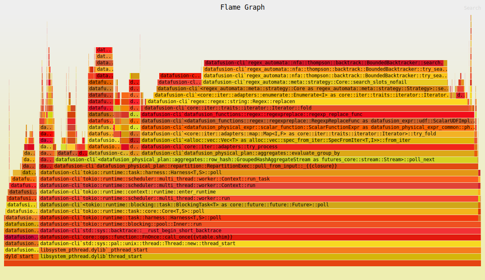

<a id="library-user-guide-profiling--macos"></a>

## MacOS

<a id="library-user-guide-profiling--step-1:-install-the-flamegraph-tool"></a>

### Step 1: Install the flamegraph Tool

To install flamegraph, run:

```
cargo install flamegraph
```

<a id="library-user-guide-profiling--step-2:-prepare-your-environment"></a>

### Step 2: Prepare Your Environment

Ensure that you’re in the directory containing the necessary data files for your DataFusion query. The flamegraph tool will profile the execution of your query against this data.

<a id="library-user-guide-profiling--step-3:-running-the-flamegraph-tool"></a>

### Step 3: Running the Flamegraph Tool

To generate a flamegraph, you’ll need to use the `--` separator to pass arguments to the binary you’re profiling. For datafusion-cli, you need to make sure to run the command with sudo permissions (especially on macOS, where DTrace requires elevated privileges).

Here is a general example:

```
sudo flamegraph -- datafusion-cli -f <path_to_sql_file/sql_file.sql>
```

<a id="library-user-guide-profiling--example:-generating-a-flamegraph-for-a-specific-query"></a>

#### Example: Generating a Flamegraph for a Specific Query

Here is an example using `28.sql`:

```
sudo flamegraph -- datafusion-cli -f 28.sql
```

You can also invoke the flamegraph tool with `cargo` to profile a specific test or benchmark.

<a id="library-user-guide-profiling--example:-flamegraph-for-a-specific-test:"></a>

#### Example: Flamegraph for a specific test:

```
CARGO_PROFILE_RELEASE_DEBUG=true cargo flamegraph --root --unit-test datafusion  -- dataframe::tests::test_array_agg
```

<a id="library-user-guide-profiling--example:-flamegraph-for-a-benchmark"></a>

#### Example: Flamegraph for a benchmark

```
CARGO_PROFILE_RELEASE_DEBUG=true cargo flamegraph --root --bench sql_planner -- --bench
```

<a id="library-user-guide-profiling--cpu-profiling-with-xcode-instruments"></a>

### CPU profiling with XCode Instruments

[Video: how to CPU profile DataFusion with XCode Instruments](https://youtu.be/P3dXH61Kr5U)

<a id="library-user-guide-profiling--profiling-using-samply-cross-platform-profiler"></a>

## Profiling using Samply cross platform profiler

There is an opportunity to build flamegraphs, call trees and stack charts on any platform using
[Samply](https://github.com/mstange/samply)

Install Samply profiler

```
cargo install --locked samply
```

More Samply [installation options](https://github.com/mstange/samply?tab=readme-ov-file#installation)

Run the profiler

```
samply record --profile profiling ./my-application my-arguments
```

<a id="library-user-guide-profiling--profile-the-benchmark"></a>

### Profile the benchmark

[Set up benchmarks](https://github.com/apache/datafusion/blob/main/benchmarks/README.md#running-the-benchmarks) if not yet done

Example: Profile Q22 query from TPC-H benchmark.
Note: `--profile profiling` to profile release optimized artifact with debug symbols

```
cargo build --profile profiling --bin tpch
samply record ./target/profiling/tpch benchmark datafusion --iterations 5 --path datafusion/benchmarks/data/tpch_sf10 --prefer_hash_join true --format parquet -o datafusion/benchmarks/results/dev2/tpch_sf10.json --query 22
```

After sampling has completed the Samply starts a local server and navigates to the profiler

```
Local server listening at http://127.0.0.1:3000
```

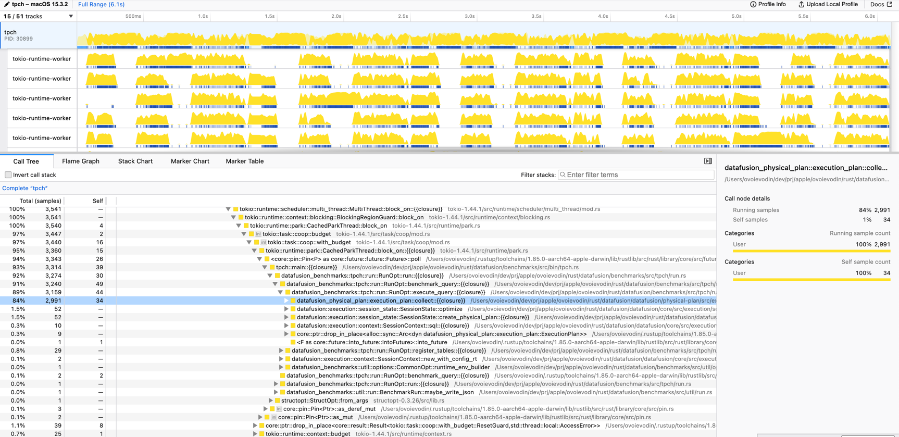

Note: The Firefox profiler cannot be opened in Safari, please use Chrome or Firefox instead

---

<a id="library-user-guide-query-optimizer"></a>

<!-- source_url: https://datafusion.apache.org/library-user-guide/query-optimizer.html -->

<!-- page_index: 86 -->

<a id="library-user-guide-query-optimizer--query-optimizer"></a>

# Query Optimizer

[DataFusion](https://crates.io/crates/datafusion) is an extensible query execution framework, written in Rust, that uses Apache Arrow as its in-memory
format.

DataFusion has modular design, allowing individual crates to be re-used in other projects.

This crate is a submodule of DataFusion that provides a query optimizer for logical plans, and
contains an extensive set of [`OptimizerRule`](https://docs.rs/datafusion/latest/datafusion/optimizer/trait.OptimizerRule.html)s and [`PhysicalOptimizerRule`](https://docs.rs/datafusion/latest/datafusion/physical_optimizer/trait.PhysicalOptimizerRule.html)s that may rewrite the plan and/or its expressions so
they execute more quickly while still computing the same result.

For a reference list of the built-in analyzer, logical optimizer, and physical optimizer rules, see [Optimizer Rule Reference](https://docs.rs/datafusion/latest/datafusion/index.html#built-in-optimizer-rules).

For a deeper background on optimizer architecture and rule types and predicates, see
[Optimizing SQL (and DataFrames) in DataFusion, Part 1](https://datafusion.apache.org/blog/2025/06/15/optimizing-sql-dataframes-part-one), [Part 2](https://datafusion.apache.org/blog/2025/06/15/optimizing-sql-dataframes-part-two), [Using Ordering for Better Plans in Apache DataFusion](https://datafusion.apache.org/blog/2025/03/11/ordering-analysis), and
[Dynamic Filters: Passing Information Between Operators During Execution for 25x Faster Queries](https://datafusion.apache.org/blog/2025/09/10/dynamic-filters).

<a id="library-user-guide-query-optimizer--running-the-optimizer"></a>

## Running the Optimizer

The following code demonstrates the basic flow of creating the optimizer with a default set of optimization rules
and applying it to a logical plan to produce an optimized logical plan.

```
use
std::sync::Arc;
use
datafusion::logical_expr ::{col,
lit,
LogicalPlan,
LogicalPlanBuilder }; use
datafusion::optimizer ::{OptimizerRule,
OptimizerContext,
Optimizer }; // We need a logical plan as the starting point. There are many ways to build a logical plan:// // The `datafusion-expr` crate provides a LogicalPlanBuilder // The `datafusion-sql` crate provides a SQL query planner that can create a LogicalPlan from SQL // The `datafusion` crate provides a DataFrame API that can create a LogicalPlan let
initial_logical_plan
=
LogicalPlanBuilder::empty (false ).build ().unwrap (); // use builtin rules or customized rules let
rules:
Vec <Arc <dyn
OptimizerRule
+
Send
+
Sync >>
=
vec! []; let
optimizer
=
Optimizer::with_rules (rules ); let
config
=
OptimizerContext::new ().with_max_passes (16 ); let
optimized_plan
=
optimizer.optimize (initial_logical_plan.clone (),
& config,
observer ); fn
observer (plan:
& LogicalPlan,
rule:
& dyn
OptimizerRule)
{
println! (
"After applying rule '{}':\n {}",
rule.name (),
plan.display_indent ()
)}
```

<a id="library-user-guide-query-optimizer--writing-optimization-rules"></a>

## Writing Optimization Rules

Please refer to the
[optimizer\_rule.rs](https://github.com/apache/datafusion/blob/main/datafusion-examples/examples/query_planning/optimizer_rule.rs)
example to learn more about the general approach to writing optimizer rules and
then move onto studying the existing rules.

`OptimizerRule` transforms one [`LogicalPlan`](https://docs.rs/datafusion/latest/datafusion/logical_expr/enum.LogicalPlan.html) into another which
computes the same results, but in a potentially more efficient
way. If there are no suitable transformations for the input plan, the optimizer can simply return it as is.

All rules must implement the `OptimizerRule` trait.

```
#[derive(Default, Debug)] struct
MyOptimizerRule
{} impl
OptimizerRule
for
MyOptimizerRule
{
fn
name (& self)
->
& str
{
"my_optimizer_rule"
}
fn
rewrite (
& self,
plan:
LogicalPlan,
_config:
& dyn
OptimizerConfig,
)
->
Result <Transformed <LogicalPlan >>
{
unimplemented! ()
}}
```

<a id="library-user-guide-query-optimizer--providing-custom-rules"></a>

## Providing Custom Rules

The optimizer can be created with a custom set of rules.

```
let
optimizer
=
Optimizer::with_rules (vec! [
Arc::new (MyOptimizerRule
{}) ]);
```

<a id="library-user-guide-query-optimizer--general-guidelines"></a>

### General Guidelines

Rules typical walk the logical plan and walk the expression trees inside operators and selectively mutate
individual operators or expressions.

Sometimes there is an initial pass that visits the plan and builds state that is used in a second pass that performs
the actual optimization. This approach is used in projection push down and filter push down.

<a id="library-user-guide-query-optimizer--expression-naming"></a>

### Expression Naming

Every expression in DataFusion has a name, which is used as the column name. For example, in this example the output
contains a single column with the name `"COUNT(aggregate_test_100.c9)"`:

```
> select count(c9) from aggregate_test_100; +------------------------------+ | COUNT(aggregate_test_100.c9) | +------------------------------+ | 100 | +------------------------------+
```

These names are used to refer to the columns in both subqueries as well as internally from one stage of the LogicalPlan
to another. For example:

```
> select "COUNT(aggregate_test_100.c9)" + 1 from (select count(c9) from aggregate_test_100) as sq; +--------------------------------------------+ | sq.COUNT(aggregate_test_100.c9) + Int64(1) | +--------------------------------------------+ | 101 | +--------------------------------------------+
```

<a id="library-user-guide-query-optimizer--implication"></a>

### Implication

Because DataFusion identifies columns using a string name, it means it is critical that the names of expressions are
not changed by the optimizer when it rewrites expressions. This is typically accomplished by renaming a rewritten
expression by adding an alias.

Here is a simple example of such a rewrite. The expression `1 + 2` can be internally simplified to 3 but must still be
displayed the same as `1 + 2`:

```
> select 1 + 2; +---------------------+ | Int64(1) + Int64(2) | +---------------------+ | 3 | +---------------------+
```

Looking at the `EXPLAIN` output we can see that the optimizer has effectively rewritten `1 + 2` into effectively
`3 as "1 + 2"`:

```
> explain format indent select 1 + 2; +---------------+-------------------------------------------------+ | plan_type     | plan                                            | +---------------+-------------------------------------------------+ | logical_plan  | Projection: Int64(3) AS Int64(1) + Int64(2)     | |               |   EmptyRelation                                 | | physical_plan | ProjectionExec: expr=[3 as Int64(1) + Int64(2)] | |               |   PlaceholderRowExec                            | |               |                                                 | +---------------+-------------------------------------------------+
```

If the expression name is not preserved, bugs such as [#3704](https://github.com/apache/datafusion/issues/3704)
and [#3555](https://github.com/apache/datafusion/issues/3555) occur where the expected columns can not be found.

<a id="library-user-guide-query-optimizer--building-expression-names"></a>

### Building Expression Names

There are currently two ways to create a name for an expression in the logical plan.

```
impl
Expr
{
/// Returns the name of this expression as it should appear in a schema. This name
/// will not include any CAST expressions.
pub
fn
display_name (& self)
->
Result <String>
{
Ok ("display_name".to_string ())
}
/// Returns a full and complete string representation of this expression.
pub
fn
canonical_name (& self)
->
String
{
"canonical_name".to_string ()
}}
```

When comparing expressions to determine if they are equivalent, `canonical_name` should be used, and when creating a
name to be used in a schema, `display_name` should be used.

<a id="library-user-guide-query-optimizer--utilities"></a>

### Utilities

There are a number of [utility methods](https://github.com/apache/datafusion/blob/main/datafusion/expr/src/utils.rs) provided that take care of some common tasks.

<a id="library-user-guide-query-optimizer--recursively-walk-an-expression-tree"></a>

### Recursively walk an expression tree

The [TreeNode API](https://docs.rs/datafusion/latest/datafusion/common/tree_node/trait.TreeNode.html) provides a convenient way to recursively walk an expression or plan tree.

For example, to find all subquery references in a logical plan, the following code can be used:

```
// Return all subquery references in an expression fn
extract_subquery_filters (expression:
& Expr)
->
Result <Vec <& Expr >>
{
let
mut
extracted
=
vec! [];
expression.apply (| expr |
{
if
let
Expr::InSubquery (_)
=
expr
{
extracted.push (expr );
}
Ok (TreeNodeRecursion::Continue)
}) ?;
Ok (extracted)}
```

Likewise you can use the [TreeNode API](https://docs.rs/datafusion/latest/datafusion/common/tree_node/trait.TreeNode.html) to rewrite a `LogicalPlan` or `ExecutionPlan`

```
// Return all joins in a logical plan fn
find_joins (overall_plan:
& LogicalPlan)
->
Result <Vec <& Join >>
{
let
mut
extracted
=
vec! [];
overall_plan.apply (| plan |
{
if
let
LogicalPlan::Join (join)
=
plan
{
extracted.push (join );
}
Ok (TreeNodeRecursion::Continue)
}) ?;
Ok (extracted)}
```

<a id="library-user-guide-query-optimizer--rewriting-expressions"></a>

### Rewriting expressions

The [TreeNode API](https://docs.rs/datafusion/latest/datafusion/common/tree_node/trait.TreeNode.html) also provides a convenient way to rewrite expressions and
plans as well. For example to rewrite all expressions like

```

col
 
BETWEEN
 
x
 
AND
 
y
```

into

```

col
 
>=
 
x
 
AND
 
col
 
<=
 
y
```

you can use the following code:

```
// Recursively rewrite all BETWEEN expressions // returns Transformed::yes if any changes were made fn
rewrite_between (expr:
Expr)
->
Result <Transformed <Expr >>
{
// transform_up does a bottom up rewrite
expr.transform_up (| expr |
{
// only handle BETWEEN expressions
let
Expr::Between (Between
{
negated,
expr,
low,
high,
})
=
expr
else
{
return
Ok (Transformed::no (expr ))
};
let
rewritten_expr
=
if
negated
{
// don't rewrite NOT BETWEEN
Expr::Between (Between::new (expr,
negated,
low,
high ))
}
else
{
// rewrite to (expr >= low) AND (expr <= high)
expr.clone ().gt_eq (* low ).and (expr.lt_eq (* high ))
};
Ok (Transformed::yes (rewritten_expr ))
})}
```

<a id="library-user-guide-query-optimizer--writing-tests"></a>

### Writing Tests

There should be unit tests in the same file as the new rule that test the effect of the rule being applied to a plan
in isolation (without any other rule being applied).

There should also be a test in `integration-tests.rs` that tests the rule as part of the overall optimization process.

<a id="library-user-guide-query-optimizer--debugging"></a>

### Debugging

The `EXPLAIN VERBOSE` command can be used to show the effect of each optimization rule on a query.

In the following example, the `type_coercion` and `simplify_expressions` passes have simplified the plan so that it returns the constant `"3.2"` rather than doing a computation at execution time.

```
> explain verbose select cast(1 + 2.2 as string) as foo; +------------------------------------------------------------+---------------------------------------------------------------------------+ | plan_type | plan | +------------------------------------------------------------+---------------------------------------------------------------------------+ | initial_logical_plan | Projection: CAST(Int64(1) + Float64(2.2) AS Utf8) AS foo | | | EmptyRelation | | logical_plan after type_coercion | Projection: CAST(CAST(Int64(1) AS Float64) + Float64(2.2) AS Utf8) AS foo | | | EmptyRelation | | logical_plan after simplify_expressions | Projection: Utf8("3.2") AS foo | | | EmptyRelation | | logical_plan after unwrap_cast_in_comparison | SAME TEXT AS ABOVE | | logical_plan after decorrelate_where_exists | SAME TEXT AS ABOVE | | logical_plan after decorrelate_where_in | SAME TEXT AS ABOVE | | logical_plan after scalar_subquery_to_join | SAME TEXT AS ABOVE | | logical_plan after subquery_filter_to_join | SAME TEXT AS ABOVE | | logical_plan after simplify_expressions | SAME TEXT AS ABOVE | | logical_plan after eliminate_filter | SAME TEXT AS ABOVE | | logical_plan after reduce_cross_join | SAME TEXT AS ABOVE | | logical_plan after common_sub_expression_eliminate | SAME TEXT AS ABOVE | | logical_plan after eliminate_limit | SAME TEXT AS ABOVE | | logical_plan after projection_push_down | SAME TEXT AS ABOVE | | logical_plan after rewrite_disjunctive_predicate | SAME TEXT AS ABOVE | | logical_plan after reduce_outer_join | SAME TEXT AS ABOVE | | logical_plan after filter_push_down | SAME TEXT AS ABOVE | | logical_plan after limit_push_down | SAME TEXT AS ABOVE | | logical_plan after single_distinct_aggregation_to_group_by | SAME TEXT AS ABOVE | | logical_plan | Projection: Utf8("3.2") AS foo | | | EmptyRelation | | initial_physical_plan | ProjectionExec: expr=[3.2 as foo] | | | PlaceholderRowExec | | | | | physical_plan after aggregate_statistics | SAME TEXT AS ABOVE | | physical_plan after join_selection | SAME TEXT AS ABOVE | | physical_plan after coalesce_batches | SAME TEXT AS ABOVE | | physical_plan after repartition | SAME TEXT AS ABOVE | | physical_plan after add_merge_exec | SAME TEXT AS ABOVE | | physical_plan | ProjectionExec: expr=[3.2 as foo] | | | PlaceholderRowExec | | | | +------------------------------------------------------------+---------------------------------------------------------------------------+
```

<a id="library-user-guide-query-optimizer--thinking-about-query-optimization"></a>

## Thinking about Query Optimization

Query optimization in DataFusion uses a cost based model. The cost based model
relies on table and column level statistics to estimate selectivity; selectivity
estimates are an important piece in cost analysis for filters and projections
as they allow estimating the cost of joins and filters.

An important piece of building these estimates is *boundary analysis* which uses
interval arithmetic to take an expression such as `a > 2500 AND a <= 5000` and
build an accurate selectivity estimate that can then be used to find more efficient
plans.

<a id="library-user-guide-query-optimizer--analysiscontext-api"></a>

### `AnalysisContext` API

The `AnalysisContext` serves as a shared knowledge base during expression evaluation
and boundary analysis. Think of it as a dynamic repository that maintains information about:

1. Current known boundaries for columns and expressions
2. Statistics that have been gathered or inferred
3. A mutable state that can be updated as analysis progresses

What makes `AnalysisContext` particularly powerful is its ability to propagate information
through the expression tree. As each node in the expression tree is analyzed, it can both
read from and write to this shared context, allowing for sophisticated boundary analysis and inference.

<a id="library-user-guide-query-optimizer--columnstatistics-for-cardinality-estimation"></a>

### `ColumnStatistics` for Cardinality Estimation

Column statistics form the foundation of optimization decisions. Rather than just tracking
simple metrics, DataFusion’s `ColumnStatistics` provides a rich set of information including:

- Null value counts
- Maximum and minimum values
- Value sums (for numeric columns)
- Distinct value counts

Each of these statistics is wrapped in a `Precision` type that indicates whether the value is
exact or estimated, allowing the optimizer to make informed decisions about the reliability
of its cardinality estimates.

<a id="library-user-guide-query-optimizer--boundary-analysis-flow"></a>

### Boundary Analysis Flow

The boundary analysis process flows through several stages, with each stage building
upon the information gathered in previous stages. The `AnalysisContext` is continuously
updated as the analysis progresses through the expression tree.

<a id="library-user-guide-query-optimizer--expression-boundary-analysis"></a>

#### Expression Boundary Analysis

When analyzing expressions, DataFusion runs boundary analysis using interval arithmetic.
Consider a simple predicate like age > 18 AND age <= 25. The analysis flows as follows:

1. Context Initialization

   - Begin with known column statistics
   - Set up initial boundaries based on column constraints
   - Initialize the shared analysis context
2. Expression Tree Walk

   - Analyze each node in the expression tree
   - Propagate boundary information upward
   - Allow child nodes to influence parent boundaries
3. Boundary Updates

   - Each expression can update the shared context
   - Changes flow through the entire expression tree
   - Final boundaries inform optimization decisions

<a id="library-user-guide-query-optimizer--working-with-the-analysis-api"></a>

### Working with the analysis API

The following example shows how you can run an analysis pass on a physical expression
to infer the selectivity of the expression and the space of possible values it can
take.

```
fn
analyze_filter_example ()
->
Result <()>
{
// Create a schema with an 'age' column
let
age
=
Field::new ("age",
DataType::Int64,
false );
let
schema
=
Arc::new (Schema::new (vec! [age ]));
// Define column statistics
let
column_stats
=
ColumnStatistics::default ()
.with_min_value (Precision::Exact (ScalarValue::Int64 (Some (14 ))))
.with_max_value (Precision::Exact (ScalarValue::Int64 (Some (79 ))))
.with_null_count (Precision::Exact (0 ));
// Create expression: age > 18 AND age <= 25
let
expr
=
col ("age")
.gt (lit (18 i64 ))
.and (col ("age" ).lt_eq (lit (25 i64 )));
// Initialize analysis context
let
initial_boundaries
=
vec! [ExprBoundaries::try_from_column (
& schema,
& column_stats,
0) ? ];
let
context
=
AnalysisContext::new (initial_boundaries );
// Analyze expression
let
df_schema
=
DFSchema::try_from (schema) ?;
let
physical_expr
=
SessionContext::new ().create_physical_expr (expr,
& df_schema) ?;
let
analysis
=
analyze (& physical_expr,
context,
df_schema.as_ref ()) ?;
Ok (())}
```

---

<a id="contributor-guide"></a>

<!-- source_url: https://datafusion.apache.org/contributor-guide/index.html -->

<!-- page_index: 87 -->

<a id="contributor-guide--introduction"></a>

# Introduction

We welcome and encourage contributions of all kinds, from all levels, such as:

1. Tickets with issue reports or feature requests
2. Discussions
3. Documentation improvements
4. Code, both PR and (especially) PR Review.

In addition to submitting new PRs, we have a healthy tradition of community
members reviewing each other’s PRs. Doing so is a great way to help the
community as well as get more familiar with Rust and the relevant codebases.

<a id="contributor-guide--development-environment"></a>

## Development Environment

Start with the [Development Environment Quick Start](#contributor-guide-development_environment--quick-start).

For more detail, see the full [development environment guide](#contributor-guide-development_environment)
and the [testing guide](#contributor-guide-testing).

<a id="contributor-guide--finding-and-creating-issues-to-work-on"></a>

## Finding and Creating Issues to Work On

You can find a curated [good-first-issue](https://github.com/apache/datafusion/issues?q=is%3Aissue+is%3Aopen+label%3A%22good+first+issue%22) list to help you get started.
You can read about how we plan larger projects in the [Roadmap and Improvement Proposals](#contributor-guide-roadmap) section.

<a id="contributor-guide--open-contribution-and-assigning-tickets"></a>

### Open Contribution and Assigning tickets

DataFusion is an open contribution project, and thus there is no particular
project imposed deadline for completing issues or restrictions on who can
work on an issue, nor limits to how many people can work on an issue at the same time.

Contributors drive the project forward based on their own priorities and
interests and thus you are free to work on any issue that interests you.

If someone is already working on an issue that you want or need but hasn’t
been able to finish it yet, you should feel free to work on it as well. In
general it is both polite and will help avoid unnecessary duplication of work if
you leave a note on an issue when you start working on it.

If you want to work on an issue which is not already assigned to someone else
and there are no comment indicating that someone is already working on that
issue then you can assign the issue to yourself by submitting a single word
comment `take`. This will assign the issue to yourself. However, if you are
unable to make progress you should unassign the issue by commenting a single
word `untake`.

<a id="contributor-guide--developer-s-guide"></a>

# Developer’s guide

<a id="contributor-guide--pull-request-overview"></a>

## Pull Request Overview

We welcome pull requests (PRs) from anyone in the community.

DataFusion is a rapidly evolving project and we try to review and merge PRs quickly.

Review bandwidth is currently our most limited resource, and we highly encourage reviews by the broader community. If you are waiting for your PR to be reviewed, consider helping review other PRs that are waiting. Such review both helps the reviewer to learn the codebase and become more expert, as well as helps identify issues in the PR (such as lack of test coverage), that can be addressed and make future reviews faster and more efficient.

The lifecycle of a PR is:

1. Create a PR targeting the `main` branch.
2. For new contributors a committer must first trigger the CI tasks. Please mention the members from committers list in the PR to help trigger the CI
3. Your PR will be reviewed. Please respond to all feedback on the PR: you don’t have to change the code, but you should acknowledge the feedback. PRs waiting for the feedback for more than a few days will be marked as draft.
4. Once the PR is approved, one of the [committers](https://people.apache.org/phonebook.html?unix=datafusion) will merge your PR, typically within 24 hours. We leave approved “major” changes (see below) open for 24 hours prior to merging, and sometimes leave “minor” PRs open for the same time to permit additional feedback.

Note that the above time frames are estimates. Due to limited committer
bandwidth, it may take longer to merge your PR. Please wait
patiently. If it has been several days you can friendly ping the
committer who approved your PR to help remind them to merge it.

<a id="contributor-guide--creating-pull-requests"></a>

## Creating Pull Requests

When possible, we recommend splitting your contributions into multiple smaller focused PRs rather than large PRs (500+ lines) because:

1. The PR is more likely to be reviewed quickly – our reviewers struggle to find the contiguous time needed to review large PRs.
2. The PR discussions tend to be more focused and less likely to get lost among several different threads.
3. It is often easier to accept and act on feedback when it comes early on in a small change, before a particular approach has been polished too much.

If you are concerned that a larger design will be lost in a string of small PRs, creating a large draft PR that shows how they all work together can help.

Note all commits in a PR are squashed when merged to the `main` branch so there is one commit per PR after merge.

<a id="contributor-guide--release-management-and-backports"></a>

## Release Management and Backports

Contributor-facing guidance for release branches, patch releases, and backports
is documented in the [Release Management](#contributor-guide-release_management) guide.

<a id="contributor-guide--before-submitting-a-pr"></a>

## Before Submitting a PR

Before submitting a PR, run the standard non-functional checks. PRs must pass
before merge.

```
./dev/rust_lint.sh
# use `--write` to automatically fix some formatting and lint errors
# ./dev/rust_lint.sh --write --allow-dirty
```

You should also run any relevant commands from the [testing quick start](#contributor-guide-testing--testing-quick-start).

<a id="contributor-guide--conventional-commits-labeling-prs"></a>

## Conventional Commits & Labeling PRs

We generate change logs for each release using an automated process that will categorize PRs based on the title
and/or the GitHub labels attached to the PR.

We follow the [Conventional Commits](https://www.conventionalcommits.org/en/v1.0.0/) specification to categorize PRs based on the title. This most often simply means
looking for titles starting with prefixes such as `fix:`, `feat:`, `docs:`, or `chore:`. We do not enforce this
convention but encourage its use if you want your PR to feature in the correct section of the changelog.

The change log generator will also look at GitHub labels such as `bug`, `enhancement`, or `api change`, and labels
do take priority over the conventional commit approach, allowing maintainers to re-categorize PRs after they have been merged.

<a id="contributor-guide--reviewing-pull-requests"></a>

## Reviewing Pull Requests

Some helpful links:

- [PRs Waiting for Review](https://github.com/apache/datafusion/pulls?q=is%3Apr+is%3Aopen+-review%3Aapproved+-is%3Adraft+) on GitHub
- [Approved PRs Waiting for Merge](https://github.com/apache/datafusion/pulls?q=is%3Apr+is%3Aopen+review%3Aapproved+-is%3Adraft) on GitHub

When reviewing PRs, our primary goal is to improve DataFusion and its community together. PR feedback should be constructive with the aim to help improve the code as well as the understanding of the contributor.

Please ensure any issues you raise contains a rationale and suggested alternative – it is frustrating to be told “don’t do it this way” without any clear reason or alternate provided.

Some things to specifically check:

1. Is the feature or fix covered sufficiently with tests (see the [Testing](#contributor-guide-testing) section)?
2. Is the code clear, and fits the style of the existing codebase?

<a id="contributor-guide--performance-improvements"></a>

## Performance Improvements

Performance improvements are always welcome: performance is a key DataFusion
feature.

In general, the performance improvement from a change should be “enough” to
justify any added code complexity. How much is “enough” is a judgement made by
the committers, but generally means that the improvement should be noticeable in
a real-world scenario and is greater than the noise of the benchmarking system.

To help committers evaluate the potential improvement, performance PRs should
in general be accompanied by benchmark results that demonstrate the improvement.

The best way to demonstrate a performance improvement is with the existing
benchmarks:

- [System level SQL Benchmarks](https://github.com/apache/datafusion/tree/main/benchmarks)
- Microbenchmarks such as those in [functions/benches](https://github.com/apache/datafusion/tree/main/datafusion/functions/benches)

If there is no suitable existing benchmark, you can create a new one. It helps
to isolate the effects of your change by creating a separate PR with the
benchmark, and then a PR with the code change that improves the benchmark.

<a id="contributor-guide--major-and-minor-prs"></a>

## “Major” and “Minor” PRs

Since we are a worldwide community, we have contributors in many timezones who review and comment. To ensure anyone who wishes has an opportunity to review a PR, our committers try to ensure that at least 24 hours passes between when a “major” PR is approved and when it is merged.

A “major” PR means there is a substantial change in design or a change in the API. Committers apply their best judgment to determine what constitutes a substantial change. A “minor” PR might be merged without a 24 hour delay, again subject to the judgment of the committer. Examples of potential “minor” PRs are:

1. Documentation improvements/additions
2. Small bug fixes
3. Non-controversial build-related changes (clippy, version upgrades etc.)
4. Smaller non-controversial feature additions

The good thing about open code and open development is that any issues in one change can almost always be fixed with a follow on PR.

<a id="contributor-guide--stale-prs"></a>

## Stale PRs

Pull requests will be marked with a `stale` label after 60 days of inactivity and then closed 7 days after that.
Commenting on the PR will remove the `stale` label.

<a id="contributor-guide--ai-assisted-contributions"></a>

## AI-Assisted contributions

DataFusion has the following policy for AI-assisted PRs:

- The PR author should **understand the core ideas** behind the implementation **end-to-end**, and be able to justify the design and code during review.
- **Calls out unknowns and assumptions**. It’s okay to not fully understand some bits of AI generated code. You should comment on these cases and point them out to reviewers so that they can use their knowledge of the codebase to clear up any concerns. For example, you might comment “calling this function here seems to work but I’m not familiar with how it works internally, I wonder if there’s a race condition if it is called concurrently”.

<a id="contributor-guide--why-fully-ai-generated-prs-without-understanding-are-not-helpful"></a>

### Why fully AI-generated PRs without understanding are not helpful

Today, AI tools cannot reliably make complex changes to DataFusion on their own, which is why we rely on pull requests and code review.

The purposes of code review are:

1. Finish the intended task.
2. Share knowledge between authors and reviewers, as a long-term investment in the project. For this reason, even if someone familiar with the codebase can finish a task quickly, we’re still happy to help a new contributor work on it even if it takes longer.

An AI dump for an issue doesn’t meet these purposes. Maintainers could finish the task faster by using AI directly, and the submitters gain little knowledge if they act only as a pass through AI proxy without understanding.

Please understand the reviewing capacity is **very limited** for the project, so large PRs which appear to not have the requisite understanding might not get reviewed, and eventually closed or redirected.

<a id="contributor-guide--better-ways-to-contribute-than-an-ai-dump"></a>

### Better ways to contribute than an “AI dump”

It’s recommended to write a high-quality issue with a clear problem statement and a minimal, reproducible example. This can make it easier for others to contribute.

<a id="contributor-guide--ci-runners"></a>

### CI Runners

<a id="contributor-guide--runs-on"></a>

#### Runs-On

We use [Runs-On](https://runs-on.com/) for some actions in the main repository, which run in the ASF AWS account to speed up CI. In forks, these actions run on the default GitHub runners since forks do not have access to ASF infrastructure.

To configure them, we use the following format:

`runs-on: ${{ github.repository_owner == 'apache' && format('runs-on={0},family=m8a,cpu=16,image=ubuntu24-full-x64,extras=s3-cache,disk=large,tag=datafusion', github.run_id) || 'ubuntu-latest' }}`

This is a conditional expression that uses Runs-On custom runners for the main repository and falls back to the standard GitHub runners for forks. Runs-On configuration follows the [Runs-On pattern](https://runs-on.com/configuration/job-labels/).

For those actions we also use the [Runs-On action](https://runs-on.com/caching/magic-cache/#how-to-use), which adds support for external caching and reports job metrics:

`- uses: runs-on/action@cd2b598b0515d39d78c38a02d529db87d2196d1e`

For the standard GitHub runners, this action will do nothing.

<a id="contributor-guide--spot-instances"></a>

##### Spot Instances

By default, Runs-On actions run as [spot instances](https://runs-on.com/configuration/spot-instances/), which means they might occasionally be interrupted. In the CI you would see:

```
Error:The operation was canceled.
```

According to Runs-On, spot instance termination is extremely rare for instances running for less than 1h. Those actions will be restarted automatically.

<a id="contributor-guide--github-runners"></a>

#### GitHub Runners

We also use standard GitHub runners for some actions in the main repository; these are also runnable in forks.

---

<a id="contributor-guide-communication"></a>

<!-- source_url: https://datafusion.apache.org/contributor-guide/communication.html -->

<!-- page_index: 88 -->

<a id="contributor-guide-communication--community-communication"></a>

# Community Communication

We welcome participation from everyone and encourage you to join us, ask
questions, and get involved.
All participation in the Apache DataFusion project is governed by the
Apache Software Foundation’s [code of
conduct](https://www.apache.org/foundation/policies/conduct.html).

<a id="contributor-guide-communication--github"></a>

## GitHub

The primary means of communication is the
[GitHub repository](https://github.com/apache/datafusion) in the form of issues, discussions, and Pull Requests.
Our repository is open to everyone. We encourage you to
participate by reporting issues, asking questions, and contributing code.

<a id="contributor-guide-communication--chat"></a>

## Chat

We also use the Discord and Slack platforms for lower latency, informal discussions and coordination.
These are great places to
meet other members of the community, ask questions, and brainstorm ideas.
However, to ensure technical discussions are archived and accessible to everyone, all technical designs are recorded and formalized in GitHub issues.

<a id="contributor-guide-communication--discord"></a>

### Discord

Historically, the most active discussion forum has been the [Arrow Rust Discord
server](https://discord.gg/Qw5gKqHxUM) which has specific channels for Arrow, DataFusion, and
DataFusion subprojects such as Ballista, Comet, Python, etc.
DataFusion specific channels are prefixed with the `#datafusion-` tag.
We recommend new users join this server for real-time discussions with the community.

<a id="contributor-guide-communication--slack"></a>

### Slack

Some of the community also uses the [ASF Slack workspace](https://the-asf.slack.com/) for discussions. This
has historically been much less active than the Discord server.
Unfortunately, due to spammers, the ASF Slack workspace [requires an invitation](https://s.apache.org/slack-invite)
to join. We are happy to invite any community member – please ask for an
invitation in the Discord server.

In Slack, we use these channels:

- `#arrow`
- `#arrow-rust`
- `#datafusion`
- `#datafusion-ballista`
- `#datafusion-comet`
- `#datafusion-python`

<a id="contributor-guide-communication--weekly-video-call-syncs"></a>

## Weekly Video Call Syncs

The DataFusion community also holds a weekly video call sync for real-time
discussion and coordination. You can join the meeting using the Google Meet
link below, and use the shared meeting document for agenda items and notes:

- [Video call link](https://meet.google.com/nfg-eviu-qrm)
- [Meeting details and notes](https://docs.google.com/document/d/1NBpkIAuU7O9h8Br5CbFksDhX-L9TyO9wmGLPMe0Plc8)

<a id="contributor-guide-communication--job-board"></a>

### Job Board

There are plenty of opportunities to work with DataFusion advertised on the
#hiring channel on the [Arrow Rust Discord Server](https://discord.gg/Qw5gKqHxUM).
Please feel free to post links to DataFusion related jobs there.

<a id="contributor-guide-communication--mailing-lists"></a>

## Mailing Lists

Like other Apache projects, we use [mailing lists](https://www.apache.org/foundation/mailinglists) for certain purposes, most
importantly release coordination and announcing new committers and PMC members.
Other than these processes, most DataFusion mailing list traffic will link to a GitHub issue or PR where
the actual discussion occurs. The project mailing lists are:

- [`dev@datafusion.apache.org`](mailto:dev%40datafusion.apache.org): the main
  mailing list for release coordination and other project-wide discussions. Links:
  [archives](https://lists.apache.org/list.html?dev@datafusion.apache.org),
  [subscribe](mailto:dev-subscribe%40datafusion.apache.org),
  [unsubscribe](mailto:dev-unsubscribe%40datafusion.apache.org)
- `github@datafusion.apache.org`: read-only mailing list that receives all GitHub notifications for the project. Links:
  [archives](https://lists.apache.org/list.html?github@datafusion.apache.org)
- `commits@datafusion.apache.org`: read-only mailing list that receives all GitHub commits for the project. Links:
  [archives](https://lists.apache.org/list.html?commits@datafusion.apache.org)
- `private@datafusion.apache.org`: private mailing list for PMC members. This list has very little traffic, almost exclusively discussions on growing the committer and PMC membership. Links:
  [archives](https://lists.apache.org/list.html?private@datafusion.apache.org)

---

<a id="contributor-guide-development_environment"></a>

<!-- source_url: https://datafusion.apache.org/contributor-guide/development_environment.html -->

<!-- page_index: 89 -->

<a id="contributor-guide-development_environment--development-environment"></a>

# Development Environment

This section describes how you can get started at developing DataFusion.

<a id="contributor-guide-development_environment--quick-start"></a>

## Quick Start

For the fastest path to a working local environment, follow these steps
from the repository root:

```
# 1. Install Rust (https://rust-lang.org/tools/install/) and verify the active toolchain with rustup show

# 2. Install protoc 3.15+ (see details below) protoc --version

# 3. Download test data used by examples and many tests git submodule update --init --recursive

# 4. Build the workspace cargo build

# 5. Verify that Rust integration tests can be run cargo test -p datafusion --test parquet_integration

# 6. Verify that sqllogictests can run cargo test --profile=ci --test sqllogictests
```

Notes:

- The pinned Rust version is defined in `rust-toolchain.toml`.
- `protoc` is required to compile DataFusion from source.
- Some tests and examples rely on git submodule data being present locally.

<a id="contributor-guide-development_environment--windows-setup"></a>

## Windows Setup

```
wget https://az792536.vo.msecnd.net/vms/VMBuild_20190311/VirtualBox/MSEdge/MSEdge.Win10.VirtualBox.zip
choco install -y git rustup.install visualcpp-build-tools
git-bash.exe
cargo build
```

<a id="contributor-guide-development_environment--dev-container-setup"></a>

## Dev Container setup

DataFusion has support for [dev containers](https://containers.dev/) which may be used for
developing DataFusion in an isolated environment either locally or remote if desired. Using dev containers for developing
DataFusion is not a requirement but is available where doing local development could be tricky
such as with Windows and WSL2, those with older hardware, etc.

For specific details on IDE support for dev containers see the documentation for [Visual Studio Code](https://code.visualstudio.com/docs/devcontainers/containers), [IntelliJ IDEA](https://www.jetbrains.com/help/idea/connect-to-devcontainer.html), [Rust Rover](https://www.jetbrains.com/help/rust/connect-to-devcontainer.html), and
[GitHub Codespaces](https://docs.github.com/en/codespaces/setting-up-your-project-for-codespaces/adding-a-dev-container-configuration/introduction-to-dev-containers).

<a id="contributor-guide-development_environment--protoc-installation"></a>

## `protoc` Installation

Compiling DataFusion from sources requires an installed version of the protobuf compiler, `protoc`.

On most platforms this can be installed from your system’s package manager. For example:

```
# Ubuntu
$ sudo apt install -y protobuf-compiler

# Fedora
$ dnf install -y protobuf-devel

# Arch Linux
$ pacman -S protobuf

# macOS
$ brew install protobuf
```

You will want to verify the version installed is `3.15` or greater, which has support for explicit [field presence](https://github.com/protocolbuffers/protobuf/blob/v3.15.0/docs/field_presence.md). Older versions may fail to compile.

```
$ protoc --version libprotoc 3.15.0
```

Alternatively a binary release can be downloaded from the [Release Page](https://github.com/protocolbuffers/protobuf/releases) or [built from source](https://github.com/protocolbuffers/protobuf/blob/main/src/README.md).

<a id="contributor-guide-development_environment--bootstrap-environment"></a>

## Bootstrap Environment

DataFusion is written in Rust and it uses a standard rust toolkit:

- `rustup update stable` DataFusion generally uses the latest stable release of Rust, though it may lag when new Rust toolchains release

  - See which toolchain is currently pinned in the [`rust-toolchain.toml`](https://github.com/apache/datafusion/blob/main/rust-toolchain.toml) file
  - This can cause issues such as not having the rust-analyzer component installed for the specified toolchain, in which case just install it manually, e.g. `rustup component add --toolchain 1.95.0 rust-analyzer`
- `cargo build`
- `cargo fmt` to format the code
- etc.

Testing setup:

- `git submodule init`
- `git submodule update --init --remote --recursive`
- `cargo test` to run tests

Note that running `cargo test` requires significant memory resources, due to cargo running many tests in parallel by default. If you run into issues with slow tests or system lock ups, you can significantly reduce the memory required by instead running `cargo test -- --test-threads=1`. For more information see [this issue](https://github.com/apache/datafusion/issues/5347).

Formatting instructions:

- [ci/scripts/rust\_fmt.sh](https://datafusion.apache.org/_downloads/4a91b8629bd17ce8ae200ee0b5345f19/rust_fmt.sh)
- [ci/scripts/rust\_clippy.sh](https://datafusion.apache.org/_downloads/ca7ec2ded721157172203812bd6e22b2/rust_clippy.sh)
- [ci/scripts/rust\_toml\_fmt.sh](https://datafusion.apache.org/_downloads/5b1657e27416274aa54d7579d8b125c3/rust_toml_fmt.sh)

or run them all at once:

- [dev/rust\_lint.sh](https://datafusion.apache.org/_downloads/1e336e540124589d1e27210fa4f805f6/rust_lint.sh)

---

<a id="contributor-guide-architecture"></a>

<!-- source_url: https://datafusion.apache.org/contributor-guide/architecture.html -->

<!-- page_index: 90 -->

<a id="contributor-guide-architecture--architecture"></a>

# Architecture

DataFusion’s code structure and organization is described in the
[crates.io documentation](https://docs.rs/datafusion/latest/datafusion/index.html#architecture), to keep it as close to the source as
possible. You can find the most up to date version in the [source code](https://github.com/apache/datafusion/blob/main/datafusion/core/src/lib.rs).

<a id="contributor-guide-architecture--forks-vs-extension-apis"></a>

## Forks vs Extension APIs

DataFusion is a fast moving project, which results in frequent internal changes.
This benefits DataFusion by allowing it to evolve and respond quickly to
requests, but also means that maintaining a fork with major modifications
sometimes requires non trivial work.

The public API (what is accessible if you use the DataFusion releases from
crates.io) is typically much more stable (though it does change from release to
release as well).

Thus, rather than forks, we recommend using one of the many extension APIs (such
as `TableProvider`, `OptimizerRule`, or `ExecutionPlan`) to customize
DataFusion. If you can not do what you want with the existing APIs, we would
welcome you working with us to add new APIs to enable your use case, as
described in the next section.

Please see the [Extensions](#library-user-guide-extensions) section to find out more about existing DataFusion
extensions and how to contribute your extension to the community.

<a id="contributor-guide-architecture--creating-new-extension-apis"></a>

## Creating new Extension APIs

DataFusion aims to be a general-purpose query engine, and thus the core crates
contain features that are useful for a wide range of use cases. Use case specific
functionality (such as very specific time series or stream processing features)
are typically implemented using the extension APIs.

If you have a use case that is not covered by the existing APIs, we would love to
work with you to design a new general purpose API. There are often others who are
interested in similar extensions and the act of defining the API often improves
the code overall for everyone.

Extension APIs that provide “safe” default behaviors are more likely to be
suitable for inclusion in DataFusion, while APIs that require major changes to
built-in operators are less likely. For example, it might make less sense
to add an API to support a stream processing feature if that would result in
slower performance for built-in operators. It may still make sense to add
extension APIs for such features, but leave implementation of such operators in
downstream projects.

The process to create a new extension API is typically:

- Look for an existing issue describing what you want to do, and file one if it
  doesn’t yet exist.
- Discuss what the API would look like. Feel free to ask contributors (via `@`
  mentions) for feedback (you can find such people by looking at the most
  recently changed PRs and issues)
- Prototype the new API, typically by adding an example (in
  `datafusion-examples` or refactoring existing code) to show how it would work
- Create a PR with the new API, and work with the community to get it merged

Some benefits of using an example based approach are

- Any future API changes will also keep your example going ensuring no
  regression in functionality
- There will be a blue print of any needed changes to your code if the APIs do change
  (just look at what changed in your example)

An example of this process was [creating a SQL Extension Planning API](https://github.com/apache/datafusion/issues/11207).

---

<a id="contributor-guide-architecture-dependency-graph"></a>

<!-- source_url: https://datafusion.apache.org/contributor-guide/architecture/dependency-graph.html -->

<!-- page_index: 91 -->

<a id="contributor-guide-architecture-dependency-graph--workspace-dependency-graph"></a>

# Workspace Dependency Graph

This page shows the dependency relationships between DataFusion’s workspace
crates. This only includes internal dependencies, external crates like `Arrow` are not included

The dependency graph is auto-generated by `docs/scripts/generate_dependency_graph.sh` to ensure it stays up-to-date, and the script now runs automatically as part of `docs/build.sh`.

<a id="contributor-guide-architecture-dependency-graph--dependency-graph-for-workspace-crates"></a>

## Dependency Graph for Workspace Crates

xml version="1.0" encoding="UTF-8" standalone="no"?

<svg height="1412pt" viewbox="0.00 0.00 1480.00 1412.00" width="1480pt" xmlns="http://www.w3.org/2000/svg" xmlns:xlink="http://www.w3.org/1999/xlink">
<g id="graph0">
<title>%3</title>
<polygon></polygon>
<g id="node1">
<title>0</title>
<polygon></polygon>
<text>datafusion-common</text>
</g>
<g id="node2">
<title>1</title>
<polygon></polygon>
<text>datafusion-common-runtime</text>
</g>
<g id="node3">
<title>2</title>
<polygon></polygon>
<text>datafusion-catalog</text>
</g>
<g id="node4">
<title>3</title>
<polygon></polygon>
<text>datafusion-datasource</text>
</g>
<g id="edge1">
<title>2-&gt;3</title>
<path></path>
</g>
<g id="node15">
<title>14</title>
<polygon></polygon>
<text>datafusion-physical-expr-adapter</text>
</g>
<g id="edge2">
<title>3-&gt;14</title>
<path></path>
<polygon></polygon>
</g>
<g id="node19">
<title>18</title>
<polygon></polygon>
<text>datafusion-session</text>
</g>
<g id="edge3">
<title>3-&gt;18</title>
<path></path>
<polygon></polygon>
</g>
<g id="node5">
<title>4</title>
<polygon></polygon>
<text>datafusion-execution</text>
</g>
<g id="node6">
<title>5</title>
<polygon></polygon>
<text>datafusion-expr</text>
</g>
<g id="edge4">
<title>4-&gt;5</title>
<path></path>
<polygon></polygon>
</g>
<g id="node7">
<title>6</title>
<polygon></polygon>
<text>datafusion-doc</text>
</g>
<g id="edge5">
<title>5-&gt;6</title>
<path></path>
<polygon></polygon>
</g>
<g id="node9">
<title>8</title>
<polygon></polygon>
<text>datafusion-functions-aggregate-common</text>
</g>
<g id="edge6">
<title>5-&gt;8</title>
<path></path>
<polygon></polygon>
</g>
<g id="node11">
<title>10</title>
<polygon></polygon>
<text>datafusion-functions-window-common</text>
</g>
<g id="edge7">
<title>5-&gt;10</title>
<path></path>
<polygon></polygon>
</g>
<g id="node8">
<title>7</title>
<polygon></polygon>
<text>datafusion-expr-common</text>
</g>
<g id="edge8">
<title>7-&gt;0</title>
<path></path>
<polygon></polygon>
</g>
<g id="node10">
<title>9</title>
<polygon></polygon>
<text>datafusion-physical-expr-common</text>
</g>
<g id="edge9">
<title>8-&gt;9</title>
<path></path>
<polygon></polygon>
</g>
<g id="edge10">
<title>9-&gt;7</title>
<path></path>
<polygon></polygon>
</g>
<g id="edge11">
<title>10-&gt;9</title>
<path></path>
<polygon></polygon>
</g>
<g id="node12">
<title>11</title>
<polygon></polygon>
<text>datafusion-physical-expr</text>
</g>
<g id="node13">
<title>12</title>
<polygon></polygon>
<text>datafusion-functions</text>
</g>
<g id="edge12">
<title>11-&gt;12</title>
<path></path>
<polygon></polygon>
</g>
<g id="edge13">
<title>12-&gt;4</title>
<path></path>
<polygon></polygon>
</g>
<g id="node14">
<title>13</title>
<polygon></polygon>
<text>datafusion-macros</text>
</g>
<g id="edge14">
<title>12-&gt;13</title>
<path></path>
<polygon></polygon>
</g>
<g id="edge15">
<title>13-&gt;6</title>
<path></path>
<polygon></polygon>
</g>
<g id="edge16">
<title>14-&gt;11</title>
<path></path>
<polygon></polygon>
</g>
<g id="node16">
<title>15</title>
<polygon></polygon>
<text>datafusion-physical-plan</text>
</g>
<g id="edge17">
<title>15-&gt;1</title>
<path></path>
<polygon></polygon>
</g>
<g id="node17">
<title>16</title>
<polygon></polygon>
<text>datafusion-functions-aggregate</text>
</g>
<g id="edge18">
<title>15-&gt;16</title>
<path></path>
<polygon></polygon>
</g>
<g id="node18">
<title>17</title>
<polygon></polygon>
<text>datafusion-functions-window</text>
</g>
<g id="edge19">
<title>15-&gt;17</title>
<path></path>
<polygon></polygon>
</g>
<g id="edge20">
<title>16-&gt;11</title>
<path></path>
<polygon></polygon>
</g>
<g id="edge21">
<title>17-&gt;11</title>
<path></path>
<polygon></polygon>
</g>
<g id="edge22">
<title>18-&gt;15</title>
<path></path>
<polygon></polygon>
</g>
<g id="node20">
<title>19</title>
<polygon></polygon>
<text>datafusion-catalog-listing</text>
</g>
<g id="edge23">
<title>19-&gt;2</title>
<path></path>
<polygon></polygon>
</g>
<g id="node21">
<title>20</title>
<polygon></polygon>
<text>datafusion-datasource-parquet</text>
</g>
<g id="edge24">
<title>19-&gt;20</title>
<path></path>
<polygon></polygon>
</g>
<g id="node22">
<title>21</title>
<polygon></polygon>
<text>datafusion-pruning</text>
</g>
<g id="edge25">
<title>20-&gt;21</title>
<path></path>
<polygon></polygon>
</g>
<g id="edge26">
<title>21-&gt;3</title>
<path></path>
<polygon></polygon>
</g>
<g id="node23">
<title>22</title>
<polygon></polygon>
<text>datafusion-functions-nested</text>
</g>
<g id="edge27">
<title>21-&gt;22</title>
<path></path>
<polygon></polygon>
</g>
<g id="edge28">
<title>22-&gt;16</title>
<path></path>
<polygon></polygon>
</g>
<g id="node24">
<title>23</title>
<polygon></polygon>
<text>datafusion-datasource-arrow</text>
</g>
<g id="edge29">
<title>23-&gt;3</title>
<path></path>
<polygon></polygon>
</g>
<g id="node25">
<title>24</title>
<polygon></polygon>
<text>datafusion-datasource-avro</text>
</g>
<g id="edge30">
<title>24-&gt;3</title>
<path></path>
<polygon></polygon>
</g>
<g id="node26">
<title>25</title>
<polygon></polygon>
<text>datafusion-datasource-csv</text>
</g>
<g id="edge31">
<title>25-&gt;3</title>
<path></path>
<polygon></polygon>
</g>
<g id="node27">
<title>26</title>
<polygon></polygon>
<text>datafusion-datasource-json</text>
</g>
<g id="edge32">
<title>26-&gt;3</title>
<path></path>
<path></path>
<polygon></polygon>
</g>
<g id="node28">
<title>27</title>
<polygon></polygon>
<text>datafusion</text>
</g>
<g id="edge33">
<title>27-&gt;19</title>
<path></path>
<polygon></polygon>
</g>
<g id="edge34">
<title>27-&gt;23</title>
<path></path>
<path></path>
<polygon></polygon>
</g>
<g id="edge35">
<title>27-&gt;24</title>
<path></path>
<polygon></polygon>
</g>
<g id="edge36">
<title>27-&gt;25</title>
<path></path>
<polygon></polygon>
</g>
<g id="edge37">
<title>27-&gt;26</title>
<path></path>
<polygon></polygon>
</g>
<g id="node29">
<title>28</title>
<polygon></polygon>
<text>datafusion-functions-table</text>
</g>
<g id="edge38">
<title>27-&gt;28</title>
<path></path>
<polygon></polygon>
</g>
<g id="node30">
<title>29</title>
<polygon></polygon>
<text>datafusion-optimizer</text>
</g>
<g id="edge39">
<title>27-&gt;29</title>
<path></path>
<polygon></polygon>
</g>
<g id="node32">
<title>31</title>
<polygon></polygon>
<text>datafusion-physical-optimizer</text>
</g>
<g id="edge40">
<title>27-&gt;31</title>
<path></path>
<polygon></polygon>
</g>
<g id="node33">
<title>32</title>
<polygon></polygon>
<text>test-utils</text>
</g>
<g id="edge42">
<title>27-&gt;32</title>
<path></path>
<polygon></polygon>
</g>
<g id="edge43">
<title>28-&gt;2</title>
<path></path>
<polygon></polygon>
</g>
<g id="node31">
<title>30</title>
<polygon></polygon>
<text>datafusion-sql</text>
</g>
<g id="edge44">
<title>29-&gt;30</title>
<path></path>
<polygon></polygon>
</g>
<g id="edge47">
<title>30-&gt;17</title>
<path></path>
<polygon></polygon>
</g>
<g id="edge45">
<title>30-&gt;22</title>
<path></path>
<polygon></polygon>
</g>
<g id="edge48">
<title>31-&gt;21</title>
<path></path>
<polygon></polygon>
</g>
<g id="edge49">
<title>32-&gt;0</title>
<path></path>
<polygon></polygon>
</g>
<g id="node34">
<title>33</title>
<polygon></polygon>
<text>datafusion-ffi</text>
</g>
<g id="node35">
<title>34</title>
<polygon></polygon>
<text>datafusion-proto</text>
</g>
<g id="edge50">
<title>33-&gt;34</title>
<path></path>
<polygon></polygon>
</g>
<g id="edge51">
<title>34-&gt;27</title>
<path></path>
<polygon></polygon>
</g>
<g id="node36">
<title>35</title>
<polygon></polygon>
<text>datafusion-proto-common</text>
</g>
<g id="edge52">
<title>34-&gt;35</title>
<path></path>
<polygon></polygon>
</g>
<g id="edge53">
<title>35-&gt;0</title>
<path></path>
<polygon></polygon>
</g>
<g id="node37">
<title>36</title>
<polygon></polygon>
<text>datafusion-spark</text>
</g>
<g id="edge54">
<title>36-&gt;27</title>
<path></path>
<polygon></polygon>
</g>
<g id="node38">
<title>37</title>
<polygon></polygon>
<text>datafusion-sqllogictest</text>
</g>
<g id="edge56">
<title>37-&gt;36</title>
<path></path>
<polygon></polygon>
</g>
<g id="node39">
<title>38</title>
<polygon></polygon>
<text>datafusion-substrait</text>
</g>
<g id="edge57">
<title>38-&gt;27</title>
<path></path>
<polygon></polygon>
</g>
<g id="node40">
<title>39</title>
<polygon></polygon>
<text>datafusion-wasmtest</text>
</g>
<g id="edge59">
<title>39-&gt;27</title>
<path></path>
<polygon></polygon>
</g>
<g id="node41">
<title>40</title>
<polygon></polygon>
<text>datafusion-cli</text>
</g>
<g id="edge60">
<title>40-&gt;27</title>
<path></path>
<polygon></polygon>
</g>
<g id="node42">
<title>41</title>
<polygon></polygon>
<text>datafusion-examples</text>
</g>
<g id="edge61">
<title>41-&gt;34</title>
<path></path>
<polygon></polygon>
</g>
<g id="node43">
<title>42</title>
<polygon></polygon>
<text>ffi_example_table_provider</text>
</g>
<g id="node44">
<title>43</title>
<polygon></polygon>
<text>ffi_module_interface</text>
</g>
<g id="edge62">
<title>42-&gt;43</title>
<path></path>
<polygon></polygon>
</g>
<g id="edge63">
<title>43-&gt;33</title>
<path></path>
<polygon></polygon>
</g>
<g id="node45">
<title>44</title>
<polygon></polygon>
<text>ffi_module_loader</text>
</g>
<g id="edge64">
<title>44-&gt;43</title>
<path></path>
<polygon></polygon>
</g>
<g id="node46">
<title>45</title>
<polygon></polygon>
<text>datafusion-benchmarks</text>
</g>
<g id="edge65">
<title>45-&gt;34</title>
<path></path>
<polygon></polygon>
</g>
</g>
</svg>

Interactive SVG (pan, zoom, search)

−
+

[Open SVG ↗](assets/images/deps_e8207a3bd62c86d7.svg)

<a id="contributor-guide-architecture-dependency-graph--legend"></a>

### Legend

- black lines: normal dependency
- blue lines: dev-dependency
- green lines: build-dependency
- dotted lines: optional dependency (could be removed by disabling a cargo feature)

Transitive dependencies are intentionally ignored to keep the graph readable.

The dependency graph is generated through `cargo depgraph` by `docs/scripts/generate_dependency_graph.sh`.

---

<a id="contributor-guide-testing"></a>

<!-- source_url: https://datafusion.apache.org/contributor-guide/testing.html -->

<!-- page_index: 92 -->

<a id="contributor-guide-testing--testing"></a>

# Testing

Tests are critical to ensure that DataFusion is working properly and
is not accidentally broken during refactorings. All new features
should have test coverage and the entire test suite is run as part of CI.

<a id="contributor-guide-testing--testing-quick-start"></a>

## Testing Quick Start

While developing a feature or bug fix, best practice is to run the smallest set
of tests that gives confidence for your change, then expand as needed.

Initially, run the tests in the crates you changed. For example, if you made changes
to files in `datafusion-optimizer/src`, run the corresponding crate tests:

```
cargo test -p datafusion-optimizer
```

Then, run the `sqllogictest` suite, which provides a strong speed–coverage tradeoff for development: it runs quickly while offering broad regression coverage across most SQL behavior in DataFusion.

```
cargo test --profile=ci --test sqllogictests
```

Finally, before submitting a PR, run the tests for the core `datafusion` and
`datafusion-cli` crates:

```
cargo test -p datafusion
cargo test -p datafusion-cli
```

Some integration tests require optional external services such as Docker-backed
containers and may skip when unavailable.

<a id="contributor-guide-testing--testing-overview"></a>

## Testing Overview

DataFusion has several levels of tests in its [Test Pyramid](https://martinfowler.com/articles/practical-test-pyramid.html) and tries to follow
the Rust standard [Testing Organization](https://doc.rust-lang.org/book/ch11-03-test-organization.html) described in [The Book](https://doc.rust-lang.org/book/).

Run tests using `cargo`:

```
cargo test
```

You can also use other runners such as [cargo-nextest](https://nexte.st/).

```
cargo nextest run
```

<a id="contributor-guide-testing--unit-tests"></a>

## Unit tests

Tests for code in an individual module are defined in the same source file with a `test` module, following Rust convention.

For example, to run tests in the `datafusion` crate:

```
cargo test -p datafusion
```

The [test\_util](https://github.com/apache/datafusion/tree/main/datafusion/common/src/test_util.rs) module provides useful macros to write unit tests effectively, such as [`assert_batches_sorted_eq`](https://docs.rs/datafusion/latest/datafusion/macro.assert_batches_sorted_eq.html) and [`assert_batches_eq`](https://docs.rs/datafusion/latest/datafusion/macro.assert_batches_eq.html) for RecordBatches and [`assert_contains`](https://docs.rs/datafusion/latest/datafusion/common/macro.assert_contains.html) / [`assert_not_contains`](https://docs.rs/datafusion/latest/datafusion/common/macro.assert_not_contains.html) which are used extensively in the codebase.

<a id="contributor-guide-testing--sqllogictests-tests"></a>

## sqllogictests Tests

DataFusion’s SQL implementation is tested using [sqllogictest](https://github.com/apache/datafusion/tree/main/datafusion/sqllogictest). You can run these tests with commands like:

```
# Run all tests cargo test --profile=ci --test sqllogictests
# Run a specific test file cargo test --profile=ci --test sqllogictests -- aggregate.slt
# Run a specific test file and update expected outputs cargo test --profile=ci --test sqllogictests -- aggregate.slt --complete
# Run and update expected outputs for all test files cargo test --profile=ci --test sqllogictests -- --complete
```

`sqllogictests` may be less convenient for new contributors who are familiar with writing `.rs` tests as they require learning another tool. However, `sqllogictest` based tests are much easier to develop and maintain as they 1) do not require a slow recompile/link cycle and 2) can be automatically updated.

Like similar systems such as [DuckDB](https://duckdb.org/dev/testing), DataFusion has chosen to trade off a slightly higher barrier to contribution for longer term maintainability.

DataFusion has integrated [sqlite’s test suite](https://sqlite.org/sqllogictest/doc/trunk/about.wiki) as a supplemental test suite that is run whenever a PR is merged into DataFusion. To run it manually please refer to the [README](https://github.com/apache/datafusion/blob/main/datafusion/sqllogictest/README.md#running-tests-sqlite) file for instructions.

<a id="contributor-guide-testing--snapshot-testing-cargo-insta"></a>

## Snapshot testing (`cargo insta`)

[Insta](https://github.com/mitsuhiko/insta) is used for snapshot testing. Snapshots are generated
and compared on each test run. If the output changes, tests will fail.

To review the changes, you can use Insta CLI:

```
cargo install cargo-insta
cargo insta review
```

<a id="contributor-guide-testing--extended-tests"></a>

## Extended Tests

In addition to the standard CI test suite that is run on all PRs prior to merge, DataFusion has “extended” tests (defined in [extended.yml](https://github.com/apache/datafusion/blob/main/.github/workflows/extended.yml)) that are run on each
commit to `main`. These tests rarely fail but take significantly longer to run
than the standard test suite and add important test coverage such as ensuring
correctness when there are hash collisions and running the relevant portions of
the entire [sqlite test suite](https://www.sqlite.org/sqllogictest/dir?ci=tip). You can run the extended tests
locally by following the [instructions in the documentation](https://github.com/apache/datafusion/tree/main/datafusion/sqllogictest#running-tests-sqlite).

<a id="contributor-guide-testing--rust-integration-tests"></a>

## Rust Integration Tests

There are several public interface tests for the DataFusion library in the [tests](https://github.com/apache/datafusion/tree/main/datafusion/core/tests) directory.

You can run these tests individually using `cargo` as normal command such as

```
cargo test -p datafusion --test parquet_integration
```

<a id="contributor-guide-testing--sql-fuzz-testing"></a>

## SQL “Fuzz” testing

DataFusion uses the [SQLancer](https://github.com/sqlancer/sqlancer) for “fuzz” testing: it generates random SQL
queries and execute them against DataFusion to find bugs.

The code is in the [datafusion-sqllancer](https://github.com/datafusion-contrib/datafusion-sqllancer) repository, and we welcome further
contributions. Kudos to [@2010YOUY01](https://github.com/2010YOUY01) for the initial implementation.

<a id="contributor-guide-testing--documentation-examples"></a>

## Documentation Examples

We use Rust [doctest](https://doc.rust-lang.org/rust-by-example/testing/doc_testing.html) to verify examples from the documentation are correct and
up-to-date. These tests are run as part of our CI and you can run them them
locally with the following command:

```
cargo test --doc
```

<a id="contributor-guide-testing--api-documentation-examples"></a>

### API Documentation Examples

As with other Rust projects, examples in doc comments in `.rs` files are
automatically checked to ensure they work and evolve along with the code.

<a id="contributor-guide-testing--user-guide-documentation"></a>

### User Guide Documentation

Rust example code from the user guide (anything marked with ```rust) is also
tested in the same way using the [doc\_comment](https://docs.rs/doc-comment/latest/doc_comment) crate. See the end of
[core/src/lib.rs](https://github.com/apache/datafusion/blob/main/datafusion/core/src/lib.rs#L583) for more details.

<a id="contributor-guide-testing--documentation-link-checks"></a>

## Documentation Link Checks

Run the internal markdown link check locally:

```
source ci/scripts/utils/tool_versions.sh
cargo install lychee --locked --version "${LYCHEE_VERSION}"
bash ci/scripts/markdown_link_check.sh
```

Notes:

- The script is run with `bash` and is compatible with the default Bash on macOS (no `mapfile` dependency).
- The CI configuration currently checks internal markdown links only. External `http(s)` and `mailto` links are excluded to avoid flaky failures.

When a link is broken, lychee prints the file and URL/path that failed. For example:

```
[docs/source/user-guide/cli/overview.md]:
  [ERROR] file:///.../docs/source/user-guide/cli/missing-page.md | Cannot find file: File not found. Check if file exists and path is correct
```

Rust doc comments are validated by rustdoc in CI and can be checked locally with:

```
bash ci/scripts/rust_docs.sh
```

<a id="contributor-guide-testing--benchmarks"></a>

## Benchmarks

<a id="contributor-guide-testing--criterion-benchmarks"></a>

### Criterion Benchmarks

[Criterion](https://docs.rs/criterion/latest/criterion/index.html) is a statistics-driven micro-benchmarking framework used by DataFusion for evaluating the performance of specific code-paths. In particular, the criterion benchmarks help to both guide optimisation efforts, and prevent performance regressions within DataFusion.

Criterion integrates with Cargo’s built-in [benchmark support](https://doc.rust-lang.org/cargo/commands/cargo-bench.html) and a given benchmark can be run with

```

cargo
bench
--
bench
BENCHMARK_NAME
```

A full list of benchmarks can be found [here](https://github.com/apache/datafusion/tree/main/datafusion/core/benches).

*[cargo-criterion](https://github.com/bheisler/cargo-criterion) may also be used for more advanced reporting.*

<a id="contributor-guide-testing--parquet-sql-benchmarks"></a>

### Parquet SQL Benchmarks

The parquet SQL benchmarks can be run with

```

cargo
bench
--
bench
parquet_query_sql
```

These randomly generate a parquet file, and then benchmark queries sourced from [parquet\_query\_sql.sql](https://datafusion.apache.org/_downloads/ef2c125b8dcc9e4b052e1280935df561/parquet_query_sql.sql) against it. This can therefore be a quick way to add coverage of particular query and/or data paths.

If the environment variable `PARQUET_FILE` is set, the benchmark will run queries against this file instead of a randomly generated one. This can be useful for performing multiple runs, potentially with different code, against the same source data, or for testing against a custom dataset.

The benchmark will automatically remove any generated parquet file on exit, however, if interrupted (e.g. by CTRL+C) it will not. This can be useful for analysing the particular file after the fact, or preserving it to use with `PARQUET_FILE` in subsequent runs.

<a id="contributor-guide-testing--comparing-baselines"></a>

### Comparing Baselines

By default, Criterion.rs will compare the measurements against the previous run (if any). Sometimes it’s useful to keep a set of measurements around for several runs. For example, you might want to make multiple changes to the code while comparing against the master branch. For this situation, Criterion.rs supports custom baselines.

```
git checkout main cargo bench -- bench sql_planner -- -- save - baseline main git checkout YOUR_BRANCH cargo bench -- bench sql_planner -- -- baseline main
```

Note: For MacOS it may be required to run `cargo bench` with `sudo`

```

sudo
cargo
bench
...
```

More information on [Baselines](https://bheisler.github.io/criterion.rs/book/user_guide/command_line_options.html#baselines)

<a id="contributor-guide-testing--upstream-benchmark-suites"></a>

### Upstream Benchmark Suites

Instructions and tooling for running upstream benchmark suites against DataFusion can be found in [benchmarks](https://github.com/apache/datafusion/tree/main/benchmarks).

These are valuable for comparative evaluation against alternative Arrow implementations and query engines.

---

<a id="contributor-guide-api-health"></a>

<!-- source_url: https://datafusion.apache.org/contributor-guide/api-health.html -->

<!-- page_index: 93 -->

<a id="contributor-guide-api-health--api-health-policy"></a>

# API health policy

DataFusion is used extensively as a library in other applications and has a
large public API. We try to keep the API well maintained and minimize breaking
changes to avoid issues for downstream users.

<a id="contributor-guide-api-health--breaking-api-changes"></a>

## Breaking API Changes

<a id="contributor-guide-api-health--what-is-the-public-api-and-what-is-a-breaking-api-change"></a>

### What is the public API and what is a breaking API change?

In general, an item is part of the public API if it appears on the [docs.rs page](https://docs.rs/datafusion/latest/datafusion/index.html).

Breaking public API changes are those that *require* users to change their code
for it to compile and execute, and are listed as “Major Changes” in the [SemVer
Compatibility Section of the Cargo Book](https://doc.rust-lang.org/cargo/reference/semver.html#change-categories). Common examples of breaking changes include:

- Adding new required parameters to a function (`foo(a: i32, b: i32)` -> `foo(a: i32, b: i32, c: i32)`)
- Removing a `pub` function
- Changing the return type of a function
- Adding a new function to a `trait` without a default implementation

Examples of non-breaking changes include:

- Marking a function as deprecated (`#[deprecated]`)
- Adding a new function to a `trait` with a default implementation

<a id="contributor-guide-api-health--when-to-make-breaking-api-changes"></a>

### When to make breaking API changes?

When possible, we prefer to avoid making breaking API changes. One common way to
avoid such changes is to deprecate the old API, as described in the [Deprecation
Guidelines](#contributor-guide-api-health--deprecation-guidelines) section below.

If you do want to propose a breaking API change, we must weigh the benefits of the
change with the cost (impact on downstream users). It is often frustrating for
downstream users to change their applications, and it is even more so if they
do not gain improved capabilities.

Examples of good reasons for making a breaking API change include:

- The change allows new use cases that were not possible before
- The change significantly enables improved performance

Examples of potentially weak reasons for making breaking API changes include:

- The change is an internal refactor to make DataFusion more consistent
- The change is to remove an API that is not widely used but has not been marked as deprecated

<a id="contributor-guide-api-health--what-to-do-when-making-breaking-api-changes"></a>

### What to do when making breaking API changes?

When making breaking public API changes, please:

1. Add the `api-change` label to the PR so we can highlight the changes in the release notes.
2. Consider adding documentation to the version-specific [Upgrade Guide](#library-user-guide-upgrading) if the required changes are non-trivial.

<a id="contributor-guide-api-health--upgrade-guides"></a>

## Upgrade Guides

When a change requires DataFusion users to modify their code as part of an
upgrade, please consider documenting it in the version-specific [Upgrade Guide](#library-user-guide-upgrading).

<a id="contributor-guide-api-health--deprecation-guidelines"></a>

## Deprecation Guidelines

When deprecating a method:

- Mark the API as deprecated using `#[deprecated]` and specify the exact DataFusion version in which it was deprecated
- Concisely describe the preferred API to help the user transition

The deprecated version is the next version that introduces the deprecation. For
example, if the current version listed in [`Cargo.toml`](https://github.com/apache/datafusion/blob/main/Cargo.toml) is `43.0.0`, then the next
version will be `44.0.0`.

To mark the API as deprecated, use the `#[deprecated(since = "...", note = "...")]` attribute.

For example:

```
#[deprecated(since ="41.0.0" , note ="Use new API instead" )] pub
fn
api_to_deprecated (a:
usize,
b:
usize)
{}
```

Deprecated methods will remain in the codebase for a period of 6 major versions or 6 months, whichever is longer, to provide users ample time to transition away from them.

Please refer to [DataFusion releases](https://crates.io/crates/datafusion/versions) to plan API migration ahead of time.

---

<a id="contributor-guide-howtos"></a>

<!-- source_url: https://datafusion.apache.org/contributor-guide/howtos.html -->

<!-- page_index: 94 -->

<a id="contributor-guide-howtos--howtos"></a>

# HOWTOs

<a id="contributor-guide-howtos--how-to-update-the-version-of-rust-used-in-ci-tests"></a>

## How to update the version of Rust used in CI tests

Make a PR to update the [rust-toolchain](https://github.com/apache/datafusion/blob/main/rust-toolchain.toml) file in the root of the repository.

<a id="contributor-guide-howtos--adding-new-functions"></a>

## Adding new functions

**Implementation**

| Function type | Location to implement | Trait to implement | Macros to use | Example |
| --- | --- | --- | --- | --- |
| Scalar | [functions](https://github.com/apache/datafusion/tree/main/datafusion/functions) | [`ScalarUDFImpl`](https://docs.rs/datafusion/latest/datafusion/logical_expr/trait.ScalarUDFImpl.html) | `make_udf_function!()` and `export_functions!()` | [`advanced_udf.rs`](https://github.com/apache/datafusion/blob/main/datafusion-examples/examples/udf/advanced_udf.rs) |
| Nested | [functions-nested](https://github.com/apache/datafusion/tree/main/datafusion/functions-nested) | [`ScalarUDFImpl`](https://docs.rs/datafusion/latest/datafusion/logical_expr/trait.ScalarUDFImpl.html) | `make_udf_expr_and_func!()` |  |
| Aggregate | [functions-aggregate](https://github.com/apache/datafusion/tree/main/datafusion/functions-aggregate) | [`AggregateUDFImpl`](https://docs.rs/datafusion/latest/datafusion/logical_expr/trait.AggregateUDFImpl.html) and an [`Accumulator`](https://docs.rs/datafusion/latest/datafusion/logical_expr/trait.Accumulator.html) | `make_udaf_expr_and_func!()` | [`advanced_udaf.rs`](https://github.com/apache/datafusion/blob/main/datafusion-examples/examples/udf/advanced_udaf.rs) |
| Window | [functions-window](https://github.com/apache/datafusion/tree/main/datafusion/functions-window) | [`WindowUDFImpl`](https://docs.rs/datafusion/latest/datafusion/logical_expr/trait.WindowUDFImpl.html) and a [`PartitionEvaluator`](https://docs.rs/datafusion/latest/datafusion/logical_expr/trait.PartitionEvaluator.html) | `define_udwf_and_expr!()` | [`advanced_udwf.rs`](https://github.com/apache/datafusion/blob/main/datafusion-examples/examples/udf/advanced_udwf.rs) |
| Table | [functions-table](https://github.com/apache/datafusion/tree/main/datafusion/functions-table) | [`TableFunctionImpl`](https://docs.rs/datafusion/latest/datafusion/catalog/trait.TableFunctionImpl.html) and a [`TableProvider`](https://docs.rs/datafusion/latest/datafusion/catalog/trait.TableProvider.html) | `create_udtf_function!()` | [`simple_udtf.rs`](https://github.com/apache/datafusion/blob/main/datafusion-examples/examples/udf/simple_udtf.rs) |

- The macros are to simplify some boilerplate such as ensuring a DataFrame API compatible function is also created
- Ensure new functions are properly exported through the subproject
  `mod.rs` or `lib.rs`.
- Functions should preferably provide documentation via the `#[user_doc(...)]` attribute so their documentation
  can be included in the SQL reference documentation (see below section)
- Scalar functions are further grouped into modules for families of functions (e.g. string, math, datetime).
  Functions should be added to the relevant module; if a new module needs to be created then a new [Rust feature](https://doc.rust-lang.org/cargo/reference/features.html)
  should also be added to allow DataFusion users to conditionally compile the modules as needed
- Aggregate functions can optionally implement a [`GroupsAccumulator`](https://docs.rs/datafusion/latest/datafusion/logical_expr/trait.GroupsAccumulator.html) for better performance

Spark compatible functions are [located in separate crate](https://github.com/apache/datafusion/tree/main/datafusion/spark) but otherwise follow the same steps, though all
function types (e.g. scalar, nested, aggregate) are grouped together in the single location.

**Testing**

Prefer adding `sqllogictest` integration tests where the function is called via SQL against
well known data and returns an expected result. See the existing [test files](https://github.com/apache/datafusion/tree/main/datafusion/sqllogictest/test_files) if
there is an appropriate file to add test cases to, otherwise create a new file. See the
[`sqllogictest` documentation](https://github.com/apache/datafusion/blob/main/datafusion/sqllogictest/README.md) for details on how to construct these tests.
Ensure edge case, `null` input cases are considered in these tests.

If a behaviour cannot be tested via `sqllogictest` (e.g. testing `simplify()`, needs to be
tested in isolation from the optimizer, difficult to construct exact input via `sqllogictest`)
then tests can be added as Rust unit tests in the implementation module, though these should be
kept minimal where possible

**Documentation**

Run documentation update script `./dev/update_function_docs.sh` which will update the relevant
markdown document [here](https://github.com/apache/datafusion/blob/main/docs/source/user-guide/sql) (see the documents for [scalar](https://github.com/apache/datafusion/blob/main/docs/source/user-guide/sql/scalar_functions.md), [aggregate](https://github.com/apache/datafusion/blob/main/docs/source/user-guide/sql/aggregate_functions.md) and [window](https://github.com/apache/datafusion/blob/main/docs/source/user-guide/sql/window_functions.md) functions)

- You *should not* manually update the markdown document after running the script as those manual
  changes would be overwritten on next execution
- Reference [GitHub issue](https://github.com/apache/datafusion/issues/12740) which introduced this behaviour

<a id="contributor-guide-howtos--how-to-display-plans-graphically"></a>

## How to display plans graphically

The query plans represented by `LogicalPlan` nodes can be graphically
rendered using [Graphviz](https://www.graphviz.org/).

To do so, save the output of the `display_graphviz` function to a file.:

```
// Create plan somehow...let
mut
output
=
File::create ("/tmp/plan.dot") ?;
write! (output,
"{}",
plan.display_graphviz ());
```

Then, use the `dot` command line tool to render it into a file that
can be displayed. For example, the following command creates a
`/tmp/plan.pdf` file:

```
dot -Tpdf < /tmp/plan.dot > /tmp/plan.pdf
```

<a id="contributor-guide-howtos--how-to-format-.md-documents"></a>

## How to format `.md` documents

We use [`prettier`](https://prettier.io/) to format `.md` files.

You can either use `npm i -g prettier` to install it globally or use `npx` to run it as a standalone binary.
Using `npx` requires a working node environment. Upgrading to the latest prettier is recommended (by adding
`--upgrade` to the `npm` command).

```
$ prettier --version 2.3.0
```

After you’ve confirmed your prettier version, you can format all the `.md` files:

```
prettier -w {datafusion,datafusion-cli,datafusion-examples,dev,docs}/**/*.md
```

<a id="contributor-guide-howtos--how-to-format-.toml-files"></a>

## How to format `.toml` files

We use [`taplo`](https://taplo.tamasfe.dev/) to format `.toml` files.

To install via cargo:

```
cargo install taplo-cli --locked
```

> Refer to the [taplo installation documentation](https://taplo.tamasfe.dev/cli/installation/binary.html) for other ways to install it.

```
$ taplo --version taplo 0.9.0
```

After you’ve confirmed your `taplo` version, you can format all the `.toml` files:

```
taplo fmt
```

<a id="contributor-guide-howtos--how-to-update-protobuf-gen-dependencies"></a>

## How to update protobuf/gen dependencies

For the `proto` and `proto-common` crates, the prost/tonic code is generated by running their respective `./regen.sh` scripts, which in turn invokes the Rust binary located in `./gen`.

This is necessary after modifying the protobuf definitions or altering the dependencies of `./gen`, and requires a
valid installation of [protoc](https://github.com/protocolbuffers/protobuf#protocol-compiler-installation) (see [installation instructions](#contributor-guide-development_environment--protoc-installation) for details).

```
# From repository root
# proto-common./datafusion/proto-common/regen.sh
# proto./datafusion/proto/regen.sh
```

---

<a id="contributor-guide-release_management"></a>

<!-- source_url: https://datafusion.apache.org/contributor-guide/release_management.html -->

<!-- page_index: 95 -->

<a id="contributor-guide-release_management--release-management"></a>

# Release Management

This page describes DataFusion release branches and backports. For the
maintainer release guide, including release candidate artifacts, voting, and
publication, see [the release process README in `dev/release`](https://github.com/apache/datafusion/blob/main/dev/release/README.md).

<a id="contributor-guide-release_management--overview"></a>

## Overview

DataFusion typically has a major release about once per month, including
breaking API changes. Patch releases are made on an ad hoc basis, but we try to
avoid them because major releases are frequent.

New development happens on the [`main` branch](https://github.com/apache/datafusion/tree/main). Releases are made from release
branches named `branch-NN`, such as [`branch-50`](https://github.com/apache/datafusion/tree/branch-50) for the `50.x.y` release
series.

In general:

- New features land on [`main`]
- Patch releases are cut from the corresponding `branch-NN`
- Only targeted, low-risk fixes should be added to a release branch

Changes reach a release branch in one of two ways:

- (Most common) Fix the issue on `main` and then backport the merged change to the release branch
- Fix the issue on the release branch and then forward-port the change to `main`

Releases are coordinated in a GitHub issue, such as the
[release issue for 50.3.0](https://github.com/apache/datafusion/issues/18072). If you think a fix should be included in a patch
release, discuss it on the relevant tracking issue first. You can also open the
backport PR first and then link it from the tracking issue.

To prepare for a new release series, maintainers:

- Create a new branch from `main`, such as `branch-50`, in the Apache repository
- Continue merging new features to `main`
- Prepare the release branch for release by updating versions, changelog content,
  and any additional release-specific fixes via the
  [Backport Workflow](#contributor-guide-release_management--backport-workflow)
- Create release candidate artifacts from the release branch
- After approval, publish to crates.io, ASF distribution servers, and Git tags

<a id="contributor-guide-release_management--backport-workflow"></a>

## Backport Workflow

The usual workflow is:

1. Fix on `main` first, and merge the fix via a normal PR workflow.
2. Cherry-pick the merged commit onto the release branch.
3. Open a backport PR targeting the release branch (examples below).

- [Example backport PR](https://github.com/apache/datafusion/pull/18131)
- [Additional backport PR example](https://github.com/apache/datafusion/pull/20792)

<a id="contributor-guide-release_management--inputs"></a>

### Inputs

To backport a change, gather the following information:

- Target branch, such as `apache/branch-52`
- The release tracking issue URL, such as https://github.com/apache/datafusion/issues/19692
- The original PR URL, such as https://github.com/apache/datafusion/pull/20192
- Optional explicit commit SHA to backport

<a id="contributor-guide-release_management--apply-the-backport"></a>

### Apply the Backport

Start from the target release branch, create a dedicated backport branch, and
use `git cherry-pick`. For example, to backport PR #1234 to `branch-52` when
the commit SHA is `abc123`, run:

```
git checkout apache/branch-52
git checkout -b alamb/backport_1234
git cherry-pick abc123
```

<a id="contributor-guide-release_management--test"></a>

### Test

Run tests as described in the [testing documentation](#contributor-guide-testing).

<a id="contributor-guide-release_management--open-the-pr"></a>

### Open the PR

Create a PR against the release branch, not `main`, and prefix it with
`[branch-NN]` to show which release branch the backport targets. For example:

- `[branch-52] fix: validate inter-file ordering in eq_properties() (#20329)`

Use a PR description that links the tracking issue, original PR, and target
branch, for example:

```
- Part of <tracking-issue-url>
- Closes <backport-issue-url> on <branch-name>

This PR:

- Backports <original-pr-url> from @<author> to the <branch-name> line
```

---

<a id="contributor-guide-roadmap"></a>

<!-- source_url: https://datafusion.apache.org/contributor-guide/roadmap.html -->

<!-- page_index: 96 -->

<a id="contributor-guide-roadmap--roadmap-and-improvement-proposals"></a>

# Roadmap and Improvement Proposals

The [project introduction](#user-guide-introduction) explains the
overview and goals of DataFusion, and our development efforts largely
align to that vision.

<a id="contributor-guide-roadmap--planning-epic-s"></a>

## Planning `EPIC`s

DataFusion uses [GitHub issues](https://github.com/apache/datafusion/issues) to track planned work. We collect related
tickets using tracking issues marked with the `EPIC` label, containing
discussion and links to more detailed items:

- [The current list of `EPIC`s can be found here.](https://github.com/apache/datafusion/issues?q=is%3Aissue%20state%3Aopen%20label%3AEPIC)
- [The current list of `PROPOSAL EPIC` (that are not yet underway) can be found here.](https://github.com/apache/datafusion/issues?q=is%3Aissue%20state%3Aopen%20label%3A%22PROPOSAL%20EPIC%22)

Epics offer a high level roadmap of what the DataFusion community is thinking
about. The epics are not meant to restrict possibilities, but rather help
organize the community and make it easier to see where development is headed, align our work, and inspire additional contributions.

We also welcome contributions for items not covered by epics. However, before
submitting a large PR, we strongly suggest and request you start a conversation as described in [Discussing New Features](#contributor-guide-roadmap--discussing-new-features) below.

<a id="contributor-guide-roadmap--quarterly-roadmap"></a>

## Quarterly Roadmap

The DataFusion roadmap is driven by the priorities of contributors rather than
any single organization or coordinating committee. We typically discuss our
roadmap using GitHub issues, approximately quarterly, and invite you to join the
discussion.

For more information:

1. [Search for issues labeled `roadmap`](https://github.com/apache/datafusion/issues?q=is%3Aissue%20%20%20roadmap)
2. [DataFusion Road Map: Q1 2026](https://github.com/apache/datafusion/issues/18494)
3. [DataFusion Road Map: Q3-Q4 2025](https://github.com/apache/datafusion/issues/15878)
4. [2024 Q4 / 2025 Q1 Roadmap](https://github.com/apache/datafusion/issues/13274)

<a id="contributor-guide-roadmap--improvement-proposals"></a>

## Improvement Proposals

<a id="contributor-guide-roadmap--discussing-new-features"></a>

### Discussing New Features

If you plan to work on a new feature that doesn’t have an existing ticket, it is
a good idea to open one for discussion. Advanced discussion helps avoid wasted
effort by determining if the feature is a good fit for DataFusion before too
much time is invested. Discussion on a ticket can help gather feedback from the
community and is likely easier to discuss than a 1000 line PR.

Maintainers will mark major proposals as `PROPOSED EPIC` to make them more
visible, but we are very limited on review bandwidth. If you open a ticket and it
doesn’t get any response, try `@`-mentioning recently active community members
in the ticket, or [posting to the mailing list or Discord](#contributor-guide-communication).

<a id="contributor-guide-roadmap--supervising-maintainers"></a>

### Supervising Maintainers

We have found that most successful epics have one or more “supervising
maintainers”, a committer ([see here for current list](#contributor-guide-governance)) who take the lead on
reviewing and committing PRs, helps with design, and coordinates and
communicates with the community. If you want to ship a large feature, we
recommend finding such maintainer upfront; otherwise, your PRs may
remain unreviewed for a very long time.

Supervising maintainers have no additional formal authority and there is
currently no formal process for appointing, approving or tracking who has that
role for a given epic. Instead, we rely on discussion on the ticket or PR.
Helping complete an epic is a significant time commitment, so maintainers are
more likely to help features they are particularly interested in or align with
their own project’s use of DataFusion.

If you are willing to be a supervising maintainer for a feature, please say so
explicitly. If you are unsure, we suggest asking directly who is willing to take
the role, as it can be hard to tell sometimes whether a committer is simply
participating and giving general feedback.

<a id="contributor-guide-roadmap--what-contributions-are-good-fits"></a>

### What Contributions are Good Fits?

DataFusion is designed to be highly extensible, and many features can be
implemented as extensions without changes or additions to the core. Support for
new functions, data formats, and similar functionality can be added using those
extension APIs, and there are already many existing community supported
extensions listed in the [extensions list](#library-user-guide-extensions).

Query engines are complex pieces of software to develop and maintain. Given our
limited maintenance bandwidth, we try to keep the DataFusion core as simple and
focused as possible, while still satisfying the [design goal](https://docs.rs/datafusion/latest/datafusion/index.html#design-goals) of an easy to
start initial experience.

With that in mind, contributions that meet the following criteria are more likely
to be accepted:

1. Bug fixes for existing features
2. Test coverage for existing features
3. Documentation improvements / examples
4. Performance improvements to existing features (with benchmarks)
5. “Small” functional improvements to existing features (if they don’t change existing behavior)
6. Additional APIs for extending DataFusion’s capabilities
7. CI improvements

Contributions that will likely involve more discussion (see Discussing New
Features above) prior to acceptance include:

1. Major new functionality (even if it is part of the “standard SQL”)
2. New functions, especially if they aren’t part of “standard SQL”
3. New data sources (e.g. support for Apache ORC)

<a id="contributor-guide-roadmap--design-build-vs.-big-up-front-design"></a>

### Design Build vs. Big Up Front Design

Typically, the DataFusion community attacks large problems by solving them bit
by bit and refining a solution iteratively on the `main` branch as a series of
Pull Requests. This is different from projects which front-load the effort
with a more comprehensive design process.

By “advancing the front” the community always makes tangible progress, and the strategy is
especially effective in a project that relies on individual contributors who may
not have the time or resources to invest in a large upfront design effort.
However, this “bit by bit approach” doesn’t always succeed, and sometimes we get
stuck or go down the wrong path and then change directions.

Our process necessarily results in imperfect solutions being the “state of the
code” in some cases, and larger visions are not yet fully realized. However, the
community is good at driving things to completion in the long run. If you see
something that needs improvement or an area that is not yet fully realized, please consider submitting an issue or PR to improve it. We are always looking
for more contributions.

---

<a id="contributor-guide-governance"></a>

<!-- source_url: https://datafusion.apache.org/contributor-guide/governance.html -->

<!-- page_index: 97 -->

<a id="contributor-guide-governance--governance"></a>

# Governance

<a id="contributor-guide-governance--overview"></a>

## Overview

DataFusion is part of the [Apache Software Foundation](https://www.apache.org/) and is governed following
the [Apache Way](https://www.apache.org/theapacheway/) and [project management guidelines](https://www.apache.org/foundation/how-it-works.html#management), [independently of
commercial interests](https://community.apache.org/projectIndependence.html).

As much as practicable, we strive to make decisions by consensus, and anyone in
the community is encouraged to propose ideas, start discussions, and contribute
to the project.

<a id="contributor-guide-governance--people"></a>

## People

DataFusion is currently governed by the following individuals

| Name | Apache ID | github | Affiliation | Role |
| --- | --- | --- | --- | --- |
| Andrew Lamb | alamb | [alamb](https://github.com/alamb) | InfluxData | PMC Chair |
| Adrian Garcia Badaracco | adriangb | [adriangb](https://github.com/adriangb) | Pydantic | PMC |
| Andrew Grove | agrove | [andygrove](https://github.com/andygrove) | Apple | PMC |
| Mustafa Akur | akurmustafa | [akurmustafa](https://github.com/akurmustafa) | OHSU | PMC |
| Berkay Şahin | berkay | [berkaysynnada](https://github.com/berkaysynnada) | Synnada | PMC |
| Oleksandr Voievodin | comphead | [comphead](https://github.com/comphead) | Apple | PMC |
| Daniël Heres | dheres | [Dandandan](https://github.com/Dandandan) |  | PMC |
| QP Hou | houqp | [houqp](https://github.com/houqp) |  | PMC |
| Jie Wen | jakevin | [jackwener](https://github.com/jackwener) |  | PMC |
| Jay Zhan | jayzhan | [jayzhan211](https://github.com/jayzhan211) |  | PMC |
| Jeffrey Vo | jeffreyvo | [Jefffrey](https://github.com/Jefffrey) |  | PMC |
| Jonah Gao | jonah | [jonahgao](https://github.com/jonahgao) |  | PMC |
| Kun Liu | liukun | [liukun4515](https://github.com/liukun4515) |  | PMC |
| Marko Milenković | milenkovicm | [milenkovicm](https://github.com/milenkovicm) |  | PMC |
| Mehmet Ozan Kabak | ozankabak | [ozankabak](https://github.com/ozankabak) | Synnada, Inc | PMC |
| Tim Saucer | timsaucer | [timsaucer](https://github.com/timsaucer) |  | PMC |
| L. C. Hsieh | viirya | [viirya](https://github.com/viirya) | Databricks | PMC |
| Ruihang Xia | wayne | [waynexia](https://github.com/waynexia) | Greptime | PMC |
| Wes McKinney | wesm | [wesm](https://github.com/wesm) | Posit | PMC |
| Will Jones | wjones127 | [wjones127](https://github.com/wjones127) | LanceDB | PMC |
| Xudong Wang | xudong963 | [xudong963](https://github.com/xudong963) | Polygon.io | PMC |
| Yongting You | ytyou | [2010YOUY01](https://github.com/2010YOUY01) | Independent | PMC |
| Brent Gardner | avantgardner | [avantgardnerio](https://github.com/avantgardnerio) | Coralogix | Committer |
| Bhargava Vadlamani | bhargava | [coderfender](https://github.com/coderfender) |  | Committer |
| Dmitrii Blaginin | blaginin | [blaginin](https://github.com/blaginin) | SpiralDB | Committer |
| Piotr Findeisen | findepi | [findepi](https://github.com/findepi) | dbt Labs | Committer |
| Gabriel Musat | gabotechs | [gabotechs](https://github.com/gabotechs) | DataDog | Committer |
| Jax Liu | goldmedal | [goldmedal](https://github.com/goldmedal) | Canner | Committer |
| Huaxin Gao | huaxingao | [huaxingao](https://github.com/huaxingao) |  | Committer |
| Ifeanyi Ubah | iffyio | [iffyio](https://github.com/iffyio) | Validio | Committer |
| Liu Jiayu | jiayuliu | [jimexist](https://github.com/jimexist) |  | Committer |
| Ruiqiu Cao | kamille | [Rachelint](https://github.com/Rachelint) | Tencent | Committer |
| Kazuyuki Tanimura | kazuyukitanimura | [kazuyukitanimura](https://github.com/kazuyukitanimura) |  | Committer |
| Eduard Karacharov | korowa | [korowa](https://github.com/korowa) |  | Committer |
| Siew Kam Onn | kosiew | [kosiew](https://github.com/kosiew) |  | Committer |
| Kumar Ujjawal | kumarujjawal | [kumarUjjawal](https://github.com/kumarUjjawal) |  | Committer |
| Lewis Zhang | linwei | [lewiszlw](https://github.com/lewiszlw) | diit.cn | Committer |
| Matt Butrovich | mbutrovich | [mbutrovich](https://github.com/mbutrovich) | Apple | Committer |
| Metehan Yildirim | mete | [metegenez](https://github.com/metegenez) |  | Committer |
| Martin Tzvetanov Grigorov | mgrigorov |  |  | Committer |
| Wang Mingming | mingmwang | [mingmwang](https://github.com/mingmwang) |  | Committer |
| Michael Ward | mjward | [Michael-J-Ward](https://github.com/Michael-J-Ward) |  | Committer |
| Marco Neumann | mneumann | [crepererum](https://github.com/crepererum) | InfluxData | Committer |
| Zhong Yanghong | nju\_yaho | [yahoNanJing](https://github.com/yahoNanJing) |  | Committer |
| Nuno Faria | nunofaria |  |  | Committer |
| Paddy Horan | paddyhoran | [paddyhoran](https://github.com/paddyhoran) | Assured Allies | Committer |
| Parth Chandra | parthc | [parthchandra](https://github.com/parthchandra) | Apple | Committer |
| Rémi Dettai | rdettai | [rdettai](https://github.com/rdettai) |  | Committer |
| Raz Luvaton | rluvaton | [rluvaton](https://github.com/rluvaton) |  | Committer |
| Chao Sun | sunchao | [sunchao](https://github.com/sunchao) | OpenAI | Committer |
| Daniel Harris | thinkharderdev | [thinkharderdev](https://github.com/thinkharderdev) | Coralogix | Committer |
| Raphael Taylor-Davies | tustvold | [tustvold](https://github.com/tustvold) |  | Committer |
| Zhen Wang | wangzhen | [wForget](https://github.com/wForget) |  | Committer |
| Weijun Huang | weijun | [Weijun-H](https://github.com/Weijun-H) | OrbDB | Committer |
| Yang Jiang | yangjiang | [Ted-jiang](https://github.com/Ted-jiang) | Ebay | Committer |
| Yoav Cohen | ycohen | [yoavcloud](https://github.com/yoavcloud) |  | Committer |
| Yijie Shen | yjshen | [yjshen](https://github.com/yjshen) | DataPelago | Committer |
| Qi Zhu | zhuqi | [zhuqi-lucas](https://github.com/zhuqi-lucas) | Polygon.io | Committer |

Note that the authoritative list of PMC and committers is the [Apache Phonebook](https://projects.apache.org/committee.html?datafusion)

<a id="contributor-guide-governance--roles"></a>

## Roles

- **Contributors**: Anyone who contributes to the project, whether it be code,
  documentation, testing, issue reports, code, or some other forms.
- **Committers**: Contributors who have been granted write access to the
  project’s source code repository. Committers are responsible for reviewing and
  merging pull requests. Committers are chosen by the PMC.
- **Project Management Committee (PMC)**: The PMC is responsible for the
  oversight of the project. The PMC is responsible for making decisions about the
  project, including the addition of new committers and PMC members. The PMC is
  also responsible for [voting](https://www.apache.org/foundation/voting.html) on releases and ensuring that the project follows
  the [Apache Way](https://www.apache.org/theapacheway/).

<a id="contributor-guide-governance--becoming-a-committer"></a>

## Becoming a Committer

Contributors with sustained, high-quality activity may be invited to become
committers by the PMC as a recognition of their contribution to the project and
their shared commitment. Committers have the significant responsibility of using
their status and access to improve the project for the entire community.

When considering inviting someone to be a committer, the PMC looks for
contributors who are already doing the work and exercising the judgment expected
of a committer. After all, any contributor can do all of the things a committer
does except for merge a PR. While there is no set list of requirements, nor a
checklist that entitles one to commit privileges, typical behaviors include:

- Contributions beyond pull requests, such as reviewing other pull requests,
  fixing bugs and documentation, triaging issues, answering community questions,
  improving usability, helping with CI, verifying releases, etc.
- Contributions that are consistent in quality and sustained
  over time, typically on the order of 6 months or more.
- Assistance growing the size and health of the community via constructive,
  respectful, and consensus driven interactions, as described in our [Code of
  Conduct](https://www.apache.org/foundation/policies/conduct.html) and the [Apache Way](https://www.apache.org/theapacheway/).

If you feel you should be offered committer privileges, but have not been, you
can reach out to one of the PMC members or the private@datafusion.apache.org mailing
list.

<a id="contributor-guide-governance--becoming-a-pmc-member"></a>

## Becoming a PMC Member

Committers with long term sustained contributions to the project may be invited
to join the PMC. This is a recognition of a significant contribution to growing
the community, improving the project, and helping to guide the project’s
direction, typically over the course of a year or more.

---

<a id="contributor-guide-inviting"></a>

<!-- source_url: https://datafusion.apache.org/contributor-guide/inviting.html -->

<!-- page_index: 98 -->

<a id="contributor-guide-inviting--inviting-new-committers-and-pmc-members"></a>

# Inviting New Committers and PMC Members

This is a cookbook of the recommended DataFusion specific process for inviting
new committers and PMC members. It is intended to follow the [Apache Project
Management Committee guidelines](https://www.apache.org/dev/pmc.html), which takes precedence over this document if
there is a conflict.

This process is intended for PMC members. While the process is open, the actual
discussions and invitations are not (one of the very few things that we do not
do in the open).

When following this process, in doubt, check the `private@datafusion.apache.org`
[mailing list archive](https://lists.apache.org/list.html?dev@datafusion.apache.org) for examples of previous emails.

The general process is:

1. A PMC member starts a discussion on `private@datafusion.apache.org`
   about a candidate they feel should be considered who would use the additional
   trust granted to a committer or PMC member to help the community grow and thrive.
2. When consensus is reached a formal [vote](https://www.apache.org/foundation/voting) occurs
3. Assuming the vote is successful, that person is granted the appropriate
   access via ASF systems.

<a id="contributor-guide-inviting--new-committers"></a>

## New Committers

<a id="contributor-guide-inviting--step-1:-start-a-discussion-thread"></a>

### Step 1: Start a Discussion Thread

The goal of this step is to allow free form discussion prior to calling a vote.
This helps the other PMC members understand why you are proposing to invite the
person to become a committer and makes the voting process easier.

Best practice is to include some details about why you are proposing to invite
the person. Here is an example:

```
To: private@datafusion.apache.org
Subject: [DISCUSS] $PERSONS_NAME for Committer

$PERSONS_NAME has been an active contributor to the DataFusion community for the
last 6 months[1][2], helping others, answering questions, and improving the
project's code.

Are there any thoughts about inviting $PERSONS_NAME to become a committer?

Thanks,
Your Name

[1]: https://github.com/apache/datafusion/issues?q=commenter%3A<github id>
[2]: https://github.com/apache/datafusion/commits?author=<github id>
```

<a id="contributor-guide-inviting--step-2:-formal-vote"></a>

### Step 2: Formal Vote

Assuming the discussion thread goes well, start a formal vote, with an email like:

```
To: private@datafusion.apache.org
Subject: [VOTE] $PERSONS_NAME for DataFusion Committer
I propose to invite $PERSONS_NAME to be a committer. See discussion here [1].

[ ] +1 : Invite $PERSONS_NAME to become a committer
[ ] +0: ...
[ ] -1: I disagree because ...

The vote will be open for at least 7 days.

My vote: +1

Thanks,
Your Name

[1] LINK TO DISCUSSION THREAD (e.g. https://lists.apache.org/thread/7rocc026wckknrjt9j6bsqk3z4c0g5yf)
```

If the vote passes (requires 3 `+1`, and no `-1` votes) , send a result email
like the following (substitute `N` with the number of `+1` votes)

```
to: private@datafusion.apache.org
subject: [RESULT][VOTE] $PERSONS_NAME for DataFusion Committer

The vote carries with N +1 votes.
```

<a id="contributor-guide-inviting--step-3:-send-invitation-to-the-candidate"></a>

### Step 3: Send Invitation to the Candidate

Once the vote on `private@` has passed and the `[RESULT]` e-mail sent, send an
invitation to the new committer and cc: `private@datafusion.apache.org`

In order to be given write access, the committer needs an apache.org account (e.g. `name@apache.org`). To get one they need:

1. An [ICLA](http://www.apache.org/licenses/#clas) on file. Note that Sending an ICLA to `secretary@apache.org` will trigger account creation. If they already have an ICLA on file, but no Apache account, see instructions below.
2. Add GitHub username to the account at [id.apache.org](http://id.apache.org/)
3. Connect [gitbox.apache.org](https://gitbox.apache.org) to their GitHub account
4. Follow the instructions at [gitbox.apache.org](https://gitbox.apache.org) to link your GitHub account with your

If the new committer is already a committer on another Apache project (so they
already had an Apache account), The PMC Chair (or an ASF member) simply needs to
explicitly add them to the roster on the [Whimsy Roster Tool](https://whimsy.apache.org/roster/committee/datafusion).

<a id="contributor-guide-inviting--step-4:-announce-and-celebrate-the-new-committer"></a>

### Step 4: Announce and Celebrate the New Committer

Email to Send an email such as the following to
[dev@datafusion.apache.org](mailto:dev%40datafusion.apache.org) to celebrate and
acknowledge the new committer to the community.

```
To: dev@datafusion.apache.org
Subject: [ANNOUNCE] New DataFusion committer: $NEW_COMMITTER

On behalf of the DataFusion PMC, I'm happy to announce that $NEW_COMMITTER
has accepted an invitation to become a committer on Apache
DataFusion. Welcome, and thank you for your contributions!

<your name>
```

<a id="contributor-guide-inviting--email-templates-for-inviting-new-committers"></a>

## Email Templates for Inviting New Committers

<a id="contributor-guide-inviting--committers-without-an-apache-account-and-without-icla-on-file"></a>

### Committers WITHOUT an Apache account and WITHOUT ICLA on file

You can check here to see if someone has an Apache account: http://people.apache.org/committer-index.html

If you aren’t sure whether someone has an ICLA on file, ask the DataFusion PMC
chair or an ASF Member to check [the ICLA file list](https://whimsy.apache.org/officers/unlistedclas.cgi).

```
To: $EMAIL
Cc: private@datafusion.apache.org
Subject: Invitation to become a DataFusion Committer

Dear $NEW_COMMITTER,

The DataFusion Project Management Committee (PMC) hereby offers you
committer privileges to the project. These privileges are offered on
the understanding that you'll use them reasonably and with common
sense. We like to work on trust rather than unnecessary constraints.

Being a committer enables you to merge PRs to DataFusion git repositories.

Being a committer does not require you to participate any more than
you already do. It does tend to make one even more committed. You will
probably find that you spend more time here.

Of course, you can decline and instead remain as a contributor,
participating as you do now.

A. This personal invitation is a chance for you to accept or decline
in private. Either way, please let us know in reply to this email, make sure to reply-all (it should send a copy to
private@datafusion.apache.org) for record keeping / log of the project.

B. If you accept, the next step is to register an ICLA:

Details of the iCLA and how to submit them are found through this link:
https://www.apache.org/licenses/contributor-agreements.html#clas

When you transmit the completed ICLA, request to notify Apache
DataFusion and choose a unique Apache id. Look to see if your preferred id
is already taken at http://people.apache.org/committer-index.html This
will allow the Secretary to notify the PMC when your ICLA has been
recorded.

Once you are notified that your Apache account has been created, you must then:

1. Add your GitHub username to your account at id.apache.org

2. Follow the instructions at gitbox.apache.org to link your GitHub account
with your Apache account.

You will then have write (but not admin) access to the DataFusion repositories.
If you have questions or run into issues, please reply-all to this e-mail.
```

After the new account has been created, you can announce the new committer on `dev@`

<a id="contributor-guide-inviting--committers-without-an-apache-account-but-with-an-icla-on-file"></a>

### Committers WITHOUT an Apache account but WITH an ICLA on file

In this scenario, an officer (the project VP or an Apache Member) needs only to
request an account to be created for the new committer, since through the
ordinary process the ASF Secretary will do it automatically. This is done at
https://whimsy.apache.org/officers/acreq. Before requesting the new account, send an e-mail to the new committer (cc’ing `private@`) like this:

```
To: $EMAIL
Cc: private@datafusion.apache.org
Subject: Invitation to become a DataFusion Committer

Dear $NEW_COMMITTER,

The DataFusion Project Management Committee (PMC) hereby offers you
committer privileges to the project. These privileges are offered on
the understanding that you'll use them reasonably and with common
sense. We like to work on trust rather than unnecessary constraints.

Being a committer enables you to merge PRs to DataFusion git repositories.

Being a committer does not require you to participate any more than
you already do. It does tend to make one even more committed. You will
probably find that you spend more time here.

Of course, you can decline and instead remain as a contributor,
participating as you do now.

This personal invitation is a chance for you to accept or decline
in private. Either way, please let us know in reply to this email, make sure to reply-all (it should send a copy to
private@datafusion.apache.org) for record keeping / log of the project. We will have to request an
Apache account be created for you, so please let us know what user id
you would prefer.

Once you are notified that your Apache account has been created, you must then:

1. Add your GitHub username to your account at id.apache.org

2. Follow the instructions at gitbox.apache.org to link your GitHub account
with your Apache account.

You will then have write (but not admin) access to the DataFusion repositories.
If you have questions or run into issues, please reply-all to this e-mail.
```

<a id="contributor-guide-inviting--committers-with-an-existing-apache-account"></a>

### Committers WITH an existing Apache account

In this scenario, an officer (the project PMC Chair or an ASF Member) can simply add
the new committer on the [Whimsy Roster Tool](https://whimsy.apache.org/roster/committee/datafusion). Before doing this, e-mail the new
committer inviting them to be a committer like so (cc private@):

```
To: $EMAIL
Cc: private@datafusion.apache.org
Subject: Invitation to become a DataFusion Committer

Dear $NEW_COMMITTER,

The DataFusion Project Management Committee (PMC) hereby offers you
committer privileges to the project. These privileges are offered on
the understanding that you'll use them reasonably and with common
sense. We like to work on trust rather than unnecessary constraints.

Being a committer enables you to merge PRs to DataFusion git repositories.

Being a committer does not require you to participate any more than
you already do. It does tend to make one even more committed. You will
probably find that you spend more time here.

Of course, you can decline and instead remain as a contributor,
participating as you do now.

If you accept, please let us know in reply to this email, make sure to reply-all (it should send a copy to
private@datafusion.apache.org) for record keeping / log of the project.
```

<a id="contributor-guide-inviting--new-pmc-members"></a>

## New PMC Members

This is a DataFusion specific cookbook for the Apache Software Foundation
instructions on [how to add a PMC member](https://www.apache.org/dev/pmc.html#pmcmembers).

<a id="contributor-guide-inviting--step-1:-start-a-discussion-thread-2"></a>

### Step 1: Start a Discussion Thread

As for committers, start a discussion thread on the `private@` mailing list

```
To: private@datafusion.apache.org
Subject: [DISCUSS] $NEW_PMC_MEMBER for PMC

I would like to propose adding $NEW_PMC_MEMBER[1] to the DataFusion PMC.

$NEW_PMC_MEMBER has been a committer since $COMMITTER_MONTH [2], has a
strong and sustained contribution record for more than a year, and focused on
helping the community and the project grow[3].

Are there any thoughts about inviting $NEW_PMC_MEMBER to become a PMC member?

[1] https://github.com/$NEW_PMC_MEMBERS_GITHUB_ACCOUNT
[2] LINK TO COMMITTER VOTE RESULT THREAD (e.g. https://lists.apache.org/thread/ovgp8z97l1vh0wzjkgn0ktktggomxq9t)
[3]: https://github.com/apache/datafusion/pulls?q=commenter%3A<$NEW_PMC_MEMBERS_GITHUB_ACCOUNT>+

Thanks,
YOUR NAME
```

<a id="contributor-guide-inviting--step-2:-formal-vote-2"></a>

### Step 2: Formal Vote

Assuming the discussion thread goes well, start a formal vote with an email like:

```
To: private@datafusion.apache.org
Subject: [VOTE] $NEW_PMC_MEMBER for PMC

I propose inviting $NEW_PMC_MEMBER to join the DataFusion PMC. We previously
discussed the merits of inviting $NEW_PMC_MEMBER to join the PMC [1].

The vote will be open for at least 7 days.

[ ] +1 : Invite $NEW_PMC_MEMBER to become a PMC member
[ ] +0: ...
[ ] -1: I disagree because ...

My vote: +1

[1] LINK TO DISCUSSION THREAD (e.g. https://lists.apache.org/thread/x2zno2hs1ormvfy13n7h82hmsxp3j66c)

Thanks,
Your Name
```

If this vote succeeds, send a “RESULT” email to `private@` like this:

```
To: private@datafusion.apache.org
Subject: [RESULT][VOTE] $NEW_PMC_MEMBER for PMC

The vote carries with N +1 votes and no -1 votes. I will send an invitation
```

<a id="contributor-guide-inviting--step-3:-send-invitation-email"></a>

### Step 3: Send invitation email

Assuming the vote passes, the Chair sends an invitation e-mail to the new PMC
member (cc’ing `private@`) like this:

```
To: $EMAIL
Cc: private@datafusion.apache.org
Subject: Invitation to join the DataFusion PMC
Dear $NEW_PMC_MEMBER,

In recognition of your demonstrated commitment to, and alignment with, the
goals of the Apache DataFusion project, the DataFusion PMC has voted to offer you
membership in the DataFusion PMC ("Project Management Committee").

Please let us know if you accept by subscribing to the private alias [by
sending mail to private-subscribe@datafusion.apache.org], and posting
a message to private@datafusion.apache.org.

The PMC for every top-level project is tasked by the Apache Board of
Directors with official oversight and binding votes in that project.

As a PMC member, you are responsible for continuing the general project, code,
and community oversight that you have exhibited so far. The votes of the PMC
are legally binding.

All PMC members are subscribed to the project's private mail list, which is
used to discuss issues unsuitable for an open, public forum, such as people
issues (e.g. new committers, problematic community members, etc.), security
issues, and the like. It can't be emphasized enough that care should be taken
to minimize the use of the private list, discussing everything possible on the
appropriate public list.

The private PMC list is *private* - it is strictly for the use of the
PMC. Messages are not to be forwarded to anyone else without the express
permission of the PMC. Also note that any Member of the Foundation has the
right to review and participate in any PMC list, as a PMC is acting on behalf
of the Membership.

Finally, the PMC is not meant to create a hierarchy within the committership or
the community. Therefore, in our day-to-day interactions with the rest of the
community, we continue to interact as peers, where every reasonable opinion is
considered, and all community members are invited to participate in our public
voting. If there ever is a situation where the PMC's view differs significantly
from that of the rest of the community, this is a symptom of a problem that
needs to be addressed.

With the expectation of your acceptance, welcome!

The Apache DataFusion PMC
```

<a id="contributor-guide-inviting--step-4:-chair-promotes-the-committer-to-pmc"></a>

### Step 4: Chair Promotes the Committer to PMC

The PMC chair adds the user to the PMC using the [Whimsy Roster Tool](https://whimsy.apache.org/roster/committee/datafusion).

<a id="contributor-guide-inviting--step-5:-announce-and-celebrate-the-new-pmc-member"></a>

### Step 5: Announce and Celebrate the New PMC Member

Send an email such as the following to `dev@datafusion.apache.org` to celebrate:

```
To: dev@datafusion.apache.org
Subject: [ANNOUNCE] New DataFusion PMC member: $NEW_PMC_MEMBER

The Project Management Committee (PMC) for Apache DataFusion has invited
$NEW_PMC_MEMBER to become a PMC member and we are pleased to announce
that $NEW_PMC_MEMBER has accepted.

Congratulations and welcome!
```

---

<a id="contributor-guide-specification"></a>

<!-- source_url: https://datafusion.apache.org/contributor-guide/specification/index.html -->

<!-- page_index: 99 -->

<a id="contributor-guide-specification--specifications"></a>

# Specifications

We formalize some DataFusion semantics and behaviors through specification
documents. These specifications are useful to be used as references to help
resolve ambiguities during development or code reviews.

You are also welcome to propose changes to existing specifications or create
new specifications as you see fit. All specifications are stored in the
docs/source/specification folder. Here is the list current active
specifications:

- [Invariants](#contributor-guide-specification-invariants)
- [Output field name semantics](#contributor-guide-specification-output-field-name-semantic)

---

<a id="contributor-guide-specification-invariants"></a>

<!-- source_url: https://datafusion.apache.org/contributor-guide/specification/invariants.html -->

<!-- page_index: 100 -->

<a id="contributor-guide-specification-invariants--invariants"></a>

# Invariants

This document enumerates invariants of DataFusion’s logical and physical planes
(functions, and nodes). Some of these invariants are currently not enforced.
This document assumes that the reader is familiar with some of the codebase, including rust arrow’s RecordBatch and Array.

<a id="contributor-guide-specification-invariants--rational"></a>

## Rational

DataFusion’s computational model is built on top of a dynamically typed arrow
object, Array, that offers the interface `Array::as_any` to downcast itself to
its statically typed versions (e.g. `Int32Array`). DataFusion uses
`Array::data_type` to perform the respective downcasting on its physical
operations. DataFusion uses a dynamic type system because the queries being
executed are not always known at compile time: they are only known during the
runtime (or query time) of programs built with DataFusion. This document is
built on top of this principle.

In dynamically typed interfaces, it is up to developers to enforce type
invariances. This document declares some of these invariants, so that users
know what they can expect from a query in DataFusion, and DataFusion developers
know what they need to enforce at the coding level.

<a id="contributor-guide-specification-invariants--notation"></a>

## Notation

- Field or physical field: the tuple name, `arrow::DataType` and nullability flag (a bool whether values can be null), represented in this document by `PF(name, type, nullable)`
- Logical field: Field with a relation name. Represented in this document by `LF(relation, name, type, nullable)`
- Projected plan: plan with projection as the root node.
- Logical schema: a vector of logical fields, used by logical plan.
- Physical schema: a vector of physical fields, used by both physical plan and Arrow record batch.

<a id="contributor-guide-specification-invariants--logical"></a>

### Logical

<a id="contributor-guide-specification-invariants--function"></a>

#### Function

An object that knows its valid incoming logical fields and how to derive its
output logical field from its arguments’ logical fields. A functions’ output
field is itself a function of its input fields:

```
logical_field (lf1:LF,lf2:LF,...) -> LF
```

Examples:

- `plus(a,b) -> LF(None, "{a} Plus {b}", d(a.type,b.type), a.nullable | b.nullable)` where d is the function mapping input types to output type (`get_supertype` in our current implementation).
- `length(a) -> LF(None, "length({a})", u32, a.nullable)`

<a id="contributor-guide-specification-invariants--plan"></a>

#### Plan

A tree composed of other plans and functions (e.g. `Projection c1 + c2, c1 - c2 AS sum12; Scan c1 as u32, c2 as u64`)
that knows how to derive its schema.

Certain plans have a frozen schema (e.g. Scan), while others derive their
schema from their child nodes.

<a id="contributor-guide-specification-invariants--column"></a>

#### Column

An identifier in a logical plan consists of field name and relation name.

<a id="contributor-guide-specification-invariants--physical"></a>

### Physical

<a id="contributor-guide-specification-invariants--function-2"></a>

#### Function

An object that knows how to derive its physical field from its arguments’
physical fields, and also how to actually perform the computation on data. A
functions’ output physical field is a function of its input physical fields:

```
physical_field (PF1,PF2,...) -> PF
```

Examples:

- `plus(a,b) -> PF("{a} Plus {b}", d(a.type,b.type), a.nullable | b.nullable)` where d is a complex function (`get_supertype` in our current implementation) whose computation is for each element in the columns, sum the two entries together and return it in the same type as the smallest type of both columns.
- `length(&str) -> PF("length({a})", u32, a.nullable)` whose computation is “count number of bytes in the string”.

<a id="contributor-guide-specification-invariants--plan-2"></a>

#### Plan

A tree (e.g. `Projection c1 + c2, c1 - c2 AS sum12; Scan c1 as u32, c2 as u64`)
that knows how to derive its metadata and compute itself.

Note how the physical plane does not know how to derive field names: field
names are solely a property of the logical plane, as they are not needed in the
physical plane.

<a id="contributor-guide-specification-invariants--column-2"></a>

#### Column

A type of physical node in a physical plan consists of a field name and unique index.

<a id="contributor-guide-specification-invariants--data-sources-registry"></a>

### Data Sources’ registry

A map of source name/relation -> Schema plus associated properties necessary to read data from it (e.g. file path).

<a id="contributor-guide-specification-invariants--functions-registry"></a>

### Functions’ registry

A map of function name -> logical + physical function.

<a id="contributor-guide-specification-invariants--physical-planner"></a>

### Physical Planner

A function that knows how to derive a physical plan from a logical plan:

```

plan
(
LogicalPlan
)
->
PhysicalPlan
```

<a id="contributor-guide-specification-invariants--logical-optimizer"></a>

### Logical Optimizer

A function that accepts a logical plan and returns an (optimized) logical plan
which computes the same results, but in a more efficient manner:

```

optimize
(
LogicalPlan
)
->
LogicalPlan
```

<a id="contributor-guide-specification-invariants--physical-optimizer"></a>

### Physical Optimizer

A function that accepts a physical plan and returns an (optimized) physical
plan which computes the same results, but may differ based on the actual
hardware or execution environment being run:

```

optimize
(
PhysicalPlan
)
->
PhysicalPlan
```

<a id="contributor-guide-specification-invariants--builder"></a>

### Builder

A function that knows how to build a new logical plan from an existing logical
plan and some extra parameters.

```
build (logical_plan,params ...) -> logical_plan
```

<a id="contributor-guide-specification-invariants--invariants-2"></a>

## Invariants

The following subsections describe invariants. Since functions’ output schema
depends on its arguments’ schema (e.g. min, plus), the resulting schema can
only be derived based on a known set of input schemas (TableProvider).
Likewise, schemas of functions depend on the specific registry of functions
registered (e.g. does `my_op` return u32 or u64?). Thus, in this section, the
wording “same schema” is understood to mean “same schema under a given registry
of data sources and functions”.

<a id="contributor-guide-specification-invariants--relation-name-tuples-in-logical-fields-and-logical-columns-are-unique"></a>

### (relation, name) tuples in logical fields and logical columns are unique

Every logical field’s (relation, name) tuple in a logical schema MUST be unique.
Every logical column’s (relation, name) tuple in a logical plan MUST be unique.

This invariant guarantees that `SELECT t1.id, t2.id FROM t1 JOIN t2...`
unambiguously selects the field `t1.id` and `t2.id` in a logical schema in the
logical plane.

<a id="contributor-guide-specification-invariants--responsibility"></a>

#### Responsibility

It is the logical builder and optimizer’s responsibility to guarantee this
invariant.

<a id="contributor-guide-specification-invariants--validation"></a>

#### Validation

Builder and optimizer MUST error if this invariant is violated on any logical
node that creates a new schema (e.g. scan, projection, aggregation, join, etc.).

<a id="contributor-guide-specification-invariants--physical-schema-is-consistent-with-data"></a>

### Physical schema is consistent with data

The contents of every Array in every RecordBatch in every partition returned by
a physical plan MUST be consistent with RecordBatch’s schema, in that every
Array in the RecordBatch must be downcastable to its corresponding type
declared in the RecordBatch.

<a id="contributor-guide-specification-invariants--responsibility-2"></a>

#### Responsibility

Physical functions MUST guarantee this invariant. This is particularly
important in aggregate functions, whose aggregating type may be different from
the intermediary types during calculations (e.g. sum(i32) -> i64).

<a id="contributor-guide-specification-invariants--validation-2"></a>

#### Validation

Since the validation of this invariant is computationally expensive, execution
contexts CAN validate this invariant. It is acceptable for physical nodes to
`panic!` if their input does not satisfy this invariant.

<a id="contributor-guide-specification-invariants--physical-schema-is-consistent-in-physical-functions"></a>

### Physical schema is consistent in physical functions

The schema of every Array returned by a physical function MUST match the
DataType reported by the physical function itself.

This ensures that when a physical function claims that it returns a type
(e.g. Int32), users can safely downcast its resulting Array to the
corresponding type (e.g. Int32Array), as well as to write data to formats that
have a schema with nullability flag (e.g. parquet).

<a id="contributor-guide-specification-invariants--responsibility-3"></a>

#### Responsibility

It is the responsibility of the developer that writes a physical function to
guarantee this invariant.

In particular:

- The derived DataType matches the code it uses to build the array for every branch of valid input type combinations.
- The nullability flag matches how the values are built.

<a id="contributor-guide-specification-invariants--validation-3"></a>

#### Validation

Since the validation of this invariant is computationally expensive, execution
contexts CAN validate this invariant.

<a id="contributor-guide-specification-invariants--the-physical-schema-is-invariant-under-planning"></a>

### The physical schema is invariant under planning

The physical schema derived by a physical plan returned by the planner MUST be
equivalent to the physical schema derived by the logical plan passed to the
planner. Specifically:

```
plan (logical_plan).schema ===logical_plan.physical_schema
```

Logical plan’s physical schema is defined as logical schema with relation
qualifiers stripped for all logical fields:

```
logical_plan.physical_schema =vector [strip_relation (f) for f in logical_plan.logical_fields]
```

This is used to ensure that the physical schema of its (logical) plan is what
it gets in record batches, so that users can rely on the optimized logical plan
to know the resulting physical schema.

Note that since a logical plan can be as simple as a single projection with a
single function, `Projection f(c1,c2)`, a corollary of this is that the
physical schema of every `logical function -> physical function` must be
invariant under planning.

<a id="contributor-guide-specification-invariants--responsibility-4"></a>

#### Responsibility

Developers of physical and logical plans and planners MUST guarantee this
invariant for every triplet (logical plan, physical plan, conversion rule).

<a id="contributor-guide-specification-invariants--validation-4"></a>

#### Validation

Planners MUST validate this invariant. In particular they MUST return an error
when, during planning, a physical function’s derived schema does not match the
logical functions’ derived schema.

<a id="contributor-guide-specification-invariants--the-output-schema-equals-the-physical-plan-schema"></a>

### The output schema equals the physical plan schema

The schema of every RecordBatch in every partition outputted by a physical plan
MUST be equal to the schema of the physical plan. Specifically:

```
physical_plan.evaluate (batch).schema =physical_plan.schema
```

Together with other invariants, this ensures that the consumers of record
batches do not need to know the output schema of the physical plan; they can
safely rely on the record batch’s schema to perform downscaling and naming.

<a id="contributor-guide-specification-invariants--responsibility-5"></a>

#### Responsibility

Physical nodes MUST guarantee this invariant.

<a id="contributor-guide-specification-invariants--validation-5"></a>

#### Validation

Execution Contexts CAN validate this invariant.

<a id="contributor-guide-specification-invariants--logical-schema-is-invariant-under-logical-optimization"></a>

### Logical schema is invariant under logical optimization

The logical schema derived by a projected logical plan returned by the logical
optimizer MUST be equivalent to the logical schema derived by the logical plan
passed to the planner:

```
optimize (logical_plan).schema ===logical_plan.schema
```

This is used to ensure that plans can be optimized without jeopardizing future
referencing logical columns (name and index) or assumptions about their
schemas.

<a id="contributor-guide-specification-invariants--responsibility-6"></a>

#### Responsibility

Logical optimizers MUST guarantee this invariant.

<a id="contributor-guide-specification-invariants--validation-6"></a>

#### Validation

Users of logical optimizers SHOULD validate this invariant.

<a id="contributor-guide-specification-invariants--physical-schema-is-invariant-under-physical-optimization"></a>

### Physical schema is invariant under physical optimization

The physical schema derived by a projected physical plan returned by the
physical optimizer MUST match the physical schema derived by the physical plan
passed to the planner:

```
optimize (physical_plan).schema ===physical_plan.schema
```

This is used to ensure that plans can be optimized without jeopardizing future
references of logical columns (name and index) or assumptions about their
schemas.

<a id="contributor-guide-specification-invariants--responsibility-7"></a>

#### Responsibility

Optimizers MUST guarantee this invariant.

<a id="contributor-guide-specification-invariants--validation-7"></a>

#### Validation

Users of optimizers SHOULD validate this invariant.

---

<a id="contributor-guide-specification-output-field-name-semantic"></a>

<!-- source_url: https://datafusion.apache.org/contributor-guide/specification/output-field-name-semantic.html -->

<!-- page_index: 101 -->

<a id="contributor-guide-specification-output-field-name-semantic--output-field-name-semantics"></a>

# Output field name semantics

This specification documents how field names in output record batches should be
generated based on given user queries. The field name rules apply to
DataFusion queries planned from both SQL queries and Dataframe APIs.

<a id="contributor-guide-specification-output-field-name-semantic--field-name-rules"></a>

## Field name rules

- All bare column field names MUST not contain relation/table qualifier.

  - Both `SELECT t1.id`, `SELECT id` and `df.select_columns(&["id"])` SHOULD result in field name: `id`
- All compound column field names MUST contain relation/table qualifier.

  - `SELECT foo + bar` SHOULD result in field name: `table.foo PLUS table.bar`
- Function names MUST be converted to lowercase.

  - `SELECT AVG(c1)` SHOULD result in field name: `avg(table.c1)`
- Literal string MUST not be wrapped with quotes or double quotes.

  - `SELECT 'foo'` SHOULD result in field name: `foo`
- Operator expressions MUST be wrapped with parentheses.

  - `SELECT -2` SHOULD result in field name: `(- 2)`
- Operator and operand MUST be separated by spaces.

  - `SELECT 1+2` SHOULD result in field name: `(1 + 2)`
- Function arguments MUST be separated by a comma `,` and a space.

  - `SELECT f(c1,c2)` and `df.select(vec![f.udf("f")?.call(vec![col("c1"), col("c2")])])` SHOULD result in field name: `f(table.c1, table.c2)`

<a id="contributor-guide-specification-output-field-name-semantic--appendices"></a>

## Appendices

<a id="contributor-guide-specification-output-field-name-semantic--examples-and-comparison-with-other-systems"></a>

### Examples and comparison with other systems

Data schema for test sample queries:

```
CREATE TABLE t1 (id INT,a VARCHAR (5 )); INSERT INTO t1 (id,a) VALUES (1,'foo' ); INSERT INTO t1 (id,a) VALUES (2,'bar' ); CREATE TABLE t2 (id INT,b VARCHAR (5 )); INSERT INTO t2 (id,b) VALUES (1,'hello' ); INSERT INTO t2 (id,b) VALUES (2,'world' );
```

<a id="contributor-guide-specification-output-field-name-semantic--projected-columns"></a>

#### Projected columns

Query:

```
SELECT t1.id,a,t2.id,b FROM t1 JOIN t2 ON t1.id =t2.id
```

DataFusion Arrow record batches output:

| id | a | id | b |
| --- | --- | --- | --- |
| 1 | foo | 1 | hello |
| 2 | bar | 2 | world |

Spark, MySQL 8 and PostgreSQL 13 output:

| id | a | id | b |
| --- | --- | --- | --- |
| 1 | foo | 1 | hello |
| 2 | bar | 2 | world |

SQLite 3 output:

| id | a | b |
| --- | --- | --- |
| 1 | foo | hello |
| 2 | bar | world |

<a id="contributor-guide-specification-output-field-name-semantic--function-transformed-columns"></a>

#### Function transformed columns

Query:

```
SELECT ABS (t1.id ),abs (- id) FROM t1;
```

DataFusion Arrow record batches output:

| abs(t1.id) | abs((- t1.id)) |
| --- | --- |
| 1 | 1 |
| 2 | 2 |

Spark output:

| abs(id) | abs((- id)) |
| --- | --- |
| 1 | 1 |
| 2 | 2 |

MySQL 8 output:

| ABS(t1.id) | abs(-id) |
| --- | --- |
| 1 | 1 |
| 2 | 2 |

PostgreSQL 13 output:

| abs | abs |
| --- | --- |
| 1 | 1 |
| 2 | 2 |

SQlite 3 output:

| ABS(t1.id) | abs(-id) |
| --- | --- |
| 1 | 1 |
| 2 | 2 |

<a id="contributor-guide-specification-output-field-name-semantic--function-with-operators"></a>

#### Function with operators

Query:

```
SELECT t1.id + ABS (id ),ABS (id * t1.id) FROM t1;
```

DataFusion Arrow record batches output:

| t1.id + abs(t1.id) | abs(t1.id \* t1.id) |
| --- | --- |
| 2 | 1 |
| 4 | 4 |

Spark output:

| id + abs(id) | abs(id \* id) |
| --- | --- |
| 2 | 1 |
| 4 | 4 |

MySQL 8 output:

| t1.id + ABS(id) | ABS(id \* t1.id) |
| --- | --- |
| 2 | 1 |
| 4 | 4 |

PostgreSQL output:

| ?column? | abs |
| --- | --- |
| 2 | 1 |
| 4 | 4 |

SQLite output:

| t1.id + ABS(id) | ABS(id \* t1.id) |
| --- | --- |
| 2 | 1 |
| 4 | 4 |

<a id="contributor-guide-specification-output-field-name-semantic--project-literals"></a>

#### Project literals

Query:

```
SELECT 1,2 + 5,'foo_bar';
```

DataFusion Arrow record batches output:

| 1 | (2 + 5) | foo\_bar |
| --- | --- | --- |
| 1 | 7 | foo\_bar |

Spark output:

| 1 | (2 + 5) | foo\_bar |
| --- | --- | --- |
| 1 | 7 | foo\_bar |

MySQL output:

| 1 | 2+5 | foo\_bar |
| --- | --- | --- |
| 1 | 7 | foo\_bar |

PostgreSQL output:

| ?column? | ?column? | ?column? |
| --- | --- | --- |
| 1 | 7 | foo\_bar |

SQLite 3 output:

| 1 | 2+5 | ‘foo\_bar’ |
| --- | --- | --- |
| 1 | 7 | foo\_bar |

---

<a id="contributor-guide-gsoc"></a>

<!-- source_url: https://datafusion.apache.org/contributor-guide/gsoc/index.html -->

<!-- page_index: 102 -->

<a id="contributor-guide-gsoc--google-summer-of-code-gsoc"></a>

# Google Summer of Code (GSOC)

DataFusion has participated in
[Google Summer of Code (GSOC)](https://summerofcode.withgoogle.com/)
since 2025. GSOC is a global program that offers students stipends to
write code for open source projects.

If you are a interested in contributing to DataFusion, we encourage you
to apply. You can find more information about the application process and
project ideas in the sections below.

- [GSoC Application Guidelines (2025)](#contributor-guide-gsoc-gsoc_application_guidelines_2025)
- [GSoC Project Ideas (2025)](#contributor-guide-gsoc-gsoc_project_ideas_2025)

---

<a id="contributor-guide-gsoc-gsoc_application_guidelines_2025"></a>

<!-- source_url: https://datafusion.apache.org/contributor-guide/gsoc/gsoc_application_guidelines_2025.html -->

<!-- page_index: 103 -->

<a id="contributor-guide-gsoc-gsoc_application_guidelines_2025--gsoc-application-guidelines-2025"></a>

# GSoC Application Guidelines (2025)

<a id="contributor-guide-gsoc-gsoc_application_guidelines_2025--introduction"></a>

## Introduction

Welcome to the Apache DataFusion Google Summer of Code (GSoC) application guidelines. We are excited to support contributors who are passionate about open-source data processing technologies and eager to contribute to DataFusion. This document provides detailed instructions on how to apply, what we expect from applicants, and how you can increase your chances of selection.

<a id="contributor-guide-gsoc-gsoc_application_guidelines_2025--why-contribute-to-apache-datafusion"></a>

## Why Contribute to Apache DataFusion?

Apache DataFusion is a high-performance, extensible query engine for data processing, written in Rust and designed for modern analytical workloads. GSoC offers a fantastic opportunity for students and early-career developers to work with experienced mentors, learn about open-source development, and make meaningful contributions.

<a id="contributor-guide-gsoc-gsoc_application_guidelines_2025--prerequisites"></a>

## Prerequisites

Before applying, ensure you:

- Have read and understood the [Apache DataFusion Contributor Guide](#contributor-guide).
- Have basic familiarity with Rust programming and SQL-based data processing.
- Have explored DataFusion’s GitHub repository and tried running sample queries.
- Have introduced yourself on our mailing list or Discord to discuss project ideas with potential mentors.

<a id="contributor-guide-gsoc-gsoc_application_guidelines_2025--application-process"></a>

## Application Process

To apply, follow these steps:

1. **Choose a Project Idea**

   - Review the list of proposed GSoC projects for Apache DataFusion.
   - If you have your own project idea, discuss it with potential mentors before submitting your proposal.
2. **Engage with the Community**

   - Join our [mailing list](mailto:dev%40datafusion.apache.org) and [Discord](https://discord.gg/jHzkpK4em5) to introduce yourself and ask questions.
   - Optional: Submit a small pull request (PR) for an issue marked with the **good first issue** tag to understand/test whether you enjoy working on Apache DataFusion, get comfortable with navigating the codebase and demonstrate your ability.
3. **Write a Clear Proposal**

   - You can use the template below to structure your proposal.
   - Ensure it is has sufficient details and is feasible.
   - Seek feedback from mentors before submission.

<a id="contributor-guide-gsoc-gsoc_application_guidelines_2025--application-template"></a>

## Application Template

```
# Apache DataFusion GSoC Application

## Personal Information

- **Name:**
- **GitHub ID:**
- **Email:**
- **LinkedIn/Personal Website (if any):**
- **Time Zone & Available Hours Per Week:**

## Project Proposal

### Title

Provide a concise and descriptive project title.

### Synopsis

Summarize the project in a few sentences. What problem does it solve? Why is it important? If you choose an idea proposed by us, this can simply be a summary of your research on the problem and/or your understanding of it.

### Benefits to the Community

Explain how this project will improve Apache DataFusion and its ecosystem. If you choose an idea proposed by us, this can simply be a summary of your understanding of potential benefits.

### Deliverables & Milestones

Consult with project mentors to come up with a rough roadmap for what you plan to accomplish, ensuring it aligns with GSoC’s timeline.

### Technical Details

Discuss the technologies, tools, and methodologies you plan to use. Mention any potential challenges and how you plan to address them.

### Related Work & References

List any relevant research, documentation, or prior work that informs your proposal.

## Personal Experience

### Relevant Skills & Background

Describe your experience with Rust, databases, and open-source contributions.

### Past Open-Source Contributions

List any prior contributions (links to PRs, issues, repositories).

### Learning Plan

Explain how you will learn new skills required for this project.

## Mentor & Communication

- **Preferred Communication Channels:** (Email, Discord, etc.)
- **Weekly Progress Updates Plan:** Describe how you plan to remain in sync with your mentor(s).

## Additional Information

Add anything else you believe strengthens your application.
```

<a id="contributor-guide-gsoc-gsoc_application_guidelines_2025--final-steps"></a>

## Final Steps

- Review your proposal for clarity and completeness.
- Submit your proposal via the GSoC portal before the deadline.
- Stay active in the community and be ready to discuss your application with mentors.

We look forward to your application and your contributions to Apache DataFusion!

---

<a id="contributor-guide-gsoc-gsoc_project_ideas_2025"></a>

<!-- source_url: https://datafusion.apache.org/contributor-guide/gsoc/gsoc_project_ideas_2025.html -->

<!-- page_index: 104 -->

<a id="contributor-guide-gsoc-gsoc_project_ideas_2025--gsoc-project-ideas-2025"></a>

# GSoC Project Ideas (2025)

<a id="contributor-guide-gsoc-gsoc_project_ideas_2025--introduction"></a>

## Introduction

Welcome to the Apache DataFusion Google Summer of Code (GSoC) 2025 project ideas list. Below you can find information about the projects. Please refer to [this page](https://datafusion.apache.org/contributor-guide/gsoc_application_guidelines.html) for application guidelines.

<a id="contributor-guide-gsoc-gsoc_project_ideas_2025--projects"></a>

## Projects

<a id="contributor-guide-gsoc-gsoc_project_ideas_2025--implement-continuous-monitoring-of-datafusion-performance"></a>

### [Implement Continuous Monitoring of DataFusion Performance](https://github.com/apache/datafusion/issues/5504)

- **Description and Outcomes:** DataFusion lacks continuous monitoring of how performance evolves over time – we do this somewhat manually today. Even though performance has been one of our top priorities for a while now, we didn’t build a continuous monitoring system yet. This linked issue contains a summary of all the previous efforts that made us inch closer to having such a system, but a functioning system needs to built on top of that progress. A student successfully completing this project would gain experience in building an end-to-end monitoring system that integrates with GitHub, scheduling/running benchmarks on some sort of a cloud infrastructure, and building a versatile web UI to expose the results. The outcome of this project will benefit Apache DataFusion on an ongoing basis in its quest for ever-more performance.
- **Category:** Tooling
- **Difficulty:** Medium
- **Possible Mentor(s) and/or Helper(s):** [alamb](https://github.com/alamb) and [mertak-synnada](https://github.com/mertak-synnada)
- **Skills:** DevOps, Cloud Computing, Web Development, Integrations
- **Expected Project Size:** 175 to 350 hours\*

<a id="contributor-guide-gsoc-gsoc_project_ideas_2025--supporting-correlated-subqueries"></a>

### [Supporting Correlated Subqueries](https://github.com/apache/datafusion/issues/5483)

- **Description and Outcomes:** Correlated subqueries are an important SQL feature that enables some users to express their business logic more intuitively without thinking about “joins”. Even though DataFusion has decent join support, it doesn’t fully support correlated subqueries. The linked epic contains bite-size pieces of the steps necessary to achieve full support. For students interested in internals of data systems and databases, this project is a good opportunity to apply and/or improve their computer science knowledge. The experience of adding such a feature to a widely-used foundational query engine can also serve as a good opportunity to kickstart a career in the area of databases and data systems.
- **Category:** Core
- **Difficulty:** Advanced
- **Possible Mentor(s) and/or Helper(s):** [jayzhan-synnada](https://github.com/jayzhan-synnada) and [xudong963](https://github.com/xudong963)
- **Skills:** Databases, Algorithms, Data Structures, Testing Techniques
- **Expected Project Size:** 350 hours

<a id="contributor-guide-gsoc-gsoc_project_ideas_2025--improving-datafusion-dx-e.g.-1-and-2"></a>

### Improving DataFusion DX (e.g. [1](https://github.com/apache/datafusion/issues/9371) and [2](https://github.com/apache/datafusion/issues/14429))

- **Description and Outcomes:** While performance, extensibility and customizability is DataFusion’s strong aspects, we have much work to do in terms of user-friendliness and ease of debug-ability. This project aims to make strides in these areas by improving terminal visualizations of query plans and increasing the “deployment” of the newly-added diagnostics framework. This project is a potential high-impact project with high output visibility, and reduce the barrier to entry to new users.
- **Category:** DX
- **Difficulty:** Medium
- **Possible Mentor(s) and/or Helper(s):** [eliaperantoni](https://github.com/eliaperantoni) and [mkarbo](https://github.com/mkarbo)
- **Skills:** Software Engineering, Terminal Visualizations
- **Expected Project Size:** 175 to 350 hours\*

<a id="contributor-guide-gsoc-gsoc_project_ideas_2025--robust-wasm-support"></a>

### [Robust WASM Support](https://github.com/apache/datafusion/issues/13815)

- **Description and Outcomes:** DataFusion can be compiled today to WASM with some care. However, it is somewhat tricky and brittle. Having robust WASM support improves the *embeddability* aspect of DataFusion, and can enable many practical use cases. A good conclusion of this project would be the addition of a live demo sub-page to the DataFusion homepage.
- **Category:** Build
- **Difficulty:** Medium
- **Possible Mentor(s) and/or Helper(s):** [alamb](https://github.com/alamb) and [waynexia](https://github.com/waynexia)
- **Skills:** WASM, Advanced Rust, Web Development, Software Engineering
- **Expected Project Size:** 175 to 350 hours\*

<a id="contributor-guide-gsoc-gsoc_project_ideas_2025--high-performance-aggregations"></a>

### [High Performance Aggregations](https://github.com/apache/datafusion/issues/7000)

- **Description and Outcomes:** An aggregation is one of the most fundamental operations within a query engine. Practical performance in many use cases, and results in many well-known benchmarks (e.g. [ClickBench](https://benchmark.clickhouse.com/)), depend heavily on aggregation performance. DataFusion community has been working on improving aggregation performance for a while now, but there is still work to do. A student working on this project will get the chance to hone their skills on high-performance, low(ish) level coding, intricacies of measuring performance, data structures and others.
- **Category:** Core
- **Difficulty:** Advanced
- **Possible Mentor(s) and/or Helper(s):** [jayzhan-synnada](https://github.com/jayzhan-synnada) and [Rachelint](https://github.com/Rachelint)
- **Skills:** Algorithms, Data Structures, Advanced Rust, Databases, Benchmarking Techniques
- **Expected Project Size:** 350 hours

<a id="contributor-guide-gsoc-gsoc_project_ideas_2025--improving-python-bindings"></a>

### [Improving Python Bindings](https://github.com/apache/datafusion-python)

- **Description and Outcomes:** DataFusion offers Python bindings that enable users to build data systems using Python. However, the Python bindings are still relatively low-level, and do not expose all APIs libraries like [Pandas](https://pandas.pydata.org/) and [Polars](https://pola.rs/) with a end-user focus offer. This project aims to improve DataFusion’s Python bindings to make progress towards moving it closer to such libraries in terms of built-in APIs and functionality.
- **Category:** Python Bindings
- **Difficulty:** Medium
- **Possible Mentor(s) and/or Helper(s):** [timsaucer](https://github.com/timsaucer)
- **Skills:** APIs, FFIs, DataFrame Libraries
- **Expected Project Size:** 175 to 350 hours\*

<a id="contributor-guide-gsoc-gsoc_project_ideas_2025--optimizing-datafusion-binary-size"></a>

### [Optimizing DataFusion Binary Size](https://github.com/apache/datafusion/issues/13816)

- **Description and Outcomes:** DataFusion is a foundational library with a large feature set. Even though we try to avoid adding too many dependencies and implement many low-level functionalities inside the codebase, the fast moving nature of the project results in an accumulation of dependencies over time. This inflates DataFusion’s binary size over time, which reduces portability and embeddability. This project involves a study of the codebase, using compiler tooling, to understand where code bloat comes from, simplifying/reducing the number of dependencies by efficient in-house implementations, and avoiding code duplications.
- **Category:** Core/Build
- **Difficulty:** Medium
- **Possible Mentor(s) and/or Helper(s):** [comphead](https://github.com/comphead) and [alamb](https://github.com/alamb)
- **Skills:** Software Engineering, Refactoring, Dependency Management, Compilers
- **Expected Project Size:** 175 to 350 hours\*

<a id="contributor-guide-gsoc-gsoc_project_ideas_2025--ergonomic-sql-features"></a>

### [Ergonomic SQL Features](https://github.com/apache/datafusion/issues/14514)

- **Description and Outcomes:** [DuckDB](https://duckdb.org/) has many innovative features that significantly improve the SQL UX. Even though some of those features are already implemented in DataFusion, there are many others we can implement (and get inspiration from). [This page](https://duckdb.org/docs/sql/dialect/friendly_sql.html) contains a good summary of such features. Each such feature will serve as a bite-size, achievable milestone for a cool GSoC project that will have user-facing impact improving the UX on a broad basis. The project will start with a survey of what is already implemented, what is missing, and kick off with a prioritization proposal/implementation plan.
- **Category:** SQL FE
- **Difficulty:** Medium
- **Possible Mentor(s) and/or Helper(s):** [berkaysynnada](https://github.com/berkaysynnada)
- **Skills:** SQL, Planning, Parsing, Software Engineering
- **Expected Project Size:** 350 hours

<a id="contributor-guide-gsoc-gsoc_project_ideas_2025--advanced-interval-analysis"></a>

### [Advanced Interval Analysis](https://github.com/apache/datafusion/issues/14515)

- **Description and Outcomes:** DataFusion implements interval arithmetic and utilizes it for range estimations, which enables use cases in data pruning, optimizations and statistics. However, the current implementation only works efficiently for forward evaluation; i.e. calculating the output range of an expression given input ranges (ranges of columns). When propagating constraints using the same graph, the current approach requires multiple bottom-up and top-down traversals to narrow column bounds fully. This project aims to fix this deficiency by utilizing a better algorithmic approach. Note that this is a *very advanced* project for students with a deep interest in computational methods, expression graphs, and constraint solvers.
- **Category:** Core
- **Difficulty:** Advanced
- **Possible Mentor(s) and/or Helper(s):** [ozankabak](https://github.com/ozankabak) and [berkaysynnada](https://github.com/berkaysynnada)
- **Skills:** Algorithms, Data Structures, Applied Mathematics, Software Engineering
- **Expected Project Size:** 350 hours

<a id="contributor-guide-gsoc-gsoc_project_ideas_2025--spark-compatible-functions-crate"></a>

### [Spark-Compatible Functions Crate](https://github.com/apache/datafusion/issues/5600)

- **Description and Outcomes:** In general, DataFusion aims to be compatible with PostgreSQL in terms of functions and behaviors. However, there are many users (and downstream projects, such as [DataFusion Comet](#comet)) that desire compatibility with [Apache Spark](https://spark.apache.org/). This project aims to collect Spark-compatible functions into a separate crate to help such users and/or projects. The project will be an exercise in creating the right APIs, explaining how to use them, and then telling the world about them (e.g. via creating a compatibility-tracking page cataloging such functions, writing blog posts etc.).
- **Category:** Extensions
- **Difficulty:** Medium
- **Possible Mentor(s) and/or Helper(s):** [alamb](https://github.com/alamb) and [andygrove](https://github.com/andygrove)
- **Skills:** SQL, Spark, Software Engineering
- **Expected Project Size:** 175 to 350 hours\*

<a id="contributor-guide-gsoc-gsoc_project_ideas_2025--sql-fuzzing-framework-in-rust"></a>

### [SQL Fuzzing Framework in Rust](https://github.com/apache/datafusion/issues/14535)

- **Description and Outcomes:** Fuzz testing is a very important technique we utilize often in DataFusion. Having SQL-level fuzz testing enables us to battle-test DataFusion in an end-to-end fashion. Initial version of our fuzzing framework is Java-based, but the time has come to migrate to Rust-native solution. This will simplify the overall implementation (by avoiding things like JDBC), enable us to implement more advanced algorithms for query generation, and attract more contributors over time. This project is a good blend of software engineering, algorithms and testing techniques (i.e. fuzzing techniques).
- **Category:** Extensions
- **Difficulty:** Advanced
- **Possible Mentor(s) and/or Helper(s):** [2010YOUY01](https://github.com/2010YOUY01)
- **Skills:** SQL, Testing Techniques, Advanced Rust, Software Engineering
- **Expected Project Size:** 175 to 350 hours\*

\**There is enough material to make this a 350-hour project, but it is granular enough to make it a 175-hour project as well.*

<a id="contributor-guide-gsoc-gsoc_project_ideas_2025--contact-us"></a>

## Contact Us

You can join our [mailing list](mailto:dev%40datafusion.apache.org) and [Discord](https://discord.gg/jHzkpK4em5) to introduce yourself and ask questions.

---

<a id="python-contributor-guide-ffi"></a>

<!-- source_url: https://datafusion.apache.org/python/contributor-guide/ffi.html -->

<!-- page_index: 105 -->

# Python Extensions ¶

On this page

- [The Primary Issue](#python-contributor-guide-ffi--the-primary-issue)
- [The FFI Approach](#python-contributor-guide-ffi--the-ffi-approach)
- [Inspiration from Arrow](#python-contributor-guide-ffi--inspiration-from-arrow)
- [Implementation Details](#python-contributor-guide-ffi--implementation-details)
- [PyO3 class mutability guidelines](#python-contributor-guide-ffi--pyo3-class-mutability-guidelines)
- [Alternative Approach](#python-contributor-guide-ffi--alternative-approach)
- [Status of Work](#python-contributor-guide-ffi--status-of-work)

<a id="python-contributor-guide-ffi--python-extensions"></a>

# Python Extensions

The DataFusion in Python project is designed to allow users to extend its functionality in a few core
areas. Ideally many users would like to package their extensions as a Python package and easily
integrate that package with this project. This page serves to describe some of the challenges we face
when doing these integrations and the approach our project uses.

<a id="python-contributor-guide-ffi--the-primary-issue"></a>

## The Primary Issue

Suppose you wish to use DataFusion and you have a custom data source that can produce tables that
can then be queried against, similar to how you can register a [CSV](#python-user-guide-io-csv--io-csv) or
[Parquet](#python-user-guide-io-parquet--io-parquet) file. In DataFusion terminology, you likely want to implement a
[Custom Table Provider](#python-user-guide-io-table_provider--io-custom-table-provider). In an effort to make your data source
as performant as possible and to utilize the features of DataFusion, you may decide to write
your source in Rust and then expose it through [PyO3](https://pyo3.rs) as a Python library.

At first glance, it may appear the best way to do this is to add the `datafusion-python`
crate as a dependency, provide a `PyTable`, and then to register it with the
`SessionContext`. Unfortunately, this will not work.

When you produce your code as a Python library and it needs to interact with the DataFusion
library, at the lowest level they communicate through an Application Binary Interface (ABI).
The acronym sounds similar to API (Application Programming Interface), but it is distinctly
different.

The ABI sets the standard for how these libraries can share data and functions between each
other. One of the key differences between Rust and other programming languages is that Rust
does not have a stable ABI. What this means in practice is that if you compile a Rust library
with one version of the `rustc` compiler and I compile another library to interface with it
but I use a different version of the compiler, there is no guarantee the interface will be
the same.

In practice, this means that a Python library built with `datafusion-python` as a Rust
dependency will generally **not** be compatible with the DataFusion Python package, even
if they reference the same version of `datafusion-python`. If you attempt to do this, it may
work on your local computer if you have built both packages with the same optimizations.
This can sometimes lead to a false expectation that the code will work, but it frequently
breaks the moment you try to use your package against the released packages.

You can find more information about the Rust ABI in their
[online documentation](https://doc.rust-lang.org/reference/abi.html).

<a id="python-contributor-guide-ffi--the-ffi-approach"></a>

## The FFI Approach

Rust supports interacting with other programming languages through it’s Foreign Function
Interface (FFI). The advantage of using the FFI is that it enables you to write data structures
and functions that have a stable ABI. The allows you to use Rust code with C, Python, and
other languages. In fact, the [PyO3](https://pyo3.rs) library uses the FFI to share data
and functions between Python and Rust.

The approach we are taking in the DataFusion in Python project is to incrementally expose
more portions of the DataFusion project via FFI interfaces. This allows users to write Rust
code that does **not** require the `datafusion-python` crate as a dependency, expose their
code in Python via PyO3, and have it interact with the DataFusion Python package.

Early adopters of this approach include [delta-rs](https://delta-io.github.io/delta-rs/)
who has adapted their Table Provider for use in `` `datafusion-python` `` with only a few lines
of code. Also, the DataFusion Python project uses the existing definitions from
[Apache Arrow CStream Interface](https://arrow.apache.org/docs/format/CStreamInterface.html)
to support importing **and** exporting tables. Any Python package that supports reading
the Arrow C Stream interface can work with DataFusion Python out of the box! You can read
more about working with Arrow sources in the [Data Sources](#python-user-guide-data-sources--user-guide-data-sources)
page.

To learn more about the Foreign Function Interface in Rust, the
[Rustonomicon](https://doc.rust-lang.org/nomicon/ffi.html) is a good resource.

<a id="python-contributor-guide-ffi--inspiration-from-arrow"></a>

## Inspiration from Arrow

DataFusion is built upon [Apache Arrow](https://arrow.apache.org/). The canonical Python
Arrow implementation, [pyarrow](https://arrow.apache.org/docs/python/index.html) provides
an excellent way to share Arrow data between Python projects without performing any copy
operations on the data. They do this by using a well defined set of interfaces. You can
find the details about their stream interface
[here](https://arrow.apache.org/docs/format/CStreamInterface.html). The
[Rust Arrow Implementation](https://github.com/apache/arrow-rs) also supports these
`C` style definitions via the Foreign Function Interface.

In addition to using these interfaces to transfer Arrow data between libraries, `pyarrow`
goes one step further to make sharing the interfaces easier in Python. They do this
by exposing PyCapsules that contain the expected functionality.

You can learn more about PyCapsules from the official
[Python online documentation](https://docs.python.org/3/c-api/capsule.html). PyCapsules
have excellent support in PyO3 already. The
[PyO3 online documentation](https://pyo3.rs/main/doc/pyo3/types/struct.pycapsule) is a good source
for more details on using PyCapsules in Rust.

Two lessons we leverage from the Arrow project in DataFusion Python are:

- We reuse the existing Arrow FFI functionality wherever possible.
- We expose PyCapsules that contain a FFI stable struct.

<a id="python-contributor-guide-ffi--implementation-details"></a>

## Implementation Details

The bulk of the code necessary to perform our FFI operations is in the upstream
[DataFusion](https://datafusion.apache.org/) core repository. You can review the code and
documentation in the [datafusion-ffi](https://crates.io/crates/datafusion-ffi) crate.

Our FFI implementation is narrowly focused at sharing data and functions with Rust backed
libraries. This allows us to use the [abi\_stable crate](https://crates.io/crates/abi_stable).
This is an excellent crate that allows for easy conversion between Rust native types
and FFI-safe alternatives. For example, if you needed to pass a `Vec<String>` via FFI, you can simply convert it to a `RVec<RString>` in an intuitive manner. It also supports
features like `RResult` and `ROption` that do not have an obvious translation to a
C equivalent.

The [datafusion-ffi](https://crates.io/crates/datafusion-ffi) crate has been designed to make it easy to convert from DataFusion
traits into their FFI counterparts. For example, if you have defined a custom
[TableProvider](https://docs.rs/datafusion/45.0.0/datafusion/catalog/trait.TableProvider.html)
and you want to create a sharable FFI counterpart, you could write:

```
let
my_provider
=
MyTableProvider::default (); let
ffi_provider
=
FFI_TableProvider::new (Arc::new (my_provider ),
false,
None );
```

<a id="python-contributor-guide-ffi--pyo3-class-mutability-guidelines"></a>

## PyO3 class mutability guidelines

PyO3 bindings should present immutable wrappers whenever a struct stores shared or
interior-mutable state. In practice this means that any `#[pyclass]` containing an
`Arc<RwLock<_>>` or similar synchronized primitive must opt into `#[pyclass(frozen)]`
unless there is a compelling reason not to.

The [`datafusion`](#python-autoapi-datafusion--module-datafusion "datafusion") configuration helpers illustrate the preferred pattern. The
`PyConfig` class in `src/config.rs` stores an `Arc<RwLock<ConfigOptions>>` and is
explicitly frozen so callers interact with configuration state through provided methods
instead of mutating the container directly:

```
#[pyclass(from_py_object, name ="Config" , module ="datafusion" , subclass, frozen)] #[derive(Clone)] pub (crate)
struct
PyConfig
{
config:
Arc <RwLock <ConfigOptions >>,}
```

The same approach applies to execution contexts. `PySessionContext` in
`src/context.rs` stays frozen even though it shares mutable state internally via
`SessionContext`. This ensures PyO3 tracks borrows correctly while Python-facing APIs
clone the inner `SessionContext` or return new wrappers instead of mutating the
existing instance in place:

```
#[pyclass(from_py_object, frozen, name ="SessionContext" , module ="datafusion" , subclass)] #[derive(Clone)] pub
struct
PySessionContext
{
pub
ctx:
SessionContext,}
```

Occasionally a type must remain mutable—for example when PyO3 attribute setters need to
update fields directly. In these rare cases add an inline justification so reviewers and
future contributors understand why `frozen` is unsafe to enable. `DataTypeMap` in
`src/common/data_type.rs` includes such a comment because PyO3 still needs to track
field updates:

```
// TODO: This looks like this needs pyo3 tracking so leaving unfrozen for now #[derive(Debug, Clone)] #[pyclass(from_py_object, name ="DataTypeMap" , module ="datafusion.common" , subclass)] pub
struct
DataTypeMap
{
#[pyo3(get, set)]
pub
arrow_type:
PyDataType,
#[pyo3(get, set)]
pub
python_type:
PythonType,
#[pyo3(get, set)]
pub
sql_type:
SqlType,}
```

When reviewers encounter a mutable `#[pyclass]` without a comment, they should request
an explanation or ask that `frozen` be added. Keeping these wrappers frozen by default
helps avoid subtle bugs stemming from PyO3’s interior mutability tracking.

If you were interfacing with a library that provided the above `FFI_TableProvider` and
you needed to turn it back into an `TableProvider`, you can turn it into a
`ForeignTableProvider` with implements the `TableProvider` trait.

```
let
foreign_provider:
ForeignTableProvider
=
ffi_provider.into ();
```

If you review the code in [datafusion-ffi](https://crates.io/crates/datafusion-ffi) you will find that each of the traits we share
across the boundary has two portions, one with a `FFI_` prefix and one with a `Foreign`
prefix. This is used to distinguish which side of the FFI boundary that struct is
designed to be used on. The structures with the `FFI_` prefix are to be used on the
**provider** of the structure. In the example we’re showing, this means the code that has
written the underlying `TableProvider` implementation to access your custom data source.
The structures with the `Foreign` prefix are to be used by the receiver. In this case, it is the `datafusion-python` library.

In order to share these FFI structures, we need to wrap them in some kind of Python object
that can be used to interface from one package to another. As described in the above
section on our inspiration from Arrow, we use `PyCapsule`. We can create a `PyCapsule`
for our provider thusly:

```
let
name
=
CString::new ("datafusion_table_provider") ?;
let
my_capsule
=
PyCapsule::new_bound (py,
provider,
Some (name )) ?;
```

On the receiving side, turn this pycapsule object into the `FFI_TableProvider`, which
can then be turned into a `ForeignTableProvider` the associated code is:

```
let
capsule
=
capsule.cast::<PyCapsule> () ?;
let
data:
NonNull <FFI_TableProvider>
=
capsule
.pointer_checked (Some (name )) ?
.cast (); let
codec
=
unsafe
{
data.as_ref ()
};
```

By convention the `datafusion-python` library expects a Python object that has a
`TableProvider` PyCapsule to have this capsule accessible by calling a function named
`__datafusion_table_provider__`. You can see a complete working example of how to
share a `TableProvider` from one python library to DataFusion Python in the
[repository examples folder](https://github.com/apache/datafusion-python/tree/main/examples/datafusion-ffi-example).

This section has been written using `TableProvider` as an example. It is the first
extension that has been written using this approach and the most thoroughly implemented.
As we continue to expose more of the DataFusion features, we intend to follow this same
design pattern.

<a id="python-contributor-guide-ffi--alternative-approach"></a>

## Alternative Approach

Suppose you needed to expose some other features of DataFusion and you could not wait
for the upstream repository to implement the FFI approach we describe. In this case
you decide to create your dependency on the `datafusion-python` crate instead.

As we discussed, this is not guaranteed to work across different compiler versions and
optimization levels. If you wish to go down this route, there are two approaches we
have identified you can use.

1. Re-export all of `datafusion-python` yourself with your extensions built in.
2. Carefully synchronize your software releases with the `datafusion-python` CI build
   system so that your libraries use the exact same compiler, features, and
   optimization level.

We currently do not recommend either of these approaches as they are difficult to
maintain over a long period. Additionally, they require a tight version coupling
between libraries.

<a id="python-contributor-guide-ffi--status-of-work"></a>

## Status of Work

At the time of this writing, the FFI features are under active development. To see
the latest status, we recommend reviewing the code in the [datafusion-ffi](https://crates.io/crates/datafusion-ffi) crate.

[previous

Introduction](#python-contributor-guide-introduction "previous page")
[next

API Reference](#python-autoapi "next page")

---

<a id="ballista"></a>

<!-- source_url: https://datafusion.apache.org/ballista/ -->

<!-- page_index: 106 -->

# Apache DataFusion Ballista ¶

On this page

- [Table of content](#ballista--table-of-content)

[Edit this page](https://github.com/apache/datafusion-ballista/edit/main/docs/source/index.rst)

<a id="ballista--apache-datafusion-ballista"></a>

# Apache DataFusion Ballista

<a id="ballista--table-of-content"></a>

## Table of content

User Guide

- [Introduction](#ballista-user-guide-introduction)

Cluster Deployment

- [Deployment](#ballista-user-guide-deployment)
- [Scheduler](#ballista-user-guide-scheduler)

Clients

- [Python](#ballista-user-guide-python)
- [Rust](#ballista-user-guide-rust)
- [SQL CLI](#ballista-user-guide-cli)

Contributors Guide

- [Ballista Architecture](#ballista-contributors-guide-architecture)
- [Ballista Code Organization](#ballista-contributors-guide-code-organization)
- [Ballista Development](#ballista-contributors-guide-development)
- [Source code](https://github.com/apache/datafusion-ballista/)

Community

- [Communication](#ballista-community-communication)
- [Issue tracker](https://github.com/apache/datafusion-ballista/issues)
- [Code of conduct](https://github.com/apache/datafusion-ballista/blob/main/CODE_OF_CONDUCT.md)

[next

Overview](#ballista-user-guide-introduction "next page")

---

<a id="comet"></a>

<!-- source_url: https://datafusion.apache.org/comet/ -->

<!-- page_index: 107 -->

<a id="comet--comet-accelerator-for-apache-spark-and-apache-iceberg"></a>

# Comet Accelerator for Apache Spark and Apache Iceberg

[Star](https://github.com/apache/datafusion-comet)
[Fork](https://github.com/apache/datafusion-comet/fork)

Apache DataFusion Comet is a high-performance accelerator for Apache Spark, built on top of the powerful
[Apache DataFusion](https://datafusion.apache.org/) query engine. Comet is designed to significantly enhance the
performance of Apache Spark workloads while leveraging commodity hardware and seamlessly integrating with the
Spark ecosystem without requiring any code changes.

Comet also accelerates Apache Iceberg, when performing Parquet scans from Spark.

<a id="comet--run-spark-queries-at-datafusion-speeds"></a>

## Run Spark Queries at DataFusion Speeds

Comet delivers a performance speedup for many queries, enabling faster data processing and shorter time-to-insights.

The following charts demonstrate Comet accelerating TPC-DS @ 1 TB. See the [Comet Benchmarking Guide](#comet-contributor-guide-benchmarking)
for details.

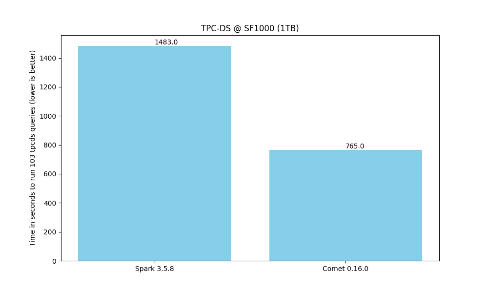

Here is a breakdown showing relative speedup for each TPC-DS query.

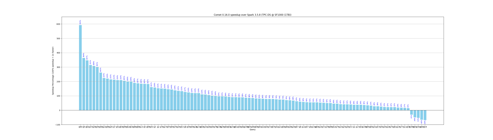

<a id="comet--use-commodity-hardware"></a>

## Use Commodity Hardware

Comet leverages commodity hardware, eliminating the need for costly hardware upgrades or
specialized hardware accelerators, such as GPUs or FPGA. By maximizing the utilization of commodity hardware, Comet
ensures cost-effectiveness and scalability for your Spark deployments.

<a id="comet--spark-compatibility"></a>

## Spark Compatibility

Comet aims for 100% compatibility with all supported versions of Apache Spark, allowing you to integrate Comet into
your existing Spark deployments and workflows seamlessly. With no code changes required, you can immediately harness
the benefits of Comet’s acceleration capabilities without disrupting your Spark applications.

The project strives to keep feature parity with Apache Spark, that is, users should expect the same behavior (w.r.t
features, configurations, query results, etc) with Comet turned on or turned off in their Spark jobs. In addition, the Comet extension automatically detects unsupported features and falls back to the Spark engine.

<a id="comet--tight-integration-with-apache-datafusion"></a>

## Tight Integration with Apache DataFusion

Comet tightly integrates with the core Apache DataFusion project, leveraging its powerful execution engine. With
seamless interoperability between Comet and DataFusion, you can achieve optimal performance and efficiency in your
Spark workloads.

<a id="comet--architecture"></a>

## Architecture

The following diagram provides an overview of Comet’s architecture.

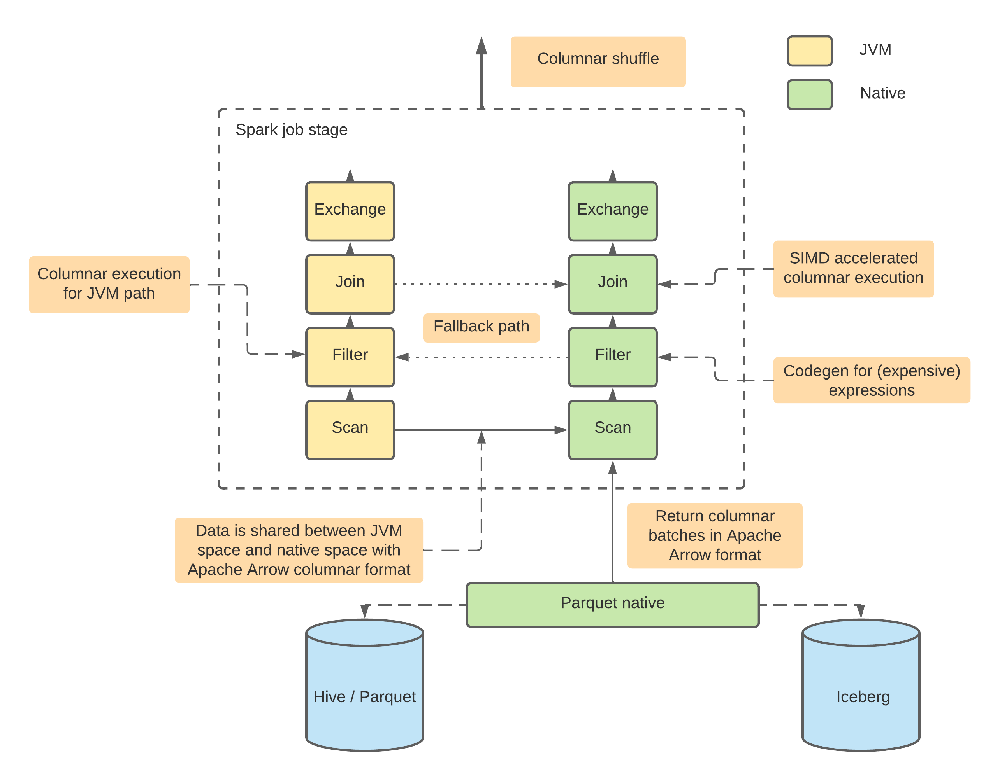

The following diagram shows how Comet integrates with Apache Spark.


<a id="comet--active-community"></a>

## Active Community

Comet boasts a vibrant and active community of developers, contributors, and users dedicated to advancing the
capabilities of Apache DataFusion and accelerating the performance of Apache Spark.

<a id="comet--getting-started"></a>

## Getting Started

To get started with Apache DataFusion Comet, follow the
[installation instructions](https://datafusion.apache.org/comet/user-guide/installation.html). Join the
[DataFusion Slack and Discord channels](#contributor-guide-communication) to connect
with other users, ask questions, and share your experiences with Comet.

<a id="comet--contributing"></a>

## Contributing

We welcome contributions from the community to help improve and enhance Apache DataFusion Comet. Whether it’s fixing
bugs, adding new features, writing documentation, or optimizing performance, your contributions are invaluable in
shaping the future of Comet. Check out our
[contributor guide](#comet-contributor-guide-contributing) to get started.

---

<a id="python"></a>

<!-- source_url: https://datafusion.apache.org/python/ -->

<!-- page_index: 108 -->

# DataFusion in Python ¶

On this page

<a id="python--datafusion-in-python"></a>

# DataFusion in Python

This is a Python library that binds to [Apache Arrow](https://arrow.apache.org/) in-memory query engine [DataFusion](https://github.com/apache/datafusion).

Like pyspark, it allows you to build a plan through SQL or a DataFrame API against in-memory data, parquet or CSV files, run it in a multi-threaded environment, and obtain the result back in Python.

It also allows you to use UDFs and UDAFs for complex operations.

The major advantage of this library over other execution engines is that this library achieves zero-copy between Python and its execution engine: there is no cost in using UDFs, UDAFs, and collecting the results to Python apart from having to lock the GIL when running those operations.

Its query engine, DataFusion, is written in [Rust](https://www.rust-lang.org), which makes strong assumptions about thread safety and lack of memory leaks.

Technically, zero-copy is achieved via the [c data interface](https://arrow.apache.org/docs/format/CDataInterface.html).

<a id="python--install"></a>

## Install

```
pip install datafusion
```

<a id="python--example"></a>

## Example

```
In [1 ]:from
datafusion
import SessionContext In [2 ]:ctx =SessionContext () In [3 ]:df =ctx.read_csv ("pokemon.csv") In [4 ]:df.show () DataFrame () +----+---------------------------+--------+--------+-------+----+--------+---------+---------+---------+-------+------------+-----------+ | #  | Name                      | Type 1 | Type 2 | Total | HP | Attack | Defense | Sp. Atk | Sp. Def | Speed | Generation | Legendary | +----+---------------------------+--------+--------+-------+----+--------+---------+---------+---------+-------+------------+-----------+ | 1 | Bulbasaur | Grass | Poison | 318 | 45 | 49 | 49 | 65 | 65 | 45 | 1 | false | | 2 | Ivysaur | Grass | Poison | 405 | 60 | 62 | 63 | 80 | 80 | 60 | 1 | false | | 3 | Venusaur | Grass | Poison | 525 | 80 | 82 | 83 | 100 | 100 | 80 | 1 | false | | 3 | VenusaurMega Venusaur | Grass | Poison | 625 | 80 | 100 | 123 | 122 | 120 | 80 | 1 | false | | 4 | Charmander | Fire | | 309 | 39 | 52 | 43 | 60 | 50 | 65 | 1 | false | | 5 | Charmeleon | Fire | | 405 | 58 | 64 | 58 | 80 | 65 | 80 | 1 | false | | 6 | Charizard | Fire | Flying | 534 | 78 | 84 | 78 | 109 | 85 | 100 | 1 | false | | 6 | CharizardMega Charizard X | Fire | Dragon | 634 | 78 | 130 | 111 | 130 | 85 | 100 | 1 | false | | 6 | CharizardMega Charizard Y | Fire | Flying | 634 | 78 | 104 | 78 | 159 | 115 | 100 | 1 | false | | 7 | Squirtle | Water | | 314 | 44 | 48 | 65 | 50 | 64 | 43 | 1 | false | | 8 | Wartortle | Water | | 405 | 59 | 63 | 80 | 65 | 80 | 58 | 1 | false | | 9 | Blastoise | Water | | 530 | 79 | 83 | 100 | 85 | 105 | 78 | 1 | false | | 9 | BlastoiseMega Blastoise | Water | | 630 | 79 | 103 | 120 | 135 | 115 | 78 | 1 | false | | 10 | Caterpie | Bug | | 195 | 45 | 30 | 35 | 20 | 20 | 45 | 1 | false | | 11 | Metapod | Bug | | 205 | 50 | 20 | 55 | 25 | 25 | 30 | 1 | false | | 12 | Butterfree | Bug | Flying | 395 | 60 | 45 | 50 | 90 | 80 | 70 | 1 | false | | 13 | Weedle | Bug | Poison | 195 | 40 | 35 | 30 | 20 | 20 | 50 | 1 | false | | 14 | Kakuna | Bug | Poison | 205 | 45 | 25 | 50 | 25 | 25 | 35 | 1 | false | | 15 | Beedrill | Bug | Poison | 395 | 65 | 90 | 40 | 45 | 80 | 75 | 1 | false | | 15 | BeedrillMega Beedrill | Bug | Poison | 495 | 65 | 150 | 40 | 15 | 80 | 145 | 1 | false | +----+---------------------------+--------+--------+-------+----+--------+---------+---------+---------+-------+------------+-----------+
```

[next

Introduction](#python-user-guide-introduction "next page")

---

<a id="python-autoapi"></a>

<!-- source_url: https://datafusion.apache.org/python/autoapi/index.html -->

<!-- page_index: 109 -->

<a id="python-autoapi--api-reference"></a>

# API Reference

This page contains auto-generated API reference documentation [[1]](#python-autoapi--f1).

[[1](#python-autoapi--id1)]

Created with [sphinx-autoapi](https://github.com/readthedocs/sphinx-autoapi)

[previous

Python Extensions](#python-contributor-guide-ffi "previous page")
[next

datafusion](#python-autoapi-datafusion "next page")

---

<a id="python-autoapi-datafusion"></a>

<!-- source_url: https://datafusion.apache.org/python/autoapi/datafusion/index.html -->

<!-- page_index: 110 -->

# datafusion ¶

On this page

- [Submodules](#python-autoapi-datafusion--submodules)
- [Attributes](#python-autoapi-datafusion--attributes)
- [Classes](#python-autoapi-datafusion--classes)
- [Functions](#python-autoapi-datafusion--functions)
- [Package Contents](#python-autoapi-datafusion--package-contents)
  - [`Catalog`](#python-autoapi-datafusion--datafusion.catalog)
    - [`Catalog.__repr__()`](#python-autoapi-datafusion--datafusion.catalog.__repr__)
    - [`Catalog.deregister_schema()`](#python-autoapi-datafusion--datafusion.catalog.deregister_schema)
    - [`Catalog.memory_catalog()`](#python-autoapi-datafusion--datafusion.catalog.memory_catalog)
    - [`Catalog.names()`](#python-autoapi-datafusion--datafusion.catalog.names)
    - [`Catalog.register_schema()`](#python-autoapi-datafusion--datafusion.catalog.register_schema)
    - [`Catalog.schema()`](#python-autoapi-datafusion--datafusion.catalog.schema)
    - [`Catalog.schema_names()`](#python-autoapi-datafusion--datafusion.catalog.schema_names)
    - [`Catalog.catalog`](#python-autoapi-datafusion--datafusion.catalog.catalog)
  - [`CsvReadOptions`](#python-autoapi-datafusion--datafusion.csvreadoptions)
    - [`CsvReadOptions.to_inner()`](#python-autoapi-datafusion--datafusion.csvreadoptions.to_inner)
    - [`CsvReadOptions.with_comment()`](#python-autoapi-datafusion--datafusion.csvreadoptions.with_comment)
    - [`CsvReadOptions.with_delimiter()`](#python-autoapi-datafusion--datafusion.csvreadoptions.with_delimiter)
    - [`CsvReadOptions.with_escape()`](#python-autoapi-datafusion--datafusion.csvreadoptions.with_escape)
    - [`CsvReadOptions.with_file_compression_type()`](#python-autoapi-datafusion--datafusion.csvreadoptions.with_file_compression_type)
    - [`CsvReadOptions.with_file_extension()`](#python-autoapi-datafusion--datafusion.csvreadoptions.with_file_extension)
    - [`CsvReadOptions.with_file_sort_order()`](#python-autoapi-datafusion--datafusion.csvreadoptions.with_file_sort_order)
    - [`CsvReadOptions.with_has_header()`](#python-autoapi-datafusion--datafusion.csvreadoptions.with_has_header)
    - [`CsvReadOptions.with_newlines_in_values()`](#python-autoapi-datafusion--datafusion.csvreadoptions.with_newlines_in_values)
    - [`CsvReadOptions.with_null_regex()`](#python-autoapi-datafusion--datafusion.csvreadoptions.with_null_regex)
    - [`CsvReadOptions.with_quote()`](#python-autoapi-datafusion--datafusion.csvreadoptions.with_quote)
    - [`CsvReadOptions.with_schema()`](#python-autoapi-datafusion--datafusion.csvreadoptions.with_schema)
    - [`CsvReadOptions.with_schema_infer_max_records()`](#python-autoapi-datafusion--datafusion.csvreadoptions.with_schema_infer_max_records)
    - [`CsvReadOptions.with_table_partition_cols()`](#python-autoapi-datafusion--datafusion.csvreadoptions.with_table_partition_cols)
    - [`CsvReadOptions.with_terminator()`](#python-autoapi-datafusion--datafusion.csvreadoptions.with_terminator)
    - [`CsvReadOptions.with_truncated_rows()`](#python-autoapi-datafusion--datafusion.csvreadoptions.with_truncated_rows)
    - [`CsvReadOptions.comment`](#python-autoapi-datafusion--datafusion.csvreadoptions.comment)
    - [`CsvReadOptions.delimiter`](#python-autoapi-datafusion--datafusion.csvreadoptions.delimiter)
    - [`CsvReadOptions.escape`](#python-autoapi-datafusion--datafusion.csvreadoptions.escape)
    - [`CsvReadOptions.file_compression_type`](#python-autoapi-datafusion--datafusion.csvreadoptions.file_compression_type)
    - [`CsvReadOptions.file_extension`](#python-autoapi-datafusion--datafusion.csvreadoptions.file_extension)
    - [`CsvReadOptions.file_sort_order`](#python-autoapi-datafusion--datafusion.csvreadoptions.file_sort_order)
    - [`CsvReadOptions.has_header`](#python-autoapi-datafusion--datafusion.csvreadoptions.has_header)
    - [`CsvReadOptions.newlines_in_values`](#python-autoapi-datafusion--datafusion.csvreadoptions.newlines_in_values)
    - [`CsvReadOptions.null_regex`](#python-autoapi-datafusion--datafusion.csvreadoptions.null_regex)
    - [`CsvReadOptions.quote`](#python-autoapi-datafusion--datafusion.csvreadoptions.quote)
    - [`CsvReadOptions.schema`](#python-autoapi-datafusion--datafusion.csvreadoptions.schema)
    - [`CsvReadOptions.schema_infer_max_records`](#python-autoapi-datafusion--datafusion.csvreadoptions.schema_infer_max_records)
    - [`CsvReadOptions.table_partition_cols`](#python-autoapi-datafusion--datafusion.csvreadoptions.table_partition_cols)
    - [`CsvReadOptions.terminator`](#python-autoapi-datafusion--datafusion.csvreadoptions.terminator)
    - [`CsvReadOptions.truncated_rows`](#python-autoapi-datafusion--datafusion.csvreadoptions.truncated_rows)
  - [`DataFrameWriteOptions`](#python-autoapi-datafusion--datafusion.dataframewriteoptions)
    - [`DataFrameWriteOptions._raw_write_options`](#python-autoapi-datafusion--datafusion.dataframewriteoptions._raw_write_options)
  - [`ExecutionPlan`](#python-autoapi-datafusion--datafusion.executionplan)
    - [`ExecutionPlan.__repr__()`](#python-autoapi-datafusion--datafusion.executionplan.__repr__)
    - [`ExecutionPlan.children()`](#python-autoapi-datafusion--datafusion.executionplan.children)
    - [`ExecutionPlan.display()`](#python-autoapi-datafusion--datafusion.executionplan.display)
    - [`ExecutionPlan.display_indent()`](#python-autoapi-datafusion--datafusion.executionplan.display_indent)
    - [`ExecutionPlan.from_proto()`](#python-autoapi-datafusion--datafusion.executionplan.from_proto)
    - [`ExecutionPlan.to_proto()`](#python-autoapi-datafusion--datafusion.executionplan.to_proto)
    - [`ExecutionPlan._raw_plan`](#python-autoapi-datafusion--datafusion.executionplan._raw_plan)
    - [`ExecutionPlan.partition_count`](#python-autoapi-datafusion--datafusion.executionplan.partition_count)
  - [`ExplainFormat`](#python-autoapi-datafusion--datafusion.explainformat)
    - [`ExplainFormat.GRAPHVIZ`](#python-autoapi-datafusion--datafusion.explainformat.graphviz)
    - [`ExplainFormat.INDENT`](#python-autoapi-datafusion--datafusion.explainformat.indent)
    - [`ExplainFormat.PGJSON`](#python-autoapi-datafusion--datafusion.explainformat.pgjson)
    - [`ExplainFormat.TREE`](#python-autoapi-datafusion--datafusion.explainformat.tree)
  - [`Expr`](#python-autoapi-datafusion--datafusion.expr)
    - [`Expr.__add__()`](#python-autoapi-datafusion--datafusion.expr.__add__)
    - [`Expr.__and__()`](#python-autoapi-datafusion--datafusion.expr.__and__)
    - [`Expr.__eq__()`](#python-autoapi-datafusion--datafusion.expr.__eq__)
    - [`Expr.__ge__()`](#python-autoapi-datafusion--datafusion.expr.__ge__)
    - [`Expr.__getitem__()`](#python-autoapi-datafusion--datafusion.expr.__getitem__)
    - [`Expr.__gt__()`](#python-autoapi-datafusion--datafusion.expr.__gt__)
    - [`Expr.__invert__()`](#python-autoapi-datafusion--datafusion.expr.__invert__)
    - [`Expr.__le__()`](#python-autoapi-datafusion--datafusion.expr.__le__)
    - [`Expr.__lt__()`](#python-autoapi-datafusion--datafusion.expr.__lt__)
    - [`Expr.__mod__()`](#python-autoapi-datafusion--datafusion.expr.__mod__)
    - [`Expr.__mul__()`](#python-autoapi-datafusion--datafusion.expr.__mul__)
    - [`Expr.__ne__()`](#python-autoapi-datafusion--datafusion.expr.__ne__)
    - [`Expr.__or__()`](#python-autoapi-datafusion--datafusion.expr.__or__)
    - [`Expr.__repr__()`](#python-autoapi-datafusion--datafusion.expr.__repr__)
    - [`Expr.__richcmp__()`](#python-autoapi-datafusion--datafusion.expr.__richcmp__)
    - [`Expr.__sub__()`](#python-autoapi-datafusion--datafusion.expr.__sub__)
    - [`Expr.__truediv__()`](#python-autoapi-datafusion--datafusion.expr.__truediv__)
    - [`Expr.abs()`](#python-autoapi-datafusion--datafusion.expr.abs)
    - [`Expr.acos()`](#python-autoapi-datafusion--datafusion.expr.acos)
    - [`Expr.acosh()`](#python-autoapi-datafusion--datafusion.expr.acosh)
    - [`Expr.alias()`](#python-autoapi-datafusion--datafusion.expr.alias)
    - [`Expr.array_dims()`](#python-autoapi-datafusion--datafusion.expr.array_dims)
    - [`Expr.array_distinct()`](#python-autoapi-datafusion--datafusion.expr.array_distinct)
    - [`Expr.array_empty()`](#python-autoapi-datafusion--datafusion.expr.array_empty)
    - [`Expr.array_length()`](#python-autoapi-datafusion--datafusion.expr.array_length)
    - [`Expr.array_ndims()`](#python-autoapi-datafusion--datafusion.expr.array_ndims)
    - [`Expr.array_pop_back()`](#python-autoapi-datafusion--datafusion.expr.array_pop_back)
    - [`Expr.array_pop_front()`](#python-autoapi-datafusion--datafusion.expr.array_pop_front)
    - [`Expr.arrow_typeof()`](#python-autoapi-datafusion--datafusion.expr.arrow_typeof)
    - [`Expr.ascii()`](#python-autoapi-datafusion--datafusion.expr.ascii)
    - [`Expr.asin()`](#python-autoapi-datafusion--datafusion.expr.asin)
    - [`Expr.asinh()`](#python-autoapi-datafusion--datafusion.expr.asinh)
    - [`Expr.atan()`](#python-autoapi-datafusion--datafusion.expr.atan)
    - [`Expr.atanh()`](#python-autoapi-datafusion--datafusion.expr.atanh)
    - [`Expr.between()`](#python-autoapi-datafusion--datafusion.expr.between)
    - [`Expr.bit_length()`](#python-autoapi-datafusion--datafusion.expr.bit_length)
    - [`Expr.btrim()`](#python-autoapi-datafusion--datafusion.expr.btrim)
    - [`Expr.canonical_name()`](#python-autoapi-datafusion--datafusion.expr.canonical_name)
    - [`Expr.cardinality()`](#python-autoapi-datafusion--datafusion.expr.cardinality)
    - [`Expr.cast()`](#python-autoapi-datafusion--datafusion.expr.cast)
    - [`Expr.cbrt()`](#python-autoapi-datafusion--datafusion.expr.cbrt)
    - [`Expr.ceil()`](#python-autoapi-datafusion--datafusion.expr.ceil)
    - [`Expr.char_length()`](#python-autoapi-datafusion--datafusion.expr.char_length)
    - [`Expr.character_length()`](#python-autoapi-datafusion--datafusion.expr.character_length)
    - [`Expr.chr()`](#python-autoapi-datafusion--datafusion.expr.chr)
    - [`Expr.column()`](#python-autoapi-datafusion--datafusion.expr.column)
    - [`Expr.column_name()`](#python-autoapi-datafusion--datafusion.expr.column_name)
    - [`Expr.cos()`](#python-autoapi-datafusion--datafusion.expr.cos)
    - [`Expr.cosh()`](#python-autoapi-datafusion--datafusion.expr.cosh)
    - [`Expr.cot()`](#python-autoapi-datafusion--datafusion.expr.cot)
    - [`Expr.degrees()`](#python-autoapi-datafusion--datafusion.expr.degrees)
    - [`Expr.distinct()`](#python-autoapi-datafusion--datafusion.expr.distinct)
    - [`Expr.empty()`](#python-autoapi-datafusion--datafusion.expr.empty)
    - [`Expr.exp()`](#python-autoapi-datafusion--datafusion.expr.exp)
    - [`Expr.factorial()`](#python-autoapi-datafusion--datafusion.expr.factorial)
    - [`Expr.fill_nan()`](#python-autoapi-datafusion--datafusion.expr.fill_nan)
    - [`Expr.fill_null()`](#python-autoapi-datafusion--datafusion.expr.fill_null)
    - [`Expr.filter()`](#python-autoapi-datafusion--datafusion.expr.filter)
    - [`Expr.flatten()`](#python-autoapi-datafusion--datafusion.expr.flatten)
    - [`Expr.floor()`](#python-autoapi-datafusion--datafusion.expr.floor)
    - [`Expr.from_unixtime()`](#python-autoapi-datafusion--datafusion.expr.from_unixtime)
    - [`Expr.initcap()`](#python-autoapi-datafusion--datafusion.expr.initcap)
    - [`Expr.is_not_null()`](#python-autoapi-datafusion--datafusion.expr.is_not_null)
    - [`Expr.is_null()`](#python-autoapi-datafusion--datafusion.expr.is_null)
    - [`Expr.isnan()`](#python-autoapi-datafusion--datafusion.expr.isnan)
    - [`Expr.iszero()`](#python-autoapi-datafusion--datafusion.expr.iszero)
    - [`Expr.length()`](#python-autoapi-datafusion--datafusion.expr.length)
    - [`Expr.list_dims()`](#python-autoapi-datafusion--datafusion.expr.list_dims)
    - [`Expr.list_distinct()`](#python-autoapi-datafusion--datafusion.expr.list_distinct)
    - [`Expr.list_length()`](#python-autoapi-datafusion--datafusion.expr.list_length)
    - [`Expr.list_ndims()`](#python-autoapi-datafusion--datafusion.expr.list_ndims)
    - [`Expr.literal()`](#python-autoapi-datafusion--datafusion.expr.literal)
    - [`Expr.literal_with_metadata()`](#python-autoapi-datafusion--datafusion.expr.literal_with_metadata)
    - [`Expr.ln()`](#python-autoapi-datafusion--datafusion.expr.ln)
    - [`Expr.log10()`](#python-autoapi-datafusion--datafusion.expr.log10)
    - [`Expr.log2()`](#python-autoapi-datafusion--datafusion.expr.log2)
    - [`Expr.lower()`](#python-autoapi-datafusion--datafusion.expr.lower)
    - [`Expr.ltrim()`](#python-autoapi-datafusion--datafusion.expr.ltrim)
    - [`Expr.md5()`](#python-autoapi-datafusion--datafusion.expr.md5)
    - [`Expr.null_treatment()`](#python-autoapi-datafusion--datafusion.expr.null_treatment)
    - [`Expr.octet_length()`](#python-autoapi-datafusion--datafusion.expr.octet_length)
    - [`Expr.order_by()`](#python-autoapi-datafusion--datafusion.expr.order_by)
    - [`Expr.over()`](#python-autoapi-datafusion--datafusion.expr.over)
    - [`Expr.partition_by()`](#python-autoapi-datafusion--datafusion.expr.partition_by)
    - [`Expr.python_value()`](#python-autoapi-datafusion--datafusion.expr.python_value)
    - [`Expr.radians()`](#python-autoapi-datafusion--datafusion.expr.radians)
    - [`Expr.reverse()`](#python-autoapi-datafusion--datafusion.expr.reverse)
    - [`Expr.rex_call_operands()`](#python-autoapi-datafusion--datafusion.expr.rex_call_operands)
    - [`Expr.rex_call_operator()`](#python-autoapi-datafusion--datafusion.expr.rex_call_operator)
    - [`Expr.rex_type()`](#python-autoapi-datafusion--datafusion.expr.rex_type)
    - [`Expr.rtrim()`](#python-autoapi-datafusion--datafusion.expr.rtrim)
    - [`Expr.schema_name()`](#python-autoapi-datafusion--datafusion.expr.schema_name)
    - [`Expr.sha224()`](#python-autoapi-datafusion--datafusion.expr.sha224)
    - [`Expr.sha256()`](#python-autoapi-datafusion--datafusion.expr.sha256)
    - [`Expr.sha384()`](#python-autoapi-datafusion--datafusion.expr.sha384)
    - [`Expr.sha512()`](#python-autoapi-datafusion--datafusion.expr.sha512)
    - [`Expr.signum()`](#python-autoapi-datafusion--datafusion.expr.signum)
    - [`Expr.sin()`](#python-autoapi-datafusion--datafusion.expr.sin)
    - [`Expr.sinh()`](#python-autoapi-datafusion--datafusion.expr.sinh)
    - [`Expr.sort()`](#python-autoapi-datafusion--datafusion.expr.sort)
    - [`Expr.sqrt()`](#python-autoapi-datafusion--datafusion.expr.sqrt)
    - [`Expr.string_literal()`](#python-autoapi-datafusion--datafusion.expr.string_literal)
    - [`Expr.tan()`](#python-autoapi-datafusion--datafusion.expr.tan)
    - [`Expr.tanh()`](#python-autoapi-datafusion--datafusion.expr.tanh)
    - [`Expr.to_hex()`](#python-autoapi-datafusion--datafusion.expr.to_hex)
    - [`Expr.to_variant()`](#python-autoapi-datafusion--datafusion.expr.to_variant)
    - [`Expr.trim()`](#python-autoapi-datafusion--datafusion.expr.trim)
    - [`Expr.types()`](#python-autoapi-datafusion--datafusion.expr.types)
    - [`Expr.upper()`](#python-autoapi-datafusion--datafusion.expr.upper)
    - [`Expr.variant_name()`](#python-autoapi-datafusion--datafusion.expr.variant_name)
    - [`Expr.window_frame()`](#python-autoapi-datafusion--datafusion.expr.window_frame)
    - [`Expr.__radd__`](#python-autoapi-datafusion--datafusion.expr.__radd__)
    - [`Expr.__rand__`](#python-autoapi-datafusion--datafusion.expr.__rand__)
    - [`Expr.__rmod__`](#python-autoapi-datafusion--datafusion.expr.__rmod__)
    - [`Expr.__rmul__`](#python-autoapi-datafusion--datafusion.expr.__rmul__)
    - [`Expr.__ror__`](#python-autoapi-datafusion--datafusion.expr.__ror__)
    - [`Expr.__rsub__`](#python-autoapi-datafusion--datafusion.expr.__rsub__)
    - [`Expr.__rtruediv__`](#python-autoapi-datafusion--datafusion.expr.__rtruediv__)
    - [`Expr._to_pyarrow_types`](#python-autoapi-datafusion--datafusion.expr._to_pyarrow_types)
    - [`Expr.expr`](#python-autoapi-datafusion--datafusion.expr.expr)
  - [`InsertOp`](#python-autoapi-datafusion--datafusion.insertop)
    - [`InsertOp.APPEND`](#python-autoapi-datafusion--datafusion.insertop.append)
    - [`InsertOp.OVERWRITE`](#python-autoapi-datafusion--datafusion.insertop.overwrite)
    - [`InsertOp.REPLACE`](#python-autoapi-datafusion--datafusion.insertop.replace)
  - [`LogicalPlan`](#python-autoapi-datafusion--datafusion.logicalplan)
    - [`LogicalPlan.__eq__()`](#python-autoapi-datafusion--datafusion.logicalplan.__eq__)
    - [`LogicalPlan.__repr__()`](#python-autoapi-datafusion--datafusion.logicalplan.__repr__)
    - [`LogicalPlan.display()`](#python-autoapi-datafusion--datafusion.logicalplan.display)
    - [`LogicalPlan.display_graphviz()`](#python-autoapi-datafusion--datafusion.logicalplan.display_graphviz)
    - [`LogicalPlan.display_indent()`](#python-autoapi-datafusion--datafusion.logicalplan.display_indent)
    - [`LogicalPlan.display_indent_schema()`](#python-autoapi-datafusion--datafusion.logicalplan.display_indent_schema)
    - [`LogicalPlan.from_proto()`](#python-autoapi-datafusion--datafusion.logicalplan.from_proto)
    - [`LogicalPlan.inputs()`](#python-autoapi-datafusion--datafusion.logicalplan.inputs)
    - [`LogicalPlan.to_proto()`](#python-autoapi-datafusion--datafusion.logicalplan.to_proto)
    - [`LogicalPlan.to_variant()`](#python-autoapi-datafusion--datafusion.logicalplan.to_variant)
    - [`LogicalPlan._raw_plan`](#python-autoapi-datafusion--datafusion.logicalplan._raw_plan)
  - [`ParquetColumnOptions`](#python-autoapi-datafusion--datafusion.parquetcolumnoptions)
    - [`ParquetColumnOptions.bloom_filter_enabled`](#python-autoapi-datafusion--datafusion.parquetcolumnoptions.bloom_filter_enabled)
    - [`ParquetColumnOptions.bloom_filter_fpp`](#python-autoapi-datafusion--datafusion.parquetcolumnoptions.bloom_filter_fpp)
    - [`ParquetColumnOptions.bloom_filter_ndv`](#python-autoapi-datafusion--datafusion.parquetcolumnoptions.bloom_filter_ndv)
    - [`ParquetColumnOptions.compression`](#python-autoapi-datafusion--datafusion.parquetcolumnoptions.compression)
    - [`ParquetColumnOptions.dictionary_enabled`](#python-autoapi-datafusion--datafusion.parquetcolumnoptions.dictionary_enabled)
    - [`ParquetColumnOptions.encoding`](#python-autoapi-datafusion--datafusion.parquetcolumnoptions.encoding)
    - [`ParquetColumnOptions.statistics_enabled`](#python-autoapi-datafusion--datafusion.parquetcolumnoptions.statistics_enabled)
  - [`ParquetWriterOptions`](#python-autoapi-datafusion--datafusion.parquetwriteroptions)
    - [`ParquetWriterOptions.allow_single_file_parallelism`](#python-autoapi-datafusion--datafusion.parquetwriteroptions.allow_single_file_parallelism)
    - [`ParquetWriterOptions.bloom_filter_fpp`](#python-autoapi-datafusion--datafusion.parquetwriteroptions.bloom_filter_fpp)
    - [`ParquetWriterOptions.bloom_filter_ndv`](#python-autoapi-datafusion--datafusion.parquetwriteroptions.bloom_filter_ndv)
    - [`ParquetWriterOptions.bloom_filter_on_write`](#python-autoapi-datafusion--datafusion.parquetwriteroptions.bloom_filter_on_write)
    - [`ParquetWriterOptions.column_index_truncate_length`](#python-autoapi-datafusion--datafusion.parquetwriteroptions.column_index_truncate_length)
    - [`ParquetWriterOptions.column_specific_options`](#python-autoapi-datafusion--datafusion.parquetwriteroptions.column_specific_options)
    - [`ParquetWriterOptions.created_by`](#python-autoapi-datafusion--datafusion.parquetwriteroptions.created_by)
    - [`ParquetWriterOptions.data_page_row_count_limit`](#python-autoapi-datafusion--datafusion.parquetwriteroptions.data_page_row_count_limit)
    - [`ParquetWriterOptions.data_pagesize_limit`](#python-autoapi-datafusion--datafusion.parquetwriteroptions.data_pagesize_limit)
    - [`ParquetWriterOptions.dictionary_enabled`](#python-autoapi-datafusion--datafusion.parquetwriteroptions.dictionary_enabled)
    - [`ParquetWriterOptions.dictionary_page_size_limit`](#python-autoapi-datafusion--datafusion.parquetwriteroptions.dictionary_page_size_limit)
    - [`ParquetWriterOptions.encoding`](#python-autoapi-datafusion--datafusion.parquetwriteroptions.encoding)
    - [`ParquetWriterOptions.max_row_group_size`](#python-autoapi-datafusion--datafusion.parquetwriteroptions.max_row_group_size)
    - [`ParquetWriterOptions.maximum_buffered_record_batches_per_stream`](#python-autoapi-datafusion--datafusion.parquetwriteroptions.maximum_buffered_record_batches_per_stream)
    - [`ParquetWriterOptions.maximum_parallel_row_group_writers`](#python-autoapi-datafusion--datafusion.parquetwriteroptions.maximum_parallel_row_group_writers)
    - [`ParquetWriterOptions.skip_arrow_metadata`](#python-autoapi-datafusion--datafusion.parquetwriteroptions.skip_arrow_metadata)
    - [`ParquetWriterOptions.statistics_enabled`](#python-autoapi-datafusion--datafusion.parquetwriteroptions.statistics_enabled)
    - [`ParquetWriterOptions.statistics_truncate_length`](#python-autoapi-datafusion--datafusion.parquetwriteroptions.statistics_truncate_length)
    - [`ParquetWriterOptions.write_batch_size`](#python-autoapi-datafusion--datafusion.parquetwriteroptions.write_batch_size)
    - [`ParquetWriterOptions.writer_version`](#python-autoapi-datafusion--datafusion.parquetwriteroptions.writer_version)
  - [`RecordBatch`](#python-autoapi-datafusion--datafusion.recordbatch)
    - [`RecordBatch.__arrow_c_array__()`](#python-autoapi-datafusion--datafusion.recordbatch.__arrow_c_array__)
    - [`RecordBatch.to_pyarrow()`](#python-autoapi-datafusion--datafusion.recordbatch.to_pyarrow)
    - [`RecordBatch.record_batch`](#python-autoapi-datafusion--datafusion.recordbatch.record_batch)
  - [`RecordBatchStream`](#python-autoapi-datafusion--datafusion.recordbatchstream)
    - [`RecordBatchStream.__aiter__()`](#python-autoapi-datafusion--datafusion.recordbatchstream.__aiter__)
    - [`RecordBatchStream.__anext__()`](#python-autoapi-datafusion--datafusion.recordbatchstream.__anext__)
    - [`RecordBatchStream.__iter__()`](#python-autoapi-datafusion--datafusion.recordbatchstream.__iter__)
    - [`RecordBatchStream.__next__()`](#python-autoapi-datafusion--datafusion.recordbatchstream.__next__)
    - [`RecordBatchStream.next()`](#python-autoapi-datafusion--datafusion.recordbatchstream.next)
    - [`RecordBatchStream.rbs`](#python-autoapi-datafusion--datafusion.recordbatchstream.rbs)
  - [`RuntimeEnvBuilder`](#python-autoapi-datafusion--datafusion.runtimeenvbuilder)
    - [`RuntimeEnvBuilder.with_disk_manager_disabled()`](#python-autoapi-datafusion--datafusion.runtimeenvbuilder.with_disk_manager_disabled)
    - [`RuntimeEnvBuilder.with_disk_manager_os()`](#python-autoapi-datafusion--datafusion.runtimeenvbuilder.with_disk_manager_os)
    - [`RuntimeEnvBuilder.with_disk_manager_specified()`](#python-autoapi-datafusion--datafusion.runtimeenvbuilder.with_disk_manager_specified)
    - [`RuntimeEnvBuilder.with_fair_spill_pool()`](#python-autoapi-datafusion--datafusion.runtimeenvbuilder.with_fair_spill_pool)
    - [`RuntimeEnvBuilder.with_greedy_memory_pool()`](#python-autoapi-datafusion--datafusion.runtimeenvbuilder.with_greedy_memory_pool)
    - [`RuntimeEnvBuilder.with_temp_file_path()`](#python-autoapi-datafusion--datafusion.runtimeenvbuilder.with_temp_file_path)
    - [`RuntimeEnvBuilder.with_unbounded_memory_pool()`](#python-autoapi-datafusion--datafusion.runtimeenvbuilder.with_unbounded_memory_pool)
    - [`RuntimeEnvBuilder.config_internal`](#python-autoapi-datafusion--datafusion.runtimeenvbuilder.config_internal)
  - [`SQLOptions`](#python-autoapi-datafusion--datafusion.sqloptions)
    - [`SQLOptions.with_allow_ddl()`](#python-autoapi-datafusion--datafusion.sqloptions.with_allow_ddl)
    - [`SQLOptions.with_allow_dml()`](#python-autoapi-datafusion--datafusion.sqloptions.with_allow_dml)
    - [`SQLOptions.with_allow_statements()`](#python-autoapi-datafusion--datafusion.sqloptions.with_allow_statements)
    - [`SQLOptions.options_internal`](#python-autoapi-datafusion--datafusion.sqloptions.options_internal)
  - [`SessionConfig`](#python-autoapi-datafusion--datafusion.sessionconfig)
    - [`SessionConfig.set()`](#python-autoapi-datafusion--datafusion.sessionconfig.set)
    - [`SessionConfig.with_batch_size()`](#python-autoapi-datafusion--datafusion.sessionconfig.with_batch_size)
    - [`SessionConfig.with_create_default_catalog_and_schema()`](#python-autoapi-datafusion--datafusion.sessionconfig.with_create_default_catalog_and_schema)
    - [`SessionConfig.with_default_catalog_and_schema()`](#python-autoapi-datafusion--datafusion.sessionconfig.with_default_catalog_and_schema)
    - [`SessionConfig.with_extension()`](#python-autoapi-datafusion--datafusion.sessionconfig.with_extension)
    - [`SessionConfig.with_information_schema()`](#python-autoapi-datafusion--datafusion.sessionconfig.with_information_schema)
    - [`SessionConfig.with_parquet_pruning()`](#python-autoapi-datafusion--datafusion.sessionconfig.with_parquet_pruning)
    - [`SessionConfig.with_repartition_aggregations()`](#python-autoapi-datafusion--datafusion.sessionconfig.with_repartition_aggregations)
    - [`SessionConfig.with_repartition_file_min_size()`](#python-autoapi-datafusion--datafusion.sessionconfig.with_repartition_file_min_size)
    - [`SessionConfig.with_repartition_file_scans()`](#python-autoapi-datafusion--datafusion.sessionconfig.with_repartition_file_scans)
    - [`SessionConfig.with_repartition_joins()`](#python-autoapi-datafusion--datafusion.sessionconfig.with_repartition_joins)
    - [`SessionConfig.with_repartition_sorts()`](#python-autoapi-datafusion--datafusion.sessionconfig.with_repartition_sorts)
    - [`SessionConfig.with_repartition_windows()`](#python-autoapi-datafusion--datafusion.sessionconfig.with_repartition_windows)
    - [`SessionConfig.with_target_partitions()`](#python-autoapi-datafusion--datafusion.sessionconfig.with_target_partitions)
    - [`SessionConfig.config_internal`](#python-autoapi-datafusion--datafusion.sessionconfig.config_internal)
  - [`Table`](#python-autoapi-datafusion--datafusion.table)
    - [`Table.__repr__()`](#python-autoapi-datafusion--datafusion.table.__repr__)
    - [`Table.from_dataset()`](#python-autoapi-datafusion--datafusion.table.from_dataset)
    - [`Table.__slots__`](#python-autoapi-datafusion--datafusion.table.__slots__)
    - [`Table._inner`](#python-autoapi-datafusion--datafusion.table._inner)
    - [`Table.kind`](#python-autoapi-datafusion--datafusion.table.kind)
    - [`Table.schema`](#python-autoapi-datafusion--datafusion.table.schema)
  - [`WindowFrame`](#python-autoapi-datafusion--datafusion.windowframe)
    - [`WindowFrame.__repr__()`](#python-autoapi-datafusion--datafusion.windowframe.__repr__)
    - [`WindowFrame.get_frame_units()`](#python-autoapi-datafusion--datafusion.windowframe.get_frame_units)
    - [`WindowFrame.get_lower_bound()`](#python-autoapi-datafusion--datafusion.windowframe.get_lower_bound)
    - [`WindowFrame.get_upper_bound()`](#python-autoapi-datafusion--datafusion.windowframe.get_upper_bound)
    - [`WindowFrame.window_frame`](#python-autoapi-datafusion--datafusion.windowframe.window_frame)
  - [`configure_formatter()`](#python-autoapi-datafusion--datafusion.configure_formatter)
  - [`lit()`](#python-autoapi-datafusion--datafusion.lit)
  - [`literal()`](#python-autoapi-datafusion--datafusion.literal)
  - [`read_avro()`](#python-autoapi-datafusion--datafusion.read_avro)
  - [`read_csv()`](#python-autoapi-datafusion--datafusion.read_csv)
  - [`read_json()`](#python-autoapi-datafusion--datafusion.read_json)
  - [`read_parquet()`](#python-autoapi-datafusion--datafusion.read_parquet)
  - [`DFSchema`](#python-autoapi-datafusion--datafusion.dfschema)
  - [`col`](#python-autoapi-datafusion--datafusion.col)
  - [`column`](#python-autoapi-datafusion--datafusion.column)

<a id="python-autoapi-datafusion--datafusion"></a>

# datafusion

DataFusion python package.

This is a Python library that binds to Apache Arrow in-memory query engine DataFusion.
See [https://datafusion.apache.org/python](#python) for more information.

<a id="python-autoapi-datafusion--submodules"></a>

## Submodules

<a id="python-autoapi-datafusion--attributes"></a>

## Attributes

<table class="autosummary longtable table autosummary">
<tbody>
<tr><td><p><a href="#python-autoapi-datafusion--datafusion.dfschema" title="datafusion.DFSchema"><code><span>DFSchema</span></code></a></p></td>
<td><p></p></td>
</tr>
<tr><td><p><a href="#python-autoapi-datafusion--datafusion.col" title="datafusion.col"><code><span>col</span></code></a></p></td>
<td><p></p></td>
</tr>
<tr><td><p><a href="#python-autoapi-datafusion--datafusion.column" title="datafusion.column"><code><span>column</span></code></a></p></td>
<td><p></p></td>
</tr>
</tbody>
</table>

<a id="python-autoapi-datafusion--classes"></a>

## Classes

| [`Catalog`](#python-autoapi-datafusion--datafusion.catalog "datafusion.Catalog") | DataFusion data catalog. |
| --- | --- |
| [`CsvReadOptions`](#python-autoapi-datafusion--datafusion.csvreadoptions "datafusion.CsvReadOptions") | Options for reading CSV files. |
| [`DataFrameWriteOptions`](#python-autoapi-datafusion--datafusion.dataframewriteoptions "datafusion.DataFrameWriteOptions") | Writer options for DataFrame. |
| [`ExecutionPlan`](#python-autoapi-datafusion--datafusion.executionplan "datafusion.ExecutionPlan") | Represent nodes in the DataFusion Physical Plan. |
| [`ExplainFormat`](#python-autoapi-datafusion--datafusion.explainformat "datafusion.ExplainFormat") | Output format for explain plans. |
| [`Expr`](#python-autoapi-datafusion--datafusion.expr "datafusion.Expr") | Expression object. |
| [`InsertOp`](#python-autoapi-datafusion--datafusion.insertop "datafusion.InsertOp") | Insert operation mode. |
| [`LogicalPlan`](#python-autoapi-datafusion--datafusion.logicalplan "datafusion.LogicalPlan") | Logical Plan. |
| [`ParquetColumnOptions`](#python-autoapi-datafusion--datafusion.parquetcolumnoptions "datafusion.ParquetColumnOptions") | Parquet options for individual columns. |
| [`ParquetWriterOptions`](#python-autoapi-datafusion--datafusion.parquetwriteroptions "datafusion.ParquetWriterOptions") | Advanced parquet writer options. |
| [`RecordBatch`](#python-autoapi-datafusion--datafusion.recordbatch "datafusion.RecordBatch") | This class is essentially a wrapper for `pa.RecordBatch`. |
| [`RecordBatchStream`](#python-autoapi-datafusion--datafusion.recordbatchstream "datafusion.RecordBatchStream") | This class represents a stream of record batches. |
| [`RuntimeEnvBuilder`](#python-autoapi-datafusion--datafusion.runtimeenvbuilder "datafusion.RuntimeEnvBuilder") | Runtime configuration options. |
| [`SQLOptions`](#python-autoapi-datafusion--datafusion.sqloptions "datafusion.SQLOptions") | Options to be used when performing SQL queries. |
| [`SessionConfig`](#python-autoapi-datafusion--datafusion.sessionconfig "datafusion.SessionConfig") | Session configuration options. |
| [`Table`](#python-autoapi-datafusion--datafusion.table "datafusion.Table") | A DataFusion table. |
| [`WindowFrame`](#python-autoapi-datafusion--datafusion.windowframe "datafusion.WindowFrame") | Defines a window frame for performing window operations. |

<a id="python-autoapi-datafusion--functions"></a>

## Functions

<table class="autosummary longtable table autosummary">
<tbody>
<tr><td><p><a href="#python-autoapi-datafusion--datafusion.configure_formatter" title="datafusion.configure_formatter"><code><span>configure_formatter</span></code></a>(→ None)</p></td>
<td><p>Configure the global DataFrame HTML formatter.</p></td>
</tr>
<tr><td><p><a href="#python-autoapi-datafusion--datafusion.lit" title="datafusion.lit"><code><span>lit</span></code></a>(→ expr.Expr)</p></td>
<td><p>Create a literal expression.</p></td>
</tr>
<tr><td><p><a href="#python-autoapi-datafusion--datafusion.literal" title="datafusion.literal"><code><span>literal</span></code></a>(→ expr.Expr)</p></td>
<td><p>Create a literal expression.</p></td>
</tr>
<tr><td><p><a href="#python-autoapi-datafusion--datafusion.read_avro" title="datafusion.read_avro"><code><span>read_avro</span></code></a>(→ datafusion.dataframe.DataFrame)</p></td>
<td><p>Create a <code><span>DataFrame</span></code> for reading Avro data source.</p></td>
</tr>
<tr><td><p><a href="#python-autoapi-datafusion--datafusion.read_csv" title="datafusion.read_csv"><code><span>read_csv</span></code></a>(→ datafusion.dataframe.DataFrame)</p></td>
<td><p>Read a CSV data source.</p></td>
</tr>
<tr><td><p><a href="#python-autoapi-datafusion--datafusion.read_json" title="datafusion.read_json"><code><span>read_json</span></code></a>(→ datafusion.dataframe.DataFrame)</p></td>
<td><p>Read a line-delimited JSON data source.</p></td>
</tr>
<tr><td><p><a href="#python-autoapi-datafusion--datafusion.read_parquet" title="datafusion.read_parquet"><code><span>read_parquet</span></code></a>(→ datafusion.dataframe.DataFrame)</p></td>
<td><p>Read a Parquet source into a <code><span>Dataframe</span></code>.</p></td>
</tr>
</tbody>
</table>

<a id="python-autoapi-datafusion--package-contents"></a>

## Package Contents

*class* datafusion.Catalog(*catalog: datafusion.\_internal.catalog.RawCatalog*)
:   DataFusion data catalog.

    This constructor is not typically called by the end user.

    \_\_repr\_\_() →
> [!NOTE]
> str

    :   Print a string representation of the catalog.

    deregister\_schema(*name: str*, *cascade: bool = True*) →
> [!NOTE]
> [Schema](#python-autoapi-datafusion-catalog--datafusion.catalog.schema "datafusion.catalog.Schema") | None

    :   Deregister a schema from this catalog.

    *static* memory\_catalog(*ctx: datafusion.SessionContext | None = None*) →
> [!NOTE]
> [Catalog](#python-autoapi-datafusion--datafusion.catalog "datafusion.Catalog")

    :   Create an in-memory catalog provider.

    names() →
> [!NOTE]
> set[str]

    :   This is an alias for schema\_names.

    register\_schema(*name: str*, *schema: [Schema](#python-autoapi-datafusion-catalog--datafusion.catalog.schema "datafusion.catalog.Schema") | [SchemaProvider](#python-autoapi-datafusion-catalog--datafusion.catalog.schemaprovider "datafusion.catalog.SchemaProvider") | SchemaProviderExportable*) →
> [!NOTE]
> [Schema](#python-autoapi-datafusion-catalog--datafusion.catalog.schema "datafusion.catalog.Schema") | None

    :   Register a schema with this catalog.

    schema(*name: str = 'public'*) →
> [!NOTE]
> [Schema](#python-autoapi-datafusion-catalog--datafusion.catalog.schema "datafusion.catalog.Schema")

    :   Returns the database with the given `name` from this catalog.

    schema\_names() →
> [!NOTE]
> set[str]

    :   Returns the list of schemas in this catalog.

    catalog

*class* datafusion.CsvReadOptions(*\**, *has\_header: bool = True*, *delimiter: str = ','*, *quote: str = '"'*, *terminator: str | None = None*, *escape: str | None = None*, *comment: str | None = None*, *newlines\_in\_values: bool = False*, *schema: pyarrow.Schema | None = None*, *schema\_infer\_max\_records: int = DEFAULT\_MAX\_INFER\_SCHEMA*, *file\_extension: str = '.csv'*, *table\_partition\_cols: list[tuple[str, pyarrow.DataType]] | None = None*, *file\_compression\_type: str = ''*, *file\_sort\_order: list[list[[datafusion.expr.SortExpr](#python-autoapi-datafusion-expr--datafusion.expr.sortexpr "datafusion.expr.SortExpr")]] | None = None*, *null\_regex: str | None = None*, *truncated\_rows: bool = False*)
:   Options for reading CSV files.

    This class provides a builder pattern for configuring CSV reading options.
    All methods starting with `with_` return `self` to allow method chaining.

    Initialize CsvReadOptions.

    Parameters:
    :   - **has\_header** – Does the CSV file have a header row? If schema inference
          is run on a file with no headers, default column names are created.
        - **delimiter** – Column delimiter character. Must be a single ASCII character.
        - **quote** – Quote character for fields containing delimiters or newlines.
          Must be a single ASCII character.
        - **terminator** – Optional line terminator character. If `None`, uses CRLF.
          Must be a single ASCII character.
        - **escape** – Optional escape character for quotes. Must be a single ASCII
          character.
        - **comment** – If specified, lines beginning with this character are ignored.
          Must be a single ASCII character.
        - **newlines\_in\_values** – Whether newlines in quoted values are supported.
          Parsing newlines in quoted values may be affected by execution
          behavior such as parallel file scanning. Setting this to `True`
          ensures that newlines in values are parsed successfully, which may
          reduce performance.
        - **schema** – Optional PyArrow schema representing the CSV files. If `None`,
          the CSV reader will try to infer it based on data in the file.
        - **schema\_infer\_max\_records** – Maximum number of rows to read from CSV files
          for schema inference if needed.
        - **file\_extension** – File extension; only files with this extension are
          selected for data input.
        - **table\_partition\_cols** – Partition columns as a list of tuples of
          (column\_name, data\_type).
        - **file\_compression\_type** – File compression type. Supported values are
          `"gzip"`, `"bz2"`, `"xz"`, `"zstd"`, or empty string for
          uncompressed.
        - **file\_sort\_order** – Optional sort order of the files as a list of sort
          expressions per file.
        - **null\_regex** – Optional regex pattern to match null values in the CSV.
        - **truncated\_rows** – Whether to allow truncated rows when parsing. By default
          this is `False` and will error if the CSV rows have different
          lengths. When set to `True`, it will allow records with less than
          the expected number of columns and fill the missing columns with
          nulls. If the record’s schema is not nullable, it will still return
          an error.

    to\_inner() →
> [!NOTE]
> datafusion.\_internal.options.CsvReadOptions

    :   Convert this object into the underlying Rust structure.

        This is intended for internal use only.

    with\_comment(*comment: str | None*) →
> [!NOTE]
> [CsvReadOptions](#python-autoapi-datafusion--datafusion.csvreadoptions "datafusion.CsvReadOptions")

    :   Configure the comment character.

    with\_delimiter(*delimiter: str*) →
> [!NOTE]
> [CsvReadOptions](#python-autoapi-datafusion--datafusion.csvreadoptions "datafusion.CsvReadOptions")

    :   Configure the column delimiter.

    with\_escape(*escape: str | None*) →
> [!NOTE]
> [CsvReadOptions](#python-autoapi-datafusion--datafusion.csvreadoptions "datafusion.CsvReadOptions")

    :   Configure the escape character.

    with\_file\_compression\_type(*file\_compression\_type: str*) →
> [!NOTE]
> [CsvReadOptions](#python-autoapi-datafusion--datafusion.csvreadoptions "datafusion.CsvReadOptions")

    :   Configure file compression type.

    with\_file\_extension(*file\_extension: str*) →
> [!NOTE]
> [CsvReadOptions](#python-autoapi-datafusion--datafusion.csvreadoptions "datafusion.CsvReadOptions")

    :   Configure the file extension filter.

    with\_file\_sort\_order(*file\_sort\_order: list[list[[datafusion.expr.SortExpr](#python-autoapi-datafusion-expr--datafusion.expr.sortexpr "datafusion.expr.SortExpr")]]*) →
> [!NOTE]
> [CsvReadOptions](#python-autoapi-datafusion--datafusion.csvreadoptions "datafusion.CsvReadOptions")

    :   Configure file sort order.

    with\_has\_header(*has\_header: bool*) →
> [!NOTE]
> [CsvReadOptions](#python-autoapi-datafusion--datafusion.csvreadoptions "datafusion.CsvReadOptions")

    :   Configure whether the CSV has a header row.

    with\_newlines\_in\_values(*newlines\_in\_values: bool*) →
> [!NOTE]
> [CsvReadOptions](#python-autoapi-datafusion--datafusion.csvreadoptions "datafusion.CsvReadOptions")

    :   Configure whether newlines in values are supported.

    with\_null\_regex(*null\_regex: str | None*) →
> [!NOTE]
> [CsvReadOptions](#python-autoapi-datafusion--datafusion.csvreadoptions "datafusion.CsvReadOptions")

    :   Configure null value regex pattern.

    with\_quote(*quote: str*) →
> [!NOTE]
> [CsvReadOptions](#python-autoapi-datafusion--datafusion.csvreadoptions "datafusion.CsvReadOptions")

    :   Configure the quote character.

    with\_schema(*schema: pyarrow.Schema | None*) →
> [!NOTE]
> [CsvReadOptions](#python-autoapi-datafusion--datafusion.csvreadoptions "datafusion.CsvReadOptions")

    :   Configure the schema.

    with\_schema\_infer\_max\_records(*schema\_infer\_max\_records: int*) →
> [!NOTE]
> [CsvReadOptions](#python-autoapi-datafusion--datafusion.csvreadoptions "datafusion.CsvReadOptions")

    :   Configure maximum records for schema inference.

    with\_table\_partition\_cols(*table\_partition\_cols: list[tuple[str, pyarrow.DataType]]*) →
> [!NOTE]
> [CsvReadOptions](#python-autoapi-datafusion--datafusion.csvreadoptions "datafusion.CsvReadOptions")

    :   Configure table partition columns.

    with\_terminator(*terminator: str | None*) →
> [!NOTE]
> [CsvReadOptions](#python-autoapi-datafusion--datafusion.csvreadoptions "datafusion.CsvReadOptions")

    :   Configure the line terminator character.

    with\_truncated\_rows(*truncated\_rows: bool*) →
> [!NOTE]
> [CsvReadOptions](#python-autoapi-datafusion--datafusion.csvreadoptions "datafusion.CsvReadOptions")

    :   Configure whether to allow truncated rows.

    comment *= None*

    delimiter *= ','*

    escape *= None*

    file\_compression\_type *= ''*

    file\_extension *= '.csv'*

    file\_sort\_order *= []*

    has\_header *= True*

    newlines\_in\_values *= False*

    null\_regex *= None*

    quote *= '"'*

    schema *= None*

    schema\_infer\_max\_records *= 1000*

    table\_partition\_cols *= []*

    terminator *= None*

    truncated\_rows *= False*

*class* datafusion.DataFrameWriteOptions(*insert\_operation: [InsertOp](#python-autoapi-datafusion--datafusion.insertop "datafusion.InsertOp") | None = None*, *single\_file\_output: bool = False*, *partition\_by: str | collections.abc.Sequence[str] | None = None*, *sort\_by: [datafusion.expr.Expr](#python-autoapi-datafusion-expr--datafusion.expr.expr "datafusion.expr.Expr") | [datafusion.expr.SortExpr](#python-autoapi-datafusion-expr--datafusion.expr.sortexpr "datafusion.expr.SortExpr") | collections.abc.Sequence[[datafusion.expr.Expr](#python-autoapi-datafusion-expr--datafusion.expr.expr "datafusion.expr.Expr")] | collections.abc.Sequence[[datafusion.expr.SortExpr](#python-autoapi-datafusion-expr--datafusion.expr.sortexpr "datafusion.expr.SortExpr")] | None = None*)
:   Writer options for DataFrame.

    There is no guarantee the table provider supports all writer options.
    See the individual implementation and documentation for details.

    Instantiate writer options for DataFrame.

    \_raw\_write\_options

*class* datafusion.ExecutionPlan(*plan: datafusion.\_internal.ExecutionPlan*)
:   Represent nodes in the DataFusion Physical Plan.

    This constructor should not be called by the end user.

    \_\_repr\_\_() →
> [!NOTE]
> str

    :   Print a string representation of the physical plan.

    children() →
> [!NOTE]
> list[[ExecutionPlan](#python-autoapi-datafusion--datafusion.executionplan "datafusion.ExecutionPlan")]

    :   Get a list of children ExecutionPlan that act as inputs to this plan.

        The returned list will be empty for leaf nodes such as scans, will contain a
        single value for unary nodes, or two values for binary nodes (such as joins).

    display() →
> [!NOTE]
> str

    :   Print the physical plan.

    display\_indent() →
> [!NOTE]
> str

    :   Print an indented form of the physical plan.

    *static* from\_proto(*ctx: [datafusion.context.SessionContext](#python-autoapi-datafusion-context--datafusion.context.sessioncontext "datafusion.context.SessionContext")*, *data: bytes*) →
> [!NOTE]
> [ExecutionPlan](#python-autoapi-datafusion--datafusion.executionplan "datafusion.ExecutionPlan")

    :   Create an ExecutionPlan from protobuf bytes.

        Tables created in memory from record batches are currently not supported.

    to\_proto() →
> [!NOTE]
> bytes

    :   Convert an ExecutionPlan into protobuf bytes.

        Tables created in memory from record batches are currently not supported.

    \_raw\_plan

    *property* partition\_count*: int*
    :   Returns the number of partitions in the physical plan.

*class* datafusion.ExplainFormat
:   Bases: `enum.Enum`

    Output format for explain plans.

    Controls how the query plan is rendered in `DataFrame.explain()`.

    GRAPHVIZ *= 'graphviz'*
    :   Graphviz DOT format for graph rendering.

    INDENT *= 'indent'*
    :   Default indented text format.

    PGJSON *= 'pgjson'*
    :   PostgreSQL-compatible JSON format for use with visualization tools.

    TREE *= 'tree'*
    :   Tree-style visual format with box-drawing characters.

*class* datafusion.Expr(*expr: datafusion.\_internal.expr.RawExpr*)
:   Expression object.

    Expressions are one of the core concepts in DataFusion. See
    [Expressions](#python-user-guide-common-operations-expressions--expressions) in the online documentation for more information.

    This constructor should not be called by the end user.

    \_\_add\_\_(*rhs: Any*) →
> [!NOTE]
> [Expr](#python-autoapi-datafusion--datafusion.expr "datafusion.Expr")

    :   Addition operator.

        Accepts either an expression or any valid PyArrow scalar literal value.

    \_\_and\_\_(*rhs: [Expr](#python-autoapi-datafusion--datafusion.expr "datafusion.Expr")*) →
> [!NOTE]
> [Expr](#python-autoapi-datafusion--datafusion.expr "datafusion.Expr")

    :   Logical AND.

    \_\_eq\_\_(*rhs: object*) →
> [!NOTE]
> [Expr](#python-autoapi-datafusion--datafusion.expr "datafusion.Expr")

    :   Equal to.

        Accepts either an expression or any valid PyArrow scalar literal value.

    \_\_ge\_\_(*rhs: Any*) →
> [!NOTE]
> [Expr](#python-autoapi-datafusion--datafusion.expr "datafusion.Expr")

    :   Greater than or equal to.

        Accepts either an expression or any valid PyArrow scalar literal value.

    \_\_getitem\_\_(*key: str | int*) →
> [!NOTE]
> [Expr](#python-autoapi-datafusion--datafusion.expr "datafusion.Expr")

    :   Retrieve sub-object.

        If `key` is a string, returns the subfield of the struct.
        If `key` is an integer, retrieves the element in the array. Note that the
        element index begins at `0`, unlike
        [`array_element()`](#python-autoapi-datafusion-functions--datafusion.functions.array_element "datafusion.functions.array_element") which begins at `1`.
        If `key` is a slice, returns an array that contains a slice of the
        original array. Similar to integer indexing, this follows Python convention
        where the index begins at `0` unlike
        [`array_slice()`](#python-autoapi-datafusion-functions--datafusion.functions.array_slice "datafusion.functions.array_slice") which begins at `1`.

    \_\_gt\_\_(*rhs: Any*) →
> [!NOTE]
> [Expr](#python-autoapi-datafusion--datafusion.expr "datafusion.Expr")

    :   Greater than.

        Accepts either an expression or any valid PyArrow scalar literal value.

    \_\_invert\_\_() →
> [!NOTE]
> [Expr](#python-autoapi-datafusion--datafusion.expr "datafusion.Expr")

    :   Binary not (~).

    \_\_le\_\_(*rhs: Any*) →
> [!NOTE]
> [Expr](#python-autoapi-datafusion--datafusion.expr "datafusion.Expr")

    :   Less than or equal to.

        Accepts either an expression or any valid PyArrow scalar literal value.

    \_\_lt\_\_(*rhs: Any*) →
> [!NOTE]
> [Expr](#python-autoapi-datafusion--datafusion.expr "datafusion.Expr")

    :   Less than.

        Accepts either an expression or any valid PyArrow scalar literal value.

    \_\_mod\_\_(*rhs: Any*) →
> [!NOTE]
> [Expr](#python-autoapi-datafusion--datafusion.expr "datafusion.Expr")

    :   Modulo operator (%).

        Accepts either an expression or any valid PyArrow scalar literal value.

    \_\_mul\_\_(*rhs: Any*) →
> [!NOTE]
> [Expr](#python-autoapi-datafusion--datafusion.expr "datafusion.Expr")

    :   Multiplication operator.

        Accepts either an expression or any valid PyArrow scalar literal value.

    \_\_ne\_\_(*rhs: object*) →
> [!NOTE]
> [Expr](#python-autoapi-datafusion--datafusion.expr "datafusion.Expr")

    :   Not equal to.

        Accepts either an expression or any valid PyArrow scalar literal value.

    \_\_or\_\_(*rhs: [Expr](#python-autoapi-datafusion--datafusion.expr "datafusion.Expr")*) →
> [!NOTE]
> [Expr](#python-autoapi-datafusion--datafusion.expr "datafusion.Expr")

    :   Logical OR.

    \_\_repr\_\_() →
> [!NOTE]
> str

    :   Generate a string representation of this expression.

    \_\_richcmp\_\_(*other: [Expr](#python-autoapi-datafusion--datafusion.expr "datafusion.Expr")*, *op: int*) →
> [!NOTE]
> [Expr](#python-autoapi-datafusion--datafusion.expr "datafusion.Expr")

    :   Comparison operator.

    \_\_sub\_\_(*rhs: Any*) →
> [!NOTE]
> [Expr](#python-autoapi-datafusion--datafusion.expr "datafusion.Expr")

    :   Subtraction operator.

        Accepts either an expression or any valid PyArrow scalar literal value.

    \_\_truediv\_\_(*rhs: Any*) →
> [!NOTE]
> [Expr](#python-autoapi-datafusion--datafusion.expr "datafusion.Expr")

    :   Division operator.

        Accepts either an expression or any valid PyArrow scalar literal value.

    abs() →
> [!NOTE]
> [Expr](#python-autoapi-datafusion--datafusion.expr "datafusion.Expr")

    :   Return the absolute value of a given number.

        <a id="python-autoapi-datafusion--returns:"></a>

        ### Returns:

        Expr
        :   A new expression representing the absolute value of the input expression.

    acos() →
> [!NOTE]
> [Expr](#python-autoapi-datafusion--datafusion.expr "datafusion.Expr")

    :   Returns the arc cosine or inverse cosine of a number.

        <a id="python-autoapi-datafusion--returns:-2"></a>

        ### Returns:

        Expr
        :   A new expression representing the arc cosine of the input expression.

    acosh() →
> [!NOTE]
> [Expr](#python-autoapi-datafusion--datafusion.expr "datafusion.Expr")

    :   Returns inverse hyperbolic cosine.

    alias(*name: str*, *metadata: dict[str, str] | None = None*) →
> [!NOTE]
> [Expr](#python-autoapi-datafusion--datafusion.expr "datafusion.Expr")

    :   Assign a name to the expression.

        Parameters:
        :   - **name** – The name to assign to the expression.
            - **metadata** – Optional metadata to attach to the expression.

        Returns:
        :   A new expression with the assigned name.

    array\_dims() →
> [!NOTE]
> [Expr](#python-autoapi-datafusion--datafusion.expr "datafusion.Expr")

    :   Returns an array of the array’s dimensions.

    array\_distinct() →
> [!NOTE]
> [Expr](#python-autoapi-datafusion--datafusion.expr "datafusion.Expr")

    :   Returns distinct values from the array after removing duplicates.

    array\_empty() →
> [!NOTE]
> [Expr](#python-autoapi-datafusion--datafusion.expr "datafusion.Expr")

    :   Returns a boolean indicating whether the array is empty.

    array\_length() →
> [!NOTE]
> [Expr](#python-autoapi-datafusion--datafusion.expr "datafusion.Expr")

    :   Returns the length of the array.

    array\_ndims() →
> [!NOTE]
> [Expr](#python-autoapi-datafusion--datafusion.expr "datafusion.Expr")

    :   Returns the number of dimensions of the array.

    array\_pop\_back() →
> [!NOTE]
> [Expr](#python-autoapi-datafusion--datafusion.expr "datafusion.Expr")

    :   Returns the array without the last element.

    array\_pop\_front() →
> [!NOTE]
> [Expr](#python-autoapi-datafusion--datafusion.expr "datafusion.Expr")

    :   Returns the array without the first element.

    arrow\_typeof() →
> [!NOTE]
> [Expr](#python-autoapi-datafusion--datafusion.expr "datafusion.Expr")

    :   Returns the Arrow type of the expression.

    ascii() →
> [!NOTE]
> [Expr](#python-autoapi-datafusion--datafusion.expr "datafusion.Expr")

    :   Returns the numeric code of the first character of the argument.

    asin() →
> [!NOTE]
> [Expr](#python-autoapi-datafusion--datafusion.expr "datafusion.Expr")

    :   Returns the arc sine or inverse sine of a number.

    asinh() →
> [!NOTE]
> [Expr](#python-autoapi-datafusion--datafusion.expr "datafusion.Expr")

    :   Returns inverse hyperbolic sine.

    atan() →
> [!NOTE]
> [Expr](#python-autoapi-datafusion--datafusion.expr "datafusion.Expr")

    :   Returns inverse tangent of a number.

    atanh() →
> [!NOTE]
> [Expr](#python-autoapi-datafusion--datafusion.expr "datafusion.Expr")

    :   Returns inverse hyperbolic tangent.

    between(*low: Any*, *high: Any*, *negated: bool = False*) →
> [!NOTE]
> [Expr](#python-autoapi-datafusion--datafusion.expr "datafusion.Expr")

    :   Returns `True` if this expression is between a given range.

        Parameters:
        :   - **low** – lower bound of the range (inclusive).
            - **high** – higher bound of the range (inclusive).
            - **negated** – negates whether the expression is between a given range

    bit\_length() →
> [!NOTE]
> [Expr](#python-autoapi-datafusion--datafusion.expr "datafusion.Expr")

    :   Returns the number of bits in the string argument.

    btrim() →
> [!NOTE]
> [Expr](#python-autoapi-datafusion--datafusion.expr "datafusion.Expr")

    :   Removes all characters, spaces by default, from both sides of a string.

    canonical\_name() →
> [!NOTE]
> str

    :   Returns a complete string representation of this expression.

    cardinality() →
> [!NOTE]
> [Expr](#python-autoapi-datafusion--datafusion.expr "datafusion.Expr")

    :   Returns the total number of elements in the array.

    cast(*to: pyarrow.DataType[Any] | type*) →
> [!NOTE]
> [Expr](#python-autoapi-datafusion--datafusion.expr "datafusion.Expr")

    :   Cast to a new data type.

    cbrt() →
> [!NOTE]
> [Expr](#python-autoapi-datafusion--datafusion.expr "datafusion.Expr")

    :   Returns the cube root of a number.

    ceil() →
> [!NOTE]
> [Expr](#python-autoapi-datafusion--datafusion.expr "datafusion.Expr")

    :   Returns the nearest integer greater than or equal to argument.

    char\_length() →
> [!NOTE]
> [Expr](#python-autoapi-datafusion--datafusion.expr "datafusion.Expr")

    :   The number of characters in the `string`.

    character\_length() →
> [!NOTE]
> [Expr](#python-autoapi-datafusion--datafusion.expr "datafusion.Expr")

    :   Returns the number of characters in the argument.

    chr() →
> [!NOTE]
> [Expr](#python-autoapi-datafusion--datafusion.expr "datafusion.Expr")

    :   Converts the Unicode code point to a UTF8 character.

    *static* column(*value: str*) →
> [!NOTE]
> [Expr](#python-autoapi-datafusion--datafusion.expr "datafusion.Expr")

    :   Creates a new expression representing a column.

    column\_name(*plan: [datafusion.plan.LogicalPlan](#python-autoapi-datafusion-plan--datafusion.plan.logicalplan "datafusion.plan.LogicalPlan")*) →
> [!NOTE]
> str

    :   Compute the output column name based on the provided logical plan.

    cos() →
> [!NOTE]
> [Expr](#python-autoapi-datafusion--datafusion.expr "datafusion.Expr")

    :   Returns the cosine of the argument.

    cosh() →
> [!NOTE]
> [Expr](#python-autoapi-datafusion--datafusion.expr "datafusion.Expr")

    :   Returns the hyperbolic cosine of the argument.

    cot() →
> [!NOTE]
> [Expr](#python-autoapi-datafusion--datafusion.expr "datafusion.Expr")

    :   Returns the cotangent of the argument.

    degrees() →
> [!NOTE]
> [Expr](#python-autoapi-datafusion--datafusion.expr "datafusion.Expr")

    :   Converts the argument from radians to degrees.

    distinct() →
> [!NOTE]
> ExprFuncBuilder

    :   Only evaluate distinct values for an aggregate function.

        This function will create an `ExprFuncBuilder` that can be used to
        set parameters for either window or aggregate functions. If used on any other
        type of expression, an error will be generated when `build()` is called.

    empty() →
> [!NOTE]
> [Expr](#python-autoapi-datafusion--datafusion.expr "datafusion.Expr")

    :   This is an alias for [`array_empty()`](#python-autoapi-datafusion--datafusion.expr.array_empty "datafusion.Expr.array_empty").

    exp() →
> [!NOTE]
> [Expr](#python-autoapi-datafusion--datafusion.expr "datafusion.Expr")

    :   Returns the exponential of the argument.

    factorial() →
> [!NOTE]
> [Expr](#python-autoapi-datafusion--datafusion.expr "datafusion.Expr")

    :   Returns the factorial of the argument.

    fill\_nan(*value: Any | [Expr](#python-autoapi-datafusion--datafusion.expr "datafusion.Expr") | None = None*) →
> [!NOTE]
> [Expr](#python-autoapi-datafusion--datafusion.expr "datafusion.Expr")

    :   Fill NaN values with a provided value.

    fill\_null(*value: Any | [Expr](#python-autoapi-datafusion--datafusion.expr "datafusion.Expr") | None = None*) →
> [!NOTE]
> [Expr](#python-autoapi-datafusion--datafusion.expr "datafusion.Expr")

    :   Fill NULL values with a provided value.

    filter(*filter: [Expr](#python-autoapi-datafusion--datafusion.expr "datafusion.Expr")*) →
> [!NOTE]
> ExprFuncBuilder

    :   Filter an aggregate function.

        This function will create an `ExprFuncBuilder` that can be used to
        set parameters for either window or aggregate functions. If used on any other
        type of expression, an error will be generated when `build()` is called.

    flatten() →
> [!NOTE]
> [Expr](#python-autoapi-datafusion--datafusion.expr "datafusion.Expr")

    :   Flattens an array of arrays into a single array.

    floor() →
> [!NOTE]
> [Expr](#python-autoapi-datafusion--datafusion.expr "datafusion.Expr")

    :   Returns the nearest integer less than or equal to the argument.

    from\_unixtime() →
> [!NOTE]
> [Expr](#python-autoapi-datafusion--datafusion.expr "datafusion.Expr")

    :   Converts an integer to RFC3339 timestamp format string.

    initcap() →
> [!NOTE]
> [Expr](#python-autoapi-datafusion--datafusion.expr "datafusion.Expr")

    :   Set the initial letter of each word to capital.

        Converts the first letter of each word in `string` to uppercase and the
        remaining characters to lowercase.

    is\_not\_null() →
> [!NOTE]
> [Expr](#python-autoapi-datafusion--datafusion.expr "datafusion.Expr")

    :   Returns `True` if this expression is not null.

    is\_null() →
> [!NOTE]
> [Expr](#python-autoapi-datafusion--datafusion.expr "datafusion.Expr")

    :   Returns `True` if this expression is null.

    isnan() →
> [!NOTE]
> [Expr](#python-autoapi-datafusion--datafusion.expr "datafusion.Expr")

    :   Returns true if a given number is +NaN or -NaN otherwise returns false.

    iszero() →
> [!NOTE]
> [Expr](#python-autoapi-datafusion--datafusion.expr "datafusion.Expr")

    :   Returns true if a given number is +0.0 or -0.0 otherwise returns false.

    length() →
> [!NOTE]
> [Expr](#python-autoapi-datafusion--datafusion.expr "datafusion.Expr")

    :   The number of characters in the `string`.

    list\_dims() →
> [!NOTE]
> [Expr](#python-autoapi-datafusion--datafusion.expr "datafusion.Expr")

    :   Returns an array of the array’s dimensions.

        This is an alias for [`array_dims()`](#python-autoapi-datafusion--datafusion.expr.array_dims "datafusion.Expr.array_dims").

    list\_distinct() →
> [!NOTE]
> [Expr](#python-autoapi-datafusion--datafusion.expr "datafusion.Expr")

    :   Returns distinct values from the array after removing duplicates.

        This is an alias for [`array_distinct()`](#python-autoapi-datafusion--datafusion.expr.array_distinct "datafusion.Expr.array_distinct").

    list\_length() →
> [!NOTE]
> [Expr](#python-autoapi-datafusion--datafusion.expr "datafusion.Expr")

    :   Returns the length of the array.

        This is an alias for [`array_length()`](#python-autoapi-datafusion--datafusion.expr.array_length "datafusion.Expr.array_length").

    list\_ndims() →
> [!NOTE]
> [Expr](#python-autoapi-datafusion--datafusion.expr "datafusion.Expr")

    :   Returns the number of dimensions of the array.

        This is an alias for [`array_ndims()`](#python-autoapi-datafusion--datafusion.expr.array_ndims "datafusion.Expr.array_ndims").

    *static* literal(*value: Any*) →
> [!NOTE]
> [Expr](#python-autoapi-datafusion--datafusion.expr "datafusion.Expr")

    :   Creates a new expression representing a scalar value.

        `value` must be a valid PyArrow scalar value or easily castable to one.

    *static* literal\_with\_metadata(*value: Any*, *metadata: dict[str, str]*) →
> [!NOTE]
> [Expr](#python-autoapi-datafusion--datafusion.expr "datafusion.Expr")

    :   Creates a new expression representing a scalar value with metadata.

        Parameters:
        :   - **value** – A valid PyArrow scalar value or easily castable to one.
            - **metadata** – Metadata to attach to the expression.

    ln() →
> [!NOTE]
> [Expr](#python-autoapi-datafusion--datafusion.expr "datafusion.Expr")

    :   Returns the natural logarithm (base e) of the argument.

    log10() →
> [!NOTE]
> [Expr](#python-autoapi-datafusion--datafusion.expr "datafusion.Expr")

    :   Base 10 logarithm of the argument.

    log2() →
> [!NOTE]
> [Expr](#python-autoapi-datafusion--datafusion.expr "datafusion.Expr")

    :   Base 2 logarithm of the argument.

    lower() →
> [!NOTE]
> [Expr](#python-autoapi-datafusion--datafusion.expr "datafusion.Expr")

    :   Converts a string to lowercase.

    ltrim() →
> [!NOTE]
> [Expr](#python-autoapi-datafusion--datafusion.expr "datafusion.Expr")

    :   Removes all characters, spaces by default, from the beginning of a string.

    md5() →
> [!NOTE]
> [Expr](#python-autoapi-datafusion--datafusion.expr "datafusion.Expr")

    :   Computes an MD5 128-bit checksum for a string expression.

    null\_treatment(*null\_treatment: datafusion.common.NullTreatment*) →
> [!NOTE]
> ExprFuncBuilder

    :   Set the treatment for `null` values for a window or aggregate function.

        This function will create an `ExprFuncBuilder` that can be used to
        set parameters for either window or aggregate functions. If used on any other
        type of expression, an error will be generated when `build()` is called.

    octet\_length() →
> [!NOTE]
> [Expr](#python-autoapi-datafusion--datafusion.expr "datafusion.Expr")

    :   Returns the number of bytes of a string.

    order\_by(*\*exprs: [Expr](#python-autoapi-datafusion--datafusion.expr "datafusion.Expr") | [SortExpr](#python-autoapi-datafusion-expr--datafusion.expr.sortexpr "datafusion.expr.SortExpr")*) →
> [!NOTE]
> ExprFuncBuilder

    :   Set the ordering for a window or aggregate function.

        This function will create an `ExprFuncBuilder` that can be used to
        set parameters for either window or aggregate functions. If used on any other
        type of expression, an error will be generated when `build()` is called.

    over(*window: [Window](#python-autoapi-datafusion-expr--datafusion.expr.window "datafusion.expr.Window")*) →
> [!NOTE]
> [Expr](#python-autoapi-datafusion--datafusion.expr "datafusion.Expr")

    :   Turn an aggregate function into a window function.

        This function turns any aggregate function into a window function. With the
        exception of `partition_by`, how each of the parameters is used is determined
        by the underlying aggregate function.

        Parameters:
        :   **window** – Window definition

    partition\_by(*\*partition\_by: [Expr](#python-autoapi-datafusion--datafusion.expr "datafusion.Expr")*) →
> [!NOTE]
> ExprFuncBuilder

    :   Set the partitioning for a window function.

        This function will create an `ExprFuncBuilder` that can be used to
        set parameters for either window or aggregate functions. If used on any other
        type of expression, an error will be generated when `build()` is called.

    python\_value() →
> [!NOTE]
> Any

    :   Extracts the Expr value into Any.

        This is only valid for literal expressions.

        Returns:
        :   Python object representing literal value of the expression.

    radians() →
> [!NOTE]
> [Expr](#python-autoapi-datafusion--datafusion.expr "datafusion.Expr")

    :   Converts the argument from degrees to radians.

    reverse() →
> [!NOTE]
> [Expr](#python-autoapi-datafusion--datafusion.expr "datafusion.Expr")

    :   Reverse the string argument.

    rex\_call\_operands() →
> [!NOTE]
> list[[Expr](#python-autoapi-datafusion--datafusion.expr "datafusion.Expr")]

    :   Return the operands of the expression based on it’s variant type.

        Row expressions, Rex(s), operate on the concept of operands. Different
        variants of Expressions, Expr(s), store those operands in different
        datastructures. This function examines the Expr variant and returns
        the operands to the calling logic.

    rex\_call\_operator() →
> [!NOTE]
> str

    :   Extracts the operator associated with a row expression type call.

    rex\_type() →
> [!NOTE]
> datafusion.common.RexType

    :   Return the Rex Type of this expression.

        A Rex (Row Expression) specifies a single row of data.That specification
        could include user defined functions or types. RexType identifies the
        row as one of the possible valid `RexType`.

    rtrim() →
> [!NOTE]
> [Expr](#python-autoapi-datafusion--datafusion.expr "datafusion.Expr")

    :   Removes all characters, spaces by default, from the end of a string.

    schema\_name() →
> [!NOTE]
> str

    :   Returns the name of this expression as it should appear in a schema.

        This name will not include any CAST expressions.

    sha224() →
> [!NOTE]
> [Expr](#python-autoapi-datafusion--datafusion.expr "datafusion.Expr")

    :   Computes the SHA-224 hash of a binary string.

    sha256() →
> [!NOTE]
> [Expr](#python-autoapi-datafusion--datafusion.expr "datafusion.Expr")

    :   Computes the SHA-256 hash of a binary string.

    sha384() →
> [!NOTE]
> [Expr](#python-autoapi-datafusion--datafusion.expr "datafusion.Expr")

    :   Computes the SHA-384 hash of a binary string.

    sha512() →
> [!NOTE]
> [Expr](#python-autoapi-datafusion--datafusion.expr "datafusion.Expr")

    :   Computes the SHA-512 hash of a binary string.

    signum() →
> [!NOTE]
> [Expr](#python-autoapi-datafusion--datafusion.expr "datafusion.Expr")

    :   Returns the sign of the argument (-1, 0, +1).

    sin() →
> [!NOTE]
> [Expr](#python-autoapi-datafusion--datafusion.expr "datafusion.Expr")

    :   Returns the sine of the argument.

    sinh() →
> [!NOTE]
> [Expr](#python-autoapi-datafusion--datafusion.expr "datafusion.Expr")

    :   Returns the hyperbolic sine of the argument.

    sort(*ascending: bool = True*, *nulls\_first: bool = True*) →
> [!NOTE]
> [SortExpr](#python-autoapi-datafusion-expr--datafusion.expr.sortexpr "datafusion.expr.SortExpr")

    :   Creates a sort [`Expr`](#python-autoapi-datafusion--datafusion.expr "datafusion.Expr") from an existing [`Expr`](#python-autoapi-datafusion--datafusion.expr "datafusion.Expr").

        Parameters:
        :   - **ascending** – If true, sort in ascending order.
            - **nulls\_first** – Return null values first.

    sqrt() →
> [!NOTE]
> [Expr](#python-autoapi-datafusion--datafusion.expr "datafusion.Expr")

    :   Returns the square root of the argument.

    *static* string\_literal(*value: str*) →
> [!NOTE]
> [Expr](#python-autoapi-datafusion--datafusion.expr "datafusion.Expr")

    :   Creates a new expression representing a UTF8 literal value.

        It is different from literal because it is pa.string() instead of
        pa.string\_view()

        This is needed for cases where DataFusion is expecting a UTF8 instead of
        UTF8View literal, like in:
        <https://github.com/apache/datafusion/blob/86740bfd3d9831d6b7c1d0e1bf4a21d91598a0ac/datafusion/functions/src/core/arrow_cast.rs#L179>

    tan() →
> [!NOTE]
> [Expr](#python-autoapi-datafusion--datafusion.expr "datafusion.Expr")

    :   Returns the tangent of the argument.

    tanh() →
> [!NOTE]
> [Expr](#python-autoapi-datafusion--datafusion.expr "datafusion.Expr")

    :   Returns the hyperbolic tangent of the argument.

    to\_hex() →
> [!NOTE]
> [Expr](#python-autoapi-datafusion--datafusion.expr "datafusion.Expr")

    :   Converts an integer to a hexadecimal string.

    to\_variant() →
> [!NOTE]
> Any

    :   Convert this expression into a python object if possible.

    trim() →
> [!NOTE]
> [Expr](#python-autoapi-datafusion--datafusion.expr "datafusion.Expr")

    :   Removes all characters, spaces by default, from both sides of a string.

    types() →
> [!NOTE]
> datafusion.common.DataTypeMap

    :   Return the `DataTypeMap`.

        Returns:
        :   DataTypeMap which represents the PythonType, Arrow DataType, and
            SqlType Enum which this expression represents.

    upper() →
> [!NOTE]
> [Expr](#python-autoapi-datafusion--datafusion.expr "datafusion.Expr")

    :   Converts a string to uppercase.

    variant\_name() →
> [!NOTE]
> str

    :   Returns the name of the Expr variant.

        Ex: `IsNotNull`, `Literal`, `BinaryExpr`, etc

    window\_frame(*window\_frame: [WindowFrame](#python-autoapi-datafusion--datafusion.windowframe "datafusion.WindowFrame")*) →
> [!NOTE]
> ExprFuncBuilder

    :   Set the frame fora window function.

        This function will create an `ExprFuncBuilder` that can be used to
        set parameters for either window or aggregate functions. If used on any other
        type of expression, an error will be generated when `build()` is called.

    \_\_radd\_\_

    \_\_rand\_\_

    \_\_rmod\_\_

    \_\_rmul\_\_

    \_\_ror\_\_

    \_\_rsub\_\_

    \_\_rtruediv\_\_

    \_to\_pyarrow\_types*: ClassVar[dict[type, pyarrow.DataType]]*

    expr

*class* datafusion.InsertOp
:   Bases: `enum.Enum`

    Insert operation mode.

    These modes are used by the table writing feature to define how record
    batches should be written to a table.

    APPEND
    :   Appends new rows to the existing table without modifying any existing rows.

    OVERWRITE
    :   Overwrites all existing rows in the table with the new rows.

    REPLACE
    :   Replace existing rows that collide with the inserted rows.

        Replacement is typically based on a unique key or primary key.

*class* datafusion.LogicalPlan(*plan: datafusion.\_internal.LogicalPlan*)
:   Logical Plan.

    A LogicalPlan is a node in a tree of relational operators (such as
    Projection or Filter).

    Represents transforming an input relation (table) to an output relation
    (table) with a potentially different schema. Plans form a dataflow tree
    where data flows from leaves up to the root to produce the query result.

    A LogicalPlan can be created by the SQL query planner, the DataFrame API,
    or programmatically (for example custom query languages).

    This constructor should not be called by the end user.

    \_\_eq\_\_(*other: [LogicalPlan](#python-autoapi-datafusion--datafusion.logicalplan "datafusion.LogicalPlan")*) →
> [!NOTE]
> bool

    :   Test equality.

    \_\_repr\_\_() →
> [!NOTE]
> str

    :   Generate a printable representation of the plan.

    display() →
> [!NOTE]
> str

    :   Print the logical plan.

    display\_graphviz() →
> [!NOTE]
> str

    :   Print the graph visualization of the logical plan.

        Returns a format`able structure that produces lines meant for graphical display
        using the `DOT language. This format can be visualized using software from
        [graphviz](<https://graphviz.org/>)

    display\_indent() →
> [!NOTE]
> str

    :   Print an indented form of the logical plan.

    display\_indent\_schema() →
> [!NOTE]
> str

    :   Print an indented form of the schema for the logical plan.

    *static* from\_proto(*ctx: [datafusion.context.SessionContext](#python-autoapi-datafusion-context--datafusion.context.sessioncontext "datafusion.context.SessionContext")*, *data: bytes*) →
> [!NOTE]
> [LogicalPlan](#python-autoapi-datafusion--datafusion.logicalplan "datafusion.LogicalPlan")

    :   Create a LogicalPlan from protobuf bytes.

        Tables created in memory from record batches are currently not supported.

    inputs() →
> [!NOTE]
> list[[LogicalPlan](#python-autoapi-datafusion--datafusion.logicalplan "datafusion.LogicalPlan")]

    :   Returns the list of inputs to the logical plan.

    to\_proto() →
> [!NOTE]
> bytes

    :   Convert a LogicalPlan to protobuf bytes.

        Tables created in memory from record batches are currently not supported.

    to\_variant() →
> [!NOTE]
> Any

    :   Convert the logical plan into its specific variant.

    \_raw\_plan

*class* datafusion.ParquetColumnOptions(*encoding: str | None = None*, *dictionary\_enabled: bool | None = None*, *compression: str | None = None*, *statistics\_enabled: str | None = None*, *bloom\_filter\_enabled: bool | None = None*, *bloom\_filter\_fpp: float | None = None*, *bloom\_filter\_ndv: int | None = None*)
:   Parquet options for individual columns.

    Contains the available options that can be applied for an individual Parquet column,
    replacing the global options in `ParquetWriterOptions`.

    Initialize the ParquetColumnOptions.

    Parameters:
    :   - **encoding** – Sets encoding for the column path. Valid values are: `plain`,
          `plain_dictionary`, `rle`, `bit_packed`, `delta_binary_packed`,
          `delta_length_byte_array`, `delta_byte_array`, `rle_dictionary`,
          and `byte_stream_split`. These values are not case-sensitive. If
          `None`, uses the default parquet options
        - **dictionary\_enabled** – Sets if dictionary encoding is enabled for the column
          path. If None, uses the default parquet options
        - **compression** – Sets default parquet compression codec for the column path.
          Valid values are `uncompressed`, `snappy`, `gzip(level)`, `lzo`,
          `brotli(level)`, `lz4`, `zstd(level)`, and `lz4_raw`. These
          values are not case-sensitive. If `None`, uses the default parquet
          options.
        - **statistics\_enabled** – Sets if statistics are enabled for the column Valid
          values are: `none`, `chunk`, and `page` These values are not case
          sensitive. If `None`, uses the default parquet options.
        - **bloom\_filter\_enabled** – Sets if bloom filter is enabled for the column path.
          If `None`, uses the default parquet options.
        - **bloom\_filter\_fpp** – Sets bloom filter false positive probability for the
          column path. If `None`, uses the default parquet options.
        - **bloom\_filter\_ndv** – Sets bloom filter number of distinct values. If `None`,
          uses the default parquet options.

    bloom\_filter\_enabled *= None*

    bloom\_filter\_fpp *= None*

    bloom\_filter\_ndv *= None*

    compression *= None*

    dictionary\_enabled *= None*

    encoding *= None*

    statistics\_enabled *= None*

*class* datafusion.ParquetWriterOptions(*data\_pagesize\_limit: int = 1024 \* 1024*, *write\_batch\_size: int = 1024*, *writer\_version: str = '1.0'*, *skip\_arrow\_metadata: bool = False*, *compression: str | None = 'zstd(3)'*, *compression\_level: int | None = None*, *dictionary\_enabled: bool | None = True*, *dictionary\_page\_size\_limit: int = 1024 \* 1024*, *statistics\_enabled: str | None = 'page'*, *max\_row\_group\_size: int = 1024 \* 1024*, *created\_by: str = 'datafusion-python'*, *column\_index\_truncate\_length: int | None = 64*, *statistics\_truncate\_length: int | None = None*, *data\_page\_row\_count\_limit: int = 20000*, *encoding: str | None = None*, *bloom\_filter\_on\_write: bool = False*, *bloom\_filter\_fpp: float | None = None*, *bloom\_filter\_ndv: int | None = None*, *allow\_single\_file\_parallelism: bool = True*, *maximum\_parallel\_row\_group\_writers: int = 1*, *maximum\_buffered\_record\_batches\_per\_stream: int = 2*, *column\_specific\_options: dict[str, [ParquetColumnOptions](#python-autoapi-datafusion--datafusion.parquetcolumnoptions "datafusion.ParquetColumnOptions")] | None = None*)
:   Advanced parquet writer options.

    Allows settings the writer options that apply to the entire file. Some options can
    also be set on a column by column basis, with the field `column_specific_options`
    (see `ParquetColumnOptions`).

    Initialize the ParquetWriterOptions.

    Parameters:
    :   - **data\_pagesize\_limit** – Sets best effort maximum size of data page in bytes.
        - **write\_batch\_size** – Sets write\_batch\_size in bytes.
        - **writer\_version** – Sets parquet writer version. Valid values are `1.0` and
          `2.0`.
        - **skip\_arrow\_metadata** – Skip encoding the embedded arrow metadata in the
          KV\_meta.
        - **compression** –

          Compression type to use. Default is `zstd(3)`.
          Available compression types are

          - `uncompressed`: No compression.
          - `snappy`: Snappy compression.
          - `gzip(n)`: Gzip compression with level n.
          - `brotli(n)`: Brotli compression with level n.
          - `lz4`: LZ4 compression.
          - `lz4_raw`: LZ4\_RAW compression.
          - `zstd(n)`: Zstandard compression with level n.
        - **compression\_level** – Compression level to set.
        - **dictionary\_enabled** – Sets if dictionary encoding is enabled. If `None`,
          uses the default parquet writer setting.
        - **dictionary\_page\_size\_limit** – Sets best effort maximum dictionary page size,
          in bytes.
        - **statistics\_enabled** – Sets if statistics are enabled for any column Valid
          values are `none`, `chunk`, and `page`. If `None`, uses the
          default parquet writer setting.
        - **max\_row\_group\_size** – Target maximum number of rows in each row group
          (defaults to 1M rows). Writing larger row groups requires more memory
          to write, but can get better compression and be faster to read.
        - **created\_by** – Sets “created by” property.
        - **column\_index\_truncate\_length** – Sets column index truncate length.
        - **statistics\_truncate\_length** – Sets statistics truncate length. If `None`,
          uses the default parquet writer setting.
        - **data\_page\_row\_count\_limit** – Sets best effort maximum number of rows in a data
          page.
        - **encoding** – Sets default encoding for any column. Valid values are `plain`,
          `plain_dictionary`, `rle`, `bit_packed`, `delta_binary_packed`,
          `delta_length_byte_array`, `delta_byte_array`, `rle_dictionary`,
          and `byte_stream_split`. If `None`, uses the default parquet writer
          setting.
        - **bloom\_filter\_on\_write** – Write bloom filters for all columns when creating
          parquet files.
        - **bloom\_filter\_fpp** – Sets bloom filter false positive probability. If `None`,
          uses the default parquet writer setting
        - **bloom\_filter\_ndv** – Sets bloom filter number of distinct values. If `None`,
          uses the default parquet writer setting.
        - **allow\_single\_file\_parallelism** – Controls whether DataFusion will attempt to
          speed up writing parquet files by serializing them in parallel. Each
          column in each row group in each output file are serialized in parallel
          leveraging a maximum possible core count of
          `n_files * n_row_groups * n_columns`.
        - **maximum\_parallel\_row\_group\_writers** – By default parallel parquet writer is
          tuned for minimum memory usage in a streaming execution plan. You may
          see a performance benefit when writing large parquet files by increasing
          `maximum_parallel_row_group_writers` and
          `maximum_buffered_record_batches_per_stream` if your system has idle
          cores and can tolerate additional memory usage. Boosting these values is
          likely worthwhile when writing out already in-memory data, such as from
          a cached data frame.
        - **maximum\_buffered\_record\_batches\_per\_stream** – See
          `maximum_parallel_row_group_writers`.
        - **column\_specific\_options** – Overrides options for specific columns. If a column
          is not a part of this dictionary, it will use the parameters provided
          here.

    allow\_single\_file\_parallelism *= True*

    bloom\_filter\_fpp *= None*

    bloom\_filter\_ndv *= None*

    bloom\_filter\_on\_write *= False*

    column\_index\_truncate\_length *= 64*

    column\_specific\_options *= None*

    created\_by *= 'datafusion-python'*

    data\_page\_row\_count\_limit *= 20000*

    data\_pagesize\_limit *= 1048576*

    dictionary\_enabled *= True*

    dictionary\_page\_size\_limit *= 1048576*

    encoding *= None*

    max\_row\_group\_size *= 1048576*

    maximum\_buffered\_record\_batches\_per\_stream *= 2*

    maximum\_parallel\_row\_group\_writers *= 1*

    skip\_arrow\_metadata *= False*

    statistics\_enabled *= 'page'*

    statistics\_truncate\_length *= None*

    write\_batch\_size *= 1024*

    writer\_version *= '1.0'*

*class* datafusion.RecordBatch(*record\_batch: datafusion.\_internal.RecordBatch*)
:   This class is essentially a wrapper for `pa.RecordBatch`.

    This constructor is generally not called by the end user.

    See the [`RecordBatchStream`](#python-autoapi-datafusion--datafusion.recordbatchstream "datafusion.RecordBatchStream") iterator for generating this class.

    \_\_arrow\_c\_array\_\_(*requested\_schema: object | None = None*) →
> [!NOTE]
> tuple[object, object]

    :   Export the record batch via the Arrow C Data Interface.

        This allows zero-copy interchange with libraries that support the
        [Arrow PyCapsule interface](https://arrow.apache.org/docs/format/CDataInterface/PyCapsuleInterface.html).

        Parameters:
        :   **requested\_schema** – Attempt to provide the record batch using this
            schema. Only straightforward projections such as column
            selection or reordering are applied.

        Returns:
        :   Two Arrow PyCapsule objects representing the `ArrowArray` and
            `ArrowSchema`.

    to\_pyarrow() →
> [!NOTE]
> pyarrow.RecordBatch

    :   Convert to `pa.RecordBatch`.

    record\_batch

*class* datafusion.RecordBatchStream(*record\_batch\_stream: datafusion.\_internal.RecordBatchStream*)
:   This class represents a stream of record batches.

    These are typically the result of a
    [`execute_stream()`](#python-autoapi-datafusion-dataframe--datafusion.dataframe.dataframe.execute_stream "datafusion.dataframe.DataFrame.execute_stream") operation.

    This constructor is typically not called by the end user.

    \_\_aiter\_\_() →
> [!NOTE]
> typing\_extensions.Self

    :   Return an asynchronous iterator over record batches.

    *async* \_\_anext\_\_() →
> [!NOTE]
> [RecordBatch](#python-autoapi-datafusion--datafusion.recordbatch "datafusion.RecordBatch")

    :   Return the next [`RecordBatch`](#python-autoapi-datafusion--datafusion.recordbatch "datafusion.RecordBatch") in the stream asynchronously.

    \_\_iter\_\_() →
> [!NOTE]
> typing\_extensions.Self

    :   Return an iterator over record batches.

    \_\_next\_\_() →
> [!NOTE]
> [RecordBatch](#python-autoapi-datafusion--datafusion.recordbatch "datafusion.RecordBatch")

    :   Return the next [`RecordBatch`](#python-autoapi-datafusion--datafusion.recordbatch "datafusion.RecordBatch") in the stream.

    next() →
> [!NOTE]
> [RecordBatch](#python-autoapi-datafusion--datafusion.recordbatch "datafusion.RecordBatch")

    :   See [`__next__()`](#python-autoapi-datafusion--datafusion.recordbatchstream.__next__ "datafusion.RecordBatchStream.__next__") for the iterator function.

    rbs

*class* datafusion.RuntimeEnvBuilder
:   Runtime configuration options.

    Create a new [`RuntimeEnvBuilder`](#python-autoapi-datafusion--datafusion.runtimeenvbuilder "datafusion.RuntimeEnvBuilder") with default values.

    with\_disk\_manager\_disabled() →
> [!NOTE]
> [RuntimeEnvBuilder](#python-autoapi-datafusion--datafusion.runtimeenvbuilder "datafusion.RuntimeEnvBuilder")

    :   Disable the disk manager, attempts to create temporary files will error.

        Returns:
        :   A new [`RuntimeEnvBuilder`](#python-autoapi-datafusion--datafusion.runtimeenvbuilder "datafusion.RuntimeEnvBuilder") object with the updated setting.

    with\_disk\_manager\_os() →
> [!NOTE]
> [RuntimeEnvBuilder](#python-autoapi-datafusion--datafusion.runtimeenvbuilder "datafusion.RuntimeEnvBuilder")

    :   Use the operating system’s temporary directory for disk manager.

        Returns:
        :   A new [`RuntimeEnvBuilder`](#python-autoapi-datafusion--datafusion.runtimeenvbuilder "datafusion.RuntimeEnvBuilder") object with the updated setting.

    with\_disk\_manager\_specified(*\*paths: str | pathlib.Path*) →
> [!NOTE]
> [RuntimeEnvBuilder](#python-autoapi-datafusion--datafusion.runtimeenvbuilder "datafusion.RuntimeEnvBuilder")

    :   Use the specified paths for the disk manager’s temporary files.

        Parameters:
        :   **paths** – Paths to use for the disk manager’s temporary files.

        Returns:
        :   A new [`RuntimeEnvBuilder`](#python-autoapi-datafusion--datafusion.runtimeenvbuilder "datafusion.RuntimeEnvBuilder") object with the updated setting.

    with\_fair\_spill\_pool(*size: int*) →
> [!NOTE]
> [RuntimeEnvBuilder](#python-autoapi-datafusion--datafusion.runtimeenvbuilder "datafusion.RuntimeEnvBuilder")

    :   Use a fair spill pool with the specified size.

        This pool works best when you know beforehand the query has multiple spillable
        operators that will likely all need to spill. Sometimes it will cause spills
        even when there was sufficient memory (reserved for other operators) to avoid
        doing so:


```
┌───────────────────────z──────────────────────z───────────────┐
│                       z                      z               │
│                       z                      z               │
│       Spillable       z       Unspillable    z     Free      │
│        Memory         z        Memory        z    Memory     │
│                       z                      z               │
│                       z                      z               │
└───────────────────────z──────────────────────z───────────────┘
```

        Parameters:
        :   **size** – Size of the memory pool in bytes.

        Returns:
        :   A new [`RuntimeEnvBuilder`](#python-autoapi-datafusion--datafusion.runtimeenvbuilder "datafusion.RuntimeEnvBuilder") object with the updated setting.

        Examples


```
>>> config =dfn.RuntimeEnvBuilder ().with_fair_spill_pool (1024)
```

    with\_greedy\_memory\_pool(*size: int*) →
> [!NOTE]
> [RuntimeEnvBuilder](#python-autoapi-datafusion--datafusion.runtimeenvbuilder "datafusion.RuntimeEnvBuilder")

    :   Use a greedy memory pool with the specified size.

        This pool works well for queries that do not need to spill or have a single
        spillable operator. See [`with_fair_spill_pool()`](#python-autoapi-datafusion--datafusion.runtimeenvbuilder.with_fair_spill_pool "datafusion.RuntimeEnvBuilder.with_fair_spill_pool") if there are
        multiple spillable operators that all will spill.

        Parameters:
        :   **size** – Size of the memory pool in bytes.

        Returns:
        :   A new [`RuntimeEnvBuilder`](#python-autoapi-datafusion--datafusion.runtimeenvbuilder "datafusion.RuntimeEnvBuilder") object with the updated setting.

        Examples


```
>>> config =dfn.RuntimeEnvBuilder ().with_greedy_memory_pool (1024)
```

    with\_temp\_file\_path(*path: str | pathlib.Path*) →
> [!NOTE]
> [RuntimeEnvBuilder](#python-autoapi-datafusion--datafusion.runtimeenvbuilder "datafusion.RuntimeEnvBuilder")

    :   Use the specified path to create any needed temporary files.

        Parameters:
        :   **path** – Path to use for temporary files.

        Returns:
        :   A new [`RuntimeEnvBuilder`](#python-autoapi-datafusion--datafusion.runtimeenvbuilder "datafusion.RuntimeEnvBuilder") object with the updated setting.

        Examples


```
>>> config =dfn.RuntimeEnvBuilder ().with_temp_file_path ("/tmp")
```

    with\_unbounded\_memory\_pool() →
> [!NOTE]
> [RuntimeEnvBuilder](#python-autoapi-datafusion--datafusion.runtimeenvbuilder "datafusion.RuntimeEnvBuilder")

    :   Use an unbounded memory pool.

        Returns:
        :   A new [`RuntimeEnvBuilder`](#python-autoapi-datafusion--datafusion.runtimeenvbuilder "datafusion.RuntimeEnvBuilder") object with the updated setting.

    config\_internal

*class* datafusion.SQLOptions
:   Options to be used when performing SQL queries.

    Create a new [`SQLOptions`](#python-autoapi-datafusion--datafusion.sqloptions "datafusion.SQLOptions") with default values.

    The default values are:
    - DDL commands are allowed
    - DML commands are allowed
    - Statements are allowed

    with\_allow\_ddl(*allow: bool = True*) →
> [!NOTE]
> [SQLOptions](#python-autoapi-datafusion--datafusion.sqloptions "datafusion.SQLOptions")

    :   Should DDL (Data Definition Language) commands be run?

        Examples of DDL commands include `CREATE TABLE` and `DROP TABLE`.

        Parameters:
        :   **allow** – Allow DDL commands to be run.

        Returns:
        :   A new [`SQLOptions`](#python-autoapi-datafusion--datafusion.sqloptions "datafusion.SQLOptions") object with the updated setting.

        Examples


```
>>> options =dfn.SQLOptions ().with_allow_ddl (True)
```

    with\_allow\_dml(*allow: bool = True*) →
> [!NOTE]
> [SQLOptions](#python-autoapi-datafusion--datafusion.sqloptions "datafusion.SQLOptions")

    :   Should DML (Data Manipulation Language) commands be run?

        Examples of DML commands include `INSERT INTO` and `DELETE`.

        Parameters:
        :   **allow** – Allow DML commands to be run.

        Returns:
        :   A new [`SQLOptions`](#python-autoapi-datafusion--datafusion.sqloptions "datafusion.SQLOptions") object with the updated setting.

        Examples


```
>>> options =dfn.SQLOptions ().with_allow_dml (True)
```

    with\_allow\_statements(*allow: bool = True*) →
> [!NOTE]
> [SQLOptions](#python-autoapi-datafusion--datafusion.sqloptions "datafusion.SQLOptions")

    :   Should statements such as `SET VARIABLE` and `BEGIN TRANSACTION` be run?

        Parameters:
        :   **allow** – Allow statements to be run.

        Returns:
        :   py:class:SQLOptions` object with the updated setting.

        Return type:
        :   A new

        Examples


```
>>> options =dfn.SQLOptions ().with_allow_statements (True)
```

    options\_internal

*class* datafusion.SessionConfig(*config\_options: dict[str, str] | None = None*)
:   Session configuration options.

    Create a new [`SessionConfig`](#python-autoapi-datafusion--datafusion.sessionconfig "datafusion.SessionConfig") with the given configuration options.

    Parameters:
    :   **config\_options** – Configuration options.

    set(*key: str*, *value: str*) →
> [!NOTE]
> [SessionConfig](#python-autoapi-datafusion--datafusion.sessionconfig "datafusion.SessionConfig")

    :   Set a configuration option.

        Args:
        key: Option key.
        value: Option value.

        Returns:
        :   A new [`SessionConfig`](#python-autoapi-datafusion--datafusion.sessionconfig "datafusion.SessionConfig") object with the updated setting.

    with\_batch\_size(*batch\_size: int*) →
> [!NOTE]
> [SessionConfig](#python-autoapi-datafusion--datafusion.sessionconfig "datafusion.SessionConfig")

    :   Customize batch size.

        Parameters:
        :   **batch\_size** – Batch size.

        Returns:
        :   A new [`SessionConfig`](#python-autoapi-datafusion--datafusion.sessionconfig "datafusion.SessionConfig") object with the updated setting.

    with\_create\_default\_catalog\_and\_schema(*enabled: bool = True*) →
> [!NOTE]
> [SessionConfig](#python-autoapi-datafusion--datafusion.sessionconfig "datafusion.SessionConfig")

    :   Control if the default catalog and schema will be automatically created.

        Parameters:
        :   **enabled** – Whether the default catalog and schema will be
            automatically created.

        Returns:
        :   A new [`SessionConfig`](#python-autoapi-datafusion--datafusion.sessionconfig "datafusion.SessionConfig") object with the updated setting.

    with\_default\_catalog\_and\_schema(*catalog: str*, *schema: str*) →
> [!NOTE]
> [SessionConfig](#python-autoapi-datafusion--datafusion.sessionconfig "datafusion.SessionConfig")

    :   Select a name for the default catalog and schema.

        Parameters:
        :   - **catalog** – Catalog name.
            - **schema** – Schema name.

        Returns:
        :   A new [`SessionConfig`](#python-autoapi-datafusion--datafusion.sessionconfig "datafusion.SessionConfig") object with the updated setting.

    with\_extension(*extension: Any*) →
> [!NOTE]
> [SessionConfig](#python-autoapi-datafusion--datafusion.sessionconfig "datafusion.SessionConfig")

    :   Create a new configuration using an extension.

        Parameters:
        :   - **extension** – A custom configuration extension object. These are
            - **library.** (*shared from another DataFusion extension*)

        Returns:
        :   A new [`SessionConfig`](#python-autoapi-datafusion--datafusion.sessionconfig "datafusion.SessionConfig") object with the updated setting.

    with\_information\_schema(*enabled: bool = True*) →
> [!NOTE]
> [SessionConfig](#python-autoapi-datafusion--datafusion.sessionconfig "datafusion.SessionConfig")

    :   Enable or disable the inclusion of `information_schema` virtual tables.

        Parameters:
        :   **enabled** – Whether to include `information_schema` virtual tables.

        Returns:
        :   A new [`SessionConfig`](#python-autoapi-datafusion--datafusion.sessionconfig "datafusion.SessionConfig") object with the updated setting.

    with\_parquet\_pruning(*enabled: bool = True*) →
> [!NOTE]
> [SessionConfig](#python-autoapi-datafusion--datafusion.sessionconfig "datafusion.SessionConfig")

    :   Enable or disable the use of pruning predicate for parquet readers.

        Pruning predicates will enable the reader to skip row groups.

        Parameters:
        :   **enabled** – Whether to use pruning predicate for parquet readers.

        Returns:
        :   A new [`SessionConfig`](#python-autoapi-datafusion--datafusion.sessionconfig "datafusion.SessionConfig") object with the updated setting.

    with\_repartition\_aggregations(*enabled: bool = True*) →
> [!NOTE]
> [SessionConfig](#python-autoapi-datafusion--datafusion.sessionconfig "datafusion.SessionConfig")

    :   Enable or disable the use of repartitioning for aggregations.

        Enabling this improves parallelism.

        Parameters:
        :   **enabled** – Whether to use repartitioning for aggregations.

        Returns:
        :   A new [`SessionConfig`](#python-autoapi-datafusion--datafusion.sessionconfig "datafusion.SessionConfig") object with the updated setting.

    with\_repartition\_file\_min\_size(*size: int*) →
> [!NOTE]
> [SessionConfig](#python-autoapi-datafusion--datafusion.sessionconfig "datafusion.SessionConfig")

    :   Set minimum file range size for repartitioning scans.

        Parameters:
        :   **size** – Minimum file range size.

        Returns:
        :   A new [`SessionConfig`](#python-autoapi-datafusion--datafusion.sessionconfig "datafusion.SessionConfig") object with the updated setting.

    with\_repartition\_file\_scans(*enabled: bool = True*) →
> [!NOTE]
> [SessionConfig](#python-autoapi-datafusion--datafusion.sessionconfig "datafusion.SessionConfig")

    :   Enable or disable the use of repartitioning for file scans.

        Parameters:
        :   **enabled** – Whether to use repartitioning for file scans.

        Returns:
        :   A new [`SessionConfig`](#python-autoapi-datafusion--datafusion.sessionconfig "datafusion.SessionConfig") object with the updated setting.

    with\_repartition\_joins(*enabled: bool = True*) →
> [!NOTE]
> [SessionConfig](#python-autoapi-datafusion--datafusion.sessionconfig "datafusion.SessionConfig")

    :   Enable or disable the use of repartitioning for joins to improve parallelism.

        Parameters:
        :   **enabled** – Whether to use repartitioning for joins.

        Returns:
        :   A new [`SessionConfig`](#python-autoapi-datafusion--datafusion.sessionconfig "datafusion.SessionConfig") object with the updated setting.

    with\_repartition\_sorts(*enabled: bool = True*) →
> [!NOTE]
> [SessionConfig](#python-autoapi-datafusion--datafusion.sessionconfig "datafusion.SessionConfig")

    :   Enable or disable the use of repartitioning for window functions.

        This may improve parallelism.

        Parameters:
        :   **enabled** – Whether to use repartitioning for window functions.

        Returns:
        :   A new [`SessionConfig`](#python-autoapi-datafusion--datafusion.sessionconfig "datafusion.SessionConfig") object with the updated setting.

    with\_repartition\_windows(*enabled: bool = True*) →
> [!NOTE]
> [SessionConfig](#python-autoapi-datafusion--datafusion.sessionconfig "datafusion.SessionConfig")

    :   Enable or disable the use of repartitioning for window functions.

        This may improve parallelism.

        Parameters:
        :   **enabled** – Whether to use repartitioning for window functions.

        Returns:
        :   A new [`SessionConfig`](#python-autoapi-datafusion--datafusion.sessionconfig "datafusion.SessionConfig") object with the updated setting.

    with\_target\_partitions(*target\_partitions: int*) →
> [!NOTE]
> [SessionConfig](#python-autoapi-datafusion--datafusion.sessionconfig "datafusion.SessionConfig")

    :   Customize the number of target partitions for query execution.

        Increasing partitions can increase concurrency.

        Parameters:
        :   **target\_partitions** – Number of target partitions.

        Returns:
        :   A new [`SessionConfig`](#python-autoapi-datafusion--datafusion.sessionconfig "datafusion.SessionConfig") object with the updated setting.

    config\_internal

*class* datafusion.Table(*table: [Table](#python-autoapi-datafusion--datafusion.table "datafusion.Table") | [datafusion.context.TableProviderExportable](#python-autoapi-datafusion-context--datafusion.context.tableproviderexportable "datafusion.context.TableProviderExportable") | datafusion.DataFrame | pyarrow.dataset.Dataset*, *ctx: datafusion.SessionContext | None = None*)
:   A DataFusion table.

    Internally we currently support the following types of tables:

    - Tables created using built-in DataFusion methods, such as
      reading from CSV or Parquet
    - pyarrow datasets
    - DataFusion DataFrames, which will be converted into a view
    - Externally provided tables implemented with the FFI PyCapsule
      interface (advanced)

    Constructor.

    \_\_repr\_\_() →
> [!NOTE]
> str

    :   Print a string representation of the table.

    *static* from\_dataset(*dataset: pyarrow.dataset.Dataset*) →
> [!NOTE]
> [Table](#python-autoapi-datafusion--datafusion.table "datafusion.Table")

    :   Turn a `pyarrow.dataset` `Dataset` into a [`Table`](#python-autoapi-datafusion--datafusion.table "datafusion.Table").

    \_\_slots\_\_ *= ('\_inner',)*

    \_inner

    *property* kind*: str*
    :   Returns the kind of table.

    *property* schema*: pyarrow.Schema*
    :   Returns the schema associated with this table.

*class* datafusion.WindowFrame(*units: str*, *start\_bound: Any | None*, *end\_bound: Any | None*)
:   Defines a window frame for performing window operations.

    Construct a window frame using the given parameters.

    Parameters:
    :   - **units** – Should be one of `rows`, `range`, or `groups`.
        - **start\_bound** – Sets the preceding bound. Must be >= 0. If none, this
          will be set to unbounded. If unit type is `groups`, this
          parameter must be set.
        - **end\_bound** – Sets the following bound. Must be >= 0. If none, this
          will be set to unbounded. If unit type is `groups`, this
          parameter must be set.

    \_\_repr\_\_() →
> [!NOTE]
> str

    :   Print a string representation of the window frame.

    get\_frame\_units() →
> [!NOTE]
> str

    :   Returns the window frame units for the bounds.

    get\_lower\_bound() →
> [!NOTE]
> [WindowFrameBound](#python-autoapi-datafusion-expr--datafusion.expr.windowframebound "datafusion.expr.WindowFrameBound")

    :   Returns starting bound.

    get\_upper\_bound() →
> [!NOTE]
> [WindowFrameBound](#python-autoapi-datafusion-expr--datafusion.expr.windowframebound "datafusion.expr.WindowFrameBound")

    :   Returns end bound.

    window\_frame

datafusion.configure\_formatter(*\*\*kwargs: Any*) →
> [!NOTE]
> None

:   Configure the global DataFrame HTML formatter.

    This function creates a new formatter with the provided configuration
    and sets it as the global formatter for all DataFrames.

    Parameters:
    :   **\*\*kwargs** – Formatter configuration parameters like max\_cell\_length,
        max\_width, max\_height, enable\_cell\_expansion, etc.

    Raises:
    :   **ValueError** – If any invalid parameters are provided

    Example


```
>>> from
datafusion.dataframe_formatter
import configure_formatter >>> configure_formatter (...max_cell_length =50,...max_height =500,...enable_cell_expansion =True,...use_shared_styles =True ...)
```

datafusion.lit(*value: Any*) →
> [!NOTE]
> [expr.Expr](#python-autoapi-datafusion-expr--datafusion.expr.expr "datafusion.expr.Expr")

:   Create a literal expression.

datafusion.literal(*value: Any*) →
> [!NOTE]
> [expr.Expr](#python-autoapi-datafusion-expr--datafusion.expr.expr "datafusion.expr.Expr")

:   Create a literal expression.

datafusion.read\_avro(*path: str | pathlib.Path*, *schema: pyarrow.Schema | None = None*, *file\_partition\_cols: list[tuple[str, str | pyarrow.DataType]] | None = None*, *file\_extension: str = '.avro'*) →
> [!NOTE]
> [datafusion.dataframe.DataFrame](#python-autoapi-datafusion-dataframe--datafusion.dataframe.dataframe "datafusion.dataframe.DataFrame")

:   Create a `DataFrame` for reading Avro data source.

    This function will use the global context. Any functions or tables registered
    with another context may not be accessible when used with a DataFrame created
    using this function.

    Parameters:
    :   - **path** – Path to the Avro file.
        - **schema** – The data source schema.
        - **file\_partition\_cols** – Partition columns.
        - **file\_extension** – File extension to select.

    Returns:
    :   DataFrame representation of the read Avro file

datafusion.read\_csv(*path: str | pathlib.Path | list[str] | list[pathlib.Path]*, *schema: pyarrow.Schema | None = None*, *has\_header: bool = True*, *delimiter: str = ','*, *schema\_infer\_max\_records: int = 1000*, *file\_extension: str = '.csv'*, *table\_partition\_cols: list[tuple[str, str | pyarrow.DataType]] | None = None*, *file\_compression\_type: str | None = None*, *options: [datafusion.options.CsvReadOptions](#python-autoapi-datafusion-options--datafusion.options.csvreadoptions "datafusion.options.CsvReadOptions") | None = None*) →
> [!NOTE]
> [datafusion.dataframe.DataFrame](#python-autoapi-datafusion-dataframe--datafusion.dataframe.dataframe "datafusion.dataframe.DataFrame")

:   Read a CSV data source.

    This function will use the global context. Any functions or tables registered
    with another context may not be accessible when used with a DataFrame created
    using this function.

    Parameters:
    :   - **path** – Path to the CSV file
        - **schema** – An optional schema representing the CSV files. If None, the
          CSV reader will try to infer it based on data in file.
        - **has\_header** – Whether the CSV file have a header. If schema inference
          is run on a file with no headers, default column names are
          created.
        - **delimiter** – An optional column delimiter.
        - **schema\_infer\_max\_records** – Maximum number of rows to read from CSV
          files for schema inference if needed.
        - **file\_extension** – File extension; only files with this extension are
          selected for data input.
        - **table\_partition\_cols** – Partition columns.
        - **file\_compression\_type** – File compression type.
        - **options** – Set advanced options for CSV reading. This cannot be
          combined with any of the other options in this method.

    Returns:
    :   DataFrame representation of the read CSV files

datafusion.read\_json(*path: str | pathlib.Path*, *schema: pyarrow.Schema | None = None*, *schema\_infer\_max\_records: int = 1000*, *file\_extension: str = '.json'*, *table\_partition\_cols: list[tuple[str, str | pyarrow.DataType]] | None = None*, *file\_compression\_type: str | None = None*) →
> [!NOTE]
> [datafusion.dataframe.DataFrame](#python-autoapi-datafusion-dataframe--datafusion.dataframe.dataframe "datafusion.dataframe.DataFrame")

:   Read a line-delimited JSON data source.

    This function will use the global context. Any functions or tables registered
    with another context may not be accessible when used with a DataFrame created
    using this function.

    Parameters:
    :   - **path** – Path to the JSON file.
        - **schema** – The data source schema.
        - **schema\_infer\_max\_records** – Maximum number of rows to read from JSON
          files for schema inference if needed.
        - **file\_extension** – File extension; only files with this extension are
          selected for data input.
        - **table\_partition\_cols** – Partition columns.
        - **file\_compression\_type** – File compression type.

    Returns:
    :   DataFrame representation of the read JSON files.

datafusion.read\_parquet(*path: str | pathlib.Path*, *table\_partition\_cols: list[tuple[str, str | pyarrow.DataType]] | None = None*, *parquet\_pruning: bool = True*, *file\_extension: str = '.parquet'*, *skip\_metadata: bool = True*, *schema: pyarrow.Schema | None = None*, *file\_sort\_order: list[list[[datafusion.expr.Expr](#python-autoapi-datafusion-expr--datafusion.expr.expr "datafusion.expr.Expr")]] | None = None*) →
> [!NOTE]
> [datafusion.dataframe.DataFrame](#python-autoapi-datafusion-dataframe--datafusion.dataframe.dataframe "datafusion.dataframe.DataFrame")

:   Read a Parquet source into a `Dataframe`.

    This function will use the global context. Any functions or tables registered
    with another context may not be accessible when used with a DataFrame created
    using this function.

    Parameters:
    :   - **path** – Path to the Parquet file.
        - **table\_partition\_cols** – Partition columns.
        - **parquet\_pruning** – Whether the parquet reader should use the predicate
          to prune row groups.
        - **file\_extension** – File extension; only files with this extension are
          selected for data input.
        - **skip\_metadata** – Whether the parquet reader should skip any metadata
          that may be in the file schema. This can help avoid schema
          conflicts due to metadata.
        - **schema** – An optional schema representing the parquet files. If None,
          the parquet reader will try to infer it based on data in the
          file.
        - **file\_sort\_order** – Sort order for the file.

    Returns:
    :   DataFrame representation of the read Parquet files

datafusion.DFSchema

datafusion.col*: Col*

datafusion.column*: Col*

[previous

API Reference](#python-autoapi "previous page")
[next

datafusion.catalog](#python-autoapi-datafusion-catalog "next page")

---

<a id="python-autoapi-datafusion-catalog"></a>

<!-- source_url: https://datafusion.apache.org/python/autoapi/datafusion/catalog/index.html -->

<!-- page_index: 111 -->

# datafusion.catalog ¶

On this page

- [Classes](#python-autoapi-datafusion-catalog--classes)
- [Module Contents](#python-autoapi-datafusion-catalog--module-contents)
  - [`Catalog`](#python-autoapi-datafusion-catalog--datafusion.catalog.catalog)
    - [`Catalog.__repr__()`](#python-autoapi-datafusion-catalog--datafusion.catalog.catalog.__repr__)
    - [`Catalog.deregister_schema()`](#python-autoapi-datafusion-catalog--datafusion.catalog.catalog.deregister_schema)
    - [`Catalog.memory_catalog()`](#python-autoapi-datafusion-catalog--datafusion.catalog.catalog.memory_catalog)
    - [`Catalog.names()`](#python-autoapi-datafusion-catalog--datafusion.catalog.catalog.names)
    - [`Catalog.register_schema()`](#python-autoapi-datafusion-catalog--datafusion.catalog.catalog.register_schema)
    - [`Catalog.schema()`](#python-autoapi-datafusion-catalog--datafusion.catalog.catalog.schema)
    - [`Catalog.schema_names()`](#python-autoapi-datafusion-catalog--datafusion.catalog.catalog.schema_names)
    - [`Catalog.catalog`](#python-autoapi-datafusion-catalog--datafusion.catalog.catalog.catalog)
  - [`CatalogList`](#python-autoapi-datafusion-catalog--datafusion.catalog.cataloglist)
    - [`CatalogList.__repr__()`](#python-autoapi-datafusion-catalog--datafusion.catalog.cataloglist.__repr__)
    - [`CatalogList.catalog()`](#python-autoapi-datafusion-catalog--datafusion.catalog.cataloglist.catalog)
    - [`CatalogList.catalog_names()`](#python-autoapi-datafusion-catalog--datafusion.catalog.cataloglist.catalog_names)
    - [`CatalogList.memory_catalog()`](#python-autoapi-datafusion-catalog--datafusion.catalog.cataloglist.memory_catalog)
    - [`CatalogList.names()`](#python-autoapi-datafusion-catalog--datafusion.catalog.cataloglist.names)
    - [`CatalogList.register_catalog()`](#python-autoapi-datafusion-catalog--datafusion.catalog.cataloglist.register_catalog)
    - [`CatalogList.catalog_list`](#python-autoapi-datafusion-catalog--datafusion.catalog.cataloglist.catalog_list)
  - [`CatalogProvider`](#python-autoapi-datafusion-catalog--datafusion.catalog.catalogprovider)
    - [`CatalogProvider.deregister_schema()`](#python-autoapi-datafusion-catalog--datafusion.catalog.catalogprovider.deregister_schema)
    - [`CatalogProvider.register_schema()`](#python-autoapi-datafusion-catalog--datafusion.catalog.catalogprovider.register_schema)
    - [`CatalogProvider.schema()`](#python-autoapi-datafusion-catalog--datafusion.catalog.catalogprovider.schema)
    - [`CatalogProvider.schema_names()`](#python-autoapi-datafusion-catalog--datafusion.catalog.catalogprovider.schema_names)
  - [`CatalogProviderList`](#python-autoapi-datafusion-catalog--datafusion.catalog.catalogproviderlist)
    - [`CatalogProviderList.catalog()`](#python-autoapi-datafusion-catalog--datafusion.catalog.catalogproviderlist.catalog)
    - [`CatalogProviderList.catalog_names()`](#python-autoapi-datafusion-catalog--datafusion.catalog.catalogproviderlist.catalog_names)
    - [`CatalogProviderList.register_catalog()`](#python-autoapi-datafusion-catalog--datafusion.catalog.catalogproviderlist.register_catalog)
  - [`Schema`](#python-autoapi-datafusion-catalog--datafusion.catalog.schema)
    - [`Schema.__repr__()`](#python-autoapi-datafusion-catalog--datafusion.catalog.schema.__repr__)
    - [`Schema.deregister_table()`](#python-autoapi-datafusion-catalog--datafusion.catalog.schema.deregister_table)
    - [`Schema.memory_schema()`](#python-autoapi-datafusion-catalog--datafusion.catalog.schema.memory_schema)
    - [`Schema.names()`](#python-autoapi-datafusion-catalog--datafusion.catalog.schema.names)
    - [`Schema.register_table()`](#python-autoapi-datafusion-catalog--datafusion.catalog.schema.register_table)
    - [`Schema.table()`](#python-autoapi-datafusion-catalog--datafusion.catalog.schema.table)
    - [`Schema.table_exist()`](#python-autoapi-datafusion-catalog--datafusion.catalog.schema.table_exist)
    - [`Schema.table_names()`](#python-autoapi-datafusion-catalog--datafusion.catalog.schema.table_names)
    - [`Schema._raw_schema`](#python-autoapi-datafusion-catalog--datafusion.catalog.schema._raw_schema)
  - [`SchemaProvider`](#python-autoapi-datafusion-catalog--datafusion.catalog.schemaprovider)
    - [`SchemaProvider.deregister_table()`](#python-autoapi-datafusion-catalog--datafusion.catalog.schemaprovider.deregister_table)
    - [`SchemaProvider.owner_name()`](#python-autoapi-datafusion-catalog--datafusion.catalog.schemaprovider.owner_name)
    - [`SchemaProvider.register_table()`](#python-autoapi-datafusion-catalog--datafusion.catalog.schemaprovider.register_table)
    - [`SchemaProvider.table()`](#python-autoapi-datafusion-catalog--datafusion.catalog.schemaprovider.table)
    - [`SchemaProvider.table_exist()`](#python-autoapi-datafusion-catalog--datafusion.catalog.schemaprovider.table_exist)
    - [`SchemaProvider.table_names()`](#python-autoapi-datafusion-catalog--datafusion.catalog.schemaprovider.table_names)
  - [`Table`](#python-autoapi-datafusion-catalog--datafusion.catalog.table)
    - [`Table.__repr__()`](#python-autoapi-datafusion-catalog--datafusion.catalog.table.__repr__)
    - [`Table.from_dataset()`](#python-autoapi-datafusion-catalog--datafusion.catalog.table.from_dataset)
    - [`Table.__slots__`](#python-autoapi-datafusion-catalog--datafusion.catalog.table.__slots__)
    - [`Table._inner`](#python-autoapi-datafusion-catalog--datafusion.catalog.table._inner)
    - [`Table.kind`](#python-autoapi-datafusion-catalog--datafusion.catalog.table.kind)
    - [`Table.schema`](#python-autoapi-datafusion-catalog--datafusion.catalog.table.schema)

<a id="python-autoapi-datafusion-catalog--datafusion.catalog"></a>

# datafusion.catalog

Data catalog providers.

<a id="python-autoapi-datafusion-catalog--classes"></a>

## Classes

<table class="autosummary longtable table autosummary">
<tbody>
<tr><td><p><a href="#python-autoapi-datafusion-catalog--datafusion.catalog.catalog" title="datafusion.catalog.Catalog"><code><span>Catalog</span></code></a></p></td>
<td><p>DataFusion data catalog.</p></td>
</tr>
<tr><td><p><a href="#python-autoapi-datafusion-catalog--datafusion.catalog.cataloglist" title="datafusion.catalog.CatalogList"><code><span>CatalogList</span></code></a></p></td>
<td><p>DataFusion data catalog list.</p></td>
</tr>
<tr><td><p><a href="#python-autoapi-datafusion-catalog--datafusion.catalog.catalogprovider" title="datafusion.catalog.CatalogProvider"><code><span>CatalogProvider</span></code></a></p></td>
<td><p>Abstract class for defining a Python based Catalog Provider.</p></td>
</tr>
<tr><td><p><a href="#python-autoapi-datafusion-catalog--datafusion.catalog.catalogproviderlist" title="datafusion.catalog.CatalogProviderList"><code><span>CatalogProviderList</span></code></a></p></td>
<td><p>Abstract class for defining a Python based Catalog Provider List.</p></td>
</tr>
<tr><td><p><a href="#python-autoapi-datafusion-catalog--datafusion.catalog.schema" title="datafusion.catalog.Schema"><code><span>Schema</span></code></a></p></td>
<td><p>DataFusion Schema.</p></td>
</tr>
<tr><td><p><a href="#python-autoapi-datafusion-catalog--datafusion.catalog.schemaprovider" title="datafusion.catalog.SchemaProvider"><code><span>SchemaProvider</span></code></a></p></td>
<td><p>Abstract class for defining a Python based Schema Provider.</p></td>
</tr>
<tr><td><p><a href="#python-autoapi-datafusion-catalog--datafusion.catalog.table" title="datafusion.catalog.Table"><code><span>Table</span></code></a></p></td>
<td><p>A DataFusion table.</p></td>
</tr>
</tbody>
</table>

<a id="python-autoapi-datafusion-catalog--module-contents"></a>

## Module Contents

*class* datafusion.catalog.Catalog(*catalog: datafusion.\_internal.catalog.RawCatalog*)
:   DataFusion data catalog.

    This constructor is not typically called by the end user.

    \_\_repr\_\_() →
> [!NOTE]
> str

    :   Print a string representation of the catalog.

    deregister\_schema(*name: str*, *cascade: bool = True*) →
> [!NOTE]
> [Schema](#python-autoapi-datafusion-catalog--datafusion.catalog.schema "datafusion.catalog.Schema") | None

    :   Deregister a schema from this catalog.

    *static* memory\_catalog(*ctx: datafusion.SessionContext | None = None*) →
> [!NOTE]
> [Catalog](#python-autoapi-datafusion-catalog--datafusion.catalog.catalog "datafusion.catalog.Catalog")

    :   Create an in-memory catalog provider.

    names() →
> [!NOTE]
> set[str]

    :   This is an alias for schema\_names.

    register\_schema(*name: str*, *schema: [Schema](#python-autoapi-datafusion-catalog--datafusion.catalog.schema "datafusion.catalog.Schema") | [SchemaProvider](#python-autoapi-datafusion-catalog--datafusion.catalog.schemaprovider "datafusion.catalog.SchemaProvider") | SchemaProviderExportable*) →
> [!NOTE]
> [Schema](#python-autoapi-datafusion-catalog--datafusion.catalog.schema "datafusion.catalog.Schema") | None

    :   Register a schema with this catalog.

    schema(*name: str = 'public'*) →
> [!NOTE]
> [Schema](#python-autoapi-datafusion-catalog--datafusion.catalog.schema "datafusion.catalog.Schema")

    :   Returns the database with the given `name` from this catalog.

    schema\_names() →
> [!NOTE]
> set[str]

    :   Returns the list of schemas in this catalog.

    catalog

*class* datafusion.catalog.CatalogList(*catalog\_list: datafusion.\_internal.catalog.RawCatalogList*)
:   DataFusion data catalog list.

    This constructor is not typically called by the end user.

    \_\_repr\_\_() →
> [!NOTE]
> str

    :   Print a string representation of the catalog list.

    catalog(*name: str = 'datafusion'*) →
> [!NOTE]
> [Catalog](#python-autoapi-datafusion-catalog--datafusion.catalog.catalog "datafusion.catalog.Catalog")

    :   Returns the catalog with the given `name` from this catalog.

    catalog\_names() →
> [!NOTE]
> set[str]

    :   Returns the list of schemas in this catalog.

    *static* memory\_catalog(*ctx: datafusion.SessionContext | None = None*) →
> [!NOTE]
> [CatalogList](#python-autoapi-datafusion-catalog--datafusion.catalog.cataloglist "datafusion.catalog.CatalogList")

    :   Create an in-memory catalog provider list.

    names() →
> [!NOTE]
> set[str]

    :   This is an alias for catalog\_names.

    register\_catalog(*name: str*, *catalog: [Catalog](#python-autoapi-datafusion-catalog--datafusion.catalog.catalog "datafusion.catalog.Catalog") | [CatalogProvider](#python-autoapi-datafusion-catalog--datafusion.catalog.catalogprovider "datafusion.catalog.CatalogProvider") | CatalogProviderExportable*) →
> [!NOTE]
> [Catalog](#python-autoapi-datafusion-catalog--datafusion.catalog.catalog "datafusion.catalog.Catalog") | None

    :   Register a catalog with this catalog list.

    catalog\_list

*class* datafusion.catalog.CatalogProvider
:   Bases: `abc.ABC`

    Abstract class for defining a Python based Catalog Provider.

    deregister\_schema(*name: str*, *cascade: bool*) →
> [!NOTE]
> None

    :   Remove a schema from this catalog.

        This method is optional. If your catalog provides a fixed list of schemas, you
        do not need to implement this method.

        Parameters:
        :   - **name** – The name of the schema to remove.
            - **cascade** – If true, deregister the tables within the schema.

    register\_schema(*name: str*, *schema: SchemaProviderExportable | [SchemaProvider](#python-autoapi-datafusion-catalog--datafusion.catalog.schemaprovider "datafusion.catalog.SchemaProvider") | [Schema](#python-autoapi-datafusion-catalog--datafusion.catalog.schema "datafusion.catalog.Schema")*) →
> [!NOTE]
> None

    :   Add a schema to this catalog.

        This method is optional. If your catalog provides a fixed list of schemas, you
        do not need to implement this method.

    *abstract* schema(*name: str*) →
> [!NOTE]
> [Schema](#python-autoapi-datafusion-catalog--datafusion.catalog.schema "datafusion.catalog.Schema") | None

    :   Retrieve a specific schema from this catalog.

    *abstract* schema\_names() →
> [!NOTE]
> set[str]

    :   Set of the names of all schemas in this catalog.

*class* datafusion.catalog.CatalogProviderList
:   Bases: `abc.ABC`

    Abstract class for defining a Python based Catalog Provider List.

    *abstract* catalog(*name: str*) →
> [!NOTE]
> CatalogProviderExportable | [CatalogProvider](#python-autoapi-datafusion-catalog--datafusion.catalog.catalogprovider "datafusion.catalog.CatalogProvider") | [Catalog](#python-autoapi-datafusion-catalog--datafusion.catalog.catalog "datafusion.catalog.Catalog") | None

    :   Retrieve a specific catalog from this catalog list.

    *abstract* catalog\_names() →
> [!NOTE]
> set[str]

    :   Set of the names of all catalogs in this catalog list.

    register\_catalog(*name: str*, *catalog: CatalogProviderExportable | [CatalogProvider](#python-autoapi-datafusion-catalog--datafusion.catalog.catalogprovider "datafusion.catalog.CatalogProvider") | [Catalog](#python-autoapi-datafusion-catalog--datafusion.catalog.catalog "datafusion.catalog.Catalog")*) →
> [!NOTE]
> None

    :   Add a catalog to this catalog list.

        This method is optional. If your catalog provides a fixed list of catalogs, you
        do not need to implement this method.

*class* datafusion.catalog.Schema(*schema: datafusion.\_internal.catalog.RawSchema*)
:   DataFusion Schema.

    This constructor is not typically called by the end user.

    \_\_repr\_\_() →
> [!NOTE]
> str

    :   Print a string representation of the schema.

    deregister\_table(*name: str*) →
> [!NOTE]
> None

    :   Deregister a table provider from this schema.

    *static* memory\_schema(*ctx: datafusion.SessionContext | None = None*) →
> [!NOTE]
> [Schema](#python-autoapi-datafusion-catalog--datafusion.catalog.schema "datafusion.catalog.Schema")

    :   Create an in-memory schema provider.

    names() →
> [!NOTE]
> set[str]

    :   This is an alias for table\_names.

    register\_table(*name: str*, *table: [Table](#python-autoapi-datafusion-catalog--datafusion.catalog.table "datafusion.catalog.Table") | [datafusion.context.TableProviderExportable](#python-autoapi-datafusion-context--datafusion.context.tableproviderexportable "datafusion.context.TableProviderExportable") | datafusion.DataFrame | pyarrow.dataset.Dataset*) →
> [!NOTE]
> None

    :   Register a table in this schema.

    table(*name: str*) →
> [!NOTE]
> [Table](#python-autoapi-datafusion-catalog--datafusion.catalog.table "datafusion.catalog.Table")

    :   Return the table with the given `name` from this schema.

    table\_exist(*name: str*) →
> [!NOTE]
> bool

    :   Determines if a table exists in this schema.

    table\_names() →
> [!NOTE]
> set[str]

    :   Returns the list of all tables in this schema.

    \_raw\_schema

*class* datafusion.catalog.SchemaProvider
:   Bases: `abc.ABC`

    Abstract class for defining a Python based Schema Provider.

    deregister\_table(*name: str*, *cascade: bool*) →
> [!NOTE]
> None

    :   Remove a table from this schema.

        This method is optional. If your schema provides a fixed list of tables, you do
        not need to implement this method.

    owner\_name() →
> [!NOTE]
> str | None

    :   Returns the owner of the schema.

        This is an optional method. The default return is None.

    register\_table(*name: str*, *table: [Table](#python-autoapi-datafusion-catalog--datafusion.catalog.table "datafusion.catalog.Table") | [datafusion.context.TableProviderExportable](#python-autoapi-datafusion-context--datafusion.context.tableproviderexportable "datafusion.context.TableProviderExportable") | Any*) →
> [!NOTE]
> None

    :   Add a table to this schema.

        This method is optional. If your schema provides a fixed list of tables, you do
        not need to implement this method.

    *abstract* table(*name: str*) →
> [!NOTE]
> [Table](#python-autoapi-datafusion-catalog--datafusion.catalog.table "datafusion.catalog.Table") | None

    :   Retrieve a specific table from this schema.

    *abstract* table\_exist(*name: str*) →
> [!NOTE]
> bool

    :   Returns true if the table exists in this schema.

    *abstract* table\_names() →
> [!NOTE]
> set[str]

    :   Set of the names of all tables in this schema.

*class* datafusion.catalog.Table(*table: [Table](#python-autoapi-datafusion-catalog--datafusion.catalog.table "datafusion.catalog.Table") | [datafusion.context.TableProviderExportable](#python-autoapi-datafusion-context--datafusion.context.tableproviderexportable "datafusion.context.TableProviderExportable") | datafusion.DataFrame | pyarrow.dataset.Dataset*, *ctx: datafusion.SessionContext | None = None*)
:   A DataFusion table.

    Internally we currently support the following types of tables:

    - Tables created using built-in DataFusion methods, such as
      reading from CSV or Parquet
    - pyarrow datasets
    - DataFusion DataFrames, which will be converted into a view
    - Externally provided tables implemented with the FFI PyCapsule
      interface (advanced)

    Constructor.

    \_\_repr\_\_() →
> [!NOTE]
> str

    :   Print a string representation of the table.

    *static* from\_dataset(*dataset: pyarrow.dataset.Dataset*) →
> [!NOTE]
> [Table](#python-autoapi-datafusion-catalog--datafusion.catalog.table "datafusion.catalog.Table")

    :   Turn a `pyarrow.dataset` `Dataset` into a [`Table`](#python-autoapi-datafusion-catalog--datafusion.catalog.table "datafusion.catalog.Table").

    \_\_slots\_\_ *= ('\_inner',)*

    \_inner

    *property* kind*: str*
    :   Returns the kind of table.

    *property* schema*: pyarrow.Schema*
    :   Returns the schema associated with this table.

[previous

datafusion](#python-autoapi-datafusion "previous page")
[next

datafusion.context](#python-autoapi-datafusion-context "next page")

---

<a id="python-autoapi-datafusion-context"></a>

<!-- source_url: https://datafusion.apache.org/python/autoapi/datafusion/context/index.html -->

<!-- page_index: 112 -->

# datafusion.context ¶

On this page

- [Classes](#python-autoapi-datafusion-context--classes)
- [Module Contents](#python-autoapi-datafusion-context--module-contents)
  - [`ArrowArrayExportable`](#python-autoapi-datafusion-context--datafusion.context.arrowarrayexportable)
  - [`ArrowStreamExportable`](#python-autoapi-datafusion-context--datafusion.context.arrowstreamexportable)
    - [`ArrowStreamExportable.__arrow_c_stream__()`](#python-autoapi-datafusion-context--datafusion.context.arrowstreamexportable.__arrow_c_stream__)
  - [`RuntimeEnvBuilder`](#python-autoapi-datafusion-context--datafusion.context.runtimeenvbuilder)
    - [`RuntimeEnvBuilder.with_disk_manager_disabled()`](#python-autoapi-datafusion-context--datafusion.context.runtimeenvbuilder.with_disk_manager_disabled)
    - [`RuntimeEnvBuilder.with_disk_manager_os()`](#python-autoapi-datafusion-context--datafusion.context.runtimeenvbuilder.with_disk_manager_os)
    - [`RuntimeEnvBuilder.with_disk_manager_specified()`](#python-autoapi-datafusion-context--datafusion.context.runtimeenvbuilder.with_disk_manager_specified)
    - [`RuntimeEnvBuilder.with_fair_spill_pool()`](#python-autoapi-datafusion-context--datafusion.context.runtimeenvbuilder.with_fair_spill_pool)
    - [`RuntimeEnvBuilder.with_greedy_memory_pool()`](#python-autoapi-datafusion-context--datafusion.context.runtimeenvbuilder.with_greedy_memory_pool)
    - [`RuntimeEnvBuilder.with_temp_file_path()`](#python-autoapi-datafusion-context--datafusion.context.runtimeenvbuilder.with_temp_file_path)
    - [`RuntimeEnvBuilder.with_unbounded_memory_pool()`](#python-autoapi-datafusion-context--datafusion.context.runtimeenvbuilder.with_unbounded_memory_pool)
    - [`RuntimeEnvBuilder.config_internal`](#python-autoapi-datafusion-context--datafusion.context.runtimeenvbuilder.config_internal)
  - [`SQLOptions`](#python-autoapi-datafusion-context--datafusion.context.sqloptions)
    - [`SQLOptions.with_allow_ddl()`](#python-autoapi-datafusion-context--datafusion.context.sqloptions.with_allow_ddl)
    - [`SQLOptions.with_allow_dml()`](#python-autoapi-datafusion-context--datafusion.context.sqloptions.with_allow_dml)
    - [`SQLOptions.with_allow_statements()`](#python-autoapi-datafusion-context--datafusion.context.sqloptions.with_allow_statements)
    - [`SQLOptions.options_internal`](#python-autoapi-datafusion-context--datafusion.context.sqloptions.options_internal)
  - [`SessionConfig`](#python-autoapi-datafusion-context--datafusion.context.sessionconfig)
    - [`SessionConfig.set()`](#python-autoapi-datafusion-context--datafusion.context.sessionconfig.set)
    - [`SessionConfig.with_batch_size()`](#python-autoapi-datafusion-context--datafusion.context.sessionconfig.with_batch_size)
    - [`SessionConfig.with_create_default_catalog_and_schema()`](#python-autoapi-datafusion-context--datafusion.context.sessionconfig.with_create_default_catalog_and_schema)
    - [`SessionConfig.with_default_catalog_and_schema()`](#python-autoapi-datafusion-context--datafusion.context.sessionconfig.with_default_catalog_and_schema)
    - [`SessionConfig.with_extension()`](#python-autoapi-datafusion-context--datafusion.context.sessionconfig.with_extension)
    - [`SessionConfig.with_information_schema()`](#python-autoapi-datafusion-context--datafusion.context.sessionconfig.with_information_schema)
    - [`SessionConfig.with_parquet_pruning()`](#python-autoapi-datafusion-context--datafusion.context.sessionconfig.with_parquet_pruning)
    - [`SessionConfig.with_repartition_aggregations()`](#python-autoapi-datafusion-context--datafusion.context.sessionconfig.with_repartition_aggregations)
    - [`SessionConfig.with_repartition_file_min_size()`](#python-autoapi-datafusion-context--datafusion.context.sessionconfig.with_repartition_file_min_size)
    - [`SessionConfig.with_repartition_file_scans()`](#python-autoapi-datafusion-context--datafusion.context.sessionconfig.with_repartition_file_scans)
    - [`SessionConfig.with_repartition_joins()`](#python-autoapi-datafusion-context--datafusion.context.sessionconfig.with_repartition_joins)
    - [`SessionConfig.with_repartition_sorts()`](#python-autoapi-datafusion-context--datafusion.context.sessionconfig.with_repartition_sorts)
    - [`SessionConfig.with_repartition_windows()`](#python-autoapi-datafusion-context--datafusion.context.sessionconfig.with_repartition_windows)
    - [`SessionConfig.with_target_partitions()`](#python-autoapi-datafusion-context--datafusion.context.sessionconfig.with_target_partitions)
    - [`SessionConfig.config_internal`](#python-autoapi-datafusion-context--datafusion.context.sessionconfig.config_internal)
  - [`SessionContext`](#python-autoapi-datafusion-context--datafusion.context.sessioncontext)
    - [`SessionContext.__datafusion_logical_extension_codec__()`](#python-autoapi-datafusion-context--datafusion.context.sessioncontext.__datafusion_logical_extension_codec__)
    - [`SessionContext.__datafusion_task_context_provider__()`](#python-autoapi-datafusion-context--datafusion.context.sessioncontext.__datafusion_task_context_provider__)
    - [`SessionContext.__repr__()`](#python-autoapi-datafusion-context--datafusion.context.sessioncontext.__repr__)
    - [`SessionContext._convert_file_sort_order()`](#python-autoapi-datafusion-context--datafusion.context.sessioncontext._convert_file_sort_order)
    - [`SessionContext._convert_table_partition_cols()`](#python-autoapi-datafusion-context--datafusion.context.sessioncontext._convert_table_partition_cols)
    - [`SessionContext.catalog()`](#python-autoapi-datafusion-context--datafusion.context.sessioncontext.catalog)
    - [`SessionContext.catalog_names()`](#python-autoapi-datafusion-context--datafusion.context.sessioncontext.catalog_names)
    - [`SessionContext.create_dataframe()`](#python-autoapi-datafusion-context--datafusion.context.sessioncontext.create_dataframe)
    - [`SessionContext.create_dataframe_from_logical_plan()`](#python-autoapi-datafusion-context--datafusion.context.sessioncontext.create_dataframe_from_logical_plan)
    - [`SessionContext.deregister_object_store()`](#python-autoapi-datafusion-context--datafusion.context.sessioncontext.deregister_object_store)
    - [`SessionContext.deregister_table()`](#python-autoapi-datafusion-context--datafusion.context.sessioncontext.deregister_table)
    - [`SessionContext.deregister_udaf()`](#python-autoapi-datafusion-context--datafusion.context.sessioncontext.deregister_udaf)
    - [`SessionContext.deregister_udf()`](#python-autoapi-datafusion-context--datafusion.context.sessioncontext.deregister_udf)
    - [`SessionContext.deregister_udtf()`](#python-autoapi-datafusion-context--datafusion.context.sessioncontext.deregister_udtf)
    - [`SessionContext.deregister_udwf()`](#python-autoapi-datafusion-context--datafusion.context.sessioncontext.deregister_udwf)
    - [`SessionContext.empty_table()`](#python-autoapi-datafusion-context--datafusion.context.sessioncontext.empty_table)
    - [`SessionContext.enable_ident_normalization()`](#python-autoapi-datafusion-context--datafusion.context.sessioncontext.enable_ident_normalization)
    - [`SessionContext.enable_url_table()`](#python-autoapi-datafusion-context--datafusion.context.sessioncontext.enable_url_table)
    - [`SessionContext.execute()`](#python-autoapi-datafusion-context--datafusion.context.sessioncontext.execute)
    - [`SessionContext.execute_logical_plan()`](#python-autoapi-datafusion-context--datafusion.context.sessioncontext.execute_logical_plan)
    - [`SessionContext.from_arrow()`](#python-autoapi-datafusion-context--datafusion.context.sessioncontext.from_arrow)
    - [`SessionContext.from_pandas()`](#python-autoapi-datafusion-context--datafusion.context.sessioncontext.from_pandas)
    - [`SessionContext.from_polars()`](#python-autoapi-datafusion-context--datafusion.context.sessioncontext.from_polars)
    - [`SessionContext.from_pydict()`](#python-autoapi-datafusion-context--datafusion.context.sessioncontext.from_pydict)
    - [`SessionContext.from_pylist()`](#python-autoapi-datafusion-context--datafusion.context.sessioncontext.from_pylist)
    - [`SessionContext.global_ctx()`](#python-autoapi-datafusion-context--datafusion.context.sessioncontext.global_ctx)
    - [`SessionContext.parse_sql_expr()`](#python-autoapi-datafusion-context--datafusion.context.sessioncontext.parse_sql_expr)
    - [`SessionContext.read_arrow()`](#python-autoapi-datafusion-context--datafusion.context.sessioncontext.read_arrow)
    - [`SessionContext.read_avro()`](#python-autoapi-datafusion-context--datafusion.context.sessioncontext.read_avro)
    - [`SessionContext.read_csv()`](#python-autoapi-datafusion-context--datafusion.context.sessioncontext.read_csv)
    - [`SessionContext.read_empty()`](#python-autoapi-datafusion-context--datafusion.context.sessioncontext.read_empty)
    - [`SessionContext.read_json()`](#python-autoapi-datafusion-context--datafusion.context.sessioncontext.read_json)
    - [`SessionContext.read_parquet()`](#python-autoapi-datafusion-context--datafusion.context.sessioncontext.read_parquet)
    - [`SessionContext.read_table()`](#python-autoapi-datafusion-context--datafusion.context.sessioncontext.read_table)
    - [`SessionContext.refresh_catalogs()`](#python-autoapi-datafusion-context--datafusion.context.sessioncontext.refresh_catalogs)
    - [`SessionContext.register_arrow()`](#python-autoapi-datafusion-context--datafusion.context.sessioncontext.register_arrow)
    - [`SessionContext.register_avro()`](#python-autoapi-datafusion-context--datafusion.context.sessioncontext.register_avro)
    - [`SessionContext.register_batch()`](#python-autoapi-datafusion-context--datafusion.context.sessioncontext.register_batch)
    - [`SessionContext.register_catalog_provider()`](#python-autoapi-datafusion-context--datafusion.context.sessioncontext.register_catalog_provider)
    - [`SessionContext.register_catalog_provider_list()`](#python-autoapi-datafusion-context--datafusion.context.sessioncontext.register_catalog_provider_list)
    - [`SessionContext.register_csv()`](#python-autoapi-datafusion-context--datafusion.context.sessioncontext.register_csv)
    - [`SessionContext.register_dataset()`](#python-autoapi-datafusion-context--datafusion.context.sessioncontext.register_dataset)
    - [`SessionContext.register_json()`](#python-autoapi-datafusion-context--datafusion.context.sessioncontext.register_json)
    - [`SessionContext.register_listing_table()`](#python-autoapi-datafusion-context--datafusion.context.sessioncontext.register_listing_table)
    - [`SessionContext.register_object_store()`](#python-autoapi-datafusion-context--datafusion.context.sessioncontext.register_object_store)
    - [`SessionContext.register_parquet()`](#python-autoapi-datafusion-context--datafusion.context.sessioncontext.register_parquet)
    - [`SessionContext.register_record_batches()`](#python-autoapi-datafusion-context--datafusion.context.sessioncontext.register_record_batches)
    - [`SessionContext.register_table()`](#python-autoapi-datafusion-context--datafusion.context.sessioncontext.register_table)
    - [`SessionContext.register_table_factory()`](#python-autoapi-datafusion-context--datafusion.context.sessioncontext.register_table_factory)
    - [`SessionContext.register_table_provider()`](#python-autoapi-datafusion-context--datafusion.context.sessioncontext.register_table_provider)
    - [`SessionContext.register_udaf()`](#python-autoapi-datafusion-context--datafusion.context.sessioncontext.register_udaf)
    - [`SessionContext.register_udf()`](#python-autoapi-datafusion-context--datafusion.context.sessioncontext.register_udf)
    - [`SessionContext.register_udtf()`](#python-autoapi-datafusion-context--datafusion.context.sessioncontext.register_udtf)
    - [`SessionContext.register_udwf()`](#python-autoapi-datafusion-context--datafusion.context.sessioncontext.register_udwf)
    - [`SessionContext.register_view()`](#python-autoapi-datafusion-context--datafusion.context.sessioncontext.register_view)
    - [`SessionContext.remove_optimizer_rule()`](#python-autoapi-datafusion-context--datafusion.context.sessioncontext.remove_optimizer_rule)
    - [`SessionContext.session_id()`](#python-autoapi-datafusion-context--datafusion.context.sessioncontext.session_id)
    - [`SessionContext.session_start_time()`](#python-autoapi-datafusion-context--datafusion.context.sessioncontext.session_start_time)
    - [`SessionContext.sql()`](#python-autoapi-datafusion-context--datafusion.context.sessioncontext.sql)
    - [`SessionContext.sql_with_options()`](#python-autoapi-datafusion-context--datafusion.context.sessioncontext.sql_with_options)
    - [`SessionContext.table()`](#python-autoapi-datafusion-context--datafusion.context.sessioncontext.table)
    - [`SessionContext.table_exist()`](#python-autoapi-datafusion-context--datafusion.context.sessioncontext.table_exist)
    - [`SessionContext.table_provider()`](#python-autoapi-datafusion-context--datafusion.context.sessioncontext.table_provider)
    - [`SessionContext.with_logical_extension_codec()`](#python-autoapi-datafusion-context--datafusion.context.sessioncontext.with_logical_extension_codec)
    - [`SessionContext.ctx`](#python-autoapi-datafusion-context--datafusion.context.sessioncontext.ctx)
  - [`TableProviderExportable`](#python-autoapi-datafusion-context--datafusion.context.tableproviderexportable)
    - [`TableProviderExportable.__datafusion_table_provider__()`](#python-autoapi-datafusion-context--datafusion.context.tableproviderexportable.__datafusion_table_provider__)

<a id="python-autoapi-datafusion-context--datafusion.context"></a>

# datafusion.context

Session Context and it’s associated configuration.

<a id="python-autoapi-datafusion-context--classes"></a>

## Classes

<table class="autosummary longtable table autosummary">
<tbody>
<tr><td><p><a href="#python-autoapi-datafusion-context--datafusion.context.arrowarrayexportable" title="datafusion.context.ArrowArrayExportable"><code><span>ArrowArrayExportable</span></code></a></p></td>
<td><p>Type hint for object exporting Arrow C Array via Arrow PyCapsule Interface.</p></td>
</tr>
<tr><td><p><a href="#python-autoapi-datafusion-context--datafusion.context.arrowstreamexportable" title="datafusion.context.ArrowStreamExportable"><code><span>ArrowStreamExportable</span></code></a></p></td>
<td><p>Type hint for object exporting Arrow C Stream via Arrow PyCapsule Interface.</p></td>
</tr>
<tr><td><p><a href="#python-autoapi-datafusion-context--datafusion.context.runtimeenvbuilder" title="datafusion.context.RuntimeEnvBuilder"><code><span>RuntimeEnvBuilder</span></code></a></p></td>
<td><p>Runtime configuration options.</p></td>
</tr>
<tr><td><p><a href="#python-autoapi-datafusion-context--datafusion.context.sqloptions" title="datafusion.context.SQLOptions"><code><span>SQLOptions</span></code></a></p></td>
<td><p>Options to be used when performing SQL queries.</p></td>
</tr>
<tr><td><p><a href="#python-autoapi-datafusion-context--datafusion.context.sessionconfig" title="datafusion.context.SessionConfig"><code><span>SessionConfig</span></code></a></p></td>
<td><p>Session configuration options.</p></td>
</tr>
<tr><td><p><a href="#python-autoapi-datafusion-context--datafusion.context.sessioncontext" title="datafusion.context.SessionContext"><code><span>SessionContext</span></code></a></p></td>
<td><p>This is the main interface for executing queries and creating DataFrames.</p></td>
</tr>
<tr><td><p><a href="#python-autoapi-datafusion-context--datafusion.context.tableproviderexportable" title="datafusion.context.TableProviderExportable"><code><span>TableProviderExportable</span></code></a></p></td>
<td><p>Type hint for object that has __datafusion_table_provider__ PyCapsule.</p></td>
</tr>
</tbody>
</table>

<a id="python-autoapi-datafusion-context--module-contents"></a>

## Module Contents

*class* datafusion.context.ArrowArrayExportable
:   Bases: `Protocol`

    Type hint for object exporting Arrow C Array via Arrow PyCapsule Interface.

    <https://arrow.apache.org/docs/format/CDataInterface/PyCapsuleInterface.html>

    \_\_arrow\_c\_array\_\_(*requested\_schema: object | None = None*) →
> [!NOTE]
> tuple[object, object]

*class* datafusion.context.ArrowStreamExportable
:   Bases: `Protocol`

    Type hint for object exporting Arrow C Stream via Arrow PyCapsule Interface.

    <https://arrow.apache.org/docs/format/CDataInterface/PyCapsuleInterface.html>

    \_\_arrow\_c\_stream\_\_(*requested\_schema: object | None = None*) →
> [!NOTE]
> object

*class* datafusion.context.RuntimeEnvBuilder
:   Runtime configuration options.

    Create a new [`RuntimeEnvBuilder`](#python-autoapi-datafusion-context--datafusion.context.runtimeenvbuilder "datafusion.context.RuntimeEnvBuilder") with default values.

    with\_disk\_manager\_disabled() →
> [!NOTE]
> [RuntimeEnvBuilder](#python-autoapi-datafusion-context--datafusion.context.runtimeenvbuilder "datafusion.context.RuntimeEnvBuilder")

    :   Disable the disk manager, attempts to create temporary files will error.

        Returns:
        :   A new [`RuntimeEnvBuilder`](#python-autoapi-datafusion-context--datafusion.context.runtimeenvbuilder "datafusion.context.RuntimeEnvBuilder") object with the updated setting.

    with\_disk\_manager\_os() →
> [!NOTE]
> [RuntimeEnvBuilder](#python-autoapi-datafusion-context--datafusion.context.runtimeenvbuilder "datafusion.context.RuntimeEnvBuilder")

    :   Use the operating system’s temporary directory for disk manager.

        Returns:
        :   A new [`RuntimeEnvBuilder`](#python-autoapi-datafusion-context--datafusion.context.runtimeenvbuilder "datafusion.context.RuntimeEnvBuilder") object with the updated setting.

    with\_disk\_manager\_specified(*\*paths: str | pathlib.Path*) →
> [!NOTE]
> [RuntimeEnvBuilder](#python-autoapi-datafusion-context--datafusion.context.runtimeenvbuilder "datafusion.context.RuntimeEnvBuilder")

    :   Use the specified paths for the disk manager’s temporary files.

        Parameters:
        :   **paths** – Paths to use for the disk manager’s temporary files.

        Returns:
        :   A new [`RuntimeEnvBuilder`](#python-autoapi-datafusion-context--datafusion.context.runtimeenvbuilder "datafusion.context.RuntimeEnvBuilder") object with the updated setting.

    with\_fair\_spill\_pool(*size: int*) →
> [!NOTE]
> [RuntimeEnvBuilder](#python-autoapi-datafusion-context--datafusion.context.runtimeenvbuilder "datafusion.context.RuntimeEnvBuilder")

    :   Use a fair spill pool with the specified size.

        This pool works best when you know beforehand the query has multiple spillable
        operators that will likely all need to spill. Sometimes it will cause spills
        even when there was sufficient memory (reserved for other operators) to avoid
        doing so:


```
┌───────────────────────z──────────────────────z───────────────┐
│                       z                      z               │
│                       z                      z               │
│       Spillable       z       Unspillable    z     Free      │
│        Memory         z        Memory        z    Memory     │
│                       z                      z               │
│                       z                      z               │
└───────────────────────z──────────────────────z───────────────┘
```

        Parameters:
        :   **size** – Size of the memory pool in bytes.

        Returns:
        :   A new [`RuntimeEnvBuilder`](#python-autoapi-datafusion-context--datafusion.context.runtimeenvbuilder "datafusion.context.RuntimeEnvBuilder") object with the updated setting.

        Examples


```
>>> config =dfn.RuntimeEnvBuilder ().with_fair_spill_pool (1024)
```

    with\_greedy\_memory\_pool(*size: int*) →
> [!NOTE]
> [RuntimeEnvBuilder](#python-autoapi-datafusion-context--datafusion.context.runtimeenvbuilder "datafusion.context.RuntimeEnvBuilder")

    :   Use a greedy memory pool with the specified size.

        This pool works well for queries that do not need to spill or have a single
        spillable operator. See [`with_fair_spill_pool()`](#python-autoapi-datafusion-context--datafusion.context.runtimeenvbuilder.with_fair_spill_pool "datafusion.context.RuntimeEnvBuilder.with_fair_spill_pool") if there are
        multiple spillable operators that all will spill.

        Parameters:
        :   **size** – Size of the memory pool in bytes.

        Returns:
        :   A new [`RuntimeEnvBuilder`](#python-autoapi-datafusion-context--datafusion.context.runtimeenvbuilder "datafusion.context.RuntimeEnvBuilder") object with the updated setting.

        Examples


```
>>> config =dfn.RuntimeEnvBuilder ().with_greedy_memory_pool (1024)
```

    with\_temp\_file\_path(*path: str | pathlib.Path*) →
> [!NOTE]
> [RuntimeEnvBuilder](#python-autoapi-datafusion-context--datafusion.context.runtimeenvbuilder "datafusion.context.RuntimeEnvBuilder")

    :   Use the specified path to create any needed temporary files.

        Parameters:
        :   **path** – Path to use for temporary files.

        Returns:
        :   A new [`RuntimeEnvBuilder`](#python-autoapi-datafusion-context--datafusion.context.runtimeenvbuilder "datafusion.context.RuntimeEnvBuilder") object with the updated setting.

        Examples


```
>>> config =dfn.RuntimeEnvBuilder ().with_temp_file_path ("/tmp")
```

    with\_unbounded\_memory\_pool() →
> [!NOTE]
> [RuntimeEnvBuilder](#python-autoapi-datafusion-context--datafusion.context.runtimeenvbuilder "datafusion.context.RuntimeEnvBuilder")

    :   Use an unbounded memory pool.

        Returns:
        :   A new [`RuntimeEnvBuilder`](#python-autoapi-datafusion-context--datafusion.context.runtimeenvbuilder "datafusion.context.RuntimeEnvBuilder") object with the updated setting.

    config\_internal

*class* datafusion.context.SQLOptions
:   Options to be used when performing SQL queries.

    Create a new [`SQLOptions`](#python-autoapi-datafusion-context--datafusion.context.sqloptions "datafusion.context.SQLOptions") with default values.

    The default values are:
    - DDL commands are allowed
    - DML commands are allowed
    - Statements are allowed

    with\_allow\_ddl(*allow: bool = True*) →
> [!NOTE]
> [SQLOptions](#python-autoapi-datafusion-context--datafusion.context.sqloptions "datafusion.context.SQLOptions")

    :   Should DDL (Data Definition Language) commands be run?

        Examples of DDL commands include `CREATE TABLE` and `DROP TABLE`.

        Parameters:
        :   **allow** – Allow DDL commands to be run.

        Returns:
        :   A new [`SQLOptions`](#python-autoapi-datafusion-context--datafusion.context.sqloptions "datafusion.context.SQLOptions") object with the updated setting.

        Examples


```
>>> options =dfn.SQLOptions ().with_allow_ddl (True)
```

    with\_allow\_dml(*allow: bool = True*) →
> [!NOTE]
> [SQLOptions](#python-autoapi-datafusion-context--datafusion.context.sqloptions "datafusion.context.SQLOptions")

    :   Should DML (Data Manipulation Language) commands be run?

        Examples of DML commands include `INSERT INTO` and `DELETE`.

        Parameters:
        :   **allow** – Allow DML commands to be run.

        Returns:
        :   A new [`SQLOptions`](#python-autoapi-datafusion-context--datafusion.context.sqloptions "datafusion.context.SQLOptions") object with the updated setting.

        Examples


```
>>> options =dfn.SQLOptions ().with_allow_dml (True)
```

    with\_allow\_statements(*allow: bool = True*) →
> [!NOTE]
> [SQLOptions](#python-autoapi-datafusion-context--datafusion.context.sqloptions "datafusion.context.SQLOptions")

    :   Should statements such as `SET VARIABLE` and `BEGIN TRANSACTION` be run?

        Parameters:
        :   **allow** – Allow statements to be run.

        Returns:
        :   py:class:SQLOptions` object with the updated setting.

        Return type:
        :   A new

        Examples


```
>>> options =dfn.SQLOptions ().with_allow_statements (True)
```

    options\_internal

*class* datafusion.context.SessionConfig(*config\_options: dict[str, str] | None = None*)
:   Session configuration options.

    Create a new [`SessionConfig`](#python-autoapi-datafusion-context--datafusion.context.sessionconfig "datafusion.context.SessionConfig") with the given configuration options.

    Parameters:
    :   **config\_options** – Configuration options.

    set(*key: str*, *value: str*) →
> [!NOTE]
> [SessionConfig](#python-autoapi-datafusion-context--datafusion.context.sessionconfig "datafusion.context.SessionConfig")

    :   Set a configuration option.

        Args:
        key: Option key.
        value: Option value.

        Returns:
        :   A new [`SessionConfig`](#python-autoapi-datafusion-context--datafusion.context.sessionconfig "datafusion.context.SessionConfig") object with the updated setting.

    with\_batch\_size(*batch\_size: int*) →
> [!NOTE]
> [SessionConfig](#python-autoapi-datafusion-context--datafusion.context.sessionconfig "datafusion.context.SessionConfig")

    :   Customize batch size.

        Parameters:
        :   **batch\_size** – Batch size.

        Returns:
        :   A new [`SessionConfig`](#python-autoapi-datafusion-context--datafusion.context.sessionconfig "datafusion.context.SessionConfig") object with the updated setting.

    with\_create\_default\_catalog\_and\_schema(*enabled: bool = True*) →
> [!NOTE]
> [SessionConfig](#python-autoapi-datafusion-context--datafusion.context.sessionconfig "datafusion.context.SessionConfig")

    :   Control if the default catalog and schema will be automatically created.

        Parameters:
        :   **enabled** – Whether the default catalog and schema will be
            automatically created.

        Returns:
        :   A new [`SessionConfig`](#python-autoapi-datafusion-context--datafusion.context.sessionconfig "datafusion.context.SessionConfig") object with the updated setting.

    with\_default\_catalog\_and\_schema(*catalog: str*, *schema: str*) →
> [!NOTE]
> [SessionConfig](#python-autoapi-datafusion-context--datafusion.context.sessionconfig "datafusion.context.SessionConfig")

    :   Select a name for the default catalog and schema.

        Parameters:
        :   - **catalog** – Catalog name.
            - **schema** – Schema name.

        Returns:
        :   A new [`SessionConfig`](#python-autoapi-datafusion-context--datafusion.context.sessionconfig "datafusion.context.SessionConfig") object with the updated setting.

    with\_extension(*extension: Any*) →
> [!NOTE]
> [SessionConfig](#python-autoapi-datafusion-context--datafusion.context.sessionconfig "datafusion.context.SessionConfig")

    :   Create a new configuration using an extension.

        Parameters:
        :   - **extension** – A custom configuration extension object. These are
            - **library.** (*shared from another DataFusion extension*)

        Returns:
        :   A new [`SessionConfig`](#python-autoapi-datafusion-context--datafusion.context.sessionconfig "datafusion.context.SessionConfig") object with the updated setting.

    with\_information\_schema(*enabled: bool = True*) →
> [!NOTE]
> [SessionConfig](#python-autoapi-datafusion-context--datafusion.context.sessionconfig "datafusion.context.SessionConfig")

    :   Enable or disable the inclusion of `information_schema` virtual tables.

        Parameters:
        :   **enabled** – Whether to include `information_schema` virtual tables.

        Returns:
        :   A new [`SessionConfig`](#python-autoapi-datafusion-context--datafusion.context.sessionconfig "datafusion.context.SessionConfig") object with the updated setting.

    with\_parquet\_pruning(*enabled: bool = True*) →
> [!NOTE]
> [SessionConfig](#python-autoapi-datafusion-context--datafusion.context.sessionconfig "datafusion.context.SessionConfig")

    :   Enable or disable the use of pruning predicate for parquet readers.

        Pruning predicates will enable the reader to skip row groups.

        Parameters:
        :   **enabled** – Whether to use pruning predicate for parquet readers.

        Returns:
        :   A new [`SessionConfig`](#python-autoapi-datafusion-context--datafusion.context.sessionconfig "datafusion.context.SessionConfig") object with the updated setting.

    with\_repartition\_aggregations(*enabled: bool = True*) →
> [!NOTE]
> [SessionConfig](#python-autoapi-datafusion-context--datafusion.context.sessionconfig "datafusion.context.SessionConfig")

    :   Enable or disable the use of repartitioning for aggregations.

        Enabling this improves parallelism.

        Parameters:
        :   **enabled** – Whether to use repartitioning for aggregations.

        Returns:
        :   A new [`SessionConfig`](#python-autoapi-datafusion-context--datafusion.context.sessionconfig "datafusion.context.SessionConfig") object with the updated setting.

    with\_repartition\_file\_min\_size(*size: int*) →
> [!NOTE]
> [SessionConfig](#python-autoapi-datafusion-context--datafusion.context.sessionconfig "datafusion.context.SessionConfig")

    :   Set minimum file range size for repartitioning scans.

        Parameters:
        :   **size** – Minimum file range size.

        Returns:
        :   A new [`SessionConfig`](#python-autoapi-datafusion-context--datafusion.context.sessionconfig "datafusion.context.SessionConfig") object with the updated setting.

    with\_repartition\_file\_scans(*enabled: bool = True*) →
> [!NOTE]
> [SessionConfig](#python-autoapi-datafusion-context--datafusion.context.sessionconfig "datafusion.context.SessionConfig")

    :   Enable or disable the use of repartitioning for file scans.

        Parameters:
        :   **enabled** – Whether to use repartitioning for file scans.

        Returns:
        :   A new [`SessionConfig`](#python-autoapi-datafusion-context--datafusion.context.sessionconfig "datafusion.context.SessionConfig") object with the updated setting.

    with\_repartition\_joins(*enabled: bool = True*) →
> [!NOTE]
> [SessionConfig](#python-autoapi-datafusion-context--datafusion.context.sessionconfig "datafusion.context.SessionConfig")

    :   Enable or disable the use of repartitioning for joins to improve parallelism.

        Parameters:
        :   **enabled** – Whether to use repartitioning for joins.

        Returns:
        :   A new [`SessionConfig`](#python-autoapi-datafusion-context--datafusion.context.sessionconfig "datafusion.context.SessionConfig") object with the updated setting.

    with\_repartition\_sorts(*enabled: bool = True*) →
> [!NOTE]
> [SessionConfig](#python-autoapi-datafusion-context--datafusion.context.sessionconfig "datafusion.context.SessionConfig")

    :   Enable or disable the use of repartitioning for window functions.

        This may improve parallelism.

        Parameters:
        :   **enabled** – Whether to use repartitioning for window functions.

        Returns:
        :   A new [`SessionConfig`](#python-autoapi-datafusion-context--datafusion.context.sessionconfig "datafusion.context.SessionConfig") object with the updated setting.

    with\_repartition\_windows(*enabled: bool = True*) →
> [!NOTE]
> [SessionConfig](#python-autoapi-datafusion-context--datafusion.context.sessionconfig "datafusion.context.SessionConfig")

    :   Enable or disable the use of repartitioning for window functions.

        This may improve parallelism.

        Parameters:
        :   **enabled** – Whether to use repartitioning for window functions.

        Returns:
        :   A new [`SessionConfig`](#python-autoapi-datafusion-context--datafusion.context.sessionconfig "datafusion.context.SessionConfig") object with the updated setting.

    with\_target\_partitions(*target\_partitions: int*) →
> [!NOTE]
> [SessionConfig](#python-autoapi-datafusion-context--datafusion.context.sessionconfig "datafusion.context.SessionConfig")

    :   Customize the number of target partitions for query execution.

        Increasing partitions can increase concurrency.

        Parameters:
        :   **target\_partitions** – Number of target partitions.

        Returns:
        :   A new [`SessionConfig`](#python-autoapi-datafusion-context--datafusion.context.sessionconfig "datafusion.context.SessionConfig") object with the updated setting.

    config\_internal

*class* datafusion.context.SessionContext(*config: [SessionConfig](#python-autoapi-datafusion-context--datafusion.context.sessionconfig "datafusion.context.SessionConfig") | None = None*, *runtime: [RuntimeEnvBuilder](#python-autoapi-datafusion-context--datafusion.context.runtimeenvbuilder "datafusion.context.RuntimeEnvBuilder") | None = None*)
:   This is the main interface for executing queries and creating DataFrames.

    See [Concepts](#python-user-guide-basics--user-guide-concepts) in the online documentation for more information.

    Main interface for executing queries with DataFusion.

    Maintains the state of the connection between a user and an instance
    of the connection between a user and an instance of the DataFusion
    engine.

    Parameters:
    :   - **config** – Session configuration options.
        - **runtime** – Runtime configuration options.

    Example usage:

    The following example demonstrates how to use the context to execute
    a query against a CSV data source using the `DataFrame` API:


```
from
datafusion
import SessionContext ctx =SessionContext () df =ctx.read_csv ("data.csv")
```

    \_\_datafusion\_logical\_extension\_codec\_\_() →
> [!NOTE]
> Any

    :   Access the PyCapsule FFI\_LogicalExtensionCodec.

    \_\_datafusion\_task\_context\_provider\_\_() →
> [!NOTE]
> Any

    :   Access the PyCapsule FFI\_TaskContextProvider.

    \_\_repr\_\_() →
> [!NOTE]
> str

    :   Print a string representation of the Session Context.

    *static* \_convert\_file\_sort\_order(*file\_sort\_order: collections.abc.Sequence[collections.abc.Sequence[datafusion.expr.SortKey]] | None*) →
> [!NOTE]
> list[list[datafusion.\_internal.expr.SortExpr]] | None

    :   Convert nested `SortKey` sequences into raw sort expressions.

        Each `SortKey` can be a column name string, an `Expr`, or a
        `SortExpr` and will be converted using
        `datafusion.expr.sort_list_to_raw_sort_list()`.

    *static* \_convert\_table\_partition\_cols(*table\_partition\_cols: list[tuple[str, str | pyarrow.DataType]]*) →
> [!NOTE]
> list[tuple[str, pyarrow.DataType]]

    catalog(*name: str = 'datafusion'*) →
> [!NOTE]
> [datafusion.catalog.Catalog](#python-autoapi-datafusion-catalog--datafusion.catalog.catalog "datafusion.catalog.Catalog")

    :   Retrieve a catalog by name.

    catalog\_names() →
> [!NOTE]
> set[str]

    :   Returns the list of catalogs in this context.

    create\_dataframe(*partitions: list[list[pyarrow.RecordBatch]]*, *name: str | None = None*, *schema: pyarrow.Schema | None = None*) →
> [!NOTE]
> [datafusion.dataframe.DataFrame](#python-autoapi-datafusion-dataframe--datafusion.dataframe.dataframe "datafusion.dataframe.DataFrame")

    :   Create and return a dataframe using the provided partitions.

        Parameters:
        :   - **partitions** – `pa.RecordBatch` partitions to register.
            - **name** – Resultant dataframe name.
            - **schema** – Schema for the partitions.

        Returns:
        :   DataFrame representation of the SQL query.

    create\_dataframe\_from\_logical\_plan(*plan: [datafusion.plan.LogicalPlan](#python-autoapi-datafusion-plan--datafusion.plan.logicalplan "datafusion.plan.LogicalPlan")*) →
> [!NOTE]
> [datafusion.dataframe.DataFrame](#python-autoapi-datafusion-dataframe--datafusion.dataframe.dataframe "datafusion.dataframe.DataFrame")

    :   Create a [`DataFrame`](#python-autoapi-datafusion-dataframe--datafusion.dataframe.dataframe "datafusion.dataframe.DataFrame") from an existing plan.

        Parameters:
        :   **plan** – Logical plan.

        Returns:
        :   DataFrame representation of the logical plan.

    deregister\_object\_store(*schema: str*, *host: str | None = None*) →
> [!NOTE]
> None

    :   Remove an object store from the session.

        Parameters:
        :   - **schema** – The data source schema (e.g. `"s3://"`).
            - **host** – URL for the host (e.g. bucket name).

    deregister\_table(*name: str*) →
> [!NOTE]
> None

    :   Remove a table from the session.

    deregister\_udaf(*name: str*) →
> [!NOTE]
> None

    :   Remove a user-defined aggregate function from the session.

        Parameters:
        :   **name** – Name of the UDAF to deregister.

    deregister\_udf(*name: str*) →
> [!NOTE]
> None

    :   Remove a user-defined scalar function from the session.

        Parameters:
        :   **name** – Name of the UDF to deregister.

    deregister\_udtf(*name: str*) →
> [!NOTE]
> None

    :   Remove a user-defined table function from the session.

        Parameters:
        :   **name** – Name of the UDTF to deregister.

    deregister\_udwf(*name: str*) →
> [!NOTE]
> None

    :   Remove a user-defined window function from the session.

        Parameters:
        :   **name** – Name of the UDWF to deregister.

    empty\_table() →
> [!NOTE]
> [datafusion.dataframe.DataFrame](#python-autoapi-datafusion-dataframe--datafusion.dataframe.dataframe "datafusion.dataframe.DataFrame")

    :   Create an empty [`DataFrame`](#python-autoapi-datafusion-dataframe--datafusion.dataframe.dataframe "datafusion.dataframe.DataFrame").

    enable\_ident\_normalization() →
> [!NOTE]
> bool

    :   Return whether identifier normalization (lowercasing) is enabled.

        Examples


```
>>> ctx =SessionContext () >>> ctx.enable_ident_normalization () True
```

    enable\_url\_table() →
> [!NOTE]
> [SessionContext](#python-autoapi-datafusion-context--datafusion.context.sessioncontext "datafusion.context.SessionContext")

    :   Control if local files can be queried as tables.

        Returns:
        :   A new [`SessionContext`](#python-autoapi-datafusion-context--datafusion.context.sessioncontext "datafusion.context.SessionContext") object with url table enabled.

    execute(*plan: [datafusion.plan.ExecutionPlan](#python-autoapi-datafusion-plan--datafusion.plan.executionplan "datafusion.plan.ExecutionPlan")*, *partitions: int*) →
> [!NOTE]
> [datafusion.record\_batch.RecordBatchStream](#python-autoapi-datafusion-record_batch--datafusion.record_batch.recordbatchstream "datafusion.record_batch.RecordBatchStream")

    :   Execute the `plan` and return the results.

    execute\_logical\_plan(*plan: [datafusion.plan.LogicalPlan](#python-autoapi-datafusion-plan--datafusion.plan.logicalplan "datafusion.plan.LogicalPlan")*) →
> [!NOTE]
> [datafusion.dataframe.DataFrame](#python-autoapi-datafusion-dataframe--datafusion.dataframe.dataframe "datafusion.dataframe.DataFrame")

    :   Execute a [`LogicalPlan`](#python-autoapi-datafusion-plan--datafusion.plan.logicalplan "datafusion.plan.LogicalPlan") and return a DataFrame.

        Parameters:
        :   **plan** – Logical plan to execute.

        Returns:
        :   DataFrame resulting from the execution.

        Examples


```
>>> ctx =SessionContext () >>> df =ctx.from_pydict ({"a":[1,2,3 ]}) >>> plan =df.logical_plan () >>> df2 =ctx.execute_logical_plan (plan) >>> df2.collect ()[0].column (0) <pyarrow.lib.Int64Array object at ...> [1,2,3]
```

    from\_arrow(*data: [ArrowStreamExportable](#python-autoapi-datafusion-context--datafusion.context.arrowstreamexportable "datafusion.context.ArrowStreamExportable") | [ArrowArrayExportable](#python-autoapi-datafusion-context--datafusion.context.arrowarrayexportable "datafusion.context.ArrowArrayExportable")*, *name: str | None = None*) →
> [!NOTE]
> [datafusion.dataframe.DataFrame](#python-autoapi-datafusion-dataframe--datafusion.dataframe.dataframe "datafusion.dataframe.DataFrame")

    :   Create a [`DataFrame`](#python-autoapi-datafusion-dataframe--datafusion.dataframe.dataframe "datafusion.dataframe.DataFrame") from an Arrow source.

        The Arrow data source can be any object that implements either
        `__arrow_c_stream__` or `__arrow_c_array__`. For the latter, it must return
        a struct array.

        Arrow data can be Polars, Pandas, Pyarrow etc.

        Parameters:
        :   - **data** – Arrow data source.
            - **name** – Name of the DataFrame.

        Returns:
        :   DataFrame representation of the Arrow table.

    from\_pandas(*data: pandas.DataFrame*, *name: str | None = None*) →
> [!NOTE]
> [datafusion.dataframe.DataFrame](#python-autoapi-datafusion-dataframe--datafusion.dataframe.dataframe "datafusion.dataframe.DataFrame")

    :   Create a [`DataFrame`](#python-autoapi-datafusion-dataframe--datafusion.dataframe.dataframe "datafusion.dataframe.DataFrame") from a Pandas DataFrame.

        Parameters:
        :   - **data** – Pandas DataFrame.
            - **name** – Name of the DataFrame.

        Returns:
        :   DataFrame representation of the Pandas DataFrame.

    from\_polars(*data: polars.DataFrame*, *name: str | None = None*) →
> [!NOTE]
> [datafusion.dataframe.DataFrame](#python-autoapi-datafusion-dataframe--datafusion.dataframe.dataframe "datafusion.dataframe.DataFrame")

    :   Create a [`DataFrame`](#python-autoapi-datafusion-dataframe--datafusion.dataframe.dataframe "datafusion.dataframe.DataFrame") from a Polars DataFrame.

        Parameters:
        :   - **data** – Polars DataFrame.
            - **name** – Name of the DataFrame.

        Returns:
        :   DataFrame representation of the Polars DataFrame.

    from\_pydict(*data: dict[str, list[Any]]*, *name: str | None = None*) →
> [!NOTE]
> [datafusion.dataframe.DataFrame](#python-autoapi-datafusion-dataframe--datafusion.dataframe.dataframe "datafusion.dataframe.DataFrame")

    :   Create a [`DataFrame`](#python-autoapi-datafusion-dataframe--datafusion.dataframe.dataframe "datafusion.dataframe.DataFrame") from a dictionary.

        Parameters:
        :   - **data** – Dictionary of lists.
            - **name** – Name of the DataFrame.

        Returns:
        :   DataFrame representation of the dictionary of lists.

    from\_pylist(*data: list[dict[str, Any]]*, *name: str | None = None*) →
> [!NOTE]
> [datafusion.dataframe.DataFrame](#python-autoapi-datafusion-dataframe--datafusion.dataframe.dataframe "datafusion.dataframe.DataFrame")

    :   Create a [`DataFrame`](#python-autoapi-datafusion-dataframe--datafusion.dataframe.dataframe "datafusion.dataframe.DataFrame") from a list.

        Parameters:
        :   - **data** – List of dictionaries.
            - **name** – Name of the DataFrame.

        Returns:
        :   DataFrame representation of the list of dictionaries.

    *classmethod* global\_ctx() →
> [!NOTE]
> [SessionContext](#python-autoapi-datafusion-context--datafusion.context.sessioncontext "datafusion.context.SessionContext")

    :   Retrieve the global context as a SessionContext wrapper.

        Returns:
        :   A SessionContext object that wraps the global SessionContextInternal.

    parse\_sql\_expr(*sql: str*, *schema: datafusion.common.DFSchema*) →
> [!NOTE]
> [datafusion.expr.Expr](#python-autoapi-datafusion-expr--datafusion.expr.expr "datafusion.expr.Expr")

    :   Parse a SQL expression string into a logical expression.

        Parameters:
        :   - **sql** – SQL expression string.
            - **schema** – Schema to use for resolving column references.

        Returns:
        :   Parsed expression.

        Examples


```
>>> from
datafusion.common
import DFSchema >>> ctx =SessionContext () >>> schema =DFSchema.empty () >>> ctx.parse_sql_expr ("1 + 2",schema =schema) Expr(Int64(1) + Int64(2))
```

    read\_arrow(*path: str | pathlib.Path*, *schema: pyarrow.Schema | None = None*, *file\_extension: str = '.arrow'*, *file\_partition\_cols: list[tuple[str, str | pyarrow.DataType]] | None = None*) →
> [!NOTE]
> [datafusion.dataframe.DataFrame](#python-autoapi-datafusion-dataframe--datafusion.dataframe.dataframe "datafusion.dataframe.DataFrame")

    :   Create a `DataFrame` for reading an Arrow IPC data source.

        Parameters:
        :   - **path** – Path to the Arrow IPC file.
            - **schema** – The data source schema.
            - **file\_extension** – File extension to select.
            - **file\_partition\_cols** – Partition columns.

        Returns:
        :   DataFrame representation of the read Arrow IPC file.

        Examples


```
>>> import
tempfile,
os >>> ctx =dfn.SessionContext () >>> table =pa.table ({"a":[1,2,3 ]}) >>> with tempfile.TemporaryDirectory () as tmpdir:...path =os.path.join (tmpdir,"data.arrow") ...with pa.ipc.new_file (path,table.schema) as writer:...writer.write_table (table) ...df =ctx.read_arrow (path) ...df.collect ()[0].column (0) <pyarrow.lib.Int64Array object at ...> [1,2,3]
```

        Provide an explicit `schema` to override schema inference:


```
>>> with tempfile.TemporaryDirectory () as tmpdir:...path =os.path.join (tmpdir,"data.arrow") ...with pa.ipc.new_file (path,table.schema) as writer:...writer.write_table (table) ...df =ctx.read_arrow (path,schema =pa.schema ([("a",pa.int64 ())])) ...df.collect ()[0].column (0) <pyarrow.lib.Int64Array object at ...> [1,2,3]
```

        Use `file_extension` to read files with a non-default extension:


```
>>> with tempfile.TemporaryDirectory () as tmpdir:...path =os.path.join (tmpdir,"data.ipc") ...with pa.ipc.new_file (path,table.schema) as writer:...writer.write_table (table) ...df =ctx.read_arrow (path,file_extension =".ipc") ...df.collect ()[0].column (0) <pyarrow.lib.Int64Array object at ...> [1,2,3]
```

    read\_avro(*path: str | pathlib.Path*, *schema: pyarrow.Schema | None = None*, *file\_partition\_cols: list[tuple[str, str | pyarrow.DataType]] | None = None*, *file\_extension: str = '.avro'*) →
> [!NOTE]
> [datafusion.dataframe.DataFrame](#python-autoapi-datafusion-dataframe--datafusion.dataframe.dataframe "datafusion.dataframe.DataFrame")

    :   Create a `DataFrame` for reading Avro data source.

        Parameters:
        :   - **path** – Path to the Avro file.
            - **schema** – The data source schema.
            - **file\_partition\_cols** – Partition columns.
            - **file\_extension** – File extension to select.

        Returns:
        :   DataFrame representation of the read Avro file

    read\_csv(*path: str | pathlib.Path | list[str] | list[pathlib.Path]*, *schema: pyarrow.Schema | None = None*, *has\_header: bool = True*, *delimiter: str = ','*, *schema\_infer\_max\_records: int = DEFAULT\_MAX\_INFER\_SCHEMA*, *file\_extension: str = '.csv'*, *table\_partition\_cols: list[tuple[str, str | pyarrow.DataType]] | None = None*, *file\_compression\_type: str | None = None*, *options: [datafusion.options.CsvReadOptions](#python-autoapi-datafusion-options--datafusion.options.csvreadoptions "datafusion.options.CsvReadOptions") | None = None*) →
> [!NOTE]
> [datafusion.dataframe.DataFrame](#python-autoapi-datafusion-dataframe--datafusion.dataframe.dataframe "datafusion.dataframe.DataFrame")

    :   Read a CSV data source.

        Parameters:
        :   - **path** – Path to the CSV file
            - **schema** – An optional schema representing the CSV files. If None, the
              CSV reader will try to infer it based on data in file.
            - **has\_header** – Whether the CSV file have a header. If schema inference
              is run on a file with no headers, default column names are
              created.
            - **delimiter** – An optional column delimiter.
            - **schema\_infer\_max\_records** – Maximum number of rows to read from CSV
              files for schema inference if needed.
            - **file\_extension** – File extension; only files with this extension are
              selected for data input.
            - **table\_partition\_cols** – Partition columns.
            - **file\_compression\_type** – File compression type.
            - **options** – Set advanced options for CSV reading. This cannot be
              combined with any of the other options in this method.

        Returns:
        :   DataFrame representation of the read CSV files

    read\_empty() →
> [!NOTE]
> [datafusion.dataframe.DataFrame](#python-autoapi-datafusion-dataframe--datafusion.dataframe.dataframe "datafusion.dataframe.DataFrame")

    :   Create an empty `DataFrame` with no columns or rows.


> [!NOTE]
> **See also**
> This is an alias for [`empty_table()`](#python-autoapi-datafusion-context--datafusion.context.sessioncontext.empty_table "datafusion.context.SessionContext.empty_table").

    read\_json(*path: str | pathlib.Path*, *schema: pyarrow.Schema | None = None*, *schema\_infer\_max\_records: int = 1000*, *file\_extension: str = '.json'*, *table\_partition\_cols: list[tuple[str, str | pyarrow.DataType]] | None = None*, *file\_compression\_type: str | None = None*) →
> [!NOTE]
> [datafusion.dataframe.DataFrame](#python-autoapi-datafusion-dataframe--datafusion.dataframe.dataframe "datafusion.dataframe.DataFrame")

    :   Read a line-delimited JSON data source.

        Parameters:
        :   - **path** – Path to the JSON file.
            - **schema** – The data source schema.
            - **schema\_infer\_max\_records** – Maximum number of rows to read from JSON
              files for schema inference if needed.
            - **file\_extension** – File extension; only files with this extension are
              selected for data input.
            - **table\_partition\_cols** – Partition columns.
            - **file\_compression\_type** – File compression type.

        Returns:
        :   DataFrame representation of the read JSON files.

    read\_parquet(*path: str | pathlib.Path*, *table\_partition\_cols: list[tuple[str, str | pyarrow.DataType]] | None = None*, *parquet\_pruning: bool = True*, *file\_extension: str = '.parquet'*, *skip\_metadata: bool = True*, *schema: pyarrow.Schema | None = None*, *file\_sort\_order: collections.abc.Sequence[collections.abc.Sequence[datafusion.expr.SortKey]] | None = None*) →
> [!NOTE]
> [datafusion.dataframe.DataFrame](#python-autoapi-datafusion-dataframe--datafusion.dataframe.dataframe "datafusion.dataframe.DataFrame")

    :   Read a Parquet source into a `Dataframe`.

        Parameters:
        :   - **path** – Path to the Parquet file.
            - **table\_partition\_cols** – Partition columns.
            - **parquet\_pruning** – Whether the parquet reader should use the predicate
              to prune row groups.
            - **file\_extension** – File extension; only files with this extension are
              selected for data input.
            - **skip\_metadata** – Whether the parquet reader should skip any metadata
              that may be in the file schema. This can help avoid schema
              conflicts due to metadata.
            - **schema** – An optional schema representing the parquet files. If None,
              the parquet reader will try to infer it based on data in the
              file.
            - **file\_sort\_order** – Sort order for the file. Each sort key can be
              specified as a column name (`str`), an expression
              (`Expr`), or a `SortExpr`.

        Returns:
        :   DataFrame representation of the read Parquet files

    read\_table(*table: [datafusion.catalog.Table](#python-autoapi-datafusion-catalog--datafusion.catalog.table "datafusion.catalog.Table") | [TableProviderExportable](#python-autoapi-datafusion-context--datafusion.context.tableproviderexportable "datafusion.context.TableProviderExportable") | [datafusion.dataframe.DataFrame](#python-autoapi-datafusion-dataframe--datafusion.dataframe.dataframe "datafusion.dataframe.DataFrame") | pyarrow.dataset.Dataset*) →
> [!NOTE]
> [datafusion.dataframe.DataFrame](#python-autoapi-datafusion-dataframe--datafusion.dataframe.dataframe "datafusion.dataframe.DataFrame")

    :   Creates a [`DataFrame`](#python-autoapi-datafusion-dataframe--datafusion.dataframe.dataframe "datafusion.dataframe.DataFrame") from a table.

    refresh\_catalogs() →
> [!NOTE]
> None

    :   Refresh catalog metadata.

        Examples


```
>>> ctx =SessionContext () >>> ctx.refresh_catalogs ()
```

    register\_arrow(*name: str*, *path: str | pathlib.Path*, *schema: pyarrow.Schema | None = None*, *file\_extension: str = '.arrow'*, *table\_partition\_cols: list[tuple[str, str | pyarrow.DataType]] | None = None*) →
> [!NOTE]
> None

    :   Register an Arrow IPC file as a table.

        The registered table can be referenced from SQL statements executed
        against this context.

        Parameters:
        :   - **name** – Name of the table to register.
            - **path** – Path to the Arrow IPC file.
            - **schema** – The data source schema.
            - **file\_extension** – File extension to select.
            - **table\_partition\_cols** – Partition columns.

        Examples


```
>>> import
tempfile,
os >>> ctx =dfn.SessionContext () >>> table =pa.table ({"x":[10,20,30 ]}) >>> with tempfile.TemporaryDirectory () as tmpdir:...path =os.path.join (tmpdir,"data.arrow") ...with pa.ipc.new_file (path,table.schema) as writer:...writer.write_table (table) ...ctx.register_arrow ("arrow_tbl",path) ...ctx.sql ("SELECT * FROM arrow_tbl").collect ()[0].column (0) <pyarrow.lib.Int64Array object at ...> [10,20,30]
```

        Provide an explicit `schema` to override schema inference:


```
>>> with tempfile.TemporaryDirectory () as tmpdir:...path =os.path.join (tmpdir,"data.arrow") ...with pa.ipc.new_file (path,table.schema) as writer:...writer.write_table (table) ...ctx.register_arrow (..."arrow_schema",...path,...schema =pa.schema ([("x",pa.int64 ())]),...) ...ctx.sql ("SELECT * FROM arrow_schema").collect ()[0].column (0) <pyarrow.lib.Int64Array object at ...> [10,20,30]
```

        Use `file_extension` to read files with a non-default extension:


```
>>> with tempfile.TemporaryDirectory () as tmpdir:...path =os.path.join (tmpdir,"data.ipc") ...with pa.ipc.new_file (path,table.schema) as writer:...writer.write_table (table) ...ctx.register_arrow (..."arrow_ipc",path,file_extension =".ipc" ...) ...ctx.sql ("SELECT * FROM arrow_ipc").collect ()[0].column (0) <pyarrow.lib.Int64Array object at ...> [10,20,30]
```

    register\_avro(*name: str*, *path: str | pathlib.Path*, *schema: pyarrow.Schema | None = None*, *file\_extension: str = '.avro'*, *table\_partition\_cols: list[tuple[str, str | pyarrow.DataType]] | None = None*) →
> [!NOTE]
> None

    :   Register an Avro file as a table.

        The registered table can be referenced from SQL statement executed against
        this context.

        Parameters:
        :   - **name** – Name of the table to register.
            - **path** – Path to the Avro file.
            - **schema** – The data source schema.
            - **file\_extension** – File extension to select.
            - **table\_partition\_cols** – Partition columns.

    register\_batch(*name: str*, *batch: pyarrow.RecordBatch*) →
> [!NOTE]
> None

    :   Register a single `pa.RecordBatch` as a table.

        Parameters:
        :   - **name** – Name of the resultant table.
            - **batch** – Record batch to register as a table.

        Examples


```
>>> ctx =dfn.SessionContext () >>> batch =pa.RecordBatch.from_pydict ({"a":[1,2,3 ]}) >>> ctx.register_batch ("batch_tbl",batch) >>> ctx.sql ("SELECT * FROM batch_tbl").collect ()[0].column (0) <pyarrow.lib.Int64Array object at ...> [1,2,3]
```

    register\_catalog\_provider(*name: str*, *provider: datafusion.catalog.CatalogProviderExportable | [datafusion.catalog.CatalogProvider](#python-autoapi-datafusion-catalog--datafusion.catalog.catalogprovider "datafusion.catalog.CatalogProvider") | [datafusion.catalog.Catalog](#python-autoapi-datafusion-catalog--datafusion.catalog.catalog "datafusion.catalog.Catalog")*) →
> [!NOTE]
> None

    :   Register a catalog provider.

    register\_catalog\_provider\_list(*provider: datafusion.catalog.CatalogProviderListExportable | [datafusion.catalog.CatalogProviderList](#python-autoapi-datafusion-catalog--datafusion.catalog.catalogproviderlist "datafusion.catalog.CatalogProviderList") | [datafusion.catalog.CatalogList](#python-autoapi-datafusion-catalog--datafusion.catalog.cataloglist "datafusion.catalog.CatalogList")*) →
> [!NOTE]
> None

    :   Register a catalog provider list.

    register\_csv(*name: str*, *path: str | pathlib.Path | list[str | pathlib.Path]*, *schema: pyarrow.Schema | None = None*, *has\_header: bool = True*, *delimiter: str = ','*, *schema\_infer\_max\_records: int = DEFAULT\_MAX\_INFER\_SCHEMA*, *file\_extension: str = '.csv'*, *file\_compression\_type: str | None = None*, *options: [datafusion.options.CsvReadOptions](#python-autoapi-datafusion-options--datafusion.options.csvreadoptions "datafusion.options.CsvReadOptions") | None = None*) →
> [!NOTE]
> None

    :   Register a CSV file as a table.

        The registered table can be referenced from SQL statement executed against.

        Parameters:
        :   - **name** – Name of the table to register.
            - **path** – Path to the CSV file. It also accepts a list of Paths.
            - **schema** – An optional schema representing the CSV file. If None, the
              CSV reader will try to infer it based on data in file.
            - **has\_header** – Whether the CSV file have a header. If schema inference
              is run on a file with no headers, default column names are
              created.
            - **delimiter** – An optional column delimiter.
            - **schema\_infer\_max\_records** – Maximum number of rows to read from CSV
              files for schema inference if needed.
            - **file\_extension** – File extension; only files with this extension are
              selected for data input.
            - **file\_compression\_type** – File compression type.
            - **options** – Set advanced options for CSV reading. This cannot be
              combined with any of the other options in this method.

    register\_dataset(*name: str*, *dataset: pyarrow.dataset.Dataset*) →
> [!NOTE]
> None

    :   Register a `pa.dataset.Dataset` as a table.

        Parameters:
        :   - **name** – Name of the table to register.
            - **dataset** – PyArrow dataset.

    register\_json(*name: str*, *path: str | pathlib.Path*, *schema: pyarrow.Schema | None = None*, *schema\_infer\_max\_records: int = 1000*, *file\_extension: str = '.json'*, *table\_partition\_cols: list[tuple[str, str | pyarrow.DataType]] | None = None*, *file\_compression\_type: str | None = None*) →
> [!NOTE]
> None

    :   Register a JSON file as a table.

        The registered table can be referenced from SQL statement executed
        against this context.

        Parameters:
        :   - **name** – Name of the table to register.
            - **path** – Path to the JSON file.
            - **schema** – The data source schema.
            - **schema\_infer\_max\_records** – Maximum number of rows to read from JSON
              files for schema inference if needed.
            - **file\_extension** – File extension; only files with this extension are
              selected for data input.
            - **table\_partition\_cols** – Partition columns.
            - **file\_compression\_type** – File compression type.

    register\_listing\_table(*name: str*, *path: str | pathlib.Path*, *table\_partition\_cols: list[tuple[str, str | pyarrow.DataType]] | None = None*, *file\_extension: str = '.parquet'*, *schema: pyarrow.Schema | None = None*, *file\_sort\_order: collections.abc.Sequence[collections.abc.Sequence[datafusion.expr.SortKey]] | None = None*) →
> [!NOTE]
> None

    :   Register multiple files as a single table.

        Registers a [`Table`](#python-autoapi-datafusion-catalog--datafusion.catalog.table "datafusion.catalog.Table") that can assemble multiple
        files from locations in an `ObjectStore`
        instance.

        Parameters:
        :   - **name** – Name of the resultant table.
            - **path** – Path to the file to register.
            - **table\_partition\_cols** – Partition columns.
            - **file\_extension** – File extension of the provided table.
            - **schema** – The data source schema.
            - **file\_sort\_order** – Sort order for the file. Each sort key can be
              specified as a column name (`str`), an expression
              (`Expr`), or a `SortExpr`.

    register\_object\_store(*schema: str*, *store: Any*, *host: str | None = None*) →
> [!NOTE]
> None

    :   Add a new object store into the session.

        Parameters:
        :   - **schema** – The data source schema.
            - **store** – The `ObjectStore` to register.
            - **host** – URL for the host.

    register\_parquet(*name: str*, *path: str | pathlib.Path*, *table\_partition\_cols: list[tuple[str, str | pyarrow.DataType]] | None = None*, *parquet\_pruning: bool = True*, *file\_extension: str = '.parquet'*, *skip\_metadata: bool = True*, *schema: pyarrow.Schema | None = None*, *file\_sort\_order: collections.abc.Sequence[collections.abc.Sequence[datafusion.expr.SortKey]] | None = None*) →
> [!NOTE]
> None

    :   Register a Parquet file as a table.

        The registered table can be referenced from SQL statement executed
        against this context.

        Parameters:
        :   - **name** – Name of the table to register.
            - **path** – Path to the Parquet file.
            - **table\_partition\_cols** – Partition columns.
            - **parquet\_pruning** – Whether the parquet reader should use the
              predicate to prune row groups.
            - **file\_extension** – File extension; only files with this extension are
              selected for data input.
            - **skip\_metadata** – Whether the parquet reader should skip any metadata
              that may be in the file schema. This can help avoid schema
              conflicts due to metadata.
            - **schema** – The data source schema.
            - **file\_sort\_order** – Sort order for the file. Each sort key can be
              specified as a column name (`str`), an expression
              (`Expr`), or a `SortExpr`.

    register\_record\_batches(*name: str*, *partitions: list[list[pyarrow.RecordBatch]]*) →
> [!NOTE]
> None

    :   Register record batches as a table.

        This function will convert the provided partitions into a table and
        register it into the session using the given name.

        Parameters:
        :   - **name** – Name of the resultant table.
            - **partitions** – Record batches to register as a table.

    register\_table(*name: str*, *table: [datafusion.catalog.Table](#python-autoapi-datafusion-catalog--datafusion.catalog.table "datafusion.catalog.Table") | [TableProviderExportable](#python-autoapi-datafusion-context--datafusion.context.tableproviderexportable "datafusion.context.TableProviderExportable") | [datafusion.dataframe.DataFrame](#python-autoapi-datafusion-dataframe--datafusion.dataframe.dataframe "datafusion.dataframe.DataFrame") | pyarrow.dataset.Dataset*) →
> [!NOTE]
> None

    :   Register a [`Table`](#python-autoapi-datafusion--datafusion.table "datafusion.Table") with this context.

        The registered table can be referenced from SQL statements executed against
        this context.

        Parameters:
        :   - **name** – Name of the resultant table.
            - **table** – Any object that can be converted into a `Table`.

    register\_table\_factory(*format: str*, *factory: datafusion.catalog.TableProviderFactory | datafusion.catalog.TableProviderFactoryExportable*) →
> [!NOTE]
> None

    :   Register a `TableProviderFactoryExportable`.

        The registered factory can be referenced from SQL DDL statements executed
        against this context.

        Parameters:
        :   - **format** – The value to be used in STORED AS ${format} clause.
            - **factory** – A PyCapsule that implements `TableProviderFactoryExportable`

    register\_table\_provider(*name: str*, *provider: [datafusion.catalog.Table](#python-autoapi-datafusion-catalog--datafusion.catalog.table "datafusion.catalog.Table") | [TableProviderExportable](#python-autoapi-datafusion-context--datafusion.context.tableproviderexportable "datafusion.context.TableProviderExportable") | [datafusion.dataframe.DataFrame](#python-autoapi-datafusion-dataframe--datafusion.dataframe.dataframe "datafusion.dataframe.DataFrame") | pyarrow.dataset.Dataset*) →
> [!NOTE]
> None

    :   Register a table provider.

        Deprecated: use [`register_table()`](#python-autoapi-datafusion-context--datafusion.context.sessioncontext.register_table "datafusion.context.SessionContext.register_table") instead.

    register\_udaf(*udaf: [datafusion.user\_defined.AggregateUDF](#python-autoapi-datafusion-user_defined--datafusion.user_defined.aggregateudf "datafusion.user_defined.AggregateUDF")*) →
> [!NOTE]
> None

    :   Register a user-defined aggregation function (UDAF) with the context.

    register\_udf(*udf: [datafusion.user\_defined.ScalarUDF](#python-autoapi-datafusion-user_defined--datafusion.user_defined.scalarudf "datafusion.user_defined.ScalarUDF")*) →
> [!NOTE]
> None

    :   Register a user-defined function (UDF) with the context.

    register\_udtf(*func: [datafusion.user\_defined.TableFunction](#python-autoapi-datafusion-user_defined--datafusion.user_defined.tablefunction "datafusion.user_defined.TableFunction")*) →
> [!NOTE]
> None

    :   Register a user defined table function.

    register\_udwf(*udwf: [datafusion.user\_defined.WindowUDF](#python-autoapi-datafusion-user_defined--datafusion.user_defined.windowudf "datafusion.user_defined.WindowUDF")*) →
> [!NOTE]
> None

    :   Register a user-defined window function (UDWF) with the context.

    register\_view(*name: str*, *df: [datafusion.dataframe.DataFrame](#python-autoapi-datafusion-dataframe--datafusion.dataframe.dataframe "datafusion.dataframe.DataFrame")*) →
> [!NOTE]
> None

    :   Register a [`DataFrame`](#python-autoapi-datafusion-dataframe--datafusion.dataframe.dataframe "datafusion.dataframe.DataFrame") as a view.

        Parameters:
        :   - **name** (*str*) – The name to register the view under.
            - **df** ([*DataFrame*](#python-autoapi-datafusion-dataframe--datafusion.dataframe.dataframe "datafusion.dataframe.DataFrame")) – The DataFrame to be converted into a view and registered.

    remove\_optimizer\_rule(*name: str*) →
> [!NOTE]
> bool

    :   Remove an optimizer rule by name.

        Parameters:
        :   **name** – Name of the optimizer rule to remove.

        Returns:
        :   True if a rule with the given name was found and removed.

        Examples


```
>>> ctx =SessionContext () >>> ctx.remove_optimizer_rule ("nonexistent_rule") False
```

    session\_id() →
> [!NOTE]
> str

    :   Return an id that uniquely identifies this [`SessionContext`](#python-autoapi-datafusion-context--datafusion.context.sessioncontext "datafusion.context.SessionContext").

    session\_start\_time() →
> [!NOTE]
> str

    :   Return the session start time as an RFC 3339 formatted string.

        Examples


```
>>> ctx =SessionContext () >>> ctx.session_start_time () '2026-01-01T12:34:56.123456789+00:00'
```

    sql(*query: str*, *options: [SQLOptions](#python-autoapi-datafusion-context--datafusion.context.sqloptions "datafusion.context.SQLOptions") | None = None*, *param\_values: dict[str, Any] | None = None*, *\*\*named\_params: Any*) →
> [!NOTE]
> [datafusion.dataframe.DataFrame](#python-autoapi-datafusion-dataframe--datafusion.dataframe.dataframe "datafusion.dataframe.DataFrame")

    :   Create a `DataFrame` from SQL query text.

        See the online documentation for a description of how to perform
        parameterized substitution via either the `param_values` option
        or passing in `named_params`.

        Note: This API implements DDL statements such as `CREATE TABLE` and
        `CREATE VIEW` and DML statements such as `INSERT INTO` with in-memory
        default implementation.See
        [`sql_with_options()`](#python-autoapi-datafusion-context--datafusion.context.sessioncontext.sql_with_options "datafusion.context.SessionContext.sql_with_options").

        Parameters:
        :   - **query** – SQL query text.
            - **options** – If provided, the query will be validated against these options.
            - **param\_values** – Provides substitution of scalar values in the query
              after parsing.
            - **named\_params** – Provides string or DataFrame substitution in the query string.

        Returns:
        :   DataFrame representation of the SQL query.

    sql\_with\_options(*query: str*, *options: [SQLOptions](#python-autoapi-datafusion-context--datafusion.context.sqloptions "datafusion.context.SQLOptions")*, *param\_values: dict[str, Any] | None = None*, *\*\*named\_params: Any*) →
> [!NOTE]
> [datafusion.dataframe.DataFrame](#python-autoapi-datafusion-dataframe--datafusion.dataframe.dataframe "datafusion.dataframe.DataFrame")

    :   Create a [`DataFrame`](#python-autoapi-datafusion-dataframe--datafusion.dataframe.dataframe "datafusion.dataframe.DataFrame") from SQL query text.

        This function will first validate that the query is allowed by the
        provided options.

        Parameters:
        :   - **query** – SQL query text.
            - **options** – SQL options.
            - **param\_values** – Provides substitution of scalar values in the query
              after parsing.
            - **named\_params** – Provides string or DataFrame substitution in the query string.

        Returns:
        :   DataFrame representation of the SQL query.

    table(*name: str*) →
> [!NOTE]
> [datafusion.dataframe.DataFrame](#python-autoapi-datafusion-dataframe--datafusion.dataframe.dataframe "datafusion.dataframe.DataFrame")

    :   Retrieve a previously registered table by name.

    table\_exist(*name: str*) →
> [!NOTE]
> bool

    :   Return whether a table with the given name exists.

    table\_provider(*name: str*) →
> [!NOTE]
> [datafusion.catalog.Table](#python-autoapi-datafusion-catalog--datafusion.catalog.table "datafusion.catalog.Table")

    :   Return the [`Table`](#python-autoapi-datafusion-catalog--datafusion.catalog.table "datafusion.catalog.Table") for the given table name.

        Parameters:
        :   **name** – Name of the table.

        Returns:
        :   The table provider.

        Raises:
        :   **KeyError** – If the table is not found.

        Examples


```
>>> import
pyarrow
as
pa >>> ctx =SessionContext () >>> batch =pa.RecordBatch.from_pydict ({"x":[1,2 ]}) >>> ctx.register_record_batches ("my_table",[[batch ]]) >>> tbl =ctx.table_provider ("my_table") >>> tbl.schema x: int64
```

    with\_logical\_extension\_codec(*codec: Any*) →
> [!NOTE]
> [SessionContext](#python-autoapi-datafusion-context--datafusion.context.sessioncontext "datafusion.context.SessionContext")

    :   Create a new session context with specified codec.

        This only supports codecs that have been implemented using the
        FFI interface.

    ctx

*class* datafusion.context.TableProviderExportable
:   Bases: `Protocol`

    Type hint for object that has \_\_datafusion\_table\_provider\_\_ PyCapsule.

    [https://datafusion.apache.org/python/user-guide/io/table\_provider.html](#python-user-guide-io-table_provider)

    \_\_datafusion\_table\_provider\_\_(*session: Any*) →
> [!NOTE]
> object

[previous

datafusion.catalog](#python-autoapi-datafusion-catalog "previous page")
[next

datafusion.dataframe](#python-autoapi-datafusion-dataframe "next page")

---

<a id="python-autoapi-datafusion-dataframe"></a>

<!-- source_url: https://datafusion.apache.org/python/autoapi/datafusion/dataframe/index.html -->

<!-- page_index: 113 -->

# datafusion.dataframe ¶

On this page

- [Classes](#python-autoapi-datafusion-dataframe--classes)
- [Module Contents](#python-autoapi-datafusion-dataframe--module-contents)
  - [`Compression`](#python-autoapi-datafusion-dataframe--datafusion.dataframe.compression)
    - [`Compression.from_str()`](#python-autoapi-datafusion-dataframe--datafusion.dataframe.compression.from_str)
    - [`Compression.get_default_level()`](#python-autoapi-datafusion-dataframe--datafusion.dataframe.compression.get_default_level)
    - [`Compression.BROTLI`](#python-autoapi-datafusion-dataframe--datafusion.dataframe.compression.brotli)
    - [`Compression.GZIP`](#python-autoapi-datafusion-dataframe--datafusion.dataframe.compression.gzip)
    - [`Compression.LZ4`](#python-autoapi-datafusion-dataframe--datafusion.dataframe.compression.lz4)
    - [`Compression.LZ4_RAW`](#python-autoapi-datafusion-dataframe--datafusion.dataframe.compression.lz4_raw)
    - [`Compression.SNAPPY`](#python-autoapi-datafusion-dataframe--datafusion.dataframe.compression.snappy)
    - [`Compression.UNCOMPRESSED`](#python-autoapi-datafusion-dataframe--datafusion.dataframe.compression.uncompressed)
    - [`Compression.ZSTD`](#python-autoapi-datafusion-dataframe--datafusion.dataframe.compression.zstd)
  - [`DataFrame`](#python-autoapi-datafusion-dataframe--datafusion.dataframe.dataframe)
    - [`DataFrame.__aiter__()`](#python-autoapi-datafusion-dataframe--datafusion.dataframe.dataframe.__aiter__)
    - [`DataFrame.__arrow_c_stream__()`](#python-autoapi-datafusion-dataframe--datafusion.dataframe.dataframe.__arrow_c_stream__)
    - [`DataFrame.__getitem__()`](#python-autoapi-datafusion-dataframe--datafusion.dataframe.dataframe.__getitem__)
    - [`DataFrame.__iter__()`](#python-autoapi-datafusion-dataframe--datafusion.dataframe.dataframe.__iter__)
    - [`DataFrame.__repr__()`](#python-autoapi-datafusion-dataframe--datafusion.dataframe.dataframe.__repr__)
    - [`DataFrame._repr_html_()`](#python-autoapi-datafusion-dataframe--datafusion.dataframe.dataframe._repr_html_)
    - [`DataFrame.aggregate()`](#python-autoapi-datafusion-dataframe--datafusion.dataframe.dataframe.aggregate)
    - [`DataFrame.cache()`](#python-autoapi-datafusion-dataframe--datafusion.dataframe.dataframe.cache)
    - [`DataFrame.cast()`](#python-autoapi-datafusion-dataframe--datafusion.dataframe.dataframe.cast)
    - [`DataFrame.col()`](#python-autoapi-datafusion-dataframe--datafusion.dataframe.dataframe.col)
    - [`DataFrame.collect()`](#python-autoapi-datafusion-dataframe--datafusion.dataframe.dataframe.collect)
    - [`DataFrame.collect_column()`](#python-autoapi-datafusion-dataframe--datafusion.dataframe.dataframe.collect_column)
    - [`DataFrame.collect_partitioned()`](#python-autoapi-datafusion-dataframe--datafusion.dataframe.dataframe.collect_partitioned)
    - [`DataFrame.column()`](#python-autoapi-datafusion-dataframe--datafusion.dataframe.dataframe.column)
    - [`DataFrame.count()`](#python-autoapi-datafusion-dataframe--datafusion.dataframe.dataframe.count)
    - [`DataFrame.default_str_repr()`](#python-autoapi-datafusion-dataframe--datafusion.dataframe.dataframe.default_str_repr)
    - [`DataFrame.describe()`](#python-autoapi-datafusion-dataframe--datafusion.dataframe.dataframe.describe)
    - [`DataFrame.distinct()`](#python-autoapi-datafusion-dataframe--datafusion.dataframe.dataframe.distinct)
    - [`DataFrame.distinct_on()`](#python-autoapi-datafusion-dataframe--datafusion.dataframe.dataframe.distinct_on)
    - [`DataFrame.drop()`](#python-autoapi-datafusion-dataframe--datafusion.dataframe.dataframe.drop)
    - [`DataFrame.except_all()`](#python-autoapi-datafusion-dataframe--datafusion.dataframe.dataframe.except_all)
    - [`DataFrame.execute_stream()`](#python-autoapi-datafusion-dataframe--datafusion.dataframe.dataframe.execute_stream)
    - [`DataFrame.execute_stream_partitioned()`](#python-autoapi-datafusion-dataframe--datafusion.dataframe.dataframe.execute_stream_partitioned)
    - [`DataFrame.execution_plan()`](#python-autoapi-datafusion-dataframe--datafusion.dataframe.dataframe.execution_plan)
    - [`DataFrame.explain()`](#python-autoapi-datafusion-dataframe--datafusion.dataframe.dataframe.explain)
    - [`DataFrame.fill_null()`](#python-autoapi-datafusion-dataframe--datafusion.dataframe.dataframe.fill_null)
    - [`DataFrame.filter()`](#python-autoapi-datafusion-dataframe--datafusion.dataframe.dataframe.filter)
    - [`DataFrame.find_qualified_columns()`](#python-autoapi-datafusion-dataframe--datafusion.dataframe.dataframe.find_qualified_columns)
    - [`DataFrame.head()`](#python-autoapi-datafusion-dataframe--datafusion.dataframe.dataframe.head)
    - [`DataFrame.intersect()`](#python-autoapi-datafusion-dataframe--datafusion.dataframe.dataframe.intersect)
    - [`DataFrame.into_view()`](#python-autoapi-datafusion-dataframe--datafusion.dataframe.dataframe.into_view)
    - [`DataFrame.join()`](#python-autoapi-datafusion-dataframe--datafusion.dataframe.dataframe.join)
    - [`DataFrame.join_on()`](#python-autoapi-datafusion-dataframe--datafusion.dataframe.dataframe.join_on)
    - [`DataFrame.limit()`](#python-autoapi-datafusion-dataframe--datafusion.dataframe.dataframe.limit)
    - [`DataFrame.logical_plan()`](#python-autoapi-datafusion-dataframe--datafusion.dataframe.dataframe.logical_plan)
    - [`DataFrame.optimized_logical_plan()`](#python-autoapi-datafusion-dataframe--datafusion.dataframe.dataframe.optimized_logical_plan)
    - [`DataFrame.parse_sql_expr()`](#python-autoapi-datafusion-dataframe--datafusion.dataframe.dataframe.parse_sql_expr)
    - [`DataFrame.repartition()`](#python-autoapi-datafusion-dataframe--datafusion.dataframe.dataframe.repartition)
    - [`DataFrame.repartition_by_hash()`](#python-autoapi-datafusion-dataframe--datafusion.dataframe.dataframe.repartition_by_hash)
    - [`DataFrame.schema()`](#python-autoapi-datafusion-dataframe--datafusion.dataframe.dataframe.schema)
    - [`DataFrame.select()`](#python-autoapi-datafusion-dataframe--datafusion.dataframe.dataframe.select)
    - [`DataFrame.select_exprs()`](#python-autoapi-datafusion-dataframe--datafusion.dataframe.dataframe.select_exprs)
    - [`DataFrame.show()`](#python-autoapi-datafusion-dataframe--datafusion.dataframe.dataframe.show)
    - [`DataFrame.sort()`](#python-autoapi-datafusion-dataframe--datafusion.dataframe.dataframe.sort)
    - [`DataFrame.sort_by()`](#python-autoapi-datafusion-dataframe--datafusion.dataframe.dataframe.sort_by)
    - [`DataFrame.tail()`](#python-autoapi-datafusion-dataframe--datafusion.dataframe.dataframe.tail)
    - [`DataFrame.to_arrow_table()`](#python-autoapi-datafusion-dataframe--datafusion.dataframe.dataframe.to_arrow_table)
    - [`DataFrame.to_pandas()`](#python-autoapi-datafusion-dataframe--datafusion.dataframe.dataframe.to_pandas)
    - [`DataFrame.to_polars()`](#python-autoapi-datafusion-dataframe--datafusion.dataframe.dataframe.to_polars)
    - [`DataFrame.to_pydict()`](#python-autoapi-datafusion-dataframe--datafusion.dataframe.dataframe.to_pydict)
    - [`DataFrame.to_pylist()`](#python-autoapi-datafusion-dataframe--datafusion.dataframe.dataframe.to_pylist)
    - [`DataFrame.transform()`](#python-autoapi-datafusion-dataframe--datafusion.dataframe.dataframe.transform)
    - [`DataFrame.union()`](#python-autoapi-datafusion-dataframe--datafusion.dataframe.dataframe.union)
    - [`DataFrame.union_by_name()`](#python-autoapi-datafusion-dataframe--datafusion.dataframe.dataframe.union_by_name)
    - [`DataFrame.union_distinct()`](#python-autoapi-datafusion-dataframe--datafusion.dataframe.dataframe.union_distinct)
    - [`DataFrame.unnest_columns()`](#python-autoapi-datafusion-dataframe--datafusion.dataframe.dataframe.unnest_columns)
    - [`DataFrame.window()`](#python-autoapi-datafusion-dataframe--datafusion.dataframe.dataframe.window)
    - [`DataFrame.with_column()`](#python-autoapi-datafusion-dataframe--datafusion.dataframe.dataframe.with_column)
    - [`DataFrame.with_column_renamed()`](#python-autoapi-datafusion-dataframe--datafusion.dataframe.dataframe.with_column_renamed)
    - [`DataFrame.with_columns()`](#python-autoapi-datafusion-dataframe--datafusion.dataframe.dataframe.with_columns)
    - [`DataFrame.write_csv()`](#python-autoapi-datafusion-dataframe--datafusion.dataframe.dataframe.write_csv)
    - [`DataFrame.write_json()`](#python-autoapi-datafusion-dataframe--datafusion.dataframe.dataframe.write_json)
    - [`DataFrame.write_parquet()`](#python-autoapi-datafusion-dataframe--datafusion.dataframe.dataframe.write_parquet)
    - [`DataFrame.write_parquet_with_options()`](#python-autoapi-datafusion-dataframe--datafusion.dataframe.dataframe.write_parquet_with_options)
    - [`DataFrame.write_table()`](#python-autoapi-datafusion-dataframe--datafusion.dataframe.dataframe.write_table)
    - [`DataFrame.df`](#python-autoapi-datafusion-dataframe--datafusion.dataframe.dataframe.df)
  - [`DataFrameWriteOptions`](#python-autoapi-datafusion-dataframe--datafusion.dataframe.dataframewriteoptions)
  - [`ExplainFormat`](#python-autoapi-datafusion-dataframe--datafusion.dataframe.explainformat)
    - [`ExplainFormat.GRAPHVIZ`](#python-autoapi-datafusion-dataframe--datafusion.dataframe.explainformat.graphviz)
    - [`ExplainFormat.INDENT`](#python-autoapi-datafusion-dataframe--datafusion.dataframe.explainformat.indent)
    - [`ExplainFormat.PGJSON`](#python-autoapi-datafusion-dataframe--datafusion.dataframe.explainformat.pgjson)
    - [`ExplainFormat.TREE`](#python-autoapi-datafusion-dataframe--datafusion.dataframe.explainformat.tree)
  - [`InsertOp`](#python-autoapi-datafusion-dataframe--datafusion.dataframe.insertop)
    - [`InsertOp.APPEND`](#python-autoapi-datafusion-dataframe--datafusion.dataframe.insertop.append)
    - [`InsertOp.OVERWRITE`](#python-autoapi-datafusion-dataframe--datafusion.dataframe.insertop.overwrite)
    - [`InsertOp.REPLACE`](#python-autoapi-datafusion-dataframe--datafusion.dataframe.insertop.replace)
  - [`ParquetColumnOptions`](#python-autoapi-datafusion-dataframe--datafusion.dataframe.parquetcolumnoptions)
    - [`ParquetColumnOptions.bloom_filter_enabled`](#python-autoapi-datafusion-dataframe--datafusion.dataframe.parquetcolumnoptions.bloom_filter_enabled)
    - [`ParquetColumnOptions.bloom_filter_fpp`](#python-autoapi-datafusion-dataframe--datafusion.dataframe.parquetcolumnoptions.bloom_filter_fpp)
    - [`ParquetColumnOptions.bloom_filter_ndv`](#python-autoapi-datafusion-dataframe--datafusion.dataframe.parquetcolumnoptions.bloom_filter_ndv)
    - [`ParquetColumnOptions.compression`](#python-autoapi-datafusion-dataframe--datafusion.dataframe.parquetcolumnoptions.compression)
    - [`ParquetColumnOptions.dictionary_enabled`](#python-autoapi-datafusion-dataframe--datafusion.dataframe.parquetcolumnoptions.dictionary_enabled)
    - [`ParquetColumnOptions.encoding`](#python-autoapi-datafusion-dataframe--datafusion.dataframe.parquetcolumnoptions.encoding)
    - [`ParquetColumnOptions.statistics_enabled`](#python-autoapi-datafusion-dataframe--datafusion.dataframe.parquetcolumnoptions.statistics_enabled)
  - [`ParquetWriterOptions`](#python-autoapi-datafusion-dataframe--datafusion.dataframe.parquetwriteroptions)
    - [`ParquetWriterOptions.allow_single_file_parallelism`](#python-autoapi-datafusion-dataframe--datafusion.dataframe.parquetwriteroptions.allow_single_file_parallelism)
    - [`ParquetWriterOptions.bloom_filter_fpp`](#python-autoapi-datafusion-dataframe--datafusion.dataframe.parquetwriteroptions.bloom_filter_fpp)
    - [`ParquetWriterOptions.bloom_filter_ndv`](#python-autoapi-datafusion-dataframe--datafusion.dataframe.parquetwriteroptions.bloom_filter_ndv)
    - [`ParquetWriterOptions.bloom_filter_on_write`](#python-autoapi-datafusion-dataframe--datafusion.dataframe.parquetwriteroptions.bloom_filter_on_write)
    - [`ParquetWriterOptions.column_index_truncate_length`](#python-autoapi-datafusion-dataframe--datafusion.dataframe.parquetwriteroptions.column_index_truncate_length)
    - [`ParquetWriterOptions.column_specific_options`](#python-autoapi-datafusion-dataframe--datafusion.dataframe.parquetwriteroptions.column_specific_options)
    - [`ParquetWriterOptions.created_by`](#python-autoapi-datafusion-dataframe--datafusion.dataframe.parquetwriteroptions.created_by)
    - [`ParquetWriterOptions.data_page_row_count_limit`](#python-autoapi-datafusion-dataframe--datafusion.dataframe.parquetwriteroptions.data_page_row_count_limit)
    - [`ParquetWriterOptions.data_pagesize_limit`](#python-autoapi-datafusion-dataframe--datafusion.dataframe.parquetwriteroptions.data_pagesize_limit)
    - [`ParquetWriterOptions.dictionary_enabled`](#python-autoapi-datafusion-dataframe--datafusion.dataframe.parquetwriteroptions.dictionary_enabled)
    - [`ParquetWriterOptions.dictionary_page_size_limit`](#python-autoapi-datafusion-dataframe--datafusion.dataframe.parquetwriteroptions.dictionary_page_size_limit)
    - [`ParquetWriterOptions.encoding`](#python-autoapi-datafusion-dataframe--datafusion.dataframe.parquetwriteroptions.encoding)
    - [`ParquetWriterOptions.max_row_group_size`](#python-autoapi-datafusion-dataframe--datafusion.dataframe.parquetwriteroptions.max_row_group_size)
    - [`ParquetWriterOptions.maximum_buffered_record_batches_per_stream`](#python-autoapi-datafusion-dataframe--datafusion.dataframe.parquetwriteroptions.maximum_buffered_record_batches_per_stream)
    - [`ParquetWriterOptions.maximum_parallel_row_group_writers`](#python-autoapi-datafusion-dataframe--datafusion.dataframe.parquetwriteroptions.maximum_parallel_row_group_writers)
    - [`ParquetWriterOptions.skip_arrow_metadata`](#python-autoapi-datafusion-dataframe--datafusion.dataframe.parquetwriteroptions.skip_arrow_metadata)
    - [`ParquetWriterOptions.statistics_enabled`](#python-autoapi-datafusion-dataframe--datafusion.dataframe.parquetwriteroptions.statistics_enabled)
    - [`ParquetWriterOptions.statistics_truncate_length`](#python-autoapi-datafusion-dataframe--datafusion.dataframe.parquetwriteroptions.statistics_truncate_length)
    - [`ParquetWriterOptions.write_batch_size`](#python-autoapi-datafusion-dataframe--datafusion.dataframe.parquetwriteroptions.write_batch_size)
    - [`ParquetWriterOptions.writer_version`](#python-autoapi-datafusion-dataframe--datafusion.dataframe.parquetwriteroptions.writer_version)

<a id="python-autoapi-datafusion-dataframe--datafusion.dataframe"></a>

# datafusion.dataframe

[`DataFrame`](#python-autoapi-datafusion-dataframe--datafusion.dataframe.dataframe "datafusion.dataframe.DataFrame") is one of the core concepts in DataFusion.

See [Concepts](#python-user-guide-basics--user-guide-concepts) in the online documentation for more information.

<a id="python-autoapi-datafusion-dataframe--classes"></a>

## Classes

<table class="autosummary longtable table autosummary">
<tbody>
<tr><td><p><a href="#python-autoapi-datafusion-dataframe--datafusion.dataframe.compression" title="datafusion.dataframe.Compression"><code><span>Compression</span></code></a></p></td>
<td><p>Enum representing the available compression types for Parquet files.</p></td>
</tr>
<tr><td><p><a href="#python-autoapi-datafusion-dataframe--datafusion.dataframe.dataframe" title="datafusion.dataframe.DataFrame"><code><span>DataFrame</span></code></a></p></td>
<td><p>Two dimensional table representation of data.</p></td>
</tr>
<tr><td><p><a href="#python-autoapi-datafusion-dataframe--datafusion.dataframe.dataframewriteoptions" title="datafusion.dataframe.DataFrameWriteOptions"><code><span>DataFrameWriteOptions</span></code></a></p></td>
<td><p>Writer options for DataFrame.</p></td>
</tr>
<tr><td><p><a href="#python-autoapi-datafusion-dataframe--datafusion.dataframe.explainformat" title="datafusion.dataframe.ExplainFormat"><code><span>ExplainFormat</span></code></a></p></td>
<td><p>Output format for explain plans.</p></td>
</tr>
<tr><td><p><a href="#python-autoapi-datafusion-dataframe--datafusion.dataframe.insertop" title="datafusion.dataframe.InsertOp"><code><span>InsertOp</span></code></a></p></td>
<td><p>Insert operation mode.</p></td>
</tr>
<tr><td><p><a href="#python-autoapi-datafusion-dataframe--datafusion.dataframe.parquetcolumnoptions" title="datafusion.dataframe.ParquetColumnOptions"><code><span>ParquetColumnOptions</span></code></a></p></td>
<td><p>Parquet options for individual columns.</p></td>
</tr>
<tr><td><p><a href="#python-autoapi-datafusion-dataframe--datafusion.dataframe.parquetwriteroptions" title="datafusion.dataframe.ParquetWriterOptions"><code><span>ParquetWriterOptions</span></code></a></p></td>
<td><p>Advanced parquet writer options.</p></td>
</tr>
</tbody>
</table>

<a id="python-autoapi-datafusion-dataframe--module-contents"></a>

## Module Contents

*class* datafusion.dataframe.Compression
:   Bases: `enum.Enum`

    Enum representing the available compression types for Parquet files.

    *classmethod* from\_str(*value: str*) →
> [!NOTE]
> [Compression](#python-autoapi-datafusion-dataframe--datafusion.dataframe.compression "datafusion.dataframe.Compression")

    :   Convert a string to a Compression enum value.

        Parameters:
        :   **value** – The string representation of the compression type.

        Returns:
        :   The Compression enum lowercase value.

        Raises:
        :   **ValueError** – If the string does not match any Compression enum value.

    get\_default\_level() →
> [!NOTE]
> int | None

    :   Get the default compression level for the compression type.

        Returns:
        :   The default compression level for the compression type.

    BROTLI *= 'brotli'*

    GZIP *= 'gzip'*

    LZ4 *= 'lz4'*

    LZ4\_RAW *= 'lz4\_raw'*

    SNAPPY *= 'snappy'*

    UNCOMPRESSED *= 'uncompressed'*

    ZSTD *= 'zstd'*

*class* datafusion.dataframe.DataFrame(*df: datafusion.\_internal.DataFrame*)
:   Two dimensional table representation of data.

    DataFrame objects are iterable; iterating over a DataFrame yields
    [`datafusion.RecordBatch`](#python-autoapi-datafusion--datafusion.recordbatch "datafusion.RecordBatch") instances lazily.

    See [Concepts](#python-user-guide-basics--user-guide-concepts) in the online documentation for more information.

    This constructor is not to be used by the end user.

    See [`SessionContext`](#python-autoapi-datafusion-context--datafusion.context.sessioncontext "datafusion.context.SessionContext") for methods to
    create a [`DataFrame`](#python-autoapi-datafusion-dataframe--datafusion.dataframe.dataframe "datafusion.dataframe.DataFrame").

    \_\_aiter\_\_() →
> [!NOTE]
> collections.abc.AsyncIterator[[datafusion.record\_batch.RecordBatch](#python-autoapi-datafusion-record_batch--datafusion.record_batch.recordbatch "datafusion.record_batch.RecordBatch")]

    :   Return an async iterator over this DataFrame’s record batches.

        We’re using \_\_aiter\_\_ because we support Python < 3.10 where aiter() is not
        available.

    \_\_arrow\_c\_stream\_\_(*requested\_schema: object | None = None*) →
> [!NOTE]
> object

    :   Export the DataFrame as an Arrow C Stream.

        The DataFrame is executed using DataFusion’s streaming APIs and exposed via
        Arrow’s C Stream interface. Record batches are produced incrementally, so the
        full result set is never materialized in memory.

        When `requested_schema` is provided, DataFusion applies only simple
        projections such as selecting a subset of existing columns or reordering
        them. Column renaming, computed expressions, or type coercion are not
        supported through this interface.

        Parameters:
        :   **requested\_schema** – Either a `pyarrow.Schema` or an Arrow C
            Schema capsule (`PyCapsule`) produced by
            `schema._export_to_c_capsule()`. The DataFrame will attempt to
            align its output with the fields and order specified by this schema.

        Returns:
        :   Arrow `PyCapsule` object representing an `ArrowArrayStream`.

        For practical usage patterns, see the Apache Arrow streaming
        documentation: <https://arrow.apache.org/docs/python/ipc.html#streaming>.

        For details on DataFusion’s Arrow integration and DataFrame streaming,
        see the user guide (user-guide/io/arrow and user-guide/dataframe/index).

        Notes

        The Arrow C Data Interface PyCapsule details are documented by Apache
        Arrow and can be found at:
        <https://arrow.apache.org/docs/format/CDataInterface/PyCapsuleInterface.html>

    \_\_getitem\_\_(*key: str | list[str]*) →
> [!NOTE]
> [DataFrame](#python-autoapi-datafusion-dataframe--datafusion.dataframe.dataframe "datafusion.dataframe.DataFrame")

    :   Return a new [`DataFrame`](#python-autoapi-datafusion-dataframe--datafusion.dataframe.dataframe "datafusion.dataframe.DataFrame") with the specified column or columns.

        Parameters:
        :   **key** – Column name or list of column names to select.

        Returns:
        :   DataFrame with the specified column or columns.

    \_\_iter\_\_() →
> [!NOTE]
> collections.abc.Iterator[[datafusion.record\_batch.RecordBatch](#python-autoapi-datafusion-record_batch--datafusion.record_batch.recordbatch "datafusion.record_batch.RecordBatch")]

    :   Return an iterator over this DataFrame’s record batches.

    \_\_repr\_\_() →
> [!NOTE]
> str

    :   Return a string representation of the DataFrame.

        Returns:
        :   String representation of the DataFrame.

    \_repr\_html\_() →
> [!NOTE]
> str

    aggregate(*group\_by: collections.abc.Sequence[[datafusion.expr.Expr](#python-autoapi-datafusion-expr--datafusion.expr.expr "datafusion.expr.Expr") | str] | [datafusion.expr.Expr](#python-autoapi-datafusion-expr--datafusion.expr.expr "datafusion.expr.Expr") | str*, *aggs: collections.abc.Sequence[[datafusion.expr.Expr](#python-autoapi-datafusion-expr--datafusion.expr.expr "datafusion.expr.Expr")] | [datafusion.expr.Expr](#python-autoapi-datafusion-expr--datafusion.expr.expr "datafusion.expr.Expr")*) →
> [!NOTE]
> [DataFrame](#python-autoapi-datafusion-dataframe--datafusion.dataframe.dataframe "datafusion.dataframe.DataFrame")

    :   Aggregates the rows of the current DataFrame.

        By default each unique combination of the `group_by` columns
        produces one row. To get multiple levels of subtotals in a
        single pass, pass a
        [`GroupingSet`](#python-autoapi-datafusion-expr--datafusion.expr.groupingset "datafusion.expr.GroupingSet") expression
        (created via
        [`rollup()`](#python-autoapi-datafusion-expr--datafusion.expr.groupingset.rollup "datafusion.expr.GroupingSet.rollup"),
        [`cube()`](#python-autoapi-datafusion-expr--datafusion.expr.groupingset.cube "datafusion.expr.GroupingSet.cube"), or
        [`grouping_sets()`](#python-autoapi-datafusion-expr--datafusion.expr.groupingset.grouping_sets "datafusion.expr.GroupingSet.grouping_sets"))
        as the `group_by` argument. See the
        [Aggregation](#python-user-guide-common-operations-aggregations--aggregation) user guide for detailed examples.

        Parameters:
        :   - **group\_by** – Sequence of expressions or column names to group
              by. A [`GroupingSet`](#python-autoapi-datafusion-expr--datafusion.expr.groupingset "datafusion.expr.GroupingSet")
              expression may be included to produce multiple grouping
              levels (rollup, cube, or explicit grouping sets).
            - **aggs** – Sequence of expressions to aggregate.

        Returns:
        :   DataFrame after aggregation.

    cache() →
> [!NOTE]
> [DataFrame](#python-autoapi-datafusion-dataframe--datafusion.dataframe.dataframe "datafusion.dataframe.DataFrame")

    :   Cache the DataFrame as a memory table.

        Returns:
        :   Cached DataFrame.

    cast(*mapping: dict[str, pyarrow.DataType[Any]]*) →
> [!NOTE]
> [DataFrame](#python-autoapi-datafusion-dataframe--datafusion.dataframe.dataframe "datafusion.dataframe.DataFrame")

    :   Cast one or more columns to a different data type.

        Parameters:
        :   **mapping** – Mapped with column as key and column dtype as value.

        Returns:
        :   DataFrame after casting columns

    col(*name: str*) →
> [!NOTE]
> [datafusion.expr.Expr](#python-autoapi-datafusion-expr--datafusion.expr.expr "datafusion.expr.Expr")

    :   Alias for [`column()`](#python-autoapi-datafusion-dataframe--datafusion.dataframe.dataframe.column "datafusion.dataframe.DataFrame.column").


> [!NOTE]
> **See also**
> [`column()`](#python-autoapi-datafusion-dataframe--datafusion.dataframe.dataframe.column "datafusion.dataframe.DataFrame.column")

    collect() →
> [!NOTE]
> list[pyarrow.RecordBatch]

    :   Execute this [`DataFrame`](#python-autoapi-datafusion-dataframe--datafusion.dataframe.dataframe "datafusion.dataframe.DataFrame") and collect results into memory.

        Prior to calling `collect`, modifying a DataFrame simply updates a plan
        (no actual computation is performed). Calling `collect` triggers the
        computation.

        Returns:
        :   List of `pyarrow.RecordBatch` collected from the DataFrame.

    collect\_column(*column\_name: str*) →
> [!NOTE]
> pyarrow.Array | pyarrow.ChunkedArray

    :   Executes this [`DataFrame`](#python-autoapi-datafusion-dataframe--datafusion.dataframe.dataframe "datafusion.dataframe.DataFrame") for a single column.

    collect\_partitioned() →
> [!NOTE]
> list[list[pyarrow.RecordBatch]]

    :   Execute this DataFrame and collect all partitioned results.

        This operation returns `pyarrow.RecordBatch` maintaining the input
        partitioning.

        Returns:
        :   List of list of `RecordBatch` collected from the
            :   DataFrame.

    column(*name: str*) →
> [!NOTE]
> [datafusion.expr.Expr](#python-autoapi-datafusion-expr--datafusion.expr.expr "datafusion.expr.Expr")

    :   Return a fully qualified column expression for `name`.

        Resolves an unqualified column name against this DataFrame’s schema
        and returns an `Expr` whose underlying column reference
        includes the table qualifier. This is especially useful after joins,
        where the same column name may appear in multiple relations.

        Parameters:
        :   **name** – Unqualified column name to look up.

        Returns:
        :   A fully qualified column expression.

        Raises:
        :   **Exception** – If the column is not found or is ambiguous (exists in
            multiple relations).

        Examples

        Resolve a column from a simple DataFrame:


```
>>> ctx =dfn.SessionContext () >>> df =ctx.from_pydict ({"a":[1,2 ],"b":[3,4 ]}) >>> expr =df.column ("a") >>> df.select (expr).to_pydict () {'a': [1, 2]}
```

        Resolve qualified columns after a join:


```
>>> left =ctx.from_pydict ({"id":[1,2 ],"x":[10,20 ]}) >>> right =ctx.from_pydict ({"id":[1,2 ],"y":[30,40 ]}) >>> joined =left.join (right,on ="id",how ="inner") >>> expr =joined.column ("y") >>> joined.select ("id",expr).sort ("id").to_pydict () {'id': [1, 2], 'y': [30, 40]}
```

    count() →
> [!NOTE]
> int

    :   Return the total number of rows in this [`DataFrame`](#python-autoapi-datafusion-dataframe--datafusion.dataframe.dataframe "datafusion.dataframe.DataFrame").

        Note that this method will actually run a plan to calculate the
        count, which may be slow for large or complicated DataFrames.

        Returns:
        :   Number of rows in the DataFrame.

    *static* default\_str\_repr(*batches: list[pyarrow.RecordBatch]*, *schema: pyarrow.Schema*, *has\_more: bool*, *table\_uuid: str | None = None*) →
> [!NOTE]
> str

    :   Return the default string representation of a DataFrame.

        This method is used by the default formatter and implemented in Rust for
        performance reasons.

    describe() →
> [!NOTE]
> [DataFrame](#python-autoapi-datafusion-dataframe--datafusion.dataframe.dataframe "datafusion.dataframe.DataFrame")

    :   Return the statistics for this DataFrame.

        Only summarized numeric datatypes at the moments and returns nulls
        for non-numeric datatypes.

        The output format is modeled after pandas.

        Returns:
        :   A summary DataFrame containing statistics.

    distinct() →
> [!NOTE]
> [DataFrame](#python-autoapi-datafusion-dataframe--datafusion.dataframe.dataframe "datafusion.dataframe.DataFrame")

    :   Return a new [`DataFrame`](#python-autoapi-datafusion-dataframe--datafusion.dataframe.dataframe "datafusion.dataframe.DataFrame") with all duplicated rows removed.

        Returns:
        :   DataFrame after removing duplicates.

    distinct\_on(*on\_expr: list[[datafusion.expr.Expr](#python-autoapi-datafusion-expr--datafusion.expr.expr "datafusion.expr.Expr")]*, *select\_expr: list[[datafusion.expr.Expr](#python-autoapi-datafusion-expr--datafusion.expr.expr "datafusion.expr.Expr")]*, *sort\_expr: list[datafusion.expr.SortKey] | None = None*) →
> [!NOTE]
> [DataFrame](#python-autoapi-datafusion-dataframe--datafusion.dataframe.dataframe "datafusion.dataframe.DataFrame")

    :   Deduplicate rows based on specific columns.

        Returns a new DataFrame with one row per unique combination of the
        `on_expr` columns, keeping the first row per group as determined by
        `sort_expr`.

        Parameters:
        :   - **on\_expr** – Expressions that determine uniqueness.
            - **select\_expr** – Expressions to include in the output.
            - **sort\_expr** – Optional sort expressions to determine which row to keep.

        Returns:
        :   DataFrame after deduplication.

        Examples

        Keep the row with the smallest `b` for each unique `a`:


```
>>> from
datafusion
import col >>> ctx =dfn.SessionContext () >>> df =ctx.from_pydict ({"a":[1,1,2,2 ],"b":[10,20,30,40 ]}) >>> df.distinct_on (...[col ("a" )],...[col ("a" ),col ("b" )],...[col ("a").sort (ascending =True ),col ("b").sort (ascending =True )],...).sort ("a").to_pydict () {'a': [1, 2], 'b': [10, 30]}
```

    drop(*\*columns: str*) →
> [!NOTE]
> [DataFrame](#python-autoapi-datafusion-dataframe--datafusion.dataframe.dataframe "datafusion.dataframe.DataFrame")

    :   Drop arbitrary amount of columns.

        Column names are case-sensitive and require double quotes to be dropped
        if the original name is not strictly lower case.

        Parameters:
        :   **columns** – Column names to drop from the dataframe.

        Returns:
        :   DataFrame with those columns removed in the projection.

        Examples

        To drop a lower-cased column ‘a’


```
>>> ctx =dfn.SessionContext () >>> df =ctx.from_pydict ({"a":[1,2 ],"b":[3,4 ]}) >>> df.drop ("a").schema ().names ['b']
```

        Or to drop an upper-cased column ‘A’


```
>>> ctx =dfn.SessionContext () >>> df =ctx.from_pydict ({"A":[1,2 ],"b":[3,4 ]}) >>> df.drop ('"A"').schema ().names ['b']
```

    except\_all(*other: [DataFrame](#python-autoapi-datafusion-dataframe--datafusion.dataframe.dataframe "datafusion.dataframe.DataFrame")*, *distinct: bool = False*) →
> [!NOTE]
> [DataFrame](#python-autoapi-datafusion-dataframe--datafusion.dataframe.dataframe "datafusion.dataframe.DataFrame")

    :   Calculate the set difference of two [`DataFrame`](#python-autoapi-datafusion-dataframe--datafusion.dataframe.dataframe "datafusion.dataframe.DataFrame").

        Returns rows that are in this DataFrame but not in `other`.

        The two [`DataFrame`](#python-autoapi-datafusion-dataframe--datafusion.dataframe.dataframe "datafusion.dataframe.DataFrame") must have exactly the same schema.

        Parameters:
        :   - **other** – DataFrame to calculate exception with.
            - **distinct** – If `True`, duplicate rows are removed from the result.

        Returns:
        :   DataFrame after set difference.

        Examples

        Remove rows present in `df2`:


```
>>> ctx =dfn.SessionContext () >>> df1 =ctx.from_pydict ({"a":[1,2,3 ],"b":[10,20,30 ]}) >>> df2 =ctx.from_pydict ({"a":[1,2 ],"b":[10,20 ]}) >>> df1.except_all (df2).sort ("a").to_pydict () {'a': [3], 'b': [30]}
```

        Remove rows present in `df2` and deduplicate:


```
>>> df1.except_all (df2,distinct =True).sort ("a").to_pydict () {'a': [3], 'b': [30]}
```

    execute\_stream() →
> [!NOTE]
> [datafusion.record\_batch.RecordBatchStream](#python-autoapi-datafusion-record_batch--datafusion.record_batch.recordbatchstream "datafusion.record_batch.RecordBatchStream")

    :   Executes this DataFrame and returns a stream over a single partition.

        Returns:
        :   Record Batch Stream over a single partition.

    execute\_stream\_partitioned() →
> [!NOTE]
> list[[datafusion.record\_batch.RecordBatchStream](#python-autoapi-datafusion-record_batch--datafusion.record_batch.recordbatchstream "datafusion.record_batch.RecordBatchStream")]

    :   Executes this DataFrame and returns a stream for each partition.

        Returns:
        :   One record batch stream per partition.

    execution\_plan() →
> [!NOTE]
> [datafusion.plan.ExecutionPlan](#python-autoapi-datafusion-plan--datafusion.plan.executionplan "datafusion.plan.ExecutionPlan")

    :   Return the execution/physical plan.

        Returns:
        :   Execution plan.

    explain(*verbose: bool = False*, *analyze: bool = False*, *format: [ExplainFormat](#python-autoapi-datafusion-dataframe--datafusion.dataframe.explainformat "datafusion.dataframe.ExplainFormat") | None = None*) →
> [!NOTE]
> None

    :   Print an explanation of the DataFrame’s plan so far.

        If `analyze` is specified, runs the plan and reports metrics.

        Parameters:
        :   - **verbose** – If `True`, more details will be included.
            - **analyze** – If `True`, the plan will run and metrics reported.
            - **format** – Output format for the plan. Defaults to
              [`ExplainFormat.INDENT`](#python-autoapi-datafusion-dataframe--datafusion.dataframe.explainformat.indent "datafusion.dataframe.ExplainFormat.INDENT").

        Examples

        Show the plan in tree format:


```
>>> from
datafusion
import ExplainFormat >>> ctx =dfn.SessionContext () >>> df =ctx.from_pydict ({"a":[1,2,3 ]}) >>> df.explain (format =ExplainFormat.TREE)
```

        Show plan with runtime metrics:


```
>>> df.explain (analyze =True)
```

    fill\_null(*value: Any*, *subset: list[str] | None = None*) →
> [!NOTE]
> [DataFrame](#python-autoapi-datafusion-dataframe--datafusion.dataframe.dataframe "datafusion.dataframe.DataFrame")

    :   Fill null values in specified columns with a value.

        Parameters:
        :   - **value** – Value to replace nulls with. Will be cast to match column type.
            - **subset** – Optional list of column names to fill. If None, fills all columns.

        Returns:
        :   DataFrame with null values replaced where type casting is possible

        Examples


```
>>> from
datafusion
import SessionContext,col >>> ctx =SessionContext () >>> df =ctx.from_pydict ({"a":[1,None,3 ],"b":[None,5,6 ]}) >>> filled =df.fill_null (0) >>> filled.sort (col ("a" )).collect ()[0].column ("a").to_pylist () [0, 1, 3]
```

        Notes

        - Only fills nulls in columns where the value can be cast to the column type
        - For columns where casting fails, the original column is kept unchanged
        - For columns not in subset, the original column is kept unchanged

    filter(*\*predicates: [datafusion.expr.Expr](#python-autoapi-datafusion-expr--datafusion.expr.expr "datafusion.expr.Expr") | str*) →
> [!NOTE]
> [DataFrame](#python-autoapi-datafusion-dataframe--datafusion.dataframe.dataframe "datafusion.dataframe.DataFrame")

    :   Return a DataFrame for which `predicate` evaluates to `True`.

        Rows for which `predicate` evaluates to `False` or `None` are filtered
        out. If more than one predicate is provided, these predicates will be
        combined as a logical AND. Each `predicate` can be an
        [`Expr`](#python-autoapi-datafusion-expr--datafusion.expr.expr "datafusion.expr.Expr") created using helper functions such as
        [`datafusion.col()`](#python-autoapi-datafusion--datafusion.col "datafusion.col") or [`datafusion.lit()`](#python-autoapi-datafusion--datafusion.lit "datafusion.lit"), or a SQL expression string
        that will be parsed against the DataFrame schema. If more complex logic is
        required, see the logical operations in [`functions`](#python-autoapi-datafusion-functions--module-datafusion.functions "datafusion.functions").

        Examples


```
>>> ctx =dfn.SessionContext () >>> df =ctx.from_pydict ({"a":[1,2,3 ]}) >>> df.filter (col ("a")> lit (1 )).to_pydict () {'a': [2, 3]} >>> df.filter ("a > 1").to_pydict () {'a': [2, 3]}
```

        Parameters:
        :   **predicates** – Predicate expression(s) or SQL strings to filter the DataFrame.

        Returns:
        :   DataFrame after filtering.

    find\_qualified\_columns(*\*names: str*) →
> [!NOTE]
> list[[datafusion.expr.Expr](#python-autoapi-datafusion-expr--datafusion.expr.expr "datafusion.expr.Expr")]

    :   Return fully qualified column expressions for the given names.

        This is a batch version of [`column()`](#python-autoapi-datafusion-dataframe--datafusion.dataframe.dataframe.column "datafusion.dataframe.DataFrame.column") — it resolves each
        unqualified name against the DataFrame’s schema and returns a list
        of qualified column expressions.

        Parameters:
        :   **names** – Unqualified column names to look up.

        Returns:
        :   List of fully qualified column expressions, one per name.

        Raises:
        :   **Exception** – If any column is not found or is ambiguous.

        Examples

        Resolve multiple columns at once:


```
>>> ctx =dfn.SessionContext () >>> df =ctx.from_pydict ({"a":[1,2 ],"b":[3,4 ],"c":[5,6 ]}) >>> exprs =df.find_qualified_columns ("a","c") >>> df.select (* exprs).to_pydict () {'a': [1, 2], 'c': [5, 6]}
```

    head(*n: int = 5*) →
> [!NOTE]
> [DataFrame](#python-autoapi-datafusion-dataframe--datafusion.dataframe.dataframe "datafusion.dataframe.DataFrame")

    :   Return a new [`DataFrame`](#python-autoapi-datafusion-dataframe--datafusion.dataframe.dataframe "datafusion.dataframe.DataFrame") with a limited number of rows.

        Parameters:
        :   **n** – Number of rows to take from the head of the DataFrame.

        Returns:
        :   DataFrame after limiting.

    intersect(*other: [DataFrame](#python-autoapi-datafusion-dataframe--datafusion.dataframe.dataframe "datafusion.dataframe.DataFrame")*, *distinct: bool = False*) →
> [!NOTE]
> [DataFrame](#python-autoapi-datafusion-dataframe--datafusion.dataframe.dataframe "datafusion.dataframe.DataFrame")

    :   Calculate the intersection of two [`DataFrame`](#python-autoapi-datafusion-dataframe--datafusion.dataframe.dataframe "datafusion.dataframe.DataFrame").

        The two [`DataFrame`](#python-autoapi-datafusion-dataframe--datafusion.dataframe.dataframe "datafusion.dataframe.DataFrame") must have exactly the same schema.

        Parameters:
        :   - **other** – DataFrame to intersect with.
            - **distinct** – If `True`, duplicate rows are removed from the result.

        Returns:
        :   DataFrame after intersection.

        Examples

        Find rows common to both DataFrames:


```
>>> ctx =dfn.SessionContext () >>> df1 =ctx.from_pydict ({"a":[1,2,3 ],"b":[10,20,30 ]}) >>> df2 =ctx.from_pydict ({"a":[1,4 ],"b":[10,40 ]}) >>> df1.intersect (df2).to_pydict () {'a': [1], 'b': [10]}
```

        Intersect with deduplication:


```
>>> df1 =ctx.from_pydict ({"a":[1,1,2 ],"b":[10,10,20 ]}) >>> df2 =ctx.from_pydict ({"a":[1,1 ],"b":[10,10 ]}) >>> df1.intersect (df2,distinct =True).to_pydict () {'a': [1], 'b': [10]}
```

    into\_view(*temporary: bool = False*) →
> [!NOTE]
> [datafusion.catalog.Table](#python-autoapi-datafusion-catalog--datafusion.catalog.table "datafusion.catalog.Table")

    :   Convert `DataFrame` into a [`Table`](#python-autoapi-datafusion--datafusion.table "datafusion.Table").

        Examples


```
>>> from
datafusion
import SessionContext >>> ctx =SessionContext () >>> df =ctx.sql ("SELECT 1 AS value") >>> view =df.into_view () >>> ctx.register_table ("values_view",view) >>> result =ctx.sql ("SELECT value FROM values_view").collect () >>> result [0].column ("value").to_pylist () [1]
```

    join(*right: [DataFrame](#python-autoapi-datafusion-dataframe--datafusion.dataframe.dataframe "datafusion.dataframe.DataFrame")*, *on: str | collections.abc.Sequence[str]*, *how: Literal['inner', 'left', 'right', 'full', 'semi', 'anti'] = 'inner'*, *\**, *left\_on: None = None*, *right\_on: None = None*, *join\_keys: None = None*, *coalesce\_duplicate\_keys: bool = True*) →
> [!NOTE]
> [DataFrame](#python-autoapi-datafusion-dataframe--datafusion.dataframe.dataframe "datafusion.dataframe.DataFrame")

    join(*right: [DataFrame](#python-autoapi-datafusion-dataframe--datafusion.dataframe.dataframe "datafusion.dataframe.DataFrame")*, *on: None = None*, *how: Literal['inner', 'left', 'right', 'full', 'semi', 'anti'] = 'inner'*, *\**, *left\_on: str | collections.abc.Sequence[str]*, *right\_on: str | collections.abc.Sequence[str]*, *join\_keys: tuple[list[str], list[str]] | None = None*, *coalesce\_duplicate\_keys: bool = True*) →
> [!NOTE]
> [DataFrame](#python-autoapi-datafusion-dataframe--datafusion.dataframe.dataframe "datafusion.dataframe.DataFrame")

    join(*right: [DataFrame](#python-autoapi-datafusion-dataframe--datafusion.dataframe.dataframe "datafusion.dataframe.DataFrame")*, *on: None = None*, *how: Literal['inner', 'left', 'right', 'full', 'semi', 'anti'] = 'inner'*, *\**, *join\_keys: tuple[list[str], list[str]]*, *left\_on: None = None*, *right\_on: None = None*, *coalesce\_duplicate\_keys: bool = True*) →
> [!NOTE]
> [DataFrame](#python-autoapi-datafusion-dataframe--datafusion.dataframe.dataframe "datafusion.dataframe.DataFrame")

    :   Join this [`DataFrame`](#python-autoapi-datafusion-dataframe--datafusion.dataframe.dataframe "datafusion.dataframe.DataFrame") with another [`DataFrame`](#python-autoapi-datafusion-dataframe--datafusion.dataframe.dataframe "datafusion.dataframe.DataFrame").

        `on` has to be provided or both `left_on` and `right_on` in
        conjunction.

        When non-key columns share the same name in both DataFrames, use
        [`DataFrame.col()`](#python-autoapi-datafusion-dataframe--datafusion.dataframe.dataframe.col "datafusion.dataframe.DataFrame.col") on each DataFrame **before** the join to
        obtain fully qualified column references that can disambiguate them.
        See [`join_on()`](#python-autoapi-datafusion-dataframe--datafusion.dataframe.dataframe.join_on "datafusion.dataframe.DataFrame.join_on") for an example.

        Parameters:
        :   - **right** – Other DataFrame to join with.
            - **on** – Column names to join on in both dataframes.
            - **how** – Type of join to perform. Supported types are “inner”, “left”,
              “right”, “full”, “semi”, “anti”.
            - **left\_on** – Join column of the left dataframe.
            - **right\_on** – Join column of the right dataframe.
            - **coalesce\_duplicate\_keys** – When True, coalesce the columns
              from the right DataFrame and left DataFrame
              that have identical names in the `on` fields.
            - **join\_keys** – Tuple of two lists of column names to join on. [Deprecated]

        Returns:
        :   DataFrame after join.

    join\_on(*right: [DataFrame](#python-autoapi-datafusion-dataframe--datafusion.dataframe.dataframe "datafusion.dataframe.DataFrame")*, *\*on\_exprs: [datafusion.expr.Expr](#python-autoapi-datafusion-expr--datafusion.expr.expr "datafusion.expr.Expr")*, *how: Literal['inner', 'left', 'right', 'full', 'semi', 'anti'] = 'inner'*) →
> [!NOTE]
> [DataFrame](#python-autoapi-datafusion-dataframe--datafusion.dataframe.dataframe "datafusion.dataframe.DataFrame")

    :   Join two [`DataFrame`](#python-autoapi-datafusion-dataframe--datafusion.dataframe.dataframe "datafusion.dataframe.DataFrame") using the specified expressions.

        Join predicates must be [`Expr`](#python-autoapi-datafusion-expr--datafusion.expr.expr "datafusion.expr.Expr") objects, typically
        built with [`datafusion.col()`](#python-autoapi-datafusion--datafusion.col "datafusion.col"). On expressions are used to support
        in-equality predicates. Equality predicates are correctly optimized.

        Use [`DataFrame.col()`](#python-autoapi-datafusion-dataframe--datafusion.dataframe.dataframe.col "datafusion.dataframe.DataFrame.col") on each DataFrame **before** the join to
        obtain fully qualified column references. These qualified references
        can then be used in the join predicate and to disambiguate columns
        with the same name when selecting from the result.

        Examples

        Join with unique column names:


```
>>> ctx =dfn.SessionContext () >>> left =ctx.from_pydict ({"a":[1,2 ],"x":["a","b" ]}) >>> right =ctx.from_pydict ({"b":[1,2 ],"y":["c","d" ]}) >>> left.join_on (...right,col ("a") ==col ("b") ...).sort (col ("x" )).to_pydict () {'a': [1, 2], 'x': ['a', 'b'], 'b': [1, 2], 'y': ['c', 'd']}
```

        Use [`col()`](#python-autoapi-datafusion-dataframe--datafusion.dataframe.dataframe.col "datafusion.dataframe.DataFrame.col") to disambiguate shared column names:


```
>>> left =ctx.from_pydict ({"id":[1,2 ],"val":[10,20 ]}) >>> right =ctx.from_pydict ({"id":[1,2 ],"val":[30,40 ]}) >>> joined =left.join_on (...right,left.col ("id") ==right.col ("id" ),how ="inner" ...) >>> joined.select (...left.col ("id" ),left.col ("val" ),right.col ("val").alias ("rval") ...).sort (left.col ("id" )).to_pydict () {'id': [1, 2], 'val': [10, 20], 'rval': [30, 40]}
```

        Parameters:
        :   - **right** – Other DataFrame to join with.
            - **on\_exprs** – single or multiple (in)-equality predicates.
            - **how** – Type of join to perform. Supported types are “inner”, “left”,
              “right”, “full”, “semi”, “anti”.

        Returns:
        :   DataFrame after join.

    limit(*count: int*, *offset: int = 0*) →
> [!NOTE]
> [DataFrame](#python-autoapi-datafusion-dataframe--datafusion.dataframe.dataframe "datafusion.dataframe.DataFrame")

    :   Return a new [`DataFrame`](#python-autoapi-datafusion-dataframe--datafusion.dataframe.dataframe "datafusion.dataframe.DataFrame") with a limited number of rows.

        Parameters:
        :   - **count** – Number of rows to limit the DataFrame to.
            - **offset** – Number of rows to skip.

        Returns:
        :   DataFrame after limiting.

    logical\_plan() →
> [!NOTE]
> [datafusion.plan.LogicalPlan](#python-autoapi-datafusion-plan--datafusion.plan.logicalplan "datafusion.plan.LogicalPlan")

    :   Return the unoptimized `LogicalPlan`.

        Returns:
        :   Unoptimized logical plan.

    optimized\_logical\_plan() →
> [!NOTE]
> [datafusion.plan.LogicalPlan](#python-autoapi-datafusion-plan--datafusion.plan.logicalplan "datafusion.plan.LogicalPlan")

    :   Return the optimized `LogicalPlan`.

        Returns:
        :   Optimized logical plan.

    parse\_sql\_expr(*expr: str*) →
> [!NOTE]
> [datafusion.expr.Expr](#python-autoapi-datafusion-expr--datafusion.expr.expr "datafusion.expr.Expr")

    :   Creates logical expression from a SQL query text.

        The expression is created and processed against the current schema.

        Examples


```
>>> ctx =dfn.SessionContext () >>> df =ctx.from_pydict ({"a":[1,2,3 ]}) >>> expr =df.parse_sql_expr ("a > 1") >>> df.filter (expr).to_pydict () {'a': [2, 3]}
```

        Parameters:
        :   **expr** – Expression string to be converted to datafusion expression

        Returns:
        :   Logical expression .

    repartition(*num: int*) →
> [!NOTE]
> [DataFrame](#python-autoapi-datafusion-dataframe--datafusion.dataframe.dataframe "datafusion.dataframe.DataFrame")

    :   Repartition a DataFrame into `num` partitions.

        The batches allocation uses a round-robin algorithm.

        Parameters:
        :   **num** – Number of partitions to repartition the DataFrame into.

        Returns:
        :   Repartitioned DataFrame.

    repartition\_by\_hash(*\*exprs: [datafusion.expr.Expr](#python-autoapi-datafusion-expr--datafusion.expr.expr "datafusion.expr.Expr") | str*, *num: int*) →
> [!NOTE]
> [DataFrame](#python-autoapi-datafusion-dataframe--datafusion.dataframe.dataframe "datafusion.dataframe.DataFrame")

    :   Repartition a DataFrame using a hash partitioning scheme.

        Parameters:
        :   - **exprs** – Expressions or a SQL expression string to evaluate
              and perform hashing on.
            - **num** – Number of partitions to repartition the DataFrame into.

        Returns:
        :   Repartitioned DataFrame.

    schema() →
> [!NOTE]
> pyarrow.Schema

    :   Return the `pyarrow.Schema` of this DataFrame.

        The output schema contains information on the name, data type, and
        nullability for each column.

        Returns:
        :   Describing schema of the DataFrame

    select(*\*exprs: [datafusion.expr.Expr](#python-autoapi-datafusion-expr--datafusion.expr.expr "datafusion.expr.Expr") | str*) →
> [!NOTE]
> [DataFrame](#python-autoapi-datafusion-dataframe--datafusion.dataframe.dataframe "datafusion.dataframe.DataFrame")

    :   Project arbitrary expressions into a new [`DataFrame`](#python-autoapi-datafusion-dataframe--datafusion.dataframe.dataframe "datafusion.dataframe.DataFrame").

        Parameters:
        :   **exprs** – Either column names or [`Expr`](#python-autoapi-datafusion-expr--datafusion.expr.expr "datafusion.expr.Expr") to select.

        Returns:
        :   DataFrame after projection. It has one column for each expression.

        Example usage:

        The following example will return 3 columns from the original dataframe.
        The first two columns will be the original column `a` and `b` since the
        string “a” is assumed to refer to column selection. Also a duplicate of
        column `a` will be returned with the column name `alternate_a`:


```
df =df.select ("a",col ("b" ),col ("a").alias ("alternate_a" ))
```

    select\_exprs(*\*args: str*) →
> [!NOTE]
> [DataFrame](#python-autoapi-datafusion-dataframe--datafusion.dataframe.dataframe "datafusion.dataframe.DataFrame")

    :   Project arbitrary list of expression strings into a new DataFrame.

        This method will parse string expressions into logical plan expressions.
        The output DataFrame has one column for each expression.

        Returns:
        :   DataFrame only containing the specified columns.

    show(*num: int = 20*) →
> [!NOTE]
> None

    :   Execute the DataFrame and print the result to the console.

        Parameters:
        :   **num** – Number of lines to show.

    sort(*\*exprs: datafusion.expr.SortKey*) →
> [!NOTE]
> [DataFrame](#python-autoapi-datafusion-dataframe--datafusion.dataframe.dataframe "datafusion.dataframe.DataFrame")

    :   Sort the DataFrame by the specified sorting expressions or column names.

        Note that any expression can be turned into a sort expression by
        calling its `sort` method.

        Parameters:
        :   **exprs** – Sort expressions or column names, applied in order.

        Returns:
        :   DataFrame after sorting.

    sort\_by(*\*exprs: [datafusion.expr.Expr](#python-autoapi-datafusion-expr--datafusion.expr.expr "datafusion.expr.Expr") | str*) →
> [!NOTE]
> [DataFrame](#python-autoapi-datafusion-dataframe--datafusion.dataframe.dataframe "datafusion.dataframe.DataFrame")

    :   Sort the DataFrame by column expressions in ascending order.

        This is a convenience method that sorts the DataFrame by the given
        expressions in ascending order with nulls last. For more control over
        sort direction and null ordering, use [`sort()`](#python-autoapi-datafusion-dataframe--datafusion.dataframe.dataframe.sort "datafusion.dataframe.DataFrame.sort") instead.

        Parameters:
        :   **exprs** – Expressions or column names to sort by.

        Returns:
        :   DataFrame after sorting.

        Examples

        Sort by a single column:


```
>>> ctx =dfn.SessionContext () >>> df =ctx.from_pydict ({"a":[3,1,2 ]}) >>> df.sort_by ("a").to_pydict () {'a': [1, 2, 3]}
```

    tail(*n: int = 5*) →
> [!NOTE]
> [DataFrame](#python-autoapi-datafusion-dataframe--datafusion.dataframe.dataframe "datafusion.dataframe.DataFrame")

    :   Return a new [`DataFrame`](#python-autoapi-datafusion-dataframe--datafusion.dataframe.dataframe "datafusion.dataframe.DataFrame") with a limited number of rows.

        Be aware this could be potentially expensive since the row size needs to be
        determined of the dataframe. This is done by collecting it.

        Parameters:
        :   **n** – Number of rows to take from the tail of the DataFrame.

        Returns:
        :   DataFrame after limiting.

    to\_arrow\_table() →
> [!NOTE]
> pyarrow.Table

    :   Execute the [`DataFrame`](#python-autoapi-datafusion-dataframe--datafusion.dataframe.dataframe "datafusion.dataframe.DataFrame") and convert it into an Arrow Table.

        Returns:
        :   Arrow Table.

    to\_pandas() →
> [!NOTE]
> pandas.DataFrame

    :   Execute the [`DataFrame`](#python-autoapi-datafusion-dataframe--datafusion.dataframe.dataframe "datafusion.dataframe.DataFrame") and convert it into a Pandas DataFrame.

        Returns:
        :   Pandas DataFrame.

    to\_polars() →
> [!NOTE]
> polars.DataFrame

    :   Execute the [`DataFrame`](#python-autoapi-datafusion-dataframe--datafusion.dataframe.dataframe "datafusion.dataframe.DataFrame") and convert it into a Polars DataFrame.

        Returns:
        :   Polars DataFrame.

    to\_pydict() →
> [!NOTE]
> dict[str, list[Any]]

    :   Execute the [`DataFrame`](#python-autoapi-datafusion-dataframe--datafusion.dataframe.dataframe "datafusion.dataframe.DataFrame") and convert it into a dictionary of lists.

        Returns:
        :   Dictionary of lists.

    to\_pylist() →
> [!NOTE]
> list[dict[str, Any]]

    :   Execute the [`DataFrame`](#python-autoapi-datafusion-dataframe--datafusion.dataframe.dataframe "datafusion.dataframe.DataFrame") and convert it into a list of dictionaries.

        Returns:
        :   List of dictionaries.

    transform(*func: collections.abc.Callable[Ellipsis, [DataFrame](#python-autoapi-datafusion-dataframe--datafusion.dataframe.dataframe "datafusion.dataframe.DataFrame")]*, *\*args: Any*) →
> [!NOTE]
> [DataFrame](#python-autoapi-datafusion-dataframe--datafusion.dataframe.dataframe "datafusion.dataframe.DataFrame")

    :   Apply a function to the current DataFrame which returns another DataFrame.

        This is useful for chaining together multiple functions.

        Examples


```
>>> ctx =dfn.SessionContext () >>> df =ctx.from_pydict ({"a":[1,2,3 ]}) >>> def
add_3 (df ):...return df.with_column ("modified",dfn.lit (3 )) >>> def
within_limit (df:DataFrame,limit:int) -> DataFrame:...return df.filter (col ("a") <lit (limit )).distinct () >>> df.transform (add_3).transform (within_limit,4).sort ("a").to_pydict () {'a': [1, 2, 3], 'modified': [3, 3, 3]}
```

        Parameters:
        :   - **func** – A callable function that takes a DataFrame as it’s first argument
            - **args** – Zero or more arguments to pass to func

        Returns:
        :   After applying func to the original dataframe.

        Return type:
        :   [DataFrame](#python-autoapi-datafusion-dataframe--datafusion.dataframe.dataframe "datafusion.dataframe.DataFrame")

    union(*other: [DataFrame](#python-autoapi-datafusion-dataframe--datafusion.dataframe.dataframe "datafusion.dataframe.DataFrame")*, *distinct: bool = False*) →
> [!NOTE]
> [DataFrame](#python-autoapi-datafusion-dataframe--datafusion.dataframe.dataframe "datafusion.dataframe.DataFrame")

    :   Calculate the union of two [`DataFrame`](#python-autoapi-datafusion-dataframe--datafusion.dataframe.dataframe "datafusion.dataframe.DataFrame").

        The two [`DataFrame`](#python-autoapi-datafusion-dataframe--datafusion.dataframe.dataframe "datafusion.dataframe.DataFrame") must have exactly the same schema.

        Parameters:
        :   - **other** – DataFrame to union with.
            - **distinct** – If `True`, duplicate rows will be removed.

        Returns:
        :   DataFrame after union.

    union\_by\_name(*other: [DataFrame](#python-autoapi-datafusion-dataframe--datafusion.dataframe.dataframe "datafusion.dataframe.DataFrame")*, *distinct: bool = False*) →
> [!NOTE]
> [DataFrame](#python-autoapi-datafusion-dataframe--datafusion.dataframe.dataframe "datafusion.dataframe.DataFrame")

    :   Union two [`DataFrame`](#python-autoapi-datafusion-dataframe--datafusion.dataframe.dataframe "datafusion.dataframe.DataFrame") matching columns by name.

        Unlike [`union()`](#python-autoapi-datafusion-dataframe--datafusion.dataframe.dataframe.union "datafusion.dataframe.DataFrame.union") which matches columns by position, this method
        matches columns by their names, allowing DataFrames with different
        column orders to be combined.

        Parameters:
        :   - **other** – DataFrame to union with.
            - **distinct** – If `True`, duplicate rows are removed from the result.

        Returns:
        :   DataFrame after union by name.

        Examples

        Combine DataFrames with different column orders:


```
>>> ctx =dfn.SessionContext () >>> df1 =ctx.from_pydict ({"a":[1 ],"b":[10 ]}) >>> df2 =ctx.from_pydict ({"b":[20 ],"a":[2 ]}) >>> df1.union_by_name (df2).sort ("a").to_pydict () {'a': [1, 2], 'b': [10, 20]}
```

        Union by name with deduplication:


```
>>> df1 =ctx.from_pydict ({"a":[1,1 ],"b":[10,10 ]}) >>> df2 =ctx.from_pydict ({"b":[10 ],"a":[1 ]}) >>> df1.union_by_name (df2,distinct =True).to_pydict () {'a': [1], 'b': [10]}
```

    union\_distinct(*other: [DataFrame](#python-autoapi-datafusion-dataframe--datafusion.dataframe.dataframe "datafusion.dataframe.DataFrame")*) →
> [!NOTE]
> [DataFrame](#python-autoapi-datafusion-dataframe--datafusion.dataframe.dataframe "datafusion.dataframe.DataFrame")

    :   Calculate the distinct union of two [`DataFrame`](#python-autoapi-datafusion-dataframe--datafusion.dataframe.dataframe "datafusion.dataframe.DataFrame").


> [!NOTE]
> **See also**
> [`union()`](#python-autoapi-datafusion-dataframe--datafusion.dataframe.dataframe.union "datafusion.dataframe.DataFrame.union")

    unnest\_columns(*\*columns: str*, *preserve\_nulls: bool = True*, *recursions: list[tuple[str, str, int]] | None = None*) →
> [!NOTE]
> [DataFrame](#python-autoapi-datafusion-dataframe--datafusion.dataframe.dataframe "datafusion.dataframe.DataFrame")

    :   Expand columns of arrays into a single row per array element.

        Parameters:
        :   - **columns** – Column names to perform unnest operation on.
            - **preserve\_nulls** – If False, rows with null entries will not be
              returned.
            - **recursions** – Optional list of `(input_column, output_column, depth)`
              tuples that control how deeply nested columns are unnested. Any
              column not mentioned here is unnested with depth 1.

        Returns:
        :   A DataFrame with the columns expanded.

        Examples

        Unnest an array column:


```
>>> ctx =dfn.SessionContext () >>> df =ctx.from_pydict ({"a":[[1,2 ],[3 ]],"b":["x","y" ]}) >>> df.unnest_columns ("a").to_pydict () {'a': [1, 2, 3], 'b': ['x', 'x', 'y']}
```

        With explicit recursion depth:


```
>>> df.unnest_columns ("a",recursions =[("a","a",1 )]).to_pydict () {'a': [1, 2, 3], 'b': ['x', 'x', 'y']}
```

    window(*\*exprs: [datafusion.expr.Expr](#python-autoapi-datafusion-expr--datafusion.expr.expr "datafusion.expr.Expr")*) →
> [!NOTE]
> [DataFrame](#python-autoapi-datafusion-dataframe--datafusion.dataframe.dataframe "datafusion.dataframe.DataFrame")

    :   Add window function columns to the DataFrame.

        Applies the given window function expressions and appends the results
        as new columns.

        Parameters:
        :   **exprs** – Window function expressions to evaluate.

        Returns:
        :   DataFrame with new window function columns appended.

        Examples

        Add a row number within each group:


```
>>> import
datafusion.functions
as
f >>> from
datafusion
import col >>> ctx =dfn.SessionContext () >>> df =ctx.from_pydict ({"a":[1,2,3 ],"b":["x","x","y" ]}) >>> df =df.window (...f.row_number (...partition_by =[col ("b" )],order_by =[col ("a" )] ...).alias ("rn") ...) >>> "rn" in df.schema ().names True
```

    with\_column(*name: str*, *expr: [datafusion.expr.Expr](#python-autoapi-datafusion-expr--datafusion.expr.expr "datafusion.expr.Expr") | str*) →
> [!NOTE]
> [DataFrame](#python-autoapi-datafusion-dataframe--datafusion.dataframe.dataframe "datafusion.dataframe.DataFrame")

    :   Add an additional column to the DataFrame.

        The `expr` must be an [`Expr`](#python-autoapi-datafusion-expr--datafusion.expr.expr "datafusion.expr.Expr") constructed with
        [`datafusion.col()`](#python-autoapi-datafusion--datafusion.col "datafusion.col") or [`datafusion.lit()`](#python-autoapi-datafusion--datafusion.lit "datafusion.lit"), or a SQL expression
        string that will be parsed against the DataFrame schema.

        Examples


```
>>> ctx =dfn.SessionContext () >>> df =ctx.from_pydict ({"a":[1,2 ]}) >>> df.with_column ("b",col ("a") + lit (10 )).to_pydict () {'a': [1, 2], 'b': [11, 12]}
```

        Parameters:
        :   - **name** – Name of the column to add.
            - **expr** – Expression to compute the column.

        Returns:
        :   DataFrame with the new column.

    with\_column\_renamed(*old\_name: str*, *new\_name: str*) →
> [!NOTE]
> [DataFrame](#python-autoapi-datafusion-dataframe--datafusion.dataframe.dataframe "datafusion.dataframe.DataFrame")

    :   Rename one column by applying a new projection.

        This is a no-op if the column to be renamed does not exist.

        The method supports case sensitive rename with wrapping column name
        into one the following symbols (” or ‘ or `).

        Parameters:
        :   - **old\_name** – Old column name.
            - **new\_name** – New column name.

        Returns:
        :   DataFrame with the column renamed.

    with\_columns(*\*exprs: [datafusion.expr.Expr](#python-autoapi-datafusion-expr--datafusion.expr.expr "datafusion.expr.Expr") | str | collections.abc.Iterable[[datafusion.expr.Expr](#python-autoapi-datafusion-expr--datafusion.expr.expr "datafusion.expr.Expr") | str]*, *\*\*named\_exprs: [datafusion.expr.Expr](#python-autoapi-datafusion-expr--datafusion.expr.expr "datafusion.expr.Expr") | str*) →
> [!NOTE]
> [DataFrame](#python-autoapi-datafusion-dataframe--datafusion.dataframe.dataframe "datafusion.dataframe.DataFrame")

    :   Add columns to the DataFrame.

        By passing expressions, iterables of expressions, string SQL expressions,
        or named expressions.
        All expressions must be [`Expr`](#python-autoapi-datafusion-expr--datafusion.expr.expr "datafusion.expr.Expr") objects created via
        [`datafusion.col()`](#python-autoapi-datafusion--datafusion.col "datafusion.col") or [`datafusion.lit()`](#python-autoapi-datafusion--datafusion.lit "datafusion.lit"), or SQL expression strings.
        To pass named expressions use the form `name=Expr`.

        Example usage: The following will add 4 columns labeled `a`, `b`, `c`,
        and `d`:


```
from
datafusion
import col,lit df =df.with_columns (col ("x").alias ("a" ),[lit (1).alias ("b" ),col ("y").alias ("c" )],d =lit (3)) Equivalent example using just SQL strings:df =df.with_columns ("x as a",["1 as b","y as c" ],d ="3")
```

        Parameters:
        :   - **exprs** – Either a single expression, an iterable of expressions to add or
              SQL expression strings.
            - **named\_exprs** – Named expressions in the form of `name=expr`

        Returns:
        :   DataFrame with the new columns added.

    write\_csv(*path: str | pathlib.Path*, *with\_header: bool = False*, *write\_options: [DataFrameWriteOptions](#python-autoapi-datafusion-dataframe--datafusion.dataframe.dataframewriteoptions "datafusion.dataframe.DataFrameWriteOptions") | None = None*) →
> [!NOTE]
> None

    :   Execute the [`DataFrame`](#python-autoapi-datafusion-dataframe--datafusion.dataframe.dataframe "datafusion.dataframe.DataFrame") and write the results to a CSV file.

        Parameters:
        :   - **path** – Path of the CSV file to write.
            - **with\_header** – If true, output the CSV header row.
            - **write\_options** – Options that impact how the DataFrame is written.

    write\_json(*path: str | pathlib.Path*, *write\_options: [DataFrameWriteOptions](#python-autoapi-datafusion-dataframe--datafusion.dataframe.dataframewriteoptions "datafusion.dataframe.DataFrameWriteOptions") | None = None*) →
> [!NOTE]
> None

    :   Execute the [`DataFrame`](#python-autoapi-datafusion-dataframe--datafusion.dataframe.dataframe "datafusion.dataframe.DataFrame") and write the results to a JSON file.

        Parameters:
        :   - **path** – Path of the JSON file to write.
            - **write\_options** – Options that impact how the DataFrame is written.

    write\_parquet(*path: str | pathlib.Path*, *compression: str*, *compression\_level: int | None = None*, *write\_options: [DataFrameWriteOptions](#python-autoapi-datafusion-dataframe--datafusion.dataframe.dataframewriteoptions "datafusion.dataframe.DataFrameWriteOptions") | None = None*) →
> [!NOTE]
> None

    write\_parquet(*path: str | pathlib.Path*, *compression: [Compression](#python-autoapi-datafusion-dataframe--datafusion.dataframe.compression "datafusion.dataframe.Compression") = Compression.ZSTD*, *compression\_level: int | None = None*, *write\_options: [DataFrameWriteOptions](#python-autoapi-datafusion-dataframe--datafusion.dataframe.dataframewriteoptions "datafusion.dataframe.DataFrameWriteOptions") | None = None*) →
> [!NOTE]
> None

    write\_parquet(*path: str | pathlib.Path*, *compression: [ParquetWriterOptions](#python-autoapi-datafusion-dataframe--datafusion.dataframe.parquetwriteroptions "datafusion.dataframe.ParquetWriterOptions")*, *compression\_level: None = None*, *write\_options: [DataFrameWriteOptions](#python-autoapi-datafusion-dataframe--datafusion.dataframe.dataframewriteoptions "datafusion.dataframe.DataFrameWriteOptions") | None = None*) →
> [!NOTE]
> None

    :   Execute the [`DataFrame`](#python-autoapi-datafusion-dataframe--datafusion.dataframe.dataframe "datafusion.dataframe.DataFrame") and write the results to a Parquet file.

        Available compression types are:

        - “uncompressed”: No compression.
        - “snappy”: Snappy compression.
        - “gzip”: Gzip compression.
        - “brotli”: Brotli compression.
        - “lz4”: LZ4 compression.
        - “lz4\_raw”: LZ4\_RAW compression.
        - “zstd”: Zstandard compression.

        LZO compression is not yet implemented in arrow-rs and is therefore
        excluded.

        Parameters:
        :   - **path** – Path of the Parquet file to write.
            - **compression** – Compression type to use. Default is “ZSTD”.
            - **compression\_level** – Compression level to use. For ZSTD, the
              recommended range is 1 to 22, with the default being 4. Higher levels
              provide better compression but slower speed.
            - **write\_options** – Options that impact how the DataFrame is written.

    write\_parquet\_with\_options(*path: str | pathlib.Path*, *options: [ParquetWriterOptions](#python-autoapi-datafusion-dataframe--datafusion.dataframe.parquetwriteroptions "datafusion.dataframe.ParquetWriterOptions")*, *write\_options: [DataFrameWriteOptions](#python-autoapi-datafusion-dataframe--datafusion.dataframe.dataframewriteoptions "datafusion.dataframe.DataFrameWriteOptions") | None = None*) →
> [!NOTE]
> None

    :   Execute the [`DataFrame`](#python-autoapi-datafusion-dataframe--datafusion.dataframe.dataframe "datafusion.dataframe.DataFrame") and write the results to a Parquet file.

        Allows advanced writer options to be set with ParquetWriterOptions.

        Parameters:
        :   - **path** – Path of the Parquet file to write.
            - **options** – Sets the writer parquet options (see ParquetWriterOptions).
            - **write\_options** – Options that impact how the DataFrame is written.

    write\_table(*table\_name: str*, *write\_options: [DataFrameWriteOptions](#python-autoapi-datafusion-dataframe--datafusion.dataframe.dataframewriteoptions "datafusion.dataframe.DataFrameWriteOptions") | None = None*) →
> [!NOTE]
> None

    :   Execute the [`DataFrame`](#python-autoapi-datafusion-dataframe--datafusion.dataframe.dataframe "datafusion.dataframe.DataFrame") and write the results to a table.

        The table must be registered with the session to perform this operation.
        Not all table providers support writing operations. See the individual
        implementations for details.

    df

*class* datafusion.dataframe.DataFrameWriteOptions(*insert\_operation: [InsertOp](#python-autoapi-datafusion-dataframe--datafusion.dataframe.insertop "datafusion.dataframe.InsertOp") | None = None*, *single\_file\_output: bool = False*, *partition\_by: str | collections.abc.Sequence[str] | None = None*, *sort\_by: [datafusion.expr.Expr](#python-autoapi-datafusion-expr--datafusion.expr.expr "datafusion.expr.Expr") | [datafusion.expr.SortExpr](#python-autoapi-datafusion-expr--datafusion.expr.sortexpr "datafusion.expr.SortExpr") | collections.abc.Sequence[[datafusion.expr.Expr](#python-autoapi-datafusion-expr--datafusion.expr.expr "datafusion.expr.Expr")] | collections.abc.Sequence[[datafusion.expr.SortExpr](#python-autoapi-datafusion-expr--datafusion.expr.sortexpr "datafusion.expr.SortExpr")] | None = None*)
:   Writer options for DataFrame.

    There is no guarantee the table provider supports all writer options.
    See the individual implementation and documentation for details.

    Instantiate writer options for DataFrame.

    \_raw\_write\_options

*class* datafusion.dataframe.ExplainFormat
:   Bases: `enum.Enum`

    Output format for explain plans.

    Controls how the query plan is rendered in [`DataFrame.explain()`](#python-autoapi-datafusion-dataframe--datafusion.dataframe.dataframe.explain "datafusion.dataframe.DataFrame.explain").

    GRAPHVIZ *= 'graphviz'*
    :   Graphviz DOT format for graph rendering.

    INDENT *= 'indent'*
    :   Default indented text format.

    PGJSON *= 'pgjson'*
    :   PostgreSQL-compatible JSON format for use with visualization tools.

    TREE *= 'tree'*
    :   Tree-style visual format with box-drawing characters.

*class* datafusion.dataframe.InsertOp
:   Bases: `enum.Enum`

    Insert operation mode.

    These modes are used by the table writing feature to define how record
    batches should be written to a table.

    APPEND
    :   Appends new rows to the existing table without modifying any existing rows.

    OVERWRITE
    :   Overwrites all existing rows in the table with the new rows.

    REPLACE
    :   Replace existing rows that collide with the inserted rows.

        Replacement is typically based on a unique key or primary key.

*class* datafusion.dataframe.ParquetColumnOptions(*encoding: str | None = None*, *dictionary\_enabled: bool | None = None*, *compression: str | None = None*, *statistics\_enabled: str | None = None*, *bloom\_filter\_enabled: bool | None = None*, *bloom\_filter\_fpp: float | None = None*, *bloom\_filter\_ndv: int | None = None*)
:   Parquet options for individual columns.

    Contains the available options that can be applied for an individual Parquet column,
    replacing the global options in `ParquetWriterOptions`.

    Initialize the ParquetColumnOptions.

    Parameters:
    :   - **encoding** – Sets encoding for the column path. Valid values are: `plain`,
          `plain_dictionary`, `rle`, `bit_packed`, `delta_binary_packed`,
          `delta_length_byte_array`, `delta_byte_array`, `rle_dictionary`,
          and `byte_stream_split`. These values are not case-sensitive. If
          `None`, uses the default parquet options
        - **dictionary\_enabled** – Sets if dictionary encoding is enabled for the column
          path. If None, uses the default parquet options
        - **compression** – Sets default parquet compression codec for the column path.
          Valid values are `uncompressed`, `snappy`, `gzip(level)`, `lzo`,
          `brotli(level)`, `lz4`, `zstd(level)`, and `lz4_raw`. These
          values are not case-sensitive. If `None`, uses the default parquet
          options.
        - **statistics\_enabled** – Sets if statistics are enabled for the column Valid
          values are: `none`, `chunk`, and `page` These values are not case
          sensitive. If `None`, uses the default parquet options.
        - **bloom\_filter\_enabled** – Sets if bloom filter is enabled for the column path.
          If `None`, uses the default parquet options.
        - **bloom\_filter\_fpp** – Sets bloom filter false positive probability for the
          column path. If `None`, uses the default parquet options.
        - **bloom\_filter\_ndv** – Sets bloom filter number of distinct values. If `None`,
          uses the default parquet options.

    bloom\_filter\_enabled *= None*

    bloom\_filter\_fpp *= None*

    bloom\_filter\_ndv *= None*

    compression *= None*

    dictionary\_enabled *= None*

    encoding *= None*

    statistics\_enabled *= None*

*class* datafusion.dataframe.ParquetWriterOptions(*data\_pagesize\_limit: int = 1024 \* 1024*, *write\_batch\_size: int = 1024*, *writer\_version: str = '1.0'*, *skip\_arrow\_metadata: bool = False*, *compression: str | None = 'zstd(3)'*, *compression\_level: int | None = None*, *dictionary\_enabled: bool | None = True*, *dictionary\_page\_size\_limit: int = 1024 \* 1024*, *statistics\_enabled: str | None = 'page'*, *max\_row\_group\_size: int = 1024 \* 1024*, *created\_by: str = 'datafusion-python'*, *column\_index\_truncate\_length: int | None = 64*, *statistics\_truncate\_length: int | None = None*, *data\_page\_row\_count\_limit: int = 20000*, *encoding: str | None = None*, *bloom\_filter\_on\_write: bool = False*, *bloom\_filter\_fpp: float | None = None*, *bloom\_filter\_ndv: int | None = None*, *allow\_single\_file\_parallelism: bool = True*, *maximum\_parallel\_row\_group\_writers: int = 1*, *maximum\_buffered\_record\_batches\_per\_stream: int = 2*, *column\_specific\_options: dict[str, [ParquetColumnOptions](#python-autoapi-datafusion-dataframe--datafusion.dataframe.parquetcolumnoptions "datafusion.dataframe.ParquetColumnOptions")] | None = None*)
:   Advanced parquet writer options.

    Allows settings the writer options that apply to the entire file. Some options can
    also be set on a column by column basis, with the field `column_specific_options`
    (see `ParquetColumnOptions`).

    Initialize the ParquetWriterOptions.

    Parameters:
    :   - **data\_pagesize\_limit** – Sets best effort maximum size of data page in bytes.
        - **write\_batch\_size** – Sets write\_batch\_size in bytes.
        - **writer\_version** – Sets parquet writer version. Valid values are `1.0` and
          `2.0`.
        - **skip\_arrow\_metadata** – Skip encoding the embedded arrow metadata in the
          KV\_meta.
        - **compression** –

          Compression type to use. Default is `zstd(3)`.
          Available compression types are

          - `uncompressed`: No compression.
          - `snappy`: Snappy compression.
          - `gzip(n)`: Gzip compression with level n.
          - `brotli(n)`: Brotli compression with level n.
          - `lz4`: LZ4 compression.
          - `lz4_raw`: LZ4\_RAW compression.
          - `zstd(n)`: Zstandard compression with level n.
        - **compression\_level** – Compression level to set.
        - **dictionary\_enabled** – Sets if dictionary encoding is enabled. If `None`,
          uses the default parquet writer setting.
        - **dictionary\_page\_size\_limit** – Sets best effort maximum dictionary page size,
          in bytes.
        - **statistics\_enabled** – Sets if statistics are enabled for any column Valid
          values are `none`, `chunk`, and `page`. If `None`, uses the
          default parquet writer setting.
        - **max\_row\_group\_size** – Target maximum number of rows in each row group
          (defaults to 1M rows). Writing larger row groups requires more memory
          to write, but can get better compression and be faster to read.
        - **created\_by** – Sets “created by” property.
        - **column\_index\_truncate\_length** – Sets column index truncate length.
        - **statistics\_truncate\_length** – Sets statistics truncate length. If `None`,
          uses the default parquet writer setting.
        - **data\_page\_row\_count\_limit** – Sets best effort maximum number of rows in a data
          page.
        - **encoding** – Sets default encoding for any column. Valid values are `plain`,
          `plain_dictionary`, `rle`, `bit_packed`, `delta_binary_packed`,
          `delta_length_byte_array`, `delta_byte_array`, `rle_dictionary`,
          and `byte_stream_split`. If `None`, uses the default parquet writer
          setting.
        - **bloom\_filter\_on\_write** – Write bloom filters for all columns when creating
          parquet files.
        - **bloom\_filter\_fpp** – Sets bloom filter false positive probability. If `None`,
          uses the default parquet writer setting
        - **bloom\_filter\_ndv** – Sets bloom filter number of distinct values. If `None`,
          uses the default parquet writer setting.
        - **allow\_single\_file\_parallelism** – Controls whether DataFusion will attempt to
          speed up writing parquet files by serializing them in parallel. Each
          column in each row group in each output file are serialized in parallel
          leveraging a maximum possible core count of
          `n_files * n_row_groups * n_columns`.
        - **maximum\_parallel\_row\_group\_writers** – By default parallel parquet writer is
          tuned for minimum memory usage in a streaming execution plan. You may
          see a performance benefit when writing large parquet files by increasing
          `maximum_parallel_row_group_writers` and
          `maximum_buffered_record_batches_per_stream` if your system has idle
          cores and can tolerate additional memory usage. Boosting these values is
          likely worthwhile when writing out already in-memory data, such as from
          a cached data frame.
        - **maximum\_buffered\_record\_batches\_per\_stream** – See
          `maximum_parallel_row_group_writers`.
        - **column\_specific\_options** – Overrides options for specific columns. If a column
          is not a part of this dictionary, it will use the parameters provided
          here.

    allow\_single\_file\_parallelism *= True*

    bloom\_filter\_fpp *= None*

    bloom\_filter\_ndv *= None*

    bloom\_filter\_on\_write *= False*

    column\_index\_truncate\_length *= 64*

    column\_specific\_options *= None*

    created\_by *= 'datafusion-python'*

    data\_page\_row\_count\_limit *= 20000*

    data\_pagesize\_limit *= 1048576*

    dictionary\_enabled *= True*

    dictionary\_page\_size\_limit *= 1048576*

    encoding *= None*

    max\_row\_group\_size *= 1048576*

    maximum\_buffered\_record\_batches\_per\_stream *= 2*

    maximum\_parallel\_row\_group\_writers *= 1*

    skip\_arrow\_metadata *= False*

    statistics\_enabled *= 'page'*

    statistics\_truncate\_length *= None*

    write\_batch\_size *= 1024*

    writer\_version *= '1.0'*

[previous

datafusion.context](#python-autoapi-datafusion-context "previous page")
[next

datafusion.dataframe\_formatter](#python-autoapi-datafusion-dataframe_formatter "next page")

---

<a id="python-autoapi-datafusion-dataframe_formatter"></a>

<!-- source_url: https://datafusion.apache.org/python/autoapi/datafusion/dataframe_formatter/index.html -->

<!-- page_index: 114 -->

# datafusion.dataframe_formatter ¶

On this page

- [Classes](#python-autoapi-datafusion-dataframe_formatter--classes)
- [Functions](#python-autoapi-datafusion-dataframe_formatter--functions)
- [Module Contents](#python-autoapi-datafusion-dataframe_formatter--module-contents)
  - [`CellFormatter`](#python-autoapi-datafusion-dataframe_formatter--datafusion.dataframe_formatter.cellformatter)
    - [`CellFormatter.__call__()`](#python-autoapi-datafusion-dataframe_formatter--datafusion.dataframe_formatter.cellformatter.__call__)
  - [`DataFrameHtmlFormatter`](#python-autoapi-datafusion-dataframe_formatter--datafusion.dataframe_formatter.dataframehtmlformatter)
    - [`DataFrameHtmlFormatter._build_expandable_cell()`](#python-autoapi-datafusion-dataframe_formatter--datafusion.dataframe_formatter.dataframehtmlformatter._build_expandable_cell)
    - [`DataFrameHtmlFormatter._build_html_footer()`](#python-autoapi-datafusion-dataframe_formatter--datafusion.dataframe_formatter.dataframehtmlformatter._build_html_footer)
    - [`DataFrameHtmlFormatter._build_html_header()`](#python-autoapi-datafusion-dataframe_formatter--datafusion.dataframe_formatter.dataframehtmlformatter._build_html_header)
    - [`DataFrameHtmlFormatter._build_regular_cell()`](#python-autoapi-datafusion-dataframe_formatter--datafusion.dataframe_formatter.dataframehtmlformatter._build_regular_cell)
    - [`DataFrameHtmlFormatter._build_table_body()`](#python-autoapi-datafusion-dataframe_formatter--datafusion.dataframe_formatter.dataframehtmlformatter._build_table_body)
    - [`DataFrameHtmlFormatter._build_table_container_start()`](#python-autoapi-datafusion-dataframe_formatter--datafusion.dataframe_formatter.dataframehtmlformatter._build_table_container_start)
    - [`DataFrameHtmlFormatter._build_table_header()`](#python-autoapi-datafusion-dataframe_formatter--datafusion.dataframe_formatter.dataframehtmlformatter._build_table_header)
    - [`DataFrameHtmlFormatter._format_cell_value()`](#python-autoapi-datafusion-dataframe_formatter--datafusion.dataframe_formatter.dataframehtmlformatter._format_cell_value)
    - [`DataFrameHtmlFormatter._get_cell_value()`](#python-autoapi-datafusion-dataframe_formatter--datafusion.dataframe_formatter.dataframehtmlformatter._get_cell_value)
    - [`DataFrameHtmlFormatter._get_default_css()`](#python-autoapi-datafusion-dataframe_formatter--datafusion.dataframe_formatter.dataframehtmlformatter._get_default_css)
    - [`DataFrameHtmlFormatter._get_javascript()`](#python-autoapi-datafusion-dataframe_formatter--datafusion.dataframe_formatter.dataframehtmlformatter._get_javascript)
    - [`DataFrameHtmlFormatter.format_html()`](#python-autoapi-datafusion-dataframe_formatter--datafusion.dataframe_formatter.dataframehtmlformatter.format_html)
    - [`DataFrameHtmlFormatter.format_str()`](#python-autoapi-datafusion-dataframe_formatter--datafusion.dataframe_formatter.dataframehtmlformatter.format_str)
    - [`DataFrameHtmlFormatter.register_formatter()`](#python-autoapi-datafusion-dataframe_formatter--datafusion.dataframe_formatter.dataframehtmlformatter.register_formatter)
    - [`DataFrameHtmlFormatter.set_custom_cell_builder()`](#python-autoapi-datafusion-dataframe_formatter--datafusion.dataframe_formatter.dataframehtmlformatter.set_custom_cell_builder)
    - [`DataFrameHtmlFormatter.set_custom_header_builder()`](#python-autoapi-datafusion-dataframe_formatter--datafusion.dataframe_formatter.dataframehtmlformatter.set_custom_header_builder)
    - [`DataFrameHtmlFormatter._custom_cell_builder`](#python-autoapi-datafusion-dataframe_formatter--datafusion.dataframe_formatter.dataframehtmlformatter._custom_cell_builder)
    - [`DataFrameHtmlFormatter._custom_header_builder`](#python-autoapi-datafusion-dataframe_formatter--datafusion.dataframe_formatter.dataframehtmlformatter._custom_header_builder)
    - [`DataFrameHtmlFormatter._max_rows`](#python-autoapi-datafusion-dataframe_formatter--datafusion.dataframe_formatter.dataframehtmlformatter._max_rows)
    - [`DataFrameHtmlFormatter._type_formatters`](#python-autoapi-datafusion-dataframe_formatter--datafusion.dataframe_formatter.dataframehtmlformatter._type_formatters)
    - [`DataFrameHtmlFormatter.custom_css`](#python-autoapi-datafusion-dataframe_formatter--datafusion.dataframe_formatter.dataframehtmlformatter.custom_css)
    - [`DataFrameHtmlFormatter.enable_cell_expansion`](#python-autoapi-datafusion-dataframe_formatter--datafusion.dataframe_formatter.dataframehtmlformatter.enable_cell_expansion)
    - [`DataFrameHtmlFormatter.max_cell_length`](#python-autoapi-datafusion-dataframe_formatter--datafusion.dataframe_formatter.dataframehtmlformatter.max_cell_length)
    - [`DataFrameHtmlFormatter.max_height`](#python-autoapi-datafusion-dataframe_formatter--datafusion.dataframe_formatter.dataframehtmlformatter.max_height)
    - [`DataFrameHtmlFormatter.max_memory_bytes`](#python-autoapi-datafusion-dataframe_formatter--datafusion.dataframe_formatter.dataframehtmlformatter.max_memory_bytes)
    - [`DataFrameHtmlFormatter.max_rows`](#python-autoapi-datafusion-dataframe_formatter--datafusion.dataframe_formatter.dataframehtmlformatter.max_rows)
    - [`DataFrameHtmlFormatter.max_width`](#python-autoapi-datafusion-dataframe_formatter--datafusion.dataframe_formatter.dataframehtmlformatter.max_width)
    - [`DataFrameHtmlFormatter.min_rows`](#python-autoapi-datafusion-dataframe_formatter--datafusion.dataframe_formatter.dataframehtmlformatter.min_rows)
    - [`DataFrameHtmlFormatter.repr_rows`](#python-autoapi-datafusion-dataframe_formatter--datafusion.dataframe_formatter.dataframehtmlformatter.repr_rows)
    - [`DataFrameHtmlFormatter.show_truncation_message`](#python-autoapi-datafusion-dataframe_formatter--datafusion.dataframe_formatter.dataframehtmlformatter.show_truncation_message)
    - [`DataFrameHtmlFormatter.style_provider`](#python-autoapi-datafusion-dataframe_formatter--datafusion.dataframe_formatter.dataframehtmlformatter.style_provider)
    - [`DataFrameHtmlFormatter.use_shared_styles`](#python-autoapi-datafusion-dataframe_formatter--datafusion.dataframe_formatter.dataframehtmlformatter.use_shared_styles)
  - [`DefaultStyleProvider`](#python-autoapi-datafusion-dataframe_formatter--datafusion.dataframe_formatter.defaultstyleprovider)
    - [`DefaultStyleProvider.get_cell_style()`](#python-autoapi-datafusion-dataframe_formatter--datafusion.dataframe_formatter.defaultstyleprovider.get_cell_style)
    - [`DefaultStyleProvider.get_header_style()`](#python-autoapi-datafusion-dataframe_formatter--datafusion.dataframe_formatter.defaultstyleprovider.get_header_style)
  - [`FormatterManager`](#python-autoapi-datafusion-dataframe_formatter--datafusion.dataframe_formatter.formattermanager)
    - [`FormatterManager.get_formatter()`](#python-autoapi-datafusion-dataframe_formatter--datafusion.dataframe_formatter.formattermanager.get_formatter)
    - [`FormatterManager.set_formatter()`](#python-autoapi-datafusion-dataframe_formatter--datafusion.dataframe_formatter.formattermanager.set_formatter)
    - [`FormatterManager._default_formatter`](#python-autoapi-datafusion-dataframe_formatter--datafusion.dataframe_formatter.formattermanager._default_formatter)
  - [`StyleProvider`](#python-autoapi-datafusion-dataframe_formatter--datafusion.dataframe_formatter.styleprovider)
  - [`_refresh_formatter_reference()`](#python-autoapi-datafusion-dataframe_formatter--datafusion.dataframe_formatter._refresh_formatter_reference)
  - [`_validate_bool()`](#python-autoapi-datafusion-dataframe_formatter--datafusion.dataframe_formatter._validate_bool)
  - [`_validate_formatter_parameters()`](#python-autoapi-datafusion-dataframe_formatter--datafusion.dataframe_formatter._validate_formatter_parameters)
  - [`_validate_positive_int()`](#python-autoapi-datafusion-dataframe_formatter--datafusion.dataframe_formatter._validate_positive_int)
  - [`configure_formatter()`](#python-autoapi-datafusion-dataframe_formatter--datafusion.dataframe_formatter.configure_formatter)
  - [`get_formatter()`](#python-autoapi-datafusion-dataframe_formatter--datafusion.dataframe_formatter.get_formatter)
  - [`reset_formatter()`](#python-autoapi-datafusion-dataframe_formatter--datafusion.dataframe_formatter.reset_formatter)
  - [`set_formatter()`](#python-autoapi-datafusion-dataframe_formatter--datafusion.dataframe_formatter.set_formatter)

<a id="python-autoapi-datafusion-dataframe_formatter--datafusion.dataframe_formatter"></a>

# datafusion.dataframe\_formatter

HTML formatting utilities for DataFusion DataFrames.

<a id="python-autoapi-datafusion-dataframe_formatter--classes"></a>

## Classes

<table class="autosummary longtable table autosummary">
<tbody>
<tr><td><p><a href="#python-autoapi-datafusion-dataframe_formatter--datafusion.dataframe_formatter.cellformatter" title="datafusion.dataframe_formatter.CellFormatter"><code><span>CellFormatter</span></code></a></p></td>
<td><p>Protocol for cell value formatters.</p></td>
</tr>
<tr><td><p><a href="#python-autoapi-datafusion-dataframe_formatter--datafusion.dataframe_formatter.dataframehtmlformatter" title="datafusion.dataframe_formatter.DataFrameHtmlFormatter"><code><span>DataFrameHtmlFormatter</span></code></a></p></td>
<td><p>Configurable HTML formatter for DataFusion DataFrames.</p></td>
</tr>
<tr><td><p><a href="#python-autoapi-datafusion-dataframe_formatter--datafusion.dataframe_formatter.defaultstyleprovider" title="datafusion.dataframe_formatter.DefaultStyleProvider"><code><span>DefaultStyleProvider</span></code></a></p></td>
<td><p>Default implementation of StyleProvider.</p></td>
</tr>
<tr><td><p><a href="#python-autoapi-datafusion-dataframe_formatter--datafusion.dataframe_formatter.formattermanager" title="datafusion.dataframe_formatter.FormatterManager"><code><span>FormatterManager</span></code></a></p></td>
<td><p>Manager class for the global DataFrame HTML formatter instance.</p></td>
</tr>
<tr><td><p><a href="#python-autoapi-datafusion-dataframe_formatter--datafusion.dataframe_formatter.styleprovider" title="datafusion.dataframe_formatter.StyleProvider"><code><span>StyleProvider</span></code></a></p></td>
<td><p>Protocol for HTML style providers.</p></td>
</tr>
</tbody>
</table>

<a id="python-autoapi-datafusion-dataframe_formatter--functions"></a>

## Functions

<table class="autosummary longtable table autosummary">
<tbody>
<tr><td><p><a href="#python-autoapi-datafusion-dataframe_formatter--datafusion.dataframe_formatter._refresh_formatter_reference" title="datafusion.dataframe_formatter._refresh_formatter_reference"><code><span>_refresh_formatter_reference</span></code></a>(→ None)</p></td>
<td><p>Refresh formatter reference in any modules using it.</p></td>
</tr>
<tr><td><p><a href="#python-autoapi-datafusion-dataframe_formatter--datafusion.dataframe_formatter._validate_bool" title="datafusion.dataframe_formatter._validate_bool"><code><span>_validate_bool</span></code></a>(→ None)</p></td>
<td><p>Validate that a parameter is a boolean.</p></td>
</tr>
<tr><td><p><a href="#python-autoapi-datafusion-dataframe_formatter--datafusion.dataframe_formatter._validate_formatter_parameters" title="datafusion.dataframe_formatter._validate_formatter_parameters"><code><span>_validate_formatter_parameters</span></code></a>(→ int)</p></td>
<td><p>Validate all formatter parameters and return resolved max_rows value.</p></td>
</tr>
<tr><td><p><a href="#python-autoapi-datafusion-dataframe_formatter--datafusion.dataframe_formatter._validate_positive_int" title="datafusion.dataframe_formatter._validate_positive_int"><code><span>_validate_positive_int</span></code></a>(→ None)</p></td>
<td><p>Validate that a parameter is a positive integer.</p></td>
</tr>
<tr><td><p><a href="#python-autoapi-datafusion-dataframe_formatter--datafusion.dataframe_formatter.configure_formatter" title="datafusion.dataframe_formatter.configure_formatter"><code><span>configure_formatter</span></code></a>(→ None)</p></td>
<td><p>Configure the global DataFrame HTML formatter.</p></td>
</tr>
<tr><td><p><a href="#python-autoapi-datafusion-dataframe_formatter--datafusion.dataframe_formatter.get_formatter" title="datafusion.dataframe_formatter.get_formatter"><code><span>get_formatter</span></code></a>(→ DataFrameHtmlFormatter)</p></td>
<td><p>Get the current global DataFrame HTML formatter.</p></td>
</tr>
<tr><td><p><a href="#python-autoapi-datafusion-dataframe_formatter--datafusion.dataframe_formatter.reset_formatter" title="datafusion.dataframe_formatter.reset_formatter"><code><span>reset_formatter</span></code></a>(→ None)</p></td>
<td><p>Reset the global DataFrame HTML formatter to default settings.</p></td>
</tr>
<tr><td><p><a href="#python-autoapi-datafusion-dataframe_formatter--datafusion.dataframe_formatter.set_formatter" title="datafusion.dataframe_formatter.set_formatter"><code><span>set_formatter</span></code></a>(→ None)</p></td>
<td><p>Set the global DataFrame HTML formatter.</p></td>
</tr>
</tbody>
</table>

<a id="python-autoapi-datafusion-dataframe_formatter--module-contents"></a>

## Module Contents

*class* datafusion.dataframe\_formatter.CellFormatter
:   Bases: `Protocol`

    Protocol for cell value formatters.

    \_\_call\_\_(*value: Any*) →
> [!NOTE]
> str

    :   Format a cell value to string representation.

*class* datafusion.dataframe\_formatter.DataFrameHtmlFormatter(*max\_cell\_length: int = 25*, *max\_width: int = 1000*, *max\_height: int = 300*, *max\_memory\_bytes: int = 2 \* 1024 \* 1024*, *min\_rows: int = 10*, *max\_rows: int | None = None*, *repr\_rows: int | None = None*, *enable\_cell\_expansion: bool = True*, *custom\_css: str | None = None*, *show\_truncation\_message: bool = True*, *style\_provider: [StyleProvider](#python-autoapi-datafusion-dataframe_formatter--datafusion.dataframe_formatter.styleprovider "datafusion.dataframe_formatter.StyleProvider") | None = None*, *use\_shared\_styles: bool = True*)
:   Configurable HTML formatter for DataFusion DataFrames.

    This class handles the HTML rendering of DataFrames for display in
    Jupyter notebooks and other rich display contexts.

    This class supports extension through composition. Key extension points:
    - Provide a custom StyleProvider for styling cells and headers
    - Register custom formatters for specific types
    - Provide custom cell builders for specialized cell rendering

    Parameters:
    :   - **max\_cell\_length** – Maximum characters to display in a cell before truncation
        - **max\_width** – Maximum width of the HTML table in pixels
        - **max\_height** – Maximum height of the HTML table in pixels
        - **max\_memory\_bytes** – Maximum memory in bytes for rendered data (default: 2MB)
        - **min\_rows** – Minimum number of rows to display (must be <= max\_rows)
        - **max\_rows** – Maximum number of rows to display in repr output
        - **repr\_rows** – Deprecated alias for max\_rows
        - **enable\_cell\_expansion** – Whether to add expand/collapse buttons for long cell
          values
        - **custom\_css** – Additional CSS to include in the HTML output
        - **show\_truncation\_message** – Whether to display a message when data is truncated
        - **style\_provider** – Custom provider for cell and header styles
        - **use\_shared\_styles** – Whether to load styles and scripts only once per notebook
          session

    Initialize the HTML formatter.

    Parameters:
    :   - **max\_cell\_length** – Maximum length of cell content before truncation.
        - **max\_width** – Maximum width of the displayed table in pixels.
        - **max\_height** – Maximum height of the displayed table in pixels.
        - **max\_memory\_bytes** – Maximum memory in bytes for rendered data. Helps prevent performance
          issues with large datasets.
        - **min\_rows** – Minimum number of rows to display even if memory limit is reached.
          Must not exceed `max_rows`.
        - **max\_rows** – Maximum number of rows to display. Takes precedence over memory limits
          when fewer rows are requested.
        - **repr\_rows** – Deprecated alias for `max_rows`. Use `max_rows` instead.
        - **enable\_cell\_expansion** – Whether to allow cells to expand when clicked.
        - **custom\_css** – Custom CSS to apply to the HTML table.
        - **show\_truncation\_message** – Whether to show a message indicating that content has been truncated.
        - **style\_provider** – Provider of CSS styles for the HTML table. If None, DefaultStyleProvider
          is used.
        - **use\_shared\_styles** – Whether to use shared styles across multiple tables. This improves
          performance when displaying many DataFrames in a single notebook.
        - **Raises**
        - **------**
        - **ValueError** – If max\_cell\_length, max\_width, max\_height, max\_memory\_bytes,
          min\_rows or max\_rows is not a positive integer, or if min\_rows
          exceeds max\_rows.
        - **TypeError** – If enable\_cell\_expansion, show\_truncation\_message, or use\_shared\_styles is
          not a boolean, or if custom\_css is provided but is not a string, or if
          style\_provider is provided but does not implement the StyleProvider
          protocol.

    \_build\_expandable\_cell(*formatted\_value: str*, *row\_count: int*, *col\_idx: int*, *table\_uuid: str*) →
> [!NOTE]
> str

    :   Build an expandable cell for long content.

    \_build\_html\_footer(*has\_more: bool*) →
> [!NOTE]
> list[str]

    :   Build the HTML footer with JavaScript and messages.

    \_build\_html\_header() →
> [!NOTE]
> list[str]

    :   Build the HTML header with CSS styles.

    \_build\_regular\_cell(*formatted\_value: str*) →
> [!NOTE]
> str

    :   Build a regular table cell.

    \_build\_table\_body(*batches: list*, *table\_uuid: str*) →
> [!NOTE]
> list[str]

    :   Build the HTML table body with data rows.

    \_build\_table\_container\_start() →
> [!NOTE]
> list[str]

    :   Build the opening tags for the table container.

    \_build\_table\_header(*schema: Any*) →
> [!NOTE]
> list[str]

    :   Build the HTML table header with column names.

    \_format\_cell\_value(*value: Any*) →
> [!NOTE]
> str

    :   Format a cell value for display.

        Uses registered type formatters if available.

        Parameters:
        :   **value** – The cell value to format

        Returns:
        :   Formatted cell value as string

    \_get\_cell\_value(*column: Any*, *row\_idx: int*) →
> [!NOTE]
> Any

    :   Extract a cell value from a column.

        Parameters:
        :   - **column** – Arrow array
            - **row\_idx** – Row index

        Returns:
        :   The raw cell value

    \_get\_default\_css() →
> [!NOTE]
> str

    :   Get default CSS styles for the HTML table.

    \_get\_javascript() →
> [!NOTE]
> str

    :   Get JavaScript code for interactive elements.

    format\_html(*batches: list*, *schema: Any*, *has\_more: bool = False*, *table\_uuid: str | None = None*) →
> [!NOTE]
> str

    :   Format record batches as HTML.

        This method is used by DataFrame’s \_repr\_html\_ implementation and can be
        called directly when custom HTML rendering is needed.

        Parameters:
        :   - **batches** – List of Arrow RecordBatch objects
            - **schema** – Arrow Schema object
            - **has\_more** – Whether there are more batches not shown
            - **table\_uuid** – Unique ID for the table, used for JavaScript interactions

        Returns:
        :   HTML string representation of the data

        Raises:
        :   **TypeError** – If schema is invalid and no batches are provided

    format\_str(*batches: list*, *schema: Any*, *has\_more: bool = False*, *table\_uuid: str | None = None*) →
> [!NOTE]
> str

    :   Format record batches as a string.

        This method is used by DataFrame’s \_\_repr\_\_ implementation and can be
        called directly when string rendering is needed.

        Parameters:
        :   - **batches** – List of Arrow RecordBatch objects
            - **schema** – Arrow Schema object
            - **has\_more** – Whether there are more batches not shown
            - **table\_uuid** – Unique ID for the table, used for JavaScript interactions

        Returns:
        :   String representation of the data

        Raises:
        :   **TypeError** – If schema is invalid and no batches are provided

    register\_formatter(*type\_class: type*, *formatter: [CellFormatter](#python-autoapi-datafusion-dataframe_formatter--datafusion.dataframe_formatter.cellformatter "datafusion.dataframe_formatter.CellFormatter")*) →
> [!NOTE]
> None

    :   Register a custom formatter for a specific data type.

        Parameters:
        :   - **type\_class** – The type to register a formatter for
            - **formatter** – Function that takes a value of the given type and returns
              a formatted string

    set\_custom\_cell\_builder(*builder: collections.abc.Callable[[Any, int, int, str], str]*) →
> [!NOTE]
> None

    :   Set a custom cell builder function.

        Parameters:
        :   **builder** – Function that takes (value, row, col, table\_id) and returns HTML

    set\_custom\_header\_builder(*builder: collections.abc.Callable[[Any], str]*) →
> [!NOTE]
> None

    :   Set a custom header builder function.

        Parameters:
        :   **builder** – Function that takes a field and returns HTML

    \_custom\_cell\_builder*: collections.abc.Callable[[Any, int, int, str], str] | None* *= None*

    \_custom\_header\_builder*: collections.abc.Callable[[Any], str] | None* *= None*

    \_max\_rows *= None*

    \_type\_formatters*: dict[type, [CellFormatter](#python-autoapi-datafusion-dataframe_formatter--datafusion.dataframe_formatter.cellformatter "datafusion.dataframe_formatter.CellFormatter")]*

    custom\_css *= None*

    enable\_cell\_expansion *= True*

    max\_cell\_length *= 25*

    max\_height *= 300*

    max\_memory\_bytes *= 2097152*

    *property* max\_rows*: int*
    :   Get the maximum number of rows to display.

        Returns:
        :   The maximum number of rows to display in repr output

    max\_width *= 1000*

    min\_rows *= 10*

    *property* repr\_rows*: int*
    :   Get the maximum number of rows (deprecated name).

        Deprecated since version Use: [`max_rows`](#python-autoapi-datafusion-dataframe_formatter--datafusion.dataframe_formatter.dataframehtmlformatter.max_rows "datafusion.dataframe_formatter.DataFrameHtmlFormatter.max_rows") instead. This property is provided for
        backward compatibility.

        Returns:
        :   The maximum number of rows to display

    show\_truncation\_message *= True*

    style\_provider

    use\_shared\_styles *= True*

*class* datafusion.dataframe\_formatter.DefaultStyleProvider
:   Default implementation of StyleProvider.

    get\_cell\_style() →
> [!NOTE]
> str

    :   Get the CSS style for table cells.

        Returns:
        :   CSS style string

    get\_header\_style() →
> [!NOTE]
> str

    :   Get the CSS style for header cells.

        Returns:
        :   CSS style string

*class* datafusion.dataframe\_formatter.FormatterManager
:   Manager class for the global DataFrame HTML formatter instance.

    *classmethod* get\_formatter() →
> [!NOTE]
> [DataFrameHtmlFormatter](#python-autoapi-datafusion-dataframe_formatter--datafusion.dataframe_formatter.dataframehtmlformatter "datafusion.dataframe_formatter.DataFrameHtmlFormatter")

    :   Get the current global DataFrame HTML formatter.

        Returns:
        :   The global HTML formatter instance

    *classmethod* set\_formatter(*formatter: [DataFrameHtmlFormatter](#python-autoapi-datafusion-dataframe_formatter--datafusion.dataframe_formatter.dataframehtmlformatter "datafusion.dataframe_formatter.DataFrameHtmlFormatter")*) →
> [!NOTE]
> None

    :   Set the global DataFrame HTML formatter.

        Parameters:
        :   **formatter** – The formatter instance to use globally

    \_default\_formatter*: [DataFrameHtmlFormatter](#python-autoapi-datafusion-dataframe_formatter--datafusion.dataframe_formatter.dataframehtmlformatter "datafusion.dataframe_formatter.DataFrameHtmlFormatter")*

*class* datafusion.dataframe\_formatter.StyleProvider
:   Bases: `Protocol`

    Protocol for HTML style providers.

    get\_cell\_style() →
> [!NOTE]
> str

    :   Get the CSS style for table cells.

    get\_header\_style() →
> [!NOTE]
> str

    :   Get the CSS style for header cells.

datafusion.dataframe\_formatter.\_refresh\_formatter\_reference() →
> [!NOTE]
> None

:   Refresh formatter reference in any modules using it.

    This helps ensure that changes to the formatter are reflected in existing
    DataFrames that might be caching the formatter reference.

datafusion.dataframe\_formatter.\_validate\_bool(*value: Any*, *param\_name: str*) →
> [!NOTE]
> None

:   Validate that a parameter is a boolean.

    Parameters:
    :   - **value** – The value to validate
        - **param\_name** – Name of the parameter (used in error message)

    Raises:
    :   **TypeError** – If the value is not a boolean

datafusion.dataframe\_formatter.\_validate\_formatter\_parameters(*max\_cell\_length: int*, *max\_width: int*, *max\_height: int*, *max\_memory\_bytes: int*, *min\_rows: int*, *max\_rows: int | None*, *repr\_rows: int | None*, *enable\_cell\_expansion: bool*, *show\_truncation\_message: bool*, *use\_shared\_styles: bool*, *custom\_css: str | None*, *style\_provider: Any*) →
> [!NOTE]
> int

:   Validate all formatter parameters and return resolved max\_rows value.

    Parameters:
    :   - **max\_cell\_length** – Maximum cell length value to validate
        - **max\_width** – Maximum width value to validate
        - **max\_height** – Maximum height value to validate
        - **max\_memory\_bytes** – Maximum memory bytes value to validate
        - **min\_rows** – Minimum rows to display value to validate
        - **max\_rows** – Maximum rows value to validate (None means use default)
        - **repr\_rows** – Deprecated repr\_rows value to validate
        - **enable\_cell\_expansion** – Boolean expansion flag to validate
        - **show\_truncation\_message** – Boolean message flag to validate
        - **use\_shared\_styles** – Boolean styles flag to validate
        - **custom\_css** – Custom CSS string to validate
        - **style\_provider** – Style provider object to validate

    Returns:
    :   The resolved max\_rows value after handling repr\_rows deprecation

    Raises:
    :   - **ValueError** – If any numeric parameter is invalid or constraints are violated
        - **TypeError** – If any parameter has invalid type
        - **DeprecationWarning** – If repr\_rows parameter is used

datafusion.dataframe\_formatter.\_validate\_positive\_int(*value: Any*, *param\_name: str*) →
> [!NOTE]
> None

:   Validate that a parameter is a positive integer.

    Parameters:
    :   - **value** – The value to validate
        - **param\_name** – Name of the parameter (used in error message)

    Raises:
    :   **ValueError** – If the value is not a positive integer

datafusion.dataframe\_formatter.configure\_formatter(*\*\*kwargs: Any*) →
> [!NOTE]
> None

:   Configure the global DataFrame HTML formatter.

    This function creates a new formatter with the provided configuration
    and sets it as the global formatter for all DataFrames.

    Parameters:
    :   **\*\*kwargs** – Formatter configuration parameters like max\_cell\_length,
        max\_width, max\_height, enable\_cell\_expansion, etc.

    Raises:
    :   **ValueError** – If any invalid parameters are provided

    Example


```
>>> from
datafusion.dataframe_formatter
import configure_formatter >>> configure_formatter (...max_cell_length =50,...max_height =500,...enable_cell_expansion =True,...use_shared_styles =True ...)
```

datafusion.dataframe\_formatter.get\_formatter() →
> [!NOTE]
> [DataFrameHtmlFormatter](#python-autoapi-datafusion-dataframe_formatter--datafusion.dataframe_formatter.dataframehtmlformatter "datafusion.dataframe_formatter.DataFrameHtmlFormatter")

:   Get the current global DataFrame HTML formatter.

    This function is used by the DataFrame.\_repr\_html\_ implementation to access
    the shared formatter instance. It can also be used directly when custom
    HTML rendering is needed.

    Returns:
    :   The global HTML formatter instance

    Example


```
>>> from
datafusion.dataframe_formatter
import get_formatter >>> formatter =get_formatter () >>> formatter.max_cell_length =50 # Increase cell length
```

datafusion.dataframe\_formatter.reset\_formatter() →
> [!NOTE]
> None

:   Reset the global DataFrame HTML formatter to default settings.

    This function creates a new formatter with default configuration
    and sets it as the global formatter for all DataFrames.

    Example


```
>>> from
datafusion.dataframe_formatter
import reset_formatter >>> reset_formatter () # Reset formatter to default settings
```

datafusion.dataframe\_formatter.set\_formatter(*formatter: [DataFrameHtmlFormatter](#python-autoapi-datafusion-dataframe_formatter--datafusion.dataframe_formatter.dataframehtmlformatter "datafusion.dataframe_formatter.DataFrameHtmlFormatter")*) →
> [!NOTE]
> None

:   Set the global DataFrame HTML formatter.

    Parameters:
    :   **formatter** – The formatter instance to use globally

    Example


```
>>> from
datafusion.dataframe_formatter
import get_formatter,set_formatter >>> custom_formatter =DataFrameHtmlFormatter (max_cell_length =100) >>> set_formatter (custom_formatter)
```

[previous

datafusion.dataframe](#python-autoapi-datafusion-dataframe "previous page")
[next

datafusion.expr](#python-autoapi-datafusion-expr "next page")

---

<a id="python-autoapi-datafusion-expr"></a>

<!-- source_url: https://datafusion.apache.org/python/autoapi/datafusion/expr/index.html -->

<!-- page_index: 115 -->

# datafusion.expr ¶

On this page

- [Attributes](#python-autoapi-datafusion-expr--attributes)
- [Classes](#python-autoapi-datafusion-expr--classes)
- [Functions](#python-autoapi-datafusion-expr--functions)
- [Module Contents](#python-autoapi-datafusion-expr--module-contents)
  - [`CaseBuilder`](#python-autoapi-datafusion-expr--datafusion.expr.casebuilder)
    - [`CaseBuilder.end()`](#python-autoapi-datafusion-expr--datafusion.expr.casebuilder.end)
    - [`CaseBuilder.otherwise()`](#python-autoapi-datafusion-expr--datafusion.expr.casebuilder.otherwise)
    - [`CaseBuilder.when()`](#python-autoapi-datafusion-expr--datafusion.expr.casebuilder.when)
    - [`CaseBuilder.case_builder`](#python-autoapi-datafusion-expr--datafusion.expr.casebuilder.case_builder)
  - [`Expr`](#python-autoapi-datafusion-expr--datafusion.expr.expr)
    - [`Expr.__add__()`](#python-autoapi-datafusion-expr--datafusion.expr.expr.__add__)
    - [`Expr.__and__()`](#python-autoapi-datafusion-expr--datafusion.expr.expr.__and__)
    - [`Expr.__eq__()`](#python-autoapi-datafusion-expr--datafusion.expr.expr.__eq__)
    - [`Expr.__ge__()`](#python-autoapi-datafusion-expr--datafusion.expr.expr.__ge__)
    - [`Expr.__getitem__()`](#python-autoapi-datafusion-expr--datafusion.expr.expr.__getitem__)
    - [`Expr.__gt__()`](#python-autoapi-datafusion-expr--datafusion.expr.expr.__gt__)
    - [`Expr.__invert__()`](#python-autoapi-datafusion-expr--datafusion.expr.expr.__invert__)
    - [`Expr.__le__()`](#python-autoapi-datafusion-expr--datafusion.expr.expr.__le__)
    - [`Expr.__lt__()`](#python-autoapi-datafusion-expr--datafusion.expr.expr.__lt__)
    - [`Expr.__mod__()`](#python-autoapi-datafusion-expr--datafusion.expr.expr.__mod__)
    - [`Expr.__mul__()`](#python-autoapi-datafusion-expr--datafusion.expr.expr.__mul__)
    - [`Expr.__ne__()`](#python-autoapi-datafusion-expr--datafusion.expr.expr.__ne__)
    - [`Expr.__or__()`](#python-autoapi-datafusion-expr--datafusion.expr.expr.__or__)
    - [`Expr.__repr__()`](#python-autoapi-datafusion-expr--datafusion.expr.expr.__repr__)
    - [`Expr.__richcmp__()`](#python-autoapi-datafusion-expr--datafusion.expr.expr.__richcmp__)
    - [`Expr.__sub__()`](#python-autoapi-datafusion-expr--datafusion.expr.expr.__sub__)
    - [`Expr.__truediv__()`](#python-autoapi-datafusion-expr--datafusion.expr.expr.__truediv__)
    - [`Expr.abs()`](#python-autoapi-datafusion-expr--datafusion.expr.expr.abs)
    - [`Expr.acos()`](#python-autoapi-datafusion-expr--datafusion.expr.expr.acos)
    - [`Expr.acosh()`](#python-autoapi-datafusion-expr--datafusion.expr.expr.acosh)
    - [`Expr.alias()`](#python-autoapi-datafusion-expr--datafusion.expr.expr.alias)
    - [`Expr.array_dims()`](#python-autoapi-datafusion-expr--datafusion.expr.expr.array_dims)
    - [`Expr.array_distinct()`](#python-autoapi-datafusion-expr--datafusion.expr.expr.array_distinct)
    - [`Expr.array_empty()`](#python-autoapi-datafusion-expr--datafusion.expr.expr.array_empty)
    - [`Expr.array_length()`](#python-autoapi-datafusion-expr--datafusion.expr.expr.array_length)
    - [`Expr.array_ndims()`](#python-autoapi-datafusion-expr--datafusion.expr.expr.array_ndims)
    - [`Expr.array_pop_back()`](#python-autoapi-datafusion-expr--datafusion.expr.expr.array_pop_back)
    - [`Expr.array_pop_front()`](#python-autoapi-datafusion-expr--datafusion.expr.expr.array_pop_front)
    - [`Expr.arrow_typeof()`](#python-autoapi-datafusion-expr--datafusion.expr.expr.arrow_typeof)
    - [`Expr.ascii()`](#python-autoapi-datafusion-expr--datafusion.expr.expr.ascii)
    - [`Expr.asin()`](#python-autoapi-datafusion-expr--datafusion.expr.expr.asin)
    - [`Expr.asinh()`](#python-autoapi-datafusion-expr--datafusion.expr.expr.asinh)
    - [`Expr.atan()`](#python-autoapi-datafusion-expr--datafusion.expr.expr.atan)
    - [`Expr.atanh()`](#python-autoapi-datafusion-expr--datafusion.expr.expr.atanh)
    - [`Expr.between()`](#python-autoapi-datafusion-expr--datafusion.expr.expr.between)
    - [`Expr.bit_length()`](#python-autoapi-datafusion-expr--datafusion.expr.expr.bit_length)
    - [`Expr.btrim()`](#python-autoapi-datafusion-expr--datafusion.expr.expr.btrim)
    - [`Expr.canonical_name()`](#python-autoapi-datafusion-expr--datafusion.expr.expr.canonical_name)
    - [`Expr.cardinality()`](#python-autoapi-datafusion-expr--datafusion.expr.expr.cardinality)
    - [`Expr.cast()`](#python-autoapi-datafusion-expr--datafusion.expr.expr.cast)
    - [`Expr.cbrt()`](#python-autoapi-datafusion-expr--datafusion.expr.expr.cbrt)
    - [`Expr.ceil()`](#python-autoapi-datafusion-expr--datafusion.expr.expr.ceil)
    - [`Expr.char_length()`](#python-autoapi-datafusion-expr--datafusion.expr.expr.char_length)
    - [`Expr.character_length()`](#python-autoapi-datafusion-expr--datafusion.expr.expr.character_length)
    - [`Expr.chr()`](#python-autoapi-datafusion-expr--datafusion.expr.expr.chr)
    - [`Expr.column()`](#python-autoapi-datafusion-expr--datafusion.expr.expr.column)
    - [`Expr.column_name()`](#python-autoapi-datafusion-expr--datafusion.expr.expr.column_name)
    - [`Expr.cos()`](#python-autoapi-datafusion-expr--datafusion.expr.expr.cos)
    - [`Expr.cosh()`](#python-autoapi-datafusion-expr--datafusion.expr.expr.cosh)
    - [`Expr.cot()`](#python-autoapi-datafusion-expr--datafusion.expr.expr.cot)
    - [`Expr.degrees()`](#python-autoapi-datafusion-expr--datafusion.expr.expr.degrees)
    - [`Expr.distinct()`](#python-autoapi-datafusion-expr--datafusion.expr.expr.distinct)
    - [`Expr.empty()`](#python-autoapi-datafusion-expr--datafusion.expr.expr.empty)
    - [`Expr.exp()`](#python-autoapi-datafusion-expr--datafusion.expr.expr.exp)
    - [`Expr.factorial()`](#python-autoapi-datafusion-expr--datafusion.expr.expr.factorial)
    - [`Expr.fill_nan()`](#python-autoapi-datafusion-expr--datafusion.expr.expr.fill_nan)
    - [`Expr.fill_null()`](#python-autoapi-datafusion-expr--datafusion.expr.expr.fill_null)
    - [`Expr.filter()`](#python-autoapi-datafusion-expr--datafusion.expr.expr.filter)
    - [`Expr.flatten()`](#python-autoapi-datafusion-expr--datafusion.expr.expr.flatten)
    - [`Expr.floor()`](#python-autoapi-datafusion-expr--datafusion.expr.expr.floor)
    - [`Expr.from_unixtime()`](#python-autoapi-datafusion-expr--datafusion.expr.expr.from_unixtime)
    - [`Expr.initcap()`](#python-autoapi-datafusion-expr--datafusion.expr.expr.initcap)
    - [`Expr.is_not_null()`](#python-autoapi-datafusion-expr--datafusion.expr.expr.is_not_null)
    - [`Expr.is_null()`](#python-autoapi-datafusion-expr--datafusion.expr.expr.is_null)
    - [`Expr.isnan()`](#python-autoapi-datafusion-expr--datafusion.expr.expr.isnan)
    - [`Expr.iszero()`](#python-autoapi-datafusion-expr--datafusion.expr.expr.iszero)
    - [`Expr.length()`](#python-autoapi-datafusion-expr--datafusion.expr.expr.length)
    - [`Expr.list_dims()`](#python-autoapi-datafusion-expr--datafusion.expr.expr.list_dims)
    - [`Expr.list_distinct()`](#python-autoapi-datafusion-expr--datafusion.expr.expr.list_distinct)
    - [`Expr.list_length()`](#python-autoapi-datafusion-expr--datafusion.expr.expr.list_length)
    - [`Expr.list_ndims()`](#python-autoapi-datafusion-expr--datafusion.expr.expr.list_ndims)
    - [`Expr.literal()`](#python-autoapi-datafusion-expr--datafusion.expr.expr.literal)
    - [`Expr.literal_with_metadata()`](#python-autoapi-datafusion-expr--datafusion.expr.expr.literal_with_metadata)
    - [`Expr.ln()`](#python-autoapi-datafusion-expr--datafusion.expr.expr.ln)
    - [`Expr.log10()`](#python-autoapi-datafusion-expr--datafusion.expr.expr.log10)
    - [`Expr.log2()`](#python-autoapi-datafusion-expr--datafusion.expr.expr.log2)
    - [`Expr.lower()`](#python-autoapi-datafusion-expr--datafusion.expr.expr.lower)
    - [`Expr.ltrim()`](#python-autoapi-datafusion-expr--datafusion.expr.expr.ltrim)
    - [`Expr.md5()`](#python-autoapi-datafusion-expr--datafusion.expr.expr.md5)
    - [`Expr.null_treatment()`](#python-autoapi-datafusion-expr--datafusion.expr.expr.null_treatment)
    - [`Expr.octet_length()`](#python-autoapi-datafusion-expr--datafusion.expr.expr.octet_length)
    - [`Expr.order_by()`](#python-autoapi-datafusion-expr--datafusion.expr.expr.order_by)
    - [`Expr.over()`](#python-autoapi-datafusion-expr--datafusion.expr.expr.over)
    - [`Expr.partition_by()`](#python-autoapi-datafusion-expr--datafusion.expr.expr.partition_by)
    - [`Expr.python_value()`](#python-autoapi-datafusion-expr--datafusion.expr.expr.python_value)
    - [`Expr.radians()`](#python-autoapi-datafusion-expr--datafusion.expr.expr.radians)
    - [`Expr.reverse()`](#python-autoapi-datafusion-expr--datafusion.expr.expr.reverse)
    - [`Expr.rex_call_operands()`](#python-autoapi-datafusion-expr--datafusion.expr.expr.rex_call_operands)
    - [`Expr.rex_call_operator()`](#python-autoapi-datafusion-expr--datafusion.expr.expr.rex_call_operator)
    - [`Expr.rex_type()`](#python-autoapi-datafusion-expr--datafusion.expr.expr.rex_type)
    - [`Expr.rtrim()`](#python-autoapi-datafusion-expr--datafusion.expr.expr.rtrim)
    - [`Expr.schema_name()`](#python-autoapi-datafusion-expr--datafusion.expr.expr.schema_name)
    - [`Expr.sha224()`](#python-autoapi-datafusion-expr--datafusion.expr.expr.sha224)
    - [`Expr.sha256()`](#python-autoapi-datafusion-expr--datafusion.expr.expr.sha256)
    - [`Expr.sha384()`](#python-autoapi-datafusion-expr--datafusion.expr.expr.sha384)
    - [`Expr.sha512()`](#python-autoapi-datafusion-expr--datafusion.expr.expr.sha512)
    - [`Expr.signum()`](#python-autoapi-datafusion-expr--datafusion.expr.expr.signum)
    - [`Expr.sin()`](#python-autoapi-datafusion-expr--datafusion.expr.expr.sin)
    - [`Expr.sinh()`](#python-autoapi-datafusion-expr--datafusion.expr.expr.sinh)
    - [`Expr.sort()`](#python-autoapi-datafusion-expr--datafusion.expr.expr.sort)
    - [`Expr.sqrt()`](#python-autoapi-datafusion-expr--datafusion.expr.expr.sqrt)
    - [`Expr.string_literal()`](#python-autoapi-datafusion-expr--datafusion.expr.expr.string_literal)
    - [`Expr.tan()`](#python-autoapi-datafusion-expr--datafusion.expr.expr.tan)
    - [`Expr.tanh()`](#python-autoapi-datafusion-expr--datafusion.expr.expr.tanh)
    - [`Expr.to_hex()`](#python-autoapi-datafusion-expr--datafusion.expr.expr.to_hex)
    - [`Expr.to_variant()`](#python-autoapi-datafusion-expr--datafusion.expr.expr.to_variant)
    - [`Expr.trim()`](#python-autoapi-datafusion-expr--datafusion.expr.expr.trim)
    - [`Expr.types()`](#python-autoapi-datafusion-expr--datafusion.expr.expr.types)
    - [`Expr.upper()`](#python-autoapi-datafusion-expr--datafusion.expr.expr.upper)
    - [`Expr.variant_name()`](#python-autoapi-datafusion-expr--datafusion.expr.expr.variant_name)
    - [`Expr.window_frame()`](#python-autoapi-datafusion-expr--datafusion.expr.expr.window_frame)
    - [`Expr.__radd__`](#python-autoapi-datafusion-expr--datafusion.expr.expr.__radd__)
    - [`Expr.__rand__`](#python-autoapi-datafusion-expr--datafusion.expr.expr.__rand__)
    - [`Expr.__rmod__`](#python-autoapi-datafusion-expr--datafusion.expr.expr.__rmod__)
    - [`Expr.__rmul__`](#python-autoapi-datafusion-expr--datafusion.expr.expr.__rmul__)
    - [`Expr.__ror__`](#python-autoapi-datafusion-expr--datafusion.expr.expr.__ror__)
    - [`Expr.__rsub__`](#python-autoapi-datafusion-expr--datafusion.expr.expr.__rsub__)
    - [`Expr.__rtruediv__`](#python-autoapi-datafusion-expr--datafusion.expr.expr.__rtruediv__)
    - [`Expr._to_pyarrow_types`](#python-autoapi-datafusion-expr--datafusion.expr.expr._to_pyarrow_types)
    - [`Expr.expr`](#python-autoapi-datafusion-expr--datafusion.expr.expr.expr)
  - [`GroupingSet`](#python-autoapi-datafusion-expr--datafusion.expr.groupingset)
    - [`GroupingSet.cube()`](#python-autoapi-datafusion-expr--datafusion.expr.groupingset.cube)
    - [`GroupingSet.grouping_sets()`](#python-autoapi-datafusion-expr--datafusion.expr.groupingset.grouping_sets)
    - [`GroupingSet.rollup()`](#python-autoapi-datafusion-expr--datafusion.expr.groupingset.rollup)
  - [`SortExpr`](#python-autoapi-datafusion-expr--datafusion.expr.sortexpr)
    - [`SortExpr.__repr__()`](#python-autoapi-datafusion-expr--datafusion.expr.sortexpr.__repr__)
    - [`SortExpr.ascending()`](#python-autoapi-datafusion-expr--datafusion.expr.sortexpr.ascending)
    - [`SortExpr.expr()`](#python-autoapi-datafusion-expr--datafusion.expr.sortexpr.expr)
    - [`SortExpr.nulls_first()`](#python-autoapi-datafusion-expr--datafusion.expr.sortexpr.nulls_first)
    - [`SortExpr.raw_sort`](#python-autoapi-datafusion-expr--datafusion.expr.sortexpr.raw_sort)
  - [`Window`](#python-autoapi-datafusion-expr--datafusion.expr.window)
    - [`Window._null_treatment`](#python-autoapi-datafusion-expr--datafusion.expr.window._null_treatment)
    - [`Window._order_by`](#python-autoapi-datafusion-expr--datafusion.expr.window._order_by)
    - [`Window._partition_by`](#python-autoapi-datafusion-expr--datafusion.expr.window._partition_by)
    - [`Window._window_frame`](#python-autoapi-datafusion-expr--datafusion.expr.window._window_frame)
  - [`WindowFrame`](#python-autoapi-datafusion-expr--datafusion.expr.windowframe)
    - [`WindowFrame.__repr__()`](#python-autoapi-datafusion-expr--datafusion.expr.windowframe.__repr__)
    - [`WindowFrame.get_frame_units()`](#python-autoapi-datafusion-expr--datafusion.expr.windowframe.get_frame_units)
    - [`WindowFrame.get_lower_bound()`](#python-autoapi-datafusion-expr--datafusion.expr.windowframe.get_lower_bound)
    - [`WindowFrame.get_upper_bound()`](#python-autoapi-datafusion-expr--datafusion.expr.windowframe.get_upper_bound)
    - [`WindowFrame.window_frame`](#python-autoapi-datafusion-expr--datafusion.expr.windowframe.window_frame)
  - [`WindowFrameBound`](#python-autoapi-datafusion-expr--datafusion.expr.windowframebound)
    - [`WindowFrameBound.get_offset()`](#python-autoapi-datafusion-expr--datafusion.expr.windowframebound.get_offset)
    - [`WindowFrameBound.is_current_row()`](#python-autoapi-datafusion-expr--datafusion.expr.windowframebound.is_current_row)
    - [`WindowFrameBound.is_following()`](#python-autoapi-datafusion-expr--datafusion.expr.windowframebound.is_following)
    - [`WindowFrameBound.is_preceding()`](#python-autoapi-datafusion-expr--datafusion.expr.windowframebound.is_preceding)
    - [`WindowFrameBound.is_unbounded()`](#python-autoapi-datafusion-expr--datafusion.expr.windowframebound.is_unbounded)
    - [`WindowFrameBound.frame_bound`](#python-autoapi-datafusion-expr--datafusion.expr.windowframebound.frame_bound)
  - [`ensure_expr()`](#python-autoapi-datafusion-expr--datafusion.expr.ensure_expr)
  - [`ensure_expr_list()`](#python-autoapi-datafusion-expr--datafusion.expr.ensure_expr_list)
  - [`Aggregate`](#python-autoapi-datafusion-expr--datafusion.expr.aggregate)
  - [`AggregateFunction`](#python-autoapi-datafusion-expr--datafusion.expr.aggregatefunction)
  - [`Alias`](#python-autoapi-datafusion-expr--datafusion.expr.alias)
  - [`Analyze`](#python-autoapi-datafusion-expr--datafusion.expr.analyze)
  - [`Between`](#python-autoapi-datafusion-expr--datafusion.expr.between)
  - [`BinaryExpr`](#python-autoapi-datafusion-expr--datafusion.expr.binaryexpr)
  - [`Case`](#python-autoapi-datafusion-expr--datafusion.expr.case)
  - [`Cast`](#python-autoapi-datafusion-expr--datafusion.expr.cast)
  - [`Column`](#python-autoapi-datafusion-expr--datafusion.expr.column)
  - [`CopyTo`](#python-autoapi-datafusion-expr--datafusion.expr.copyto)
  - [`CreateCatalog`](#python-autoapi-datafusion-expr--datafusion.expr.createcatalog)
  - [`CreateCatalogSchema`](#python-autoapi-datafusion-expr--datafusion.expr.createcatalogschema)
  - [`CreateExternalTable`](#python-autoapi-datafusion-expr--datafusion.expr.createexternaltable)
  - [`CreateFunction`](#python-autoapi-datafusion-expr--datafusion.expr.createfunction)
  - [`CreateFunctionBody`](#python-autoapi-datafusion-expr--datafusion.expr.createfunctionbody)
  - [`CreateIndex`](#python-autoapi-datafusion-expr--datafusion.expr.createindex)
  - [`CreateMemoryTable`](#python-autoapi-datafusion-expr--datafusion.expr.creatememorytable)
  - [`CreateView`](#python-autoapi-datafusion-expr--datafusion.expr.createview)
  - [`Deallocate`](#python-autoapi-datafusion-expr--datafusion.expr.deallocate)
  - [`DescribeTable`](#python-autoapi-datafusion-expr--datafusion.expr.describetable)
  - [`Distinct`](#python-autoapi-datafusion-expr--datafusion.expr.distinct)
  - [`DmlStatement`](#python-autoapi-datafusion-expr--datafusion.expr.dmlstatement)
  - [`DropCatalogSchema`](#python-autoapi-datafusion-expr--datafusion.expr.dropcatalogschema)
  - [`DropFunction`](#python-autoapi-datafusion-expr--datafusion.expr.dropfunction)
  - [`DropTable`](#python-autoapi-datafusion-expr--datafusion.expr.droptable)
  - [`DropView`](#python-autoapi-datafusion-expr--datafusion.expr.dropview)
  - [`EXPR_TYPE_ERROR`](#python-autoapi-datafusion-expr--datafusion.expr.expr_type_error)
  - [`EmptyRelation`](#python-autoapi-datafusion-expr--datafusion.expr.emptyrelation)
  - [`Execute`](#python-autoapi-datafusion-expr--datafusion.expr.execute)
  - [`Exists`](#python-autoapi-datafusion-expr--datafusion.expr.exists)
  - [`Explain`](#python-autoapi-datafusion-expr--datafusion.expr.explain)
  - [`Extension`](#python-autoapi-datafusion-expr--datafusion.expr.extension)
  - [`FileType`](#python-autoapi-datafusion-expr--datafusion.expr.filetype)
  - [`Filter`](#python-autoapi-datafusion-expr--datafusion.expr.filter)
  - [`ILike`](#python-autoapi-datafusion-expr--datafusion.expr.ilike)
  - [`InList`](#python-autoapi-datafusion-expr--datafusion.expr.inlist)
  - [`InSubquery`](#python-autoapi-datafusion-expr--datafusion.expr.insubquery)
  - [`IsFalse`](#python-autoapi-datafusion-expr--datafusion.expr.isfalse)
  - [`IsNotFalse`](#python-autoapi-datafusion-expr--datafusion.expr.isnotfalse)
  - [`IsNotNull`](#python-autoapi-datafusion-expr--datafusion.expr.isnotnull)
  - [`IsNotTrue`](#python-autoapi-datafusion-expr--datafusion.expr.isnottrue)
  - [`IsNotUnknown`](#python-autoapi-datafusion-expr--datafusion.expr.isnotunknown)
  - [`IsNull`](#python-autoapi-datafusion-expr--datafusion.expr.isnull)
  - [`IsTrue`](#python-autoapi-datafusion-expr--datafusion.expr.istrue)
  - [`IsUnknown`](#python-autoapi-datafusion-expr--datafusion.expr.isunknown)
  - [`Join`](#python-autoapi-datafusion-expr--datafusion.expr.join)
  - [`JoinConstraint`](#python-autoapi-datafusion-expr--datafusion.expr.joinconstraint)
  - [`JoinType`](#python-autoapi-datafusion-expr--datafusion.expr.jointype)
  - [`Like`](#python-autoapi-datafusion-expr--datafusion.expr.like)
  - [`Limit`](#python-autoapi-datafusion-expr--datafusion.expr.limit)
  - [`Literal`](#python-autoapi-datafusion-expr--datafusion.expr.literal)
  - [`Negative`](#python-autoapi-datafusion-expr--datafusion.expr.negative)
  - [`Not`](#python-autoapi-datafusion-expr--datafusion.expr.not)
  - [`OperateFunctionArg`](#python-autoapi-datafusion-expr--datafusion.expr.operatefunctionarg)
  - [`Partitioning`](#python-autoapi-datafusion-expr--datafusion.expr.partitioning)
  - [`Placeholder`](#python-autoapi-datafusion-expr--datafusion.expr.placeholder)
  - [`Prepare`](#python-autoapi-datafusion-expr--datafusion.expr.prepare)
  - [`Projection`](#python-autoapi-datafusion-expr--datafusion.expr.projection)
  - [`RecursiveQuery`](#python-autoapi-datafusion-expr--datafusion.expr.recursivequery)
  - [`Repartition`](#python-autoapi-datafusion-expr--datafusion.expr.repartition)
  - [`ScalarSubquery`](#python-autoapi-datafusion-expr--datafusion.expr.scalarsubquery)
  - [`ScalarVariable`](#python-autoapi-datafusion-expr--datafusion.expr.scalarvariable)
  - [`SetVariable`](#python-autoapi-datafusion-expr--datafusion.expr.setvariable)
  - [`SimilarTo`](#python-autoapi-datafusion-expr--datafusion.expr.similarto)
  - [`Sort`](#python-autoapi-datafusion-expr--datafusion.expr.sort)
  - [`SortKey`](#python-autoapi-datafusion-expr--datafusion.expr.sortkey)
  - [`Subquery`](#python-autoapi-datafusion-expr--datafusion.expr.subquery)
  - [`SubqueryAlias`](#python-autoapi-datafusion-expr--datafusion.expr.subqueryalias)
  - [`TableScan`](#python-autoapi-datafusion-expr--datafusion.expr.tablescan)
  - [`TransactionAccessMode`](#python-autoapi-datafusion-expr--datafusion.expr.transactionaccessmode)
  - [`TransactionConclusion`](#python-autoapi-datafusion-expr--datafusion.expr.transactionconclusion)
  - [`TransactionEnd`](#python-autoapi-datafusion-expr--datafusion.expr.transactionend)
  - [`TransactionIsolationLevel`](#python-autoapi-datafusion-expr--datafusion.expr.transactionisolationlevel)
  - [`TransactionStart`](#python-autoapi-datafusion-expr--datafusion.expr.transactionstart)
  - [`TryCast`](#python-autoapi-datafusion-expr--datafusion.expr.trycast)
  - [`Union`](#python-autoapi-datafusion-expr--datafusion.expr.union)
  - [`Unnest`](#python-autoapi-datafusion-expr--datafusion.expr.unnest)
  - [`UnnestExpr`](#python-autoapi-datafusion-expr--datafusion.expr.unnestexpr)
  - [`Values`](#python-autoapi-datafusion-expr--datafusion.expr.values)
  - [`WindowExpr`](#python-autoapi-datafusion-expr--datafusion.expr.windowexpr)

<a id="python-autoapi-datafusion-expr--datafusion.expr"></a>

# datafusion.expr

This module supports expressions, one of the core concepts in DataFusion.

See [Expressions](#python-user-guide-common-operations-expressions--expressions) in the online documentation for more details.

<a id="python-autoapi-datafusion-expr--attributes"></a>

## Attributes

<table class="autosummary longtable table autosummary">
<tbody>
<tr><td><p><a href="#python-autoapi-datafusion-expr--datafusion.expr.aggregate" title="datafusion.expr.Aggregate"><code><span>Aggregate</span></code></a></p></td>
<td><p></p></td>
</tr>
<tr><td><p><a href="#python-autoapi-datafusion-expr--datafusion.expr.aggregatefunction" title="datafusion.expr.AggregateFunction"><code><span>AggregateFunction</span></code></a></p></td>
<td><p></p></td>
</tr>
<tr><td><p><a href="#python-autoapi-datafusion-expr--datafusion.expr.alias" title="datafusion.expr.Alias"><code><span>Alias</span></code></a></p></td>
<td><p></p></td>
</tr>
<tr><td><p><a href="#python-autoapi-datafusion-expr--datafusion.expr.analyze" title="datafusion.expr.Analyze"><code><span>Analyze</span></code></a></p></td>
<td><p></p></td>
</tr>
<tr><td><p><a href="#python-autoapi-datafusion-expr--datafusion.expr.between" title="datafusion.expr.Between"><code><span>Between</span></code></a></p></td>
<td><p></p></td>
</tr>
<tr><td><p><a href="#python-autoapi-datafusion-expr--datafusion.expr.binaryexpr" title="datafusion.expr.BinaryExpr"><code><span>BinaryExpr</span></code></a></p></td>
<td><p></p></td>
</tr>
<tr><td><p><a href="#python-autoapi-datafusion-expr--datafusion.expr.case" title="datafusion.expr.Case"><code><span>Case</span></code></a></p></td>
<td><p></p></td>
</tr>
<tr><td><p><a href="#python-autoapi-datafusion-expr--datafusion.expr.cast" title="datafusion.expr.Cast"><code><span>Cast</span></code></a></p></td>
<td><p></p></td>
</tr>
<tr><td><p><a href="#python-autoapi-datafusion-expr--datafusion.expr.column" title="datafusion.expr.Column"><code><span>Column</span></code></a></p></td>
<td><p></p></td>
</tr>
<tr><td><p><a href="#python-autoapi-datafusion-expr--datafusion.expr.copyto" title="datafusion.expr.CopyTo"><code><span>CopyTo</span></code></a></p></td>
<td><p></p></td>
</tr>
<tr><td><p><a href="#python-autoapi-datafusion-expr--datafusion.expr.createcatalog" title="datafusion.expr.CreateCatalog"><code><span>CreateCatalog</span></code></a></p></td>
<td><p></p></td>
</tr>
<tr><td><p><a href="#python-autoapi-datafusion-expr--datafusion.expr.createcatalogschema" title="datafusion.expr.CreateCatalogSchema"><code><span>CreateCatalogSchema</span></code></a></p></td>
<td><p></p></td>
</tr>
<tr><td><p><a href="#python-autoapi-datafusion-expr--datafusion.expr.createexternaltable" title="datafusion.expr.CreateExternalTable"><code><span>CreateExternalTable</span></code></a></p></td>
<td><p></p></td>
</tr>
<tr><td><p><a href="#python-autoapi-datafusion-expr--datafusion.expr.createfunction" title="datafusion.expr.CreateFunction"><code><span>CreateFunction</span></code></a></p></td>
<td><p></p></td>
</tr>
<tr><td><p><a href="#python-autoapi-datafusion-expr--datafusion.expr.createfunctionbody" title="datafusion.expr.CreateFunctionBody"><code><span>CreateFunctionBody</span></code></a></p></td>
<td><p></p></td>
</tr>
<tr><td><p><a href="#python-autoapi-datafusion-expr--datafusion.expr.createindex" title="datafusion.expr.CreateIndex"><code><span>CreateIndex</span></code></a></p></td>
<td><p></p></td>
</tr>
<tr><td><p><a href="#python-autoapi-datafusion-expr--datafusion.expr.creatememorytable" title="datafusion.expr.CreateMemoryTable"><code><span>CreateMemoryTable</span></code></a></p></td>
<td><p></p></td>
</tr>
<tr><td><p><a href="#python-autoapi-datafusion-expr--datafusion.expr.createview" title="datafusion.expr.CreateView"><code><span>CreateView</span></code></a></p></td>
<td><p></p></td>
</tr>
<tr><td><p><a href="#python-autoapi-datafusion-expr--datafusion.expr.deallocate" title="datafusion.expr.Deallocate"><code><span>Deallocate</span></code></a></p></td>
<td><p></p></td>
</tr>
<tr><td><p><a href="#python-autoapi-datafusion-expr--datafusion.expr.describetable" title="datafusion.expr.DescribeTable"><code><span>DescribeTable</span></code></a></p></td>
<td><p></p></td>
</tr>
<tr><td><p><a href="#python-autoapi-datafusion-expr--datafusion.expr.distinct" title="datafusion.expr.Distinct"><code><span>Distinct</span></code></a></p></td>
<td><p></p></td>
</tr>
<tr><td><p><a href="#python-autoapi-datafusion-expr--datafusion.expr.dmlstatement" title="datafusion.expr.DmlStatement"><code><span>DmlStatement</span></code></a></p></td>
<td><p></p></td>
</tr>
<tr><td><p><a href="#python-autoapi-datafusion-expr--datafusion.expr.dropcatalogschema" title="datafusion.expr.DropCatalogSchema"><code><span>DropCatalogSchema</span></code></a></p></td>
<td><p></p></td>
</tr>
<tr><td><p><a href="#python-autoapi-datafusion-expr--datafusion.expr.dropfunction" title="datafusion.expr.DropFunction"><code><span>DropFunction</span></code></a></p></td>
<td><p></p></td>
</tr>
<tr><td><p><a href="#python-autoapi-datafusion-expr--datafusion.expr.droptable" title="datafusion.expr.DropTable"><code><span>DropTable</span></code></a></p></td>
<td><p></p></td>
</tr>
<tr><td><p><a href="#python-autoapi-datafusion-expr--datafusion.expr.dropview" title="datafusion.expr.DropView"><code><span>DropView</span></code></a></p></td>
<td><p></p></td>
</tr>
<tr><td><p><a href="#python-autoapi-datafusion-expr--datafusion.expr.expr_type_error" title="datafusion.expr.EXPR_TYPE_ERROR"><code><span>EXPR_TYPE_ERROR</span></code></a></p></td>
<td><p></p></td>
</tr>
<tr><td><p><a href="#python-autoapi-datafusion-expr--datafusion.expr.emptyrelation" title="datafusion.expr.EmptyRelation"><code><span>EmptyRelation</span></code></a></p></td>
<td><p></p></td>
</tr>
<tr><td><p><a href="#python-autoapi-datafusion-expr--datafusion.expr.execute" title="datafusion.expr.Execute"><code><span>Execute</span></code></a></p></td>
<td><p></p></td>
</tr>
<tr><td><p><a href="#python-autoapi-datafusion-expr--datafusion.expr.exists" title="datafusion.expr.Exists"><code><span>Exists</span></code></a></p></td>
<td><p></p></td>
</tr>
<tr><td><p><a href="#python-autoapi-datafusion-expr--datafusion.expr.explain" title="datafusion.expr.Explain"><code><span>Explain</span></code></a></p></td>
<td><p></p></td>
</tr>
<tr><td><p><a href="#python-autoapi-datafusion-expr--datafusion.expr.extension" title="datafusion.expr.Extension"><code><span>Extension</span></code></a></p></td>
<td><p></p></td>
</tr>
<tr><td><p><a href="#python-autoapi-datafusion-expr--datafusion.expr.filetype" title="datafusion.expr.FileType"><code><span>FileType</span></code></a></p></td>
<td><p></p></td>
</tr>
<tr><td><p><a href="#python-autoapi-datafusion-expr--datafusion.expr.filter" title="datafusion.expr.Filter"><code><span>Filter</span></code></a></p></td>
<td><p></p></td>
</tr>
<tr><td><p><a href="#python-autoapi-datafusion-expr--datafusion.expr.ilike" title="datafusion.expr.ILike"><code><span>ILike</span></code></a></p></td>
<td><p></p></td>
</tr>
<tr><td><p><a href="#python-autoapi-datafusion-expr--datafusion.expr.inlist" title="datafusion.expr.InList"><code><span>InList</span></code></a></p></td>
<td><p></p></td>
</tr>
<tr><td><p><a href="#python-autoapi-datafusion-expr--datafusion.expr.insubquery" title="datafusion.expr.InSubquery"><code><span>InSubquery</span></code></a></p></td>
<td><p></p></td>
</tr>
<tr><td><p><a href="#python-autoapi-datafusion-expr--datafusion.expr.isfalse" title="datafusion.expr.IsFalse"><code><span>IsFalse</span></code></a></p></td>
<td><p></p></td>
</tr>
<tr><td><p><a href="#python-autoapi-datafusion-expr--datafusion.expr.isnotfalse" title="datafusion.expr.IsNotFalse"><code><span>IsNotFalse</span></code></a></p></td>
<td><p></p></td>
</tr>
<tr><td><p><a href="#python-autoapi-datafusion-expr--datafusion.expr.isnotnull" title="datafusion.expr.IsNotNull"><code><span>IsNotNull</span></code></a></p></td>
<td><p></p></td>
</tr>
<tr><td><p><a href="#python-autoapi-datafusion-expr--datafusion.expr.isnottrue" title="datafusion.expr.IsNotTrue"><code><span>IsNotTrue</span></code></a></p></td>
<td><p></p></td>
</tr>
<tr><td><p><a href="#python-autoapi-datafusion-expr--datafusion.expr.isnotunknown" title="datafusion.expr.IsNotUnknown"><code><span>IsNotUnknown</span></code></a></p></td>
<td><p></p></td>
</tr>
<tr><td><p><a href="#python-autoapi-datafusion-expr--datafusion.expr.isnull" title="datafusion.expr.IsNull"><code><span>IsNull</span></code></a></p></td>
<td><p></p></td>
</tr>
<tr><td><p><a href="#python-autoapi-datafusion-expr--datafusion.expr.istrue" title="datafusion.expr.IsTrue"><code><span>IsTrue</span></code></a></p></td>
<td><p></p></td>
</tr>
<tr><td><p><a href="#python-autoapi-datafusion-expr--datafusion.expr.isunknown" title="datafusion.expr.IsUnknown"><code><span>IsUnknown</span></code></a></p></td>
<td><p></p></td>
</tr>
<tr><td><p><a href="#python-autoapi-datafusion-expr--datafusion.expr.join" title="datafusion.expr.Join"><code><span>Join</span></code></a></p></td>
<td><p></p></td>
</tr>
<tr><td><p><a href="#python-autoapi-datafusion-expr--datafusion.expr.joinconstraint" title="datafusion.expr.JoinConstraint"><code><span>JoinConstraint</span></code></a></p></td>
<td><p></p></td>
</tr>
<tr><td><p><a href="#python-autoapi-datafusion-expr--datafusion.expr.jointype" title="datafusion.expr.JoinType"><code><span>JoinType</span></code></a></p></td>
<td><p></p></td>
</tr>
<tr><td><p><a href="#python-autoapi-datafusion-expr--datafusion.expr.like" title="datafusion.expr.Like"><code><span>Like</span></code></a></p></td>
<td><p></p></td>
</tr>
<tr><td><p><a href="#python-autoapi-datafusion-expr--datafusion.expr.limit" title="datafusion.expr.Limit"><code><span>Limit</span></code></a></p></td>
<td><p></p></td>
</tr>
<tr><td><p><a href="#python-autoapi-datafusion-expr--datafusion.expr.literal" title="datafusion.expr.Literal"><code><span>Literal</span></code></a></p></td>
<td><p></p></td>
</tr>
<tr><td><p><a href="#python-autoapi-datafusion-expr--datafusion.expr.negative" title="datafusion.expr.Negative"><code><span>Negative</span></code></a></p></td>
<td><p></p></td>
</tr>
<tr><td><p><a href="#python-autoapi-datafusion-expr--datafusion.expr.not" title="datafusion.expr.Not"><code><span>Not</span></code></a></p></td>
<td><p></p></td>
</tr>
<tr><td><p><a href="#python-autoapi-datafusion-expr--datafusion.expr.operatefunctionarg" title="datafusion.expr.OperateFunctionArg"><code><span>OperateFunctionArg</span></code></a></p></td>
<td><p></p></td>
</tr>
<tr><td><p><a href="#python-autoapi-datafusion-expr--datafusion.expr.partitioning" title="datafusion.expr.Partitioning"><code><span>Partitioning</span></code></a></p></td>
<td><p></p></td>
</tr>
<tr><td><p><a href="#python-autoapi-datafusion-expr--datafusion.expr.placeholder" title="datafusion.expr.Placeholder"><code><span>Placeholder</span></code></a></p></td>
<td><p></p></td>
</tr>
<tr><td><p><a href="#python-autoapi-datafusion-expr--datafusion.expr.prepare" title="datafusion.expr.Prepare"><code><span>Prepare</span></code></a></p></td>
<td><p></p></td>
</tr>
<tr><td><p><a href="#python-autoapi-datafusion-expr--datafusion.expr.projection" title="datafusion.expr.Projection"><code><span>Projection</span></code></a></p></td>
<td><p></p></td>
</tr>
<tr><td><p><a href="#python-autoapi-datafusion-expr--datafusion.expr.recursivequery" title="datafusion.expr.RecursiveQuery"><code><span>RecursiveQuery</span></code></a></p></td>
<td><p></p></td>
</tr>
<tr><td><p><a href="#python-autoapi-datafusion-expr--datafusion.expr.repartition" title="datafusion.expr.Repartition"><code><span>Repartition</span></code></a></p></td>
<td><p></p></td>
</tr>
<tr><td><p><a href="#python-autoapi-datafusion-expr--datafusion.expr.scalarsubquery" title="datafusion.expr.ScalarSubquery"><code><span>ScalarSubquery</span></code></a></p></td>
<td><p></p></td>
</tr>
<tr><td><p><a href="#python-autoapi-datafusion-expr--datafusion.expr.scalarvariable" title="datafusion.expr.ScalarVariable"><code><span>ScalarVariable</span></code></a></p></td>
<td><p></p></td>
</tr>
<tr><td><p><a href="#python-autoapi-datafusion-expr--datafusion.expr.setvariable" title="datafusion.expr.SetVariable"><code><span>SetVariable</span></code></a></p></td>
<td><p></p></td>
</tr>
<tr><td><p><a href="#python-autoapi-datafusion-expr--datafusion.expr.similarto" title="datafusion.expr.SimilarTo"><code><span>SimilarTo</span></code></a></p></td>
<td><p></p></td>
</tr>
<tr><td><p><a href="#python-autoapi-datafusion-expr--datafusion.expr.sort" title="datafusion.expr.Sort"><code><span>Sort</span></code></a></p></td>
<td><p></p></td>
</tr>
<tr><td><p><a href="#python-autoapi-datafusion-expr--datafusion.expr.sortkey" title="datafusion.expr.SortKey"><code><span>SortKey</span></code></a></p></td>
<td><p></p></td>
</tr>
<tr><td><p><a href="#python-autoapi-datafusion-expr--datafusion.expr.subquery" title="datafusion.expr.Subquery"><code><span>Subquery</span></code></a></p></td>
<td><p></p></td>
</tr>
<tr><td><p><a href="#python-autoapi-datafusion-expr--datafusion.expr.subqueryalias" title="datafusion.expr.SubqueryAlias"><code><span>SubqueryAlias</span></code></a></p></td>
<td><p></p></td>
</tr>
<tr><td><p><a href="#python-autoapi-datafusion-expr--datafusion.expr.tablescan" title="datafusion.expr.TableScan"><code><span>TableScan</span></code></a></p></td>
<td><p></p></td>
</tr>
<tr><td><p><a href="#python-autoapi-datafusion-expr--datafusion.expr.transactionaccessmode" title="datafusion.expr.TransactionAccessMode"><code><span>TransactionAccessMode</span></code></a></p></td>
<td><p></p></td>
</tr>
<tr><td><p><a href="#python-autoapi-datafusion-expr--datafusion.expr.transactionconclusion" title="datafusion.expr.TransactionConclusion"><code><span>TransactionConclusion</span></code></a></p></td>
<td><p></p></td>
</tr>
<tr><td><p><a href="#python-autoapi-datafusion-expr--datafusion.expr.transactionend" title="datafusion.expr.TransactionEnd"><code><span>TransactionEnd</span></code></a></p></td>
<td><p></p></td>
</tr>
<tr><td><p><a href="#python-autoapi-datafusion-expr--datafusion.expr.transactionisolationlevel" title="datafusion.expr.TransactionIsolationLevel"><code><span>TransactionIsolationLevel</span></code></a></p></td>
<td><p></p></td>
</tr>
<tr><td><p><a href="#python-autoapi-datafusion-expr--datafusion.expr.transactionstart" title="datafusion.expr.TransactionStart"><code><span>TransactionStart</span></code></a></p></td>
<td><p></p></td>
</tr>
<tr><td><p><a href="#python-autoapi-datafusion-expr--datafusion.expr.trycast" title="datafusion.expr.TryCast"><code><span>TryCast</span></code></a></p></td>
<td><p></p></td>
</tr>
<tr><td><p><a href="#python-autoapi-datafusion-expr--datafusion.expr.union" title="datafusion.expr.Union"><code><span>Union</span></code></a></p></td>
<td><p></p></td>
</tr>
<tr><td><p><a href="#python-autoapi-datafusion-expr--datafusion.expr.unnest" title="datafusion.expr.Unnest"><code><span>Unnest</span></code></a></p></td>
<td><p></p></td>
</tr>
<tr><td><p><a href="#python-autoapi-datafusion-expr--datafusion.expr.unnestexpr" title="datafusion.expr.UnnestExpr"><code><span>UnnestExpr</span></code></a></p></td>
<td><p></p></td>
</tr>
<tr><td><p><a href="#python-autoapi-datafusion-expr--datafusion.expr.values" title="datafusion.expr.Values"><code><span>Values</span></code></a></p></td>
<td><p></p></td>
</tr>
<tr><td><p><a href="#python-autoapi-datafusion-expr--datafusion.expr.windowexpr" title="datafusion.expr.WindowExpr"><code><span>WindowExpr</span></code></a></p></td>
<td><p></p></td>
</tr>
</tbody>
</table>

<a id="python-autoapi-datafusion-expr--classes"></a>

## Classes

<table class="autosummary longtable table autosummary">
<tbody>
<tr><td><p><a href="#python-autoapi-datafusion-expr--datafusion.expr.casebuilder" title="datafusion.expr.CaseBuilder"><code><span>CaseBuilder</span></code></a></p></td>
<td><p>Builder class for constructing case statements.</p></td>
</tr>
<tr><td><p><a href="#python-autoapi-datafusion-expr--datafusion.expr.expr" title="datafusion.expr.Expr"><code><span>Expr</span></code></a></p></td>
<td><p>Expression object.</p></td>
</tr>
<tr><td><p><a href="#python-autoapi-datafusion-expr--datafusion.expr.groupingset" title="datafusion.expr.GroupingSet"><code><span>GroupingSet</span></code></a></p></td>
<td><p>Factory for creating grouping set expressions.</p></td>
</tr>
<tr><td><p><a href="#python-autoapi-datafusion-expr--datafusion.expr.sortexpr" title="datafusion.expr.SortExpr"><code><span>SortExpr</span></code></a></p></td>
<td><p>Used to specify sorting on either a DataFrame or function.</p></td>
</tr>
<tr><td><p><a href="#python-autoapi-datafusion-expr--datafusion.expr.window" title="datafusion.expr.Window"><code><span>Window</span></code></a></p></td>
<td><p>Define reusable window parameters.</p></td>
</tr>
<tr><td><p><a href="#python-autoapi-datafusion-expr--datafusion.expr.windowframe" title="datafusion.expr.WindowFrame"><code><span>WindowFrame</span></code></a></p></td>
<td><p>Defines a window frame for performing window operations.</p></td>
</tr>
<tr><td><p><a href="#python-autoapi-datafusion-expr--datafusion.expr.windowframebound" title="datafusion.expr.WindowFrameBound"><code><span>WindowFrameBound</span></code></a></p></td>
<td><p>Defines a single window frame bound.</p></td>
</tr>
</tbody>
</table>

<a id="python-autoapi-datafusion-expr--functions"></a>

## Functions

[`ensure_expr`](#python-autoapi-datafusion-expr--datafusion.expr.ensure_expr "datafusion.expr.ensure_expr")(→ datafusion.\_internal.expr.Expr)

Return the internal expression from `Expr` or raise `TypeError`.

[`ensure_expr_list`](#python-autoapi-datafusion-expr--datafusion.expr.ensure_expr_list "datafusion.expr.ensure_expr_list")(→ list[datafusion.\_internal.expr.Expr])

Flatten an iterable of expressions, validating each via `ensure_expr`.

<a id="python-autoapi-datafusion-expr--module-contents"></a>

## Module Contents

*class* datafusion.expr.CaseBuilder(*case\_builder: datafusion.\_internal.expr.CaseBuilder*)
:   Builder class for constructing case statements.

    Examples


```
>>> ctx =dfn.SessionContext () >>> df =ctx.from_pydict ({"a":[1,2,3 ]}) >>> result =df.select (...dfn.functions.case (dfn.col ("a" )) ....when (dfn.lit (1 ),dfn.lit ("One" )) ....when (dfn.lit (2 ),dfn.lit ("Two" )) ....otherwise (dfn.lit ("Other" )) ....alias ("label") ...) >>> result.to_pydict () {'label': ['One', 'Two', 'Other']}
```

    Constructs a case builder.

    This is not typically called by the end user directly. See
    [`datafusion.functions.case()`](#python-autoapi-datafusion-functions--datafusion.functions.case "datafusion.functions.case") instead.

    end() →
> [!NOTE]
> [Expr](#python-autoapi-datafusion-expr--datafusion.expr.expr "datafusion.expr.Expr")

    :   Finish building a case statement.

        Any non-matching cases will end in a null value.

    otherwise(*else\_expr: [Expr](#python-autoapi-datafusion-expr--datafusion.expr.expr "datafusion.expr.Expr")*) →
> [!NOTE]
> [Expr](#python-autoapi-datafusion-expr--datafusion.expr.expr "datafusion.expr.Expr")

    :   Set a default value for the case statement.

    when(*when\_expr: [Expr](#python-autoapi-datafusion-expr--datafusion.expr.expr "datafusion.expr.Expr")*, *then\_expr: [Expr](#python-autoapi-datafusion-expr--datafusion.expr.expr "datafusion.expr.Expr")*) →
> [!NOTE]
> [CaseBuilder](#python-autoapi-datafusion-expr--datafusion.expr.casebuilder "datafusion.expr.CaseBuilder")

    :   Add a case to match against.

    case\_builder

*class* datafusion.expr.Expr(*expr: datafusion.\_internal.expr.RawExpr*)
:   Expression object.

    Expressions are one of the core concepts in DataFusion. See
    [Expressions](#python-user-guide-common-operations-expressions--expressions) in the online documentation for more information.

    This constructor should not be called by the end user.

    \_\_add\_\_(*rhs: Any*) →
> [!NOTE]
> [Expr](#python-autoapi-datafusion-expr--datafusion.expr.expr "datafusion.expr.Expr")

    :   Addition operator.

        Accepts either an expression or any valid PyArrow scalar literal value.

    \_\_and\_\_(*rhs: [Expr](#python-autoapi-datafusion-expr--datafusion.expr.expr "datafusion.expr.Expr")*) →
> [!NOTE]
> [Expr](#python-autoapi-datafusion-expr--datafusion.expr.expr "datafusion.expr.Expr")

    :   Logical AND.

    \_\_eq\_\_(*rhs: object*) →
> [!NOTE]
> [Expr](#python-autoapi-datafusion-expr--datafusion.expr.expr "datafusion.expr.Expr")

    :   Equal to.

        Accepts either an expression or any valid PyArrow scalar literal value.

    \_\_ge\_\_(*rhs: Any*) →
> [!NOTE]
> [Expr](#python-autoapi-datafusion-expr--datafusion.expr.expr "datafusion.expr.Expr")

    :   Greater than or equal to.

        Accepts either an expression or any valid PyArrow scalar literal value.

    \_\_getitem\_\_(*key: str | int*) →
> [!NOTE]
> [Expr](#python-autoapi-datafusion-expr--datafusion.expr.expr "datafusion.expr.Expr")

    :   Retrieve sub-object.

        If `key` is a string, returns the subfield of the struct.
        If `key` is an integer, retrieves the element in the array. Note that the
        element index begins at `0`, unlike
        [`array_element()`](#python-autoapi-datafusion-functions--datafusion.functions.array_element "datafusion.functions.array_element") which begins at `1`.
        If `key` is a slice, returns an array that contains a slice of the
        original array. Similar to integer indexing, this follows Python convention
        where the index begins at `0` unlike
        [`array_slice()`](#python-autoapi-datafusion-functions--datafusion.functions.array_slice "datafusion.functions.array_slice") which begins at `1`.

    \_\_gt\_\_(*rhs: Any*) →
> [!NOTE]
> [Expr](#python-autoapi-datafusion-expr--datafusion.expr.expr "datafusion.expr.Expr")

    :   Greater than.

        Accepts either an expression or any valid PyArrow scalar literal value.

    \_\_invert\_\_() →
> [!NOTE]
> [Expr](#python-autoapi-datafusion-expr--datafusion.expr.expr "datafusion.expr.Expr")

    :   Binary not (~).

    \_\_le\_\_(*rhs: Any*) →
> [!NOTE]
> [Expr](#python-autoapi-datafusion-expr--datafusion.expr.expr "datafusion.expr.Expr")

    :   Less than or equal to.

        Accepts either an expression or any valid PyArrow scalar literal value.

    \_\_lt\_\_(*rhs: Any*) →
> [!NOTE]
> [Expr](#python-autoapi-datafusion-expr--datafusion.expr.expr "datafusion.expr.Expr")

    :   Less than.

        Accepts either an expression or any valid PyArrow scalar literal value.

    \_\_mod\_\_(*rhs: Any*) →
> [!NOTE]
> [Expr](#python-autoapi-datafusion-expr--datafusion.expr.expr "datafusion.expr.Expr")

    :   Modulo operator (%).

        Accepts either an expression or any valid PyArrow scalar literal value.

    \_\_mul\_\_(*rhs: Any*) →
> [!NOTE]
> [Expr](#python-autoapi-datafusion-expr--datafusion.expr.expr "datafusion.expr.Expr")

    :   Multiplication operator.

        Accepts either an expression or any valid PyArrow scalar literal value.

    \_\_ne\_\_(*rhs: object*) →
> [!NOTE]
> [Expr](#python-autoapi-datafusion-expr--datafusion.expr.expr "datafusion.expr.Expr")

    :   Not equal to.

        Accepts either an expression or any valid PyArrow scalar literal value.

    \_\_or\_\_(*rhs: [Expr](#python-autoapi-datafusion-expr--datafusion.expr.expr "datafusion.expr.Expr")*) →
> [!NOTE]
> [Expr](#python-autoapi-datafusion-expr--datafusion.expr.expr "datafusion.expr.Expr")

    :   Logical OR.

    \_\_repr\_\_() →
> [!NOTE]
> str

    :   Generate a string representation of this expression.

    \_\_richcmp\_\_(*other: [Expr](#python-autoapi-datafusion-expr--datafusion.expr.expr "datafusion.expr.Expr")*, *op: int*) →
> [!NOTE]
> [Expr](#python-autoapi-datafusion-expr--datafusion.expr.expr "datafusion.expr.Expr")

    :   Comparison operator.

    \_\_sub\_\_(*rhs: Any*) →
> [!NOTE]
> [Expr](#python-autoapi-datafusion-expr--datafusion.expr.expr "datafusion.expr.Expr")

    :   Subtraction operator.

        Accepts either an expression or any valid PyArrow scalar literal value.

    \_\_truediv\_\_(*rhs: Any*) →
> [!NOTE]
> [Expr](#python-autoapi-datafusion-expr--datafusion.expr.expr "datafusion.expr.Expr")

    :   Division operator.

        Accepts either an expression or any valid PyArrow scalar literal value.

    abs() →
> [!NOTE]
> [Expr](#python-autoapi-datafusion-expr--datafusion.expr.expr "datafusion.expr.Expr")

    :   Return the absolute value of a given number.

        <a id="python-autoapi-datafusion-expr--returns:"></a>

        ### Returns:

        Expr
        :   A new expression representing the absolute value of the input expression.

    acos() →
> [!NOTE]
> [Expr](#python-autoapi-datafusion-expr--datafusion.expr.expr "datafusion.expr.Expr")

    :   Returns the arc cosine or inverse cosine of a number.

        <a id="python-autoapi-datafusion-expr--returns:-2"></a>

        ### Returns:

        Expr
        :   A new expression representing the arc cosine of the input expression.

    acosh() →
> [!NOTE]
> [Expr](#python-autoapi-datafusion-expr--datafusion.expr.expr "datafusion.expr.Expr")

    :   Returns inverse hyperbolic cosine.

    alias(*name: str*, *metadata: dict[str, str] | None = None*) →
> [!NOTE]
> [Expr](#python-autoapi-datafusion-expr--datafusion.expr.expr "datafusion.expr.Expr")

    :   Assign a name to the expression.

        Parameters:
        :   - **name** – The name to assign to the expression.
            - **metadata** – Optional metadata to attach to the expression.

        Returns:
        :   A new expression with the assigned name.

    array\_dims() →
> [!NOTE]
> [Expr](#python-autoapi-datafusion-expr--datafusion.expr.expr "datafusion.expr.Expr")

    :   Returns an array of the array’s dimensions.

    array\_distinct() →
> [!NOTE]
> [Expr](#python-autoapi-datafusion-expr--datafusion.expr.expr "datafusion.expr.Expr")

    :   Returns distinct values from the array after removing duplicates.

    array\_empty() →
> [!NOTE]
> [Expr](#python-autoapi-datafusion-expr--datafusion.expr.expr "datafusion.expr.Expr")

    :   Returns a boolean indicating whether the array is empty.

    array\_length() →
> [!NOTE]
> [Expr](#python-autoapi-datafusion-expr--datafusion.expr.expr "datafusion.expr.Expr")

    :   Returns the length of the array.

    array\_ndims() →
> [!NOTE]
> [Expr](#python-autoapi-datafusion-expr--datafusion.expr.expr "datafusion.expr.Expr")

    :   Returns the number of dimensions of the array.

    array\_pop\_back() →
> [!NOTE]
> [Expr](#python-autoapi-datafusion-expr--datafusion.expr.expr "datafusion.expr.Expr")

    :   Returns the array without the last element.

    array\_pop\_front() →
> [!NOTE]
> [Expr](#python-autoapi-datafusion-expr--datafusion.expr.expr "datafusion.expr.Expr")

    :   Returns the array without the first element.

    arrow\_typeof() →
> [!NOTE]
> [Expr](#python-autoapi-datafusion-expr--datafusion.expr.expr "datafusion.expr.Expr")

    :   Returns the Arrow type of the expression.

    ascii() →
> [!NOTE]
> [Expr](#python-autoapi-datafusion-expr--datafusion.expr.expr "datafusion.expr.Expr")

    :   Returns the numeric code of the first character of the argument.

    asin() →
> [!NOTE]
> [Expr](#python-autoapi-datafusion-expr--datafusion.expr.expr "datafusion.expr.Expr")

    :   Returns the arc sine or inverse sine of a number.

    asinh() →
> [!NOTE]
> [Expr](#python-autoapi-datafusion-expr--datafusion.expr.expr "datafusion.expr.Expr")

    :   Returns inverse hyperbolic sine.

    atan() →
> [!NOTE]
> [Expr](#python-autoapi-datafusion-expr--datafusion.expr.expr "datafusion.expr.Expr")

    :   Returns inverse tangent of a number.

    atanh() →
> [!NOTE]
> [Expr](#python-autoapi-datafusion-expr--datafusion.expr.expr "datafusion.expr.Expr")

    :   Returns inverse hyperbolic tangent.

    between(*low: Any*, *high: Any*, *negated: bool = False*) →
> [!NOTE]
> [Expr](#python-autoapi-datafusion-expr--datafusion.expr.expr "datafusion.expr.Expr")

    :   Returns `True` if this expression is between a given range.

        Parameters:
        :   - **low** – lower bound of the range (inclusive).
            - **high** – higher bound of the range (inclusive).
            - **negated** – negates whether the expression is between a given range

    bit\_length() →
> [!NOTE]
> [Expr](#python-autoapi-datafusion-expr--datafusion.expr.expr "datafusion.expr.Expr")

    :   Returns the number of bits in the string argument.

    btrim() →
> [!NOTE]
> [Expr](#python-autoapi-datafusion-expr--datafusion.expr.expr "datafusion.expr.Expr")

    :   Removes all characters, spaces by default, from both sides of a string.

    canonical\_name() →
> [!NOTE]
> str

    :   Returns a complete string representation of this expression.

    cardinality() →
> [!NOTE]
> [Expr](#python-autoapi-datafusion-expr--datafusion.expr.expr "datafusion.expr.Expr")

    :   Returns the total number of elements in the array.

    cast(*to: pyarrow.DataType[Any] | type*) →
> [!NOTE]
> [Expr](#python-autoapi-datafusion-expr--datafusion.expr.expr "datafusion.expr.Expr")

    :   Cast to a new data type.

    cbrt() →
> [!NOTE]
> [Expr](#python-autoapi-datafusion-expr--datafusion.expr.expr "datafusion.expr.Expr")

    :   Returns the cube root of a number.

    ceil() →
> [!NOTE]
> [Expr](#python-autoapi-datafusion-expr--datafusion.expr.expr "datafusion.expr.Expr")

    :   Returns the nearest integer greater than or equal to argument.

    char\_length() →
> [!NOTE]
> [Expr](#python-autoapi-datafusion-expr--datafusion.expr.expr "datafusion.expr.Expr")

    :   The number of characters in the `string`.

    character\_length() →
> [!NOTE]
> [Expr](#python-autoapi-datafusion-expr--datafusion.expr.expr "datafusion.expr.Expr")

    :   Returns the number of characters in the argument.

    chr() →
> [!NOTE]
> [Expr](#python-autoapi-datafusion-expr--datafusion.expr.expr "datafusion.expr.Expr")

    :   Converts the Unicode code point to a UTF8 character.

    *static* column(*value: str*) →
> [!NOTE]
> [Expr](#python-autoapi-datafusion-expr--datafusion.expr.expr "datafusion.expr.Expr")

    :   Creates a new expression representing a column.

    column\_name(*plan: [datafusion.plan.LogicalPlan](#python-autoapi-datafusion-plan--datafusion.plan.logicalplan "datafusion.plan.LogicalPlan")*) →
> [!NOTE]
> str

    :   Compute the output column name based on the provided logical plan.

    cos() →
> [!NOTE]
> [Expr](#python-autoapi-datafusion-expr--datafusion.expr.expr "datafusion.expr.Expr")

    :   Returns the cosine of the argument.

    cosh() →
> [!NOTE]
> [Expr](#python-autoapi-datafusion-expr--datafusion.expr.expr "datafusion.expr.Expr")

    :   Returns the hyperbolic cosine of the argument.

    cot() →
> [!NOTE]
> [Expr](#python-autoapi-datafusion-expr--datafusion.expr.expr "datafusion.expr.Expr")

    :   Returns the cotangent of the argument.

    degrees() →
> [!NOTE]
> [Expr](#python-autoapi-datafusion-expr--datafusion.expr.expr "datafusion.expr.Expr")

    :   Converts the argument from radians to degrees.

    distinct() →
> [!NOTE]
> ExprFuncBuilder

    :   Only evaluate distinct values for an aggregate function.

        This function will create an `ExprFuncBuilder` that can be used to
        set parameters for either window or aggregate functions. If used on any other
        type of expression, an error will be generated when `build()` is called.

    empty() →
> [!NOTE]
> [Expr](#python-autoapi-datafusion-expr--datafusion.expr.expr "datafusion.expr.Expr")

    :   This is an alias for [`array_empty()`](#python-autoapi-datafusion-expr--datafusion.expr.expr.array_empty "datafusion.expr.Expr.array_empty").

    exp() →
> [!NOTE]
> [Expr](#python-autoapi-datafusion-expr--datafusion.expr.expr "datafusion.expr.Expr")

    :   Returns the exponential of the argument.

    factorial() →
> [!NOTE]
> [Expr](#python-autoapi-datafusion-expr--datafusion.expr.expr "datafusion.expr.Expr")

    :   Returns the factorial of the argument.

    fill\_nan(*value: Any | [Expr](#python-autoapi-datafusion-expr--datafusion.expr.expr "datafusion.expr.Expr") | None = None*) →
> [!NOTE]
> [Expr](#python-autoapi-datafusion-expr--datafusion.expr.expr "datafusion.expr.Expr")

    :   Fill NaN values with a provided value.

    fill\_null(*value: Any | [Expr](#python-autoapi-datafusion-expr--datafusion.expr.expr "datafusion.expr.Expr") | None = None*) →
> [!NOTE]
> [Expr](#python-autoapi-datafusion-expr--datafusion.expr.expr "datafusion.expr.Expr")

    :   Fill NULL values with a provided value.

    filter(*filter: [Expr](#python-autoapi-datafusion-expr--datafusion.expr.expr "datafusion.expr.Expr")*) →
> [!NOTE]
> ExprFuncBuilder

    :   Filter an aggregate function.

        This function will create an `ExprFuncBuilder` that can be used to
        set parameters for either window or aggregate functions. If used on any other
        type of expression, an error will be generated when `build()` is called.

    flatten() →
> [!NOTE]
> [Expr](#python-autoapi-datafusion-expr--datafusion.expr.expr "datafusion.expr.Expr")

    :   Flattens an array of arrays into a single array.

    floor() →
> [!NOTE]
> [Expr](#python-autoapi-datafusion-expr--datafusion.expr.expr "datafusion.expr.Expr")

    :   Returns the nearest integer less than or equal to the argument.

    from\_unixtime() →
> [!NOTE]
> [Expr](#python-autoapi-datafusion-expr--datafusion.expr.expr "datafusion.expr.Expr")

    :   Converts an integer to RFC3339 timestamp format string.

    initcap() →
> [!NOTE]
> [Expr](#python-autoapi-datafusion-expr--datafusion.expr.expr "datafusion.expr.Expr")

    :   Set the initial letter of each word to capital.

        Converts the first letter of each word in `string` to uppercase and the
        remaining characters to lowercase.

    is\_not\_null() →
> [!NOTE]
> [Expr](#python-autoapi-datafusion-expr--datafusion.expr.expr "datafusion.expr.Expr")

    :   Returns `True` if this expression is not null.

    is\_null() →
> [!NOTE]
> [Expr](#python-autoapi-datafusion-expr--datafusion.expr.expr "datafusion.expr.Expr")

    :   Returns `True` if this expression is null.

    isnan() →
> [!NOTE]
> [Expr](#python-autoapi-datafusion-expr--datafusion.expr.expr "datafusion.expr.Expr")

    :   Returns true if a given number is +NaN or -NaN otherwise returns false.

    iszero() →
> [!NOTE]
> [Expr](#python-autoapi-datafusion-expr--datafusion.expr.expr "datafusion.expr.Expr")

    :   Returns true if a given number is +0.0 or -0.0 otherwise returns false.

    length() →
> [!NOTE]
> [Expr](#python-autoapi-datafusion-expr--datafusion.expr.expr "datafusion.expr.Expr")

    :   The number of characters in the `string`.

    list\_dims() →
> [!NOTE]
> [Expr](#python-autoapi-datafusion-expr--datafusion.expr.expr "datafusion.expr.Expr")

    :   Returns an array of the array’s dimensions.

        This is an alias for [`array_dims()`](#python-autoapi-datafusion-expr--datafusion.expr.expr.array_dims "datafusion.expr.Expr.array_dims").

    list\_distinct() →
> [!NOTE]
> [Expr](#python-autoapi-datafusion-expr--datafusion.expr.expr "datafusion.expr.Expr")

    :   Returns distinct values from the array after removing duplicates.

        This is an alias for [`array_distinct()`](#python-autoapi-datafusion-expr--datafusion.expr.expr.array_distinct "datafusion.expr.Expr.array_distinct").

    list\_length() →
> [!NOTE]
> [Expr](#python-autoapi-datafusion-expr--datafusion.expr.expr "datafusion.expr.Expr")

    :   Returns the length of the array.

        This is an alias for [`array_length()`](#python-autoapi-datafusion-expr--datafusion.expr.expr.array_length "datafusion.expr.Expr.array_length").

    list\_ndims() →
> [!NOTE]
> [Expr](#python-autoapi-datafusion-expr--datafusion.expr.expr "datafusion.expr.Expr")

    :   Returns the number of dimensions of the array.

        This is an alias for [`array_ndims()`](#python-autoapi-datafusion-expr--datafusion.expr.expr.array_ndims "datafusion.expr.Expr.array_ndims").

    *static* literal(*value: Any*) →
> [!NOTE]
> [Expr](#python-autoapi-datafusion-expr--datafusion.expr.expr "datafusion.expr.Expr")

    :   Creates a new expression representing a scalar value.

        `value` must be a valid PyArrow scalar value or easily castable to one.

    *static* literal\_with\_metadata(*value: Any*, *metadata: dict[str, str]*) →
> [!NOTE]
> [Expr](#python-autoapi-datafusion-expr--datafusion.expr.expr "datafusion.expr.Expr")

    :   Creates a new expression representing a scalar value with metadata.

        Parameters:
        :   - **value** – A valid PyArrow scalar value or easily castable to one.
            - **metadata** – Metadata to attach to the expression.

    ln() →
> [!NOTE]
> [Expr](#python-autoapi-datafusion-expr--datafusion.expr.expr "datafusion.expr.Expr")

    :   Returns the natural logarithm (base e) of the argument.

    log10() →
> [!NOTE]
> [Expr](#python-autoapi-datafusion-expr--datafusion.expr.expr "datafusion.expr.Expr")

    :   Base 10 logarithm of the argument.

    log2() →
> [!NOTE]
> [Expr](#python-autoapi-datafusion-expr--datafusion.expr.expr "datafusion.expr.Expr")

    :   Base 2 logarithm of the argument.

    lower() →
> [!NOTE]
> [Expr](#python-autoapi-datafusion-expr--datafusion.expr.expr "datafusion.expr.Expr")

    :   Converts a string to lowercase.

    ltrim() →
> [!NOTE]
> [Expr](#python-autoapi-datafusion-expr--datafusion.expr.expr "datafusion.expr.Expr")

    :   Removes all characters, spaces by default, from the beginning of a string.

    md5() →
> [!NOTE]
> [Expr](#python-autoapi-datafusion-expr--datafusion.expr.expr "datafusion.expr.Expr")

    :   Computes an MD5 128-bit checksum for a string expression.

    null\_treatment(*null\_treatment: datafusion.common.NullTreatment*) →
> [!NOTE]
> ExprFuncBuilder

    :   Set the treatment for `null` values for a window or aggregate function.

        This function will create an `ExprFuncBuilder` that can be used to
        set parameters for either window or aggregate functions. If used on any other
        type of expression, an error will be generated when `build()` is called.

    octet\_length() →
> [!NOTE]
> [Expr](#python-autoapi-datafusion-expr--datafusion.expr.expr "datafusion.expr.Expr")

    :   Returns the number of bytes of a string.

    order\_by(*\*exprs: [Expr](#python-autoapi-datafusion-expr--datafusion.expr.expr "datafusion.expr.Expr") | [SortExpr](#python-autoapi-datafusion-expr--datafusion.expr.sortexpr "datafusion.expr.SortExpr")*) →
> [!NOTE]
> ExprFuncBuilder

    :   Set the ordering for a window or aggregate function.

        This function will create an `ExprFuncBuilder` that can be used to
        set parameters for either window or aggregate functions. If used on any other
        type of expression, an error will be generated when `build()` is called.

    over(*window: [Window](#python-autoapi-datafusion-expr--datafusion.expr.window "datafusion.expr.Window")*) →
> [!NOTE]
> [Expr](#python-autoapi-datafusion-expr--datafusion.expr.expr "datafusion.expr.Expr")

    :   Turn an aggregate function into a window function.

        This function turns any aggregate function into a window function. With the
        exception of `partition_by`, how each of the parameters is used is determined
        by the underlying aggregate function.

        Parameters:
        :   **window** – Window definition

    partition\_by(*\*partition\_by: [Expr](#python-autoapi-datafusion-expr--datafusion.expr.expr "datafusion.expr.Expr")*) →
> [!NOTE]
> ExprFuncBuilder

    :   Set the partitioning for a window function.

        This function will create an `ExprFuncBuilder` that can be used to
        set parameters for either window or aggregate functions. If used on any other
        type of expression, an error will be generated when `build()` is called.

    python\_value() →
> [!NOTE]
> Any

    :   Extracts the Expr value into Any.

        This is only valid for literal expressions.

        Returns:
        :   Python object representing literal value of the expression.

    radians() →
> [!NOTE]
> [Expr](#python-autoapi-datafusion-expr--datafusion.expr.expr "datafusion.expr.Expr")

    :   Converts the argument from degrees to radians.

    reverse() →
> [!NOTE]
> [Expr](#python-autoapi-datafusion-expr--datafusion.expr.expr "datafusion.expr.Expr")

    :   Reverse the string argument.

    rex\_call\_operands() →
> [!NOTE]
> list[[Expr](#python-autoapi-datafusion-expr--datafusion.expr.expr "datafusion.expr.Expr")]

    :   Return the operands of the expression based on it’s variant type.

        Row expressions, Rex(s), operate on the concept of operands. Different
        variants of Expressions, Expr(s), store those operands in different
        datastructures. This function examines the Expr variant and returns
        the operands to the calling logic.

    rex\_call\_operator() →
> [!NOTE]
> str

    :   Extracts the operator associated with a row expression type call.

    rex\_type() →
> [!NOTE]
> datafusion.common.RexType

    :   Return the Rex Type of this expression.

        A Rex (Row Expression) specifies a single row of data.That specification
        could include user defined functions or types. RexType identifies the
        row as one of the possible valid `RexType`.

    rtrim() →
> [!NOTE]
> [Expr](#python-autoapi-datafusion-expr--datafusion.expr.expr "datafusion.expr.Expr")

    :   Removes all characters, spaces by default, from the end of a string.

    schema\_name() →
> [!NOTE]
> str

    :   Returns the name of this expression as it should appear in a schema.

        This name will not include any CAST expressions.

    sha224() →
> [!NOTE]
> [Expr](#python-autoapi-datafusion-expr--datafusion.expr.expr "datafusion.expr.Expr")

    :   Computes the SHA-224 hash of a binary string.

    sha256() →
> [!NOTE]
> [Expr](#python-autoapi-datafusion-expr--datafusion.expr.expr "datafusion.expr.Expr")

    :   Computes the SHA-256 hash of a binary string.

    sha384() →
> [!NOTE]
> [Expr](#python-autoapi-datafusion-expr--datafusion.expr.expr "datafusion.expr.Expr")

    :   Computes the SHA-384 hash of a binary string.

    sha512() →
> [!NOTE]
> [Expr](#python-autoapi-datafusion-expr--datafusion.expr.expr "datafusion.expr.Expr")

    :   Computes the SHA-512 hash of a binary string.

    signum() →
> [!NOTE]
> [Expr](#python-autoapi-datafusion-expr--datafusion.expr.expr "datafusion.expr.Expr")

    :   Returns the sign of the argument (-1, 0, +1).

    sin() →
> [!NOTE]
> [Expr](#python-autoapi-datafusion-expr--datafusion.expr.expr "datafusion.expr.Expr")

    :   Returns the sine of the argument.

    sinh() →
> [!NOTE]
> [Expr](#python-autoapi-datafusion-expr--datafusion.expr.expr "datafusion.expr.Expr")

    :   Returns the hyperbolic sine of the argument.

    sort(*ascending: bool = True*, *nulls\_first: bool = True*) →
> [!NOTE]
> [SortExpr](#python-autoapi-datafusion-expr--datafusion.expr.sortexpr "datafusion.expr.SortExpr")

    :   Creates a sort [`Expr`](#python-autoapi-datafusion-expr--datafusion.expr.expr "datafusion.expr.Expr") from an existing [`Expr`](#python-autoapi-datafusion-expr--datafusion.expr.expr "datafusion.expr.Expr").

        Parameters:
        :   - **ascending** – If true, sort in ascending order.
            - **nulls\_first** – Return null values first.

    sqrt() →
> [!NOTE]
> [Expr](#python-autoapi-datafusion-expr--datafusion.expr.expr "datafusion.expr.Expr")

    :   Returns the square root of the argument.

    *static* string\_literal(*value: str*) →
> [!NOTE]
> [Expr](#python-autoapi-datafusion-expr--datafusion.expr.expr "datafusion.expr.Expr")

    :   Creates a new expression representing a UTF8 literal value.

        It is different from literal because it is pa.string() instead of
        pa.string\_view()

        This is needed for cases where DataFusion is expecting a UTF8 instead of
        UTF8View literal, like in:
        <https://github.com/apache/datafusion/blob/86740bfd3d9831d6b7c1d0e1bf4a21d91598a0ac/datafusion/functions/src/core/arrow_cast.rs#L179>

    tan() →
> [!NOTE]
> [Expr](#python-autoapi-datafusion-expr--datafusion.expr.expr "datafusion.expr.Expr")

    :   Returns the tangent of the argument.

    tanh() →
> [!NOTE]
> [Expr](#python-autoapi-datafusion-expr--datafusion.expr.expr "datafusion.expr.Expr")

    :   Returns the hyperbolic tangent of the argument.

    to\_hex() →
> [!NOTE]
> [Expr](#python-autoapi-datafusion-expr--datafusion.expr.expr "datafusion.expr.Expr")

    :   Converts an integer to a hexadecimal string.

    to\_variant() →
> [!NOTE]
> Any

    :   Convert this expression into a python object if possible.

    trim() →
> [!NOTE]
> [Expr](#python-autoapi-datafusion-expr--datafusion.expr.expr "datafusion.expr.Expr")

    :   Removes all characters, spaces by default, from both sides of a string.

    types() →
> [!NOTE]
> datafusion.common.DataTypeMap

    :   Return the `DataTypeMap`.

        Returns:
        :   DataTypeMap which represents the PythonType, Arrow DataType, and
            SqlType Enum which this expression represents.

    upper() →
> [!NOTE]
> [Expr](#python-autoapi-datafusion-expr--datafusion.expr.expr "datafusion.expr.Expr")

    :   Converts a string to uppercase.

    variant\_name() →
> [!NOTE]
> str

    :   Returns the name of the Expr variant.

        Ex: `IsNotNull`, `Literal`, `BinaryExpr`, etc

    window\_frame(*window\_frame: [WindowFrame](#python-autoapi-datafusion-expr--datafusion.expr.windowframe "datafusion.expr.WindowFrame")*) →
> [!NOTE]
> ExprFuncBuilder

    :   Set the frame fora window function.

        This function will create an `ExprFuncBuilder` that can be used to
        set parameters for either window or aggregate functions. If used on any other
        type of expression, an error will be generated when `build()` is called.

    \_\_radd\_\_

    \_\_rand\_\_

    \_\_rmod\_\_

    \_\_rmul\_\_

    \_\_ror\_\_

    \_\_rsub\_\_

    \_\_rtruediv\_\_

    \_to\_pyarrow\_types*: ClassVar[dict[type, pyarrow.DataType]]*

    expr

*class* datafusion.expr.GroupingSet
:   Factory for creating grouping set expressions.

    Grouping sets control how
    [`aggregate()`](#python-autoapi-datafusion-dataframe--datafusion.dataframe.dataframe.aggregate "datafusion.dataframe.DataFrame.aggregate") groups rows.
    Instead of a single `GROUP BY`, they produce multiple grouping
    levels in one pass — subtotals, cross-tabulations, or arbitrary
    column subsets.

    Use [`grouping()`](#python-autoapi-datafusion-functions--datafusion.functions.grouping "datafusion.functions.grouping") in the aggregate list
    to tell which columns are aggregated across in each result row.

    *static* cube(*\*exprs: [Expr](#python-autoapi-datafusion-expr--datafusion.expr.expr "datafusion.expr.Expr") | str*) →
> [!NOTE]
> [Expr](#python-autoapi-datafusion-expr--datafusion.expr.expr "datafusion.expr.Expr")

    :   Create a `CUBE` grouping set for use with `aggregate()`.

        `CUBE` generates all possible subsets of the given column list
        as grouping sets. For example, `cube(a, b)` produces grouping
        sets `(a, b)`, `(a)`, `(b)`, and `()` (grand total).

        This is equivalent to `GROUP BY CUBE(a, b)` in SQL.

        Parameters:
        :   **\*exprs** – Column expressions or column name strings to
            include in the cube.

        Examples

        With a single column, `cube` behaves identically to
        [`rollup()`](#python-autoapi-datafusion-expr--datafusion.expr.groupingset.rollup "datafusion.expr.GroupingSet.rollup"):


```
>>> from
datafusion.expr
import GroupingSet >>> ctx =dfn.SessionContext () >>> df =ctx.from_pydict ({"a":[1,1,2 ],"b":[10,20,30 ]}) >>> result =df.aggregate (...[GroupingSet.cube (dfn.col ("a" ))],...[dfn.functions.sum (dfn.col ("b" )).alias ("s" ),...dfn.functions.grouping (dfn.col ("a" ))],...).sort (dfn.col ("a").sort (nulls_first =False )) >>> result.collect_column ("s").to_pylist () [30, 30, 60]
```


> [!NOTE]
> **See also**
> [`rollup()`](#python-autoapi-datafusion-expr--datafusion.expr.groupingset.rollup "datafusion.expr.GroupingSet.rollup"), [`grouping_sets()`](#python-autoapi-datafusion-expr--datafusion.expr.groupingset.grouping_sets "datafusion.expr.GroupingSet.grouping_sets"), [`grouping()`](#python-autoapi-datafusion-functions--datafusion.functions.grouping "datafusion.functions.grouping")

    *static* grouping\_sets(*\*expr\_lists: list[[Expr](#python-autoapi-datafusion-expr--datafusion.expr.expr "datafusion.expr.Expr") | str]*) →
> [!NOTE]
> [Expr](#python-autoapi-datafusion-expr--datafusion.expr.expr "datafusion.expr.Expr")

    :   Create explicit grouping sets for use with `aggregate()`.

        Each argument is a list of column expressions or column name
        strings representing one grouping set. For example,
        `grouping_sets([a], [b])` groups by `a` alone and by `b`
        alone in a single query.

        This is equivalent to `GROUP BY GROUPING SETS ((a), (b))` in
        SQL.

        Parameters:
        :   **\*expr\_lists** – Each positional argument is a list of
            expressions or column name strings forming one
            grouping set.

        Examples


```
>>> from
datafusion.expr
import GroupingSet >>> ctx =dfn.SessionContext () >>> df =ctx.from_pydict (...{"a":["x","x","y" ],"b":["m","n","m" ],..."c":[1,2,3 ]}) >>> result =df.aggregate (...[GroupingSet.grouping_sets (...[dfn.col ("a" )],[dfn.col ("b" )])],...[dfn.functions.sum (dfn.col ("c" )).alias ("s" ),...dfn.functions.grouping (dfn.col ("a" )),...dfn.functions.grouping (dfn.col ("b" ))],...).sort (...dfn.col ("a").sort (nulls_first =False ),...dfn.col ("b").sort (nulls_first =False ),...) >>> result.collect_column ("s").to_pylist () [3, 3, 4, 2]
```


> [!NOTE]
> **See also**
> [`rollup()`](#python-autoapi-datafusion-expr--datafusion.expr.groupingset.rollup "datafusion.expr.GroupingSet.rollup"), [`cube()`](#python-autoapi-datafusion-expr--datafusion.expr.groupingset.cube "datafusion.expr.GroupingSet.cube"), [`grouping()`](#python-autoapi-datafusion-functions--datafusion.functions.grouping "datafusion.functions.grouping")

    *static* rollup(*\*exprs: [Expr](#python-autoapi-datafusion-expr--datafusion.expr.expr "datafusion.expr.Expr") | str*) →
> [!NOTE]
> [Expr](#python-autoapi-datafusion-expr--datafusion.expr.expr "datafusion.expr.Expr")

    :   Create a `ROLLUP` grouping set for use with `aggregate()`.

        `ROLLUP` generates all prefixes of the given column list as
        grouping sets. For example, `rollup(a, b)` produces grouping
        sets `(a, b)`, `(a)`, and `()` (grand total).

        This is equivalent to `GROUP BY ROLLUP(a, b)` in SQL.

        Parameters:
        :   **\*exprs** – Column expressions or column name strings to
            include in the rollup.

        Examples


```
>>> from
datafusion.expr
import GroupingSet >>> ctx =dfn.SessionContext () >>> df =ctx.from_pydict ({"a":[1,1,2 ],"b":[10,20,30 ]}) >>> result =df.aggregate (...[GroupingSet.rollup (dfn.col ("a" ))],...[dfn.functions.sum (dfn.col ("b" )).alias ("s" ),...dfn.functions.grouping (dfn.col ("a" ))],...).sort (dfn.col ("a").sort (nulls_first =False )) >>> result.collect_column ("s").to_pylist () [30, 30, 60]
```


> [!NOTE]
> **See also**
> [`cube()`](#python-autoapi-datafusion-expr--datafusion.expr.groupingset.cube "datafusion.expr.GroupingSet.cube"), [`grouping_sets()`](#python-autoapi-datafusion-expr--datafusion.expr.groupingset.grouping_sets "datafusion.expr.GroupingSet.grouping_sets"), [`grouping()`](#python-autoapi-datafusion-functions--datafusion.functions.grouping "datafusion.functions.grouping")

*class* datafusion.expr.SortExpr(*expr: [Expr](#python-autoapi-datafusion-expr--datafusion.expr.expr "datafusion.expr.Expr")*, *ascending: bool*, *nulls\_first: bool*)
:   Used to specify sorting on either a DataFrame or function.

    This constructor should not be called by the end user.

    \_\_repr\_\_() →
> [!NOTE]
> str

    :   Generate a string representation of this expression.

    ascending() →
> [!NOTE]
> bool

    :   Return ascending property.

    expr() →
> [!NOTE]
> [Expr](#python-autoapi-datafusion-expr--datafusion.expr.expr "datafusion.expr.Expr")

    :   Return the raw expr backing the SortExpr.

    nulls\_first() →
> [!NOTE]
> bool

    :   Return nulls\_first property.

    raw\_sort

*class* datafusion.expr.Window(*partition\_by: list[[Expr](#python-autoapi-datafusion-expr--datafusion.expr.expr "datafusion.expr.Expr")] | [Expr](#python-autoapi-datafusion-expr--datafusion.expr.expr "datafusion.expr.Expr") | None = None*, *window\_frame: [WindowFrame](#python-autoapi-datafusion-expr--datafusion.expr.windowframe "datafusion.expr.WindowFrame") | None = None*, *order\_by: list[[SortExpr](#python-autoapi-datafusion-expr--datafusion.expr.sortexpr "datafusion.expr.SortExpr") | [Expr](#python-autoapi-datafusion-expr--datafusion.expr.expr "datafusion.expr.Expr") | str] | [Expr](#python-autoapi-datafusion-expr--datafusion.expr.expr "datafusion.expr.Expr") | [SortExpr](#python-autoapi-datafusion-expr--datafusion.expr.sortexpr "datafusion.expr.SortExpr") | str | None = None*, *null\_treatment: datafusion.common.NullTreatment | None = None*)
:   Define reusable window parameters.

    Construct a window definition.

    Parameters:
    :   - **partition\_by** – Partitions for window operation
        - **window\_frame** – Define the start and end bounds of the window frame
        - **order\_by** – Set ordering
        - **null\_treatment** – Indicate how nulls are to be treated

    \_null\_treatment *= None*

    \_order\_by *= None*

    \_partition\_by *= None*

    \_window\_frame *= None*

*class* datafusion.expr.WindowFrame(*units: str*, *start\_bound: Any | None*, *end\_bound: Any | None*)
:   Defines a window frame for performing window operations.

    Construct a window frame using the given parameters.

    Parameters:
    :   - **units** – Should be one of `rows`, `range`, or `groups`.
        - **start\_bound** – Sets the preceding bound. Must be >= 0. If none, this
          will be set to unbounded. If unit type is `groups`, this
          parameter must be set.
        - **end\_bound** – Sets the following bound. Must be >= 0. If none, this
          will be set to unbounded. If unit type is `groups`, this
          parameter must be set.

    \_\_repr\_\_() →
> [!NOTE]
> str

    :   Print a string representation of the window frame.

    get\_frame\_units() →
> [!NOTE]
> str

    :   Returns the window frame units for the bounds.

    get\_lower\_bound() →
> [!NOTE]
> [WindowFrameBound](#python-autoapi-datafusion-expr--datafusion.expr.windowframebound "datafusion.expr.WindowFrameBound")

    :   Returns starting bound.

    get\_upper\_bound() →
> [!NOTE]
> [WindowFrameBound](#python-autoapi-datafusion-expr--datafusion.expr.windowframebound "datafusion.expr.WindowFrameBound")

    :   Returns end bound.

    window\_frame

*class* datafusion.expr.WindowFrameBound(*frame\_bound: datafusion.\_internal.expr.WindowFrameBound*)
:   Defines a single window frame bound.

    [`WindowFrame`](#python-autoapi-datafusion-expr--datafusion.expr.windowframe "datafusion.expr.WindowFrame") typically requires a start and end bound.

    Constructs a window frame bound.

    get\_offset() →
> [!NOTE]
> int | None

    :   Returns the offset of the window frame.

    is\_current\_row() →
> [!NOTE]
> bool

    :   Returns if the frame bound is current row.

    is\_following() →
> [!NOTE]
> bool

    :   Returns if the frame bound is following.

    is\_preceding() →
> [!NOTE]
> bool

    :   Returns if the frame bound is preceding.

    is\_unbounded() →
> [!NOTE]
> bool

    :   Returns if the frame bound is unbounded.

    frame\_bound

datafusion.expr.ensure\_expr(*value: [Expr](#python-autoapi-datafusion-expr--datafusion.expr.expr "datafusion.expr.Expr") | Any*) →
> [!NOTE]
> datafusion.\_internal.expr.Expr

:   Return the internal expression from `Expr` or raise `TypeError`.

    This helper rejects plain strings and other non-[`Expr`](#python-autoapi-datafusion-expr--datafusion.expr.expr "datafusion.expr.Expr") values so
    higher level APIs consistently require explicit [`col()`](#python-autoapi-datafusion--datafusion.col "datafusion.col") or
    [`lit()`](#python-autoapi-datafusion--datafusion.lit "datafusion.lit") expressions.

    Parameters:
    :   **value** – Candidate expression or other object.

    Returns:
    :   The internal expression representation.

    Raises:
    :   **TypeError** – If `value` is not an instance of [`Expr`](#python-autoapi-datafusion-expr--datafusion.expr.expr "datafusion.expr.Expr").

datafusion.expr.ensure\_expr\_list(*exprs: collections.abc.Iterable[[Expr](#python-autoapi-datafusion-expr--datafusion.expr.expr "datafusion.expr.Expr") | collections.abc.Iterable[[Expr](#python-autoapi-datafusion-expr--datafusion.expr.expr "datafusion.expr.Expr")]]*) →
> [!NOTE]
> list[datafusion.\_internal.expr.Expr]

:   Flatten an iterable of expressions, validating each via `ensure_expr`.

    Parameters:
    :   **exprs** – Possibly nested iterable containing expressions.

    Returns:
    :   A flat list of raw expressions.

    Raises:
    :   **TypeError** – If any item is not an instance of [`Expr`](#python-autoapi-datafusion-expr--datafusion.expr.expr "datafusion.expr.Expr").

datafusion.expr.Aggregate

datafusion.expr.AggregateFunction

datafusion.expr.Alias

datafusion.expr.Analyze

datafusion.expr.Between

datafusion.expr.BinaryExpr

datafusion.expr.Case

datafusion.expr.Cast

datafusion.expr.Column

datafusion.expr.CopyTo

datafusion.expr.CreateCatalog

datafusion.expr.CreateCatalogSchema

datafusion.expr.CreateExternalTable

datafusion.expr.CreateFunction

datafusion.expr.CreateFunctionBody

datafusion.expr.CreateIndex

datafusion.expr.CreateMemoryTable

datafusion.expr.CreateView

datafusion.expr.Deallocate

datafusion.expr.DescribeTable

datafusion.expr.Distinct

datafusion.expr.DmlStatement

datafusion.expr.DropCatalogSchema

datafusion.expr.DropFunction

datafusion.expr.DropTable

datafusion.expr.DropView

datafusion.expr.EXPR\_TYPE\_ERROR *= 'Use col()/column() or lit()/literal() to construct expressions'*

datafusion.expr.EmptyRelation

datafusion.expr.Execute

datafusion.expr.Exists

datafusion.expr.Explain

datafusion.expr.Extension

datafusion.expr.FileType

datafusion.expr.Filter

datafusion.expr.ILike

datafusion.expr.InList

datafusion.expr.InSubquery

datafusion.expr.IsFalse

datafusion.expr.IsNotFalse

datafusion.expr.IsNotNull

datafusion.expr.IsNotTrue

datafusion.expr.IsNotUnknown

datafusion.expr.IsNull

datafusion.expr.IsTrue

datafusion.expr.IsUnknown

datafusion.expr.Join

datafusion.expr.JoinConstraint

datafusion.expr.JoinType

datafusion.expr.Like

datafusion.expr.Limit

datafusion.expr.Literal

datafusion.expr.Negative

datafusion.expr.Not

datafusion.expr.OperateFunctionArg

datafusion.expr.Partitioning

datafusion.expr.Placeholder

datafusion.expr.Prepare

datafusion.expr.Projection

datafusion.expr.RecursiveQuery

datafusion.expr.Repartition

datafusion.expr.ScalarSubquery

datafusion.expr.ScalarVariable

datafusion.expr.SetVariable

datafusion.expr.SimilarTo

datafusion.expr.Sort

datafusion.expr.SortKey

datafusion.expr.Subquery

datafusion.expr.SubqueryAlias

datafusion.expr.TableScan

datafusion.expr.TransactionAccessMode

datafusion.expr.TransactionConclusion

datafusion.expr.TransactionEnd

datafusion.expr.TransactionIsolationLevel

datafusion.expr.TransactionStart

datafusion.expr.TryCast

datafusion.expr.Union

datafusion.expr.Unnest

datafusion.expr.UnnestExpr

datafusion.expr.Values

datafusion.expr.WindowExpr

[previous

datafusion.dataframe\_formatter](#python-autoapi-datafusion-dataframe_formatter "previous page")
[next

datafusion.functions](#python-autoapi-datafusion-functions "next page")

---

<a id="python-autoapi-datafusion-functions"></a>

<!-- source_url: https://datafusion.apache.org/python/autoapi/datafusion/functions/index.html -->

<!-- page_index: 116 -->

# datafusion.functions ¶

On this page

- [Attributes](#python-autoapi-datafusion-functions--attributes)
- [Functions](#python-autoapi-datafusion-functions--functions)
- [Module Contents](#python-autoapi-datafusion-functions--module-contents)
  - [`abs()`](#python-autoapi-datafusion-functions--datafusion.functions.abs)
  - [`acos()`](#python-autoapi-datafusion-functions--datafusion.functions.acos)
  - [`acosh()`](#python-autoapi-datafusion-functions--datafusion.functions.acosh)
  - [`alias()`](#python-autoapi-datafusion-functions--datafusion.functions.alias)
  - [`approx_distinct()`](#python-autoapi-datafusion-functions--datafusion.functions.approx_distinct)
  - [`approx_median()`](#python-autoapi-datafusion-functions--datafusion.functions.approx_median)
  - [`approx_percentile_cont()`](#python-autoapi-datafusion-functions--datafusion.functions.approx_percentile_cont)
  - [`approx_percentile_cont_with_weight()`](#python-autoapi-datafusion-functions--datafusion.functions.approx_percentile_cont_with_weight)
  - [`array()`](#python-autoapi-datafusion-functions--datafusion.functions.array)
  - [`array_agg()`](#python-autoapi-datafusion-functions--datafusion.functions.array_agg)
  - [`array_any_value()`](#python-autoapi-datafusion-functions--datafusion.functions.array_any_value)
  - [`array_append()`](#python-autoapi-datafusion-functions--datafusion.functions.array_append)
  - [`array_cat()`](#python-autoapi-datafusion-functions--datafusion.functions.array_cat)
  - [`array_concat()`](#python-autoapi-datafusion-functions--datafusion.functions.array_concat)
  - [`array_contains()`](#python-autoapi-datafusion-functions--datafusion.functions.array_contains)
  - [`array_dims()`](#python-autoapi-datafusion-functions--datafusion.functions.array_dims)
  - [`array_distance()`](#python-autoapi-datafusion-functions--datafusion.functions.array_distance)
  - [`array_distinct()`](#python-autoapi-datafusion-functions--datafusion.functions.array_distinct)
  - [`array_element()`](#python-autoapi-datafusion-functions--datafusion.functions.array_element)
  - [`array_empty()`](#python-autoapi-datafusion-functions--datafusion.functions.array_empty)
  - [`array_except()`](#python-autoapi-datafusion-functions--datafusion.functions.array_except)
  - [`array_extract()`](#python-autoapi-datafusion-functions--datafusion.functions.array_extract)
  - [`array_has()`](#python-autoapi-datafusion-functions--datafusion.functions.array_has)
  - [`array_has_all()`](#python-autoapi-datafusion-functions--datafusion.functions.array_has_all)
  - [`array_has_any()`](#python-autoapi-datafusion-functions--datafusion.functions.array_has_any)
  - [`array_indexof()`](#python-autoapi-datafusion-functions--datafusion.functions.array_indexof)
  - [`array_intersect()`](#python-autoapi-datafusion-functions--datafusion.functions.array_intersect)
  - [`array_join()`](#python-autoapi-datafusion-functions--datafusion.functions.array_join)
  - [`array_length()`](#python-autoapi-datafusion-functions--datafusion.functions.array_length)
  - [`array_max()`](#python-autoapi-datafusion-functions--datafusion.functions.array_max)
  - [`array_min()`](#python-autoapi-datafusion-functions--datafusion.functions.array_min)
  - [`array_ndims()`](#python-autoapi-datafusion-functions--datafusion.functions.array_ndims)
  - [`array_pop_back()`](#python-autoapi-datafusion-functions--datafusion.functions.array_pop_back)
  - [`array_pop_front()`](#python-autoapi-datafusion-functions--datafusion.functions.array_pop_front)
  - [`array_position()`](#python-autoapi-datafusion-functions--datafusion.functions.array_position)
  - [`array_positions()`](#python-autoapi-datafusion-functions--datafusion.functions.array_positions)
  - [`array_prepend()`](#python-autoapi-datafusion-functions--datafusion.functions.array_prepend)
  - [`array_push_back()`](#python-autoapi-datafusion-functions--datafusion.functions.array_push_back)
  - [`array_push_front()`](#python-autoapi-datafusion-functions--datafusion.functions.array_push_front)
  - [`array_remove()`](#python-autoapi-datafusion-functions--datafusion.functions.array_remove)
  - [`array_remove_all()`](#python-autoapi-datafusion-functions--datafusion.functions.array_remove_all)
  - [`array_remove_n()`](#python-autoapi-datafusion-functions--datafusion.functions.array_remove_n)
  - [`array_repeat()`](#python-autoapi-datafusion-functions--datafusion.functions.array_repeat)
  - [`array_replace()`](#python-autoapi-datafusion-functions--datafusion.functions.array_replace)
  - [`array_replace_all()`](#python-autoapi-datafusion-functions--datafusion.functions.array_replace_all)
  - [`array_replace_n()`](#python-autoapi-datafusion-functions--datafusion.functions.array_replace_n)
  - [`array_resize()`](#python-autoapi-datafusion-functions--datafusion.functions.array_resize)
  - [`array_reverse()`](#python-autoapi-datafusion-functions--datafusion.functions.array_reverse)
  - [`array_slice()`](#python-autoapi-datafusion-functions--datafusion.functions.array_slice)
  - [`array_sort()`](#python-autoapi-datafusion-functions--datafusion.functions.array_sort)
  - [`array_to_string()`](#python-autoapi-datafusion-functions--datafusion.functions.array_to_string)
  - [`array_union()`](#python-autoapi-datafusion-functions--datafusion.functions.array_union)
  - [`arrays_overlap()`](#python-autoapi-datafusion-functions--datafusion.functions.arrays_overlap)
  - [`arrays_zip()`](#python-autoapi-datafusion-functions--datafusion.functions.arrays_zip)
  - [`arrow_cast()`](#python-autoapi-datafusion-functions--datafusion.functions.arrow_cast)
  - [`arrow_metadata()`](#python-autoapi-datafusion-functions--datafusion.functions.arrow_metadata)
  - [`arrow_typeof()`](#python-autoapi-datafusion-functions--datafusion.functions.arrow_typeof)
  - [`ascii()`](#python-autoapi-datafusion-functions--datafusion.functions.ascii)
  - [`asin()`](#python-autoapi-datafusion-functions--datafusion.functions.asin)
  - [`asinh()`](#python-autoapi-datafusion-functions--datafusion.functions.asinh)
  - [`atan()`](#python-autoapi-datafusion-functions--datafusion.functions.atan)
  - [`atan2()`](#python-autoapi-datafusion-functions--datafusion.functions.atan2)
  - [`atanh()`](#python-autoapi-datafusion-functions--datafusion.functions.atanh)
  - [`avg()`](#python-autoapi-datafusion-functions--datafusion.functions.avg)
  - [`bit_and()`](#python-autoapi-datafusion-functions--datafusion.functions.bit_and)
  - [`bit_length()`](#python-autoapi-datafusion-functions--datafusion.functions.bit_length)
  - [`bit_or()`](#python-autoapi-datafusion-functions--datafusion.functions.bit_or)
  - [`bit_xor()`](#python-autoapi-datafusion-functions--datafusion.functions.bit_xor)
  - [`bool_and()`](#python-autoapi-datafusion-functions--datafusion.functions.bool_and)
  - [`bool_or()`](#python-autoapi-datafusion-functions--datafusion.functions.bool_or)
  - [`btrim()`](#python-autoapi-datafusion-functions--datafusion.functions.btrim)
  - [`cardinality()`](#python-autoapi-datafusion-functions--datafusion.functions.cardinality)
  - [`case()`](#python-autoapi-datafusion-functions--datafusion.functions.case)
  - [`cbrt()`](#python-autoapi-datafusion-functions--datafusion.functions.cbrt)
  - [`ceil()`](#python-autoapi-datafusion-functions--datafusion.functions.ceil)
  - [`char_length()`](#python-autoapi-datafusion-functions--datafusion.functions.char_length)
  - [`character_length()`](#python-autoapi-datafusion-functions--datafusion.functions.character_length)
  - [`chr()`](#python-autoapi-datafusion-functions--datafusion.functions.chr)
  - [`coalesce()`](#python-autoapi-datafusion-functions--datafusion.functions.coalesce)
  - [`col()`](#python-autoapi-datafusion-functions--datafusion.functions.col)
  - [`concat()`](#python-autoapi-datafusion-functions--datafusion.functions.concat)
  - [`concat_ws()`](#python-autoapi-datafusion-functions--datafusion.functions.concat_ws)
  - [`contains()`](#python-autoapi-datafusion-functions--datafusion.functions.contains)
  - [`corr()`](#python-autoapi-datafusion-functions--datafusion.functions.corr)
  - [`cos()`](#python-autoapi-datafusion-functions--datafusion.functions.cos)
  - [`cosh()`](#python-autoapi-datafusion-functions--datafusion.functions.cosh)
  - [`cot()`](#python-autoapi-datafusion-functions--datafusion.functions.cot)
  - [`count()`](#python-autoapi-datafusion-functions--datafusion.functions.count)
  - [`count_star()`](#python-autoapi-datafusion-functions--datafusion.functions.count_star)
  - [`covar()`](#python-autoapi-datafusion-functions--datafusion.functions.covar)
  - [`covar_pop()`](#python-autoapi-datafusion-functions--datafusion.functions.covar_pop)
  - [`covar_samp()`](#python-autoapi-datafusion-functions--datafusion.functions.covar_samp)
  - [`cume_dist()`](#python-autoapi-datafusion-functions--datafusion.functions.cume_dist)
  - [`current_date()`](#python-autoapi-datafusion-functions--datafusion.functions.current_date)
  - [`current_time()`](#python-autoapi-datafusion-functions--datafusion.functions.current_time)
  - [`current_timestamp()`](#python-autoapi-datafusion-functions--datafusion.functions.current_timestamp)
  - [`date_bin()`](#python-autoapi-datafusion-functions--datafusion.functions.date_bin)
  - [`date_format()`](#python-autoapi-datafusion-functions--datafusion.functions.date_format)
  - [`date_part()`](#python-autoapi-datafusion-functions--datafusion.functions.date_part)
  - [`date_trunc()`](#python-autoapi-datafusion-functions--datafusion.functions.date_trunc)
  - [`datepart()`](#python-autoapi-datafusion-functions--datafusion.functions.datepart)
  - [`datetrunc()`](#python-autoapi-datafusion-functions--datafusion.functions.datetrunc)
  - [`decode()`](#python-autoapi-datafusion-functions--datafusion.functions.decode)
  - [`degrees()`](#python-autoapi-datafusion-functions--datafusion.functions.degrees)
  - [`dense_rank()`](#python-autoapi-datafusion-functions--datafusion.functions.dense_rank)
  - [`digest()`](#python-autoapi-datafusion-functions--datafusion.functions.digest)
  - [`element_at()`](#python-autoapi-datafusion-functions--datafusion.functions.element_at)
  - [`empty()`](#python-autoapi-datafusion-functions--datafusion.functions.empty)
  - [`encode()`](#python-autoapi-datafusion-functions--datafusion.functions.encode)
  - [`ends_with()`](#python-autoapi-datafusion-functions--datafusion.functions.ends_with)
  - [`exp()`](#python-autoapi-datafusion-functions--datafusion.functions.exp)
  - [`extract()`](#python-autoapi-datafusion-functions--datafusion.functions.extract)
  - [`factorial()`](#python-autoapi-datafusion-functions--datafusion.functions.factorial)
  - [`find_in_set()`](#python-autoapi-datafusion-functions--datafusion.functions.find_in_set)
  - [`first_value()`](#python-autoapi-datafusion-functions--datafusion.functions.first_value)
  - [`flatten()`](#python-autoapi-datafusion-functions--datafusion.functions.flatten)
  - [`floor()`](#python-autoapi-datafusion-functions--datafusion.functions.floor)
  - [`from_unixtime()`](#python-autoapi-datafusion-functions--datafusion.functions.from_unixtime)
  - [`gcd()`](#python-autoapi-datafusion-functions--datafusion.functions.gcd)
  - [`gen_series()`](#python-autoapi-datafusion-functions--datafusion.functions.gen_series)
  - [`generate_series()`](#python-autoapi-datafusion-functions--datafusion.functions.generate_series)
  - [`get_field()`](#python-autoapi-datafusion-functions--datafusion.functions.get_field)
  - [`greatest()`](#python-autoapi-datafusion-functions--datafusion.functions.greatest)
  - [`grouping()`](#python-autoapi-datafusion-functions--datafusion.functions.grouping)
  - [`ifnull()`](#python-autoapi-datafusion-functions--datafusion.functions.ifnull)
  - [`in_list()`](#python-autoapi-datafusion-functions--datafusion.functions.in_list)
  - [`initcap()`](#python-autoapi-datafusion-functions--datafusion.functions.initcap)
  - [`isnan()`](#python-autoapi-datafusion-functions--datafusion.functions.isnan)
  - [`iszero()`](#python-autoapi-datafusion-functions--datafusion.functions.iszero)
  - [`lag()`](#python-autoapi-datafusion-functions--datafusion.functions.lag)
  - [`last_value()`](#python-autoapi-datafusion-functions--datafusion.functions.last_value)
  - [`lcm()`](#python-autoapi-datafusion-functions--datafusion.functions.lcm)
  - [`lead()`](#python-autoapi-datafusion-functions--datafusion.functions.lead)
  - [`least()`](#python-autoapi-datafusion-functions--datafusion.functions.least)
  - [`left()`](#python-autoapi-datafusion-functions--datafusion.functions.left)
  - [`length()`](#python-autoapi-datafusion-functions--datafusion.functions.length)
  - [`levenshtein()`](#python-autoapi-datafusion-functions--datafusion.functions.levenshtein)
  - [`list_any_value()`](#python-autoapi-datafusion-functions--datafusion.functions.list_any_value)
  - [`list_append()`](#python-autoapi-datafusion-functions--datafusion.functions.list_append)
  - [`list_cat()`](#python-autoapi-datafusion-functions--datafusion.functions.list_cat)
  - [`list_concat()`](#python-autoapi-datafusion-functions--datafusion.functions.list_concat)
  - [`list_contains()`](#python-autoapi-datafusion-functions--datafusion.functions.list_contains)
  - [`list_dims()`](#python-autoapi-datafusion-functions--datafusion.functions.list_dims)
  - [`list_distance()`](#python-autoapi-datafusion-functions--datafusion.functions.list_distance)
  - [`list_distinct()`](#python-autoapi-datafusion-functions--datafusion.functions.list_distinct)
  - [`list_element()`](#python-autoapi-datafusion-functions--datafusion.functions.list_element)
  - [`list_empty()`](#python-autoapi-datafusion-functions--datafusion.functions.list_empty)
  - [`list_except()`](#python-autoapi-datafusion-functions--datafusion.functions.list_except)
  - [`list_extract()`](#python-autoapi-datafusion-functions--datafusion.functions.list_extract)
  - [`list_has()`](#python-autoapi-datafusion-functions--datafusion.functions.list_has)
  - [`list_has_all()`](#python-autoapi-datafusion-functions--datafusion.functions.list_has_all)
  - [`list_has_any()`](#python-autoapi-datafusion-functions--datafusion.functions.list_has_any)
  - [`list_indexof()`](#python-autoapi-datafusion-functions--datafusion.functions.list_indexof)
  - [`list_intersect()`](#python-autoapi-datafusion-functions--datafusion.functions.list_intersect)
  - [`list_join()`](#python-autoapi-datafusion-functions--datafusion.functions.list_join)
  - [`list_length()`](#python-autoapi-datafusion-functions--datafusion.functions.list_length)
  - [`list_max()`](#python-autoapi-datafusion-functions--datafusion.functions.list_max)
  - [`list_min()`](#python-autoapi-datafusion-functions--datafusion.functions.list_min)
  - [`list_ndims()`](#python-autoapi-datafusion-functions--datafusion.functions.list_ndims)
  - [`list_overlap()`](#python-autoapi-datafusion-functions--datafusion.functions.list_overlap)
  - [`list_pop_back()`](#python-autoapi-datafusion-functions--datafusion.functions.list_pop_back)
  - [`list_pop_front()`](#python-autoapi-datafusion-functions--datafusion.functions.list_pop_front)
  - [`list_position()`](#python-autoapi-datafusion-functions--datafusion.functions.list_position)
  - [`list_positions()`](#python-autoapi-datafusion-functions--datafusion.functions.list_positions)
  - [`list_prepend()`](#python-autoapi-datafusion-functions--datafusion.functions.list_prepend)
  - [`list_push_back()`](#python-autoapi-datafusion-functions--datafusion.functions.list_push_back)
  - [`list_push_front()`](#python-autoapi-datafusion-functions--datafusion.functions.list_push_front)
  - [`list_remove()`](#python-autoapi-datafusion-functions--datafusion.functions.list_remove)
  - [`list_remove_all()`](#python-autoapi-datafusion-functions--datafusion.functions.list_remove_all)
  - [`list_remove_n()`](#python-autoapi-datafusion-functions--datafusion.functions.list_remove_n)
  - [`list_repeat()`](#python-autoapi-datafusion-functions--datafusion.functions.list_repeat)
  - [`list_replace()`](#python-autoapi-datafusion-functions--datafusion.functions.list_replace)
  - [`list_replace_all()`](#python-autoapi-datafusion-functions--datafusion.functions.list_replace_all)
  - [`list_replace_n()`](#python-autoapi-datafusion-functions--datafusion.functions.list_replace_n)
  - [`list_resize()`](#python-autoapi-datafusion-functions--datafusion.functions.list_resize)
  - [`list_reverse()`](#python-autoapi-datafusion-functions--datafusion.functions.list_reverse)
  - [`list_slice()`](#python-autoapi-datafusion-functions--datafusion.functions.list_slice)
  - [`list_sort()`](#python-autoapi-datafusion-functions--datafusion.functions.list_sort)
  - [`list_to_string()`](#python-autoapi-datafusion-functions--datafusion.functions.list_to_string)
  - [`list_union()`](#python-autoapi-datafusion-functions--datafusion.functions.list_union)
  - [`list_zip()`](#python-autoapi-datafusion-functions--datafusion.functions.list_zip)
  - [`ln()`](#python-autoapi-datafusion-functions--datafusion.functions.ln)
  - [`log()`](#python-autoapi-datafusion-functions--datafusion.functions.log)
  - [`log10()`](#python-autoapi-datafusion-functions--datafusion.functions.log10)
  - [`log2()`](#python-autoapi-datafusion-functions--datafusion.functions.log2)
  - [`lower()`](#python-autoapi-datafusion-functions--datafusion.functions.lower)
  - [`lpad()`](#python-autoapi-datafusion-functions--datafusion.functions.lpad)
  - [`ltrim()`](#python-autoapi-datafusion-functions--datafusion.functions.ltrim)
  - [`make_array()`](#python-autoapi-datafusion-functions--datafusion.functions.make_array)
  - [`make_date()`](#python-autoapi-datafusion-functions--datafusion.functions.make_date)
  - [`make_list()`](#python-autoapi-datafusion-functions--datafusion.functions.make_list)
  - [`make_map()`](#python-autoapi-datafusion-functions--datafusion.functions.make_map)
  - [`make_time()`](#python-autoapi-datafusion-functions--datafusion.functions.make_time)
  - [`map_entries()`](#python-autoapi-datafusion-functions--datafusion.functions.map_entries)
  - [`map_extract()`](#python-autoapi-datafusion-functions--datafusion.functions.map_extract)
  - [`map_keys()`](#python-autoapi-datafusion-functions--datafusion.functions.map_keys)
  - [`map_values()`](#python-autoapi-datafusion-functions--datafusion.functions.map_values)
  - [`max()`](#python-autoapi-datafusion-functions--datafusion.functions.max)
  - [`md5()`](#python-autoapi-datafusion-functions--datafusion.functions.md5)
  - [`mean()`](#python-autoapi-datafusion-functions--datafusion.functions.mean)
  - [`median()`](#python-autoapi-datafusion-functions--datafusion.functions.median)
  - [`min()`](#python-autoapi-datafusion-functions--datafusion.functions.min)
  - [`named_struct()`](#python-autoapi-datafusion-functions--datafusion.functions.named_struct)
  - [`nanvl()`](#python-autoapi-datafusion-functions--datafusion.functions.nanvl)
  - [`now()`](#python-autoapi-datafusion-functions--datafusion.functions.now)
  - [`nth_value()`](#python-autoapi-datafusion-functions--datafusion.functions.nth_value)
  - [`ntile()`](#python-autoapi-datafusion-functions--datafusion.functions.ntile)
  - [`nullif()`](#python-autoapi-datafusion-functions--datafusion.functions.nullif)
  - [`nvl()`](#python-autoapi-datafusion-functions--datafusion.functions.nvl)
  - [`nvl2()`](#python-autoapi-datafusion-functions--datafusion.functions.nvl2)
  - [`octet_length()`](#python-autoapi-datafusion-functions--datafusion.functions.octet_length)
  - [`order_by()`](#python-autoapi-datafusion-functions--datafusion.functions.order_by)
  - [`overlay()`](#python-autoapi-datafusion-functions--datafusion.functions.overlay)
  - [`percent_rank()`](#python-autoapi-datafusion-functions--datafusion.functions.percent_rank)
  - [`percentile_cont()`](#python-autoapi-datafusion-functions--datafusion.functions.percentile_cont)
  - [`pi()`](#python-autoapi-datafusion-functions--datafusion.functions.pi)
  - [`pow()`](#python-autoapi-datafusion-functions--datafusion.functions.pow)
  - [`power()`](#python-autoapi-datafusion-functions--datafusion.functions.power)
  - [`quantile_cont()`](#python-autoapi-datafusion-functions--datafusion.functions.quantile_cont)
  - [`radians()`](#python-autoapi-datafusion-functions--datafusion.functions.radians)
  - [`random()`](#python-autoapi-datafusion-functions--datafusion.functions.random)
  - [`range()`](#python-autoapi-datafusion-functions--datafusion.functions.range)
  - [`rank()`](#python-autoapi-datafusion-functions--datafusion.functions.rank)
  - [`regexp_count()`](#python-autoapi-datafusion-functions--datafusion.functions.regexp_count)
  - [`regexp_instr()`](#python-autoapi-datafusion-functions--datafusion.functions.regexp_instr)
  - [`regexp_like()`](#python-autoapi-datafusion-functions--datafusion.functions.regexp_like)
  - [`regexp_match()`](#python-autoapi-datafusion-functions--datafusion.functions.regexp_match)
  - [`regexp_replace()`](#python-autoapi-datafusion-functions--datafusion.functions.regexp_replace)
  - [`regr_avgx()`](#python-autoapi-datafusion-functions--datafusion.functions.regr_avgx)
  - [`regr_avgy()`](#python-autoapi-datafusion-functions--datafusion.functions.regr_avgy)
  - [`regr_count()`](#python-autoapi-datafusion-functions--datafusion.functions.regr_count)
  - [`regr_intercept()`](#python-autoapi-datafusion-functions--datafusion.functions.regr_intercept)
  - [`regr_r2()`](#python-autoapi-datafusion-functions--datafusion.functions.regr_r2)
  - [`regr_slope()`](#python-autoapi-datafusion-functions--datafusion.functions.regr_slope)
  - [`regr_sxx()`](#python-autoapi-datafusion-functions--datafusion.functions.regr_sxx)
  - [`regr_sxy()`](#python-autoapi-datafusion-functions--datafusion.functions.regr_sxy)
  - [`regr_syy()`](#python-autoapi-datafusion-functions--datafusion.functions.regr_syy)
  - [`repeat()`](#python-autoapi-datafusion-functions--datafusion.functions.repeat)
  - [`replace()`](#python-autoapi-datafusion-functions--datafusion.functions.replace)
  - [`reverse()`](#python-autoapi-datafusion-functions--datafusion.functions.reverse)
  - [`right()`](#python-autoapi-datafusion-functions--datafusion.functions.right)
  - [`round()`](#python-autoapi-datafusion-functions--datafusion.functions.round)
  - [`row()`](#python-autoapi-datafusion-functions--datafusion.functions.row)
  - [`row_number()`](#python-autoapi-datafusion-functions--datafusion.functions.row_number)
  - [`rpad()`](#python-autoapi-datafusion-functions--datafusion.functions.rpad)
  - [`rtrim()`](#python-autoapi-datafusion-functions--datafusion.functions.rtrim)
  - [`sha224()`](#python-autoapi-datafusion-functions--datafusion.functions.sha224)
  - [`sha256()`](#python-autoapi-datafusion-functions--datafusion.functions.sha256)
  - [`sha384()`](#python-autoapi-datafusion-functions--datafusion.functions.sha384)
  - [`sha512()`](#python-autoapi-datafusion-functions--datafusion.functions.sha512)
  - [`signum()`](#python-autoapi-datafusion-functions--datafusion.functions.signum)
  - [`sin()`](#python-autoapi-datafusion-functions--datafusion.functions.sin)
  - [`sinh()`](#python-autoapi-datafusion-functions--datafusion.functions.sinh)
  - [`split_part()`](#python-autoapi-datafusion-functions--datafusion.functions.split_part)
  - [`sqrt()`](#python-autoapi-datafusion-functions--datafusion.functions.sqrt)
  - [`starts_with()`](#python-autoapi-datafusion-functions--datafusion.functions.starts_with)
  - [`stddev()`](#python-autoapi-datafusion-functions--datafusion.functions.stddev)
  - [`stddev_pop()`](#python-autoapi-datafusion-functions--datafusion.functions.stddev_pop)
  - [`stddev_samp()`](#python-autoapi-datafusion-functions--datafusion.functions.stddev_samp)
  - [`string_agg()`](#python-autoapi-datafusion-functions--datafusion.functions.string_agg)
  - [`string_to_array()`](#python-autoapi-datafusion-functions--datafusion.functions.string_to_array)
  - [`string_to_list()`](#python-autoapi-datafusion-functions--datafusion.functions.string_to_list)
  - [`strpos()`](#python-autoapi-datafusion-functions--datafusion.functions.strpos)
  - [`struct()`](#python-autoapi-datafusion-functions--datafusion.functions.struct)
  - [`substr()`](#python-autoapi-datafusion-functions--datafusion.functions.substr)
  - [`substr_index()`](#python-autoapi-datafusion-functions--datafusion.functions.substr_index)
  - [`substring()`](#python-autoapi-datafusion-functions--datafusion.functions.substring)
  - [`sum()`](#python-autoapi-datafusion-functions--datafusion.functions.sum)
  - [`tan()`](#python-autoapi-datafusion-functions--datafusion.functions.tan)
  - [`tanh()`](#python-autoapi-datafusion-functions--datafusion.functions.tanh)
  - [`to_char()`](#python-autoapi-datafusion-functions--datafusion.functions.to_char)
  - [`to_date()`](#python-autoapi-datafusion-functions--datafusion.functions.to_date)
  - [`to_hex()`](#python-autoapi-datafusion-functions--datafusion.functions.to_hex)
  - [`to_local_time()`](#python-autoapi-datafusion-functions--datafusion.functions.to_local_time)
  - [`to_time()`](#python-autoapi-datafusion-functions--datafusion.functions.to_time)
  - [`to_timestamp()`](#python-autoapi-datafusion-functions--datafusion.functions.to_timestamp)
  - [`to_timestamp_micros()`](#python-autoapi-datafusion-functions--datafusion.functions.to_timestamp_micros)
  - [`to_timestamp_millis()`](#python-autoapi-datafusion-functions--datafusion.functions.to_timestamp_millis)
  - [`to_timestamp_nanos()`](#python-autoapi-datafusion-functions--datafusion.functions.to_timestamp_nanos)
  - [`to_timestamp_seconds()`](#python-autoapi-datafusion-functions--datafusion.functions.to_timestamp_seconds)
  - [`to_unixtime()`](#python-autoapi-datafusion-functions--datafusion.functions.to_unixtime)
  - [`translate()`](#python-autoapi-datafusion-functions--datafusion.functions.translate)
  - [`trim()`](#python-autoapi-datafusion-functions--datafusion.functions.trim)
  - [`trunc()`](#python-autoapi-datafusion-functions--datafusion.functions.trunc)
  - [`union_extract()`](#python-autoapi-datafusion-functions--datafusion.functions.union_extract)
  - [`union_tag()`](#python-autoapi-datafusion-functions--datafusion.functions.union_tag)
  - [`upper()`](#python-autoapi-datafusion-functions--datafusion.functions.upper)
  - [`uuid()`](#python-autoapi-datafusion-functions--datafusion.functions.uuid)
  - [`var()`](#python-autoapi-datafusion-functions--datafusion.functions.var)
  - [`var_pop()`](#python-autoapi-datafusion-functions--datafusion.functions.var_pop)
  - [`var_population()`](#python-autoapi-datafusion-functions--datafusion.functions.var_population)
  - [`var_samp()`](#python-autoapi-datafusion-functions--datafusion.functions.var_samp)
  - [`var_sample()`](#python-autoapi-datafusion-functions--datafusion.functions.var_sample)
  - [`version()`](#python-autoapi-datafusion-functions--datafusion.functions.version)
  - [`when()`](#python-autoapi-datafusion-functions--datafusion.functions.when)
  - [`today`](#python-autoapi-datafusion-functions--datafusion.functions.today)

<a id="python-autoapi-datafusion-functions--datafusion.functions"></a>

# datafusion.functions

User functions for operating on [`Expr`](#python-autoapi-datafusion-expr--datafusion.expr.expr "datafusion.expr.Expr").

<a id="python-autoapi-datafusion-functions--attributes"></a>

## Attributes

[`today`](#python-autoapi-datafusion-functions--datafusion.functions.today "datafusion.functions.today")

<a id="python-autoapi-datafusion-functions--functions"></a>

## Functions

<table class="autosummary longtable table autosummary">
<tbody>
<tr><td><p><a href="#python-autoapi-datafusion-functions--datafusion.functions.abs" title="datafusion.functions.abs"><code><span>abs</span></code></a>(→ datafusion.expr.Expr)</p></td>
<td><p>Return the absolute value of a given number.</p></td>
</tr>
<tr><td><p><a href="#python-autoapi-datafusion-functions--datafusion.functions.acos" title="datafusion.functions.acos"><code><span>acos</span></code></a>(→ datafusion.expr.Expr)</p></td>
<td><p>Returns the arc cosine or inverse cosine of a number.</p></td>
</tr>
<tr><td><p><a href="#python-autoapi-datafusion-functions--datafusion.functions.acosh" title="datafusion.functions.acosh"><code><span>acosh</span></code></a>(→ datafusion.expr.Expr)</p></td>
<td><p>Returns inverse hyperbolic cosine.</p></td>
</tr>
<tr><td><p><a href="#python-autoapi-datafusion-functions--datafusion.functions.alias" title="datafusion.functions.alias"><code><span>alias</span></code></a>(→ datafusion.expr.Expr)</p></td>
<td><p>Creates an alias expression with an optional metadata dictionary.</p></td>
</tr>
<tr><td><p><a href="#python-autoapi-datafusion-functions--datafusion.functions.approx_distinct" title="datafusion.functions.approx_distinct"><code><span>approx_distinct</span></code></a>(→ datafusion.expr.Expr)</p></td>
<td><p>Returns the approximate number of distinct values.</p></td>
</tr>
<tr><td><p><a href="#python-autoapi-datafusion-functions--datafusion.functions.approx_median" title="datafusion.functions.approx_median"><code><span>approx_median</span></code></a>(→ datafusion.expr.Expr)</p></td>
<td><p>Returns the approximate median value.</p></td>
</tr>
<tr><td><p><a href="#python-autoapi-datafusion-functions--datafusion.functions.approx_percentile_cont" title="datafusion.functions.approx_percentile_cont"><code><span>approx_percentile_cont</span></code></a>(→ datafusion.expr.Expr)</p></td>
<td><p>Returns the value that is approximately at a given percentile of <code><span>expr</span></code>.</p></td>
</tr>
<tr><td><p><a href="#python-autoapi-datafusion-functions--datafusion.functions.approx_percentile_cont_with_weight" title="datafusion.functions.approx_percentile_cont_with_weight"><code><span>approx_percentile_cont_with_weight</span></code></a>(→ datafusion.expr.Expr)</p></td>
<td><p>Returns the value of the weighted approximate percentile.</p></td>
</tr>
<tr><td><p><a href="#python-autoapi-datafusion-functions--datafusion.functions.array" title="datafusion.functions.array"><code><span>array</span></code></a>(→ datafusion.expr.Expr)</p></td>
<td><p>Returns an array using the specified input expressions.</p></td>
</tr>
<tr><td><p><a href="#python-autoapi-datafusion-functions--datafusion.functions.array_agg" title="datafusion.functions.array_agg"><code><span>array_agg</span></code></a>(→ datafusion.expr.Expr)</p></td>
<td><p>Aggregate values into an array.</p></td>
</tr>
<tr><td><p><a href="#python-autoapi-datafusion-functions--datafusion.functions.array_any_value" title="datafusion.functions.array_any_value"><code><span>array_any_value</span></code></a>(→ datafusion.expr.Expr)</p></td>
<td><p>Returns the first non-null element in the array.</p></td>
</tr>
<tr><td><p><a href="#python-autoapi-datafusion-functions--datafusion.functions.array_append" title="datafusion.functions.array_append"><code><span>array_append</span></code></a>(→ datafusion.expr.Expr)</p></td>
<td><p>Appends an element to the end of an array.</p></td>
</tr>
<tr><td><p><a href="#python-autoapi-datafusion-functions--datafusion.functions.array_cat" title="datafusion.functions.array_cat"><code><span>array_cat</span></code></a>(→ datafusion.expr.Expr)</p></td>
<td><p>Concatenates the input arrays.</p></td>
</tr>
<tr><td><p><a href="#python-autoapi-datafusion-functions--datafusion.functions.array_concat" title="datafusion.functions.array_concat"><code><span>array_concat</span></code></a>(→ datafusion.expr.Expr)</p></td>
<td><p>Concatenates the input arrays.</p></td>
</tr>
<tr><td><p><a href="#python-autoapi-datafusion-functions--datafusion.functions.array_contains" title="datafusion.functions.array_contains"><code><span>array_contains</span></code></a>(→ datafusion.expr.Expr)</p></td>
<td><p>Returns true if the element appears in the array, otherwise false.</p></td>
</tr>
<tr><td><p><a href="#python-autoapi-datafusion-functions--datafusion.functions.array_dims" title="datafusion.functions.array_dims"><code><span>array_dims</span></code></a>(→ datafusion.expr.Expr)</p></td>
<td><p>Returns an array of the array's dimensions.</p></td>
</tr>
<tr><td><p><a href="#python-autoapi-datafusion-functions--datafusion.functions.array_distance" title="datafusion.functions.array_distance"><code><span>array_distance</span></code></a>(→ datafusion.expr.Expr)</p></td>
<td><p>Returns the Euclidean distance between two numeric arrays.</p></td>
</tr>
<tr><td><p><a href="#python-autoapi-datafusion-functions--datafusion.functions.array_distinct" title="datafusion.functions.array_distinct"><code><span>array_distinct</span></code></a>(→ datafusion.expr.Expr)</p></td>
<td><p>Returns distinct values from the array after removing duplicates.</p></td>
</tr>
<tr><td><p><a href="#python-autoapi-datafusion-functions--datafusion.functions.array_element" title="datafusion.functions.array_element"><code><span>array_element</span></code></a>(→ datafusion.expr.Expr)</p></td>
<td><p>Extracts the element with the index n from the array.</p></td>
</tr>
<tr><td><p><a href="#python-autoapi-datafusion-functions--datafusion.functions.array_empty" title="datafusion.functions.array_empty"><code><span>array_empty</span></code></a>(→ datafusion.expr.Expr)</p></td>
<td><p>Returns a boolean indicating whether the array is empty.</p></td>
</tr>
<tr><td><p><a href="#python-autoapi-datafusion-functions--datafusion.functions.array_except" title="datafusion.functions.array_except"><code><span>array_except</span></code></a>(→ datafusion.expr.Expr)</p></td>
<td><p>Returns the elements that appear in <code><span>array1</span></code> but not in <code><span>array2</span></code>.</p></td>
</tr>
<tr><td><p><a href="#python-autoapi-datafusion-functions--datafusion.functions.array_extract" title="datafusion.functions.array_extract"><code><span>array_extract</span></code></a>(→ datafusion.expr.Expr)</p></td>
<td><p>Extracts the element with the index n from the array.</p></td>
</tr>
<tr><td><p><a href="#python-autoapi-datafusion-functions--datafusion.functions.array_has" title="datafusion.functions.array_has"><code><span>array_has</span></code></a>(→ datafusion.expr.Expr)</p></td>
<td><p>Returns true if the element appears in the first array, otherwise false.</p></td>
</tr>
<tr><td><p><a href="#python-autoapi-datafusion-functions--datafusion.functions.array_has_all" title="datafusion.functions.array_has_all"><code><span>array_has_all</span></code></a>(→ datafusion.expr.Expr)</p></td>
<td><p>Determines if there is complete overlap <code><span>second_array</span></code> in <code><span>first_array</span></code>.</p></td>
</tr>
<tr><td><p><a href="#python-autoapi-datafusion-functions--datafusion.functions.array_has_any" title="datafusion.functions.array_has_any"><code><span>array_has_any</span></code></a>(→ datafusion.expr.Expr)</p></td>
<td><p>Determine if there is an overlap between <code><span>first_array</span></code> and <code><span>second_array</span></code>.</p></td>
</tr>
<tr><td><p><a href="#python-autoapi-datafusion-functions--datafusion.functions.array_indexof" title="datafusion.functions.array_indexof"><code><span>array_indexof</span></code></a>(→ datafusion.expr.Expr)</p></td>
<td><p>Return the position of the first occurrence of <code><span>element</span></code> in <code><span>array</span></code>.</p></td>
</tr>
<tr><td><p><a href="#python-autoapi-datafusion-functions--datafusion.functions.array_intersect" title="datafusion.functions.array_intersect"><code><span>array_intersect</span></code></a>(→ datafusion.expr.Expr)</p></td>
<td><p>Returns the intersection of <code><span>array1</span></code> and <code><span>array2</span></code>.</p></td>
</tr>
<tr><td><p><a href="#python-autoapi-datafusion-functions--datafusion.functions.array_join" title="datafusion.functions.array_join"><code><span>array_join</span></code></a>(→ datafusion.expr.Expr)</p></td>
<td><p>Converts each element to its text representation.</p></td>
</tr>
<tr><td><p><a href="#python-autoapi-datafusion-functions--datafusion.functions.array_length" title="datafusion.functions.array_length"><code><span>array_length</span></code></a>(→ datafusion.expr.Expr)</p></td>
<td><p>Returns the length of the array.</p></td>
</tr>
<tr><td><p><a href="#python-autoapi-datafusion-functions--datafusion.functions.array_max" title="datafusion.functions.array_max"><code><span>array_max</span></code></a>(→ datafusion.expr.Expr)</p></td>
<td><p>Returns the maximum value in the array.</p></td>
</tr>
<tr><td><p><a href="#python-autoapi-datafusion-functions--datafusion.functions.array_min" title="datafusion.functions.array_min"><code><span>array_min</span></code></a>(→ datafusion.expr.Expr)</p></td>
<td><p>Returns the minimum value in the array.</p></td>
</tr>
<tr><td><p><a href="#python-autoapi-datafusion-functions--datafusion.functions.array_ndims" title="datafusion.functions.array_ndims"><code><span>array_ndims</span></code></a>(→ datafusion.expr.Expr)</p></td>
<td><p>Returns the number of dimensions of the array.</p></td>
</tr>
<tr><td><p><a href="#python-autoapi-datafusion-functions--datafusion.functions.array_pop_back" title="datafusion.functions.array_pop_back"><code><span>array_pop_back</span></code></a>(→ datafusion.expr.Expr)</p></td>
<td><p>Returns the array without the last element.</p></td>
</tr>
<tr><td><p><a href="#python-autoapi-datafusion-functions--datafusion.functions.array_pop_front" title="datafusion.functions.array_pop_front"><code><span>array_pop_front</span></code></a>(→ datafusion.expr.Expr)</p></td>
<td><p>Returns the array without the first element.</p></td>
</tr>
<tr><td><p><a href="#python-autoapi-datafusion-functions--datafusion.functions.array_position" title="datafusion.functions.array_position"><code><span>array_position</span></code></a>(→ datafusion.expr.Expr)</p></td>
<td><p>Return the position of the first occurrence of <code><span>element</span></code> in <code><span>array</span></code>.</p></td>
</tr>
<tr><td><p><a href="#python-autoapi-datafusion-functions--datafusion.functions.array_positions" title="datafusion.functions.array_positions"><code><span>array_positions</span></code></a>(→ datafusion.expr.Expr)</p></td>
<td><p>Searches for an element in the array and returns all occurrences.</p></td>
</tr>
<tr><td><p><a href="#python-autoapi-datafusion-functions--datafusion.functions.array_prepend" title="datafusion.functions.array_prepend"><code><span>array_prepend</span></code></a>(→ datafusion.expr.Expr)</p></td>
<td><p>Prepends an element to the beginning of an array.</p></td>
</tr>
<tr><td><p><a href="#python-autoapi-datafusion-functions--datafusion.functions.array_push_back" title="datafusion.functions.array_push_back"><code><span>array_push_back</span></code></a>(→ datafusion.expr.Expr)</p></td>
<td><p>Appends an element to the end of an array.</p></td>
</tr>
<tr><td><p><a href="#python-autoapi-datafusion-functions--datafusion.functions.array_push_front" title="datafusion.functions.array_push_front"><code><span>array_push_front</span></code></a>(→ datafusion.expr.Expr)</p></td>
<td><p>Prepends an element to the beginning of an array.</p></td>
</tr>
<tr><td><p><a href="#python-autoapi-datafusion-functions--datafusion.functions.array_remove" title="datafusion.functions.array_remove"><code><span>array_remove</span></code></a>(→ datafusion.expr.Expr)</p></td>
<td><p>Removes the first element from the array equal to the given value.</p></td>
</tr>
<tr><td><p><a href="#python-autoapi-datafusion-functions--datafusion.functions.array_remove_all" title="datafusion.functions.array_remove_all"><code><span>array_remove_all</span></code></a>(→ datafusion.expr.Expr)</p></td>
<td><p>Removes all elements from the array equal to the given value.</p></td>
</tr>
<tr><td><p><a href="#python-autoapi-datafusion-functions--datafusion.functions.array_remove_n" title="datafusion.functions.array_remove_n"><code><span>array_remove_n</span></code></a>(→ datafusion.expr.Expr)</p></td>
<td><p>Removes the first <code><span>max</span></code> elements from the array equal to the given value.</p></td>
</tr>
<tr><td><p><a href="#python-autoapi-datafusion-functions--datafusion.functions.array_repeat" title="datafusion.functions.array_repeat"><code><span>array_repeat</span></code></a>(→ datafusion.expr.Expr)</p></td>
<td><p>Returns an array containing <code><span>element</span></code> <code><span>count</span></code> times.</p></td>
</tr>
<tr><td><p><a href="#python-autoapi-datafusion-functions--datafusion.functions.array_replace" title="datafusion.functions.array_replace"><code><span>array_replace</span></code></a>(→ datafusion.expr.Expr)</p></td>
<td><p>Replaces the first occurrence of <code><span>from_val</span></code> with <code><span>to_val</span></code>.</p></td>
</tr>
<tr><td><p><a href="#python-autoapi-datafusion-functions--datafusion.functions.array_replace_all" title="datafusion.functions.array_replace_all"><code><span>array_replace_all</span></code></a>(→ datafusion.expr.Expr)</p></td>
<td><p>Replaces all occurrences of <code><span>from_val</span></code> with <code><span>to_val</span></code>.</p></td>
</tr>
<tr><td><p><a href="#python-autoapi-datafusion-functions--datafusion.functions.array_replace_n" title="datafusion.functions.array_replace_n"><code><span>array_replace_n</span></code></a>(→ datafusion.expr.Expr)</p></td>
<td><p>Replace <code><span>n</span></code> occurrences of <code><span>from_val</span></code> with <code><span>to_val</span></code>.</p></td>
</tr>
<tr><td><p><a href="#python-autoapi-datafusion-functions--datafusion.functions.array_resize" title="datafusion.functions.array_resize"><code><span>array_resize</span></code></a>(→ datafusion.expr.Expr)</p></td>
<td><p>Returns an array with the specified size filled.</p></td>
</tr>
<tr><td><p><a href="#python-autoapi-datafusion-functions--datafusion.functions.array_reverse" title="datafusion.functions.array_reverse"><code><span>array_reverse</span></code></a>(→ datafusion.expr.Expr)</p></td>
<td><p>Reverses the order of elements in the array.</p></td>
</tr>
<tr><td><p><a href="#python-autoapi-datafusion-functions--datafusion.functions.array_slice" title="datafusion.functions.array_slice"><code><span>array_slice</span></code></a>(→ datafusion.expr.Expr)</p></td>
<td><p>Returns a slice of the array.</p></td>
</tr>
<tr><td><p><a href="#python-autoapi-datafusion-functions--datafusion.functions.array_sort" title="datafusion.functions.array_sort"><code><span>array_sort</span></code></a>(→ datafusion.expr.Expr)</p></td>
<td><p>Sort an array.</p></td>
</tr>
<tr><td><p><a href="#python-autoapi-datafusion-functions--datafusion.functions.array_to_string" title="datafusion.functions.array_to_string"><code><span>array_to_string</span></code></a>(→ datafusion.expr.Expr)</p></td>
<td><p>Converts each element to its text representation.</p></td>
</tr>
<tr><td><p><a href="#python-autoapi-datafusion-functions--datafusion.functions.array_union" title="datafusion.functions.array_union"><code><span>array_union</span></code></a>(→ datafusion.expr.Expr)</p></td>
<td><p>Returns an array of the elements in the union of array1 and array2.</p></td>
</tr>
<tr><td><p><a href="#python-autoapi-datafusion-functions--datafusion.functions.arrays_overlap" title="datafusion.functions.arrays_overlap"><code><span>arrays_overlap</span></code></a>(→ datafusion.expr.Expr)</p></td>
<td><p>Returns true if any element appears in both arrays.</p></td>
</tr>
<tr><td><p><a href="#python-autoapi-datafusion-functions--datafusion.functions.arrays_zip" title="datafusion.functions.arrays_zip"><code><span>arrays_zip</span></code></a>(→ datafusion.expr.Expr)</p></td>
<td><p>Combines multiple arrays into a single array of structs.</p></td>
</tr>
<tr><td><p><a href="#python-autoapi-datafusion-functions--datafusion.functions.arrow_cast" title="datafusion.functions.arrow_cast"><code><span>arrow_cast</span></code></a>(→ datafusion.expr.Expr)</p></td>
<td><p>Casts an expression to a specified data type.</p></td>
</tr>
<tr><td><p><a href="#python-autoapi-datafusion-functions--datafusion.functions.arrow_metadata" title="datafusion.functions.arrow_metadata"><code><span>arrow_metadata</span></code></a>(→ datafusion.expr.Expr)</p></td>
<td><p>Returns the metadata of the input expression.</p></td>
</tr>
<tr><td><p><a href="#python-autoapi-datafusion-functions--datafusion.functions.arrow_typeof" title="datafusion.functions.arrow_typeof"><code><span>arrow_typeof</span></code></a>(→ datafusion.expr.Expr)</p></td>
<td><p>Returns the Arrow type of the expression.</p></td>
</tr>
<tr><td><p><a href="#python-autoapi-datafusion-functions--datafusion.functions.ascii" title="datafusion.functions.ascii"><code><span>ascii</span></code></a>(→ datafusion.expr.Expr)</p></td>
<td><p>Returns the numeric code of the first character of the argument.</p></td>
</tr>
<tr><td><p><a href="#python-autoapi-datafusion-functions--datafusion.functions.asin" title="datafusion.functions.asin"><code><span>asin</span></code></a>(→ datafusion.expr.Expr)</p></td>
<td><p>Returns the arc sine or inverse sine of a number.</p></td>
</tr>
<tr><td><p><a href="#python-autoapi-datafusion-functions--datafusion.functions.asinh" title="datafusion.functions.asinh"><code><span>asinh</span></code></a>(→ datafusion.expr.Expr)</p></td>
<td><p>Returns inverse hyperbolic sine.</p></td>
</tr>
<tr><td><p><a href="#python-autoapi-datafusion-functions--datafusion.functions.atan" title="datafusion.functions.atan"><code><span>atan</span></code></a>(→ datafusion.expr.Expr)</p></td>
<td><p>Returns inverse tangent of a number.</p></td>
</tr>
<tr><td><p><a href="#python-autoapi-datafusion-functions--datafusion.functions.atan2" title="datafusion.functions.atan2"><code><span>atan2</span></code></a>(→ datafusion.expr.Expr)</p></td>
<td><p>Returns inverse tangent of a division given in the argument.</p></td>
</tr>
<tr><td><p><a href="#python-autoapi-datafusion-functions--datafusion.functions.atanh" title="datafusion.functions.atanh"><code><span>atanh</span></code></a>(→ datafusion.expr.Expr)</p></td>
<td><p>Returns inverse hyperbolic tangent.</p></td>
</tr>
<tr><td><p><a href="#python-autoapi-datafusion-functions--datafusion.functions.avg" title="datafusion.functions.avg"><code><span>avg</span></code></a>(→ datafusion.expr.Expr)</p></td>
<td><p>Returns the average value.</p></td>
</tr>
<tr><td><p><a href="#python-autoapi-datafusion-functions--datafusion.functions.bit_and" title="datafusion.functions.bit_and"><code><span>bit_and</span></code></a>(→ datafusion.expr.Expr)</p></td>
<td><p>Computes the bitwise AND of the argument.</p></td>
</tr>
<tr><td><p><a href="#python-autoapi-datafusion-functions--datafusion.functions.bit_length" title="datafusion.functions.bit_length"><code><span>bit_length</span></code></a>(→ datafusion.expr.Expr)</p></td>
<td><p>Returns the number of bits in the string argument.</p></td>
</tr>
<tr><td><p><a href="#python-autoapi-datafusion-functions--datafusion.functions.bit_or" title="datafusion.functions.bit_or"><code><span>bit_or</span></code></a>(→ datafusion.expr.Expr)</p></td>
<td><p>Computes the bitwise OR of the argument.</p></td>
</tr>
<tr><td><p><a href="#python-autoapi-datafusion-functions--datafusion.functions.bit_xor" title="datafusion.functions.bit_xor"><code><span>bit_xor</span></code></a>(→ datafusion.expr.Expr)</p></td>
<td><p>Computes the bitwise XOR of the argument.</p></td>
</tr>
<tr><td><p><a href="#python-autoapi-datafusion-functions--datafusion.functions.bool_and" title="datafusion.functions.bool_and"><code><span>bool_and</span></code></a>(→ datafusion.expr.Expr)</p></td>
<td><p>Computes the boolean AND of the argument.</p></td>
</tr>
<tr><td><p><a href="#python-autoapi-datafusion-functions--datafusion.functions.bool_or" title="datafusion.functions.bool_or"><code><span>bool_or</span></code></a>(→ datafusion.expr.Expr)</p></td>
<td><p>Computes the boolean OR of the argument.</p></td>
</tr>
<tr><td><p><a href="#python-autoapi-datafusion-functions--datafusion.functions.btrim" title="datafusion.functions.btrim"><code><span>btrim</span></code></a>(→ datafusion.expr.Expr)</p></td>
<td><p>Removes all characters, spaces by default, from both sides of a string.</p></td>
</tr>
<tr><td><p><a href="#python-autoapi-datafusion-functions--datafusion.functions.cardinality" title="datafusion.functions.cardinality"><code><span>cardinality</span></code></a>(→ datafusion.expr.Expr)</p></td>
<td><p>Returns the total number of elements in the array.</p></td>
</tr>
<tr><td><p><a href="#python-autoapi-datafusion-functions--datafusion.functions.case" title="datafusion.functions.case"><code><span>case</span></code></a>(→ datafusion.expr.CaseBuilder)</p></td>
<td><p>Create a case expression.</p></td>
</tr>
<tr><td><p><a href="#python-autoapi-datafusion-functions--datafusion.functions.cbrt" title="datafusion.functions.cbrt"><code><span>cbrt</span></code></a>(→ datafusion.expr.Expr)</p></td>
<td><p>Returns the cube root of a number.</p></td>
</tr>
<tr><td><p><a href="#python-autoapi-datafusion-functions--datafusion.functions.ceil" title="datafusion.functions.ceil"><code><span>ceil</span></code></a>(→ datafusion.expr.Expr)</p></td>
<td><p>Returns the nearest integer greater than or equal to argument.</p></td>
</tr>
<tr><td><p><a href="#python-autoapi-datafusion-functions--datafusion.functions.char_length" title="datafusion.functions.char_length"><code><span>char_length</span></code></a>(→ datafusion.expr.Expr)</p></td>
<td><p>The number of characters in the <code><span>string</span></code>.</p></td>
</tr>
<tr><td><p><a href="#python-autoapi-datafusion-functions--datafusion.functions.character_length" title="datafusion.functions.character_length"><code><span>character_length</span></code></a>(→ datafusion.expr.Expr)</p></td>
<td><p>Returns the number of characters in the argument.</p></td>
</tr>
<tr><td><p><a href="#python-autoapi-datafusion-functions--datafusion.functions.chr" title="datafusion.functions.chr"><code><span>chr</span></code></a>(→ datafusion.expr.Expr)</p></td>
<td><p>Converts the Unicode code point to a UTF8 character.</p></td>
</tr>
<tr><td><p><a href="#python-autoapi-datafusion-functions--datafusion.functions.coalesce" title="datafusion.functions.coalesce"><code><span>coalesce</span></code></a>(→ datafusion.expr.Expr)</p></td>
<td><p>Returns the value of the first expr in <code><span>args</span></code> which is not NULL.</p></td>
</tr>
<tr><td><p><a href="#python-autoapi-datafusion-functions--datafusion.functions.col" title="datafusion.functions.col"><code><span>col</span></code></a>(→ datafusion.expr.Expr)</p></td>
<td><p>Creates a column reference expression.</p></td>
</tr>
<tr><td><p><a href="#python-autoapi-datafusion-functions--datafusion.functions.concat" title="datafusion.functions.concat"><code><span>concat</span></code></a>(→ datafusion.expr.Expr)</p></td>
<td><p>Concatenates the text representations of all the arguments.</p></td>
</tr>
<tr><td><p><a href="#python-autoapi-datafusion-functions--datafusion.functions.concat_ws" title="datafusion.functions.concat_ws"><code><span>concat_ws</span></code></a>(→ datafusion.expr.Expr)</p></td>
<td><p>Concatenates the list <code><span>args</span></code> with the separator.</p></td>
</tr>
<tr><td><p><a href="#python-autoapi-datafusion-functions--datafusion.functions.contains" title="datafusion.functions.contains"><code><span>contains</span></code></a>(→ datafusion.expr.Expr)</p></td>
<td><p>Returns true if <code><span>search_str</span></code> is found within <code><span>string</span></code> (case-sensitive).</p></td>
</tr>
<tr><td><p><a href="#python-autoapi-datafusion-functions--datafusion.functions.corr" title="datafusion.functions.corr"><code><span>corr</span></code></a>(→ datafusion.expr.Expr)</p></td>
<td><p>Returns the correlation coefficient between <code><span>value1</span></code> and <code><span>value2</span></code>.</p></td>
</tr>
<tr><td><p><a href="#python-autoapi-datafusion-functions--datafusion.functions.cos" title="datafusion.functions.cos"><code><span>cos</span></code></a>(→ datafusion.expr.Expr)</p></td>
<td><p>Returns the cosine of the argument.</p></td>
</tr>
<tr><td><p><a href="#python-autoapi-datafusion-functions--datafusion.functions.cosh" title="datafusion.functions.cosh"><code><span>cosh</span></code></a>(→ datafusion.expr.Expr)</p></td>
<td><p>Returns the hyperbolic cosine of the argument.</p></td>
</tr>
<tr><td><p><a href="#python-autoapi-datafusion-functions--datafusion.functions.cot" title="datafusion.functions.cot"><code><span>cot</span></code></a>(→ datafusion.expr.Expr)</p></td>
<td><p>Returns the cotangent of the argument.</p></td>
</tr>
<tr><td><p><a href="#python-autoapi-datafusion-functions--datafusion.functions.count" title="datafusion.functions.count"><code><span>count</span></code></a>(→ datafusion.expr.Expr)</p></td>
<td><p>Returns the number of rows that match the given arguments.</p></td>
</tr>
<tr><td><p><a href="#python-autoapi-datafusion-functions--datafusion.functions.count_star" title="datafusion.functions.count_star"><code><span>count_star</span></code></a>(→ datafusion.expr.Expr)</p></td>
<td><p>Create a COUNT(1) aggregate expression.</p></td>
</tr>
<tr><td><p><a href="#python-autoapi-datafusion-functions--datafusion.functions.covar" title="datafusion.functions.covar"><code><span>covar</span></code></a>(→ datafusion.expr.Expr)</p></td>
<td><p>Computes the sample covariance.</p></td>
</tr>
<tr><td><p><a href="#python-autoapi-datafusion-functions--datafusion.functions.covar_pop" title="datafusion.functions.covar_pop"><code><span>covar_pop</span></code></a>(→ datafusion.expr.Expr)</p></td>
<td><p>Computes the population covariance.</p></td>
</tr>
<tr><td><p><a href="#python-autoapi-datafusion-functions--datafusion.functions.covar_samp" title="datafusion.functions.covar_samp"><code><span>covar_samp</span></code></a>(→ datafusion.expr.Expr)</p></td>
<td><p>Computes the sample covariance.</p></td>
</tr>
<tr><td><p><a href="#python-autoapi-datafusion-functions--datafusion.functions.cume_dist" title="datafusion.functions.cume_dist"><code><span>cume_dist</span></code></a>(→ datafusion.expr.Expr)</p></td>
<td><p>Create a cumulative distribution window function.</p></td>
</tr>
<tr><td><p><a href="#python-autoapi-datafusion-functions--datafusion.functions.current_date" title="datafusion.functions.current_date"><code><span>current_date</span></code></a>(→ datafusion.expr.Expr)</p></td>
<td><p>Returns current UTC date as a Date32 value.</p></td>
</tr>
<tr><td><p><a href="#python-autoapi-datafusion-functions--datafusion.functions.current_time" title="datafusion.functions.current_time"><code><span>current_time</span></code></a>(→ datafusion.expr.Expr)</p></td>
<td><p>Returns current UTC time as a Time64 value.</p></td>
</tr>
<tr><td><p><a href="#python-autoapi-datafusion-functions--datafusion.functions.current_timestamp" title="datafusion.functions.current_timestamp"><code><span>current_timestamp</span></code></a>(→ datafusion.expr.Expr)</p></td>
<td><p>Returns the current timestamp in nanoseconds.</p></td>
</tr>
<tr><td><p><a href="#python-autoapi-datafusion-functions--datafusion.functions.date_bin" title="datafusion.functions.date_bin"><code><span>date_bin</span></code></a>(→ datafusion.expr.Expr)</p></td>
<td><p>Coerces an arbitrary timestamp to the start of the nearest specified interval.</p></td>
</tr>
<tr><td><p><a href="#python-autoapi-datafusion-functions--datafusion.functions.date_format" title="datafusion.functions.date_format"><code><span>date_format</span></code></a>(→ datafusion.expr.Expr)</p></td>
<td><p>Returns a string representation of a date, time, timestamp or duration.</p></td>
</tr>
<tr><td><p><a href="#python-autoapi-datafusion-functions--datafusion.functions.date_part" title="datafusion.functions.date_part"><code><span>date_part</span></code></a>(→ datafusion.expr.Expr)</p></td>
<td><p>Extracts a subfield from the date.</p></td>
</tr>
<tr><td><p><a href="#python-autoapi-datafusion-functions--datafusion.functions.date_trunc" title="datafusion.functions.date_trunc"><code><span>date_trunc</span></code></a>(→ datafusion.expr.Expr)</p></td>
<td><p>Truncates the date to a specified level of precision.</p></td>
</tr>
<tr><td><p><a href="#python-autoapi-datafusion-functions--datafusion.functions.datepart" title="datafusion.functions.datepart"><code><span>datepart</span></code></a>(→ datafusion.expr.Expr)</p></td>
<td><p>Return a specified part of a date.</p></td>
</tr>
<tr><td><p><a href="#python-autoapi-datafusion-functions--datafusion.functions.datetrunc" title="datafusion.functions.datetrunc"><code><span>datetrunc</span></code></a>(→ datafusion.expr.Expr)</p></td>
<td><p>Truncates the date to a specified level of precision.</p></td>
</tr>
<tr><td><p><a href="#python-autoapi-datafusion-functions--datafusion.functions.decode" title="datafusion.functions.decode"><code><span>decode</span></code></a>(→ datafusion.expr.Expr)</p></td>
<td><p>Decode the <code><span>input</span></code>, using the <code><span>encoding</span></code>. encoding can be base64 or hex.</p></td>
</tr>
<tr><td><p><a href="#python-autoapi-datafusion-functions--datafusion.functions.degrees" title="datafusion.functions.degrees"><code><span>degrees</span></code></a>(→ datafusion.expr.Expr)</p></td>
<td><p>Converts the argument from radians to degrees.</p></td>
</tr>
<tr><td><p><a href="#python-autoapi-datafusion-functions--datafusion.functions.dense_rank" title="datafusion.functions.dense_rank"><code><span>dense_rank</span></code></a>(→ datafusion.expr.Expr)</p></td>
<td><p>Create a dense_rank window function.</p></td>
</tr>
<tr><td><p><a href="#python-autoapi-datafusion-functions--datafusion.functions.digest" title="datafusion.functions.digest"><code><span>digest</span></code></a>(→ datafusion.expr.Expr)</p></td>
<td><p>Computes the binary hash of an expression using the specified algorithm.</p></td>
</tr>
<tr><td><p><a href="#python-autoapi-datafusion-functions--datafusion.functions.element_at" title="datafusion.functions.element_at"><code><span>element_at</span></code></a>(→ datafusion.expr.Expr)</p></td>
<td><p>Returns the value for a given key in the map.</p></td>
</tr>
<tr><td><p><a href="#python-autoapi-datafusion-functions--datafusion.functions.empty" title="datafusion.functions.empty"><code><span>empty</span></code></a>(→ datafusion.expr.Expr)</p></td>
<td><p>Returns true if the array is empty.</p></td>
</tr>
<tr><td><p><a href="#python-autoapi-datafusion-functions--datafusion.functions.encode" title="datafusion.functions.encode"><code><span>encode</span></code></a>(→ datafusion.expr.Expr)</p></td>
<td><p>Encode the <code><span>input</span></code>, using the <code><span>encoding</span></code>. encoding can be base64 or hex.</p></td>
</tr>
<tr><td><p><a href="#python-autoapi-datafusion-functions--datafusion.functions.ends_with" title="datafusion.functions.ends_with"><code><span>ends_with</span></code></a>(→ datafusion.expr.Expr)</p></td>
<td><p>Returns true if the <code><span>string</span></code> ends with the <code><span>suffix</span></code>, false otherwise.</p></td>
</tr>
<tr><td><p><a href="#python-autoapi-datafusion-functions--datafusion.functions.exp" title="datafusion.functions.exp"><code><span>exp</span></code></a>(→ datafusion.expr.Expr)</p></td>
<td><p>Returns the exponential of the argument.</p></td>
</tr>
<tr><td><p><a href="#python-autoapi-datafusion-functions--datafusion.functions.extract" title="datafusion.functions.extract"><code><span>extract</span></code></a>(→ datafusion.expr.Expr)</p></td>
<td><p>Extracts a subfield from the date.</p></td>
</tr>
<tr><td><p><a href="#python-autoapi-datafusion-functions--datafusion.functions.factorial" title="datafusion.functions.factorial"><code><span>factorial</span></code></a>(→ datafusion.expr.Expr)</p></td>
<td><p>Returns the factorial of the argument.</p></td>
</tr>
<tr><td><p><a href="#python-autoapi-datafusion-functions--datafusion.functions.find_in_set" title="datafusion.functions.find_in_set"><code><span>find_in_set</span></code></a>(→ datafusion.expr.Expr)</p></td>
<td><p>Find a string in a list of strings.</p></td>
</tr>
<tr><td><p><a href="#python-autoapi-datafusion-functions--datafusion.functions.first_value" title="datafusion.functions.first_value"><code><span>first_value</span></code></a>(→ datafusion.expr.Expr)</p></td>
<td><p>Returns the first value in a group of values.</p></td>
</tr>
<tr><td><p><a href="#python-autoapi-datafusion-functions--datafusion.functions.flatten" title="datafusion.functions.flatten"><code><span>flatten</span></code></a>(→ datafusion.expr.Expr)</p></td>
<td><p>Flattens an array of arrays into a single array.</p></td>
</tr>
<tr><td><p><a href="#python-autoapi-datafusion-functions--datafusion.functions.floor" title="datafusion.functions.floor"><code><span>floor</span></code></a>(→ datafusion.expr.Expr)</p></td>
<td><p>Returns the nearest integer less than or equal to the argument.</p></td>
</tr>
<tr><td><p><a href="#python-autoapi-datafusion-functions--datafusion.functions.from_unixtime" title="datafusion.functions.from_unixtime"><code><span>from_unixtime</span></code></a>(→ datafusion.expr.Expr)</p></td>
<td><p>Converts an integer to RFC3339 timestamp format string.</p></td>
</tr>
<tr><td><p><a href="#python-autoapi-datafusion-functions--datafusion.functions.gcd" title="datafusion.functions.gcd"><code><span>gcd</span></code></a>(→ datafusion.expr.Expr)</p></td>
<td><p>Returns the greatest common divisor.</p></td>
</tr>
<tr><td><p><a href="#python-autoapi-datafusion-functions--datafusion.functions.gen_series" title="datafusion.functions.gen_series"><code><span>gen_series</span></code></a>(→ datafusion.expr.Expr)</p></td>
<td><p>Creates a list of values in the range between start and stop.</p></td>
</tr>
<tr><td><p><a href="#python-autoapi-datafusion-functions--datafusion.functions.generate_series" title="datafusion.functions.generate_series"><code><span>generate_series</span></code></a>(→ datafusion.expr.Expr)</p></td>
<td><p>Creates a list of values in the range between start and stop.</p></td>
</tr>
<tr><td><p><a href="#python-autoapi-datafusion-functions--datafusion.functions.get_field" title="datafusion.functions.get_field"><code><span>get_field</span></code></a>(→ datafusion.expr.Expr)</p></td>
<td><p>Extracts a field from a struct or map by name.</p></td>
</tr>
<tr><td><p><a href="#python-autoapi-datafusion-functions--datafusion.functions.greatest" title="datafusion.functions.greatest"><code><span>greatest</span></code></a>(→ datafusion.expr.Expr)</p></td>
<td><p>Returns the greatest value from a list of expressions.</p></td>
</tr>
<tr><td><p><a href="#python-autoapi-datafusion-functions--datafusion.functions.grouping" title="datafusion.functions.grouping"><code><span>grouping</span></code></a>(→ datafusion.expr.Expr)</p></td>
<td><p>Indicates whether a column is aggregated across in the current row.</p></td>
</tr>
<tr><td><p><a href="#python-autoapi-datafusion-functions--datafusion.functions.ifnull" title="datafusion.functions.ifnull"><code><span>ifnull</span></code></a>(→ datafusion.expr.Expr)</p></td>
<td><p>Returns <code><span>x</span></code> if <code><span>x</span></code> is not NULL. Otherwise returns <code><span>y</span></code>.</p></td>
</tr>
<tr><td><p><a href="#python-autoapi-datafusion-functions--datafusion.functions.in_list" title="datafusion.functions.in_list"><code><span>in_list</span></code></a>(→ datafusion.expr.Expr)</p></td>
<td><p>Returns whether the argument is contained within the list <code><span>values</span></code>.</p></td>
</tr>
<tr><td><p><a href="#python-autoapi-datafusion-functions--datafusion.functions.initcap" title="datafusion.functions.initcap"><code><span>initcap</span></code></a>(→ datafusion.expr.Expr)</p></td>
<td><p>Set the initial letter of each word to capital.</p></td>
</tr>
<tr><td><p><a href="#python-autoapi-datafusion-functions--datafusion.functions.isnan" title="datafusion.functions.isnan"><code><span>isnan</span></code></a>(→ datafusion.expr.Expr)</p></td>
<td><p>Returns true if a given number is +NaN or -NaN otherwise returns false.</p></td>
</tr>
<tr><td><p><a href="#python-autoapi-datafusion-functions--datafusion.functions.iszero" title="datafusion.functions.iszero"><code><span>iszero</span></code></a>(→ datafusion.expr.Expr)</p></td>
<td><p>Returns true if a given number is +0.0 or -0.0 otherwise returns false.</p></td>
</tr>
<tr><td><p><a href="#python-autoapi-datafusion-functions--datafusion.functions.lag" title="datafusion.functions.lag"><code><span>lag</span></code></a>(→ datafusion.expr.Expr)</p></td>
<td><p>Create a lag window function.</p></td>
</tr>
<tr><td><p><a href="#python-autoapi-datafusion-functions--datafusion.functions.last_value" title="datafusion.functions.last_value"><code><span>last_value</span></code></a>(→ datafusion.expr.Expr)</p></td>
<td><p>Returns the last value in a group of values.</p></td>
</tr>
<tr><td><p><a href="#python-autoapi-datafusion-functions--datafusion.functions.lcm" title="datafusion.functions.lcm"><code><span>lcm</span></code></a>(→ datafusion.expr.Expr)</p></td>
<td><p>Returns the least common multiple.</p></td>
</tr>
<tr><td><p><a href="#python-autoapi-datafusion-functions--datafusion.functions.lead" title="datafusion.functions.lead"><code><span>lead</span></code></a>(→ datafusion.expr.Expr)</p></td>
<td><p>Create a lead window function.</p></td>
</tr>
<tr><td><p><a href="#python-autoapi-datafusion-functions--datafusion.functions.least" title="datafusion.functions.least"><code><span>least</span></code></a>(→ datafusion.expr.Expr)</p></td>
<td><p>Returns the least value from a list of expressions.</p></td>
</tr>
<tr><td><p><a href="#python-autoapi-datafusion-functions--datafusion.functions.left" title="datafusion.functions.left"><code><span>left</span></code></a>(→ datafusion.expr.Expr)</p></td>
<td><p>Returns the first <code><span>n</span></code> characters in the <code><span>string</span></code>.</p></td>
</tr>
<tr><td><p><a href="#python-autoapi-datafusion-functions--datafusion.functions.length" title="datafusion.functions.length"><code><span>length</span></code></a>(→ datafusion.expr.Expr)</p></td>
<td><p>The number of characters in the <code><span>string</span></code>.</p></td>
</tr>
<tr><td><p><a href="#python-autoapi-datafusion-functions--datafusion.functions.levenshtein" title="datafusion.functions.levenshtein"><code><span>levenshtein</span></code></a>(→ datafusion.expr.Expr)</p></td>
<td><p>Returns the Levenshtein distance between the two given strings.</p></td>
</tr>
<tr><td><p><a href="#python-autoapi-datafusion-functions--datafusion.functions.list_any_value" title="datafusion.functions.list_any_value"><code><span>list_any_value</span></code></a>(→ datafusion.expr.Expr)</p></td>
<td><p>Returns the first non-null element in the array.</p></td>
</tr>
<tr><td><p><a href="#python-autoapi-datafusion-functions--datafusion.functions.list_append" title="datafusion.functions.list_append"><code><span>list_append</span></code></a>(→ datafusion.expr.Expr)</p></td>
<td><p>Appends an element to the end of an array.</p></td>
</tr>
<tr><td><p><a href="#python-autoapi-datafusion-functions--datafusion.functions.list_cat" title="datafusion.functions.list_cat"><code><span>list_cat</span></code></a>(→ datafusion.expr.Expr)</p></td>
<td><p>Concatenates the input arrays.</p></td>
</tr>
<tr><td><p><a href="#python-autoapi-datafusion-functions--datafusion.functions.list_concat" title="datafusion.functions.list_concat"><code><span>list_concat</span></code></a>(→ datafusion.expr.Expr)</p></td>
<td><p>Concatenates the input arrays.</p></td>
</tr>
<tr><td><p><a href="#python-autoapi-datafusion-functions--datafusion.functions.list_contains" title="datafusion.functions.list_contains"><code><span>list_contains</span></code></a>(→ datafusion.expr.Expr)</p></td>
<td><p>Returns true if the element appears in the array, otherwise false.</p></td>
</tr>
<tr><td><p><a href="#python-autoapi-datafusion-functions--datafusion.functions.list_dims" title="datafusion.functions.list_dims"><code><span>list_dims</span></code></a>(→ datafusion.expr.Expr)</p></td>
<td><p>Returns an array of the array's dimensions.</p></td>
</tr>
<tr><td><p><a href="#python-autoapi-datafusion-functions--datafusion.functions.list_distance" title="datafusion.functions.list_distance"><code><span>list_distance</span></code></a>(→ datafusion.expr.Expr)</p></td>
<td><p>Returns the Euclidean distance between two numeric arrays.</p></td>
</tr>
<tr><td><p><a href="#python-autoapi-datafusion-functions--datafusion.functions.list_distinct" title="datafusion.functions.list_distinct"><code><span>list_distinct</span></code></a>(→ datafusion.expr.Expr)</p></td>
<td><p>Returns distinct values from the array after removing duplicates.</p></td>
</tr>
<tr><td><p><a href="#python-autoapi-datafusion-functions--datafusion.functions.list_element" title="datafusion.functions.list_element"><code><span>list_element</span></code></a>(→ datafusion.expr.Expr)</p></td>
<td><p>Extracts the element with the index n from the array.</p></td>
</tr>
<tr><td><p><a href="#python-autoapi-datafusion-functions--datafusion.functions.list_empty" title="datafusion.functions.list_empty"><code><span>list_empty</span></code></a>(→ datafusion.expr.Expr)</p></td>
<td><p>Returns a boolean indicating whether the array is empty.</p></td>
</tr>
<tr><td><p><a href="#python-autoapi-datafusion-functions--datafusion.functions.list_except" title="datafusion.functions.list_except"><code><span>list_except</span></code></a>(→ datafusion.expr.Expr)</p></td>
<td><p>Returns the elements that appear in <code><span>array1</span></code> but not in the <code><span>array2</span></code>.</p></td>
</tr>
<tr><td><p><a href="#python-autoapi-datafusion-functions--datafusion.functions.list_extract" title="datafusion.functions.list_extract"><code><span>list_extract</span></code></a>(→ datafusion.expr.Expr)</p></td>
<td><p>Extracts the element with the index n from the array.</p></td>
</tr>
<tr><td><p><a href="#python-autoapi-datafusion-functions--datafusion.functions.list_has" title="datafusion.functions.list_has"><code><span>list_has</span></code></a>(→ datafusion.expr.Expr)</p></td>
<td><p>Returns true if the element appears in the array, otherwise false.</p></td>
</tr>
<tr><td><p><a href="#python-autoapi-datafusion-functions--datafusion.functions.list_has_all" title="datafusion.functions.list_has_all"><code><span>list_has_all</span></code></a>(→ datafusion.expr.Expr)</p></td>
<td><p>Determines if there is complete overlap <code><span>second_array</span></code> in <code><span>first_array</span></code>.</p></td>
</tr>
<tr><td><p><a href="#python-autoapi-datafusion-functions--datafusion.functions.list_has_any" title="datafusion.functions.list_has_any"><code><span>list_has_any</span></code></a>(→ datafusion.expr.Expr)</p></td>
<td><p>Determine if there is an overlap between <code><span>first_array</span></code> and <code><span>second_array</span></code>.</p></td>
</tr>
<tr><td><p><a href="#python-autoapi-datafusion-functions--datafusion.functions.list_indexof" title="datafusion.functions.list_indexof"><code><span>list_indexof</span></code></a>(→ datafusion.expr.Expr)</p></td>
<td><p>Return the position of the first occurrence of <code><span>element</span></code> in <code><span>array</span></code>.</p></td>
</tr>
<tr><td><p><a href="#python-autoapi-datafusion-functions--datafusion.functions.list_intersect" title="datafusion.functions.list_intersect"><code><span>list_intersect</span></code></a>(→ datafusion.expr.Expr)</p></td>
<td><p>Returns an the intersection of <code><span>array1</span></code> and <code><span>array2</span></code>.</p></td>
</tr>
<tr><td><p><a href="#python-autoapi-datafusion-functions--datafusion.functions.list_join" title="datafusion.functions.list_join"><code><span>list_join</span></code></a>(→ datafusion.expr.Expr)</p></td>
<td><p>Converts each element to its text representation.</p></td>
</tr>
<tr><td><p><a href="#python-autoapi-datafusion-functions--datafusion.functions.list_length" title="datafusion.functions.list_length"><code><span>list_length</span></code></a>(→ datafusion.expr.Expr)</p></td>
<td><p>Returns the length of the array.</p></td>
</tr>
<tr><td><p><a href="#python-autoapi-datafusion-functions--datafusion.functions.list_max" title="datafusion.functions.list_max"><code><span>list_max</span></code></a>(→ datafusion.expr.Expr)</p></td>
<td><p>Returns the maximum value in the array.</p></td>
</tr>
<tr><td><p><a href="#python-autoapi-datafusion-functions--datafusion.functions.list_min" title="datafusion.functions.list_min"><code><span>list_min</span></code></a>(→ datafusion.expr.Expr)</p></td>
<td><p>Returns the minimum value in the array.</p></td>
</tr>
<tr><td><p><a href="#python-autoapi-datafusion-functions--datafusion.functions.list_ndims" title="datafusion.functions.list_ndims"><code><span>list_ndims</span></code></a>(→ datafusion.expr.Expr)</p></td>
<td><p>Returns the number of dimensions of the array.</p></td>
</tr>
<tr><td><p><a href="#python-autoapi-datafusion-functions--datafusion.functions.list_overlap" title="datafusion.functions.list_overlap"><code><span>list_overlap</span></code></a>(→ datafusion.expr.Expr)</p></td>
<td><p>Returns true if any element appears in both arrays.</p></td>
</tr>
<tr><td><p><a href="#python-autoapi-datafusion-functions--datafusion.functions.list_pop_back" title="datafusion.functions.list_pop_back"><code><span>list_pop_back</span></code></a>(→ datafusion.expr.Expr)</p></td>
<td><p>Returns the array without the last element.</p></td>
</tr>
<tr><td><p><a href="#python-autoapi-datafusion-functions--datafusion.functions.list_pop_front" title="datafusion.functions.list_pop_front"><code><span>list_pop_front</span></code></a>(→ datafusion.expr.Expr)</p></td>
<td><p>Returns the array without the first element.</p></td>
</tr>
<tr><td><p><a href="#python-autoapi-datafusion-functions--datafusion.functions.list_position" title="datafusion.functions.list_position"><code><span>list_position</span></code></a>(→ datafusion.expr.Expr)</p></td>
<td><p>Return the position of the first occurrence of <code><span>element</span></code> in <code><span>array</span></code>.</p></td>
</tr>
<tr><td><p><a href="#python-autoapi-datafusion-functions--datafusion.functions.list_positions" title="datafusion.functions.list_positions"><code><span>list_positions</span></code></a>(→ datafusion.expr.Expr)</p></td>
<td><p>Searches for an element in the array and returns all occurrences.</p></td>
</tr>
<tr><td><p><a href="#python-autoapi-datafusion-functions--datafusion.functions.list_prepend" title="datafusion.functions.list_prepend"><code><span>list_prepend</span></code></a>(→ datafusion.expr.Expr)</p></td>
<td><p>Prepends an element to the beginning of an array.</p></td>
</tr>
<tr><td><p><a href="#python-autoapi-datafusion-functions--datafusion.functions.list_push_back" title="datafusion.functions.list_push_back"><code><span>list_push_back</span></code></a>(→ datafusion.expr.Expr)</p></td>
<td><p>Appends an element to the end of an array.</p></td>
</tr>
<tr><td><p><a href="#python-autoapi-datafusion-functions--datafusion.functions.list_push_front" title="datafusion.functions.list_push_front"><code><span>list_push_front</span></code></a>(→ datafusion.expr.Expr)</p></td>
<td><p>Prepends an element to the beginning of an array.</p></td>
</tr>
<tr><td><p><a href="#python-autoapi-datafusion-functions--datafusion.functions.list_remove" title="datafusion.functions.list_remove"><code><span>list_remove</span></code></a>(→ datafusion.expr.Expr)</p></td>
<td><p>Removes the first element from the array equal to the given value.</p></td>
</tr>
<tr><td><p><a href="#python-autoapi-datafusion-functions--datafusion.functions.list_remove_all" title="datafusion.functions.list_remove_all"><code><span>list_remove_all</span></code></a>(→ datafusion.expr.Expr)</p></td>
<td><p>Removes all elements from the array equal to the given value.</p></td>
</tr>
<tr><td><p><a href="#python-autoapi-datafusion-functions--datafusion.functions.list_remove_n" title="datafusion.functions.list_remove_n"><code><span>list_remove_n</span></code></a>(→ datafusion.expr.Expr)</p></td>
<td><p>Removes the first <code><span>max</span></code> elements from the array equal to the given value.</p></td>
</tr>
<tr><td><p><a href="#python-autoapi-datafusion-functions--datafusion.functions.list_repeat" title="datafusion.functions.list_repeat"><code><span>list_repeat</span></code></a>(→ datafusion.expr.Expr)</p></td>
<td><p>Returns an array containing <code><span>element</span></code> <code><span>count</span></code> times.</p></td>
</tr>
<tr><td><p><a href="#python-autoapi-datafusion-functions--datafusion.functions.list_replace" title="datafusion.functions.list_replace"><code><span>list_replace</span></code></a>(→ datafusion.expr.Expr)</p></td>
<td><p>Replaces the first occurrence of <code><span>from_val</span></code> with <code><span>to_val</span></code>.</p></td>
</tr>
<tr><td><p><a href="#python-autoapi-datafusion-functions--datafusion.functions.list_replace_all" title="datafusion.functions.list_replace_all"><code><span>list_replace_all</span></code></a>(→ datafusion.expr.Expr)</p></td>
<td><p>Replaces all occurrences of <code><span>from_val</span></code> with <code><span>to_val</span></code>.</p></td>
</tr>
<tr><td><p><a href="#python-autoapi-datafusion-functions--datafusion.functions.list_replace_n" title="datafusion.functions.list_replace_n"><code><span>list_replace_n</span></code></a>(→ datafusion.expr.Expr)</p></td>
<td><p>Replace <code><span>n</span></code> occurrences of <code><span>from_val</span></code> with <code><span>to_val</span></code>.</p></td>
</tr>
<tr><td><p><a href="#python-autoapi-datafusion-functions--datafusion.functions.list_resize" title="datafusion.functions.list_resize"><code><span>list_resize</span></code></a>(→ datafusion.expr.Expr)</p></td>
<td><p>Returns an array with the specified size filled.</p></td>
</tr>
<tr><td><p><a href="#python-autoapi-datafusion-functions--datafusion.functions.list_reverse" title="datafusion.functions.list_reverse"><code><span>list_reverse</span></code></a>(→ datafusion.expr.Expr)</p></td>
<td><p>Reverses the order of elements in the array.</p></td>
</tr>
<tr><td><p><a href="#python-autoapi-datafusion-functions--datafusion.functions.list_slice" title="datafusion.functions.list_slice"><code><span>list_slice</span></code></a>(→ datafusion.expr.Expr)</p></td>
<td><p>Returns a slice of the array.</p></td>
</tr>
<tr><td><p><a href="#python-autoapi-datafusion-functions--datafusion.functions.list_sort" title="datafusion.functions.list_sort"><code><span>list_sort</span></code></a>(→ datafusion.expr.Expr)</p></td>
<td><p>Sorts the array.</p></td>
</tr>
<tr><td><p><a href="#python-autoapi-datafusion-functions--datafusion.functions.list_to_string" title="datafusion.functions.list_to_string"><code><span>list_to_string</span></code></a>(→ datafusion.expr.Expr)</p></td>
<td><p>Converts each element to its text representation.</p></td>
</tr>
<tr><td><p><a href="#python-autoapi-datafusion-functions--datafusion.functions.list_union" title="datafusion.functions.list_union"><code><span>list_union</span></code></a>(→ datafusion.expr.Expr)</p></td>
<td><p>Returns an array of the elements in the union of array1 and array2.</p></td>
</tr>
<tr><td><p><a href="#python-autoapi-datafusion-functions--datafusion.functions.list_zip" title="datafusion.functions.list_zip"><code><span>list_zip</span></code></a>(→ datafusion.expr.Expr)</p></td>
<td><p>Combines multiple arrays into a single array of structs.</p></td>
</tr>
<tr><td><p><a href="#python-autoapi-datafusion-functions--datafusion.functions.ln" title="datafusion.functions.ln"><code><span>ln</span></code></a>(→ datafusion.expr.Expr)</p></td>
<td><p>Returns the natural logarithm (base e) of the argument.</p></td>
</tr>
<tr><td><p><a href="#python-autoapi-datafusion-functions--datafusion.functions.log" title="datafusion.functions.log"><code><span>log</span></code></a>(→ datafusion.expr.Expr)</p></td>
<td><p>Returns the logarithm of a number for a particular <code><span>base</span></code>.</p></td>
</tr>
<tr><td><p><a href="#python-autoapi-datafusion-functions--datafusion.functions.log10" title="datafusion.functions.log10"><code><span>log10</span></code></a>(→ datafusion.expr.Expr)</p></td>
<td><p>Base 10 logarithm of the argument.</p></td>
</tr>
<tr><td><p><a href="#python-autoapi-datafusion-functions--datafusion.functions.log2" title="datafusion.functions.log2"><code><span>log2</span></code></a>(→ datafusion.expr.Expr)</p></td>
<td><p>Base 2 logarithm of the argument.</p></td>
</tr>
<tr><td><p><a href="#python-autoapi-datafusion-functions--datafusion.functions.lower" title="datafusion.functions.lower"><code><span>lower</span></code></a>(→ datafusion.expr.Expr)</p></td>
<td><p>Converts a string to lowercase.</p></td>
</tr>
<tr><td><p><a href="#python-autoapi-datafusion-functions--datafusion.functions.lpad" title="datafusion.functions.lpad"><code><span>lpad</span></code></a>(→ datafusion.expr.Expr)</p></td>
<td><p>Add left padding to a string.</p></td>
</tr>
<tr><td><p><a href="#python-autoapi-datafusion-functions--datafusion.functions.ltrim" title="datafusion.functions.ltrim"><code><span>ltrim</span></code></a>(→ datafusion.expr.Expr)</p></td>
<td><p>Removes all characters, spaces by default, from the beginning of a string.</p></td>
</tr>
<tr><td><p><a href="#python-autoapi-datafusion-functions--datafusion.functions.make_array" title="datafusion.functions.make_array"><code><span>make_array</span></code></a>(→ datafusion.expr.Expr)</p></td>
<td><p>Returns an array using the specified input expressions.</p></td>
</tr>
<tr><td><p><a href="#python-autoapi-datafusion-functions--datafusion.functions.make_date" title="datafusion.functions.make_date"><code><span>make_date</span></code></a>(→ datafusion.expr.Expr)</p></td>
<td><p>Make a date from year, month and day component parts.</p></td>
</tr>
<tr><td><p><a href="#python-autoapi-datafusion-functions--datafusion.functions.make_list" title="datafusion.functions.make_list"><code><span>make_list</span></code></a>(→ datafusion.expr.Expr)</p></td>
<td><p>Returns an array using the specified input expressions.</p></td>
</tr>
<tr><td><p><a href="#python-autoapi-datafusion-functions--datafusion.functions.make_map" title="datafusion.functions.make_map"><code><span>make_map</span></code></a>(→ datafusion.expr.Expr)</p></td>
<td><p>Returns a map expression.</p></td>
</tr>
<tr><td><p><a href="#python-autoapi-datafusion-functions--datafusion.functions.make_time" title="datafusion.functions.make_time"><code><span>make_time</span></code></a>(→ datafusion.expr.Expr)</p></td>
<td><p>Make a time from hour, minute and second component parts.</p></td>
</tr>
<tr><td><p><a href="#python-autoapi-datafusion-functions--datafusion.functions.map_entries" title="datafusion.functions.map_entries"><code><span>map_entries</span></code></a>(→ datafusion.expr.Expr)</p></td>
<td><p>Returns a list of all entries (key-value struct pairs) in the map.</p></td>
</tr>
<tr><td><p><a href="#python-autoapi-datafusion-functions--datafusion.functions.map_extract" title="datafusion.functions.map_extract"><code><span>map_extract</span></code></a>(→ datafusion.expr.Expr)</p></td>
<td><p>Returns the value for a given key in the map.</p></td>
</tr>
<tr><td><p><a href="#python-autoapi-datafusion-functions--datafusion.functions.map_keys" title="datafusion.functions.map_keys"><code><span>map_keys</span></code></a>(→ datafusion.expr.Expr)</p></td>
<td><p>Returns a list of all keys in the map.</p></td>
</tr>
<tr><td><p><a href="#python-autoapi-datafusion-functions--datafusion.functions.map_values" title="datafusion.functions.map_values"><code><span>map_values</span></code></a>(→ datafusion.expr.Expr)</p></td>
<td><p>Returns a list of all values in the map.</p></td>
</tr>
<tr><td><p><a href="#python-autoapi-datafusion-functions--datafusion.functions.max" title="datafusion.functions.max"><code><span>max</span></code></a>(→ datafusion.expr.Expr)</p></td>
<td><p>Aggregate function that returns the maximum value of the argument.</p></td>
</tr>
<tr><td><p><a href="#python-autoapi-datafusion-functions--datafusion.functions.md5" title="datafusion.functions.md5"><code><span>md5</span></code></a>(→ datafusion.expr.Expr)</p></td>
<td><p>Computes an MD5 128-bit checksum for a string expression.</p></td>
</tr>
<tr><td><p><a href="#python-autoapi-datafusion-functions--datafusion.functions.mean" title="datafusion.functions.mean"><code><span>mean</span></code></a>(→ datafusion.expr.Expr)</p></td>
<td><p>Returns the average (mean) value of the argument.</p></td>
</tr>
<tr><td><p><a href="#python-autoapi-datafusion-functions--datafusion.functions.median" title="datafusion.functions.median"><code><span>median</span></code></a>(→ datafusion.expr.Expr)</p></td>
<td><p>Computes the median of a set of numbers.</p></td>
</tr>
<tr><td><p><a href="#python-autoapi-datafusion-functions--datafusion.functions.min" title="datafusion.functions.min"><code><span>min</span></code></a>(→ datafusion.expr.Expr)</p></td>
<td><p>Aggregate function that returns the minimum value of the argument.</p></td>
</tr>
<tr><td><p><a href="#python-autoapi-datafusion-functions--datafusion.functions.named_struct" title="datafusion.functions.named_struct"><code><span>named_struct</span></code></a>(→ datafusion.expr.Expr)</p></td>
<td><p>Returns a struct with the given names and arguments pairs.</p></td>
</tr>
<tr><td><p><a href="#python-autoapi-datafusion-functions--datafusion.functions.nanvl" title="datafusion.functions.nanvl"><code><span>nanvl</span></code></a>(→ datafusion.expr.Expr)</p></td>
<td><p>Returns <code><span>x</span></code> if <code><span>x</span></code> is not <code><span>NaN</span></code>. Otherwise returns <code><span>y</span></code>.</p></td>
</tr>
<tr><td><p><a href="#python-autoapi-datafusion-functions--datafusion.functions.now" title="datafusion.functions.now"><code><span>now</span></code></a>(→ datafusion.expr.Expr)</p></td>
<td><p>Returns the current timestamp in nanoseconds.</p></td>
</tr>
<tr><td><p><a href="#python-autoapi-datafusion-functions--datafusion.functions.nth_value" title="datafusion.functions.nth_value"><code><span>nth_value</span></code></a>(→ datafusion.expr.Expr)</p></td>
<td><p>Returns the n-th value in a group of values.</p></td>
</tr>
<tr><td><p><a href="#python-autoapi-datafusion-functions--datafusion.functions.ntile" title="datafusion.functions.ntile"><code><span>ntile</span></code></a>(→ datafusion.expr.Expr)</p></td>
<td><p>Create a n-tile window function.</p></td>
</tr>
<tr><td><p><a href="#python-autoapi-datafusion-functions--datafusion.functions.nullif" title="datafusion.functions.nullif"><code><span>nullif</span></code></a>(→ datafusion.expr.Expr)</p></td>
<td><p>Returns NULL if expr1 equals expr2; otherwise it returns expr1.</p></td>
</tr>
<tr><td><p><a href="#python-autoapi-datafusion-functions--datafusion.functions.nvl" title="datafusion.functions.nvl"><code><span>nvl</span></code></a>(→ datafusion.expr.Expr)</p></td>
<td><p>Returns <code><span>x</span></code> if <code><span>x</span></code> is not <code><span>NULL</span></code>. Otherwise returns <code><span>y</span></code>.</p></td>
</tr>
<tr><td><p><a href="#python-autoapi-datafusion-functions--datafusion.functions.nvl2" title="datafusion.functions.nvl2"><code><span>nvl2</span></code></a>(→ datafusion.expr.Expr)</p></td>
<td><p>Returns <code><span>y</span></code> if <code><span>x</span></code> is not NULL. Otherwise returns <code><span>z</span></code>.</p></td>
</tr>
<tr><td><p><a href="#python-autoapi-datafusion-functions--datafusion.functions.octet_length" title="datafusion.functions.octet_length"><code><span>octet_length</span></code></a>(→ datafusion.expr.Expr)</p></td>
<td><p>Returns the number of bytes of a string.</p></td>
</tr>
<tr><td><p><a href="#python-autoapi-datafusion-functions--datafusion.functions.order_by" title="datafusion.functions.order_by"><code><span>order_by</span></code></a>(→ datafusion.expr.SortExpr)</p></td>
<td><p>Creates a new sort expression.</p></td>
</tr>
<tr><td><p><a href="#python-autoapi-datafusion-functions--datafusion.functions.overlay" title="datafusion.functions.overlay"><code><span>overlay</span></code></a>(→ datafusion.expr.Expr)</p></td>
<td><p>Replace a substring with a new substring.</p></td>
</tr>
<tr><td><p><a href="#python-autoapi-datafusion-functions--datafusion.functions.percent_rank" title="datafusion.functions.percent_rank"><code><span>percent_rank</span></code></a>(→ datafusion.expr.Expr)</p></td>
<td><p>Create a percent_rank window function.</p></td>
</tr>
<tr><td><p><a href="#python-autoapi-datafusion-functions--datafusion.functions.percentile_cont" title="datafusion.functions.percentile_cont"><code><span>percentile_cont</span></code></a>(→ datafusion.expr.Expr)</p></td>
<td><p>Computes the exact percentile of input values using continuous interpolation.</p></td>
</tr>
<tr><td><p><a href="#python-autoapi-datafusion-functions--datafusion.functions.pi" title="datafusion.functions.pi"><code><span>pi</span></code></a>(→ datafusion.expr.Expr)</p></td>
<td><p>Returns an approximate value of π.</p></td>
</tr>
<tr><td><p><a href="#python-autoapi-datafusion-functions--datafusion.functions.pow" title="datafusion.functions.pow"><code><span>pow</span></code></a>(→ datafusion.expr.Expr)</p></td>
<td><p>Returns <code><span>base</span></code> raised to the power of <code><span>exponent</span></code>.</p></td>
</tr>
<tr><td><p><a href="#python-autoapi-datafusion-functions--datafusion.functions.power" title="datafusion.functions.power"><code><span>power</span></code></a>(→ datafusion.expr.Expr)</p></td>
<td><p>Returns <code><span>base</span></code> raised to the power of <code><span>exponent</span></code>.</p></td>
</tr>
<tr><td><p><a href="#python-autoapi-datafusion-functions--datafusion.functions.quantile_cont" title="datafusion.functions.quantile_cont"><code><span>quantile_cont</span></code></a>(→ datafusion.expr.Expr)</p></td>
<td><p>Computes the exact percentile of input values using continuous interpolation.</p></td>
</tr>
<tr><td><p><a href="#python-autoapi-datafusion-functions--datafusion.functions.radians" title="datafusion.functions.radians"><code><span>radians</span></code></a>(→ datafusion.expr.Expr)</p></td>
<td><p>Converts the argument from degrees to radians.</p></td>
</tr>
<tr><td><p><a href="#python-autoapi-datafusion-functions--datafusion.functions.random" title="datafusion.functions.random"><code><span>random</span></code></a>(→ datafusion.expr.Expr)</p></td>
<td><p>Returns a random value in the range <code><span>0.0</span> <span>&lt;=</span> <span>x</span> <span>&lt;</span> <span>1.0</span></code>.</p></td>
</tr>
<tr><td><p><a href="#python-autoapi-datafusion-functions--datafusion.functions.range" title="datafusion.functions.range"><code><span>range</span></code></a>(→ datafusion.expr.Expr)</p></td>
<td><p>Create a list of values in the range between start and stop.</p></td>
</tr>
<tr><td><p><a href="#python-autoapi-datafusion-functions--datafusion.functions.rank" title="datafusion.functions.rank"><code><span>rank</span></code></a>(→ datafusion.expr.Expr)</p></td>
<td><p>Create a rank window function.</p></td>
</tr>
<tr><td><p><a href="#python-autoapi-datafusion-functions--datafusion.functions.regexp_count" title="datafusion.functions.regexp_count"><code><span>regexp_count</span></code></a>(→ datafusion.expr.Expr)</p></td>
<td><p>Returns the number of matches in a string.</p></td>
</tr>
<tr><td><p><a href="#python-autoapi-datafusion-functions--datafusion.functions.regexp_instr" title="datafusion.functions.regexp_instr"><code><span>regexp_instr</span></code></a>(→ datafusion.expr.Expr)</p></td>
<td><p>Returns the position of a regular expression match in a string.</p></td>
</tr>
<tr><td><p><a href="#python-autoapi-datafusion-functions--datafusion.functions.regexp_like" title="datafusion.functions.regexp_like"><code><span>regexp_like</span></code></a>(→ datafusion.expr.Expr)</p></td>
<td><p>Find if any regular expression (regex) matches exist.</p></td>
</tr>
<tr><td><p><a href="#python-autoapi-datafusion-functions--datafusion.functions.regexp_match" title="datafusion.functions.regexp_match"><code><span>regexp_match</span></code></a>(→ datafusion.expr.Expr)</p></td>
<td><p>Perform regular expression (regex) matching.</p></td>
</tr>
<tr><td><p><a href="#python-autoapi-datafusion-functions--datafusion.functions.regexp_replace" title="datafusion.functions.regexp_replace"><code><span>regexp_replace</span></code></a>(→ datafusion.expr.Expr)</p></td>
<td><p>Replaces substring(s) matching a PCRE-like regular expression.</p></td>
</tr>
<tr><td><p><a href="#python-autoapi-datafusion-functions--datafusion.functions.regr_avgx" title="datafusion.functions.regr_avgx"><code><span>regr_avgx</span></code></a>(→ datafusion.expr.Expr)</p></td>
<td><p>Computes the average of the independent variable <code><span>x</span></code>.</p></td>
</tr>
<tr><td><p><a href="#python-autoapi-datafusion-functions--datafusion.functions.regr_avgy" title="datafusion.functions.regr_avgy"><code><span>regr_avgy</span></code></a>(→ datafusion.expr.Expr)</p></td>
<td><p>Computes the average of the dependent variable <code><span>y</span></code>.</p></td>
</tr>
<tr><td><p><a href="#python-autoapi-datafusion-functions--datafusion.functions.regr_count" title="datafusion.functions.regr_count"><code><span>regr_count</span></code></a>(→ datafusion.expr.Expr)</p></td>
<td><p>Counts the number of rows in which both expressions are not null.</p></td>
</tr>
<tr><td><p><a href="#python-autoapi-datafusion-functions--datafusion.functions.regr_intercept" title="datafusion.functions.regr_intercept"><code><span>regr_intercept</span></code></a>(→ datafusion.expr.Expr)</p></td>
<td><p>Computes the intercept from the linear regression.</p></td>
</tr>
<tr><td><p><a href="#python-autoapi-datafusion-functions--datafusion.functions.regr_r2" title="datafusion.functions.regr_r2"><code><span>regr_r2</span></code></a>(→ datafusion.expr.Expr)</p></td>
<td><p>Computes the R-squared value from linear regression.</p></td>
</tr>
<tr><td><p><a href="#python-autoapi-datafusion-functions--datafusion.functions.regr_slope" title="datafusion.functions.regr_slope"><code><span>regr_slope</span></code></a>(→ datafusion.expr.Expr)</p></td>
<td><p>Computes the slope from linear regression.</p></td>
</tr>
<tr><td><p><a href="#python-autoapi-datafusion-functions--datafusion.functions.regr_sxx" title="datafusion.functions.regr_sxx"><code><span>regr_sxx</span></code></a>(→ datafusion.expr.Expr)</p></td>
<td><p>Computes the sum of squares of the independent variable <code><span>x</span></code>.</p></td>
</tr>
<tr><td><p><a href="#python-autoapi-datafusion-functions--datafusion.functions.regr_sxy" title="datafusion.functions.regr_sxy"><code><span>regr_sxy</span></code></a>(→ datafusion.expr.Expr)</p></td>
<td><p>Computes the sum of products of pairs of numbers.</p></td>
</tr>
<tr><td><p><a href="#python-autoapi-datafusion-functions--datafusion.functions.regr_syy" title="datafusion.functions.regr_syy"><code><span>regr_syy</span></code></a>(→ datafusion.expr.Expr)</p></td>
<td><p>Computes the sum of squares of the dependent variable <code><span>y</span></code>.</p></td>
</tr>
<tr><td><p><a href="#python-autoapi-datafusion-functions--datafusion.functions.repeat" title="datafusion.functions.repeat"><code><span>repeat</span></code></a>(→ datafusion.expr.Expr)</p></td>
<td><p>Repeats the <code><span>string</span></code> to <code><span>n</span></code> times.</p></td>
</tr>
<tr><td><p><a href="#python-autoapi-datafusion-functions--datafusion.functions.replace" title="datafusion.functions.replace"><code><span>replace</span></code></a>(→ datafusion.expr.Expr)</p></td>
<td><p>Replaces all occurrences of <code><span>from_val</span></code> with <code><span>to_val</span></code> in the <code><span>string</span></code>.</p></td>
</tr>
<tr><td><p><a href="#python-autoapi-datafusion-functions--datafusion.functions.reverse" title="datafusion.functions.reverse"><code><span>reverse</span></code></a>(→ datafusion.expr.Expr)</p></td>
<td><p>Reverse the string argument.</p></td>
</tr>
<tr><td><p><a href="#python-autoapi-datafusion-functions--datafusion.functions.right" title="datafusion.functions.right"><code><span>right</span></code></a>(→ datafusion.expr.Expr)</p></td>
<td><p>Returns the last <code><span>n</span></code> characters in the <code><span>string</span></code>.</p></td>
</tr>
<tr><td><p><a href="#python-autoapi-datafusion-functions--datafusion.functions.round" title="datafusion.functions.round"><code><span>round</span></code></a>(→ datafusion.expr.Expr)</p></td>
<td><p>Round the argument to the nearest integer.</p></td>
</tr>
<tr><td><p><a href="#python-autoapi-datafusion-functions--datafusion.functions.row" title="datafusion.functions.row"><code><span>row</span></code></a>(→ datafusion.expr.Expr)</p></td>
<td><p>Returns a struct with the given arguments.</p></td>
</tr>
<tr><td><p><a href="#python-autoapi-datafusion-functions--datafusion.functions.row_number" title="datafusion.functions.row_number"><code><span>row_number</span></code></a>(→ datafusion.expr.Expr)</p></td>
<td><p>Create a row number window function.</p></td>
</tr>
<tr><td><p><a href="#python-autoapi-datafusion-functions--datafusion.functions.rpad" title="datafusion.functions.rpad"><code><span>rpad</span></code></a>(→ datafusion.expr.Expr)</p></td>
<td><p>Add right padding to a string.</p></td>
</tr>
<tr><td><p><a href="#python-autoapi-datafusion-functions--datafusion.functions.rtrim" title="datafusion.functions.rtrim"><code><span>rtrim</span></code></a>(→ datafusion.expr.Expr)</p></td>
<td><p>Removes all characters, spaces by default, from the end of a string.</p></td>
</tr>
<tr><td><p><a href="#python-autoapi-datafusion-functions--datafusion.functions.sha224" title="datafusion.functions.sha224"><code><span>sha224</span></code></a>(→ datafusion.expr.Expr)</p></td>
<td><p>Computes the SHA-224 hash of a binary string.</p></td>
</tr>
<tr><td><p><a href="#python-autoapi-datafusion-functions--datafusion.functions.sha256" title="datafusion.functions.sha256"><code><span>sha256</span></code></a>(→ datafusion.expr.Expr)</p></td>
<td><p>Computes the SHA-256 hash of a binary string.</p></td>
</tr>
<tr><td><p><a href="#python-autoapi-datafusion-functions--datafusion.functions.sha384" title="datafusion.functions.sha384"><code><span>sha384</span></code></a>(→ datafusion.expr.Expr)</p></td>
<td><p>Computes the SHA-384 hash of a binary string.</p></td>
</tr>
<tr><td><p><a href="#python-autoapi-datafusion-functions--datafusion.functions.sha512" title="datafusion.functions.sha512"><code><span>sha512</span></code></a>(→ datafusion.expr.Expr)</p></td>
<td><p>Computes the SHA-512 hash of a binary string.</p></td>
</tr>
<tr><td><p><a href="#python-autoapi-datafusion-functions--datafusion.functions.signum" title="datafusion.functions.signum"><code><span>signum</span></code></a>(→ datafusion.expr.Expr)</p></td>
<td><p>Returns the sign of the argument (-1, 0, +1).</p></td>
</tr>
<tr><td><p><a href="#python-autoapi-datafusion-functions--datafusion.functions.sin" title="datafusion.functions.sin"><code><span>sin</span></code></a>(→ datafusion.expr.Expr)</p></td>
<td><p>Returns the sine of the argument.</p></td>
</tr>
<tr><td><p><a href="#python-autoapi-datafusion-functions--datafusion.functions.sinh" title="datafusion.functions.sinh"><code><span>sinh</span></code></a>(→ datafusion.expr.Expr)</p></td>
<td><p>Returns the hyperbolic sine of the argument.</p></td>
</tr>
<tr><td><p><a href="#python-autoapi-datafusion-functions--datafusion.functions.split_part" title="datafusion.functions.split_part"><code><span>split_part</span></code></a>(→ datafusion.expr.Expr)</p></td>
<td><p>Split a string and return one part.</p></td>
</tr>
<tr><td><p><a href="#python-autoapi-datafusion-functions--datafusion.functions.sqrt" title="datafusion.functions.sqrt"><code><span>sqrt</span></code></a>(→ datafusion.expr.Expr)</p></td>
<td><p>Returns the square root of the argument.</p></td>
</tr>
<tr><td><p><a href="#python-autoapi-datafusion-functions--datafusion.functions.starts_with" title="datafusion.functions.starts_with"><code><span>starts_with</span></code></a>(→ datafusion.expr.Expr)</p></td>
<td><p>Returns true if string starts with prefix.</p></td>
</tr>
<tr><td><p><a href="#python-autoapi-datafusion-functions--datafusion.functions.stddev" title="datafusion.functions.stddev"><code><span>stddev</span></code></a>(→ datafusion.expr.Expr)</p></td>
<td><p>Computes the standard deviation of the argument.</p></td>
</tr>
<tr><td><p><a href="#python-autoapi-datafusion-functions--datafusion.functions.stddev_pop" title="datafusion.functions.stddev_pop"><code><span>stddev_pop</span></code></a>(→ datafusion.expr.Expr)</p></td>
<td><p>Computes the population standard deviation of the argument.</p></td>
</tr>
<tr><td><p><a href="#python-autoapi-datafusion-functions--datafusion.functions.stddev_samp" title="datafusion.functions.stddev_samp"><code><span>stddev_samp</span></code></a>(→ datafusion.expr.Expr)</p></td>
<td><p>Computes the sample standard deviation of the argument.</p></td>
</tr>
<tr><td><p><a href="#python-autoapi-datafusion-functions--datafusion.functions.string_agg" title="datafusion.functions.string_agg"><code><span>string_agg</span></code></a>(→ datafusion.expr.Expr)</p></td>
<td><p>Concatenates the input strings.</p></td>
</tr>
<tr><td><p><a href="#python-autoapi-datafusion-functions--datafusion.functions.string_to_array" title="datafusion.functions.string_to_array"><code><span>string_to_array</span></code></a>(→ datafusion.expr.Expr)</p></td>
<td><p>Splits a string based on a delimiter and returns an array of parts.</p></td>
</tr>
<tr><td><p><a href="#python-autoapi-datafusion-functions--datafusion.functions.string_to_list" title="datafusion.functions.string_to_list"><code><span>string_to_list</span></code></a>(→ datafusion.expr.Expr)</p></td>
<td><p>Splits a string based on a delimiter and returns an array of parts.</p></td>
</tr>
<tr><td><p><a href="#python-autoapi-datafusion-functions--datafusion.functions.strpos" title="datafusion.functions.strpos"><code><span>strpos</span></code></a>(→ datafusion.expr.Expr)</p></td>
<td><p>Finds the position from where the <code><span>substring</span></code> matches the <code><span>string</span></code>.</p></td>
</tr>
<tr><td><p><a href="#python-autoapi-datafusion-functions--datafusion.functions.struct" title="datafusion.functions.struct"><code><span>struct</span></code></a>(→ datafusion.expr.Expr)</p></td>
<td><p>Returns a struct with the given arguments.</p></td>
</tr>
<tr><td><p><a href="#python-autoapi-datafusion-functions--datafusion.functions.substr" title="datafusion.functions.substr"><code><span>substr</span></code></a>(→ datafusion.expr.Expr)</p></td>
<td><p>Substring from the <code><span>position</span></code> to the end.</p></td>
</tr>
<tr><td><p><a href="#python-autoapi-datafusion-functions--datafusion.functions.substr_index" title="datafusion.functions.substr_index"><code><span>substr_index</span></code></a>(→ datafusion.expr.Expr)</p></td>
<td><p>Returns an indexed substring.</p></td>
</tr>
<tr><td><p><a href="#python-autoapi-datafusion-functions--datafusion.functions.substring" title="datafusion.functions.substring"><code><span>substring</span></code></a>(→ datafusion.expr.Expr)</p></td>
<td><p>Substring from the <code><span>position</span></code> with <code><span>length</span></code> characters.</p></td>
</tr>
<tr><td><p><a href="#python-autoapi-datafusion-functions--datafusion.functions.sum" title="datafusion.functions.sum"><code><span>sum</span></code></a>(→ datafusion.expr.Expr)</p></td>
<td><p>Computes the sum of a set of numbers.</p></td>
</tr>
<tr><td><p><a href="#python-autoapi-datafusion-functions--datafusion.functions.tan" title="datafusion.functions.tan"><code><span>tan</span></code></a>(→ datafusion.expr.Expr)</p></td>
<td><p>Returns the tangent of the argument.</p></td>
</tr>
<tr><td><p><a href="#python-autoapi-datafusion-functions--datafusion.functions.tanh" title="datafusion.functions.tanh"><code><span>tanh</span></code></a>(→ datafusion.expr.Expr)</p></td>
<td><p>Returns the hyperbolic tangent of the argument.</p></td>
</tr>
<tr><td><p><a href="#python-autoapi-datafusion-functions--datafusion.functions.to_char" title="datafusion.functions.to_char"><code><span>to_char</span></code></a>(→ datafusion.expr.Expr)</p></td>
<td><p>Returns a string representation of a date, time, timestamp or duration.</p></td>
</tr>
<tr><td><p><a href="#python-autoapi-datafusion-functions--datafusion.functions.to_date" title="datafusion.functions.to_date"><code><span>to_date</span></code></a>(→ datafusion.expr.Expr)</p></td>
<td><p>Converts a value to a date (YYYY-MM-DD).</p></td>
</tr>
<tr><td><p><a href="#python-autoapi-datafusion-functions--datafusion.functions.to_hex" title="datafusion.functions.to_hex"><code><span>to_hex</span></code></a>(→ datafusion.expr.Expr)</p></td>
<td><p>Converts an integer to a hexadecimal string.</p></td>
</tr>
<tr><td><p><a href="#python-autoapi-datafusion-functions--datafusion.functions.to_local_time" title="datafusion.functions.to_local_time"><code><span>to_local_time</span></code></a>(→ datafusion.expr.Expr)</p></td>
<td><p>Converts a timestamp with a timezone to a timestamp without a timezone.</p></td>
</tr>
<tr><td><p><a href="#python-autoapi-datafusion-functions--datafusion.functions.to_time" title="datafusion.functions.to_time"><code><span>to_time</span></code></a>(→ datafusion.expr.Expr)</p></td>
<td><p>Converts a value to a time. Supports strings and timestamps as input.</p></td>
</tr>
<tr><td><p><a href="#python-autoapi-datafusion-functions--datafusion.functions.to_timestamp" title="datafusion.functions.to_timestamp"><code><span>to_timestamp</span></code></a>(→ datafusion.expr.Expr)</p></td>
<td><p>Converts a string and optional formats to a <code><span>Timestamp</span></code> in nanoseconds.</p></td>
</tr>
<tr><td><p><a href="#python-autoapi-datafusion-functions--datafusion.functions.to_timestamp_micros" title="datafusion.functions.to_timestamp_micros"><code><span>to_timestamp_micros</span></code></a>(→ datafusion.expr.Expr)</p></td>
<td><p>Converts a string and optional formats to a <code><span>Timestamp</span></code> in microseconds.</p></td>
</tr>
<tr><td><p><a href="#python-autoapi-datafusion-functions--datafusion.functions.to_timestamp_millis" title="datafusion.functions.to_timestamp_millis"><code><span>to_timestamp_millis</span></code></a>(→ datafusion.expr.Expr)</p></td>
<td><p>Converts a string and optional formats to a <code><span>Timestamp</span></code> in milliseconds.</p></td>
</tr>
<tr><td><p><a href="#python-autoapi-datafusion-functions--datafusion.functions.to_timestamp_nanos" title="datafusion.functions.to_timestamp_nanos"><code><span>to_timestamp_nanos</span></code></a>(→ datafusion.expr.Expr)</p></td>
<td><p>Converts a string and optional formats to a <code><span>Timestamp</span></code> in nanoseconds.</p></td>
</tr>
<tr><td><p><a href="#python-autoapi-datafusion-functions--datafusion.functions.to_timestamp_seconds" title="datafusion.functions.to_timestamp_seconds"><code><span>to_timestamp_seconds</span></code></a>(→ datafusion.expr.Expr)</p></td>
<td><p>Converts a string and optional formats to a <code><span>Timestamp</span></code> in seconds.</p></td>
</tr>
<tr><td><p><a href="#python-autoapi-datafusion-functions--datafusion.functions.to_unixtime" title="datafusion.functions.to_unixtime"><code><span>to_unixtime</span></code></a>(→ datafusion.expr.Expr)</p></td>
<td><p>Converts a string and optional formats to a Unixtime.</p></td>
</tr>
<tr><td><p><a href="#python-autoapi-datafusion-functions--datafusion.functions.translate" title="datafusion.functions.translate"><code><span>translate</span></code></a>(→ datafusion.expr.Expr)</p></td>
<td><p>Replaces the characters in <code><span>from_val</span></code> with the counterpart in <code><span>to_val</span></code>.</p></td>
</tr>
<tr><td><p><a href="#python-autoapi-datafusion-functions--datafusion.functions.trim" title="datafusion.functions.trim"><code><span>trim</span></code></a>(→ datafusion.expr.Expr)</p></td>
<td><p>Removes all characters, spaces by default, from both sides of a string.</p></td>
</tr>
<tr><td><p><a href="#python-autoapi-datafusion-functions--datafusion.functions.trunc" title="datafusion.functions.trunc"><code><span>trunc</span></code></a>(→ datafusion.expr.Expr)</p></td>
<td><p>Truncate the number toward zero with optional precision.</p></td>
</tr>
<tr><td><p><a href="#python-autoapi-datafusion-functions--datafusion.functions.union_extract" title="datafusion.functions.union_extract"><code><span>union_extract</span></code></a>(→ datafusion.expr.Expr)</p></td>
<td><p>Extracts a value from a union type by field name.</p></td>
</tr>
<tr><td><p><a href="#python-autoapi-datafusion-functions--datafusion.functions.union_tag" title="datafusion.functions.union_tag"><code><span>union_tag</span></code></a>(→ datafusion.expr.Expr)</p></td>
<td><p>Returns the tag (active field name) of a union type.</p></td>
</tr>
<tr><td><p><a href="#python-autoapi-datafusion-functions--datafusion.functions.upper" title="datafusion.functions.upper"><code><span>upper</span></code></a>(→ datafusion.expr.Expr)</p></td>
<td><p>Converts a string to uppercase.</p></td>
</tr>
<tr><td><p><a href="#python-autoapi-datafusion-functions--datafusion.functions.uuid" title="datafusion.functions.uuid"><code><span>uuid</span></code></a>(→ datafusion.expr.Expr)</p></td>
<td><p>Returns uuid v4 as a string value.</p></td>
</tr>
<tr><td><p><a href="#python-autoapi-datafusion-functions--datafusion.functions.var" title="datafusion.functions.var"><code><span>var</span></code></a>(→ datafusion.expr.Expr)</p></td>
<td><p>Computes the sample variance of the argument.</p></td>
</tr>
<tr><td><p><a href="#python-autoapi-datafusion-functions--datafusion.functions.var_pop" title="datafusion.functions.var_pop"><code><span>var_pop</span></code></a>(→ datafusion.expr.Expr)</p></td>
<td><p>Computes the population variance of the argument.</p></td>
</tr>
<tr><td><p><a href="#python-autoapi-datafusion-functions--datafusion.functions.var_population" title="datafusion.functions.var_population"><code><span>var_population</span></code></a>(→ datafusion.expr.Expr)</p></td>
<td><p>Computes the population variance of the argument.</p></td>
</tr>
<tr><td><p><a href="#python-autoapi-datafusion-functions--datafusion.functions.var_samp" title="datafusion.functions.var_samp"><code><span>var_samp</span></code></a>(→ datafusion.expr.Expr)</p></td>
<td><p>Computes the sample variance of the argument.</p></td>
</tr>
<tr><td><p><a href="#python-autoapi-datafusion-functions--datafusion.functions.var_sample" title="datafusion.functions.var_sample"><code><span>var_sample</span></code></a>(→ datafusion.expr.Expr)</p></td>
<td><p>Computes the sample variance of the argument.</p></td>
</tr>
<tr><td><p><a href="#python-autoapi-datafusion-functions--datafusion.functions.version" title="datafusion.functions.version"><code><span>version</span></code></a>(→ datafusion.expr.Expr)</p></td>
<td><p>Returns the DataFusion version string.</p></td>
</tr>
<tr><td><p><a href="#python-autoapi-datafusion-functions--datafusion.functions.when" title="datafusion.functions.when"><code><span>when</span></code></a>(→ datafusion.expr.CaseBuilder)</p></td>
<td><p>Create a case expression that has no base expression.</p></td>
</tr>
</tbody>
</table>

<a id="python-autoapi-datafusion-functions--module-contents"></a>

## Module Contents

datafusion.functions.abs(*arg: [datafusion.expr.Expr](#python-autoapi-datafusion-expr--datafusion.expr.expr "datafusion.expr.Expr")*) →
> [!NOTE]
> [datafusion.expr.Expr](#python-autoapi-datafusion-expr--datafusion.expr.expr "datafusion.expr.Expr")

:   Return the absolute value of a given number.

    Examples


```
>>> ctx =dfn.SessionContext () >>> df =ctx.from_pydict ({"a":[- 1,0,1 ]}) >>> result =df.select (dfn.functions.abs (dfn.col ("a" )).alias ("abs" )) >>> result.collect_column ("abs" )[0].as_py () 1
```

datafusion.functions.acos(*arg: [datafusion.expr.Expr](#python-autoapi-datafusion-expr--datafusion.expr.expr "datafusion.expr.Expr")*) →
> [!NOTE]
> [datafusion.expr.Expr](#python-autoapi-datafusion-expr--datafusion.expr.expr "datafusion.expr.Expr")

:   Returns the arc cosine or inverse cosine of a number.

    Examples


```
>>> ctx =dfn.SessionContext () >>> df =ctx.from_pydict ({"a":[1.0 ]}) >>> result =df.select (dfn.functions.acos (dfn.col ("a" )).alias ("acos" )) >>> result.collect_column ("acos" )[0].as_py () 0.0
```

datafusion.functions.acosh(*arg: [datafusion.expr.Expr](#python-autoapi-datafusion-expr--datafusion.expr.expr "datafusion.expr.Expr")*) →
> [!NOTE]
> [datafusion.expr.Expr](#python-autoapi-datafusion-expr--datafusion.expr.expr "datafusion.expr.Expr")

:   Returns inverse hyperbolic cosine.

    Examples


```
>>> ctx =dfn.SessionContext () >>> df =ctx.from_pydict ({"a":[1.0 ]}) >>> result =df.select (dfn.functions.acosh (dfn.col ("a" )).alias ("acosh" )) >>> result.collect_column ("acosh" )[0].as_py () 0.0
```

datafusion.functions.alias(*expr: [datafusion.expr.Expr](#python-autoapi-datafusion-expr--datafusion.expr.expr "datafusion.expr.Expr")*, *name: str*, *metadata: dict[str, str] | None = None*) →
> [!NOTE]
> [datafusion.expr.Expr](#python-autoapi-datafusion-expr--datafusion.expr.expr "datafusion.expr.Expr")

:   Creates an alias expression with an optional metadata dictionary.

    Parameters:
    :   - **expr** – The expression to alias
        - **name** – The alias name
        - **metadata** – Optional metadata to attach to the column

    Examples


```
>>> ctx =dfn.SessionContext () >>> df =ctx.from_pydict ({"a":[1,2 ]}) >>> result =df.select (...dfn.functions.alias (...dfn.col ("a" ),"b" ...) ...) >>> result.collect_column ("b" )[0].as_py () 1
```


```
>>> result =df.select (...dfn.functions.alias (...dfn.col ("a" ),"b",metadata ={"info":"test"} ...) ...) >>> result.schema () b: int64 -- field metadata -- info: 'test'
```

datafusion.functions.approx\_distinct(*expression: [datafusion.expr.Expr](#python-autoapi-datafusion-expr--datafusion.expr.expr "datafusion.expr.Expr")*, *filter: [datafusion.expr.Expr](#python-autoapi-datafusion-expr--datafusion.expr.expr "datafusion.expr.Expr") | None = None*) →
> [!NOTE]
> [datafusion.expr.Expr](#python-autoapi-datafusion-expr--datafusion.expr.expr "datafusion.expr.Expr")

:   Returns the approximate number of distinct values.

    This aggregate function is similar to [`count()`](#python-autoapi-datafusion-functions--datafusion.functions.count "datafusion.functions.count") with distinct set, but it
    will approximate the number of distinct entries. It may return significantly faster
    than [`count()`](#python-autoapi-datafusion-functions--datafusion.functions.count "datafusion.functions.count") for some DataFrames.

    If using the builder functions described in ref:\_aggregation this function ignores
    the options `order_by`, `null_treatment`, and `distinct`.

    Parameters:
    :   - **expression** – Values to check for distinct entries
        - **filter** – If provided, only compute against rows for which the filter is True

    Examples


```
>>> ctx =dfn.SessionContext () >>> df =ctx.from_pydict ({"a":[1,1,2,3 ]}) >>> result =df.aggregate (...[],[dfn.functions.approx_distinct (...dfn.col ("a") ...).alias ("v" )]) >>> result.collect_column ("v" )[0].as_py () ==3 True
```


```
>>> result =df.aggregate (...[],[dfn.functions.approx_distinct (...dfn.col ("a" ),...filter =dfn.col ("a")> dfn.lit (1) ...).alias ("v" )]) >>> result.collect_column ("v" )[0].as_py () ==2 True
```

datafusion.functions.approx\_median(*expression: [datafusion.expr.Expr](#python-autoapi-datafusion-expr--datafusion.expr.expr "datafusion.expr.Expr")*, *filter: [datafusion.expr.Expr](#python-autoapi-datafusion-expr--datafusion.expr.expr "datafusion.expr.Expr") | None = None*) →
> [!NOTE]
> [datafusion.expr.Expr](#python-autoapi-datafusion-expr--datafusion.expr.expr "datafusion.expr.Expr")

:   Returns the approximate median value.

    This aggregate function is similar to [`median()`](#python-autoapi-datafusion-functions--datafusion.functions.median "datafusion.functions.median"), but it will only
    approximate the median. It may return significantly faster for some DataFrames.

    If using the builder functions described in ref:\_aggregation this function ignores
    the options `order_by` and `null_treatment`, and `distinct`.

    Parameters:
    :   - **expression** – Values to find the median for
        - **filter** – If provided, only compute against rows for which the filter is True

    Examples


```
>>> ctx =dfn.SessionContext () >>> df =ctx.from_pydict ({"a":[1.0,2.0,3.0 ]}) >>> result =df.aggregate (...[],[dfn.functions.approx_median (...dfn.col ("a") ...).alias ("v" )]) >>> result.collect_column ("v" )[0].as_py () 2.0
```


```
>>> result =df.aggregate (...[],[dfn.functions.approx_median (...dfn.col ("a" ),...filter =dfn.col ("a")> dfn.lit (1.0) ...).alias ("v" )]) >>> result.collect_column ("v" )[0].as_py () 2.5
```

datafusion.functions.approx\_percentile\_cont(*sort\_expression: [datafusion.expr.Expr](#python-autoapi-datafusion-expr--datafusion.expr.expr "datafusion.expr.Expr") | [datafusion.expr.SortExpr](#python-autoapi-datafusion-expr--datafusion.expr.sortexpr "datafusion.expr.SortExpr")*, *percentile: float*, *num\_centroids: int | None = None*, *filter: [datafusion.expr.Expr](#python-autoapi-datafusion-expr--datafusion.expr.expr "datafusion.expr.Expr") | None = None*) →
> [!NOTE]
> [datafusion.expr.Expr](#python-autoapi-datafusion-expr--datafusion.expr.expr "datafusion.expr.Expr")

:   Returns the value that is approximately at a given percentile of `expr`.

    This aggregate function assumes the input values form a continuous distribution.
    Suppose you have a DataFrame which consists of 100 different test scores. If you
    called this function with a percentile of 0.9, it would return the value of the
    test score that is above 90% of the other test scores. The returned value may be
    between two of the values.

    This function uses the [t-digest](<https://arxiv.org/abs/1902.04023>) algorithm to
    compute the percentile. You can limit the number of bins used in this algorithm by
    setting the `num_centroids` parameter.

    If using the builder functions described in ref:\_aggregation this function ignores
    the options `order_by`, `null_treatment`, and `distinct`.

    Parameters:
    :   - **sort\_expression** – Values for which to find the approximate percentile
        - **percentile** – This must be between 0.0 and 1.0, inclusive
        - **num\_centroids** – Max bin size for the t-digest algorithm
        - **filter** – If provided, only compute against rows for which the filter is True

    Examples


```
>>> ctx =dfn.SessionContext () >>> df =ctx.from_pydict ({"a":[1.0,2.0,3.0,4.0,5.0 ]}) >>> result =df.aggregate (...[],[dfn.functions.approx_percentile_cont (...dfn.col ("a" ),0.5 ...).alias ("v" )]) >>> result.collect_column ("v" )[0].as_py () 3.0
```


```
>>> result =df.aggregate (...[],[dfn.functions.approx_percentile_cont (...dfn.col ("a" ),0.5,...num_centroids =10,...filter =dfn.col ("a")> dfn.lit (1.0 ),...).alias ("v" )]) >>> result.collect_column ("v" )[0].as_py () 3.5
```

datafusion.functions.approx\_percentile\_cont\_with\_weight(*sort\_expression: [datafusion.expr.Expr](#python-autoapi-datafusion-expr--datafusion.expr.expr "datafusion.expr.Expr") | [datafusion.expr.SortExpr](#python-autoapi-datafusion-expr--datafusion.expr.sortexpr "datafusion.expr.SortExpr")*, *weight: [datafusion.expr.Expr](#python-autoapi-datafusion-expr--datafusion.expr.expr "datafusion.expr.Expr")*, *percentile: float*, *num\_centroids: int | None = None*, *filter: [datafusion.expr.Expr](#python-autoapi-datafusion-expr--datafusion.expr.expr "datafusion.expr.Expr") | None = None*) →
> [!NOTE]
> [datafusion.expr.Expr](#python-autoapi-datafusion-expr--datafusion.expr.expr "datafusion.expr.Expr")

:   Returns the value of the weighted approximate percentile.

    This aggregate function is similar to [`approx_percentile_cont()`](#python-autoapi-datafusion-functions--datafusion.functions.approx_percentile_cont "datafusion.functions.approx_percentile_cont") except that
    it uses the associated associated weights.

    If using the builder functions described in ref:\_aggregation this function ignores
    the options `order_by`, `null_treatment`, and `distinct`.

    Parameters:
    :   - **sort\_expression** – Values for which to find the approximate percentile
        - **weight** – Relative weight for each of the values in `expression`
        - **percentile** – This must be between 0.0 and 1.0, inclusive
        - **num\_centroids** – Max bin size for the t-digest algorithm
        - **filter** – If provided, only compute against rows for which the filter is True

    Examples


```
>>> ctx =dfn.SessionContext () >>> df =ctx.from_pydict ({"a":[1.0,2.0,3.0 ],"w":[1.0,1.0,1.0 ]}) >>> result =df.aggregate (...[],[dfn.functions.approx_percentile_cont_with_weight (...dfn.col ("a" ),dfn.col ("w" ),0.5 ...).alias ("v" )]) >>> result.collect_column ("v" )[0].as_py () 2.0
```


```
>>> result =df.aggregate (...[],[dfn.functions.approx_percentile_cont_with_weight (...dfn.col ("a" ),dfn.col ("w" ),0.5,...num_centroids =10,...filter =dfn.col ("a")> dfn.lit (1.0 ),...).alias ("v" )]) >>> result.collect_column ("v" )[0].as_py () 2.5
```

datafusion.functions.array(*\*args: [datafusion.expr.Expr](#python-autoapi-datafusion-expr--datafusion.expr.expr "datafusion.expr.Expr")*) →
> [!NOTE]
> [datafusion.expr.Expr](#python-autoapi-datafusion-expr--datafusion.expr.expr "datafusion.expr.Expr")

:   Returns an array using the specified input expressions.


> [!NOTE]
> **See also**
> This is an alias for [`make_array()`](#python-autoapi-datafusion-functions--datafusion.functions.make_array "datafusion.functions.make_array").

datafusion.functions.array\_agg(*expression: [datafusion.expr.Expr](#python-autoapi-datafusion-expr--datafusion.expr.expr "datafusion.expr.Expr")*, *distinct: bool = False*, *filter: [datafusion.expr.Expr](#python-autoapi-datafusion-expr--datafusion.expr.expr "datafusion.expr.Expr") | None = None*, *order\_by: list[datafusion.expr.SortKey] | datafusion.expr.SortKey | None = None*) →
> [!NOTE]
> [datafusion.expr.Expr](#python-autoapi-datafusion-expr--datafusion.expr.expr "datafusion.expr.Expr")

:   Aggregate values into an array.

    Currently `distinct` and `order_by` cannot be used together. As a work around,
    consider [`array_sort()`](#python-autoapi-datafusion-functions--datafusion.functions.array_sort "datafusion.functions.array_sort") after aggregation.
    [Issue Tracker](<https://github.com/apache/datafusion/issues/12371>)

    If using the builder functions described in ref:\_aggregation this function ignores
    the option `null_treatment`.

    Parameters:
    :   - **expression** – Values to combine into an array
        - **distinct** – If True, a single entry for each distinct value will be in the result
        - **filter** – If provided, only compute against rows for which the filter is True
        - **order\_by** – Order the resultant array values. Accepts column names or expressions.

    Examples


```
>>> ctx =dfn.SessionContext () >>> df =ctx.from_pydict ({"a":[1,2,3 ]}) >>> result =df.aggregate (...[],[dfn.functions.array_agg (...dfn.col ("a") ...).alias ("v" )]) >>> result.collect_column ("v" )[0].as_py () [1, 2, 3]
```


```
>>> df =ctx.from_pydict ({"a":[3,1,2,1 ]}) >>> result =df.aggregate (...[],[dfn.functions.array_agg (...dfn.col ("a" ),distinct =True,...).alias ("v" )]) >>> sorted (result.collect_column ("v" )[0].as_py ()) [1, 2, 3]
```


```
>>> result =df.aggregate (...[],[dfn.functions.array_agg (...dfn.col ("a" ),...filter =dfn.col ("a")> dfn.lit (1 ),...order_by ="a",...).alias ("v" )]) >>> result.collect_column ("v" )[0].as_py () [2, 3]
```

datafusion.functions.array\_any\_value(*array: [datafusion.expr.Expr](#python-autoapi-datafusion-expr--datafusion.expr.expr "datafusion.expr.Expr")*) →
> [!NOTE]
> [datafusion.expr.Expr](#python-autoapi-datafusion-expr--datafusion.expr.expr "datafusion.expr.Expr")

:   Returns the first non-null element in the array.

    Examples


```
>>> ctx =dfn.SessionContext () >>> df =ctx.from_pydict ({"a":[[None,2,3 ]]}) >>> result =df.select (...dfn.functions.array_any_value (dfn.col ("a" )).alias ("result" )) >>> result.collect_column ("result" )[0].as_py () 2
```

datafusion.functions.array\_append(*array: [datafusion.expr.Expr](#python-autoapi-datafusion-expr--datafusion.expr.expr "datafusion.expr.Expr")*, *element: [datafusion.expr.Expr](#python-autoapi-datafusion-expr--datafusion.expr.expr "datafusion.expr.Expr")*) →
> [!NOTE]
> [datafusion.expr.Expr](#python-autoapi-datafusion-expr--datafusion.expr.expr "datafusion.expr.Expr")

:   Appends an element to the end of an array.

    Examples


```
>>> ctx =dfn.SessionContext () >>> df =ctx.from_pydict ({"a":[[1,2,3 ]]}) >>> result =df.select (...dfn.functions.array_append (dfn.col ("a" ),dfn.lit (4 )).alias ("result" )) >>> result.collect_column ("result" )[0].as_py () [1, 2, 3, 4]
```

datafusion.functions.array\_cat(*\*args: [datafusion.expr.Expr](#python-autoapi-datafusion-expr--datafusion.expr.expr "datafusion.expr.Expr")*) →
> [!NOTE]
> [datafusion.expr.Expr](#python-autoapi-datafusion-expr--datafusion.expr.expr "datafusion.expr.Expr")

:   Concatenates the input arrays.


> [!NOTE]
> **See also**
> This is an alias for [`array_concat()`](#python-autoapi-datafusion-functions--datafusion.functions.array_concat "datafusion.functions.array_concat").

datafusion.functions.array\_concat(*\*args: [datafusion.expr.Expr](#python-autoapi-datafusion-expr--datafusion.expr.expr "datafusion.expr.Expr")*) →
> [!NOTE]
> [datafusion.expr.Expr](#python-autoapi-datafusion-expr--datafusion.expr.expr "datafusion.expr.Expr")

:   Concatenates the input arrays.

    Examples


```
>>> ctx =dfn.SessionContext () >>> df =ctx.from_pydict ({"a":[[1,2 ]],"b":[[3,4 ]]}) >>> result =df.select (...dfn.functions.array_concat (dfn.col ("a" ),dfn.col ("b" )).alias ("result" )) >>> result.collect_column ("result" )[0].as_py () [1, 2, 3, 4]
```

datafusion.functions.array\_contains(*array: [datafusion.expr.Expr](#python-autoapi-datafusion-expr--datafusion.expr.expr "datafusion.expr.Expr")*, *element: [datafusion.expr.Expr](#python-autoapi-datafusion-expr--datafusion.expr.expr "datafusion.expr.Expr")*) →
> [!NOTE]
> [datafusion.expr.Expr](#python-autoapi-datafusion-expr--datafusion.expr.expr "datafusion.expr.Expr")

:   Returns true if the element appears in the array, otherwise false.


> [!NOTE]
> **See also**
> This is an alias for [`array_has()`](#python-autoapi-datafusion-functions--datafusion.functions.array_has "datafusion.functions.array_has").

datafusion.functions.array\_dims(*array: [datafusion.expr.Expr](#python-autoapi-datafusion-expr--datafusion.expr.expr "datafusion.expr.Expr")*) →
> [!NOTE]
> [datafusion.expr.Expr](#python-autoapi-datafusion-expr--datafusion.expr.expr "datafusion.expr.Expr")

:   Returns an array of the array’s dimensions.

    Examples


```
>>> ctx =dfn.SessionContext () >>> df =ctx.from_pydict ({"a":[[1,2,3 ]]}) >>> result =df.select (dfn.functions.array_dims (dfn.col ("a" )).alias ("result" )) >>> result.collect_column ("result" )[0].as_py () [3]
```

datafusion.functions.array\_distance(*array1: [datafusion.expr.Expr](#python-autoapi-datafusion-expr--datafusion.expr.expr "datafusion.expr.Expr")*, *array2: [datafusion.expr.Expr](#python-autoapi-datafusion-expr--datafusion.expr.expr "datafusion.expr.Expr")*) →
> [!NOTE]
> [datafusion.expr.Expr](#python-autoapi-datafusion-expr--datafusion.expr.expr "datafusion.expr.Expr")

:   Returns the Euclidean distance between two numeric arrays.

    Examples


```
>>> ctx =dfn.SessionContext () >>> df =ctx.from_pydict ({"a":[[1.0,2.0 ]],"b":[[1.0,4.0 ]]}) >>> result =df.select (...dfn.functions.array_distance (...dfn.col ("a" ),dfn.col ("b" ),...).alias ("result" )) >>> result.collect_column ("result" )[0].as_py () 2.0
```

datafusion.functions.array\_distinct(*array: [datafusion.expr.Expr](#python-autoapi-datafusion-expr--datafusion.expr.expr "datafusion.expr.Expr")*) →
> [!NOTE]
> [datafusion.expr.Expr](#python-autoapi-datafusion-expr--datafusion.expr.expr "datafusion.expr.Expr")

:   Returns distinct values from the array after removing duplicates.

    Examples


```
>>> ctx =dfn.SessionContext () >>> df =ctx.from_pydict ({"a":[[1,1,2,3 ]]}) >>> result =df.select (...dfn.functions.array_distinct (...dfn.col ("a") ...).alias ("result") ...) >>> sorted (...result.collect_column ("result" )[0].as_py () ...) [1, 2, 3]
```

datafusion.functions.array\_element(*array: [datafusion.expr.Expr](#python-autoapi-datafusion-expr--datafusion.expr.expr "datafusion.expr.Expr")*, *n: [datafusion.expr.Expr](#python-autoapi-datafusion-expr--datafusion.expr.expr "datafusion.expr.Expr")*) →
> [!NOTE]
> [datafusion.expr.Expr](#python-autoapi-datafusion-expr--datafusion.expr.expr "datafusion.expr.Expr")

:   Extracts the element with the index n from the array.

    Examples


```
>>> ctx =dfn.SessionContext () >>> df =ctx.from_pydict ({"a":[[10,20,30 ]]}) >>> result =df.select (...dfn.functions.array_element (dfn.col ("a" ),dfn.lit (2 )).alias ("result" )) >>> result.collect_column ("result" )[0].as_py () 20
```

datafusion.functions.array\_empty(*array: [datafusion.expr.Expr](#python-autoapi-datafusion-expr--datafusion.expr.expr "datafusion.expr.Expr")*) →
> [!NOTE]
> [datafusion.expr.Expr](#python-autoapi-datafusion-expr--datafusion.expr.expr "datafusion.expr.Expr")

:   Returns a boolean indicating whether the array is empty.

    Examples


```
>>> ctx =dfn.SessionContext () >>> df =ctx.from_pydict ({"a":[[1,2 ]]}) >>> result =df.select (dfn.functions.array_empty (dfn.col ("a" )).alias ("result" )) >>> result.collect_column ("result" )[0].as_py () False
```

datafusion.functions.array\_except(*array1: [datafusion.expr.Expr](#python-autoapi-datafusion-expr--datafusion.expr.expr "datafusion.expr.Expr")*, *array2: [datafusion.expr.Expr](#python-autoapi-datafusion-expr--datafusion.expr.expr "datafusion.expr.Expr")*) →
> [!NOTE]
> [datafusion.expr.Expr](#python-autoapi-datafusion-expr--datafusion.expr.expr "datafusion.expr.Expr")

:   Returns the elements that appear in `array1` but not in `array2`.

    Examples


```
>>> ctx =dfn.SessionContext () >>> df =ctx.from_pydict ({"a":[[1,2,3 ]],"b":[[2,3,4 ]]}) >>> result =df.select (...dfn.functions.array_except (dfn.col ("a" ),dfn.col ("b" )).alias ("result" )) >>> result.collect_column ("result" )[0].as_py () [1]
```

datafusion.functions.array\_extract(*array: [datafusion.expr.Expr](#python-autoapi-datafusion-expr--datafusion.expr.expr "datafusion.expr.Expr")*, *n: [datafusion.expr.Expr](#python-autoapi-datafusion-expr--datafusion.expr.expr "datafusion.expr.Expr")*) →
> [!NOTE]
> [datafusion.expr.Expr](#python-autoapi-datafusion-expr--datafusion.expr.expr "datafusion.expr.Expr")

:   Extracts the element with the index n from the array.


> [!NOTE]
> **See also**
> This is an alias for [`array_element()`](#python-autoapi-datafusion-functions--datafusion.functions.array_element "datafusion.functions.array_element").

datafusion.functions.array\_has(*first\_array: [datafusion.expr.Expr](#python-autoapi-datafusion-expr--datafusion.expr.expr "datafusion.expr.Expr")*, *second\_array: [datafusion.expr.Expr](#python-autoapi-datafusion-expr--datafusion.expr.expr "datafusion.expr.Expr")*) →
> [!NOTE]
> [datafusion.expr.Expr](#python-autoapi-datafusion-expr--datafusion.expr.expr "datafusion.expr.Expr")

:   Returns true if the element appears in the first array, otherwise false.

    Examples


```
>>> ctx =dfn.SessionContext () >>> df =ctx.from_pydict ({"a":[[1,2,3 ]]}) >>> result =df.select (...dfn.functions.array_has (dfn.col ("a" ),dfn.lit (2 )).alias ("result" )) >>> result.collect_column ("result" )[0].as_py () True
```

datafusion.functions.array\_has\_all(*first\_array: [datafusion.expr.Expr](#python-autoapi-datafusion-expr--datafusion.expr.expr "datafusion.expr.Expr")*, *second\_array: [datafusion.expr.Expr](#python-autoapi-datafusion-expr--datafusion.expr.expr "datafusion.expr.Expr")*) →
> [!NOTE]
> [datafusion.expr.Expr](#python-autoapi-datafusion-expr--datafusion.expr.expr "datafusion.expr.Expr")

:   Determines if there is complete overlap `second_array` in `first_array`.

    Returns true if each element of the second array appears in the first array.
    Otherwise, it returns false.

    Examples


```
>>> ctx =dfn.SessionContext () >>> df =ctx.from_pydict ({"a":[[1,2,3 ]],"b":[[1,2 ]]}) >>> result =df.select (...dfn.functions.array_has_all (dfn.col ("a" ),dfn.col ("b" )).alias ("result" )) >>> result.collect_column ("result" )[0].as_py () True
```

datafusion.functions.array\_has\_any(*first\_array: [datafusion.expr.Expr](#python-autoapi-datafusion-expr--datafusion.expr.expr "datafusion.expr.Expr")*, *second\_array: [datafusion.expr.Expr](#python-autoapi-datafusion-expr--datafusion.expr.expr "datafusion.expr.Expr")*) →
> [!NOTE]
> [datafusion.expr.Expr](#python-autoapi-datafusion-expr--datafusion.expr.expr "datafusion.expr.Expr")

:   Determine if there is an overlap between `first_array` and `second_array`.

    Returns true if at least one element of the second array appears in the first
    array. Otherwise, it returns false.

    Examples


```
>>> ctx =dfn.SessionContext () >>> df =ctx.from_pydict ({"a":[[1,2,3 ]],"b":[[2,5 ]]}) >>> result =df.select (...dfn.functions.array_has_any (dfn.col ("a" ),dfn.col ("b" )).alias ("result" )) >>> result.collect_column ("result" )[0].as_py () True
```

datafusion.functions.array\_indexof(*array: [datafusion.expr.Expr](#python-autoapi-datafusion-expr--datafusion.expr.expr "datafusion.expr.Expr")*, *element: [datafusion.expr.Expr](#python-autoapi-datafusion-expr--datafusion.expr.expr "datafusion.expr.Expr")*, *index: int | None = 1*) →
> [!NOTE]
> [datafusion.expr.Expr](#python-autoapi-datafusion-expr--datafusion.expr.expr "datafusion.expr.Expr")

:   Return the position of the first occurrence of `element` in `array`.


> [!NOTE]
> **See also**
> This is an alias for [`array_position()`](#python-autoapi-datafusion-functions--datafusion.functions.array_position "datafusion.functions.array_position").

datafusion.functions.array\_intersect(*array1: [datafusion.expr.Expr](#python-autoapi-datafusion-expr--datafusion.expr.expr "datafusion.expr.Expr")*, *array2: [datafusion.expr.Expr](#python-autoapi-datafusion-expr--datafusion.expr.expr "datafusion.expr.Expr")*) →
> [!NOTE]
> [datafusion.expr.Expr](#python-autoapi-datafusion-expr--datafusion.expr.expr "datafusion.expr.Expr")

:   Returns the intersection of `array1` and `array2`.

    Examples


```
>>> ctx =dfn.SessionContext () >>> df =ctx.from_pydict ({"a":[[1,2,3 ]],"b":[[2,3,4 ]]}) >>> result =df.select (...dfn.functions.array_intersect (...dfn.col ("a" ),dfn.col ("b") ...).alias ("result") ...) >>> sorted (...result.collect_column ("result" )[0].as_py () ...) [2, 3]
```

datafusion.functions.array\_join(*expr: [datafusion.expr.Expr](#python-autoapi-datafusion-expr--datafusion.expr.expr "datafusion.expr.Expr")*, *delimiter: [datafusion.expr.Expr](#python-autoapi-datafusion-expr--datafusion.expr.expr "datafusion.expr.Expr")*) →
> [!NOTE]
> [datafusion.expr.Expr](#python-autoapi-datafusion-expr--datafusion.expr.expr "datafusion.expr.Expr")

:   Converts each element to its text representation.


> [!NOTE]
> **See also**
> This is an alias for [`array_to_string()`](#python-autoapi-datafusion-functions--datafusion.functions.array_to_string "datafusion.functions.array_to_string").

datafusion.functions.array\_length(*array: [datafusion.expr.Expr](#python-autoapi-datafusion-expr--datafusion.expr.expr "datafusion.expr.Expr")*) →
> [!NOTE]
> [datafusion.expr.Expr](#python-autoapi-datafusion-expr--datafusion.expr.expr "datafusion.expr.Expr")

:   Returns the length of the array.

    Examples


```
>>> ctx =dfn.SessionContext () >>> df =ctx.from_pydict ({"a":[[1,2,3 ]]}) >>> result =df.select (dfn.functions.array_length (dfn.col ("a" )).alias ("result" )) >>> result.collect_column ("result" )[0].as_py () 3
```

datafusion.functions.array\_max(*array: [datafusion.expr.Expr](#python-autoapi-datafusion-expr--datafusion.expr.expr "datafusion.expr.Expr")*) →
> [!NOTE]
> [datafusion.expr.Expr](#python-autoapi-datafusion-expr--datafusion.expr.expr "datafusion.expr.Expr")

:   Returns the maximum value in the array.

    Examples


```
>>> ctx =dfn.SessionContext () >>> df =ctx.from_pydict ({"a":[[1,2,3 ]]}) >>> result =df.select (...dfn.functions.array_max (dfn.col ("a" )).alias ("result" )) >>> result.collect_column ("result" )[0].as_py () 3
```

datafusion.functions.array\_min(*array: [datafusion.expr.Expr](#python-autoapi-datafusion-expr--datafusion.expr.expr "datafusion.expr.Expr")*) →
> [!NOTE]
> [datafusion.expr.Expr](#python-autoapi-datafusion-expr--datafusion.expr.expr "datafusion.expr.Expr")

:   Returns the minimum value in the array.

    Examples


```
>>> ctx =dfn.SessionContext () >>> df =ctx.from_pydict ({"a":[[1,2,3 ]]}) >>> result =df.select (...dfn.functions.array_min (dfn.col ("a" )).alias ("result" )) >>> result.collect_column ("result" )[0].as_py () 1
```

datafusion.functions.array\_ndims(*array: [datafusion.expr.Expr](#python-autoapi-datafusion-expr--datafusion.expr.expr "datafusion.expr.Expr")*) →
> [!NOTE]
> [datafusion.expr.Expr](#python-autoapi-datafusion-expr--datafusion.expr.expr "datafusion.expr.Expr")

:   Returns the number of dimensions of the array.

    Examples


```
>>> ctx =dfn.SessionContext () >>> df =ctx.from_pydict ({"a":[[1,2,3 ]]}) >>> result =df.select (dfn.functions.array_ndims (dfn.col ("a" )).alias ("result" )) >>> result.collect_column ("result" )[0].as_py () 1
```

datafusion.functions.array\_pop\_back(*array: [datafusion.expr.Expr](#python-autoapi-datafusion-expr--datafusion.expr.expr "datafusion.expr.Expr")*) →
> [!NOTE]
> [datafusion.expr.Expr](#python-autoapi-datafusion-expr--datafusion.expr.expr "datafusion.expr.Expr")

:   Returns the array without the last element.

    Examples


```
>>> ctx =dfn.SessionContext () >>> df =ctx.from_pydict ({"a":[[1,2,3 ]]}) >>> result =df.select (...dfn.functions.array_pop_back (dfn.col ("a" )).alias ("result" )) >>> result.collect_column ("result" )[0].as_py () [1, 2]
```

datafusion.functions.array\_pop\_front(*array: [datafusion.expr.Expr](#python-autoapi-datafusion-expr--datafusion.expr.expr "datafusion.expr.Expr")*) →
> [!NOTE]
> [datafusion.expr.Expr](#python-autoapi-datafusion-expr--datafusion.expr.expr "datafusion.expr.Expr")

:   Returns the array without the first element.

    Examples


```
>>> ctx =dfn.SessionContext () >>> df =ctx.from_pydict ({"a":[[1,2,3 ]]}) >>> result =df.select (...dfn.functions.array_pop_front (dfn.col ("a" )).alias ("result" )) >>> result.collect_column ("result" )[0].as_py () [2, 3]
```

datafusion.functions.array\_position(*array: [datafusion.expr.Expr](#python-autoapi-datafusion-expr--datafusion.expr.expr "datafusion.expr.Expr")*, *element: [datafusion.expr.Expr](#python-autoapi-datafusion-expr--datafusion.expr.expr "datafusion.expr.Expr")*, *index: int | None = 1*) →
> [!NOTE]
> [datafusion.expr.Expr](#python-autoapi-datafusion-expr--datafusion.expr.expr "datafusion.expr.Expr")

:   Return the position of the first occurrence of `element` in `array`.

    Examples


```
>>> ctx =dfn.SessionContext () >>> df =ctx.from_pydict ({"a":[[10,20,30 ]]}) >>> result =df.select (...dfn.functions.array_position (...dfn.col ("a" ),dfn.lit (20) ...).alias ("result" )) >>> result.collect_column ("result" )[0].as_py () 2
```

    Use `index` to start searching from a given position:


```
>>> df =ctx.from_pydict ({"a":[[10,20,10,20 ]]}) >>> result =df.select (...dfn.functions.array_position (...dfn.col ("a" ),dfn.lit (20 ),index =3,...).alias ("result" )) >>> result.collect_column ("result" )[0].as_py () 4
```

datafusion.functions.array\_positions(*array: [datafusion.expr.Expr](#python-autoapi-datafusion-expr--datafusion.expr.expr "datafusion.expr.Expr")*, *element: [datafusion.expr.Expr](#python-autoapi-datafusion-expr--datafusion.expr.expr "datafusion.expr.Expr")*) →
> [!NOTE]
> [datafusion.expr.Expr](#python-autoapi-datafusion-expr--datafusion.expr.expr "datafusion.expr.Expr")

:   Searches for an element in the array and returns all occurrences.

    Examples


```
>>> ctx =dfn.SessionContext () >>> df =ctx.from_pydict ({"a":[[1,2,1 ]]}) >>> result =df.select (...dfn.functions.array_positions (dfn.col ("a" ),dfn.lit (1 )).alias ("result" )) >>> result.collect_column ("result" )[0].as_py () [1, 3]
```

datafusion.functions.array\_prepend(*element: [datafusion.expr.Expr](#python-autoapi-datafusion-expr--datafusion.expr.expr "datafusion.expr.Expr")*, *array: [datafusion.expr.Expr](#python-autoapi-datafusion-expr--datafusion.expr.expr "datafusion.expr.Expr")*) →
> [!NOTE]
> [datafusion.expr.Expr](#python-autoapi-datafusion-expr--datafusion.expr.expr "datafusion.expr.Expr")

:   Prepends an element to the beginning of an array.

    Examples


```
>>> ctx =dfn.SessionContext () >>> df =ctx.from_pydict ({"a":[[1,2 ]]}) >>> result =df.select (...dfn.functions.array_prepend (dfn.lit (0 ),dfn.col ("a" )).alias ("result" )) >>> result.collect_column ("result" )[0].as_py () [0, 1, 2]
```

datafusion.functions.array\_push\_back(*array: [datafusion.expr.Expr](#python-autoapi-datafusion-expr--datafusion.expr.expr "datafusion.expr.Expr")*, *element: [datafusion.expr.Expr](#python-autoapi-datafusion-expr--datafusion.expr.expr "datafusion.expr.Expr")*) →
> [!NOTE]
> [datafusion.expr.Expr](#python-autoapi-datafusion-expr--datafusion.expr.expr "datafusion.expr.Expr")

:   Appends an element to the end of an array.


> [!NOTE]
> **See also**
> This is an alias for [`array_append()`](#python-autoapi-datafusion-functions--datafusion.functions.array_append "datafusion.functions.array_append").

datafusion.functions.array\_push\_front(*element: [datafusion.expr.Expr](#python-autoapi-datafusion-expr--datafusion.expr.expr "datafusion.expr.Expr")*, *array: [datafusion.expr.Expr](#python-autoapi-datafusion-expr--datafusion.expr.expr "datafusion.expr.Expr")*) →
> [!NOTE]
> [datafusion.expr.Expr](#python-autoapi-datafusion-expr--datafusion.expr.expr "datafusion.expr.Expr")

:   Prepends an element to the beginning of an array.


> [!NOTE]
> **See also**
> This is an alias for [`array_prepend()`](#python-autoapi-datafusion-functions--datafusion.functions.array_prepend "datafusion.functions.array_prepend").

datafusion.functions.array\_remove(*array: [datafusion.expr.Expr](#python-autoapi-datafusion-expr--datafusion.expr.expr "datafusion.expr.Expr")*, *element: [datafusion.expr.Expr](#python-autoapi-datafusion-expr--datafusion.expr.expr "datafusion.expr.Expr")*) →
> [!NOTE]
> [datafusion.expr.Expr](#python-autoapi-datafusion-expr--datafusion.expr.expr "datafusion.expr.Expr")

:   Removes the first element from the array equal to the given value.

    Examples


```
>>> ctx =dfn.SessionContext () >>> df =ctx.from_pydict ({"a":[[1,2,1 ]]}) >>> result =df.select (...dfn.functions.array_remove (dfn.col ("a" ),dfn.lit (1 )).alias ("result" )) >>> result.collect_column ("result" )[0].as_py () [2, 1]
```

datafusion.functions.array\_remove\_all(*array: [datafusion.expr.Expr](#python-autoapi-datafusion-expr--datafusion.expr.expr "datafusion.expr.Expr")*, *element: [datafusion.expr.Expr](#python-autoapi-datafusion-expr--datafusion.expr.expr "datafusion.expr.Expr")*) →
> [!NOTE]
> [datafusion.expr.Expr](#python-autoapi-datafusion-expr--datafusion.expr.expr "datafusion.expr.Expr")

:   Removes all elements from the array equal to the given value.

    Examples


```
>>> ctx =dfn.SessionContext () >>> df =ctx.from_pydict ({"a":[[1,2,1 ]]}) >>> result =df.select (...dfn.functions.array_remove_all (...dfn.col ("a" ),dfn.lit (1) ...).alias ("result" )) >>> result.collect_column ("result" )[0].as_py () [2]
```

datafusion.functions.array\_remove\_n(*array: [datafusion.expr.Expr](#python-autoapi-datafusion-expr--datafusion.expr.expr "datafusion.expr.Expr")*, *element: [datafusion.expr.Expr](#python-autoapi-datafusion-expr--datafusion.expr.expr "datafusion.expr.Expr")*, *max: [datafusion.expr.Expr](#python-autoapi-datafusion-expr--datafusion.expr.expr "datafusion.expr.Expr")*) →
> [!NOTE]
> [datafusion.expr.Expr](#python-autoapi-datafusion-expr--datafusion.expr.expr "datafusion.expr.Expr")

:   Removes the first `max` elements from the array equal to the given value.

    Examples


```
>>> ctx =dfn.SessionContext () >>> df =ctx.from_pydict ({"a":[[1,2,1,1 ]]}) >>> result =df.select (...dfn.functions.array_remove_n (dfn.col ("a" ),dfn.lit (1 ),...dfn.lit (2 )).alias ("result" )) >>> result.collect_column ("result" )[0].as_py () [2, 1]
```

datafusion.functions.array\_repeat(*element: [datafusion.expr.Expr](#python-autoapi-datafusion-expr--datafusion.expr.expr "datafusion.expr.Expr")*, *count: [datafusion.expr.Expr](#python-autoapi-datafusion-expr--datafusion.expr.expr "datafusion.expr.Expr")*) →
> [!NOTE]
> [datafusion.expr.Expr](#python-autoapi-datafusion-expr--datafusion.expr.expr "datafusion.expr.Expr")

:   Returns an array containing `element` `count` times.

    Examples


```
>>> ctx =dfn.SessionContext () >>> df =ctx.from_pydict ({"a":[1 ]}) >>> result =df.select (...dfn.functions.array_repeat (dfn.lit (3 ),dfn.lit (3 )).alias ("result" )) >>> result.collect_column ("result" )[0].as_py () [3, 3, 3]
```

datafusion.functions.array\_replace(*array: [datafusion.expr.Expr](#python-autoapi-datafusion-expr--datafusion.expr.expr "datafusion.expr.Expr")*, *from\_val: [datafusion.expr.Expr](#python-autoapi-datafusion-expr--datafusion.expr.expr "datafusion.expr.Expr")*, *to\_val: [datafusion.expr.Expr](#python-autoapi-datafusion-expr--datafusion.expr.expr "datafusion.expr.Expr")*) →
> [!NOTE]
> [datafusion.expr.Expr](#python-autoapi-datafusion-expr--datafusion.expr.expr "datafusion.expr.Expr")

:   Replaces the first occurrence of `from_val` with `to_val`.

    Examples


```
>>> ctx =dfn.SessionContext () >>> df =ctx.from_pydict ({"a":[[1,2,1 ]]}) >>> result =df.select (...dfn.functions.array_replace (dfn.col ("a" ),dfn.lit (1 ),...dfn.lit (9 )).alias ("result" )) >>> result.collect_column ("result" )[0].as_py () [9, 2, 1]
```

datafusion.functions.array\_replace\_all(*array: [datafusion.expr.Expr](#python-autoapi-datafusion-expr--datafusion.expr.expr "datafusion.expr.Expr")*, *from\_val: [datafusion.expr.Expr](#python-autoapi-datafusion-expr--datafusion.expr.expr "datafusion.expr.Expr")*, *to\_val: [datafusion.expr.Expr](#python-autoapi-datafusion-expr--datafusion.expr.expr "datafusion.expr.Expr")*) →
> [!NOTE]
> [datafusion.expr.Expr](#python-autoapi-datafusion-expr--datafusion.expr.expr "datafusion.expr.Expr")

:   Replaces all occurrences of `from_val` with `to_val`.

    Examples


```
>>> ctx =dfn.SessionContext () >>> df =ctx.from_pydict ({"a":[[1,2,1 ]]}) >>> result =df.select (...dfn.functions.array_replace_all (dfn.col ("a" ),dfn.lit (1 ),...dfn.lit (9 )).alias ("result" )) >>> result.collect_column ("result" )[0].as_py () [9, 2, 9]
```

datafusion.functions.array\_replace\_n(*array: [datafusion.expr.Expr](#python-autoapi-datafusion-expr--datafusion.expr.expr "datafusion.expr.Expr")*, *from\_val: [datafusion.expr.Expr](#python-autoapi-datafusion-expr--datafusion.expr.expr "datafusion.expr.Expr")*, *to\_val: [datafusion.expr.Expr](#python-autoapi-datafusion-expr--datafusion.expr.expr "datafusion.expr.Expr")*, *max: [datafusion.expr.Expr](#python-autoapi-datafusion-expr--datafusion.expr.expr "datafusion.expr.Expr")*) →
> [!NOTE]
> [datafusion.expr.Expr](#python-autoapi-datafusion-expr--datafusion.expr.expr "datafusion.expr.Expr")

:   Replace `n` occurrences of `from_val` with `to_val`.

    Replaces the first `max` occurrences of the specified element with another
    specified element.

    Examples


```
>>> ctx =dfn.SessionContext () >>> df =ctx.from_pydict ({"a":[[1,2,1,1 ]]}) >>> result =df.select (...dfn.functions.array_replace_n (dfn.col ("a" ),dfn.lit (1 ),dfn.lit (9 ),...dfn.lit (2 )).alias ("result" )) >>> result.collect_column ("result" )[0].as_py () [9, 2, 9, 1]
```

datafusion.functions.array\_resize(*array: [datafusion.expr.Expr](#python-autoapi-datafusion-expr--datafusion.expr.expr "datafusion.expr.Expr")*, *size: [datafusion.expr.Expr](#python-autoapi-datafusion-expr--datafusion.expr.expr "datafusion.expr.Expr")*, *value: [datafusion.expr.Expr](#python-autoapi-datafusion-expr--datafusion.expr.expr "datafusion.expr.Expr")*) →
> [!NOTE]
> [datafusion.expr.Expr](#python-autoapi-datafusion-expr--datafusion.expr.expr "datafusion.expr.Expr")

:   Returns an array with the specified size filled.

    If `size` is greater than the `array` length, the additional entries will
    be filled with the given `value`.

    Examples


```
>>> ctx =dfn.SessionContext () >>> df =ctx.from_pydict ({"a":[[1,2 ]]}) >>> result =df.select (...dfn.functions.array_resize (dfn.col ("a" ),dfn.lit (4 ),...dfn.lit (0 )).alias ("result" )) >>> result.collect_column ("result" )[0].as_py () [1, 2, 0, 0]
```

datafusion.functions.array\_reverse(*array: [datafusion.expr.Expr](#python-autoapi-datafusion-expr--datafusion.expr.expr "datafusion.expr.Expr")*) →
> [!NOTE]
> [datafusion.expr.Expr](#python-autoapi-datafusion-expr--datafusion.expr.expr "datafusion.expr.Expr")

:   Reverses the order of elements in the array.

    Examples


```
>>> ctx =dfn.SessionContext () >>> df =ctx.from_pydict ({"a":[[1,2,3 ]]}) >>> result =df.select (...dfn.functions.array_reverse (dfn.col ("a" )).alias ("result" )) >>> result.collect_column ("result" )[0].as_py () [3, 2, 1]
```

datafusion.functions.array\_slice(*array: [datafusion.expr.Expr](#python-autoapi-datafusion-expr--datafusion.expr.expr "datafusion.expr.Expr")*, *begin: [datafusion.expr.Expr](#python-autoapi-datafusion-expr--datafusion.expr.expr "datafusion.expr.Expr")*, *end: [datafusion.expr.Expr](#python-autoapi-datafusion-expr--datafusion.expr.expr "datafusion.expr.Expr")*, *stride: [datafusion.expr.Expr](#python-autoapi-datafusion-expr--datafusion.expr.expr "datafusion.expr.Expr") | None = None*) →
> [!NOTE]
> [datafusion.expr.Expr](#python-autoapi-datafusion-expr--datafusion.expr.expr "datafusion.expr.Expr")

:   Returns a slice of the array.

    Examples


```
>>> ctx =dfn.SessionContext () >>> df =ctx.from_pydict ({"a":[[1,2,3,4 ]]}) >>> result =df.select (...dfn.functions.array_slice (...dfn.col ("a" ),dfn.lit (2 ),dfn.lit (3) ...).alias ("result" )) >>> result.collect_column ("result" )[0].as_py () [2, 3]
```

    Use `stride` to skip elements:


```
>>> result =df.select (...dfn.functions.array_slice (...dfn.col ("a" ),dfn.lit (1 ),dfn.lit (4 ),...stride =dfn.lit (2 ),...).alias ("result" )) >>> result.collect_column ("result" )[0].as_py () [1, 3]
```

datafusion.functions.array\_sort(*array: [datafusion.expr.Expr](#python-autoapi-datafusion-expr--datafusion.expr.expr "datafusion.expr.Expr")*, *descending: bool = False*, *null\_first: bool = False*) →
> [!NOTE]
> [datafusion.expr.Expr](#python-autoapi-datafusion-expr--datafusion.expr.expr "datafusion.expr.Expr")

:   Sort an array.

    Parameters:
    :   - **array** – The input array to sort.
        - **descending** – If True, sorts in descending order.
        - **null\_first** – If True, nulls will be returned at the beginning of the array.

    Examples


```
>>> ctx =dfn.SessionContext () >>> df =ctx.from_pydict ({"a":[[3,1,2 ]]}) >>> result =df.select (...dfn.functions.array_sort (...dfn.col ("a") ...).alias ("result" )) >>> result.collect_column ("result" )[0].as_py () [1, 2, 3]
```


```
>>> df =ctx.from_pydict ({"a":[[3,None,1 ]]}) >>> result =df.select (...dfn.functions.array_sort (...dfn.col ("a" ),descending =True,null_first =True,...).alias ("result" )) >>> result.collect_column ("result" )[0].as_py () [None, 3, 1]
```

datafusion.functions.array\_to\_string(*expr: [datafusion.expr.Expr](#python-autoapi-datafusion-expr--datafusion.expr.expr "datafusion.expr.Expr")*, *delimiter: [datafusion.expr.Expr](#python-autoapi-datafusion-expr--datafusion.expr.expr "datafusion.expr.Expr")*) →
> [!NOTE]
> [datafusion.expr.Expr](#python-autoapi-datafusion-expr--datafusion.expr.expr "datafusion.expr.Expr")

:   Converts each element to its text representation.

    Examples


```
>>> ctx =dfn.SessionContext () >>> df =ctx.from_pydict ({"a":[[1,2,3 ]]}) >>> result =df.select (...dfn.functions.array_to_string (dfn.col ("a" ),dfn.lit ("," )).alias ("s" )) >>> result.collect_column ("s" )[0].as_py () '1,2,3'
```

datafusion.functions.array\_union(*array1: [datafusion.expr.Expr](#python-autoapi-datafusion-expr--datafusion.expr.expr "datafusion.expr.Expr")*, *array2: [datafusion.expr.Expr](#python-autoapi-datafusion-expr--datafusion.expr.expr "datafusion.expr.Expr")*) →
> [!NOTE]
> [datafusion.expr.Expr](#python-autoapi-datafusion-expr--datafusion.expr.expr "datafusion.expr.Expr")

:   Returns an array of the elements in the union of array1 and array2.

    Duplicate rows will not be returned.

    Examples


```
>>> ctx =dfn.SessionContext () >>> df =ctx.from_pydict ({"a":[[1,2,3 ]],"b":[[2,3,4 ]]}) >>> result =df.select (...dfn.functions.array_union (...dfn.col ("a" ),dfn.col ("b") ...).alias ("result") ...) >>> sorted (...result.collect_column ("result" )[0].as_py () ...) [1, 2, 3, 4]
```

datafusion.functions.arrays\_overlap(*first\_array: [datafusion.expr.Expr](#python-autoapi-datafusion-expr--datafusion.expr.expr "datafusion.expr.Expr")*, *second\_array: [datafusion.expr.Expr](#python-autoapi-datafusion-expr--datafusion.expr.expr "datafusion.expr.Expr")*) →
> [!NOTE]
> [datafusion.expr.Expr](#python-autoapi-datafusion-expr--datafusion.expr.expr "datafusion.expr.Expr")

:   Returns true if any element appears in both arrays.


> [!NOTE]
> **See also**
> This is an alias for [`array_has_any()`](#python-autoapi-datafusion-functions--datafusion.functions.array_has_any "datafusion.functions.array_has_any").

datafusion.functions.arrays\_zip(*\*arrays: [datafusion.expr.Expr](#python-autoapi-datafusion-expr--datafusion.expr.expr "datafusion.expr.Expr")*) →
> [!NOTE]
> [datafusion.expr.Expr](#python-autoapi-datafusion-expr--datafusion.expr.expr "datafusion.expr.Expr")

:   Combines multiple arrays into a single array of structs.

    Examples


```
>>> ctx =dfn.SessionContext () >>> df =ctx.from_pydict ({"a":[[1,2 ]],"b":[[3,4 ]]}) >>> result =df.select (...dfn.functions.arrays_zip (dfn.col ("a" ),dfn.col ("b" )).alias ("result" )) >>> result.collect_column ("result" )[0].as_py () [{'c0': 1, 'c1': 3}, {'c0': 2, 'c1': 4}]
```

datafusion.functions.arrow\_cast(*expr: [datafusion.expr.Expr](#python-autoapi-datafusion-expr--datafusion.expr.expr "datafusion.expr.Expr")*, *data\_type: [datafusion.expr.Expr](#python-autoapi-datafusion-expr--datafusion.expr.expr "datafusion.expr.Expr") | str | pyarrow.DataType*) →
> [!NOTE]
> [datafusion.expr.Expr](#python-autoapi-datafusion-expr--datafusion.expr.expr "datafusion.expr.Expr")

:   Casts an expression to a specified data type.

    The `data_type` can be a string, a `pyarrow.DataType`, or an
    `Expr`. For simple types, [`Expr.cast()`](#python-autoapi-datafusion-expr--datafusion.expr.expr.cast "datafusion.expr.Expr.cast") is more concise
    (e.g., `col("a").cast(pa.float64())`). Use `arrow_cast` when
    you want to specify the target type as a string using DataFusion’s
    type syntax, which can be more readable for complex types like
    `"Timestamp(Nanosecond, None)"`.

    Examples


```
>>> ctx =dfn.SessionContext () >>> df =ctx.from_pydict ({"a":[1 ]}) >>> result =df.select (...dfn.functions.arrow_cast (dfn.col ("a" ),"Float64").alias ("c") ...) >>> result.collect_column ("c" )[0].as_py () 1.0
```


```
>>> result =df.select (...dfn.functions.arrow_cast (...dfn.col ("a" ),data_type =pa.float64 () ...).alias ("c") ...) >>> result.collect_column ("c" )[0].as_py () 1.0
```

datafusion.functions.arrow\_metadata(*expr: [datafusion.expr.Expr](#python-autoapi-datafusion-expr--datafusion.expr.expr "datafusion.expr.Expr")*, *key: [datafusion.expr.Expr](#python-autoapi-datafusion-expr--datafusion.expr.expr "datafusion.expr.Expr") | str | None = None*) →
> [!NOTE]
> [datafusion.expr.Expr](#python-autoapi-datafusion-expr--datafusion.expr.expr "datafusion.expr.Expr")

:   Returns the metadata of the input expression.

    If called with one argument, returns a Map of all metadata key-value pairs.
    If called with two arguments, returns the value for the specified metadata key.

    Examples


```
>>> field =pa.field ("val",pa.int64 (),metadata ={"k":"v" }) >>> schema =pa.schema ([field ]) >>> batch =pa.RecordBatch.from_arrays ([pa.array ([1 ])],schema =schema) >>> ctx =dfn.SessionContext () >>> df =ctx.create_dataframe ([[batch ]]) >>> result =df.select (...dfn.functions.arrow_metadata (dfn.col ("val" )).alias ("meta") ...) >>> ("k","v") in result.collect_column ("meta" )[0].as_py () True
```


```
>>> result =df.select (...dfn.functions.arrow_metadata (...dfn.col ("val" ),key ="k" ...).alias ("meta_val") ...) >>> result.collect_column ("meta_val" )[0].as_py () 'v'
```

datafusion.functions.arrow\_typeof(*arg: [datafusion.expr.Expr](#python-autoapi-datafusion-expr--datafusion.expr.expr "datafusion.expr.Expr")*) →
> [!NOTE]
> [datafusion.expr.Expr](#python-autoapi-datafusion-expr--datafusion.expr.expr "datafusion.expr.Expr")

:   Returns the Arrow type of the expression.

    Examples


```
>>> ctx =dfn.SessionContext () >>> df =ctx.from_pydict ({"a":[1 ]}) >>> result =df.select (dfn.functions.arrow_typeof (dfn.col ("a" )).alias ("t" )) >>> result.collect_column ("t" )[0].as_py () 'Int64'
```

datafusion.functions.ascii(*arg: [datafusion.expr.Expr](#python-autoapi-datafusion-expr--datafusion.expr.expr "datafusion.expr.Expr")*) →
> [!NOTE]
> [datafusion.expr.Expr](#python-autoapi-datafusion-expr--datafusion.expr.expr "datafusion.expr.Expr")

:   Returns the numeric code of the first character of the argument.

    Examples


```
>>> ctx =dfn.SessionContext () >>> df =ctx.from_pydict ({"a":["a","b","c" ]}) >>> ascii_df =df.select (dfn.functions.ascii (dfn.col ("a" )).alias ("ascii" )) >>> ascii_df.collect_column ("ascii" )[0].as_py () 97
```

datafusion.functions.asin(*arg: [datafusion.expr.Expr](#python-autoapi-datafusion-expr--datafusion.expr.expr "datafusion.expr.Expr")*) →
> [!NOTE]
> [datafusion.expr.Expr](#python-autoapi-datafusion-expr--datafusion.expr.expr "datafusion.expr.Expr")

:   Returns the arc sine or inverse sine of a number.

    Examples


```
>>> ctx =dfn.SessionContext () >>> df =ctx.from_pydict ({"a":[0.0 ]}) >>> result =df.select (dfn.functions.asin (dfn.col ("a" )).alias ("asin" )) >>> result.collect_column ("asin" )[0].as_py () 0.0
```

datafusion.functions.asinh(*arg: [datafusion.expr.Expr](#python-autoapi-datafusion-expr--datafusion.expr.expr "datafusion.expr.Expr")*) →
> [!NOTE]
> [datafusion.expr.Expr](#python-autoapi-datafusion-expr--datafusion.expr.expr "datafusion.expr.Expr")

:   Returns inverse hyperbolic sine.

    Examples


```
>>> ctx =dfn.SessionContext () >>> df =ctx.from_pydict ({"a":[0.0 ]}) >>> result =df.select (dfn.functions.asinh (dfn.col ("a" )).alias ("asinh" )) >>> result.collect_column ("asinh" )[0].as_py () 0.0
```

datafusion.functions.atan(*arg: [datafusion.expr.Expr](#python-autoapi-datafusion-expr--datafusion.expr.expr "datafusion.expr.Expr")*) →
> [!NOTE]
> [datafusion.expr.Expr](#python-autoapi-datafusion-expr--datafusion.expr.expr "datafusion.expr.Expr")

:   Returns inverse tangent of a number.

    Examples


```
>>> ctx =dfn.SessionContext () >>> df =ctx.from_pydict ({"a":[0.0 ]}) >>> result =df.select (dfn.functions.atan (dfn.col ("a" )).alias ("atan" )) >>> result.collect_column ("atan" )[0].as_py () 0.0
```

datafusion.functions.atan2(*y: [datafusion.expr.Expr](#python-autoapi-datafusion-expr--datafusion.expr.expr "datafusion.expr.Expr")*, *x: [datafusion.expr.Expr](#python-autoapi-datafusion-expr--datafusion.expr.expr "datafusion.expr.Expr")*) →
> [!NOTE]
> [datafusion.expr.Expr](#python-autoapi-datafusion-expr--datafusion.expr.expr "datafusion.expr.Expr")

:   Returns inverse tangent of a division given in the argument.

    Examples


```
>>> ctx =dfn.SessionContext () >>> df =ctx.from_pydict ({"y":[0.0 ],"x":[1.0 ]}) >>> result =df.select (...dfn.functions.atan2 (dfn.col ("y" ),dfn.col ("x" )).alias ("atan2" )) >>> result.collect_column ("atan2" )[0].as_py () 0.0
```

datafusion.functions.atanh(*arg: [datafusion.expr.Expr](#python-autoapi-datafusion-expr--datafusion.expr.expr "datafusion.expr.Expr")*) →
> [!NOTE]
> [datafusion.expr.Expr](#python-autoapi-datafusion-expr--datafusion.expr.expr "datafusion.expr.Expr")

:   Returns inverse hyperbolic tangent.

    Examples


```
>>> ctx =dfn.SessionContext () >>> df =ctx.from_pydict ({"a":[0.0 ]}) >>> result =df.select (dfn.functions.atanh (dfn.col ("a" )).alias ("atanh" )) >>> result.collect_column ("atanh" )[0].as_py () 0.0
```

datafusion.functions.avg(*expression: [datafusion.expr.Expr](#python-autoapi-datafusion-expr--datafusion.expr.expr "datafusion.expr.Expr")*, *filter: [datafusion.expr.Expr](#python-autoapi-datafusion-expr--datafusion.expr.expr "datafusion.expr.Expr") | None = None*) →
> [!NOTE]
> [datafusion.expr.Expr](#python-autoapi-datafusion-expr--datafusion.expr.expr "datafusion.expr.Expr")

:   Returns the average value.

    This aggregate function expects a numeric expression and will return a float.

    If using the builder functions described in ref:\_aggregation this function ignores
    the options `order_by`, `null_treatment`, and `distinct`.

    Parameters:
    :   - **expression** – Values to combine into an array
        - **filter** – If provided, only compute against rows for which the filter is True

    Examples


```
>>> ctx =dfn.SessionContext () >>> df =ctx.from_pydict ({"a":[1.0,2.0,3.0 ]}) >>> result =df.aggregate (...[],[dfn.functions.avg (...dfn.col ("a") ...).alias ("v" )]) >>> result.collect_column ("v" )[0].as_py () 2.0
```


```
>>> result =df.aggregate (...[],[dfn.functions.avg (...dfn.col ("a" ),...filter =dfn.col ("a")> dfn.lit (1.0) ...).alias ("v" )]) >>> result.collect_column ("v" )[0].as_py () 2.5
```

datafusion.functions.bit\_and(*expression: [datafusion.expr.Expr](#python-autoapi-datafusion-expr--datafusion.expr.expr "datafusion.expr.Expr")*, *filter: [datafusion.expr.Expr](#python-autoapi-datafusion-expr--datafusion.expr.expr "datafusion.expr.Expr") | None = None*) →
> [!NOTE]
> [datafusion.expr.Expr](#python-autoapi-datafusion-expr--datafusion.expr.expr "datafusion.expr.Expr")

:   Computes the bitwise AND of the argument.

    This aggregate function will bitwise compare every value in the input partition.

    If using the builder functions described in ref:\_aggregation this function ignores
    the options `order_by`, `null_treatment`, and `distinct`.

    Parameters:
    :   - **expression** – Argument to perform bitwise calculation on
        - **filter** – If provided, only compute against rows for which the filter is True

    Examples


```
>>> ctx =dfn.SessionContext () >>> df =ctx.from_pydict ({"a":[7,3 ]}) >>> result =df.aggregate (...[],[dfn.functions.bit_and (...dfn.col ("a") ...).alias ("v" )]) >>> result.collect_column ("v" )[0].as_py () 3
```


```
>>> df =ctx.from_pydict ({"a":[7,5,3 ]}) >>> result =df.aggregate (...[],[dfn.functions.bit_and (...dfn.col ("a" ),...filter =dfn.col ("a")> dfn.lit (3) ...).alias ("v" )]) >>> result.collect_column ("v" )[0].as_py () 5
```

datafusion.functions.bit\_length(*arg: [datafusion.expr.Expr](#python-autoapi-datafusion-expr--datafusion.expr.expr "datafusion.expr.Expr")*) →
> [!NOTE]
> [datafusion.expr.Expr](#python-autoapi-datafusion-expr--datafusion.expr.expr "datafusion.expr.Expr")

:   Returns the number of bits in the string argument.

    Examples


```
>>> ctx =dfn.SessionContext () >>> df =ctx.from_pydict ({"a":["a","b","c" ]}) >>> bit_df =df.select (dfn.functions.bit_length (dfn.col ("a" )).alias ("bit_len" )) >>> bit_df.collect_column ("bit_len" )[0].as_py () 8
```

datafusion.functions.bit\_or(*expression: [datafusion.expr.Expr](#python-autoapi-datafusion-expr--datafusion.expr.expr "datafusion.expr.Expr")*, *filter: [datafusion.expr.Expr](#python-autoapi-datafusion-expr--datafusion.expr.expr "datafusion.expr.Expr") | None = None*) →
> [!NOTE]
> [datafusion.expr.Expr](#python-autoapi-datafusion-expr--datafusion.expr.expr "datafusion.expr.Expr")

:   Computes the bitwise OR of the argument.

    This aggregate function will bitwise compare every value in the input partition.

    If using the builder functions described in ref:\_aggregation this function ignores
    the options `order_by`, `null_treatment`, and `distinct`.

    Parameters:
    :   - **expression** – Argument to perform bitwise calculation on
        - **filter** – If provided, only compute against rows for which the filter is True

    Examples


```
>>> ctx =dfn.SessionContext () >>> df =ctx.from_pydict ({"a":[1,2 ]}) >>> result =df.aggregate (...[],[dfn.functions.bit_or (...dfn.col ("a") ...).alias ("v" )] ...) >>> result.collect_column ("v" )[0].as_py () 3
```


```
>>> df =ctx.from_pydict ({"a":[1,2,4 ]}) >>> result =df.aggregate (...[],[dfn.functions.bit_or (...dfn.col ("a" ),...filter =dfn.col ("a")> dfn.lit (1) ...).alias ("v" )] ...) >>> result.collect_column ("v" )[0].as_py () 6
```

datafusion.functions.bit\_xor(*expression: [datafusion.expr.Expr](#python-autoapi-datafusion-expr--datafusion.expr.expr "datafusion.expr.Expr")*, *distinct: bool = False*, *filter: [datafusion.expr.Expr](#python-autoapi-datafusion-expr--datafusion.expr.expr "datafusion.expr.Expr") | None = None*) →
> [!NOTE]
> [datafusion.expr.Expr](#python-autoapi-datafusion-expr--datafusion.expr.expr "datafusion.expr.Expr")

:   Computes the bitwise XOR of the argument.

    This aggregate function will bitwise compare every value in the input partition.

    If using the builder functions described in ref:\_aggregation this function ignores
    the options `order_by` and `null_treatment`.

    Parameters:
    :   - **expression** – Argument to perform bitwise calculation on
        - **distinct** – If True, evaluate each unique value of expression only once
        - **filter** – If provided, only compute against rows for which the filter is True

    Examples


```
>>> ctx =dfn.SessionContext () >>> df =ctx.from_pydict ({"a":[5,3 ]}) >>> result =df.aggregate (...[],[dfn.functions.bit_xor (...dfn.col ("a") ...).alias ("v" )] ...) >>> result.collect_column ("v" )[0].as_py () 6
```


```
>>> df =ctx.from_pydict ({"a":[5,5,3 ]}) >>> result =df.aggregate (...[],[dfn.functions.bit_xor (...dfn.col ("a" ),distinct =True,...filter =dfn.col ("a")> dfn.lit (3 ),...).alias ("v" )] ...) >>> result.collect_column ("v" )[0].as_py () 5
```

datafusion.functions.bool\_and(*expression: [datafusion.expr.Expr](#python-autoapi-datafusion-expr--datafusion.expr.expr "datafusion.expr.Expr")*, *filter: [datafusion.expr.Expr](#python-autoapi-datafusion-expr--datafusion.expr.expr "datafusion.expr.Expr") | None = None*) →
> [!NOTE]
> [datafusion.expr.Expr](#python-autoapi-datafusion-expr--datafusion.expr.expr "datafusion.expr.Expr")

:   Computes the boolean AND of the argument.

    This aggregate function will compare every value in the input partition. These are
    expected to be boolean values.

    If using the builder functions described in ref:\_aggregation this function ignores
    the options `order_by`, `null_treatment`, and `distinct`.

    Parameters:
    :   - **expression** – Argument to perform calculation on
        - **filter** – If provided, only compute against rows for which the filter is True

    Examples


```
>>> ctx =dfn.SessionContext () >>> df =ctx.from_pydict ({"a":[True,True,False ]}) >>> result =df.aggregate (...[],[dfn.functions.bool_and (...dfn.col ("a") ...).alias ("v" )] ...) >>> result.collect_column ("v" )[0].as_py () False
```


```
>>> df =ctx.from_pydict (...{"a":[True,True,False ],"b":[1,2,3 ]}) >>> result =df.aggregate (...[],[dfn.functions.bool_and (...dfn.col ("a" ),...filter =dfn.col ("b") <dfn.lit (3) ...).alias ("v" )] ...) >>> result.collect_column ("v" )[0].as_py () True
```

datafusion.functions.bool\_or(*expression: [datafusion.expr.Expr](#python-autoapi-datafusion-expr--datafusion.expr.expr "datafusion.expr.Expr")*, *filter: [datafusion.expr.Expr](#python-autoapi-datafusion-expr--datafusion.expr.expr "datafusion.expr.Expr") | None = None*) →
> [!NOTE]
> [datafusion.expr.Expr](#python-autoapi-datafusion-expr--datafusion.expr.expr "datafusion.expr.Expr")

:   Computes the boolean OR of the argument.

    This aggregate function will compare every value in the input partition. These are
    expected to be boolean values.

    If using the builder functions described in ref:\_aggregation this function ignores
    the options `order_by`, `null_treatment`, and `distinct`.

    Parameters:
    :   - **expression** – Argument to perform calculation on
        - **filter** – If provided, only compute against rows for which the filter is True

    Examples


```
>>> ctx =dfn.SessionContext () >>> df =ctx.from_pydict ({"a":[False,False,True ]}) >>> result =df.aggregate (...[],[dfn.functions.bool_or (...dfn.col ("a") ...).alias ("v" )] ...) >>> result.collect_column ("v" )[0].as_py () True
```


```
>>> df =ctx.from_pydict (...{"a":[False,False,True ],"b":[1,2,3 ]}) >>> result =df.aggregate (...[],[dfn.functions.bool_or (...dfn.col ("a" ),...filter =dfn.col ("b") <dfn.lit (3) ...).alias ("v" )] ...) >>> result.collect_column ("v" )[0].as_py () False
```

datafusion.functions.btrim(*arg: [datafusion.expr.Expr](#python-autoapi-datafusion-expr--datafusion.expr.expr "datafusion.expr.Expr")*) →
> [!NOTE]
> [datafusion.expr.Expr](#python-autoapi-datafusion-expr--datafusion.expr.expr "datafusion.expr.Expr")

:   Removes all characters, spaces by default, from both sides of a string.

    Examples


```
>>> ctx =dfn.SessionContext () >>> df =ctx.from_pydict ({"a":[" a  " ]}) >>> trim_df =df.select (dfn.functions.btrim (dfn.col ("a" )).alias ("trimmed" )) >>> trim_df.collect_column ("trimmed" )[0].as_py () 'a'
```

datafusion.functions.cardinality(*array: [datafusion.expr.Expr](#python-autoapi-datafusion-expr--datafusion.expr.expr "datafusion.expr.Expr")*) →
> [!NOTE]
> [datafusion.expr.Expr](#python-autoapi-datafusion-expr--datafusion.expr.expr "datafusion.expr.Expr")

:   Returns the total number of elements in the array.

    Examples


```
>>> ctx =dfn.SessionContext () >>> df =ctx.from_pydict ({"a":[[1,2,3 ]]}) >>> result =df.select (dfn.functions.cardinality (dfn.col ("a" )).alias ("result" )) >>> result.collect_column ("result" )[0].as_py () 3
```

datafusion.functions.case(*expr: [datafusion.expr.Expr](#python-autoapi-datafusion-expr--datafusion.expr.expr "datafusion.expr.Expr")*) →
> [!NOTE]
> [datafusion.expr.CaseBuilder](#python-autoapi-datafusion-expr--datafusion.expr.casebuilder "datafusion.expr.CaseBuilder")

:   Create a case expression.

    Create a [`CaseBuilder`](#python-autoapi-datafusion-expr--datafusion.expr.casebuilder "datafusion.expr.CaseBuilder") to match cases for the
    expression `expr`. See [`CaseBuilder`](#python-autoapi-datafusion-expr--datafusion.expr.casebuilder "datafusion.expr.CaseBuilder") for
    detailed usage.

    Examples


```
>>> ctx =dfn.SessionContext () >>> df =ctx.from_pydict ({"a":[1,2,3 ]}) >>> result =df.select (...dfn.functions.case (dfn.col ("a" )).when (dfn.lit (1 ),...dfn.lit ("one" )).otherwise (dfn.lit ("other" )).alias ("c" )) >>> result.collect_column ("c" )[0].as_py () 'one'
```

datafusion.functions.cbrt(*arg: [datafusion.expr.Expr](#python-autoapi-datafusion-expr--datafusion.expr.expr "datafusion.expr.Expr")*) →
> [!NOTE]
> [datafusion.expr.Expr](#python-autoapi-datafusion-expr--datafusion.expr.expr "datafusion.expr.Expr")

:   Returns the cube root of a number.

    Examples


```
>>> ctx =dfn.SessionContext () >>> df =ctx.from_pydict ({"a":[27 ]}) >>> cbrt_df =df.select (dfn.functions.cbrt (dfn.col ("a" )).alias ("cbrt" )) >>> cbrt_df.collect_column ("cbrt" )[0].as_py () 3.0
```

datafusion.functions.ceil(*arg: [datafusion.expr.Expr](#python-autoapi-datafusion-expr--datafusion.expr.expr "datafusion.expr.Expr")*) →
> [!NOTE]
> [datafusion.expr.Expr](#python-autoapi-datafusion-expr--datafusion.expr.expr "datafusion.expr.Expr")

:   Returns the nearest integer greater than or equal to argument.

    Examples


```
>>> ctx =dfn.SessionContext () >>> df =ctx.from_pydict ({"a":[1.9 ]}) >>> ceil_df =df.select (dfn.functions.ceil (dfn.col ("a" )).alias ("ceil" )) >>> ceil_df.collect_column ("ceil" )[0].as_py () 2.0
```

datafusion.functions.char\_length(*string: [datafusion.expr.Expr](#python-autoapi-datafusion-expr--datafusion.expr.expr "datafusion.expr.Expr")*) →
> [!NOTE]
> [datafusion.expr.Expr](#python-autoapi-datafusion-expr--datafusion.expr.expr "datafusion.expr.Expr")

:   The number of characters in the `string`.

    Examples


```
>>> ctx =dfn.SessionContext () >>> df =ctx.from_pydict ({"a":["hello" ]}) >>> result =df.select (dfn.functions.char_length (dfn.col ("a" )).alias ("len" )) >>> result.collect_column ("len" )[0].as_py () 5
```

datafusion.functions.character\_length(*arg: [datafusion.expr.Expr](#python-autoapi-datafusion-expr--datafusion.expr.expr "datafusion.expr.Expr")*) →
> [!NOTE]
> [datafusion.expr.Expr](#python-autoapi-datafusion-expr--datafusion.expr.expr "datafusion.expr.Expr")

:   Returns the number of characters in the argument.

    Examples


```
>>> ctx =dfn.SessionContext () >>> df =ctx.from_pydict ({"a":["abc","b","c" ]}) >>> char_len_df =df.select (...dfn.functions.character_length (dfn.col ("a" )).alias ("char_len" )) >>> char_len_df.collect_column ("char_len" )[0].as_py () 3
```

datafusion.functions.chr(*arg: [datafusion.expr.Expr](#python-autoapi-datafusion-expr--datafusion.expr.expr "datafusion.expr.Expr")*) →
> [!NOTE]
> [datafusion.expr.Expr](#python-autoapi-datafusion-expr--datafusion.expr.expr "datafusion.expr.Expr")

:   Converts the Unicode code point to a UTF8 character.

    Examples


```
>>> ctx =dfn.SessionContext () >>> df =ctx.from_pydict ({"a":[65 ]}) >>> result =df.select (dfn.functions.chr (dfn.col ("a" )).alias ("chr" )) >>> result.collect_column ("chr" )[0].as_py () 'A'
```

datafusion.functions.coalesce(*\*args: [datafusion.expr.Expr](#python-autoapi-datafusion-expr--datafusion.expr.expr "datafusion.expr.Expr")*) →
> [!NOTE]
> [datafusion.expr.Expr](#python-autoapi-datafusion-expr--datafusion.expr.expr "datafusion.expr.Expr")

:   Returns the value of the first expr in `args` which is not NULL.

    Examples


```
>>> ctx =dfn.SessionContext () >>> df =ctx.from_pydict ({"a":[None,1 ],"b":[2,3 ]}) >>> result =df.select (...dfn.functions.coalesce (dfn.col ("a" ),dfn.col ("b" )).alias ("c" )) >>> result.collect_column ("c" )[0].as_py () 2
```

datafusion.functions.col(*name: str*) →
> [!NOTE]
> [datafusion.expr.Expr](#python-autoapi-datafusion-expr--datafusion.expr.expr "datafusion.expr.Expr")

:   Creates a column reference expression.

    Examples


```
>>> ctx =dfn.SessionContext () >>> df =ctx.from_pydict ({"a":[1,2,3 ]}) >>> df.select (dfn.functions.col ("a" )).collect_column ("a" )[0].as_py () 1
```

datafusion.functions.concat(*\*args: [datafusion.expr.Expr](#python-autoapi-datafusion-expr--datafusion.expr.expr "datafusion.expr.Expr")*) →
> [!NOTE]
> [datafusion.expr.Expr](#python-autoapi-datafusion-expr--datafusion.expr.expr "datafusion.expr.Expr")

:   Concatenates the text representations of all the arguments.

    NULL arguments are ignored.

    Examples


```
>>> ctx =dfn.SessionContext () >>> df =ctx.from_pydict ({"a":["hello" ],"b":[" world" ]}) >>> result =df.select (...dfn.functions.concat (dfn.col ("a" ),dfn.col ("b" )).alias ("c") ...) >>> result.collect_column ("c" )[0].as_py () 'hello world'
```

datafusion.functions.concat\_ws(*separator: str*, *\*args: [datafusion.expr.Expr](#python-autoapi-datafusion-expr--datafusion.expr.expr "datafusion.expr.Expr")*) →
> [!NOTE]
> [datafusion.expr.Expr](#python-autoapi-datafusion-expr--datafusion.expr.expr "datafusion.expr.Expr")

:   Concatenates the list `args` with the separator.

    `NULL` arguments are ignored. `separator` should not be `NULL`.

    Examples


```
>>> ctx =dfn.SessionContext () >>> df =ctx.from_pydict ({"a":["hello" ],"b":["world" ]}) >>> result =df.select (...dfn.functions.concat_ws ("-",dfn.col ("a" ),dfn.col ("b" )).alias ("c" )) >>> result.collect_column ("c" )[0].as_py () 'hello-world'
```

datafusion.functions.contains(*string: [datafusion.expr.Expr](#python-autoapi-datafusion-expr--datafusion.expr.expr "datafusion.expr.Expr")*, *search\_str: [datafusion.expr.Expr](#python-autoapi-datafusion-expr--datafusion.expr.expr "datafusion.expr.Expr")*) →
> [!NOTE]
> [datafusion.expr.Expr](#python-autoapi-datafusion-expr--datafusion.expr.expr "datafusion.expr.Expr")

:   Returns true if `search_str` is found within `string` (case-sensitive).

    Examples


```
>>> ctx =dfn.SessionContext () >>> df =ctx.from_pydict ({"a":["the quick brown fox" ]}) >>> result =df.select (...dfn.functions.contains (dfn.col ("a" ),dfn.lit ("brown" )).alias ("c" )) >>> result.collect_column ("c" )[0].as_py () True
```

datafusion.functions.corr(*value\_y: [datafusion.expr.Expr](#python-autoapi-datafusion-expr--datafusion.expr.expr "datafusion.expr.Expr")*, *value\_x: [datafusion.expr.Expr](#python-autoapi-datafusion-expr--datafusion.expr.expr "datafusion.expr.Expr")*, *filter: [datafusion.expr.Expr](#python-autoapi-datafusion-expr--datafusion.expr.expr "datafusion.expr.Expr") | None = None*) →
> [!NOTE]
> [datafusion.expr.Expr](#python-autoapi-datafusion-expr--datafusion.expr.expr "datafusion.expr.Expr")

:   Returns the correlation coefficient between `value1` and `value2`.

    This aggregate function expects both values to be numeric and will return a float.

    If using the builder functions described in ref:\_aggregation this function ignores
    the options `order_by`, `null_treatment`, and `distinct`.

    Parameters:
    :   - **value\_y** – The dependent variable for correlation
        - **value\_x** – The independent variable for correlation
        - **filter** – If provided, only compute against rows for which the filter is True

    Examples


```
>>> ctx =dfn.SessionContext () >>> df =ctx.from_pydict ({"a":[1.0,2.0,3.0 ],"b":[1.0,2.0,3.0 ]}) >>> result =df.aggregate (...[],[dfn.functions.corr (...dfn.col ("a" ),dfn.col ("b") ...).alias ("v" )]) >>> result.collect_column ("v" )[0].as_py () 1.0
```


```
>>> result =df.aggregate (...[],[dfn.functions.corr (...dfn.col ("a" ),dfn.col ("b" ),...filter =dfn.col ("a")> dfn.lit (1.0) ...).alias ("v" )]) >>> result.collect_column ("v" )[0].as_py () 1.0
```

datafusion.functions.cos(*arg: [datafusion.expr.Expr](#python-autoapi-datafusion-expr--datafusion.expr.expr "datafusion.expr.Expr")*) →
> [!NOTE]
> [datafusion.expr.Expr](#python-autoapi-datafusion-expr--datafusion.expr.expr "datafusion.expr.Expr")

:   Returns the cosine of the argument.

    Examples


```
>>> ctx =dfn.SessionContext () >>> df =ctx.from_pydict ({"a":[0,- 1,1 ]}) >>> cos_df =df.select (dfn.functions.cos (dfn.col ("a" )).alias ("cos" )) >>> cos_df.collect_column ("cos" )[0].as_py () 1.0
```

datafusion.functions.cosh(*arg: [datafusion.expr.Expr](#python-autoapi-datafusion-expr--datafusion.expr.expr "datafusion.expr.Expr")*) →
> [!NOTE]
> [datafusion.expr.Expr](#python-autoapi-datafusion-expr--datafusion.expr.expr "datafusion.expr.Expr")

:   Returns the hyperbolic cosine of the argument.

    Examples


```
>>> ctx =dfn.SessionContext () >>> df =ctx.from_pydict ({"a":[0,- 1,1 ]}) >>> cosh_df =df.select (dfn.functions.cosh (dfn.col ("a" )).alias ("cosh" )) >>> cosh_df.collect_column ("cosh" )[0].as_py () 1.0
```

datafusion.functions.cot(*arg: [datafusion.expr.Expr](#python-autoapi-datafusion-expr--datafusion.expr.expr "datafusion.expr.Expr")*) →
> [!NOTE]
> [datafusion.expr.Expr](#python-autoapi-datafusion-expr--datafusion.expr.expr "datafusion.expr.Expr")

:   Returns the cotangent of the argument.

    Examples


```
>>> from
math
import pi >>> ctx =dfn.SessionContext () >>> df =ctx.from_pydict ({"a":[pi / 4 ]}) >>> result =df.select (...dfn.functions.cot (dfn.col ("a" )).alias ("cot") ...) >>> result.collect_column ("cot" )[0].as_py () 1.0...
```

datafusion.functions.count(*expressions: [datafusion.expr.Expr](#python-autoapi-datafusion-expr--datafusion.expr.expr "datafusion.expr.Expr") | list[[datafusion.expr.Expr](#python-autoapi-datafusion-expr--datafusion.expr.expr "datafusion.expr.Expr")] | None = None*, *distinct: bool = False*, *filter: [datafusion.expr.Expr](#python-autoapi-datafusion-expr--datafusion.expr.expr "datafusion.expr.Expr") | None = None*) →
> [!NOTE]
> [datafusion.expr.Expr](#python-autoapi-datafusion-expr--datafusion.expr.expr "datafusion.expr.Expr")

:   Returns the number of rows that match the given arguments.

    This aggregate function will count the non-null rows provided in the expression.

    If using the builder functions described in ref:\_aggregation this function ignores
    the options `order_by` and `null_treatment`.

    Parameters:
    :   - **expressions** – Argument to perform bitwise calculation on
        - **distinct** – If True, a single entry for each distinct value will be in the result
        - **filter** – If provided, only compute against rows for which the filter is True

    Examples


```
>>> ctx =dfn.SessionContext () >>> df =ctx.from_pydict ({"a":[1,2,3 ]}) >>> result =df.aggregate (...[],[dfn.functions.count (...dfn.col ("a") ...).alias ("v" )]) >>> result.collect_column ("v" )[0].as_py () 3
```


```
>>> df =ctx.from_pydict ({"a":[1,1,2,3 ]}) >>> result =df.aggregate (...[],[dfn.functions.count (...dfn.col ("a" ),distinct =True,...filter =dfn.col ("a")> dfn.lit (1 ),...).alias ("v" )]) >>> result.collect_column ("v" )[0].as_py () 2
```

datafusion.functions.count\_star(*filter: [datafusion.expr.Expr](#python-autoapi-datafusion-expr--datafusion.expr.expr "datafusion.expr.Expr") | None = None*) →
> [!NOTE]
> [datafusion.expr.Expr](#python-autoapi-datafusion-expr--datafusion.expr.expr "datafusion.expr.Expr")

:   Create a COUNT(1) aggregate expression.

    This aggregate function will count all of the rows in the partition.

    If using the builder functions described in ref:\_aggregation this function ignores
    the options `order_by`, `distinct`, and `null_treatment`.

    Parameters:
    :   **filter** – If provided, only count rows for which the filter is True

    Examples


```
>>> ctx =dfn.SessionContext () >>> df =ctx.from_pydict ({"a":[1,2,3 ]}) >>> result =df.aggregate (...[],[dfn.functions.count_star (...).alias ("cnt" )]) >>> result.collect_column ("cnt" )[0].as_py () 3
```


```
>>> result =df.aggregate (...[],[dfn.functions.count_star (...filter =dfn.col ("a")> dfn.lit (1) ...).alias ("cnt" )]) >>> result.collect_column ("cnt" )[0].as_py () 2
```

datafusion.functions.covar(*value\_y: [datafusion.expr.Expr](#python-autoapi-datafusion-expr--datafusion.expr.expr "datafusion.expr.Expr")*, *value\_x: [datafusion.expr.Expr](#python-autoapi-datafusion-expr--datafusion.expr.expr "datafusion.expr.Expr")*, *filter: [datafusion.expr.Expr](#python-autoapi-datafusion-expr--datafusion.expr.expr "datafusion.expr.Expr") | None = None*) →
> [!NOTE]
> [datafusion.expr.Expr](#python-autoapi-datafusion-expr--datafusion.expr.expr "datafusion.expr.Expr")

:   Computes the sample covariance.


> [!NOTE]
> **See also**
> This is an alias for [`covar_samp()`](#python-autoapi-datafusion-functions--datafusion.functions.covar_samp "datafusion.functions.covar_samp").

datafusion.functions.covar\_pop(*value\_y: [datafusion.expr.Expr](#python-autoapi-datafusion-expr--datafusion.expr.expr "datafusion.expr.Expr")*, *value\_x: [datafusion.expr.Expr](#python-autoapi-datafusion-expr--datafusion.expr.expr "datafusion.expr.Expr")*, *filter: [datafusion.expr.Expr](#python-autoapi-datafusion-expr--datafusion.expr.expr "datafusion.expr.Expr") | None = None*) →
> [!NOTE]
> [datafusion.expr.Expr](#python-autoapi-datafusion-expr--datafusion.expr.expr "datafusion.expr.Expr")

:   Computes the population covariance.

    This aggregate function expects both values to be numeric and will return a float.

    If using the builder functions described in ref:\_aggregation this function ignores
    the options `order_by`, `null_treatment`, and `distinct`.

    Parameters:
    :   - **value\_y** – The dependent variable for covariance
        - **value\_x** – The independent variable for covariance
        - **filter** – If provided, only compute against rows for which the filter is True

    Examples


```
>>> ctx =dfn.SessionContext () >>> df =ctx.from_pydict ({"a":[1.0,5.0,10.0 ],"b":[1.0,2.0,3.0 ]}) >>> result =df.aggregate (...[],...[dfn.functions.covar_pop (...dfn.col ("a" ),dfn.col ("b") ...).alias ("v" )] ...) >>> result.collect_column ("v" )[0].as_py () 3.0
```


```
>>> df =ctx.from_pydict (...{"a":[0.0,1.0,3.0 ],"b":[0.0,1.0,3.0 ]}) >>> result =df.aggregate (...[],...[dfn.functions.covar_pop (...dfn.col ("a" ),dfn.col ("b" ),...filter =dfn.col ("a")> dfn.lit (0.0) ...).alias ("v" )] ...) >>> result.collect_column ("v" )[0].as_py () 1.0
```

datafusion.functions.covar\_samp(*value\_y: [datafusion.expr.Expr](#python-autoapi-datafusion-expr--datafusion.expr.expr "datafusion.expr.Expr")*, *value\_x: [datafusion.expr.Expr](#python-autoapi-datafusion-expr--datafusion.expr.expr "datafusion.expr.Expr")*, *filter: [datafusion.expr.Expr](#python-autoapi-datafusion-expr--datafusion.expr.expr "datafusion.expr.Expr") | None = None*) →
> [!NOTE]
> [datafusion.expr.Expr](#python-autoapi-datafusion-expr--datafusion.expr.expr "datafusion.expr.Expr")

:   Computes the sample covariance.

    This aggregate function expects both values to be numeric and will return a float.

    If using the builder functions described in ref:\_aggregation this function ignores
    the options `order_by`, `null_treatment`, and `distinct`.

    Parameters:
    :   - **value\_y** – The dependent variable for covariance
        - **value\_x** – The independent variable for covariance
        - **filter** – If provided, only compute against rows for which the filter is True

    Examples


```
>>> ctx =dfn.SessionContext () >>> df =ctx.from_pydict ({"a":[1.0,2.0,3.0 ],"b":[4.0,5.0,6.0 ]}) >>> result =df.aggregate (...[],[dfn.functions.covar_samp (...dfn.col ("a" ),dfn.col ("b") ...).alias ("v" )]) >>> result.collect_column ("v" )[0].as_py () 1.0
```


```
>>> result =df.aggregate (...[],[dfn.functions.covar_samp (...dfn.col ("a" ),dfn.col ("b" ),...filter =dfn.col ("a")> dfn.lit (1.0) ...).alias ("v" )]) >>> result.collect_column ("v" )[0].as_py () 0.5
```

datafusion.functions.cume\_dist(*partition\_by: list[[datafusion.expr.Expr](#python-autoapi-datafusion-expr--datafusion.expr.expr "datafusion.expr.Expr")] | [datafusion.expr.Expr](#python-autoapi-datafusion-expr--datafusion.expr.expr "datafusion.expr.Expr") | None = None*, *order\_by: list[datafusion.expr.SortKey] | datafusion.expr.SortKey | None = None*) →
> [!NOTE]
> [datafusion.expr.Expr](#python-autoapi-datafusion-expr--datafusion.expr.expr "datafusion.expr.Expr")

:   Create a cumulative distribution window function.

    This window function is similar to [`rank()`](#python-autoapi-datafusion-functions--datafusion.functions.rank "datafusion.functions.rank") except that the returned values
    are the ratio of the row number to the total number of rows. Here is an example of a
    dataframe with a window ordered by descending `points` and the associated
    cumulative distribution:


```
+--------+-----------+ | points | cume_dist | +--------+-----------+ | 100 | 0.5 | | 100 | 0.5 | | 50 | 0.75 | | 25 | 1.0 | +--------+-----------+
```

    Parameters:
    :   - **partition\_by** – Expressions to partition the window frame on.
        - **order\_by** – Set ordering within the window frame. Accepts
          column names or expressions.

    Examples


```
>>> ctx =dfn.SessionContext () >>> df =ctx.from_pydict ({"a":[1.,2.,2.,3.]}) >>> result =df.select (...dfn.col ("a" ),...dfn.functions.cume_dist (...order_by ="a" ...).alias ("cd") ...) >>> result.collect_column ("cd").to_pylist () [0.25..., 0.75..., 0.75..., 1.0...]
```


```
>>> df =ctx.from_pydict (...{"g":["a","a","b","b" ],"v":[1,2,3,4 ]}) >>> result =df.select (...dfn.col ("g" ),dfn.col ("v" ),...dfn.functions.cume_dist (...partition_by =dfn.col ("g" ),order_by ="v",...).alias ("cd" )) >>> result.sort (dfn.col ("g" ),dfn.col ("v" )).collect_column ("cd").to_pylist () [0.5, 1.0, 0.5, 1.0]
```

datafusion.functions.current\_date() →
> [!NOTE]
> [datafusion.expr.Expr](#python-autoapi-datafusion-expr--datafusion.expr.expr "datafusion.expr.Expr")

:   Returns current UTC date as a Date32 value.

    Examples


```
>>> ctx =dfn.SessionContext () >>> df =ctx.from_pydict ({"a":[1 ]}) >>> result =df.select (...dfn.functions.current_date ().alias ("d") ...) >>> result.collect_column ("d" )[0].as_py () is not None True
```

datafusion.functions.current\_time() →
> [!NOTE]
> [datafusion.expr.Expr](#python-autoapi-datafusion-expr--datafusion.expr.expr "datafusion.expr.Expr")

:   Returns current UTC time as a Time64 value.

    Examples


```
>>> ctx =dfn.SessionContext () >>> df =ctx.from_pydict ({"a":[1 ]}) >>> result =df.select (...dfn.functions.current_time ().alias ("t") ...)
```

    Use .value instead of .as\_py() because nanosecond timestamps
    require pandas to convert to Python datetime objects.


```
>>> result.collect_column ("t" )[0].value> 0 True
```

datafusion.functions.current\_timestamp() →
> [!NOTE]
> [datafusion.expr.Expr](#python-autoapi-datafusion-expr--datafusion.expr.expr "datafusion.expr.Expr")

:   Returns the current timestamp in nanoseconds.


> [!NOTE]
> **See also**
> This is an alias for [`now()`](#python-autoapi-datafusion-functions--datafusion.functions.now "datafusion.functions.now").

datafusion.functions.date\_bin(*stride: [datafusion.expr.Expr](#python-autoapi-datafusion-expr--datafusion.expr.expr "datafusion.expr.Expr")*, *source: [datafusion.expr.Expr](#python-autoapi-datafusion-expr--datafusion.expr.expr "datafusion.expr.Expr")*, *origin: [datafusion.expr.Expr](#python-autoapi-datafusion-expr--datafusion.expr.expr "datafusion.expr.Expr")*) →
> [!NOTE]
> [datafusion.expr.Expr](#python-autoapi-datafusion-expr--datafusion.expr.expr "datafusion.expr.Expr")

:   Coerces an arbitrary timestamp to the start of the nearest specified interval.

    Examples


```
>>> ctx =dfn.SessionContext () >>> df =ctx.from_pydict ({"timestamp":['2021-07-15 12:34:56','2021-01-01' ]}) >>> result =df.select (...dfn.functions.date_bin (...dfn.string_literal ("15 minutes" ),...dfn.col ("timestamp" ),...dfn.string_literal ("2001-01-01 00:00:00") ...).alias ("b") ...) >>> str (result.collect_column ("b" )[0].as_py ()) '2021-07-15 12:30:00' >>> str (result.collect_column ("b" )[1].as_py ()) '2021-01-01 00:00:00'
```

datafusion.functions.date\_format(*arg: [datafusion.expr.Expr](#python-autoapi-datafusion-expr--datafusion.expr.expr "datafusion.expr.Expr")*, *formatter: [datafusion.expr.Expr](#python-autoapi-datafusion-expr--datafusion.expr.expr "datafusion.expr.Expr")*) →
> [!NOTE]
> [datafusion.expr.Expr](#python-autoapi-datafusion-expr--datafusion.expr.expr "datafusion.expr.Expr")

:   Returns a string representation of a date, time, timestamp or duration.


> [!NOTE]
> **See also**
> This is an alias for [`to_char()`](#python-autoapi-datafusion-functions--datafusion.functions.to_char "datafusion.functions.to_char").

datafusion.functions.date\_part(*part: [datafusion.expr.Expr](#python-autoapi-datafusion-expr--datafusion.expr.expr "datafusion.expr.Expr")*, *date: [datafusion.expr.Expr](#python-autoapi-datafusion-expr--datafusion.expr.expr "datafusion.expr.Expr")*) →
> [!NOTE]
> [datafusion.expr.Expr](#python-autoapi-datafusion-expr--datafusion.expr.expr "datafusion.expr.Expr")

:   Extracts a subfield from the date.

    Examples


```
>>> ctx =dfn.SessionContext () >>> df =ctx.from_pydict ({"a":["2021-07-15T00:00:00" ]}) >>> df =df.select (dfn.functions.to_timestamp (dfn.col ("a" )).alias ("a" )) >>> result =df.select (...dfn.functions.date_part (dfn.lit ("year" ),dfn.col ("a" )).alias ("y" )) >>> result.collect_column ("y" )[0].as_py () 2021
```

datafusion.functions.date\_trunc(*part: [datafusion.expr.Expr](#python-autoapi-datafusion-expr--datafusion.expr.expr "datafusion.expr.Expr")*, *date: [datafusion.expr.Expr](#python-autoapi-datafusion-expr--datafusion.expr.expr "datafusion.expr.Expr")*) →
> [!NOTE]
> [datafusion.expr.Expr](#python-autoapi-datafusion-expr--datafusion.expr.expr "datafusion.expr.Expr")

:   Truncates the date to a specified level of precision.

    Examples


```
>>> ctx =dfn.SessionContext () >>> df =ctx.from_pydict ({"a":["2021-07-15T12:34:56" ]}) >>> df =df.select (dfn.functions.to_timestamp (dfn.col ("a" )).alias ("a" )) >>> result =df.select (...dfn.functions.date_trunc (...dfn.lit ("month" ),dfn.col ("a") ...).alias ("t") ...) >>> str (result.collect_column ("t" )[0].as_py ()) '2021-07-01 00:00:00'
```

datafusion.functions.datepart(*part: [datafusion.expr.Expr](#python-autoapi-datafusion-expr--datafusion.expr.expr "datafusion.expr.Expr")*, *date: [datafusion.expr.Expr](#python-autoapi-datafusion-expr--datafusion.expr.expr "datafusion.expr.Expr")*) →
> [!NOTE]
> [datafusion.expr.Expr](#python-autoapi-datafusion-expr--datafusion.expr.expr "datafusion.expr.Expr")

:   Return a specified part of a date.


> [!NOTE]
> **See also**
> This is an alias for [`date_part()`](#python-autoapi-datafusion-functions--datafusion.functions.date_part "datafusion.functions.date_part").

datafusion.functions.datetrunc(*part: [datafusion.expr.Expr](#python-autoapi-datafusion-expr--datafusion.expr.expr "datafusion.expr.Expr")*, *date: [datafusion.expr.Expr](#python-autoapi-datafusion-expr--datafusion.expr.expr "datafusion.expr.Expr")*) →
> [!NOTE]
> [datafusion.expr.Expr](#python-autoapi-datafusion-expr--datafusion.expr.expr "datafusion.expr.Expr")

:   Truncates the date to a specified level of precision.


> [!NOTE]
> **See also**
> This is an alias for [`date_trunc()`](#python-autoapi-datafusion-functions--datafusion.functions.date_trunc "datafusion.functions.date_trunc").

datafusion.functions.decode(*expr: [datafusion.expr.Expr](#python-autoapi-datafusion-expr--datafusion.expr.expr "datafusion.expr.Expr")*, *encoding: [datafusion.expr.Expr](#python-autoapi-datafusion-expr--datafusion.expr.expr "datafusion.expr.Expr")*) →
> [!NOTE]
> [datafusion.expr.Expr](#python-autoapi-datafusion-expr--datafusion.expr.expr "datafusion.expr.Expr")

:   Decode the `input`, using the `encoding`. encoding can be base64 or hex.

    Examples


```
>>> ctx =dfn.SessionContext () >>> df =ctx.from_pydict ({"a":["aGVsbG8=" ]}) >>> result =df.select (...dfn.functions.decode (dfn.col ("a" ),dfn.lit ("base64" )).alias ("dec" )) >>> result.collect_column ("dec" )[0].as_py () b'hello'
```

datafusion.functions.degrees(*arg: [datafusion.expr.Expr](#python-autoapi-datafusion-expr--datafusion.expr.expr "datafusion.expr.Expr")*) →
> [!NOTE]
> [datafusion.expr.Expr](#python-autoapi-datafusion-expr--datafusion.expr.expr "datafusion.expr.Expr")

:   Converts the argument from radians to degrees.

    Examples


```
>>> from
math
import pi >>> ctx =dfn.SessionContext () >>> df =ctx.from_pydict ({"a":[0,pi,2 * pi ]}) >>> deg_df =df.select (dfn.functions.degrees (dfn.col ("a" )).alias ("deg" )) >>> deg_df.collect_column ("deg" )[2].as_py () 360.0
```

datafusion.functions.dense\_rank(*partition\_by: list[[datafusion.expr.Expr](#python-autoapi-datafusion-expr--datafusion.expr.expr "datafusion.expr.Expr")] | [datafusion.expr.Expr](#python-autoapi-datafusion-expr--datafusion.expr.expr "datafusion.expr.Expr") | None = None*, *order\_by: list[datafusion.expr.SortKey] | datafusion.expr.SortKey | None = None*) →
> [!NOTE]
> [datafusion.expr.Expr](#python-autoapi-datafusion-expr--datafusion.expr.expr "datafusion.expr.Expr")

:   Create a dense\_rank window function.

    This window function is similar to [`rank()`](#python-autoapi-datafusion-functions--datafusion.functions.rank "datafusion.functions.rank") except that the returned values
    will be consecutive. Here is an example of a dataframe with a window ordered by
    descending `points` and the associated dense rank:


```
+--------+------------+ | points | dense_rank | +--------+------------+ | 100 | 1 | | 100 | 1 | | 50 | 2 | | 25 | 3 | +--------+------------+
```

    Parameters:
    :   - **partition\_by** – Expressions to partition the window frame on.
        - **order\_by** – Set ordering within the window frame. Accepts
          column names or expressions.

    Examples


```
>>> ctx =dfn.SessionContext () >>> df =ctx.from_pydict ({"a":[10,10,20 ]}) >>> result =df.select (...dfn.col ("a" ),...dfn.functions.dense_rank (...order_by ="a" ...).alias ("dr" )) >>> result.sort (dfn.col ("a" )).collect_column ("dr").to_pylist () [1, 1, 2]
```


```
>>> df =ctx.from_pydict (...{"g":["a","a","b","b" ],"v":[1,1,2,3 ]}) >>> result =df.select (...dfn.col ("g" ),dfn.col ("v" ),...dfn.functions.dense_rank (...partition_by =dfn.col ("g" ),order_by ="v",...).alias ("dr" )) >>> result.sort (dfn.col ("g" ),dfn.col ("v" )).collect_column ("dr").to_pylist () [1, 1, 1, 2]
```

datafusion.functions.digest(*value: [datafusion.expr.Expr](#python-autoapi-datafusion-expr--datafusion.expr.expr "datafusion.expr.Expr")*, *method: [datafusion.expr.Expr](#python-autoapi-datafusion-expr--datafusion.expr.expr "datafusion.expr.Expr")*) →
> [!NOTE]
> [datafusion.expr.Expr](#python-autoapi-datafusion-expr--datafusion.expr.expr "datafusion.expr.Expr")

:   Computes the binary hash of an expression using the specified algorithm.

    Standard algorithms are md5, sha224, sha256, sha384, sha512, blake2s,
    blake2b, and blake3.

    Examples


```
>>> ctx =dfn.SessionContext () >>> df =ctx.from_pydict ({"a":["hello" ]}) >>> result =df.select (...dfn.functions.digest (dfn.col ("a" ),dfn.lit ("md5" )).alias ("d" )) >>> len (result.collect_column ("d" )[0].as_py ())> 0 True
```

datafusion.functions.element\_at(*map: [datafusion.expr.Expr](#python-autoapi-datafusion-expr--datafusion.expr.expr "datafusion.expr.Expr")*, *key: [datafusion.expr.Expr](#python-autoapi-datafusion-expr--datafusion.expr.expr "datafusion.expr.Expr")*) →
> [!NOTE]
> [datafusion.expr.Expr](#python-autoapi-datafusion-expr--datafusion.expr.expr "datafusion.expr.Expr")

:   Returns the value for a given key in the map.

    Returns `[None]` if the key is absent.


> [!NOTE]
> **See also**
> This is an alias for [`map_extract()`](#python-autoapi-datafusion-functions--datafusion.functions.map_extract "datafusion.functions.map_extract").

datafusion.functions.empty(*array: [datafusion.expr.Expr](#python-autoapi-datafusion-expr--datafusion.expr.expr "datafusion.expr.Expr")*) →
> [!NOTE]
> [datafusion.expr.Expr](#python-autoapi-datafusion-expr--datafusion.expr.expr "datafusion.expr.Expr")

:   Returns true if the array is empty.


> [!NOTE]
> **See also**
> This is an alias for [`array_empty()`](#python-autoapi-datafusion-functions--datafusion.functions.array_empty "datafusion.functions.array_empty").

datafusion.functions.encode(*expr: [datafusion.expr.Expr](#python-autoapi-datafusion-expr--datafusion.expr.expr "datafusion.expr.Expr")*, *encoding: [datafusion.expr.Expr](#python-autoapi-datafusion-expr--datafusion.expr.expr "datafusion.expr.Expr")*) →
> [!NOTE]
> [datafusion.expr.Expr](#python-autoapi-datafusion-expr--datafusion.expr.expr "datafusion.expr.Expr")

:   Encode the `input`, using the `encoding`. encoding can be base64 or hex.

    Examples


```
>>> ctx =dfn.SessionContext () >>> df =ctx.from_pydict ({"a":["hello" ]}) >>> result =df.select (...dfn.functions.encode (dfn.col ("a" ),dfn.lit ("base64" )).alias ("enc" )) >>> result.collect_column ("enc" )[0].as_py () 'aGVsbG8'
```

datafusion.functions.ends\_with(*arg: [datafusion.expr.Expr](#python-autoapi-datafusion-expr--datafusion.expr.expr "datafusion.expr.Expr")*, *suffix: [datafusion.expr.Expr](#python-autoapi-datafusion-expr--datafusion.expr.expr "datafusion.expr.Expr")*) →
> [!NOTE]
> [datafusion.expr.Expr](#python-autoapi-datafusion-expr--datafusion.expr.expr "datafusion.expr.Expr")

:   Returns true if the `string` ends with the `suffix`, false otherwise.

    Examples


```
>>> ctx =dfn.SessionContext () >>> df =ctx.from_pydict ({"a":["abc","b","c" ]}) >>> ends_with_df =df.select (...dfn.functions.ends_with (dfn.col ("a" ),dfn.lit ("c" )).alias ("ends_with" )) >>> ends_with_df.collect_column ("ends_with" )[0].as_py () True
```

datafusion.functions.exp(*arg: [datafusion.expr.Expr](#python-autoapi-datafusion-expr--datafusion.expr.expr "datafusion.expr.Expr")*) →
> [!NOTE]
> [datafusion.expr.Expr](#python-autoapi-datafusion-expr--datafusion.expr.expr "datafusion.expr.Expr")

:   Returns the exponential of the argument.

    Examples


```
>>> ctx =dfn.SessionContext () >>> df =ctx.from_pydict ({"a":[0.0 ]}) >>> result =df.select (dfn.functions.exp (dfn.col ("a" )).alias ("exp" )) >>> result.collect_column ("exp" )[0].as_py () 1.0
```

datafusion.functions.extract(*part: [datafusion.expr.Expr](#python-autoapi-datafusion-expr--datafusion.expr.expr "datafusion.expr.Expr")*, *date: [datafusion.expr.Expr](#python-autoapi-datafusion-expr--datafusion.expr.expr "datafusion.expr.Expr")*) →
> [!NOTE]
> [datafusion.expr.Expr](#python-autoapi-datafusion-expr--datafusion.expr.expr "datafusion.expr.Expr")

:   Extracts a subfield from the date.


> [!NOTE]
> **See also**
> This is an alias for [`date_part()`](#python-autoapi-datafusion-functions--datafusion.functions.date_part "datafusion.functions.date_part").

datafusion.functions.factorial(*arg: [datafusion.expr.Expr](#python-autoapi-datafusion-expr--datafusion.expr.expr "datafusion.expr.Expr")*) →
> [!NOTE]
> [datafusion.expr.Expr](#python-autoapi-datafusion-expr--datafusion.expr.expr "datafusion.expr.Expr")

:   Returns the factorial of the argument.

    Examples


```
>>> ctx =dfn.SessionContext () >>> df =ctx.from_pydict ({"a":[3 ]}) >>> result =df.select (...dfn.functions.factorial (dfn.col ("a" )).alias ("factorial") ...) >>> result.collect_column ("factorial" )[0].as_py () 6
```

datafusion.functions.find\_in\_set(*string: [datafusion.expr.Expr](#python-autoapi-datafusion-expr--datafusion.expr.expr "datafusion.expr.Expr")*, *string\_list: [datafusion.expr.Expr](#python-autoapi-datafusion-expr--datafusion.expr.expr "datafusion.expr.Expr")*) →
> [!NOTE]
> [datafusion.expr.Expr](#python-autoapi-datafusion-expr--datafusion.expr.expr "datafusion.expr.Expr")

:   Find a string in a list of strings.

    Returns a value in the range of 1 to N if the string is in the string list
    `string_list` consisting of N substrings.

    The string list is a string composed of substrings separated by `,` characters.

    Examples


```
>>> ctx =dfn.SessionContext () >>> df =ctx.from_pydict ({"a":["b" ]}) >>> result =df.select (...dfn.functions.find_in_set (dfn.col ("a" ),dfn.lit ("a,b,c" )).alias ("pos" )) >>> result.collect_column ("pos" )[0].as_py () 2
```

datafusion.functions.first\_value(*expression: [datafusion.expr.Expr](#python-autoapi-datafusion-expr--datafusion.expr.expr "datafusion.expr.Expr")*, *filter: [datafusion.expr.Expr](#python-autoapi-datafusion-expr--datafusion.expr.expr "datafusion.expr.Expr") | None = None*, *order\_by: list[datafusion.expr.SortKey] | datafusion.expr.SortKey | None = None*, *null\_treatment: datafusion.common.NullTreatment = NullTreatment.RESPECT\_NULLS*) →
> [!NOTE]
> [datafusion.expr.Expr](#python-autoapi-datafusion-expr--datafusion.expr.expr "datafusion.expr.Expr")

:   Returns the first value in a group of values.

    This aggregate function will return the first value in the partition.

    If using the builder functions described in ref:\_aggregation this function ignores
    the option `distinct`.

    Parameters:
    :   - **expression** – Argument to perform bitwise calculation on
        - **filter** – If provided, only compute against rows for which the filter is True
        - **order\_by** – Set the ordering of the expression to evaluate. Accepts
          column names or expressions.
        - **null\_treatment** – Assign whether to respect or ignore null values.

    Examples


```
>>> ctx =dfn.SessionContext () >>> df =ctx.from_pydict ({"a":[10,20,30 ]}) >>> result =df.aggregate (...[],[dfn.functions.first_value (...dfn.col ("a") ...).alias ("v" )] ...) >>> result.collect_column ("v" )[0].as_py () 10
```


```
>>> df =ctx.from_pydict ({"a":[None,20,10 ]}) >>> result =df.aggregate (...[],[dfn.functions.first_value (...dfn.col ("a" ),...filter =dfn.col ("a")> dfn.lit (10 ),...order_by ="a",...null_treatment =dfn.common.NullTreatment.IGNORE_NULLS,...).alias ("v" )] ...) >>> result.collect_column ("v" )[0].as_py () 20
```

datafusion.functions.flatten(*array: [datafusion.expr.Expr](#python-autoapi-datafusion-expr--datafusion.expr.expr "datafusion.expr.Expr")*) →
> [!NOTE]
> [datafusion.expr.Expr](#python-autoapi-datafusion-expr--datafusion.expr.expr "datafusion.expr.Expr")

:   Flattens an array of arrays into a single array.

    Examples


```
>>> ctx =dfn.SessionContext () >>> df =ctx.from_pydict ({"a":[[[1,2 ],[3,4 ]]]}) >>> result =df.select (dfn.functions.flatten (dfn.col ("a" )).alias ("result" )) >>> result.collect_column ("result" )[0].as_py () [1, 2, 3, 4]
```

datafusion.functions.floor(*arg: [datafusion.expr.Expr](#python-autoapi-datafusion-expr--datafusion.expr.expr "datafusion.expr.Expr")*) →
> [!NOTE]
> [datafusion.expr.Expr](#python-autoapi-datafusion-expr--datafusion.expr.expr "datafusion.expr.Expr")

:   Returns the nearest integer less than or equal to the argument.

    Examples


```
>>> ctx =dfn.SessionContext () >>> df =ctx.from_pydict ({"a":[1.9 ]}) >>> floor_df =df.select (dfn.functions.floor (dfn.col ("a" )).alias ("floor" )) >>> floor_df.collect_column ("floor" )[0].as_py () 1.0
```

datafusion.functions.from\_unixtime(*arg: [datafusion.expr.Expr](#python-autoapi-datafusion-expr--datafusion.expr.expr "datafusion.expr.Expr")*) →
> [!NOTE]
> [datafusion.expr.Expr](#python-autoapi-datafusion-expr--datafusion.expr.expr "datafusion.expr.Expr")

:   Converts an integer to RFC3339 timestamp format string.

    Examples


```
>>> ctx =dfn.SessionContext () >>> df =ctx.from_pydict ({"a":[0 ]}) >>> result =df.select (...dfn.functions.from_unixtime (...dfn.col ("a") ...).alias ("ts") ...) >>> str (result.collect_column ("ts" )[0].as_py ()) '1970-01-01 00:00:00'
```

datafusion.functions.gcd(*x: [datafusion.expr.Expr](#python-autoapi-datafusion-expr--datafusion.expr.expr "datafusion.expr.Expr")*, *y: [datafusion.expr.Expr](#python-autoapi-datafusion-expr--datafusion.expr.expr "datafusion.expr.Expr")*) →
> [!NOTE]
> [datafusion.expr.Expr](#python-autoapi-datafusion-expr--datafusion.expr.expr "datafusion.expr.Expr")

:   Returns the greatest common divisor.

    Examples


```
>>> ctx =dfn.SessionContext () >>> df =ctx.from_pydict ({"a":[12 ],"b":[8 ]}) >>> result =df.select (...dfn.functions.gcd (dfn.col ("a" ),dfn.col ("b" )).alias ("gcd") ...) >>> result.collect_column ("gcd" )[0].as_py () 4
```

datafusion.functions.gen\_series(*start: [datafusion.expr.Expr](#python-autoapi-datafusion-expr--datafusion.expr.expr "datafusion.expr.Expr")*, *stop: [datafusion.expr.Expr](#python-autoapi-datafusion-expr--datafusion.expr.expr "datafusion.expr.Expr")*, *step: [datafusion.expr.Expr](#python-autoapi-datafusion-expr--datafusion.expr.expr "datafusion.expr.Expr") | None = None*) →
> [!NOTE]
> [datafusion.expr.Expr](#python-autoapi-datafusion-expr--datafusion.expr.expr "datafusion.expr.Expr")

:   Creates a list of values in the range between start and stop.

    Unlike [`range()`](#python-autoapi-datafusion-functions--datafusion.functions.range "datafusion.functions.range"), this includes the upper bound.

    Examples


```
>>> ctx =dfn.SessionContext () >>> df =ctx.from_pydict ({"a":[0 ]}) >>> result =df.select (...dfn.functions.gen_series (...dfn.lit (1 ),dfn.lit (5 ),...).alias ("result" )) >>> result.collect_column ("result" )[0].as_py () [1, 2, 3, 4, 5]
```

    Specify a custom `step`:


```
>>> result =df.select (...dfn.functions.gen_series (...dfn.lit (1 ),dfn.lit (10 ),step =dfn.lit (3 ),...).alias ("result" )) >>> result.collect_column ("result" )[0].as_py () [1, 4, 7, 10]
```

datafusion.functions.generate\_series(*start: [datafusion.expr.Expr](#python-autoapi-datafusion-expr--datafusion.expr.expr "datafusion.expr.Expr")*, *stop: [datafusion.expr.Expr](#python-autoapi-datafusion-expr--datafusion.expr.expr "datafusion.expr.Expr")*, *step: [datafusion.expr.Expr](#python-autoapi-datafusion-expr--datafusion.expr.expr "datafusion.expr.Expr") | None = None*) →
> [!NOTE]
> [datafusion.expr.Expr](#python-autoapi-datafusion-expr--datafusion.expr.expr "datafusion.expr.Expr")

:   Creates a list of values in the range between start and stop.

    Unlike [`range()`](#python-autoapi-datafusion-functions--datafusion.functions.range "datafusion.functions.range"), this includes the upper bound.


> [!NOTE]
> **See also**
> This is an alias for [`gen_series()`](#python-autoapi-datafusion-functions--datafusion.functions.gen_series "datafusion.functions.gen_series").

datafusion.functions.get\_field(*expr: [datafusion.expr.Expr](#python-autoapi-datafusion-expr--datafusion.expr.expr "datafusion.expr.Expr")*, *name: [datafusion.expr.Expr](#python-autoapi-datafusion-expr--datafusion.expr.expr "datafusion.expr.Expr") | str*) →
> [!NOTE]
> [datafusion.expr.Expr](#python-autoapi-datafusion-expr--datafusion.expr.expr "datafusion.expr.Expr")

:   Extracts a field from a struct or map by name.

    When the field name is a static string, the bracket operator
    `expr["field"]` is a convenient shorthand. Use `get_field`
    when the field name is a dynamic expression.

    Examples


```
>>> ctx =dfn.SessionContext () >>> df =ctx.from_pydict ({"a":[1 ],"b":[2 ]}) >>> df =df.with_column (..."s",...dfn.functions.named_struct (...[("x",dfn.col ("a" )),("y",dfn.col ("b" ))] ...),...) >>> result =df.select (...dfn.functions.get_field (dfn.col ("s" ),"x").alias ("x_val") ...) >>> result.collect_column ("x_val" )[0].as_py () 1
```

    Equivalent using bracket syntax:


```
>>> result =df.select (...dfn.col ("s" )["x"].alias ("x_val") ...) >>> result.collect_column ("x_val" )[0].as_py () 1
```

datafusion.functions.greatest(*\*args: [datafusion.expr.Expr](#python-autoapi-datafusion-expr--datafusion.expr.expr "datafusion.expr.Expr")*) →
> [!NOTE]
> [datafusion.expr.Expr](#python-autoapi-datafusion-expr--datafusion.expr.expr "datafusion.expr.Expr")

:   Returns the greatest value from a list of expressions.

    Returns NULL if all expressions are NULL.

    Examples


```
>>> ctx =dfn.SessionContext () >>> df =ctx.from_pydict ({"a":[1,3 ],"b":[2,1 ]}) >>> result =df.select (...dfn.functions.greatest (dfn.col ("a" ),dfn.col ("b" )).alias ("greatest" )) >>> result.collect_column ("greatest" )[0].as_py () 2 >>> result.collect_column ("greatest" )[1].as_py () 3
```

> [!WARNING]
> datafusion.functions.grouping(*expression: [datafusion.expr.Expr](#python-autoapi-datafusion-expr--datafusion.expr.expr "datafusion.expr.Expr")*, *distinct: bool = False*, *filter: [datafusion.expr.Expr](#python-autoapi-datafusion-expr--datafusion.expr.expr "datafusion.expr.Expr") | None = None*) →
> > [!NOTE]
> > [datafusion.expr.Expr](#python-autoapi-datafusion-expr--datafusion.expr.expr "datafusion.expr.Expr")
>
> :   Indicates whether a column is aggregated across in the current row.
>
>     Returns 0 when the column is part of the grouping key for that row
>     (i.e., the row contains per-group results for that column). Returns 1
>     when the column is *not* part of the grouping key (i.e., the row’s
>     aggregate spans all values of that column).
>
>     This function is meaningful with
>     [`GroupingSet.rollup`](#python-autoapi-datafusion-expr--datafusion.expr.groupingset.rollup "datafusion.expr.GroupingSet.rollup"),
>     [`GroupingSet.cube`](#python-autoapi-datafusion-expr--datafusion.expr.groupingset.cube "datafusion.expr.GroupingSet.cube"), or
>     [`GroupingSet.grouping_sets`](#python-autoapi-datafusion-expr--datafusion.expr.groupingset.grouping_sets "datafusion.expr.GroupingSet.grouping_sets"),
>     where different rows are grouped by different subsets of columns. In a
>     default aggregation without grouping sets every column is always part
>     of the key, so `grouping()` always returns 0.
>
> > [!WARNING]
> > Due to an upstream DataFusion limitation
> > ([#21411](https://github.com/apache/datafusion/issues/21411)), `.alias()` cannot be applied directly to a `grouping()`
> > expression. Doing so will raise an error at execution time. To
> > rename the column, use
> > [`with_column_renamed()`](#python-autoapi-datafusion-dataframe--datafusion.dataframe.dataframe.with_column_renamed "datafusion.dataframe.DataFrame.with_column_renamed")
> > on the result DataFrame instead.
>
>     Parameters:
>     :   - **expression** – The column to check grouping status for
>         - **distinct** – If True, compute on distinct values only
>         - **filter** – If provided, only compute against rows for which the filter is True
>
>     Examples
>
>     With [`rollup()`](#python-autoapi-datafusion-expr--datafusion.expr.groupingset.rollup "datafusion.expr.GroupingSet.rollup"), the result
>     includes both per-group rows (`grouping(a) = 0`) and a
>     grand-total row where `a` is aggregated across
>     (`grouping(a) = 1`):
>
> ```
> >>> from
> datafusion.expr
> import GroupingSet >>> ctx =dfn.SessionContext () >>> df =ctx.from_pydict ({"a":[1,1,2 ],"b":[10,20,30 ]}) >>> result =df.aggregate (...[GroupingSet.rollup (dfn.col ("a" ))],...[dfn.functions.sum (dfn.col ("b" )).alias ("s" ),...dfn.functions.grouping (dfn.col ("a" ))],...).sort (dfn.col ("a").sort (nulls_first =False )) >>> result.collect_column ("s").to_pylist () [30, 30, 60]
> ```
>
> > [!NOTE]
> > **See also**
> > [`GroupingSet`](#python-autoapi-datafusion-expr--datafusion.expr.groupingset "datafusion.expr.GroupingSet")

datafusion.functions.ifnull(*x: [datafusion.expr.Expr](#python-autoapi-datafusion-expr--datafusion.expr.expr "datafusion.expr.Expr")*, *y: [datafusion.expr.Expr](#python-autoapi-datafusion-expr--datafusion.expr.expr "datafusion.expr.Expr")*) →
> [!NOTE]
> [datafusion.expr.Expr](#python-autoapi-datafusion-expr--datafusion.expr.expr "datafusion.expr.Expr")

:   Returns `x` if `x` is not NULL. Otherwise returns `y`.


> [!NOTE]
> **See also**
> This is an alias for [`nvl()`](#python-autoapi-datafusion-functions--datafusion.functions.nvl "datafusion.functions.nvl").

datafusion.functions.in\_list(*arg: [datafusion.expr.Expr](#python-autoapi-datafusion-expr--datafusion.expr.expr "datafusion.expr.Expr")*, *values: list[[datafusion.expr.Expr](#python-autoapi-datafusion-expr--datafusion.expr.expr "datafusion.expr.Expr")]*, *negated: bool = False*) →
> [!NOTE]
> [datafusion.expr.Expr](#python-autoapi-datafusion-expr--datafusion.expr.expr "datafusion.expr.Expr")

:   Returns whether the argument is contained within the list `values`.

    Examples


```
>>> ctx =dfn.SessionContext () >>> df =ctx.from_pydict ({"a":[1,2,3 ]}) >>> result =df.select (...dfn.functions.in_list (...dfn.col ("a" ),[dfn.lit (1 ),dfn.lit (3 )] ...).alias ("in") ...) >>> result.collect_column ("in").to_pylist () [True, False, True]
```


```
>>> result =df.select (...dfn.functions.in_list (...dfn.col ("a" ),[dfn.lit (1 ),dfn.lit (3 )],...negated =True,...).alias ("not_in") ...) >>> result.collect_column ("not_in").to_pylist () [False, True, False]
```

datafusion.functions.initcap(*string: [datafusion.expr.Expr](#python-autoapi-datafusion-expr--datafusion.expr.expr "datafusion.expr.Expr")*) →
> [!NOTE]
> [datafusion.expr.Expr](#python-autoapi-datafusion-expr--datafusion.expr.expr "datafusion.expr.Expr")

:   Set the initial letter of each word to capital.

    Converts the first letter of each word in `string` to uppercase and the remaining
    characters to lowercase.

    Examples


```
>>> ctx =dfn.SessionContext () >>> df =ctx.from_pydict ({"a":["the cat" ]}) >>> cap_df =df.select (dfn.functions.initcap (dfn.col ("a" )).alias ("cap" )) >>> cap_df.collect_column ("cap" )[0].as_py () 'The Cat'
```

datafusion.functions.isnan(*expr: [datafusion.expr.Expr](#python-autoapi-datafusion-expr--datafusion.expr.expr "datafusion.expr.Expr")*) →
> [!NOTE]
> [datafusion.expr.Expr](#python-autoapi-datafusion-expr--datafusion.expr.expr "datafusion.expr.Expr")

:   Returns true if a given number is +NaN or -NaN otherwise returns false.

    Examples


```
>>> ctx =dfn.SessionContext () >>> df =ctx.from_pydict ({"a":[1.0,np.nan ]}) >>> result =df.select (dfn.functions.isnan (dfn.col ("a" )).alias ("isnan" )) >>> result.collect_column ("isnan" )[1].as_py () True
```

datafusion.functions.iszero(*arg: [datafusion.expr.Expr](#python-autoapi-datafusion-expr--datafusion.expr.expr "datafusion.expr.Expr")*) →
> [!NOTE]
> [datafusion.expr.Expr](#python-autoapi-datafusion-expr--datafusion.expr.expr "datafusion.expr.Expr")

:   Returns true if a given number is +0.0 or -0.0 otherwise returns false.

    Examples


```
>>> ctx =dfn.SessionContext () >>> df =ctx.from_pydict ({"a":[0.0,1.0 ]}) >>> result =df.select (dfn.functions.iszero (dfn.col ("a" )).alias ("iz" )) >>> result.collect_column ("iz" )[0].as_py () True
```

datafusion.functions.lag(*arg: [datafusion.expr.Expr](#python-autoapi-datafusion-expr--datafusion.expr.expr "datafusion.expr.Expr")*, *shift\_offset: int = 1*, *default\_value: Any | None = None*, *partition\_by: list[[datafusion.expr.Expr](#python-autoapi-datafusion-expr--datafusion.expr.expr "datafusion.expr.Expr")] | [datafusion.expr.Expr](#python-autoapi-datafusion-expr--datafusion.expr.expr "datafusion.expr.Expr") | None = None*, *order\_by: list[datafusion.expr.SortKey] | datafusion.expr.SortKey | None = None*) →
> [!NOTE]
> [datafusion.expr.Expr](#python-autoapi-datafusion-expr--datafusion.expr.expr "datafusion.expr.Expr")

:   Create a lag window function.

    Lag operation will return the argument that is in the previous shift\_offset-th row
    in the partition. For example `lag(col("b"), shift_offset=3, default_value=5)`
    will return the 3rd previous value in column `b`. At the beginning of the
    partition, where no values can be returned it will return the default value of 5.

    Here is an example of both the `lag` and [`datafusion.functions.lead()`](#python-autoapi-datafusion-functions--datafusion.functions.lead "datafusion.functions.lead")
    functions on a simple DataFrame:


```
+--------+------+-----+ | points | lead | lag | +--------+------+-----+ | 100 | 100 | | | 100 | 50 | 100 | | 50 | 25 | 100 | | 25 | | 50 | +--------+------+-----+
```

    Parameters:
    :   - **arg** – Value to return
        - **shift\_offset** – Number of rows before the current row.
        - **default\_value** – Value to return if shift\_offet row does not exist.
        - **partition\_by** – Expressions to partition the window frame on.
        - **order\_by** – Set ordering within the window frame. Accepts
          column names or expressions.

    Examples


```
>>> ctx =dfn.SessionContext () >>> df =ctx.from_pydict ({"a":[1,2,3 ]}) >>> result =df.select (...dfn.col ("a" ),...dfn.functions.lag (...dfn.col ("a" ),shift_offset =1,...default_value =0,order_by ="a" ...).alias ("lag" )) >>> result.sort (dfn.col ("a" )).collect_column ("lag").to_pylist () [0, 1, 2]
```


```
>>> df =ctx.from_pydict ({"g":["a","a","b" ],"v":[1,2,3 ]}) >>> result =df.select (...dfn.col ("g" ),dfn.col ("v" ),...dfn.functions.lag (...dfn.col ("v" ),shift_offset =1,default_value =0,...partition_by =dfn.col ("g" ),order_by ="v",...).alias ("lag" )) >>> result.sort (dfn.col ("g" ),dfn.col ("v" )).collect_column ("lag").to_pylist () [0, 1, 0]
```

datafusion.functions.last\_value(*expression: [datafusion.expr.Expr](#python-autoapi-datafusion-expr--datafusion.expr.expr "datafusion.expr.Expr")*, *filter: [datafusion.expr.Expr](#python-autoapi-datafusion-expr--datafusion.expr.expr "datafusion.expr.Expr") | None = None*, *order\_by: list[datafusion.expr.SortKey] | datafusion.expr.SortKey | None = None*, *null\_treatment: datafusion.common.NullTreatment = NullTreatment.RESPECT\_NULLS*) →
> [!NOTE]
> [datafusion.expr.Expr](#python-autoapi-datafusion-expr--datafusion.expr.expr "datafusion.expr.Expr")

:   Returns the last value in a group of values.

    This aggregate function will return the last value in the partition.

    If using the builder functions described in ref:\_aggregation this function ignores
    the option `distinct`.

    Parameters:
    :   - **expression** – Argument to perform bitwise calculation on
        - **filter** – If provided, only compute against rows for which the filter is True
        - **order\_by** – Set the ordering of the expression to evaluate. Accepts
          column names or expressions.
        - **null\_treatment** – Assign whether to respect or ignore null values.

    Examples


```
>>> ctx =dfn.SessionContext () >>> df =ctx.from_pydict ({"a":[10,20,30 ]}) >>> result =df.aggregate (...[],[dfn.functions.last_value (...dfn.col ("a") ...).alias ("v" )] ...) >>> result.collect_column ("v" )[0].as_py () 30
```


```
>>> df =ctx.from_pydict ({"a":[None,20,10 ]}) >>> result =df.aggregate (...[],[dfn.functions.last_value (...dfn.col ("a" ),...filter =dfn.col ("a")> dfn.lit (10 ),...order_by ="a",...null_treatment =dfn.common.NullTreatment.IGNORE_NULLS,...).alias ("v" )] ...) >>> result.collect_column ("v" )[0].as_py () 20
```

datafusion.functions.lcm(*x: [datafusion.expr.Expr](#python-autoapi-datafusion-expr--datafusion.expr.expr "datafusion.expr.Expr")*, *y: [datafusion.expr.Expr](#python-autoapi-datafusion-expr--datafusion.expr.expr "datafusion.expr.Expr")*) →
> [!NOTE]
> [datafusion.expr.Expr](#python-autoapi-datafusion-expr--datafusion.expr.expr "datafusion.expr.Expr")

:   Returns the least common multiple.

    Examples


```
>>> ctx =dfn.SessionContext () >>> df =ctx.from_pydict ({"a":[4 ],"b":[6 ]}) >>> result =df.select (...dfn.functions.lcm (dfn.col ("a" ),dfn.col ("b" )).alias ("lcm") ...) >>> result.collect_column ("lcm" )[0].as_py () 12
```

datafusion.functions.lead(*arg: [datafusion.expr.Expr](#python-autoapi-datafusion-expr--datafusion.expr.expr "datafusion.expr.Expr")*, *shift\_offset: int = 1*, *default\_value: Any | None = None*, *partition\_by: list[[datafusion.expr.Expr](#python-autoapi-datafusion-expr--datafusion.expr.expr "datafusion.expr.Expr")] | [datafusion.expr.Expr](#python-autoapi-datafusion-expr--datafusion.expr.expr "datafusion.expr.Expr") | None = None*, *order\_by: list[datafusion.expr.SortKey] | datafusion.expr.SortKey | None = None*) →
> [!NOTE]
> [datafusion.expr.Expr](#python-autoapi-datafusion-expr--datafusion.expr.expr "datafusion.expr.Expr")

:   Create a lead window function.

    Lead operation will return the argument that is in the next shift\_offset-th row in
    the partition. For example `lead(col("b"), shift_offset=3, default_value=5)` will
    return the 3rd following value in column `b`. At the end of the partition, where
    no further values can be returned it will return the default value of 5.

    Here is an example of both the `lead` and [`datafusion.functions.lag()`](#python-autoapi-datafusion-functions--datafusion.functions.lag "datafusion.functions.lag")
    functions on a simple DataFrame:


```
+--------+------+-----+ | points | lead | lag | +--------+------+-----+ | 100 | 100 | | | 100 | 50 | 100 | | 50 | 25 | 100 | | 25 | | 50 | +--------+------+-----+
```

    To set window function parameters use the window builder approach described in the
    ref:\_window\_functions online documentation.

    Parameters:
    :   - **arg** – Value to return
        - **shift\_offset** – Number of rows following the current row.
        - **default\_value** – Value to return if shift\_offet row does not exist.
        - **partition\_by** – Expressions to partition the window frame on.
        - **order\_by** – Set ordering within the window frame. Accepts
          column names or expressions.

    Examples


```
>>> ctx =dfn.SessionContext () >>> df =ctx.from_pydict ({"a":[1,2,3 ]}) >>> result =df.select (...dfn.col ("a" ),...dfn.functions.lead (...dfn.col ("a" ),shift_offset =1,...default_value =0,order_by ="a" ...).alias ("lead" )) >>> result.sort (dfn.col ("a" )).collect_column ("lead").to_pylist () [2, 3, 0]
```


```
>>> df =ctx.from_pydict ({"g":["a","a","b" ],"v":[1,2,3 ]}) >>> result =df.select (...dfn.col ("g" ),dfn.col ("v" ),...dfn.functions.lead (...dfn.col ("v" ),shift_offset =1,default_value =0,...partition_by =dfn.col ("g" ),order_by ="v",...).alias ("lead" )) >>> result.sort (dfn.col ("g" ),dfn.col ("v" )).collect_column ("lead").to_pylist () [2, 0, 0]
```

datafusion.functions.least(*\*args: [datafusion.expr.Expr](#python-autoapi-datafusion-expr--datafusion.expr.expr "datafusion.expr.Expr")*) →
> [!NOTE]
> [datafusion.expr.Expr](#python-autoapi-datafusion-expr--datafusion.expr.expr "datafusion.expr.Expr")

:   Returns the least value from a list of expressions.

    Returns NULL if all expressions are NULL.

    Examples


```
>>> ctx =dfn.SessionContext () >>> df =ctx.from_pydict ({"a":[1,3 ],"b":[2,1 ]}) >>> result =df.select (...dfn.functions.least (dfn.col ("a" ),dfn.col ("b" )).alias ("least" )) >>> result.collect_column ("least" )[0].as_py () 1 >>> result.collect_column ("least" )[1].as_py () 1
```

datafusion.functions.left(*string: [datafusion.expr.Expr](#python-autoapi-datafusion-expr--datafusion.expr.expr "datafusion.expr.Expr")*, *n: [datafusion.expr.Expr](#python-autoapi-datafusion-expr--datafusion.expr.expr "datafusion.expr.Expr")*) →
> [!NOTE]
> [datafusion.expr.Expr](#python-autoapi-datafusion-expr--datafusion.expr.expr "datafusion.expr.Expr")

:   Returns the first `n` characters in the `string`.

    Examples


```
>>> ctx =dfn.SessionContext () >>> df =ctx.from_pydict ({"a":["the cat" ]}) >>> left_df =df.select (...dfn.functions.left (dfn.col ("a" ),dfn.lit (3 )).alias ("left" )) >>> left_df.collect_column ("left" )[0].as_py () 'the'
```

datafusion.functions.length(*string: [datafusion.expr.Expr](#python-autoapi-datafusion-expr--datafusion.expr.expr "datafusion.expr.Expr")*) →
> [!NOTE]
> [datafusion.expr.Expr](#python-autoapi-datafusion-expr--datafusion.expr.expr "datafusion.expr.Expr")

:   The number of characters in the `string`.

    Examples


```
>>> ctx =dfn.SessionContext () >>> df =ctx.from_pydict ({"a":["hello" ]}) >>> result =df.select (dfn.functions.length (dfn.col ("a" )).alias ("len" )) >>> result.collect_column ("len" )[0].as_py () 5
```

datafusion.functions.levenshtein(*string1: [datafusion.expr.Expr](#python-autoapi-datafusion-expr--datafusion.expr.expr "datafusion.expr.Expr")*, *string2: [datafusion.expr.Expr](#python-autoapi-datafusion-expr--datafusion.expr.expr "datafusion.expr.Expr")*) →
> [!NOTE]
> [datafusion.expr.Expr](#python-autoapi-datafusion-expr--datafusion.expr.expr "datafusion.expr.Expr")

:   Returns the Levenshtein distance between the two given strings.

    Examples


```
>>> ctx =dfn.SessionContext () >>> df =ctx.from_pydict ({"a":["kitten" ]}) >>> result =df.select (...dfn.functions.levenshtein (dfn.col ("a" ),dfn.lit ("sitting" )).alias ("d" )) >>> result.collect_column ("d" )[0].as_py () 3
```

datafusion.functions.list\_any\_value(*array: [datafusion.expr.Expr](#python-autoapi-datafusion-expr--datafusion.expr.expr "datafusion.expr.Expr")*) →
> [!NOTE]
> [datafusion.expr.Expr](#python-autoapi-datafusion-expr--datafusion.expr.expr "datafusion.expr.Expr")

:   Returns the first non-null element in the array.


> [!NOTE]
> **See also**
> This is an alias for [`array_any_value()`](#python-autoapi-datafusion-functions--datafusion.functions.array_any_value "datafusion.functions.array_any_value").

datafusion.functions.list\_append(*array: [datafusion.expr.Expr](#python-autoapi-datafusion-expr--datafusion.expr.expr "datafusion.expr.Expr")*, *element: [datafusion.expr.Expr](#python-autoapi-datafusion-expr--datafusion.expr.expr "datafusion.expr.Expr")*) →
> [!NOTE]
> [datafusion.expr.Expr](#python-autoapi-datafusion-expr--datafusion.expr.expr "datafusion.expr.Expr")

:   Appends an element to the end of an array.


> [!NOTE]
> **See also**
> This is an alias for [`array_append()`](#python-autoapi-datafusion-functions--datafusion.functions.array_append "datafusion.functions.array_append").

datafusion.functions.list\_cat(*\*args: [datafusion.expr.Expr](#python-autoapi-datafusion-expr--datafusion.expr.expr "datafusion.expr.Expr")*) →
> [!NOTE]
> [datafusion.expr.Expr](#python-autoapi-datafusion-expr--datafusion.expr.expr "datafusion.expr.Expr")

:   Concatenates the input arrays.


> [!NOTE]
> **See also**
> This is an alias for [`array_concat()`](#python-autoapi-datafusion-functions--datafusion.functions.array_concat "datafusion.functions.array_concat"), [`array_cat()`](#python-autoapi-datafusion-functions--datafusion.functions.array_cat "datafusion.functions.array_cat").

datafusion.functions.list\_concat(*\*args: [datafusion.expr.Expr](#python-autoapi-datafusion-expr--datafusion.expr.expr "datafusion.expr.Expr")*) →
> [!NOTE]
> [datafusion.expr.Expr](#python-autoapi-datafusion-expr--datafusion.expr.expr "datafusion.expr.Expr")

:   Concatenates the input arrays.


> [!NOTE]
> **See also**
> This is an alias for [`array_concat()`](#python-autoapi-datafusion-functions--datafusion.functions.array_concat "datafusion.functions.array_concat"), [`array_cat()`](#python-autoapi-datafusion-functions--datafusion.functions.array_cat "datafusion.functions.array_cat").

datafusion.functions.list\_contains(*array: [datafusion.expr.Expr](#python-autoapi-datafusion-expr--datafusion.expr.expr "datafusion.expr.Expr")*, *element: [datafusion.expr.Expr](#python-autoapi-datafusion-expr--datafusion.expr.expr "datafusion.expr.Expr")*) →
> [!NOTE]
> [datafusion.expr.Expr](#python-autoapi-datafusion-expr--datafusion.expr.expr "datafusion.expr.Expr")

:   Returns true if the element appears in the array, otherwise false.


> [!NOTE]
> **See also**
> This is an alias for [`array_has()`](#python-autoapi-datafusion-functions--datafusion.functions.array_has "datafusion.functions.array_has").

datafusion.functions.list\_dims(*array: [datafusion.expr.Expr](#python-autoapi-datafusion-expr--datafusion.expr.expr "datafusion.expr.Expr")*) →
> [!NOTE]
> [datafusion.expr.Expr](#python-autoapi-datafusion-expr--datafusion.expr.expr "datafusion.expr.Expr")

:   Returns an array of the array’s dimensions.


> [!NOTE]
> **See also**
> This is an alias for [`array_dims()`](#python-autoapi-datafusion-functions--datafusion.functions.array_dims "datafusion.functions.array_dims").

datafusion.functions.list\_distance(*array1: [datafusion.expr.Expr](#python-autoapi-datafusion-expr--datafusion.expr.expr "datafusion.expr.Expr")*, *array2: [datafusion.expr.Expr](#python-autoapi-datafusion-expr--datafusion.expr.expr "datafusion.expr.Expr")*) →
> [!NOTE]
> [datafusion.expr.Expr](#python-autoapi-datafusion-expr--datafusion.expr.expr "datafusion.expr.Expr")

:   Returns the Euclidean distance between two numeric arrays.


> [!NOTE]
> **See also**
> This is an alias for [`array_distance()`](#python-autoapi-datafusion-functions--datafusion.functions.array_distance "datafusion.functions.array_distance").

datafusion.functions.list\_distinct(*array: [datafusion.expr.Expr](#python-autoapi-datafusion-expr--datafusion.expr.expr "datafusion.expr.Expr")*) →
> [!NOTE]
> [datafusion.expr.Expr](#python-autoapi-datafusion-expr--datafusion.expr.expr "datafusion.expr.Expr")

:   Returns distinct values from the array after removing duplicates.


> [!NOTE]
> **See also**
> This is an alias for [`array_distinct()`](#python-autoapi-datafusion-functions--datafusion.functions.array_distinct "datafusion.functions.array_distinct").

datafusion.functions.list\_element(*array: [datafusion.expr.Expr](#python-autoapi-datafusion-expr--datafusion.expr.expr "datafusion.expr.Expr")*, *n: [datafusion.expr.Expr](#python-autoapi-datafusion-expr--datafusion.expr.expr "datafusion.expr.Expr")*) →
> [!NOTE]
> [datafusion.expr.Expr](#python-autoapi-datafusion-expr--datafusion.expr.expr "datafusion.expr.Expr")

:   Extracts the element with the index n from the array.


> [!NOTE]
> **See also**
> This is an alias for [`array_element()`](#python-autoapi-datafusion-functions--datafusion.functions.array_element "datafusion.functions.array_element").

datafusion.functions.list\_empty(*array: [datafusion.expr.Expr](#python-autoapi-datafusion-expr--datafusion.expr.expr "datafusion.expr.Expr")*) →
> [!NOTE]
> [datafusion.expr.Expr](#python-autoapi-datafusion-expr--datafusion.expr.expr "datafusion.expr.Expr")

:   Returns a boolean indicating whether the array is empty.


> [!NOTE]
> **See also**
> This is an alias for [`array_empty()`](#python-autoapi-datafusion-functions--datafusion.functions.array_empty "datafusion.functions.array_empty").

datafusion.functions.list\_except(*array1: [datafusion.expr.Expr](#python-autoapi-datafusion-expr--datafusion.expr.expr "datafusion.expr.Expr")*, *array2: [datafusion.expr.Expr](#python-autoapi-datafusion-expr--datafusion.expr.expr "datafusion.expr.Expr")*) →
> [!NOTE]
> [datafusion.expr.Expr](#python-autoapi-datafusion-expr--datafusion.expr.expr "datafusion.expr.Expr")

:   Returns the elements that appear in `array1` but not in the `array2`.


> [!NOTE]
> **See also**
> This is an alias for [`array_except()`](#python-autoapi-datafusion-functions--datafusion.functions.array_except "datafusion.functions.array_except").

datafusion.functions.list\_extract(*array: [datafusion.expr.Expr](#python-autoapi-datafusion-expr--datafusion.expr.expr "datafusion.expr.Expr")*, *n: [datafusion.expr.Expr](#python-autoapi-datafusion-expr--datafusion.expr.expr "datafusion.expr.Expr")*) →
> [!NOTE]
> [datafusion.expr.Expr](#python-autoapi-datafusion-expr--datafusion.expr.expr "datafusion.expr.Expr")

:   Extracts the element with the index n from the array.


> [!NOTE]
> **See also**
> This is an alias for [`array_element()`](#python-autoapi-datafusion-functions--datafusion.functions.array_element "datafusion.functions.array_element").

datafusion.functions.list\_has(*array: [datafusion.expr.Expr](#python-autoapi-datafusion-expr--datafusion.expr.expr "datafusion.expr.Expr")*, *element: [datafusion.expr.Expr](#python-autoapi-datafusion-expr--datafusion.expr.expr "datafusion.expr.Expr")*) →
> [!NOTE]
> [datafusion.expr.Expr](#python-autoapi-datafusion-expr--datafusion.expr.expr "datafusion.expr.Expr")

:   Returns true if the element appears in the array, otherwise false.


> [!NOTE]
> **See also**
> This is an alias for [`array_has()`](#python-autoapi-datafusion-functions--datafusion.functions.array_has "datafusion.functions.array_has").

datafusion.functions.list\_has\_all(*first\_array: [datafusion.expr.Expr](#python-autoapi-datafusion-expr--datafusion.expr.expr "datafusion.expr.Expr")*, *second\_array: [datafusion.expr.Expr](#python-autoapi-datafusion-expr--datafusion.expr.expr "datafusion.expr.Expr")*) →
> [!NOTE]
> [datafusion.expr.Expr](#python-autoapi-datafusion-expr--datafusion.expr.expr "datafusion.expr.Expr")

:   Determines if there is complete overlap `second_array` in `first_array`.


> [!NOTE]
> **See also**
> This is an alias for [`array_has_all()`](#python-autoapi-datafusion-functions--datafusion.functions.array_has_all "datafusion.functions.array_has_all").

datafusion.functions.list\_has\_any(*first\_array: [datafusion.expr.Expr](#python-autoapi-datafusion-expr--datafusion.expr.expr "datafusion.expr.Expr")*, *second\_array: [datafusion.expr.Expr](#python-autoapi-datafusion-expr--datafusion.expr.expr "datafusion.expr.Expr")*) →
> [!NOTE]
> [datafusion.expr.Expr](#python-autoapi-datafusion-expr--datafusion.expr.expr "datafusion.expr.Expr")

:   Determine if there is an overlap between `first_array` and `second_array`.


> [!NOTE]
> **See also**
> This is an alias for [`array_has_any()`](#python-autoapi-datafusion-functions--datafusion.functions.array_has_any "datafusion.functions.array_has_any").

datafusion.functions.list\_indexof(*array: [datafusion.expr.Expr](#python-autoapi-datafusion-expr--datafusion.expr.expr "datafusion.expr.Expr")*, *element: [datafusion.expr.Expr](#python-autoapi-datafusion-expr--datafusion.expr.expr "datafusion.expr.Expr")*, *index: int | None = 1*) →
> [!NOTE]
> [datafusion.expr.Expr](#python-autoapi-datafusion-expr--datafusion.expr.expr "datafusion.expr.Expr")

:   Return the position of the first occurrence of `element` in `array`.


> [!NOTE]
> **See also**
> This is an alias for [`array_position()`](#python-autoapi-datafusion-functions--datafusion.functions.array_position "datafusion.functions.array_position").

datafusion.functions.list\_intersect(*array1: [datafusion.expr.Expr](#python-autoapi-datafusion-expr--datafusion.expr.expr "datafusion.expr.Expr")*, *array2: [datafusion.expr.Expr](#python-autoapi-datafusion-expr--datafusion.expr.expr "datafusion.expr.Expr")*) →
> [!NOTE]
> [datafusion.expr.Expr](#python-autoapi-datafusion-expr--datafusion.expr.expr "datafusion.expr.Expr")

:   Returns an the intersection of `array1` and `array2`.


> [!NOTE]
> **See also**
> This is an alias for [`array_intersect()`](#python-autoapi-datafusion-functions--datafusion.functions.array_intersect "datafusion.functions.array_intersect").

datafusion.functions.list\_join(*expr: [datafusion.expr.Expr](#python-autoapi-datafusion-expr--datafusion.expr.expr "datafusion.expr.Expr")*, *delimiter: [datafusion.expr.Expr](#python-autoapi-datafusion-expr--datafusion.expr.expr "datafusion.expr.Expr")*) →
> [!NOTE]
> [datafusion.expr.Expr](#python-autoapi-datafusion-expr--datafusion.expr.expr "datafusion.expr.Expr")

:   Converts each element to its text representation.


> [!NOTE]
> **See also**
> This is an alias for [`array_to_string()`](#python-autoapi-datafusion-functions--datafusion.functions.array_to_string "datafusion.functions.array_to_string").

datafusion.functions.list\_length(*array: [datafusion.expr.Expr](#python-autoapi-datafusion-expr--datafusion.expr.expr "datafusion.expr.Expr")*) →
> [!NOTE]
> [datafusion.expr.Expr](#python-autoapi-datafusion-expr--datafusion.expr.expr "datafusion.expr.Expr")

:   Returns the length of the array.


> [!NOTE]
> **See also**
> This is an alias for [`array_length()`](#python-autoapi-datafusion-functions--datafusion.functions.array_length "datafusion.functions.array_length").

datafusion.functions.list\_max(*array: [datafusion.expr.Expr](#python-autoapi-datafusion-expr--datafusion.expr.expr "datafusion.expr.Expr")*) →
> [!NOTE]
> [datafusion.expr.Expr](#python-autoapi-datafusion-expr--datafusion.expr.expr "datafusion.expr.Expr")

:   Returns the maximum value in the array.


> [!NOTE]
> **See also**
> This is an alias for [`array_max()`](#python-autoapi-datafusion-functions--datafusion.functions.array_max "datafusion.functions.array_max").

datafusion.functions.list\_min(*array: [datafusion.expr.Expr](#python-autoapi-datafusion-expr--datafusion.expr.expr "datafusion.expr.Expr")*) →
> [!NOTE]
> [datafusion.expr.Expr](#python-autoapi-datafusion-expr--datafusion.expr.expr "datafusion.expr.Expr")

:   Returns the minimum value in the array.


> [!NOTE]
> **See also**
> This is an alias for [`array_min()`](#python-autoapi-datafusion-functions--datafusion.functions.array_min "datafusion.functions.array_min").

datafusion.functions.list\_ndims(*array: [datafusion.expr.Expr](#python-autoapi-datafusion-expr--datafusion.expr.expr "datafusion.expr.Expr")*) →
> [!NOTE]
> [datafusion.expr.Expr](#python-autoapi-datafusion-expr--datafusion.expr.expr "datafusion.expr.Expr")

:   Returns the number of dimensions of the array.


> [!NOTE]
> **See also**
> This is an alias for [`array_ndims()`](#python-autoapi-datafusion-functions--datafusion.functions.array_ndims "datafusion.functions.array_ndims").

datafusion.functions.list\_overlap(*first\_array: [datafusion.expr.Expr](#python-autoapi-datafusion-expr--datafusion.expr.expr "datafusion.expr.Expr")*, *second\_array: [datafusion.expr.Expr](#python-autoapi-datafusion-expr--datafusion.expr.expr "datafusion.expr.Expr")*) →
> [!NOTE]
> [datafusion.expr.Expr](#python-autoapi-datafusion-expr--datafusion.expr.expr "datafusion.expr.Expr")

:   Returns true if any element appears in both arrays.


> [!NOTE]
> **See also**
> This is an alias for [`array_has_any()`](#python-autoapi-datafusion-functions--datafusion.functions.array_has_any "datafusion.functions.array_has_any").

datafusion.functions.list\_pop\_back(*array: [datafusion.expr.Expr](#python-autoapi-datafusion-expr--datafusion.expr.expr "datafusion.expr.Expr")*) →
> [!NOTE]
> [datafusion.expr.Expr](#python-autoapi-datafusion-expr--datafusion.expr.expr "datafusion.expr.Expr")

:   Returns the array without the last element.


> [!NOTE]
> **See also**
> This is an alias for [`array_pop_back()`](#python-autoapi-datafusion-functions--datafusion.functions.array_pop_back "datafusion.functions.array_pop_back").

datafusion.functions.list\_pop\_front(*array: [datafusion.expr.Expr](#python-autoapi-datafusion-expr--datafusion.expr.expr "datafusion.expr.Expr")*) →
> [!NOTE]
> [datafusion.expr.Expr](#python-autoapi-datafusion-expr--datafusion.expr.expr "datafusion.expr.Expr")

:   Returns the array without the first element.


> [!NOTE]
> **See also**
> This is an alias for [`array_pop_front()`](#python-autoapi-datafusion-functions--datafusion.functions.array_pop_front "datafusion.functions.array_pop_front").

datafusion.functions.list\_position(*array: [datafusion.expr.Expr](#python-autoapi-datafusion-expr--datafusion.expr.expr "datafusion.expr.Expr")*, *element: [datafusion.expr.Expr](#python-autoapi-datafusion-expr--datafusion.expr.expr "datafusion.expr.Expr")*, *index: int | None = 1*) →
> [!NOTE]
> [datafusion.expr.Expr](#python-autoapi-datafusion-expr--datafusion.expr.expr "datafusion.expr.Expr")

:   Return the position of the first occurrence of `element` in `array`.


> [!NOTE]
> **See also**
> This is an alias for [`array_position()`](#python-autoapi-datafusion-functions--datafusion.functions.array_position "datafusion.functions.array_position").

datafusion.functions.list\_positions(*array: [datafusion.expr.Expr](#python-autoapi-datafusion-expr--datafusion.expr.expr "datafusion.expr.Expr")*, *element: [datafusion.expr.Expr](#python-autoapi-datafusion-expr--datafusion.expr.expr "datafusion.expr.Expr")*) →
> [!NOTE]
> [datafusion.expr.Expr](#python-autoapi-datafusion-expr--datafusion.expr.expr "datafusion.expr.Expr")

:   Searches for an element in the array and returns all occurrences.


> [!NOTE]
> **See also**
> This is an alias for [`array_positions()`](#python-autoapi-datafusion-functions--datafusion.functions.array_positions "datafusion.functions.array_positions").

datafusion.functions.list\_prepend(*element: [datafusion.expr.Expr](#python-autoapi-datafusion-expr--datafusion.expr.expr "datafusion.expr.Expr")*, *array: [datafusion.expr.Expr](#python-autoapi-datafusion-expr--datafusion.expr.expr "datafusion.expr.Expr")*) →
> [!NOTE]
> [datafusion.expr.Expr](#python-autoapi-datafusion-expr--datafusion.expr.expr "datafusion.expr.Expr")

:   Prepends an element to the beginning of an array.


> [!NOTE]
> **See also**
> This is an alias for [`array_prepend()`](#python-autoapi-datafusion-functions--datafusion.functions.array_prepend "datafusion.functions.array_prepend").

datafusion.functions.list\_push\_back(*array: [datafusion.expr.Expr](#python-autoapi-datafusion-expr--datafusion.expr.expr "datafusion.expr.Expr")*, *element: [datafusion.expr.Expr](#python-autoapi-datafusion-expr--datafusion.expr.expr "datafusion.expr.Expr")*) →
> [!NOTE]
> [datafusion.expr.Expr](#python-autoapi-datafusion-expr--datafusion.expr.expr "datafusion.expr.Expr")

:   Appends an element to the end of an array.


> [!NOTE]
> **See also**
> This is an alias for [`array_append()`](#python-autoapi-datafusion-functions--datafusion.functions.array_append "datafusion.functions.array_append").

datafusion.functions.list\_push\_front(*element: [datafusion.expr.Expr](#python-autoapi-datafusion-expr--datafusion.expr.expr "datafusion.expr.Expr")*, *array: [datafusion.expr.Expr](#python-autoapi-datafusion-expr--datafusion.expr.expr "datafusion.expr.Expr")*) →
> [!NOTE]
> [datafusion.expr.Expr](#python-autoapi-datafusion-expr--datafusion.expr.expr "datafusion.expr.Expr")

:   Prepends an element to the beginning of an array.


> [!NOTE]
> **See also**
> This is an alias for [`array_prepend()`](#python-autoapi-datafusion-functions--datafusion.functions.array_prepend "datafusion.functions.array_prepend").

datafusion.functions.list\_remove(*array: [datafusion.expr.Expr](#python-autoapi-datafusion-expr--datafusion.expr.expr "datafusion.expr.Expr")*, *element: [datafusion.expr.Expr](#python-autoapi-datafusion-expr--datafusion.expr.expr "datafusion.expr.Expr")*) →
> [!NOTE]
> [datafusion.expr.Expr](#python-autoapi-datafusion-expr--datafusion.expr.expr "datafusion.expr.Expr")

:   Removes the first element from the array equal to the given value.


> [!NOTE]
> **See also**
> This is an alias for [`array_remove()`](#python-autoapi-datafusion-functions--datafusion.functions.array_remove "datafusion.functions.array_remove").

datafusion.functions.list\_remove\_all(*array: [datafusion.expr.Expr](#python-autoapi-datafusion-expr--datafusion.expr.expr "datafusion.expr.Expr")*, *element: [datafusion.expr.Expr](#python-autoapi-datafusion-expr--datafusion.expr.expr "datafusion.expr.Expr")*) →
> [!NOTE]
> [datafusion.expr.Expr](#python-autoapi-datafusion-expr--datafusion.expr.expr "datafusion.expr.Expr")

:   Removes all elements from the array equal to the given value.


> [!NOTE]
> **See also**
> This is an alias for [`array_remove_all()`](#python-autoapi-datafusion-functions--datafusion.functions.array_remove_all "datafusion.functions.array_remove_all").

datafusion.functions.list\_remove\_n(*array: [datafusion.expr.Expr](#python-autoapi-datafusion-expr--datafusion.expr.expr "datafusion.expr.Expr")*, *element: [datafusion.expr.Expr](#python-autoapi-datafusion-expr--datafusion.expr.expr "datafusion.expr.Expr")*, *max: [datafusion.expr.Expr](#python-autoapi-datafusion-expr--datafusion.expr.expr "datafusion.expr.Expr")*) →
> [!NOTE]
> [datafusion.expr.Expr](#python-autoapi-datafusion-expr--datafusion.expr.expr "datafusion.expr.Expr")

:   Removes the first `max` elements from the array equal to the given value.


> [!NOTE]
> **See also**
> This is an alias for [`array_remove_n()`](#python-autoapi-datafusion-functions--datafusion.functions.array_remove_n "datafusion.functions.array_remove_n").

datafusion.functions.list\_repeat(*element: [datafusion.expr.Expr](#python-autoapi-datafusion-expr--datafusion.expr.expr "datafusion.expr.Expr")*, *count: [datafusion.expr.Expr](#python-autoapi-datafusion-expr--datafusion.expr.expr "datafusion.expr.Expr")*) →
> [!NOTE]
> [datafusion.expr.Expr](#python-autoapi-datafusion-expr--datafusion.expr.expr "datafusion.expr.Expr")

:   Returns an array containing `element` `count` times.


> [!NOTE]
> **See also**
> This is an alias for [`array_repeat()`](#python-autoapi-datafusion-functions--datafusion.functions.array_repeat "datafusion.functions.array_repeat").

datafusion.functions.list\_replace(*array: [datafusion.expr.Expr](#python-autoapi-datafusion-expr--datafusion.expr.expr "datafusion.expr.Expr")*, *from\_val: [datafusion.expr.Expr](#python-autoapi-datafusion-expr--datafusion.expr.expr "datafusion.expr.Expr")*, *to\_val: [datafusion.expr.Expr](#python-autoapi-datafusion-expr--datafusion.expr.expr "datafusion.expr.Expr")*) →
> [!NOTE]
> [datafusion.expr.Expr](#python-autoapi-datafusion-expr--datafusion.expr.expr "datafusion.expr.Expr")

:   Replaces the first occurrence of `from_val` with `to_val`.


> [!NOTE]
> **See also**
> This is an alias for [`array_replace()`](#python-autoapi-datafusion-functions--datafusion.functions.array_replace "datafusion.functions.array_replace").

datafusion.functions.list\_replace\_all(*array: [datafusion.expr.Expr](#python-autoapi-datafusion-expr--datafusion.expr.expr "datafusion.expr.Expr")*, *from\_val: [datafusion.expr.Expr](#python-autoapi-datafusion-expr--datafusion.expr.expr "datafusion.expr.Expr")*, *to\_val: [datafusion.expr.Expr](#python-autoapi-datafusion-expr--datafusion.expr.expr "datafusion.expr.Expr")*) →
> [!NOTE]
> [datafusion.expr.Expr](#python-autoapi-datafusion-expr--datafusion.expr.expr "datafusion.expr.Expr")

:   Replaces all occurrences of `from_val` with `to_val`.


> [!NOTE]
> **See also**
> This is an alias for [`array_replace_all()`](#python-autoapi-datafusion-functions--datafusion.functions.array_replace_all "datafusion.functions.array_replace_all").

datafusion.functions.list\_replace\_n(*array: [datafusion.expr.Expr](#python-autoapi-datafusion-expr--datafusion.expr.expr "datafusion.expr.Expr")*, *from\_val: [datafusion.expr.Expr](#python-autoapi-datafusion-expr--datafusion.expr.expr "datafusion.expr.Expr")*, *to\_val: [datafusion.expr.Expr](#python-autoapi-datafusion-expr--datafusion.expr.expr "datafusion.expr.Expr")*, *max: [datafusion.expr.Expr](#python-autoapi-datafusion-expr--datafusion.expr.expr "datafusion.expr.Expr")*) →
> [!NOTE]
> [datafusion.expr.Expr](#python-autoapi-datafusion-expr--datafusion.expr.expr "datafusion.expr.Expr")

:   Replace `n` occurrences of `from_val` with `to_val`.

    Replaces the first `max` occurrences of the specified element with another
    specified element.


> [!NOTE]
> **See also**
> This is an alias for [`array_replace_n()`](#python-autoapi-datafusion-functions--datafusion.functions.array_replace_n "datafusion.functions.array_replace_n").

datafusion.functions.list\_resize(*array: [datafusion.expr.Expr](#python-autoapi-datafusion-expr--datafusion.expr.expr "datafusion.expr.Expr")*, *size: [datafusion.expr.Expr](#python-autoapi-datafusion-expr--datafusion.expr.expr "datafusion.expr.Expr")*, *value: [datafusion.expr.Expr](#python-autoapi-datafusion-expr--datafusion.expr.expr "datafusion.expr.Expr")*) →
> [!NOTE]
> [datafusion.expr.Expr](#python-autoapi-datafusion-expr--datafusion.expr.expr "datafusion.expr.Expr")

:   Returns an array with the specified size filled.

    If `size` is greater than the `array` length, the additional entries will be
    filled with the given `value`.


> [!NOTE]
> **See also**
> This is an alias for [`array_resize()`](#python-autoapi-datafusion-functions--datafusion.functions.array_resize "datafusion.functions.array_resize").

datafusion.functions.list\_reverse(*array: [datafusion.expr.Expr](#python-autoapi-datafusion-expr--datafusion.expr.expr "datafusion.expr.Expr")*) →
> [!NOTE]
> [datafusion.expr.Expr](#python-autoapi-datafusion-expr--datafusion.expr.expr "datafusion.expr.Expr")

:   Reverses the order of elements in the array.


> [!NOTE]
> **See also**
> This is an alias for [`array_reverse()`](#python-autoapi-datafusion-functions--datafusion.functions.array_reverse "datafusion.functions.array_reverse").

datafusion.functions.list\_slice(*array: [datafusion.expr.Expr](#python-autoapi-datafusion-expr--datafusion.expr.expr "datafusion.expr.Expr")*, *begin: [datafusion.expr.Expr](#python-autoapi-datafusion-expr--datafusion.expr.expr "datafusion.expr.Expr")*, *end: [datafusion.expr.Expr](#python-autoapi-datafusion-expr--datafusion.expr.expr "datafusion.expr.Expr")*, *stride: [datafusion.expr.Expr](#python-autoapi-datafusion-expr--datafusion.expr.expr "datafusion.expr.Expr") | None = None*) →
> [!NOTE]
> [datafusion.expr.Expr](#python-autoapi-datafusion-expr--datafusion.expr.expr "datafusion.expr.Expr")

:   Returns a slice of the array.


> [!NOTE]
> **See also**
> This is an alias for [`array_slice()`](#python-autoapi-datafusion-functions--datafusion.functions.array_slice "datafusion.functions.array_slice").

datafusion.functions.list\_sort(*array: [datafusion.expr.Expr](#python-autoapi-datafusion-expr--datafusion.expr.expr "datafusion.expr.Expr")*, *descending: bool = False*, *null\_first: bool = False*) →
> [!NOTE]
> [datafusion.expr.Expr](#python-autoapi-datafusion-expr--datafusion.expr.expr "datafusion.expr.Expr")

:   Sorts the array.


> [!NOTE]
> **See also**
> This is an alias for [`array_sort()`](#python-autoapi-datafusion-functions--datafusion.functions.array_sort "datafusion.functions.array_sort").

datafusion.functions.list\_to\_string(*expr: [datafusion.expr.Expr](#python-autoapi-datafusion-expr--datafusion.expr.expr "datafusion.expr.Expr")*, *delimiter: [datafusion.expr.Expr](#python-autoapi-datafusion-expr--datafusion.expr.expr "datafusion.expr.Expr")*) →
> [!NOTE]
> [datafusion.expr.Expr](#python-autoapi-datafusion-expr--datafusion.expr.expr "datafusion.expr.Expr")

:   Converts each element to its text representation.


> [!NOTE]
> **See also**
> This is an alias for [`array_to_string()`](#python-autoapi-datafusion-functions--datafusion.functions.array_to_string "datafusion.functions.array_to_string").

datafusion.functions.list\_union(*array1: [datafusion.expr.Expr](#python-autoapi-datafusion-expr--datafusion.expr.expr "datafusion.expr.Expr")*, *array2: [datafusion.expr.Expr](#python-autoapi-datafusion-expr--datafusion.expr.expr "datafusion.expr.Expr")*) →
> [!NOTE]
> [datafusion.expr.Expr](#python-autoapi-datafusion-expr--datafusion.expr.expr "datafusion.expr.Expr")

:   Returns an array of the elements in the union of array1 and array2.

    Duplicate rows will not be returned.


> [!NOTE]
> **See also**
> This is an alias for [`array_union()`](#python-autoapi-datafusion-functions--datafusion.functions.array_union "datafusion.functions.array_union").

datafusion.functions.list\_zip(*\*arrays: [datafusion.expr.Expr](#python-autoapi-datafusion-expr--datafusion.expr.expr "datafusion.expr.Expr")*) →
> [!NOTE]
> [datafusion.expr.Expr](#python-autoapi-datafusion-expr--datafusion.expr.expr "datafusion.expr.Expr")

:   Combines multiple arrays into a single array of structs.


> [!NOTE]
> **See also**
> This is an alias for [`arrays_zip()`](#python-autoapi-datafusion-functions--datafusion.functions.arrays_zip "datafusion.functions.arrays_zip").

datafusion.functions.ln(*arg: [datafusion.expr.Expr](#python-autoapi-datafusion-expr--datafusion.expr.expr "datafusion.expr.Expr")*) →
> [!NOTE]
> [datafusion.expr.Expr](#python-autoapi-datafusion-expr--datafusion.expr.expr "datafusion.expr.Expr")

:   Returns the natural logarithm (base e) of the argument.

    Examples


```
>>> ctx =dfn.SessionContext () >>> df =ctx.from_pydict ({"a":[1.0 ]}) >>> result =df.select (dfn.functions.ln (dfn.col ("a" )).alias ("ln" )) >>> result.collect_column ("ln" )[0].as_py () 0.0
```

datafusion.functions.log(*base: [datafusion.expr.Expr](#python-autoapi-datafusion-expr--datafusion.expr.expr "datafusion.expr.Expr")*, *num: [datafusion.expr.Expr](#python-autoapi-datafusion-expr--datafusion.expr.expr "datafusion.expr.Expr")*) →
> [!NOTE]
> [datafusion.expr.Expr](#python-autoapi-datafusion-expr--datafusion.expr.expr "datafusion.expr.Expr")

:   Returns the logarithm of a number for a particular `base`.

    Examples


```
>>> ctx =dfn.SessionContext () >>> df =ctx.from_pydict ({"a":[100.0 ]}) >>> result =df.select (...dfn.functions.log (dfn.lit (10.0 ),dfn.col ("a" )).alias ("log") ...) >>> result.collect_column ("log" )[0].as_py () 2.0
```

datafusion.functions.log10(*arg: [datafusion.expr.Expr](#python-autoapi-datafusion-expr--datafusion.expr.expr "datafusion.expr.Expr")*) →
> [!NOTE]
> [datafusion.expr.Expr](#python-autoapi-datafusion-expr--datafusion.expr.expr "datafusion.expr.Expr")

:   Base 10 logarithm of the argument.

    Examples


```
>>> ctx =dfn.SessionContext () >>> df =ctx.from_pydict ({"a":[100.0 ]}) >>> result =df.select (dfn.functions.log10 (dfn.col ("a" )).alias ("log10" )) >>> result.collect_column ("log10" )[0].as_py () 2.0
```

datafusion.functions.log2(*arg: [datafusion.expr.Expr](#python-autoapi-datafusion-expr--datafusion.expr.expr "datafusion.expr.Expr")*) →
> [!NOTE]
> [datafusion.expr.Expr](#python-autoapi-datafusion-expr--datafusion.expr.expr "datafusion.expr.Expr")

:   Base 2 logarithm of the argument.

    Examples


```
>>> ctx =dfn.SessionContext () >>> df =ctx.from_pydict ({"a":[8.0 ]}) >>> result =df.select (dfn.functions.log2 (dfn.col ("a" )).alias ("log2" )) >>> result.collect_column ("log2" )[0].as_py () 3.0
```

datafusion.functions.lower(*arg: [datafusion.expr.Expr](#python-autoapi-datafusion-expr--datafusion.expr.expr "datafusion.expr.Expr")*) →
> [!NOTE]
> [datafusion.expr.Expr](#python-autoapi-datafusion-expr--datafusion.expr.expr "datafusion.expr.Expr")

:   Converts a string to lowercase.

    Examples


```
>>> ctx =dfn.SessionContext () >>> df =ctx.from_pydict ({"a":["THE CaT" ]}) >>> lower_df =df.select (dfn.functions.lower (dfn.col ("a" )).alias ("lower" )) >>> lower_df.collect_column ("lower" )[0].as_py () 'the cat'
```

datafusion.functions.lpad(*string: [datafusion.expr.Expr](#python-autoapi-datafusion-expr--datafusion.expr.expr "datafusion.expr.Expr")*, *count: [datafusion.expr.Expr](#python-autoapi-datafusion-expr--datafusion.expr.expr "datafusion.expr.Expr")*, *characters: [datafusion.expr.Expr](#python-autoapi-datafusion-expr--datafusion.expr.expr "datafusion.expr.Expr") | None = None*) →
> [!NOTE]
> [datafusion.expr.Expr](#python-autoapi-datafusion-expr--datafusion.expr.expr "datafusion.expr.Expr")

:   Add left padding to a string.

    Extends the string to length length by prepending the characters fill (a
    space by default). If the string is already longer than length then it is
    truncated (on the right).

    Examples


```
>>> ctx =dfn.SessionContext () >>> df =ctx.from_pydict ({"a":["the cat","a hat" ]}) >>> lpad_df =df.select (...dfn.functions.lpad (...dfn.col ("a" ),dfn.lit (6) ...).alias ("lpad" )) >>> lpad_df.collect_column ("lpad" )[0].as_py () 'the ca' >>> lpad_df.collect_column ("lpad" )[1].as_py () ' a hat'
```


```
>>> result =df.select (...dfn.functions.lpad (...dfn.col ("a" ),dfn.lit (10 ),characters =dfn.lit (".") ...).alias ("lpad" )) >>> result.collect_column ("lpad" )[0].as_py () '...the cat'
```

datafusion.functions.ltrim(*arg: [datafusion.expr.Expr](#python-autoapi-datafusion-expr--datafusion.expr.expr "datafusion.expr.Expr")*) →
> [!NOTE]
> [datafusion.expr.Expr](#python-autoapi-datafusion-expr--datafusion.expr.expr "datafusion.expr.Expr")

:   Removes all characters, spaces by default, from the beginning of a string.

    Examples


```
>>> ctx =dfn.SessionContext () >>> df =ctx.from_pydict ({"a":[" a  " ]}) >>> trim_df =df.select (dfn.functions.ltrim (dfn.col ("a" )).alias ("trimmed" )) >>> trim_df.collect_column ("trimmed" )[0].as_py () 'a  '
```

datafusion.functions.make\_array(*\*args: [datafusion.expr.Expr](#python-autoapi-datafusion-expr--datafusion.expr.expr "datafusion.expr.Expr")*) →
> [!NOTE]
> [datafusion.expr.Expr](#python-autoapi-datafusion-expr--datafusion.expr.expr "datafusion.expr.Expr")

:   Returns an array using the specified input expressions.

    Examples


```
>>> ctx =dfn.SessionContext () >>> df =ctx.from_pydict ({"a":[1 ]}) >>> result =df.select (...dfn.functions.make_array (...dfn.lit (1 ),dfn.lit (2 ),dfn.lit (3) ...).alias ("arr" )) >>> result.collect_column ("arr" )[0].as_py () [1, 2, 3]
```

datafusion.functions.make\_date(*year: [datafusion.expr.Expr](#python-autoapi-datafusion-expr--datafusion.expr.expr "datafusion.expr.Expr")*, *month: [datafusion.expr.Expr](#python-autoapi-datafusion-expr--datafusion.expr.expr "datafusion.expr.Expr")*, *day: [datafusion.expr.Expr](#python-autoapi-datafusion-expr--datafusion.expr.expr "datafusion.expr.Expr")*) →
> [!NOTE]
> [datafusion.expr.Expr](#python-autoapi-datafusion-expr--datafusion.expr.expr "datafusion.expr.Expr")

:   Make a date from year, month and day component parts.

    Examples


```
>>> from
datetime
import date >>> ctx =dfn.SessionContext () >>> df =ctx.from_pydict ({"y":[2024 ],"m":[1 ],"d":[15 ]}) >>> result =df.select (...dfn.functions.make_date (dfn.col ("y" ),dfn.col ("m" ),...dfn.col ("d" )).alias ("dt" )) >>> result.collect_column ("dt" )[0].as_py () datetime.date(2024, 1, 15)
```

datafusion.functions.make\_list(*\*args: [datafusion.expr.Expr](#python-autoapi-datafusion-expr--datafusion.expr.expr "datafusion.expr.Expr")*) →
> [!NOTE]
> [datafusion.expr.Expr](#python-autoapi-datafusion-expr--datafusion.expr.expr "datafusion.expr.Expr")

:   Returns an array using the specified input expressions.


> [!NOTE]
> **See also**
> This is an alias for [`make_array()`](#python-autoapi-datafusion-functions--datafusion.functions.make_array "datafusion.functions.make_array").

datafusion.functions.make\_map(*\*args: Any*) →
> [!NOTE]
> [datafusion.expr.Expr](#python-autoapi-datafusion-expr--datafusion.expr.expr "datafusion.expr.Expr")

:   Returns a map expression.

    Supports three calling conventions:

    - `make_map({"a": 1, "b": 2})` — from a Python dictionary.
    - `make_map([keys], [values])` — from a list of keys and a list of
      their associated values. Both lists must be the same length.
    - `make_map(k1, v1, k2, v2, ...)` — from alternating keys and their
      associated values.

    Keys and values that are not already [`Expr`](#python-autoapi-datafusion-expr--datafusion.expr.expr "datafusion.expr.Expr")
    are automatically converted to literal expressions.

    Examples

    From a dictionary:


```
>>> ctx =dfn.SessionContext () >>> df =ctx.from_pydict ({"a":[1 ]}) >>> result =df.select (...dfn.functions.make_map ({"a":1,"b":2 }).alias ("m" )) >>> result.collect_column ("m" )[0].as_py () [('a', 1), ('b', 2)]
```

    From two lists:


```
>>> df =ctx.from_pydict ({"key":["x","y" ],"val":[10,20 ]}) >>> df =df.select (...dfn.functions.make_map (...[dfn.col ("key" )],[dfn.col ("val" )] ...).alias ("m" )) >>> df.collect_column ("m" )[0].as_py () [('x', 10)]
```

    From alternating keys and values:


```
>>> df =ctx.from_pydict ({"a":[1 ]}) >>> result =df.select (...dfn.functions.make_map ("x",1,"y",2).alias ("m" )) >>> result.collect_column ("m" )[0].as_py () [('x', 1), ('y', 2)]
```

datafusion.functions.make\_time(*hour: [datafusion.expr.Expr](#python-autoapi-datafusion-expr--datafusion.expr.expr "datafusion.expr.Expr")*, *minute: [datafusion.expr.Expr](#python-autoapi-datafusion-expr--datafusion.expr.expr "datafusion.expr.Expr")*, *second: [datafusion.expr.Expr](#python-autoapi-datafusion-expr--datafusion.expr.expr "datafusion.expr.Expr")*) →
> [!NOTE]
> [datafusion.expr.Expr](#python-autoapi-datafusion-expr--datafusion.expr.expr "datafusion.expr.Expr")

:   Make a time from hour, minute and second component parts.

    Examples


```
>>> ctx =dfn.SessionContext () >>> df =ctx.from_pydict ({"h":[12 ],"m":[30 ],"s":[0 ]}) >>> result =df.select (...dfn.functions.make_time (dfn.col ("h" ),dfn.col ("m" ),...dfn.col ("s" )).alias ("t" )) >>> result.collect_column ("t" )[0].as_py () datetime.time(12, 30)
```

datafusion.functions.map\_entries(*map: [datafusion.expr.Expr](#python-autoapi-datafusion-expr--datafusion.expr.expr "datafusion.expr.Expr")*) →
> [!NOTE]
> [datafusion.expr.Expr](#python-autoapi-datafusion-expr--datafusion.expr.expr "datafusion.expr.Expr")

:   Returns a list of all entries (key-value struct pairs) in the map.

    Examples


```
>>> ctx =dfn.SessionContext () >>> df =ctx.from_pydict ({"a":[1 ]}) >>> df =df.select (...dfn.functions.make_map ({"x":1,"y":2 }).alias ("m" )) >>> result =df.select (...dfn.functions.map_entries (dfn.col ("m" )).alias ("entries" )) >>> result.collect_column ("entries" )[0].as_py () [{'key': 'x', 'value': 1}, {'key': 'y', 'value': 2}]
```

datafusion.functions.map\_extract(*map: [datafusion.expr.Expr](#python-autoapi-datafusion-expr--datafusion.expr.expr "datafusion.expr.Expr")*, *key: [datafusion.expr.Expr](#python-autoapi-datafusion-expr--datafusion.expr.expr "datafusion.expr.Expr")*) →
> [!NOTE]
> [datafusion.expr.Expr](#python-autoapi-datafusion-expr--datafusion.expr.expr "datafusion.expr.Expr")

:   Returns the value for a given key in the map.

    Returns `[None]` if the key is absent.

    Examples


```
>>> ctx =dfn.SessionContext () >>> df =ctx.from_pydict ({"a":[1 ]}) >>> df =df.select (...dfn.functions.make_map ({"x":1,"y":2 }).alias ("m" )) >>> result =df.select (...dfn.functions.map_extract (...dfn.col ("m" ),dfn.lit ("x") ...).alias ("val" )) >>> result.collect_column ("val" )[0].as_py () [1]
```

datafusion.functions.map\_keys(*map: [datafusion.expr.Expr](#python-autoapi-datafusion-expr--datafusion.expr.expr "datafusion.expr.Expr")*) →
> [!NOTE]
> [datafusion.expr.Expr](#python-autoapi-datafusion-expr--datafusion.expr.expr "datafusion.expr.Expr")

:   Returns a list of all keys in the map.

    Examples


```
>>> ctx =dfn.SessionContext () >>> df =ctx.from_pydict ({"a":[1 ]}) >>> df =df.select (...dfn.functions.make_map ({"x":1,"y":2 }).alias ("m" )) >>> result =df.select (...dfn.functions.map_keys (dfn.col ("m" )).alias ("keys" )) >>> result.collect_column ("keys" )[0].as_py () ['x', 'y']
```

datafusion.functions.map\_values(*map: [datafusion.expr.Expr](#python-autoapi-datafusion-expr--datafusion.expr.expr "datafusion.expr.Expr")*) →
> [!NOTE]
> [datafusion.expr.Expr](#python-autoapi-datafusion-expr--datafusion.expr.expr "datafusion.expr.Expr")

:   Returns a list of all values in the map.

    Examples


```
>>> ctx =dfn.SessionContext () >>> df =ctx.from_pydict ({"a":[1 ]}) >>> df =df.select (...dfn.functions.make_map ({"x":1,"y":2 }).alias ("m" )) >>> result =df.select (...dfn.functions.map_values (dfn.col ("m" )).alias ("vals" )) >>> result.collect_column ("vals" )[0].as_py () [1, 2]
```

datafusion.functions.max(*expression: [datafusion.expr.Expr](#python-autoapi-datafusion-expr--datafusion.expr.expr "datafusion.expr.Expr")*, *filter: [datafusion.expr.Expr](#python-autoapi-datafusion-expr--datafusion.expr.expr "datafusion.expr.Expr") | None = None*) →
> [!NOTE]
> [datafusion.expr.Expr](#python-autoapi-datafusion-expr--datafusion.expr.expr "datafusion.expr.Expr")

:   Aggregate function that returns the maximum value of the argument.

    If using the builder functions described in ref:\_aggregation this function ignores
    the options `order_by`, `null_treatment`, and `distinct`.

    Parameters:
    :   - **expression** – The value to find the maximum of
        - **filter** – If provided, only compute against rows for which the filter is True

    Examples


```
>>> ctx =dfn.SessionContext () >>> df =ctx.from_pydict ({"a":[1,2,3 ]}) >>> result =df.aggregate (...[],[dfn.functions.max (...dfn.col ("a") ...).alias ("v" )]) >>> result.collect_column ("v" )[0].as_py () 3
```


```
>>> result =df.aggregate (...[],[dfn.functions.max (...dfn.col ("a" ),...filter =dfn.col ("a") <dfn.lit (3) ...).alias ("v" )]) >>> result.collect_column ("v" )[0].as_py () 2
```

datafusion.functions.md5(*arg: [datafusion.expr.Expr](#python-autoapi-datafusion-expr--datafusion.expr.expr "datafusion.expr.Expr")*) →
> [!NOTE]
> [datafusion.expr.Expr](#python-autoapi-datafusion-expr--datafusion.expr.expr "datafusion.expr.Expr")

:   Computes an MD5 128-bit checksum for a string expression.

    Examples


```
>>> ctx =dfn.SessionContext () >>> df =ctx.from_pydict ({"a":["hello" ]}) >>> result =df.select (dfn.functions.md5 (dfn.col ("a" )).alias ("md5" )) >>> result.collect_column ("md5" )[0].as_py () '5d41402abc4b2a76b9719d911017c592'
```

datafusion.functions.mean(*expression: [datafusion.expr.Expr](#python-autoapi-datafusion-expr--datafusion.expr.expr "datafusion.expr.Expr")*, *filter: [datafusion.expr.Expr](#python-autoapi-datafusion-expr--datafusion.expr.expr "datafusion.expr.Expr") | None = None*) →
> [!NOTE]
> [datafusion.expr.Expr](#python-autoapi-datafusion-expr--datafusion.expr.expr "datafusion.expr.Expr")

:   Returns the average (mean) value of the argument.


> [!NOTE]
> **See also**
> This is an alias for [`avg()`](#python-autoapi-datafusion-functions--datafusion.functions.avg "datafusion.functions.avg").

datafusion.functions.median(*expression: [datafusion.expr.Expr](#python-autoapi-datafusion-expr--datafusion.expr.expr "datafusion.expr.Expr")*, *distinct: bool = False*, *filter: [datafusion.expr.Expr](#python-autoapi-datafusion-expr--datafusion.expr.expr "datafusion.expr.Expr") | None = None*) →
> [!NOTE]
> [datafusion.expr.Expr](#python-autoapi-datafusion-expr--datafusion.expr.expr "datafusion.expr.Expr")

:   Computes the median of a set of numbers.

    This aggregate function returns the median value of the expression for the given
    aggregate function.

    If using the builder functions described in ref:\_aggregation this function ignores
    the options `order_by` and `null_treatment`.

    Parameters:
    :   - **expression** – The value to compute the median of
        - **distinct** – If True, a single entry for each distinct value will be in the result
        - **filter** – If provided, only compute against rows for which the filter is True

    Examples


```
>>> ctx =dfn.SessionContext () >>> df =ctx.from_pydict ({"a":[1.0,2.0,3.0 ]}) >>> result =df.aggregate (...[],[dfn.functions.median (...dfn.col ("a") ...).alias ("v" )]) >>> result.collect_column ("v" )[0].as_py () 2.0
```


```
>>> df =ctx.from_pydict ({"a":[1.0,1.0,2.0,3.0 ]}) >>> result =df.aggregate (...[],[dfn.functions.median (...dfn.col ("a" ),distinct =True,...filter =dfn.col ("a") <dfn.lit (3.0 ),...).alias ("v" )]) >>> result.collect_column ("v" )[0].as_py () 1.5
```

datafusion.functions.min(*expression: [datafusion.expr.Expr](#python-autoapi-datafusion-expr--datafusion.expr.expr "datafusion.expr.Expr")*, *filter: [datafusion.expr.Expr](#python-autoapi-datafusion-expr--datafusion.expr.expr "datafusion.expr.Expr") | None = None*) →
> [!NOTE]
> [datafusion.expr.Expr](#python-autoapi-datafusion-expr--datafusion.expr.expr "datafusion.expr.Expr")

:   Aggregate function that returns the minimum value of the argument.

    If using the builder functions described in ref:\_aggregation this function ignores
    the options `order_by`, `null_treatment`, and `distinct`.

    Parameters:
    :   - **expression** – The value to find the minimum of
        - **filter** – If provided, only compute against rows for which the filter is True

    Examples


```
>>> ctx =dfn.SessionContext () >>> df =ctx.from_pydict ({"a":[1,2,3 ]}) >>> result =df.aggregate (...[],[dfn.functions.min (...dfn.col ("a") ...).alias ("v" )]) >>> result.collect_column ("v" )[0].as_py () 1
```


```
>>> result =df.aggregate (...[],[dfn.functions.min (...dfn.col ("a" ),...filter =dfn.col ("a")> dfn.lit (1) ...).alias ("v" )]) >>> result.collect_column ("v" )[0].as_py () 2
```

datafusion.functions.named\_struct(*name\_pairs: list[tuple[str, [datafusion.expr.Expr](#python-autoapi-datafusion-expr--datafusion.expr.expr "datafusion.expr.Expr")]]*) →
> [!NOTE]
> [datafusion.expr.Expr](#python-autoapi-datafusion-expr--datafusion.expr.expr "datafusion.expr.Expr")

:   Returns a struct with the given names and arguments pairs.

    Examples


```
>>> ctx =dfn.SessionContext () >>> df =ctx.from_pydict ({"a":[1 ]}) >>> result =df.select (...dfn.functions.named_struct (...[("x",dfn.lit (10 )),("y",dfn.lit (20 ))] ...).alias ("s") ...) >>> result.collect_column ("s" )[0].as_py () =={"x":10,"y":20} True
```

datafusion.functions.nanvl(*x: [datafusion.expr.Expr](#python-autoapi-datafusion-expr--datafusion.expr.expr "datafusion.expr.Expr")*, *y: [datafusion.expr.Expr](#python-autoapi-datafusion-expr--datafusion.expr.expr "datafusion.expr.Expr")*) →
> [!NOTE]
> [datafusion.expr.Expr](#python-autoapi-datafusion-expr--datafusion.expr.expr "datafusion.expr.Expr")

:   Returns `x` if `x` is not `NaN`. Otherwise returns `y`.

    Examples


```
>>> ctx =dfn.SessionContext () >>> df =ctx.from_pydict ({"a":[np.nan,1.0 ],"b":[0.0,0.0 ]}) >>> nanvl_df =df.select (...dfn.functions.nanvl (dfn.col ("a" ),dfn.col ("b" )).alias ("nanvl" )) >>> nanvl_df.collect_column ("nanvl" )[0].as_py () 0.0 >>> nanvl_df.collect_column ("nanvl" )[1].as_py () 1.0
```

datafusion.functions.now() →
> [!NOTE]
> [datafusion.expr.Expr](#python-autoapi-datafusion-expr--datafusion.expr.expr "datafusion.expr.Expr")

:   Returns the current timestamp in nanoseconds.

    This will use the same value for all instances of now() in same statement.

    Examples


```
>>> ctx =dfn.SessionContext () >>> df =ctx.from_pydict ({"a":[1 ]}) >>> result =df.select (...dfn.functions.now ().alias ("now") ...)
```

    Use .value instead of .as\_py() because nanosecond timestamps
    require pandas to convert to Python datetime objects.


```
>>> result.collect_column ("now" )[0].value> 0 True
```

datafusion.functions.nth\_value(*expression: [datafusion.expr.Expr](#python-autoapi-datafusion-expr--datafusion.expr.expr "datafusion.expr.Expr")*, *n: int*, *filter: [datafusion.expr.Expr](#python-autoapi-datafusion-expr--datafusion.expr.expr "datafusion.expr.Expr") | None = None*, *order\_by: list[datafusion.expr.SortKey] | datafusion.expr.SortKey | None = None*, *null\_treatment: datafusion.common.NullTreatment = NullTreatment.RESPECT\_NULLS*) →
> [!NOTE]
> [datafusion.expr.Expr](#python-autoapi-datafusion-expr--datafusion.expr.expr "datafusion.expr.Expr")

:   Returns the n-th value in a group of values.

    This aggregate function will return the n-th value in the partition.

    If using the builder functions described in ref:\_aggregation this function ignores
    the option `distinct`.

    Parameters:
    :   - **expression** – Argument to perform bitwise calculation on
        - **n** – Index of value to return. Starts at 1.
        - **filter** – If provided, only compute against rows for which the filter is True
        - **order\_by** – Set the ordering of the expression to evaluate. Accepts
          column names or expressions.
        - **null\_treatment** – Assign whether to respect or ignore null values.

    Examples


```
>>> ctx =dfn.SessionContext () >>> df =ctx.from_pydict ({"a":[10,20,30 ]}) >>> result =df.aggregate (...[],[dfn.functions.nth_value (...dfn.col ("a" ),1 ...).alias ("v" )] ...) >>> result.collect_column ("v" )[0].as_py () 10
```


```
>>> result =df.aggregate (...[],[dfn.functions.nth_value (...dfn.col ("a" ),1,...filter =dfn.col ("a")> dfn.lit (10 ),...order_by ="a",...null_treatment =dfn.common.NullTreatment.IGNORE_NULLS,...).alias ("v" )] ...) >>> result.collect_column ("v" )[0].as_py () 20
```

datafusion.functions.ntile(*groups: int*, *partition\_by: list[[datafusion.expr.Expr](#python-autoapi-datafusion-expr--datafusion.expr.expr "datafusion.expr.Expr")] | [datafusion.expr.Expr](#python-autoapi-datafusion-expr--datafusion.expr.expr "datafusion.expr.Expr") | None = None*, *order\_by: list[datafusion.expr.SortKey] | datafusion.expr.SortKey | None = None*) →
> [!NOTE]
> [datafusion.expr.Expr](#python-autoapi-datafusion-expr--datafusion.expr.expr "datafusion.expr.Expr")

:   Create a n-tile window function.

    This window function orders the window frame into a give number of groups based on
    the ordering criteria. It then returns which group the current row is assigned to.
    Here is an example of a dataframe with a window ordered by descending `points`
    and the associated n-tile function:


```
+--------+-------+ | points | ntile | +--------+-------+ | 120 | 1 | | 100 | 1 | | 80 | 2 | | 60 | 2 | | 40 | 3 | | 20 | 3 | +--------+-------+
```

    Parameters:
    :   - **groups** – Number of groups for the n-tile to be divided into.
        - **partition\_by** – Expressions to partition the window frame on.
        - **order\_by** – Set ordering within the window frame. Accepts
          column names or expressions.

    Examples


```
>>> ctx =dfn.SessionContext () >>> df =ctx.from_pydict ({"a":[10,20,30,40 ]}) >>> result =df.select (...dfn.col ("a" ),...dfn.functions.ntile (...2,order_by ="a" ...).alias ("nt" )) >>> result.sort (dfn.col ("a" )).collect_column ("nt").to_pylist () [1, 1, 2, 2]
```


```
>>> df =ctx.from_pydict (...{"g":["a","a","b","b" ],"v":[1,2,3,4 ]}) >>> result =df.select (...dfn.col ("g" ),dfn.col ("v" ),...dfn.functions.ntile (...2,partition_by =dfn.col ("g" ),order_by ="v",...).alias ("nt" )) >>> result.sort (dfn.col ("g" ),dfn.col ("v" )).collect_column ("nt").to_pylist () [1, 2, 1, 2]
```

datafusion.functions.nullif(*expr1: [datafusion.expr.Expr](#python-autoapi-datafusion-expr--datafusion.expr.expr "datafusion.expr.Expr")*, *expr2: [datafusion.expr.Expr](#python-autoapi-datafusion-expr--datafusion.expr.expr "datafusion.expr.Expr")*) →
> [!NOTE]
> [datafusion.expr.Expr](#python-autoapi-datafusion-expr--datafusion.expr.expr "datafusion.expr.Expr")

:   Returns NULL if expr1 equals expr2; otherwise it returns expr1.

    This can be used to perform the inverse operation of the COALESCE expression.

    Examples


```
>>> ctx =dfn.SessionContext () >>> df =ctx.from_pydict ({"a":[1,2 ],"b":[1,3 ]}) >>> result =df.select (...dfn.functions.nullif (dfn.col ("a" ),dfn.col ("b" )).alias ("nullif" )) >>> result.collect_column ("nullif").to_pylist () [None, 2]
```

datafusion.functions.nvl(*x: [datafusion.expr.Expr](#python-autoapi-datafusion-expr--datafusion.expr.expr "datafusion.expr.Expr")*, *y: [datafusion.expr.Expr](#python-autoapi-datafusion-expr--datafusion.expr.expr "datafusion.expr.Expr")*) →
> [!NOTE]
> [datafusion.expr.Expr](#python-autoapi-datafusion-expr--datafusion.expr.expr "datafusion.expr.Expr")

:   Returns `x` if `x` is not `NULL`. Otherwise returns `y`.

    Examples


```
>>> ctx =dfn.SessionContext () >>> df =ctx.from_pydict ({"a":[None,1 ],"b":[0,0 ]}) >>> nvl_df =df.select (...dfn.functions.nvl (dfn.col ("a" ),dfn.col ("b" )).alias ("nvl") ...) >>> nvl_df.collect_column ("nvl" )[0].as_py () 0 >>> nvl_df.collect_column ("nvl" )[1].as_py () 1
```

datafusion.functions.nvl2(*x: [datafusion.expr.Expr](#python-autoapi-datafusion-expr--datafusion.expr.expr "datafusion.expr.Expr")*, *y: [datafusion.expr.Expr](#python-autoapi-datafusion-expr--datafusion.expr.expr "datafusion.expr.Expr")*, *z: [datafusion.expr.Expr](#python-autoapi-datafusion-expr--datafusion.expr.expr "datafusion.expr.Expr")*) →
> [!NOTE]
> [datafusion.expr.Expr](#python-autoapi-datafusion-expr--datafusion.expr.expr "datafusion.expr.Expr")

:   Returns `y` if `x` is not NULL. Otherwise returns `z`.

    Examples


```
>>> ctx =dfn.SessionContext () >>> df =ctx.from_pydict ({"a":[None,1 ],"b":[10,20 ],"c":[30,40 ]}) >>> result =df.select (...dfn.functions.nvl2 (...dfn.col ("a" ),dfn.col ("b" ),dfn.col ("c" )).alias ("nvl2") ...) >>> result.collect_column ("nvl2" )[0].as_py () 30 >>> result.collect_column ("nvl2" )[1].as_py () 20
```

datafusion.functions.octet\_length(*arg: [datafusion.expr.Expr](#python-autoapi-datafusion-expr--datafusion.expr.expr "datafusion.expr.Expr")*) →
> [!NOTE]
> [datafusion.expr.Expr](#python-autoapi-datafusion-expr--datafusion.expr.expr "datafusion.expr.Expr")

:   Returns the number of bytes of a string.

    Examples


```
>>> ctx =dfn.SessionContext () >>> df =ctx.from_pydict ({"a":["hello" ]}) >>> result =df.select (dfn.functions.octet_length (dfn.col ("a" )).alias ("len" )) >>> result.collect_column ("len" )[0].as_py () 5
```

datafusion.functions.order\_by(*expr: [datafusion.expr.Expr](#python-autoapi-datafusion-expr--datafusion.expr.expr "datafusion.expr.Expr")*, *ascending: bool = True*, *nulls\_first: bool = True*) →
> [!NOTE]
> [datafusion.expr.SortExpr](#python-autoapi-datafusion-expr--datafusion.expr.sortexpr "datafusion.expr.SortExpr")

:   Creates a new sort expression.

    Examples


```
>>> sort_expr =dfn.functions.order_by (...dfn.col ("a" ),ascending =False) >>> sort_expr.ascending () False
```


```
>>> sort_expr =dfn.functions.order_by (...dfn.col ("a" ),ascending =True,nulls_first =False) >>> sort_expr.nulls_first () False
```

datafusion.functions.overlay(*string: [datafusion.expr.Expr](#python-autoapi-datafusion-expr--datafusion.expr.expr "datafusion.expr.Expr")*, *substring: [datafusion.expr.Expr](#python-autoapi-datafusion-expr--datafusion.expr.expr "datafusion.expr.Expr")*, *start: [datafusion.expr.Expr](#python-autoapi-datafusion-expr--datafusion.expr.expr "datafusion.expr.Expr")*, *length: [datafusion.expr.Expr](#python-autoapi-datafusion-expr--datafusion.expr.expr "datafusion.expr.Expr") | None = None*) →
> [!NOTE]
> [datafusion.expr.Expr](#python-autoapi-datafusion-expr--datafusion.expr.expr "datafusion.expr.Expr")

:   Replace a substring with a new substring.

    Replace the substring of string that starts at the `start`’th character and
    extends for `length` characters with new substring.

    Examples


```
>>> ctx =dfn.SessionContext () >>> df =ctx.from_pydict ({"a":["abcdef" ]}) >>> result =df.select (...dfn.functions.overlay (dfn.col ("a" ),dfn.lit ("XY" ),dfn.lit (3 ),...dfn.lit (2 )).alias ("o" )) >>> result.collect_column ("o" )[0].as_py () 'abXYef'
```

datafusion.functions.percent\_rank(*partition\_by: list[[datafusion.expr.Expr](#python-autoapi-datafusion-expr--datafusion.expr.expr "datafusion.expr.Expr")] | [datafusion.expr.Expr](#python-autoapi-datafusion-expr--datafusion.expr.expr "datafusion.expr.Expr") | None = None*, *order\_by: list[datafusion.expr.SortKey] | datafusion.expr.SortKey | None = None*) →
> [!NOTE]
> [datafusion.expr.Expr](#python-autoapi-datafusion-expr--datafusion.expr.expr "datafusion.expr.Expr")

:   Create a percent\_rank window function.

    This window function is similar to [`rank()`](#python-autoapi-datafusion-functions--datafusion.functions.rank "datafusion.functions.rank") except that the returned values
    are the percentage from 0.0 to 1.0 from first to last. Here is an example of a
    dataframe with a window ordered by descending `points` and the associated percent
    rank:


```
+--------+--------------+ | points | percent_rank | +--------+--------------+ | 100 | 0.0 | | 100 | 0.0 | | 50 | 0.666667 | | 25 | 1.0 | +--------+--------------+
```

    Parameters:
    :   - **partition\_by** – Expressions to partition the window frame on.
        - **order\_by** – Set ordering within the window frame. Accepts
          column names or expressions.

    Examples


```
>>> ctx =dfn.SessionContext () >>> df =ctx.from_pydict ({"a":[10,20,30 ]}) >>> result =df.select (...dfn.col ("a" ),...dfn.functions.percent_rank (...order_by ="a" ...).alias ("pr" )) >>> result.sort (dfn.col ("a" )).collect_column ("pr").to_pylist () [0.0, 0.5, 1.0]
```


```
>>> df =ctx.from_pydict (...{"g":["a","a","a","b","b" ],"v":[1,2,3,4,5 ]}) >>> result =df.select (...dfn.col ("g" ),dfn.col ("v" ),...dfn.functions.percent_rank (...partition_by =dfn.col ("g" ),order_by ="v",...).alias ("pr" )) >>> result.sort (dfn.col ("g" ),dfn.col ("v" )).collect_column ("pr").to_pylist () [0.0, 0.5, 1.0, 0.0, 1.0]
```

datafusion.functions.percentile\_cont(*sort\_expression: [datafusion.expr.Expr](#python-autoapi-datafusion-expr--datafusion.expr.expr "datafusion.expr.Expr") | [datafusion.expr.SortExpr](#python-autoapi-datafusion-expr--datafusion.expr.sortexpr "datafusion.expr.SortExpr")*, *percentile: float*, *filter: [datafusion.expr.Expr](#python-autoapi-datafusion-expr--datafusion.expr.expr "datafusion.expr.Expr") | None = None*) →
> [!NOTE]
> [datafusion.expr.Expr](#python-autoapi-datafusion-expr--datafusion.expr.expr "datafusion.expr.Expr")

:   Computes the exact percentile of input values using continuous interpolation.

    Unlike [`approx_percentile_cont()`](#python-autoapi-datafusion-functions--datafusion.functions.approx_percentile_cont "datafusion.functions.approx_percentile_cont"), this function computes the exact
    percentile value rather than an approximation.

    If using the builder functions described in ref:\_aggregation this function ignores
    the options `order_by`, `null_treatment`, and `distinct`.

    Parameters:
    :   - **sort\_expression** – Values for which to find the percentile
        - **percentile** – This must be between 0.0 and 1.0, inclusive
        - **filter** – If provided, only compute against rows for which the filter is True

    Examples


```
>>> ctx =dfn.SessionContext () >>> df =ctx.from_pydict ({"a":[1.0,2.0,3.0,4.0,5.0 ]}) >>> result =df.aggregate (...[],[dfn.functions.percentile_cont (...dfn.col ("a" ),0.5 ...).alias ("v" )]) >>> result.collect_column ("v" )[0].as_py () 3.0
```


```
>>> result =df.aggregate (...[],[dfn.functions.percentile_cont (...dfn.col ("a" ),0.5,...filter =dfn.col ("a")> dfn.lit (1.0 ),...).alias ("v" )]) >>> result.collect_column ("v" )[0].as_py () 3.5
```

datafusion.functions.pi() →
> [!NOTE]
> [datafusion.expr.Expr](#python-autoapi-datafusion-expr--datafusion.expr.expr "datafusion.expr.Expr")

:   Returns an approximate value of π.

    Examples


```
>>> ctx =dfn.SessionContext () >>> df =ctx.from_pydict ({"a":[1 ]}) >>> from
math
import pi >>> result =df.select (...dfn.functions.pi ().alias ("pi") ...) >>> result.collect_column ("pi" )[0].as_py () ==pi True
```

datafusion.functions.pow(*base: [datafusion.expr.Expr](#python-autoapi-datafusion-expr--datafusion.expr.expr "datafusion.expr.Expr")*, *exponent: [datafusion.expr.Expr](#python-autoapi-datafusion-expr--datafusion.expr.expr "datafusion.expr.Expr")*) →
> [!NOTE]
> [datafusion.expr.Expr](#python-autoapi-datafusion-expr--datafusion.expr.expr "datafusion.expr.Expr")

:   Returns `base` raised to the power of `exponent`.


> [!NOTE]
> **See also**
> This is an alias of [`power()`](#python-autoapi-datafusion-functions--datafusion.functions.power "datafusion.functions.power").

datafusion.functions.power(*base: [datafusion.expr.Expr](#python-autoapi-datafusion-expr--datafusion.expr.expr "datafusion.expr.Expr")*, *exponent: [datafusion.expr.Expr](#python-autoapi-datafusion-expr--datafusion.expr.expr "datafusion.expr.Expr")*) →
> [!NOTE]
> [datafusion.expr.Expr](#python-autoapi-datafusion-expr--datafusion.expr.expr "datafusion.expr.Expr")

:   Returns `base` raised to the power of `exponent`.

    Examples


```
>>> ctx =dfn.SessionContext () >>> df =ctx.from_pydict ({"a":[2.0 ]}) >>> result =df.select (...dfn.functions.power (dfn.col ("a" ),dfn.lit (3.0 )).alias ("pow") ...) >>> result.collect_column ("pow" )[0].as_py () 8.0
```

datafusion.functions.quantile\_cont(*sort\_expression: [datafusion.expr.Expr](#python-autoapi-datafusion-expr--datafusion.expr.expr "datafusion.expr.Expr") | [datafusion.expr.SortExpr](#python-autoapi-datafusion-expr--datafusion.expr.sortexpr "datafusion.expr.SortExpr")*, *percentile: float*, *filter: [datafusion.expr.Expr](#python-autoapi-datafusion-expr--datafusion.expr.expr "datafusion.expr.Expr") | None = None*) →
> [!NOTE]
> [datafusion.expr.Expr](#python-autoapi-datafusion-expr--datafusion.expr.expr "datafusion.expr.Expr")

:   Computes the exact percentile of input values using continuous interpolation.


> [!NOTE]
> **See also**
> This is an alias for [`percentile_cont()`](#python-autoapi-datafusion-functions--datafusion.functions.percentile_cont "datafusion.functions.percentile_cont").

datafusion.functions.radians(*arg: [datafusion.expr.Expr](#python-autoapi-datafusion-expr--datafusion.expr.expr "datafusion.expr.Expr")*) →
> [!NOTE]
> [datafusion.expr.Expr](#python-autoapi-datafusion-expr--datafusion.expr.expr "datafusion.expr.Expr")

:   Converts the argument from degrees to radians.

    Examples


```
>>> from
math
import pi >>> ctx =dfn.SessionContext () >>> df =ctx.from_pydict ({"a":[180.0 ]}) >>> result =df.select (...dfn.functions.radians (dfn.col ("a" )).alias ("rad") ...) >>> result.collect_column ("rad" )[0].as_py () ==pi True
```

datafusion.functions.random() →
> [!NOTE]
> [datafusion.expr.Expr](#python-autoapi-datafusion-expr--datafusion.expr.expr "datafusion.expr.Expr")

:   Returns a random value in the range `0.0 <= x < 1.0`.

    Examples


```
>>> ctx =dfn.SessionContext () >>> df =ctx.from_pydict ({"a":[1 ]}) >>> result =df.select (...dfn.functions.random ().alias ("r") ...) >>> val =result.collect_column ("r" )[0].as_py () >>> 0.0 <=val <1.0 True
```

datafusion.functions.range(*start: [datafusion.expr.Expr](#python-autoapi-datafusion-expr--datafusion.expr.expr "datafusion.expr.Expr")*, *stop: [datafusion.expr.Expr](#python-autoapi-datafusion-expr--datafusion.expr.expr "datafusion.expr.Expr")*, *step: [datafusion.expr.Expr](#python-autoapi-datafusion-expr--datafusion.expr.expr "datafusion.expr.Expr")*) →
> [!NOTE]
> [datafusion.expr.Expr](#python-autoapi-datafusion-expr--datafusion.expr.expr "datafusion.expr.Expr")

:   Create a list of values in the range between start and stop.

    Examples


```
>>> ctx =dfn.SessionContext () >>> df =ctx.from_pydict ({"a":[1 ]}) >>> result =df.select (...dfn.functions.range (dfn.lit (0 ),dfn.lit (5 ),dfn.lit (2 )).alias ("r" )) >>> result.collect_column ("r" )[0].as_py () [0, 2, 4]
```

datafusion.functions.rank(*partition\_by: list[[datafusion.expr.Expr](#python-autoapi-datafusion-expr--datafusion.expr.expr "datafusion.expr.Expr")] | [datafusion.expr.Expr](#python-autoapi-datafusion-expr--datafusion.expr.expr "datafusion.expr.Expr") | None = None*, *order\_by: list[datafusion.expr.SortKey] | datafusion.expr.SortKey | None = None*) →
> [!NOTE]
> [datafusion.expr.Expr](#python-autoapi-datafusion-expr--datafusion.expr.expr "datafusion.expr.Expr")

:   Create a rank window function.

    Returns the rank based upon the window order. Consecutive equal values will receive
    the same rank, but the next different value will not be consecutive but rather the
    number of rows that precede it plus one. This is similar to Olympic medals. If two
    people tie for gold, the next place is bronze. There would be no silver medal. Here
    is an example of a dataframe with a window ordered by descending `points` and the
    associated rank.

    You should set `order_by` to produce meaningful results:


```
+--------+------+ | points | rank | +--------+------+ | 100 | 1 | | 100 | 1 | | 50 | 3 | | 25 | 4 | +--------+------+
```

    Parameters:
    :   - **partition\_by** – Expressions to partition the window frame on.
        - **order\_by** – Set ordering within the window frame. Accepts
          column names or expressions.

    Examples


```
>>> ctx =dfn.SessionContext () >>> df =ctx.from_pydict ({"a":[10,10,20 ]}) >>> result =df.select (...dfn.col ("a" ),...dfn.functions.rank (...order_by ="a" ...).alias ("rnk") ...) >>> result.sort (dfn.col ("a" )).collect_column ("rnk").to_pylist () [1, 1, 3]
```


```
>>> df =ctx.from_pydict (...{"g":["a","a","b","b" ],"v":[1,1,2,3 ]}) >>> result =df.select (...dfn.col ("g" ),dfn.col ("v" ),...dfn.functions.rank (...partition_by =dfn.col ("g" ),order_by ="v",...).alias ("rnk" )) >>> result.sort (dfn.col ("g" ),dfn.col ("v" )).collect_column ("rnk").to_pylist () [1, 1, 1, 2]
```

datafusion.functions.regexp\_count(*string: [datafusion.expr.Expr](#python-autoapi-datafusion-expr--datafusion.expr.expr "datafusion.expr.Expr")*, *pattern: [datafusion.expr.Expr](#python-autoapi-datafusion-expr--datafusion.expr.expr "datafusion.expr.Expr")*, *start: [datafusion.expr.Expr](#python-autoapi-datafusion-expr--datafusion.expr.expr "datafusion.expr.Expr") | None = None*, *flags: [datafusion.expr.Expr](#python-autoapi-datafusion-expr--datafusion.expr.expr "datafusion.expr.Expr") | None = None*) →
> [!NOTE]
> [datafusion.expr.Expr](#python-autoapi-datafusion-expr--datafusion.expr.expr "datafusion.expr.Expr")

:   Returns the number of matches in a string.

    Optional start position (the first position is 1) to search for the regular
    expression.

    Examples


```
>>> ctx =dfn.SessionContext () >>> df =ctx.from_pydict ({"a":["abcabc" ]}) >>> result =df.select (...dfn.functions.regexp_count (...dfn.col ("a" ),dfn.lit ("abc") ...).alias ("c" )) >>> result.collect_column ("c" )[0].as_py () 2
```

    Use `start` to begin searching from a position, and
    `flags` for case-insensitive matching:


```
>>> result =df.select (...dfn.functions.regexp_count (...dfn.col ("a" ),dfn.lit ("ABC" ),...start =dfn.lit (4 ),flags =dfn.lit ("i" ),...).alias ("c" )) >>> result.collect_column ("c" )[0].as_py () 1
```

datafusion.functions.regexp\_instr(*values: [datafusion.expr.Expr](#python-autoapi-datafusion-expr--datafusion.expr.expr "datafusion.expr.Expr")*, *regex: [datafusion.expr.Expr](#python-autoapi-datafusion-expr--datafusion.expr.expr "datafusion.expr.Expr")*, *start: [datafusion.expr.Expr](#python-autoapi-datafusion-expr--datafusion.expr.expr "datafusion.expr.Expr") | None = None*, *n: [datafusion.expr.Expr](#python-autoapi-datafusion-expr--datafusion.expr.expr "datafusion.expr.Expr") | None = None*, *flags: [datafusion.expr.Expr](#python-autoapi-datafusion-expr--datafusion.expr.expr "datafusion.expr.Expr") | None = None*, *sub\_expr: [datafusion.expr.Expr](#python-autoapi-datafusion-expr--datafusion.expr.expr "datafusion.expr.Expr") | None = None*) →
> [!NOTE]
> [datafusion.expr.Expr](#python-autoapi-datafusion-expr--datafusion.expr.expr "datafusion.expr.Expr")

:   Returns the position of a regular expression match in a string.

    Parameters:
    :   - **values** – Data to search for the regular expression match.
        - **regex** – Regular expression to search for.
        - **start** – Optional position to start the search (the first position is 1).
        - **n** – Optional occurrence of the match to find (the first occurrence is 1).
        - **flags** – Optional regular expression flags to control regex behavior.
        - **sub\_expr** – Optionally capture group position instead of the entire match.

    Examples


```
>>> ctx =dfn.SessionContext () >>> df =ctx.from_pydict ({"a":["hello 42 world" ]}) >>> result =df.select (...dfn.functions.regexp_instr (...dfn.col ("a" ),dfn.lit (" \\ d+") ...).alias ("pos") ...) >>> result.collect_column ("pos" )[0].as_py () 7
```

    Use `start` to search from a position, `n` for the
    nth occurrence, and `flags` for case-insensitive mode:


```
>>> df =ctx.from_pydict ({"a":["abc ABC abc" ]}) >>> result =df.select (...dfn.functions.regexp_instr (...dfn.col ("a" ),dfn.lit ("abc" ),...start =dfn.lit (2 ),n =dfn.lit (1 ),...flags =dfn.lit ("i" ),...).alias ("pos") ...) >>> result.collect_column ("pos" )[0].as_py () 5
```

    Use `sub_expr` to get the position of a capture group:


```
>>> result =df.select (...dfn.functions.regexp_instr (...dfn.col ("a" ),dfn.lit ("(abc)" ),...sub_expr =dfn.lit (1 ),...).alias ("pos") ...) >>> result.collect_column ("pos" )[0].as_py () 1
```

datafusion.functions.regexp\_like(*string: [datafusion.expr.Expr](#python-autoapi-datafusion-expr--datafusion.expr.expr "datafusion.expr.Expr")*, *regex: [datafusion.expr.Expr](#python-autoapi-datafusion-expr--datafusion.expr.expr "datafusion.expr.Expr")*, *flags: [datafusion.expr.Expr](#python-autoapi-datafusion-expr--datafusion.expr.expr "datafusion.expr.Expr") | None = None*) →
> [!NOTE]
> [datafusion.expr.Expr](#python-autoapi-datafusion-expr--datafusion.expr.expr "datafusion.expr.Expr")

:   Find if any regular expression (regex) matches exist.

    Tests a string using a regular expression returning true if at least one match,
    false otherwise.

    Examples


```
>>> ctx =dfn.SessionContext () >>> df =ctx.from_pydict ({"a":["hello123" ]}) >>> result =df.select (...dfn.functions.regexp_like (...dfn.col ("a" ),dfn.lit (" \\ d+") ...).alias ("m") ...) >>> result.collect_column ("m" )[0].as_py () True
```

    Use `flags` for case-insensitive matching:


```
>>> result =df.select (...dfn.functions.regexp_like (...dfn.col ("a" ),dfn.lit ("HELLO" ),...flags =dfn.lit ("i" ),...).alias ("m") ...) >>> result.collect_column ("m" )[0].as_py () True
```

datafusion.functions.regexp\_match(*string: [datafusion.expr.Expr](#python-autoapi-datafusion-expr--datafusion.expr.expr "datafusion.expr.Expr")*, *regex: [datafusion.expr.Expr](#python-autoapi-datafusion-expr--datafusion.expr.expr "datafusion.expr.Expr")*, *flags: [datafusion.expr.Expr](#python-autoapi-datafusion-expr--datafusion.expr.expr "datafusion.expr.Expr") | None = None*) →
> [!NOTE]
> [datafusion.expr.Expr](#python-autoapi-datafusion-expr--datafusion.expr.expr "datafusion.expr.Expr")

:   Perform regular expression (regex) matching.

    Returns an array with each element containing the leftmost-first match of the
    corresponding index in `regex` to string in `string`.

    Examples


```
>>> ctx =dfn.SessionContext () >>> df =ctx.from_pydict ({"a":["hello 42 world" ]}) >>> result =df.select (...dfn.functions.regexp_match (...dfn.col ("a" ),dfn.lit ("(\\ d+)") ...).alias ("m") ...) >>> result.collect_column ("m" )[0].as_py () ['42']
```

    Use `flags` for case-insensitive matching:


```
>>> result =df.select (...dfn.functions.regexp_match (...dfn.col ("a" ),dfn.lit ("(HELLO)" ),...flags =dfn.lit ("i" ),...).alias ("m") ...) >>> result.collect_column ("m" )[0].as_py () ['hello']
```

datafusion.functions.regexp\_replace(*string: [datafusion.expr.Expr](#python-autoapi-datafusion-expr--datafusion.expr.expr "datafusion.expr.Expr")*, *pattern: [datafusion.expr.Expr](#python-autoapi-datafusion-expr--datafusion.expr.expr "datafusion.expr.Expr")*, *replacement: [datafusion.expr.Expr](#python-autoapi-datafusion-expr--datafusion.expr.expr "datafusion.expr.Expr")*, *flags: [datafusion.expr.Expr](#python-autoapi-datafusion-expr--datafusion.expr.expr "datafusion.expr.Expr") | None = None*) →
> [!NOTE]
> [datafusion.expr.Expr](#python-autoapi-datafusion-expr--datafusion.expr.expr "datafusion.expr.Expr")

:   Replaces substring(s) matching a PCRE-like regular expression.

    The full list of supported features and syntax can be found at
    <<https://docs.rs/regex/latest/regex/#syntax>>

    Supported flags with the addition of ‘g’ can be found at
    <<https://docs.rs/regex/latest/regex/#grouping-and-flags>>

    Examples


```
>>> ctx =dfn.SessionContext () >>> df =ctx.from_pydict ({"a":["hello 42" ]}) >>> result =df.select (...dfn.functions.regexp_replace (...dfn.col ("a" ),dfn.lit (" \\ d+" ),...dfn.lit ("XX") ...).alias ("r") ...) >>> result.collect_column ("r" )[0].as_py () 'hello XX'
```

    Use the `g` flag to replace all occurrences:


```
>>> df =ctx.from_pydict ({"a":["a1 b2 c3" ]}) >>> result =df.select (...dfn.functions.regexp_replace (...dfn.col ("a" ),dfn.lit (" \\ d+" ),...dfn.lit ("X" ),flags =dfn.lit ("g" ),...).alias ("r") ...) >>> result.collect_column ("r" )[0].as_py () 'aX bX cX'
```

datafusion.functions.regr\_avgx(*y: [datafusion.expr.Expr](#python-autoapi-datafusion-expr--datafusion.expr.expr "datafusion.expr.Expr")*, *x: [datafusion.expr.Expr](#python-autoapi-datafusion-expr--datafusion.expr.expr "datafusion.expr.Expr")*, *filter: [datafusion.expr.Expr](#python-autoapi-datafusion-expr--datafusion.expr.expr "datafusion.expr.Expr") | None = None*) →
> [!NOTE]
> [datafusion.expr.Expr](#python-autoapi-datafusion-expr--datafusion.expr.expr "datafusion.expr.Expr")

:   Computes the average of the independent variable `x`.

    This is a linear regression aggregate function. Only non-null pairs of the inputs
    are evaluated.

    If using the builder functions described in ref:\_aggregation this function ignores
    the options `order_by`, `null_treatment`, and `distinct`.

    Parameters:
    :   - **y** – The linear regression dependent variable
        - **x** – The linear regression independent variable
        - **filter** – If provided, only compute against rows for which the filter is True

    Examples


```
>>> ctx =dfn.SessionContext () >>> df =ctx.from_pydict ({"y":[1.0,2.0,3.0 ],"x":[4.0,5.0,6.0 ]}) >>> result =df.aggregate (...[],[dfn.functions.regr_avgx (...dfn.col ("y" ),dfn.col ("x") ...).alias ("v" )]) >>> result.collect_column ("v" )[0].as_py () 5.0
```


```
>>> result =df.aggregate (...[],[dfn.functions.regr_avgx (...dfn.col ("y" ),dfn.col ("x" ),...filter =dfn.col ("y")> dfn.lit (1.0) ...).alias ("v" )]) >>> result.collect_column ("v" )[0].as_py () 5.5
```

datafusion.functions.regr\_avgy(*y: [datafusion.expr.Expr](#python-autoapi-datafusion-expr--datafusion.expr.expr "datafusion.expr.Expr")*, *x: [datafusion.expr.Expr](#python-autoapi-datafusion-expr--datafusion.expr.expr "datafusion.expr.Expr")*, *filter: [datafusion.expr.Expr](#python-autoapi-datafusion-expr--datafusion.expr.expr "datafusion.expr.Expr") | None = None*) →
> [!NOTE]
> [datafusion.expr.Expr](#python-autoapi-datafusion-expr--datafusion.expr.expr "datafusion.expr.Expr")

:   Computes the average of the dependent variable `y`.

    This is a linear regression aggregate function. Only non-null pairs of the inputs
    are evaluated.

    If using the builder functions described in ref:\_aggregation this function ignores
    the options `order_by`, `null_treatment`, and `distinct`.

    Parameters:
    :   - **y** – The linear regression dependent variable
        - **x** – The linear regression independent variable
        - **filter** – If provided, only compute against rows for which the filter is True

    Examples


```
>>> ctx =dfn.SessionContext () >>> df =ctx.from_pydict ({"y":[1.0,2.0,3.0 ],"x":[4.0,5.0,6.0 ]}) >>> result =df.aggregate (...[],[dfn.functions.regr_avgy (...dfn.col ("y" ),dfn.col ("x") ...).alias ("v" )]) >>> result.collect_column ("v" )[0].as_py () 2.0
```


```
>>> result =df.aggregate (...[],[dfn.functions.regr_avgy (...dfn.col ("y" ),dfn.col ("x" ),...filter =dfn.col ("y")> dfn.lit (1.0) ...).alias ("v" )]) >>> result.collect_column ("v" )[0].as_py () 2.5
```

datafusion.functions.regr\_count(*y: [datafusion.expr.Expr](#python-autoapi-datafusion-expr--datafusion.expr.expr "datafusion.expr.Expr")*, *x: [datafusion.expr.Expr](#python-autoapi-datafusion-expr--datafusion.expr.expr "datafusion.expr.Expr")*, *filter: [datafusion.expr.Expr](#python-autoapi-datafusion-expr--datafusion.expr.expr "datafusion.expr.Expr") | None = None*) →
> [!NOTE]
> [datafusion.expr.Expr](#python-autoapi-datafusion-expr--datafusion.expr.expr "datafusion.expr.Expr")

:   Counts the number of rows in which both expressions are not null.

    This is a linear regression aggregate function. Only non-null pairs of the inputs
    are evaluated.

    If using the builder functions described in ref:\_aggregation this function ignores
    the options `order_by`, `null_treatment`, and `distinct`.

    Parameters:
    :   - **y** – The linear regression dependent variable
        - **x** – The linear regression independent variable
        - **filter** – If provided, only compute against rows for which the filter is True

    Examples


```
>>> ctx =dfn.SessionContext () >>> df =ctx.from_pydict ({"y":[1.0,2.0,3.0 ],"x":[4.0,5.0,6.0 ]}) >>> result =df.aggregate (...[],[dfn.functions.regr_count (...dfn.col ("y" ),dfn.col ("x") ...).alias ("v" )]) >>> result.collect_column ("v" )[0].as_py () 3
```


```
>>> result =df.aggregate (...[],[dfn.functions.regr_count (...dfn.col ("y" ),dfn.col ("x" ),...filter =dfn.col ("y")> dfn.lit (1.0) ...).alias ("v" )]) >>> result.collect_column ("v" )[0].as_py () 2
```

datafusion.functions.regr\_intercept(*y: [datafusion.expr.Expr](#python-autoapi-datafusion-expr--datafusion.expr.expr "datafusion.expr.Expr")*, *x: [datafusion.expr.Expr](#python-autoapi-datafusion-expr--datafusion.expr.expr "datafusion.expr.Expr")*, *filter: [datafusion.expr.Expr](#python-autoapi-datafusion-expr--datafusion.expr.expr "datafusion.expr.Expr") | None = None*) →
> [!NOTE]
> [datafusion.expr.Expr](#python-autoapi-datafusion-expr--datafusion.expr.expr "datafusion.expr.Expr")

:   Computes the intercept from the linear regression.

    This is a linear regression aggregate function. Only non-null pairs of the inputs
    are evaluated.

    If using the builder functions described in ref:\_aggregation this function ignores
    the options `order_by`, `null_treatment`, and `distinct`.

    Parameters:
    :   - **y** – The linear regression dependent variable
        - **x** – The linear regression independent variable
        - **filter** – If provided, only compute against rows for which the filter is True

    Examples


```
>>> ctx =dfn.SessionContext () >>> df =ctx.from_pydict ({"y":[2.0,4.0,6.0 ],"x":[4.0,16.0,36.0 ]}) >>> result =df.aggregate (...[],...[dfn.functions.regr_intercept (...dfn.col ("y" ),dfn.col ("x") ...).alias ("v" )]) >>> result.collect_column ("v" )[0].as_py () 1.714...
```


```
>>> result =df.aggregate (...[],...[dfn.functions.regr_intercept (...dfn.col ("y" ),dfn.col ("x" ),...filter =dfn.col ("y")> dfn.lit (2.0) ...).alias ("v" )]) >>> result.collect_column ("v" )[0].as_py () 2.4
```

datafusion.functions.regr\_r2(*y: [datafusion.expr.Expr](#python-autoapi-datafusion-expr--datafusion.expr.expr "datafusion.expr.Expr")*, *x: [datafusion.expr.Expr](#python-autoapi-datafusion-expr--datafusion.expr.expr "datafusion.expr.Expr")*, *filter: [datafusion.expr.Expr](#python-autoapi-datafusion-expr--datafusion.expr.expr "datafusion.expr.Expr") | None = None*) →
> [!NOTE]
> [datafusion.expr.Expr](#python-autoapi-datafusion-expr--datafusion.expr.expr "datafusion.expr.Expr")

:   Computes the R-squared value from linear regression.

    This is a linear regression aggregate function. Only non-null pairs of the inputs
    are evaluated.

    If using the builder functions described in ref:\_aggregation this function ignores
    the options `order_by`, `null_treatment`, and `distinct`.

    Parameters:
    :   - **y** – The linear regression dependent variable
        - **x** – The linear regression independent variable
        - **filter** – If provided, only compute against rows for which the filter is True

    Examples


```
>>> ctx =dfn.SessionContext () >>> df =ctx.from_pydict ({"y":[2.0,4.0,6.0 ],"x":[4.0,16.0,36.0 ]}) >>> result =df.aggregate (...[],[dfn.functions.regr_r2 (...dfn.col ("y" ),dfn.col ("x") ...).alias ("v" )]) >>> result.collect_column ("v" )[0].as_py () 0.9795...
```


```
>>> result =df.aggregate (...[],[dfn.functions.regr_r2 (...dfn.col ("y" ),dfn.col ("x" ),...filter =dfn.col ("y")> dfn.lit (2.0) ...).alias ("v" )]) >>> result.collect_column ("v" )[0].as_py () 1.0
```

datafusion.functions.regr\_slope(*y: [datafusion.expr.Expr](#python-autoapi-datafusion-expr--datafusion.expr.expr "datafusion.expr.Expr")*, *x: [datafusion.expr.Expr](#python-autoapi-datafusion-expr--datafusion.expr.expr "datafusion.expr.Expr")*, *filter: [datafusion.expr.Expr](#python-autoapi-datafusion-expr--datafusion.expr.expr "datafusion.expr.Expr") | None = None*) →
> [!NOTE]
> [datafusion.expr.Expr](#python-autoapi-datafusion-expr--datafusion.expr.expr "datafusion.expr.Expr")

:   Computes the slope from linear regression.

    This is a linear regression aggregate function. Only non-null pairs of the inputs
    are evaluated.

    If using the builder functions described in ref:\_aggregation this function ignores
    the options `order_by`, `null_treatment`, and `distinct`.

    Parameters:
    :   - **y** – The linear regression dependent variable
        - **x** – The linear regression independent variable
        - **filter** – If provided, only compute against rows for which the filter is True

    Examples


```
>>> ctx =dfn.SessionContext () >>> df =ctx.from_pydict ({"y":[2.0,4.0,6.0 ],"x":[4.0,16.0,36.0 ]}) >>> result =df.aggregate (...[],[dfn.functions.regr_slope (...dfn.col ("y" ),dfn.col ("x") ...).alias ("v" )]) >>> result.collect_column ("v" )[0].as_py () 0.122...
```


```
>>> result =df.aggregate (...[],[dfn.functions.regr_slope (...dfn.col ("y" ),dfn.col ("x" ),...filter =dfn.col ("y")> dfn.lit (2.0) ...).alias ("v" )]) >>> result.collect_column ("v" )[0].as_py () 0.1
```

datafusion.functions.regr\_sxx(*y: [datafusion.expr.Expr](#python-autoapi-datafusion-expr--datafusion.expr.expr "datafusion.expr.Expr")*, *x: [datafusion.expr.Expr](#python-autoapi-datafusion-expr--datafusion.expr.expr "datafusion.expr.Expr")*, *filter: [datafusion.expr.Expr](#python-autoapi-datafusion-expr--datafusion.expr.expr "datafusion.expr.Expr") | None = None*) →
> [!NOTE]
> [datafusion.expr.Expr](#python-autoapi-datafusion-expr--datafusion.expr.expr "datafusion.expr.Expr")

:   Computes the sum of squares of the independent variable `x`.

    This is a linear regression aggregate function. Only non-null pairs of the inputs
    are evaluated.

    If using the builder functions described in ref:\_aggregation this function ignores
    the options `order_by`, `null_treatment`, and `distinct`.

    Parameters:
    :   - **y** – The linear regression dependent variable
        - **x** – The linear regression independent variable
        - **filter** – If provided, only compute against rows for which the filter is True

    Examples


```
>>> ctx =dfn.SessionContext () >>> df =ctx.from_pydict ({"y":[1.0,2.0,3.0 ],"x":[1.0,2.0,3.0 ]}) >>> result =df.aggregate (...[],[dfn.functions.regr_sxx (...dfn.col ("y" ),dfn.col ("x") ...).alias ("v" )]) >>> result.collect_column ("v" )[0].as_py () 2.0
```


```
>>> result =df.aggregate (...[],[dfn.functions.regr_sxx (...dfn.col ("y" ),dfn.col ("x" ),...filter =dfn.col ("y")> dfn.lit (1.0) ...).alias ("v" )]) >>> result.collect_column ("v" )[0].as_py () 0.5
```

datafusion.functions.regr\_sxy(*y: [datafusion.expr.Expr](#python-autoapi-datafusion-expr--datafusion.expr.expr "datafusion.expr.Expr")*, *x: [datafusion.expr.Expr](#python-autoapi-datafusion-expr--datafusion.expr.expr "datafusion.expr.Expr")*, *filter: [datafusion.expr.Expr](#python-autoapi-datafusion-expr--datafusion.expr.expr "datafusion.expr.Expr") | None = None*) →
> [!NOTE]
> [datafusion.expr.Expr](#python-autoapi-datafusion-expr--datafusion.expr.expr "datafusion.expr.Expr")

:   Computes the sum of products of pairs of numbers.

    This is a linear regression aggregate function. Only non-null pairs of the inputs
    are evaluated.

    If using the builder functions described in ref:\_aggregation this function ignores
    the options `order_by`, `null_treatment`, and `distinct`.

    Parameters:
    :   - **y** – The linear regression dependent variable
        - **x** – The linear regression independent variable
        - **filter** – If provided, only compute against rows for which the filter is True

    Examples


```
>>> ctx =dfn.SessionContext () >>> df =ctx.from_pydict ({"y":[1.0,2.0,3.0 ],"x":[1.0,2.0,3.0 ]}) >>> result =df.aggregate (...[],[dfn.functions.regr_sxy (...dfn.col ("y" ),dfn.col ("x") ...).alias ("v" )]) >>> result.collect_column ("v" )[0].as_py () 2.0
```


```
>>> result =df.aggregate (...[],[dfn.functions.regr_sxy (...dfn.col ("y" ),dfn.col ("x" ),...filter =dfn.col ("y")> dfn.lit (1.0) ...).alias ("v" )]) >>> result.collect_column ("v" )[0].as_py () 0.5
```

datafusion.functions.regr\_syy(*y: [datafusion.expr.Expr](#python-autoapi-datafusion-expr--datafusion.expr.expr "datafusion.expr.Expr")*, *x: [datafusion.expr.Expr](#python-autoapi-datafusion-expr--datafusion.expr.expr "datafusion.expr.Expr")*, *filter: [datafusion.expr.Expr](#python-autoapi-datafusion-expr--datafusion.expr.expr "datafusion.expr.Expr") | None = None*) →
> [!NOTE]
> [datafusion.expr.Expr](#python-autoapi-datafusion-expr--datafusion.expr.expr "datafusion.expr.Expr")

:   Computes the sum of squares of the dependent variable `y`.

    This is a linear regression aggregate function. Only non-null pairs of the inputs
    are evaluated.

    If using the builder functions described in ref:\_aggregation this function ignores
    the options `order_by`, `null_treatment`, and `distinct`.

    Parameters:
    :   - **y** – The linear regression dependent variable
        - **x** – The linear regression independent variable
        - **filter** – If provided, only compute against rows for which the filter is True

    Examples


```
>>> ctx =dfn.SessionContext () >>> df =ctx.from_pydict ({"y":[1.0,2.0,3.0 ],"x":[1.0,2.0,3.0 ]}) >>> result =df.aggregate (...[],[dfn.functions.regr_syy (...dfn.col ("y" ),dfn.col ("x") ...).alias ("v" )]) >>> result.collect_column ("v" )[0].as_py () 2.0
```


```
>>> result =df.aggregate (...[],[dfn.functions.regr_syy (...dfn.col ("y" ),dfn.col ("x" ),...filter =dfn.col ("y")> dfn.lit (1.0) ...).alias ("v" )]) >>> result.collect_column ("v" )[0].as_py () 0.5
```

datafusion.functions.repeat(*string: [datafusion.expr.Expr](#python-autoapi-datafusion-expr--datafusion.expr.expr "datafusion.expr.Expr")*, *n: [datafusion.expr.Expr](#python-autoapi-datafusion-expr--datafusion.expr.expr "datafusion.expr.Expr")*) →
> [!NOTE]
> [datafusion.expr.Expr](#python-autoapi-datafusion-expr--datafusion.expr.expr "datafusion.expr.Expr")

:   Repeats the `string` to `n` times.

    Examples


```
>>> ctx =dfn.SessionContext () >>> df =ctx.from_pydict ({"a":["ha" ]}) >>> result =df.select (...dfn.functions.repeat (dfn.col ("a" ),dfn.lit (3 )).alias ("r" )) >>> result.collect_column ("r" )[0].as_py () 'hahaha'
```

datafusion.functions.replace(*string: [datafusion.expr.Expr](#python-autoapi-datafusion-expr--datafusion.expr.expr "datafusion.expr.Expr")*, *from\_val: [datafusion.expr.Expr](#python-autoapi-datafusion-expr--datafusion.expr.expr "datafusion.expr.Expr")*, *to\_val: [datafusion.expr.Expr](#python-autoapi-datafusion-expr--datafusion.expr.expr "datafusion.expr.Expr")*) →
> [!NOTE]
> [datafusion.expr.Expr](#python-autoapi-datafusion-expr--datafusion.expr.expr "datafusion.expr.Expr")

:   Replaces all occurrences of `from_val` with `to_val` in the `string`.

    Examples


```
>>> ctx =dfn.SessionContext () >>> df =ctx.from_pydict ({"a":["hello world" ]}) >>> result =df.select (...dfn.functions.replace (dfn.col ("a" ),dfn.lit ("world" ),...dfn.lit ("there" )).alias ("r" )) >>> result.collect_column ("r" )[0].as_py () 'hello there'
```

datafusion.functions.reverse(*arg: [datafusion.expr.Expr](#python-autoapi-datafusion-expr--datafusion.expr.expr "datafusion.expr.Expr")*) →
> [!NOTE]
> [datafusion.expr.Expr](#python-autoapi-datafusion-expr--datafusion.expr.expr "datafusion.expr.Expr")

:   Reverse the string argument.

    Examples


```
>>> ctx =dfn.SessionContext () >>> df =ctx.from_pydict ({"a":["hello" ]}) >>> result =df.select (dfn.functions.reverse (dfn.col ("a" )).alias ("r" )) >>> result.collect_column ("r" )[0].as_py () 'olleh'
```

datafusion.functions.right(*string: [datafusion.expr.Expr](#python-autoapi-datafusion-expr--datafusion.expr.expr "datafusion.expr.Expr")*, *n: [datafusion.expr.Expr](#python-autoapi-datafusion-expr--datafusion.expr.expr "datafusion.expr.Expr")*) →
> [!NOTE]
> [datafusion.expr.Expr](#python-autoapi-datafusion-expr--datafusion.expr.expr "datafusion.expr.Expr")

:   Returns the last `n` characters in the `string`.

    Examples


```
>>> ctx =dfn.SessionContext () >>> df =ctx.from_pydict ({"a":["hello" ]}) >>> result =df.select (dfn.functions.right (dfn.col ("a" ),dfn.lit (3 )).alias ("r" )) >>> result.collect_column ("r" )[0].as_py () 'llo'
```

datafusion.functions.round(*value: [datafusion.expr.Expr](#python-autoapi-datafusion-expr--datafusion.expr.expr "datafusion.expr.Expr")*, *decimal\_places: [datafusion.expr.Expr](#python-autoapi-datafusion-expr--datafusion.expr.expr "datafusion.expr.Expr") | None = None*) →
> [!NOTE]
> [datafusion.expr.Expr](#python-autoapi-datafusion-expr--datafusion.expr.expr "datafusion.expr.Expr")

:   Round the argument to the nearest integer.

    If the optional `decimal_places` is specified, round to the nearest number of
    decimal places. You can specify a negative number of decimal places. For example
    `round(lit(125.2345), lit(-2))` would yield a value of `100.0`.

    Examples


```
>>> ctx =dfn.SessionContext () >>> df =ctx.from_pydict ({"a":[1.567 ]}) >>> result =df.select (dfn.functions.round (dfn.col ("a" ),dfn.lit (2 )).alias ("r" )) >>> result.collect_column ("r" )[0].as_py () 1.57
```

datafusion.functions.row(*\*args: [datafusion.expr.Expr](#python-autoapi-datafusion-expr--datafusion.expr.expr "datafusion.expr.Expr")*) →
> [!NOTE]
> [datafusion.expr.Expr](#python-autoapi-datafusion-expr--datafusion.expr.expr "datafusion.expr.Expr")

:   Returns a struct with the given arguments.


> [!NOTE]
> **See also**
> This is an alias for [`struct()`](#python-autoapi-datafusion-functions--datafusion.functions.struct "datafusion.functions.struct").

datafusion.functions.row\_number(*partition\_by: list[[datafusion.expr.Expr](#python-autoapi-datafusion-expr--datafusion.expr.expr "datafusion.expr.Expr")] | [datafusion.expr.Expr](#python-autoapi-datafusion-expr--datafusion.expr.expr "datafusion.expr.Expr") | None = None*, *order\_by: list[datafusion.expr.SortKey] | datafusion.expr.SortKey | None = None*) →
> [!NOTE]
> [datafusion.expr.Expr](#python-autoapi-datafusion-expr--datafusion.expr.expr "datafusion.expr.Expr")

:   Create a row number window function.

    Returns the row number of the window function.

    Here is an example of the `row_number` on a simple DataFrame:


```
+--------+------------+ | points | row number | +--------+------------+ | 100 | 1 | | 100 | 2 | | 50 | 3 | | 25 | 4 | +--------+------------+
```

    Parameters:
    :   - **partition\_by** – Expressions to partition the window frame on.
        - **order\_by** – Set ordering within the window frame. Accepts
          column names or expressions.

    Examples


```
>>> ctx =dfn.SessionContext () >>> df =ctx.from_pydict ({"a":[10,20,30 ]}) >>> result =df.select (...dfn.col ("a" ),...dfn.functions.row_number (...order_by ="a" ...).alias ("rn" )) >>> result.sort (dfn.col ("a" )).collect_column ("rn").to_pylist () [1, 2, 3]
```


```
>>> df =ctx.from_pydict (...{"g":["a","a","b","b" ],"v":[1,2,3,4 ]}) >>> result =df.select (...dfn.col ("g" ),dfn.col ("v" ),...dfn.functions.row_number (...partition_by =dfn.col ("g" ),order_by ="v",...).alias ("rn" )) >>> result.sort (dfn.col ("g" ),dfn.col ("v" )).collect_column ("rn").to_pylist () [1, 2, 1, 2]
```

datafusion.functions.rpad(*string: [datafusion.expr.Expr](#python-autoapi-datafusion-expr--datafusion.expr.expr "datafusion.expr.Expr")*, *count: [datafusion.expr.Expr](#python-autoapi-datafusion-expr--datafusion.expr.expr "datafusion.expr.Expr")*, *characters: [datafusion.expr.Expr](#python-autoapi-datafusion-expr--datafusion.expr.expr "datafusion.expr.Expr") | None = None*) →
> [!NOTE]
> [datafusion.expr.Expr](#python-autoapi-datafusion-expr--datafusion.expr.expr "datafusion.expr.Expr")

:   Add right padding to a string.

    Extends the string to length length by appending the characters fill (a space
    by default). If the string is already longer than length then it is truncated.

    Examples


```
>>> ctx =dfn.SessionContext () >>> df =ctx.from_pydict ({"a":["hi" ]}) >>> result =df.select (...dfn.functions.rpad (dfn.col ("a" ),dfn.lit (5 ),dfn.lit ("!" )).alias ("r" )) >>> result.collect_column ("r" )[0].as_py () 'hi!!!'
```

datafusion.functions.rtrim(*arg: [datafusion.expr.Expr](#python-autoapi-datafusion-expr--datafusion.expr.expr "datafusion.expr.Expr")*) →
> [!NOTE]
> [datafusion.expr.Expr](#python-autoapi-datafusion-expr--datafusion.expr.expr "datafusion.expr.Expr")

:   Removes all characters, spaces by default, from the end of a string.

    Examples


```
>>> ctx =dfn.SessionContext () >>> df =ctx.from_pydict ({"a":[" a  " ]}) >>> trim_df =df.select (dfn.functions.rtrim (dfn.col ("a" )).alias ("trimmed" )) >>> trim_df.collect_column ("trimmed" )[0].as_py () ' a'
```

datafusion.functions.sha224(*arg: [datafusion.expr.Expr](#python-autoapi-datafusion-expr--datafusion.expr.expr "datafusion.expr.Expr")*) →
> [!NOTE]
> [datafusion.expr.Expr](#python-autoapi-datafusion-expr--datafusion.expr.expr "datafusion.expr.Expr")

:   Computes the SHA-224 hash of a binary string.

    Examples


```
>>> ctx =dfn.SessionContext () >>> df =ctx.from_pydict ({"a":["hello" ]}) >>> result =df.select (...dfn.functions.sha224 (dfn.col ("a" )).alias ("h") ...) >>> result.collect_column ("h" )[0].as_py ().hex () 'ea09ae9cc6768c50fcee903ed054556e5bfc8347907f12598aa24193'
```

datafusion.functions.sha256(*arg: [datafusion.expr.Expr](#python-autoapi-datafusion-expr--datafusion.expr.expr "datafusion.expr.Expr")*) →
> [!NOTE]
> [datafusion.expr.Expr](#python-autoapi-datafusion-expr--datafusion.expr.expr "datafusion.expr.Expr")

:   Computes the SHA-256 hash of a binary string.

    Examples


```
>>> ctx =dfn.SessionContext () >>> df =ctx.from_pydict ({"a":["hello" ]}) >>> result =df.select (...dfn.functions.sha256 (dfn.col ("a" )).alias ("h") ...) >>> result.collect_column ("h" )[0].as_py ().hex () '2cf24dba5fb0a30e26e83b2ac5b9e29e1b161e5c1fa7425e73043362938b9824'
```

datafusion.functions.sha384(*arg: [datafusion.expr.Expr](#python-autoapi-datafusion-expr--datafusion.expr.expr "datafusion.expr.Expr")*) →
> [!NOTE]
> [datafusion.expr.Expr](#python-autoapi-datafusion-expr--datafusion.expr.expr "datafusion.expr.Expr")

:   Computes the SHA-384 hash of a binary string.

    Examples


```
>>> ctx =dfn.SessionContext () >>> df =ctx.from_pydict ({"a":["hello" ]}) >>> result =df.select (...dfn.functions.sha384 (dfn.col ("a" )).alias ("h") ...) >>> result.collect_column ("h" )[0].as_py ().hex () '59e1748777448c69de6b800d7a33bbfb9ff1b...
```

datafusion.functions.sha512(*arg: [datafusion.expr.Expr](#python-autoapi-datafusion-expr--datafusion.expr.expr "datafusion.expr.Expr")*) →
> [!NOTE]
> [datafusion.expr.Expr](#python-autoapi-datafusion-expr--datafusion.expr.expr "datafusion.expr.Expr")

:   Computes the SHA-512 hash of a binary string.

    Examples


```
>>> ctx =dfn.SessionContext () >>> df =ctx.from_pydict ({"a":["hello" ]}) >>> result =df.select (...dfn.functions.sha512 (dfn.col ("a" )).alias ("h") ...) >>> result.collect_column ("h" )[0].as_py ().hex () '9b71d224bd62f3785d96d46ad3ea3d73319bfb...
```

datafusion.functions.signum(*arg: [datafusion.expr.Expr](#python-autoapi-datafusion-expr--datafusion.expr.expr "datafusion.expr.Expr")*) →
> [!NOTE]
> [datafusion.expr.Expr](#python-autoapi-datafusion-expr--datafusion.expr.expr "datafusion.expr.Expr")

:   Returns the sign of the argument (-1, 0, +1).

    Examples


```
>>> ctx =dfn.SessionContext () >>> df =ctx.from_pydict ({"a":[- 5.0,0.0,5.0 ]}) >>> result =df.select (dfn.functions.signum (dfn.col ("a" )).alias ("s" )) >>> result.collect_column ("s").to_pylist () [-1.0, 0.0, 1.0]
```

datafusion.functions.sin(*arg: [datafusion.expr.Expr](#python-autoapi-datafusion-expr--datafusion.expr.expr "datafusion.expr.Expr")*) →
> [!NOTE]
> [datafusion.expr.Expr](#python-autoapi-datafusion-expr--datafusion.expr.expr "datafusion.expr.Expr")

:   Returns the sine of the argument.

    Examples


```
>>> ctx =dfn.SessionContext () >>> df =ctx.from_pydict ({"a":[0.0 ]}) >>> result =df.select (dfn.functions.sin (dfn.col ("a" )).alias ("sin" )) >>> result.collect_column ("sin" )[0].as_py () 0.0
```

datafusion.functions.sinh(*arg: [datafusion.expr.Expr](#python-autoapi-datafusion-expr--datafusion.expr.expr "datafusion.expr.Expr")*) →
> [!NOTE]
> [datafusion.expr.Expr](#python-autoapi-datafusion-expr--datafusion.expr.expr "datafusion.expr.Expr")

:   Returns the hyperbolic sine of the argument.

    Examples


```
>>> ctx =dfn.SessionContext () >>> df =ctx.from_pydict ({"a":[0.0 ]}) >>> result =df.select (dfn.functions.sinh (dfn.col ("a" )).alias ("sinh" )) >>> result.collect_column ("sinh" )[0].as_py () 0.0
```

datafusion.functions.split\_part(*string: [datafusion.expr.Expr](#python-autoapi-datafusion-expr--datafusion.expr.expr "datafusion.expr.Expr")*, *delimiter: [datafusion.expr.Expr](#python-autoapi-datafusion-expr--datafusion.expr.expr "datafusion.expr.Expr")*, *index: [datafusion.expr.Expr](#python-autoapi-datafusion-expr--datafusion.expr.expr "datafusion.expr.Expr")*) →
> [!NOTE]
> [datafusion.expr.Expr](#python-autoapi-datafusion-expr--datafusion.expr.expr "datafusion.expr.Expr")

:   Split a string and return one part.

    Splits a string based on a delimiter and picks out the desired field based
    on the index.

    Examples


```
>>> ctx =dfn.SessionContext () >>> df =ctx.from_pydict ({"a":["a,b,c" ]}) >>> result =df.select (...dfn.functions.split_part (...dfn.col ("a" ),dfn.lit ("," ),dfn.lit (2) ...).alias ("s" )) >>> result.collect_column ("s" )[0].as_py () 'b'
```

datafusion.functions.sqrt(*arg: [datafusion.expr.Expr](#python-autoapi-datafusion-expr--datafusion.expr.expr "datafusion.expr.Expr")*) →
> [!NOTE]
> [datafusion.expr.Expr](#python-autoapi-datafusion-expr--datafusion.expr.expr "datafusion.expr.Expr")

:   Returns the square root of the argument.

    Examples


```
>>> ctx =dfn.SessionContext () >>> df =ctx.from_pydict ({"a":[9.0 ]}) >>> result =df.select (dfn.functions.sqrt (dfn.col ("a" )).alias ("sqrt" )) >>> result.collect_column ("sqrt" )[0].as_py () 3.0
```

datafusion.functions.starts\_with(*string: [datafusion.expr.Expr](#python-autoapi-datafusion-expr--datafusion.expr.expr "datafusion.expr.Expr")*, *prefix: [datafusion.expr.Expr](#python-autoapi-datafusion-expr--datafusion.expr.expr "datafusion.expr.Expr")*) →
> [!NOTE]
> [datafusion.expr.Expr](#python-autoapi-datafusion-expr--datafusion.expr.expr "datafusion.expr.Expr")

:   Returns true if string starts with prefix.

    Examples


```
>>> ctx =dfn.SessionContext () >>> df =ctx.from_pydict ({"a":["hello_from_datafusion" ]}) >>> result =df.select (...dfn.functions.starts_with (dfn.col ("a" ),dfn.lit ("hello" )).alias ("sw" )) >>> result.collect_column ("sw" )[0].as_py () True
```

datafusion.functions.stddev(*expression: [datafusion.expr.Expr](#python-autoapi-datafusion-expr--datafusion.expr.expr "datafusion.expr.Expr")*, *filter: [datafusion.expr.Expr](#python-autoapi-datafusion-expr--datafusion.expr.expr "datafusion.expr.Expr") | None = None*) →
> [!NOTE]
> [datafusion.expr.Expr](#python-autoapi-datafusion-expr--datafusion.expr.expr "datafusion.expr.Expr")

:   Computes the standard deviation of the argument.

    If using the builder functions described in ref:\_aggregation this function ignores
    the options `order_by`, `null_treatment`, and `distinct`.

    Parameters:
    :   - **expression** – The value to find the minimum of
        - **filter** – If provided, only compute against rows for which the filter is True

    Examples


```
>>> ctx =dfn.SessionContext () >>> df =ctx.from_pydict ({"a":[2.0,4.0,6.0 ]}) >>> result =df.aggregate (...[],[dfn.functions.stddev (...dfn.col ("a") ...).alias ("v" )]) >>> result.collect_column ("v" )[0].as_py () 2.0
```


```
>>> result =df.aggregate (...[],[dfn.functions.stddev (...dfn.col ("a" ),...filter =dfn.col ("a")> dfn.lit (2.0) ...).alias ("v" )]) >>> result.collect_column ("v" )[0].as_py () 1.41...
```

datafusion.functions.stddev\_pop(*expression: [datafusion.expr.Expr](#python-autoapi-datafusion-expr--datafusion.expr.expr "datafusion.expr.Expr")*, *filter: [datafusion.expr.Expr](#python-autoapi-datafusion-expr--datafusion.expr.expr "datafusion.expr.Expr") | None = None*) →
> [!NOTE]
> [datafusion.expr.Expr](#python-autoapi-datafusion-expr--datafusion.expr.expr "datafusion.expr.Expr")

:   Computes the population standard deviation of the argument.

    If using the builder functions described in ref:\_aggregation this function ignores
    the options `order_by`, `null_treatment`, and `distinct`.

    Parameters:
    :   - **expression** – The value to find the minimum of
        - **filter** – If provided, only compute against rows for which the filter is True

    Examples


```
>>> ctx =dfn.SessionContext () >>> df =ctx.from_pydict ({"a":[0.0,1.0,3.0 ]}) >>> result =df.aggregate (...[],[dfn.functions.stddev_pop (...dfn.col ("a") ...).alias ("v" )] ...) >>> result.collect_column ("v" )[0].as_py () 1.247...
```


```
>>> df =ctx.from_pydict ({"a":[0.0,1.0,3.0 ]}) >>> result =df.aggregate (...[],[dfn.functions.stddev_pop (...dfn.col ("a" ),...filter =dfn.col ("a")> dfn.lit (0.0) ...).alias ("v" )] ...) >>> result.collect_column ("v" )[0].as_py () 1.0
```

datafusion.functions.stddev\_samp(*arg: [datafusion.expr.Expr](#python-autoapi-datafusion-expr--datafusion.expr.expr "datafusion.expr.Expr")*, *filter: [datafusion.expr.Expr](#python-autoapi-datafusion-expr--datafusion.expr.expr "datafusion.expr.Expr") | None = None*) →
> [!NOTE]
> [datafusion.expr.Expr](#python-autoapi-datafusion-expr--datafusion.expr.expr "datafusion.expr.Expr")

:   Computes the sample standard deviation of the argument.


> [!NOTE]
> **See also**
> This is an alias for [`stddev()`](#python-autoapi-datafusion-functions--datafusion.functions.stddev "datafusion.functions.stddev").

datafusion.functions.string\_agg(*expression: [datafusion.expr.Expr](#python-autoapi-datafusion-expr--datafusion.expr.expr "datafusion.expr.Expr")*, *delimiter: str*, *filter: [datafusion.expr.Expr](#python-autoapi-datafusion-expr--datafusion.expr.expr "datafusion.expr.Expr") | None = None*, *order\_by: list[datafusion.expr.SortKey] | datafusion.expr.SortKey | None = None*) →
> [!NOTE]
> [datafusion.expr.Expr](#python-autoapi-datafusion-expr--datafusion.expr.expr "datafusion.expr.Expr")

:   Concatenates the input strings.

    This aggregate function will concatenate input strings, ignoring null values, and
    separating them with the specified delimiter. Non-string values will be converted to
    their string equivalents.

    If using the builder functions described in ref:\_aggregation this function ignores
    the options `distinct` and `null_treatment`.

    Parameters:
    :   - **expression** – Argument to perform bitwise calculation on
        - **delimiter** – Text to place between each value of expression
        - **filter** – If provided, only compute against rows for which the filter is True
        - **order\_by** – Set the ordering of the expression to evaluate. Accepts
          column names or expressions.

    Examples


```
>>> ctx =dfn.SessionContext () >>> df =ctx.from_pydict ({"a":["x","y","z" ]}) >>> result =df.aggregate (...[],[dfn.functions.string_agg (...dfn.col ("a" ),",",order_by ="a" ...).alias ("s" )]) >>> result.collect_column ("s" )[0].as_py () 'x,y,z'
```


```
>>> result =df.aggregate (...[],[dfn.functions.string_agg (...dfn.col ("a" ),",",...filter =dfn.col ("a")> dfn.lit ("x" ),...order_by ="a",...).alias ("s" )]) >>> result.collect_column ("s" )[0].as_py () 'y,z'
```

datafusion.functions.string\_to\_array(*string: [datafusion.expr.Expr](#python-autoapi-datafusion-expr--datafusion.expr.expr "datafusion.expr.Expr")*, *delimiter: [datafusion.expr.Expr](#python-autoapi-datafusion-expr--datafusion.expr.expr "datafusion.expr.Expr")*, *null\_string: [datafusion.expr.Expr](#python-autoapi-datafusion-expr--datafusion.expr.expr "datafusion.expr.Expr") | None = None*) →
> [!NOTE]
> [datafusion.expr.Expr](#python-autoapi-datafusion-expr--datafusion.expr.expr "datafusion.expr.Expr")

:   Splits a string based on a delimiter and returns an array of parts.

    Any parts matching the optional `null_string` will be replaced with `NULL`.

    Examples


```
>>> ctx =dfn.SessionContext () >>> df =ctx.from_pydict ({"a":["hello,world" ]}) >>> result =df.select (...dfn.functions.string_to_array (...dfn.col ("a" ),dfn.lit ("," ),...).alias ("result" )) >>> result.collect_column ("result" )[0].as_py () ['hello', 'world']
```

    Replace parts matching a `null_string` with `NULL`:


```
>>> result =df.select (...dfn.functions.string_to_array (...dfn.col ("a" ),dfn.lit ("," ),null_string =dfn.lit ("world" ),...).alias ("result" )) >>> result.collect_column ("result" )[0].as_py () ['hello', None]
```

datafusion.functions.string\_to\_list(*string: [datafusion.expr.Expr](#python-autoapi-datafusion-expr--datafusion.expr.expr "datafusion.expr.Expr")*, *delimiter: [datafusion.expr.Expr](#python-autoapi-datafusion-expr--datafusion.expr.expr "datafusion.expr.Expr")*, *null\_string: [datafusion.expr.Expr](#python-autoapi-datafusion-expr--datafusion.expr.expr "datafusion.expr.Expr") | None = None*) →
> [!NOTE]
> [datafusion.expr.Expr](#python-autoapi-datafusion-expr--datafusion.expr.expr "datafusion.expr.Expr")

:   Splits a string based on a delimiter and returns an array of parts.


> [!NOTE]
> **See also**
> This is an alias for [`string_to_array()`](#python-autoapi-datafusion-functions--datafusion.functions.string_to_array "datafusion.functions.string_to_array").

datafusion.functions.strpos(*string: [datafusion.expr.Expr](#python-autoapi-datafusion-expr--datafusion.expr.expr "datafusion.expr.Expr")*, *substring: [datafusion.expr.Expr](#python-autoapi-datafusion-expr--datafusion.expr.expr "datafusion.expr.Expr")*) →
> [!NOTE]
> [datafusion.expr.Expr](#python-autoapi-datafusion-expr--datafusion.expr.expr "datafusion.expr.Expr")

:   Finds the position from where the `substring` matches the `string`.

    Examples


```
>>> ctx =dfn.SessionContext () >>> df =ctx.from_pydict ({"a":["hello" ]}) >>> result =df.select (...dfn.functions.strpos (dfn.col ("a" ),dfn.lit ("llo" )).alias ("pos" )) >>> result.collect_column ("pos" )[0].as_py () 3
```

datafusion.functions.struct(*\*args: [datafusion.expr.Expr](#python-autoapi-datafusion-expr--datafusion.expr.expr "datafusion.expr.Expr")*) →
> [!NOTE]
> [datafusion.expr.Expr](#python-autoapi-datafusion-expr--datafusion.expr.expr "datafusion.expr.Expr")

:   Returns a struct with the given arguments.

    Examples


```
>>> ctx =dfn.SessionContext () >>> df =ctx.from_pydict ({"a":[1 ],"b":[2 ]}) >>> result =df.select (...dfn.functions.struct (...dfn.col ("a" ),dfn.col ("b") ...).alias ("s") ...)
```

    Children in the new struct will always be c0, …, cN-1
    for N children.


```
>>> result.collect_column ("s" )[0].as_py () =={"c0":1,"c1":2} True
```

datafusion.functions.substr(*string: [datafusion.expr.Expr](#python-autoapi-datafusion-expr--datafusion.expr.expr "datafusion.expr.Expr")*, *position: [datafusion.expr.Expr](#python-autoapi-datafusion-expr--datafusion.expr.expr "datafusion.expr.Expr")*) →
> [!NOTE]
> [datafusion.expr.Expr](#python-autoapi-datafusion-expr--datafusion.expr.expr "datafusion.expr.Expr")

:   Substring from the `position` to the end.

    Examples


```
>>> ctx =dfn.SessionContext () >>> df =ctx.from_pydict ({"a":["hello" ]}) >>> result =df.select (...dfn.functions.substr (dfn.col ("a" ),dfn.lit (3 )).alias ("s" )) >>> result.collect_column ("s" )[0].as_py () 'llo'
```

datafusion.functions.substr\_index(*string: [datafusion.expr.Expr](#python-autoapi-datafusion-expr--datafusion.expr.expr "datafusion.expr.Expr")*, *delimiter: [datafusion.expr.Expr](#python-autoapi-datafusion-expr--datafusion.expr.expr "datafusion.expr.Expr")*, *count: [datafusion.expr.Expr](#python-autoapi-datafusion-expr--datafusion.expr.expr "datafusion.expr.Expr")*) →
> [!NOTE]
> [datafusion.expr.Expr](#python-autoapi-datafusion-expr--datafusion.expr.expr "datafusion.expr.Expr")

:   Returns an indexed substring.

    The return will be the `string` from before `count` occurrences of
    `delimiter`.

    Examples


```
>>> ctx =dfn.SessionContext () >>> df =ctx.from_pydict ({"a":["a.b.c" ]}) >>> result =df.select (...dfn.functions.substr_index (dfn.col ("a" ),dfn.lit ("." ),...dfn.lit (2 )).alias ("s" )) >>> result.collect_column ("s" )[0].as_py () 'a.b'
```

datafusion.functions.substring(*string: [datafusion.expr.Expr](#python-autoapi-datafusion-expr--datafusion.expr.expr "datafusion.expr.Expr")*, *position: [datafusion.expr.Expr](#python-autoapi-datafusion-expr--datafusion.expr.expr "datafusion.expr.Expr")*, *length: [datafusion.expr.Expr](#python-autoapi-datafusion-expr--datafusion.expr.expr "datafusion.expr.Expr")*) →
> [!NOTE]
> [datafusion.expr.Expr](#python-autoapi-datafusion-expr--datafusion.expr.expr "datafusion.expr.Expr")

:   Substring from the `position` with `length` characters.

    Examples


```
>>> ctx =dfn.SessionContext () >>> df =ctx.from_pydict ({"a":["hello world" ]}) >>> result =df.select (...dfn.functions.substring (...dfn.col ("a" ),dfn.lit (1 ),dfn.lit (5) ...).alias ("s" )) >>> result.collect_column ("s" )[0].as_py () 'hello'
```

datafusion.functions.sum(*expression: [datafusion.expr.Expr](#python-autoapi-datafusion-expr--datafusion.expr.expr "datafusion.expr.Expr")*, *filter: [datafusion.expr.Expr](#python-autoapi-datafusion-expr--datafusion.expr.expr "datafusion.expr.Expr") | None = None*) →
> [!NOTE]
> [datafusion.expr.Expr](#python-autoapi-datafusion-expr--datafusion.expr.expr "datafusion.expr.Expr")

:   Computes the sum of a set of numbers.

    This aggregate function expects a numeric expression.

    If using the builder functions described in ref:\_aggregation this function ignores
    the options `order_by`, `null_treatment`, and `distinct`.

    Parameters:
    :   - **expression** – Values to combine into an array
        - **filter** – If provided, only compute against rows for which the filter is True

    Examples


```
>>> ctx =dfn.SessionContext () >>> df =ctx.from_pydict ({"a":[1,2,3 ]}) >>> result =df.aggregate (...[],[dfn.functions.sum (...dfn.col ("a") ...).alias ("v" )]) >>> result.collect_column ("v" )[0].as_py () 6
```


```
>>> result =df.aggregate (...[],[dfn.functions.sum (...dfn.col ("a" ),...filter =dfn.col ("a")> dfn.lit (1) ...).alias ("v" )]) >>> result.collect_column ("v" )[0].as_py () 5
```

datafusion.functions.tan(*arg: [datafusion.expr.Expr](#python-autoapi-datafusion-expr--datafusion.expr.expr "datafusion.expr.Expr")*) →
> [!NOTE]
> [datafusion.expr.Expr](#python-autoapi-datafusion-expr--datafusion.expr.expr "datafusion.expr.Expr")

:   Returns the tangent of the argument.

    Examples


```
>>> ctx =dfn.SessionContext () >>> df =ctx.from_pydict ({"a":[0.0 ]}) >>> result =df.select (dfn.functions.tan (dfn.col ("a" )).alias ("tan" )) >>> result.collect_column ("tan" )[0].as_py () 0.0
```

datafusion.functions.tanh(*arg: [datafusion.expr.Expr](#python-autoapi-datafusion-expr--datafusion.expr.expr "datafusion.expr.Expr")*) →
> [!NOTE]
> [datafusion.expr.Expr](#python-autoapi-datafusion-expr--datafusion.expr.expr "datafusion.expr.Expr")

:   Returns the hyperbolic tangent of the argument.

    Examples


```
>>> ctx =dfn.SessionContext () >>> df =ctx.from_pydict ({"a":[0.0 ]}) >>> result =df.select (dfn.functions.tanh (dfn.col ("a" )).alias ("tanh" )) >>> result.collect_column ("tanh" )[0].as_py () 0.0
```

datafusion.functions.to\_char(*arg: [datafusion.expr.Expr](#python-autoapi-datafusion-expr--datafusion.expr.expr "datafusion.expr.Expr")*, *formatter: [datafusion.expr.Expr](#python-autoapi-datafusion-expr--datafusion.expr.expr "datafusion.expr.Expr")*) →
> [!NOTE]
> [datafusion.expr.Expr](#python-autoapi-datafusion-expr--datafusion.expr.expr "datafusion.expr.Expr")

:   Returns a string representation of a date, time, timestamp or duration.

    For usage of `formatter` see the rust chrono package `strftime` package.

    [Documentation here.](<https://docs.rs/chrono/latest/chrono/format/strftime/index.html>)

    Examples


```
>>> ctx =dfn.SessionContext () >>> df =ctx.from_pydict ({"a":["2021-01-01T00:00:00" ]}) >>> result =df.select (...dfn.functions.to_char (...dfn.functions.to_timestamp (dfn.col ("a" )),...dfn.lit ("%Y/%m/ %d " ),...).alias ("formatted") ...) >>> result.collect_column ("formatted" )[0].as_py () '2021/01/01'
```

datafusion.functions.to\_date(*arg: [datafusion.expr.Expr](#python-autoapi-datafusion-expr--datafusion.expr.expr "datafusion.expr.Expr")*, *\*formatters: [datafusion.expr.Expr](#python-autoapi-datafusion-expr--datafusion.expr.expr "datafusion.expr.Expr")*) →
> [!NOTE]
> [datafusion.expr.Expr](#python-autoapi-datafusion-expr--datafusion.expr.expr "datafusion.expr.Expr")

:   Converts a value to a date (YYYY-MM-DD).

    Supports strings, numeric and timestamp types as input.
    Integers and doubles are interpreted as days since the unix epoch.
    Strings are parsed as YYYY-MM-DD (e.g. ‘2023-07-20’)
    if `formatters` are not provided.

    For usage of `formatters` see the rust chrono package `strftime` package.

    [Documentation here.](<https://docs.rs/chrono/latest/chrono/format/strftime/index.html>)

    Examples


```
>>> ctx =dfn.SessionContext () >>> df =ctx.from_pydict ({"a":["2021-07-20" ]}) >>> result =df.select (...dfn.functions.to_date (dfn.col ("a" )).alias ("dt" )) >>> str (result.collect_column ("dt" )[0].as_py ()) '2021-07-20'
```

datafusion.functions.to\_hex(*arg: [datafusion.expr.Expr](#python-autoapi-datafusion-expr--datafusion.expr.expr "datafusion.expr.Expr")*) →
> [!NOTE]
> [datafusion.expr.Expr](#python-autoapi-datafusion-expr--datafusion.expr.expr "datafusion.expr.Expr")

:   Converts an integer to a hexadecimal string.

    Examples


```
>>> ctx =dfn.SessionContext () >>> df =ctx.from_pydict ({"a":[255 ]}) >>> result =df.select (dfn.functions.to_hex (dfn.col ("a" )).alias ("hex" )) >>> result.collect_column ("hex" )[0].as_py () 'ff'
```

datafusion.functions.to\_local\_time(*\*args: [datafusion.expr.Expr](#python-autoapi-datafusion-expr--datafusion.expr.expr "datafusion.expr.Expr")*) →
> [!NOTE]
> [datafusion.expr.Expr](#python-autoapi-datafusion-expr--datafusion.expr.expr "datafusion.expr.Expr")

:   Converts a timestamp with a timezone to a timestamp without a timezone.

    This function handles daylight saving time changes.

datafusion.functions.to\_time(*arg: [datafusion.expr.Expr](#python-autoapi-datafusion-expr--datafusion.expr.expr "datafusion.expr.Expr")*, *\*formatters: [datafusion.expr.Expr](#python-autoapi-datafusion-expr--datafusion.expr.expr "datafusion.expr.Expr")*) →
> [!NOTE]
> [datafusion.expr.Expr](#python-autoapi-datafusion-expr--datafusion.expr.expr "datafusion.expr.Expr")

:   Converts a value to a time. Supports strings and timestamps as input.

    If `formatters` is not provided strings are parsed as HH:MM:SS, HH:MM or
    HH:MM:SS.nnnnnnnnn;

    For usage of `formatters` see the rust chrono package `strftime` package.

    [Documentation here.](<https://docs.rs/chrono/latest/chrono/format/strftime/index.html>)

    Examples


```
>>> ctx =dfn.SessionContext () >>> df =ctx.from_pydict ({"a":["14:30:00" ]}) >>> result =df.select (...dfn.functions.to_time (dfn.col ("a" )).alias ("t" )) >>> str (result.collect_column ("t" )[0].as_py ()) '14:30:00'
```

datafusion.functions.to\_timestamp(*arg: [datafusion.expr.Expr](#python-autoapi-datafusion-expr--datafusion.expr.expr "datafusion.expr.Expr")*, *\*formatters: [datafusion.expr.Expr](#python-autoapi-datafusion-expr--datafusion.expr.expr "datafusion.expr.Expr")*) →
> [!NOTE]
> [datafusion.expr.Expr](#python-autoapi-datafusion-expr--datafusion.expr.expr "datafusion.expr.Expr")

:   Converts a string and optional formats to a `Timestamp` in nanoseconds.

    For usage of `formatters` see the rust chrono package `strftime` package.

    [Documentation here.](<https://docs.rs/chrono/latest/chrono/format/strftime/index.html>)

    Examples


```
>>> ctx =dfn.SessionContext () >>> df =ctx.from_pydict ({"a":["2021-01-01T00:00:00" ]}) >>> result =df.select (...dfn.functions.to_timestamp (...dfn.col ("a") ...).alias ("ts") ...) >>> str (result.collect_column ("ts" )[0].as_py ()) '2021-01-01 00:00:00'
```

datafusion.functions.to\_timestamp\_micros(*arg: [datafusion.expr.Expr](#python-autoapi-datafusion-expr--datafusion.expr.expr "datafusion.expr.Expr")*, *\*formatters: [datafusion.expr.Expr](#python-autoapi-datafusion-expr--datafusion.expr.expr "datafusion.expr.Expr")*) →
> [!NOTE]
> [datafusion.expr.Expr](#python-autoapi-datafusion-expr--datafusion.expr.expr "datafusion.expr.Expr")

:   Converts a string and optional formats to a `Timestamp` in microseconds.

    See [`to_timestamp()`](#python-autoapi-datafusion-functions--datafusion.functions.to_timestamp "datafusion.functions.to_timestamp") for a description on how to use formatters.

    Examples


```
>>> ctx =dfn.SessionContext () >>> df =ctx.from_pydict ({"a":["2021-01-01T00:00:00" ]}) >>> result =df.select (...dfn.functions.to_timestamp_micros (...dfn.col ("a") ...).alias ("ts") ...) >>> str (result.collect_column ("ts" )[0].as_py ()) '2021-01-01 00:00:00'
```

datafusion.functions.to\_timestamp\_millis(*arg: [datafusion.expr.Expr](#python-autoapi-datafusion-expr--datafusion.expr.expr "datafusion.expr.Expr")*, *\*formatters: [datafusion.expr.Expr](#python-autoapi-datafusion-expr--datafusion.expr.expr "datafusion.expr.Expr")*) →
> [!NOTE]
> [datafusion.expr.Expr](#python-autoapi-datafusion-expr--datafusion.expr.expr "datafusion.expr.Expr")

:   Converts a string and optional formats to a `Timestamp` in milliseconds.

    See [`to_timestamp()`](#python-autoapi-datafusion-functions--datafusion.functions.to_timestamp "datafusion.functions.to_timestamp") for a description on how to use formatters.

    Examples


```
>>> ctx =dfn.SessionContext () >>> df =ctx.from_pydict ({"a":["2021-01-01T00:00:00" ]}) >>> result =df.select (...dfn.functions.to_timestamp_millis (...dfn.col ("a") ...).alias ("ts") ...) >>> str (result.collect_column ("ts" )[0].as_py ()) '2021-01-01 00:00:00'
```

datafusion.functions.to\_timestamp\_nanos(*arg: [datafusion.expr.Expr](#python-autoapi-datafusion-expr--datafusion.expr.expr "datafusion.expr.Expr")*, *\*formatters: [datafusion.expr.Expr](#python-autoapi-datafusion-expr--datafusion.expr.expr "datafusion.expr.Expr")*) →
> [!NOTE]
> [datafusion.expr.Expr](#python-autoapi-datafusion-expr--datafusion.expr.expr "datafusion.expr.Expr")

:   Converts a string and optional formats to a `Timestamp` in nanoseconds.

    See [`to_timestamp()`](#python-autoapi-datafusion-functions--datafusion.functions.to_timestamp "datafusion.functions.to_timestamp") for a description on how to use formatters.

    Examples


```
>>> ctx =dfn.SessionContext () >>> df =ctx.from_pydict ({"a":["2021-01-01T00:00:00" ]}) >>> result =df.select (...dfn.functions.to_timestamp_nanos (...dfn.col ("a") ...).alias ("ts") ...) >>> str (result.collect_column ("ts" )[0].as_py ()) '2021-01-01 00:00:00'
```

datafusion.functions.to\_timestamp\_seconds(*arg: [datafusion.expr.Expr](#python-autoapi-datafusion-expr--datafusion.expr.expr "datafusion.expr.Expr")*, *\*formatters: [datafusion.expr.Expr](#python-autoapi-datafusion-expr--datafusion.expr.expr "datafusion.expr.Expr")*) →
> [!NOTE]
> [datafusion.expr.Expr](#python-autoapi-datafusion-expr--datafusion.expr.expr "datafusion.expr.Expr")

:   Converts a string and optional formats to a `Timestamp` in seconds.

    See [`to_timestamp()`](#python-autoapi-datafusion-functions--datafusion.functions.to_timestamp "datafusion.functions.to_timestamp") for a description on how to use formatters.

    Examples


```
>>> ctx =dfn.SessionContext () >>> df =ctx.from_pydict ({"a":["2021-01-01T00:00:00" ]}) >>> result =df.select (...dfn.functions.to_timestamp_seconds (...dfn.col ("a") ...).alias ("ts") ...) >>> str (result.collect_column ("ts" )[0].as_py ()) '2021-01-01 00:00:00'
```

datafusion.functions.to\_unixtime(*string: [datafusion.expr.Expr](#python-autoapi-datafusion-expr--datafusion.expr.expr "datafusion.expr.Expr")*, *\*format\_arguments: [datafusion.expr.Expr](#python-autoapi-datafusion-expr--datafusion.expr.expr "datafusion.expr.Expr")*) →
> [!NOTE]
> [datafusion.expr.Expr](#python-autoapi-datafusion-expr--datafusion.expr.expr "datafusion.expr.Expr")

:   Converts a string and optional formats to a Unixtime.

    Examples


```
>>> ctx =dfn.SessionContext () >>> df =ctx.from_pydict ({"a":["1970-01-01T00:00:00" ]}) >>> result =df.select (dfn.functions.to_unixtime (dfn.col ("a" )).alias ("u" )) >>> result.collect_column ("u" )[0].as_py () 0
```

datafusion.functions.translate(*string: [datafusion.expr.Expr](#python-autoapi-datafusion-expr--datafusion.expr.expr "datafusion.expr.Expr")*, *from\_val: [datafusion.expr.Expr](#python-autoapi-datafusion-expr--datafusion.expr.expr "datafusion.expr.Expr")*, *to\_val: [datafusion.expr.Expr](#python-autoapi-datafusion-expr--datafusion.expr.expr "datafusion.expr.Expr")*) →
> [!NOTE]
> [datafusion.expr.Expr](#python-autoapi-datafusion-expr--datafusion.expr.expr "datafusion.expr.Expr")

:   Replaces the characters in `from_val` with the counterpart in `to_val`.

    Examples


```
>>> ctx =dfn.SessionContext () >>> df =ctx.from_pydict ({"a":["hello" ]}) >>> result =df.select (...dfn.functions.translate (dfn.col ("a" ),dfn.lit ("helo" ),...dfn.lit ("HELO" )).alias ("t" )) >>> result.collect_column ("t" )[0].as_py () 'HELLO'
```

datafusion.functions.trim(*arg: [datafusion.expr.Expr](#python-autoapi-datafusion-expr--datafusion.expr.expr "datafusion.expr.Expr")*) →
> [!NOTE]
> [datafusion.expr.Expr](#python-autoapi-datafusion-expr--datafusion.expr.expr "datafusion.expr.Expr")

:   Removes all characters, spaces by default, from both sides of a string.

    Examples


```
>>> ctx =dfn.SessionContext () >>> df =ctx.from_pydict ({"a":["  hello  " ]}) >>> result =df.select (dfn.functions.trim (dfn.col ("a" )).alias ("t" )) >>> result.collect_column ("t" )[0].as_py () 'hello'
```

datafusion.functions.trunc(*num: [datafusion.expr.Expr](#python-autoapi-datafusion-expr--datafusion.expr.expr "datafusion.expr.Expr")*, *precision: [datafusion.expr.Expr](#python-autoapi-datafusion-expr--datafusion.expr.expr "datafusion.expr.Expr") | None = None*) →
> [!NOTE]
> [datafusion.expr.Expr](#python-autoapi-datafusion-expr--datafusion.expr.expr "datafusion.expr.Expr")

:   Truncate the number toward zero with optional precision.

    Examples


```
>>> ctx =dfn.SessionContext () >>> df =ctx.from_pydict ({"a":[1.567 ]}) >>> result =df.select (...dfn.functions.trunc (...dfn.col ("a") ...).alias ("t" )) >>> result.collect_column ("t" )[0].as_py () 1.0
```


```
>>> result =df.select (...dfn.functions.trunc (...dfn.col ("a" ),precision =dfn.lit (2) ...).alias ("t" )) >>> result.collect_column ("t" )[0].as_py () 1.56
```

datafusion.functions.union\_extract(*union\_expr: [datafusion.expr.Expr](#python-autoapi-datafusion-expr--datafusion.expr.expr "datafusion.expr.Expr")*, *field\_name: [datafusion.expr.Expr](#python-autoapi-datafusion-expr--datafusion.expr.expr "datafusion.expr.Expr") | str*) →
> [!NOTE]
> [datafusion.expr.Expr](#python-autoapi-datafusion-expr--datafusion.expr.expr "datafusion.expr.Expr")

:   Extracts a value from a union type by field name.

    Returns the value of the named field if it is the currently selected
    variant, otherwise returns NULL.

    Examples


```
>>> ctx =dfn.SessionContext () >>> types =pa.array ([0,1,0 ],type =pa.int8 ()) >>> offsets =pa.array ([0,0,1 ],type =pa.int32 ()) >>> arr =pa.UnionArray.from_dense (...types,offsets,[pa.array ([1,2 ]),pa.array (["hi" ])],...["int","str" ],[0,1 ],...) >>> batch =pa.RecordBatch.from_arrays ([arr ],names =["u" ]) >>> df =ctx.create_dataframe ([[batch ]]) >>> result =df.select (...dfn.functions.union_extract (dfn.col ("u" ),"int").alias ("val") ...) >>> result.collect_column ("val").to_pylist () [1, None, 2]
```

datafusion.functions.union\_tag(*union\_expr: [datafusion.expr.Expr](#python-autoapi-datafusion-expr--datafusion.expr.expr "datafusion.expr.Expr")*) →
> [!NOTE]
> [datafusion.expr.Expr](#python-autoapi-datafusion-expr--datafusion.expr.expr "datafusion.expr.Expr")

:   Returns the tag (active field name) of a union type.

    Examples


```
>>> ctx =dfn.SessionContext () >>> types =pa.array ([0,1,0 ],type =pa.int8 ()) >>> offsets =pa.array ([0,0,1 ],type =pa.int32 ()) >>> arr =pa.UnionArray.from_dense (...types,offsets,[pa.array ([1,2 ]),pa.array (["hi" ])],...["int","str" ],[0,1 ],...) >>> batch =pa.RecordBatch.from_arrays ([arr ],names =["u" ]) >>> df =ctx.create_dataframe ([[batch ]]) >>> result =df.select (...dfn.functions.union_tag (dfn.col ("u" )).alias ("tag") ...) >>> result.collect_column ("tag").to_pylist () ['int', 'str', 'int']
```

datafusion.functions.upper(*arg: [datafusion.expr.Expr](#python-autoapi-datafusion-expr--datafusion.expr.expr "datafusion.expr.Expr")*) →
> [!NOTE]
> [datafusion.expr.Expr](#python-autoapi-datafusion-expr--datafusion.expr.expr "datafusion.expr.Expr")

:   Converts a string to uppercase.

    Examples


```
>>> ctx =dfn.SessionContext () >>> df =ctx.from_pydict ({"a":["hello" ]}) >>> result =df.select (dfn.functions.upper (dfn.col ("a" )).alias ("u" )) >>> result.collect_column ("u" )[0].as_py () 'HELLO'
```

datafusion.functions.uuid() →
> [!NOTE]
> [datafusion.expr.Expr](#python-autoapi-datafusion-expr--datafusion.expr.expr "datafusion.expr.Expr")

:   Returns uuid v4 as a string value.

    Examples


```
>>> ctx =dfn.SessionContext () >>> df =ctx.from_pydict ({"a":[1 ]}) >>> result =df.select (...dfn.functions.uuid ().alias ("u") ...) >>> len (result.collect_column ("u" )[0].as_py ()) ==36 True
```

datafusion.functions.var(*expression: [datafusion.expr.Expr](#python-autoapi-datafusion-expr--datafusion.expr.expr "datafusion.expr.Expr")*, *filter: [datafusion.expr.Expr](#python-autoapi-datafusion-expr--datafusion.expr.expr "datafusion.expr.Expr") | None = None*) →
> [!NOTE]
> [datafusion.expr.Expr](#python-autoapi-datafusion-expr--datafusion.expr.expr "datafusion.expr.Expr")

:   Computes the sample variance of the argument.


> [!NOTE]
> **See also**
> This is an alias for [`var_samp()`](#python-autoapi-datafusion-functions--datafusion.functions.var_samp "datafusion.functions.var_samp").

datafusion.functions.var\_pop(*expression: [datafusion.expr.Expr](#python-autoapi-datafusion-expr--datafusion.expr.expr "datafusion.expr.Expr")*, *filter: [datafusion.expr.Expr](#python-autoapi-datafusion-expr--datafusion.expr.expr "datafusion.expr.Expr") | None = None*) →
> [!NOTE]
> [datafusion.expr.Expr](#python-autoapi-datafusion-expr--datafusion.expr.expr "datafusion.expr.Expr")

:   Computes the population variance of the argument.

    If using the builder functions described in ref:\_aggregation this function ignores
    the options `order_by`, `null_treatment`, and `distinct`.

    Parameters:
    :   - **expression** – The variable to compute the variance for
        - **filter** – If provided, only compute against rows for which the filter is True

    Examples


```
>>> ctx =dfn.SessionContext () >>> df =ctx.from_pydict ({"a":[- 1.0,0.0,2.0 ]}) >>> result =df.aggregate (...[],[dfn.functions.var_pop (...dfn.col ("a") ...).alias ("v" )]) >>> result.collect_column ("v" )[0].as_py () 1.555...
```


```
>>> result =df.aggregate (...[],[dfn.functions.var_pop (...dfn.col ("a" ),...filter =dfn.col ("a")> dfn.lit (- 1.0) ...).alias ("v" )]) >>> result.collect_column ("v" )[0].as_py () 1.0
```

datafusion.functions.var\_population(*expression: [datafusion.expr.Expr](#python-autoapi-datafusion-expr--datafusion.expr.expr "datafusion.expr.Expr")*, *filter: [datafusion.expr.Expr](#python-autoapi-datafusion-expr--datafusion.expr.expr "datafusion.expr.Expr") | None = None*) →
> [!NOTE]
> [datafusion.expr.Expr](#python-autoapi-datafusion-expr--datafusion.expr.expr "datafusion.expr.Expr")

:   Computes the population variance of the argument.


> [!NOTE]
> **See also**
> This is an alias for [`var_pop()`](#python-autoapi-datafusion-functions--datafusion.functions.var_pop "datafusion.functions.var_pop").

datafusion.functions.var\_samp(*expression: [datafusion.expr.Expr](#python-autoapi-datafusion-expr--datafusion.expr.expr "datafusion.expr.Expr")*, *filter: [datafusion.expr.Expr](#python-autoapi-datafusion-expr--datafusion.expr.expr "datafusion.expr.Expr") | None = None*) →
> [!NOTE]
> [datafusion.expr.Expr](#python-autoapi-datafusion-expr--datafusion.expr.expr "datafusion.expr.Expr")

:   Computes the sample variance of the argument.

    If using the builder functions described in ref:\_aggregation this function ignores
    the options `order_by`, `null_treatment`, and `distinct`.

    Parameters:
    :   - **expression** – The variable to compute the variance for
        - **filter** – If provided, only compute against rows for which the filter is True

    Examples


```
>>> ctx =dfn.SessionContext () >>> df =ctx.from_pydict ({"a":[1.0,2.0,3.0 ]}) >>> result =df.aggregate (...[],[dfn.functions.var_samp (...dfn.col ("a") ...).alias ("v" )]) >>> result.collect_column ("v" )[0].as_py () 1.0
```


```
>>> result =df.aggregate (...[],[dfn.functions.var_samp (...dfn.col ("a" ),...filter =dfn.col ("a")> dfn.lit (1.0) ...).alias ("v" )]) >>> result.collect_column ("v" )[0].as_py () 0.5
```

datafusion.functions.var\_sample(*expression: [datafusion.expr.Expr](#python-autoapi-datafusion-expr--datafusion.expr.expr "datafusion.expr.Expr")*, *filter: [datafusion.expr.Expr](#python-autoapi-datafusion-expr--datafusion.expr.expr "datafusion.expr.Expr") | None = None*) →
> [!NOTE]
> [datafusion.expr.Expr](#python-autoapi-datafusion-expr--datafusion.expr.expr "datafusion.expr.Expr")

:   Computes the sample variance of the argument.


> [!NOTE]
> **See also**
> This is an alias for [`var_samp()`](#python-autoapi-datafusion-functions--datafusion.functions.var_samp "datafusion.functions.var_samp").

datafusion.functions.version() →
> [!NOTE]
> [datafusion.expr.Expr](#python-autoapi-datafusion-expr--datafusion.expr.expr "datafusion.expr.Expr")

:   Returns the DataFusion version string.

    Examples


```
>>> ctx =dfn.SessionContext () >>> df =ctx.empty_table () >>> result =df.select (dfn.functions.version ().alias ("v" )) >>> "Apache DataFusion" in result.collect_column ("v" )[0].as_py () True
```

datafusion.functions.when(*when: [datafusion.expr.Expr](#python-autoapi-datafusion-expr--datafusion.expr.expr "datafusion.expr.Expr")*, *then: [datafusion.expr.Expr](#python-autoapi-datafusion-expr--datafusion.expr.expr "datafusion.expr.Expr")*) →
> [!NOTE]
> [datafusion.expr.CaseBuilder](#python-autoapi-datafusion-expr--datafusion.expr.casebuilder "datafusion.expr.CaseBuilder")

:   Create a case expression that has no base expression.

    Create a [`CaseBuilder`](#python-autoapi-datafusion-expr--datafusion.expr.casebuilder "datafusion.expr.CaseBuilder") to match cases for the
    expression `expr`. See [`CaseBuilder`](#python-autoapi-datafusion-expr--datafusion.expr.casebuilder "datafusion.expr.CaseBuilder") for
    detailed usage.

    Examples


```
>>> ctx =dfn.SessionContext () >>> df =ctx.from_pydict ({"a":[1,2,3 ]}) >>> result =df.select (...dfn.functions.when (dfn.col ("a")> dfn.lit (2 ),...dfn.lit ("big" )).otherwise (dfn.lit ("small" )).alias ("c" )) >>> result.collect_column ("c" )[2].as_py () 'big'
```

datafusion.functions.today

[previous

datafusion.expr](#python-autoapi-datafusion-expr "previous page")
[next

datafusion.input](#python-autoapi-datafusion-input "next page")

---

<a id="python-autoapi-datafusion-input"></a>

<!-- source_url: https://datafusion.apache.org/python/autoapi/datafusion/input/index.html -->

<!-- page_index: 117 -->

# datafusion.input ¶

On this page

- [Submodules](#python-autoapi-datafusion-input--submodules)
- [Classes](#python-autoapi-datafusion-input--classes)
- [Package Contents](#python-autoapi-datafusion-input--package-contents)
  - [`LocationInputPlugin`](#python-autoapi-datafusion-input--datafusion.input.locationinputplugin)
    - [`LocationInputPlugin.build_table()`](#python-autoapi-datafusion-input--datafusion.input.locationinputplugin.build_table)
    - [`LocationInputPlugin.is_correct_input()`](#python-autoapi-datafusion-input--datafusion.input.locationinputplugin.is_correct_input)

<a id="python-autoapi-datafusion-input--datafusion.input"></a>

# datafusion.input

This package provides for input sources.

The primary class used within DataFusion is `LocationInputPlugin`.

<a id="python-autoapi-datafusion-input--submodules"></a>

## Submodules

- [datafusion.input.location](#python-autoapi-datafusion-input-location)

<a id="python-autoapi-datafusion-input--classes"></a>

## Classes

[`LocationInputPlugin`](#python-autoapi-datafusion-input--datafusion.input.locationinputplugin "datafusion.input.LocationInputPlugin")

Input Plugin for everything.

<a id="python-autoapi-datafusion-input--package-contents"></a>

## Package Contents

*class* datafusion.input.LocationInputPlugin
:   Bases: [`datafusion.input.base.BaseInputSource`](#python-autoapi-datafusion-input-base--datafusion.input.base.baseinputsource "datafusion.input.base.BaseInputSource")

    Input Plugin for everything.

    This can be read in from a file (on disk, remote etc.).

    build\_table(*input\_item: str*, *table\_name: str*, *\*\*kwargs: Any*) →
> [!NOTE]
> datafusion.common.SqlTable

    :   Create a table from the input source.

    is\_correct\_input(*input\_item: Any*, *table\_name: str*, *\*\*kwargs: Any*) →
> [!NOTE]
> bool

    :   Returns True if the input is valid.

[previous

datafusion.functions](#python-autoapi-datafusion-functions "previous page")
[next

datafusion.input.base](#python-autoapi-datafusion-input-base "next page")

---

<a id="python-autoapi-datafusion-input-base"></a>

<!-- source_url: https://datafusion.apache.org/python/autoapi/datafusion/input/base/index.html -->

<!-- page_index: 118 -->

# datafusion.input.base ¶

On this page

- [Classes](#python-autoapi-datafusion-input-base--classes)
- [Module Contents](#python-autoapi-datafusion-input-base--module-contents)
  - [`BaseInputSource`](#python-autoapi-datafusion-input-base--datafusion.input.base.baseinputsource)

<a id="python-autoapi-datafusion-input-base--datafusion.input.base"></a>

# datafusion.input.base

This module provides `BaseInputSource`.

A user can extend this to provide a custom input source.

<a id="python-autoapi-datafusion-input-base--classes"></a>

## Classes

[`BaseInputSource`](#python-autoapi-datafusion-input-base--datafusion.input.base.baseinputsource "datafusion.input.base.BaseInputSource")

Base Input Source class.

<a id="python-autoapi-datafusion-input-base--module-contents"></a>

## Module Contents

*class* datafusion.input.base.BaseInputSource
:   Bases: `abc.ABC`

    Base Input Source class.

    If a consuming library would like to provider their own InputSource this is
    the class they should extend to write their own.

    Once completed the Plugin InputSource can be registered with the
    SessionContext to ensure that it will be used in order
    to obtain the SqlTable information from the custom datasource.

    *abstract* build\_table(*input\_item: Any*, *table\_name: str*, *\*\*kwarg: Any*) →
> [!NOTE]
> datafusion.common.SqlTable

    :   Create a table from the input source.

    *abstract* is\_correct\_input(*input\_item: Any*, *table\_name: str*, *\*\*kwargs: Any*) →
> [!NOTE]
> bool

    :   Returns True if the input is valid.

[previous

datafusion.input](#python-autoapi-datafusion-input "previous page")
[next

datafusion.input.location](#python-autoapi-datafusion-input-location "next page")

---

<a id="python-autoapi-datafusion-input-location"></a>

<!-- source_url: https://datafusion.apache.org/python/autoapi/datafusion/input/location/index.html -->

<!-- page_index: 119 -->

# datafusion.input.location ¶

On this page

- [Classes](#python-autoapi-datafusion-input-location--classes)
- [Module Contents](#python-autoapi-datafusion-input-location--module-contents)
  - [`LocationInputPlugin`](#python-autoapi-datafusion-input-location--datafusion.input.location.locationinputplugin)

<a id="python-autoapi-datafusion-input-location--datafusion.input.location"></a>

# datafusion.input.location

The default input source for DataFusion.

<a id="python-autoapi-datafusion-input-location--classes"></a>

## Classes

[`LocationInputPlugin`](#python-autoapi-datafusion-input-location--datafusion.input.location.locationinputplugin "datafusion.input.location.LocationInputPlugin")

Input Plugin for everything.

<a id="python-autoapi-datafusion-input-location--module-contents"></a>

## Module Contents

*class* datafusion.input.location.LocationInputPlugin
:   Bases: [`datafusion.input.base.BaseInputSource`](#python-autoapi-datafusion-input-base--datafusion.input.base.baseinputsource "datafusion.input.base.BaseInputSource")

    Input Plugin for everything.

    This can be read in from a file (on disk, remote etc.).

    build\_table(*input\_item: str*, *table\_name: str*, *\*\*kwargs: Any*) →
> [!NOTE]
> datafusion.common.SqlTable

    :   Create a table from the input source.

    is\_correct\_input(*input\_item: Any*, *table\_name: str*, *\*\*kwargs: Any*) →
> [!NOTE]
> bool

    :   Returns True if the input is valid.

[previous

datafusion.input.base](#python-autoapi-datafusion-input-base "previous page")
[next

datafusion.io](#python-autoapi-datafusion-io "next page")

---

<a id="python-autoapi-datafusion-io"></a>

<!-- source_url: https://datafusion.apache.org/python/autoapi/datafusion/io/index.html -->

<!-- page_index: 120 -->

# datafusion.io ¶

On this page

- [Functions](#python-autoapi-datafusion-io--functions)
- [Module Contents](#python-autoapi-datafusion-io--module-contents)
  - [`read_avro()`](#python-autoapi-datafusion-io--datafusion.io.read_avro)
  - [`read_csv()`](#python-autoapi-datafusion-io--datafusion.io.read_csv)
  - [`read_json()`](#python-autoapi-datafusion-io--datafusion.io.read_json)
  - [`read_parquet()`](#python-autoapi-datafusion-io--datafusion.io.read_parquet)

<a id="python-autoapi-datafusion-io--datafusion.io"></a>

# datafusion.io

IO read functions using global context.

<a id="python-autoapi-datafusion-io--functions"></a>

## Functions

<table class="autosummary longtable table autosummary">
<tbody>
<tr><td><p><a href="#python-autoapi-datafusion-io--datafusion.io.read_avro" title="datafusion.io.read_avro"><code><span>read_avro</span></code></a>(→ datafusion.dataframe.DataFrame)</p></td>
<td><p>Create a <code><span>DataFrame</span></code> for reading Avro data source.</p></td>
</tr>
<tr><td><p><a href="#python-autoapi-datafusion-io--datafusion.io.read_csv" title="datafusion.io.read_csv"><code><span>read_csv</span></code></a>(→ datafusion.dataframe.DataFrame)</p></td>
<td><p>Read a CSV data source.</p></td>
</tr>
<tr><td><p><a href="#python-autoapi-datafusion-io--datafusion.io.read_json" title="datafusion.io.read_json"><code><span>read_json</span></code></a>(→ datafusion.dataframe.DataFrame)</p></td>
<td><p>Read a line-delimited JSON data source.</p></td>
</tr>
<tr><td><p><a href="#python-autoapi-datafusion-io--datafusion.io.read_parquet" title="datafusion.io.read_parquet"><code><span>read_parquet</span></code></a>(→ datafusion.dataframe.DataFrame)</p></td>
<td><p>Read a Parquet source into a <code><span>Dataframe</span></code>.</p></td>
</tr>
</tbody>
</table>

<a id="python-autoapi-datafusion-io--module-contents"></a>

## Module Contents

datafusion.io.read\_avro(*path: str | pathlib.Path*, *schema: pyarrow.Schema | None = None*, *file\_partition\_cols: list[tuple[str, str | pyarrow.DataType]] | None = None*, *file\_extension: str = '.avro'*) →
> [!NOTE]
> [datafusion.dataframe.DataFrame](#python-autoapi-datafusion-dataframe--datafusion.dataframe.dataframe "datafusion.dataframe.DataFrame")

:   Create a `DataFrame` for reading Avro data source.

    This function will use the global context. Any functions or tables registered
    with another context may not be accessible when used with a DataFrame created
    using this function.

    Parameters:
    :   - **path** – Path to the Avro file.
        - **schema** – The data source schema.
        - **file\_partition\_cols** – Partition columns.
        - **file\_extension** – File extension to select.

    Returns:
    :   DataFrame representation of the read Avro file

datafusion.io.read\_csv(*path: str | pathlib.Path | list[str] | list[pathlib.Path]*, *schema: pyarrow.Schema | None = None*, *has\_header: bool = True*, *delimiter: str = ','*, *schema\_infer\_max\_records: int = 1000*, *file\_extension: str = '.csv'*, *table\_partition\_cols: list[tuple[str, str | pyarrow.DataType]] | None = None*, *file\_compression\_type: str | None = None*, *options: [datafusion.options.CsvReadOptions](#python-autoapi-datafusion-options--datafusion.options.csvreadoptions "datafusion.options.CsvReadOptions") | None = None*) →
> [!NOTE]
> [datafusion.dataframe.DataFrame](#python-autoapi-datafusion-dataframe--datafusion.dataframe.dataframe "datafusion.dataframe.DataFrame")

:   Read a CSV data source.

    This function will use the global context. Any functions or tables registered
    with another context may not be accessible when used with a DataFrame created
    using this function.

    Parameters:
    :   - **path** – Path to the CSV file
        - **schema** – An optional schema representing the CSV files. If None, the
          CSV reader will try to infer it based on data in file.
        - **has\_header** – Whether the CSV file have a header. If schema inference
          is run on a file with no headers, default column names are
          created.
        - **delimiter** – An optional column delimiter.
        - **schema\_infer\_max\_records** – Maximum number of rows to read from CSV
          files for schema inference if needed.
        - **file\_extension** – File extension; only files with this extension are
          selected for data input.
        - **table\_partition\_cols** – Partition columns.
        - **file\_compression\_type** – File compression type.
        - **options** – Set advanced options for CSV reading. This cannot be
          combined with any of the other options in this method.

    Returns:
    :   DataFrame representation of the read CSV files

datafusion.io.read\_json(*path: str | pathlib.Path*, *schema: pyarrow.Schema | None = None*, *schema\_infer\_max\_records: int = 1000*, *file\_extension: str = '.json'*, *table\_partition\_cols: list[tuple[str, str | pyarrow.DataType]] | None = None*, *file\_compression\_type: str | None = None*) →
> [!NOTE]
> [datafusion.dataframe.DataFrame](#python-autoapi-datafusion-dataframe--datafusion.dataframe.dataframe "datafusion.dataframe.DataFrame")

:   Read a line-delimited JSON data source.

    This function will use the global context. Any functions or tables registered
    with another context may not be accessible when used with a DataFrame created
    using this function.

    Parameters:
    :   - **path** – Path to the JSON file.
        - **schema** – The data source schema.
        - **schema\_infer\_max\_records** – Maximum number of rows to read from JSON
          files for schema inference if needed.
        - **file\_extension** – File extension; only files with this extension are
          selected for data input.
        - **table\_partition\_cols** – Partition columns.
        - **file\_compression\_type** – File compression type.

    Returns:
    :   DataFrame representation of the read JSON files.

datafusion.io.read\_parquet(*path: str | pathlib.Path*, *table\_partition\_cols: list[tuple[str, str | pyarrow.DataType]] | None = None*, *parquet\_pruning: bool = True*, *file\_extension: str = '.parquet'*, *skip\_metadata: bool = True*, *schema: pyarrow.Schema | None = None*, *file\_sort\_order: list[list[[datafusion.expr.Expr](#python-autoapi-datafusion-expr--datafusion.expr.expr "datafusion.expr.Expr")]] | None = None*) →
> [!NOTE]
> [datafusion.dataframe.DataFrame](#python-autoapi-datafusion-dataframe--datafusion.dataframe.dataframe "datafusion.dataframe.DataFrame")

:   Read a Parquet source into a `Dataframe`.

    This function will use the global context. Any functions or tables registered
    with another context may not be accessible when used with a DataFrame created
    using this function.

    Parameters:
    :   - **path** – Path to the Parquet file.
        - **table\_partition\_cols** – Partition columns.
        - **parquet\_pruning** – Whether the parquet reader should use the predicate
          to prune row groups.
        - **file\_extension** – File extension; only files with this extension are
          selected for data input.
        - **skip\_metadata** – Whether the parquet reader should skip any metadata
          that may be in the file schema. This can help avoid schema
          conflicts due to metadata.
        - **schema** – An optional schema representing the parquet files. If None,
          the parquet reader will try to infer it based on data in the
          file.
        - **file\_sort\_order** – Sort order for the file.

    Returns:
    :   DataFrame representation of the read Parquet files

[previous

datafusion.input.location](#python-autoapi-datafusion-input-location "previous page")
[next

datafusion.object\_store](#python-autoapi-datafusion-object_store "next page")

---

<a id="python-autoapi-datafusion-object_store"></a>

<!-- source_url: https://datafusion.apache.org/python/autoapi/datafusion/object_store/index.html -->

<!-- page_index: 121 -->

# datafusion.object_store ¶

On this page

- [Attributes](#python-autoapi-datafusion-object_store--attributes)
- [Module Contents](#python-autoapi-datafusion-object_store--module-contents)
  - [`AmazonS3`](#python-autoapi-datafusion-object_store--datafusion.object_store.amazons3)
  - [`GoogleCloud`](#python-autoapi-datafusion-object_store--datafusion.object_store.googlecloud)
  - [`Http`](#python-autoapi-datafusion-object_store--datafusion.object_store.http)
  - [`LocalFileSystem`](#python-autoapi-datafusion-object_store--datafusion.object_store.localfilesystem)
  - [`MicrosoftAzure`](#python-autoapi-datafusion-object_store--datafusion.object_store.microsoftazure)

<a id="python-autoapi-datafusion-object_store--datafusion.object_store"></a>

# datafusion.object\_store

Object store functionality.

<a id="python-autoapi-datafusion-object_store--attributes"></a>

## Attributes

<table class="autosummary longtable table autosummary">
<tbody>
<tr><td><p><a href="#python-autoapi-datafusion-object_store--datafusion.object_store.amazons3" title="datafusion.object_store.AmazonS3"><code><span>AmazonS3</span></code></a></p></td>
<td><p></p></td>
</tr>
<tr><td><p><a href="#python-autoapi-datafusion-object_store--datafusion.object_store.googlecloud" title="datafusion.object_store.GoogleCloud"><code><span>GoogleCloud</span></code></a></p></td>
<td><p></p></td>
</tr>
<tr><td><p><a href="#python-autoapi-datafusion-object_store--datafusion.object_store.http" title="datafusion.object_store.Http"><code><span>Http</span></code></a></p></td>
<td><p></p></td>
</tr>
<tr><td><p><a href="#python-autoapi-datafusion-object_store--datafusion.object_store.localfilesystem" title="datafusion.object_store.LocalFileSystem"><code><span>LocalFileSystem</span></code></a></p></td>
<td><p></p></td>
</tr>
<tr><td><p><a href="#python-autoapi-datafusion-object_store--datafusion.object_store.microsoftazure" title="datafusion.object_store.MicrosoftAzure"><code><span>MicrosoftAzure</span></code></a></p></td>
<td><p></p></td>
</tr>
</tbody>
</table>

<a id="python-autoapi-datafusion-object_store--module-contents"></a>

## Module Contents

datafusion.object\_store.AmazonS3

datafusion.object\_store.GoogleCloud

datafusion.object\_store.Http

datafusion.object\_store.LocalFileSystem

datafusion.object\_store.MicrosoftAzure

[previous

datafusion.io](#python-autoapi-datafusion-io "previous page")
[next

datafusion.options](#python-autoapi-datafusion-options "next page")

---

<a id="python-autoapi-datafusion-options"></a>

<!-- source_url: https://datafusion.apache.org/python/autoapi/datafusion/options/index.html -->

<!-- page_index: 122 -->

# datafusion.options ¶

On this page

- [Classes](#python-autoapi-datafusion-options--classes)
- [Module Contents](#python-autoapi-datafusion-options--module-contents)
  - [`CsvReadOptions`](#python-autoapi-datafusion-options--datafusion.options.csvreadoptions)
    - [`CsvReadOptions.to_inner()`](#python-autoapi-datafusion-options--datafusion.options.csvreadoptions.to_inner)
    - [`CsvReadOptions.with_comment()`](#python-autoapi-datafusion-options--datafusion.options.csvreadoptions.with_comment)
    - [`CsvReadOptions.with_delimiter()`](#python-autoapi-datafusion-options--datafusion.options.csvreadoptions.with_delimiter)
    - [`CsvReadOptions.with_escape()`](#python-autoapi-datafusion-options--datafusion.options.csvreadoptions.with_escape)
    - [`CsvReadOptions.with_file_compression_type()`](#python-autoapi-datafusion-options--datafusion.options.csvreadoptions.with_file_compression_type)
    - [`CsvReadOptions.with_file_extension()`](#python-autoapi-datafusion-options--datafusion.options.csvreadoptions.with_file_extension)
    - [`CsvReadOptions.with_file_sort_order()`](#python-autoapi-datafusion-options--datafusion.options.csvreadoptions.with_file_sort_order)
    - [`CsvReadOptions.with_has_header()`](#python-autoapi-datafusion-options--datafusion.options.csvreadoptions.with_has_header)
    - [`CsvReadOptions.with_newlines_in_values()`](#python-autoapi-datafusion-options--datafusion.options.csvreadoptions.with_newlines_in_values)
    - [`CsvReadOptions.with_null_regex()`](#python-autoapi-datafusion-options--datafusion.options.csvreadoptions.with_null_regex)
    - [`CsvReadOptions.with_quote()`](#python-autoapi-datafusion-options--datafusion.options.csvreadoptions.with_quote)
    - [`CsvReadOptions.with_schema()`](#python-autoapi-datafusion-options--datafusion.options.csvreadoptions.with_schema)
    - [`CsvReadOptions.with_schema_infer_max_records()`](#python-autoapi-datafusion-options--datafusion.options.csvreadoptions.with_schema_infer_max_records)
    - [`CsvReadOptions.with_table_partition_cols()`](#python-autoapi-datafusion-options--datafusion.options.csvreadoptions.with_table_partition_cols)
    - [`CsvReadOptions.with_terminator()`](#python-autoapi-datafusion-options--datafusion.options.csvreadoptions.with_terminator)
    - [`CsvReadOptions.with_truncated_rows()`](#python-autoapi-datafusion-options--datafusion.options.csvreadoptions.with_truncated_rows)
    - [`CsvReadOptions.comment`](#python-autoapi-datafusion-options--datafusion.options.csvreadoptions.comment)
    - [`CsvReadOptions.delimiter`](#python-autoapi-datafusion-options--datafusion.options.csvreadoptions.delimiter)
    - [`CsvReadOptions.escape`](#python-autoapi-datafusion-options--datafusion.options.csvreadoptions.escape)
    - [`CsvReadOptions.file_compression_type`](#python-autoapi-datafusion-options--datafusion.options.csvreadoptions.file_compression_type)
    - [`CsvReadOptions.file_extension`](#python-autoapi-datafusion-options--datafusion.options.csvreadoptions.file_extension)
    - [`CsvReadOptions.file_sort_order`](#python-autoapi-datafusion-options--datafusion.options.csvreadoptions.file_sort_order)
    - [`CsvReadOptions.has_header`](#python-autoapi-datafusion-options--datafusion.options.csvreadoptions.has_header)
    - [`CsvReadOptions.newlines_in_values`](#python-autoapi-datafusion-options--datafusion.options.csvreadoptions.newlines_in_values)
    - [`CsvReadOptions.null_regex`](#python-autoapi-datafusion-options--datafusion.options.csvreadoptions.null_regex)
    - [`CsvReadOptions.quote`](#python-autoapi-datafusion-options--datafusion.options.csvreadoptions.quote)
    - [`CsvReadOptions.schema`](#python-autoapi-datafusion-options--datafusion.options.csvreadoptions.schema)
    - [`CsvReadOptions.schema_infer_max_records`](#python-autoapi-datafusion-options--datafusion.options.csvreadoptions.schema_infer_max_records)
    - [`CsvReadOptions.table_partition_cols`](#python-autoapi-datafusion-options--datafusion.options.csvreadoptions.table_partition_cols)
    - [`CsvReadOptions.terminator`](#python-autoapi-datafusion-options--datafusion.options.csvreadoptions.terminator)
    - [`CsvReadOptions.truncated_rows`](#python-autoapi-datafusion-options--datafusion.options.csvreadoptions.truncated_rows)

<a id="python-autoapi-datafusion-options--datafusion.options"></a>

# datafusion.options

Options for reading various file formats.

<a id="python-autoapi-datafusion-options--classes"></a>

## Classes

[`CsvReadOptions`](#python-autoapi-datafusion-options--datafusion.options.csvreadoptions "datafusion.options.CsvReadOptions")

Options for reading CSV files.

<a id="python-autoapi-datafusion-options--module-contents"></a>

## Module Contents

*class* datafusion.options.CsvReadOptions(*\**, *has\_header: bool = True*, *delimiter: str = ','*, *quote: str = '"'*, *terminator: str | None = None*, *escape: str | None = None*, *comment: str | None = None*, *newlines\_in\_values: bool = False*, *schema: pyarrow.Schema | None = None*, *schema\_infer\_max\_records: int = DEFAULT\_MAX\_INFER\_SCHEMA*, *file\_extension: str = '.csv'*, *table\_partition\_cols: list[tuple[str, pyarrow.DataType]] | None = None*, *file\_compression\_type: str = ''*, *file\_sort\_order: list[list[[datafusion.expr.SortExpr](#python-autoapi-datafusion-expr--datafusion.expr.sortexpr "datafusion.expr.SortExpr")]] | None = None*, *null\_regex: str | None = None*, *truncated\_rows: bool = False*)
:   Options for reading CSV files.

    This class provides a builder pattern for configuring CSV reading options.
    All methods starting with `with_` return `self` to allow method chaining.

    Initialize CsvReadOptions.

    Parameters:
    :   - **has\_header** – Does the CSV file have a header row? If schema inference
          is run on a file with no headers, default column names are created.
        - **delimiter** – Column delimiter character. Must be a single ASCII character.
        - **quote** – Quote character for fields containing delimiters or newlines.
          Must be a single ASCII character.
        - **terminator** – Optional line terminator character. If `None`, uses CRLF.
          Must be a single ASCII character.
        - **escape** – Optional escape character for quotes. Must be a single ASCII
          character.
        - **comment** – If specified, lines beginning with this character are ignored.
          Must be a single ASCII character.
        - **newlines\_in\_values** – Whether newlines in quoted values are supported.
          Parsing newlines in quoted values may be affected by execution
          behavior such as parallel file scanning. Setting this to `True`
          ensures that newlines in values are parsed successfully, which may
          reduce performance.
        - **schema** – Optional PyArrow schema representing the CSV files. If `None`,
          the CSV reader will try to infer it based on data in the file.
        - **schema\_infer\_max\_records** – Maximum number of rows to read from CSV files
          for schema inference if needed.
        - **file\_extension** – File extension; only files with this extension are
          selected for data input.
        - **table\_partition\_cols** – Partition columns as a list of tuples of
          (column\_name, data\_type).
        - **file\_compression\_type** – File compression type. Supported values are
          `"gzip"`, `"bz2"`, `"xz"`, `"zstd"`, or empty string for
          uncompressed.
        - **file\_sort\_order** – Optional sort order of the files as a list of sort
          expressions per file.
        - **null\_regex** – Optional regex pattern to match null values in the CSV.
        - **truncated\_rows** – Whether to allow truncated rows when parsing. By default
          this is `False` and will error if the CSV rows have different
          lengths. When set to `True`, it will allow records with less than
          the expected number of columns and fill the missing columns with
          nulls. If the record’s schema is not nullable, it will still return
          an error.

    to\_inner() →
> [!NOTE]
> datafusion.\_internal.options.CsvReadOptions

    :   Convert this object into the underlying Rust structure.

        This is intended for internal use only.

    with\_comment(*comment: str | None*) →
> [!NOTE]
> [CsvReadOptions](#python-autoapi-datafusion-options--datafusion.options.csvreadoptions "datafusion.options.CsvReadOptions")

    :   Configure the comment character.

    with\_delimiter(*delimiter: str*) →
> [!NOTE]
> [CsvReadOptions](#python-autoapi-datafusion-options--datafusion.options.csvreadoptions "datafusion.options.CsvReadOptions")

    :   Configure the column delimiter.

    with\_escape(*escape: str | None*) →
> [!NOTE]
> [CsvReadOptions](#python-autoapi-datafusion-options--datafusion.options.csvreadoptions "datafusion.options.CsvReadOptions")

    :   Configure the escape character.

    with\_file\_compression\_type(*file\_compression\_type: str*) →
> [!NOTE]
> [CsvReadOptions](#python-autoapi-datafusion-options--datafusion.options.csvreadoptions "datafusion.options.CsvReadOptions")

    :   Configure file compression type.

    with\_file\_extension(*file\_extension: str*) →
> [!NOTE]
> [CsvReadOptions](#python-autoapi-datafusion-options--datafusion.options.csvreadoptions "datafusion.options.CsvReadOptions")

    :   Configure the file extension filter.

    with\_file\_sort\_order(*file\_sort\_order: list[list[[datafusion.expr.SortExpr](#python-autoapi-datafusion-expr--datafusion.expr.sortexpr "datafusion.expr.SortExpr")]]*) →
> [!NOTE]
> [CsvReadOptions](#python-autoapi-datafusion-options--datafusion.options.csvreadoptions "datafusion.options.CsvReadOptions")

    :   Configure file sort order.

    with\_has\_header(*has\_header: bool*) →
> [!NOTE]
> [CsvReadOptions](#python-autoapi-datafusion-options--datafusion.options.csvreadoptions "datafusion.options.CsvReadOptions")

    :   Configure whether the CSV has a header row.

    with\_newlines\_in\_values(*newlines\_in\_values: bool*) →
> [!NOTE]
> [CsvReadOptions](#python-autoapi-datafusion-options--datafusion.options.csvreadoptions "datafusion.options.CsvReadOptions")

    :   Configure whether newlines in values are supported.

    with\_null\_regex(*null\_regex: str | None*) →
> [!NOTE]
> [CsvReadOptions](#python-autoapi-datafusion-options--datafusion.options.csvreadoptions "datafusion.options.CsvReadOptions")

    :   Configure null value regex pattern.

    with\_quote(*quote: str*) →
> [!NOTE]
> [CsvReadOptions](#python-autoapi-datafusion-options--datafusion.options.csvreadoptions "datafusion.options.CsvReadOptions")

    :   Configure the quote character.

    with\_schema(*schema: pyarrow.Schema | None*) →
> [!NOTE]
> [CsvReadOptions](#python-autoapi-datafusion-options--datafusion.options.csvreadoptions "datafusion.options.CsvReadOptions")

    :   Configure the schema.

    with\_schema\_infer\_max\_records(*schema\_infer\_max\_records: int*) →
> [!NOTE]
> [CsvReadOptions](#python-autoapi-datafusion-options--datafusion.options.csvreadoptions "datafusion.options.CsvReadOptions")

    :   Configure maximum records for schema inference.

    with\_table\_partition\_cols(*table\_partition\_cols: list[tuple[str, pyarrow.DataType]]*) →
> [!NOTE]
> [CsvReadOptions](#python-autoapi-datafusion-options--datafusion.options.csvreadoptions "datafusion.options.CsvReadOptions")

    :   Configure table partition columns.

    with\_terminator(*terminator: str | None*) →
> [!NOTE]
> [CsvReadOptions](#python-autoapi-datafusion-options--datafusion.options.csvreadoptions "datafusion.options.CsvReadOptions")

    :   Configure the line terminator character.

    with\_truncated\_rows(*truncated\_rows: bool*) →
> [!NOTE]
> [CsvReadOptions](#python-autoapi-datafusion-options--datafusion.options.csvreadoptions "datafusion.options.CsvReadOptions")

    :   Configure whether to allow truncated rows.

    comment *= None*

    delimiter *= ','*

    escape *= None*

    file\_compression\_type *= ''*

    file\_extension *= '.csv'*

    file\_sort\_order *= []*

    has\_header *= True*

    newlines\_in\_values *= False*

    null\_regex *= None*

    quote *= '"'*

    schema *= None*

    schema\_infer\_max\_records *= 1000*

    table\_partition\_cols *= []*

    terminator *= None*

    truncated\_rows *= False*

[previous

datafusion.object\_store](#python-autoapi-datafusion-object_store "previous page")
[next

datafusion.plan](#python-autoapi-datafusion-plan "next page")

---

<a id="python-autoapi-datafusion-plan"></a>

<!-- source_url: https://datafusion.apache.org/python/autoapi/datafusion/plan/index.html -->

<!-- page_index: 123 -->

# datafusion.plan ¶

On this page

- [Classes](#python-autoapi-datafusion-plan--classes)
- [Module Contents](#python-autoapi-datafusion-plan--module-contents)
  - [`ExecutionPlan`](#python-autoapi-datafusion-plan--datafusion.plan.executionplan)
    - [`ExecutionPlan.__repr__()`](#python-autoapi-datafusion-plan--datafusion.plan.executionplan.__repr__)
    - [`ExecutionPlan.children()`](#python-autoapi-datafusion-plan--datafusion.plan.executionplan.children)
    - [`ExecutionPlan.display()`](#python-autoapi-datafusion-plan--datafusion.plan.executionplan.display)
    - [`ExecutionPlan.display_indent()`](#python-autoapi-datafusion-plan--datafusion.plan.executionplan.display_indent)
    - [`ExecutionPlan.from_proto()`](#python-autoapi-datafusion-plan--datafusion.plan.executionplan.from_proto)
    - [`ExecutionPlan.to_proto()`](#python-autoapi-datafusion-plan--datafusion.plan.executionplan.to_proto)
    - [`ExecutionPlan._raw_plan`](#python-autoapi-datafusion-plan--datafusion.plan.executionplan._raw_plan)
    - [`ExecutionPlan.partition_count`](#python-autoapi-datafusion-plan--datafusion.plan.executionplan.partition_count)
  - [`LogicalPlan`](#python-autoapi-datafusion-plan--datafusion.plan.logicalplan)
    - [`LogicalPlan.__eq__()`](#python-autoapi-datafusion-plan--datafusion.plan.logicalplan.__eq__)
    - [`LogicalPlan.__repr__()`](#python-autoapi-datafusion-plan--datafusion.plan.logicalplan.__repr__)
    - [`LogicalPlan.display()`](#python-autoapi-datafusion-plan--datafusion.plan.logicalplan.display)
    - [`LogicalPlan.display_graphviz()`](#python-autoapi-datafusion-plan--datafusion.plan.logicalplan.display_graphviz)
    - [`LogicalPlan.display_indent()`](#python-autoapi-datafusion-plan--datafusion.plan.logicalplan.display_indent)
    - [`LogicalPlan.display_indent_schema()`](#python-autoapi-datafusion-plan--datafusion.plan.logicalplan.display_indent_schema)
    - [`LogicalPlan.from_proto()`](#python-autoapi-datafusion-plan--datafusion.plan.logicalplan.from_proto)
    - [`LogicalPlan.inputs()`](#python-autoapi-datafusion-plan--datafusion.plan.logicalplan.inputs)
    - [`LogicalPlan.to_proto()`](#python-autoapi-datafusion-plan--datafusion.plan.logicalplan.to_proto)
    - [`LogicalPlan.to_variant()`](#python-autoapi-datafusion-plan--datafusion.plan.logicalplan.to_variant)
    - [`LogicalPlan._raw_plan`](#python-autoapi-datafusion-plan--datafusion.plan.logicalplan._raw_plan)

<a id="python-autoapi-datafusion-plan--datafusion.plan"></a>

# datafusion.plan

This module supports physical and logical plans in DataFusion.

<a id="python-autoapi-datafusion-plan--classes"></a>

## Classes

[`ExecutionPlan`](#python-autoapi-datafusion-plan--datafusion.plan.executionplan "datafusion.plan.ExecutionPlan")

Represent nodes in the DataFusion Physical Plan.

[`LogicalPlan`](#python-autoapi-datafusion-plan--datafusion.plan.logicalplan "datafusion.plan.LogicalPlan")

Logical Plan.

<a id="python-autoapi-datafusion-plan--module-contents"></a>

## Module Contents

*class* datafusion.plan.ExecutionPlan(*plan: datafusion.\_internal.ExecutionPlan*)
:   Represent nodes in the DataFusion Physical Plan.

    This constructor should not be called by the end user.

    \_\_repr\_\_() →
> [!NOTE]
> str

    :   Print a string representation of the physical plan.

    children() →
> [!NOTE]
> list[[ExecutionPlan](#python-autoapi-datafusion-plan--datafusion.plan.executionplan "datafusion.plan.ExecutionPlan")]

    :   Get a list of children ExecutionPlan that act as inputs to this plan.

        The returned list will be empty for leaf nodes such as scans, will contain a
        single value for unary nodes, or two values for binary nodes (such as joins).

    display() →
> [!NOTE]
> str

    :   Print the physical plan.

    display\_indent() →
> [!NOTE]
> str

    :   Print an indented form of the physical plan.

    *static* from\_proto(*ctx: [datafusion.context.SessionContext](#python-autoapi-datafusion-context--datafusion.context.sessioncontext "datafusion.context.SessionContext")*, *data: bytes*) →
> [!NOTE]
> [ExecutionPlan](#python-autoapi-datafusion-plan--datafusion.plan.executionplan "datafusion.plan.ExecutionPlan")

    :   Create an ExecutionPlan from protobuf bytes.

        Tables created in memory from record batches are currently not supported.

    to\_proto() →
> [!NOTE]
> bytes

    :   Convert an ExecutionPlan into protobuf bytes.

        Tables created in memory from record batches are currently not supported.

    \_raw\_plan

    *property* partition\_count*: int*
    :   Returns the number of partitions in the physical plan.

*class* datafusion.plan.LogicalPlan(*plan: datafusion.\_internal.LogicalPlan*)
:   Logical Plan.

    A LogicalPlan is a node in a tree of relational operators (such as
    Projection or Filter).

    Represents transforming an input relation (table) to an output relation
    (table) with a potentially different schema. Plans form a dataflow tree
    where data flows from leaves up to the root to produce the query result.

    A LogicalPlan can be created by the SQL query planner, the DataFrame API,
    or programmatically (for example custom query languages).

    This constructor should not be called by the end user.

    \_\_eq\_\_(*other: [LogicalPlan](#python-autoapi-datafusion-plan--datafusion.plan.logicalplan "datafusion.plan.LogicalPlan")*) →
> [!NOTE]
> bool

    :   Test equality.

    \_\_repr\_\_() →
> [!NOTE]
> str

    :   Generate a printable representation of the plan.

    display() →
> [!NOTE]
> str

    :   Print the logical plan.

    display\_graphviz() →
> [!NOTE]
> str

    :   Print the graph visualization of the logical plan.

        Returns a format`able structure that produces lines meant for graphical display
        using the `DOT language. This format can be visualized using software from
        [graphviz](<https://graphviz.org/>)

    display\_indent() →
> [!NOTE]
> str

    :   Print an indented form of the logical plan.

    display\_indent\_schema() →
> [!NOTE]
> str

    :   Print an indented form of the schema for the logical plan.

    *static* from\_proto(*ctx: [datafusion.context.SessionContext](#python-autoapi-datafusion-context--datafusion.context.sessioncontext "datafusion.context.SessionContext")*, *data: bytes*) →
> [!NOTE]
> [LogicalPlan](#python-autoapi-datafusion-plan--datafusion.plan.logicalplan "datafusion.plan.LogicalPlan")

    :   Create a LogicalPlan from protobuf bytes.

        Tables created in memory from record batches are currently not supported.

    inputs() →
> [!NOTE]
> list[[LogicalPlan](#python-autoapi-datafusion-plan--datafusion.plan.logicalplan "datafusion.plan.LogicalPlan")]

    :   Returns the list of inputs to the logical plan.

    to\_proto() →
> [!NOTE]
> bytes

    :   Convert a LogicalPlan to protobuf bytes.

        Tables created in memory from record batches are currently not supported.

    to\_variant() →
> [!NOTE]
> Any

    :   Convert the logical plan into its specific variant.

    \_raw\_plan

[previous

datafusion.options](#python-autoapi-datafusion-options "previous page")
[next

datafusion.record\_batch](#python-autoapi-datafusion-record_batch "next page")

---

<a id="python-autoapi-datafusion-record_batch"></a>

<!-- source_url: https://datafusion.apache.org/python/autoapi/datafusion/record_batch/index.html -->

<!-- page_index: 124 -->

# datafusion.record_batch ¶

On this page

- [Classes](#python-autoapi-datafusion-record_batch--classes)
- [Module Contents](#python-autoapi-datafusion-record_batch--module-contents)
  - [`RecordBatch`](#python-autoapi-datafusion-record_batch--datafusion.record_batch.recordbatch)
    - [`RecordBatch.__arrow_c_array__()`](#python-autoapi-datafusion-record_batch--datafusion.record_batch.recordbatch.__arrow_c_array__)
    - [`RecordBatch.to_pyarrow()`](#python-autoapi-datafusion-record_batch--datafusion.record_batch.recordbatch.to_pyarrow)
    - [`RecordBatch.record_batch`](#python-autoapi-datafusion-record_batch--datafusion.record_batch.recordbatch.record_batch)
  - [`RecordBatchStream`](#python-autoapi-datafusion-record_batch--datafusion.record_batch.recordbatchstream)
    - [`RecordBatchStream.__aiter__()`](#python-autoapi-datafusion-record_batch--datafusion.record_batch.recordbatchstream.__aiter__)
    - [`RecordBatchStream.__anext__()`](#python-autoapi-datafusion-record_batch--datafusion.record_batch.recordbatchstream.__anext__)
    - [`RecordBatchStream.__iter__()`](#python-autoapi-datafusion-record_batch--datafusion.record_batch.recordbatchstream.__iter__)
    - [`RecordBatchStream.__next__()`](#python-autoapi-datafusion-record_batch--datafusion.record_batch.recordbatchstream.__next__)
    - [`RecordBatchStream.next()`](#python-autoapi-datafusion-record_batch--datafusion.record_batch.recordbatchstream.next)
    - [`RecordBatchStream.rbs`](#python-autoapi-datafusion-record_batch--datafusion.record_batch.recordbatchstream.rbs)

<a id="python-autoapi-datafusion-record_batch--datafusion.record_batch"></a>

# datafusion.record\_batch

This module provides the classes for handling record batches.

These are typically the result of dataframe
`datafusion.dataframe.execute_stream()` operations.

<a id="python-autoapi-datafusion-record_batch--classes"></a>

## Classes

[`RecordBatch`](#python-autoapi-datafusion-record_batch--datafusion.record_batch.recordbatch "datafusion.record_batch.RecordBatch")

This class is essentially a wrapper for `pa.RecordBatch`.

[`RecordBatchStream`](#python-autoapi-datafusion-record_batch--datafusion.record_batch.recordbatchstream "datafusion.record_batch.RecordBatchStream")

This class represents a stream of record batches.

<a id="python-autoapi-datafusion-record_batch--module-contents"></a>

## Module Contents

*class* datafusion.record\_batch.RecordBatch(*record\_batch: datafusion.\_internal.RecordBatch*)
:   This class is essentially a wrapper for `pa.RecordBatch`.

    This constructor is generally not called by the end user.

    See the [`RecordBatchStream`](#python-autoapi-datafusion-record_batch--datafusion.record_batch.recordbatchstream "datafusion.record_batch.RecordBatchStream") iterator for generating this class.

    \_\_arrow\_c\_array\_\_(*requested\_schema: object | None = None*) →
> [!NOTE]
> tuple[object, object]

    :   Export the record batch via the Arrow C Data Interface.

        This allows zero-copy interchange with libraries that support the
        [Arrow PyCapsule interface](https://arrow.apache.org/docs/format/CDataInterface/PyCapsuleInterface.html).

        Parameters:
        :   **requested\_schema** – Attempt to provide the record batch using this
            schema. Only straightforward projections such as column
            selection or reordering are applied.

        Returns:
        :   Two Arrow PyCapsule objects representing the `ArrowArray` and
            `ArrowSchema`.

    to\_pyarrow() →
> [!NOTE]
> pyarrow.RecordBatch

    :   Convert to `pa.RecordBatch`.

    record\_batch

*class* datafusion.record\_batch.RecordBatchStream(*record\_batch\_stream: datafusion.\_internal.RecordBatchStream*)
:   This class represents a stream of record batches.

    These are typically the result of a
    [`execute_stream()`](#python-autoapi-datafusion-dataframe--datafusion.dataframe.dataframe.execute_stream "datafusion.dataframe.DataFrame.execute_stream") operation.

    This constructor is typically not called by the end user.

    \_\_aiter\_\_() →
> [!NOTE]
> typing\_extensions.Self

    :   Return an asynchronous iterator over record batches.

    *async* \_\_anext\_\_() →
> [!NOTE]
> [RecordBatch](#python-autoapi-datafusion-record_batch--datafusion.record_batch.recordbatch "datafusion.record_batch.RecordBatch")

    :   Return the next [`RecordBatch`](#python-autoapi-datafusion-record_batch--datafusion.record_batch.recordbatch "datafusion.record_batch.RecordBatch") in the stream asynchronously.

    \_\_iter\_\_() →
> [!NOTE]
> typing\_extensions.Self

    :   Return an iterator over record batches.

    \_\_next\_\_() →
> [!NOTE]
> [RecordBatch](#python-autoapi-datafusion-record_batch--datafusion.record_batch.recordbatch "datafusion.record_batch.RecordBatch")

    :   Return the next [`RecordBatch`](#python-autoapi-datafusion-record_batch--datafusion.record_batch.recordbatch "datafusion.record_batch.RecordBatch") in the stream.

    next() →
> [!NOTE]
> [RecordBatch](#python-autoapi-datafusion-record_batch--datafusion.record_batch.recordbatch "datafusion.record_batch.RecordBatch")

    :   See [`__next__()`](#python-autoapi-datafusion-record_batch--datafusion.record_batch.recordbatchstream.__next__ "datafusion.record_batch.RecordBatchStream.__next__") for the iterator function.

    rbs

[previous

datafusion.plan](#python-autoapi-datafusion-plan "previous page")
[next

datafusion.substrait](#python-autoapi-datafusion-substrait "next page")

---

<a id="python-autoapi-datafusion-substrait"></a>

<!-- source_url: https://datafusion.apache.org/python/autoapi/datafusion/substrait/index.html -->

<!-- page_index: 125 -->

# datafusion.substrait ¶

On this page

- [Classes](#python-autoapi-datafusion-substrait--classes)
- [Module Contents](#python-autoapi-datafusion-substrait--module-contents)
  - [`Consumer`](#python-autoapi-datafusion-substrait--datafusion.substrait.consumer)
    - [`Consumer.from_substrait_plan()`](#python-autoapi-datafusion-substrait--datafusion.substrait.consumer.from_substrait_plan)
  - [`Plan`](#python-autoapi-datafusion-substrait--datafusion.substrait.plan)
    - [`Plan.encode()`](#python-autoapi-datafusion-substrait--datafusion.substrait.plan.encode)
    - [`Plan.from_json()`](#python-autoapi-datafusion-substrait--datafusion.substrait.plan.from_json)
    - [`Plan.to_json()`](#python-autoapi-datafusion-substrait--datafusion.substrait.plan.to_json)
    - [`Plan.plan_internal`](#python-autoapi-datafusion-substrait--datafusion.substrait.plan.plan_internal)
  - [`Producer`](#python-autoapi-datafusion-substrait--datafusion.substrait.producer)
  - [`Serde`](#python-autoapi-datafusion-substrait--datafusion.substrait.serde)
    - [`Serde.deserialize()`](#python-autoapi-datafusion-substrait--datafusion.substrait.serde.deserialize)
    - [`Serde.deserialize_bytes()`](#python-autoapi-datafusion-substrait--datafusion.substrait.serde.deserialize_bytes)
    - [`Serde.serialize()`](#python-autoapi-datafusion-substrait--datafusion.substrait.serde.serialize)
    - [`Serde.serialize_bytes()`](#python-autoapi-datafusion-substrait--datafusion.substrait.serde.serialize_bytes)
    - [`Serde.serialize_to_plan()`](#python-autoapi-datafusion-substrait--datafusion.substrait.serde.serialize_to_plan)

<a id="python-autoapi-datafusion-substrait--datafusion.substrait"></a>

# datafusion.substrait

This module provides support for using substrait with datafusion.

For additional information about substrait, see <https://substrait.io/> for more
information about substrait.

<a id="python-autoapi-datafusion-substrait--classes"></a>

## Classes

<table class="autosummary longtable table autosummary">
<tbody>
<tr><td><p><a href="#python-autoapi-datafusion-substrait--datafusion.substrait.consumer" title="datafusion.substrait.Consumer"><code><span>Consumer</span></code></a></p></td>
<td><p>Generates a logical plan from a substrait plan.</p></td>
</tr>
<tr><td><p><a href="#python-autoapi-datafusion-substrait--datafusion.substrait.plan" title="datafusion.substrait.Plan"><code><span>Plan</span></code></a></p></td>
<td><p>A class representing an encodable substrait plan.</p></td>
</tr>
<tr><td><p><a href="#python-autoapi-datafusion-substrait--datafusion.substrait.producer" title="datafusion.substrait.Producer"><code><span>Producer</span></code></a></p></td>
<td><p>Generates substrait plans from a logical plan.</p></td>
</tr>
<tr><td><p><a href="#python-autoapi-datafusion-substrait--datafusion.substrait.serde" title="datafusion.substrait.Serde"><code><span>Serde</span></code></a></p></td>
<td><p>Provides the <code><span>Substrait</span></code> serialization and deserialization.</p></td>
</tr>
</tbody>
</table>

<a id="python-autoapi-datafusion-substrait--module-contents"></a>

## Module Contents

*class* datafusion.substrait.Consumer
:   Generates a logical plan from a substrait plan.

    *static* from\_substrait\_plan(*ctx: [datafusion.context.SessionContext](#python-autoapi-datafusion-context--datafusion.context.sessioncontext "datafusion.context.SessionContext")*, *plan: [Plan](#python-autoapi-datafusion-substrait--datafusion.substrait.plan "datafusion.substrait.Plan")*) →
> [!NOTE]
> [datafusion.plan.LogicalPlan](#python-autoapi-datafusion-plan--datafusion.plan.logicalplan "datafusion.plan.LogicalPlan")

    :   Convert a Substrait plan to a DataFusion LogicalPlan.

        Parameters:
        :   - **ctx** – SessionContext to use.
            - **plan** – Substrait plan to convert.

        Returns:
        :   LogicalPlan.

*class* datafusion.substrait.Plan(*plan: datafusion.\_internal.substrait.Plan*)
:   A class representing an encodable substrait plan.

    Create a substrait plan.

    The user should not have to call this constructor directly. Rather, it
    should be created via [`Serde`](#python-autoapi-datafusion-substrait--datafusion.substrait.serde "datafusion.substrait.Serde") or py:class:Producer classes
    in this module.

    encode() →
> [!NOTE]
> bytes

    :   Encode the plan to bytes.

        Returns:
        :   Encoded plan.

    *static* from\_json(*json: str*) →
> [!NOTE]
> [Plan](#python-autoapi-datafusion-substrait--datafusion.substrait.plan "datafusion.substrait.Plan")

    :   Parse a plan from a JSON string representation.

        Parameters:
        :   **json** – JSON representation of a Substrait plan.

        Returns:
        :   Plan object representing the Substrait plan.

    to\_json() →
> [!NOTE]
> str

    :   Get the JSON representation of the Substrait plan.

        Returns:
        :   A JSON representation of the Substrait plan.

    plan\_internal

*class* datafusion.substrait.Producer
:   Generates substrait plans from a logical plan.

    *static* to\_substrait\_plan(*logical\_plan: [datafusion.plan.LogicalPlan](#python-autoapi-datafusion-plan--datafusion.plan.logicalplan "datafusion.plan.LogicalPlan")*, *ctx: [datafusion.context.SessionContext](#python-autoapi-datafusion-context--datafusion.context.sessioncontext "datafusion.context.SessionContext")*) →
> [!NOTE]
> [Plan](#python-autoapi-datafusion-substrait--datafusion.substrait.plan "datafusion.substrait.Plan")

    :   Convert a DataFusion LogicalPlan to a Substrait plan.

        Parameters:
        :   - **logical\_plan** – LogicalPlan to convert.
            - **ctx** – SessionContext to use.

        Returns:
        :   Substrait plan.

*class* datafusion.substrait.Serde
:   Provides the `Substrait` serialization and deserialization.

    *static* deserialize(*path: str | pathlib.Path*) →
> [!NOTE]
> [Plan](#python-autoapi-datafusion-substrait--datafusion.substrait.plan "datafusion.substrait.Plan")

    :   Deserialize a Substrait plan from a file.

        Parameters:
        :   **path** – Path to read the Substrait plan from.

        Returns:
        :   Substrait plan.

    *static* deserialize\_bytes(*proto\_bytes: bytes*) →
> [!NOTE]
> [Plan](#python-autoapi-datafusion-substrait--datafusion.substrait.plan "datafusion.substrait.Plan")

    :   Deserialize a Substrait plan from bytes.

        Parameters:
        :   **proto\_bytes** – Bytes to read the Substrait plan from.

        Returns:
        :   Substrait plan.

    *static* serialize(*sql: str*, *ctx: [datafusion.context.SessionContext](#python-autoapi-datafusion-context--datafusion.context.sessioncontext "datafusion.context.SessionContext")*, *path: str | pathlib.Path*) →
> [!NOTE]
> None

    :   Serialize a SQL query to a Substrait plan and write it to a file.

        Parameters:
        :   - **sql** – SQL query to serialize.
            - **ctx** – SessionContext to use.
            - **path** – Path to write the Substrait plan to.

    *static* serialize\_bytes(*sql: str*, *ctx: [datafusion.context.SessionContext](#python-autoapi-datafusion-context--datafusion.context.sessioncontext "datafusion.context.SessionContext")*) →
> [!NOTE]
> bytes

    :   Serialize a SQL query to a Substrait plan as bytes.

        Parameters:
        :   - **sql** – SQL query to serialize.
            - **ctx** – SessionContext to use.

        Returns:
        :   Substrait plan as bytes.

    *static* serialize\_to\_plan(*sql: str*, *ctx: [datafusion.context.SessionContext](#python-autoapi-datafusion-context--datafusion.context.sessioncontext "datafusion.context.SessionContext")*) →
> [!NOTE]
> [Plan](#python-autoapi-datafusion-substrait--datafusion.substrait.plan "datafusion.substrait.Plan")

    :   Serialize a SQL query to a Substrait plan.

        Args:
        sql: SQL query to serialize.
        ctx: SessionContext to use.

        Returns:
        :   Substrait plan.

[previous

datafusion.record\_batch](#python-autoapi-datafusion-record_batch "previous page")
[next

datafusion.unparser](#python-autoapi-datafusion-unparser "next page")

---

<a id="python-autoapi-datafusion-unparser"></a>

<!-- source_url: https://datafusion.apache.org/python/autoapi/datafusion/unparser/index.html -->

<!-- page_index: 126 -->

# datafusion.unparser ¶

On this page

- [Classes](#python-autoapi-datafusion-unparser--classes)
- [Module Contents](#python-autoapi-datafusion-unparser--module-contents)
  - [`Dialect`](#python-autoapi-datafusion-unparser--datafusion.unparser.dialect)
    - [`Dialect.default()`](#python-autoapi-datafusion-unparser--datafusion.unparser.dialect.default)
    - [`Dialect.duckdb()`](#python-autoapi-datafusion-unparser--datafusion.unparser.dialect.duckdb)
    - [`Dialect.mysql()`](#python-autoapi-datafusion-unparser--datafusion.unparser.dialect.mysql)
    - [`Dialect.postgres()`](#python-autoapi-datafusion-unparser--datafusion.unparser.dialect.postgres)
    - [`Dialect.sqlite()`](#python-autoapi-datafusion-unparser--datafusion.unparser.dialect.sqlite)
    - [`Dialect.dialect`](#python-autoapi-datafusion-unparser--datafusion.unparser.dialect.dialect)
  - [`Unparser`](#python-autoapi-datafusion-unparser--datafusion.unparser.unparser)
    - [`Unparser.plan_to_sql()`](#python-autoapi-datafusion-unparser--datafusion.unparser.unparser.plan_to_sql)
    - [`Unparser.with_pretty()`](#python-autoapi-datafusion-unparser--datafusion.unparser.unparser.with_pretty)
    - [`Unparser.unparser`](#python-autoapi-datafusion-unparser--datafusion.unparser.unparser.unparser)

<a id="python-autoapi-datafusion-unparser--datafusion.unparser"></a>

# datafusion.unparser

This module provides support for unparsing datafusion plans to SQL.

For additional information about unparsing, see <https://docs.rs/datafusion-sql/latest/datafusion_sql/unparser/index.html>

<a id="python-autoapi-datafusion-unparser--classes"></a>

## Classes

[`Dialect`](#python-autoapi-datafusion-unparser--datafusion.unparser.dialect "datafusion.unparser.Dialect")

DataFusion data catalog.

[`Unparser`](#python-autoapi-datafusion-unparser--datafusion.unparser.unparser "datafusion.unparser.Unparser")

DataFusion unparser.

<a id="python-autoapi-datafusion-unparser--module-contents"></a>

## Module Contents

*class* datafusion.unparser.Dialect(*dialect: datafusion.\_internal.unparser.Dialect*)
:   DataFusion data catalog.

    This constructor is not typically called by the end user.

    *static* default() →
> [!NOTE]
> [Dialect](#python-autoapi-datafusion-unparser--datafusion.unparser.dialect "datafusion.unparser.Dialect")

    :   Create a new default dialect.

    *static* duckdb() →
> [!NOTE]
> [Dialect](#python-autoapi-datafusion-unparser--datafusion.unparser.dialect "datafusion.unparser.Dialect")

    :   Create a new DuckDB dialect.

    *static* mysql() →
> [!NOTE]
> [Dialect](#python-autoapi-datafusion-unparser--datafusion.unparser.dialect "datafusion.unparser.Dialect")

    :   Create a new MySQL dialect.

    *static* postgres() →
> [!NOTE]
> [Dialect](#python-autoapi-datafusion-unparser--datafusion.unparser.dialect "datafusion.unparser.Dialect")

    :   Create a new PostgreSQL dialect.

    *static* sqlite() →
> [!NOTE]
> [Dialect](#python-autoapi-datafusion-unparser--datafusion.unparser.dialect "datafusion.unparser.Dialect")

    :   Create a new SQLite dialect.

    dialect

*class* datafusion.unparser.Unparser(*dialect: [Dialect](#python-autoapi-datafusion-unparser--datafusion.unparser.dialect "datafusion.unparser.Dialect")*)
:   DataFusion unparser.

    This constructor is not typically called by the end user.

    plan\_to\_sql(*plan: [datafusion.plan.LogicalPlan](#python-autoapi-datafusion-plan--datafusion.plan.logicalplan "datafusion.plan.LogicalPlan")*) →
> [!NOTE]
> str

    :   Convert a logical plan to a SQL string.

    with\_pretty(*pretty: bool*) →
> [!NOTE]
> [Unparser](#python-autoapi-datafusion-unparser--datafusion.unparser.unparser "datafusion.unparser.Unparser")

    :   Set the pretty flag.

    unparser

[previous

datafusion.substrait](#python-autoapi-datafusion-substrait "previous page")
[next

datafusion.user\_defined](#python-autoapi-datafusion-user_defined "next page")

---

<a id="python-autoapi-datafusion-user_defined"></a>

<!-- source_url: https://datafusion.apache.org/python/autoapi/datafusion/user_defined/index.html -->

<!-- page_index: 127 -->

# datafusion.user_defined ¶

On this page

- [Attributes](#python-autoapi-datafusion-user_defined--attributes)
- [Classes](#python-autoapi-datafusion-user_defined--classes)
- [Functions](#python-autoapi-datafusion-user_defined--functions)
- [Module Contents](#python-autoapi-datafusion-user_defined--module-contents)
  - [`Accumulator`](#python-autoapi-datafusion-user_defined--datafusion.user_defined.accumulator)
    - [`Accumulator.evaluate()`](#python-autoapi-datafusion-user_defined--datafusion.user_defined.accumulator.evaluate)
    - [`Accumulator.merge()`](#python-autoapi-datafusion-user_defined--datafusion.user_defined.accumulator.merge)
    - [`Accumulator.state()`](#python-autoapi-datafusion-user_defined--datafusion.user_defined.accumulator.state)
    - [`Accumulator.update()`](#python-autoapi-datafusion-user_defined--datafusion.user_defined.accumulator.update)
  - [`AggregateUDF`](#python-autoapi-datafusion-user_defined--datafusion.user_defined.aggregateudf)
    - [`AggregateUDF.__call__()`](#python-autoapi-datafusion-user_defined--datafusion.user_defined.aggregateudf.__call__)
    - [`AggregateUDF.__repr__()`](#python-autoapi-datafusion-user_defined--datafusion.user_defined.aggregateudf.__repr__)
    - [`AggregateUDF.from_pycapsule()`](#python-autoapi-datafusion-user_defined--datafusion.user_defined.aggregateudf.from_pycapsule)
    - [`AggregateUDF.udaf()`](#python-autoapi-datafusion-user_defined--datafusion.user_defined.aggregateudf.udaf)
    - [`AggregateUDF._udaf`](#python-autoapi-datafusion-user_defined--datafusion.user_defined.aggregateudf._udaf)
  - [`AggregateUDFExportable`](#python-autoapi-datafusion-user_defined--datafusion.user_defined.aggregateudfexportable)
    - [`AggregateUDFExportable.__datafusion_aggregate_udf__()`](#python-autoapi-datafusion-user_defined--datafusion.user_defined.aggregateudfexportable.__datafusion_aggregate_udf__)
  - [`ScalarUDF`](#python-autoapi-datafusion-user_defined--datafusion.user_defined.scalarudf)
    - [`ScalarUDF.__call__()`](#python-autoapi-datafusion-user_defined--datafusion.user_defined.scalarudf.__call__)
    - [`ScalarUDF.__repr__()`](#python-autoapi-datafusion-user_defined--datafusion.user_defined.scalarudf.__repr__)
    - [`ScalarUDF.from_pycapsule()`](#python-autoapi-datafusion-user_defined--datafusion.user_defined.scalarudf.from_pycapsule)
    - [`ScalarUDF.udf()`](#python-autoapi-datafusion-user_defined--datafusion.user_defined.scalarudf.udf)
    - [`ScalarUDF._udf`](#python-autoapi-datafusion-user_defined--datafusion.user_defined.scalarudf._udf)
  - [`ScalarUDFExportable`](#python-autoapi-datafusion-user_defined--datafusion.user_defined.scalarudfexportable)
  - [`TableFunction`](#python-autoapi-datafusion-user_defined--datafusion.user_defined.tablefunction)
    - [`TableFunction.__call__()`](#python-autoapi-datafusion-user_defined--datafusion.user_defined.tablefunction.__call__)
    - [`TableFunction.__repr__()`](#python-autoapi-datafusion-user_defined--datafusion.user_defined.tablefunction.__repr__)
    - [`TableFunction._create_table_udf()`](#python-autoapi-datafusion-user_defined--datafusion.user_defined.tablefunction._create_table_udf)
    - [`TableFunction._create_table_udf_decorator()`](#python-autoapi-datafusion-user_defined--datafusion.user_defined.tablefunction._create_table_udf_decorator)
    - [`TableFunction.udtf()`](#python-autoapi-datafusion-user_defined--datafusion.user_defined.tablefunction.udtf)
    - [`TableFunction._udtf`](#python-autoapi-datafusion-user_defined--datafusion.user_defined.tablefunction._udtf)
  - [`Volatility`](#python-autoapi-datafusion-user_defined--datafusion.user_defined.volatility)
    - [`Volatility.__str__()`](#python-autoapi-datafusion-user_defined--datafusion.user_defined.volatility.__str__)
    - [`Volatility.Immutable`](#python-autoapi-datafusion-user_defined--datafusion.user_defined.volatility.immutable)
    - [`Volatility.Stable`](#python-autoapi-datafusion-user_defined--datafusion.user_defined.volatility.stable)
    - [`Volatility.Volatile`](#python-autoapi-datafusion-user_defined--datafusion.user_defined.volatility.volatile)
  - [`WindowEvaluator`](#python-autoapi-datafusion-user_defined--datafusion.user_defined.windowevaluator)
    - [`WindowEvaluator.evaluate()`](#python-autoapi-datafusion-user_defined--datafusion.user_defined.windowevaluator.evaluate)
    - [`WindowEvaluator.evaluate_all()`](#python-autoapi-datafusion-user_defined--datafusion.user_defined.windowevaluator.evaluate_all)
    - [`WindowEvaluator.evaluate_all_with_rank()`](#python-autoapi-datafusion-user_defined--datafusion.user_defined.windowevaluator.evaluate_all_with_rank)
    - [`WindowEvaluator.get_range()`](#python-autoapi-datafusion-user_defined--datafusion.user_defined.windowevaluator.get_range)
    - [`WindowEvaluator.include_rank()`](#python-autoapi-datafusion-user_defined--datafusion.user_defined.windowevaluator.include_rank)
    - [`WindowEvaluator.is_causal()`](#python-autoapi-datafusion-user_defined--datafusion.user_defined.windowevaluator.is_causal)
    - [`WindowEvaluator.memoize()`](#python-autoapi-datafusion-user_defined--datafusion.user_defined.windowevaluator.memoize)
    - [`WindowEvaluator.supports_bounded_execution()`](#python-autoapi-datafusion-user_defined--datafusion.user_defined.windowevaluator.supports_bounded_execution)
    - [`WindowEvaluator.uses_window_frame()`](#python-autoapi-datafusion-user_defined--datafusion.user_defined.windowevaluator.uses_window_frame)
  - [`WindowUDF`](#python-autoapi-datafusion-user_defined--datafusion.user_defined.windowudf)
    - [`WindowUDF.__call__()`](#python-autoapi-datafusion-user_defined--datafusion.user_defined.windowudf.__call__)
    - [`WindowUDF.__repr__()`](#python-autoapi-datafusion-user_defined--datafusion.user_defined.windowudf.__repr__)
    - [`WindowUDF._create_window_udf()`](#python-autoapi-datafusion-user_defined--datafusion.user_defined.windowudf._create_window_udf)
    - [`WindowUDF._create_window_udf_decorator()`](#python-autoapi-datafusion-user_defined--datafusion.user_defined.windowudf._create_window_udf_decorator)
    - [`WindowUDF._get_default_name()`](#python-autoapi-datafusion-user_defined--datafusion.user_defined.windowudf._get_default_name)
    - [`WindowUDF._normalize_input_types()`](#python-autoapi-datafusion-user_defined--datafusion.user_defined.windowudf._normalize_input_types)
    - [`WindowUDF.from_pycapsule()`](#python-autoapi-datafusion-user_defined--datafusion.user_defined.windowudf.from_pycapsule)
    - [`WindowUDF.udwf()`](#python-autoapi-datafusion-user_defined--datafusion.user_defined.windowudf.udwf)
    - [`WindowUDF._udwf`](#python-autoapi-datafusion-user_defined--datafusion.user_defined.windowudf._udwf)
  - [`WindowUDFExportable`](#python-autoapi-datafusion-user_defined--datafusion.user_defined.windowudfexportable)
    - [`WindowUDFExportable.__datafusion_window_udf__()`](#python-autoapi-datafusion-user_defined--datafusion.user_defined.windowudfexportable.__datafusion_window_udf__)
  - [`_is_pycapsule()`](#python-autoapi-datafusion-user_defined--datafusion.user_defined._is_pycapsule)
  - [`data_type_or_field_to_field()`](#python-autoapi-datafusion-user_defined--datafusion.user_defined.data_type_or_field_to_field)
  - [`data_types_or_fields_to_field_list()`](#python-autoapi-datafusion-user_defined--datafusion.user_defined.data_types_or_fields_to_field_list)
  - [`_R`](#python-autoapi-datafusion-user_defined--datafusion.user_defined._r)
  - [`udaf`](#python-autoapi-datafusion-user_defined--datafusion.user_defined.udaf)
  - [`udf`](#python-autoapi-datafusion-user_defined--datafusion.user_defined.udf)
  - [`udtf`](#python-autoapi-datafusion-user_defined--datafusion.user_defined.udtf)
  - [`udwf`](#python-autoapi-datafusion-user_defined--datafusion.user_defined.udwf)

<a id="python-autoapi-datafusion-user_defined--datafusion.user_defined"></a>

# datafusion.user\_defined

Provides the user-defined functions for evaluation of dataframes.

<a id="python-autoapi-datafusion-user_defined--attributes"></a>

## Attributes

<table class="autosummary longtable table autosummary">
<tbody>
<tr><td><p><a href="#python-autoapi-datafusion-user_defined--datafusion.user_defined._r" title="datafusion.user_defined._R"><code><span>_R</span></code></a></p></td>
<td><p></p></td>
</tr>
<tr><td><p><a href="#python-autoapi-datafusion-user_defined--datafusion.user_defined.udaf" title="datafusion.user_defined.udaf"><code><span>udaf</span></code></a></p></td>
<td><p></p></td>
</tr>
<tr><td><p><a href="#python-autoapi-datafusion-user_defined--datafusion.user_defined.udf" title="datafusion.user_defined.udf"><code><span>udf</span></code></a></p></td>
<td><p></p></td>
</tr>
<tr><td><p><a href="#python-autoapi-datafusion-user_defined--datafusion.user_defined.udtf" title="datafusion.user_defined.udtf"><code><span>udtf</span></code></a></p></td>
<td><p></p></td>
</tr>
<tr><td><p><a href="#python-autoapi-datafusion-user_defined--datafusion.user_defined.udwf" title="datafusion.user_defined.udwf"><code><span>udwf</span></code></a></p></td>
<td><p></p></td>
</tr>
</tbody>
</table>

<a id="python-autoapi-datafusion-user_defined--classes"></a>

## Classes

<table class="autosummary longtable table autosummary">
<tbody>
<tr><td><p><a href="#python-autoapi-datafusion-user_defined--datafusion.user_defined.accumulator" title="datafusion.user_defined.Accumulator"><code><span>Accumulator</span></code></a></p></td>
<td><p>Defines how an <a href="#python-autoapi-datafusion-user_defined--datafusion.user_defined.aggregateudf" title="datafusion.user_defined.AggregateUDF"><code><span>AggregateUDF</span></code></a> accumulates values.</p></td>
</tr>
<tr><td><p><a href="#python-autoapi-datafusion-user_defined--datafusion.user_defined.aggregateudf" title="datafusion.user_defined.AggregateUDF"><code><span>AggregateUDF</span></code></a></p></td>
<td><p>Class for performing scalar user-defined functions (UDF).</p></td>
</tr>
<tr><td><p><a href="#python-autoapi-datafusion-user_defined--datafusion.user_defined.aggregateudfexportable" title="datafusion.user_defined.AggregateUDFExportable"><code><span>AggregateUDFExportable</span></code></a></p></td>
<td><p>Type hint for object that has __datafusion_aggregate_udf__ PyCapsule.</p></td>
</tr>
<tr><td><p><a href="#python-autoapi-datafusion-user_defined--datafusion.user_defined.scalarudf" title="datafusion.user_defined.ScalarUDF"><code><span>ScalarUDF</span></code></a></p></td>
<td><p>Class for performing scalar user-defined functions (UDF).</p></td>
</tr>
<tr><td><p><a href="#python-autoapi-datafusion-user_defined--datafusion.user_defined.scalarudfexportable" title="datafusion.user_defined.ScalarUDFExportable"><code><span>ScalarUDFExportable</span></code></a></p></td>
<td><p>Type hint for object that has __datafusion_scalar_udf__ PyCapsule.</p></td>
</tr>
<tr><td><p><a href="#python-autoapi-datafusion-user_defined--datafusion.user_defined.tablefunction" title="datafusion.user_defined.TableFunction"><code><span>TableFunction</span></code></a></p></td>
<td><p>Class for performing user-defined table functions (UDTF).</p></td>
</tr>
<tr><td><p><a href="#python-autoapi-datafusion-user_defined--datafusion.user_defined.volatility" title="datafusion.user_defined.Volatility"><code><span>Volatility</span></code></a></p></td>
<td><p>Defines how stable or volatile a function is.</p></td>
</tr>
<tr><td><p><a href="#python-autoapi-datafusion-user_defined--datafusion.user_defined.windowevaluator" title="datafusion.user_defined.WindowEvaluator"><code><span>WindowEvaluator</span></code></a></p></td>
<td><p>Evaluator class for user-defined window functions (UDWF).</p></td>
</tr>
<tr><td><p><a href="#python-autoapi-datafusion-user_defined--datafusion.user_defined.windowudf" title="datafusion.user_defined.WindowUDF"><code><span>WindowUDF</span></code></a></p></td>
<td><p>Class for performing window user-defined functions (UDF).</p></td>
</tr>
<tr><td><p><a href="#python-autoapi-datafusion-user_defined--datafusion.user_defined.windowudfexportable" title="datafusion.user_defined.WindowUDFExportable"><code><span>WindowUDFExportable</span></code></a></p></td>
<td><p>Type hint for object that has __datafusion_window_udf__ PyCapsule.</p></td>
</tr>
</tbody>
</table>

<a id="python-autoapi-datafusion-user_defined--functions"></a>

## Functions

<table class="autosummary longtable table autosummary">
<tbody>
<tr><td><p><a href="#python-autoapi-datafusion-user_defined--datafusion.user_defined._is_pycapsule" title="datafusion.user_defined._is_pycapsule"><code><span>_is_pycapsule</span></code></a>(→ TypeGuard[_typeshed.CapsuleType])</p></td>
<td><p>Return <code><span>True</span></code> when <code><span>value</span></code> is a CPython <code><span>PyCapsule</span></code>.</p></td>
</tr>
<tr><td><p><a href="#python-autoapi-datafusion-user_defined--datafusion.user_defined.data_type_or_field_to_field" title="datafusion.user_defined.data_type_or_field_to_field"><code><span>data_type_or_field_to_field</span></code></a>(→ pyarrow.Field)</p></td>
<td><p>Helper function to return a Field from either a Field or DataType.</p></td>
</tr>
<tr><td><p><a href="#python-autoapi-datafusion-user_defined--datafusion.user_defined.data_types_or_fields_to_field_list" title="datafusion.user_defined.data_types_or_fields_to_field_list"><code><span>data_types_or_fields_to_field_list</span></code></a>(→ list[pyarrow.Field])</p></td>
<td><p>Helper function to return a list of Fields.</p></td>
</tr>
</tbody>
</table>

<a id="python-autoapi-datafusion-user_defined--module-contents"></a>

## Module Contents

*class* datafusion.user\_defined.Accumulator
:   Defines how an [`AggregateUDF`](#python-autoapi-datafusion-user_defined--datafusion.user_defined.aggregateudf "datafusion.user_defined.AggregateUDF") accumulates values.

    *abstract* evaluate() →
> [!NOTE]
> pyarrow.Scalar

    :   Return the resultant value.

        While this function template expects a PyArrow Scalar value return type,
        you can return any value that can be converted into a Scalar. This
        includes basic Python data types such as integers and strings. In
        addition to primitive types, we currently support PyArrow, nanoarrow,
        and arro3 objects in addition to primitive data types. Other objects
        that support the Arrow FFI standard will be given a “best attempt” at
        conversion to scalar objects.

    *abstract* merge(*states: list[pyarrow.Array]*) →
> [!NOTE]
> None

    :   Merge a set of states.

    *abstract* state() →
> [!NOTE]
> list[pyarrow.Scalar]

    :   Return the current state.

        While this function template expects PyArrow Scalar values return type,
        you can return any value that can be converted into a Scalar. This
        includes basic Python data types such as integers and strings. In
        addition to primitive types, we currently support PyArrow, nanoarrow,
        and arro3 objects in addition to primitive data types. Other objects
        that support the Arrow FFI standard will be given a “best attempt” at
        conversion to scalar objects.

    *abstract* update(*\*values: pyarrow.Array*) →
> [!NOTE]
> None

    :   Evaluate an array of values and update state.

*class* datafusion.user\_defined.AggregateUDF(*name: str*, *accumulator: collections.abc.Callable[[], [Accumulator](#python-autoapi-datafusion-user_defined--datafusion.user_defined.accumulator "datafusion.user_defined.Accumulator")]*, *input\_types: list[pyarrow.DataType]*, *return\_type: pyarrow.DataType*, *state\_type: list[pyarrow.DataType]*, *volatility: [Volatility](#python-autoapi-datafusion-user_defined--datafusion.user_defined.volatility "datafusion.user_defined.Volatility") | str*)

*class* datafusion.user\_defined.AggregateUDF(*name: str*, *accumulator: [AggregateUDFExportable](#python-autoapi-datafusion-user_defined--datafusion.user_defined.aggregateudfexportable "datafusion.user_defined.AggregateUDFExportable")*, *input\_types: None = ...*, *return\_type: None = ...*, *state\_type: None = ...*, *volatility: None = ...*)
:   Class for performing scalar user-defined functions (UDF).

    Aggregate UDFs operate on a group of rows and return a single value. See
    also [`ScalarUDF`](#python-autoapi-datafusion-user_defined--datafusion.user_defined.scalarudf "datafusion.user_defined.ScalarUDF") for operating on a row by row basis.

    Instantiate a user-defined aggregate function (UDAF).

    See [`udaf()`](#python-autoapi-datafusion-user_defined--datafusion.user_defined.udaf "datafusion.user_defined.udaf") for a convenience function and argument
    descriptions.

    \_\_call\_\_(*\*args: [datafusion.expr.Expr](#python-autoapi-datafusion-expr--datafusion.expr.expr "datafusion.expr.Expr")*) →
> [!NOTE]
> [datafusion.expr.Expr](#python-autoapi-datafusion-expr--datafusion.expr.expr "datafusion.expr.Expr")

    :   Execute the UDAF.

        This function is not typically called by an end user. These calls will
        occur during the evaluation of the dataframe.

    \_\_repr\_\_() →
> [!NOTE]
> str

    :   Print a string representation of the Aggregate UDF.

    *static* from\_pycapsule(*func: [AggregateUDFExportable](#python-autoapi-datafusion-user_defined--datafusion.user_defined.aggregateudfexportable "datafusion.user_defined.AggregateUDFExportable") | \_typeshed.CapsuleType*) →
> [!NOTE]
> [AggregateUDF](#python-autoapi-datafusion-user_defined--datafusion.user_defined.aggregateudf "datafusion.user_defined.AggregateUDF")

    :   Create an Aggregate UDF from AggregateUDF PyCapsule object.

        This function will instantiate a Aggregate UDF that uses a DataFusion
        AggregateUDF that is exported via the FFI bindings.

    *static* udaf(*input\_types: pyarrow.DataType | list[pyarrow.DataType]*, *return\_type: pyarrow.DataType*, *state\_type: list[pyarrow.DataType]*, *volatility: [Volatility](#python-autoapi-datafusion-user_defined--datafusion.user_defined.volatility "datafusion.user_defined.Volatility") | str*, *name: str | None = None*) →
> [!NOTE]
> collections.abc.Callable[Ellipsis, [AggregateUDF](#python-autoapi-datafusion-user_defined--datafusion.user_defined.aggregateudf "datafusion.user_defined.AggregateUDF")]

    *static* udaf(*accum: collections.abc.Callable[[], [Accumulator](#python-autoapi-datafusion-user_defined--datafusion.user_defined.accumulator "datafusion.user_defined.Accumulator")]*, *input\_types: pyarrow.DataType | list[pyarrow.DataType]*, *return\_type: pyarrow.DataType*, *state\_type: list[pyarrow.DataType]*, *volatility: [Volatility](#python-autoapi-datafusion-user_defined--datafusion.user_defined.volatility "datafusion.user_defined.Volatility") | str*, *name: str | None = None*) →
> [!NOTE]
> [AggregateUDF](#python-autoapi-datafusion-user_defined--datafusion.user_defined.aggregateudf "datafusion.user_defined.AggregateUDF")

    *static* udaf(*accum: [AggregateUDFExportable](#python-autoapi-datafusion-user_defined--datafusion.user_defined.aggregateudfexportable "datafusion.user_defined.AggregateUDFExportable")*) →
> [!NOTE]
> [AggregateUDF](#python-autoapi-datafusion-user_defined--datafusion.user_defined.aggregateudf "datafusion.user_defined.AggregateUDF")

    *static* udaf(*accum: \_typeshed.CapsuleType*) →
> [!NOTE]
> [AggregateUDF](#python-autoapi-datafusion-user_defined--datafusion.user_defined.aggregateudf "datafusion.user_defined.AggregateUDF")

    :   Create a new User-Defined Aggregate Function (UDAF).

        This class allows you to define an aggregate function that can be used in
        data aggregation or window function calls.

        Usage:
        :   - As a function: `udaf(accum, input_types, return_type, state_type, volatility, name)`.
            - As a decorator: `@udaf(input_types, return_type, state_type, volatility, name)`.
              When using `udaf` as a decorator, do not pass `accum` explicitly.

        If your [`Accumulator`](#python-autoapi-datafusion-user_defined--datafusion.user_defined.accumulator "datafusion.user_defined.Accumulator") can be instantiated with no arguments, you
        can simply pass its type as `accum`. If you need to pass additional
        arguments to its constructor, you can define a lambda or a factory method.
        During runtime the [`Accumulator`](#python-autoapi-datafusion-user_defined--datafusion.user_defined.accumulator "datafusion.user_defined.Accumulator") will be constructed for every
        instance in which this UDAF is used.

        Examples


```
>>> import
pyarrow.compute
as
pc >>> from
datafusion.user_defined
import AggregateUDF,Accumulator,udaf >>> class
Summarize (Accumulator ):...def
__init__ (self,bias:float =0.0 ):...self._sum =pa.scalar (bias) ...def
state (self ):...return [self._sum] ...def
update (self,values ):...self._sum =pa.scalar (...self._sum.as_py () + pc.sum (values).as_py ()) ...def
merge (self,states ):...self._sum =pa.scalar (...self._sum.as_py () + pc.sum (states [0 ]).as_py ()) ...def
evaluate (self ):...return self._sum
```

        Using `udaf` as a function:


```
>>> udaf1 =AggregateUDF.udaf (...Summarize,pa.float64 (),pa.float64 (),...[pa.float64 ()],"immutable")
```

        Wrapping `udaf` with a function:


```
>>> def
sum_bias_10 () -> Summarize:...return Summarize (10.0) >>> udaf2 =udaf (sum_bias_10,pa.float64 (),pa.float64 (),[pa.float64 ()],..."immutable")
```

        Using `udaf` with lambda:


```
>>> udaf3 =udaf (lambda:Summarize (20.0 ),pa.float64 (),pa.float64 (),...[pa.float64 ()],"immutable")
```

        Using `udaf` as a decorator:


```
>>> @AggregateUDF.udaf (...pa.float64 (),pa.float64 (),...[pa.float64 ()],"immutable") ...def
udaf4 ():...return Summarize (10.0)
```

        Apply to a dataframe:


```
>>> ctx =dfn.SessionContext () >>> df =ctx.from_pydict ({"a":[1.0,2.0,3.0 ]}) >>> df.aggregate ([],[udaf1 (col ("a" )).alias ("total" )]).collect_column (..."total" )[0].as_py () 6.0 >>> df.aggregate ([],[udaf2 (col ("a" )).alias ("total" )]).collect_column (..."total" )[0].as_py () 16.0 >>> df.aggregate ([],[udaf3 (col ("a" )).alias ("total" )]).collect_column (..."total" )[0].as_py () 26.0 >>> df.aggregate ([],[udaf4 (col ("a" )).alias ("total" )]).collect_column (..."total" )[0].as_py () 16.0
```

        Parameters:
        :   - **accum** – The accumulator python function. Only needed when calling as a
              function. Skip this argument when using `udaf` as a decorator.
              If you have a Rust backed AggregateUDF within a PyCapsule, you can
              pass this parameter and ignore the rest. They will be determined
              directly from the underlying function. See the online documentation
              for more information.
            - **input\_types** – The data types of the arguments to `accum`.
            - **return\_type** – The data type of the return value.
            - **state\_type** – The data types of the intermediate accumulation.
            - **volatility** – See [`Volatility`](#python-autoapi-datafusion-user_defined--datafusion.user_defined.volatility "datafusion.user_defined.Volatility") for allowed values.
            - **name** – A descriptive name for the function.

        Returns:
        :   A user-defined aggregate function, which can be used in either data
            aggregation or window function calls.

    \_udaf

*class* datafusion.user\_defined.AggregateUDFExportable
:   Bases: `Protocol`

    Type hint for object that has \_\_datafusion\_aggregate\_udf\_\_ PyCapsule.

    \_\_datafusion\_aggregate\_udf\_\_() →
> [!NOTE]
> object

*class* datafusion.user\_defined.ScalarUDF(*name: str*, *func: collections.abc.Callable[Ellipsis, \_R]*, *input\_fields: list[pyarrow.Field]*, *return\_field: \_R*, *volatility: [Volatility](#python-autoapi-datafusion-user_defined--datafusion.user_defined.volatility "datafusion.user_defined.Volatility") | str*)
:   Class for performing scalar user-defined functions (UDF).

    Scalar UDFs operate on a row by row basis. See also [`AggregateUDF`](#python-autoapi-datafusion-user_defined--datafusion.user_defined.aggregateudf "datafusion.user_defined.AggregateUDF") for
    operating on a group of rows.

    Instantiate a scalar user-defined function (UDF).

    See helper method [`udf()`](#python-autoapi-datafusion-user_defined--datafusion.user_defined.udf "datafusion.user_defined.udf") for argument details.

    \_\_call\_\_(*\*args: [datafusion.expr.Expr](#python-autoapi-datafusion-expr--datafusion.expr.expr "datafusion.expr.Expr")*) →
> [!NOTE]
> [datafusion.expr.Expr](#python-autoapi-datafusion-expr--datafusion.expr.expr "datafusion.expr.Expr")

    :   Execute the UDF.

        This function is not typically called by an end user. These calls will
        occur during the evaluation of the dataframe.

    \_\_repr\_\_() →
> [!NOTE]
> str

    :   Print a string representation of the Scalar UDF.

    *static* from\_pycapsule(*func: [ScalarUDFExportable](#python-autoapi-datafusion-user_defined--datafusion.user_defined.scalarudfexportable "datafusion.user_defined.ScalarUDFExportable")*) →
> [!NOTE]
> [ScalarUDF](#python-autoapi-datafusion-user_defined--datafusion.user_defined.scalarudf "datafusion.user_defined.ScalarUDF")

    :   Create a Scalar UDF from ScalarUDF PyCapsule object.

        This function will instantiate a Scalar UDF that uses a DataFusion
        ScalarUDF that is exported via the FFI bindings.

    *static* udf(*input\_fields: collections.abc.Sequence[pyarrow.DataType | pyarrow.Field] | pyarrow.DataType | pyarrow.Field*, *return\_field: pyarrow.DataType | pyarrow.Field*, *volatility: [Volatility](#python-autoapi-datafusion-user_defined--datafusion.user_defined.volatility "datafusion.user_defined.Volatility") | str*, *name: str | None = None*) →
> [!NOTE]
> collections.abc.Callable[Ellipsis, [ScalarUDF](#python-autoapi-datafusion-user_defined--datafusion.user_defined.scalarudf "datafusion.user_defined.ScalarUDF")]

    *static* udf(*func: collections.abc.Callable[Ellipsis, \_R]*, *input\_fields: collections.abc.Sequence[pyarrow.DataType | pyarrow.Field] | pyarrow.DataType | pyarrow.Field*, *return\_field: pyarrow.DataType | pyarrow.Field*, *volatility: [Volatility](#python-autoapi-datafusion-user_defined--datafusion.user_defined.volatility "datafusion.user_defined.Volatility") | str*, *name: str | None = None*) →
> [!NOTE]
> [ScalarUDF](#python-autoapi-datafusion-user_defined--datafusion.user_defined.scalarudf "datafusion.user_defined.ScalarUDF")

    *static* udf(*func: [ScalarUDFExportable](#python-autoapi-datafusion-user_defined--datafusion.user_defined.scalarudfexportable "datafusion.user_defined.ScalarUDFExportable")*) →
> [!NOTE]
> [ScalarUDF](#python-autoapi-datafusion-user_defined--datafusion.user_defined.scalarudf "datafusion.user_defined.ScalarUDF")

    :   Create a new User-Defined Function (UDF).

        This class can be used both as either a function or a decorator.

        Usage:
        :   - As a function: `udf(func, input_fields, return_field,
              volatility, name)`.
            - As a decorator: `@udf(input_fields, return_field, volatility, name)`.
              When used a decorator, do **not** pass `func` explicitly.

        In lieu of passing a PyArrow Field, you can pass a DataType for simplicity.
        When you do so, it will be assumed that the nullability of the inputs and
        output are True and that they have no metadata.

        Parameters:
        :   - **func** (*Callable**,* *optional*) – Only needed when calling as a function.
              Skip this argument when using udf as a decorator. If you have a Rust
              backed ScalarUDF within a PyCapsule, you can pass this parameter
              and ignore the rest. They will be determined directly from the
              underlying function. See the online documentation for more information.
            - **input\_fields** (*list**[**pa.Field* *|* *pa.DataType**]*) – The data types or Fields
              of the arguments to `func`. This list must be of the same length
              as the number of arguments.
            - **return\_field** (*\_R*) – The field of the return value from the function.
            - **volatility** ([*Volatility*](#python-autoapi-datafusion-user_defined--datafusion.user_defined.volatility "datafusion.user_defined.Volatility") *|* *str*) – See Volatility for allowed values.
            - **name** (*Optional**[**str**]*) – A descriptive name for the function.

        Returns:
        :   A user-defined function that can be used in SQL expressions,
            data aggregation, or window function calls.

        Examples

        Using `udf` as a function:


```
>>> import
pyarrow.compute
as
pc >>> from
datafusion.user_defined
import ScalarUDF >>> def
double_func (x ):...return pc.multiply (x,2) >>> double_udf =ScalarUDF.udf (...double_func,[pa.int64 ()],pa.int64 (),..."volatile","double_it")
```

        Using `udf` as a decorator:


```
>>> @ScalarUDF.udf ([pa.int64 ()],pa.int64 (),"volatile") ...def
decorator_double_udf (x ):...return pc.multiply (x,3)
```

        Apply to a dataframe:


```
>>> ctx =dfn.SessionContext () >>> df =ctx.from_pydict ({"x":[1,2,3 ]}) >>> df.select (double_udf (col ("x" )).alias ("result" )).to_pydict () {'result': [2, 4, 6]} >>> df.select (decorator_double_udf (col ("x" )).alias ("result" )).to_pydict () {'result': [3, 6, 9]}
```

    \_udf

*class* datafusion.user\_defined.ScalarUDFExportable
:   Bases: `Protocol`

    Type hint for object that has \_\_datafusion\_scalar\_udf\_\_ PyCapsule.

    \_\_datafusion\_scalar\_udf\_\_() →
> [!NOTE]
> object

*class* datafusion.user\_defined.TableFunction(*name: str*, *func: collections.abc.Callable[[], any]*, *ctx: datafusion.SessionContext | None = None*)
:   Class for performing user-defined table functions (UDTF).

    Table functions generate new table providers based on the
    input expressions.

    Instantiate a user-defined table function (UDTF).

    See [`udtf()`](#python-autoapi-datafusion-user_defined--datafusion.user_defined.udtf "datafusion.user_defined.udtf") for a convenience function and argument
    descriptions.

    \_\_call\_\_(*\*args: [datafusion.expr.Expr](#python-autoapi-datafusion-expr--datafusion.expr.expr "datafusion.expr.Expr")*) →
> [!NOTE]
> Any

    :   Execute the UDTF and return a table provider.

    \_\_repr\_\_() →
> [!NOTE]
> str

    :   User printable representation.

    *static* \_create\_table\_udf(*func: collections.abc.Callable[Ellipsis, Any]*, *name: str*) →
> [!NOTE]
> [TableFunction](#python-autoapi-datafusion-user_defined--datafusion.user_defined.tablefunction "datafusion.user_defined.TableFunction")

    :   Create a TableFunction instance from function arguments.

    *static* \_create\_table\_udf\_decorator(*name: str | None = None*) →
> [!NOTE]
> collections.abc.Callable[[collections.abc.Callable[[], [WindowEvaluator](#python-autoapi-datafusion-user_defined--datafusion.user_defined.windowevaluator "datafusion.user_defined.WindowEvaluator")]], collections.abc.Callable[Ellipsis, [datafusion.expr.Expr](#python-autoapi-datafusion-expr--datafusion.expr.expr "datafusion.expr.Expr")]]

    :   Create a decorator for a WindowUDF.

    *static* udtf(*name: str*) →
> [!NOTE]
> collections.abc.Callable[Ellipsis, Any]

    *static* udtf(*func: collections.abc.Callable[[], Any]*, *name: str*) →
> [!NOTE]
> [TableFunction](#python-autoapi-datafusion-user_defined--datafusion.user_defined.tablefunction "datafusion.user_defined.TableFunction")

    :   Create a new User-Defined Table Function (UDTF).

    \_udtf

*class* datafusion.user\_defined.Volatility
:   Bases: `enum.Enum`

    Defines how stable or volatile a function is.

    When setting the volatility of a function, you can either pass this
    enumeration or a `str`. The `str` equivalent is the lower case value of the
    name (“immutable”, “stable”, or “volatile”).

    \_\_str\_\_() →
> [!NOTE]
> str

    :   Returns the string equivalent.

    Immutable *= 1*
    :   An immutable function will always return the same output when given the
        same input.

        DataFusion will attempt to inline immutable functions during planning.

    Stable *= 2*
    :   Returns the same value for a given input within a single queries.

        A stable function may return different values given the same input across
        different queries but must return the same value for a given input within a
        query. An example of this is the `Now` function. DataFusion will attempt to
        inline `Stable` functions during planning, when possible. For query
        `select col1, now() from t1`, it might take a while to execute but `now()`
        column will be the same for each output row, which is evaluated during
        planning.

    Volatile *= 3*
    :   A volatile function may change the return value from evaluation to
        evaluation.

        Multiple invocations of a volatile function may return different results
        when used in the same query. An example of this is the random() function.
        DataFusion can not evaluate such functions during planning. In the query
        `select col1, random() from t1`, `random()` function will be evaluated
        for each output row, resulting in a unique random value for each row.

*class* datafusion.user\_defined.WindowEvaluator
:   Evaluator class for user-defined window functions (UDWF).

    It is up to the user to decide which evaluate function is appropriate.


| `uses_window_frame` | `supports_bounded_execution` | `include_rank` | function\_to\_implement |
| --- | --- | --- | --- |
| False (default) | False (default) | False (default) | `evaluate_all` |
| False | True | False | `evaluate` |
| False | True/False | True | `evaluate_all_with_rank` |
| True | True/False | True/False | `evaluate` |

    evaluate(*values: list[pyarrow.Array]*, *eval\_range: tuple[int, int]*) →
> [!NOTE]
> pyarrow.Scalar

    :   Evaluate window function on a range of rows in an input partition.

        This is the simplest and most general function to implement
        but also the least performant as it creates output one row at
        a time. It is typically much faster to implement stateful
        evaluation using one of the other specialized methods on this
        trait.

        Returns a [ScalarValue] that is the value of the window
        function within range for the entire partition. Argument
        values contains the evaluation result of function arguments
        and evaluation results of ORDER BY expressions. If function has a
        single argument, values[1..] will contain ORDER BY expression results.

    evaluate\_all(*values: list[pyarrow.Array]*, *num\_rows: int*) →
> [!NOTE]
> pyarrow.Array

    :   Evaluate a window function on an entire input partition.

        This function is called once per input *partition* for window functions that
        *do not use* values from the window frame, such as
        [`row_number()`](#python-autoapi-datafusion-functions--datafusion.functions.row_number "datafusion.functions.row_number"),
        [`rank()`](#python-autoapi-datafusion-functions--datafusion.functions.rank "datafusion.functions.rank"),
        [`dense_rank()`](#python-autoapi-datafusion-functions--datafusion.functions.dense_rank "datafusion.functions.dense_rank"),
        [`percent_rank()`](#python-autoapi-datafusion-functions--datafusion.functions.percent_rank "datafusion.functions.percent_rank"),
        [`cume_dist()`](#python-autoapi-datafusion-functions--datafusion.functions.cume_dist "datafusion.functions.cume_dist"),
        [`lead()`](#python-autoapi-datafusion-functions--datafusion.functions.lead "datafusion.functions.lead"),
        and [`lag()`](#python-autoapi-datafusion-functions--datafusion.functions.lag "datafusion.functions.lag").

        It produces the result of all rows in a single pass. It
        expects to receive the entire partition as the `value` and
        must produce an output column with one output row for every
        input row.

        `num_rows` is required to correctly compute the output in case
        `len(values) == 0`

        Implementing this function is an optimization. Certain window
        functions are not affected by the window frame definition or
        the query doesn’t have a frame, and `evaluate` skips the
        (costly) window frame boundary calculation and the overhead of
        calling `evaluate` for each output row.

        For example, the LAG built in window function does not use
        the values of its window frame (it can be computed in one shot
        on the entire partition with `Self::evaluate_all` regardless of the
        window defined in the `OVER` clause)


```
lag(x, 1) OVER (ORDER BY z ROWS BETWEEN 2 PRECEDING AND 3 FOLLOWING)
```

        However, `avg()` computes the average in the window and thus
        does use its window frame.


```
avg(x) OVER (PARTITION BY y ORDER BY z ROWS BETWEEN 2 PRECEDING AND 3 FOLLOWING)
```

    evaluate\_all\_with\_rank(*num\_rows: int*, *ranks\_in\_partition: list[tuple[int, int]]*) →
> [!NOTE]
> pyarrow.Array

    :   Called for window functions that only need the rank of a row.

        Evaluate the partition evaluator against the partition using
        the row ranks. For example, `rank(col("a"))` produces


```
a | rank
- + ----
A | 1
A | 1
C | 3
D | 4
D | 4
```

        For this case, num\_rows would be 5 and the
        ranks\_in\_partition would be called with


```
[
    (0,1),
    (2,2),
    (3,4),
]
```

        The user must implement this method if `include_rank` returns True.

    get\_range(*idx: int*, *num\_rows: int*) →
> [!NOTE]
> tuple[int, int]

    :   Return the range for the window function.

        If uses\_window\_frame flag is false. This method is used to
        calculate required range for the window function during
        stateful execution.

        Generally there is no required range, hence by default this
        returns smallest range(current row). e.g seeing current row is
        enough to calculate window result (such as row\_number, rank,
        etc)

        Parameters:
        :   - **idx:** – Current index:
            - **num\_rows** – Number of rows.

    include\_rank() →
> [!NOTE]
> bool

    :   Can this function be evaluated with (only) rank?

    is\_causal() →
> [!NOTE]
> bool

    :   Get whether evaluator needs future data for its result.

    memoize() →
> [!NOTE]
> None

    :   Perform a memoize operation to improve performance.

        When the window frame has a fixed beginning (e.g UNBOUNDED
        PRECEDING), some functions such as FIRST\_VALUE and
        NTH\_VALUE do not need the (unbounded) input once they have
        seen a certain amount of input.

        memoize is called after each input batch is processed, and
        such functions can save whatever they need

    supports\_bounded\_execution() →
> [!NOTE]
> bool

    :   Can the window function be incrementally computed using bounded memory?

    uses\_window\_frame() →
> [!NOTE]
> bool

    :   Does the window function use the values from the window frame?

*class* datafusion.user\_defined.WindowUDF(*name: str*, *func: collections.abc.Callable[[], [WindowEvaluator](#python-autoapi-datafusion-user_defined--datafusion.user_defined.windowevaluator "datafusion.user_defined.WindowEvaluator")]*, *input\_types: list[pyarrow.DataType]*, *return\_type: pyarrow.DataType*, *volatility: [Volatility](#python-autoapi-datafusion-user_defined--datafusion.user_defined.volatility "datafusion.user_defined.Volatility") | str*)
:   Class for performing window user-defined functions (UDF).

    Window UDFs operate on a partition of rows. See
    also [`ScalarUDF`](#python-autoapi-datafusion-user_defined--datafusion.user_defined.scalarudf "datafusion.user_defined.ScalarUDF") for operating on a row by row basis.

    Instantiate a user-defined window function (UDWF).

    See [`udwf()`](#python-autoapi-datafusion-user_defined--datafusion.user_defined.udwf "datafusion.user_defined.udwf") for a convenience function and argument
    descriptions.

    \_\_call\_\_(*\*args: [datafusion.expr.Expr](#python-autoapi-datafusion-expr--datafusion.expr.expr "datafusion.expr.Expr")*) →
> [!NOTE]
> [datafusion.expr.Expr](#python-autoapi-datafusion-expr--datafusion.expr.expr "datafusion.expr.Expr")

    :   Execute the UDWF.

        This function is not typically called by an end user. These calls will
        occur during the evaluation of the dataframe.

    \_\_repr\_\_() →
> [!NOTE]
> str

    :   Print a string representation of the Window UDF.

    *static* \_create\_window\_udf(*func: collections.abc.Callable[[], [WindowEvaluator](#python-autoapi-datafusion-user_defined--datafusion.user_defined.windowevaluator "datafusion.user_defined.WindowEvaluator")]*, *input\_types: pyarrow.DataType | list[pyarrow.DataType]*, *return\_type: pyarrow.DataType*, *volatility: [Volatility](#python-autoapi-datafusion-user_defined--datafusion.user_defined.volatility "datafusion.user_defined.Volatility") | str*, *name: str | None = None*) →
> [!NOTE]
> [WindowUDF](#python-autoapi-datafusion-user_defined--datafusion.user_defined.windowudf "datafusion.user_defined.WindowUDF")

    :   Create a WindowUDF instance from function arguments.

    *static* \_create\_window\_udf\_decorator(*input\_types: pyarrow.DataType | list[pyarrow.DataType]*, *return\_type: pyarrow.DataType*, *volatility: [Volatility](#python-autoapi-datafusion-user_defined--datafusion.user_defined.volatility "datafusion.user_defined.Volatility") | str*, *name: str | None = None*) →
> [!NOTE]
> collections.abc.Callable[[collections.abc.Callable[[], [WindowEvaluator](#python-autoapi-datafusion-user_defined--datafusion.user_defined.windowevaluator "datafusion.user_defined.WindowEvaluator")]], collections.abc.Callable[Ellipsis, [datafusion.expr.Expr](#python-autoapi-datafusion-expr--datafusion.expr.expr "datafusion.expr.Expr")]]

    :   Create a decorator for a WindowUDF.

    *static* \_get\_default\_name(*func: collections.abc.Callable*) →
> [!NOTE]
> str

    :   Get the default name for a function based on its attributes.

    *static* \_normalize\_input\_types(*input\_types: pyarrow.DataType | list[pyarrow.DataType]*) →
> [!NOTE]
> list[pyarrow.DataType]

    :   Convert a single DataType to a list if needed.

    *static* from\_pycapsule(*func: [WindowUDFExportable](#python-autoapi-datafusion-user_defined--datafusion.user_defined.windowudfexportable "datafusion.user_defined.WindowUDFExportable")*) →
> [!NOTE]
> [WindowUDF](#python-autoapi-datafusion-user_defined--datafusion.user_defined.windowudf "datafusion.user_defined.WindowUDF")

    :   Create a Window UDF from WindowUDF PyCapsule object.

        This function will instantiate a Window UDF that uses a DataFusion
        WindowUDF that is exported via the FFI bindings.

    *static* udwf(*input\_types: pyarrow.DataType | list[pyarrow.DataType]*, *return\_type: pyarrow.DataType*, *volatility: [Volatility](#python-autoapi-datafusion-user_defined--datafusion.user_defined.volatility "datafusion.user_defined.Volatility") | str*, *name: str | None = None*) →
> [!NOTE]
> collections.abc.Callable[Ellipsis, [WindowUDF](#python-autoapi-datafusion-user_defined--datafusion.user_defined.windowudf "datafusion.user_defined.WindowUDF")]

    *static* udwf(*func: collections.abc.Callable[[], [WindowEvaluator](#python-autoapi-datafusion-user_defined--datafusion.user_defined.windowevaluator "datafusion.user_defined.WindowEvaluator")]*, *input\_types: pyarrow.DataType | list[pyarrow.DataType]*, *return\_type: pyarrow.DataType*, *volatility: [Volatility](#python-autoapi-datafusion-user_defined--datafusion.user_defined.volatility "datafusion.user_defined.Volatility") | str*, *name: str | None = None*) →
> [!NOTE]
> [WindowUDF](#python-autoapi-datafusion-user_defined--datafusion.user_defined.windowudf "datafusion.user_defined.WindowUDF")

    :   Create a new User-Defined Window Function (UDWF).

        This class can be used both as either a function or a decorator.

        Usage:
        :   - As a function: `udwf(func, input_types, return_type, volatility, name)`.
            - As a decorator: `@udwf(input_types, return_type, volatility, name)`.
              When using `udwf` as a decorator, do not pass `func` explicitly.

        Examples


```
>>> from
datafusion.user_defined
import WindowUDF,WindowEvaluator,udwf >>> class
BiasedNumbers (WindowEvaluator ):...def
__init__ (self,start:int =0 ):...self.start =start ...def
evaluate_all (self,values,num_rows ):...return pa.array (...[self.start + i for i in range (num_rows )])
```

        Using `udwf` as a function:


```
>>> udwf1 =WindowUDF.udwf (...BiasedNumbers,pa.int64 (),pa.int64 (),"immutable") >>> def
bias_10 () -> BiasedNumbers:...return BiasedNumbers (10) >>> udwf2 =udwf (bias_10,pa.int64 (),pa.int64 (),"immutable") >>> udwf3 =udwf (...lambda:BiasedNumbers (20 ),pa.int64 (),pa.int64 (),"immutable" ...)
```

        Using `udwf` as a decorator:


```
>>> @WindowUDF.udwf (pa.int64 (),pa.int64 (),"immutable") ...def
biased_numbers ():...return BiasedNumbers (10)
```

        Apply to a dataframe:


```
>>> ctx =dfn.SessionContext () >>> df =ctx.from_pydict ({"a":[10,20,30 ]}) >>> df.select (udwf1 (col ("a" )).alias ("result" )).to_pydict () {'result': [0, 1, 2]} >>> df.select (udwf2 (col ("a" )).alias ("result" )).to_pydict () {'result': [10, 11, 12]} >>> df.select (udwf3 (col ("a" )).alias ("result" )).to_pydict () {'result': [20, 21, 22]} >>> df.select (biased_numbers (col ("a" )).alias ("result" )).to_pydict () {'result': [10, 11, 12]}
```

        Parameters:
        :   - **func** – Only needed when calling as a function. Skip this argument when
              using `udwf` as a decorator. If you have a Rust backed WindowUDF
              within a PyCapsule, you can pass this parameter and ignore the rest.
              They will be determined directly from the underlying function. See
              the online documentation for more information.
            - **input\_types** – The data types of the arguments.
            - **return\_type** – The data type of the return value.
            - **volatility** – See [`Volatility`](#python-autoapi-datafusion-user_defined--datafusion.user_defined.volatility "datafusion.user_defined.Volatility") for allowed values.
            - **name** – A descriptive name for the function.

        Returns:
        :   A user-defined window function that can be used in window function calls.

    \_udwf

*class* datafusion.user\_defined.WindowUDFExportable
:   Bases: `Protocol`

    Type hint for object that has \_\_datafusion\_window\_udf\_\_ PyCapsule.

    \_\_datafusion\_window\_udf\_\_() →
> [!NOTE]
> object

datafusion.user\_defined.\_is\_pycapsule(*value: object*) →
> [!NOTE]
> TypeGuard[\_typeshed.CapsuleType]

:   Return `True` when `value` is a CPython `PyCapsule`.

datafusion.user\_defined.data\_type\_or\_field\_to\_field(*value: pyarrow.DataType | pyarrow.Field*, *name: str*) →
> [!NOTE]
> pyarrow.Field

:   Helper function to return a Field from either a Field or DataType.

datafusion.user\_defined.data\_types\_or\_fields\_to\_field\_list(*inputs: collections.abc.Sequence[pyarrow.Field | pyarrow.DataType] | pyarrow.Field | pyarrow.DataType*) →
> [!NOTE]
> list[pyarrow.Field]

:   Helper function to return a list of Fields.

datafusion.user\_defined.\_R

datafusion.user\_defined.udaf

datafusion.user\_defined.udf

datafusion.user\_defined.udtf

datafusion.user\_defined.udwf

[previous

datafusion.unparser](#python-autoapi-datafusion-unparser "previous page")

---

<a id="comet-user-guide"></a>

<!-- source_url: https://datafusion.apache.org/comet/user-guide/index.html -->

<!-- page_index: 128 -->

<a id="comet-user-guide--comet-user-guide"></a>

# Comet User Guide

The Comet user guide covers installation, configuration, supported data sources, supported operators
and expressions, and tuning advice for running Apache Spark with Comet acceleration.

User guides are published for each release. The development snapshot tracks the upcoming release and
may include features and fixes that are not yet generally available. Select a version from the
navigation menu to view its guide.

---

<a id="comet-user-guide-latest"></a>

<!-- source_url: https://datafusion.apache.org/comet/user-guide/latest/index.html -->

<!-- page_index: 129 -->

# Comet 0.17.0-SNAPSHOT User Guide #


<a id="comet-user-guide-latest--comet-0.17.0-snapshot-user-guide"></a>

# Comet 0.17.0-SNAPSHOT User Guide

This guide covers Comet 0.17.0-SNAPSHOT: how to install it, build it from source, configure it for
your Spark deployment, and get the best results from it. It also documents the data sources, data
types, operators, and expressions that Comet supports, along with a compatibility guide describing
known differences from Apache Spark.

Operational topics include reading and understanding Comet query plans, tuning, available metrics, and integration guides for Apache Iceberg and Kubernetes. Select a topic from the navigation menu
to read more.

---

<a id="comet-user-guide-latest-installation"></a>

<!-- source_url: https://datafusion.apache.org/comet/user-guide/latest/installation.html -->

<!-- page_index: 130 -->

<a id="comet-user-guide-latest-installation--installing-datafusion-comet"></a>

# Installing DataFusion Comet

<a id="comet-user-guide-latest-installation--prerequisites"></a>

## Prerequisites

Make sure the following requirements are met and software installed on your machine.

<a id="comet-user-guide-latest-installation--supported-operating-systems"></a>

### Supported Operating Systems

The published Comet jar files in Maven Central bundle native libraries for Linux only (amd64 and arm64). macOS
users must [build from source](#comet-user-guide-latest-source).

| Operating System | Published Maven Jars | Build from Source |
| --- | --- | --- |
| Linux (amd64) | Yes | Yes |
| Linux (arm64) | Yes | Yes |
| Apple macOS (Apple Silicon) | No | Yes |

<a id="comet-user-guide-latest-installation--supported-spark-versions"></a>

### Supported Spark Versions

Comet 0.17.0-SNAPSHOT supports the following versions of Apache Spark. Refer to the [Spark Version Compatibility](#comet-user-guide-latest-compatibility-spark-versions) page
in the [Compatibility Guide](#comet-user-guide-latest-compatibility) for more information, such as known limitations per Spark version.

We recommend only using Comet with Spark versions where we currently have both Comet and Spark tests enabled in CI.
Other versions may work well enough for development and evaluation purposes.

| Spark Version | Java Version | Scala Version | Comet Tests in CI | Spark SQL Tests in CI |
| --- | --- | --- | --- | --- |
| 3.4.3 | 11/17 | 2.12/2.13 | Yes | Yes |
| 3.5.8 | 11/17 | 2.12/2.13 | Yes | Yes |
| 4.0.2 | 17/21 | 2.13 | Yes | Yes |
| 4.1.1 | 17/21 | 2.13 | Yes | Yes |

Note that we do not test the full matrix of supported Java and Scala versions in CI for every Spark version.

Experimental support is provided for the following versions of Apache Spark and is intended for development/testing
use only and should not be used in production yet.

| Spark Version | Java Version | Scala Version | Comet Tests in CI | Spark SQL Tests in CI |
| --- | --- | --- | --- | --- |
| 4.2.0-preview4 | 17 | 2.13 | No | No |

Note that Comet may not fully work with proprietary forks of Apache Spark such as the Spark versions offered by
Cloud Service Providers.

<a id="comet-user-guide-latest-installation--using-a-published-jar-file"></a>

## Using a Published JAR File

This documentation is for the current development version of Comet. Published jar files are only available for released versions.
To use this version of Comet, see [Building from source](#comet-user-guide-latest-source).

<a id="comet-user-guide-latest-installation--building-from-source"></a>

## Building from source

Refer to the [Building from source](#comet-user-guide-latest-source) guide for instructions from building Comet from source, either from official
source releases, or from the latest code in the GitHub repository.

<a id="comet-user-guide-latest-installation--deploying-to-kubernetes"></a>

## Deploying to Kubernetes

See the [Comet Kubernetes Guide](#comet-user-guide-latest-kubernetes) guide.

<a id="comet-user-guide-latest-installation--run-spark-shell-with-comet-enabled"></a>

## Run Spark Shell with Comet enabled

Make sure `SPARK_HOME` points to the same Spark version as Comet was built for.

```
export COMET_JAR=spark/target/comet-spark-spark4.1_2.13-0.17.0-SNAPSHOT.jar

$SPARK_HOME/bin/spark-shell \
    --jars $COMET_JAR \
    --conf spark.driver.extraClassPath=$COMET_JAR \
    --conf spark.executor.extraClassPath=$COMET_JAR \
    --conf spark.plugins=org.apache.spark.CometPlugin \
    --conf spark.shuffle.manager=org.apache.spark.sql.comet.execution.shuffle.CometShuffleManager \
    --conf spark.comet.explainFallback.enabled=true \
    --conf spark.memory.offHeap.enabled=true \
    --conf spark.memory.offHeap.size=4g
```

<a id="comet-user-guide-latest-installation--verify-comet-enabled-for-spark-sql-query"></a>

### Verify Comet enabled for Spark SQL query

Create a test Parquet source

```
scala>
(0
until
10 ).toDF ("a" ).write.mode ("overwrite" ).parquet ("/tmp/test")
```

Comet will log output similar to:

```
INFO core/src/lib.rs: Comet native library version 0.17.0-SNAPSHOT initialized
WARN CometExecRule: Comet cannot execute some parts of this plan natively (set spark.comet.explainFallback.enabled=false to disable this logging):
  Execute InsertIntoHadoopFsRelationCommand [COMET: Native support for operator DataWritingCommandExec is disabled. Set spark.comet.parquet.write.enabled=true to enable it.]
+- WriteFiles
   +-  LocalTableScan [COMET: Native support for operator LocalTableScanExec is disabled. Set spark.comet.exec.localTableScan.enabled=true to enable it.]
```

Query the data from the test source and check:

- INFO message shows the native Comet library has been initialized.
- The query plan reflects Comet operators being used for this query instead of Spark ones

```
scala>
spark.read.parquet ("/tmp/test" ).createOrReplaceTempView ("t1") scala>
spark.sql ("select * from t1 where a > 5" ).explain
```

Comet will log output similar to:

```
== Physical Plan ==
CometNativeColumnarToRow
+- CometFilter [a#6], (isnotnull(a#6) AND (a#6 > 5))
   +- CometNativeScan parquet [a#6] Batched: true, DataFilters: [isnotnull(a#6), (a#6 > 5)], Format: CometParquet, Location: InMemoryFileIndex(1 paths)[file:/tmp/test], PartitionFilters: [], PushedFilters: [IsNotNull(a), GreaterThan(a,5)], ReadSchema: struct<a:int>
```

<a id="comet-user-guide-latest-installation--additional-configuration"></a>

## Additional Configuration

Depending on your deployment mode you may also need to set the driver & executor class path(s) to
explicitly contain Comet otherwise Spark may use a different class-loader for the Comet components than its internal
components which will then fail at runtime. For example:

```
--driver-class-path spark/target/comet-spark-spark4.1_2.13-0.17.0-SNAPSHOT.jar
```

Some cluster managers may require additional configuration, see <https://spark.apache.org/docs/latest/cluster-overview.html>

<a id="comet-user-guide-latest-installation--memory-tuning"></a>

### Memory tuning

In addition to Apache Spark memory configuration parameters, Comet introduces additional parameters to configure memory
allocation for native execution. See [Comet Memory Tuning](#comet-user-guide-latest-tuning) for details.

---

<a id="comet-user-guide-latest-source"></a>

<!-- source_url: https://datafusion.apache.org/comet/user-guide/latest/source.html -->

<!-- page_index: 131 -->

<a id="comet-user-guide-latest-source--building-comet-from-source"></a>

# Building Comet From Source

It is sometimes preferable to build from source for a specific platform.

<a id="comet-user-guide-latest-source--using-a-published-source-release"></a>

## Using a Published Source Release

This documentation is for the current development version of Comet. Published source releases are only available for released versions.
To use this version of Comet, see the following section on building from the GitHubn repository.

<a id="comet-user-guide-latest-source--building-from-the-github-repository"></a>

## Building from the GitHub repository

Clone the repository:

```

git clone https://github.com/apache/datafusion-comet.git
```

Build Comet for a specific Spark version:

```

cd datafusion-comet
make release PROFILES="-Pspark-4.1"
```

Note that the project builds for Scala 2.13 by default but can be built for Scala 2.12 using an additional profile:

```

make release PROFILES="-Pspark-3.5 -Pscala-2.12"
```

To build Comet from the source distribution on an isolated environment without an access to `github.com` it is necessary to disable `git-commit-id-maven-plugin`, otherwise you will face errors that there is no access to the git during the build process. In that case you may use:

```

make release-nogit PROFILES="-Pspark-4.1"
```

---

<a id="comet-user-guide-latest-datasources"></a>

<!-- source_url: https://datafusion.apache.org/comet/user-guide/latest/datasources.html -->

<!-- page_index: 132 -->

<a id="comet-user-guide-latest-datasources--supported-spark-data-sources"></a>

# Supported Spark Data Sources

<a id="comet-user-guide-latest-datasources--file-formats"></a>

## File Formats

<a id="comet-user-guide-latest-datasources--parquet"></a>

### Parquet

Parquet scans are performed natively by Comet if all data types in the schema are supported. When the scan
falls back to Spark, enabling `spark.comet.convert.parquet.enabled` will immediately convert the data into
Arrow format, allowing native execution to happen after that, but the process may not be efficient.

<a id="comet-user-guide-latest-datasources--apache-iceberg"></a>

### Apache Iceberg

Comet accelerates Iceberg scans of Parquet files. See the [Iceberg Guide](#comet-user-guide-latest-iceberg) for more information.

<a id="comet-user-guide-latest-datasources--csv"></a>

### CSV

Comet provides experimental native CSV scan support. When `spark.comet.scan.csv.v2.enabled` is enabled, CSV files
are read natively for improved performance. This feature is experimental and performance benefits are
workload-dependent.

Alternatively, when `spark.comet.convert.csv.enabled` is enabled, data from Spark’s CSV reader is immediately
converted into Arrow format, allowing native execution to happen after that.

<a id="comet-user-guide-latest-datasources--json"></a>

### JSON

Comet does not provide native JSON scan, but when `spark.comet.convert.json.enabled` is enabled, data is immediately
converted into Arrow format, allowing native execution to happen after that.

<a id="comet-user-guide-latest-datasources--data-catalogs"></a>

## Data Catalogs

<a id="comet-user-guide-latest-datasources--apache-iceberg-2"></a>

### Apache Iceberg

See the dedicated [Comet and Iceberg Guide](#comet-user-guide-latest-iceberg).

<a id="comet-user-guide-latest-datasources--supported-storages"></a>

## Supported Storages

Comet supports most standard storage systems, such as local file system and object storage.

<a id="comet-user-guide-latest-datasources--hdfs"></a>

### HDFS

Apache DataFusion Comet native reader seamlessly scans files from remote HDFS for [supported formats](#comet-user-guide-latest-datasources--supported-spark-data-sources)

<a id="comet-user-guide-latest-datasources--using-experimental-native-datafusion-reader"></a>

### Using experimental native DataFusion reader

Unlike to native Comet reader the Datafusion reader fully supports nested types processing. This reader is currently experimental only

To build Comet with native DataFusion reader and remote HDFS support it is required to have a JDK installed

Example:
Build a Comet for `spark-4.1` provide a JDK path in `JAVA_HOME`
Provide the JRE linker path in `RUSTFLAGS`, the path can vary depending on the system. Typically JRE linker is a part of installed JDK

```
export JAVA_HOME="/opt/homebrew/opt/openjdk@17"
make release PROFILES="-Pspark-4.1" COMET_FEATURES=hdfs RUSTFLAGS="-L $JAVA_HOME/libexec/openjdk.jdk/Contents/Home/lib/server"
```

Start Comet with experimental reader and HDFS support as [described](#comet-user-guide-latest-installation--run-spark-shell-with-comet-enabled)
and add additional parameters

```
--conf spark.comet.scan.impl=native_datafusion \
--conf spark.hadoop.fs.defaultFS="hdfs://namenode:9000" \
--conf spark.hadoop.dfs.client.use.datanode.hostname = true \
--conf dfs.client.use.datanode.hostname = true
```

Query a struct type from Remote HDFS

```
spark.read.parquet("hdfs://namenode:9000/user/data").show(false)

root
 |-- id: integer (nullable = true)
 |-- first_name: string (nullable = true)
 |-- personal_info: struct (nullable = true)
 |    |-- firstName: string (nullable = true)
 |    |-- lastName: string (nullable = true)
 |    |-- ageInYears: integer (nullable = true)

25/01/30 16:50:43 INFO core/src/lib.rs: Comet native library version 0.17.0-SNAPSHOT initialized
== Physical Plan ==
* CometColumnarToRow (2)
+- CometNativeScan:  (1)


(1) CometNativeScan:
Output [3]: [id#0, first_name#1, personal_info#4]
Arguments: [id#0, first_name#1, personal_info#4]

(2) CometColumnarToRow [codegen id : 1]
Input [3]: [id#0, first_name#1, personal_info#4]


25/01/30 16:50:44 INFO fs-hdfs-0.1.12/src/hdfs.rs: Connecting to Namenode (hdfs://namenode:9000)
+---+----------+-----------------+
|id |first_name|personal_info    |
+---+----------+-----------------+
|2  |Jane      |{Jane, Smith, 34}|
|1  |John      |{John, Doe, 28}  |
+---+----------+-----------------+
```

Verify the native scan type should be `CometNativeScan`.

More on [HDFS Reader](https://github.com/apache/datafusion-comet/blob/main/native/hdfs/README.md)

<a id="comet-user-guide-latest-datasources--local-hdfs-development"></a>

### Local HDFS development

- Configure local machine network. Add hostname to `/etc/hosts`

```
127.0.0.1	localhost   namenode datanode1 datanode2 datanode3
::1             localhost namenode datanode1 datanode2 datanode3
```

- Start local HDFS cluster, 3 datanodes, namenode url is `namenode:9000`

```
docker compose -f kube/local/hdfs-docker-compose.yml up
```

- Check the local namenode is up and running on `http://localhost:9870/dfshealth.html#tab-overview`
- Build a project with HDFS support

```
JAVA_HOME="/opt/homebrew/opt/openjdk@17" make release PROFILES="-Pspark-4.1" COMET_FEATURES=hdfs RUSTFLAGS="-L /opt/homebrew/opt/openjdk@17/libexec/openjdk.jdk/Contents/Home/lib/server"
```

- Run local test

```
withSQLConf (
CometConf.COMET_ENABLED.key
->
"true",
CometConf.COMET_EXEC_ENABLED.key
->
"true",
CometConf.COMET_NATIVE_SCAN_IMPL.key
->
CometConf.SCAN_NATIVE_DATAFUSION,
SQLConf.USE_V1_SOURCE_LIST.key
->
"parquet",
"fs.defaultFS"
->
"hdfs://namenode:9000",
"dfs.client.use.datanode.hostname"
->
"true")
{
val
df
=
spark.read.parquet ("/tmp/2")
df.show (false)
df.explain ("extended")
}
}
```

Or use `spark-shell` with HDFS support as described [above](#comet-user-guide-latest-datasources--using-experimental-native-datafusion-reader)

<a id="comet-user-guide-latest-datasources--s3"></a>

## S3

The `native_datafusion` and `native_iceberg_compat` Parquet scan implementations completely offload data loading
to native code. They use the [`object_store` crate](https://crates.io/crates/object_store) to read data from S3 and
support configuring S3 access using standard [Hadoop S3A configurations](https://hadoop.apache.org/docs/stable/hadoop-aws/tools/hadoop-aws/index.html#General_S3A_Client_configuration) by translating them to
the `object_store` crate’s format.

This implementation maintains compatibility with existing Hadoop S3A configurations, so existing code will
continue to work as long as the configurations are supported and can be translated without loss of functionality.

<a id="comet-user-guide-latest-datasources--root-ca-certificates"></a>

### Root CA Certificates

One major difference between Spark and Comet is the mechanism for discovering Root
CA Certificates. Spark uses the JVM to read CA Certificates from the Java Trust Store, but native Comet
scans use system Root CA Certificates (typically stored
in `/etc/ssl/certs` on Linux). These scans will not be able to interact with S3 if the Root CA Certificates are not
installed.

<a id="comet-user-guide-latest-datasources--supported-credential-providers"></a>

### Supported Credential Providers

AWS credential providers can be configured using the `fs.s3a.aws.credentials.provider` configuration. The following table shows the supported credential providers and their configuration options:

| Credential provider | Description | Supported Options |
| --- | --- | --- |
| `org.apache.hadoop.fs.s3a.SimpleAWSCredentialsProvider` | Access S3 using access key and secret key | `fs.s3a.access.key`, `fs.s3a.secret.key` |
| `org.apache.hadoop.fs.s3a.TemporaryAWSCredentialsProvider` | Access S3 using temporary credentials | `fs.s3a.access.key`, `fs.s3a.secret.key`, `fs.s3a.session.token` |
| `org.apache.hadoop.fs.s3a.auth.AssumedRoleCredentialProvider` | Access S3 using AWS STS assume role | `fs.s3a.assumed.role.arn`, `fs.s3a.assumed.role.session.name` (optional), `fs.s3a.assumed.role.credentials.provider` (optional) |
| `org.apache.hadoop.fs.s3a.auth.IAMInstanceCredentialsProvider` | Access S3 using EC2 instance profile or ECS task credentials (tries ECS first, then IMDS) | None (auto-detected) |
| `org.apache.hadoop.fs.s3a.AnonymousAWSCredentialsProvider` `com.amazonaws.auth.AnonymousAWSCredentials` `software.amazon.awssdk.auth.credentials.AnonymousCredentialsProvider` | Access S3 without authentication (public buckets only) | None |
| `com.amazonaws.auth.EnvironmentVariableCredentialsProvider` `software.amazon.awssdk.auth.credentials.EnvironmentVariableCredentialsProvider` | Load credentials from environment variables (`AWS_ACCESS_KEY_ID`, `AWS_SECRET_ACCESS_KEY`, `AWS_SESSION_TOKEN`) | None |
| `com.amazonaws.auth.InstanceProfileCredentialsProvider` `software.amazon.awssdk.auth.credentials.InstanceProfileCredentialsProvider` | Access S3 using EC2 instance metadata service (IMDS) | None |
| `com.amazonaws.auth.ContainerCredentialsProvider` `software.amazon.awssdk.auth.credentials.ContainerCredentialsProvider` `com.amazonaws.auth.EC2ContainerCredentialsProviderWrapper` | Access S3 using ECS task credentials | None |
| `com.amazonaws.auth.WebIdentityTokenCredentialsProvider` `software.amazon.awssdk.auth.credentials.WebIdentityTokenFileCredentialsProvider` | Authenticate using web identity token file | None |
| `com.amazonaws.auth.profile.ProfileCredentialsProvider` `software.amazon.awssdk.auth.credentials.ProfileCredentialsProvider` | Authenticate using a named profile from the local AWS credentials file | None |

Multiple credential providers can be specified in a comma-separated list using the `fs.s3a.aws.credentials.provider` configuration, just as Hadoop AWS supports. If `fs.s3a.aws.credentials.provider` is not configured, Hadoop S3A’s default credential provider chain will be used. All configuration options also support bucket-specific overrides using the pattern `fs.s3a.bucket.{bucket-name}.{option}`.

<a id="comet-user-guide-latest-datasources--additional-s3-configuration-options"></a>

### Additional S3 Configuration Options

Beyond credential providers, the `native_datafusion` and `native_iceberg_compat` implementations support additional
S3 configuration options:

| Option | Description |
| --- | --- |
| `fs.s3a.endpoint` | The endpoint of the S3 service |
| `fs.s3a.endpoint.region` | The AWS region for the S3 service. If not specified, the region will be auto-detected. |
| `fs.s3a.path.style.access` | Whether to use path style access for the S3 service (true/false, defaults to virtual hosted style) |
| `fs.s3a.requester.pays.enabled` | Whether to enable requester pays for S3 requests (true/false) |

All configuration options support bucket-specific overrides using the pattern `fs.s3a.bucket.{bucket-name}.{option}`.

<a id="comet-user-guide-latest-datasources--examples"></a>

### Examples

The following examples demonstrate how to configure S3 access with the `native_datafusion` and `native_iceberg_compat`
Parquet scan implementations using different authentication methods.

**Example 1: Simple Credentials**

This example shows how to access a private S3 bucket using an access key and secret key. The `fs.s3a.aws.credentials.provider` configuration can be omitted since `org.apache.hadoop.fs.s3a.SimpleAWSCredentialsProvider` is included in Hadoop S3A’s default credential provider chain.

```
$SPARK_HOME/bin/spark-shell \
...
--conf spark.comet.scan.impl=native_datafusion \
--conf spark.hadoop.fs.s3a.access.key=my-access-key \
--conf spark.hadoop.fs.s3a.secret.key=my-secret-key
...
```

**Example 2: Assume Role with Web Identity Token**

This example demonstrates using an assumed role credential to access a private S3 bucket, where the base credential for assuming the role is provided by a web identity token credentials provider.

```
$SPARK_HOME/bin/spark-shell \ ...--conf spark.comet.scan.impl=native_datafusion \ --conf spark.hadoop.fs.s3a.aws.credentials.provider=org.apache.hadoop.fs.s3a.auth.AssumedRoleCredentialProvider \ --conf spark.hadoop.fs.s3a.assumed.role.arn=arn:aws:iam::123456789012:role/my-role \ --conf spark.hadoop.fs.s3a.assumed.role.session.name=my-session \ --conf spark.hadoop.fs.s3a.assumed.role.credentials.provider=com.amazonaws.auth.WebIdentityTokenCredentialsProvider ...
```

<a id="comet-user-guide-latest-datasources--limitations"></a>

### Limitations

The S3 support of `native_datafusion` and `native_iceberg_compat` has the following limitations:

1. **Partial Hadoop S3A configuration support**: Not all Hadoop S3A configurations are currently supported. Only the configurations listed in the tables above are translated and applied to the underlying `object_store` crate.
2. **Custom credential providers**: Custom implementations of AWS credential providers are not supported. The implementation only supports the standard credential providers listed in the table above. We are planning to add support for custom credential providers through a JNI-based adapter that will allow calling Java credential providers from native code. See [issue #1829](https://github.com/apache/datafusion-comet/issues/1829) for more details.

---

<a id="comet-user-guide-latest-datatypes"></a>

<!-- source_url: https://datafusion.apache.org/comet/user-guide/latest/datatypes.html -->

<!-- page_index: 133 -->

<a id="comet-user-guide-latest-datatypes--supported-spark-data-types"></a>

# Supported Spark Data Types

Comet supports the following Spark data types. Refer to the [Comet Compatibility Guide](#comet-user-guide-latest-compatibility) for information about data
type support in scans and other operators.

Data Type

Null

Boolean

Byte

Short

Integer

Long

Float

Double

Decimal

String

Binary

Date

Timestamp

TimestampNTZ

Struct

Array

Map

---

<a id="comet-user-guide-latest-operators"></a>

<!-- source_url: https://datafusion.apache.org/comet/user-guide/latest/operators.html -->

<!-- page_index: 134 -->

<a id="comet-user-guide-latest-operators--supported-spark-operators"></a>

# Supported Spark Operators

The following Spark operators are currently replaced with native versions. Query stages that contain any operators
not supported by Comet will fall back to regular Spark execution.

| Operator | Spark-Compatible? | Compatibility Notes |
| --- | --- | --- |
| BatchScanExec | Yes | Supports Parquet files and Apache Iceberg Parquet scans. See the [Comet Compatibility Guide](#comet-user-guide-latest-compatibility-operators) for more information. |
| BroadcastExchangeExec | Yes |  |
| BroadcastHashJoinExec | Yes |  |
| ExpandExec | Yes |  |
| FileSourceScanExec | Yes | Supports Parquet files. See the [Comet Compatibility Guide](#comet-user-guide-latest-compatibility-operators) for more information. |
| FilterExec | Yes |  |
| GenerateExec | Yes | Supports `explode` generator only. |
| GlobalLimitExec | Yes |  |
| HashAggregateExec | Yes |  |
| InsertIntoHadoopFsRelationCommand | No | Experimental support for native Parquet writes. Disabled by default. |
| LocalLimitExec | Yes |  |
| LocalTableScanExec | No | Experimental and disabled by default. |
| ObjectHashAggregateExec | Yes | Supports a limited number of aggregates, such as `bloom_filter_agg`. |
| ProjectExec | Yes |  |
| ShuffleExchangeExec | Yes |  |
| ShuffledHashJoinExec | Yes |  |
| SortExec | Yes |  |
| SortMergeJoinExec | Yes |  |
| UnionExec | Yes |  |
| WindowExec | No | Disabled by default due to known correctness issues. |

---

<a id="comet-user-guide-latest-expressions"></a>

<!-- source_url: https://datafusion.apache.org/comet/user-guide/latest/expressions.html -->

<!-- page_index: 135 -->

# Supported Spark Expressions #

> [!WARNING]
> <a id="comet-user-guide-latest-expressions--supported-spark-expressions"></a>

>
> # Supported Spark Expressions
>
> Comet supports the following Spark expressions. See the [Comet Compatibility Guide](#comet-user-guide-latest-compatibility-expressions) for details on known
> incompatibilities and unsupported cases.
>
> All expressions are enabled by default, but most can be disabled by setting
> `spark.comet.expression.EXPRNAME.enabled=false`, where `EXPRNAME` is the expression name as specified in
> the following tables, such as `Length`, or `StartsWith`. See the [Comet Configuration Guide](#comet-user-guide-latest-configs) for a full list
> of expressions that be disabled.
>
> <a id="comet-user-guide-latest-expressions--conditional-expressions"></a>

>
> ## Conditional Expressions
>
> | Expression | SQL |
> | --- | --- |
> | CaseWhen | `CASE WHEN expr THEN expr ELSE expr END` |
> | If | `IF(predicate_expr, true_expr, false_expr)` |
>
> <a id="comet-user-guide-latest-expressions--predicate-expressions"></a>

>
> ## Predicate Expressions
>
> | Expression | SQL |
> | --- | --- |
> | And | `AND` |
> | EqualTo | `=` |
> | EqualNullSafe | `<=>` |
> | GreaterThan | `>` |
> | GreaterThanOrEqual | `>=` |
> | ILike | `ILIKE` |
> | In | `IN` |
> | InSet | `IN (...)` |
> | IsNotNull | `IS NOT NULL` |
> | IsNull | `IS NULL` |
> | LessThan | `<` |
> | LessThanOrEqual | `<=` |
> | Not | `NOT` |
> | Or | `OR` |
>
> <a id="comet-user-guide-latest-expressions--string-functions"></a>

>
> ## String Functions
>
> Expression
>
> Ascii
>
> BitLength
>
> Chr
>
> Concat
>
> ConcatWs
>
> Contains
>
> Decode
>
> EndsWith
>
> InitCap
>
> Left
>
> Length
>
> Like
>
> Lower
>
> OctetLength
>
> Reverse
>
> Right
>
> RLike
>
> Split
>
> StartsWith
>
> StringInstr
>
> StringRepeat
>
> StringReplace
>
> StringLPad
>
> StringRPad
>
> StringSpace
>
> StringTranslate
>
> StringTrim
>
> StringTrimBoth
>
> StringTrimLeft
>
> StringTrimRight
>
> Substring
>
> SubstringIndex
>
> Upper
>
> <a id="comet-user-guide-latest-expressions--json-functions"></a>

>
> ## JSON Functions
>
> Expression
>
> GetJsonObject
>
> <a id="comet-user-guide-latest-expressions--date-time-functions"></a>

>
> ## Date/Time Functions
>
> | Expression | SQL |
> | --- | --- |
> | DateAdd | `date_add` |
> | DateDiff | `datediff` |
> | DateFormat | `date_format` |
> | DateFromUnixDate | `date_from_unix_date` |
> | DateSub | `date_sub` |
> | DatePart | `date_part(field, source)` |
> | Days | `days` |
> | Extract | `extract(field FROM source)` |
> | FromUnixTime | `from_unixtime` |
> | Hour | `hour` |
> | LastDay | `last_day` |
> | MakeDate | `make_date` |
> | Minute | `minute` |
> | NextDay | `next_day` |
> | Second | `second` |
> | TimestampSeconds | `timestamp_seconds` |
> | TruncDate | `trunc` |
> | TruncTimestamp | `date_trunc` |
> | UnixDate | `unix_date` |
> | UnixTimestamp | `unix_timestamp` |
> | Year | `year` |
> | Month | `month` |
> | DayOfMonth | `day`/`dayofmonth` |
> | DayOfWeek | `dayofweek` |
> | WeekDay | `weekday` |
> | DayOfYear | `dayofyear` |
> | WeekOfYear | `weekofyear` |
> | Quarter | `quarter` |
>
> <a id="comet-user-guide-latest-expressions--math-expressions"></a>

>
> ## Math Expressions
>
> | Expression | SQL |
> | --- | --- |
> | Abs | `abs` |
> | Acos | `acos` |
> | Acosh | `acosh` |
> | Add | `+` |
> | Asin | `asin` |
> | Asinh | `asinh` |
> | Atan | `atan` |
> | Atan2 | `atan2` |
> | Atanh | `atanh` |
> | Bin | `bin` |
> | BRound | `bround` |
> | Cbrt | `cbrt` |
> | Ceil | `ceil` |
> | Cos | `cos` |
> | Cosh | `cosh` |
> | Cot | `cot` |
> | Divide | `/` |
> | Exp | `exp` |
> | Expm1 | `expm1` |
> | Floor | `floor` |
> | Hex | `hex` |
> | IntegralDivide | `div` |
> | IsNaN | `isnan` |
> | Log | `log` |
> | Log2 | `log2` |
> | Log10 | `log10` |
> | Multiply | `*` |
> | Pi | `pi` |
> | Pow | `power` |
> | Rand | `rand` |
> | Randn | `randn` |
> | Remainder | `%` |
> | Round | `round` |
> | Signum | `signum` |
> | Sin | `sin` |
> | Sinh | `sinh` |
> | Sqrt | `sqrt` |
> | Subtract | `-` |
> | Tan | `tan` |
> | Tanh | `tanh` |
> | ToDegrees | `degrees` |
> | ToRadians | `radians` |
> | TryAdd | `try_add` |
> | TryDivide | `try_div` |
> | TryMultiply | `try_mul` |
> | TrySubtract | `try_sub` |
> | UnaryMinus | `-` |
> | Unhex | `unhex` |
> | WidthBucket | `width_bucket` |
>
> <a id="comet-user-guide-latest-expressions--hashing-functions"></a>

>
> ## Hashing Functions
>
> Expression
>
> Crc32
>
> Md5
>
> Murmur3Hash
>
> Sha1
>
> Sha2
>
> XxHash64
>
> <a id="comet-user-guide-latest-expressions--bitwise-expressions"></a>

>
> ## Bitwise Expressions
>
> | Expression | SQL |
> | --- | --- |
> | BitwiseAnd | `&` |
> | BitwiseCount |  |
> | BitwiseGet |  |
> | BitwiseOr | `\|` |
> | BitwiseNot | `~` |
> | BitwiseXor | `^` |
> | ShiftLeft | `<<` |
> | ShiftRight | `>>` |
>
> <a id="comet-user-guide-latest-expressions--aggregate-expressions"></a>

>
> ## Aggregate Expressions
>
> | Expression | SQL |
> | --- | --- |
> | Average |  |
> | BitAndAgg |  |
> | BitOrAgg |  |
> | BitXorAgg |  |
> | BoolAnd | `bool_and` |
> | BoolOr | `bool_or` |
> | CollectSet |  |
> | Corr |  |
> | Count |  |
> | CountIf | `count_if` |
> | CovPopulation |  |
> | CovSample |  |
> | First |  |
> | Last |  |
> | Max |  |
> | Min |  |
> | StddevPop |  |
> | StddevSamp |  |
> | Sum |  |
> | VariancePop |  |
> | VarianceSamp |  |
>
> <a id="comet-user-guide-latest-expressions--window-functions"></a>

>
> ## Window Functions
>
> > [!WARNING]
> > **Window support is disabled by default due to known correctness issues. Tracking issue: #2721 .**
> >
>
> Comet supports using the following aggregate functions within window contexts with PARTITION BY and ORDER BY clauses.
>
> Expression
>
> Count
>
> Max
>
> Min
>
> Sum
>
> **Note:** Dedicated window functions such as `rank`, `dense_rank`, `row_number`, `lag`, `lead`, `ntile`, `cume_dist`, `percent_rank`, and `nth_value` are not currently supported and will fall back to Spark.
>
> <a id="comet-user-guide-latest-expressions--array-expressions"></a>

>
> ## Array Expressions
>
> Expression
>
> ArrayAppend
>
> ArrayCompact
>
> ArrayContains
>
> ArrayDistinct
>
> ArrayExcept
>
> ArrayFilter
>
> ArrayInsert
>
> ArrayIntersect
>
> ArrayJoin
>
> ArrayMax
>
> ArrayMin
>
> ArrayPosition
>
> ArrayRemove
>
> ArrayRepeat
>
> ArraysZip
>
> ArrayUnion
>
> ArraysOverlap
>
> CreateArray
>
> ElementAt
>
> Flatten
>
> GetArrayItem
>
> Size
>
> SortArray
>
> <a id="comet-user-guide-latest-expressions--map-expressions"></a>

>
> ## Map Expressions
>
> Expression
>
> GetMapValue
>
> MapContainsKey
>
> MapEntries
>
> MapFromArrays
>
> MapFromEntries
>
> MapKeys
>
> MapValues
>
> StringToMap
>
> <a id="comet-user-guide-latest-expressions--struct-expressions"></a>

>
> ## Struct Expressions
>
> Expression
>
> CreateNamedStruct
>
> GetArrayStructFields
>
> GetStructField
>
> JsonToStructs
>
> StructsToJson
>
> <a id="comet-user-guide-latest-expressions--url-functions"></a>

>
> ## URL Functions
>
> Expression
>
> TryUrlDecode
>
> UrlDecode
>
> UrlEncode
>
> <a id="comet-user-guide-latest-expressions--conversion-expressions"></a>

>
> ## Conversion Expressions
>
> Expression
>
> Cast
>
> <a id="comet-user-guide-latest-expressions--sortorder"></a>

>
> ## SortOrder
>
> Expression
>
> NullsFirst
>
> NullsLast
>
> Ascending
>
> Descending
>
> <a id="comet-user-guide-latest-expressions--other"></a>

>
> ## Other
>
> Expression
>
> Alias
>
> AttributeReference
>
> BloomFilterMightContain
>
> Coalesce
>
> CheckOverflow
>
> KnownFloatingPointNormalized
>
> Literal
>
> MakeDecimal
>
> MonotonicallyIncreasingID
>
> NormalizeNaNAndZero
>
> PromotePrecision
>
> RegExpReplace
>
> ScalarSubquery
>
> SparkPartitionID
>
> ToPrettyString
>
> UnscaledValue

---

<a id="comet-user-guide-latest-configs"></a>

<!-- source_url: https://datafusion.apache.org/comet/user-guide/latest/configs.html -->

<!-- page_index: 136 -->

<a id="comet-user-guide-latest-configs--comet-configuration-settings"></a>

# Comet Configuration Settings

Comet provides the following configuration settings.

<a id="comet-user-guide-latest-configs--scan-configuration-settings"></a>

## Scan Configuration Settings

| Config | Description | Default Value |
| --- | --- | --- |
| `spark.comet.scan.icebergNative.dataFileConcurrencyLimit` | The number of Iceberg data files to read concurrently within a single task. Higher values improve throughput for tables with many small files by overlapping I/O latency, but increase memory usage. Values between 2 and 8 are suggested. | 1 |
| `spark.comet.scan.icebergNative.enabled` | Whether to enable native Iceberg table scan using iceberg-rust. When enabled, Iceberg tables are read directly through native execution, bypassing Spark’s DataSource V2 API for better performance. | true |
| `spark.comet.scan.unsignedSmallIntSafetyCheck` | Parquet files may contain unsigned 8-bit integers (UINT\_8) which Spark maps to ShortType. When this config is true (default), Comet falls back to Spark for ShortType columns because we cannot distinguish signed INT16 (safe) from unsigned UINT\_8 (may produce different results). Set to false to allow native execution of ShortType columns if you know your data does not contain unsigned UINT\_8 columns from improperly encoded Parquet files. For more information, refer to the [Comet Compatibility Guide](https://datafusion.apache.org/comet/user-guide/compatibility.html). | true |
| `spark.hadoop.fs.comet.libhdfs.schemes` | Defines filesystem schemes (e.g., hdfs, webhdfs) that the native side accesses via libhdfs, separated by commas. Valid only when built with hdfs feature enabled. |  |

<a id="comet-user-guide-latest-configs--parquet-reader-configuration-settings"></a>

## Parquet Reader Configuration Settings

| Config | Description | Default Value |
| --- | --- | --- |
| `spark.comet.parquet.read.io.adjust.readRange.skew` | In the parallel reader, if the read ranges submitted are skewed in sizes, this option will cause the reader to break up larger read ranges into smaller ranges to reduce the skew. This will result in a slightly larger number of connections opened to the file system but may give improved performance. | false |
| `spark.comet.parquet.read.io.mergeRanges` | When enabled the parallel reader will try to merge ranges of data that are separated by less than `comet.parquet.read.io.mergeRanges.delta` bytes. Longer continuous reads are faster on cloud storage. | true |
| `spark.comet.parquet.read.io.mergeRanges.delta` | The delta in bytes between consecutive read ranges below which the parallel reader will try to merge the ranges. The default is 8MB. | 8388608 |
| `spark.comet.parquet.read.parallel.io.enabled` | Whether to enable Comet’s parallel reader for Parquet files. The parallel reader reads ranges of consecutive data in a file in parallel. It is faster for large files and row groups but uses more resources. | true |
| `spark.comet.parquet.read.parallel.io.thread-pool.size` | The maximum number of parallel threads the parallel reader will use in a single executor. For executors configured with a smaller number of cores, use a smaller number. | 16 |
| `spark.comet.parquet.respectFilterPushdown` | Whether to respect Spark’s PARQUET\_FILTER\_PUSHDOWN\_ENABLED config. This needs to be respected when running the Spark SQL test suite but the default setting results in poor performance in Comet when using the new native scans, disabled by default | false |
| `spark.comet.scan.impl` | The implementation of Comet’s Parquet scan to use. Available scans are `native_datafusion`, and `native_iceberg_compat`. `native_datafusion` is a fully native implementation, and `native_iceberg_compat` is a hybrid implementation that supports some additional features, such as row indexes and field ids. `auto` (default) chooses the best available scan based on the scan schema. It can be overridden by the environment variable `COMET_PARQUET_SCAN_IMPL`. | auto |

<a id="comet-user-guide-latest-configs--query-execution-settings"></a>

## Query Execution Settings

| Config | Description | Default Value |
| --- | --- | --- |
| `spark.comet.caseConversion.enabled` | Java uses locale-specific rules when converting strings to upper or lower case and Rust does not, so we disable upper and lower by default. | false |
| `spark.comet.convert.csv.enabled` | When enabled, data from Spark (non-native) CSV v1 and v2 scans will be converted to Arrow format. | false |
| `spark.comet.convert.json.enabled` | When enabled, data from Spark (non-native) JSON v1 and v2 scans will be converted to Arrow format. | false |
| `spark.comet.convert.parquet.enabled` | When enabled, data from Spark (non-native) Parquet v1 and v2 scans will be converted to Arrow format. | false |
| `spark.comet.debug.enabled` | Whether to enable debug mode for Comet. When enabled, Comet will do additional checks for debugging purpose. For example, validating array when importing arrays from JVM at native side. Note that these checks may be expensive in performance and should only be enabled for debugging purpose. | false |
| `spark.comet.enabled` | Whether to enable Comet extension for Spark. When this is turned on, Spark will use Comet to read Parquet data source. Note that to enable native vectorized execution, both this config and `spark.comet.exec.enabled` need to be enabled. It can be overridden by the environment variable `ENABLE_COMET`. | true |
| `spark.comet.exceptionOnDatetimeRebase` | Whether to throw exception when seeing dates/timestamps from the legacy hybrid (Julian + Gregorian) calendar. Since Spark 3, dates/timestamps were written according to the Proleptic Gregorian calendar. When this is true, Comet will throw exceptions when seeing these dates/timestamps that were written by Spark version before 3.0. If this is false, these dates/timestamps will be read as if they were written to the Proleptic Gregorian calendar and will not be rebased. | false |
| `spark.comet.exec.columnarToRow.native.enabled` | Whether to enable native columnar to row conversion. When enabled, Comet will use native Rust code to convert Arrow columnar data to Spark UnsafeRow format instead of the JVM implementation. This can improve performance for queries that need to convert between columnar and row formats. | true |
| `spark.comet.exec.enabled` | Whether to enable Comet native vectorized execution for Spark. This controls whether Spark should convert operators into their Comet counterparts and execute them in native space. Note: each operator is associated with a separate config in the format of `spark.comet.exec.<operator_name>.enabled` at the moment, and both the config and this need to be turned on, in order for the operator to be executed in native. | true |
| `spark.comet.exec.replaceSortMergeJoin` | Experimental feature to force Spark to replace SortMergeJoin with ShuffledHashJoin for improved performance. This feature is not stable yet. For more information, refer to the [Comet Tuning Guide](https://datafusion.apache.org/comet/user-guide/tuning.html). | false |
| `spark.comet.exec.strictFloatingPoint` | When enabled, fall back to Spark for floating-point operations that may differ from Spark, such as when comparing or sorting -0.0 and 0.0. For more information, refer to the [Comet Compatibility Guide](https://datafusion.apache.org/comet/user-guide/compatibility.html). | false |
| `spark.comet.maxTempDirectorySize` | The maximum amount of data (in bytes) stored inside the temporary directories. | 107374182400b |
| `spark.comet.metrics.enabled` | Whether to enable Comet metrics reporting through Spark’s external monitoring system. When enabled, Comet exposes metrics such as native operators, Spark operators, queries planned, transitions, and acceleration ratio. These metrics can be visualized through tools like Grafana when a metrics sink (e.g., Prometheus) is configured. Disabled by default because Spark plan traversal adds overhead and metrics require a sink to be useful. This config must be set before the SparkSession is created to take effect. | false |
| `spark.comet.metrics.updateInterval` | The interval in milliseconds to update metrics. If interval is negative, metrics will be updated upon task completion. | 3000 |
| `spark.comet.nativeLoadRequired` | Whether to require Comet native library to load successfully when Comet is enabled. If not, Comet will silently fallback to Spark when it fails to load the native lib. Otherwise, an error will be thrown and the Spark job will be aborted. | false |
| `spark.comet.operator.DataWritingCommandExec.allowIncompatible` | Whether to allow incompatibility for operator: DataWritingCommandExec. False by default. Can be overridden with SPARK\_COMET\_OPERATOR\_DATAWRITINGCOMMANDEXEC\_ALLOWINCOMPATIBLE env variable It can be overridden by the environment variable `SPARK_COMET_OPERATOR_DATAWRITINGCOMMANDEXEC_ALLOWINCOMPATIBLE`. | false |
| `spark.comet.sparkToColumnar.enabled` | Whether to enable Spark to Arrow columnar conversion. When this is turned on, Comet will convert operators in `spark.comet.sparkToColumnar.supportedOperatorList` into Arrow columnar format before processing. | false |
| `spark.comet.sparkToColumnar.supportedOperatorList` | A comma-separated list of operators that will be converted to Arrow columnar format when `spark.comet.sparkToColumnar.enabled` is true. | Range,InMemoryTableScan,RDDScan,OneRowRelation |

<a id="comet-user-guide-latest-configs--viewing-explain-plan-fallback-reasons"></a>

## Viewing Explain Plan & Fallback Reasons

These settings can be used to determine which parts of the plan are accelerated by Comet and to see why some parts of the plan could not be supported by Comet.

| Config | Description | Default Value |
| --- | --- | --- |
| `spark.comet.explain.format` | Choose extended explain output. The default format of ‘verbose’ will provide the full query plan annotated with fallback reasons as well as a summary of how much of the plan was accelerated by Comet. The format ‘fallback’ provides a list of fallback reasons instead. | verbose |
| `spark.comet.explain.native.enabled` | When this setting is enabled, Comet will provide a tree representation of the native query plan before execution and again after execution, with metrics. | false |
| `spark.comet.explain.rules` | When this setting is enabled, Comet will log all plan transformations performed in physical optimizer rules. Default: false | false |
| `spark.comet.explainFallback.enabled` | When this setting is enabled, Comet will provide logging explaining the reason(s) why a query stage cannot be executed natively. Set this to false to reduce the amount of logging. | false |
| `spark.comet.logFallbackReasons.enabled` | When this setting is enabled, Comet will log warnings for all fallback reasons. It can be overridden by the environment variable `ENABLE_COMET_LOG_FALLBACK_REASONS`. | false |

<a id="comet-user-guide-latest-configs--shuffle-configuration-settings"></a>

## Shuffle Configuration Settings

| Config | Description | Default Value |
| --- | --- | --- |
| `spark.comet.columnar.shuffle.async.enabled` | Whether to enable asynchronous shuffle for Arrow-based shuffle. | false |
| `spark.comet.columnar.shuffle.async.max.thread.num` | Maximum number of threads on an executor used for Comet async columnar shuffle. This is the upper bound of total number of shuffle threads per executor. In other words, if the number of cores \* the number of shuffle threads per task `spark.comet.columnar.shuffle.async.thread.num` is larger than this config. Comet will use this config as the number of shuffle threads per executor instead. | 100 |
| `spark.comet.columnar.shuffle.async.thread.num` | Number of threads used for Comet async columnar shuffle per shuffle task. Note that more threads means more memory requirement to buffer shuffle data before flushing to disk. Also, more threads may not always improve performance, and should be set based on the number of cores available. | 3 |
| `spark.comet.columnar.shuffle.batch.size` | Batch size when writing out sorted spill files on the native side. Note that this should not be larger than batch size (i.e., `spark.comet.batchSize`). Otherwise it will produce larger batches than expected in the native operator after shuffle. | 8192 |
| `spark.comet.exec.shuffle.compression.codec` | The codec of Comet native shuffle used to compress shuffle data. lz4, zstd, and snappy are supported. Compression can be disabled by setting spark.shuffle.compress=false. | lz4 |
| `spark.comet.exec.shuffle.compression.zstd.level` | The compression level to use when compressing shuffle files with zstd. | 1 |
| `spark.comet.exec.shuffle.convertFromSparkPlan.enabled` | When enabled, Comet will convert a Spark `ShuffleExchangeExec` to a Comet columnar shuffle even when its child is a non-Comet (Spark) plan. Disable to leave such shuffles as native Spark shuffles, restricting Comet shuffle to cases where the child is already a Comet plan. | true |
| `spark.comet.exec.shuffle.directRead.enabled` | When enabled, native operators that consume shuffle output will read compressed shuffle blocks directly in native code, bypassing Arrow FFI. Applies to both native shuffle and JVM columnar shuffle. Requires spark.comet.exec.shuffle.enabled to be true. | true |
| `spark.comet.exec.shuffle.enabled` | Whether to enable Comet native shuffle. Note that this requires setting `spark.shuffle.manager` to `org.apache.spark.sql.comet.execution.shuffle.CometShuffleManager`. `spark.shuffle.manager` must be set before starting the Spark application and cannot be changed during the application. | true |
| `spark.comet.exec.shuffle.revertRedundantColumnar.enabled` | When enabled, Comet reverts a `CometShuffleExchangeExec` with `CometColumnarShuffle` back to Spark’s `ShuffleExchangeExec` when both its parent and child are non-Comet hash aggregate operators. This avoids a redundant row -> Arrow -> shuffle -> Arrow -> row conversion when no Comet operator on either side can consume columnar output. Disable to keep Comet columnar shuffle even in that case, which preserves Comet’s off-heap shuffle memory accounting at the cost of the extra conversion. | true |
| `spark.comet.exec.shuffle.writeBufferSize` | Size of the write buffer in bytes used by the native shuffle writer when writing shuffle data to disk. Larger values may improve write performance by reducing the number of system calls, but will use more memory. The default is 1MB which provides a good balance between performance and memory usage. | 1048576b |
| `spark.comet.native.shuffle.partitioning.hash.enabled` | Whether to enable hash partitioning for Comet native shuffle. | true |
| `spark.comet.native.shuffle.partitioning.range.enabled` | Whether to enable range partitioning for Comet native shuffle. | true |
| `spark.comet.native.shuffle.partitioning.roundrobin.enabled` | Whether to enable round robin partitioning for Comet native shuffle. This is disabled by default because Comet’s round-robin produces different partition assignments than Spark. Spark sorts rows by their binary UnsafeRow representation before assigning partitions, but Comet uses Arrow format which has a different binary layout. Instead, Comet implements round-robin as hash partitioning on all columns, which achieves the same goals: even distribution, deterministic output (for fault tolerance), and no semantic grouping. Sorted output will be identical to Spark, but unsorted row ordering may differ. | false |
| `spark.comet.native.shuffle.partitioning.roundrobin.maxHashColumns` | The maximum number of columns to hash for round robin partitioning. When set to 0 (the default), all columns are hashed. When set to a positive value, only the first N columns are used for hashing, which can improve performance for wide tables while still providing reasonable distribution. | 0 |
| `spark.comet.shuffle.preferDictionary.ratio` | The ratio of total values to distinct values in a string column to decide whether to prefer dictionary encoding when shuffling the column. If the ratio is higher than this config, dictionary encoding will be used on shuffling string column. This config is effective if it is higher than 1.0. Note that this config is only used when `spark.comet.exec.shuffle.mode` is `jvm`. | 10.0 |
| `spark.comet.shuffle.sizeInBytesMultiplier` | Comet reports smaller sizes for shuffle due to using Arrow’s columnar memory format and this can result in Spark choosing a different join strategy due to the estimated size of the exchange being smaller. Comet will multiple sizeInBytes by this amount to avoid regressions in join strategy. | 1.0 |

<a id="comet-user-guide-latest-configs--memory-tuning-configuration-settings"></a>

## Memory & Tuning Configuration Settings

| Config | Description | Default Value |
| --- | --- | --- |
| `spark.comet.batchSize` | The columnar batch size, i.e., the maximum number of rows that a batch can contain. | 8192 |
| `spark.comet.exec.memoryPool` | The type of memory pool to be used for Comet native execution when running Spark in off-heap mode. Available pool types are `greedy_unified` and `fair_unified`. For more information, refer to the [Comet Tuning Guide](https://datafusion.apache.org/comet/user-guide/tuning.html). | fair\_unified |
| `spark.comet.exec.memoryPool.fraction` | Fraction of off-heap memory pool that is available to Comet. Only applies to off-heap mode. For more information, refer to the [Comet Tuning Guide](https://datafusion.apache.org/comet/user-guide/tuning.html). | 1.0 |
| `spark.comet.tracing.enabled` | Enable fine-grained tracing of events and memory usage. For more information, refer to the [Comet Tracing Guide](#comet-contributor-guide-tracing). | false |

<a id="comet-user-guide-latest-configs--development-testing-settings"></a>

## Development & Testing Settings

| Config | Description | Default Value |
| --- | --- | --- |
| `spark.comet.columnar.shuffle.memory.factor` | Fraction of Comet memory to be allocated per executor process for columnar shuffle when running in on-heap mode. For more information, refer to the [Comet Tuning Guide](https://datafusion.apache.org/comet/user-guide/tuning.html). | 1.0 |
| `spark.comet.debug.memory` | When enabled, log all native memory pool interactions. For more information, refer to the Comet Debugging Guide (https://datafusion.apache.org/comet/contributor-guide/debugging.html). | false |
| `spark.comet.exec.onHeap.enabled` | Whether to allow Comet to run in on-heap mode. Required for running Spark SQL tests. It can be overridden by the environment variable `ENABLE_COMET_ONHEAP`. | false |
| `spark.comet.exec.onHeap.memoryPool` | The type of memory pool to be used for Comet native execution when running Spark in on-heap mode. Available pool types are `greedy`, `fair_spill`, `greedy_task_shared`, `fair_spill_task_shared`, `greedy_global`, `fair_spill_global`, and `unbounded`. | greedy\_task\_shared |
| `spark.comet.exec.respectDataFusionConfigs` | Development and testing configuration option to allow DataFusion configs set in Spark configuration settings starting with `spark.comet.datafusion.` to be passed into native execution. | false |
| `spark.comet.memoryOverhead` | The amount of additional memory to be allocated per executor process for Comet, in MiB, when running Spark in on-heap mode. | 1024 MiB |
| `spark.comet.parquet.write.enabled` | Whether to enable native Parquet write through Comet. When enabled, Comet will intercept Parquet write operations and execute them natively. This feature is highly experimental and only partially implemented. It should not be used in production. It can be overridden by the environment variable `ENABLE_COMET_WRITE`. | false |
| `spark.comet.scan.csv.v2.enabled` | Whether to use the native Comet V2 CSV reader for improved performance. Default: false (uses standard Spark CSV reader) Experimental: Performance benefits are workload-dependent. | false |
| `spark.comet.scan.enabled` | Whether to enable native scans. Intended for use in Comet’s own test suites to selectively disable native scans; not intended for production use. | true |
| `spark.comet.testing.strict` | Experimental option to enable strict testing, which will fail tests that could be more comprehensive, such as checking for a specific fallback reason. It can be overridden by the environment variable `ENABLE_COMET_STRICT_TESTING`. | false |

<a id="comet-user-guide-latest-configs--enabling-or-disabling-individual-operators"></a>

## Enabling or Disabling Individual Operators

| Config | Description | Default Value |
| --- | --- | --- |
| `spark.comet.exec.aggregate.enabled` | Whether to enable aggregate by default. | true |
| `spark.comet.exec.broadcastExchange.enabled` | Whether to enable broadcastExchange by default. | true |
| `spark.comet.exec.broadcastHashJoin.enabled` | Whether to enable broadcastHashJoin by default. | true |
| `spark.comet.exec.coalesce.enabled` | Whether to enable coalesce by default. | true |
| `spark.comet.exec.collectLimit.enabled` | Whether to enable collectLimit by default. | true |
| `spark.comet.exec.expand.enabled` | Whether to enable expand by default. | true |
| `spark.comet.exec.explode.enabled` | Whether to enable explode by default. | true |
| `spark.comet.exec.filter.enabled` | Whether to enable filter by default. | true |
| `spark.comet.exec.globalLimit.enabled` | Whether to enable globalLimit by default. | true |
| `spark.comet.exec.hashJoin.enabled` | Whether to enable hashJoin by default. | true |
| `spark.comet.exec.localLimit.enabled` | Whether to enable localLimit by default. | true |
| `spark.comet.exec.localTableScan.enabled` | Whether to enable localTableScan by default. | false |
| `spark.comet.exec.project.enabled` | Whether to enable project by default. | true |
| `spark.comet.exec.sort.enabled` | Whether to enable sort by default. | true |
| `spark.comet.exec.sortMergeJoin.enabled` | Whether to enable sortMergeJoin by default. | true |
| `spark.comet.exec.sortMergeJoinWithJoinFilter.enabled` | Experimental support for Sort Merge Join with filter | false |
| `spark.comet.exec.takeOrderedAndProject.enabled` | Whether to enable takeOrderedAndProject by default. | true |
| `spark.comet.exec.union.enabled` | Whether to enable union by default. | true |
| `spark.comet.exec.window.enabled` | Whether to enable window by default. | true |

<a id="comet-user-guide-latest-configs--enabling-or-disabling-individual-scalar-expressions"></a>

## Enabling or Disabling Individual Scalar Expressions

| Config | Description | Default Value |
| --- | --- | --- |
| `spark.comet.expression.Abs.enabled` | Enable Comet acceleration for `Abs` | true |
| `spark.comet.expression.Acos.enabled` | Enable Comet acceleration for `Acos` | true |
| `spark.comet.expression.Acosh.enabled` | Enable Comet acceleration for `Acosh` | true |
| `spark.comet.expression.Add.enabled` | Enable Comet acceleration for `Add` | true |
| `spark.comet.expression.Alias.enabled` | Enable Comet acceleration for `Alias` | true |
| `spark.comet.expression.And.enabled` | Enable Comet acceleration for `And` | true |
| `spark.comet.expression.ArrayAppend.enabled` | Enable Comet acceleration for `ArrayAppend` | true |
| `spark.comet.expression.ArrayCompact.enabled` | Enable Comet acceleration for `ArrayCompact` | true |
| `spark.comet.expression.ArrayContains.enabled` | Enable Comet acceleration for `ArrayContains` | true |
| `spark.comet.expression.ArrayDistinct.enabled` | Enable Comet acceleration for `ArrayDistinct` | true |
| `spark.comet.expression.ArrayExcept.enabled` | Enable Comet acceleration for `ArrayExcept` | true |
| `spark.comet.expression.ArrayFilter.enabled` | Enable Comet acceleration for `ArrayFilter` | true |
| `spark.comet.expression.ArrayInsert.enabled` | Enable Comet acceleration for `ArrayInsert` | true |
| `spark.comet.expression.ArrayIntersect.enabled` | Enable Comet acceleration for `ArrayIntersect` | true |
| `spark.comet.expression.ArrayJoin.enabled` | Enable Comet acceleration for `ArrayJoin` | true |
| `spark.comet.expression.ArrayMax.enabled` | Enable Comet acceleration for `ArrayMax` | true |
| `spark.comet.expression.ArrayMin.enabled` | Enable Comet acceleration for `ArrayMin` | true |
| `spark.comet.expression.ArrayPosition.enabled` | Enable Comet acceleration for `ArrayPosition` | true |
| `spark.comet.expression.ArrayRemove.enabled` | Enable Comet acceleration for `ArrayRemove` | true |
| `spark.comet.expression.ArrayRepeat.enabled` | Enable Comet acceleration for `ArrayRepeat` | true |
| `spark.comet.expression.ArrayUnion.enabled` | Enable Comet acceleration for `ArrayUnion` | true |
| `spark.comet.expression.ArraysOverlap.enabled` | Enable Comet acceleration for `ArraysOverlap` | true |
| `spark.comet.expression.ArraysZip.enabled` | Enable Comet acceleration for `ArraysZip` | true |
| `spark.comet.expression.Ascii.enabled` | Enable Comet acceleration for `Ascii` | true |
| `spark.comet.expression.Asin.enabled` | Enable Comet acceleration for `Asin` | true |
| `spark.comet.expression.Asinh.enabled` | Enable Comet acceleration for `Asinh` | true |
| `spark.comet.expression.Atan.enabled` | Enable Comet acceleration for `Atan` | true |
| `spark.comet.expression.Atan2.enabled` | Enable Comet acceleration for `Atan2` | true |
| `spark.comet.expression.Atanh.enabled` | Enable Comet acceleration for `Atanh` | true |
| `spark.comet.expression.AttributeReference.enabled` | Enable Comet acceleration for `AttributeReference` | true |
| `spark.comet.expression.Bin.enabled` | Enable Comet acceleration for `Bin` | true |
| `spark.comet.expression.BitLength.enabled` | Enable Comet acceleration for `BitLength` | true |
| `spark.comet.expression.BitwiseAnd.enabled` | Enable Comet acceleration for `BitwiseAnd` | true |
| `spark.comet.expression.BitwiseCount.enabled` | Enable Comet acceleration for `BitwiseCount` | true |
| `spark.comet.expression.BitwiseGet.enabled` | Enable Comet acceleration for `BitwiseGet` | true |
| `spark.comet.expression.BitwiseNot.enabled` | Enable Comet acceleration for `BitwiseNot` | true |
| `spark.comet.expression.BitwiseOr.enabled` | Enable Comet acceleration for `BitwiseOr` | true |
| `spark.comet.expression.BitwiseXor.enabled` | Enable Comet acceleration for `BitwiseXor` | true |
| `spark.comet.expression.BloomFilterMightContain.enabled` | Enable Comet acceleration for `BloomFilterMightContain` | true |
| `spark.comet.expression.CaseWhen.enabled` | Enable Comet acceleration for `CaseWhen` | true |
| `spark.comet.expression.Cast.enabled` | Enable Comet acceleration for `Cast` | true |
| `spark.comet.expression.Cbrt.enabled` | Enable Comet acceleration for `Cbrt` | true |
| `spark.comet.expression.Ceil.enabled` | Enable Comet acceleration for `Ceil` | true |
| `spark.comet.expression.CheckOverflow.enabled` | Enable Comet acceleration for `CheckOverflow` | true |
| `spark.comet.expression.Chr.enabled` | Enable Comet acceleration for `Chr` | true |
| `spark.comet.expression.Coalesce.enabled` | Enable Comet acceleration for `Coalesce` | true |
| `spark.comet.expression.Concat.enabled` | Enable Comet acceleration for `Concat` | true |
| `spark.comet.expression.ConcatWs.enabled` | Enable Comet acceleration for `ConcatWs` | true |
| `spark.comet.expression.Contains.enabled` | Enable Comet acceleration for `Contains` | true |
| `spark.comet.expression.Cos.enabled` | Enable Comet acceleration for `Cos` | true |
| `spark.comet.expression.Cosh.enabled` | Enable Comet acceleration for `Cosh` | true |
| `spark.comet.expression.Cot.enabled` | Enable Comet acceleration for `Cot` | true |
| `spark.comet.expression.Crc32.enabled` | Enable Comet acceleration for `Crc32` | true |
| `spark.comet.expression.CreateArray.enabled` | Enable Comet acceleration for `CreateArray` | true |
| `spark.comet.expression.CreateNamedStruct.enabled` | Enable Comet acceleration for `CreateNamedStruct` | true |
| `spark.comet.expression.DateAdd.enabled` | Enable Comet acceleration for `DateAdd` | true |
| `spark.comet.expression.DateDiff.enabled` | Enable Comet acceleration for `DateDiff` | true |
| `spark.comet.expression.DateFormatClass.enabled` | Enable Comet acceleration for `DateFormatClass` | true |
| `spark.comet.expression.DateFromUnixDate.enabled` | Enable Comet acceleration for `DateFromUnixDate` | true |
| `spark.comet.expression.DateSub.enabled` | Enable Comet acceleration for `DateSub` | true |
| `spark.comet.expression.DayOfMonth.enabled` | Enable Comet acceleration for `DayOfMonth` | true |
| `spark.comet.expression.DayOfWeek.enabled` | Enable Comet acceleration for `DayOfWeek` | true |
| `spark.comet.expression.DayOfYear.enabled` | Enable Comet acceleration for `DayOfYear` | true |
| `spark.comet.expression.Days.enabled` | Enable Comet acceleration for `Days` | true |
| `spark.comet.expression.Divide.enabled` | Enable Comet acceleration for `Divide` | true |
| `spark.comet.expression.ElementAt.enabled` | Enable Comet acceleration for `ElementAt` | true |
| `spark.comet.expression.EndsWith.enabled` | Enable Comet acceleration for `EndsWith` | true |
| `spark.comet.expression.EqualNullSafe.enabled` | Enable Comet acceleration for `EqualNullSafe` | true |
| `spark.comet.expression.EqualTo.enabled` | Enable Comet acceleration for `EqualTo` | true |
| `spark.comet.expression.Exp.enabled` | Enable Comet acceleration for `Exp` | true |
| `spark.comet.expression.Expm1.enabled` | Enable Comet acceleration for `Expm1` | true |
| `spark.comet.expression.Flatten.enabled` | Enable Comet acceleration for `Flatten` | true |
| `spark.comet.expression.Floor.enabled` | Enable Comet acceleration for `Floor` | true |
| `spark.comet.expression.FromUnixTime.enabled` | Enable Comet acceleration for `FromUnixTime` | true |
| `spark.comet.expression.GetArrayItem.enabled` | Enable Comet acceleration for `GetArrayItem` | true |
| `spark.comet.expression.GetArrayStructFields.enabled` | Enable Comet acceleration for `GetArrayStructFields` | true |
| `spark.comet.expression.GetJsonObject.enabled` | Enable Comet acceleration for `GetJsonObject` | true |
| `spark.comet.expression.GetMapValue.enabled` | Enable Comet acceleration for `GetMapValue` | true |
| `spark.comet.expression.GetStructField.enabled` | Enable Comet acceleration for `GetStructField` | true |
| `spark.comet.expression.GreaterThan.enabled` | Enable Comet acceleration for `GreaterThan` | true |
| `spark.comet.expression.GreaterThanOrEqual.enabled` | Enable Comet acceleration for `GreaterThanOrEqual` | true |
| `spark.comet.expression.Greatest.enabled` | Enable Comet acceleration for `Greatest` | true |
| `spark.comet.expression.Hex.enabled` | Enable Comet acceleration for `Hex` | true |
| `spark.comet.expression.Hour.enabled` | Enable Comet acceleration for `Hour` | true |
| `spark.comet.expression.Hours.enabled` | Enable Comet acceleration for `Hours` | true |
| `spark.comet.expression.If.enabled` | Enable Comet acceleration for `If` | true |
| `spark.comet.expression.In.enabled` | Enable Comet acceleration for `In` | true |
| `spark.comet.expression.InSet.enabled` | Enable Comet acceleration for `InSet` | true |
| `spark.comet.expression.InitCap.enabled` | Enable Comet acceleration for `InitCap` | true |
| `spark.comet.expression.IntegralDivide.enabled` | Enable Comet acceleration for `IntegralDivide` | true |
| `spark.comet.expression.IsNaN.enabled` | Enable Comet acceleration for `IsNaN` | true |
| `spark.comet.expression.IsNotNull.enabled` | Enable Comet acceleration for `IsNotNull` | true |
| `spark.comet.expression.IsNull.enabled` | Enable Comet acceleration for `IsNull` | true |
| `spark.comet.expression.JsonToStructs.enabled` | Enable Comet acceleration for `JsonToStructs` | true |
| `spark.comet.expression.KnownFloatingPointNormalized.enabled` | Enable Comet acceleration for `KnownFloatingPointNormalized` | true |
| `spark.comet.expression.LastDay.enabled` | Enable Comet acceleration for `LastDay` | true |
| `spark.comet.expression.Least.enabled` | Enable Comet acceleration for `Least` | true |
| `spark.comet.expression.Left.enabled` | Enable Comet acceleration for `Left` | true |
| `spark.comet.expression.Length.enabled` | Enable Comet acceleration for `Length` | true |
| `spark.comet.expression.LessThan.enabled` | Enable Comet acceleration for `LessThan` | true |
| `spark.comet.expression.LessThanOrEqual.enabled` | Enable Comet acceleration for `LessThanOrEqual` | true |
| `spark.comet.expression.Like.enabled` | Enable Comet acceleration for `Like` | true |
| `spark.comet.expression.Literal.enabled` | Enable Comet acceleration for `Literal` | true |
| `spark.comet.expression.Log.enabled` | Enable Comet acceleration for `Log` | true |
| `spark.comet.expression.Log10.enabled` | Enable Comet acceleration for `Log10` | true |
| `spark.comet.expression.Log2.enabled` | Enable Comet acceleration for `Log2` | true |
| `spark.comet.expression.Logarithm.enabled` | Enable Comet acceleration for `Logarithm` | true |
| `spark.comet.expression.Lower.enabled` | Enable Comet acceleration for `Lower` | true |
| `spark.comet.expression.MakeDate.enabled` | Enable Comet acceleration for `MakeDate` | true |
| `spark.comet.expression.MakeDecimal.enabled` | Enable Comet acceleration for `MakeDecimal` | true |
| `spark.comet.expression.MapContainsKey.enabled` | Enable Comet acceleration for `MapContainsKey` | true |
| `spark.comet.expression.MapEntries.enabled` | Enable Comet acceleration for `MapEntries` | true |
| `spark.comet.expression.MapFromArrays.enabled` | Enable Comet acceleration for `MapFromArrays` | true |
| `spark.comet.expression.MapFromEntries.enabled` | Enable Comet acceleration for `MapFromEntries` | true |
| `spark.comet.expression.MapKeys.enabled` | Enable Comet acceleration for `MapKeys` | true |
| `spark.comet.expression.MapValues.enabled` | Enable Comet acceleration for `MapValues` | true |
| `spark.comet.expression.Md5.enabled` | Enable Comet acceleration for `Md5` | true |
| `spark.comet.expression.Minute.enabled` | Enable Comet acceleration for `Minute` | true |
| `spark.comet.expression.MonotonicallyIncreasingID.enabled` | Enable Comet acceleration for `MonotonicallyIncreasingID` | true |
| `spark.comet.expression.Month.enabled` | Enable Comet acceleration for `Month` | true |
| `spark.comet.expression.Multiply.enabled` | Enable Comet acceleration for `Multiply` | true |
| `spark.comet.expression.Murmur3Hash.enabled` | Enable Comet acceleration for `Murmur3Hash` | true |
| `spark.comet.expression.NextDay.enabled` | Enable Comet acceleration for `NextDay` | true |
| `spark.comet.expression.Not.enabled` | Enable Comet acceleration for `Not` | true |
| `spark.comet.expression.OctetLength.enabled` | Enable Comet acceleration for `OctetLength` | true |
| `spark.comet.expression.Or.enabled` | Enable Comet acceleration for `Or` | true |
| `spark.comet.expression.Pi.enabled` | Enable Comet acceleration for `Pi` | true |
| `spark.comet.expression.Pow.enabled` | Enable Comet acceleration for `Pow` | true |
| `spark.comet.expression.Quarter.enabled` | Enable Comet acceleration for `Quarter` | true |
| `spark.comet.expression.RLike.enabled` | Enable Comet acceleration for `RLike` | true |
| `spark.comet.expression.Rand.enabled` | Enable Comet acceleration for `Rand` | true |
| `spark.comet.expression.Randn.enabled` | Enable Comet acceleration for `Randn` | true |
| `spark.comet.expression.RegExpReplace.enabled` | Enable Comet acceleration for `RegExpReplace` | true |
| `spark.comet.expression.Remainder.enabled` | Enable Comet acceleration for `Remainder` | true |
| `spark.comet.expression.Reverse.enabled` | Enable Comet acceleration for `Reverse` | true |
| `spark.comet.expression.Right.enabled` | Enable Comet acceleration for `Right` | true |
| `spark.comet.expression.Round.enabled` | Enable Comet acceleration for `Round` | true |
| `spark.comet.expression.ScalarSubquery.enabled` | Enable Comet acceleration for `ScalarSubquery` | true |
| `spark.comet.expression.Second.enabled` | Enable Comet acceleration for `Second` | true |
| `spark.comet.expression.SecondsToTimestamp.enabled` | Enable Comet acceleration for `SecondsToTimestamp` | true |
| `spark.comet.expression.Sha1.enabled` | Enable Comet acceleration for `Sha1` | true |
| `spark.comet.expression.Sha2.enabled` | Enable Comet acceleration for `Sha2` | true |
| `spark.comet.expression.ShiftLeft.enabled` | Enable Comet acceleration for `ShiftLeft` | true |
| `spark.comet.expression.ShiftRight.enabled` | Enable Comet acceleration for `ShiftRight` | true |
| `spark.comet.expression.Signum.enabled` | Enable Comet acceleration for `Signum` | true |
| `spark.comet.expression.Sin.enabled` | Enable Comet acceleration for `Sin` | true |
| `spark.comet.expression.Sinh.enabled` | Enable Comet acceleration for `Sinh` | true |
| `spark.comet.expression.Size.enabled` | Enable Comet acceleration for `Size` | true |
| `spark.comet.expression.SortArray.enabled` | Enable Comet acceleration for `SortArray` | true |
| `spark.comet.expression.SortOrder.enabled` | Enable Comet acceleration for `SortOrder` | true |
| `spark.comet.expression.SparkPartitionID.enabled` | Enable Comet acceleration for `SparkPartitionID` | true |
| `spark.comet.expression.Sqrt.enabled` | Enable Comet acceleration for `Sqrt` | true |
| `spark.comet.expression.StartsWith.enabled` | Enable Comet acceleration for `StartsWith` | true |
| `spark.comet.expression.StaticInvoke.enabled` | Enable Comet acceleration for `StaticInvoke` | true |
| `spark.comet.expression.StringInstr.enabled` | Enable Comet acceleration for `StringInstr` | true |
| `spark.comet.expression.StringLPad.enabled` | Enable Comet acceleration for `StringLPad` | true |
| `spark.comet.expression.StringRPad.enabled` | Enable Comet acceleration for `StringRPad` | true |
| `spark.comet.expression.StringRepeat.enabled` | Enable Comet acceleration for `StringRepeat` | true |
| `spark.comet.expression.StringReplace.enabled` | Enable Comet acceleration for `StringReplace` | true |
| `spark.comet.expression.StringSpace.enabled` | Enable Comet acceleration for `StringSpace` | true |
| `spark.comet.expression.StringSplit.enabled` | Enable Comet acceleration for `StringSplit` | true |
| `spark.comet.expression.StringToMap.enabled` | Enable Comet acceleration for `StringToMap` | true |
| `spark.comet.expression.StringTranslate.enabled` | Enable Comet acceleration for `StringTranslate` | true |
| `spark.comet.expression.StringTrim.enabled` | Enable Comet acceleration for `StringTrim` | true |
| `spark.comet.expression.StringTrimBoth.enabled` | Enable Comet acceleration for `StringTrimBoth` | true |
| `spark.comet.expression.StringTrimLeft.enabled` | Enable Comet acceleration for `StringTrimLeft` | true |
| `spark.comet.expression.StringTrimRight.enabled` | Enable Comet acceleration for `StringTrimRight` | true |
| `spark.comet.expression.StructsToCsv.enabled` | Enable Comet acceleration for `StructsToCsv` | true |
| `spark.comet.expression.StructsToJson.enabled` | Enable Comet acceleration for `StructsToJson` | true |
| `spark.comet.expression.Substring.enabled` | Enable Comet acceleration for `Substring` | true |
| `spark.comet.expression.SubstringIndex.enabled` | Enable Comet acceleration for `SubstringIndex` | true |
| `spark.comet.expression.Subtract.enabled` | Enable Comet acceleration for `Subtract` | true |
| `spark.comet.expression.Tan.enabled` | Enable Comet acceleration for `Tan` | true |
| `spark.comet.expression.Tanh.enabled` | Enable Comet acceleration for `Tanh` | true |
| `spark.comet.expression.ToDegrees.enabled` | Enable Comet acceleration for `ToDegrees` | true |
| `spark.comet.expression.ToRadians.enabled` | Enable Comet acceleration for `ToRadians` | true |
| `spark.comet.expression.TruncDate.enabled` | Enable Comet acceleration for `TruncDate` | true |
| `spark.comet.expression.TruncTimestamp.enabled` | Enable Comet acceleration for `TruncTimestamp` | true |
| `spark.comet.expression.UnaryMinus.enabled` | Enable Comet acceleration for `UnaryMinus` | true |
| `spark.comet.expression.Unhex.enabled` | Enable Comet acceleration for `Unhex` | true |
| `spark.comet.expression.UnixDate.enabled` | Enable Comet acceleration for `UnixDate` | true |
| `spark.comet.expression.UnixTimestamp.enabled` | Enable Comet acceleration for `UnixTimestamp` | true |
| `spark.comet.expression.UnscaledValue.enabled` | Enable Comet acceleration for `UnscaledValue` | true |
| `spark.comet.expression.Upper.enabled` | Enable Comet acceleration for `Upper` | true |
| `spark.comet.expression.WeekDay.enabled` | Enable Comet acceleration for `WeekDay` | true |
| `spark.comet.expression.WeekOfYear.enabled` | Enable Comet acceleration for `WeekOfYear` | true |
| `spark.comet.expression.XxHash64.enabled` | Enable Comet acceleration for `XxHash64` | true |
| `spark.comet.expression.Year.enabled` | Enable Comet acceleration for `Year` | true |

<a id="comet-user-guide-latest-configs--enabling-or-disabling-individual-aggregate-expressions"></a>

## Enabling or Disabling Individual Aggregate Expressions

| Config | Description | Default Value |
| --- | --- | --- |
| `spark.comet.expression.Average.enabled` | Enable Comet acceleration for `Average` | true |
| `spark.comet.expression.BitAndAgg.enabled` | Enable Comet acceleration for `BitAndAgg` | true |
| `spark.comet.expression.BitOrAgg.enabled` | Enable Comet acceleration for `BitOrAgg` | true |
| `spark.comet.expression.BitXorAgg.enabled` | Enable Comet acceleration for `BitXorAgg` | true |
| `spark.comet.expression.BloomFilterAggregate.enabled` | Enable Comet acceleration for `BloomFilterAggregate` | true |
| `spark.comet.expression.CollectSet.enabled` | Enable Comet acceleration for `CollectSet` | true |
| `spark.comet.expression.Corr.enabled` | Enable Comet acceleration for `Corr` | true |
| `spark.comet.expression.Count.enabled` | Enable Comet acceleration for `Count` | true |
| `spark.comet.expression.CovPopulation.enabled` | Enable Comet acceleration for `CovPopulation` | true |
| `spark.comet.expression.CovSample.enabled` | Enable Comet acceleration for `CovSample` | true |
| `spark.comet.expression.First.enabled` | Enable Comet acceleration for `First` | true |
| `spark.comet.expression.Last.enabled` | Enable Comet acceleration for `Last` | true |
| `spark.comet.expression.Max.enabled` | Enable Comet acceleration for `Max` | true |
| `spark.comet.expression.Min.enabled` | Enable Comet acceleration for `Min` | true |
| `spark.comet.expression.StddevPop.enabled` | Enable Comet acceleration for `StddevPop` | true |
| `spark.comet.expression.StddevSamp.enabled` | Enable Comet acceleration for `StddevSamp` | true |
| `spark.comet.expression.Sum.enabled` | Enable Comet acceleration for `Sum` | true |
| `spark.comet.expression.VariancePop.enabled` | Enable Comet acceleration for `VariancePop` | true |
| `spark.comet.expression.VarianceSamp.enabled` | Enable Comet acceleration for `VarianceSamp` | true |

---

<a id="comet-user-guide-latest-compatibility"></a>

<!-- source_url: https://datafusion.apache.org/comet/user-guide/latest/compatibility/index.html -->

<!-- page_index: 137 -->

<a id="comet-user-guide-latest-compatibility--compatibility-guide"></a>

# Compatibility Guide

Comet aims to provide consistent results with the version of Apache Spark that is being used.

This guide documents areas where Comet’s behavior is known to differ from Spark. Topics are grouped by subsystem:

- **Parquet**: limitations when reading Parquet files (both scan implementations, shared and per-implementation).
- **Floating-point comparison**: NaN and signed-zero handling in comparisons.
- **Regular expressions**: differences between the Rust regexp crate and Java’s regex engine.
- **Operators**: operator-level compatibility notes, including window functions and round-robin partitioning.
- **Expressions**: per-expression compatibility notes, including cast.
- **Spark versions**: version-specific known issues and limitations.

---

<a id="comet-user-guide-latest-compatibility-scans"></a>

<!-- source_url: https://datafusion.apache.org/comet/user-guide/latest/compatibility/scans.html -->

<!-- page_index: 138 -->

<a id="comet-user-guide-latest-compatibility-scans--parquet-compatibility"></a>

# Parquet Compatibility

Comet currently has two distinct implementations of the Parquet scan operator.

| Scan Implementation | Notes |
| --- | --- |
| `native_datafusion` | Fully native scan |
| `native_iceberg_compat` | Hybrid JVM/native scan |

The configuration property `spark.comet.scan.impl` is used to select an implementation. The default setting is
`spark.comet.scan.impl=auto`, which attempts to use `native_datafusion` first, and falls back to Spark if the scan
cannot be converted (e.g., due to unsupported features). Most users should not need to change this setting. However, it is possible to force Comet to use a particular implementation for all scan operations by setting this
configuration property to one of the following implementations. For example: `--conf spark.comet.scan.impl=native_datafusion`.

<a id="comet-user-guide-latest-compatibility-scans--shared-limitations"></a>

## Shared Limitations

The following features are not supported by either scan implementation, and Comet will fall back to Spark in these scenarios:

- Decimals encoded in binary format.
- `ShortType` columns, by default. When reading Parquet files written by systems other than Spark that contain
  columns with the logical type `UINT_8` (unsigned 8-bit integers), Comet may produce different results than Spark.
  Spark maps `UINT_8` to `ShortType`, but Comet’s Arrow-based readers respect the unsigned type and read the data as
  unsigned rather than signed. Since Comet cannot distinguish `ShortType` columns that came from `UINT_8` versus
  signed `INT16`, by default Comet falls back to Spark when scanning Parquet files containing `ShortType` columns.
  This behavior can be disabled by setting `spark.comet.scan.unsignedSmallIntSafetyCheck=false`. Note that `ByteType`
  columns are always safe because they can only come from signed `INT8`, where truncation preserves the signed value.
- Default values that are nested types (e.g., maps, arrays, structs). Literal default values are supported.
- Spark’s Datasource V2 API. When `spark.sql.sources.useV1SourceList` does not include `parquet`, Spark uses the
  V2 API for Parquet scans. The DataFusion-based implementations only support the V1 API.
- Spark metadata columns (e.g., `_metadata.file_path`)

The following shared limitation may produce incorrect results without falling back to Spark:

- No support for datetime rebasing. When reading Parquet files containing dates or timestamps written before
  Spark 3.0 (which used a hybrid Julian/Gregorian calendar), dates/timestamps will be read as if they were
  written using the Proleptic Gregorian calendar. This may produce incorrect results for dates before
  October 15, 1582.

The following shared limitation raises an error at scan time rather than falling back to Spark:

- Invalid UTF-8 bytes in `STRING` columns. Spark permits arbitrary byte sequences in a `STRING`
  column (for example from `CAST(X'C1' AS STRING)`), but Comet’s native execution path is built on
  Arrow, whose string type is strictly UTF-8. Reading a Parquet file whose `STRING` column contains
  non-UTF-8 bytes fails with `Parquet error: encountered non UTF-8 data`. Disable Comet for the
  query, or cast the column to `BINARY` before persisting, if you need to preserve non-UTF-8 bytes.
  See [#4121](https://github.com/apache/datafusion-comet/issues/4121).

<a id="comet-user-guide-latest-compatibility-scans--native_datafusion-limitations"></a>

## `native_datafusion` Limitations

The `native_datafusion` scan has some additional limitations, mostly related to Parquet metadata. All of these
cause Comet to fall back to Spark (including when using `auto` mode). Note that the `native_datafusion` scan
requires `spark.comet.exec.enabled=true` because the scan node must be wrapped by `CometExecRule`.

- No support for row indexes
- No support for reading Parquet field IDs
- No support for `input_file_name()`, `input_file_block_start()`, or `input_file_block_length()` SQL functions.
  The `native_datafusion` scan does not use Spark’s `FileScanRDD`, so these functions cannot populate their values.
- No support for `ignoreMissingFiles` or `ignoreCorruptFiles` being set to `true`
- Duplicate field names in case-insensitive mode (e.g., a Parquet file with both `B` and `b` columns)
  are detected at read time and raise a `SparkRuntimeException` with error class `_LEGACY_ERROR_TEMP_2093`,
  matching Spark’s behavior.

The following `native_datafusion` limitations may produce incorrect results on Spark versions prior to 4.0
without falling back to Spark:

- Reading `TimestampLTZ` as `TimestampNTZ`. On Spark 3.x, Spark raises an error per
  [SPARK-36182](https://issues.apache.org/jira/browse/SPARK-36182) because LTZ encodes UTC-adjusted instants
  that cannot be safely reinterpreted as timezone-free values. Comet does not raise this error and instead
  returns the raw UTC instant as a `TimestampNTZ` value. This applies to all LTZ physical encodings (INT96,
  TIMESTAMP\_MICROS, TIMESTAMP\_MILLIS). On Spark 4.0+, this read is permitted
  ([SPARK-47447](https://issues.apache.org/jira/browse/SPARK-47447)) and Comet matches Spark’s behavior.
  See [#4219](https://github.com/apache/datafusion-comet/issues/4219).
- Unsupported Parquet type conversions. Spark raises schema incompatibility errors for certain conversions
  (e.g., reading INT32 as BIGINT, reading BINARY as TIMESTAMP, unsupported decimal precision changes).
  The `native_datafusion` scan may not detect these mismatches and could return unexpected values instead
  of raising an error. See [#3720](https://github.com/apache/datafusion-comet/issues/3720).

<a id="comet-user-guide-latest-compatibility-scans--native_iceberg_compat-limitations"></a>

## `native_iceberg_compat` Limitations

The `native_iceberg_compat` scan has the following additional limitation that may produce incorrect results
without falling back to Spark:

- Some Spark configuration values are hard-coded to their defaults rather than respecting user-specified values.
  This may produce incorrect results when non-default values are set. The affected configurations are
  `spark.sql.parquet.binaryAsString`, `spark.sql.parquet.int96AsTimestamp`, `spark.sql.caseSensitive`,
  `spark.sql.parquet.inferTimestampNTZ.enabled`, and `spark.sql.legacy.parquet.nanosAsLong`. See
  [issue #1816](https://github.com/apache/datafusion-comet/issues/1816) for more details.

---

<a id="comet-user-guide-latest-compatibility-floating-point"></a>

<!-- source_url: https://datafusion.apache.org/comet/user-guide/latest/compatibility/floating-point.html -->

<!-- page_index: 139 -->

<a id="comet-user-guide-latest-compatibility-floating-point--floating-point-number-comparison"></a>

# Floating-point Number Comparison

Spark normalizes NaN and zero for floating point numbers for several cases. See `NormalizeFloatingNumbers` optimization rule in Spark.
However, one exception is comparison. Spark does not normalize NaN and zero when comparing values
because they are handled well in Spark (e.g., `SQLOrderingUtil.compareFloats`). But the comparison
functions of arrow-rs used by DataFusion do not normalize NaN and zero (e.g., [arrow::compute::kernels::cmp::eq](https://docs.rs/arrow/latest/arrow/compute/kernels/cmp/fn.eq.html#)).
So Comet adds additional normalization expression of NaN and zero for comparisons, and may still have differences
to Spark in some cases, especially when the data contains both positive and negative zero. This is likely an edge
case that is not of concern for many users. If it is a concern, setting `spark.comet.exec.strictFloatingPoint=true`
will make relevant operations fall back to Spark.

---

<a id="comet-user-guide-latest-compatibility-regex"></a>

<!-- source_url: https://datafusion.apache.org/comet/user-guide/latest/compatibility/regex.html -->

<!-- page_index: 140 -->

<a id="comet-user-guide-latest-compatibility-regex--regular-expressions"></a>

# Regular Expressions

Comet uses the Rust regexp crate for evaluating regular expressions, and this has different behavior from Java’s
regular expression engine. Comet will fall back to Spark for patterns that are known to produce different results, but
this can be overridden by setting `spark.comet.expression.regexp.allowIncompatible=true`.

---

<a id="comet-user-guide-latest-compatibility-operators"></a>

<!-- source_url: https://datafusion.apache.org/comet/user-guide/latest/compatibility/operators.html -->

<!-- page_index: 141 -->

<a id="comet-user-guide-latest-compatibility-operators--operator-compatibility"></a>

# Operator Compatibility

<a id="comet-user-guide-latest-compatibility-operators--window-functions"></a>

## Window Functions

Comet’s support for window functions is incomplete and known to be incorrect. It is disabled by default and
should not be used in production. The feature will be enabled in a future release. Tracking issue: [#2721](https://github.com/apache/datafusion-comet/issues/2721).

<a id="comet-user-guide-latest-compatibility-operators--round-robin-partitioning"></a>

## Round-Robin Partitioning

Comet’s native shuffle implementation of round-robin partitioning (`df.repartition(n)`) is not compatible with
Spark’s implementation and is disabled by default. It can be enabled by setting
`spark.comet.native.shuffle.partitioning.roundrobin.enabled=true`.

**Why the incompatibility exists:**

Spark’s round-robin partitioning sorts rows by their binary `UnsafeRow` representation before assigning them to
partitions. This ensures deterministic output for fault tolerance (task retries produce identical results).
Comet uses Arrow format internally, which has a completely different binary layout than `UnsafeRow`, making it
impossible to match Spark’s exact partition assignments.

**Comet’s approach:**

Instead of true round-robin assignment, Comet implements round-robin as hash partitioning on ALL columns. This
achieves the same semantic goals:

- **Even distribution**: Rows are distributed evenly across partitions (as long as the hash varies sufficiently -
  in some cases there could be skew)
- **Deterministic**: Same input always produces the same partition assignments (important for fault tolerance)
- **No semantic grouping**: Unlike hash partitioning on specific columns, this doesn’t group related rows together

The only difference is that Comet’s partition assignments will differ from Spark’s. When results are sorted, they will be identical to Spark. Unsorted results may have different row ordering.

---

<a id="comet-user-guide-latest-compatibility-expressions"></a>

<!-- source_url: https://datafusion.apache.org/comet/user-guide/latest/compatibility/expressions/index.html -->

<!-- page_index: 142 -->

<a id="comet-user-guide-latest-compatibility-expressions--expression-compatibility"></a>

# Expression Compatibility

Expressions that are not 100% Spark-compatible will fall back to Spark by default and can be enabled by setting
`spark.comet.expression.EXPRNAME.allowIncompatible=true`, where `EXPRNAME` is the Spark expression class name. See
the [Comet Supported Expressions Guide](#comet-user-guide-latest-expressions) for more information on this configuration setting.

Compatibility notes are grouped by expression category:

- [Aggregate Expressions](https://datafusion.apache.org/comet/user-guide/latest/compatibility/expressions/aggregate.html)
  - [Average](https://datafusion.apache.org/comet/user-guide/latest/compatibility/expressions/aggregate.html#average)
  - [CollectSet](https://datafusion.apache.org/comet/user-guide/latest/compatibility/expressions/aggregate.html#collectset)
  - [First](https://datafusion.apache.org/comet/user-guide/latest/compatibility/expressions/aggregate.html#first)
  - [Last](https://datafusion.apache.org/comet/user-guide/latest/compatibility/expressions/aggregate.html#last)
  - [Sum](https://datafusion.apache.org/comet/user-guide/latest/compatibility/expressions/aggregate.html#sum)
- [Array Expressions](https://datafusion.apache.org/comet/user-guide/latest/compatibility/expressions/array.html)
  - [ArrayExcept](https://datafusion.apache.org/comet/user-guide/latest/compatibility/expressions/array.html#arrayexcept)
  - [ArrayFilter](https://datafusion.apache.org/comet/user-guide/latest/compatibility/expressions/array.html#arrayfilter)
  - [ArrayIntersect](https://datafusion.apache.org/comet/user-guide/latest/compatibility/expressions/array.html#arrayintersect)
  - [ArrayJoin](https://datafusion.apache.org/comet/user-guide/latest/compatibility/expressions/array.html#arrayjoin)
  - [ArraysZip](https://datafusion.apache.org/comet/user-guide/latest/compatibility/expressions/array.html#arrayszip)
  - [ElementAt](https://datafusion.apache.org/comet/user-guide/latest/compatibility/expressions/array.html#elementat)
  - [Size](https://datafusion.apache.org/comet/user-guide/latest/compatibility/expressions/array.html#size)
  - [SortArray](https://datafusion.apache.org/comet/user-guide/latest/compatibility/expressions/array.html#sortarray)
- [Date/Time Expressions](https://datafusion.apache.org/comet/user-guide/latest/compatibility/expressions/datetime.html)
  - [Date and Time Functions](https://datafusion.apache.org/comet/user-guide/latest/compatibility/expressions/datetime.html#date-and-time-functions)
  - [DateFormatClass](https://datafusion.apache.org/comet/user-guide/latest/compatibility/expressions/datetime.html#dateformatclass)
  - [FromUnixTime](https://datafusion.apache.org/comet/user-guide/latest/compatibility/expressions/datetime.html#fromunixtime)
  - [Hour](https://datafusion.apache.org/comet/user-guide/latest/compatibility/expressions/datetime.html#hour)
  - [Minute](https://datafusion.apache.org/comet/user-guide/latest/compatibility/expressions/datetime.html#minute)
  - [Second](https://datafusion.apache.org/comet/user-guide/latest/compatibility/expressions/datetime.html#second)
  - [TruncDate](https://datafusion.apache.org/comet/user-guide/latest/compatibility/expressions/datetime.html#truncdate)
  - [TruncTimestamp](https://datafusion.apache.org/comet/user-guide/latest/compatibility/expressions/datetime.html#trunctimestamp)
  - [UnixTimestamp](https://datafusion.apache.org/comet/user-guide/latest/compatibility/expressions/datetime.html#unixtimestamp)
- [Map Expressions](https://datafusion.apache.org/comet/user-guide/latest/compatibility/expressions/map.html)
  - [MapSort (Spark 4.0+)](https://datafusion.apache.org/comet/user-guide/latest/compatibility/expressions/map.html#mapsort-spark-4-0)
  - [MapFromEntries](https://datafusion.apache.org/comet/user-guide/latest/compatibility/expressions/map.html#mapfromentries)
- [Math Expressions](https://datafusion.apache.org/comet/user-guide/latest/compatibility/expressions/math.html)
  - [Abs](https://datafusion.apache.org/comet/user-guide/latest/compatibility/expressions/math.html#abs)
- [Miscellaneous Expressions](https://datafusion.apache.org/comet/user-guide/latest/compatibility/expressions/misc.html)
  - [CheckOverflow](https://datafusion.apache.org/comet/user-guide/latest/compatibility/expressions/misc.html#checkoverflow)
  - [KnownFloatingPointNormalized](https://datafusion.apache.org/comet/user-guide/latest/compatibility/expressions/misc.html#knownfloatingpointnormalized)
  - [Literal](https://datafusion.apache.org/comet/user-guide/latest/compatibility/expressions/misc.html#literal)
  - [MakeDecimal](https://datafusion.apache.org/comet/user-guide/latest/compatibility/expressions/misc.html#makedecimal)
  - [SortOrder](https://datafusion.apache.org/comet/user-guide/latest/compatibility/expressions/misc.html#sortorder)
- [String Expressions](https://datafusion.apache.org/comet/user-guide/latest/compatibility/expressions/string.html)
  - [Concat](https://datafusion.apache.org/comet/user-guide/latest/compatibility/expressions/string.html#concat)
  - [GetJsonObject](https://datafusion.apache.org/comet/user-guide/latest/compatibility/expressions/string.html#getjsonobject)
  - [InitCap](https://datafusion.apache.org/comet/user-guide/latest/compatibility/expressions/string.html#initcap)
  - [Left](https://datafusion.apache.org/comet/user-guide/latest/compatibility/expressions/string.html#left)
  - [Length](https://datafusion.apache.org/comet/user-guide/latest/compatibility/expressions/string.html#length)
  - [Lower](https://datafusion.apache.org/comet/user-guide/latest/compatibility/expressions/string.html#lower)
  - [RLike](https://datafusion.apache.org/comet/user-guide/latest/compatibility/expressions/string.html#rlike)
  - [RegExpReplace](https://datafusion.apache.org/comet/user-guide/latest/compatibility/expressions/string.html#regexpreplace)
  - [Reverse](https://datafusion.apache.org/comet/user-guide/latest/compatibility/expressions/string.html#reverse)
  - [Right](https://datafusion.apache.org/comet/user-guide/latest/compatibility/expressions/string.html#right)
  - [StringLPad](https://datafusion.apache.org/comet/user-guide/latest/compatibility/expressions/string.html#stringlpad)
  - [StringRPad](https://datafusion.apache.org/comet/user-guide/latest/compatibility/expressions/string.html#stringrpad)
  - [StringRepeat](https://datafusion.apache.org/comet/user-guide/latest/compatibility/expressions/string.html#stringrepeat)
  - [StringSplit](https://datafusion.apache.org/comet/user-guide/latest/compatibility/expressions/string.html#stringsplit)
  - [Upper](https://datafusion.apache.org/comet/user-guide/latest/compatibility/expressions/string.html#upper)
- [Struct Expressions](https://datafusion.apache.org/comet/user-guide/latest/compatibility/expressions/struct.html)
  - [JsonToStructs](https://datafusion.apache.org/comet/user-guide/latest/compatibility/expressions/struct.html#jsontostructs)
  - [StructsToCsv](https://datafusion.apache.org/comet/user-guide/latest/compatibility/expressions/struct.html#structstocsv)
  - [StructsToJson](https://datafusion.apache.org/comet/user-guide/latest/compatibility/expressions/struct.html#structstojson)
- [Cast](https://datafusion.apache.org/comet/user-guide/latest/compatibility/expressions/cast.html)
  - [ANSI Mode Fallback](https://datafusion.apache.org/comet/user-guide/latest/compatibility/expressions/cast.html#ansi-mode-fallback)
  - [String to Decimal](https://datafusion.apache.org/comet/user-guide/latest/compatibility/expressions/cast.html#string-to-decimal)
  - [String to Date](https://datafusion.apache.org/comet/user-guide/latest/compatibility/expressions/cast.html#string-to-date)
  - [Date to Timestamp](https://datafusion.apache.org/comet/user-guide/latest/compatibility/expressions/cast.html#date-to-timestamp)
  - [Date to TimestampNTZ](https://datafusion.apache.org/comet/user-guide/latest/compatibility/expressions/cast.html#date-to-timestampntz)
  - [Date to Numeric Types](https://datafusion.apache.org/comet/user-guide/latest/compatibility/expressions/cast.html#date-to-numeric-types)
  - [String to Timestamp](https://datafusion.apache.org/comet/user-guide/latest/compatibility/expressions/cast.html#string-to-timestamp)
  - [String to TimestampNTZ](https://datafusion.apache.org/comet/user-guide/latest/compatibility/expressions/cast.html#string-to-timestampntz)
  - [TimestampNTZ Casts](https://datafusion.apache.org/comet/user-guide/latest/compatibility/expressions/cast.html#timestampntz-casts)
  - [Date to String](https://datafusion.apache.org/comet/user-guide/latest/compatibility/expressions/cast.html#date-to-string)
  - [String to TimestampNTZ](https://datafusion.apache.org/comet/user-guide/latest/compatibility/expressions/cast.html#id1)
  - [Decimal with Negative Scale to String](https://datafusion.apache.org/comet/user-guide/latest/compatibility/expressions/cast.html#decimal-with-negative-scale-to-string)
  - [Legacy Mode](https://datafusion.apache.org/comet/user-guide/latest/compatibility/expressions/cast.html#legacy-mode)
  - [Try Mode](https://datafusion.apache.org/comet/user-guide/latest/compatibility/expressions/cast.html#try-mode)
  - [ANSI Mode](https://datafusion.apache.org/comet/user-guide/latest/compatibility/expressions/cast.html#ansi-mode)

---

<a id="comet-user-guide-latest-compatibility-spark-versions"></a>

<!-- source_url: https://datafusion.apache.org/comet/user-guide/latest/compatibility/spark-versions.html -->

<!-- page_index: 143 -->

# Spark Version Compatibility #

> [!WARNING]
> <a id="comet-user-guide-latest-compatibility-spark-versions--spark-version-compatibility"></a>

>
> # Spark Version Compatibility
>
> This page documents known issues and limitations specific to each supported Apache Spark version.
>
> For general compatibility information that applies across all Spark versions, see the other pages in this
> compatibility guide.
>
> <a id="comet-user-guide-latest-compatibility-spark-versions--spark-3.4"></a>

>
> ## Spark 3.4
>
> Spark 3.4.3 is supported with Java 11/17 and Scala 2.12/2.13.
>
> <a id="comet-user-guide-latest-compatibility-spark-versions--known-limitations"></a>

>
> ### Known Limitations
>
> - **Reading `TimestampLTZ` as `TimestampNTZ`**: Spark 3.4 raises an error for this operation
>   (SPARK-36182), but Comet’s `native_datafusion` scan silently returns the raw UTC value instead.
>   See [Parquet Compatibility](#comet-user-guide-latest-compatibility-scans--native-datafusion-limitations) for details.
> - **Unsupported Parquet type conversions**: Spark 3.4 raises schema incompatibility errors for
>   certain type mismatches (e.g., reading INT32 as BIGINT, decimal precision changes), but Comet’s
>   `native_datafusion` scan may not detect these and could return unexpected values.
>   See [Parquet Compatibility](#comet-user-guide-latest-compatibility-scans--native-datafusion-limitations) for details.
>
> <a id="comet-user-guide-latest-compatibility-spark-versions--spark-3.5"></a>

>
> ## Spark 3.5
>
> Spark 3.5.8 is supported with Java 11/17 and Scala 2.12/2.13.
>
> <a id="comet-user-guide-latest-compatibility-spark-versions--known-limitations-2"></a>

>
> ### Known Limitations
>
> - **Reading `TimestampLTZ` as `TimestampNTZ`**: Spark 3.5 raises an error for this operation
>   (SPARK-36182), but Comet’s `native_datafusion` scan silently returns the raw UTC value instead.
>   See [Parquet Compatibility](#comet-user-guide-latest-compatibility-scans--native-datafusion-limitations) for details.
> - **Unsupported Parquet type conversions**: Spark 3.5 raises schema incompatibility errors for
>   certain type mismatches (e.g., reading INT32 as BIGINT, decimal precision changes), but Comet’s
>   `native_datafusion` scan may not detect these and could return unexpected values.
>   See [Parquet Compatibility](#comet-user-guide-latest-compatibility-scans--native-datafusion-limitations) for details.
>
> <a id="comet-user-guide-latest-compatibility-spark-versions--spark-4.0"></a>

>
> ## Spark 4.0
>
> Spark 4.0.2 is supported with Java 17 and Scala 2.13.
>
> <a id="comet-user-guide-latest-compatibility-spark-versions--known-limitations-3"></a>

>
> ### Known Limitations
>
> - **Collation support** ([#1947](https://github.com/apache/datafusion-comet/issues/1947),
>   [#4051](https://github.com/apache/datafusion-comet/issues/4051)): Spark 4.0 introduced collation
>   support. Non-default collated strings are not yet supported by Comet and will fall back to Spark.
>
> <a id="comet-user-guide-latest-compatibility-spark-versions--spark-4.1"></a>

>
> ## Spark 4.1
>
> Spark 4.1.1 is supported with Java 17/21 and Scala 2.13.
>
> <a id="comet-user-guide-latest-compatibility-spark-versions--known-limitations-4"></a>

>
> ### Known Limitations
>
> - **`NullType` columns in Parquet files**
>   ([#4199](https://github.com/apache/datafusion-comet/issues/4199)): Spark encodes a `NullType`
>   column as a Parquet `BOOLEAN` physical type annotated with `LogicalType::Unknown`. The Rust
>   `parquet` crate that Comet depends on accepts `Unknown` only when paired with `INT32` and rejects
>   any other physical type with `Parquet error: Cannot annotate Unknown from BOOLEAN for field '<name>'`.
>   Any attempt to read a Parquet file that contains a `NullType` column fails at decode time before
>   Comet’s scan runs. Workaround: project the column away, cast it to a concrete type before
>   persisting, or read the file with Comet disabled for that query.
>
> <a id="comet-user-guide-latest-compatibility-spark-versions--spark-4.2-experimental"></a>

>
> ## Spark 4.2 (Experimental)
>
> Spark 4.2.0-preview4 is provided as experimental support with Java 17 and Scala 2.13.
>
> > [!WARNING]
> > Spark 4.2 support is experimental and targets a preview release of Spark. It is intended for early
> > evaluation only and should not be used in production.

---

<a id="comet-user-guide-latest-understanding-comet-plans"></a>

<!-- source_url: https://datafusion.apache.org/comet/user-guide/latest/understanding-comet-plans.html -->

<!-- page_index: 144 -->

<a id="comet-user-guide-latest-understanding-comet-plans--understanding-comet-plans"></a>

# Understanding Comet Plans

This guide explains how to read a Spark query plan once Comet is enabled, what
happens when parts of a plan fall back to Spark, and which configs to use to
inspect that behavior.

<a id="comet-user-guide-latest-understanding-comet-plans--overview"></a>

## Overview

When Comet is enabled, the `CometSparkSessionExtensions` rules walk the
physical plan bottom-up and replace Spark operators with Comet equivalents
where possible. Consecutive native operators are combined into a single block
that is serialized as protobuf and executed by DataFusion on the executor.
Operators that Comet does not support remain as their original Spark form.

As a result, a plan can mix three kinds of nodes:

- **`Comet*` nodes** that run natively in Rust (for example `CometProject`,
  `CometHashAggregate`).
- **`Comet*` nodes that run on the JVM** but are still part of the Comet
  pipeline (for example `CometBroadcastExchange`, `CometColumnarExchange`).
- **Standard Spark nodes** (for example `Project`, `HashAggregate`) where
  Comet either does not support the operator or has fallen back due to an
  unsupported expression, data type, or configuration.

Wherever data crosses between columnar and row-based execution, Comet inserts
a transition node such as `CometColumnarToRow` or `CometSparkRowToColumnar`.

<a id="comet-user-guide-latest-understanding-comet-plans--reading-a-plan"></a>

## Reading a Plan

You can print a plan with `df.explain("formatted")` or `EXPLAIN FORMATTED <sql>`, and
the same plan is shown in the Spark SQL UI. When reading a plan, look for:

- **Node prefix.** `Comet*` nodes are accelerated by Comet. Anything without
  the prefix is unmodified Spark.
- **Transitions.** `CometColumnarToRow`, `CometNativeColumnarToRow`, and
  `CometSparkRowToColumnar` mark boundaries between columnar Comet execution
  and row-based Spark execution. Frequent transitions usually indicate
  fallback inside the plan.
- **Exchange type.** `CometExchange` is the native shuffle path,
  `CometColumnarExchange` is the JVM columnar shuffle path, and a plain
  `Exchange` means Spark shuffle. See [Shuffle Operators](#comet-user-guide-latest-understanding-comet-plans--shuffle-operators)
  below.

<a id="comet-user-guide-latest-understanding-comet-plans--fallback"></a>

## Fallback

A “fallback” happens when Comet cannot translate part of a plan into native
execution. Fallback can be partial (a subtree falls back while the rest stays
native) or full (no Comet nodes appear).

Common reasons:

- The Spark operator is not supported by Comet.
- An expression inside an otherwise supported operator is not supported, or
  is marked incompatible and the per-expression opt-in
  `spark.comet.expression.<ExpressionName>.allowIncompatible=true` is not
  set. Operators have an equivalent
  `spark.comet.operator.<OperatorName>.allowIncompatible` opt-in.
- A data type is not supported by the operator.
- A configuration setting disables a specific operator or expression.

See [Supported Spark Operators](#comet-user-guide-latest-operators) and [Supported Expressions](#comet-user-guide-latest-expressions)
for current coverage, and the [Compatibility Guide](#comet-user-guide-latest-compatibility) for
incompatibility details.

<a id="comet-user-guide-latest-understanding-comet-plans--configs-for-inspecting-plans-and-fallback"></a>

## Configs for Inspecting Plans and Fallback

Comet provides four configs for understanding what is happening in a plan.
They serve different purposes and produce output in different places.

| Config | Output destination | What you see |
| --- | --- | --- |
| `spark.comet.explainFallback.enabled` | Driver log (only when fallback) | A WARN with the list of reasons each query stage could not run natively. |
| `spark.comet.logFallbackReasons.enabled` | Driver log | One WARN per fallback reason as it is encountered, without surrounding plan context. |
| `spark.comet.explain.format` | Spark SQL UI (Spark 4.0 and newer) | Annotated plan or fallback-reason list, depending on `verbose` (default) or `fallback` value. |
| `spark.comet.explain.native.enabled` | Executor logs, per task | The DataFusion native plan with metrics, useful for inspecting native execution. |

<a id="comet-user-guide-latest-understanding-comet-plans--spark.comet.explainfallback.enabled"></a>

### `spark.comet.explainFallback.enabled`

Logs a single WARN listing the reasons each query stage could not be executed
natively. Nothing is logged when the entire stage runs in Comet. Useful as a
low-noise check that fallback is or is not happening.

<a id="comet-user-guide-latest-understanding-comet-plans--spark.comet.logfallbackreasons.enabled"></a>

### `spark.comet.logFallbackReasons.enabled`

Logs every fallback reason as it is encountered, one WARN per reason. Use this
when you want to see all reasons, including ones that
`spark.comet.explainFallback.enabled` may aggregate or omit. The output does
not include the surrounding plan, so it is best for accumulating diagnostics
across many queries.

<a id="comet-user-guide-latest-understanding-comet-plans--spark.comet.explain.format"></a>

### `spark.comet.explain.format`

This config is read by `org.apache.comet.ExtendedExplainInfo`, which Spark
loads via the `spark.sql.extendedExplainProviders` mechanism added in Spark
4.0. Add the provider:

```
--conf spark.sql.extendedExplainProviders=org.apache.comet.ExtendedExplainInfo
```

The Spark SQL UI then shows an additional section under the detailed plan.
The format is controlled by `spark.comet.explain.format`:

- `verbose` (default): the full plan annotated with fallback reasons, plus a
  summary of how much of the plan is accelerated.
- `fallback`: a list of fallback reasons only.

This is the most convenient option on Spark 4.0 because the output is shown
inline in the UI. Earlier Spark versions do not have the
`extendedExplainProviders` extension point, so this provider is not used and
the config has no effect there.

<a id="comet-user-guide-latest-understanding-comet-plans--spark.comet.explain.native.enabled"></a>

### `spark.comet.explain.native.enabled`

When enabled, each executor task logs the DataFusion native plan it executes, along with metrics. This is verbose because there is one plan per task, but it
is the only way to see the native plan as DataFusion sees it (including how
operators were arranged after Comet’s serialization). See the
[Metrics Guide](#comet-user-guide-latest-metrics) for details on the native metrics that appear in
this output.

<a id="comet-user-guide-latest-understanding-comet-plans--comet-operator-reference"></a>

## Comet Operator Reference

The following sections describe the Comet nodes you will see in plans, grouped
by role. Names match what is shown in the plan output.

<a id="comet-user-guide-latest-understanding-comet-plans--scans"></a>

### Scans

| Node | Description |
| --- | --- |
| `CometScan` | V1 Parquet scan driven by Spark’s file-source path through Comet’s Parquet reader. Decoding runs in native code; the resulting Arrow batches cross JNI into the native plan. The active scan implementation is shown in brackets, e.g. `CometScan [native_iceberg_compat]`. |
| `CometBatchScan` | DataSource V2 scan, including Iceberg Parquet, that produces Arrow batches consumed by Comet. |
| `CometNativeScan` | Fully native Parquet scan that runs entirely in DataFusion (no JVM Parquet reader involvement). |
| `CometIcebergNativeScan` | Fully native Iceberg Parquet scan. |
| `CometCsvNativeScan` | Fully native CSV scan (experimental). |

<a id="comet-user-guide-latest-understanding-comet-plans--native-execution-operators"></a>

### Native Execution Operators

These run natively in DataFusion. When several appear consecutively in a plan, they execute as a single fused native block.

| Node | Spark equivalent |
| --- | --- |
| `CometProject` | `ProjectExec` |
| `CometFilter` | `FilterExec` |
| `CometSort` | `SortExec` |
| `CometLocalLimit` | `LocalLimitExec` |
| `CometGlobalLimit` | `GlobalLimitExec` |
| `CometExpand` | `ExpandExec` |
| `CometExplode` | `GenerateExec` (for `explode` only) |
| `CometHashAggregate` | `HashAggregateExec`, `ObjectHashAggregateExec` |
| `CometHashJoin` | `ShuffledHashJoinExec` |
| `CometBroadcastHashJoin` | `BroadcastHashJoinExec` |
| `CometSortMergeJoin` | `SortMergeJoinExec` |
| `CometWindow` | `WindowExec` |
| `CometTakeOrderedAndProject` | `TakeOrderedAndProjectExec` |

<a id="comet-user-guide-latest-understanding-comet-plans--jvm-side-operators"></a>

### JVM-Side Operators

These keep their data on the JVM but participate in the Comet pipeline.

| Node | Notes |
| --- | --- |
| `CometUnion` | JVM-side union of Comet inputs. The native side reads each branch as a separate scan. |
| `CometCoalesce` | JVM-side partition coalesce. |
| `CometCollectLimit` | JVM-side collect limit, equivalent to `CollectLimitExec`. |
| `CometBroadcastExchange` | Broadcast exchange producing serialized Arrow batches that the consumer can decode. |
| `CometSubqueryBroadcast` | Companion to `CometBroadcastExchange` for dynamic partition pruning subqueries. |

<a id="comet-user-guide-latest-understanding-comet-plans--shuffle-operators"></a>

### Shuffle Operators

Comet has two shuffle implementations and the plan tells you which one is in
use:

- **`CometExchange`** is the **native shuffle** path. The child must already
  be a Comet operator producing columnar Arrow batches; the node calls
  `executeColumnar()` on its child and the partition, encode, and compress
  steps run in native code. Hash and range partitioning **keys** must be
  primitive types because native hashing and ordering do not support complex
  types, but the data columns themselves can include `StructType`,
  `ArrayType`, and `MapType` since batches are serialized via the Arrow IPC
  writer.
- **`CometColumnarExchange`** is the **JVM columnar shuffle** path. It accepts
  either Spark row-based input or Comet columnar input, which makes it the
  fallback when the child is not a Comet operator or when a hash/range key
  type is not supported by native shuffle (for example, collated strings). It
  is still preferred over Spark’s native shuffle when Comet shuffle is
  enabled.

Both paths support the same set of partitioning schemes
(`HashPartitioning`, `RangePartitioning`, `RoundRobinPartitioning`, `SinglePartition`) and both can carry complex types in data columns.

The choice between the two is automatic. See the
[Tuning Guide shuffle section](#comet-user-guide-latest-tuning--shuffle) for how to enable Comet
shuffle and choose between the implementations.

<a id="comet-user-guide-latest-understanding-comet-plans--columnar-row-transitions"></a>

### Columnar/Row Transitions

Comet inserts these nodes wherever data has to cross the columnar/row boundary.
Multiple implementations exist because the optimal strategy depends on what
produced the columnar data.

| Node | Direction | Notes |
| --- | --- | --- |
| `CometColumnarToRow` | columnar → row | JVM-based row conversion. A fork of Spark’s `ColumnarToRowExec` that includes the SPARK-50235 fix. |
| `CometNativeColumnarToRow` | columnar → row | Native row conversion that decodes broadcast Arrow batches via `NativeColumnarToRowConverter`. Used downstream of `CometBroadcastExchange`. Zero-copy for variable-length types and avoids an extra JVM materialization step. |
| `CometSparkColumnarToColumnar` | columnar → columnar | Converts a Spark columnar input (a non-Comet `ColumnarBatch`) into Comet’s Arrow batches. |
| `CometSparkRowToColumnar` | row → columnar | Converts a Spark row input into Comet’s Arrow batches. |

The two `CometSpark*` names come from a single `CometSparkToColumnarExec`
operator that picks the node name based on whether its child supports
columnar.

---

<a id="comet-user-guide-latest-tuning"></a>

<!-- source_url: https://datafusion.apache.org/comet/user-guide/latest/tuning.html -->

<!-- page_index: 145 -->

<a id="comet-user-guide-latest-tuning--comet-tuning-guide"></a>

# Comet Tuning Guide

Comet provides some tuning options to help you get the best performance from your queries.

<a id="comet-user-guide-latest-tuning--configuring-tokio-runtime"></a>

## Configuring Tokio Runtime

Comet uses a global tokio runtime per executor process using tokio’s defaults of one worker thread per core and a
maximum of 512 blocking threads. These values can be overridden using the environment variables `COMET_WORKER_THREADS`
and `COMET_MAX_BLOCKING_THREADS`.

It is recommended that `COMET_WORKER_THREADS` be set to the number of executor cores. This may not be necessary
in some environments, such as Kubernetes, where the number of cores allocated to a pod will already be equal to the
number of executor cores.

<a id="comet-user-guide-latest-tuning--memory-tuning"></a>

## Memory Tuning

It is necessary to specify how much memory Comet can use in addition to memory already allocated to Spark. In some
cases, it may be possible to reduce the amount of memory allocated to Spark so that overall memory allocation is
the same or lower than the original configuration. In other cases, enabling Comet may require allocating more memory
than before. See the [Determining How Much Memory to Allocate](#comet-user-guide-latest-tuning--determining-how-much-memory-to-allocate) section for more details.

<a id="comet-user-guide-latest-tuning--configuring-comet-memory"></a>

### Configuring Comet Memory

Comet shares an off-heap memory pool with Spark. The size of the pool is
specified by `spark.memory.offHeap.size`.

Comet’s memory accounting isn’t 100% accurate and this can result in Comet using more memory than it reserves, leading to out-of-memory exceptions. To work around this issue, it is possible to
set `spark.comet.exec.memoryPool.fraction` to a value less than `1.0` to restrict the amount of memory that can be
reserved by Comet.

For more details about Spark off-heap memory mode, please refer to [Spark documentation](https://spark.apache.org/docs/latest/configuration.html).

Comet implements multiple memory pool implementations. The type of pool can be specified with `spark.comet.exec.memoryPool`.

The valid pool types are:

- `fair_unified` (default when `spark.memory.offHeap.enabled=true` is set)
- `greedy_unified`

Both pool types are shared across all native execution contexts within the same Spark task. When
Comet executes a shuffle, it runs two native execution contexts concurrently (e.g. one for
pre-shuffle operators and one for the shuffle writer). The shared pool ensures that the combined
memory usage stays within the per-task limit.

The `fair_unified` pool prevents operators from using more than an even fraction of the available memory
(i.e. `pool_size / num_reservations`). This pool works best when you know beforehand
the query has multiple operators that will likely all need to spill. Sometimes it will cause spills even
when there is sufficient memory in order to leave enough memory for other operators.

The `greedy_unified` pool type implements a greedy first-come first-serve limit. This pool works well for queries that do not
need to spill or have a single spillable operator.

<a id="comet-user-guide-latest-tuning--determining-how-much-memory-to-allocate"></a>

### Determining How Much Memory to Allocate

Generally, increasing the amount of memory allocated to Comet will improve query performance by reducing the
amount of time spent spilling to disk, especially for aggregate, join, and shuffle operations. Allocating insufficient
memory can result in out-of-memory errors. This is no different from allocating memory in Spark and the amount of
memory will vary for different workloads, so some experimentation will be required.

Here is a real-world example, based on running benchmarks derived from TPC-H, running on a single executor against
local Parquet files using the 100 GB data set.

Baseline Spark Performance

- Spark completes the benchmark in 632 seconds with 8 cores and 8 GB RAM
- With less than 8 GB RAM, performance degrades due to spilling
- Spark can complete the benchmark with as little as 3 GB of RAM, but with worse performance (744 seconds)

Comet Performance

- Comet requires at least 5 GB of RAM, but performance at this level
  is around 340 seconds, which is significantly faster than Spark with any amount of RAM
- Comet running in off-heap with 8 cores completes the benchmark in 295 seconds, more than 2x faster than Spark
- It is worth noting that running Comet with only 4 cores and 4 GB RAM completes the benchmark in 520 seconds,
  providing better performance than Spark for half the resource

It may be possible to reduce Comet’s memory overhead by reducing batch sizes or increasing number of partitions.

<a id="comet-user-guide-latest-tuning--optimizing-sorting-on-floating-point-values"></a>

## Optimizing Sorting on Floating-Point Values

Sorting on floating-point data types (or complex types containing floating-point values) is not compatible with
Spark if the data contains both zero and negative zero. This is likely an edge case that is not of concern for many users
and sorting on floating-point data can be enabled by setting `spark.comet.expression.SortOrder.allowIncompatible=true`.

<a id="comet-user-guide-latest-tuning--optimizing-joins"></a>

## Optimizing Joins

Spark often chooses `SortMergeJoin` over `ShuffledHashJoin` for stability reasons. If the build-side of a
`ShuffledHashJoin` is very large then it could lead to OOM in Spark.

Vectorized query engines tend to perform better with `ShuffledHashJoin`, so for best performance it is often preferable
to configure Comet to convert `SortMergeJoin` to `ShuffledHashJoin`. Comet does not yet provide spill-to-disk for
`ShuffledHashJoin` so this could result in OOM. Also, `SortMergeJoin` may still be faster in some cases. It is best
to test with both for your specific workloads.

To configure Comet to convert `SortMergeJoin` to `ShuffledHashJoin`, set `spark.comet.exec.replaceSortMergeJoin=true`.

<a id="comet-user-guide-latest-tuning--shuffle"></a>

## Shuffle

Comet provides accelerated shuffle implementations that can be used to improve the performance of your queries.

To enable Comet shuffle, set the following configuration in your Spark configuration:

```
spark.shuffle.manager =org.apache.spark.sql.comet.execution.shuffle.CometShuffleManager spark.comet.exec.shuffle.enabled =true
```

`spark.shuffle.manager` is a Spark static configuration which cannot be changed at runtime.
It must be set before the Spark context is created. You can enable or disable Comet shuffle
at runtime by setting `spark.comet.exec.shuffle.enabled` to `true` or `false`.
Once it is disabled, Comet will fall back to the default Spark shuffle manager.

<a id="comet-user-guide-latest-tuning--shuffle-implementations"></a>

### Shuffle Implementations

Comet provides two shuffle implementations: Native Shuffle and Columnar Shuffle. Comet will first try to use Native
Shuffle and if that is not possible it will try to use Columnar Shuffle. If neither can be applied, it will fall
back to Spark for shuffle operations.

<a id="comet-user-guide-latest-tuning--native-shuffle"></a>

#### Native Shuffle

Comet provides a fully native shuffle implementation, which generally provides the best performance. Native shuffle
supports `HashPartitioning`, `RangePartitioning` and `SinglePartitioning` but currently only supports primitive type
partitioning keys. Columns that are not partitioning keys may contain complex types like maps, structs, and arrays.

<a id="comet-user-guide-latest-tuning--columnar-jvm-shuffle"></a>

#### Columnar (JVM) Shuffle

Comet Columnar shuffle is JVM-based and supports `HashPartitioning`, `RoundRobinPartitioning`, `RangePartitioning`, and
`SinglePartitioning`. This shuffle implementation supports complex data types as partitioning keys.

By default, Comet will convert a Spark `ShuffleExchangeExec` to columnar shuffle even when the shuffle’s child is a
non-Comet (Spark) plan. The benefit is that the next query stage can start as native Comet execution, since the
shuffle output is already in Arrow format. The cost is a row to columnar conversion at the shuffle boundary on the
write side. To restrict columnar shuffle to cases where the child is already a Comet plan, set
`spark.comet.exec.shuffle.convertFromSparkPlan.enabled=false`. Shuffles whose child is a Spark plan will then be left
as native Spark shuffles, which avoids the row to columnar conversion but means the downstream stage will also start
on Spark.

<a id="comet-user-guide-latest-tuning--automatic-revert-to-spark-shuffle"></a>

#### Automatic Revert to Spark Shuffle

When a Comet columnar shuffle ends up between two non-Comet operators (for example, a partial/final hash aggregate
pair that Comet could not convert), Comet reverts it to Spark’s built-in shuffle. Keeping columnar shuffle between
two row-based operators would add `row -> Arrow -> shuffle -> Arrow -> row` conversions with no Comet consumer on
either side to benefit from columnar output.

This shifts the affected shuffles from Comet’s off-heap memory pool back to the JVM execution memory pool. Clusters
tuned for a small JVM heap may see `ExternalSorter` spills on queries where this revert fires. Shuffle I/O may also
grow marginally because Spark’s row-based serializer generally compresses less well than Comet’s Arrow IPC format.

Each revert is logged at `INFO` level on the driver as `Reverting Comet columnar shuffle to Spark shuffle between <parent> and <child>`, which lets you correlate any unexpected behavior with this optimization.

This optimization is enabled by default and can be disabled by setting
`spark.comet.exec.shuffle.revertRedundantColumnar.enabled=false`, in which case Comet will keep the columnar shuffle
even when both its parent and child are non-Comet operators.

<a id="comet-user-guide-latest-tuning--shuffle-compression"></a>

### Shuffle Compression

By default, Spark compresses shuffle files using LZ4 compression. Comet overrides this behavior with ZSTD compression.
Compression can be disabled by setting `spark.shuffle.compress=false`, which may result in faster shuffle times in
certain environments, such as single-node setups with fast NVMe drives, at the expense of increased disk space usage.

<a id="comet-user-guide-latest-tuning--explain-plan"></a>

## Explain Plan

For an explanation of Comet plan output, the configs that control it, and how
fallback to Spark works, see [Understanding Comet Plans](#comet-user-guide-latest-understanding-comet-plans).

---

<a id="comet-user-guide-latest-metrics"></a>

<!-- source_url: https://datafusion.apache.org/comet/user-guide/latest/metrics.html -->

<!-- page_index: 146 -->

<a id="comet-user-guide-latest-metrics--comet-metrics"></a>

# Comet Metrics

<a id="comet-user-guide-latest-metrics--spark-sql-metrics"></a>

## Spark SQL Metrics

Set `spark.comet.metrics.detailed=true` to see all available Comet metrics.

<a id="comet-user-guide-latest-metrics--cometscanexec"></a>

### CometScanExec

| Metric | Description |
| --- | --- |
| `scan time` | Total time to scan a Parquet file. This is not comparable to the same metric in Spark because Comet’s scan metric is more accurate. Although both Comet and Spark measure the time in nanoseconds, Spark rounds this time to the nearest millisecond per batch and Comet does not. |

<a id="comet-user-guide-latest-metrics--exchange"></a>

### Exchange

Comet adds some additional metrics:

| Metric | Description |
| --- | --- |
| `native shuffle time` | Total time in native code excluding any child operators. |
| `repartition time` | Time to repartition batches. |
| `memory pool time` | Time interacting with memory pool. |
| `encoding and compression time` | Time to encode batches in IPC format and compress using ZSTD. |

<a id="comet-user-guide-latest-metrics--native-metrics"></a>

## Native Metrics

Setting `spark.comet.explain.native.enabled=true` will cause native plans to be logged in each executor. Metrics are
logged for each native plan (and there is one plan per task, so this is very verbose).

Here is a guide to some of the native metrics.

<a id="comet-user-guide-latest-metrics--scanexec"></a>

### ScanExec

| Metric | Description |
| --- | --- |
| `elapsed_compute` | Total time spent in this operator, fetching batches from a JVM iterator. |
| `jvm_fetch_time` | Time spent in the JVM fetching input batches to be read by this `ScanExec` instance. |
| `arrow_ffi_time` | Time spent using Arrow FFI to create Arrow batches from the memory addresses returned from the JVM. |

<a id="comet-user-guide-latest-metrics--shufflewriterexec"></a>

### ShuffleWriterExec

| Metric | Description |
| --- | --- |
| `elapsed_compute` | Total time excluding any child operators. |
| `repart_time` | Time to repartition batches. |
| `ipc_time` | Time to encode batches in IPC format and compress using ZSTD. |
| `mempool_time` | Time interacting with memory pool. |
| `write_time` | Time spent writing bytes to disk. |

<a id="comet-user-guide-latest-metrics--task-level-input-metrics-on-spark-4.1"></a>

## Task-Level Input Metrics on Spark 4.1+

Comet’s native scans set `inputMetrics.bytesRead` to the actual file IO performed by the
DataFusion parquet reader (`bytes_scanned`). This is the truthful number you would see at the
filesystem layer.

Spark 4.1 changed its own parquet reader to pre-open the `SeekableInputStream` and read the file
footer outside the `FileScanRDD.compute()` thread. Spark’s `inputMetrics.bytesRead` is updated
from a Hadoop FileSystem thread-local byte counter that only captures reads on the
`compute()` thread, so reads serviced by the pre-opened stream’s internal buffer go uncounted.
The under-count is largest when the file fits in the pre-fetched buffer (tiny files, unit test
sizes) and shrinks as files grow large enough that subsequent row-group reads cross the buffer
and trigger fresh FS reads on the `compute()` thread.

This is purely an observability difference: `inputMetrics.bytesRead` is reported to listeners
and the Spark UI but is not consumed by the planner, the optimizer, or AQE, so the discrepancy
does not affect query plans, partitioning, or correctness. Records read (`recordsRead`) is
unaffected and remains exactly equal between Comet and Spark.

If you compare Comet’s `bytesRead` against vanilla Spark’s on Spark 4.1+ (via the Spark UI or
the REST API), expect Comet’s number to be substantially larger for small files, and closer to
Spark’s for large files. Comet’s value reflects what the storage layer actually delivered.

---

<a id="comet-user-guide-latest-iceberg"></a>

<!-- source_url: https://datafusion.apache.org/comet/user-guide/latest/iceberg.html -->

<!-- page_index: 147 -->

<a id="comet-user-guide-latest-iceberg--accelerating-apache-iceberg-parquet-scans-using-comet"></a>

# Accelerating Apache Iceberg Parquet Scans using Comet

<a id="comet-user-guide-latest-iceberg--native-reader"></a>

## Native Reader

Comet’s native Iceberg reader relies on reflection to extract `FileScanTask`s from Iceberg, which are
then serialized to Comet’s native execution engine (see
[PR #2528](https://github.com/apache/datafusion-comet/pull/2528)).

The example below uses Spark’s package downloader to retrieve Comet 0.17.0-SNAPSHOT and Iceberg
1.8.1, but Comet has been tested with Iceberg 1.5, 1.7, 1.8, 1.9, and 1.10. The native Iceberg
reader is enabled by default. To disable it, set `spark.comet.scan.icebergNative.enabled=false`.

The example uses the Spark 3.5 / Scala 2.12 build of Comet; substitute the Comet artifact
matching your Spark and Scala versions (Comet also ships Spark 3.5 / Scala 2.13 and Spark
4.0/4.1 / Scala 2.13 jars; see the [installation guide](#comet-user-guide-latest-installation) for the full list).

```
$SPARK_HOME/bin/spark-shell \
    --packages org.apache.datafusion:comet-spark-spark3.5_2.12:0.17.0-SNAPSHOT,org.apache.iceberg:iceberg-spark-runtime-3.5_2.12:1.8.1,org.apache.iceberg:iceberg-core:1.8.1 \
    --repositories https://repo1.maven.org/maven2/ \
    --conf spark.sql.extensions=org.apache.iceberg.spark.extensions.IcebergSparkSessionExtensions \
    --conf spark.sql.catalog.spark_catalog=org.apache.iceberg.spark.SparkCatalog \
    --conf spark.sql.catalog.spark_catalog.type=hadoop \
    --conf spark.sql.catalog.spark_catalog.warehouse=/tmp/warehouse \
    --conf spark.plugins=org.apache.spark.CometPlugin \
    --conf spark.shuffle.manager=org.apache.spark.sql.comet.execution.shuffle.CometShuffleManager \
    --conf spark.comet.explainFallback.enabled=true \
    --conf spark.memory.offHeap.enabled=true \
    --conf spark.memory.offHeap.size=2g
```

<a id="comet-user-guide-latest-iceberg--tuning"></a>

### Tuning

Comet’s native Iceberg reader supports fetching multiple files in parallel to hide I/O latency with the
config `spark.comet.scan.icebergNative.dataFileConcurrencyLimit`. This value defaults to 1 to
maintain test behavior on Iceberg Java tests without `ORDER BY` clauses, but we suggest increasing it to
values between 2 and 8 based on your workload.

<a id="comet-user-guide-latest-iceberg--supported-features"></a>

### Supported features

The native Iceberg reader supports the following features:

**Table specifications:**

- Iceberg table spec v1 and v2 (v3 will fall back to Spark)

**Schema and data types:**

- All primitive types including UUID
- Complex types: arrays, maps, and structs
- Schema evolution (adding and dropping columns)

**Time travel and branching:**

- `VERSION AS OF` queries to read historical snapshots
- Branch reads for accessing named branches

**Delete handling (Merge-On-Read tables):**

- Positional deletes
- Equality deletes
- Mixed delete types

**Filter pushdown:**

- Equality and comparison predicates (`=`, `!=`, `>`, `>=`, `<`, `<=`)
- Logical operators (`AND`, `OR`)
- NULL checks (`IS NULL`, `IS NOT NULL`)
- `IN` and `NOT IN` list operations
- `BETWEEN` operations

**Partitioning:**

- Standard partitioning with partition pruning
- Date partitioning with `days()` transform
- Bucket partitioning
- Truncate transform
- Hour transform

**Storage:**

- Local filesystem
- Hadoop Distributed File System (HDFS)
- S3-compatible storage (AWS S3, MinIO)

<a id="comet-user-guide-latest-iceberg--rest-catalog"></a>

### REST Catalog

Comet’s native Iceberg reader also supports REST catalogs. The following example shows how to
configure Spark to use a REST catalog with Comet’s native Iceberg scan:

```
$SPARK_HOME/bin/spark-shell \
    --packages org.apache.datafusion:comet-spark-spark3.5_2.12:0.17.0-SNAPSHOT,org.apache.iceberg:iceberg-spark-runtime-3.5_2.12:1.8.1,org.apache.iceberg:iceberg-core:1.8.1 \
    --repositories https://repo1.maven.org/maven2/ \
    --conf spark.sql.extensions=org.apache.iceberg.spark.extensions.IcebergSparkSessionExtensions \
    --conf spark.sql.catalog.rest_cat=org.apache.iceberg.spark.SparkCatalog \
    --conf spark.sql.catalog.rest_cat.catalog-impl=org.apache.iceberg.rest.RESTCatalog \
    --conf spark.sql.catalog.rest_cat.uri=http://localhost:8181 \
    --conf spark.sql.catalog.rest_cat.warehouse=/tmp/warehouse \
    --conf spark.plugins=org.apache.spark.CometPlugin \
    --conf spark.shuffle.manager=org.apache.spark.sql.comet.execution.shuffle.CometShuffleManager \
    --conf spark.comet.explainFallback.enabled=true \
    --conf spark.memory.offHeap.enabled=true \
    --conf spark.memory.offHeap.size=2g
```

Note that REST catalogs require explicit namespace creation before creating tables:

```
scala>
spark.sql ("CREATE NAMESPACE rest_cat.db") scala>
spark.sql ("CREATE TABLE rest_cat.db.test_table (id INT, name STRING) USING iceberg") scala>
spark.sql ("INSERT INTO rest_cat.db.test_table VALUES (1, 'Alice'), (2, 'Bob')") scala>
spark.sql ("SELECT * FROM rest_cat.db.test_table" ).show ()
```

<a id="comet-user-guide-latest-iceberg--current-limitations"></a>

### Current limitations

The following scenarios will fall back to Spark’s native Iceberg reader:

- Iceberg table spec v3 scans
- Iceberg writes (reads are accelerated, writes use Spark)
- Tables backed by Avro or ORC data files (only Parquet is accelerated)
- Tables partitioned on `BINARY` or `DECIMAL` (with precision >28) columns
- Scans with residual filters using `truncate`, `bucket`, `year`, `month`, `day`, or `hour`
  transform functions (partition pruning still works, but row-level filtering of these
  transforms falls back)
- Dynamic Partition Pruning under Adaptive Query Execution (non-AQE DPP is supported);
  see [#3510](https://github.com/apache/datafusion-comet/issues/3510)

<a id="comet-user-guide-latest-iceberg--task-input-metrics"></a>

### Task input metrics

The native Iceberg reader populates Spark’s task-level `inputMetrics.bytesRead` (visible in the Spark UI Stages tab) using the `bytes_read` counter from iceberg-rust’s `ScanMetrics`. This counter includes bytes read from both data files and delete files.

Iceberg Java does not explicitly report `bytesRead` to Spark’s task input metrics. On the iceberg Java path, any `bytesRead` value comes from Hadoop’s filesystem-level I/O counters, not from Iceberg itself. Because Comet’s native reader and the Hadoop filesystem use different counting mechanisms, the exact byte counts will differ between the two paths.

---

<a id="comet-user-guide-latest-kubernetes"></a>

<!-- source_url: https://datafusion.apache.org/comet/user-guide/latest/kubernetes.html -->

<!-- page_index: 148 -->

<a id="comet-user-guide-latest-kubernetes--comet-kubernetes-support"></a>

# Comet Kubernetes Support

<a id="comet-user-guide-latest-kubernetes--comet-docker-images"></a>

## Comet Docker Images

Run the following command from the root of this repository to build the Comet Docker image, or use a [published
Docker image](https://hub.docker.com/r/apache/datafusion-comet).

```
docker build -t apache/datafusion-comet -f kube/Dockerfile .
```

<a id="comet-user-guide-latest-kubernetes--example-spark-submit"></a>

## Example Spark Submit

The exact syntax will vary depending on the Kubernetes distribution, but an example `spark-submit` command can be
found [here](https://github.com/apache/datafusion-comet/tree/main/benchmarks).

<a id="comet-user-guide-latest-kubernetes--helm-chart"></a>

## Helm chart

Install helm Spark operator for Kubernetes

```
# Add the Helm repository helm repo add spark-operator https://kubeflow.github.io/spark-operator helm repo update

# Install the operator into the spark-operator namespace and wait for deployments to be ready helm install spark-operator spark-operator/spark-operator --namespace spark-operator --create-namespace --wait
```

Check the operator is deployed

```
helm status --namespace spark-operator spark-operator

NAME: my-release
NAMESPACE: spark-operator
STATUS: deployed
REVISION: 1
TEST SUITE: None
```

Create example Spark application file `spark-pi.yaml`

```
apiVersion: sparkoperator.k8s.io/v1beta2
kind: SparkApplication
metadata:
  name: spark-pi
  namespace: default
spec:
  type: Scala
  mode: cluster
  image: apache/datafusion-comet:0.17.0-SNAPSHOT-spark3.5.5-scala2.12-java11
  imagePullPolicy: IfNotPresent
  mainClass: org.apache.spark.examples.SparkPi
  mainApplicationFile: local:///opt/spark/examples/jars/spark-examples_2.13-4.1.1.jar
  sparkConf:
    "spark.executor.extraClassPath": "/opt/spark/jars/comet-spark-spark3.5_2.12-0.17.0-SNAPSHOT.jar"
    "spark.driver.extraClassPath": "/opt/spark/jars/comet-spark-spark3.5_2.12-0.17.0-SNAPSHOT.jar"
    "spark.plugins": "org.apache.spark.CometPlugin"
    "spark.comet.enabled": "true"
    "spark.comet.exec.enabled": "true"
    "spark.comet.exec.shuffle.enabled": "true"
    "spark.comet.exec.shuffle.mode": "auto"
    "spark.shuffle.manager": "org.apache.spark.sql.comet.execution.shuffle.CometShuffleManager"
  sparkVersion: 4.1.1
  driver:
    labels:
      version: 4.1.1
    cores: 1
    coreLimit: 1200m
    memory: 512m
    serviceAccount: spark-operator-spark
  executor:
    labels:
      version: 4.1.1
    instances: 1
    cores: 1
    coreLimit: 1200m
    memory: 512m
```

Refer to [Comet builds](#comet-user-guide-latest-kubernetes--comet-docker-images)

Run Apache Spark application with Comet enabled

```
kubectl apply -f spark-pi.yaml
sparkapplication.sparkoperator.k8s.io/spark-pi created
```

Check application status

```
kubectl get sparkapp spark-pi

NAME       STATUS    ATTEMPTS   START                  FINISH       AGE
spark-pi   RUNNING   1          2025-03-18T21:19:48Z   <no value>   65s
```

To check more runtime details

```
kubectl describe sparkapplication spark-pi

....
Events:
  Type    Reason                     Age    From                          Message
  ----    ------                     ----   ----                          -------
  Normal  SparkApplicationSubmitted  8m15s  spark-application-controller  SparkApplication spark-pi was submitted successfully
  Normal  SparkDriverRunning         7m18s  spark-application-controller  Driver spark-pi-driver is running
  Normal  SparkExecutorPending       7m11s  spark-application-controller  Executor [spark-pi-68732195ab217303-exec-1] is pending
  Normal  SparkExecutorRunning       7m10s  spark-application-controller  Executor [spark-pi-68732195ab217303-exec-1] is running
  Normal  SparkExecutorCompleted     7m5s   spark-application-controller  Executor [spark-pi-68732195ab217303-exec-1] completed
  Normal  SparkDriverCompleted       7m4s   spark-application-controller  Driver spark-pi-driver completed
```

Get Driver Logs

```
kubectl logs spark-pi-driver
```

More info on [Kube Spark operator](https://www.kubeflow.org/docs/components/spark-operator/getting-started/)

---

<a id="comet-user-guide-0.16"></a>

<!-- source_url: https://datafusion.apache.org/comet/user-guide/0.16/index.html -->

<!-- page_index: 149 -->

# Comet 0.16.0 User Guide #


<a id="comet-user-guide-0.16--comet-0.16.0-user-guide"></a>

# Comet 0.16.0 User Guide

This guide covers Comet 0.16.0: how to install it, build it from source, configure it for
your Spark deployment, and get the best results from it. It also documents the data sources, data
types, operators, and expressions that Comet supports, along with a compatibility guide describing
known differences from Apache Spark.

Operational topics include reading and understanding Comet query plans, tuning, available metrics, and integration guides for Apache Iceberg and Kubernetes. Select a topic from the navigation menu
to read more.

---

<a id="comet-user-guide-0.16-installation"></a>

<!-- source_url: https://datafusion.apache.org/comet/user-guide/0.16/installation.html -->

<!-- page_index: 150 -->

<a id="comet-user-guide-0.16-installation--installing-datafusion-comet"></a>

# Installing DataFusion Comet

<a id="comet-user-guide-0.16-installation--prerequisites"></a>

## Prerequisites

Make sure the following requirements are met and software installed on your machine.

<a id="comet-user-guide-0.16-installation--supported-operating-systems"></a>

### Supported Operating Systems

The published Comet jar files in Maven Central bundle native libraries for Linux only (amd64 and arm64). macOS
users must [build from source](#comet-user-guide-0.16-source).

| Operating System | Published Maven Jars | Build from Source |
| --- | --- | --- |
| Linux (amd64) | Yes | Yes |
| Linux (arm64) | Yes | Yes |
| Apple macOS (Apple Silicon) | No | Yes |

<a id="comet-user-guide-0.16-installation--supported-spark-versions"></a>

### Supported Spark Versions

Comet 0.16.0 supports the following versions of Apache Spark. Refer to the [Spark Version Compatibility](#comet-user-guide-0.16-compatibility-spark-versions) page
in the [Compatibility Guide](#comet-user-guide-0.16-compatibility) for more information, such as known limitations per Spark version.

We recommend only using Comet with Spark versions where we currently have both Comet and Spark tests enabled in CI.
Other versions may work well enough for development and evaluation purposes.

| Spark Version | Java Version | Scala Version | Comet Tests in CI | Spark SQL Tests in CI |
| --- | --- | --- | --- | --- |
| 3.4.3 | 11/17 | 2.12/2.13 | Yes | Yes |
| 3.5.8 | 11/17 | 2.12/2.13 | Yes | Yes |
| 4.0.2 | 17/21 | 2.13 | Yes | Yes |
| 4.1.1 | 17/21 | 2.13 | Yes | Yes |

Note that we do not test the full matrix of supported Java and Scala versions in CI for every Spark version.

Experimental support is provided for the following versions of Apache Spark and is intended for development/testing
use only and should not be used in production yet.

| Spark Version | Java Version | Scala Version | Comet Tests in CI | Spark SQL Tests in CI |
| --- | --- | --- | --- | --- |
| 4.2.0-preview4 | 17 | 2.13 | No | No |

Note that Comet may not fully work with proprietary forks of Apache Spark such as the Spark versions offered by
Cloud Service Providers.

<a id="comet-user-guide-0.16-installation--using-a-published-jar-file"></a>

## Using a Published JAR File

Comet jar files are available in [Maven Central](https://central.sonatype.com/namespace/org.apache.datafusion) for amd64 and arm64 architectures for Linux. For Apple macOS, it
is currently necessary to build from source.

For performance reasons, published Comet jar files target baseline CPUs available in modern data centers. For example, the amd64 build uses the `x86-64-v3` target that adds CPU instructions (*e.g.*, AVX2) common after 2013. Similarly, the
arm64 build uses the `neoverse-n1` target, which is a common baseline for ARM cores found in AWS (Graviton2+), GCP, and
Azure after 2019. If the Comet library fails for SIGILL (illegal instruction), please open an issue on the GitHub
repository describing your environment, and [build from source] for your target architecture.

Here are the direct links for downloading the Comet 0.16.0 jar file.

- [Comet plugin for Spark 3.4 / Scala 2.12](https://repo1.maven.org/maven2/org/apache/datafusion/comet-spark-spark3.4_2.12/0.16.0/comet-spark-spark3.4_2.12-0.16.0.jar)
- [Comet plugin for Spark 3.4 / Scala 2.13](https://repo1.maven.org/maven2/org/apache/datafusion/comet-spark-spark3.4_2.13/0.16.0/comet-spark-spark3.4_2.13-0.16.0.jar)
- [Comet plugin for Spark 3.5 / Scala 2.12](https://repo1.maven.org/maven2/org/apache/datafusion/comet-spark-spark3.5_2.12/0.16.0/comet-spark-spark3.5_2.12-0.16.0.jar)
- [Comet plugin for Spark 3.5 / Scala 2.13](https://repo1.maven.org/maven2/org/apache/datafusion/comet-spark-spark3.5_2.13/0.16.0/comet-spark-spark3.5_2.13-0.16.0.jar)
- [Comet plugin for Spark 4.0 / Scala 2.13](https://repo1.maven.org/maven2/org/apache/datafusion/comet-spark-spark4.0_2.13/0.16.0/comet-spark-spark4.0_2.13-0.16.0.jar)
- [Comet plugin for Spark 4.1 / Scala 2.13](https://repo1.maven.org/maven2/org/apache/datafusion/comet-spark-spark4.1_2.13/0.16.0/comet-spark-spark4.1_2.13-0.16.0.jar)

<a id="comet-user-guide-0.16-installation--building-from-source"></a>

## Building from source

Refer to the [Building from source](#comet-user-guide-0.16-source) guide for instructions from building Comet from source, either from official
source releases, or from the latest code in the GitHub repository.

<a id="comet-user-guide-0.16-installation--deploying-to-kubernetes"></a>

## Deploying to Kubernetes

See the [Comet Kubernetes Guide](#comet-user-guide-0.16-kubernetes) guide.

<a id="comet-user-guide-0.16-installation--run-spark-shell-with-comet-enabled"></a>

## Run Spark Shell with Comet enabled

Make sure `SPARK_HOME` points to the same Spark version as Comet was built for.

```
export COMET_JAR=spark/target/comet-spark-spark4.1_2.13-0.16.0.jar

$SPARK_HOME/bin/spark-shell \
    --jars $COMET_JAR \
    --conf spark.driver.extraClassPath=$COMET_JAR \
    --conf spark.executor.extraClassPath=$COMET_JAR \
    --conf spark.plugins=org.apache.spark.CometPlugin \
    --conf spark.shuffle.manager=org.apache.spark.sql.comet.execution.shuffle.CometShuffleManager \
    --conf spark.comet.explainFallback.enabled=true \
    --conf spark.memory.offHeap.enabled=true \
    --conf spark.memory.offHeap.size=4g
```

<a id="comet-user-guide-0.16-installation--verify-comet-enabled-for-spark-sql-query"></a>

### Verify Comet enabled for Spark SQL query

Create a test Parquet source

```
scala>
(0
until
10 ).toDF ("a" ).write.mode ("overwrite" ).parquet ("/tmp/test")
```

Comet will log output similar to:

```
INFO core/src/lib.rs: Comet native library version 0.16.0 initialized
WARN CometExecRule: Comet cannot execute some parts of this plan natively (set spark.comet.explainFallback.enabled=false to disable this logging):
  Execute InsertIntoHadoopFsRelationCommand [COMET: Native support for operator DataWritingCommandExec is disabled. Set spark.comet.parquet.write.enabled=true to enable it.]
+- WriteFiles
   +-  LocalTableScan [COMET: Native support for operator LocalTableScanExec is disabled. Set spark.comet.exec.localTableScan.enabled=true to enable it.]
```

Query the data from the test source and check:

- INFO message shows the native Comet library has been initialized.
- The query plan reflects Comet operators being used for this query instead of Spark ones

```
scala>
spark.read.parquet ("/tmp/test" ).createOrReplaceTempView ("t1") scala>
spark.sql ("select * from t1 where a > 5" ).explain
```

Comet will log output similar to:

```
== Physical Plan ==
CometNativeColumnarToRow
+- CometFilter [a#6], (isnotnull(a#6) AND (a#6 > 5))
   +- CometNativeScan parquet [a#6] Batched: true, DataFilters: [isnotnull(a#6), (a#6 > 5)], Format: CometParquet, Location: InMemoryFileIndex(1 paths)[file:/tmp/test], PartitionFilters: [], PushedFilters: [IsNotNull(a), GreaterThan(a,5)], ReadSchema: struct<a:int>
```

<a id="comet-user-guide-0.16-installation--additional-configuration"></a>

## Additional Configuration

Depending on your deployment mode you may also need to set the driver & executor class path(s) to
explicitly contain Comet otherwise Spark may use a different class-loader for the Comet components than its internal
components which will then fail at runtime. For example:

```
--driver-class-path spark/target/comet-spark-spark4.1_2.13-0.16.0.jar
```

Some cluster managers may require additional configuration, see <https://spark.apache.org/docs/latest/cluster-overview.html>

<a id="comet-user-guide-0.16-installation--memory-tuning"></a>

### Memory tuning

In addition to Apache Spark memory configuration parameters, Comet introduces additional parameters to configure memory
allocation for native execution. See [Comet Memory Tuning](#comet-user-guide-0.16-tuning) for details.

---

<a id="comet-user-guide-0.16-source"></a>

<!-- source_url: https://datafusion.apache.org/comet/user-guide/0.16/source.html -->

<!-- page_index: 151 -->

<a id="comet-user-guide-0.16-source--building-comet-from-source"></a>

# Building Comet From Source

It is sometimes preferable to build from source for a specific platform.

<a id="comet-user-guide-0.16-source--using-a-published-source-release"></a>

## Using a Published Source Release

Official source releases can be downloaded from https://dist.apache.org/repos/dist/release/datafusion/

```
# Pick the latest version export COMET_VERSION=0.16.0
# Download the tarball curl -O "https://dist.apache.org/repos/dist/release/datafusion/datafusion-comet-0.16.0/apache-datafusion-comet-0.16.0.tar.gz"
# Unpack tar -xzf apache-datafusion-comet-0.16.0.tar.gz cd apache-datafusion-comet-0.16.0
```

Build

```

make release-nogit PROFILES="-Pspark-4.1"
```

<a id="comet-user-guide-0.16-source--building-from-the-github-repository"></a>

## Building from the GitHub repository

Clone the repository:

```

git clone https://github.com/apache/datafusion-comet.git
```

Build Comet for a specific Spark version:

```

cd datafusion-comet
make release PROFILES="-Pspark-4.1"
```

Note that the project builds for Scala 2.13 by default but can be built for Scala 2.12 using an additional profile:

```

make release PROFILES="-Pspark-3.5 -Pscala-2.12"
```

To build Comet from the source distribution on an isolated environment without an access to `github.com` it is necessary to disable `git-commit-id-maven-plugin`, otherwise you will face errors that there is no access to the git during the build process. In that case you may use:

```

make release-nogit PROFILES="-Pspark-4.1"
```

---

<a id="comet-user-guide-0.16-datasources"></a>

<!-- source_url: https://datafusion.apache.org/comet/user-guide/0.16/datasources.html -->

<!-- page_index: 152 -->

<a id="comet-user-guide-0.16-datasources--supported-spark-data-sources"></a>

# Supported Spark Data Sources

<a id="comet-user-guide-0.16-datasources--file-formats"></a>

## File Formats

<a id="comet-user-guide-0.16-datasources--parquet"></a>

### Parquet

Parquet scans are performed natively by Comet if all data types in the schema are supported. When the scan
falls back to Spark, enabling `spark.comet.convert.parquet.enabled` will immediately convert the data into
Arrow format, allowing native execution to happen after that, but the process may not be efficient.

<a id="comet-user-guide-0.16-datasources--apache-iceberg"></a>

### Apache Iceberg

Comet accelerates Iceberg scans of Parquet files. See the [Iceberg Guide](#comet-user-guide-0.16-iceberg) for more information.

<a id="comet-user-guide-0.16-datasources--csv"></a>

### CSV

Comet provides experimental native CSV scan support. When `spark.comet.scan.csv.v2.enabled` is enabled, CSV files
are read natively for improved performance. This feature is experimental and performance benefits are
workload-dependent.

Alternatively, when `spark.comet.convert.csv.enabled` is enabled, data from Spark’s CSV reader is immediately
converted into Arrow format, allowing native execution to happen after that.

<a id="comet-user-guide-0.16-datasources--json"></a>

### JSON

Comet does not provide native JSON scan, but when `spark.comet.convert.json.enabled` is enabled, data is immediately
converted into Arrow format, allowing native execution to happen after that.

<a id="comet-user-guide-0.16-datasources--data-catalogs"></a>

## Data Catalogs

<a id="comet-user-guide-0.16-datasources--apache-iceberg-2"></a>

### Apache Iceberg

See the dedicated [Comet and Iceberg Guide](#comet-user-guide-0.16-iceberg).

<a id="comet-user-guide-0.16-datasources--supported-storages"></a>

## Supported Storages

Comet supports most standard storage systems, such as local file system and object storage.

<a id="comet-user-guide-0.16-datasources--hdfs"></a>

### HDFS

Apache DataFusion Comet native reader seamlessly scans files from remote HDFS for [supported formats](#comet-user-guide-0.16-datasources--supported-spark-data-sources)

<a id="comet-user-guide-0.16-datasources--using-experimental-native-datafusion-reader"></a>

### Using experimental native DataFusion reader

Unlike to native Comet reader the Datafusion reader fully supports nested types processing. This reader is currently experimental only

To build Comet with native DataFusion reader and remote HDFS support it is required to have a JDK installed

Example:
Build a Comet for `spark-4.1` provide a JDK path in `JAVA_HOME`
Provide the JRE linker path in `RUSTFLAGS`, the path can vary depending on the system. Typically JRE linker is a part of installed JDK

```
export JAVA_HOME="/opt/homebrew/opt/openjdk@17"
make release PROFILES="-Pspark-4.1" COMET_FEATURES=hdfs RUSTFLAGS="-L $JAVA_HOME/libexec/openjdk.jdk/Contents/Home/lib/server"
```

Start Comet with experimental reader and HDFS support as [described](#comet-user-guide-0.16-installation--run-spark-shell-with-comet-enabled)
and add additional parameters

```
--conf spark.comet.scan.impl=native_datafusion \
--conf spark.hadoop.fs.defaultFS="hdfs://namenode:9000" \
--conf spark.hadoop.dfs.client.use.datanode.hostname = true \
--conf dfs.client.use.datanode.hostname = true
```

Query a struct type from Remote HDFS

```
spark.read.parquet("hdfs://namenode:9000/user/data").show(false)

root
 |-- id: integer (nullable = true)
 |-- first_name: string (nullable = true)
 |-- personal_info: struct (nullable = true)
 |    |-- firstName: string (nullable = true)
 |    |-- lastName: string (nullable = true)
 |    |-- ageInYears: integer (nullable = true)

25/01/30 16:50:43 INFO core/src/lib.rs: Comet native library version 0.16.0 initialized
== Physical Plan ==
* CometColumnarToRow (2)
+- CometNativeScan:  (1)


(1) CometNativeScan:
Output [3]: [id#0, first_name#1, personal_info#4]
Arguments: [id#0, first_name#1, personal_info#4]

(2) CometColumnarToRow [codegen id : 1]
Input [3]: [id#0, first_name#1, personal_info#4]


25/01/30 16:50:44 INFO fs-hdfs-0.1.12/src/hdfs.rs: Connecting to Namenode (hdfs://namenode:9000)
+---+----------+-----------------+
|id |first_name|personal_info    |
+---+----------+-----------------+
|2  |Jane      |{Jane, Smith, 34}|
|1  |John      |{John, Doe, 28}  |
+---+----------+-----------------+
```

Verify the native scan type should be `CometNativeScan`.

More on [HDFS Reader](https://github.com/apache/datafusion-comet/blob/main/native/hdfs/README.md)

<a id="comet-user-guide-0.16-datasources--local-hdfs-development"></a>

### Local HDFS development

- Configure local machine network. Add hostname to `/etc/hosts`

```
127.0.0.1	localhost   namenode datanode1 datanode2 datanode3
::1             localhost namenode datanode1 datanode2 datanode3
```

- Start local HDFS cluster, 3 datanodes, namenode url is `namenode:9000`

```
docker compose -f kube/local/hdfs-docker-compose.yml up
```

- Check the local namenode is up and running on `http://localhost:9870/dfshealth.html#tab-overview`
- Build a project with HDFS support

```
JAVA_HOME="/opt/homebrew/opt/openjdk@17" make release PROFILES="-Pspark-4.1" COMET_FEATURES=hdfs RUSTFLAGS="-L /opt/homebrew/opt/openjdk@17/libexec/openjdk.jdk/Contents/Home/lib/server"
```

- Run local test

```
withSQLConf (
CometConf.COMET_ENABLED.key
->
"true",
CometConf.COMET_EXEC_ENABLED.key
->
"true",
CometConf.COMET_NATIVE_SCAN_IMPL.key
->
CometConf.SCAN_NATIVE_DATAFUSION,
SQLConf.USE_V1_SOURCE_LIST.key
->
"parquet",
"fs.defaultFS"
->
"hdfs://namenode:9000",
"dfs.client.use.datanode.hostname"
->
"true")
{
val
df
=
spark.read.parquet ("/tmp/2")
df.show (false)
df.explain ("extended")
}
}
```

Or use `spark-shell` with HDFS support as described [above](#comet-user-guide-0.16-datasources--using-experimental-native-datafusion-reader)

<a id="comet-user-guide-0.16-datasources--s3"></a>

## S3

The `native_datafusion` and `native_iceberg_compat` Parquet scan implementations completely offload data loading
to native code. They use the [`object_store` crate](https://crates.io/crates/object_store) to read data from S3 and
support configuring S3 access using standard [Hadoop S3A configurations](https://hadoop.apache.org/docs/stable/hadoop-aws/tools/hadoop-aws/index.html#General_S3A_Client_configuration) by translating them to
the `object_store` crate’s format.

This implementation maintains compatibility with existing Hadoop S3A configurations, so existing code will
continue to work as long as the configurations are supported and can be translated without loss of functionality.

<a id="comet-user-guide-0.16-datasources--root-ca-certificates"></a>

### Root CA Certificates

One major difference between Spark and Comet is the mechanism for discovering Root
CA Certificates. Spark uses the JVM to read CA Certificates from the Java Trust Store, but native Comet
scans use system Root CA Certificates (typically stored
in `/etc/ssl/certs` on Linux). These scans will not be able to interact with S3 if the Root CA Certificates are not
installed.

<a id="comet-user-guide-0.16-datasources--supported-credential-providers"></a>

### Supported Credential Providers

AWS credential providers can be configured using the `fs.s3a.aws.credentials.provider` configuration. The following table shows the supported credential providers and their configuration options:

| Credential provider | Description | Supported Options |
| --- | --- | --- |
| `org.apache.hadoop.fs.s3a.SimpleAWSCredentialsProvider` | Access S3 using access key and secret key | `fs.s3a.access.key`, `fs.s3a.secret.key` |
| `org.apache.hadoop.fs.s3a.TemporaryAWSCredentialsProvider` | Access S3 using temporary credentials | `fs.s3a.access.key`, `fs.s3a.secret.key`, `fs.s3a.session.token` |
| `org.apache.hadoop.fs.s3a.auth.AssumedRoleCredentialProvider` | Access S3 using AWS STS assume role | `fs.s3a.assumed.role.arn`, `fs.s3a.assumed.role.session.name` (optional), `fs.s3a.assumed.role.credentials.provider` (optional) |
| `org.apache.hadoop.fs.s3a.auth.IAMInstanceCredentialsProvider` | Access S3 using EC2 instance profile or ECS task credentials (tries ECS first, then IMDS) | None (auto-detected) |
| `org.apache.hadoop.fs.s3a.AnonymousAWSCredentialsProvider` `com.amazonaws.auth.AnonymousAWSCredentials` `software.amazon.awssdk.auth.credentials.AnonymousCredentialsProvider` | Access S3 without authentication (public buckets only) | None |
| `com.amazonaws.auth.EnvironmentVariableCredentialsProvider` `software.amazon.awssdk.auth.credentials.EnvironmentVariableCredentialsProvider` | Load credentials from environment variables (`AWS_ACCESS_KEY_ID`, `AWS_SECRET_ACCESS_KEY`, `AWS_SESSION_TOKEN`) | None |
| `com.amazonaws.auth.InstanceProfileCredentialsProvider` `software.amazon.awssdk.auth.credentials.InstanceProfileCredentialsProvider` | Access S3 using EC2 instance metadata service (IMDS) | None |
| `com.amazonaws.auth.ContainerCredentialsProvider` `software.amazon.awssdk.auth.credentials.ContainerCredentialsProvider` `com.amazonaws.auth.EC2ContainerCredentialsProviderWrapper` | Access S3 using ECS task credentials | None |
| `com.amazonaws.auth.WebIdentityTokenCredentialsProvider` `software.amazon.awssdk.auth.credentials.WebIdentityTokenFileCredentialsProvider` | Authenticate using web identity token file | None |
| `com.amazonaws.auth.profile.ProfileCredentialsProvider` `software.amazon.awssdk.auth.credentials.ProfileCredentialsProvider` | Authenticate using a named profile from the local AWS credentials file | None |

Multiple credential providers can be specified in a comma-separated list using the `fs.s3a.aws.credentials.provider` configuration, just as Hadoop AWS supports. If `fs.s3a.aws.credentials.provider` is not configured, Hadoop S3A’s default credential provider chain will be used. All configuration options also support bucket-specific overrides using the pattern `fs.s3a.bucket.{bucket-name}.{option}`.

<a id="comet-user-guide-0.16-datasources--additional-s3-configuration-options"></a>

### Additional S3 Configuration Options

Beyond credential providers, the `native_datafusion` and `native_iceberg_compat` implementations support additional
S3 configuration options:

| Option | Description |
| --- | --- |
| `fs.s3a.endpoint` | The endpoint of the S3 service |
| `fs.s3a.endpoint.region` | The AWS region for the S3 service. If not specified, the region will be auto-detected. |
| `fs.s3a.path.style.access` | Whether to use path style access for the S3 service (true/false, defaults to virtual hosted style) |
| `fs.s3a.requester.pays.enabled` | Whether to enable requester pays for S3 requests (true/false) |

All configuration options support bucket-specific overrides using the pattern `fs.s3a.bucket.{bucket-name}.{option}`.

<a id="comet-user-guide-0.16-datasources--examples"></a>

### Examples

The following examples demonstrate how to configure S3 access with the `native_datafusion` and `native_iceberg_compat`
Parquet scan implementations using different authentication methods.

**Example 1: Simple Credentials**

This example shows how to access a private S3 bucket using an access key and secret key. The `fs.s3a.aws.credentials.provider` configuration can be omitted since `org.apache.hadoop.fs.s3a.SimpleAWSCredentialsProvider` is included in Hadoop S3A’s default credential provider chain.

```
$SPARK_HOME/bin/spark-shell \
...
--conf spark.comet.scan.impl=native_datafusion \
--conf spark.hadoop.fs.s3a.access.key=my-access-key \
--conf spark.hadoop.fs.s3a.secret.key=my-secret-key
...
```

**Example 2: Assume Role with Web Identity Token**

This example demonstrates using an assumed role credential to access a private S3 bucket, where the base credential for assuming the role is provided by a web identity token credentials provider.

```
$SPARK_HOME/bin/spark-shell \ ...--conf spark.comet.scan.impl=native_datafusion \ --conf spark.hadoop.fs.s3a.aws.credentials.provider=org.apache.hadoop.fs.s3a.auth.AssumedRoleCredentialProvider \ --conf spark.hadoop.fs.s3a.assumed.role.arn=arn:aws:iam::123456789012:role/my-role \ --conf spark.hadoop.fs.s3a.assumed.role.session.name=my-session \ --conf spark.hadoop.fs.s3a.assumed.role.credentials.provider=com.amazonaws.auth.WebIdentityTokenCredentialsProvider ...
```

<a id="comet-user-guide-0.16-datasources--limitations"></a>

### Limitations

The S3 support of `native_datafusion` and `native_iceberg_compat` has the following limitations:

1. **Partial Hadoop S3A configuration support**: Not all Hadoop S3A configurations are currently supported. Only the configurations listed in the tables above are translated and applied to the underlying `object_store` crate.
2. **Custom credential providers**: Custom implementations of AWS credential providers are not supported. The implementation only supports the standard credential providers listed in the table above. We are planning to add support for custom credential providers through a JNI-based adapter that will allow calling Java credential providers from native code. See [issue #1829](https://github.com/apache/datafusion-comet/issues/1829) for more details.

---

<a id="comet-user-guide-0.16-datatypes"></a>

<!-- source_url: https://datafusion.apache.org/comet/user-guide/0.16/datatypes.html -->

<!-- page_index: 153 -->

<a id="comet-user-guide-0.16-datatypes--supported-spark-data-types"></a>

# Supported Spark Data Types

Comet supports the following Spark data types. Refer to the [Comet Compatibility Guide](#comet-user-guide-0.16-compatibility) for information about data
type support in scans and other operators.

Data Type

Null

Boolean

Byte

Short

Integer

Long

Float

Double

Decimal

String

Binary

Date

Timestamp

TimestampNTZ

Struct

Array

Map

---

<a id="comet-user-guide-0.16-operators"></a>

<!-- source_url: https://datafusion.apache.org/comet/user-guide/0.16/operators.html -->

<!-- page_index: 154 -->

<a id="comet-user-guide-0.16-operators--supported-spark-operators"></a>

# Supported Spark Operators

The following Spark operators are currently replaced with native versions. Query stages that contain any operators
not supported by Comet will fall back to regular Spark execution.

| Operator | Spark-Compatible? | Compatibility Notes |
| --- | --- | --- |
| BatchScanExec | Yes | Supports Parquet files and Apache Iceberg Parquet scans. See the [Comet Compatibility Guide](#comet-user-guide-0.16-compatibility-operators) for more information. |
| BroadcastExchangeExec | Yes |  |
| BroadcastHashJoinExec | Yes |  |
| ExpandExec | Yes |  |
| FileSourceScanExec | Yes | Supports Parquet files. See the [Comet Compatibility Guide](#comet-user-guide-0.16-compatibility-operators) for more information. |
| FilterExec | Yes |  |
| GenerateExec | Yes | Supports `explode` generator only. |
| GlobalLimitExec | Yes |  |
| HashAggregateExec | Yes |  |
| InsertIntoHadoopFsRelationCommand | No | Experimental support for native Parquet writes. Disabled by default. |
| LocalLimitExec | Yes |  |
| LocalTableScanExec | No | Experimental and disabled by default. |
| ObjectHashAggregateExec | Yes | Supports a limited number of aggregates, such as `bloom_filter_agg`. |
| ProjectExec | Yes |  |
| ShuffleExchangeExec | Yes |  |
| ShuffledHashJoinExec | Yes |  |
| SortExec | Yes |  |
| SortMergeJoinExec | Yes |  |
| UnionExec | Yes |  |
| WindowExec | No | Disabled by default due to known correctness issues. |

---

<a id="comet-user-guide-0.16-expressions"></a>

<!-- source_url: https://datafusion.apache.org/comet/user-guide/0.16/expressions.html -->

<!-- page_index: 155 -->

# Supported Spark Expressions #

> [!WARNING]
> <a id="comet-user-guide-0.16-expressions--supported-spark-expressions"></a>

>
> # Supported Spark Expressions
>
> Comet supports the following Spark expressions. See the [Comet Compatibility Guide](#comet-user-guide-0.16-compatibility-expressions) for details on known
> incompatibilities and unsupported cases.
>
> All expressions are enabled by default, but most can be disabled by setting
> `spark.comet.expression.EXPRNAME.enabled=false`, where `EXPRNAME` is the expression name as specified in
> the following tables, such as `Length`, or `StartsWith`. See the [Comet Configuration Guide](#comet-user-guide-0.16-configs) for a full list
> of expressions that be disabled.
>
> <a id="comet-user-guide-0.16-expressions--conditional-expressions"></a>

>
> ## Conditional Expressions
>
> | Expression | SQL |
> | --- | --- |
> | CaseWhen | `CASE WHEN expr THEN expr ELSE expr END` |
> | If | `IF(predicate_expr, true_expr, false_expr)` |
>
> <a id="comet-user-guide-0.16-expressions--predicate-expressions"></a>

>
> ## Predicate Expressions
>
> | Expression | SQL |
> | --- | --- |
> | And | `AND` |
> | EqualTo | `=` |
> | EqualNullSafe | `<=>` |
> | GreaterThan | `>` |
> | GreaterThanOrEqual | `>=` |
> | LessThan | `<` |
> | LessThanOrEqual | `<=` |
> | In | `IN` |
> | IsNotNull | `IS NOT NULL` |
> | IsNull | `IS NULL` |
> | InSet | `IN (...)` |
> | Not | `NOT` |
> | Or | `OR` |
>
> <a id="comet-user-guide-0.16-expressions--string-functions"></a>

>
> ## String Functions
>
> Expression
>
> Ascii
>
> BitLength
>
> Chr
>
> Concat
>
> ConcatWs
>
> Contains
>
> EndsWith
>
> InitCap
>
> Left
>
> Length
>
> Like
>
> Lower
>
> OctetLength
>
> Reverse
>
> RLike
>
> StartsWith
>
> StringInstr
>
> StringRepeat
>
> StringReplace
>
> StringLPad
>
> StringRPad
>
> StringSpace
>
> StringTranslate
>
> StringTrim
>
> StringTrimBoth
>
> StringTrimLeft
>
> StringTrimRight
>
> Substring
>
> Upper
>
> <a id="comet-user-guide-0.16-expressions--json-functions"></a>

>
> ## JSON Functions
>
> Expression
>
> GetJsonObject
>
> <a id="comet-user-guide-0.16-expressions--date-time-functions"></a>

>
> ## Date/Time Functions
>
> | Expression | SQL |
> | --- | --- |
> | DateAdd | `date_add` |
> | DateDiff | `datediff` |
> | DateFormat | `date_format` |
> | DateSub | `date_sub` |
> | DatePart | `date_part(field, source)` |
> | Days | `days` |
> | Extract | `extract(field FROM source)` |
> | FromUnixTime | `from_unixtime` |
> | Hour | `hour` |
> | LastDay | `last_day` |
> | Minute | `minute` |
> | Second | `second` |
> | TruncDate | `trunc` |
> | TruncTimestamp | `date_trunc` |
> | UnixDate | `unix_date` |
> | UnixTimestamp | `unix_timestamp` |
> | Year | `year` |
> | Month | `month` |
> | DayOfMonth | `day`/`dayofmonth` |
> | DayOfWeek | `dayofweek` |
> | WeekDay | `weekday` |
> | DayOfYear | `dayofyear` |
> | WeekOfYear | `weekofyear` |
> | Quarter | `quarter` |
>
> <a id="comet-user-guide-0.16-expressions--math-expressions"></a>

>
> ## Math Expressions
>
> | Expression | SQL |
> | --- | --- |
> | Abs | `abs` |
> | Acos | `acos` |
> | Add | `+` |
> | Asin | `asin` |
> | Atan | `atan` |
> | Atan2 | `atan2` |
> | BRound | `bround` |
> | Ceil | `ceil` |
> | Cos | `cos` |
> | Cosh | `cosh` |
> | Cot | `cot` |
> | Divide | `/` |
> | Exp | `exp` |
> | Expm1 | `expm1` |
> | Floor | `floor` |
> | Hex | `hex` |
> | IntegralDivide | `div` |
> | IsNaN | `isnan` |
> | Log | `log` |
> | Log2 | `log2` |
> | Log10 | `log10` |
> | Multiply | `*` |
> | Pow | `power` |
> | Rand | `rand` |
> | Randn | `randn` |
> | Remainder | `%` |
> | Round | `round` |
> | Signum | `signum` |
> | Sin | `sin` |
> | Sinh | `sinh` |
> | Sqrt | `sqrt` |
> | Subtract | `-` |
> | Tan | `tan` |
> | Tanh | `tanh` |
> | TryAdd | `try_add` |
> | TryDivide | `try_div` |
> | TryMultiply | `try_mul` |
> | TrySubtract | `try_sub` |
> | UnaryMinus | `-` |
> | Unhex | `unhex` |
>
> <a id="comet-user-guide-0.16-expressions--hashing-functions"></a>

>
> ## Hashing Functions
>
> Expression
>
> Md5
>
> Murmur3Hash
>
> Sha1
>
> Sha2
>
> XxHash64
>
> <a id="comet-user-guide-0.16-expressions--bitwise-expressions"></a>

>
> ## Bitwise Expressions
>
> | Expression | SQL |
> | --- | --- |
> | BitwiseAnd | `&` |
> | BitwiseCount |  |
> | BitwiseGet |  |
> | BitwiseOr | `\|` |
> | BitwiseNot | `~` |
> | BitwiseXor | `^` |
> | ShiftLeft | `<<` |
> | ShiftRight | `>>` |
>
> <a id="comet-user-guide-0.16-expressions--aggregate-expressions"></a>

>
> ## Aggregate Expressions
>
> | Expression | SQL |
> | --- | --- |
> | Average |  |
> | BitAndAgg |  |
> | BitOrAgg |  |
> | BitXorAgg |  |
> | BoolAnd | `bool_and` |
> | BoolOr | `bool_or` |
> | CollectSet |  |
> | Corr |  |
> | Count |  |
> | CovPopulation |  |
> | CovSample |  |
> | First |  |
> | Last |  |
> | Max |  |
> | Min |  |
> | StddevPop |  |
> | StddevSamp |  |
> | Sum |  |
> | VariancePop |  |
> | VarianceSamp |  |
>
> <a id="comet-user-guide-0.16-expressions--window-functions"></a>

>
> ## Window Functions
>
> > [!WARNING]
> > **Window support is disabled by default due to known correctness issues. Tracking issue: #2721 .**
> >
>
> Comet supports using the following aggregate functions within window contexts with PARTITION BY and ORDER BY clauses.
>
> Expression
>
> Count
>
> Max
>
> Min
>
> Sum
>
> **Note:** Dedicated window functions such as `rank`, `dense_rank`, `row_number`, `lag`, `lead`, `ntile`, `cume_dist`, `percent_rank`, and `nth_value` are not currently supported and will fall back to Spark.
>
> <a id="comet-user-guide-0.16-expressions--array-expressions"></a>

>
> ## Array Expressions
>
> Expression
>
> ArrayAppend
>
> ArrayCompact
>
> ArrayContains
>
> ArrayDistinct
>
> ArrayExcept
>
> ArrayFilter
>
> ArrayInsert
>
> ArrayIntersect
>
> ArrayJoin
>
> ArrayMax
>
> ArrayMin
>
> ArrayRemove
>
> ArrayRepeat
>
> ArrayUnion
>
> ArraysOverlap
>
> CreateArray
>
> ElementAt
>
> Flatten
>
> GetArrayItem
>
> <a id="comet-user-guide-0.16-expressions--map-expressions"></a>

>
> ## Map Expressions
>
> Expression
>
> GetMapValue
>
> MapKeys
>
> MapEntries
>
> MapValues
>
> MapFromArrays
>
> StringToMap
>
> <a id="comet-user-guide-0.16-expressions--struct-expressions"></a>

>
> ## Struct Expressions
>
> Expression
>
> CreateNamedStruct
>
> GetArrayStructFields
>
> GetStructField
>
> JsonToStructs
>
> StructsToJson
>
> <a id="comet-user-guide-0.16-expressions--conversion-expressions"></a>

>
> ## Conversion Expressions
>
> Expression
>
> Cast
>
> <a id="comet-user-guide-0.16-expressions--sortorder"></a>

>
> ## SortOrder
>
> Expression
>
> NullsFirst
>
> NullsLast
>
> Ascending
>
> Descending
>
> <a id="comet-user-guide-0.16-expressions--other"></a>

>
> ## Other
>
> Expression
>
> Alias
>
> AttributeReference
>
> BloomFilterMightContain
>
> Coalesce
>
> CheckOverflow
>
> KnownFloatingPointNormalized
>
> Literal
>
> MakeDecimal
>
> MonotonicallyIncreasingID
>
> NormalizeNaNAndZero
>
> PromotePrecision
>
> RegExpReplace
>
> ScalarSubquery
>
> SparkPartitionID
>
> ToPrettyString
>
> UnscaledValue

---

<a id="comet-user-guide-0.16-configs"></a>

<!-- source_url: https://datafusion.apache.org/comet/user-guide/0.16/configs.html -->

<!-- page_index: 156 -->

<a id="comet-user-guide-0.16-configs--comet-configuration-settings"></a>

# Comet Configuration Settings

Comet provides the following configuration settings.

<a id="comet-user-guide-0.16-configs--scan-configuration-settings"></a>

## Scan Configuration Settings

| Config | Description | Default Value |
| --- | --- | --- |
| `spark.comet.scan.icebergNative.dataFileConcurrencyLimit` | The number of Iceberg data files to read concurrently within a single task. Higher values improve throughput for tables with many small files by overlapping I/O latency, but increase memory usage. Values between 2 and 8 are suggested. | 1 |
| `spark.comet.scan.icebergNative.enabled` | Whether to enable native Iceberg table scan using iceberg-rust. When enabled, Iceberg tables are read directly through native execution, bypassing Spark’s DataSource V2 API for better performance. | true |
| `spark.comet.scan.unsignedSmallIntSafetyCheck` | Parquet files may contain unsigned 8-bit integers (UINT\_8) which Spark maps to ShortType. When this config is true (default), Comet falls back to Spark for ShortType columns because we cannot distinguish signed INT16 (safe) from unsigned UINT\_8 (may produce different results). Set to false to allow native execution of ShortType columns if you know your data does not contain unsigned UINT\_8 columns from improperly encoded Parquet files. For more information, refer to the [Comet Compatibility Guide](https://datafusion.apache.org/comet/user-guide/compatibility.html). | true |
| `spark.hadoop.fs.comet.libhdfs.schemes` | Defines filesystem schemes (e.g., hdfs, webhdfs) that the native side accesses via libhdfs, separated by commas. Valid only when built with hdfs feature enabled. |  |

<a id="comet-user-guide-0.16-configs--parquet-reader-configuration-settings"></a>

## Parquet Reader Configuration Settings

| Config | Description | Default Value |
| --- | --- | --- |
| `spark.comet.parquet.read.io.adjust.readRange.skew` | In the parallel reader, if the read ranges submitted are skewed in sizes, this option will cause the reader to break up larger read ranges into smaller ranges to reduce the skew. This will result in a slightly larger number of connections opened to the file system but may give improved performance. | false |
| `spark.comet.parquet.read.io.mergeRanges` | When enabled the parallel reader will try to merge ranges of data that are separated by less than `comet.parquet.read.io.mergeRanges.delta` bytes. Longer continuous reads are faster on cloud storage. | true |
| `spark.comet.parquet.read.io.mergeRanges.delta` | The delta in bytes between consecutive read ranges below which the parallel reader will try to merge the ranges. The default is 8MB. | 8388608 |
| `spark.comet.parquet.read.parallel.io.enabled` | Whether to enable Comet’s parallel reader for Parquet files. The parallel reader reads ranges of consecutive data in a file in parallel. It is faster for large files and row groups but uses more resources. | true |
| `spark.comet.parquet.read.parallel.io.thread-pool.size` | The maximum number of parallel threads the parallel reader will use in a single executor. For executors configured with a smaller number of cores, use a smaller number. | 16 |
| `spark.comet.parquet.respectFilterPushdown` | Whether to respect Spark’s PARQUET\_FILTER\_PUSHDOWN\_ENABLED config. This needs to be respected when running the Spark SQL test suite but the default setting results in poor performance in Comet when using the new native scans, disabled by default | false |
| `spark.comet.scan.impl` | The implementation of Comet’s Parquet scan to use. Available scans are `native_datafusion`, and `native_iceberg_compat`. `native_datafusion` is a fully native implementation, and `native_iceberg_compat` is a hybrid implementation that supports some additional features, such as row indexes and field ids. `auto` (default) chooses the best available scan based on the scan schema. It can be overridden by the environment variable `COMET_PARQUET_SCAN_IMPL`. | auto |

<a id="comet-user-guide-0.16-configs--query-execution-settings"></a>

## Query Execution Settings

| Config | Description | Default Value |
| --- | --- | --- |
| `spark.comet.caseConversion.enabled` | Java uses locale-specific rules when converting strings to upper or lower case and Rust does not, so we disable upper and lower by default. | false |
| `spark.comet.convert.csv.enabled` | When enabled, data from Spark (non-native) CSV v1 and v2 scans will be converted to Arrow format. | false |
| `spark.comet.convert.json.enabled` | When enabled, data from Spark (non-native) JSON v1 and v2 scans will be converted to Arrow format. | false |
| `spark.comet.convert.parquet.enabled` | When enabled, data from Spark (non-native) Parquet v1 and v2 scans will be converted to Arrow format. | false |
| `spark.comet.debug.enabled` | Whether to enable debug mode for Comet. When enabled, Comet will do additional checks for debugging purpose. For example, validating array when importing arrays from JVM at native side. Note that these checks may be expensive in performance and should only be enabled for debugging purpose. | false |
| `spark.comet.enabled` | Whether to enable Comet extension for Spark. When this is turned on, Spark will use Comet to read Parquet data source. Note that to enable native vectorized execution, both this config and `spark.comet.exec.enabled` need to be enabled. It can be overridden by the environment variable `ENABLE_COMET`. | true |
| `spark.comet.exceptionOnDatetimeRebase` | Whether to throw exception when seeing dates/timestamps from the legacy hybrid (Julian + Gregorian) calendar. Since Spark 3, dates/timestamps were written according to the Proleptic Gregorian calendar. When this is true, Comet will throw exceptions when seeing these dates/timestamps that were written by Spark version before 3.0. If this is false, these dates/timestamps will be read as if they were written to the Proleptic Gregorian calendar and will not be rebased. | false |
| `spark.comet.exec.columnarToRow.native.enabled` | Whether to enable native columnar to row conversion. When enabled, Comet will use native Rust code to convert Arrow columnar data to Spark UnsafeRow format instead of the JVM implementation. This can improve performance for queries that need to convert between columnar and row formats. | true |
| `spark.comet.exec.enabled` | Whether to enable Comet native vectorized execution for Spark. This controls whether Spark should convert operators into their Comet counterparts and execute them in native space. Note: each operator is associated with a separate config in the format of `spark.comet.exec.<operator_name>.enabled` at the moment, and both the config and this need to be turned on, in order for the operator to be executed in native. | true |
| `spark.comet.exec.replaceSortMergeJoin` | Experimental feature to force Spark to replace SortMergeJoin with ShuffledHashJoin for improved performance. This feature is not stable yet. For more information, refer to the [Comet Tuning Guide](https://datafusion.apache.org/comet/user-guide/tuning.html). | false |
| `spark.comet.exec.strictFloatingPoint` | When enabled, fall back to Spark for floating-point operations that may differ from Spark, such as when comparing or sorting -0.0 and 0.0. For more information, refer to the [Comet Compatibility Guide](https://datafusion.apache.org/comet/user-guide/compatibility.html). | false |
| `spark.comet.maxTempDirectorySize` | The maximum amount of data (in bytes) stored inside the temporary directories. | 107374182400b |
| `spark.comet.metrics.enabled` | Whether to enable Comet metrics reporting through Spark’s external monitoring system. When enabled, Comet exposes metrics such as native operators, Spark operators, queries planned, transitions, and acceleration ratio. These metrics can be visualized through tools like Grafana when a metrics sink (e.g., Prometheus) is configured. Disabled by default because Spark plan traversal adds overhead and metrics require a sink to be useful. This config must be set before the SparkSession is created to take effect. | false |
| `spark.comet.metrics.updateInterval` | The interval in milliseconds to update metrics. If interval is negative, metrics will be updated upon task completion. | 3000 |
| `spark.comet.nativeLoadRequired` | Whether to require Comet native library to load successfully when Comet is enabled. If not, Comet will silently fallback to Spark when it fails to load the native lib. Otherwise, an error will be thrown and the Spark job will be aborted. | false |
| `spark.comet.operator.DataWritingCommandExec.allowIncompatible` | Whether to allow incompatibility for operator: DataWritingCommandExec. False by default. Can be overridden with SPARK\_COMET\_OPERATOR\_DATAWRITINGCOMMANDEXEC\_ALLOWINCOMPATIBLE env variable It can be overridden by the environment variable `SPARK_COMET_OPERATOR_DATAWRITINGCOMMANDEXEC_ALLOWINCOMPATIBLE`. | false |
| `spark.comet.sparkToColumnar.enabled` | Whether to enable Spark to Arrow columnar conversion. When this is turned on, Comet will convert operators in `spark.comet.sparkToColumnar.supportedOperatorList` into Arrow columnar format before processing. | false |
| `spark.comet.sparkToColumnar.supportedOperatorList` | A comma-separated list of operators that will be converted to Arrow columnar format when `spark.comet.sparkToColumnar.enabled` is true. | Range,InMemoryTableScan,RDDScan,OneRowRelation |

<a id="comet-user-guide-0.16-configs--viewing-explain-plan-fallback-reasons"></a>

## Viewing Explain Plan & Fallback Reasons

These settings can be used to determine which parts of the plan are accelerated by Comet and to see why some parts of the plan could not be supported by Comet.

| Config | Description | Default Value |
| --- | --- | --- |
| `spark.comet.explain.format` | Choose extended explain output. The default format of ‘verbose’ will provide the full query plan annotated with fallback reasons as well as a summary of how much of the plan was accelerated by Comet. The format ‘fallback’ provides a list of fallback reasons instead. | verbose |
| `spark.comet.explain.native.enabled` | When this setting is enabled, Comet will provide a tree representation of the native query plan before execution and again after execution, with metrics. | false |
| `spark.comet.explain.rules` | When this setting is enabled, Comet will log all plan transformations performed in physical optimizer rules. Default: false | false |
| `spark.comet.explainFallback.enabled` | When this setting is enabled, Comet will provide logging explaining the reason(s) why a query stage cannot be executed natively. Set this to false to reduce the amount of logging. | false |
| `spark.comet.logFallbackReasons.enabled` | When this setting is enabled, Comet will log warnings for all fallback reasons. It can be overridden by the environment variable `ENABLE_COMET_LOG_FALLBACK_REASONS`. | false |

<a id="comet-user-guide-0.16-configs--shuffle-configuration-settings"></a>

## Shuffle Configuration Settings

| Config | Description | Default Value |
| --- | --- | --- |
| `spark.comet.columnar.shuffle.async.enabled` | Whether to enable asynchronous shuffle for Arrow-based shuffle. | false |
| `spark.comet.columnar.shuffle.async.max.thread.num` | Maximum number of threads on an executor used for Comet async columnar shuffle. This is the upper bound of total number of shuffle threads per executor. In other words, if the number of cores \* the number of shuffle threads per task `spark.comet.columnar.shuffle.async.thread.num` is larger than this config. Comet will use this config as the number of shuffle threads per executor instead. | 100 |
| `spark.comet.columnar.shuffle.async.thread.num` | Number of threads used for Comet async columnar shuffle per shuffle task. Note that more threads means more memory requirement to buffer shuffle data before flushing to disk. Also, more threads may not always improve performance, and should be set based on the number of cores available. | 3 |
| `spark.comet.columnar.shuffle.batch.size` | Batch size when writing out sorted spill files on the native side. Note that this should not be larger than batch size (i.e., `spark.comet.batchSize`). Otherwise it will produce larger batches than expected in the native operator after shuffle. | 8192 |
| `spark.comet.exec.shuffle.compression.codec` | The codec of Comet native shuffle used to compress shuffle data. lz4, zstd, and snappy are supported. Compression can be disabled by setting spark.shuffle.compress=false. | lz4 |
| `spark.comet.exec.shuffle.compression.zstd.level` | The compression level to use when compressing shuffle files with zstd. | 1 |
| `spark.comet.exec.shuffle.convertFromSparkPlan.enabled` | When enabled, Comet will convert a Spark `ShuffleExchangeExec` to a Comet columnar shuffle even when its child is a non-Comet (Spark) plan. Disable to leave such shuffles as native Spark shuffles, restricting Comet shuffle to cases where the child is already a Comet plan. | true |
| `spark.comet.exec.shuffle.directRead.enabled` | When enabled, native operators that consume shuffle output will read compressed shuffle blocks directly in native code, bypassing Arrow FFI. Applies to both native shuffle and JVM columnar shuffle. Requires spark.comet.exec.shuffle.enabled to be true. | true |
| `spark.comet.exec.shuffle.enabled` | Whether to enable Comet native shuffle. Note that this requires setting `spark.shuffle.manager` to `org.apache.spark.sql.comet.execution.shuffle.CometShuffleManager`. `spark.shuffle.manager` must be set before starting the Spark application and cannot be changed during the application. | true |
| `spark.comet.exec.shuffle.revertRedundantColumnar.enabled` | When enabled, Comet reverts a `CometShuffleExchangeExec` with `CometColumnarShuffle` back to Spark’s `ShuffleExchangeExec` when both its parent and child are non-Comet hash aggregate operators. This avoids a redundant row -> Arrow -> shuffle -> Arrow -> row conversion when no Comet operator on either side can consume columnar output. Disable to keep Comet columnar shuffle even in that case, which preserves Comet’s off-heap shuffle memory accounting at the cost of the extra conversion. | true |
| `spark.comet.exec.shuffle.writeBufferSize` | Size of the write buffer in bytes used by the native shuffle writer when writing shuffle data to disk. Larger values may improve write performance by reducing the number of system calls, but will use more memory. The default is 1MB which provides a good balance between performance and memory usage. | 1048576b |
| `spark.comet.native.shuffle.partitioning.hash.enabled` | Whether to enable hash partitioning for Comet native shuffle. | true |
| `spark.comet.native.shuffle.partitioning.range.enabled` | Whether to enable range partitioning for Comet native shuffle. | true |
| `spark.comet.native.shuffle.partitioning.roundrobin.enabled` | Whether to enable round robin partitioning for Comet native shuffle. This is disabled by default because Comet’s round-robin produces different partition assignments than Spark. Spark sorts rows by their binary UnsafeRow representation before assigning partitions, but Comet uses Arrow format which has a different binary layout. Instead, Comet implements round-robin as hash partitioning on all columns, which achieves the same goals: even distribution, deterministic output (for fault tolerance), and no semantic grouping. Sorted output will be identical to Spark, but unsorted row ordering may differ. | false |
| `spark.comet.native.shuffle.partitioning.roundrobin.maxHashColumns` | The maximum number of columns to hash for round robin partitioning. When set to 0 (the default), all columns are hashed. When set to a positive value, only the first N columns are used for hashing, which can improve performance for wide tables while still providing reasonable distribution. | 0 |
| `spark.comet.shuffle.preferDictionary.ratio` | The ratio of total values to distinct values in a string column to decide whether to prefer dictionary encoding when shuffling the column. If the ratio is higher than this config, dictionary encoding will be used on shuffling string column. This config is effective if it is higher than 1.0. Note that this config is only used when `spark.comet.exec.shuffle.mode` is `jvm`. | 10.0 |
| `spark.comet.shuffle.sizeInBytesMultiplier` | Comet reports smaller sizes for shuffle due to using Arrow’s columnar memory format and this can result in Spark choosing a different join strategy due to the estimated size of the exchange being smaller. Comet will multiple sizeInBytes by this amount to avoid regressions in join strategy. | 1.0 |

<a id="comet-user-guide-0.16-configs--memory-tuning-configuration-settings"></a>

## Memory & Tuning Configuration Settings

| Config | Description | Default Value |
| --- | --- | --- |
| `spark.comet.batchSize` | The columnar batch size, i.e., the maximum number of rows that a batch can contain. | 8192 |
| `spark.comet.exec.memoryPool` | The type of memory pool to be used for Comet native execution when running Spark in off-heap mode. Available pool types are `greedy_unified` and `fair_unified`. For more information, refer to the [Comet Tuning Guide](https://datafusion.apache.org/comet/user-guide/tuning.html). | fair\_unified |
| `spark.comet.exec.memoryPool.fraction` | Fraction of off-heap memory pool that is available to Comet. Only applies to off-heap mode. For more information, refer to the [Comet Tuning Guide](https://datafusion.apache.org/comet/user-guide/tuning.html). | 1.0 |
| `spark.comet.tracing.enabled` | Enable fine-grained tracing of events and memory usage. For more information, refer to the [Comet Tracing Guide](#comet-contributor-guide-tracing). | false |

<a id="comet-user-guide-0.16-configs--development-testing-settings"></a>

## Development & Testing Settings

| Config | Description | Default Value |
| --- | --- | --- |
| `spark.comet.columnar.shuffle.memory.factor` | Fraction of Comet memory to be allocated per executor process for columnar shuffle when running in on-heap mode. For more information, refer to the [Comet Tuning Guide](https://datafusion.apache.org/comet/user-guide/tuning.html). | 1.0 |
| `spark.comet.debug.memory` | When enabled, log all native memory pool interactions. For more information, refer to the Comet Debugging Guide (https://datafusion.apache.org/comet/contributor-guide/debugging.html). | false |
| `spark.comet.exec.onHeap.enabled` | Whether to allow Comet to run in on-heap mode. Required for running Spark SQL tests. It can be overridden by the environment variable `ENABLE_COMET_ONHEAP`. | false |
| `spark.comet.exec.onHeap.memoryPool` | The type of memory pool to be used for Comet native execution when running Spark in on-heap mode. Available pool types are `greedy`, `fair_spill`, `greedy_task_shared`, `fair_spill_task_shared`, `greedy_global`, `fair_spill_global`, and `unbounded`. | greedy\_task\_shared |
| `spark.comet.exec.respectDataFusionConfigs` | Development and testing configuration option to allow DataFusion configs set in Spark configuration settings starting with `spark.comet.datafusion.` to be passed into native execution. | false |
| `spark.comet.memoryOverhead` | The amount of additional memory to be allocated per executor process for Comet, in MiB, when running Spark in on-heap mode. | 1024 MiB |
| `spark.comet.parquet.write.enabled` | Whether to enable native Parquet write through Comet. When enabled, Comet will intercept Parquet write operations and execute them natively. This feature is highly experimental and only partially implemented. It should not be used in production. It can be overridden by the environment variable `ENABLE_COMET_WRITE`. | false |
| `spark.comet.scan.csv.v2.enabled` | Whether to use the native Comet V2 CSV reader for improved performance. Default: false (uses standard Spark CSV reader) Experimental: Performance benefits are workload-dependent. | false |
| `spark.comet.scan.enabled` | Whether to enable native scans. Intended for use in Comet’s own test suites to selectively disable native scans; not intended for production use. | true |
| `spark.comet.testing.strict` | Experimental option to enable strict testing, which will fail tests that could be more comprehensive, such as checking for a specific fallback reason. It can be overridden by the environment variable `ENABLE_COMET_STRICT_TESTING`. | false |

<a id="comet-user-guide-0.16-configs--enabling-or-disabling-individual-operators"></a>

## Enabling or Disabling Individual Operators

| Config | Description | Default Value |
| --- | --- | --- |
| `spark.comet.exec.aggregate.enabled` | Whether to enable aggregate by default. | true |
| `spark.comet.exec.broadcastExchange.enabled` | Whether to enable broadcastExchange by default. | true |
| `spark.comet.exec.broadcastHashJoin.enabled` | Whether to enable broadcastHashJoin by default. | true |
| `spark.comet.exec.coalesce.enabled` | Whether to enable coalesce by default. | true |
| `spark.comet.exec.collectLimit.enabled` | Whether to enable collectLimit by default. | true |
| `spark.comet.exec.expand.enabled` | Whether to enable expand by default. | true |
| `spark.comet.exec.explode.enabled` | Whether to enable explode by default. | true |
| `spark.comet.exec.filter.enabled` | Whether to enable filter by default. | true |
| `spark.comet.exec.globalLimit.enabled` | Whether to enable globalLimit by default. | true |
| `spark.comet.exec.hashJoin.enabled` | Whether to enable hashJoin by default. | true |
| `spark.comet.exec.localLimit.enabled` | Whether to enable localLimit by default. | true |
| `spark.comet.exec.localTableScan.enabled` | Whether to enable localTableScan by default. | false |
| `spark.comet.exec.project.enabled` | Whether to enable project by default. | true |
| `spark.comet.exec.sort.enabled` | Whether to enable sort by default. | true |
| `spark.comet.exec.sortMergeJoin.enabled` | Whether to enable sortMergeJoin by default. | true |
| `spark.comet.exec.sortMergeJoinWithJoinFilter.enabled` | Experimental support for Sort Merge Join with filter | false |
| `spark.comet.exec.takeOrderedAndProject.enabled` | Whether to enable takeOrderedAndProject by default. | true |
| `spark.comet.exec.union.enabled` | Whether to enable union by default. | true |
| `spark.comet.exec.window.enabled` | Whether to enable window by default. | true |

<a id="comet-user-guide-0.16-configs--enabling-or-disabling-individual-scalar-expressions"></a>

## Enabling or Disabling Individual Scalar Expressions

| Config | Description | Default Value |
| --- | --- | --- |
| `spark.comet.expression.Abs.enabled` | Enable Comet acceleration for `Abs` | true |
| `spark.comet.expression.Acos.enabled` | Enable Comet acceleration for `Acos` | true |
| `spark.comet.expression.Acosh.enabled` | Enable Comet acceleration for `Acosh` | true |
| `spark.comet.expression.Add.enabled` | Enable Comet acceleration for `Add` | true |
| `spark.comet.expression.Alias.enabled` | Enable Comet acceleration for `Alias` | true |
| `spark.comet.expression.And.enabled` | Enable Comet acceleration for `And` | true |
| `spark.comet.expression.ArrayAppend.enabled` | Enable Comet acceleration for `ArrayAppend` | true |
| `spark.comet.expression.ArrayCompact.enabled` | Enable Comet acceleration for `ArrayCompact` | true |
| `spark.comet.expression.ArrayContains.enabled` | Enable Comet acceleration for `ArrayContains` | true |
| `spark.comet.expression.ArrayDistinct.enabled` | Enable Comet acceleration for `ArrayDistinct` | true |
| `spark.comet.expression.ArrayExcept.enabled` | Enable Comet acceleration for `ArrayExcept` | true |
| `spark.comet.expression.ArrayFilter.enabled` | Enable Comet acceleration for `ArrayFilter` | true |
| `spark.comet.expression.ArrayInsert.enabled` | Enable Comet acceleration for `ArrayInsert` | true |
| `spark.comet.expression.ArrayIntersect.enabled` | Enable Comet acceleration for `ArrayIntersect` | true |
| `spark.comet.expression.ArrayJoin.enabled` | Enable Comet acceleration for `ArrayJoin` | true |
| `spark.comet.expression.ArrayMax.enabled` | Enable Comet acceleration for `ArrayMax` | true |
| `spark.comet.expression.ArrayMin.enabled` | Enable Comet acceleration for `ArrayMin` | true |
| `spark.comet.expression.ArrayPosition.enabled` | Enable Comet acceleration for `ArrayPosition` | true |
| `spark.comet.expression.ArrayRemove.enabled` | Enable Comet acceleration for `ArrayRemove` | true |
| `spark.comet.expression.ArrayRepeat.enabled` | Enable Comet acceleration for `ArrayRepeat` | true |
| `spark.comet.expression.ArrayUnion.enabled` | Enable Comet acceleration for `ArrayUnion` | true |
| `spark.comet.expression.ArraysOverlap.enabled` | Enable Comet acceleration for `ArraysOverlap` | true |
| `spark.comet.expression.ArraysZip.enabled` | Enable Comet acceleration for `ArraysZip` | true |
| `spark.comet.expression.Ascii.enabled` | Enable Comet acceleration for `Ascii` | true |
| `spark.comet.expression.Asin.enabled` | Enable Comet acceleration for `Asin` | true |
| `spark.comet.expression.Asinh.enabled` | Enable Comet acceleration for `Asinh` | true |
| `spark.comet.expression.Atan.enabled` | Enable Comet acceleration for `Atan` | true |
| `spark.comet.expression.Atan2.enabled` | Enable Comet acceleration for `Atan2` | true |
| `spark.comet.expression.Atanh.enabled` | Enable Comet acceleration for `Atanh` | true |
| `spark.comet.expression.AttributeReference.enabled` | Enable Comet acceleration for `AttributeReference` | true |
| `spark.comet.expression.Bin.enabled` | Enable Comet acceleration for `Bin` | true |
| `spark.comet.expression.BitLength.enabled` | Enable Comet acceleration for `BitLength` | true |
| `spark.comet.expression.BitwiseAnd.enabled` | Enable Comet acceleration for `BitwiseAnd` | true |
| `spark.comet.expression.BitwiseCount.enabled` | Enable Comet acceleration for `BitwiseCount` | true |
| `spark.comet.expression.BitwiseGet.enabled` | Enable Comet acceleration for `BitwiseGet` | true |
| `spark.comet.expression.BitwiseNot.enabled` | Enable Comet acceleration for `BitwiseNot` | true |
| `spark.comet.expression.BitwiseOr.enabled` | Enable Comet acceleration for `BitwiseOr` | true |
| `spark.comet.expression.BitwiseXor.enabled` | Enable Comet acceleration for `BitwiseXor` | true |
| `spark.comet.expression.BloomFilterMightContain.enabled` | Enable Comet acceleration for `BloomFilterMightContain` | true |
| `spark.comet.expression.CaseWhen.enabled` | Enable Comet acceleration for `CaseWhen` | true |
| `spark.comet.expression.Cast.enabled` | Enable Comet acceleration for `Cast` | true |
| `spark.comet.expression.Cbrt.enabled` | Enable Comet acceleration for `Cbrt` | true |
| `spark.comet.expression.Ceil.enabled` | Enable Comet acceleration for `Ceil` | true |
| `spark.comet.expression.CheckOverflow.enabled` | Enable Comet acceleration for `CheckOverflow` | true |
| `spark.comet.expression.Chr.enabled` | Enable Comet acceleration for `Chr` | true |
| `spark.comet.expression.Coalesce.enabled` | Enable Comet acceleration for `Coalesce` | true |
| `spark.comet.expression.Concat.enabled` | Enable Comet acceleration for `Concat` | true |
| `spark.comet.expression.ConcatWs.enabled` | Enable Comet acceleration for `ConcatWs` | true |
| `spark.comet.expression.Contains.enabled` | Enable Comet acceleration for `Contains` | true |
| `spark.comet.expression.Cos.enabled` | Enable Comet acceleration for `Cos` | true |
| `spark.comet.expression.Cosh.enabled` | Enable Comet acceleration for `Cosh` | true |
| `spark.comet.expression.Cot.enabled` | Enable Comet acceleration for `Cot` | true |
| `spark.comet.expression.Crc32.enabled` | Enable Comet acceleration for `Crc32` | true |
| `spark.comet.expression.CreateArray.enabled` | Enable Comet acceleration for `CreateArray` | true |
| `spark.comet.expression.CreateNamedStruct.enabled` | Enable Comet acceleration for `CreateNamedStruct` | true |
| `spark.comet.expression.DateAdd.enabled` | Enable Comet acceleration for `DateAdd` | true |
| `spark.comet.expression.DateDiff.enabled` | Enable Comet acceleration for `DateDiff` | true |
| `spark.comet.expression.DateFormatClass.enabled` | Enable Comet acceleration for `DateFormatClass` | true |
| `spark.comet.expression.DateFromUnixDate.enabled` | Enable Comet acceleration for `DateFromUnixDate` | true |
| `spark.comet.expression.DateSub.enabled` | Enable Comet acceleration for `DateSub` | true |
| `spark.comet.expression.DayOfMonth.enabled` | Enable Comet acceleration for `DayOfMonth` | true |
| `spark.comet.expression.DayOfWeek.enabled` | Enable Comet acceleration for `DayOfWeek` | true |
| `spark.comet.expression.DayOfYear.enabled` | Enable Comet acceleration for `DayOfYear` | true |
| `spark.comet.expression.Days.enabled` | Enable Comet acceleration for `Days` | true |
| `spark.comet.expression.Divide.enabled` | Enable Comet acceleration for `Divide` | true |
| `spark.comet.expression.ElementAt.enabled` | Enable Comet acceleration for `ElementAt` | true |
| `spark.comet.expression.EndsWith.enabled` | Enable Comet acceleration for `EndsWith` | true |
| `spark.comet.expression.EqualNullSafe.enabled` | Enable Comet acceleration for `EqualNullSafe` | true |
| `spark.comet.expression.EqualTo.enabled` | Enable Comet acceleration for `EqualTo` | true |
| `spark.comet.expression.Exp.enabled` | Enable Comet acceleration for `Exp` | true |
| `spark.comet.expression.Expm1.enabled` | Enable Comet acceleration for `Expm1` | true |
| `spark.comet.expression.Flatten.enabled` | Enable Comet acceleration for `Flatten` | true |
| `spark.comet.expression.Floor.enabled` | Enable Comet acceleration for `Floor` | true |
| `spark.comet.expression.FromUnixTime.enabled` | Enable Comet acceleration for `FromUnixTime` | true |
| `spark.comet.expression.GetArrayItem.enabled` | Enable Comet acceleration for `GetArrayItem` | true |
| `spark.comet.expression.GetArrayStructFields.enabled` | Enable Comet acceleration for `GetArrayStructFields` | true |
| `spark.comet.expression.GetJsonObject.enabled` | Enable Comet acceleration for `GetJsonObject` | true |
| `spark.comet.expression.GetMapValue.enabled` | Enable Comet acceleration for `GetMapValue` | true |
| `spark.comet.expression.GetStructField.enabled` | Enable Comet acceleration for `GetStructField` | true |
| `spark.comet.expression.GreaterThan.enabled` | Enable Comet acceleration for `GreaterThan` | true |
| `spark.comet.expression.GreaterThanOrEqual.enabled` | Enable Comet acceleration for `GreaterThanOrEqual` | true |
| `spark.comet.expression.Hex.enabled` | Enable Comet acceleration for `Hex` | true |
| `spark.comet.expression.Hour.enabled` | Enable Comet acceleration for `Hour` | true |
| `spark.comet.expression.Hours.enabled` | Enable Comet acceleration for `Hours` | true |
| `spark.comet.expression.If.enabled` | Enable Comet acceleration for `If` | true |
| `spark.comet.expression.In.enabled` | Enable Comet acceleration for `In` | true |
| `spark.comet.expression.InSet.enabled` | Enable Comet acceleration for `InSet` | true |
| `spark.comet.expression.InitCap.enabled` | Enable Comet acceleration for `InitCap` | true |
| `spark.comet.expression.IntegralDivide.enabled` | Enable Comet acceleration for `IntegralDivide` | true |
| `spark.comet.expression.IsNaN.enabled` | Enable Comet acceleration for `IsNaN` | true |
| `spark.comet.expression.IsNotNull.enabled` | Enable Comet acceleration for `IsNotNull` | true |
| `spark.comet.expression.IsNull.enabled` | Enable Comet acceleration for `IsNull` | true |
| `spark.comet.expression.JsonToStructs.enabled` | Enable Comet acceleration for `JsonToStructs` | true |
| `spark.comet.expression.KnownFloatingPointNormalized.enabled` | Enable Comet acceleration for `KnownFloatingPointNormalized` | true |
| `spark.comet.expression.LastDay.enabled` | Enable Comet acceleration for `LastDay` | true |
| `spark.comet.expression.Left.enabled` | Enable Comet acceleration for `Left` | true |
| `spark.comet.expression.Length.enabled` | Enable Comet acceleration for `Length` | true |
| `spark.comet.expression.LessThan.enabled` | Enable Comet acceleration for `LessThan` | true |
| `spark.comet.expression.LessThanOrEqual.enabled` | Enable Comet acceleration for `LessThanOrEqual` | true |
| `spark.comet.expression.Like.enabled` | Enable Comet acceleration for `Like` | true |
| `spark.comet.expression.Literal.enabled` | Enable Comet acceleration for `Literal` | true |
| `spark.comet.expression.Log.enabled` | Enable Comet acceleration for `Log` | true |
| `spark.comet.expression.Log10.enabled` | Enable Comet acceleration for `Log10` | true |
| `spark.comet.expression.Log2.enabled` | Enable Comet acceleration for `Log2` | true |
| `spark.comet.expression.Logarithm.enabled` | Enable Comet acceleration for `Logarithm` | true |
| `spark.comet.expression.Lower.enabled` | Enable Comet acceleration for `Lower` | true |
| `spark.comet.expression.MakeDate.enabled` | Enable Comet acceleration for `MakeDate` | true |
| `spark.comet.expression.MakeDecimal.enabled` | Enable Comet acceleration for `MakeDecimal` | true |
| `spark.comet.expression.MapContainsKey.enabled` | Enable Comet acceleration for `MapContainsKey` | true |
| `spark.comet.expression.MapEntries.enabled` | Enable Comet acceleration for `MapEntries` | true |
| `spark.comet.expression.MapFromArrays.enabled` | Enable Comet acceleration for `MapFromArrays` | true |
| `spark.comet.expression.MapFromEntries.enabled` | Enable Comet acceleration for `MapFromEntries` | true |
| `spark.comet.expression.MapKeys.enabled` | Enable Comet acceleration for `MapKeys` | true |
| `spark.comet.expression.MapValues.enabled` | Enable Comet acceleration for `MapValues` | true |
| `spark.comet.expression.Md5.enabled` | Enable Comet acceleration for `Md5` | true |
| `spark.comet.expression.Minute.enabled` | Enable Comet acceleration for `Minute` | true |
| `spark.comet.expression.MonotonicallyIncreasingID.enabled` | Enable Comet acceleration for `MonotonicallyIncreasingID` | true |
| `spark.comet.expression.Month.enabled` | Enable Comet acceleration for `Month` | true |
| `spark.comet.expression.Multiply.enabled` | Enable Comet acceleration for `Multiply` | true |
| `spark.comet.expression.Murmur3Hash.enabled` | Enable Comet acceleration for `Murmur3Hash` | true |
| `spark.comet.expression.NextDay.enabled` | Enable Comet acceleration for `NextDay` | true |
| `spark.comet.expression.Not.enabled` | Enable Comet acceleration for `Not` | true |
| `spark.comet.expression.OctetLength.enabled` | Enable Comet acceleration for `OctetLength` | true |
| `spark.comet.expression.Or.enabled` | Enable Comet acceleration for `Or` | true |
| `spark.comet.expression.Pi.enabled` | Enable Comet acceleration for `Pi` | true |
| `spark.comet.expression.Pow.enabled` | Enable Comet acceleration for `Pow` | true |
| `spark.comet.expression.Quarter.enabled` | Enable Comet acceleration for `Quarter` | true |
| `spark.comet.expression.RLike.enabled` | Enable Comet acceleration for `RLike` | true |
| `spark.comet.expression.Rand.enabled` | Enable Comet acceleration for `Rand` | true |
| `spark.comet.expression.Randn.enabled` | Enable Comet acceleration for `Randn` | true |
| `spark.comet.expression.RegExpReplace.enabled` | Enable Comet acceleration for `RegExpReplace` | true |
| `spark.comet.expression.Remainder.enabled` | Enable Comet acceleration for `Remainder` | true |
| `spark.comet.expression.Reverse.enabled` | Enable Comet acceleration for `Reverse` | true |
| `spark.comet.expression.Right.enabled` | Enable Comet acceleration for `Right` | true |
| `spark.comet.expression.Round.enabled` | Enable Comet acceleration for `Round` | true |
| `spark.comet.expression.ScalarSubquery.enabled` | Enable Comet acceleration for `ScalarSubquery` | true |
| `spark.comet.expression.Second.enabled` | Enable Comet acceleration for `Second` | true |
| `spark.comet.expression.SecondsToTimestamp.enabled` | Enable Comet acceleration for `SecondsToTimestamp` | true |
| `spark.comet.expression.Sha1.enabled` | Enable Comet acceleration for `Sha1` | true |
| `spark.comet.expression.Sha2.enabled` | Enable Comet acceleration for `Sha2` | true |
| `spark.comet.expression.ShiftLeft.enabled` | Enable Comet acceleration for `ShiftLeft` | true |
| `spark.comet.expression.ShiftRight.enabled` | Enable Comet acceleration for `ShiftRight` | true |
| `spark.comet.expression.Signum.enabled` | Enable Comet acceleration for `Signum` | true |
| `spark.comet.expression.Sin.enabled` | Enable Comet acceleration for `Sin` | true |
| `spark.comet.expression.Sinh.enabled` | Enable Comet acceleration for `Sinh` | true |
| `spark.comet.expression.Size.enabled` | Enable Comet acceleration for `Size` | true |
| `spark.comet.expression.SortArray.enabled` | Enable Comet acceleration for `SortArray` | true |
| `spark.comet.expression.SortOrder.enabled` | Enable Comet acceleration for `SortOrder` | true |
| `spark.comet.expression.SparkPartitionID.enabled` | Enable Comet acceleration for `SparkPartitionID` | true |
| `spark.comet.expression.Sqrt.enabled` | Enable Comet acceleration for `Sqrt` | true |
| `spark.comet.expression.StartsWith.enabled` | Enable Comet acceleration for `StartsWith` | true |
| `spark.comet.expression.StaticInvoke.enabled` | Enable Comet acceleration for `StaticInvoke` | true |
| `spark.comet.expression.StringInstr.enabled` | Enable Comet acceleration for `StringInstr` | true |
| `spark.comet.expression.StringLPad.enabled` | Enable Comet acceleration for `StringLPad` | true |
| `spark.comet.expression.StringRPad.enabled` | Enable Comet acceleration for `StringRPad` | true |
| `spark.comet.expression.StringRepeat.enabled` | Enable Comet acceleration for `StringRepeat` | true |
| `spark.comet.expression.StringReplace.enabled` | Enable Comet acceleration for `StringReplace` | true |
| `spark.comet.expression.StringSpace.enabled` | Enable Comet acceleration for `StringSpace` | true |
| `spark.comet.expression.StringSplit.enabled` | Enable Comet acceleration for `StringSplit` | true |
| `spark.comet.expression.StringToMap.enabled` | Enable Comet acceleration for `StringToMap` | true |
| `spark.comet.expression.StringTranslate.enabled` | Enable Comet acceleration for `StringTranslate` | true |
| `spark.comet.expression.StringTrim.enabled` | Enable Comet acceleration for `StringTrim` | true |
| `spark.comet.expression.StringTrimBoth.enabled` | Enable Comet acceleration for `StringTrimBoth` | true |
| `spark.comet.expression.StringTrimLeft.enabled` | Enable Comet acceleration for `StringTrimLeft` | true |
| `spark.comet.expression.StringTrimRight.enabled` | Enable Comet acceleration for `StringTrimRight` | true |
| `spark.comet.expression.StructsToCsv.enabled` | Enable Comet acceleration for `StructsToCsv` | true |
| `spark.comet.expression.StructsToJson.enabled` | Enable Comet acceleration for `StructsToJson` | true |
| `spark.comet.expression.Substring.enabled` | Enable Comet acceleration for `Substring` | true |
| `spark.comet.expression.Subtract.enabled` | Enable Comet acceleration for `Subtract` | true |
| `spark.comet.expression.Tan.enabled` | Enable Comet acceleration for `Tan` | true |
| `spark.comet.expression.Tanh.enabled` | Enable Comet acceleration for `Tanh` | true |
| `spark.comet.expression.ToDegrees.enabled` | Enable Comet acceleration for `ToDegrees` | true |
| `spark.comet.expression.ToRadians.enabled` | Enable Comet acceleration for `ToRadians` | true |
| `spark.comet.expression.TruncDate.enabled` | Enable Comet acceleration for `TruncDate` | true |
| `spark.comet.expression.TruncTimestamp.enabled` | Enable Comet acceleration for `TruncTimestamp` | true |
| `spark.comet.expression.UnaryMinus.enabled` | Enable Comet acceleration for `UnaryMinus` | true |
| `spark.comet.expression.Unhex.enabled` | Enable Comet acceleration for `Unhex` | true |
| `spark.comet.expression.UnixDate.enabled` | Enable Comet acceleration for `UnixDate` | true |
| `spark.comet.expression.UnixTimestamp.enabled` | Enable Comet acceleration for `UnixTimestamp` | true |
| `spark.comet.expression.UnscaledValue.enabled` | Enable Comet acceleration for `UnscaledValue` | true |
| `spark.comet.expression.Upper.enabled` | Enable Comet acceleration for `Upper` | true |
| `spark.comet.expression.WeekDay.enabled` | Enable Comet acceleration for `WeekDay` | true |
| `spark.comet.expression.WeekOfYear.enabled` | Enable Comet acceleration for `WeekOfYear` | true |
| `spark.comet.expression.XxHash64.enabled` | Enable Comet acceleration for `XxHash64` | true |
| `spark.comet.expression.Year.enabled` | Enable Comet acceleration for `Year` | true |

<a id="comet-user-guide-0.16-configs--enabling-or-disabling-individual-aggregate-expressions"></a>

## Enabling or Disabling Individual Aggregate Expressions

| Config | Description | Default Value |
| --- | --- | --- |
| `spark.comet.expression.Average.enabled` | Enable Comet acceleration for `Average` | true |
| `spark.comet.expression.BitAndAgg.enabled` | Enable Comet acceleration for `BitAndAgg` | true |
| `spark.comet.expression.BitOrAgg.enabled` | Enable Comet acceleration for `BitOrAgg` | true |
| `spark.comet.expression.BitXorAgg.enabled` | Enable Comet acceleration for `BitXorAgg` | true |
| `spark.comet.expression.BloomFilterAggregate.enabled` | Enable Comet acceleration for `BloomFilterAggregate` | true |
| `spark.comet.expression.CollectSet.enabled` | Enable Comet acceleration for `CollectSet` | true |
| `spark.comet.expression.Corr.enabled` | Enable Comet acceleration for `Corr` | true |
| `spark.comet.expression.Count.enabled` | Enable Comet acceleration for `Count` | true |
| `spark.comet.expression.CovPopulation.enabled` | Enable Comet acceleration for `CovPopulation` | true |
| `spark.comet.expression.CovSample.enabled` | Enable Comet acceleration for `CovSample` | true |
| `spark.comet.expression.First.enabled` | Enable Comet acceleration for `First` | true |
| `spark.comet.expression.Last.enabled` | Enable Comet acceleration for `Last` | true |
| `spark.comet.expression.Max.enabled` | Enable Comet acceleration for `Max` | true |
| `spark.comet.expression.Min.enabled` | Enable Comet acceleration for `Min` | true |
| `spark.comet.expression.StddevPop.enabled` | Enable Comet acceleration for `StddevPop` | true |
| `spark.comet.expression.StddevSamp.enabled` | Enable Comet acceleration for `StddevSamp` | true |
| `spark.comet.expression.Sum.enabled` | Enable Comet acceleration for `Sum` | true |
| `spark.comet.expression.VariancePop.enabled` | Enable Comet acceleration for `VariancePop` | true |
| `spark.comet.expression.VarianceSamp.enabled` | Enable Comet acceleration for `VarianceSamp` | true |

---

<a id="comet-user-guide-0.16-compatibility"></a>

<!-- source_url: https://datafusion.apache.org/comet/user-guide/0.16/compatibility/index.html -->

<!-- page_index: 157 -->

<a id="comet-user-guide-0.16-compatibility--compatibility-guide"></a>

# Compatibility Guide

Comet aims to provide consistent results with the version of Apache Spark that is being used.

This guide documents areas where Comet’s behavior is known to differ from Spark. Topics are grouped by subsystem:

- **Parquet**: limitations when reading Parquet files (both scan implementations, shared and per-implementation).
- **Floating-point comparison**: NaN and signed-zero handling in comparisons.
- **Regular expressions**: differences between the Rust regexp crate and Java’s regex engine.
- **Operators**: operator-level compatibility notes, including window functions and round-robin partitioning.
- **Expressions**: per-expression compatibility notes, including cast.
- **Spark versions**: version-specific known issues and limitations.

---

<a id="comet-user-guide-0.16-compatibility-scans"></a>

<!-- source_url: https://datafusion.apache.org/comet/user-guide/0.16/compatibility/scans.html -->

<!-- page_index: 158 -->

<a id="comet-user-guide-0.16-compatibility-scans--parquet-compatibility"></a>

# Parquet Compatibility

Comet currently has two distinct implementations of the Parquet scan operator.

| Scan Implementation | Notes |
| --- | --- |
| `native_datafusion` | Fully native scan |
| `native_iceberg_compat` | Hybrid JVM/native scan |

The configuration property `spark.comet.scan.impl` is used to select an implementation. The default setting is
`spark.comet.scan.impl=auto`, which attempts to use `native_datafusion` first, and falls back to Spark if the scan
cannot be converted (e.g., due to unsupported features). Most users should not need to change this setting. However, it is possible to force Comet to use a particular implementation for all scan operations by setting this
configuration property to one of the following implementations. For example: `--conf spark.comet.scan.impl=native_datafusion`.

<a id="comet-user-guide-0.16-compatibility-scans--shared-limitations"></a>

## Shared Limitations

The following features are not supported by either scan implementation, and Comet will fall back to Spark in these scenarios:

- Decimals encoded in binary format.
- `ShortType` columns, by default. When reading Parquet files written by systems other than Spark that contain
  columns with the logical type `UINT_8` (unsigned 8-bit integers), Comet may produce different results than Spark.
  Spark maps `UINT_8` to `ShortType`, but Comet’s Arrow-based readers respect the unsigned type and read the data as
  unsigned rather than signed. Since Comet cannot distinguish `ShortType` columns that came from `UINT_8` versus
  signed `INT16`, by default Comet falls back to Spark when scanning Parquet files containing `ShortType` columns.
  This behavior can be disabled by setting `spark.comet.scan.unsignedSmallIntSafetyCheck=false`. Note that `ByteType`
  columns are always safe because they can only come from signed `INT8`, where truncation preserves the signed value.
- Default values that are nested types (e.g., maps, arrays, structs). Literal default values are supported.
- Spark’s Datasource V2 API. When `spark.sql.sources.useV1SourceList` does not include `parquet`, Spark uses the
  V2 API for Parquet scans. The DataFusion-based implementations only support the V1 API.
- Spark metadata columns (e.g., `_metadata.file_path`)

The following shared limitation may produce incorrect results without falling back to Spark:

- No support for datetime rebasing. When reading Parquet files containing dates or timestamps written before
  Spark 3.0 (which used a hybrid Julian/Gregorian calendar), dates/timestamps will be read as if they were
  written using the Proleptic Gregorian calendar. This may produce incorrect results for dates before
  October 15, 1582.

The following shared limitation raises an error at scan time rather than falling back to Spark:

- Invalid UTF-8 bytes in `STRING` columns. Spark permits arbitrary byte sequences in a `STRING`
  column (for example from `CAST(X'C1' AS STRING)`), but Comet’s native execution path is built on
  Arrow, whose string type is strictly UTF-8. Reading a Parquet file whose `STRING` column contains
  non-UTF-8 bytes fails with `Parquet error: encountered non UTF-8 data`. Disable Comet for the
  query, or cast the column to `BINARY` before persisting, if you need to preserve non-UTF-8 bytes.
  See [#4121](https://github.com/apache/datafusion-comet/issues/4121).

<a id="comet-user-guide-0.16-compatibility-scans--native_datafusion-limitations"></a>

## `native_datafusion` Limitations

The `native_datafusion` scan has some additional limitations, mostly related to Parquet metadata. All of these
cause Comet to fall back to Spark (including when using `auto` mode). Note that the `native_datafusion` scan
requires `spark.comet.exec.enabled=true` because the scan node must be wrapped by `CometExecRule`.

- No support for row indexes
- No support for reading Parquet field IDs
- No support for `input_file_name()`, `input_file_block_start()`, or `input_file_block_length()` SQL functions.
  The `native_datafusion` scan does not use Spark’s `FileScanRDD`, so these functions cannot populate their values.
- No support for `ignoreMissingFiles` or `ignoreCorruptFiles` being set to `true`
- Duplicate field names in case-insensitive mode (e.g., a Parquet file with both `B` and `b` columns)
  are detected at read time and raise a `SparkRuntimeException` with error class `_LEGACY_ERROR_TEMP_2093`,
  matching Spark’s behavior.

The following `native_datafusion` limitations may produce incorrect results on Spark versions prior to 4.0
without falling back to Spark:

- Reading `TimestampLTZ` as `TimestampNTZ`. On Spark 3.x, Spark raises an error per
  [SPARK-36182](https://issues.apache.org/jira/browse/SPARK-36182) because LTZ encodes UTC-adjusted instants
  that cannot be safely reinterpreted as timezone-free values. Comet does not raise this error and instead
  returns the raw UTC instant as a `TimestampNTZ` value. This applies to all LTZ physical encodings (INT96,
  TIMESTAMP\_MICROS, TIMESTAMP\_MILLIS). On Spark 4.0+, this read is permitted
  ([SPARK-47447](https://issues.apache.org/jira/browse/SPARK-47447)) and Comet matches Spark’s behavior.
  See [#4219](https://github.com/apache/datafusion-comet/issues/4219).
- Unsupported Parquet type conversions. Spark raises schema incompatibility errors for certain conversions
  (e.g., reading INT32 as BIGINT, reading BINARY as TIMESTAMP, unsupported decimal precision changes).
  The `native_datafusion` scan may not detect these mismatches and could return unexpected values instead
  of raising an error. See [#3720](https://github.com/apache/datafusion-comet/issues/3720).

<a id="comet-user-guide-0.16-compatibility-scans--native_iceberg_compat-limitations"></a>

## `native_iceberg_compat` Limitations

The `native_iceberg_compat` scan has the following additional limitation that may produce incorrect results
without falling back to Spark:

- Some Spark configuration values are hard-coded to their defaults rather than respecting user-specified values.
  This may produce incorrect results when non-default values are set. The affected configurations are
  `spark.sql.parquet.binaryAsString`, `spark.sql.parquet.int96AsTimestamp`, `spark.sql.caseSensitive`,
  `spark.sql.parquet.inferTimestampNTZ.enabled`, and `spark.sql.legacy.parquet.nanosAsLong`. See
  [issue #1816](https://github.com/apache/datafusion-comet/issues/1816) for more details.

---

<a id="comet-user-guide-0.16-compatibility-floating-point"></a>

<!-- source_url: https://datafusion.apache.org/comet/user-guide/0.16/compatibility/floating-point.html -->

<!-- page_index: 159 -->

<a id="comet-user-guide-0.16-compatibility-floating-point--floating-point-number-comparison"></a>

# Floating-point Number Comparison

Spark normalizes NaN and zero for floating point numbers for several cases. See `NormalizeFloatingNumbers` optimization rule in Spark.
However, one exception is comparison. Spark does not normalize NaN and zero when comparing values
because they are handled well in Spark (e.g., `SQLOrderingUtil.compareFloats`). But the comparison
functions of arrow-rs used by DataFusion do not normalize NaN and zero (e.g., [arrow::compute::kernels::cmp::eq](https://docs.rs/arrow/latest/arrow/compute/kernels/cmp/fn.eq.html#)).
So Comet adds additional normalization expression of NaN and zero for comparisons, and may still have differences
to Spark in some cases, especially when the data contains both positive and negative zero. This is likely an edge
case that is not of concern for many users. If it is a concern, setting `spark.comet.exec.strictFloatingPoint=true`
will make relevant operations fall back to Spark.

---

<a id="comet-user-guide-0.16-compatibility-regex"></a>

<!-- source_url: https://datafusion.apache.org/comet/user-guide/0.16/compatibility/regex.html -->

<!-- page_index: 160 -->

<a id="comet-user-guide-0.16-compatibility-regex--regular-expressions"></a>

# Regular Expressions

Comet uses the Rust regexp crate for evaluating regular expressions, and this has different behavior from Java’s
regular expression engine. Comet will fall back to Spark for patterns that are known to produce different results, but
this can be overridden by setting `spark.comet.expression.regexp.allowIncompatible=true`.

---

<a id="comet-user-guide-0.16-compatibility-operators"></a>

<!-- source_url: https://datafusion.apache.org/comet/user-guide/0.16/compatibility/operators.html -->

<!-- page_index: 161 -->

<a id="comet-user-guide-0.16-compatibility-operators--operator-compatibility"></a>

# Operator Compatibility

<a id="comet-user-guide-0.16-compatibility-operators--window-functions"></a>

## Window Functions

Comet’s support for window functions is incomplete and known to be incorrect. It is disabled by default and
should not be used in production. The feature will be enabled in a future release. Tracking issue: [#2721](https://github.com/apache/datafusion-comet/issues/2721).

<a id="comet-user-guide-0.16-compatibility-operators--round-robin-partitioning"></a>

## Round-Robin Partitioning

Comet’s native shuffle implementation of round-robin partitioning (`df.repartition(n)`) is not compatible with
Spark’s implementation and is disabled by default. It can be enabled by setting
`spark.comet.native.shuffle.partitioning.roundrobin.enabled=true`.

**Why the incompatibility exists:**

Spark’s round-robin partitioning sorts rows by their binary `UnsafeRow` representation before assigning them to
partitions. This ensures deterministic output for fault tolerance (task retries produce identical results).
Comet uses Arrow format internally, which has a completely different binary layout than `UnsafeRow`, making it
impossible to match Spark’s exact partition assignments.

**Comet’s approach:**

Instead of true round-robin assignment, Comet implements round-robin as hash partitioning on ALL columns. This
achieves the same semantic goals:

- **Even distribution**: Rows are distributed evenly across partitions (as long as the hash varies sufficiently -
  in some cases there could be skew)
- **Deterministic**: Same input always produces the same partition assignments (important for fault tolerance)
- **No semantic grouping**: Unlike hash partitioning on specific columns, this doesn’t group related rows together

The only difference is that Comet’s partition assignments will differ from Spark’s. When results are sorted, they will be identical to Spark. Unsorted results may have different row ordering.

---

<a id="comet-user-guide-0.16-compatibility-expressions"></a>

<!-- source_url: https://datafusion.apache.org/comet/user-guide/0.16/compatibility/expressions/index.html -->

<!-- page_index: 162 -->

<a id="comet-user-guide-0.16-compatibility-expressions--expression-compatibility"></a>

# Expression Compatibility

Expressions that are not 100% Spark-compatible will fall back to Spark by default and can be enabled by setting
`spark.comet.expression.EXPRNAME.allowIncompatible=true`, where `EXPRNAME` is the Spark expression class name. See
the [Comet Supported Expressions Guide](#comet-user-guide-0.16-expressions) for more information on this configuration setting.

Compatibility notes are grouped by expression category:

---

<a id="comet-user-guide-0.16-compatibility-spark-versions"></a>

<!-- source_url: https://datafusion.apache.org/comet/user-guide/0.16/compatibility/spark-versions.html -->

<!-- page_index: 163 -->

# Spark Version Compatibility #

> [!WARNING]
> <a id="comet-user-guide-0.16-compatibility-spark-versions--spark-version-compatibility"></a>

>
> # Spark Version Compatibility
>
> This page documents known issues and limitations specific to each supported Apache Spark version.
>
> For general compatibility information that applies across all Spark versions, see the other pages in this
> compatibility guide.
>
> <a id="comet-user-guide-0.16-compatibility-spark-versions--spark-3.4"></a>

>
> ## Spark 3.4
>
> Spark 3.4.3 is supported with Java 11/17 and Scala 2.12/2.13.
>
> <a id="comet-user-guide-0.16-compatibility-spark-versions--known-limitations"></a>

>
> ### Known Limitations
>
> - **Reading `TimestampLTZ` as `TimestampNTZ`**: Spark 3.4 raises an error for this operation
>   (SPARK-36182), but Comet’s `native_datafusion` scan silently returns the raw UTC value instead.
>   See [Parquet Compatibility](#comet-user-guide-0.16-compatibility-scans--native-datafusion-limitations) for details.
>
> <a id="comet-user-guide-0.16-compatibility-spark-versions--spark-3.5"></a>

>
> ## Spark 3.5
>
> Spark 3.5.8 is supported with Java 11/17 and Scala 2.12/2.13.
>
> <a id="comet-user-guide-0.16-compatibility-spark-versions--known-limitations-2"></a>

>
> ### Known Limitations
>
> - **Reading `TimestampLTZ` as `TimestampNTZ`**: Spark 3.5 raises an error for this operation
>   (SPARK-36182), but Comet’s `native_datafusion` scan silently returns the raw UTC value instead.
>   See [Parquet Compatibility](#comet-user-guide-0.16-compatibility-scans--native-datafusion-limitations) for details.
>
> <a id="comet-user-guide-0.16-compatibility-spark-versions--spark-4.0"></a>

>
> ## Spark 4.0
>
> Spark 4.0.2 is supported with Java 17 and Scala 2.13.
>
> <a id="comet-user-guide-0.16-compatibility-spark-versions--known-limitations-3"></a>

>
> ### Known Limitations
>
> - **Collation support** ([#1947](https://github.com/apache/datafusion-comet/issues/1947),
>   [#4051](https://github.com/apache/datafusion-comet/issues/4051)): Spark 4.0 introduced collation
>   support. Non-default collated strings are not yet supported by Comet and will fall back to Spark.
>
> <a id="comet-user-guide-0.16-compatibility-spark-versions--spark-4.1"></a>

>
> ## Spark 4.1
>
> Spark 4.1.1 is supported with Java 17/21 and Scala 2.13.
>
> <a id="comet-user-guide-0.16-compatibility-spark-versions--known-limitations-4"></a>

>
> ### Known Limitations
>
> - **`NullType` columns in Parquet files**
>   ([#4199](https://github.com/apache/datafusion-comet/issues/4199)): Spark encodes a `NullType`
>   column as a Parquet `BOOLEAN` physical type annotated with `LogicalType::Unknown`. The Rust
>   `parquet` crate that Comet depends on accepts `Unknown` only when paired with `INT32` and rejects
>   any other physical type with `Parquet error: Cannot annotate Unknown from BOOLEAN for field '<name>'`.
>   Any attempt to read a Parquet file that contains a `NullType` column fails at decode time before
>   Comet’s scan runs. Workaround: project the column away, cast it to a concrete type before
>   persisting, or read the file with Comet disabled for that query.
>
> <a id="comet-user-guide-0.16-compatibility-spark-versions--spark-4.2-experimental"></a>

>
> ## Spark 4.2 (Experimental)
>
> Spark 4.2.0-preview4 is provided as experimental support with Java 17 and Scala 2.13.
>
> > [!WARNING]
> > Spark 4.2 support is experimental and targets a preview release of Spark. It is intended for early
> > evaluation only and should not be used in production.

---

<a id="comet-user-guide-0.16-understanding-comet-plans"></a>

<!-- source_url: https://datafusion.apache.org/comet/user-guide/0.16/understanding-comet-plans.html -->

<!-- page_index: 164 -->

<a id="comet-user-guide-0.16-understanding-comet-plans--understanding-comet-plans"></a>

# Understanding Comet Plans

This guide explains how to read a Spark query plan once Comet is enabled, what
happens when parts of a plan fall back to Spark, and which configs to use to
inspect that behavior.

<a id="comet-user-guide-0.16-understanding-comet-plans--overview"></a>

## Overview

When Comet is enabled, the `CometSparkSessionExtensions` rules walk the
physical plan bottom-up and replace Spark operators with Comet equivalents
where possible. Consecutive native operators are combined into a single block
that is serialized as protobuf and executed by DataFusion on the executor.
Operators that Comet does not support remain as their original Spark form.

As a result, a plan can mix three kinds of nodes:

- **`Comet*` nodes** that run natively in Rust (for example `CometProject`,
  `CometHashAggregate`).
- **`Comet*` nodes that run on the JVM** but are still part of the Comet
  pipeline (for example `CometBroadcastExchange`, `CometColumnarExchange`).
- **Standard Spark nodes** (for example `Project`, `HashAggregate`) where
  Comet either does not support the operator or has fallen back due to an
  unsupported expression, data type, or configuration.

Wherever data crosses between columnar and row-based execution, Comet inserts
a transition node such as `CometColumnarToRow` or `CometSparkRowToColumnar`.

<a id="comet-user-guide-0.16-understanding-comet-plans--reading-a-plan"></a>

## Reading a Plan

You can print a plan with `df.explain("formatted")` or `EXPLAIN FORMATTED <sql>`, and
the same plan is shown in the Spark SQL UI. When reading a plan, look for:

- **Node prefix.** `Comet*` nodes are accelerated by Comet. Anything without
  the prefix is unmodified Spark.
- **Transitions.** `CometColumnarToRow`, `CometNativeColumnarToRow`, and
  `CometSparkRowToColumnar` mark boundaries between columnar Comet execution
  and row-based Spark execution. Frequent transitions usually indicate
  fallback inside the plan.
- **Exchange type.** `CometExchange` is the native shuffle path,
  `CometColumnarExchange` is the JVM columnar shuffle path, and a plain
  `Exchange` means Spark shuffle. See [Shuffle Operators](#comet-user-guide-0.16-understanding-comet-plans--shuffle-operators)
  below.

<a id="comet-user-guide-0.16-understanding-comet-plans--fallback"></a>

## Fallback

A “fallback” happens when Comet cannot translate part of a plan into native
execution. Fallback can be partial (a subtree falls back while the rest stays
native) or full (no Comet nodes appear).

Common reasons:

- The Spark operator is not supported by Comet.
- An expression inside an otherwise supported operator is not supported, or
  is marked incompatible and the per-expression opt-in
  `spark.comet.expression.<ExpressionName>.allowIncompatible=true` is not
  set. Operators have an equivalent
  `spark.comet.operator.<OperatorName>.allowIncompatible` opt-in.
- A data type is not supported by the operator.
- A configuration setting disables a specific operator or expression.

See [Supported Spark Operators](#comet-user-guide-0.16-operators) and [Supported Expressions](#comet-user-guide-0.16-expressions)
for current coverage, and the [Compatibility Guide](#comet-user-guide-0.16-compatibility) for
incompatibility details.

<a id="comet-user-guide-0.16-understanding-comet-plans--configs-for-inspecting-plans-and-fallback"></a>

## Configs for Inspecting Plans and Fallback

Comet provides four configs for understanding what is happening in a plan.
They serve different purposes and produce output in different places.

| Config | Output destination | What you see |
| --- | --- | --- |
| `spark.comet.explainFallback.enabled` | Driver log (only when fallback) | A WARN with the list of reasons each query stage could not run natively. |
| `spark.comet.logFallbackReasons.enabled` | Driver log | One WARN per fallback reason as it is encountered, without surrounding plan context. |
| `spark.comet.explain.format` | Spark SQL UI (Spark 4.0 and newer) | Annotated plan or fallback-reason list, depending on `verbose` (default) or `fallback` value. |
| `spark.comet.explain.native.enabled` | Executor logs, per task | The DataFusion native plan with metrics, useful for inspecting native execution. |

<a id="comet-user-guide-0.16-understanding-comet-plans--spark.comet.explainfallback.enabled"></a>

### `spark.comet.explainFallback.enabled`

Logs a single WARN listing the reasons each query stage could not be executed
natively. Nothing is logged when the entire stage runs in Comet. Useful as a
low-noise check that fallback is or is not happening.

<a id="comet-user-guide-0.16-understanding-comet-plans--spark.comet.logfallbackreasons.enabled"></a>

### `spark.comet.logFallbackReasons.enabled`

Logs every fallback reason as it is encountered, one WARN per reason. Use this
when you want to see all reasons, including ones that
`spark.comet.explainFallback.enabled` may aggregate or omit. The output does
not include the surrounding plan, so it is best for accumulating diagnostics
across many queries.

<a id="comet-user-guide-0.16-understanding-comet-plans--spark.comet.explain.format"></a>

### `spark.comet.explain.format`

This config is read by `org.apache.comet.ExtendedExplainInfo`, which Spark
loads via the `spark.sql.extendedExplainProviders` mechanism added in Spark
4.0. Add the provider:

```
--conf spark.sql.extendedExplainProviders=org.apache.comet.ExtendedExplainInfo
```

The Spark SQL UI then shows an additional section under the detailed plan.
The format is controlled by `spark.comet.explain.format`:

- `verbose` (default): the full plan annotated with fallback reasons, plus a
  summary of how much of the plan is accelerated.
- `fallback`: a list of fallback reasons only.

This is the most convenient option on Spark 4.0 because the output is shown
inline in the UI. Earlier Spark versions do not have the
`extendedExplainProviders` extension point, so this provider is not used and
the config has no effect there.

<a id="comet-user-guide-0.16-understanding-comet-plans--spark.comet.explain.native.enabled"></a>

### `spark.comet.explain.native.enabled`

When enabled, each executor task logs the DataFusion native plan it executes, along with metrics. This is verbose because there is one plan per task, but it
is the only way to see the native plan as DataFusion sees it (including how
operators were arranged after Comet’s serialization). See the
[Metrics Guide](#comet-user-guide-0.16-metrics) for details on the native metrics that appear in
this output.

<a id="comet-user-guide-0.16-understanding-comet-plans--comet-operator-reference"></a>

## Comet Operator Reference

The following sections describe the Comet nodes you will see in plans, grouped
by role. Names match what is shown in the plan output.

<a id="comet-user-guide-0.16-understanding-comet-plans--scans"></a>

### Scans

| Node | Description |
| --- | --- |
| `CometScan` | V1 Parquet scan driven by Spark’s file-source path through Comet’s Parquet reader. Decoding runs in native code; the resulting Arrow batches cross JNI into the native plan. The active scan implementation is shown in brackets, e.g. `CometScan [native_iceberg_compat]`. |
| `CometBatchScan` | DataSource V2 scan, including Iceberg Parquet, that produces Arrow batches consumed by Comet. |
| `CometNativeScan` | Fully native Parquet scan that runs entirely in DataFusion (no JVM Parquet reader involvement). |
| `CometIcebergNativeScan` | Fully native Iceberg Parquet scan. |
| `CometCsvNativeScan` | Fully native CSV scan (experimental). |

<a id="comet-user-guide-0.16-understanding-comet-plans--native-execution-operators"></a>

### Native Execution Operators

These run natively in DataFusion. When several appear consecutively in a plan, they execute as a single fused native block.

| Node | Spark equivalent |
| --- | --- |
| `CometProject` | `ProjectExec` |
| `CometFilter` | `FilterExec` |
| `CometSort` | `SortExec` |
| `CometLocalLimit` | `LocalLimitExec` |
| `CometGlobalLimit` | `GlobalLimitExec` |
| `CometExpand` | `ExpandExec` |
| `CometExplode` | `GenerateExec` (for `explode` only) |
| `CometHashAggregate` | `HashAggregateExec`, `ObjectHashAggregateExec` |
| `CometHashJoin` | `ShuffledHashJoinExec` |
| `CometBroadcastHashJoin` | `BroadcastHashJoinExec` |
| `CometSortMergeJoin` | `SortMergeJoinExec` |
| `CometWindow` | `WindowExec` |
| `CometTakeOrderedAndProject` | `TakeOrderedAndProjectExec` |

<a id="comet-user-guide-0.16-understanding-comet-plans--jvm-side-operators"></a>

### JVM-Side Operators

These keep their data on the JVM but participate in the Comet pipeline.

| Node | Notes |
| --- | --- |
| `CometUnion` | JVM-side union of Comet inputs. The native side reads each branch as a separate scan. |
| `CometCoalesce` | JVM-side partition coalesce. |
| `CometCollectLimit` | JVM-side collect limit, equivalent to `CollectLimitExec`. |
| `CometBroadcastExchange` | Broadcast exchange producing serialized Arrow batches that the consumer can decode. |
| `CometSubqueryBroadcast` | Companion to `CometBroadcastExchange` for dynamic partition pruning subqueries. |

<a id="comet-user-guide-0.16-understanding-comet-plans--shuffle-operators"></a>

### Shuffle Operators

Comet has two shuffle implementations and the plan tells you which one is in
use:

- **`CometExchange`** is the **native shuffle** path. The child must already
  be a Comet operator producing columnar Arrow batches; the node calls
  `executeColumnar()` on its child and the partition, encode, and compress
  steps run in native code. Hash and range partitioning **keys** must be
  primitive types because native hashing and ordering do not support complex
  types, but the data columns themselves can include `StructType`,
  `ArrayType`, and `MapType` since batches are serialized via the Arrow IPC
  writer.
- **`CometColumnarExchange`** is the **JVM columnar shuffle** path. It accepts
  either Spark row-based input or Comet columnar input, which makes it the
  fallback when the child is not a Comet operator or when a hash/range key
  type is not supported by native shuffle (for example, collated strings). It
  is still preferred over Spark’s native shuffle when Comet shuffle is
  enabled.

Both paths support the same set of partitioning schemes
(`HashPartitioning`, `RangePartitioning`, `RoundRobinPartitioning`, `SinglePartition`) and both can carry complex types in data columns.

The choice between the two is automatic. See the
[Tuning Guide shuffle section](#comet-user-guide-0.16-tuning--shuffle) for how to enable Comet
shuffle and choose between the implementations.

<a id="comet-user-guide-0.16-understanding-comet-plans--columnar-row-transitions"></a>

### Columnar/Row Transitions

Comet inserts these nodes wherever data has to cross the columnar/row boundary.
Multiple implementations exist because the optimal strategy depends on what
produced the columnar data.

| Node | Direction | Notes |
| --- | --- | --- |
| `CometColumnarToRow` | columnar → row | JVM-based row conversion. A fork of Spark’s `ColumnarToRowExec` that includes the SPARK-50235 fix. |
| `CometNativeColumnarToRow` | columnar → row | Native row conversion that decodes broadcast Arrow batches via `NativeColumnarToRowConverter`. Used downstream of `CometBroadcastExchange`. Zero-copy for variable-length types and avoids an extra JVM materialization step. |
| `CometSparkColumnarToColumnar` | columnar → columnar | Converts a Spark columnar input (a non-Comet `ColumnarBatch`) into Comet’s Arrow batches. |
| `CometSparkRowToColumnar` | row → columnar | Converts a Spark row input into Comet’s Arrow batches. |

The two `CometSpark*` names come from a single `CometSparkToColumnarExec`
operator that picks the node name based on whether its child supports
columnar.

---

<a id="comet-user-guide-0.16-tuning"></a>

<!-- source_url: https://datafusion.apache.org/comet/user-guide/0.16/tuning.html -->

<!-- page_index: 165 -->

<a id="comet-user-guide-0.16-tuning--comet-tuning-guide"></a>

# Comet Tuning Guide

Comet provides some tuning options to help you get the best performance from your queries.

<a id="comet-user-guide-0.16-tuning--configuring-tokio-runtime"></a>

## Configuring Tokio Runtime

Comet uses a global tokio runtime per executor process using tokio’s defaults of one worker thread per core and a
maximum of 512 blocking threads. These values can be overridden using the environment variables `COMET_WORKER_THREADS`
and `COMET_MAX_BLOCKING_THREADS`.

It is recommended that `COMET_WORKER_THREADS` be set to the number of executor cores. This may not be necessary
in some environments, such as Kubernetes, where the number of cores allocated to a pod will already be equal to the
number of executor cores.

<a id="comet-user-guide-0.16-tuning--memory-tuning"></a>

## Memory Tuning

It is necessary to specify how much memory Comet can use in addition to memory already allocated to Spark. In some
cases, it may be possible to reduce the amount of memory allocated to Spark so that overall memory allocation is
the same or lower than the original configuration. In other cases, enabling Comet may require allocating more memory
than before. See the [Determining How Much Memory to Allocate](#comet-user-guide-0.16-tuning--determining-how-much-memory-to-allocate) section for more details.

<a id="comet-user-guide-0.16-tuning--configuring-comet-memory"></a>

### Configuring Comet Memory

Comet shares an off-heap memory pool with Spark. The size of the pool is
specified by `spark.memory.offHeap.size`.

Comet’s memory accounting isn’t 100% accurate and this can result in Comet using more memory than it reserves, leading to out-of-memory exceptions. To work around this issue, it is possible to
set `spark.comet.exec.memoryPool.fraction` to a value less than `1.0` to restrict the amount of memory that can be
reserved by Comet.

For more details about Spark off-heap memory mode, please refer to [Spark documentation](https://spark.apache.org/docs/latest/configuration.html).

Comet implements multiple memory pool implementations. The type of pool can be specified with `spark.comet.exec.memoryPool`.

The valid pool types are:

- `fair_unified` (default when `spark.memory.offHeap.enabled=true` is set)
- `greedy_unified`

Both pool types are shared across all native execution contexts within the same Spark task. When
Comet executes a shuffle, it runs two native execution contexts concurrently (e.g. one for
pre-shuffle operators and one for the shuffle writer). The shared pool ensures that the combined
memory usage stays within the per-task limit.

The `fair_unified` pool prevents operators from using more than an even fraction of the available memory
(i.e. `pool_size / num_reservations`). This pool works best when you know beforehand
the query has multiple operators that will likely all need to spill. Sometimes it will cause spills even
when there is sufficient memory in order to leave enough memory for other operators.

The `greedy_unified` pool type implements a greedy first-come first-serve limit. This pool works well for queries that do not
need to spill or have a single spillable operator.

<a id="comet-user-guide-0.16-tuning--determining-how-much-memory-to-allocate"></a>

### Determining How Much Memory to Allocate

Generally, increasing the amount of memory allocated to Comet will improve query performance by reducing the
amount of time spent spilling to disk, especially for aggregate, join, and shuffle operations. Allocating insufficient
memory can result in out-of-memory errors. This is no different from allocating memory in Spark and the amount of
memory will vary for different workloads, so some experimentation will be required.

Here is a real-world example, based on running benchmarks derived from TPC-H, running on a single executor against
local Parquet files using the 100 GB data set.

Baseline Spark Performance

- Spark completes the benchmark in 632 seconds with 8 cores and 8 GB RAM
- With less than 8 GB RAM, performance degrades due to spilling
- Spark can complete the benchmark with as little as 3 GB of RAM, but with worse performance (744 seconds)

Comet Performance

- Comet requires at least 5 GB of RAM, but performance at this level
  is around 340 seconds, which is significantly faster than Spark with any amount of RAM
- Comet running in off-heap with 8 cores completes the benchmark in 295 seconds, more than 2x faster than Spark
- It is worth noting that running Comet with only 4 cores and 4 GB RAM completes the benchmark in 520 seconds,
  providing better performance than Spark for half the resource

It may be possible to reduce Comet’s memory overhead by reducing batch sizes or increasing number of partitions.

<a id="comet-user-guide-0.16-tuning--optimizing-sorting-on-floating-point-values"></a>

## Optimizing Sorting on Floating-Point Values

Sorting on floating-point data types (or complex types containing floating-point values) is not compatible with
Spark if the data contains both zero and negative zero. This is likely an edge case that is not of concern for many users
and sorting on floating-point data can be enabled by setting `spark.comet.expression.SortOrder.allowIncompatible=true`.

<a id="comet-user-guide-0.16-tuning--optimizing-joins"></a>

## Optimizing Joins

Spark often chooses `SortMergeJoin` over `ShuffledHashJoin` for stability reasons. If the build-side of a
`ShuffledHashJoin` is very large then it could lead to OOM in Spark.

Vectorized query engines tend to perform better with `ShuffledHashJoin`, so for best performance it is often preferable
to configure Comet to convert `SortMergeJoin` to `ShuffledHashJoin`. Comet does not yet provide spill-to-disk for
`ShuffledHashJoin` so this could result in OOM. Also, `SortMergeJoin` may still be faster in some cases. It is best
to test with both for your specific workloads.

To configure Comet to convert `SortMergeJoin` to `ShuffledHashJoin`, set `spark.comet.exec.replaceSortMergeJoin=true`.

<a id="comet-user-guide-0.16-tuning--shuffle"></a>

## Shuffle

Comet provides accelerated shuffle implementations that can be used to improve the performance of your queries.

To enable Comet shuffle, set the following configuration in your Spark configuration:

```
spark.shuffle.manager =org.apache.spark.sql.comet.execution.shuffle.CometShuffleManager spark.comet.exec.shuffle.enabled =true
```

`spark.shuffle.manager` is a Spark static configuration which cannot be changed at runtime.
It must be set before the Spark context is created. You can enable or disable Comet shuffle
at runtime by setting `spark.comet.exec.shuffle.enabled` to `true` or `false`.
Once it is disabled, Comet will fall back to the default Spark shuffle manager.

<a id="comet-user-guide-0.16-tuning--shuffle-implementations"></a>

### Shuffle Implementations

Comet provides two shuffle implementations: Native Shuffle and Columnar Shuffle. Comet will first try to use Native
Shuffle and if that is not possible it will try to use Columnar Shuffle. If neither can be applied, it will fall
back to Spark for shuffle operations.

<a id="comet-user-guide-0.16-tuning--native-shuffle"></a>

#### Native Shuffle

Comet provides a fully native shuffle implementation, which generally provides the best performance. Native shuffle
supports `HashPartitioning`, `RangePartitioning` and `SinglePartitioning` but currently only supports primitive type
partitioning keys. Columns that are not partitioning keys may contain complex types like maps, structs, and arrays.

<a id="comet-user-guide-0.16-tuning--columnar-jvm-shuffle"></a>

#### Columnar (JVM) Shuffle

Comet Columnar shuffle is JVM-based and supports `HashPartitioning`, `RoundRobinPartitioning`, `RangePartitioning`, and
`SinglePartitioning`. This shuffle implementation supports complex data types as partitioning keys.

By default, Comet will convert a Spark `ShuffleExchangeExec` to columnar shuffle even when the shuffle’s child is a
non-Comet (Spark) plan. The benefit is that the next query stage can start as native Comet execution, since the
shuffle output is already in Arrow format. The cost is a row to columnar conversion at the shuffle boundary on the
write side. To restrict columnar shuffle to cases where the child is already a Comet plan, set
`spark.comet.exec.shuffle.convertFromSparkPlan.enabled=false`. Shuffles whose child is a Spark plan will then be left
as native Spark shuffles, which avoids the row to columnar conversion but means the downstream stage will also start
on Spark.

<a id="comet-user-guide-0.16-tuning--automatic-revert-to-spark-shuffle"></a>

#### Automatic Revert to Spark Shuffle

When a Comet columnar shuffle ends up between two non-Comet operators (for example, a partial/final hash aggregate
pair that Comet could not convert), Comet reverts it to Spark’s built-in shuffle. Keeping columnar shuffle between
two row-based operators would add `row -> Arrow -> shuffle -> Arrow -> row` conversions with no Comet consumer on
either side to benefit from columnar output.

This shifts the affected shuffles from Comet’s off-heap memory pool back to the JVM execution memory pool. Clusters
tuned for a small JVM heap may see `ExternalSorter` spills on queries where this revert fires. Shuffle I/O may also
grow marginally because Spark’s row-based serializer generally compresses less well than Comet’s Arrow IPC format.

Each revert is logged at `INFO` level on the driver as `Reverting Comet columnar shuffle to Spark shuffle between <parent> and <child>`, which lets you correlate any unexpected behavior with this optimization.

This optimization is enabled by default and can be disabled by setting
`spark.comet.exec.shuffle.revertRedundantColumnar.enabled=false`, in which case Comet will keep the columnar shuffle
even when both its parent and child are non-Comet operators.

<a id="comet-user-guide-0.16-tuning--shuffle-compression"></a>

### Shuffle Compression

By default, Spark compresses shuffle files using LZ4 compression. Comet overrides this behavior with ZSTD compression.
Compression can be disabled by setting `spark.shuffle.compress=false`, which may result in faster shuffle times in
certain environments, such as single-node setups with fast NVMe drives, at the expense of increased disk space usage.

<a id="comet-user-guide-0.16-tuning--explain-plan"></a>

## Explain Plan

For an explanation of Comet plan output, the configs that control it, and how
fallback to Spark works, see [Understanding Comet Plans](#comet-user-guide-0.16-understanding-comet-plans).

---

<a id="comet-user-guide-0.16-metrics"></a>

<!-- source_url: https://datafusion.apache.org/comet/user-guide/0.16/metrics.html -->

<!-- page_index: 166 -->

<a id="comet-user-guide-0.16-metrics--comet-metrics"></a>

# Comet Metrics

<a id="comet-user-guide-0.16-metrics--spark-sql-metrics"></a>

## Spark SQL Metrics

Set `spark.comet.metrics.detailed=true` to see all available Comet metrics.

<a id="comet-user-guide-0.16-metrics--cometscanexec"></a>

### CometScanExec

| Metric | Description |
| --- | --- |
| `scan time` | Total time to scan a Parquet file. This is not comparable to the same metric in Spark because Comet’s scan metric is more accurate. Although both Comet and Spark measure the time in nanoseconds, Spark rounds this time to the nearest millisecond per batch and Comet does not. |

<a id="comet-user-guide-0.16-metrics--exchange"></a>

### Exchange

Comet adds some additional metrics:

| Metric | Description |
| --- | --- |
| `native shuffle time` | Total time in native code excluding any child operators. |
| `repartition time` | Time to repartition batches. |
| `memory pool time` | Time interacting with memory pool. |
| `encoding and compression time` | Time to encode batches in IPC format and compress using ZSTD. |

<a id="comet-user-guide-0.16-metrics--native-metrics"></a>

## Native Metrics

Setting `spark.comet.explain.native.enabled=true` will cause native plans to be logged in each executor. Metrics are
logged for each native plan (and there is one plan per task, so this is very verbose).

Here is a guide to some of the native metrics.

<a id="comet-user-guide-0.16-metrics--scanexec"></a>

### ScanExec

| Metric | Description |
| --- | --- |
| `elapsed_compute` | Total time spent in this operator, fetching batches from a JVM iterator. |
| `jvm_fetch_time` | Time spent in the JVM fetching input batches to be read by this `ScanExec` instance. |
| `arrow_ffi_time` | Time spent using Arrow FFI to create Arrow batches from the memory addresses returned from the JVM. |

<a id="comet-user-guide-0.16-metrics--shufflewriterexec"></a>

### ShuffleWriterExec

| Metric | Description |
| --- | --- |
| `elapsed_compute` | Total time excluding any child operators. |
| `repart_time` | Time to repartition batches. |
| `ipc_time` | Time to encode batches in IPC format and compress using ZSTD. |
| `mempool_time` | Time interacting with memory pool. |
| `write_time` | Time spent writing bytes to disk. |

<a id="comet-user-guide-0.16-metrics--task-level-input-metrics-on-spark-4.1"></a>

## Task-Level Input Metrics on Spark 4.1+

Comet’s native scans set `inputMetrics.bytesRead` to the actual file IO performed by the
DataFusion parquet reader (`bytes_scanned`). This is the truthful number you would see at the
filesystem layer.

Spark 4.1 changed its own parquet reader to pre-open the `SeekableInputStream` and read the file
footer outside the `FileScanRDD.compute()` thread. Spark’s `inputMetrics.bytesRead` is updated
from a Hadoop FileSystem thread-local byte counter that only captures reads on the
`compute()` thread, so reads serviced by the pre-opened stream’s internal buffer go uncounted.
The under-count is largest when the file fits in the pre-fetched buffer (tiny files, unit test
sizes) and shrinks as files grow large enough that subsequent row-group reads cross the buffer
and trigger fresh FS reads on the `compute()` thread.

This is purely an observability difference: `inputMetrics.bytesRead` is reported to listeners
and the Spark UI but is not consumed by the planner, the optimizer, or AQE, so the discrepancy
does not affect query plans, partitioning, or correctness. Records read (`recordsRead`) is
unaffected and remains exactly equal between Comet and Spark.

If you compare Comet’s `bytesRead` against vanilla Spark’s on Spark 4.1+ (via the Spark UI or
the REST API), expect Comet’s number to be substantially larger for small files, and closer to
Spark’s for large files. Comet’s value reflects what the storage layer actually delivered.

---

<a id="comet-user-guide-0.16-iceberg"></a>

<!-- source_url: https://datafusion.apache.org/comet/user-guide/0.16/iceberg.html -->

<!-- page_index: 167 -->

<a id="comet-user-guide-0.16-iceberg--accelerating-apache-iceberg-parquet-scans-using-comet"></a>

# Accelerating Apache Iceberg Parquet Scans using Comet

<a id="comet-user-guide-0.16-iceberg--native-reader"></a>

## Native Reader

Comet’s native Iceberg reader relies on reflection to extract `FileScanTask`s from Iceberg, which are
then serialized to Comet’s native execution engine (see
[PR #2528](https://github.com/apache/datafusion-comet/pull/2528)).

The example below uses Spark’s package downloader to retrieve Comet 0.16.0 and Iceberg
1.8.1, but Comet has been tested with Iceberg 1.5, 1.7, 1.8, 1.9, and 1.10. The native Iceberg
reader is enabled by default. To disable it, set `spark.comet.scan.icebergNative.enabled=false`.

The example uses the Spark 3.5 / Scala 2.12 build of Comet; substitute the Comet artifact
matching your Spark and Scala versions (Comet also ships Spark 3.5 / Scala 2.13 and Spark
4.0/4.1 / Scala 2.13 jars; see the [installation guide](#comet-user-guide-0.16-installation) for the full list).

```
$SPARK_HOME/bin/spark-shell \
    --packages org.apache.datafusion:comet-spark-spark3.5_2.12:0.16.0,org.apache.iceberg:iceberg-spark-runtime-3.5_2.12:1.8.1,org.apache.iceberg:iceberg-core:1.8.1 \
    --repositories https://repo1.maven.org/maven2/ \
    --conf spark.sql.extensions=org.apache.iceberg.spark.extensions.IcebergSparkSessionExtensions \
    --conf spark.sql.catalog.spark_catalog=org.apache.iceberg.spark.SparkCatalog \
    --conf spark.sql.catalog.spark_catalog.type=hadoop \
    --conf spark.sql.catalog.spark_catalog.warehouse=/tmp/warehouse \
    --conf spark.plugins=org.apache.spark.CometPlugin \
    --conf spark.shuffle.manager=org.apache.spark.sql.comet.execution.shuffle.CometShuffleManager \
    --conf spark.comet.explainFallback.enabled=true \
    --conf spark.memory.offHeap.enabled=true \
    --conf spark.memory.offHeap.size=2g
```

<a id="comet-user-guide-0.16-iceberg--tuning"></a>

### Tuning

Comet’s native Iceberg reader supports fetching multiple files in parallel to hide I/O latency with the
config `spark.comet.scan.icebergNative.dataFileConcurrencyLimit`. This value defaults to 1 to
maintain test behavior on Iceberg Java tests without `ORDER BY` clauses, but we suggest increasing it to
values between 2 and 8 based on your workload.

<a id="comet-user-guide-0.16-iceberg--supported-features"></a>

### Supported features

The native Iceberg reader supports the following features:

**Table specifications:**

- Iceberg table spec v1 and v2 (v3 will fall back to Spark)

**Schema and data types:**

- All primitive types including UUID
- Complex types: arrays, maps, and structs
- Schema evolution (adding and dropping columns)

**Time travel and branching:**

- `VERSION AS OF` queries to read historical snapshots
- Branch reads for accessing named branches

**Delete handling (Merge-On-Read tables):**

- Positional deletes
- Equality deletes
- Mixed delete types

**Filter pushdown:**

- Equality and comparison predicates (`=`, `!=`, `>`, `>=`, `<`, `<=`)
- Logical operators (`AND`, `OR`)
- NULL checks (`IS NULL`, `IS NOT NULL`)
- `IN` and `NOT IN` list operations
- `BETWEEN` operations

**Partitioning:**

- Standard partitioning with partition pruning
- Date partitioning with `days()` transform
- Bucket partitioning
- Truncate transform
- Hour transform

**Storage:**

- Local filesystem
- Hadoop Distributed File System (HDFS)
- S3-compatible storage (AWS S3, MinIO)

<a id="comet-user-guide-0.16-iceberg--rest-catalog"></a>

### REST Catalog

Comet’s native Iceberg reader also supports REST catalogs. The following example shows how to
configure Spark to use a REST catalog with Comet’s native Iceberg scan:

```
$SPARK_HOME/bin/spark-shell \
    --packages org.apache.datafusion:comet-spark-spark3.5_2.12:0.16.0,org.apache.iceberg:iceberg-spark-runtime-3.5_2.12:1.8.1,org.apache.iceberg:iceberg-core:1.8.1 \
    --repositories https://repo1.maven.org/maven2/ \
    --conf spark.sql.extensions=org.apache.iceberg.spark.extensions.IcebergSparkSessionExtensions \
    --conf spark.sql.catalog.rest_cat=org.apache.iceberg.spark.SparkCatalog \
    --conf spark.sql.catalog.rest_cat.catalog-impl=org.apache.iceberg.rest.RESTCatalog \
    --conf spark.sql.catalog.rest_cat.uri=http://localhost:8181 \
    --conf spark.sql.catalog.rest_cat.warehouse=/tmp/warehouse \
    --conf spark.plugins=org.apache.spark.CometPlugin \
    --conf spark.shuffle.manager=org.apache.spark.sql.comet.execution.shuffle.CometShuffleManager \
    --conf spark.comet.explainFallback.enabled=true \
    --conf spark.memory.offHeap.enabled=true \
    --conf spark.memory.offHeap.size=2g
```

Note that REST catalogs require explicit namespace creation before creating tables:

```
scala>
spark.sql ("CREATE NAMESPACE rest_cat.db") scala>
spark.sql ("CREATE TABLE rest_cat.db.test_table (id INT, name STRING) USING iceberg") scala>
spark.sql ("INSERT INTO rest_cat.db.test_table VALUES (1, 'Alice'), (2, 'Bob')") scala>
spark.sql ("SELECT * FROM rest_cat.db.test_table" ).show ()
```

<a id="comet-user-guide-0.16-iceberg--current-limitations"></a>

### Current limitations

The following scenarios will fall back to Spark’s native Iceberg reader:

- Iceberg table spec v3 scans
- Iceberg writes (reads are accelerated, writes use Spark)
- Tables backed by Avro or ORC data files (only Parquet is accelerated)
- Tables partitioned on `BINARY` or `DECIMAL` (with precision >28) columns
- Scans with residual filters using `truncate`, `bucket`, `year`, `month`, `day`, or `hour`
  transform functions (partition pruning still works, but row-level filtering of these
  transforms falls back)
- Dynamic Partition Pruning under Adaptive Query Execution (non-AQE DPP is supported);
  see [#3510](https://github.com/apache/datafusion-comet/issues/3510)

<a id="comet-user-guide-0.16-iceberg--task-input-metrics"></a>

### Task input metrics

The native Iceberg reader populates Spark’s task-level `inputMetrics.bytesRead` (visible in the Spark UI Stages tab) using the `bytes_read` counter from iceberg-rust’s `ScanMetrics`. This counter includes bytes read from both data files and delete files.

Iceberg Java does not explicitly report `bytesRead` to Spark’s task input metrics. On the iceberg Java path, any `bytesRead` value comes from Hadoop’s filesystem-level I/O counters, not from Iceberg itself. Because Comet’s native reader and the Hadoop filesystem use different counting mechanisms, the exact byte counts will differ between the two paths.

---

<a id="comet-user-guide-0.16-kubernetes"></a>

<!-- source_url: https://datafusion.apache.org/comet/user-guide/0.16/kubernetes.html -->

<!-- page_index: 168 -->

<a id="comet-user-guide-0.16-kubernetes--comet-kubernetes-support"></a>

# Comet Kubernetes Support

<a id="comet-user-guide-0.16-kubernetes--comet-docker-images"></a>

## Comet Docker Images

Run the following command from the root of this repository to build the Comet Docker image, or use a [published
Docker image](https://hub.docker.com/r/apache/datafusion-comet).

```
docker build -t apache/datafusion-comet -f kube/Dockerfile .
```

<a id="comet-user-guide-0.16-kubernetes--example-spark-submit"></a>

## Example Spark Submit

The exact syntax will vary depending on the Kubernetes distribution, but an example `spark-submit` command can be
found [here](https://github.com/apache/datafusion-comet/tree/main/benchmarks).

<a id="comet-user-guide-0.16-kubernetes--helm-chart"></a>

## Helm chart

Install helm Spark operator for Kubernetes

```
# Add the Helm repository helm repo add spark-operator https://kubeflow.github.io/spark-operator helm repo update

# Install the operator into the spark-operator namespace and wait for deployments to be ready helm install spark-operator spark-operator/spark-operator --namespace spark-operator --create-namespace --wait
```

Check the operator is deployed

```
helm status --namespace spark-operator spark-operator

NAME: my-release
NAMESPACE: spark-operator
STATUS: deployed
REVISION: 1
TEST SUITE: None
```

Create example Spark application file `spark-pi.yaml`

```
apiVersion: sparkoperator.k8s.io/v1beta2
kind: SparkApplication
metadata:
  name: spark-pi
  namespace: default
spec:
  type: Scala
  mode: cluster
  image: apache/datafusion-comet:0.16.0-spark3.5.5-scala2.12-java11
  imagePullPolicy: IfNotPresent
  mainClass: org.apache.spark.examples.SparkPi
  mainApplicationFile: local:///opt/spark/examples/jars/spark-examples_2.13-4.1.1.jar
  sparkConf:
    "spark.executor.extraClassPath": "/opt/spark/jars/comet-spark-spark3.5_2.12-0.16.0.jar"
    "spark.driver.extraClassPath": "/opt/spark/jars/comet-spark-spark3.5_2.12-0.16.0.jar"
    "spark.plugins": "org.apache.spark.CometPlugin"
    "spark.comet.enabled": "true"
    "spark.comet.exec.enabled": "true"
    "spark.comet.exec.shuffle.enabled": "true"
    "spark.comet.exec.shuffle.mode": "auto"
    "spark.shuffle.manager": "org.apache.spark.sql.comet.execution.shuffle.CometShuffleManager"
  sparkVersion: 4.1.1
  driver:
    labels:
      version: 4.1.1
    cores: 1
    coreLimit: 1200m
    memory: 512m
    serviceAccount: spark-operator-spark
  executor:
    labels:
      version: 4.1.1
    instances: 1
    cores: 1
    coreLimit: 1200m
    memory: 512m
```

Refer to [Comet builds](#comet-user-guide-0.16-kubernetes--comet-docker-images)

Run Apache Spark application with Comet enabled

```
kubectl apply -f spark-pi.yaml
sparkapplication.sparkoperator.k8s.io/spark-pi created
```

Check application status

```
kubectl get sparkapp spark-pi

NAME       STATUS    ATTEMPTS   START                  FINISH       AGE
spark-pi   RUNNING   1          2025-03-18T21:19:48Z   <no value>   65s
```

To check more runtime details

```
kubectl describe sparkapplication spark-pi

....
Events:
  Type    Reason                     Age    From                          Message
  ----    ------                     ----   ----                          -------
  Normal  SparkApplicationSubmitted  8m15s  spark-application-controller  SparkApplication spark-pi was submitted successfully
  Normal  SparkDriverRunning         7m18s  spark-application-controller  Driver spark-pi-driver is running
  Normal  SparkExecutorPending       7m11s  spark-application-controller  Executor [spark-pi-68732195ab217303-exec-1] is pending
  Normal  SparkExecutorRunning       7m10s  spark-application-controller  Executor [spark-pi-68732195ab217303-exec-1] is running
  Normal  SparkExecutorCompleted     7m5s   spark-application-controller  Executor [spark-pi-68732195ab217303-exec-1] completed
  Normal  SparkDriverCompleted       7m4s   spark-application-controller  Driver spark-pi-driver completed
```

Get Driver Logs

```
kubectl logs spark-pi-driver
```

More info on [Kube Spark operator](https://www.kubeflow.org/docs/components/spark-operator/getting-started/)

---

<a id="comet-user-guide-0.15"></a>

<!-- source_url: https://datafusion.apache.org/comet/user-guide/0.15/index.html -->

<!-- page_index: 169 -->

# Comet 0.15.0 User Guide #


<a id="comet-user-guide-0.15--comet-0.15.0-user-guide"></a>

# Comet 0.15.0 User Guide

Comet 0.15.0 User Guide

- [Installing Comet](#comet-user-guide-0.15-installation)
- [Building From Source](#comet-user-guide-0.15-source)
- [Supported Data Sources](#comet-user-guide-0.15-datasources)
- [Supported Data Types](#comet-user-guide-0.15-datatypes)
- [Supported Operators](#comet-user-guide-0.15-operators)
- [Supported Expressions](#comet-user-guide-0.15-expressions)
- [Configuration Settings](#comet-user-guide-0.15-configs)
- [Compatibility Guide](#comet-user-guide-0.15-compatibility)
- [Tuning Guide](#comet-user-guide-0.15-tuning)
- [Metrics Guide](#comet-user-guide-0.15-metrics)
- [Iceberg Guide](#comet-user-guide-0.15-iceberg)
- [Kubernetes Guide](#comet-user-guide-0.15-kubernetes)

---

<a id="comet-user-guide-0.15-installation"></a>

<!-- source_url: https://datafusion.apache.org/comet/user-guide/0.15/installation.html -->

<!-- page_index: 170 -->

# Installing DataFusion Comet #

> [!WARNING]
> > [!WARNING]
> > **This is out-of-date documentation. The latest Comet release is version 0.16.0.**
> >
>
> <a id="comet-user-guide-0.15-installation--installing-datafusion-comet"></a>

>
> # Installing DataFusion Comet
>
> <a id="comet-user-guide-0.15-installation--prerequisites"></a>

>
> ## Prerequisites
>
> Make sure the following requirements are met and software installed on your machine.
>
> <a id="comet-user-guide-0.15-installation--supported-operating-systems"></a>

>
> ### Supported Operating Systems
>
> - Linux
> - Apple macOS (Intel and Apple Silicon)
>
> <a id="comet-user-guide-0.15-installation--supported-spark-versions"></a>

>
> ### Supported Spark Versions
>
> Comet 0.15.0 supports the following versions of Apache Spark.
>
> We recommend only using Comet with Spark versions where we currently have both Comet and Spark tests enabled in CI.
> Other versions may work well enough for development and evaluation purposes.
>
> | Spark Version | Java Version | Scala Version | Comet Tests in CI | Spark SQL Tests in CI |
> | --- | --- | --- | --- | --- |
> | 3.4.3 | 11/17 | 2.12/2.13 | Yes | Yes |
> | 3.5.5 | 11/17 | 2.12/2.13 | Yes | No |
> | 3.5.6 | 11/17 | 2.12/2.13 | Yes | No |
> | 3.5.7 | 11/17 | 2.12/2.13 | Yes | Yes |
> | 3.5.8 | 11/17 | 2.12/2.13 | Yes | Yes |
>
> Note that we do not test the full matrix of supported Java and Scala versions in CI for every Spark version.
>
> Experimental support is provided for the following versions of Apache Spark and is intended for development/testing
> use only and should not be used in production yet.
>
> | Spark Version | Java Version | Scala Version | Comet Tests in CI | Spark SQL Tests in CI |
> | --- | --- | --- | --- | --- |
> | 4.0.1 | 17 | 2.13 | Yes | Yes |
>
> Note that Comet may not fully work with proprietary forks of Apache Spark such as the Spark versions offered by
> Cloud Service Providers.
>
> <a id="comet-user-guide-0.15-installation--using-a-published-jar-file"></a>

>
> ## Using a Published JAR File
>
> Comet jar files are available in [Maven Central](https://central.sonatype.com/namespace/org.apache.datafusion) for amd64 and arm64 architectures for Linux. For Apple macOS, it
> is currently necessary to build from source.
>
> For performance reasons, published Comet jar files target baseline CPUs available in modern data centers. For example, the amd64 build uses the `x86-64-v3` target that adds CPU instructions (*e.g.*, AVX2) common after 2013. Similarly, the
> arm64 build uses the `neoverse-n1` target, which is a common baseline for ARM cores found in AWS (Graviton2+), GCP, and
> Azure after 2019. If the Comet library fails for SIGILL (illegal instruction), please open an issue on the GitHub
> repository describing your environment, and [build from source] for your target architecture.
>
> Here are the direct links for downloading the Comet 0.15.0 jar file. Note that these links are not valid if
> you are viewing the documentation for the latest `SNAPSHOT` release, or for the latest release while it is still going
> through the release vote. Release candidate jars can be found [here](https://repository.apache.org/#nexus-search;quick~org.apache.datafusion).
>
> - [Comet plugin for Spark 3.4 / Scala 2.12](https://repo1.maven.org/maven2/org/apache/datafusion/comet-spark-spark3.4_2.12/0.15.0/comet-spark-spark3.4_2.12-0.15.0.jar)
> - [Comet plugin for Spark 3.4 / Scala 2.13](https://repo1.maven.org/maven2/org/apache/datafusion/comet-spark-spark3.4_2.13/0.15.0/comet-spark-spark3.4_2.13-0.15.0.jar)
> - [Comet plugin for Spark 3.5 / Scala 2.12](https://repo1.maven.org/maven2/org/apache/datafusion/comet-spark-spark3.5_2.12/0.15.0/comet-spark-spark3.5_2.12-0.15.0.jar)
> - [Comet plugin for Spark 3.5 / Scala 2.13](https://repo1.maven.org/maven2/org/apache/datafusion/comet-spark-spark3.5_2.13/0.15.0/comet-spark-spark3.5_2.13-0.15.0.jar)
> - [Comet plugin for Spark 4.0 / Scala 2.13 (Experimental)](https://repo1.maven.org/maven2/org/apache/datafusion/comet-spark-spark4.0_2.13/0.15.0/comet-spark-spark4.0_2.13-0.15.0.jar)
>
> <a id="comet-user-guide-0.15-installation--building-from-source"></a>

>
> ## Building from source
>
> Refer to the [Building from source](#comet-user-guide-0.15-source) guide for instructions from building Comet from source, either from official
> source releases, or from the latest code in the GitHub repository.
>
> <a id="comet-user-guide-0.15-installation--deploying-to-kubernetes"></a>

>
> ## Deploying to Kubernetes
>
> See the [Comet Kubernetes Guide](#comet-user-guide-0.15-kubernetes) guide.
>
> <a id="comet-user-guide-0.15-installation--run-spark-shell-with-comet-enabled"></a>

>
> ## Run Spark Shell with Comet enabled
>
> Make sure `SPARK_HOME` points to the same Spark version as Comet was built for.
>
> ```
> export COMET_JAR=spark/target/comet-spark-spark3.5_2.12-0.15.0.jar
>
> $SPARK_HOME/bin/spark-shell \
>     --jars $COMET_JAR \
>     --conf spark.driver.extraClassPath=$COMET_JAR \
>     --conf spark.executor.extraClassPath=$COMET_JAR \
>     --conf spark.plugins=org.apache.spark.CometPlugin \
>     --conf spark.shuffle.manager=org.apache.spark.sql.comet.execution.shuffle.CometShuffleManager \
>     --conf spark.comet.explainFallback.enabled=true \
>     --conf spark.memory.offHeap.enabled=true \
>     --conf spark.memory.offHeap.size=16g
> ```
>
> <a id="comet-user-guide-0.15-installation--verify-comet-enabled-for-spark-sql-query"></a>

>
> ### Verify Comet enabled for Spark SQL query
>
> Create a test Parquet source
>
> ```
> scala>
> (0
> until
> 10 ).toDF ("a" ).write.mode ("overwrite" ).parquet ("/tmp/test")
> ```
>
> Query the data from the test source and check:
>
> - INFO message shows the native Comet library has been initialized.
> - The query plan reflects Comet operators being used for this query instead of Spark ones
>
> ```
> scala>
> spark.read.parquet ("/tmp/test" ).createOrReplaceTempView ("t1") scala>
> spark.sql ("select * from t1 where a > 5" ).explain INFO
> src / lib.rs:
> Comet
> native
> library
> initialized ==
> Physical
> Plan
> ==
> * (1)
> ColumnarToRow
> +-
> CometFilter
> [a# 14 ],
> (isnotnull (a# 14)
> AND
> (a# 14
> > 5 )) +-CometScan parquet [a# 14] Batched:true,DataFilters:[isnotnull (a# 14 ),(a# 14 > 5 )],Format:CometParquet,Location:InMemoryFileIndex (1 paths )[file:/ tmp / test ],PartitionFilters:[],PushedFilters:[IsNotNull (a ),GreaterThan (a,5 )],ReadSchema:struct <a:int>
> ```
>
> With the configuration `spark.comet.explainFallback.enabled=true`, Comet will log any reasons that prevent a plan from
> being executed natively.
>
> ```
> scala>
> Seq (1,2,3,4 ).toDF ("a" ).write.parquet ("/tmp/test.parquet") WARN
> CometSparkSessionExtensions$CometExecRule:
> Comet
> cannot
> execute
> some
> parts
> of
> this
> plan
> natively
> because:
> -
> LocalTableScan
> is
> not
> supported
> -
> WriteFiles
> is
> not
> supported
> -
> Execute
> InsertIntoHadoopFsRelationCommand
> is
> not
> supported
> ```
>
> <a id="comet-user-guide-0.15-installation--additional-configuration"></a>

>
> ## Additional Configuration
>
> Depending on your deployment mode you may also need to set the driver & executor class path(s) to
> explicitly contain Comet otherwise Spark may use a different class-loader for the Comet components than its internal
> components which will then fail at runtime. For example:
>
> ```
> -- driver - class - path spark / target / comet - spark - spark3 .5_2.12 - 0.15.0.jar
> ```
>
> Some cluster managers may require additional configuration, see <https://spark.apache.org/docs/latest/cluster-overview.html>
>
> <a id="comet-user-guide-0.15-installation--memory-tuning"></a>

>
> ### Memory tuning
>
> In addition to Apache Spark memory configuration parameters, Comet introduces additional parameters to configure memory
> allocation for native execution. See [Comet Memory Tuning](#comet-user-guide-0.15-tuning) for details.

---

<a id="comet-user-guide-0.15-source"></a>

<!-- source_url: https://datafusion.apache.org/comet/user-guide/0.15/source.html -->

<!-- page_index: 171 -->

# Building Comet From Source #

> [!WARNING]
> > [!WARNING]
> > **This is out-of-date documentation. The latest Comet release is version 0.16.0.**
> >
>
> <a id="comet-user-guide-0.15-source--building-comet-from-source"></a>

>
> # Building Comet From Source
>
> It is sometimes preferable to build from source for a specific platform.
>
> <a id="comet-user-guide-0.15-source--using-a-published-source-release"></a>

>
> ## Using a Published Source Release
>
> Official source releases can be downloaded from https://dist.apache.org/repos/dist/release/datafusion/
>
> ```
> # Pick the latest version export COMET_VERSION=0.15.0
> # Download the tarball curl -O "https://dist.apache.org/repos/dist/release/datafusion/datafusion-comet-0.15.0/apache-datafusion-comet-0.15.0.tar.gz"
> # Unpack tar -xzf apache-datafusion-comet-0.15.0.tar.gz cd apache-datafusion-comet-0.15.0
> ```
>
> Build
>
> ```
>
> make release-nogit PROFILES="-Pspark-3.5"
> ```
>
> <a id="comet-user-guide-0.15-source--building-from-the-github-repository"></a>

>
> ## Building from the GitHub repository
>
> Clone the repository:
>
> ```
>
> git clone https://github.com/apache/datafusion-comet.git
> ```
>
> Build Comet for a specific Spark version:
>
> ```
>
> cd datafusion-comet
> make release PROFILES="-Pspark-3.5"
> ```
>
> Note that the project builds for Scala 2.12 by default but can be built for Scala 2.13 using an additional profile:
>
> ```
>
> make release PROFILES="-Pspark-3.5 -Pscala-2.13"
> ```
>
> To build Comet from the source distribution on an isolated environment without an access to `github.com` it is necessary to disable `git-commit-id-maven-plugin`, otherwise you will face errors that there is no access to the git during the build process. In that case you may use:
>
> ```
>
> make release-nogit PROFILES="-Pspark-3.5"
> ```

---

<a id="comet-user-guide-0.15-datasources"></a>

<!-- source_url: https://datafusion.apache.org/comet/user-guide/0.15/datasources.html -->

<!-- page_index: 172 -->

# Supported Spark Data Sources #

> [!WARNING]
> > [!WARNING]
> > **This is out-of-date documentation. The latest Comet release is version 0.16.0.**
> >
>
> <a id="comet-user-guide-0.15-datasources--supported-spark-data-sources"></a>

>
> # Supported Spark Data Sources
>
> <a id="comet-user-guide-0.15-datasources--file-formats"></a>

>
> ## File Formats
>
> <a id="comet-user-guide-0.15-datasources--parquet"></a>

>
> ### Parquet
>
> When `spark.comet.scan.enabled` is enabled, Parquet scans will be performed natively by Comet if all data types
> in the schema are supported. When this option is not enabled, the scan will fall back to Spark. In this case, enabling `spark.comet.convert.parquet.enabled` will immediately convert the data into Arrow format, allowing native
> execution to happen after that, but the process may not be efficient.
>
> <a id="comet-user-guide-0.15-datasources--apache-iceberg"></a>

>
> ### Apache Iceberg
>
> Comet accelerates Iceberg scans of Parquet files. See the [Iceberg Guide](#comet-user-guide-0.15-iceberg) for more information.
>
> <a id="comet-user-guide-0.15-datasources--csv"></a>

>
> ### CSV
>
> Comet provides experimental native CSV scan support. When `spark.comet.scan.csv.v2.enabled` is enabled, CSV files
> are read natively for improved performance. This feature is experimental and performance benefits are
> workload-dependent.
>
> Alternatively, when `spark.comet.convert.csv.enabled` is enabled, data from Spark’s CSV reader is immediately
> converted into Arrow format, allowing native execution to happen after that.
>
> <a id="comet-user-guide-0.15-datasources--json"></a>

>
> ### JSON
>
> Comet does not provide native JSON scan, but when `spark.comet.convert.json.enabled` is enabled, data is immediately
> converted into Arrow format, allowing native execution to happen after that.
>
> <a id="comet-user-guide-0.15-datasources--data-catalogs"></a>

>
> ## Data Catalogs
>
> <a id="comet-user-guide-0.15-datasources--apache-iceberg-2"></a>

>
> ### Apache Iceberg
>
> See the dedicated [Comet and Iceberg Guide](#comet-user-guide-0.15-iceberg).
>
> <a id="comet-user-guide-0.15-datasources--supported-storages"></a>

>
> ## Supported Storages
>
> Comet supports most standard storage systems, such as local file system and object storage.
>
> <a id="comet-user-guide-0.15-datasources--hdfs"></a>

>
> ### HDFS
>
> Apache DataFusion Comet native reader seamlessly scans files from remote HDFS for [supported formats](#comet-user-guide-0.15-datasources--supported-spark-data-sources)
>
> <a id="comet-user-guide-0.15-datasources--using-experimental-native-datafusion-reader"></a>

>
> ### Using experimental native DataFusion reader
>
> Unlike to native Comet reader the Datafusion reader fully supports nested types processing. This reader is currently experimental only
>
> To build Comet with native DataFusion reader and remote HDFS support it is required to have a JDK installed
>
> Example:
> Build a Comet for `spark-3.5` provide a JDK path in `JAVA_HOME`
> Provide the JRE linker path in `RUSTFLAGS`, the path can vary depending on the system. Typically JRE linker is a part of installed JDK
>
> ```
> export JAVA_HOME="/opt/homebrew/opt/openjdk@11"
> make release PROFILES="-Pspark-3.5" COMET_FEATURES=hdfs RUSTFLAGS="-L $JAVA_HOME/libexec/openjdk.jdk/Contents/Home/lib/server"
> ```
>
> Start Comet with experimental reader and HDFS support as [described](#comet-user-guide-0.15-installation--run-spark-shell-with-comet-enabled)
> and add additional parameters
>
> ```
> --conf spark.comet.scan.impl=native_datafusion \
> --conf spark.hadoop.fs.defaultFS="hdfs://namenode:9000" \
> --conf spark.hadoop.dfs.client.use.datanode.hostname = true \
> --conf dfs.client.use.datanode.hostname = true
> ```
>
> Query a struct type from Remote HDFS
>
> ```
> spark.read.parquet("hdfs://namenode:9000/user/data").show(false)
>
> root
>  |-- id: integer (nullable = true)
>  |-- first_name: string (nullable = true)
>  |-- personal_info: struct (nullable = true)
>  |    |-- firstName: string (nullable = true)
>  |    |-- lastName: string (nullable = true)
>  |    |-- ageInYears: integer (nullable = true)
>
> 25/01/30 16:50:43 INFO core/src/lib.rs: Comet native library version 0.15.0 initialized
> == Physical Plan ==
> * CometColumnarToRow (2)
> +- CometNativeScan:  (1)
>
> (1) CometNativeScan:
> Output [3]: [id#0, first_name#1, personal_info#4]
> Arguments: [id#0, first_name#1, personal_info#4]
>
> (2) CometColumnarToRow [codegen id : 1]
> Input [3]: [id#0, first_name#1, personal_info#4]
>
> 25/01/30 16:50:44 INFO fs-hdfs-0.1.12/src/hdfs.rs: Connecting to Namenode (hdfs://namenode:9000)
> +---+----------+-----------------+
> |id |first_name|personal_info    |
> +---+----------+-----------------+
> |2  |Jane      |{Jane, Smith, 34}|
> |1  |John      |{John, Doe, 28}  |
> +---+----------+-----------------+
> ```
>
> Verify the native scan type should be `CometNativeScan`.
>
> More on [HDFS Reader](https://github.com/apache/datafusion-comet/blob/main/native/hdfs/README.md)
>
> <a id="comet-user-guide-0.15-datasources--local-hdfs-development"></a>

>
> ### Local HDFS development
>
> - Configure local machine network. Add hostname to `/etc/hosts`
>
> ```
> 127.0.0.1	localhost   namenode datanode1 datanode2 datanode3
> ::1             localhost namenode datanode1 datanode2 datanode3
> ```
>
> - Start local HDFS cluster, 3 datanodes, namenode url is `namenode:9000`
>
> ```
> docker compose -f kube/local/hdfs-docker-compose.yml up
> ```
>
> - Check the local namenode is up and running on `http://localhost:9870/dfshealth.html#tab-overview`
> - Build a project with HDFS support
>
> ```
> JAVA_HOME="/opt/homebrew/opt/openjdk@11" make release PROFILES="-Pspark-3.5" COMET_FEATURES=hdfs RUSTFLAGS="-L /opt/homebrew/opt/openjdk@11/libexec/openjdk.jdk/Contents/Home/lib/server"
> ```
>
> - Run local test
>
> ```
> withSQLConf (
> CometConf.COMET_ENABLED.key
> ->
> "true",
> CometConf.COMET_EXEC_ENABLED.key
> ->
> "true",
> CometConf.COMET_NATIVE_SCAN_IMPL.key
> ->
> CometConf.SCAN_NATIVE_DATAFUSION,
> SQLConf.USE_V1_SOURCE_LIST.key
> ->
> "parquet",
> "fs.defaultFS"
> ->
> "hdfs://namenode:9000",
> "dfs.client.use.datanode.hostname"
> ->
> "true")
> {
> val
> df
> =
> spark.read.parquet ("/tmp/2")
> df.show (false)
> df.explain ("extended")
> }
> }
> ```
>
> Or use `spark-shell` with HDFS support as described [above](#comet-user-guide-0.15-datasources--using-experimental-native-datafusion-reader)
>
> <a id="comet-user-guide-0.15-datasources--s3"></a>

>
> ## S3
>
> <a id="comet-user-guide-0.15-datasources--root-ca-certificates"></a>

>
> ### Root CA Certificates
>
> One major difference between Spark and Comet is the mechanism for discovering Root
> CA Certificates. Spark uses the JVM to read CA Certificates from the Java Trust Store, but native Comet
> scans use system Root CA Certificates (typically stored
> in `/etc/ssl/certs` on Linux). These scans will not be able to interact with S3 if the Root CA Certificates are not
> installed.
>
> <a id="comet-user-guide-0.15-datasources--supported-credential-providers"></a>

>
> ### Supported Credential Providers
>
> AWS credential providers can be configured using the `fs.s3a.aws.credentials.provider` configuration. The following table shows the supported credential providers and their configuration options:
>
> | Credential provider | Description | Supported Options |
> | --- | --- | --- |
> | `org.apache.hadoop.fs.s3a.SimpleAWSCredentialsProvider` | Access S3 using access key and secret key | `fs.s3a.access.key`, `fs.s3a.secret.key` |
> | `org.apache.hadoop.fs.s3a.TemporaryAWSCredentialsProvider` | Access S3 using temporary credentials | `fs.s3a.access.key`, `fs.s3a.secret.key`, `fs.s3a.session.token` |
> | `org.apache.hadoop.fs.s3a.auth.AssumedRoleCredentialProvider` | Access S3 using AWS STS assume role | `fs.s3a.assumed.role.arn`, `fs.s3a.assumed.role.session.name` (optional), `fs.s3a.assumed.role.credentials.provider` (optional) |
> | `org.apache.hadoop.fs.s3a.auth.IAMInstanceCredentialsProvider` | Access S3 using EC2 instance profile or ECS task credentials (tries ECS first, then IMDS) | None (auto-detected) |
> | `org.apache.hadoop.fs.s3a.AnonymousAWSCredentialsProvider` `com.amazonaws.auth.AnonymousAWSCredentials` `software.amazon.awssdk.auth.credentials.AnonymousCredentialsProvider` | Access S3 without authentication (public buckets only) | None |
> | `com.amazonaws.auth.EnvironmentVariableCredentialsProvider` `software.amazon.awssdk.auth.credentials.EnvironmentVariableCredentialsProvider` | Load credentials from environment variables (`AWS_ACCESS_KEY_ID`, `AWS_SECRET_ACCESS_KEY`, `AWS_SESSION_TOKEN`) | None |
> | `com.amazonaws.auth.InstanceProfileCredentialsProvider` `software.amazon.awssdk.auth.credentials.InstanceProfileCredentialsProvider` | Access S3 using EC2 instance metadata service (IMDS) | None |
> | `com.amazonaws.auth.ContainerCredentialsProvider` `software.amazon.awssdk.auth.credentials.ContainerCredentialsProvider` `com.amazonaws.auth.EC2ContainerCredentialsProviderWrapper` | Access S3 using ECS task credentials | None |
> | `com.amazonaws.auth.WebIdentityTokenCredentialsProvider` `software.amazon.awssdk.auth.credentials.WebIdentityTokenFileCredentialsProvider` | Authenticate using web identity token file | None |
>
> Multiple credential providers can be specified in a comma-separated list using the `fs.s3a.aws.credentials.provider` configuration, just as Hadoop AWS supports. If `fs.s3a.aws.credentials.provider` is not configured, Hadoop S3A’s default credential provider chain will be used. All configuration options also support bucket-specific overrides using the pattern `fs.s3a.bucket.{bucket-name}.{option}`.

---

<a id="comet-user-guide-0.15-datatypes"></a>

<!-- source_url: https://datafusion.apache.org/comet/user-guide/0.15/datatypes.html -->

<!-- page_index: 173 -->

# Supported Spark Data Types #

> [!WARNING]
> > [!WARNING]
> > **This is out-of-date documentation. The latest Comet release is version 0.16.0.**
> >
>
> <a id="comet-user-guide-0.15-datatypes--supported-spark-data-types"></a>

>
> # Supported Spark Data Types
>
> Comet supports the following Spark data types. Refer to the [Comet Compatibility Guide](#comet-user-guide-0.15-compatibility) for information about data
> type support in scans and other operators.
>
> Data Type
>
> Null
>
> Boolean
>
> Byte
>
> Short
>
> Integer
>
> Long
>
> Float
>
> Double
>
> Decimal
>
> String
>
> Binary
>
> Date
>
> Timestamp
>
> TimestampNTZ
>
> Struct
>
> Array
>
> Map

---

<a id="comet-user-guide-0.15-operators"></a>

<!-- source_url: https://datafusion.apache.org/comet/user-guide/0.15/operators.html -->

<!-- page_index: 174 -->

# Supported Spark Operators #

> [!WARNING]
> > [!WARNING]
> > **This is out-of-date documentation. The latest Comet release is version 0.16.0.**
> >
>
> <a id="comet-user-guide-0.15-operators--supported-spark-operators"></a>

>
> # Supported Spark Operators
>
> The following Spark operators are currently replaced with native versions. Query stages that contain any operators
> not supported by Comet will fall back to regular Spark execution.
>
> | Operator | Spark-Compatible? | Compatibility Notes |
> | --- | --- | --- |
> | BatchScanExec | Yes | Supports Parquet files and Apache Iceberg Parquet scans. See the [Comet Compatibility Guide](#comet-user-guide-0.15-compatibility) for more information. |
> | BroadcastExchangeExec | Yes |  |
> | BroadcastHashJoinExec | Yes |  |
> | ExpandExec | Yes |  |
> | FileSourceScanExec | Yes | Supports Parquet files. See the [Comet Compatibility Guide](#comet-user-guide-0.15-compatibility) for more information. |
> | FilterExec | Yes |  |
> | GenerateExec | Yes | Supports `explode` generator only. |
> | GlobalLimitExec | Yes |  |
> | HashAggregateExec | Yes |  |
> | InsertIntoHadoopFsRelationCommand | No | Experimental support for native Parquet writes. Disabled by default. |
> | LocalLimitExec | Yes |  |
> | LocalTableScanExec | No | Experimental and disabled by default. |
> | ObjectHashAggregateExec | Yes | Supports a limited number of aggregates, such as `bloom_filter_agg`. |
> | ProjectExec | Yes |  |
> | ShuffleExchangeExec | Yes |  |
> | ShuffledHashJoinExec | Yes |  |
> | SortExec | Yes |  |
> | SortMergeJoinExec | Yes |  |
> | UnionExec | Yes |  |
> | WindowExec | No | Disabled by default due to known correctness issues. |

---

<a id="comet-user-guide-0.15-expressions"></a>

<!-- source_url: https://datafusion.apache.org/comet/user-guide/0.15/expressions.html -->

<!-- page_index: 175 -->

# Supported Spark Expressions #

> [!WARNING]
> > [!WARNING]
> > > [!WARNING]
> > > **This is out-of-date documentation. The latest Comet release is version 0.16.0.**
> > >
> >
> > <a id="comet-user-guide-0.15-expressions--supported-spark-expressions"></a>

> >
> > # Supported Spark Expressions
> >
> > Comet supports the following Spark expressions. Expressions that are marked as Spark-compatible will either run
> > natively in Comet and provide the same results as Spark, or will fall back to Spark for cases that would not
> > be compatible.
> >
> > All expressions are enabled by default, but most can be disabled by setting
> > `spark.comet.expression.EXPRNAME.enabled=false`, where `EXPRNAME` is the expression name as specified in
> > the following tables, such as `Length`, or `StartsWith`. See the [Comet Configuration Guide](#comet-user-guide-0.15-configs) for a full list
> > of expressions that be disabled.
> >
> > Expressions that are not Spark-compatible will fall back to Spark by default and can be enabled by setting
> > `spark.comet.expression.EXPRNAME.allowIncompatible=true`.
> >
> > <a id="comet-user-guide-0.15-expressions--conditional-expressions"></a>

> >
> > ## Conditional Expressions
> >
> > | Expression | SQL | Spark-Compatible? |
> > | --- | --- | --- |
> > | CaseWhen | `CASE WHEN expr THEN expr ELSE expr END` | Yes |
> > | If | `IF(predicate_expr, true_expr, false_expr)` | Yes |
> >
> > <a id="comet-user-guide-0.15-expressions--predicate-expressions"></a>

> >
> > ## Predicate Expressions
> >
> > | Expression | SQL | Spark-Compatible? |
> > | --- | --- | --- |
> > | And | `AND` | Yes |
> > | EqualTo | `=` | Yes |
> > | EqualNullSafe | `<=>` | Yes |
> > | GreaterThan | `>` | Yes |
> > | GreaterThanOrEqual | `>=` | Yes |
> > | LessThan | `<` | Yes |
> > | LessThanOrEqual | `<=` | Yes |
> > | In | `IN` | Yes |
> > | IsNotNull | `IS NOT NULL` | Yes |
> > | IsNull | `IS NULL` | Yes |
> > | InSet | `IN (...)` | Yes |
> > | Not | `NOT` | Yes |
> > | Or | `OR` | Yes |
> >
> > <a id="comet-user-guide-0.15-expressions--string-functions"></a>

> >
> > ## String Functions
> >
> > | Expression | Spark-Compatible? | Compatibility Notes |
> > | --- | --- | --- |
> > | Ascii | Yes |  |
> > | BitLength | Yes |  |
> > | Chr | Yes |  |
> > | Concat | Yes | Only string inputs are supported |
> > | ConcatWs | Yes |  |
> > | Contains | Yes |  |
> > | EndsWith | Yes |  |
> > | InitCap | No | Behavior is different in some cases, such as hyphenated names. |
> > | Left | Yes | Length argument must be a literal value |
> > | Length | Yes |  |
> > | Like | Yes |  |
> > | Lower | No | Results can vary depending on locale and character set. Requires `spark.comet.caseConversion.enabled=true` |
> > | OctetLength | Yes |  |
> > | Reverse | Yes |  |
> > | RLike | No | Uses Rust regexp engine, which has different behavior to Java regexp engine |
> > | StartsWith | Yes |  |
> > | StringInstr | Yes |  |
> > | StringRepeat | Yes | Negative argument for number of times to repeat causes exception |
> > | StringReplace | Yes |  |
> > | StringLPad | Yes |  |
> > | StringRPad | Yes |  |
> > | StringSpace | Yes |  |
> > | StringTranslate | Yes |  |
> > | StringTrim | Yes |  |
> > | StringTrimBoth | Yes |  |
> > | StringTrimLeft | Yes |  |
> > | StringTrimRight | Yes |  |
> > | Substring | Yes |  |
> > | Upper | No | Results can vary depending on locale and character set. Requires `spark.comet.caseConversion.enabled=true` |
> >
> > <a id="comet-user-guide-0.15-expressions--json-functions"></a>

> >
> > ## JSON Functions
> >
> > | Expression | Spark-Compatible? | Compatibility Notes |
> > | --- | --- | --- |
> > | GetJsonObject | No | Spark allows single-quoted JSON and unescaped control characters which Comet does not support |
> >
> > <a id="comet-user-guide-0.15-expressions--date-time-functions"></a>

> >
> > ## Date/Time Functions
> >
> > | Expression | SQL | Spark-Compatible? | Compatibility Notes |
> > | --- | --- | --- | --- |
> > | DateAdd | `date_add` | Yes |  |
> > | DateDiff | `datediff` | Yes |  |
> > | DateFormat | `date_format` | Yes | Partial support. Only specific format patterns are supported. |
> > | DateSub | `date_sub` | Yes |  |
> > | DatePart | `date_part(field, source)` | Yes | Supported values of `field`: `year`/`month`/`week`/`day`/`dayofweek`/`dayofweek_iso`/`doy`/`quarter`/`hour`/`minute` |
> > | Days | `days` | Yes | V2 partition transform. Supports DateType and TimestampType inputs. |
> > | Extract | `extract(field FROM source)` | Yes | Supported values of `field`: `year`/`month`/`week`/`day`/`dayofweek`/`dayofweek_iso`/`doy`/`quarter`/`hour`/`minute` |
> > | FromUnixTime | `from_unixtime` | No | Does not support format, supports only -8334601211038 <= sec <= 8210266876799 |
> > | Hour | `hour` | No | Incorrectly applies timezone conversion to TimestampNTZ inputs ([#3180](https://github.com/apache/datafusion-comet/issues/3180)) |
> > | LastDay | `last_day` | Yes |  |
> > | Minute | `minute` | No | Incorrectly applies timezone conversion to TimestampNTZ inputs ([#3180](https://github.com/apache/datafusion-comet/issues/3180)) |
> > | Second | `second` | No | Incorrectly applies timezone conversion to TimestampNTZ inputs ([#3180](https://github.com/apache/datafusion-comet/issues/3180)) |
> > | TruncDate | `trunc` | Yes |  |
> > | TruncTimestamp | `date_trunc` | No | Incorrect results in non-UTC timezones ([#2649](https://github.com/apache/datafusion-comet/issues/2649)) |
> > | UnixDate | `unix_date` | Yes |  |
> > | UnixTimestamp | `unix_timestamp` | Yes |  |
> > | Year | `year` | Yes |  |
> > | Month | `month` | Yes |  |
> > | DayOfMonth | `day`/`dayofmonth` | Yes |  |
> > | DayOfWeek | `dayofweek` | Yes |  |
> > | WeekDay | `weekday` | Yes |  |
> > | DayOfYear | `dayofyear` | Yes |  |
> > | WeekOfYear | `weekofyear` | Yes |  |
> > | Quarter | `quarter` | Yes |  |
> >
> > <a id="comet-user-guide-0.15-expressions--math-expressions"></a>

> >
> > ## Math Expressions
> >
> > | Expression | SQL | Spark-Compatible? | Compatibility Notes |
> > | --- | --- | --- | --- |
> > | Abs | `abs` | Yes |  |
> > | Acos | `acos` | Yes |  |
> > | Add | `+` | Yes |  |
> > | Asin | `asin` | Yes |  |
> > | Atan | `atan` | Yes |  |
> > | Atan2 | `atan2` | Yes |  |
> > | BRound | `bround` | Yes |  |
> > | Ceil | `ceil` | Yes |  |
> > | Cos | `cos` | Yes |  |
> > | Cosh | `cosh` | Yes |  |
> > | Cot | `cot` | Yes |  |
> > | Divide | `/` | Yes |  |
> > | Exp | `exp` | Yes |  |
> > | Expm1 | `expm1` | Yes |  |
> > | Floor | `floor` | Yes |  |
> > | Hex | `hex` | Yes |  |
> > | IntegralDivide | `div` | Yes |  |
> > | IsNaN | `isnan` | Yes |  |
> > | Log | `log` | Yes |  |
> > | Log2 | `log2` | Yes |  |
> > | Log10 | `log10` | Yes |  |
> > | Multiply | `*` | Yes |  |
> > | Pow | `power` | Yes |  |
> > | Rand | `rand` | Yes |  |
> > | Randn | `randn` | Yes |  |
> > | Remainder | `%` | Yes |  |
> > | Round | `round` | Yes |  |
> > | Signum | `signum` | Yes |  |
> > | Sin | `sin` | Yes |  |
> > | Sinh | `sinh` | Yes |  |
> > | Sqrt | `sqrt` | Yes |  |
> > | Subtract | `-` | Yes |  |
> > | Tan | `tan` | Yes |  |
> > | Tanh | `tanh` | Yes |  |
> > | TryAdd | `try_add` | Yes | Only integer inputs are supported |
> > | TryDivide | `try_div` | Yes | Only integer inputs are supported |
> > | TryMultiply | `try_mul` | Yes | Only integer inputs are supported |
> > | TrySubtract | `try_sub` | Yes | Only integer inputs are supported |
> > | UnaryMinus | `-` | Yes |  |
> > | Unhex | `unhex` | Yes |  |
> >
> > <a id="comet-user-guide-0.15-expressions--hashing-functions"></a>

> >
> > ## Hashing Functions
> >
> > | Expression | Spark-Compatible? |
> > | --- | --- |
> > | Md5 | Yes |
> > | Murmur3Hash | Yes |
> > | Sha1 | Yes |
> > | Sha2 | Yes |
> > | XxHash64 | Yes |
> >
> > <a id="comet-user-guide-0.15-expressions--bitwise-expressions"></a>

> >
> > ## Bitwise Expressions
> >
> > | Expression | SQL | Spark-Compatible? |
> > | --- | --- | --- |
> > | BitwiseAnd | `&` | Yes |
> > | BitwiseCount |  | Yes |
> > | BitwiseGet |  | Yes |
> > | BitwiseOr | `\|` | Yes |
> > | BitwiseNot | `~` | Yes |
> > | BitwiseXor | `^` | Yes |
> > | ShiftLeft | `<<` | Yes |
> > | ShiftRight | `>>` | Yes |
> >
> > <a id="comet-user-guide-0.15-expressions--aggregate-expressions"></a>

> >
> > ## Aggregate Expressions
> >
> > | Expression | SQL | Spark-Compatible? | Compatibility Notes |
> > | --- | --- | --- | --- |
> > | Average |  | Yes, except for ANSI mode |  |
> > | BitAndAgg |  | Yes |  |
> > | BitOrAgg |  | Yes |  |
> > | BitXorAgg |  | Yes |  |
> > | BoolAnd | `bool_and` | Yes |  |
> > | BoolOr | `bool_or` | Yes |  |
> > | Corr |  | Yes |  |
> > | Count |  | Yes |  |
> > | CovPopulation |  | Yes |  |
> > | CovSample |  | Yes |  |
> > | First |  | No | This function is not deterministic. Results may not match Spark. |
> > | Last |  | No | This function is not deterministic. Results may not match Spark. |
> > | Max |  | Yes |  |
> > | Min |  | Yes |  |
> > | StddevPop |  | Yes |  |
> > | StddevSamp |  | Yes |  |
> > | Sum |  | Yes, except for ANSI mode |  |
> > | VariancePop |  | Yes |  |
> > | VarianceSamp |  | Yes |  |
> >
> > <a id="comet-user-guide-0.15-expressions--window-functions"></a>

> >
> > ## Window Functions
> >
> > > [!WARNING]
> > > **Window support is disabled by default due to known correctness issues. Tracking issue: #2721 .**
> > >
> >
> > Comet supports using the following aggregate functions within window contexts with PARTITION BY and ORDER BY clauses.
> >
> > | Expression | Spark-Compatible? | Compatibility Notes |
> > | --- | --- | --- |
> > | Count | Yes |  |
> > | Max | Yes |  |
> > | Min | Yes |  |
> > | Sum | Yes |  |
> >
> > **Note:** Dedicated window functions such as `rank`, `dense_rank`, `row_number`, `lag`, `lead`, `ntile`, `cume_dist`, `percent_rank`, and `nth_value` are not currently supported and will fall back to Spark.
> >
> > <a id="comet-user-guide-0.15-expressions--array-expressions"></a>

> >
> > ## Array Expressions
> >
> > | Expression | Spark-Compatible? | Compatibility Notes |
> > | --- | --- | --- |
> > | ArrayAppend | Yes |  |
> > | ArrayCompact | No |  |
> > | ArrayContains | Yes |  |
> > | ArrayDistinct | No | Behaves differently than spark. Comet first sorts then removes duplicates while Spark preserves the original order. |
> > | ArrayExcept | No |  |
> > | ArrayFilter | Yes | Only supports case where function is `IsNotNull` |
> > | ArrayInsert | No |  |
> > | ArrayIntersect | No |  |
> > | ArrayJoin | No |  |
> > | ArrayMax | Yes |  |
> > | ArrayMin | Yes |  |
> > | ArrayRemove | Yes |  |
> > | ArrayRepeat | No |  |
> > | ArrayUnion | No | Behaves differently than spark. Comet sorts the input arrays before performing the union, while Spark preserves the order of the first array and appends unique elements from the second. |
> > | ArraysOverlap | No |  |
> > | CreateArray | Yes |  |
> > | ElementAt | Yes | Input must be an array. Map inputs are not supported. |
> > | Flatten | Yes |  |
> > | GetArrayItem | Yes |  |
> >
> > <a id="comet-user-guide-0.15-expressions--map-expressions"></a>

> >
> > ## Map Expressions
> >
> > | Expression | Spark-Compatible? |
> > | --- | --- |
> > | GetMapValue | Yes |
> > | MapKeys | Yes |
> > | MapEntries | Yes |
> > | MapValues | Yes |
> > | MapFromArrays | Yes |
> >
> > <a id="comet-user-guide-0.15-expressions--struct-expressions"></a>

> >
> > ## Struct Expressions
> >
> > | Expression | Spark-Compatible? | Compatibility Notes |
> > | --- | --- | --- |
> > | CreateNamedStruct | Yes |  |
> > | GetArrayStructFields | Yes |  |
> > | GetStructField | Yes |  |
> > | JsonToStructs | No | Partial support. Requires explicit schema. |
> > | StructsToJson | No | Does not support Infinity/-Infinity for numeric types ([#3016](https://github.com/apache/datafusion-comet/issues/3016)) |
> >
> > <a id="comet-user-guide-0.15-expressions--conversion-expressions"></a>

> >
> > ## Conversion Expressions
> >
> > | Expression | Spark-Compatible | Compatibility Notes |
> > | --- | --- | --- |
> > | Cast | Depends on specific cast | See the [Comet Compatibility Guide](#comet-user-guide-0.15-compatibility) for list of supported cast expressions and known issues |
> >
> > <a id="comet-user-guide-0.15-expressions--sortorder"></a>

> >
> > ## SortOrder
> >
> > | Expression | Spark-Compatible? | Compatibility Notes |
> > | --- | --- | --- |
> > | NullsFirst | Yes |  |
> > | NullsLast | Yes |  |
> > | Ascending | Yes |  |
> > | Descending | Yes |  |
> >
> > <a id="comet-user-guide-0.15-expressions--other"></a>

> >
> > ## Other
> >
> > | Expression | Spark-Compatible? | Compatibility Notes |
> > | --- | --- | --- |
> > | Alias | Yes |  |
> > | AttributeReference | Yes |  |
> > | BloomFilterMightContain | Yes |  |
> > | Coalesce | Yes |  |
> > | CheckOverflow | Yes |  |
> > | KnownFloatingPointNormalized | Yes |  |
> > | Literal | Yes |  |
> > | MakeDecimal | Yes |  |
> > | MonotonicallyIncreasingID | Yes |  |
> > | NormalizeNaNAndZero | Yes |  |
> > | PromotePrecision | Yes |  |
> > | RegExpReplace | No | Uses Rust regexp engine, which has different behavior to Java regexp engine |
> > | ScalarSubquery | Yes |  |
> > | SparkPartitionID | Yes |  |
> > | ToPrettyString | Yes |  |
> > | UnscaledValue | Yes |  |

---

<a id="comet-user-guide-0.15-configs"></a>

<!-- source_url: https://datafusion.apache.org/comet/user-guide/0.15/configs.html -->

<!-- page_index: 176 -->

# Comet Configuration Settings #

> [!WARNING]
> > [!WARNING]
> > **This is out-of-date documentation. The latest Comet release is version 0.16.0.**
> >
>
> <a id="comet-user-guide-0.15-configs--comet-configuration-settings"></a>

>
> # Comet Configuration Settings
>
> Comet provides the following configuration settings.
>
> <a id="comet-user-guide-0.15-configs--scan-configuration-settings"></a>

>
> ## Scan Configuration Settings
>
> | Config | Description | Default Value |
> | --- | --- | --- |
> | `spark.comet.scan.enabled` | Whether to enable native scans. When this is turned on, Spark will use Comet to read supported data sources (currently only Parquet is supported natively). Note that to enable native vectorized execution, both this config and `spark.comet.exec.enabled` need to be enabled. | true |
> | `spark.comet.scan.icebergNative.dataFileConcurrencyLimit` | The number of Iceberg data files to read concurrently within a single task. Higher values improve throughput for tables with many small files by overlapping I/O latency, but increase memory usage. Values between 2 and 8 are suggested. | 1 |
> | `spark.comet.scan.icebergNative.enabled` | Whether to enable native Iceberg table scan using iceberg-rust. When enabled, Iceberg tables are read directly through native execution, bypassing Spark’s DataSource V2 API for better performance. | true |
> | `spark.comet.scan.unsignedSmallIntSafetyCheck` | Parquet files may contain unsigned 8-bit integers (UINT\_8) which Spark maps to ShortType. When this config is true (default), Comet falls back to Spark for ShortType columns because we cannot distinguish signed INT16 (safe) from unsigned UINT\_8 (may produce different results). Set to false to allow native execution of ShortType columns if you know your data does not contain unsigned UINT\_8 columns from improperly encoded Parquet files. For more information, refer to the [Comet Compatibility Guide](https://datafusion.apache.org/comet/user-guide/compatibility.html). | true |
> | `spark.hadoop.fs.comet.libhdfs.schemes` | Defines filesystem schemes (e.g., hdfs, webhdfs) that the native side accesses via libhdfs, separated by commas. Valid only when built with hdfs feature enabled. |  |
>
> <a id="comet-user-guide-0.15-configs--parquet-reader-configuration-settings"></a>

>
> ## Parquet Reader Configuration Settings
>
> | Config | Description | Default Value |
> | --- | --- | --- |
> | `spark.comet.parquet.read.io.adjust.readRange.skew` | In the parallel reader, if the read ranges submitted are skewed in sizes, this option will cause the reader to break up larger read ranges into smaller ranges to reduce the skew. This will result in a slightly larger number of connections opened to the file system but may give improved performance. | false |
> | `spark.comet.parquet.read.io.mergeRanges` | When enabled the parallel reader will try to merge ranges of data that are separated by less than `comet.parquet.read.io.mergeRanges.delta` bytes. Longer continuous reads are faster on cloud storage. | true |
> | `spark.comet.parquet.read.io.mergeRanges.delta` | The delta in bytes between consecutive read ranges below which the parallel reader will try to merge the ranges. The default is 8MB. | 8388608 |
> | `spark.comet.parquet.read.parallel.io.enabled` | Whether to enable Comet’s parallel reader for Parquet files. The parallel reader reads ranges of consecutive data in a file in parallel. It is faster for large files and row groups but uses more resources. | true |
> | `spark.comet.parquet.read.parallel.io.thread-pool.size` | The maximum number of parallel threads the parallel reader will use in a single executor. For executors configured with a smaller number of cores, use a smaller number. | 16 |
> | `spark.comet.parquet.respectFilterPushdown` | Whether to respect Spark’s PARQUET\_FILTER\_PUSHDOWN\_ENABLED config. This needs to be respected when running the Spark SQL test suite but the default setting results in poor performance in Comet when using the new native scans, disabled by default | false |
> | `spark.comet.scan.impl` | The implementation of Comet’s Parquet scan to use. Available scans are `native_datafusion`, and `native_iceberg_compat`. `native_datafusion` is a fully native implementation, and `native_iceberg_compat` is a hybrid implementation that supports some additional features, such as row indexes and field ids. `auto` (default) chooses the best available scan based on the scan schema. It can be overridden by the environment variable `COMET_PARQUET_SCAN_IMPL`. | auto |
>
> <a id="comet-user-guide-0.15-configs--query-execution-settings"></a>

>
> ## Query Execution Settings
>
> | Config | Description | Default Value |
> | --- | --- | --- |
> | `spark.comet.caseConversion.enabled` | Java uses locale-specific rules when converting strings to upper or lower case and Rust does not, so we disable upper and lower by default. | false |
> | `spark.comet.convert.csv.enabled` | When enabled, data from Spark (non-native) CSV v1 and v2 scans will be converted to Arrow format. | false |
> | `spark.comet.convert.json.enabled` | When enabled, data from Spark (non-native) JSON v1 and v2 scans will be converted to Arrow format. | false |
> | `spark.comet.convert.parquet.enabled` | When enabled, data from Spark (non-native) Parquet v1 and v2 scans will be converted to Arrow format. | false |
> | `spark.comet.debug.enabled` | Whether to enable debug mode for Comet. When enabled, Comet will do additional checks for debugging purpose. For example, validating array when importing arrays from JVM at native side. Note that these checks may be expensive in performance and should only be enabled for debugging purpose. | false |
> | `spark.comet.dppFallback.enabled` | Whether to fall back to Spark for queries that use DPP. | true |
> | `spark.comet.enabled` | Whether to enable Comet extension for Spark. When this is turned on, Spark will use Comet to read Parquet data source. Note that to enable native vectorized execution, both this config and `spark.comet.exec.enabled` need to be enabled. It can be overridden by the environment variable `ENABLE_COMET`. | true |
> | `spark.comet.exceptionOnDatetimeRebase` | Whether to throw exception when seeing dates/timestamps from the legacy hybrid (Julian + Gregorian) calendar. Since Spark 3, dates/timestamps were written according to the Proleptic Gregorian calendar. When this is true, Comet will throw exceptions when seeing these dates/timestamps that were written by Spark version before 3.0. If this is false, these dates/timestamps will be read as if they were written to the Proleptic Gregorian calendar and will not be rebased. | false |
> | `spark.comet.exec.columnarToRow.native.enabled` | Whether to enable native columnar to row conversion. When enabled, Comet will use native Rust code to convert Arrow columnar data to Spark UnsafeRow format instead of the JVM implementation. This can improve performance for queries that need to convert between columnar and row formats. | true |
> | `spark.comet.exec.enabled` | Whether to enable Comet native vectorized execution for Spark. This controls whether Spark should convert operators into their Comet counterparts and execute them in native space. Note: each operator is associated with a separate config in the format of `spark.comet.exec.<operator_name>.enabled` at the moment, and both the config and this need to be turned on, in order for the operator to be executed in native. | true |
> | `spark.comet.exec.replaceSortMergeJoin` | Experimental feature to force Spark to replace SortMergeJoin with ShuffledHashJoin for improved performance. This feature is not stable yet. For more information, refer to the [Comet Tuning Guide](https://datafusion.apache.org/comet/user-guide/tuning.html). | false |
> | `spark.comet.exec.strictFloatingPoint` | When enabled, fall back to Spark for floating-point operations that may differ from Spark, such as when comparing or sorting -0.0 and 0.0. For more information, refer to the [Comet Compatibility Guide](https://datafusion.apache.org/comet/user-guide/compatibility.html). | false |
> | `spark.comet.maxTempDirectorySize` | The maximum amount of data (in bytes) stored inside the temporary directories. | 107374182400b |
> | `spark.comet.metrics.enabled` | Whether to enable Comet metrics reporting through Spark’s external monitoring system. When enabled, Comet exposes metrics such as native operators, Spark operators, queries planned, transitions, and acceleration ratio. These metrics can be visualized through tools like Grafana when a metrics sink (e.g., Prometheus) is configured. Disabled by default because Spark plan traversal adds overhead and metrics require a sink to be useful. This config must be set before the SparkSession is created to take effect. | false |
> | `spark.comet.metrics.updateInterval` | The interval in milliseconds to update metrics. If interval is negative, metrics will be updated upon task completion. | 3000 |
> | `spark.comet.nativeLoadRequired` | Whether to require Comet native library to load successfully when Comet is enabled. If not, Comet will silently fallback to Spark when it fails to load the native lib. Otherwise, an error will be thrown and the Spark job will be aborted. | false |
> | `spark.comet.operator.DataWritingCommandExec.allowIncompatible` | Whether to allow incompatibility for operator: DataWritingCommandExec. False by default. Can be overridden with SPARK\_COMET\_OPERATOR\_DATAWRITINGCOMMANDEXEC\_ALLOWINCOMPATIBLE env variable It can be overridden by the environment variable `SPARK_COMET_OPERATOR_DATAWRITINGCOMMANDEXEC_ALLOWINCOMPATIBLE`. | false |
> | `spark.comet.sparkToColumnar.enabled` | Whether to enable Spark to Arrow columnar conversion. When this is turned on, Comet will convert operators in `spark.comet.sparkToColumnar.supportedOperatorList` into Arrow columnar format before processing. | false |
> | `spark.comet.sparkToColumnar.supportedOperatorList` | A comma-separated list of operators that will be converted to Arrow columnar format when `spark.comet.sparkToColumnar.enabled` is true. | Range,InMemoryTableScan,RDDScan |
>
> <a id="comet-user-guide-0.15-configs--viewing-explain-plan-fallback-reasons"></a>

>
> ## Viewing Explain Plan & Fallback Reasons
>
> These settings can be used to determine which parts of the plan are accelerated by Comet and to see why some parts of the plan could not be supported by Comet.
>
> | Config | Description | Default Value |
> | --- | --- | --- |
> | `spark.comet.explain.format` | Choose extended explain output. The default format of ‘verbose’ will provide the full query plan annotated with fallback reasons as well as a summary of how much of the plan was accelerated by Comet. The format ‘fallback’ provides a list of fallback reasons instead. | verbose |
> | `spark.comet.explain.native.enabled` | When this setting is enabled, Comet will provide a tree representation of the native query plan before execution and again after execution, with metrics. | false |
> | `spark.comet.explain.rules` | When this setting is enabled, Comet will log all plan transformations performed in physical optimizer rules. Default: false | false |
> | `spark.comet.explainFallback.enabled` | When this setting is enabled, Comet will provide logging explaining the reason(s) why a query stage cannot be executed natively. Set this to false to reduce the amount of logging. | false |
> | `spark.comet.logFallbackReasons.enabled` | When this setting is enabled, Comet will log warnings for all fallback reasons. It can be overridden by the environment variable `ENABLE_COMET_LOG_FALLBACK_REASONS`. | false |
>
> <a id="comet-user-guide-0.15-configs--shuffle-configuration-settings"></a>

>
> ## Shuffle Configuration Settings
>
> | Config | Description | Default Value |
> | --- | --- | --- |
> | `spark.comet.columnar.shuffle.async.enabled` | Whether to enable asynchronous shuffle for Arrow-based shuffle. | false |
> | `spark.comet.columnar.shuffle.async.max.thread.num` | Maximum number of threads on an executor used for Comet async columnar shuffle. This is the upper bound of total number of shuffle threads per executor. In other words, if the number of cores \* the number of shuffle threads per task `spark.comet.columnar.shuffle.async.thread.num` is larger than this config. Comet will use this config as the number of shuffle threads per executor instead. | 100 |
> | `spark.comet.columnar.shuffle.async.thread.num` | Number of threads used for Comet async columnar shuffle per shuffle task. Note that more threads means more memory requirement to buffer shuffle data before flushing to disk. Also, more threads may not always improve performance, and should be set based on the number of cores available. | 3 |
> | `spark.comet.columnar.shuffle.batch.size` | Batch size when writing out sorted spill files on the native side. Note that this should not be larger than batch size (i.e., `spark.comet.batchSize`). Otherwise it will produce larger batches than expected in the native operator after shuffle. | 8192 |
> | `spark.comet.exec.shuffle.compression.codec` | The codec of Comet native shuffle used to compress shuffle data. lz4, zstd, and snappy are supported. Compression can be disabled by setting spark.shuffle.compress=false. | lz4 |
> | `spark.comet.exec.shuffle.compression.zstd.level` | The compression level to use when compressing shuffle files with zstd. | 1 |
> | `spark.comet.exec.shuffle.directRead.enabled` | When enabled, native operators that consume shuffle output will read compressed shuffle blocks directly in native code, bypassing Arrow FFI. Applies to both native shuffle and JVM columnar shuffle. Requires spark.comet.exec.shuffle.enabled to be true. | true |
> | `spark.comet.exec.shuffle.enabled` | Whether to enable Comet native shuffle. Note that this requires setting `spark.shuffle.manager` to `org.apache.spark.sql.comet.execution.shuffle.CometShuffleManager`. `spark.shuffle.manager` must be set before starting the Spark application and cannot be changed during the application. | true |
> | `spark.comet.exec.shuffle.writeBufferSize` | Size of the write buffer in bytes used by the native shuffle writer when writing shuffle data to disk. Larger values may improve write performance by reducing the number of system calls, but will use more memory. The default is 1MB which provides a good balance between performance and memory usage. | 1048576b |
> | `spark.comet.native.shuffle.partitioning.hash.enabled` | Whether to enable hash partitioning for Comet native shuffle. | true |
> | `spark.comet.native.shuffle.partitioning.range.enabled` | Whether to enable range partitioning for Comet native shuffle. | true |
> | `spark.comet.native.shuffle.partitioning.roundrobin.enabled` | Whether to enable round robin partitioning for Comet native shuffle. This is disabled by default because Comet’s round-robin produces different partition assignments than Spark. Spark sorts rows by their binary UnsafeRow representation before assigning partitions, but Comet uses Arrow format which has a different binary layout. Instead, Comet implements round-robin as hash partitioning on all columns, which achieves the same goals: even distribution, deterministic output (for fault tolerance), and no semantic grouping. Sorted output will be identical to Spark, but unsorted row ordering may differ. | false |
> | `spark.comet.native.shuffle.partitioning.roundrobin.maxHashColumns` | The maximum number of columns to hash for round robin partitioning. When set to 0 (the default), all columns are hashed. When set to a positive value, only the first N columns are used for hashing, which can improve performance for wide tables while still providing reasonable distribution. | 0 |
> | `spark.comet.shuffle.preferDictionary.ratio` | The ratio of total values to distinct values in a string column to decide whether to prefer dictionary encoding when shuffling the column. If the ratio is higher than this config, dictionary encoding will be used on shuffling string column. This config is effective if it is higher than 1.0. Note that this config is only used when `spark.comet.exec.shuffle.mode` is `jvm`. | 10.0 |
> | `spark.comet.shuffle.sizeInBytesMultiplier` | Comet reports smaller sizes for shuffle due to using Arrow’s columnar memory format and this can result in Spark choosing a different join strategy due to the estimated size of the exchange being smaller. Comet will multiple sizeInBytes by this amount to avoid regressions in join strategy. | 1.0 |
>
> <a id="comet-user-guide-0.15-configs--memory-tuning-configuration-settings"></a>

>
> ## Memory & Tuning Configuration Settings
>
> | Config | Description | Default Value |
> | --- | --- | --- |
> | `spark.comet.batchSize` | The columnar batch size, i.e., the maximum number of rows that a batch can contain. | 8192 |
> | `spark.comet.exec.memoryPool` | The type of memory pool to be used for Comet native execution when running Spark in off-heap mode. Available pool types are `greedy_unified` and `fair_unified`. For more information, refer to the [Comet Tuning Guide](https://datafusion.apache.org/comet/user-guide/tuning.html). | fair\_unified |
> | `spark.comet.exec.memoryPool.fraction` | Fraction of off-heap memory pool that is available to Comet. Only applies to off-heap mode. For more information, refer to the [Comet Tuning Guide](https://datafusion.apache.org/comet/user-guide/tuning.html). | 1.0 |
> | `spark.comet.tracing.enabled` | Enable fine-grained tracing of events and memory usage. For more information, refer to the [Comet Tracing Guide](#comet-contributor-guide-tracing). | false |
>
> <a id="comet-user-guide-0.15-configs--development-testing-settings"></a>

>
> ## Development & Testing Settings
>
> | Config | Description | Default Value |
> | --- | --- | --- |
> | `spark.comet.columnar.shuffle.memory.factor` | Fraction of Comet memory to be allocated per executor process for columnar shuffle when running in on-heap mode. For more information, refer to the [Comet Tuning Guide](https://datafusion.apache.org/comet/user-guide/tuning.html). | 1.0 |
> | `spark.comet.debug.memory` | When enabled, log all native memory pool interactions. For more information, refer to the Comet Debugging Guide (https://datafusion.apache.org/comet/contributor-guide/debugging.html). | false |
> | `spark.comet.exec.onHeap.enabled` | Whether to allow Comet to run in on-heap mode. Required for running Spark SQL tests. It can be overridden by the environment variable `ENABLE_COMET_ONHEAP`. | false |
> | `spark.comet.exec.onHeap.memoryPool` | The type of memory pool to be used for Comet native execution when running Spark in on-heap mode. Available pool types are `greedy`, `fair_spill`, `greedy_task_shared`, `fair_spill_task_shared`, `greedy_global`, `fair_spill_global`, and `unbounded`. | greedy\_task\_shared |
> | `spark.comet.exec.respectDataFusionConfigs` | Development and testing configuration option to allow DataFusion configs set in Spark configuration settings starting with `spark.comet.datafusion.` to be passed into native execution. | false |
> | `spark.comet.memoryOverhead` | The amount of additional memory to be allocated per executor process for Comet, in MiB, when running Spark in on-heap mode. | 1024 MiB |
> | `spark.comet.parquet.write.enabled` | Whether to enable native Parquet write through Comet. When enabled, Comet will intercept Parquet write operations and execute them natively. This feature is highly experimental and only partially implemented. It should not be used in production. It can be overridden by the environment variable `ENABLE_COMET_WRITE`. | false |
> | `spark.comet.scan.csv.v2.enabled` | Whether to use the native Comet V2 CSV reader for improved performance. Default: false (uses standard Spark CSV reader) Experimental: Performance benefits are workload-dependent. | false |
> | `spark.comet.testing.strict` | Experimental option to enable strict testing, which will fail tests that could be more comprehensive, such as checking for a specific fallback reason. It can be overridden by the environment variable `ENABLE_COMET_STRICT_TESTING`. | false |
>
> <a id="comet-user-guide-0.15-configs--enabling-or-disabling-individual-operators"></a>

>
> ## Enabling or Disabling Individual Operators
>
> | Config | Description | Default Value |
> | --- | --- | --- |
> | `spark.comet.exec.aggregate.enabled` | Whether to enable aggregate by default. | true |
> | `spark.comet.exec.broadcastExchange.enabled` | Whether to enable broadcastExchange by default. | true |
> | `spark.comet.exec.broadcastHashJoin.enabled` | Whether to enable broadcastHashJoin by default. | true |
> | `spark.comet.exec.coalesce.enabled` | Whether to enable coalesce by default. | true |
> | `spark.comet.exec.collectLimit.enabled` | Whether to enable collectLimit by default. | true |
> | `spark.comet.exec.expand.enabled` | Whether to enable expand by default. | true |
> | `spark.comet.exec.explode.enabled` | Whether to enable explode by default. | true |
> | `spark.comet.exec.filter.enabled` | Whether to enable filter by default. | true |
> | `spark.comet.exec.globalLimit.enabled` | Whether to enable globalLimit by default. | true |
> | `spark.comet.exec.hashJoin.enabled` | Whether to enable hashJoin by default. | true |
> | `spark.comet.exec.localLimit.enabled` | Whether to enable localLimit by default. | true |
> | `spark.comet.exec.localTableScan.enabled` | Whether to enable localTableScan by default. | false |
> | `spark.comet.exec.project.enabled` | Whether to enable project by default. | true |
> | `spark.comet.exec.sort.enabled` | Whether to enable sort by default. | true |
> | `spark.comet.exec.sortMergeJoin.enabled` | Whether to enable sortMergeJoin by default. | true |
> | `spark.comet.exec.sortMergeJoinWithJoinFilter.enabled` | Experimental support for Sort Merge Join with filter | false |
> | `spark.comet.exec.takeOrderedAndProject.enabled` | Whether to enable takeOrderedAndProject by default. | true |
> | `spark.comet.exec.union.enabled` | Whether to enable union by default. | true |
> | `spark.comet.exec.window.enabled` | Whether to enable window by default. | true |
>
> <a id="comet-user-guide-0.15-configs--enabling-or-disabling-individual-scalar-expressions"></a>

>
> ## Enabling or Disabling Individual Scalar Expressions
>
> | Config | Description | Default Value |
> | --- | --- | --- |
> | `spark.comet.expression.Abs.enabled` | Enable Comet acceleration for `Abs` | true |
> | `spark.comet.expression.Acos.enabled` | Enable Comet acceleration for `Acos` | true |
> | `spark.comet.expression.Add.enabled` | Enable Comet acceleration for `Add` | true |
> | `spark.comet.expression.Alias.enabled` | Enable Comet acceleration for `Alias` | true |
> | `spark.comet.expression.And.enabled` | Enable Comet acceleration for `And` | true |
> | `spark.comet.expression.ArrayAppend.enabled` | Enable Comet acceleration for `ArrayAppend` | true |
> | `spark.comet.expression.ArrayCompact.enabled` | Enable Comet acceleration for `ArrayCompact` | true |
> | `spark.comet.expression.ArrayContains.enabled` | Enable Comet acceleration for `ArrayContains` | true |
> | `spark.comet.expression.ArrayDistinct.enabled` | Enable Comet acceleration for `ArrayDistinct` | true |
> | `spark.comet.expression.ArrayExcept.enabled` | Enable Comet acceleration for `ArrayExcept` | true |
> | `spark.comet.expression.ArrayFilter.enabled` | Enable Comet acceleration for `ArrayFilter` | true |
> | `spark.comet.expression.ArrayInsert.enabled` | Enable Comet acceleration for `ArrayInsert` | true |
> | `spark.comet.expression.ArrayIntersect.enabled` | Enable Comet acceleration for `ArrayIntersect` | true |
> | `spark.comet.expression.ArrayJoin.enabled` | Enable Comet acceleration for `ArrayJoin` | true |
> | `spark.comet.expression.ArrayMax.enabled` | Enable Comet acceleration for `ArrayMax` | true |
> | `spark.comet.expression.ArrayMin.enabled` | Enable Comet acceleration for `ArrayMin` | true |
> | `spark.comet.expression.ArrayRemove.enabled` | Enable Comet acceleration for `ArrayRemove` | true |
> | `spark.comet.expression.ArrayRepeat.enabled` | Enable Comet acceleration for `ArrayRepeat` | true |
> | `spark.comet.expression.ArrayUnion.enabled` | Enable Comet acceleration for `ArrayUnion` | true |
> | `spark.comet.expression.ArraysOverlap.enabled` | Enable Comet acceleration for `ArraysOverlap` | true |
> | `spark.comet.expression.Ascii.enabled` | Enable Comet acceleration for `Ascii` | true |
> | `spark.comet.expression.Asin.enabled` | Enable Comet acceleration for `Asin` | true |
> | `spark.comet.expression.Atan.enabled` | Enable Comet acceleration for `Atan` | true |
> | `spark.comet.expression.Atan2.enabled` | Enable Comet acceleration for `Atan2` | true |
> | `spark.comet.expression.AttributeReference.enabled` | Enable Comet acceleration for `AttributeReference` | true |
> | `spark.comet.expression.Bin.enabled` | Enable Comet acceleration for `Bin` | true |
> | `spark.comet.expression.BitLength.enabled` | Enable Comet acceleration for `BitLength` | true |
> | `spark.comet.expression.BitwiseAnd.enabled` | Enable Comet acceleration for `BitwiseAnd` | true |
> | `spark.comet.expression.BitwiseCount.enabled` | Enable Comet acceleration for `BitwiseCount` | true |
> | `spark.comet.expression.BitwiseGet.enabled` | Enable Comet acceleration for `BitwiseGet` | true |
> | `spark.comet.expression.BitwiseNot.enabled` | Enable Comet acceleration for `BitwiseNot` | true |
> | `spark.comet.expression.BitwiseOr.enabled` | Enable Comet acceleration for `BitwiseOr` | true |
> | `spark.comet.expression.BitwiseXor.enabled` | Enable Comet acceleration for `BitwiseXor` | true |
> | `spark.comet.expression.BloomFilterMightContain.enabled` | Enable Comet acceleration for `BloomFilterMightContain` | true |
> | `spark.comet.expression.CaseWhen.enabled` | Enable Comet acceleration for `CaseWhen` | true |
> | `spark.comet.expression.Cast.enabled` | Enable Comet acceleration for `Cast` | true |
> | `spark.comet.expression.Ceil.enabled` | Enable Comet acceleration for `Ceil` | true |
> | `spark.comet.expression.CheckOverflow.enabled` | Enable Comet acceleration for `CheckOverflow` | true |
> | `spark.comet.expression.Chr.enabled` | Enable Comet acceleration for `Chr` | true |
> | `spark.comet.expression.Coalesce.enabled` | Enable Comet acceleration for `Coalesce` | true |
> | `spark.comet.expression.Concat.enabled` | Enable Comet acceleration for `Concat` | true |
> | `spark.comet.expression.ConcatWs.enabled` | Enable Comet acceleration for `ConcatWs` | true |
> | `spark.comet.expression.Contains.enabled` | Enable Comet acceleration for `Contains` | true |
> | `spark.comet.expression.Cos.enabled` | Enable Comet acceleration for `Cos` | true |
> | `spark.comet.expression.Cosh.enabled` | Enable Comet acceleration for `Cosh` | true |
> | `spark.comet.expression.Cot.enabled` | Enable Comet acceleration for `Cot` | true |
> | `spark.comet.expression.Crc32.enabled` | Enable Comet acceleration for `Crc32` | true |
> | `spark.comet.expression.CreateArray.enabled` | Enable Comet acceleration for `CreateArray` | true |
> | `spark.comet.expression.CreateNamedStruct.enabled` | Enable Comet acceleration for `CreateNamedStruct` | true |
> | `spark.comet.expression.DateAdd.enabled` | Enable Comet acceleration for `DateAdd` | true |
> | `spark.comet.expression.DateDiff.enabled` | Enable Comet acceleration for `DateDiff` | true |
> | `spark.comet.expression.DateFormatClass.enabled` | Enable Comet acceleration for `DateFormatClass` | true |
> | `spark.comet.expression.DateFromUnixDate.enabled` | Enable Comet acceleration for `DateFromUnixDate` | true |
> | `spark.comet.expression.DateSub.enabled` | Enable Comet acceleration for `DateSub` | true |
> | `spark.comet.expression.DayOfMonth.enabled` | Enable Comet acceleration for `DayOfMonth` | true |
> | `spark.comet.expression.DayOfWeek.enabled` | Enable Comet acceleration for `DayOfWeek` | true |
> | `spark.comet.expression.DayOfYear.enabled` | Enable Comet acceleration for `DayOfYear` | true |
> | `spark.comet.expression.Days.enabled` | Enable Comet acceleration for `Days` | true |
> | `spark.comet.expression.Divide.enabled` | Enable Comet acceleration for `Divide` | true |
> | `spark.comet.expression.ElementAt.enabled` | Enable Comet acceleration for `ElementAt` | true |
> | `spark.comet.expression.EndsWith.enabled` | Enable Comet acceleration for `EndsWith` | true |
> | `spark.comet.expression.EqualNullSafe.enabled` | Enable Comet acceleration for `EqualNullSafe` | true |
> | `spark.comet.expression.EqualTo.enabled` | Enable Comet acceleration for `EqualTo` | true |
> | `spark.comet.expression.Exp.enabled` | Enable Comet acceleration for `Exp` | true |
> | `spark.comet.expression.Expm1.enabled` | Enable Comet acceleration for `Expm1` | true |
> | `spark.comet.expression.Flatten.enabled` | Enable Comet acceleration for `Flatten` | true |
> | `spark.comet.expression.Floor.enabled` | Enable Comet acceleration for `Floor` | true |
> | `spark.comet.expression.FromUnixTime.enabled` | Enable Comet acceleration for `FromUnixTime` | true |
> | `spark.comet.expression.GetArrayItem.enabled` | Enable Comet acceleration for `GetArrayItem` | true |
> | `spark.comet.expression.GetArrayStructFields.enabled` | Enable Comet acceleration for `GetArrayStructFields` | true |
> | `spark.comet.expression.GetJsonObject.enabled` | Enable Comet acceleration for `GetJsonObject` | true |
> | `spark.comet.expression.GetMapValue.enabled` | Enable Comet acceleration for `GetMapValue` | true |
> | `spark.comet.expression.GetStructField.enabled` | Enable Comet acceleration for `GetStructField` | true |
> | `spark.comet.expression.GreaterThan.enabled` | Enable Comet acceleration for `GreaterThan` | true |
> | `spark.comet.expression.GreaterThanOrEqual.enabled` | Enable Comet acceleration for `GreaterThanOrEqual` | true |
> | `spark.comet.expression.Hex.enabled` | Enable Comet acceleration for `Hex` | true |
> | `spark.comet.expression.Hour.enabled` | Enable Comet acceleration for `Hour` | true |
> | `spark.comet.expression.Hours.enabled` | Enable Comet acceleration for `Hours` | true |
> | `spark.comet.expression.If.enabled` | Enable Comet acceleration for `If` | true |
> | `spark.comet.expression.In.enabled` | Enable Comet acceleration for `In` | true |
> | `spark.comet.expression.InSet.enabled` | Enable Comet acceleration for `InSet` | true |
> | `spark.comet.expression.InitCap.enabled` | Enable Comet acceleration for `InitCap` | true |
> | `spark.comet.expression.IntegralDivide.enabled` | Enable Comet acceleration for `IntegralDivide` | true |
> | `spark.comet.expression.IsNaN.enabled` | Enable Comet acceleration for `IsNaN` | true |
> | `spark.comet.expression.IsNotNull.enabled` | Enable Comet acceleration for `IsNotNull` | true |
> | `spark.comet.expression.IsNull.enabled` | Enable Comet acceleration for `IsNull` | true |
> | `spark.comet.expression.JsonToStructs.enabled` | Enable Comet acceleration for `JsonToStructs` | true |
> | `spark.comet.expression.KnownFloatingPointNormalized.enabled` | Enable Comet acceleration for `KnownFloatingPointNormalized` | true |
> | `spark.comet.expression.LastDay.enabled` | Enable Comet acceleration for `LastDay` | true |
> | `spark.comet.expression.Left.enabled` | Enable Comet acceleration for `Left` | true |
> | `spark.comet.expression.Length.enabled` | Enable Comet acceleration for `Length` | true |
> | `spark.comet.expression.LessThan.enabled` | Enable Comet acceleration for `LessThan` | true |
> | `spark.comet.expression.LessThanOrEqual.enabled` | Enable Comet acceleration for `LessThanOrEqual` | true |
> | `spark.comet.expression.Like.enabled` | Enable Comet acceleration for `Like` | true |
> | `spark.comet.expression.Literal.enabled` | Enable Comet acceleration for `Literal` | true |
> | `spark.comet.expression.Log.enabled` | Enable Comet acceleration for `Log` | true |
> | `spark.comet.expression.Log10.enabled` | Enable Comet acceleration for `Log10` | true |
> | `spark.comet.expression.Log2.enabled` | Enable Comet acceleration for `Log2` | true |
> | `spark.comet.expression.Logarithm.enabled` | Enable Comet acceleration for `Logarithm` | true |
> | `spark.comet.expression.Lower.enabled` | Enable Comet acceleration for `Lower` | true |
> | `spark.comet.expression.MakeDate.enabled` | Enable Comet acceleration for `MakeDate` | true |
> | `spark.comet.expression.MakeDecimal.enabled` | Enable Comet acceleration for `MakeDecimal` | true |
> | `spark.comet.expression.MapContainsKey.enabled` | Enable Comet acceleration for `MapContainsKey` | true |
> | `spark.comet.expression.MapEntries.enabled` | Enable Comet acceleration for `MapEntries` | true |
> | `spark.comet.expression.MapFromArrays.enabled` | Enable Comet acceleration for `MapFromArrays` | true |
> | `spark.comet.expression.MapFromEntries.enabled` | Enable Comet acceleration for `MapFromEntries` | true |
> | `spark.comet.expression.MapKeys.enabled` | Enable Comet acceleration for `MapKeys` | true |
> | `spark.comet.expression.MapValues.enabled` | Enable Comet acceleration for `MapValues` | true |
> | `spark.comet.expression.Md5.enabled` | Enable Comet acceleration for `Md5` | true |
> | `spark.comet.expression.Minute.enabled` | Enable Comet acceleration for `Minute` | true |
> | `spark.comet.expression.MonotonicallyIncreasingID.enabled` | Enable Comet acceleration for `MonotonicallyIncreasingID` | true |
> | `spark.comet.expression.Month.enabled` | Enable Comet acceleration for `Month` | true |
> | `spark.comet.expression.Multiply.enabled` | Enable Comet acceleration for `Multiply` | true |
> | `spark.comet.expression.Murmur3Hash.enabled` | Enable Comet acceleration for `Murmur3Hash` | true |
> | `spark.comet.expression.NextDay.enabled` | Enable Comet acceleration for `NextDay` | true |
> | `spark.comet.expression.Not.enabled` | Enable Comet acceleration for `Not` | true |
> | `spark.comet.expression.OctetLength.enabled` | Enable Comet acceleration for `OctetLength` | true |
> | `spark.comet.expression.Or.enabled` | Enable Comet acceleration for `Or` | true |
> | `spark.comet.expression.Pow.enabled` | Enable Comet acceleration for `Pow` | true |
> | `spark.comet.expression.Quarter.enabled` | Enable Comet acceleration for `Quarter` | true |
> | `spark.comet.expression.RLike.enabled` | Enable Comet acceleration for `RLike` | true |
> | `spark.comet.expression.Rand.enabled` | Enable Comet acceleration for `Rand` | true |
> | `spark.comet.expression.Randn.enabled` | Enable Comet acceleration for `Randn` | true |
> | `spark.comet.expression.RegExpReplace.enabled` | Enable Comet acceleration for `RegExpReplace` | true |
> | `spark.comet.expression.Remainder.enabled` | Enable Comet acceleration for `Remainder` | true |
> | `spark.comet.expression.Reverse.enabled` | Enable Comet acceleration for `Reverse` | true |
> | `spark.comet.expression.Right.enabled` | Enable Comet acceleration for `Right` | true |
> | `spark.comet.expression.Round.enabled` | Enable Comet acceleration for `Round` | true |
> | `spark.comet.expression.ScalarSubquery.enabled` | Enable Comet acceleration for `ScalarSubquery` | true |
> | `spark.comet.expression.Second.enabled` | Enable Comet acceleration for `Second` | true |
> | `spark.comet.expression.Sha1.enabled` | Enable Comet acceleration for `Sha1` | true |
> | `spark.comet.expression.Sha2.enabled` | Enable Comet acceleration for `Sha2` | true |
> | `spark.comet.expression.ShiftLeft.enabled` | Enable Comet acceleration for `ShiftLeft` | true |
> | `spark.comet.expression.ShiftRight.enabled` | Enable Comet acceleration for `ShiftRight` | true |
> | `spark.comet.expression.Signum.enabled` | Enable Comet acceleration for `Signum` | true |
> | `spark.comet.expression.Sin.enabled` | Enable Comet acceleration for `Sin` | true |
> | `spark.comet.expression.Sinh.enabled` | Enable Comet acceleration for `Sinh` | true |
> | `spark.comet.expression.Size.enabled` | Enable Comet acceleration for `Size` | true |
> | `spark.comet.expression.SortArray.enabled` | Enable Comet acceleration for `SortArray` | true |
> | `spark.comet.expression.SortOrder.enabled` | Enable Comet acceleration for `SortOrder` | true |
> | `spark.comet.expression.SparkPartitionID.enabled` | Enable Comet acceleration for `SparkPartitionID` | true |
> | `spark.comet.expression.Sqrt.enabled` | Enable Comet acceleration for `Sqrt` | true |
> | `spark.comet.expression.StartsWith.enabled` | Enable Comet acceleration for `StartsWith` | true |
> | `spark.comet.expression.StaticInvoke.enabled` | Enable Comet acceleration for `StaticInvoke` | true |
> | `spark.comet.expression.StringInstr.enabled` | Enable Comet acceleration for `StringInstr` | true |
> | `spark.comet.expression.StringLPad.enabled` | Enable Comet acceleration for `StringLPad` | true |
> | `spark.comet.expression.StringRPad.enabled` | Enable Comet acceleration for `StringRPad` | true |
> | `spark.comet.expression.StringRepeat.enabled` | Enable Comet acceleration for `StringRepeat` | true |
> | `spark.comet.expression.StringReplace.enabled` | Enable Comet acceleration for `StringReplace` | true |
> | `spark.comet.expression.StringSpace.enabled` | Enable Comet acceleration for `StringSpace` | true |
> | `spark.comet.expression.StringSplit.enabled` | Enable Comet acceleration for `StringSplit` | true |
> | `spark.comet.expression.StringTranslate.enabled` | Enable Comet acceleration for `StringTranslate` | true |
> | `spark.comet.expression.StringTrim.enabled` | Enable Comet acceleration for `StringTrim` | true |
> | `spark.comet.expression.StringTrimBoth.enabled` | Enable Comet acceleration for `StringTrimBoth` | true |
> | `spark.comet.expression.StringTrimLeft.enabled` | Enable Comet acceleration for `StringTrimLeft` | true |
> | `spark.comet.expression.StringTrimRight.enabled` | Enable Comet acceleration for `StringTrimRight` | true |
> | `spark.comet.expression.StructsToCsv.enabled` | Enable Comet acceleration for `StructsToCsv` | true |
> | `spark.comet.expression.StructsToJson.enabled` | Enable Comet acceleration for `StructsToJson` | true |
> | `spark.comet.expression.Substring.enabled` | Enable Comet acceleration for `Substring` | true |
> | `spark.comet.expression.Subtract.enabled` | Enable Comet acceleration for `Subtract` | true |
> | `spark.comet.expression.Tan.enabled` | Enable Comet acceleration for `Tan` | true |
> | `spark.comet.expression.Tanh.enabled` | Enable Comet acceleration for `Tanh` | true |
> | `spark.comet.expression.TruncDate.enabled` | Enable Comet acceleration for `TruncDate` | true |
> | `spark.comet.expression.TruncTimestamp.enabled` | Enable Comet acceleration for `TruncTimestamp` | true |
> | `spark.comet.expression.UnaryMinus.enabled` | Enable Comet acceleration for `UnaryMinus` | true |
> | `spark.comet.expression.Unhex.enabled` | Enable Comet acceleration for `Unhex` | true |
> | `spark.comet.expression.UnixDate.enabled` | Enable Comet acceleration for `UnixDate` | true |
> | `spark.comet.expression.UnixTimestamp.enabled` | Enable Comet acceleration for `UnixTimestamp` | true |
> | `spark.comet.expression.UnscaledValue.enabled` | Enable Comet acceleration for `UnscaledValue` | true |
> | `spark.comet.expression.Upper.enabled` | Enable Comet acceleration for `Upper` | true |
> | `spark.comet.expression.WeekDay.enabled` | Enable Comet acceleration for `WeekDay` | true |
> | `spark.comet.expression.WeekOfYear.enabled` | Enable Comet acceleration for `WeekOfYear` | true |
> | `spark.comet.expression.XxHash64.enabled` | Enable Comet acceleration for `XxHash64` | true |
> | `spark.comet.expression.Year.enabled` | Enable Comet acceleration for `Year` | true |
>
> <a id="comet-user-guide-0.15-configs--enabling-or-disabling-individual-aggregate-expressions"></a>

>
> ## Enabling or Disabling Individual Aggregate Expressions
>
> | Config | Description | Default Value |
> | --- | --- | --- |
> | `spark.comet.expression.Average.enabled` | Enable Comet acceleration for `Average` | true |
> | `spark.comet.expression.BitAndAgg.enabled` | Enable Comet acceleration for `BitAndAgg` | true |
> | `spark.comet.expression.BitOrAgg.enabled` | Enable Comet acceleration for `BitOrAgg` | true |
> | `spark.comet.expression.BitXorAgg.enabled` | Enable Comet acceleration for `BitXorAgg` | true |
> | `spark.comet.expression.BloomFilterAggregate.enabled` | Enable Comet acceleration for `BloomFilterAggregate` | true |
> | `spark.comet.expression.Corr.enabled` | Enable Comet acceleration for `Corr` | true |
> | `spark.comet.expression.Count.enabled` | Enable Comet acceleration for `Count` | true |
> | `spark.comet.expression.CovPopulation.enabled` | Enable Comet acceleration for `CovPopulation` | true |
> | `spark.comet.expression.CovSample.enabled` | Enable Comet acceleration for `CovSample` | true |
> | `spark.comet.expression.First.enabled` | Enable Comet acceleration for `First` | true |
> | `spark.comet.expression.Last.enabled` | Enable Comet acceleration for `Last` | true |
> | `spark.comet.expression.Max.enabled` | Enable Comet acceleration for `Max` | true |
> | `spark.comet.expression.Min.enabled` | Enable Comet acceleration for `Min` | true |
> | `spark.comet.expression.StddevPop.enabled` | Enable Comet acceleration for `StddevPop` | true |
> | `spark.comet.expression.StddevSamp.enabled` | Enable Comet acceleration for `StddevSamp` | true |
> | `spark.comet.expression.Sum.enabled` | Enable Comet acceleration for `Sum` | true |
> | `spark.comet.expression.VariancePop.enabled` | Enable Comet acceleration for `VariancePop` | true |
> | `spark.comet.expression.VarianceSamp.enabled` | Enable Comet acceleration for `VarianceSamp` | true |

---

<a id="comet-user-guide-0.15-compatibility"></a>

<!-- source_url: https://datafusion.apache.org/comet/user-guide/0.15/compatibility.html -->

<!-- page_index: 177 -->

# Compatibility Guide #

> [!WARNING]
> > [!WARNING]
> > **This is out-of-date documentation. The latest Comet release is version 0.16.0.**
> >
>
> <a id="comet-user-guide-0.15-compatibility--compatibility-guide"></a>

>
> # Compatibility Guide
>
> Comet aims to provide consistent results with the version of Apache Spark that is being used.
>
> This guide offers information about areas of functionality where there are known differences.
>
> <a id="comet-user-guide-0.15-compatibility--parquet"></a>

>
> ## Parquet
>
> Comet has the following limitations when reading Parquet files:
>
> - Comet does not support reading decimals encoded in binary format.
> - No support for default values that are nested types (e.g., maps, arrays, structs). Literal default values are supported.
>
> <a id="comet-user-guide-0.15-compatibility--ansi-mode"></a>

>
> ## ANSI Mode
>
> Comet will fall back to Spark for the following expressions when ANSI mode is enabled. These expressions can be enabled by setting
> `spark.comet.expression.EXPRNAME.allowIncompatible=true`, where `EXPRNAME` is the Spark expression class name. See
> the [Comet Supported Expressions Guide](#comet-user-guide-0.15-expressions) for more information on this configuration setting.
>
> - Average (supports all numeric inputs except decimal types)
> - Cast (in some cases)
>
> There is an [epic](https://github.com/apache/datafusion-comet/issues/313) where we are tracking the work to fully implement ANSI support.
>
> <a id="comet-user-guide-0.15-compatibility--floating-point-number-comparison"></a>

>
> ## Floating-point Number Comparison
>
> Spark normalizes NaN and zero for floating point numbers for several cases. See `NormalizeFloatingNumbers` optimization rule in Spark.
> However, one exception is comparison. Spark does not normalize NaN and zero when comparing values
> because they are handled well in Spark (e.g., `SQLOrderingUtil.compareFloats`). But the comparison
> functions of arrow-rs used by DataFusion do not normalize NaN and zero (e.g., [arrow::compute::kernels::cmp::eq](https://docs.rs/arrow/latest/arrow/compute/kernels/cmp/fn.eq.html#)).
> So Comet adds additional normalization expression of NaN and zero for comparisons, and may still have differences
> to Spark in some cases, especially when the data contains both positive and negative zero. This is likely an edge
> case that is not of concern for many users. If it is a concern, setting `spark.comet.exec.strictFloatingPoint=true`
> will make relevant operations fall back to Spark.
>
> <a id="comet-user-guide-0.15-compatibility--incompatible-expressions"></a>

>
> ## Incompatible Expressions
>
> Expressions that are not 100% Spark-compatible will fall back to Spark by default and can be enabled by setting
> `spark.comet.expression.EXPRNAME.allowIncompatible=true`, where `EXPRNAME` is the Spark expression class name. See
> the [Comet Supported Expressions Guide](#comet-user-guide-0.15-expressions) for more information on this configuration setting.
>
> <a id="comet-user-guide-0.15-compatibility--array-expressions"></a>

>
> ### Array Expressions
>
> - **ArraysOverlap**: Inconsistent behavior when arrays contain NULL values.
>   [#3645](https://github.com/apache/datafusion-comet/issues/3645),
>   [#2036](https://github.com/apache/datafusion-comet/issues/2036)
> - **ArrayUnion**: Sorts input arrays before performing the union, while Spark preserves the order of the first array
>   and appends unique elements from the second.
>   [#3644](https://github.com/apache/datafusion-comet/issues/3644)
> - **SortArray**: Nested arrays with `Struct` or `Null` child values are not supported natively and will fall back to Spark.
>
> <a id="comet-user-guide-0.15-compatibility--date-time-expressions"></a>

>
> ### Date/Time Expressions
>
> - **Hour, Minute, Second**: Incorrectly apply timezone conversion to TimestampNTZ inputs. TimestampNTZ stores local
>   time without timezone, so no conversion should be applied. These expressions work correctly with Timestamp inputs.
>   [#3180](https://github.com/apache/datafusion-comet/issues/3180)
> - **TruncTimestamp (date\_trunc)**: Produces incorrect results when used with non-UTC timezones. Compatible when
>   timezone is UTC.
>   [#2649](https://github.com/apache/datafusion-comet/issues/2649)
>
> <a id="comet-user-guide-0.15-compatibility--struct-expressions"></a>

>
> ### Struct Expressions
>
> - **StructsToJson (to\_json)**: Does not support `+Infinity` and `-Infinity` for numeric types (float, double).
>   [#3016](https://github.com/apache/datafusion-comet/issues/3016)
>
> <a id="comet-user-guide-0.15-compatibility--regular-expressions"></a>

>
> ## Regular Expressions
>
> Comet uses the Rust regexp crate for evaluating regular expressions, and this has different behavior from Java’s
> regular expression engine. Comet will fall back to Spark for patterns that are known to produce different results, but
> this can be overridden by setting `spark.comet.expression.regexp.allowIncompatible=true`.
>
> <a id="comet-user-guide-0.15-compatibility--window-functions"></a>

>
> ## Window Functions
>
> Comet’s support for window functions is incomplete and known to be incorrect. It is disabled by default and
> should not be used in production. The feature will be enabled in a future release. Tracking issue: [#2721](https://github.com/apache/datafusion-comet/issues/2721).
>
> <a id="comet-user-guide-0.15-compatibility--round-robin-partitioning"></a>

>
> ## Round-Robin Partitioning
>
> Comet’s native shuffle implementation of round-robin partitioning (`df.repartition(n)`) is not compatible with
> Spark’s implementation and is disabled by default. It can be enabled by setting
> `spark.comet.native.shuffle.partitioning.roundrobin.enabled=true`.
>
> **Why the incompatibility exists:**
>
> Spark’s round-robin partitioning sorts rows by their binary `UnsafeRow` representation before assigning them to
> partitions. This ensures deterministic output for fault tolerance (task retries produce identical results).
> Comet uses Arrow format internally, which has a completely different binary layout than `UnsafeRow`, making it
> impossible to match Spark’s exact partition assignments.
>
> **Comet’s approach:**
>
> Instead of true round-robin assignment, Comet implements round-robin as hash partitioning on ALL columns. This
> achieves the same semantic goals:
>
> - **Even distribution**: Rows are distributed evenly across partitions (as long as the hash varies sufficiently -
>   in some cases there could be skew)
> - **Deterministic**: Same input always produces the same partition assignments (important for fault tolerance)
> - **No semantic grouping**: Unlike hash partitioning on specific columns, this doesn’t group related rows together
>
> The only difference is that Comet’s partition assignments will differ from Spark’s. When results are sorted, they will be identical to Spark. Unsorted results may have different row ordering.
>
> <a id="comet-user-guide-0.15-compatibility--cast"></a>

>
> ## Cast
>
> Cast operations in Comet fall into three levels of support:
>
> - **C (Compatible)**: The results match Apache Spark
> - **I (Incompatible)**: The results may match Apache Spark for some inputs, but there are known issues where some inputs
>   will result in incorrect results or exceptions. The query stage will fall back to Spark by default. Setting
>   `spark.comet.expression.Cast.allowIncompatible=true` will allow all incompatible casts to run natively in Comet, but this is not
>   recommended for production use.
> - **U (Unsupported)**: Comet does not provide a native version of this cast expression and the query stage will fall back to
>   Spark.
> - **N/A**: Spark does not support this cast.
>
> <a id="comet-user-guide-0.15-compatibility--string-to-decimal"></a>

>
> ### String to Decimal
>
> Comet’s native `CAST(string AS DECIMAL)` implementation matches Apache Spark’s behavior, including:
>
> - Leading and trailing ASCII whitespace is trimmed before parsing.
> - Null bytes (`\u0000`) at the start or end of a string are trimmed, matching Spark’s
>   `UTF8String` behavior. Null bytes embedded in the middle of a string produce `NULL`.
> - Fullwidth Unicode digits (U+FF10–U+FF19, e.g. `１２３.４５`) are treated as their ASCII
>   equivalents, so `CAST('１２３.４５' AS DECIMAL(10,2))` returns `123.45`.
> - Scientific notation (e.g. `1.23E+5`) is supported.
> - Special values (`inf`, `infinity`, `nan`) produce `NULL`.
>
> <a id="comet-user-guide-0.15-compatibility--string-to-timestamp"></a>

>
> ### String to Timestamp
>
> Comet’s native `CAST(string AS TIMESTAMP)` implementation supports all timestamp formats accepted
> by Apache Spark, including ISO 8601 date-time strings, date-only strings, time-only strings
> (`HH:MM:SS`), embedded timezone offsets (e.g. `+07:30`, `GMT-01:00`, `UTC`), named timezone
> suffixes (e.g. `Europe/Moscow`), and the full Spark timestamp year range
> (-290308 to 294247). Note that `CAST(string AS DATE)` is only compatible for years between
> 262143 BC and 262142 AD due to an underlying library limitation.
>
> <a id="comet-user-guide-0.15-compatibility--legacy-mode"></a>

>
> ### Legacy Mode
>
> |  | binary | boolean | byte | date | decimal | double | float | integer | long | short | string | timestamp |
> | --- | --- | --- | --- | --- | --- | --- | --- | --- | --- | --- | --- | --- |
> | binary | - | N/A | N/A | N/A | N/A | N/A | N/A | N/A | N/A | N/A | C | N/A |
> | boolean | N/A | - | C | N/A | C | C | C | C | C | C | C | C |
> | byte | C | C | - | N/A | C | C | C | C | C | C | C | C |
> | date | N/A | C | C | - | C | C | C | C | C | C | C | C |
> | decimal | N/A | C | C | N/A | - | C | C | C | C | C | C | C |
> | double | N/A | C | C | N/A | I | - | C | C | C | C | C | C |
> | float | N/A | C | C | N/A | I | C | - | C | C | C | C | C |
> | integer | C | C | C | N/A | C | C | C | - | C | C | C | C |
> | long | C | C | C | N/A | C | C | C | C | - | C | C | C |
> | short | C | C | C | N/A | C | C | C | C | C | - | C | C |
> | string | C | C | C | C | C | C | C | C | C | C | - | C |
> | timestamp | N/A | U | U | C | U | U | U | U | C | U | C | - |
>
> **Notes:**
>
> - **double -> decimal**: There can be rounding differences
> - **double -> string**: There can be differences in precision. For example, the input “1.4E-45” will produce 1.0E-45 instead of 1.4E-45
> - **float -> decimal**: There can be rounding differences
> - **float -> string**: There can be differences in precision. For example, the input “1.4E-45” will produce 1.0E-45 instead of 1.4E-45
> - **string -> date**: Only supports years between 262143 BC and 262142 AD
>
> |  | binary | boolean | byte | date | decimal | double | float | integer | long | short | string | timestamp |
> | --- | --- | --- | --- | --- | --- | --- | --- | --- | --- | --- | --- | --- |
> | binary | - | N/A | N/A | N/A | N/A | N/A | N/A | N/A | N/A | N/A | C | N/A |
> | boolean | N/A | - | C | N/A | C | C | C | C | C | C | C | U |
> | byte | U | C | - | N/A | C | C | C | C | C | C | C | C |
> | date | N/A | U | U | - | U | U | U | U | U | U | C | C |
> | decimal | N/A | C | C | N/A | - | C | C | C | C | C | C | C |
> | double | N/A | C | C | N/A | I | - | C | C | C | C | C | C |
> | float | N/A | C | C | N/A | I | C | - | C | C | C | C | C |
> | integer | U | C | C | N/A | C | C | C | - | C | C | C | C |
> | long | U | C | C | N/A | C | C | C | C | - | C | C | C |
> | short | U | C | C | N/A | C | C | C | C | C | - | C | C |
> | string | C | C | C | C | C | C | C | C | C | C | - | C |
> | timestamp | N/A | U | U | C | U | U | U | U | C | U | C | - |
>
> **Notes:**
>
> - **double -> decimal**: There can be rounding differences
> - **double -> string**: There can be differences in precision. For example, the input “1.4E-45” will produce 1.0E-45 instead of 1.4E-45
> - **float -> decimal**: There can be rounding differences
> - **float -> string**: There can be differences in precision. For example, the input “1.4E-45” will produce 1.0E-45 instead of 1.4E-45
> - **string -> date**: Only supports years between 262143 BC and 262142 AD
>
> |  | binary | boolean | byte | date | decimal | double | float | integer | long | short | string | timestamp |
> | --- | --- | --- | --- | --- | --- | --- | --- | --- | --- | --- | --- | --- |
> | binary | - | N/A | N/A | N/A | N/A | N/A | N/A | N/A | N/A | N/A | C | N/A |
> | boolean | N/A | - | C | N/A | C | C | C | C | C | C | C | U |
> | byte | U | C | - | N/A | C | C | C | C | C | C | C | C |
> | date | N/A | U | U | - | U | U | U | U | U | U | C | C |
> | decimal | N/A | C | C | N/A | - | C | C | C | C | C | C | C |
> | double | N/A | C | C | N/A | I | - | C | C | C | C | C | C |
> | float | N/A | C | C | N/A | I | C | - | C | C | C | C | C |
> | integer | U | C | C | N/A | C | C | C | - | C | C | C | C |
> | long | U | C | C | N/A | C | C | C | C | - | C | C | C |
> | short | U | C | C | N/A | C | C | C | C | C | - | C | C |
> | string | C | C | C | C | C | C | C | C | C | C | - | C |
> | timestamp | N/A | U | U | C | U | U | U | U | C | U | C | - |
>
> **Notes:**
>
> - **double -> decimal**: There can be rounding differences
> - **double -> string**: There can be differences in precision. For example, the input “1.4E-45” will produce 1.0E-45 instead of 1.4E-45
> - **float -> decimal**: There can be rounding differences
> - **float -> string**: There can be differences in precision. For example, the input “1.4E-45” will produce 1.0E-45 instead of 1.4E-45
> - **string -> date**: Only supports years between 262143 BC and 262142 AD

---

<a id="comet-user-guide-0.15-tuning"></a>

<!-- source_url: https://datafusion.apache.org/comet/user-guide/0.15/tuning.html -->

<!-- page_index: 178 -->

# Comet Tuning Guide #

> [!WARNING]
> > [!WARNING]
> > **This is out-of-date documentation. The latest Comet release is version 0.16.0.**
> >
>
> <a id="comet-user-guide-0.15-tuning--comet-tuning-guide"></a>

>
> # Comet Tuning Guide
>
> Comet provides some tuning options to help you get the best performance from your queries.
>
> <a id="comet-user-guide-0.15-tuning--configuring-tokio-runtime"></a>

>
> ## Configuring Tokio Runtime
>
> Comet uses a global tokio runtime per executor process using tokio’s defaults of one worker thread per core and a
> maximum of 512 blocking threads. These values can be overridden using the environment variables `COMET_WORKER_THREADS`
> and `COMET_MAX_BLOCKING_THREADS`.
>
> It is recommended that `COMET_WORKER_THREADS` be set to the number of executor cores. This may not be necessary
> in some environments, such as Kubernetes, where the number of cores allocated to a pod will already be equal to the
> number of executor cores.
>
> <a id="comet-user-guide-0.15-tuning--memory-tuning"></a>

>
> ## Memory Tuning
>
> It is necessary to specify how much memory Comet can use in addition to memory already allocated to Spark. In some
> cases, it may be possible to reduce the amount of memory allocated to Spark so that overall memory allocation is
> the same or lower than the original configuration. In other cases, enabling Comet may require allocating more memory
> than before. See the [Determining How Much Memory to Allocate](#comet-user-guide-0.15-tuning--determining-how-much-memory-to-allocate) section for more details.
>
> <a id="comet-user-guide-0.15-tuning--configuring-comet-memory"></a>

>
> ### Configuring Comet Memory
>
> Comet shares an off-heap memory pool with Spark. The size of the pool is
> specified by `spark.memory.offHeap.size`.
>
> Comet’s memory accounting isn’t 100% accurate and this can result in Comet using more memory than it reserves, leading to out-of-memory exceptions. To work around this issue, it is possible to
> set `spark.comet.exec.memoryPool.fraction` to a value less than `1.0` to restrict the amount of memory that can be
> reserved by Comet.
>
> For more details about Spark off-heap memory mode, please refer to [Spark documentation](https://spark.apache.org/docs/latest/configuration.html).
>
> Comet implements multiple memory pool implementations. The type of pool can be specified with `spark.comet.exec.memoryPool`.
>
> The valid pool types are:
>
> - `fair_unified` (default when `spark.memory.offHeap.enabled=true` is set)
> - `greedy_unified`
>
> Both pool types are shared across all native execution contexts within the same Spark task. When
> Comet executes a shuffle, it runs two native execution contexts concurrently (e.g. one for
> pre-shuffle operators and one for the shuffle writer). The shared pool ensures that the combined
> memory usage stays within the per-task limit.
>
> The `fair_unified` pool prevents operators from using more than an even fraction of the available memory
> (i.e. `pool_size / num_reservations`). This pool works best when you know beforehand
> the query has multiple operators that will likely all need to spill. Sometimes it will cause spills even
> when there is sufficient memory in order to leave enough memory for other operators.
>
> The `greedy_unified` pool type implements a greedy first-come first-serve limit. This pool works well for queries that do not
> need to spill or have a single spillable operator.
>
> <a id="comet-user-guide-0.15-tuning--determining-how-much-memory-to-allocate"></a>

>
> ### Determining How Much Memory to Allocate
>
> Generally, increasing the amount of memory allocated to Comet will improve query performance by reducing the
> amount of time spent spilling to disk, especially for aggregate, join, and shuffle operations. Allocating insufficient
> memory can result in out-of-memory errors. This is no different from allocating memory in Spark and the amount of
> memory will vary for different workloads, so some experimentation will be required.
>
> Here is a real-world example, based on running benchmarks derived from TPC-H, running on a single executor against
> local Parquet files using the 100 GB data set.
>
> Baseline Spark Performance
>
> - Spark completes the benchmark in 632 seconds with 8 cores and 8 GB RAM
> - With less than 8 GB RAM, performance degrades due to spilling
> - Spark can complete the benchmark with as little as 3 GB of RAM, but with worse performance (744 seconds)
>
> Comet Performance
>
> - Comet requires at least 5 GB of RAM, but performance at this level
>   is around 340 seconds, which is significantly faster than Spark with any amount of RAM
> - Comet running in off-heap with 8 cores completes the benchmark in 295 seconds, more than 2x faster than Spark
> - It is worth noting that running Comet with only 4 cores and 4 GB RAM completes the benchmark in 520 seconds,
>   providing better performance than Spark for half the resource
>
> It may be possible to reduce Comet’s memory overhead by reducing batch sizes or increasing number of partitions.
>
> <a id="comet-user-guide-0.15-tuning--optimizing-sorting-on-floating-point-values"></a>

>
> ## Optimizing Sorting on Floating-Point Values
>
> Sorting on floating-point data types (or complex types containing floating-point values) is not compatible with
> Spark if the data contains both zero and negative zero. This is likely an edge case that is not of concern for many users
> and sorting on floating-point data can be enabled by setting `spark.comet.expression.SortOrder.allowIncompatible=true`.
>
> <a id="comet-user-guide-0.15-tuning--optimizing-joins"></a>

>
> ## Optimizing Joins
>
> Spark often chooses `SortMergeJoin` over `ShuffledHashJoin` for stability reasons. If the build-side of a
> `ShuffledHashJoin` is very large then it could lead to OOM in Spark.
>
> Vectorized query engines tend to perform better with `ShuffledHashJoin`, so for best performance it is often preferable
> to configure Comet to convert `SortMergeJoin` to `ShuffledHashJoin`. Comet does not yet provide spill-to-disk for
> `ShuffledHashJoin` so this could result in OOM. Also, `SortMergeJoin` may still be faster in some cases. It is best
> to test with both for your specific workloads.
>
> To configure Comet to convert `SortMergeJoin` to `ShuffledHashJoin`, set `spark.comet.exec.replaceSortMergeJoin=true`.
>
> <a id="comet-user-guide-0.15-tuning--shuffle"></a>

>
> ## Shuffle
>
> Comet provides accelerated shuffle implementations that can be used to improve the performance of your queries.
>
> To enable Comet shuffle, set the following configuration in your Spark configuration:
>
> ```
> spark.shuffle.manager =org.apache.spark.sql.comet.execution.shuffle.CometShuffleManager spark.comet.exec.shuffle.enabled =true
> ```
>
> `spark.shuffle.manager` is a Spark static configuration which cannot be changed at runtime.
> It must be set before the Spark context is created. You can enable or disable Comet shuffle
> at runtime by setting `spark.comet.exec.shuffle.enabled` to `true` or `false`.
> Once it is disabled, Comet will fall back to the default Spark shuffle manager.
>
> <a id="comet-user-guide-0.15-tuning--shuffle-implementations"></a>

>
> ### Shuffle Implementations
>
> Comet provides two shuffle implementations: Native Shuffle and Columnar Shuffle. Comet will first try to use Native
> Shuffle and if that is not possible it will try to use Columnar Shuffle. If neither can be applied, it will fall
> back to Spark for shuffle operations.
>
> <a id="comet-user-guide-0.15-tuning--native-shuffle"></a>

>
> #### Native Shuffle
>
> Comet provides a fully native shuffle implementation, which generally provides the best performance. Native shuffle
> supports `HashPartitioning`, `RangePartitioning` and `SinglePartitioning` but currently only supports primitive type
> partitioning keys. Columns that are not partitioning keys may contain complex types like maps, structs, and arrays.
>
> <a id="comet-user-guide-0.15-tuning--columnar-jvm-shuffle"></a>

>
> #### Columnar (JVM) Shuffle
>
> Comet Columnar shuffle is JVM-based and supports `HashPartitioning`, `RoundRobinPartitioning`, `RangePartitioning`, and
> `SinglePartitioning`. This shuffle implementation supports complex data types as partitioning keys.
>
> <a id="comet-user-guide-0.15-tuning--shuffle-compression"></a>

>
> ### Shuffle Compression
>
> By default, Spark compresses shuffle files using LZ4 compression. Comet overrides this behavior with ZSTD compression.
> Compression can be disabled by setting `spark.shuffle.compress=false`, which may result in faster shuffle times in
> certain environments, such as single-node setups with fast NVMe drives, at the expense of increased disk space usage.
>
> <a id="comet-user-guide-0.15-tuning--explain-plan"></a>

>
> ## Explain Plan
>
> <a id="comet-user-guide-0.15-tuning--extended-explain"></a>

>
> ### Extended Explain
>
> With Spark 4.0.0 and newer, Comet can provide extended explain plan information in the Spark UI. Currently this lists
> reasons why Comet may not have been enabled for specific operations.
> To enable this, in the Spark configuration, set the following:
>
> ```
> -c spark.sql.extendedExplainProviders=org.apache.comet.ExtendedExplainInfo
> ```
>
> This will add a section to the detailed plan displayed in the Spark SQL UI page.

---

<a id="comet-user-guide-0.15-metrics"></a>

<!-- source_url: https://datafusion.apache.org/comet/user-guide/0.15/metrics.html -->

<!-- page_index: 179 -->

# Comet Metrics #

> [!WARNING]
> > [!WARNING]
> > **This is out-of-date documentation. The latest Comet release is version 0.16.0.**
> >
>
> <a id="comet-user-guide-0.15-metrics--comet-metrics"></a>

>
> # Comet Metrics
>
> <a id="comet-user-guide-0.15-metrics--spark-sql-metrics"></a>

>
> ## Spark SQL Metrics
>
> Set `spark.comet.metrics.detailed=true` to see all available Comet metrics.
>
> <a id="comet-user-guide-0.15-metrics--cometscanexec"></a>

>
> ### CometScanExec
>
> | Metric | Description |
> | --- | --- |
> | `scan time` | Total time to scan a Parquet file. This is not comparable to the same metric in Spark because Comet’s scan metric is more accurate. Although both Comet and Spark measure the time in nanoseconds, Spark rounds this time to the nearest millisecond per batch and Comet does not. |
>
> <a id="comet-user-guide-0.15-metrics--exchange"></a>

>
> ### Exchange
>
> Comet adds some additional metrics:
>
> | Metric | Description |
> | --- | --- |
> | `native shuffle time` | Total time in native code excluding any child operators. |
> | `repartition time` | Time to repartition batches. |
> | `memory pool time` | Time interacting with memory pool. |
> | `encoding and compression time` | Time to encode batches in IPC format and compress using ZSTD. |
>
> <a id="comet-user-guide-0.15-metrics--native-metrics"></a>

>
> ## Native Metrics
>
> Setting `spark.comet.explain.native.enabled=true` will cause native plans to be logged in each executor. Metrics are
> logged for each native plan (and there is one plan per task, so this is very verbose).
>
> Here is a guide to some of the native metrics.
>
> <a id="comet-user-guide-0.15-metrics--scanexec"></a>

>
> ### ScanExec
>
> | Metric | Description |
> | --- | --- |
> | `elapsed_compute` | Total time spent in this operator, fetching batches from a JVM iterator. |
> | `jvm_fetch_time` | Time spent in the JVM fetching input batches to be read by this `ScanExec` instance. |
> | `arrow_ffi_time` | Time spent using Arrow FFI to create Arrow batches from the memory addresses returned from the JVM. |
>
> <a id="comet-user-guide-0.15-metrics--shufflewriterexec"></a>

>
> ### ShuffleWriterExec
>
> | Metric | Description |
> | --- | --- |
> | `elapsed_compute` | Total time excluding any child operators. |
> | `repart_time` | Time to repartition batches. |
> | `ipc_time` | Time to encode batches in IPC format and compress using ZSTD. |
> | `mempool_time` | Time interacting with memory pool. |
> | `write_time` | Time spent writing bytes to disk. |

---

<a id="comet-user-guide-0.15-iceberg"></a>

<!-- source_url: https://datafusion.apache.org/comet/user-guide/0.15/iceberg.html -->

<!-- page_index: 180 -->

# Accelerating Apache Iceberg Parquet Scans using Comet #

> [!WARNING]
> > [!WARNING]
> > **This is out-of-date documentation. The latest Comet release is version 0.16.0.**
> >
>
> <a id="comet-user-guide-0.15-iceberg--accelerating-apache-iceberg-parquet-scans-using-comet"></a>

>
> # Accelerating Apache Iceberg Parquet Scans using Comet
>
> <a id="comet-user-guide-0.15-iceberg--native-reader"></a>

>
> ## Native Reader
>
> Comet’s native Iceberg reader relies on reflection to extract `FileScanTask`s from Iceberg, which are
> then serialized to Comet’s native execution engine (see
> [PR #2528](https://github.com/apache/datafusion-comet/pull/2528)).
>
> The example below uses Spark’s package downloader to retrieve Comet 0.14.0 and Iceberg
> 1.8.1, but Comet has been tested with Iceberg 1.5, 1.7, 1.8, 1.9, and 1.10. The native Iceberg
> reader is enabled by default. To disable it, set `spark.comet.scan.icebergNative.enabled=false`.
>
> ```
> $SPARK_HOME/bin/spark-shell \
>     --packages org.apache.datafusion:comet-spark-spark3.5_2.12:0.14.0,org.apache.iceberg:iceberg-spark-runtime-3.5_2.12:1.8.1,org.apache.iceberg:iceberg-core:1.8.1 \
>     --repositories https://repo1.maven.org/maven2/ \
>     --conf spark.sql.extensions=org.apache.iceberg.spark.extensions.IcebergSparkSessionExtensions \
>     --conf spark.sql.catalog.spark_catalog=org.apache.iceberg.spark.SparkCatalog \
>     --conf spark.sql.catalog.spark_catalog.type=hadoop \
>     --conf spark.sql.catalog.spark_catalog.warehouse=/tmp/warehouse \
>     --conf spark.plugins=org.apache.spark.CometPlugin \
>     --conf spark.shuffle.manager=org.apache.spark.sql.comet.execution.shuffle.CometShuffleManager \
>     --conf spark.sql.extensions=org.apache.comet.CometSparkSessionExtensions \
>     --conf spark.comet.explainFallback.enabled=true \
>     --conf spark.memory.offHeap.enabled=true \
>     --conf spark.memory.offHeap.size=2g
> ```
>
> <a id="comet-user-guide-0.15-iceberg--tuning"></a>

>
> ### Tuning
>
> Comet’s native Iceberg reader supports fetching multiple files in parallel to hide I/O latency with the
> config `spark.comet.scan.icebergNative.dataFileConcurrencyLimit`. This value defaults to 1 to
> maintain test behavior on Iceberg Java tests without `ORDER BY` clauses, but we suggest increasing it to
> values between 2 and 8 based on your workload.
>
> <a id="comet-user-guide-0.15-iceberg--supported-features"></a>

>
> ### Supported features
>
> The native Iceberg reader supports the following features:
>
> **Table specifications:**
>
> - Iceberg table spec v1 and v2 (v3 will fall back to Spark)
>
> **Schema and data types:**
>
> - All primitive types including UUID
> - Complex types: arrays, maps, and structs
> - Schema evolution (adding and dropping columns)
>
> **Time travel and branching:**
>
> - `VERSION AS OF` queries to read historical snapshots
> - Branch reads for accessing named branches
>
> **Delete handling (Merge-On-Read tables):**
>
> - Positional deletes
> - Equality deletes
> - Mixed delete types
>
> **Filter pushdown:**
>
> - Equality and comparison predicates (`=`, `!=`, `>`, `>=`, `<`, `<=`)
> - Logical operators (`AND`, `OR`)
> - NULL checks (`IS NULL`, `IS NOT NULL`)
> - `IN` and `NOT IN` list operations
> - `BETWEEN` operations
>
> **Partitioning:**
>
> - Standard partitioning with partition pruning
> - Date partitioning with `days()` transform
> - Bucket partitioning
> - Truncate transform
> - Hour transform
>
> **Storage:**
>
> - Local filesystem
> - Hadoop Distributed File System (HDFS)
> - S3-compatible storage (AWS S3, MinIO)
>
> <a id="comet-user-guide-0.15-iceberg--rest-catalog"></a>

>
> ### REST Catalog
>
> Comet’s native Iceberg reader also supports REST catalogs. The following example shows how to
> configure Spark to use a REST catalog with Comet’s native Iceberg scan:
>
> ```
> $SPARK_HOME/bin/spark-shell \
>     --packages org.apache.datafusion:comet-spark-spark3.5_2.12:0.14.0,org.apache.iceberg:iceberg-spark-runtime-3.5_2.12:1.8.1,org.apache.iceberg:iceberg-core:1.8.1 \
>     --repositories https://repo1.maven.org/maven2/ \
>     --conf spark.sql.extensions=org.apache.iceberg.spark.extensions.IcebergSparkSessionExtensions \
>     --conf spark.sql.catalog.rest_cat=org.apache.iceberg.spark.SparkCatalog \
>     --conf spark.sql.catalog.rest_cat.catalog-impl=org.apache.iceberg.rest.RESTCatalog \
>     --conf spark.sql.catalog.rest_cat.uri=http://localhost:8181 \
>     --conf spark.sql.catalog.rest_cat.warehouse=/tmp/warehouse \
>     --conf spark.plugins=org.apache.spark.CometPlugin \
>     --conf spark.shuffle.manager=org.apache.spark.sql.comet.execution.shuffle.CometShuffleManager \
>     --conf spark.sql.extensions=org.apache.comet.CometSparkSessionExtensions \
>     --conf spark.comet.explainFallback.enabled=true \
>     --conf spark.memory.offHeap.enabled=true \
>     --conf spark.memory.offHeap.size=2g
> ```
>
> Note that REST catalogs require explicit namespace creation before creating tables:
>
> ```
> scala>
> spark.sql ("CREATE NAMESPACE rest_cat.db") scala>
> spark.sql ("CREATE TABLE rest_cat.db.test_table (id INT, name STRING) USING iceberg") scala>
> spark.sql ("INSERT INTO rest_cat.db.test_table VALUES (1, 'Alice'), (2, 'Bob')") scala>
> spark.sql ("SELECT * FROM rest_cat.db.test_table" ).show ()
> ```
>
> <a id="comet-user-guide-0.15-iceberg--current-limitations"></a>

>
> ### Current limitations
>
> The following scenarios will fall back to Spark’s native Iceberg reader:
>
> - Iceberg table spec v3 scans
> - Iceberg writes (reads are accelerated, writes use Spark)
> - Tables backed by Avro or ORC data files (only Parquet is accelerated)
> - Tables partitioned on `BINARY` or `DECIMAL` (with precision >28) columns
> - Scans with residual filters using `truncate`, `bucket`, `year`, `month`, `day`, or `hour`
>   transform functions (partition pruning still works, but row-level filtering of these
>   transforms falls back)

---

<a id="comet-user-guide-0.15-kubernetes"></a>

<!-- source_url: https://datafusion.apache.org/comet/user-guide/0.15/kubernetes.html -->

<!-- page_index: 181 -->

# Comet Kubernetes Support #

> [!WARNING]
> > [!WARNING]
> > **This is out-of-date documentation. The latest Comet release is version 0.16.0.**
> >
>
> <a id="comet-user-guide-0.15-kubernetes--comet-kubernetes-support"></a>

>
> # Comet Kubernetes Support
>
> <a id="comet-user-guide-0.15-kubernetes--comet-docker-images"></a>

>
> ## Comet Docker Images
>
> Run the following command from the root of this repository to build the Comet Docker image, or use a [published
> Docker image](https://hub.docker.com/r/apache/datafusion-comet).
>
> ```
> docker build -t apache/datafusion-comet -f kube/Dockerfile .
> ```
>
> <a id="comet-user-guide-0.15-kubernetes--example-spark-submit"></a>

>
> ## Example Spark Submit
>
> The exact syntax will vary depending on the Kubernetes distribution, but an example `spark-submit` command can be
> found [here](https://github.com/apache/datafusion-comet/tree/main/benchmarks).
>
> <a id="comet-user-guide-0.15-kubernetes--helm-chart"></a>

>
> ## Helm chart
>
> Install helm Spark operator for Kubernetes
>
> ```
> # Add the Helm repository helm repo add spark-operator https://kubeflow.github.io/spark-operator helm repo update
>
> # Install the operator into the spark-operator namespace and wait for deployments to be ready helm install spark-operator spark-operator/spark-operator --namespace spark-operator --create-namespace --wait
> ```
>
> Check the operator is deployed
>
> ```
> helm status --namespace spark-operator spark-operator
>
> NAME: my-release
> NAMESPACE: spark-operator
> STATUS: deployed
> REVISION: 1
> TEST SUITE: None
> ```
>
> Create example Spark application file `spark-pi.yaml`
>
> ```
> apiVersion: sparkoperator.k8s.io/v1beta2
> kind: SparkApplication
> metadata:
>   name: spark-pi
>   namespace: default
> spec:
>   type: Scala
>   mode: cluster
>   image: apache/datafusion-comet:0.7.0-spark3.5.5-scala2.12-java11
>   imagePullPolicy: IfNotPresent
>   mainClass: org.apache.spark.examples.SparkPi
>   mainApplicationFile: local:///opt/spark/examples/jars/spark-examples_2.12-3.5.5.jar
>   sparkConf:
>     "spark.executor.extraClassPath": "/opt/spark/jars/comet-spark-spark3.5_2.12-0.7.0.jar"
>     "spark.driver.extraClassPath": "/opt/spark/jars/comet-spark-spark3.5_2.12-0.7.0.jar"
>     "spark.plugins": "org.apache.spark.CometPlugin"
>     "spark.comet.enabled": "true"
>     "spark.comet.exec.enabled": "true"
>     "spark.comet.exec.shuffle.enabled": "true"
>     "spark.comet.exec.shuffle.mode": "auto"
>     "spark.shuffle.manager": "org.apache.spark.sql.comet.execution.shuffle.CometShuffleManager"
>   sparkVersion: 3.5.6
>   driver:
>     labels:
>       version: 3.5.6
>     cores: 1
>     coreLimit: 1200m
>     memory: 512m
>     serviceAccount: spark-operator-spark
>   executor:
>     labels:
>       version: 3.5.6
>     instances: 1
>     cores: 1
>     coreLimit: 1200m
>     memory: 512m
> ```
>
> Refer to [Comet builds](#comet-user-guide-0.15-kubernetes--comet-docker-images)
>
> Run Apache Spark application with Comet enabled
>
> ```
> kubectl apply -f spark-pi.yaml
> sparkapplication.sparkoperator.k8s.io/spark-pi created
> ```
>
> Check application status
>
> ```
> kubectl get sparkapp spark-pi
>
> NAME       STATUS    ATTEMPTS   START                  FINISH       AGE
> spark-pi   RUNNING   1          2025-03-18T21:19:48Z   <no value>   65s
> ```
>
> To check more runtime details
>
> ```
> kubectl describe sparkapplication spark-pi
>
> ....
> Events:
>   Type    Reason                     Age    From                          Message
>   ----    ------                     ----   ----                          -------
>   Normal  SparkApplicationSubmitted  8m15s  spark-application-controller  SparkApplication spark-pi was submitted successfully
>   Normal  SparkDriverRunning         7m18s  spark-application-controller  Driver spark-pi-driver is running
>   Normal  SparkExecutorPending       7m11s  spark-application-controller  Executor [spark-pi-68732195ab217303-exec-1] is pending
>   Normal  SparkExecutorRunning       7m10s  spark-application-controller  Executor [spark-pi-68732195ab217303-exec-1] is running
>   Normal  SparkExecutorCompleted     7m5s   spark-application-controller  Executor [spark-pi-68732195ab217303-exec-1] completed
>   Normal  SparkDriverCompleted       7m4s   spark-application-controller  Driver spark-pi-driver completed
> ```
>
> Get Driver Logs
>
> ```
> kubectl logs spark-pi-driver
> ```
>
> More info on [Kube Spark operator](https://www.kubeflow.org/docs/components/spark-operator/getting-started/)

---

<a id="comet-user-guide-0.14"></a>

<!-- source_url: https://datafusion.apache.org/comet/user-guide/0.14/index.html -->

<!-- page_index: 182 -->

# Comet 0.14.0 User Guide #


<a id="comet-user-guide-0.14--comet-0.14.0-user-guide"></a>

# Comet 0.14.0 User Guide

Comet 0.14.0 User Guide

- [Installing Comet](#comet-user-guide-0.14-installation)
- [Building From Source](#comet-user-guide-0.14-source)
- [Supported Data Sources](#comet-user-guide-0.14-datasources)
- [Supported Data Types](#comet-user-guide-0.14-datatypes)
- [Supported Operators](#comet-user-guide-0.14-operators)
- [Supported Expressions](#comet-user-guide-0.14-expressions)
- [Configuration Settings](#comet-user-guide-0.14-configs)
- [Compatibility Guide](#comet-user-guide-0.14-compatibility)
- [Tuning Guide](#comet-user-guide-0.14-tuning)
- [Metrics Guide](#comet-user-guide-0.14-metrics)
- [Iceberg Guide](#comet-user-guide-0.14-iceberg)
- [Kubernetes Guide](#comet-user-guide-0.14-kubernetes)

---

<a id="comet-user-guide-0.14-installation"></a>

<!-- source_url: https://datafusion.apache.org/comet/user-guide/0.14/installation.html -->

<!-- page_index: 183 -->

# Installing DataFusion Comet #

> [!WARNING]
> > [!WARNING]
> > **This is out-of-date documentation. The latest Comet release is version 0.16.0.**
> >
>
> <a id="comet-user-guide-0.14-installation--installing-datafusion-comet"></a>

>
> # Installing DataFusion Comet
>
> <a id="comet-user-guide-0.14-installation--prerequisites"></a>

>
> ## Prerequisites
>
> Make sure the following requirements are met and software installed on your machine.
>
> <a id="comet-user-guide-0.14-installation--supported-operating-systems"></a>

>
> ### Supported Operating Systems
>
> - Linux
> - Apple macOS (Intel and Apple Silicon)
>
> <a id="comet-user-guide-0.14-installation--supported-spark-versions"></a>

>
> ### Supported Spark Versions
>
> Comet 0.14.0 supports the following versions of Apache Spark.
>
> We recommend only using Comet with Spark versions where we currently have both Comet and Spark tests enabled in CI.
> Other versions may work well enough for development and evaluation purposes.
>
> | Spark Version | Java Version | Scala Version | Comet Tests in CI | Spark SQL Tests in CI |
> | --- | --- | --- | --- | --- |
> | 3.4.3 | 11/17 | 2.12/2.13 | Yes | Yes |
> | 3.5.5 | 11/17 | 2.12/2.13 | Yes | No |
> | 3.5.6 | 11/17 | 2.12/2.13 | Yes | No |
> | 3.5.7 | 11/17 | 2.12/2.13 | Yes | Yes |
> | 3.5.8 | 11/17 | 2.12/2.13 | Yes | Yes |
>
> Note that we do not test the full matrix of supported Java and Scala versions in CI for every Spark version.
>
> Experimental support is provided for the following versions of Apache Spark and is intended for development/testing
> use only and should not be used in production yet.
>
> | Spark Version | Java Version | Scala Version | Comet Tests in CI | Spark SQL Tests in CI |
> | --- | --- | --- | --- | --- |
> | 4.0.1 | 17 | 2.13 | Yes | Yes |
>
> Note that Comet may not fully work with proprietary forks of Apache Spark such as the Spark versions offered by
> Cloud Service Providers.
>
> <a id="comet-user-guide-0.14-installation--using-a-published-jar-file"></a>

>
> ## Using a Published JAR File
>
> Comet jar files are available in [Maven Central](https://central.sonatype.com/namespace/org.apache.datafusion) for amd64 and arm64 architectures for Linux. For Apple macOS, it
> is currently necessary to build from source.
>
> For performance reasons, published Comet jar files target baseline CPUs available in modern data centers. For example, the amd64 build uses the `x86-64-v3` target that adds CPU instructions (*e.g.*, AVX2) common after 2013. Similarly, the
> arm64 build uses the `neoverse-n1` target, which is a common baseline for ARM cores found in AWS (Graviton2+), GCP, and
> Azure after 2019. If the Comet library fails for SIGILL (illegal instruction), please open an issue on the GitHub
> repository describing your environment, and [build from source] for your target architecture.
>
> Here are the direct links for downloading the Comet 0.14.0 jar file. Note that these links are not valid if
> you are viewing the documentation for the latest `SNAPSHOT` release, or for the latest release while it is still going
> through the release vote. Release candidate jars can be found [here](https://repository.apache.org/#nexus-search;quick~org.apache.datafusion).
>
> - [Comet plugin for Spark 3.4 / Scala 2.12](https://repo1.maven.org/maven2/org/apache/datafusion/comet-spark-spark3.4_2.12/0.14.0/comet-spark-spark3.4_2.12-0.14.0.jar)
> - [Comet plugin for Spark 3.4 / Scala 2.13](https://repo1.maven.org/maven2/org/apache/datafusion/comet-spark-spark3.4_2.13/0.14.0/comet-spark-spark3.4_2.13-0.14.0.jar)
> - [Comet plugin for Spark 3.5 / Scala 2.12](https://repo1.maven.org/maven2/org/apache/datafusion/comet-spark-spark3.5_2.12/0.14.0/comet-spark-spark3.5_2.12-0.14.0.jar)
> - [Comet plugin for Spark 3.5 / Scala 2.13](https://repo1.maven.org/maven2/org/apache/datafusion/comet-spark-spark3.5_2.13/0.14.0/comet-spark-spark3.5_2.13-0.14.0.jar)
> - [Comet plugin for Spark 4.0 / Scala 2.13 (Experimental)](https://repo1.maven.org/maven2/org/apache/datafusion/comet-spark-spark4.0_2.13/0.14.0/comet-spark-spark4.0_2.13-0.14.0.jar)
>
> <a id="comet-user-guide-0.14-installation--building-from-source"></a>

>
> ## Building from source
>
> Refer to the [Building from source](#comet-user-guide-0.14-source) guide for instructions from building Comet from source, either from official
> source releases, or from the latest code in the GitHub repository.
>
> <a id="comet-user-guide-0.14-installation--deploying-to-kubernetes"></a>

>
> ## Deploying to Kubernetes
>
> See the [Comet Kubernetes Guide](#comet-user-guide-0.14-kubernetes) guide.
>
> <a id="comet-user-guide-0.14-installation--run-spark-shell-with-comet-enabled"></a>

>
> ## Run Spark Shell with Comet enabled
>
> Make sure `SPARK_HOME` points to the same Spark version as Comet was built for.
>
> ```
> export COMET_JAR=spark/target/comet-spark-spark3.5_2.12-0.14.0.jar
>
> $SPARK_HOME/bin/spark-shell \
>     --jars $COMET_JAR \
>     --conf spark.driver.extraClassPath=$COMET_JAR \
>     --conf spark.executor.extraClassPath=$COMET_JAR \
>     --conf spark.plugins=org.apache.spark.CometPlugin \
>     --conf spark.shuffle.manager=org.apache.spark.sql.comet.execution.shuffle.CometShuffleManager \
>     --conf spark.comet.explainFallback.enabled=true \
>     --conf spark.memory.offHeap.enabled=true \
>     --conf spark.memory.offHeap.size=16g
> ```
>
> <a id="comet-user-guide-0.14-installation--verify-comet-enabled-for-spark-sql-query"></a>

>
> ### Verify Comet enabled for Spark SQL query
>
> Create a test Parquet source
>
> ```
> scala>
> (0
> until
> 10 ).toDF ("a" ).write.mode ("overwrite" ).parquet ("/tmp/test")
> ```
>
> Query the data from the test source and check:
>
> - INFO message shows the native Comet library has been initialized.
> - The query plan reflects Comet operators being used for this query instead of Spark ones
>
> ```
> scala>
> spark.read.parquet ("/tmp/test" ).createOrReplaceTempView ("t1") scala>
> spark.sql ("select * from t1 where a > 5" ).explain INFO
> src / lib.rs:
> Comet
> native
> library
> initialized ==
> Physical
> Plan
> ==
> * (1)
> ColumnarToRow
> +-
> CometFilter
> [a# 14 ],
> (isnotnull (a# 14)
> AND
> (a# 14
> > 5 )) +-CometScan parquet [a# 14] Batched:true,DataFilters:[isnotnull (a# 14 ),(a# 14 > 5 )],Format:CometParquet,Location:InMemoryFileIndex (1 paths )[file:/ tmp / test ],PartitionFilters:[],PushedFilters:[IsNotNull (a ),GreaterThan (a,5 )],ReadSchema:struct <a:int>
> ```
>
> With the configuration `spark.comet.explainFallback.enabled=true`, Comet will log any reasons that prevent a plan from
> being executed natively.
>
> ```
> scala>
> Seq (1,2,3,4 ).toDF ("a" ).write.parquet ("/tmp/test.parquet") WARN
> CometSparkSessionExtensions$CometExecRule:
> Comet
> cannot
> execute
> some
> parts
> of
> this
> plan
> natively
> because:
> -
> LocalTableScan
> is
> not
> supported
> -
> WriteFiles
> is
> not
> supported
> -
> Execute
> InsertIntoHadoopFsRelationCommand
> is
> not
> supported
> ```
>
> <a id="comet-user-guide-0.14-installation--additional-configuration"></a>

>
> ## Additional Configuration
>
> Depending on your deployment mode you may also need to set the driver & executor class path(s) to
> explicitly contain Comet otherwise Spark may use a different class-loader for the Comet components than its internal
> components which will then fail at runtime. For example:
>
> ```
> -- driver - class - path spark / target / comet - spark - spark3 .5_2.12 - 0.14.0.jar
> ```
>
> Some cluster managers may require additional configuration, see <https://spark.apache.org/docs/latest/cluster-overview.html>
>
> <a id="comet-user-guide-0.14-installation--memory-tuning"></a>

>
> ### Memory tuning
>
> In addition to Apache Spark memory configuration parameters, Comet introduces additional parameters to configure memory
> allocation for native execution. See [Comet Memory Tuning](#comet-user-guide-0.14-tuning) for details.

---

<a id="comet-user-guide-0.14-source"></a>

<!-- source_url: https://datafusion.apache.org/comet/user-guide/0.14/source.html -->

<!-- page_index: 184 -->

# Building Comet From Source #

> [!WARNING]
> > [!WARNING]
> > **This is out-of-date documentation. The latest Comet release is version 0.16.0.**
> >
>
> <a id="comet-user-guide-0.14-source--building-comet-from-source"></a>

>
> # Building Comet From Source
>
> It is sometimes preferable to build from source for a specific platform.
>
> <a id="comet-user-guide-0.14-source--using-a-published-source-release"></a>

>
> ## Using a Published Source Release
>
> Official source releases can be downloaded from https://dist.apache.org/repos/dist/release/datafusion/
>
> ```
> # Pick the latest version export COMET_VERSION=0.14.0
> # Download the tarball curl -O "https://dist.apache.org/repos/dist/release/datafusion/datafusion-comet-0.14.0/apache-datafusion-comet-0.14.0.tar.gz"
> # Unpack tar -xzf apache-datafusion-comet-0.14.0.tar.gz cd apache-datafusion-comet-0.14.0
> ```
>
> Build
>
> ```
>
> make release-nogit PROFILES="-Pspark-3.5"
> ```
>
> <a id="comet-user-guide-0.14-source--building-from-the-github-repository"></a>

>
> ## Building from the GitHub repository
>
> Clone the repository:
>
> ```
>
> git clone https://github.com/apache/datafusion-comet.git
> ```
>
> Build Comet for a specific Spark version:
>
> ```
>
> cd datafusion-comet
> make release PROFILES="-Pspark-3.5"
> ```
>
> Note that the project builds for Scala 2.12 by default but can be built for Scala 2.13 using an additional profile:
>
> ```
>
> make release PROFILES="-Pspark-3.5 -Pscala-2.13"
> ```
>
> To build Comet from the source distribution on an isolated environment without an access to `github.com` it is necessary to disable `git-commit-id-maven-plugin`, otherwise you will face errors that there is no access to the git during the build process. In that case you may use:
>
> ```
>
> make release-nogit PROFILES="-Pspark-3.5"
> ```

---

<a id="comet-user-guide-0.14-datasources"></a>

<!-- source_url: https://datafusion.apache.org/comet/user-guide/0.14/datasources.html -->

<!-- page_index: 185 -->

# Supported Spark Data Sources #

> [!WARNING]
> > [!WARNING]
> > **This is out-of-date documentation. The latest Comet release is version 0.16.0.**
> >
>
> <a id="comet-user-guide-0.14-datasources--supported-spark-data-sources"></a>

>
> # Supported Spark Data Sources
>
> <a id="comet-user-guide-0.14-datasources--file-formats"></a>

>
> ## File Formats
>
> <a id="comet-user-guide-0.14-datasources--parquet"></a>

>
> ### Parquet
>
> When `spark.comet.scan.enabled` is enabled, Parquet scans will be performed natively by Comet if all data types
> in the schema are supported. When this option is not enabled, the scan will fall back to Spark. In this case, enabling `spark.comet.convert.parquet.enabled` will immediately convert the data into Arrow format, allowing native
> execution to happen after that, but the process may not be efficient.
>
> <a id="comet-user-guide-0.14-datasources--apache-iceberg"></a>

>
> ### Apache Iceberg
>
> Comet accelerates Iceberg scans of Parquet files. See the [Iceberg Guide](#comet-user-guide-0.14-iceberg) for more information.
>
> <a id="comet-user-guide-0.14-datasources--csv"></a>

>
> ### CSV
>
> Comet provides experimental native CSV scan support. When `spark.comet.scan.csv.v2.enabled` is enabled, CSV files
> are read natively for improved performance. This feature is experimental and performance benefits are
> workload-dependent.
>
> Alternatively, when `spark.comet.convert.csv.enabled` is enabled, data from Spark’s CSV reader is immediately
> converted into Arrow format, allowing native execution to happen after that.
>
> <a id="comet-user-guide-0.14-datasources--json"></a>

>
> ### JSON
>
> Comet does not provide native JSON scan, but when `spark.comet.convert.json.enabled` is enabled, data is immediately
> converted into Arrow format, allowing native execution to happen after that.
>
> <a id="comet-user-guide-0.14-datasources--data-catalogs"></a>

>
> ## Data Catalogs
>
> <a id="comet-user-guide-0.14-datasources--apache-iceberg-2"></a>

>
> ### Apache Iceberg
>
> See the dedicated [Comet and Iceberg Guide](#comet-user-guide-0.14-iceberg).
>
> <a id="comet-user-guide-0.14-datasources--supported-storages"></a>

>
> ## Supported Storages
>
> Comet supports most standard storage systems, such as local file system and object storage.
>
> <a id="comet-user-guide-0.14-datasources--hdfs"></a>

>
> ### HDFS
>
> Apache DataFusion Comet native reader seamlessly scans files from remote HDFS for [supported formats](#comet-user-guide-0.14-datasources--supported-spark-data-sources)
>
> <a id="comet-user-guide-0.14-datasources--using-experimental-native-datafusion-reader"></a>

>
> ### Using experimental native DataFusion reader
>
> Unlike to native Comet reader the Datafusion reader fully supports nested types processing. This reader is currently experimental only
>
> To build Comet with native DataFusion reader and remote HDFS support it is required to have a JDK installed
>
> Example:
> Build a Comet for `spark-3.5` provide a JDK path in `JAVA_HOME`
> Provide the JRE linker path in `RUSTFLAGS`, the path can vary depending on the system. Typically JRE linker is a part of installed JDK
>
> ```
> export JAVA_HOME="/opt/homebrew/opt/openjdk@11"
> make release PROFILES="-Pspark-3.5" COMET_FEATURES=hdfs RUSTFLAGS="-L $JAVA_HOME/libexec/openjdk.jdk/Contents/Home/lib/server"
> ```
>
> Start Comet with experimental reader and HDFS support as [described](#comet-user-guide-0.14-installation--run-spark-shell-with-comet-enabled)
> and add additional parameters
>
> ```
> --conf spark.comet.scan.impl=native_datafusion \
> --conf spark.hadoop.fs.defaultFS="hdfs://namenode:9000" \
> --conf spark.hadoop.dfs.client.use.datanode.hostname = true \
> --conf dfs.client.use.datanode.hostname = true
> ```
>
> Query a struct type from Remote HDFS
>
> ```
> spark.read.parquet("hdfs://namenode:9000/user/data").show(false)
>
> root
>  |-- id: integer (nullable = true)
>  |-- first_name: string (nullable = true)
>  |-- personal_info: struct (nullable = true)
>  |    |-- firstName: string (nullable = true)
>  |    |-- lastName: string (nullable = true)
>  |    |-- ageInYears: integer (nullable = true)
>
> 25/01/30 16:50:43 INFO core/src/lib.rs: Comet native library version 0.14.0 initialized
> == Physical Plan ==
> * CometColumnarToRow (2)
> +- CometNativeScan:  (1)
>
> (1) CometNativeScan:
> Output [3]: [id#0, first_name#1, personal_info#4]
> Arguments: [id#0, first_name#1, personal_info#4]
>
> (2) CometColumnarToRow [codegen id : 1]
> Input [3]: [id#0, first_name#1, personal_info#4]
>
> 25/01/30 16:50:44 INFO fs-hdfs-0.1.12/src/hdfs.rs: Connecting to Namenode (hdfs://namenode:9000)
> +---+----------+-----------------+
> |id |first_name|personal_info    |
> +---+----------+-----------------+
> |2  |Jane      |{Jane, Smith, 34}|
> |1  |John      |{John, Doe, 28}  |
> +---+----------+-----------------+
> ```
>
> Verify the native scan type should be `CometNativeScan`.
>
> More on [HDFS Reader](https://github.com/apache/datafusion-comet/blob/main/native/hdfs/README.md)
>
> <a id="comet-user-guide-0.14-datasources--local-hdfs-development"></a>

>
> ### Local HDFS development
>
> - Configure local machine network. Add hostname to `/etc/hosts`
>
> ```
> 127.0.0.1	localhost   namenode datanode1 datanode2 datanode3
> ::1             localhost namenode datanode1 datanode2 datanode3
> ```
>
> - Start local HDFS cluster, 3 datanodes, namenode url is `namenode:9000`
>
> ```
> docker compose -f kube/local/hdfs-docker-compose.yml up
> ```
>
> - Check the local namenode is up and running on `http://localhost:9870/dfshealth.html#tab-overview`
> - Build a project with HDFS support
>
> ```
> JAVA_HOME="/opt/homebrew/opt/openjdk@11" make release PROFILES="-Pspark-3.5" COMET_FEATURES=hdfs RUSTFLAGS="-L /opt/homebrew/opt/openjdk@11/libexec/openjdk.jdk/Contents/Home/lib/server"
> ```
>
> - Run local test
>
> ```
> withSQLConf (
> CometConf.COMET_ENABLED.key
> ->
> "true",
> CometConf.COMET_EXEC_ENABLED.key
> ->
> "true",
> CometConf.COMET_NATIVE_SCAN_IMPL.key
> ->
> CometConf.SCAN_NATIVE_DATAFUSION,
> SQLConf.USE_V1_SOURCE_LIST.key
> ->
> "parquet",
> "fs.defaultFS"
> ->
> "hdfs://namenode:9000",
> "dfs.client.use.datanode.hostname"
> ->
> "true")
> {
> val
> df
> =
> spark.read.parquet ("/tmp/2")
> df.show (false)
> df.explain ("extended")
> }
> }
> ```
>
> Or use `spark-shell` with HDFS support as described [above](#comet-user-guide-0.14-datasources--using-experimental-native-datafusion-reader)
>
> <a id="comet-user-guide-0.14-datasources--s3"></a>

>
> ## S3
>
> <a id="comet-user-guide-0.14-datasources--root-ca-certificates"></a>

>
> ### Root CA Certificates
>
> One major difference between Spark and Comet is the mechanism for discovering Root
> CA Certificates. Spark uses the JVM to read CA Certificates from the Java Trust Store, but native Comet
> scans use system Root CA Certificates (typically stored
> in `/etc/ssl/certs` on Linux). These scans will not be able to interact with S3 if the Root CA Certificates are not
> installed.
>
> <a id="comet-user-guide-0.14-datasources--supported-credential-providers"></a>

>
> ### Supported Credential Providers
>
> AWS credential providers can be configured using the `fs.s3a.aws.credentials.provider` configuration. The following table shows the supported credential providers and their configuration options:
>
> | Credential provider | Description | Supported Options |
> | --- | --- | --- |
> | `org.apache.hadoop.fs.s3a.SimpleAWSCredentialsProvider` | Access S3 using access key and secret key | `fs.s3a.access.key`, `fs.s3a.secret.key` |
> | `org.apache.hadoop.fs.s3a.TemporaryAWSCredentialsProvider` | Access S3 using temporary credentials | `fs.s3a.access.key`, `fs.s3a.secret.key`, `fs.s3a.session.token` |
> | `org.apache.hadoop.fs.s3a.auth.AssumedRoleCredentialProvider` | Access S3 using AWS STS assume role | `fs.s3a.assumed.role.arn`, `fs.s3a.assumed.role.session.name` (optional), `fs.s3a.assumed.role.credentials.provider` (optional) |
> | `org.apache.hadoop.fs.s3a.auth.IAMInstanceCredentialsProvider` | Access S3 using EC2 instance profile or ECS task credentials (tries ECS first, then IMDS) | None (auto-detected) |
> | `org.apache.hadoop.fs.s3a.AnonymousAWSCredentialsProvider` `com.amazonaws.auth.AnonymousAWSCredentials` `software.amazon.awssdk.auth.credentials.AnonymousCredentialsProvider` | Access S3 without authentication (public buckets only) | None |
> | `com.amazonaws.auth.EnvironmentVariableCredentialsProvider` `software.amazon.awssdk.auth.credentials.EnvironmentVariableCredentialsProvider` | Load credentials from environment variables (`AWS_ACCESS_KEY_ID`, `AWS_SECRET_ACCESS_KEY`, `AWS_SESSION_TOKEN`) | None |
> | `com.amazonaws.auth.InstanceProfileCredentialsProvider` `software.amazon.awssdk.auth.credentials.InstanceProfileCredentialsProvider` | Access S3 using EC2 instance metadata service (IMDS) | None |
> | `com.amazonaws.auth.ContainerCredentialsProvider` `software.amazon.awssdk.auth.credentials.ContainerCredentialsProvider` `com.amazonaws.auth.EC2ContainerCredentialsProviderWrapper` | Access S3 using ECS task credentials | None |
> | `com.amazonaws.auth.WebIdentityTokenCredentialsProvider` `software.amazon.awssdk.auth.credentials.WebIdentityTokenFileCredentialsProvider` | Authenticate using web identity token file | None |
>
> Multiple credential providers can be specified in a comma-separated list using the `fs.s3a.aws.credentials.provider` configuration, just as Hadoop AWS supports. If `fs.s3a.aws.credentials.provider` is not configured, Hadoop S3A’s default credential provider chain will be used. All configuration options also support bucket-specific overrides using the pattern `fs.s3a.bucket.{bucket-name}.{option}`.

---

<a id="comet-user-guide-0.14-datatypes"></a>

<!-- source_url: https://datafusion.apache.org/comet/user-guide/0.14/datatypes.html -->

<!-- page_index: 186 -->

# Supported Spark Data Types #

> [!WARNING]
> > [!WARNING]
> > **This is out-of-date documentation. The latest Comet release is version 0.16.0.**
> >
>
> <a id="comet-user-guide-0.14-datatypes--supported-spark-data-types"></a>

>
> # Supported Spark Data Types
>
> Comet supports the following Spark data types. Refer to the [Comet Compatibility Guide](#comet-user-guide-0.14-compatibility) for information about data
> type support in scans and other operators.
>
> Data Type
>
> Null
>
> Boolean
>
> Byte
>
> Short
>
> Integer
>
> Long
>
> Float
>
> Double
>
> Decimal
>
> String
>
> Binary
>
> Date
>
> Timestamp
>
> TimestampNTZ
>
> Struct
>
> Array
>
> Map

---

<a id="comet-user-guide-0.14-operators"></a>

<!-- source_url: https://datafusion.apache.org/comet/user-guide/0.14/operators.html -->

<!-- page_index: 187 -->

# Supported Spark Operators #

> [!WARNING]
> > [!WARNING]
> > **This is out-of-date documentation. The latest Comet release is version 0.16.0.**
> >
>
> <a id="comet-user-guide-0.14-operators--supported-spark-operators"></a>

>
> # Supported Spark Operators
>
> The following Spark operators are currently replaced with native versions. Query stages that contain any operators
> not supported by Comet will fall back to regular Spark execution.
>
> | Operator | Spark-Compatible? | Compatibility Notes |
> | --- | --- | --- |
> | BatchScanExec | Yes | Supports Parquet files and Apache Iceberg Parquet scans. See the [Comet Compatibility Guide](#comet-user-guide-0.14-compatibility) for more information. |
> | BroadcastExchangeExec | Yes |  |
> | BroadcastHashJoinExec | Yes |  |
> | ExpandExec | Yes |  |
> | FileSourceScanExec | Yes | Supports Parquet files. See the [Comet Compatibility Guide](#comet-user-guide-0.14-compatibility) for more information. |
> | FilterExec | Yes |  |
> | GenerateExec | Yes | Supports `explode` generator only. |
> | GlobalLimitExec | Yes |  |
> | HashAggregateExec | Yes |  |
> | InsertIntoHadoopFsRelationCommand | No | Experimental support for native Parquet writes. Disabled by default. |
> | LocalLimitExec | Yes |  |
> | LocalTableScanExec | No | Experimental and disabled by default. |
> | ObjectHashAggregateExec | Yes | Supports a limited number of aggregates, such as `bloom_filter_agg`. |
> | ProjectExec | Yes |  |
> | ShuffleExchangeExec | Yes |  |
> | ShuffledHashJoinExec | Yes |  |
> | SortExec | Yes |  |
> | SortMergeJoinExec | Yes |  |
> | UnionExec | Yes |  |
> | WindowExec | No | Disabled by default due to known correctness issues. |

---

<a id="comet-user-guide-0.14-expressions"></a>

<!-- source_url: https://datafusion.apache.org/comet/user-guide/0.14/expressions.html -->

<!-- page_index: 188 -->

# Supported Spark Expressions #

> [!WARNING]
> > [!WARNING]
> > > [!WARNING]
> > > **This is out-of-date documentation. The latest Comet release is version 0.16.0.**
> > >
> >
> > <a id="comet-user-guide-0.14-expressions--supported-spark-expressions"></a>

> >
> > # Supported Spark Expressions
> >
> > Comet supports the following Spark expressions. Expressions that are marked as Spark-compatible will either run
> > natively in Comet and provide the same results as Spark, or will fall back to Spark for cases that would not
> > be compatible.
> >
> > All expressions are enabled by default, but most can be disabled by setting
> > `spark.comet.expression.EXPRNAME.enabled=false`, where `EXPRNAME` is the expression name as specified in
> > the following tables, such as `Length`, or `StartsWith`. See the [Comet Configuration Guide](#comet-user-guide-0.14-configs) for a full list
> > of expressions that be disabled.
> >
> > Expressions that are not Spark-compatible will fall back to Spark by default and can be enabled by setting
> > `spark.comet.expression.EXPRNAME.allowIncompatible=true`.
> >
> > <a id="comet-user-guide-0.14-expressions--conditional-expressions"></a>

> >
> > ## Conditional Expressions
> >
> > | Expression | SQL | Spark-Compatible? |
> > | --- | --- | --- |
> > | CaseWhen | `CASE WHEN expr THEN expr ELSE expr END` | Yes |
> > | If | `IF(predicate_expr, true_expr, false_expr)` | Yes |
> >
> > <a id="comet-user-guide-0.14-expressions--predicate-expressions"></a>

> >
> > ## Predicate Expressions
> >
> > | Expression | SQL | Spark-Compatible? |
> > | --- | --- | --- |
> > | And | `AND` | Yes |
> > | EqualTo | `=` | Yes |
> > | EqualNullSafe | `<=>` | Yes |
> > | GreaterThan | `>` | Yes |
> > | GreaterThanOrEqual | `>=` | Yes |
> > | LessThan | `<` | Yes |
> > | LessThanOrEqual | `<=` | Yes |
> > | In | `IN` | Yes |
> > | IsNotNull | `IS NOT NULL` | Yes |
> > | IsNull | `IS NULL` | Yes |
> > | InSet | `IN (...)` | Yes |
> > | Not | `NOT` | Yes |
> > | Or | `OR` | Yes |
> >
> > <a id="comet-user-guide-0.14-expressions--string-functions"></a>

> >
> > ## String Functions
> >
> > | Expression | Spark-Compatible? | Compatibility Notes |
> > | --- | --- | --- |
> > | Ascii | Yes |  |
> > | BitLength | Yes |  |
> > | Chr | Yes |  |
> > | Concat | Yes | Only string inputs are supported |
> > | ConcatWs | Yes |  |
> > | Contains | Yes |  |
> > | EndsWith | Yes |  |
> > | InitCap | No | Behavior is different in some cases, such as hyphenated names. |
> > | Left | Yes | Length argument must be a literal value |
> > | Length | Yes |  |
> > | Like | Yes |  |
> > | Lower | No | Results can vary depending on locale and character set. Requires `spark.comet.caseConversion.enabled=true` |
> > | OctetLength | Yes |  |
> > | Reverse | Yes |  |
> > | RLike | No | Uses Rust regexp engine, which has different behavior to Java regexp engine |
> > | StartsWith | Yes |  |
> > | StringInstr | Yes |  |
> > | StringRepeat | Yes | Negative argument for number of times to repeat causes exception |
> > | StringReplace | Yes |  |
> > | StringLPad | Yes |  |
> > | StringRPad | Yes |  |
> > | StringSpace | Yes |  |
> > | StringTranslate | Yes |  |
> > | StringTrim | Yes |  |
> > | StringTrimBoth | Yes |  |
> > | StringTrimLeft | Yes |  |
> > | StringTrimRight | Yes |  |
> > | Substring | Yes |  |
> > | Upper | No | Results can vary depending on locale and character set. Requires `spark.comet.caseConversion.enabled=true` |
> >
> > <a id="comet-user-guide-0.14-expressions--date-time-functions"></a>

> >
> > ## Date/Time Functions
> >
> > | Expression | SQL | Spark-Compatible? | Compatibility Notes |
> > | --- | --- | --- | --- |
> > | DateAdd | `date_add` | Yes |  |
> > | DateDiff | `datediff` | Yes |  |
> > | DateFormat | `date_format` | Yes | Partial support. Only specific format patterns are supported. |
> > | DateSub | `date_sub` | Yes |  |
> > | DatePart | `date_part(field, source)` | Yes | Supported values of `field`: `year`/`month`/`week`/`day`/`dayofweek`/`dayofweek_iso`/`doy`/`quarter`/`hour`/`minute` |
> > | Extract | `extract(field FROM source)` | Yes | Supported values of `field`: `year`/`month`/`week`/`day`/`dayofweek`/`dayofweek_iso`/`doy`/`quarter`/`hour`/`minute` |
> > | FromUnixTime | `from_unixtime` | No | Does not support format, supports only -8334601211038 <= sec <= 8210266876799 |
> > | Hour | `hour` | No | Incorrectly applies timezone conversion to TimestampNTZ inputs ([#3180](https://github.com/apache/datafusion-comet/issues/3180)) |
> > | LastDay | `last_day` | Yes |  |
> > | Minute | `minute` | No | Incorrectly applies timezone conversion to TimestampNTZ inputs ([#3180](https://github.com/apache/datafusion-comet/issues/3180)) |
> > | Second | `second` | No | Incorrectly applies timezone conversion to TimestampNTZ inputs ([#3180](https://github.com/apache/datafusion-comet/issues/3180)) |
> > | TruncDate | `trunc` | Yes |  |
> > | TruncTimestamp | `date_trunc` | No | Incorrect results in non-UTC timezones ([#2649](https://github.com/apache/datafusion-comet/issues/2649)) |
> > | UnixDate | `unix_date` | Yes |  |
> > | UnixTimestamp | `unix_timestamp` | Yes |  |
> > | Year | `year` | Yes |  |
> > | Month | `month` | Yes |  |
> > | DayOfMonth | `day`/`dayofmonth` | Yes |  |
> > | DayOfWeek | `dayofweek` | Yes |  |
> > | WeekDay | `weekday` | Yes |  |
> > | DayOfYear | `dayofyear` | Yes |  |
> > | WeekOfYear | `weekofyear` | Yes |  |
> > | Quarter | `quarter` | Yes |  |
> >
> > <a id="comet-user-guide-0.14-expressions--math-expressions"></a>

> >
> > ## Math Expressions
> >
> > | Expression | SQL | Spark-Compatible? | Compatibility Notes |
> > | --- | --- | --- | --- |
> > | Abs | `abs` | Yes |  |
> > | Acos | `acos` | Yes |  |
> > | Add | `+` | Yes |  |
> > | Asin | `asin` | Yes |  |
> > | Atan | `atan` | Yes |  |
> > | Atan2 | `atan2` | Yes |  |
> > | BRound | `bround` | Yes |  |
> > | Ceil | `ceil` | No | Incorrect results for Decimal type inputs ([#1729](https://github.com/apache/datafusion-comet/issues/1729)) |
> > | Cos | `cos` | Yes |  |
> > | Cosh | `cosh` | Yes |  |
> > | Cot | `cot` | Yes |  |
> > | Divide | `/` | Yes |  |
> > | Exp | `exp` | Yes |  |
> > | Expm1 | `expm1` | Yes |  |
> > | Floor | `floor` | No | Incorrect results for Decimal type inputs ([#1729](https://github.com/apache/datafusion-comet/issues/1729)) |
> > | Hex | `hex` | Yes |  |
> > | IntegralDivide | `div` | Yes |  |
> > | IsNaN | `isnan` | Yes |  |
> > | Log | `log` | Yes |  |
> > | Log2 | `log2` | Yes |  |
> > | Log10 | `log10` | Yes |  |
> > | Multiply | `*` | Yes |  |
> > | Pow | `power` | Yes |  |
> > | Rand | `rand` | Yes |  |
> > | Randn | `randn` | Yes |  |
> > | Remainder | `%` | Yes |  |
> > | Round | `round` | Yes |  |
> > | Signum | `signum` | Yes |  |
> > | Sin | `sin` | Yes |  |
> > | Sinh | `sinh` | Yes |  |
> > | Sqrt | `sqrt` | Yes |  |
> > | Subtract | `-` | Yes |  |
> > | Tan | `tan` | No | tan(-0.0) produces incorrect result ([#1897](https://github.com/apache/datafusion-comet/issues/1897)) |
> > | Tanh | `tanh` | Yes |  |
> > | TryAdd | `try_add` | Yes | Only integer inputs are supported |
> > | TryDivide | `try_div` | Yes | Only integer inputs are supported |
> > | TryMultiply | `try_mul` | Yes | Only integer inputs are supported |
> > | TrySubtract | `try_sub` | Yes | Only integer inputs are supported |
> > | UnaryMinus | `-` | Yes |  |
> > | Unhex | `unhex` | Yes |  |
> >
> > <a id="comet-user-guide-0.14-expressions--hashing-functions"></a>

> >
> > ## Hashing Functions
> >
> > | Expression | Spark-Compatible? |
> > | --- | --- |
> > | Md5 | Yes |
> > | Murmur3Hash | Yes |
> > | Sha1 | Yes |
> > | Sha2 | Yes |
> > | XxHash64 | Yes |
> >
> > <a id="comet-user-guide-0.14-expressions--bitwise-expressions"></a>

> >
> > ## Bitwise Expressions
> >
> > | Expression | SQL | Spark-Compatible? |
> > | --- | --- | --- |
> > | BitwiseAnd | `&` | Yes |
> > | BitwiseCount |  | Yes |
> > | BitwiseGet |  | Yes |
> > | BitwiseOr | `\|` | Yes |
> > | BitwiseNot | `~` | Yes |
> > | BitwiseXor | `^` | Yes |
> > | ShiftLeft | `<<` | Yes |
> > | ShiftRight | `>>` | Yes |
> >
> > <a id="comet-user-guide-0.14-expressions--aggregate-expressions"></a>

> >
> > ## Aggregate Expressions
> >
> > | Expression | SQL | Spark-Compatible? | Compatibility Notes |
> > | --- | --- | --- | --- |
> > | Average |  | Yes, except for ANSI mode |  |
> > | BitAndAgg |  | Yes |  |
> > | BitOrAgg |  | Yes |  |
> > | BitXorAgg |  | Yes |  |
> > | BoolAnd | `bool_and` | Yes |  |
> > | BoolOr | `bool_or` | Yes |  |
> > | Corr |  | No | Returns null instead of NaN in some edge cases ([#2646](https://github.com/apache/datafusion-comet/issues/2646)) |
> > | Count |  | Yes |  |
> > | CovPopulation |  | Yes |  |
> > | CovSample |  | Yes |  |
> > | First |  | No | This function is not deterministic. Results may not match Spark. |
> > | Last |  | No | This function is not deterministic. Results may not match Spark. |
> > | Max |  | Yes |  |
> > | Min |  | Yes |  |
> > | StddevPop |  | Yes |  |
> > | StddevSamp |  | Yes |  |
> > | Sum |  | Yes, except for ANSI mode |  |
> > | VariancePop |  | Yes |  |
> > | VarianceSamp |  | Yes |  |
> >
> > <a id="comet-user-guide-0.14-expressions--window-functions"></a>

> >
> > ## Window Functions
> >
> > > [!WARNING]
> > > **Window support is disabled by default due to known correctness issues. Tracking issue: #2721 .**
> > >
> >
> > Comet supports using the following aggregate functions within window contexts with PARTITION BY and ORDER BY clauses.
> >
> > | Expression | Spark-Compatible? | Compatibility Notes |
> > | --- | --- | --- |
> > | Count | Yes |  |
> > | Max | Yes |  |
> > | Min | Yes |  |
> > | Sum | Yes |  |
> >
> > **Note:** Dedicated window functions such as `rank`, `dense_rank`, `row_number`, `lag`, `lead`, `ntile`, `cume_dist`, `percent_rank`, and `nth_value` are not currently supported and will fall back to Spark.
> >
> > <a id="comet-user-guide-0.14-expressions--array-expressions"></a>

> >
> > ## Array Expressions
> >
> > | Expression | Spark-Compatible? | Compatibility Notes |
> > | --- | --- | --- |
> > | ArrayAppend | No |  |
> > | ArrayCompact | No |  |
> > | ArrayContains | No | Returns null instead of false for empty arrays with literal values ([#3346](https://github.com/apache/datafusion-comet/issues/3346)) |
> > | ArrayDistinct | No | Behaves differently than spark. Comet first sorts then removes duplicates while Spark preserves the original order. |
> > | ArrayExcept | No |  |
> > | ArrayFilter | Yes | Only supports case where function is `IsNotNull` |
> > | ArrayInsert | No |  |
> > | ArrayIntersect | No |  |
> > | ArrayJoin | No |  |
> > | ArrayMax | Yes |  |
> > | ArrayMin | Yes |  |
> > | ArrayRemove | No | Returns null when element is null instead of removing null elements ([#3173](https://github.com/apache/datafusion-comet/issues/3173)) |
> > | ArrayRepeat | No |  |
> > | ArrayUnion | No | Behaves differently than spark. Comet sorts the input arrays before performing the union, while Spark preserves the order of the first array and appends unique elements from the second. |
> > | ArraysOverlap | No |  |
> > | CreateArray | Yes |  |
> > | ElementAt | Yes | Input must be an array. Map inputs are not supported. |
> > | Flatten | Yes |  |
> > | GetArrayItem | No | Known correctness issues with index handling ([#3330](https://github.com/apache/datafusion-comet/issues/3330), [#3332](https://github.com/apache/datafusion-comet/issues/3332)) |
> >
> > <a id="comet-user-guide-0.14-expressions--map-expressions"></a>

> >
> > ## Map Expressions
> >
> > | Expression | Spark-Compatible? |
> > | --- | --- |
> > | GetMapValue | Yes |
> > | MapKeys | Yes |
> > | MapEntries | Yes |
> > | MapValues | Yes |
> > | MapFromArrays | Yes |
> >
> > <a id="comet-user-guide-0.14-expressions--struct-expressions"></a>

> >
> > ## Struct Expressions
> >
> > | Expression | Spark-Compatible? | Compatibility Notes |
> > | --- | --- | --- |
> > | CreateNamedStruct | Yes |  |
> > | GetArrayStructFields | Yes |  |
> > | GetStructField | Yes |  |
> > | JsonToStructs | No | Partial support. Requires explicit schema. |
> > | StructsToJson | No | Does not support Infinity/-Infinity for numeric types ([#3016](https://github.com/apache/datafusion-comet/issues/3016)) |
> >
> > <a id="comet-user-guide-0.14-expressions--conversion-expressions"></a>

> >
> > ## Conversion Expressions
> >
> > | Expression | Spark-Compatible | Compatibility Notes |
> > | --- | --- | --- |
> > | Cast | Depends on specific cast | See the [Comet Compatibility Guide](#comet-user-guide-0.14-compatibility) for list of supported cast expressions and known issues |
> >
> > <a id="comet-user-guide-0.14-expressions--sortorder"></a>

> >
> > ## SortOrder
> >
> > | Expression | Spark-Compatible? | Compatibility Notes |
> > | --- | --- | --- |
> > | NullsFirst | Yes |  |
> > | NullsLast | Yes |  |
> > | Ascending | Yes |  |
> > | Descending | Yes |  |
> >
> > <a id="comet-user-guide-0.14-expressions--other"></a>

> >
> > ## Other
> >
> > | Expression | Spark-Compatible? | Compatibility Notes |
> > | --- | --- | --- |
> > | Alias | Yes |  |
> > | AttributeReference | Yes |  |
> > | BloomFilterMightContain | Yes |  |
> > | Coalesce | Yes |  |
> > | CheckOverflow | Yes |  |
> > | KnownFloatingPointNormalized | Yes |  |
> > | Literal | Yes |  |
> > | MakeDecimal | Yes |  |
> > | MonotonicallyIncreasingID | Yes |  |
> > | NormalizeNaNAndZero | Yes |  |
> > | PromotePrecision | Yes |  |
> > | RegExpReplace | No | Uses Rust regexp engine, which has different behavior to Java regexp engine |
> > | ScalarSubquery | Yes |  |
> > | SparkPartitionID | Yes |  |
> > | ToPrettyString | Yes |  |
> > | UnscaledValue | Yes |  |

---

<a id="comet-user-guide-0.14-configs"></a>

<!-- source_url: https://datafusion.apache.org/comet/user-guide/0.14/configs.html -->

<!-- page_index: 189 -->

# Comet Configuration Settings #

> [!WARNING]
> > [!WARNING]
> > **This is out-of-date documentation. The latest Comet release is version 0.16.0.**
> >
>
> <a id="comet-user-guide-0.14-configs--comet-configuration-settings"></a>

>
> # Comet Configuration Settings
>
> Comet provides the following configuration settings.
>
> <a id="comet-user-guide-0.14-configs--scan-configuration-settings"></a>

>
> ## Scan Configuration Settings
>
> | Config | Description | Default Value |
> | --- | --- | --- |
> | `spark.comet.scan.enabled` | Whether to enable native scans. When this is turned on, Spark will use Comet to read supported data sources (currently only Parquet is supported natively). Note that to enable native vectorized execution, both this config and `spark.comet.exec.enabled` need to be enabled. | true |
> | `spark.comet.scan.icebergNative.dataFileConcurrencyLimit` | The number of Iceberg data files to read concurrently within a single task. Higher values improve throughput for tables with many small files by overlapping I/O latency, but increase memory usage. Values between 2 and 8 are suggested. | 1 |
> | `spark.comet.scan.icebergNative.enabled` | Whether to enable native Iceberg table scan using iceberg-rust. When enabled, Iceberg tables are read directly through native execution, bypassing Spark’s DataSource V2 API for better performance. | false |
> | `spark.comet.scan.unsignedSmallIntSafetyCheck` | Parquet files may contain unsigned 8-bit integers (UINT\_8) which Spark maps to ShortType. When this config is true (default), Comet falls back to Spark for ShortType columns because we cannot distinguish signed INT16 (safe) from unsigned UINT\_8 (may produce different results). Set to false to allow native execution of ShortType columns if you know your data does not contain unsigned UINT\_8 columns from improperly encoded Parquet files. For more information, refer to the [Comet Compatibility Guide](https://datafusion.apache.org/comet/user-guide/compatibility.html). | true |
> | `spark.hadoop.fs.comet.libhdfs.schemes` | Defines filesystem schemes (e.g., hdfs, webhdfs) that the native side accesses via libhdfs, separated by commas. Valid only when built with hdfs feature enabled. |  |
>
> <a id="comet-user-guide-0.14-configs--parquet-reader-configuration-settings"></a>

>
> ## Parquet Reader Configuration Settings
>
> | Config | Description | Default Value |
> | --- | --- | --- |
> | `spark.comet.parquet.enable.directBuffer` | Whether to use Java direct byte buffer when reading Parquet. | false |
> | `spark.comet.parquet.read.io.adjust.readRange.skew` | In the parallel reader, if the read ranges submitted are skewed in sizes, this option will cause the reader to break up larger read ranges into smaller ranges to reduce the skew. This will result in a slightly larger number of connections opened to the file system but may give improved performance. | false |
> | `spark.comet.parquet.read.io.mergeRanges` | When enabled the parallel reader will try to merge ranges of data that are separated by less than `comet.parquet.read.io.mergeRanges.delta` bytes. Longer continuous reads are faster on cloud storage. | true |
> | `spark.comet.parquet.read.io.mergeRanges.delta` | The delta in bytes between consecutive read ranges below which the parallel reader will try to merge the ranges. The default is 8MB. | 8388608 |
> | `spark.comet.parquet.read.parallel.io.enabled` | Whether to enable Comet’s parallel reader for Parquet files. The parallel reader reads ranges of consecutive data in a file in parallel. It is faster for large files and row groups but uses more resources. | true |
> | `spark.comet.parquet.read.parallel.io.thread-pool.size` | The maximum number of parallel threads the parallel reader will use in a single executor. For executors configured with a smaller number of cores, use a smaller number. | 16 |
> | `spark.comet.parquet.respectFilterPushdown` | Whether to respect Spark’s PARQUET\_FILTER\_PUSHDOWN\_ENABLED config. This needs to be respected when running the Spark SQL test suite but the default setting results in poor performance in Comet when using the new native scans, disabled by default | false |
> | `spark.comet.scan.impl` | The implementation of Comet’s Parquet scan to use. Available scans are `native_datafusion`, and `native_iceberg_compat`. `native_datafusion` is a fully native implementation, and `native_iceberg_compat` is a hybrid implementation that supports some additional features, such as row indexes and field ids. `auto` (default) chooses the best available scan based on the scan schema. It can be overridden by the environment variable `COMET_PARQUET_SCAN_IMPL`. | auto |
>
> <a id="comet-user-guide-0.14-configs--query-execution-settings"></a>

>
> ## Query Execution Settings
>
> | Config | Description | Default Value |
> | --- | --- | --- |
> | `spark.comet.caseConversion.enabled` | Java uses locale-specific rules when converting strings to upper or lower case and Rust does not, so we disable upper and lower by default. | false |
> | `spark.comet.debug.enabled` | Whether to enable debug mode for Comet. When enabled, Comet will do additional checks for debugging purpose. For example, validating array when importing arrays from JVM at native side. Note that these checks may be expensive in performance and should only be enabled for debugging purpose. | false |
> | `spark.comet.dppFallback.enabled` | Whether to fall back to Spark for queries that use DPP. | true |
> | `spark.comet.enabled` | Whether to enable Comet extension for Spark. When this is turned on, Spark will use Comet to read Parquet data source. Note that to enable native vectorized execution, both this config and `spark.comet.exec.enabled` need to be enabled. It can be overridden by the environment variable `ENABLE_COMET`. | true |
> | `spark.comet.exceptionOnDatetimeRebase` | Whether to throw exception when seeing dates/timestamps from the legacy hybrid (Julian + Gregorian) calendar. Since Spark 3, dates/timestamps were written according to the Proleptic Gregorian calendar. When this is true, Comet will throw exceptions when seeing these dates/timestamps that were written by Spark version before 3.0. If this is false, these dates/timestamps will be read as if they were written to the Proleptic Gregorian calendar and will not be rebased. | false |
> | `spark.comet.exec.columnarToRow.native.enabled` | Whether to enable native columnar to row conversion. When enabled, Comet will use native Rust code to convert Arrow columnar data to Spark UnsafeRow format instead of the JVM implementation. This can improve performance for queries that need to convert between columnar and row formats. | true |
> | `spark.comet.exec.enabled` | Whether to enable Comet native vectorized execution for Spark. This controls whether Spark should convert operators into their Comet counterparts and execute them in native space. Note: each operator is associated with a separate config in the format of `spark.comet.exec.<operator_name>.enabled` at the moment, and both the config and this need to be turned on, in order for the operator to be executed in native. | true |
> | `spark.comet.exec.replaceSortMergeJoin` | Experimental feature to force Spark to replace SortMergeJoin with ShuffledHashJoin for improved performance. This feature is not stable yet. For more information, refer to the [Comet Tuning Guide](https://datafusion.apache.org/comet/user-guide/tuning.html). | false |
> | `spark.comet.exec.strictFloatingPoint` | When enabled, fall back to Spark for floating-point operations that may differ from Spark, such as when comparing or sorting -0.0 and 0.0. For more information, refer to the [Comet Compatibility Guide](https://datafusion.apache.org/comet/user-guide/compatibility.html). | false |
> | `spark.comet.maxTempDirectorySize` | The maximum amount of data (in bytes) stored inside the temporary directories. | 107374182400b |
> | `spark.comet.metrics.updateInterval` | The interval in milliseconds to update metrics. If interval is negative, metrics will be updated upon task completion. | 3000 |
> | `spark.comet.nativeLoadRequired` | Whether to require Comet native library to load successfully when Comet is enabled. If not, Comet will silently fallback to Spark when it fails to load the native lib. Otherwise, an error will be thrown and the Spark job will be aborted. | false |
> | `spark.comet.operator.DataWritingCommandExec.allowIncompatible` | Whether to allow incompatibility for operator: DataWritingCommandExec. False by default. Can be overridden with SPARK\_COMET\_OPERATOR\_DATAWRITINGCOMMANDEXEC\_ALLOWINCOMPATIBLE env variable It can be overridden by the environment variable `SPARK_COMET_OPERATOR_DATAWRITINGCOMMANDEXEC_ALLOWINCOMPATIBLE`. | false |
>
> <a id="comet-user-guide-0.14-configs--viewing-explain-plan-fallback-reasons"></a>

>
> ## Viewing Explain Plan & Fallback Reasons
>
> These settings can be used to determine which parts of the plan are accelerated by Comet and to see why some parts of the plan could not be supported by Comet.
>
> | Config | Description | Default Value |
> | --- | --- | --- |
> | `spark.comet.explain.format` | Choose extended explain output. The default format of ‘verbose’ will provide the full query plan annotated with fallback reasons as well as a summary of how much of the plan was accelerated by Comet. The format ‘fallback’ provides a list of fallback reasons instead. | verbose |
> | `spark.comet.explain.native.enabled` | When this setting is enabled, Comet will provide a tree representation of the native query plan before execution and again after execution, with metrics. | false |
> | `spark.comet.explain.rules` | When this setting is enabled, Comet will log all plan transformations performed in physical optimizer rules. Default: false | false |
> | `spark.comet.explainFallback.enabled` | When this setting is enabled, Comet will provide logging explaining the reason(s) why a query stage cannot be executed natively. Set this to false to reduce the amount of logging. | false |
> | `spark.comet.logFallbackReasons.enabled` | When this setting is enabled, Comet will log warnings for all fallback reasons. It can be overridden by the environment variable `ENABLE_COMET_LOG_FALLBACK_REASONS`. | false |
>
> <a id="comet-user-guide-0.14-configs--shuffle-configuration-settings"></a>

>
> ## Shuffle Configuration Settings
>
> | Config | Description | Default Value |
> | --- | --- | --- |
> | `spark.comet.columnar.shuffle.async.enabled` | Whether to enable asynchronous shuffle for Arrow-based shuffle. | false |
> | `spark.comet.columnar.shuffle.async.max.thread.num` | Maximum number of threads on an executor used for Comet async columnar shuffle. This is the upper bound of total number of shuffle threads per executor. In other words, if the number of cores \* the number of shuffle threads per task `spark.comet.columnar.shuffle.async.thread.num` is larger than this config. Comet will use this config as the number of shuffle threads per executor instead. | 100 |
> | `spark.comet.columnar.shuffle.async.thread.num` | Number of threads used for Comet async columnar shuffle per shuffle task. Note that more threads means more memory requirement to buffer shuffle data before flushing to disk. Also, more threads may not always improve performance, and should be set based on the number of cores available. | 3 |
> | `spark.comet.columnar.shuffle.batch.size` | Batch size when writing out sorted spill files on the native side. Note that this should not be larger than batch size (i.e., `spark.comet.batchSize`). Otherwise it will produce larger batches than expected in the native operator after shuffle. | 8192 |
> | `spark.comet.exec.shuffle.compression.codec` | The codec of Comet native shuffle used to compress shuffle data. lz4, zstd, and snappy are supported. Compression can be disabled by setting spark.shuffle.compress=false. | lz4 |
> | `spark.comet.exec.shuffle.compression.zstd.level` | The compression level to use when compressing shuffle files with zstd. | 1 |
> | `spark.comet.exec.shuffle.enabled` | Whether to enable Comet native shuffle. Note that this requires setting `spark.shuffle.manager` to `org.apache.spark.sql.comet.execution.shuffle.CometShuffleManager`. `spark.shuffle.manager` must be set before starting the Spark application and cannot be changed during the application. | true |
> | `spark.comet.exec.shuffle.writeBufferSize` | Size of the write buffer in bytes used by the native shuffle writer when writing shuffle data to disk. Larger values may improve write performance by reducing the number of system calls, but will use more memory. The default is 1MB which provides a good balance between performance and memory usage. | 1048576b |
> | `spark.comet.native.shuffle.partitioning.hash.enabled` | Whether to enable hash partitioning for Comet native shuffle. | true |
> | `spark.comet.native.shuffle.partitioning.range.enabled` | Whether to enable range partitioning for Comet native shuffle. | true |
> | `spark.comet.native.shuffle.partitioning.roundrobin.enabled` | Whether to enable round robin partitioning for Comet native shuffle. This is disabled by default because Comet’s round-robin produces different partition assignments than Spark. Spark sorts rows by their binary UnsafeRow representation before assigning partitions, but Comet uses Arrow format which has a different binary layout. Instead, Comet implements round-robin as hash partitioning on all columns, which achieves the same goals: even distribution, deterministic output (for fault tolerance), and no semantic grouping. Sorted output will be identical to Spark, but unsorted row ordering may differ. | false |
> | `spark.comet.native.shuffle.partitioning.roundrobin.maxHashColumns` | The maximum number of columns to hash for round robin partitioning. When set to 0 (the default), all columns are hashed. When set to a positive value, only the first N columns are used for hashing, which can improve performance for wide tables while still providing reasonable distribution. | 0 |
> | `spark.comet.shuffle.preferDictionary.ratio` | The ratio of total values to distinct values in a string column to decide whether to prefer dictionary encoding when shuffling the column. If the ratio is higher than this config, dictionary encoding will be used on shuffling string column. This config is effective if it is higher than 1.0. Note that this config is only used when `spark.comet.exec.shuffle.mode` is `jvm`. | 10.0 |
> | `spark.comet.shuffle.sizeInBytesMultiplier` | Comet reports smaller sizes for shuffle due to using Arrow’s columnar memory format and this can result in Spark choosing a different join strategy due to the estimated size of the exchange being smaller. Comet will multiple sizeInBytes by this amount to avoid regressions in join strategy. | 1.0 |
>
> <a id="comet-user-guide-0.14-configs--memory-tuning-configuration-settings"></a>

>
> ## Memory & Tuning Configuration Settings
>
> | Config | Description | Default Value |
> | --- | --- | --- |
> | `spark.comet.batchSize` | The columnar batch size, i.e., the maximum number of rows that a batch can contain. | 8192 |
> | `spark.comet.exec.memoryPool` | The type of memory pool to be used for Comet native execution when running Spark in off-heap mode. Available pool types are `greedy_unified` and `fair_unified`. For more information, refer to the [Comet Tuning Guide](https://datafusion.apache.org/comet/user-guide/tuning.html). | fair\_unified |
> | `spark.comet.exec.memoryPool.fraction` | Fraction of off-heap memory pool that is available to Comet. Only applies to off-heap mode. For more information, refer to the [Comet Tuning Guide](https://datafusion.apache.org/comet/user-guide/tuning.html). | 1.0 |
> | `spark.comet.tracing.enabled` | Enable fine-grained tracing of events and memory usage. For more information, refer to the [Comet Tracing Guide](#comet-contributor-guide-tracing). | false |
>
> <a id="comet-user-guide-0.14-configs--development-testing-settings"></a>

>
> ## Development & Testing Settings
>
> | Config | Description | Default Value |
> | --- | --- | --- |
> | `spark.comet.columnar.shuffle.memory.factor` | Fraction of Comet memory to be allocated per executor process for columnar shuffle when running in on-heap mode. For more information, refer to the [Comet Tuning Guide](https://datafusion.apache.org/comet/user-guide/tuning.html). | 1.0 |
> | `spark.comet.convert.csv.enabled` | When enabled, data from Spark (non-native) CSV v1 and v2 scans will be converted to Arrow format. This is an experimental feature and has known issues with non-UTC timezones. | false |
> | `spark.comet.convert.json.enabled` | When enabled, data from Spark (non-native) JSON v1 and v2 scans will be converted to Arrow format. This is an experimental feature and has known issues with non-UTC timezones. | false |
> | `spark.comet.convert.parquet.enabled` | When enabled, data from Spark (non-native) Parquet v1 and v2 scans will be converted to Arrow format. This is an experimental feature and has known issues with non-UTC timezones. | false |
> | `spark.comet.debug.memory` | When enabled, log all native memory pool interactions. For more information, refer to the Comet Debugging Guide (https://datafusion.apache.org/comet/contributor-guide/debugging.html). | false |
> | `spark.comet.exec.onHeap.enabled` | Whether to allow Comet to run in on-heap mode. Required for running Spark SQL tests. It can be overridden by the environment variable `ENABLE_COMET_ONHEAP`. | false |
> | `spark.comet.exec.onHeap.memoryPool` | The type of memory pool to be used for Comet native execution when running Spark in on-heap mode. Available pool types are `greedy`, `fair_spill`, `greedy_task_shared`, `fair_spill_task_shared`, `greedy_global`, `fair_spill_global`, and `unbounded`. | greedy\_task\_shared |
> | `spark.comet.exec.respectDataFusionConfigs` | Development and testing configuration option to allow DataFusion configs set in Spark configuration settings starting with `spark.comet.datafusion.` to be passed into native execution. | false |
> | `spark.comet.memoryOverhead` | The amount of additional memory to be allocated per executor process for Comet, in MiB, when running Spark in on-heap mode. | 1024 MiB |
> | `spark.comet.parquet.write.enabled` | Whether to enable native Parquet write through Comet. When enabled, Comet will intercept Parquet write operations and execute them natively. This feature is highly experimental and only partially implemented. It should not be used in production. It can be overridden by the environment variable `ENABLE_COMET_WRITE`. | false |
> | `spark.comet.scan.csv.v2.enabled` | Whether to use the native Comet V2 CSV reader for improved performance. Default: false (uses standard Spark CSV reader) Experimental: Performance benefits are workload-dependent. | false |
> | `spark.comet.sparkToColumnar.enabled` | Whether to enable Spark to Arrow columnar conversion. When this is turned on, Comet will convert operators in `spark.comet.sparkToColumnar.supportedOperatorList` into Arrow columnar format before processing. This is an experimental feature and has known issues with non-UTC timezones. | false |
> | `spark.comet.sparkToColumnar.supportedOperatorList` | A comma-separated list of operators that will be converted to Arrow columnar format when `spark.comet.sparkToColumnar.enabled` is true. | Range,InMemoryTableScan,RDDScan |
> | `spark.comet.testing.strict` | Experimental option to enable strict testing, which will fail tests that could be more comprehensive, such as checking for a specific fallback reason. It can be overridden by the environment variable `ENABLE_COMET_STRICT_TESTING`. | false |
>
> <a id="comet-user-guide-0.14-configs--enabling-or-disabling-individual-operators"></a>

>
> ## Enabling or Disabling Individual Operators
>
> | Config | Description | Default Value |
> | --- | --- | --- |
> | `spark.comet.exec.aggregate.enabled` | Whether to enable aggregate by default. | true |
> | `spark.comet.exec.broadcastExchange.enabled` | Whether to enable broadcastExchange by default. | true |
> | `spark.comet.exec.broadcastHashJoin.enabled` | Whether to enable broadcastHashJoin by default. | true |
> | `spark.comet.exec.coalesce.enabled` | Whether to enable coalesce by default. | true |
> | `spark.comet.exec.collectLimit.enabled` | Whether to enable collectLimit by default. | true |
> | `spark.comet.exec.expand.enabled` | Whether to enable expand by default. | true |
> | `spark.comet.exec.explode.enabled` | Whether to enable explode by default. | true |
> | `spark.comet.exec.filter.enabled` | Whether to enable filter by default. | true |
> | `spark.comet.exec.globalLimit.enabled` | Whether to enable globalLimit by default. | true |
> | `spark.comet.exec.hashJoin.enabled` | Whether to enable hashJoin by default. | true |
> | `spark.comet.exec.localLimit.enabled` | Whether to enable localLimit by default. | true |
> | `spark.comet.exec.localTableScan.enabled` | Whether to enable localTableScan by default. | false |
> | `spark.comet.exec.project.enabled` | Whether to enable project by default. | true |
> | `spark.comet.exec.sort.enabled` | Whether to enable sort by default. | true |
> | `spark.comet.exec.sortMergeJoin.enabled` | Whether to enable sortMergeJoin by default. | true |
> | `spark.comet.exec.sortMergeJoinWithJoinFilter.enabled` | Experimental support for Sort Merge Join with filter | false |
> | `spark.comet.exec.takeOrderedAndProject.enabled` | Whether to enable takeOrderedAndProject by default. | true |
> | `spark.comet.exec.union.enabled` | Whether to enable union by default. | true |
> | `spark.comet.exec.window.enabled` | Whether to enable window by default. | true |
>
> <a id="comet-user-guide-0.14-configs--enabling-or-disabling-individual-scalar-expressions"></a>

>
> ## Enabling or Disabling Individual Scalar Expressions
>
> | Config | Description | Default Value |
> | --- | --- | --- |
> | `spark.comet.expression.Abs.enabled` | Enable Comet acceleration for `Abs` | true |
> | `spark.comet.expression.Acos.enabled` | Enable Comet acceleration for `Acos` | true |
> | `spark.comet.expression.Add.enabled` | Enable Comet acceleration for `Add` | true |
> | `spark.comet.expression.Alias.enabled` | Enable Comet acceleration for `Alias` | true |
> | `spark.comet.expression.And.enabled` | Enable Comet acceleration for `And` | true |
> | `spark.comet.expression.ArrayAppend.enabled` | Enable Comet acceleration for `ArrayAppend` | true |
> | `spark.comet.expression.ArrayCompact.enabled` | Enable Comet acceleration for `ArrayCompact` | true |
> | `spark.comet.expression.ArrayContains.enabled` | Enable Comet acceleration for `ArrayContains` | true |
> | `spark.comet.expression.ArrayDistinct.enabled` | Enable Comet acceleration for `ArrayDistinct` | true |
> | `spark.comet.expression.ArrayExcept.enabled` | Enable Comet acceleration for `ArrayExcept` | true |
> | `spark.comet.expression.ArrayFilter.enabled` | Enable Comet acceleration for `ArrayFilter` | true |
> | `spark.comet.expression.ArrayInsert.enabled` | Enable Comet acceleration for `ArrayInsert` | true |
> | `spark.comet.expression.ArrayIntersect.enabled` | Enable Comet acceleration for `ArrayIntersect` | true |
> | `spark.comet.expression.ArrayJoin.enabled` | Enable Comet acceleration for `ArrayJoin` | true |
> | `spark.comet.expression.ArrayMax.enabled` | Enable Comet acceleration for `ArrayMax` | true |
> | `spark.comet.expression.ArrayMin.enabled` | Enable Comet acceleration for `ArrayMin` | true |
> | `spark.comet.expression.ArrayRemove.enabled` | Enable Comet acceleration for `ArrayRemove` | true |
> | `spark.comet.expression.ArrayRepeat.enabled` | Enable Comet acceleration for `ArrayRepeat` | true |
> | `spark.comet.expression.ArrayUnion.enabled` | Enable Comet acceleration for `ArrayUnion` | true |
> | `spark.comet.expression.ArraysOverlap.enabled` | Enable Comet acceleration for `ArraysOverlap` | true |
> | `spark.comet.expression.Ascii.enabled` | Enable Comet acceleration for `Ascii` | true |
> | `spark.comet.expression.Asin.enabled` | Enable Comet acceleration for `Asin` | true |
> | `spark.comet.expression.Atan.enabled` | Enable Comet acceleration for `Atan` | true |
> | `spark.comet.expression.Atan2.enabled` | Enable Comet acceleration for `Atan2` | true |
> | `spark.comet.expression.AttributeReference.enabled` | Enable Comet acceleration for `AttributeReference` | true |
> | `spark.comet.expression.BitLength.enabled` | Enable Comet acceleration for `BitLength` | true |
> | `spark.comet.expression.BitwiseAnd.enabled` | Enable Comet acceleration for `BitwiseAnd` | true |
> | `spark.comet.expression.BitwiseCount.enabled` | Enable Comet acceleration for `BitwiseCount` | true |
> | `spark.comet.expression.BitwiseGet.enabled` | Enable Comet acceleration for `BitwiseGet` | true |
> | `spark.comet.expression.BitwiseNot.enabled` | Enable Comet acceleration for `BitwiseNot` | true |
> | `spark.comet.expression.BitwiseOr.enabled` | Enable Comet acceleration for `BitwiseOr` | true |
> | `spark.comet.expression.BitwiseXor.enabled` | Enable Comet acceleration for `BitwiseXor` | true |
> | `spark.comet.expression.BloomFilterMightContain.enabled` | Enable Comet acceleration for `BloomFilterMightContain` | true |
> | `spark.comet.expression.CaseWhen.enabled` | Enable Comet acceleration for `CaseWhen` | true |
> | `spark.comet.expression.Cast.enabled` | Enable Comet acceleration for `Cast` | true |
> | `spark.comet.expression.Ceil.enabled` | Enable Comet acceleration for `Ceil` | true |
> | `spark.comet.expression.CheckOverflow.enabled` | Enable Comet acceleration for `CheckOverflow` | true |
> | `spark.comet.expression.Chr.enabled` | Enable Comet acceleration for `Chr` | true |
> | `spark.comet.expression.Coalesce.enabled` | Enable Comet acceleration for `Coalesce` | true |
> | `spark.comet.expression.Concat.enabled` | Enable Comet acceleration for `Concat` | true |
> | `spark.comet.expression.ConcatWs.enabled` | Enable Comet acceleration for `ConcatWs` | true |
> | `spark.comet.expression.Contains.enabled` | Enable Comet acceleration for `Contains` | true |
> | `spark.comet.expression.Cos.enabled` | Enable Comet acceleration for `Cos` | true |
> | `spark.comet.expression.Cosh.enabled` | Enable Comet acceleration for `Cosh` | true |
> | `spark.comet.expression.Cot.enabled` | Enable Comet acceleration for `Cot` | true |
> | `spark.comet.expression.Crc32.enabled` | Enable Comet acceleration for `Crc32` | true |
> | `spark.comet.expression.CreateArray.enabled` | Enable Comet acceleration for `CreateArray` | true |
> | `spark.comet.expression.CreateNamedStruct.enabled` | Enable Comet acceleration for `CreateNamedStruct` | true |
> | `spark.comet.expression.DateAdd.enabled` | Enable Comet acceleration for `DateAdd` | true |
> | `spark.comet.expression.DateDiff.enabled` | Enable Comet acceleration for `DateDiff` | true |
> | `spark.comet.expression.DateFormatClass.enabled` | Enable Comet acceleration for `DateFormatClass` | true |
> | `spark.comet.expression.DateSub.enabled` | Enable Comet acceleration for `DateSub` | true |
> | `spark.comet.expression.DayOfMonth.enabled` | Enable Comet acceleration for `DayOfMonth` | true |
> | `spark.comet.expression.DayOfWeek.enabled` | Enable Comet acceleration for `DayOfWeek` | true |
> | `spark.comet.expression.DayOfYear.enabled` | Enable Comet acceleration for `DayOfYear` | true |
> | `spark.comet.expression.Divide.enabled` | Enable Comet acceleration for `Divide` | true |
> | `spark.comet.expression.ElementAt.enabled` | Enable Comet acceleration for `ElementAt` | true |
> | `spark.comet.expression.EndsWith.enabled` | Enable Comet acceleration for `EndsWith` | true |
> | `spark.comet.expression.EqualNullSafe.enabled` | Enable Comet acceleration for `EqualNullSafe` | true |
> | `spark.comet.expression.EqualTo.enabled` | Enable Comet acceleration for `EqualTo` | true |
> | `spark.comet.expression.Exp.enabled` | Enable Comet acceleration for `Exp` | true |
> | `spark.comet.expression.Expm1.enabled` | Enable Comet acceleration for `Expm1` | true |
> | `spark.comet.expression.Flatten.enabled` | Enable Comet acceleration for `Flatten` | true |
> | `spark.comet.expression.Floor.enabled` | Enable Comet acceleration for `Floor` | true |
> | `spark.comet.expression.FromUnixTime.enabled` | Enable Comet acceleration for `FromUnixTime` | true |
> | `spark.comet.expression.GetArrayItem.enabled` | Enable Comet acceleration for `GetArrayItem` | true |
> | `spark.comet.expression.GetArrayStructFields.enabled` | Enable Comet acceleration for `GetArrayStructFields` | true |
> | `spark.comet.expression.GetMapValue.enabled` | Enable Comet acceleration for `GetMapValue` | true |
> | `spark.comet.expression.GetStructField.enabled` | Enable Comet acceleration for `GetStructField` | true |
> | `spark.comet.expression.GreaterThan.enabled` | Enable Comet acceleration for `GreaterThan` | true |
> | `spark.comet.expression.GreaterThanOrEqual.enabled` | Enable Comet acceleration for `GreaterThanOrEqual` | true |
> | `spark.comet.expression.Hex.enabled` | Enable Comet acceleration for `Hex` | true |
> | `spark.comet.expression.Hour.enabled` | Enable Comet acceleration for `Hour` | true |
> | `spark.comet.expression.If.enabled` | Enable Comet acceleration for `If` | true |
> | `spark.comet.expression.In.enabled` | Enable Comet acceleration for `In` | true |
> | `spark.comet.expression.InSet.enabled` | Enable Comet acceleration for `InSet` | true |
> | `spark.comet.expression.InitCap.enabled` | Enable Comet acceleration for `InitCap` | true |
> | `spark.comet.expression.IntegralDivide.enabled` | Enable Comet acceleration for `IntegralDivide` | true |
> | `spark.comet.expression.IsNaN.enabled` | Enable Comet acceleration for `IsNaN` | true |
> | `spark.comet.expression.IsNotNull.enabled` | Enable Comet acceleration for `IsNotNull` | true |
> | `spark.comet.expression.IsNull.enabled` | Enable Comet acceleration for `IsNull` | true |
> | `spark.comet.expression.JsonToStructs.enabled` | Enable Comet acceleration for `JsonToStructs` | true |
> | `spark.comet.expression.KnownFloatingPointNormalized.enabled` | Enable Comet acceleration for `KnownFloatingPointNormalized` | true |
> | `spark.comet.expression.LastDay.enabled` | Enable Comet acceleration for `LastDay` | true |
> | `spark.comet.expression.Left.enabled` | Enable Comet acceleration for `Left` | true |
> | `spark.comet.expression.Length.enabled` | Enable Comet acceleration for `Length` | true |
> | `spark.comet.expression.LessThan.enabled` | Enable Comet acceleration for `LessThan` | true |
> | `spark.comet.expression.LessThanOrEqual.enabled` | Enable Comet acceleration for `LessThanOrEqual` | true |
> | `spark.comet.expression.Like.enabled` | Enable Comet acceleration for `Like` | true |
> | `spark.comet.expression.Literal.enabled` | Enable Comet acceleration for `Literal` | true |
> | `spark.comet.expression.Log.enabled` | Enable Comet acceleration for `Log` | true |
> | `spark.comet.expression.Log10.enabled` | Enable Comet acceleration for `Log10` | true |
> | `spark.comet.expression.Log2.enabled` | Enable Comet acceleration for `Log2` | true |
> | `spark.comet.expression.Lower.enabled` | Enable Comet acceleration for `Lower` | true |
> | `spark.comet.expression.MakeDate.enabled` | Enable Comet acceleration for `MakeDate` | true |
> | `spark.comet.expression.MakeDecimal.enabled` | Enable Comet acceleration for `MakeDecimal` | true |
> | `spark.comet.expression.MapContainsKey.enabled` | Enable Comet acceleration for `MapContainsKey` | true |
> | `spark.comet.expression.MapEntries.enabled` | Enable Comet acceleration for `MapEntries` | true |
> | `spark.comet.expression.MapFromArrays.enabled` | Enable Comet acceleration for `MapFromArrays` | true |
> | `spark.comet.expression.MapFromEntries.enabled` | Enable Comet acceleration for `MapFromEntries` | true |
> | `spark.comet.expression.MapKeys.enabled` | Enable Comet acceleration for `MapKeys` | true |
> | `spark.comet.expression.MapValues.enabled` | Enable Comet acceleration for `MapValues` | true |
> | `spark.comet.expression.Md5.enabled` | Enable Comet acceleration for `Md5` | true |
> | `spark.comet.expression.Minute.enabled` | Enable Comet acceleration for `Minute` | true |
> | `spark.comet.expression.MonotonicallyIncreasingID.enabled` | Enable Comet acceleration for `MonotonicallyIncreasingID` | true |
> | `spark.comet.expression.Month.enabled` | Enable Comet acceleration for `Month` | true |
> | `spark.comet.expression.Multiply.enabled` | Enable Comet acceleration for `Multiply` | true |
> | `spark.comet.expression.Murmur3Hash.enabled` | Enable Comet acceleration for `Murmur3Hash` | true |
> | `spark.comet.expression.NextDay.enabled` | Enable Comet acceleration for `NextDay` | true |
> | `spark.comet.expression.Not.enabled` | Enable Comet acceleration for `Not` | true |
> | `spark.comet.expression.OctetLength.enabled` | Enable Comet acceleration for `OctetLength` | true |
> | `spark.comet.expression.Or.enabled` | Enable Comet acceleration for `Or` | true |
> | `spark.comet.expression.Pow.enabled` | Enable Comet acceleration for `Pow` | true |
> | `spark.comet.expression.Quarter.enabled` | Enable Comet acceleration for `Quarter` | true |
> | `spark.comet.expression.RLike.enabled` | Enable Comet acceleration for `RLike` | true |
> | `spark.comet.expression.Rand.enabled` | Enable Comet acceleration for `Rand` | true |
> | `spark.comet.expression.Randn.enabled` | Enable Comet acceleration for `Randn` | true |
> | `spark.comet.expression.RegExpReplace.enabled` | Enable Comet acceleration for `RegExpReplace` | true |
> | `spark.comet.expression.Remainder.enabled` | Enable Comet acceleration for `Remainder` | true |
> | `spark.comet.expression.Reverse.enabled` | Enable Comet acceleration for `Reverse` | true |
> | `spark.comet.expression.Right.enabled` | Enable Comet acceleration for `Right` | true |
> | `spark.comet.expression.Round.enabled` | Enable Comet acceleration for `Round` | true |
> | `spark.comet.expression.ScalarSubquery.enabled` | Enable Comet acceleration for `ScalarSubquery` | true |
> | `spark.comet.expression.Second.enabled` | Enable Comet acceleration for `Second` | true |
> | `spark.comet.expression.Sha1.enabled` | Enable Comet acceleration for `Sha1` | true |
> | `spark.comet.expression.Sha2.enabled` | Enable Comet acceleration for `Sha2` | true |
> | `spark.comet.expression.ShiftLeft.enabled` | Enable Comet acceleration for `ShiftLeft` | true |
> | `spark.comet.expression.ShiftRight.enabled` | Enable Comet acceleration for `ShiftRight` | true |
> | `spark.comet.expression.Signum.enabled` | Enable Comet acceleration for `Signum` | true |
> | `spark.comet.expression.Sin.enabled` | Enable Comet acceleration for `Sin` | true |
> | `spark.comet.expression.Sinh.enabled` | Enable Comet acceleration for `Sinh` | true |
> | `spark.comet.expression.Size.enabled` | Enable Comet acceleration for `Size` | true |
> | `spark.comet.expression.SortOrder.enabled` | Enable Comet acceleration for `SortOrder` | true |
> | `spark.comet.expression.SparkPartitionID.enabled` | Enable Comet acceleration for `SparkPartitionID` | true |
> | `spark.comet.expression.Sqrt.enabled` | Enable Comet acceleration for `Sqrt` | true |
> | `spark.comet.expression.StartsWith.enabled` | Enable Comet acceleration for `StartsWith` | true |
> | `spark.comet.expression.StaticInvoke.enabled` | Enable Comet acceleration for `StaticInvoke` | true |
> | `spark.comet.expression.StringInstr.enabled` | Enable Comet acceleration for `StringInstr` | true |
> | `spark.comet.expression.StringLPad.enabled` | Enable Comet acceleration for `StringLPad` | true |
> | `spark.comet.expression.StringRPad.enabled` | Enable Comet acceleration for `StringRPad` | true |
> | `spark.comet.expression.StringRepeat.enabled` | Enable Comet acceleration for `StringRepeat` | true |
> | `spark.comet.expression.StringReplace.enabled` | Enable Comet acceleration for `StringReplace` | true |
> | `spark.comet.expression.StringSpace.enabled` | Enable Comet acceleration for `StringSpace` | true |
> | `spark.comet.expression.StringSplit.enabled` | Enable Comet acceleration for `StringSplit` | true |
> | `spark.comet.expression.StringTranslate.enabled` | Enable Comet acceleration for `StringTranslate` | true |
> | `spark.comet.expression.StringTrim.enabled` | Enable Comet acceleration for `StringTrim` | true |
> | `spark.comet.expression.StringTrimBoth.enabled` | Enable Comet acceleration for `StringTrimBoth` | true |
> | `spark.comet.expression.StringTrimLeft.enabled` | Enable Comet acceleration for `StringTrimLeft` | true |
> | `spark.comet.expression.StringTrimRight.enabled` | Enable Comet acceleration for `StringTrimRight` | true |
> | `spark.comet.expression.StructsToCsv.enabled` | Enable Comet acceleration for `StructsToCsv` | true |
> | `spark.comet.expression.StructsToJson.enabled` | Enable Comet acceleration for `StructsToJson` | true |
> | `spark.comet.expression.Substring.enabled` | Enable Comet acceleration for `Substring` | true |
> | `spark.comet.expression.Subtract.enabled` | Enable Comet acceleration for `Subtract` | true |
> | `spark.comet.expression.Tan.enabled` | Enable Comet acceleration for `Tan` | true |
> | `spark.comet.expression.Tanh.enabled` | Enable Comet acceleration for `Tanh` | true |
> | `spark.comet.expression.TruncDate.enabled` | Enable Comet acceleration for `TruncDate` | true |
> | `spark.comet.expression.TruncTimestamp.enabled` | Enable Comet acceleration for `TruncTimestamp` | true |
> | `spark.comet.expression.UnaryMinus.enabled` | Enable Comet acceleration for `UnaryMinus` | true |
> | `spark.comet.expression.Unhex.enabled` | Enable Comet acceleration for `Unhex` | true |
> | `spark.comet.expression.UnixDate.enabled` | Enable Comet acceleration for `UnixDate` | true |
> | `spark.comet.expression.UnixTimestamp.enabled` | Enable Comet acceleration for `UnixTimestamp` | true |
> | `spark.comet.expression.UnscaledValue.enabled` | Enable Comet acceleration for `UnscaledValue` | true |
> | `spark.comet.expression.Upper.enabled` | Enable Comet acceleration for `Upper` | true |
> | `spark.comet.expression.WeekDay.enabled` | Enable Comet acceleration for `WeekDay` | true |
> | `spark.comet.expression.WeekOfYear.enabled` | Enable Comet acceleration for `WeekOfYear` | true |
> | `spark.comet.expression.XxHash64.enabled` | Enable Comet acceleration for `XxHash64` | true |
> | `spark.comet.expression.Year.enabled` | Enable Comet acceleration for `Year` | true |
>
> <a id="comet-user-guide-0.14-configs--enabling-or-disabling-individual-aggregate-expressions"></a>

>
> ## Enabling or Disabling Individual Aggregate Expressions
>
> | Config | Description | Default Value |
> | --- | --- | --- |
> | `spark.comet.expression.Average.enabled` | Enable Comet acceleration for `Average` | true |
> | `spark.comet.expression.BitAndAgg.enabled` | Enable Comet acceleration for `BitAndAgg` | true |
> | `spark.comet.expression.BitOrAgg.enabled` | Enable Comet acceleration for `BitOrAgg` | true |
> | `spark.comet.expression.BitXorAgg.enabled` | Enable Comet acceleration for `BitXorAgg` | true |
> | `spark.comet.expression.BloomFilterAggregate.enabled` | Enable Comet acceleration for `BloomFilterAggregate` | true |
> | `spark.comet.expression.Corr.enabled` | Enable Comet acceleration for `Corr` | true |
> | `spark.comet.expression.Count.enabled` | Enable Comet acceleration for `Count` | true |
> | `spark.comet.expression.CovPopulation.enabled` | Enable Comet acceleration for `CovPopulation` | true |
> | `spark.comet.expression.CovSample.enabled` | Enable Comet acceleration for `CovSample` | true |
> | `spark.comet.expression.First.enabled` | Enable Comet acceleration for `First` | true |
> | `spark.comet.expression.Last.enabled` | Enable Comet acceleration for `Last` | true |
> | `spark.comet.expression.Max.enabled` | Enable Comet acceleration for `Max` | true |
> | `spark.comet.expression.Min.enabled` | Enable Comet acceleration for `Min` | true |
> | `spark.comet.expression.StddevPop.enabled` | Enable Comet acceleration for `StddevPop` | true |
> | `spark.comet.expression.StddevSamp.enabled` | Enable Comet acceleration for `StddevSamp` | true |
> | `spark.comet.expression.Sum.enabled` | Enable Comet acceleration for `Sum` | true |
> | `spark.comet.expression.VariancePop.enabled` | Enable Comet acceleration for `VariancePop` | true |
> | `spark.comet.expression.VarianceSamp.enabled` | Enable Comet acceleration for `VarianceSamp` | true |

---

<a id="comet-user-guide-0.14-compatibility"></a>

<!-- source_url: https://datafusion.apache.org/comet/user-guide/0.14/compatibility.html -->

<!-- page_index: 190 -->

# Compatibility Guide #

> [!WARNING]
> > [!WARNING]
> > **This is out-of-date documentation. The latest Comet release is version 0.16.0.**
> >
>
> <a id="comet-user-guide-0.14-compatibility--compatibility-guide"></a>

>
> # Compatibility Guide
>
> Comet aims to provide consistent results with the version of Apache Spark that is being used.
>
> This guide offers information about areas of functionality where there are known differences.
>
> <a id="comet-user-guide-0.14-compatibility--parquet"></a>

>
> ## Parquet
>
> Comet has the following limitations when reading Parquet files:
>
> - Comet does not support reading decimals encoded in binary format.
> - No support for default values that are nested types (e.g., maps, arrays, structs). Literal default values are supported.
>
> <a id="comet-user-guide-0.14-compatibility--ansi-mode"></a>

>
> ## ANSI Mode
>
> Comet will fall back to Spark for the following expressions when ANSI mode is enabled. These expressions can be enabled by setting
> `spark.comet.expression.EXPRNAME.allowIncompatible=true`, where `EXPRNAME` is the Spark expression class name. See
> the [Comet Supported Expressions Guide](#comet-user-guide-0.14-expressions) for more information on this configuration setting.
>
> - Average (supports all numeric inputs except decimal types)
> - Cast (in some cases)
>
> There is an [epic](https://github.com/apache/datafusion-comet/issues/313) where we are tracking the work to fully implement ANSI support.
>
> <a id="comet-user-guide-0.14-compatibility--floating-point-number-comparison"></a>

>
> ## Floating-point Number Comparison
>
> Spark normalizes NaN and zero for floating point numbers for several cases. See `NormalizeFloatingNumbers` optimization rule in Spark.
> However, one exception is comparison. Spark does not normalize NaN and zero when comparing values
> because they are handled well in Spark (e.g., `SQLOrderingUtil.compareFloats`). But the comparison
> functions of arrow-rs used by DataFusion do not normalize NaN and zero (e.g., [arrow::compute::kernels::cmp::eq](https://docs.rs/arrow/latest/arrow/compute/kernels/cmp/fn.eq.html#)).
> So Comet adds additional normalization expression of NaN and zero for comparisons, and may still have differences
> to Spark in some cases, especially when the data contains both positive and negative zero. This is likely an edge
> case that is not of concern for many users. If it is a concern, setting `spark.comet.exec.strictFloatingPoint=true`
> will make relevant operations fall back to Spark.
>
> <a id="comet-user-guide-0.14-compatibility--incompatible-expressions"></a>

>
> ## Incompatible Expressions
>
> Expressions that are not 100% Spark-compatible will fall back to Spark by default and can be enabled by setting
> `spark.comet.expression.EXPRNAME.allowIncompatible=true`, where `EXPRNAME` is the Spark expression class name. See
> the [Comet Supported Expressions Guide](#comet-user-guide-0.14-expressions) for more information on this configuration setting.
>
> <a id="comet-user-guide-0.14-compatibility--array-expressions"></a>

>
> ### Array Expressions
>
> - **ArrayContains**: Returns null instead of false for empty arrays with literal values.
>   [#3346](https://github.com/apache/datafusion-comet/issues/3346)
> - **ArrayRemove**: Returns null when the element to remove is null, instead of removing null elements from the array.
>   [#3173](https://github.com/apache/datafusion-comet/issues/3173)
> - **GetArrayItem**: Known correctness issues with index handling, including off-by-one errors and incorrect results
>   with dynamic (non-literal) index values.
>   [#3330](https://github.com/apache/datafusion-comet/issues/3330),
>   [#3332](https://github.com/apache/datafusion-comet/issues/3332)
> - **ArraysOverlap**: Inconsistent behavior when arrays contain NULL values.
>   [#3645](https://github.com/apache/datafusion-comet/issues/3645),
>   [#2036](https://github.com/apache/datafusion-comet/issues/2036)
> - **ArrayUnion**: Sorts input arrays before performing the union, while Spark preserves the order of the first array
>   and appends unique elements from the second.
>   [#3644](https://github.com/apache/datafusion-comet/issues/3644)
>
> <a id="comet-user-guide-0.14-compatibility--date-time-expressions"></a>

>
> ### Date/Time Expressions
>
> - **Hour, Minute, Second**: Incorrectly apply timezone conversion to TimestampNTZ inputs. TimestampNTZ stores local
>   time without timezone, so no conversion should be applied. These expressions work correctly with Timestamp inputs.
>   [#3180](https://github.com/apache/datafusion-comet/issues/3180)
> - **TruncTimestamp (date\_trunc)**: Produces incorrect results when used with non-UTC timezones. Compatible when
>   timezone is UTC.
>   [#2649](https://github.com/apache/datafusion-comet/issues/2649)
>
> <a id="comet-user-guide-0.14-compatibility--math-expressions"></a>

>
> ### Math Expressions
>
> - **Ceil, Floor**: Incorrect results for Decimal type inputs.
>   [#1729](https://github.com/apache/datafusion-comet/issues/1729)
> - **Tan**: `tan(-0.0)` produces `0.0` instead of `-0.0`.
>   [#1897](https://github.com/apache/datafusion-comet/issues/1897)
>
> <a id="comet-user-guide-0.14-compatibility--aggregate-expressions"></a>

>
> ### Aggregate Expressions
>
> - **Corr**: Returns null instead of NaN in some edge cases.
>   [#2646](https://github.com/apache/datafusion-comet/issues/2646)
> - **First, Last**: These functions are not deterministic. When `ignoreNulls` is set, results may not match Spark.
>   [#1630](https://github.com/apache/datafusion-comet/issues/1630)
>
> <a id="comet-user-guide-0.14-compatibility--struct-expressions"></a>

>
> ### Struct Expressions
>
> - **StructsToJson (to\_json)**: Does not support `+Infinity` and `-Infinity` for numeric types (float, double).
>   [#3016](https://github.com/apache/datafusion-comet/issues/3016)
>
> <a id="comet-user-guide-0.14-compatibility--regular-expressions"></a>

>
> ## Regular Expressions
>
> Comet uses the Rust regexp crate for evaluating regular expressions, and this has different behavior from Java’s
> regular expression engine. Comet will fall back to Spark for patterns that are known to produce different results, but
> this can be overridden by setting `spark.comet.expression.regexp.allowIncompatible=true`.
>
> <a id="comet-user-guide-0.14-compatibility--window-functions"></a>

>
> ## Window Functions
>
> Comet’s support for window functions is incomplete and known to be incorrect. It is disabled by default and
> should not be used in production. The feature will be enabled in a future release. Tracking issue: [#2721](https://github.com/apache/datafusion-comet/issues/2721).
>
> <a id="comet-user-guide-0.14-compatibility--round-robin-partitioning"></a>

>
> ## Round-Robin Partitioning
>
> Comet’s native shuffle implementation of round-robin partitioning (`df.repartition(n)`) is not compatible with
> Spark’s implementation and is disabled by default. It can be enabled by setting
> `spark.comet.native.shuffle.partitioning.roundrobin.enabled=true`.
>
> **Why the incompatibility exists:**
>
> Spark’s round-robin partitioning sorts rows by their binary `UnsafeRow` representation before assigning them to
> partitions. This ensures deterministic output for fault tolerance (task retries produce identical results).
> Comet uses Arrow format internally, which has a completely different binary layout than `UnsafeRow`, making it
> impossible to match Spark’s exact partition assignments.
>
> **Comet’s approach:**
>
> Instead of true round-robin assignment, Comet implements round-robin as hash partitioning on ALL columns. This
> achieves the same semantic goals:
>
> - **Even distribution**: Rows are distributed evenly across partitions (as long as the hash varies sufficiently -
>   in some cases there could be skew)
> - **Deterministic**: Same input always produces the same partition assignments (important for fault tolerance)
> - **No semantic grouping**: Unlike hash partitioning on specific columns, this doesn’t group related rows together
>
> The only difference is that Comet’s partition assignments will differ from Spark’s. When results are sorted, they will be identical to Spark. Unsorted results may have different row ordering.
>
> <a id="comet-user-guide-0.14-compatibility--cast"></a>

>
> ## Cast
>
> Cast operations in Comet fall into three levels of support:
>
> - **C (Compatible)**: The results match Apache Spark
> - **I (Incompatible)**: The results may match Apache Spark for some inputs, but there are known issues where some inputs
>   will result in incorrect results or exceptions. The query stage will fall back to Spark by default. Setting
>   `spark.comet.expression.Cast.allowIncompatible=true` will allow all incompatible casts to run natively in Comet, but this is not
>   recommended for production use.
> - **U (Unsupported)**: Comet does not provide a native version of this cast expression and the query stage will fall back to
>   Spark.
> - **N/A**: Spark does not support this cast.
>
> <a id="comet-user-guide-0.14-compatibility--legacy-mode"></a>

>
> ### Legacy Mode
>
> |  | binary | boolean | byte | date | decimal | double | float | integer | long | short | string | timestamp |
> | --- | --- | --- | --- | --- | --- | --- | --- | --- | --- | --- | --- | --- |
> | binary | - | N/A | N/A | N/A | N/A | N/A | N/A | N/A | N/A | N/A | C | N/A |
> | boolean | N/A | - | C | N/A | C | C | C | C | C | C | C | C |
> | byte | C | C | - | N/A | C | C | C | C | C | C | C | C |
> | date | N/A | C | C | - | C | C | C | C | C | C | C | C |
> | decimal | N/A | C | C | N/A | - | C | C | C | C | C | C | C |
> | double | N/A | C | C | N/A | I | - | C | C | C | C | C | C |
> | float | N/A | C | C | N/A | I | C | - | C | C | C | C | C |
> | integer | C | C | C | N/A | C | C | C | - | C | C | C | C |
> | long | C | C | C | N/A | C | C | C | C | - | C | C | C |
> | short | C | C | C | N/A | C | C | C | C | C | - | C | C |
> | string | C | C | C | C | I | C | C | C | C | C | - | I |
> | timestamp | N/A | U | U | C | U | U | U | U | C | U | C | - |
>
> **Notes:**
>
> - **decimal -> string**: There can be formatting differences in some case due to Spark using scientific notation where Comet does not
> - **double -> decimal**: There can be rounding differences
> - **double -> string**: There can be differences in precision. For example, the input “1.4E-45” will produce 1.0E-45 instead of 1.4E-45
> - **float -> decimal**: There can be rounding differences
> - **float -> string**: There can be differences in precision. For example, the input “1.4E-45” will produce 1.0E-45 instead of 1.4E-45
> - **string -> date**: Only supports years between 262143 BC and 262142 AD
> - **string -> decimal**: Does not support fullwidth unicode digits (e.g \uFF10)
>   or strings containing null bytes (e.g \u0000)
> - **string -> timestamp**: Not all valid formats are supported
>
> <a id="comet-user-guide-0.14-compatibility--try-mode"></a>

>
> ### Try Mode
>
> |  | binary | boolean | byte | date | decimal | double | float | integer | long | short | string | timestamp |
> | --- | --- | --- | --- | --- | --- | --- | --- | --- | --- | --- | --- | --- |
> | binary | - | N/A | N/A | N/A | N/A | N/A | N/A | N/A | N/A | N/A | C | N/A |
> | boolean | N/A | - | C | N/A | C | C | C | C | C | C | C | U |
> | byte | U | C | - | N/A | C | C | C | C | C | C | C | C |
> | date | N/A | U | U | - | U | U | U | U | U | U | C | C |
> | decimal | N/A | C | C | N/A | - | C | C | C | C | C | C | C |
> | double | N/A | C | C | N/A | I | - | C | C | C | C | C | C |
> | float | N/A | C | C | N/A | I | C | - | C | C | C | C | C |
> | integer | U | C | C | N/A | C | C | C | - | C | C | C | C |
> | long | U | C | C | N/A | C | C | C | C | - | C | C | C |
> | short | U | C | C | N/A | C | C | C | C | C | - | C | C |
> | string | C | C | C | C | I | C | C | C | C | C | - | I |
> | timestamp | N/A | U | U | C | U | U | U | U | C | U | C | - |
>
> **Notes:**
>
> - **decimal -> string**: There can be formatting differences in some case due to Spark using scientific notation where Comet does not
> - **double -> decimal**: There can be rounding differences
> - **double -> string**: There can be differences in precision. For example, the input “1.4E-45” will produce 1.0E-45 instead of 1.4E-45
> - **float -> decimal**: There can be rounding differences
> - **float -> string**: There can be differences in precision. For example, the input “1.4E-45” will produce 1.0E-45 instead of 1.4E-45
> - **string -> date**: Only supports years between 262143 BC and 262142 AD
> - **string -> decimal**: Does not support fullwidth unicode digits (e.g \uFF10)
>   or strings containing null bytes (e.g \u0000)
> - **string -> timestamp**: Not all valid formats are supported
>
> <a id="comet-user-guide-0.14-compatibility--ansi-mode-2"></a>

>
> ### ANSI Mode
>
> |  | binary | boolean | byte | date | decimal | double | float | integer | long | short | string | timestamp |
> | --- | --- | --- | --- | --- | --- | --- | --- | --- | --- | --- | --- | --- |
> | binary | - | N/A | N/A | N/A | N/A | N/A | N/A | N/A | N/A | N/A | C | N/A |
> | boolean | N/A | - | C | N/A | C | C | C | C | C | C | C | U |
> | byte | U | C | - | N/A | C | C | C | C | C | C | C | C |
> | date | N/A | U | U | - | U | U | U | U | U | U | C | C |
> | decimal | N/A | C | C | N/A | - | C | C | C | C | C | C | C |
> | double | N/A | C | C | N/A | I | - | C | C | C | C | C | C |
> | float | N/A | C | C | N/A | I | C | - | C | C | C | C | C |
> | integer | U | C | C | N/A | C | C | C | - | C | C | C | C |
> | long | U | C | C | N/A | C | C | C | C | - | C | C | C |
> | short | U | C | C | N/A | C | C | C | C | C | - | C | C |
> | string | C | C | C | C | I | C | C | C | C | C | - | I |
> | timestamp | N/A | U | U | C | U | U | U | U | C | U | C | - |
>
> **Notes:**
>
> - **decimal -> string**: There can be formatting differences in some case due to Spark using scientific notation where Comet does not
> - **double -> decimal**: There can be rounding differences
> - **double -> string**: There can be differences in precision. For example, the input “1.4E-45” will produce 1.0E-45 instead of 1.4E-45
> - **float -> decimal**: There can be rounding differences
> - **float -> string**: There can be differences in precision. For example, the input “1.4E-45” will produce 1.0E-45 instead of 1.4E-45
> - **string -> date**: Only supports years between 262143 BC and 262142 AD
> - **string -> decimal**: Does not support fullwidth unicode digits (e.g \uFF10)
>   or strings containing null bytes (e.g \u0000)
> - **string -> timestamp**: ANSI mode not supported
>
> See the [tracking issue](https://github.com/apache/datafusion-comet/issues/286) for more details.

---

<a id="comet-user-guide-0.14-tuning"></a>

<!-- source_url: https://datafusion.apache.org/comet/user-guide/0.14/tuning.html -->

<!-- page_index: 191 -->

# Comet Tuning Guide #

> [!WARNING]
> > [!WARNING]
> > **This is out-of-date documentation. The latest Comet release is version 0.16.0.**
> >
>
> <a id="comet-user-guide-0.14-tuning--comet-tuning-guide"></a>

>
> # Comet Tuning Guide
>
> Comet provides some tuning options to help you get the best performance from your queries.
>
> <a id="comet-user-guide-0.14-tuning--configuring-tokio-runtime"></a>

>
> ## Configuring Tokio Runtime
>
> Comet uses a global tokio runtime per executor process using tokio’s defaults of one worker thread per core and a
> maximum of 512 blocking threads. These values can be overridden using the environment variables `COMET_WORKER_THREADS`
> and `COMET_MAX_BLOCKING_THREADS`.
>
> It is recommended that `COMET_WORKER_THREADS` be set to the number of executor cores. This may not be necessary
> in some environments, such as Kubernetes, where the number of cores allocated to a pod will already be equal to the
> number of executor cores.
>
> <a id="comet-user-guide-0.14-tuning--memory-tuning"></a>

>
> ## Memory Tuning
>
> It is necessary to specify how much memory Comet can use in addition to memory already allocated to Spark. In some
> cases, it may be possible to reduce the amount of memory allocated to Spark so that overall memory allocation is
> the same or lower than the original configuration. In other cases, enabling Comet may require allocating more memory
> than before. See the [Determining How Much Memory to Allocate](#comet-user-guide-0.14-tuning--determining-how-much-memory-to-allocate) section for more details.
>
> <a id="comet-user-guide-0.14-tuning--configuring-comet-memory"></a>

>
> ### Configuring Comet Memory
>
> Comet shares an off-heap memory pool with Spark. The size of the pool is
> specified by `spark.memory.offHeap.size`.
>
> Comet’s memory accounting isn’t 100% accurate and this can result in Comet using more memory than it reserves, leading to out-of-memory exceptions. To work around this issue, it is possible to
> set `spark.comet.exec.memoryPool.fraction` to a value less than `1.0` to restrict the amount of memory that can be
> reserved by Comet.
>
> For more details about Spark off-heap memory mode, please refer to [Spark documentation](https://spark.apache.org/docs/latest/configuration.html).
>
> Comet implements multiple memory pool implementations. The type of pool can be specified with `spark.comet.exec.memoryPool`.
>
> The valid pool types are:
>
> - `fair_unified` (default when `spark.memory.offHeap.enabled=true` is set)
> - `greedy_unified`
>
> Both pool types are shared across all native execution contexts within the same Spark task. When
> Comet executes a shuffle, it runs two native execution contexts concurrently (e.g. one for
> pre-shuffle operators and one for the shuffle writer). The shared pool ensures that the combined
> memory usage stays within the per-task limit.
>
> The `fair_unified` pool prevents operators from using more than an even fraction of the available memory
> (i.e. `pool_size / num_reservations`). This pool works best when you know beforehand
> the query has multiple operators that will likely all need to spill. Sometimes it will cause spills even
> when there is sufficient memory in order to leave enough memory for other operators.
>
> The `greedy_unified` pool type implements a greedy first-come first-serve limit. This pool works well for queries that do not
> need to spill or have a single spillable operator.
>
> <a id="comet-user-guide-0.14-tuning--determining-how-much-memory-to-allocate"></a>

>
> ### Determining How Much Memory to Allocate
>
> Generally, increasing the amount of memory allocated to Comet will improve query performance by reducing the
> amount of time spent spilling to disk, especially for aggregate, join, and shuffle operations. Allocating insufficient
> memory can result in out-of-memory errors. This is no different from allocating memory in Spark and the amount of
> memory will vary for different workloads, so some experimentation will be required.
>
> Here is a real-world example, based on running benchmarks derived from TPC-H, running on a single executor against
> local Parquet files using the 100 GB data set.
>
> Baseline Spark Performance
>
> - Spark completes the benchmark in 632 seconds with 8 cores and 8 GB RAM
> - With less than 8 GB RAM, performance degrades due to spilling
> - Spark can complete the benchmark with as little as 3 GB of RAM, but with worse performance (744 seconds)
>
> Comet Performance
>
> - Comet requires at least 5 GB of RAM, but performance at this level
>   is around 340 seconds, which is significantly faster than Spark with any amount of RAM
> - Comet running in off-heap with 8 cores completes the benchmark in 295 seconds, more than 2x faster than Spark
> - It is worth noting that running Comet with only 4 cores and 4 GB RAM completes the benchmark in 520 seconds,
>   providing better performance than Spark for half the resource
>
> It may be possible to reduce Comet’s memory overhead by reducing batch sizes or increasing number of partitions.
>
> <a id="comet-user-guide-0.14-tuning--optimizing-sorting-on-floating-point-values"></a>

>
> ## Optimizing Sorting on Floating-Point Values
>
> Sorting on floating-point data types (or complex types containing floating-point values) is not compatible with
> Spark if the data contains both zero and negative zero. This is likely an edge case that is not of concern for many users
> and sorting on floating-point data can be enabled by setting `spark.comet.expression.SortOrder.allowIncompatible=true`.
>
> <a id="comet-user-guide-0.14-tuning--optimizing-joins"></a>

>
> ## Optimizing Joins
>
> Spark often chooses `SortMergeJoin` over `ShuffledHashJoin` for stability reasons. If the build-side of a
> `ShuffledHashJoin` is very large then it could lead to OOM in Spark.
>
> Vectorized query engines tend to perform better with `ShuffledHashJoin`, so for best performance it is often preferable
> to configure Comet to convert `SortMergeJoin` to `ShuffledHashJoin`. Comet does not yet provide spill-to-disk for
> `ShuffledHashJoin` so this could result in OOM. Also, `SortMergeJoin` may still be faster in some cases. It is best
> to test with both for your specific workloads.
>
> To configure Comet to convert `SortMergeJoin` to `ShuffledHashJoin`, set `spark.comet.exec.replaceSortMergeJoin=true`.
>
> <a id="comet-user-guide-0.14-tuning--shuffle"></a>

>
> ## Shuffle
>
> Comet provides accelerated shuffle implementations that can be used to improve the performance of your queries.
>
> To enable Comet shuffle, set the following configuration in your Spark configuration:
>
> ```
> spark.shuffle.manager =org.apache.spark.sql.comet.execution.shuffle.CometShuffleManager spark.comet.exec.shuffle.enabled =true
> ```
>
> `spark.shuffle.manager` is a Spark static configuration which cannot be changed at runtime.
> It must be set before the Spark context is created. You can enable or disable Comet shuffle
> at runtime by setting `spark.comet.exec.shuffle.enabled` to `true` or `false`.
> Once it is disabled, Comet will fall back to the default Spark shuffle manager.
>
> <a id="comet-user-guide-0.14-tuning--shuffle-implementations"></a>

>
> ### Shuffle Implementations
>
> Comet provides two shuffle implementations: Native Shuffle and Columnar Shuffle. Comet will first try to use Native
> Shuffle and if that is not possible it will try to use Columnar Shuffle. If neither can be applied, it will fall
> back to Spark for shuffle operations.
>
> <a id="comet-user-guide-0.14-tuning--native-shuffle"></a>

>
> #### Native Shuffle
>
> Comet provides a fully native shuffle implementation, which generally provides the best performance. Native shuffle
> supports `HashPartitioning`, `RangePartitioning` and `SinglePartitioning` but currently only supports primitive type
> partitioning keys. Columns that are not partitioning keys may contain complex types like maps, structs, and arrays.
>
> <a id="comet-user-guide-0.14-tuning--columnar-jvm-shuffle"></a>

>
> #### Columnar (JVM) Shuffle
>
> Comet Columnar shuffle is JVM-based and supports `HashPartitioning`, `RoundRobinPartitioning`, `RangePartitioning`, and
> `SinglePartitioning`. This shuffle implementation supports complex data types as partitioning keys.
>
> <a id="comet-user-guide-0.14-tuning--shuffle-compression"></a>

>
> ### Shuffle Compression
>
> By default, Spark compresses shuffle files using LZ4 compression. Comet overrides this behavior with ZSTD compression.
> Compression can be disabled by setting `spark.shuffle.compress=false`, which may result in faster shuffle times in
> certain environments, such as single-node setups with fast NVMe drives, at the expense of increased disk space usage.
>
> <a id="comet-user-guide-0.14-tuning--explain-plan"></a>

>
> ## Explain Plan
>
> <a id="comet-user-guide-0.14-tuning--extended-explain"></a>

>
> ### Extended Explain
>
> With Spark 4.0.0 and newer, Comet can provide extended explain plan information in the Spark UI. Currently this lists
> reasons why Comet may not have been enabled for specific operations.
> To enable this, in the Spark configuration, set the following:
>
> ```
> -c spark.sql.extendedExplainProviders=org.apache.comet.ExtendedExplainInfo
> ```
>
> This will add a section to the detailed plan displayed in the Spark SQL UI page.

---

<a id="comet-user-guide-0.14-metrics"></a>

<!-- source_url: https://datafusion.apache.org/comet/user-guide/0.14/metrics.html -->

<!-- page_index: 192 -->

# Comet Metrics #

> [!WARNING]
> > [!WARNING]
> > **This is out-of-date documentation. The latest Comet release is version 0.16.0.**
> >
>
> <a id="comet-user-guide-0.14-metrics--comet-metrics"></a>

>
> # Comet Metrics
>
> <a id="comet-user-guide-0.14-metrics--spark-sql-metrics"></a>

>
> ## Spark SQL Metrics
>
> Set `spark.comet.metrics.detailed=true` to see all available Comet metrics.
>
> <a id="comet-user-guide-0.14-metrics--cometscanexec"></a>

>
> ### CometScanExec
>
> | Metric | Description |
> | --- | --- |
> | `scan time` | Total time to scan a Parquet file. This is not comparable to the same metric in Spark because Comet’s scan metric is more accurate. Although both Comet and Spark measure the time in nanoseconds, Spark rounds this time to the nearest millisecond per batch and Comet does not. |
>
> <a id="comet-user-guide-0.14-metrics--exchange"></a>

>
> ### Exchange
>
> Comet adds some additional metrics:
>
> | Metric | Description |
> | --- | --- |
> | `native shuffle time` | Total time in native code excluding any child operators. |
> | `repartition time` | Time to repartition batches. |
> | `memory pool time` | Time interacting with memory pool. |
> | `encoding and compression time` | Time to encode batches in IPC format and compress using ZSTD. |
>
> <a id="comet-user-guide-0.14-metrics--native-metrics"></a>

>
> ## Native Metrics
>
> Setting `spark.comet.explain.native.enabled=true` will cause native plans to be logged in each executor. Metrics are
> logged for each native plan (and there is one plan per task, so this is very verbose).
>
> Here is a guide to some of the native metrics.
>
> <a id="comet-user-guide-0.14-metrics--scanexec"></a>

>
> ### ScanExec
>
> | Metric | Description |
> | --- | --- |
> | `elapsed_compute` | Total time spent in this operator, fetching batches from a JVM iterator. |
> | `jvm_fetch_time` | Time spent in the JVM fetching input batches to be read by this `ScanExec` instance. |
> | `arrow_ffi_time` | Time spent using Arrow FFI to create Arrow batches from the memory addresses returned from the JVM. |
>
> <a id="comet-user-guide-0.14-metrics--shufflewriterexec"></a>

>
> ### ShuffleWriterExec
>
> | Metric | Description |
> | --- | --- |
> | `elapsed_compute` | Total time excluding any child operators. |
> | `repart_time` | Time to repartition batches. |
> | `ipc_time` | Time to encode batches in IPC format and compress using ZSTD. |
> | `mempool_time` | Time interacting with memory pool. |
> | `write_time` | Time spent writing bytes to disk. |

---

<a id="comet-user-guide-0.14-iceberg"></a>

<!-- source_url: https://datafusion.apache.org/comet/user-guide/0.14/iceberg.html -->

<!-- page_index: 193 -->

# Accelerating Apache Iceberg Parquet Scans using Comet (Experimental) #

> [!WARNING]
> > [!WARNING]
> > **This is out-of-date documentation. The latest Comet release is version 0.16.0.**
> >
>
> <a id="comet-user-guide-0.14-iceberg--accelerating-apache-iceberg-parquet-scans-using-comet-experimental"></a>

>
> # Accelerating Apache Iceberg Parquet Scans using Comet (Experimental)
>
> **Note: Iceberg integration is a work-in-progress. Comet currently has two distinct Iceberg
> code paths: 1) fully-native
> reader (based on [iceberg-rust](https://github.com/apache/iceberg-rust)), and 2) a hybrid reader (native Parquet decoding, JVM otherwise) that requires
> building Iceberg from source rather than using available artifacts in Maven. Directions for both
> designs are provided below.**
>
> <a id="comet-user-guide-0.14-iceberg--native-reader"></a>

>
> ## Native Reader
>
> Comet’s fully-native Iceberg integration does not require modifying Iceberg source
> code. Instead, Comet relies on reflection to extract `FileScanTask`s from Iceberg, which are
> then serialized to Comet’s native execution engine (see
> [PR #2528](https://github.com/apache/datafusion-comet/pull/2528)).
>
> The example below uses Spark’s package downloader to retrieve Comet 0.14.0 and Iceberg
> 1.8.1, but Comet has been tested with Iceberg 1.5, 1.7, 1.8, 1.9, and 1.10. The key configuration
> to enable fully-native Iceberg is `spark.comet.scan.icebergNative.enabled=true`. This
> configuration should **not** be used with the hybrid Iceberg configuration
> `spark.sql.iceberg.parquet.reader-type=COMET` from below.
>
> ```
> $SPARK_HOME/bin/spark-shell \
>     --packages org.apache.datafusion:comet-spark-spark3.5_2.12:0.14.0,org.apache.iceberg:iceberg-spark-runtime-3.5_2.12:1.8.1,org.apache.iceberg:iceberg-core:1.8.1 \
>     --repositories https://repo1.maven.org/maven2/ \
>     --conf spark.sql.extensions=org.apache.iceberg.spark.extensions.IcebergSparkSessionExtensions \
>     --conf spark.sql.catalog.spark_catalog=org.apache.iceberg.spark.SparkCatalog \
>     --conf spark.sql.catalog.spark_catalog.type=hadoop \
>     --conf spark.sql.catalog.spark_catalog.warehouse=/tmp/warehouse \
>     --conf spark.plugins=org.apache.spark.CometPlugin \
>     --conf spark.shuffle.manager=org.apache.spark.sql.comet.execution.shuffle.CometShuffleManager \
>     --conf spark.sql.extensions=org.apache.comet.CometSparkSessionExtensions \
>     --conf spark.comet.scan.icebergNative.enabled=true \
>     --conf spark.comet.explainFallback.enabled=true \
>     --conf spark.memory.offHeap.enabled=true \
>     --conf spark.memory.offHeap.size=2g
> ```
>
> <a id="comet-user-guide-0.14-iceberg--tuning"></a>

>
> ### Tuning
>
> Comet’s native Iceberg reader supports fetching multiple files in parallel to hide I/O latency with the
> config `spark.comet.scan.icebergNative.dataFileConcurrencyLimit`. This value defaults to 1 to
> maintain test behavior on Iceberg Java tests without `ORDER BY` clauses, but we suggest increasing it to
> values between 2 and 8 based on your workload.
>
> <a id="comet-user-guide-0.14-iceberg--supported-features"></a>

>
> ### Supported features
>
> The native Iceberg reader supports the following features:
>
> **Table specifications:**
>
> - Iceberg table spec v1 and v2 (v3 will fall back to Spark)
>
> **Schema and data types:**
>
> - All primitive types including UUID
> - Complex types: arrays, maps, and structs
> - Schema evolution (adding and dropping columns)
>
> **Time travel and branching:**
>
> - `VERSION AS OF` queries to read historical snapshots
> - Branch reads for accessing named branches
>
> **Delete handling (Merge-On-Read tables):**
>
> - Positional deletes
> - Equality deletes
> - Mixed delete types
>
> **Filter pushdown:**
>
> - Equality and comparison predicates (`=`, `!=`, `>`, `>=`, `<`, `<=`)
> - Logical operators (`AND`, `OR`)
> - NULL checks (`IS NULL`, `IS NOT NULL`)
> - `IN` and `NOT IN` list operations
> - `BETWEEN` operations
>
> **Partitioning:**
>
> - Standard partitioning with partition pruning
> - Date partitioning with `days()` transform
> - Bucket partitioning
> - Truncate transform
> - Hour transform
>
> **Storage:**
>
> - Local filesystem
> - Hadoop Distributed File System (HDFS)
> - S3-compatible storage (AWS S3, MinIO)
>
> <a id="comet-user-guide-0.14-iceberg--rest-catalog"></a>

>
> ### REST Catalog
>
> Comet’s native Iceberg reader also supports REST catalogs. The following example shows how to
> configure Spark to use a REST catalog with Comet’s native Iceberg scan:
>
> ```
> $SPARK_HOME/bin/spark-shell \
>     --packages org.apache.datafusion:comet-spark-spark3.5_2.12:0.14.0,org.apache.iceberg:iceberg-spark-runtime-3.5_2.12:1.8.1,org.apache.iceberg:iceberg-core:1.8.1 \
>     --repositories https://repo1.maven.org/maven2/ \
>     --conf spark.sql.extensions=org.apache.iceberg.spark.extensions.IcebergSparkSessionExtensions \
>     --conf spark.sql.catalog.rest_cat=org.apache.iceberg.spark.SparkCatalog \
>     --conf spark.sql.catalog.rest_cat.catalog-impl=org.apache.iceberg.rest.RESTCatalog \
>     --conf spark.sql.catalog.rest_cat.uri=http://localhost:8181 \
>     --conf spark.sql.catalog.rest_cat.warehouse=/tmp/warehouse \
>     --conf spark.plugins=org.apache.spark.CometPlugin \
>     --conf spark.shuffle.manager=org.apache.spark.sql.comet.execution.shuffle.CometShuffleManager \
>     --conf spark.sql.extensions=org.apache.comet.CometSparkSessionExtensions \
>     --conf spark.comet.scan.icebergNative.enabled=true \
>     --conf spark.comet.explainFallback.enabled=true \
>     --conf spark.memory.offHeap.enabled=true \
>     --conf spark.memory.offHeap.size=2g
> ```
>
> Note that REST catalogs require explicit namespace creation before creating tables:
>
> ```
> scala>
> spark.sql ("CREATE NAMESPACE rest_cat.db") scala>
> spark.sql ("CREATE TABLE rest_cat.db.test_table (id INT, name STRING) USING iceberg") scala>
> spark.sql ("INSERT INTO rest_cat.db.test_table VALUES (1, 'Alice'), (2, 'Bob')") scala>
> spark.sql ("SELECT * FROM rest_cat.db.test_table" ).show ()
> ```
>
> <a id="comet-user-guide-0.14-iceberg--current-limitations"></a>

>
> ### Current limitations
>
> The following scenarios will fall back to Spark’s native Iceberg reader:
>
> - Iceberg table spec v3 scans
> - Iceberg writes (reads are accelerated, writes use Spark)
> - Tables backed by Avro or ORC data files (only Parquet is accelerated)
> - Tables partitioned on `BINARY` or `DECIMAL` (with precision >28) columns
> - Scans with residual filters using `truncate`, `bucket`, `year`, `month`, `day`, or `hour`
>   transform functions (partition pruning still works, but row-level filtering of these
>   transforms falls back)
>
> <a id="comet-user-guide-0.14-iceberg--hybrid-reader"></a>

>
> ## Hybrid Reader
>
> <a id="comet-user-guide-0.14-iceberg--build-comet"></a>

>
> ### Build Comet
>
> Run a Maven install so that we can compile Iceberg against latest Comet:
>
> ```
> mvn install -DskipTests
> ```
>
> Build the release JAR to be used from Spark:
>
> ```
> make release
> ```
>
> Set `COMET_JAR` env var:
>
> ```
> export COMET_JAR=`pwd`/spark/target/comet-spark-spark3.5_2.12-0.14.0.jar
> ```
>
> <a id="comet-user-guide-0.14-iceberg--build-iceberg"></a>

>
> ### Build Iceberg
>
> Clone the Iceberg repository and apply code changes needed by Comet
>
> ```
> git clone git@github.com:apache/iceberg.git
> cd iceberg
> git checkout apache-iceberg-1.8.1
> git apply ../datafusion-comet/dev/diffs/iceberg/1.8.1.diff
> ```
>
> Perform a clean build
>
> ```
> ./gradlew clean build -x test -x integrationTest
> ```
>
> <a id="comet-user-guide-0.14-iceberg--test"></a>

>
> ### Test
>
> Set `ICEBERG_JAR` environment variable.
>
> ```
> export ICEBERG_JAR=`pwd`/spark/v3.5/spark-runtime/build/libs/iceberg-spark-runtime-3.5_2.12-1.9.0-SNAPSHOT.jar
> ```
>
> Launch Spark Shell:
>
> ```
> $SPARK_HOME/bin/spark-shell \
>     --driver-class-path $COMET_JAR:$ICEBERG_JAR \
>     --conf spark.executor.extraClassPath=$COMET_JAR:$ICEBERG_JAR \
>     --conf spark.sql.extensions=org.apache.iceberg.spark.extensions.IcebergSparkSessionExtensions \
>     --conf spark.sql.catalog.spark_catalog=org.apache.iceberg.spark.SparkCatalog \
>     --conf spark.sql.catalog.spark_catalog.type=hadoop \
>     --conf spark.sql.catalog.spark_catalog.warehouse=/tmp/warehouse \
>     --conf spark.plugins=org.apache.spark.CometPlugin \
>     --conf spark.shuffle.manager=org.apache.spark.sql.comet.execution.shuffle.CometShuffleManager \
>     --conf spark.sql.iceberg.parquet.reader-type=COMET \
>     --conf spark.comet.explainFallback.enabled=true \
>     --conf spark.memory.offHeap.enabled=true \
>     --conf spark.memory.offHeap.size=2g \
>     --conf spark.comet.use.lazyMaterialization=false \
>     --conf spark.comet.schemaEvolution.enabled=true
> ```
>
> Create an Iceberg table. Note that Comet will not accelerate this part.
>
> ```
> scala> spark.sql (s "CREATE TABLE IF NOT EXISTS t1 (c0 INT, c1 STRING) USING iceberg") scala> spark.sql (s "INSERT INTO t1 VALUES ${(0 until 10000).map(i => (i, i)).mkString(",")}")
> ```
>
> Comet should now be able to accelerate reading the table:
>
> ```
> scala> spark.sql (s "SELECT * from t1").show ()
> ```
>
> This should produce the following output:
>
> ```
> scala> spark.sql (s "SELECT * from t1").show () +---+---+ | c0 | c1 | +---+---+ | 0 | 0 | | 1 | 1 | | 2 | 2 | | 3 | 3 | | 4 | 4 | | 5 | 5 | | 6 | 6 | | 7 | 7 | | 8 | 8 | | 9 | 9 | | 10 | 10 | | 11 | 11 | | 12 | 12 | | 13 | 13 | | 14 | 14 | | 15 | 15 | | 16 | 16 | | 17 | 17 | | 18 | 18 | | 19 | 19 | +---+---+ only showing top 20 rows
> ```
>
> Confirm that the query was accelerated by Comet:
>
> ```
> scala> spark.sql (s "SELECT * from t1").explain () ==Physical Plan ==* (1) CometColumnarToRow +- CometBatchScan spark_catalog.default.t1 [c0 #26, c1#27] spark_catalog.default.t1 (branch=null) [filters=, groupedBy=] RuntimeFilters: []
> ```
>
> <a id="comet-user-guide-0.14-iceberg--known-issues"></a>

>
> ### Known issues
>
> - Spark Runtime Filtering isn’t [working](https://github.com/apache/datafusion-comet/issues/2116)
>
>   - You can bypass the issue by either setting `spark.sql.adaptive.enabled=false` or `spark.comet.exec.broadcastExchange.enabled=false`

---

<a id="comet-user-guide-0.14-kubernetes"></a>

<!-- source_url: https://datafusion.apache.org/comet/user-guide/0.14/kubernetes.html -->

<!-- page_index: 194 -->

# Comet Kubernetes Support #

> [!WARNING]
> > [!WARNING]
> > **This is out-of-date documentation. The latest Comet release is version 0.16.0.**
> >
>
> <a id="comet-user-guide-0.14-kubernetes--comet-kubernetes-support"></a>

>
> # Comet Kubernetes Support
>
> <a id="comet-user-guide-0.14-kubernetes--comet-docker-images"></a>

>
> ## Comet Docker Images
>
> Run the following command from the root of this repository to build the Comet Docker image, or use a [published
> Docker image](https://hub.docker.com/r/apache/datafusion-comet).
>
> ```
> docker build -t apache/datafusion-comet -f kube/Dockerfile .
> ```
>
> <a id="comet-user-guide-0.14-kubernetes--example-spark-submit"></a>

>
> ## Example Spark Submit
>
> The exact syntax will vary depending on the Kubernetes distribution, but an example `spark-submit` command can be
> found [here](https://github.com/apache/datafusion-comet/tree/main/benchmarks).
>
> <a id="comet-user-guide-0.14-kubernetes--helm-chart"></a>

>
> ## Helm chart
>
> Install helm Spark operator for Kubernetes
>
> ```
> # Add the Helm repository helm repo add spark-operator https://kubeflow.github.io/spark-operator helm repo update
>
> # Install the operator into the spark-operator namespace and wait for deployments to be ready helm install spark-operator spark-operator/spark-operator --namespace spark-operator --create-namespace --wait
> ```
>
> Check the operator is deployed
>
> ```
> helm status --namespace spark-operator spark-operator
>
> NAME: my-release
> NAMESPACE: spark-operator
> STATUS: deployed
> REVISION: 1
> TEST SUITE: None
> ```
>
> Create example Spark application file `spark-pi.yaml`
>
> ```
> apiVersion: sparkoperator.k8s.io/v1beta2
> kind: SparkApplication
> metadata:
>   name: spark-pi
>   namespace: default
> spec:
>   type: Scala
>   mode: cluster
>   image: apache/datafusion-comet:0.7.0-spark3.5.5-scala2.12-java11
>   imagePullPolicy: IfNotPresent
>   mainClass: org.apache.spark.examples.SparkPi
>   mainApplicationFile: local:///opt/spark/examples/jars/spark-examples_2.12-3.5.5.jar
>   sparkConf:
>     "spark.executor.extraClassPath": "/opt/spark/jars/comet-spark-spark3.5_2.12-0.7.0.jar"
>     "spark.driver.extraClassPath": "/opt/spark/jars/comet-spark-spark3.5_2.12-0.7.0.jar"
>     "spark.plugins": "org.apache.spark.CometPlugin"
>     "spark.comet.enabled": "true"
>     "spark.comet.exec.enabled": "true"
>     "spark.comet.exec.shuffle.enabled": "true"
>     "spark.comet.exec.shuffle.mode": "auto"
>     "spark.shuffle.manager": "org.apache.spark.sql.comet.execution.shuffle.CometShuffleManager"
>   sparkVersion: 3.5.6
>   driver:
>     labels:
>       version: 3.5.6
>     cores: 1
>     coreLimit: 1200m
>     memory: 512m
>     serviceAccount: spark-operator-spark
>   executor:
>     labels:
>       version: 3.5.6
>     instances: 1
>     cores: 1
>     coreLimit: 1200m
>     memory: 512m
> ```
>
> Refer to [Comet builds](#comet-user-guide-0.14-kubernetes--comet-docker-images)
>
> Run Apache Spark application with Comet enabled
>
> ```
> kubectl apply -f spark-pi.yaml
> sparkapplication.sparkoperator.k8s.io/spark-pi created
> ```
>
> Check application status
>
> ```
> kubectl get sparkapp spark-pi
>
> NAME       STATUS    ATTEMPTS   START                  FINISH       AGE
> spark-pi   RUNNING   1          2025-03-18T21:19:48Z   <no value>   65s
> ```
>
> To check more runtime details
>
> ```
> kubectl describe sparkapplication spark-pi
>
> ....
> Events:
>   Type    Reason                     Age    From                          Message
>   ----    ------                     ----   ----                          -------
>   Normal  SparkApplicationSubmitted  8m15s  spark-application-controller  SparkApplication spark-pi was submitted successfully
>   Normal  SparkDriverRunning         7m18s  spark-application-controller  Driver spark-pi-driver is running
>   Normal  SparkExecutorPending       7m11s  spark-application-controller  Executor [spark-pi-68732195ab217303-exec-1] is pending
>   Normal  SparkExecutorRunning       7m10s  spark-application-controller  Executor [spark-pi-68732195ab217303-exec-1] is running
>   Normal  SparkExecutorCompleted     7m5s   spark-application-controller  Executor [spark-pi-68732195ab217303-exec-1] completed
>   Normal  SparkDriverCompleted       7m4s   spark-application-controller  Driver spark-pi-driver completed
> ```
>
> Get Driver Logs
>
> ```
> kubectl logs spark-pi-driver
> ```
>
> More info on [Kube Spark operator](https://www.kubeflow.org/docs/components/spark-operator/getting-started/)

---

<a id="comet-user-guide-0.13"></a>

<!-- source_url: https://datafusion.apache.org/comet/user-guide/0.13/index.html -->

<!-- page_index: 195 -->

# Comet 0.13.0 User Guide #


<a id="comet-user-guide-0.13--comet-0.13.0-user-guide"></a>

# Comet 0.13.0 User Guide

Comet 0.13.0 User Guide

- [Installing Comet](#comet-user-guide-0.13-installation)
- [Building From Source](#comet-user-guide-0.13-source)
- [Supported Data Sources](#comet-user-guide-0.13-datasources)
- [Supported Data Types](#comet-user-guide-0.13-datatypes)
- [Supported Operators](#comet-user-guide-0.13-operators)
- [Supported Expressions](#comet-user-guide-0.13-expressions)
- [Configuration Settings](#comet-user-guide-0.13-configs)
- [Compatibility Guide](#comet-user-guide-0.13-compatibility)
- [Tuning Guide](#comet-user-guide-0.13-tuning)
- [Metrics Guide](#comet-user-guide-0.13-metrics)
- [Iceberg Guide](#comet-user-guide-0.13-iceberg)
- [Kubernetes Guide](#comet-user-guide-0.13-kubernetes)

---

<a id="comet-user-guide-0.13-installation"></a>

<!-- source_url: https://datafusion.apache.org/comet/user-guide/0.13/installation.html -->

<!-- page_index: 196 -->

# Installing DataFusion Comet #

> [!WARNING]
> > [!WARNING]
> > **This is out-of-date documentation. The latest Comet release is version 0.16.0.**
> >
>
> <a id="comet-user-guide-0.13-installation--installing-datafusion-comet"></a>

>
> # Installing DataFusion Comet
>
> <a id="comet-user-guide-0.13-installation--prerequisites"></a>

>
> ## Prerequisites
>
> Make sure the following requirements are met and software installed on your machine.
>
> <a id="comet-user-guide-0.13-installation--supported-operating-systems"></a>

>
> ### Supported Operating Systems
>
> - Linux
> - Apple macOS (Intel and Apple Silicon)
>
> <a id="comet-user-guide-0.13-installation--supported-spark-versions"></a>

>
> ### Supported Spark Versions
>
> Comet 0.13.0 supports the following versions of Apache Spark.
>
> We recommend only using Comet with Spark versions where we currently have both Comet and Spark tests enabled in CI.
> Other versions may work well enough for development and evaluation purposes.
>
> | Spark Version | Java Version | Scala Version | Comet Tests in CI | Spark SQL Tests in CI |
> | --- | --- | --- | --- | --- |
> | 3.4.3 | 11/17 | 2.12/2.13 | Yes | Yes |
> | 3.5.5 | 11/17 | 2.12/2.13 | Yes | No |
> | 3.5.6 | 11/17 | 2.12/2.13 | Yes | No |
> | 3.5.7 | 11/17 | 2.12/2.13 | Yes | Yes |
>
> Note that we do not test the full matrix of supported Java and Scala versions in CI for every Spark version.
>
> Experimental support is provided for the following versions of Apache Spark and is intended for development/testing
> use only and should not be used in production yet.
>
> | Spark Version | Java Version | Scala Version | Comet Tests in CI | Spark SQL Tests in CI |
> | --- | --- | --- | --- | --- |
> | 4.0.1 | 17 | 2.13 | Yes | Yes |
>
> Note that Comet may not fully work with proprietary forks of Apache Spark such as the Spark versions offered by
> Cloud Service Providers.
>
> <a id="comet-user-guide-0.13-installation--using-a-published-jar-file"></a>

>
> ## Using a Published JAR File
>
> Comet jar files are available in [Maven Central](https://central.sonatype.com/namespace/org.apache.datafusion) for amd64 and arm64 architectures for Linux. For Apple macOS, it
> is currently necessary to build from source.
>
> Here are the direct links for downloading the Comet 0.13.0 jar file. Note that these links are not valid if
> you are viewing the documentation for the latest `SNAPSHOT` release, or for the latest release while it is still going
> through the release vote. Release candidate jars can be found [here](https://repository.apache.org/#nexus-search;quick~org.apache.datafusion).
>
> - [Comet plugin for Spark 3.4 / Scala 2.12](https://repo1.maven.org/maven2/org/apache/datafusion/comet-spark-spark3.4_2.12/0.13.0/comet-spark-spark3.4_2.12-0.13.0.jar)
> - [Comet plugin for Spark 3.4 / Scala 2.13](https://repo1.maven.org/maven2/org/apache/datafusion/comet-spark-spark3.4_2.13/0.13.0/comet-spark-spark3.4_2.13-0.13.0.jar)
> - [Comet plugin for Spark 3.5 / Scala 2.12](https://repo1.maven.org/maven2/org/apache/datafusion/comet-spark-spark3.5_2.12/0.13.0/comet-spark-spark3.5_2.12-0.13.0.jar)
> - [Comet plugin for Spark 3.5 / Scala 2.13](https://repo1.maven.org/maven2/org/apache/datafusion/comet-spark-spark3.5_2.13/0.13.0/comet-spark-spark3.5_2.13-0.13.0.jar)
> - [Comet plugin for Spark 4.0 / Scala 2.13 (Experimental)](https://repo1.maven.org/maven2/org/apache/datafusion/comet-spark-spark4.0_2.13/0.13.0/comet-spark-spark4.0_2.13-0.13.0.jar)
>
> <a id="comet-user-guide-0.13-installation--building-from-source"></a>

>
> ## Building from source
>
> Refer to the [Building from Source](#comet-user-guide-0.13-source) guide for instructions from building Comet from source, either from official
> source releases, or from the latest code in the GitHub repository.
>
> <a id="comet-user-guide-0.13-installation--deploying-to-kubernetes"></a>

>
> ## Deploying to Kubernetes
>
> See the [Comet Kubernetes Guide](#comet-user-guide-0.13-kubernetes) guide.
>
> <a id="comet-user-guide-0.13-installation--run-spark-shell-with-comet-enabled"></a>

>
> ## Run Spark Shell with Comet enabled
>
> Make sure `SPARK_HOME` points to the same Spark version as Comet was built for.
>
> ```
> export COMET_JAR=spark/target/comet-spark-spark3.5_2.12-0.13.0.jar
>
> $SPARK_HOME/bin/spark-shell \
>     --jars $COMET_JAR \
>     --conf spark.driver.extraClassPath=$COMET_JAR \
>     --conf spark.executor.extraClassPath=$COMET_JAR \
>     --conf spark.plugins=org.apache.spark.CometPlugin \
>     --conf spark.shuffle.manager=org.apache.spark.sql.comet.execution.shuffle.CometShuffleManager \
>     --conf spark.comet.explainFallback.enabled=true \
>     --conf spark.memory.offHeap.enabled=true \
>     --conf spark.memory.offHeap.size=16g
> ```
>
> <a id="comet-user-guide-0.13-installation--verify-comet-enabled-for-spark-sql-query"></a>

>
> ### Verify Comet enabled for Spark SQL query
>
> Create a test Parquet source
>
> ```
> scala>
> (0
> until
> 10 ).toDF ("a" ).write.mode ("overwrite" ).parquet ("/tmp/test")
> ```
>
> Query the data from the test source and check:
>
> - INFO message shows the native Comet library has been initialized.
> - The query plan reflects Comet operators being used for this query instead of Spark ones
>
> ```
> scala>
> spark.read.parquet ("/tmp/test" ).createOrReplaceTempView ("t1") scala>
> spark.sql ("select * from t1 where a > 5" ).explain INFO
> src / lib.rs:
> Comet
> native
> library
> initialized ==
> Physical
> Plan
> ==
> * (1)
> ColumnarToRow
> +-
> CometFilter
> [a# 14 ],
> (isnotnull (a# 14)
> AND
> (a# 14
> > 5 )) +-CometScan parquet [a# 14] Batched:true,DataFilters:[isnotnull (a# 14 ),(a# 14 > 5 )],Format:CometParquet,Location:InMemoryFileIndex (1 paths )[file:/ tmp / test ],PartitionFilters:[],PushedFilters:[IsNotNull (a ),GreaterThan (a,5 )],ReadSchema:struct <a:int>
> ```
>
> With the configuration `spark.comet.explainFallback.enabled=true`, Comet will log any reasons that prevent a plan from
> being executed natively.
>
> ```
> scala>
> Seq (1,2,3,4 ).toDF ("a" ).write.parquet ("/tmp/test.parquet") WARN
> CometSparkSessionExtensions$CometExecRule:
> Comet
> cannot
> execute
> some
> parts
> of
> this
> plan
> natively
> because:
> -
> LocalTableScan
> is
> not
> supported
> -
> WriteFiles
> is
> not
> supported
> -
> Execute
> InsertIntoHadoopFsRelationCommand
> is
> not
> supported
> ```
>
> <a id="comet-user-guide-0.13-installation--additional-configuration"></a>

>
> ## Additional Configuration
>
> Depending on your deployment mode you may also need to set the driver & executor class path(s) to
> explicitly contain Comet otherwise Spark may use a different class-loader for the Comet components than its internal
> components which will then fail at runtime. For example:
>
> ```
> -- driver - class - path spark / target / comet - spark - spark3 .5_2.12 - 0.13.0.jar
> ```
>
> Some cluster managers may require additional configuration, see <https://spark.apache.org/docs/latest/cluster-overview.html>
>
> <a id="comet-user-guide-0.13-installation--memory-tuning"></a>

>
> ### Memory tuning
>
> In addition to Apache Spark memory configuration parameters, Comet introduces additional parameters to configure memory
> allocation for native execution. See [Comet Memory Tuning](#comet-user-guide-0.13-tuning) for details.

---

<a id="comet-user-guide-0.13-source"></a>

<!-- source_url: https://datafusion.apache.org/comet/user-guide/0.13/source.html -->

<!-- page_index: 197 -->

# Building Comet From Source #

> [!WARNING]
> > [!WARNING]
> > **This is out-of-date documentation. The latest Comet release is version 0.16.0.**
> >
>
> <a id="comet-user-guide-0.13-source--building-comet-from-source"></a>

>
> # Building Comet From Source
>
> It is sometimes preferable to build from source for a specific platform.
>
> <a id="comet-user-guide-0.13-source--using-a-published-source-release"></a>

>
> ## Using a Published Source Release
>
> Official source releases can be downloaded from https://dist.apache.org/repos/dist/release/datafusion/
>
> ```
> # Pick the latest version export COMET_VERSION=0.13.0
> # Download the tarball curl -O "https://dist.apache.org/repos/dist/release/datafusion/datafusion-comet-0.13.0/apache-datafusion-comet-0.13.0.tar.gz"
> # Unpack tar -xzf apache-datafusion-comet-0.13.0.tar.gz cd apache-datafusion-comet-0.13.0
> ```
>
> Build
>
> ```
>
> make release-nogit PROFILES="-Pspark-3.5"
> ```
>
> <a id="comet-user-guide-0.13-source--building-from-the-github-repository"></a>

>
> ## Building from the GitHub repository
>
> Clone the repository:
>
> ```
>
> git clone https://github.com/apache/datafusion-comet.git
> ```
>
> Build Comet for a specific Spark version:
>
> ```
>
> cd datafusion-comet
> make release PROFILES="-Pspark-3.5"
> ```
>
> Note that the project builds for Scala 2.12 by default but can be built for Scala 2.13 using an additional profile:
>
> ```
>
> make release PROFILES="-Pspark-3.5 -Pscala-2.13"
> ```
>
> To build Comet from the source distribution on an isolated environment without an access to `github.com` it is necessary to disable `git-commit-id-maven-plugin`, otherwise you will face errors that there is no access to the git during the build process. In that case you may use:
>
> ```
>
> make release-nogit PROFILES="-Pspark-3.5"
> ```

---

<a id="comet-user-guide-0.13-datasources"></a>

<!-- source_url: https://datafusion.apache.org/comet/user-guide/0.13/datasources.html -->

<!-- page_index: 198 -->

# Supported Spark Data Sources #

> [!WARNING]
> > [!WARNING]
> > **This is out-of-date documentation. The latest Comet release is version 0.16.0.**
> >
>
> <a id="comet-user-guide-0.13-datasources--supported-spark-data-sources"></a>

>
> # Supported Spark Data Sources
>
> <a id="comet-user-guide-0.13-datasources--file-formats"></a>

>
> ## File Formats
>
> <a id="comet-user-guide-0.13-datasources--parquet"></a>

>
> ### Parquet
>
> When `spark.comet.scan.enabled` is enabled, Parquet scans will be performed natively by Comet if all data types
> in the schema are supported. When this option is not enabled, the scan will fall back to Spark. In this case, enabling `spark.comet.convert.parquet.enabled` will immediately convert the data into Arrow format, allowing native
> execution to happen after that, but the process may not be efficient.
>
> <a id="comet-user-guide-0.13-datasources--apache-iceberg"></a>

>
> ### Apache Iceberg
>
> Comet accelerates Iceberg scans of Parquet files. See the [Iceberg Guide](#comet-user-guide-0.13-iceberg) for more information.
>
> <a id="comet-user-guide-0.13-datasources--csv"></a>

>
> ### CSV
>
> Comet provides experimental native CSV scan support. When `spark.comet.scan.csv.v2.enabled` is enabled, CSV files
> are read natively for improved performance. This feature is experimental and performance benefits are
> workload-dependent.
>
> Alternatively, when `spark.comet.convert.csv.enabled` is enabled, data from Spark’s CSV reader is immediately
> converted into Arrow format, allowing native execution to happen after that.
>
> <a id="comet-user-guide-0.13-datasources--json"></a>

>
> ### JSON
>
> Comet does not provide native JSON scan, but when `spark.comet.convert.json.enabled` is enabled, data is immediately
> converted into Arrow format, allowing native execution to happen after that.
>
> <a id="comet-user-guide-0.13-datasources--data-catalogs"></a>

>
> ## Data Catalogs
>
> <a id="comet-user-guide-0.13-datasources--apache-iceberg-2"></a>

>
> ### Apache Iceberg
>
> See the dedicated [Comet and Iceberg Guide](#comet-user-guide-0.13-iceberg).
>
> <a id="comet-user-guide-0.13-datasources--supported-storages"></a>

>
> ## Supported Storages
>
> Comet supports most standard storage systems, such as local file system and object storage.
>
> <a id="comet-user-guide-0.13-datasources--hdfs"></a>

>
> ### HDFS
>
> Apache DataFusion Comet native reader seamlessly scans files from remote HDFS for [supported formats](#comet-user-guide-0.13-datasources--supported-spark-data-sources)
>
> <a id="comet-user-guide-0.13-datasources--using-experimental-native-datafusion-reader"></a>

>
> ### Using experimental native DataFusion reader
>
> Unlike to native Comet reader the Datafusion reader fully supports nested types processing. This reader is currently experimental only
>
> To build Comet with native DataFusion reader and remote HDFS support it is required to have a JDK installed
>
> Example:
> Build a Comet for `spark-3.5` provide a JDK path in `JAVA_HOME`
> Provide the JRE linker path in `RUSTFLAGS`, the path can vary depending on the system. Typically JRE linker is a part of installed JDK
>
> ```
> export JAVA_HOME="/opt/homebrew/opt/openjdk@11"
> make release PROFILES="-Pspark-3.5" COMET_FEATURES=hdfs RUSTFLAGS="-L $JAVA_HOME/libexec/openjdk.jdk/Contents/Home/lib/server"
> ```
>
> Start Comet with experimental reader and HDFS support as [described](#comet-user-guide-0.13-installation--run-spark-shell-with-comet-enabled)
> and add additional parameters
>
> ```
> --conf spark.comet.scan.impl=native_datafusion \
> --conf spark.hadoop.fs.defaultFS="hdfs://namenode:9000" \
> --conf spark.hadoop.dfs.client.use.datanode.hostname = true \
> --conf dfs.client.use.datanode.hostname = true
> ```
>
> Query a struct type from Remote HDFS
>
> ```
> spark.read.parquet("hdfs://namenode:9000/user/data").show(false)
>
> root
>  |-- id: integer (nullable = true)
>  |-- first_name: string (nullable = true)
>  |-- personal_info: struct (nullable = true)
>  |    |-- firstName: string (nullable = true)
>  |    |-- lastName: string (nullable = true)
>  |    |-- ageInYears: integer (nullable = true)
>
> 25/01/30 16:50:43 INFO core/src/lib.rs: Comet native library version 0.13.0 initialized
> == Physical Plan ==
> * CometColumnarToRow (2)
> +- CometNativeScan:  (1)
>
> (1) CometNativeScan:
> Output [3]: [id#0, first_name#1, personal_info#4]
> Arguments: [id#0, first_name#1, personal_info#4]
>
> (2) CometColumnarToRow [codegen id : 1]
> Input [3]: [id#0, first_name#1, personal_info#4]
>
> 25/01/30 16:50:44 INFO fs-hdfs-0.1.12/src/hdfs.rs: Connecting to Namenode (hdfs://namenode:9000)
> +---+----------+-----------------+
> |id |first_name|personal_info    |
> +---+----------+-----------------+
> |2  |Jane      |{Jane, Smith, 34}|
> |1  |John      |{John, Doe, 28}  |
> +---+----------+-----------------+
> ```
>
> Verify the native scan type should be `CometNativeScan`.
>
> More on [HDFS Reader](https://github.com/apache/datafusion-comet/blob/main/native/hdfs/README.md)
>
> <a id="comet-user-guide-0.13-datasources--local-hdfs-development"></a>

>
> ### Local HDFS development
>
> - Configure local machine network. Add hostname to `/etc/hosts`
>
> ```
> 127.0.0.1	localhost   namenode datanode1 datanode2 datanode3
> ::1             localhost namenode datanode1 datanode2 datanode3
> ```
>
> - Start local HDFS cluster, 3 datanodes, namenode url is `namenode:9000`
>
> ```
> docker compose -f kube/local/hdfs-docker-compose.yml up
> ```
>
> - Check the local namenode is up and running on `http://localhost:9870/dfshealth.html#tab-overview`
> - Build a project with HDFS support
>
> ```
> JAVA_HOME="/opt/homebrew/opt/openjdk@11" make release PROFILES="-Pspark-3.5" COMET_FEATURES=hdfs RUSTFLAGS="-L /opt/homebrew/opt/openjdk@11/libexec/openjdk.jdk/Contents/Home/lib/server"
> ```
>
> - Run local test
>
> ```
> withSQLConf (
> CometConf.COMET_ENABLED.key
> ->
> "true",
> CometConf.COMET_EXEC_ENABLED.key
> ->
> "true",
> CometConf.COMET_NATIVE_SCAN_IMPL.key
> ->
> CometConf.SCAN_NATIVE_DATAFUSION,
> SQLConf.USE_V1_SOURCE_LIST.key
> ->
> "parquet",
> "fs.defaultFS"
> ->
> "hdfs://namenode:9000",
> "dfs.client.use.datanode.hostname"
> ->
> "true")
> {
> val
> df
> =
> spark.read.parquet ("/tmp/2")
> df.show (false)
> df.explain ("extended")
> }
> }
> ```
>
> Or use `spark-shell` with HDFS support as described [above](#comet-user-guide-0.13-datasources--using-experimental-native-datafusion-reader)
>
> <a id="comet-user-guide-0.13-datasources--s3"></a>

>
> ## S3
>
> <a id="comet-user-guide-0.13-datasources--root-ca-certificates"></a>

>
> ### Root CA Certificates
>
> One major difference between Spark and Comet is the mechanism for discovering Root
> CA Certificates. Spark uses the JVM to read CA Certificates from the Java Trust Store, but native Comet
> scans use system Root CA Certificates (typically stored
> in `/etc/ssl/certs` on Linux). These scans will not be able to interact with S3 if the Root CA Certificates are not
> installed.
>
> <a id="comet-user-guide-0.13-datasources--supported-credential-providers"></a>

>
> ### Supported Credential Providers
>
> AWS credential providers can be configured using the `fs.s3a.aws.credentials.provider` configuration. The following table shows the supported credential providers and their configuration options:
>
> | Credential provider | Description | Supported Options |
> | --- | --- | --- |
> | `org.apache.hadoop.fs.s3a.SimpleAWSCredentialsProvider` | Access S3 using access key and secret key | `fs.s3a.access.key`, `fs.s3a.secret.key` |
> | `org.apache.hadoop.fs.s3a.TemporaryAWSCredentialsProvider` | Access S3 using temporary credentials | `fs.s3a.access.key`, `fs.s3a.secret.key`, `fs.s3a.session.token` |
> | `org.apache.hadoop.fs.s3a.auth.AssumedRoleCredentialProvider` | Access S3 using AWS STS assume role | `fs.s3a.assumed.role.arn`, `fs.s3a.assumed.role.session.name` (optional), `fs.s3a.assumed.role.credentials.provider` (optional) |
> | `org.apache.hadoop.fs.s3a.auth.IAMInstanceCredentialsProvider` | Access S3 using EC2 instance profile or ECS task credentials (tries ECS first, then IMDS) | None (auto-detected) |
> | `org.apache.hadoop.fs.s3a.AnonymousAWSCredentialsProvider` `com.amazonaws.auth.AnonymousAWSCredentials` `software.amazon.awssdk.auth.credentials.AnonymousCredentialsProvider` | Access S3 without authentication (public buckets only) | None |
> | `com.amazonaws.auth.EnvironmentVariableCredentialsProvider` `software.amazon.awssdk.auth.credentials.EnvironmentVariableCredentialsProvider` | Load credentials from environment variables (`AWS_ACCESS_KEY_ID`, `AWS_SECRET_ACCESS_KEY`, `AWS_SESSION_TOKEN`) | None |
> | `com.amazonaws.auth.InstanceProfileCredentialsProvider` `software.amazon.awssdk.auth.credentials.InstanceProfileCredentialsProvider` | Access S3 using EC2 instance metadata service (IMDS) | None |
> | `com.amazonaws.auth.ContainerCredentialsProvider` `software.amazon.awssdk.auth.credentials.ContainerCredentialsProvider` `com.amazonaws.auth.EC2ContainerCredentialsProviderWrapper` | Access S3 using ECS task credentials | None |
> | `com.amazonaws.auth.WebIdentityTokenCredentialsProvider` `software.amazon.awssdk.auth.credentials.WebIdentityTokenFileCredentialsProvider` | Authenticate using web identity token file | None |
>
> Multiple credential providers can be specified in a comma-separated list using the `fs.s3a.aws.credentials.provider` configuration, just as Hadoop AWS supports. If `fs.s3a.aws.credentials.provider` is not configured, Hadoop S3A’s default credential provider chain will be used. All configuration options also support bucket-specific overrides using the pattern `fs.s3a.bucket.{bucket-name}.{option}`.

---

<a id="comet-user-guide-0.13-datatypes"></a>

<!-- source_url: https://datafusion.apache.org/comet/user-guide/0.13/datatypes.html -->

<!-- page_index: 199 -->

# Supported Spark Data Types #

> [!WARNING]
> > [!WARNING]
> > **This is out-of-date documentation. The latest Comet release is version 0.16.0.**
> >
>
> <a id="comet-user-guide-0.13-datatypes--supported-spark-data-types"></a>

>
> # Supported Spark Data Types
>
> Comet supports the following Spark data types. Refer to the [Comet Compatibility Guide](#comet-user-guide-0.13-compatibility) for information about data
> type support in scans and other operators.
>
> Data Type
>
> Null
>
> Boolean
>
> Byte
>
> Short
>
> Integer
>
> Long
>
> Float
>
> Double
>
> Decimal
>
> String
>
> Binary
>
> Date
>
> Timestamp
>
> TimestampNTZ
>
> Struct
>
> Array
>
> Map

---

<a id="comet-user-guide-0.13-operators"></a>

<!-- source_url: https://datafusion.apache.org/comet/user-guide/0.13/operators.html -->

<!-- page_index: 200 -->

# Supported Spark Operators #

> [!WARNING]
> > [!WARNING]
> > **This is out-of-date documentation. The latest Comet release is version 0.16.0.**
> >
>
> <a id="comet-user-guide-0.13-operators--supported-spark-operators"></a>

>
> # Supported Spark Operators
>
> The following Spark operators are currently replaced with native versions. Query stages that contain any operators
> not supported by Comet will fall back to regular Spark execution.
>
> | Operator | Spark-Compatible? | Compatibility Notes |
> | --- | --- | --- |
> | BatchScanExec | Yes | Supports Parquet files and Apache Iceberg Parquet scans. See the [Comet Compatibility Guide](#comet-user-guide-0.13-compatibility) for more information. |
> | BroadcastExchangeExec | Yes |  |
> | BroadcastHashJoinExec | Yes |  |
> | ExpandExec | Yes |  |
> | FileSourceScanExec | Yes | Supports Parquet files. See the [Comet Compatibility Guide](#comet-user-guide-0.13-compatibility) for more information. |
> | FilterExec | Yes |  |
> | GenerateExec | Yes | Supports `explode` generator only. |
> | GlobalLimitExec | Yes |  |
> | HashAggregateExec | Yes |  |
> | InsertIntoHadoopFsRelationCommand | No | Experimental support for native Parquet writes. Disabled by default. |
> | LocalLimitExec | Yes |  |
> | LocalTableScanExec | No | Experimental and disabled by default. |
> | ObjectHashAggregateExec | Yes | Supports a limited number of aggregates, such as `bloom_filter_agg`. |
> | ProjectExec | Yes |  |
> | ShuffleExchangeExec | Yes |  |
> | ShuffledHashJoinExec | Yes |  |
> | SortExec | Yes |  |
> | SortMergeJoinExec | Yes |  |
> | UnionExec | Yes |  |
> | WindowExec | No | Disabled by default due to known correctness issues. |

---

<a id="comet-user-guide-0.13-expressions"></a>

<!-- source_url: https://datafusion.apache.org/comet/user-guide/0.13/expressions.html -->

<!-- page_index: 201 -->

# Supported Spark Expressions #

> [!WARNING]
> > [!WARNING]
> > > [!WARNING]
> > > **This is out-of-date documentation. The latest Comet release is version 0.16.0.**
> > >
> >
> > <a id="comet-user-guide-0.13-expressions--supported-spark-expressions"></a>

> >
> > # Supported Spark Expressions
> >
> > Comet supports the following Spark expressions. Expressions that are marked as Spark-compatible will either run
> > natively in Comet and provide the same results as Spark, or will fall back to Spark for cases that would not
> > be compatible.
> >
> > All expressions are enabled by default, but most can be disabled by setting
> > `spark.comet.expression.EXPRNAME.enabled=false`, where `EXPRNAME` is the expression name as specified in
> > the following tables, such as `Length`, or `StartsWith`. See the [Comet Configuration Guide](#comet-user-guide-0.13-configs) for a full list
> > of expressions that be disabled.
> >
> > Expressions that are not Spark-compatible will fall back to Spark by default and can be enabled by setting
> > `spark.comet.expression.EXPRNAME.allowIncompatible=true`.
> >
> > <a id="comet-user-guide-0.13-expressions--conditional-expressions"></a>

> >
> > ## Conditional Expressions
> >
> > | Expression | SQL | Spark-Compatible? |
> > | --- | --- | --- |
> > | CaseWhen | `CASE WHEN expr THEN expr ELSE expr END` | Yes |
> > | If | `IF(predicate_expr, true_expr, false_expr)` | Yes |
> >
> > <a id="comet-user-guide-0.13-expressions--predicate-expressions"></a>

> >
> > ## Predicate Expressions
> >
> > | Expression | SQL | Spark-Compatible? |
> > | --- | --- | --- |
> > | And | `AND` | Yes |
> > | EqualTo | `=` | Yes |
> > | EqualNullSafe | `<=>` | Yes |
> > | GreaterThan | `>` | Yes |
> > | GreaterThanOrEqual | `>=` | Yes |
> > | LessThan | `<` | Yes |
> > | LessThanOrEqual | `<=` | Yes |
> > | In | `IN` | Yes |
> > | IsNotNull | `IS NOT NULL` | Yes |
> > | IsNull | `IS NULL` | Yes |
> > | InSet | `IN (...)` | Yes |
> > | Not | `NOT` | Yes |
> > | Or | `OR` | Yes |
> >
> > <a id="comet-user-guide-0.13-expressions--string-functions"></a>

> >
> > ## String Functions
> >
> > | Expression | Spark-Compatible? | Compatibility Notes |
> > | --- | --- | --- |
> > | Ascii | Yes |  |
> > | BitLength | Yes |  |
> > | Chr | Yes |  |
> > | Concat | Yes | Only string inputs are supported |
> > | ConcatWs | Yes |  |
> > | Contains | Yes |  |
> > | EndsWith | Yes |  |
> > | InitCap | No | Behavior is different in some cases, such as hyphenated names. |
> > | Left | Yes | Length argument must be a literal value |
> > | Length | Yes |  |
> > | Like | Yes |  |
> > | Lower | No | Results can vary depending on locale and character set. Requires `spark.comet.caseConversion.enabled=true` |
> > | OctetLength | Yes |  |
> > | Reverse | Yes |  |
> > | RLike | No | Uses Rust regexp engine, which has different behavior to Java regexp engine |
> > | StartsWith | Yes |  |
> > | StringInstr | Yes |  |
> > | StringRepeat | Yes | Negative argument for number of times to repeat causes exception |
> > | StringReplace | Yes |  |
> > | StringLPad | Yes |  |
> > | StringRPad | Yes |  |
> > | StringSpace | Yes |  |
> > | StringTranslate | Yes |  |
> > | StringTrim | Yes |  |
> > | StringTrimBoth | Yes |  |
> > | StringTrimLeft | Yes |  |
> > | StringTrimRight | Yes |  |
> > | Substring | Yes |  |
> > | Upper | No | Results can vary depending on locale and character set. Requires `spark.comet.caseConversion.enabled=true` |
> >
> > <a id="comet-user-guide-0.13-expressions--date-time-functions"></a>

> >
> > ## Date/Time Functions
> >
> > | Expression | SQL | Spark-Compatible? | Compatibility Notes |
> > | --- | --- | --- | --- |
> > | DateAdd | `date_add` | Yes |  |
> > | DateDiff | `datediff` | Yes |  |
> > | DateFormat | `date_format` | Yes | Partial support. Only specific format patterns are supported. |
> > | DateSub | `date_sub` | Yes |  |
> > | DatePart | `date_part(field, source)` | Yes | Supported values of `field`: `year`/`month`/`week`/`day`/`dayofweek`/`dayofweek_iso`/`doy`/`quarter`/`hour`/`minute` |
> > | Extract | `extract(field FROM source)` | Yes | Supported values of `field`: `year`/`month`/`week`/`day`/`dayofweek`/`dayofweek_iso`/`doy`/`quarter`/`hour`/`minute` |
> > | FromUnixTime | `from_unixtime` | No | Does not support format, supports only -8334601211038 <= sec <= 8210266876799 |
> > | Hour | `hour` | Yes |  |
> > | LastDay | `last_day` | Yes |  |
> > | Minute | `minute` | Yes |  |
> > | Second | `second` | Yes |  |
> > | TruncDate | `trunc` | Yes |  |
> > | TruncTimestamp | `date_trunc` | Yes |  |
> > | UnixDate | `unix_date` | Yes |  |
> > | UnixTimestamp | `unix_timestamp` | Yes |  |
> > | Year | `year` | Yes |  |
> > | Month | `month` | Yes |  |
> > | DayOfMonth | `day`/`dayofmonth` | Yes |  |
> > | DayOfWeek | `dayofweek` | Yes |  |
> > | WeekDay | `weekday` | Yes |  |
> > | DayOfYear | `dayofyear` | Yes |  |
> > | WeekOfYear | `weekofyear` | Yes |  |
> > | Quarter | `quarter` | Yes |  |
> >
> > <a id="comet-user-guide-0.13-expressions--math-expressions"></a>

> >
> > ## Math Expressions
> >
> > | Expression | SQL | Spark-Compatible? | Compatibility Notes |
> > | --- | --- | --- | --- |
> > | Abs | `abs` | Yes |  |
> > | Acos | `acos` | Yes |  |
> > | Add | `+` | Yes |  |
> > | Asin | `asin` | Yes |  |
> > | Atan | `atan` | Yes |  |
> > | Atan2 | `atan2` | Yes |  |
> > | BRound | `bround` | Yes |  |
> > | Ceil | `ceil` | Yes |  |
> > | Cos | `cos` | Yes |  |
> > | Cosh | `cosh` | Yes |  |
> > | Cot | `cot` | Yes |  |
> > | Divide | `/` | Yes |  |
> > | Exp | `exp` | Yes |  |
> > | Expm1 | `expm1` | Yes |  |
> > | Floor | `floor` | Yes |  |
> > | Hex | `hex` | Yes |  |
> > | IntegralDivide | `div` | Yes |  |
> > | IsNaN | `isnan` | Yes |  |
> > | Log | `log` | Yes |  |
> > | Log2 | `log2` | Yes |  |
> > | Log10 | `log10` | Yes |  |
> > | Multiply | `*` | Yes |  |
> > | Pow | `power` | Yes |  |
> > | Rand | `rand` | Yes |  |
> > | Randn | `randn` | Yes |  |
> > | Remainder | `%` | Yes |  |
> > | Round | `round` | Yes |  |
> > | Signum | `signum` | Yes |  |
> > | Sin | `sin` | Yes |  |
> > | Sinh | `sinh` | Yes |  |
> > | Sqrt | `sqrt` | Yes |  |
> > | Subtract | `-` | Yes |  |
> > | Tan | `tan` | Yes |  |
> > | Tanh | `tanh` | Yes |  |
> > | TryAdd | `try_add` | Yes | Only integer inputs are supported |
> > | TryDivide | `try_div` | Yes | Only integer inputs are supported |
> > | TryMultiply | `try_mul` | Yes | Only integer inputs are supported |
> > | TrySubtract | `try_sub` | Yes | Only integer inputs are supported |
> > | UnaryMinus | `-` | Yes |  |
> > | Unhex | `unhex` | Yes |  |
> >
> > <a id="comet-user-guide-0.13-expressions--hashing-functions"></a>

> >
> > ## Hashing Functions
> >
> > | Expression | Spark-Compatible? |
> > | --- | --- |
> > | Md5 | Yes |
> > | Murmur3Hash | Yes |
> > | Sha1 | Yes |
> > | Sha2 | Yes |
> > | XxHash64 | Yes |
> >
> > <a id="comet-user-guide-0.13-expressions--bitwise-expressions"></a>

> >
> > ## Bitwise Expressions
> >
> > | Expression | SQL | Spark-Compatible? |
> > | --- | --- | --- |
> > | BitwiseAnd | `&` | Yes |
> > | BitwiseCount |  | Yes |
> > | BitwiseGet |  | Yes |
> > | BitwiseOr | `\|` | Yes |
> > | BitwiseNot | `~` | Yes |
> > | BitwiseXor | `^` | Yes |
> > | ShiftLeft | `<<` | Yes |
> > | ShiftRight | `>>` | Yes |
> >
> > <a id="comet-user-guide-0.13-expressions--aggregate-expressions"></a>

> >
> > ## Aggregate Expressions
> >
> > | Expression | SQL | Spark-Compatible? | Compatibility Notes |
> > | --- | --- | --- | --- |
> > | Average |  | Yes, except for ANSI mode |  |
> > | BitAndAgg |  | Yes |  |
> > | BitOrAgg |  | Yes |  |
> > | BitXorAgg |  | Yes |  |
> > | BoolAnd | `bool_and` | Yes |  |
> > | BoolOr | `bool_or` | Yes |  |
> > | Corr |  | Yes |  |
> > | Count |  | Yes |  |
> > | CovPopulation |  | Yes |  |
> > | CovSample |  | Yes |  |
> > | First |  | No | This function is not deterministic. Results may not match Spark. |
> > | Last |  | No | This function is not deterministic. Results may not match Spark. |
> > | Max |  | Yes |  |
> > | Min |  | Yes |  |
> > | StddevPop |  | Yes |  |
> > | StddevSamp |  | Yes |  |
> > | Sum |  | Yes, except for ANSI mode |  |
> > | VariancePop |  | Yes |  |
> > | VarianceSamp |  | Yes |  |
> >
> > <a id="comet-user-guide-0.13-expressions--window-functions"></a>

> >
> > ## Window Functions
> >
> > > [!WARNING]
> > > **Window support is disabled by default due to known correctness issues. Tracking issue: #2721 .**
> > >
> >
> > Comet supports using the following aggregate functions within window contexts with PARTITION BY and ORDER BY clauses.
> >
> > | Expression | Spark-Compatible? | Compatibility Notes |
> > | --- | --- | --- |
> > | Count | Yes |  |
> > | Max | Yes |  |
> > | Min | Yes |  |
> > | Sum | Yes |  |
> >
> > **Note:** Dedicated window functions such as `rank`, `dense_rank`, `row_number`, `lag`, `lead`, `ntile`, `cume_dist`, `percent_rank`, and `nth_value` are not currently supported and will fall back to Spark.
> >
> > <a id="comet-user-guide-0.13-expressions--array-expressions"></a>

> >
> > ## Array Expressions
> >
> > | Expression | Spark-Compatible? | Compatibility Notes |
> > | --- | --- | --- |
> > | ArrayAppend | No |  |
> > | ArrayCompact | No |  |
> > | ArrayContains | Yes |  |
> > | ArrayDistinct | No | Behaves differently than spark. Comet first sorts then removes duplicates while Spark preserves the original order. |
> > | ArrayExcept | No |  |
> > | ArrayFilter | Yes | Only supports case where function is `IsNotNull` |
> > | ArrayInsert | No |  |
> > | ArrayIntersect | No |  |
> > | ArrayJoin | No |  |
> > | ArrayMax | Yes |  |
> > | ArrayMin | Yes |  |
> > | ArrayRemove | Yes |  |
> > | ArrayRepeat | No |  |
> > | ArrayUnion | No | Behaves differently than spark. Comet sorts the input arrays before performing the union, while Spark preserves the order of the first array and appends unique elements from the second. |
> > | ArraysOverlap | No |  |
> > | CreateArray | Yes |  |
> > | ElementAt | Yes | Input must be an array. Map inputs are not supported. |
> > | Flatten | Yes |  |
> > | GetArrayItem | Yes |  |
> >
> > <a id="comet-user-guide-0.13-expressions--map-expressions"></a>

> >
> > ## Map Expressions
> >
> > | Expression | Spark-Compatible? |
> > | --- | --- |
> > | GetMapValue | Yes |
> > | MapKeys | Yes |
> > | MapEntries | Yes |
> > | MapValues | Yes |
> > | MapFromArrays | Yes |
> >
> > <a id="comet-user-guide-0.13-expressions--struct-expressions"></a>

> >
> > ## Struct Expressions
> >
> > | Expression | Spark-Compatible? | Compatibility Notes |
> > | --- | --- | --- |
> > | CreateNamedStruct | Yes |  |
> > | GetArrayStructFields | Yes |  |
> > | GetStructField | Yes |  |
> > | JsonToStructs | No | Partial support. Requires explicit schema. |
> > | StructsToJson | Yes |  |
> >
> > <a id="comet-user-guide-0.13-expressions--conversion-expressions"></a>

> >
> > ## Conversion Expressions
> >
> > | Expression | Spark-Compatible | Compatibility Notes |
> > | --- | --- | --- |
> > | Cast | Depends on specific cast | See the [Comet Compatibility Guide](#comet-user-guide-0.13-compatibility) for list of supported cast expressions and known issues |
> >
> > <a id="comet-user-guide-0.13-expressions--sortorder"></a>

> >
> > ## SortOrder
> >
> > | Expression | Spark-Compatible? | Compatibility Notes |
> > | --- | --- | --- |
> > | NullsFirst | Yes |  |
> > | NullsLast | Yes |  |
> > | Ascending | Yes |  |
> > | Descending | Yes |  |
> >
> > <a id="comet-user-guide-0.13-expressions--other"></a>

> >
> > ## Other
> >
> > | Expression | Spark-Compatible? | Compatibility Notes |
> > | --- | --- | --- |
> > | Alias | Yes |  |
> > | AttributeReference | Yes |  |
> > | BloomFilterMightContain | Yes |  |
> > | Coalesce | Yes |  |
> > | CheckOverflow | Yes |  |
> > | KnownFloatingPointNormalized | Yes |  |
> > | Literal | Yes |  |
> > | MakeDecimal | Yes |  |
> > | MonotonicallyIncreasingID | Yes |  |
> > | NormalizeNaNAndZero | Yes |  |
> > | PromotePrecision | Yes |  |
> > | RegExpReplace | No | Uses Rust regexp engine, which has different behavior to Java regexp engine |
> > | ScalarSubquery | Yes |  |
> > | SparkPartitionID | Yes |  |
> > | ToPrettyString | Yes |  |
> > | UnscaledValue | Yes |  |

---

<a id="comet-user-guide-0.13-configs"></a>

<!-- source_url: https://datafusion.apache.org/comet/user-guide/0.13/configs.html -->

<!-- page_index: 202 -->

# Comet Configuration Settings #

> [!WARNING]
> > [!WARNING]
> > **This is out-of-date documentation. The latest Comet release is version 0.16.0.**
> >
>
> <a id="comet-user-guide-0.13-configs--comet-configuration-settings"></a>

>
> # Comet Configuration Settings
>
> Comet provides the following configuration settings.
>
> <a id="comet-user-guide-0.13-configs--scan-configuration-settings"></a>

>
> ## Scan Configuration Settings
>
> | Config | Description | Default Value |
> | --- | --- | --- |
> | `spark.comet.scan.enabled` | Whether to enable native scans. When this is turned on, Spark will use Comet to read supported data sources (currently only Parquet is supported natively). Note that to enable native vectorized execution, both this config and `spark.comet.exec.enabled` need to be enabled. | true |
> | `spark.comet.scan.icebergNative.enabled` | Whether to enable native Iceberg table scan using iceberg-rust. When enabled, Iceberg tables are read directly through native execution, bypassing Spark’s DataSource V2 API for better performance. | false |
> | `spark.comet.scan.preFetch.enabled` | Whether to enable pre-fetching feature of CometScan. | false |
> | `spark.comet.scan.preFetch.threadNum` | The number of threads running pre-fetching for CometScan. Effective if spark.comet.scan.preFetch.enabled is enabled. Note that more pre-fetching threads means more memory requirement to store pre-fetched row groups. | 2 |
> | `spark.comet.scan.unsignedSmallIntSafetyCheck` | Parquet files may contain unsigned 8-bit integers (UINT\_8) which Spark maps to ShortType. When this config is true (default), Comet falls back to Spark for ShortType columns because we cannot distinguish signed INT16 (safe) from unsigned UINT\_8 (may produce different results). Set to false to allow native execution of ShortType columns if you know your data does not contain unsigned UINT\_8 columns from improperly encoded Parquet files. For more information, refer to the [Comet Compatibility Guide](https://datafusion.apache.org/comet/user-guide/compatibility.html). | true |
> | `spark.hadoop.fs.comet.libhdfs.schemes` | Defines filesystem schemes (e.g., hdfs, webhdfs) that the native side accesses via libhdfs, separated by commas. Valid only when built with hdfs feature enabled. |  |
>
> <a id="comet-user-guide-0.13-configs--parquet-reader-configuration-settings"></a>

>
> ## Parquet Reader Configuration Settings
>
> | Config | Description | Default Value |
> | --- | --- | --- |
> | `spark.comet.parquet.enable.directBuffer` | Whether to use Java direct byte buffer when reading Parquet. | false |
> | `spark.comet.parquet.read.io.adjust.readRange.skew` | In the parallel reader, if the read ranges submitted are skewed in sizes, this option will cause the reader to break up larger read ranges into smaller ranges to reduce the skew. This will result in a slightly larger number of connections opened to the file system but may give improved performance. | false |
> | `spark.comet.parquet.read.io.mergeRanges` | When enabled the parallel reader will try to merge ranges of data that are separated by less than `comet.parquet.read.io.mergeRanges.delta` bytes. Longer continuous reads are faster on cloud storage. | true |
> | `spark.comet.parquet.read.io.mergeRanges.delta` | The delta in bytes between consecutive read ranges below which the parallel reader will try to merge the ranges. The default is 8MB. | 8388608 |
> | `spark.comet.parquet.read.parallel.io.enabled` | Whether to enable Comet’s parallel reader for Parquet files. The parallel reader reads ranges of consecutive data in a file in parallel. It is faster for large files and row groups but uses more resources. | true |
> | `spark.comet.parquet.read.parallel.io.thread-pool.size` | The maximum number of parallel threads the parallel reader will use in a single executor. For executors configured with a smaller number of cores, use a smaller number. | 16 |
> | `spark.comet.parquet.respectFilterPushdown` | Whether to respect Spark’s PARQUET\_FILTER\_PUSHDOWN\_ENABLED config. This needs to be respected when running the Spark SQL test suite but the default setting results in poor performance in Comet when using the new native scans, disabled by default | false |
>
> <a id="comet-user-guide-0.13-configs--query-execution-settings"></a>

>
> ## Query Execution Settings
>
> | Config | Description | Default Value |
> | --- | --- | --- |
> | `spark.comet.caseConversion.enabled` | Java uses locale-specific rules when converting strings to upper or lower case and Rust does not, so we disable upper and lower by default. | false |
> | `spark.comet.debug.enabled` | Whether to enable debug mode for Comet. When enabled, Comet will do additional checks for debugging purpose. For example, validating array when importing arrays from JVM at native side. Note that these checks may be expensive in performance and should only be enabled for debugging purpose. | false |
> | `spark.comet.dppFallback.enabled` | Whether to fall back to Spark for queries that use DPP. | true |
> | `spark.comet.enabled` | Whether to enable Comet extension for Spark. When this is turned on, Spark will use Comet to read Parquet data source. Note that to enable native vectorized execution, both this config and `spark.comet.exec.enabled` need to be enabled. It can be overridden by the environment variable `ENABLE_COMET`. | true |
> | `spark.comet.exceptionOnDatetimeRebase` | Whether to throw exception when seeing dates/timestamps from the legacy hybrid (Julian + Gregorian) calendar. Since Spark 3, dates/timestamps were written according to the Proleptic Gregorian calendar. When this is true, Comet will throw exceptions when seeing these dates/timestamps that were written by Spark version before 3.0. If this is false, these dates/timestamps will be read as if they were written to the Proleptic Gregorian calendar and will not be rebased. | false |
> | `spark.comet.exec.columnarToRow.native.enabled` | Whether to enable native columnar to row conversion. When enabled, Comet will use native Rust code to convert Arrow columnar data to Spark UnsafeRow format instead of the JVM implementation. This can improve performance for queries that need to convert between columnar and row formats. This is an experimental feature. | false |
> | `spark.comet.exec.enabled` | Whether to enable Comet native vectorized execution for Spark. This controls whether Spark should convert operators into their Comet counterparts and execute them in native space. Note: each operator is associated with a separate config in the format of `spark.comet.exec.<operator_name>.enabled` at the moment, and both the config and this need to be turned on, in order for the operator to be executed in native. | true |
> | `spark.comet.exec.replaceSortMergeJoin` | Experimental feature to force Spark to replace SortMergeJoin with ShuffledHashJoin for improved performance. This feature is not stable yet. For more information, refer to the [Comet Tuning Guide](https://datafusion.apache.org/comet/user-guide/tuning.html). | false |
> | `spark.comet.exec.strictFloatingPoint` | When enabled, fall back to Spark for floating-point operations that may differ from Spark, such as when comparing or sorting -0.0 and 0.0. For more information, refer to the [Comet Compatibility Guide](https://datafusion.apache.org/comet/user-guide/compatibility.html). | false |
> | `spark.comet.maxTempDirectorySize` | The maximum amount of data (in bytes) stored inside the temporary directories. | 107374182400b |
> | `spark.comet.metrics.updateInterval` | The interval in milliseconds to update metrics. If interval is negative, metrics will be updated upon task completion. | 3000 |
> | `spark.comet.nativeLoadRequired` | Whether to require Comet native library to load successfully when Comet is enabled. If not, Comet will silently fallback to Spark when it fails to load the native lib. Otherwise, an error will be thrown and the Spark job will be aborted. | false |
> | `spark.comet.regexp.allowIncompatible` | Comet is not currently fully compatible with Spark for all regular expressions. Set this config to true to allow them anyway. For more information, refer to the [Comet Compatibility Guide](https://datafusion.apache.org/comet/user-guide/compatibility.html). | false |
>
> <a id="comet-user-guide-0.13-configs--viewing-explain-plan-fallback-reasons"></a>

>
> ## Viewing Explain Plan & Fallback Reasons
>
> These settings can be used to determine which parts of the plan are accelerated by Comet and to see why some parts of the plan could not be supported by Comet.
>
> | Config | Description | Default Value |
> | --- | --- | --- |
> | `spark.comet.explain.format` | Choose extended explain output. The default format of ‘verbose’ will provide the full query plan annotated with fallback reasons as well as a summary of how much of the plan was accelerated by Comet. The format ‘fallback’ provides a list of fallback reasons instead. | verbose |
> | `spark.comet.explain.native.enabled` | When this setting is enabled, Comet will provide a tree representation of the native query plan before execution and again after execution, with metrics. | false |
> | `spark.comet.explain.rules` | When this setting is enabled, Comet will log all plan transformations performed in physical optimizer rules. Default: false | false |
> | `spark.comet.explainFallback.enabled` | When this setting is enabled, Comet will provide logging explaining the reason(s) why a query stage cannot be executed natively. Set this to false to reduce the amount of logging. | false |
> | `spark.comet.logFallbackReasons.enabled` | When this setting is enabled, Comet will log warnings for all fallback reasons. It can be overridden by the environment variable `ENABLE_COMET_LOG_FALLBACK_REASONS`. | false |
>
> <a id="comet-user-guide-0.13-configs--shuffle-configuration-settings"></a>

>
> ## Shuffle Configuration Settings
>
> | Config | Description | Default Value |
> | --- | --- | --- |
> | `spark.comet.columnar.shuffle.async.enabled` | Whether to enable asynchronous shuffle for Arrow-based shuffle. | false |
> | `spark.comet.columnar.shuffle.async.max.thread.num` | Maximum number of threads on an executor used for Comet async columnar shuffle. This is the upper bound of total number of shuffle threads per executor. In other words, if the number of cores \* the number of shuffle threads per task `spark.comet.columnar.shuffle.async.thread.num` is larger than this config. Comet will use this config as the number of shuffle threads per executor instead. | 100 |
> | `spark.comet.columnar.shuffle.async.thread.num` | Number of threads used for Comet async columnar shuffle per shuffle task. Note that more threads means more memory requirement to buffer shuffle data before flushing to disk. Also, more threads may not always improve performance, and should be set based on the number of cores available. | 3 |
> | `spark.comet.columnar.shuffle.batch.size` | Batch size when writing out sorted spill files on the native side. Note that this should not be larger than batch size (i.e., `spark.comet.batchSize`). Otherwise it will produce larger batches than expected in the native operator after shuffle. | 8192 |
> | `spark.comet.exec.shuffle.compression.codec` | The codec of Comet native shuffle used to compress shuffle data. lz4, zstd, and snappy are supported. Compression can be disabled by setting spark.shuffle.compress=false. | lz4 |
> | `spark.comet.exec.shuffle.compression.zstd.level` | The compression level to use when compressing shuffle files with zstd. | 1 |
> | `spark.comet.exec.shuffle.enabled` | Whether to enable Comet native shuffle. Note that this requires setting `spark.shuffle.manager` to `org.apache.spark.sql.comet.execution.shuffle.CometShuffleManager`. `spark.shuffle.manager` must be set before starting the Spark application and cannot be changed during the application. | true |
> | `spark.comet.exec.shuffle.writeBufferSize` | Size of the write buffer in bytes used by the native shuffle writer when writing shuffle data to disk. Larger values may improve write performance by reducing the number of system calls, but will use more memory. The default is 1MB which provides a good balance between performance and memory usage. | 1048576b |
> | `spark.comet.native.shuffle.partitioning.hash.enabled` | Whether to enable hash partitioning for Comet native shuffle. | true |
> | `spark.comet.native.shuffle.partitioning.range.enabled` | Whether to enable range partitioning for Comet native shuffle. | true |
> | `spark.comet.native.shuffle.partitioning.roundrobin.enabled` | Whether to enable round robin partitioning for Comet native shuffle. This is disabled by default because Comet’s round-robin produces different partition assignments than Spark. Spark sorts rows by their binary UnsafeRow representation before assigning partitions, but Comet uses Arrow format which has a different binary layout. Instead, Comet implements round-robin as hash partitioning on all columns, which achieves the same goals: even distribution, deterministic output (for fault tolerance), and no semantic grouping. Sorted output will be identical to Spark, but unsorted row ordering may differ. | false |
> | `spark.comet.native.shuffle.partitioning.roundrobin.maxHashColumns` | The maximum number of columns to hash for round robin partitioning. When set to 0 (the default), all columns are hashed. When set to a positive value, only the first N columns are used for hashing, which can improve performance for wide tables while still providing reasonable distribution. | 0 |
> | `spark.comet.shuffle.preferDictionary.ratio` | The ratio of total values to distinct values in a string column to decide whether to prefer dictionary encoding when shuffling the column. If the ratio is higher than this config, dictionary encoding will be used on shuffling string column. This config is effective if it is higher than 1.0. Note that this config is only used when `spark.comet.exec.shuffle.mode` is `jvm`. | 10.0 |
> | `spark.comet.shuffle.sizeInBytesMultiplier` | Comet reports smaller sizes for shuffle due to using Arrow’s columnar memory format and this can result in Spark choosing a different join strategy due to the estimated size of the exchange being smaller. Comet will multiple sizeInBytes by this amount to avoid regressions in join strategy. | 1.0 |
>
> <a id="comet-user-guide-0.13-configs--memory-tuning-configuration-settings"></a>

>
> ## Memory & Tuning Configuration Settings
>
> | Config | Description | Default Value |
> | --- | --- | --- |
> | `spark.comet.batchSize` | The columnar batch size, i.e., the maximum number of rows that a batch can contain. | 8192 |
> | `spark.comet.exec.memoryPool` | The type of memory pool to be used for Comet native execution when running Spark in off-heap mode. Available pool types are `greedy_unified` and `fair_unified`. For more information, refer to the [Comet Tuning Guide](https://datafusion.apache.org/comet/user-guide/tuning.html). | fair\_unified |
> | `spark.comet.exec.memoryPool.fraction` | Fraction of off-heap memory pool that is available to Comet. Only applies to off-heap mode. For more information, refer to the [Comet Tuning Guide](https://datafusion.apache.org/comet/user-guide/tuning.html). | 1.0 |
> | `spark.comet.tracing.enabled` | Enable fine-grained tracing of events and memory usage. For more information, refer to the [Comet Tracing Guide](#comet-contributor-guide-tracing). | false |
>
> <a id="comet-user-guide-0.13-configs--development-testing-settings"></a>

>
> ## Development & Testing Settings
>
> | Config | Description | Default Value |
> | --- | --- | --- |
> | `spark.comet.columnar.shuffle.memory.factor` | Fraction of Comet memory to be allocated per executor process for columnar shuffle when running in on-heap mode. For more information, refer to the [Comet Tuning Guide](https://datafusion.apache.org/comet/user-guide/tuning.html). | 1.0 |
> | `spark.comet.convert.csv.enabled` | When enabled, data from Spark (non-native) CSV v1 and v2 scans will be converted to Arrow format. This is an experimental feature and has known issues with non-UTC timezones. | false |
> | `spark.comet.convert.json.enabled` | When enabled, data from Spark (non-native) JSON v1 and v2 scans will be converted to Arrow format. This is an experimental feature and has known issues with non-UTC timezones. | false |
> | `spark.comet.convert.parquet.enabled` | When enabled, data from Spark (non-native) Parquet v1 and v2 scans will be converted to Arrow format. This is an experimental feature and has known issues with non-UTC timezones. | false |
> | `spark.comet.exec.onHeap.enabled` | Whether to allow Comet to run in on-heap mode. Required for running Spark SQL tests. It can be overridden by the environment variable `ENABLE_COMET_ONHEAP`. | false |
> | `spark.comet.exec.onHeap.memoryPool` | The type of memory pool to be used for Comet native execution when running Spark in on-heap mode. Available pool types are `greedy`, `fair_spill`, `greedy_task_shared`, `fair_spill_task_shared`, `greedy_global`, `fair_spill_global`, and `unbounded`. | greedy\_task\_shared |
> | `spark.comet.memoryOverhead` | The amount of additional memory to be allocated per executor process for Comet, in MiB, when running Spark in on-heap mode. | 1024 MiB |
> | `spark.comet.parquet.write.enabled` | Whether to enable native Parquet write through Comet. When enabled, Comet will intercept Parquet write operations and execute them natively. This feature is highly experimental and only partially implemented. It should not be used in production. | false |
> | `spark.comet.scan.csv.v2.enabled` | Whether to use the native Comet V2 CSV reader for improved performance. Default: false (uses standard Spark CSV reader) Experimental: Performance benefits are workload-dependent. | false |
> | `spark.comet.sparkToColumnar.enabled` | Whether to enable Spark to Arrow columnar conversion. When this is turned on, Comet will convert operators in `spark.comet.sparkToColumnar.supportedOperatorList` into Arrow columnar format before processing. This is an experimental feature and has known issues with non-UTC timezones. | false |
> | `spark.comet.sparkToColumnar.supportedOperatorList` | A comma-separated list of operators that will be converted to Arrow columnar format when `spark.comet.sparkToColumnar.enabled` is true. | Range,InMemoryTableScan,RDDScan |
> | `spark.comet.testing.strict` | Experimental option to enable strict testing, which will fail tests that could be more comprehensive, such as checking for a specific fallback reason. It can be overridden by the environment variable `ENABLE_COMET_STRICT_TESTING`. | false |
>
> <a id="comet-user-guide-0.13-configs--enabling-or-disabling-individual-operators"></a>

>
> ## Enabling or Disabling Individual Operators
>
> | Config | Description | Default Value |
> | --- | --- | --- |
> | `spark.comet.exec.aggregate.enabled` | Whether to enable aggregate by default. | true |
> | `spark.comet.exec.broadcastExchange.enabled` | Whether to enable broadcastExchange by default. | true |
> | `spark.comet.exec.broadcastHashJoin.enabled` | Whether to enable broadcastHashJoin by default. | true |
> | `spark.comet.exec.coalesce.enabled` | Whether to enable coalesce by default. | true |
> | `spark.comet.exec.collectLimit.enabled` | Whether to enable collectLimit by default. | true |
> | `spark.comet.exec.expand.enabled` | Whether to enable expand by default. | true |
> | `spark.comet.exec.explode.enabled` | Whether to enable explode by default. | true |
> | `spark.comet.exec.filter.enabled` | Whether to enable filter by default. | true |
> | `spark.comet.exec.globalLimit.enabled` | Whether to enable globalLimit by default. | true |
> | `spark.comet.exec.hashJoin.enabled` | Whether to enable hashJoin by default. | true |
> | `spark.comet.exec.localLimit.enabled` | Whether to enable localLimit by default. | true |
> | `spark.comet.exec.localTableScan.enabled` | Whether to enable localTableScan by default. | false |
> | `spark.comet.exec.project.enabled` | Whether to enable project by default. | true |
> | `spark.comet.exec.sort.enabled` | Whether to enable sort by default. | true |
> | `spark.comet.exec.sortMergeJoin.enabled` | Whether to enable sortMergeJoin by default. | true |
> | `spark.comet.exec.sortMergeJoinWithJoinFilter.enabled` | Experimental support for Sort Merge Join with filter | false |
> | `spark.comet.exec.takeOrderedAndProject.enabled` | Whether to enable takeOrderedAndProject by default. | true |
> | `spark.comet.exec.union.enabled` | Whether to enable union by default. | true |
> | `spark.comet.exec.window.enabled` | Whether to enable window by default. | true |
>
> <a id="comet-user-guide-0.13-configs--enabling-or-disabling-individual-scalar-expressions"></a>

>
> ## Enabling or Disabling Individual Scalar Expressions
>
> | Config | Description | Default Value |
> | --- | --- | --- |
> | `spark.comet.expression.Abs.enabled` | Enable Comet acceleration for `Abs` | true |
> | `spark.comet.expression.Acos.enabled` | Enable Comet acceleration for `Acos` | true |
> | `spark.comet.expression.Add.enabled` | Enable Comet acceleration for `Add` | true |
> | `spark.comet.expression.Alias.enabled` | Enable Comet acceleration for `Alias` | true |
> | `spark.comet.expression.And.enabled` | Enable Comet acceleration for `And` | true |
> | `spark.comet.expression.ArrayAppend.enabled` | Enable Comet acceleration for `ArrayAppend` | true |
> | `spark.comet.expression.ArrayCompact.enabled` | Enable Comet acceleration for `ArrayCompact` | true |
> | `spark.comet.expression.ArrayContains.enabled` | Enable Comet acceleration for `ArrayContains` | true |
> | `spark.comet.expression.ArrayDistinct.enabled` | Enable Comet acceleration for `ArrayDistinct` | true |
> | `spark.comet.expression.ArrayExcept.enabled` | Enable Comet acceleration for `ArrayExcept` | true |
> | `spark.comet.expression.ArrayFilter.enabled` | Enable Comet acceleration for `ArrayFilter` | true |
> | `spark.comet.expression.ArrayInsert.enabled` | Enable Comet acceleration for `ArrayInsert` | true |
> | `spark.comet.expression.ArrayIntersect.enabled` | Enable Comet acceleration for `ArrayIntersect` | true |
> | `spark.comet.expression.ArrayJoin.enabled` | Enable Comet acceleration for `ArrayJoin` | true |
> | `spark.comet.expression.ArrayMax.enabled` | Enable Comet acceleration for `ArrayMax` | true |
> | `spark.comet.expression.ArrayMin.enabled` | Enable Comet acceleration for `ArrayMin` | true |
> | `spark.comet.expression.ArrayRemove.enabled` | Enable Comet acceleration for `ArrayRemove` | true |
> | `spark.comet.expression.ArrayRepeat.enabled` | Enable Comet acceleration for `ArrayRepeat` | true |
> | `spark.comet.expression.ArrayUnion.enabled` | Enable Comet acceleration for `ArrayUnion` | true |
> | `spark.comet.expression.ArraysOverlap.enabled` | Enable Comet acceleration for `ArraysOverlap` | true |
> | `spark.comet.expression.Ascii.enabled` | Enable Comet acceleration for `Ascii` | true |
> | `spark.comet.expression.Asin.enabled` | Enable Comet acceleration for `Asin` | true |
> | `spark.comet.expression.Atan.enabled` | Enable Comet acceleration for `Atan` | true |
> | `spark.comet.expression.Atan2.enabled` | Enable Comet acceleration for `Atan2` | true |
> | `spark.comet.expression.AttributeReference.enabled` | Enable Comet acceleration for `AttributeReference` | true |
> | `spark.comet.expression.BitLength.enabled` | Enable Comet acceleration for `BitLength` | true |
> | `spark.comet.expression.BitwiseAnd.enabled` | Enable Comet acceleration for `BitwiseAnd` | true |
> | `spark.comet.expression.BitwiseCount.enabled` | Enable Comet acceleration for `BitwiseCount` | true |
> | `spark.comet.expression.BitwiseGet.enabled` | Enable Comet acceleration for `BitwiseGet` | true |
> | `spark.comet.expression.BitwiseNot.enabled` | Enable Comet acceleration for `BitwiseNot` | true |
> | `spark.comet.expression.BitwiseOr.enabled` | Enable Comet acceleration for `BitwiseOr` | true |
> | `spark.comet.expression.BitwiseXor.enabled` | Enable Comet acceleration for `BitwiseXor` | true |
> | `spark.comet.expression.BloomFilterMightContain.enabled` | Enable Comet acceleration for `BloomFilterMightContain` | true |
> | `spark.comet.expression.CaseWhen.enabled` | Enable Comet acceleration for `CaseWhen` | true |
> | `spark.comet.expression.Cast.enabled` | Enable Comet acceleration for `Cast` | true |
> | `spark.comet.expression.Ceil.enabled` | Enable Comet acceleration for `Ceil` | true |
> | `spark.comet.expression.CheckOverflow.enabled` | Enable Comet acceleration for `CheckOverflow` | true |
> | `spark.comet.expression.Chr.enabled` | Enable Comet acceleration for `Chr` | true |
> | `spark.comet.expression.Coalesce.enabled` | Enable Comet acceleration for `Coalesce` | true |
> | `spark.comet.expression.Concat.enabled` | Enable Comet acceleration for `Concat` | true |
> | `spark.comet.expression.ConcatWs.enabled` | Enable Comet acceleration for `ConcatWs` | true |
> | `spark.comet.expression.Contains.enabled` | Enable Comet acceleration for `Contains` | true |
> | `spark.comet.expression.Cos.enabled` | Enable Comet acceleration for `Cos` | true |
> | `spark.comet.expression.Cosh.enabled` | Enable Comet acceleration for `Cosh` | true |
> | `spark.comet.expression.Cot.enabled` | Enable Comet acceleration for `Cot` | true |
> | `spark.comet.expression.CreateArray.enabled` | Enable Comet acceleration for `CreateArray` | true |
> | `spark.comet.expression.CreateNamedStruct.enabled` | Enable Comet acceleration for `CreateNamedStruct` | true |
> | `spark.comet.expression.DateAdd.enabled` | Enable Comet acceleration for `DateAdd` | true |
> | `spark.comet.expression.DateDiff.enabled` | Enable Comet acceleration for `DateDiff` | true |
> | `spark.comet.expression.DateFormatClass.enabled` | Enable Comet acceleration for `DateFormatClass` | true |
> | `spark.comet.expression.DateSub.enabled` | Enable Comet acceleration for `DateSub` | true |
> | `spark.comet.expression.DayOfMonth.enabled` | Enable Comet acceleration for `DayOfMonth` | true |
> | `spark.comet.expression.DayOfWeek.enabled` | Enable Comet acceleration for `DayOfWeek` | true |
> | `spark.comet.expression.DayOfYear.enabled` | Enable Comet acceleration for `DayOfYear` | true |
> | `spark.comet.expression.Divide.enabled` | Enable Comet acceleration for `Divide` | true |
> | `spark.comet.expression.ElementAt.enabled` | Enable Comet acceleration for `ElementAt` | true |
> | `spark.comet.expression.EndsWith.enabled` | Enable Comet acceleration for `EndsWith` | true |
> | `spark.comet.expression.EqualNullSafe.enabled` | Enable Comet acceleration for `EqualNullSafe` | true |
> | `spark.comet.expression.EqualTo.enabled` | Enable Comet acceleration for `EqualTo` | true |
> | `spark.comet.expression.Exp.enabled` | Enable Comet acceleration for `Exp` | true |
> | `spark.comet.expression.Expm1.enabled` | Enable Comet acceleration for `Expm1` | true |
> | `spark.comet.expression.Flatten.enabled` | Enable Comet acceleration for `Flatten` | true |
> | `spark.comet.expression.Floor.enabled` | Enable Comet acceleration for `Floor` | true |
> | `spark.comet.expression.FromUnixTime.enabled` | Enable Comet acceleration for `FromUnixTime` | true |
> | `spark.comet.expression.GetArrayItem.enabled` | Enable Comet acceleration for `GetArrayItem` | true |
> | `spark.comet.expression.GetArrayStructFields.enabled` | Enable Comet acceleration for `GetArrayStructFields` | true |
> | `spark.comet.expression.GetMapValue.enabled` | Enable Comet acceleration for `GetMapValue` | true |
> | `spark.comet.expression.GetStructField.enabled` | Enable Comet acceleration for `GetStructField` | true |
> | `spark.comet.expression.GreaterThan.enabled` | Enable Comet acceleration for `GreaterThan` | true |
> | `spark.comet.expression.GreaterThanOrEqual.enabled` | Enable Comet acceleration for `GreaterThanOrEqual` | true |
> | `spark.comet.expression.Hex.enabled` | Enable Comet acceleration for `Hex` | true |
> | `spark.comet.expression.Hour.enabled` | Enable Comet acceleration for `Hour` | true |
> | `spark.comet.expression.If.enabled` | Enable Comet acceleration for `If` | true |
> | `spark.comet.expression.In.enabled` | Enable Comet acceleration for `In` | true |
> | `spark.comet.expression.InSet.enabled` | Enable Comet acceleration for `InSet` | true |
> | `spark.comet.expression.InitCap.enabled` | Enable Comet acceleration for `InitCap` | true |
> | `spark.comet.expression.IntegralDivide.enabled` | Enable Comet acceleration for `IntegralDivide` | true |
> | `spark.comet.expression.IsNaN.enabled` | Enable Comet acceleration for `IsNaN` | true |
> | `spark.comet.expression.IsNotNull.enabled` | Enable Comet acceleration for `IsNotNull` | true |
> | `spark.comet.expression.IsNull.enabled` | Enable Comet acceleration for `IsNull` | true |
> | `spark.comet.expression.JsonToStructs.enabled` | Enable Comet acceleration for `JsonToStructs` | true |
> | `spark.comet.expression.KnownFloatingPointNormalized.enabled` | Enable Comet acceleration for `KnownFloatingPointNormalized` | true |
> | `spark.comet.expression.LastDay.enabled` | Enable Comet acceleration for `LastDay` | true |
> | `spark.comet.expression.Left.enabled` | Enable Comet acceleration for `Left` | true |
> | `spark.comet.expression.Length.enabled` | Enable Comet acceleration for `Length` | true |
> | `spark.comet.expression.LessThan.enabled` | Enable Comet acceleration for `LessThan` | true |
> | `spark.comet.expression.LessThanOrEqual.enabled` | Enable Comet acceleration for `LessThanOrEqual` | true |
> | `spark.comet.expression.Like.enabled` | Enable Comet acceleration for `Like` | true |
> | `spark.comet.expression.Literal.enabled` | Enable Comet acceleration for `Literal` | true |
> | `spark.comet.expression.Log.enabled` | Enable Comet acceleration for `Log` | true |
> | `spark.comet.expression.Log10.enabled` | Enable Comet acceleration for `Log10` | true |
> | `spark.comet.expression.Log2.enabled` | Enable Comet acceleration for `Log2` | true |
> | `spark.comet.expression.Lower.enabled` | Enable Comet acceleration for `Lower` | true |
> | `spark.comet.expression.MakeDecimal.enabled` | Enable Comet acceleration for `MakeDecimal` | true |
> | `spark.comet.expression.MapEntries.enabled` | Enable Comet acceleration for `MapEntries` | true |
> | `spark.comet.expression.MapFromArrays.enabled` | Enable Comet acceleration for `MapFromArrays` | true |
> | `spark.comet.expression.MapKeys.enabled` | Enable Comet acceleration for `MapKeys` | true |
> | `spark.comet.expression.MapValues.enabled` | Enable Comet acceleration for `MapValues` | true |
> | `spark.comet.expression.Md5.enabled` | Enable Comet acceleration for `Md5` | true |
> | `spark.comet.expression.Minute.enabled` | Enable Comet acceleration for `Minute` | true |
> | `spark.comet.expression.MonotonicallyIncreasingID.enabled` | Enable Comet acceleration for `MonotonicallyIncreasingID` | true |
> | `spark.comet.expression.Month.enabled` | Enable Comet acceleration for `Month` | true |
> | `spark.comet.expression.Multiply.enabled` | Enable Comet acceleration for `Multiply` | true |
> | `spark.comet.expression.Murmur3Hash.enabled` | Enable Comet acceleration for `Murmur3Hash` | true |
> | `spark.comet.expression.Not.enabled` | Enable Comet acceleration for `Not` | true |
> | `spark.comet.expression.OctetLength.enabled` | Enable Comet acceleration for `OctetLength` | true |
> | `spark.comet.expression.Or.enabled` | Enable Comet acceleration for `Or` | true |
> | `spark.comet.expression.Pow.enabled` | Enable Comet acceleration for `Pow` | true |
> | `spark.comet.expression.Quarter.enabled` | Enable Comet acceleration for `Quarter` | true |
> | `spark.comet.expression.RLike.enabled` | Enable Comet acceleration for `RLike` | true |
> | `spark.comet.expression.Rand.enabled` | Enable Comet acceleration for `Rand` | true |
> | `spark.comet.expression.Randn.enabled` | Enable Comet acceleration for `Randn` | true |
> | `spark.comet.expression.RegExpReplace.enabled` | Enable Comet acceleration for `RegExpReplace` | true |
> | `spark.comet.expression.Remainder.enabled` | Enable Comet acceleration for `Remainder` | true |
> | `spark.comet.expression.Reverse.enabled` | Enable Comet acceleration for `Reverse` | true |
> | `spark.comet.expression.Round.enabled` | Enable Comet acceleration for `Round` | true |
> | `spark.comet.expression.ScalarSubquery.enabled` | Enable Comet acceleration for `ScalarSubquery` | true |
> | `spark.comet.expression.Second.enabled` | Enable Comet acceleration for `Second` | true |
> | `spark.comet.expression.Sha1.enabled` | Enable Comet acceleration for `Sha1` | true |
> | `spark.comet.expression.Sha2.enabled` | Enable Comet acceleration for `Sha2` | true |
> | `spark.comet.expression.ShiftLeft.enabled` | Enable Comet acceleration for `ShiftLeft` | true |
> | `spark.comet.expression.ShiftRight.enabled` | Enable Comet acceleration for `ShiftRight` | true |
> | `spark.comet.expression.Signum.enabled` | Enable Comet acceleration for `Signum` | true |
> | `spark.comet.expression.Sin.enabled` | Enable Comet acceleration for `Sin` | true |
> | `spark.comet.expression.Sinh.enabled` | Enable Comet acceleration for `Sinh` | true |
> | `spark.comet.expression.Size.enabled` | Enable Comet acceleration for `Size` | true |
> | `spark.comet.expression.SortOrder.enabled` | Enable Comet acceleration for `SortOrder` | true |
> | `spark.comet.expression.SparkPartitionID.enabled` | Enable Comet acceleration for `SparkPartitionID` | true |
> | `spark.comet.expression.Sqrt.enabled` | Enable Comet acceleration for `Sqrt` | true |
> | `spark.comet.expression.StartsWith.enabled` | Enable Comet acceleration for `StartsWith` | true |
> | `spark.comet.expression.StaticInvoke.enabled` | Enable Comet acceleration for `StaticInvoke` | true |
> | `spark.comet.expression.StringInstr.enabled` | Enable Comet acceleration for `StringInstr` | true |
> | `spark.comet.expression.StringLPad.enabled` | Enable Comet acceleration for `StringLPad` | true |
> | `spark.comet.expression.StringRPad.enabled` | Enable Comet acceleration for `StringRPad` | true |
> | `spark.comet.expression.StringRepeat.enabled` | Enable Comet acceleration for `StringRepeat` | true |
> | `spark.comet.expression.StringReplace.enabled` | Enable Comet acceleration for `StringReplace` | true |
> | `spark.comet.expression.StringSpace.enabled` | Enable Comet acceleration for `StringSpace` | true |
> | `spark.comet.expression.StringTranslate.enabled` | Enable Comet acceleration for `StringTranslate` | true |
> | `spark.comet.expression.StringTrim.enabled` | Enable Comet acceleration for `StringTrim` | true |
> | `spark.comet.expression.StringTrimBoth.enabled` | Enable Comet acceleration for `StringTrimBoth` | true |
> | `spark.comet.expression.StringTrimLeft.enabled` | Enable Comet acceleration for `StringTrimLeft` | true |
> | `spark.comet.expression.StringTrimRight.enabled` | Enable Comet acceleration for `StringTrimRight` | true |
> | `spark.comet.expression.StructsToJson.enabled` | Enable Comet acceleration for `StructsToJson` | true |
> | `spark.comet.expression.Substring.enabled` | Enable Comet acceleration for `Substring` | true |
> | `spark.comet.expression.Subtract.enabled` | Enable Comet acceleration for `Subtract` | true |
> | `spark.comet.expression.Tan.enabled` | Enable Comet acceleration for `Tan` | true |
> | `spark.comet.expression.Tanh.enabled` | Enable Comet acceleration for `Tanh` | true |
> | `spark.comet.expression.TruncDate.enabled` | Enable Comet acceleration for `TruncDate` | true |
> | `spark.comet.expression.TruncTimestamp.enabled` | Enable Comet acceleration for `TruncTimestamp` | true |
> | `spark.comet.expression.UnaryMinus.enabled` | Enable Comet acceleration for `UnaryMinus` | true |
> | `spark.comet.expression.Unhex.enabled` | Enable Comet acceleration for `Unhex` | true |
> | `spark.comet.expression.UnixDate.enabled` | Enable Comet acceleration for `UnixDate` | true |
> | `spark.comet.expression.UnixTimestamp.enabled` | Enable Comet acceleration for `UnixTimestamp` | true |
> | `spark.comet.expression.UnscaledValue.enabled` | Enable Comet acceleration for `UnscaledValue` | true |
> | `spark.comet.expression.Upper.enabled` | Enable Comet acceleration for `Upper` | true |
> | `spark.comet.expression.WeekDay.enabled` | Enable Comet acceleration for `WeekDay` | true |
> | `spark.comet.expression.WeekOfYear.enabled` | Enable Comet acceleration for `WeekOfYear` | true |
> | `spark.comet.expression.XxHash64.enabled` | Enable Comet acceleration for `XxHash64` | true |
> | `spark.comet.expression.Year.enabled` | Enable Comet acceleration for `Year` | true |
>
> <a id="comet-user-guide-0.13-configs--enabling-or-disabling-individual-aggregate-expressions"></a>

>
> ## Enabling or Disabling Individual Aggregate Expressions
>
> | Config | Description | Default Value |
> | --- | --- | --- |
> | `spark.comet.expression.Average.enabled` | Enable Comet acceleration for `Average` | true |
> | `spark.comet.expression.BitAndAgg.enabled` | Enable Comet acceleration for `BitAndAgg` | true |
> | `spark.comet.expression.BitOrAgg.enabled` | Enable Comet acceleration for `BitOrAgg` | true |
> | `spark.comet.expression.BitXorAgg.enabled` | Enable Comet acceleration for `BitXorAgg` | true |
> | `spark.comet.expression.BloomFilterAggregate.enabled` | Enable Comet acceleration for `BloomFilterAggregate` | true |
> | `spark.comet.expression.Corr.enabled` | Enable Comet acceleration for `Corr` | true |
> | `spark.comet.expression.Count.enabled` | Enable Comet acceleration for `Count` | true |
> | `spark.comet.expression.CovPopulation.enabled` | Enable Comet acceleration for `CovPopulation` | true |
> | `spark.comet.expression.CovSample.enabled` | Enable Comet acceleration for `CovSample` | true |
> | `spark.comet.expression.First.enabled` | Enable Comet acceleration for `First` | true |
> | `spark.comet.expression.Last.enabled` | Enable Comet acceleration for `Last` | true |
> | `spark.comet.expression.Max.enabled` | Enable Comet acceleration for `Max` | true |
> | `spark.comet.expression.Min.enabled` | Enable Comet acceleration for `Min` | true |
> | `spark.comet.expression.StddevPop.enabled` | Enable Comet acceleration for `StddevPop` | true |
> | `spark.comet.expression.StddevSamp.enabled` | Enable Comet acceleration for `StddevSamp` | true |
> | `spark.comet.expression.Sum.enabled` | Enable Comet acceleration for `Sum` | true |
> | `spark.comet.expression.VariancePop.enabled` | Enable Comet acceleration for `VariancePop` | true |
> | `spark.comet.expression.VarianceSamp.enabled` | Enable Comet acceleration for `VarianceSamp` | true |

---

<a id="comet-user-guide-0.13-compatibility"></a>

<!-- source_url: https://datafusion.apache.org/comet/user-guide/0.13/compatibility.html -->

<!-- page_index: 203 -->

# Compatibility Guide #

> [!WARNING]
> > [!WARNING]
> > **This is out-of-date documentation. The latest Comet release is version 0.16.0.**
> >
>
> <a id="comet-user-guide-0.13-compatibility--compatibility-guide"></a>

>
> # Compatibility Guide
>
> Comet aims to provide consistent results with the version of Apache Spark that is being used.
>
> This guide offers information about areas of functionality where there are known differences.
>
> <a id="comet-user-guide-0.13-compatibility--parquet"></a>

>
> ## Parquet
>
> Comet has the following limitations when reading Parquet files:
>
> - Comet does not support reading decimals encoded in binary format.
> - No support for default values that are nested types (e.g., maps, arrays, structs). Literal default values are supported.
>
> <a id="comet-user-guide-0.13-compatibility--ansi-mode"></a>

>
> ## ANSI Mode
>
> Comet will fall back to Spark for the following expressions when ANSI mode is enabled. These expressions can be enabled by setting
> `spark.comet.expression.EXPRNAME.allowIncompatible=true`, where `EXPRNAME` is the Spark expression class name. See
> the [Comet Supported Expressions Guide](#comet-user-guide-0.13-expressions) for more information on this configuration setting.
>
> - Average (supports all numeric inputs except decimal types)
> - Cast (in some cases)
>
> There is an [epic](https://github.com/apache/datafusion-comet/issues/313) where we are tracking the work to fully implement ANSI support.
>
> <a id="comet-user-guide-0.13-compatibility--floating-point-number-comparison"></a>

>
> ## Floating-point Number Comparison
>
> Spark normalizes NaN and zero for floating point numbers for several cases. See `NormalizeFloatingNumbers` optimization rule in Spark.
> However, one exception is comparison. Spark does not normalize NaN and zero when comparing values
> because they are handled well in Spark (e.g., `SQLOrderingUtil.compareFloats`). But the comparison
> functions of arrow-rs used by DataFusion do not normalize NaN and zero (e.g., [arrow::compute::kernels::cmp::eq](https://docs.rs/arrow/latest/arrow/compute/kernels/cmp/fn.eq.html#)).
> So Comet adds additional normalization expression of NaN and zero for comparisons, and may still have differences
> to Spark in some cases, especially when the data contains both positive and negative zero. This is likely an edge
> case that is not of concern for many users. If it is a concern, setting `spark.comet.exec.strictFloatingPoint=true`
> will make relevant operations fall back to Spark.
>
> <a id="comet-user-guide-0.13-compatibility--incompatible-expressions"></a>

>
> ## Incompatible Expressions
>
> Expressions that are not 100% Spark-compatible will fall back to Spark by default and can be enabled by setting
> `spark.comet.expression.EXPRNAME.allowIncompatible=true`, where `EXPRNAME` is the Spark expression class name. See
> the [Comet Supported Expressions Guide](#comet-user-guide-0.13-expressions) for more information on this configuration setting.
>
> <a id="comet-user-guide-0.13-compatibility--regular-expressions"></a>

>
> ## Regular Expressions
>
> Comet uses the Rust regexp crate for evaluating regular expressions, and this has different behavior from Java’s
> regular expression engine. Comet will fall back to Spark for patterns that are known to produce different results, but
> this can be overridden by setting `spark.comet.regexp.allowIncompatible=true`.
>
> <a id="comet-user-guide-0.13-compatibility--window-functions"></a>

>
> ## Window Functions
>
> Comet’s support for window functions is incomplete and known to be incorrect. It is disabled by default and
> should not be used in production. The feature will be enabled in a future release. Tracking issue: [#2721](https://github.com/apache/datafusion-comet/issues/2721).
>
> <a id="comet-user-guide-0.13-compatibility--round-robin-partitioning"></a>

>
> ## Round-Robin Partitioning
>
> Comet’s native shuffle implementation of round-robin partitioning (`df.repartition(n)`) is not compatible with
> Spark’s implementation and is disabled by default. It can be enabled by setting
> `spark.comet.native.shuffle.partitioning.roundrobin.enabled=true`.
>
> **Why the incompatibility exists:**
>
> Spark’s round-robin partitioning sorts rows by their binary `UnsafeRow` representation before assigning them to
> partitions. This ensures deterministic output for fault tolerance (task retries produce identical results).
> Comet uses Arrow format internally, which has a completely different binary layout than `UnsafeRow`, making it
> impossible to match Spark’s exact partition assignments.
>
> **Comet’s approach:**
>
> Instead of true round-robin assignment, Comet implements round-robin as hash partitioning on ALL columns. This
> achieves the same semantic goals:
>
> - **Even distribution**: Rows are distributed evenly across partitions (as long as the hash varies sufficiently -
>   in some cases there could be skew)
> - **Deterministic**: Same input always produces the same partition assignments (important for fault tolerance)
> - **No semantic grouping**: Unlike hash partitioning on specific columns, this doesn’t group related rows together
>
> The only difference is that Comet’s partition assignments will differ from Spark’s. When results are sorted, they will be identical to Spark. Unsorted results may have different row ordering.
>
> <a id="comet-user-guide-0.13-compatibility--cast"></a>

>
> ## Cast
>
> Cast operations in Comet fall into three levels of support:
>
> - **C (Compatible)**: The results match Apache Spark
> - **I (Incompatible)**: The results may match Apache Spark for some inputs, but there are known issues where some inputs
>   will result in incorrect results or exceptions. The query stage will fall back to Spark by default. Setting
>   `spark.comet.expression.Cast.allowIncompatible=true` will allow all incompatible casts to run natively in Comet, but this is not
>   recommended for production use.
> - **U (Unsupported)**: Comet does not provide a native version of this cast expression and the query stage will fall back to
>   Spark.
> - **N/A**: Spark does not support this cast.
>
> <a id="comet-user-guide-0.13-compatibility--legacy-mode"></a>

>
> ### Legacy Mode
>
> |  | binary | boolean | byte | date | decimal | double | float | integer | long | short | string | timestamp |
> | --- | --- | --- | --- | --- | --- | --- | --- | --- | --- | --- | --- | --- |
> | binary | - | N/A | N/A | N/A | N/A | N/A | N/A | N/A | N/A | N/A | C | N/A |
> | boolean | N/A | - | C | N/A | U | C | C | C | C | C | C | U |
> | byte | U | C | - | N/A | C | C | C | C | C | C | C | U |
> | date | N/A | U | U | - | U | U | U | U | U | U | C | U |
> | decimal | N/A | C | C | N/A | - | C | C | C | C | C | C | U |
> | double | N/A | C | C | N/A | I | - | C | C | C | C | C | U |
> | float | N/A | C | C | N/A | I | C | - | C | C | C | C | U |
> | integer | U | C | C | N/A | C | C | C | - | C | C | C | U |
> | long | U | C | C | N/A | C | C | C | C | - | C | C | U |
> | short | U | C | C | N/A | C | C | C | C | C | - | C | U |
> | string | C | C | C | C | I | C | C | C | C | C | - | I |
> | timestamp | N/A | U | U | C | U | U | U | U | C | U | C | - |
>
> **Notes:**
>
> - **decimal -> string**: There can be formatting differences in some case due to Spark using scientific notation where Comet does not
> - **double -> decimal**: There can be rounding differences
> - **double -> string**: There can be differences in precision. For example, the input “1.4E-45” will produce 1.0E-45 instead of 1.4E-45
> - **float -> decimal**: There can be rounding differences
> - **float -> string**: There can be differences in precision. For example, the input “1.4E-45” will produce 1.0E-45 instead of 1.4E-45
> - **string -> date**: Only supports years between 262143 BC and 262142 AD
> - **string -> decimal**: Does not support fullwidth unicode digits (e.g \uFF10)
>   or strings containing null bytes (e.g \u0000)
> - **string -> timestamp**: Not all valid formats are supported
>
> <a id="comet-user-guide-0.13-compatibility--try-mode"></a>

>
> ### Try Mode
>
> |  | binary | boolean | byte | date | decimal | double | float | integer | long | short | string | timestamp |
> | --- | --- | --- | --- | --- | --- | --- | --- | --- | --- | --- | --- | --- |
> | binary | - | N/A | N/A | N/A | N/A | N/A | N/A | N/A | N/A | N/A | C | N/A |
> | boolean | N/A | - | C | N/A | U | C | C | C | C | C | C | U |
> | byte | U | C | - | N/A | C | C | C | C | C | C | C | U |
> | date | N/A | U | U | - | U | U | U | U | U | U | C | U |
> | decimal | N/A | C | C | N/A | - | C | C | C | C | C | C | U |
> | double | N/A | C | C | N/A | I | - | C | C | C | C | C | U |
> | float | N/A | C | C | N/A | I | C | - | C | C | C | C | U |
> | integer | U | C | C | N/A | C | C | C | - | C | C | C | U |
> | long | U | C | C | N/A | C | C | C | C | - | C | C | U |
> | short | U | C | C | N/A | C | C | C | C | C | - | C | U |
> | string | C | C | C | C | I | C | C | C | C | C | - | I |
> | timestamp | N/A | U | U | C | U | U | U | U | C | U | C | - |
>
> **Notes:**
>
> - **decimal -> string**: There can be formatting differences in some case due to Spark using scientific notation where Comet does not
> - **double -> decimal**: There can be rounding differences
> - **double -> string**: There can be differences in precision. For example, the input “1.4E-45” will produce 1.0E-45 instead of 1.4E-45
> - **float -> decimal**: There can be rounding differences
> - **float -> string**: There can be differences in precision. For example, the input “1.4E-45” will produce 1.0E-45 instead of 1.4E-45
> - **string -> date**: Only supports years between 262143 BC and 262142 AD
> - **string -> decimal**: Does not support fullwidth unicode digits (e.g \uFF10)
>   or strings containing null bytes (e.g \u0000)
> - **string -> timestamp**: Not all valid formats are supported
>
> <a id="comet-user-guide-0.13-compatibility--ansi-mode-2"></a>

>
> ### ANSI Mode
>
> |  | binary | boolean | byte | date | decimal | double | float | integer | long | short | string | timestamp |
> | --- | --- | --- | --- | --- | --- | --- | --- | --- | --- | --- | --- | --- |
> | binary | - | N/A | N/A | N/A | N/A | N/A | N/A | N/A | N/A | N/A | C | N/A |
> | boolean | N/A | - | C | N/A | U | C | C | C | C | C | C | U |
> | byte | U | C | - | N/A | C | C | C | C | C | C | C | U |
> | date | N/A | U | U | - | U | U | U | U | U | U | C | U |
> | decimal | N/A | C | C | N/A | - | C | C | C | C | C | C | U |
> | double | N/A | C | C | N/A | I | - | C | C | C | C | C | U |
> | float | N/A | C | C | N/A | I | C | - | C | C | C | C | U |
> | integer | U | C | C | N/A | C | C | C | - | C | C | C | U |
> | long | U | C | C | N/A | C | C | C | C | - | C | C | U |
> | short | U | C | C | N/A | C | C | C | C | C | - | C | U |
> | string | C | C | C | C | I | C | C | C | C | C | - | I |
> | timestamp | N/A | U | U | C | U | U | U | U | C | U | C | - |
>
> **Notes:**
>
> - **decimal -> string**: There can be formatting differences in some case due to Spark using scientific notation where Comet does not
> - **double -> decimal**: There can be rounding differences
> - **double -> string**: There can be differences in precision. For example, the input “1.4E-45” will produce 1.0E-45 instead of 1.4E-45
> - **float -> decimal**: There can be rounding differences
> - **float -> string**: There can be differences in precision. For example, the input “1.4E-45” will produce 1.0E-45 instead of 1.4E-45
> - **string -> date**: Only supports years between 262143 BC and 262142 AD
> - **string -> decimal**: Does not support fullwidth unicode digits (e.g \uFF10)
>   or strings containing null bytes (e.g \u0000)
> - **string -> timestamp**: ANSI mode not supported
>
> See the [tracking issue](https://github.com/apache/datafusion-comet/issues/286) for more details.

---

<a id="comet-user-guide-0.13-tuning"></a>

<!-- source_url: https://datafusion.apache.org/comet/user-guide/0.13/tuning.html -->

<!-- page_index: 204 -->

# Comet Tuning Guide #

> [!WARNING]
> > [!WARNING]
> > **This is out-of-date documentation. The latest Comet release is version 0.16.0.**
> >
>
> <a id="comet-user-guide-0.13-tuning--comet-tuning-guide"></a>

>
> # Comet Tuning Guide
>
> Comet provides some tuning options to help you get the best performance from your queries.
>
> <a id="comet-user-guide-0.13-tuning--configuring-tokio-runtime"></a>

>
> ## Configuring Tokio Runtime
>
> Comet uses a global tokio runtime per executor process using tokio’s defaults of one worker thread per core and a
> maximum of 512 blocking threads. These values can be overridden using the environment variables `COMET_WORKER_THREADS`
> and `COMET_MAX_BLOCKING_THREADS`.
>
> It is recommended that `COMET_WORKER_THREADS` be set to the number of executor cores. This may not be necessary
> in some environments, such as Kubernetes, where the number of cores allocated to a pod will already be equal to the
> number of executor cores.
>
> <a id="comet-user-guide-0.13-tuning--memory-tuning"></a>

>
> ## Memory Tuning
>
> It is necessary to specify how much memory Comet can use in addition to memory already allocated to Spark. In some
> cases, it may be possible to reduce the amount of memory allocated to Spark so that overall memory allocation is
> the same or lower than the original configuration. In other cases, enabling Comet may require allocating more memory
> than before. See the [Determining How Much Memory to Allocate](#comet-user-guide-0.13-tuning--determining-how-much-memory-to-allocate) section for more details.
>
> <a id="comet-user-guide-0.13-tuning--configuring-comet-memory"></a>

>
> ### Configuring Comet Memory
>
> Comet shares an off-heap memory pool with Spark. The size of the pool is
> specified by `spark.memory.offHeap.size`.
>
> Comet’s memory accounting isn’t 100% accurate and this can result in Comet using more memory than it reserves, leading to out-of-memory exceptions. To work around this issue, it is possible to
> set `spark.comet.exec.memoryPool.fraction` to a value less than `1.0` to restrict the amount of memory that can be
> reserved by Comet.
>
> For more details about Spark off-heap memory mode, please refer to [Spark documentation](https://spark.apache.org/docs/latest/configuration.html).
>
> Comet implements multiple memory pool implementations. The type of pool can be specified with `spark.comet.exec.memoryPool`.
>
> The valid pool types are:
>
> - `fair_unified` (default when `spark.memory.offHeap.enabled=true` is set)
> - `greedy_unified`
>
> The `fair_unified` pool types prevents operators from using more than an even fraction of the available memory
> (i.e. `pool_size / num_reservations`). This pool works best when you know beforehand
> the query has multiple operators that will likely all need to spill. Sometimes it will cause spills even
> when there is sufficient memory in order to leave enough memory for other operators.
>
> The `greedy_unified` pool type implements a greedy first-come first-serve limit. This pool works well for queries that do not
> need to spill or have a single spillable operator.
>
> <a id="comet-user-guide-0.13-tuning--determining-how-much-memory-to-allocate"></a>

>
> ### Determining How Much Memory to Allocate
>
> Generally, increasing the amount of memory allocated to Comet will improve query performance by reducing the
> amount of time spent spilling to disk, especially for aggregate, join, and shuffle operations. Allocating insufficient
> memory can result in out-of-memory errors. This is no different from allocating memory in Spark and the amount of
> memory will vary for different workloads, so some experimentation will be required.
>
> Here is a real-world example, based on running benchmarks derived from TPC-H, running on a single executor against
> local Parquet files using the 100 GB data set.
>
> Baseline Spark Performance
>
> - Spark completes the benchmark in 632 seconds with 8 cores and 8 GB RAM
> - With less than 8 GB RAM, performance degrades due to spilling
> - Spark can complete the benchmark with as little as 3 GB of RAM, but with worse performance (744 seconds)
>
> Comet Performance
>
> - Comet requires at least 5 GB of RAM, but performance at this level
>   is around 340 seconds, which is significantly faster than Spark with any amount of RAM
> - Comet running in off-heap with 8 cores completes the benchmark in 295 seconds, more than 2x faster than Spark
> - It is worth noting that running Comet with only 4 cores and 4 GB RAM completes the benchmark in 520 seconds,
>   providing better performance than Spark for half the resource
>
> It may be possible to reduce Comet’s memory overhead by reducing batch sizes or increasing number of partitions.
>
> <a id="comet-user-guide-0.13-tuning--optimizing-sorting-on-floating-point-values"></a>

>
> ## Optimizing Sorting on Floating-Point Values
>
> Sorting on floating-point data types (or complex types containing floating-point values) is not compatible with
> Spark if the data contains both zero and negative zero. This is likely an edge case that is not of concern for many users
> and sorting on floating-point data can be enabled by setting `spark.comet.expression.SortOrder.allowIncompatible=true`.
>
> <a id="comet-user-guide-0.13-tuning--optimizing-joins"></a>

>
> ## Optimizing Joins
>
> Spark often chooses `SortMergeJoin` over `ShuffledHashJoin` for stability reasons. If the build-side of a
> `ShuffledHashJoin` is very large then it could lead to OOM in Spark.
>
> Vectorized query engines tend to perform better with `ShuffledHashJoin`, so for best performance it is often preferable
> to configure Comet to convert `SortMergeJoin` to `ShuffledHashJoin`. Comet does not yet provide spill-to-disk for
> `ShuffledHashJoin` so this could result in OOM. Also, `SortMergeJoin` may still be faster in some cases. It is best
> to test with both for your specific workloads.
>
> To configure Comet to convert `SortMergeJoin` to `ShuffledHashJoin`, set `spark.comet.exec.replaceSortMergeJoin=true`.
>
> <a id="comet-user-guide-0.13-tuning--shuffle"></a>

>
> ## Shuffle
>
> Comet provides accelerated shuffle implementations that can be used to improve the performance of your queries.
>
> To enable Comet shuffle, set the following configuration in your Spark configuration:
>
> ```
> spark.shuffle.manager =org.apache.spark.sql.comet.execution.shuffle.CometShuffleManager spark.comet.exec.shuffle.enabled =true
> ```
>
> `spark.shuffle.manager` is a Spark static configuration which cannot be changed at runtime.
> It must be set before the Spark context is created. You can enable or disable Comet shuffle
> at runtime by setting `spark.comet.exec.shuffle.enabled` to `true` or `false`.
> Once it is disabled, Comet will fall back to the default Spark shuffle manager.
>
> <a id="comet-user-guide-0.13-tuning--shuffle-implementations"></a>

>
> ### Shuffle Implementations
>
> Comet provides two shuffle implementations: Native Shuffle and Columnar Shuffle. Comet will first try to use Native
> Shuffle and if that is not possible it will try to use Columnar Shuffle. If neither can be applied, it will fall
> back to Spark for shuffle operations.
>
> <a id="comet-user-guide-0.13-tuning--native-shuffle"></a>

>
> #### Native Shuffle
>
> Comet provides a fully native shuffle implementation, which generally provides the best performance. Native shuffle
> supports `HashPartitioning`, `RangePartitioning` and `SinglePartitioning` but currently only supports primitive type
> partitioning keys. Columns that are not partitioning keys may contain complex types like maps, structs, and arrays.
>
> <a id="comet-user-guide-0.13-tuning--columnar-jvm-shuffle"></a>

>
> #### Columnar (JVM) Shuffle
>
> Comet Columnar shuffle is JVM-based and supports `HashPartitioning`, `RoundRobinPartitioning`, `RangePartitioning`, and
> `SinglePartitioning`. This shuffle implementation supports complex data types as partitioning keys.
>
> <a id="comet-user-guide-0.13-tuning--shuffle-compression"></a>

>
> ### Shuffle Compression
>
> By default, Spark compresses shuffle files using LZ4 compression. Comet overrides this behavior with ZSTD compression.
> Compression can be disabled by setting `spark.shuffle.compress=false`, which may result in faster shuffle times in
> certain environments, such as single-node setups with fast NVMe drives, at the expense of increased disk space usage.
>
> <a id="comet-user-guide-0.13-tuning--explain-plan"></a>

>
> ## Explain Plan
>
> <a id="comet-user-guide-0.13-tuning--extended-explain"></a>

>
> ### Extended Explain
>
> With Spark 4.0.0 and newer, Comet can provide extended explain plan information in the Spark UI. Currently this lists
> reasons why Comet may not have been enabled for specific operations.
> To enable this, in the Spark configuration, set the following:
>
> ```
> -c spark.sql.extendedExplainProviders=org.apache.comet.ExtendedExplainInfo
> ```
>
> This will add a section to the detailed plan displayed in the Spark SQL UI page.

---

<a id="comet-user-guide-0.13-metrics"></a>

<!-- source_url: https://datafusion.apache.org/comet/user-guide/0.13/metrics.html -->

<!-- page_index: 205 -->

# Comet Metrics #

> [!WARNING]
> > [!WARNING]
> > **This is out-of-date documentation. The latest Comet release is version 0.16.0.**
> >
>
> <a id="comet-user-guide-0.13-metrics--comet-metrics"></a>

>
> # Comet Metrics
>
> <a id="comet-user-guide-0.13-metrics--spark-sql-metrics"></a>

>
> ## Spark SQL Metrics
>
> Set `spark.comet.metrics.detailed=true` to see all available Comet metrics.
>
> <a id="comet-user-guide-0.13-metrics--cometscanexec"></a>

>
> ### CometScanExec
>
> | Metric | Description |
> | --- | --- |
> | `scan time` | Total time to scan a Parquet file. This is not comparable to the same metric in Spark because Comet’s scan metric is more accurate. Although both Comet and Spark measure the time in nanoseconds, Spark rounds this time to the nearest millisecond per batch and Comet does not. |
>
> <a id="comet-user-guide-0.13-metrics--exchange"></a>

>
> ### Exchange
>
> Comet adds some additional metrics:
>
> | Metric | Description |
> | --- | --- |
> | `native shuffle time` | Total time in native code excluding any child operators. |
> | `repartition time` | Time to repartition batches. |
> | `memory pool time` | Time interacting with memory pool. |
> | `encoding and compression time` | Time to encode batches in IPC format and compress using ZSTD. |
>
> <a id="comet-user-guide-0.13-metrics--native-metrics"></a>

>
> ## Native Metrics
>
> Setting `spark.comet.explain.native.enabled=true` will cause native plans to be logged in each executor. Metrics are
> logged for each native plan (and there is one plan per task, so this is very verbose).
>
> Here is a guide to some of the native metrics.
>
> <a id="comet-user-guide-0.13-metrics--scanexec"></a>

>
> ### ScanExec
>
> | Metric | Description |
> | --- | --- |
> | `elapsed_compute` | Total time spent in this operator, fetching batches from a JVM iterator. |
> | `jvm_fetch_time` | Time spent in the JVM fetching input batches to be read by this `ScanExec` instance. |
> | `arrow_ffi_time` | Time spent using Arrow FFI to create Arrow batches from the memory addresses returned from the JVM. |
>
> <a id="comet-user-guide-0.13-metrics--shufflewriterexec"></a>

>
> ### ShuffleWriterExec
>
> | Metric | Description |
> | --- | --- |
> | `elapsed_compute` | Total time excluding any child operators. |
> | `repart_time` | Time to repartition batches. |
> | `ipc_time` | Time to encode batches in IPC format and compress using ZSTD. |
> | `mempool_time` | Time interacting with memory pool. |
> | `write_time` | Time spent writing bytes to disk. |

---

<a id="comet-user-guide-0.13-iceberg"></a>

<!-- source_url: https://datafusion.apache.org/comet/user-guide/0.13/iceberg.html -->

<!-- page_index: 206 -->

# Accelerating Apache Iceberg Parquet Scans using Comet (Experimental) #

> [!WARNING]
> > [!WARNING]
> > **This is out-of-date documentation. The latest Comet release is version 0.16.0.**
> >
>
> <a id="comet-user-guide-0.13-iceberg--accelerating-apache-iceberg-parquet-scans-using-comet-experimental"></a>

>
> # Accelerating Apache Iceberg Parquet Scans using Comet (Experimental)
>
> **Note: Iceberg integration is a work-in-progress. Comet currently has two distinct Iceberg
> code paths: 1) a hybrid reader (native Parquet decoding, JVM otherwise) that requires
> building Iceberg from source rather than using available artifacts in Maven, and 2) fully-native
> reader (based on [iceberg-rust](https://github.com/apache/iceberg-rust)). Directions for both
> designs are provided below.**
>
> <a id="comet-user-guide-0.13-iceberg--hybrid-reader"></a>

>
> ## Hybrid Reader
>
> <a id="comet-user-guide-0.13-iceberg--build-comet"></a>

>
> ### Build Comet
>
> Run a Maven install so that we can compile Iceberg against latest Comet:
>
> ```
> mvn install -DskipTests
> ```
>
> Build the release JAR to be used from Spark:
>
> ```
> make release
> ```
>
> Set `COMET_JAR` env var:
>
> ```
> export COMET_JAR=`pwd`/spark/target/comet-spark-spark3.5_2.12-0.13.0.jar
> ```
>
> <a id="comet-user-guide-0.13-iceberg--build-iceberg"></a>

>
> ### Build Iceberg
>
> Clone the Iceberg repository and apply code changes needed by Comet
>
> ```
> git clone git@github.com:apache/iceberg.git
> cd iceberg
> git checkout apache-iceberg-1.8.1
> git apply ../datafusion-comet/dev/diffs/iceberg/1.8.1.diff
> ```
>
> Perform a clean build
>
> ```
> ./gradlew clean build -x test -x integrationTest
> ```
>
> <a id="comet-user-guide-0.13-iceberg--test"></a>

>
> ### Test
>
> Set `ICEBERG_JAR` environment variable.
>
> ```
> export ICEBERG_JAR=`pwd`/spark/v3.5/spark-runtime/build/libs/iceberg-spark-runtime-3.5_2.12-1.9.0-SNAPSHOT.jar
> ```
>
> Launch Spark Shell:
>
> ```
> $SPARK_HOME/bin/spark-shell \
>     --driver-class-path $COMET_JAR:$ICEBERG_JAR \
>     --conf spark.executor.extraClassPath=$COMET_JAR:$ICEBERG_JAR \
>     --conf spark.sql.extensions=org.apache.iceberg.spark.extensions.IcebergSparkSessionExtensions \
>     --conf spark.sql.catalog.spark_catalog=org.apache.iceberg.spark.SparkCatalog \
>     --conf spark.sql.catalog.spark_catalog.type=hadoop \
>     --conf spark.sql.catalog.spark_catalog.warehouse=/tmp/warehouse \
>     --conf spark.plugins=org.apache.spark.CometPlugin \
>     --conf spark.shuffle.manager=org.apache.spark.sql.comet.execution.shuffle.CometShuffleManager \
>     --conf spark.sql.iceberg.parquet.reader-type=COMET \
>     --conf spark.comet.explainFallback.enabled=true \
>     --conf spark.memory.offHeap.enabled=true \
>     --conf spark.memory.offHeap.size=2g \
>     --conf spark.comet.use.lazyMaterialization=false \
>     --conf spark.comet.schemaEvolution.enabled=true
> ```
>
> Create an Iceberg table. Note that Comet will not accelerate this part.
>
> ```
> scala> spark.sql (s "CREATE TABLE IF NOT EXISTS t1 (c0 INT, c1 STRING) USING iceberg") scala> spark.sql (s "INSERT INTO t1 VALUES ${(0 until 10000).map(i => (i, i)).mkString(",")}")
> ```
>
> Comet should now be able to accelerate reading the table:
>
> ```
> scala> spark.sql (s "SELECT * from t1").show ()
> ```
>
> This should produce the following output:
>
> ```
> scala> spark.sql (s "SELECT * from t1").show () +---+---+ | c0 | c1 | +---+---+ | 0 | 0 | | 1 | 1 | | 2 | 2 | | 3 | 3 | | 4 | 4 | | 5 | 5 | | 6 | 6 | | 7 | 7 | | 8 | 8 | | 9 | 9 | | 10 | 10 | | 11 | 11 | | 12 | 12 | | 13 | 13 | | 14 | 14 | | 15 | 15 | | 16 | 16 | | 17 | 17 | | 18 | 18 | | 19 | 19 | +---+---+ only showing top 20 rows
> ```
>
> Confirm that the query was accelerated by Comet:
>
> ```
> scala> spark.sql (s "SELECT * from t1").explain () ==Physical Plan ==* (1) CometColumnarToRow +- CometBatchScan spark_catalog.default.t1 [c0 #26, c1#27] spark_catalog.default.t1 (branch=null) [filters=, groupedBy=] RuntimeFilters: []
> ```
>
> <a id="comet-user-guide-0.13-iceberg--known-issues"></a>

>
> ### Known issues
>
> - Spark Runtime Filtering isn’t [working](https://github.com/apache/datafusion-comet/issues/2116)
>
>   - You can bypass the issue by either setting `spark.sql.adaptive.enabled=false` or `spark.comet.exec.broadcastExchange.enabled=false`
>
> <a id="comet-user-guide-0.13-iceberg--native-reader"></a>

>
> ## Native Reader
>
> Comet’s fully-native Iceberg integration does not require modifying Iceberg source
> code. Instead, Comet relies on reflection to extract `FileScanTask`s from Iceberg, which are
> then serialized to Comet’s native execution engine (see
> [PR #2528](https://github.com/apache/datafusion-comet/pull/2528)).
>
> The example below uses Spark’s package downloader to retrieve Comet 0.12.0 and Iceberg
> 1.8.1, but Comet has been tested with Iceberg 1.5, 1.7, 1.8, and 1.10. The key configuration
> to enable fully-native Iceberg is `spark.comet.scan.icebergNative.enabled=true`. This
> configuration should **not** be used with the hybrid Iceberg configuration
> `spark.sql.iceberg.parquet.reader-type=COMET` from above.
>
> ```
> $SPARK_HOME/bin/spark-shell \
>     --packages org.apache.datafusion:comet-spark-spark3.5_2.12:0.12.0,org.apache.iceberg:iceberg-spark-runtime-3.5_2.12:1.8.1,org.apache.iceberg:iceberg-core:1.8.1 \
>     --repositories https://repo1.maven.org/maven2/ \
>     --conf spark.sql.extensions=org.apache.iceberg.spark.extensions.IcebergSparkSessionExtensions \
>     --conf spark.sql.catalog.spark_catalog=org.apache.iceberg.spark.SparkCatalog \
>     --conf spark.sql.catalog.spark_catalog.type=hadoop \
>     --conf spark.sql.catalog.spark_catalog.warehouse=/tmp/warehouse \
>     --conf spark.plugins=org.apache.spark.CometPlugin \
>     --conf spark.shuffle.manager=org.apache.spark.sql.comet.execution.shuffle.CometShuffleManager \
>     --conf spark.sql.extensions=org.apache.comet.CometSparkSessionExtensions \
>     --conf spark.comet.scan.icebergNative.enabled=true \
>     --conf spark.comet.explainFallback.enabled=true \
>     --conf spark.memory.offHeap.enabled=true \
>     --conf spark.memory.offHeap.size=2g
> ```
>
> The same sample queries from above can be used to test Comet’s fully-native Iceberg integration, however the scan node to look for is `CometIcebergNativeScan`.
>
> <a id="comet-user-guide-0.13-iceberg--supported-features"></a>

>
> ### Supported features
>
> The native Iceberg reader supports the following features:
>
> **Table specifications:**
>
> - Iceberg table spec v1 and v2 (v3 will fall back to Spark)
>
> **Schema and data types:**
>
> - All primitive types including UUID
> - Complex types: arrays, maps, and structs
> - Schema evolution (adding and dropping columns)
>
> **Time travel and branching:**
>
> - `VERSION AS OF` queries to read historical snapshots
> - Branch reads for accessing named branches
>
> **Delete handling (Merge-On-Read tables):**
>
> - Positional deletes
> - Equality deletes
> - Mixed delete types
>
> **Filter pushdown:**
>
> - Equality and comparison predicates (`=`, `!=`, `>`, `>=`, `<`, `<=`)
> - Logical operators (`AND`, `OR`)
> - NULL checks (`IS NULL`, `IS NOT NULL`)
> - `IN` and `NOT IN` list operations
> - `BETWEEN` operations
>
> **Partitioning:**
>
> - Standard partitioning with partition pruning
> - Date partitioning with `days()` transform
> - Bucket partitioning
> - Truncate transform
> - Hour transform
>
> **Storage:**
>
> - Local filesystem
> - Hadoop Distributed File System (HDFS)
> - S3-compatible storage (AWS S3, MinIO)
>
> <a id="comet-user-guide-0.13-iceberg--rest-catalog"></a>

>
> ### REST Catalog
>
> Comet’s native Iceberg reader also supports REST catalogs. The following example shows how to
> configure Spark to use a REST catalog with Comet’s native Iceberg scan:
>
> ```
> $SPARK_HOME/bin/spark-shell \
>     --packages org.apache.datafusion:comet-spark-spark3.5_2.12:0.12.0,org.apache.iceberg:iceberg-spark-runtime-3.5_2.12:1.8.1,org.apache.iceberg:iceberg-core:1.8.1 \
>     --repositories https://repo1.maven.org/maven2/ \
>     --conf spark.sql.extensions=org.apache.iceberg.spark.extensions.IcebergSparkSessionExtensions \
>     --conf spark.sql.catalog.rest_cat=org.apache.iceberg.spark.SparkCatalog \
>     --conf spark.sql.catalog.rest_cat.catalog-impl=org.apache.iceberg.rest.RESTCatalog \
>     --conf spark.sql.catalog.rest_cat.uri=http://localhost:8181 \
>     --conf spark.sql.catalog.rest_cat.warehouse=/tmp/warehouse \
>     --conf spark.plugins=org.apache.spark.CometPlugin \
>     --conf spark.shuffle.manager=org.apache.spark.sql.comet.execution.shuffle.CometShuffleManager \
>     --conf spark.sql.extensions=org.apache.comet.CometSparkSessionExtensions \
>     --conf spark.comet.scan.icebergNative.enabled=true \
>     --conf spark.comet.explainFallback.enabled=true \
>     --conf spark.memory.offHeap.enabled=true \
>     --conf spark.memory.offHeap.size=2g
> ```
>
> Note that REST catalogs require explicit namespace creation before creating tables:
>
> ```
> scala>
> spark.sql ("CREATE NAMESPACE rest_cat.db") scala>
> spark.sql ("CREATE TABLE rest_cat.db.test_table (id INT, name STRING) USING iceberg") scala>
> spark.sql ("INSERT INTO rest_cat.db.test_table VALUES (1, 'Alice'), (2, 'Bob')") scala>
> spark.sql ("SELECT * FROM rest_cat.db.test_table" ).show ()
> ```
>
> <a id="comet-user-guide-0.13-iceberg--current-limitations"></a>

>
> ### Current limitations
>
> The following scenarios will fall back to Spark’s native Iceberg reader:
>
> - Iceberg table spec v3 scans
> - Iceberg writes (reads are accelerated, writes use Spark)
> - Tables backed by Avro or ORC data files (only Parquet is accelerated)
> - Tables partitioned on `BINARY` or `DECIMAL` (with precision >28) columns
> - Scans with residual filters using `truncate`, `bucket`, `year`, `month`, `day`, or `hour`
>   transform functions (partition pruning still works, but row-level filtering of these
>   transforms falls back)

---

<a id="comet-user-guide-0.13-kubernetes"></a>

<!-- source_url: https://datafusion.apache.org/comet/user-guide/0.13/kubernetes.html -->

<!-- page_index: 207 -->

# Comet Kubernetes Support #

> [!WARNING]
> > [!WARNING]
> > **This is out-of-date documentation. The latest Comet release is version 0.16.0.**
> >
>
> <a id="comet-user-guide-0.13-kubernetes--comet-kubernetes-support"></a>

>
> # Comet Kubernetes Support
>
> <a id="comet-user-guide-0.13-kubernetes--comet-docker-images"></a>

>
> ## Comet Docker Images
>
> Run the following command from the root of this repository to build the Comet Docker image, or use a [published
> Docker image](https://hub.docker.com/r/apache/datafusion-comet).
>
> ```
> docker build -t apache/datafusion-comet -f kube/Dockerfile .
> ```
>
> <a id="comet-user-guide-0.13-kubernetes--example-spark-submit"></a>

>
> ## Example Spark Submit
>
> The exact syntax will vary depending on the Kubernetes distribution, but an example `spark-submit` command can be
> found [here](https://github.com/apache/datafusion-comet/tree/main/benchmarks).
>
> <a id="comet-user-guide-0.13-kubernetes--helm-chart"></a>

>
> ## Helm chart
>
> Install helm Spark operator for Kubernetes
>
> ```
> # Add the Helm repository helm repo add spark-operator https://kubeflow.github.io/spark-operator helm repo update
>
> # Install the operator into the spark-operator namespace and wait for deployments to be ready helm install spark-operator spark-operator/spark-operator --namespace spark-operator --create-namespace --wait
> ```
>
> Check the operator is deployed
>
> ```
> helm status --namespace spark-operator spark-operator
>
> NAME: my-release
> NAMESPACE: spark-operator
> STATUS: deployed
> REVISION: 1
> TEST SUITE: None
> ```
>
> Create example Spark application file `spark-pi.yaml`
>
> ```
> apiVersion: sparkoperator.k8s.io/v1beta2
> kind: SparkApplication
> metadata:
>   name: spark-pi
>   namespace: default
> spec:
>   type: Scala
>   mode: cluster
>   image: apache/datafusion-comet:0.7.0-spark3.5.5-scala2.12-java11
>   imagePullPolicy: IfNotPresent
>   mainClass: org.apache.spark.examples.SparkPi
>   mainApplicationFile: local:///opt/spark/examples/jars/spark-examples_2.12-3.5.5.jar
>   sparkConf:
>     "spark.executor.extraClassPath": "/opt/spark/jars/comet-spark-spark3.5_2.12-0.7.0.jar"
>     "spark.driver.extraClassPath": "/opt/spark/jars/comet-spark-spark3.5_2.12-0.7.0.jar"
>     "spark.plugins": "org.apache.spark.CometPlugin"
>     "spark.comet.enabled": "true"
>     "spark.comet.exec.enabled": "true"
>     "spark.comet.exec.shuffle.enabled": "true"
>     "spark.comet.exec.shuffle.mode": "auto"
>     "spark.shuffle.manager": "org.apache.spark.sql.comet.execution.shuffle.CometShuffleManager"
>   sparkVersion: 3.5.6
>   driver:
>     labels:
>       version: 3.5.6
>     cores: 1
>     coreLimit: 1200m
>     memory: 512m
>     serviceAccount: spark-operator-spark
>   executor:
>     labels:
>       version: 3.5.6
>     instances: 1
>     cores: 1
>     coreLimit: 1200m
>     memory: 512m
> ```
>
> Refer to [Comet builds](#comet-user-guide-0.13-kubernetes--comet-docker-images)
>
> Run Apache Spark application with Comet enabled
>
> ```
> kubectl apply -f spark-pi.yaml
> sparkapplication.sparkoperator.k8s.io/spark-pi created
> ```
>
> Check application status
>
> ```
> kubectl get sparkapp spark-pi
>
> NAME       STATUS    ATTEMPTS   START                  FINISH       AGE
> spark-pi   RUNNING   1          2025-03-18T21:19:48Z   <no value>   65s
> ```
>
> To check more runtime details
>
> ```
> kubectl describe sparkapplication spark-pi
>
> ....
> Events:
>   Type    Reason                     Age    From                          Message
>   ----    ------                     ----   ----                          -------
>   Normal  SparkApplicationSubmitted  8m15s  spark-application-controller  SparkApplication spark-pi was submitted successfully
>   Normal  SparkDriverRunning         7m18s  spark-application-controller  Driver spark-pi-driver is running
>   Normal  SparkExecutorPending       7m11s  spark-application-controller  Executor [spark-pi-68732195ab217303-exec-1] is pending
>   Normal  SparkExecutorRunning       7m10s  spark-application-controller  Executor [spark-pi-68732195ab217303-exec-1] is running
>   Normal  SparkExecutorCompleted     7m5s   spark-application-controller  Executor [spark-pi-68732195ab217303-exec-1] completed
>   Normal  SparkDriverCompleted       7m4s   spark-application-controller  Driver spark-pi-driver completed
> ```
>
> Get Driver Logs
>
> ```
> kubectl logs spark-pi-driver
> ```
>
> More info on [Kube Spark operator](https://www.kubeflow.org/docs/components/spark-operator/getting-started/)

---

<a id="comet-contributor-guide"></a>

<!-- source_url: https://datafusion.apache.org/comet/contributor-guide/index.html -->

<!-- page_index: 208 -->

<a id="comet-contributor-guide--comet-contributor-guide"></a>

# Comet Contributor Guide

The Comet contributor guide is for developers working on Comet itself. It covers the project
architecture, the JVM and native code layout, the Arrow FFI bridge, JVM and native shuffle, and
how data and plans flow between Spark and the DataFusion execution engine.

It also documents day-to-day workflows including building and testing locally, debugging, benchmarking, profiling, tracing, running the SQL test suites, adding new operators and
expressions, triaging bugs, and the Comet release process.

New contributors should start with the Getting Started page. Select a topic from the navigation
menu to read more.

---

<a id="comet-contributor-guide-contributing"></a>

<!-- source_url: https://datafusion.apache.org/comet/contributor-guide/contributing.html -->

<!-- page_index: 209 -->

<a id="comet-contributor-guide-contributing--contributing-to-apache-datafusion-comet"></a>

# Contributing to Apache DataFusion Comet

We welcome contributions to Comet in many areas, and encourage new contributors to get involved.

Here are some areas where you can help:

- Testing Comet with existing Spark jobs and reporting issues for any bugs or performance issues
- Contributing code to support Spark expressions, operators, and data types that are not currently supported
- Reviewing pull requests and helping to test new features for correctness and performance
- Improving documentation

<a id="comet-contributor-guide-contributing--finding-issues-to-work-on"></a>

## Finding issues to work on

We maintain a list of good first issues in GitHub [here](https://github.com/apache/datafusion-comet/issues?q=is%3Aopen+is%3Aissue+label%3A%22good+first+issue%22). We also have a [roadmap](#comet-contributor-guide-roadmap).

To assign yourself an issue, comment `take` on the issue. To unassign yourself, comment `untake`.

<a id="comet-contributor-guide-contributing--reporting-issues"></a>

## Reporting issues

We use [GitHub issues](https://github.com/apache/datafusion-comet/issues) for bug reports and feature requests.

<a id="comet-contributor-guide-contributing--asking-for-help"></a>

## Asking for Help

The Comet project uses the same Slack and Discord channels as the main Apache DataFusion project. See details at
[Apache DataFusion Communications](#contributor-guide-communication). There are dedicated Comet channels in both Slack and Discord.

<a id="comet-contributor-guide-contributing--regular-public-meetings"></a>

## Regular public meetings

The Comet contributors hold regular video calls where new and current contributors are welcome to ask questions and
coordinate on issues that they are working on.

See the [Apache DataFusion Comet community meeting](https://docs.google.com/document/d/1NBpkIAuU7O9h8Br5CbFksDhX-L9TyO9wmGLPMe0Plc8/edit?usp=sharing) Google document for more information.

---

<a id="comet-contributor-guide-plugin_overview"></a>

<!-- source_url: https://datafusion.apache.org/comet/contributor-guide/plugin_overview.html -->

<!-- page_index: 210 -->

<a id="comet-contributor-guide-plugin_overview--comet-plugin-architecture"></a>

# Comet Plugin Architecture

<a id="comet-contributor-guide-plugin_overview--overview"></a>

## Overview

The Comet plugin enhances Spark SQL by introducing optimized query execution and shuffle mechanisms leveraging
native code. It integrates with Spark’s plugin framework and extension API to replace or extend Spark’s
default behavior.

---

<a id="comet-contributor-guide-plugin_overview--plugin-components"></a>

# Plugin Components

<a id="comet-contributor-guide-plugin_overview--comet-sql-plugin"></a>

## Comet SQL Plugin

The entry point to Comet is the org.apache.spark.CometPlugin class, which is registered in Spark using the following
configuration:

```
-- conf spark.plugins =org.apache.spark.CometPlugin
```

The plugin is loaded on the Spark driver and does not provide executor-side plugins.

The plugin will update the current `SparkConf` with the extra configuration provided by Comet, such as executor memory
configuration.

The plugin also registers `CometSparkSessionExtensions` with Spark’s extension API.

<a id="comet-contributor-guide-plugin_overview--cometsparksessionextensions"></a>

## CometSparkSessionExtensions

On initialization, this class registers two physical plan optimization rules with Spark: `CometScanRule`
and `CometExecRule`. These rules run whenever a query stage is being planned during Adaptive Query Execution, and
run once for the entire plan when Adaptive Query Execution is disabled.

<a id="comet-contributor-guide-plugin_overview--cometscanrule"></a>

### CometScanRule

`CometScanRule` replaces any Parquet scans with Comet operators. There are different paths for Spark v1 and v2 data sources.

When reading from Parquet v1 data sources, Comet replaces `FileSourceScanExec` with a `CometScanExec`, and for v2
data sources, `BatchScanExec` is replaced with `CometBatchScanExec`. In both cases, Comet replaces Spark’s Parquet
reader with a custom vectorized Parquet reader. This is similar to Spark’s vectorized Parquet reader used by the v2
Parquet data source but leverages native code for decoding Parquet row groups directly into Arrow format.

Comet only supports a subset of data types and will fall back to Spark’s scan if unsupported types
exist. Comet can still accelerate the rest of the query execution in this case because `CometSparkToColumnarExec` will
convert the output from Spark’s scan to Arrow arrays. Note that both `spark.comet.exec.enabled=true` and
`spark.comet.convert.parquet.enabled=true` must be set to enable this conversion.

Refer to the [Supported Spark Data Types](https://datafusion.apache.org/comet/user-guide/datatypes.html) section
in the contributor guide to see a list of currently supported data types.

<a id="comet-contributor-guide-plugin_overview--cometexecrule"></a>

### CometExecRule

This rule traverses bottom-up from the original Spark plan and attempts to replace each operator with a Comet equivalent.
For example, a `ProjectExec` will be replaced by `CometProjectExec`.

When replacing a node, various checks are performed to determine if Comet can support the operator and its expressions.
If an operator, expression, or data type is not supported by Comet then the reason will be stored in a tag on the
underlying Spark node and the plan will not be converted.

Comet does not support partially replacing subsets of the plan within a query stage because this would involve adding
transitions to convert between row-based and columnar data between Spark operators and Comet operators and the overhead
of this could outweigh the benefits of running parts of the query stage natively in Comet.

<a id="comet-contributor-guide-plugin_overview--query-execution"></a>

## Query Execution

Once the plan has been transformed, any consecutive native Comet operators are combined into a `CometNativeExec` which contains
a protocol buffer serialized version of the plan (the serialization code can be found in `QueryPlanSerde`).

Spark serializes the physical plan and sends it to the executors when executing tasks. The executors deserialize the
plan and invoke it.

When `CometNativeExec` is invoked, it will pass the serialized protobuf plan into
`Native.createPlan`, which invokes the native code via JNI, where the plan is then deserialized.

In the native code there is a `PhysicalPlanner` struct (in `planner.rs`) which converts the deserialized plan into an
Apache DataFusion `ExecutionPlan`. In some cases, Comet provides specialized physical operators and expressions to
override the DataFusion versions to ensure compatibility with Apache Spark.

The leaf nodes in the physical plan are always `ScanExec` and each of these operators will make a JNI call to
`CometBatchIterator.next()` to fetch the next input batch. The input could be a Comet native Parquet scan, a Spark exchange, or another native plan.

`CometNativeExec` creates a `CometExecIterator` and applies this iterator to the input RDD
partitions. Each call to `CometExecIterator.next()` will invoke `Native.executePlan`. Once the plan finishes
executing, the resulting Arrow batches are imported into the JVM using Arrow FFI.

<a id="comet-contributor-guide-plugin_overview--shuffle"></a>

## Shuffle

Comet integrates with Spark’s shuffle mechanism, optimizing both shuffle writes and reads. Comet’s shuffle manager
must be registered with Spark using the following configuration:

```
-- conf spark.shuffle.manager =org.apache.spark.sql.comet.execution.shuffle.CometShuffleManager
```

<a id="comet-contributor-guide-plugin_overview--shuffle-writes"></a>

### Shuffle Writes

For shuffle writes, a `ShuffleMapTask` runs in the executors. This task contains a `ShuffleDependency` that is
broadcast to all of the executors. It then passes the input RDD to `ShuffleWriteProcessor.write()` which
requests a `ShuffleWriter` from the shuffle manager, and this is where it gets a Comet shuffle writer.

`ShuffleWriteProcessor` then invokes the dependency RDD and fetches rows/batches and passes them to Comet’s
shuffle writer, which writes batches to disk in Arrow IPC format.

As a result, we cannot avoid having one native plan to produce the shuffle input and another native plan for
writing the batches to the shuffle file.

<a id="comet-contributor-guide-plugin_overview--shuffle-reads"></a>

### Shuffle Reads

For shuffle reads a `ShuffledRDD` requests a `ShuffleReader` from the shuffle manager. Comet provides a
`CometBlockStoreShuffleReader` which is implemented in JVM and fetches blocks from Spark and then creates an
`ArrowReaderIterator` to process the blocks using Arrow’s `StreamReader` for decoding IPC batches.

---

<a id="comet-contributor-guide-ffi"></a>

<!-- source_url: https://datafusion.apache.org/comet/contributor-guide/ffi.html -->

<!-- page_index: 211 -->

<a id="comet-contributor-guide-ffi--arrow-ffi-usage-in-comet"></a>

# Arrow FFI Usage in Comet

<a id="comet-contributor-guide-ffi--overview"></a>

## Overview

Comet uses the [Arrow C Data Interface](https://arrow.apache.org/docs/format/CDataInterface.html) for zero-copy data transfer in two directions:

1. **JVM → Native**: Native code pulls batches from JVM using `CometBatchIterator`
2. **Native → JVM**: JVM pulls batches from native code using `CometExecIterator`

The following diagram shows an example of the end-to-end flow for a query stage.

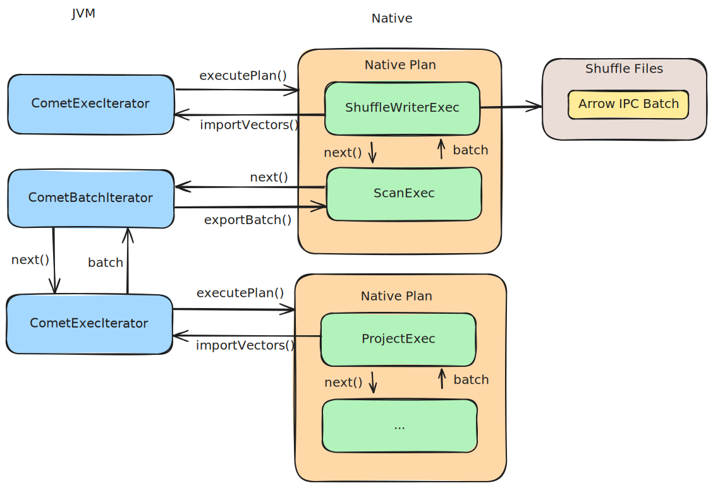

Both scenarios use the same FFI mechanism but have different ownership semantics and memory management implications.

<a id="comet-contributor-guide-ffi--arrow-ffi-basics"></a>

## Arrow FFI Basics

The Arrow C Data Interface defines two C structures:

- `ArrowArray`: Contains pointers to data buffers and metadata
- `ArrowSchema`: Contains type information

<a id="comet-contributor-guide-ffi--key-characteristics"></a>

### Key Characteristics

- **Zero-copy**: Data buffers can be shared across language boundaries without copying
- **Ownership transfer**: Clear semantics for who owns and must free the data
- **Release callbacks**: Custom cleanup functions for proper resource management

<a id="comet-contributor-guide-ffi--jvm-native-data-flow-scanexec"></a>

## JVM → Native Data Flow (ScanExec)

<a id="comet-contributor-guide-ffi--architecture"></a>

### Architecture

When native code needs data from the JVM, it uses `ScanExec` which calls into `CometBatchIterator`:

```
┌─────────────────┐
│  Spark/Scala    │
│ CometExecIter   │
└────────┬────────┘
         │ produces batches
         ▼
┌─────────────────┐
│ CometBatchIter  │ ◄─── JNI call from native
│  (JVM side)     │
└────────┬────────┘
         │ Arrow FFI
         │ (transfers ArrowArray/ArrowSchema pointers)
         ▼
┌─────────────────┐
│    ScanExec     │
│  (Rust/native)  │
└────────┬────────┘
         │
         ▼
┌─────────────────┐
│   DataFusion    │
│   operators     │
└─────────────────┘
```

<a id="comet-contributor-guide-ffi--ffi-transfer-process"></a>

### FFI Transfer Process

The data transfer happens in `ScanExec::get_next()`:

```
// 1. Allocate FFI structures on native side (Rust heap) for
_
in
0 ..num_cols
{
let
arrow_array
=
Rc::new (FFI_ArrowArray::empty ());
let
arrow_schema
=
Rc::new (FFI_ArrowSchema::empty ());
let
array_ptr
=
Rc::into_raw (arrow_array)
as
i64;
let
schema_ptr
=
Rc::into_raw (arrow_schema)
as
i64;
// Store pointers...} // 2. Call JVM to populate FFI structures let
num_rows:
i32
=
unsafe
{
jni_call ! (env,
comet_batch_iterator (iter ).next (array_obj,
schema_obj)
->
i32) ? }; // 3. Import data from FFI structures for
i
in
0 ..num_cols
{
let
array_data
=
ArrayData::from_spark ((array_ptr,
schema_ptr )) ?;
let
array
=
make_array (array_data );
// ... process array}
```

<a id="comet-contributor-guide-ffi--memory-layout"></a>

### Memory Layout

When a batch is transferred from JVM to native:

```
JVM Heap:                           Native Memory:
┌──────────────────┐               ┌──────────────────┐
│ ColumnarBatch    │               │ FFI_ArrowArray   │
│ ┌──────────────┐ │               │ ┌──────────────┐ │
│ │ ArrowBuf     │─┼──────────────>│ │ buffers[0]   │ │
│ │ (off-heap)   │ │               │ │ (pointer)    │ │
│ └──────────────┘ │               │ └──────────────┘ │
└──────────────────┘               └──────────────────┘
        │                                   │
        │                                   │
Off-heap Memory:                            │
┌──────────────────┐ <──────────────────────┘
│ Actual Data      │
│ (e.g., int32[])  │
└──────────────────┘
```

**Key Point**: The actual data buffers can be off-heap, but the `ArrowArray` and `ArrowSchema` wrapper objects are **always allocated on the JVM heap**.

<a id="comet-contributor-guide-ffi--wrapper-object-lifecycle"></a>

### Wrapper Object Lifecycle

When arrays are created in the JVM and passed to native code, the JVM creates the array data off-heap and creates
wrapper objects `ArrowArray` and `ArrowSchema` on-heap. These wrapper objects can consume significant memory over
time.

```
Per batch overhead on JVM heap:
- ArrowArray object: ~100 bytes
- ArrowSchema object: ~100 bytes
- Per column: ~200 bytes
- 100 columns × 1000 batches = ~20 MB of wrapper objects
```

When native code pulls batches from the JVM, the JVM wrapper objects are kept alive until the native code drops
all references to the arrays.

When operators such as `SortExec` fetch many batches and buffer them in native code, the number of wrapper objects
in Java on-heap memory keeps growing until the batches are released in native code at the end of the sort operation.

<a id="comet-contributor-guide-ffi--ownership-transfer"></a>

### Ownership Transfer

The Arrow C data interface supports ownership transfer by registering callbacks in the C struct that is passed over
the JNI boundary for the function to delete the array data. For example, the `ArrowArray` struct has:

```
// Release callback void
(* release )(struct
ArrowArray * );
```

Comet currently does not always follow best practice around ownership transfer because there are some cases where
Comet JVM code will retain references to arrays after passing them to native code and may mutate the underlying
buffers. There is an `arrow_ffi_safe` flag in the protocol buffer definition of `Scan` that indicates whether
ownership is being transferred according to the Arrow C data interface specification.

```
message
Scan
{
repeated
spark.spark_expression.DataType
fields
=
1;
// The source of the scan (e.g. file scan, broadcast exchange, shuffle, etc). This
// is purely for informational purposes when viewing native query plans in
// debug mode.
string
source
=
2;
// Whether native code can assume ownership of batches that it receives
bool
arrow_ffi_safe
=
3;
}
```

<a id="comet-contributor-guide-ffi--when-ownership-is-not-transferred-to-native:"></a>

#### When ownership is NOT transferred to native:

If the data originates from a scan that uses mutable buffers
then ownership is not transferred to native and the JVM may re-use the underlying buffers in the future.

It is critical that the native code performs a deep copy of the arrays if the arrays are to be buffered by
operators such as `SortExec` or `ShuffleWriterExec`, otherwise data corruption is likely to occur.

<a id="comet-contributor-guide-ffi--when-ownership-is-transferred-to-native:"></a>

#### When ownership IS transferred to native:

When ownership is transferred, it is safe to buffer batches in native. However, JVM wrapper objects will not be
released until the native batches are dropped. This can lead to OOM or GC pressure if there is not enough Java
heap memory configured.

<a id="comet-contributor-guide-ffi--native-jvm-data-flow-cometexeciterator"></a>

## Native → JVM Data Flow (CometExecIterator)

<a id="comet-contributor-guide-ffi--architecture-2"></a>

### Architecture

When JVM needs results from native execution:

```
┌─────────────────┐
│ DataFusion Plan │
│   (native)      │
└────────┬────────┘
         │ produces RecordBatch
         ▼
┌─────────────────┐
│ CometExecIter   │
│  (Rust/native)  │
└────────┬────────┘
         │ Arrow FFI
         │ (transfers ArrowArray/ArrowSchema pointers)
         ▼
┌─────────────────┐
│ CometExecIter   │ ◄─── JNI call from Spark
│  (Scala side)   │
└────────┬────────┘
         │
         ▼
┌─────────────────┐
│  Spark Actions  │
│  (collect, etc) │
└─────────────────┘
```

<a id="comet-contributor-guide-ffi--ffi-transfer-process-2"></a>

### FFI Transfer Process

The transfer happens in `CometExecIterator::getNextBatch()`:

```
// Scala side def
getNextBatch ():
ColumnarBatch
=
{
val
batchHandle
=
Native.getNextBatch (nativeHandle)
// Import from FFI structures
val
vectors
=
(0
until
schema.length ).map
{
i
=>
val
array
=
Array.empty [Long ](1)
val
schemaPtr
=
Array.empty [Long ](1)
// Get FFI pointers from native
Native.exportVector (batchHandle,
i,
array,
schemaPtr)
// Import into Arrow Java
Data.importVector (allocator,
array (0 ),
schemaPtr (0 ))
}
new
ColumnarBatch (vectors.toArray,
numRows)}
```

```
// Native side (simplified) #[no_mangle] pub
extern
"system"
fn
Java_ ..._getNextBatch (
env:
JNIEnv,
handle:
jlong,)
->
jlong
{
let
context
=
get_exec_context (handle) ?;
let
batch
=
context.stream.next ().await ?;
// Store batch and return handle
let
batch_handle
=
Box::into_raw (Box::new (batch ))
as
i64;
batch_handle} #[no_mangle] pub
extern
"system"
fn
Java_ ..._exportVector (
env:
JNIEnv,
batch_handle:
jlong,
col_idx:
jint,
array_ptr:
jlongArray,
schema_ptr:
jlongArray,)
{
let
batch
=
get_batch (batch_handle) ?;
let
array
=
batch.column (col_idx );
// Export to FFI structures
let
(array_ffi,
schema_ffi)
=
to_ffi (array.to_data ()) ?;
// Write pointers back to JVM
env.set_long_array_region (array_ptr,
0,
& [array_ffi
as
i64 ]) ?;
env.set_long_array_region (schema_ptr,
0,
& [schema_ffi
as
i64 ]) ?;
}
```

<a id="comet-contributor-guide-ffi--wrapper-object-lifecycle-native-jvm"></a>

### Wrapper Object Lifecycle (Native → JVM)

```
Time    Native Memory              JVM Heap              Off-heap/Native
────────────────────────────────────────────────────────────────────────
t0      RecordBatch produced       -                     Data in native
        in DataFusion

t1      FFI_ArrowArray created     -                     Data in native
        FFI_ArrowSchema created
        (native heap)

t2      Pointers exported to JVM   ArrowBuf created      Data in native
                                   (wraps native ptr)

t3      FFI structures kept alive  Spark processes       Data in native
        via batch handle           ColumnarBatch         ✓ Valid

t4      Batch handle released      ArrowBuf freed        Data freed
        Release callback runs      (triggers native      (via release
                                   release callback)     callback)
```

**Key Difference from JVM → Native**:

- Native code controls lifecycle through batch handle
- JVM creates `ArrowBuf` wrappers that point to native memory
- Release callback ensures proper cleanup when JVM is done
- No GC pressure issue because native allocator manages the data

<a id="comet-contributor-guide-ffi--release-callbacks"></a>

### Release Callbacks

Critical for proper cleanup:

```
// Native release callback (simplified) extern
"C"
fn
release_batch (array:
* mut
FFI_ArrowArray)
{
if
! array.is_null ()
{
unsafe
{
// Free the data buffers
for
buffer
in
(* array ).buffers
{
drop (Box::from_raw (buffer ));
}
// Free the array structure itself
drop (Box::from_raw (array ));
}
}}
```

When JVM is done with the data:

```
// ArrowBuf.close() triggers the release callback arrowBuf.close ();
// → calls native release_batch()
```

<a id="comet-contributor-guide-ffi--memory-ownership-rules"></a>

## Memory Ownership Rules

<a id="comet-contributor-guide-ffi--jvm-native"></a>

### JVM → Native

| Scenario | `arrow_ffi_safe` | Ownership | Action Required |
| --- | --- | --- | --- |
| Temporary scan | `false` | JVM keeps | **Must deep copy** to avoid corruption |
| Ownership transfer | `true` | Native owns | Copy only to unpack dictionaries |

<a id="comet-contributor-guide-ffi--native-jvm"></a>

### Native → JVM

| Scenario | Ownership | Action Required |
| --- | --- | --- |
| All cases | Native allocates, JVM references | JVM must call `close()` to trigger native release callback |

<a id="comet-contributor-guide-ffi--further-reading"></a>

## Further Reading

- [Arrow C Data Interface Specification](https://arrow.apache.org/docs/format/CDataInterface.html)
- [Arrow Java FFI Implementation](https://github.com/apache/arrow/tree/main/java/c)
- [Arrow Rust FFI Implementation](https://docs.rs/arrow/latest/arrow/ffi/)

---

<a id="comet-contributor-guide-jvm_shuffle"></a>

<!-- source_url: https://datafusion.apache.org/comet/contributor-guide/jvm_shuffle.html -->

<!-- page_index: 212 -->

<a id="comet-contributor-guide-jvm_shuffle--jvm-shuffle"></a>

# JVM Shuffle

This document describes Comet’s JVM-based columnar shuffle implementation (`CometColumnarShuffle`), which
writes shuffle data in Arrow IPC format using JVM code with native encoding. For the fully native
alternative, see [Native Shuffle](#comet-contributor-guide-native_shuffle).

<a id="comet-contributor-guide-jvm_shuffle--overview"></a>

## Overview

Comet provides two shuffle implementations:

- **CometNativeShuffle** (`CometExchange`): Fully native shuffle using Rust. Takes columnar input directly
  from Comet native operators and performs partitioning in native code.
- **CometColumnarShuffle** (`CometColumnarExchange`): JVM-based shuffle that operates on rows internally,
  buffers `UnsafeRow`s in memory pages, and uses native code (via JNI) to encode them to Arrow IPC format.
  Uses Spark’s partitioner for partition assignment. Can accept either row-based or columnar input
  (columnar input is converted to rows via `ColumnarToRowExec`).

The JVM shuffle is selected via `CometShuffleDependency.shuffleType`.

<a id="comet-contributor-guide-jvm_shuffle--when-jvm-shuffle-is-used"></a>

## When JVM Shuffle is Used

JVM shuffle (`CometColumnarExchange`) is used instead of native shuffle (`CometExchange`) in the following cases:

1. **Shuffle mode is explicitly set to “jvm”**: When `spark.comet.exec.shuffle.mode` is set to `jvm`.
2. **Child plan is not a Comet native operator**: When the child plan is a Spark row-based operator
   (not a `CometPlan`), JVM shuffle is the only option since native shuffle requires columnar input
   from Comet operators.
3. **Unsupported partition key types**: For `HashPartitioning` and `RangePartitioning`, native shuffle
   only supports primitive types as partition keys. Complex types (struct, array, map) cannot be used
   as partition keys in native shuffle and will fall back to JVM columnar shuffle. Note that complex types are
   fully supported as data columns in both implementations.

<a id="comet-contributor-guide-jvm_shuffle--input-handling"></a>

## Input Handling

<a id="comet-contributor-guide-jvm_shuffle--spark-row-based-input"></a>

### Spark Row-Based Input

When the child plan is a Spark row-based operator, `CometColumnarExchange` calls `child.execute()` which
returns an `RDD[InternalRow]`. The rows flow directly to the JVM shuffle writers.

<a id="comet-contributor-guide-jvm_shuffle--comet-columnar-input"></a>

### Comet Columnar Input

When the child plan is a Comet native operator (e.g., `CometHashAggregate`) but JVM shuffle is selected
(due to shuffle mode setting or unsupported partitioning), `CometColumnarExchange` still calls
`child.execute()`. Comet operators implement `doExecute()` by wrapping themselves with `ColumnarToRowExec`:

```
// In CometExec base class override
def
doExecute ():
RDD [InternalRow]
=
ColumnarToRowExec (this ).doExecute ()
```

This means the data path becomes:

```
Comet Native (columnar) → ColumnarToRowExec → rows → JVM Shuffle → Arrow IPC → columnar
```

This is less efficient than native shuffle which avoids the columnar-to-row conversion:

```
Comet Native (columnar) → Native Shuffle → Arrow IPC → columnar
```

<a id="comet-contributor-guide-jvm_shuffle--why-use-spark-s-partitioner"></a>

### Why Use Spark’s Partitioner?

JVM shuffle uses row-based input so it can leverage Spark’s existing partitioner infrastructure
(`partitioner.getPartition(key)`). This allows Comet to support all of Spark’s partitioning schemes
without reimplementing them in Rust. Native shuffle, by contrast, serializes the partitioning scheme
to protobuf and implements the partitioning logic in native code.

<a id="comet-contributor-guide-jvm_shuffle--architecture"></a>

## Architecture

```
┌─────────────────────────────────────────────────────────────────────────┐
│                         CometShuffleManager                             │
│  - Extends Spark's ShuffleManager                                       │
│  - Routes to appropriate writer/reader based on ShuffleHandle type      │
└─────────────────────────────────────────────────────────────────────────┘
                                    │
           ┌────────────────────────┼────────────────────────┐
           ▼                        ▼                        ▼
┌─────────────────────┐  ┌─────────────────────┐  ┌─────────────────────┐
│ CometBypassMerge-   │  │ CometUnsafe-        │  │ CometNative-        │
│ SortShuffleWriter   │  │ ShuffleWriter       │  │ ShuffleWriter       │
│ (hash-based)        │  │ (sort-based)        │  │ (fully native)      │
└─────────────────────┘  └─────────────────────┘  └─────────────────────┘
           │                        │
           ▼                        ▼
┌─────────────────────┐  ┌─────────────────────┐
│ CometDiskBlock-     │  │ CometShuffleExternal│
│ Writer              │  │ Sorter              │
└─────────────────────┘  └─────────────────────┘
           │                        │
           └────────────┬───────────┘
                        ▼
              ┌─────────────────────┐
              │ SpillWriter         │
              │ (native encoding    │
              │  via JNI)           │
              └─────────────────────┘
```

<a id="comet-contributor-guide-jvm_shuffle--key-classes"></a>

## Key Classes

<a id="comet-contributor-guide-jvm_shuffle--shuffle-manager"></a>

### Shuffle Manager

| Class | Location | Description |
| --- | --- | --- |
| `CometShuffleManager` | `.../shuffle/CometShuffleManager.scala` | Entry point. Extends Spark’s `ShuffleManager`. Selects writer/reader based on handle type. Delegates non-Comet shuffles to `SortShuffleManager`. |
| `CometShuffleDependency` | `.../shuffle/CometShuffleDependency.scala` | Extends `ShuffleDependency`. Contains `shuffleType` (`CometColumnarShuffle` or `CometNativeShuffle`) and schema info. |

<a id="comet-contributor-guide-jvm_shuffle--shuffle-handles"></a>

### Shuffle Handles

| Handle | Writer Strategy |
| --- | --- |
| `CometBypassMergeSortShuffleHandle` | Hash-based: one file per partition, merged at end |
| `CometSerializedShuffleHandle` | Sort-based: records sorted by partition ID, single output |
| `CometNativeShuffleHandle` | Fully native shuffle |

Selection logic in `CometShuffleManager.shouldBypassMergeSort()`:

- Uses bypass if partitions < threshold AND partitions × cores ≤ max threads
- Otherwise uses sort-based to avoid OOM from many concurrent writers

<a id="comet-contributor-guide-jvm_shuffle--writers"></a>

### Writers

| Class | Location | Description |
| --- | --- | --- |
| `CometBypassMergeSortShuffleWriter` | `.../shuffle/CometBypassMergeSortShuffleWriter.java` | Hash-based writer. Creates one `CometDiskBlockWriter` per partition. Supports async writes. |
| `CometUnsafeShuffleWriter` | `.../shuffle/CometUnsafeShuffleWriter.java` | Sort-based writer. Uses `CometShuffleExternalSorter` to buffer and sort records, then merges spill files. |
| `CometDiskBlockWriter` | `.../shuffle/CometDiskBlockWriter.java` | Buffers rows in memory pages for a single partition. Spills to disk via native encoding. Used by bypass writer. |
| `CometShuffleExternalSorter` | `.../shuffle/sort/CometShuffleExternalSorter.java` | Buffers records across all partitions, sorts by partition ID, spills sorted data. Used by unsafe writer. |
| `SpillWriter` | `.../shuffle/SpillWriter.java` | Base class for spill logic. Manages memory pages and calls `Native.writeSortedFileNative()` for Arrow IPC encoding. |

<a id="comet-contributor-guide-jvm_shuffle--reader"></a>

### Reader

| Class | Location | Description |
| --- | --- | --- |
| `CometBlockStoreShuffleReader` | `.../shuffle/CometBlockStoreShuffleReader.scala` | Fetches shuffle blocks via `ShuffleBlockFetcherIterator`. Decodes Arrow IPC to `ColumnarBatch`. |
| `NativeBatchDecoderIterator` | `.../shuffle/NativeBatchDecoderIterator.scala` | Reads compressed Arrow IPC batches from input stream. Calls `Native.decodeShuffleBlock()` via JNI. |

<a id="comet-contributor-guide-jvm_shuffle--data-flow"></a>

## Data Flow

<a id="comet-contributor-guide-jvm_shuffle--write-path"></a>

### Write Path

1. `ShuffleWriteProcessor` calls `CometShuffleManager.getWriter()`
2. Writer receives `Iterator[Product2[K, V]]` where V is `UnsafeRow`
3. Rows are serialized and buffered in off-heap memory pages
4. When memory threshold or batch size is reached, `SpillWriter.doSpilling()` is called
5. Native code (`Native.writeSortedFileNative()`) converts rows to Arrow arrays and writes IPC format
6. For bypass writer: partition files are concatenated into final output
7. For sort writer: spill files are merged

<a id="comet-contributor-guide-jvm_shuffle--read-path"></a>

### Read Path

1. `CometBlockStoreShuffleReader.read()` creates `ShuffleBlockFetcherIterator`
2. For each block, `NativeBatchDecoderIterator` reads the IPC stream
3. Native code (`Native.decodeShuffleBlock()`) decompresses and decodes to Arrow arrays
4. Arrow FFI imports arrays as `ColumnarBatch`

<a id="comet-contributor-guide-jvm_shuffle--memory-management"></a>

## Memory Management

- `CometShuffleMemoryAllocator`: Custom allocator for off-heap memory pages
- Memory is allocated in pages; when allocation fails, writers spill to disk
- `CometDiskBlockWriter` coordinates spilling across all partition writers (largest first)
- Async spilling is supported via `ShuffleThreadPool`

<a id="comet-contributor-guide-jvm_shuffle--configuration"></a>

## Configuration

| Config | Description |
| --- | --- |
| `spark.comet.columnar.shuffle.async.enabled` | Enable async spill writes |
| `spark.comet.columnar.shuffle.async.thread.num` | Threads per writer for async |
| `spark.comet.columnar.shuffle.batch.size` | Rows per Arrow batch |
| `spark.comet.columnar.shuffle.spill.threshold` | Row count threshold for spill |
| `spark.comet.exec.shuffle.compression.codec` | Compression codec (zstd, lz4, etc.) |

---

<a id="comet-contributor-guide-native_shuffle"></a>

<!-- source_url: https://datafusion.apache.org/comet/contributor-guide/native_shuffle.html -->

<!-- page_index: 213 -->

<a id="comet-contributor-guide-native_shuffle--native-shuffle"></a>

# Native Shuffle

This document describes Comet’s native shuffle implementation (`CometNativeShuffle`), which performs
shuffle operations entirely in Rust code for maximum performance. For the JVM-based alternative, see [JVM Shuffle](#comet-contributor-guide-jvm_shuffle).

<a id="comet-contributor-guide-native_shuffle--overview"></a>

## Overview

Native shuffle takes columnar input directly from Comet native operators and performs partitioning, encoding, and writing in native Rust code. This avoids the columnar-to-row-to-columnar conversion
overhead that JVM shuffle incurs.

```
Comet Native (columnar) → Native Shuffle → Arrow IPC → columnar
```

Compare this to JVM shuffle’s data path:

```
Comet Native (columnar) → ColumnarToRowExec → rows → JVM Shuffle → Arrow IPC → columnar
```

<a id="comet-contributor-guide-native_shuffle--when-native-shuffle-is-used"></a>

## When Native Shuffle is Used

Native shuffle (`CometExchange`) is selected when all of the following conditions are met:

1. **Shuffle mode allows native**: `spark.comet.exec.shuffle.mode` is `native` or `auto`.
2. **Child plan is a Comet native operator**: The child must be a `CometPlan` that produces
   columnar output. Row-based Spark operators require JVM shuffle.
3. **Supported partitioning type**: Native shuffle supports:

   - `HashPartitioning`
   - `RangePartitioning`
   - `SinglePartition`
   - `RoundRobinPartitioning`
4. **Supported partition key types**: For `HashPartitioning` and `RangePartitioning`, partition
   keys must be primitive types. Complex types (struct, array, map) as partition keys require
   JVM shuffle. Note that complex types are fully supported as data columns in native shuffle.

<a id="comet-contributor-guide-native_shuffle--architecture"></a>

## Architecture

```
┌─────────────────────────────────────────────────────────────────────────────┐
│                           CometShuffleManager                                │
│  - Routes to CometNativeShuffleWriter for CometNativeShuffleHandle           │
└─────────────────────────────────────────────────────────────────────────────┘
                                      │
                                      ▼
┌─────────────────────────────────────────────────────────────────────────────┐
│                         CometNativeShuffleWriter                             │
│  - Constructs protobuf operator plan                                         │
│  - Invokes native execution via CometExec.getCometIterator()                 │
└─────────────────────────────────────────────────────────────────────────────┘
                                      │
                                      ▼ (JNI)
┌─────────────────────────────────────────────────────────────────────────────┐
│                         ShuffleWriterExec (Rust)                             │
│  - DataFusion ExecutionPlan                                                  │
│  - Orchestrates partitioning and writing                                     │
└─────────────────────────────────────────────────────────────────────────────┘
                    │                                     │
                    ▼                                     ▼
┌───────────────────────────────────┐   ┌───────────────────────────────────┐
│ MultiPartitionShuffleRepartitioner │   │ SinglePartitionShufflePartitioner │
│ (hash/range partitioning)          │   │ (single partition case)           │
└───────────────────────────────────┘   └───────────────────────────────────┘
                    │
                    ▼
┌───────────────────────────────────┐
│ ShuffleBlockWriter                 │
│ (Arrow IPC + compression)          │
└───────────────────────────────────┘
                    │
                    ▼
         ┌─────────────────┐
         │  Data + Index   │
         │     Files       │
         └─────────────────┘
```

<a id="comet-contributor-guide-native_shuffle--key-classes"></a>

## Key Classes

<a id="comet-contributor-guide-native_shuffle--scala-side"></a>

### Scala Side

| Class | Location | Description |
| --- | --- | --- |
| `CometShuffleExchangeExec` | `.../shuffle/CometShuffleExchangeExec.scala` | Physical plan node. Validates types and partitioning, creates `CometShuffleDependency`. |
| `CometNativeShuffleWriter` | `.../shuffle/CometNativeShuffleWriter.scala` | Implements `ShuffleWriter`. Builds protobuf plan and invokes native execution. |
| `CometShuffleDependency` | `.../shuffle/CometShuffleDependency.scala` | Extends `ShuffleDependency`. Holds shuffle type, schema, and range partition bounds. |
| `CometBlockStoreShuffleReader` | `.../shuffle/CometBlockStoreShuffleReader.scala` | Reads shuffle blocks via `ShuffleBlockFetcherIterator`. Decodes Arrow IPC to `ColumnarBatch`. |
| `NativeBatchDecoderIterator` | `.../shuffle/NativeBatchDecoderIterator.scala` | Reads compressed Arrow IPC from input stream. Calls native decode via JNI. |

<a id="comet-contributor-guide-native_shuffle--rust-side"></a>

### Rust Side

| File | Location | Description |
| --- | --- | --- |
| `shuffle_writer.rs` | `native/core/src/execution/shuffle/` | `ShuffleWriterExec` plan and partitioners. Main shuffle logic. |
| `codec.rs` | `native/core/src/execution/shuffle/` | `ShuffleBlockWriter` for Arrow IPC encoding with compression. Also handles decoding. |
| `comet_partitioning.rs` | `native/core/src/execution/shuffle/` | `CometPartitioning` enum defining partition schemes (Hash, Range, Single). |

<a id="comet-contributor-guide-native_shuffle--data-flow"></a>

## Data Flow

<a id="comet-contributor-guide-native_shuffle--write-path"></a>

### Write Path

1. **Plan construction**: `CometNativeShuffleWriter` builds a protobuf operator plan containing:

   - A scan operator reading from the input iterator
   - A `ShuffleWriter` operator with partitioning config and compression codec
2. **Native execution**: `CometExec.getCometIterator()` executes the plan in Rust.
3. **Partitioning**: `ShuffleWriterExec` receives batches and routes to the appropriate partitioner:

   - `MultiPartitionShuffleRepartitioner`: For hash/range/round-robin partitioning
   - `SinglePartitionShufflePartitioner`: For single partition (simpler path)
4. **Buffering and spilling**: The partitioner buffers rows per partition. When memory pressure
   exceeds the threshold, partitions spill to temporary files.
5. **Encoding**: `ShuffleBlockWriter` encodes each partition’s data as compressed Arrow IPC:

   - Writes compression type header
   - Writes field count header
   - Writes compressed IPC stream
6. **Output files**: Two files are produced:

   - **Data file**: Concatenated partition data
   - **Index file**: Array of 8-byte little-endian offsets marking partition boundaries
7. **Commit**: Back in JVM, `CometNativeShuffleWriter` reads the index file to get partition
   lengths and commits via Spark’s `IndexShuffleBlockResolver`.

<a id="comet-contributor-guide-native_shuffle--read-path"></a>

### Read Path

1. `CometBlockStoreShuffleReader` fetches shuffle blocks via `ShuffleBlockFetcherIterator`.
2. For each block, `NativeBatchDecoderIterator`:

   - Reads the 8-byte compressed length header
   - Reads the 8-byte field count header
   - Reads the compressed IPC data
   - Calls `Native.decodeShuffleBlock()` via JNI
3. Native code decompresses and deserializes the Arrow IPC stream.
4. Arrow FFI transfers the `RecordBatch` to JVM as a `ColumnarBatch`.

<a id="comet-contributor-guide-native_shuffle--partitioning"></a>

## Partitioning

<a id="comet-contributor-guide-native_shuffle--hash-partitioning"></a>

### Hash Partitioning

Native shuffle implements Spark-compatible hash partitioning:

- Uses Murmur3 hash function with seed 42 (matching Spark)
- Computes hash of partition key columns
- Applies modulo by partition count: `partition_id = hash % num_partitions`

<a id="comet-contributor-guide-native_shuffle--range-partitioning"></a>

### Range Partitioning

For range partitioning:

1. Spark’s `RangePartitioner` samples data and computes partition boundaries on the driver.
2. Boundaries are serialized to the native plan.
3. Native code converts sort key columns to comparable row format.
4. Binary search (`partition_point`) determines which partition each row belongs to.

<a id="comet-contributor-guide-native_shuffle--single-partition"></a>

### Single Partition

The simplest case: all rows go to partition 0. Uses `SinglePartitionShufflePartitioner` which
simply concatenates batches to reach the configured batch size.

<a id="comet-contributor-guide-native_shuffle--round-robin-partitioning"></a>

### Round Robin Partitioning

Comet implements round robin partitioning using hash-based assignment for determinism:

1. Computes a Murmur3 hash of columns (using seed 42)
2. Assigns partitions directly using the hash: `partition_id = hash % num_partitions`

This approach guarantees determinism across retries, which is critical for fault tolerance.
However, unlike true round robin which cycles through partitions row-by-row, hash-based
assignment only provides even distribution when the data has sufficient variation in the
hashed columns. Data with low cardinality or identical values may result in skewed partition
sizes.

<a id="comet-contributor-guide-native_shuffle--memory-management"></a>

## Memory Management

Native shuffle uses DataFusion’s memory management with spilling support:

- **Memory pool**: Tracks memory usage across the shuffle operation.
- **Spill threshold**: When buffered data exceeds the threshold, partitions spill to disk.
- **Per-partition spilling**: Each partition has its own spill file. Multiple spills for a
  partition are concatenated when writing the final output.
- **Scratch space**: Reusable buffers for partition ID computation to reduce allocations.

The `MultiPartitionShuffleRepartitioner` manages:

- `PartitionBuffer`: In-memory buffer for each partition
- `SpillFile`: Temporary file for spilled data
- Memory tracking via `MemoryConsumer` trait

<a id="comet-contributor-guide-native_shuffle--compression"></a>

## Compression

Native shuffle supports multiple compression codecs configured via
`spark.comet.exec.shuffle.compression.codec`:

| Codec | Description |
| --- | --- |
| `zstd` | Zstandard compression. Best ratio, configurable level. |
| `lz4` | LZ4 compression. Fast with good ratio. |
| `snappy` | Snappy compression. Fastest, lower ratio. |
| `none` | No compression. |

The compression codec is applied uniformly to all partitions. Each partition’s data is
independently compressed, allowing parallel decompression during reads.

<a id="comet-contributor-guide-native_shuffle--configuration"></a>

## Configuration

| Config | Default | Description |
| --- | --- | --- |
| `spark.comet.exec.shuffle.enabled` | `true` | Enable Comet shuffle |
| `spark.comet.exec.shuffle.mode` | `auto` | Shuffle mode: `native`, `jvm`, or `auto` |
| `spark.comet.exec.shuffle.compression.codec` | `zstd` | Compression codec |
| `spark.comet.exec.shuffle.compression.zstd.level` | `1` | Zstd compression level |
| `spark.comet.shuffle.write.buffer.size` | `1MB` | Write buffer size |
| `spark.comet.columnar.shuffle.batch.size` | `8192` | Target rows per batch |

<a id="comet-contributor-guide-native_shuffle--comparison-with-jvm-shuffle"></a>

## Comparison with JVM Shuffle

| Aspect | Native Shuffle | JVM Shuffle |
| --- | --- | --- |
| Input format | Columnar (direct from Comet operators) | Row-based (via ColumnarToRowExec) |
| Partitioning logic | Rust implementation | Spark’s partitioner |
| Supported schemes | Hash, Range, Single, RoundRobin | Hash, Range, Single, RoundRobin |
| Partition key types | Primitives only (Hash, Range) | Any type |
| Performance | Higher (no format conversion) | Lower (columnar→row→columnar) |
| Writer variants | Single path | Bypass (hash) and sort-based |

See [JVM Shuffle](#comet-contributor-guide-jvm_shuffle) for details on the JVM-based implementation.

---

<a id="comet-contributor-guide-development"></a>

<!-- source_url: https://datafusion.apache.org/comet/contributor-guide/development.html -->

<!-- page_index: 214 -->

<a id="comet-contributor-guide-development--comet-development-guide"></a>

# Comet Development Guide

<a id="comet-contributor-guide-development--project-layout"></a>

## Project Layout

```
├── common     <- common Java/Scala code
├── conf       <- configuration files
├── native     <- native code, in Rust
├── spark      <- Spark integration
```

<a id="comet-contributor-guide-development--threading-architecture"></a>

## Threading Architecture

Comet’s native execution runs on a shared tokio multi-threaded runtime. Understanding this
architecture is important because it affects how you write native operators and JVM callbacks.

<a id="comet-contributor-guide-development--how-execution-works"></a>

### How execution works

Spark calls into native code via JNI from an **executor task thread**. There are two execution
paths depending on whether the plan reads data from the JVM:

**Async I/O path (no JVM data sources, e.g. Iceberg scans):** The DataFusion stream is spawned
onto a tokio worker thread and batches are delivered to the executor thread via an `mpsc` channel.
The executor thread parks in `blocking_recv()` until the next batch is ready. This avoids
busy-polling on I/O-bound workloads.

**JVM data source path (ScanExec present):** The executor thread calls `block_on()` and polls the
DataFusion stream directly, interleaving `pull_input_batches()` calls on `Poll::Pending` to feed
data from the JVM into ScanExec operators.

In both cases, DataFusion operators execute on **tokio worker threads**, not on the Spark executor
task thread. All Spark tasks on an executor share one tokio runtime.

<a id="comet-contributor-guide-development--rules-for-native-code"></a>

### Rules for native code

**Do not use `thread_local!` or assume thread identity.** Tokio may run your operator’s `poll`
method on any worker thread, and may move it between threads across polls. Any state must live
in the operator struct or be shared via `Arc`.

**JNI calls work from any thread, but have overhead.** `JVMClasses::get_env()` calls
`AttachCurrentThread`, which acquires JVM internal locks. The `AttachGuard` detaches the thread
when dropped. Repeated attach/detach cycles on tokio workers add overhead, so avoid calling
into the JVM on hot paths during stream execution.

**Do not call `TaskContext.get()` from JVM callbacks during execution.** Spark’s `TaskContext` is
a `ThreadLocal` on the executor task thread. JVM methods invoked from tokio worker threads will
see `null`. If you need task metadata, capture it at construction time (in `createPlan` or
operator setup) and store it in the operator. See `CometTaskMemoryManager` for an example — it
captures `TaskContext.get().taskMemoryManager()` in its constructor and uses the stored reference
thereafter.

**Memory pool operations call into the JVM.** `CometUnifiedMemoryPool` and `CometFairMemoryPool`
call `acquireMemory()` / `releaseMemory()` via JNI whenever DataFusion operators grow or shrink
memory reservations. This happens on whatever thread the operator is executing on. These calls
are thread-safe (they use stored `GlobalRef`s, not thread-locals), but they do trigger
`AttachCurrentThread`.

**Scalar subqueries call into the JVM.** `Subquery::evaluate()` calls static methods on
`CometScalarSubquery` via JNI. These use a static `HashMap`, not thread-locals, so they are
safe from any thread.

**Parquet encryption calls into the JVM.** `CometKeyRetriever::retrieve_key()` calls the JVM
to unwrap decryption keys during Parquet reads. It uses a stored `GlobalRef` and a cached
`JMethodID`, so it is safe from any thread.

<a id="comet-contributor-guide-development--the-tokio-runtime"></a>

### The tokio runtime

The runtime is created once per executor JVM in a `Lazy<Runtime>` static:

- **Worker threads:** `num_cpus` by default, configurable via `COMET_WORKER_THREADS`
- **Max blocking threads:** 512 by default, configurable via `COMET_MAX_BLOCKING_THREADS`
- All async I/O (S3, HTTP, Parquet reads) runs on worker threads as non-blocking futures

<a id="comet-contributor-guide-development--summary-of-what-is-safe-and-what-is-not"></a>

### Summary of what is safe and what is not

| Pattern | Safe? | Notes |
| --- | --- | --- |
| `Arc<T>` shared across operators | Yes | Standard Rust thread safety |
| `JVMClasses::get_env()` from tokio worker | Yes | Attaches thread to JVM automatically |
| `thread_local!` in operator code | **No** | Tokio moves tasks between threads |
| `TaskContext.get()` in JVM callback | **No** | Returns `null` on non-executor threads |
| Storing `JNIEnv` in an operator | **No** | `JNIEnv` is thread-specific |
| Capturing state at plan creation time | Yes | Runs on executor thread, store in struct |

<a id="comet-contributor-guide-development--global-singletons"></a>

## Global singletons

Comet code runs in both the driver and executor JVM processes, and different parts of the
codebase run in each. Global singletons have **process lifetime** — they are created once and
never dropped until the JVM exits. Since multiple Spark jobs, queries, and tasks share the same
process, this makes it difficult to reason about what state a singleton holds and whether it is
still valid.

<a id="comet-contributor-guide-development--how-to-recognize-them"></a>

### How to recognize them

**Rust:** `static` variables using `OnceLock`, `LazyLock`, `OnceCell`, `Lazy`, or `lazy_static!`:

```
static
TOKIO_RUNTIME:
OnceLock <Runtime>
=
OnceLock::new (); static
TASK_SHARED_MEMORY_POOLS:
Lazy <Mutex <HashMap <i64,
PerTaskMemoryPool >>>
=
Lazy::new (..);
```

**Java:** `static` fields, especially mutable collections:

```
private
static
final
HashMap <Long,
HashMap <Long,
ScalarSubquery >>
subqueryMap
=
new
HashMap <> ();
```

**Scala:** `object` declarations (companion objects are JVM singletons) holding mutable state:

```
object
MyCache
{
private
val
cache
=
new
ConcurrentHashMap [String,
Value ]()}
```

<a id="comet-contributor-guide-development--why-they-are-dangerous"></a>

### Why they are dangerous

- **Credential staleness.** A singleton caching an authenticated client will hold stale
  credentials after token rotation, causing silent failures mid-job.
- **Unbounded growth.** A cache keyed by file path or configuration grows with every query
  but never shrinks. Over hours of process uptime this becomes a memory leak.
- **Cross-job contamination.** Different Spark jobs on the same process may use different
  configurations. A singleton initialized by the first job silently serves wrong state to
  subsequent jobs.
- **Testing difficulty.** Global state persists across test cases, making tests
  order-dependent.

<a id="comet-contributor-guide-development--when-a-singleton-is-acceptable"></a>

### When a singleton is acceptable

Some state genuinely has process lifetime:

| Singleton | Why it is safe |
| --- | --- |
| `TOKIO_RUNTIME` | One runtime per executor, no configuration variance |
| `JAVA_VM` / `JVM_CLASSES` | One JVM per process, set once at JNI load |
| `OperatorRegistry` / `ExpressionRegistry` | Immutable after initialization |
| Compiled `Regex` patterns (`LazyLock<Regex>`) | Stateless and immutable |

<a id="comet-contributor-guide-development--when-to-avoid-a-singleton"></a>

### When to avoid a singleton

If any of these apply, do **not** use a global singleton:

- The state depends on configuration that can vary between jobs or queries
- The state holds credentials or authenticated connections that will not expire or invalidate appropriately
- The state grows proportionally to the number of queries or files processed
- The state needs cleanup or refresh during process lifetime

Instead, scope state to the plan or task by adding the cache as a field in an existing session or context object.

If a singleton is truly needed, add a comment explaining why `static` is the right lifetime, whether the cache is bounded, and how credential refresh is handled (if applicable).

<a id="comet-contributor-guide-development--development-setup"></a>

## Development Setup

1. Make sure `JAVA_HOME` is set and point to JDK using [support matrix](#comet-user-guide-latest-installation)
2. Install Rust toolchain. The easiest way is to use
   [rustup](https://rustup.rs).

<a id="comet-contributor-guide-development--build-test"></a>

## Build & Test

A few common commands are specified in project’s `Makefile`:

- `make`: compile the entire project, but don’t run tests
- `make test-rust`: compile the project and run tests in Rust side
- `make test-jvm`: compile the project and run tests in Java side
- `make test`: compile the project and run tests in both Rust and Java
  side.
- `make release`: compile the project and creates a release build. This
  is useful when you want to test Comet local installation in another project
  such as Spark.
- `make clean`: clean up the workspace

<a id="comet-contributor-guide-development--common-build-and-test-pitfalls"></a>

## Common Build and Test Pitfalls

<a id="comet-contributor-guide-development--native-code-must-be-built-first"></a>

### Native Code Must Be Built First

The native Rust code must be compiled before running JVM tests. If you skip this step, tests will
fail because they cannot find the native library. Always run `make core` (or `cd native && cargo build`)
before running Maven tests.

```
# Correct order make core # Build native code first./mvnw test -Dsuites="..." # Then run JVM tests
```

<a id="comet-contributor-guide-development--debug-vs-release-mode"></a>

### Debug vs Release Mode

There is no need to use release mode (`make release`) during normal development. Debug builds
are faster to compile and provide better error messages. Only use release mode when:

- Running benchmarks
- Testing performance
- Creating a release build for deployment

For regular development and testing, use `make` or `make core` which build in debug mode.

<a id="comet-contributor-guide-development--running-rust-tests"></a>

### Running Rust Tests

When running Rust tests directly with `cargo test`, the JVM library (`libjvm.so`) must be on
your library path. Set the `LD_LIBRARY_PATH` environment variable to include your JDK’s `lib/server`
directory:

```
# Find your libjvm.so location (example for typical JDK installation) export LD_LIBRARY_PATH=$JAVA_HOME/lib/server:$LD_LIBRARY_PATH

# Now you can run Rust tests cd native && cargo test
```

Alternatively, use `make test-rust` which handles the JVM compilation dependency automatically.

<a id="comet-contributor-guide-development--never-use-pl-to-select-modules"></a>

### Never Use `-pl` to Select Modules

Do not use `-pl spark` (or any other `-pl <module>`) when running Maven goals. With `-pl`, Maven
does not rebuild sibling modules in the reactor and instead resolves them from your local Maven
repository (`~/.m2/repository`). This leads to two failure modes:

- **Stale code.** Tests run against the last `mvn install`ed version of `common` (or
  `spark-shims`), not against your current edits. You can chase a “failing” test for hours that
  is actually green in your working tree.
- **Cross-worktree corruption.** If you have multiple worktrees open and run `mvn install` in one
  while running `mvn test -pl spark` in another, the second worktree picks up the first
  worktree’s artifacts from the shared `~/.m2/repository`. Builds and tests then mix code from
  different branches non-deterministically.

Always run Maven from the repo root without `-pl`. Maven’s reactor will compile only what is
needed:

```
# Wrong: resolves sibling modules from ~/.m2, breaks under concurrent worktrees./mvnw test -pl spark -Dsuites="..."

# Right: reactor build, always uses current source./mvnw test -Dsuites="..."
```

<a id="comet-contributor-guide-development--running-a-specific-scalatest-suite"></a>

### Running a Specific ScalaTest Suite

To run a single suite (and only that suite), use `-Dsuites=` with the **fully qualified class name**
and `-Dtest=none`:

```
# Run exactly one suite./mvnw test -Dtest=none -Dsuites="org.apache.comet.CometArrayExpressionSuite"

# Run multiple suites (comma-separated, fully qualified)./mvnw test -Dtest=none -Dsuites="org.apache.comet.CometCastSuite,org.apache.comet.CometArrayExpressionSuite"

# Run only tests whose name contains "valid" inside one suite./mvnw test -Dtest=none -Dsuites="org.apache.comet.CometCastSuite valid"
```

`-Dtest=none` tells the Surefire (JUnit) plugin to skip its tests; without it, Surefire still
runs the JUnit `*Test.java` matchers in addition to your selected ScalaTest suite.

<a id="comet-contributor-guide-development--pitfall:-dwildcardsuites-runs-everything"></a>

#### Pitfall: `-DwildcardSuites=""` runs everything

A common mistake is to combine `-Dsuites=...` with `-DwildcardSuites=""`:

```
# WRONG: runs every suite in the project, takes ~1 hour./mvnw test -Dtest=none -Dsuites="org.apache.comet.CometArrayExpressionSuite" -DwildcardSuites=""
```

`wildcardSuites` does substring matching, and the empty string is a substring of every suite
name, so it expands to “run all suites” and overrides the narrower `-Dsuites=` selection. If you
want to run a single suite, omit `-DwildcardSuites` entirely. If you want substring matching, pass a non-empty pattern:

```
# Run every suite whose fully qualified name contains "CometCast"./mvnw test -Dtest=none -DwildcardSuites="CometCast"
```

<a id="comet-contributor-guide-development--pitfall:-line-breaks-silently-truncate-the-command"></a>

#### Pitfall: line breaks silently truncate the command

A bare newline ends a shell command. If the command is split across lines without a trailing
backslash, the shell only runs the first line and treats the rest as separate (failed)
commands:

```
# WRONG: shell runs only the first line, which omits -Dsuites and runs every suite./mvnw test -Dtest=none
  -Dsuites="org.apache.comet.CometArrayExpressionSuite" -DfailIfNoTests=false
```

The first line `./mvnw test -Dtest=none` runs every ScalaTest suite in the module (about 1800
tests). The second line errors out trying to execute `-Dsuites=...` as a program, but by then
the test run is already in progress. Symptom: you asked for one suite and ScalaTest reports
“Expected test count is: 1797” starting at an alphabetically earlier suite.

Either keep the command on one line, or use a trailing backslash on every continued line:

```
./mvnw test -Dtest=none \
  -Dsuites="org.apache.comet.CometArrayExpressionSuite" \
  -DfailIfNoTests=false
```

This is a common trap when copy-pasting commands from chat windows or terminals that wrap text
without inserting the backslash.

<a id="comet-contributor-guide-development--pitfall:-a-successful-run-does-not-mean-your-suite-ran"></a>

#### Pitfall: a “successful” run does not mean your suite ran

Maven exits with status `0` whenever the build phases it executed completed without error, even
when no ScalaTest suite matched your filter or a different suite ran than the one you intended.
This is especially misleading for automated agents that key off the exit code: an empty or
mistyped `-Dsuites=` value can produce a green run that tested nothing, or a wrong-but-matching
suite name can run a much larger set than you wanted.

Always check the output, not just the exit code. ScalaTest prints a summary line near the end:

```
Run completed in 12 seconds, 345 milliseconds.
Total number of tests run: 42
Suites: completed 1, aborted 0
Tests: succeeded 42, failed 0, canceled 0, ignored 0, pending 0
All tests passed.
```

Confirm both that the **suite count** matches what you asked for (typically `1`) and that the
**test count** is in the expected range for that suite. A run that reports `Total number of tests run: 0` or one that reports thousands of tests when you asked for a single suite is a
filter problem, not a successful run.

<a id="comet-contributor-guide-development--skip-scalastyle-when-iterating"></a>

### Skip Scalastyle When Iterating

The `scalastyle:check` goal runs in every Maven test invocation and re-scans every Scala source
file even when nothing relevant changed. When iterating on a single test, skip it:

```
./mvnw test -Dtest=none -Dsuites="org.apache.comet.CometArrayExpressionSuite" -Dscalastyle.skip=true
```

CI still enforces scalastyle, so this is purely a local iteration shortcut.

<a id="comet-contributor-guide-development--development-environment"></a>

## Development Environment

Comet is a multi-language project with native code written in Rust and JVM code written in Java and Scala.
For Rust code, the CLion IDE is recommended. For JVM code, IntelliJ IDEA is recommended.

Before opening the project in an IDE, make sure to run `make` first to generate the necessary files for the IDEs. Currently, it’s mostly about
generating protobuf message classes for the JVM side. It’s only required to run `make` once after cloning the repo.

<a id="comet-contributor-guide-development--intellij-idea"></a>

### IntelliJ IDEA

First make sure to install the Scala plugin in IntelliJ IDEA.
After that, you can open the project in IntelliJ IDEA. The IDE should automatically detect the project structure and import as a Maven project.

Comet uses generated source files that are too large for IntelliJ’s default size limit for code inspections. To avoid IDE errors
(missing definitions, etc.) caused by IntelliJ skipping these generated files, modify
[IntelliJ’s Platform Properties](https://intellij-support.jetbrains.com/hc/en-us/articles/206544869-Configuring-JVM-options-and-platform-properties)
by going to `Help -> Edit Custom Properties...`. For example, adding `idea.max.intellisense.filesize=16384` increases the file
size limit to 16 MB.

<a id="comet-contributor-guide-development--working-with-spark-4.x-profiles-in-intellij-idea"></a>

#### Working with Spark 4.x profiles in IntelliJ IDEA

Spark 4.x requires JDK 17 and Scala 2.13. When switching an existing IntelliJ project from the
default Spark 3.x setup to a Spark 4.x profile, it is usually best to re-import the Maven project
from a clean IntelliJ configuration:

1. Close the IntelliJ project.
2. Delete the `.idea` directory from the repository root.
3. Make sure `protoc` is available. On macOS, install it with `brew install protobuf`; on Linux,
   install `protobuf-compiler` or the equivalent package for your distribution.
4. Make sure `JAVA_HOME` points to JDK 17. On macOS, you can select it with:


```
export JAVA_HOME=$(/usr/libexec/java_home -v 17)
export PATH="$JAVA_HOME/bin:$PATH"
```

   On Apple Silicon, the selected JDK architecture must match the native Rust target. Verify that
   `file "$JAVA_HOME/lib/server/libjvm.dylib"` reports `arm64`.
5. Build the profile once from the command line so generated sources and native artifacts are in
   place:


```
PROFILES="-Pspark-4.0" make release
```

   The `spark-4.0` profile sets Scala 2.13 and Java 17 properties. If you need to be explicit, use
   `PROFILES="-Pspark-4.0 -Pscala-2.13 -Pjdk17" make release`.

   The Maven profile is named `jdk17` in this project.

   If the native build previously used a different JDK, clear Cargo’s cached JNI link path before
   rebuilding:


```
cd native && cargo clean
```

6. Open the repository root as a new project in IntelliJ IDEA.
7. In the Maven tool window, enable the `spark-4.0` and `jdk17` profiles. Disable conflicting Spark
   version profiles such as `spark-3.4` or `spark-3.5` if IntelliJ selected them.
8. Re-import or reload the Maven project.
9. Build the project in IntelliJ.

When running tests from IntelliJ on JDK 17, add the same VM options that Maven uses through the
root `pom.xml`’s `extraJavaTestArgs` property:

```
-XX:+IgnoreUnrecognizedVMOptions
--add-opens=java.base/java.lang=ALL-UNNAMED
--add-opens=java.base/java.lang.invoke=ALL-UNNAMED
--add-opens=java.base/java.lang.reflect=ALL-UNNAMED
--add-opens=java.base/java.io=ALL-UNNAMED
--add-opens=java.base/java.net=ALL-UNNAMED
--add-opens=java.base/java.nio=ALL-UNNAMED
--add-opens=java.base/java.util=ALL-UNNAMED
--add-opens=java.base/java.util.concurrent=ALL-UNNAMED
--add-opens=java.base/java.util.concurrent.atomic=ALL-UNNAMED
--add-opens=java.base/jdk.internal.ref=ALL-UNNAMED
--add-opens=java.base/sun.nio.ch=ALL-UNNAMED
--add-opens=java.base/sun.nio.cs=ALL-UNNAMED
--add-opens=java.base/sun.security.action=ALL-UNNAMED
--add-opens=java.base/sun.util.calendar=ALL-UNNAMED
-Djdk.reflect.useDirectMethodHandle=false
```

If IntelliJ still resolves Spark 3.x dependencies or reports shim source errors after switching
profiles, repeat the clean import steps above. Maven profile state is cached in the IntelliJ
project files, and stale profile selections are a common cause of mixed Spark 3.x and Spark 4.x
source roots.

<a id="comet-contributor-guide-development--clion"></a>

### CLion

First make sure to install the Rust plugin in CLion or you can use the dedicated Rust IDE: RustRover.
After that you can open the project in CLion. The IDE should automatically detect the project structure and import as a Cargo project.

<a id="comet-contributor-guide-development--comet-sql-tests-recommended-for-expressions"></a>

### Comet SQL Tests (recommended for expressions)

For testing expressions and operators, prefer using Comet SQL Tests over writing Comet Scala
Tests. Comet SQL Tests are plain `.sql` files that are automatically discovered and executed:
no Scala code to write, and no recompilation needed when tests change. This makes it easy to
iterate quickly and to get good coverage of edge cases and argument combinations.

See the [Comet SQL Tests](#comet-contributor-guide-sql-file-tests) guide for the full documentation on how to write
and run these tests.

<a id="comet-contributor-guide-development--running-tests-in-idea"></a>

### Running Tests in IDEA

Like other Maven projects, you can run tests in IntelliJ IDEA by right-clicking on the test class or test method and selecting “Run” or “Debug”.
However if the tests is related to the native side. Please make sure to run `make core` or `cd native && cargo build` before running the tests in IDEA.

<a id="comet-contributor-guide-development--running-tests-from-command-line"></a>

### Running Tests from command line

Specify which ScalaTest suites to run with the `suites` argument and disable Surefire’s JUnit
discovery with `-Dtest=none`. For example, to run only the test cases containing *valid* in
their name from `org.apache.comet.CometCastSuite`:

```
./mvnw test -Dtest=none -Dsuites="org.apache.comet.CometCastSuite valid"
```

See [Running a Specific ScalaTest Suite](#comet-contributor-guide-development--running-a-specific-scalatest-suite) above for the full
list of common patterns and pitfalls (including why `-DwildcardSuites=""` silently runs every
suite). Other options for selecting specific suites are described in the
[ScalaTest Maven Plugin documentation](https://www.scalatest.org/user_guide/using_the_scalatest_maven_plugin).

<a id="comet-contributor-guide-development--plan-stability-testing"></a>

## Plan Stability Testing

Comet has a plan stability testing framework that can be used to test the stability of the query plans generated by Comet.
The plan stability testing framework is located in the `spark` module.

<a id="comet-contributor-guide-development--using-the-helper-script"></a>

### Using the Helper Script

The easiest way to regenerate golden files is to use the provided script:

```
# Regenerate golden files for all Spark versions./dev/regenerate-golden-files.sh

# Regenerate only for a specific Spark version./dev/regenerate-golden-files.sh --spark-version 3.5
```

The script verifies that JDK 17+ is configured (required for Spark 4.0), installs Comet for each
Spark version, and runs the plan stability tests with `SPARK_GENERATE_GOLDEN_FILES=1`.

<a id="comet-contributor-guide-development--manual-instructions"></a>

### Manual Instructions

Alternatively, you can run the tests manually using the following commands.

Note that the output files get written to `$SPARK_HOME`.

The tests can be run with:

```
export SPARK_HOME=`pwd`
./mvnw -Dsuites="org.apache.spark.sql.comet.CometTPCDSV1_4_PlanStabilitySuite" -Pspark-3.4 -nsu test
./mvnw -Dsuites="org.apache.spark.sql.comet.CometTPCDSV1_4_PlanStabilitySuite" -Pspark-3.5 -nsu test
./mvnw -Dsuites="org.apache.spark.sql.comet.CometTPCDSV1_4_PlanStabilitySuite" -Pspark-4.0 -nsu test
```

and

```
export SPARK_HOME=`pwd`
./mvnw -Dsuites="org.apache.spark.sql.comet.CometTPCDSV2_7_PlanStabilitySuite" -Pspark-3.4 -nsu test
./mvnw -Dsuites="org.apache.spark.sql.comet.CometTPCDSV2_7_PlanStabilitySuite" -Pspark-3.5 -nsu test
./mvnw -Dsuites="org.apache.spark.sql.comet.CometTPCDSV2_7_PlanStabilitySuite" -Pspark-4.0 -nsu test
```

If your pull request changes the query plans generated by Comet, you should regenerate the golden files.
To regenerate the golden files, you can run the following commands.

```
export SPARK_HOME=`pwd`
SPARK_GENERATE_GOLDEN_FILES=1 ./mvnw -Dsuites="org.apache.spark.sql.comet.CometTPCDSV1_4_PlanStabilitySuite" -Pspark-3.4 -nsu test
SPARK_GENERATE_GOLDEN_FILES=1 ./mvnw -Dsuites="org.apache.spark.sql.comet.CometTPCDSV1_4_PlanStabilitySuite" -Pspark-3.5 -nsu test
SPARK_GENERATE_GOLDEN_FILES=1 ./mvnw -Dsuites="org.apache.spark.sql.comet.CometTPCDSV1_4_PlanStabilitySuite" -Pspark-4.0 -nsu test
```

and

```
export SPARK_HOME=`pwd`
SPARK_GENERATE_GOLDEN_FILES=1 ./mvnw -Dsuites="org.apache.spark.sql.comet.CometTPCDSV2_7_PlanStabilitySuite" -Pspark-3.4 -nsu test
SPARK_GENERATE_GOLDEN_FILES=1 ./mvnw -Dsuites="org.apache.spark.sql.comet.CometTPCDSV2_7_PlanStabilitySuite" -Pspark-3.5 -nsu test
SPARK_GENERATE_GOLDEN_FILES=1 ./mvnw -Dsuites="org.apache.spark.sql.comet.CometTPCDSV2_7_PlanStabilitySuite" -Pspark-4.0 -nsu test
```

<a id="comet-contributor-guide-development--benchmark"></a>

## Benchmark

There’s a `make` command to run micro benchmarks in the repo. For
instance:

```
make benchmark - org.apache.spark.sql.benchmark.CometReadBenchmark
```

To run TPC-H or TPC-DS micro benchmarks, please follow the instructions
in the respective source code, e.g., `CometTPCHQueryBenchmark`.

<a id="comet-contributor-guide-development--debugging"></a>

## Debugging

Comet is a multi-language project with native code written in Rust and JVM code written in Java and Scala.
It is possible to debug both native and JVM code concurrently as described in the [DEBUGGING guide](#comet-contributor-guide-debugging)

<a id="comet-contributor-guide-development--submitting-a-pull-request"></a>

## Submitting a Pull Request

Before submitting a pull request, follow this checklist to ensure your changes are ready:

<a id="comet-contributor-guide-development--1.-format-your-code"></a>

### 1. Format Your Code

Comet uses `cargo fmt`, [Scalafix](https://github.com/scalacenter/scalafix) and [Spotless](https://github.com/diffplug/spotless/tree/main/plugin-maven) to
automatically format the code. Run the following command to format all code:

```
make format
```

<a id="comet-contributor-guide-development--2.-build-and-verify"></a>

### 2. Build and Verify

After formatting, run a full build to ensure everything compiles correctly and generated
documentation is up to date:

```
make
```

This builds both native and JVM code. Fix any compilation errors before proceeding.

<a id="comet-contributor-guide-development--3.-run-clippy-recommended"></a>

### 3. Run Clippy (Recommended)

It’s strongly recommended to run Clippy locally to catch potential issues before the CI/CD pipeline does. You can run the same Clippy checks used in CI/CD with:

```
cd native
cargo clippy --color=never --all-targets --workspace -- -D warnings
```

Make sure to resolve any Clippy warnings before submitting your pull request, as the CI/CD pipeline will fail if warnings are present.

<a id="comet-contributor-guide-development--4.-run-tests"></a>

### 4. Run Tests

Run the relevant tests for your changes:

```
# Run all tests make test

# Or run only Rust tests make test-rust

# Or run only JVM tests (native must be built first) make test-jvm
```

<a id="comet-contributor-guide-development--5.-register-new-test-suites-in-ci"></a>

### 5. Register New Test Suites in CI

Comet’s CI does not automatically discover test suites. Instead, test suites are explicitly listed
in the GitHub Actions workflow files so they can be grouped by category and run as separate parallel
jobs. This reduces overall CI time.

If you add a new Comet Scala Test suite, you must add it to the `suite` matrix in **both** workflow files:

- `.github/workflows/pr_build_linux.yml`
- `.github/workflows/pr_build_macos.yml`

Each file contains a `suite` matrix with named groups such as `fuzz`, `shuffle`, `parquet`, `csv`, `exec`, `expressions`, and `sql`. Add your new suite’s fully qualified class name to the
appropriate group. For example, if you add a new expression test suite, add it to the
`expressions` group:

```
-
name:
"expressions"
value:
|
org.apache.comet.CometExpressionSuite
# ... existing suites ... org.apache.comet.YourNewExpressionSuite # <-- add here
```

Choose the group that best matches the area your test covers:

| Group | Covers |
| --- | --- |
| `fuzz` | Fuzz testing and data generation |
| `shuffle` | Shuffle operators and related exchange behavior |
| `parquet` | Parquet read/write and native reader tests |
| `csv` | CSV native read tests |
| `exec` | Execution operators, joins, aggregates, plan rules, TPC-\* |
| `expressions` | Expression evaluation, casts, and Comet SQL Tests |
| `sql` | SQL-level behavior tests |

**Important:** The suite lists in both workflow files must stay in sync. A separate CI check
(`.github/workflows/pr_missing_suites.yml`) runs `dev/ci/check-suites.py` on every pull request.
It scans for all `*Suite.scala` files in the repository and verifies that each one appears in both
workflow files. If any suite is missing, this check will fail and block the PR.

<a id="comet-contributor-guide-development--pre-pr-summary"></a>

### Pre-PR Summary

```
make format   # Format code
make          # Build everything and update generated docs
make test     # Run tests (optional but recommended)
```

<a id="comet-contributor-guide-development--how-to-format-.md-document"></a>

## How to format `.md` document

We are using `prettier` to format `.md` files.

You can either use `npm i -g prettier` to install it globally or use `npx` to run it as a standalone binary. Using `npx` required a working node environment. Upgrading to the latest prettier is recommended (by adding `--upgrade` to the `npm` command).

```
$ prettier --version 2.3.0
```

After you’ve confirmed your prettier version, you can format all the `.md` files:

```
npx prettier "**/*.md" --write
```

---

<a id="comet-contributor-guide-debugging"></a>

<!-- source_url: https://datafusion.apache.org/comet/contributor-guide/debugging.html -->

<!-- page_index: 215 -->

<a id="comet-contributor-guide-debugging--comet-debugging-guide"></a>

# Comet Debugging Guide

This HOWTO describes how to debug JVM code and Native code concurrently. The guide assumes you have:

1. IntelliJ as the Java IDE
2. CLion as the Native IDE. For Rust code, the CLion Rust language plugin is required. Note that the
   IntelliJ Rust plugin is not sufficient.
3. CLion/LLDB as the native debugger. CLion ships with a bundled LLDB and the Rust community has
   its own packaging of LLDB (`lldb-rust`). Both provide a better display of Rust symbols than plain
   LLDB or the LLDB that is bundled with XCode. We will use the LLDB packaged with CLion for this guide.
4. We will use a Comet *unit* test as the canonical use case.

*Caveat: The steps here have only been tested with JDK 11* on Mac (M1)

<a id="comet-contributor-guide-debugging--debugging-for-advanced-developers"></a>

## Debugging for Advanced Developers

Add a `.lldbinit` to comet/native. This is not strictly necessary but will be useful if you want to
use advanced `lldb` debugging. For example, we can ignore some exceptions and signals that are not relevant
to our debugging and would otherwise cause the debugger to stop.

```
settings set platform.plugin.darwin.ignored - exceptions EXC_BAD_ACCESS | EXC_BAD_INSTRUCTION process handle - n true - p true - s false SIGBUS SIGSEGV SIGILL
```

<a id="comet-contributor-guide-debugging--in-intellij"></a>

### In IntelliJ

1. Set a breakpoint in `NativeBase.load()`, at a point *after* the Comet library has been loaded.
2. Add a Debug Configuration for the unit test
3. In the Debug Configuration for that unit test add `-Xint` as a JVM parameter. This option is
   undocumented *magic*. Without this, the LLDB debugger hits a EXC\_BAD\_ACCESS (or EXC\_BAD\_INSTRUCTION) from
   which one cannot recover.
4. Add a println to the unit test to print the PID of the JVM process. (jps can also be used but this is less error prone if you have multiple jvm processes running)


```
println ("Waiting for Debugger: PID - ",
ManagementFactory.getRuntimeMXBean ().getName ())
```

   This will print something like : `PID@your_machine_name`.

   For JDK9 and newer


```
println ("Waiting for Debugger: PID - ",
ProcessHandle.current.pid)
```

   ==> Note the PID
5. Debug-run the test in IntelliJ and wait for the breakpoint to be hit

<a id="comet-contributor-guide-debugging--in-clion"></a>

### In CLion

1. After the breakpoint is hit in IntelliJ, in Clion (or LLDB from terminal or editor) -

   1. Attach to the jvm process (make sure the PID matches). In CLion, this is `Run -> Attach to process`
   2. Put your breakpoint in the native code
2. Go back to IntelliJ and resume the process.
3. Most debugging in CLion is similar to IntelliJ. For advanced LLDB based debugging the LLDB command line can be accessed from the LLDB tab in the Debugger view. Refer to the [LLDB manual](https://lldb.llvm.org/use/tutorial.html) for LLDB commands.

<a id="comet-contributor-guide-debugging--after-your-debugging-is-done"></a>

### After your debugging is done

1. In CLion, detach from the process if not already detached
2. In IntelliJ, the debugger might have lost track of the process. If so, the debugger tab
   will show the process as running (even if the test/job is shown as completed).
3. Close the debugger tab, and if the IDS asks whether it should terminate the process,
   click Yes.
4. In terminal, use jps to identify the process with the process id you were debugging. If
   it shows up as running, kill -9 [pid]. If that doesn’t remove the process, don’t bother,
   the process will be left behind as a zombie and will consume no (significant) resources.
   Eventually it will be cleaned up when you reboot possibly after a software update.

<a id="comet-contributor-guide-debugging--additional-info"></a>

### Additional Info

OpenJDK mailing list on debugging the JDK on MacOS
<https://mail.openjdk.org/pipermail/hotspot-dev/2019-September/039429.html>

Detecting the debugger
[https://stackoverflow.com/questions/5393403/can-a-java-application-detect-that-a-debugger-is-attached#:~:text=No.,to let your app continue.&text=I know that those are,meant with my first phrase](https://stackoverflow.com/questions/5393403/can-a-java-application-detect-that-a-debugger-is-attached#:~:text=No.,to%20let%20your%20app%20continue.&amp;text=I%20know%20that%20those%20are,meant%20with%20my%20first%20phrase)).

<a id="comet-contributor-guide-debugging--verbose-debug"></a>

## Verbose debug

<a id="comet-contributor-guide-debugging--enabling-native-backtraces"></a>

### Enabling Native Backtraces

By default, Comet does not show native backtraces when exceptions happen in native code:

```
scala>
spark.sql ("my_failing_query" ).show (false) 24 / 03 / 05
17:00:07
ERROR
Executor:
Exception
in
task
0.0
in
stage
0.0
(TID
0) /
1] org.apache.comet.CometNativeException:
Internal
error:
MIN / MAX
is
not
expected
to
receive
scalars
of
incompatible
types
(Date32 ("NULL" ),
Int32 (15901 )).This
was
likely
caused
by
a
bug
in
DataFusion 's
code
and
we
would
welcome
that
you
file
an
bug
report
in
our
issue
tracker
at
org.apache.comet.Native.executePlan (Native
Method)
at
org.apache.comet.CometExecIterator.executeNative (CometExecIterator.scala:65)
at
org.apache.comet.CometExecIterator.getNextBatch (CometExecIterator.scala:111)
at
org.apache.comet.CometExecIterator.hasNext (CometExecIterator.scala:126)
```

Comet can be built with DataFusion’s [backtrace](https://arrow.apache.org/datafusion/user-guide/example-usage.html#enable-backtraces) feature enabled, which will include native back traces in `CometNativeException`.

To build Comet with this feature enabled:

```
make release COMET_FEATURES=backtrace
```

Set `RUST_BACKTRACE=1` for the Spark worker/executor process, or for `spark-submit` if running in local mode.

```

RUST_BACKTRACE=1 $SPARK_HOME/spark-shell --jars spark/target/comet-spark-spark4.1_2.13-$COMET_VERSION.jar --conf spark.plugins=org.apache.spark.CometPlugin --conf spark.comet.enabled=true --conf spark.comet.exec.enabled=true
```

Get the expanded exception details

```
scala>
spark.sql ("my_failing_query" ).show (false) 24 / 03 / 05
17:00:49
ERROR
Executor:
Exception
in
task
0.0
in
stage
0.0
(TID
0) org.apache.comet.CometNativeException:
Internal
error:
MIN / MAX
is
not
expected
to
receive
scalars
of
incompatible
types
(Date32 ("NULL" ),
Int32 (15901 )) backtrace:
0:
std::backtrace::Backtrace ::create
1:
datafusion::physical_expr::aggregate::min_max::min
2:
<datafusion::physical_expr::aggregate::min_max::MinAccumulator
as
datafusion_expr::accumulator::Accumulator >::update_batch
3:
<futures_util::stream::stream::fuse::Fuse <S>
as
futures_core::stream::Stream >::poll_next
4:
comet::execution::jni_api::Java_org_apache_comet_Native_executePlan::{{closure }}
5:
_Java_org_apache_comet_Native_executePlan
(reduced) This
was
likely
caused
by
a
bug
in
DataFusion 's
code
and
we
would
welcome
that
you
file
an
bug
report
in
our
issue
tracker
at
org.apache.comet.Native.executePlan (Native
Method) at
org.apache.comet.CometExecIterator.executeNative (CometExecIterator.scala:65) at
org.apache.comet.CometExecIterator.getNextBatch (CometExecIterator.scala:111) at
org.apache.comet.CometExecIterator.hasNext (CometExecIterator.scala:126) (reduced)
```

Note:

- The backtrace coverage in DataFusion is still improving. So there is a chance the error still not covered, if so feel free to file a [ticket](https://github.com/apache/arrow-datafusion/issues)
- The backtrace evaluation comes with performance cost and intended mostly for debugging purposes

<a id="comet-contributor-guide-debugging--native-log-configuration"></a>

### Native log configuration

By default, Comet emits native-side logs at the `INFO` level to `stderr`.

You can use the `COMET_LOG_LEVEL` environment variable to specify the log level. Supported values are: `OFF`, `ERROR`, `WARN`, `INFO`, `DEBUG`, `TRACE`.

For example, to configure native logs at the `DEBUG` level on spark executor:

```
spark.executorEnv.COMET_LOG_LEVEL =DEBUG
```

This produces output like the following:

```
25 / 09 / 15 20:17:42 INFO core / src / lib.rs:Comet native library version 0.11.0 initialized 25 / 09 / 15 20:17:44 DEBUG / xxx /.cargo / registry / src / index.crates.io - 1949 cf8c6b5b557f / datafusion - execution - 49.0.2 / src / disk_manager.rs:Created local dirs [TempDir {path:"/private/var/folders/4p/9gtjq1s10fd6frkv9kzy0y740000gn/T/blockmgr-ba524f95-a792-4d79-b49c-276ba324941e/datafusion-qrpApx" }] as DataFusion working directory 25 / 09 / 15 20:17:44 DEBUG / xxx /.cargo / registry / src / index.crates.io - 1949 cf8c6b5b557f / datafusion - functions - nested - 49.0.2 / src / lib.rs:Overwrite existing UDF:array_to_string 25 / 09 / 15 20:17:44 DEBUG / xxx /.cargo / registry / src / index.crates.io - 1949 cf8c6b5b557f / datafusion - functions - nested - 49.0.2 / src / lib.rs:Overwrite existing UDF:string_to_array 25 / 09 / 15 20:17:44 DEBUG / xxx /.cargo / registry / src / index.crates.io - 1949 cf8c6b5b557f / datafusion - functions - nested - 49.0.2 / src / lib.rs:Overwrite existing UDF:range ...
```

Additionally, you can place a `log4rs.yaml` configuration file inside the Comet configuration directory specified by the `COMET_CONF_DIR` environment variable to enable more advanced logging configurations. This file uses the [log4rs YAML configuration format](https://docs.rs/log4rs/latest/log4rs/#configuration-via-a-yaml-file).
For example, see: [log4rs.yaml](https://github.com/apache/datafusion-comet/blob/main/conf/log4rs.yaml).

<a id="comet-contributor-guide-debugging--debugging-memory-reservations"></a>

### Debugging Memory Reservations

Set `spark.comet.debug.memory=true` to log all calls that grow or shrink memory reservations.

Example log output:

```
[Task 486] MemoryPool [ExternalSorter [6 ]].try_grow (256232960) returning Ok [Task 486] MemoryPool [ExternalSorter [6 ]].try_grow (256375168) returning Ok [Task 486] MemoryPool [ExternalSorter [6 ]].try_grow (256899456) returning Ok [Task 486] MemoryPool [ExternalSorter [6 ]].try_grow (257296128) returning Ok [Task 486] MemoryPool [ExternalSorter [6 ]].try_grow (257820416) returning Err [Task 486] MemoryPool [ExternalSorterMerge [6 ]].shrink (10485760) [Task 486] MemoryPool [ExternalSorter [6 ]].shrink (150464) [Task 486] MemoryPool [ExternalSorter [6 ]].shrink (146688) [Task 486] MemoryPool [ExternalSorter [6 ]].shrink (137856) [Task 486] MemoryPool [ExternalSorter [6 ]].shrink (141952) [Task 486] MemoryPool [ExternalSorterMerge [6 ]].try_grow (0) returning Ok [Task 486] MemoryPool [ExternalSorterMerge [6 ]].try_grow (0) returning Ok [Task 486] MemoryPool [ExternalSorter [6 ]].shrink (524288) [Task 486] MemoryPool [ExternalSorterMerge [6 ]].try_grow (0) returning Ok [Task 486] MemoryPool [ExternalSorterMerge [6 ]].try_grow (68928) returning Ok
```

When backtraces are enabled (see earlier section) then backtraces will be included for failed allocations.

<a id="comet-contributor-guide-debugging--dumping-native-stream-output-with-the-debug-module"></a>

### Dumping native stream output with the `debug` module

The `native/core/src/debug/` module ships small wrappers that print every
`RecordBatch` (and, at expression granularity, every `ColumnarValue`) flowing
through a node. They are gated behind `#[cfg(debug_assertions)]` in
`native/core/src/lib.rs`, so they exist in every `cargo check` / `cargo test`
/ `make core` build but are stripped from `make release`. CI builds them on
every run, so the wrappers cannot bitrot.

Two types are exposed:

- `DebugExecutionDataStream` — wraps an `Arc<dyn ExecutionPlan>`, prints each batch it
  produces.
- `DebugExecutionDataPhyExpr` — wraps an `Arc<dyn PhysicalExpr>`, prints the input
  batch and output `ColumnarValue` for every `evaluate()` call.

Output is `eprintln!` + `dbg!`, i.e. plain stderr of the executor process — the
same place `rust-gdb` / `dbg!` output lands. It is not routed through `log4rs`, so `spark.comet.debug.enabled` and `COMET_LOG_LEVEL` do not affect it.

<a id="comet-contributor-guide-debugging--example:-dumping-window-operator-output"></a>

#### Example: dumping window operator output

In `PhysicalPlanner::create_plan` in `native/core/src/execution/planner.rs`, the `OpStruct::Window` arm builds a `BoundedWindowAggExec` and hands it to
`SparkPlan::new`. Wrap the node between those two steps:

```
let
window_agg
=
Arc::new (BoundedWindowAggExec::try_new (
window_expr ?,
Arc::clone (& child.native_plan ),
InputOrderMode::Sorted,
! partition_exprs.is_empty (),) ? ); #[cfg(debug_assertions)] let
window_agg:
Arc <dyn
datafusion::physical_plan::ExecutionPlan>
=
{
use
crate::debug::DebugExecutionDataStream;
Arc::new (DebugExecutionDataStream::new ("window-output",
window_agg )) }; Ok ((
scans,
shuffle_scans,
Arc::new (SparkPlan::new (spark_plan.plan_id,
window_agg,
vec! [child ])),))
```

The `let` rebinding keeps the original `window_agg` typed concretely on release
builds (where the `cfg` block is compiled out) and re-binds it to
`Arc<dyn ExecutionPlan>` when the debug module is active. No annotation is
needed on the first `let` because release builds use the original binding
directly.

Rebuild with `make core` and run a window test, for example:

```
./mvnw test -Dsuites="org.apache.comet.exec.CometWindowExecSuite window query with rangeBetween" -Dtest=none
```

Sample stderr excerpt (abbreviated):

```
[comet-debug] DebugExecutionDataStream[window-output] execute(partition=0)
[core/src/debug/debug_batch_stream.rs:30] batch = RecordBatch { columns: [...], row_count: 4 }
[core/src/debug/debug_batch_stream.rs:37] col_idx = 0
[core/src/debug/debug_batch_stream.rs:37] column = PrimitiveArray<Int32> [1, 1, 2, 2]
[core/src/debug/debug_batch_stream.rs:37] column.nulls() = None
...
```

---

<a id="comet-contributor-guide-sql_error_propagation"></a>

<!-- source_url: https://datafusion.apache.org/comet/contributor-guide/sql_error_propagation.html -->

<!-- page_index: 216 -->

<a id="comet-contributor-guide-sql_error_propagation--ansi-sql-error-propagation-in-comet"></a>

# ANSI SQL Error Propagation in Comet

<a id="comet-contributor-guide-sql_error_propagation--overview"></a>

## Overview

Apache Comet is a native query accelerator for Apache Spark. It runs SQL expressions in
**Rust** (via Apache DataFusion) instead of the JVM, which is much faster. But there’s a
catch: when something goes wrong — say, a divide-by-zero or a type cast failure — the error
needs to travel from Rust code all the way back to the Spark/Scala/Java world as a proper
Spark exception with the right type, the right message, and even a pointer to the exact
character in the original SQL query where the error happened.

This document explains the end-to-end error-propagation pipeline.

---

<a id="comet-contributor-guide-sql_error_propagation--the-big-picture"></a>

## The Big Picture

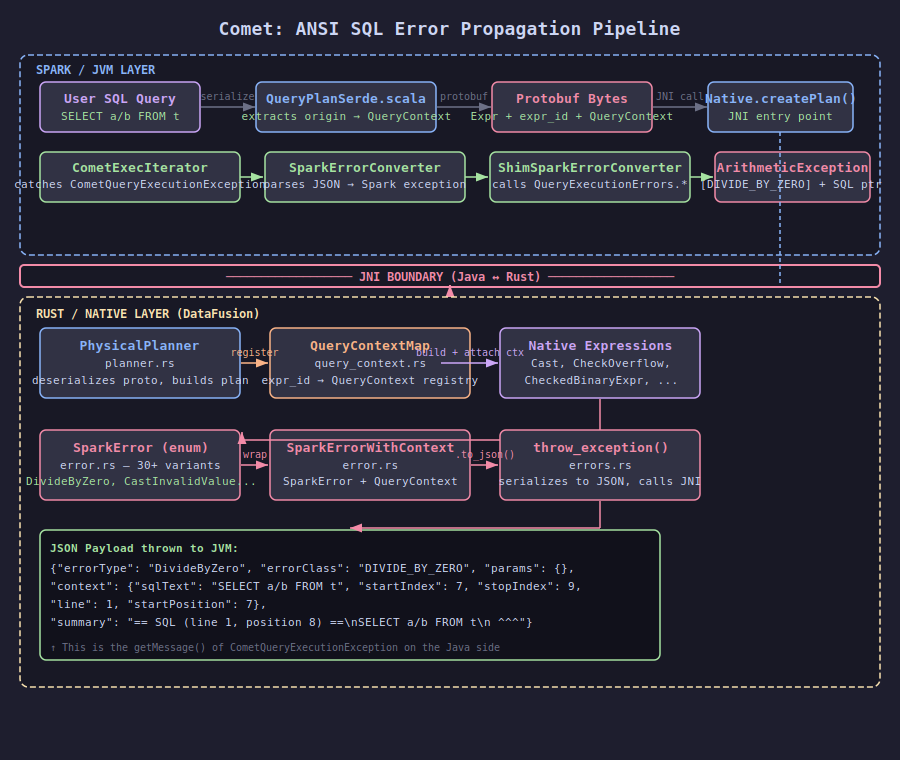

```
SQL Query (Spark/Scala) │ │  1. Spark serializes the plan + query context into Protobuf ▼ Protobuf bytes ──────────────────────────────────►  JNI boundary │ │  2. Rust deserializes the plan and registers query contexts ▼ Native execution (DataFusion / Rust) │ │  3. An error occurs (e.g. divide by zero) ▼ SparkError (Rust enum) │ │  4. Error is wrapped with SQL location context ▼ SparkErrorWithContext │ │  5. Serialized to JSON string ▼ JSON string ◄────────────────────────────────────  JNI boundary │ │  6. Thrown as CometQueryExecutionException ▼ CometExecIterator.scala catches it │ │  7. JSON is parsed, proper Spark exception is reconstructed ▼ Spark exception (e.g. ArithmeticException with DIVIDE_BY_ZERO errorClass) │ │  8. Spark displays it to the user with SQL location pointer ▼ User sees:[DIVIDE_BY_ZERO] Division by zero.== SQL (line 1, position 8) ==SELECT a/b FROM t ^^^
```

---

<a id="comet-contributor-guide-sql_error_propagation--step-1:-spark-serializes-query-context-into-protobuf"></a>

## Step 1: Spark Serializes Query Context into Protobuf

When Spark compiles a SQL query, it parses it and attaches *origin* information to every
expression — the line number, column offset, and the full SQL text.

`QueryPlanSerde.scala` is the Scala code that converts Spark’s physical execution plan into
a Protobuf binary that gets sent to the Rust side. It extracts origin information from each
expression and encodes it alongside the expression in the Protobuf payload.

<a id="comet-contributor-guide-sql_error_propagation--the-extractquerycontext-function"></a>

### The `extractQueryContext` function

```
// spark/src/main/scala/org/apache/comet/serde/QueryPlanSerde.scala private
def
extractQueryContext (expr:
Expression ):
Option [ExprOuterClass.QueryContext]
=
{
val
contexts
=
expr.origin.getQueryContext
// Spark stores context in expr.origin
if
(contexts
!=
null
&&
contexts.length
> 0) {val ctx=contexts (0) ctx match {case sqlCtx:SQLQueryContext=> val builder=ExprOuterClass.QueryContext.newBuilder ().setSqlText (sqlCtx.sqlText.getOrElse ("" ))// full SQL text.setStartIndex (sqlCtx.originStartIndex.getOrElse (...))// char offset of expression start.setStopIndex (sqlCtx.originStopIndex.getOrElse (...))// char offset of expression end.setLine (sqlCtx.line.getOrElse (0 )).setStartPosition (sqlCtx.startPosition.getOrElse (0 ))// ... Some (builder.build ())}}}
```

Then, for **every single expression** converted to Protobuf, a unique numeric ID and the
context are attached:

```
.map
{
protoExpr
=>
val
builder
=
protoExpr.toBuilder
builder.setExprId (nextExprId ())
// unique ID (monotonically increasing counter)
extractQueryContext (expr ).foreach
{
ctx
=>
builder.setQueryContext (ctx)
// attach the SQL location info
}
builder.build ()}
```

<a id="comet-contributor-guide-sql_error_propagation--the-protobuf-schema"></a>

### The Protobuf schema

```
// native/proto/src/proto/expr.proto message
Expr
{
optional
uint64
expr_id
=
89;
// unique ID for each expression
optional
QueryContext
query_context
=
90;
// SQL location info
// ... actual expression type ...} message
QueryContext
{
string
sql_text
=
1;
// "SELECT a/b FROM t"
int32
start_index
=
2;
// 7  (0-based character index of 'a')
int32
stop_index
=
3;
// 9  (0-based character index of 'b', inclusive)
int32
line
=
4;
// 1  (1-based line number)
int32
start_position
=
5;
// 7  (0-based column position)
optional
string
object_type
=
6;
// e.g. "VIEW"
optional
string
object_name
=
7;
// e.g. "v1"}
```

---

<a id="comet-contributor-guide-sql_error_propagation--step-2:-rust-deserializes-the-plan-and-registers-query-contexts"></a>

## Step 2: Rust Deserializes the Plan and Registers Query Contexts

On the Rust side, `PhysicalPlanner` in `planner.rs` converts the Protobuf into DataFusion’s
physical plan. A `QueryContextMap` — a global registry — maps expression IDs to their SQL
context.

<a id="comet-contributor-guide-sql_error_propagation--querycontextmap-native-spark-expr-src-query_context.rs"></a>

### `QueryContextMap` (`native/spark-expr/src/query_context.rs`)

```
pub
struct
QueryContextMap
{
contexts:
RwLock <HashMap <u64,
Arc <QueryContext >>>,} impl
QueryContextMap
{
pub
fn
register (& self,
expr_id:
u64,
context:
QueryContext)
{
...
}
pub
fn
get (& self,
expr_id:
u64)
->
Option <Arc <QueryContext >>
{
...
}}
```

This is basically a lookup table: “for expression #42, the SQL context is: text=`SELECT a/b FROM t`, characters 7–9, line 1, column 7”.

<a id="comet-contributor-guide-sql_error_propagation--the-physicalplanner-registers-contexts-during-plan-creation"></a>

### The `PhysicalPlanner` registers contexts during plan creation

```
// native/core/src/execution/planner.rs pub
struct
PhysicalPlanner
{
query_context_registry:
Arc <QueryContextMap>,
// ...} pub (crate)
fn
create_expr (& self,
spark_expr:
& Expr,
...)
{
// 1. If this expression has a query context, register it
if
let
(Some (expr_id ),
Some (ctx_proto ))
=
(spark_expr.expr_id,
spark_expr.query_context.as_ref ())
{
let
query_ctx
=
QueryContext::new (
ctx_proto.sql_text.clone (),
ctx_proto.start_index,
ctx_proto.stop_index,
...
);
self.query_context_registry.register (expr_id,
query_ctx );
}
// 2. When building specific expressions (Cast, CheckOverflow, etc.),
//    look up the context and pass it to the expression
ExprStruct::Cast (expr)
=>
{
let
query_context
=
spark_expr.expr_id.and_then (| id |
{
self.query_context_registry.get (id)
});
Ok (Arc::new (Cast::new (child,
datatype,
options,
spark_expr.expr_id,
query_context )))
}}
```

---

<a id="comet-contributor-guide-sql_error_propagation--step-3:-an-error-occurs-during-native-execution"></a>

## Step 3: An Error Occurs During Native Execution

During query execution, a Rust expression might encounter something like division by zero.

<a id="comet-contributor-guide-sql_error_propagation--the-sparkerror-enum-native-spark-expr-src-error.rs"></a>

### The `SparkError` enum (`native/spark-expr/src/error.rs`)

This enum contains one variant for every kind of error Spark can produce, with exactly the
same error message format as Spark:

```
pub
enum
SparkError
{
#[error("[DIVIDE_BY_ZERO] Division by zero. Use `try_divide` to tolerate divisor \ being 0 and return NULL instead. If necessary set \
\" spark.sql.ansi.enabled \" to \" false \" to bypass this error." )]
DivideByZero,
#[error("[CAST_INVALID_INPUT] The value '{value}' of the type \" {from_type} \" \ cannot be cast to \" {to_type} \" because it is malformed. ..." )]
CastInvalidValue
{
value:
String,
from_type:
String,
to_type:
String
},
// ... 30+ more variants matching Spark's error codes ...}
```

When a divide-by-zero happens, the arithmetic expression creates:

```
return
Err (DataFusionError::External (Box::new (SparkError::DivideByZero )));
```

---

<a id="comet-contributor-guide-sql_error_propagation--step-4:-error-gets-wrapped-with-sql-context"></a>

## Step 4: Error Gets Wrapped with SQL Context

The expression wrappers (`CheckedBinaryExpr`, `CheckOverflow`, `Cast`) catch the
`SparkError` and attach the SQL context using `SparkErrorWithContext`:

```
// native/core/src/execution/expressions/arithmetic.rs // CheckedBinaryExpr wraps arithmetic operations impl
PhysicalExpr
for
CheckedBinaryExpr
{
fn
evaluate (& self,
batch:
& RecordBatch)
->
Result <...>
{
match
self.child.evaluate (batch)
{
Err (DataFusionError::External (e ))
if
self.query_context.is_some ()
=>
{
if
let
Some (spark_error)
=
e.downcast_ref::<SparkError> ()
{
// Wrap the error with SQL location info
let
wrapped
=
SparkErrorWithContext::with_context (
spark_error.clone (),
Arc::clone (self.query_context.as_ref ().unwrap ()),
);
return
Err (DataFusionError::External (Box::new (wrapped )));
}
Err (DataFusionError::External (e ))
}
other
=>
other,
}
}}
```

<a id="comet-contributor-guide-sql_error_propagation--sparkerrorwithcontext-native-spark-expr-src-error.rs"></a>

### `SparkErrorWithContext` (`native/spark-expr/src/error.rs`)

```
pub
struct
SparkErrorWithContext
{
pub
error:
SparkError,
// the actual error
pub
context:
Option <Arc <QueryContext >>,
// optional SQL location}
```

---

<a id="comet-contributor-guide-sql_error_propagation--step-5:-error-is-serialized-to-json"></a>

## Step 5: Error Is Serialized to JSON

When DataFusion propagates the error all the way up through the execution engine and it
reaches the JNI boundary, `throw_exception()` in `errors.rs` is called. It detects the
`SparkErrorWithContext` type and calls `.to_json()` on it:

```
// native/core/src/errors.rs fn
throw_exception (env:
& mut
JNIEnv,
error:
& CometError,
...)
{
match
error
{
CometError::DataFusion
{
source:
DataFusionError::External (e ),
..
}
=>
{
if
let
Some (spark_err_ctx)
=
e.downcast_ref::<SparkErrorWithContext> ()
{
// Has SQL context → throw with JSON payload
let
json
=
spark_err_ctx.to_json ();
env.throw_new ("org/apache/comet/exceptions/CometQueryExecutionException",
json)
}
else
if
let
Some (spark_err)
=
e.downcast_ref::<SparkError> ()
{
// No SQL context → throw with JSON payload (no context field)
throw_spark_error_as_json (env,
spark_err)
}
}
// ...
}}
```

The JSON looks like this for a divide-by-zero in `SELECT a/b FROM t`:

```
{
"errorType":
"DivideByZero",
"errorClass":
"DIVIDE_BY_ZERO",
"params":
{},
"context":
{
"sqlText":
"SELECT a/b FROM t",
"startIndex":
7,
"stopIndex":
9,
"line":
1,
"startPosition":
7,
"objectType":
null,
"objectName":
null
},
"summary":
"== SQL (line 1, position 8) ==\nSELECT a/b FROM t\n       ^^^"}
```

---

<a id="comet-contributor-guide-sql_error_propagation--step-6:-java-receives-cometqueryexecutionexception"></a>

## Step 6: Java Receives `CometQueryExecutionException`

On the Java side, a thin exception class carries the JSON string as its message:

```
// common/src/main/java/org/apache/comet/exceptions/CometQueryExecutionException.java public
final
class CometQueryExecutionException
extends
CometNativeException
{
public
CometQueryExecutionException (String
jsonMessage)
{
super (jsonMessage );
}
public
boolean
isJsonMessage ()
{
String
msg
=
getMessage ();
return
msg
!=
null
&&
msg.trim ().startsWith ("{")
&&
msg.trim ().endsWith ("}" );
}}
```

---

<a id="comet-contributor-guide-sql_error_propagation--step-7:-scala-converts-json-back-to-a-real-spark-exception"></a>

## Step 7: Scala Converts JSON Back to a Real Spark Exception

`CometExecIterator.scala` is the Scala code that drives the native execution. Every time it
calls into the native engine for the next batch of data, it catches
`CometQueryExecutionException` and converts it:

```
// spark/src/main/scala/org/apache/comet/CometExecIterator.scala try
{
nativeUtil.getNextBatch (...)}
catch
{
case
e:
CometQueryExecutionException
=>
logError (s"Native execution for task $ taskAttemptId failed",
e)
throw
SparkErrorConverter.convertToSparkException (e)
// converts JSON to real exception}
```

<a id="comet-contributor-guide-sql_error_propagation--sparkerrorconverter.scala-parses-the-json"></a>

### `SparkErrorConverter.scala` parses the JSON

```
// spark/src/main/scala/org/apache/comet/SparkErrorConverter.scala def
convertToSparkException (e:
CometQueryExecutionException ):
Throwable
=
{
val
json
=
parse (e.getMessage)
val
errorJson
=
json.extract [ErrorJson]
// Reconstruct Spark's SQLQueryContext from the embedded context
val
sparkContext:
Array [QueryContext]
=
errorJson.context
match
{
case
Some (ctx)
=>
Array (SQLQueryContext (
sqlText
=
Some (ctx.sqlText ),
line
=
Some (ctx.line ),
startPosition
=
Some (ctx.startPosition ),
originStartIndex
=
Some (ctx.startIndex ),
originStopIndex
=
Some (ctx.stopIndex ),
originObjectType
=
ctx.objectType,
originObjectName
=
ctx.objectName ))
case
None
=>
Array.empty
}
// Delegate to version-specific shim
convertErrorType (errorJson.errorType,
errorClass,
params,
sparkContext,
summary)}
```

<a id="comet-contributor-guide-sql_error_propagation--shimsparkerrorconverter-calls-the-real-spark-api"></a>

### `ShimSparkErrorConverter` calls the real Spark API

Because Spark’s `QueryExecutionErrors` API changes between Spark versions (3.4, 3.5, and the 4.x line), there is a separate implementation per branch (in `spark-3.4/`, `spark-3.5/`, and `spark-4.x/`, which is
shared by Spark 4.0, 4.1, and 4.2).


```
// spark/src/main/spark-3.5/org/apache/spark/sql/comet/shims/ShimSparkErrorConverter.scala def
convertErrorType (errorType:
String,
errorClass:
String,
params:
Map [String,
Any ],
context:
Array [QueryContext ],
summary:
String ):
Option [Throwable]
=
{
errorType
match
{
case
"DivideByZero"
=>
Some (QueryExecutionErrors.divideByZeroError (sqlCtx (context )))
// This is the REAL Spark method that creates the ArithmeticException
// with the SQL context pointer. The error message will include
// "== SQL (line 1, position 8) ==" etc.
case
"CastInvalidValue"
=>
Some (QueryExecutionErrors.castingCauseOverflowError (...))
// ... all other error types ...
case
_
=>
None
// fallback to generic SparkException
}}
```

The Spark 3.5 shim vs the Spark 4.0 shim differ in subtle API ways:

```
// 3.5: binaryArithmeticCauseOverflowError does NOT take functionName case
"BinaryArithmeticOverflow"
=>
Some (QueryExecutionErrors.binaryArithmeticCauseOverflowError (
params ("value1" ).toString.toShort,
params ("symbol" ).toString,
params ("value2" ).toString.toShort )) // 4.0: overloadedMethod takes functionName parameter case
"BinaryArithmeticOverflow"
=>
Some (QueryExecutionErrors.binaryArithmeticCauseOverflowError (
params ("value1" ).toString.toShort,
params ("symbol" ).toString,
params ("value2" ).toString.toShort,
params ("functionName" ).toString ))
// extra param in 4.0
```

---

<a id="comet-contributor-guide-sql_error_propagation--step-8:-the-user-sees-a-proper-spark-error"></a>

## Step 8: The User Sees a Proper Spark Error

The final exception that propagates out of Spark looks exactly like what native Spark would
produce for the same error, including the ANSI error code and the SQL pointer:

```
org.apache.spark.SparkArithmeticException: [DIVIDE_BY_ZERO] Division by zero.
Use `try_divide` to tolerate divisor being 0 and return NULL instead.
If necessary set "spark.sql.ansi.enabled" to "false" to bypass this error.

== SQL (line 1, position 8) ==
SELECT a/b FROM t
       ^^^
```

---

<a id="comet-contributor-guide-sql_error_propagation--key-data-structures:-a-summary"></a>

## Key Data Structures: A Summary

| Structure | Language | File | Purpose |
| --- | --- | --- | --- |
| `QueryContext` (proto) | Protobuf | `expr.proto` | Wire format for SQL location info |
| `QueryContext` (Rust) | Rust | `query_context.rs` | In-memory SQL location info |
| `QueryContextMap` | Rust | `query_context.rs` | Registry: expr\_id → QueryContext |
| `SparkError` | Rust | `error.rs` | Typed Rust enum matching all Spark error variants |
| `SparkErrorWithContext` | Rust | `error.rs` | SparkError + optional QueryContext |
| `CometQueryExecutionException` | Java | `CometQueryExecutionException.java` | JNI transport: carries JSON string |
| `SparkErrorConverter` | Scala | `SparkErrorConverter.scala` | Parses JSON, creates real Spark exception |
| `ShimSparkErrorConverter` | Scala | `ShimSparkErrorConverter.scala` | Per-Spark-version calls to `QueryExecutionErrors.*` |

---

<a id="comet-contributor-guide-sql_error_propagation--why-json-why-not-throw-the-right-exception-directly"></a>

## Why JSON? Why Not Throw the Right Exception Directly?

JNI does not support throwing arbitrary Java exception subclasses from Rust directly — you
can only provide a class name and a string message. The class name is fixed (always
`CometQueryExecutionException`), but the string payload can carry any structured data.

JSON was chosen because:

1. It is self-describing — the receiver can parse it without knowing the structure in advance.
2. It is easy to add new fields without breaking old parsers.
3. It maps cleanly to Scala’s case class extraction (`json.extract[ErrorJson]`).
4. All the typed information (error class, parameters, SQL context) can be round-tripped
   perfectly.

The alternative — throwing different Java exception classes from Rust — would require a
separate JNI throw path for each of the 30+ error types, which would be much harder to
maintain.

---

<a id="comet-contributor-guide-sql_error_propagation--why-sparkerror-has-its-own-error_class-method"></a>

## Why `SparkError` Has Its Own `error_class()` Method

Each `SparkError` variant knows its own ANSI error class code (e.g. `"DIVIDE_BY_ZERO"`, `"CAST_INVALID_INPUT"`). This is used both:

- In the JSON payload’s `"errorClass"` field (so the Java side can pass it to
  `SparkException(errorClass = ...)` as a fallback)
- In the legacy `exception_class()` method that maps to the right Java exception class (e.g.
  `"java/lang/ArithmeticException"`)

---

<a id="comet-contributor-guide-sql_error_propagation--diagrams"></a>

## Diagrams

<a id="comet-contributor-guide-sql_error_propagation--end-to-end-pipeline"></a>

### End-to-End Pipeline


<a id="comet-contributor-guide-sql_error_propagation--querycontext-journey:-from-sql-text-to-error-pointer"></a>

### QueryContext Journey: From SQL Text to Error Pointer

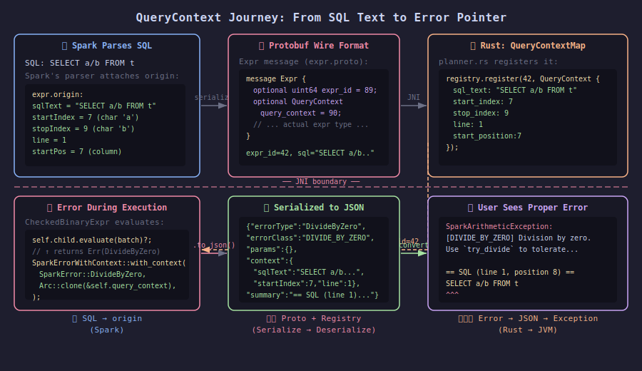

<a id="comet-contributor-guide-sql_error_propagation--shim-pattern:-per-version-spark-api-bridging"></a>

### Shim Pattern: Per-Version Spark API Bridging


---

*This document and its diagrams were written by [Claude](https://claude.ai) (Anthropic).*

---

<a id="comet-contributor-guide-benchmarking"></a>

<!-- source_url: https://datafusion.apache.org/comet/contributor-guide/benchmarking.html -->

<!-- page_index: 217 -->

<a id="comet-contributor-guide-benchmarking--comet-benchmarking-guide"></a>

# Comet Benchmarking Guide

To track progress on performance, we regularly run benchmarks derived from TPC-H and TPC-DS.

The benchmarking scripts are contained [here](https://github.com/apache/datafusion-comet/tree/main/benchmarks/tpc).

Data generation scripts are available in the [DataFusion Benchmarks](https://github.com/apache/datafusion-benchmarks) GitHub repository.

<a id="comet-contributor-guide-benchmarking--current-benchmark-results"></a>

## Current Benchmark Results

- [Benchmarks derived from TPC-H](#comet-contributor-guide-benchmark-results-tpc-h)
- [Benchmarks derived from TPC-DS](#comet-contributor-guide-benchmark-results-tpc-ds)

<a id="comet-contributor-guide-benchmarking--benchmarking-guides"></a>

## Benchmarking Guides

Available benchmarking guides:

- [Benchmarking on macOS](#comet-contributor-guide-benchmarking_macos)
- [Benchmarking on AWS EC2](#comet-contributor-guide-benchmarking_aws_ec2)
- [TPC-DS Benchmarking with spark-sql-perf](#comet-contributor-guide-benchmarking_spark_sql_perf)

We also have many micro benchmarks that can be run from an IDE located [here](https://github.com/apache/datafusion-comet/tree/main/spark/src/test/scala/org/apache/spark/sql/benchmark).

---

<a id="comet-contributor-guide-benchmark-results-tpc-h"></a>

<!-- source_url: https://datafusion.apache.org/comet/contributor-guide/benchmark-results/tpc-h.html -->

<!-- page_index: 218 -->

<a id="comet-contributor-guide-benchmark-results-tpc-h--apache-datafusion-comet:-benchmarks-derived-from-tpc-h"></a>

# Apache DataFusion Comet: Benchmarks Derived From TPC-H

The following benchmarks were performed on an EKS cluster (`r6i.24xlarge` instances with EBS storage) with data stored in S3.

<a id="comet-contributor-guide-benchmark-results-tpc-h--benchmark-results"></a>

## Benchmark Results

Total time to run all queries (lower is better).

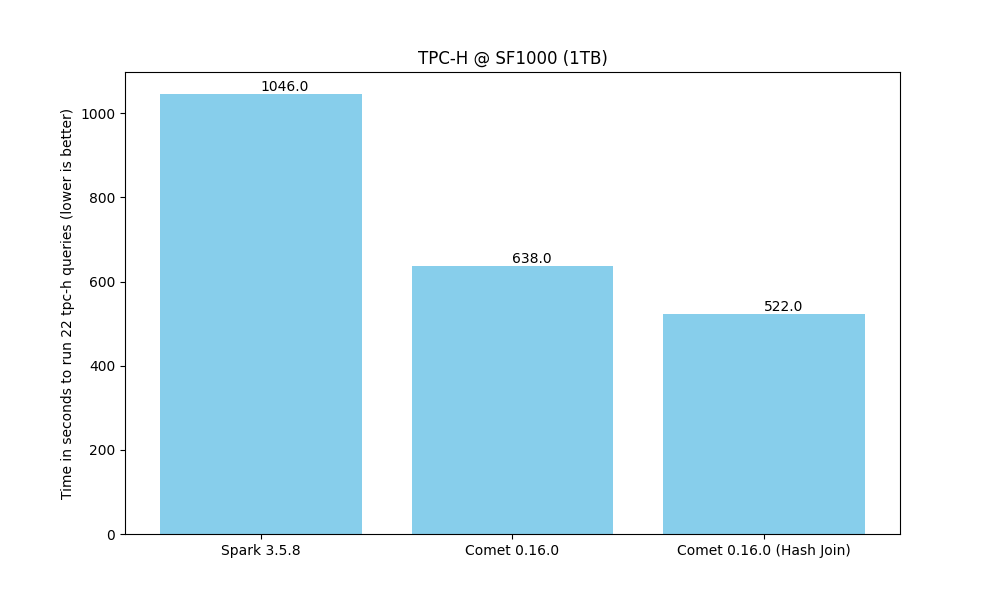

The following charts are based on the tuned run using hash join.

Per-query breakdown showing the relative performance of Spark and Comet.

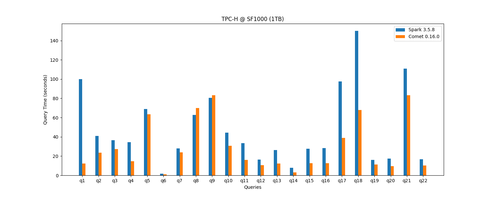

How much Comet accelerates each query in relative terms.

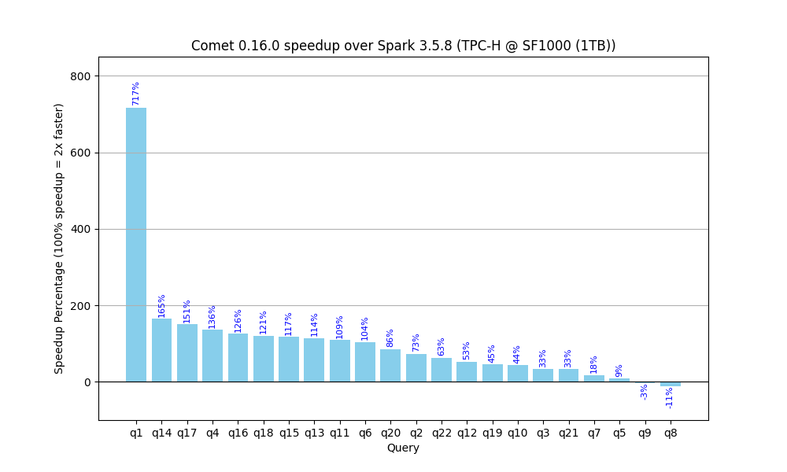

How much Comet accelerates each query in absolute terms.

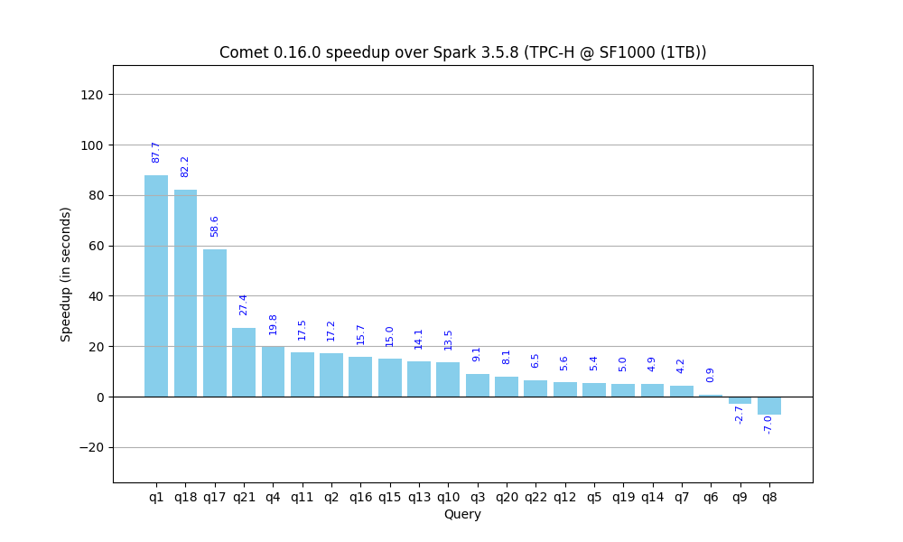

<a id="comet-contributor-guide-benchmark-results-tpc-h--configuration"></a>

## Configuration

Common:

```
spark.executor.instances =32 spark.executor.cores =16 spark.memory.fraction =0.6 spark.memory.storageFraction =0.2 # Kubernetes CPU constraints spark.kubernetes.executor.request.cores =8 spark.kubernetes.executor.limit.cores =8
```

Spark:

```

spark.executor.memory
=
64G
spark.executor.memoryOverhead
=
10G
```

Comet:

```
spark.executor.memory =32G spark.executor.memoryOverhead =10G spark.memory.offHeap.enabled =true spark.memory.offHeap.size =32G
```

<a id="comet-contributor-guide-benchmark-results-tpc-h--comet-tuned"></a>

### Comet (Tuned)

```

spark.comet.exec.replaceSortMergeJoin
=
true
spark.comet.memoryPool.fraction
=
0.8
```

---

<a id="comet-contributor-guide-benchmark-results-tpc-ds"></a>

<!-- source_url: https://datafusion.apache.org/comet/contributor-guide/benchmark-results/tpc-ds.html -->

<!-- page_index: 219 -->

<a id="comet-contributor-guide-benchmark-results-tpc-ds--apache-datafusion-comet:-benchmarks-derived-from-tpc-ds"></a>

# Apache DataFusion Comet: Benchmarks Derived From TPC-DS

The following benchmarks were performed on an EKS cluster (`r6i.24xlarge` instances with EBS storage) with data stored in S3.

<a id="comet-contributor-guide-benchmark-results-tpc-ds--benchmark-results"></a>

## Benchmark Results

Total time to run all queries (lower is better).


Per-query breakdown showing the relative performance of Spark and Comet.

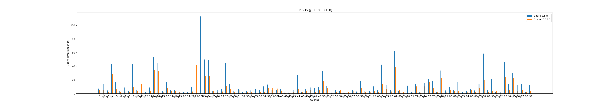

How much Comet accelerates each query in relative terms.


How much Comet accelerates each query in absolute terms.

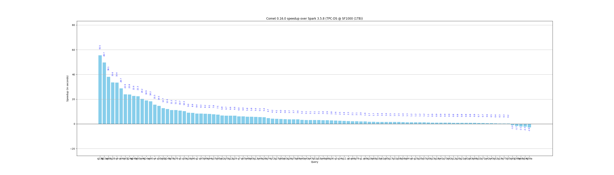

<a id="comet-contributor-guide-benchmark-results-tpc-ds--configuration"></a>

## Configuration

Common:

```
spark.executor.instances =32 spark.executor.cores =16 spark.memory.fraction =0.6 spark.memory.storageFraction =0.2 # Kubernetes CPU constraints spark.kubernetes.executor.request.cores =8 spark.kubernetes.executor.limit.cores =8
```

Spark:

```

spark.executor.memory
=
64G
spark.executor.memoryOverhead
=
10G
```

Comet:

```
spark.executor.memory =64G spark.executor.memoryOverhead =10G spark.memory.offHeap.enabled =true spark.memory.offHeap.size =32G spark.comet.memoryPool.fraction =0.8
```

---

<a id="comet-contributor-guide-benchmarking_macos"></a>

<!-- source_url: https://datafusion.apache.org/comet/contributor-guide/benchmarking_macos.html -->

<!-- page_index: 220 -->

<a id="comet-contributor-guide-benchmarking_macos--comet-benchmarking-on-macos"></a>

# Comet Benchmarking on macOS

This guide is for setting up TPC-H benchmarks locally on macOS using the 100 GB dataset.

Note that running this benchmark on macOS is not ideal because we cannot force Spark or Comet to use performance
cores rather than efficiency cores, and background processes are sharing these cores. Also, power and thermal
management may throttle CPU cores.

<a id="comet-contributor-guide-benchmarking_macos--prerequisites"></a>

## Prerequisites

Java and Rust must be installed locally.

<a id="comet-contributor-guide-benchmarking_macos--data-generation"></a>

## Data Generation

```
cargo install tpchgen-cli
mkdir benchmark_data
cd benchmark_data
tpchgen-cli -s 100 --format=parquet
export $BENCH_DATA=`pwd`
```

Create a temp folder for spark events emitted during benchmarking

```
mkdir /tmp/spark-events
```

<a id="comet-contributor-guide-benchmarking_macos--clone-the-datafusion-benchmarks-repository"></a>

## Clone the DataFusion Benchmarks Repository

```
git clone https://github.com/apache/datafusion-benchmarks.git
cd
export DF_BENCH=`pwd`
```

<a id="comet-contributor-guide-benchmarking_macos--install-spark"></a>

## Install Spark

Install Apache Spark. This example refers to 4.1.1 version.

```
wget https://archive.apache.org/dist/spark/spark-4.1.1/spark-4.1.1-bin-hadoop3.tgz
tar xzf spark-4.1.1-bin-hadoop3.tgz
sudo mv spark-4.1.1-bin-hadoop3 /opt
export SPARK_HOME=/opt/spark-4.1.1-bin-hadoop3/
```

Start Spark in standalone mode:

```
$SPARK_HOME/sbin/start-master.sh
```

Set `SPARK_MASTER` env var (host name will need to be edited):

```
export SPARK_MASTER=spark://Rustys-MacBook-Pro.local:7077
```

```
$SPARK_HOME/sbin/start-worker.sh $SPARK_MASTER
```

<a id="comet-contributor-guide-benchmarking_macos--start-local-apache-spark-cluster-using-spark-class"></a>

### Start local Apache Spark cluster using `spark-class`

For Apache Spark distributions installed using `brew` tool, it may happen there is no `$SPARK_HOME/sbin` folder on your machine.
In order to start local Apache Spark cluster on `localhost:7077` port, run:

```
$SPARK_HOME/bin/spark-class org.apache.spark.deploy.master.Master --host 127.0.0.1 --port 7077 --webui-port 8080
```

Once master has started, in separate console start the worker referring the spark master uri on `localhost:7077`

```
$SPARK_HOME/bin/spark-class org.apache.spark.deploy.worker.Worker --cores 8 --memory 16G spark://localhost:7077
```

<a id="comet-contributor-guide-benchmarking_macos--run-spark-benchmarks"></a>

## Run Spark Benchmarks

Run the following command (the `--data` parameter will need to be updated to point to your TPC-H data):

```
$SPARK_HOME/bin/spark-submit \
    --master $SPARK_MASTER \
    --conf spark.driver.memory=8G \
    --conf spark.executor.instances=1 \
    --conf spark.executor.cores=8 \
    --conf spark.cores.max=8 \
    --conf spark.executor.memory=16g \
    --conf spark.memory.offHeap.enabled=true \
    --conf spark.memory.offHeap.size=16g \
    --conf spark.eventLog.enabled=true \
    $DF_BENCH/runners/datafusion-comet/tpcbench.py \
    --benchmark tpch \
    --data $BENCH_DATA/tpch-data/ \
    --queries $DF_BENCH/tpch/queries \
    --output . \
    --iterations 1
```

<a id="comet-contributor-guide-benchmarking_macos--run-comet-benchmarks"></a>

## Run Comet Benchmarks

Build Comet from source, with `mimalloc` enabled.

```
make release COMET_FEATURES=mimalloc
```

Set `COMET_JAR` to point to the location of the Comet jar file. Example for Comet 0.8

```
export COMET_JAR=`pwd`/spark/target/comet-spark-spark4.1_2.13-0.8.0-SNAPSHOT.jar
```

Run the following command (the `--data` parameter will need to be updated to point to your S3 bucket):

```
$SPARK_HOME/bin/spark-submit \
    --master $SPARK_MASTER \
    --conf spark.driver.memory=8G \
    --conf spark.executor.instances=1 \
    --conf spark.executor.cores=8 \
    --conf spark.cores.max=8 \
    --conf spark.executor.memory=16g \
    --conf spark.memory.offHeap.enabled=true \
    --conf spark.memory.offHeap.size=16g \
    --conf spark.eventLog.enabled=true \
    --jars $COMET_JAR \
    --driver-class-path $COMET_JAR \
    --conf spark.driver.extraClassPath=$COMET_JAR \
    --conf spark.executor.extraClassPath=$COMET_JAR \
    --conf spark.plugins=org.apache.spark.CometPlugin \
    --conf spark.shuffle.manager=org.apache.spark.sql.comet.execution.shuffle.CometShuffleManager \
    --conf spark.comet.enabled=true \
    --conf spark.comet.exec.shuffle.enableFastEncoding=true \
    --conf spark.comet.exec.shuffle.fallbackToColumnar=true \
    --conf spark.comet.exec.replaceSortMergeJoin=true \
    --conf spark.comet.expression.allowIncompatible=true \
    $DF_BENCH/runners/datafusion-comet/tpcbench.py \
    --benchmark tpch \
    --data $BENCH_DATA/tpch-data/ \
    --queries $DF_BENCH/tpch/queries \
    --output . \
    --iterations 1
```

---

<a id="comet-contributor-guide-benchmarking_aws_ec2"></a>

<!-- source_url: https://datafusion.apache.org/comet/contributor-guide/benchmarking_aws_ec2.html -->

<!-- page_index: 221 -->

<a id="comet-contributor-guide-benchmarking_aws_ec2--comet-benchmarking-in-ec2"></a>

# Comet Benchmarking in EC2

This guide is for setting up benchmarks on AWS EC2 with a single node with Parquet files either located on an
attached EBS volume, or stored in S3.

<a id="comet-contributor-guide-benchmarking_aws_ec2--create-ec2-instance"></a>

## Create EC2 Instance

- Create an EC2 instance with an EBS volume sized for approximately 2x the size of
  the dataset to be generated (200 GB for scale factor 100, 2 TB for scale factor 1000, and so on)
- Optionally, create an S3 bucket to store the Parquet files

Recommendation: Use `c7i.4xlarge` instance type with `provisioned iops 2` EBS volume (8000 IOPS).

<a id="comet-contributor-guide-benchmarking_aws_ec2--install-prerequisites"></a>

## Install Prerequisites

```
sudo yum update -y
sudo yum install -y git protobuf-compiler java-17-amazon-corretto-headless java-17-amazon-corretto-devel
sudo yum groupinstall -y "Development Tools"
export JAVA_HOME=/usr/lib/jvm/java-17-amazon-corretto
```

<a id="comet-contributor-guide-benchmarking_aws_ec2--generate-benchmark-data"></a>

## Generate Benchmark Data

```
curl --proto '=https' --tlsv1.2 -sSf https://sh.rustup.rs | sh
RUSTFLAGS='-C target-cpu=native' cargo install tpchgen-cli
tpchgen-cli -s 100 --format parquet --parts 32 --output-dir data
```

Rename the generated directories so that they have a `.parquet` suffix. For example, rename `customer` to
`customer.parquet`.

Set the `TPCH_DATA` environment variable. This will be referenced by the benchmarking scripts.

```
export TPCH_DATA=/home/ec2-user/data
```

<a id="comet-contributor-guide-benchmarking_aws_ec2--install-apache-spark"></a>

## Install Apache Spark

```
export SPARK_VERSION=3.5.6
wget https://archive.apache.org/dist/spark/spark-$SPARK_VERSION/spark-$SPARK_VERSION-bin-hadoop3.tgz
tar xzf spark-$SPARK_VERSION-bin-hadoop3.tgz
sudo mv spark-$SPARK_VERSION-bin-hadoop3 /opt
export SPARK_HOME=/opt/spark-$SPARK_VERSION-bin-hadoop3/
mkdir /tmp/spark-events
```

Set `SPARK_MASTER` env var (IP address will need to be edited):

```
export SPARK_MASTER=spark://172.31.34.87:7077
```

Set `SPARK_LOCAL_DIRS` to point to EBS volume

```
sudo mkdir /mnt/tmp
sudo chmod 777 /mnt/tmp
mv $SPARK_HOME/conf/spark-env.sh.template $SPARK_HOME/conf/spark-env.sh
```

Add the following entry to `spark-env.sh`:

```
SPARK_LOCAL_DIRS=/mnt/tmp
```

<a id="comet-contributor-guide-benchmarking_aws_ec2--git-clone-datafusion-repositories"></a>

## Git Clone DataFusion Repositories

```
git clone https://github.com/apache/datafusion-benchmarks.git
git clone https://github.com/apache/datafusion-comet.git
```

Build Comet

```
cd datafusion-comet
make release
```

Set `COMET_JAR` environment variable.

```
export COMET_JAR=/home/ec2-user/datafusion-comet/spark/target/comet-spark-spark4.1_2.13-$COMET_VERSION.jar
```

<a id="comet-contributor-guide-benchmarking_aws_ec2--run-benchmarks"></a>

## Run Benchmarks

Use the scripts in `benchmarks/tpc` in the Comet repository.

```
cd benchmarks/tpc
export TPCH_QUERIES=/home/ec2-user/datafusion-benchmarks/tpch/queries/
```

Run Spark benchmark:

```
python3 run.py --engine spark --benchmark tpch
```

Run Comet benchmark:

```
python3 run.py --engine comet --benchmark tpch
```

<a id="comet-contributor-guide-benchmarking_aws_ec2--running-benchmarks-with-s3"></a>

## Running Benchmarks with S3

Copy the Parquet data to an S3 bucket.

```
aws s3 cp /home/ec2-user/data s3://your-bucket-name/--recursive
```

Update `TPCH_DATA` environment variable.

```
export TPCH_DATA=s3a://your-bucket-name
```

Install Hadoop jar files:

```
wget https://repo1.maven.org/maven2/org/apache/hadoop/hadoop-aws/3.3.4/hadoop-aws-3.3.4.jar -P $SPARK_HOME/jars
wget https://repo1.maven.org/maven2/com/amazonaws/aws-java-sdk-bundle/1.11.1026/aws-java-sdk-bundle-1.11.1026.jar -P $SPARK_HOME/jars
```

Add credentials to `~/.aws/credentials`:

```
[default]
aws_access_key_id=your-access-key
aws_secret_access_key=your-secret-key
```

Modify the scripts to add the following configurations.

```
--conf spark.hadoop.fs.s3a.impl=org.apache.hadoop.fs.s3a.S3AFileSystem \
--conf spark.hadoop.fs.s3a.aws.credentials.provider=com.amazonaws.auth.DefaultAWSCredentialsProviderChain \
```

Now run the benchmarks:

```
python3 run.py --engine spark --benchmark tpch
python3 run.py --engine comet --benchmark tpch
```

---

<a id="comet-contributor-guide-benchmarking_spark_sql_perf"></a>

<!-- source_url: https://datafusion.apache.org/comet/contributor-guide/benchmarking_spark_sql_perf.html -->

<!-- page_index: 222 -->

<a id="comet-contributor-guide-benchmarking_spark_sql_perf--tpc-ds-benchmarking-with-spark-sql-perf"></a>

# TPC-DS Benchmarking with spark-sql-perf

This guide explains how to generate TPC-DS data and run TPC-DS benchmarks using the
[KubedAI/spark-sql-perf](https://github.com/KubedAI/spark-sql-perf) framework (a fork of
[databricks/spark-sql-perf](https://github.com/databricks/spark-sql-perf)).

We use the KubedAI fork because it adds two features not present in the upstream Databricks repository:

- **Apache Iceberg support** — allows generating and registering TPC-DS tables in Iceberg format, which is
  needed for Comet Iceberg benchmarking.
- **TPC-DS v4.0 queries** — adds the full set of TPC-DS v4.0 queries alongside the existing v1.4 and v2.4 sets.

The spark-sql-perf approach uses the TPC-DS `dsdgen` tool to generate data directly through Spark, which handles
partitioning and writing to Parquet format automatically.

<a id="comet-contributor-guide-benchmarking_spark_sql_perf--prerequisites"></a>

## Prerequisites

- Java 17
- Apache Spark 4.1.x
- SBT (Scala Build Tool)
- C compiler toolchain (`gcc`, `make`, `flex`, `bison`, `byacc`)

<a id="comet-contributor-guide-benchmarking_spark_sql_perf--step-1:-build-tpcds-kit"></a>

## Step 1: Build tpcds-kit

The `dsdgen` tool from [databricks/tpcds-kit](https://github.com/databricks/tpcds-kit) is required for data
generation. This is a modified fork of the official TPC-DS toolkit that outputs to stdout, allowing Spark to
ingest the data directly.

**Linux (Ubuntu/Debian):**

```
sudo apt-get install -y gcc make flex bison byacc git
git clone https://github.com/databricks/tpcds-kit.git
cd tpcds-kit/tools
make OS=LINUX
```

**Linux (CentOS/RHEL/Amazon Linux):**

```
sudo yum install -y gcc make flex bison byacc git
git clone https://github.com/databricks/tpcds-kit.git
cd tpcds-kit/tools
make OS=LINUX
```

**macOS:**

```
xcode-select --install
git clone https://github.com/databricks/tpcds-kit.git
cd tpcds-kit/tools
make OS=MACOS
```

Verify the build succeeded:

```
ls -l dsdgen
```

<a id="comet-contributor-guide-benchmarking_spark_sql_perf--step-2:-build-spark-sql-perf"></a>

## Step 2: Build spark-sql-perf

```
git clone https://github.com/KubedAI/spark-sql-perf.git
cd spark-sql-perf
git checkout support-iceberg-tpcds-v4.0
sbt package
```

This produces a JAR file at `target/scala-2.12/spark-sql-perf_2.12-0.5.1-SNAPSHOT.jar` (the exact version may
vary). Note the path to this JAR for later use.

<a id="comet-contributor-guide-benchmarking_spark_sql_perf--step-3:-install-and-start-spark"></a>

## Step 3: Install and Start Spark

If you do not already have Spark installed:

```
export SPARK_VERSION=3.5.6
wget https://archive.apache.org/dist/spark/spark-$SPARK_VERSION/spark-$SPARK_VERSION-bin-hadoop3.tgz
tar xzf spark-$SPARK_VERSION-bin-hadoop3.tgz
sudo mv spark-$SPARK_VERSION-bin-hadoop3 /opt
export SPARK_HOME=/opt/spark-$SPARK_VERSION-bin-hadoop3/
export JAVA_HOME=/usr/lib/jvm/java-17-openjdk-amd64
mkdir -p /tmp/spark-events
```

Start Spark in standalone mode:

```
$SPARK_HOME/sbin/start-master.sh
export SPARK_MASTER=spark://$(hostname):7077
$SPARK_HOME/sbin/start-worker.sh $SPARK_MASTER
```

<a id="comet-contributor-guide-benchmarking_spark_sql_perf--step-4:-generate-tpc-ds-data"></a>

## Step 4: Generate TPC-DS Data

Launch `spark-shell` with the spark-sql-perf JAR loaded:

```
$SPARK_HOME/bin/spark-shell \
    --master $SPARK_MASTER \
    --jars /path/to/spark-sql-perf/target/scala-2.12/spark-sql-perf_2.12-0.5.1-SNAPSHOT.jar \
    --conf spark.driver.memory=8G \
    --conf spark.executor.instances=1 \
    --conf spark.executor.cores=8 \
    --conf spark.executor.memory=16g
```

In the Spark shell, run the following to generate data. Adjust `scaleFactor` and paths as needed:

```
import
com.databricks.spark.sql.perf.tpcds.TPCDSTables val
tpcdsKit
=
"/path/to/tpcds-kit/tools" val
scaleFactor
=
"100"
// 100 GB val
dataDir
=
"/path/to/tpcds-data" val
format
=
"parquet" val
numPartitions
=
32
// adjust based on cluster size val
tables
=
new
TPCDSTables (spark.sqlContext,
dsdgenDir
=
tpcdsKit,
scaleFactor
=
scaleFactor) tables.genData (
location
=
dataDir,
format
=
format,
overwrite
=
true,
partitionTables
=
true,
clusterByPartitionColumns
=
true,
filterOutNullPartitionValues
=
false,
numPartitions
=
numPartitions)
```

Data generation for SF100 typically takes 20-60 minutes depending on hardware. When complete, exit the shell:

```

:
quit
```

Verify the data was generated:

```
ls /path/to/tpcds-data/
```

You should see directories for each TPC-DS table (`store_sales`, `catalog_sales`, `web_sales`, `customer`, `date_dim`, etc.).

Set the `TPCDS_DATA` environment variable:

```
export TPCDS_DATA=/path/to/tpcds-data
```

<a id="comet-contributor-guide-benchmarking_spark_sql_perf--step-5:-run-tpc-ds-benchmarks"></a>

## Step 5: Run TPC-DS Benchmarks

<a id="comet-contributor-guide-benchmarking_spark_sql_perf--register-tables"></a>

### Register Tables

Launch `spark-shell` with the spark-sql-perf JAR (same as Step 4) and register the generated data as tables:

```
import
com.databricks.spark.sql.perf.tpcds .{TPCDS,
TPCDSTables} val
scaleFactor
=
"100" val
dataDir
=
"/path/to/tpcds-data" val
format
=
"parquet" val
databaseName
=
"tpcds" // Create database and register tables sql (s"CREATE DATABASE IF NOT EXISTS $ databaseName ") val
tables
=
new
TPCDSTables (spark.sqlContext,
dsdgenDir
=
"",
scaleFactor
=
scaleFactor) tables.createExternalTables (
location
=
dataDir,
format
=
format,
databaseName
=
databaseName,
overwrite
=
true,
discoverPartitions
=
true) sql (s"USE $ databaseName ")
```

<a id="comet-contributor-guide-benchmarking_spark_sql_perf--run-spark-baseline"></a>

### Run Spark Baseline

```
val
tpcds
=
new
TPCDS (spark.sqlContext) // Choose a query set: tpcds1_4Queries, tpcds2_4Queries, or tpcds4_0Queries val
queries
=
tpcds.tpcds2_4Queries val
experiment
=
tpcds.runExperiment (
executionsToRun
=
queries,
iterations
=
3,
resultLocation
=
"/path/to/results/spark",
tags
=
Map ("engine"
->
"spark",
"scale_factor"
->
"100" ),
forkThread
=
true) experiment.waitForFinish (86400)
```

Results are saved as JSON to the `resultLocation` path.

<a id="comet-contributor-guide-benchmarking_spark_sql_perf--run-with-comet"></a>

### Run with Comet

Build Comet from source and launch `spark-shell` with both the Comet and spark-sql-perf JARs:

```
make release
export COMET_JAR=$(pwd)/spark/target/comet-spark-spark4.1_2.13-*.jar

$SPARK_HOME/bin/spark-shell \
    --master $SPARK_MASTER \
    --jars /path/to/spark-sql-perf/target/scala-2.12/spark-sql-perf_2.12-0.5.1-SNAPSHOT.jar,$COMET_JAR \
    --conf spark.driver.memory=8G \
    --conf spark.executor.instances=1 \
    --conf spark.executor.cores=8 \
    --conf spark.executor.memory=8g \
    --conf spark.memory.offHeap.enabled=true \
    --conf spark.memory.offHeap.size=8g \
    --conf spark.executor.extraClassPath=$COMET_JAR \
    --conf spark.sql.extensions=org.apache.comet.CometSparkSessionExtensions \
    --conf spark.comet.enabled=true \
    --conf spark.comet.exec.enabled=true \
    --conf spark.comet.exec.all.enabled=true \
    --conf spark.shuffle.manager=org.apache.spark.sql.comet.execution.shuffle.CometShuffleManager \
    --conf spark.comet.exec.shuffle.enabled=true \
    --conf spark.comet.columnar.shuffle.enabled=true
```

Then register tables and run the benchmark the same way as the Spark baseline, changing the tags and result
location:

```
val
experiment
=
tpcds.runExperiment (
executionsToRun
=
queries,
iterations
=
3,
resultLocation
=
"/path/to/results/comet",
tags
=
Map ("engine"
->
"comet",
"scale_factor"
->
"100" ),
forkThread
=
true) experiment.waitForFinish (86400)
```

<a id="comet-contributor-guide-benchmarking_spark_sql_perf--view-results"></a>

### View Results

Results are saved as JSON under the `resultLocation`. You can query them directly in Spark:

```
val
results
=
spark.read.json ("/path/to/results/spark") results.select ("name",
"parsingTime",
"analysisTime",
"optimizationTime",
"planningTime",
"executionTime")
.withColumn ("totalTime",
(col ("parsingTime")
+
col ("analysisTime")
+
col ("optimizationTime")
+
col ("planningTime")
+
col ("executionTime" ))
/
1000.0)
.orderBy ("name")
.show (200,
false)
```

<a id="comet-contributor-guide-benchmarking_spark_sql_perf--alternative:-command-line-data-generation"></a>

## Alternative: Command-Line Data Generation

You can also generate TPC-DS data without the Spark shell using `spark-submit`:

```
$SPARK_HOME/bin/spark-submit \
    --master $SPARK_MASTER \
    --class com.databricks.spark.sql.perf.tpcds.GenTPCDSData \
    --conf spark.driver.memory=8G \
    --conf spark.executor.instances=1 \
    --conf spark.executor.cores=8 \
    --conf spark.executor.memory=16g \
    /path/to/spark-sql-perf/target/scala-2.12/spark-sql-perf_2.12-0.5.1-SNAPSHOT.jar \
    -d /path/to/tpcds-kit/tools \
    -s 100 \
    -l /path/to/tpcds-data \
    -f parquet
```

<a id="comet-contributor-guide-benchmarking_spark_sql_perf--troubleshooting"></a>

## Troubleshooting

<a id="comet-contributor-guide-benchmarking_spark_sql_perf--dsdgen-not-found"></a>

### dsdgen not found

Ensure `tpcds-kit/tools/dsdgen` exists and is executable. The `dsdgenDir` parameter in the Spark shell (or `-d`
flag in the CLI) must point to the directory containing the `dsdgen` binary, not the binary itself.

<a id="comet-contributor-guide-benchmarking_spark_sql_perf--out-of-memory-during-data-generation"></a>

### Out of memory during data generation

For large scale factors (SF1000+), increase executor memory and the number of partitions:

```
--conf spark.executor.memory=32g
```

And in the Spark shell, use a higher `numPartitions` value (e.g., 200+).

---

<a id="comet-contributor-guide-adding_a_new_operator"></a>

<!-- source_url: https://datafusion.apache.org/comet/contributor-guide/adding_a_new_operator.html -->

<!-- page_index: 223 -->

<a id="comet-contributor-guide-adding_a_new_operator--adding-a-new-operator"></a>

# Adding a New Operator

This guide explains how to add support for a new Spark physical operator in Apache DataFusion Comet.

<a id="comet-contributor-guide-adding_a_new_operator--overview"></a>

## Overview

`CometExecRule` is responsible for replacing Spark operators with Comet operators. There are different approaches to
implementing Comet operators depending on where they execute and how they integrate with the native execution engine.

<a id="comet-contributor-guide-adding_a_new_operator--types-of-comet-operators"></a>

### Types of Comet Operators

`CometExecRule` maintains two distinct maps of operators:

<a id="comet-contributor-guide-adding_a_new_operator--1.-native-operators-nativeexecs-map"></a>

#### 1. Native Operators (`nativeExecs` map)

These operators run entirely in native Rust code and are the primary way to accelerate Spark workloads. Native
operators are registered in the `nativeExecs` map in `CometExecRule.scala`.

Key characteristics of native operators:

- They are converted to their corresponding native protobuf representation
- They execute as DataFusion operators in the native engine
- The `CometOperatorSerde` implementation handles enable/disable checks, support validation, and protobuf serialization

Examples: `ProjectExec`, `FilterExec`, `SortExec`, `HashAggregateExec`, `SortMergeJoinExec`, `ExpandExec`, `WindowExec`

<a id="comet-contributor-guide-adding_a_new_operator--2.-sink-operators-sinks-map"></a>

#### 2. Sink Operators (`sinks` map)

Sink operators serve as entry points (data sources) for native execution blocks. They are registered in the `sinks`
map in `CometExecRule.scala`.

Key characteristics of sinks:

- They become `ScanExec` operators in the native plan (see `operator2Proto` in `CometExecRule.scala`)
- They can be leaf nodes that feed data into native execution blocks
- They are wrapped with `CometScanWrapper` or `CometSinkPlaceHolder` during plan transformation
- Examples include operators that bring data from various sources into native execution

Examples: `UnionExec`, `CoalesceExec`, `CollectLimitExec`, `TakeOrderedAndProjectExec`

Special sinks (not in the `sinks` map but also treated as sinks):

- `CometScanExec` - File scans
- `CometSparkToColumnarExec` - Conversion from Spark row format
- `ShuffleExchangeExec` / `BroadcastExchangeExec` - Exchange operators

<a id="comet-contributor-guide-adding_a_new_operator--3.-comet-jvm-operators"></a>

#### 3. Comet JVM Operators

These operators run in the JVM but are part of the Comet execution path. For JVM operators, all checks happen
in `CometExecRule` rather than using `CometOperatorSerde`, because they don’t need protobuf serialization.

Examples: `CometBroadcastExchangeExec`, `CometShuffleExchangeExec`

<a id="comet-contributor-guide-adding_a_new_operator--choosing-the-right-operator-type"></a>

### Choosing the Right Operator Type

When adding a new operator, choose based on these criteria:

**Use Native Operators when:**

- The operator transforms data (e.g., project, filter, sort, aggregate, join)
- The operator has a direct DataFusion equivalent or custom implementation
- The operator consumes native child operators and produces native output
- The operator is in the middle of an execution pipeline

**Use Sink Operators when:**

- The operator serves as a data source for native execution (becomes a `ScanExec`)
- The operator brings data from non-native sources (e.g., `UnionExec` combining multiple inputs)
- The operator is typically a leaf or near-leaf node in the execution tree
- The operator needs special handling to interface with the native engine

**Implementation Note for Sinks:**

Sink operators are handled specially in `CometExecRule.operator2Proto`. Instead of converting to their own operator
type, they are converted to `ScanExec` in the native plan. This allows them to serve as entry points for native
execution blocks. The original Spark operator is wrapped with `CometScanWrapper` or `CometSinkPlaceHolder` which
manages the boundary between JVM and native execution.

<a id="comet-contributor-guide-adding_a_new_operator--implementing-a-native-operator"></a>

## Implementing a Native Operator

This section focuses on adding a native operator, which is the most common and complex case.

<a id="comet-contributor-guide-adding_a_new_operator--step-1:-define-the-protobuf-message"></a>

### Step 1: Define the Protobuf Message

First, add the operator definition to `native/proto/src/proto/operator.proto`.

<a id="comet-contributor-guide-adding_a_new_operator--add-to-the-operator-message"></a>

#### Add to the Operator Message

Add your new operator to the `oneof op_struct` in the main `Operator` message:

```
message
Operator
{
repeated
Operator
children
=
1;
uint32
plan_id
=
2;
oneof
op_struct
{
Scan
scan
=
100;
Projection
projection
=
101;
Filter
filter
=
102;
// ... existing operators ...
YourNewOperator
your_new_operator
=
112;
// Choose next available number
}}
```

<a id="comet-contributor-guide-adding_a_new_operator--define-the-operator-message"></a>

#### Define the Operator Message

Create a message for your operator with the necessary fields:

```
message
YourNewOperator
{
// Fields specific to your operator
repeated
spark.spark_expression.Expr
expressions
=
1;
// Add other configuration fields as needed}
```

For reference, see existing operators like `Filter` (simple), `HashAggregate` (complex), or `Sort` (with ordering).

<a id="comet-contributor-guide-adding_a_new_operator--step-2:-create-a-cometoperatorserde-implementation"></a>

### Step 2: Create a CometOperatorSerde Implementation

Create a new Scala file in `spark/src/main/scala/org/apache/comet/serde/operator/` (e.g., `CometYourOperator.scala`) that extends `CometOperatorSerde[T]` where `T` is the Spark operator type.

The `CometOperatorSerde` trait provides several key methods:

- `enabledConfig: Option[ConfigEntry[Boolean]]` - Configuration to enable/disable this operator
- `getSupportLevel(operator: T): SupportLevel` - Determines if the operator is supported
- `convert(op: T, builder: Operator.Builder, childOp: Operator*): Option[Operator]` - Converts to protobuf
- `createExec(nativeOp: Operator, op: T): CometNativeExec` - Creates the Comet execution operator wrapper

The validation workflow in `CometExecRule.isOperatorEnabled`:

1. Checks if the operator is enabled via `enabledConfig`
2. Calls `getSupportLevel()` to determine compatibility
3. Handles Compatible/Incompatible/Unsupported cases with appropriate fallback messages

<a id="comet-contributor-guide-adding_a_new_operator--simple-example-filter"></a>

#### Simple Example (Filter)

```
object
CometFilterExec
extends
CometOperatorSerde [FilterExec]
{
override
def
enabledConfig:
Option [ConfigEntry [Boolean ]]
=
Some (CometConf.COMET_EXEC_FILTER_ENABLED)
override
def
convert (
op:
FilterExec,
builder:
Operator.Builder,
childOp:
OperatorOuterClass.Operator * ):
Option [OperatorOuterClass.Operator]
=
{
val
cond
=
exprToProto (op.condition,
op.child.output)
if
(cond.isDefined
&&
childOp.nonEmpty)
{
val
filterBuilder
=
OperatorOuterClass.Filter
.newBuilder ()
.setPredicate (cond.get)
Some (builder.setFilter (filterBuilder ).build ())
}
else
{
withInfo (op,
op.condition,
op.child)
None
}
}
override
def
createExec (nativeOp:
Operator,
op:
FilterExec ):
CometNativeExec
=
{
CometFilterExec (nativeOp,
op,
op.output,
op.condition,
op.child,
SerializedPlan (None ))
}} case
class
CometFilterExec (
override
val
nativeOp:
Operator,
override
val
originalPlan:
SparkPlan,
override
val
output:
Seq [Attribute ],
condition:
Expression,
child:
SparkPlan,
override
val
serializedPlanOpt:
SerializedPlan)
extends
CometUnaryExec
{
override
def
outputPartitioning:
Partitioning
=
child.outputPartitioning
override
def
outputOrdering:
Seq [SortOrder]
=
child.outputOrdering
override
protected
def
withNewChildInternal (newChild:
SparkPlan ):
SparkPlan
=
this.copy (child
=
newChild)}
```

<a id="comet-contributor-guide-adding_a_new_operator--more-complex-example-project"></a>

#### More Complex Example (Project)

```
object
CometProjectExec
extends
CometOperatorSerde [ProjectExec]
{
override
def
enabledConfig:
Option [ConfigEntry [Boolean ]]
=
Some (CometConf.COMET_EXEC_PROJECT_ENABLED)
override
def
convert (
op:
ProjectExec,
builder:
Operator.Builder,
childOp:
Operator * ):
Option [OperatorOuterClass.Operator]
=
{
val
exprs
=
op.projectList.map (exprToProto (_,
op.child.output ))
if
(exprs.forall (_.isDefined)
&&
childOp.nonEmpty)
{
val
projectBuilder
=
OperatorOuterClass.Projection
.newBuilder ()
.addAllProjectList (exprs.map (_.get ).asJava)
Some (builder.setProjection (projectBuilder ).build ())
}
else
{
withInfo (op,
op.projectList:
_*)
None
}
}
override
def
createExec (nativeOp:
Operator,
op:
ProjectExec ):
CometNativeExec
=
{
CometProjectExec (nativeOp,
op,
op.output,
op.projectList,
op.child,
SerializedPlan (None ))
}} case
class
CometProjectExec (
override
val
nativeOp:
Operator,
override
val
originalPlan:
SparkPlan,
override
val
output:
Seq [Attribute ],
projectList:
Seq [NamedExpression ],
child:
SparkPlan,
override
val
serializedPlanOpt:
SerializedPlan)
extends
CometUnaryExec
with
PartitioningPreservingUnaryExecNode
{
override
def
producedAttributes:
AttributeSet
=
outputSet
override
protected
def
withNewChildInternal (newChild:
SparkPlan ):
SparkPlan
=
this.copy (child
=
newChild)}
```

<a id="comet-contributor-guide-adding_a_new_operator--using-getsupportlevel"></a>

#### Using getSupportLevel

Override `getSupportLevel` to control operator support based on specific conditions:

```
override
def
getSupportLevel (operator:
YourOperatorExec ):
SupportLevel
=
{
// Check for unsupported features
if
(operator.hasUnsupportedFeature)
{
return
Unsupported (Some ("Feature X is not supported" ))
}
// Check for incompatible behavior
if
(operator.hasKnownDifferences)
{
return
Incompatible (Some ("Known differences in edge case Y" ))
}
Compatible ()}
```

Support levels:

- **`Compatible()`** - Fully compatible with Spark (default)
- **`Incompatible()`** - Supported but may differ; requires explicit opt-in
- **`Unsupported()`** - Not supported under current conditions

Note that Comet will treat an operator as incompatible if any of the child expressions are incompatible.

<a id="comet-contributor-guide-adding_a_new_operator--step-3:-register-the-operator"></a>

### Step 3: Register the Operator

Add your operator to the appropriate map in `CometExecRule.scala`:

<a id="comet-contributor-guide-adding_a_new_operator--for-native-operators"></a>

#### For Native Operators

Add to the `nativeExecs` map (`CometExecRule.scala`):

```
val
nativeExecs:
Map [Class [_
<:
SparkPlan ],
CometOperatorSerde [_ ]]
=
Map (
classOf [ProjectExec]
->
CometProjectExec,
classOf [FilterExec]
->
CometFilterExec,
// ... existing operators ...
classOf [YourOperatorExec]
->
CometYourOperator,
)
```

<a id="comet-contributor-guide-adding_a_new_operator--for-sink-operators"></a>

#### For Sink Operators

If your operator is a sink (becomes a `ScanExec` in the native plan), add to the `sinks` map (`CometExecRule.scala`):

```
val
sinks:
Map [Class [_
<:
SparkPlan ],
CometOperatorSerde [_ ]]
=
Map (
classOf [CoalesceExec]
->
CometCoalesceExec,
classOf [UnionExec]
->
CometUnionExec,
// ... existing operators ...
classOf [YourSinkOperatorExec]
->
CometYourSinkOperator,
)
```

Note: The `allExecs` map automatically combines both `nativeExecs` and `sinks`, so you only need to add to one of the two maps.

<a id="comet-contributor-guide-adding_a_new_operator--step-4:-add-configuration-entry"></a>

### Step 4: Add Configuration Entry

Add a configuration entry in `common/src/main/scala/org/apache/comet/CometConf.scala`:

```
val
COMET_EXEC_YOUR_OPERATOR_ENABLED:
ConfigEntry [Boolean]
=
conf ("spark.comet.exec.yourOperator.enabled")
.doc ("Whether to enable your operator in Comet")
.booleanConf
.createWithDefault (true)
```

Run `make` to update the user guide. The new configuration option will be added to `docs/source/user-guide/latest/configs.md`.

<a id="comet-contributor-guide-adding_a_new_operator--step-5:-implement-the-native-operator-in-rust"></a>

### Step 5: Implement the Native Operator in Rust

<a id="comet-contributor-guide-adding_a_new_operator--update-the-planner"></a>

#### Update the Planner

In `native/core/src/execution/planner.rs`, add a match case in the operator deserialization logic to handle your new protobuf message:

```
use
datafusion_comet_proto::spark_operator::operator::OpStruct;
// In the create_plan or similar method:match
op.op_struct.as_ref ()
{
Some (OpStruct::Scan (scan ))
=>
{
// ... existing cases ...
}
Some (OpStruct::YourNewOperator (your_op ))
=>
{
create_your_operator_exec (your_op,
children,
session_ctx)
}
// ... other cases ...}
```

<a id="comet-contributor-guide-adding_a_new_operator--implement-the-operator"></a>

#### Implement the Operator

Create the operator implementation, either in an existing file or a new file in `native/core/src/execution/operators/`:

```
use
datafusion::physical_plan ::{ExecutionPlan,
...}; use
datafusion_comet_proto::spark_operator::YourNewOperator;
pub
fn
create_your_operator_exec (
op:
& YourNewOperator,
children:
Vec <Arc <dyn
ExecutionPlan >>,
session_ctx:
& SessionContext,)
->
Result <Arc <dyn
ExecutionPlan>,
ExecutionError>
{
// Deserialize expressions and configuration
// Create and return the execution plan
// Option 1: Use existing DataFusion operator
// Ok(Arc::new(SomeDataFusionExec::try_new(...)?))
// Option 2: Implement custom operator (see ExpandExec for example)
// Ok(Arc::new(YourCustomExec::new(...)))}
```

For custom operators, you’ll need to implement the `ExecutionPlan` trait. See `native/core/src/execution/operators/expand.rs` or `scan.rs` for examples.

<a id="comet-contributor-guide-adding_a_new_operator--step-6:-add-tests"></a>

### Step 6: Add Tests

<a id="comet-contributor-guide-adding_a_new_operator--scala-integration-tests"></a>

#### Scala Integration Tests

Add tests in `spark/src/test/scala/org/apache/comet/exec/CometExecSuite.scala` or a related test suite:

```
test ("your operator")
{
withTable ("test_table")
{
sql ("CREATE TABLE test_table(col1 INT, col2 STRING) USING parquet")
sql ("INSERT INTO test_table VALUES (1, 'a'), (2, 'b')")
// Test query that uses your operator
checkSparkAnswerAndOperator (
"SELECT * FROM test_table WHERE col1 > 1"
)
}}
```

The `checkSparkAnswerAndOperator` helper verifies:

1. Results match Spark’s native execution
2. Your operator is actually being used (not falling back)

<a id="comet-contributor-guide-adding_a_new_operator--rust-unit-tests"></a>

#### Rust Unit Tests

Add unit tests in your Rust implementation file:

```
#[cfg(test)] mod
tests
{
use
super::*;
#[test]
fn
test_your_operator ()
{
// Test operator creation and execution
}}
```

<a id="comet-contributor-guide-adding_a_new_operator--step-7:-update-documentation"></a>

### Step 7: Update Documentation

Add your operator to the supported operators list in `docs/source/user-guide/latest/compatibility/operators.md` or similar documentation.

<a id="comet-contributor-guide-adding_a_new_operator--implementing-a-sink-operator"></a>

## Implementing a Sink Operator

Sink operators are converted to `ScanExec` in the native plan and serve as entry points for native execution. The implementation is simpler than native operators because sink operators extend the `CometSink` base class which provides the conversion logic.

<a id="comet-contributor-guide-adding_a_new_operator--step-1:-create-a-cometoperatorserde-implementation"></a>

### Step 1: Create a CometOperatorSerde Implementation

Create a new Scala file in `spark/src/main/scala/org/apache/spark/sql/comet/` (e.g., `CometYourSinkOperator.scala`):

```
import
org.apache.comet.serde.operator.CometSink object
CometYourSinkOperator
extends
CometSink [YourSinkExec]
{
override
def
enabledConfig:
Option [ConfigEntry [Boolean ]]
=
Some (CometConf.COMET_EXEC_YOUR_SINK_ENABLED)
// Optional: Override if the data produced is FFI safe
override
def
isFfiSafe:
Boolean
=
false
override
def
createExec (
nativeOp:
OperatorOuterClass.Operator,
op:
YourSinkExec ):
CometNativeExec
=
{
CometSinkPlaceHolder (
nativeOp,
op,
CometYourSinkExec (op,
op.output,
/* other parameters */,
op.child ))
}
// Optional: Override getSupportLevel if you need custom validation beyond data types
override
def
getSupportLevel (operator:
YourSinkExec ):
SupportLevel
=
{
// CometSink base class already checks data types in convert()
// Add any additional validation here
Compatible ()
}} /** * Comet implementation of YourSinkExec that supports columnar processing */ case
class
CometYourSinkExec (
override
val
originalPlan:
SparkPlan,
override
val
output:
Seq [Attribute ],
/* other parameters */,
child:
SparkPlan)
extends
CometExec
with
UnaryExecNode
{
override
protected
def
doExecuteColumnar ():
RDD [ColumnarBatch]
=
{
// Implement columnar execution logic
val
rdd
=
child.executeColumnar ()
// Apply your sink operator's logic
rdd
}
override
def
outputPartitioning:
Partitioning
=
{
// Define output partitioning
}
override
protected
def
withNewChildInternal (newChild:
SparkPlan ):
SparkPlan
=
this.copy (child
=
newChild)}
```

**Key Points:**

- Extend `CometSink[T]` which provides the `convert()` method that transforms the operator to `ScanExec`
- The `CometSink.convert()` method (in `CometSink.scala`) automatically handles:

  - Data type validation
  - Conversion to `ScanExec` in the native plan
  - Setting FFI safety flags
- You must implement `createExec()` to wrap the operator appropriately
- You typically need to create a corresponding `CometYourSinkExec` class that implements columnar execution

<a id="comet-contributor-guide-adding_a_new_operator--step-2:-register-the-sink"></a>

### Step 2: Register the Sink

Add your sink to the `sinks` map in `CometExecRule.scala`:

```
val
sinks:
Map [Class [_
<:
SparkPlan ],
CometOperatorSerde [_ ]]
=
Map (
classOf [CoalesceExec]
->
CometCoalesceExec,
classOf [UnionExec]
->
CometUnionExec,
classOf [YourSinkExec]
->
CometYourSinkOperator,
)
```

<a id="comet-contributor-guide-adding_a_new_operator--step-3:-add-configuration"></a>

### Step 3: Add Configuration

Add a configuration entry in `CometConf.scala`:

```
val
COMET_EXEC_YOUR_SINK_ENABLED:
ConfigEntry [Boolean]
=
conf ("spark.comet.exec.yourSink.enabled")
.doc ("Whether to enable your sink operator in Comet")
.booleanConf
.createWithDefault (true)
```

<a id="comet-contributor-guide-adding_a_new_operator--step-4:-add-tests"></a>

### Step 4: Add Tests

Test that your sink operator correctly feeds data into native execution:

```
test ("your sink operator")
{
withTable ("test_table")
{
sql ("CREATE TABLE test_table(col1 INT, col2 STRING) USING parquet")
sql ("INSERT INTO test_table VALUES (1, 'a'), (2, 'b')")
// Test query that uses your sink operator followed by native operators
checkSparkAnswerAndOperator (
"SELECT col1 + 1 FROM (/* query that produces YourSinkExec */)"
)
}}
```

**Important Notes for Sinks:**

- Sinks extend the `CometSink` base class, which provides the `convert()` method implementation
- The `CometSink.convert()` method automatically handles conversion to `ScanExec` in the native plan
- You don’t need to add protobuf definitions for sink operators - they use the standard `Scan` message
- You don’t need Rust implementation for sinks - they become standard `ScanExec` operators that read from the JVM
- Sink implementations should provide a columnar-compatible execution class (e.g., `CometCoalesceExec`)
- The `createExec()` method wraps the operator with `CometSinkPlaceHolder` to manage the JVM-to-native boundary
- See `CometCoalesceExec.scala` or `CometUnionExec` in `spark/src/main/scala/org/apache/spark/sql/comet/` for reference implementations

<a id="comet-contributor-guide-adding_a_new_operator--implementing-a-jvm-operator"></a>

## Implementing a JVM Operator

For operators that run in the JVM:

1. Create a new operator class extending appropriate Spark base classes in `spark/src/main/scala/org/apache/comet/`
2. Add matching logic in `CometExecRule.scala` to transform the Spark operator
3. No protobuf or Rust implementation needed

Example pattern from `CometExecRule.scala`:

```
case
s:
ShuffleExchangeExec
=>
CometShuffleExchangeExec.shuffleSupported (s)
match
{
case
Some (CometNativeShuffle)
=>
CometShuffleExchangeExec (s,
shuffleType
=
CometNativeShuffle)
case
Some (CometColumnarShuffle)
=>
CometShuffleExchangeExec (s,
shuffleType
=
CometColumnarShuffle)
case
None
=>
s
}
```

<a id="comet-contributor-guide-adding_a_new_operator--common-patterns-and-helpers"></a>

## Common Patterns and Helpers

<a id="comet-contributor-guide-adding_a_new_operator--expression-conversion"></a>

### Expression Conversion

Use `QueryPlanSerde.exprToProto` to convert Spark expressions to protobuf:

```
val
protoExpr
=
exprToProto (sparkExpr,
inputSchema)
```

<a id="comet-contributor-guide-adding_a_new_operator--handling-fallback"></a>

### Handling Fallback

Use `withInfo` to tag operators with fallback reasons:

```
if
(! canConvert)
{
withInfo (op,
"Reason for fallback",
childNodes:
_*)
return
None}
```

<a id="comet-contributor-guide-adding_a_new_operator--child-operator-validation"></a>

### Child Operator Validation

Always check that child operators were successfully converted:

```
if
(childOp.isEmpty)
{
// Cannot convert if children failed
return
None}
```

<a id="comet-contributor-guide-adding_a_new_operator--debugging-tips"></a>

## Debugging Tips

1. **Enable verbose logging**: Set `spark.comet.explain.format=verbose` to see detailed plan transformations
2. **Check fallback reasons**: Set `spark.comet.logFallbackReasons.enabled=true` to log why operators fall back to Spark
3. **Verify protobuf**: Add debug prints in Rust to inspect deserialized operators
4. **Use EXPLAIN**: Run `EXPLAIN EXTENDED` on queries to see the physical plan

---

<a id="comet-contributor-guide-adding_a_new_expression"></a>

<!-- source_url: https://datafusion.apache.org/comet/contributor-guide/adding_a_new_expression.html -->

<!-- page_index: 224 -->

<a id="comet-contributor-guide-adding_a_new_expression--adding-a-new-expression"></a>

# Adding a New Expression

There are a number of Spark expression that are not supported by DataFusion Comet yet, and implementing them is a good way to contribute to the project.

Before you start, have a look through [these slides](https://docs.google.com/presentation/d/1H0fF2MOkkBK8fPBlnqK6LejUeLcVD917JhVWfp3mb8A/edit#slide=id.p) as they provide a conceptual overview. And a video of a presentation on those slides is available [here](https://drive.google.com/file/d/1POU4lFAZfYwZR8zV1X2eoLiAmc1GDtSP/view?usp=sharing).

<a id="comet-contributor-guide-adding_a_new_expression--finding-an-expression-to-add"></a>

## Finding an Expression to Add

You may have a specific expression in mind that you’d like to add, but if not, you can review the [expression coverage document](#comet-contributor-guide-spark_expressions_support) to see which expressions are not yet supported.

<a id="comet-contributor-guide-adding_a_new_expression--implementing-the-expression"></a>

## Implementing the Expression

Once you have the expression you’d like to add, you should take inventory of the following:

1. What is the Spark expression’s behavior across different Spark versions? These make good test cases and will inform you of any compatibility issues, such as an API change that will have to be addressed.
2. Check if the expression is already implemented in DataFusion and if it is compatible with the Spark expression.

   1. If it is, you can potentially reuse the existing implementation though you’ll need to add tests to verify compatibility.
   2. If it’s not, consider an initial version in DataFusion for expressions that are common across different engines. For expressions that are specific to Spark, consider an initial version in DataFusion Comet.
3. Test cases for the expression. As mentioned, you can refer to Spark’s test cases for a good idea of what to test.

Once you know what you want to add, you’ll need to update the query planner to recognize the new expression in Scala and potentially add a new expression implementation in the Rust package.

<a id="comet-contributor-guide-adding_a_new_expression--adding-the-expression-in-scala"></a>

### Adding the Expression in Scala

DataFusion Comet uses a framework based on the `CometExpressionSerde` trait for converting Spark expressions to protobuf. Instead of a large match statement, each expression type has its own serialization handler. For aggregate expressions, use the `CometAggregateExpressionSerde` trait instead.

<a id="comet-contributor-guide-adding_a_new_expression--creating-a-cometexpressionserde-implementation"></a>

#### Creating a CometExpressionSerde Implementation

First, create an object that extends `CometExpressionSerde[T]` where `T` is the Spark expression type. This is typically added to one of the serde files in `spark/src/main/scala/org/apache/comet/serde/` (e.g., `math.scala`, `strings.scala`, `arrays.scala`, etc.).

For example, the `unhex` function looks like this:

```
object
CometUnhex
extends
CometExpressionSerde [Unhex]
{
override
def
convert (
expr:
Unhex,
inputs:
Seq [Attribute ],
binding:
Boolean ):
Option [ExprOuterClass.Expr]
=
{
val
childExpr
=
exprToProtoInternal (expr.child,
inputs,
binding)
val
failOnErrorExpr
=
exprToProtoInternal (Literal (expr.failOnError ),
inputs,
binding)
val
optExpr
=
scalarFunctionExprToProtoWithReturnType (
"unhex",
expr.dataType,
false,
childExpr,
failOnErrorExpr)
optExprWithInfo (optExpr,
expr,
expr.child)
}}
```

The `CometExpressionSerde` trait provides several methods you can override:

- `convert(expr: T, inputs: Seq[Attribute], binding: Boolean): Option[Expr]` - **Required**. Converts the Spark expression to protobuf. Return `None` if the expression cannot be converted.
- `getSupportLevel(expr: T): SupportLevel` - Optional. Returns the [support level](#comet-contributor-guide-adding_a_new_expression--support-levels) for the expression at planning time, based on a specific expression instance. See [Using getSupportLevel](#comet-contributor-guide-adding_a_new_expression--using-getsupportlevel) below for details.
- `getIncompatibleReasons(): Seq[String]` - Optional. Returns reasons why this expression may produce different results than Spark. Used to generate the Compatibility Guide. See [Documenting Incompatible and Unsupported Reasons](#comet-contributor-guide-adding_a_new_expression--documenting-incompatible-and-unsupported-reasons) below.
- `getUnsupportedReasons(): Seq[String]` - Optional. Returns reasons why this expression may not be supported by Comet (for example, unsupported data types or format strings). Used to generate the Compatibility Guide. See [Documenting Incompatible and Unsupported Reasons](#comet-contributor-guide-adding_a_new_expression--documenting-incompatible-and-unsupported-reasons) below.
- `getExprConfigName(expr: T): String` - Optional. Returns a short name for configuration keys. Defaults to the Spark class name.

For simple scalar functions that map directly to a DataFusion function, you can use the built-in `CometScalarFunction` implementation:

```
classOf [Cos]
->
CometScalarFunction ("cos")
```

<a id="comet-contributor-guide-adding_a_new_expression--when-to-set-the-return-type-explicitly"></a>

#### When to set the return type explicitly

`CometScalarFunction(name)` and the lower-level `scalarFunctionExprToProto(name, args)` helper both produce a protobuf `ScalarFunc` message **without** a `return_type` field. That is fine when the function name does not collide with a DataFusion built-in, or when it does collide and the Spark and DataFusion versions take the same arity and types. In that case the native planner consults DataFusion’s UDF registry only to resolve the return type, then swaps in Comet’s UDF for execution.

It is **not** fine when the Spark function and the DataFusion built-in differ in arity or input types. The native planner calls `coerce_types` and `return_field_from_args` on DataFusion’s UDF before Comet’s UDF is selected, and a signature mismatch fails the query at execution time with an error like:

```
org.apache.comet.CometNativeException:Error from
DataFusion:Function 'levenshtein' expects 2 arguments but received 3.
```

The classic case is `levenshtein`. Spark accepts an optional 3rd `threshold` argument, DataFusion’s built-in is 2-arg only, so the 3-arg form fails native execution unless the serde sets the return type explicitly. Other names that exist in both engines with potentially different signatures include `concat`, `coalesce`, `sha2`, and `regexp_replace`. If you are adding a function whose name is shared with `datafusion-functions`, check the upstream signature before deciding how to serialize.

To avoid the registry lookup, write a custom `CometExpressionSerde` and use `scalarFunctionExprToProtoWithReturnType`, passing the Spark expression’s declared `dataType`:

```
object
CometLevenshtein
extends
CometExpressionSerde [Levenshtein]
{
override
def
convert (
expr:
Levenshtein,
inputs:
Seq [Attribute ],
binding:
Boolean ):
Option [ExprOuterClass.Expr]
=
{
val
childExprs
=
expr.children.map (exprToProtoInternal (_,
inputs,
binding ))
val
optExpr
=
scalarFunctionExprToProtoWithReturnType (
"levenshtein",
expr.dataType,
false,
childExprs:
_*)
optExprWithInfo (optExpr,
expr,
expr.children:
_*)
}}
```

When the return type is set on the proto, the native planner skips the registry lookup entirely and routes straight to the Comet UDF registered in `create_comet_physical_fun_with_eval_mode`.

<a id="comet-contributor-guide-adding_a_new_expression--registering-the-expression-handler"></a>

#### Registering the Expression Handler

Once you’ve created your `CometExpressionSerde` implementation, register it in `QueryPlanSerde.scala` by adding it to the appropriate expression map (e.g., `mathExpressions`, `stringExpressions`, `predicateExpressions`, etc.):

```
private
val
mathExpressions:
Map [Class [_
<:
Expression ],
CometExpressionSerde [_ ]]
=
Map (
// ... other expressions ...
classOf [Unhex]
->
CometUnhex,
classOf [Hex]
->
CometHex)
```

The `exprToProtoInternal` method will automatically use this mapping to find and invoke your handler when it encounters the corresponding Spark expression type.

A few things to note:

- The `convert` method is recursively called on child expressions using `exprToProtoInternal`, so you’ll need to make sure that the child expressions are also converted to protobuf.
- `scalarFunctionExprToProtoWithReturnType` is for scalar functions that need to return type information. Your expression may use a different method depending on the type of expression.
- Use helper methods like `createBinaryExpr` and `createUnaryExpr` from `QueryPlanSerde` for common expression patterns.

<a id="comet-contributor-guide-adding_a_new_expression--support-levels"></a>

#### Support Levels

The `SupportLevel` sealed trait has three possible values:

- **`Compatible(notes: Option[String] = None)`** - Comet supports this expression with full compatibility with Spark, or may have known differences in specific edge cases unlikely to affect most users. This is the default if you don’t override `getSupportLevel`.
- **`Incompatible(notes: Option[String] = None)`** - Comet supports this expression but results can differ from Spark. The expression will only be used if `spark.comet.expr.allowIncompatible=true` or the expression-specific config `spark.comet.expr.<exprName>.allowIncompatible=true` is set.
- **`Unsupported(notes: Option[String] = None)`** - Comet does not support this expression under the current conditions. Spark will fall back to its native execution.

All three accept an optional `notes` parameter to provide additional context that is logged for debugging.

<a id="comet-contributor-guide-adding_a_new_expression--using-getsupportlevel"></a>

#### Using getSupportLevel

The `getSupportLevel` method allows you to control whether an expression should be executed by Comet based on various conditions such as data types, parameter values, or other expression-specific constraints. This is particularly useful when:

1. Your expression only supports specific data types
2. Your expression has known incompatibilities with Spark’s behavior
3. Your expression has edge cases that aren’t yet supported

<a id="comet-contributor-guide-adding_a_new_expression--examples"></a>

##### Examples

**Example 1: Restricting to specific data types**

The `Abs` expression only supports numeric types:

```
object
CometAbs
extends
CometExpressionSerde [Abs]
{
override
def
getSupportLevel (expr:
Abs ):
SupportLevel
=
{
expr.child.dataType
match
{
case
_:
NumericType
=>
Compatible ()
case
_
=>
// Spark supports NumericType, DayTimeIntervalType, and YearMonthIntervalType
Unsupported (Some ("Only integral, floating-point, and decimal types are supported" ))
}
}
override
def
convert (
expr:
Abs,
inputs:
Seq [Attribute ],
binding:
Boolean ):
Option [ExprOuterClass.Expr]
=
{
// ... conversion logic ...
}}
```

**Example 2: Validating parameter values**

The `TruncDate` expression only supports specific format strings:

```
object
CometTruncDate
extends
CometExpressionSerde [TruncDate]
{
val
supportedFormats:
Seq [String]
=
Seq ("year",
"yyyy",
"yy",
"quarter",
"mon",
"month",
"mm",
"week")
override
def
getSupportLevel (expr:
TruncDate ):
SupportLevel
=
{
expr.format
match
{
case
Literal (fmt:
UTF8String,
_)
=>
if
(supportedFormats.contains (fmt.toString.toLowerCase (Locale.ROOT )))
{
Compatible ()
}
else
{
Unsupported (Some (s"Format $ fmt is not supported" ))
}
case
_
=>
Incompatible (
Some ("Invalid format strings will throw an exception instead of returning NULL" ))
}
}
override
def
convert (
expr:
TruncDate,
inputs:
Seq [Attribute ],
binding:
Boolean ):
Option [ExprOuterClass.Expr]
=
{
// ... conversion logic ...
}}
```

**Example 3: Marking known incompatibilities**

The `ArrayAppend` expression has known behavioral differences from Spark:

```
object
CometArrayAppend
extends
CometExpressionSerde [ArrayAppend]
{
override
def
getSupportLevel (expr:
ArrayAppend ):
SupportLevel
=
Incompatible (None)
override
def
convert (
expr:
ArrayAppend,
inputs:
Seq [Attribute ],
binding:
Boolean ):
Option [ExprOuterClass.Expr]
=
{
// ... conversion logic ...
}}
```

This expression will only be used when users explicitly enable incompatible expressions via configuration.

<a id="comet-contributor-guide-adding_a_new_expression--how-getsupportlevel-affects-execution"></a>

##### How getSupportLevel Affects Execution

When the query planner encounters an expression:

1. It first checks if the expression is explicitly disabled via `spark.comet.expr.<exprName>.enabled=false`
2. It then calls `getSupportLevel` on the expression handler
3. Based on the result:

   - `Compatible()`: Expression proceeds to conversion
   - `Incompatible()`: Expression is skipped unless `spark.comet.expr.allowIncompatible=true` or expression-specific allow config is set
   - `Unsupported()`: Expression is skipped and a fallback to Spark occurs

Any notes provided will be logged to help with debugging and understanding why an expression was not used.

<a id="comet-contributor-guide-adding_a_new_expression--documenting-incompatible-and-unsupported-reasons"></a>

#### Documenting Incompatible and Unsupported Reasons

In addition to `getSupportLevel`, which governs runtime planning decisions, the serde trait exposes two static documentation methods:

- `getIncompatibleReasons(): Seq[String]` - Reasons the expression may produce different results than Spark.
- `getUnsupportedReasons(): Seq[String]` - Reasons the expression, or certain usages of it, may not be supported by Comet.

These methods do not affect runtime behavior. They are called by `GenerateDocs` (`spark/src/main/scala/org/apache/comet/GenerateDocs.scala`) when building the user-facing Compatibility Guide pages under `docs/source/user-guide/latest/compatibility/expressions/` (for example, `math.md`, `datetime.md`, `array.md`, `aggregate.md`, `struct.md`). Each reason is rendered as a bullet in the corresponding page.

Key differences from `getSupportLevel`:

- **No expression instance.** Both methods take no arguments, so they describe the expression in general rather than a specific call site. Use `getSupportLevel` for checks that depend on data types, argument values, or other per-instance details.
- **Markdown-friendly.** Each returned string is written to a Markdown document, so you can embed backticks, links, and line breaks. Keep each reason self-contained, since they are rendered as separate bullets.
- **Regenerated by CI.** The lists are collected by `GenerateDocs` and published by CI on every merge to `main`. The generated Markdown is not committed to the repo, so you do not need to regenerate or commit it yourself. The reasons do not have to match the `notes` passed to `Compatible`, `Incompatible`, or `Unsupported`, but keeping them consistent avoids confusing users.

<a id="comet-contributor-guide-adding_a_new_expression--example:-incompatibility-note"></a>

##### Example: Incompatibility note

```
object
CometStructsToJson
extends
CometExpressionSerde [StructsToJson]
{
override
def
getIncompatibleReasons ():
Seq [String]
=
Seq (
"Does not support `+Infinity` and `-Infinity` for numeric types (float, double)."
+
" (https://github.com/apache/datafusion-comet/issues/3016)")
override
def
getSupportLevel (expr:
StructsToJson ):
SupportLevel
=
Incompatible (
Some (
"Does not support Infinity/-Infinity for numeric types"
+
" (https://github.com/apache/datafusion-comet/issues/3016)" ))
// ... convert ...}
```

<a id="comet-contributor-guide-adding_a_new_expression--example:-unsupported-note"></a>

##### Example: Unsupported note

```
object
CometSortArray
extends
CometExpressionSerde [SortArray]
{
override
def
getUnsupportedReasons ():
Seq [String]
=
Seq (
"Nested arrays with `Struct` or `Null` child values are not supported natively and will"
+
" fall back to Spark.")
// ... convert ...}
```

<a id="comet-contributor-guide-adding_a_new_expression--example:-enumerating-supported-values"></a>

##### Example: Enumerating supported values

When the expression only supports a known set of argument values, build the reason from that set so the documentation stays in sync with the code:

```
override
def
getUnsupportedReasons ():
Seq [String]
=
Seq (
"Only the following formats are supported:"
+
supportedFormats.keys.toSeq.sorted
.map (k
=>
s"` $ k `")
.mkString ("\n  - ",
"\n  - ",
"" ))
```

<a id="comet-contributor-guide-adding_a_new_expression--adding-spark-side-tests-for-the-new-expression"></a>

#### Adding Spark-side Tests for the New Expression

It is important to verify that the new expression is correctly recognized by the native execution engine and matches the expected Spark behavior. The preferred way to add test coverage is to write a Comet SQL Test. This approach is simpler than writing Comet Scala Tests and makes it easy to cover many input combinations and edge cases.

<a id="comet-contributor-guide-adding_a_new_expression--writing-a-comet-sql-test"></a>

##### Writing a Comet SQL Test

Create a `.sql` file under the appropriate subdirectory in `spark/src/test/resources/sql-tests/expressions/` (e.g., `string/`, `math/`, `array/`). The file should create a table with test data, then run queries that exercise the expression. Here is an example for the `unhex` expression:

```
statement CREATE
TABLE
test_unhex (col
string)
USING
parquet statement INSERT
INTO
test_unhex
VALUES
('537061726B2053514C' ),
('737472696E67' ),
('\0' ),
('' ),
('###' ),
('G123' ),
('hello' ),
('A1B' ),
('0A1B' ),
(NULL) -- column argument query SELECT
unhex (col)
FROM
test_unhex -- literal arguments query SELECT
unhex ('48656C6C6F' ),
unhex ('' ),
unhex (NULL)
```

Each `query` block automatically runs the SQL through both Spark and Comet and compares results, and also verifies that Comet executes the expression natively (not falling back to Spark).

Run the test with:

```
./mvnw test -Dsuites="org.apache.comet.CometSqlFileTestSuite unhex" -Dtest=none
```

For full documentation on the test file format, including directives like `ConfigMatrix`, query modes like `spark_answer_only` and `tolerance`, handling known bugs with `ignore(...)`, and tips for writing thorough tests, see the [Comet SQL Tests](#comet-contributor-guide-sql-file-tests) guide.

<a id="comet-contributor-guide-adding_a_new_expression--tips"></a>

##### Tips

- **Cover both column references and literals.** Comet often uses different code paths for each. The Comet SQL Tests suite automatically disables constant folding, so all-literal queries are evaluated natively.
- **Include edge cases** such as `NULL`, empty strings, boundary values, `NaN`, and multibyte UTF-8 characters.
- **Keep one file per expression** to make failures easy to locate.

<a id="comet-contributor-guide-adding_a_new_expression--comet-scala-tests-alternative"></a>

##### Comet Scala Tests (alternative)

For cases that require programmatic setup or custom assertions beyond what SQL files support, you can also add Comet Scala Tests in `CometExpressionSuite` using the `checkSparkAnswerAndOperator` method:

```
test ("unhex")
{
val
table
=
"unhex_table"
withTable (table)
{
sql (s"create table $ table (col string) using parquet")
sql (s"""INSERT INTO $ table VALUES |('537061726B2053514C'),|('737472696E67'),|('\\0'),|(''),|('###'),|('G123'),|('hello'),|('A1B'),|('0A1B')""".stripMargin)
checkSparkAnswerAndOperator (s"SELECT unhex(col) FROM $ table ")
}}
```

When writing Comet Scala Tests with literal values (e.g., `SELECT my_func('literal')`), Spark’s constant folding optimizer may evaluate the expression at planning time, bypassing Comet. To prevent this, disable constant folding:

```
test ("my_func with literals")
{
withSQLConf (SQLConf.OPTIMIZER_EXCLUDED_RULES.key
->
"org.apache.spark.sql.catalyst.optimizer.ConstantFolding")
{
checkSparkAnswerAndOperator ("SELECT my_func('literal_value')")
}}
```

<a id="comet-contributor-guide-adding_a_new_expression--adding-the-expression-to-the-protobuf-definition"></a>

### Adding the Expression To the Protobuf Definition

Once you have the expression implemented in Scala, you might need to update the protobuf definition to include the new expression. You may not need to do this if the expression is already covered by the existing protobuf definition (e.g. you’re adding a new scalar function that uses the `ScalarFunc` message).

You can find the protobuf definition in `native/proto/src/proto/expr.proto`, and in particular the `Expr` or potentially the `AggExpr` messages. If you were to add a new expression called `Add2`, you would add a new case to the `Expr` message like so:

```
message
Expr
{
oneof
expr_struct
{
...
Add2
add2
=
100;
// Choose the next available number
}}
```

Then you would define the `Add2` message like so:

```
message
Add2
{
Expr
left
=
1;
Expr
right
=
2;
}
```

<a id="comet-contributor-guide-adding_a_new_expression--adding-the-expression-in-rust"></a>

### Adding the Expression in Rust

With the serialization complete, the next step is to implement the expression in Rust and ensure that the incoming plan can make use of it.

How this works is somewhat dependent on the type of expression you’re adding. Expression implementations live in the `native/spark-expr/src/` directory, organized by category (e.g., `math_funcs/`, `string_funcs/`, `array_funcs/`).

<a id="comet-contributor-guide-adding_a_new_expression--generally-adding-a-new-expression"></a>

#### Generally Adding a New Expression

If you’re adding a new expression that requires custom protobuf serialization, you may need to:

1. Add a new message to the protobuf definition in `native/proto/src/proto/expr.proto`
2. Add a native expression handler in `expression_registry.rs` to deserialize the new protobuf message type and
   create a native expression

For most expressions, you can skip this step if you’re using the existing scalar function infrastructure.

<a id="comet-contributor-guide-adding_a_new_expression--adding-a-new-scalar-function-expression"></a>

#### Adding a New Scalar Function Expression

For a new scalar function, you can reuse a lot of code by updating the `create_comet_physical_fun` method in `native/spark-expr/src/comet_scalar_funcs.rs`. Add a match case for your function name:

```
match
fun_name
{
// ... other functions ...
"unhex"
=>
{
let
func
=
Arc::new (spark_unhex );
make_comet_scalar_udf ! ("unhex",
func,
without
data_type)
}
// ... more functions ...}
```

The `make_comet_scalar_udf!` macro has several variants depending on whether your function needs:

- A data type parameter: `make_comet_scalar_udf!("ceil", spark_ceil, data_type)`
- No data type parameter: `make_comet_scalar_udf!("unhex", func, without data_type)`
- An eval mode: `make_comet_scalar_udf!("decimal_div", spark_decimal_div, data_type, eval_mode)`
- A fail\_on\_error flag: `make_comet_scalar_udf!("spark_modulo", func, without data_type, fail_on_error)`

<a id="comet-contributor-guide-adding_a_new_expression--implementing-the-function"></a>

#### Implementing the Function

Then implement your function in an appropriate module under `native/spark-expr/src/`. The function signature will look like:

```
pub
fn
spark_unhex (args:
& [ColumnarValue ])
->
Result <ColumnarValue,
DataFusionError>
{
// Do the work here}
```

If your function uses the data type or eval mode, the signature will include those as additional parameters:

```
pub
fn
spark_ceil (
args:
& [ColumnarValue ],
data_type:
& DataType)
->
Result <ColumnarValue,
DataFusionError>
{
// Implementation}
```

<a id="comet-contributor-guide-adding_a_new_expression--api-differences-between-spark-versions"></a>

### API Differences Between Spark Versions

If the expression you’re adding has different behavior across different Spark versions, you’ll need to account for that in your implementation. There are two tools at your disposal to help with this:

1. Shims that exist in `spark/src/main/spark-$SPARK_VERSION/org/apache/comet/shims/CometExprShim.scala` for each Spark version. These shims are used to provide compatibility between different Spark versions.
2. Variables that correspond to the Spark version, such as `isSpark33Plus`, which can be used to conditionally execute code based on the Spark version.

<a id="comet-contributor-guide-adding_a_new_expression--shimming-to-support-different-spark-versions"></a>

## Shimming to Support Different Spark Versions

If the expression you’re adding has different behavior across different Spark versions, you can use the shim system located in `spark/src/main/spark-$SPARK_VERSION/org/apache/comet/shims/CometExprShim.scala` for each Spark version.

The `CometExprShim` trait provides several mechanisms for handling version differences:

1. **Version-specific methods** - Override methods in the trait to provide version-specific behavior
2. **Version-specific expression handling** - Use `versionSpecificExprToProtoInternal` to handle expressions that only exist in certain Spark versions

For example, the `StringDecode` expression only exists in certain Spark versions. The shim handles this:

```
trait
CometExprShim
{
def
versionSpecificExprToProtoInternal (
expr:
Expression,
inputs:
Seq [Attribute ],
binding:
Boolean ):
Option [Expr]
=
{
expr
match
{
case
s:
StringDecode
=>
stringDecode (expr,
s.charset,
s.bin,
inputs,
binding)
case
_
=>
None
}
}}
```

The `QueryPlanSerde.exprToProtoInternal` method calls `versionSpecificExprToProtoInternal` first, allowing shims to intercept and handle version-specific expressions before falling back to the standard expression maps.

Your `CometExpressionSerde` implementation can also access shim methods by mixing in the `CometExprShim` trait, though in most cases you can directly access the expression properties if they’re available across all supported Spark versions.

<a id="comet-contributor-guide-adding_a_new_expression--resources"></a>

## Resources

- [Variance PR](https://github.com/apache/datafusion-comet/pull/297)

  - Aggregation function
- [Unhex PR](https://github.com/apache/datafusion-comet/pull/342)

  - Basic scalar function with shims for different Spark versions

---

<a id="comet-contributor-guide-adding_a_new_spark_version"></a>

<!-- source_url: https://datafusion.apache.org/comet/contributor-guide/adding_a_new_spark_version.html -->

<!-- page_index: 225 -->

<a id="comet-contributor-guide-adding_a_new_spark_version--adding-support-for-a-new-spark-version"></a>

# Adding Support for a New Spark Version

This guide describes how to bring up support for a new Apache Spark release in
Comet. Past examples include the work to add Spark 4.0, Spark 4.1, and the
Spark 4.2 preview profile. The goal is a repeatable recipe that keeps each
pull request small, reviewable, and easy to revert if a problem is discovered
later.

<a id="comet-contributor-guide-adding_a_new_spark_version--why-stage-the-work"></a>

## Why Stage the Work

Adding a new Spark version touches the build, the shim layer, CI, and three
different test suites (Comet’s own JVM tests, Spark’s SQL tests, and the
plan stability golden files). Bundling everything into one pull request
produces a diff that is hard to review and almost impossible to bisect. A
staged approach instead introduces one capability at a time, with CI proving
each stage green before the next one lands.

A typical bring-up uses several focused PRs:

1. **Stage 1**: Maven profile, shims, and a compile-only CI job.
2. **Stage 2**: Enable Comet’s own JVM test suite under the new profile.
3. **Stage 3**: Enable Spark’s SQL tests under the new profile, skipping
   the failing ones with linked issues.
4. **Stage 4**: Add the version to the experimental tier in the user
   guide.
5. **Stage 5**: Follow-up PRs that fix one skipped test (or one related
   cluster of tests) per PR, removing the skip as part of the fix.
6. **Stage 6**: Eventual promotion PR that moves the version from
   experimental to supported in the user guide.

The sections below describe each stage in detail.

<a id="comet-contributor-guide-adding_a_new_spark_version--stage-1:-maven-profile-shims-and-compile-only-ci"></a>

## Stage 1: Maven Profile, Shims, and Compile-Only CI

The first PR should produce a configuration where `./mvnw -Pspark-X.Y compile`
succeeds, but no tests are required to pass yet. Keeping this PR
compilation-only avoids mixing build issues with test failures.

<a id="comet-contributor-guide-adding_a_new_spark_version--add-the-maven-profile"></a>

### Add the Maven Profile

Add a new `<profile>` block to the top-level `pom.xml`. Copy the most recent
existing profile (for example `spark-4.1`) and update the version
properties:

- `spark.version`: the full upstream version, including any qualifier
  (for example `4.2.0-preview4`).
- `spark.version.short`: the major.minor (for example `4.2`).
- `parquet.version`, `slf4j.version`, `scala.version`,
  `scala.binary.version`, `java.version`: align with what the new Spark
  release actually publishes. Use the exact Scala patch version Spark
  publishes, not a looser pin; a mismatch causes `NoSuchMethodError` at
  runtime.
- `shims.majorVerSrc` and `shims.minorVerSrc`: the directory names the
  build helper plugin will add to the source path. By convention the
  major-version directory groups shims that are identical across the family
  (for example `spark-4.x`), and the minor-version directory holds
  per-release overrides (for example `spark-4.2`).

<a id="comet-contributor-guide-adding_a_new_spark_version--lay-out-the-shim-directories"></a>

### Lay Out the Shim Directories

The build helper plugin in `spark/pom.xml` adds `src/main/${shims.majorVerSrc}`
and `src/main/${shims.minorVerSrc}` to the compile source roots. Files in the
minor directory shadow files in the major directory, so the typical pattern
is:

- `spark/src/main/spark-4.x/org/apache/comet/shims/` for shims that work for
  the whole 4.x family.
- `spark/src/main/spark-X.Y/org/apache/comet/shims/` for files that have to
  diverge for one specific release.

When Spark X.Y is brand new and you do not yet know which shims will need to
diverge, start by setting `shims.majorVerSrc` to an existing major directory
(for example `spark-4.x`) and `shims.minorVerSrc` to a new empty
`spark-X.Y` directory. Compile the project; the compiler will tell you which
shims need a per-version override. Add only those, and leave the rest in the
shared major directory. Commit `13e5f8cf5` (“refactor: consolidate identical
spark-4.0 and spark-4.1 shims into spark-4.x”) shows the cleanup that
follows when shims that previously diverged turn out to be identical.

The same layering applies to `spark/src/test/spark-X.Y/` and
`common/src/main/spark-X.Y/`.

<a id="comet-contributor-guide-adding_a_new_spark_version--add-a-version-detection-helper"></a>

### Add a Version-Detection Helper

`CometSparkSessionExtensions.scala` exposes helpers like `isSpark40Plus` and
`isSpark41Plus` that the rest of the codebase uses to gate version-specific
logic and to skip tests. Add the matching helper for the new version
(`isSpark42Plus`, etc.) in this PR so that later stages can use it.

<a id="comet-contributor-guide-adding_a_new_spark_version--add-a-compile-only-ci-job"></a>

### Add a Compile-Only CI Job

Edit `.github/workflows/pr_build_linux.yml` and `pr_build_macos.yml` to add
the new Spark version to the `build-spark` (or equivalent compile-only) job
matrix. Do not add it to the heavier test matrices yet. A compile-only job
keeps the CI cost of stage 1 small and prevents test failures on the new
version from blocking unrelated PRs.

When CI capacity is constrained (the macOS runners in particular), it is
acceptable to drop an older minor version from the macOS PR matrix while a
preview version is being stabilized. PR #4104 (“ci: reduce macOS PR matrix
to single Spark 4.0 profile”) is a precedent for this kind of trim.

<a id="comet-contributor-guide-adding_a_new_spark_version--what-to-avoid-in-stage-1"></a>

### What to Avoid in Stage 1

- Do not enable any test job for the new version yet.
- Do not regenerate golden files yet. Plan stability output is sensitive to
  shim correctness, and regenerating before the shims are stable produces
  noisy diffs that get overwritten in stage 2.
- Do not modify `dev/generate-versions.py` or other release-doc scripts in
  this PR. Those are owned by the release process and have their own update
  cadence.

<a id="comet-contributor-guide-adding_a_new_spark_version--stage-2:-enable-comet-s-jvm-tests"></a>

## Stage 2: Enable Comet’s JVM Tests

Once the new profile compiles cleanly in CI, the next PR turns on Comet’s
own test suites under the new profile.

<a id="comet-contributor-guide-adding_a_new_spark_version--add-the-new-profile-to-the-test-matrix"></a>

### Add the New Profile to the Test Matrix

Promote the new Spark version from the compile-only job to the main test
jobs in `.github/workflows/pr_build_linux.yml` (and `pr_build_macos.yml` if
capacity allows). Use `scan_impl: "auto"` so both `native_datafusion` and
`native_iceberg_compat` get exercised, matching how earlier versions are
configured.

<a id="comet-contributor-guide-adding_a_new_spark_version--run-the-suite-locally-first"></a>

### Run the Suite Locally First

Run the JVM test suite locally against the new profile before pushing, since
CI iterations are slow:

```
make
./mvnw -Pspark-X.Y test
```

Expect failures. Triage them into three buckets:

1. **Real shim gaps**: a Spark API changed and the shim still calls the old
   signature. Fix these in this PR. Per-version overrides go under
   `spark/src/main/spark-X.Y/`; if the change applies to the whole family,
   put the fix in the shared major-version directory.
2. **Behavioral differences that need a code change**: for example a new
   Spark error class, a renamed config, or a new `OneRowRelation` planning
   path. Fix the small ones in this PR. Larger ones should be split into
   their own PRs and the affected tests skipped.
3. **Things that are clearly broken and need real investigation**: skip with
   a linked issue (see the next section) and fix in a follow-up.

<a id="comet-contributor-guide-adding_a_new_spark_version--skip-failing-tests-with-linked-issues"></a>

### Skip Failing Tests with Linked Issues

For tests that cannot be fixed in this PR, use ScalaTest’s `assume()` with a
GitHub issue link as the message:

```
assume (! isSpark42Plus,
"https://github.com/apache/datafusion-comet/issues/NNNN")
```

Open one issue per test or per cluster of related tests, and reference the
issue from the `assume()` call. The link is what makes the skip
recoverable: a contributor can grep for it later when the underlying problem
is fixed.

Resist the temptation to disable a whole test class. Per-test skips keep the
coverage loss visible and minimize the risk of silently dropping a real
regression.

<a id="comet-contributor-guide-adding_a_new_spark_version--update-fallback-reason-strings-if-needed"></a>

### Update Fallback Reason Strings If Needed

Some Comet rules (notably in `CometScanRule.scala`) match on Spark error
messages or class names. Spark releases occasionally rename these. Update
matchers to use a common substring that works across all supported versions
rather than branching on `isSparkXYPlus`, so the matcher stays compact.

<a id="comet-contributor-guide-adding_a_new_spark_version--what-to-avoid-in-stage-2"></a>

### What to Avoid in Stage 2

- Do not regenerate plan stability golden files yet. That belongs to
  stage 3 once Comet’s own suite is green.
- Do not enable Spark’s SQL tests yet. They are larger, noisier, and
  benefit from landing on a known-good Comet test baseline.

<a id="comet-contributor-guide-adding_a_new_spark_version--stage-3:-enable-spark-sql-tests-and-plan-stability"></a>

## Stage 3: Enable Spark SQL Tests and Plan Stability

The third PR turns on the externally-driven test suites: Spark’s own SQL
tests run through Comet, and the TPC-DS plan stability golden files.

<a id="comet-contributor-guide-adding_a_new_spark_version--plan-stability-golden-files"></a>

### Plan Stability Golden Files

Plan stability tests live under
`spark/src/test/resources/tpcds-plan-stability/approved-plans-{v1_4,v2_7}-sparkX_Y/`.
The suite (`CometPlanStabilitySuite`) falls back through earlier versions
when no version-specific approved plan exists, so most queries do not need
their own copy. Wire the new version into the fallback chain:

```
private
val
planName
=
if
(isSpark42Plus)
{
"approved-plans-v1_4-spark4_2"}
else
if
(isSpark41Plus)
{
"approved-plans-v1_4-spark4_1"}
else
if
(isSpark40Plus)
{
"approved-plans-v1_4-spark4_0"}
else
{
...}
```

Update the version regex in `dev/regenerate-golden-files.sh` to allow the
new version, then regenerate:

```
./dev/regenerate-golden-files.sh --spark-version X.Y
```

The script automatically deduplicates: if a regenerated plan matches the
fallback chain it is removed from the version-specific directory. Only the
queries whose plans actually differ on the new version end up under
`approved-plans-*-sparkX_Y/`. Inspect each surviving diff: a small, explainable difference is fine, but a large or mysterious diff is usually a
sign of a shim bug worth investigating before approving the plan.

<a id="comet-contributor-guide-adding_a_new_spark_version--spark-sql-test-overrides"></a>

### Spark SQL Test Overrides

Spark SQL tests run against patched Spark sources under `dev/diffs/`. Each
supported Spark version has its own diff file. The mechanics of starting
from the closest existing diff, applying it with `--reject`, resolving the
rejects (often with `wiggle`), and regenerating the new diff file are
described in detail in [Spark SQL Tests](#comet-contributor-guide-spark-sql-tests). Follow that
page for the diff workflow itself; the additional points specific to a
new-version bring-up are:

- When Spark introduces new error classes (Spark 4.1 changed
  `DIVIDE_BY_ZERO` to `REMAINDER_BY_ZERO` for modulo, for example), prefer
  matchers that work across versions, like matching on the substring
  `BY_ZERO`, rather than branching by version.
- The same skip-with-linked-issue rule applies as in stage 2: one issue per
  test or cluster, and do not disable whole suites.

<a id="comet-contributor-guide-adding_a_new_spark_version--ci-for-the-spark-sql-tests"></a>

### CI for the Spark SQL Tests

Spark SQL tests do not run from the main PR build workflows. They have
their own dedicated workflow files:

- `.github/workflows/spark_sql_test.yml`
- `.github/workflows/spark_sql_test_native_iceberg_compat.yml`

Add the new version to the matrix in each of these files (`spark-short`, `spark-full`, `java`, `scan-impl`). Use the closest existing entry as a
template.

Before merging, run `make format`, run clippy
(`cd native && cargo clippy --all-targets --workspace -- -D warnings`), and
confirm every skip introduced in this PR has a linked GitHub issue.

<a id="comet-contributor-guide-adding_a_new_spark_version--stage-4:-announce-the-version-in-the-user-guide"></a>

## Stage 4: Announce the Version in the User Guide

Once stage 3 is merged and CI is green, advertise the version to users.

The single source of truth for which Spark versions Comet works with is the
`### Supported Spark Versions` section in
`docs/source/user-guide/latest/installation.md`. It contains two tables and a
list of per-version jar download links. Update each:

- Add a row to the **experimental** table (the one introduced by the
  sentence “Experimental support is provided for the following versions
  …”). Include the Java version, Scala version, and the `Yes`/`No`
  values for “Comet Tests in CI” and “Spark SQL Tests in CI” that match
  what stage 2 and stage 3 actually enabled.
- Add a `(Experimental)` jar download link below the existing entries.

Do not add the new version to the main “Supported Spark Versions” table
yet. That table is reserved for versions that have completed the promotion
criteria described in the next section.

Other user-guide pages (`operators.md`, `datatypes.md`, `understanding-comet-plans.md`, etc.) generally do not mention specific
Spark versions and do not need editing for a new bring-up. The exception is
text that calls out a specific version’s behavior, for example
`understanding-comet-plans.md` mentions `Spark 4.0 and newer`. Search the
user guide for the previous version string when adding a new one and
extend any such phrases that should now apply.

`docs/generate-versions.py` is about Comet release branches, not Spark
versions, and does not need editing.

<a id="comet-contributor-guide-adding_a_new_spark_version--stage-5:-fix-the-skipped-tests-follow-up-prs"></a>

## Stage 5: Fix the Skipped Tests (Follow-Up PRs)

Each follow-up PR should target one issue (or one cluster of related issues)
opened during stages 2 and 3. The pattern is:

1. Reproduce the failure under `-Pspark-X.Y`.
2. Identify the root cause: shim gap, expression behavior change, planner
   change, or genuine Comet bug exposed on the new version.
3. Implement the fix.
4. Remove the corresponding `assume()` skip and rerun the suite.
5. Reference the issue in the PR title or description so it auto-closes on
   merge.

Avoid bundling unrelated skip removals into one PR. A targeted PR per
issue keeps the diff small and makes regressions easy to bisect.

<a id="comet-contributor-guide-adding_a_new_spark_version--stage-6:-promote-from-experimental-to-supported"></a>

## Stage 6: Promote from Experimental to Supported

The user guide currently uses two tiers, “Supported” and “Experimental”.
Comet uses “Experimental” to describe its confidence in its own
integration with a Spark version, distinct from Spark’s “preview” tag
(which refers to upstream release qualifiers like `4.2.0-preview4`). The
term is already established in `installation.md`, `operators.md`, and
`datasources.md`, so keep using it rather than introducing a new label.

A version starts experimental in stage 4 and is promoted later. Promotion
is its own small PR, gated by these criteria:

- The Spark version is a final upstream release, not a preview, snapshot,
  or release candidate.
- Both “Comet Tests in CI” and “Spark SQL Tests in CI” are `Yes` for the
  version, and have been `Yes` continuously for at least one Comet release
  cycle.
- No `assume(!isSparkXYPlus, ...)` skip remains for a known correctness
  issue. Skips for unrelated, infrastructural, or environment-specific
  reasons are acceptable; correctness skips are not.
- No open `Critical` or `Blocker`-tagged issue references the version.

When the criteria are met, the promotion PR moves the version’s row from
the experimental table into the main “Supported Spark Versions” table and
removes the `(Experimental)` qualifier from the jar download link. No
shim, code, or test changes should be bundled with this promotion. Keeping
it as a doc-only PR makes it easy to revert if a problem shows up after
the promotion.

<a id="comet-contributor-guide-adding_a_new_spark_version--related-documentation"></a>

## Related Documentation

- [Development Guide](#comet-contributor-guide-development): build prerequisites, test commands,
  and the canonical Maven invocations.
- [Comet Plugin Overview](#comet-contributor-guide-plugin_overview): how the planner rules and
  shims fit together, useful when diagnosing version-specific failures.
- [Spark SQL Tests](#comet-contributor-guide-spark-sql-tests): mechanics of running Spark’s own
  SQL tests through Comet.
- [Bug Triage](#comet-contributor-guide-bug_triage): conventions for opening and labeling issues
  for the skipped tests.

---

<a id="comet-contributor-guide-spark_expressions_support"></a>

<!-- source_url: https://datafusion.apache.org/comet/contributor-guide/spark_expressions_support.html -->

<!-- page_index: 226 -->

<a id="comet-contributor-guide-spark_expressions_support--supported-spark-expressions"></a>

# Supported Spark Expressions

<a id="comet-contributor-guide-spark_expressions_support--how-to-read-this-document"></a>

## How to Read This Document

- A function marked with `[x]` has a native implementation in Comet and does not fall back to Spark by default.
- A function marked with `[ ]` has no native Comet implementation and falls back to Spark.

> **Note:** Some functions listed as supported may still be incompatible with Spark in
> certain cases (data types, modes, edge values) and fall back to Spark at runtime. Full
> per-function details are documented in the
> [Compatibility Guide](#comet-user-guide-latest-compatibility-expressions).

<a id="comet-contributor-guide-spark_expressions_support--agg_funcs"></a>

### agg\_funcs

- any
- any\_value
- approx\_count\_distinct
- approx\_percentile
- approx\_top\_k
- approx\_top\_k\_accumulate
- approx\_top\_k\_combine
- array\_agg
- avg
- bit\_and
- bit\_or
- bit\_xor
- bool\_and
- bool\_or
- collect\_list
- collect\_set
- corr
- count
- count\_if
- count\_min\_sketch
- covar\_pop
- covar\_samp
- every
- first
- first\_value
- grouping
- grouping\_id
- histogram\_numeric
- hll\_sketch\_agg
- hll\_union\_agg
- kll\_sketch\_agg\_bigint
- kll\_sketch\_agg\_double
- kll\_sketch\_agg\_float
- kll\_sketch\_get\_n\_bigint
- kll\_sketch\_get\_n\_double
- kll\_sketch\_get\_n\_float
- kll\_sketch\_get\_quantile\_bigint
- kll\_sketch\_get\_quantile\_double
- kll\_sketch\_get\_quantile\_float
- kll\_sketch\_get\_rank\_bigint
- kll\_sketch\_get\_rank\_double
- kll\_sketch\_get\_rank\_float
- kll\_sketch\_merge\_bigint
- kll\_sketch\_merge\_double
- kll\_sketch\_merge\_float
- kll\_sketch\_to\_string\_bigint
- kll\_sketch\_to\_string\_double
- kll\_sketch\_to\_string\_float
- kurtosis
- last
- last\_value
- listagg
- max
- max\_by
- mean
- median
- min
- min\_by
- mode
- percentile
- percentile\_approx
- percentile\_cont
- percentile\_disc
- regr\_avgx
- regr\_avgy
- regr\_count
- regr\_intercept
- regr\_r2
- regr\_slope
- regr\_sxx
- regr\_sxy
- regr\_syy
- skewness
- some
- std
- stddev
- stddev\_pop
- stddev\_samp
- string\_agg
- sum
- theta\_intersection\_agg
- theta\_sketch\_agg
- theta\_union\_agg
- try\_avg
- try\_sum
- var\_pop
- var\_samp
- variance

<a id="comet-contributor-guide-spark_expressions_support--array_funcs"></a>

### array\_funcs

- array
- array\_append
- array\_compact
- array\_contains
- array\_distinct
- array\_except
- array\_insert

  - Spark 3.4.3 audited 2026-04-02
  - Spark 3.5.8 audited 2026-04-02
  - Spark 4.0.1 audited 2026-04-02 (pos=0 error message differs from Spark)
- array\_intersect

  - Spark 3.4.3 audited 2026-04-24 (result element order may differ from Spark when the right array is longer than the left; DataFusion probes the longer side)
  - Spark 3.5.8 audited 2026-04-24 (same ordering incompatibility as 3.4.3)
  - Spark 4.0.1 audited 2026-04-24 (ordering incompatibility as above; collated strings now fall back to Spark)
- array\_join
- array\_max
- array\_min
- array\_position
- array\_prepend
- array\_remove
- array\_repeat
- array\_union
- arrays\_overlap
- arrays\_zip
- element\_at
- flatten
- get
- sequence
- shuffle
- slice
- sort\_array

<a id="comet-contributor-guide-spark_expressions_support--bitwise_funcs"></a>

### bitwise\_funcs

- `&`
- `<<`
- `>>`
- `>>>`
- `^`
- bit\_count
- bit\_get
- getbit
- shiftright
- shiftrightunsigned
- `|`
- `~`

<a id="comet-contributor-guide-spark_expressions_support--collection_funcs"></a>

### collection\_funcs

- array\_size
- cardinality
- concat
- reverse
- size

<a id="comet-contributor-guide-spark_expressions_support--conditional_funcs"></a>

### conditional\_funcs

- coalesce
- if
- ifnull
- nanvl
- nullif
- nullifzero
- nvl
- nvl2
- when
- zeroifnull

<a id="comet-contributor-guide-spark_expressions_support--conversion_funcs"></a>

### conversion\_funcs

- bigint
- binary
- boolean
- cast
- date
- decimal
- double
- float
- int
- smallint
- string
- timestamp
- tinyint

<a id="comet-contributor-guide-spark_expressions_support--csv_funcs"></a>

### csv\_funcs

- from\_csv
- schema\_of\_csv
- to\_csv

<a id="comet-contributor-guide-spark_expressions_support--datetime_funcs"></a>

### datetime\_funcs

- add\_months
- convert\_timezone
- curdate
- current\_date
- current\_time
- current\_timestamp
- current\_timezone
- date\_add
- date\_diff
- date\_format
- date\_from\_unix\_date
- date\_part
- date\_sub
- date\_trunc
- dateadd
- datediff
- datepart
- day
- dayname
- dayofmonth
- dayofweek
- dayofyear
- extract
- from\_unixtime
- from\_utc\_timestamp
- hour
- last\_day
- localtimestamp
- make\_date
- make\_dt\_interval
- make\_interval
- make\_time
- make\_timestamp
- make\_timestamp\_ltz
- make\_timestamp\_ntz
- make\_ym\_interval
- minute
- month
- monthname
- months\_between
- next\_day
- now
- quarter
- second
- session\_window
- time\_diff
- time\_trunc
- timestamp\_micros
- timestamp\_millis
- timestamp\_seconds
- to\_date
- to\_time
- to\_timestamp
- to\_timestamp\_ltz
- to\_timestamp\_ntz
- to\_unix\_timestamp
- to\_utc\_timestamp
- trunc
- try\_make\_interval
- try\_make\_timestamp
- try\_to\_date
- try\_to\_time
- try\_to\_timestamp
- unix\_date
- unix\_micros
- unix\_millis
- unix\_seconds
- unix\_timestamp
- weekday
- weekofyear
- window
- window\_time
- year

<a id="comet-contributor-guide-spark_expressions_support--generator_funcs"></a>

### generator\_funcs

- explode
- explode\_outer
- inline
- inline\_outer
- posexplode
- posexplode\_outer
- stack

<a id="comet-contributor-guide-spark_expressions_support--hash_funcs"></a>

### hash\_funcs

- crc32
- hash
- md5
- sha
- sha1
- sha2
- xxhash64

<a id="comet-contributor-guide-spark_expressions_support--json_funcs"></a>

### json\_funcs

- from\_json
- get\_json\_object
- json\_array\_length
- json\_object\_keys
- json\_tuple
- schema\_of\_json
- to\_json

<a id="comet-contributor-guide-spark_expressions_support--lambda_funcs"></a>

### lambda\_funcs

- aggregate
- array\_sort
- exists
- filter
- forall
- map\_filter
- map\_zip\_with
- reduce
- transform
- transform\_keys
- transform\_values
- zip\_with

<a id="comet-contributor-guide-spark_expressions_support--map_funcs"></a>

### map\_funcs

- element\_at
- map
- map\_concat
- map\_contains\_key
- map\_entries
- map\_from\_arrays
- map\_from\_entries
- map\_keys
- map\_values
- str\_to\_map
- try\_element\_at

<a id="comet-contributor-guide-spark_expressions_support--math_funcs"></a>

### math\_funcs

- `%`
- `*`
- `+`
- `-`
- `/`
- abs
- acos
- acosh
- asin
- asinh
- atan
- atan2
- atanh
- bin
- bround
- cbrt
- ceil
- ceiling
- conv
- cos
- cosh
- cot
- csc
- degrees
- div
- e
- exp
- expm1
- factorial
- floor
- greatest
- hex
- hypot
- least
- ln
- log
- log10
- log1p
- log2
- mod
- negative
- pi
- pmod
- positive
- pow
- power
- radians
- rand
- randn
- random
- randstr
- rint
- round
- sec
- shiftleft
- sign
- signum
- sin
- sinh
- sqrt
- tan
- tanh
- try\_add
- try\_divide
- try\_mod
- try\_multiply
- try\_subtract
- unhex
- uniform
- width\_bucket

<a id="comet-contributor-guide-spark_expressions_support--misc_funcs"></a>

### misc\_funcs

- aes\_decrypt
- aes\_encrypt
- approx\_top\_k\_estimate
- assert\_true
- bitmap\_and\_agg
- bitmap\_bit\_position
- bitmap\_bucket\_number
- bitmap\_construct\_agg
- bitmap\_count
- bitmap\_or\_agg
- current\_catalog
- current\_database
- current\_schema
- current\_user
- equal\_null
- from\_avro
- from\_protobuf
- hll\_sketch\_estimate
- hll\_union
- input\_file\_block\_length
- input\_file\_block\_start
- input\_file\_name
- is\_variant\_null
- java\_method
- monotonically\_increasing\_id
- parse\_json
- raise\_error
- rand
- randn
- reflect
- schema\_of\_avro
- schema\_of\_variant
- schema\_of\_variant\_agg
- session\_user
- spark\_partition\_id
- st\_asbinary
- st\_geogfromwkb
- st\_geomfromwkb
- st\_setsrid
- st\_srid
- theta\_difference
- theta\_intersection
- theta\_sketch\_estimate
- theta\_union
- to\_avro
- to\_protobuf
- to\_variant\_object
- try\_aes\_decrypt
- try\_parse\_json
- try\_reflect
- try\_variant\_get
- typeof
- user
- uuid
- variant\_get
- version

<a id="comet-contributor-guide-spark_expressions_support--predicate_funcs"></a>

### predicate\_funcs

- `!`
- `<`
- `<=`
- `<=>`
- `=`
- `==`
- `>`
- `>=`
- and
- between
- ilike
- in
- isnan
- isnotnull
- isnull
- like
- not
- or
- regexp
- regexp\_like
- rlike

<a id="comet-contributor-guide-spark_expressions_support--string_funcs"></a>

### string\_funcs

- ascii
- base64
- bit\_length
- btrim
- char
- char\_length
- character\_length
- chr
- collate
- collation
- concat\_ws
- contains
- decode
- elt
- encode
- endswith
- find\_in\_set
- format\_number
- format\_string
- initcap
- instr
- is\_valid\_utf8
- lcase
- left
- len
- length
- levenshtein
- locate
- lower
- lpad
- ltrim
- luhn\_check
- make\_valid\_utf8
- mask
- octet\_length
- overlay
- position
- printf
- quote
- regexp\_count
- regexp\_extract
- regexp\_extract\_all
- regexp\_instr
- regexp\_replace
- regexp\_substr
- repeat
- replace
- right
- rpad
- rtrim
- sentences
- soundex
- space
- split
- split\_part
- startswith
- substr
- substring
- substring\_index
- to\_binary
- to\_char
- to\_number
- to\_varchar
- translate
- trim
- try\_to\_binary
- try\_to\_number
- try\_validate\_utf8
- ucase
- unbase64
- upper
- validate\_utf8

<a id="comet-contributor-guide-spark_expressions_support--struct_funcs"></a>

### struct\_funcs

- named\_struct
- struct

<a id="comet-contributor-guide-spark_expressions_support--url_funcs"></a>

### url\_funcs

- parse\_url
- try\_url\_decode

  - 4.0.1, 2026-05-05
- url\_decode

  - 3.4.3, 2026-04-29
  - 3.5.8, 2026-04-29
  - 4.0.1, 2026-04-29
- url\_encode

  - 3.4.3, 2026-04-29
  - 3.5.8, 2026-04-29
  - 4.0.1, 2026-04-29

<a id="comet-contributor-guide-spark_expressions_support--window_funcs"></a>

### window\_funcs

- cume\_dist
- dense\_rank
- lag
- lead
- nth\_value
- ntile
- percent\_rank
- rank
- row\_number

<a id="comet-contributor-guide-spark_expressions_support--xml_funcs"></a>

### xml\_funcs

- from\_xml
- schema\_of\_xml
- to\_xml
- xpath
- xpath\_boolean
- xpath\_double
- xpath\_float
- xpath\_int
- xpath\_long
- xpath\_number
- xpath\_short
- xpath\_string

---

<a id="comet-contributor-guide-spark_configs_support"></a>

<!-- source_url: https://datafusion.apache.org/comet/contributor-guide/spark_configs_support.html -->

<!-- page_index: 227 -->

<a id="comet-contributor-guide-spark_configs_support--supported-spark-configurations"></a>

# Supported Spark Configurations

This document tracks Spark SQL configurations that affect Comet’s behavior. For each
configuration we record which Comet expressions or operators are influenced, what
verification has been performed, and any known gaps.

<a id="comet-contributor-guide-spark_configs_support--how-to-read-this-document"></a>

## How to Read This Document

The status column uses these values:

- **Supported** – Comet runs the affected expressions natively under every value of
  the config, and produces results matching Spark.
- **Partial** – Comet runs natively for some values of the config but falls back to
  Spark for others, or runs natively but with documented incompatibilities.
- **Falls back** – Comet does not run the affected expressions natively under this
  config and always defers to Spark.
- **Unaudited** – the config’s interaction with Comet has not yet been verified.

<a id="comet-contributor-guide-spark_configs_support--audited-configurations"></a>

## Audited Configurations

- `spark.sql.legacy.timeParserPolicy`

  - Default: `EXCEPTION`
  - Status: Falls back (see notes)
  - Affected expressions: `date_format`, `from_unixtime`, `unix_timestamp`, `to_unix_timestamp`, `to_timestamp`, `to_timestamp_ntz`, `to_date`, `try_to_timestamp` (Spark 4+)
  - Spark versions checked: 3.4.3, 3.5.8, 4.0.1
  - Date: 2026-05-02

<a id="comet-contributor-guide-spark_configs_support--audit-notes"></a>

## Audit Notes

<a id="comet-contributor-guide-spark_configs_support--spark.sql.legacy.timeparserpolicy"></a>

### `spark.sql.legacy.timeParserPolicy`

**Source.** `SQLConf.LEGACY_TIME_PARSER_POLICY` selects the formatter used by
`TimestampFormatter` and `DateFormatter`:

- `LEGACY` – `java.text.SimpleDateFormat` / `FastDateFormat`. Lenient parsing.
- `CORRECTED` – `java.time.DateTimeFormatter` via `Iso8601TimestampFormatter`. Strict.
- `EXCEPTION` (default) – same parser as `CORRECTED`, plus
  `DateTimeFormatterHelper.checkParsedDiff` raises `SparkUpgradeException`
  (`INCONSISTENT_BEHAVIOR_CROSS_VERSION`) when the new parser fails on input that the
  legacy parser would have accepted. Pattern validation also raises
  `SparkUpgradeException` when a pattern is recognized only by the legacy formatter
  (this check applies under both `CORRECTED` and `EXCEPTION`).

**Affected expressions.** Determined by tracing `TimestampFormatterHelper`, `TimestampFormatter(...)`, and `DateFormatter(...)` usage in
`sql/catalyst/src/main/scala/org/apache/spark/sql/catalyst/expressions/datetimeExpressions.scala`
across Spark 3.4, 3.5, 4.0, and 4.1. Three expression classes mix in
`TimestampFormatterHelper`:

- `DateFormatClass` – `date_format`
- `FromUnixTime` – `from_unixtime`
- `ToTimestamp` (abstract) – `UnixTimestamp` (`unix_timestamp`),
  `ToUnixTimestamp` (`to_unix_timestamp`), `GetTimestamp` (used by
  `ParseToTimestamp` for `to_timestamp` / `to_timestamp_ntz`, `ParseToDate` for
  `to_date`, and Spark 4’s `try_to_timestamp`)

`Cast` between strings and date / timestamp also reads the policy via the default
formatters but is tested separately by `CometCastSuite` and is out of scope here.

**Comet status.** None of the listed expressions consult `legacyTimeParserPolicy` in
their Comet serde. The native implementations of `date_format`, `from_unixtime`, and
`unix_timestamp` use a fixed strftime-style mapping that does not vary with policy;
the remaining four (`to_unix_timestamp`, `to_timestamp`, `to_date`, `try_to_timestamp`) have no native implementation and fall back to Spark. Today this
works because:

- `date_format` is `Compatible` only for a small whitelist of formats under UTC; the
  whitelisted formats happen to produce identical output under all three policies.
- `from_unixtime` is marked `Incompatible` and falls back unless
  `spark.comet.expression.FromUnixTime.allowIncompatible=true` is set.
- `unix_timestamp(<timestamp_or_date>)` does not call the formatter at all; the
  string-input overload falls back.

If a Comet contributor adds native string-format parsing or extends the date\_format
whitelist, this audit should be revisited and the policy must be honored explicitly.

**Test coverage.** `spark/src/test/resources/sql-tests/expressions/datetime/`:

- One ConfigMatrix file per expression covering convergent inputs under
  `LEGACY,CORRECTED,EXCEPTION` (`*_time_parser_policy.sql`).
- Per-policy files locking in divergent behavior:

  - `_legacy.sql` – lenient inputs (single-digit fields, out-of-range values,
    trailing characters) and legacy-only pattern tokens (`'aaaa'`).
  - `_corrected.sql` – the same inputs return null; legacy-only tokens raise
    `INCONSISTENT_BEHAVIOR_CROSS_VERSION.DATETIME_PATTERN_RECOGNITION` at formatter
    creation.
  - `_exception.sql` – the same inputs raise
    `INCONSISTENT_BEHAVIOR_CROSS_VERSION.PARSE_DATETIME_BY_NEW_PARSER` at parse time.

**Findings.** All 42 generated test cases pass on Spark 3.4.3, 3.5.8, and 4.0.1. No
Comet bugs were uncovered by the audit. The tests use `query spark_answer_only` so
that result-correctness is enforced regardless of whether Comet runs the expression
natively or falls back.

---

<a id="comet-contributor-guide-tracing"></a>

<!-- source_url: https://datafusion.apache.org/comet/contributor-guide/tracing.html -->

<!-- page_index: 228 -->

<a id="comet-contributor-guide-tracing--tracing"></a>

# Tracing

Tracing can be enabled by setting `spark.comet.tracing.enabled=true`.

With this feature enabled, each Spark executor will write a JSON event log file in
Chrome’s [Trace Event Format](https://docs.google.com/document/d/1CvAClvFfyA5R-PhYUmn5OOQtYMH4h6I0nSsKchNAySU/preview?tab=t.0#heading=h.yr4qxyxotyw). The file will be written to the executor’s current working
directory with the filename `comet-event-trace.json`.

Additionally, enabling the `jemalloc` feature will enable tracing of native memory allocations.

```
make release COMET_FEATURES="jemalloc"
```

Example output:

```
{
"name":
"decodeShuffleBlock",
"cat":
"PERF",
"ph":
"B",
"pid":
1,
"tid":
5,
"ts":
10109225730
},{
"name":
"decodeShuffleBlock",
"cat":
"PERF",
"ph":
"E",
"pid":
1,
"tid":
5,
"ts":
10109228835
},{
"name":
"decodeShuffleBlock",
"cat":
"PERF",
"ph":
"B",
"pid":
1,
"tid":
5,
"ts":
10109245928
},{
"name":
"decodeShuffleBlock",
"cat":
"PERF",
"ph":
"E",
"pid":
1,
"tid":
5,
"ts":
10109248843
},{
"name":
"executePlan",
"cat":
"PERF",
"ph":
"E",
"pid":
1,
"tid":
5,
"ts":
10109350935
},{
"name":
"getNextBatch[JVM] stage=2",
"cat":
"PERF",
"ph":
"E",
"pid":
1,
"tid":
5,
"ts":
10109367116
},{
"name":
"getNextBatch[JVM] stage=2",
"cat":
"PERF",
"ph":
"B",
"pid":
1,
"tid":
5,
"ts":
10109479156
},
```

Traces can be viewed with [Perfetto UI](https://ui.perfetto.dev).

Example trace visualization:

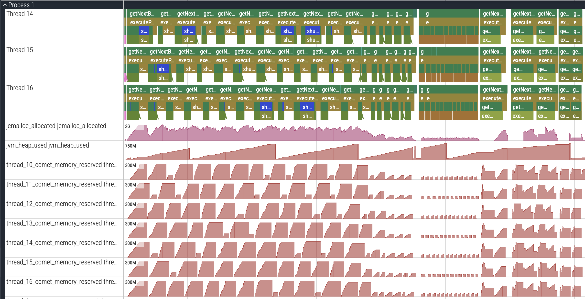

<a id="comet-contributor-guide-tracing--analyzing-memory-usage"></a>

## Analyzing Memory Usage

The `analyze_trace` tool parses a trace log and compares jemalloc usage against the sum of per-thread
Comet memory pool reservations. This is useful for detecting untracked native memory growth where jemalloc
allocations exceed what the memory pools account for.

Build and run:

```
cd native
cargo run --bin analyze_trace -- /path/to/comet-event-trace.json
```

The tool reads counter events from the trace log. Because tracing logs metrics per thread, `jemalloc_allocated`
is a process-wide value (the same global allocation reported from whichever thread logs it), while
`thread_NNN_comet_memory_reserved` values are per-thread pool reservations that are summed to get the total
tracked memory.

Sample output:

```
===Comet Trace Memory Analysis ===Counter events parsed:193104 Threads with memory pools:8 Peak jemalloc allocated:3068.2 MB Peak pool total:2864.6 MB Peak excess (jemalloc - pool ):364.6 MB WARNING:jemalloc exceeded pool reservation at 138 sampled points:Time (us) jemalloc pool_total excess -------------------------------------------------------------- 179578 210.8 MB 0.1 MB 210.7 MB 429663 420.5 MB 145.1 MB 275.5 MB 1304969 2122.5 MB 1797.2 MB 325.2 MB 21974838 407.0 MB 42.3 MB 364.6 MB 33543599 5.5 MB 0.1 MB 5.3 MB --- Final per - thread pool reservations --- thread_60_comet_memory_reserved:0.0 MB thread_95_comet_memory_reserved:0.0 MB thread_96_comet_memory_reserved:0.0 MB ...Total:0.0 MB
```

Some excess is expected (jemalloc metadata, fragmentation, non-pool allocations like Arrow IPC buffers).
Large or growing excess may indicate memory that is not being tracked by the pool.

<a id="comet-contributor-guide-tracing--definition-of-labels"></a>

## Definition of Labels

| Label | Meaning |
| --- | --- |
| jvm\_heap\_used | JVM heap memory usage of live objects for the executor process |
| jemalloc\_allocated | Native memory usage for the executor process (requires `jemalloc` feature) |
| thread\_NNN\_comet\_memory\_reserved | Memory reserved by Comet’s DataFusion memory pool (summed across all contexts on the thread). NNN is the Rust thread ID. |
| thread\_NNN\_comet\_jvm\_shuffle | Off-heap memory allocated by Comet for columnar shuffle. NNN is the Rust thread ID. |

---

<a id="comet-contributor-guide-profiling"></a>

<!-- source_url: https://datafusion.apache.org/comet/contributor-guide/profiling.html -->

<!-- page_index: 229 -->

<a id="comet-contributor-guide-profiling--profiling"></a>

# Profiling

This guide covers profiling tools and techniques for Comet development. Because Comet
spans JVM (Spark) and native (Rust) code, choosing the right profiler depends on what
you are investigating.

<a id="comet-contributor-guide-profiling--choosing-a-profiling-tool"></a>

## Choosing a Profiling Tool

| Tool | JVM Frames | Native (Rust) Frames | Install Required | Best For |
| --- | --- | --- | --- | --- |
| [async-profiler](https://github.com/async-profiler/async-profiler) | Yes | Yes | Yes | End-to-end Comet profiling with unified JVM + native flame graphs |
| [Java Flight Recorder (JFR)](https://docs.oracle.com/en/java/javase/17/jfapi/) | Yes | No | No (JDK 11+) | GC pressure, allocations, thread contention, I/O — any JVM-level investigation |
| [cargo-flamegraph](https://github.com/flamegraph-rs/flamegraph) | No | Yes | Yes | Isolated Rust micro-benchmarks without a JVM |

**Recommendation:** Use **async-profiler** when profiling Spark queries with Comet enabled —
it is the only tool that shows both JVM and native frames in a single flame graph.
Use **JFR** when you need rich JVM event data (GC, locks, I/O) without installing anything.
Use **cargo-flamegraph** when working on native code in isolation via `cargo bench`.

<a id="comet-contributor-guide-profiling--profiling-with-async-profiler"></a>

## Profiling with async-profiler

[async-profiler](https://github.com/async-profiler/async-profiler) captures JVM and
native code in the same flame graph by using Linux `perf_events` or macOS `dtrace`.
This makes it ideal for profiling Comet, where hot paths cross the JNI boundary between
Spark and Rust.

<a id="comet-contributor-guide-profiling--installation"></a>

### Installation

Download a release from the [async-profiler releases page](https://github.com/async-profiler/async-profiler/releases):

```
# Linux x64 wget https://github.com/async-profiler/async-profiler/releases/download/v3.0/async-profiler-3.0-linux-x64.tar.gz mkdir -p $HOME/opt/async-profiler tar xzf async-profiler-3.0-linux-x64.tar.gz -C $HOME/opt/async-profiler --strip-components=1 export ASYNC_PROFILER_HOME=$HOME/opt/async-profiler
```

On macOS, download the appropriate `macos` archive instead.

<a id="comet-contributor-guide-profiling--attaching-to-a-running-spark-application"></a>

### Attaching to a running Spark application

Use the `asprof` launcher to attach to a running JVM by PID:

```
# Start CPU profiling for 30 seconds, output an HTML flame graph $ASYNC_PROFILER_HOME/bin/asprof -d 30 -f flamegraph.html <pid>

# Wall-clock profiling $ASYNC_PROFILER_HOME/bin/asprof -e wall -d 30 -f flamegraph.html <pid>

# Start profiling (no duration limit), then stop later $ASYNC_PROFILER_HOME/bin/asprof start -e cpu <pid>
# ... run your query ... $ASYNC_PROFILER_HOME/bin/asprof stop -f flamegraph.html <pid>
```

Find the Spark driver/executor PID with `jps` or `pgrep -f SparkSubmit`.

<a id="comet-contributor-guide-profiling--passing-profiler-flags-via-spark-submit"></a>

### Passing profiler flags via spark-submit

You can also attach async-profiler as a Java agent at JVM startup:

```
spark-submit \
  --conf "spark.driver.extraJavaOptions=-agentpath:$ASYNC_PROFILER_HOME/lib/libasyncProfiler.so=start,event=cpu,file=driver.html,tree" \
  --conf "spark.executor.extraJavaOptions=-agentpath:$ASYNC_PROFILER_HOME/lib/libasyncProfiler.so=start,event=cpu,file=executor.html,tree" \
  ...
```

Note: If the executor is distributed then `executor.html` will be written on the remote node.

<a id="comet-contributor-guide-profiling--choosing-an-event-type"></a>

### Choosing an event type

| Event | When to use |
| --- | --- |
| `cpu` | Default. Shows where CPU cycles are spent. Use for compute-bound queries. |
| `wall` | Wall-clock time including blocked/waiting threads. Use to find JNI boundary overhead and I/O stalls. |
| `alloc` | Heap allocation profiling. Use to find JVM allocation hotspots around Arrow FFI and columnar conversions. |
| `lock` | Lock contention. Use when threads appear to spend time waiting on synchronized blocks or locks. |

<a id="comet-contributor-guide-profiling--output-formats"></a>

### Output formats

| Format | Flag | Description |
| --- | --- | --- |
| HTML flame graph | `-f out.html` | Interactive flame graph (default and most useful). |
| JFR | `-f out.jfr` | Viewable in JDK Mission Control or IntelliJ. |
| Collapsed stacks | `-f out.collapsed` | For use with Brendan Gregg’s FlameGraph scripts. |
| Text summary | `-o text` | Flat list of hot methods. |

<a id="comet-contributor-guide-profiling--platform-notes"></a>

### Platform notes

**Linux:** Set `perf_event_paranoid` to allow profiling:

```
sudo sysctl kernel.perf_event_paranoid=1   # or 0 / -1 for full access
sudo sysctl kernel.kptr_restrict=0          # optional: enable kernel symbols
```

**macOS:** async-profiler uses `dtrace` on macOS, which requires running as root or
with SIP (System Integrity Protection) adjustments. Native Rust frames may not be fully
resolved on macOS; Linux is recommended for the most complete flame graphs.

<a id="comet-contributor-guide-profiling--integrated-benchmark-profiling"></a>

### Integrated benchmark profiling

The TPC benchmark scripts in `benchmarks/tpc/` have built-in async-profiler support via
the `--async-profiler` flag. See [benchmarks/tpc/README.md](https://github.com/apache/datafusion-comet/blob/main/benchmarks/tpc/README.md)
for details.

<a id="comet-contributor-guide-profiling--profiling-with-java-flight-recorder"></a>

## Profiling with Java Flight Recorder

[Java Flight Recorder (JFR)](https://docs.oracle.com/en/java/javase/17/jfapi/) is built
into JDK 11+ and collects detailed JVM runtime data with very low overhead. It does not
see native Rust frames, but is excellent for diagnosing GC pressure, thread contention, I/O latency, and JVM-level allocation patterns.

<a id="comet-contributor-guide-profiling--adding-jfr-flags-to-spark-submit"></a>

### Adding JFR flags to spark-submit

```
spark-submit \
  --conf "spark.driver.extraJavaOptions=-XX:StartFlightRecording=duration=120s,filename=driver.jfr" \
  --conf "spark.executor.extraJavaOptions=-XX:StartFlightRecording=duration=120s,filename=executor.jfr" \
  ...
```

For continuous recording without a fixed duration:

```
--conf "spark.driver.extraJavaOptions=-XX:StartFlightRecording=disk=true,maxsize=500m,filename=driver.jfr"
```

You can also start and stop recording dynamically using `jcmd`:

```
jcmd <pid> JFR.start name=profile
# ... run your query ... jcmd <pid> JFR.stop name=profile filename=recording.jfr
```

<a id="comet-contributor-guide-profiling--viewing-recordings"></a>

### Viewing recordings

- **[JDK Mission Control (JMC)](https://jdk.java.net/jmc/)** — the most comprehensive viewer.
  Shows flame graphs, GC timeline, thread activity, I/O, and allocation hot spots.
- **IntelliJ IDEA** — open `.jfr` files directly in the built-in profiler
  (Run → Open Profiler Snapshot).
- **`jfr` CLI** — quick summaries from the command line: `jfr summary driver.jfr`

<a id="comet-contributor-guide-profiling--useful-jfr-events-for-comet-debugging"></a>

### Useful JFR events for Comet debugging

| Event | What it shows |
| --- | --- |
| `jdk.GCPhasePause` | GC pause durations — helps identify memory pressure from Arrow allocations. |
| `jdk.ObjectAllocationInNewTLAB` / `jdk.ObjectAllocationOutsideTLAB` | Allocation hot spots. |
| `jdk.JavaMonitorWait` / `jdk.ThreadPark` | Thread contention and lock waits. |
| `jdk.FileRead` / `jdk.FileWrite` / `jdk.SocketRead` | I/O latency. |
| `jdk.ExecutionSample` | CPU sampling (method profiling, similar to a flame graph). |

<a id="comet-contributor-guide-profiling--integrated-benchmark-profiling-2"></a>

### Integrated benchmark profiling

The TPC benchmark scripts support `--jfr` for automatic JFR recording during benchmark
runs. See [benchmarks/tpc/README.md](https://github.com/apache/datafusion-comet/blob/main/benchmarks/tpc/README.md) for details.

<a id="comet-contributor-guide-profiling--profiling-native-code-with-cargo-flamegraph"></a>

## Profiling Native Code with cargo-flamegraph

For profiling Rust code in isolation — without a JVM — use `cargo bench` with
[cargo-flamegraph](https://github.com/flamegraph-rs/flamegraph).

<a id="comet-contributor-guide-profiling--running-micro-benchmarks-with-cargo-bench"></a>

### Running micro benchmarks with cargo bench

When implementing a new operator or expression, it is good practice to add a new microbenchmark under `core/benches`.

It is often easiest to copy an existing benchmark and modify it for the new operator or expression. It is also
necessary to add a new section to the `Cargo.toml` file, such as:

```
[[bench]] name
=
"shuffle_writer" harness
=
false
```

These benchmarks are useful for comparing performance between releases or between feature branches and the
main branch to help prevent regressions in performance when adding new features or fixing bugs.

Individual benchmarks can be run by name with the following command.

```
cargo bench shuffle_writer
```

Here is some sample output from running this command.

```
Running benches / shuffle_writer.rs (target / release / deps / shuffle_writer - e37b59e37879cce7) Gnuplot not found,using plotters backend shuffle_writer / shuffle_writer time:[2.0880 ms 2.0989 ms 2.1118 ms] Found 9 outliers among 100 measurements (9.00 %) 3 (3.00 %) high mild 6 (6.00 %) high severe
```

<a id="comet-contributor-guide-profiling--profiling-with-cargo-flamegraph"></a>

### Profiling with cargo-flamegraph

Install cargo-flamegraph:

```
cargo install flamegraph
```

Follow the instructions in [cargo-flamegraph](https://github.com/flamegraph-rs/flamegraph) for your platform for
running flamegraph.

Here is a sample command for running `cargo-flamegraph` on MacOS.

```
cargo flamegraph --root --bench shuffle_writer
```

This will produce output similar to the following.

```

dtrace
:
system
integrity
protection
is
on
,
some
features
will
not
be
available
dtrace
:
description
'profile-997 '
matched
1
probe
Gnuplot
not
found
,
using
plotters
backend
Testing
shuffle_writer
/
shuffle_writer
Success
dtrace
:
pid
66402
has
exited
writing
flamegraph
to
"flamegraph.svg"
```

The generated flamegraph can now be opened in a browser that supports svg format.

Here is the flamegraph for this example:

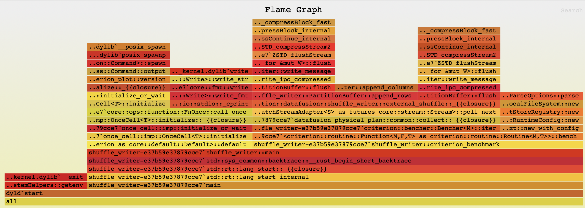

<a id="comet-contributor-guide-profiling--tips-for-profiling-comet"></a>

## Tips for Profiling Comet

<a id="comet-contributor-guide-profiling--use-wall-clock-profiling-to-spot-jni-boundary-overhead"></a>

### Use wall-clock profiling to spot JNI boundary overhead

When profiling Comet with async-profiler, `wall` mode is often more revealing than `cpu`
because it captures time spent crossing the JNI boundary, waiting for native results, and blocked on I/O — none of which show up in CPU-only profiles.

```
$ASYNC_PROFILER_HOME/bin/asprof -e wall -d 60 -f wall-profile.html <pid>
```

<a id="comet-contributor-guide-profiling--use-alloc-profiling-around-arrow-ffi"></a>

### Use alloc profiling around Arrow FFI

JVM allocation profiling can identify hotspots in the Arrow FFI path where temporary
objects are created during data transfer between JVM and native code:

```
$ASYNC_PROFILER_HOME/bin/asprof -e alloc -d 60 -f alloc-profile.html <pid>
```

Look for allocations in `CometExecIterator`, `CometBatchIterator`, and Arrow vector
classes.

<a id="comet-contributor-guide-profiling--isolate-rust-only-performance-issues"></a>

### Isolate Rust-only performance issues

If a flame graph shows the hot path is entirely within native code, switch to
`cargo-flamegraph` to get better symbol resolution and avoid JVM noise:

```
cd native
cargo flamegraph --root --bench <benchmark_name>
```

<a id="comet-contributor-guide-profiling--correlating-jvm-and-native-frames"></a>

### Correlating JVM and native frames

In async-profiler flame graphs, native Rust frames appear below JNI entry points like
`Java_org_apache_comet_Native_*`. Look for these transition points to understand how
time is split between Spark’s JVM code and Comet’s native execution.

---

<a id="comet-contributor-guide-sql-file-tests"></a>

<!-- source_url: https://datafusion.apache.org/comet/contributor-guide/sql-file-tests.html -->

<!-- page_index: 230 -->

<a id="comet-contributor-guide-sql-file-tests--comet-sql-tests"></a>

# Comet SQL Tests

`CometSqlFileTestSuite` is a test suite that automatically discovers `.sql` test files and
runs each query through both Spark and Comet, comparing results. This provides a lightweight
way to add expression and operator test coverage without writing Comet Scala Tests.

<a id="comet-contributor-guide-sql-file-tests--running-the-tests"></a>

## Running the tests

Run all Comet SQL Tests:

```
./mvnw test -Dsuites="org.apache.comet.CometSqlFileTestSuite" -Dtest=none
```

Run a single test file by adding the file name (without `.sql` extension) after the suite name:

```
./mvnw test -Dsuites="org.apache.comet.CometSqlFileTestSuite create_named_struct" -Dtest=none
```

This uses ScalaTest’s substring matching, so the argument must match part of the test name.
Test names follow the pattern `sql-file: expressions/<category>/<file>.sql [<config>]`.

<a id="comet-contributor-guide-sql-file-tests--test-file-location"></a>

## Test file location

SQL test files live under:

```
spark / src / test / resources / sql - tests / expressions /
```

Files are organized into category subdirectories:

```
expressions / aggregate / -- avg,sum,count,min_max,...array / -- array_contains,array_append,get_array_item,...bitwise / cast / conditional / -- case_when,coalesce,if_expr,...datetime / -- date_add,date_diff,unix_timestamp,...decimal / hash / map / -- get_map_value,map_keys,map_values,...math / -- abs,ceil,floor,round,sqrt,...misc / -- width_bucket,scalar_subquery,...string / -- concat,like,substring,lower,upper,...struct / -- create_named_struct,get_struct_field,...
```

The test suite recursively discovers all `.sql` files in these directories. Each file becomes
one or more ScalaTest test cases.

<a id="comet-contributor-guide-sql-file-tests--file-format"></a>

## File format

A test file consists of SQL comments, directives, statements, and queries separated by blank
lines. Here is a minimal example:

```
statement CREATE
TABLE
test_abs (v
double)
USING
parquet statement INSERT
INTO
test_abs
VALUES
(1.5 ),
(- 2.5 ),
(0.0 ),
(NULL) query SELECT
abs (v)
FROM
test_abs
```

<a id="comet-contributor-guide-sql-file-tests--directives"></a>

### Directives

Directives are SQL comments at the top of the file that configure how the test runs.

<a id="comet-contributor-guide-sql-file-tests--config"></a>

#### `Config`

Sets a Spark SQL config for all queries in the file.

```

-- Config: spark.sql.ansi.enabled=true
```

<a id="comet-contributor-guide-sql-file-tests--configmatrix"></a>

#### `ConfigMatrix`

Runs the entire file once per combination of values. Multiple `ConfigMatrix` lines produce a
cross product of all combinations.

```

-- ConfigMatrix: spark.sql.optimizer.inSetConversionThreshold=100,0
```

This generates two test cases:

```
sql - file:expressions / conditional / in_set.sql [spark.sql.optimizer.inSetConversionThreshold =100] sql - file:expressions / conditional / in_set.sql [spark.sql.optimizer.inSetConversionThreshold =0]
```

Only add a `ConfigMatrix` directive when there is a real reason to run the test under
multiple configurations. Do not add `ConfigMatrix` directives speculatively.

<a id="comet-contributor-guide-sql-file-tests--minsparkversion"></a>

#### `MinSparkVersion`

Skips the file when running on a Spark version older than the specified version.

```

-- MinSparkVersion: 3.5
```

<a id="comet-contributor-guide-sql-file-tests--statements"></a>

### Statements

A `statement` block executes DDL or DML and does not check results. Use this for `CREATE TABLE`
and `INSERT` commands. Table names are automatically extracted for cleanup after the test.

```
statement CREATE
TABLE
my_table (x
int,
y
double)
USING
parquet statement INSERT
INTO
my_table
VALUES
(1,
2.0 ),
(3,
4.0 ),
(NULL,
NULL)
```

<a id="comet-contributor-guide-sql-file-tests--queries"></a>

### Queries

A `query` block executes a SELECT and compares results between Spark and Comet. The query
mode controls how results are validated.

<a id="comet-contributor-guide-sql-file-tests--query-default-mode"></a>

#### `query` (default mode)

Checks that the query runs natively on Comet (not falling back to Spark) and that results
match Spark exactly.

```
query SELECT
abs (v)
FROM
test_abs
```

<a id="comet-contributor-guide-sql-file-tests--query-spark_answer_only"></a>

#### `query spark_answer_only`

Only checks that Comet results match Spark. Does not assert that the query runs natively.
Use this for expressions that Comet may not fully support yet but should still produce
correct results.

```
query
spark_answer_only SELECT
some_expression (v)
FROM
test_table
```

<a id="comet-contributor-guide-sql-file-tests--query-tolerance-value"></a>

#### `query tolerance=<value>`

Checks results with a numeric tolerance. Useful for floating-point functions where small
differences are acceptable.

```
query
tolerance =0.0001 SELECT
cos (v)
FROM
test_trig
```

<a id="comet-contributor-guide-sql-file-tests--query-expect_fallback-reason"></a>

#### `query expect_fallback(<reason>)`

Asserts that the query falls back to Spark and verifies the fallback reason contains the
given string.

```
query
expect_fallback (unsupported
expression) SELECT
unsupported_func (v)
FROM
test_table
```

<a id="comet-contributor-guide-sql-file-tests--query-ignore-reason"></a>

#### `query ignore(<reason>)`

Skips the query entirely. Use this for queries that hit known bugs. The reason should be a
link to the tracking GitHub issue.

```
-- Comet bug: space(-1) causes native crash query
ignore (https:// github.com / apache / datafusion - comet / issues / 3326) SELECT
space (n)
FROM
test_space
WHERE
n
<
0
```

<a id="comet-contributor-guide-sql-file-tests--query-expect_error-pattern"></a>

#### `query expect_error(<pattern>)`

Asserts that both Spark and Comet throw an exception containing the given pattern. Use this
for ANSI mode tests where invalid operations should throw errors.

```
-- Config: spark.sql.ansi.enabled=true -- integer overflow should throw in ANSI mode query
expect_error (ARITHMETIC_OVERFLOW) SELECT
2147483647
+
1 -- division by zero should throw in ANSI mode query
expect_error (DIVIDE_BY_ZERO) SELECT
1
/
0 -- array out of bounds should throw in ANSI mode query
expect_error (INVALID_ARRAY_INDEX) SELECT
array (1,
2,
3 )[10]
```

<a id="comet-contributor-guide-sql-file-tests--adding-a-new-test"></a>

## Adding a new test

1. Create a `.sql` file under the appropriate subdirectory in
   `spark/src/test/resources/sql-tests/expressions/`. Create a new subdirectory if no
   existing category fits.
2. Add the Apache license header as a SQL comment.
3. Add a `ConfigMatrix` directive only if the test needs to run under multiple configurations
   (e.g., testing behavior that varies with a specific Spark config). Do not add `ConfigMatrix`
   directives speculatively.
4. Create tables and insert test data using `statement` blocks. Include edge cases such as
   `NULL`, boundary values, and negative numbers.
5. Add `query` blocks for each expression or behavior to test. Use the default `query` mode
   when you expect Comet to run the expression natively. Use `query spark_answer_only` when
   native execution is not yet expected.
6. Run the tests to verify:


```
./mvnw test -Dsuites="org.apache.comet.CometSqlFileTestSuite" -Dtest=none
```

<a id="comet-contributor-guide-sql-file-tests--tips-for-writing-thorough-tests"></a>

### Tips for writing thorough tests

<a id="comet-contributor-guide-sql-file-tests--cover-all-combinations-of-literal-and-column-arguments"></a>

#### Cover all combinations of literal and column arguments

Comet often uses different code paths for literal values versus column references. Tests
should exercise both. For a function with multiple arguments, test every useful combination.

For a single-argument function, test both a column reference and a literal:

```
-- column argument (reads from Parquet, goes through columnar evaluation) query SELECT
ascii (s)
FROM
test_ascii -- literal arguments query SELECT
ascii ('A' ),
ascii ('' ),
ascii (NULL)
```

For a multi-argument function like `concat_ws(sep, str1, str2, ...)`, test with the separator
as a column versus a literal, and similarly for the other arguments:

```
-- all columns query SELECT
concat_ws (sep,
a,
b)
FROM
test_table -- literal separator, column values query SELECT
concat_ws (',',
a,
b)
FROM
test_table -- all literals query SELECT
concat_ws (',',
'hello',
'world')
```

**Note on constant folding:** Normally Spark constant-folds all-literal expressions during
planning, so Comet would never see them. However, `CometSqlFileTestSuite` automatically
disables constant folding (by excluding `ConstantFolding` from the optimizer rules), so
all-literal queries are evaluated by Comet’s native engine. This means you can use the
default `query` mode for all-literal cases and they will be tested natively just like
column-based queries.

<a id="comet-contributor-guide-sql-file-tests--cover-edge-cases"></a>

#### Cover edge cases

Include edge-case values in your test data. The exact cases depend on the function, but
common ones include:

- **NULL values** – every test should include NULLs
- **Empty strings** – for string functions
- **Zero, negative, and very large numbers** – for numeric functions
- **Boundary values** – `INT_MIN`, `INT_MAX`, `NaN`, `Infinity`, `-Infinity` for numeric
  types
- **Special characters and multibyte UTF-8** – for string functions (e.g. `'é'`, `'中文'`,
  `'\t'`)
- **Empty arrays/maps** – for collection functions
- **Single-element and multi-element collections** – for aggregate and collection functions

<a id="comet-contributor-guide-sql-file-tests--one-file-per-expression"></a>

#### One file per expression

Keep each `.sql` file focused on a single expression or a small group of closely related
expressions. This makes failures easy to locate and keeps files readable.

<a id="comet-contributor-guide-sql-file-tests--use-comments-to-label-sections"></a>

#### Use comments to label sections

Add SQL comments before query blocks to describe what aspect of the expression is being
tested. This helps reviewers and future maintainers understand the intent:

```
-- literal separator with NULL values query SELECT
concat_ws (',',
NULL,
'b',
'c') -- empty separator query SELECT
concat_ws ('',
a,
b,
c)
FROM
test_table
```

<a id="comet-contributor-guide-sql-file-tests--using-agentic-coding-tools"></a>

### Using agentic coding tools

Writing thorough SQL test files is a task well suited to agentic coding tools such as
Claude Code. You can point the tool at an existing test file as an example, describe the
expression you want to test, and ask it to generate a complete `.sql` file covering all
argument combinations and edge cases. This is significantly faster than writing the
combinatorial test cases by hand and helps ensure nothing is missed.

For example:

```
Read the test file spark/src/test/resources/sql-tests/expressions/string/ascii.sql
and the documentation in docs/source/contributor-guide/sql-file-tests.md.
Then write a similar test file for the `reverse` function, covering column arguments,
literal arguments, NULLs, empty strings, and multibyte characters.
```

<a id="comet-contributor-guide-sql-file-tests--handling-test-failures"></a>

## Handling test failures

When a query fails due to a known Comet bug:

1. File a GitHub issue describing the problem.
2. Change the query mode to `ignore(...)` with a link to the issue.
3. Optionally add a SQL comment above the query explaining the problem.

```
-- GetArrayItem returns incorrect results with dynamic index query
ignore (https:// github.com / apache / datafusion - comet / issues / 3332) SELECT
arr [idx]
FROM
test_get_array_item
```

When the bug is fixed, remove the `ignore(...)` and restore the original query mode.

<a id="comet-contributor-guide-sql-file-tests--architecture"></a>

## Architecture

The test infrastructure consists of two Scala files:

- **`SqlFileTestParser`** (`spark/src/test/scala/org/apache/comet/SqlFileTestParser.scala`) –
  Parses `.sql` files into a `SqlTestFile` data structure containing directives, statements,
  and queries.
- **`CometSqlFileTestSuite`** (`spark/src/test/scala/org/apache/comet/CometSqlFileTestSuite.scala`) –
  Discovers test files at suite initialization time, generates ScalaTest test cases for each
  file and config combination, and executes them using `CometTestBase` assertion methods.

Tables created in test files are automatically cleaned up after each test.

---

<a id="comet-contributor-guide-spark-sql-tests"></a>

<!-- source_url: https://datafusion.apache.org/comet/contributor-guide/spark-sql-tests.html -->

<!-- page_index: 231 -->

<a id="comet-contributor-guide-spark-sql-tests--running-spark-sql-tests"></a>

# Running Spark SQL Tests

Running Apache Spark’s SQL tests with Comet enabled is a good way to ensure that Comet produces the same
results as that version of Spark. To enable this, we apply some changes to the Apache Spark source code so that
Comet is enabled when we run the tests.

Here is an overview of the changes that we need to make to Spark:

- Update the pom.xml to add a dependency on Comet
- Modify SparkSession to load the Comet extension
- Modify TestHive to load Comet
- Modify SQLTestUtilsBase to load Comet when `ENABLE_COMET` environment variable exists

Here are the steps involved in running the Spark SQL tests with Comet, using Spark 3.4.3 for this example.

<a id="comet-contributor-guide-spark-sql-tests--1.-install-comet"></a>

## 1. Install Comet

Run `make release` in Comet to install the Comet JAR into the local Maven repository, specifying the Spark version.

```
PROFILES="-Pspark-3.4" make release
```

<a id="comet-contributor-guide-spark-sql-tests--2.-clone-spark-and-apply-diff"></a>

## 2. Clone Spark and Apply Diff

Clone Apache Spark locally and apply the diff file from Comet.

Note: this is a shallow clone of a tagged Spark commit and is not suitable for general Spark development.

```
git clone -b 'v3.4.3' --single-branch --depth 1 git@github.com:apache/spark.git apache-spark
cd apache-spark
git apply ../datafusion-comet/dev/diffs/3.4.3.diff
```

<a id="comet-contributor-guide-spark-sql-tests--3.-run-spark-sql-tests"></a>

## 3. Run Spark SQL Tests

<a id="comet-contributor-guide-spark-sql-tests--use-the-following-commands-to-run-the-spark-sql-test-suite-locally."></a>

### Use the following commands to run the Spark SQL test suite locally.

Optionally, enable Comet fallback logging, so that all fallback reasons are logged at `WARN` level.

```

export
 
ENABLE_COMET_LOG_FALLBACK_REASONS
=
true
```

```
ENABLE_COMET=true ENABLE_COMET_ONHEAP=true build/sbt catalyst/test
ENABLE_COMET=true ENABLE_COMET_ONHEAP=true build/sbt "sql/testOnly * -- -l org.apache.spark.tags.ExtendedSQLTest -l org.apache.spark.tags.SlowSQLTest"
ENABLE_COMET=true ENABLE_COMET_ONHEAP=true build/sbt "sql/testOnly * -- -n org.apache.spark.tags.ExtendedSQLTest"
ENABLE_COMET=true ENABLE_COMET_ONHEAP=true build/sbt "sql/testOnly * -- -n org.apache.spark.tags.SlowSQLTest"
ENABLE_COMET=true ENABLE_COMET_ONHEAP=true build/sbt "hive/testOnly * -- -l org.apache.spark.tags.ExtendedHiveTest -l org.apache.spark.tags.SlowHiveTest"
ENABLE_COMET=true ENABLE_COMET_ONHEAP=true build/sbt "hive/testOnly * -- -n org.apache.spark.tags.ExtendedHiveTest"
ENABLE_COMET=true ENABLE_COMET_ONHEAP=true build/sbt "hive/testOnly * -- -n org.apache.spark.tags.SlowHiveTest"
```

<a id="comet-contributor-guide-spark-sql-tests--steps-to-run-individual-test-suites-through-sbt"></a>

### Steps to run individual test suites through SBT

1. Open SBT with Comet enabled

```
ENABLE_COMET=true ENABLE_COMET_ONHEAP=true sbt -J-Xmx4096m -Dspark.test.includeSlowTests=true
```

2. Run individual tests (Below code runs test named `SPARK-35568` in the `spark-sql` module)

```
 sql/testOnly  org.apache.spark.sql.DynamicPartitionPruningV1SuiteAEOn -- -z "SPARK-35568"
```

<a id="comet-contributor-guide-spark-sql-tests--steps-to-run-individual-test-suites-in-intellij-ide"></a>

### Steps to run individual test suites in IntelliJ IDE

1. Add below configuration in VM Options for your test case (apache-spark repository)

```
-Dspark.comet.enabled=true -Dspark.comet.debug.enabled=true -Dspark.plugins=org.apache.spark.CometPlugin -DXmx4096m -Dspark.executor.heartbeatInterval=20000 -Dspark.network.timeout=10000 --add-exports=java.base/sun.nio.ch=ALL-UNNAMED --add-opens=java.base/java.nio=ALL-UNNAMED
```

2. Set `ENABLE_COMET=true` in environment variables
   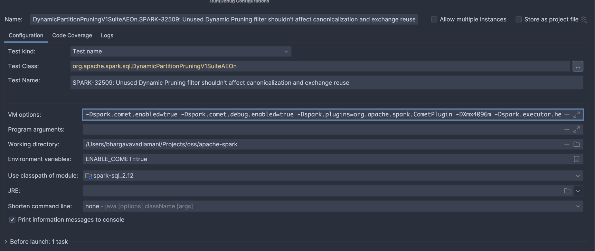
3. After the above tests are configured, spark tests can be run with debugging enabled on spark/comet code. Note that Comet is added as a dependency and the classes are readonly while debugging from Spark. Any new changes to Comet are to be built and deployed locally through the command (`PROFILES="-Pspark-3.4" make release`)

<a id="comet-contributor-guide-spark-sql-tests--creating-a-diff-file-for-a-new-spark-version"></a>

## Creating a diff file for a new Spark version

Once Comet has support for a new Spark version, we need to create a diff file that can be applied to that version
of Apache Spark to enable Comet when running tests. This is a highly manual process and the process can
vary depending on the changes in the new version of Spark, but here is a general guide to the process.

If you are bringing up a brand new Spark major or minor version, this work is one stage of a larger sequence
covered in [Adding Support for a New Spark Version](#comet-contributor-guide-adding_a_new_spark_version). Start there for the
overall plan; the steps below cover only the diff-file mechanics.

We typically start by applying a patch from a previous version of Spark. For example, when enabling the tests
for Spark version 3.5.6 we may start by applying the existing diff for 3.5.5 first.

```
cd git/apache/spark
git checkout v3.5.6
git apply --reject --whitespace=fix ../datafusion-comet/dev/diffs/3.5.5.diff
```

Any changes that cannot be cleanly applied will instead be written out to reject files. For example, the above
command generated the following files.

```
find . -name "*.rej"
./pom.xml.rej
./sql/core/src/test/scala/org/apache/spark/sql/FileBasedDataSourceSuite.scala.rej
./sql/core/src/test/scala/org/apache/spark/sql/SubquerySuite.scala.rej
./sql/core/src/test/scala/org/apache/spark/sql/streaming/StreamingJoinSuite.scala.rej
./sql/core/src/test/scala/org/apache/spark/sql/streaming/StreamSuite.scala.rej
./sql/core/src/test/scala/org/apache/spark/sql/JoinSuite.scala.rej
./sql/core/src/test/scala/org/apache/spark/sql/execution/datasources/SchemaPruningSuite.scala.rej
./sql/core/src/test/scala/org/apache/spark/sql/execution/datasources/binaryfile/BinaryFileFormatSuite.scala.rej
./sql/core/src/test/scala/org/apache/spark/sql/execution/datasources/parquet/ParquetRebaseDatetimeSuite.scala.rej
./sql/core/src/test/scala/org/apache/spark/sql/execution/datasources/parquet/ParquetSchemaSuite.scala.rej
./sql/core/src/test/scala/org/apache/spark/sql/execution/WholeStageCodegenSuite.scala.rej
./sql/core/src/test/scala/org/apache/spark/sql/execution/adaptive/AdaptiveQueryExecSuite.scala.rej
./sql/core/src/test/scala/org/apache/spark/sql/sources/CreateTableAsSelectSuite.scala.rej
./sql/core/src/test/scala/org/apache/spark/sql/sources/BucketedReadSuite.scala.rej
./sql/core/src/test/scala/org/apache/spark/sql/sources/DisableUnnecessaryBucketedScanSuite.scala.rej
./sql/core/src/test/scala/org/apache/spark/sql/errors/QueryExecutionErrorsSuite.scala.rej
./sql/core/src/test/scala/org/apache/spark/sql/CachedTableSuite.scala.rej
./sql/core/src/main/scala/org/apache/spark/sql/SparkSession.scala.rej
```

The changes in these reject files need to be applied manually.

One method is to use the [wiggle](https://github.com/neilbrown/wiggle) command (`brew install wiggle` on Mac).

For example:

```
wiggle --replace ./sql/core/src/test/scala/org/apache/spark/sql/SubquerySuite.scala ./sql/core/src/test/scala/org/apache/spark/sql/SubquerySuite.scala.rej
```

<a id="comet-contributor-guide-spark-sql-tests--generating-the-diff-file"></a>

## Generating The Diff File

The diff file can be generated using the `git diff` command. It may be necessary to set the `core.abbrev`
configuration setting to use 11 digits hashes for consistency with existing diff files.

Note that there is an `IgnoreComet.scala` that is not part of the Spark codebase, and therefore needs to be added
using `git add` before generating the diff.

```
git config core.abbrev 11;
git add sql/core/src/test/scala/org/apache/spark/sql/IgnoreComet.scala
git diff v3.5.6 > ../datafusion-comet/dev/diffs/3.5.6.diff
```

<a id="comet-contributor-guide-spark-sql-tests--running-tests-in-ci"></a>

## Running Tests in CI

The easiest way to run the tests is to create a PR against Comet and let CI run the tests. When working with a
new Spark version, the `spark_sql_test.yaml` and `spark_sql_test_ansi.yaml` files will need updating with the
new version.

<a id="comet-contributor-guide-spark-sql-tests--adding-support-for-a-new-spark-major-or-minor-version"></a>

## Adding support for a new Spark major or minor version

When the diff is for a brand-new minor (e.g. 4.0 to 4.1) or major version, the existing Comet `spark-X.Y` Maven
profile will not match. Add a new profile alongside the existing ones in the root `pom.xml` and `spark/pom.xml`:

- Root `pom.xml`: copy the existing `spark-4.0` profile, change `<spark.version>`, `<spark.version.short>`, and
  match the Spark target’s transitive dep versions (Spark’s own `pom.xml` is the source of truth):
  `<scala.version>`, `<parquet.version>`, `<slf4j.version>`. Set `<shims.majorVerSrc>spark-4.1</shims.majorVerSrc>`
  and `<shims.minorVerSrc>not-needed-yet</shims.minorVerSrc>`.
- `spark/pom.xml`: copy the matching profile block for iceberg-spark-runtime and Jetty test deps. The
  iceberg-spark-runtime artifact may not yet be published for a brand-new Spark minor — until it is, hardcode the
  previous version’s coordinate (e.g. `iceberg-spark-runtime-4.0_${scala.binary.version}` while running against
  Spark 4.1 source).

Then create a corresponding shim source tree by copying the previous version’s:

```
cp -r spark/src/main/spark-4.0 spark/src/main/spark-4.1
cp -r common/src/main/spark-4.0 common/src/main/spark-4.1
```

Build with `PROFILES="-Pspark-4.1" make release` (or `./mvnw install -Prelease -Pspark-4.1 -DskipTests -Dmaven.test.skip=true` to skip Comet’s own test compile). Compile errors in the new shim tree will tell you
exactly which Spark APIs moved between versions. Common patterns we have seen:

- A field is renamed or moved into a wrapper struct. Add a helper method to `CometEvalModeUtil` (or other shim
  utility object) and call it from the shared `spark/src/main/scala` code, with a per-profile implementation.
  Example: in Spark 4.1 `Sum.evalMode` became `Sum.evalContext.evalMode`.
- A `SQLConf` key changes shape (e.g. `stringConf` to `enumConf`). The shim trait is the natural place to
  encapsulate the new return type.
- A Spark constructor adds a new (optional) parameter that Java callers can’t see via Scala default values.
  Add a tiny non-versioned Scala wrapper in `spark/src/main/scala` that calls the Spark API; the Scala compiler
  fills in the default per profile. Example: `MapStatusHelper.apply` for `MapStatus.apply`’s 4.1 `checksumVal`.
- A reflective constructor lookup (`getDeclaredConstructors`) starts hitting “argument type mismatch” because a
  parameter type widened/changed. Pass a value compatible with both old and new types (e.g. a
  `ConcurrentHashMap` instead of `Collections.emptyMap()` after `IndexShuffleBlockResolver`’s third param became
  `ConcurrentMap`).

Once Comet builds for the new profile, the iceberg test artifact may eventually need an updated coordinate, and
`spark/src/main/spark-X.Y` may diverge meaningfully from the previous version. Land the profile, then iterate.

<a id="comet-contributor-guide-spark-sql-tests--running-tests-locally-against-a-patched-spark-clone"></a>

## Running tests locally against a patched Spark clone

After applying the diff, run sbt from the patched Spark working tree. A few things that have caught us out:

- **Skip Spark’s scalastyle**: set `NOLINT_ON_COMPILE=true` (Spark’s `SparkBuild.scala` checks this env var; our
  CI workflow already sets it). Without this, modifications introduced by the diff can fail the strict
  scalastyle check before any test runs.
- **Pin a clean local Maven cache**: Coursier (sbt’s resolver) treats a `.pom` file in `~/.m2` as proof the
  artifact is fully present locally and stops looking remotely. If a previous Maven run only fetched POMs
  (without JARs), Coursier will fail with `not found: ...some-artifact.jar` even though the file is on Maven
  Central. The fast workaround is to point sbt at a fresh location:


```
./mvnw install -Prelease -DskipTests -Dmaven.test.skip=true -Pspark-4.1 \
  -Dmaven.repo.local=/tmp/spark-m2-repo
cd ../apache-spark
NOLINT_ON_COMPILE=true ENABLE_COMET=true ENABLE_COMET_ONHEAP=true \
  build/sbt -Dmaven.repo.local=/tmp/spark-m2-repo "sql/testOnly org.apache.spark.sql.MathFunctionsSuite"
```

  Make sure to install Comet into the same alternate repo so sbt can resolve it.
- **Avoid `-DskipTests` alone for the install step** if you want to skip Comet’s own test compile: it still
  compiles tests and only skips execution. Pair it with `-Dmaven.test.skip=true`.
- **Targeted suites first**: `MathFunctionsSuite` (~60 tests) is a quick smoke check that exercises Comet’s
  serde and shuffle paths without booting most of the SQL test infrastructure.

---

<a id="comet-contributor-guide-iceberg-spark-tests"></a>

<!-- source_url: https://datafusion.apache.org/comet/contributor-guide/iceberg-spark-tests.html -->

<!-- page_index: 232 -->

<a id="comet-contributor-guide-iceberg-spark-tests--running-iceberg-spark-tests"></a>

# Running Iceberg Spark Tests

Running Apache Iceberg’s Spark tests with Comet enabled is a good way to ensure that Comet produces the same
results as Spark when reading Iceberg tables. To enable this, we apply diff files to the Apache Iceberg source
code so that Comet is loaded when we run the tests.

Here is an overview of the changes that the diffs make to Iceberg:

- Configure Comet as a dependency and set the correct version in `libs.versions.toml` and `build.gradle`
- Delete upstream Comet reader classes that reference legacy Comet APIs removed in [#3739](https://github.com/apache/datafusion-comet/pull/3739). These classes were
  added upstream in [apache/iceberg#15674](https://github.com/apache/iceberg/pull/15674) and depend on Comet’s old Iceberg Java integration. Since Comet now
  uses a native Iceberg scan, these classes fail to compile and must be removed.
- Configure test base classes (`TestBase`, `ExtensionsTestBase`, `ScanTestBase`, etc.) to load the Comet Spark
  plugin and shuffle manager

<a id="comet-contributor-guide-iceberg-spark-tests--1.-install-comet"></a>

## 1. Install Comet

Run `make release` in Comet to install the Comet JAR into the local Maven repository, specifying the Spark version.

```
PROFILES="-Pspark-4.1" make release
```

<a id="comet-contributor-guide-iceberg-spark-tests--2.-clone-iceberg-and-apply-diff"></a>

## 2. Clone Iceberg and Apply Diff

Clone Apache Iceberg locally and apply the diff file from Comet against the matching tag.

```
git clone git@github.com:apache/iceberg.git apache-iceberg
cd apache-iceberg
git checkout apache-iceberg-1.8.1
git apply ../datafusion-comet/dev/diffs/iceberg/1.8.1.diff
```

<a id="comet-contributor-guide-iceberg-spark-tests--3.-run-iceberg-spark-tests"></a>

## 3. Run Iceberg Spark Tests

```
ENABLE_COMET=true ./gradlew -DsparkVersions=3.5 -DscalaVersion=2.13 -DflinkVersions= -DkafkaVersions= \
  :iceberg-spark:iceberg-spark-3.5_2.13:test \
  -Pquick=true -x javadoc
```

The three Gradle targets tested in CI are:

| Gradle Target | What It Covers |
| --- | --- |
| `iceberg-spark-<ver>:test` | Core read/write paths (Parquet, Avro, ORC, vectorized), scan operations, filtering, bloom filters, runtime filtering, deletion handling, structured streaming, DDL/DML (create/alter/drop, writes, deletes), filter and aggregate pushdown, actions (snapshot expiration, file rewriting, orphan cleanup, table migration), serialization, and data format conversions. |
| `iceberg-spark-extensions-<ver>:test` | SQL extensions: stored procedures (migrate, snapshot, cherrypick, rollback, rewrite-data-files, rewrite-manifests, expire-snapshots, remove-orphan-files, etc.), row-level operations (copy-on-write and merge-on-read update/delete/merge), DDL extensions (branches, tags, alter schema, partition fields), changelog tables/views, metadata tables, and views. |
| `iceberg-spark-runtime-<ver>:integrationTest` | A single smoke test (`SmokeTest.java`) that validates the shaded runtime JAR. The `spark-runtime` module has no main source — it packages Iceberg and all dependencies into a shaded uber-JAR. The smoke test exercises basic create, insert, merge, query, partition field, and sort order operations to confirm the shaded JAR works end-to-end. |

<a id="comet-contributor-guide-iceberg-spark-tests--updating-diffs"></a>

## Updating Diffs

To update a diff (e.g. after modifying test configuration), apply the existing diff, make changes, then
regenerate:

```
cd apache-iceberg
git reset --hard apache-iceberg-1.8.1 && git clean -fd
git apply ../datafusion-comet/dev/diffs/iceberg/1.8.1.diff

# Make changes, then run spotless to fix formatting./gradlew spotlessApply

# Stage any new or deleted files, then generate the diff git add -A git diff apache-iceberg-1.8.1 > ../datafusion-comet/dev/diffs/iceberg/1.8.1.diff
```

Repeat for each Iceberg version (1.8.1, 1.9.1, 1.10.0). The file contents differ between versions, so each
diff must be generated against its own tag.

<a id="comet-contributor-guide-iceberg-spark-tests--running-tests-in-ci"></a>

## Running Tests in CI

The `iceberg_spark_test.yml` workflow applies these diffs and runs the three Gradle targets above against
each Iceberg version. The test matrix covers Spark 3.4 and 3.5 across Iceberg 1.8.1, 1.9.1, and 1.10.0
with Java 11 and 17. The workflow runs on all pull requests and pushes to the main branch.

---

<a id="comet-contributor-guide-bug_triage"></a>

<!-- source_url: https://datafusion.apache.org/comet/contributor-guide/bug_triage.html -->

<!-- page_index: 233 -->

<a id="comet-contributor-guide-bug_triage--bug-triage-guide"></a>

# Bug Triage Guide

This guide describes how we prioritize and triage bugs in the Comet project. The goal is to ensure
that the most impactful bugs — especially correctness issues that produce wrong results — are
identified and addressed before less critical issues.

<a id="comet-contributor-guide-bug_triage--priority-labels"></a>

## Priority Labels

Every bug should have exactly one priority label. When filing or triaging a bug, apply the
appropriate label from the table below.

| Label | Color | Description | Examples |
| --- | --- | --- | --- |
| `priority:critical` | Red | Data corruption, silent wrong results, security vulnerabilities | Wrong aggregation results, FFI data corruption, incorrect cast output |
| `priority:high` | Orange | Crashes, panics, segfaults, major functional breakage affecting production workloads | Native engine panic, JVM segfault, NPE on supported code path |
| `priority:medium` | Yellow | Functional bugs, performance regressions, broken features that have workarounds | Missing expression support, writer feature gaps, excessive spilling |
| `priority:low` | Green | Minor issues, test-only failures, tooling, CI flakes, cosmetic issues | Flaky CI test, build script edge case, documentation generator bug |

<a id="comet-contributor-guide-bug_triage--how-to-choose-a-priority"></a>

### How to Choose a Priority

Use this decision tree:

1. **Can this bug cause silent wrong results?** If yes → `priority:critical`. These are the most
   dangerous bugs because users may not notice the incorrect output.
2. **Does this bug crash the JVM or native engine?** If yes → `priority:high`. Crashes are
   disruptive but at least visible to the user.
3. **Does this bug break a feature or cause significant performance degradation?** If yes →
   `priority:medium`. The user can work around it (e.g., falling back to Spark) but it impacts
   the value of Comet.
4. **Everything else** → `priority:low`. Test failures, CI issues, tooling, and cosmetic problems.

<a id="comet-contributor-guide-bug_triage--escalation-triggers"></a>

### Escalation Triggers

A bug should be escalated to a higher priority if:

- A `priority:high` crash is discovered to also produce wrong results silently in some cases →
  escalate to `priority:critical`
- A `priority:medium` bug is reported by multiple users or affects a common workload → consider
  escalating to `priority:high`
- A `priority:low` CI flake is blocking PR merges consistently → escalate to `priority:medium`

<a id="comet-contributor-guide-bug_triage--area-labels"></a>

## Area Labels

Area labels indicate which subsystem is affected. A bug may have multiple area labels. These
help contributors find bugs in their area of expertise.

| Label | Description |
| --- | --- |
| `area:writer` | Native writer (Parquet and other formats) |
| `area:shuffle` | Shuffle (JVM and native) |
| `area:aggregation` | Hash aggregates, aggregate expressions |
| `area:scan` | Data source scan (Parquet, CSV, Iceberg) |
| `area:expressions` | Expression evaluation |
| `area:ffi` | Arrow FFI / JNI boundary |
| `area:ci` | CI/CD, GitHub Actions, build tooling |

The following pre-existing labels also serve as area indicators: `native_datafusion`, `native_iceberg_compat`, `spark 4`, `spark sql tests`.

<a id="comet-contributor-guide-bug_triage--triage-process"></a>

## Triage Process

Every new issue is automatically labeled with `requires-triage` when it is opened. This makes it
easy to find issues that have not yet been triaged by filtering on that label. Once an issue has
been triaged, remove the `requires-triage` label and apply the appropriate priority and area labels.

<a id="comet-contributor-guide-bug_triage--for-new-issues"></a>

### For New Issues

When a new bug is filed:

1. **Reproduce or verify** the issue if possible. If the report lacks reproduction steps, ask
   the reporter for more details.
2. **Assess correctness impact first.** Ask: “Could this produce wrong results silently?” This
   is more important than whether it crashes.
3. **Apply a priority label** using the decision tree above.
4. **Apply area labels** to indicate the affected subsystem(s).
5. **Apply `good first issue`** if the fix is likely straightforward and well-scoped.
6. **Remove the `requires-triage` label** to indicate triage is complete.

<a id="comet-contributor-guide-bug_triage--for-existing-bugs"></a>

### For Existing Bugs

Periodically review open bugs to ensure priorities are still accurate:

- Has a `priority:medium` bug been open for a long time with user reports? Consider escalating.
- Has a `priority:high` bug been fixed by a related change? Close it.
- Are there clusters of related bugs that should be tracked under an EPIC?

<a id="comet-contributor-guide-bug_triage--prioritization-principles"></a>

### Prioritization Principles

1. **Correctness over crashes.** A bug that silently returns wrong results is worse than one that
   crashes, because crashes are at least visible.
2. **User-reported over test-only.** A bug hit by a real user on a real workload takes priority
   over one found only in test suites.
3. **Core path over experimental.** Bugs in the default scan mode (`native_comet`) or widely-used
   expressions take priority over bugs in experimental features like `native_datafusion` or
   `native_iceberg_compat`.
4. **Production safety over feature completeness.** Fixing a data corruption bug is more important
   than adding support for a new expression.

<a id="comet-contributor-guide-bug_triage--common-bug-categories"></a>

## Common Bug Categories

<a id="comet-contributor-guide-bug_triage--correctness-bugs-priority:critical"></a>

### Correctness Bugs (`priority:critical`)

These are bugs where Comet produces different results than Spark without any error or warning.
Examples include:

- Incorrect cast behavior (e.g., negative zero to string)
- Aggregate functions ignoring configuration (e.g., `ignoreNulls`)
- Data corruption in FFI boundary (e.g., boolean arrays with non-zero offset)
- Type mismatches between partial and final aggregation stages

When fixing correctness bugs, always add a regression test that verifies the output matches Spark.

<a id="comet-contributor-guide-bug_triage--crash-bugs-priority:high"></a>

### Crash Bugs (`priority:high`)

These are bugs where the native engine panics, segfaults, or throws an unhandled exception.
Common patterns include:

- **All-scalar inputs:** Some expressions assume at least one columnar input and panic when all
  inputs are literals (e.g., when `ConstantFolding` is disabled)
- **Type mismatches:** Downcasting to the wrong Arrow array type
- **Memory safety:** FFI boundary issues, unaligned arrays, GlobalRef lifecycle

<a id="comet-contributor-guide-bug_triage--aggregate-planning-bugs"></a>

### Aggregate Planning Bugs

Several bugs relate to how Comet plans hash aggregates across stage boundaries. The key issue is
that Spark’s AQE may materialize a Comet partial aggregate but then run the final aggregate in
Spark (or vice versa), and the intermediate formats may not be compatible. See the
[EPIC #2892](https://github.com/apache/datafusion-comet/issues/2892) for the full picture.

<a id="comet-contributor-guide-bug_triage--native-writer-bugs"></a>

### Native Writer Bugs

The native Parquet writer has a cluster of known test failures tracked as individual issues
(#3417–#3430). These are lower priority since the native writer is still maturing, but they
should be addressed before the writer is promoted to production-ready status.

<a id="comet-contributor-guide-bug_triage--how-to-help-with-triage"></a>

## How to Help with Triage

Triage is a valuable contribution that doesn’t require writing code. You can help by:

- Reviewing new issues and suggesting a priority label
- Reproducing reported bugs and adding details
- Identifying duplicate issues
- Linking related issues together
- Testing whether old bugs have been fixed by recent changes

---

<a id="comet-contributor-guide-roadmap"></a>

<!-- source_url: https://datafusion.apache.org/comet/contributor-guide/roadmap.html -->

<!-- page_index: 234 -->

<a id="comet-contributor-guide-roadmap--comet-roadmap"></a>

# Comet Roadmap

Comet is an open-source project and contributors are welcome to work on any issues at any time, but we find it
helpful to have a roadmap for some of the major items that require coordination between contributors.

<a id="comet-contributor-guide-roadmap--window-expressions"></a>

## Window Expressions

Native window execution is currently disabled by default due to known correctness issues ([#2721](https://github.com/apache/datafusion-comet/issues/2721), [#2841](https://github.com/apache/datafusion-comet/issues/2841)).
In addition, dedicated window functions such as `rank`, `dense_rank`, `row_number`, `lag`, `lead`, `ntile`, `cume_dist`, `percent_rank`, and `nth_value` are not yet implemented and fall back to Spark ([#2705](https://github.com/apache/datafusion-comet/issues/2705)). The
goal is to enable windowed aggregates by default ([#4007](https://github.com/apache/datafusion-comet/issues/4007)) and add the missing dedicated window functions.

<a id="comet-contributor-guide-roadmap--lambda-expressions"></a>

## Lambda Expressions

Spark supports higher-order functions on arrays and maps that take a lambda, including `transform`, `exists`, `forall`, `aggregate`, `zip_with`, `map_filter`, and `map_zip_with`. Comet currently lacks a general mechanism
for serializing lambda expressions and evaluating them in DataFusion. Adding this capability will unlock a
significant family of Spark expressions in one effort.

<a id="comet-contributor-guide-roadmap--dynamic-partition-pruning"></a>

## Dynamic Partition Pruning

Native Parquet scans (`CometNativeScanExec`) support Dynamic Partition Pruning (DPP) both with and without
Adaptive Query Execution. Non-AQE DPP landed in [#4011](https://github.com/apache/datafusion-comet/pull/4011) and AQE DPP with broadcast reuse landed in [#4112](https://github.com/apache/datafusion-comet/pull/4112).
Iceberg native scans currently support non-AQE DPP only ([#3349](https://github.com/apache/datafusion-comet/pull/3349), [#3511](https://github.com/apache/datafusion-comet/pull/3511)); extending broadcast reuse to AQE
DPP for Iceberg is tracked at [#3510](https://github.com/apache/datafusion-comet/issues/3510).

<a id="comet-contributor-guide-roadmap--tpc-h-and-tpc-ds-performance"></a>

## TPC-H and TPC-DS Performance

We regularly publish benchmark results derived from TPC-H and TPC-DS to track performance against Spark. Closing
the remaining gaps and increasing the speedup on both benchmark suites is an ongoing focus, tracked under [#2004](https://github.com/apache/datafusion-comet/issues/2004)
(TPC-H), [#858](https://github.com/apache/datafusion-comet/issues/858) (TPC-DS), and [#3799](https://github.com/apache/datafusion-comet/issues/3799) (improving the awslabs published TPC-DS results).

<a id="comet-contributor-guide-roadmap--upstream-work-in-datafusion"></a>

## Upstream Work in DataFusion

A growing number of Spark-compatible expressions live in the `datafusion-spark` crate in the core DataFusion
repository. Comet is migrating its expression implementations to that crate so that they can be shared by other
DataFusion-based projects, tracked in [#2084](https://github.com/apache/datafusion-comet/issues/2084). Improvements to core DataFusion operators (joins, aggregates, window) made in support of Comet also benefit the wider ecosystem.

<a id="comet-contributor-guide-roadmap--spillable-hash-join"></a>

## Spillable Hash Join

Comet’s native hash join currently requires the build side to fit entirely in memory. Adding spill-to-disk
support will allow Comet to handle larger joins without falling back to Spark, improving both reliability and
performance for memory-intensive workloads.

<a id="comet-contributor-guide-roadmap--java-scala-columnar-and-arrow-udf-support"></a>

## Java/Scala Columnar and Arrow UDF Support

Spark users frequently define custom UDFs in Java or Scala. Comet currently falls back to Spark when a query
contains a JVM UDF. Adding support for calling Java/Scala UDFs that operate on columnar Arrow data directly
from native execution will reduce fallbacks and allow more queries to run end-to-end in Comet.

<a id="comet-contributor-guide-roadmap--memory-management-improvements"></a>

## Memory Management Improvements

Comet coordinates memory between the JVM and native Rust execution through a custom memory pool. Improving
memory accounting, reservation strategies, and spill integration will reduce out-of-memory errors and allow
Comet to make better use of available resources, especially in multi-query and multi-task environments.

<a id="comet-contributor-guide-roadmap--prepare-for-1.0.0-release"></a>

## Prepare for 1.0.0 Release

The project is working toward a 1.0.0 release. This effort includes finalizing configuration options, resolving known correctness issues, and improving documentation. Progress is tracked in [#4082](https://github.com/apache/datafusion-comet/issues/4082).

<a id="comet-contributor-guide-roadmap--native-parquet-writes"></a>

## Native Parquet Writes

Comet has experimental support for native Parquet writes via `InsertIntoHadoopFsRelationCommand`, currently
disabled by default. The goal is to reach correctness and performance parity with Spark’s writer so it can be
enabled by default ([#1625](https://github.com/apache/datafusion-comet/issues/1625)).

---

<a id="comet-contributor-guide-release_process"></a>

<!-- source_url: https://datafusion.apache.org/comet/contributor-guide/release_process.html -->

<!-- page_index: 235 -->

<a id="comet-contributor-guide-release_process--apache-datafusion-comet:-release-process"></a>

# Apache DataFusion Comet: Release Process

This documentation explains the release process for Apache DataFusion Comet. Some preparation tasks can be
performed by any contributor, while certain release tasks can only be performed by a DataFusion Project Management
Committee (PMC) member.

<a id="comet-contributor-guide-release_process--checklist"></a>

## Checklist

The following is a quick-reference checklist for the full release process. See the detailed sections below for
instructions on each step.

- Release preparation: review expression support status and user guide
- Create release branch
- Generate release documentation
- Update Maven version in release branch
- Update version in main for next development cycle
- Generate the change log and create PR against main
- Cherry-pick the change log commit into the release branch
- Build the jars
- Tag the release candidate
- Update documentation for the new release
- Publish Maven artifacts to staging
- Create the release candidate tarball
- Start the email voting thread
- Once the vote passes:

  - Publish source tarball
  - Create GitHub release
  - Promote Maven artifacts to production
  - Push the release tag
  - Close the vote and announce the release
- Post release:

  - Register the release with Apache Reporter
  - Delete old RCs and releases from SVN
  - Write a blog post

<a id="comet-contributor-guide-release_process--release-preparation"></a>

## Release Preparation

Before starting the release process, review the user guide to ensure it accurately reflects the current state of the
project:

- Review the supported expressions and operators lists in the user guide. Verify that any expressions added since
  the last release are included and that their support status is accurate.
- Spot-check the support status of individual expressions by running tests or queries to confirm they work as
  documented.
- Look for any expressions that may have regressed or changed behavior since the last release and update the
  documentation accordingly.

It is also recommended to run benchmarks (such as TPC-H and TPC-DS) comparing performance against the previous
release to check for regressions. See the
[Comet Benchmarking Guide](#comet-contributor-guide-benchmarking) for instructions.

These are tasks where agentic coding tools can be particularly helpful — for example, scanning the codebase for
newly registered expressions and cross-referencing them against the documented list, or generating test queries to
verify expression support status.

Any issues found should be addressed before creating the release branch.

<a id="comet-contributor-guide-release_process--creating-the-release-candidate"></a>

## Creating the Release Candidate

This part of the process can be performed by any committer.

Here are the steps, using the 0.13.0 release as an example.

<a id="comet-contributor-guide-release_process--create-release-branch"></a>

### Create Release Branch

This document assumes that GitHub remotes are set up as follows:

```
$ git remote -v apache git@github.com:apache/datafusion-comet.git (fetch) apache git@github.com:apache/datafusion-comet.git (push) origin git@github.com:yourgithubid/datafusion-comet.git (fetch) origin git@github.com:yourgithubid/datafusion-comet.git (push)
```

Create a release branch from the latest commit in main and push to the `apache` repo:

```
git fetch apache
git checkout main
git reset --hard apache/main
git checkout -b branch-0.13
git push apache branch-0.13
```

<a id="comet-contributor-guide-release_process--generate-release-documentation"></a>

### Generate Release Documentation

Generate the documentation content for this release. The docs on `main` contain only template markers, so we need to generate the actual content (config tables, compatibility matrices) for the release branch:

```
./dev/generate-release-docs.sh
git add docs/source/user-guide/latest/
git commit -m "Generate docs for 0.13.0 release"
git push apache branch-0.13
```

This freezes the documentation to reflect the configs and expressions available in this release.

<a id="comet-contributor-guide-release_process--update-maven-version"></a>

### Update Maven Version

Update the `pom.xml` files in the release branch to update the Maven version from `0.13.0-SNAPSHOT` to `0.13.0`.

There is no need to update the Rust crate versions because they will already be `0.13.0`.

<a id="comet-contributor-guide-release_process--update-version-in-main"></a>

### Update Version in main

Create a PR against the main branch to prepare for developing the next release:

- Update the Rust crate version to `0.14.0`.
- Update the Maven version to `0.14.0-SNAPSHOT` (both in the `pom.xml` files and also in the diff files
  under `dev/diffs`).

<a id="comet-contributor-guide-release_process--generate-the-change-log"></a>

### Generate the Change Log

Generate a change log to cover changes between the previous release and the release branch HEAD by running
the provided `dev/release/generate-changelog.py`.

It is recommended that you set up a virtual Python environment and then install the dependencies:

```
cd dev/release
python3 -m venv venv
source venv/bin/activate
pip3 install -r requirements.txt
```

To generate the changelog, set the `GITHUB_TOKEN` environment variable to a valid token and then run the script
providing two commit ids or tags followed by the version number of the release being created. The following
example generates a change log of all changes between the previous version and the current release branch HEAD revision.

```
export GITHUB_TOKEN=<your-token-here>
python3 generate-changelog.py 0.12.0 HEAD 0.13.0 > ../changelog/0.13.0.md
```

Create a PR against the *main* branch to add this change log and once this is approved and merged, cherry-pick the
commit into the release branch.

<a id="comet-contributor-guide-release_process--build-the-jars"></a>

### Build the jars

<a id="comet-contributor-guide-release_process--a-note-on-workspace-cleanliness"></a>

#### A note on workspace cleanliness

The `common/pom.xml` resource configuration unconditionally bundles
`native/target/{x86_64,aarch64}-apple-darwin/release/libcomet.dylib` into the
`common` jar when those files exist on disk. Maven’s `clean` removes
`common/target` but does not touch Cargo’s `native/target` directory, so a
stale dylib left over from a prior local `make release` or `make release-linux`
on the release manager’s workstation can silently end up in a release jar
(see [#2232](https://github.com/apache/datafusion-comet/issues/2232) for the
incident in 0.9.1).

The `build-release-comet.sh` script now runs `cargo clean` for you, but as a
defensive measure, prefer running the release build from a fresh clone of the
repository rather than your day-to-day working tree.

<a id="comet-contributor-guide-release_process--setup-to-do-the-build"></a>

#### Setup to do the build

The build process requires Docker. Download the latest Docker Desktop from https://www.docker.com/products/docker-desktop/.
If you have multiple docker contexts running switch to the context of the Docker Desktop. For example -

```
$ docker context ls NAME DESCRIPTION DOCKER ENDPOINT ERROR default Current DOCKER_HOST based configuration unix:///var/run/docker.sock desktop-linux Docker Desktop unix:///Users/parth/.docker/run/docker.sock my_custom_context * tcp://192.168.64.2:2376

$ docker context use desktop-linux
```

<a id="comet-contributor-guide-release_process--run-the-build-script"></a>

#### Run the build script

The `build-release-comet.sh` script will create a docker image for each architecture and use the image
to build the platform specific binaries. These builder images are created every time this script is run.
The script optionally allows overriding of the repository and branch to build the binaries from (Note that
the local git repo is not used in the building of the binaries, but it is used to build the final uber jar).

```
Usage: build-release-comet.sh [options]

This script builds comet native binaries inside a docker image. The image is named
"comet-rm" and will be generated by this script

Options are:

-r [repo]   : git repo (default: https://github.com/apache/datafusion-comet.git)
-b [branch] : git branch (default: release)
-t [tag]    : tag for the spark-rm docker image to use for building (default: "latest").
```

Example:

```
cd dev/release && ./build-release-comet.sh && cd ../..
```

<a id="comet-contributor-guide-release_process--build-output"></a>

#### Build output

The build output is installed to a temporary local maven repository. The build script will print the name of the
repository location at the end. This location will be required at the time of deploying the artifacts to a staging
repository

<a id="comet-contributor-guide-release_process--tag-the-release-candidate"></a>

### Tag the Release Candidate

Ensure that the Maven version update and changelog cherry-pick have been pushed to the release branch before tagging.

Tag the release branch with `0.13.0-rc1` and push to the `apache` repo

```
git fetch apache
git checkout branch-0.13
git reset --hard apache/branch-0.13
git tag 0.13.0-rc1
git push apache 0.13.0-rc1
```

Note that pushing a release candidate tag will trigger a GitHub workflow that will build a Docker image and publish
it to GitHub Container Registry at https://github.com/apache/datafusion-comet/pkgs/container/datafusion-comet

<a id="comet-contributor-guide-release_process--publishing-documentation"></a>

### Publishing Documentation

In `docs` directory:

- Update `docs/source/index.rst` and add a new navigation menu link for the new release in the section `_toc.user-guide-links-versioned`
- Add a new line to `build.sh` to delete the locally cloned `comet-*` branch for the new release e.g. `comet-0.13`
- Update the main method in `generate-versions.py`:

```
latest_released_version ="0.13.0" previous_versions =["0.11.0","0.12.0"]
```

Test the documentation build locally, following the instructions in `docs/README.md`.

Once verified, create a PR against the main branch with these documentation changes. After merging, the docs will be
deployed to https://datafusion.apache.org/comet/ by the documentation publishing workflow.

Note that the download links in the installation guide will not work until the release is finalized, but having the
documentation available could be useful for anyone testing out the release candidate during the voting period.

<a id="comet-contributor-guide-release_process--publishing-the-release-candidate"></a>

## Publishing the Release Candidate

This part of the process can mostly only be performed by a PMC member.

<a id="comet-contributor-guide-release_process--publish-the-maven-artifacts"></a>

### Publish the maven artifacts

<a id="comet-contributor-guide-release_process--setup-maven"></a>

#### Setup maven

<a id="comet-contributor-guide-release_process--one-time-project-setup"></a>

##### One time project setup

Setting up your project in the ASF Nexus Repository from here: https://infra.apache.org/publishing-maven-artifacts.html

<a id="comet-contributor-guide-release_process--release-manager-setup"></a>

##### Release Manager Setup

Set up your development environment from here: https://infra.apache.org/publishing-maven-artifacts.html

<a id="comet-contributor-guide-release_process--build-and-publish-a-release-candidate-to-nexus."></a>

##### Build and publish a release candidate to nexus.

The script `publish-to-maven.sh` will publish the artifacts created by the `build-release-comet.sh` script.
The artifacts will be signed using the gpg key of the release manager and uploaded to the maven staging repository.

Note that installed GPG keys can be listed with `gpg --list-keys`. The gpg key is a 40 character hex string.

Note: This script needs `xmllint` to be installed. On macOS xmllint is available by default.

On Ubuntu `apt-get install -y libxml2-utils`

On RedHat `yum install -y xmlstarlet`

```
./dev/release/publish-to-maven.sh -h
usage: publish-to-maven.sh options

Publish signed artifacts to Maven.

Options
-u ASF_USERNAME - Username of ASF committer account
-r LOCAL_REPO - path to temporary local maven repo (created and written to by 'build-release-comet.sh')

The following will be prompted for -
ASF_PASSWORD - Password of ASF committer account
GPG_KEY - GPG key used to sign release artifacts
GPG_PASSPHRASE - Passphrase for GPG key
```

example

```
./dev/release/publish-to-maven.sh -u release_manager_asf_id -r /tmp/comet-staging-repo-VsYOX
ASF Password :
GPG Key (Optional):
GPG Passphrase :
Creating Nexus staging repository
...
```

In the Nexus repository UI (https://repository.apache.org/) locate and verify the artifacts in
staging (https://central.sonatype.org/publish/release/#locate-and-examine-your-staging-repository).

The script closes the staging repository but does not release it. Releasing to Maven Central is a manual step
performed only after the vote passes (see [Publishing Maven Artifacts](#comet-contributor-guide-release_process--publishing-maven-artifacts) below).

Note that the Maven artifacts are always published under the final release version (e.g. `0.13.0`), not the RC
version — the `-rc1` / `-rc2` suffix only appears in the git tag and the source tarball in SVN. Because the script
creates a new staging repository on each run, re-staging the same version for a subsequent RC is supported as long
as no staging repository for that version has been released to Maven Central.

<a id="comet-contributor-guide-release_process--create-the-release-candidate-tarball"></a>

### Create the Release Candidate Tarball

The `create-tarball.sh` script creates a signed source tarball and uploads it to the dev subversion repository.

<a id="comet-contributor-guide-release_process--prerequisites"></a>

#### Prerequisites

Before running this script, ensure you have:

1. A GPG key set up for signing, with your public key uploaded to https://pgp.mit.edu/
2. Apache SVN credentials (you must be logged into the Apache SVN server)
3. The `requests` Python package installed (`pip3 install requests`)

<a id="comet-contributor-guide-release_process--run-the-script"></a>

#### Run the script

Run the create-tarball script on the release candidate tag (`0.13.0-rc1`):

```
./dev/release/create-tarball.sh 0.13.0 1
```

This will generate an email template for starting the vote.

<a id="comet-contributor-guide-release_process--start-an-email-voting-thread"></a>

### Start an Email Voting Thread

Send the email that is generated in the previous step to `dev@datafusion.apache.org`.

The verification procedure for voters is documented in
[Verifying Release Candidates](https://github.com/apache/datafusion-comet/blob/main/dev/release/verifying-release-candidates.md).
Voters can also use the `dev/release/verify-release-candidate.sh` script to assist with verification:

```
./dev/release/verify-release-candidate.sh 0.13.0 1
```

<a id="comet-contributor-guide-release_process--if-the-vote-fails"></a>

### If the Vote Fails

If the vote does not pass, address the issues raised, increment the release candidate number, and repeat from
the [Tag the Release Candidate](#comet-contributor-guide-release_process--tag-the-release-candidate) step. For example, the next attempt would be tagged
`0.13.0-rc2`.

Before staging the next RC, drop the previous RC’s staging repository in the
[Nexus UI](https://repository.apache.org/#stagingRepositories) by selecting it and clicking “Drop”. This avoids
leaving multiple closed staging repositories for the same version and prevents accidentally releasing the wrong
one when the vote eventually passes. The Maven version (e.g. `0.13.0`) is shared across all RCs, so each run of
`publish-to-maven.sh` creates a new staging repository for the same GAV — only one of them should ever be
released to Maven Central.

<a id="comet-contributor-guide-release_process--publishing-binary-releases"></a>

## Publishing Binary Releases

Once the vote passes, we can publish the source and binary releases.

<a id="comet-contributor-guide-release_process--publishing-source-tarball"></a>

### Publishing Source Tarball

Run the release-tarball script to move the tarball to the release subversion repository.

```
./dev/release/release-tarball.sh 0.13.0 1
```

<a id="comet-contributor-guide-release_process--create-a-release-in-the-github-repository"></a>

### Create a release in the GitHub repository

Go to https://github.com/apache/datafusion-comet/releases and create a release for the release tag, and paste the
changelog in the description.

<a id="comet-contributor-guide-release_process--publishing-maven-artifacts"></a>

### Publishing Maven Artifacts

Promote the Maven artifacts from staging to production by visiting https://repository.apache.org/#stagingRepositories
and selecting the staging repository and then clicking the “release” button.

<a id="comet-contributor-guide-release_process--push-a-release-tag-to-the-repo"></a>

### Push a release tag to the repo

Push a release tag (`0.13.0`) to the `apache` repository.

```
git fetch apache
git checkout 0.13.0-rc1
git tag 0.13.0
git push apache 0.13.0
```

Note that pushing a release tag will trigger a GitHub workflow that will build a Docker image and publish
it to GitHub Container Registry at https://github.com/apache/datafusion-comet/pkgs/container/datafusion-comet

Reply to the vote thread to close the vote and announce the release. The announcement email should include:

- The release version
- A link to the release notes / changelog
- A link to the download page or Maven coordinates
- Thanks to everyone who contributed and voted

<a id="comet-contributor-guide-release_process--post-release"></a>

## Post Release

<a id="comet-contributor-guide-release_process--register-the-release"></a>

### Register the release

Register the release with the [Apache Reporter Service](https://reporter.apache.org/addrelease.html?datafusion) using
a version such as `COMET-0.13.0`.

<a id="comet-contributor-guide-release_process--delete-old-rcs-and-releases"></a>

### Delete old RCs and Releases

See the ASF documentation on [when to archive](https://www.apache.org/legal/release-policy.html#when-to-archive)
for more information.

<a id="comet-contributor-guide-release_process--deleting-old-release-candidates-from-dev-svn"></a>

#### Deleting old release candidates from `dev` svn

Release candidates should be deleted once the release is published.

Get a list of DataFusion Comet release candidates:

```
svn ls https://dist.apache.org/repos/dist/dev/datafusion | grep comet
```

Delete a release candidate:

```
svn delete -m "delete old DataFusion Comet RC" https://dist.apache.org/repos/dist/dev/datafusion/apache-datafusion-comet-0.13.0-rc1/
```

<a id="comet-contributor-guide-release_process--deleting-old-releases-from-release-svn"></a>

#### Deleting old releases from `release` svn

Only the latest release should be available. Delete old releases after publishing the new release.

Get a list of DataFusion releases:

```
svn ls https://dist.apache.org/repos/dist/release/datafusion | grep comet
```

Delete a release:

```
svn delete -m "delete old DataFusion Comet release" https://dist.apache.org/repos/dist/release/datafusion/datafusion-comet-0.12.0
```

<a id="comet-contributor-guide-release_process--write-a-blog-post"></a>

### Write a blog post

Writing a blog post about the release is a great way to generate more interest in the project. We typically create a
Google document where the community can collaborate on a blog post. Once the content is agreed then a PR can be
created against the [datafusion-site](https://github.com/apache/datafusion-site) repository to add the blog post. Any
contributor can drive this process.

---

<a id="comet-about-gluten_comparison"></a>

<!-- source_url: https://datafusion.apache.org/comet/about/gluten_comparison.html -->

<!-- page_index: 236 -->

<a id="comet-about-gluten_comparison--comparison-of-comet-and-gluten"></a>

# Comparison of Comet and Gluten

This document provides a comparison of the Comet and Gluten projects to help guide users who are looking to choose
between them. This document is likely biased because the Comet community maintains it.

We recommend trying out both Comet and Gluten to see which is the best fit for your needs.

This document is based on Comet 0.16.0 and Gluten 1.6.0.

<a id="comet-about-gluten_comparison--architecture"></a>

## Architecture

Comet and Gluten have very similar architectures. Both are Spark plugins that translate Spark physical plans to
a serialized representation and pass the serialized plan to native code for execution.

Gluten serializes the plans using the Substrait format and has an extensible architecture that supports execution
against multiple engines. Velox and Clickhouse are currently supported, but Velox is more widely used.

Comet serializes the plans in a proprietary Protocol Buffer format. Execution is delegated to Apache DataFusion. Comet
does not plan to support multiple engines, but rather focus on a tight integration between Spark and DataFusion.

<a id="comet-about-gluten_comparison--underlying-execution-engine:-datafusion-vs-velox"></a>

## Underlying Execution Engine: DataFusion vs Velox

One of the main differences between Comet and Gluten is the choice of native execution engine.

Gluten uses Velox, which is an open-source C++ vectorized query engine created by Meta.

Comet uses Apache DataFusion, which is an open-source vectorized query engine implemented in Rust and is governed by the
Apache Software Foundation.

Velox and DataFusion are both mature query engines that are growing in popularity.

From the point of view of the usage of these query engines in Gluten and Comet, the most significant difference is
the choice of implementation language (Rust vs C++) and this may be the main factor that users should consider when
choosing a solution. For users wishing to implement UDFs in Rust, Comet would likely be a better choice. For users
wishing to implement UDFs in C++, Gluten would likely be a better choice.

If users are just interested in speeding up their existing Spark jobs and do not need to implement UDFs in native
code, then we suggest benchmarking with both solutions and choosing the fastest one for your use case.

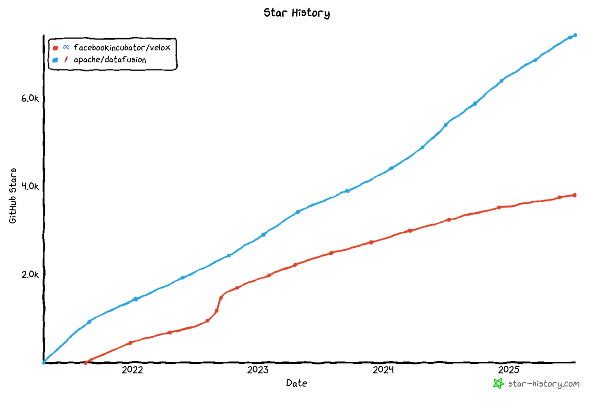

<a id="comet-about-gluten_comparison--spark-version-support"></a>

## Spark Version Support

Both projects target a similar set of Spark releases.

Comet supports Spark 3.4, 3.5, 4.0, and 4.1 in production builds, with an experimental build also published for
the Spark 4.2 preview. See the [Spark version compatibility guide](#comet-user-guide-latest-compatibility-spark-versions) for the exact patch versions and
JDK/Scala combinations.

Gluten supports Spark 3.3, 3.4, 3.5, 4.0, and 4.1.

<a id="comet-about-gluten_comparison--ansi-mode"></a>

## ANSI Mode

Spark 4.0 enables ANSI SQL semantics by default, which changes how arithmetic overflow, invalid casts, division by
zero, and similar error conditions are handled. This is one area where the two projects currently differ.

Comet implements ANSI semantics for the expressions it supports natively, including arithmetic overflow checks, ANSI cast behavior, and `try_*` variants. Queries running with `spark.sql.ansi.enabled=true` continue to be accelerated.
See the [Comet Compatibility Guide](#comet-user-guide-latest-compatibility) for details on which expressions have full ANSI coverage.

The Gluten Velox backend documents that ANSI mode is not supported and that any query executed with ANSI enabled
will fall back to vanilla Spark. See the [Gluten Velox limitations](https://apache.github.io/gluten/velox-backend-limitations.html) page for the current status.

For users adopting Spark 4.0 without disabling ANSI mode, this difference can have a significant impact on the
fraction of a workload that runs natively.

<a id="comet-about-gluten_comparison--table-format-support"></a>

## Table Format Support

Both projects can accelerate queries against Apache Iceberg tables, but they take different approaches and Gluten
covers a broader set of table formats overall.

Comet provides a native Iceberg scan built on iceberg-rust. It has been tested with Iceberg 1.5 through 1.10 and
supports Iceberg spec v1 and v2, schema evolution, time travel and branch reads, positional and equality deletes
on merge-on-read tables, REST catalogs, and S3-compatible object storage. Iceberg writes still go through Spark.
Comet does not currently provide native integrations for Delta Lake, Hudi, or Paimon. See the
[Comet Iceberg guide](#comet-user-guide-latest-iceberg) for the full list of supported features and known limitations.

Gluten ships dedicated modules for Iceberg, Delta Lake (2.0 through 4.0), Hudi, and Paimon. Users who need native
acceleration for Delta, Hudi, or Paimon will find broader coverage in Gluten today.

<a id="comet-about-gluten_comparison--compatibility"></a>

## Compatibility

Comet relies on the full Spark SQL test suite (consisting of more than 24,000 tests) as well its own unit and
integration tests to ensure compatibility with Spark. Features that are known to have compatibility differences with
Spark are disabled by default, but users can opt in. See the [Comet Compatibility Guide](#comet-user-guide-latest-compatibility) for more information.

Gluten also aims to provide compatibility with Spark, and includes a subset of the Spark SQL tests in its own test
suite. See the Gluten [Velox backend limitations](https://apache.github.io/gluten/velox-backend-limitations.html) page for known gaps, including notes on case sensitivity, regular
expression dialect (RE2 vs `java.util.regex`), NaN handling, and timestamp encodings.

<a id="comet-about-gluten_comparison--performance"></a>

## Performance

When running a benchmark derived from TPC-H on a single node against local Parquet files, we see that both Comet
and Gluten provide an impressive speedup when compared to Spark. Comet provides a 2.4x speedup compares to a 2.8x speedup
with Gluten.

Gluten is currently faster than Comet for this particular benchmark, but we expect to close that gap over time.

Although TPC-H is a good benchmark for operators such as joins and aggregates, it doesn’t necessarily represent
real-world queries, especially for ETL use cases. For example, there are no complex types involved and no string
manipulation, regular expressions, or other advanced expressions. We recommend running your own benchmarks based
on your existing Spark jobs.

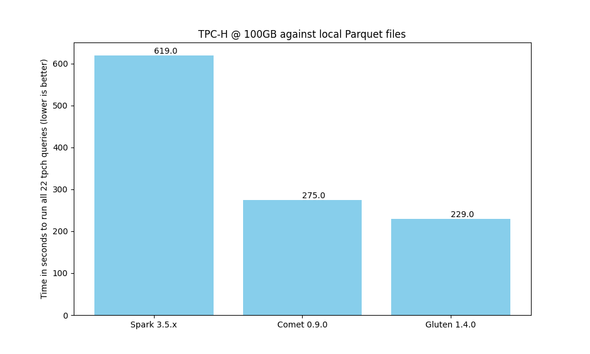

The scripts that were used to generate these results can be found [here](https://github.com/apache/datafusion-comet/tree/main/benchmarks/tpc).

<a id="comet-about-gluten_comparison--ease-of-development-contributing"></a>

## Ease of Development & Contributing

Setting up a local development environment with Comet is generally easier than with Gluten due to Rust’s package
management capabilities vs the complexities around installing C++ dependencies.

<a id="comet-about-gluten_comparison--summary"></a>

## Summary

Comet and Gluten are both good solutions for accelerating Spark jobs. Comet currently has an edge for users on
Spark 4.0 with ANSI mode enabled, and for users who want a fully native Iceberg scan path. Gluten currently leads
on TPC-H performance and offers broader native integration with Delta Lake, Hudi, and Paimon, plus a second backend
in ClickHouse. We recommend trying both to see which is the best fit for your needs.

---

<a id="comet-asf"></a>

<!-- source_url: https://datafusion.apache.org/comet/asf/index.html -->

<!-- page_index: 237 -->

<a id="comet-asf--asf-links"></a>

# ASF Links

Apache DataFusion Comet is part of the Apache Software Foundation. The links below point to ASF
resources covering licensing, donations, security reporting, and the Foundation’s code of conduct.
Select a link from the navigation menu.

---

<a id="ballista-user-guide-deployment"></a>

<!-- source_url: https://datafusion.apache.org/ballista/user-guide/deployment/index.html -->

<!-- page_index: 238 -->

# Start a Ballista Cluster ¶

[Edit this page](https://github.com/apache/datafusion-ballista/edit/main/docs/source/user-guide/deployment/index.rst)

<a id="ballista-user-guide-deployment--start-a-ballista-cluster"></a>

# Start a Ballista Cluster

[previous

Overview](#ballista-user-guide-introduction "previous page")
[next

Ballista Quickstart](#ballista-user-guide-deployment-quick-start "next page")

---

<a id="ballista-user-guide-deployment-quick-start"></a>

<!-- source_url: https://datafusion.apache.org/ballista/user-guide/deployment/quick-start.html -->

<!-- page_index: 239 -->

# Ballista Quickstart ¶

On this page

- [Build the project](#ballista-user-guide-deployment-quick-start--build-the-project)
- [Running the examples](#ballista-user-guide-deployment-quick-start--running-the-examples)
  - [Distributed SQL Example](#ballista-user-guide-deployment-quick-start--distributed-sql-example)
  - [Distributed DataFrame Example](#ballista-user-guide-deployment-quick-start--distributed-dataframe-example)
    - [Source code for distributed DataFrame example](#ballista-user-guide-deployment-quick-start--source-code-for-distributed-dataframe-example)

[Edit this page](https://github.com/apache/datafusion-ballista/edit/main/docs/source/user-guide/deployment/quick-start.md)

<a id="ballista-user-guide-deployment-quick-start--ballista-quickstart"></a>

# Ballista Quickstart

A simple way to start a local cluster for testing purposes is to use cargo to build the project and then run the scheduler and executor binaries directly.

Project Requirements:

- [Rust](https://www.rust-lang.org/tools/install)
- [Protobuf Compiler](https://protobuf.dev/downloads/)

<a id="ballista-user-guide-deployment-quick-start--build-the-project"></a>

## Build the project

From the root of the project, build release binaries.

```
cargo build --release
```

Start a Ballista scheduler process in a new terminal session.

```
RUST_LOG=info ./target/release/ballista-scheduler
```

Start one or more Ballista executor processes in new terminal sessions. When starting more than one
executor, a unique port number must be specified for each executor.

```
RUST_LOG=info ./target/release/ballista-executor -c 2 -p 50051 --bind-grpc-port 50052

RUST_LOG=info ./target/release/ballista-executor -c 2 -p 50053 --bind-grpc-port 50054
```

<a id="ballista-user-guide-deployment-quick-start--running-the-examples"></a>

## Running the examples

The examples can be run using the `cargo run --bin` syntax. Open a new terminal session and run the following commands.

<a id="ballista-user-guide-deployment-quick-start--distributed-sql-example"></a>

### Distributed SQL Example

```
cd examples
cargo run --release --example remote-sql
```

<a id="ballista-user-guide-deployment-quick-start--source-code-for-distributed-sql-example"></a>

#### Source code for distributed SQL example

```
use
ballista::prelude::*;
use
ballista_examples::test_util;
use
datafusion ::{
execution::SessionStateBuilder,
prelude ::{CsvReadOptions,
SessionConfig,
SessionContext },}; /// This example demonstrates executing a simple query against an Arrow data source (CSV) and /// fetching results, using SQL #[tokio::main] async
fn
main ()
->
Result <()>
{
let
config
=
SessionConfig::new_with_ballista ()
.with_target_partitions (4)
.with_ballista_job_name ("Remote SQL Example" );
let
state
=
SessionStateBuilder::new ()
.with_config (config)
.with_default_features ()
.build ();
let
ctx
=
SessionContext::remote_with_state ("df://localhost:50050",
state ).await ?;
let
test_data
=
test_util::examples_test_data ();
ctx.register_csv (
"test",
& format! ("{test_data}/aggregate_test_100.csv" ),
CsvReadOptions::new (),
)
.await ?;
let
df
=
ctx
.sql (
"SELECT c1, MIN(c12), MAX(c12) \ FROM test \ WHERE c11 > 0.1 AND c11 < 0.9 \ GROUP BY c1",
)
.await ?;
df.show ().await ?;
Ok (())}
```

<a id="ballista-user-guide-deployment-quick-start--distributed-dataframe-example"></a>

### Distributed DataFrame Example

```
cd examples
cargo run --release --example remote-dataframe
```

<a id="ballista-user-guide-deployment-quick-start--source-code-for-distributed-dataframe-example"></a>

#### Source code for distributed DataFrame example

```
use
ballista::prelude::*;
use
ballista_examples::test_util;
use
datafusion ::{
prelude ::{col,
lit,
ParquetReadOptions,
SessionContext },}; #[tokio::main] async
fn
main ()
->
Result <()>
{
// creating SessionContext with default settings
let
ctx
=
SessionContext::remote ("df://localhost:50050" ).await ?;
let
test_data
=
test_util::examples_test_data ();
let
filename
=
format! ("{test_data}/alltypes_plain.parquet" );
let
df
=
ctx
.read_parquet (filename,
ParquetReadOptions::default ())
.await ?
.select_columns (& ["id",
"bool_col",
"timestamp_col" ]) ?
.filter (col ("id" ).gt (lit (1 ))) ?;
df.show ().await ?;
Ok (())}
```

[previous

Start a Ballista Cluster](#ballista-user-guide-deployment "previous page")
[next

Deploying a standalone Ballista cluster using cargo install](#ballista-user-guide-deployment-cargo-install "next page")

---

<a id="ballista-user-guide-deployment-cargo-install"></a>

<!-- source_url: https://datafusion.apache.org/ballista/user-guide/deployment/cargo-install.html -->

<!-- page_index: 240 -->

# Deploying a standalone Ballista cluster using cargo install ¶

On this page

[Edit this page](https://github.com/apache/datafusion-ballista/edit/main/docs/source/user-guide/deployment/cargo-install.md)

<a id="ballista-user-guide-deployment-cargo-install--deploying-a-standalone-ballista-cluster-using-cargo-install"></a>

# Deploying a standalone Ballista cluster using cargo install

Another simple way to start a local cluster for testing purposes is to use cargo to install
the scheduler and executor crates.

```
cargo install --locked ballista-scheduler
cargo install --locked ballista-executor
```

With these crates installed, it is now possible to start a scheduler process.

```
RUST_LOG=info ballista-scheduler
```

The scheduler will bind to port 50050 by default.

Next, start an executor processes in a new terminal session.

```
RUST_LOG=info ballista-executor
```

The executor will bind to port 50051 by default. Additional executors can be started by
manually specifying a bind port. For example:

```
RUST_LOG=info ballista-executor --bind-port 50052
```

<a id="ballista-user-guide-deployment-cargo-install--installing-with-optional-features"></a>

## Installing with Optional Features

Ballista supports optional features that can be enabled during installation using the `--features` flag.

<a id="ballista-user-guide-deployment-cargo-install--spark-compatible-functions"></a>

### Spark-Compatible Functions

To enable Spark-compatible scalar, aggregate, and window functions from the `datafusion-spark` crate:

```
# Install scheduler with spark-compat feature cargo install --locked --features spark-compat ballista-scheduler

# Install executor with spark-compat feature cargo install --locked --features spark-compat ballista-executor

# Install CLI with spark-compat feature cargo install --locked --features spark-compat ballista-cli
```

When the `spark-compat` feature is enabled, additional functions like `sha1`, `expm1`, `sha2`, and others become available in SQL queries.

> **Note:** The `spark-compat` feature provides Spark-compatible expressions and functions only, not full Apache Spark API compatibility.

For more details about Spark-compatible functions, see [Spark-Compatible Functions](#ballista-user-guide-spark-compatible-functions).

[previous

Ballista Quickstart](#ballista-user-guide-deployment-quick-start "previous page")
[next

Starting a Ballista Cluster using Docker](#ballista-user-guide-deployment-docker "next page")

---

<a id="ballista-user-guide-deployment-docker"></a>

<!-- source_url: https://datafusion.apache.org/ballista/user-guide/deployment/docker.html -->

<!-- page_index: 241 -->

# Starting a Ballista Cluster using Docker ¶

On this page

- [Build Docker Images](#ballista-user-guide-deployment-docker--build-docker-images)
- [Start a Cluster](#ballista-user-guide-deployment-docker--start-a-cluster)
- [Connect from the CLI](#ballista-user-guide-deployment-docker--connect-from-the-cli)

[Edit this page](https://github.com/apache/datafusion-ballista/edit/main/docs/source/user-guide/deployment/docker.md)

<a id="ballista-user-guide-deployment-docker--starting-a-ballista-cluster-using-docker"></a>

# Starting a Ballista Cluster using Docker

<a id="ballista-user-guide-deployment-docker--build-docker-images"></a>

## Build Docker Images

Run the following commands to download the [official Docker image](https://github.com/apache/datafusion-ballista/pkgs/container/datafusion-ballista-standalone):

```
docker pull ghcr.io/apache/datafusion-ballista-standalone:latest
```

Alternatively run the following commands to clone the source repository and build the Docker images from source:

```
git clone git@github.com:apache/datafusion-ballista.git
cd datafusion-ballista
./dev/build-ballista-docker.sh
```

This will create the following images:

- `apache/datafusion-ballista-benchmarks:latest`
- `apache/datafusion-ballista-cli:latest`
- `apache/datafusion-ballista-executor:latest`
- `apache/datafusion-ballista-scheduler:latest`
- `apache/datafusion-ballista-standalone:latest`

<a id="ballista-user-guide-deployment-docker--start-a-cluster"></a>

## Start a Cluster

<a id="ballista-user-guide-deployment-docker--start-a-scheduler"></a>

### Start a Scheduler

Start a scheduler using the following syntax:

```
docker run --network=host \
 -d apache/datafusion-ballista-scheduler:latest \
 --bind-port 50050
```

Run `docker ps` to check that the process is running:

```
$ docker ps CONTAINER ID IMAGE COMMAND CREATED STATUS PORTS NAMES a756055576f3 apache/datafusion-ballista-scheduler:latest "/root/scheduler-ent…" 8 seconds ago Up 8 seconds xenodochial_carson
```

Run `docker logs CONTAINER_ID` to check the output from the process:

```
$ docker logs a756055576f3
INFO ballista_scheduler::scheduler_process: Ballista v52.0.0 Scheduler listening on 0.0.0.0:50050
INFO ballista_scheduler::scheduler_process: Starting Scheduler grpc server with task scheduling policy of PullStaged
INFO ballista_scheduler::scheduler_server::query_stage_scheduler: Starting QueryStageScheduler
INFO ballista_core::event_loop: Starting the event loop query_stage
```

<a id="ballista-user-guide-deployment-docker--start-executors"></a>

### Start Executors

Start one or more executor processes. Each executor process will need to listen on a different port.

```
docker run --network=host \
  -d apache/datafusion-ballista-executor:latest \
  --external-host localhost --bind-port 50051
```

Use `docker ps` to check that both the scheduler and executor(s) are now running:

```
$ docker ps CONTAINER ID IMAGE COMMAND CREATED STATUS PORTS NAMES fb8b530cee6d apache/datafusion-ballista-executor:latest "/root/executor-entr…" 2 seconds ago Up 1 second gallant_galois a756055576f3 apache/datafusion-ballista-scheduler:latest "/root/scheduler-ent…" 8 seconds ago Up 8 seconds xenodochial_carson
```

Use `docker logs CONTAINER_ID` to check the output from the executor(s):

```
$ docker logs fb8b530cee6d
INFO ballista_executor::executor_process: Running with config:
INFO ballista_executor::executor_process: work_dir: /tmp/.tmpAkP3pZ
INFO ballista_executor::executor_process: concurrent_tasks: 48
INFO ballista_executor::executor_process: Ballista v52.0.0 Rust Executor Flight Server listening on 0.0.0.0:50051
INFO ballista_executor::execution_loop: Starting poll work loop with scheduler
```

<a id="ballista-user-guide-deployment-docker--connect-from-the-cli"></a>

## Connect from the CLI

```
docker run --network=host -it apache/datafusion-ballista-cli:latest --host localhost --port 50050
```

[previous

Deploying a standalone Ballista cluster using cargo install](#ballista-user-guide-deployment-cargo-install "previous page")
[next

Starting a Ballista Cluster using Docker Compose](#ballista-user-guide-deployment-docker-compose "next page")

---

<a id="ballista-user-guide-deployment-docker-compose"></a>

<!-- source_url: https://datafusion.apache.org/ballista/user-guide/deployment/docker-compose.html -->

<!-- page_index: 242 -->

# Starting a Ballista Cluster using Docker Compose ¶

On this page

- [Build Docker Images](#ballista-user-guide-deployment-docker-compose--build-docker-images)
- [Start a Cluster](#ballista-user-guide-deployment-docker-compose--start-a-cluster)
- [Connect from the Ballista CLI](#ballista-user-guide-deployment-docker-compose--connect-from-the-ballista-cli)

[Edit this page](https://github.com/apache/datafusion-ballista/edit/main/docs/source/user-guide/deployment/docker-compose.md)

<a id="ballista-user-guide-deployment-docker-compose--starting-a-ballista-cluster-using-docker-compose"></a>

# Starting a Ballista Cluster using Docker Compose

Docker Compose is a convenient way to launch a cluster when testing locally.

<a id="ballista-user-guide-deployment-docker-compose--build-docker-images"></a>

## Build Docker Images

To create the required Docker images please refer to the [docker deployment page](#ballista-user-guide-deployment-docker).

<a id="ballista-user-guide-deployment-docker-compose--start-a-cluster"></a>

## Start a Cluster

Using the [docker-compose.yml](https://github.com/apache/datafusion-ballista/blob/main/docker-compose.yml) from the
source repository, run the following command to start a cluster:

```
docker-compose up --build
```

This should show output similar to the following:

```
$ docker-compose up Creating network "ballista-benchmarks_default" with the default driver Creating ballista-benchmarks_ballista-scheduler_1 ... done Creating ballista-benchmarks_ballista-executor_1 ... done Attaching to ballista-benchmarks_ballista-scheduler_1, ballista-benchmarks_ballista-executor_1 ballista-scheduler_1 | INFO ballista_scheduler: Ballista v52.0.0 Scheduler listening on 0.0.0.0:50050 ballista-executor_1 | INFO ballista_executor: Ballista v52.0.0 Rust Executor listening on 0.0.0.0:50051
```

The scheduler listens on port 50050 and this is the port that clients will need to connect to.

<a id="ballista-user-guide-deployment-docker-compose--connect-from-the-ballista-cli"></a>

## Connect from the Ballista CLI

```
docker run --network=host -it apache/datafusion-ballista-cli:latest --host localhost --port 50050
```

[previous

Starting a Ballista Cluster using Docker](#ballista-user-guide-deployment-docker "previous page")
[next

Deploying Ballista with Kubernetes](#ballista-user-guide-deployment-kubernetes "next page")

---

<a id="ballista-user-guide-deployment-kubernetes"></a>

<!-- source_url: https://datafusion.apache.org/ballista/user-guide/deployment/kubernetes.html -->

<!-- page_index: 243 -->

# Deploying Ballista with Kubernetes ¶

On this page

- [Testing Locally](#ballista-user-guide-deployment-kubernetes--testing-locally)
- [Build Docker Images](#ballista-user-guide-deployment-kubernetes--build-docker-images)
- [Publishing Docker Images](#ballista-user-guide-deployment-kubernetes--publishing-docker-images)
- [Create Persistent Volume and Persistent Volume Claim](#ballista-user-guide-deployment-kubernetes--create-persistent-volume-and-persistent-volume-claim)
- [Deploying a Ballista Cluster](#ballista-user-guide-deployment-kubernetes--deploying-a-ballista-cluster)
- [Port Forwarding](#ballista-user-guide-deployment-kubernetes--port-forwarding)
- [Deleting the Ballista Cluster](#ballista-user-guide-deployment-kubernetes--deleting-the-ballista-cluster)
- [Autoscaling Executors](#ballista-user-guide-deployment-kubernetes--autoscaling-executors)

[Edit this page](https://github.com/apache/datafusion-ballista/edit/main/docs/source/user-guide/deployment/kubernetes.md)

<a id="ballista-user-guide-deployment-kubernetes--deploying-ballista-with-kubernetes"></a>

# Deploying Ballista with Kubernetes

Ballista can be deployed to any Kubernetes cluster using the following instructions. These instructions assume that
you are already comfortable managing Kubernetes deployments.

The Ballista deployment consists of:

- k8s deployment for one or more scheduler processes
- k8s deployment for one or more executor processes
- k8s service to route traffic to the schedulers
- k8s persistent volume and persistent volume claims to make local data accessible to Ballista
- *(optional)* a [keda](http://keda.sh) instance for autoscaling the number of executors

<a id="ballista-user-guide-deployment-kubernetes--testing-locally"></a>

## Testing Locally

[Microk8s](https://microk8s.io/) is recommended for installing a local k8s cluster. Once Microk8s is installed, DNS
must be enabled using the following command.

```
microk8s enable dns
```

<a id="ballista-user-guide-deployment-kubernetes--build-docker-images"></a>

## Build Docker Images

To create the required Docker images please refer to the [docker deployment page](#ballista-user-guide-deployment-docker).

<a id="ballista-user-guide-deployment-kubernetes--publishing-docker-images"></a>

## Publishing Docker Images

Once the images have been built, you can retag them and can push them to your favourite Docker registry.

```
docker tag apache/datafusion-ballista-scheduler:latest <your-repo>/datafusion-ballista-scheduler:latest
docker tag apache/datafusion-ballista-executor:latest <your-repo>/datafusion-ballista-executor:latest
docker push <your-repo>/datafusion-ballista-scheduler:latest
docker push <your-repo>/datafusion-ballista-executor:latest
```

<a id="ballista-user-guide-deployment-kubernetes--create-persistent-volume-and-persistent-volume-claim"></a>

## Create Persistent Volume and Persistent Volume Claim

Copy the following yaml to a `pv.yaml` file and apply to the cluster to create a persistent volume and a persistent
volume claim so that the specified host directory is available to the containers. This is where any data should be
located so that Ballista can execute queries against it.

```
apiVersion:
v1 kind:
PersistentVolume metadata:
name:
data-pv
labels:
type:
local spec:
storageClassName:
manual
capacity:
storage:
10Gi
accessModes:
-
ReadWriteOnce
hostPath:
path:
"/mnt" --- apiVersion:
v1 kind:
PersistentVolumeClaim metadata:
name:
data-pv-claim spec:
storageClassName:
manual
accessModes:
-
ReadWriteOnce
resources:
requests:
storage:
3Gi
```

To apply this yaml:

```
kubectl apply -f pv.yaml
```

You should see the following output:

```
persistentvolume/data-pv created
persistentvolumeclaim/data-pv-claim created
```

<a id="ballista-user-guide-deployment-kubernetes--deploying-a-ballista-cluster"></a>

## Deploying a Ballista Cluster

Copy the following yaml to a `cluster.yaml` file and change `<your-image>` with the name of your Ballista Docker image.

```
apiVersion:
v1 kind:
Service metadata:
name:
ballista-scheduler
labels:
app:
ballista-scheduler spec:
ports:
-
port:
50050
name:
scheduler
-
port:
80
name:
scheduler-ui
selector:
app:
ballista-scheduler --- apiVersion:
apps/v1 kind:
Deployment metadata:
name:
ballista-scheduler spec:
replicas:
1
selector:
matchLabels:
app:
ballista-scheduler
template:
metadata:
labels:
app:
ballista-scheduler
ballista-cluster:
ballista
spec:
containers:
-
name:
ballista-scheduler
image:
<your-repo>/datafusion-ballista-scheduler:latest
args:
["--bind-port=50050"]
ports:
-
containerPort:
50050
name:
flight
volumeMounts:
-
mountPath:
/mnt
name:
data
volumes:
-
name:
data
persistentVolumeClaim:
claimName:
data-pv-claim --- apiVersion:
apps/v1 kind:
Deployment metadata:
name:
ballista-executor spec:
replicas:
2
selector:
matchLabels:
app:
ballista-executor
template:
metadata:
labels:
app:
ballista-executor
ballista-cluster:
ballista
spec:
containers:
-
name:
ballista-executor
image:
<your-repo>/datafusion-ballista-executor:latest
args:
-
"--bind-port=50051"
-
"--scheduler-host=ballista-scheduler"
-
"--scheduler-port=50050"
ports:
-
containerPort:
50051
name:
flight
volumeMounts:
-
mountPath:
/mnt
name:
data
volumes:
-
name:
data
persistentVolumeClaim:
claimName:
data-pv-claim
```

```
kubectl apply -f cluster.yaml
```

This should show the following output:

```
service / ballista - scheduler created deployment.apps / ballista - scheduler created deployment.apps / ballista - executor created
```

You can also check status by running `kubectl get pods`:

```
$ kubectl get pods NAME READY STATUS RESTARTS AGE ballista-executor-78cc5b6486-4rkn4 0/1 Pending 0 42s ballista-executor-78cc5b6486-7crdm 0/1 Pending 0 42s ballista-scheduler-879f874c5-rnbd6 0/1 Pending 0 42s
```

You can view the scheduler logs with `kubectl logs ballista-scheduler-<pod-id>`:

```
$ kubectl logs ballista-scheduler-<pod-id>
INFO ballista_scheduler::scheduler_process: Ballista v52.0.0 Scheduler listening on 0.0.0.0:50050
INFO ballista_scheduler::scheduler_server::grpc: Received register_executor request for ExecutorMetadata { id: "b5e81711-1c5c-46ec-8522-d8b359793188", host: "10.1.23.149", port: 50051 }
INFO ballista_scheduler::scheduler_server::grpc: Received register_executor request for ExecutorMetadata { id: "816e4502-a876-4ed8-b33f-86d243dcf63f", host: "10.1.23.150", port: 50051 }
```

<a id="ballista-user-guide-deployment-kubernetes--port-forwarding"></a>

## Port Forwarding

If you want to run applications outside of the cluster and have them connect to the scheduler then it is necessary to
set up port forwarding.

First, check that the `ballista-scheduler` service is running.

```
$ kubectl get services NAME TYPE CLUSTER-IP EXTERNAL-IP PORT(S) AGE kubernetes ClusterIP 10.152.183.1 <none> 443/TCP 26h ballista-scheduler ClusterIP 10.152.183.21 <none> 50050/TCP 24m
```

Use the following command to set up port-forwarding.

```
kubectl port-forward service/ballista-scheduler 50050:50050
```

<a id="ballista-user-guide-deployment-kubernetes--deleting-the-ballista-cluster"></a>

## Deleting the Ballista Cluster

Run the following kubectl command to delete the cluster.

```
kubectl delete -f cluster.yaml
```

<a id="ballista-user-guide-deployment-kubernetes--autoscaling-executors"></a>

## Autoscaling Executors

Ballista supports autoscaling for executors through [Keda](http://keda.sh). Keda allows for the scaling of a
deployment through custom metrics which are exposed through the Ballista scheduler, and it
can even scale the number of executors down to 0 if there is no activity in the cluster.

Keda can be installed in your kubernetes cluster through a single command line:

```
kubectl apply -f https://github.com/kedacore/keda/releases/download/v2.7.1/keda-2.7.1.yaml
```

Once you have deployed Keda on your cluster, you can now deploy a new kubernetes object called `ScaledObject`
which will let Keda know how to scale your executors. In order to do that, copy the following YAML into a
`scale.yaml` file:

```
apiVersion:
keda.sh/v1alpha1 kind:
ScaledObject metadata:
name:
ballista-executor spec:
scaleTargetRef:
name:
ballista-executor
minReplicaCount:
0
maxReplicaCount:
5
triggers:
-
type:
external
metadata:
# Change this DNS if the scheduler isn't deployed in the "default" namespace scalerAddress:ballista-scheduler.default.svc.cluster.local:50050
```

And then deploy it into the cluster:

```
kubectl apply -f scale.yaml
```

If the cluster is inactive, Keda will now scale the number of executors down to 0, and will scale them up when
you launch a query. Please note that Keda will perform a scan once every 30 seconds, so it might take a bit to
scale the executors.

Please visit Keda’s [documentation page](https://keda.sh/docs/2.7/concepts/scaling-deployments/) for more information.

[previous

Starting a Ballista Cluster using Docker Compose](#ballista-user-guide-deployment-docker-compose "previous page")
[next

Ballista Scheduler](#ballista-user-guide-scheduler "next page")

---

<a id="ballista-user-guide-scheduler"></a>

<!-- source_url: https://datafusion.apache.org/ballista/user-guide/scheduler.html -->

<!-- page_index: 244 -->

# Ballista Scheduler ¶

On this page

[Edit this page](https://github.com/apache/datafusion-ballista/edit/main/docs/source/user-guide/scheduler.md)

<a id="ballista-user-guide-scheduler--ballista-scheduler"></a>

# Ballista Scheduler

<a id="ballista-user-guide-scheduler--rest-api"></a>

## REST API

The scheduler also provides a REST API that allows jobs to be monitored.

> This is optional scheduler feature which should be enabled with the `rest-api` feature.

| API | Method | Description |
| --- | --- | --- |
| /api/jobs | GET | Get a list of jobs that have been submitted to the cluster. |
| /api/job/{job\_id} | GET | Get a summary of a submitted job. |
| /api/job/{job\_id}/dot | GET | Produce a query plan in DOT (graphviz) format. |
| /api/job/:job\_id/dot\_svg | GET | Produce a query plan in SVG format. (`graphviz-support` required) |
| /api/job/{job\_id} | PATCH | Cancel a currently running job |
| /api/job/:job\_id/stage/:stage\_id/dot | GET | Produces stage plan in DOT (graphviz) format |
| /api/metrics | GET | Return current scheduler metric set |

[previous

Deploying Ballista with Kubernetes](#ballista-user-guide-deployment-kubernetes "previous page")
[next

Python Client](#ballista-user-guide-python "next page")

---

<a id="ballista-user-guide-python"></a>

<!-- source_url: https://datafusion.apache.org/ballista/user-guide/python/index.html -->

<!-- page_index: 245 -->

# Python Client ¶

[Edit this page](https://github.com/apache/datafusion-ballista/edit/main/docs/source/user-guide/python/index.rst)

<a id="ballista-user-guide-python--python-client"></a>

# Python Client

[previous

Ballista Scheduler](#ballista-user-guide-scheduler "previous page")
[next

Ballista Python Bindings](#ballista-user-guide-python-quickstart "next page")

---

<a id="ballista-user-guide-python-quickstart"></a>

<!-- source_url: https://datafusion.apache.org/ballista/user-guide/python/quickstart.html -->

<!-- page_index: 246 -->

# Ballista Python Bindings ¶

On this page

- [Connecting to a Cluster](#ballista-user-guide-python-quickstart--connecting-to-a-cluster)
- [Configuration](#ballista-user-guide-python-quickstart--configuration)
- [SQL](#ballista-user-guide-python-quickstart--sql)
  - [Registering Tables](#ballista-user-guide-python-quickstart--registering-tables)
  - [Executing Queries](#ballista-user-guide-python-quickstart--executing-queries)
  - [Showing Query Results](#ballista-user-guide-python-quickstart--showing-query-results)
  - [Collecting Query Results](#ballista-user-guide-python-quickstart--collecting-query-results)
  - [Viewing Query Plans](#ballista-user-guide-python-quickstart--viewing-query-plans)
- [DataFrame API](#ballista-user-guide-python-quickstart--dataframe-api)
- [User Defined Functions](#ballista-user-guide-python-quickstart--user-defined-functions)

[Edit this page](https://github.com/apache/datafusion-ballista/edit/main/docs/source/user-guide/python/quickstart.md)

<a id="ballista-user-guide-python-quickstart--ballista-python-bindings"></a>

# Ballista Python Bindings

Ballista provides Python bindings, allowing SQL and DataFrame queries to be executed
from Python. Like PySpark, you build a plan through SQL or a DataFrame API against
Parquet, CSV, JSON, and other file formats, run it in a distributed environment, and
collect the results back in Python.

<a id="ballista-user-guide-python-quickstart--connecting-to-a-cluster"></a>

## Connecting to a Cluster

`BallistaSessionContext` is the entry point for both remote and in-process clusters.

**Remote cluster** — connect to an already-running scheduler:

```
from
ballista
import BallistaSessionContext ctx =BallistaSessionContext ("df://localhost:50050")
```

**In-process cluster** — start a scheduler and executor in the current Python process.
Useful for development, testing, and notebooks:

```
from
ballista
import BallistaSessionContext,setup_test_cluster host,port =setup_test_cluster () ctx =BallistaSessionContext (f "df:// {host}:{port} ")
```

<a id="ballista-user-guide-python-quickstart--configuration"></a>

## Configuration

<a id="ballista-user-guide-python-quickstart--target-partitions"></a>

### Target Partitions

Set `datafusion.execution.target_partitions` to match your cluster capacity
(`executors × concurrent_tasks_per_executor`) by passing `cluster_config` to the
constructor. The default inherits from DataFusion and is based on the client’s CPU
count, which is far too low for distributed execution:

```
from
ballista
import BallistaSessionContext executors =4 concurrent_tasks =8 target_partitions =executors * concurrent_tasks ctx =BallistaSessionContext ("df://localhost:50050",cluster_config ={"datafusion.execution.target_partitions":str (target_partitions ),},)
```

`cluster_config` is propagated to the scheduler-side session for distributed planning
and execution, and is also applied to the local context so settings consulted during
table registration (e.g. `datafusion.execution.listing_table_factory_infer_partitions`)
take effect before the plan is shipped.

This controls how many parallel tasks the scheduler creates per stage. Setting it too
low leaves executor capacity idle; setting it too high creates unnecessary scheduling
overhead.

<a id="ballista-user-guide-python-quickstart--sql"></a>

## SQL

<a id="ballista-user-guide-python-quickstart--registering-tables"></a>

### Registering Tables

Before running SQL queries, register tables with the context using a `register_*`
method or a `CREATE EXTERNAL TABLE` statement:

```
ctx.register_parquet ("trips","/mnt/bigdata/trips")
```

```

ctx
.
sql
(
"CREATE EXTERNAL TABLE trips STORED AS PARQUET LOCATION '/mnt/bigdata/trips'"
)
```

<a id="ballista-user-guide-python-quickstart--executing-queries"></a>

### Executing Queries

The `sql` method returns a `DataFrame`. The query runs when you call an action like
`show` or `collect`:

```
df =ctx.sql ("SELECT count(*) FROM trips")
```

<a id="ballista-user-guide-python-quickstart--showing-query-results"></a>

### Showing Query Results

```
df.show () +-----------------+ | COUNT (UInt8 (1 )) | +-----------------+ | 9071244 | +-----------------+
```

<a id="ballista-user-guide-python-quickstart--collecting-query-results"></a>

### Collecting Query Results

`collect` executes the query and returns the results as
[PyArrow](https://arrow.apache.org/docs/python/index.html) record batches:

```
df.collect () [pyarrow.RecordBatch COUNT (UInt8 (1 )):int64]
```

<a id="ballista-user-guide-python-quickstart--viewing-query-plans"></a>

### Viewing Query Plans

`explain` shows the logical and physical plans for a query:

```
df.explain () +---------------+-------------------------------------------------------------+ | plan_type | plan | +---------------+-------------------------------------------------------------+ | logical_plan | Projection:#COUNT(UInt8(1))                                | | | Aggregate:groupBy =[[]],aggr =[[COUNT (UInt8 (1 ))]] | | | TableScan:trips projection =[VendorID] | | physical_plan | ProjectionExec:expr =[COUNT (UInt8 (1 )) @ 0 as COUNT (UInt8 (1 ))] | | | ProjectionExec:expr =[9071244 as COUNT (UInt8 (1 ))] | | | EmptyExec:produce_one_row =true | | | | +---------------+-------------------------------------------------------------+
```

<a id="ballista-user-guide-python-quickstart--dataframe-api"></a>

## DataFrame API

You can create a DataFrame from in-memory data using PyArrow record batches:

```
from
ballista
import BallistaSessionContext,setup_test_cluster from
datafusion
import col import
pyarrow host,port =setup_test_cluster () ctx =BallistaSessionContext (f "df:// {host}:{port} ") batch =pyarrow.RecordBatch.from_arrays ([pyarrow.array ([1,2,3 ]),pyarrow.array ([4,5,6 ])],names =["a","b" ],) df =ctx.create_dataframe ([[batch ]]) df =df.select (col ("a") + col ("b" ),col ("a") - col ("b" ),) result =df.collect ()[0] assert result.column (0) ==pyarrow.array ([5,7,9 ]) assert result.column (1) ==pyarrow.array ([- 3,- 3,- 3 ])
```

<a id="ballista-user-guide-python-quickstart--user-defined-functions"></a>

## User Defined Functions

The underlying DataFusion query engine supports Python UDFs but this has not yet been
implemented in Ballista. It is planned for a future release. See
[#173](https://github.com/apache/datafusion-ballista/issues/173) for status.

[previous

Python Client](#ballista-user-guide-python "previous page")
[next

Querying S3 Data](#ballista-user-guide-python-cloud-storage "next page")

---

<a id="ballista-user-guide-python-cloud-storage"></a>

<!-- source_url: https://datafusion.apache.org/ballista/user-guide/python/cloud-storage.html -->

<!-- page_index: 247 -->

# Querying S3 Data ¶

On this page

- [Prerequisites](#ballista-user-guide-python-cloud-storage--prerequisites)
- [Environment Variables](#ballista-user-guide-python-cloud-storage--environment-variables)
- [Registering an S3 Object Store](#ballista-user-guide-python-cloud-storage--registering-an-s3-object-store)
- [Creating External Tables](#ballista-user-guide-python-cloud-storage--creating-external-tables)
- [Running Queries](#ballista-user-guide-python-cloud-storage--running-queries)
- [Complete Example](#ballista-user-guide-python-cloud-storage--complete-example)
- [Configuring S3 via SQL](#ballista-user-guide-python-cloud-storage--configuring-s3-via-sql)
- [Kubernetes Deployment](#ballista-user-guide-python-cloud-storage--kubernetes-deployment)
- [Troubleshooting](#ballista-user-guide-python-cloud-storage--troubleshooting)
  - [“No suitable object store found for s3://…”](#ballista-user-guide-python-cloud-storage--no-suitable-object-store-found-for-s3)
  - [“RelativeUrlWithoutBase” panic](#ballista-user-guide-python-cloud-storage--relativeurlwithoutbase-panic)
  - [S3 access works on client but queries fail on executors](#ballista-user-guide-python-cloud-storage--s3-access-works-on-client-but-queries-fail-on-executors)

[Edit this page](https://github.com/apache/datafusion-ballista/edit/main/docs/source/user-guide/python/cloud-storage.md)

<a id="ballista-user-guide-python-cloud-storage--querying-s3-data"></a>

# Querying S3 Data

Ballista supports querying data stored in Amazon S3. The default scheduler and executor
binaries include S3 support out of the box.

<a id="ballista-user-guide-python-cloud-storage--prerequisites"></a>

## Prerequisites

- A running Ballista cluster (scheduler + executors)
- `AWS_REGION` environment variable set on the scheduler and executor processes
- AWS credentials available via the standard credential chain (environment variables,
  instance profiles, IAM roles for service accounts, etc.)

<a id="ballista-user-guide-python-cloud-storage--environment-variables"></a>

## Environment Variables

The scheduler and executor processes need AWS configuration to access S3. Set the
following environment variables on **both** the scheduler and executor:

| Variable | Description | Example |
| --- | --- | --- |
| `AWS_REGION` | AWS region for S3 requests | `us-west-2` |
| `AWS_DEFAULT_REGION` | Fallback region (recommended to set both) | `us-west-2` |

For authentication, the standard AWS credential chain is used. On EKS, attach an IAM
role to your service account. For local development, set:

| Variable | Description |
| --- | --- |
| `AWS_ACCESS_KEY_ID` | AWS access key |
| `AWS_SECRET_ACCESS_KEY` | AWS secret key |
| `AWS_SESSION_TOKEN` | Session token (if using temporary credentials) |

<a id="ballista-user-guide-python-cloud-storage--registering-an-s3-object-store"></a>

## Registering an S3 Object Store

Before querying S3 data, register an S3 object store on the client context. This allows
the client to read Parquet metadata for schema inference during table registration.

```
from
ballista
import BallistaSessionContext from
datafusion.object_store
import AmazonS3 ctx =BallistaSessionContext ("df://localhost:50050") # IMPORTANT: The scheme parameter must include "://" — DataFusion concatenates # scheme + host directly, so "s3" alone would produce an invalid URL.ctx.register_object_store ("s3://",AmazonS3 (bucket_name ="my-bucket",region ="us-west-2",))
```

> **Note:** `AmazonS3` also reads `AWS_REGION`, `AWS_ACCESS_KEY_ID`, and
> `AWS_SECRET_ACCESS_KEY` from environment variables, so you can omit the `region`
> parameter if the environment is already configured.

<a id="ballista-user-guide-python-cloud-storage--creating-external-tables"></a>

## Creating External Tables

Once the object store is registered, create external tables pointing to your S3 data:

```
ctx.sql (""" CREATE EXTERNAL TABLE lineitem STORED AS PARQUET LOCATION 's3://my-bucket/tpch/lineitem/' """)
```

<a id="ballista-user-guide-python-cloud-storage--running-queries"></a>

## Running Queries

After registering tables, run queries as usual. The client sends the query plan to the
Ballista scheduler, which distributes execution across executors:

```
# Verify table registration ctx.sql ("SHOW TABLES").show () # Inspect table schema ctx.sql ("DESCRIBE lineitem").show () # Run a query df =ctx.sql (""" SELECT l_returnflag, l_linestatus,SUM(l_quantity) as sum_qty,SUM(l_extendedprice) as sum_base_price FROM lineitem WHERE l_shipdate <= '1998-09-02' GROUP BY l_returnflag, l_linestatus ORDER BY l_returnflag, l_linestatus """) df.show ()
```

<a id="ballista-user-guide-python-cloud-storage--complete-example"></a>

## Complete Example

```
import
os from
ballista
import BallistaSessionContext from
datafusion.object_store
import AmazonS3 os.environ.setdefault ("AWS_REGION","us-west-2") ctx =BallistaSessionContext ("df://localhost:50050") ctx.register_object_store ("s3://",AmazonS3 (bucket_name ="my-data-bucket",region ="us-west-2",)) tables =["lineitem","orders","customer","nation","region","part","supplier","partsupp"] for table in tables:ctx.sql (f """ CREATE EXTERNAL TABLE {table} STORED AS PARQUET LOCATION 's3://my-data-bucket/tpch/ {table} /' """) ctx.sql ("SHOW TABLES").show () df =ctx.sql ("SELECT count(*) FROM lineitem") df.show ()
```

<a id="ballista-user-guide-python-cloud-storage--configuring-s3-via-sql"></a>

## Configuring S3 via SQL

Ballista also supports configuring S3 credentials and endpoints through SQL `SET`
commands. This configures the **scheduler and executor** session state and propagates
across the cluster:

```
SET
s3.region
=
'us-west-2';
SET
s3.access_key_id
=
'******';
SET
s3.secret_access_key
=
'******';
SET
s3.endpoint
=
'https://s3.us-west-2.amazonaws.com';
SET
s3.allow_http
=
false;
```

> **Note:** These `SET` commands are separate from the client-side
> `register_object_store()` call, which is still needed for local schema inference
> during `CREATE EXTERNAL TABLE`.

<a id="ballista-user-guide-python-cloud-storage--kubernetes-deployment"></a>

## Kubernetes Deployment

When deploying on Kubernetes, set AWS environment variables in your pod specs:

```
# scheduler and executor containers env:-name:AWS_REGION value:"us-west-2" -name:AWS_DEFAULT_REGION value:"us-west-2"
```

On EKS with [IAM Roles for Service Accounts (IRSA)](https://docs.aws.amazon.com/eks/latest/userguide/iam-roles-for-service-accounts.html), attach an IAM role with S3 permissions to your Kubernetes service account. The AWS SDK
credential chain will automatically pick up the projected token.

<a id="ballista-user-guide-python-cloud-storage--troubleshooting"></a>

## Troubleshooting

<a id="ballista-user-guide-python-cloud-storage--no-suitable-object-store-found-for-s3:"></a>

### “No suitable object store found for s3://…”

The client context does not have an S3 object store registered. Call
`register_object_store()` before creating external tables:

```
from
datafusion.object_store
import AmazonS3 ctx.register_object_store ("s3://",AmazonS3 (bucket_name ="my-bucket" ))
```

<a id="ballista-user-guide-python-cloud-storage--relativeurlwithoutbase-panic"></a>

### “RelativeUrlWithoutBase” panic

The `scheme` parameter in `register_object_store()` must include `://`:

```
# Wrong — produces invalid URL "s3my-bucket" ctx.register_object_store ("s3",store) # Correct ctx.register_object_store ("s3://",store)
```

<a id="ballista-user-guide-python-cloud-storage--s3-access-works-on-client-but-queries-fail-on-executors"></a>

### S3 access works on client but queries fail on executors

The scheduler and executor processes need AWS credentials and region configuration
independently of the client. Ensure `AWS_REGION` is set on all processes, and that
credentials are available via environment variables, instance profiles, or IRSA.

[previous

Ballista Python Bindings](#ballista-user-guide-python-quickstart "previous page")
[next

Jupyter Notebooks](#ballista-user-guide-python-jupyter "next page")

---

<a id="ballista-user-guide-python-jupyter"></a>

<!-- source_url: https://datafusion.apache.org/ballista/user-guide/python/jupyter.html -->

<!-- page_index: 248 -->

# Jupyter Notebooks ¶

On this page

- [Basic Usage](#ballista-user-guide-python-jupyter--basic-usage)
- [Converting Results](#ballista-user-guide-python-jupyter--converting-results)
- [Example Workflow](#ballista-user-guide-python-jupyter--example-workflow)
- [Running a Local Cluster in a Notebook](#ballista-user-guide-python-jupyter--running-a-local-cluster-in-a-notebook)

[Edit this page](https://github.com/apache/datafusion-ballista/edit/main/docs/source/user-guide/python/jupyter.md)

<a id="ballista-user-guide-python-jupyter--jupyter-notebooks"></a>

# Jupyter Notebooks

Ballista works well in Jupyter notebooks. DataFrames automatically render as formatted
HTML tables when displayed in a notebook cell.

<a id="ballista-user-guide-python-jupyter--basic-usage"></a>

## Basic Usage

```
from
ballista
import BallistaSessionContext ctx =BallistaSessionContext ("df://localhost:50050") ctx.register_parquet ("trips","/path/to/trips.parquet") # The result renders as an HTML table when this is the last expression in a cell ctx.sql ("SELECT * FROM trips LIMIT 10")
```

When a DataFrame is the last expression in a cell, Jupyter automatically calls its
`_repr_html_()` method, which renders a styled table with formatted column headers, expandable cells for long text, and scrollable display for wide tables.

<a id="ballista-user-guide-python-jupyter--converting-results"></a>

## Converting Results

DataFrames can be converted to various formats for further analysis:

```
df =ctx.sql ("SELECT * FROM trips WHERE fare_amount > 50") pandas_df =df.to_pandas () arrow_table =df.to_arrow_table () polars_df =df.to_polars () batches =df.collect ()
```

<a id="ballista-user-guide-python-jupyter--example-workflow"></a>

## Example Workflow

```
# Cell 1: Setup from ballista import BallistaSessionContext from datafusion import col,lit ctx =BallistaSessionContext ("df://localhost:50050") ctx.register_parquet ("orders","/data/orders.parquet") ctx.register_parquet ("customers","/data/customers.parquet") # Cell 2: Explore the data df =ctx.sql ("SELECT * FROM orders LIMIT 5") # Cell 3: Run analysis — DataFrame renders as an HTML table df =ctx.sql (""" SELECT c.name,COUNT(*) as order_count,SUM(o.amount) as total_spent FROM orders o JOIN customers c ON o.customer_id = c.id GROUP BY c.name ORDER BY total_spent DESC LIMIT 10 """) # Cell 4: Convert to Pandas for visualization import matplotlib.pyplot as plt pandas_df =df.to_pandas () pandas_df.plot (kind ='bar',x ='name',y ='total_spent') plt.show ()
```

<a id="ballista-user-guide-python-jupyter--running-a-local-cluster-in-a-notebook"></a>

## Running a Local Cluster in a Notebook

For development and testing, you can start a local cluster directly from a notebook:

```
from
ballista
import BallistaSessionContext,setup_test_cluster host,port =setup_test_cluster () ctx =BallistaSessionContext (f "df:// {host}:{port} ")
```

[previous

Querying S3 Data](#ballista-user-guide-python-cloud-storage "previous page")
[next

Distributing DataFusion with Ballista](#ballista-user-guide-rust "next page")

---

<a id="ballista-user-guide-rust"></a>

<!-- source_url: https://datafusion.apache.org/ballista/user-guide/rust.html -->

<!-- page_index: 249 -->

# Distributing DataFusion with Ballista ¶

[Edit this page](https://github.com/apache/datafusion-ballista/edit/main/docs/source/user-guide/rust.md)

<a id="ballista-user-guide-rust--distributing-datafusion-with-ballista"></a>

# Distributing DataFusion with Ballista

To connect to a Ballista cluster from Rust, first start by creating a `SessionContext` connected to remote scheduler server.

```
use
ballista::prelude::*;
use
datafusion ::{
execution::SessionStateBuilder,
prelude ::{SessionConfig,
SessionContext },}; let
config
=
SessionConfig::new_with_ballista ()
.with_target_partitions (4)
.with_ballista_job_name ("Remote SQL Example" ); let
state
=
SessionStateBuilder::new ()
.with_config (config)
.with_default_features ()
.build (); let
ctx
=
SessionContext::remote_with_state ("df://localhost:50050",
state ).await ?;
```

For testing purposes, standalone, in process cluster could be started with:

```
use
ballista::prelude::*;
use
datafusion ::{
execution::SessionStateBuilder,
prelude ::{SessionConfig,
SessionContext },}; let
config
=
SessionConfig::new_with_ballista ()
.with_target_partitions (1)
.with_ballista_standalone_parallelism (2 ); let
state
=
SessionStateBuilder::new ()
.with_config (config)
.with_default_features ()
.build (); let
ctx
=
SessionContext::standalone_with_state (state ).await ?;
```

Following examples require running remove scheduler and executor nodes.

Full example using the DataFrame API.

```
use
ballista::prelude::*;
use
ballista_examples::test_util;
use
datafusion ::{
prelude ::{col,
lit,
ParquetReadOptions,
SessionContext },}; /// This example demonstrates executing a simple query against an Arrow data source (Parquet) and /// fetching results, using the DataFrame trait #[tokio::main] async
fn
main ()
->
Result <()>
{
// creating SessionContext with default settings
let
ctx
=
SessionContext::remote ("df://localhost:50050" ).await ?;
let
test_data
=
test_util::examples_test_data ();
let
filename
=
format! ("{test_data}/alltypes_plain.parquet" );
let
df
=
ctx
.read_parquet (filename,
ParquetReadOptions::default ())
.await ?
.select_columns (& ["id",
"bool_col",
"timestamp_col" ]) ?
.filter (col ("id" ).gt (lit (1 ))) ?;
df.show ().await ?;
Ok (())}
```

Here is a full example demonstrating SQL usage, with user specific `SessionConfig`:

```
use
ballista::prelude::*;
use
ballista_examples::test_util;
use
datafusion ::{
execution::SessionStateBuilder,
prelude ::{CsvReadOptions,
SessionConfig,
SessionContext },}; /// This example demonstrates executing a simple query against an Arrow data source (CSV) and /// fetching results, using SQL #[tokio::main] async
fn
main ()
->
Result <()>
{
let
config
=
SessionConfig::new_with_ballista ()
.with_target_partitions (4)
.with_ballista_job_name ("Remote SQL Example" );
let
state
=
SessionStateBuilder::new ()
.with_config (config)
.with_default_features ()
.build ();
let
ctx
=
SessionContext::remote_with_state ("df://localhost:50050",
state ).await ?;
let
test_data
=
test_util::examples_test_data ();
ctx.register_csv (
"test",
& format! ("{test_data}/aggregate_test_100.csv" ),
CsvReadOptions::new (),
)
.await ?;
let
df
=
ctx
.sql (
"SELECT c1, MIN(c12), MAX(c12) \ FROM test \ WHERE c11 > 0.1 AND c11 < 0.9 \ GROUP BY c1",
)
.await ?;
df.show ().await ?;
Ok (())}
```

[previous

Jupyter Notebooks](#ballista-user-guide-python-jupyter "previous page")
[next

Ballista Command-line Interface](#ballista-user-guide-cli "next page")

---

<a id="ballista-user-guide-cli"></a>

<!-- source_url: https://datafusion.apache.org/ballista/user-guide/cli.html -->

<!-- page_index: 250 -->

# Ballista Command-line Interface ¶

On this page

- [Usage](#ballista-user-guide-cli--usage)
- [Example](#ballista-user-guide-cli--example)
- [Run Ballista CLI in Distributed Mode](#ballista-user-guide-cli--run-ballista-cli-in-distributed-mode)
- [Run Ballista CLI in Standalone Mode](#ballista-user-guide-cli--run-ballista-cli-in-standalone-mode)
- [Cli commands](#ballista-user-guide-cli--cli-commands)
- [Terminal User Interface (TUI)](#ballista-user-guide-cli--terminal-user-interface-tui)
  - [Launching the TUI](#ballista-user-guide-cli--launching-the-tui)
  - [TUI Features](#ballista-user-guide-cli--tui-features)
  - [TUI Screenshots](#ballista-user-guide-cli--tui-screenshots)
  - [TUI Navigation](#ballista-user-guide-cli--tui-navigation)
    - [Global Keybindings](#ballista-user-guide-cli--global-keybindings)
    - [Jobs View Keybindings](#ballista-user-guide-cli--jobs-view-keybindings)
    - [Job Stages Popup Keybindings](#ballista-user-guide-cli--job-stages-popup-keybindings)
    - [Stage Plan Popup Keybindings](#ballista-user-guide-cli--stage-plan-popup-keybindings)
    - [Stage Tasks Popup Keybindings](#ballista-user-guide-cli--stage-tasks-popup-keybindings)
    - [Job Stages Graph Popup Keybindings](#ballista-user-guide-cli--job-stages-graph-popup-keybindings)
    - [Job Plans Popup Keybindings](#ballista-user-guide-cli--job-plans-popup-keybindings)
    - [Executors View Keybindings](#ballista-user-guide-cli--executors-view-keybindings)
    - [Executor Details Popup Keybindings](#ballista-user-guide-cli--executor-details-popup-keybindings)
    - [Metrics View Keybindings](#ballista-user-guide-cli--metrics-view-keybindings)
  - [TUI Configuration](#ballista-user-guide-cli--tui-configuration)

[Edit this page](https://github.com/apache/datafusion-ballista/edit/main/docs/source/user-guide/cli.md)

<a id="ballista-user-guide-cli--ballista-command-line-interface"></a>

# Ballista Command-line Interface

The Ballista CLI allows SQL queries to be executed against a Ballista cluster, or in standalone mode in a single
process.

Use Cargo to install:

```
cargo install ballista-cli
```

<a id="ballista-user-guide-cli--usage"></a>

## Usage

```
USAGE:
    ballista-cli [OPTIONS]

OPTIONS:
    -c, --batch-size <BATCH_SIZE>    The batch size of each query, or use Ballista default
    -f, --file <FILE>...             Execute commands from file(s), then exit
        --format <FORMAT>            [default: table] [possible values: csv, tsv, table, json,
                                     nd-json]
    -h, --help                       Print help information
        --host <HOST>                Ballista scheduler host
    -p, --data-path <DATA_PATH>      Path to your data, default to current directory
        --port <PORT>                Ballista scheduler port
    -q, --quiet                      Reduce printing other than the results and work quietly
    -r, --rc <RC>...                 Run the provided files on startup instead of ~/.ballistarc
        --tui                        Enables terminal user interface (requires `tui` feature)
    -V, --version                    Print version information
```

<a id="ballista-user-guide-cli--example"></a>

## Example

Create a CSV file to query.

```
$ echo "1,2" > data.csv
```

<a id="ballista-user-guide-cli--run-ballista-cli-in-distributed-mode"></a>

## Run Ballista CLI in Distributed Mode

The CLI can connect to a Ballista scheduler for query execution.

```
ballista-cli --host localhost --port 50050
```

<a id="ballista-user-guide-cli--run-ballista-cli-in-standalone-mode"></a>

## Run Ballista CLI in Standalone Mode

It is also possible to run the CLI in standalone mode, where it will create a scheduler and executor in-process.

```
$ ballista-cli Ballista CLI v52.0.0
> CREATE EXTERNAL TABLE foo (a INT, b INT) STORED AS CSV LOCATION 'data.csv'; 0 rows in set. Query took 0.001 seconds.
> SELECT * FROM foo; +---+---+ | a | b | +---+---+ | 1 | 2 | +---+---+ 1 row in set. Query took 0.017 seconds.
```

<a id="ballista-user-guide-cli--cli-commands"></a>

## Cli commands

Available commands inside Ballista CLI are:

- Quit

```
> \q
```

- Help

```
> \?
```

- ListTables

```
> \d
```

- DescribeTable

```
> \d table_name
```

- QuietMode

```
> \quiet [true|false]
```

- list function

```
> \h
```

- Search and describe function

```
> \h function_table
```

<a id="ballista-user-guide-cli--terminal-user-interface-tui"></a>

## Terminal User Interface (TUI)

When Ballista CLI is built with the `tui` feature, you can launch an interactive terminal user interface
that provides a visual overview of the Ballista cluster.

<a id="ballista-user-guide-cli--launching-the-tui"></a>

### Launching the TUI

There are two ways to start the TUI:

1. Directly via command-line flag:

```
ballista-cli --tui
```

2. From within the Ballista CLI interactive shell:

```
ballista-cli
> \tui
```

<a id="ballista-user-guide-cli--tui-features"></a>

### TUI Features

The TUI provides the following views:

- **Executors**: Lists all registered executors with their host, port, task slots, memory usage, and last seen time.
  Supports sorting by any column.
- **Executor details**: Select an executor and press `Enter` to show extra details about it.
- **Jobs**: Displays active and completed jobs with their status, start time, and duration. Supports sorting, job
  search (`/`), and shows job details on selection.
- **Job Stages**: When viewing a job, press `Enter` to see its execution stages with input/output rows, elapsed compute,
  and task percentiles.
- **Stage Tasks & Plan**: Within the Job Stages view, press `Enter` to see individual task details or `p` to view the
  stage execution plan.
- **Job Plans**: For completed jobs, press `p` to view the Stage, Physical, or Logical query plans.
- **Job Stages Graph**: Press `g` to visualize the job’s stage execution graph.
- **Metrics**: Fetches and displays Prometheus metrics from the scheduler, including query execution statistics.
- **Scheduler Info**: Shows the current scheduler state and configuration.

<a id="ballista-user-guide-cli--tui-screenshots"></a>

### TUI Screenshots

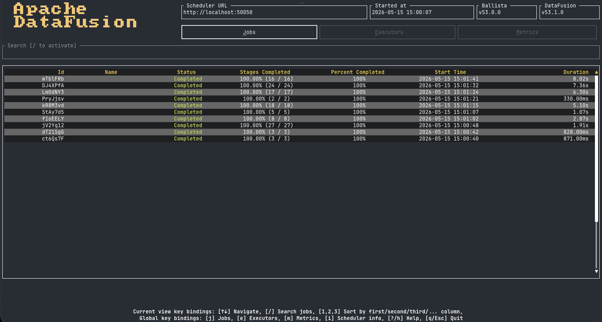
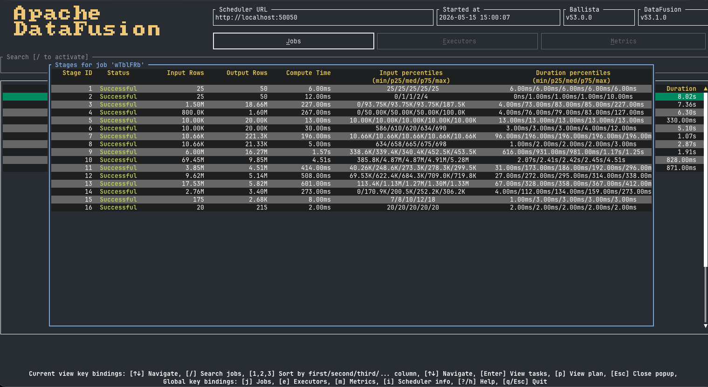
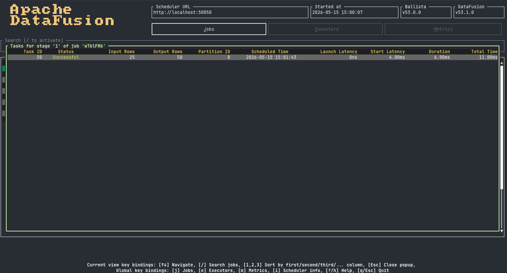

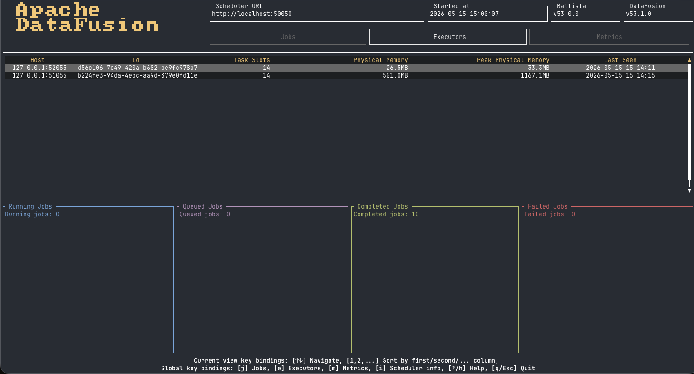
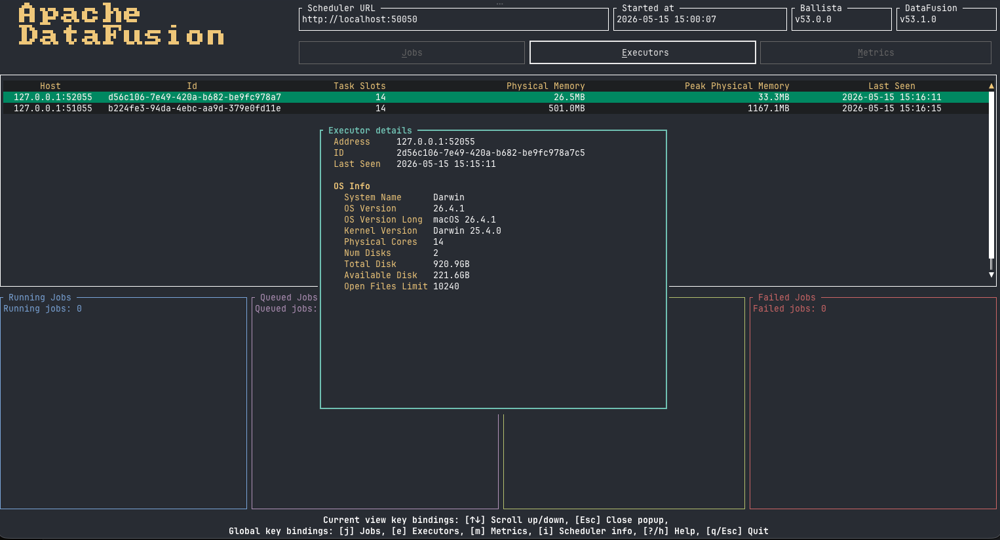

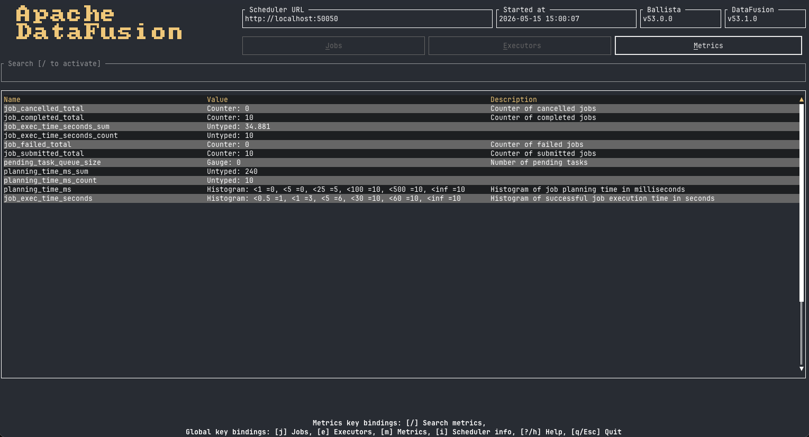

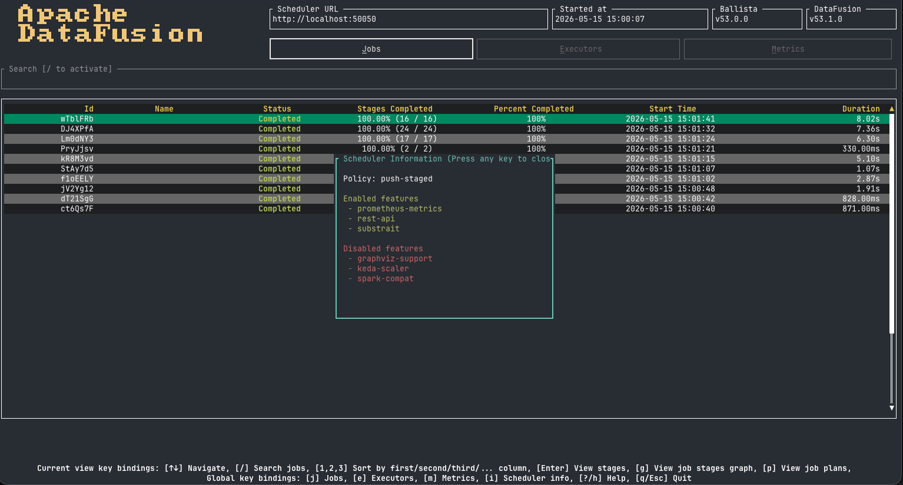
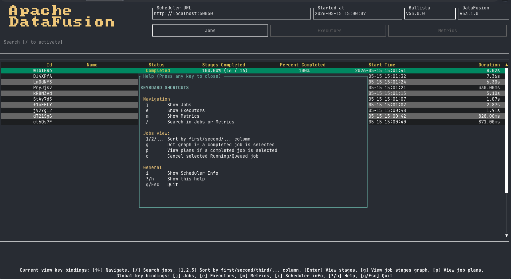

<a id="ballista-user-guide-cli--tui-navigation"></a>

### TUI Navigation

<a id="ballista-user-guide-cli--global-keybindings"></a>

#### Global Keybindings

| Key | Action |
| --- | --- |
| `j` | Switch to Jobs view |
| `e` | Switch to Executors view |
| `m` | Switch to Metrics view |
| `i` | Show Scheduler Info popup |
| `?` / `h` | Show help overlay with all key bindings |
| `q` / `Esc` | Quit the TUI |

<a id="ballista-user-guide-cli--jobs-view-keybindings"></a>

#### Jobs View Keybindings

| Key | Action |
| --- | --- |
| `↑` / `↓` | Navigate rows in the jobs table |
| `1` / `2` / `3` / … | Sort by first/second/third/… column (press again to reverse, third press removes sorting) |
| `/` | Search jobs |
| `Enter` | Open Job Stages popup for the selected job |
| `g` | View job stages graph (DOT visualization) for completed jobs |
| `c` | Cancel the selected job (if cancelable) |
| `p` | View job plans (Stage / Physical / Logical) for completed jobs |

<a id="ballista-user-guide-cli--job-stages-popup-keybindings"></a>

#### Job Stages Popup Keybindings

| Key | Action |
| --- | --- |
| `↑` / `↓` | Navigate stages |
| `Enter` | View tasks for the selected stage |
| `p` | View execution plan for the selected stage |
| `Esc` | Close popup |

<a id="ballista-user-guide-cli--stage-plan-popup-keybindings"></a>

#### Stage Plan Popup Keybindings

| Key | Action |
| --- | --- |
| `↑` / `↓` | Scroll up/down |
| `←` / `→` | Scroll left/right |
| `Esc` | Return to Job Stages popup |

<a id="ballista-user-guide-cli--stage-tasks-popup-keybindings"></a>

#### Stage Tasks Popup Keybindings

| Key | Action |
| --- | --- |
| `Esc` | Return to Job Stages popup |

<a id="ballista-user-guide-cli--job-stages-graph-popup-keybindings"></a>

#### Job Stages Graph Popup Keybindings

| Key | Action |
| --- | --- |
| `↑` / `↓` | Scroll up/down |
| `Esc` | Close popup |

<a id="ballista-user-guide-cli--job-plans-popup-keybindings"></a>

#### Job Plans Popup Keybindings

| Key | Action |
| --- | --- |
| `s` | Show Stage plan |
| `p` | Show Physical plan |
| `l` | Show Logical plan |
| `↑` / `↓` | Scroll up/down |
| `←` / `→` | Scroll left/right |
| `Esc` | Close popup |

<a id="ballista-user-guide-cli--executors-view-keybindings"></a>

#### Executors View Keybindings

| Key | Action |
| --- | --- |
| `Enter` | Show extra details for the selected executor |
| `1` / `2` / `3` / … | Sort by first/second/third/… column |

<a id="ballista-user-guide-cli--executor-details-popup-keybindings"></a>

#### Executor Details Popup Keybindings

| Key | Action |
| --- | --- |
| `↑` / `↓` | Scroll up/down |
| `Esc` | Close popup |

<a id="ballista-user-guide-cli--metrics-view-keybindings"></a>

#### Metrics View Keybindings

| Key | Action |
| --- | --- |
| `/` | Search metrics |

<a id="ballista-user-guide-cli--tui-configuration"></a>

### TUI Configuration

The TUI reads its configuration from a YAML file located at the platform-specific config directory:

| Platform | Example Path |
| --- | --- |
| Linux | `~/.config/ballista/tui.yaml` |
| macOS | `~/Library/Application Support/ballista/tui.yaml` |
| Windows | `%LOCALAPPDATA%\ballista\tui.yaml` |

Create the file manually if it does not exist. The following settings are available:

```
tick_interval_ms:
2000 job:
stage:
plan:
tree:
false scheduler:
url:
http://localhost:50050 http:
timeout:
2000
```

- `tick_interval_ms`: How often the TUI refreshes data from the scheduler (milliseconds).
- `job.stage.plan.tree`: Whether to show the stage execution plan as a tree.
- `scheduler.url`: The Ballista scheduler HTTP endpoint.
- `http.timeout`: HTTP request timeout in milliseconds.

Environment variables prefixed with `BALLISTA_` also override these values. For example:

```
BALLISTA_SCHEDULER_URL=http://localhost:50051 ballista-cli --tui
```

The TUI connects to the scheduler via HTTP and refreshes data automatically every few seconds.

[previous

Distributing DataFusion with Ballista](#ballista-user-guide-rust "previous page")
[next

Configuration](#ballista-user-guide-configs "next page")

---

<a id="ballista-user-guide-configs"></a>

<!-- source_url: https://datafusion.apache.org/ballista/user-guide/configs.html -->

<!-- page_index: 251 -->

# Configuration ¶

On this page

- [Ballista Configuration Settings](#ballista-user-guide-configs--ballista-configuration-settings)
- [Shuffle Settings](#ballista-user-guide-configs--shuffle-settings)
- [Ballista Scheduler Configuration Settings](#ballista-user-guide-configs--ballista-scheduler-configuration-settings)

[Edit this page](https://github.com/apache/datafusion-ballista/edit/main/docs/source/user-guide/configs.md)

<a id="ballista-user-guide-configs--configuration"></a>

# Configuration

<a id="ballista-user-guide-configs--ballista-configuration-settings"></a>

## Ballista Configuration Settings

Configuring Ballista is quite similar to configuring DataFusion. Most settings are identical, with only a few configurations specific to Ballista.

*Example: Specifying configuration options when creating a context*

```
use
ballista::extension ::{SessionConfigExt,
SessionContextExt }; let
session_config
=
SessionConfig::new_with_ballista ()
.with_information_schema (true)
.with_ballista_job_name ("Super Cool Ballista App" ); let
state
=
SessionStateBuilder::new ()
.with_default_features ()
.with_config (session_config)
.build (); let
ctx:
SessionContext
=
SessionContext::remote_with_state (& url,state ).await ?;
```

`SessionConfig::new_with_ballista()` will setup `SessionConfig` for use with ballista. This is not required, `SessionConfig::new` could be used, but it’s advised as it will set up some sensible configuration defaults .

`SessionConfigExt` expose set of `SessionConfigExt::with_ballista_` and `SessionConfigExt::ballista_` methods which can tune retrieve ballista specific options.

Notable `SessionConfigExt` configuration methods would be:

```
/// Overrides ballista's [LogicalExtensionCodec] fn
with_ballista_logical_extension_codec (
self,
codec:
Arc <dyn
LogicalExtensionCodec>,)
->
SessionConfig;
/// Overrides ballista's [PhysicalExtensionCodec] fn
with_ballista_physical_extension_codec (
self,
codec:
Arc <dyn
PhysicalExtensionCodec>,)
->
SessionConfig;
/// Overrides ballista's [QueryPlanner] fn
with_ballista_query_planner (
self,
planner:
Arc <dyn
QueryPlanner
+
Send
+
Sync
+
' static>,)
->
SessionConfig;
```

which could be used to change default ballista behavior.

If information schema is enabled all configuration parameters could be retrieved or set using SQL;

```
let
ctx:
SessionContext
=
SessionContext::remote_with_state (& url,
state ).await ?;
let
result
=
ctx
.sql ("select name, value from information_schema.df_settings where name like 'ballista'")
.await ?
.collect ()
.await ?;
let
expected
=
[
"+-------------------+-------------------------+",
"| name              | value                   |",
"+-------------------+-------------------------+",
"| ballista.job.name | Super Cool Ballista App |",
"+-------------------+-------------------------+",];
```

<a id="ballista-user-guide-configs--shuffle-settings"></a>

## Shuffle Settings

The following session-level keys control Ballista’s shuffle behavior. See
the [tuning guide](#ballista-user-guide-tuning-guide--shuffle-implementation) for an
explanation of the sort-based (default) and hash-based shuffle writers.

| key | type | default | description |
| --- | --- | --- | --- |
| ballista.shuffle.max\_concurrent\_read\_requests | UInt64 | 64 | Maximum number of concurrent fetch requests the shuffle reader will issue. |
| ballista.shuffle.force\_remote\_read | Boolean | false | Forces the shuffle reader to fetch every partition through Arrow Flight, even when the data is local. Intended for testing. |
| ballista.shuffle.remote\_read\_prefer\_flight | Boolean | false | For remote reads, prefer the Arrow Flight reader over the block reader. The block reader is generally faster. |
| ballista.shuffle.sort\_based.enabled | Boolean | true | Enables the sort-based shuffle writer (consolidated data file per input partition with an index, instead of one file per (input partition, output partition) pair). |
| ballista.shuffle.sort\_based.buffer\_size | UInt64 | 1048576 | Per-partition buffer size in bytes for the sort-based writer (1 MiB default). |
| ballista.shuffle.sort\_based.memory\_limit | UInt64 | 268435456 | Total in-memory budget across all output-partition buffers for the sort-based writer (256 MiB default). |
| ballista.shuffle.sort\_based.spill\_threshold | Utf8 | “0.8” | Fraction of `memory_limit` at which the largest buffers spill to disk. Must be in the range 0–1. |
| ballista.shuffle.sort\_based.batch\_size | UInt64 | 8192 | Target row count when coalescing buffered batches before they are written or spilled. |

<a id="ballista-user-guide-configs--ballista-scheduler-configuration-settings"></a>

## Ballista Scheduler Configuration Settings

Besides the BallistaContext configuration settings, a few configuration settings for the Ballista scheduler to better
manage the whole cluster are also needed to be taken care of.

*Example: Specifying configuration options when starting the scheduler*

```
./ballista-scheduler --scheduler-policy push-staged --event-loop-buffer-size 1000000 --task-distribution round-robin
```

| key | type | default | description |
| --- | --- | --- | --- |
| scheduler-policy | Utf8 | pull-staged | Sets the task scheduling policy for the scheduler, possible values: pull-staged, push-staged. |
| event-loop-buffer-size | UInt32 | 10000 | Sets the event loop buffer size. for a system of high throughput, a larger value like 1000000 is recommended. |
| task-distribution | Utf8 | bias | Sets the task distribution policy for the scheduler, possible values: bias, round-robin |
| finished-job-data-clean-up-interval-seconds | UInt64 | 300 | Sets the delayed interval for cleaning up finished job data, mainly the shuffle data, 0 means the cleaning up is disabled. |
| finished-job-state-clean-up-interval-seconds | UInt64 | 3600 | Sets the delayed interval for cleaning up finished job state stored in the backend, 0 means the cleaning up is disabled. |

[previous

Ballista Command-line Interface](#ballista-user-guide-cli "previous page")
[next

Tuning Guide](#ballista-user-guide-tuning-guide "next page")

---

<a id="ballista-user-guide-tuning-guide"></a>

<!-- source_url: https://datafusion.apache.org/ballista/user-guide/tuning-guide.html -->

<!-- page_index: 252 -->

# Tuning Guide ¶

On this page

- [Partitions and Parallelism](#ballista-user-guide-tuning-guide--partitions-and-parallelism)
- [Configuring Executor Concurrency Levels](#ballista-user-guide-tuning-guide--configuring-executor-concurrency-levels)
- [Configuring Executor Memory Pool](#ballista-user-guide-tuning-guide--configuring-executor-memory-pool)
- [Join Strategy](#ballista-user-guide-tuning-guide--join-strategy)
- [Shuffle Implementation](#ballista-user-guide-tuning-guide--shuffle-implementation)
- [Adaptive Query Execution (Experimental)](#ballista-user-guide-tuning-guide--adaptive-query-execution-experimental)
  - [Configuration](#ballista-user-guide-tuning-guide--configuration)
  - [What AQE does today](#ballista-user-guide-tuning-guide--what-aqe-does-today)
  - [Current limitations](#ballista-user-guide-tuning-guide--current-limitations)
- [Push-based vs Pull-based Task Scheduling](#ballista-user-guide-tuning-guide--push-based-vs-pull-based-task-scheduling)
- [Viewing Query Plans and Metrics](#ballista-user-guide-tuning-guide--viewing-query-plans-and-metrics)

[Edit this page](https://github.com/apache/datafusion-ballista/edit/main/docs/source/user-guide/tuning-guide.md)

<a id="ballista-user-guide-tuning-guide--tuning-guide"></a>

# Tuning Guide

<a id="ballista-user-guide-tuning-guide--partitions-and-parallelism"></a>

## Partitions and Parallelism

The goal of any distributed compute engine is to parallelize work as much as possible, allowing the work to scale
by adding more compute resource.

The basic unit of concurrency and parallelism in Ballista is the concept of a partition. The leaf nodes of a query
are typically table scans that read from files on disk and Ballista currently treats each file within a table as a
single partition (in the future, Ballista will support splitting files into partitions but this is not implemented yet).

For example, if there is a table “customer” that consists of 200 Parquet files, that table scan will naturally have
200 partitions and the table scan and certain subsequent operations will also have 200 partitions. Conversely, if the
table only has a single Parquet file then there will be a single partition and the work will not be able to scale even
if the cluster has resource available. Ballista supports repartitioning within a query to improve parallelism.
The configuration setting `datafusion.execution.target_partitions`can be set to the desired number of partitions. This is
currently a global setting for the entire context. The default value for this setting is 16.

Note that Ballista will never decrease the number of partitions based on this setting and will only repartition if
the source operation has fewer partitions than this setting.

Example: Setting the desired number of shuffle partitions when creating a context.

```
use
ballista::extension ::{SessionConfigExt,
SessionContextExt }; let
session_config
=
SessionConfig::new_with_ballista ()
.with_target_partitions (200 ); let
state
=
SessionStateBuilder::new ()
.with_default_features ()
.with_config (session_config)
.build (); let
ctx:
SessionContext
=
SessionContext::remote_with_state (& url,state ).await ?;
```

<a id="ballista-user-guide-tuning-guide--configuring-executor-concurrency-levels"></a>

## Configuring Executor Concurrency Levels

Each executor instance has a fixed number of tasks that it can process concurrently. This is specified by passing a
`concurrent_tasks` command-line parameter. The default setting is to use all available CPU cores.

Increasing this configuration setting will increase the number of tasks that each executor can run concurrently but
this will also mean that the executor will use more memory. If executors are failing due to out-of-memory errors then
decreasing the number of concurrent tasks may help.

<a id="ballista-user-guide-tuning-guide--configuring-executor-memory-pool"></a>

## Configuring Executor Memory Pool

By default the executor uses DataFusion’s unbounded memory pool, so spillable
operators (sort, hash join, hash aggregate) grow until the host runs out of
memory. To bound executor memory and let those operators spill to disk under
pressure, pass `--memory-pool-size` when starting the executor:

```
ballista-executor --memory-pool-size 8GB --concurrent-tasks 8
```

The argument accepts human-readable sizes (`8GB`, `512MiB`) or a plain byte
count. SI suffixes (`KB`/`MB`/`GB`) are powers of 10; IEC suffixes
(`KiB`/`MiB`/`GiB`) are powers of 2.

The total budget is divided equally across concurrent task slots: each task
receives its own `FairSpillPool` of size `memory_pool_size / concurrent_tasks`.
With `--memory-pool-size 8GB --concurrent-tasks 8`, every task sees a 1 GB
pool, fully isolated from other tasks. Idle slots do not lend their share to
busy ones, which keeps task memory predictable at the cost of some unused
capacity when the executor is under-utilized.

The executor refuses to start if the per-task share would round to zero (i.e.
`memory_pool_size < concurrent_tasks`).

When `--memory-pool-size` is not set, the executor behaves as before with no
memory pool installed.

<a id="ballista-user-guide-tuning-guide--join-strategy"></a>

## Join Strategy

Ballista defaults to **sort-merge join** rather than hash join. This is the
opposite of DataFusion’s standalone default and reflects two facts:

- DataFusion’s hash join implementation does not yet support spilling: the
  full build side must fit in memory per task.
- Ballista executors run multiple tasks in parallel per host, so per-task
  build sides aggregate quickly under load and can OOM the executor.

Sort-merge join spills under memory pressure (via the executor’s memory
pool, when configured), making it the safer default for distributed
execution.

If you know the build side of a particular query fits comfortably in
memory and you want hash-join performance, opt back in at the session
level:

```
SET
datafusion.optimizer.prefer_hash_join
=
true;
```

or in code:

```
let
session_config
=
SessionConfig::new_with_ballista ()
.set_bool ("datafusion.optimizer.prefer_hash_join",
true );
```

This setting applies per session and does not require restarting the
scheduler or executors.

<a id="ballista-user-guide-tuning-guide--shuffle-implementation"></a>

## Shuffle Implementation

Ballista exchanges data between query stages by writing the output of each
upstream task to local files, which downstream tasks read either from disk
(when co-located) or over Arrow Flight. Two shuffle implementations are
available, with different trade-offs around file count, memory use, and
write latency.

<a id="ballista-user-guide-tuning-guide--sort-based-shuffle-default"></a>

### Sort-based shuffle (default)

The sort-based writer accumulates batches in a per-output-partition
in-memory buffer. When the total buffered size crosses a threshold, the
largest buffers are spilled to disk. After the input stream finishes, the
remaining in-memory data and any spilled batches are merged and written
into a single consolidated Arrow IPC file per input partition, alongside
an index file that lets readers seek directly to a given output partition.

This produces `2 × N` files instead of `N × M`, coalesces small batches
to a target size before writing, and bounds shuffle memory use via
spilling — at the cost of higher write latency than the hash writer.

<a id="ballista-user-guide-tuning-guide--hash-based-shuffle-opt-in"></a>

### Hash-based shuffle (opt-in)

The hash-based writer hashes each incoming `RecordBatch` and immediately
encodes the per-partition slices to Arrow IPC, streaming them into one
file per `(input_partition, output_partition)` pair. Nothing is buffered
in memory across batches.

This is simple and low latency, but for `N` input partitions and `M`
output partitions it produces `N × M` files. Wide shuffles can therefore
generate a large number of small files. Consider switching to the
hash-based writer for narrow shuffles where the additional buffering
and merging of the sort-based writer is unnecessary overhead:

```
let
session_config
=
SessionConfig::new_with_ballista ()
.set_bool ("ballista.shuffle.sort_based.enabled",
false );
```

The following session-level keys tune its behavior:

| key | type | default | description |
| --- | --- | --- | --- |
| ballista.shuffle.sort\_based.enabled | Boolean | true | Enables the sort-based shuffle writer. |
| ballista.shuffle.sort\_based.buffer\_size | UInt64 | 1048576 | Per-partition buffer size in bytes (1 MiB default). |
| ballista.shuffle.sort\_based.memory\_limit | UInt64 | 268435456 | Total in-memory budget across all output-partition buffers (256 MiB default). |
| ballista.shuffle.sort\_based.spill\_threshold | Utf8 | “0.8” | Fraction of `memory_limit` at which the largest buffers begin spilling to disk. Must be in the range 0–1. |
| ballista.shuffle.sort\_based.batch\_size | UInt64 | 8192 | Target row count when coalescing buffered batches before they are written or spilled. |

<a id="ballista-user-guide-tuning-guide--adaptive-query-execution-experimental"></a>

## Adaptive Query Execution (Experimental)

Ballista has experimental support for adaptive query execution (AQE), where the
scheduler re-runs the DataFusion physical optimizer between query stages. This
lets the planner make decisions using statistics collected from completed
stages rather than relying solely on pre-execution estimates.

AQE is disabled by default. To enable it, set
`ballista.planner.adaptive.enabled` to `true` on your `SessionConfig`:

```
let
session_config
=
SessionConfig::new_with_ballista ()
.set_bool ("ballista.planner.adaptive.enabled",
true );
```

When AQE is enabled, the scheduler logs a warning at job submission so it is
clear that AQE was used:

```
Adaptive Query Planning is EXPERIMENTAL, should be used for testing purposes only!
```

<a id="ballista-user-guide-tuning-guide--configuration"></a>

### Configuration

| key | type | default | description |
| --- | --- | --- | --- |
| ballista.planner.adaptive.enabled | Boolean | false | Enables the adaptive planner. Experimental. |

<a id="ballista-user-guide-tuning-guide--what-aqe-does-today"></a>

### What AQE does today

When AQE is enabled, the scheduler builds the stage DAG incrementally. As each
shuffle stage completes, the planner re-optimizes the remaining plan and emits
the next set of runnable stages. Two adaptive optimizations are currently
implemented:

- **Join reordering.** Uses runtime row counts from completed stages so the
  smaller side drives the join.
- **Empty stage elimination.** When a completed stage produces zero rows, its
  downstream exchange is replaced with an empty execution node, and emptiness
  is propagated up the plan so downstream stages are skipped entirely.

<a id="ballista-user-guide-tuning-guide--current-limitations"></a>

### Current limitations

The implementation covers the happy path only. The following are known to be
missing or incomplete:

- Executor failure handling on the AQE path
- Dynamic coalescing of shuffle partitions
- Switching from hash join to sort-merge join based on runtime statistics
- Switching from streaming aggregation to hash aggregation based on runtime statistics

Until these gaps are closed, AQE should be used for testing and experimentation
rather than production workloads. See [issue #387](https://github.com/apache/datafusion-ballista/issues/387)
for the tracking issue and ongoing work.

<a id="ballista-user-guide-tuning-guide--push-based-vs-pull-based-task-scheduling"></a>

## Push-based vs Pull-based Task Scheduling

Ballista supports both push-based and pull-based task scheduling. It is recommended that you try both to determine
which is the best for your use case.

Pull-based scheduling works in a similar way to Apache Spark and push-based scheduling can result in lower latency.

The scheduling policy can be specified in the `--scheduler-policy` parameter when starting the scheduler and executor
processes. The default is `pull-staged`.

<a id="ballista-user-guide-tuning-guide--viewing-query-plans-and-metrics"></a>

## Viewing Query Plans and Metrics

The scheduler provides a REST API for monitoring jobs. See the
[scheduler documentation](#ballista-user-guide-scheduler) for more information.

> This is optional scheduler feature which should be enabled with rest-api feature

To download a query plan in dot format from the scheduler, submit a request to the following API endpoint

```
http:// localhost:50050 / api / job / {job_id} / dot
```

The resulting file can be converted into an image using `graphviz`:

```
dot -Tpng query.dot > query.png
```

Here is an example query plan:

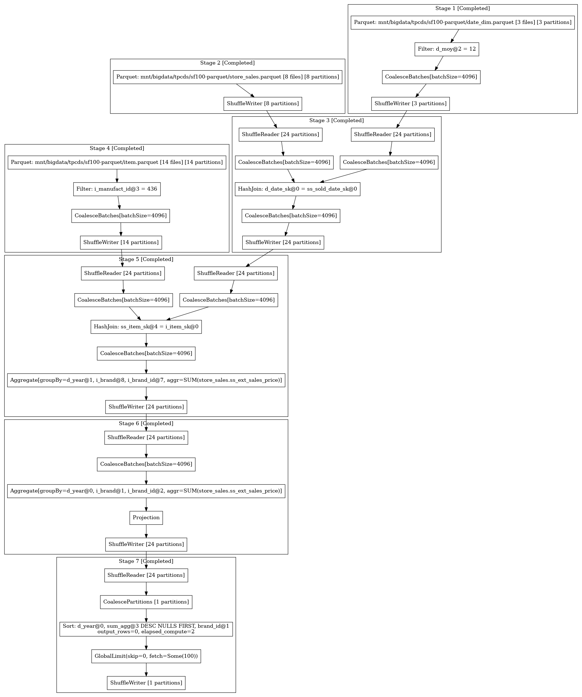

[previous

Configuration](#ballista-user-guide-configs "previous page")
[next

Ballista Scheduler Metrics](#ballista-user-guide-metrics "next page")

---

<a id="ballista-user-guide-metrics"></a>

<!-- source_url: https://datafusion.apache.org/ballista/user-guide/metrics.html -->

<!-- page_index: 253 -->

# Ballista Scheduler Metrics ¶

On this page

[Edit this page](https://github.com/apache/datafusion-ballista/edit/main/docs/source/user-guide/metrics.md)

<a id="ballista-user-guide-metrics--ballista-scheduler-metrics"></a>

# Ballista Scheduler Metrics

<a id="ballista-user-guide-metrics--prometheus"></a>

## Prometheus

> This is optional scheduler feature which should be enabled with `prometheus-metrics` feature

Built with default features, the ballista scheduler will automatically collect and expose a standard set of prometheus metrics.
The metrics currently collected automatically include:

- *job\_exec\_time\_seconds* - Histogram of successful job execution time in seconds
- *planning\_time\_ms* - Histogram of job planning time in milliseconds
- *failed* - Counter of failed jobs
- *job\_failed\_total* - Counter of failed jobs
- *job\_cancelled\_total* - Counter of cancelled jobs
- *job\_completed\_total* - Counter of completed jobs
- *job\_submitted\_total* - Counter of submitted jobs
- *pending\_task\_queue\_size* - Number of pending tasks

> [!NOTE]
> Currently the histogram buckets for the above metrics are set to reasonable defaults. If the defaults are not
> appropriate for a given use case, the only workaround is to implement a customer `SchedulerMetricsCollector`. In the future
> the buckets should be made configurable.

The metrics are then exported through the scheduler REST API at `GET /api/metrics`. It should be sufficient to ingest metrics
into an existing metrics system by point your chosen prometheus exporter at that endpoint.

[previous

Tuning Guide](#ballista-user-guide-tuning-guide "previous page")
[next

Frequently Asked Questions](#ballista-user-guide-faq "next page")

---

<a id="ballista-user-guide-faq"></a>

<!-- source_url: https://datafusion.apache.org/ballista/user-guide/faq.html -->

<!-- page_index: 254 -->

# Frequently Asked Questions ¶

On this page

[Edit this page](https://github.com/apache/datafusion-ballista/edit/main/docs/source/user-guide/faq.md)

<a id="ballista-user-guide-faq--frequently-asked-questions"></a>

# Frequently Asked Questions

<a id="ballista-user-guide-faq--what-is-the-relationship-between-datafusion-and-ballista"></a>

## What is the relationship between DataFusion and Ballista?

DataFusion is a library for executing queries in-process using the Apache Arrow memory
model and computational kernels. It is designed to run within a single process, using threads
for parallel query execution.

Ballista is a distributed compute platform for DataFusion workloads.

[previous

Ballista Scheduler Metrics](#ballista-user-guide-metrics "previous page")
[next

Extending Ballista Scheduler And Executors](#ballista-user-guide-extending-components "next page")

---

<a id="ballista-user-guide-extending-components"></a>

<!-- source_url: https://datafusion.apache.org/ballista/user-guide/extending-components.html -->

<!-- page_index: 255 -->

# Extending Ballista Scheduler And Executors ¶

On this page

- [Example: Custom Object Store Integration](#ballista-user-guide-extending-components--example-custom-object-store-integration)
  - [Configuring Scheduler](#ballista-user-guide-extending-components--configuring-scheduler)
  - [Configuring Executor](#ballista-user-guide-extending-components--configuring-executor)
  - [Configuring Client](#ballista-user-guide-extending-components--configuring-client)

[Edit this page](https://github.com/apache/datafusion-ballista/edit/main/docs/source/user-guide/extending-components.md)

<a id="ballista-user-guide-extending-components--extending-ballista-scheduler-and-executors"></a>

# Extending Ballista Scheduler And Executors

Ballista scheduler and executor provide a set of configuration options
which can be used to extend their basic functionality. They allow registering
new configuration extensions, object stores, logical and physical codecs …

- `function registry` - provides possibility to override set of build in functions.
- `config producer` - function which creates new `SessionConfig`, which can hold extended configuration options
- `runtime producer` - function which creates new `RuntimeEnv` based on provided `SessionConfig`.
- `session builder` - function which creates new `SessionState` for each user session
- `logical codec` - overrides `LogicalCodec`
- `physical codec` - overrides `PhysicalCodec`

Ballista executor can be configured using `ExecutorProcessConfig` which supports overriding `function registry`,`runtime producer`, `config producer`, `logical codec`, `physical codec`.

Ballista scheduler can be tunned using `SchedulerConfig` which supports overriding `config producer`, `session builder`, `logical codec`, `physical codec`

<a id="ballista-user-guide-extending-components--example:-custom-object-store-integration"></a>

## Example: Custom Object Store Integration

Extending basic building blocks will be demonstrated by integrating S3 object store. For this, new `ObjectStoreRegistry` and `S3Options` will be provided. `ObjectStoreRegistry` creates new `ObjectStore` instances configured using `S3Options`.

For this specific task `config producer`, `runtime producer` and `session builder` have to be provided, and client, scheduler and executor need to be configured.

```
/// Custom [SessionConfig] constructor method /// /// This method registers config extension [S3Options] /// which is used to configure [ObjectStore] with ACCESS and /// SECRET key pub
fn
custom_session_config_with_s3_options ()
->
SessionConfig
{
SessionConfig::new_with_ballista ()
.with_information_schema (true)
.with_option_extension (S3Options::default ())}
```

```
/// Custom [RuntimeEnv] constructor method /// /// It will register [CustomObjectStoreRegistry] which will /// use configuration extension [S3Options] to configure /// and created [ObjectStore]s pub
fn
custom_runtime_env_with_s3_support (
session_config:
& SessionConfig,)
->
Result <Arc <RuntimeEnv >>
{
let
s3options
=
session_config
.options ()
.extensions
.get::<S3Options> ()
.ok_or (DataFusionError::Configuration (
"S3 Options not set".to_string (),
)) ?;
let
config
=
RuntimeConfig::new ().with_object_store_registry (Arc::new (
CustomObjectStoreRegistry::new (s3options.clone ()),
));
Ok (Arc::new (RuntimeEnv::try_new (config) ? ))}
```

```
/// Custom [SessionState] constructor method /// /// It will configure [SessionState] with provided [SessionConfig],/// and [RuntimeEnv].pub
fn
custom_session_state_with_s3_support (
session_config:
SessionConfig,)
->
SessionState
{
let
runtime_env
=
custom_runtime_env_with_s3_support (& session_config ).unwrap ();
SessionStateBuilder::new ()
.with_runtime_env (runtime_env)
.with_config (session_config)
.build ()}
```

`S3Options` & `CustomObjectStoreRegistry` implementation can be found in examples sub-project.

<a id="ballista-user-guide-extending-components--configuring-scheduler"></a>

### Configuring Scheduler

```
#[tokio::main] async
fn
main ()
->
Result <()>
{
// parse CLI options (default options which Ballista scheduler exposes)
let
(opt,
_remaining_args)
=
Config::including_optional_config_files (& ["/etc/ballista/scheduler.toml" ])
.unwrap_or_exit ();
let
addr
=
format! ("{}:{}",
opt.bind_host,
opt.bind_port );
let
addr
=
addr.parse () ?;
// converting CLI options to SchedulerConfig
let
mut
config:
SchedulerConfig
=
opt.try_into () ?;
// overriding default runtime producer with custom producer
// which knows how to create S3 connections
config.override_config_producer
=
Some (Arc::new (custom_session_config_with_s3_options ));
// overriding default session builder, which has custom session configuration
// runtime environment and session state.
config.override_session_builder
=
Some (Arc::new (| session_config:
SessionConfig |
{
custom_session_state_with_s3_support (session_config)
}));
let
cluster
=
BallistaCluster::new_from_config (& config ).await ?;
start_server (cluster,
addr,
Arc::new (config )).await ?;
Ok (())}
```

<a id="ballista-user-guide-extending-components--configuring-executor"></a>

### Configuring Executor

```
#[tokio::main] async
fn
main ()
->
Result <()>
{
// parse CLI options (default options which Ballista executor exposes)
let
(opt,
_remaining_args)
=
Config::including_optional_config_files (& ["/etc/ballista/executor.toml" ])
.unwrap_or_exit ();
// Converting CLI options to executor configuration
let
mut
config:
ExecutorProcessConfig
=
opt.try_into ().unwrap ();
// overriding default config producer with custom producer
// which has required S3 configuration options
config.override_config_producer
=
Some (Arc::new (custom_session_config_with_s3_options ));
// overriding default runtime producer with custom producer
// which knows how to create S3 connections
config.override_runtime_producer
=
Some (Arc::new (| session_config:
& SessionConfig |
{
custom_runtime_env_with_s3_support (session_config)
}));
start_executor_process (Arc::new (config )).await
Ok (())}
```

<a id="ballista-user-guide-extending-components--configuring-client"></a>

### Configuring Client

```
let
test_data
=
ballista_examples::test_util::examples_test_data (); // new sessions state with required custom session configuration and runtime environment let
state
=
custom_session_state_with_s3_support (custom_session_config_with_s3_options ()); let
ctx:
SessionContext
=
SessionContext::remote_with_state ("df://localhost:50050",
state ).await ?;
// once we have it all setup we can configure object store // // as session config has relevant S3 options registered and exposed,// S3 configuration options can be changed using SQL `SET` statement.ctx.sql ("SET s3.allow_http = true" ).await ?.show ().await ?;
ctx.sql (& format! ("SET s3.access_key_id = '{}'",
S3_ACCESS_KEY_ID ))
.await ?
.show ()
.await ?;
ctx.sql (& format! ("SET s3.secret_access_key = '{}'",
S3_SECRET_KEY ))
.await ?
.show ()
.await ?;
ctx.sql ("SET s3.endpoint = 'http://localhost:9000'")
.await ?
.show ()
.await ?;
ctx.sql ("SET s3.allow_http = true" ).await ?.show ().await ?;
ctx.register_parquet (
"test",
& format! ("{test_data}/alltypes_plain.parquet" ),
Default::default (),).await ?;
let
write_dir_path
=
& format! ("s3://{}/write_test.parquet",
S3_BUCKET ); ctx.sql ("select * from test")
.await ?
.write_parquet (write_dir_path,
Default::default (),
Default::default ())
.await ?;
ctx.register_parquet ("written_table",
write_dir_path,
Default::default ())
.await ?;
let
result
=
ctx
.sql ("select id, string_col, timestamp_col from written_table where id > 4")
.await ?
.collect ()
.await ?;
let
expected
=
[
"+----+------------+---------------------+",
"| id | string_col | timestamp_col       |",
"+----+------------+---------------------+",
"| 5  | 31         | 2009-03-01T00:01:00 |",
"| 6  | 30         | 2009-04-01T00:00:00 |",
"| 7  | 31         | 2009-04-01T00:01:00 |",
"+----+------------+---------------------+",]; assert_batches_eq ! (expected,
& result );
```

[previous

Frequently Asked Questions](#ballista-user-guide-faq "previous page")
[next

Spark-Compatible Functions](#ballista-user-guide-spark-compatible-functions "next page")

---

<a id="ballista-user-guide-spark-compatible-functions"></a>

<!-- source_url: https://datafusion.apache.org/ballista/user-guide/spark-compatible-functions.html -->

<!-- page_index: 256 -->

# Spark-Compatible Functions ¶

On this page

- [Enabling the Feature](#ballista-user-guide-spark-compatible-functions--enabling-the-feature)
- [What’s Included](#ballista-user-guide-spark-compatible-functions--what-s-included)
  - [Scalar Functions](#ballista-user-guide-spark-compatible-functions--scalar-functions)
  - [Aggregate Functions](#ballista-user-guide-spark-compatible-functions--aggregate-functions)
  - [Window Functions](#ballista-user-guide-spark-compatible-functions--window-functions)
- [Usage Examples](#ballista-user-guide-spark-compatible-functions--usage-examples)
  - [Example 1: Using SHA-1 Hash Function](#ballista-user-guide-spark-compatible-functions--example-1-using-sha-1-hash-function)
  - [Example 2: Using expm1 for Precision](#ballista-user-guide-spark-compatible-functions--example-2-using-expm1-for-precision)
  - [Example 3: Combining with DataFusion Functions](#ballista-user-guide-spark-compatible-functions--example-3-combining-with-datafusion-functions)
- [Use Cases](#ballista-user-guide-spark-compatible-functions--use-cases)
- [See Also](#ballista-user-guide-spark-compatible-functions--see-also)

[Edit this page](https://github.com/apache/datafusion-ballista/edit/main/docs/source/user-guide/spark-compatible-functions.md)

<a id="ballista-user-guide-spark-compatible-functions--spark-compatible-functions"></a>

# Spark-Compatible Functions

Ballista provides an optional `spark-compat` Cargo feature that enables Spark-compatible scalar, aggregate, and window functions from the [datafusion-spark](https://crates.io/crates/datafusion-spark) crate.

<a id="ballista-user-guide-spark-compatible-functions--enabling-the-feature"></a>

## Enabling the Feature

The `spark-compat` feature must be explicitly enabled at build time. It is *not* enabled by default.

<a id="ballista-user-guide-spark-compatible-functions--building-from-source"></a>

### Building from Source

To build Ballista components with Spark-compatible functions:

```
# Build all components with spark-compat feature cargo build --features spark-compat --release

# Build scheduler only cargo build -p ballista-scheduler --features spark-compat --release

# Build executor only cargo build -p ballista-executor --features spark-compat --release

# Build CLI with spark-compat cargo build -p ballista-cli --features spark-compat --release
```

For more installation options, see [Installing with Cargo](#ballista-user-guide-deployment-cargo-install).

<a id="ballista-user-guide-spark-compatible-functions--what-s-included"></a>

## What’s Included

When the `spark-compat` feature is enabled, Ballista’s function registry automatically includes additional functions from the `datafusion-spark` crate:

> **Note:** For a comprehensive list of available functions, refer to the [datafusion-spark crate documentation](https://docs.rs/datafusion-spark/latest/datafusion_spark/). These functions are provided in addition to DataFusion’s default functions.

<a id="ballista-user-guide-spark-compatible-functions--scalar-functions"></a>

### Scalar Functions

Spark-compatible scalar functions provide additional string, mathematical, and cryptographic operations.

<a id="ballista-user-guide-spark-compatible-functions--aggregate-functions"></a>

### Aggregate Functions

Spark-compatible aggregate functions extend DataFusion’s built-in aggregations with additional statistical and analytical functions.

<a id="ballista-user-guide-spark-compatible-functions--window-functions"></a>

### Window Functions

Spark-compatible window functions provide additional analytical capabilities for windowed operations.

<a id="ballista-user-guide-spark-compatible-functions--usage-examples"></a>

## Usage Examples

Once the `spark-compat` feature is enabled at build time, the functions are automatically available in SQL queries:

<a id="ballista-user-guide-spark-compatible-functions--example-1:-using-sha-1-hash-function"></a>

### Example 1: Using SHA-1 Hash Function

```
SELECT
sha1 ('Ballista')
AS
hash_value;
```

Output:

```
+------------------------------------------+ | hash_value | +------------------------------------------+ | 8 b8e1f0e55f8f0e3c7a8 ...(hex string) | +------------------------------------------+
```

<a id="ballista-user-guide-spark-compatible-functions--example-2:-using-expm1-for-precision"></a>

### Example 2: Using expm1 for Precision

```
SELECT
expm1 (0.001)
AS
precise_value,
exp (0.001)
-
1
AS
standard_value;
```

The `expm1` function provides better numerical precision for small values compared to computing `exp(x) - 1` directly.

<a id="ballista-user-guide-spark-compatible-functions--example-3:-combining-with-datafusion-functions"></a>

### Example 3: Combining with DataFusion Functions

Spark-compatible functions work alongside DataFusion’s built-in functions:

```
SELECT
name,
upper (name)
AS
name_upper,
-- DataFusion function
sha1 (name)
AS
name_hash,
-- Spark-compat function
length (name)
AS
name_length
-- DataFusion function FROM
users;
```

<a id="ballista-user-guide-spark-compatible-functions--use-cases"></a>

## Use Cases

The `spark-compat` feature is useful when:

- **Migrating from Spark**: Easing the transition by providing familiar function names and behaviors
- **Cross-Platform Queries**: Writing queries that use similar functions across Spark and Ballista environments
- **Specific Function Needs**: Requiring particular Spark-style functions (like `sha1`, `conv`, etc.) that aren’t in DataFusion’s default set
- **Team Familiarity**: Your team is more familiar with Spark’s function library

<a id="ballista-user-guide-spark-compatible-functions--see-also"></a>

## See Also

- [datafusion-spark crate](https://crates.io/crates/datafusion-spark) - Source of the Spark-compatible functions
- [Installing with Cargo](#ballista-user-guide-deployment-cargo-install) - Detailed installation instructions

[previous

Extending Ballista Scheduler And Executors](#ballista-user-guide-extending-components "previous page")
[next

Extensions Example](#ballista-user-guide-extensions-example "next page")

---

<a id="ballista-user-guide-extensions-example"></a>

<!-- source_url: https://datafusion.apache.org/ballista/user-guide/extensions-example.html -->

<!-- page_index: 257 -->

# Extensions Example ¶

On this page

- [Logical Plan Extension](#ballista-user-guide-extensions-example--logical-plan-extension)
- [DataFrame Extension](#ballista-user-guide-extensions-example--dataframe-extension)
- [Logical Extension Codec](#ballista-user-guide-extensions-example--logical-extension-codec)
- [Logical to Physical Plan Translation](#ballista-user-guide-extensions-example--logical-to-physical-plan-translation)
- [Conclusion](#ballista-user-guide-extensions-example--conclusion)

[Edit this page](https://github.com/apache/datafusion-ballista/edit/main/docs/source/user-guide/extensions-example.md)

<a id="ballista-user-guide-extensions-example--extensions-example"></a>

# Extensions Example

This project demonstrates possible extensions mechanisms.

The goal of this small project is to enhance Ballista’s capabilities by providing new logical and physical operators, utilities, and integration tools to support additional data processing workflows.

This example will implement [`sample()`](https://spark.apache.org/docs/latest/api/python/reference/pyspark.sql/api/pyspark.sql.DataFrame.sample.html)
operator which will return a sampled subset of original `DataFrame`:

```
let
ctx
=
SessionContext::remote_with_state ("df://localhost:50050",
state ).await ?;
let
df
=
ctx.read_parquet ("data/",
Default::default
()).await ?;
// The `sample` operator, defined in this project,// samples 30% of the data and displays the result.let
df
=
df.sample (0.30,
None)
?;
```

To implement this functionality, it is necessary to implement new logical plan extension, physical operators and extend
`DataFrame` to expose new operator.

> [!WARNING]
> Please do not use implemented sampling operator for production, statisticians would not approve it, probably.

This demo will provide:

- Custom DataFusion (logical and physical) nodes.
- Logical and physical extension codecs.
- Custom protocol buffer definitions.
- Extension query planner.

<a id="ballista-user-guide-extensions-example--logical-plan-extension"></a>

## Logical Plan Extension

The first step is to implement a custom logical plan extension:

```
//! This module defines the implementation of the `UserDefinedLogicalNodeCore` trait for the `Sample` logical plan node.//! //! The `Sample` node represents a custom logical plan extension for sampling data within a query plan.//! use
std ::{hash::Hash,
vec }; use
datafusion ::{
error::DataFusionError,
logical_expr ::{LogicalPlan,
UserDefinedLogicalNodeCore },}; #[derive(Debug, Clone, PartialEq, PartialOrd)] pub
struct
Sample
{
pub
fraction:
f32,
pub
seed:
Option <i64>,
pub
input:
LogicalPlan,} impl
Hash
for
Sample
{
fn
hash <H:
std::hash::Hasher> (& self,
state:
& mut
H)
{
self.seed.hash (state );
self.input.hash (state );
}} impl
Eq
for
Sample
{} impl
Sample
{
pub
fn
new (fraction:
f32,
seed:
Option <i64>,
input:
LogicalPlan)
->
Self
{
Self
{
fraction,
seed,
input,
}
}} impl
UserDefinedLogicalNodeCore
for
Sample
{
fn
name (& self)
->
& str
{
"Sample"
}
fn
inputs (& self)
->
Vec <& LogicalPlan>
{
vec! [& self.input]
}
fn
schema (& self)
->
& datafusion::common::DFSchemaRef
{
self.input.schema ()
}
fn
expressions (& self)
->
Vec <datafusion::prelude::Expr>
{
vec! []
}
fn
fmt_for_explain (& self,
f:
& mut
std::fmt::Formatter)
->
std::fmt::Result
{
f.write_fmt (format_args! (
"Sample: fraction: {}, seed: {:?}",
self.fraction,
self.seed
)) ?;
Ok (())
}
fn
with_exprs_and_inputs (
& self,
_exprs:
Vec <datafusion::prelude::Expr>,
inputs:
Vec <LogicalPlan>,
)
->
datafusion::error::Result <Self>
{
Ok (Self
{
seed:
self.seed,
fraction:
self.fraction,
input:
inputs
.first ()
.ok_or (DataFusionError::Plan ("expected single input".to_string ())) ?
.clone (),
})
}}
```

<a id="ballista-user-guide-extensions-example--dataframe-extension"></a>

## DataFrame Extension

To expose this functionality to end users, a DataFrame extension] is implemented. This extension creates a
`LogicalPlan::Extension(extension)` node:

```
use
std::sync::Arc;
use
datafusion ::{
error::DataFusionError,
logical_expr ::{Extension,
LogicalPlan },
prelude::DataFrame,}; use
crate::logical::sample_extension::Sample;
pub
trait
DataFrameExt
{
fn
sample (self,
fraction:
f32,
seed:
Option <i64>)
->
datafusion::error::Result <DataFrame>;
} /// Returns a new `DataFrame` containing a random sample of rows from the original `DataFrame`./// /// # Arguments /// /// * `fraction` - The fraction of rows to sample, must be in the range (0.0, 1.0]./// * `seed` - An optional seed for the random number generator to ensure reproducibility./// /// # Errors /// /// Returns a `DataFusionError::Configuration` if `fraction` is not within the valid range./// impl
DataFrameExt
for
DataFrame
{
fn
sample (self,
fraction:
f32,
seed:
Option <i64>)
->
datafusion::error::Result <DataFrame>
{
if
! (fraction
> 0.0 && fraction <=1.0) {Err (DataFusionError::Configuration ("fraction should be in 0 ..= 1 range".to_string (),)) ?} if seed.unwrap_or (0) < 0 {Err (DataFusionError::Configuration ("seed should be positive number".to_string (),)) ?} let (state,input)=self.into_parts (); let node=Arc::new (Sample {fraction,seed,input,}); let extension=Extension {node}; let plan=LogicalPlan::Extension (extension ); Ok (DataFrame::new (state,plan ))}}
```

This approach enables the addition of new methods to the DataFusion DataFrame implementation:

```
let
ctx
=
SessionContext::remote_with_state ("df://localhost:50050",
state ).await ?;
let
df
=
ctx.read_parquet ("data/",
Default::default
()).await ?;
// The DataFrame extension provides the `sample` method let
df
=
df.sample (0.30,
None)
?;
```

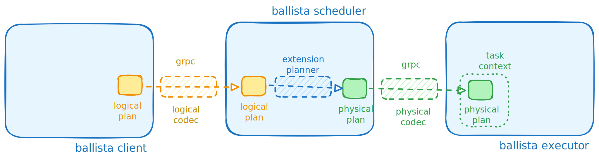

<a id="ballista-user-guide-extensions-example--logical-extension-codec"></a>

## Logical Extension Codec

With the extension in place, a custom logical extension codec is required to transmit the client logical plan to the
scheduler.

The logical extension codec typically consists of two components: Google Protocol Buffer definitions:

```
syntax
=
"proto3";
package
extension.ballista;
// used in building the codecs and compiled to Rust at build time.import
"datafusion_common.proto";
// // message naming convention // // prefix L means logical // prefix P means physical // // // Logical Plan Extensions // // this is the root message that captures all possible // logical plan messages which can be sent across message
LMessage
{
oneof
Extension
{
LSample
sample
=
1;
}} message
LSample
{
float
fraction
=
1;
optional
int64
seed
=
2;
} // // Physical Plan Extensions // message
PMessage
{
oneof
Extension
{
// opaque message means that extension codec does not handle
// those values hence encoding/decoding is delegated to some other codec
// (in this case default datafusion codec).
bytes
opaque
=
1;
PSample
sample
=
2;
}} message
PSample
{
float
fraction
=
1;
optional
int64
seed
=
2;
}
```

```

```

`LogicalExtensionCodec` extends `BallistaLogicalExtensionCodec` handling newly defined operator messages:

```
#[derive(Debug, Default)] pub
struct
ExtendedBallistaLogicalCodec
{
inner:
BallistaLogicalExtensionCodec,} impl
LogicalExtensionCodec
for
ExtendedBallistaLogicalCodec
{
fn
try_decode (
& self,
buf:
& [u8 ],
inputs:
& [datafusion::logical_expr::LogicalPlan ],
_ctx:
& datafusion::prelude::SessionContext,
)
->
datafusion::error::Result <datafusion::logical_expr::Extension>
{
let
message
=
LMessage::decode (buf ).map_err (| e |
DataFusionError::Internal (e.to_string ())) ?;
match
message.extension
{
Some (Extension::Sample (sample ))
=>
{
let
node
=
Arc::new (Sample
{
input:
inputs
.first ()
.ok_or (DataFusionError::Plan ("expected input".to_string ())) ?
.clone (),
seed:
sample.seed,
fraction:
sample.fraction,
});
Ok (datafusion::logical_expr::Extension
{
node
})
}
None
=>
plan_err ! ("Can't cast logical extension " ),
}
}
fn
try_encode (
& self,
node:
& datafusion::logical_expr::Extension,
buf:
& mut
Vec <u8>,
)
->
datafusion::error::Result <()>
{
if
let
Some (Sample
{
seed,
fraction,
..
})
=
node.node.as_any ().downcast_ref::<Sample> ()
{
let
sample
=
LSample
{
seed:
* seed,
fraction:
* fraction,
};
let
message
=
LMessage
{
extension:
Some (super::messages::l_message::Extension::Sample (sample )),
};
message
.encode (buf)
.map_err (| e |
DataFusionError::Internal (e.to_string ())) ?;
Ok (())
}
else
{
self.inner.try_encode (node,
buf)
}
}
// Additional implementation omitted for brevity}
```

in short,implementation of the `LogicalExtensionCodec` trait, which handles conversion between Rust structures and
protocol buffer definitions.

<a id="ballista-user-guide-extensions-example--logical-to-physical-plan-translation"></a>

## Logical to Physical Plan Translation

Once the logical plan extension is provided, a translation from the logical node to a physical node is required. The
transformation is performed using implementing `ExtensionPlanner` trait:

```
#[derive(Debug, Clone, Default)] pub
struct
CustomPlannerExtension
{} #[async_trait] impl
ExtensionPlanner
for
CustomPlannerExtension
{
async
fn
plan_extension (
& self,
_planner:
& dyn
PhysicalPlanner,
node:
& dyn
UserDefinedLogicalNode,
_logical_inputs:
& [& LogicalPlan ],
physical_inputs:
& [Arc <dyn
ExecutionPlan> ],
_session_state:
& SessionState,
)
->
datafusion::error::Result <Option <Arc <dyn
ExecutionPlan >>>
{
if
let
Some (Sample
{
fraction,
seed,
..
})
=
node.as_any ().downcast_ref::<Sample> ()
{
let
input
=
physical_inputs
.first ()
.ok_or (DataFusionError::Plan ("expected single input".to_string ())) ?
.clone ();
let
node
=
SampleExec::new (* fraction,
* seed,
input );
let
node
=
Arc::new (node );
Ok (Some (node ))
}
else
{
Ok (None)
}
}}
```

The custom planner is registered in the session state as follows:

```
let
query_planner
=
Arc::new (QueryPlannerWithExtensions::default
()); let
state
=
SessionStateBuilder::new ().with_query_planner (query_planner).with_default_features ().build ();
```

Finally, the generated physical plan is serialized using the physical plan extension codec and
transmitted to the executor(s). Implementation is an extension of `BallistaPhysicalExtensionCodec`:

```
#[derive(Debug, Default)] pub
struct
ExtendedBallistaPhysicalCodec
{
inner:
BallistaPhysicalExtensionCodec,} impl
PhysicalExtensionCodec
for
ExtendedBallistaPhysicalCodec
{
fn
try_decode (
& self,
buf:
& [u8 ],
inputs:
& [std::sync::Arc <dyn
datafusion::physical_plan::ExecutionPlan> ],
registry:
& dyn
datafusion::execution::FunctionRegistry,
)
->
datafusion::error::Result <std::sync::Arc <dyn
datafusion::physical_plan::ExecutionPlan >>
{
let
message
=
PMessage::decode (buf ).map_err (| e |
DataFusionError::Internal (e.to_string ())) ?;
match
message.extension
{
Some (super::messages::p_message::Extension::Sample (PSample
{
fraction,
seed,
..
}))
=>
{
let
input
=
inputs
.first ()
.ok_or (DataFusionError::Plan ("expected input".to_string ())) ?
.clone ();
let
node
=
Arc::new (SampleExec::new (fraction,
seed,
input ));
Ok (node)
}
Some (super::messages::p_message::Extension::Opaque (opaque ))
=>
{
self.inner.try_decode (& opaque,
inputs,
registry)
}
None
=>
plan_err ! ("Can't cast physical extension " ),
}
}
fn
try_encode (
& self,
node:
std::sync::Arc <dyn
datafusion::physical_plan::ExecutionPlan>,
buf:
& mut
Vec <u8>,
)
->
datafusion::error::Result <()>
{
if
let
Some (SampleExec
{
fraction,
seed,
..
})
=
node.as_any ().downcast_ref::<SampleExec> ()
{
let
message
=
PMessage
{
extension:
Some (super::messages::p_message::Extension::Sample (PSample
{
fraction:
* fraction,
seed:
* seed,
})),
};
message
.encode (buf)
.map_err (| e |
DataFusionError::Internal (e.to_string ())) ?;
Ok (())
}
else
{
let
mut
opaque
=
vec! [];
self.inner
.try_encode (node,
& mut
opaque)
.map_err (| e |
DataFusionError::Internal (e.to_string ())) ?;
let
message
=
PMessage
{
extension:
Some (super::messages::p_message::Extension::Opaque (opaque )),
};
message
.encode (buf)
.map_err (| e |
DataFusionError::Internal (e.to_string ())) ?;
Ok (())
}
}}
```

This should be all moving parts necessary to extend ballista functionality. Last step would be to
configure scheduler and executor to use new features.

`SchedulerConfig` should be configured overriding logical, physical codec and session builder function:

```
let
config:
SchedulerConfig
=
SchedulerConfig
{override_logical_codec:
Some (Arc::new (ExtendedBallistaLogicalCodec::default
())),override_physical_codec:
Some (Arc::new (ExtendedBallistaPhysicalCodec::default
())),override_session_builder:
Some (Arc::new (extended_state_producer )),..Default::default
() }; let
address
=
format! ("{}:{}",
config.bind_host,
config.bind_port ); let
address
=
address.parse ().map_err (
|
e:
AddrParseError |
BallistaError::Configuration (e.to_string ()))
?;
let
cluster
=
BallistaCluster::new_from_config (
&
config ).await ?;
start_server (cluster,
address,
Arc::new (config )).await ?;
```

```
pub
fn
extended_state_producer (config:
SessionConfig)
->
datafusion::error::Result <SessionState>
{
// we need custom query planner to convert logical to physical operator
let
query_planner
=
Arc::new (QueryPlannerWithExtensions::default ());
let
state
=
SessionStateBuilder::new ()
.with_config (config)
.with_query_planner (query_planner)
.with_default_features ()
.build ();
Ok (state)}
```

similarly for `ExecutorProcessConfig`:

```
let
config:
ExecutorProcessConfig
=
ExecutorProcessConfig
{override_logical_codec:
Some (Arc::new (ExtendedBallistaLogicalCodec::default
())),override_physical_codec:
Some (Arc::new (ExtendedBallistaPhysicalCodec::default
())),..Default::default
() }; start_executor_process (Arc::new (config )).await
```

[previous

Spark-Compatible Functions](#ballista-user-guide-spark-compatible-functions "previous page")
[next

Ballista Architecture](#ballista-contributors-guide-architecture "next page")

---

<a id="ballista-contributors-guide-architecture"></a>

<!-- source_url: https://datafusion.apache.org/ballista/contributors-guide/architecture.html -->

<!-- page_index: 258 -->

# Ballista Architecture ¶

On this page

- [Overview](#ballista-contributors-guide-architecture--overview)
- [Design Principles](#ballista-contributors-guide-architecture--design-principles)
  - [Arrow-native](#ballista-contributors-guide-architecture--arrow-native)
  - [Language Agnostic](#ballista-contributors-guide-architecture--language-agnostic)
  - [Extensible](#ballista-contributors-guide-architecture--extensible)
- [Deployment Architecture](#ballista-contributors-guide-architecture--deployment-architecture)
  - [Cluster](#ballista-contributors-guide-architecture--cluster)
  - [Scheduler](#ballista-contributors-guide-architecture--scheduler)
  - [Executor](#ballista-contributors-guide-architecture--executor)
  - [Clients](#ballista-contributors-guide-architecture--clients)
- [Distributed Query Scheduling](#ballista-contributors-guide-architecture--distributed-query-scheduling)

[Edit this page](https://github.com/apache/datafusion-ballista/edit/main/docs/source/contributors-guide/architecture.md)

<a id="ballista-contributors-guide-architecture--ballista-architecture"></a>

# Ballista Architecture

<a id="ballista-contributors-guide-architecture--overview"></a>

## Overview

Ballista’s primary purpose is to provide a distributed SQL query engine implemented in the Rust programming
language and using the Apache Arrow memory model.

Ballista also provides a DataFrame API (both in Rust and Python), suitable for constructing ETL pipelines and
analytical queries. The DataFrame API is inspired by Apache Spark and is currently better suited for ETL/SQL work
than for data science.

<a id="ballista-contributors-guide-architecture--design-principles"></a>

## Design Principles

<a id="ballista-contributors-guide-architecture--arrow-native"></a>

### Arrow-native

Ballista uses the Apache Arrow memory format during query execution, and Apache Arrow IPC format on disk for
shuffle files and for exchanging data between executors. Queries can be submitted using the Arrow Flight SQL API
and the Arrow Flight SQL JDBC Driver.

<a id="ballista-contributors-guide-architecture--language-agnostic"></a>

### Language Agnostic

Although most of the implementation code is written in Rust, the scheduler and executor APIs are based on open
standards, including protocol buffers, gRPC, Apache Arrow IPC, and Apache Arrow Flight SQL.

This language agnostic approach will allow Ballista to eventually support UDFs in languages other than Rust, including Wasm.

<a id="ballista-contributors-guide-architecture--extensible"></a>

### Extensible

Many Ballista users have their own distributed query engines that use Ballista as a foundation, rather than
using Ballista directly. This allows the scheduler and executor processes to be extended with support for
additional data formats, operators, expressions, or custom SQL dialects or other DSLs.

Ballista uses the DataFusion query engine for query execution, but it should be possible to plug in other execution
engines.

<a id="ballista-contributors-guide-architecture--deployment-architecture"></a>

## Deployment Architecture

<a id="ballista-contributors-guide-architecture--cluster"></a>

### Cluster

A Ballista cluster consists of one or more scheduler processes and one or more executor processes. These processes
can be run as native binaries and are also available as Docker Images, which can be easily deployed with
[Docker Compose](#ballista-user-guide-deployment-docker-compose) or
[Kubernetes](#ballista-user-guide-deployment-kubernetes).

The following diagram shows the interaction between clients and the scheduler for submitting jobs, and the interaction
between the executor(s) and the scheduler for fetching tasks and reporting task status.

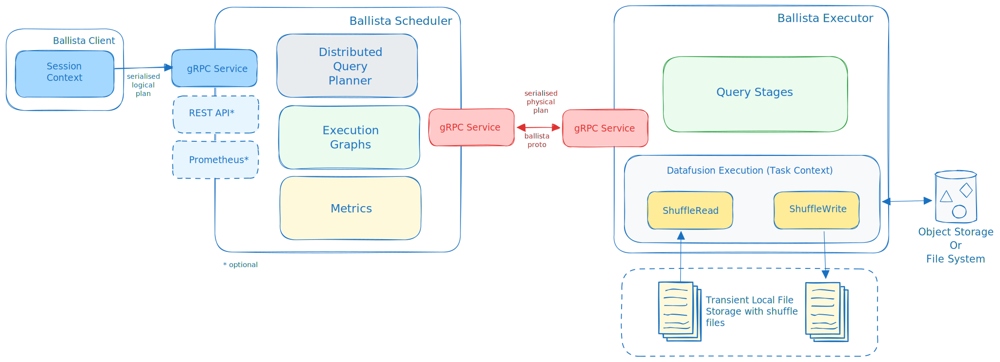

<a id="ballista-contributors-guide-architecture--scheduler"></a>

### Scheduler

The scheduler provides the following interfaces:

- gRPC service for submitting and managing jobs
- Flight SQL API
- REST API for monitoring jobs

Jobs are submitted to the scheduler’s gRPC service from a client context, either in the form of a logical query
plan or a SQL string. The scheduler then creates an execution graph, which contains a physical plan broken down into
stages (pipelines) that can be scheduled independently. This process is explained in detail in the Distributed
Query Scheduling section of this guide.

<a id="ballista-contributors-guide-architecture--executor"></a>

### Executor

The executor processes connect to a scheduler and poll for tasks to perform. These tasks are physical plans in
protocol buffer format. These physical plans are typically executed against multiple partitions of input data. Executors
can execute multiple partitions of the same plan in parallel.

<a id="ballista-contributors-guide-architecture--clients"></a>

### Clients

There are multiple clients available for submitting jobs to a Ballista cluster:

- The [Ballista CLI](https://github.com/apache/datafusion-ballista/tree/main/ballista-cli) provides a SQL command-line
  interface.
- The Python bindings ([PyBallista](https://github.com/apache/datafusion-ballista/tree/main/python)) provide a session
  context with support for SQL and DataFrame operations.
- The [ballista crate](https://crates.io/crates/ballista) provides a native Rust session context with support for
  SQL and DataFrame operations.
- The [Flight SQL JDBC driver](https://arrow.apache.org/docs/java/flight_sql_jdbc_driver.html) can be used from
  popular SQL tools to execute SQL queries against a cluster.

<a id="ballista-contributors-guide-architecture--distributed-query-scheduling"></a>

## Distributed Query Scheduling

Distributed query plans are fundamentally different to in-process query plans because we can’t just build a
tree of operators and start executing them. The query now requires co-ordination across executors which means that
we now need a scheduler.

At a high level, the concept of a distributed query scheduler is not complex. The scheduler needs to examine the
whole query and break it down into stages that can be executed in isolation (usually in parallel across the executors)
and then schedule these stages for execution based on the available resources in the cluster. Once each query
stage completes then any subsequent dependent query stages can be scheduled. This process repeats until all query
stages have been executed.

<a id="ballista-contributors-guide-architecture--producing-a-distributed-query-plan"></a>

### Producing a Distributed Query Plan

Some operators can run in parallel on input partitions and some operators require data to be repartitioned. These
changes in partitioning are key to planning a distributed query. Changes in partitioning within a plan are sometimes
called pipeline breakers and these changes in partitioning define the boundaries between query stages.

We will now use the following SQL query to see how this process works.

```
SELECT
customer.id,
sum (order.amount)
as
total_amount FROM
customer
JOIN
order
ON
customer.id
=
order.customer_id GROUP
BY
customer.id
```

The physical (non-distributed) plan for this query would look something like this:

```
Projection:#customer.id, #total_amount HashAggregate:groupBy =[customer.id ],aggr =[SUM (order.amount) AS total_amount] Join:condition =[customer.id =order.customer_id] Scan:customer Scan:order
```

Assuming that the customer and order tables are not already partitioned on customer id, we will need to schedule
execution of the first two query stages to repartition this data. These two query stages can run in parallel.

```

Query
Stage
#1: repartition=[customer.id]
Scan
:
customer
Query
Stage
#2: repartition=[order.customer_id]
Scan
:
order
```

Next, we can schedule the join, which will run in parallel for each partition of the two inputs. The next operator
after the join is the aggregate, which is split into two parts; the aggregate that runs in parallel and then
the final aggregate that requires a single input partition. We can perform the parallel part of this aggregate
in the same query stage as the join because this first aggregate does not care how the data is partitioned. This
gives us our third query stage, which can now be scheduled for execution. The output of this query stage
remains partitioned by customer id.

```
Query Stage #3: repartition=[] HashAggregate:groupBy =[customer.id ],aggr =[SUM (order.amount) AS total_amount] Join:condition =[customer.id =order.customer_id] Query Stage #1 Query Stage #2
```

The final query stage performs the aggregate of the aggregates, reading from all of the partitions from the previous
stage.

```
Query Stage #4:Projection:#customer.id, #total_amount HashAggregate:groupBy =[customer.id ],aggr =[SUM (order.amount) AS total_amount] QueryStage #3
```

To recap, here is the full distributed query plan showing the query stages that are introduced when data needs to be
repartitioned or exchanged between pipelined operations.

```
Query Stage #4:Projection:#customer.id, #total_amount HashAggregate:groupBy =[customer.id ],aggr =[SUM (order.amount) AS total_amount] Query Stage #3: repartition=[] HashAggregate:groupBy =[customer.id ],aggr =[SUM (order.amount) AS total_amount] Join:condition =[customer.id =order.customer_id] Query Stage #1: repartition=[customer.id] Scan:customer Query Stage #2: repartition=[order.customer_id] Scan:order
```

<a id="ballista-contributors-guide-architecture--shuffle"></a>

### Shuffle

Each stage of the execution graph has the same partitioning scheme for all of the operators in the plan. However, the output of each stage typically needs to be repartitioned before it can be used as the input to the next stage. An
example of this is when a query contains multiple joins. Data needs to be partitioned by the join keys before the join
can be performed.

Each executor will re-partition the output of the stage it is running so that it can be consumed by the next
stage. This mechanism is known as an Exchange or a Shuffle. The logic for this can be found in the [ShuffleWriterExec](https://github.com/apache/datafusion-ballista/blob/main/ballista/core/src/execution_plans/shuffle_writer.rs)
and [ShuffleReaderExec](https://github.com/apache/datafusion-ballista/blob/main/ballista/core/src/execution_plans/shuffle_reader.rs) operators.

[previous

Extensions Example](#ballista-user-guide-extensions-example "previous page")
[next

Ballista Code Organization](#ballista-contributors-guide-code-organization "next page")

---

<a id="ballista-contributors-guide-code-organization"></a>

<!-- source_url: https://datafusion.apache.org/ballista/contributors-guide/code-organization.html -->

<!-- page_index: 259 -->

# Ballista Code Organization ¶

On this page

- [ballista-core crate](#ballista-contributors-guide-code-organization--ballista-core-crate)
- [ballista-scheduler crate](#ballista-contributors-guide-code-organization--ballista-scheduler-crate)
- [ballista-executor crate](#ballista-contributors-guide-code-organization--ballista-executor-crate)
- [ballista crate](#ballista-contributors-guide-code-organization--ballista-crate)
- [PyBallista](#ballista-contributors-guide-code-organization--pyballista)

[Edit this page](https://github.com/apache/datafusion-ballista/edit/main/docs/source/contributors-guide/code-organization.md)

<a id="ballista-contributors-guide-code-organization--ballista-code-organization"></a>

# Ballista Code Organization

This section provides links to the source code for major areas of functionality.

<a id="ballista-contributors-guide-code-organization--ballista-core-crate"></a>

## ballista-core crate

- [Crate Source](https://github.com/apache/datafusion-ballista/blob/main/ballista/core)
- [Protocol Buffer Definition](https://github.com/apache/datafusion-ballista/blob/main/ballista/core/proto/ballista.proto)
- [Execution Plans](https://github.com/apache/datafusion-ballista/tree/main/ballista/core/src/execution_plans)
- [Ballista Client](https://github.com/apache/datafusion-ballista/blob/main/ballista/core/src/client.rs)

<a id="ballista-contributors-guide-code-organization--ballista-scheduler-crate"></a>

## ballista-scheduler crate

- [Crate Source](https://github.com/apache/datafusion-ballista/tree/main/ballista/scheduler)
- [Distributed Query Planner](https://github.com/apache/datafusion-ballista/blob/main/ballista/scheduler/src/planner.rs)
- [gRPC Service](https://github.com/apache/datafusion-ballista/blob/main/ballista/scheduler/src/scheduler_server/grpc.rs)
- [Flight SQL Service](https://github.com/apache/datafusion-ballista/blob/main/ballista/scheduler/src/flight_sql.rs)
- [REST API](https://github.com/apache/datafusion-ballista/tree/main/ballista/scheduler/src/api)
- [Prometheus Integration](https://github.com/apache/datafusion-ballista/blob/main/ballista/scheduler/src/metrics/prometheus.rs)

<a id="ballista-contributors-guide-code-organization--ballista-executor-crate"></a>

## ballista-executor crate

- [Crate Source](https://github.com/apache/datafusion-ballista/tree/main/ballista/executor)
- [Flight Service](https://github.com/apache/datafusion-ballista/blob/main/ballista/executor/src/flight_service.rs)
- [Executor Server](https://github.com/apache/datafusion-ballista/blob/main/ballista/executor/src/executor_server.rs)

<a id="ballista-contributors-guide-code-organization--ballista-crate"></a>

## ballista crate

- [Crate Source](https://github.com/apache/datafusion-ballista/tree/main/ballista/client)
- [Context](https://github.com/apache/datafusion-ballista/blob/main/ballista/client/src/context.rs)

<a id="ballista-contributors-guide-code-organization--pyballista"></a>

## PyBallista

- [Source](https://github.com/apache/datafusion-ballista/tree/main/python)
- [Context](https://github.com/apache/datafusion-ballista/blob/main/python/src/context.rs)

[previous

Ballista Architecture](#ballista-contributors-guide-architecture "previous page")
[next

Ballista Development](#ballista-contributors-guide-development "next page")

---

<a id="ballista-contributors-guide-development"></a>

<!-- source_url: https://datafusion.apache.org/ballista/contributors-guide/development.html -->

<!-- page_index: 260 -->

# Ballista Development ¶

On this page

- [Development Environment](#ballista-contributors-guide-development--development-environment)
- [Build the project](#ballista-contributors-guide-development--build-the-project)
- [Testing the project](#ballista-contributors-guide-development--testing-the-project)
- [Running the examples](#ballista-contributors-guide-development--running-the-examples)
- [Building the Python Client from Source](#ballista-contributors-guide-development--building-the-python-client-from-source)
  - [Prerequisites](#ballista-contributors-guide-development--prerequisites)
  - [Create a virtual environment](#ballista-contributors-guide-development--create-a-virtual-environment)
  - [Build and install](#ballista-contributors-guide-development--build-and-install)
  - [Run the tests](#ballista-contributors-guide-development--run-the-tests)
- [Benchmarking](#ballista-contributors-guide-development--benchmarking)

[Edit this page](https://github.com/apache/datafusion-ballista/edit/main/docs/source/contributors-guide/development.md)

<a id="ballista-contributors-guide-development--ballista-development"></a>

# Ballista Development

We welcome participation from everyone and encourage you to join us, ask
questions, and get involved.

All participation in the Apache DataFusion Ballista project is governed by the
Apache Software Foundation’s [code of
conduct](https://www.apache.org/foundation/policies/conduct.html).

<a id="ballista-contributors-guide-development--development-environment"></a>

## Development Environment

The easiest way to get started if you are using VSCode or IntelliJ IDEA is to open the provided [Dev Container](https://containers.dev/overview)
which will install all the required dependencies including Rust, Docker, Node.js and Yarn. A Dev Container is a
development environment that runs in a Docker container. It is configured with all the required dependencies to
build and test the project. It also includes VS Code and the Rust and Node.js extensions. Other supporting tools
that use Dev Containers can be seen [here](https://containers.dev/supporting)

To use the Dev Container, open the project in VS Code and then click the “Reopen in Container” button in the
bottom right corner of the IDE.

If you are not using the Dev Container or VScode, you will need to install these dependencies yourself.

- [Rust](https://www.rust-lang.org/tools/install)
- [Protobuf Compiler](https://protobuf.dev/downloads/) is required to build the project.
- [Node.js](https://nodejs.org/en/download/) is required to build the project.
- [Yarn](https://classic.yarnpkg.com/en/docs/install) is required to build the UI.
- [Docker](https://docs.docker.com/get-docker/) is required to run the integration tests.

<a id="ballista-contributors-guide-development--build-the-project"></a>

## Build the project

From the root of the project, build release binaries.

```
cargo build --release
```

<a id="ballista-contributors-guide-development--testing-the-project"></a>

## Testing the project

```
cargo test
```

<a id="ballista-contributors-guide-development--running-the-examples"></a>

## Running the examples

```
cd examples
cargo run --example standalone_sql --features=ballista/standalone
```

<a id="ballista-contributors-guide-development--building-the-python-client-from-source"></a>

## Building the Python Client from Source

The Python client (`ballista` on PyPI) lives in the `python/` directory and is versioned and released
independently from the main Ballista project, so it is intentionally not part of the default Cargo
workspace. Building it from source uses [maturin](https://www.maturin.rs/) to compile the Rust
extension module and install it into a Python virtual environment.

<a id="ballista-contributors-guide-development--create-a-virtual-environment"></a>

### Create a virtual environment

Using `pip`:

```
python3 -m venv .venv
source .venv/bin/activate
pip3 install --upgrade pip
pip3 install -r requirements.txt
```

The `pip` upgrade is required because `maturin develop` invokes `pip install --group`, which
needs pip 25.1 or newer. The pip shipped with `python3 -m venv` is often older than that.

Using [`uv`](https://docs.astral.sh/uv/):

```
uv sync --dev --no-install-package ballista
```

<a id="ballista-contributors-guide-development--build-and-install"></a>

### Build and install

`maturin develop` compiles the Rust extension and installs it into the active virtual environment
as an editable package, so subsequent Python imports pick up your local changes.

Using `pip`:

```
maturin develop            # debug build
maturin develop --release  # release build (slower to compile, faster at runtime)
```

Using `uv`:

```
uv run --no-project maturin develop --uv
```

To produce a wheel without installing it (for example, to share or publish):

```
uv run --no-project maturin build --release --strip
```

<a id="ballista-contributors-guide-development--run-the-tests"></a>

### Run the tests

Using `pip`:

```
python3 -m pytest
```

Using `uv`:

```
uv run --no-project pytest
```

For more detail on the underlying workflow, including tips for improving build speed, see the
[DataFusion Python contributor guide](#python-contributor-guide-introduction).

<a id="ballista-contributors-guide-development--benchmarking"></a>

## Benchmarking

For performance testing and benchmarking with TPC-H and other datasets, see the [benchmarks README](https://github.com/apache/datafusion-ballista/blob/main/benchmarks/README.md).

This includes instructions for:

- Generating TPC-H test data
- Running benchmarks against DataFusion and Ballista
- Comparing performance with Apache Spark
- Running load tests

[previous

Ballista Code Organization](#ballista-contributors-guide-code-organization "previous page")
[next

Communication](#ballista-community-communication "next page")

---

<a id="ballista-community-communication"></a>

<!-- source_url: https://datafusion.apache.org/ballista/community/communication.html -->

<!-- page_index: 261 -->

# Communication ¶

On this page

[Edit this page](https://github.com/apache/datafusion-ballista/edit/main/docs/source/community/communication.md)

<a id="ballista-community-communication--communication"></a>

# Communication

We welcome participation from everyone and encourage you to join us, ask
questions, and get involved.

All participation in the Apache DataFusion Ballista project is governed by the
Apache Software Foundation’s [code of
conduct](https://www.apache.org/foundation/policies/conduct.html).

We use the same communication channels as the main DataFusion project:

[https://datafusion.apache.org/contributor-guide/communication.html](#contributor-guide-communication)

<a id="ballista-community-communication--contributing"></a>

## Contributing

Our source code is hosted on
[GitHub](https://github.com/apache/datafusion-ballista). More information on contributing is in
the [Contribution Guide](https://github.com/apache/datafusion-ballista/blob/main/CONTRIBUTING.md)
, and we have curated a [good-first-issue](https://github.com/apache/datafusion-ballista/contribute)
list to help you get started. You can find datafusion’s major designs in docs/source/specification.

We use GitHub issues for maintaining a queue of development work and as the
public record. We often use Google docs, Github issues and pull requests for
quick and small design discussions. For major design change proposals, we encourage you to write a rfc.

[previous

Ballista Development](#ballista-contributors-guide-development "previous page")

---

<a id="ballista-user-guide-introduction"></a>

<!-- source_url: https://datafusion.apache.org/ballista/user-guide/introduction.html -->

<!-- page_index: 262 -->

# Overview ¶

On this page

[Edit this page](https://github.com/apache/datafusion-ballista/edit/main/docs/source/user-guide/introduction.md)

<a id="ballista-user-guide-introduction--overview"></a>

# Overview

Ballista is a distributed compute platform primarily implemented in Rust, and powered by Apache DataFusion.

Ballista has both scheduler and an executor component processes that are standard Rust executables.

Dockerfiles are also provided to build images for use in containerized environments, such as Docker, Docker Compose, and Kubernetes. See the [deployment guide](#ballista-user-guide-introduction--deployment.md) for more information.

SQL and DataFrame queries can be submitted from Python and Rust, and SQL queries can be submitted via the Arrow
Flight SQL JDBC driver, supporting your favorite JDBC compliant tools such as [DataGrip](#ballista-user-guide-introduction--datagrip)
or [tableau](#ballista-user-guide-introduction--tableau). For setup instructions, please see the [FlightSQL guide](#ballista-user-guide-introduction--flightsql.md).

<a id="ballista-user-guide-introduction--how-does-this-compare-to-apache-spark"></a>

## How does this compare to Apache Spark?

Although Ballista is largely inspired by Apache Spark, there are some key differences:

- The choice of Rust as the main execution language means that memory usage is deterministic and avoids the overhead
  of GC pauses.
- Ballista is designed from the ground up to use columnar data, enabling a number of efficiencies such as vectorized
  processing (SIMD and GPU) and efficient compression. Although Spark does have some columnar support, it is still
  largely row-based today.
- The combination of Rust and Arrow provides excellent memory efficiency and memory usage can be 5x - 10x lower than
  Apache Spark in some cases, which means that more processing can fit on a single node, reducing the overhead of
  distributed compute.
- The use of Apache Arrow as the memory model and network protocol means that data can be exchanged between executors
  in any programming language with minimal serialization overhead.

[deployment](#ballista-user-guide-introduction--.-deployment)
[datagrip](https://www.jetbrains.com/datagrip/)
[tableau](https://help.tableau.com/current/pro/desktop/en-us/examples_otherdatabases_jdbc.htm)

[previous

Apache DataFusion Ballista](#ballista "previous page")
[next

Start a Ballista Cluster](#ballista-user-guide-deployment "next page")

---

<a id="python-contributor-guide-introduction"></a>

<!-- source_url: https://datafusion.apache.org/python/contributor-guide/introduction.html -->

<!-- page_index: 263 -->

# Introduction ¶

On this page

- [How to develop](#python-contributor-guide-introduction--how-to-develop)
- [Running & Installing pre-commit hooks](#python-contributor-guide-introduction--running-installing-pre-commit-hooks)
- [Guidelines for Separating Python and Rust Code](#python-contributor-guide-introduction--guidelines-for-separating-python-and-rust-code)
- [Update Dependencies](#python-contributor-guide-introduction--update-dependencies)
- [Improving Build Speed](#python-contributor-guide-introduction--improving-build-speed)

<a id="python-contributor-guide-introduction--introduction"></a>

# Introduction

We welcome and encourage contributions of all kinds, such as:

1. Tickets with issue reports of feature requests
2. Documentation improvements
3. Code, both PR and (especially) PR Review.

In addition to submitting new PRs, we have a healthy tradition of community members reviewing each other’s PRs.
Doing so is a great way to help the community as well as get more familiar with Rust and the relevant codebases.

Before opening a pull request that touches PyO3 bindings, please review the
[PyO3 class mutability guidelines](#python-contributor-guide-ffi--ffi-pyclass-mutability) so you can flag missing
`#[pyclass(frozen)]` annotations during development and review.

<a id="python-contributor-guide-introduction--how-to-develop"></a>

## How to develop

This assumes that you have rust and cargo installed. We use the workflow recommended by
[pyo3](https://github.com/PyO3/pyo3) and [maturin](https://github.com/PyO3/maturin). We recommend using
[uv](https://docs.astral.sh/uv/) for python package management.

By default uv will attempt to build the datafusion python package. For our development we prefer to build manually. This means
that when creating your virtual environment using uv sync you need to pass in the additional –no-install-package datafusion
and for uv run commands the additional parameter –no-project

Bootstrap:

```
# fetch this repo git clone git@github.com:apache/datafusion-python.git
# create the virtual environment uv sync --dev --no-install-package datafusion
# activate the environment source .venv/bin/activate
```

The tests rely on test data in git submodules.

```
git submodule init
git submodule update
```

Whenever rust code changes (your changes or via git pull):

```
# make sure you activate the venv using "source .venv/bin/activate" first maturin develop -uv python -m pytest
```

<a id="python-contributor-guide-introduction--running-installing-pre-commit-hooks"></a>

## Running & Installing pre-commit hooks

arrow-datafusion-python takes advantage of [pre-commit](https://pre-commit.com/) to assist developers with code linting to help reduce the number of commits that ultimately fail in CI due to linter errors. Using the pre-commit hooks is optional for the developer but certainly helpful for keeping PRs clean and concise.

Our pre-commit hooks can be installed by running `pre-commit install`, which will install the configurations in your ARROW\_DATAFUSION\_PYTHON\_ROOT/.github directory and run each time you perform a commit, failing to complete the commit if an offending lint is found allowing you to make changes locally before pushing.

The pre-commit hooks can also be run adhoc without installing them by simply running `pre-commit run --all-files`

<a id="python-contributor-guide-introduction--update-dependencies"></a>

## Update Dependencies

To change test dependencies, change the `pyproject.toml` and run

To update dependencies, run

```
uv sync --dev --no-install-package datafusion
```

<a id="python-contributor-guide-introduction--improving-build-speed"></a>

## Improving Build Speed

The [pyo3](https://github.com/PyO3/pyo3) dependency of this project contains a `build.rs` file which
can cause it to rebuild frequently. You can prevent this from happening by defining a `PYO3_CONFIG_FILE`
environment variable that points to a file with your build configuration. Whenever your build configuration
changes, such as during some major version updates, you will need to regenerate this file. This variable
should point to a fully resolved path on your build machine.

To generate this file, use the following command:

```
PYO3_PRINT_CONFIG=1 cargo build
```

This will generate some output that looks like the following. You will want to copy these contents intro
a file. If you place this file in your project directory with filename `.pyo3_build_config` it will
be ignored by `git`.

```
implementation =CPython version =3.9 shared =true abi3 =true lib_name =python3 .12 lib_dir =/ opt / homebrew / opt / python @ 3.12 / Frameworks / Python.framework / Versions / 3.12 / lib executable =/ Users / myusername / src / datafusion - python /.venv / bin / python pointer_width =64 build_flags =suppress_build_script_link_lines =false
```

Add the environment variable to your system.

```

export
 
PYO3_CONFIG_FILE
=
"/Users//myusername/src/datafusion-python/.pyo3_build_config"
```

If you are on a Mac and you use VS Code for your IDE, you will want to add these variables
to your settings. You can find the appropriate rust flags by looking in the
`.cargo/config.toml` file.

```
"rust-analyzer.cargo.extraEnv":{"RUSTFLAGS":"-C link-arg=-undefined -C link-arg=dynamic_lookup","PYO3_CONFIG_FILE":"/Users/myusername/src/datafusion-python/.pyo3_build_config" },"rust-analyzer.runnables.extraEnv":{"RUSTFLAGS":"-C link-arg=-undefined -C link-arg=dynamic_lookup","PYO3_CONFIG_FILE":"/Users/myusername/src/personal/datafusion-python/.pyo3_build_config"}
```

[previous

Upgrade Guides](#python-user-guide-upgrade-guides "previous page")
[next

Python Extensions](#python-contributor-guide-ffi "next page")

---

<a id="python-user-guide-introduction"></a>

<!-- source_url: https://datafusion.apache.org/python/user-guide/introduction.html -->

<!-- page_index: 264 -->

# Introduction ¶

On this page

<a id="python-user-guide-introduction--introduction"></a>

# Introduction

Welcome to the User Guide for the Python bindings of Arrow DataFusion. This guide aims to provide an introduction to
DataFusion through various examples and highlight the most effective ways of using it.

<a id="python-user-guide-introduction--installation"></a>

## Installation

DataFusion is a Python library and, as such, can be installed via pip from [PyPI](https://pypi.org/project/datafusion).

```
pip install datafusion
```

You can verify the installation by running:

```
In [1 ]:import
datafusion In [2 ]:datafusion.__version__ Out [2 ]:'53.0.0'
```

In this documentation we will also show some examples for how DataFusion integrates
with Jupyter notebooks. To install and start a Jupyter labs session use

```
pip install jupyterlab
jupyter lab
```

To demonstrate working with DataFusion, we need a data source. Later in the tutorial we will show
options for data sources. For our first example, we demonstrate using a Pokemon dataset that you
can download
[here](https://gist.githubusercontent.com/ritchie46/cac6b337ea52281aa23c049250a4ff03/raw/89a957ff3919d90e6ef2d34235e6bf22304f3366/pokemon.csv).

With that file in place you can use the following python example to view the DataFrame in
DataFusion.

```
In [3 ]:from
datafusion
import SessionContext In [4 ]:ctx =SessionContext () In [5 ]:df =ctx.read_csv ("pokemon.csv") In [6 ]:df.show () DataFrame () +----+---------------------------+--------+--------+-------+----+--------+---------+---------+---------+-------+------------+-----------+ | #  | Name                      | Type 1 | Type 2 | Total | HP | Attack | Defense | Sp. Atk | Sp. Def | Speed | Generation | Legendary | +----+---------------------------+--------+--------+-------+----+--------+---------+---------+---------+-------+------------+-----------+ | 1 | Bulbasaur | Grass | Poison | 318 | 45 | 49 | 49 | 65 | 65 | 45 | 1 | false | | 2 | Ivysaur | Grass | Poison | 405 | 60 | 62 | 63 | 80 | 80 | 60 | 1 | false | | 3 | Venusaur | Grass | Poison | 525 | 80 | 82 | 83 | 100 | 100 | 80 | 1 | false | | 3 | VenusaurMega Venusaur | Grass | Poison | 625 | 80 | 100 | 123 | 122 | 120 | 80 | 1 | false | | 4 | Charmander | Fire | | 309 | 39 | 52 | 43 | 60 | 50 | 65 | 1 | false | | 5 | Charmeleon | Fire | | 405 | 58 | 64 | 58 | 80 | 65 | 80 | 1 | false | | 6 | Charizard | Fire | Flying | 534 | 78 | 84 | 78 | 109 | 85 | 100 | 1 | false | | 6 | CharizardMega Charizard X | Fire | Dragon | 634 | 78 | 130 | 111 | 130 | 85 | 100 | 1 | false | | 6 | CharizardMega Charizard Y | Fire | Flying | 634 | 78 | 104 | 78 | 159 | 115 | 100 | 1 | false | | 7 | Squirtle | Water | | 314 | 44 | 48 | 65 | 50 | 64 | 43 | 1 | false | | 8 | Wartortle | Water | | 405 | 59 | 63 | 80 | 65 | 80 | 58 | 1 | false | | 9 | Blastoise | Water | | 530 | 79 | 83 | 100 | 85 | 105 | 78 | 1 | false | | 9 | BlastoiseMega Blastoise | Water | | 630 | 79 | 103 | 120 | 135 | 115 | 78 | 1 | false | | 10 | Caterpie | Bug | | 195 | 45 | 30 | 35 | 20 | 20 | 45 | 1 | false | | 11 | Metapod | Bug | | 205 | 50 | 20 | 55 | 25 | 25 | 30 | 1 | false | | 12 | Butterfree | Bug | Flying | 395 | 60 | 45 | 50 | 90 | 80 | 70 | 1 | false | | 13 | Weedle | Bug | Poison | 195 | 40 | 35 | 30 | 20 | 20 | 50 | 1 | false | | 14 | Kakuna | Bug | Poison | 205 | 45 | 25 | 50 | 25 | 25 | 35 | 1 | false | | 15 | Beedrill | Bug | Poison | 395 | 65 | 90 | 40 | 45 | 80 | 75 | 1 | false | | 15 | BeedrillMega Beedrill | Bug | Poison | 495 | 65 | 150 | 40 | 15 | 80 | 145 | 1 | false | +----+---------------------------+--------+--------+-------+----+--------+---------+---------+---------+-------+------------+-----------+
```

If you are working in a Jupyter notebook, you can also use the following to give you a table
display that may be easier to read.

```
display(df)
```

[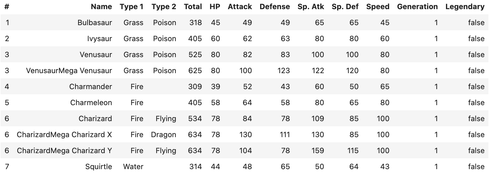](assets/images/jupyter-lab-df-view_033e2198b997d41d.png)

[previous

DataFusion in Python](#python "previous page")
[next

Concepts](#python-user-guide-basics "next page")

---
