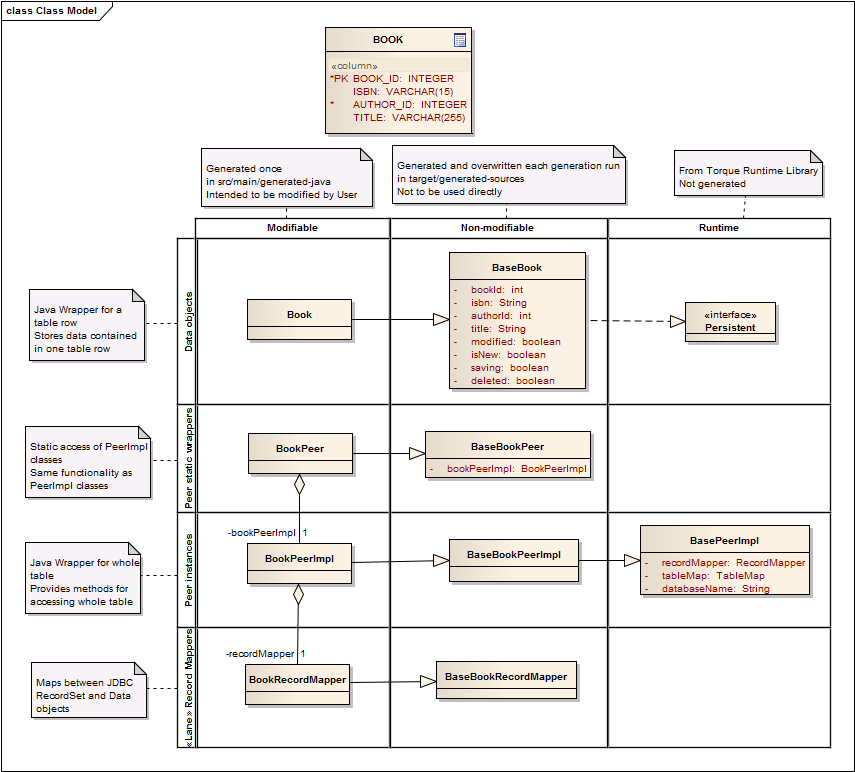

# About this Tutorial

## Navigation

- [OR-Mapping](#orm)
  - [step1-ant](#orm-step1-ant)
  - [step1-maven](#orm-step1-maven)
  - [step2](#orm-step2)
  - [step3-ant](#orm-step3-ant)
  - [step3-maven](#orm-step3-maven)
  - [step4](#orm-step4)
  - [step5](#orm-step5)
  - [step6-ant](#orm-step6-ant)
  - [step6-maven](#orm-step6-maven)
- [Code Generation](#codegen-gettingstarted)
- Other pages
  - [About this Tutorial](#index)

## Content

<a id="orm"></a>

<!-- source_url: https://db.apache.org/torque/torque-7.1/documentation/tutorial/orm/index.html -->

<!-- page_index: 1 -->

<a id="orm--torque-orm-tutorial"></a>

# Torque ORM Tutorial

The Torque ORM Tutorial consists of the following steps:

- Step 1: Configuring the Torque generation process
  (for [ant](#orm-step1-ant) or
  [maven](#orm-step1-maven))
- Step 2: [Defining the database schema](#orm-step2)
- Step 3: Invoking the Torque generator
  (for [ant](#orm-step3-ant) or
  [maven](#orm-step3-maven))
- Step 4: [Configuring the Torque Runtime](#orm-step4)
- Step 5: [Writing a Sample Application](#orm-step5)
- Step 6: Compiling and Running the Sample Application
  (for [ant](#orm-step6-ant) or
  [maven](#orm-step6-maven))

---

<a id="orm-step1-ant"></a>

<!-- source_url: https://db.apache.org/torque/torque-7.1/documentation/tutorial/orm/step1-ant.html -->

<!-- page_index: 2 -->

<a id="orm-step1-ant--step-1:-configuring-the-torque-generation-process"></a>

# Step 1: Configuring the Torque generation process

The following section outlines the necessary steps to
configure a Torque-based ORM project using ant.
For this, you need to create ant's build.xml file
and make the necessary libraries available.
It is recommended to run the tutorial against a mysql database, as
all of the explanation in this tutorial assumes that you use mysql.

As a starting point, create a directory as a
base directory for your project (also called
the project's top level directory).
All the paths in the following steps will be
relative to this base directory.

<a id="orm-step1-ant--ant-build-file"></a>

# Ant build file

As a starting point for the build file in your project, use the following template and save it
as build.xml in the project's base directory.
Then edit it to reflect your specific needs
(typically you need to change the database URLs, the database host, the database user and password):

```

<?xml version="1.0"?>
<project name="Torque" default="main" basedir=".">

  <property name="build.properties" value="build.properties"/>
  <property name="torque.contextProperties" value="${build.properties}"/>
  <property file="${torque.contextProperties}"/>  

  <path id="ant-classpath">
    <fileset dir="libs">
      <include name="*.jar"/>
    </fileset>
  </path>

  <path id="runtime-classpath">
    <fileset dir="libs">
      <include name="**/*.jar"/>
    </fileset>
  </path>
  
   <pathconvert property="classpathRuntime" refid="runtime-classpath"/>

  <taskdef
    name="torque-generator"
    classpathref="ant-classpath"
    classname="org.apache.torque.ant.task.TorqueGeneratorTask"/>

  <target name="generate"
      description="==> generates sql + om classes">
    <torque-generator 
        packaging="classpath"
        configPackage="org.apache.torque.templates.om"
        sourceDir="src/main/schema">
      <option key="torque.om.package" value="org.apache.torque.tutorial.om"/>
      <option key="torque.database" value="mysql"/>
    </torque-generator>
    <torque-generator 
        packaging="classpath"
        configPackage="org.apache.torque.templates.sql"
        sourceDir="src/main/schema"
        defaultOutputDir="target/generated-sql">
      <option key="torque.database" value="mysql"/>
    </torque-generator>
  </target>

  <target name="compile">
    <mkdir dir="target/classes"/>
     <javac debug="on" source="1.8" target="1.8" destdir="target/classes" includeAntRuntime="false" classpathref="runtime-classpath" fork="yes">   
      <src path="src/main/java"/>
      <src path="src/main/generated-java"/>
      <src path="target/generated-sources"/>
      <classpath refid="runtime-classpath"/>
    </javac>
    <copy todir="target/classes">
      <fileset dir="src/main/resources"/>
    </copy>
  </target>

  <target name="execute-sql">
    <sql classpathref="ant-classpath"
        driver="${torque.database.driver}"
        url="jdbc:mysql://localhost:3306/bookstore"
        userid="${torque.database.user}"
        password="${torque.database.password}"
        onerror="continue"
        src="target/generated-sql/bookstore-schema.sql"/>
  </target>
  
  <taskdef
    name="torque-jdbc2schema"
    classpathref="ant-classpath"
    classname="org.apache.torque.ant.task.Torque4JDBCTransformTask"/>
    
  <target name="jdbc"  description="==> jdbc to xml">
    <echo> Generating XML from JDBC connection with jars: ${antClasspath} ...</echo>
    <echo message="+-----------------------------------------------+"/>
    <echo message="|                                               |"/>
    <echo message="| Generating XML from JDBC connection !         |"/>
    <echo message="|                                               |"/>
    <echo message="+-----------------------------------------------+"/>

    <torque-jdbc2schema 
      dbDriver="${torque.database.driver}"
      dbPassword="${torque.database.password}"
      dbUrl="${torque.database.url}"
      dbUser="${torque.database.user}"
      packaging="classpath"
      configPackage="org.apache.torque.templates.jdbc2schema"
      defaultOutputDir="target/generated-schema"
> </torque-jdbc2schema> </target>

  <target name="clean">
    <delete dir="target" />
  </target>

  <target name="main" description="build all" depends="generate, compile">
  </target>
</project>
```

This build file contains the following definitions:

- The runtime dependencies of your project to Torque
  (needed when you compile and use the generated java sources)
- The definition and configuration of the Torque ant task
- The configuration of ant's SQL task
  (needed if you want to execute the generated SQL using ant)
- The configuration of the java compiler
  (needed when you compile the generated java sources)
- The configuration of the clean target (removes the compiled classes,
  some generated classes and the generated SQL).
- The configuration of the main target (generates classes and SQL
  and compiles the java classes).

A correct ant build file is very important.
This enables the Torque generator to generate all of
the required sources and SQL for your specific
database. If you experience problems later in this
tutorial, it would be wise to double-check this file.

<a id="orm-step1-ant--library-set-up"></a>

# Library set-up

For the Torque generator/jdbc and SQL ant tasks to work correctly, you need to provide them with some additional libraries.
This is done as follows:

- Create the directory **libs** in your project.
- Download the binary distribution of torque-templates.
  Put the torque-templates-${version}.jar from its root directory
  in the libs directory of your project.
- Download the binary distribution of torque-ant-tasks.
  Put the torque-ant-tasks-${version}.jar from its root directory
  in the libs directory of your project.
- Download the binary distribution of torque-generator-tasks.
  Put the torque-generator-tasks-${version}.jar from its root directory to the directory of your project containing your dependency libraries ("libs" in this example).
- Download the [sources](http://www.apache.org/dyn/closer.cgi/db/torque/torque-5.0/) and run from the source repo's sub folder
  `cd torque-5.0/torque-generator` the following command, which copies all dependencies if Torque Generator to libs.
  `mvn clean dependency:copy-dependencies -DincludeScope=runtime -DoutputDirectory=libs -DexcludeScope=test`)
- To configure Logging (Log4j2) set e.g.
  `set ANT_OPTS=-Dlog4j.configurationFile=libs/log4j2.xml`
- Download the appropriate mysql driver jar, e.g. from
  [here](http://repo1.maven.org/maven2/mysql/mysql-connector-java/)
  and add the jar to the libs directory of your project.
- Add any [Fulcrum dependencies](http://www.apache.org/dyn/closer.cgi/turbine/fulcrum/)
  (fulcrum-security-api and fulcrum-security-torque, if you are using [Turbine](https://turbine.apache.org/) and references of peer interfaces in the schema.

<a id="orm-step1-ant--where-to-next"></a>

# Where to next

This completes the configuration of the Torque ant tasks
(and other settings to be made in the build.xml).

Next we will look at
[Defining the database schema](#orm-step2).

<a id="orm-step1-ant--user-comments"></a>

# User Comments

[User comments](https://cwiki.apache.org/DBTORQUE/TutorialUserCommentsStep2)
for this step

---

<a id="orm-step1-maven"></a>

<!-- source_url: https://db.apache.org/torque/torque-7.1/documentation/tutorial/orm/step1-maven.html -->

<!-- page_index: 3 -->

<a id="orm-step1-maven--step-1:-configuring-the-torque-generation-process"></a>

# Step 1: Configuring the Torque generation process

The following section outlines the necessary steps to
configure a Torque-based ORM project using Maven.
For this, you need to create maven's pom file
(the maven project descriptor file) which describes your project.
It is recommended to run the tutorial against a Mysql database, as
all of the explanation in this tutorial assumes that you use Mysql.

As a starting point, create a directory as a
base directory for your project (also called
the project's top level directory).
All the paths in the following steps will be
relative to this base directory.

<a id="orm-step1-maven--maven-project-descriptor"></a>

# Maven Project descriptor

As a starting point for the pom file in your project, use the following template and save it as pom.xml
in the project's base directory.
Then edit it to reflect your specific needs (
typically you need to change the database URLs, the database host, the database user and password):

```

<?xml version="1.0"?>
<project
    xmlns="http://maven.apache.org/POM/4.0.0"
    xmlns:xsi="http://www.w3.org/2001/XMLSchema-instance"
    xsi:schemaLocation="http://maven.apache.org/POM/4.0.0 http://maven.apache.org/maven-v4_0_0.xsd">
  <modelVersion>4.0.0</modelVersion>

  <groupId>org.apache.torque.tutorial</groupId>
  <artifactId>torque-test</artifactId>
  <packaging>jar</packaging>
  <name>Torque Tutorial Test Project</name>
  <version>1.0-SNAPSHOT</version>

  <dependencies>
    <!-- Torque runtime -->
    <dependency>
      <artifactId>torque-runtime</artifactId>
      <groupId>org.apache.torque</groupId>
      <version>5.0</version>
    </dependency>

    <!-- db driver -->
    <dependency>
      <artifactId>mysql-connector-java</artifactId>
      <groupId>mysql</groupId>
      <version>8.0.21</version>
    </dependency>

    <!-- Logging via log4j2 -->
    <dependency>
        <groupId>org.apache.logging.log4j</groupId>
        <artifactId>log4j-slf4j-impl</artifactId>
        <version>2.13.3</version>
        <scope>runtime</scope>
    </dependency>

  </dependencies>

  <build>
    <plugins>
      <plugin>
        <groupId>org.apache.torque</groupId>
        <artifactId>torque-maven-plugin</artifactId>
        <version>5.0</version>
        <executions>
          <execution>
            <id>generate-sources</id>
            <phase>generate-sources</phase>
            <goals>
              <goal>generate</goal>
            </goals>
            <configuration>
              <packaging>classpath</packaging>
              <configPackage>org.apache.torque.templates.om</configPackage>
              <sourceDir>src/main/schema</sourceDir>
              <options>
                <torque.om.package>org.apache.torque.tutorial.om</torque.om.package>
                <torque.database>mysql</torque.database>
              </options>
            </configuration>
          </execution>
          <execution>
            <id>generate-sql</id>
            <phase>generate-sources</phase>
            <goals>
              <goal>generate</goal>
            </goals>
            <configuration>
              <packaging>classpath</packaging>
              <configPackage>org.apache.torque.templates.sql</configPackage>
              <sourceDir>src/main/schema</sourceDir>
              <defaultOutputDir>target/generated-sql</defaultOutputDir>
              <defaultOutputDirUsage>none</defaultOutputDirUsage>
              <options>
                <torque.database>mysql</torque.database>
              </options>
            </configuration>
          </execution>
        </executions>
        <dependencies>
          <dependency>
            <groupId>org.apache.torque</groupId>
            <artifactId>torque-templates</artifactId>
            <version>5.0</version>
          </dependency>
        </dependencies>
      </plugin>

      <plugin>
        <groupId>org.codehaus.mojo</groupId>
        <artifactId>sql-maven-plugin</artifactId>
        <version>1.4</version>
        <configuration>
          <driver>com.mysql.cj.jdbc.Driver</driver>
          <url>jdbc:mysql://localhost:3306/bookstore</url>
          <username>root</username>
          <password>password</password>
          <onError>continue</onError>
          <autocommit>true</autocommit>
          <fileset>
            <basedir>${basedir}/target/generated-sql</basedir>
            <includes>
              <include>*.sql</include>
            </includes>
          </fileset>
        </configuration>
        <dependencies>
          <dependency>
            <artifactId>mysql-connector-java</artifactId>
            <groupId>mysql</groupId>
            <version>8.0.21</version>
          </dependency>
        </dependencies>
      </plugin>

      <plugin>
        <!-- setting java version to 1.8 --> 
        <groupId>org.apache.maven.plugins</groupId>
        <artifactId>maven-compiler-plugin</artifactId>
        <configuration>
          <source>1.8</source>
          <target>1.8</target>
        </configuration>
      </plugin>

      <plugin>
        <groupId>org.apache.maven.plugins</groupId>
        <artifactId>maven-dependency-plugin</artifactId>
        <executions>
          <execution>
            <id>copy-dependencies</id>
            <phase>package</phase>
            <goals>
              <goal>copy-dependencies</goal>
            </goals>
            <configuration>
               <outputDirectory>libs</outputDirectory>
               <includeScope>runtime</includeScope>
            </configuration>
          </execution>
        </executions>
      </plugin>
    </plugins>
  </build>
</project>
```

This template contains the following definitions:

- The runtime dependencies of your project to Torque
  in the main dependencies section of the pom
  (needed when you compile and use the generated java sources)
- The configuration of the Torque maven 2 plugin in the plugins section
- The configuration of the maven SQL plugin in the plugins section
  (needed if you want to execute the generated SQL using maven)
- The configuration of the java compiler in the plugins section
  to allow java 1.8 code
  (needed when you compile the generated java sources)
- The configuration of the maven dependency plugin in the plugins section
  (gathers all dependency libraries of the project).

Configuring Maven 2 correctly is very important.
This enables the Torque generator to generate all of
the required sources and SQL for your specific
database. If you experience problems later in this
tutorial, it would be wise to double-check this file.

<a id="orm-step1-maven--where-to-next"></a>

# Where to next

This completes the configuration of the Torque Maven 2 plugin
(and other settings to be made in the pom.xml).

Next we will look at
[Defining the database schema](#orm-step2).

<a id="orm-step1-maven--user-comments"></a>

# User Comments

[User comments](https://cwiki.apache.org/DBTORQUE/TutorialUserCommentsStep2)
for this step

---

<a id="orm-step2"></a>

<!-- source_url: https://db.apache.org/torque/torque-7.1/documentation/tutorial/orm/step2.html -->

<!-- page_index: 4 -->

<a id="orm-step2--step-2:-defining-the-torque-database-schema"></a>

# Step 2: Defining the Torque Database Schema

The second file that you must edit to configure
Torque is the database schema. The database schema
is an XML file that represents the structure of your
SQL database in Torque.
This is where you define all of your
tables, column names and types, as well as the keys
used to index these tables.

If you already hava a database set up, you can generate a base schema with the
following command in your top-level project directory:

```

ant jdbc
```

This will by default generate a *schema.xml* file.
By default or if you do not define *defaultOutputDir* it will be located in *target/generated-schema*.
*Hint*: Copy the generated schema to *src/main/schema* directory and rename it to bookstore-schema.xml, then add appropriate attributes e.g.- defaultIdMethod to database element
- autoIncrement attribute to columns

```

 <database xmlns="http://db.apache.org/torque/5.0/templates/database"
  xmlns:xsi="http://www.w3.org/2001/XMLSchema-instance"
  xsi:schemaLocation="http://db.apache.org/torque/5.0/templates/database
        http://db.apache.org/torque/torque-5.0/documentation/orm-reference/database-5-0.xsd"
  name="default"
  defaultIdMethod="none" defaultJavaType="object">
 
```

Your database schema file is typically located in the
*src/main/schema* directory under the base of your project.
In this directory, you will create the file *bookstore-schema.xml*
which defines your database schema. The name of
your database schema file must end with
*schema.xml* because Torque will only
generate object models for files ending with that
pattern.

In this tutorial, we will use a simple
database that might be used to support a bookstore
application. The database will contain three
tables: author, publisher, and book. The first
table will contain publisher information (name).
The second table will contain author information (first
and last name). And the third
table will contain book information (title, and
ISBN). The author id and publisher id will be
foreign keys in the book table. The schema
representation for this database is stored
in the file *bookstore-schema.xml*, which should
be created in the *src/main/schema* directory
and contain the following:

```

<?xml version="1.0" encoding="ISO-8859-1" ?>
<database xmlns="http://db.apache.org/torque/5.0/templates/database"
  xmlns:xsi="http://www.w3.org/2001/XMLSchema-instance"
  xsi:schemaLocation="http://db.apache.org/torque/5.0/templates/database
        http://db.apache.org/torque/torque-5.0/documentation/orm-reference/database-5-0-strict.xsd"
  name="bookstore"
  defaultIdMethod="native">

  <table name="publisher" description="Publisher Table">
    <column
      name="publisher_id"
      required="true"
      primaryKey="true"
      type="INTEGER"
      description="Publisher Id"/>
    <column
      name="name"
      required="true"
      type="VARCHAR"
      size="128"
      description="Publisher Name"/>
  </table>
  <table name="author" description="Author Table">
    <column
      name="author_id"
      required="true"
      primaryKey="true"
      type="INTEGER"
      description="Author Id"/>
    <column
      name="first_name"
      required="true"
      type="VARCHAR"
      size="128"
      description="First Name"/>
    <column
      name="last_name"
      required="true"
      type="VARCHAR"
      size="128"
      description="Last Name"/>
  </table>
  <table name="book" description="Book Table">
    <column
      name="book_id"
      required="true"
      primaryKey="true"
      type="INTEGER"
      description="Book Id"/>
    <column
      name="title"
      required="true"
      type="VARCHAR"
      size="255"
      description="Book Title"/>
    <column
      name="isbn"
      required="true"
      type="VARCHAR"
      size="24"
      javaName="ISBN"
      description="ISBN Number"/>
    <column
      name="publisher_id"
      required="true"
      type="INTEGER"
      description="Foreign Key Publisher"/>
    <column
      name="author_id"
      required="true"
      type="INTEGER"
      description="Foreign Key Author"/>
    <foreign-key foreignTable="publisher">
      <reference
        local="publisher_id"
        foreign="publisher_id"/>
    </foreign-key>
    <foreign-key foreignTable="author">
      <reference
        local="author_id"
        foreign="author_id"/>
    </foreign-key>
  </table>
</database>
```

There are several items of importance to note. The
*database* element's *name* attribute
must be the same as the database's' name in the runtime property file
*torque.properties* described later in this tutorial.
Failure to do so will prevent your object
model from working properly.

Another item of importance is the *database*
element's *defaultIdMethod* attribute. This
attribute specifies the default method that Torque
will use to generate IDs for primary keys (columns
with the *primaryKey* attribute set to
*true*: *book\_id*,
*publisher\_id*, and *author\_id*) in
your database tables. There are several possible
values:

| Property | Description |
| --- | --- |
| native | Instructs Torque to use the underlying database's mechanism to generate IDs (varies per database e.g. autoincrement for mysql and schemata for postgresql). |
| idbroker | Instructs Torque to use its [IDBroker](https://db.apache.org/torque/torque-7.1/documentation/orm-reference/relevant-classes.html#ID_Broker) service to generate IDs in a database agnostic manner. An extra table is used for this, which needs to be created separately. |
| none | Instructs Torque to not generate IDs. Use this setting if you want to define the primary key yourself. |

The *defaultIdMethod* selected will be used
for all tables in your schema unless an individual
*table* element contains the
*idMethod* attribute, in which case, its
value will override the *defaultIdMethod*.
*idMethod* takes the same values as
*defaultIdMethod*.

Another common mistake is to forget that XML is
**case-sensitive**. All of the elements and
attributes must be specified according to either the- 4.0 strict schema or default
  [strict Schema XSD](https://db.apache.org/torque/torque-7.1/documentation/orm-reference/database-4-0-strict.xsd)
  or the
  [Schema XSD](https://db.apache.org/torque/torque-7.1/documentation/orm-reference/database-4-0.xsd)
- 5.0 strict schema or default
  [strict Schema XSD](https://db.apache.org/torque/torque-7.1/documentation/orm-reference/database-5-0-strict.xsd)
  or the
  [Schema XSD](https://db.apache.org/torque/torque-7.1/documentation/orm-reference/database-5-0.xsd)
for the database schema. In addition, you should
include the XML declaration and XML schema specification
in your database schema file.
This helps to detect errors in the schema file easily.

For additional information on
the XML elements and attributes, please refer to the
[Schema XSD](https://db.apache.org/torque/torque-7.1/documentation/orm-reference/database-4-0.xsd)
or [5.0 Schema XSD](https://db.apache.org/torque/torque-7.1/documentation/orm-reference/database-5-0.xsd).

<a id="orm-step2--where-to-next"></a>

# Where to next

That completes the configuration of the Torque generator.
You are now ready to start building your object model
and creating your database.

Maven users should look at
[Invoking the Torque Maven plugin](#orm-step3-maven), wheras ant users should go to
[Invoking the ant build containing Torque](#orm-step3-ant).

<a id="orm-step2--user-comments"></a>

# User Comments

[User comments](https://cwiki.apache.org/DBTORQUE/TutorialUserCommentsStep2)
for this step

---

<a id="orm-step3-ant"></a>

<!-- source_url: https://db.apache.org/torque/torque-7.1/documentation/tutorial/orm/step3-ant.html -->

<!-- page_index: 5 -->

<a id="orm-step3-ant--step-3:-invoking-the-torque-ant-task"></a>

# Step 3: Invoking the Torque Ant Task

With the creation of the build file and definition of the
database schema completed, you can now
generate the object model to support your database, and create the database tables.
Each of these tasks is covered in the following sections.

The generation of your object model will produce
Java source files that represent your database structure.
These classes enable you to create, edit, delete, and select objects that represent rows in
your database tables. In addition, Torque will
generate SQL to create your database tables (you
have the option of executing the SQL via maven as demonstrated
later in this tutorial).

The object model consists of eight classes for each
table in your schema. For example, the
*book* table, defined in this tutorial, will result in the following eight classes:
*Book*, *BookPeer*,
*BookPeerImpl*, *BookRecordMapper*,
*BaseBook*, *BaseBookPeer*,
*BaseBookPeerImpl*, and *BaseBookRecordMapper*
(a detailed discussion on the use of these classes is deferred
until we write our sample application). See the image below for
a UML class diagram of the generated classes and their relations.


To generate your object model and the associated SQL, type the
following command in your top-level project directory:

```

ant generate
```

Hint: You have to create a build copy of your *bookstore-schema.xml*
named *schema.xml* in the sourceDir (by default src/main/schema) directory!

A successful build will be indicated by the
BUILD SUCCESSFUL message.

The generated Java source files are located in the
*target/generated-sources* (BaseXXX)
and *src/main/generated-java* (other classes)
directories. The locations are split because the Base classes are
generated each time anew, are not intended to be edited
and should not be under version control if you use a version
control system. So they reside in the target directory
which can be deleted for a clean build.
The other classes can be edited once generated
and will not be overwritten if they exist, so they reside in the
src tree.
All generated classes will be in a directory hierarchy matching that of the
`torque.om.package` option you
specified in *build.xml*.

The generated SQL files are located in the
*target/generated-sql* directory.
For each database schema in your
*src/schema* directory, there will be a
corresponding file with a *.sql* extension
instead of *.xml* extension. The contents of
these files are the SQL commands that can be used to
manually or automatically (see next section) create
your database tables.

If you encounter errors while building, it is more
than likely a formatting error of your database
schema file or the ant build file, or a missing library.
Check again the contents of these files and the lib/ant directory.

<a id="orm-step3-ant--creating-the-database-tables"></a>

# Creating the Database Tables

As mentioned previously, Torque can automatically
create the database tables for you.
However, you must first make sure
that the appropriate database driver can be accessed by ant.
We already did that by adding the mysql driver jar
to the lib/ant directory of your project.

<a id="orm-step3-ant--creating-the-tables"></a>

## Creating the tables

To create the database tables, you first need to create the schema
(in mysql speak: database) which you want to use for the tables.
E.g. in mysql, execute the following command as root user:

```

  create database bookstore;
```

If you want to use another database user than root to create the tables, make sure that this user has sufficient privileges on the database bookstore
to create tables. Alternatively, you can just use the root user
to create the database tables.
In both cases, check again that the username, password and url
of your mysql database is correct in the build.xml, and type the following command in the top-level directory of your project:

```

ant execute-sql
```

Success will be indicated by the message
8 of 10 SQL statements executed successfully
BUILD SUCCESSFUL.
(Torque assumes that you already have defined a database, and performs a drop before attempting recreation.
The statements dropping the foreign keys fail because
the table does not exist, but this is not a problem
for creating the tables. If you re-run the command, all 10 statements will execute successfully.)
You can also validate that the tables were created
by checking your database. For example, the
*bookstore-schema.xml* defined in this
tutorial should have created the following tables:
*author*, *book*, and *publisher*.

If you have difficulties in creating the tables
using ant, you can also execute the SQL script
generated in the directory *target/generated-sql*
manually.

<a id="orm-step3-ant--where-to-next"></a>

# Where to next

Now that you have generated all of your object model
classes and created your database, you are ready to
build your first Torque application.

Next we will look [Configuring the Torque Runtime](#orm-step4).

<a id="orm-step3-ant--user-comments"></a>

# User Comments

[User comments](https://cwiki.apache.org/DBTORQUE/TutorialUserCommentsStep3)
for this step

---

<a id="orm-step3-maven"></a>

<!-- source_url: https://db.apache.org/torque/torque-7.1/documentation/tutorial/orm/step3-maven.html -->

<!-- page_index: 6 -->

<a id="orm-step3-maven--step-3:-invoking-the-torque-maven-plugin"></a>

# Step 3: Invoking the Torque Maven Plugin

With the configuration of Maven and definition of the
database schema completed, you can now
generate the object model to support your database, and create the database tables.
Each of these tasks is covered in the following sections.

The generation of your object model will produce
Java source files that represent your database structure.
These classes enable you to create, edit, delete, and select objects that represent rows in
your database tables. In addition, Torque will
generate SQL to create your database tables (you
have the option of executing the SQL via maven as demonstrated
later in this tutorial).

The object model consists of eight classes for each
table in your schema. For example, the
*book* table, defined in this tutorial, will result in the following eight classes:
*Book*, *BookPeer*,
*BookPeerImpl*, *BookRecordMapper*,
*BaseBook*, *BaseBookPeer*,
*BaseBookPeerImpl*, and *BaseBookRecordMapper*
(a detailed discussion on the use of these classes is deferred
until we write our sample application). See the image below for
a UML class diagram of the generated classes and their relations.


To generate your object model and the associated SQL, type the
following command in your top-level project directory:

```

mvn generate-sources
```

A successful build will be indicated by the
BUILD SUCCESSFUL message.

The generated Java source files are located in the
*target/generated-sources* (BaseXXX)
and *src/main/generated-java* (other classes)
directories. The locations are split because the Base classes are
generated each time anew, are not intended to be edited
and should not be under version control if you use a version
control system. So they reside in maven's target directory
which can be deleted during a maven build.
The other classes can be edited once generated
and will not be overwritten if they exist, so they reside in the
src tree which is not altered by maven.
All generated classes will be in a directory hierarchy matching that of the
`torque.om.package` option you
specified in *pom.xml*.

The generated SQL files are located in the
*target/generated-sql* directory.
For each database schema in your
*src/schema* directory, there will be a
corresponding file with a *.sql* extension
instead of *.xml* extension. The contents of
these files are the SQL commands that can be used to
manually or automatically (see next section) create
your database tables.

If you encounter errors while building, it is more
than likely a formatting error of your database
schema file or the Maven 2 pom file.
Check again the contents of these files.

<a id="orm-step3-maven--creating-the-database-tables"></a>

# Creating the Database Tables

As mentioned previously, Torque can automatically
create the database tables for you.
However, you must first make sure
that the appropriate database driver can be accessed by maven.
This is not a problem for most drivers
(e.g. mysql, postgresql, derby...)
but some drivers (e.g. oracle) are not available
in the maven central repository and must be added
to your local maven repository manually
(check the maven 2 docs on how to do this.)

<a id="orm-step3-maven--specifying-the-driver-dependency"></a>

## Specifying the driver dependency

There are two places where the database driver appears:
once in the main dependencies section, and once in the dependencies of the maven sql plugin
which can execute the sql generated by Torque.

The tutorial uses mysql as database, and the pom templates
given in step 1 already include a mysql dependency, so the pom xml in the tutorial project can remain unchanged.

<a id="orm-step3-maven--creating-the-tables"></a>

## Creating the tables

To create the database tables, you first need to create the schema
(mysql: database) which you want to use for the tables.
E.g. in mysql, execute the following command as root user:

```

  create database bookstore;
```

If you want to use another database user than root to create the tables, make sure that this user has sufficient privileges on the database bookstore
to create tables. Alternatively, you can just use the root user
to create the database tables.
In both cases, type the following commands in
the top-level directory of your project:

```

maven sql:execute
```

Success will be indicated by the message
8 of 10 SQL statements executed successfully
BUILD SUCCESSFUL.
(Torque assumes that you already have defined a database, and performs a drop before attempting recreation.
The statements dropping the foreign keys fail because
the table does not exist, but this is not a problem
for creating the tables. If you re-run the command, all 10 statements will execute successfully.)
You can also validate that the tables were created
by checking your database. For example, the
*bookstore-schema.xml* defined in this
tutorial should have created the following tables:
*author*, *book*, and *publisher*.

If you have difficulties in creating the tables
using maven, you can also execute the SQL script
generated in the directory *target/generated-sql*
manually.

<a id="orm-step3-maven--where-to-next"></a>

# Where to next

Now that you have generated all of your object model
classes and created your database, you are ready to
build your first Torque application.

Next we will look [Configuring the Torque Runtime](#orm-step4).

<a id="orm-step3-maven--user-comments"></a>

# User Comments

[User comments](https://cwiki.apache.org/DBTORQUE/TutorialUserCommentsStep3)
for this step

---

<a id="orm-step4"></a>

<!-- source_url: https://db.apache.org/torque/torque-7.1/documentation/tutorial/orm/step4.html -->

<!-- page_index: 7 -->

<a id="orm-step4--step-4:-configuring-the-torque-runtime"></a>

# Step 4: Configuring the Torque Runtime

Before we can start to write a Torque application, we have to
configure the runtime environment of Torque.
The Torque runtime needs a configuration file
in order to retrieve the data which is necessary
to connect to the database.

<a id="orm-step4--torque-runtime-properties"></a>

## Torque Runtime Properties

The second step in the configuration of the
Torque Runtime are the
Torque runtime properties. As the name suggests, these properties are used when your application is
executing the object model code generated by Torque.
The runtime properties control database
parameters such as drivers, usernames, and
passwords.

We will save our runtime properties in the
a file called *torque.properties*.
Create a subdirectory src/main/resources in the
top-level directory of your project, and create
a new file called *torque.properties*
in it. Add the following lines to this file:

```

torque.database.default = bookstore
torque.database.bookstore.adapter = mysql

torque.dsfactory.bookstore.factory = org.apache.torque.dsfactory.SharedPool2DataSourceFactory
torque.dsfactory.bookstore.connection.driver = org.gjt.mm.mysql.Driver
torque.dsfactory.bookstore.connection.url = jdbc:mysql://localhost:3306/bookstore
torque.dsfactory.bookstore.connection.user = root
torque.dsfactory.bookstore.connection.password = password
  
```

Change the adapter, driver, url, user and password parameters
to match the parameters for your database.
In the following table, the parameters used in the sample
configuration are described. For further information, see the
[Runtime Configuration Reference](https://db.apache.org/torque/torque-7.1/documentation/orm-reference/initialisation-configuration.html#Configuration).

| Property | Description |
| --- | --- |
| torque.database.default | Torque has the ability to use multiple databases. This property specifies which database is to be used as the default. |
| torque.database.XXX.adapter | Torque has the ability to deal with multiple database systems. This property specifies the database adapter to use. |
| torque.dsfactory.XXX.factory | The factory class that will be used to provide database connections. |
| torque.dsfactory.XXX.connection.driver | The JDBC database driver to use when connecting to your database. |
| torque.database.XXX.connection.url | The URL that will be used to access your database. Torque's generated object model will perform all database operations using this URL. This value should reflect the database name specified in your database schema file (see the *database* element's *name* attribute). |
| torque.database.XXX.connection.user | The username that has sufficient privileges to access your database. This user does not require privileges to create and drop tables, unlike the user that was specified in *project.properties*. |
| torque.database.XXX.connection.password | The password for the specified username. |

It is worth re-iterating that these runtime
properties are not used by Torque when generating
your object model and creating your database. They
are used only by the application utilizing the
Torque-generated object model classes at run-time.

<a id="orm-step4--logging-configuration"></a>

## Logging configuration

Torque uses in generated java sources
[commons-logging](http://commons.apache.org/logging/) as a logging interface.
To enable logging in your application, read the
[commons-logging user guide](https://commons.apache.org/proper/commons-logging/guide.html).

Internally Torque uses now
[Log4j2](https://logging.apache.org/log4j/log4j-2.0/index.html).
To enable logging in your application, read the
[configuration guide](https://logging.apache.org/log4j/2.x/manual/configuration.html) or [Manual](https://logging.apache.org/log4j/log4j-2.0/manual/index.html).

This example uses log4j as logging system and it is configured very simply
so that only warnings and errors are printed.
In a serious application, you want to improve the logging configuration
(using [Log4j-1.2 API Adapter](https://logging.apache.org/log4j/log4j-2.0/log4j-1.2-api/index.html)).

<a id="orm-step4--where-to-next"></a>

# Where to next

Now you have finished configuring the Torque runtime.
You are now ready to use the generated classes to access
the database.

Next we will look [Writing a Sample Application](#orm-step5).

<a id="orm-step4--user-comments"></a>

# User Comments

[User comments](https://cwiki.apache.org/DBTORQUE/TutorialUserCommentsStep4)
for this step

---

<a id="orm-step5"></a>

<!-- source_url: https://db.apache.org/torque/torque-7.1/documentation/tutorial/orm/step5.html -->

<!-- page_index: 8 -->

<a id="orm-step5--step-5:-writing-a-sample-application"></a>

# Step 5: Writing a Sample Application

Congratulations, you have finally reached the fun the
part of this tutorial. This is where you'll discover
the power of Torque.

As mentioned earlier, when Torque created your object
model, it created eight Java classes for each table
defined in your database schema. For example, the
*book* table, defined in the database schema
presented earlier, will result in the following classes:
*Book*, *BookPeer*,
*BookPeerImpl*, *BookRecordMapper*,
*BaseBook*, *BaseBookPeer*,
*BaseBookPeerImpl*, and *BaseBookRecordMapper*.

*Book*, *BookPeer*, *BookPeerImpl* and
*BookRecordMapper* are subclasses of
*BaseBook*, *BaseBookPeer*
*BaseBookPeerImpl* and *BaseBookRecordMapper*, respectively.
*BookPeer* and *BaseBookPeer* are simply static wrappers
of *BookPeerImpl* and *BaseBookPeerImpl*.
The four Base classes (*Base\**) contain Torque-generated
logic and should **not** be modified because Torque
will overwrite your changes if you happen to generate
your object model again.
Any business logic that you might want to add should be
placed in the *Book* and either *BookPeerImpl*
or *BookPeer* classes (this is covered later in the tutorial).

You might be asking yourself, what is the difference
between the BookPeer, BookPeerImpl, BookRecordMapper and Book classes?
The BookPeer and BookPeerImpl classes provide the same functionality, with the difference that the Peer classes provide static access to
methods for manipulating tables while the PeerImpl classes
contain the implementation of those methods. This allows
the implementation to be exchanged after compilation
(e.g. for testing purposes).
If you do not need to exchange the implementation of the Peer classes, you need not bother about the PeerImpl classes
and simply use the Peer classes.
The Book class (also known as "Data Object" class), "wrap" individual rows
within the tables and provide getters/mutators for each
column defined in those tables as well as a
*save* method.
The RecordMapper classes map between JDBC Rows and the Data objects
(chances are that you never use these directly).
So the two of the eight classes you will probably be working with are the
Peer classes (wrapping the table) and Data Objects (wrapping a table row)
These have a one-to-one mapping to a table defined in your database
schema. For a more in-depth discussion on Peers and
Data Objects, refer to the
[Runtime relevant classes documentation](https://db.apache.org/torque/torque-7.1/documentation/orm-reference/relevant-classes.html).
An example of adding logic to both the Peer and Data
Objects is presented later in the tutorial.

Now that we've covered the basics of the object model
that Torque generated for you, the rest of this section
describes the Torque way of doing database inserts, selects, updates, and deletes illustrated with small
segments of code. These segments of code are part of a
sample application that is presented in full after a
brief discussion on extending the object model classes.
Finally, instructions on how to compile and run the
application are detailed.

<a id="orm-step5--inserting-rows"></a>

# Inserting Rows

Inserting rows into your tables is easy with Torque.
Simply instantiate a new Data Object of the
appropriate class, set its properties using the
mutators named after the table's columns, then invoke the Data Object's *save* method.
Note: It is not necessary to set the object's
primary key ID because Torque will do this for you
automatically unless you've specified otherwise (see
the Database Schema Configuration section above).

For example, to insert a new row in the
*author* table (as defined in this tutorial's
database schema): instantiate a new *Author*
object, invoke the object's *setFirstName*
and *setLastName* methods with appropriate
values, then call the *save* method. That's
it. The following is from the sample application:

```

Publisher addison = new Publisher();
addison.setName("Addison Wesley Professional");
addison.save();

Author bloch = new Author();
bloch.setFirstName("Joshua");
bloch.setLastName("Bloch");
bloch.save();
```

Inserting a row in a table that contains a foreign
key is also simple. As a convenience, Torque creates
a mutator for the specific Data Object class
that represents the foreign-key in the object model.
The name of this method is *setTable* where
*Table* is the name of the foreign-key's
table (as defined in the database schema). Upon
calling this method with a reference to the
appropriate Data Object, Torque will automatically
extract and insert the foreign-key for you.

For example, the *book* table (as defined in
the database schema) contains two foreign-keys:
*author\_id* and *publisher\_id*. To
insert a row in this table, follow the same
procedure as above, but instead of explicitly
setting the foreign-keys (via *setAuthorId*
and *setPublisherId*), use *setAuthor*
and *setPublisher* and pass references to an
*Author* and *Publisher* Data Object.
Both methods are illustrated in the following code
which builds upon the earlier objects that were
created:

```
/* * Using the convenience methods to handle * the foreign keys.*/ Book effective = new Book(); effective.setTitle("Effective Java"); effective.setISBN("0-618-12902-2"); effective.setPublisher(addison); effective.setAuthor(bloch); effective.save();
/* * Inserting the foreign-keys manually.*/ Book tcpip = new Book(); tcpip.setTitle("TCP/IP Illustrated, Volume 1"); tcpip.setISBN("0-201-63346-9"); tcpip.setPublisherId(addison.getPublisherId()); tcpip.setAuthorId(stevens.getAuthorId()); tcpip.save();
```

As you can see, inserting rows into your database is
very easy to do with your Torque object model.

<a id="orm-step5--selecting-rows"></a>

# Selecting Rows

Selecting rows from your database is just as easy as
inserting rows. The Peer class associated with a
table defines a static method called
*doSelect* which is used to pull data out of
the table. The argument to *doSelect* is a
*Criteria* object. It is this object that
specifies the criteria to be used when selecting
data from the database. As a result of the query,
*doSelect* returns a `List` of Data Objects
representing the rows of data selected.

For example, to select all of the rows from the
*book* table that were inserted in the
previous section, you must first create a
*Criteria* object. Because we want to select
everything from the table, no criteria will be
specified (i.e. no WHERE clause in the underlying
SELECT statement). To perform the query, the empty
*Criteria* object is passed to
*BookPeer.doSelect*, as illustrated below:

```

Criteria crit = new Criteria();
List<Book> books = BookPeer.doSelect(crit);
```

The results are stored in a `List` which can then be
iterated over to access the individual *Book*
objects retrieved from the table. The following
code prints the *Book* to standard output (a
better approach is presented later):

```

for (Book book : books)
{
    System.out.println("Title: " + book.getTitle() + "\n");
    System.out.println("ISBN:  " + book.getISBN() + "\n");
    System.out.println("Publisher: " +
            book.getPublisher().getName() + "\n");
    System.out.println("Author: " +
            book.getAuthor().getLastName() + ", " +
            book.getAuthor().getFirstName() + "\n");
}
```

In the above example, you may have noticed that by
calling *getAuthor* and
*getPublisher*, the object model
automatically retrieved the *Author* and
*Publisher* Data Objects for you. This
results in an additional behind-the-scenes SQL query
for each table. Although *getAuthor* is
called twice, only a single SQL query occurs because
all of the *Author* columns are selected in
behind-the-scenes query.

The Gory Details (not for the faint)

Even still, this is not the most efficient
method to query and populate Data Objects
for an entire table with foreign-keys (one
query for the table, then two additional
queries for each row). Two single queries
for selecting all associated authors respectively
publishers would be much more efficient.
As a convenience, Torque can generate filler methods
which do exactly this: pass in a list of books
retrieve all associated books resp. publishers
and fill the cached authors resp. publishers in the book objects.
For generating these methods, you need to set
the switch *torque.om.complexObjectModel.generateFillers*
to *true* when generating the classes.
As an alternative, for selects using joins, there are the *doSelectJoin${table}* methods
in the BasePeer classes whose tables contain foreign-keys, where *${table}* is the name of the
foreign-key table. This method efficiently
queries the database (using a single join
query) and automatically populates all of
the Data Objects. This eliminates the
additional query that is issued when
retrieving the foreign-key Data Object. For
example, *doSelectJoinAuthor* and
*doSelectJoinPublisher* were
generated in the *BaseBookPeer* class
that *BookPeer* extends.
Torque does not generate a
*doSelectJoinAll* or
*doSelectJoinAuthorPublisher* method, because these methods would be inefficient for a large number
of associated objects
(n authors and m publishers per book would result in n\*m rows
per book, where n+m rows should suffice. Imagine n=100 and m=100...)

To select a specific *Book* from the table, create a *Criteria* object (or just reuse the
previous one) and use the *where* methods to specify
a condition.
Specifying a condition is
simply a matter of choosing a column (defined as
static constants in your Peer class) and some value
you want to match. Thus, selecting a book with the
following ISBN, *0-618-12902-2*, is as
simple as:

```

Criteria crit = new Criteria();
crit.where(BookPeer.ISBN, "0-618-12902-2");
List<Book> books = BookPeer.doSelect(crit);
```

This section has only skimmed the surface of
*Criteria* objects. *Criteria* can be
used to specify very simple to very complex queries.
For a much more in-depth discussion of
*Criteria*, please refer to the
[Reading
from the Database Reference](https://db.apache.org/torque/torque-7.1/documentation/orm-reference/read-from-db.html).

<a id="orm-step5--updating-rows"></a>

# Updating Rows

Updating a row in a table is only a matter of
changing one or more properties of the Data Object
that represents the row by invoking one or more
mutators and then calling its *save* method.
When a mutator is called, the Data Object sets an
internal flag to indicate that its been modified.
This flag is checked when *save* is invoked
to determine if the Peer's *doInsert* or
*doUpdate* is called to perform the database
operation.

For example, changing the author of the
*Effective Java* book created earlier is
as simple as:

```

effective.setAuthor(stevens);
effective.save();
```

<a id="orm-step5--deleting-rows"></a>

# Deleting Rows

Deleting rows from a table is easy as well. The
Peer class defines a static method *doDelete*
which can be used for this purpose. Similar to the
other Peer methods, *doDelete* may be passed
a *Criteria* object or a Data Object to
specify which row or rows to delete. It should be
noted that there is no corresponding method in the
Data Object to delete a row.

For example, the following code deletes all of the
rows from the three tables that were inserted during
the course of this tutorial using both forms of
*doDelete*. First, the books are deleted by
specifying *Criteria*, then the authors and
publishers are deleted by passing the Data Objects
directly to *doDelete*.

```

crit = new Criteria();
crit.add(BookPeer.ISBN, "0-618-12902-2");
BookPeer.doDelete(crit);

crit = new Criteria();
crit.add(BookPeer.ISBN, "0-201-63346-9");
crit.add(BookPeer.TITLE, "TCP/IP Illustrated, Volume 1");
BookPeer.doDelete(crit);

AuthorPeer.doDelete(bloch);
AuthorPeer.doDelete(stevens);
PublisherPeer.doDelete(addison);
```

Note: Deleting a row from a table that contains
foreign-keys does not automatically delete the
foreign-keys from their tables. If you want to
delete the foreign-keys, you must do so explicitly
as shown in the above example. I.e., deleting the
books from the *book* table does not
automatically delete the corresponding rows in the
*author* and *publisher* tables.

<a id="orm-step5--adding-functionality-to-the-object-model"></a>

# Adding Functionality to the Object Model

This section will provide examples of adding
functionality to both the Peer and Data Object
classes. As you may recall, Torque generated eight
classes for each table defined in the database
schema. Four of these classes (the Base classes)
contain Torque-generated logic
while the other ones are empty subclasses that you
can use to include business logic. By now, you
should have a decent understanding of the type of
logic that might be added to these classes. Keep in
mind, Torque will overwrite any changes that are
inadvertently added to the Base classes if you
regenerate your object model; however, it will not
overwrite changes in the non-Base classes.

The first change that we'll make to our object model
is to provide our Data Objects with adequate
*toString* methods. Theses methods can then
be used to print the Data Objects without adding
unnecessary code to the core of the application.
The following are the modified *Book*,
*Author*, and *Publisher* classes
(located under the
src/main/generated-java/org/apache/torque/tutorial/om
directory):

```
// Book.java package org.apache.torque.tutorial.om;
import org.apache.torque.TorqueException;
public class Book extends BaseBook {public String toString() {StringBuffer sb = new StringBuffer(); try {sb.append("Title:     " + getTitle() + "\n"); sb.append("ISBN:      " + getISBN() + "\n"); sb.append("Publisher: " + getPublisher() + "\n"); sb.append("Author:    " + getAuthor() + "\n");} catch (TorqueException ignored) {} return sb.toString();}}
// Author.java package org.apache.torque.tutorial.om;
public class Author extends BaseAuthor {public String toString() {return getLastName() + ", " + getFirstName();}}
// Publisher.java package org.apache.torque.tutorial.om;
public class Publisher extends BasePublisher {public String toString() {return getName();}}
```

The next change that we'll make is to the Peer
classes. For convenience (and based on the
suggestion in the
[Reading
from the Database Reference](https://db.apache.org/torque/torque-7.1/documentation/orm-reference/read-from-db.html)) we'll add *doSelectAll*
methods which will return a List of all the Data
Objects in a table. The following are the modified
*BookPeer*, *AuthorPeer*, and
*PublisherPeer* classes which are located in
the same directory as the Data Objects:

```
// BookPeer.java package org.apache.torque.tutorial.om;
import java.util.List; import org.apache.torque.TorqueException; import org.apache.torque.criteria.Criteria;
public class BookPeer extends BaseBookPeer {public static List<Book> doSelectAll() throws TorqueException {Criteria crit = new Criteria(); return doSelect(crit);}}
// AuthorPeer.java package org.apache.torque.tutorial.om;
import java.util.List; import org.apache.torque.TorqueException; import org.apache.torque.criteria.Criteria;
public class AuthorPeer extends BaseAuthorPeer {public static List<Author> doSelectAll() throws TorqueException {Criteria crit = new Criteria(); return doSelect(crit);}}
// PublisherPeer.java package org.apache.torque.tutorial.om;
import java.util.List; import org.apache.torque.TorqueException; import org.apache.torque.criteria.Criteria;
public class PublisherPeer extends BasePublisherPeer {public static List<Publisher> doSelectAll() throws TorqueException {Criteria crit = new Criteria(); return doSelect(crit);}}
```

In order to execute the full application presented
at the end of this tutorial, you must make the above
changes to your object model. After you have made
the changes, proceed to the next section.

<a id="orm-step5--full-application"></a>

# Full Application

The following is the sample bookstore application in
its entirety. It should look very familiar if
you've been following this tutorial. In fact, its
almost identical with the exception that it utilizes
the new functionality that was added to the object
model in the previous section. Note in particular the all-important
initialization of Torque using the `torque.properties`
file we created earlier.

Create a file src/main/java/org/apache/torque/tutorial/om/Bookstore.java
with the following content

```
package org.apache.torque.tutorial.om;
import java.io.InputStream; import java.util.List;
import org.apache.commons.configuration.PropertiesConfiguration; import org.apache.log4j.BasicConfigurator; import org.apache.log4j.Level; import org.apache.log4j.Logger; import org.apache.torque.Torque; import org.apache.torque.criteria.Criteria;
public class Bookstore {public static void main(String[] args) {try {// Initializing Logging BasicConfigurator.configure(); Logger.getRootLogger().setLevel(Level.WARN);
// Initializing Torque InputStream torqueConfigStream = Bookstore.class.getResourceAsStream("/torque.properties"); PropertiesConfiguration torqueConfiguration = new PropertiesConfiguration(); torqueConfiguration.load(torqueConfigStream); Torque.init(torqueConfiguration);
/* * Creating new objects. These will be inserted into your database * automatically when the save method is called.*/ Publisher addison = new Publisher(); addison.setName("Addison Wesley Professional"); addison.save();
Author bloch = new Author(); bloch.setFirstName("Joshua"); bloch.setLastName("Bloch"); bloch.save();
/* * An alternative method to inserting rows in your database.*/ Author stevens = new Author(); stevens.setFirstName("W."); stevens.setLastName("Stevens"); AuthorPeer.doInsert(stevens);
/* * Using the convenience methods to handle the foreign keys.*/ Book effective = new Book(); effective.setTitle("Effective Java"); effective.setISBN("0-618-12902-2"); effective.setPublisher(addison); effective.setAuthor(bloch); effective.save();
/* * Inserting the foreign-keys manually.*/ Book tcpip = new Book(); tcpip.setTitle("TCP/IP Illustrated, Volume 1"); tcpip.setISBN("0-201-63346-9"); tcpip.setPublisherId(addison.getPublisherId()); tcpip.setAuthorId(stevens.getAuthorId()); tcpip.save();
/* * Selecting all books from the database and printing the results to * stdout using our helper method defined in BookPeer (doSelectAll).*/ System.out.println("Full booklist:\n"); List<Book> booklist = BookPeer.doSelectAll(); printBooklist(booklist);
/* * Selecting specific objects. Just search for objects that match * this criteria (and print to stdout).*/ System.out.println("Booklist (specific ISBN):\n"); Criteria crit = new Criteria(); crit.where(BookPeer.ISBN, "0-201-63346-9"); booklist = BookPeer.doSelect(crit); printBooklist(booklist);
/* * Updating data. These lines will swap the authors of the two * books. The booklist is printed to stdout to verify the results.*/ effective.setAuthor(stevens); effective.save();
tcpip.setAuthor(bloch); BookPeer.doUpdate(tcpip);
System.out.println("Booklist (authors swapped):\n"); booklist = BookPeer.doSelectAll(); printBooklist(booklist);
/* * Deleting data. These lines will delete the data that matches the * specified criteria.*/ crit = new Criteria(); crit.where(BookPeer.ISBN, "0-618-12902-2"); BookPeer.doDelete(crit);
crit = new Criteria(); crit.where(BookPeer.ISBN, "0-201-63346-9"); crit.and(BookPeer.TITLE, "TCP/IP Illustrated, Volume 1"); BookPeer.doDelete(crit);
/* * Deleting data by passing Data Objects instead of specifying * criteria.*/ AuthorPeer.doDelete(bloch); AuthorPeer.doDelete(stevens); PublisherPeer.doDelete(addison);
System.out.println("Booklist (should be empty):\n"); booklist = BookPeer.doSelectAll(); printBooklist(booklist);} catch (Exception e) {e.printStackTrace();}}
/* * Helper method to print a booklist to standard out.*/ private static void printBooklist(List<Book> booklist) {for (Book book : booklist) {System.out.println(book);}}}
```

<a id="orm-step5--where-to-next"></a>

# Where to next

Now you have finished writing your sample application.
The next step shows you how to compile and run the sample
application.

Next we will look at Compiling and Running the Sample Application.
Maven users please look [here](#orm-step6-maven), and ant users
please look [here](#orm-step6-ant)

<a id="orm-step5--user-comments"></a>

# User Comments

[User comments](https://cwiki.apache.org/DBTORQUE/TutorialUserCommentsStep5)
for this step

---

<a id="orm-step6-ant"></a>

<!-- source_url: https://db.apache.org/torque/torque-7.1/documentation/tutorial/orm/step6-ant.html -->

<!-- page_index: 9 -->

<a id="orm-step6-ant--step-6:-compiling-and-running-the-sample-application-using-ant"></a>

# Step 6: Compiling and Running the sample application using ant

<a id="orm-step6-ant--setting-up-the-classpath"></a>

## Setting up the classpath

The libraries which the generated classes depend on
can be found in the binary distribution of the torque-runtime module.
To add these dependencies to your project, create the directory lib/runtime
in the top level directory of the project.
Add all libraries from the lib dir of the torque-runtime binary distribution
and also the torque-runtime-${version}.jar from its root directory.
Additionally copy the mysql driver jar and the log4j jar
from lib/ant to lib/runtime.

**Note: There is no need to include the torque-generator
or torque-templates dependencies to the runtime of your project.**

<a id="orm-step6-ant--building-the-sample-application"></a>

## Building the sample application

Now that you've generated your object model with
Torque, and created a sample application, you are
now ready to compile and build everything. Again, ant is used
to control the build process.
You can build your application
by typing the following in the top-level directory
of your project:

```

ant
```

If you've done everything correctly, this should
build without any errors. This means all of the source files
will have been compiled to the target/classes folder.
If the compiler misses any external libraries, review your
application code and the libraries in lib/runtime.

<a id="orm-step6-ant--running-the-sample-application"></a>

## Running the sample application

Before you run the sample application, you must
first set your classpath. The classpath must include most
of the jars in the lib/runtime folder
(There are some jars which are transitive dependencies to other jars
which are not used, but there is no harm in including these).
The classpath must include all of your application
and object model classes located in *target/classes*.
To run the application, change into the root directory
of the application and type (exchange the mysql driver jar for the one
which you are actually using)

```

linux:
java -cp target/classes:lib/runtime/commons-beanutils-core-1.9.4.jar:lib/runtime/commons-dbcp2-2.7.jar:lib/runtime/commons-collections-3.2.2.jar:lib/runtime/commons-configuration2-2.7.jar:lib/runtime/commons-lang3-3.10.jar:lib/runtime/commons-logging-1.2.jar:lib/runtime/commons-pool2-2.7.0.jar:lib/runtime/log4j-1.2-api-2.16.0.jar:lib/runtime/mysql-connector-java-8.0.27.jar:lib/runtime/torque-runtime-5.0.jar org.apache.torque.tutorial.om.Bookstore

windows:
java -cp target/classes;lib/runtime/commons-beanutils-core-1.9.4.jar;lib/runtime/commons-dbcp2-2.7.jar;lib/runtime/commons-collections-3.2.2.jar;lib/runtime/commons-configuration2-2.7.jar;lib/runtime/commons-lang3-3.10.jar;lib/runtime/commons-logging-1.2.jar;lib/runtime/commons-pool2-2.7.0.jar;lib/runtime/log4j-1.2-api-2.16.0.jar;lib/runtime/mysql-connector-java-8.0.27.jar;lib/runtime/torque-runtime-5.0.jar org.apache.torque.tutorial.om.Bookstore
```

If all goes well, you should see the following
output:

```

  Full booklist:

  Title:     TCP/IP Illustrated, Volume 1
  ISBN:      0-201-63346-9
  Publisher: Addison Wesley Professional
  Author:    Stevens, W.

  Title:     Effective Java
  ISBN:      0-618-12902-2
  Publisher: Addison Wesley Professional
  Author:    Bloch, Joshua

  Booklist (specific ISBN):

  Title:     TCP/IP Illustrated, Volume 1
  ISBN:      0-201-63346-9
  Publisher: Addison Wesley Professional
  Author:    Stevens, W.

  Booklist (authors swapped):

  Title:     TCP/IP Illustrated, Volume 1
  ISBN:      0-201-63346-9
  Publisher: Addison Wesley Professional
  Author:    Bloch, Joshua

  Title:     Effective Java
  ISBN:      0-618-12902-2
  Publisher: Addison Wesley Professional
  Author:    Stevens, W.

  Booklist (should be empty):
```

If your application throws an exception, it could be
for one of many reasons, most of which are not very
descriptive unfortunately. Do not be discouraged if your
application does not run the first time. Carefully
retrace all of the steps outlined in this tutorial.
If you are still not able to get your application to
run, use the Torque user
[mailing list](https://db.apache.org/torque/torque-7.1/mail-lists.html) to your
advantage.

<a id="orm-step6-ant--where-to-go-from-here"></a>

# Where to Go From Here

Congratulations! You have completed the Torque ORM
tutorial. Although this has only been an introduction
to Torque, it should be sufficient to get you started
with Torque in your applications. For those of you
seeking additional information, there are several other
documents on this site that can provide details on
various subjects. Lastly, the source code is an
invaluable resource when all else fails to provide
answers!

<a id="orm-step6-ant--user-comments"></a>

# User Comments

[User comments](https://cwiki.apache.org/DBTORQUE/TutorialUserCommentsStep6)
for this step

---

<a id="orm-step6-maven"></a>

<!-- source_url: https://db.apache.org/torque/torque-7.1/documentation/tutorial/orm/step6-maven.html -->

<!-- page_index: 10 -->

<a id="orm-step6-maven--step-6:-compiling-and-running-the-sample-application"></a>

# Step 6: Compiling and Running the sample application

<a id="orm-step6-maven--setting-up-the-classpath"></a>

## Setting up the classpath

The libraries which the generated classes depend on
are specified in the file *pom.xml*
in the top level directory of the project.
You already created this file in step 1 of the
tutorial; and it already contains the dependencies
to the Torque runtime, the mysql driver, and log4j, so nothing needs to be changed there.

**Note: There is no need to include the torque-generator
or torque-templates dependencies in your project.**

<a id="orm-step6-maven--building-the-sample-application"></a>

## Building the sample application

Now that you've generated your object model with
Torque, and created a sample application, you are
now ready to compile and build everything. Again, Maven is used
to control the build process.
You can build your application
by typing the following in the top-level directory
of your project:

```

mvn package
```

If you've done everything correctly, this should
build without any errors. This means all of the source files
will have been compiled to the target/classes folder
and all libraries on which your application depends on
will have been copied to the target/dependency folder.
If the compiler misses any external libraries, review the
<dependencies> section in your
*project.xml*. Should you
encounter other errors, go back and review your
application code.

<a id="orm-step6-maven--running-the-sample-application"></a>

## Running the sample application

Before you run the sample application, you must
first set your classpath (this was done
automatically for you by Maven when you
compiled). The classpath must include most
of the jars in the target/dependency folder
(There are some jars which are transitive dependencies to other jars
which are not used, but there is no harm in including these).
The classpath alsmo must include all of your application
and object model classes located in *target/classes*.
To run the application, change into the target directory
of the application and type

```

linux:
java -cp target/classes:lib/runtime/commons-beanutils-core-1.9.4.jar:lib/runtime/commons-dbcp2-2.7.jar:lib/runtime/commons-collections-3.2.2.jar:lib/runtime/commons-configuration2-2.7.jar:lib/runtime/commons-lang3-3.10.jar:lib/runtime/commons-logging-1.2.jar:lib/runtime/commons-pool2-2.7.0.jar:lib/runtime/log4j-1.2-api-2.13.3.jar:lib/runtime/mysql-connector-java-8.0.21.jar:lib/runtime/torque-runtime-5.0.jar org.apache.torque.tutorial.om.Bookstore

windows:
java -cp target/classes;lib/runtime/commons-beanutils-core-1.9.4.jar;lib/runtime/commons-dbcp2-2.7.jar;lib/runtime/commons-collections-3.2.2.jar;lib/runtime/commons-configuration2-2.7.jar;lib/runtime/commons-lang3-3.10.jar;lib/runtime/commons-logging-1.2.jar;lib/runtime/commons-pool2-2.7.0.jar;lib/runtime/log4j-1.2-api-2.13.3.jar;lib/runtime/mysql-connector-java-8.0.21.jar;lib/runtime/torque-runtime-5.0.jar org.apache.torque.tutorial.om.Bookstore
```

If all goes well, you should see the following
output:

```

  Full booklist:

  Title:     TCP/IP Illustrated, Volume 1
  ISBN:      0-201-63346-9
  Publisher: Addison Wesley Professional
  Author:    Stevens, W.

  Title:     Effective Java
  ISBN:      0-618-12902-2
  Publisher: Addison Wesley Professional
  Author:    Bloch, Joshua

  Booklist (specific ISBN):

  Title:     TCP/IP Illustrated, Volume 1
  ISBN:      0-201-63346-9
  Publisher: Addison Wesley Professional
  Author:    Stevens, W.

  Booklist (authors swapped):

  Title:     TCP/IP Illustrated, Volume 1
  ISBN:      0-201-63346-9
  Publisher: Addison Wesley Professional
  Author:    Bloch, Joshua

  Title:     Effective Java
  ISBN:      0-618-12902-2
  Publisher: Addison Wesley Professional
  Author:    Stevens, W.

  Booklist (should be empty):
```

If your application throws an exception, it could be
for one of many reasons, most of which are not very
descriptive unfortunately. Do not be discouraged if your
application does not run the first time. Carefully
retrace all of the steps outlined in this tutorial.
If you are still not able to get your application to
run, use the Torque user
[mailing list](https://db.apache.org/torque/torque-7.1/mail-lists.html) to your
advantage.

<a id="orm-step6-maven--where-to-go-from-here"></a>

# Where to Go From Here

Congratulations! You have completed the Torque ORM
tutorial. Although this has only been an introduction
to Torque, it should be sufficient to get you started
with Torque in your applications. For those of you
seeking additional information, there are several other
documents on this site that can provide details on
various subjects. Lastly, the source code is an
invaluable resource when all else fails to provide
answers!

<a id="orm-step6-maven--user-comments"></a>

# User Comments

[User comments](https://cwiki.apache.org/DBTORQUE/TutorialUserCommentsStep6)
for this step

---

<a id="codegen-gettingstarted"></a>

<!-- source_url: https://db.apache.org/torque/torque-7.1/documentation/tutorial/codegen/gettingStarted.html -->

<!-- page_index: 11 -->

<a id="codegen-gettingstarted--introduction"></a>

# Introduction

In this introduction, it will be shown how to generate code
using the Torque generator.
Maven 2 is used as a build tool (although the example can
also be run using plain java), a properties file is used as input for generation and
velocity is used as template language.
In the following section, the necessary steps to set up such a project
are described; and detailed by a simple example: We have a properties file
and want to create a java enum which contains the keys as constants.
The sample files can be found in the src/test/site/gettingStarted
directory of the torque-generator sources.

In our example, from the source

```

torque.sample.property = sampleValue
torque.some.other.property = someOtherValue
    
```

we want produce the output

```
package org.apache.torque.generator.example.gettingstarted;
/** * Contains all keys in the property file.*/ public enum PropertyKeys {/** Key for torque.sample.property */ TORQUE_SAMPLE_PROPERTY("torque.sample.property"),
/** Key for torque.some.other.property */ TORQUE_SOME_OTHER_PROPERTY("torque.some.other.property");
/** The property key. */ private String key;
/** * Constructor.* * @param key the key of the property.*/ private PropertyKeys(String key) {this.key = key;}
/** * Returns the property key.* * @return the property key.*/ public String getKey() {return key;}
@Override public String toString() {return key;}}
```

<a id="codegen-gettingstarted--project-setup"></a>

# Project setup

Create a root folder for your project. In the root folder, create a
src/main/torque-gen folder. This is where all the files for
the torque generator go.
In the torque-gen folder, create a "conf" subdirectory
(this is where the main configuration goes), a "templates" subdirectory
(for the velocity templates), a "outlets" subdirectory
(for the definition of the outlets) and a "src" directory
(for the source files, they can be anywhere in the project but if
you do not know a better place for them, torque-gen/src is a reasonable
default).

<a id="codegen-gettingstarted--creating-a-sample-source"></a>

# Creating a sample source

As a starting point, create the source file which keeps the information
you need to generate the output (to MDA addicts, this is known as the "Metamodel instance". There is no explicit metamodel
needed, it is defined implicitly by the templates.).
In our example, the source will be the property file listed above.

This file will be used to feed the generation process.
Name this file "propertiesData.properties" and put it into
the src subdirectory of the torque-gen directory.

Internally, the Torque generator uses a representation similar
to a xml file to represent the source:
Elements make up a tree or graph structure, and each element has a set of named attributes.
The internal representation of our property source looks like

```

<properties>
  <entry key="torque.sample.property">sampleValue</entry>
  <entry key="torque.some.other.property">someOtherValue</entry>
</properties>
      
```

A text node is represented as the attribute with the key null.
The internal structure of the source is important because the
generation process traverses the source tree, and the attribute names
are used to access the textual information in the source.

Other input file formats (currently xml) and input types
(currently JDBC metadata) are also supported.

<a id="codegen-gettingstarted--creating-the-templates"></a>

# Creating the templates

Create the templates which produce the generated code in the
"templates" subdirectory of the "torque-gen" folder. Use at least one
template per file you want to generate; it is better to use one
template per logical unit (this improves reusability and readability).
A good idea is to create some sample output and start putting in
control structures (variables, loops, includes) as necessary.

In our desired output above, we can identify the following logical units:

- The enum class frame
- The constants for the single properties
- The fields of the enum
- The methods of the enum

So let's create a template for each logical unit.

The template for the enum's class frame, classFrame.vm, contains the class outer frame plus mergepoints
for the constants, fields and methods of the enum:

```
package org.apache.torque.generator.example.gettingstarted;
/** * Contains all keys in the property file.*/ public enum PropertyKeys {$torqueGen.mergepoint("constants")## $torqueGen.mergepoint("fields")## $torqueGen.mergepoint("methods")##}
```

As mentioned above, [velocity](http://velocity.apache.org)
is used as template language.
This introduction does not cover the velocity template language itself;
if you are not familiar with velocity, look at
[the velocity documentation](http://velocity.apache.org).
The interesting part in the template is the call of the mergepoint method
of the torqueGen Object. The torqueGen object is placed into the velocity
context by the torque generator and contains methods for defining
mergepoints and accessing the source, options and variables. See
[its javadoc](https://db.apache.org/torque/torque-7.1/documentation/modules/generator/reports/apidocs/org/apache/torque/generator/template/velocity/TorqueGenVelocity.html)
for the available methods.

The template constant.vm, which outputs a constant for each property, is also interesting because we need to access information from the
source file. For outputting simple data, this is simple:
The velocity construct "${key}" accesses the object named "key"
in the velocity context. The "key" object is put in the velocity
context by the torque generator, which by default puts all attributes
of the current source element into the velocity context.
For the name of the constant, the key would also be used, but it needs
to be processed in some way (capitalized, underscores added).
For this processing we will use a built-in java generator, which
will be plugged into the mergepoint "constantName".
Finally, we need a comma after each definition, except for the last
definition, where we need a semicolon. To decide whether to render the
comma or the semicolon, we fetch the current source element from
torgueGen (${torqueGen.getSourceElement()) and ask it whether it
has following siblings (i.e. source elements with the same parent
and the same name) (see
[the SourceElement javadoc](https://db.apache.org/torque/torque-7.1/documentation/modules/generator/reports/apidocs/org/apache/torque/generator/source/SourceElement.html)
for available methods on a source element).

```

    /** Key for ${key} */
    $torqueGen.mergepoint("constantName")("${key}")#if(${torqueGen.getSourceElement().hasFollowingSibling()}),#else;#end


    
```

There is nothing new in the other templates:

keyField.vm outputs the key field of the enum:

```

    /** The property key. */
    private String key;
    
```

There are three methods; each has its own template:

constructor.vm renders the constructor method:

```
/** * Constructor.* * @param key the key of the property.*/ private PropertyKeys(String key) {this.key = key;}
```

getKey.vm renders the constructor method:

```
/** * Returns the property key.* * @return the property key.*/ public String getKey() {return key;}
```

and toString.vm creates the toString method:

```

    @Override
    public String toString()
    {
        return key;
    }
    
```

You might ask yourself why we create so many templates and not use a
single large template (which is, of course, also possible).
The reason is that smaller templates can be re-used more easily, but
even more important, they can be re-plugged more easily. For example, if you want to create an enum class without the toString() method, you do not need to change a single template, but just the way they are
plugged together (see below).

<a id="codegen-gettingstarted--creating-the-control-file"></a>

# Creating the control file

The control file contains information about all the files you want to
create. It is a XML file named "control.xml" and resides in the conf
directory.
Create this file, and for each file or set of files in the output, create a "output" tag in the root "control" tag.
An output needs a name by which it can be identified.
Each output needs a filename, which can be either fixed
(then you can use the "file" attribute of the "output" tag), or which is generated (in which case you would use a "filenameGenerator"
tag inside the "output" tag.

Each "output" tag needs a "source" tag which tells the torque generator
which source files to use.
If you want to create more than one output file per "output"
tag and source file, use the "elements" attribute of the "source" tag
to select the root elements for the different output files.

Also, each output tag needs a "outlet" tag which contains the name
of the outlet to invoke on the root elements. For defining outlets, see the next section.

In our example, we want to create only one file, thus we have a simple
control file:

```

<?xml version="1.0" encoding="UTF-8"?>
<control
    xmlns:xsi="http://www.w3.org/2001/XMLSchema-instance"
    xsi:schemaLocation="http://db.apache.org/torque/4.0/generator/configuration http://db.apache.org/torque/4.0/generator/configuration.xsd"
    xmlns="http://db.apache.org/torque/4.0/generator/configuration"
    loglevel="debug">
  <output name="propertyKeys"
      file="org/apache/torque/generator/example/gettingstarted/PropertyKeys.java">
    <source xsi:type="fileSource">
      <include>propertiesData.properties</include>
    </source>
    <outlet name="classFrame"/>
  </output>
</control>
    
```

The single "output" tag in this file contains the following definitions:
Its name is "propertyKeys", the output is written to the file
"org/apache/torque/gf/example/propertyenum/PropertyKeys.java", the source is read from "propertiesData.properties" in the src directory, and the outlet named "classFrame" (defined below) will be the master
outlet for the output.

<a id="codegen-gettingstarted--configuring-the-outlets"></a>

# Configuring the outlets

Now that we have created the templates and defined our input and output, we must plug the templates into each other.
The Torque generator encapsulates each template in a concept named
"outlet". Each outlet acts on a source element and produces a
String output from it. Also, an outlet can define so-called
"mergepoints" where it can call insert the output of other outlets.
To define the outlets, create one or more xml file in the
"outlets" subdirectory ending with the suffix ".xml".
Into each file, put a root element "outlets".

You need at least one outlet per template
(you might have more than one if you want to fill the mergepoints
differently).
For each outlet, create a "outlet" tag in the "outlets" root
element. Set the "xsi:type" attribute to "velocityOutlet", the "path" attribute to the path to the template
relative to the "templates" subdirectory, and give it an unique name using the "name" attribute.
For each mergepoint you want to fill in the outlet, create
a "mergepoint" tag in the "outlet" tag with the "name" attribute
set to the name of the mergepoint in the template.
Define the action you want to execute
(e.g. for calling another generator, use the apply action, or for looping through several elements, use the traverse-all action).

In our example, we define the following outlets in the file
"outlets/enumOutlets.xml":

```

<?xml version="1.0" encoding="UTF-8"?>
<outlets xmlns="http://db.apache.org/torque/4.0/generator/configuration"
    xsi:schemaLocation="http://db.apache.org/torque/4.0/generator/configuration http://db.apache.org/torque/4.0/generator/configuration.xsd"
    xmlns:xsi="http://www.w3.org/2001/XMLSchema-instance">
  <outlet name="classFrame" xsi:type="velocityOutlet" path="classFrame.vm">
    <mergepoint name="constants">
      <action xsi:type="traverseAllAction" element="entry" outlet="constant"/>
    </mergepoint>
    <mergepoint name="fields">
      <action xsi:type="applyAction" outlet="keyField"/>
      <action xsi:type="applyAction" outlet="newline"/>
    </mergepoint>
    <mergepoint name="methods">
      <action xsi:type="applyAction" outlet="constructor"/>
      <action xsi:type="applyAction" outlet="newline"/>
      <action xsi:type="applyAction" outlet="getKey"/>
      <action xsi:type="applyAction" outlet="newline"/>
      <action xsi:type="applyAction" outlet="toString"/>
    </mergepoint>
  </outlet>
  <outlet name="constant" xsi:type="velocityOutlet" path="constant.vm">
    <mergepoint name="constantName">
      <action xsi:type="applyAction" outlet="constantName"/>
    </mergepoint>
  </outlet>
  <outlet name="constantName" xsi:type="javaOutlet" class="org.apache.torque.generator.outlet.java.ConstantNameOutlet">
    <inputSourceElement>.</inputSourceElement>
    <sourceElementAttribute>key</sourceElementAttribute>
  </outlet>
  <outlet name="keyField" xsi:type="velocityOutlet" path="keyField.vm"/>
  <outlet name="constructor" xsi:type="velocityOutlet" path="constructor.vm"/>
  <outlet name="getKey" xsi:type="velocityOutlet" path="getKey.vm"/>
  <outlet name="toString" xsi:type="velocityOutlet" path="toString.vm"/>
  <outlet name="newline" xsi:type="javaOutlet" class="org.apache.torque.generator.outlet.java.NewlineOutlet"/>
</outlets>    
```

So, e.g. in the "classFrame" outlet, the three mergepoints
"constants", "fields" and "methods" are filled. In the "constants"
mergepoint, the outlet "constant" is invoked for each "entry"
child element of the current source element. The output is then
concatenated and filled into the mergepoint. In the "fields" and
"methods" mergepoints, a bunch of outlets is invoked on the current
source element ("properties"), the output is concatenated for each
mergepoint and inserted into the mergepoint.

The "constantName" and the "newline" outlets are a special case.
The "constantName" outlet generates the name of a java constant
from an input (e.g. converting to upper case, inserting underscores.)
The "newline" outlet simply prints a newline (\n) each time it is
called, and is used to beautify the output.
Both outlets are java outlets which are provided
by the Torque generator and are referenced by their class name.
The "constantName" outlet needs some additional configuration
to know from where to read its input.

<a id="codegen-gettingstarted--generating-the-source"></a>

# Generating the source

There are currently two ways to run the generation process: Either the
generation can be integrated into a Maven 3 build process, or a simple java program can be used.

<a id="codegen-gettingstarted--using-the-torque-maven-plugin"></a>

## Using the Torque Maven plugin

To hook the generation process into your Maven build, you need to
install Maven.
If you are new to Maven, read
[the Maven documentation](http://maven.apache.org/run-maven/index.html).
Then, add the following section to your pom.xml:

```

  <build>
    <plugins>
      <plugin>
        <groupId>org.apache.torque</groupId>
        <artifactId>torque-maven-plugin</artifactId>
        <version>4.0</version>
        <executions>
          <execution>
            <id>generate-sources</id>
            <phase>generate-sources</phase>
            <goals>
              <goal>generate</goal>
            </goals>
            <configuration>
              <!-- The torque generator files are provided in a project directory -->
              <packaging>directory</packaging>
            </configuration>
          </execution>
        </executions>
      </plugin>
    </plugins>
  </build>    
    
```

Then, run "mvn generate-sources" in your project root dir, and the generated sources should show up in the target/generated-sources
directory of your project.

<a id="codegen-gettingstarted--using-plain-java"></a>

## Using plain java

As an alternative to Maven, you can also run the generation process
using plain java. For this, you can use the following small
program:

```

package org.apache.torque.generator.example.gettingstarted;

import java.io.File;
import java.util.ArrayList;
import java.util.List;

import org.apache.commons.io.FileUtils;
import org.apache.torque.generator.configuration.UnitDescriptor;
import org.apache.torque.generator.configuration.paths.DefaultTorqueGeneratorPaths;
import org.apache.torque.generator.configuration.paths.Maven2DirectoryProjectPaths;
import org.apache.torque.generator.control.Controller;

public class GettingStarted
{
    public static void main(String[] argv) throws Exception
    {
        File target = new File("target/gettingStarted");
        FileUtils.deleteDirectory(target);
        Controller controller = new Controller();
        List<UnitDescriptor> unitDescriptors = new ArrayList<UnitDescriptor>();
        unitDescriptors.add(new UnitDescriptor(
                UnitDescriptor.Packaging.DIRECTORY,
                new Maven2DirectoryProjectPaths(
                        new File(".")),
                new DefaultTorqueGeneratorPaths()));
        controller.run(unitDescriptors);
    }
}
```

Add all the dependencies of the torquegenerator into the classpath, and start this java program in the root directory of your project.
The generated source will show up in the target/generated-sources
subdirectory.

---

<a id="index"></a>

<!-- source_url: https://db.apache.org/torque/torque-7.1/documentation/tutorial/index.html -->

<!-- page_index: 12 -->

<a id="index--about-this-tutorial"></a>

# About this Tutorial

This tutorial is intended to give first-time users an
introduction to using Torque. Torque has two primary foci: It is a
tool for java code generation and, building on top of that, it provides
object-relational mapping (ORM) for database access in java.
These two aspects are treated in different parts of this tutorial;
the two parts can be read independently of each other.

Both parts include how to obtain and install the relevant parts of Torque.
The ORM part then contains setting up a database
and writing a sample application.
The code generation part shows how the Torque generator can be used
for custom code generation.
The tutorial is not a reference. Refer to the
[Torque templates documentation](https://db.apache.org/torque/torque-7.1/documentation/modules/templates/index.html)
and
[Torque runtime documentation](https://db.apache.org/torque/torque-7.1/documentation/modules/runtime/index.html)
for more detailed information about the ORM part, and to the
[Torque generator documentation](https://db.apache.org/torque/torque-7.1/documentation/modules/generator/index.html)
for the generator part.

In this tutorial, it is assumed that you have experience
in programming in Java. It is also assumed that you have already been using
either [Ant](http://ant.apache.org) or
[Maven](http://maven.apache.org) (if you do not know one of these
build systems, please look at one of the introductions at their home pages).
It is expected that you have a working installation of the
JDK, Version 1.6 or higher.
The ORM part further assumes that you have some experience using JDBC
(e.g. you should know what a jdbc driver and a connection URL is).

For each step in the tutorial, user comments are available
in the
[Torque Wiki](https://cwiki.apache.org/confluence/display/DBTORQUE/Home), see the links at the bottom of each page.
If you had difficulties with a particular step and found
a solution, please write it up and add it to the corresponding
wiki page for each step.

If you are using Torque for the first time, you should
stick very closely to the example provided in the Tutorial, and get the samples running as they are.
If you play around, there are quite a few places where
things can go wrong, and is not always clear why they go wrong.
Errors are much easier to find when you can pinpoint
the source of the error by
"Ok, it went wrong when I changed foo".
Once you got a running example, you can (and should) still
play around to see whether Torque can satisfy your particular
needs.

The ORM part used throughout this tutorial is based on an
email sent to the turbine-user mailing list by
Steven F. Davis called
[torque outside turbine - detailed example (long)](http://mail-archives.apache.org/mod_mbox/jakarta-turbine-user/200109.mbox/%3cBCAC8D6E905D234C84A49D1524A19CD1044FF7@bemail.BEDOMAIN.BEAP.COM%3e).

<a id="index--torque-modules"></a>

# Torque modules

Torque is divided into several parts, some of which can be used
independenty of other parts:

- The Torque generator is a general code generation tool. It reads input from
  various sources, e.g. XML files or JDBC Metadata, and creates output
  files (e.g. java files, sql files).
- The Torque Maven plugin integrates the generator into
  [Maven](http://maven.apache.org), a software
  project management tool. In other words, the maven plugin is
  a maven frontend for the generator.
- The Torque ant tasks integrate the generator into
  [Ant](http://ant.apache.org), a java build tool.
- The Torque templates use the Torque generator to generate
  OR Mapping java classes which can access your database.
  They also generate SQL scripts to create all the necessary tables,
  constraints etc. in your database.
  The information about the database structure
  is contained in an XML file read by the Torque generator.
  The structure of this file is also defined by the Torque templates.
- The Torque runtime has to be included in ORM projects to use the classes
  generated by the generator using the templates.

<a id="index--where-to-next"></a>

# Where to next

For the ORM part, we will first look at
Configuring the Torque generation process.
If you are using Maven as build system, look at
[configuring Maven for Torque](#orm-step1-maven).
If you plan to use ant, look at
[configuring Ant for Torque](#orm-step1-ant)
For the code generation part, see
[getting started with Torque code generation](#codegen-gettingstarted).

<a id="index--user-comments"></a>

# User Comments

[User comments](https://cwiki.apache.org/confluence/display/DBTORQUE/TutorialUserComments)
for the tutorial as a whole and this page

---
