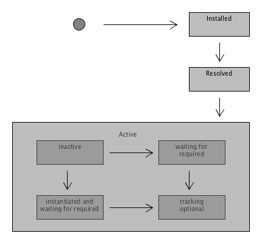
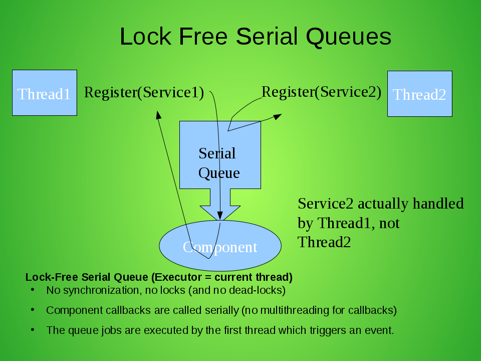
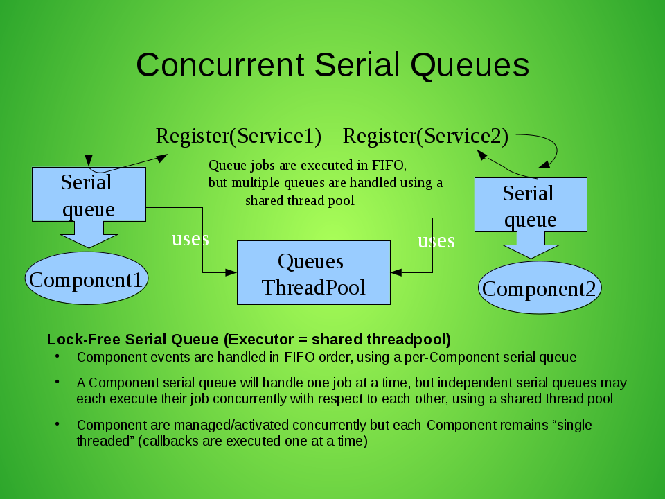
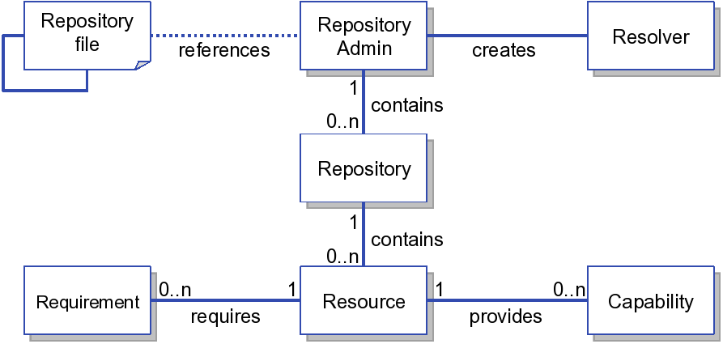
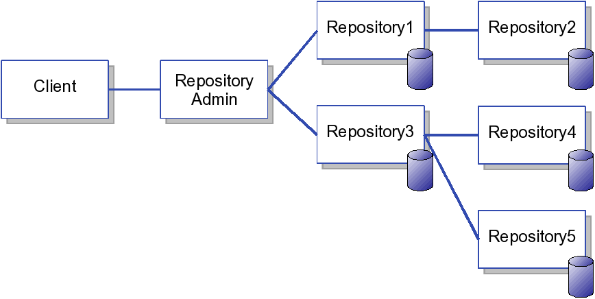

# Documentation

## Navigation

- [Documentation](#documentation)
  - [Documentation](#documentation)
    - [Documentation](#documentation)
    - [Downloads](#downloads)
    - [Getting Started](#getting-started)
    - Community
      - [Contributing](#community-contributing)
      - [Projects Using Felix](#community-projects-using-felix)
    - Development
      - [Coding Standards](#development-coding-standards)
      - [DEPENDENCIES file template](#development-dependencies-file-template)
      - [Provisional OSGi API Policy](#development-provisional-osgi-api-policy)
      - [Release Management](#development-release-management-nexus)
      - [Site How To](#development-site-how-to)
      - [Using the OSGi Compliance Tests](#development-using-the-osgi-compliance-tests)
    - [FAQS](#faqs)
      - [Apache Felix Bundle Plugin Frequently Asked Questions](#faqs-apache-felix-bundle-plugin-faq)
      - [Apache Felix SCR Plugin Frequently Asked Questions](#faqs-apache-felix-scr-plugin-faq)
    - [Subprojects](#subprojects)
      - [Apache Felix Dependency Manager](#subprojects-apache-felix-dependency-manager)
        - Guides
          - [Apache Felix Dependency Manager - Migrating from earlier versions](#subprojects-apache-felix-dependency-manager-guides-migrating-from-earlier-versions)
          - [Dependency Manager - Annotations](#subprojects-apache-felix-dependency-manager-guides-annotations)
          - [Dependency Manager - Background](#subprojects-apache-felix-dependency-manager-guides-background)
          - [Dependency Manager - Bundles and Dependencies](#subprojects-apache-felix-dependency-manager-guides-bundles-and-dependencies)
          - [Dependency Manager - Design Patterns](#subprojects-apache-felix-dependency-manager-guides-design-patterns)
          - [Dependency Manager - Development](#subprojects-apache-felix-dependency-manager-guides-development)
          - [Dependency Manager - History](#subprojects-apache-felix-dependency-manager-guides-history)
          - [Dependency Manager - JavaDocs](#subprojects-apache-felix-dependency-manager-guides-javadocs)
          - [Dependency Manager - Migrating from other solutions.](#subprojects-apache-felix-dependency-manager-guides-migrating-from-other-solutions)
          - [Dependency Manager - Performance Tuning](#subprojects-apache-felix-dependency-manager-guides-performance-tuning)
          - [Dependency Manager - Resource adapters](#subprojects-apache-felix-dependency-manager-guides-resources)
          - [Dependency Manager - What’s new in version 4?](#subprojects-apache-felix-dependency-manager-guides-whatsnew)
          - [Dependency Manager Lambda](#subprojects-apache-felix-dependency-manager-guides-dm-lambda)
          - [What’s New in R15](#subprojects-apache-felix-dependency-manager-guides-whatsnew-r15)
        - Reference
          - [Dependency Manager - Adapter](#subprojects-apache-felix-dependency-manager-reference-component-adapter)
          - [Dependency Manager - Aspect](#subprojects-apache-felix-dependency-manager-reference-component-aspect)
          - [Dependency Manager - Bundle Adapter](#subprojects-apache-felix-dependency-manager-reference-component-bundle-adapter)
          - [Dependency Manager - Bundle Dependency](#subprojects-apache-felix-dependency-manager-reference-dependency-bundle)
          - [Dependency Manager - Components](#subprojects-apache-felix-dependency-manager-reference-components)
          - [Dependency Manager - Configuration Dependency](#subprojects-apache-felix-dependency-manager-reference-dependency-configuration)
          - [Dependency Manager - External Links](#subprojects-apache-felix-dependency-manager-reference-external-links)
          - [Dependency Manager - Factory Configuration Adapter Service](#subprojects-apache-felix-dependency-manager-reference-component-factory-configuration-adapter)
          - [Dependency Manager - Resource Adapter](#subprojects-apache-felix-dependency-manager-reference-component-resource-adapter)
          - [Dependency Manager - Resource Dependency](#subprojects-apache-felix-dependency-manager-reference-dependency-resource)
          - [Dependency Manager - Service Dependency](#subprojects-apache-felix-dependency-manager-reference-dependency-service)
          - [Dependency Manager - Service Scopes](#subprojects-apache-felix-dependency-manager-reference-service-scopes)
          - [Dependency Manager - Singleton Component](#subprojects-apache-felix-dependency-manager-reference-component-singleton)
          - [Dependency Manager - Thread Model](#subprojects-apache-felix-dependency-manager-reference-thread-model)
          - [Dependency Manager Annotations](#subprojects-apache-felix-dependency-manager-reference-dm-annotations)
        - Tutorials
          - [Dependency Manager - Annotations](#subprojects-apache-felix-dependency-manager-tutorials-working-with-annotations)
          - [Dependency Manager - Getting Started](#subprojects-apache-felix-dependency-manager-tutorials-getting-started)
          - [Dependency Manager - Leveraging the shell](#subprojects-apache-felix-dependency-manager-tutorials-leveraging-the-shell)
          - [Dependency Manager sample projects](#subprojects-apache-felix-dependency-manager-tutorials-sample-code)
      - [Apache Felix Event Admin](#subprojects-apache-felix-event-admin)
      - [Apache Felix File Install](#subprojects-apache-felix-file-install)
      - [Apache Felix Framework](#subprojects-apache-felix-framework)
        - [Apache Felix Framework Bundle Cache](#subprojects-apache-felix-framework-apache-felix-framework-bundle-cache)
        - [Apache Felix Framework Configuration Properties](#subprojects-apache-felix-framework-apache-felix-framework-configuration-properties)
        - [Apache Felix Framework Frequently Asked Questions](#subprojects-apache-felix-framework-apache-felix-framework-faq)
        - [Apache Felix Framework Launching and Embedding](#subprojects-apache-felix-framework-apache-felix-framework-launching-and-embedding)
        - [Apache Felix Framework Usage Documentation](#subprojects-apache-felix-framework-apache-felix-framework-usage-documentation)
      - [Apache Felix Framework Security](#subprojects-apache-felix-framework-security)
      - [Apache Felix Gogo](#subprojects-apache-felix-gogo)
        - [RFC 147 Overview](#subprojects-apache-felix-gogo-rfc-147-overview)
      - [Apache Felix Health Checks](#subprojects-apache-felix-healthchecks)
      - [Apache Felix Inventory Printer](#subprojects-apache-felix-inventory)
      - [Apache Felix Log](#subprojects-apache-felix-log)
      - [Apache Felix Logback](#subprojects-apache-felix-logback)
      - [Apache Felix Maven Bundle Plugin (BND)](#subprojects-apache-felix-maven-bundle-plugin-bnd)
      - [Apache Felix Metatype Service](#subprojects-apache-felix-metatype-service)
      - [Apache Felix OSGi Bundle Repository (OBR)](#subprojects-apache-felix-osgi-bundle-repository)
      - [Apache Felix Preferences Service](#subprojects-apache-felix-preferences-service)
      - [Apache Felix Remote Shell](#subprojects-apache-felix-remote-shell)
      - [Apache Felix Shell](#subprojects-apache-felix-shell)
      - [Apache Felix Shell TUI](#subprojects-apache-felix-shell-tui)
      - [Apache Felix Web Console](#subprojects-apache-felix-web-console)
        - [Extending the Apache Felix Web Console](#subprojects-apache-felix-web-console-extending-the-apache-felix-web-console)
        - [Web Console RESTful API](#subprojects-apache-felix-web-console-web-console-restful-api)
        - [Web Console Security Provider](#subprojects-apache-felix-web-console-web-console-security-provider)
        - Extensions
          - [Branding the Web Console](#subprojects-apache-felix-web-console-extending-the-apache-felix-web-console-branding-the-web-console)
          - [Providing Resources](#subprojects-apache-felix-web-console-extending-the-apache-felix-web-console-providing-resources)
          - [Providing Web Console Plugins](#subprojects-apache-felix-web-console-extending-the-apache-felix-web-console-providing-web-console-plugins)
          - [Web Console Logging](#subprojects-apache-felix-web-console-extending-the-apache-felix-web-console-web-console-logging)
          - [Web Console Output Templating](#subprojects-apache-felix-web-console-extending-the-apache-felix-web-console-web-console-output-templating)
    - [Tutorials](#tutorials-examples-and-presentations)
      - [Apache Felix Application Demonstration](#tutorials-examples-and-presentations-apache-felix-application-demonstration)
      - [Apache Felix OSGi Tutorial](#tutorials-examples-and-presentations-apache-felix-osgi-tutorial)
      - [OSGi Frequently Asked Questions](#tutorials-examples-and-presentations-apache-felix-osgi-faq)
      - OSGI Tutorial
        - [Apache Felix Tutorial Example 1 - Service Event Listener Bundle](#tutorials-examples-and-presentations-apache-felix-osgi-tutorial-apache-felix-tutorial-example-1)
        - [Apache Felix Tutorial Example 2](#tutorials-examples-and-presentations-apache-felix-osgi-tutorial-apache-felix-tutorial-example-2)
        - [Apache Felix Tutorial Example 2b](#tutorials-examples-and-presentations-apache-felix-osgi-tutorial-apache-felix-tutorial-example-2b)
        - [Apache Felix Tutorial Example 3](#tutorials-examples-and-presentations-apache-felix-osgi-tutorial-apache-felix-tutorial-example-3)
        - [Apache Felix Tutorial Example 4](#tutorials-examples-and-presentations-apache-felix-osgi-tutorial-apache-felix-tutorial-example-4)
        - [Apache Felix Tutorial Example 5](#tutorials-examples-and-presentations-apache-felix-osgi-tutorial-apache-felix-tutorial-example-5)
        - [Example 6 - Spell Checker Service Bundle](#tutorials-examples-and-presentations-apache-felix-osgi-tutorial-apache-felix-tutorial-example-6)
        - [Example 7 - Spell Checker Client Bundle](#tutorials-examples-and-presentations-apache-felix-osgi-tutorial-apache-felix-tutorial-example-7)
        - [Example 8 - Spell Checker Service using Service Binder](#tutorials-examples-and-presentations-apache-felix-osgi-tutorial-apache-felix-tutorial-example-8)
        - [Example 9 - Spell Checker Service using Declarative Services](#tutorials-examples-and-presentations-apache-felix-osgi-tutorial-apache-felix-tutorial-example-9)
    - [Site map](#site-map)
  - [master](#index)
- Other pages
  - [Apache Felix Maven SCR Plugin Use](#subprojects-apache-felix-maven-scr-plugin-apache-felix-maven-scr-plugin-use)
  - [Apache Felix SCR Ant Task Use](#subprojects-apache-felix-maven-scr-plugin-apache-felix-scr-ant-task-use)
  - [Apache Felix SCR Annotations BndTools Use](#subprojects-apache-felix-maven-scr-plugin-apache-felix-scr-bndtools-use)
  - [Extending SCR Annotations Excerpt: How add new Annotations extending the base Annotations](#subprojects-apache-felix-maven-scr-plugin-extending-scr-annotations)
  - [SCR Annotations Excerpt: Using Java 5 Annotations to describe the component or service.](#subprojects-apache-felix-maven-scr-plugin-scr-annotations)

## Content

<a id="documentation"></a>

<!-- source_url: https://felix.apache.org/documentation/documentation.html -->

<!-- page_index: 1 -->

# Documentation

[Edit this Page](https://github.com/apache/felix-antora-site/edit/main/modules/ROOT/pages/documentation.adoc)

---

<a id="downloads"></a>

<!-- source_url: https://felix.apache.org/documentation/downloads.html -->

<!-- page_index: 2 -->

# Downloads

[Edit this Page](https://github.com/apache/felix-antora-site/edit/main/modules/ROOT/pages/downloads.adoc)

<a id="downloads--downloads"></a>

# Downloads

Use the [KEYS](https://downloads.apache.org/felix/KEYS) file contents to [validate](https://www.apache.org/info/verification.html) the artifacts.

If available, the version links to the subproject changelog.

<a id="downloads--_felix_framework_distribution"></a>
<a id="downloads--felix-framework-distribution"></a>

## Felix Framework Distribution

Module

Version

Binary

tar.gz Source

zip Source

Framework

[7.0.5](https://github.com/apache/felix-dev/blob/master/framework/doc/changelog.txt)

[zip](https://www.apache.org/dyn/closer.lua/felix/org.apache.felix.main.distribution-7.0.5.zip?action=download) ([asc](https://www.apache.org/dist/felix/org.apache.felix.main.distribution-7.0.5.jar.asc), [sha1](https://www.apache.org/dist/felix/org.apache.felix.main.distribution-7.0.5.jar.sha1))

[tar.gz](https://www.apache.org/dyn/closer.lua/felix/org.apache.felix.main.distribution-7.0.5-source-release.tar.gz?action=download) ([asc](https://www.apache.org/dist/felix/org.apache.felix.main.distribution-7.0.5-source-release.tar.gz.asc), [sha1](https://www.apache.org/dist/felix/org.apache.felix.main.distribution-7.0.5-source-release.tar.gz.sha1))

[zip](https://www.apache.org/dyn/closer.lua/felix/org.apache.felix.main.distribution-7.0.5-source-release.zip?action=download) ([asc](https://www.apache.org/dist/felix/org.apache.felix.main.distribution-7.0.5-source-release.zip.asc), [sha1](https://www.apache.org/dist/felix/org.apache.felix.main.distribution-7.0.5-source-release.zip.sha1))

<a id="downloads--_subprojects"></a>
<a id="downloads--subprojects"></a>

## Subprojects

| Module | Version | Binary | tar.gz Source | zip Source |
| --- | --- | --- | --- | --- |
| Atomos | 1.0.0 |  | [tar.gz](https://www.apache.org/dyn/closer.lua/felix/atomos-distribution-1.0.0-source-release.tar.gz?action=download) ([asc](https://www.apache.org/dist/felix/atomos-distribution-1.0.0-source-release.tar.gz.asc), [sha1](https://www.apache.org/dist/felix/atomos-distribution-1.0.0-source-release.tar.gz.sha1)) | [zip](https://www.apache.org/dyn/closer.lua/felix/atomos-distribution-1.0.0-source-release.zip?action=download) ([asc](https://www.apache.org/dist/felix/atomos-distribution-1.0.0-source-release.zip.asc), [sha1](https://www.apache.org/dist/felix/atomos-distribution-1.0.0-source-release.zip.sha1)) |
| Bundle Repository | [2.0.10](https://github.com/apache/felix-dev/blob/master/bundlerepository/doc/changelog.txt) | [jar](https://www.apache.org/dyn/closer.lua/felix/org.apache.felix.bundlerepository-2.0.10.jar?action=download) ([asc](https://www.apache.org/dist/felix/org.apache.felix.bundlerepository-2.0.10.jar.asc), [sha1](https://www.apache.org/dist/felix/org.apache.felix.bundlerepository-2.0.10.jar.sha1)) | [tar.gz](https://www.apache.org/dyn/closer.lua/felix/org.apache.felix.bundlerepository-2.0.10-source-release.tar.gz?action=download) ([asc](https://www.apache.org/dist/felix/org.apache.felix.bundlerepository-2.0.10-source-release.tar.gz.asc), [sha1](https://www.apache.org/dist/felix/org.apache.felix.bundlerepository-2.0.10-source-release.tar.gz.sha1)) | [zip](https://www.apache.org/dyn/closer.lua/felix/org.apache.felix.bundlerepository-2.0.10-source-release.zip?action=download) ([asc](https://www.apache.org/dist/felix/org.apache.felix.bundlerepository-2.0.10-source-release.zip.asc), [sha1](https://www.apache.org/dist/felix/org.apache.felix.bundlerepository-2.0.10-source-release.zip.sha1)) |
| CM Json | 2.0.0 | [jar](https://www.apache.org/dyn/closer.lua/felix/org.apache.felix.cm.json-2.0.0.jar?action=download) ([asc](https://www.apache.org/dist/felix/org.apache.felix.cm.json-2.0.0.jar.asc), [sha1](https://www.apache.org/dist/felix/org.apache.felix.cm.json-2.0.0.jar.sha1)) | [tar.gz](https://www.apache.org/dyn/closer.lua/felix/org.apache.felix.cm.json-2.0.0-source-release.tar.gz?action=download) ([asc](https://www.apache.org/dist/felix/org.apache.felix.cm.json-2.0.0-source-release.tar.gz.asc), [sha1](https://www.apache.org/dist/felix/org.apache.felix.cm.json-2.0.0-source-release.tar.gz.sha1)) | [zip](https://www.apache.org/dyn/closer.lua/felix/org.apache.felix.cm.json-2.0.0-source-release.zip?action=download) ([asc](https://www.apache.org/dist/felix/org.apache.felix.cm.json-2.0.0-source-release.zip.asc), [sha1](https://www.apache.org/dist/felix/org.apache.felix.cm.json-2.0.0-source-release.zip.sha1)) |
| Configuration Admin | [1.9.26](https://github.com/apache/felix-dev/blob/master/configadmin/changelog.txt) | [jar](https://www.apache.org/dyn/closer.lua/felix/org.apache.felix.configadmin-1.9.26.jar?action=download) ([asc](https://www.apache.org/dist/felix/org.apache.felix.configadmin-1.9.26.jar.asc), [sha1](https://www.apache.org/dist/felix/org.apache.felix.configadmin-1.9.26.jar.sha1)) | [tar.gz](https://www.apache.org/dyn/closer.lua/felix/org.apache.felix.configadmin-1.9.26-source-release.tar.gz?action=download) ([asc](https://www.apache.org/dist/felix/org.apache.felix.configadmin-1.9.26-source-release.tar.gz.asc), [sha1](https://www.apache.org/dist/felix/org.apache.felix.configadmin-1.9.26-source-release.tar.gz.sha1)) | [zip](https://www.apache.org/dyn/closer.lua/felix/org.apache.felix.configadmin-1.9.26-source-release.zip?action=download) ([asc](https://www.apache.org/dist/felix/org.apache.felix.configadmin-1.9.26-source-release.zip.asc), [sha1](https://www.apache.org/dist/felix/org.apache.felix.configadmin-1.9.26-source-release.zip.sha1)) |
| Configurator | 1.0.18 | [jar](https://www.apache.org/dyn/closer.lua/felix/org.apache.felix.configurator-1.0.18.jar?action=download) ([asc](https://www.apache.org/dist/felix/org.apache.felix.configurator-1.0.18.jar.asc), [sha1](https://www.apache.org/dist/felix/org.apache.felix.configurator-1.0.18.jar.sha1)) | [tar.gz](https://www.apache.org/dyn/closer.lua/felix/org.apache.felix.configurator-1.0.18-source-release.tar.gz?action=download) ([asc](https://www.apache.org/dist/felix/org.apache.felix.configurator-1.0.18-source-release.tar.gz.asc), [sha1](https://www.apache.org/dist/felix/org.apache.felix.configurator-1.0.18-source-release.tar.gz.sha1)) | [zip](https://www.apache.org/dyn/closer.lua/felix/org.apache.felix.configurator-1.0.18-source-release.zip?action=download) ([asc](https://www.apache.org/dist/felix/org.apache.felix.configurator-1.0.18-source-release.zip.asc), [sha1](https://www.apache.org/dist/felix/org.apache.felix.configurator-1.0.18-source-release.zip.sha1)) |
| Configuration Admin Interpolation Plugin | 1.2.8 | [jar](https://www.apache.org/dyn/closer.lua/felix/org.apache.felix.configadmin.plugin.interpolation-1.2.8.jar?action=download) ([asc](https://www.apache.org/dist/felix/org.apache.felix.configadmin.plugin.interpolation-1.2.8.jar.asc), [sha1](https://www.apache.org/dist/felix/org.apache.felix.configadmin.plugin.interpolation-1.2.8.jar.sha1)) | [tar.gz](https://www.apache.org/dyn/closer.lua/felix/org.apache.felix.configadmin.plugin.interpolation-1.2.8-source-release.tar.gz?action=download) ([asc](https://www.apache.org/dist/felix/org.apache.felix.configadmin.plugin.interpolation-1.2.8-source-release.tar.gz.asc), [sha1](https://www.apache.org/dist/felix/org.apache.felix.configadmin.plugin.interpolation-1.2.8-source-release.tar.gz.sha1)) | [zip](https://www.apache.org/dyn/closer.lua/felix/org.apache.felix.configadmin.plugin.interpolation-1.2.8-source-release.zip?action=download) ([asc](https://www.apache.org/dist/felix/org.apache.felix.configadmin.plugin.interpolation-1.2.8-source-release.zip.asc), [sha1](https://www.apache.org/dist/felix/org.apache.felix.configadmin.plugin.interpolation-1.2.8-source-release.zip.sha1)) |
| Converter | 1.0.12 | [jar](https://www.apache.org/dyn/closer.lua/felix/org.apache.felix.converter-1.0.12.jar?action=download) ([asc](https://www.apache.org/dist/felix/org.apache.felix.converter-1.0.12.jar.asc), [sha1](https://www.apache.org/dist/felix/org.apache.felix.converter-1.0.12.jar.sha1)) | [tar.gz](https://www.apache.org/dyn/closer.lua/felix/org.apache.felix.converter-1.0.12-source-release.tar.gz?action=download) ([asc](https://www.apache.org/dist/felix/org.apache.felix.converter-1.0.12-source-release.tar.gz.asc), [sha1](https://www.apache.org/dist/felix/org.apache.felix.converter-1.0.12-source-release.tar.gz.sha1)) | [zip](https://www.apache.org/dyn/closer.lua/felix/org.apache.felix.converter-1.0.12-source-release.zip?action=download) ([asc](https://www.apache.org/dist/felix/org.apache.felix.converter-1.0.12-source-release.zip.asc), [sha1](https://www.apache.org/dist/felix/org.apache.felix.converter-1.0.12-source-release.zip.sha1)) |
| Coordinator | 1.0.2 | [jar](https://www.apache.org/dyn/closer.lua/felix/org.apache.felix.coordinator-1.0.2.jar?action=download) ([asc](https://www.apache.org/dist/felix/org.apache.felix.coordinator-1.0.2.jar.asc), [sha1](https://www.apache.org/dist/felix/org.apache.felix.coordinator-1.0.2.jar.sha1)) | [tar.gz](https://www.apache.org/dyn/closer.lua/felix/org.apache.felix.coordinator-1.0.2-source-release.tar.gz?action=download) ([asc](https://www.apache.org/dist/felix/org.apache.felix.coordinator-1.0.2-source-release.tar.gz.asc), [sha1](https://www.apache.org/dist/felix/org.apache.felix.coordinator-1.0.2-source-release.tar.gz.sha1)) | [zip](https://www.apache.org/dyn/closer.lua/felix/org.apache.felix.coordinator-1.0.2-source-release.zip?action=download) ([asc](https://www.apache.org/dist/felix/org.apache.felix.coordinator-1.0.2-source-release.zip.asc), [sha1](https://www.apache.org/dist/felix/org.apache.felix.coordinator-1.0.2-source-release.zip.sha1)) |
| Dependency Manager 4 | [r16](https://github.com/apache/felix-dev/blob/master/dependencymanager/org.apache.felix.dependencymanager/changelog.txt) | [jar](https://www.apache.org/dyn/closer.lua/felix/org.apache.felix.dependencymanager-r16.jar?action=download) ([asc](https://www.apache.org/dist/felix/org.apache.felix.dependencymanager-r16.jar.asc), [sha1](https://www.apache.org/dist/felix/org.apache.felix.dependencymanager-r16.jar.sha1)) |  | [zip](https://www.apache.org/dyn/closer.lua/felix/org.apache.felix.dependencymanager-r16-src.zip?action=download) ([asc](https://www.apache.org/dist/felix/org.apache.felix.dependencymanager-r16-src.zip.asc), [sha1](https://www.apache.org/dist/felix/org.apache.felix.dependencymanager-r16-src.zip.sha1)) |
| Deployment Admin | [0.9.10](https://github.com/apache/felix-dev/blob/master/deploymentadmin/deploymentadmin/changelog.txt) | [jar](https://www.apache.org/dyn/closer.lua/felix/org.apache.felix.deploymentadmin-0.9.10.jar?action=download) ([asc](https://www.apache.org/dist/felix/org.apache.felix.deploymentadmin-0.9.10.jar.asc), [sha1](https://www.apache.org/dist/felix/org.apache.felix.deploymentadmin-0.9.10.jar.sha1)) | [tar.gz](https://www.apache.org/dyn/closer.lua/felix/org.apache.felix.deploymentadmin-0.9.10-source-release.tar.gz?action=download) ([asc](https://www.apache.org/dist/felix/org.apache.felix.deploymentadmin-0.9.10-source-release.tar.gz.asc), [sha1](https://www.apache.org/dist/felix/org.apache.felix.deploymentadmin-0.9.10-source-release.tar.gz.sha1)) | [zip](https://www.apache.org/dyn/closer.lua/felix/org.apache.felix.deploymentadmin-0.9.10-source-release.zip?action=download) ([asc](https://www.apache.org/dist/felix/org.apache.felix.deploymentadmin-0.9.10-source-release.zip.asc), [sha1](https://www.apache.org/dist/felix/org.apache.felix.deploymentadmin-0.9.10-source-release.zip.sha1)) |
| Event Admin | [1.6.4](https://github.com/apache/felix-dev/blob/master/eventadmin/impl/changelog.txt) | [jar](https://www.apache.org/dyn/closer.lua/felix/org.apache.felix.eventadmin-1.6.4.jar?action=download) ([asc](https://www.apache.org/dist/felix/org.apache.felix.eventadmin-1.6.4.jar.asc), [sha1](https://www.apache.org/dist/felix/org.apache.felix.eventadmin-1.6.4.jar.sha1)) | [tar.gz](https://www.apache.org/dyn/closer.lua/felix/org.apache.felix.eventadmin-1.6.4-source-release.tar.gz?action=download) ([asc](https://www.apache.org/dist/felix/org.apache.felix.eventadmin-1.6.4-source-release.tar.gz.asc), [sha1](https://www.apache.org/dist/felix/org.apache.felix.eventadmin-1.6.4-source-release.tar.gz.sha1)) | [zip](https://www.apache.org/dyn/closer.lua/felix/org.apache.felix.eventadmin-1.6.4-source-release.zip?action=download) ([asc](https://www.apache.org/dist/felix/org.apache.felix.eventadmin-1.6.4-source-release.zip.asc), [sha1](https://www.apache.org/dist/felix/org.apache.felix.eventadmin-1.6.4-source-release.zip.sha1)) |
| Feature | 1.0.2 | [jar](https://www.apache.org/dyn/closer.lua/felix/org.apache.felix.feature-1.0.2.jar?action=download) ([asc](https://www.apache.org/dist/felix/org.apache.felix.feature-1.0.2.jar.asc), [sha1](https://www.apache.org/dist/felix/org.apache.felix.feature-1.0.2.jar.sha1)) | [tar.gz](https://www.apache.org/dyn/closer.lua/felix/org.apache.felix.feature-1.0.2-source-release.tar.gz?action=download) ([asc](https://www.apache.org/dist/felix/org.apache.felix.feature-1.0.2-source-release.tar.gz.asc), [sha1](https://www.apache.org/dist/felix/org.apache.felix.feature-1.0.2-source-release.tar.gz.sha1)) | [zip](https://www.apache.org/dyn/closer.lua/felix/org.apache.felix.feature-1.0.2-source-release.zip?action=download) ([asc](https://www.apache.org/dist/felix/org.apache.felix.feature-1.0.2-source-release.zip.asc), [sha1](https://www.apache.org/dist/felix/org.apache.felix.feature-1.0.2-source-release.zip.sha1)) |
| File Install | [3.6.4](https://github.com/apache/felix-dev/blob/master/fileinstall/doc/changelog.txt) | [jar](https://www.apache.org/dyn/closer.lua/felix/org.apache.felix.fileinstall-3.6.4.jar?action=download) ([asc](https://www.apache.org/dist/felix/org.apache.felix.fileinstall-3.6.4.jar.asc), [sha1](https://www.apache.org/dist/felix/org.apache.felix.fileinstall-3.6.4.jar.sha1)) | [tar.gz](https://www.apache.org/dyn/closer.lua/felix/org.apache.felix.fileinstall-3.6.4-source-release.tar.gz?action=download) ([asc](https://www.apache.org/dist/felix/org.apache.felix.fileinstall-3.6.4-source-release.tar.gz.asc), [sha1](https://www.apache.org/dist/felix/org.apache.felix.fileinstall-3.6.4-source-release.tar.gz.sha1)) | [zip](https://www.apache.org/dyn/closer.lua/felix/org.apache.felix.fileinstall-3.6.4-source-release.zip?action=download) ([asc](https://www.apache.org/dist/felix/org.apache.felix.fileinstall-3.6.4-source-release.zip.asc), [sha1](https://www.apache.org/dist/felix/org.apache.felix.fileinstall-3.6.4-source-release.zip.sha1)) |
| Framework | [7.0.5](https://github.com/apache/felix-dev/blob/master/framework/doc/changelog.txt) | [jar](https://www.apache.org/dyn/closer.lua/felix/org.apache.felix.framework-7.0.5.jar?action=download) ([asc](https://www.apache.org/dist/felix/org.apache.felix.framework-7.0.5.jar.asc), [sha1](https://www.apache.org/dist/felix/org.apache.felix.framework-7.0.5.jar.sha1)) | [tar.gz](https://www.apache.org/dyn/closer.lua/felix/org.apache.felix.framework-7.0.5-source-release.tar.gz?action=download) ([asc](https://www.apache.org/dist/felix/org.apache.felix.framework-7.0.5-source-release.tar.gz.asc), [sha1](https://www.apache.org/dist/felix/org.apache.felix.framework-7.0.5-source-release.tar.gz.sha1)) | [zip](https://www.apache.org/dyn/closer.lua/felix/org.apache.felix.framework-7.0.5-source-release.zip?action=download) ([asc](https://www.apache.org/dist/felix/org.apache.felix.framework-7.0.5-source-release.zip.asc), [sha1](https://www.apache.org/dist/felix/org.apache.felix.framework-7.0.5-source-release.zip.sha1)) |
| Framework Security | [2.8.3](https://github.com/apache/felix-dev/blob/master/framework.security/doc/changelog.txt) | [jar](https://www.apache.org/dyn/closer.lua/felix/org.apache.felix.framework.security-2.8.3.jar?action=download) ([asc](https://www.apache.org/dist/felix/org.apache.felix.framework.security-2.8.3.jar.asc), [sha1](https://www.apache.org/dist/felix/org.apache.felix.framework.security-2.8.3.jar.sha1)) | [tar.gz](https://www.apache.org/dyn/closer.lua/felix/org.apache.felix.framework.security-2.8.3-source-release.tar.gz?action=download) ([asc](https://www.apache.org/dist/felix/org.apache.felix.framework.security-2.8.3-source-release.tar.gz.asc), [sha1](https://www.apache.org/dist/felix/org.apache.felix.framework.security-2.8.3-source-release.tar.gz.sha1)) | [zip](https://www.apache.org/dyn/closer.lua/felix/org.apache.felix.framework.security-2.8.3-source-release.zip?action=download) ([asc](https://www.apache.org/dist/felix/org.apache.felix.framework.security-2.8.3-source-release.zip.asc), [sha1](https://www.apache.org/dist/felix/org.apache.felix.framework.security-2.8.3-source-release.zip.sha1)) |
| Gogo Command | [1.1.2](https://github.com/apache/felix-dev/blob/master/gogo/command/doc/changelog.txt) | [jar](https://www.apache.org/dyn/closer.lua/felix/org.apache.felix.gogo.command-1.1.2.jar?action=download) ([asc](https://www.apache.org/dist/felix/org.apache.felix.gogo.command-1.1.2.jar.asc), [sha1](https://www.apache.org/dist/felix/org.apache.felix.gogo.command-1.1.2.jar.sha1)) | [tar.gz](https://www.apache.org/dyn/closer.lua/felix/org.apache.felix.gogo.command-1.1.2-project.tar.gz?action=download) ([asc](https://www.apache.org/dist/felix/org.apache.felix.gogo.command-1.1.2-project.tar.gz.asc), [sha1](https://www.apache.org/dist/felix/org.apache.felix.gogo.command-1.1.2-project.tar.gz.sha1)) | [zip](https://www.apache.org/dyn/closer.lua/felix/org.apache.felix.gogo.command-1.1.2-project.zip?action=download) ([asc](https://www.apache.org/dist/felix/org.apache.felix.gogo.command-1.1.2-project.zip.asc), [sha1](https://www.apache.org/dist/felix/org.apache.felix.gogo.command-1.1.2-project.zip.sha1)) |
| Gogo JLine | [1.1.8](https://github.com/apache/felix-dev/blob/master/gogo/jline/doc/changelog.txt) | [jar](https://www.apache.org/dyn/closer.lua/felix/org.apache.felix.gogo.jline-1.1.8.jar?action=download) ([asc](https://www.apache.org/dist/felix/org.apache.felix.gogo.jline-1.1.8.jar.asc), [sha1](https://www.apache.org/dist/felix/org.apache.felix.gogo.jline-1.1.8.jar.sha1)) | [tar.gz](https://www.apache.org/dyn/closer.lua/felix/org.apache.felix.gogo.jline-1.1.8-project.tar.gz?action=download) ([asc](https://www.apache.org/dist/felix/org.apache.felix.gogo.jline-1.1.8-project.tar.gz.asc), [sha1](https://www.apache.org/dist/felix/org.apache.felix.gogo.jline-1.1.8-project.tar.gz.sha1)) | [zip](https://www.apache.org/dyn/closer.lua/felix/org.apache.felix.gogo.jline-1.1.8-project.zip?action=download) ([asc](https://www.apache.org/dist/felix/org.apache.felix.gogo.jline-1.1.8-project.zip.asc), [sha1](https://www.apache.org/dist/felix/org.apache.felix.gogo.jline-1.1.8-project.zip.sha1)) |
| Gogo Runtime | [1.1.4](https://github.com/apache/felix-dev/blob/master/gogo/runtime/doc/changelog.txt) | [jar](https://www.apache.org/dyn/closer.lua/felix/org.apache.felix.gogo.runtime-1.1.4.jar?action=download) ([asc](https://www.apache.org/dist/felix/org.apache.felix.gogo.runtime-1.1.4.jar.asc), [sha1](https://www.apache.org/dist/felix/org.apache.felix.gogo.runtime-1.1.4.jar.sha1)) | [tar.gz](https://www.apache.org/dyn/closer.lua/felix/org.apache.felix.gogo.runtime-1.1.4-project.tar.gz?action=download) ([asc](https://www.apache.org/dist/felix/org.apache.felix.gogo.runtime-1.1.4-project.tar.gz.asc), [sha1](https://www.apache.org/dist/felix/org.apache.felix.gogo.runtime-1.1.4-project.tar.gz.sha1)) | [zip](https://www.apache.org/dyn/closer.lua/felix/org.apache.felix.gogo.runtime-1.1.4-project.zip?action=download) ([asc](https://www.apache.org/dist/felix/org.apache.felix.gogo.runtime-1.1.4-project.zip.asc), [sha1](https://www.apache.org/dist/felix/org.apache.felix.gogo.runtime-1.1.4-project.zip.sha1)) |
| Gogo Shell | [1.1.4](https://github.com/apache/felix-dev/blob/master/gogo/shell/doc/changelog.txt) | [jar](https://www.apache.org/dyn/closer.lua/felix/org.apache.felix.gogo.shell-1.1.4.jar?action=download) ([asc](https://www.apache.org/dist/felix/org.apache.felix.gogo.shell-1.1.4.jar.asc), [sha1](https://www.apache.org/dist/felix/org.apache.felix.gogo.shell-1.1.4.jar.sha1)) | [tar.gz](https://www.apache.org/dyn/closer.lua/felix/org.apache.felix.gogo.shell-1.1.4-project.tar.gz?action=download) ([asc](https://www.apache.org/dist/felix/org.apache.felix.gogo.shell-1.1.4-project.tar.gz.asc), [sha1](https://www.apache.org/dist/felix/org.apache.felix.gogo.shell-1.1.4-project.tar.gz.sha1)) | [zip](https://www.apache.org/dyn/closer.lua/felix/org.apache.felix.gogo.shell-1.1.4-project.zip?action=download) ([asc](https://www.apache.org/dist/felix/org.apache.felix.gogo.shell-1.1.4-project.zip.asc), [sha1](https://www.apache.org/dist/felix/org.apache.felix.gogo.shell-1.1.4-project.zip.sha1)) |
| Health Check Annotations | 2.0.0 | [jar](https://www.apache.org/dyn/closer.lua/felix/org.apache.felix.healthcheck.annotation-2.0.0.jar?action=download) ([asc](https://www.apache.org/dist/felix/org.apache.felix.healthcheck.annotation-2.0.0.jar.asc), [sha1](https://www.apache.org/dist/felix/org.apache.felix.healthcheck.annotation-2.0.0.jar.sha1)) | [tar.gz](https://www.apache.org/dyn/closer.lua/felix/org.apache.felix.healthcheck.annotation-2.0.0-project.tar.gz?action=download) ([asc](https://www.apache.org/dist/felix/org.apache.felix.healthcheck.annotation-2.0.0-project.tar.gz.asc), [sha1](https://www.apache.org/dist/felix/org.apache.felix.healthcheck.annotation-2.0.0-project.tar.gz.sha1)) | [zip](https://www.apache.org/dyn/closer.lua/felix/org.apache.felix.healthcheck.annotation-2.0.0-project.zip?action=download) ([asc](https://www.apache.org/dist/felix/org.apache.felix.healthcheck.annotation-2.0.0-project.zip.asc), [sha1](https://www.apache.org/dist/felix/org.apache.felix.healthcheck.annotation-2.0.0-project.zip.sha1)) |
| Health Check API | 2.0.4 | [jar](https://www.apache.org/dyn/closer.lua/felix/org.apache.felix.healthcheck.api-2.0.4.jar?action=download) ([asc](https://www.apache.org/dist/felix/org.apache.felix.healthcheck.api-2.0.4.jar.asc), [sha1](https://www.apache.org/dist/felix/org.apache.felix.healthcheck.api-2.0.4.jar.sha1)) | [tar.gz](https://www.apache.org/dyn/closer.lua/felix/org.apache.felix.healthcheck.api-2.0.4-project.tar.gz?action=download) ([asc](https://www.apache.org/dist/felix/org.apache.felix.healthcheck.api-2.0.4-project.tar.gz.asc), [sha1](https://www.apache.org/dist/felix/org.apache.felix.healthcheck.api-2.0.4-project.tar.gz.sha1)) | [zip](https://www.apache.org/dyn/closer.lua/felix/org.apache.felix.healthcheck.api-2.0.4-project.zip?action=download) ([asc](https://www.apache.org/dist/felix/org.apache.felix.healthcheck.api-2.0.4-project.zip.asc), [sha1](https://www.apache.org/dist/felix/org.apache.felix.healthcheck.api-2.0.4-project.zip.sha1)) |
| Health Check Core | 2.3.0 | [jar](https://www.apache.org/dyn/closer.lua/felix/org.apache.felix.healthcheck.core-2.3.0.jar?action=download) ([asc](https://www.apache.org/dist/felix/org.apache.felix.healthcheck.core-2.3.0.jar.asc), [sha1](https://www.apache.org/dist/felix/org.apache.felix.healthcheck.core-2.3.0.jar.sha1)) | [tar.gz](https://www.apache.org/dyn/closer.lua/felix/org.apache.felix.healthcheck.core-2.3.0-project.tar.gz?action=download) ([asc](https://www.apache.org/dist/felix/org.apache.felix.healthcheck.core-2.3.0-project.tar.gz.asc), [sha1](https://www.apache.org/dist/felix/org.apache.felix.healthcheck.core-2.3.0-project.tar.gz.sha1)) | [zip](https://www.apache.org/dyn/closer.lua/felix/org.apache.felix.healthcheck.core-2.3.0-project.zip?action=download) ([asc](https://www.apache.org/dist/felix/org.apache.felix.healthcheck.core-2.3.0-project.zip.asc), [sha1](https://www.apache.org/dist/felix/org.apache.felix.healthcheck.core-2.3.0-project.zip.sha1)) |
| Health Check General Checks | 3.0.8 | [jar](https://www.apache.org/dyn/closer.lua/felix/org.apache.felix.healthcheck.generalchecks-3.0.8.jar?action=download) ([asc](https://www.apache.org/dist/felix/org.apache.felix.healthcheck.generalchecks-3.0.8.jar.asc), [sha1](https://www.apache.org/dist/felix/org.apache.felix.healthcheck.generalchecks-3.0.8.jar.sha1)) | [tar.gz](https://www.apache.org/dyn/closer.lua/felix/org.apache.felix.healthcheck.generalchecks-3.0.8-project.tar.gz?action=download) ([asc](https://www.apache.org/dist/felix/org.apache.felix.healthcheck.generalchecks-3.0.8-project.tar.gz.asc), [sha1](https://www.apache.org/dist/felix/org.apache.felix.healthcheck.generalchecks-3.0.8-project.tar.gz.sha1)) | [zip](https://www.apache.org/dyn/closer.lua/felix/org.apache.felix.healthcheck.generalchecks-3.0.8-project.zip?action=download) ([asc](https://www.apache.org/dist/felix/org.apache.felix.healthcheck.generalchecks-3.0.8-project.zip.asc), [sha1](https://www.apache.org/dist/felix/org.apache.felix.healthcheck.generalchecks-3.0.8-project.zip.sha1)) |
| Health Check Webconsole Plugin | 2.2.0 | [jar](https://www.apache.org/dyn/closer.lua/felix/org.apache.felix.healthcheck.webconsoleplugin-2.2.0.jar?action=download) ([asc](https://www.apache.org/dist/felix/org.apache.felix.healthcheck.webconsoleplugin-2.2.0.jar.asc), [sha1](https://www.apache.org/dist/felix/org.apache.felix.healthcheck.webconsoleplugin-2.2.0.jar.sha1)) | [tar.gz](https://www.apache.org/dyn/closer.lua/felix/org.apache.felix.healthcheck.webconsoleplugin-2.2.0-project.tar.gz?action=download) ([asc](https://www.apache.org/dist/felix/org.apache.felix.healthcheck.webconsoleplugin-2.2.0-project.tar.gz.asc), [sha1](https://www.apache.org/dist/felix/org.apache.felix.healthcheck.webconsoleplugin-2.2.0-project.tar.gz.sha1)) | [zip](https://www.apache.org/dyn/closer.lua/felix/org.apache.felix.healthcheck.webconsoleplugin-2.2.0-project.zip?action=download) ([asc](https://www.apache.org/dist/felix/org.apache.felix.healthcheck.webconsoleplugin-2.2.0-project.zip.asc), [sha1](https://www.apache.org/dist/felix/org.apache.felix.healthcheck.webconsoleplugin-2.2.0-project.zip.sha1)) |
| HTTP Service Base | 5.1.16 | [jar](https://www.apache.org/dyn/closer.lua/felix/org.apache.felix.http.base-5.1.16.jar?action=download) ([asc](https://www.apache.org/dist/felix/org.apache.felix.http.base-5.1.16.jar.asc), [sha1](https://www.apache.org/dist/felix/org.apache.felix.http.base-5.1.16.jar.sha1)) | [tar.gz](https://www.apache.org/dyn/closer.lua/felix/org.apache.felix.http.base-5.1.16-source-release.tar.gz?action=download) ([asc](https://www.apache.org/dist/felix/org.apache.felix.http.base-5.1.16-source-release.tar.gz.asc), [sha1](https://www.apache.org/dist/felix/org.apache.felix.http.base-5.1.16-source-release.tar.gz.sha1)) | [zip](https://www.apache.org/dyn/closer.lua/felix/org.apache.felix.http.base-5.1.16-source-release.zip?action=download) ([asc](https://www.apache.org/dist/felix/org.apache.felix.http.base-5.1.16-source-release.zip.asc), [sha1](https://www.apache.org/dist/felix/org.apache.felix.http.base-5.1.16-source-release.zip.sha1)) |
| HTTP Service Bridge | 6.1.2 | [jar](https://www.apache.org/dyn/closer.lua/felix/org.apache.felix.http.bridge-6.1.2.jar?action=download) ([asc](https://www.apache.org/dist/felix/org.apache.felix.http.bridge-6.1.2.jar.asc), [sha1](https://www.apache.org/dist/felix/org.apache.felix.http.bridge-6.1.2.jar.sha1)) | [tar.gz](https://www.apache.org/dyn/closer.lua/felix/org.apache.felix.http.bridge-6.1.2-source-release.tar.gz?action=download) ([asc](https://www.apache.org/dist/felix/org.apache.felix.http.bridge-6.1.2-source-release.tar.gz.asc), [sha1](https://www.apache.org/dist/felix/org.apache.felix.http.bridge-6.1.2-source-release.tar.gz.sha1)) | [zip](https://www.apache.org/dyn/closer.lua/felix/org.apache.felix.http.bridge-6.1.2-source-release.zip?action=download) ([asc](https://www.apache.org/dist/felix/org.apache.felix.http.bridge-6.1.2-source-release.zip.asc), [sha1](https://www.apache.org/dist/felix/org.apache.felix.http.bridge-6.1.2-source-release.zip.sha1)) |
| HTTP Service Jetty | 5.2.0 | [jar](https://www.apache.org/dyn/closer.lua/felix/org.apache.felix.http.jetty-5.2.0.jar?action=download) ([asc](https://www.apache.org/dist/felix/org.apache.felix.http.jetty-5.2.0.jar.asc), [sha1](https://www.apache.org/dist/felix/org.apache.felix.http.jetty-5.2.0.jar.sha1)) | [tar.gz](https://www.apache.org/dyn/closer.lua/felix/org.apache.felix.http.jetty-5.2.0-source-release.tar.gz?action=download) ([asc](https://www.apache.org/dist/felix/org.apache.felix.http.jetty-5.2.0-source-release.tar.gz.asc), [sha1](https://www.apache.org/dist/felix/org.apache.felix.http.jetty-5.2.0-source-release.tar.gz.sha1)) | [zip](https://www.apache.org/dyn/closer.lua/felix/org.apache.felix.http.jetty-5.2.0-source-release.zip?action=download) ([asc](https://www.apache.org/dist/felix/org.apache.felix.http.jetty-5.2.0-source-release.zip.asc), [sha1](https://www.apache.org/dist/felix/org.apache.felix.http.jetty-5.2.0-source-release.zip.sha1)) |
| HTTP Service Jetty12 | 1.1.8 | [jar](https://www.apache.org/dyn/closer.lua/felix/org.apache.felix.http.jetty12-1.1.8.jar?action=download) ([asc](https://www.apache.org/dist/felix/org.apache.felix.http.jetty12-1.1.8.jar.asc), [sha1](https://www.apache.org/dist/felix/org.apache.felix.http.jetty12-1.1.8.jar.sha1)) | [tar.gz](https://www.apache.org/dyn/closer.lua/felix/org.apache.felix.http.jetty12-1.1.8-source-release.tar.gz?action=download) ([asc](https://www.apache.org/dist/felix/org.apache.felix.http.jetty12-1.1.8-source-release.tar.gz.asc), [sha1](https://www.apache.org/dist/felix/org.apache.felix.http.jetty12-1.1.8-source-release.tar.gz.sha1)) | [zip](https://www.apache.org/dyn/closer.lua/felix/org.apache.felix.http.jetty12-1.1.8-source-release.zip?action=download) ([asc](https://www.apache.org/dist/felix/org.apache.felix.http.jetty12-1.1.8-source-release.zip.asc), [sha1](https://www.apache.org/dist/felix/org.apache.felix.http.jetty12-1.1.8-source-release.zip.sha1)) |
| HTTP Service Proxy | 4.0.0 | [jar](https://www.apache.org/dyn/closer.lua/felix/org.apache.felix.http.proxy-4.0.0.jar?action=download) ([asc](https://www.apache.org/dist/felix/org.apache.felix.http.proxy-4.0.0.jar.asc), [sha1](https://www.apache.org/dist/felix/org.apache.felix.http.proxy-4.0.0.jar.sha1)) | [tar.gz](https://www.apache.org/dyn/closer.lua/felix/org.apache.felix.http.proxy-4.0.0-source-release.tar.gz?action=download) ([asc](https://www.apache.org/dist/felix/org.apache.felix.http.proxy-4.0.0-source-release.tar.gz.asc), [sha1](https://www.apache.org/dist/felix/org.apache.felix.http.proxy-4.0.0-source-release.tar.gz.sha1)) | [zip](https://www.apache.org/dyn/closer.lua/felix/org.apache.felix.http.proxy-4.0.0-source-release.zip?action=download) ([asc](https://www.apache.org/dist/felix/org.apache.felix.http.proxy-4.0.0-source-release.zip.asc), [sha1](https://www.apache.org/dist/felix/org.apache.felix.http.proxy-4.0.0-source-release.zip.sha1)) |
| HTTP Service SSL filter | 2.0.2 | [jar](https://www.apache.org/dyn/closer.lua/felix/org.apache.felix.http.sslfilter-2.0.2.jar?action=download) ([asc](https://www.apache.org/dist/felix/org.apache.felix.http.sslfilter-2.0.2.jar.asc), [sha1](https://www.apache.org/dist/felix/org.apache.felix.http.sslfilter-2.0.2.jar.sha1)) | [tar.gz](https://www.apache.org/dyn/closer.lua/felix/org.apache.felix.http.sslfilter-2.0.2-source-release.tar.gz?action=download) ([asc](https://www.apache.org/dist/felix/org.apache.felix.http.sslfilter-2.0.2-source-release.tar.gz.asc), [sha1](https://www.apache.org/dist/felix/org.apache.felix.http.sslfilter-2.0.2-source-release.tar.gz.sha1)) | [zip](https://www.apache.org/dyn/closer.lua/felix/org.apache.felix.http.sslfilter-2.0.2-source-release.zip?action=download) ([asc](https://www.apache.org/dist/felix/org.apache.felix.http.sslfilter-2.0.2-source-release.zip.asc), [sha1](https://www.apache.org/dist/felix/org.apache.felix.http.sslfilter-2.0.2-source-release.zip.sha1)) |
| HTTP Wrappers | 6.1.0 | [jar](https://www.apache.org/dyn/closer.lua/felix/org.apache.felix.http.wrappers-6.1.0.jar?action=download) ([asc](https://www.apache.org/dist/felix/org.apache.felix.http.wrappers-6.1.0.jar.asc), [sha1](https://www.apache.org/dist/felix/org.apache.felix.http.wrappers-6.1.0.jar.sha1)) | [tar.gz](https://www.apache.org/dyn/closer.lua/felix/org.apache.felix.http.wrappers-6.1.0-source-release.tar.gz?action=download) ([asc](https://www.apache.org/dist/felix/org.apache.felix.http.wrappers-6.1.0-source-release.tar.gz.asc), [sha1](https://www.apache.org/dist/felix/org.apache.felix.http.wrappers-6.1.0-source-release.tar.gz.sha1)) | [zip](https://www.apache.org/dyn/closer.lua/felix/org.apache.felix.http.wrappers-6.1.0-source-release.zip?action=download) ([asc](https://www.apache.org/dist/felix/org.apache.felix.http.wrappers-6.1.0-source-release.zip.asc), [sha1](https://www.apache.org/dist/felix/org.apache.felix.http.wrappers-6.1.0-source-release.zip.sha1)) |
| HTTP Service Inventory Printer | 1.0.2 | [jar](https://www.apache.org/dyn/closer.lua/felix/org.apache.felix.http.inventoryprinter-1.0.2.jar?action=download) ([asc](https://www.apache.org/dist/felix/org.apache.felix.http.inventoryprinter-1.0.2.jar.asc), [sha1](https://www.apache.org/dist/felix/org.apache.felix.http.inventoryprinter-1.0.2.jar.sha1)) | [tar.gz](https://www.apache.org/dyn/closer.lua/felix/org.apache.felix.http.inventoryprinter-1.0.2-source-release.tar.gz?action=download) ([asc](https://www.apache.org/dist/felix/org.apache.felix.http.inventoryprinter-1.0.2-source-release.tar.gz.asc), [sha1](https://www.apache.org/dist/felix/org.apache.felix.http.inventoryprinter-1.0.2-source-release.tar.gz.sha1)) | [zip](https://www.apache.org/dyn/closer.lua/felix/org.apache.felix.http.inventoryprinter-1.0.2-source-release.zip?action=download) ([asc](https://www.apache.org/dist/felix/org.apache.felix.http.inventoryprinter-1.0.2-source-release.zip.asc), [sha1](https://www.apache.org/dist/felix/org.apache.felix.http.inventoryprinter-1.0.2-source-release.zip.sha1)) |
| HTTP Service Webconsole Plugin | 1.2.2 | [jar](https://www.apache.org/dyn/closer.lua/felix/org.apache.felix.http.webconsoleplugin-1.2.2.jar?action=download) ([asc](https://www.apache.org/dist/felix/org.apache.felix.http.webconsoleplugin-1.2.2.jar.asc), [sha1](https://www.apache.org/dist/felix/org.apache.felix.http.webconsoleplugin-1.2.2.jar.sha1)) | [tar.gz](https://www.apache.org/dyn/closer.lua/felix/org.apache.felix.http.webconsoleplugin-1.2.2-source-release.tar.gz?action=download) ([asc](https://www.apache.org/dist/felix/org.apache.felix.http.webconsoleplugin-1.2.2-source-release.tar.gz.asc), [sha1](https://www.apache.org/dist/felix/org.apache.felix.http.webconsoleplugin-1.2.2-source-release.tar.gz.sha1)) | [zip](https://www.apache.org/dyn/closer.lua/felix/org.apache.felix.http.webconsoleplugin-1.2.2-source-release.zip?action=download) ([asc](https://www.apache.org/dist/felix/org.apache.felix.http.webconsoleplugin-1.2.2-source-release.zip.asc), [sha1](https://www.apache.org/dist/felix/org.apache.felix.http.webconsoleplugin-1.2.2-source-release.zip.sha1)) |
| HTTP Service Whiteboard | 4.0.0 | [jar](https://www.apache.org/dyn/closer.lua/felix/org.apache.felix.http.whiteboard-4.0.0.jar?action=download) ([asc](https://www.apache.org/dist/felix/org.apache.felix.http.whiteboard-4.0.0.jar.asc), [sha1](https://www.apache.org/dist/felix/org.apache.felix.http.whiteboard-4.0.0.jar.sha1)) | [tar.gz](https://www.apache.org/dyn/closer.lua/felix/org.apache.felix.http.whiteboard-4.0.0-source-release.tar.gz?action=download) ([asc](https://www.apache.org/dist/felix/org.apache.felix.http.whiteboard-4.0.0-source-release.tar.gz.asc), [sha1](https://www.apache.org/dist/felix/org.apache.felix.http.whiteboard-4.0.0-source-release.tar.gz.sha1)) | [zip](https://www.apache.org/dyn/closer.lua/felix/org.apache.felix.http.whiteboard-4.0.0-source-release.zip?action=download) ([asc](https://www.apache.org/dist/felix/org.apache.felix.http.whiteboard-4.0.0-source-release.zip.asc), [sha1](https://www.apache.org/dist/felix/org.apache.felix.http.whiteboard-4.0.0-source-release.zip.sha1)) |
| HTTP Servlet 2.6 + 3.0 + 4.0 + 5.0 + 6.1 API | 6.1.0 | [jar](https://www.apache.org/dyn/closer.lua/felix/org.apache.felix.http.servlet-api-6.1.0.jar?action=download) ([asc](https://www.apache.org/dist/felix/org.apache.felix.http.servlet-api-6.1.0.jar.asc), [sha1](https://www.apache.org/dist/felix/org.apache.felix.http.servlet-api-6.1.0.jar.sha1)) | [tar.gz](https://www.apache.org/dyn/closer.lua/felix/org.apache.felix.http.servlet-api-6.1.0-source-release.tar.gz?action=download) ([asc](https://www.apache.org/dist/felix/org.apache.felix.http.servlet-api-6.1.0-source-release.tar.gz.asc), [sha1](https://www.apache.org/dist/felix/org.apache.felix.http.servlet-api-6.1.0-source-release.tar.gz.sha1)) | [zip](https://www.apache.org/dyn/closer.lua/felix/org.apache.felix.http.servlet-api-6.1.0-source-release.zip?action=download) ([asc](https://www.apache.org/dist/felix/org.apache.felix.http.servlet-api-6.1.0-source-release.zip.asc), [sha1](https://www.apache.org/dist/felix/org.apache.felix.http.servlet-api-6.1.0-source-release.zip.sha1)) |
| Inventory | [2.0.0](https://github.com/apache/felix-dev/blob/master/inventory/changelog.txt) | [jar](https://www.apache.org/dyn/closer.lua/felix/org.apache.felix.inventory-2.0.0.jar?action=download) ([asc](https://www.apache.org/dist/felix/org.apache.felix.inventory-2.0.0.jar.asc), [sha1](https://www.apache.org/dist/felix/org.apache.felix.inventory-2.0.0.jar.sha1)) | [tar.gz](https://www.apache.org/dyn/closer.lua/felix/org.apache.felix.inventory-2.0.0-source-release.tar.gz?action=download) ([asc](https://www.apache.org/dist/felix/org.apache.felix.inventory-2.0.0-source-release.tar.gz.asc), [sha1](https://www.apache.org/dist/felix/org.apache.felix.inventory-2.0.0-source-release.tar.gz.sha1)) | [zip](https://www.apache.org/dyn/closer.lua/felix/org.apache.felix.inventory-2.0.0-source-release.zip?action=download) ([asc](https://www.apache.org/dist/felix/org.apache.felix.inventory-2.0.0-source-release.zip.asc), [sha1](https://www.apache.org/dist/felix/org.apache.felix.inventory-2.0.0-source-release.zip.sha1)) |
| Log | [1.2.2](https://github.com/apache/felix-dev/blob/master/log/doc/changelog.txt) | [jar](https://www.apache.org/dyn/closer.lua/felix/org.apache.felix.log-1.2.2.jar?action=download) ([asc](https://www.apache.org/dist/felix/org.apache.felix.log-1.2.2.jar.asc), [sha1](https://www.apache.org/dist/felix/org.apache.felix.log-1.2.2.jar.sha1)) | [tar.gz](https://www.apache.org/dyn/closer.lua/felix/org.apache.felix.log-1.2.2-project.tar.gz?action=download) ([asc](https://www.apache.org/dist/felix/org.apache.felix.log-1.2.2-project.tar.gz.asc), [sha1](https://www.apache.org/dist/felix/org.apache.felix.log-1.2.2-project.tar.gz.sha1)) | [zip](https://www.apache.org/dyn/closer.lua/felix/org.apache.felix.log-1.2.2-project.zip?action=download) ([asc](https://www.apache.org/dist/felix/org.apache.felix.log-1.2.2-project.zip.asc), [sha1](https://www.apache.org/dist/felix/org.apache.felix.log-1.2.2-project.zip.sha1)) |
| Log Extension | [1.0.0](https://github.com/apache/felix-dev/blob/master/log.extension/doc/changelog.txt) | [jar](https://www.apache.org/dyn/closer.lua/felix/org.apache.felix.log.extension-1.0.0.jar?action=download) ([asc](https://www.apache.org/dist/felix/org.apache.felix.log.extension-1.0.0.jar.asc), [sha1](https://www.apache.org/dist/felix/org.apache.felix.log.extension-1.0.0.jar.sha1)) | [tar.gz](https://www.apache.org/dyn/closer.lua/felix/org.apache.felix.log.extension-1.0.0-source-release.tar.gz?action=download) ([asc](https://www.apache.org/dist/felix/org.apache.felix.log.extension-1.0.0-source-release.tar.gz.asc), [sha1](https://www.apache.org/dist/felix/org.apache.felix.log.extension-1.0.0-source-release.tar.gz.sha1)) | [zip](https://www.apache.org/dyn/closer.lua/felix/org.apache.felix.log.extension-1.0.0-source-release.zip?action=download) ([asc](https://www.apache.org/dist/felix/org.apache.felix.log.extension-1.0.0-source-release.zip.asc), [sha1](https://www.apache.org/dist/felix/org.apache.felix.log.extension-1.0.0-source-release.zip.sha1)) |
| Logback | [1.0.2](https://github.com/apache/felix-dev/blob/master/logback/doc/changelog.txt) | [jar](https://www.apache.org/dyn/closer.lua/felix/org.apache.felix.logback-1.0.2.jar?action=download) ([asc](https://www.apache.org/dist/felix/org.apache.felix.logback-1.0.2.jar.asc), [sha1](https://www.apache.org/dist/felix/org.apache.felix.logback-1.0.2.jar.sha1)) | [tar.gz](https://www.apache.org/dyn/closer.lua/felix/org.apache.felix.logback-1.0.2-source-release.tar.gz?action=download) ([asc](https://www.apache.org/dist/felix/org.apache.felix.logback-1.0.2-source-release.tar.gz.asc), [sha1](https://www.apache.org/dist/felix/org.apache.felix.logback-1.0.2-source-release.tar.gz.sha1)) | [zip](https://www.apache.org/dyn/closer.lua/felix/org.apache.felix.logback-1.0.2-source-release.zip?action=download) ([asc](https://www.apache.org/dist/felix/org.apache.felix.logback-1.0.2-source-release.zip.asc), [sha1](https://www.apache.org/dist/felix/org.apache.felix.logback-1.0.2-source-release.zip.sha1)) |
| Main | [7.0.5](https://github.com/apache/felix-dev/blob/master/main/doc/changelog.txt) | [jar](https://www.apache.org/dyn/closer.lua/felix/org.apache.felix.main-7.0.5.jar?action=download) ([asc](https://www.apache.org/dist/felix/org.apache.felix.main-7.0.5.jar.asc), [sha1](https://www.apache.org/dist/felix/org.apache.felix.main-7.0.5.jar.sha1)) | [tar.gz](https://www.apache.org/dyn/closer.lua/felix/org.apache.felix.main-7.0.5-project.tar.gz?action=download) ([asc](https://www.apache.org/dist/felix/org.apache.felix.main-7.0.5-project.tar.gz.asc), [sha1](https://www.apache.org/dist/felix/org.apache.felix.main-7.0.5-project.tar.gz.sha1)) | [zip](https://www.apache.org/dyn/closer.lua/felix/org.apache.felix.main-7.0.5-project.zip?action=download) ([asc](https://www.apache.org/dist/felix/org.apache.felix.main-7.0.5-project.zip.asc), [sha1](https://www.apache.org/dist/felix/org.apache.felix.main-7.0.5-project.zip.sha1)) |
| Metatype | [1.2.4](https://github.com/apache/felix-dev/blob/master/metatype/changelog.txt) | [jar](https://www.apache.org/dyn/closer.lua/felix/org.apache.felix.metatype-1.2.4.jar?action=download) ([asc](https://www.apache.org/dist/felix/org.apache.felix.metatype-1.2.4.jar.asc), [sha1](https://www.apache.org/dist/felix/org.apache.felix.metatype-1.2.4.jar.sha1)) | [tar.gz](https://www.apache.org/dyn/closer.lua/felix/org.apache.felix.metatype-1.2.4-source-release.tar.gz?action=download) ([asc](https://www.apache.org/dist/felix/org.apache.felix.metatype-1.2.4-source-release.tar.gz.asc), [sha1](https://www.apache.org/dist/felix/org.apache.felix.metatype-1.2.4-source-release.tar.gz.sha1)) | [zip](https://www.apache.org/dyn/closer.lua/felix/org.apache.felix.metatype-1.2.4-source-release.zip?action=download) ([asc](https://www.apache.org/dist/felix/org.apache.felix.metatype-1.2.4-source-release.zip.asc), [sha1](https://www.apache.org/dist/felix/org.apache.felix.metatype-1.2.4-source-release.zip.sha1)) |
| OSGi OBR service API | 1.0.2 | [jar](https://www.apache.org/dyn/closer.lua/felix/org.osgi.service.obr-1.0.2.jar?action=download) ([asc](https://www.apache.org/dist/felix/org.osgi.service.obr-1.0.2.jar.asc), [sha1](https://www.apache.org/dist/felix/org.osgi.service.obr-1.0.2.jar.sha1)) | [tar.gz](https://www.apache.org/dyn/closer.lua/felix/org.osgi.service.obr-1.0.2-project.tar.gz?action=download) ([asc](https://www.apache.org/dist/felix/org.osgi.service.obr-1.0.2-project.tar.gz.asc), [sha1](https://www.apache.org/dist/felix/org.osgi.service.obr-1.0.2-project.tar.gz.sha1)) | [zip](https://www.apache.org/dyn/closer.lua/felix/org.osgi.service.obr-1.0.2-project.zip?action=download) ([asc](https://www.apache.org/dist/felix/org.osgi.service.obr-1.0.2-project.zip.asc), [sha1](https://www.apache.org/dist/felix/org.osgi.service.obr-1.0.2-project.zip.sha1)) |
| Remote Shell | [1.1.2](https://github.com/apache/felix-dev/blob/master/shell.remote/doc/changelog.txt) | [jar](https://www.apache.org/dyn/closer.lua/felix/org.apache.felix.shell.remote-1.1.2.jar?action=download) ([asc](https://www.apache.org/dist/felix/org.apache.felix.shell.remote-1.1.2.jar.asc), [sha1](https://www.apache.org/dist/felix/org.apache.felix.shell.remote-1.1.2.jar.sha1)) | [tar.gz](https://www.apache.org/dyn/closer.lua/felix/org.apache.felix.shell.remote-1.1.2-project.tar.gz?action=download) ([asc](https://www.apache.org/dist/felix/org.apache.felix.shell.remote-1.1.2-project.tar.gz.asc), [sha1](https://www.apache.org/dist/felix/org.apache.felix.shell.remote-1.1.2-project.tar.gz.sha1)) | [zip](https://www.apache.org/dyn/closer.lua/felix/org.apache.felix.shell.remote-1.1.2-project.zip?action=download) ([asc](https://www.apache.org/dist/felix/org.apache.felix.shell.remote-1.1.2-project.zip.asc), [sha1](https://www.apache.org/dist/felix/org.apache.felix.shell.remote-1.1.2-project.zip.sha1)) |
| Resolver | [2.0.2](https://github.com/apache/felix-dev/blob/master/resolver/doc/changelog.txt) | [jar](https://www.apache.org/dyn/closer.lua/felix/org.apache.felix.resolver-2.0.2.jar?action=download) ([asc](https://www.apache.org/dist/felix/org.apache.felix.resolver-2.0.2.jar.asc), [sha1](https://www.apache.org/dist/felix/org.apache.felix.resolver-2.0.2.jar.sha1)) | [tar.gz](https://www.apache.org/dyn/closer.lua/felix/org.apache.felix.resolver-2.0.2-source-release.tar.gz?action=download) ([asc](https://www.apache.org/dist/felix/org.apache.felix.resolver-2.0.2-source-release.tar.gz.asc), [sha1](https://www.apache.org/dist/felix/org.apache.felix.resolver-2.0.2-source-release.tar.gz.sha1)) | [zip](https://www.apache.org/dyn/closer.lua/felix/org.apache.felix.resolver-2.0.2-source-release.zip?action=download) ([asc](https://www.apache.org/dist/felix/org.apache.felix.resolver-2.0.2-source-release.zip.asc), [sha1](https://www.apache.org/dist/felix/org.apache.felix.resolver-2.0.2-source-release.zip.sha1)) |
| SCR (Declarative Services) | [2.2.0](https://github.com/apache/felix-dev/blob/master/scr/changelog.txt) | [jar](https://www.apache.org/dyn/closer.lua/felix/org.apache.felix.scr-2.2.0.jar?action=download) ([asc](https://www.apache.org/dist/felix/org.apache.felix.scr-2.2.0.jar.asc), [sha1](https://www.apache.org/dist/felix/org.apache.felix.scr-2.2.0.jar.sha1)) | [tar.gz](https://www.apache.org/dyn/closer.lua/felix/org.apache.felix.scr-2.2.0-source-release.tar.gz?action=download) ([asc](https://www.apache.org/dist/felix/org.apache.felix.scr-2.2.0-source-release.tar.gz.asc), [sha1](https://www.apache.org/dist/felix/org.apache.felix.scr-2.2.0-source-release.tar.gz.sha1)) | [zip](https://www.apache.org/dyn/closer.lua/felix/org.apache.felix.scr-2.2.0-source-release.zip?action=download) ([asc](https://www.apache.org/dist/felix/org.apache.felix.scr-2.2.0-source-release.zip.asc), [sha1](https://www.apache.org/dist/felix/org.apache.felix.scr-2.2.0-source-release.zip.sha1)) |
| SCR Compat (Declarative Services) | [1.0.4](https://github.com/apache/felix-dev/blob/master/scr-compat/changelog.txt) | [jar](https://www.apache.org/dyn/closer.lua/felix/org.apache.felix.scr.compat-1.0.4.jar?action=download) ([asc](https://www.apache.org/dist/felix/org.apache.felix.scr.compat-1.0.4.jar.asc), [sha1](https://www.apache.org/dist/felix/org.apache.felix.scr.compat-1.0.4.jar.sha1)) | [tar.gz](https://www.apache.org/dyn/closer.lua/felix/org.apache.felix.scr.compat-1.0.4-source-release.tar.gz?action=download) ([asc](https://www.apache.org/dist/felix/org.apache.felix.scr.compat-1.0.4-source-release.tar.gz.asc), [sha1](https://www.apache.org/dist/felix/org.apache.felix.scr.compat-1.0.4-source-release.tar.gz.sha1)) | [zip](https://www.apache.org/dyn/closer.lua/felix/org.apache.felix.scr.compat-1.0.4-source-release.zip?action=download) ([asc](https://www.apache.org/dist/felix/org.apache.felix.scr.compat-1.0.4-source-release.zip.asc), [sha1](https://www.apache.org/dist/felix/org.apache.felix.scr.compat-1.0.4-source-release.zip.sha1)) |
| SCR Ext Anno | 1.0.0 | [jar](https://www.apache.org/dyn/closer.lua/felix/org.apache.felix.scr.ext.anno-1.0.0.jar?action=download) ([asc](https://www.apache.org/dist/felix/org.apache.felix.scr.ext.anno-1.0.0.jar.asc), [sha1](https://www.apache.org/dist/felix/org.apache.felix.scr.ext.anno-1.0.0.jar.sha1)) | [tar.gz](https://www.apache.org/dyn/closer.lua/felix/org.apache.felix.scr.ext.anno-1.0.0-source-release.tar.gz?action=download) ([asc](https://www.apache.org/dist/felix/org.apache.felix.scr.ext.anno-1.0.0-source-release.tar.gz.asc), [sha1](https://www.apache.org/dist/felix/org.apache.felix.scr.ext.anno-1.0.0-source-release.tar.gz.sha1)) | [zip](https://www.apache.org/dyn/closer.lua/felix/org.apache.felix.scr.ext.anno-1.0.0-source-release.zip?action=download) ([asc](https://www.apache.org/dist/felix/org.apache.felix.scr.ext.anno-1.0.0-source-release.zip.asc), [sha1](https://www.apache.org/dist/felix/org.apache.felix.scr.ext.anno-1.0.0-source-release.zip.sha1)) |
| SCR Annotations | [1.12.0](https://github.com/apache/felix-dev/blob/master/tools/org.apache.felix.scr.annotations/changelog.txt) | [jar](https://www.apache.org/dyn/closer.lua/felix/org.apache.felix.scr.annotations-1.12.0.jar?action=download) ([asc](https://www.apache.org/dist/felix/org.apache.felix.scr.annotations-1.12.0.jar.asc), [sha1](https://www.apache.org/dist/felix/org.apache.felix.scr.annotations-1.12.0.jar.sha1)) | [tar.gz](https://www.apache.org/dyn/closer.lua/felix/org.apache.felix.scr.annotations-1.12.0-source-release.tar.gz?action=download) ([asc](https://www.apache.org/dist/felix/org.apache.felix.scr.annotations-1.12.0-source-release.tar.gz.asc), [sha1](https://www.apache.org/dist/felix/org.apache.felix.scr.annotations-1.12.0-source-release.tar.gz.sha1)) | [zip](https://www.apache.org/dyn/closer.lua/felix/org.apache.felix.scr.annotations-1.12.0-source-release.zip?action=download) ([asc](https://www.apache.org/dist/felix/org.apache.felix.scr.annotations-1.12.0-source-release.zip.asc), [sha1](https://www.apache.org/dist/felix/org.apache.felix.scr.annotations-1.12.0-source-release.zip.sha1)) |
| SCR DS Annotations | [1.2.10](https://github.com/apache/felix-dev/blob/master/tools/org.apache.felix.scr.ds-annotations/changelog.txt) | [jar](https://www.apache.org/dyn/closer.lua/felix/org.apache.felix.scr.ds-annotations-1.2.10.jar?action=download) ([asc](https://www.apache.org/dist/felix/org.apache.felix.scr.ds-annotations-1.2.10.jar.asc), [sha1](https://www.apache.org/dist/felix/org.apache.felix.scr.ds-annotations-1.2.10.jar.sha1)) | [tar.gz](https://www.apache.org/dyn/closer.lua/felix/org.apache.felix.scr.ds-annotations-1.2.10-source-release.tar.gz?action=download) ([asc](https://www.apache.org/dist/felix/org.apache.felix.scr.ds-annotations-1.2.10-source-release.tar.gz.asc), [sha1](https://www.apache.org/dist/felix/org.apache.felix.scr.ds-annotations-1.2.10-source-release.tar.gz.sha1)) | [zip](https://www.apache.org/dyn/closer.lua/felix/org.apache.felix.scr.ds-annotations-1.2.10-source-release.zip?action=download) ([asc](https://www.apache.org/dist/felix/org.apache.felix.scr.ds-annotations-1.2.10-source-release.zip.asc), [sha1](https://www.apache.org/dist/felix/org.apache.felix.scr.ds-annotations-1.2.10-source-release.zip.sha1)) |
| SCR Generator | [1.18.4](https://github.com/apache/felix-dev/blob/master/tools/org.apache.felix.scr.generator/changelog.txt) | [jar](https://www.apache.org/dyn/closer.lua/felix/org.apache.felix.scr.generator-1.18.4.jar?action=download) ([asc](https://www.apache.org/dist/felix/org.apache.felix.scr.generator-1.18.4.jar.asc), [sha1](https://www.apache.org/dist/felix/org.apache.felix.scr.generator-1.18.4.jar.sha1)) | [tar.gz](https://www.apache.org/dyn/closer.lua/felix/org.apache.felix.scr.generator-1.18.4-project.tar.gz?action=download) ([asc](https://www.apache.org/dist/felix/org.apache.felix.scr.generator-1.18.4-project.tar.gz.asc), [sha1](https://www.apache.org/dist/felix/org.apache.felix.scr.generator-1.18.4-project.tar.gz.sha1)) | [zip](https://www.apache.org/dyn/closer.lua/felix/org.apache.felix.scr.generator-1.18.4-project.zip?action=download) ([asc](https://www.apache.org/dist/felix/org.apache.felix.scr.generator-1.18.4-project.zip.asc), [sha1](https://www.apache.org/dist/felix/org.apache.felix.scr.generator-1.18.4-project.zip.sha1)) |
| Shell | [1.4.3](https://github.com/apache/felix-dev/blob/master/shell/doc/changelog.txt) | [jar](https://www.apache.org/dyn/closer.lua/felix/org.apache.felix.shell-1.4.3.jar?action=download) ([asc](https://www.apache.org/dist/felix/org.apache.felix.shell-1.4.3.jar.asc), [sha1](https://www.apache.org/dist/felix/org.apache.felix.shell-1.4.3.jar.sha1)) | [tar.gz](https://www.apache.org/dyn/closer.lua/felix/org.apache.felix.shell-1.4.3-project.tar.gz?action=download) ([asc](https://www.apache.org/dist/felix/org.apache.felix.shell-1.4.3-project.tar.gz.asc), [sha1](https://www.apache.org/dist/felix/org.apache.felix.shell-1.4.3-project.tar.gz.sha1)) | [zip](https://www.apache.org/dyn/closer.lua/felix/org.apache.felix.shell-1.4.3-project.zip?action=download) ([asc](https://www.apache.org/dist/felix/org.apache.felix.shell-1.4.3-project.zip.asc), [sha1](https://www.apache.org/dist/felix/org.apache.felix.shell-1.4.3-project.zip.sha1)) |
| Shell Text UI | [1.4.1](https://github.com/apache/felix-dev/blob/master/shell.tui/doc/changelog.txt) | [jar](https://www.apache.org/dyn/closer.lua/felix/org.apache.felix.shell.tui-1.4.1.jar?action=download) ([asc](https://www.apache.org/dist/felix/org.apache.felix.shell.tui-1.4.1.jar.asc), [sha1](https://www.apache.org/dist/felix/org.apache.felix.shell.tui-1.4.1.jar.sha1)) | [tar.gz](https://www.apache.org/dyn/closer.lua/felix/org.apache.felix.shell.tui-1.4.1-project.tar.gz?action=download) ([asc](https://www.apache.org/dist/felix/org.apache.felix.shell.tui-1.4.1-project.tar.gz.asc), [sha1](https://www.apache.org/dist/felix/org.apache.felix.shell.tui-1.4.1-project.tar.gz.sha1)) | [zip](https://www.apache.org/dyn/closer.lua/felix/org.apache.felix.shell.tui-1.4.1-project.zip?action=download) ([asc](https://www.apache.org/dist/felix/org.apache.felix.shell.tui-1.4.1-project.zip.asc), [sha1](https://www.apache.org/dist/felix/org.apache.felix.shell.tui-1.4.1-project.zip.sha1)) |
| Utils | [1.11.0](https://github.com/apache/felix-dev/blob/master/utils/doc/changelog.txt) | [jar](https://www.apache.org/dyn/closer.lua/felix/org.apache.felix.utils-1.11.0.jar?action=download) ([asc](https://www.apache.org/dist/felix/org.apache.felix.utils-1.11.0.jar.asc), [sha1](https://www.apache.org/dist/felix/org.apache.felix.utils-1.11.0.jar.sha1)) | [tar.gz](https://www.apache.org/dyn/closer.lua/felix/org.apache.felix.utils-1.11.0-source-release.tar.gz?action=download) ([asc](https://www.apache.org/dist/felix/org.apache.felix.utils-1.11.0-source-release.tar.gz.asc), [sha1](https://www.apache.org/dist/felix/org.apache.felix.utils-1.11.0-source-release.tar.gz.sha1)) | [zip](https://www.apache.org/dyn/closer.lua/felix/org.apache.felix.utils-1.11.0-source-release.zip?action=download) ([asc](https://www.apache.org/dist/felix/org.apache.felix.utils-1.11.0-source-release.zip.asc), [sha1](https://www.apache.org/dist/felix/org.apache.felix.utils-1.11.0-source-release.zip.sha1)) |
| Web Console | [5.0.18](https://github.com/apache/felix-dev/blob/master/webconsole/changelog.txt) | [jar](https://www.apache.org/dyn/closer.lua/felix/org.apache.felix.webconsole-5.0.18.jar?action=download) ([asc](https://www.apache.org/dist/felix/org.apache.felix.webconsole-5.0.18.jar.asc), [sha1](https://www.apache.org/dist/felix/org.apache.felix.webconsole-5.0.18.jar.sha1)) | [tar.gz](https://www.apache.org/dyn/closer.lua/felix/org.apache.felix.webconsole-5.0.18-source-release.tar.gz?action=download) ([asc](https://www.apache.org/dist/felix/org.apache.felix.webconsole-5.0.18-source-release.tar.gz.asc), [sha1](https://www.apache.org/dist/felix/org.apache.felix.webconsole-5.0.18-source-release.tar.gz.sha1)) | [zip](https://www.apache.org/dyn/closer.lua/felix/org.apache.felix.webconsole-5.0.18-source-release.zip?action=download) ([asc](https://www.apache.org/dist/felix/org.apache.felix.webconsole-5.0.18-source-release.zip.asc), [sha1](https://www.apache.org/dist/felix/org.apache.felix.webconsole-5.0.18-source-release.zip.sha1)) |
| Web Console DS Plugin | [2.3.0](https://github.com/apache/felix-dev/blob/master/webconsole-plugins/ds/changelog.txt) | [jar](https://www.apache.org/dyn/closer.lua/felix/org.apache.felix.webconsole.plugins.ds-2.3.0.jar?action=download) ([asc](https://www.apache.org/dist/felix/org.apache.felix.webconsole.plugins.ds-2.3.0.jar.asc), [sha1](https://www.apache.org/dist/felix/org.apache.felix.webconsole.plugins.ds-2.3.0.jar.sha1)) | [tar.gz](https://www.apache.org/dyn/closer.lua/felix/org.apache.felix.webconsole.plugins.ds-2.3.0-source-release.tar.gz?action=download) ([asc](https://www.apache.org/dist/felix/org.apache.felix.webconsole.plugins.ds-2.3.0-source-release.tar.gz.asc), [sha1](https://www.apache.org/dist/felix/org.apache.felix.webconsole.plugins.ds-2.3.0-source-release.tar.gz.sha1)) | [zip](https://www.apache.org/dyn/closer.lua/felix/org.apache.felix.webconsole.plugins.ds-2.3.0-source-release.zip?action=download) ([asc](https://www.apache.org/dist/felix/org.apache.felix.webconsole.plugins.ds-2.3.0-source-release.zip.asc), [sha1](https://www.apache.org/dist/felix/org.apache.felix.webconsole.plugins.ds-2.3.0-source-release.zip.sha1)) |
| Web Console Event Admin Plugin | [1.2.0](https://github.com/apache/felix-dev/blob/master/webconsole-plugins/event/changelog.txt) | [jar](https://www.apache.org/dyn/closer.lua/felix/org.apache.felix.webconsole.plugins.event-1.2.0.jar?action=download) ([asc](https://www.apache.org/dist/felix/org.apache.felix.webconsole.plugins.event-1.2.0.jar.asc), [sha1](https://www.apache.org/dist/felix/org.apache.felix.webconsole.plugins.event-1.2.0.jar.sha1)) | [tar.gz](https://www.apache.org/dyn/closer.lua/felix/org.apache.felix.webconsole.plugins.event-1.2.0-source-release.tar.gz?action=download) ([asc](https://www.apache.org/dist/felix/org.apache.felix.webconsole.plugins.event-1.2.0-source-release.tar.gz.asc), [sha1](https://www.apache.org/dist/felix/org.apache.felix.webconsole.plugins.event-1.2.0-source-release.tar.gz.sha1)) | [zip](https://www.apache.org/dyn/closer.lua/felix/org.apache.felix.webconsole.plugins.event-1.2.0-source-release.zip?action=download) ([asc](https://www.apache.org/dist/felix/org.apache.felix.webconsole.plugins.event-1.2.0-source-release.zip.asc), [sha1](https://www.apache.org/dist/felix/org.apache.felix.webconsole.plugins.event-1.2.0-source-release.zip.sha1)) |
| Web Console Memory Usage Plugin | [1.1.0](https://github.com/apache/felix-dev/blob/master/webconsole-plugins/memoryusage/changelog.txt) | [jar](https://www.apache.org/dyn/closer.lua/felix/org.apache.felix.webconsole.plugins.memoryusage-1.1.0.jar?action=download) ([asc](https://www.apache.org/dist/felix/org.apache.felix.webconsole.plugins.memoryusage-1.1.0.jar.asc), [sha1](https://www.apache.org/dist/felix/org.apache.felix.webconsole.plugins.memoryusage-1.1.0.jar.sha1)) | [tar.gz](https://www.apache.org/dyn/closer.lua/felix/org.apache.felix.webconsole.plugins.memoryusage-1.1.0-source-release.tar.gz?action=download) ([asc](https://www.apache.org/dist/felix/org.apache.felix.webconsole.plugins.memoryusage-1.1.0-source-release.tar.gz.asc), [sha1](https://www.apache.org/dist/felix/org.apache.felix.webconsole.plugins.memoryusage-1.1.0-source-release.tar.gz.sha1)) | [zip](https://www.apache.org/dyn/closer.lua/felix/org.apache.felix.webconsole.plugins.memoryusage-1.1.0-source-release.zip?action=download) ([asc](https://www.apache.org/dist/felix/org.apache.felix.webconsole.plugins.memoryusage-1.1.0-source-release.zip.asc), [sha1](https://www.apache.org/dist/felix/org.apache.felix.webconsole.plugins.memoryusage-1.1.0-source-release.zip.sha1)) |
| Web Console OBR Plugin | [1.1.0](https://github.com/apache/felix-dev/blob/master/webconsole-plugins/obr/changelog.txt) | [jar](https://www.apache.org/dyn/closer.lua/felix/org.apache.felix.webconsole.plugins.obr-1.1.0.jar?action=download) ([asc](https://www.apache.org/dist/felix/org.apache.felix.webconsole.plugins.obr-1.1.0.jar.asc), [sha1](https://www.apache.org/dist/felix/org.apache.felix.webconsole.plugins.obr-1.1.0.jar.sha1)) | [tar.gz](https://www.apache.org/dyn/closer.lua/felix/org.apache.felix.webconsole.plugins.obr-1.1.0-source-release.tar.gz?action=download) ([asc](https://www.apache.org/dist/felix/org.apache.felix.webconsole.plugins.obr-1.1.0-source-release.tar.gz.asc), [sha1](https://www.apache.org/dist/felix/org.apache.felix.webconsole.plugins.obr-1.1.0-source-release.tar.gz.sha1)) | [zip](https://www.apache.org/dyn/closer.lua/felix/org.apache.felix.webconsole.plugins.obr-1.1.0-source-release.zip?action=download) ([asc](https://www.apache.org/dist/felix/org.apache.felix.webconsole.plugins.obr-1.1.0-source-release.zip.asc), [sha1](https://www.apache.org/dist/felix/org.apache.felix.webconsole.plugins.obr-1.1.0-source-release.zip.sha1)) |
| Web Console PackageAdmin Plugin | [1.1.0](https://github.com/apache/felix-dev/blob/master/webconsole-plugins/packageadmin/changelog.txt) | [jar](https://www.apache.org/dyn/closer.lua/felix/org.apache.felix.webconsole.plugins.packageadmin-1.1.0.jar?action=download) ([asc](https://www.apache.org/dist/felix/org.apache.felix.webconsole.plugins.packageadmin-1.1.0.jar.asc), [sha1](https://www.apache.org/dist/felix/org.apache.felix.webconsole.plugins.packageadmin-1.1.0.jar.sha1)) | [tar.gz](https://www.apache.org/dyn/closer.lua/felix/org.apache.felix.webconsole.plugins.packageadmin-1.1.0-source-release.tar.gz?action=download) ([asc](https://www.apache.org/dist/felix/org.apache.felix.webconsole.plugins.packageadmin-1.1.0-source-release.tar.gz.asc), [sha1](https://www.apache.org/dist/felix/org.apache.felix.webconsole.plugins.packageadmin-1.1.0-source-release.tar.gz.sha1)) | [zip](https://www.apache.org/dyn/closer.lua/felix/org.apache.felix.webconsole.plugins.packageadmin-1.1.0-source-release.zip?action=download) ([asc](https://www.apache.org/dist/felix/org.apache.felix.webconsole.plugins.packageadmin-1.1.0-source-release.zip.asc), [sha1](https://www.apache.org/dist/felix/org.apache.felix.webconsole.plugins.packageadmin-1.1.0-source-release.zip.sha1)) |
| Web Console Script Console Plugin | [1.0.2](https://github.com/apache/felix-dev/blob/master/webconsole-plugins/script-console/changelog.txt) | [jar](https://www.apache.org/dyn/closer.lua/felix/org.apache.felix.webconsole.plugins.scriptconsole-1.0.2.jar?action=download) ([asc](https://www.apache.org/dist/felix/org.apache.felix.webconsole.plugins.scriptconsole-1.0.2.jar.asc), [sha1](https://www.apache.org/dist/felix/org.apache.felix.webconsole.plugins.scriptconsole-1.0.2.jar.sha1)) | [tar.gz](https://www.apache.org/dyn/closer.lua/felix/org.apache.felix.webconsole.plugins.scriptconsole-1.0.2-project.tar.gz?action=download) ([asc](https://www.apache.org/dist/felix/org.apache.felix.webconsole.plugins.scriptconsole-1.0.2-project.tar.gz.asc), [sha1](https://www.apache.org/dist/felix/org.apache.felix.webconsole.plugins.scriptconsole-1.0.2-project.tar.gz.sha1)) | [zip](https://www.apache.org/dyn/closer.lua/felix/org.apache.felix.webconsole.plugins.scriptconsole-1.0.2-project.zip?action=download) ([asc](https://www.apache.org/dist/felix/org.apache.felix.webconsole.plugins.scriptconsole-1.0.2-project.zip.asc), [sha1](https://www.apache.org/dist/felix/org.apache.felix.webconsole.plugins.scriptconsole-1.0.2-project.zip.sha1)) |
| Web Console ServiceDiagnostics Plugin | [0.1.3](https://github.com/apache/felix-dev/blob/master/webconsole-plugins/servicediagnostics/changelog.txt) | [jar](https://www.apache.org/dyn/closer.lua/felix/org.apache.felix.servicediagnostics.plugin-0.1.3.jar?action=download) ([asc](https://www.apache.org/dist/felix/org.apache.felix.servicediagnostics.plugin-0.1.3.jar.asc), [sha1](https://www.apache.org/dist/felix/org.apache.felix.servicediagnostics.plugin-0.1.3.jar.sha1)) | [tar.gz](https://www.apache.org/dyn/closer.lua/felix/org.apache.felix.servicediagnostics.plugin-0.1.3-source-release.tar.gz?action=download) ([asc](https://www.apache.org/dist/felix/org.apache.felix.servicediagnostics.plugin-0.1.3-source-release.tar.gz.asc), [sha1](https://www.apache.org/dist/felix/org.apache.felix.servicediagnostics.plugin-0.1.3-source-release.tar.gz.sha1)) | [zip](https://www.apache.org/dyn/closer.lua/felix/org.apache.felix.servicediagnostics.plugin-0.1.3-source-release.zip?action=download) ([asc](https://www.apache.org/dist/felix/org.apache.felix.servicediagnostics.plugin-0.1.3-source-release.zip.asc), [sha1](https://www.apache.org/dist/felix/org.apache.felix.servicediagnostics.plugin-0.1.3-source-release.zip.sha1)) |
| Web Console Subsystems Plugin | 0.1.0 | [jar](https://www.apache.org/dyn/closer.lua/felix/org.apache.felix.webconsole.plugins.subsystem-0.1.0.jar?action=download) ([asc](https://www.apache.org/dist/felix/org.apache.felix.webconsole.plugins.subsystem-0.1.0.jar.asc), [sha1](https://www.apache.org/dist/felix/org.apache.felix.webconsole.plugins.subsystem-0.1.0.jar.sha1)) | [tar.gz](https://www.apache.org/dyn/closer.lua/felix/org.apache.felix.webconsole.plugins.subsystem-0.1.0-source-release.tar.gz?action=download) ([asc](https://www.apache.org/dist/felix/org.apache.felix.webconsole.plugins.subsystem-0.1.0-source-release.tar.gz.asc), [sha1](https://www.apache.org/dist/felix/org.apache.felix.webconsole.plugins.subsystem-0.1.0-source-release.tar.gz.sha1)) | [zip](https://www.apache.org/dyn/closer.lua/felix/org.apache.felix.webconsole.plugins.subsystem-0.1.0-source-release.zip?action=download) ([asc](https://www.apache.org/dist/felix/org.apache.felix.webconsole.plugins.subsystem-0.1.0-source-release.zip.asc), [sha1](https://www.apache.org/dist/felix/org.apache.felix.webconsole.plugins.subsystem-0.1.0-source-release.zip.sha1)) |

<a id="downloads--_maven_plugins"></a>
<a id="downloads--maven-plugins"></a>

## Maven Plugins

| Module | Version | Binary | tar.gz Source | zip Source |
| --- | --- | --- | --- | --- |
| Atomos Maven Plugin | 0.9.0 | [jar](https://www.apache.org/dyn/closer.lua/felix/atomos-maven-plugin-0.9.0.jar?action=download) ([asc](https://www.apache.org/dist/felix/atomos-maven-plugin-0.9.0.jar.asc), [sha1](https://www.apache.org/dist/felix/atomos-maven-plugin-0.9.0.jar.sha1)) | [tar.gz](https://www.apache.org/dyn/closer.lua/felix/atomos-maven-plugin-0.9.0-source-release.tar.gz?action=download) ([asc](https://www.apache.org/dist/felix/atomos-maven-plugin-0.9.0-source-release.tar.gz.asc), [sha1](https://www.apache.org/dist/felix/atomos-maven-plugin-0.9.0-source-release.tar.gz.sha1)) | [zip](https://www.apache.org/dyn/closer.lua/felix/atomos-maven-plugin-0.9.0-source-release.zip?action=download) ([asc](https://www.apache.org/dist/felix/atomos-maven-plugin-0.9.0-source-release.zip.asc), [sha1](https://www.apache.org/dist/felix/atomos-maven-plugin-0.9.0-source-release.zip.sha1)) |
| Maven Bundle Plugin | [6.0.2](https://github.com/apache/felix-dev/blob/master/tools/maven-bundle-plugin/changelog.txt) | [jar](https://www.apache.org/dyn/closer.lua/felix/maven-bundle-plugin-6.0.2.jar?action=download) ([asc](https://www.apache.org/dist/felix/maven-bundle-plugin-6.0.2.jar.asc), [sha1](https://www.apache.org/dist/felix/maven-bundle-plugin-6.0.2.jar.sha1)) | [tar.gz](https://www.apache.org/dyn/closer.lua/felix/maven-bundle-plugin-6.0.2-source-release.tar.gz?action=download) ([asc](https://www.apache.org/dist/felix/maven-bundle-plugin-6.0.2-source-release.tar.gz.asc), [sha1](https://www.apache.org/dist/felix/maven-bundle-plugin-6.0.2-source-release.tar.gz.sha1)) | [zip](https://www.apache.org/dyn/closer.lua/felix/maven-bundle-plugin-6.0.2-source-release.zip?action=download) ([asc](https://www.apache.org/dist/felix/maven-bundle-plugin-6.0.2-source-release.zip.asc), [sha1](https://www.apache.org/dist/felix/maven-bundle-plugin-6.0.2-source-release.zip.sha1)) |
| Maven iPOJO Plugin | [1.13.0](https://github.com/apache/felix-dev/blob/master/ipojo/manipulator/changelog.txt) | [jar](https://www.apache.org/dyn/closer.lua/felix/maven-ipojo-plugin-1.13.0.jar?action=download) ([asc](https://www.apache.org/dist/felix/maven-ipojo-plugin-1.13.0.jar.asc), [sha1](https://www.apache.org/dist/felix/maven-ipojo-plugin-1.13.0.jar.sha1)) | [tar.gz](https://www.apache.org/dyn/closer.lua/felix/maven-ipojo-plugin-1.13.0-source-release.tar.gz?action=download) ([asc](https://www.apache.org/dist/felix/maven-ipojo-plugin-1.13.0-source-release.tar.gz.asc), [sha1](https://www.apache.org/dist/felix/maven-ipojo-plugin-1.13.0-source-release.tar.gz.sha1)) | [zip](https://www.apache.org/dyn/closer.lua/felix/maven-ipojo-plugin-1.13.0-source-release.zip?action=download) ([asc](https://www.apache.org/dist/felix/maven-ipojo-plugin-1.13.0-source-release.zip.asc), [sha1](https://www.apache.org/dist/felix/maven-ipojo-plugin-1.13.0-source-release.zip.sha1)) |
| Maven OBR Plugin | 1.2.0 | [jar](https://www.apache.org/dyn/closer.lua/felix/maven-obr-plugin-1.2.0.jar?action=download) ([asc](https://www.apache.org/dist/felix/maven-obr-plugin-1.2.0.jar.asc), [sha1](https://www.apache.org/dist/felix/maven-obr-plugin-1.2.0.jar.sha1)) | [tar.gz](https://www.apache.org/dyn/closer.lua/felix/maven-obr-plugin-1.2.0-source-release.tar.gz?action=download) ([asc](https://www.apache.org/dist/felix/maven-obr-plugin-1.2.0-source-release.tar.gz.asc), [sha1](https://www.apache.org/dist/felix/maven-obr-plugin-1.2.0-source-release.tar.gz.sha1)) | [zip](https://www.apache.org/dyn/closer.lua/felix/maven-obr-plugin-1.2.0-source-release.zip?action=download) ([asc](https://www.apache.org/dist/felix/maven-obr-plugin-1.2.0-source-release.zip.asc), [sha1](https://www.apache.org/dist/felix/maven-obr-plugin-1.2.0-source-release.zip.sha1)) |
| Maven SCR Plugin | [1.26.4](https://github.com/apache/felix-dev/blob/master/tools/maven-scr-plugin/changelog.txt) | [jar](https://www.apache.org/dyn/closer.lua/felix/maven-scr-plugin-1.26.4.jar?action=download) ([asc](https://www.apache.org/dist/felix/maven-scr-plugin-1.26.4.jar.asc), [sha1](https://www.apache.org/dist/felix/maven-scr-plugin-1.26.4.jar.sha1)) | [tar.gz](https://www.apache.org/dyn/closer.lua/felix/maven-scr-plugin-1.26.4-source-release.tar.gz?action=download) ([asc](https://www.apache.org/dist/felix/maven-scr-plugin-1.26.4-source-release.tar.gz.asc), [sha1](https://www.apache.org/dist/felix/maven-scr-plugin-1.26.4-source-release.tar.gz.sha1)) | [zip](https://www.apache.org/dyn/closer.lua/felix/maven-scr-plugin-1.26.4-source-release.zip?action=download) ([asc](https://www.apache.org/dist/felix/maven-scr-plugin-1.26.4-source-release.zip.asc), [sha1](https://www.apache.org/dist/felix/maven-scr-plugin-1.26.4-source-release.zip.sha1)) |
| OSGi Check Maven Plugin | 0.1.0 | [jar](https://www.apache.org/dyn/closer.lua/felix/osgicheck-maven-plugin-0.1.0.jar?action=download) ([asc](https://www.apache.org/dist/felix/osgicheck-maven-plugin-0.1.0.jar.asc), [sha1](https://www.apache.org/dist/felix/osgicheck-maven-plugin-0.1.0.jar.sha1)) | [tar.gz](https://www.apache.org/dyn/closer.lua/felix/osgicheck-maven-plugin-0.1.0-source-release.tar.gz?action=download) ([asc](https://www.apache.org/dist/felix/osgicheck-maven-plugin-0.1.0-source-release.tar.gz.asc), [sha1](https://www.apache.org/dist/felix/osgicheck-maven-plugin-0.1.0-source-release.tar.gz.sha1)) | [zip](https://www.apache.org/dyn/closer.lua/felix/osgicheck-maven-plugin-0.1.0-source-release.zip?action=download) ([asc](https://www.apache.org/dist/felix/osgicheck-maven-plugin-0.1.0-source-release.zip.asc), [sha1](https://www.apache.org/dist/felix/osgicheck-maven-plugin-0.1.0-source-release.zip.sha1)) |

<a id="downloads--_historical_releases"></a>
<a id="downloads--historical-releases"></a>

## Historical releases

If you are looking for previous releases of Apache Felix, have a look in the [archives](https://archive.apache.org/dist/felix/).

---

<a id="getting-started"></a>

<!-- source_url: https://felix.apache.org/documentation/getting-started.html -->

<!-- page_index: 3 -->

# Getting Started

[Edit this Page](https://github.com/apache/felix-antora-site/edit/main/modules/ROOT/pages/getting-started.adoc)

<a id="getting-started--getting-started"></a>

# Getting Started

For first-time users, here are a few links that might get you started more quickly:

- [Downloads](#documentation) - Go to the download page and download and extract the Felix release.
- [Launching Felix](#subprojects-apache-felix-framework-apache-felix-framework-usage-documentation) - Go to the Felix usage page to learn how to launch the Felix framework.
- [OSGi tutorial](#tutorials-examples-and-presentations-apache-felix-osgi-tutorial) - Go to the tutorial page to learn some OSGi basics.
- [OSGi FAQ](#tutorials-examples-and-presentations-apache-felix-osgi-faq) - Check out the OSGi FAQ for answers to common questions.
- [Documentation](#documentation) - Search the documentation pages for additional examples and presentations or subproject documentation to learn about specific subprojects.

If you are unable to find the documentation you need, please ask on the [mailing lists](https://felix.apache.org/documentation/community/project-info.html#_mailing_lists).
Also, feedback on improving the documentation and/or organization of this site is welcome.

---

<a id="community-contributing"></a>

<!-- source_url: https://felix.apache.org/documentation/community/contributing.html -->

<!-- page_index: 4 -->

# Contributing

[Edit this Page](https://github.com/apache/felix-antora-site/edit/main/modules/ROOT/pages/community/contributing.adoc)

<a id="community-contributing--contributing"></a>

# Contributing

Apache Felix is a volunteer effort, so there is always plenty of work that needs to be accomplished.
If you want to help support Felix, this page is intended as a starting point for specific contribution ideas.
To further understand how the Felix community operates, refer to the [Community Roles and Processes](https://www.apache.org/foundation/how-it-works.html) document and/or join the [mailing lists](https://felix.apache.org/documentation/community/project-info.html).

The Felix project organizes its "to do" list using the [JIRA](https://issues.apache.org/jira/browse/Felix) issue tracking system.
Specific items from Felix' JIRA issue tracking system are highlighted on this page, but are not limited to it.
The purpose of the list here is to highlight issues that are either more important or serve as good entry points for new contributors.

It is important to point out that you do not need to be a programmer to contribute to Felix.
As such, we will break out the list of issues below for non-programmers and programmers.

<a id="community-contributing--_non_programmers"></a>
<a id="community-contributing--non-programmers"></a>

## Non-Programmers

- Improve web site or documentation (e.g., create/propose FAQ entries).
  There is no specific JIRA issue for this task, but any contributions could be posted as new JIRA issues for the Documentation component.

<a id="community-contributing--_programmers"></a>
<a id="community-contributing--programmers"></a>

## Programmers

Before contributing, make sure to be subscribed to the [developer mailing list](https://felix.apache.org/documentation/community/project-info.html).
If you don’t have your own issue to scratch, you can browse open issues in [JIRA](https://issues.apache.org/jira/browse/Felix) and submit a patch.

Source code contributions fall into two categories: pull requests or grants.
This document describes both and how to handle each.

<a id="community-contributing--_pull_requests"></a>
<a id="community-contributing--pull-requests"></a>

### Pull Requests

A pull request is a small change to existing code, typically in response to a bug fix or improvement.
If you have created a change, you should:

1. Create a [JIRA](https://issues.apache.org/jira/browse/Felix) issue (or find a pertinent existing issue) describing the issue needing to be addressed.
2. Create a pull requests against the git repository containing the code.
3. The pull request will eventually be reviewed and applied (if accepted) by a Felix committer, but feel free to bug us [nicely]({{ refs.nicely.adoc) if you get impatient.

Providing pull requests is a very good way to become a committer at Felix, since we’d rather have you review and apply the patches than us.
:-)

---

<a id="community-projects-using-felix"></a>

<!-- source_url: https://felix.apache.org/documentation/community/projects-using-felix.html -->

<!-- page_index: 5 -->

# Projects Using Felix

[Edit this Page](https://github.com/apache/felix-antora-site/edit/main/modules/ROOT/pages/community/projects-using-felix.adoc)

<a id="community-projects-using-felix--projects-using-felix"></a>

# Projects Using Felix

This page highlights projects that use Apache Felix (listed alphabetically):

- [Apache Karaf](https://karaf.apache.org) - A small, OSGi-based runtime that provides a lightweight container into which various components and applications can be deployed (formerly an Apache Felix subproject).
- [Apache ServiceMix](https://servicemix.apache.org/) - An Enterprise Service Bus (using Felix via Karaf).
- [Apache Sling](https://sling.apache.org/) - A framework for RESTful web-applications based on an extensible content tree.
- [Apache Tuscany](https://tuscany.apache.org/) - An open source implementation of [SCA](http://www.oasis-opencsa.org/).
- [Ascert VersaTest](http://www.ascert.com/) - Enterprise system testing platform.
- [DySoWeb](http://www.requea.com/dysoweb/rq/en/archi/dysoweb) - A platform for dynamic component deployment.
- [GlassFish](http://glassfish.dev.java.net) - JavaEE application server.
- [OW2 JOnAS](http://jonas.ow2.org/) - JavaEE application server.
- [SIP Communicator](https://sip-communicator.dev.java.net/) - A multi-protocol instant messenger and SIP software phone.

---

<a id="development-coding-standards"></a>

<!-- source_url: https://felix.apache.org/documentation/development/coding-standards.html -->

<!-- page_index: 6 -->

# Coding Standards

[Edit this Page](https://github.com/apache/felix-antora-site/edit/main/modules/ROOT/pages/development/coding-standards.adoc)

<a id="development-coding-standards--coding-standards"></a>

# Coding Standards

<a id="development-coding-standards--_guidelines_summary"></a>
<a id="development-coding-standards--guidelines-summary"></a>

## Guidelines Summary

This style guide is intended to help the computer professional produce better Java programs.
It presents a set of specific guidelines for using the features of Java in a disciplined manner.
The goal is to develop high quality, reliable, reusable, portable software.
For a number of reasons, no programming language can ensure the achievements of these desirable objectives on its own.
Programming must be embedded in a disciplined development process that addresses a number of topics in a well managed way.
The use of Java is one of those.
It must conform to good programming practices be based on well established software engineering principles.
This style guide is intended to bridge the gap between these principles and the actual practice of programming in Java.

Clear, readable, understandable source text eases program evolution, adaptation and maintenance.
First, such source text is more likely to be correct and reliable.
Second, effective code adaptation is a prerequisite to code reuse, a technique that has the potential for drastic reductions in system development costs.
Easy adaptation requires thorough understanding of the software, and that is facilitated considerably by clarity.
Finally, since maintenance (really evolution) is a costly process that continues throughout the life of a system, clarity plays a major role in keeping maintenance costs down.
Over the entire life cycle, code has to be read and understood far more often than it is written;
the investment of effort in writing readable, understandable code is thus well worthwhile.
Many of the guidelines in this style guide are designed to promote clarity of the source text.

This style guide is intended for those involved in the development of real software systems written in Java.
Different roles in a software project can exploit the style guide in different ways.
The programmer can use it as a reference on good Java style.
It can be used in code reviews as a common reference.
Finally, lessons learned in real projects can be captured by extending the style guide.

<a id="development-coding-standards--_class_layout_and_comments"></a>
<a id="development-coding-standards--class-layout-and-comments"></a>

## Class layout and comments

<a id="development-coding-standards--_files_and_filenames"></a>
<a id="development-coding-standards--files-and-filenames"></a>

### Files and filenames

Files longer than 2000 lines are cumbersome and should be avoided.

<a id="development-coding-standards--_file_names"></a>
<a id="development-coding-standards--file-names"></a>

#### File names

The file must be named after the class it represents.
As for most cases each file contains only one class, this is an easy naming convention.
For nested or inner classes the name of the main class must be the name of the file.
As names in Java are case-sensitive, the filename is case-sensitive also.

<a id="development-coding-standards--_file_organization"></a>
<a id="development-coding-standards--file-organization"></a>

#### File organization

Each Java source file contains a single class or interface.
Of course, this excludes inner classes as these must be defined without an (outer) class, and thus in the same file.

Java source files have the following ordering:

- Beginning comments
- Package and import statements
- Class and interface declarations

<a id="development-coding-standards--_beginning_comments"></a>
<a id="development-coding-standards--beginning-comments"></a>

#### Beginning comments

All source files must begin with the comments shown in the following code sample.

```text
/* * Licensed to the Apache Software Foundation (ASF) under one * or more contributor license agreements.  See the NOTICE file * distributed with this work for additional information * regarding copyright ownership.  The ASF licenses this file * to you under the Apache License, Version 2.0 (the * "License"); you may not use this file except in compliance * with the License.  You may obtain a copy of the License at * *   http://www.apache.org/licenses/LICENSE-2.0 * * Unless required by applicable law or agreed to in writing,* software distributed under the License is distributed on an * "AS IS" BASIS, WITHOUT WARRANTIES OR CONDITIONS OF ANY * KIND, either express or implied.  See the License for the * specific language governing permissions and limitations * under the License.*/
```

Note that this comment part is not according to the JavaDoc style (See: How to write doc comments for JavaDoc - Sun Microsystems, Inc.) as this is file specific information that is not relevant in generated API documentation.

<a id="development-coding-standards--_package_and_import_statements"></a>
<a id="development-coding-standards--package-and-import-statements"></a>

##### Package and import Statements

The first non-comment line of most Java source files is a package statement.
After an empty line import statements can follow.
For example:

```java
package org.apache.felix.whatever.this.is;

import java.awt.Frame;
import java.io.InputStream;
import java.util.Vector;
```

A few notes must be made here:

1. Package rules.
   When not using an explicit package statement in your code the code still is in a package, the default package.
   This easily results in name clashes and as package naming should be a part of the design, always use an explicit package name.
   For naming rules of packages see 3.4 Naming conventions.
2. Import statements need to be explicit in order to overcome name clashes.
   They should be grouped by name.
   When the number of import statements of the same package exceeds the 'readability' limit (please use common sense), then import the complete package by adding '.\*'.
3. Import order.
   First in this section should be the standard Java imports like: java.lang.Throwable.
   Second should be the Java extensions (i.e.
   javax), third, the third party stuff.
   Finally the project-specific imports should be added.

<a id="development-coding-standards--_class_and_interface_declarations"></a>
<a id="development-coding-standards--class-and-interface-declarations"></a>

##### Class and interface Declarations

The following comment block is an example for the comment that belongs to the declaration of a class or an interface.
The combination of JavaDoc syntax and keywords that are expanded by the source integrity tool result in the following block:

```java
 /**
  * This class is not really a class, because this file is just
  * a template that shows how the file header and class header
  * should look like.
  *
  * @author <a href="mailto:dev@felix.apache.org">Felix Project Team</a>
  */
```

The following table describes the parts of a class or interface declaration, in the order that they should appear.

| Part of Class/Interface Declaration | Notes |
| --- | --- |
| Class/Interface documentation | According to comment block as shown above. |
| Class or interface statement |  |
| Class (static) variables | These should be grouped by functionality rather than by scope. |
| Instance variables | These should be grouped by functionality rather than by scope. |
| Constructors | Start with the default constructor if any. |
| Methods that belong to the class (see also 2.1.3.4 Class methods versus specific interface methods and event methods) | These methods should also be grouped by functionality rather than by scope or accessibility. E.g. a private class method can be in between two public instance methods. The goal is to make reading and understanding the code easier. When implementing an interface, group the methods that are part of the interface. |
| Methods of interfaces that are implemented by the class. | Automatically grouped by functionality if grouped by interface. |
| Inner classes | As they are only visible within their top-level class, they are placed at the bottom of the file. |

<a id="development-coding-standards--_indentation"></a>
<a id="development-coding-standards--indentation"></a>

### Indentation

Four spaces should be used as unit of indentation.
Use spaces or let your editor convert tabs to spaces as some editors might show the tabs different than they were intended!
Tabs must be set exactly every 4 spaces.

<a id="development-coding-standards--_line_length"></a>
<a id="development-coding-standards--line-length"></a>

#### Line length

There is no explicit limit for the length of a line.
Make sure that the flow of the code is clear and that, when printing the file, it is well formed when using a reasonable font.
A reasonable length would be around 80 characters.

<a id="development-coding-standards--_wrapping_lines"></a>
<a id="development-coding-standards--wrapping-lines"></a>

#### Wrapping lines

When an expression will not fit on a single line, break it according to these general principles:

- break after a comma;
- break before an operator;
- prefer higher level breaks to lower level breaks;
- align the new line with the beginning of the expression after the assignment;
- if the above rules lead to confusing code or to code that’s squished up against the right margin, please use common sense.

Some examples breaking an arithmetic expression.
The first is preferred, since the break occurs outside the parenthesised expression:

```java
 longName1 = longName2 * (longName3 + longName4 - longName5)
     + 4; // preferred
 longName1 = longName2 * (longName3 + longName4
     - longName5) + 4;
```

<a id="development-coding-standards--_comment"></a>
<a id="development-coding-standards--comment"></a>

### Comment

<a id="development-coding-standards--_comment_styles"></a>
<a id="development-coding-standards--comment-styles"></a>

#### Comment styles

The Java language supports three different kinds of comments:

```java
 // text
```

The compiler ignores everything from // to the end of the line.
Use this style when adding a description or some kind of explanation at the same line of code.

```java
 /* text */
```

The compiler ignores everything from /\* to \*/.
The next documentation style is preferred.

```java
 /** Documentation. */
```

This indicates a documentation comment (doc comment, for short).
The compiler ignores this kind of comment, just like it ignores comments that use /\* and \*/.
The JDK JavaDoc tool uses doc comments when preparing automatically generated documentation (See: JavaDoc keywords and HTML tags).
But JavaDoc only uses this documentation when it occurs at an expected position in the file like the class definition or a member declaration.

<a id="development-coding-standards--_block_comments"></a>
<a id="development-coding-standards--block-comments"></a>

#### Block comments

Block comments are used to provide English descriptions of the contents of files, the task of methods and the description of data structures and algorithms.
Block comments should be used at the beginning of each file and before each method.
They can also be used in other places, such as within methods.

For a description of class comment see 2.1.3.3 Class and Interface Declarations.
A method block comment looks as follows:

```java
/** * Position the splitter location at a specified position.* This method can for instance be used when the last position * is stored as a preference setting for the user.* * @param position  New position of divider, defined in pixels *     from the left of the containing window * @see com.sun.java.swing.JSplitPane * @exception org.apache.felix.player.PositionException *     Whenever an invalid position is passed.*/ public void setSplitterLocation(int position) throws PositionException
```

<a id="development-coding-standards--_javadoc_keywords_and_html_tags"></a>
<a id="development-coding-standards--javadoc-keywords-and-html-tags"></a>

#### JavaDoc keywords and HTML tags

For class headers, method headers and member variables JavaDoc is used in order to generate API documentation from the source later on (See: JavaDoc homepage - Sun Microsystems, Inc.).
A few specific JavaDoc keywords are:

| Keyword | Short description |
| --- | --- |
| @version | Can be used to label a specific version of a package or application so the documentation shows this version number also. |
| @author | The name entered here is shown as the author. |
| @param | Used to define one parameter and describe this parameter. |
| @see | When there are similarities with another class this tag is used to offer the reader a hyperlink to the mentioned class. |
| @exception or @throws | Offered as hyperlink to the exception that can be thrown by a method. |
| @return | Return value of a method |

Some HTML-tags that can be used in order to make the comment blocks more readable:

| Tag | Short description |
| --- | --- |
| <p> | New paragraph. |
|  | Break, a carriage return. For separation of two paragraphs, usage of <p> is preferred. |
| <ul><li></li></ul> | Unordered list of items; each item should start with a <li> tag. By most browsers, this is formatted as a bulleted list. |
| `` | Code samples; use this when refering to class names, method names, parameter names, etc. |
| <pre></pre> | Preformatted text. Use these tags to protect figures and schemas "drawn" in Ascii, against formatting by the browser (which normally ignores whitespace and line breaks) |
| <dl><dt></dt><dd></dd></dl> | Definition lists; <dt> specifies the term that is defined and <dd> the definition of this term. Not frequently used. |

> [!NOTE]
> there is no need to embed the parameter name in the @param tag in ` tags;
> this is done by javadoc automatically.
> The same holds for the exception name in the @exception or @throws tag.
> In the clarifying text however, use the `

Example:

```java
/** * Prints a range from an object array. The range * is specified by the first element to print, and * ranges to the last element of the array.* * @param array contains the objects to print * @param first index of first element in *     the <code>array</code> to print */ public void printRange(Object[] array, int first)
```

<a id="development-coding-standards--_java_syntax_and_its_layout"></a>
<a id="development-coding-standards--java-syntax-and-its-layout"></a>

## Java syntax and its layout

<a id="development-coding-standards--_declarations"></a>
<a id="development-coding-standards--declarations"></a>

### Declarations

When declaring a variable or method make the accessibility as restrictive as possible.
When using multiple keywords use the following ordering of keywords:

1. accessibility Start with the accessibility as it makes clear if the method or variable is reachable at all.
2. static (if applicable)
3. final (if applicable)
4. return type (methods only) or type (for variables) The type is for readability as close as possible to the name.

This order is also compatible with the order that is used in Java for the main() method.
This results in following sequence:

```java
 // A familiar one:
 public static void main(String[] args) {}
 private static String m_lastCreated = null;
 private static final int RED = 4711;
```

<a id="development-coding-standards--_number_per_line"></a>
<a id="development-coding-standards--number-per-line"></a>

#### Number per line

One declaration per line is recommended since it encourages commenting and it does not lead to confusing code.
It also is more clear about the explicit initialization of variables as discussed in Initialization.

Example:

```java
 int level = 0;           // level where user enters the system
 int horizontalSize = 0;  // horizontal size of current level layer
```

is preferred over:

```java
 int level, horizontalSize; // level and size of current level layer
```

<a id="development-coding-standards--_placement"></a>
<a id="development-coding-standards--placement"></a>

#### Placement

In a method, declare local variables just before they are needed.
This overcomes the problem of a big list of parameters at the beginning of a method and the use of a variable becomes more clearly in the context of the code, .e.g.
its initialization.

<a id="development-coding-standards--_initialization"></a>
<a id="development-coding-standards--initialization"></a>

#### Initialization

The initialization of class variables is strictly not necessary because of the default initialization that takes place for these kinds of members.
For some types, e.g.
Booleans, this requires detailed knowledge of all the default values so it is more clear and explicit to initialize each member.
Variables that are used and declared within methods must always be initialized explicitly (the compiler will generate an error when you forget this).

<a id="development-coding-standards--_class_and_interface_declarations_2"></a>
<a id="development-coding-standards--class-and-interface-declarations-2"></a>

#### Class and Interface Declarations

When coding Java classes and interfaces, the following formatting rules should be followed:

- no space between a method and its parameter list
- "{" is on a line by itself indented to match its corresponding opening statetment, except when it is a null statement, in which case the "{" should appear on the same line as the opening statement
- "}" starts a line by itself indented to match its corresponding opening statement, except when it is a null statement, in which the case the "}" should appear immediately after the "{".

Example:

```java
class ShipmoTrial extends Trial {int m_index = 0;
ShipmoTrial(int index) {m_index = index;}
void emptyMethod() {}}
```

<a id="development-coding-standards--_statements"></a>
<a id="development-coding-standards--statements"></a>

### Statements

<a id="development-coding-standards--_simple_statements"></a>
<a id="development-coding-standards--simple-statements"></a>

#### Simple statements

Each line should contain at most one statement.

Example:

```java
 // Do not use this
 argv++; argc++;
```

<a id="development-coding-standards--_compound_statements"></a>
<a id="development-coding-standards--compound-statements"></a>

#### Compound statements

Compound statements are statements that contain lists of statements enclosed in braces ("{…}"):

- The enclosed statements should be indented one more level than the compound statement.
- The opening brace should be at the end of the line that begins the compound statement;
  the closing brace should begin a line and be indented to the beginning of the compound statement.
- Braces are used around all statements, even single statements, when they are part of a control structure, such as a if-else or for statement.
  This makes it easier to add statements without accidentally introducing bugs due to forgetting to add braces.

<a id="development-coding-standards--_if_if_else_if_else_if_else_statements"></a>
<a id="development-coding-standards--if-if-else-if-else-if-else-statements"></a>

#### if, if-else, if else-if else statements

There are a lot of nested possibilities for if-else constructions.
All these variations can be programmed in very cryptic ways that easily and often will lead to buggy code.
By being more explicit in the used coding style a lot of confusion can be taken away.

> [!NOTE]
> When using only one statement in a compound block brackets are optional.
> It can be a good practice to use always brackets because mistakes can be made easily when adding a second statement and brackets are forgotten.

The following example illustrates the correct use of brackets in a few different if-then-else constructions:

```java
if (condition) {statement1; statement2;} else {statement3;}
if (condition) {statement1; statement2;} else if (condition1) {statement3; statement4;} else {statement5; statement6;}
```

Note that in the example the else if construction is started at a new line so the statement can not be overlooked.

<a id="development-coding-standards--_switch"></a>
<a id="development-coding-standards--switch"></a>

#### switch

When using a switch statement use following guidelines:

- Every switch statement should include a default case.
  The break in the default case is redundant, but it prevents a fall-through error if later another case is added.
- The so-called fall-through construction should be avoided.
  Only when there are good reasons to use it, make sure that it is very clear that a fall-through is used (comment it).

The next example shows the sample code that uses the guidelines for a switch statement:

```java
 switch (condition)
 {
     case A:
         statements;
         // falls through here!!
     case B:
         statements;
         break;
     default:
         statements;
         break;
 }
```

<a id="development-coding-standards--_try_catch"></a>
<a id="development-coding-standards--try-catch"></a>

#### try - catch

A try - catch statement should have the following format:

```java
try {statements;} catch (ExceptionClass ex) {statements;}
```

When using finally to add code that always will be executed this will look like:

```java
try {statements;} catch (ExceptionClass ex) {statements;} finally {statements;}
```

Note that the catch and the finally start at a new line in order to be compliant to the guidelines for if-then-else statements.

<a id="development-coding-standards--_white_space"></a>
<a id="development-coding-standards--white-space"></a>

### White Space

<a id="development-coding-standards--_blank_lines"></a>
<a id="development-coding-standards--blank-lines"></a>

#### Blank lines

Blank lines improve readability by setting of sections of code that are logically related.

Two blank lines should always be used in the following circumstances:

- between class and interface definitions;
- between a group of methods that belong together (by its functionality or because they are part of the same interface).

One blank line should always be used in the following circumstances:

- between methods;
- before a block or single line comment;
- between logical sections inside a method to improve readability.

<a id="development-coding-standards--_blank_spaces"></a>
<a id="development-coding-standards--blank-spaces"></a>

#### Blank spaces

Blank spaces should be used in the following circumstances:

- A keyword followed by a parenthesis should be separated by a space.


```java
while (ready == false)   {   	...
}
```

Note that blanks should not be used between a method call and its opening parenthesis.
This helps to distinguish keywords from function calls.

- Blanks should appear after commas in argument lists.
- All binary operators except "." should be separated from their operands by spaces.
  Blanks should never separate unary operators such as unary minus, increment("++") and decrement("--") from their operands.


```java
a += c + d;
a = (a + b) / (c * d);
xCoord{pp};
```

- The expressions in a for statement should be separated by blanks.


```java
for (expr1; cond1; expr2)
```

- Casts should be followed by a blank.


```java
myInstance.doIt((TreeFrame) frame);
```

<a id="development-coding-standards--_naming_conventions"></a>
<a id="development-coding-standards--naming-conventions"></a>

### Naming conventions

Naming conventions make programs more understandable by making them easier to read.
They can also give information about the function of the identifier.

| Identifier Type | Rules for Naming | Examples |
| --- | --- | --- |
| Interfaces | Interface names should be capitalized like class names. | interface Enumeration; |
| Methods | Methods should be verbs in mixed case with the first letter lowercase. Within each method name capital letters separate words. Property methods or get-set methods are used as follows: |  |
| Constant (static final) variables | Names should be all uppercase with words separated by underscores ("\_"). | public static final int BLACK = 99; |
| Exceptions | Like class names; always ending in "Exception" | InputException |
| Packages | Lowercase only; avoid lengthy package names; always start with org.apache.felix. | org.apache.felix.demo.bundle |

> [!NOTE]
> All Java identifiers are case sensitive.

<a id="development-coding-standards--_references"></a>
<a id="development-coding-standards--references"></a>

## References

- Java Code Conventions - Sun Microsystems, Inc.
  No ref.
  number, only hyperlink: <http://java.sun.com/docs/codeconv/>
- How to Write Doc Comments for JavaDoc - Sun Microsystems, Inc.
  <http://java.sun.com/products/jdk/javadoc/writingdoccomments.html>
- JavaDoc homepage - Sun Microsystems, Inc.
  <http://java.sun.com/products/jdk/javadoc/>
- [Eclipse formatting template](https://issues.apache.org/jira/secure/attachment/12419890/Apache+Felix+Eclipse+Template.xml).

---

<a id="development-dependencies-file-template"></a>

<!-- source_url: https://felix.apache.org/documentation/development/dependencies-file-template.html -->

<!-- page_index: 7 -->

# DEPENDENCIES file template

[Edit this Page](https://github.com/apache/felix-antora-site/edit/main/modules/ROOT/pages/development/dependencies-file-template.adoc)

<a id="development-dependencies-file-template--dependencies-file-template"></a>

# DEPENDENCIES file template

Each released software archive must contain a DEPENDENCIES file in it to declare third-party dependencies and their licenses.
The following template should be used:

```
Apache Felix AAA
Copyright BBB The Apache Software Foundation

This software was developed at the Apache Software Foundation
(http://www.apache.org) and may have dependencies on other
Apache software licensed under Apache License 2.0.

I. Included Third-Party Software

CCC

II. Used Third-Party Software

DDD

III. Overall License Summary
- Apache License 2.0
- EEE
```

Where the placeholders have the following meaning:

- AAA - Name of the Felix subproject.
- BBB - Copyright year or range of years.
- CCC - List of third-party software included in the archive.
- DDD - List of third-party software used (but not included) by the archive.
- EEE - List of additional third-party licenses as a result of the dependencies.

The format for an individual third-party dependency is flexible, but should try to include the name of the developing organization or individual, a URL, a copyright, and the license.
For example, a dependency on OSGi software would look like this:

```
This product includes software developed at
The OSGi Alliance (http://www.osgi.org/).
Copyright (c) OSGi Alliance (2000, 2009).
Licensed under the Apache License 2.0.
```

If you need additional examples on how to fill out a DEPENDENCIES file, look at other examples in the SVN repo or ask on the dev@felix mailing list.

---

<a id="development-provisional-osgi-api-policy"></a>

<!-- source_url: https://felix.apache.org/documentation/development/provisional-osgi-api-policy.html -->

<!-- page_index: 8 -->

# Provisional OSGi API Policy

[Edit this Page](https://github.com/apache/felix-antora-site/edit/main/modules/ROOT/pages/development/provisional-osgi-api-policy.adoc)

<a id="development-provisional-osgi-api-policy--provisional-osgi-api-policy"></a>

# Provisional OSGi API Policy

The OSGi Alliance exposes provisional API that may or may not become part of future OSGi specifications.
This policy explains how and when Felix subprojects may relate to such API.
Provisional OSGi API refers to anything in the `org.osgi.*` package namespace that is not part of a final released specification.

<a id="development-provisional-osgi-api-policy--_policy"></a>
<a id="development-provisional-osgi-api-policy--policy"></a>

## Policy

1. No Felix release may contain or refer to provisional OSGi API.
2. Provisional API may be included and used in unreleased source code, however the API must be part of a final released OSGi specification before this Felix source may be released.
3. It is recommended that provisional OSGi API be committed separately from other changes and, if possible, with a reference to its source.
4. Although it is STRONGLY NOT RECOMMENDED, modified versions of provisional api may be released with these modifications:

   1. Any provisional OSGi API must be recreated in the `org.apache.felix.*` package name space;
      this effectively makes it provisional Felix API.
   2. All Felix provisional API must be marked as deprecated.
   3. All Felix provisional API exported from bundles should be exported with a mandatory attribute of `status="provisional"`.

<a id="development-provisional-osgi-api-policy--_discussion"></a>
<a id="development-provisional-osgi-api-policy--discussion"></a>

## Discussion

The first goal of this policy is to completely avoid using provisional OSGi API in released Felix projects given the potential confusion and questions by doing so.
The second goal is to make the existence of any released Felix provisional API completely obvious to downstream users and make it difficult for them to use it unknowingly.
However, any such release is likely to involve numerous problems such as incorrect semantic versioning or version mismatch between the provisional and eventual OSGi release and bundle version inflation if the Felix provisional api is removed after the OSGi API is released.

As an example, to provisionally export the `org.apache.felix.service.metatype` package, the `Export-Package` statement would look something like this:

```xml
 <Export-Package>
   org.apache.felix.service.metatype; version="0.1"; mandatory:="status"; status="provisional"
 </Export-Package>
```

When working with new OSGi specifications, constructing a Felix provisional API will likely result in parallel package structures between the provisional OSGi and Felix APIs.
When working with existing specifications, it may be necessary to create extensions to existing OSGi interfaces in the Felix package namespace.

---

<a id="development-release-management-nexus"></a>

<!-- source_url: https://felix.apache.org/documentation/development/release-management-nexus.html -->

<!-- page_index: 9 -->

# Release Management

[Edit this Page](https://github.com/apache/felix-antora-site/edit/main/modules/ROOT/pages/development/release-management-nexus.adoc)

<a id="development-release-management-nexus--release-management"></a>

# Release Management

\*This is the release process for Apache Felix, based on Apache Maven [process](https://maven.apache.org/developers/release/releasing.html)

<a id="development-release-management-nexus--_basics"></a>
<a id="development-release-management-nexus--basics"></a>

## Basics

Apache Felix artifacts are distributed in two channels: The Maven Repository and the Apache distribution channels.

The basic steps for releasing are:

- [Release the module with the Maven Release plugin deploying to the Nexus Staging repository](#development-release-management-nexus--_staging_the_release_candidates)
- Check the artifacts
- [Call for vote](#development-release-management-nexus--_starting_the_vote)
- [Publish the release candidate](#development-release-management-nexus--_promoting_the_release):

  - Publish the staged artifacts from Nexus Staging
  - `svn add` the artifacts to the `dist` Subversion repository and `svn rm` the artifacts from the previous release
- [Announce the release](#development-release-management-nexus--_create_an_announcement)

The Apache Felix PMC appreciates all committers playing release manager for the projects they maintain.
Due to restrictions imposed on us, only members of the PMC are actually able to commit the releases to the distribution repository (See [Publish the release candidate](#development-release-management-nexus--_promoting_the_release)).
In this case please ask a member of the PMC to actually publish the release artifacts.
Thanks.

<a id="development-release-management-nexus--_prerequisites"></a>
<a id="development-release-management-nexus--prerequisites"></a>

## Prerequisites

To prepare or perform a release you *MUST BE* at least an Apache Felix Committer.

- each and every release must be [SIGNED](https://www.apache.org/dev/release-signing.html);
  your public key should be added to [<https://www.apache.org/dist/felix/KEYS>] (see *Appendix A*)
- your public key should also be cross-signed by other Apache committers (not required, but suggested)
- make sure you have all Apache servers defined in your [settings.xml](https://maven.apache.org/developers/committer-settings.html)
- use Maven 3.5.0 (or higher)

> [!NOTE]
> Listing the Apache servers in the `settings.xml` file also requires adding the password to that file.
> Starting with Maven 2.1 this password may be encrypted and needs not be give in plaintext.
> Please refer to [Password Encryption](https://maven.apache.org/guides/mini/guide-encryption.html) for more information.

In the past we staged release candidates on our local machines using a semi-manual process.
Now that we inherit from the Apache parent POM version 5, a repository manager will automatically handle staging for you.
This means you now only need to specify your GPG passphrase in the release profile of your `$\{user.home\}/.m2/settings.xml`:

```xml
 <settings>
   ...
   <profiles>
     <profile>
       <id>release</id>
       <properties>
         <gpg.passphrase> <!-- YOUR KEY PASSPHRASE --> </gpg.passphrase>
       </properties>
     </profile>
   </profiles>
   ...
 </settings>
```

Everything else has been configured in the latest Felix parent POM:

```xml
 <parent>
   <groupId>org.apache.felix</groupId>
   <artifactId>felix-parent</artifactId>
   <version>6</version>
   <relativePath>../pom/pom.xml</relativePath>
 </parent>
```

<a id="development-release-management-nexus--_starting_the_vote"></a>
<a id="development-release-management-nexus--starting-the-vote"></a>

## Starting the Vote

Propose a vote on the dev list with the closed issues, the issues left, and the staging repository - for example:

```text
To: "Felix Developers List" <dev@felix.apache.org>
Subject: [VOTE] Release Felix XXX version Y.Z

Hi,

We solved N issues in this release:
https://issues.apache.org/jira/...

There are still some outstanding issues:
https://issues.apache.org/jira/...

Staging repository:
https://repository.apache.org/content/repositories/orgapachefelix-[YOUR REPOSITORY ID]/

You can use this UNIX script to download the release and verify the signatures:
https://github.com/apache/felix-dev/blob/master/check_staged_release.sh

Usage:
sh check_staged_release.sh [YOUR REPOSITORY ID] /tmp/felix-staging

Please vote to approve this release:

[ ] +1 Approve the release
[ ] -1 Veto the release (please provide specific comments)

This vote will be open for 72 hours.
```

To get the JIRA release notes link, browse to the FELIX [JIRA](https://issues.apache.org/jira/browse/FELIX) page, select [Release Notes

<https://issues.apache.org/jira/secure/ConfigureReleaseNote.jspa?projectId=12310100>] and choose the relevant sub-project release and format (HTML)

To get the list of issues left in JIRA, select the [Open Issues](https://issues.apache.org/jira/browse/FELIX?report=com.atlassian.jira.plugin.system.project:openissues-panel) tab on the main FELIX page, and select the relevant sub-project.

<a id="development-release-management-nexus--_wait_for_the_results"></a>
<a id="development-release-management-nexus--wait-for-the-results"></a>

## Wait for the Results

From [Votes on Package Releases](https://www.apache.org/foundation/voting.html):

> Votes on whether a package is ready to be released follow a format similar to majority approval — except that the decision is officially determined solely by whether at least three +1 votes were registered.
> Releases may not be vetoed.
> Generally the community will table the vote to release if anyone identifies serious problems, but in most cases the ultimate decision, once three or more positive votes have been garnered, lies with the individual serving as release manager.
> The specifics of the process may vary from project to project, but the 'minimum of three +1 votes' rule is universal.

The list of binding voters is available at link:{{ refs.project-management-committee-pmc.path }}[{{ refs.project-management-committee-pmc.headers.title }}]

If the vote is successful, post the result to the dev list - for example:

```text
To: "Felix Developers List" <dev@felix.apache.org>
Subject: [RESULT] [VOTE] Release Felix XXX version Y.Z

Hi,

The vote has passed with the following result :

  +1 (binding): <<list of names>>
  +1 (non binding): <<list of names>>

I will copy this release to the Felix dist directory and
promote the artifacts to the central Maven repository.
```

If the vote is unsuccessful, you need to fix the issues and restart the process - see *Canceling the Release*.
If the vote is successful, you need to promote and distribute the release - see *Promoting the Release*.

<a id="development-release-management-nexus--_canceling_the_release"></a>
<a id="development-release-management-nexus--canceling-the-release"></a>

## Canceling the Release

If the vote fails, or you decide to redo the release:

1. remove the release tag from Subversion (`svn rm ...`)
2. login to <https://repository.apache.org> using your Apache SVN credentials.
   Click on *Staging* on the left.
   Then click on *org.apache.felix* in the list of repositories.
   In the panel below you should see a closed repository that is linked to your username and IP (if it’s not yet closed you need to right click and select *Close*).
   Right click on this repository and select *Drop*.
3. rollback the version in the `pom.xml` and commit any fixes you need to make

INFO: The release manager is free to either reuse the same version when proposing a new release for vote (for example 2.1.2 after a failed 2.1.2 release attempt), or choose a different number (for example 2.1.4 after a failed 2.1.2 attempt).
(cf. vote on 02/14/11).

<a id="development-release-management-nexus--_promoting_the_release"></a>
<a id="development-release-management-nexus--promoting-the-release"></a>

## Promoting the Release

If the vote passes:

- [Upload the Artifacts](#development-release-management-nexus--_upload_the_artifacts)
- [Release to the Maven Repository](#development-release-management-nexus--_release_to_the_maven_repository)
- [Release Bundles to the OBR](#development-release-management-nexus--_release_bundles_to_the_obr)
- [Update the Site](#development-release-management-nexus--_update_the_site)

<a id="development-release-management-nexus--_upload_the_artifacts"></a>
<a id="development-release-management-nexus--upload-the-artifacts"></a>

### Upload the Artifacts

If you are not a member of the Apache Felix PMC you might have to ask a member of the PMC to execute this step.

> [!NOTE]
> It is recommended to use the check\_staged\_release.sh script to download your release prior to releasing the staging repository.
> This will make the task of uploading the release to the Felix releases repository easier.

We use the distribution mechanism as described in [How do I upload a release (newer way)?](https://www.apache.org/dev/release.html#upload-ci)

1. Check out the [Felix releases repository](https://dist.apache.org/repos/dist/release/felix);
2. `svn add` the artifacts to your checkout;
3. `svn rm` the artifacts from the previous release from your checkout.
   This will remove the artifacts from the main distribution and the mirrors.
   They are still kept in the archive;
4. `svn commit` your changes.

After committing your changes, the [Apache Felix Dist](https://www.apache.org/dist/felix) folder is immediately updated.
Updating the mirrors takes another few hours (up to a day).

<a id="development-release-management-nexus--_release_to_the_maven_repository"></a>
<a id="development-release-management-nexus--release-to-the-maven-repository"></a>

### Release to the Maven Repository

1. Login to [Apache Nexus Repository](https://repository.apache.org) with your Apache SVN credentials;
2. Click on *Staging*;
3. Find your closed staging repository, select it, and click the *Release* button;
4. Click on *Repositories*;
5. Select the *Releases* repository;
6. Validate that your artifacts are all there.

<a id="development-release-management-nexus--_release_bundles_to_the_obr"></a>
<a id="development-release-management-nexus--release-bundles-to-the-obr"></a>

### Release Bundles to the OBR

If you’re releasing bundles, you can also add them to the Felix Release OBR.
To do this, execute the following command in a checkout of the release tag (target/checkout if is still around, otherwise a new one):

```bash
 $ export site=# your checkout of (https://svn.apache.org/repos/asf/felix/site/trunk/content)
 $ export obr=${site}/obr
$ mvn clean install \ org.apache.felix:maven-bundle-plugin:deploy \
     -DprefixUrl=https://repo1.maven.org/maven2 \
     -DremoteOBR=releases.xml \
     -DaltDeploymentRepository=apache.website::default::file:///${obr}
 $ svn commit -m"..." ${obr}/repository.xml
```

> [!WARNING]
> the following about the site is wrong and needs to be rewritten

After committing the site must be published.
If you release to OBR before [updating the site](#development-release-management-nexus--_update_the_site) you can defer publishing until after that.
Otherwise publish the site by visiting the [Site Publication](https://cms.apache.org/felix/publish) link.

The [releases](https://felix.apache.org/obr/releases.xml) page is updated immediately.

> [!NOTE]
> the project building the bundle must use the link:{{ maven-bundle-plugin.path }}[{{ maven-bundle-plugin.headers.title }}] and use a version equal to or higher than 1.4.2.

> [!NOTE]
> with Maven 3, you must add an extension to your `<build>` providing the SCP/SSH protocol:

```xml
 <build>
 ...
   <extensions>
     <extension>
       <groupId>org.apache.maven.wagon</groupId>
       <artifactId>wagon-ssh</artifactId>
       <version>1.0-beta-6</version>
     </extension>
   </extensions>
 </build>
```

<a id="development-release-management-nexus--_update_the_site"></a>
<a id="development-release-management-nexus--update-the-site"></a>

### Update the Site

The appropriate parts of the website are in the <https://github.com/apache/felix-antora-site> repository or the Apache "original" copy.

1. Update the news section on the website at [News](https://felix.apache.org/documentation/news.html);
2. Update the appropriate entry in at modules/ROOT/examples/downloads.yml[] to point to the new release;
3. Commit your changes and push to GitHub (or the Apache mirror);
4. The published site will be updated by the Jenkins site build jobs.

For the last two tasks, it’s better to give the mirrors some time to distribute the uploaded artifacts (one day should be fine).
This ensures that once the website (news and download page) is updated, people can actually download the artifacts.

<a id="development-release-management-nexus--_update_jira"></a>
<a id="development-release-management-nexus--update-jira"></a>

## Update JIRA

Go to [Admin](https://issues.apache.org/jira/secure/project/ViewProject.jspa?pid=12310100) section on the FELIX JIRA and mark the Y.Z version as released - create version Y.Z+1, if that hasn’t already been done.

<a id="development-release-management-nexus--_publish_generated_documentation"></a>
<a id="development-release-management-nexus--publish-generated-documentation"></a>

## Publish Generated Documentation

> [!NOTE]
> This doesn’t seem to relate well to the state of the CMS site.

This procedure applies currently only to the `maven-bundle-plugin`:

1. Checkout the release tag of the plugin
2. Run `mvn clean package site`
3. Clone this <https://github.com/apache/felix-antora-site.git> repository.
4. Create a new directory for the new version `modules/ROOT/attachments/components/bundle-plugin-archives/bundle-plugin-<version>`.
5. Run `git rm modules/ROOT/attachments/components/bundle-plugin/*`.
6. Copy the maven-generated `target/site` contents to the `bundle-plugin` and `bundle-plugin-<version>` directories.
7. `git add` the new content.
8. Commit and push.

<a id="development-release-management-nexus--_previously_undocumented_apidocs"></a>
<a id="development-release-management-nexus--previously-undocumented-apidocs"></a>

### Previously undocumented apidocs

Several subprojects appear to have generated javadoc for various versions under `modules/ROOT/attachments/apidocs`.
There are no evident instructions on when or how to update these.

<a id="development-release-management-nexus--_create_an_announcement"></a>
<a id="development-release-management-nexus--create-an-announcement"></a>

## Create an Announcement

```text
To: "Felix Users List" <users@felix.apache.org>
Subject: [ANN] Felix XXX version Y.Z Released

The Felix team is pleased to announce the release of Felix XXX version Y.Z

<<insert short description of the sub-project>>

  https://felix.apache.org/site/apache-felix-XXX.html

This release is available from https://felix.apache.org/site/downloads.cgi and Maven:

  <dependency>
    <groupId>org.apache.felix</groupId>
    <artifactId>org.apache.felix.XXX</artifactId>
    <version>Y.Z</version>
  </dependency>

Release Notes:

<<insert release notes in text format from JIRA>>

Enjoy!

-The Felix team
```

Remember to forward this announcement to `users@felix.apache.org` - try *not* to cross-post (CC:) announcements to both user and dev lists.

*Remind Carsten about this release when he writes the next board report ;)*

<a id="development-release-management-nexus--_appendix_a_create_and_add_your_key_to_httpswww_apache_orgdistfelixkeys"></a>
<a id="development-release-management-nexus--appendix-a:-create-and-add-your-key-to-https:-www.apache.org-dist-felix-keys"></a>

## Appendix A: create and add your key to <https://www.apache.org/dist/felix/KEYS>

If you are using a \*nix system with a working OpenSSH, GnuPG, and bash you can create and add your own key with the following command:

```bash
 $ gpg --gen-key
```

When gpg asks for e-mail linked the key you *MUST USE* the <committer>@apache.org one.
When gpg asks for comment linked the key you **SHOULD USE** "CODE SIGNING KEY".</committer>

Second, *Add the key to* (<https://dist.apache.org/repos/dist/release/felix/KEYS>).

Only PMC members can commit to files in the dist area, so you should do the key export in the shell commands below, and send the results along to a friendly PMC member for assistance.

Type the following command replacing the word e-mail with your Apache’s one (<committer>@apache.org).
To update you have to checkout the Felix dist release repository (you also need this to publish a release):</committer>

```bash
 $ (gpg --list-sigs e-mail && gpg --export --armor e-mail) > toadd.key
```

Provide the file to a PMC member, who will:

```bash
 $ svn checkout https://dist.apache.org/repos/dist/release/felix felix-dist
 $ cat toadd.key >> felix-dist/KEYS
 $ scn commit -m"KEYS += <committer>" felix-dist/KEYS
```

You are now *DONE* and the changes are visible on <https://www.apache.org/dist/felix/KEYS>.

---

<a id="development-site-how-to"></a>

<!-- source_url: https://felix.apache.org/documentation/development/site-how-to.html -->

<!-- page_index: 10 -->

# Site How To

[Edit this Page](https://github.com/apache/felix-antora-site/edit/main/modules/ROOT/pages/development/site-how-to.adoc)

<a id="development-site-how-to--site-how-to"></a>

# Site How To

The website is written in [AsciiDoc](https://docs.asciidoctor.org/asciidoc/latest/), built using [Antora](https://docs.antora.org/), and published using an [`.asf.yaml`](https://cwiki.apache.org/confluence/display/INFRA/Git+-+.asf.yaml+features#Git.asf.yamlfeatures-WebSiteDeploymentServiceforGitRepositories) file in a git repo.

<a id="development-site-how-to--_overall_organization"></a>
<a id="development-site-how-to--overall-organization"></a>

## Overall organization

For simplicity, this references the GitHub mirrors of the Apache gitbox repos.

General content
:   Content not specific to a particular subproject and unmigrated content is in the [felix-antora-site](https://github.com/apache/felix-antora-site) repository.
    At the moment there is only one Antora component, version, and module, so the content is all under `modules/ROOT/pages`.

Subproject-specific content
:   Content specific to a subproject may be put in the subproject repo in the standard Antora layout.
    For instance, SCR content could be in `felix-dev` under `scr/docs/modules/ROOT/pages`.
    This feature is not yet used.

Antora playbook
:   The Antora playbook together with the Node project to fetch and set up the required dependencies is in the [felix-antora](https://github.com/apache/felix-antora) repository.

Antora UI
:   The UI for this website is in the [felix-antora-ui](https://github.com/apache/felix-antora-ui) repository.
    For simplicity this is currently set up as an extension of the Antora default UI using <https://gitlab.com/djencks/antora-ui-builder>.

Published site content
:   The website build publishes the content to [felix-site-pub](https://github.com/apache/felix-site-pub) in the `asf-site` branch.
    The `.asf.yaml` file is configured to publish the content to Apache servers.

Automated site build
:   The site is built using Jenkins jobs [Felix/website-build](https://ci-builds.apache.org/job/Felix/job/website-build) and [Felix/website-content-trigger](https://ci-builds.apache.org/job/Felix/job/website-content-trigger).
    Committing to the `felix-antora-site` or `felix-antora` repositories will trigger a website build and publish.
    Changes to the UI will not trigger an automated build, but PMC members may trigger a build manually with the [Build Now](https://ci-builds.apache.org/job/Felix/job/website-build/build?delay=0sec) button.
    If subproject content is moved to subproject repositories more trigger jobs will be needed.

<a id="development-site-how-to--_extensions_currently_in_use"></a>
<a id="development-site-how-to--extensions-currently-in-use"></a>

## Extensions currently in use

[asciidoctor-kroki](https://github.com/Mogztter/asciidoctor-kroki)
:   This provides access to numerous text-to-diagram converters.
    Currently it is used for some UMLet diagrams in the DependencyManager documentation.

[asciidoctor-antora-indexer](https://gitlab.com/djencks/asciidoctor-antora-indexer)
:   This queries the Antora content catalog and renders the results as lists, tables, etc.
    It is currently used in the [Site map](#site-map) page to partially automate generation.

[asciidoctor-jsonpath](https://gitlab.com/djencks/asciidoctor-jsonpath)
:   This queries a json, yaml, or toml document and renders the results as lists, tables, etc.
    It is currently used to generate the content on the downloads page.

<a id="development-site-how-to--_basic_asciidoc"></a>
<a id="development-site-how-to--basic-asciidoc"></a>

## Basic AsciiDoc

The Intellij AsciiDoc plugin provides extensive syntax checking, side-by-side rendering, and a lot of other help.

Consult the Asciidoctor and Antora documentation for complete coverage of syntax and features.

Please use "ventilated prose", with one sentence per line.

- A blank line indicates a new paragraph.
- A page starts with a title, indicated by `= Title`.
- Sections are marked with `==`, `===`, etc, the number of `=` indicating section nesting.
- Sections are automatically assigned ids that can be used as the fragment in links.
  To manually specify an id, precede the section line with `[#my-id]` on a separate line.
- Code blocks look like this:

```
[source,java] (1)
----  (2)
class Foo {
...
}
----
```

**1**

Any language you want: highlighting is available for most.

**2**

Block separator `----`

<a id="development-site-how-to--_page_links"></a>
<a id="development-site-how-to--page-links"></a>

### Page links

Between pages
:   Use the `xref:` inline macro:
    `xref:other-page.adoc[]`.

    - The path to the other page starts from the `pages` directory: it is not relative to the current page.
    - For a non-fragment reference, the default link text is the other page title.
      Custom text may be specified inside the `[]` brackets.
    - For fragment references you must specify the link text.

Within a page
:   Use the form `<<#_fragment_name, link text>>`.
    For a link to a section, the default link text is the section title.

> [!NOTE]
> The Intellij asciidoc plugin has Antora-aware syntax checking and auto-complete, including the generated section ids.

<a id="development-site-how-to--_local_build"></a>
<a id="development-site-how-to--local-build"></a>

## Local build

You need Node and npm installed.
You also need git to clone the repositories locally, but the build itself does not use git.

I do not recommend following the instructions on the Antora site, which advise installing Antora globally.
The playbook project is instead set up to use an npm script to install Antora and all required dependencies locally
At a minimum:

- Clone the `felix-antora` playbook project.
- Run `npm run plain-install`.
- Run `npm run build`.

This will build the site locally into build/site, using the remote content sources, such as `felix-antora-site`.

Most likely you will want to modify content sources locally, and build using your local sources, before committing and pushing your changes.
To enable this:

- Clone the `felix-antora-site` repository and any other content repositories you wish to work with next to the playbook project.
- Modify the `antora-playbook.yml` to point to the local clones rather than the remote repositories.
  Be sure to specify `branches: HEAD` to use the worktree content rather than the local committed repository content.
  The appropriate changes are already in the playbook, commented out, with comments, for the `felix-antora-site` repository.
- Build the site as above.

<a id="development-site-how-to--_working_with_the_ui"></a>
<a id="development-site-how-to--working-with-the-ui"></a>

### Working with the UI

- Clone the `felix-antora-ui` project next to the playbook project.
- Run `npm i`.
- Run `./node_modules/gulp/bin/gulp.js` to assemble the UI.
- To see the results, run `cp build/felix-antora-ui-bundle.zip ../felix-antora/node_modules/@apache-felix/felix-antora-ui/build/felix-antora-ui-bundle.zip` and build the playbook project.
- When you are satisfied with your changes, commit both source changes and the assembled UI bundle and push to the remote repository.
- UI bundle changes do not trigger a site build; you’ll need to start one manually.

Most likely making changes to src/partials/\* templates will be fairly self-explanatory.
Other changes are likely to need a fairly detailed understanding of the Antora default UI.

---

<a id="development-using-the-osgi-compliance-tests"></a>

<!-- source_url: https://felix.apache.org/documentation/development/using-the-osgi-compliance-tests.html -->

<!-- page_index: 11 -->

# Using the OSGi Compliance Tests

[Edit this Page](https://github.com/apache/felix-antora-site/edit/main/modules/ROOT/pages/development/using-the-osgi-compliance-tests.adoc)

<a id="development-using-the-osgi-compliance-tests--using-the-osgi-compliance-tests"></a>

# Using the OSGi Compliance Tests

The OSGi Alliance provides Apache committers access to its Compliance Tests (CT).
This page describes how to get access to the CTs and how to use them with Felix subprojects.

<a id="development-using-the-osgi-compliance-tests--_gaining_access_to_osgi_cts"></a>
<a id="development-using-the-osgi-compliance-tests--gaining-access-to-osgi-cts"></a>

## Gaining Access to OSGi CTs

The general process is to send a request to the [jcp-open@apache.org](mailto:jcp-open@apache.org) mailing requesting access.
Since redistributing the OSGi CTs is not allowed, you will need to submit an [NDA](http://www.apache.org/jcp/ApacheNDA.pdf) to be granted access to the [SVN repo](https://svn.apache.org/repos/tck/osgi-cts) containing the binaries.

<a id="development-using-the-osgi-compliance-tests--_osgi_ct_overview"></a>
<a id="development-using-the-osgi-compliance-tests--osgi-ct-overview"></a>

## OSGi CT Overview

The CT is delivered as three JAR files, one for the core CT, one of the enterprise CT and one for the compendium CT.
Each JAR file is composed of several other JAR files, which are the actual compliance tests.
Typically, there is one JAR per specification, except for the OSGi framework.
The CT uses BND as its testing harness, which in turn uses the OSGi framework launching and embedding API to configure, launch, and install test bundles.
Each test JAR file has an associated BND file which supplies the configuration BND needs to run the associated tests.

<a id="development-using-the-osgi-compliance-tests--_modifying_the_bnd_files"></a>
<a id="development-using-the-osgi-compliance-tests--modifying-the-bnd-files"></a>

## Modifying the BND files

Modifying the BND files is fairly straightforward.
A typical BND file looks like this:

```bash
# bnd pack for project org.osgi.test.cases.startlevel
# Mon Aug 31 18:50:18 EDT 2009
build=.

-target = \
    jar/org.osgi.test.cases.startlevel-4.2.0.jar;version=file,

-runpath = \
    jar/org.eclipse.osgi-3.5.1.jar;version=file, \
    jar/com.springsource.junit-3.8.2.jar;version=file;export="junit.framework;version=3.8"

-runbundles

-runproperties = \
report="true", \
osgi.compatibility.bootdelegation="false", \
osgi.resolverMode="strict"
```

The important parts are the following settings:

- `-target` specifies the bundles containing the tests.
- `-runpath` specifies the class path used to run the tests.
- `-runbundles` specifies the bundles to install for the tests.
- `-runproperties` specifies configuration properties to pass into the framework.

The following two examples show how to edit these files for the Felix framework and Felix bundle subprojects.

<a id="development-using-the-osgi-compliance-tests--_testing_the_felix_framework"></a>
<a id="development-using-the-osgi-compliance-tests--testing-the-felix-framework"></a>

## Testing the Felix framework

The Felix framework is tested against the core CT.
The first thing to do is extract the core CT JAR file, which includes test suites for:

<a id="development-using-the-osgi-compliance-tests--_core_functionality"></a>
<a id="development-using-the-osgi-compliance-tests--core-functionality"></a>

### Core functionality

- Framework core (`org.osgi.test.cases.framework.bnd`)
- Framework launching (`org.osgi.test.cases.framework.launch.bnd`)
- Tracker Specification (`org.osgi.test.cases.tracker.bnd`)
- URL Handlers (`org.osgi.test.cases.url.bnd`)

While the Tracker and URL Handler specifications are optional as per the OSGi Specification, they are implemented by the Felix Framework and therefore the tests should be run and pass.

The following CT tests from the Compendium/Enterprise CT also pass with the Felix framework:

- XML Parser Specification (`org.osgi.test.cases.xml.bnd`)

<a id="development-using-the-osgi-compliance-tests--_security_components"></a>
<a id="development-using-the-osgi-compliance-tests--security-components"></a>

### Security components

OSGi Security components are optional.
They are supported by Felix but require security support to be enabled.
See the [Security](#development-using-the-osgi-compliance-tests--security) section below for more details.

- Framework security (`org.osgi.test.cases.framework.secure.bnd`)
- Framework launching security (`org.osgi.test.cases.framework.launch.secure.bnd`)
- Permission Admin (`org.osgi.test.cases.permissionadmin.bnd`)
- Conditional Permission Admin (`org.osgi.test.cases.condpermadmin.bnd`)

With security correctly enabled in Felix all the above security CT suites should pass.

<a id="development-using-the-osgi-compliance-tests--_running_the_tests"></a>
<a id="development-using-the-osgi-compliance-tests--running-the-tests"></a>

### Running the tests

For each of the associated BND files, the `-runpath` needs to be edited to refer to the Felix framework.
The easiest way to do this is by modifying the `shared.inc` file which is included by all BND files.
It should look something like this after editing:

```plaintext
 -runpath = \
     /path/to/felix/framework/org.apache.felix.framework-4.4.1.jar;version=file, \
     jar/com.springsource.junit-3.8.2.jar;version=file;export="junit.framework;version=3.8"
```

Typically, it is not necessary to change anything else in the BND files and it is normal that the `-runbundles` setting is empty, since there are no additional bundles associated with testing the framework.

After editing the BND files, run the tests using:

```plaintext
 source runtests
```

This will run all test suites for all BND files.
To run a specific test suite, do the following:

```bash
 $ java -jar jar/bnd.jar runtests --title osgi.ct <bnd-file>
```

Where `<bnd-file>` specifies one or more BND files associated with the desired test suites.
NOTE: **Be Aware** Tests for native code loading will fail on Java 6, so do not use this JDK for testing the framework.

Reports for the tests suites are generated in the `reports/` subdirectory and are named after the appropriate test suite.

<a id="development-using-the-osgi-compliance-tests--security"></a>

### Security

***TODO this section is unfinished.***

The exception to this is for the framework test suites for security.
To test with security enabled, you will need to add the framework security provider in `-runbundles` like this:

```plaintext
 -runbundles = \
     /path/to/felix/framework.security/org.apache.felix.framework.security-1.0.0.jar.jar;version=file
```

<a id="development-using-the-osgi-compliance-tests--_deviations"></a>
<a id="development-using-the-osgi-compliance-tests--deviations"></a>

### Deviations

<a id="development-using-the-osgi-compliance-tests--_core_r5"></a>
<a id="development-using-the-osgi-compliance-tests--core-r5"></a>

#### Core R5

When running the Core R5 CT the following error appears:

```plaintext
 testEERequirement
 junit.framework.AssertionFailedError: Required Execution Environment is available: Unresolved constraint in bundle org.osgi.test.cases.framework.div.tb7a [214]: Unable to resolve 214.0: missing requirement [214.0] osgi.ee; (|(osgi.ee=div/tb7a)(osgi.ee=div/tb7b))
 at org.osgi.test.support.OSGiTestCase.fail(OSGiTestCase.java:70)
 at org.osgi.test.cases.framework.junit.div.DivTests.testEERequirement(DivTests.java:253)
```

This is a known deviation in the Core R5 CT and can be ignored.

<a id="development-using-the-osgi-compliance-tests--_core_r6"></a>
<a id="development-using-the-osgi-compliance-tests--core-r6"></a>

#### Core R6

When running the Core R6 CT the following error appears:

```plaintext
 testArrayServiceReferenceDTO
 junit.framework.AssertionFailedError: ServiceReferenceDTO[] for stopped bundle is null
 at junit.framework.Assert.fail(Assert.java:47)
 at junit.framework.Assert.assertTrue(Assert.java:20)
 at junit.framework.Assert.assertNotNull(Assert.java:217)
 at org.osgi.test.cases.framework.junit.dto.DTOTestCase.testArrayServiceReferenceDTO(DTOTestCase.java:429)
```

This is a known deviation in the Core R6 CT and can be ignored.

<a id="development-using-the-osgi-compliance-tests--_testing_a_felix_bundle"></a>
<a id="development-using-the-osgi-compliance-tests--testing-a-felix-bundle"></a>

## Testing a Felix bundle

The core CT tests the framework implementation and its related services.
The compendium CT tests the various non-framework-related specifications, which are implemented as bundles.
For the most part, testing a bundle is similar to testing the framework.

Extract the compendium CT JAR file to access the individual test suites.
Since most compendium service specification test suites require security, it is necessary to use a framework implementation that supports security.
For the Felix framework, you will have to add the security provider to the `-runbundles` to enable security.

For example, to test Felix' Event Admin bundle, edit the `-runbundles` setting in `org.osgi.test.cases.event.bnd` to look something like this:

```plaintext
 -runbundles = \
     /path/to/felix/eventadmin/org.apache.felix.eventadmin-1.0.0.jar;version=file,\
     /path/to/felix/framework.security/org.apache.felix.framework.security-1.0.0.jar.jar;version=file
```

After editing the BND files to refer to the appropriate bundles, run the tests using:

```plaintext
 source runtests
```

This will run all test suites for all BND files.
To run a specific test suite, do the following:

```bash
 $ java -jar jar/bnd.jar runtests --title osgi.ct <bnd-file>
```

Where `<bnd-file>` specifies one or more BND files associated with the desired test suites.
Reports for the tests suites are generated in the `reports/` subdirectory and are named after the appropriate test suite.

<a id="development-using-the-osgi-compliance-tests--_feedback"></a>
<a id="development-using-the-osgi-compliance-tests--feedback"></a>

## Feedback

For any questions or feedback, subscribe to the Felix developers mailing list by sending a message to [dev-subscribe@felix.apache.org](mailto:dev-subscribe@felix-apache-org);
after subscribing, email questions or feedback to [dev@felix.apache.org](mailto:dev@felix.apache.org).

---

<a id="faqs"></a>

<!-- source_url: https://felix.apache.org/documentation/faqs.html -->

<!-- page_index: 12 -->

# Frequently Asked Questions

[Edit this Page](https://github.com/apache/felix-antora-site/edit/main/modules/ROOT/pages/faqs.adoc)

---

<a id="faqs-apache-felix-bundle-plugin-faq"></a>

<!-- source_url: https://felix.apache.org/documentation/faqs/apache-felix-bundle-plugin-faq.html -->

<!-- page_index: 13 -->

# Apache Felix Bundle Plugin Frequently Asked Questions

[Edit this Page](https://github.com/apache/felix-antora-site/edit/main/modules/ROOT/pages/faqs/apache-felix-bundle-plugin-faq.adoc)

<a id="faqs-apache-felix-bundle-plugin-faq--apache-felix-bundle-plugin-frequently-asked-questions"></a>

# Apache Felix Bundle Plugin Frequently Asked Questions

<a id="faqs-apache-felix-bundle-plugin-faq--_when_i_embed_a_dependency_why_do_i_see_duplicated_content"></a>
<a id="faqs-apache-felix-bundle-plugin-faq--when-i-embed-a-dependency-why-do-i-see-duplicated-content"></a>

## When I embed a dependency why do I see duplicated content?

Having two copies of classes, both unpacked and embedded as jars, is a sign that your Embed-Dependency and Export-Package instructions are overlapping.
Export-Package tells BND to pull in classes found in the named packages from the build classpath and add them to the bundle, Embed-Dependency tells BND to embed (or inline if enabled) whole artifacts in the bundle.

so say I have:

```
Export-Package: org.objectweb.asm.*
```

and I have the asm artifact as a compile scope dependency, then I would see the org.objectweb.asm classes unpacked in the bundle, ie.
pulled in by BND.

say I now decide to embed asm as a jar, for example with:

```
Embed-Dependency: *;scope=compile|runtime
```

I would now see the asm artifact embedded inside bundle - but I would also see the unpacked classes from before, because I’m still asking BND to pull them in (you will probably also see split package warnings during the build).

ok - so how do I embed asm as a jar, but mark its packages as exported without pulling in the unpacked classes…
well, there is another export instruction added for exactly this reason:

```
-exportcontents: org.objectweb.asm.*
```

(this is <\_exportcontents>in the POM because a tag can’t start with '-')</\_exportcontents>

this instruction is merged with Export-Package, after BND has decided on the content of the bundle - that is, it works just like Export-Package except that it won’t alter the content of the bundle.

So by removing org.objectweb.asm.\* from Export-Package and using the -exportcontents instruction instead along with Embed-Dependency, I can now embed the asm artifact in my bundle and export its packages:

```
Embed-Dependency: *;scope=compile|runtime
-exportcontents: org.objectweb.asm.*
```

<a id="faqs-apache-felix-bundle-plugin-faq--_why_do_i_see_more_classes_in_my_bundle_after_upgrading_to_maven_bundle_plugin_2_0_0"></a>
<a id="faqs-apache-felix-bundle-plugin-faq--why-do-i-see-more-classes-in-my-bundle-after-upgrading-to-maven-bundle-plugin-2.0.0"></a>

## Why do I see more classes in my bundle after upgrading to maven-bundle-plugin 2.0.0?

Before 2.0.0 the maven-bundle-plugin only passed local classes and compile scope dependencies to bnd.
This was because the main BundlePlugin mojo used "@requiresDependencyResolution runtime" which asks Maven to only resolve dependencies of compile or runtime scope (the maven-bundle-plugin also explicitly filtered runtime scope dependencies from the classpath passed to bnd).
Because bnd only had a fraction of the original classpath used to compile the bundle classes it meant that imported packages weren’t augmented with additional information (such as versions and attributes) available from the complete classpath.

In 2.0.0 a conscious decision was made to pass the complete classpath to bnd so it would have the complete set of information used during compilation.
To do this the @requiresDependencyResolution setting was changed to "test" so all dependencies will now be resolved.
Furthermore only test scope artifacts are now filtered from the final classpath passed to bnd.

For most users passing more of the original compilation classpath to bnd simply means you get more accurate and consistent results.
However, if you happened to rely on the old behaviour (perhaps by setting Private-Package: \* to pull in all local and compile scope classes) then you will see more classes added to your bundle as the wildcard matches against additional content in the classpath.

There are two solutions when this happens:

- Change your Private-Package / Export-Package instructions to more accurately describe what you want in your bundle
- Add the following setting to remove provided and runtime scope dependencies from the classpath passed to bnd:

```
    <plugin>
      <groupId>org.apache.felix</groupId>
      <artifactId>maven-bundle-plugin</artifactId>
      <configuration>
        <excludeDependencies>*;scope=provided|runtime</excludeDependencies>
      </configuration>
    </plugin>
```

This second option effectively switches the maven-bundle-plugin back to the old 1.X behaviour.

Please also note that since 2.0.0 the maven-bundle-plugin also sets default Export-Package and Private-Package instructions based on your local source files, so you might well find that simply removing any Private-Package and/or Export-Package instructions from your pom.xml will actually produce the correct result.

<a id="faqs-apache-felix-bundle-plugin-faq--_why_do_i_get_an_exception_unsupported_major_minor_version_49_0_when_i_build_with_a_1_4_or_earlier_jdk"></a>
<a id="faqs-apache-felix-bundle-plugin-faq--why-do-i-get-an-exception-unsupported-major.minor-version-49.0-when-i-build-with-a-1.4-or-earlier-jdk"></a>

## Why do I get an exception (Unsupported major.minor version 49.0) when I build with a 1.4 or earlier JDK?

The latest maven-bundle-plugin (2.0.0) uses a new release of bnd which requires Java5.
This means you now have to build your bundle projects using a Java5 (or later) JDK.
Note that you can still compile classes for earlier releases of the JVM by setting the appropriate source and target levels in your pom.xml:

```
<plugin>
  <artifactId>maven-compiler-plugin</artifactId>
  <configuration>
    <source>1.4</source>
    <target>1.4</target>
  </configuration>
</plugin>
```

<a id="faqs-apache-felix-bundle-plugin-faq--_when_i_build_a_bundle_some_classes_are_built_in_targetclasses_but_theyre_not_included_in_the_final_jar"></a>
<a id="faqs-apache-felix-bundle-plugin-faq--when-i-build-a-bundle-some-classes-are-built-in-target-classes-but-they-re-not-included-in-the-final-jar."></a>

## When I build a bundle, some classes are built in "target/classes" but they’re not included in the final jar.

The only classes that will appear in the bundle are the ones you ask it to include using Export-Package, Private-Package, Include-Resource, and Embed-Dependency - so just because a file exists under target/classes does NOT mean it will end up in the bundle.
This is because this is the way the underlying [BND](http://bnd.bndtools.org/) tool works (it is primarily pull-based).

Now the bundleplugin will look at your Maven project and add appropriate BND instructions to pull in resource files - and version 2.0.0 will also look at your source directory to set reasonable defaults for Export-Package and Private-Package (unless you set these yourself).
So when using bundleplugin 2.0.0 I’d use the default Private-Package and Export-Package to begin with - I would then move towards using an explicit list of packages in Export-Package to add versioning, directives, etc.

The only time I would set Private-Package would be to have more control over what ends up in the bundle - either to remove certain packages or perhaps pull in additional packages not found by the source scanner.
Also note that both Export-Package and Private-Package accept wildcards such as "org.example.**" which can reduce the number of entries in the list, but you should be careful not to set either the export or private instruction to "**" as this would pull in the entire classpath…
dependencies and all!

<a id="faqs-apache-felix-bundle-plugin-faq--_how_do_i_remove_the_generated_maven_information_from_the_resulting_bundle_jar_file"></a>
<a id="faqs-apache-felix-bundle-plugin-faq--how-do-i-remove-the-generated-maven-information-from-the-resulting-bundle-jar-file"></a>

## How do I remove the generated Maven information from the resulting bundle JAR file?

Use the following archive setting:

```
<configuration>
  <archive>
    <addMavenDescriptor>false</addMavenDescriptor>
  </archive>
</configuration>
```

Put this in either the JAR or bundle plugin configuration.

<a id="faqs-apache-felix-bundle-plugin-faq--_why_do_some_generated_resources_such_as_declarative_services_xml_files_appear_in_the_final_jar_but_others_dont"></a>
<a id="faqs-apache-felix-bundle-plugin-faq--why-do-some-generated-resources-such-as-declarative-services-xml-files-appear-in-the-final-jar-but-others-don-t"></a>

## Why do some generated resources (such as Declarative Services XML files) appear in the final jar, but others don’t?

When you use the Service-Component instruction to specify Declarative Services the BND tool scans the project classpath for components and automatically adds its generated XML to the final bundle, therefore Include-Resource is not necessary.
But if you generate files under OSGI-INF using another mechanism then they won’t end up in the bundle unless you add that directory using Include-Resource (this goes back to the core design decision that BND pulls classes and resources into the bundle, rather than just taking everything under target/classes).
We try to provide reasonable defaults on the Maven side in the bundleplugin so local classes and resources will end up in the bundle without additional configuration, but we do this by looking at the effective pom and src/ folder rather than the generated target/classes content.

<a id="faqs-apache-felix-bundle-plugin-faq--_use_scr_metadata_generated_by_bnd_in_unit_tests"></a>
<a id="faqs-apache-felix-bundle-plugin-faq--use-scr-metadata-generated-by-bnd-in-unit-tests"></a>

## Use SCR metadata generated by BND in Unit Tests

BND and the maven-bundle-plugin support the generation of SCR metadata for OSGi Declarative Service components annotated with the OSGi annotations from the Java package `org.osgi.service.component.annotations`.

To enable this you have to set two special instructions in your maven-bundle-plugin configuration:

```
<configuration>
  <instructions>
    <!-- Enable processing of OSGI DS component annotations -->
    <_dsannotations>*</_dsannotations>
    <!-- Enable processing of OSGI metatype annotations -->
    <_metatypeannotations>*</_metatypeannotations>
  </instructions>
</configuration>
```

This generates the SCR metadata files at `/OSGI-INF` and `/OSGI-INF/metatype` when building the JAR file.

If you want to run unit test in the same maven projects that need these SCR metadata files when running the tests (e.g.
when using [OSGi Mocks](http://sling.apache.org/documentation/development/osgi-mock.html)) you need some special configurations to ensure the SCR metadata is also generated in the filesystem in the maven target folder, and is already available when the unit tests are executed and not only in the package phase:

```
<plugin>
  <groupId>org.apache.felix</groupId>
  <artifactId>maven-bundle-plugin</artifactId>
  <extensions>true</extensions>
  <executions>
    <!-- Configure extra execution of 'manifest' in process-classes phase to make sure SCR metadata is generated before unit test runs -->
    <execution>
      <id>scr-metadata</id>
      <goals>
        <goal>manifest</goal>
      </goals>
      <configuration>
        <supportIncrementalBuild>true</supportIncrementalBuild>
      </configuration>
    </execution>
  </executions>
  <configuration>
    <exportScr>true</exportScr>
    <instructions>
      <!-- Enable processing of OSGI DS component annotations -->
      <_dsannotations>*</_dsannotations>
      <!-- Enable processing of OSGI metatype annotations -->
      <_metatypeannotations>*</_metatypeannotations>
    </instructions>
  </configuration>
</plugin>
```

The flag `supportIncrementalBuild` is only necessary when you are using Eclipse and m2e, it supports generating the appropriate metadata during incremental builds.
When you also want to support the old-style Felix SCR annotations from Java package `org.apache.felix.scr.annotations` you can add this BND plugin:

```
<plugin>
  <groupId>org.apache.felix</groupId>
  <artifactId>maven-bundle-plugin</artifactId>
  <extensions>true</extensions>
  <configuration>
    <instructions>
      <!-- Support parsing of maven-scr-plugin annotations through the felix.scr.bnd plugin -->
      <_plugin>org.apache.felix.scrplugin.bnd.SCRDescriptorBndPlugin;destdir=${project.build.outputDirectory}</_plugin>
    </instructions>
  </configuration>
  <dependencies>
    <dependency>
      <groupId>org.apache.felix</groupId>
      <artifactId>org.apache.felix.scr.bnd</artifactId>
      <version>1.9.4</version>
    </dependency>
  </dependencies>
</plugin>
```

---

<a id="faqs-apache-felix-scr-plugin-faq"></a>

<!-- source_url: https://felix.apache.org/documentation/faqs/apache-felix-scr-plugin-faq.html -->

<!-- page_index: 14 -->

# Apache Felix SCR Plugin Frequently Asked Questions

[Edit this Page](https://github.com/apache/felix-antora-site/edit/main/modules/ROOT/pages/faqs/apache-felix-scr-plugin-faq.adoc)

<a id="faqs-apache-felix-scr-plugin-faq--apache-felix-scr-plugin-frequently-asked-questions"></a>

# Apache Felix SCR Plugin Frequently Asked Questions

> [!IMPORTANT]
> The Apache Felix SCR Tooling is not supported anymore. Please use the official OSGi annotations and bnd based tooling instead.

This page provides answers to frequently asked questions using the Maven SCR Plugin.
See [Apache Felix Maven SCR Plugin Use](#subprojects-apache-felix-maven-scr-plugin-apache-felix-maven-scr-plugin-use) for documentation on that plugin.

<a id="faqs-apache-felix-scr-plugin-faq--_should_i_still_use_the_apache_felix_scr_annotations_over_the_official_osgi_annotations"></a>
<a id="faqs-apache-felix-scr-plugin-faq--should-i-still-use-the-apache-felix-scr-annotations-over-the-official-osgi-annotations"></a>

## Should I still use the Apache Felix SCR annotations over the official OSGi annotations?

Starting with the R6 release of the OSGi Declarative Services and Metatype specification, the official annotations support the same features as the Apache Felix SCR annotations in a more elegant manner and even provide additional functionality.
Therefore the Apache Felix SCR annotations are now in maintenance mode and therefore you should rather use the official annotations.
The Apache Felix maven-bundle-plugin, version 3.0.1 or higher supports those directly and there is no need for an additional plugin anymore.

<a id="faqs-apache-felix-scr-plugin-faq--_why_are_the_standard_annotations_not_processed"></a>
<a id="faqs-apache-felix-scr-plugin-faq--why-are-the-standard-annotations-not-processed"></a>

## Why are the (standard) annotations not processed?

In order to process any annotations, a processor for them needs to be added as a dependency to your project.
There are currently two different processors, one for the annotations defined within the Apache Felix project and another one for the standard annotations from the Declarative Services specification.

<a id="faqs-apache-felix-scr-plugin-faq--_syntax_error_when_enums_are_used"></a>
<a id="faqs-apache-felix-scr-plugin-faq--syntax-error-when-enums-are-used"></a>

## Syntax Error when Enums are used?

During a SCR plugin run, a syntax error might occur if enums are used in the source code.
This is a know problem of the used QDox version that reads the Java source files.
Usually this happens when an enum is used inline and does not end with a ";".
So adding this character should solve the problem:

```java
public interface MyTest {

    /** more error codes may be added */
    enum Result {
        OK, UNKNOWN, ERROR, DENIED
    };     // <!-- HERE

    /** @return the result */
    public void getResult();
}
```

<a id="faqs-apache-felix-scr-plugin-faq--_noclassdeffounderror_during_build"></a>
<a id="faqs-apache-felix-scr-plugin-faq--noclassdeffounderror-during-build"></a>

## NoClassDefFoundError during build

This error might happen with older versions of the Maven SCR Plugins in combination with javadoc tags or newer versions in combination with the annotations.
In both cases, the scanned classes have to be loaded and static fields have to be initialized.
If you have have for example something like

```java
 private static final org.slf4f.Logger LOGGER = org.slf4j.LoggerFactory.getLogger("name");
```

in your code, during the plugin run, a slf4j logger is tried to be instantiated.
This requires an implementation of the logger.
Ususally your module only depends on the slf4j API and therefore a

```plaintext
 java.lang.NoClassDefFoundError: org/slf4j/impl/StaticLoggerBinder
```

is thrown - this often happens with slf4j but might also happen with other libraries.

In these cases you should add a dependency to the missing class to the dependency list of the plugin, for example:

```xml
 <plugin>
     <groupId>org.apache.felix</groupId>
     <artifactId>maven-scr-plugin</artifactId>
     <version>...</version>
     <dependencies>
         <dependency>
             <groupId>org.slf4j</groupId>
             <artifactId>slf4j-simple</artifactId>
             <version>1.5.2</version>
         </dependency>
     </dependencies>
     ...
 </plugin>
```

or in the special case of slf4j, using slf4j API 1.6 or higher solves the problem as well

<a id="faqs-apache-felix-scr-plugin-faq--_no_components_or_services_available_at_runtime"></a>
<a id="faqs-apache-felix-scr-plugin-faq--no-components-or-services-available-at-runtime"></a>

## No components or services available at runtime

The SCR plugin generates a descriptor for Declarative Services (see OSGi compendium specification).
Therefore at runtime, you must have an implementation of DS running in your OSGi framework, like the SCR implementation from the Apache Felix project.

Otherwise your bundle might resolve fine, however no services are registered with the service registry and no components are activated.

---

<a id="subprojects"></a>

<!-- source_url: https://felix.apache.org/documentation/subprojects.html -->

<!-- page_index: 15 -->

# Apache Felix Subproject Documentation

[Edit this Page](https://github.com/apache/felix-antora-site/edit/main/modules/ROOT/pages/subprojects.adoc)

<a id="subprojects--apache-felix-subproject-documentation"></a>

# Apache Felix Subproject Documentation

<a id="subprojects--_building_apache_felix"></a>
<a id="subprojects--building-apache-felix"></a>

## Building Apache Felix

The Felix project is organized into subprojects, where each subproject targets a specific OSGi specification or OSGi-related technology.
Most of these projects are in a single git repository, some have moved into separate git repositories.

Use the below table of subprojects to find the git repository for that subproject, if you want to checkout the [main git repository](https://github.com/apache/felix-dev.git) with most subprojects use `git clone https://github.com/apache/felix-dev.git`, otherwise use the git repository mentioned in the table.

To get started:

- Most Apache Felix projects use Apache Maven as the build tool.
  Therefore, download and install the latest Apache Maven 3 release.
- Check out or update the git repository (see above).
- Go to the sub project you’re interested in and type: "mvn clean install" to build it.
  If this project is not using Maven, refer to the docs for the subproject on how to build it.

<a id="subprojects--_active_subprojects"></a>
<a id="subprojects--active-subprojects"></a>

## Active subprojects

| Name | Description | Source |
| --- | --- | --- |
| [Atomos](https://github.com/apache/felix-atomos) | An OSGi module connector that enables loading bundles in a variety of environments, such as, jlink image, native-image, Android and flat class path. | [source](https://github.com/apache/felix-atomos) |
| [Config Admin](https://github.com/apache/felix-dev/tree/master/configadmin) | An implementation of the [OSGi Configuration Admin service specification](https://osgi.org/specification/osgi.cmpn/7.0.0/service.cm.html) for managing bundle configuration properties. | [source](https://github.com/apache/felix-dev/tree/master/configadmin) |
| [Dependency Manager](#subprojects-apache-felix-dependency-manager) | An API-based component model to simplify OSGi-based development. | [source](https://github.com/apache/felix-dev/tree/master/dependencymanager) |
| [Event Admin](#subprojects-apache-felix-event-admin) | An implementation of the OSGi Event Admin service specification for event-based communication. | [source](https://github.com/apache/felix-dev/tree/master/eventadmin) |
| [File Install](#subprojects-apache-felix-file-install) | A simple, directory-based management agent for managing bundle deployment. | [source](https://github.com/apache/felix-dev/tree/master/fileinstall) |
| [Framework](#subprojects-apache-felix-framework) | An implementation of the OSGi R8 core framework. | [source](https://github.com/apache/felix-dev/tree/master/framework) |
| [Framework Security](#subprojects-apache-felix-framework-security) |  | [source](https://github.com/apache/felix-dev/tree/master/framework.security) |
| [Gogo](#subprojects-apache-felix-gogo) | An advanced shell for interacting with OSGi frameworks. | [source](https://github.com/apache/felix-dev/tree/master/gogo) |
| [Health Checks](#subprojects-apache-felix-healthchecks) | An extensible framework to monitor the status of the OSGi container at runtime. | [source](https://github.com/apache/felix-dev/tree/master/healthcheck) |
| [HTTP Service](https://github.com/apache/felix-dev/tree/master/http) | An implementation of the [OSGi HTTP Whiteboard](https://osgi.org/specification/osgi.cmpn/7.0.0/service.http.whiteboard.html) and [Http Service specification](https://osgi.org/specification/osgi.cmpn/7.0.0/service.http.html). | [source](https://github.com/apache/felix-dev/tree/master/http) |
| [Inventory Printer](#subprojects-apache-felix-inventory) | A simple and extensible framework to retrieve inventory information about applications running in an OSGi Framework. | [source](https://github.com/apache/felix-dev/tree/master/inventory) |
| [Log](#subprojects-apache-felix-log) | A simple, memory-based implementation of the OSGi Log service specification. | [source](https://github.com/apache/felix-dev/tree/master/log) |
| [Logback](#subprojects-apache-felix-logback) | Apache Felix Logback is a small integration of the [Logback](https://logback.qos.ch/) backend with OSGi. | [source](https://github.com/apache/felix-dev/tree/master/logback) |
| [Maven Bundle Plugin](#subprojects-apache-felix-maven-bundle-plugin-bnd) | A Maven plugin to simplify building bundles. | [source](https://github.com/apache/felix-dev/tree/master/tools/maven-bundle-plugin) |
| [Metatype](#subprojects-apache-felix-metatype-service) | An implementation of the OSGi Metatype service to describe types needed by bundles. | [source](https://github.com/apache/felix-dev/tree/master/shell) |
| [OSGi Bundle Repository](#subprojects-apache-felix-osgi-bundle-repository) | A bundle repository service to simplify discovering and deploying bundles and their dependencies. | [source](https://github.com/apache/felix-dev/tree/master/org.osgi.service.obr) |
| [Service Component Runtime](https://github.com/apache/felix-dev/tree/master/scr) | An implementation of the [OSGi Declarative Services specification](https://osgi.org/specification/osgi.cmpn/7.0.0/service.component.html) providing a service-oriented component model to simplify OSGi-based development. | [source](https://github.com/apache/felix-dev/tree/master/scr) |
| [Web Console](#subprojects-apache-felix-web-console) | A simple tool to inspect and manage OSGi framework instances using your favorite Web Browser. | [source](https://github.com/apache/felix-dev/tree/master/webconsole) |

---

<a id="subprojects-apache-felix-dependency-manager"></a>

<!-- source_url: https://felix.apache.org/documentation/subprojects/apache-felix-dependency-manager.html -->

<!-- page_index: 16 -->

# Apache Felix Dependency Manager

[Edit this Page](https://github.com/apache/felix-antora-site/edit/main/modules/ROOT/pages/subprojects/apache-felix-dependency-manager.adoc)

<a id="subprojects-apache-felix-dependency-manager--apache-felix-dependency-manager"></a>

# Apache Felix Dependency Manager

Welcome to the Dependency Manager, a great bundle for managing your components and dependencies!

<a id="subprojects-apache-felix-dependency-manager--_introduction"></a>
<a id="subprojects-apache-felix-dependency-manager--introduction"></a>

## Introduction

In a service oriented architecture, applications are built out of components that are packaged in bundles and interact through services.
These components, that both publish services and depend on other services, form networks that are often dynamic in nature.
That makes managing these dependencies something the developer needs to address.

Whilst the OSGi framework provides the low-level building blocks to do that in the form of service listeners and trackers, these should not be used directly by developers.
Instead, a more declarative approach works best, and the Dependency Manager provides this in the form of a declarative API and/or annotations that allow you to dynamically declare and change dependencies.

On top of that, a set of OSGi design patterns are defined and supported that can be used as building blocks for more complex applications.

The documentation for the dependency manager is split into three sections:

1. Step-by-step tutorials which provide a good introduction to the technology and should get you started quickly.
2. Overviews and guides that provide more in-depth knowledge about specific aspects of the dependency manager.
3. Reference materials that describe all the individual nuts and bolts.

Below is the full table of contents.

<a id="subprojects-apache-felix-dependency-manager--_table_of_contents"></a>
<a id="subprojects-apache-felix-dependency-manager--table-of-contents"></a>

## Table of Contents

<a id="subprojects-apache-felix-dependency-manager--_step_by_step_tutorials"></a>
<a id="subprojects-apache-felix-dependency-manager--step-by-step-tutorials"></a>

### Step-by-step Tutorials

- [Getting started](#subprojects-apache-felix-dependency-manager-tutorials-getting-started)
- [Leveraging the shell](#subprojects-apache-felix-dependency-manager-tutorials-leveraging-the-shell)
- [Hello World example projects](#subprojects-apache-felix-dependency-manager-tutorials-sample-code)

<a id="subprojects-apache-felix-dependency-manager--_overviews_and_guides"></a>
<a id="subprojects-apache-felix-dependency-manager--overviews-and-guides"></a>

### Overviews and Guides

- [History](#subprojects-apache-felix-dependency-manager-guides-history)
- [Background](#subprojects-apache-felix-dependency-manager-guides-background)
- [What’s new in DM 4](#subprojects-apache-felix-dependency-manager-guides-whatsnew)
- [What’s new in release r15](#subprojects-apache-felix-dependency-manager-guides-whatsnew-r15)
- [Bundles and dependencies](#subprojects-apache-felix-dependency-manager-guides-bundles-and-dependencies)
- [Migrating from earlier versions](#subprojects-apache-felix-dependency-manager-guides-migrating-from-earlier-versions)
- [Performance Tuning](#subprojects-apache-felix-dependency-manager-guides-performance-tuning)
- [Development](#subprojects-apache-felix-dependency-manager-guides-development)
- [Design Patterns](#subprojects-apache-felix-dependency-manager-guides-design-patterns)
- [Resource Adapters](#subprojects-apache-felix-dependency-manager-guides-resources)
- [Javadocs](#subprojects-apache-felix-dependency-manager-guides-javadocs)

---

<a id="subprojects-apache-felix-dependency-manager-guides-migrating-from-earlier-versions"></a>

<!-- source_url: https://felix.apache.org/documentation/subprojects/apache-felix-dependency-manager/guides/migrating-from-earlier-versions.html -->

<!-- page_index: 17 -->

# Apache Felix Dependency Manager - Migrating from earlier versions

[Edit this Page](https://github.com/apache/felix-antora-site/edit/main/modules/ROOT/pages/subprojects/apache-felix-dependency-manager/guides/migrating-from-earlier-versions.adoc)

<a id="subprojects-apache-felix-dependency-manager-guides-migrating-from-earlier-versions--apache-felix-dependency-manager-migrating-from-earlier-versions"></a>

# Apache Felix Dependency Manager - Migrating from earlier versions

Below is a guide to help you migrate from version 3.
Whilst older versions obviously still exist, we don’t think people are still actively using them.

<a id="subprojects-apache-felix-dependency-manager-guides-migrating-from-earlier-versions--_migrating_from_version_3"></a>
<a id="subprojects-apache-felix-dependency-manager-guides-migrating-from-earlier-versions--migrating-from-version-3"></a>

## Migrating from version 3

DependencyManager 4.0 has some API changes that need to be taken into account when migrating from DependencyManager 3.

- A dependency can no longer be shared accross components.
- You no longer have to call setInstanceBound() when adding a dependency from within the init() method of a component.
  Therefore the setInstanceBound() method has been removed from all Dependency interfaces.
- in the Dependency interface, the following method have been removed: isInstanceBound, invokeAdded, invokeRemoved, createCopy.
- In the Component interface, the "Object Component.getService()" method has been replaced by the "<T>T getInstance()" method.
- In the Component interface, the "void addStateListener(ComponentStateListener listener) method" has been replaced by the "add(ComponentStateListener listener)" method.
- In the Component interface, the "start", "stop", "getDependencies" methods have been removed.
- In the Component interface and in the DependencyManager class, the createTemporalServiceDependency() method is now taking a timeout parameter: createTemporalServiceDependency(long timeout).
- The ComponentStateListener interface has changed: it is now providing a single "changed(Component c, ComponentState state)" method.
- The DependencyManager 4 Shell commands are no longer available for framework specific shell implementations, and support the gogo shell only.
- The TemporalServiceDependency interface has been removed.
- The Annotations processor is not generating anymore the Import-Service/Export Service by default (no need to specify the "build-import-export-service=false" option in the annotations plugin if you don’t need to generate automatically the deprecated headers).
- The Dependency Manager metatype annotations are now deprecated and it is encouraged to use standard bnd metatypes annotation instead.
  See org.apache.felix.dependencymanager.samples/src/org/apache/felix/dependencymanager/samples/dictionary/annot/DictionaryConfiguration.java for an example.
  You can also check <http://www.aqute.biz/Bnd/MetaType> for more information about the bnd metatypes annotations.
- Dependency Manager is now fully built using bndtools, and there is no Maven annotation plugin anymore.
  However, the workaround is simply the use a "\_plugin" option in the pom, and to declare a dependency inside the "plugin" configuration.
  Notice that in the R1 version, we are not pushing DM distribution to maven, so you have to do manually push the DM artifacts in your own nexus server.
  We’ll try to release DM artifacts to maven central in the next release (R2).

For example:

```xml
 <project ...>
   <dependencies>
     ...
     <dependency>
       <groupId>org.apache.felix</groupId>
       <artifactId>org.apache.felix.dependencymanager.annotation</artifactId>
       <version>4.0.0</version>
     </dependency>
   </dependencies>
   <build>
     <plugins>
       ...
       <plugin>
         <groupId>org.apache.felix</groupId>
         <artifactId>maven-bundle-plugin</artifactId>
         <version>2.5.0</version>
 	    <extensions>true</extensions>
         <configuration>
            <instructions>
 	       <Bundle-Name>Test</Bundle-Name>
 	       <Bundle-SymbolicName>test</Bundle-SymbolicName>
 	       <Import-Package>*</Import-Package>
 	       <Private-Package>test.dmannotations.withbndplugininvokedfrompom</Private-Package>
 	       <_plugin>org.apache.felix.dm.annotation.plugin.bnd.AnnotationPlugin;log=debug</_plugin>
            </instructions>
         </configuration>
         <dependencies>
           <dependency>
             <groupId>org.apache.felix</groupId>
             <artifactId>org.apache.felix.dependencymanager.annotation</artifactId>
             <version>4.0.0</version>
           </dependency>
         </dependencies>
       </plugin>
     </plugins>
   </build>
 </project>
```

---

<a id="subprojects-apache-felix-dependency-manager-guides-annotations"></a>

<!-- source_url: https://felix.apache.org/documentation/subprojects/apache-felix-dependency-manager/guides/annotations.html -->

<!-- page_index: 18 -->

# Dependency Manager - Annotations

[Edit this Page](https://github.com/apache/felix-antora-site/edit/main/modules/ROOT/pages/subprojects/apache-felix-dependency-manager/guides/annotations.adoc)

<a id="subprojects-apache-felix-dependency-manager-guides-annotations--dependency-manager-annotations"></a>

# Dependency Manager - Annotations

This section presents a quick overview of the capabilities and usage of the DependencyManager Java annotations.
In particular, we will recap the DependencyManager annotation architecture, and identify some simple usage scenarios using a SpellChecker sample application with annotated components.
The application is available from the felix trunk, in the `dependencymanager/samples.annotation` subproject.

<a id="subprojects-apache-felix-dependency-manager-guides-annotations--_architecture"></a>
<a id="subprojects-apache-felix-dependency-manager-guides-annotations--architecture"></a>

## Architecture

Instead of writing Activators which extends the DependencyActivatorBase class, service components can now be annotated using the annotations provided by the *org.apache.felix.dependencymanager.annotation* bundle.
Annotations are not reflectively parsed at runtime;
but we use a BND plugin which scans annotations at compilation phase and generates a compact metadata file in the bundle’s META-INF/dependencymanager subdirectory.
This has the following benefits:

- JVM startup speed is not affected, and class files are not parsed when the framework is starting
- Moreover, since the annotations are not retained by the VM at runtime, it is not necessary to load the annotation API bundle at runtime.

At runtime, the metadata generated during the compilation phase are processed by a specific DependencyManager Runtime bundle, which is in charge of managing the service component lifecycle and dependencies.
This Runtime bundle actually uses the DependencyManager programmatic API in order to manage the annotated components.
Annotated components can then be inspected with the DependencyManager Gogo shell, as it is the case with DM components declared through the programmatic DM API.

<a id="subprojects-apache-felix-dependency-manager-guides-annotations--_registering_a_service"></a>
<a id="subprojects-apache-felix-dependency-manager-guides-annotations--registering-a-service"></a>

## Registering a Service

To register a service, your can annotate your class with a *@Component* annotation, and an instance of your class will be registered under all directly implemented interfaces into the OSGi registry.
You can however take control on the interfaces to be exposed, and in this case, you can use the *provides* attribute, which takes a list of classes to expose from the registry.

To illustrate this, we are now introducing a SpellChecker application which provides a Felix "spellcheck" Gogo shell command.
Gogo is the new shell supported by the Felix Framework.
Our "spellcheck" command is implemented by the SpellChecker component which accepts a string as parameter.
This string is then checked for proper existence.
To do the checking, The SpellChecker class has a required/multiple (1..N) dependency over every available DictionaryService services.
Such DictionaryService represents a real dictionary for a given language (it has a *lang* service property), and is configurable/instantiable from the OSGi Configuration Admin Service.

Configuration Admin service provides a mechanism for configuring components (using ManagedService interfaces), and WebConsole actually implements this service.
ConfigAdmin is also able to instantiate some Services (using ManagedServiceFactory interfaces).

Now we have introduced the background, here is the SpellCheck component:

```java
@Component(provides={SpellChecker.class},
           properties={@Property(name=CommandProcessor.COMMAND_SCOPE, value="dmsample.annotation"),
                       @Property(name=CommandProcessor.COMMAND_FUNCTION, values={"spellcheck"})})
public class SpellChecker {
    // --- Gogo Shell command

    @Descriptor("checks if word is found from an available dictionary")
    public void spellcheck(@Descriptor("the word to check")String word) {
       // Check the proper existence of the word parameter, using injected DictionaryService instances
       // ...
    }
}
```

In the code above, you see that the SpellCheck is annotated with the *@Component* annotation.
Gogo runtime does not required shell commands to implement a specific interface.
Commands just have to register some Pojos in the OSGi registry, but the only thing required is to provide the Pojos with two service properties ( COMMAND\_SCOPE, and COMMAND\_FUNCTION) which will be used by the Gogo runtime when instropecting the Pojo for invoking the proper functions.

So, coming back to the sample code, the SpellChecker class registers itself into the OSGi registry, using the *provides* attribute, which just refer to our SpellChecker class, and the two mandatory Gogo service properties are also specified using the *@Property* annotation.
It is not shown here, but service properties can also be provided dynamically from a method that can return a Map, and annotated with the *@Start* lifecycle callback, but we will see this feature in a another section.

<a id="subprojects-apache-felix-dependency-manager-guides-annotations--_depending_on_a_service"></a>
<a id="subprojects-apache-felix-dependency-manager-guides-annotations--depending-on-a-service"></a>

## Depending on a Service

Our SpellChecker component can expose itself as a Gogo shell command, but before being registered into the OSGi registry, we also need to be injected with two dependencies: one required dependency (at minimum) on a DictionaryService, and another optional one on a LogService.
First, let’s look at the DictionaryService, which is a simple interface:

```java
public interface DictionaryService {/** * Check for the existence of a word.* @param word the word to be checked.* @return true if the word is in the dictionary, false otherwise.*/ public boolean checkWord(String word);}
```

And here is our previous SpellChecker component, augmented with two new ServiceDependency annotations:

```java
@Component(provides={SpellChecker.class},properties={@Property(name=CommandProcessor.COMMAND_SCOPE, value="dmsample.annotation"),@Property(name=CommandProcessor.COMMAND_FUNCTION, values={"spellcheck"})}) public class SpellChecker {@ServiceDependency(required = false) private LogService m_log;
private CopyOnWriteArrayList<DictionaryService> m_dictionaries = new CopyOnWriteArrayList<DictionaryService>();
@ServiceDependency(removed = "removeDictionary") protected void addDictionary(DictionaryService dictionary) {m_dictionaries.add(dictionary);}
protected void removeDictionary(DictionaryService dictionary) {m_dictionaries.remove(dictionary);}
// --- Gogo Shell command
@Descriptor("checks if word is found from an available dictionary") public void spellcheck(@Descriptor("the word to check")String word) {m_log.log(LogService.LOG_INFO, "Checking spelling of word \"" + word + "\" using the following dictionaries: " + m_dictionaries);
for (DictionaryService dictionary : m_dictionaries) {if (dictionary.checkWord(word)) {System.out.println("word " + word + " is correct"); return;}} System.err.println("word " + word + " is incorrect");}}
```

There are many things to describe in the code above:

First, we define an optional dependency on the LogService, by defining a *@ServiceDependency(required=false)* annotation on our m\_logService field: This means that our component will be provided into the OSGi registry even if there is no available LogService, and in this case, a NullObject will be injected in our class field;
This will avoid to check for nullability, when using the m\_logService field.
All optional dependencies applied on class fields are injected with a NullObject (when not available).
The NullObject can be invoked and will do nothing.
For a lot of cases that is good enough to handle optional dependencies.
But when you really want to check if an optional service is there or not, then you have to apply the optional dependency on a callback method, which will be called when the optional service is available.

Next comes the dependency on the DictionaryService.
Here, we use a *ServiceDependency* annotation, but this time we apply it on a method (*add/removeDictionary*).
There is no need to specify the "*required=true*" flag because it is the default value.
Notice that this behavior is different from the API, where service dependencies are optional by default . We use a callback method, because we just need to register all available DictionaryService services in our dictionary list, which is used when checking word existence.
This list is a copy on write list because the dependency may be injected at any time, possibly from another thread.
So, using a copy on write list avoid us to use synchronized methods.

<a id="subprojects-apache-felix-dependency-manager-guides-annotations--_creating_a_service_from_configadmin"></a>
<a id="subprojects-apache-felix-dependency-manager-guides-annotations--creating-a-service-from-configadmin"></a>

## Creating a Service from ConfigAdmin

The *@Component* annotation is not the only one for creating services.
Another one is the *@FactoryConfigurationAdapterService* annotation which allows to instantiate many instances of the same annotated service class from ConfigAdmin (and WebConsole).
To illustrate this, let’s take a look at our DictionaryImpl class which is part of the SpellChecker sample.
This service is required by the SpellChecker component, when checking for proper word existence.
And you can instantiate as many DictionaryService as you want, from ConfigAdmin …

```java
@FactoryConfigurationAdapterService(factoryPid="DictionaryImplFactoryPid", updated="updated") public class DictionaryImpl implements DictionaryService {/** * We store all configured words in a thread-safe data structure, because ConfigAdmin * may invoke our updated method at any time.*/ private final CopyOnWriteArrayList<String> m_words = new CopyOnWriteArrayList<String>();
/** * Our Dictionary language.*/ private String m_lang;
/** * Our service will be initialized from ConfigAdmin, and we also handle updates in this method.* @param config The configuration where we'll lookup our words list (key="words").*/ protected void updated(Dictionary<String, ?> config) {m_lang = (String) config.get("lang"); m_words.clear(); String[] words = (String[]) config.get("words"); for (String word : words) {m_words.add(word);}}
/** * Check if a word exists if the list of words we have been configured from ConfigAdmin/WebConsole.*/ public boolean checkWord(String word) {return m_words.contains(word);}}
```

Our DictionaryImpl class implements a DictionaryService, and our class will be registered under that interface (all directly implemented interfaces are used when registering the service, but you can select some others using the *provides* attribute).
The *@FactoryConfigurationAdapterService* annotation will instantiate our service for each configuration created from web console (and matching our "DictionaryImplFactoryPid" factoryPid).

We also use the *updated* attribute, which specifies a callback method which will handle properties configured by ConfigAdmin.
The updated callback will also be called when our properties are changing.
Every properties are propagated to our service properties, unless the properties starting with a dot (".").
Configuration properties starting with a dot (".") are considered private and are not propagated.

Notice that you can mix standard bnd metatype annotations with DM annotations, in order describe configurations meta data (default values, property labels, etc …
see <http://bnd.bndtools.org/chapters/210-metatype.html>).
So, let’s revisit our DisctionaryImpl service, but this time with meta type support:

First, we define an interface for describing our configuration metadata, with bnd metatype annotations:

```java
import java.util.List;

import aQute.bnd.annotation.metatype.Meta.AD;
import aQute.bnd.annotation.metatype.Meta.OCD;

@OCD(name="Spell Checker Dictionary (annotation)", factory = true, description = "Declare here some Dictionary instances")
public interface DictionaryConfiguration {
    @AD(description = "Describes the dictionary language", deflt = "en")
    String lang();

    @AD(description = "Declare here the list of words supported by this dictionary. This properties starts with a Dot and won't be propagated with Dictionary OSGi service properties")
    List<String> words();
}
```

Next, here is our DictionaryImpl that will use the bnd "Configurable" helper in order to retrieve the actual configuration:

```java
import org.apache.felix.dm.annotation.api.FactoryConfigurationAdapterService;
import org.apache.felix.dm.annotation.api.ServiceDependency;
import org.apache.felix.dm.annotation.api.Start;
import org.osgi.service.log.LogService;
import aQute.bnd.annotation.metatype.Configurable;

@FactoryConfigurationAdapterService(factoryPidClass = DictionaryConfiguration.class, propagate = true, updated = "updated")
public class DictionaryImpl implements DictionaryService {
    private final CopyOnWriteArrayList<String> m_words = new CopyOnWriteArrayList<String>();
    private String m_lang;

    protected void updated(Dictionary<String, ?> config) {
        if (config != null) {
            // use bnd "Configurable" helper to get an implementation for our DictionaryConfiguration.
            DictionaryConfiguration cnf =
               Configurable.createConfigurable(DictionaryConfiguration.class, config);

            m_lang = cnf.lang();
            m_words.clear();
            for (String word : cnf.words()) {
                m_words.add(word);
            }
        }
    }

   public boolean checkWord(String word) {
      return m_words.contains(word);
   }
}
```

<a id="subprojects-apache-felix-dependency-manager-guides-annotations--_providing_an_aspect"></a>
<a id="subprojects-apache-felix-dependency-manager-guides-annotations--providing-an-aspect"></a>

## Providing an Aspect

As we have seen in the previous section, there are many annotations that can be used to specify a service.
Another one is the *@AspectService* annotation.
This annotation allows to *decorate* an existing service in order to add certain "capabilities" to it, like adding a specific caching mechanism to a storage service or implementing logging.
Aspects can be plugged to an existing service at runtime, and can also be removed dynamically.
This is transparent, and the clients using the existing service are not interrupted, they are just rebound with the aspect service.

As an example, we go back to our SpellChecker application, and we are now looking at the DictionaryAspect class.
This class uses the *@Aspect* Service annotation in order to add some custom words to an English DictionaryService (with the service property lang=en).
The Extra words to add to the English Dictionary will be configured from ConfigAdmin.
That’s why the class also uses a *@ConfigurationDependency* annotation:

```java
@AspectService(ranking = 10, filter = "(lang=en)") public class DictionaryAspect implements DictionaryService {/** * This is the service this aspect is applying to.*/ private volatile DictionaryService m_originalDictionary;
/** * We store all configured words in a thread-safe data structure, because ConfigAdmin may * invoke our updated method at any time.*/ private CopyOnWriteArrayList<String> m_words = new CopyOnWriteArrayList<String>();
/** * Defines a configuration dependency for retrieving our english custom words (by default,* our PID is our full class name).*/ @ConfigurationDependency protected void updated(Dictionary<String, ?> config) {m_words.clear(); String[] words = (String[]) config.get("words"); for (String word : words) {m_words.add(word);}}
/** * Checks if a word is found from our custom word list. if not, delegate to the decorated * dictionary.*/ public boolean checkWord(String word) {if (m_words.contains(word)) {return true;} return m_originalDictionary.checkWord(word);}}
```

The annotation does the following: because our class implements the DictionaryService contract, it will instantiate our service each time it finds another existing DictionaryService matching the filter attribute we provide in the annotation (filter="(lang=en)").
And it will inject the existing service in our m\_originalDictionary field, by reflection.
But we can also specify a field attribute in the annotation, if we want to explicitly inject the existing service in a given class field.
So, any client depending on an English DictionaryService will be transparently rebound to our aspect Dictionary.

In the Annotation, also notice the *ranking* attribute: It is the level used to organize the aspect chain ordering (multiple aspects may be applied on a given service).

The *ConfigurationDependency* is another dependency that we have not seen before: it is used to configure the extra English words from ConfigAdmin.
This annotation normally requires a pid parameter, which is a persistent identifier uniquely identifying our component, but by default, the pid is set to the fully qualified name of our class.

<a id="subprojects-apache-felix-dependency-manager-guides-annotations--_how_to_run_the_sample_code"></a>
<a id="subprojects-apache-felix-dependency-manager-guides-annotations--how-to-run-the-sample-code"></a>

## How to run the sample code

Just import the Dependency source distribution in bndtools and check the following samples:

- org.apache.felix.dependencymanager.samples/src/org/apache/felix/dependencymanager/samples/dictionary/annot/README
- org.apache.felix.dependencymanager.samples/src/org/apache/felix/dependencymanager/samples/dictionary/api/README

---

<a id="subprojects-apache-felix-dependency-manager-guides-background"></a>

<!-- source_url: https://felix.apache.org/documentation/subprojects/apache-felix-dependency-manager/guides/background.html -->

<!-- page_index: 19 -->

# Dependency Manager - Background

[Edit this Page](https://github.com/apache/felix-antora-site/edit/main/modules/ROOT/pages/subprojects/apache-felix-dependency-manager/guides/background.adoc)

<a id="subprojects-apache-felix-dependency-manager-guides-background--dependency-manager-background"></a>

# Dependency Manager - Background

<a id="subprojects-apache-felix-dependency-manager-guides-background--_background"></a>
<a id="subprojects-apache-felix-dependency-manager-guides-background--background"></a>

## Background

In an OSGi framework, services are deployed using bundles and these bundles feature two types of dependencies:

1. Package dependencies.
   A bundle can export a package which others import.
   These dependencies, although dynamic, are relatively easy to handle and the whole resolution process is handled by the OSGi framework for you.
2. Service dependencies.
   Services, implemented by components inside of bundles, can have their own life cycle within that of their containing bundle and therefore can be registered and unregistered at any time.
   Other components often depend on these services and need to deal with changes in their availability.

When you look at dependency management, there are two aspects you need to take into account:

The first is managing software configurations.
This means you need to manage the dependencies from a configuration standpoint.
What you are managing are bundles, since those are the units of deployment.
What you need to manage are the package and service dependencies between bundles.
Package dependencies are always visible by examining the bundle manifest and when a bundle is installed the framework will try to resolve such dependencies before that bundle can even be started.
Service dependencies are only optionally described in the manifest by a list of services a bundle might export as well as a list it might use (import).
The words 'optionally' and 'might' already indicate that these aren’t things we can depend on.
Even worse, these keywords have by now been deprecated.
Besides that, the framework doesn’t have to perform any checks on these attributes.

The second is managing service dependencies at runtime.
As mentioned before, a service oriented architecture is dynamic by design, so your implementation should be able to deal with this.
Bundles can start in any order and any service can go away or be replaced by a different implementation at any point in time.
OSGi itself offers basic assistance for tracking services.
You can track them yourself by registering as a service listener.
A slightly more advanced way is to create a service tracker, which you can subsequently query, or have it notify you on changes.
All of these are too low-level to be good building blocks for developers.

In real implementations, you are probably going to track multiple services.
Using service trackers in such a scenario has the tendency to result in dependency logic that is entangled in the implementation instead of being expressed in a declarative way.
Using a declarative way to specify dependencies has clear advantages when it comes to monitoring and managing them, a task that becomes more and more important in modern, federated, service oriented environments.

The Dependency Manager provides you with the right building blocks to declaratively specify dependencies using a straightforward Java API that is easy to maintain and refactor.

<a id="subprojects-apache-felix-dependency-manager-guides-background--_design_goals"></a>
<a id="subprojects-apache-felix-dependency-manager-guides-background--design-goals"></a>

## Design Goals

The goals that drove the design of the dependency manager are:

- Provide a clean separation between a component implementation and the "glue" that binds it to the OSGi framework.
  The component implementation should not have to contain any OSGi specific code.
  In other words, it should be a POJO (Plain Old Java Object).
- Minimize the amount of code that needs to be written.
  The specification and management of dependencies should be automated as much as possible, whilst still providing enough flexibility to customize the system.
- Be extensible.
  Even though the core bundle provides a lot of different dependencies already, you should be able to add your own types of dependencies easily.
- Easy to monitor and debug.
  Being a dynamic system, it’s important to be able to see what the state of all components and dependencies are at any point in time.
- Supporting powerful high level design patterns.
  When building real-world applications, more complex patterns need to be used, such as aspects and adapters.
  Support for these needs to be built into the core.

---

<a id="subprojects-apache-felix-dependency-manager-guides-bundles-and-dependencies"></a>

<!-- source_url: https://felix.apache.org/documentation/subprojects/apache-felix-dependency-manager/guides/bundles-and-dependencies.html -->

<!-- page_index: 20 -->

# Dependency Manager - Bundles and Dependencies

[Edit this Page](https://github.com/apache/felix-antora-site/edit/main/modules/ROOT/pages/subprojects/apache-felix-dependency-manager/guides/bundles-and-dependencies.adoc)

<a id="subprojects-apache-felix-dependency-manager-guides-bundles-and-dependencies--dependency-manager-bundles-and-dependencies"></a>

# Dependency Manager - Bundles and Dependencies

The dependency manager project consists of the following bundles.
For each bundle, we also list its dependencies in the form of package imports, plus a suggestion on a bundle that resolves them.

- `org.apache.felix.dependencymanager` - 4.0.0 - This is the core bundle, containing the code for working with the Java based API.

  - org.osgi.framework;version="[1.5,2)" - provided by the OSGi framework itself
  - org.osgi.util.tracker;version="[1.4,2)" - provided by the OSGi framework itself
  - org.osgi.service.cm;version="[1.3,2)" - provided by Apache Felix Configuration Admin, or the OSGi Compendium bundle
  - org.osgi.service.metatype;version="[1.1,2)" - provided by Apache Felix Metatype, or the OSGi Compendium bundle
- `org.apache.felix.dependencymanager.runtime` - 4.0.0 - This is the runtime bundle that you need, together with the core bundle above, if you want to work with annotations.

  - org.osgi.framework;version="[1.5,2)" - provided by the OSGi framework itself
  - org.osgi.service.packageadmin;version="[1.2,2)" - provided by the OSGi framework itself
  - org.apache.felix.dm;version="[4,5)" - provided by the core bundle
  - org.apache.felix.dm.context;version="[4,5)" - provided by the core bundle
  - org.osgi.service.log;version="[1.3,2)" - provided by Apache Felix Log Service, or the OSGi Compendium bundle
- `org.apache.felix.dependencymanager.shell` - 4.0.0 - This is the shell bundle.
  It only contains the shell commands, so you need it if you want to use those.

  - org.apache.felix.dm;version="[4.0,5)" - provided by the core bundle
  - org.apache.felix.service.command;version="[0.10,1)";status=provisional
  - org.osgi.framework;version="[1.5,2)" - provided by the OSGi framework itself
- `org.apache.felix.dependencymanager.annotation` - 4.0.0 - This is not a bundle, but code you need when compiling your bundles that contain annotations.
  Notice that the annotation jar contains OSGi headers in its manifest, but this bundle is not meant to be included in the OSGi framework runtime (the OSGi headers are only present in order to allow you to drag and drop the dependency manager annotation bundle in your buildpath project).

---

<a id="subprojects-apache-felix-dependency-manager-guides-design-patterns"></a>

<!-- source_url: https://felix.apache.org/documentation/subprojects/apache-felix-dependency-manager/guides/design-patterns.html -->

<!-- page_index: 21 -->

# Dependency Manager - Design Patterns

[Edit this Page](https://github.com/apache/felix-antora-site/edit/main/modules/ROOT/pages/subprojects/apache-felix-dependency-manager/guides/design-patterns.adoc)

<a id="subprojects-apache-felix-dependency-manager-guides-design-patterns--dependency-manager-design-patterns"></a>

# Dependency Manager - Design Patterns

This section lists a couple of design patterns as they can be applied in an OSGi context.

<a id="subprojects-apache-felix-dependency-manager-guides-design-patterns--_singleton_service"></a>
<a id="subprojects-apache-felix-dependency-manager-guides-design-patterns--singleton-service"></a>

## Singleton Service

Provides a service as long as its dependencies are resolved.

<a id="subprojects-apache-felix-dependency-manager-guides-design-patterns--_motivation"></a>
<a id="subprojects-apache-felix-dependency-manager-guides-design-patterns--motivation"></a>

### Motivation

In a dynamic framework, services can come and go.
Components that publish a service are often themselves dependent on other services to perform their task.
In such cases, they have a dependency on those services and it makes sense to only publish their own services when these dependencies are available.
Being able to declare such dependencies in code ensures consistent life cycle behavior.

<a id="subprojects-apache-felix-dependency-manager-guides-design-patterns--_structure"></a>
<a id="subprojects-apache-felix-dependency-manager-guides-design-patterns--structure"></a>

### Structure

xml version="1.0" encoding="UTF-8"?

<svg color-interpolation="auto" color-rendering="auto" fill="black" fill-opacity="1" font-family="'Dialog'" font-size="12px" font-style="normal" font-weight="normal" height="360" image-rendering="auto" shape-rendering="auto" stroke="black" stroke-dasharray="none" stroke-dashoffset="0" stroke-linecap="square" stroke-linejoin="miter" stroke-miterlimit="10" stroke-opacity="1" stroke-width="1" text-rendering="auto" viewbox="20 -10 200 360" width="200" xmlns="http://www.w3.org/2000/svg" xmlns:xlink="http://www.w3.org/1999/xlink"><defs id="genericDefs"></defs><g><defs id="defs1"><clippath id="clipPath1"><path></path></clippath><clippath id="clipPath2"><path></path></clippath><clippath id="clipPath3"><path></path></clippath><clippath id="clipPath4"><path></path></clippath><clippath id="clipPath5"><path></path></clippath></defs><g><ellipse></ellipse></g><g><ellipse></ellipse></g><g><ellipse></ellipse></g><g><ellipse></ellipse></g><g><path></path><path></path><text>requires</text></g><g><path></path><path></path><text>publishes</text></g><g><rect height="98.5" width="138.5"></rect></g><g><rect height="98.5" width="138.5"></rect><text>«Singleton»</text><text>Repository</text><path></path><path></path><text>get(key) : object</text><text>store(key, object)</text></g></g></svg>

<a id="subprojects-apache-felix-dependency-manager-guides-design-patterns--_code_example"></a>
<a id="subprojects-apache-felix-dependency-manager-guides-design-patterns--code-example"></a>

### Code Example

```java
public class Activator extends DependencyActivatorBase {public void init(BundleContext context, DependencyManager manager) throws Exception {manager.add(createComponent() .setInterface(UserStore.class, new Properties() {{ put("store.id", "users"); }}) .setImplementation(UserStoreImpl.class) .add(createServiceDependency() .setService(Store.class) .setRequired(true)) .add(createServiceDependency() .setService(LogService.class) .setRequired(false)) );}
public void destroy(BundleContext context, DependencyManager manager) throws Exception {}}
```

<a id="subprojects-apache-felix-dependency-manager-guides-design-patterns--_aspect_service"></a>
<a id="subprojects-apache-felix-dependency-manager-guides-design-patterns--aspect-service"></a>

## Aspect Service

Provides an aspect on top of a specific type of service.

<a id="subprojects-apache-felix-dependency-manager-guides-design-patterns--_motivation_2"></a>
<a id="subprojects-apache-felix-dependency-manager-guides-design-patterns--motivation-2"></a>

### Motivation

In aspect oriented programming, supporting functions are isolated from the main application’s business logic.
This increases modularity at the source level by allowing the separation of cross-cutting concerns.
In OSGi we want to extend this modularity to the runtime, therefore we implement aspects to work on certain services, where the aspect itself publishes that same service but (usually) with a higher priority.
This allows you to dynamically add and remove aspects.

<a id="subprojects-apache-felix-dependency-manager-guides-design-patterns--_structure_2"></a>
<a id="subprojects-apache-felix-dependency-manager-guides-design-patterns--structure-2"></a>

### Structure

xml version="1.0" encoding="UTF-8"?

<svg color-interpolation="auto" color-rendering="auto" fill="black" fill-opacity="1" font-family="'Dialog'" font-size="12px" font-style="normal" font-weight="normal" height="360" image-rendering="auto" shape-rendering="auto" stroke="black" stroke-dasharray="none" stroke-dashoffset="0" stroke-linecap="square" stroke-linejoin="miter" stroke-miterlimit="10" stroke-opacity="1" stroke-width="1" text-rendering="auto" viewbox="20 -10 200 360" width="200" xmlns="http://www.w3.org/2000/svg" xmlns:xlink="http://www.w3.org/1999/xlink"><defs id="genericDefs"></defs><g><defs id="defs1"><clippath id="clipPath1"><path></path></clippath><clippath id="clipPath2"><path></path></clippath><clippath id="clipPath3"><path></path></clippath><clippath id="clipPath4"><path></path></clippath><clippath id="clipPath5"><path></path></clippath></defs><g><ellipse></ellipse></g><g><ellipse></ellipse></g><g><ellipse></ellipse></g><g><ellipse></ellipse></g><g><path></path><path></path><text>intercepts</text></g><g><path></path><path></path><text>publishes</text></g><g><rect height="98.5" width="138.5"></rect></g><g><rect height="98.5" width="138.5"></rect><text>«Aspect»</text><text>RepositoryCache</text><path></path><path></path><text>get(key) : object</text><text>store(key, object)</text></g></g></svg>

<a id="subprojects-apache-felix-dependency-manager-guides-design-patterns--_code_example_2"></a>
<a id="subprojects-apache-felix-dependency-manager-guides-design-patterns--code-example-2"></a>

### Code Example

```java
public class Activator extends DependencyActivatorBase {public void init(BundleContext context, DependencyManager manager) throws Exception {manager.add(createAspectService(Manageable.class, "(monitor=true)", 50) .setImplementation(ManageableMonitor.class) );}
public void destroy(BundleContext context, DependencyManager manager) throws Exception {}}
public interface Manageable {public void setProperty(String key, String value);}
public class ManageableMonitor implements Manageable {private volatile Manageable m_manageable;
public void setProperty(String key, String value) {System.out.println("Someone set " + key + " to " + value); m_manageable.setProperty(key, value);}}
```

<a id="subprojects-apache-felix-dependency-manager-guides-design-patterns--_adapter_service"></a>
<a id="subprojects-apache-felix-dependency-manager-guides-design-patterns--adapter-service"></a>

## Adapter Service

Provides an adapter for a specific type of service.

<a id="subprojects-apache-felix-dependency-manager-guides-design-patterns--_motivation_3"></a>
<a id="subprojects-apache-felix-dependency-manager-guides-design-patterns--motivation-3"></a>

### Motivation

Like with aspects, sometimes you want to create adapters for certain services, which add certain behavior that results in the publication of (in this case) a different service.
Adapters can dynamically be added and removed and allow you to keep your basic services implementations clean and simple, adding extra features on top of them in a modular way.

<a id="subprojects-apache-felix-dependency-manager-guides-design-patterns--_structure_3"></a>
<a id="subprojects-apache-felix-dependency-manager-guides-design-patterns--structure-3"></a>

### Structure


<a id="subprojects-apache-felix-dependency-manager-guides-design-patterns--_code_example_3"></a>
<a id="subprojects-apache-felix-dependency-manager-guides-design-patterns--code-example-3"></a>

### Code Example

```java
public class Activator extends DependencyActivatorBase {public void init(BundleContext context, DependencyManager manager) throws Exception {manager.add(createAdapterService(Manageable.class, "(publish=servlet)") .setInterface(HttpServlet.class.getName(), null) .setImplementation(ManageableServlet.class) );}
public void destroy(BundleContext context, DependencyManager manager) throws Exception {}}
public interface Manageable {public void setProperty(String key, String value);}
public class ManageableServlet implements HttpServlet {private volatile Manageable m_manageable;
public void doPost(HttpRequest req, HttpResponse response) {String key = req.getProperty("key"); String value = req.getProperty("value"); m_manageable.setProperty(key, value);}}
```

<a id="subprojects-apache-felix-dependency-manager-guides-design-patterns--_resource_adapter_service"></a>
<a id="subprojects-apache-felix-dependency-manager-guides-design-patterns--resource-adapter-service"></a>

## Resource Adapter Service

Provides an adapter for a specific type of resource.

<a id="subprojects-apache-felix-dependency-manager-guides-design-patterns--_motivation_4"></a>
<a id="subprojects-apache-felix-dependency-manager-guides-design-patterns--motivation-4"></a>

### Motivation

Resource adapters are similar to normal adapters, but instead of requiring a service, they require a resource and provide a service on top of it.
Resources are an abstraction that is introduced by the dependency manager, represented as a URL.
They can be implemented to serve resources embedded in bundles, somewhere on a file system or in a content repository or database.

<a id="subprojects-apache-felix-dependency-manager-guides-design-patterns--_structure_4"></a>
<a id="subprojects-apache-felix-dependency-manager-guides-design-patterns--structure-4"></a>

### Structure


<a id="subprojects-apache-felix-dependency-manager-guides-design-patterns--_temporal_dependency"></a>
<a id="subprojects-apache-felix-dependency-manager-guides-design-patterns--temporal-dependency"></a>

## Temporal Dependency

Provides a proxy that hides the service dynamics of a dependency, even if it disappears for a short time.

<a id="subprojects-apache-felix-dependency-manager-guides-design-patterns--_motivation_5"></a>
<a id="subprojects-apache-felix-dependency-manager-guides-design-patterns--motivation-5"></a>

### Motivation

As a service consumer, you sometimes do not want to deal with the dynamics of services and the fact that they tend to go away for short periods of time whilst their hosting bundle gets updated.
A temporal dependency provides you with a proxy that hides these dynamics and blocks your calls if you try to invoke a method on a service that is currently "updating".
The maximum time to wait is configurable and you will get an exception if no new service becomes available before that time.

<a id="subprojects-apache-felix-dependency-manager-guides-design-patterns--_structure_5"></a>
<a id="subprojects-apache-felix-dependency-manager-guides-design-patterns--structure-5"></a>

### Structure

<a id="subprojects-apache-felix-dependency-manager-guides-design-patterns--_null_object"></a>
<a id="subprojects-apache-felix-dependency-manager-guides-design-patterns--null-object"></a>

## Null Object

Provides an implementation of an object that does nothing and can be used in the absence of the real object.

<a id="subprojects-apache-felix-dependency-manager-guides-design-patterns--_motivation_6"></a>
<a id="subprojects-apache-felix-dependency-manager-guides-design-patterns--motivation-6"></a>

### Motivation

When a component depends on a service, but the dependency is optional, it means that it will use this service when available, but it can still operate if it’s not.
Constantly checking in your code if a service is actually available tends to lead to code with a lot of "`if (service != null) service.invoke();`" constructions which do not help with code readability.
Instead, the dependency manager offers you a mechanism where it will inject null objects for services that are currently not available so you can simply invoke methods on them that "do nothing".

<a id="subprojects-apache-felix-dependency-manager-guides-design-patterns--_structure_6"></a>
<a id="subprojects-apache-felix-dependency-manager-guides-design-patterns--structure-6"></a>

### Structure

<a id="subprojects-apache-felix-dependency-manager-guides-design-patterns--_whiteboard"></a>
<a id="subprojects-apache-felix-dependency-manager-guides-design-patterns--whiteboard"></a>

## Whiteboard

Handles listeners by leveraging the OSGi service registry to publish and look them up.

<a id="subprojects-apache-felix-dependency-manager-guides-design-patterns--_motivation_7"></a>
<a id="subprojects-apache-felix-dependency-manager-guides-design-patterns--motivation-7"></a>

### Motivation

The traditional model for dealing with listeners in Java needlessly complicates things in an OSGi context.
Instead of having listeners registering themselves with the component that will invoke them on any change, a listener simply registers itself in the service registry and the component will do a lookup of all relevant services.
This is explained in more detail on the OSGi.org wiki in the ["Listeners considered harmful: the 'whiteboard' pattern"](http://www.osgi.org/wiki/uploads/Links/whiteboard.pdf) article.

<a id="subprojects-apache-felix-dependency-manager-guides-design-patterns--_structure_7"></a>
<a id="subprojects-apache-felix-dependency-manager-guides-design-patterns--structure-7"></a>

### Structure

---

<a id="subprojects-apache-felix-dependency-manager-guides-development"></a>

<!-- source_url: https://felix.apache.org/documentation/subprojects/apache-felix-dependency-manager/guides/development.html -->

<!-- page_index: 22 -->

# Dependency Manager - Development

[Edit this Page](https://github.com/apache/felix-antora-site/edit/main/modules/ROOT/pages/subprojects/apache-felix-dependency-manager/guides/development.adoc)

<a id="subprojects-apache-felix-dependency-manager-guides-development--dependency-manager-development"></a>

# Dependency Manager - Development

When downloading or checking out the source code, please also consult release/resources/src/README.src for up to date instructions on how to build that particular version.

<a id="subprojects-apache-felix-dependency-manager-guides-development--_prerequisites"></a>
<a id="subprojects-apache-felix-dependency-manager-guides-development--prerequisites"></a>

## Prerequisites

If you are using a corporate http proxy, you should set the following environment variables:

```
$ export GRADLE_OPTS="-Dhttp.proxyHost=<your proxy ip> -Dhttp.proxyPort=<your proxy port> -Dhttps.proxyHost=<your proxy ip> -Dhttps.proxyPort=<your proxy port>"
$ export http_proxy=<your proxy ip>:<your proxy port>
$ export https_proxy=<your proxy ip>:<your proxy port>
```

<a id="subprojects-apache-felix-dependency-manager-guides-development--_compilation_using_gradle"></a>
<a id="subprojects-apache-felix-dependency-manager-guides-development--compilation-using-gradle:"></a>

## Compilation Using gradle:

- Install latest Java 8 (the dm libraries has been built and tested with java 1.8.0\_74)
- Compile Dependendency Manager annotations bndtools plugin:

  $ ./gradlew org.apache.felix.dependencymanager.annotation:jar
- Compile all other bundles:

  $ ./gradlew jar
- Run junit tests:

  $ ./gradlew test
- Run integration tests:

  $ ./gradlew check

<a id="subprojects-apache-felix-dependency-manager-guides-development--_compilation_using_eclipse"></a>
<a id="subprojects-apache-felix-dependency-manager-guides-development--compilation-using-eclipse:"></a>

## Compilation Using Eclipse:

- Install Latest Eclipse Mars.
- Use the dependency manager folder as the root of your workspace.
- Configure two JREs for Java 8:

  - Go to Windows -> Preferences -> Java -> Installed JREs
  - Add your jdk8 JRE
- Install BndTools 3.4.0 or later version and (optionally) a subversion plugin for Eclipse.
- Open BndTools perspective
- Import Dependency Manager into Eclipse, and compile everything
- if it’s the first time you import the project into eclipse, it may happen that some modules that requires the Dependency Manager Annotations bnd plugin don’t compile: It’s a know issue.
  To work around, restart eclipse and rebuild every modules.
- Click on org.apache.felix.dependencymanager project and run it as "JUnit test".
- Click on org.apache.felix.dependencymanager.shell and run it as "JUnit test"
- Click on org.apache.felix.dependencymanager.itest and run it as "Bnd OSGi Test Launcher (Junit)".
- Click on org.apache.felix.dependencymanager.runtime.itest and run it as ""Bnd OSGi Test Launcer (Junit)".
- Click on org.apache.felix.dependencymanager.lambda.itest and run it as ""Bnd OSGi Test Launcer (Junit)".

---

<a id="subprojects-apache-felix-dependency-manager-guides-history"></a>

<!-- source_url: https://felix.apache.org/documentation/subprojects/apache-felix-dependency-manager/guides/history.html -->

<!-- page_index: 23 -->

# Dependency Manager - History

[Edit this Page](https://github.com/apache/felix-antora-site/edit/main/modules/ROOT/pages/subprojects/apache-felix-dependency-manager/guides/history.adoc)

<a id="subprojects-apache-felix-dependency-manager-guides-history--dependency-manager-history"></a>

# Dependency Manager - History

Dependency Manager has quite a long history, that starts over ten years ago.

<a id="subprojects-apache-felix-dependency-manager-guides-history--_the_early_years"></a>
<a id="subprojects-apache-felix-dependency-manager-guides-history--the-early-years"></a>

## The early years

The first version of the Dependency Manager was created when Marcel started working on his first commercial OSGi project back in 2002.
At that time, the OSGi specification was still at R2, and the only solution for managing dependencies was "service binder" which did not support the dynamics we needed at that time.
Therefore, dependency manager was created, based on a fluent, declarative Java API.

In 2005, after writing a white paper, dependency manager was presented at the OSGi DevCon in Paris.
At that time, the project had been open sourced, but not yet at Apache.
When the Oscar project finally decided to move to the incubator, where it became Felix, Dependency Manager was one of the subprojects that joined.

<a id="subprojects-apache-felix-dependency-manager-guides-history--_life_at_apache"></a>
<a id="subprojects-apache-felix-dependency-manager-guides-history--life-at-apache"></a>

## Life at Apache

The move to Apache definitely gave the project a lot more visibility and, besides a larger user base, also attracted a few very talented developers.
Xander did a lot of work in getting some of the higher level design patterns implemented, and Pierre added support for annotations and ensured that the code ran well on really big, multi-core systems.

In 2014, after many discussions about new features and improvements we would like to add, we started experimenting with a completely new codebase, redesigning some aspects from the ground up based on all the knowledge and experience that we had gained over the years.
About a year later, that lead to the release of Dependency Manager 4.

---

<a id="subprojects-apache-felix-dependency-manager-guides-javadocs"></a>

<!-- source_url: https://felix.apache.org/documentation/subprojects/apache-felix-dependency-manager/guides/javadocs.html -->

<!-- page_index: 24 -->

<a id="subprojects-apache-felix-dependency-manager-guides-javadocs--dependency-manager-javadocs"></a>

# Dependency Manager - JavaDocs

The various Dependency Manager JavaDocs for the API, the Annotations, and the Runtime can be found from the [main felix apidocs homepage](http://felix.apache.org/apidocs/).

---

<a id="subprojects-apache-felix-dependency-manager-guides-migrating-from-other-solutions"></a>

<!-- source_url: https://felix.apache.org/documentation/subprojects/apache-felix-dependency-manager/guides/migrating-from-other-solutions.html -->

<!-- page_index: 25 -->

<a id="subprojects-apache-felix-dependency-manager-guides-migrating-from-other-solutions--dependency-manager-migrating-from-other-solutions."></a>

# Dependency Manager - Migrating from other solutions.

---

<a id="subprojects-apache-felix-dependency-manager-guides-performance-tuning"></a>

<!-- source_url: https://felix.apache.org/documentation/subprojects/apache-felix-dependency-manager/guides/performance-tuning.html -->

<!-- page_index: 26 -->

# Dependency Manager - Performance Tuning

[Edit this Page](https://github.com/apache/felix-antora-site/edit/main/modules/ROOT/pages/subprojects/apache-felix-dependency-manager/guides/performance-tuning.adoc)

<a id="subprojects-apache-felix-dependency-manager-guides-performance-tuning--dependency-manager-performance-tuning"></a>

# Dependency Manager - Performance Tuning

To further tune the performance of an application using Dependency Manager and a lot of services, we created the concept of filter indices.
They work similarly to the way indices speed up relational database queries and are explained below.

<a id="subprojects-apache-felix-dependency-manager-guides-performance-tuning--_filter_indices"></a>
<a id="subprojects-apache-felix-dependency-manager-guides-performance-tuning--filter-indices"></a>

## Filter Indices

Filter indices allow you to speed up the service resolution process by skipping the services registry, in favor of a fast index on given service properties.

The Dependency Manager will look for a set of filter indices in the `org.apache.felix.dependencymanager.filterindex` system property.
This system property uses the following syntax,

```
property-index ::= service-property | service-property ',' property-index
index ::= '*aspect*' | '*adapter*' | property-index
indices ::= index | indices ';' index
```

The implementation ships with three kinds of index implementations.

- *Service property indices* are based on a set of service properties, like a multi-column index in a database.
- *Aspect indices* work with Dependency Manager Aspect services, and will provide indexing for the specific filters that they use.
- *Adapter indices* work like Aspect indices, but for Adapter services.

<a id="subprojects-apache-felix-dependency-manager-guides-performance-tuning--_performance"></a>
<a id="subprojects-apache-felix-dependency-manager-guides-performance-tuning--performance"></a>

### Performance

The index isn’t free, but reduces the linear (and wasteful) filter-based lookup to an indexed log(n) lookup.
You can expect noticeable speedup if you have at least several hundred services.

<a id="subprojects-apache-felix-dependency-manager-guides-performance-tuning--_examples"></a>
<a id="subprojects-apache-felix-dependency-manager-guides-performance-tuning--examples"></a>

### Examples

```
-Dorg.apache.felix.dependencymanager.filterindex=objectClass Sets an index on `objectClass`, speeding up lookups for any filter that contains an `objectClass` in its filter (all regular services do).

-Dorg.apache.felix.dependencymanager.filterindex=objectClass,id This filter helps if you have a lot of similar services, identified by some `id`.

-Dorg.apache.felix.dependencymanager.filterindex=objectClass,id;objectClass,ipAddress This is a set of two filter indices, helping when you have one set of services that has an `id`, and another set that uses an `ipAddress` for identification.

-Dorg.apache.felix.dependencymanager.filterindex=*aspect* Provides indexing for all Aspect services.
```

---

<a id="subprojects-apache-felix-dependency-manager-guides-resources"></a>

<!-- source_url: https://felix.apache.org/documentation/subprojects/apache-felix-dependency-manager/guides/resources.html -->

<!-- page_index: 27 -->

# Dependency Manager - Resource adapters

[Edit this Page](https://github.com/apache/felix-antora-site/edit/main/modules/ROOT/pages/subprojects/apache-felix-dependency-manager/guides/resources.adoc)

<a id="subprojects-apache-felix-dependency-manager-guides-resources--dependency-manager-resource-adapters"></a>

# Dependency Manager - Resource adapters

Resource adapters are a special type of adapters which can adapt a resource into an OSGi service.
These resources can be all kinds of resources, e.g.
bundle resources, files, database records, anything as long as it can be resolved though a URL.

The diagram below illustrates the classes involved in the resource adapter pattern:

xml version="1.0" encoding="UTF-8"?

<svg color-interpolation="auto" color-rendering="auto" fill="black" fill-opacity="1" font-family="'Dialog'" font-size="12px" font-style="normal" font-weight="normal" height="470" image-rendering="auto" shape-rendering="auto" stroke="black" stroke-dasharray="none" stroke-dashoffset="0" stroke-linecap="square" stroke-linejoin="miter" stroke-miterlimit="10" stroke-opacity="1" stroke-width="1" text-rendering="auto" viewbox="10 10 780 470" width="780" xmlns="http://www.w3.org/2000/svg" xmlns:xlink="http://www.w3.org/1999/xlink"><defs id="genericDefs"></defs><g><defs id="defs1"><clippath id="clipPath1"><path></path></clippath><clippath id="clipPath2"><path></path></clippath><clippath id="clipPath3"><path></path></clippath><clippath id="clipPath4"><path></path></clippath><clippath id="clipPath5"><path></path></clippath><clippath id="clipPath6"><path></path></clippath><clippath id="clipPath7"><path></path></clippath><clippath id="clipPath8"><path></path></clippath><clippath id="clipPath9"><path></path></clippath></defs><g><rect height="38.5" width="158.5"></rect></g><g><rect height="38.5" width="158.5"></rect><text>ResourceAdapter</text><text>Instance</text></g><g><text>filter="...."</text></g><g><text>url="...."</text></g><g><rect height="38.5" width="158.5"></rect></g><g><rect height="38.5" width="158.5"></rect><text>ResourceHandler</text></g><g><rect height="38.5" width="158.5"></rect></g><g><rect height="38.5" width="158.5"></rect><text>ResourceDependency</text></g><g><rect height="38.5" width="158.5"></rect></g><g><rect height="38.5" width="158.5"></rect><text>ResourceAdapter</text><text>Instance Component</text></g><g><rect height="38.5" width="158.5"></rect></g><g><rect height="38.5" width="158.5"></rect><text>ResourceDependency</text></g><g><rect height="38.5" width="158.5"></rect></g><g><rect height="38.5" width="158.5"></rect><text>ResourceAdapter</text><text>Component</text></g><g><rect height="38.5" width="158.5"></rect></g><g><rect height="38.5" width="158.5"></rect><text>ResourceHandler</text></g><g><rect height="38.5" width="158.5"></rect></g><g><rect height="38.5" width="158.5"></rect><text>ResourceRepository</text></g><g><path></path><path></path><path></path></g><g><path></path><path></path><path></path></g><g><path></path><path></path><text>instantiates</text></g><g><path></path><path></path><text>requires</text></g><g><path></path><path></path><path></path></g><g><path></path><path></path><path></path></g><g><path></path><path></path><text>registers</text></g><g><path></path><path></path><text>requires</text></g></g></svg>

The yellow elements have to be implemented in order to use the pattern.

A resource adapter is configured as follows:

```
manager.add(createResourceAdapter("*.MF", true, null, "changed")
			.setImplementation(ManifestAdapter.class));
```

The filter semantics depend on the resource repository.
In this example the resource repository will be serving bundle resources, so we’re using a standard file wildcard filter.
As the filter specifies in this case the resource of interest is the bundle manifest.
For each MANIFEST.MF found a new instance of ManifestAdapter will be created and registered.
Each instance gets access to the resource by injecting the URL of the resource into the implementation object.

```java
public class ManifestAdapter {
private volatile URL url;
void start() {System.out.println("started: " + url);}
}
```

But how does DM know where to go looking for manifest files?
We’ll it does not automatically.
It requires you to implement a resource repository component.
For each resource adapter service DM launches a ResourceHandler service tracking the resources the resource adapter is interested in.
A resource repository is responsible for tracking resources and notifying adding / changing and removal of the resources from the repository.
Notifying these resource 'events' is done by invoking the corresponding method on the ResourceHandler service.

We’ll explain how to implement a resource repository by an example.
The example resource repository is a bundle resource repository which as it’s name says, is capable of serving bundle resources.

A simplified bundle resource repository looks as follows:

```java
public class BundleResourceRepositoryImpl {
private Map<ServiceReference, ResourceHandler> handlers = new ConcurrentHashMap<>(); private volatile BundleContext context;
// added callback void addHandler(ServiceReference ref, ResourceHandler handler) {handlers.put(ref, handler); if (ref.getProperty(ResourceHandler.URL) != null) {URL url = (URL) ref.getProperty(ResourceHandler.URL); notifyMatchingInitialResource(url, handler); } else {String filter = (String) ref.getProperty(ResourceHandler.FILTER); notifyMatchingInitialResources(filter, handler);}}
// removed callback void removeHandler(ServiceReference ref, ResourceHandler handler) {handlers.remove(ref);}
private void notifyMatchingInitialResource(URL url, ResourceHandler handler) {if (bundleContainsResource(url)) {handler.added(url, new Hashtable<String, String>());}}
@SuppressWarnings("unchecked") private void notifyMatchingInitialResources(String filter, ResourceHandler handler) {Enumeration<URL> entries = context.getBundle().findEntries("/", filter, true); while (entries.hasMoreElements()) {URL entry = entries.nextElement(); handler.added(entry, new Hashtable<String, String>());}}
private boolean bundleContainsResource(URL url) {return true; // more specific checks required}}
```

The resource repository is registered in the bundle activator as follows:

```java
 	manager.add(createComponent().setImplementation(BundleResourceRepositoryImpl.class)
 			.add(createServiceDependency().setService(ResourceHandler.class).setCallbacks("addHandler", "removeHandler")));
```

A resource repository implementation must have a dependency on resource handlers.
The ResourceHandler service has two important service properties:

- "filter" (`ResourceHandler.FILTER`)
- "url" (`ResourceHandler.URL`)

A resource handler service has either one of these properties, not both!
A resource handler with a filter can match multiple resources whereas a resource handler with a url only matches a single resource.
It’s important the resource repository handles both situations.

When a new handler is being added, the resource repository should inform the resource handler on the resources it has that match the handler’s filter or url.
This is done by invoking the `added(url, properties)` method on the ResourceHandler.
This callback results in the ResourceAdapter’s ResourceDependency being satisfied, the url being injected into the resource adapter implementation object and the resource adapter implementation component being started.

Besides the added() callback the resource repository is also responsible for handling the changed() and removed() methods on change or removal of the resource from the resource repository.
For a bundle resource repository that’s not likely to happen, but for a filesystem resource repository this can very well be the case.

---

<a id="subprojects-apache-felix-dependency-manager-guides-whatsnew"></a>

<!-- source_url: https://felix.apache.org/documentation/subprojects/apache-felix-dependency-manager/guides/whatsnew.html -->

<!-- page_index: 28 -->

# Dependency Manager - What’s new in version 4?

[Edit this Page](https://github.com/apache/felix-antora-site/edit/main/modules/ROOT/pages/subprojects/apache-felix-dependency-manager/guides/whatsnew.adoc)

<a id="subprojects-apache-felix-dependency-manager-guides-whatsnew--dependency-manager-what-s-new-in-version-4"></a>

# Dependency Manager - What’s new in version 4?

Even though the focus for this version is to completely redo the internals, we also added a few new features to the code.
The most important one is the new thread model, described directly below.
Apart from that we also added a few smaller features, enumerated below that.

<a id="subprojects-apache-felix-dependency-manager-guides-whatsnew--_new_thread_model"></a>
<a id="subprojects-apache-felix-dependency-manager-guides-whatsnew--new-thread-model"></a>

## New thread model

DependencyManager 4 has been significantly reworked to improve support for concurrency.
The following principles form the basis of the new concurrency model in DM4.

- All external events that influence the state of dependencies are recorded and given to the serial executor of the component.
  We record whatever data comes in, so when the actual job is run by the serial executor, we still have access to the original data without having to access other sources whose state might have changed since.
- The serial executor of a component will execute a job immediately if it is being called by the thread that is already executing jobs.
- If the serial executor of a component had not yet started a job, it will queue and start it on the current thread.
- If the serial executor gets invoked from a different thread than the one currently executing jobs, the job will be put at the end of the queue.
  As mentioned before, any data associated with the event will also be recorded so it is available when the job executes.
- State in the component and dependency can only be modified via the serial executor thread.
  This means we don’t need explicit synchronization anywhere.

DependencyManager 4 now also supports parallel execution of component wiring.

Added support for parallelism: To allow components to be started and handled in parallel, you can now register in the OSGi service registry a ComponentExecutorFactory service that is used to get an Executor for the management of all components dependencies/lifecycle callbacks.
See javadoc from the org.apache.felix.dm.ComponentExecutorFactory interface for more information.

You can also take a look at the the org.apache.felix.dependencymanager.samples project, which is registering a ComponentExecutorFactory from org.apache.felix.dependencymanager.samples.tpool bundle.

See also the following property in the org.apache.felix.dependencymanager.samples/bnd.bnd

```
org.apache.felix.dependencymanager.parallel=\
	'!org.apache.felix.dependencymanager.samples.tpool, *',\
```

Here, all components will be handled by Executors provided by the ComponentExecutorFactory, except those having a package starting with "org.apache.felix.dependencymanager.samples.tpool" (because the threadpool is itself defined using the Dependency Manager API).

You will find a full description of the new thread model in the [Reference](#subprojects-apache-felix-dependency-manager-reference-thread-model) section.

<a id="subprojects-apache-felix-dependency-manager-guides-whatsnew--_new_features"></a>
<a id="subprojects-apache-felix-dependency-manager-guides-whatsnew--new-features"></a>

## New features

In addition, some new features have been implemented in dependency manager:

- Auto Config Iterable fields: AutoConfig dependencies can be applied on Iterable<Service>fields in order to be able to traverse currently injected services safely.
  The Iterable must be parameterized with the Service type.
  [see this sample code](<https://svn.apache.org/repos/asf/felix/trunk/dependencymanager/org.apache.felix.dependencymanager.samples/src/org/apache/felix/dependencymanager/samples/dictionary/api/SpellChecker.java>) from the source distribution samples.
- AutoConfig Map field: AutoConfig dependencies can be applied on a field with a Map<Service, Dictionary> type, allowing to traverse currently injected services safely, including service properties.
  The Map must be traversed using the Map.Entry iterator.
  See the *ServiceDependency.setAutConfig(boolean autoConfig)* [javadoc](http://felix.apache.org/apidocs/dependencymanager/4.0.0/org/apache/felix/dm/ServiceDependency.html) for more more informations.
- Inject Configuration on separate callback instance (FELIX-2707): Configuration can be injected on a separate callback instance, like a CompositionManager for example.
  See the [composite factory example](https://svn.apache.org/repos/asf/felix/trunk/dependencymanager/org.apache.felix.dependencymanager.samples/src/org/apache/felix/dependencymanager/samples/compositefactory/) example available from the source distribution.
- Added *propagate* flag in service Adapters (FELIX-4600): you can now choose to propagate or not adaptee service properties.
- "Top" command in the shell: a "top" command is now available from the shell and can be used to display all top components sorted by their init/start elapsed time.
- The Annotations plugin can now automatically generate a Require-Capability header on the Dependency Manager Runtime bundle.
  Use "add-require-capability=true" option in the plugin declaration property to enable this new feature (see FELIX-4676):

  -plugin: org.apache.felix.dm.annotation.plugin.bnd.AnnotationPlugin;
  add-require-capability=true
- The Configuration Dependency annotation now supports a "name" attribute (FELIX-4777): allow to dynamically configure configuration pids from the @Init method.
- Added a benchmark tool for dependency manager (not released, only available from the [trunk](https://svn.apache.org/repos/asf/felix/trunk/dependencymanager/org.apache.felix.dependencymanager.benchmark/).
- The Annotations "Factory Sets" are deprecated (FELIX-4684): You can now use a DS-like ComponentFactory API by a nice api which is exported by the runtime bundle.
  See this [example](https://svn.apache.org/repos/asf/felix/trunk/dependencymanager/org.apache.felix.dependencymanager.samples/src/org/apache/felix/dependencymanager/samples/device/annot/DeviceAndParameterFactory.java) from the samples in the source distribution.
- Since the R8 version, a new "`dm-lambda`" library has been introduced in the distribution.
  This new library allows to programmatically declare OSGi components using a new style based on java8 lambda expressions and other goodies like method references.
- Since the R8 version, you can now provide "configuration types".
  Configuration types are a new feature that allows you to specify an interface that is implemented by DM and such interface is then injected to your configuration callback instead of an actual configuration dictionary.

<a id="subprojects-apache-felix-dependency-manager-guides-whatsnew--_sample_code"></a>
<a id="subprojects-apache-felix-dependency-manager-guides-whatsnew--sample-code"></a>

## Sample code

The source distribution includes many sample codes which can be run directly under Eclipse and BndTools.
The samples are available in the org.apache.felix.dependencymanager.samples/ module.
Some of the samples require that you configure some pids or factory pids from Web Console, which can be accessed using *<http://localhost:8080/system/console/configMgr>* URL.
Please consult org.apache.felix.dependencymanager.samples/README.samples for up to date instructions on how to execute the various examples.

---

<a id="subprojects-apache-felix-dependency-manager-guides-dm-lambda"></a>

<!-- source_url: https://felix.apache.org/documentation/subprojects/apache-felix-dependency-manager/guides/dm-lambda.html -->

<!-- page_index: 29 -->

# Dependency Manager Lambda

[Edit this Page](https://github.com/apache/felix-antora-site/edit/main/modules/ROOT/pages/subprojects/apache-felix-dependency-manager/guides/dm-lambda.adoc)

<a id="subprojects-apache-felix-dependency-manager-guides-dm-lambda--dependency-manager-lambda"></a>

# Dependency Manager Lambda

---

**Welcome to Felix Dependency Manager Lambda.**

<a id="subprojects-apache-felix-dependency-manager-guides-dm-lambda--_introduction"></a>
<a id="subprojects-apache-felix-dependency-manager-guides-dm-lambda--introduction"></a>

## Introduction

Since the R8 version, a new dm-lambda library has been introduced in the DM distribution.
This new library allows to programmatically declare OSGi components using a new style based on java8 lambda expressions and other goodies like method references.

The new library is based on the `builder` design pattern applied to java8 lambdas.
Basically, you call a chain of methods from a fluent `builder`, and at the end of the chain, you call "`build()`" which returns the actual DM objects that you already know from the original DM API.
We’ll see later that using lambdas avoids to call the last "`build`" method and allows to automatically add the constructed DM Component into the DependencyManager object.

Please notice that using the dm-lambda library requires the usage of a recent Java8 jvm (the library has been tested with java version "1.8.0\_74").

<a id="subprojects-apache-felix-dependency-manager-guides-dm-lambda--_comparing_two_activators_using_old_and_new_api"></a>
<a id="subprojects-apache-felix-dependency-manager-guides-dm-lambda--comparing-two-activators-using-old-and-new-api:"></a>

## Comparing two activators using old and new API:

Before presenting the new API, let’s get a jump start and dive into a comparison between the old and new API: assume we have a `ServiceConsumer` which depends on the following services:

- a required dependency on `ServiceProvider` service with a "`(p1=v1)`" filter.
  The dependency is injected in the "`ServiceConsumer.setProvider()`" method.
- a Configuration with pid="`org.apache.felix.dm.lambda.samples.hello.ServiceConsumer`".

Now assume we have `ServiceProvider` provided with p1="v1" and p2=123 service properties;
and the provider also depends on:

- a required `LogService` service (injected in class fields).
- a required `EventAdmin` service (injected in class fields).

Then we have the following typical Activator (we define both components in the same Activator for simplicity):

```java
import org.apache.felix.dm.DependencyActivatorBase;
...

public class Activator extends DependencyActivatorBase {
    @Override
    public void init(BundleContext ctx, DependencyManager dm) throws Exception {
        // Declare our Consumer component

        Component consumer = createComponent()
            .setImplementation(ServiceConsumer.class)
            .add(createServiceDependency().setService(ServiceProvider.class, "(p1=v1)").setRequired(true).setCallbacks("setProvider", null))
            .add(createConfigurationDependency().setPid(ServiceConsumer.class.getName()));
        dm.add(consumer);

       // Declare our ServiceProvider service component

	   Properties properties = new Properties();
	   Properties.put("p1", "v1");
	   properties.put("p2", 123);
       Component provider = createComponent()
   	       .setImplementation(ServiceProviderImpl.class)
	       .setInterface(ServiceProvider.class.getName(), properties)
	       .add(createServiceDependency().setService(LogService.class).setRequired(true))
	       .add(createServiceDependency().setService(EventAdmin.class, null).setRequired(true));
       dm.add(provider);
    }
}
```

Now, let’s rework the above example, using the new dm-lambda API:

```java
import org.apache.felix.dm.lambda.DependencyManagerActivator;
...

public class Activator extends DependencyManagerActivator {
    @Override
    public void init(BundleContext ctx, DependencyManager dm) throws Exception {
        // Declare our Consumer component

        component(comp -> comp.impl(ServiceConsumer.class)
            .withSvc(ServiceProvider.class, svc -> svc.required().filter("(p1=v1)").add(ServiceConsumer::setProvider))
            .withCnf(ServiceConsumer.class.getName()));

        // Declare our ServiceProvider service component:

        component(comp -> comp.impl(ServiceProviderImpl.class)
            .provides(ServiceProvider.class, p1 -> "v1", p2 -> 123)
            .withSvc(true, LogService.class, EventAdmin.class));
}
```

<a id="subprojects-apache-felix-dependency-manager-guides-dm-lambda--_principle"></a>
<a id="subprojects-apache-felix-dependency-manager-guides-dm-lambda--principle"></a>

## Principle

The new API is provided by the `org.apache.felix.dependencymanager.lambda.jar` bundle.
The following builders are currently supported:

- ComponentBuilder: it is used to build org.apache.felix.dm.Component from original DM API.
- ServiceDependencyBuilder: builds org.apache.felix.dm.ServiceDependency from original DM API.
- ConfigurationDependencyBuiler: builds org.apache.felix.dm.ConfigurationDependency from original DM API.
- BundleAdapterBuilder: builds a bundle adapter component from the original DM API.
- ServiceAdapterBuilder.java: builds a DM service adapter from the original DM API.
- FactoryPidAdapterBuilder: builds a DM factory pid adapter from the original DM API.
- FutureDependencyBuilder: it’s a new feature allowing to "wait for" an asynchronous event represented by a standard jdk8 `CompletableFuture` object.

(There is currently no builders for DM ResourceDependency and ResourceAdapter objects, but they will be supported soon).

There are two ways to use these builders:

You can first instantiate builders using some of the convenient factory methods available from the DependencyManagerActivator class, which is the new base class for dm-lambda activators:

```java
import org.apache.felix.dm.lambda.DependencyManagerActivator;
import org.apache.felix.dm.lambda.ComponentBuilder;
import org.apache.felix.dm.Component;

public class Activator extends DependencyManagerActivator {
    @Override
    public void init(BundleContext ctx, DependencyManager dm) throws Exception {
        ComponentBuilder builder = component();
        Component comp = builder.impl(Hello.class).build();
	    dm.add(comp);
    }
}
```

The `component()` method returns a `ComponentBuilder` and the call to `build` at the end of the method calls chain returns the actual DM Component object.

Here is a shorter version:

```java
import org.apache.felix.dm.lambda.DependencyManagerActivator; import org.apache.felix.dm.Component;
public class Activator extends DependencyManagerActivator {@Override public void init(BundleContext ctx, DependencyManager dm) throws Exception {Component comp = component().impl(Hello.class).build()); dm.add(comp);}}
```

Now, most of the time, in an Activator you usually create a Component and immediately add it to the `dm` object.
So, in order to reduce the code size, you can then use a component() method that accepts a lambda which takes as argument a `Consumer<ComponentBuilder>` parameter.
So, the lambda has just to invoke the chain of necessary methods from the builder, without having to call the last "`build`" method.
The constructed Component is then automatically added to the `dm` object.

The following is the same as above, using a `consumer<ComponentBuilder>` lambda expression:

```java
import org.apache.felix.dm.lambda.DependencyManagerActivator; import org.apache.felix.dm.lambda.ComponentBuilder;
public class Activator extends DependencyManagerActivator {@Override public void init(BundleContext ctx, DependencyManager dm) throws Exception {component((ComponentBuilder comp) -> comp.impl(Hello.class));}}
```

Here is a more concise version where the type of the lambda parameter is not declared:

```java
import org.apache.felix.dm.lambda.DependencyManagerActivator;
public class Activator extends DependencyManagerActivator {@Override public void init(BundleContext ctx, DependencyManager dm) throws Exception {component(comp -> comp.impl(Hello.class));}}
```

<a id="subprojects-apache-felix-dependency-manager-guides-dm-lambda--_dependency_default_mode_required_or_optional"></a>
<a id="subprojects-apache-felix-dependency-manager-guides-dm-lambda--dependency-default-mode-required-or-optional"></a>

## Dependency default mode (required or optional ?)

When you declare a dependency without explicitly invoking `optional()`, `required()`, or `required(boolean)`, then by default, the dependency is assumed to be optional.
This is in line with the behavior of the Dependency Manager API.

Now, you can change this default behavior by configuring the "`org.apache.felix.dependencymanager.lambda.defaultRequiredDependency`" system property.
This property can be set with a list of java package prefixes (comma separated).
When a component implementation class starts with one of the package prefixes specified in the above property, then dependencies will be assumed to be required by default.

<a id="subprojects-apache-felix-dependency-manager-guides-dm-lambda--_adding_service_dependencies_injected_in_class_fields"></a>
<a id="subprojects-apache-felix-dependency-manager-guides-dm-lambda--adding-service-dependencies-injected-in-class-fields."></a>

## Adding service dependencies injected in class fields.

You can add a dependency using the "`withSvc`" methods available from the ComponentBuilder interface.
Such methods accept a `Consumer<ServiceDependencyBuilder>` lambda expression, which may then configure the dependency using a chain of method calls (filter/callbacks,autoconfig, etc …): When you don’t specify callbacks, services are injected in class fields with compatible service dependency type, but you can specify a field name.
Unavailable optional dependencies are injected as "`Null Objects`".

The following example adds a service dependency on a LogService with a service filter.

```java
import org.apache.felix.dm.lambda.DependencyManagerActivator; import org.apache.felix.dm.lambda.ServiceDependencyBuilder;
public class Activator extends DependencyManagerActivator {@Override public void init(BundleContext ctx, DependencyManager dm) throws Exception {component(comp -> comp.impl(Hello.class) .withSvc(LogService.class, (ServiceDependencyBuilder svc) -> svc.filter("(vendor=apache)")));}}
```

Here is a more concise version where the type of the `svc` lambda parameter is not declared:

```java
import org.apache.felix.dm.lambda.DependencyManagerActivator;
public class Activator extends DependencyManagerActivator {@Override public void init(BundleContext ctx, DependencyManager dm) throws Exception {component(comp -> comp.impl(Hello.class).withSvc(LogService.class, svc -> svc.filter("(vendor=apache)")));}}
```

When injecting services in class fields (auto config mode), there are shotcuts that avoid using a lambda when defining a service dependency.
These shortcuts are available from the ComponentBuilder interface.

Examples:

<a id="subprojects-apache-felix-dependency-manager-guides-dm-lambda--_declaring_multiple_auto_config_dependencies_in_one_shot_using_varargs_of_interfaces"></a>
<a id="subprojects-apache-felix-dependency-manager-guides-dm-lambda--declaring-multiple-auto-config-dependencies-in-one-shot-using-varargs-of-interfaces-:"></a>

#### Declaring multiple auto config dependencies in one shot (using varargs of interfaces):

```java
 component(comp -> comp.impl(Hello.class).withSvc(ConfigurationAdmin.class, EventAdmin.class, MetatypeService.class));
```

<a id="subprojects-apache-felix-dependency-manager-guides-dm-lambda--_declaring_multiple_auto_config_dependencies_in_one_shot_with_a_required_flag"></a>
<a id="subprojects-apache-felix-dependency-manager-guides-dm-lambda--declaring-multiple-auto-config-dependencies-in-one-shot-with-a-required-flag:"></a>

#### Declaring multiple auto config dependencies in one shot with a `required` flag:

```java
 component(comp -> comp.impl(Hello.class).withSvc(true, ConfigurationAdmin.class, EventAdmin.class, MetatypeService.class));
```

<a id="subprojects-apache-felix-dependency-manager-guides-dm-lambda--_declaring_an_autoconfig_dependency_with_a_required_flag"></a>
<a id="subprojects-apache-felix-dependency-manager-guides-dm-lambda--declaring-an-autoconfig-dependency-with-a-required-flag:"></a>

#### Declaring an autoconfig dependency with a `required` flag:

```java
 component(comp -> comp.impl(Hello.class).withSvc(ConfigurationAdmin.class, true));
```

<a id="subprojects-apache-felix-dependency-manager-guides-dm-lambda--_declaring_an_autoconfig_dependency_with_a_filter_and_required_flag"></a>
<a id="subprojects-apache-felix-dependency-manager-guides-dm-lambda--declaring-an-autoconfig-dependency-with-a-filter-and-required-flag:"></a>

#### Declaring an autoconfig dependency with a `` filter ` and `required `` flag:

```java
 component(comp -> comp.impl(Hello.class).withSvc(ConfigurationAdmin.class, "(vendor=apache)", true));
```

<a id="subprojects-apache-felix-dependency-manager-guides-dm-lambda--_declaring_a_autoconfig_dependency_with_a_filter_an_explicit_class_field_and_required_flag"></a>
<a id="subprojects-apache-felix-dependency-manager-guides-dm-lambda--declaring-a-autoconfig-dependency-with-a-filter-an-explicit-class-field-and-required-flag:"></a>

#### Declaring a autoconfig dependency with a `` filter `, an explicit class field, and `required `` flag:

```java
 component(comp -> comp.impl(Hello.class).withSvc(ConfigurationAdmin.class, "(vendor=apache)", "configadmin", true));
```

Dependency services can be injected in the following kind of fields:

- a field having the same type as the dependency.
  If the field may be accessed by anythread, then the field should be declared volatile, in order to ensure visibility when the field is auto injected concurrently.
- a field which is assignable to an `Iterable<T>` where T must match the dependency type.
  In this case, an Iterable will be injected by DependencyManager before the start callback is called.
  The Iterable field may then be traversed to inspect the currently available dependency services.
  The Iterable can possibly be set to a final value so you can choose the Iterable implementation of your choice (for example, a CopyOnWrite ArrayList, or a ConcurrentLinkedQueue).
- a `Map<K,V>` where K must match the dependency type and V must exactly equals Dictionary class.
  In this case, a ConcurrentHashMap will be injected by DependencyManager before the start callback is called.
  The Map may then be consulted to lookup current available dependency services, including the dependency service properties (the map key holds the dependency services, and the map value holds the dependency service properties).
  The Map field may be set to a final value so you can choose a Map of your choice (Typically a ConcurrentHashMap).
  A ConcurrentHashMap is "weakly consistent", meaning that when traversing the elements, you may or may not see any concurrent updates made on the map.
  So, take care to traverse the map using an iterator on the map entry set, which allows to atomically lookup pairs of Dependency service/Service properties.

<a id="subprojects-apache-felix-dependency-manager-guides-dm-lambda--_service_dependency_callbacks"></a>
<a id="subprojects-apache-felix-dependency-manager-guides-dm-lambda--service-dependency-callbacks"></a>

## Service Dependency callbacks

You can specify callbacks on the component implementation class using the "`add/change/remove/swap`" `ServiceDependencyBuilder` methods:

```java
import org.apache.felix.dm.lambda.DependencyManagerActivator;
public class Activator extends DependencyManagerActivator {@Override public void init(BundleContext ctx, DependencyManager dm) throws Exception {component(comp -> comp.impl(Hello.class).withSvc(LogService.class, svc -> svc.add("setLog")));}}
```

Now you can also use a more type-safe callback using a Java 8 method reference:

```java
import org.apache.felix.dm.lambda.DependencyManagerActivator;
public class Activator extends DependencyManagerActivator {@Override public void init(BundleContext ctx, DependencyManager dm) throws Exception {component(comp -> comp.impl(Hello.class).withSvc(LogService.class, svc -> svc.add(Hello::setLog)));}}
```

or:

```java
import org.apache.felix.dm.lambda.DependencyManagerActivator;
public class Activator extends DependencyManagerActivator {@Override public void init(BundleContext ctx, DependencyManager dm) throws Exception {component(comp -> comp.impl(Hello.class).withSvc(LogService.class, svc -> svc.add(Hello::setLog).remove(Hello::unsetLog)));}}
```

The following callback methods signatures are supported when using method references:

For add/change/remove method references:

```java
 method(S service)
 method(S service, ServiceReference<S> serviceRef),
 method(S service, Map<String, Object> serviceProperties)
 method(S service, Dictionary<String, Object> serviceProperties)
 method(S service, Component serviceComponent)
 method(S service, Component serviceComponent, ServiceReference<S> serviceRef)
```

and for swap method references:

```java
 method(S oldService, S newService)
 method(S oldService, S newService, Component component))
 method(ServiceReference<S> oldRef, S old, ServiceReference<S> newRef, S newService)
 method(ServiceReference<S> oldRef, S old, ServiceReference<S> newRef, S newService, Component component)
```

<a id="subprojects-apache-felix-dependency-manager-guides-dm-lambda--_defining_service_dependency_object_instance_callback"></a>
<a id="subprojects-apache-felix-dependency-manager-guides-dm-lambda--defining-service-dependency-object-instance-callback"></a>

## Defining Service Dependency Object instance callback

Sometimes, you want to inject the dependency to a separate object that is not part of the component implementation classes.
For example, the following example injects a dependency in a DependencyHandler instance:

```java
import org.apache.felix.dm.lambda.DependencyManagerActivator;
public class Activator extends DependencyManagerActivator {@Override public void init(BundleContext ctx, DependencyManager dm) throws Exception {DependencyHandler depHandler = new DependencyHandler(); component(comp -> comp.impl(Hello.class).withSvc(LogService.class, svc -> svc.add(depHandler, "setLog")));}}
```

or using method reference:

```java
import org.apache.felix.dm.lambda.DependencyManagerActivator;
public class Activator extends DependencyManagerActivator {@Override public void init(BundleContext ctx, DependencyManager dm) throws Exception {DependencyHandler depHandler = new DependencyHandler(); component(comp -> comp.impl(Hello.class).withSvc(LogService.class, svc -> svc.add(depHandler::setLog)));}}
```

You can chain multiple callbacks:

```java
import org.apache.felix.dm.lambda.DependencyManagerActivator;
public class Activator extends DependencyManagerActivator {@Override public void init(BundleContext ctx, DependencyManager dm) throws Exception {DependencyHandler depHandler = new DependencyHandler(); component(comp -> comp.impl(Hello.class).withSvc(LogService.class, svc -> svc.add(Hello::setLog).add(depHandler::setLog)));}}
```

<a id="subprojects-apache-felix-dependency-manager-guides-dm-lambda--_providing_a_service"></a>
<a id="subprojects-apache-felix-dependency-manager-guides-dm-lambda--providing-a-service"></a>

## Providing a service

When a component provides a service with some properties, so far it was necessary to create a Dictionary and pass it to the `Component.setInterface()` method.

Now you can pass properties directly to the `provides` method as varargs of properties (a suite of key-value properties):

```java
import org.apache.felix.dm.lambda.DependencyManagerActivator;
public class Activator extends DependencyManagerActivator {@Override public void init(BundleContext ctx, DependencyManager dm) throws Exception {component(comp -> comp.impl(Hello.class).provides(HelloService.class, "p1", "v1", "p2", 123));}}
```

or if you build your application using the `-parameters` javac option, you can also use the "`FluentProperty`" lambda that allows to declare service properties as a suite of “`+key → value+`” lambdas, like this:

```java
import org.apache.felix.dm.lambda.DependencyManagerActivator;
public class Activator extends DependencyManagerActivator {@Override public void init(BundleContext ctx, DependencyManager dm) throws Exception {component(comp -> comp.impl(Hello.class).provides(HelloService.class, p1 -> "v1", p2 -> 123));}}
```

> [!WARNING]
> **CAUTION**
> : defining service properties using lambda parameters only works with Java8 , not Java9/10/11, and this feature may be removed in next version.

<a id="subprojects-apache-felix-dependency-manager-guides-dm-lambda--_depending_on_a_configuration"></a>
<a id="subprojects-apache-felix-dependency-manager-guides-dm-lambda--depending-on-a-configuration."></a>

## Depending on a configuration.

Configuration dependency can be defined using the "`withCnf`" ComponentBuilder method.
Two families of callbacks are supported:

- reflection based callbacks: you specify a callback method name
- method reference callbacks: you specify a java8 method reference

Callbacks may accept a Dictionary, a Component, or a user defined configuration type interface.
If you only specify a pid, by default the callback method name is assumed to be "updated".

<a id="subprojects-apache-felix-dependency-manager-guides-dm-lambda--_configuration_types"></a>
<a id="subprojects-apache-felix-dependency-manager-guides-dm-lambda--configuration-types"></a>

### configuration types

Configuration types are a new feature that allows you to specify an interface that is implemented by DM and such interface is then injected to your callback instead of the actual Dictionary.
Using such configuration interface provides a way for creating type-safe configurations from a actual Dictionary that is normally injected by Dependency Manager.
The callback accepts in argument an interface that you have to provide, and DM will inject a proxy that converts method calls from your configuration-type to lookups in the actual map or dictionary.
The results of these lookups are then converted to the expected return type of the invoked configuration method.
As proxies are injected, no implementations of the desired configuration-type are necessary!

The lookups performed are based on the name of the method called on the configuration type.
The method names are "mangled" to the following form: [lower case letter] [any valid character]\*.
Method names starting with get or is (JavaBean convention) are stripped from these prefixes.
For example: given a dictionary with the key "foo" can be accessed from a configuration-type using the following method names: foo(), getFoo() and isFoo().

The return values supported are: primitive types (or their object wrappers), strings, enums, arrays of primitives/strings, Collection types, Map types, Classes and interfaces.
When an interface is returned, it is treated equally to a configuration type, that is, it is returned as a proxy.

Arrays can be represented either as comma-separated values, optionally enclosed in square brackets.
For example: [ a, b, c ] and a, b,c are both considered an array of length 3 with the values "a", "b" and "c".
Alternatively, you can append the array index to the key in the dictionary to obtain the same: a dictionary with "arr.0" => "a", "arr.1" => "b", "arr.2" => "c" would result in the same array as the earlier examples.

Maps can be represented as single string values similarly as arrays, each value consisting of both the key and value separated by a dot.
Optionally, the value can be enclosed in curly brackets.
Similar to array, you can use the same dot notation using the keys.
For example, a dictionary with

"map" => "{key1.value1, key2.value2}"

and a dictionary with

"map.key1" => "value1", "map2.key2" => "value2"

result in the same map being returned.
Instead of a map, you could also define an interface with the methods getKey1() and getKey2 and use that interface as return type instead of a Map.

In case a lookup does not yield a value from the underlying map or dictionary, the following rules are applied:

- primitive types yield their default value, as defined by the Java Specification;
- string, Classes and enum values yield null;
- for arrays, collections and maps, an empty array/collection/map is returned;
- for other interface types that are treated as configuration type a null-object is returned.

<a id="subprojects-apache-felix-dependency-manager-guides-dm-lambda--_multiple_ways_to_define_a_configuration_dependency"></a>
<a id="subprojects-apache-felix-dependency-manager-guides-dm-lambda--multiple-ways-to-define-a-configuration-dependency"></a>

### multiple ways to define a configuration dependency

You can first pass a configuration pid to the `withCnf` method.
In this example, the Hello component has an "`updated(Dictionary properties)`" method called when configuration is available or updated.

```java
 component(comp -> comp.impl(Hello.class).withCnf("my.pid"))
```

You can pass a "`configuration type`" to the `withCnf` method.
The pid is assumed to be the fqdn of the type passed to the `withCnf` method, and the callback is assumed to be "`updated`" and to accept as argument an implementation of the specified configuration type:

```java
 component(comp -> comp.impl(Hello.class).withCnf(MyConfiguration.class))
```

You can define the updated callback method explicitly using a ConfigurationDependencyBuilder lambda that you can pass to the "`withCnf`" method:

```java
 component(comp -> comp.impl(Hello.class).withCnf((ConfigurationDependencyBuilder cnf) -> cnf.pid("my.pid").update("modified")));
```

Here is shorter version which does not declare the type of the lambda passed to the `withCnf` method:

```java
 component(comp -> comp.impl(Hello.class).withCnf(cnf -> cnf.pid("my.pid").update("modified")));
```

You can also define the callback using a method reference:

```java
 component(comp -> comp.impl(Hello.class).withCnf(cnf -> cnf.pid("my.pid").update(Hello::modified)));
```

And finally, you can define a configuration type, and a callback using a method reference.
Here, the updated callback has to take in argument the configuration type parameter (the pid is assumed to be the fqdn of the configuration type):

```java
component(comp -> comp.impl(Hello.class).withCnf(cnf -> cnf.update(MyConfiguration.class, Hello::modified)));

class Hello {
    void modified(MyConfiguration properties) { ... }
}
```

<a id="subprojects-apache-felix-dependency-manager-guides-dm-lambda--_configuration_dependency_examples_based_on_method_references"></a>
<a id="subprojects-apache-felix-dependency-manager-guides-dm-lambda--configuration-dependency-examples-based-on-method-references:"></a>

#### Configuration Dependency Examples based on method references:

Code example with a component that defines a Configuration Dependency using a specific callback method reference, and the method accepts in argument a configuration type (the pid is assumed to be the fqdn of the configuration type):

```java
public interface MyConfig {String getAddress(); int getPort();}
public class ServiceImpl {void updated(MyConfig cnf) {if (cnf != null) {String addr = cnf.getAddress(); int port = cnf.getPort(); ...}}}
public class Activator extends DependencyManagerActivator {public void init(BundleContext ctx, DependencyManager dm) throws Exception {component(comp -> comp.impl(ServiceImpl.class).withCnf(conf -> conf.update(MyConfig.class, ServiceImpl::updated)));}}
```

Same example, using a shortcut for the `withCnf` dependency, which is only defining the configuration type (the pid is assumed to be the fqdn of the config type, and the callback name is assumed to be "updated"):

```
public class Activator extends DependencyManagerActivator {
    public void init(BundleContext ctx, DependencyManager dm) throws Exception {
        component(comp -> comp.impl(ServiceImpl.class).withCnf(MyConfig.class));
    }
}
```

Code example with a component that defines a Configuration Dependency using a specific callback method reference which accepts a Dictionary in argument:

```java
 public class Activator extends DependencyManagerActivator {
     public void init(BundleContext ctx, DependencyManager dm) throws Exception {
         component(comp -> comp
            .impl(ServiceImpl.class)
            .withCnf(conf -> conf.pid("my.pid").update(ServiceImpl::setProperties)));
     }
  }
```

<a id="subprojects-apache-felix-dependency-manager-guides-dm-lambda--_configuration_dependency_examples_based_on_method_reflection"></a>
<a id="subprojects-apache-felix-dependency-manager-guides-dm-lambda--configuration-dependency-examples-based-on-method-reflection:"></a>

#### Configuration Dependency Examples based on method reflection:

Code example which defines a configuration dependency injected in the "ServiceImpl.updated(Dictionary)" callback (the pid is directly passed in argument to the `withCnf` method):

```java
 public class Activator extends DependencyManagerActivator {
     public void init(BundleContext ctx, DependencyManager dm) throws Exception {
         component(comp -> comp.impl(ServiceImpl.class).withCnf("my.pid")));
     }
 }
```

Code example with a component that defines a Configuration Dependency using a specific callback method name:

```java
 public class Activator extends DependencyManagerActivator {
     public void init(BundleContext ctx, DependencyManager dm) throws Exception {
         component(comp -> comp.impl(ServiceImpl.class).withCnf(conf -> conf.pid("my.pid").update("modified")));
     }
  }
```

<a id="subprojects-apache-felix-dependency-manager-guides-dm-lambda--_managing_components_outside_of_activators"></a>
<a id="subprojects-apache-felix-dependency-manager-guides-dm-lambda--managing-components-outside-of-activators."></a>

## Managing components outside of Activators.

You can manage Components outside of the Activator by using some static factory methods from the `DependencyManagerActivator` class.

For example, consider a use case where you want to retrieve some information from some already injected services, and you then want to dynamically add more dependencies from your `init` component callback.
First let’s look at the Activator:

```java
import org.apache.felix.dm.lambda.DependencyManagerActivator;
public class Activator extends DependencyManagerActivator {@Override public void init(BundleContext ctx, DependencyManager dm) throws Exception {component(comp -> comp.impl(Pojo.class).withCnf("pojo.pid"));}}
```

Here, we define a Configuration dependency with a "pojo.pid" configuration pid.
So, now, the Pojo will then for example be able to parse an xml from the configuration, and depending on what it has parsed, it will possibly add more dependencies, like this:

```java
import static org.apache.felix.dm.lambda.DependencyManagerActivator.*; import org.apache.felix.dm.Component;
public class Pojo {void updated(Dictionary conf) throws Exception {parseXml(conf.get("some.xml.configuration"));}
void init(Component c) { // lifecycle dm callback that allows you to add more dependencies if (xmlConfigurationRequiresEventAdmin) {component(c, comp -> comp.withSvc(EventAdmin.class));}}}
```

The available variety of factory methods allows you to also create some DM objects and add them manually, like:

```java
import static org.apache.felix.dm.lambda.DependencyManagerActivator.*; import org.apache.felix.dm.Component; import org.apache.felix.dm.ServiceDependency; import org.apache.felix.dm.DependencyManager;
public class Pojo {void updated(Dictionary conf) throws Exception {parseXml(conf.get("some.xml.configuration"));}
void init(Component c) { // lifecycle dm callback that allows you to add more dependencies if (xmlConfigurationRequiresEventAdmin) {DependencyManager dm = c.getDependencyManager(); ServiceDependency dep = serviceDependency(c, EventAdmin.class).filter("(vendor=felix)").build(); dm.add(dep);}}}
```

And an example where you create a new DM component from the code:

```java
import static org.apache.felix.dm.lambda.DependencyManagerActivator.*; import org.apache.felix.dm.DependencyManager;
public class Pojo {volatile DependencyManager m_dm;
void createComponent() {component(m_dm, comp -> comp.impl(NewComponent.class).withSvc(LogService.Class, EventAdmin.class));}}
```

<a id="subprojects-apache-felix-dependency-manager-guides-dm-lambda--_component_lifecycle_callbacks"></a>
<a id="subprojects-apache-felix-dependency-manager-guides-dm-lambda--component-lifecycle-callbacks"></a>

## Component Lifecycle Callbacks

Like with DM API, default lifecycle callbacks are the following:

- "init": the method is called on the component implementation class(es) once all required dependencies declared in the Activator have been injected.
  This method can then be used to possibly add more dependencies dynamically.
- "start": the method is called on the component implementation class(es) once all required dependencies (including the ones added from the "init" callback) have been injected.
  Then the optional dependency callbacks are invoked (after the start callback).
- "stop": the method is called on the component implementation class(es) when some required dependencies are being lost or when the component’s bundle is stopping.
- "destroy": the component is destroyed and may be re-created and re-initialized in case some required dependencies comes up again.

You can change the callback names using the "init"/"start"/"stop"/"destroy" methods from the ComponentBuilder interface.
For example:

```java
 component(comp -> comp.impl(Pojo.class)
     .init("initialize")
     .start("activate")
     .stop("deactivate")
     .destroy("shutdown"));
```

Same example, but with some specific callback instance on which the callback should be invoked:

```
CallbackHandler handler = new CallbackHandler();
component(comp -> comp.impl(Pojo.class)
    .init(handler, "initialize")
    .start(handler, "activate")
    .stop(handler, "deactivate")
    .destroy(handler, "shutdown"));
```

When using callback instances, you can also use method references using the callback instance object:

```
CallbackHandler handler = new CallbackHandler();
component(comp -> comp.impl(Pojo.class)
    .init(handler::initialize)
    .start(handler::activate)
    .stop(handler::deactivate)
    .destroy(handler::shutdown));
```

Callbacks are empty-args, or may take a DM Component in argument.

Method Reference for Component implementations class are not supported.

<a id="subprojects-apache-felix-dependency-manager-guides-dm-lambda--_creating_aspect_components"></a>
<a id="subprojects-apache-felix-dependency-manager-guides-dm-lambda--creating-aspect-components"></a>

## Creating Aspect Components

Like with the original DM API, you can create a chain of aspects (service interceptors) ordered by a ranking attribute, using the "`aspect`" factory method.
This method accepts in argument a ServiceAspectBuilder.

Code example which provides a "LogService" aspect that performs spell-checking of each log message.
The aspect decorates a LogService.
The aspect also depends on a DictionaryService that is internally used to perform log spell checking.
The LogService and DictionaryService services are injected in the aspect implementation using reflection on class fields:

```java
 public class Activator extends DependencyManagerActivator {
     public void init(BundleContext ctx, DependencyManager dm) throws Exception {
         aspect(LogService.class, (ServiceAspectBuilder asp) -> asp.impl(SpellCheckLogAspect.class).rank(10).withSvc(DictionaryService.class));
     }
 }
```

Same more concise example which does not declare the type of the lambda builder argument:

```java
 public class Activator extends DependencyManagerActivator {
     public void init(BundleContext ctx, DependencyManager dm) throws Exception {
         aspect(LogService.class, asp -> asp.impl(SpellCheckLogAspect.class).rank(10).withSvc(DictionaryService.class));
     }
 }
```

Same example, but using callbacks for injecting LogService and DictionaryService in the aspect implementation class:

```java
public class Activator extends DependencyManagerActivator {public void init(BundleContext ctx, DependencyManager dm) throws Exception {aspect(LogService.class, asp -> asp .impl(SpellCheckLogAspect.class).rank(10) .add(SpellCheckLogAspect::setLogService) .withSvc(DictionaryService.class, svc -> svc.add(SpellCheckLogAspect::setDictionary)));}}
```

<a id="subprojects-apache-felix-dependency-manager-guides-dm-lambda--_creating_service_adapter_components"></a>
<a id="subprojects-apache-felix-dependency-manager-guides-dm-lambda--creating-service-adapter-components"></a>

## Creating Service Adapter Components

DM service adapters allow to create adapter services when a given type of adapted service is found in the OSGI registry.
Using the "`adapter`" factory method, you can pass to it consumer of an `ServiceAdapterBuilder` that can be used to construct a DM adapter component.

Code example that adapts a "Device" service to an HttpServlet service.
The adapter is created using a ServiceAdapterBuilder that is passed to the lambda.

```java
 public class Activator extends DependencyManagerActivator {
     public void init(BundleContext ctx, DependencyManager dm) throws Exception {
         adapter(Device.class, (ServiceAdapterBuilder adapt) -> adapt.impl(DeviceServlet.class).provides(HttpServlet.class).properties(alias -> "/device");
     }
 }
```

Same more concise example which does not declare the type of lambda parameter:

```java
 public class Activator extends DependencyManagerActivator {
     public void init(BundleContext ctx, DependencyManager dm) throws Exception {
         adapter(Device.class, adapt -> adapt.impl(DeviceServlet.class).provides(HttpServlet.class).properties(alias -> "/device");
     }
 }
```

<a id="subprojects-apache-felix-dependency-manager-guides-dm-lambda--_creating_factory_configuration_adapter_components"></a>
<a id="subprojects-apache-felix-dependency-manager-guides-dm-lambda--creating-factory-configuration-adapter-components"></a>

## Creating Factory Configuration Adapter Components

A Factory Configuration Adapter allows to create many instances of the same service, each time a configuration instance is created for a given factory pid.
To declare a factory pid configuration adapter, use the `factoryPid` method available from the DependencyManagerActivator class and pass to it a lambda for the FactoryPidAdapterBuilder argument:

Example that defines a factory configuration adapter service for the "foo.bar" factory pid.
For each factory pid instance, an instance of the DictionaryImpl component will be created:

```java
 public class Activator extends DependencyManagerActivator {
     public void init(BundleContext ctx, DependencyManager dm) throws Exception {
        factoryPidAdapter((FactoryPidAdapterBuilder adapter) -> adapter
           .impl(DictionaryImpl.class).factoryPid("foo.bar").propagate().update(ServiceImpl::updated)
           .withSvc(LogService.class, log -> log.optional()));
     }
 }
```

Same more concise example that is not declaring the type of the lambda type:

```java
 public class Activator extends DependencyManagerActivator {
     public void init(BundleContext ctx, DependencyManager dm) throws Exception {
        factoryPidAdapter(adapter -> adapter
           .impl(DictionaryImpl.class).factoryPid("foo.bar").propagate().update(ServiceImpl::updated)
           .withSvc(LogService.class, log -> log.optional()));
     }
 }
```

Example that defines a factory configuration adapter using a user defined configuration type (the pid is by default assumed to match the fqdn of the configuration type):

```java
public interface DictionaryConfiguration {public String getLanguage(); public List<String> getWords();}
public class Activator extends DependencyManagerActivator {public void init(BundleContext ctx, DependencyManager dm) throws Exception {factoryPidAdapter(adapter -> adapter .impl(DictionaryImpl.class).propagate().update(DictionaryConfiguration.class, ServiceImpl::updated) .withSvc(LogService.class, log -> log.optional()));}}
```

<a id="subprojects-apache-felix-dependency-manager-guides-dm-lambda--_creating_a_bundle_adapter_component"></a>
<a id="subprojects-apache-felix-dependency-manager-guides-dm-lambda--creating-a-bundle-adapter-component"></a>

## Creating a Bundle Adapter component

A Bundle Adapter is used to create a Component when a bundle that matches a given filter is found.
To build a DM adapter, you can use the "`bundleAdapter`" factory method: it takes in argument a consumer of a BundleAdapterBuilder object, which is used to construct a real DM BundleAdapter component.

Example that creates a BundleAdapter service for each started bundle (the bundle is added using a method reference):

```java
public class Activator extends DependencyManagerActivator {public void init(BundleContext ctx, DependencyManager dm) throws Exception {bundleAdapter(adapt -> adapt .impl(BundleAdapterImpl.class).provides(BundleAdapter.class).mask(Bundle.INSTALLED|Bundle.RESOLVED|Bundle.ACTIVE) .add(BundleAdapterImpl::bundleStarted) .withSvc(LogService.class, "(vendor=apache)"));}}
```

<a id="subprojects-apache-felix-dependency-manager-guides-dm-lambda--_completablefuture_dependency"></a>
<a id="subprojects-apache-felix-dependency-manager-guides-dm-lambda--completablefuture-dependency."></a>

## CompletableFuture dependency.

The new library provides a new feature which allows your component to depend on the result of a jdk8 `CompletableFuture`.
CompletableFuture java8 class provides an asynchronous event-driven model and you can now define dependencies on any asynchronous events, like if they were service dependencies.

Let’s explore this new dependency using an advanced example: assume you develop a component that needs to track any "Tracked" services registered in the Registry, using a classic whiteboard pattern.
But before, you need to download a web page at initialization, before you component is started.
The downloaded webpage is required to be able to handle Tracked services.
Now, you don’t want to block the initialization of your component because in a reactive word, it is forbidden to block on the current thread.

So, you use an `HttpClient` which allows to asynchronously download a web page: this service is assumed to provide a doGET() method which does not block the current thread, but instead returns `CompletableFuture<String>` which represents the future result of the asynchronously downloaded page.

From your component init() method, you can then declare a FutureDependency on the result of the `CompletableFuture<String>`.
A Future Dependency can be defined using the "withFuture" method available from the ComponentBuilder interface, and this method takes as argument two args: a CompletableFuture, and a `consumer<FutureDependencyBuilder>`.
The second arg is a lambda that can be used to configure the callback to invoke when the CF has completed.

And once the result completes, start() will be called, and at this point, the Tracked services will then be injected (using DM, optional service callbacks are always invoked after the start() callback, never before).

So, the Activator looks like this:

```java
import org.apache.felix.dm.lambda.DependencyManagerActivator;

public class Activator extends DependencyManagerActivator {
    @Override
    public void init(BundleContext ctx, DependencyManager dm) throws Exception {
        component(comp -> comp.impl(Pojo.class).provides(PojoService)
           .withCnf(cnf -> cnf.pid("foo.pid"))
           .withSvc(HttpClient.class, svc -> svc.required())
           .withSvc(Tracked.class, svc -> svc.optional().add(Pojo::bindTracked));
    }
}
```

Now, here is the implementation for our component which downloads the URL from its init method.
The init method will declare a "FutureDependency" for the result of the `CompletableFuture<String>` returned by the HttpClient.
And once the result is injected in the setPage callback, then the start() callback will be called, and finally, any registered Tracked services will be injected in the "bindTracked" method:

```java
import static org.apache.felix.dm.lambda.DependencyManagerActivator.*; import org.apache.felix.dm.Component;
public class Pojo implements PojoService {HttpClient m_httpClient; // injected.String m_url; // the URL to download using the http client.
void updated(Dictionary<String, Object conf) throws Exception {m_url = (String) conf.get("download.url");}
// lifecycle dm callback that allows you to add more dependencies. start will be called once the webpage has been downloaded.void init(Component c) {// Let's schedule a download for our web page.CompletableFuture<String> futurePage = m_httpClient.doGET(m_url);
// Add a required dependency to the result of the CF, and inject the result in our setPage method.component(c, comp -> comp.withFuture(futurePage, future -> future.complete(this::setPage)));}
void setPage(String content) {// Called when the CompletableFuture has completed}
void start() {// We have downloaded the page, our component is starting and is about to be registered}
void bindTracked(Tracked service) {// a Tracked service is injected, we can handle it because we are fully initialized.// (optional service callbacks are always invoked after the start callback).}}
```

So, using the Future Dependency we can nicely reuse the jdk CompletableFuture as a required dependency.
Without using the FutureDependency on the CompletableFuture returned by the HttpClient, we would then have to manually register our service using bundleContext.registerService (once the web page has been downloaded), and we would then have to check if the webpage has been downloaded each time a Tracked service is injected.
And in case the page is not available, we would then have to cache the injected Tracked service and process it later, once the page has been downloaded.

Also, notice that when the page is injected in the setPage() method, you absolutely don’t need to deal with synchronization at all because in DM, all lifecycle and dependency callbacks are safely scheduled in a "serial queue" associated to the component.

<a id="subprojects-apache-felix-dependency-manager-guides-dm-lambda--_sample_codes"></a>
<a id="subprojects-apache-felix-dependency-manager-guides-dm-lambda--sample-codes"></a>

## Sample codes

many samples codes are available from the distribution source release: Please take a look at the following:

<a id="subprojects-apache-felix-dependency-manager-guides-dm-lambda--_org_apache_felix_dependencymanager_lambda_samplessrcorgapachefelixdmlambdasampleshello"></a>
<a id="subprojects-apache-felix-dependency-manager-guides-dm-lambda--org.apache.felix.dependencymanager.lambda.samples-src-org-apache-felix-dm-lambda-samples-hello"></a>

### org.apache.felix.dependencymanager.lambda.samples/src/org/apache/felix/dm/lambda/samples/hello/

This sample provides a DM Activator declaring one service consumer and a service provider.
The ServiceConsumer is also depending on a configuration pid (see org.apache.felix.dependencymanager.samples.hello.Configurator).

<a id="subprojects-apache-felix-dependency-manager-guides-dm-lambda--_org_apache_felix_dependencymanager_lambda_samplessrcorgapachefelixdmlambdasamplescompositefactory"></a>
<a id="subprojects-apache-felix-dependency-manager-guides-dm-lambda--org.apache.felix.dependencymanager.lambda.samples-src-org-apache-felix-dm-lambda-samples-compositefactory"></a>

### org.apache.felix.dependencymanager.lambda.samples/src/org/apache/felix/dm/lambda/samples/compositefactory/

This Activator is an example usage of DM composite components.
A composite component is implemented using a composition of multiple object instances, which are used to implement a given service.

The sample also uses a Factory approach in order to instantiate the composition of objects: A "CompositionManager" is first injected with a Configuration that can possibly be used to create and configure all the composites.

Dependencies are injected to some of the component implementation instances, using java8 method references.
For instance, the LogService is only injected in the ProviderImpl and the ProviderComposite1 class and not in the ProviderComposite2 class.

<a id="subprojects-apache-felix-dependency-manager-guides-dm-lambda--_org_apache_felix_dependencymanager_lambda_samplessrcorgapachefelixdmlambdasamplesdevice"></a>
<a id="subprojects-apache-felix-dependency-manager-guides-dm-lambda--org.apache.felix.dependencymanager.lambda.samples-src-org-apache-felix-dm-lambda-samples-device"></a>

### org.apache.felix.dependencymanager.lambda.samples/src/org/apache/felix/dm/lambda/samples/device/

This is an example showing a Dependency Manager "Adapter" in action.
Two kinds of services are registered in the registry: some Device, and some DeviceParameter services.
For each Device (having a given id), there is also a corresponding "DeviceParameter" service, having the same id.

Then a "DeviceAccessImpl" adapter service is defined: it is used to "adapt" the "Device" service to a "DeviceAccess" service, which provides the union of each pair of Device/DeviceParameter having the same device.id . The adapter also dynamically propagate the service properties of the adapted Device service.

<a id="subprojects-apache-felix-dependency-manager-guides-dm-lambda--_org_apache_felix_dependencymanager_lambda_samplessrcorgapachefelixdmlambdasamplesdictionary"></a>
<a id="subprojects-apache-felix-dependency-manager-guides-dm-lambda--org.apache.felix.dependencymanager.lambda.samples-src-org-apache-felix-dm-lambda-samples-dictionary"></a>

### org.apache.felix.dependencymanager.lambda.samples/src/org/apache/felix/dm/lambda/samples/dictionary/

This sample shows a "SpellChecker" application which provides a "dictionary:spellcheck" GOGO shell command.
The GOGO "dictionary:spellcheck" command accepts a string as parameter, which is checked for proper exactness.
The SpellChecker class has a required/multiple (1..N) dependency over every available "DictionaryService" services, which are internally used by the SpellChecker command, when checking word exactness.

A DictionaryService is defined using a FactoryConfigurationAdapterService , allowing to instantiate many "DictionaryService" instances for each configuration that are added to the factory pid "Spell Checker Configuration" from web console.
The factory pid configuration metatypes are defined using the bnd "metatype" annotations (see DictionaryConfiguration.java).

The DictionaryService is decorated with a DictionaryAspect, which you can instantiate by adding a configuration to the "Spell Checker Aspect Dictionary" pid from web console.
The aspect configuration metatype is also declared using the bnd metatype annotations (see DictionaryAspectConfiguration.java).

Before running this sample, go to webconsole, and add some words in the "`Spell Checker Configuration`" factory PID, and in the "`Spell Checker Aspect Dictionary`" PID.

Then go to gogo shell, and type dm help.
You will normally see the dictionary:spellcheck command.
Type dictionary:spellcheck with some words configured either in the spell checker configuration, or in the spell checker aspect configuration, and the dictionary will check for proper word exactness.

<a id="subprojects-apache-felix-dependency-manager-guides-dm-lambda--_org_apache_felix_dependencymanager_lambda_samplessrcorgapachefelixdmlambdasamplesfactory"></a>
<a id="subprojects-apache-felix-dependency-manager-guides-dm-lambda--org.apache.felix.dependencymanager.lambda.samples-src-org-apache-felix-dm-lambda-samples-factory"></a>

### org.apache.felix.dependencymanager.lambda.samples/src/org/apache/felix/dm/lambda/samples/factory/

This sample is an example usage of DM components that are created using a Factory object.
The Factory is defined using java8 method references.

<a id="subprojects-apache-felix-dependency-manager-guides-dm-lambda--_org_apache_felix_dependencymanager_lambda_samplessrcorgapachefelixdmlambdasamplesfuture"></a>
<a id="subprojects-apache-felix-dependency-manager-guides-dm-lambda--org.apache.felix.dependencymanager.lambda.samples-src-org-apache-felix-dm-lambda-samples-future"></a>

### org.apache.felix.dependencymanager.lambda.samples/src/org/apache/felix/dm/lambda/samples/future/

The purpose of this sample is to show an example usage of the new "CompletableFuture" dependency that has been added in the dm-lambda library.
CompletableFuture java8 class provides functional operations and promotes an asynchronous event-driven model.

In such model, you can use the new dm-lambda library to add dependencies on asynchronous events using the standard JDK CompletableFuture class.

In this example, the Activator first defines a PageLink component that is used to download a given page from the web.
The service then parses the content of the page and returns all available hrefs (links) found from the web page.

The PageLink is initialized with the Felix web site URL, which is asynchronously downloaded from the PageLink::init method, using a CompletableFuture.
The CF is then added as a "FutureDependency" in the PageLinkImpl.init() method, and when the CF completes, the PageLinkImpl.start() callback is invoked and the service is registered.

The Activator is then getting injected with the PageLink service, and displays the links (hrefs) found from the Felix web site.

> [!WARNING]
> if you are using a corporate http proxy, you have to fix the Activator in order to configure the ip addr and port number of your http proxy.

<a id="subprojects-apache-felix-dependency-manager-guides-dm-lambda--_javadoc"></a>
<a id="subprojects-apache-felix-dependency-manager-guides-dm-lambda--javadoc"></a>

## Javadoc

You can find the javadoc for the new Dependency Manager Lambda library [here](https://felix.apache.org/apidocs/).

---

<a id="subprojects-apache-felix-dependency-manager-guides-whatsnew-r15"></a>

<!-- source_url: https://felix.apache.org/documentation/subprojects/apache-felix-dependency-manager/guides/whatsnew-r15.html -->

<!-- page_index: 30 -->

# What’s New in R15

[Edit this Page](https://github.com/apache/felix-antora-site/edit/main/modules/ROOT/pages/subprojects/apache-felix-dependency-manager/guides/whatsnew-r15.adoc)

<a id="subprojects-apache-felix-dependency-manager-guides-whatsnew-r15--what-s-new-in-r15"></a>

# What’s New in R15

This section describes some enhancements and API modification which have been performed in the dependency manager r15 release.
Mainly,

- Support for Java 9/10/11
- annotation API has been simplified
- support for user-defined annotation property types
- DM API has been reworked to simplify the definition of aspect and adapters.
- Lightweight support for OSGI service scopes
- The dependency manager is now built using bndtools 3.5.0 as well as with bndlib 3.5.0
- dependencymanager-deps is not used anymore (all required build time binary dependencies are now downloaded from maven central, and the gradle wrapper jar is also downloaded from the gradlew script).
  Moreover semantic versioning is now using a baseline that is downloaded from maven central.

<a id="subprojects-apache-felix-dependency-manager-guides-whatsnew-r15--_api_enhancements"></a>
<a id="subprojects-apache-felix-dependency-manager-guides-whatsnew-r15--api-enhancements"></a>

## API enhancements

Some enhancements have been done in the dm API:

- the api to define aspects and adapters have been reworked (but dm API remains backward compatible)
- support for [service scopes](http://felix.apache.org/documentation/subprojects/apache-felix-dependency-manager/reference/service-scopes.adoc)
- you can now declare multiple property type interfaces when using Configuration Dependency or Factory Components (this was needed to implement the enhancements for the annotations)
- configuration dependency using metatypes can now declare property types
- Allow to specify if propagated configuration dependencies must override service service properties (it was not possible to override service properties with propagated service properties so far)
- Added the following signatures in Component interface:
- setInterface(Class serviceName, Dictionary properties)
- setInterface(Class[] serviceNames, Dictionary properties)

<a id="subprojects-apache-felix-dependency-manager-guides-whatsnew-r15--_aspectadapters_api_enhancements"></a>
<a id="subprojects-apache-felix-dependency-manager-guides-whatsnew-r15--aspect-adapters-api-enhancements"></a>

### Aspect/Adapters API enhancements

So far, aspects or adapters were defined using many methods from DependencyManager or DependencyActivatorBase classes:

For example, in DependencyManager.java, we have many signatures

```java
 public class DependencyManager {
     public Component createAdapterService(Class<?> serviceInterface, String serviceFilter) {...}
     public Component createAdapterService(Class<?> serviceInterface, String serviceFilter, String autoConfig) {...}
     public Component createAdapterService(Class<?> serviceInterface, String serviceFilter, String add, String change, String remove) {...}
     public Component createAdapterService(Class<?> serviceInterface, String serviceFilter, String add, String change, String remove, String swap) {...}
     public Component createAdapterService(Class<?> serviceInterface, String serviceFilter, String autoConfig, Object callbackInstance, String add, String change, String remove, String swap, boolean propagate) {...}
```

```
public Component createFactoryConfigurationAdapterService(String factoryPid, String update, boolean propagate) {...}
public Component createFactoryConfigurationAdapterService(String factoryPid, String update, boolean propagate, Object callbackInstance) {...}
public Component createFactoryConfigurationAdapterService(String factoryPid, String update, boolean propagate, Class<?> configType) {...}
public Component createFactoryConfigurationAdapterService(String factoryPid, String update, boolean propagate, Object callbackInstance, Class<?> configType) {...}
public Component createAdapterFactoryConfigurationService(String factoryPid, String update, boolean propagate,String heading, String desc, String localization, PropertyMetaData[] propertiesMetaData) {...}
```

```
public Component createBundleAdapterService(int bundleStateMask, String bundleFilter, boolean propagate) {...}
public Component createBundleAdapterService(int bundleStateMask, String bundleFilter, boolean propagate, Object callbackInstance, String add, String change, String remove) {...}
```

```
public Component createResourceAdapterService(String resourceFilter, boolean propagate, Object callbackInstance, String callbackChanged) {...}
public Component createResourceAdapterService(String resourceFilter, boolean propagate, Object callbackInstance, String callbackSet, String callbackChanged)
public Component createResourceAdapterService(String resourceFilter, Object propagateCallbackInstance, String propagateCallbackMethod, Object callbackInstance, String callbackChanged) {...}
public Component createResourceAdapterService(String resourceFilter, Object propagateCallbackInstance, String propagateCallbackMethod, Object callbackInstance, String callbackSet, String callbackChanged) {...}
```

```
public Component createAspectService(Class<?> serviceInterface, String serviceFilter, int ranking, String autoConfig) {...}
public Component createAspectService(Class<?> serviceInterface, String serviceFilter, int ranking) {...}
public Component createAspectService(Class<?> serviceInterface, String serviceFilter, int ranking, String add, String change, String remove) {...}
public Component createAspectService(Class<?> serviceInterface, String serviceFilter, int ranking, String add, String change, String remove, String swap) {...}
public Component createAspectService(Class<?> serviceInterface, String serviceFilter, int ranking, Object callbackInstance, String add, String change, String remove, String swap) {...}
```

So, in this new release, we have simplified the usage of the aspect/adapters like this: instead of having to use some of the many methods from the DependencyManager or DependencyActivatorBase, we have added some new interfaces for the aspect and adapters, and these interfaces are extending the Component interface.
All other existing methods have been moved to DependencyManagerCompat/DependencyActivatorBaseCompat classes and the DependencyManager/DependencyActovatorBase classes are now extending the compat classes: this allows to simplify the reading of the javadocs for DependencyManager/DependencyActovatorBase.

For example, let’s first show how an factory pid component was declared so far (a factory pid component is one which can be instantated multiple times using a "factory configuration" created using standard "configuration admin" service):

```java
public class Activator extends DependencyActivatorBase {@Override public void init(BundleContext context, DependencyManager dm) throws Exception {dm.add(createFactoryConfigurationAdapterService("my.factory.pid", "updated", true, MyConfig.class) .setInterface(MyService.class.getName(), null) .setImplementation(MyServiceImpl.class) .add(createServiceDependency().setService(LogService.class))); // NullObject}}
```

So, now, there is a new FactoryComponent interface which extends the Component interface and it contains all the various parameters used when declaring a factory pid component.
So the example above becomes:

```java
 public class Activator extends DependencyActivatorBase {
     @Override
     public void init(BundleContext context, DependencyManager dm) throws Exception {
         dm.add(createFactoryComponent()
             .setFactoryPid("my.factory.pid")
             .setPropagate(true)
             .setConfigType(MyConfig.class)
             .setInterface(MyService.class.getName(), null)
             .setImplementation(MyServiceImpl.class)
             .add(createServiceDependency().setService(LogService.class))); // NullObject
     }
 }
```

You will find the javadoc of the new dm api [here](http://felix.apache.org/apidocs/dependencymanager/r15)

<a id="subprojects-apache-felix-dependency-manager-guides-whatsnew-r15--_support_for_multiple_configuration_types_in_callbacks"></a>
<a id="subprojects-apache-felix-dependency-manager-guides-whatsnew-r15--support-for-multiple-configuration-types-in-callbacks"></a>

### Support for multiple configuration types in callbacks

The ConfigurationDependency and Factory components can now support updated callbacks with multiple configuration types, for example, the following Activator defines a factory component (using the enhanced api) and multiple configuration types can now be provided:

```java
public class Activator extends DependencyActivatorBase {@Override public void init(BundleContext context, DependencyManager dm) throws Exception {Component factoryComponent = createFactoryComponent() .setFactoryPid(pid)..setConfigType(MyConfig1.class, MyConfig2.class) .setImplementation(MyComponent.class); dm.add(factoryComponent);}}
public class MyComponent {void updated(MyConfig1 cnf1, MyConfig2 cnf2) { ... }}
```

Moreover, you can define a Dictionary parameter as the first argument in the updated callback, because sometimes, it’s useful to be injected with the raw dictionary configuration, as well as with the configuration types.
Example:

```java
 public class MyComponent {
     void updated(Dictionary<String, Object> rawConfig, MyConfig1 cnf1, MyConfig2 cnf2) { ... }
 }
```

so, the new signatures for the updated callbacks are now the following (for both ConfigurationDependency and Factory Component):

```java
 updated(Dictionary cnf)
 updated(Component comp, Dictionary cnf)
 updated(Component comp, Property interfaces ...)
 updated(Property interfaces ...)
 updated(Dictionary cnf, Property interfaces ...)
 updated(Component comp, Dictionary cnf, Property interfaces ...)
```

<a id="subprojects-apache-felix-dependency-manager-guides-whatsnew-r15--_annotations_enhancements_and_changes"></a>
<a id="subprojects-apache-felix-dependency-manager-guides-whatsnew-r15--annotations-enhancements-and-changes"></a>

## Annotations enhancements and changes

Essentially, the following enhancements and modifications have been done regarding annotations:

- added support for new user defined property type annotations (similar to OSGI R7).
- annotations using standard r7 @ComponentPropertyType are also supported.
  Indeed, not only declarative service is using this annotation, other r7 apis like jaxrs whiteboard are also defining some annotations that are themselves annotated with @ComponentPropertyType;
  so it is important to support this annotation (The dm annotation plugin has been enhanced by reusing some part of the ds annotation scanner from bndlib, which is full of reusable useful code which has been applied to dm (scanning of property types, PREFIX\_, etc …)
- Allow ServiceDependency to auto detect the service type when the annotation is applied on a collection class field
- removed FactoryComponentAdapterService (some attributes have been added in the Component annotation in order to declare factory pid components with the @Component annotation)
- removed some old annotations / attributes.
  The attributes and annotations related to metatype have been removed since you can now use the standard metatype annotations.
  if users need to old version, then they can simply use the previous 4.2.1 from old dm annotation api.
  Notice that the dm runtime is compatible with old and new annotations version, so you can use latest dm annotation runtime and old annotation api.
- removed "dereference" attribute in ServiceDependencyAnnotation, because we can now infer if the service dependency callbacks accepts a ServiceReference or a ServiceObjects parameter
- propagated configuration dependencies are now taking precedence over component service properties, meaning that a component is defined with some service properties, then the service properties which are also found from the propagated configuration will be overriden (by the configuration properties)
- Since some incompatible changes have been made, the major version of the annotation bundle has been bumped to 5.0.0.

Please check new [dependency manager annotations doc](#subprojects-apache-felix-dependency-manager-reference-dm-annotations)

<a id="subprojects-apache-felix-dependency-manager-guides-whatsnew-r15--_not_backward_compatible_annotation_changes"></a>
<a id="subprojects-apache-felix-dependency-manager-guides-whatsnew-r15--not-backward-compatible-annotation-changes"></a>

### Not backward compatible annotation changes

The following has been removed in the annotation api:

- removed FactoryConfigurationAdapterService annotation, which was too verbose.
  when you need to define some factory pid component, just reuse the @Component annotation and declare the new factoryPid/propagate/updated attributes that have been added in the @Component annotation
- Removed PropertyMetadata annotation: it was related to metatypes, but as of today, osgi metatypes can be defined using standard metatype annotations.
  No need to support this anymore.
- Removed ResourceAdapterService and ResourceDependency annotations because it was needed to depend on some classes from the dependency manager API.
  The DM Api should be used directly.
- Removed the following attributes from the Component annotation: — FACTORY\_NAME — FACTORY\_INSTANCE — factorySet — factoryMethod These attributes were used to be able to create component instances multiple times.
  Now, simply use factoryPid Component attribute and use standard Configuration Admin in order to instantiate multiple instances of a given service (using factory configuration).
- Removed PropertyMetaData annotation, which was related to osgi metatype.
  Simply use standard metatype annotation.
- propagated configuration dependencies are now taking precedence over component service properties, meaning that a component is defined with some service properties, then the service properties which are also found from the propagated configuration will be overriden (by the configuration properties)

<a id="subprojects-apache-felix-dependency-manager-guides-whatsnew-r15--_usage_of_java_91011"></a>
<a id="subprojects-apache-felix-dependency-manager-guides-whatsnew-r15--usage-of-java-9-10-11"></a>

## Usage of Java 9/10/11

When using Java 9 / 10 / 11, then you can’t use fluent service properties anymore with dm-lambda, because in these new jdk versions, the "-parameters" option does not generate lambda parameters metadata anymore.
So, the following example won’t work **using jdk 9/10/11** (but still works using Java 8):

```java
 component(comp -> comp.impl(Foo.class).provides(FooService.class, property -> "service property value"));
```

With Java 9/10/11, use this instead:

```java
 component(comp -> comp.impl(Foo.class).provides(FooService.class, "property", "service property value"));
```

The fluent service properties using lambda expression maybe removed in future DM version if a solution is not found to make it working with Java 9/10/11

---

<a id="subprojects-apache-felix-dependency-manager-reference-component-adapter"></a>

<!-- source_url: https://felix.apache.org/documentation/subprojects/apache-felix-dependency-manager/reference/component-adapter.html -->

<!-- page_index: 31 -->

# Dependency Manager - Adapter

[Edit this Page](https://github.com/apache/felix-antora-site/edit/main/modules/ROOT/pages/subprojects/apache-felix-dependency-manager/reference/component-adapter.adoc)

<a id="subprojects-apache-felix-dependency-manager-reference-component-adapter--dependency-manager-adapter"></a>

# Dependency Manager - Adapter

Adapters, like [aspects](#subprojects-apache-felix-dependency-manager-reference-component-aspect), are used to "extend" existing services, and can publish different services based on the existing one.
An example would be implementing a management interface.

An adapter will be applied to any service that matches the specified interface and filter.
For each matching service an adapter will be created based on the adapter implementation class.
The adapter will be registered with the specified interface and existing properties from the original service plus any extra properties you supply here.
It will also inherit all dependencies, and if you declare the original service as a member it will be injected.

To define an adapter component, you need to create an [AdapterComponent](http://felix.apache.org/apidocs/dependencymanager/r13/org/apache/felix/dm/AdapterComponent.html) component using the DependencyActivatorBase.createAdapterComponent() or the DependencyManager.createAdapterComponent() method.
This interface extends the Component interface in order to add extra setters methods needed to define an adapter service component.

<a id="subprojects-apache-felix-dependency-manager-reference-component-adapter--_usage_example"></a>
<a id="subprojects-apache-felix-dependency-manager-reference-component-adapter--usage-example"></a>

## Usage example

Here is a sample showing a HelloServlet adapter component which creates a servlet each time a HelloService is registered in the osgi service registry with the "foo=bar" service property.

```java
 public class Activator extends DependencyActivatorBase {
     &Override
      public void init(BundleContext context, DependencyManager dm) throws Exception {
          Component adapterComponent = createAdapterComponent()
              .setAdaptee(HelloService.class, "(foo=bar)")
              .setInterface(HttpServlet.class.getName(), null)
              .setImplementation(HelloServlet.class);
          dm.add(adapterComponent);
      }
 }
```

```
public interface HelloService {
    String sayHello();
}
```

```
public class HelloServlet extends HttpServlet {
    volatile HelloService adatpee; // injected
```

```
    void doGet(HttpServletRequest req, HttpServletResponse resp) {
        ...
        resp.getWriter().println(adaptee.sayHello());
    }
}
```

---

<a id="subprojects-apache-felix-dependency-manager-reference-component-aspect"></a>

<!-- source_url: https://felix.apache.org/documentation/subprojects/apache-felix-dependency-manager/reference/component-aspect.html -->

<!-- page_index: 32 -->

# Dependency Manager - Aspect

[Edit this Page](https://github.com/apache/felix-antora-site/edit/main/modules/ROOT/pages/subprojects/apache-felix-dependency-manager/reference/component-aspect.adoc)

<a id="subprojects-apache-felix-dependency-manager-reference-component-aspect--dependency-manager-aspect"></a>

# Dependency Manager - Aspect

Aspects, as part of aspect oriented programming, can be used in a dynamic environment such as OSGi to "extend" existing services and add certain "capabilities" to them.
Examples of these are adding a specific caching mechanism to a storage service or implementing logging.
Aspects in OSGi can be applied to services and can be added and removed at runtime.

To define an aspect component, you need to create an [AspectComponent](http://felix.apache.org/apidocs/dependencymanager/r13/org/apache/felix/dm/AspectComponent.html) component using the DependencyActivatorBase.createAspectComponent() or the DependencyManager.createAspectComponent() method.
This interface extends the Component interface in order to add extra setters methods needed to define an aspect service component.

Usage example:

In this example, a "DatabaseCache" aspect service is used to add caching functionality to an existing Database service.
Here is the DatabaseCache aspect service will sit between any Database service consumer and the original Database service:

```java
interface Database {String get(String key);}
public class Activator extends DependencyActivatorBase {&Override public void init(BundleContext context, DependencyManager dm) throws Exception {Component aspectComponent = createAspectComponent() .setAspect(Database.class, null, 10) .setImplementation(DatabaseCache.class) .add(createServiceDependency().setService(LogService.class).setRequired(false)); dm.add(aspectComponent);}}
```

---

<a id="subprojects-apache-felix-dependency-manager-reference-component-bundle-adapter"></a>

<!-- source_url: https://felix.apache.org/documentation/subprojects/apache-felix-dependency-manager/reference/component-bundle-adapter.html -->

<!-- page_index: 33 -->

# Dependency Manager - Bundle Adapter

[Edit this Page](https://github.com/apache/felix-antora-site/edit/main/modules/ROOT/pages/subprojects/apache-felix-dependency-manager/reference/component-bundle-adapter.adoc)

<a id="subprojects-apache-felix-dependency-manager-reference-component-bundle-adapter--dependency-manager-bundle-adapter"></a>

# Dependency Manager - Bundle Adapter

Bundle adapters are similar to AdapterService, but instead of adapting a service, they adapt a bundle with a certain set of states (STARTED|INSTALLED|…), and provide a service on top of it.

The bundle adapter will be applied to any bundle that matches the specified bundle state mask and filter conditions, which may match some of the bundle OSGi manifest headers.
For each matching bundle an adapter will be created based on the adapter implementation class.
The adapter will be registered with the specified interface and with service properties found from the original bundle OSGi manifest headers plus any extra properties you supply here.
If you declare the original bundle as a member it will be injected.

To define a bundle adapter component, you need to create a [BundleComponent](http://felix.apache.org/apidocs/dependencymanager/r13/org/apache/felix/dm/BundleComponent.html) component using the DependencyActivatorBase.createBundleComponent() or the DependencyManager.createBundleComponent() method.

This interface extends the Component interface in order to add extra setters methods needed to define a bundle adapter service component.

<a id="subprojects-apache-felix-dependency-manager-reference-component-bundle-adapter--_example_usage"></a>
<a id="subprojects-apache-felix-dependency-manager-reference-component-bundle-adapter--example-usage"></a>

## Example usage

In the following example, a "VideoPlayer" Service is registered into the OSGi registry each time an active bundle containing a "Video-Path" manifest header is detected:

```java
public class Activator extends DependencyManagerActivator {public void init(BundleContext ctx, DependencyManager dm) throws Exception {Component c = dm.createBundleComponent() .setBundleFilter(Bundle.ACTIVE, "(Video-Path=*)") .setInterface(VideoPlayer.class.getName(), new Hashtable() {{ put("foo", "bar"); }}) .setImplementation(VideoPlayerImpl.class); dm.add(c);}}
```

---

<a id="subprojects-apache-felix-dependency-manager-reference-dependency-bundle"></a>

<!-- source_url: https://felix.apache.org/documentation/subprojects/apache-felix-dependency-manager/reference/dependency-bundle.html -->

<!-- page_index: 34 -->

# Dependency Manager - Bundle Dependency

[Edit this Page](https://github.com/apache/felix-antora-site/edit/main/modules/ROOT/pages/subprojects/apache-felix-dependency-manager/reference/dependency-bundle.adoc)

<a id="subprojects-apache-felix-dependency-manager-reference-dependency-bundle--dependency-manager-bundle-dependency"></a>

# Dependency Manager - Bundle Dependency

A bundle dependency allows you to depend on a bundle in a certain set of states, as indicated by a state mask.
You can also use a filter condition that is matched against all manifest entries.
Finally you can provide a reference to an existing bundle.

To define a bundle dependency, you need to use the [BundleDependecy](http://felix.apache.org/apidocs/dependencymanager/r13/org/apache/felix/dm/BundleDependency.html) interface.
This interface can be created using DependencyActivatorBase.createBundleDependency() or DependencyManager.createBundleDependency() methods;

Here is an example of a component which tracks all ACTIVE bundles having a Service-Component header in the manifest:

```java
public class Activator extends DependencyActivatorBase {@Override public void init(BundleContext ctx, DependencyManager dm) throws Exception {Component scr = createComponent() .setImplementation(ScrRuntime.class) .add(createBundleDependency().setFilter("(Service-Component=*").setStateMask(Bundle.ACTIVE).setCallbacks("bind", "unbind"));}}
public class ScrRuntime {void bind(Bundle bundle) {// load SCR descriptors from the starting bundle}
void unbind(Bundle bundle) {// unload SCR descriptors from the starting bundle}}
```

The dependency is optional by default, and will invoke the ScrRuntime.bind callback each time a bundle containing some Declarative Service component is started.

---

<a id="subprojects-apache-felix-dependency-manager-reference-components"></a>

<!-- source_url: https://felix.apache.org/documentation/subprojects/apache-felix-dependency-manager/reference/components.html -->

<!-- page_index: 35 -->

# Dependency Manager - Components

[Edit this Page](https://github.com/apache/felix-antora-site/edit/main/modules/ROOT/pages/subprojects/apache-felix-dependency-manager/reference/components.adoc)

<a id="subprojects-apache-felix-dependency-manager-reference-components--dependency-manager-components"></a>

# Dependency Manager - Components

Components are declared by the dependency manager and can be implemented by POJOs that contain no references to the OSGi framework whatsoever.
Components are the main building blocks of your OSGi application.
They have a life cycle, can register themselves as services and have zero or more dependencies.

You can either use the Java API or the Java Annotations and this reference section describes both.

<a id="subprojects-apache-felix-dependency-manager-reference-components--_life_cycle"></a>
<a id="subprojects-apache-felix-dependency-manager-reference-components--life-cycle"></a>

## Life cycle

The dependency manager, as part of a bundle, shares the generic bundle life cycle explained in the OSGi specification.
The life cycle of the dependency manager itself, and the components it manages, can be located inside the *active* state of the hosting bundle.

Each component you define gets its own life cycle, which is explained in the state diagram below.



A component is associated with an instance.
This instance can either be specified directly, or you can specify its class.
If you do the latter, the actual instance will be created lazily.

Changes in the state of the component will trigger the following life cycle methods:

- `init`,
- `start`,
- `stop` and
- `destroy`.

The dependency manager will look for methods with these names and one of the following signatures in this order:

- `(Component)`,
- `()`.

If you don’t specify anything, the methods with these names will be invoked on the instance.
By using `setCallbacks()` you can however change this behavior: You can change the names of the methods to look for.
Any methods that are set to ` null ` will not be invoked at all.
Another thing you can do is to specify a different instance to invoke these methods on.
If you do that, you will usually want to use the first signature, which gives you a reference to the ` Component ` whose life cycle method was invoked.

Here is a descrition of the component states:

- *Inactive state*: The Component is defined, but not enabled (not yet added to a DependencyManager object, or the bundle has been stopped).
- *Waiting for required* state: The Component is enabled (has been added to a DependencyManager object) and the required dependencies declared in the Activator are tracked.
  The component remains in the current state until all required dependencies are available.
- *Instantiated and waiting for required* state: All required dependencies declared in the Activator are available.
  The Component has been instantiated with required dependencies injected, and has been invoked in the *init* callback.
  Now, if some extra required dependencies have been dynamically added in the *init* callback, then the component remains in the current state until all extra required dependencies become available.
- *Tracking optional*: All Required dependencies are injected (including the ones you dynamically added from the *init* method), the component *start* callback is called, the component service is registered in the OSGi registry, and finally the optional dependencies (with callbacks) are then tracked.

<a id="subprojects-apache-felix-dependency-manager-reference-components--_what_happens_during_component_instantiation"></a>
<a id="subprojects-apache-felix-dependency-manager-reference-components--what-happens-during-component-instantiation"></a>

## What happens during component instantiation ?

1. The service is instantiated.
2. The following special objects are injected through reflection on class fields, if they exist (but you can deactivate this behavior from the API):

   - BundleContext
   - ServiceRegistration
   - DependencyManager
   - Component
3. *autoconfig* dependencies are injected through reflection on class fields, if they exist.
   If an *autoconfig* optional dependency is unavailable, a NullObject is then injected.
4. Required dependency callbacks defined from the Activator are called.
5. The component *init* method is called, and from that method you can then dynamically add more dependencies by using the Component parameter passed to the init method, or using a class field of *Component* type (which in this case has been injected during step 2).
6. When all required dependencies (including dependencies dynamically added from the *init* method) are available, they are injected (using callbacks, or autoconfig).
7. The component *start* callback is invoked.
8. Optional dependencies (with callbacks) are then tracked.
9. The component service(s) is then registered in the OSGi service registry

When using Annotations, there are some specific behaviors:

- The *@init* method may return a Map that contains filters in order to dynamically configure dependencies annotated with a *name* attribute, and the dependencies will then be injected after the *@init* method (exactly if you would have added the dependencies from the init method using the API).
- The *@start* method may return a Map in order to dynamically add more service properties (if the component provides some services).
- The component can be dynamically stopped or restarted using a special *@LifecycleController* annotation.

<a id="subprojects-apache-felix-dependency-manager-reference-components--_interfaces_and_properties"></a>
<a id="subprojects-apache-felix-dependency-manager-reference-components--interfaces-and-properties"></a>

## Interfaces and properties

Components in the context of the dependency manager can be published as OSGi services under one or more interface names, plus optionally a set of properties.
This is no different than a normal OSGi service.
It’s important to mention that you don’t have to register a service.
If you don’t, you basically created a component that can do work and have dependencies and a managed life cycle.

<a id="subprojects-apache-felix-dependency-manager-reference-components--_composition"></a>
<a id="subprojects-apache-felix-dependency-manager-reference-components--composition"></a>

## Composition

When implementing more complex components, you often find yourself using more than one instance.
However, several of these instances might want to have dependencies injected.
In such cases you need to tell the dependency manager which instances to consider.
This has to be a fixed set of instances however.

We now describe how to declare a service composition using the Api, and the Annotations:

Example:

When using the DependencyManager API, you can use the *Component.setComposition* method to declare a special callback in your component that returns the list of object that are part of the component, and all dependencies and lifecycle callbacks will be invoked on the objects returned by the method.
Let’s take an example, with a *ProviderImpl* top-level service implementation that is internally implemented using three Pojos: *ProviderImpl*, *ProviderParticipant1*, and *ProviderParticipant2*:

```java
public class ProviderImpl implements Provider {private final ProviderParticipant1 m_participant1 = new ProviderParticipant1(); private final ProviderParticipant2 m_participant2 = new ProviderParticipant2(); private volatile LogService m_log; // injected
Object[] getComposition() {return new Object[] { this, m_participant1, m_participant2 };}
void start() {m_log.log(LogService.LOG_INFO, "ProviderImpl.start(): participants=" + m_participant1 + "," + m_participant2 + ", conf=" + m_conf);}}
public class ProviderParticipant1 {private volatile LogService m_log; // also injected since we are part of the composition
void start() {m_log.log(LogService.LOG_INFO, "ProviderParticipant1.start()");}}
public class ProviderParticipant2 {private volatile LogService m_log; // also injected since we are part of the composition
void start() {m_log.log(LogService.LOG_INFO, "ProviderParticipant2.start()");}}
```

And here is the Activator, which uses the *setComposition* method:

```java
public class Activator extends DependencyActivatorBase {public void init(BundleContext ctx, DependencyManager m) throws Exception {m.add(createComponent() .setImplementation(ProviderImpl.class) .setComposition("getComposition") .add(createServiceDependency().setService(LogService.class).setRequired(true)));}}
```

<a id="subprojects-apache-felix-dependency-manager-reference-components--_factories"></a>
<a id="subprojects-apache-felix-dependency-manager-reference-components--factories"></a>

## Factories

Out of the box, there already is support for lazy instantiation, meaning that the dependency manager can create component instances for you when their required dependencies are resolved.
However, sometimes creating a single instance using a default constructor is not enough.
In those cases, you can tell the dependency manager to delegate the creation process to a factory.

Interestingly, you can also mix the usage of a Factory object and a Composition of objects returned by the Factory.
The following is the same example as in the previous section (Composition), but using a Factory approach in order to instantiate a composition of objects: The "ProviderFactory" is first injected with a Configuration that can possibly be used to create and configure all the other objects that are part of the composition;
each object will also be injected with the dependencies defined in the Activator.

```java
public class ProviderFactory {private ProviderParticipant1 m_participant1; private ProviderParticipant2 m_participant2; private ProviderImpl m_providerImpl; private Dictionary<String, String> m_conf;
public void updated(Dictionary<String, String> conf) throws Exception {// validate configuration and throw an exception if the properties are invalid m_conf = conf;}
/** * Builds the composition of objects used to implement the "Provider" service.* The Configuration injected by Config Admin will be used to configure the components * @return The "main" object providing the "Provider" service.*/ Object create() {// Here, we can instantiate our object composition based on our injected configuration ...
if ("true".equals(m_conf.get("some.parameter")) {m_participant1 = new ProviderParticipant1(); // depenencies and lifecycle callbacks will also be applied m_participant2 = new ProviderParticipant2(); // depenencies and lifecycle callbacks will also be applied } else {// Compose with some other objects ...m_participant1 = new ProviderParticipant3(); // depenencies and lifecycle callbacks will also be applied m_participant2 = new ProviderParticipant4(); // depenencies and lifecycle callbacks will also be applied}
m_providerImpl = new ProviderImpl(m_participant1, m_participant2); return m_providerImpl; // Main object implementing the Provider service}
/** * Returns the list of objects that are part of the composition for the Provider implementation.*/ Object[] getComposition() {return new Object[] { m_providerImpl, m_participant1, m_participant2 };}}
```

And here is the Activator: notice the *setFactory* method that specifies the factory to use to create the implementation.
Also pay attention to the *setComposition* method, which indicates the method to call in order to get all instances that are part of a composition and need dependencies injected:

```java
 public class Activator extends DependencyActivatorBase {
     public void init(BundleContext ctx, DependencyManager m) throws Exception {
         ProviderFactory factory = new ProviderFactory();
         m.add(createComponent()
             .setFactory(factory, "create") // factory.create() will return the implementation instance
             .setComposition(factory, "getComposition")
             .add(createConfigurationDependency()
                 .setPid("some.pid")
                 .setCallback(factory, "updated")) // will invoke "updated" on the factory instance
             .add(createServiceDependency().setService(LogService.class).setRequired(true)));
     }
 }
```

You can refer to this [sample code](https://svn.apache.org/repos/asf/felix/trunk/dependencymanager/org.apache.felix.dependencymanager.samples/src/org/apache/felix/dependencymanager/samples/compositefactory/), which is part of the source distribution.

---

<a id="subprojects-apache-felix-dependency-manager-reference-dependency-configuration"></a>

<!-- source_url: https://felix.apache.org/documentation/subprojects/apache-felix-dependency-manager/reference/dependency-configuration.html -->

<!-- page_index: 36 -->

# Dependency Manager - Configuration Dependency

[Edit this Page](https://github.com/apache/felix-antora-site/edit/main/modules/ROOT/pages/subprojects/apache-felix-dependency-manager/reference/dependency-configuration.adoc)

<a id="subprojects-apache-felix-dependency-manager-reference-dependency-configuration--dependency-manager-configuration-dependency"></a>

# Dependency Manager - Configuration Dependency

A configuration dependency is always required, and allows you to depend on the availability of a valid configuration for your component.
Configuration dependency is required by default.

To define a configuration dependency, you need to use the [ConfigurationDependency](http://felix.apache.org/apidocs/dependencymanager/r13/org/apache/felix/dm/ConfigurationDependency.html) interface.
This interface can be created using DependencyActivatorBase.createConfigurationDependency() or DependencyManager.createConfigurationDependency() methods.

The dependency injects by default the configuration in an "updated" callback which can accept the following parameters:

- `updated(Dictionary)`
- `updated(Component, Dictionary)`
- `updated(<ConfigurationType>)`
- `updated(Component, <ConfigurationType>)`

If you only specify a pid, by default the callback method name is assumed to be "updated".

Configuration types are a new feature that allows you to specify a Java interface that is implemented by DM and such interface is then injected to your callback instead of the actual Dictionary.
Using such configuration interface provides a way for creating type-safe configurations from a actual Dictionary that is normally injected by Dependency Manager.
The callback accepts in argument an interface that you have to provide, and DM will inject a proxy that converts method calls from your configuration-type to lookups in the actual map or dictionary.
The results of these lookups are then converted to the expected return type of the invoked configuration method.
As proxies are injected, no implementations of the desired configuration-type are necessary!

The lookups performed are based on the name of the method called on the configuration type.
The method names are "mangled" to the following form: [lower case letter] [any valid character]\*.
Method names starting with get or is (JavaBean convention) are stripped from these prefixes.
For example: given a dictionary with the key "foo" can be accessed from a configuration-type using the following method names: foo(), getFoo() and isFoo().

The return values supported are:

- primitive types (or their object wrappers);
- strings;
- enums;
- arrays of primitives/strings;
- Collection types;
- Map types;
- Classes and interfaces.

When an interface is returned, it is treated equally to a configuration type, that is, a proxy is returned.

Arrays can be represented either as comma-separated values, optionally enclosed in square brackets.
For example: `[ a, b, c ]` and `a, b,c` are both considered an array of length 3 with the values "a", "b" and "c".
Alternatively, you can append the array index to the key in the dictionary to obtain the same: a dictionary with "arr.0" => "a", "arr.1" => "b", "arr.2" => "c" would result in the same array as the earlier examples.

Maps can be represented as single string values similarly as arrays, each value consisting of both the key and value separated by a dot.
Optionally, the value can be enclosed in curly brackets.
Similar to array, you can use the same dot notation using the keys.
For example, a dictionary with:

```
map={key1.value1,key2.value2}
```

and a dictionary with:

```
map.key1=value1
map.key2=value2
```

result in the *same* map being returned.
Instead of a map, you could also define an interface with the methods `getKey1()` and `getKey2()` and use that interface as return type instead of a Map.

In case a lookup does not yield a value from the underlying map or dictionary, the following rules are applied:

- primitive types yield their default value, as defined by the Java Specification;
- string, Classes and enum values yield `null`;
- for arrays, collections and maps, an *empty* array/collection/map is returned;
- for other interface types that are treated as configuration type a Null-object is returned.

Here is a component depends on a configuration:

```java
public class ServiceImpl {void updated(Dictionary<String, Object> cnf) {if (cnf != null) {String addr = (String) cnf.get("address"); int port = Integer.valueOf(cnf.get("port"); ...}}}
public class Activator extends DependencyActivatorBase {@Override public void init(BundleContext ctx, DependencyManager dm) throws Exception {dm.add(createComponent() .setImplementation(ServiceImpl.class) .add(createConfigurationDependency().setPid(ServiceImpl.class.getName()));}}
```

Here is the same example, but a custom configuration type interface is used (by default, the FQDN of the configuration type is assumed to be the configuration pid):

```java
public interface MyConfig {String getAddress(); int getPort();}
public class ServiceImpl {void modified(MyConfig cnf) {if (cnf != null) {String addr = cnf.getAddress(); int port = cnf.getPort(); ...}}}
public class Activator extends DependencyActivatorBase {@Override public void init(BundleContext ctx, DependencyManager dm) throws Exception {dm.add(createComponent() .setImplementation(ServiceImpl.class) .add(createConfigurationDependency().setCallback("modified", MyConfig.class);}}
```

---

<a id="subprojects-apache-felix-dependency-manager-reference-external-links"></a>

<!-- source_url: https://felix.apache.org/documentation/subprojects/apache-felix-dependency-manager/reference/external-links.html -->

<!-- page_index: 37 -->

# Dependency Manager - External Links

[Edit this Page](https://github.com/apache/felix-antora-site/edit/main/modules/ROOT/pages/subprojects/apache-felix-dependency-manager/reference/external-links.adoc)

<a id="subprojects-apache-felix-dependency-manager-reference-external-links--dependency-manager-external-links"></a>

# Dependency Manager - External Links

This page regroups Dependency Manager external articles and related links:

- [BndTools based demo of Dependency Manager annotations](https://bitbucket.org/marrs/bndtools-dmdemo)
- [Introduction to Dependency Manager](http://arnhem.luminis.eu/introduction-apache-felix-dependency-manager)
- [Introduction to Dependency Manager, part II](http://arnhem.luminis.eu/introduction-apache-felix-dependencymanager-part-2)

---

<a id="subprojects-apache-felix-dependency-manager-reference-component-factory-configuration-adapter"></a>

<!-- source_url: https://felix.apache.org/documentation/subprojects/apache-felix-dependency-manager/reference/component-factory-configuration-adapter.html -->

<!-- page_index: 38 -->

# Dependency Manager - Factory Configuration Adapter Service

[Edit this Page](https://github.com/apache/felix-antora-site/edit/main/modules/ROOT/pages/subprojects/apache-felix-dependency-manager/reference/component-factory-configuration-adapter.adoc)

<a id="subprojects-apache-felix-dependency-manager-reference-component-factory-configuration-adapter--dependency-manager-factory-configuration-adapter-service"></a>

# Dependency Manager - Factory Configuration Adapter Service

A factory configuration adapter service creates an adapter for each matching configuration in Configuration Admin.
For each new factory configuration matching the factoryPid, an adapter will be created based on the adapter implementation class.
The adapter will be registered with the specified interface and with the specified adapter service properties.
Depending on the propagate parameter, every public factory configuration properties (which don’t start with ".") will be propagated along with the adapter service properties.
It will also inherit all dependencies.

To define an adapter component, you need to create an [FactoryComponent](http://felix.apache.org/apidocs/dependencymanager/r13/org/apache/felix/dm/FactoryComponent.html) component using the DependencyActivatorBase.createFactoryComponent() or the DependencyManager.createFactoryComponent() method.
The FactoryComponent interface extends the Component interface in order to add extra setters methods needed to define a factory configuration adapter service component.

Example usage:

Here is a sample showing a "MyComponent" component, which can be instantiated multiple times using a factory configuration:

```java
public interface MyConfig {int getPort(); String getAddress();}
public class MyComponent implements MyService {void updated(MyConfig cnf) {int port = cnf.getPort(); String addr = cnf.getAddress(); ...}}
public class Activator extends DependencyActivatorBase {&Override public void init(BundleContext context, DependencyManager dm) throws Exception {Component factoryComponent = createFactoryComponent() .setFactoryPid("my.factory.pid") .setInterface(MySevice.class.getName(), null) .setImplementation(MyComponent.class) .setConfigType(MyConfig.class); dm.add(factoryComponent);}}
```

---

<a id="subprojects-apache-felix-dependency-manager-reference-component-resource-adapter"></a>

<!-- source_url: https://felix.apache.org/documentation/subprojects/apache-felix-dependency-manager/reference/component-resource-adapter.html -->

<!-- page_index: 39 -->

# Dependency Manager - Resource Adapter

[Edit this Page](https://github.com/apache/felix-antora-site/edit/main/modules/ROOT/pages/subprojects/apache-felix-dependency-manager/reference/component-resource-adapter.adoc)

<a id="subprojects-apache-felix-dependency-manager-reference-component-resource-adapter--dependency-manager-resource-adapter"></a>

# Dependency Manager - Resource Adapter

Resource adapters work just like adapters, but instead of working with services, they work with resources.
Resources, represented as a URL, are an abstraction introduced to provide a generic way of dealing with "blobs" and can be resources inside a bundle, filesystem or some kind of data store.

A resource adapter will be applied to any resource that matches the specified filter condition.
For each matching resource an adapter will be created based on the adapter implementation class.
The adapter will be registered with the specified interface and existing properties from the original resource plus any extra properties you supply here.
It will also inherit all dependencies, and if you declare the original service as a member it will be injected.

To define a resource adapter, you first need to create a [ResourceComponent](http://felix.apache.org/apidocs/dependencymanager/r13/org/apache/felix/dm/ResourceComponent.html) component using the DependencyActivatorBase.createResourceComponent() or the DependencyManager.createResourceComponent() method.

The ResourceComponent extends the [Component](http://felix.apache.org/apidocs/dependencymanager/r13/org/apache/felix/dm/Component.html) and provides some additional setter methods related to resource adapters.

Usage Example:

Here, the "VideoPlayer" service provides a video service on top of any movie resources, with service properties "host"/"port"/"protocol"/"path" extracted from the resource URL.
There will be one VideoPlayerImpl instantiated and started for each available URL:

```java
public class VideoPlayerImpl implements VideoPlayer {
    // Injected by reflection
    volatile URL resource;

    void play() {} // play video referenced by this.resource
    void stop() {} // stop playing the video
    void transcode() {} // ...
}

public class Activator extends DependencyManagerActivator {
    public void init(BundleContext ctx, DependencyManager dm) throws Exception {
        Component c = manager.createResourceComponent()
            .setResourceFilter("(&(path=/videos/*.mkv)(host=localhost))")
            .setPropate(true)
            .setInterface(VideoPlayer.class.getName(), new Hashtable() {{ put("foo", "bar"); }})
            .setImplementation(VideoPlayerImpl.class);
        dm.add(c);
    }
}
```

Notice that resource adapters are only supported with the DM API, not using annotations or using DM lambda.

Now, here is the resource provider, which provides two URLS:

```java
public class Activator extends DependencyActivatorBase {@Override public void init(BundleContext ctx, DependencyManager dm) throws Exception {// add resource provider URL[] resourceURLs = new URL[] {new URL("file://localhost/path/to/file1.txt"),new URL("file://localhost/path/to/file2.txt") };
Component resourceProvider = createComponent() .setImplementation(new ResourceProvider(ctx, resourceURLs)) .add(dm.createServiceDependency().setService(ResourceHandler.class).setCallbacks("add", "remove")); dm.add(resourceProvider);}}
class ResourceProvider {final URL[] m_resources; final BundleContext m_context; final Map<ResourceHandler, Filter> m_handlers = new HashMap<>();
ResourceProvider(BundleContext ctx, URL ... resources) {m_context = ctx; m_resources = resources;}
public void add(ServiceReference<?> ref, ResourceHandler handler) {String filterString = (String) ref.getProperty("filter"); Filter filter = null; if (filterString != null) {try {filter = m_context.createFilter(filterString);} catch (InvalidSyntaxException e) {return;}} for (int i = 0; i < m_resources.length; i++) {if (filter == null || filter.match((Dictionary<String, ?>) ResourceUtil.createProperties(m_resources[i]))) {synchronized (m_handlers) {m_handlers.put(handler, filter);} handler.added(m_resources[i]);}}}
public void remove(ServiceReference<?> ref, ResourceHandler handler) {Filter filter; synchronized (m_handlers) {filter = (Filter) m_handlers.remove(handler);} if (filter != null) {for (int i = 0; i < m_resources.length; i++) {if (filter == null || filter.match((Dictionary<String, ?>) ResourceUtil.createProperties(m_resources[i]))) {handler.removed(m_resources[i]);}}}}}
```

---

<a id="subprojects-apache-felix-dependency-manager-reference-dependency-resource"></a>

<!-- source_url: https://felix.apache.org/documentation/subprojects/apache-felix-dependency-manager/reference/dependency-resource.html -->

<!-- page_index: 40 -->

# Dependency Manager - Resource Dependency

[Edit this Page](https://github.com/apache/felix-antora-site/edit/main/modules/ROOT/pages/subprojects/apache-felix-dependency-manager/reference/dependency-resource.adoc)

<a id="subprojects-apache-felix-dependency-manager-reference-dependency-resource--dependency-manager-resource-dependency"></a>

# Dependency Manager - Resource Dependency

A resource dependency allows you to depend on a resource.
A resource is a URL and you can use a filter condition based on protocol, host, port, path and URL.

To define a resource dependency, you need to use the [ResourceDependecy](http://felix.apache.org/apidocs/dependencymanager/r13/org/apache/felix/dm/ResourceDependency.html) interface.
This interface can be created using DependencyActivatorBase.createResourceDependency() or DependencyManager.createResourceDependency() methods;

Here is an example where a bundle activation declares a VideoPlayer component which depends on a resource URL.
The component uses an optional dependency callback, which is invoked each time an URL is registered.

```java
public class Activator extends DependencyActivatorBase {@Override public void init(BundleContext ctx, DependencyManager dm) throws Exception {Component videoPlayer = createComponent() .setImplementation(VideoPlayer.class) .add(createResourceDependency().setFilter("(&(path=/path/to/*.txt)(host=localhost))").setCallbacks("play", null)); dm.add(videoPlayer);}}
public class VideoPlayer {void play(URL url) {System.out.println("play: " + url);
}}
```

And here is a component which registers some URL resources:

```java
public class Activator extends DependencyActivatorBase {@Override public void init(BundleContext ctx, DependencyManager dm) throws Exception {// add resource provider URL[] resourceURLs = new URL[] {new URL("file://localhost/path/to/file1.txt"),new URL("file://localhost/path/to/file2.txt") };
Component resourceProvider = createComponent() .setImplementation(new ResourceProvider(ctx, resourceURLs)) .add(dm.createServiceDependency().setService(ResourceHandler.class).setCallbacks("add", "remove")); dm.add(resourceProvider);}}
class ResourceProvider {final URL[] m_resources; final BundleContext m_context; final Map<ResourceHandler, Filter> m_handlers = new HashMap<>();
ResourceProvider(BundleContext ctx, URL ... resources) {m_context = ctx; m_resources = resources;}
public void add(ServiceReference<?> ref, ResourceHandler handler) {String filterString = (String) ref.getProperty("filter"); Filter filter = null; if (filterString != null) {try {filter = m_context.createFilter(filterString);} catch (InvalidSyntaxException e) {return;}} for (int i = 0; i < m_resources.length; i++) {if (filter == null || filter.match((Dictionary<String, ?>) ResourceUtil.createProperties(m_resources[i]))) {synchronized (m_handlers) {m_handlers.put(handler, filter);} handler.added(m_resources[i]);}}}
public void remove(ServiceReference<?> ref, ResourceHandler handler) {Filter filter; synchronized (m_handlers) {filter = (Filter) m_handlers.remove(handler);} if (filter != null) {for (int i = 0; i < m_resources.length; i++) {if (filter == null || filter.match((Dictionary<String, ?>) ResourceUtil.createProperties(m_resources[i]))) {handler.removed(m_resources[i]);}}}}
```

---

<a id="subprojects-apache-felix-dependency-manager-reference-dependency-service"></a>

<!-- source_url: https://felix.apache.org/documentation/subprojects/apache-felix-dependency-manager/reference/dependency-service.html -->

<!-- page_index: 41 -->

# Dependency Manager - Service Dependency

[Edit this Page](https://github.com/apache/felix-antora-site/edit/main/modules/ROOT/pages/subprojects/apache-felix-dependency-manager/reference/dependency-service.adoc)

<a id="subprojects-apache-felix-dependency-manager-reference-dependency-service--dependency-manager-service-dependency"></a>

# Dependency Manager - Service Dependency

A service dependency allows you to depend on a service, either by type or by using an additional filter condition.
You can even depend on an existing service directly by providing a reference to it.

To define a service dependency, you need to use the [ServiceDependecy](http://felix.apache.org/apidocs/dependencymanager/r13/org/apache/felix/dm/ServiceDependency.html) interface.
This interface can be created using DependencyActivatorBase.createServiceDependency() or DependencyManager.createServiceDependency() methods;

Service dependencies can be injected on fields or using callbacks, can be required or optional, and NullObject pattern is supported for optional dependencies applied on class fields.

Example:

```java
public class Activator extends DependencyActivatorBase {public void init(BundleContext context, DependencyManager manager) throws Exception {manager.add(createComponent() .setImplementation(DataGenerator.class) .add(createServiceDependency() .setService(Store.class) .setRequired(true)) );}}
public class DataGenerator {private volatile Store m_store;
public void generate() {for (int i = 0; i < 10; i++) {m_store.put("#" + i, "value_" + i);}}}
```

---

<a id="subprojects-apache-felix-dependency-manager-reference-service-scopes"></a>

<!-- source_url: https://felix.apache.org/documentation/subprojects/apache-felix-dependency-manager/reference/service-scopes.html -->

<!-- page_index: 42 -->

# Dependency Manager - Service Scopes

[Edit this Page](https://github.com/apache/felix-antora-site/edit/main/modules/ROOT/pages/subprojects/apache-felix-dependency-manager/reference/service-scopes.adoc)

<a id="subprojects-apache-felix-dependency-manager-reference-service-scopes--dependency-manager-service-scopes"></a>

# Dependency Manager - Service Scopes

By default service providers are registered once in the osgi registry, and all service consumers share the same service provider instance.
Now, you can control the scope of the provided services: From the provider side, a "scope" parameter is available for all types of DM components and allows to define the scope of the registered service.

The `scope` attribute has three enum values: SINGLETON, BUNDLE, PROTOTYPE

- SINGLETON: it’s as before: your registered service is a singleton, meaning that the service must be instantiated and registered once, and all using services will share the same service instance of your component.
- BUNDLE: the service will be registered as a ServiceFactory, meaning an instance of the component must be created for each bundle using the service.
- PROTOTYPE: the service will be registered as a PrototypeServiceFactory, meaning the service is registered as a prototype scope service and an instance of the component must be created for each distinct service requester.

Scoped Services are supported by all kind of DM service components:

- Component
- Aspects
- Adapters
- Bundle Adapters
- Resource Adapters

When a consumer requests a service (using ServiceDependency), then DM will automatically dereference the service like this:

- if the service has a SERVICE\_SCOPE service property matching SCOPE\_PROTOTYPE, the DM will internally derefence the service using the ServiceObject API: so, the consumer will get its own copy of the requested service instance.
- else, DM will internally dereference the service, as before.
  When defining scoped component implementation, you can optionally define two special class fields in order to get injected with the client Bundle requesting the service, and the ServiceRegisgtration Object.
  Just use @Inject annotations in order to get injected with the client Bundle or the ServiceRegistration.
  You can also define a constructor which takes as argument the client bundle as well as the service registration.

<a id="subprojects-apache-felix-dependency-manager-reference-service-scopes--_examples"></a>
<a id="subprojects-apache-felix-dependency-manager-reference-service-scopes--examples"></a>

## Examples

So, here is a MyService component with PROTOTYPE scope, and each requester will get its own copy of MyService instance (the MyServiceImpl.start() method will be called for each MyServiceImpl instance):

```java
public class Activator extends DependencyActivatorBase {@Override public void init(BundleContext context, DependencyManager dm) throws Exception {dm.add(createComponent() .setScope(ServiceScope.PROTOTYPE) .setInterface(MyService.class.getName(), null) .setImplementation(MyServiceImpl.class));}}
public class MyServiceImpl implements MyService {void start() {// called on each MyService instance}}
```

The MyServiceImpl, like with annotations, can define a constructor in order to be injected with the client bundle invoking the service and also the service Registration:

```java
 public class MyServiceImpl implements MyService {
     public MyServiceImpl(Bundle clientBundle, ServiceRegistration reg) { ... }
     void start() {
         // called on each MyService instance
     }
 }
```

(if you want to auto configure the client Bundle, and the ServiceRegistration, then simply define class fields, they will be auto injected, unless you disable auto configuraiton for Bundle/ServiceRegistration using Component.setAutoConfig(Class, boolean) methods.

Here is a Client component which simply depends on the MyService service using a basic DM activator (nothing special to do):

```java
public class Activator extends DependencyActivatorBase {@Override public void init(BundleContext context, DependencyManager dm) throws Exception {dm.add(createComponent() .setImplementation(Client.class) .add(createServiceDependency() .setService(MyService.class, null).setRequired(true).setCallbacks("bind", "unbind"));}}
public class Client {void bind(MyService service) {// our client is injected with a specific instance of the MyService component // that is created for our Client.// If another component defines a service dependency on MyService, then the other // component will get its own private copy of MyService component instance}}
```

<a id="subprojects-apache-felix-dependency-manager-reference-service-scopes--_example_using_serviceobjects_api"></a>
<a id="subprojects-apache-felix-dependency-manager-reference-service-scopes--example-using-serviceobjects-api"></a>

## Example using ServiceObjects API

If now you want to control the creation of the MyService using raw OSGI ServiceObjects API, you can also do it like this:

```java
public class Client {void bind(ServiceObjects<MyService> so) {MyService s1 = so.getService(); MyService s2 = so.getService(); ...so.ungetService(s1); // will deactivate the MyService s1 instance so.ungetService(s2); // will deactivate the MyService s2 instance}}
```

<a id="subprojects-apache-felix-dependency-manager-reference-service-scopes--_scoped_services_and_initdestroy_callbacks"></a>
<a id="subprojects-apache-felix-dependency-manager-reference-service-scopes--scoped-services-and-init-destroy-callbacks"></a>

## Scoped services and init/destroy callbacks

When you need to specify dynamic required dependencies from your component.init() method, the following mechanism will be used:

First, if your component defines an init callback, then one single component prototype instance singleton is created, as if the component is declared with SCOPE=SINGLETON.
So, the prototype instance will be invoked in the init callback, but won’t be called in start()/stop().
And when all dependencies are satisfied and injected (including the dynamic dependencies defined in the init method), then the ServiceFactory (or PrototypeServiceFactory) is registered.
And when one client will request a component instance, then a clone will be created and returned.

Example of a scoped component which defines an init method:

```java
public class Activator extends DependencyActivatorBase {@Override public void init(BundleContext context, DependencyManager dm) throws Exception {dm.add(createComponent() .setScope(ServiceScope.PROTOTYPE) .setInterface(MyService.class.getName(), null) .setImplementation(MyServiceImpl.class));}}
public static class MyServiceImpl implements MyService {void init(Component comp) {// add required dependencies dynamically}
void start() {// only called on clone, not on the prototype instance singleton}
void stop() {// called on each clone, not on the prototype instance singleton}}
```

So, if you don’t specify an init callback then the prototype instance singleton won’t be instantiated.
Also,

<a id="subprojects-apache-felix-dependency-manager-reference-service-scopes--_limitation_when_using_dm_servicedependency_from_api_and_serviceobjects"></a>
<a id="subprojects-apache-felix-dependency-manager-reference-service-scopes--limitation-when-using-dm-servicedependency-from-api-and-serviceobjects"></a>

## Limitation when using DM ServiceDependency from API and ServiceObjects

When using DependencyManager ServiceDependency from the DM API (not using annotations), you have to know that the ServiceDependency always internally dereferences the service dependency, even if you specify a ServiceObjecs parameter in your bind method.
If now you really want to disable the auto-deref ServiceDependency (because you want to directly use the ServiceObjects API), you must then use the "setDereference(false") method on your ServiceDependency: in this way, you tell DM to never dereference internally the scoped service.
Here is an example:

```java
public class Activator extends DependencyActivatorBase {@Override public void init(BundleContext context, DependencyManager dm) throws Exception {dm.add(createComponent() .setImplementation(Client.class) .add(createServiceDependency() .setService(MyService.class, null).setRequired(true).setCallbacks("bind", "unbind") .setDereference(false));}}
public class Client {void bind(ServiceObjects<MyService> so) {MyService s1 = so.getService(); MyService s2 = so.getService(); ...so.ungetService(s1); // will deactivate the MyService s1 instance so.ungetService(s2); // will deactivate the MyService s2 instance}}
```

In the above example, the Activator defines the ServiceDependency using the ServiceDependency.setDereference(false) method because it’s the Client.bind method which will create the MyService instances manually.

In the future, I will try to auto detect the signatures of the Client.bind method in order to never auto-dereference the injected service in case the bind method takes as argument a ServiceObjects (or a ServiceReference) method.

---

<a id="subprojects-apache-felix-dependency-manager-reference-component-singleton"></a>

<!-- source_url: https://felix.apache.org/documentation/subprojects/apache-felix-dependency-manager/reference/component-singleton.html -->

<!-- page_index: 43 -->

# Dependency Manager - Singleton Component

[Edit this Page](https://github.com/apache/felix-antora-site/edit/main/modules/ROOT/pages/subprojects/apache-felix-dependency-manager/reference/component-singleton.adoc)

<a id="subprojects-apache-felix-dependency-manager-reference-component-singleton--dependency-manager-singleton-component"></a>

# Dependency Manager - Singleton Component

Components are the main building blocks for OSGi applications.
They can publish themselves as a service, and they can have dependencies.
These dependencies will influence their life cycle as component will only be activated when all required dependencies are available.

<a id="subprojects-apache-felix-dependency-manager-reference-component-singleton--_example_usage"></a>
<a id="subprojects-apache-felix-dependency-manager-reference-component-singleton--example-usage"></a>

## Example usage

To define a singleton component, you can use the DependencyActivatorBase.createComponent() or the DependencyManager.createComponent() method, like in the following example which defines a "TranslationService" osgi service having one required dependency on the "LocalizationService" and one optional dependency on a "LogService".
Dependencies are optional by default, unless you invoke the ServiceDependency.setRequired(boolean) method:

```java
 public class GoogleBasedTranslationService implements TranslationService {
     volatile LocalizationService m_localizationService; // injected by reflection
     volatile LogService m_log;
```

```
    ...
}
```

```
public class Activator extends DependencyActivatorBase {
    public void init(BundleContext ctx, DependencyManager dm) throws Exception {
        Component c = createComponent()
           .setInterface(TranslationService.class.getName(), null)
           .setImplementation(GoogleBasedTranslationService.class)
           .add(createServiceDependency()
              .setService(LocalizationService.class, "(language=en)")
              .setRequired(true))
           .add(createServiceDependency()
              .setService(LogService.class)
              .setRequired(false)));
        dm.add(c);
   }
}
```

You can also inject dependencies using callbacks:

```java
public class GoogleBasedTranslationService implements TranslationService {
    volatile LocalizationService m_localizationService; // injected by reflection
    void bind(LogService log {...}
    ...
}

public class Activator extends DependencyActivatorBase {
    public void init(BundleContext ctx, DependencyManager dm) throws Exception {
        Component c = createComponent()
           .setInterface(TranslationService.class.getName(), null)
           .setImplementation(GoogleBasedTranslationService.class)
           .add(createServiceDependency()
              .setService(LocalizationService.class, "(language=en)")
              .setRequired(true))
           .add(createServiceDependency()
              .setService(LogService.class)
              .setCallbacks("bind", null /* no unbind method */)
              .setRequired(false)));
        dm.add(c);
   }
}
```

Notice that when you define an optional dependency without using callbacks, then a "NullObject" method is injected in the class field (by reflection) when the actual optional service is not available.
In this case any invocation on the optional service won’t do anything.

---

<a id="subprojects-apache-felix-dependency-manager-reference-thread-model"></a>

<!-- source_url: https://felix.apache.org/documentation/subprojects/apache-felix-dependency-manager/reference/thread-model.html -->

<!-- page_index: 44 -->

# Dependency Manager - Thread Model

[Edit this Page](https://github.com/apache/felix-antora-site/edit/main/modules/ROOT/pages/subprojects/apache-felix-dependency-manager/reference/thread-model.adoc)

<a id="subprojects-apache-felix-dependency-manager-reference-thread-model--dependency-manager-thread-model"></a>

# Dependency Manager - Thread Model

This section gives a brief overview of the default thread model used by Dependency Manager, and also explains how to start and handle components concurrently.

<a id="subprojects-apache-felix-dependency-manager-reference-thread-model--_default_thread_model"></a>
<a id="subprojects-apache-felix-dependency-manager-reference-thread-model--default-thread-model"></a>

## Default thread model

By default, Dependency Manager uses a lock-free/single thread model:

- When an external event that influence the state of a Component is taking place (for example, when a service dependency on which the Component is depending on is registered in the registry by a given thread), then DependencyManager does not perform any locking for the handling of the event.
  Instead of that, a job that will handle the event is inserted in an internal lock-free Serial Queue which is internally maintained in each Component.
- All jobs scheduled in the Serial Queue are then executed in FIFO order, by the first thread which has triggered the first event.
  This avoid to use some blocking locks in DM internals, and also it simplifies the development of DM components, because all lifecycle callbacks (init/start/stop/destroy) and dependency injections are scheduled through the Serial Queue: This means that your component is not concurrently called in lifecycle callbacks and in dependency injection methods.
- Now let’s describe which thread is executing the jobs scheduled in a Component Serial Queue: When a job (J1) is scheduled in the queue while it is empty, then the current thread becomes the "master" and will immediately execute the Serial Queue tasks (synchronously).
  And if another thread triggers another event concurrently while the "master" thread is executing the job J1, then a job (J2) for this new event is just enqueued in the Serial Queue, but the other thread returns immediately to the caller, and the job J2 will then be executed by the "master" thread (after J1).

This mechanism allows to serially handle all Component events (service dependencies) in FIFO order without maintaining any locks.

The following diagram illustrates the thread model we just described:



<a id="subprojects-apache-felix-dependency-manager-reference-thread-model--_enabling_parallelism_with_a_componentexecutorfactory"></a>
<a id="subprojects-apache-felix-dependency-manager-reference-thread-model--enabling-parallelism-with-a-componentexecutorfactory"></a>

## Enabling parallelism with a *ComponentExecutorFactory*

As described above, all the external events that influence the state of a given component are handed by jobs scheduled in the Serial Queue of the Component, and the jobs are getting executed serially by a single "master" thread.
So usually, bundles are started from a single thread, meaning that all Components are then activated synchronously.

But when you register in the OSGi service registry a ComponentExecutorFactory, that factory will be used by DependencyManager to create an Executor of your choice for each Component, typically a shared threadpool configured by yourself.
And all the Component Serial Queues will be executed using the Executor returned by the getExecutorFor(Component) method.
However, jobs scheduled in the Serial Queue of a given Component are still executed one at a time, in FIFO order and the Component remains single threaded, and independent Components may then each be managed and activated concurrently with respect to each other.

Here is a diagram which illustrates all this:



If you want to ensure that all Components are initialized after the ComponentExecutorFactory is registered in the OSGI registry, you can use the "org.apache.felix.dependencymanager.parallel" OSGi system property which specifies the list of components which must wait for the ComponentExecutorFactory service.
This property value can be set to a wildcard ("\*"), or a list of components implementation class prefixes (comma separated).
So, all components whose class name starts with the specified prefixes will be cached until the ComponentExecutorFactory service is registered (In this way, it is not necessary to use the StartLevel service if you want to ensure that all components are started concurrently).

Some class name prefixes can also be negated (using "!"), in order to exclude some components from the list of components using the ComponentExecutorFactory service.

Notice that if the ComponentExecutorFactory itself and all its dependent services are defined using the Dependency Manager API, then you have to list the package of such components with a "!" prefix, in order to indicate that those components must not wait for a ComponentExecutorFactory service (since they are part of the ComponentExecutorFactory implementation !).

<a id="subprojects-apache-felix-dependency-manager-reference-thread-model--_examples_usage_of_the_org_apache_felix_dependencymanager_parallel_property"></a>
<a id="subprojects-apache-felix-dependency-manager-reference-thread-model--examples-usage-of-the-org.apache.felix.dependencymanager.parallel-property:"></a>

### Examples usage of the *org.apache.felix.dependencymanager.parallel* property:

```properties
org.apache.felix.dependencymanager.parallel=*
     -> means all components must be cached until a ComponentExecutorFactory comes up.

org.apache.felix.dependencymanager.parallel=foo.bar, foo.zoo
     -> means only components whose implementation class names are starting with "foo.bar" or "foo.zoo"
     must be handled using an Executor returned by the ComponentExecutorFactory service. Other Components
     will be handled normally, as when there is no ComponentExecutorFactory available.

org.apache.felix.dependencymanager.parallel=!foo.threadpool, *
     -> means all components must be delayed until the ComponentExecutorFactory comes up, except the
     components whose implementations class names are starting with "foo.threadpool" prefix).
```

<a id="subprojects-apache-felix-dependency-manager-reference-thread-model--_examples_of_a_componentexecutorfactory_that_provides_a_shared_threadpool"></a>
<a id="subprojects-apache-felix-dependency-manager-reference-thread-model--examples-of-a-componentexecutorfactory-that-provides-a-shared-threadpool:"></a>

### Examples of a ComponentExecutorFactory that provides a shared threadpool:

First, we define the OSGi bundle context system property to enable parallelism for all DM Components excepts the one which declares the ComponentExecutorFactory:

```properties
 org.apache.felix.dependencymanager.parallel=!com.acme.management.threadpool, *
```

Next, here is the Activator which declares the ComponentExecutorFactory:

```java
package com.acme.management.threadpool;
import org.apache.felix.dm.*;

public class Activator extends DependencyActivatorBase {
   public void init(BundleContext context, DependencyManager mgr) throws Exception {
      mgr.add(createComponent()
         .setInterface(ComponentExecutorFactory.class.getName(), null)
         .setImplementation(ComponentExecutorFactoryImpl.class)
         .add(createConfigurationDependency()
              .setPid("com.acme.management.threadpool.ComponentExecutorFactoryImpl")));
   }
}
```

And here is the implementation for our ComponentExecutorFactory:

```java
package com.acme.management.threadpool; import org.apache.felix.dm.ComponentExecutorFactory;
public class ComponentExecutorFactoryImpl implements ComponentExecutorFactory {volatile Executor sharedThreadPool;
void updated(Dictionary conf) {int size = Integer.parseInt((String) conf.get("threadpool.size")); sharedThreadPool = Executors.newFixedThreadPool(size);}
@Override public Executor getExecutorFor(Component component) {return sharedThreadPool; // Use a shared threadpool for all Components}}
```

You will find a live example in the source distribution [sample codes](https://svn.apache.org/repos/asf/felix/trunk/dependencymanager/org.apache.felix.dependencymanager.samples/):

- [see the bnd.bnd](https://svn.apache.org/repos/asf/felix/trunk/dependencymanager/org.apache.felix.dependencymanager.samples/bnd.bnd) which configures the org.apache.felix.dependencymanager.parallel in the *-runproperties* option.
- [see the executor factory](https://svn.apache.org/repos/asf/felix/trunk/dependencymanager/org.apache.felix.dependencymanager.samples/src/org/apache/felix/dependencymanager/samples/tpool/) sample code and README file to up-to-date informations.

---

<a id="subprojects-apache-felix-dependency-manager-reference-dm-annotations"></a>

<!-- source_url: https://felix.apache.org/documentation/subprojects/apache-felix-dependency-manager/reference/dm-annotations.html -->

<!-- page_index: 45 -->

# Dependency Manager Annotations

[Edit this Page](https://github.com/apache/felix-antora-site/edit/main/modules/ROOT/pages/subprojects/apache-felix-dependency-manager/reference/dm-annotations.adoc)

<a id="subprojects-apache-felix-dependency-manager-reference-dm-annotations--dependency-manager-annotations"></a>

# Dependency Manager Annotations

This section presents an overview and a reference guide of the capabilities and usage of the DependencyManager annotations.

<a id="subprojects-apache-felix-dependency-manager-reference-dm-annotations--_overview"></a>
<a id="subprojects-apache-felix-dependency-manager-reference-dm-annotations--overview"></a>

## Overview

Instead of writing Activators which extends the DependencyActivatorBase class, service components can also be annotated using the annotations provided by the *org.apache.felix.dependencymanager.annotation* bundle.
Annotations are not reflectively parsed at runtime;
but we use a BND plugin which scans annotations at compilation phase and generates a compact json metadata file in the bundle’s META-INF/dependencymanager subdirectory.
This has the following benefits: JVM startup speed is not affected, and class files are not parsed when the framework is starting.
Moreover, since the annotations are not retained by the VM at runtime, it is not necessary to load the annotation API bundle at runtime.

At runtime, the metadata generated during the compilation phase are processed by a specific DependencyManager Runtime bundle, which is in charge of managing the service component lifecycle and dependencies.
This Runtime bundle actually uses the DependencyManager programmatic API in order to manage the annotated components.
Annotated components can then be inspected with the DependencyManager Gogo shell, as it is the case with DM components declared through the programmatic DM API.

To register a service, your can annotate your class with a *@Component* annotation, and an instance of your class will be registered under all directly implemented interfaces into the OSGi registry.
You can however take control on the interfaces to be exposed, and in this case, you can use the *provides* attribute, which takes a list of classes to expose from the registry:

```java
 @Component
 class WebServiceImpl implements WebService {
     ...
 }
```

To illustrate this, we are now introducing a SpellChecker application which provides a Felix "spellcheck" Gogo shell command.
Our "spellcheck" command is implemented by the SpellChecker component which accepts a string as parameter.
This string is then checked for proper existence.
To do the checking, the SpellChecker class has a required/multiple (1..N) dependency over every available DictionaryService services.
Such DictionaryService represents a real dictionary for a given language (it has a *lang* service property).

Now we have introduced the background, let’s define our SpellChecker component:

```java
@Component(provides=SpellChecker.class)
@Property(name=CommandProcessor.COMMAND_SCOPE, value="dmsample.annotation")
@Property(name=CommandProcessor.COMMAND_FUNCTION, values={"spellcheck"})
public class SpellChecker {
    // --- Gogo Shell command

    public void spellcheck(String word) {
       // Check the proper existence of the word parameter, using injected DictionaryService instances
       // ...
    }
}
```

In the code above, you see that the SpellCheck is annotated with the *@Component* annotation.
Gogo runtime does not required shell commands to implement a specific interface.
Commands just have to register some Pojos in the OSGi registry, but the only thing required is to provide the Pojos with two service properties ( COMMAND\_SCOPE, and COMMAND\_FUNCTION) which will be used by the Gogo runtime when instropecting the Pojo for invoking the proper functions.

So, coming back to the sample code, the SpellChecker class registers itself into the OSGi registry, using the *provides* attribute, which just refer to our SpellChecker class, and the two mandatory Gogo service properties are also specified using the *@Property* annotation.
It is not shown here, but service properties can also be provided dynamically from a method that can return a Map, and annotated with the *@Start* lifecycle callback, but we will see this feature in a another section.

Our SpellChecker component can expose itself as a Gogo shell command, but before being registered into the OSGi registry, we also need to be injected with two dependencies: one required dependency (at minimum) on a DictionaryService, and another optional one on a LogService.
First, let’s look at the DictionaryService, which is a simple interface:

```java
public interface DictionaryService {/** * Check for the existence of a word.* @param word the word to be checked.* @return true if the word is in the dictionary, false otherwise.*/ public boolean checkWord(String word);}
```

And here is our previous SpellChecker component, augmented with two new ServiceDependency annotations:

```java
@Component(provides=SpellChecker.class) @Property(name=CommandProcessor.COMMAND_SCOPE, value="dmsample.annotation") @Property(name=CommandProcessor.COMMAND_FUNCTION, values={"spellcheck"}) public class SpellChecker {@ServiceDependency(required = false) private LogService m_log;
private final CopyOnWriteArrayList<DictionaryService> m_dictionaries = new CopyOnWriteArrayList<DictionaryService>();
@ServiceDependency(removed = "removeDictionary") protected void addDictionary(DictionaryService dictionary) {m_dictionaries.add(dictionary);}
protected void removeDictionary(DictionaryService dictionary) {m_dictionaries.remove(dictionary);}
// --- Gogo Shell command
public void spellcheck(String word) {m_log.log(LogService.LOG_INFO, "Checking spelling of word \"" + word + "\" using the following dictionaries: " + m_dictionaries);
for (DictionaryService dictionary : m_dictionaries) {if (dictionary.checkWord(word)) {System.out.println("word " + word + " is correct"); return;}} System.err.println("word " + word + " is incorrect");}}
```

There are many things to describe in the code above:

First, we define an optional dependency on the LogService, by defining a *@ServiceDependency(required=false)* annotation on our m\_logService field: This means that our component will be provided into the OSGi registry even if there is no available LogService, and in this case, a NullObject will be injected in our class field;
This will avoid to check for nullability, when using the m\_logService field.
All optional dependencies applied on class fields are injected with a NullObject (when not available).
The NullObject can be invoked and will do nothing.
For a lot of cases that is good enough to handle optional dependencies.
But when you really want to check if an optional service is there or not, then you have to apply the optional dependency on a callback method, which will be called when the optional service is available.

Next comes the dependency on the DictionaryService.
Here, we use a *ServiceDependency* annotation, but this time we apply it on a method (*add/removeDictionary*).
There is no need to specify the "*required=true*" flag because it is the default value.
Notice that this behavior is different from the API, where service dependencies are optional by default . We use a callback method, because we just need to register all available DictionaryService services in our dictionary list, which is used when checking word existence.
This list is a copy on write list because the dependency may be injected at any time, possibly from another thread.
So, using a copy on write list avoid us to use synchronized methods.

Notice that the @ServiceDependency could also have been applied on the m\_dictionaries field, and in this case, no need to define callback methods (addDictionary/removeDictionary).
So, in this case the dictionaries will be automatically added in the collection field.

<a id="subprojects-apache-felix-dependency-manager-reference-dm-annotations--_component_types"></a>
<a id="subprojects-apache-felix-dependency-manager-reference-dm-annotations--component-types"></a>

## Component types

The following types of components are supported when using annotations:

- Component: Allows to define osgi services
- Aspect Service: A service that provides a non-functional aspect on top of an existing service
- Service Adapter: A Service that adapts another existing service into a new one
- Bundle Adapter: Allows to provide an osgi service on top of an existing bundle

<a id="subprojects-apache-felix-dependency-manager-reference-dm-annotations--_component"></a>
<a id="subprojects-apache-felix-dependency-manager-reference-dm-annotations--component"></a>

### Component

Components are the main building blocks for OSGi applications and can be annotated with @Component.
They can publish themselves as a service, and/or they can have dependencies.
These dependencies will influence their life cycle as component will only be activated when all required dependencies are available.
To define a component, you can use the @Component annotation (see [@Component javadoc](http://felix.apache.org/apidocs/dependencymanager.annotations/r13/org/apache/felix/dm/annotation/api/Component.html)).

Applying this annotation on top of a java class let it be a service component.
All directly implemented interfaces will be registered in the osgi registry, but you can control the provided interfaces using the `provides` attribute.
Sometimes, your class implements some interfaces, but yet you don’t want them to be registered, in this case, declaring `provides={}` ensures that no services will be registered.
However, the component can still define service dependencies and it will be invoked in the @Start callback when all required dependencies are satisfied.

The default public constructor is used to initialize the component, but you can also specify a static method that will be used to instantiate the component (using the `factoryMethod` attribute).
This allows for example to create the component instance using a dynamic proxy.

Here is a sample showing a Hello component:

```java
/** * This component will be activated once the bundle is started.*/ @Component class Hello implements HelloService {@Start void start() {// Our component is starting and is about to be registered in the OSGi registry as a HelloService service.}}
```

By default, components are created automatically, when the Components' bundle is started and when the Component dependencies are satisfied.
But certain software patterns require the creation of Services on demand.
For example, a Service could represent an application that can be launched multiple times and each Service instance can then quit independently.
Such a pattern requires a factory that creates the instances, and `Managed Service Factories` can be used to implement this use case.
it is based on OSGi Configuration Admin service.
Using the configuration admin service, you can create multiple dictionaries , and for each one a new service will be created The mapping between the dictionaries and the services are done using a so called `PID`.
So, if you need your component to be instantiated multiple times, you first need to define the PID using the `factoryPid` attribute.

Example:

```java
/** * All component instances will be created/updated/removed by the "HelloFactory" component */ @Component(factoryPid="my.factory.pid") class Hello implements HelloService {void updated(Dictionary conf) {// Configure or reconfigure our component. The conf is provided by the factory,}
@Start void start() {// Our component is starting and is about to be registered in the OSGi registry as a Hello service.}}
/** * This class will instantiate some Hello component instances */ @Component class HelloFactory {@ServiceDependency void bind(ConfigurationAdmin cm) {// instantiate a first instance of Hello component Configuration c1 = cm.createFactoryConfiguration("my.factory.pid", "?"); Hashtable props = new Hashtable(); props.put("key", "value1"); c1.update(props);
// instantiate another instance of Hello component Configuration c2 = cm.createFactoryConfiguration("my.factory.pid", "?"); props = new Hashtable(); props.put("key", "value2"); c2.update(props);
// destroy the two instances of X component c1.delete(); c2.delete();}}
```

In the above example, the PID is "my.factory.pid", and the HelloFactory component uses the `ConfigurationAdmin` service in order to create some factory configurations using the "my.factory.pid".
This pattern allows to programatically create/update/remove multiple instances of the same Component.

By default, the HelloComponent can define an `updated(Dictionary)` callback: it will be called when the component is created, but you can override the method which receives the configuraiton using the `updated` attribute.

When you want to propagate the configuration to the provided service properties, you can also define the `propagate` attribute.
Notice that when you propagate the configuration to the provided service properties, then the the configuration takes precedence over the service properties, meaning that if a given property is declared in the service properties, then it will be overriden if the configation also contains the property.

<a id="subprojects-apache-felix-dependency-manager-reference-dm-annotations--_aspect_component"></a>
<a id="subprojects-apache-felix-dependency-manager-reference-dm-annotations--aspect-component"></a>

### Aspect component

An aspect service in DM provides a non-functional aspect on top of an existing service.
In aspect oriented programming, an aspect, or interceptor can sit between a client and another target service used by the client.
An Aspect Service first tracks a target service and is created once the target service is detected.
Then the Aspect Service is provided, but with a higher ranking, and the client is transparently updated with the aspect.
Aspects can be chained and may apply to the same target service (and in this case, the ranking of the Aspect service is used to chain aspects in the proper order).

You can define an aspect service using the @AspectService annotation (see [@AspectService javadoc](http://felix.apache.org/apidocs/dependencymanager.annotations/r13/org/apache/felix/dm/annotation/api/AspectService.html)).

Usage example:

Here, the `Aspect` class is registered into the OSGI registry each time an InterceptedService is found from the registry.

```java
 @AspectService(ranking=10))
 class Aspect implements InterceptedService {
     // The service we are intercepting (injected by reflection)
     volatile InterceptedService intercepted;
```

```
    public void doWork() {
       intercepted.doWork();
    }
}
```

The Aspect class intercepts the original InterceptedService, and decorates its "doWork()" method.
This aspect uses a rank with value "10", meaning that it will intercept some other eventual aspects with lower ranks.
It will also inherit of the original InterceptedService service properties.

<a id="subprojects-apache-felix-dependency-manager-reference-dm-annotations--_adapter_component"></a>
<a id="subprojects-apache-felix-dependency-manager-reference-dm-annotations--adapter-component"></a>

### Adapter component

An adapter service component (@AdapterService) adapts another existing service into a new one.
Like with aspects, sometimes you want to create adapters for certain services, which add certain behavior that results in the publication of (in this case) a different service.
Adapters can dynamically be added and removed and allow you to keep your basic services implementations clean and simple, adding extra features on top of them in a modular way.

You can define an aspect service using the @AdapterService annotation (see [@AdapterService javadoc](http://felix.apache.org/apidocs/dependencymanager.annotations/r13/org/apache/felix/dm/annotation/api/AdapterService.html)).

Here, the AdapterService is registered into the OSGI registry each time an AdapteeService is found from the registry.

```java
 interface AdapteeService {
     void method1();
     void method2();
 }
```

```
@Component
@Property(name="p1", value="v1")
class Adaptee implements AdapteeService {
    ...
}
```

```
interface AdapterService {
    void doWork();
}
```

```
@AdapterService(adapteeService = AdapteeService.class)
@Property(name="p2", value="v2")
class AdapterImpl implements AdapterService {
    // The service we are adapting (injected by reflection)
    volatile AdapteeService adaptee;
```

```
    public void doWork() {
       adaptee.method1();
       adaptee.method2();
    }
}
```

The AdapterImpl class adapts the AdapteeService to the AdapterService.
The AdapterService will also have the following service property: p1=v1, p2=v2 :

<a id="subprojects-apache-felix-dependency-manager-reference-dm-annotations--_bundle_adapter_component"></a>
<a id="subprojects-apache-felix-dependency-manager-reference-dm-annotations--bundle-adapter-component"></a>

### Bundle adapter component

Bundle adapters are similar to Adapter Components, but instead of adapting a service, they adapt a bundle with a certain set of states (STARTED|INSTALLED|…), and provide a service on top of it.

You can define a bundle adapter service using the @BundleAdapterService annotation (see [@BundleAdapterService javadoc](http://felix.apache.org/apidocs/dependencymanager.annotations/r13/org/apache/felix/dm/annotation/api/BundleAdapterService.html)).

The bundle adapter will be applied to any bundle that matches the specified bundle state mask and filter conditions, which may match some of the bundle OSGi manifest headers.
For each matching bundle an adapter will be created based on the adapter implementation class.
The adapter will be registered with the specified interface and with service properties found from the original bundle OSGi manifest headers plus any extra properties you supply here.
If you declare the original bundle as a member it will be injected.

In the following example, a "VideoPlayer" Service is registered into the OSGi registry each time an active bundle containing a "Video-Path" manifest header is detected:

```java
 @BundleAdapterService(filter = "(Video-Path=*)", stateMask = Bundle.ACTIVE, propagate=true)
 public class VideoPlayerImpl implements VideoPlayer {
     volatile Bundle bundle; // Injected by reflection
```

```
    void play() {
        URL mpegFile == bundle.getEntry(bundle.getHeaders().get("Video-Path"));
        // play the video provided by the bundle ...
    }
}
```

<a id="subprojects-apache-felix-dependency-manager-reference-dm-annotations--_component_lifecycle"></a>
<a id="subprojects-apache-felix-dependency-manager-reference-dm-annotations--component-lifecycle"></a>

## Component lifecycle

A component has a lifecycle that controls when it is started or stopped.
A bundle must be started before the DM Runtime can process its components.
When the bundle is started, the DM Runtime then parses a specific *DependencyManager-Component* manifest header, which points to a list of descriptors describing all annotated components.
Such descriptors are actually generated at compilation time, and annotation are not reflectively parsed at runtime.
Only the descriptor is used to process the components.

For each component, the DM Runtime first ensures that all dependencies are satisfied before activating it.
Likewise, the component is deactivated when some of the required dependencies are not available anymore or when the bundle is stopped.
Unless the bundle is stopped, components may be deactivated and reactivated, depending on the departure and arrival of required dependencies.
The manager which is in charge of maintaining the state of components is implemented in the DM Runtime bundle (org.apache.felix.dm.runtime bundle).

So, during activation, the component goes through a number of states, where each transition includes the invocation of the following lifecycle method callbacks on the service implementation:

- [@Init](http://felix.apache.org/apidocs/dependencymanager.annotations/r13/org/apache/felix/dm/annotation/api/Init.html): this callback is invoked after all required dependencies have been injected.
  In this method, you can yet add more dynamic dependencies using the DM API, or you can possibly configure other dependencies filter and required flags (see [Dynamic dependency configuration](#subprojects-apache-felix-dependency-manager-reference-dm-annotations--_dynamic_dependency_configuration)).
- [@Start](http://felix.apache.org/apidocs/dependencymanager.annotations/r13/org/apache/felix/dm/annotation/api/Start.html): this callback is invoked after all required dependencies added in the @Init method have been injected.
- [@Registered](http://felix.apache.org/apidocs/dependencymanager.annotations/r13/org/apache/felix/dm/annotation/api/Registered.html): this callback is invoked after the service component is registered (if the component provides a service).
  The callback can takes as argument a ServiceRegistration parameter.
- [@Stop](http://felix.apache.org/apidocs/dependencymanager.annotations/r13/org/apache/felix/dm/annotation/api/Stop.html): this method is called when a required dependency is lost or when the bundle is stopped
- [@Destoy](http://felix.apache.org/apidocs/dependencymanager.annotations/r13/org/apache/felix/dm/annotation/api/Destroy.html) annotations: the component is about to be destroyed

<a id="subprojects-apache-felix-dependency-manager-reference-dm-annotations--_component_activation"></a>
<a id="subprojects-apache-felix-dependency-manager-reference-dm-annotations--component-activation"></a>

### Component activation

Activating a component consists of the following steps:

1) Wait for all required dependencies to be available.
When all required dependencies are available:

- instantiate the component
- inject all required dependencies (on class fields using reflection, or by invoking callback methods)
- inject all optional dependencies defined on class fields, possibly with a *NullObject* if the dependency is not available.
- call the component init method (annotated with *@Init*, see (see [@Init javadoc](http://felix.apache.org/apidocs/dependencymanager.annotations/r13/org/apache/felix/dm/annotation/api/Init.html)).).
  In the init method, you are yet allowed to add some additional dependencies using the Dependency Manager API or DM Lambda).
  Alternatively, you can also configure some dependencies dynamically (explained later, in [Dynamic Dependency Configuration](#subprojects-apache-felix-dependency-manager-reference-dm-annotations--_dynamic_dependency_configuration).

2) Wait for extra required dependencies optionally configured from the init() method.
When all extra required dependencies are available:

- inject extra required dependencies (if some were defined in init() method).
- invoke the start method annotated with [@Start annotation](http://felix.apache.org/apidocs/dependencymanager.annotations/r13/org/apache/felix/dm/annotation/api/Start.html).
  The start method may return a Map<String, Object> that will be appended to the provided service properties (the the component provides a service).
- start tracking optional dependencies applied on method callbacks (invoke optional dependency callbacks).
  Notice that NullObject pattern is not applied to optional callback dependencies.
  In other words, if the dependency is not there, your callback won’t be invoked at all.
  If you need the NullObject pattern, then apply optional dependencies on class fields, not on callback methods.
- register the OSGi service, if the component provides one.
- invoke the method annotatated with [@Registered annotation](http://felix.apache.org/apidocs/dependencymanager.annotations/r13/org/apache/felix/dm/annotation/api/Registered.html).
  The method, if declared, takes as argument a `ServiceRegistration` which corresponds to the registered service.

<a id="subprojects-apache-felix-dependency-manager-reference-dm-annotations--_component_deactivation"></a>
<a id="subprojects-apache-felix-dependency-manager-reference-dm-annotations--component-deactivation"></a>

### Component deactivation

Deactivating a component consists of the following steps:

If the bundle is stopped or if some required dependencies are unavailable, or if the component has declared a factoryPid and the factory configuration has been delete, then:

- Unbind optional dependencies (defined on callback methods).
  Notice that any optional dependency unavailability does not trigger the component deactivation;
  the *removed* callbacks are just invoked, if declared in the annotation.
- Invoke the stop method (annotated wit *@Stop*), and unregister some OSGi services (if the components provides some services).
- invoke destroy method (annotated with *@Destroy*).
- invoke *removed* callbacks for required dependencies, if any.

<a id="subprojects-apache-felix-dependency-manager-reference-dm-annotations--_example"></a>
<a id="subprojects-apache-felix-dependency-manager-reference-dm-annotations--example"></a>

### Example

The following example shows a basic component, which uses the @Start annotation:

```java
/** * A Component Using lifecyce callbacks */ @Component class X implements Y {@ServiceDependency void bindOtherService(OtherService other) {// Will be injected before we are started (because it's a required dependency).}
```

```
    @Start
    void start() {
        // All required dependencies are injected: initialize our component.
    }
}
```

The following example shows a component, which returns some service properties from its start method, and the component also defines the @Registered annotation in order to get the actual ServiceRegistration for the provided service:

```java
/** * A Component Using lifecyce callbacks */ @Component @Property(name="p1", value="v1") // service properties class X implements Y {@ServiceDependency void bindOtherService(OtherService other) {// Will be injected before we are started (because it's a required dependency).}
@Start Map<String, Object> start() {// All required dependencies are injected: initialize our component.// Once we return, our Y service will be published in the OSGi registry, using the following // service properties appended to the ones specified on top of the class with the @Property // annotation (notice that returning a map is optional and our start() method could be // declared as void).Map<String, Object> additionalServiceProperties = new HashMap<>(); additionalServiceProperties.put("p2", "v2"); return additionalServiceProperties;}
@Registered void registered(ServiceRegistration registration) {// once our service is registered, we can obtainer here the corresponding ServiceRegistration ...}}
```

<a id="subprojects-apache-felix-dependency-manager-reference-dm-annotations--_lifecycle_control"></a>
<a id="subprojects-apache-felix-dependency-manager-reference-dm-annotations--lifecycle-control"></a>

### Lifecycle control

As explained in the *Component Activation* section, a component which provides a service is automatically registered into the OSGi registry, after the @Start method returns.
But it is sometimes required to control when the service is really started/published or + unpublished/stopped.

This can be done using the [@LifecycleController](http://felix.apache.org/apidocs/dependencymanager.annotations/r13/org/apache/felix/dm/annotation/api/LifecycleController.html) annotation.
This annotation injects a Runnable object that can be invoked when you want to trigger your service startup and publication.
The @LifecycleController is like a required dependency and is injected before the @Init method is called.

For instance, imagine that your component publishes an OSGi service, but before, it needs to register into a DHT (Distributed Hash Table), whose API is asynchronous: that is: the DHT API will callback you once you are inserted into a node in the DHT.
In this case, what you would like to do is to publish your OSGi service, but only after you are + inserted into the DHT (when the DHT callbacks you) …
Such a case is supported using the @LifecyceController annotation, which gives you + full control of when your component is *started/published* and *unpublished/stopped*.

Let’s illustrate this use case with a concrete example: First here is the DHT asynchronous API:

```java
/** * This is an element which can be inserted into the distributed hash table.*/ public interface DHTElement {void inserted(); // callback used to notify that the element is inserted into the DHT}
/** * This is the DHTService, which registers a DHTElement asynchronously.*/ public interface DHTService {void insert(DHTElement element); // will callback element.inserted() later, once registered into the DHT.}
```

Next, here is our service, which uses the @LifecycleController in order to take control of when the service is published into the OSGi registry:

```java
@Component(provides={MyService.class})
public class MyServiceImpl implements MyService, DHTElement {
    @ServiceDependency
    DHTService m_dht;

    @LifecycleController
    Runnable m_start; // will fire component startup, once invoked.

    @Init
    void init() {
        m_dht.insert(this); // asynchronous, will callback  once registered into the DHT
    }

    public void inserted() {
        // We are inserted into the DHT: we can now trigger our component startup.
        // We just invoke the runnable injected by our @LifecycleController annotation, which will trigger our
        // service publication (we'll be called in our @Start method before)
        m_start.run();
    }

    @Start
    void start() {
        // method called only once we invoke our trigger Runnable (see inserted method).
        // Our Service will be published once this method returns.
    }
}
```

Same example as above, using java8 method reference:

```java
@Component
public class MyServiceImpl implements MyService {
    @ServiceDependency
    DHTService m_dht;

    @LifecycleController
    Runnable m_start; // will fire component startup, once invoked.

    @Init
    void init() {
        m_dht.insert(m_start::run); // asynchronous, will callback m_registered.run() once registered into the DHT
    }

    @Start
    void start() {
        // method called after the m_dht service has called the m_registered.run() method.
    }
}
```

<a id="subprojects-apache-felix-dependency-manager-reference-dm-annotations--_dependencies"></a>
<a id="subprojects-apache-felix-dependency-manager-reference-dm-annotations--dependencies"></a>

## Dependencies

<a id="subprojects-apache-felix-dependency-manager-reference-dm-annotations--_service_dependencies"></a>
<a id="subprojects-apache-felix-dependency-manager-reference-dm-annotations--service-dependencies"></a>

### Service dependencies

Service Dependencies can be defined using the [@ServiceDependency](http://felix.apache.org/apidocs/dependencymanager.annotations/r13/org/apache/felix/dm/annotation/api/ServiceDependency.html) annotation.

Dependencies can either be required or optional.
Required dependencies need to be resolved before the service can even become active.
Optional dependencies can appear and disappear while the service is active.
**Please notice that, unlike with the DM API, service dependencies are required by default.**

<a id="subprojects-apache-felix-dependency-manager-reference-dm-annotations--_field_injection"></a>
<a id="subprojects-apache-felix-dependency-manager-reference-dm-annotations--field-injection"></a>

#### Field injection

The dependency manager will automatically fill in any references to required @ServiceDependency that are applied on attributes.
The same goes for optional dependencies if they are available.
If not, those will be implemented by a null object [NULLOBJ].
In short, this allows you to simply use these interfaces as if they were always available.
A good example of this is the LogService.
If it’s available, we want to use it for logging.
If not, we want to simply ignore log messages.
Normally, you’d need to check a reference to this service for null before you can use it.
By using a null object, this is not necessary anymore.

When the @ServiceDependency annotation is defined on a class field, the following field types are supported:

- a field having the same type as the dependency.
  If the field may be accessed by any thread, then the field should be declared volatile, in order to ensure visibility when the field is auto injected concurrently.
- a field which is assignable to an `Iterable<T>` where T must match the dependency type.
  In this case, an Iterable will be injected by DependencyManager before the start callback is called.
  The Iterable field may then be traversed to inspect the currently available dependency services.
  The Iterable can possibly be set to a final value so you can choose the Iterable implementation of your choice (for example, a CopyOnWrite ArrayList, or a ConcurrentLinkedQueue).
- a Map<K,V> where K must match the dependency type and V must exactly equals Dictionary class.
  In this case, a ConcurrentHashMap will be injected by DependencyManager before the start callback is called.
  The Map may then be consulted to lookup current available dependency services, including the dependency service properties (the map key holds the dependency services, and the map value holds the dependency service properties).
  The Map field may be set to a final value so you can choose a Map of your choice (Typically a ConcurrentHashMap).
  A ConcurrentHashMap is "weakly consistent", meaning that when traversing the elements, you may or may not see any concurrent updates made on the map.
  So, take care to traverse the map using an iterator on the map entry set, which allows to atomically lookup pairs of Dependency service/Service properties.

This is an example where you inject a `Dependency` service on a class field:

```java
 @Component
 class MyComponent {
     @ServiceDependency
     volatile Dependency m_dependency;
 }
```

Another example, were we inject multiple dependencies to an Iterable field

```java
 @Component
 class MyComponent {
     @ServiceDependency
     final Iterable<Dependency> dependencies = new CopyOnWriteArrayList<>();
 }
```

And next, we inject multiple dependencies to a Map field, allowing to inspect service dependency properties (the keys hold the services, and the values hold the associated service properties):

```java
 @Component
 class MyComponent {
     @ServiceDependency
     final Map<MyDependency, Dictionary<String, Object>> dependencies = new ConcurrentHashMap<>;
 }
```

Optional dependencies applied on class fields will inject a NullObject when the dependency is unavailable.
This allows you to avoid to check if the optional dependency is not null using a "if" statement, and invoking the NullObject will result in a No Op method call.
When the optional dependency type is not an interface, then NullObject won’t work because internally, the NullObject is implemented using a dynamic proxy.
In this case you can use the ServiceDependency.defaultImpl attribute which allows to specify a default implementation when the optional dependency is unavailable.

Example:

```java
 @Component
 public class MyComponent {
     @ServiceDependency(required=false, defaultImpl=MyDefaultImpl.class)
     volatile Dependency m_dependency;
 }
```

in the above example, the MyDefaultImpl class will be injected on the m\_dependency class field in case the dependency is unavailable.

<a id="subprojects-apache-felix-dependency-manager-reference-dm-annotations--_callback_injection"></a>
<a id="subprojects-apache-felix-dependency-manager-reference-dm-annotations--callback-injection"></a>

#### Callback injection

Optionally, a service can define callbacks for each dependency.
These callbacks are invoked whenever a new dependency is discovered or an existing one is disappearing.
They allow you to track these dependencies.
This can be very useful if you, for example, want to implement the white board pattern.

The callbacks allows to get notified when a service is added, and support the following signatures:

```
(Component comp, ServiceReference ref, Service service)
(Component comp, ServiceReference ref, Object service)
(Component comp, ServiceReference ref)
(Component comp, Service service)
(Component comp, Object service)
(Component comp)
(Component comp, Map properties, Service service)
(ServiceReference ref, Service service)
(ServiceReference ref, Object service)
(ServiceReference ref)
(Service service)
(Service service, Map properties)
(Map properties, Service, service)
(Service service, Dictionary properties)
(Dictionary properties, Service service)
(Object service)
(ServiceReference<T> service)
(ServiceObjects<T> service)
```

Example:

```java
 @Component
 class MyComponent {
     @ServiceDependency
     void bind(MyDependency dependency) {}
 }
```

Same example as before, but the callback signatures includes service properties:

```java
 @Component
 class MyComponent {
     @ServiceDependency
     void bind(MyDependency dependency, Map<String, Object> serviceProperties) {}
 }
```

Same example as before, but this time we track service change:

```java
@Component
class MyComponent {
    @ServiceDependency(change="updated")
    void bind(MyDependency dependency, Map<String, Object> serviceProperties) {}

    void updated(MyDependency dependency, Map<String, Object> serviceProperties) {}
}
```

Example where you track added/changed/removed service:

```java
@Component
class MyComponent {
    @ServiceDependency(change="updated", remove="unbind")
    void bind(MyDependency dependency, Map<String, Object> serviceProperties) {}

    void updated(MyDependency dependency, Map<String, Object> serviceProperties) {}

    void unbind(MyDependency dependency, Map<String, Object> serviceProperties) {}
}
```

<a id="subprojects-apache-felix-dependency-manager-reference-dm-annotations--_whiteboard_pattern"></a>
<a id="subprojects-apache-felix-dependency-manager-reference-dm-annotations--whiteboard-pattern"></a>

#### Whiteboard pattern

Required service dependency are always invoked before the start (@Start) callback is invoked.
However, Optional dependency **callbacks** are always invoked **after** the start (@Start) callbacks.
This allows to easily implement the whiteboard patter, because you can first make sure your component is fully initialized before it can start to track other services (whiteboard pattern).

For example, assume you write a `TaskExecutor` component which tracks `Task` services.
So, each time a Task is found from the registry, then you want to schedule the Task in an Executor, and you also want to maitain statistics on executed tasks.
So, your `TaskExecutor` depends on two required services: an `Executor` service (used to schedule the tasks), as well as a `TaskMetrics` service which is used to maintain Task execution statistics.
So what you need is to make sure your are injected with the TaskMetrics and the Executor service before you can actually start to handle Tasks.
To do so, simply define two required dependencies on the `Executor` and the `TasksMetrics`, and define an optional dependency on the Task services.
This will ensure that the Tasks callbacks are invoked after your component is started:

```java
interface Task extends Runnable {}
@Component TaskExecutor {@ServiceDependency volatile Executor m_executor;
@ServiceDependency volatile TaskMetrics m_taskMetrics;
@Start void start() {// at this point, all required dependencies have been injected and we can now start to track // the Task services}
@ServiceDependency(required=false) void bind(Task task) {m_executor.execute(task); m_taskMetrics.taskScheduled();}}
```

<a id="subprojects-apache-felix-dependency-manager-reference-dm-annotations--_tracking_any_services_matching_a_given_filter"></a>
<a id="subprojects-apache-felix-dependency-manager-reference-dm-annotations--tracking-any-services-matching-a-given-filter"></a>

#### Tracking any services matching a given filter

Sometimes, you may want to be injected with any service objects matching a given filter, without any additional filter on the class service interface.
In this case, you need to use the `service=ServiceDependency.ANY` attribute

For example:

```java
import org.apache.felix.dm.annotation.ServiceDependency; import org.apache.felix.dm.annotation.api.ServiceDependency.Any;
@Component public class MyService {@ServiceDependency(service=Any.class, filter="(property=true)") void bind(Object allServices) {}}
```

<a id="subprojects-apache-felix-dependency-manager-reference-dm-annotations--_service_dependency_properties_propagation"></a>
<a id="subprojects-apache-felix-dependency-manager-reference-dm-annotations--service-dependency-properties-propagation"></a>

#### Service dependency properties propagation

It is possible to propagate the dependency service properties, using the ServiceDependency.propagate attribute.
When the service dependency properties are propagated, they will be appended to the component service properties, but won’t override them (the component service properties takes precedence over the propagated service dependencies).

Example:

```java
 @Component
 @Properties(name="p1", value="v1")
 public class MyServiceImpl implements MyService {
     @ServiceDependency(propagate=true)
     void bind(OtherService other) {
     }
 }
```

The service above will be registered with the p1=v1 service properties, as well as with any service properties which come from the Service Dependency.

<a id="subprojects-apache-felix-dependency-manager-reference-dm-annotations--_defining_a_swap_aspect_callback"></a>
<a id="subprojects-apache-felix-dependency-manager-reference-dm-annotations--defining-a-swap-aspect-callback"></a>

#### defining a swap aspect callback

When you define a service dependency, it is possible to define a swap callback in case an original service dependency is replaced by an aspect, and you then want to be called back at the time the service dependency is replaced.

Example:

```java
@Component public class MyServiceImpl {@ServiceDependency(swap="swap") void bind(OtherService other) {}
void swap(OtherService old, OtherService replace) {}}
```

So, if an aspect service is registered for the OtherService service, then your swap method will be called so you can take the service replacement into account.

The swap callback supports the following signatures:

```java
 (Service old, Service replace)
 (Object old, Object replace)
 (ServiceReference old, Service old, ServiceReference replace, Service replace)
 (ServiceReference old, Object old, ServiceReference replace, Object replace)
 (Component comp, Service old, Service replace)
 (Component comp, Object old, Object replace)
 (Component comp, ServiceReference old, Service old, ServiceReference replace, Service replace)
 (Component comp, ServiceReference old, Object old, ServiceReference replace, Object replace)
 (ServiceReference old, ServiceReference replace)
 (Component comp, ServiceReference old, ServiceReference replace)
 (ServiceObjects old, ServiceObjects replace)
 (Component comp, ServiceObjects old, ServiceObjects replace)
```

<a id="subprojects-apache-felix-dependency-manager-reference-dm-annotations--_blocking_a_service_invocation_while_it_is_updating"></a>
<a id="subprojects-apache-felix-dependency-manager-reference-dm-annotations--blocking-a-service-invocation-while-it-is-updating."></a>

#### Blocking a service invocation while it is updating.

When an injected service dependency is an interface, it is possible to block the service invocation while it is being updated.
Only useful for required stateless dependencies that can be replaced transparently.
A Dynamic Proxy is used to wrap the actual service dependency (which must be an interface).
When the dependency goes away, an attempt is made to replace it with another one which satisfies the service dependency criteria.
If no service replacement is available, then any method invocation (through the dynamic proxy) will block during a configurable timeout.
On timeout, an unchecked IllegalStateException exception is raised (but the service is not deactivated).

To use this feature, you need to specify a `timeout` attribute like this:

```java
 @Component
 class MyServer implements Runnable {
   @ServiceDependency(timeout=15000)
   MyDependency dependency;.
```

```
@Start
void start() {
  (new Thread(this)).start();
}
```

```
public void run() {
  try {
    dependency.doWork();
  } catch (IllegalStateException e) {
    t.printStackTrace();
  }
}       }
```

Notice that the changed/removed callbacks are not used when the timeout parameter is greater than -1.
-1 means no timeout at all (default).
0 means that invocation on a missing service will fail immediately.
A positive number represents the max timeout in millis to wait for the service availability.

<a id="subprojects-apache-felix-dependency-manager-reference-dm-annotations--_configuration_dependencies"></a>
<a id="subprojects-apache-felix-dependency-manager-reference-dm-annotations--configuration-dependencies"></a>

### Configuration dependencies

A configuration dependency is required by default, and allows you to depend on the availability of a valid configuration for your component.
Use the [@ConfigurationDependency annotation](http://felix.apache.org/apidocs/dependencymanager.annotations/r13/org/apache/felix/dm/annotation/api/ConfigurationDependency.html) to define a configuration dependency.

This dependency requires the OSGi Configuration Admin Service.
Configuration Dependency callback is always invoked before any service dependency callbacks, and before init/start callbacks.
The annotation can be applied on a callback method which accepts the following parameters:

```
callback(Dictionary)
callback(Component, Dictionary)
callback(Component, Configuration ... configTypes) // type safe configuration interface(s)
callback(Configuration ... configTypes) // type safe configuration interface(s)
callback(Dictionary, Configuration ... configTypes) // type safe configuration interfaces(s)
callback(Component, Dictionary, Configuration ... configTypes) // type safe configuration interfaces(s)
```

Configuration can be simply injected in the form of dictionaries, or in the form of type-safe configuration interfaces.

the annotation attributes are the following:

- pid: Returns the pid for a given service (by default, the pid is the service class name).
- propagate: Returns true if the configuration properties must be published along with the service.
  The configuration properties takes precedence over the component service properties.
- pidClass: Returns the pid from a class name.
- required: Sets the required flag which determines if this configuration dependency is required or not.
- name: used to dynamically configure the pid from an @Init method.

<a id="subprojects-apache-felix-dependency-manager-reference-dm-annotations--_type_safe_configuration"></a>
<a id="subprojects-apache-felix-dependency-manager-reference-dm-annotations--type-safe-configuration"></a>

#### Type safe configuration

Configuration types allows you to specify a Java interface that is implemented by DM and such interface is then injected to your callback instead of the actual Dictionary.
Using such configuration interface provides a way for creating type-safe configurations from a actual Dictionary that is normally injected by Dependency Manager.
The callback accepts in argument an interface that you have to provide, and DM will inject a proxy that converts method calls from your configuration-type to lookups in the actual map or dictionary.
The results of these lookups are then converted to the expected return type of the invoked configuration method.
As proxies are injected, no implementations of the desired configuration-type are necessary!

The lookups performed are based on the name of the method called on the configuration type.
The method names are "mangled" to the following form:

```
[lower case letter] [any valid character]*.
```

Method names starting with get or is (JavaBean convention) are stripped from these prefixes.
For example: given a dictionary with the key "foo" can be accessed from a configuration-type using the following method names:

```
foo(), getFoo() and isFoo().
```

The return values supported are:

- primitive types (or their object wrappers);
- strings;
- enums;
- arrays of primitives/strings;
- Collection types;
- Map types;
- Classes and interfaces.

When an interface is returned, it is treated equally to a configuration type, that is, a proxy is returned.

Arrays can be represented either as comma-separated values, optionally enclosed in square brackets.
For example: [ a, b, c ] and a, b,c are both considered an array of length 3 with the values "a", "b" and "c".
Alternatively, you can append the array index to the key in the dictionary to obtain the same: a dictionary with "arr.0" => "a", "arr.1" => "b", "arr.2" => "c" would result in the same array as the earlier examples.

Maps can be represented as single string values similarly as arrays, each value consisting of both the key and value separated by a dot.
Optionally, the value can be enclosed in curly brackets.
Similar to array, you can use the same dot notation using the keys.
For example, a dictionary with:

```
map={key1.value1, key2.value2}
```

and a dictionary with:

```
map.key1=value1
map.key2=value2
```

result in the same map being returned.
Instead of a map, you could also define an interface with the methods getKey1() and getKey2() and use that interface as return type instead of a Map.

In case a lookup does not yield a value from the underlying map or dictionary, the following rules are applied:

- primitive types yield their default value, as defined by the Java Specification;
- string, Classes and enum values yield null;
- for arrays, collections and maps, an empty array/collection/map is returned;
- for other interface types that are treated as configuration type a Null-object is returned.

<a id="subprojects-apache-felix-dependency-manager-reference-dm-annotations--_examples"></a>
<a id="subprojects-apache-felix-dependency-manager-reference-dm-annotations--examples"></a>

#### Examples

In the following example, the "Printer" component depends on a configuration with "org.apache.felix.sample.Printer" PID:

```java
package org.apache.felix.sample;
@Component public class Printer {@ConfigurationDependency void updated(Dictionary config) {// load printer ip/port from the provided dictionary.}}
```

Here is the same example using a type safe configuration:

```java
 package sample;
```

```
public interface PrinterConfiguration {
    String ipAddress();
    int portNumber();
}
```

```
@Component public class Printer {@ConfigurationDependency // Will use pid "sample.PrinterConfiguration" void updated(PrinterConfiguration cnf) {if (cnf != null) {// load configuration from the provided dictionary, or throw an exception of any configuration error.String ip = cnf.ipAddress(); int port = cnf.portNumber(); ...}}}
```

<a id="subprojects-apache-felix-dependency-manager-reference-dm-annotations--_bundle_dependency"></a>
<a id="subprojects-apache-felix-dependency-manager-reference-dm-annotations--bundle-dependency"></a>

### Bundle dependency

A bundle dependency allows you to depend on a bundle in a certain set of states (INSTALLED|RESOLVED|STARTED|…), as indicated by a state mask.
You can also use a filter condition that is matched against all manifest entries.
When applied on a class field, optional unavailable dependencies are injected with a NullObject.

Use the [@BundleDependency annotation](http://felix.apache.org/apidocs/dependencymanager.annotations/r13/org/apache/felix/dm/annotation/api/BundleDependency.html) to define a bundle dependency.

Attributes:

- changed: Returns the callback method to be invoked when the service have changed.
- removed: Returns the callback method to invoke when the service is lost.
- required: Returns whether the dependency is required or not.
- filter: Returns the filter dependency
- stateMask: Returns the bundle state mask (Bundle.INSTALLED | Bundle.ACTIVE etc …).
- propagate: Specifies if the manifest headers from the bundle should be propagated to the service properties.
- name: The name used when dynamically configuring this dependency from the init method.
  Specifying this attribute allows to dynamically configure the dependency filter and required flag from the Service’s init method.
  All unnamed dependencies will be injected before the init() method;
  so from the init() method, you can then pick up whatever information needed from already injected (unnamed) dependencies, and configure dynamically your named dependencies, which will then be calculated once the init() method returns.

In the following example, the "SCR" Component allows to track all bundles containing a specific "Service-Component" OSGi header, in order to load and manage all Declarative Service components specified in the SCR xml documents referenced by the header:

```java
@Component public class SCR {@BundleDependency(required = false,removed = "unloadServiceComponents",filter = "(Service-Component=*)" stateMask = Bundle.ACTIVE) void loadServiceComponents(Bundle b) {String descriptorPaths = (String) b.getHeaders().get("Service-Component"); // load all service component specified in the XML descriptorPaths files ...}
void unloadServiceComponents(Bundle b) {// unload all service component we loaded from our "loadServiceComponents" method.}}
```

<a id="subprojects-apache-felix-dependency-manager-reference-dm-annotations--_dynamic_dependency_configuration"></a>
<a id="subprojects-apache-felix-dependency-manager-reference-dm-annotations--dynamic-dependency-configuration"></a>

### Dynamic dependency configuration

We have seen that a component may declare some dependencies and is started when all required dependencies are available.
But there are some cases when you may need to define some dependencies filters (and required flag) dynamically, possibly from data picked up from other dependencies.

So, all this is possible using *named* dependencies: When you assign a name to a dependency;
for instance *@ServiceDependency(name="foo")*, then this has an impact on how the dependency is handled.
Indeed, all named dependencies are calculated *after* the @Init method returns.
So from your @Init method, you can then configure your named dependencies, using data provided by already injected dependencies.

To do so, your @Init method is allowed to return a Map containing the filters and required flags for each named dependencies.
For a given named dependency, the corresponding filter and required flag must be stored in the Map, using the "*filter*" and "*required*" keys, prefixed with the name of the dependency.

For instance, if you define a Dependency like this:

```java
 @ServiceDependency(name="foo")
 FooService fooService;
```

Then you can return this map from your @Init method:

```java
 @Init
 Map init() {
     Map m = new HashMap();
     m.put("foo.filter", "(foo=bar)");
     m.put("foo.required", "false");
     return m;
 }
```

So, after the init method returns, the map will be used to configure the dependency named "foo", which will then be evaluated.
And once the dependency is available, then it will be injected and your @Start callback will be invoked.

Usage example of a dynamic dependency:

In this sample, the "PersistenceImpl" component dynamically configures the "storage" dependency from the "init" method.
The dependency "required" flag and filter string are derived from an xml configuration that is already injected before the init method.

```java
@Component
public class PersistenceImpl implements Persistence {
    // Injected before init.
    @ConfigurationDependency
    void updated(Dictionary conf) {
       if (conf != null) {
          _xmlConfiguration = parseXmlConfiguration(conf.get("xmlConfiguration"));
       }
    }

    // Parsed xml configuration, where we'll get our storage service filter and required dependency flag.
    XmlConfiguration _xmlConfiguration;

    // Dynamically configure the dependency declared with a "storage" name.
    @Init
    Map<String, String> init() {
       Map<String, String> props = new HashMap<>();
       props.put("storage.required", Boolean.toString(_xmlConfiguration.isStorageRequired()))
       props.put("storage.filter", "(type=" + _xmlConfiguration.getStorageType() + ")");
       return props;
    }

    // Injected after init (dependency filter is defined dynamically from our init method).
    @ServiceDependency(name="storage")
    Storage storage;

    // All dependencies injected, including dynamic dependencies defined from init method.
    @Start
    void start() {
       log.log(LogService.LOG_WARNING, "start");
    }

    @Override
    void store(String key, String value) {
       storage.store(key, value);
    }
}
```

Notice that you can also add dynamic dependencies using the Dependency Manager API, or using DM-Lambda.
In this case, no need to define service dependencies with annotations.
Here is the same example as above, but this time, the dependency on the Storage service is defined from the init method using the DM API:

```java
@Component
public class PersistenceImpl implements Persistence {
    // Injected before init.
    @ConfigurationDependency
    void updated(Dictionary conf) {
       if (conf != null) {
          _xmlConfiguration = parseXmlConfiguration(conf.get("xmlConfiguration"));
       }
    }

    // Parsed xml configuration, where we'll get our storage service filter and required dependency flag.
    XmlConfiguration _xmlConfiguration;

    // Dynamically configure the dependency declared with a "storage" name.
    @Init
    void init(org.apache.felix.dm.Comppnent myComponent) {
       boolean required = _xmlConfiguration.isStorageRequired();
       String filter =  _xmlConfiguration.getStorageType();
       DependencyManager dm = myComponent.getDependencyManager();
       myComponent.add(dm.createServiceDependency().setService(Storage.class, filter).setRequired(required));
    }

    // Injected after init, later, when the dependency added from the init() method is satisfied
    volatile Storage storage;

    // All dependencies injected, including dynamic dependencies defined from init method.
    @Start
    void start() {
       log.log(LogService.LOG_WARNING, "start");
    }

    @Override
    void store(String key, String value) {
       storage.store(key, value);
    }
}
```

Same example as above, but this time the dependency is added from the init method using the Dependency Manager Lambda API:

```java
import static org.apache.felix.dm.lambda.DependencyManagerActivator.component;

@Component
public class PersistenceImpl implements Persistence {
    // Injected before init.
    @ConfigurationDependency
    void updated(Dictionary conf) {
       if (conf != null) {
          _xmlConfiguration = parseXmlConfiguration(conf.get("xmlConfiguration"));
       }
    }

    // Parsed xml configuration, where we'll get our storage service filter and required dependency flag.
    XmlConfiguration _xmlConfiguration;

    // Dynamically configure the dependency declared with a "storage" name.
    @Init
    void init(org.apache.felix.dm.Comppnent myComponent) {
       boolean required = _xmlConfiguration.isStorageRequired();
       String filter =  _xmlConfiguration.getStorageType();
       component(myComponent, comp -> comp.withSvc(Storage.class, filter, required));
    }

    // Injected after init, later, when the dependency added from the init() method is satisfied
    volatile Storage storage;

    // All dependencies injected, including dynamic dependencies defined from init method.
    @Start
    void start() {
       log.log(LogService.LOG_WARNING, "start");
    }

    @Override
    void store(String key, String value) {
       storage.store(key, value);
    }
}
```

<a id="subprojects-apache-felix-dependency-manager-reference-dm-annotations--_component_composition"></a>
<a id="subprojects-apache-felix-dependency-manager-reference-dm-annotations--component-composition"></a>

## Component Composition

When implementing more complex services, you often find yourself using more than one instance for a given service.
However, several of these instances might want to have dependencies injected.
In such cases you need to tell the dependency manager which instances to consider.
Within a Component (or an Aspect/Adapter), you can annotate a method with the @Composition annotation.
This method is meant to return such composition of service instances, and the objects will be considered as part of the service implementation.
So, all dependencies, as well as lifecycle annotations (@Init, @Start, @Stop, @Destroy) will be applied on every objects returned by the method annotated with the @Composition annotation.

The following example illustrates a composition of two object instances, which are part of the implementation of a *MyService* service:

```java
/**
 * Main implementation for the MyService Service
 */
@Component
public class MyServiceImpl implements MyService {
  // This object instance is also used to implement the service.
  private Helper helper = new Helper();

  // MyServiceImpl, and Helper objects are part of the composition
  @Composition
  Object[] getComposition() {
    return new Object[] { this, helper };
  }

  // This dependency is also applied to the Helper
  @ServiceDependency
  Dependency dep;

  // Same thing for this dependency
  @ServiceDependency
  void bind(Dependency2 dep2) {}

  // Lifecycle callbacks also applied on the Helper ...

  @Start
  void start() {}

}

public class Helper {
  // Also injected, since we are part of the composition
  volatile Dependency dep;

  // But since we are not interested by the Dependency2, we don't have to declare the bind(Dependency2) method ...

  // We only specify the start lifecycle callback because we need to return some extra service properties which will be published
  // along with the provided service ...

  Map start() {
     Map extraServiceProperties = new HashMap();
     extraServiceProperties.add("foo", "bar");
     return extraServiceProperties;
  }
}
```

Here, MyServiceImpl is the main component implementation, but is composed of the Helper object instance.
So all Dependencies defined in MyServiceImpl will be also injected to the Helper (if the Helper declares the fields or methods).
The Helper may also define annotated lifecycle callbacks (optionally).

<a id="subprojects-apache-felix-dependency-manager-reference-dm-annotations--_service_scopes"></a>
<a id="subprojects-apache-felix-dependency-manager-reference-dm-annotations--service-scopes"></a>

## Service scopes

By default service providers are registered once in the osgi registry, and all service consumers share the same service provider instance.
Now, you can control the scope of the provided services: From the provider side, a "scope" parameter is available for all types of DM components and allows to define the scope of the registered service.

The `scope` attribute has three enum values: SINGLETON, BUNDLE, PROTOTYPE

- SINGLETON: it’s as before: your registered service is a singleton, meaning that the service must be instantiated and registered once, and all using services will share the same service instance of your component.
- BUNDLE: the service will be registered as a ServiceFactory, meaning an instance of the component must be created for each bundle using the service.
- PROTOTYPE: the service will be registered as a PrototypeServiceFactory, meaning the service is registered as a prototype scope service and an instance of the component must be created for each distinct service requester.

Scoped Services are supported by all kind of DM service components:

- Component
- Aspect Service
- Adapter Service
- Bundle Adapter service

When a consumer requests a service (using ServiceDependency), then DM will automatically dereference the service like this:

- if the service has a SERVICE\_SCOPE service property matching SCOPE\_PROTOTYPE, the DM will internally derefence the service using the ServiceObject API: so, the consumer will get its own copy of the requested service instance.
- else, DM will internally dereference the service, as before.
  When defining scoped component implementation, you can optionally define two special class fields in order to get injected with the client Bundle requesting the service, and the ServiceRegisgtration Object.
  Just use @Inject annotations in order to get injected with the client Bundle or the ServiceRegistration.
  You can also define a constructor which takes as argument the client bundle as well as the service registration.

Example:

Here is a MyService component with PROTOTYPE scope, each requester will get its own copy of MyService instance, and the MyServiceImpl.start() method will be called for each instance:

```java
import org.apache.felix.dm.annotation.api.Component; import org.apache.felix.dm.annotation.api.ServiceScope;
@Component(scope=ServiceScope.PROTOTYPE) public class MyServiceImpl implements MyService {@Start void start() {// called on each MyService instance}}
```

The above service will then automatically be instantiated for each service requester:

```java
import org.apache.felix.dm.annotation.api.Component; import org.apache.felix.dm.annotation.api.ServiceScope;
@Component public class Client1 {@ServiceDependency void bind(MyService service) {// Client1 will be injected with its own MyService instance}}
@Component public class Client2 {@ServiceDependency void bind(MyService service) {// Client2 will be injected with its own MyService instance}}
```

The two Client1/Client2 above will be injected with two distinct component instances for the MyService service (each MyServiceImpl instance will be invoked in its start callback).
Now, if you want to control the creation of the MyService, you can then define a bind method which takes as argument a ServiceObjects parameter like this:

```java
import org.apache.felix.dm.annotation.api.Component; import org.apache.felix.dm.annotation.api.ServiceScope;
@Component public static class Client {@ServiceDependency void bind(ServiceObject<MyService> serviceObjects) {MyService service; try {service = serviceObjects.getService(); } finally {serviceObjects.ungetService(service);}}}
```

Internally, DM will use the PrototypeServiceFactory.getService(Bundle clientBundle, ServiceRegistration reg) method in order to instantiate the MyServiceImpl component.
So, the MyServiceImpl component can optionally use the @Inject annotation in order to get injected with the clientBundle and/or the service registration, like this:

```java
import org.apache.felix.dm.annotation.api.Component;
import org.apache.felix.dm.annotation.api.ServiceScope;

@Component(scope=ServiceScope.PROTOTYPE)
public static class MyServiceImpl implements MyService {

    @Inject
    Bundle m_clientBundle;

    @Inject
    ServiceRegisration m_registration;

    @Start
	void start() {
	   // called on each MyService instance.
	}
}
```

The Bundle and ServiceRegistration can also be injected in the component Constructor:

```java
import org.apache.felix.dm.annotation.api.Component; import org.apache.felix.dm.annotation.api.ServiceScope;
@Component(scope=ServiceScope.PROTOTYPE) public static class MyServiceImpl implements MyService {
public MyServiceImpl(Bundle clientBundle, ServiceRegistration registration) {...}
@Start void start() {// called on each MyService instance.}}
```

**Notice that when defining a scoped service with annotations, it is not possible to return service properties dynamically from the start method (annotated with @Start).**

<a id="subprojects-apache-felix-dependency-manager-reference-dm-annotations--_service_property_types"></a>
<a id="subprojects-apache-felix-dependency-manager-reference-dm-annotations--service-property-types"></a>

## Service property types

So far, you could define component service properties using DM @Property annotation, and component configuration could be declared as user defined interfaces.
You can now declare user-defined annotations which can be used to specify both service properties and component configuration.
It means that instead of declaring service properties using @Property annotation, you can now use your own annotations (which must be annotated with the new @PropertyType annotation, or possibly using the standard @ComponentPropertyType annotation).

Usage example:

Let’s assume your write an OSGi r7 jaxrs servlet context which needs the two following service properties:

- `osgi.http.whiteboard.context.name`
- `osgi.http.whiteboard.context.path`

Then you can first define your own annotation (but you could also reuse the default annotations provided by the new upcomming jaxrs whiteboard r7 api, from the org.osgi.service.jaxrs.whiteboard.propertytypes package):

```java
import org.apache.felix.dependencymanager.annotation.PropertyType;

@PropertyType
@interface ServletContext {
    String osgi_http_whiteboard_context_name() default AppServletContext.NAME;
    String osgi_http_whiteboard_context_path();
}
```

In the above, the underscore is mapped to ".", and you can apply the above annotation on top of your component like this:

```java
 @Component
 @ServletContext(osgi_http_whiteboard_context_path="/game")
 public class AppServletContext extends ServletContextHelper {
 }
```

You can also use configuration admin service in order to override the default s ervice properties:

```java
 @Component
 @ServletContext(osgi_http_whiteboard_context_path="/game")
 public class AppServletContext extends ServletContextHelper {
     @ConfigurationDependency(propagate=true, pid="my.pid")
     void updated(ServletContext cnf) {
        // if some properties are not present in the configuration, then the ones used in the
        // annotation will be used.
        // The configuration admin properties, if defined, will override the default configurations
        // defined in the annotations
     }
 }
```

You can also define multiple property type annotations, and possibly single valued annotation, like it is the case with standard r7 DS.
In this case, you can use the standard R7 PREFIX\_ constants in order to specify the property prefix, and the property name will be derived from the single valued annotation (using camel case convention):

```java
 @PropertyType
 @interface ContextName { // will map to "osgi.http.whiteboard.context.name" property name
     String PREFIX_="osgi.http.whiteboard.";
     String value();
 }
```

```
@PropertyType
@interface ContextPath { // will map to "osgi.http.whiteboard.context.path" property name
    String PREFIX_="osgi.http.whiteboard.";
    String value();
}
```

```
@Component
@ContextName(AppServletContext.NAME)
@ContextPath("/game")
public class AppServletContext extends ServletContextHelper {
}
```

Same example as above, but also using configuration admin service in order to override default service properties: Here, as in OSGi r7 declarative service, you can define a callback method which accepts as arguments all (or some of) the defined property types:

```java
 @Component
 @ContextName(AppServletContext.NAME)
 @ContextPath("/game")
 public class AppServletContext extends ServletContextHelper {
     @ConfigurationDependency(propagate=true, pid="my.pid")
     void updated(ContextName ctxName, ContextPath ctxPath) {
        // if some properties are not present in the configuration, then the ones used in the annotation will be used.
        // The configuration admin properties, if defined, will override the default configurations defined in the annotations
     }
 }
```

The following is the same example as above, but this time the configuration callback can also define a Dictionary in the first argument (in case you want to also get the raw configuration dictionary:

```java
 @Component
 @ContextName(AppServletContext.NAME)
 @ContextPath("/game")
 public class AppServletContext extends ServletContextHelper {
     @ConfigurationDependency(propagate=true, pid="my.pid")
     void updated(Dictionary<String, Object> rawConfig, ContextName ctxName) {
        // if some properties are not present in the configuration, then the ones used in the annotation will be used.
        // The configuration admin properties, if defined, will override the default configurations defined in the annotations
     }
 }
```

Empty Marker annotations can also be used: when you define an empty annotation, it will be mapped to a java.lang.Boolean property type with Boolean.TRUE value.
For example, the following component will be registered with "osgi.jaxrs.resource" service property with Boolean.TRUE value:

```java
 @PropertyType
 @interface JaxrsResource { // will map to "osgi.jaxrs.resource" property name
     String PREFIX_="osgi.";
 }
```

```
@Component(provides = MyResource.class)
@JaxrsResource
public class MyResource {
   @Path(“foo”)
   @GET
   public void getFoo() {
       ...
   }    }
```

User defined property types can also be applied on factory components, for example, in the following, the service properties are declared using the user-defined annotations (they will be overriden from the factory configuratin, if present in the config):

```java
 @Component(factoryPid="my.factory.pid", propagate=true)
 @ContextName(AppServletContext.NAME)
 ContextPath("/game")
 class Hello implements HelloService {
     void updated(ContextName ctxName, ContextPath ctxPath) {
        // Configure or reconfigure our component. the default service
        // properties will be overriden by the factory configuration (if the
        // service properties are defined in the config)
     }
 }
```

---

<a id="subprojects-apache-felix-dependency-manager-tutorials-working-with-annotations"></a>

<!-- source_url: https://felix.apache.org/documentation/subprojects/apache-felix-dependency-manager/tutorials/working-with-annotations.html -->

<!-- page_index: 46 -->

# Dependency Manager - Annotations

[Edit this Page](https://github.com/apache/felix-antora-site/edit/main/modules/ROOT/pages/subprojects/apache-felix-dependency-manager/tutorials/working-with-annotations.adoc)

<a id="subprojects-apache-felix-dependency-manager-tutorials-working-with-annotations--dependency-manager-annotations"></a>

# Dependency Manager - Annotations

The Dependency Manager provides a compact and versatile Java API that allows you to declaratively and programmatically register, acquire, and manage dynamic OSGi components.
This has many advantages, but also means you need to implement your own `BundleActivator`.
In cases where your dependencies are not that dynamic, an alternative is to use annotations on your component.

This tutorial outlines how to setup and use such annotations to describe your components and dependencies.
We present a simple "Hello World" component defined using annotations, and also explain how to build the bundle using either Bnd, Ant, or Maven.

<a id="subprojects-apache-felix-dependency-manager-tutorials-working-with-annotations--_hello_world_component"></a>
<a id="subprojects-apache-felix-dependency-manager-tutorials-working-with-annotations--hello-world-component"></a>

## Hello World Component

```java
package org.apache.felix.dependencymanager.samples.annotation.hello;

import org.apache.felix.dm.annotation.api.Component;
import org.apache.felix.dm.annotation.api.Start;

@Component
public class HelloWorld {
    @Start
    public void activate() {
       System.out.println("Hello world !");
    }
}
```

<a id="subprojects-apache-felix-dependency-manager-tutorials-working-with-annotations--_compiling_with_bndtools"></a>
<a id="subprojects-apache-felix-dependency-manager-tutorials-working-with-annotations--compiling-with-bndtools:"></a>

## Compiling with BndTools:

This section is a step-by-step tutorial showing how to create a "greeting" project under BndTools and how to use Dependency Manager annotations.
BndTools is a nice Eclipse plugin on top of the popular "Bnd" builder tool ([See The BndTools home page](http://bndtools.org/)).

It is assumed that you have installed bndtools with a properly configured cnf project (using Bundle-Hub configuration).

<a id="subprojects-apache-felix-dependency-manager-tutorials-working-with-annotations--_add_dm_annotation_jar_to_the_build_repository_and_to_the_buildpath"></a>
<a id="subprojects-apache-felix-dependency-manager-tutorials-working-with-annotations--add-dm-annotation.jar-to-the-build-repository-and-to-the-buildpath"></a>

### Add DM annotation.jar to the build repository and to the buildpath

Before creating a project that uses the DM annotations, you first have to add the DM annotation jar in the "cnd/buildrepo".
(In the future, we’ll push the DM annotation.jar to the Felix OBR, so you will then simply only have to create a bndtools remote repository that will point to the remote Felix OBR).

- Select the "Repositories" Window
- Select the "Build" repository
- Then click on the "Add Bundles to Repository" -> "Add External Jar" and point the org.apache.felix.dependencymanager.anntation.jar.
- Then click on "Finish" button

Now, declare the DM annotation plugin in the BndTools plugin path:

- Select "BndTools/Open ext/pluginpaths.bnd
- Select the "+" button of the "Plugin Path" section, and select "buildrepo/org.apache.felix.dependencymanager.annotation/org.apache.felix.dependencymanager.annotation-X.Y.Z.jar (replace X.Y.Z by the actual version)
- Then press "Ctrl-s" to save the configuration

<a id="subprojects-apache-felix-dependency-manager-tutorials-working-with-annotations--_create_the_greeting_project"></a>
<a id="subprojects-apache-felix-dependency-manager-tutorials-working-with-annotations--create-the-greeting-project"></a>

### Create the greeting project

Now we have properly configured the DM annotation plugin in bndtools, we can then create our "greeting" project.

- From the File menu, select "New -> Bndtools OSGi Project" for creating an empty project, and call it "greeting".
- Click on bnd.bnd file of the greeting project, and click on the "Build" tab, then click on the "+" button, near the "Build Path" section.
- Then select "Build/org.apache.felix.dependencymanager.annotation" bundle and click on "Add -→".
- Click on Finish, and save the project (press Ctrl-s).

<a id="subprojects-apache-felix-dependency-manager-tutorials-working-with-annotations--_creating_the_helloworld_component"></a>
<a id="subprojects-apache-felix-dependency-manager-tutorials-working-with-annotations--creating-the-helloworld-component"></a>

### Creating the HelloWorld component

Since we have configured the buildpath, we are now ready to create our first HelloWorld component using annotations.
Create the following class in the greeting project:

```java
package greeting;

import org.apache.felix.dm.annotation.api.Component;
import org.apache.felix.dm.annotation.api.Start;

@Component
public class HelloWorld {
    @Start
    void start() {
        System.out.println("Hello World");
    }
}
```

<a id="subprojects-apache-felix-dependency-manager-tutorials-working-with-annotations--_finalize_the_bnd_configuration"></a>
<a id="subprojects-apache-felix-dependency-manager-tutorials-working-with-annotations--finalize-the-bnd-configuration"></a>

### Finalize the bnd configuration

We have created our first HelloWorld component.
We now have to finish the bnd configuration by specifying a Private-Package directive, and we also add the -plugin bnd directive in order to ask bnd to call the DM annotation plugin during compilation:

- Click on the bnd.bnd file of the greeting project
- Click on Contents and add the "greeting" package in the Private Packages
- Finally, declare the DM annotation plugin by clicking on the "source" tab, and add the following:

  - -plugin org.apache.felix.dm.annotation.plugin.bnd.AnnotationPlugin;log=debug
- Save configuration (Press Ctrl-s)
- Click on "Build" and on "Rebuild"

The greeting.jar should now be generated with a META-INF/dependencymanager/ directory.
The plugin logs debug messages in /tmp/dmplugin/\*

So, the final bnd.bnd file should look like this:

```
Bundle-Version: 0.0.0.${tstamp}
-buildpath: org.apache.felix.dependencymanager.annotation
Private-Package: greeting
-plugin org.apache.felix.dm.annotation.plugin.bnd.AnnotationPlugin;log=debug
```

<a id="subprojects-apache-felix-dependency-manager-tutorials-working-with-annotations--_testing_the_bundle_under_bndtools"></a>
<a id="subprojects-apache-felix-dependency-manager-tutorials-working-with-annotations--testing-the-bundle-under-bndtools:"></a>

### Testing the bundle under bndtools:

We are now going to execute a Felix framework under Eclipse/BndTools, and run our HelloWorld example.

First, install the following necessary bundles in the "Local" repository: (in the future, we’ll release the DM bundles in the Felix OBR, so you will only have to declare a remote repository, instead of doing this):

- Click on Repositories
- Add the following DM bundles in the "Local" Repository:

  - org.apache.felix.dependencymanager.jar
  - org.apache.felix.dependencymanager.shell.jar
  - org.apache.felix.dependencymanager.runtime.jar

Now, configure the Felix framework, as well as the list of the bundles to be executed:

- Click on the bnd.bnd file of the greeting project
- Click on the "Run" tab
- In the Core Runtime, Select the latest version of Felix currently available
- Select Execution Env=JavaSE-1.7
- In the "Run Bundles" section, add the following list:

  - org.apache.felix.configadmin.jar
  - org.apache.felix.metatype.jar
  - org.apache.felix.log.jar
  - org.apache.felix.gogo.command
  - org.apache.felix.gogo.runtime
  - org.apache.felix.gogo.shell
  - org.apache.felix.dependencymanager
  - org.apache.felix.dependencymanager.runtime
  - org.apache.felix.dependencymanager.shell
- Then save the configuration (Press Ctrl-s).

Now, Click on "Run OSGi".
You should now see in the Console the Gogo Shell prompt with the message displayed by the HelloWorld component:

```console
 Hello World
 Welcome to Apache Felix Gogo
 g!
```

Just type "dm" in the console, and you should see:

```console
 [2] org.apache.felix.dependencymanager.runtime
  [0] org.apache.felix.dm.runtime.DependencyManagerRuntime registered
     active (DependencyManager-Component=*) bundle optional available
     org.osgi.service.packageadmin.PackageAdmin service required available
     org.osgi.service.log.LogService service optional available
 [10] greeting
  [1] greeting.HelloWorld registered
```

The bundle [2] is the dependency manager runtime bundle that is in charge of managing all bundles containing annotated components.
And the bundle [10] is our greeting bundle (and the "greeting.HelloWorld" component is registered).

<a id="subprojects-apache-felix-dependency-manager-tutorials-working-with-annotations--_compiling_with_ant"></a>
<a id="subprojects-apache-felix-dependency-manager-tutorials-working-with-annotations--compiling-with-ant:"></a>

## Compiling with Ant:

Since Bnd provides a Ant task, you can use the bnd directives above with the following build.xml: (it is assumed that directives.bnd, bnd.jar, json-20070829.jar and org.apache.felix.dependencymanager.annotation.jar are in the current directory)

```xml
<project name="TestDM" default="bnd">
	<property name="bnd" value="bnd.jar" />
	<property name="json" value="json-20070829.jar" />
	<property name="dmannot" value="org.apache.felix.dependencymanager.annotation.jar" />

	<target name="compile">
		<delete dir="target/classes" quiet="yes" />
		<mkdir dir="target/classes" />
		<javac srcdir="src/main/java" destdir="target/classes" classpath="${dmannot}" />
	</target>

	<target name="bnd" depends="compile">
		<taskdef resource="aQute/bnd/ant/taskdef.properties" classpath="${dmannot}:${bnd}:${json}" />
		<bnd classpath="target/classes" eclipse="false" files="directives.bnd" output="org.apache.felix.dependencymanager.samples.annotation.hello.jar" />
	</target>
</project>
```

<a id="subprojects-apache-felix-dependency-manager-tutorials-working-with-annotations--_compiling_with_maven"></a>
<a id="subprojects-apache-felix-dependency-manager-tutorials-working-with-annotations--compiling-with-maven:"></a>

## Compiling with Maven:

When compiling with Maven, you have to invoke the Dependency Manager Bnd plugin, using the special "\_plugin" directive.
In the R1 Dependency Manager distribution, the bundles are not published to maven central, and you have to manually install the org.apache.felix.dependencymanager.annotation.jar file to your local repository, or to your own corporate nexus server.
([See this link](http://maven.apache.org/guides/mini/guide-3rd-party-jars-local.html) to manually install the dm annotation jar to your local repository.)

```xml
 <project ...>
   <dependencies>
     ...
     <dependency>
       <groupId>org.apache.felix</groupId>
       <artifactId>org.apache.felix.dependencymanager.annotation</artifactId>
       <version>4.0.0</version>
     </dependency>
   </dependencies>
   <build>
     <plugins>
       ...
       <plugin>
         <groupId>org.apache.felix</groupId>
         <artifactId>maven-bundle-plugin</artifactId>
         <version>2.5.0</version>
 	    <extensions>true</extensions>
         <configuration>
            <instructions>
 	       <Bundle-Name>Test</Bundle-Name>
 	       <Bundle-SymbolicName>test</Bundle-SymbolicName>
 	       <Import-Package>*</Import-Package>
 	       <Private-Package>test.dmannotations</Private-Package>
            <!-- when setting log=debug, logs are writen to /tmp/dmplugin/ directory -->
 	       <_plugin>org.apache.felix.dm.annotation.plugin.bnd.AnnotationPlugin;log=debug</_plugin>
            </instructions>
         </configuration>
         <dependencies>
           <dependency>
             <groupId>org.apache.felix</groupId>
             <artifactId>org.apache.felix.dependencymanager.annotation</artifactId>
             <version>4.0.0</version>
           </dependency>
         </dependencies>
       </plugin>
     </plugins>
   </build>
 </project>
```

---

<a id="subprojects-apache-felix-dependency-manager-tutorials-getting-started"></a>

<!-- source_url: https://felix.apache.org/documentation/subprojects/apache-felix-dependency-manager/tutorials/getting-started.html -->

<!-- page_index: 47 -->

# Dependency Manager - Getting Started

[Edit this Page](https://github.com/apache/felix-antora-site/edit/main/modules/ROOT/pages/subprojects/apache-felix-dependency-manager/tutorials/getting-started.adoc)

<a id="subprojects-apache-felix-dependency-manager-tutorials-getting-started--dependency-manager-getting-started"></a>

# Dependency Manager - Getting Started

When developing an OSGi bundle that has dependencies and possibly registers services, there are two classes in particular we need to implement:

1. The bundle activator which controls the life-cycle of the bundle.
2. The actual component, which can be a POJO.

When using the dependency manager, your bundle activator is a subclass of `DependencyActivatorBase`.
It needs to implement the `init` life cycle method and can optionally also implement a `destroy` method.
Both methods take two arguments: `BundleContext` and `DependencyManager`.
The latter is your interface to the declarative API you can use to define your components and dependencies.

The following paragraphs will show various examples that explain how to do this.
Subsequently, some more advanced scenarios will be covered that involve listening to dependency and component state changes and interacting with the OSGi framework from within your component implementation.

To use the dependency manager, you should put the `org.apache.felix.dependencymanager.jar` in your classpath while compiling and in your OSGi framework when running.

A recent java 8 jdk is required since the dependency manager r8 (the dm r8 release has been built and tested using java version 1.8.74).

<a id="subprojects-apache-felix-dependency-manager-tutorials-getting-started--_registering_a_service"></a>
<a id="subprojects-apache-felix-dependency-manager-tutorials-getting-started--registering-a-service"></a>

## Registering a service

The first example is about registering a service.
We extend `DependencyActivatorBase` and in the `init` method we use the reference to the `DependencyManager` to create and add a component.
For this component we subsequently set its service interface and implementation.
In this case the interface is the `Store` interface, the second parameter, `null`, allows you to provide properties along with the service registration.
For the implementation, we only mention the `Class` of the implementation, which means the dependency manager will lazily instantiate it.
In this case, there is not much point in doing that because the component has no dependencies, but if it had, the instantiation would only happen when those dependencies were resolved.

Notice that the dependency manager API uses method chaining to create a more or less "fluent" API that, with proper indentation, is very easy to read.

```java
public class Activator extends DependencyActivatorBase {public void init(BundleContext context, DependencyManager manager) throws Exception {manager.add(createComponent() .setInterface(Store.class, null) .setImplementation(MemoryStore.class) );}}
```

This is the service interface.
Nothing special here.

```java
 public interface Store {
     public void put(String key, Object value);
     public Object get(String key);
 }
```

And finally the implementation.
Again, this is just a POJO, there is no reference here to any OSGi or dependency manager specific class or annotation.

```java
public class MemoryStore implements Store {private Map m_map = new HashMap();
public Object get(String key) {return m_map.get(key);}
public void put(String key, Object value) {m_map.put(key, value);}}
```

<a id="subprojects-apache-felix-dependency-manager-tutorials-getting-started--_depending_on_a_service"></a>
<a id="subprojects-apache-felix-dependency-manager-tutorials-getting-started--depending-on-a-service"></a>

## Depending on a service

Our second example is that of a component that depends on two other services: our `Store` from the previous example and the standard OSGi `LogService`.
Looking at the code, there is a small but important difference between the two: `Store` is a required dependency and `LogService` is not.
This means that our component really needs a store to work, but if there is no logging available, it can work without.
Also note that this component has no `setInterface` method, which simply means it is not itself a service.
This is perfectly fine.

```java
public class Activator extends DependencyActivatorBase {public void init(BundleContext context, DependencyManager manager) throws Exception {manager.add(createComponent() .setImplementation(DataGenerator.class) .add(createServiceDependency() .setService(Store.class) .setRequired(true)) .add(createServiceDependency() .setService(LogService.class) .setRequired(false)) );}}
```

Now let’s look at our POJO.
There are a couple of interesting things to explain.
First of all, our dependencies are declared as fields, and they don’t even have setters (or getters).
When the dependency manager instantiates our class, it will (through reflection) inject the dependencies so they are just available for our class to use.
That is also the reason these fields are declared as volatile: to make sure they are visible to all threads traversing our instance.

One final note, since we defined our `LogService` dependency as optional, it might not be available when we invoke it.
Still, the code does not contain any checks to avoid a null pointer exception.
It does not need to, since the dependency manager makes sure to inject a null object when the real service is not available.
The null object can be invoked and will do nothing.
For a lot of cases that is good enough, but for those cases where it is not, our next example introduces callbacks that notify you of changes.

```java
public class DataGenerator {private volatile Store m_store; private volatile LogService m_log;
public void generate() {for (int i = 0; i < 10; i++) {m_store.put("#" + i, "value_" + i);} m_log.log(LogService.LOG_INFO, "Data generated.");}}
```

<a id="subprojects-apache-felix-dependency-manager-tutorials-getting-started--_tracking_services_with_callbacks"></a>
<a id="subprojects-apache-felix-dependency-manager-tutorials-getting-started--tracking-services-with-callbacks"></a>

## Tracking services with callbacks

Sometimes, simply injecting services does not give you enough control over a dependency because you might want to track more than one, or you might want to execute some code on changes.
For all those cases, callbacks are your friends.
Since one of our goals is to not introduce any kind of API in our POJO, callbacks are declared by specifying their method names instead of through some interface.
In this case, we have a dependency on `Translator` services, and we define `added` and `removed` as callbacks.

```java
public class Activator extends DependencyActivatorBase {public void init(BundleContext context, DependencyManager manager) throws Exception {manager.add(createComponent() .setImplementation(DocumentTranslator.class) .add(createServiceDependency() .setService(Translator.class) .setRequired(false) .setCallbacks("added", "removed")) );}}
```

This is the actual `Translator` service, which, for the purpose of this example, is not that important.

```java
 public interface Translator {
     public boolean canTranslate(String from, String to);
     public Document translate(Document document, String from, String to);
 }
```

Finally, here’s our implementation.
It declares the callback methods with one parameter: the `Translator` service.
Actually, the dependency manager will look for several different signatures (all explained in more detail in the reference section).

```java
public class DocumentTranslator {private List<Translator> m_translators = new ArrayList<Translator>();
public void added(Translator translator) {m_translators.add(translator);}
public void removed(Translator translator) {m_translators.remove(translator);}
public Document translate(Document document, String from, String to) {for (Translator translator : m_translators) {if (translator.canTranslate(from, to)) {return translator.translate(document, from, to);}} return null;}}
```

<a id="subprojects-apache-felix-dependency-manager-tutorials-getting-started--_depending_on_a_configuration"></a>
<a id="subprojects-apache-felix-dependency-manager-tutorials-getting-started--depending-on-a-configuration"></a>

## Depending on a configuration

Not all dependencies are on services.
There are several other types of dependencies that are supported, one of them is the configuration dependency.
When defining the dependency, you must define the persistent ID of the service.
The component will not become active until the configuration you depend on is available *and* is valid.
The latter can be checked by your implementation as we will see below.

```java
public class Activator extends DependencyActivatorBase {public void init(BundleContext context, DependencyManager manager) throws Exception {manager.add(createComponent() .setImplementation(Task.class) .add(createConfigurationDependency() .setPid("config.pid")) );}}
```

Here’s our code that implements `ManagedService` and has an `updated` method.
This method checks if the provided configuration is valid and throw a `ConfigurationException` if it is not.
As long as this method does not accept the configuration, the corresponding component will not be activated.
Notice that your component does not necessarily implement the ManagedService interface, and the updated callback can also throw any exceptions:

```java
public class Task implements ManagedService {private String m_interval;
public void execute() {System.out.println("Scheduling task with interval " + m_interval);}
public void updated(Dictionary properties) throws ConfigurationException {if (properties != null) {m_interval = (String) properties.get("interval"); if (m_interval == null) {throw new ConfigurationException("interval", "must be specified");}}}}
```

---

<a id="subprojects-apache-felix-dependency-manager-tutorials-leveraging-the-shell"></a>

<!-- source_url: https://felix.apache.org/documentation/subprojects/apache-felix-dependency-manager/tutorials/leveraging-the-shell.html -->

<!-- page_index: 48 -->

# Dependency Manager - Leveraging the shell

[Edit this Page](https://github.com/apache/felix-antora-site/edit/main/modules/ROOT/pages/subprojects/apache-felix-dependency-manager/tutorials/leveraging-the-shell.adoc)

<a id="subprojects-apache-felix-dependency-manager-tutorials-leveraging-the-shell--dependency-manager-leveraging-the-shell"></a>

# Dependency Manager - Leveraging the shell

The shell bundle for the dependency manager extends the gogo shell with one new command called "dm".
This command can be used to get insight in the actual components and services in a running OSGi framework.

Typing help `help dm` in the gogo shell gives an overview of the available command options.

```
dm - List dependency manager components
   scope: dependencymanager
   flags:
      compact, cp       Displays components using a compact form
      nodeps, nd        Hides component dependencies
      notavail, na      Only displays unavailable components
      stats, stat, st   Displays components statistics
      wtf               Detects where are the root failures
   options:
      bundleIds, bid, bi, b <List of bundle ids or bundle symbolic
          names to display (comma separated)> [optional]
      componentIds, cid, ci <List of component identifiers to display
          (comma separated)> [optional]
      components, c <Regex(s) used to filter on component
          implementation class names (comma separated), can be
          negated using "!" prefix> [optional]
      services, s <OSGi filter used to filter some service
          properties> [optional]
      top <Max number of top components to display (0=all)> This
          command displays components callbacks (init/start)
          times> [optional]
   parameters:
      CommandSession
```

<a id="subprojects-apache-felix-dependency-manager-tutorials-leveraging-the-shell--_usage_examples"></a>
<a id="subprojects-apache-felix-dependency-manager-tutorials-leveraging-the-shell--usage-examples"></a>

## Usage examples

Below are some examples for typical usage of the dependency manager shell commands.
The examples are based on a simple component model with a dashboard which has a required dependency on four probes (temperature, humidity, radiation, pressure).
The radiation probe requires a Sensor service but this sensor is not available.

**List all dependency manager components**

`dm`

Sample output:

```
[9] dm.demo
 [6] dm.demo.Probe(type=radiation) unregistered
    dm.demo.Sensor service required unavailable
 [7] dm.demo.Probe(type=humidity) registered
 [9] dm.demo.impl.Dashboard unregistered
    dm.demo.Probe (type=temperature) service required available
    dm.demo.Probe (type=radiation) service required unavailable
    dm.demo.Probe (type=humidity) service required available
    dm.demo.Probe (type=pressure) service required available
 [5] dm.demo.Probe(type=temperature) registered
 [8] dm.demo.Probe(type=pressure) registered
```

All components are listed including the dependencies and the availability of these dependencies.
The top level element is the bundle and below are the components registered with that bundle’s bundle context.
The lowest level is that of the component’s dependencies.

```
[bundleid] bundle
	[component id] component interfaces (service properties)
		dependency <availability>
```

The following flags can be used to tailor the output:

- `compact, cp` shortens package names and dependencies and therefore gives a more compressed output.
- `nodeps, nd` omits the dependencies from the output.
- `notavail, na` filters out all components that are registered wich results in the output only containing those components that are in the unregistered state due to one or more unsatisfied required dependencies.
  This is the command option most used when using the dependency manager shell commands.

Sample output for `dm na`:

```
[9] dm.demo
 [14] dm.demo.impl.Dashboard unregistered
    dm.demo.Probe (type=radiation) service required unavailable
 [11] dm.demo.Probe(type=radiation) unregistered
    dm.demo.Sensor service required unavailable
```

The flags can be used in conjunction with the other command options.

**Find all components for a given classname**

`dm c .*ProbeImpl`

`dm c` or `components` finds all components for which the classname of the implementation matches the regular expression.

**Find all services matching a service filter**

`dm s "(type=temperature)"`

`dm s` allows finding components based on the service properties of their registered services in the service registry using a standard OSGi service filter.

**Find out why components are not registered**

`dm wtf`

Sample output:

```
2 missing dependencies found.
-----------------------------
The following service(s) are missing:
 * dm.demo.Sensor is not found in the service registry
```

`wtf` gives the root cause for components not being registered and therefore their services not being available.
In a typical application components have dependencies on services implemented by components that have dependencies on services etcetera.
This transitivity means that an entire chain of components could be unregistered due to a (few) root dependencies not being satisfied.
`wtf` is about discovering those dependencies.

---

<a id="subprojects-apache-felix-dependency-manager-tutorials-sample-code"></a>

<!-- source_url: https://felix.apache.org/documentation/subprojects/apache-felix-dependency-manager/tutorials/sample-code.html -->

<!-- page_index: 49 -->

# Dependency Manager sample projects

[Edit this Page](https://github.com/apache/felix-antora-site/edit/main/modules/ROOT/pages/subprojects/apache-felix-dependency-manager/tutorials/sample-code.adoc)

<a id="subprojects-apache-felix-dependency-manager-tutorials-sample-code--dependency-manager-sample-projects"></a>

# Dependency Manager sample projects

You can download this [archive](https://felix.apache.org/documentation/subprojects/apache-felix-dependency-manager/tutorials/dm.hello.tgz) which contains the following directories:

- felix-framework-6.0.1/ -> this is a felix framework with pre-installed dependency manager r13 artifacts, as well as with configadmin and metatype bundles (these dependencies are required by dm)
- hello.api/ -> provides a sample component using the dependency manager API.
- hello.lambda/ -> provides a sample component using the dependency manager Lambda API.
- hello.annotations -> provides a sample component using the dependency manager annotations.

All samples can be built using either gradle or maven.
To build with gradle, simply type "./gradlew jar", and to build with maven, type "mvn clean install".
If you are using an http proxy, you must set the following environment:

- for gradle: `export GRADLE_OPTS="-Dhttp.proxyHost=<ip> -Dhttp.proxyPort=<port> -Dhttps.proxyHost=<ip> -Dhttps.proxyPort=<port>`
- for maven, you must setup your http proxy in your ~/.m2/settings.xml

Once built, the three jars for all hello projects can be put in the felix-framework-6.0.1/bundles/ directory.
Now start felix like this:

```
cd felix-framework-6.0.1
java -jar bin/felix.jar
```

You should then see the following logs displayed to stdout:

```
HelloComponent started using Dependency Manager API
HelloComponent started using Dependency Manager Lambda
HelloComponent started using Dependency Manager Annotations
```

You can also play with the dm shell commands.
First, type "help dm":

```gogo
g! help dm

dm - List dependency manager components
   scope: dependencymanager
   flags:
      compact, cp   Displays components using a compact form
      nodeps, nd   Hides component dependencies
      notavail, na   Only displays unavailable components
      stats, stat, st   Displays components statistics
      wtf   Detects where are the root failures
   options:
      bundleIds, bid, bi, b   <List of bundle ids or bundle symbolic names to display (comma separated)> [optional]
      componentIds, cid, ci   <List of component identifiers to display (comma separated)> [optional]
      components, c   <Regex(s) used to filter on component implementation class names (comma separated), can be negated using "!" prefix> [optional]
      services, s   <OSGi filter used to filter some service properties> [optional]
      top   <Max number of top components to display (0=all)> This command displays components callbacks (init/start) times> [optional]
```

Now type "dm" in order to see all dependency manager components:

```gogo
  g! dm
 [1] hello.annotations
  [3] hello.HelloComponent registered
 [2] hello.api
  [0] hello.HelloComponent registered
 [3] hello.lambda
  [1] hello.HelloComponent registered
 [10] org.apache.felix.dependencymanager.runtime
  [2] org.apache.felix.dm.runtime.DependencyManagerRuntime registered
     active (DependencyManager-Component=*) bundle optional available
     org.osgi.service.packageadmin.PackageAdmin service required available
     org.osgi.service.log.LogService service optional unavailable
```

---

<a id="subprojects-apache-felix-event-admin"></a>

<!-- source_url: https://felix.apache.org/documentation/subprojects/apache-felix-event-admin.html -->

<!-- page_index: 50 -->

# Apache Felix Event Admin

[Edit this Page](https://github.com/apache/felix-antora-site/edit/main/modules/ROOT/pages/subprojects/apache-felix-event-admin.adoc)

<a id="subprojects-apache-felix-event-admin--apache-felix-event-admin"></a>

# Apache Felix Event Admin

The Event Admin Service Specification, part of the OSGi Compendium specification, defines a general inter-bundle communication mechanism.
The communication conforms to the popular publish/subscribe paradigm and can be performed in a synchronous or asysnchronous manner.

The main components in a publish/subscribe communication are:

- *Event Publisher* - sends events or messages related to a specific *topic*
- *Event Handler* (or *Subscriber*) - expresses interest in one or more topics and receives all the messages belonging to such topics.

Events are composed of two attributes:

- a *topic* defining the nature of the event;
  topic names are usually arranged in a hierarchical namespace, where slashes are used to separate the levels (i.e.
  "org/osgi/framework/FrameworkEvent/STARTED") and
- a set of *properties* describing the event.

<a id="subprojects-apache-felix-event-admin--_creating_an_event_publisher"></a>
<a id="subprojects-apache-felix-event-admin--creating-an-event-publisher"></a>

## Creating an Event Publisher

An event publisher is a simple Java class that creates events and sends them using the `EventAdmin` service interface, for example:

```
public void reportGenerated(Report report, BundleContext context)
{
    ServiceReference ref = context.getServiceReference(EventAdmin.class.getName());
    if (ref != null)
    {
        EventAdmin eventAdmin = (EventAdmin) context.getService(ref);
```

```
Dictionary properties = new Hashtable();
properties.put("title", report.getTitle());
properties.put("path" , report.getAbsolutePath());
properties.put("time", System.currentTimeMillis());
```

```
Event reportGeneratedEvent = new Event("com/acme/reportgenerator/GENERATED", properties);
```

```
        eventAdmin.sendEvent(reportGeneratedEvent);
    }
}
```

The `EventAdmin.sendEvent()` method sends the `Event` object synchronously.
To send it asynchronously, use the `EventAdmin.postEvent()` method, such as:

```
//..
Event reportGeneratedEvent = new Event("com/acme/reportgenerator/GENERATED", properties);
eventAdmin.postEvent(reportGeneratedEvent);
```

<a id="subprojects-apache-felix-event-admin--_creating_an_event_handler"></a>
<a id="subprojects-apache-felix-event-admin--creating-an-event-handler"></a>

## Creating an Event Handler

Creating an event handler is as simple as implementing the `EventHandler` interface:

```
public class ReportEventHandler implements EventHandler
{
    public void handleEvent(Event event)
    {
        String reportTitle = (String) event.getProperty("title");
        String reportPath = (String) event.getProperty("path");
```

```
    sendReportByEmail(reportTitle, reportPath);
}
```

```
//..
```

<a id="subprojects-apache-felix-event-admin--_registering_an_event_handler"></a>
<a id="subprojects-apache-felix-event-admin--registering-an-event-handler"></a>

## Registering an Event Handler

To receive event notifications, the event handler must be registered as a OSGi service under the object class `org.osgi.service.event.EventHandler`.
When registering the service, a `String\[\]({{ refs..path }})` property named `EVENT_TOPIC` must be specified;
this property describes the list of topics in which the event handler is interested.
For example:

```
String[] topics = new String[] {
    "com/acme/reportgenerator/GENERATED"
};
```

```
Dictionary props = new Hashtable();
props.put(EventConstants.EVENT_TOPIC, topics);
bundleContext.registerService(EventHandler.class.getName(), new ReportEventHandler() , props);
```

It is possible to use '\*' as a wildcard in the final character of the EVENT\_TOPIC, like in this example:

```
String[] topics = new String[] {
    "com/acme/reportgenerator/*"
};
```

```
Dictionary props = new Hashtable();
props.put(EventConstants.EVENT_TOPIC, topics);
bundleContext.registerService(EventHandler.class.getName(), new ReportEventHandler() , props);
```

Finally, it is possible to specify an additional `EVENT_FILTER` property to filter event notifications;
the filter expression follows, the normal LDAP syntax:

```
String[] topics = new String[] {
    "com/acme/reportgenerator/GENERATED"
};
```

```
Dictionary props = new Hashtable();
props.put(EventConstants.EVENT_TOPIC, topics);
props.put(EventConstants.EVENT_FILTER, "(title=samplereport)");
bundleContext.registerService(EventHandler.class.getName(), new ReportEventHandler() , props);
```

<a id="subprojects-apache-felix-event-admin--_osgi_events"></a>
<a id="subprojects-apache-felix-event-admin--osgi-events"></a>

## OSGi Events

Every OSGi framework sends (asynchronously) a number of events that can be captured by any bundle.

<a id="subprojects-apache-felix-event-admin--_framework_events"></a>
<a id="subprojects-apache-felix-event-admin--framework-events"></a>

### Framework Events

- org/osgi/framework/BundleEvent/STARTED
- org/osgi/framework/BundleEvent/ERROR
- org/osgi/framework/BundleEvent/PACKAGES\_REFRESHED
- org/osgi/framework/BundleEvent/STARTLEVEL\_CHANGED
- org/osgi/framework/BundleEvent/WARNING
- org/osgi/framework/BundleEvent/INFO

<a id="subprojects-apache-felix-event-admin--_bundle_events"></a>
<a id="subprojects-apache-felix-event-admin--bundle-events"></a>

### Bundle Events

- org/osgi/framework/BundleEvent/INSTALLED
- org/osgi/framework/BundleEvent/STARTED
- org/osgi/framework/BundleEvent/STOPPED
- org/osgi/framework/BundleEvent/UPDATED
- org/osgi/framework/BundleEvent/UNINSTALLED
- org/osgi/framework/BundleEvent/RESOLVED
- org/osgi/framework/BundleEvent/UNRESOLVED

The followig properties are always present in a bundle event object:

- *bundle.id*
- *bundle.symbolicName*

<a id="subprojects-apache-felix-event-admin--_service_events"></a>
<a id="subprojects-apache-felix-event-admin--service-events"></a>

### Service Events

- org/osgi/framework/ServiceEvent/REGISTERED
- org/osgi/framework/ServiceEvent/MODIFIED
- org/osgi/framework/ServiceEvent/UNREGISTERING

The following properties are always present in a service event object:

- *service*
- *service.id*
- *service.pid*

Each of the aforementioned events actually contains a wider set of properties.
Check the OSGi Compendium specification, section 113.6, for a complete list.

<a id="subprojects-apache-felix-event-admin--_configuration"></a>
<a id="subprojects-apache-felix-event-admin--configuration"></a>

## Configuration

The Apache Felix Event Admin implementation is trying the deliver the events as fast as possible.
Events sent from different threads are sent in parallel.
Events from the same thread are sent in the order they are received (this is according to the spec).
A timeout can be configured which is used for event handlers.
If an event handler takes longer than the configured timeout to process an event, it is denied.
Once a handler is in a denylist, it doesn’t get sent any events anymore.
The Felix Event Admin can be configured either through framework properties or through the configuration admin using PID `org.apache.felix.eventadmin.impl.EventAdmin`.
This is a list of configuration properties:

---

**Thread Pool Size**

*Property*: org.apache.felix.eventadmin.ThreadPoolSize + *Default*: 20 + *Type*: Integer

The size of the thread pool used for event delivery.
The default value is 20.
Increase in case of a large amount of events.
A value of less then 2 triggers the default value.
If the pool is exhausted, event delivery is blocked until a thread becomes available from the pool.
Each event is delivered in a thread from the pool unless the ignore timeouts is configured for the receiving event handler.

---

**Async/sync Thread Pool Ratio**

*Property*: org.apache.felix.eventadmin.AsyncToSyncThreadRatio + *Since*: Release 1.4.2 + *Default*: 0.5 + *Type*: Double

The ratio of asynchronous to synchronous threads in the internal thread pool.
Ratio must be positive and may be adjusted to represent the distribution of post to send operations.
Applications with higher number of post operations should have a higher ratio.

---

**Timeout**

*Property*: org.apache.felix.eventadmin.Timeout + *Default*: 5000 + *Type*: Integer

The deny-listing timeout in milliseconds.
The default value is 5000.
Increase or decrease at own discretion.
A value of less then 100 turns timeouts off.
Any other value is the time in milliseconds granted to each event handler before it gets denied.

---

**Require Topic**

*Property*: org.apache.felix.eventadmin.RequireTopic + *Default*: true + *Type*: Boolean

Are event handlers required to be registered with a topic?
This is enabled by default.
The specification says that event handlers must register with a list of topics they are interested in.
Disabling this setting will enable that handlers without a topic are receiving all events (i.e., they are treated the same as with a topic=\*).

---

**Ignore Timeouts**

*Property*: org.apache.felix.eventadmin.IgnoreTimeout + *Default*: empty + *Type*: String

Configure event handlers to be called without a timeout.
If a timeout is configured by default all event handlers are called using the timeout.
For performance optimization it is possible to configure event handlers where the timeout handling is not used - this reduces the thread usage from the thread pools as the timout handling requires an additional thread to call the event handler.
However, the application should work without this configuration property.
It is a pure optimization!
The value is a list of strings.
If a string ends with a dot, all handlers in exactly this package are ignored.
If the string ends with a star, all handlers in this package and all subpackages are ignored.
If the string neither ends with a dot nor with a start, this is assumed to define an exact class name.

---

**Ignore Topics**

*Property*: org.apache.felix.eventadmin.IgnoreTopic + *Since*: Release 1.4.0 + *Default*: empty + *Type*: String

For performance optimization it is possible to configure topics which are ignored by the event admin implementation.
In this case, a event is not delivered to registered event handlers.
The value is a list of strings (separated by comma).
" +If a single value ends with a dot, all topics in exactly this package are ignored.
If a single value ends with a star, all topics in this package and all sub packages are ignored.
If a single value neither ends with a dot nor with a start, this is assumed to define an exact topic.
A single star can be used to disable delivery completely.

---

**Log Level**

*Property*: org.apache.felix.eventadmin.LogLevel + *Note*: This property can’t be set through the OSGi configuration.
+ *Default*: 2 (=WARNING) + *Type*: Integer

This sets the log level used for messages outputted by the event admin implementation.
Valid values are 1 (=ERROR), 2 (=WARNING), 3 (=INFO), and 4 (=DEBUG).
The default is 2 and an invalid value sets the level to the default value.

---

---

<a id="subprojects-apache-felix-file-install"></a>

<!-- source_url: https://felix.apache.org/documentation/subprojects/apache-felix-file-install.html -->

<!-- page_index: 51 -->

# Apache Felix File Install

[Edit this Page](https://github.com/apache/felix-antora-site/edit/main/modules/ROOT/pages/subprojects/apache-felix-file-install.adoc)

<a id="subprojects-apache-felix-file-install--apache-felix-file-install"></a>

# Apache Felix File Install

File Install is a directory based OSGi management agent.
It uses a directory in the file system to install and start a bundle when it is first placed there.
It updates the bundle when you update the bundle file in the directory and, when the file is deleted, it will stop and uninstall the bundle.

File Install can do the same for configuration configuration files.
This surprisingly simple bundle is very powerful because there are so many programs that work with the file system.
For example:

- If you use Ant, you can just copy the resulting bundle to the watched directory.
- You can download bundles from the web and directly install them without any extra effort.
- You can easily drag and drop bundles in and out of the framework.

<a id="subprojects-apache-felix-file-install--_setup"></a>
<a id="subprojects-apache-felix-file-install--setup"></a>

## Setup

The bundle runs on any framework.
For its configuration, it will use the following system properties:

| Property | Default | Description |
| --- | --- | --- |
| `felix.fileinstall.poll` | 2000 ms | Number of milliseconds between 2 polls of the directory |
| `felix.fileinstall.dir` | ./load | The name of the directory to watch. Several directories can be specified by using a comma separated list. |
| `felix.fileinstall.log.level` | 1 | Threshold of logging information |
| `felix.fileinstall.log.default` | stdout | Possible values are `stdout`, `jul`. Defines where to log when the OSGi LogService is not available. |
| `felix.fileinstall.bundles.new.start` | true | Automatically start newly discovered bundles |
| `felix.fileinstall.filter` |  | A regular expression to be used to filter file names |
| `felix.fileinstall.tmpdir` |  | The name of the temporary directory to use with exploded or transformed bundles (defaults to the temporary dir for the JVM) |
| `felix.fileinstall.noInitialDelay` | false | Determines if File Install waits `felix.fileinstall.poll` milliseconds before doing an initial scan or not. |
| `felix.fileinstall.bundles.startTransient` | false | If `true`, File Install will start the bundles transiently. |
| `felix.fileinstall.bundles.startActivationPolicy` | true | Start bundles with their default activation policy or not |
| `felix.fileinstall.start.level` | 0 | If set to a value different from `0`, File Install will set the start level for deployed bundles to that value. If set to `0`, the default framework bundle start level will be used. |
| `felix.fileinstall.active.level` | 0 | FileInstall won’t scan for files unless the active framework start level is greater than this value |
| `felix.fileinstall.enableConfigSave` | true | If `false`, File Install will not write back in the file configurations changes. Note that this setting is global and can not be modified per polled directory. |
| `felix.fileinstall.configEncoding` | ISO-8859-1 | The encoding used to read and write configuration files. |
| `felix.fileinstall.bundles.updateWithListeners` | false | If `true`, FileInstall will update managed bundles when a new version of an artifact handler is detected. This detection is performed based on the last modification date of the bundle registering the handler. |
| `felix.fileinstall.optionalImportRefreshScope` | all | Possible values are `none`, `managed`, `all`. Defines which bundles can be elected for refresh. |
| `felix.fileinstall.fragmentRefreshScope` | all | Possible values are `none`, `managed`, `all`. Defines which bundles can be elected for refresh. |
| `felix.fileinstall.disableNio2` | false | If `true`, File Install will not use NIO2 to scan directory and files. |
| `felix.fileinstall.subdir.mode` | jar | Possible values are `jar`, `skip`, `recurse`. Defines the behavior for sub directories. |

Once started, the values of these properties are printed to the console.

<a id="subprojects-apache-felix-file-install--_configurations"></a>
<a id="subprojects-apache-felix-file-install--configurations"></a>

## Configurations

Configuration files are plain property files (`java.util.Property`).
The format is simple:

```
file ::= ( header | comment ) *
header ::= <header> ( ':' | '=' ) <value> ( '\<nl> <value> ) *
comment ::= '#' <any>
```

Notice that this model only supports string properties.
For example:

```
# default port
ftp.port = 21
```

Configuration file names are related to the PID and factory PID.
The structure of the file name is as follows:

```
filename ::= <pid> ( '-' <subname> )? '.cfg'
```

If the form is `<pid>.cfg`, the file contains the properties for a Managed Service.
The `<pid>` is then the PID of the Managed Service.
See the Configuration Admin service for details.

When a Managed Service Factory is used, the situation is different.
The `<pid>` part then describes the PID of the Managed Service Factory.
You can pick any `<subname>`, this bundle will then create an instance for the factory for each unique name.
For example:

```
com.acme.xyz.cfg // configuration for Managed Service
// com.acme.xyz
com.acme.abc-default.cfg // Managed Service Factory,
// creates an instance for com.acme.abc
```

If a configuration managed by File Install is modified, File Install will write the configuration back to a property file to ensure peristence across restarts.

<a id="subprojects-apache-felix-file-install--_property_substitution_in_configuration_files"></a>
<a id="subprojects-apache-felix-file-install--property-substitution-in-configuration-files"></a>

## Property substitution in configuration files

It is possible to use system properties to specify the values of properties in configuration files.
This is achieved through system property substitution, which is instigated by using `$\{<property>\`} syntax, where <property>is the name of a system property to substitute.
Bundle context properties will take precedence over system properties if available.
Example:</property>

```
ftp.port = ${system.ftp.port}
```

<a id="subprojects-apache-felix-file-install--_watching_multiple_directories_with_file_install"></a>
<a id="subprojects-apache-felix-file-install--watching-multiple-directories-with-file-install"></a>

## Watching multiple directories with File Install

Starting with version 3.1.0 it is possible to specify several directories to watch with the system property `felix.fileinstall.dir`;
this property can either point to a single directory or a comma separated list of directories.
In addition, Apache Felix File Install provides a ManagedServiceFactory to create multiple instances of File Install.
Asuming you have a File Install bundle watching a `bundles` folder, creating a new instance is as simple as creating a new configuration file `org.apache.felix.fileinstall-<pid>.cfg` in that folder (substitute <pid>with a unique Id for the new service instance):</pid>

```
felix.fileinstall.poll=2000
felix.fileinstall.dir=/configDir
felix.fileinstall.debug=-1
felix.fileinstall.filter=.*\\.cfg
felix.fileinstall.bundles.new.start=false
```

<a id="subprojects-apache-felix-file-install--_exploded_bundles"></a>
<a id="subprojects-apache-felix-file-install--exploded-bundles"></a>

## Exploded bundles

Apache Felix File Install has the ability to watch for exploded bundles and automatically update such bundles if the content is changed in any way.
If a watched directory contains a sub directory, its content will be jar’ed and deployed to the OSGi framework.
Any change to a file in this directory or one of its subdirectories will result in the directory to be jar’ed again and the corresponding bundle to be updated.

<a id="subprojects-apache-felix-file-install--_custom_artifacts"></a>
<a id="subprojects-apache-felix-file-install--custom-artifacts"></a>

## Custom artifacts

Apache Felix File Install can support deployment of custom artifacts.
By default, configurations and plain OSGi bundles are supported, but other kind of artifacts can be deployed through custom artifact handlers.

To add support for a custom artifact, a service implementing one of `org.apache.felix.fileinstall.ArtifactListener`'s sub interfaces must be registered in the OSGi registry.

---

<a id="subprojects-apache-felix-framework"></a>

<!-- source_url: https://felix.apache.org/documentation/subprojects/apache-felix-framework.html -->

<!-- page_index: 52 -->

# Apache Felix Framework

[Edit this Page](https://github.com/apache/felix-antora-site/edit/main/modules/ROOT/pages/subprojects/apache-felix-framework.adoc)

<a id="subprojects-apache-felix-framework--apache-felix-framework"></a>

# Apache Felix Framework

The Felix Framework subproject is an implementation of the OSGi R8 core framework specification.

<a id="subprojects-apache-felix-framework--_framework_documentation"></a>
<a id="subprojects-apache-felix-framework--framework-documentation"></a>

## Framework documentation

- [Apache Felix Framework Bundle Cache](#subprojects-apache-felix-framework-apache-felix-framework-bundle-cache)
- [Apache Felix Framework Configuration Properties](#subprojects-apache-felix-framework-apache-felix-framework-configuration-properties)
- [Apache Felix Framework Frequently Asked Questions](#subprojects-apache-felix-framework-apache-felix-framework-faq)
- [Apache Felix Framework Launching and Embedding](#subprojects-apache-felix-framework-apache-felix-framework-launching-and-embedding)
- [Apache Felix Framework Usage Documentation](#subprojects-apache-felix-framework-apache-felix-framework-usage-documentation)

---

<a id="subprojects-apache-felix-framework-apache-felix-framework-bundle-cache"></a>

<!-- source_url: https://felix.apache.org/documentation/subprojects/apache-felix-framework/apache-felix-framework-bundle-cache.html -->

<!-- page_index: 53 -->

# Apache Felix Framework Bundle Cache

[Edit this Page](https://github.com/apache/felix-antora-site/edit/main/modules/ROOT/pages/subprojects/apache-felix-framework/apache-felix-framework-bundle-cache.adoc)

<a id="subprojects-apache-felix-framework-apache-felix-framework-bundle-cache--apache-felix-framework-bundle-cache"></a>

# Apache Felix Framework Bundle Cache

- [Introduction](#subprojects-apache-felix-framework-apache-felix-framework-bundle-cache--_introduction)
- [Default Behavior](#subprojects-apache-felix-framework-apache-felix-framework-bundle-cache--_default_behavior)
- [Configuring Default Behavior](#subprojects-apache-felix-framework-apache-felix-framework-bundle-cache--_configuring_default_behavior)

<a id="subprojects-apache-felix-framework-apache-felix-framework-bundle-cache--_introduction"></a>
<a id="subprojects-apache-felix-framework-apache-felix-framework-bundle-cache--introduction"></a>

## Introduction

The OSGi specification states that the framework must cache bundles and their run-time state, but it does not explicitly define how this should be done.
As a result, each OSGi framework implementation is likely to cache bundles differently.
This document describes in detail how the Felix framework handles bundle caching by default and also describes the mechanisms to modify this default behavior.

<a id="subprojects-apache-felix-framework-apache-felix-framework-bundle-cache--_default_behavior"></a>
<a id="subprojects-apache-felix-framework-apache-felix-framework-bundle-cache--default-behavior"></a>

## Default Behavior

Since the OSGi R4.2 specification, the standard framework launching and embedding API requires that frameworks should use "reasonable defaults" for all configuration properties so it is possible to start a framework without any configuration.
One such default value is the location of the framework bundle cache.
When the Felix framework is start, it creates a bundle cache directory, called `felix-cache`, in the current working directory by default.
All bundle information is saved inside the bundle cache directory.

The structure of a bundle cache directory is reasonably simple;
it contains a directory for each bundle, where the directory name corresponds to the bundle identifier number.
Each bundle directory contains a file for the bundle’s location, identifier, start level, state, and a directory containing the bundle JAR file and any extracted embedded JAR files or native libraries if any exist.
As an example, the bundle cache directory for a bundle containing an embedded JAR file and a native library looks like this:

```
${user.dir}
   felix-cache/
      bundle4/
         bundle.id
         bundle.lastmodified
         bundle.location
         bundle.startlevel
         bundle.state
         data/
         version0.0/
            revision.location
            bundle.jar
            bundle.jar-embedded/
               embedded.jar
            bundle.jar-lib/
               0/
                  libnative.so
```

The above directory structure indicates that the imaginary bundle is cached in the `felix-cache` in the current working directory and "4" is its bundle identifier.
Additionally, besides the bundle JAR file, the bundle has one embedded JAR file and one native library.
The naming convention is rather straightforward and consistent, although the directory structure may seem rather indirect.
The precise details behind the rationale for the directory structure around embedded JAR files and native libraries is not so important, but suffice it to say it results from how fragment content can be shared among hosts.

All cached bundle directories will follow the basic pattern displayed above, except for the names of the embedded JAR files and native libraries.
Embedded JAR files and native libraries use the names specified in the bundle manifest and may also include sub-directories to avoid name clashes.
The naming convention for the directory containing the bundle JAR file, `version0.0`, requires further explanation.

The bundle JAR directory uses a numbering scheme to keep track of the number of times a bundle is updated and the number of times it is refreshed;
the name of the directory maps like this: `version<refresh-count>.<revision-count>`.
The reasoning behind this is tricky.
It is necessary to keep track of the revision count because the OSGi specification requires when a bundle is updated that the update takes effect immediately.
However, it also requires that old packages from older revisions of the updated bundle are kept available until a refresh of the framework is performed.
As a result, it is possible for multiple revisions of a bundle JAR to be providing packages at a given time.

For example, if a bundle provides package `foo` and it is updated and now provides packages `foo` and `bar`, then after the update `foo` will be supplied from the older revision and `bar` will be supplied from the newer revision.
This is possible for any number of updates, thus the bundle JAR directory must keep each revision around until a refresh is performed.
Such "revision directories" are generally only run-time directories and are removed when the framework is shutdown or refreshed, they are not intended to exist for multiple sessions of execution.

To illustrate, upon initial installation, the bundle JAR file is placed into a revision directory named `revision0.0`.
When an update is performed, the updated bundle JAR file is placed in a directory named `revision0.1`.
If another update is performed without a refresh of the framework, the newer revision will be placed into a directory named `revision0.2` and so on.
When the framework is refreshed or shutdown, all revision directories are purged from the bundle cache and only the most recent revision directory is maintained.

Simply purging the old revision directories may appear adequate for refreshing the framework, but it is not due to how the JVM handles native libraries.
When a native library is loaded it is associated with a specific class loader;
no other class loader can load the same native library.
The uniqueness of a native library is determined by its absolute path in the file system.
Consequently, when the framework is refreshed, it is necessary to recreate the class loaders for all refreshed bundles.
If a refreshed bundle has a native library, then this would result in an exception since the native library is still associated with the prior class loader;
the refresh counter remedies this situation.

After purging all old revision directories, the current revision directory is renamed based on the current refresh count.
By renaming the directory, it is possible to re-load the native library since its path in the file system has changed.
The old class loaders and native libraries will eventually be garbage collected.
The current refresh count is stored in a file, called `refresh.counter`, in the bundle’s directory.
To illustrate, if a bundle was updated and has two revision directories, `revision0.0` and `revision0.1`, after a refresh the older revision directory will be deleted and the newest revision directory will be renamed to `revision1.0`.
If the bundle is refresh again, its revision directory will become `revision2.0` and so on.
Note: Bundles may be refreshed when they are updated or when they depend on other bundles that have been updated;
either way it is necessary to increment the refresh count and rename the revision directory during a refresh operation.

<a id="subprojects-apache-felix-framework-apache-felix-framework-bundle-cache--_configuring_default_behavior"></a>
<a id="subprojects-apache-felix-framework-apache-felix-framework-bundle-cache--configuring-default-behavior"></a>

## Configuring Default Behavior

It is possible to modify the default behavior of Felix' bundle cache by setting certain configuration properties;
see the [usage document](#subprojects-apache-felix-framework-apache-felix-framework-usage-documentation--_configuring_the_framework) for information on how to set configuration properties for Felix.
Felix' bundle cache recognizes the following configuration properties:

- `org.osgi.framework.storage` - Sets the directory to use as the bundle cache;
  by default bundle cache directory is `felix-cache` in the current working directory.
  The value should be a valid directory name.
  The directory name can be either absolute or relative.
  Relative directory names are relative to the current working directory.
  The specified directory will be created if it does not exist.
- `org.osgi.framework.storage.clean` - Determines whether the bundle cache is flushed.
  The value can either be "`none`" or "`onFirstInit`", where "`none`" does not flush the bundle cache and "`onFirstInit`" flushes the bundle cache when the framework instance is first initialized.
  The default value is "`none`".
- `felix.cache.rootdir` - Sets the root directory to use to calculate the bundle cache directory for relative directory names.
  If `org.osgi.framework.storage` is set to a relative name, by default it is relative to the current working directory.
  If this property is set, then it will be calculated as being relative to the specified root directory.
- `felix.cache.bufsize` - Sets the buffer size to be used by the cache;
  the default value is 4096.
  The integer value of this string provides control over the size of the internal buffer of the disk cache for performance reasons.

To be clear, if a relative bundle cache directory is specified then the absolute location of the bundle cache directory is computed like this: `$\{felix.cache.rootdir}+$\{org.osgi.framework.storage`}, where `felix.cache.rootdir` has the default value of the current working directory.
If `$\{org.osgi.framework.storage`} is specified as absolute, then it is used as the location of the bundle cache.
If the bundle cache directory does not exist, it is created.

---

<a id="subprojects-apache-felix-framework-apache-felix-framework-configuration-properties"></a>

<!-- source_url: https://felix.apache.org/documentation/subprojects/apache-felix-framework/apache-felix-framework-configuration-properties.html -->

<!-- page_index: 54 -->

# Apache Felix Framework Configuration Properties

[Edit this Page](https://github.com/apache/felix-antora-site/edit/main/modules/ROOT/pages/subprojects/apache-felix-framework/apache-felix-framework-configuration-properties.adoc)

<a id="subprojects-apache-felix-framework-apache-felix-framework-configuration-properties--apache-felix-framework-configuration-properties"></a>

# Apache Felix Framework Configuration Properties

- [Overview](#subprojects-apache-felix-framework-apache-felix-framework-configuration-properties--_overview)
- [Framework configuration properties](#subprojects-apache-felix-framework-apache-felix-framework-configuration-properties--_framework_configuration_properties)
- [Launcher configuration properties](#subprojects-apache-felix-framework-apache-felix-framework-configuration-properties--_launcher_configuration_properties)
- [Migrating from earlier versions](#subprojects-apache-felix-framework-apache-felix-framework-configuration-properties--_migrating_from_earlier_versions)
- [Feedback](#subprojects-apache-felix-framework-apache-felix-framework-configuration-properties--_feedback)

<a id="subprojects-apache-felix-framework-apache-felix-framework-configuration-properties--_overview"></a>
<a id="subprojects-apache-felix-framework-apache-felix-framework-configuration-properties--overview"></a>

## Overview

This document describes the various configuration properties related to the Apache Felix Framework.
Technically, there are framework properties and launcher properties.
If you are using the Felix Framework JAR file (i.e., `org.apache.felix.framework-x.y.x.jar`), then you can only use framework properties.
On the other hand, if you are using the Felix Main launcher JAR (i.e., `felix.jar` or `org.apache.felix.main-x.y.z.jar`), then you can use both framework and launcher properties.
This document will describe both sets of properties.

Note that the framework does not use system properties to find its configuration properties, it only consults the map passed into its constructor.
In contrast to bundles, which use `BundleContext.getProperty()`, which exposes both configuration and system properties at execution time.
In the case of overlap, the configuration properties override system properties.
As a convenience, if you are using the Felix launcher, it will copy all configuration properties it finds in the system properties to the configuration map passed into the framework constructor, which allows you to set configuration properties on the command line.
This feature is *not* available if you are just using the Felix framework JAR file.

<a id="subprojects-apache-felix-framework-apache-felix-framework-configuration-properties--_framework_configuration_properties"></a>
<a id="subprojects-apache-felix-framework-apache-felix-framework-configuration-properties--framework-configuration-properties"></a>

## Framework configuration properties

The following configuration properties are for the framework (properties starting with "`felix`" are specific to Felix, while those starting with "`org.osgi`" are standard OSGi properties):

- `org.osgi.framework.executionenvironment` - Sets the OSGi execution environment for the framework.
  The framework tries to set this to a reasonable default value.
  If you specify a value, it overrides the framework default.
  Refer to the OSGi specification for appropriate execution environment values.
- `org.osgi.framework.storage` - Sets the directory to use as the bundle cache;
  by default the bundle cache directory is `felix-cache` in the current working directory.
  The value should be a valid directory name.
  The directory name can be either absolute or relative.
  Relative directory names are relative to the current working directory.
  The specified directory will be created if it does not exist.
- `felix.cache.rootdir` - Sets the root directory used to calculate the bundle cache directory for relative directory names.
  If `org.osgi.framework.storage` is set to a relative name, by default it is relative to the current working directory.
  If this property is set, then it will be calculated as being relative to the specified root directory.
- `org.osgi.framework.storage.clean` - Determines whether the bundle cache is flushed.
  The value can either be "`none`" or "`onFirstInit`", where "`none`" does not flush the bundle cache and "`onFirstInit`" flushes the bundle cache when the framework instance is first initialized.
  The default value is "`none`".
- `felix.cache.filelimit` - The integer value of this string sets an upper limit on how many files the cache will open.
  The default value is zero, which means there is no limit.
  (Since 4.0)
- `felix.cache.locking` - Enables or disables bundle cache locking, which is used to prevent concurrent access to the bundle cache.
  This is enabled by default, but on older/smaller JVMs file channel locking is not available;
  set this property to `false` to disable it.
- `felix.cache.bufsize` - Sets the buffer size to be used by the cache;
  the default value is 4096.
  The integer value of this string provides control over the size of the internal buffer of the disk cache for performance reasons.
- `org.osgi.framework.system.packages` - Specifies a comma-delimited list of packages that should be exported via the System Bundle from the framework class loader.
  The framework will set this to a reasonable default.
  If the value is specified, it replaces any default value.
- `org.osgi.framework.system.packages.extra` - Specifies a comma-delimited list of packages that should be exported via the System Bundle from the framework class loader in addition to the packages in `org.osgi.framework.system.packages`.
  The default value is empty.
  If a value is specified, it is appended to the list of default or specified packages in `org.osgi.framework.system.packages`.
- `org.osgi.framework.bootdelegation` - Specifies a comma-delimited list of packages that should be made implicitly available to all bundles from the parent class loader.
  It is recommended not to use this property since it breaks modularity.
  The default value is empty.
- `org.osgi.framework.bundle.parent` - Specifies which class loader is used for boot delegation.
  Possible values are: `boot` for the boot class loader, `app` for the application class loader, `ext` for the extension class loader, and `framework` for the framework’s class loader.
  The default is `boot`.
- `felix.bootdelegation.implicit` - Specifies whether the framework should try to guess when to implicitly boot delegate to ease integration with external code.
  The default value is `true`.
- `felix.systembundle.activators` - A `List` of `BundleActivator` instances that are started/stopped when the System Bundle is started/stopped.
  The specified instances will receive the System Bundle’s `BundleContext` when invoked.
  (This property cannot be set in the configuration file since it requires instances;
  it can only be passed into Felix' constructor directly.)
- `felix.log.logger` - An instance of `org.apache.felix.framework.Logger` that the framework uses as its default logger.
  (This property cannot be set in the configuration file since it requires an instance;
  it can only be passed into Felix' constructor directly.)
- `felix.log.level` - An integer value indicating the degree of logging reported by the framework;
  the higher the value the more logging is reported.
  If zero ('0') is specified, then logging is turned off completely.
  The log levels match those specified in the OSGi Log Service (i.e., 1 = error, 2 = warning, 3 = information, and 4 = debug).
  The default value is 1.
- `org.osgi.framework.startlevel.beginning` - The initial start level of the framework once it starts execution;
  the default value is 1.
- `felix.startlevel.bundle` - The default start level for newly installed bundles;
  the default value is 1.
- `felix.service.urlhandlers` - Flag to indicate whether to activate the URL Handlers service for the framework instance;
  the default value is `true`.
  Activating the URL Handlers service will result in the `URL.setURLStreamHandlerFactory()` and `URLConnection.setContentHandlerFactory()` being called.
- `felix.native.processor.alias.<procName>` - An alias for resolving native processor requirements new with R6.
  This can be used to add new or override existing processors.
  The <procName> represents the key for the processor architecture such as x86-64 (which may not contain spaces) then the property value is a comma delimited list of aliases such as x86\\_64,amd64.
  EX felix.native.processor.alias.x86-64=x86\\_64,amd64
- `felix.native.osname.alias.<osName>` - An alias for resolving native operating system requirements new with R6.
  This can be used to add new or override existing operating systems.
  The <osName> represents the key for the operating system such as windows7 (which may not contain spaces) then the property value is a comma delimited list of aliases such as Windows 7,win32.
  EX felix.native.osname.alias.windows7=Windows 7,win32

<a id="subprojects-apache-felix-framework-apache-felix-framework-configuration-properties--_launcher_configuration_properties"></a>
<a id="subprojects-apache-felix-framework-apache-felix-framework-configuration-properties--launcher-configuration-properties"></a>

## Launcher configuration properties

The following configuration properties are for the launcher:

- `felix.auto.deploy.dir` - Specifies the auto-deploy directory from which bundles are automatically deployed at framework startup.
  The default is the `bundle/` directory of the current directory.
- `felix.auto.deploy.action` - Specifies a comma-delimited list of actions to be performed on bundle JAR files found in the auto-deploy directory.
  The possible actions are `install`, `update`, `start`, and `uninstall`.
  An undefined or blank value is equivalent to disabling auto-deploy processing;
  there is no default value, so this value must be defined to enable it.
- `felix.auto.install.<n>` - Space-delimited list of bundle URLs to automatically install when Felix is started, where `<n>` is the start level into which the bundle will be installed (e.g., `felix.auto.install.2`).
- `felix.auto.start.<n>` - Space-delimited list of bundle URLs to automatically install and start when Felix is started, where `<n>` is the start level into which the bundle will be installed (e.g., `felix.auto.start.2`).
- `felix.shutdown.hook` - Specifies whether the launcher should install a shutdown hook to cleanly shutdown the framework on process exit.
  The default value is `true`.

<a id="subprojects-apache-felix-framework-apache-felix-framework-configuration-properties--_migrating_from_earlier_versions"></a>
<a id="subprojects-apache-felix-framework-apache-felix-framework-configuration-properties--migrating-from-earlier-versions"></a>

## Migrating from Earlier Versions

Apache Felix Framework `2.0.0` introduced significant configuration property changes.
This section describes the differences from older versions of the framework.

- *Removed* \*\* `felix.embedded.execution` - No longer needed, since the framework now never calls `System.exit()`;
  the creator of the framework is now always responsible for exiting the VM.

  - `felix.strict.osgi` - No longer needed, since all non-specification features have been removed.
  - `felix.cache.dir` - No longer needed, since Felix no longer uses bundle cache profiles for saving sets of bundles.
  - `felix.cache.profile` - No longer needed, since the framework no longer uses bundle cache profiles for saving sets of bundles.
  - `felix.fragment.validation` - No longer needed, since the framework supports fragments.
- *Renamed* \*\* `felix.cache.profiledir` - The equivalent of this property is now named `org.osgi.framework.storage`.

  - `felix.startlevel.framework` - The equivalent of this property is now named `org.osgi.framework.startlevel.beginning`.
- *Introduced* \*\* `org.osgi.framework.system.packages.extra` - New property, as described above, added to align with standard framework API.

  - `org.osgi.framework.storage.clean` - New property, as described above, added to align with standard framework API.
  - `felix.cache.rootdir` - Introduced as a result of removing bundle profiles to help resolve relative bundle cache directories.

For the most part, these changes are minor and previous behavior achieved from older configuration properties is either easily attained with the new properties or no longer necessary.

<a id="subprojects-apache-felix-framework-apache-felix-framework-configuration-properties--_feedback"></a>
<a id="subprojects-apache-felix-framework-apache-felix-framework-configuration-properties--feedback"></a>

## Feedback

Subscribe to the Felix users mailing list by sending a message to [users-subscribe@felix.apache.org](mailto:users-subscribe@felix.apache.org);
after subscribing, email questions or feedback to [[users@felix.apache.org](mailto:users@felix.apache.org)

mailto:users@felix.apache.org].

---

<a id="subprojects-apache-felix-framework-apache-felix-framework-faq"></a>

<!-- source_url: https://felix.apache.org/documentation/subprojects/apache-felix-framework/apache-felix-framework-faq.html -->

<!-- page_index: 55 -->

# Apache Felix Framework Frequently Asked Questions

[Edit this Page](https://github.com/apache/felix-antora-site/edit/main/modules/ROOT/pages/subprojects/apache-felix-framework/apache-felix-framework-faq.adoc)

<a id="subprojects-apache-felix-framework-apache-felix-framework-faq--apache-felix-framework-frequently-asked-questions"></a>

# Apache Felix Framework Frequently Asked Questions

<a id="subprojects-apache-felix-framework-apache-felix-framework-faq--_is_the_felix_framework_compliant_with_the_osgi_specification"></a>
<a id="subprojects-apache-felix-framework-apache-felix-framework-faq--is-the-felix-framework-compliant-with-the-osgi-specification"></a>

## Is the Felix framework compliant with the OSGi specification?

Yes.

<a id="subprojects-apache-felix-framework-apache-felix-framework-faq--_if_i_use_bundles_from_felix_will_my_application_be_tied_to_the_felix_framework"></a>
<a id="subprojects-apache-felix-framework-apache-felix-framework-faq--if-i-use-bundles-from-felix-will-my-application-be-tied-to-the-felix-framework"></a>

## If I use bundles from Felix, will my application be tied to the Felix framework?

See the answer in the [OSGi FAQ](#tutorials-examples-and-presentations-apache-felix-osgi-faq--subproject-independence).

<a id="subprojects-apache-felix-framework-apache-felix-framework-faq--_when_i_update_my_bundle_why_are_my_bundles_old_classes_still_being_used"></a>
<a id="subprojects-apache-felix-framework-apache-felix-framework-faq--when-i-update-my-bundle-why-are-my-bundle-s-old-classes-still-being-used"></a>

## When I update my bundle, why are my bundle’s old classes still being used?

See the answer in the [OSGi FAQ](#tutorials-examples-and-presentations-apache-felix-osgi-faq--bundle-update-visibility).

<a id="subprojects-apache-felix-framework-apache-felix-framework-faq--_why_do_i_get_an_unknown_protocol_http_exception_when_i_run_felix_on_a_non_sun_jre"></a>
<a id="subprojects-apache-felix-framework-apache-felix-framework-faq--why-do-i-get-an-unknown-protocol:-http-exception-when-i-run-felix-on-a-non-sun-jre"></a>

## Why do I get an "Unknown protocol: http" exception when I run Felix on a non-Sun JRE?

Felix installs the URL Handlers service by default.
If you do not want this service you can disable it, by setting the `felix.service.urlhandlers` property to `false` in the `config.properties` file.
It is not recommended to disable this, but the main reason for doing so it because the URL Handlers implementation invokes methods to set the singleton factories for URL stream and content handler factories.
Assuming that you want to use URL Handlers service, you must configure it if you aren’t running on the standard Sun JRE.

The URL Handlers service extends the standard Java URL stream and content handler mechanism to work in an OSGi environment.
The way that built-in URL protocol and content handlers are discovered is by probing packages for the appropriate classes to handle the protocol/content.
For example, the default package for Sun protocol handlers is:

```
sun.net.www.protocol
```

If someone tries to create a URL for the "http" protocol, then the class to handle the protocol will be:

```
sun.net.www.protocol.http.Handler
```

A similar process is followed for content handlers, whose default package is:

```
sun.net.www.content
```

If you are running on a VM that is different than Sun’s, then you must determine what are the default packages used for its protocol and content handlers.
Once you know this information, then you can configure Felix to use those packages instead of the default one.
You can configure Felix by setting the following system properties:

```
java.protocol.handler.pkgs
```

and

```
java.content.handler.pkgs
```

The value of these properties is a list of "

" delimited package names to be searched for protocol and content handlers, respectively.
See the Java documentation for [stream](http://java.sun.com/javase/6/docs/api/java/net/URL.html#URL(java.lang.String,%20java.lang.String,%20int,%20java.lang.String)) and [content

<http://java.sun.com/javase/6/docs/api/java/net/URLConnection.html#getContent(>)] handlers for more information.

There are two ways to set these system properties.
The first way is using the standard `-D<property>=<value>` syntax when executing `java` or if you are using Felix' standard `Main.java` launcher, you can put the system properties into the `conf/system.properties` file so that they get set automatically each time you execute Felix.

<a id="subprojects-apache-felix-framework-apache-felix-framework-faq--_what_is_the_daemon_status_of_framework_created_threads"></a>
<a id="subprojects-apache-felix-framework-apache-felix-framework-faq--what-is-the-daemon-status-of-framework-created-threads"></a>

## What is the daemon status of framework created threads?

The framework creates a few threads for handling specific tasks, such as event delivery or handling start level change requests.
All framework threads are explicitly started as daemon threads except the event dispatcher thread.
The logic behind this is that the event dispatcher thread should exit when it is done delivering events.
However, if an application is hosting an instance of the framework, it is possible to make the event dispatcher thread a daemon by starting your framework instance from a daemon thread, in which case the event dispatcher thread will inherit this setting.

For bundle developers, it is probably best to explicitly define any created threads as daemon or non-daemon to avoid any ambiguity.

---

<a id="subprojects-apache-felix-framework-apache-felix-framework-launching-and-embedding"></a>

<!-- source_url: https://felix.apache.org/documentation/subprojects/apache-felix-framework/apache-felix-framework-launching-and-embedding.html -->

<!-- page_index: 56 -->

# Apache Felix Framework Launching and Embedding

[Edit this Page](https://github.com/apache/felix-antora-site/edit/main/modules/ROOT/pages/subprojects/apache-felix-framework/apache-felix-framework-launching-and-embedding.adoc)

---

<a id="subprojects-apache-felix-framework-apache-felix-framework-usage-documentation"></a>

<!-- source_url: https://felix.apache.org/documentation/subprojects/apache-felix-framework/apache-felix-framework-usage-documentation.html -->

<!-- page_index: 57 -->

# Apache Felix Framework Usage Documentation

[Edit this Page](https://github.com/apache/felix-antora-site/edit/main/modules/ROOT/pages/subprojects/apache-felix-framework/apache-felix-framework-usage-documentation.adoc)

<a id="subprojects-apache-felix-framework-apache-felix-framework-usage-documentation--apache-felix-framework-usage-documentation"></a>

# Apache Felix Framework Usage Documentation

<a id="subprojects-apache-felix-framework-apache-felix-framework-usage-documentation--_downloading_the_framework"></a>
<a id="subprojects-apache-felix-framework-apache-felix-framework-usage-documentation--downloading-the-framework"></a>

## Downloading the Framework

Go to the link:{{ refs.downloads.path }}[downloads] page and download the latest Felix framework distribution.

<a id="subprojects-apache-felix-framework-apache-felix-framework-usage-documentation--_starting_the_framework"></a>
<a id="subprojects-apache-felix-framework-apache-felix-framework-usage-documentation--starting-the-framework"></a>

## Starting the Framework

Start the framework from the installation directory by typing:

```
java -jar bin/felix.jar
```

The framework launcher starts the framework and installs and starts all bundles contained in the `bundle` directory of the current directory.
By default, the bundle directory contains shell-related bundles providing a textual user interface to interact with the framework.
Bundles installed into the framework are copied into a bundle cache directory for subsequent executions.
By default, the framework creates a cache directory, called `felix-cache`, in your current working directory.
If you want to start the framework using a different bundle cache directory, you can do so like this:

```
java -jar bin/felix.jar <cache-path>
```

Where `<cache-path>` is the path you want to use as the bundle cache.
If you specify a relative cache path, then it will be treated as relative to the current working directory.
INFO: **Useful Information** + Previous versions of the framework prompted for a profile name when executed.
The profile name was used to create a directory inside `.felix/` in the user home directory.
This approach allowed users to have different sets of bundles for different purposes, e.g., testing, production, etc.
If this behavior is still desired, it is very easy to mimic.
Modify `conf/config.properties` to include "`felix.cache.rootdir=${user.home}/.felix`".
Now, if you start Felix with something like "`java -jar bin/felix.jar foo`", it will use "`${user.home}/.felix/foo/`" as the bundle cache directory, where "`${user.home}`" is automatically substituted with the appropriate system property by the launcher.

<a id="subprojects-apache-felix-framework-apache-felix-framework-usage-documentation--_framework_shell"></a>
<a id="subprojects-apache-felix-framework-apache-felix-framework-usage-documentation--framework-shell"></a>

## Framework Shell

The main way to interact with the framework is via the supplied Apache Felix Gogo shell.
After starting the framework, type `help` into the shell to see the list of the available commands and `help <command-name>` to get help for a specific command.
INFO: **Useful Information** + In Gogo, command names are made up of two parts: `<scope>:<name>`.
This is similar to a fully qualified class name in Java and is used to avoid naming collisions.
If the `<name>` portion of the command is unique, then you only need to type it.
If not, then you must either type the full `<scope>:<name>` or arrange the scope search path accordingly.

To install bundles, use the `felix:install` command, which is described in more detail in the next [sub-section](#subprojects-apache-felix-framework-apache-felix-framework-usage-documentation--_installing_bundles).
To list installed bundles, use the `felix:lb` command.
To stop the framework type `stop 0` to stop the System Bundle;
any installed bundles will automatically be reloaded (and potentially restarted) the next time you launch with the associated cache.

<a id="subprojects-apache-felix-framework-apache-felix-framework-usage-documentation--_installing_bundles"></a>
<a id="subprojects-apache-felix-framework-apache-felix-framework-usage-documentation--installing-bundles"></a>

### Installing Bundles

A bundle is the OSGi term for a component for the OSGi framework.
A bundle is simply a JAR file containing a manifest and some combination of Java classes, embedded JAR files, native code, and resources.
A bundle may provide some specific functionality for the user or it may implement a service that other bundles can use;
bundles can only use functionality from other bundles through shared services and packages.

The Felix framework distribution comes with three bundles, which are located in the `bundle/` directory of the framework distribution installation directory.
These bundles include the Gogo Runtime (core command processing functionality), Gogo Shell (text-based shell user interface), Gogo Command (basic set of commands), and Bundle Repository (a bundle repository service).
In addition to these bundles, the bundle repository provides access to other bundles for easy installation.
The bundle repository service provides a set of shell commands in the `obr:*` scope;
refer to the [Apache Felix OSGi Bundle Repository](#subprojects-apache-felix-osgi-bundle-repository) for more information.

Before installing any bundles, it is important to understand how bundles are manually deployed into the framework.
Bundles are deployed in two stages;
first they are installed, then they are started.
To install a bundle use the `felix:install` shell command followed by a bundle URL.
For example, to install a `bundle.jar` bundle you type:

```
felix:install file:/path/to/bundle/bundle.jar
```

Once a bundle is installed, it can then be started by using the `felix:start` command and the bundle identifier of the desired bundle.
The `felix:lb` command is used to list installed bundles and to obtain the bundle’s identifier.
The following Felix shell session illustrates how to start the `bundle.jar` bundle:

```
g! install file:/path/to/bundle/bundle.jar
g! lb
START LEVEL 1
   ID|State      |Level|Name
    0|Active     |    0|System Bundle (3.0.0)
    1|Active     |    1|Apache Felix Bundle Repository (1.6.2)
    2|Active     |    1|Apache Felix Gogo Command (0.6.0)
    3|Active     |    1|Apache Felix Gogo Runtime (0.6.0)
    4|Active     |    1|Apache Felix Gogo Shell (0.6.0)
    5|Installed  |    1|Example Bundle (1.0.0)
g! start 5
Hello from Bundle 5.
g!
```

The `felix:stop` command is used to stop a bundle and the `felix:uninstall` command is used to remove a bundle from the bundle cache.
As an alternative to using the `felix:install` and `felix:start` commands explicitly, it is also possible to install and start a bundle in one step by using the `felix:start` command with a bundle URL.

Bundles can be updated using the `felix:update` command.
The update command allows you to specify an URL from which to retrieve the updated bundle, but if one is not specified it will try to update the bundle from the bundle’s `Bundle-UpdateLocation` manifest attribute, if present, or the bundle’s original location URL.
INFO: **Useful Information** + When you use `felix:update` or `felix:uninstall`, the changes appear to take effect immediately, but in reality the changes are only partially enacted.
If a bundle is updated or uninstalled and it was exporting packages, these packages are not removed until the framework is refreshed using the `PackageAdmin` service.
The Felix shell offers a convenient `refresh` command for this purpose.
This is the correct behavior as defined by the OSGi specification.

For an introduction to writing bundles and services, refer to the Felix bundle tutorial.

<a id="subprojects-apache-felix-framework-apache-felix-framework-usage-documentation--_web_proxy_issues_when_installing_bundles"></a>
<a id="subprojects-apache-felix-framework-apache-felix-framework-usage-documentation--web-proxy-issues-when-installing-bundles"></a>

### Web Proxy Issues when Installing Bundles

If you use a proxy for Web access, then you may run into difficulty using the Gogo shell to install bundles from remote URLs.
To remedy this situation, certain system properties must be set to make the framework work with your proxy.
These properties are:

- `http.proxyHost` - the name of the proxy host.
- `http.proxyPort` - the port of the proxy host.
- `http.proxyAuth` - the user name and password to use when connecting to the proxy;
  this string should be the user name and password separated by a colon (e.g., `rickhall:mypassword`).

These system properties can be set directly on the command line when starting the JVM using the standard "`\-D<prop>=<value>`" syntax or you can put them in the `lib/system.properties` file of your Felix installation;
see the next section on [configuring Felix](#subprojects-apache-felix-framework-apache-felix-framework-usage-documentation--_configuring_the_framework) for more information.

<a id="subprojects-apache-felix-framework-apache-felix-framework-usage-documentation--_bundle_auto_deploy"></a>
<a id="subprojects-apache-felix-framework-apache-felix-framework-usage-documentation--bundle-auto-deploy"></a>

## Bundle Auto-Deploy

To minimize the amount of configuration necessary to install bundles when you launch the framework, the Felix launcher uses the concept of an "auto-deploy" directory.
The Felix launcher deploys all bundles in the auto-deploy directory into the framework instance during startup.
By default, the auto-deploy directory is "`bundle`" in the current directory, but it can be specified on the command line like this:

```
java -jar bin/felix.jar -b /path/to/dir
```

Specifying an auto-deploy directory replaces the default directory, it does not augment it.
The framework distribution is configured to install and start bundles in the auto-deploy directory.
Both the location of the auto-deploy directory and the deployment actions performed can be controlled by the following configuration properties, respectively:

- `felix.auto.deploy.dir` - Specifies the auto-deploy directory from which bundles are automatically deploy at framework startup.
  The default is the `bundle/` directory of the current directory.
- `felix.auto.deploy.action` - Specifies the auto-deploy actions to be performed on the bundle JAR files found in the auto-deploy directory.
  The possible actions are `install`, `update`, `start`, and `uninstall`.
  If no actions are specified, then the auto-deploy directory is not processed (i.e., it is disabled).
  There is no default value for this property, but the default `config.properties` file installed with the Felix framework distribution sets the value to: `install, start`

The next section describes how to set and use configuration properties.

<a id="subprojects-apache-felix-framework-apache-felix-framework-usage-documentation--_configuring_the_framework"></a>
<a id="subprojects-apache-felix-framework-apache-felix-framework-usage-documentation--configuring-the-framework"></a>

## Configuring the Framework

Both the Felix framework and the launcher use configuration properties to alter their default behavior.
The framework can only be configured by passing properties into its constructor, but the launcher provides a mechanism to configure the framework via a property file.
The framework launcher reads configuration properties from `conf/config.properties`.
This file uses standard Java property file syntax.

The launcher also supports setting system properties via the `conf/system.properties` file.
This file is purely for convenience when you need to repeatedly set system properties when running the framework.
While the framework itself does not look at system properties, the launcher does copy any framework configuration properties found in the system properties into the framework configuration map, also for your convenience.

It is possible to specify different locations for these property files using the `felix.config.properties` and `felix.system.properties` system properties when executing the framework.
For example:

```
java -Dfelix.config.properties=file:/home/rickhall/config.properties -jar bin/felix.jar
```

Configuration and system properties are accessible at run time via `BundleContext.getProperty()`, but configuration properties override system properties.
For more information about available configuration properties, refer to the [Apache Felix Framework Configuration Properties](#subprojects-apache-felix-framework-apache-felix-framework-configuration-properties) document.
The Felix framework distribution contains a default `conf/config.properties`.

<a id="subprojects-apache-felix-framework-apache-felix-framework-usage-documentation--_system_property_substitution"></a>
<a id="subprojects-apache-felix-framework-apache-felix-framework-usage-documentation--system-property-substitution"></a>

### System Property Substitution

It is possible to use system properties to specify the values of properties in the `conf/config.properties` file.
This is achieved through system property substitution, which is instigated by using `$\{<property>\`} syntax, where `<property>` is the name of a system property to substitute.
When the properties file is read, any such property values are substituted as appropriate.
It is possible to have nested system property substitution, in which case the inner-most property is substituted first, then the next inner most, until reaching the outer most.

<a id="subprojects-apache-felix-framework-apache-felix-framework-usage-documentation--_configuring_bundles"></a>
<a id="subprojects-apache-felix-framework-apache-felix-framework-usage-documentation--configuring-bundles"></a>

## Configuring Bundles

Some bundles use properties to configure certain aspects of their behavior.
It is a good idea, when implementing bundles, to parameterize them with properties where appropriate.
To learn about the configuration options for specific bundles, refer to the documentation that accompanies them.

Bundle properties may also be defined in the `conf/config.properties` property file.
Any property placed in this file will be accessible via `BundleContext.getProperty()` at run time.
The property file uses the standard Java property file syntax (i.e., attribute-value pairs).
For information on changing the default location of this file, refer to the section on [configuring Felix](#subprojects-apache-felix-framework-apache-felix-framework-usage-documentation--_configuring_the_framework).

<a id="subprojects-apache-felix-framework-apache-felix-framework-usage-documentation--_feedback"></a>
<a id="subprojects-apache-felix-framework-apache-felix-framework-usage-documentation--feedback"></a>

## Feedback

Subscribe to the Felix users mailing list by sending a message to [users-subscribe@felix.apache.org](mailto:users-subscribe@felix.apache.org);
after subscribing, email questions or feedback to [users@felix.apache.org](mailto:users@felix.apache.org).

---

<a id="subprojects-apache-felix-framework-security"></a>

<!-- source_url: https://felix.apache.org/documentation/subprojects/apache-felix-framework-security.html -->

<!-- page_index: 58 -->

# Apache Felix Framework Security

[Edit this Page](https://github.com/apache/felix-antora-site/edit/main/modules/ROOT/pages/subprojects/apache-felix-framework-security.adoc)

<a id="subprojects-apache-felix-framework-security--apache-felix-framework-security"></a>

# Apache Felix Framework Security

The Felix Framework Security subproject is an implementation of the security part of the OSGi R4.2 core specification.

<a id="subprojects-apache-felix-framework-security--_installing"></a>
<a id="subprojects-apache-felix-framework-security--installing"></a>

## Installing

Support for the OSGi R4.2 security specifications including `PermissionAdmin` and `ConditionalPermissionAdmin` is provided by the framework.security extension bundle.
The bundle provides both, the packages as well as the services when it is installed.

All that needs to be done is to install the `org.apache.felix.framework.security` bundle into the framework.

<a id="subprojects-apache-felix-framework-security--_using_security"></a>
<a id="subprojects-apache-felix-framework-security--using-security"></a>

## Using security

Besides installing the security bundle three properties should be specified:

- `org.osgi.framework.security="osgi"`
- `java.security.policy=all.policy`
- `org.osgi.framework.trust.repositories=<list of keystores>`

The first installs a security manager on framework init (which in combination with the installed security bundle enables security).

The second points to a security policy file (`all.policy`) that gives all permission like so:

```
grant {
 permission java.security.AllPermission;
};
```

The third allows to specify a `File.pathSeparator` separated list of JKS keystores without a password.
The certificates found inside the keystores are the trusted root certificates of the framework (setting this property is optional).

```console
$ java -Djava.security.policy=all.policy -Dorg.osgi.framework.security="osgi" -jar bin/felix.jar Welcome to Felix ================-> install file:org.apache.felix.framework.security.jar -> inspect s c 0 System Bundle (0) provides services:------------------------------------ objectClass = org.osgi.service.startlevel.StartLevel service.id = 1 ---- objectClass = org.osgi.service.packageadmin.PackageAdmin service.id = 2 ---- objectClass = org.osgi.service.permissionadmin.PermissionAdmin service.id = 3 ---- objectClass = org.osgi.service.condpermadmin.ConditionalPermissionAdmin service.id = 4
```

---

<a id="subprojects-apache-felix-gogo"></a>

<!-- source_url: https://felix.apache.org/documentation/subprojects/apache-felix-gogo.html -->

<!-- page_index: 59 -->

# Apache Felix Gogo

[Edit this Page](https://github.com/apache/felix-antora-site/edit/main/modules/ROOT/pages/subprojects/apache-felix-gogo.adoc)

<a id="subprojects-apache-felix-gogo--apache-felix-gogo"></a>

# Apache Felix Gogo

Apache Felix Gogo is a subproject of Apache Felix implementing a command line shell for OSGi.
It is used in many OSGi runtimes and servers (Felix distro, Eclipse IDE, Apache Karaf, …).

<a id="subprojects-apache-felix-gogo--_overview"></a>
<a id="subprojects-apache-felix-gogo--overview"></a>

## Overview

The Gogo subproject consists of three bundles:

- *runtime* - implements the core command processing functionality.
- *command* - implements a set of basic commands.
- *jline* - Advanced textual user interface with features like completion and colors
- *shell* - provides a simple textual user interface to interact with the command processor.

<a id="subprojects-apache-felix-gogo--_working_with_the_sources"></a>
<a id="subprojects-apache-felix-gogo--working-with-the-sources"></a>

## Working with the sources

You can find the [sources on apache svn](https://svn.apache.org/repos/asf/felix/trunk/gogo/) there is also [a mirror at github](https://github.com/apache/felix/tree/trunk/gogo).

Clone git clone <https://github.com/apache/felix>

Build cd gogo mvn clean install

<a id="subprojects-apache-felix-gogo--_using_gogo_with_the_felix_framework"></a>
<a id="subprojects-apache-felix-gogo--using-gogo-with-the-felix-framework"></a>

## Using Gogo with the Felix Framework

Gogo is included as the default shell in the felix framework distribution.
To use it, you just start the framework like normal:

```console
$ java -jar bin/felix.jar _______________ Welcome to Apache Felix Gogo

g!
```

Gogo shell integration in the framework distribution is also discussed in the [framework usage document](#subprojects-apache-felix-framework-apache-felix-framework-usage-documentation)

<a id="subprojects-apache-felix-gogo--_built_in_shell_features"></a>
<a id="subprojects-apache-felix-gogo--built-in-shell-features"></a>

## Built in shell features

- TAB

  Completion for commands and parameters
- Cursor left, Cursor right

  Edit inside current line
- Cursor up, Cursor down

  Scroll through history
- Ctrl-C

  Interrupt execution of current command
- Ctrl-D

  Exit the shell
- Ctrl-R

  Search in history
-

*[command1]*

*[command2]*

  Pipe output of command1 as input of command2

<a id="subprojects-apache-felix-gogo--_basic_commands"></a>
<a id="subprojects-apache-felix-gogo--basic-commands"></a>

## Basic commands

- cat *[URI]*

  Read URI and print to stdout
- cd *[path]*

  Change working directory
- diag *[bundleid]*

  Shows why a bundle is not working
- help

  Show the available commands
- help *[command]*

  Shows detailed help about a command
- head *[bundleid]*

  Print bundle headers
- history

  Shows the history of executed commands
- inspect capability service *[bundleid]*

  Lists all services provided by a bundle
- inspect requirement service *[bundleid]*

  Lists all services required by a bundle
- install *[URI]*

  Install a bundle from file or URI
- lb

  List bundles
-

*[command1]*

less

  Show output of command1 in a paged view
- less *[file]*

  Show file in a paged view
- ls *[directory]*

  Show directory contents
- start *[bundleid]*

  Start the given bundle
- stop *[bundleid]*

  Stop the given bundle
- tac

  Capture stdin as string and optionally write to file
- tail *[file]*

  Shows the last lines of a file.
  Using -f allows to follow the file changes.
- uninstall *[bundleid]*

  Uninstall given bundle

<a id="subprojects-apache-felix-gogo--_changing_shell_colors"></a>
<a id="subprojects-apache-felix-gogo--changing-shell-colors"></a>

## Changing shell colors

The colors of the command shell cane be adjusted by setting a property in an init script or directly on the shell.

HIGHLIGHTER\_COLORS = "rs=35:st=32:nu=32:co=32:va=36:vn=36:fu=94:bf=91:re=90"

The property above forms a map from highlight type to ANSI color code.

These are the highlight types

- rs : Reserved words
- st : Strings
- nu : Numbers
- co : Constants
- va : Variable
- vn : Variable name
- fu : Function
- bf : Bad function
- un : Unknown
- re : Repair

The colors of the ls output can be adjusted using

LS\_COLORS = "dr=1;91:ex=1;92:sl=1;96:ot=34;43"

The color types are these:

- dr : Directory
- ex : Executable
- sl : Symbolic Link
- ot : Other

Last but not least grep can also be adjusted

GREP\_COLORS = "mt=1;31:fn=35:ln=32:se=36"

Types:

- mt : Hits in the text (sets both ms and mc)
- ms : Matching text in selected line
- mc : Matching text in context line
- fn : File names
- ln : Line numbers
- se : Selected lines
- sl : Whole selected line
- cx : Context lines
- rv : If set and match is inverted, the meaning of sl and cx is inverted

<a id="subprojects-apache-felix-gogo--_origin_in_rfc_147"></a>
<a id="subprojects-apache-felix-gogo--origin-in-rfc-147"></a>

## Origin in RFC 147

Gogo is based on the OSGi RFC 147, which describes a standard shell for OSGi-based environments.
See [RFC 147 Overview](#subprojects-apache-felix-gogo-rfc-147-overview) for more information.
Unfortunately this RFC was never made a standard.

---

<a id="subprojects-apache-felix-gogo-rfc-147-overview"></a>

<!-- source_url: https://felix.apache.org/documentation/subprojects/apache-felix-gogo/rfc-147-overview.html -->

<!-- page_index: 60 -->

# RFC 147 Overview

[Edit this Page](https://github.com/apache/felix-antora-site/edit/main/modules/ROOT/pages/subprojects/apache-felix-gogo/rfc-147-overview.adoc)

<a id="subprojects-apache-felix-gogo-rfc-147-overview--rfc-147-overview"></a>

# RFC 147 Overview

The RFC-147 draft is not yet publicly available.
It used to be called RFC-132, which can be found in an [early specification draft](http://www.osgi.org/download/osgi-4.2-early-draft.pdf)

This is an overview of its main features:

<a id="subprojects-apache-felix-gogo-rfc-147-overview--_standard_way_to_implement_and_run_commands_for_any_osgi_4_2_framework"></a>
<a id="subprojects-apache-felix-gogo-rfc-147-overview--standard-way-to-implement-and-run-commands-for-any-osgi-4.2-framework"></a>

## Standard way to implement and run commands for any OSGi 4.2 framework

Commands are registered via service attributes, you don’t have to register a specific service.
This allows commands to be registered by existing services, just by adding the new attributes:

```java
 Dictionary<String, Object> dict = new Hashtable<String, Object>();
 dict.put(CommandProcessor.COMMAND_SCOPE, "shell");
 dict.put(CommandProcessor.COMMAND_FUNCTION, new String[] {"sleep", "grep"});
 context.registerService(name, service, dict);
```

Scope is used to provide a namespace for commands.
The commands above can be invoked as `shell:sleep` and `shell:grep`.
If the scope is omitted (e.g.
`sleep` and `grep`) then the first matching command is invoked.

<a id="subprojects-apache-felix-gogo-rfc-147-overview--_commands_can_have_any_signature"></a>
<a id="subprojects-apache-felix-gogo-rfc-147-overview--commands-can-have-any-signature"></a>

### Commands can have any signature

Arguments are coerced to call the best matching method using reflection.
A `CommandSession` argument is inserted if required:

```java
public void sleep(long millis) throws InterruptedException{
    Thread.sleep(millis);
}

public void sleep(String[] args) throws Exception;

public boolean grep(CommandSession session, String[] args) throws Exception;
```

The `CommandSession` interface provides methods for executing commands and getting and setting session variables:

```java
 public interface org.apache.felix.service.command.CommandSession {
     Object execute(CharSequence commandline) throws Exception;
     Object get(String name);
     void put(String name, Object value);
     ...
 }
```

<a id="subprojects-apache-felix-gogo-rfc-147-overview--_easy_to_use_interactively_no_unnecessary_syntax"></a>
<a id="subprojects-apache-felix-gogo-rfc-147-overview--easy-to-use-interactively-no-unnecessary-syntax"></a>

### Easy to use interactively - no unnecessary syntax

- basic commands

```sh
   g! echo hello world
   hello world
```

- session variables

```sh
   g! msg = "hello world"
   g! echo $msg
   hello world
```

- execution quotes `()` - similar to bash backquotes

```sh
   g! (bundle 1) location
   file:/Users/derek/Downloads/felix-framework-3.0.0/bundle/org.apache.felix.bundlerepository-1.6.2.jar
```

<a id="subprojects-apache-felix-gogo-rfc-147-overview--_lists_maps_pipes_and_closures"></a>
<a id="subprojects-apache-felix-gogo-rfc-147-overview--lists-maps-pipes-and-closures"></a>

### Lists, maps, pipes and closures

- lists - `[]`

```sh
   g! list = [1 2 a b]
   1
   2
   a
   b
```

- maps - `[]`

```sh
   g! map = [Jan=1 Feb=2 Mar=3]
   Jan                 1
   Feb                 2
   Mar                 3
```

- pipes - `|`

```sh
   g! bundles | grep gogo
       2|Active     |    1|org.apache.felix.gogo.command (0.6.0)
       3|Active     |    1|org.apache.felix.gogo.runtime (0.6.0)
       4|Active     |    1|org.apache.felix.gogo.shell (0.6.0)
```

- closures - `{}`

```sh
   g! echo2 = { echo xxx $args yyy }
   g! echo2 hello world
   xxx hello world yyy
```

<a id="subprojects-apache-felix-gogo-rfc-147-overview--_leverages_existing_java_capabilities_via_reflection"></a>
<a id="subprojects-apache-felix-gogo-rfc-147-overview--leverages-existing-java-capabilities-via-reflection"></a>

### Leverages existing Java capabilities, via reflection

- exception handling - console shows summary, but full context available

```sh
   g! start xxx
   E: Cannot coerce start[xxx] to any of [(Bundle)]
   g! $exception printstacktrace
   java.lang.IllegalArgumentException: Cannot coerce start[xxx] to any of [(Bundle)]
           at org.apache.felix.gogo.runtime.shell.Reflective.method(Reflective.java:162)
           at org.apache.felix.gogo.runtime.shell.Command.execute(Command.java:40)
           at org.apache.felix.gogo.runtime.shell.Closure.execute(Closure.java:211)
           at org.apache.felix.gogo.runtime.shell.Closure.executeStatement(Closure.java:146)
           at org.apache.felix.gogo.runtime.shell.Pipe.run(Pipe.java:91)
   ...
```

- add all public methods on `java.lang.System` as commands:

```sh
   g! addcommand system (loadClass java.lang.System)
   g! system:getproperties
   sun.io.unicode.encodingUnicodeLittle
   java.version        1.5.0_19
   java.class.path     bin/felix.jar
   java.awt.graphicsenvapple.awt.CGraphicsEnvironment
   user.language       en
   sun.os.patch.level  unknown
   os.version          10.6.2
   [snip]
```

<a id="subprojects-apache-felix-gogo-rfc-147-overview--_easy_to_implement_and_test_commands_without_needing_osgi"></a>
<a id="subprojects-apache-felix-gogo-rfc-147-overview--easy-to-implement-and-test-commands-without-needing-osgi"></a>

### Easy to implement and test commands without needing OSGi

Command implementations don’t need to reference any OSGi interfaces.
They can use `System.in`, `System.out` and `System.err`, just as you would in a trivial Java application.
The `ThreadIO` service transparently manages the singleton `System.out` etc, so that each thread sees the appropriate stream:

```java
 public void cat(String[] args) throws Exception {
     for (String arg : args) {
         IOUtil.copy(arg, System.out);
     }
 }
```

<a id="subprojects-apache-felix-gogo-rfc-147-overview--_normal_commands_can_provide_control_primitives"></a>
<a id="subprojects-apache-felix-gogo-rfc-147-overview--normal-commands-can-provide-control-primitives"></a>

### Normal commands can provide control primitives

```java
 public void each(CommandSession session, Collection<Object> list, Function closure) throws Exception {
     for (Object x : list) {
         closure.execute(session, null);
     }
 }
```

then

```sh
 g! each [Jan Feb Mar] { echo $it | grep . }
 Jan
 Feb
 Mar
```

> [!NOTE]
> The default *echo* command *returns* a String and does not write to System.out.
> Also, by default, the console prints the results of each command, so *echo* appears to behave as you would expect.
> However, the console does not see the *each* closure above, so the result of echo would not be seen.
> This is why it is piped into *grep*, as the *result* of the command as well as its output is written to a pipeline.

---

<a id="subprojects-apache-felix-healthchecks"></a>

<!-- source_url: https://felix.apache.org/documentation/subprojects/apache-felix-healthchecks.html -->

<!-- page_index: 61 -->

# Apache Felix Health Checks

[Edit this Page](https://github.com/apache/felix-antora-site/edit/main/modules/ROOT/pages/subprojects/apache-felix-healthchecks.adoc)

<a id="subprojects-apache-felix-healthchecks--apache-felix-health-checks"></a>

# Apache Felix Health Checks

Based on a simple HealthCheck SPI interface, Felix Health Checks are used to check the health/availability of Felix systems at runtime based on inputs like

- OSGi framework status
- JMX MBean attribute values
- OSGi service(s) / SCR component(s) availability
- …
  or any context information retrievable via any API

Health checks are easily extensible either by

- configuring the default HealthCheck services in bundle `generalchecks` (can be configuration or scripts)
- or by implementing your own `HealthCheck` to cater special requirements (this is done by just registering a service for this interface)

For simple setups, the out of the box health checks are usually sufficient.

To execute health checks, the Gogo commands `hc:list` and `hc:exec` are provided or with the web console plugin installed, use the URL `/system/console/healthcheck`.

For **detailed documentation**, see [README.md](https://github.com/apache/felix-dev/blob/master/healthcheck/README.md) file in source repository.

---

<a id="subprojects-apache-felix-inventory"></a>

<!-- source_url: https://felix.apache.org/documentation/subprojects/apache-felix-inventory.html -->

<!-- page_index: 62 -->

# Apache Felix Inventory Printer

[Edit this Page](https://github.com/apache/felix-antora-site/edit/main/modules/ROOT/pages/subprojects/apache-felix-inventory.adoc)

<a id="subprojects-apache-felix-inventory--apache-felix-inventory-printer"></a>

# Apache Felix Inventory Printer

The Apache Felix Inventory Printer is a simple and extensible framework to retrieve inventory information about applications running in an OSGi Framework.
Typical information includes currently installed bundles, their state, available configurations, framework properties, log files etc.

Historically the Inventory Printer evolved from the Web Console Configuration Printer framework.

<a id="subprojects-apache-felix-inventory--_introduction"></a>
<a id="subprojects-apache-felix-inventory--introduction"></a>

## Introduction

When trying to find a problem or analyzing the system it would be nice to have a single place to go to and get available information.
The Apache Felix inventory bundle tries to exactly fill this gap.

Originally, the idea started within the Apache Felix WebConsole and it’s configuration printers - these pluggable printers allowed to view all available status information in a web browser or download this as zip file.
While this already solves most use cases, tying this general functionality to a web console felt wrong, and that’s when the inventory module started.

The current version of the inventory implementation, registers all available InventoryPrinters (see below) as plugins to the web console as this is still the number one use case.

<a id="subprojects-apache-felix-inventory--_requirements"></a>
<a id="subprojects-apache-felix-inventory--requirements"></a>

## Requirements

In and of itself the Apache Felix Inventory Printer module is independent of other modules.

To actually get access to the output of Inventory Printer services, though, the Apache Felix Web Console must be installed.

In the future [Integration with the Apache Felix Gogo Shell](#subprojects-apache-felix-inventory--_integration_with_the_apache_felix_gogo_shell) will also be provided in which case the Apache Felix Gogo Shell must be installed.

<a id="subprojects-apache-felix-inventory--_inventory_printer_services"></a>
<a id="subprojects-apache-felix-inventory--inventory-printer-services"></a>

## Inventory Printer Services

Inventory Printer Services are registered as `org.apache.felix.inventory.InventoryPrinter` type OSGi services with the following service registration properties:

| Property | Default Value | Description |
| --- | --- | --- |
| `felix.inventory.printer.name` | — | The unique name of the printer. If there are two or more services with the same name, the service with the highest ranking is used. |
| `felix.inventory.printer.title` | — | The title displayed by tools when this printer is used. It should be descriptive but short. |
| `felix.inventory.printer.format` | — | The property defining the supported rendering formats. The value of this property is either a string or a string array containing valid names of [`Format`](https://felix.apache.org/documentation/_attachments/apidocs/inventory/1.0.0/org/apache/felix/inventory/Format.html). If this property is missing or contains invalid values, the printer is ignored. |
| `felix.inventory.printer.webconsole` | `true` | Optional property controlling whether the printer will be displayed in the web console. By default, a printer is displayed in the web console, unless this property is added with the value 'false'. The property value can either be a boolean or a string. |

The first three properties are required for the Inventory Printer service to be accepted.
Otherwise the service is ignored by the framework printing a message to the log.

To prevent bundle resolution failure if the `InventoryPrinter` API is not available in the framework it is suggested to register the Inventory Printer services as service factories and dynamically import the API.
See the question [How to provide optional services?](#tutorials-examples-and-presentations-apache-felix-osgi-faq--_how_to_provide_optional_services) in the Apache Felix OSGi FAQ for more details.

<a id="subprojects-apache-felix-inventory--_example_inventory_printer_service"></a>
<a id="subprojects-apache-felix-inventory--example-inventory-printer-service"></a>

### Example Inventory Printer Service

```java
@Component @Service @Properties({@Property(name = "felix.inventory.printer.name", value = "sample"),@Property(name = "felix.inventory.printer.title", value = "This is a Sample"),@Property(name = "felix.inventory.printer.format",value = { "TEXT", "HTML", "JSON" }) }) public class SampleInvetoryPrinter implements InventoryPrinter {public void print(PrintWriter printWriter, Format format, boolean isZip) {if (format == Format.JSON) {printWriter.print("{ \"key\": \"Sample Output\" }");} else if (format == Format.HTML) {printWriter.print("<b>Sample Output</b>");} else {printWriter.print("Sample Output");}}}
```

See also the [API JavaDoc](https://felix.apache.org/documentation/_attachments/apidocs/inventory/1.0.0/).

<a id="subprojects-apache-felix-inventory--_zip_attachment_provider"></a>
<a id="subprojects-apache-felix-inventory--zip-attachment-provider"></a>

## ZIP Attachment Provider

If an Inventory Printer wants to provide additional contents to an Inventory ZIP File, it can implement the [ZipAttachmentProvider](https://felix.apache.org/apidocs/inventory/1.0.0/org/apache/felix/inventory/ZipAttachmentProvider.html) interface and provide additional files when the zip is created.

<a id="subprojects-apache-felix-inventory--_configuration_printer_services"></a>
<a id="subprojects-apache-felix-inventory--configuration-printer-services"></a>

## Configuration Printer Services

For backwards compatibility the Inventory Printer framework also supports legacy Apache Felix Web Console `ConfigurationPrinter` services.

Configuration Printer services are wrapped in an `InventoryPrinter` adapter and re-registered as Inventory Printer services.
Thus they are registered with the Web Console or the Gogo Shell as if the Configuration Printer would be an Inventory Printer.

Configuration Printer Services are registered as `org.apache.felix.webconsole.ConfigurationPrinter` type OSGi services with the following service registration properties:

| Property | Default Value | Description |
| --- | --- | --- |
| `felix.webconsole.title` | — | The title under which to display the Configuration Printer |
| `felix.webconsole.configprinter.modes` | — | The Configuration Printer modes supported. This may be one or more of the values `web`, `zip`, or `txt`. Alternatively the value `always` my be used to indicate support for all modes. |
| `modes` | — | Deprecated synonym for the `felix.webconsole.configprinter.modes` property. |
| `felix.webconsole.configprinter.web.unescaped` | `false` | Property indicating whether output generated in `web` mode is HTML (`true`) or plain text to be escaped for web rendering (`false`). |

<a id="subprojects-apache-felix-inventory--_integration_with_the_apache_felix_web_console"></a>
<a id="subprojects-apache-felix-inventory--integration-with-the-apache-felix-web-console"></a>

## Integration with the Apache Felix Web Console

The Inventory Printer framework has first class integration with the Apache Felix Web Console.
Each `InventoryPrinter` service is registered as a plugin in the `Inventory` category of the Web Console.

To prevent an Invetory Printer from being registered in the Web Console, the `felix.inventory.printer.webconsole` service registration property must be set to `false`.

<a id="subprojects-apache-felix-inventory--_integration_with_the_apache_felix_gogo_shell"></a>
<a id="subprojects-apache-felix-inventory--integration-with-the-apache-felix-gogo-shell"></a>

## Integration with the Apache Felix Gogo Shell

Gogo Shell integration is not implemented in the first version of the Apache Felix Inventory Printer module.

See the issue [FELIX-4065 Provide Gogo Shell integration for InventoryPrinter services](https://issues.apache.org/jira/browse/FELIX-4065).

<a id="subprojects-apache-felix-inventory--_issues"></a>
<a id="subprojects-apache-felix-inventory--issues"></a>

## Issues

Should you have any questions using the Inventory Printer, please send a note to one of our link:{{ refs.mailinglists.path }}[Mailing Lists].

Please report any issues with the Inventory Printer in our issue tracking system ([JIRA](https://issues.apache.org/jira/browse/Felix)) and be sure to report for the *Inventory* component.
See our link:{{ refs.issue-tracking.path }}[Issue Tracking] page for more details.

---

<a id="subprojects-apache-felix-log"></a>

<!-- source_url: https://felix.apache.org/documentation/subprojects/apache-felix-log.html -->

<!-- page_index: 63 -->

# Apache Felix Log

[Edit this Page](https://github.com/apache/felix-antora-site/edit/main/modules/ROOT/pages/subprojects/apache-felix-log.adoc)

<a id="subprojects-apache-felix-log--apache-felix-log"></a>

# Apache Felix Log

The [OSGi Service Compendium specification](https://osgi.org/specification/osgi.cmpn/7.0.0/) defines a general purpose [Log Service](https://osgi.org/specification/osgi.cmpn/7.0.0/service.log.html) for the OSGi Platform.
It is a very simple specification that doesn’t provide all the functionality commonly available in enterprise-level logging tools, but its extensible service model can be used to build fairly sophisticated logging solutions.

The Log Service specification defines the following entities:

- *`org.osgi.service.log.Logger`* - (*since 1.4*) interface that allows a bundle to log information, including a message, a level, an exception, and a `ServiceReference` object.
  The formatting style using `{}` placeholders follows the *slf4j* approach.
  A derivative of `Logger` called `FormatterLogger` uses the `java.util.Formatter` syntax.
- *`org.osgi.service.log.LoggerFactory`* - (*since 1.4*) service interface that allows a bundle to obtain a Logger.
  A Logger is named and associated with a `Bundle` object.
- *`org.osgi.service.log.admin.LoggerContext`* - (*since 1.4*) interface that allows the configuration of effective logging levels for a Bundle.
  The configuration can be set in Configuration Admin and via method calls.
- *`org.osgi.service.log.admin.LoggerAdmin`* - (*since 1.4*) interface for managing the configuration of log levels.
- *`org.osgi.service.log.LogService`* - *legacy* service interface that allows a bundle to log information, including a message, a level, an exception, a `ServiceReference` object, and a `Bundle` object.
  The methods of this service are deprecated and it is recommended to use LoggerFactory and Loggers instead.
- *`org.osgi.service.log.LogReaderService`* - service interface that allows access to a list of recent `LogEntry` objects, and allows the registration of a `LogListener` object that receives `LogEntry` objects as they are created.
- *`org.osgi.service.log.LogEntry`* - interface defining a log entry.
- *`org.osgi.service.log.LogListener`* - interface defining a listener for log entries, which is notified about new log entries.

<a id="subprojects-apache-felix-log--_accessing_loggers"></a>
<a id="subprojects-apache-felix-log--accessing-loggers"></a>

## Accessing Loggers

Loggers are obtained through the `LoggerFactory` service:

```java
public class Activator implements BundleActivator {private volatile LoggerFactory loggerFactory;
public void start(BundleContext context) throws Exception {ServiceReference ref = context.getServiceReference(LoggerFactory.class.getName()); if (ref != null) {loggerFactory = (LoggerFactory) context.getService(ref);}}
//..
```

Elsewhere in the bundle you can then use the `LoggerFactory` to get a `Logger` for any class:

```java
 Logger logger = loggerFactory.getLogger(Foo.class);
```

Declarative Services (*since 1.4*) has a convenient integration which allows a component to obtain a logger specific to it’s class with little effort by using a reference who’s service type is `LoggerFactory` while the injection type is either `Logger` or `FormatterLogger`:

```java
 @Reference(service = LoggerFactory.class)
 private Logger logger;
```

The `Logger` interface defines 6 levels of logging to coincide with most other log APIs:

- AUDIT

> [!CAUTION]
> **ERROR**
>
- WARN

> [!NOTE]
> **INFO**
>
- DEBUG
- TRACE

Each level has methods on the Logger interface appropriate to that level such as `.info(...)` and `.isInfoEnabled()`.

<a id="subprojects-apache-felix-log--_configuring_log_levels"></a>
<a id="subprojects-apache-felix-log--configuring-log-levels"></a>

## Configuring Log Levels

Since 1.4 the **Log Service Specification** provides the ability to manage the log levels both programatically and through **Configuration Admin**.

Programatic configuration is achieved through the `LoggerAdmin` service:

```java
ServiceReference ref = context.getServiceReference(
    LoggerAdmin.class.getName());

if (ref != null)
{
    LoggerAdmin loggerAdmin = (LoggerAdmin) context.getService(ref);

    // get the ROOT logger context
    LoggerContext rootContext = loggerAdmin.getLoggerContext(null);

    Map<String, LogLevel> levels = rootContext.getLogLevels();
    // adjust the levels
    rootContext.setLogLevels(levels);

    // get the levels for a bundle (felix scr in this case)
    LoggerContext scrContext = loggerAdmin.getLoggerContext(
        "org.apache.felix.scr");

    // set all of scr to DEBUG mode
    scrContext.setLogLevels(
        Collections.singletonMap(
            Logger.ROOT_LOGGER_NAME, LogLevel.DEBUG));
}
```

Likewise logging configuration can be handled through **Configuration Admin**.
Following the previous example of configuring **Felix SCR** for `DEBUG` mode:

- create a configuration object whose PID is *`org.osgi.service.log.admin|org.apache.felix.scr`*
- set the property `ROOT` in the configuration to `DEBUG` e.g.
  `ROOT=DEBUG`

<a id="subprojects-apache-felix-log--_accessing_the_log_service_legacy"></a>
<a id="subprojects-apache-felix-log--accessing-the-log-service-legacy"></a>

## Accessing the log service (legacy)

To access a `LogService` instance it is necessary to look it up in the OSGi service registry as demonstrated in the following code snippet:

```java
public class Activator implements BundleActivator {public void start(BundleContext context) throws Exception {ServiceReference ref = context.getServiceReference(LogService.class.getName()); if (ref != null) {LogService log = (LogService) context.getService(ref);
// Use the log...}}
//..
```

It is possible, and advisable, to use more sophisticated service acquisition mechanisms like a Service Tracker, Declarative Services or iPOJO.

<a id="subprojects-apache-felix-log--_using_the_log_service_legacy"></a>
<a id="subprojects-apache-felix-log--using-the-log-service-legacy"></a>

## Using the log service (legacy)

The `LogService` interface provides four methods for logging:

```java
public interface LogService {//..
// Log a message specifying a log level public log(int level, java.lang.String message)
// Log an exception public log(int level, java.lang.String message, java.lang.Throwable exception)
// Log a message specifying the ServiceReference that generated it public log(ServiceReference sr, int level, java.lang.String message)
// Log a message specifying the ServiceReference and exception public log(ServiceReference sr, int level, java.lang.String message, java.lang.Throwable exception)}
```

Log levels are defined in the same interface:

- `LogService.LOG_DEBUG`
- `LogService.LOG_INFO`
- `LogService.LOG_WARNING`
- `LogService.LOG_ERROR`

<a id="subprojects-apache-felix-log--_retrieving_log_entries"></a>
<a id="subprojects-apache-felix-log--retrieving-log-entries"></a>

## Retrieving log entries

The `LogReaderService` provides a `getLog()` method to retrieve an `Enumeration` of the latest log entries.
The following code snippets demonstrates how to retrieve it from the service registry and use it:

```java
 ServiceReference ref = context.getServiceReference(LogReaderService.class.getName());
 if (ref != null)
 {
     LogReaderService reader = (LogReaderService) context.getService(ref);
     Enumeration<LogEntry> latestLogs = reader.getLog();
 }
```

<a id="subprojects-apache-felix-log--_creating_and_registering_a_loglistener"></a>
<a id="subprojects-apache-felix-log--creating-and-registering-a-loglistener"></a>

## Creating and registering a `LogListener`

The Log Service specification doesn’t define any particular entity to store, display, or write log entries;
it’s up to the developer to implement this functionality or to choose an available implementation capable of doing that.
To create such a bundle, the first step is to create an implementation of the `LogListener` interface.
The following code shows a simple implementation that echoes the log message:

```java
public class LogWriter implements LogListener {// Invoked by the log service implementation for each log entry public void logged(LogEntry entry) {System.out.println(entry.getMessage());}}
```

The only method to implement is `logged()` method, which is called every time a log entry is created in the associated logging service.
A `LogListener` implementation must be registered with the `LogReaderService` so it can start receiving log entries, as demonstrated in the following code snippet:

```java
 ServiceReference ref = context.getServiceReference(LogReaderService.class.getName());
 if (ref != null)
 {
     LogReaderService reader = (LogReaderService) context.getService(ref);
     reader.addLogListener(new LogWriter());
 }
```

<a id="subprojects-apache-felix-log--_setup_of_apache_felix_log_service"></a>
<a id="subprojects-apache-felix-log--setup-of-apache-felix-log-service"></a>

## Setup of Apache Felix Log Service

The Apache Felix Log Service bundle doesn’t have any specific dependency on Felix, so it can run on any OSGi container.
For its configuration, it will use the following optional system properties:

| Property | Default | Description |
| --- | --- | --- |
| `org.apache.felix.log.maxSize` | 100 | The maximum size of the log history. A value of -1 means the log has no maximum size; a value of 0 means that no historical information is maintained |
| `org.apache.felix.log.storeDebug` | false | Determines whether or not debug messages will be stored in the history |
| `org.osgi.service.log.admin.loglevel` | `WARN` | The default log level of the root Logger Context |

---

<a id="subprojects-apache-felix-logback"></a>

<!-- source_url: https://felix.apache.org/documentation/subprojects/apache-felix-logback.html -->

<!-- page_index: 64 -->

# Apache Felix Logback

[Edit this Page](https://github.com/apache/felix-antora-site/edit/main/modules/ROOT/pages/subprojects/apache-felix-logback.adoc)

<a id="subprojects-apache-felix-logback--apache-felix-logback"></a>

# Apache Felix Logback

**Apache Felix Logback** is a small integration of the [Logback](https://logback.qos.ch/) backend with OSGi.

With **OSGi R7** the **Log Service Specification 1.4** (Log 1.4) brings a slew of new features designed to improve the developer experience with logging, the details of which can be read about [here](https://osgi.org/specification/osgi.cmpn/7.0.0/service.log.html).

This project is intended to help bridge the last frontier of OSGi logging by leveraging many capabilities of [Logback](https://logback.qos.ch/), the new **Log 1.4** features to provide a **unified backend** where:

1. all logging *can be* configured in one place
2. all log records are appended together (or at least all appenders are setup in one place)
3. support as many logging APIs as possible

<a id="subprojects-apache-felix-logback--_depedencies"></a>
<a id="subprojects-apache-felix-logback--depedencies"></a>

## Depedencies

To add Logback to an OSGi framework include the following dependencies

```xml
 <dependency>
     <groupId>ch.qos.logback</groupId>
     <artifactId>logback-classic</artifactId>
     <version>1.2.x</version>
 </dependency>
 <dependency>
     <groupId>ch.qos.logback</groupId>
     <artifactId>logback-core</artifactId>
     <version>1.2.x</version>
 </dependency>
 <dependency>
     <groupId>org.slf4j</groupId>
     <artifactId>slf4j-api</artifactId>
     <version>1.7.x</version>
 </dependency>
```

These provide the `slf4j` logging API over the Logback backend.

<a id="subprojects-apache-felix-logback--_basic_configuration"></a>
<a id="subprojects-apache-felix-logback--basic-configuration"></a>

## Basic Configuration

Configuring logback is easily handled by setting the system property `logback.configurationFile` to point to a file on the file system.

This is an example using a *bndrun* file:

```properties
 -runproperties: logback.configurationFile=${fileuri;${.}/logback.xml}
```

where the bnd macro `${.}` gives the path to the directory of the bndrun file and macro `${fileuri;<path>}` converts the path to a system compatible path.

Logback offers many features from it’s configuration file, so make sure to look through the [documentation](https://logback.qos.ch/documentation.html).

> [!NOTE]
> When using the bnd export function to produce an executable jars `-runproperties` are copied verbatim and as defined above the property will be the literal value provided at build time.
> This is likely not desirable.
> You can instead use a path without a URI protocol to ensure logback searches for the file on the classpath of the executable jar.

A default configuration file can be embedded in the executable jar with the `-includeresource` directive in the bndrun file:

```
::properties
-includeresource: META-INF/logback.xml=${.}/logback.xml
```

This places the default logback config inside the executable jar at `META-INF/logback.xml`.
Now the following directive can be used:

```properties
 -runproperties: logback.configurationFile=META-INF/logback.xml
```

The defaults will be used when executing the jar.

```bash
 java -jar executable.jar
```

Of course this property can be overloaded by the system property when executing the jar:

```bash
 java -jar executable.jar -Dlogback.configurationFile=file:/some/path/logback.xml
```

Remember to use the `file:` protocol in this case to alert logback to the fact this path is not on the classpath.

<a id="subprojects-apache-felix-logback--_deployment_options"></a>
<a id="subprojects-apache-felix-logback--deployment-options"></a>

## Deployment Options

There are at least two possible deployment scenarios.

<a id="subprojects-apache-felix-logback--_the_standard_approach"></a>
<a id="subprojects-apache-felix-logback--the-standard-approach"></a>

### The Standard Approach

The **standard approach** is to install all bundles into the OSGi runtime.

**pros**:

- this is the most understood and expected deployment scenario
- bundles are managed through any OSGi management agent

**cons**:

- due to the fact that logging APIs are most commonly static there is an inevitable race condition which is exacerbated by aspects such as:

  - the order in which the bundles are started
  - which bundle makes the first call the static API that most-likely has the side effect of binding an implementation
  - buffering is required to collect the complete set of logs, but configuring the buffer to hold that many logs can cause memory issues, or if too small to lose records.
    Also, some logging frameworks simply don’t provide such buffering, and some actually simply fail in this scenario.
    In the case of the OSGi Log Service this is handled by implementations that support Log 1.4, or perhaps earlier through proprietary means.

<a id="subprojects-apache-felix-logback--_the_immediate_approach"></a>
<a id="subprojects-apache-felix-logback--the-immediate-approach"></a>

### The Immediate Approach

The **immediate approach** overcomes the **cons** of *the standard approach* and initializes the log engine as early as possible in order to avoid buffering, binding issues, or losing records.

**pros**:

- there’s very little chance to miss any log records
- there are no temporal issues for binding or bundle start order since the log engine is setup before most other application activities take place

**cons**:

- bundles on the framework class path are not installed into the framework so they cannot be managed through regular means.
  *On the other hand, logging is one of those infrastructural aspects that transcends the application and for which there are very few scenarios under which one would want to manage logging API or implementation bundles this way.
  Configuration?
  Sure!*

<a id="subprojects-apache-felix-logback--_unified_backend"></a>
<a id="subprojects-apache-felix-logback--unified-backend"></a>

## Unified Backend

Of course adding Logback does not magically result in all logs being funneled into the same appenders, particularly the OSGi logs.
However, it is quite common to assemble an OSGi application from a variety of bundles which use a variety of logging APIs.
Many of these can already be mapped onto Logback.

Many examples of setting up the various logging APIs can be found in the integration tests of the project.

The following APIs are tested:

- JBoss Logging 3.3.x
- Commons Logging 1.2
- JUL (Java Util Logging)
- Log4j 1
- Log4j 2
- Slf4j

<a id="subprojects-apache-felix-logback--_mapping_of_osgi_events"></a>
<a id="subprojects-apache-felix-logback--mapping-of-osgi-events"></a>

## Mapping of OSGi Events

The OSGi Log specification 1.4 describes events resulting in log records.
**Log 1.4** defines logger names mapping to these events.

| Event | Logger Name | Events types |
| --- | --- | --- |
| Bundle event | `Events.Bundle` | `INSTALLED` - BundleEvent INSTALLED + `STARTED` - BundleEvent STARTED + `STOPPED` - BundleEvent STOPPED + `UPDATED` - BundleEvent UPDATED + `UNINSTALLED` - BundleEvent UNINSTALLED + `RESOLVED` - BundleEvent RESOLVED + `UNRESOLVED` - BundleEvent UNRESOLVED |
| Service event | `Events.Service` | `REGISTERED` - ServiceEvent REGISTERED + `MODIFIED` - ServiceEvent MODIFIED + `UNREGISTERING` - ServiceEvent UNREGISTERING |
| Framework event | `Events.Framework` | `STARTED` - FrameworkEvent STARTED + `ERROR` - FrameworkEvent ERROR + `PACKAGES_REFRESHED` - FrameworkEvent PACKAGES REFRESHED + `STARTLEVEL_CHANGED` - FrameworkEvent STARTLEVEL CHANGED + `WARNING` - FrameworkEvent WARNING + `INFO` - FrameworkEvent INFO |
| Legacy Log Service events | `LogService` | any log events originating from bundles that used the original `LogService` logging API |

> [!NOTE]
> In order to improve the granularity of the logging associated with these events, **Apache Felix Logback** allows appending a period (`.`) followed by any number of segments (separated by periods) of the `Bundle-SymbolicName` for the logger names used in configuring the levels.
> This greatly improves the configurability.

Consider the following `logback.xml` example:

```xml
<configuration>

    <!-- defined a console append -->
    <appender name="STDOUT" class="ch.qos.logback.core.ConsoleAppender">
        <encoder>
            <pattern>%d{HH:mm:ss.SSS} [%.15thread] %-5level %logger{36}:%line - %msg%n</pattern>
        </encoder>
    </appender>

    <!-- log all Bundle events -->
    <logger name="Events.Bundle" level="TRACE"/>

    <!-- log WARN Framework service events of bundles whose BSN starts with `org.eclipse.osgi` (guess who that is?) -->
    <logger name="Events.Service.org.eclipse.osgi" level="WARN"/>

    <!-- turn OFF legacy Log Service records from bundles whose BSN starts with `org.baz` -->
    <logger name="LogService.org.baz" level="OFF"/>

    <!-- log DEBUG Service events for bundles whose BSN starts with `org.fum` -->
    <logger name="Events.Service.org.fum" level="DEBUG"/>

    <!-- log DEBUG from any log API using a logger name starting with `org.my.foo` -->
    <logger name="org.my.foo" level="DEBUG"/>

    <root level="ERROR">
        <appender-ref ref="STDOUT" />
    </root>
</configuration>
```

<a id="subprojects-apache-felix-logback--_notes"></a>
<a id="subprojects-apache-felix-logback--notes"></a>

## Notes

- **Apache Felix Logback** supports Logback’s [automatic reloading](https://logback.qos.ch/manual/configuration.html#autoScan) upon file modification
- When using **equinox** framework you may want to disable it’s internal appenders using the system property `eclipse.log.enabled=false`

---

<a id="subprojects-apache-felix-maven-bundle-plugin-bnd"></a>

<!-- source_url: https://felix.apache.org/documentation/subprojects/apache-felix-maven-bundle-plugin-bnd.html -->

<!-- page_index: 65 -->

# Apache Felix Maven Bundle Plugin (BND)

[Edit this Page](https://github.com/apache/felix-antora-site/edit/main/modules/ROOT/pages/subprojects/apache-felix-maven-bundle-plugin-bnd.adoc)

<a id="subprojects-apache-felix-maven-bundle-plugin-bnd--apache-felix-maven-bundle-plugin-bnd"></a>

# Apache Felix Maven Bundle Plugin (BND)

This plugin for Maven 2/3 is based on the [BND](http://bnd.bndtools.org/) tool from Peter Kriens.
The way BND works is by treating your project as a big collection of classes (e.g., project code, dependencies, and the class path).
The way you create a bundle with BND is to tell it the content of the bundle’s JAR file as a subset of the available classes.
This plugin wraps BND to make it work specifically with the Maven 2 project structure and to provide it with reasonable default behavior for Maven 2 projects.

INFO:
If you have questions about the maven-bundle-plugin please read the [FAQ](#faqs-apache-felix-bundle-plugin-faq) first.
If you still have questions you can ask them on the [Felix user list](http://felix.apache.org/site/mailinglists.html).

*NOTE: test scoped dependencies are **not** included in the classpath seen by BND.*

Since the 1.4.0 release, this plugin also aims to automate OBR (OSGi Bundle Repository) management.
It helps manage a local OBR for your local Maven repository, and also supports remote OBRs for bundle distribution.
The plug-in automatically computes bundle capabilities and requirements, using a combination of Bindex and Maven metadata.

> [!TIP]
> [Full Maven Site Plugin documentation for the current release of the maven-bundle-plugin](http://felix.apache.org/components/bundle-plugin/index.html)

> [!TIP]
> [A complete list of instructions and their format is available from the BND website](https://bnd.bndtools.org/tools/felix-maven.html)

<a id="subprojects-apache-felix-maven-bundle-plugin-bnd--_simple_example"></a>
<a id="subprojects-apache-felix-maven-bundle-plugin-bnd--simple-example"></a>

## Simple Example

Rather than going straight to a detailed list of plugin features, we will first look at a simple example of how to use the plugin to give an immediate flavor.
A detailed "[how to](#subprojects-apache-felix-maven-bundle-plugin-bnd--_detailed_how_to)" will follow.

Assume that we have a simple bundle project that has a pubic API package an several implementation packages, such as:

```
org.foo.myproject.api
org.foo.myproject.impl1
org.foo.myproject.impl2
...
```

If we also assume that we have a bundle activator in one of the implementation packages, then the `<plugins>` section of the POM file for this bundle project would look like this:

```
...
<plugins>
  <plugin>
    <groupId>org.apache.felix</groupId>
    <artifactId>maven-bundle-plugin</artifactId>
    <extensions>true</extensions>
    <configuration>
      <instructions>
        <Export-Package>org.foo.myproject.api</Export-Package>
        <Private-Package>org.foo.myproject.*</Private-Package>
        <Bundle-Activator>org.foo.myproject.impl1.Activator</Bundle-Activator>
      </instructions>
    </configuration>
  </plugin>
</plugins>
...
```

The `<Export-Package>` and `<Private-Package>` instructions tell the plugin about the contents of the resulting bundle JAR file.
The `<Export-Package>` instruction tells the plugin which of the available packages to copy into the bundle *and* export, while the `<Private-Package>` instruction indicates which of the available packages to copy into the bundle *but not* export.
If the two sets overlap, as they do in the case, then the export takes precedence.
Since we did not specify any values for any other bundle manifest headers, they will assume default values which are described [below](#subprojects-apache-felix-maven-bundle-plugin-bnd--_default_behavior).
One specific behavior to highlight is that the plugin generates the `Import-Package` bundle manifest header based on the contents of the bundle, which means that you generally do not ever need to explicitly specify it yourself.
That’s it.

<a id="subprojects-apache-felix-maven-bundle-plugin-bnd--_features"></a>
<a id="subprojects-apache-felix-maven-bundle-plugin-bnd--features"></a>

## Features

The BND library underlying the plugin defines instructions to direct its behavior.
For this Maven plugin, these instructions are issued in the plugin configuration section of the POM file, as was illustrated [above](#subprojects-apache-felix-maven-bundle-plugin-bnd--_simple_example).
BND recognizes three types of instructions:

1. *Manifest headers* - Any instruction that starts with a capital letter will appear in the resulting bundle’s manifest file;
   the value for the header will either be copied, augmented, or generated by BND depending on the instruction.
2. *Variables* - Any instruction starting with a lowercase letter is assumed to be a variable in the form of a name-value pair, such as `version=3.0`, that can be used for property substitution, but is not copied to the manifest.
3. *Directives* - Any instruction starting with a '-' character is considered to be a directive that informs BND to perform some special processing and is not copied to the manifest.

The remainder of this section covers the most important aspects of BND’s instructions;
for complete details refer to the [BND documentation](http://bnd.bndtools.org/).

<a id="subprojects-apache-felix-maven-bundle-plugin-bnd--_instructions"></a>
<a id="subprojects-apache-felix-maven-bundle-plugin-bnd--instructions"></a>

### Instructions

<a id="subprojects-apache-felix-maven-bundle-plugin-bnd--_export_package"></a>
<a id="subprojects-apache-felix-maven-bundle-plugin-bnd--export-package"></a>

#### `<Export-Package>`

The `<Export-Package>` instruction is a list of packages for the bundle to export.
These packages are copied into the resulting bundle JAR file from the available classes (i.e., project classes, dependencies, and class path);
thus, it is possible to include classes into your bundle that are not associated with source files in your project.
`<Export-Package>` can be specified with package patterns using the '\*' wildcard.
Also, it is possible to exclude packages using negation by starting the package pattern with '!'.
Thus, non-negated patterns indicate which of the available packages to include in the bundle, whereas negated patterns indicate which should not be included in the bundle.

The list of package patterns is ordered and earlier patterns are applied before later patterns.
For example, if you specify "`org.foo.,!org.foo.impl`" the second pattern has no effect since all `org.foo` packages have already been selected by the first pattern.
Instead, you should specify "`!org.foo.impl,org.foo.`", which will export all `org.foo` packages except `org.foo.impl`.

Following standard OSGi R4 syntax, package patterns can include both directives and attributes, which will be copied appropriately into the generated Export-Package manifest header.
Besides explicitly listing package version attributes, BND will also determine package versions by examining the source JAR file or from `packageinfo` files in the package directory.

<a id="subprojects-apache-felix-maven-bundle-plugin-bnd--_private_package"></a>
<a id="subprojects-apache-felix-maven-bundle-plugin-bnd--private-package"></a>

#### `<Private-Package>`

The `<Private-Package>` instruction is similar in every way to the `<Export-Package>` instruction, except for the fact that these packages will *not* be exported by the bundle.
If a package is selected by both the export and private package headers, then the export takes precedence.

<a id="subprojects-apache-felix-maven-bundle-plugin-bnd--_include_resource"></a>
<a id="subprojects-apache-felix-maven-bundle-plugin-bnd--include-resource"></a>

#### `<Include-Resource>`

The `<Include-Resource>` instruction is a list of arbitrary resources that should be copied into the bundle JAR file.
The specified resources are declared as clauses that can have the following forms:

```
clause ::== assignment | inline | simple
assignment ::== PATH '=' PATH
simple ::== PATH
inline ::== '@' PATH
```

For the `<Include-Resource>` instruction, actual file paths are relative to the `pom.xml`, while file copy destinations are relative to the root of the resulting bundle JAR file.
In the case of `assignment` or `simple` forms, the `PATH` parameter can point to a file or directory.
The `simple` form will place the resource in the bundle JAR with only the file name, i.e., without any path component.
For example, including `src/main/resources/a/b.c` will result in a resource `b.c` in the root of the bundle JAR.
If the `PATH` points to a directory, the entire directory hierarchy is copied into the resulting bundle JAR file relative to the specified directory.
If a specific resource must be placed into a subdirectory of the bundle jar, then use the `assignment` form, where the first path is the the destination path (including file name if the resource is a file) and the second path is the resource to copy.
The `inline` form requires a ZIP or JAR file, which will be completely expanded in the bundle JAR.

If a resource clause is specified inside of "{ …
}" brackets, then variable substitution will be performed on the resource, where variables in the resources are denoted with "${ …
}" syntax.

By default the bundle plugin converts the project’s Maven resource directories into a single `<Include-Resource>` instruction.
If you specify your own `<Include-Resource>` instruction, this will replace the generated one.
To include the generated list of Maven resources in your own `<Include-Resource>` instruction just add `{maven-resources}` to the list and it will be expanded automatically.

<a id="subprojects-apache-felix-maven-bundle-plugin-bnd--_import_package"></a>
<a id="subprojects-apache-felix-maven-bundle-plugin-bnd--import-package"></a>

#### `<Import-Package>`

The `<Import-Package>` instruction is a list of packages that are required by the bundle’s contained packages.
The default for this header is "**", resulting in importing all referred packages.
This header rarely has to be explicitly specified.
However, in certain cases when there is an unwanted import, such an import can be removed by using a negation package pattern.
The package patterns work in the same way as for `<Export-Package>`, which means they are ordered.
For example, if you wanted to import all packages except `org.foo.impl` you would specify "`!org.foo.impl,`**"

<a id="subprojects-apache-felix-maven-bundle-plugin-bnd--_default_behavior"></a>
<a id="subprojects-apache-felix-maven-bundle-plugin-bnd--default-behavior"></a>

### Default Behavior

To use this plugin, very little information is required by BND.
As part of the Maven integration, the plugin tries to set reasonable defaults for various instructions.
For example:

- `<Bundle-SymbolicName>` is computed using the shared [Maven2OsgiConverter](http://svn.apache.org/repos/asf/maven/shared/trunk/maven-osgi/src/main/java/org/apache/maven/shared/osgi/DefaultMaven2OsgiConverter.java) component, which uses the following algorithm: Get the symbolic name as groupId + "." + artifactId, with the following exceptions:

  - if artifact.getFile is not null and the jar contains a OSGi Manifest with Bundle-SymbolicName property then that value is returned
  - if groupId has only one section (no dots) and artifact.getFile is not null then the first package name with classes is returned.
    eg.
    commons-logging:commons-logging -> org.apache.commons.logging
  - if artifactId is equal to last section of groupId then groupId is returned.
    eg.
    org.apache.maven:maven -> org.apache.maven
  - if artifactId starts with last section of groupId that portion is removed.
    eg.
    org.apache.maven:maven-core -> org.apache.maven.core The computed symbolic name is also stored in the `$(maven-symbolicname)` property in case you want to add attributes or directives to it.
- `<Export-Package>` is now assumed to be the set of packages in your local Java sources, excluding the default package '.' and any packages containing 'impl' or 'internal'.
  *(before version 2 of the bundleplugin it was based on the symbolic name)*
- Since 2.2.0 you can also use `{local-packages}` inside `<Export-Package>` and it will be expanded to the set of local packages.
- `<Private-Package>` is now assumed to be the set of packages in your local Java sources (note that any packages in both `<Export-Package>` and `<Private-Package>` will be exported).
  *(before version 2 of the bundleplugin it was assumed to be empty by default)*
- `<Import-Package>` is assumed to be "`*`", which imports everything referred to by the bundle content, but not contained in the bundle.
  *Any exported packages are also imported by default, to ensure a consistent class space.*
- `<Include-Resource>` is generated from the project’s Maven resources, typically "`src/main/resources/`", which will copy the specified project directory hierarchy into the resulting bundle JAR file, mirroring standard Maven behavior.
- `<Bundle-Version>` is assumed to be "`${pom.version}`" but is normalized to the OSGi version format of "`MAJOR.MINOR.MICRO.QUALIFIER`", for example "`2.1-SNAPSHOT`" would become "`2.1.0.SNAPSHOT`".
- `<Bundle-Name>` is assumed to be "`${pom.name}`".
- `<Bundle-Description>` is assumed to be "`${pom.description}`".
- `<Bundle-License>` is assumed to be "`${pom.licenses}`".
- `<Bundle-Vendor>` is assumed to be "`${pom.organization.name}`".
- `<Bundle-DocURL>` is assumed to be "`${pom.organization.url}`".

Since the plugin creates bundles for OSGi R4, it hard-codes `Bundle-ManifestVersion` to be '2'.
Additionally, it generates imports for every export to ensure package substitutability, which is very important when working with collaborating services.
It is possible to override any of these values (except `Bundle-ManifestVersion`) just by specifying the desired value in the plugin configuration section of the POM file.

<a id="subprojects-apache-felix-maven-bundle-plugin-bnd--_detailed_how_to"></a>
<a id="subprojects-apache-felix-maven-bundle-plugin-bnd--detailed-how-to"></a>

## Detailed "How To"

<a id="subprojects-apache-felix-maven-bundle-plugin-bnd--_get_maven2"></a>
<a id="subprojects-apache-felix-maven-bundle-plugin-bnd--get-maven2"></a>

### Get Maven2

The first step in the process of using the plugin is downloading and installing the latest version of the Maven2 runtime.
The latest Maven2 release and instuctions for getting started with Maven2 can be found at the [Maven website](http://maven.apache.org/index.html).

<a id="subprojects-apache-felix-maven-bundle-plugin-bnd--_using_the_plugin"></a>
<a id="subprojects-apache-felix-maven-bundle-plugin-bnd--using-the-plugin"></a>

### Using the Plugin

To use the maven-bundle-plugin, you first need to add the plugin and some appropriate plugin configuration to your bundle project’s POM.
Below is an example of a simple OSGi bundle POM for Maven2:

```
<project>
  <modelVersion>4.0.0</modelVersion>
  <groupId>my-osgi-bundles</groupId>
  <artifactId>examplebundle</artifactId>
  <packaging>bundle</packaging>    <!-- (1) -->
  <version>1.0</version>
  <name>Example Bundle</name>
  <dependencies>
    <dependency>
      <groupId>org.apache.felix</groupId>
      <artifactId>org.osgi.core</artifactId>
      <version>1.0.0</version>
    </dependency>
  </dependencies>
  <build>
    <plugins>
      <plugin>    <!-- (2) START -->
        <groupId>org.apache.felix</groupId>
        <artifactId>maven-bundle-plugin</artifactId>
        <extensions>true</extensions>
        <configuration>
          <instructions>
            <Export-Package>com.my.company.api</Export-Package>
            <Private-Package>com.my.company.*</Private-Package>
            <Bundle-Activator>com.my.company.Activator</Bundle-Activator>
          </instructions>
        </configuration>
      </plugin>    <!-- (2) END -->
    </plugins>
  </build>
</project>
```

There are two main things to note: (1) the `<packaging>` specifier must be "bundle" and (2) the plugin and configuration must be specified (the configuration section is where you will issue instructions to the plugin).

<a id="subprojects-apache-felix-maven-bundle-plugin-bnd--_real_world_example"></a>
<a id="subprojects-apache-felix-maven-bundle-plugin-bnd--real-world-example"></a>

### Real-World Example

Consider this more real-world example using Felix' Log Service implementation.
The Log Service project is comprised of a single package: `org.apache.felix.log.impl`.
It has a dependency on the core OSGi interfaces as well as a dependency on the compendium OSGi interfaces for the specific log service interfaces.
The following is its POM file:

```
<project>
  <modelVersion>4.0.0</modelVersion>
  <groupId>org.apache.felix</groupId>
  <artifactId>org.apache.felix.log</artifactId>
  <packaging>bundle</packaging>
  <name>Apache Felix Log Service</name>
  <version>0.8.0-SNAPSHOT</version>
  <description>
    This bundle provides an implementation of the OSGi R4 Log service.
  </description>
  <dependencies>
    <dependency>
      <groupId>${pom.groupId}</groupId>
      <artifactId>org.osgi.core</artifactId>
      <version>0.8.0-incubator</version>
    </dependency>
    <dependency>
      <groupId>${pom.groupId}</groupId>
      <artifactId>org.osgi.compendium</artifactId>
      <version>0.9.0-incubator-SNAPSHOT</version>
    </dependency>
  </dependencies>
  <build>
    <plugins>
      <plugin>
        <groupId>org.apache.felix</groupId>
        <artifactId>maven-bundle-plugin</artifactId>
        <extensions>true</extensions>
        <configuration>
          <instructions>
            <Export-Package>org.osgi.service.log</Export-Package>
            <Private-Package>org.apache.felix.log.impl</Private-Package>
            <Bundle-SymbolicName>${pom.artifactId}</Bundle-SymbolicName>
            <Bundle-Activator>${pom.artifactId}.impl.Activator</Bundle-Activator>
            <Export-Service>org.osgi.service.log.LogService,org.osgi.service.log.LogReaderService</Export-Service>
          </instructions>
        </configuration>
      </plugin>
    </plugins>
  </build>
</project>
```

Notice that the `<Export-Package>` instruction specifies that the bundle exports the Log Service package, even though this package is not contained in the bundle project.
By declaring this, the plugin will copy the Log Service package into the resulting bundle JAR file.
This is useful in this case because now the bundle can resolve without having to download the entire compendium bundle.
The resulting manifest for the Log Service bundle looks like this (notice how the imports/exports automatically have version information associated with them, which was obtained from packageinfo files in the source packages):

```
Manifest-Version: 1
Bundle-License: http://www.apache.org/licenses/LICENSE-2.0.txt
Bundle-Activator: org.apache.felix.log.impl.Activator
Import-Package: org.osgi.framework;version=1.3, org.osgi.service.log;v
 ersion=1.3
Include-Resource: src/main/resources
Export-Package: org.osgi.service.log;uses:=org.osgi.framework;version=
 1.3
Bundle-Version: 0.8.0.SNAPSHOT
Bundle-Name: Apache Felix Log Service
Bundle-Description: This bundle provides an implementation of the OSGi
  R4 Log service.
Private-Package: org.apache.felix.log.impl
Bundle-ManifestVersion: 2
Export-Service: org.osgi.service.log.LogService,org.osgi.service.log.L
 ogReaderService
Bundle-SymbolicName: org.apache.felix.log
```

The resulting bundle JAR file has the following content (notice how the LICENSE and NOTICE files were automatically copied from the `src/main/resources/` directory of the project):

```
META-INF/MANIFEST.MF
LICENSE
META-INF/
META-INF/maven/
META-INF/maven/org.apache.felix/
META-INF/maven/org.apache.felix/org.apache.felix.log/
META-INF/maven/org.apache.felix/org.apache.felix.log/pom.properties
META-INF/maven/org.apache.felix/org.apache.felix.log/pom.xml
NOTICE
org/
org/apache/
org/apache/felix/
org/apache/felix/log/
org/apache/felix/log/impl/
org/apache/felix/log/impl/Activator.class
org/apache/felix/log/impl/Log.class
org/apache/felix/log/impl/LogEntryImpl.class
org/apache/felix/log/impl/LogException.class
org/apache/felix/log/impl/LogListenerThread.class
org/apache/felix/log/impl/LogNode.class
org/apache/felix/log/impl/LogNodeEnumeration.class
org/apache/felix/log/impl/LogReaderServiceFactory.class
org/apache/felix/log/impl/LogReaderServiceImpl.class
org/apache/felix/log/impl/LogServiceFactory.class
org/apache/felix/log/impl/LogServiceImpl.class
org/osgi/
org/osgi/service/
org/osgi/service/log/
org/osgi/service/log/LogEntry.class
org/osgi/service/log/LogListener.class
org/osgi/service/log/LogReaderService.class
org/osgi/service/log/LogService.class
org/osgi/service/log/package.html
org/osgi/service/log/packageinfo
```

<a id="subprojects-apache-felix-maven-bundle-plugin-bnd--_adding_osgi_metadata_to_existing_projects_without_changing_the_packaging_type"></a>
<a id="subprojects-apache-felix-maven-bundle-plugin-bnd--adding-osgi-metadata-to-existing-projects-without-changing-the-packaging-type"></a>

### Adding OSGi metadata to existing projects without changing the packaging type

If you want to keep your project packaging type (for example "jar") but would like to add OSGi metadata you can use the manifest goal to generate a bundle manifest.
The maven-jar-plugin can then be used to add this manifest to the final artifact.
For example:

```
<plugin>
  <artifactId>maven-jar-plugin</artifactId>
  <configuration>
    <archive>
      <manifestFile>${project.build.outputDirectory}/META-INF/MANIFEST.MF</manifestFile>
    </archive>
  </configuration>
</plugin>
<plugin>
  <groupId>org.apache.felix</groupId>
  <artifactId>maven-bundle-plugin</artifactId>
  <executions>
    <execution>
      <id>bundle-manifest</id>
      <phase>process-classes</phase>
      <goals>
        <goal>manifest</goal>
      </goals>
    </execution>
  </executions>
</plugin>
```

If you want to use packaging types other than "jar" and "bundle" then you also need to enable support for them in the bundleplugin configuration, for example if you want to use the plugin with WAR files:

```
<plugin>
  <groupId>org.apache.felix</groupId>
  <artifactId>maven-bundle-plugin</artifactId>
  <executions>
    <execution>
      <id>bundle-manifest</id>
      <phase>process-classes</phase>
      <goals>
        <goal>manifest</goal>
      </goals>
    </execution>
  </executions>
  <configuration>
    <supportedProjectTypes>
      <supportedProjectType>jar</supportedProjectType>
      <supportedProjectType>bundle</supportedProjectType>
      <supportedProjectType>war</supportedProjectType>
    </supportedProjectTypes>
    <instructions>
      <!-- ...etc... -->
    </instructions>
  </configuration>
</plugin>
```

You’ll also need to configure the other plugin to pick up and use the generated manifest, which is written to `${project.build.outputDirectory}/META-INF/MANIFEST.MF` by default (unless you choose a different `manifestLocation` in the maven-bundle-plugin configuration).
Continuing with our WAR example:

```
<plugin>
  <groupId>org.apache.maven.plugins</groupId>
  <artifactId>maven-war-plugin</artifactId>
  <configuration>
    <archive>
      <manifestFile>${project.build.outputDirectory}/META-INF/MANIFEST.MF</manifestFile>
    </archive>
  </configuration>
</plugin>
```

<a id="subprojects-apache-felix-maven-bundle-plugin-bnd--_building_the_plugin"></a>
<a id="subprojects-apache-felix-maven-bundle-plugin-bnd--building-the-plugin"></a>

### Building the Plugin

The plugin is hosted at the Apache Felix project.
The following steps describe how to build and install the plugin into your local Maven2 repository.

Using the SVN client of your choice, checkout the maven-bundle-plugin project.

```
$ svn co http://svn.apache.org/repos/asf/felix/trunk/bundleplugin
```

Using Maven2, build and install the maven-bundle-plugin by issuing the following Maven2 command in the project directory that was created as a result of the previous step.

```
$ mvn install
```

<a id="subprojects-apache-felix-maven-bundle-plugin-bnd--_goals"></a>
<a id="subprojects-apache-felix-maven-bundle-plugin-bnd--goals"></a>

## Goals

The maven-bundle-plugin also provides additional functionality via some Maven goals.
Command-line execution of a goal is performed as follows:

```
mvn org.apache.felix:maven-bundle-plugin:GOAL
```

Where GOAL is one of the following:

- *`bundle`* - build an OSGi bundle jar for the current project configuration options:

  - *`manifestLocation`* defaults to ${project.build.outputDirectory}/META-INF
  - *`unpackBundle`* unpack bundle contents to output directory, defaults to false
  - *`excludeDependencies`* comma-separated list of dependency artifactIds to exclude from the classpath passed to Bnd, use "true" to exclude everything.
    Version 2 of the bundleplugin now supports the same style of filter clauses in `excludeDependencies` as `Embed-Dependency`.
  - *`classifier`* attach bundle to the project using the given classifier
  - *`supportedProjectTypes`* defaults to "jar","bundle"
- *`bundleall`* - build OSGi bundle jars for all transitive dependencies configuration options:

  - *`wrapImportPackage`* defaults to "\*"
  - *`supportedProjectTypes`* defaults to "jar","bundle"
- *`wrap`* - as above, but limited to the first level of dependencies configuration options:

  - *`wrapImportPackage`* defaults to "\*"
  - *`supportedProjectTypes`* defaults to "jar","bundle"
- *`manifest`* - create an OSGi manifest for the current project configuration options:

  - *`manifestLocation`* defaults to ${project.build.outputDirectory}/META-INF
  - *`supportedProjectTypes`* defaults to "jar","bundle"
- *`install`* - adds the current bundle project to the local OBR configuration options:

  - *`obrRepository`* path to local OBR, defaults to **<local-maven-repository>**`/repository.xml`
  - *`supportedProjectTypes`* defaults to "jar","bundle"

More GOALs are available in the *1.4.0* release:

- *`ant`* - create an Ant build script to rebuild the bundle
- *`install-file`* - adds a local bundle file to the local OBR configuration options:

  - *`obrRepository`* path to local OBR, defaults to **<local-maven-repository>**`/repository.xml`
  - *`groupId`* Maven groupId for the bundle, taken from *pomFile* if given
  - *`artifactId`* Maven artifactId for the bundle, taken from *pomFile* if given
  - *`version`* Maven version for the bundle, taken from *pomFile* if given
  - *`packaging`* Maven packaging type for the bundle, taken from *pomFile* if given
  - *`classifier`* Maven classifier type, defaults to none
  - *`pomFile`* optional Pom file describing the bundle
  - *`file`* bundle file, defaults to the bundle from the local Maven repository
  - *`obrXml`* optional additional properties for the bundle
- *`deploy`* - adds the current bundle project to a remote OBR configuration options:

  - *`remoteOBR`* name of remote OBR, defaults to NONE (which means no remote OBR deployment)
  - *`obrRepository`* used when the remoteOBR name is blank, defaults to `repository.xml`
  - *`prefixUrl`* optional public URL prefix for the remote repository
  - *`bundleUrl`* optional public URL where the bundle has been deployed
  - *`altDeploymentRepository`* alternative remote repository, *id::layout::url*
  - *`obrDeploymentRepository`* optional OBR specific deployment repository.
  - *`ignoreLock`* ignore remote locking when updating the OBR
  - *`supportedProjectTypes`* defaults to "jar","bundle"
- *`deploy-file`* - adds a local bundle file to a remote OBR configuration options:

  - *`remoteOBR`* name of remote OBR, defaults to an empty string
  - *`obrRepository`* used when the remoteOBR name is blank, defaults to `repository.xml`
  - *`repositoryId`* optional repository id, used to lookup authentication settings
  - *`url`* remote repository transport URL, like `scpexe://host/path/to/obr`
  - *`bundleUrl`* public URL of deployed bundle, like `http://www.foo.org/bundles/foo.jar`
  - *`groupId`* Maven groupId for the bundle, taken from *pomFile* if given
  - *`artifactId`* Maven artifactId for the bundle, taken from *pomFile* if given
  - *`version`* Maven version for the bundle, taken from *pomFile* if given
  - *`packaging`* Maven packaging type for the bundle, taken from *pomFile* if given
  - *`classifier`* Maven classifier type, defaults to none
  - *`pomFile`* optional Pom file describing the bundle
  - *`file`* bundle file, defaults to the bundle from the local Maven repository
  - *`obrXml`* optional additional properties for the bundle
  - *`ignoreLock`* ignore remote locking when updating the OBR
- *`clean`* - cleans the local OBR, removing missing bundles configuration options:

  - *`obrRepository`* path to local OBR, defaults to **<local-maven-repository>**`/repository.xml`
- *`remote-clean`* - cleans a remote OBR, removing missing bundles configuration options:

  - *`remoteOBR`* name of remote OBR, defaults to NONE (which means no remote cleaning)
  - *`obrRepository`* used when the remoteOBR name is blank, defaults to `repository.xml`
  - *`prefixUrl`* optional public URL prefix for the remote repository
  - *`altDeploymentRepository`* alternative remote repository, *id::layout::url*
  - *`obrDeploymentRepository`* optional OBR specific deployment repository.
  - *`ignoreLock`* ignore remote locking when updating the OBR

There are also new instructions available from the underlying BND tool, which continues to be improved independently;
for the latest see [BND documentation](http://bnd.bndtools.org/).

The default goal *`bundle`* will be initialized by setting the <packaging>entry to "bundle".

<a id="subprojects-apache-felix-maven-bundle-plugin-bnd--_the_following_features_are_only_available_from_version_1_2_0_onwards"></a>
<a id="subprojects-apache-felix-maven-bundle-plugin-bnd--the-following-features-are-only-available-from-version-1.2.0-onwards"></a>

## The following features are only available from version 1.2.0 onwards

<a id="subprojects-apache-felix-maven-bundle-plugin-bnd--_embedding_dependencies"></a>
<a id="subprojects-apache-felix-maven-bundle-plugin-bnd--embedding-dependencies"></a>

### Embedding dependencies

The Maven Bundle Plugin supports embedding of selected project dependencies inside the bundle by using the `<Embed-Dependency>` instruction:

```
<Embed-Dependency>dependencies</Embed-Dependency>
```

where:

```
dependencies ::== clause ( ',' clause ) *
clause ::== MATCH ( ';' attr '=' MATCH | ';inline=' inline )
attr ::== 'groupId' | 'artifactId' | 'version' | 'scope' | 'type' | 'classifier' | 'optional'
inline ::== 'true' | 'false' | PATH ( '|' PATH ) *
MATCH ::== <globbed regular expression>
PATH ::== <Ant-style path expression>
```

The plugin uses the `<Embed-Dependency>` instruction to transform the project dependencies into `<Include-Resource>` and `<Bundle-ClassPath>` clauses, which are then appended to the current set of instructions and passed onto BND.
If you want the embedded dependencies to be at the start or middle of `<Include-Resource>` or `<Bundle-ClassPath>` then you can use `{maven-dependencies}`, which will automatically expand to the relevant clauses.

The MATCH section accepts alternatives, separated by \*

*, and can be negated by using \*!* at the *beginning* of the MATCH.
Use *\** to represent zero or more unknown characters and *?* to represent zero or one character.
You can also use standard Java [regexp](http://java.sun.com/javase/6/docs/api/java/util/regex/Pattern.html) constructs.
There is no need to escape the *.* character inside MATCH.
The first MATCH in a clause will filter against the artifactId.

some examples:

```
<!-- embed all compile and runtime scope dependencies -->
<Embed-Dependency>*;scope=compile|runtime</Embed-Dependency>

<!-- embed any dependencies with artifactId junit and scope runtime -->
<Embed-Dependency>junit;scope=runtime</Embed-Dependency>

<!-- inline all non-pom dependencies, except those with scope runtime -->
<Embed-Dependency>*;scope=!runtime;type=!pom;inline=true</Embed-Dependency>

<!-- embed all compile and runtime scope dependencies, except those with artifactIds in the given list -->
<Embed-Dependency>*;scope=compile|runtime;inline=false;artifactId=!cli|lang|runtime|tidy|jsch</Embed-Dependency>

<!-- inline contents of selected folders from all dependencies -->
<Embed-Dependency>*;inline=images/**|icons/**</Embed-Dependency>
```

examples of using `{maven-dependencies}`:

```
<Include-Resource>
  {maven-resources}, {maven-dependencies},
  org/foo/Example.class=target/classes/org/foo/Example.class
</Include-Resource>

<Bundle-ClassPath>.,{maven-dependencies},some.jar</Bundle-ClassPath>
```

By default matched dependencies are embedded in the bundle as `artifactId-version.jar`.
This behaviour can be modified using the following instructions:

- `<Embed-StripVersion>true</Embed-StripVersion>` - removes the version from the file (ie.
  *artifactId.jar*)
- `<Embed-StripGroup>false</Embed-StripGroup>` - adds the groupId as a subdirectory (ie.
  *groupId/artifactId-version.jar*)
- `<Embed-Directory>directory</Embed-Directory>` - adds a subdirectory (ie.
  *directory/artifactId-version.jar*)

Normally the plugin only checks direct dependencies, but this can be changed to include the complete set of transitive dependencies with the following option:

```
<Embed-Transitive>true</Embed-Transitive>
```

If you want a dependency inlined instead of embedded add the `inline=true`.
For example to inline all *compile* and *runtime* scoped dependencies use:

```
<Embed-Dependency>*;scope=compile|runtime;inline=true</Embed-Dependency>
```

<a id="subprojects-apache-felix-maven-bundle-plugin-bnd--_embed_dependency_and_export_package"></a>
<a id="subprojects-apache-felix-maven-bundle-plugin-bnd--embed-dependency-and-export-package"></a>

#### Embed-Dependency and Export-Package

If you embed a dependency with `<Embed-Dependency>`, and your `<Export-Package>` or `<Private-Package>` instructions match packages inside the embedded jar, you will see some duplication inside the bundle.
This is because the `<Export-Package>` and `<Private-Package>` instructions will result in classes being inlined in the bundle, even though they also exist inside the embedded jar.
If you want to export packages from an embedded dependency without such duplication then you can either inline the dependency, or use a new BND instruction called `<_exportcontents>`.

`<_exportcontents>` behaves just like Export-Package, except it doesn’t change the content of the bundle, just what content should be exported.

<a id="subprojects-apache-felix-maven-bundle-plugin-bnd--_obr_integration"></a>
<a id="subprojects-apache-felix-maven-bundle-plugin-bnd--obr-integration"></a>

### OBR integration

The latest Maven Bundle Plugin automatically updates the local OBR repository.xml file during the install phase, using a default location of:

```
<LOCAL-MAVEN-REPOSITORY>/repository.xml
```

You can configure the location of the OBR repository by using the command line:

```
mvn clean install -DobrRepository=<PATH_TO_OBR>
```

or in the configuration section for the maven-bundle-plugin in your Maven POM:

```
<groupId>org.apache.felix</groupId>
<artifactId>maven-bundle-plugin</artifactId>
<extensions>true</extensions>
<configuration>
  <obrRepository>PATH_TO_OBR</obrRepository>
  <instructions>
    <!-- bnd instructions -->
  </instructions>
</configuration>
```

to disable OBR installation set the obrRepository to NONE, for example:

```
<groupId>org.apache.felix</groupId>
<artifactId>maven-bundle-plugin</artifactId>
<extensions>true</extensions>
<configuration>
  <obrRepository>NONE</obrRepository>
  <instructions>
    <!-- bnd instructions -->
  </instructions>
</configuration>
```

<a id="subprojects-apache-felix-maven-bundle-plugin-bnd--_eclipsepde_integration"></a>
<a id="subprojects-apache-felix-maven-bundle-plugin-bnd--eclipse-pde-integration"></a>

### Eclipse/PDE integration

It is possible to configure the Maven Bundle Plugin to put the bundle manifest where Eclipse/PDE expects it, and use the Maven Dependency Plugin to arrange for any embedded dependencies to appear in a local directory that matches the Bundle-ClassPath entries.
Here is an example POM that does this:

```
<project>

  <properties>
    <bundle.symbolicName>org.example</bundle.symbolicName>
    <bundle.namespace>org.example</bundle.namespace>
  </properties>

  <modelVersion>4.0.0</modelVersion>
  <groupId>examples</groupId>
  <artifactId>org.example</artifactId>
  <version>1.0-SNAPSHOT</version>

  <name>${bundle.symbolicName} [${bundle.namespace}]</name>

  <packaging>bundle</packaging>

  <build>
    <resources>
      <resource>
        <directory>src/main/resources</directory>
      </resource>
      <resource>
        <directory>.</directory>
        <includes>
          <include>plugin.xml</include>
        </includes>
      </resource>
    </resources>
    <plugins>
      <plugin>
        <groupId>org.apache.felix</groupId>
        <artifactId>maven-bundle-plugin</artifactId>
        <version>2.5.0</version>
        <extensions>true</extensions>
        <!--
          the following instructions build a simple set of public/private classes into an OSGi bundle
        -->
        <configuration>
          <manifestLocation>META-INF</manifestLocation>
          <instructions>
            <Bundle-SymbolicName>${bundle.symbolicName}</Bundle-SymbolicName>
            <Bundle-Version>${pom.version}</Bundle-Version>
            <!--
              assume public classes are in the top package, and private classes are under ".internal"
            -->
            <Export-Package>!${bundle.namespace}.internal.*,${bundle.namespace}.*;version="${pom.version}"</Export-Package>
            <Private-Package>${bundle.namespace}.internal.*</Private-Package>
            <Bundle-Activator>${bundle.namespace}.internal.ExampleActivator</Bundle-Activator>
            <!--
              embed compile/runtime dependencies using path that matches the copied dependency folder
            -->
            <Embed-Dependency>*;scope=compile|runtime;inline=false</Embed-Dependency>
            <Embed-Directory>target/dependency</Embed-Directory>
            <Embed-StripGroup>true</Embed-StripGroup>
          </instructions>
        </configuration>
      </plugin>
      <plugin>
        <artifactId>maven-dependency-plugin</artifactId>
        <executions>
          <execution>
            <id>copy-dependencies</id>
            <phase>package</phase>
            <goals>
              <goal>copy-dependencies</goal>
            </goals>
          </execution>
        </executions>
      </plugin>
    </plugins>
  </build>

  <dependencies>
    <dependency>
      <groupId>org.osgi</groupId>
      <artifactId>osgi_R4_core</artifactId>
      <version>1.0</version>
      <scope>provided</scope>
      <optional>true</optional>
    </dependency>
    <dependency>
      <groupId>org.osgi</groupId>
      <artifactId>osgi_R4_compendium</artifactId>
      <version>1.0</version>
      <scope>provided</scope>
      <optional>true</optional>
    </dependency>
    <dependency>
      <groupId>junit</groupId>
      <artifactId>junit</artifactId>
      <version>3.8.1</version>
      <scope>compile</scope>
      <optional>true</optional>
    </dependency>
  </dependencies>

</project>
```

To generate the Eclipse metadata use:

```
mvn clean package eclipse:eclipse -Declipse.pde install
```

and you should now be able to import this as an existing Eclipse project.

FYI: the above POM was generated using the `pax-create-bundle` command from [Pax-Construct](http://www.ops4j.org/projects/pax/construct/index.html) and then tweaked to demonstrate using the Maven Dependency Plugin to handle embedded jars in Eclipse.

With the original Pax-Construct generated POM you would simply use:

```
mvn clean package pax:eclipse
```

to create the appropriate Eclipse files and manifest, and also handle any embedded entries.
The pax:eclipse goal extends eclipse:eclipse, and supports the same parameters.

<a id="subprojects-apache-felix-maven-bundle-plugin-bnd--_unpacking_bundle_contents_to_targetclasses"></a>
<a id="subprojects-apache-felix-maven-bundle-plugin-bnd--unpacking-bundle-contents-to-target-classes"></a>

### Unpacking bundle contents to 'target/classes'

Once in a while you may create a bundle which contains additional classes to the ones compiled from `src/main/java`, for example when you embed the classes from another jar.
This can sometimes cause unforeseen problems in Maven, as it will use the output directory (`target/classes`) rather than the final bundle, when compiling against projects in the same reactor (ie.
the same build).

The easiest way to get around this Maven 'feature' is to unpack the contents of the bundle to the output directory after the packaging step, so the additional classes will be found where Maven expects them.
Thankfully there is now an easy option to do this in the bundle-plugin:

```
<groupId>org.apache.felix</groupId>
<artifactId>maven-bundle-plugin</artifactId>
<extensions>true</extensions>
<configuration>
  <unpackBundle>true</unpackBundle>
  <instructions>
    <!-- bnd instructions -->
  </instructions>
</configuration>
```

<a id="subprojects-apache-felix-maven-bundle-plugin-bnd--_using_an_existing_manifest_mf_file"></a>
<a id="subprojects-apache-felix-maven-bundle-plugin-bnd--using-an-existing-manifest.mf-file"></a>

### Using an existing MANIFEST.MF file

If you have an existing manifest, you can add this to the Bnd instructions, like so:

```
<_include>src/main/resources/META-INF/MANIFEST.MF</_include>
<Export-Package>org.example.*</Export-Package>
```

Bnd will use it when calculating the bundle contents, and will also copy across all manifest attributes starting with a capital letter.
As shown in the above example, you could use this to include a non-OSGi manifest which you then customize with extra OSGi attributes.

<a id="subprojects-apache-felix-maven-bundle-plugin-bnd--_the_following_features_are_only_available_from_version_1_4_0_onwards"></a>
<a id="subprojects-apache-felix-maven-bundle-plugin-bnd--the-following-features-are-only-available-from-version-1.4.0-onwards"></a>

## The following features are only available from version 1.4.0 onwards

<a id="subprojects-apache-felix-maven-bundle-plugin-bnd--_bundleant"></a>
<a id="subprojects-apache-felix-maven-bundle-plugin-bnd--bundle:ant"></a>

### bundle:ant

The *ant* goal creates a customized `build.xml` Ant script along with a collection of BND instructions and properties, taken from the current project and stored in `maven-build.bnd`.
You also need to run *`ant:ant`* to create the standard Ant support tasks to download Maven dependencies and perform compilation, etc.

The customized Ant script uses the BND tool to rebuild the bundle, so any source changes should be reflected in the (re)generated manifest.

Example:

```
mvn ant:ant bundle:ant

ant clean package
```

<a id="subprojects-apache-felix-maven-bundle-plugin-bnd--_bundleinstall_file"></a>
<a id="subprojects-apache-felix-maven-bundle-plugin-bnd--bundle:install-file"></a>

### bundle:install-file

The *install-file* goal updates the local OBR with the details of a bundle from the local filesystem.

Configuration:

- *obrRepository* path to local OBR, defaults to **<local-maven-repository>**`/repository.xml`
- *groupId* Maven groupId for the bundle, taken from *pomFile* if given
- *artifactId* Maven artifactId for the bundle, taken from *pomFile* if given
- *version* Maven version for the bundle, taken from *pomFile* if given
- *packaging* Maven packaging type for the bundle, taken from *pomFile* if given
- *classifier* Maven classifier type, defaults to none
- *pomFile* optional Pom file describing the bundle
- *file* bundle file, defaults to the bundle from the local Maven repository
- *obrXml* optional additional properties for the bundle

Example:

```
mvn org.apache.felix:maven-bundle-plugin:1.4.0:install-file \
  -DpomFile=myPom.xml -Dfile=foo-1.0.jar
```

<a id="subprojects-apache-felix-maven-bundle-plugin-bnd--_bundledeploy"></a>
<a id="subprojects-apache-felix-maven-bundle-plugin-bnd--bundle:deploy"></a>

### bundle:deploy

The *deploy goal* updates the remote OBR with the details of the deployed bundle from the local Maven repository.
The remote OBR is found by querying the `<distributionManagement>` section of the project, unless `-DaltDeploymentRepository` is set.
See <http://maven.apache.org/plugins/maven-deploy-plugin/deploy-mojo.html> for more details about these particular settings.

(If the project has an `obr.xml` file somewhere in its resources, then it will be automatically detected and applied.)

Configuration:

- *remoteOBR* name of remote OBR, defaults to NONE (which means no remote OBR deployment)
- *obrRepository* used when the remoteOBR name is blank, defaults to `repository.xml`
- *altDeploymentRepository* alternative remote repository, *id::layout::url*
- *ignoreLock* ignore remote locking when updating the OBR

This goal is part of the "bundle" packaging lifecycle, but is disabled by default - to enable just set the `remoteOBR` parameter.

<a id="subprojects-apache-felix-maven-bundle-plugin-bnd--_bundledeploy_file"></a>
<a id="subprojects-apache-felix-maven-bundle-plugin-bnd--bundle:deploy-file"></a>

### bundle:deploy-file

The *deploy-file* goal updates the remote OBR with the details of a deployed bundle from the local filesystem.
The remote OBR is found using the `-DrepositoryId` and `-Durl` parameters.
See <http://maven.apache.org/plugins/maven-deploy-plugin/deploy-file-mojo.html> for more details about these particular settings.

You can use the `-DbundleUrl` parameter to give the public location of the deployed bundle, which may differ from the remote OBR location.

Configuration:

- *remoteOBR* name of remote OBR, defaults to an empty string
- *obrRepository* used when the remoteOBR name is blank, defaults to `repository.xml`
- *repositoryId* optional repository id, used to lookup authentication settings
- *url* remote repository transport URL, like `scpexe://host/path/to/obr`
- *bundleUrl* public URL of deployed bundle, like `http://www.foo.org/bundles/foo.jar`
- *groupId* Maven groupId for the bundle, taken from *pomFile* if given
- *artifactId* Maven artifactId for the bundle, taken from *pomFile* if given
- *version* Maven version for the bundle, taken from *pomFile* if given
- *packaging* Maven packaging type for the bundle, taken from *pomFile* if given
- *classifier* Maven classifier type, defaults to none
- *pomFile* optional Pom file describing the bundle
- *file* bundle file, defaults to the bundle from the local Maven repository
- *obrXml* optional additional properties for the bundle
- *ignoreLock* ignore remote locking when updating the OBR

Example:

```
mvn org.apache.felix:maven-bundle-plugin:1.4.0:deploy-file \
  -DpomFile=myPom.xml -Dfile=foo-1.0.jar -Durl=file:/tmp/example/OBR \
  -DbundleUrl=http://www.foo.org/bundles/foo.jar
```

<a id="subprojects-apache-felix-maven-bundle-plugin-bnd--_bundleclean"></a>
<a id="subprojects-apache-felix-maven-bundle-plugin-bnd--bundle:clean"></a>

### bundle:clean

Sometimes you would like to clean your local OBR because it contains bundles that are no longer in your local Maven repository.
This case often occurs when artifacts were deleted manually.
The maven-bundle-plugin provides a simple goal to check for missing bundles, and remove them from the local OBR.

Configuration:

- *obrRepository* path to local OBR, defaults to **<local-maven-repository>**`/repository.xml`

Example:

```
mvn bundle:clean
```

<a id="subprojects-apache-felix-maven-bundle-plugin-bnd--_bundleindex"></a>
<a id="subprojects-apache-felix-maven-bundle-plugin-bnd--bundle:index"></a>

### bundle:index

The `index` goal allows the creation of an OBR repository based on a set of jars in a maven repository.

Configuration:

- *obrRepository* path to local OBR, defaults to **<local-maven-repository>**`/repository.xml`
- *urlTemplate* template for generating urls for OBR resources
- *mavenRepository* path to the maven repository, defaults to **<local-maven-repository>**

Possible values for the `urlTemplate` are:

- *maven* this will create a maven based url such as `mvn:groupid/artifactid/version`
- pattern with the following placeholders:

  - `%v` bundle version
  - `%s` bundle symbolic name
  - `%f` file name
  - `%p` file path

<a id="subprojects-apache-felix-maven-bundle-plugin-bnd--_concurrent_updates"></a>
<a id="subprojects-apache-felix-maven-bundle-plugin-bnd--concurrent-updates"></a>

### Concurrent updates

With a remote OBR, several uploads may occur at the same time.
However, the remote OBR is centralized in one file, so concurrent modification must be avoided.
To achieve this, the plug-in implements a locking system.
Each time the plug-in tries to modify the file it sets a file based lock.
If it can’t take the lock, it will wait and retry.
After 3 attempts the upload process fails.
To bypass this lock add `-DignoreLock` to the command-line (or add `<ignoreLock>true<ignoreLock>` to the configuration section of your Pom).

<a id="subprojects-apache-felix-maven-bundle-plugin-bnd--_ftp_protocol"></a>
<a id="subprojects-apache-felix-maven-bundle-plugin-bnd--ftp-protocol"></a>

### FTP protocol

Not all protocols are supported by Maven out of the box.
For example the ftp protocol requires the *wagon-ftp* component.
To enable the ftp protocol add this to your Pom:

```
<build>
  <extensions>
    <extension>
      <groupId>org.apache.maven.wagon</groupId>
      <artifactId>wagon-ftp</artifactId>
      <version>1.0-alpha-6</version>
    </extension>
  </extensions>
</build>
```

<a id="subprojects-apache-felix-maven-bundle-plugin-bnd--_how_the_plug_in_computes_the_description_of_the_bundle"></a>
<a id="subprojects-apache-felix-maven-bundle-plugin-bnd--how-the-plug-in-computes-the-description-of-the-bundle"></a>

### How the plug-in computes the description of the bundle

The description of the bundle comes from three different sources:

- Bindex : Bindex is a tool that analyzes a bundle manifest to generate OBR description
- pom.xml : by analyzing the pom file, various information is collected (symbolic name …)
- obr.xml : this file contains customized description and capabilities for the bundle

These sources are merged together using the following precedence:

```
Bindex
| (overrides)
pom.xml
| (overrides)
obr.xml
```

A warning message is displayed when existing information is overridden.

<a id="subprojects-apache-felix-maven-bundle-plugin-bnd--_known_issues_limitations"></a>
<a id="subprojects-apache-felix-maven-bundle-plugin-bnd--known-issues-limitations"></a>

### Known issues & limitations

1. obr.xml (file given by the user to add properties not found by Bindex) must be correct, because the plug-in does not check its syntax.

<a id="subprojects-apache-felix-maven-bundle-plugin-bnd--_feedback"></a>
<a id="subprojects-apache-felix-maven-bundle-plugin-bnd--feedback"></a>

## Feedback

Subscribe to the Felix users mailing list by sending a message to [users-subscribe@felix.apache.org](mailto:users-subscribe@felix.apache.org);
after subscribing, email questions or feedback to [users@felix.apache.org](mailto:users@felix.apache.org).

---

<a id="subprojects-apache-felix-metatype-service"></a>

<!-- source_url: https://felix.apache.org/documentation/subprojects/apache-felix-metatype-service.html -->

<!-- page_index: 66 -->

# Apache Felix Metatype Service

[Edit this Page](https://github.com/apache/felix-antora-site/edit/main/modules/ROOT/pages/subprojects/apache-felix-metatype-service.adoc)

<a id="subprojects-apache-felix-metatype-service--apache-felix-metatype-service"></a>

# Apache Felix Metatype Service

The OSGi Metatype specification provides a unified way to describe metadata about services and a Java interface to retrieve and manipulate such information.
This information can optionally be localized, thus allowing the developer to provide human-readable metadata descriptions in multiple languages.
The specification defines a rich dynamic typing system to describe service attributes in a precise way, which makes it possible to dynamically create user interfaces to configure services.

The simplest way to specify service metatype information is to add one or more XML files in the `OSGI-INF/metatype` folder.
For example, the `OSGI-INF/metatype/metatype.xml` file included in the [Apache Felix File Install](#subprojects-apache-felix-file-install) subproject is as follows:

```
<?xml version="1.0" encoding="UTF-8"?>
<metatype:MetaData xmlns:metatype="http://www.osgi.org/xmlns/metatype/v1.0.0">

  <OCD description="FileInstaller" name="org.apache.felix.fileinstall" id="org.apache.felix.fileinstall">

    <AD name="Poll directory"  id="felix.fileinstall.dir" required="true" type="String" default="load"/>
    <AD name="Poll interval"  id="felix.fileinstall.poll" required="false" type="String" default="5000"/>
    <AD name="Debug"  id="felix.fileinstall.debug" required="false" type="String" default="-1"/>
    <AD name="Start new bundles?"  id="felix.fileinstall.bundles.new.start" required="false" type="String" default="true"/>

  </OCD>

    <Designate pid="org.apache.felix.fileinstall">
        <Object ocdref="org.apache.felix.fileinstall"/>
    </Designate>

</metatype:MetaData>
```

The main elements of this simple example are:

- *OCD*, Object Class Definition;
  contains the information about a set of attributes.
- *AD*, Attribute Definition;
  describes an attribute (name, description, unique id, type, cardinality, default value, …).
- *Designate*, defines the association between an Object Class Definition and a pid;
  the pid can be a reference to a factory or a singleton configuration object.

The following types are supported by the specification:

- String
- Long
- Double
- Float
- Integer
- Byte
- Char
- Boolean
- Short

<a id="subprojects-apache-felix-metatype-service--_localization"></a>
<a id="subprojects-apache-felix-metatype-service--localization"></a>

## Localization

As mentioned before, it is possible to localize metatype information.
A good example is the [Apache Felix Web Console](#subprojects-apache-felix-web-console) subproject, which includes the following metatype information:

```
<?xml version="1.0" encoding="UTF-8"?>

<metatype:MetaData xmlns:metatype="http://www.osgi.org/xmlns/metatype/v1.0.0" localization="OSGI-INF/metatype/metatype">

    <OCD id="org.apache.felix.webconsole.internal.servlet.OsgiManager" name="%manager.name" description="%manager.description">
        <AD id="manager.root" type="String" default="/system/console" name="%manager.root.name" description="%manager.root.description"/>
        <AD id="default.render" type="String" default="bundles" name="%default.render.name" description="%default.render.description"/>
        <AD id="realm" type="String" default="OSGi Management Console" name="%realm.name" description="%realm.description"/>
        <AD id="username" type="String" default="admin" name="%username.name" description="%username.description"/>
        <AD id="password" type="String" default="admin" name="%password.name" description="%password.description"/>
    </OCD>

    <Designate pid="org.apache.felix.webconsole.internal.servlet.OsgiManager">
        <Object ocdref="org.apache.felix.webconsole.internal.servlet.OsgiManager"/>
    </Designate>

</metatype:MetaData>
```

The key elements to write a localized metatype definition are

- The *localization* attribute, that points to the property file that localize this XML.
- The *%* notation that specifies a localizable string name.
- One or more property files defining localized strings.

The following example shows the localization property file of the Web Console:

```
manager.name = Apache Felix OSGi Management Console
manager.description = Configuration of the Apache Felix OSGi Management Console.

manager.root.name = Root URI
manager.root.description = The root path to the OSGi Management Console.

realm.name = Realm
realm.description = The name of the HTTP Authentication Realm.

username.name = User Name
username.description = The name of the user allowed to access the OSGi \
 Management Console. To disable authentication clear this value.

password.name = Password
password.description = The password for the user allowed to access the OSGi \
 Management Console.

default.render.name = Default Page
default.render.description = The name of the default configuration page \
 when invoking the OSGi Management console.
```

<a id="subprojects-apache-felix-metatype-service--_metatype_service_api"></a>
<a id="subprojects-apache-felix-metatype-service--metatype-service-api"></a>

## Metatype Service API

Before using the Metatype Service API, it’s worth noting that this specification is not part of the OSGi core specification, so it’s not included in the standard Felix distribution.
It is therefore necessary to download and install the additional Metatype bundle.

Accessing the Metatype service is as simple as performing a lookup in the service registry:

```
ServiceReference metatypeRef = bundleContext.getServiceReference(MetaTypeService.class.getName());
MetaTypeService service = (MetaTypeService) bundleContext.getService(metatypeRef);
```

```
MetaTypeInformation information = service.getMetaTypeInformation(myBundle);
```

After retrieving the `MetaTypeInformation` object for the required bundle, we have access to all the information contained in the metatype XML definition.
In particular, it is possible to access the ObjectClassDefinition (optionally specifying a locale):

```
ObjectClassDefinition ocd = information.getObjectClassDefinition(pid, locale);
```

With the `ObjectClassDefinition`, it is possible to retrieve all the attribute definitions:

```
AttributeDefinition[] attributes = ocd.getAttributeDefinitions(ObjectClassDefinition.ALL);
```

---

<a id="subprojects-apache-felix-osgi-bundle-repository"></a>

<!-- source_url: https://felix.apache.org/documentation/subprojects/apache-felix-osgi-bundle-repository.html -->

<!-- page_index: 67 -->

# Apache Felix OSGi Bundle Repository (OBR)

[Edit this Page](https://github.com/apache/felix-antora-site/edit/main/modules/ROOT/pages/subprojects/apache-felix-osgi-bundle-repository.adoc)

<a id="subprojects-apache-felix-osgi-bundle-repository--apache-felix-osgi-bundle-repository-obr"></a>

# Apache Felix OSGi Bundle Repository (OBR)

<a id="subprojects-apache-felix-osgi-bundle-repository--_motivation"></a>
<a id="subprojects-apache-felix-osgi-bundle-repository--motivation"></a>

## Motivation

The goal of the Apache Felix OSGi Bundle Repository (OBR) is two-fold:

1. To simplify deploying and using available bundles with Felix.
2. To encourage independent bundle development so that communities of interest can grow.

OBR achieves the first goal by providing a service that can automatically install a bundle, with its deployment dependencies, from a bundle repository.
This makes it easier for people to experiment with existing bundles.
The second goal is achieved by raising the visibility of the available bundles and providing access to both the executable bundle and its source code.
Hopefully, by making OBR and the bundles themselves more visible, community members will be encouraged to provide or improve service implementations.

> [!NOTE]
> OBR provides access to the Felix' default bundle repository, but you can also use it to deploy your own bundles by creating a bundle repository meta-data file for your local bundles;
> see the `obr list-url`, `obr add-url`, and `obr remove-url` commands for more details.

<a id="subprojects-apache-felix-osgi-bundle-repository--_overview"></a>
<a id="subprojects-apache-felix-osgi-bundle-repository--overview"></a>

## Overview

As of release 2.0.x Felix OBR also supports the OSGi Repository 1.0 specification.
Chapter 132 in the [OSGi R5 Enterprise specification](http://www.osgi.org/Download/Release5).
A client can look up the [OSGi Repository Service](http://www.osgi.org/javadoc/r5/enterprise/org/osgi/service/repository/package-summary.html) in the service registry to interact with Felix OBR in a specification compliant way.

For the most part, OBR is quite simple.
An OBR "repository server" is not necessary, since all functionality may reside on the client side.
OBR is able to provide its functionality by reading an XML-based meta-data file that describes the bundles available to it.
The meta-data file essentially contains an XML encoding of the bundles' manifest information.
From the meta-data, OBR is able to construct dependency information for deploying (i.e., installing and updating) bundles.

OBR defines the following entities:

- **Repository Admin** - a service to access a federation of repositories.
- **Repository** - provides access to a set of resources.
- **Resource** - a description of an artifact to be installed on a device.
- **Capability** - a named set of properties.
- **Requirement** - an assertion on a capability.
- **Resolver** - an object to resolve resource dependencies and to deploy them.
- **Repository file** - XML file containing resource meta-data.

The following diagram illustrates the relationships among these entities:



The client has access to a federated set of repositories via the Repository Admin service;
such as depicted in this view:



<a id="subprojects-apache-felix-osgi-bundle-repository--_obr_repository_file"></a>
<a id="subprojects-apache-felix-osgi-bundle-repository--obr-repository-file"></a>

## OBR Repository File

The OBR repository file is an XML-based representation of bundle meta-data.
The goal is provide a generic model for describing dependencies among resources;
as such, the term **resource** is used instead of **bundle** in the OBR repository syntax.
As of OBR release 2.0.2 two forms of metadata are supported:

- Repository XML as defined by the OSGi Repository Specification 1.0.
  Such an XML file is in the <http://www.osgi.org/xmlns/repository/v1.0.0> name space.
- A Felix OBR-specific metadata format is also supported.
  This format predates the format from the specification.

A detailed description of the standard XML format is described in chapter 132 in the [OSGi R5 Enterprise specification](http://www.osgi.org/Download/Release5).
The following XML snippet depicts the overall structure of a repository file, using the proprietary Felix OBR format:

```
<repository presentationname="..." symbolicname="..." ... > <resource> <description>...</description> <size>...</size> <documentation>...</documentation> <source>...</source> <category id="..."/> <capability>...</capability> ...<requirement>...</requirement> ...</resource> ...</repository>
```

The above repository defines a set of available resources, each described by a set of meta-data.
Some resource meta-data is purely intended for human consumption;
the most important aspects relate to the generic capability/requirement model.

A resource can provide any number of capabilities.
A capability is a typed set of properties.
For example, the following is an exported package capability:

```
<capability name='package'>
    <p n='package' v='org.foo.bar'/>
    <p n='version' t='version' v='1.0.0'/>
</capability>
```

This capability is of type 'package' and exports 'org.foo.bar' at version '1.0.0'.
Conversely, a requirement is a typed LDAP query over a set of capability properties.
For example, the following is an imported package requirement:

```
<require name='package' extend='false'
    multiple='false' optional='false'
    filter='(&amp;(package=org.foo.bar)(version&gt;=1.0.0))'>
    Import package org.foo.bar
</require>
```

This requirement is of type 'package' and imports 'org.foo.bar' at versions greater than '1.0.0'.
Although this syntax looks rather complicated with the '\&' and '\>=' syntax, it is simply the standard OSGi LDAP query syntax in XML form (additionally, Peter Kriens has created a tool called `bindex` to generate this meta-data from a bundle’s manifest).

With this generic dependency model, OBR is able to provide mappings for the various OSGi bundle dependencies;
e.g., import/export package, provide/require bundle, host/fragment, import/export service, execution environment, and native code.
In addition, it is possible for bundles to introduce arbitrary dependencies for custom purposes.

Two other important pieces of meta-data are `Bundle-SymbolicName` and `Bundle-Version`;
these are standard OSGi bundle manifest attributes that OBR uses to uniquely identify a bundle.
For example, if you want to use OBR to update a locally installed bundle, OBR gets its symbolic name and version and searches the repository metadata for a matching symbolic name.
If the matching symbolic name is found, then OBR checks if there is a newer version than the local copy using the bundle version number.
Thus, the symbolic name plus bundle version forms a unique key to match locally installed bundles to remotely available bundles.

<a id="subprojects-apache-felix-osgi-bundle-repository--_obr_service_api"></a>
<a id="subprojects-apache-felix-osgi-bundle-repository--obr-service-api"></a>

## OBR Service API

Typically, OBR service clients only need to interact with the Repository Admin service, which provides the mechanisms necessary to discover available resources.
The Repository Admin interface is defined as follows:

```
public interface RepositoryAdmin
{
    public Resource[] discoverResources(String filterExpr);
    public Resolver resolver();
    public Repository addRepository(URL repository)?
        throws Exception;
    public boolean removeRepository(URL repository);
    public Repository[] listRepositories();
    public Resource getResource(String respositoryId);
}
```

In order to resolve and deploy available resources, the Repository Admin provides Resolver instances, which are defined as follows:

```
public interface Resolver
{
    public void add(Resource resource);
    public Requirement[] getUnsatisfiedRequirements();
    public Resource[] getOptionalResources();
    public Requirement[] getReason(Resource resource);
    public Resource[] getResources(Requirement requirement);
    public Resource[] getRequiredResources();
    public Resource[] getAddedResources();
    public boolean resolve();
    public void deploy(boolean start);
}
```

When desired resources are discovered via the query mechanisms of the Repository Admin, they are added to a Resolver instance which will can be used to resolve all transitive dependencies and to reflect on any resolution result.
The following code snippet depicts a typical usage scenario:

```
RepositoryAdmin repoAdmin = ... // Get repo admin service Resolver resolver = repoAdmin.resolver(); Resource resource = repoAdmin.discoverResources(filterStr); resolver.add(resource); if (resolver.resolve()) {resolver.deploy(true);} else {Requirement[] reqs = resolver.getUnsatisfiedRequirements(); for (int i = 0; i < reqs.length; i++) {System.out.println("Unable to resolve: " + reqs[i]);}}
```

This code gets the Repository Admin service and then gets a Resolver instance from it.
It then discovers an available resource and adds it to the resolver.
Then it tries to resolve the resources dependencies.
If successful it deploys the resource to the local framework instance;
if not successful it prints the unsatisfied requirements.

OBR’s deployment algorithm appears simple at first glance, but it is actually somewhat complex due to the nature of deploying independently developed bundles.
For example, in an ideal world, if an update for a bundle is made available, then updates for all of the bundles satisfying its dependencies are also made available.
Unfortunately, this may not be the case, thus the deployment algorithm might have to install new bundles during an update to satisfy either new dependencies or updated dependencies that can no longer be satisfied by existing local bundles.
In response to this type of scenario, the OBR deployment algorithm tries to favor updating existing bundles, if possible, as opposed to installing new bundles to satisfy dependencies.

In the general case, OBR user’s will not use the OBR API directly, but will use its functionality indirectly from another tool or user interface.
For example, interactive access to OBR is available via a command for Felix' [shell service](#subprojects-apache-felix-shell).
The OBR shell command is discussed in the next section.

<a id="subprojects-apache-felix-osgi-bundle-repository--_obr_shell_command"></a>
<a id="subprojects-apache-felix-osgi-bundle-repository--obr-shell-command"></a>

## OBR Shell Command

Besides providing a service API, OBR implements a Felix shell command for accessing its functionality.
For the end user, the OBR shell command is accessed using the text-based or GUI-based user interfaces for Felix' shell service.
This section describes the syntax for the OBR shell command.

<a id="subprojects-apache-felix-osgi-bundle-repository--_obr_help"></a>
<a id="subprojects-apache-felix-osgi-bundle-repository--obr-help"></a>

### obr help

Syntax:

```
obr help [add-url | remove-url | list-url | list | info | deploy | start | source | javadoc]
```

This command is used to display additional information about the other OBR commands.

<a id="subprojects-apache-felix-osgi-bundle-repository--_obr_list_url"></a>
<a id="subprojects-apache-felix-osgi-bundle-repository--obr-list-url"></a>

### obr list-url

Syntax:

```
obr list-url
```

This command gets the URLs to the repository files used by the Repository Admin.

<a id="subprojects-apache-felix-osgi-bundle-repository--_obr_add_url"></a>
<a id="subprojects-apache-felix-osgi-bundle-repository--obr-add-url"></a>

### obr add-url

Syntax:

```
obr add-url [<repository-file-url> ...]
```

This command adds a repository file to the set of repository files for which the Repository Admin service provides access.
The repository file is represented as a URL.
If the repository file URL is already in the Repository Admin’s set of repository files, the request is treated like a reload operation.

<a id="subprojects-apache-felix-osgi-bundle-repository--_obr_remove_url"></a>
<a id="subprojects-apache-felix-osgi-bundle-repository--obr-remove-url"></a>

### obr remove-url

Syntax:

```
obr remove-url [<repository-file-url> ...]
```

This command removes a repository file to the set of repository files for which the Repository Admin service provides access.
The repository file is represented as a URL.

<a id="subprojects-apache-felix-osgi-bundle-repository--_obr_list"></a>
<a id="subprojects-apache-felix-osgi-bundle-repository--obr-list"></a>

### obr list

Syntax:

```
obr list [<string> ...]
```

This command lists bundles available in the bundle repository.
If no arguments are specified, then all available bundles are listed, otherwise any arguments are concatenated with spaces and used as a substring filter on the bundle names.

<a id="subprojects-apache-felix-osgi-bundle-repository--_obr_info"></a>
<a id="subprojects-apache-felix-osgi-bundle-repository--obr-info"></a>

### obr info

Syntax:

```
obr info <bundle-name>[;<version>] ...
```

This command displays the meta-data for the specified bundles.
If a bundle’s name contains spaces, then it must be surrounded by quotes.
It is also possible to specify a precise version if more than one version exists, such as:

```
obr info "Bundle Repository";1.0.0
```

The above example retrieves the meta-data for version "1.0.0" of the bundle named "Bundle Repository".

<a id="subprojects-apache-felix-osgi-bundle-repository--_obr_deploy"></a>
<a id="subprojects-apache-felix-osgi-bundle-repository--obr-deploy"></a>

### obr deploy

Syntax:

```
obr deploy <bundle-name>[;<version>] ... | <bundle-id> ...
```

This command tries to install or update the specified bundles and all of their dependencies by default.
You can specify either the bundle name or the bundle identifier.
If a bundle’s name contains spaces, then it must be surrounded by quotes.
It is also possible to specify a precise version if more than one version exists, such as:

```
obr deploy "Bundle Repository";1.0.0
```

For the above example, if version "1.0.0" of "Bundle Repository" is already installed locally, then the command will attempt to update it and all of its dependencies;
otherwise, the command will install it and all of its dependencies.

<a id="subprojects-apache-felix-osgi-bundle-repository--_obr_start"></a>
<a id="subprojects-apache-felix-osgi-bundle-repository--obr-start"></a>

### obr start

Syntax:

```
obr start [-nodeps] <bundle-name>[;<version>] ...
```

This command installs and starts the specified bundles and all of their dependencies by default;
use the "-nodeps" switch to ignore dependencies.
If a bundle’s name contains spaces, then it must be surrounded by quotes.
If a specified bundle is already installed, then this command has no effect.
It is also possible to specify a precise version if more than one version exists, such as:

```
obr start "Bundle Repository";1.0.0
```

The above example installs and starts the "1.0.0" version of the bundle named "Bundle Repository" and its dependencies.

<a id="subprojects-apache-felix-osgi-bundle-repository--_obr_source"></a>
<a id="subprojects-apache-felix-osgi-bundle-repository--obr-source"></a>

### obr source

Syntax:

```
obr source [-x] <local-dir> <bundle-name>[;<version>] ...
```

This command retrieves the source archives of the specified bundles and saves them to the specified local directory;
use the "-x" switch to automatically extract the source archives.
If a bundle name contains spaces, then it must be surrounded by quotes.
It is also possible to specify a precise version if more than one version exists, such as:

```
obr source /home/rickhall/tmp "Bundle Repository";1.0.0
```

The above example retrieves the source archive of version "1.0.0" of the bundle named "Bundle Repository" and saves it to the specified local directory.

<a id="subprojects-apache-felix-osgi-bundle-repository--_obr_javadoc"></a>
<a id="subprojects-apache-felix-osgi-bundle-repository--obr-javadoc"></a>

### obr javadoc

Syntax:

```
obr javadoc [-x] <local-dir> <bundle-name>[;<version>] ...
```

This command retrieves the javadoc archives of the specified bundles and saves them to the specified local directory;
use the "-x" switch to automatically extract the javadoc archives.
If a bundle name contains spaces, then it must be surrounded by quotes.
It is also possible to specify a precise version if more than one version exists, such as:

```
obr javadoc /home/rickhall/tmp "Bundle Repository";1.0.0
```

The above example retrieves the javadoc archive of version "1.0.0" of the bundle named "Bundle Repository" and saves it to the specified local directory.

<a id="subprojects-apache-felix-osgi-bundle-repository--_using_obr_with_a_proxy"></a>
<a id="subprojects-apache-felix-osgi-bundle-repository--using-obr-with-a-proxy"></a>

## Using OBR with a Proxy

If you use a proxy for Web access, then OBR will not work for you in its default configuration;
certain system properties must be set to enable OBR to work with a proxy.
These properties are:

- http.proxyHost - the name of the proxy host.
- http.proxyPort - the port of the proxy host.
- http.proxyAuth - the user name and password to use when connecting to the proxy;
  this string should be the user name and password separated by a colon (e.g., rickhall:mypassword).

These system properties can be set directly on the command line when starting the JVM using the standard "-D<prop>=<value>" syntax or you can put them in the lib/system.properties file of your Felix installation;
see documentation on configuring Felix for more information.

<a id="subprojects-apache-felix-osgi-bundle-repository--_bundle_source_packaging"></a>
<a id="subprojects-apache-felix-osgi-bundle-repository--bundle-source-packaging"></a>

## Bundle Source Packaging

Coming soon…

<a id="subprojects-apache-felix-osgi-bundle-repository--_note_on_osgi_r3_bundles"></a>
<a id="subprojects-apache-felix-osgi-bundle-repository--note-on-osgi-r3-bundles"></a>

## Note on OSGi R3 Bundles

In contrast to OSGi R4 the previous specifications, most notably R3, allowed bundles without the `Bundle-SymbolicName` header.
The Felix OSGi Bundle Repository implementation heavily relies on the symbolic name being defined in bundles.
As a consequence bundles without a symbolic name are not fully supported by the Bundle Repository:

- Bundles installed in the framework are used by the Bundle Repository implementation to resolve dependencies regardless of whether they have a `Bundle-SymbolicName` header or not.
  Resolution of dependencies against the installed bundles takes place based on the `Export-Package` headers.
- Bundles installed in the framework without a `Bundle-SymbolicName` header cannot be updated by the Bundle Repository implementation because updates from the bundle repository cannot be correlated to such "anonymous" bundles.

<a id="subprojects-apache-felix-osgi-bundle-repository--_feedback"></a>
<a id="subprojects-apache-felix-osgi-bundle-repository--feedback"></a>

## Feedback

Subscribe to the Felix users mailing list by sending a message to [users-subscribe@felix.apache.org](mailto:users-subscribe@felix.apache.org);
after subscribing, email questions or feedback to [[users@felix.apache.org](mailto:users@felix.apache.org)

mailto:users@felix.apache.org].

---

<a id="subprojects-apache-felix-preferences-service"></a>

<!-- source_url: https://felix.apache.org/documentation/subprojects/apache-felix-preferences-service.html -->

<!-- page_index: 68 -->

# Apache Felix Preferences Service

[Edit this Page](https://github.com/apache/felix-antora-site/edit/main/modules/ROOT/pages/subprojects/apache-felix-preferences-service.adoc)

<a id="subprojects-apache-felix-preferences-service--apache-felix-preferences-service"></a>

# Apache Felix Preferences Service

The OSGi service compendium specification defines a general purpose service to store data persistently, so that they can survive the restart of a bundle or of the whole OSGi container.
This service is not intended to be a full-featured persistence layer for OSGi bundles, rather a simple tool to store informations that can be used in various stages of the bundle lifecycle.

The service supports the storage of scalar values (boolan, double, float, int, long and strings) and byte arrays, arranged in a hierarchical model.
While there is no limitations on the size of data objects stored, the specification clearly states that the Preferences Service is intended to store only small objects.

The entry point to the Preferences Service API is the *PreferencesService* interface.
It provides access to different roots of Preferences trees:

- a *system root*
- any number of *user roots* The *user root* for a specific user is automatically created the first time it is requested.

User roots and system root are bundle specific, and cannot be accessed by other bundles.

<a id="subprojects-apache-felix-preferences-service--_accessing_the_preferences_service"></a>
<a id="subprojects-apache-felix-preferences-service--accessing-the-preferences-service"></a>

## Accessing the Preferences Service

If the OSGi platform provides a Preferences Service, getting a reference to it is as simple as doing a normal OSGi service lookup:

```
public class Activator implements BundleActivator {public void start(BundleContext context) throws Exception {ServiceReference ref = context.getServiceReference(PreferencesService.class.getName()); if (ref != null) {PreferencesService service = (PreferencesService) context.getService(ref);
//...}}
//..
```

To access the *system root*

```
Preferences systemRoot = service.getSystemPreferences();
```

To access a *user root*

```
Preferences mickeyRoot = service.getUserPreferences("mickey");
```

<a id="subprojects-apache-felix-preferences-service--_store_and_retrieve_value_in_preferences"></a>
<a id="subprojects-apache-felix-preferences-service--store-and-retrieve-value-in-preferences"></a>

## Store and retrieve value in Preferences

The *Preferences* interface offers some simple methods to store key/value pairs:

```
public void put(String key, String value);

public void putInt(String key, int value);

public void putLong(String key, long value);

public void putBoolean(String key, boolean value);

public void putFloat(String key, float value);

public void putDouble(String key, double value);

public void putByteArray(String key, byte[] value);
```

For each of these methods, a correspondent *get* method exists.
Get methods always accept two arguments: the first to specify the key of the property to retrieve, the second a default value in case of not-existent property (or in case of errors).
For instance:

```
public float getFloat(String key, float def)
```

As mentioned before, data can be stored in a hierarchical way.
The following example shows how to create nodes under the system root to store data:

```
Preferences colorPreferences = service.getSystemPreferences().node("color");
colorPreferences.setString("background", "#eeeeee");
colorPreferences.setString("font", "#000000");
```

The Preferences interface offers different method to navigate the preference tree, like `childrenNames(), parent() and node(String name)`.
Check the [Preferences interface Javadoc](http://www.osgi.org/javadoc/r4v41/org/osgi/service/prefs/Preferences.html) for a complete list.

<a id="subprojects-apache-felix-preferences-service--_flush_and_sync"></a>
<a id="subprojects-apache-felix-preferences-service--flush-and-sync"></a>

## flush() and sync()

Two additional methods of the *Preferences* interface can be useful.

- *flush()* forces any change of the Preferences object to be saved in the persistent storage
- *sync()* reload the content of the Preferences object from the persistent storage;
  before reloading, all the contents are saved

---

<a id="subprojects-apache-felix-remote-shell"></a>

<!-- source_url: https://felix.apache.org/documentation/subprojects/apache-felix-remote-shell.html -->

<!-- page_index: 69 -->

# Apache Felix Remote Shell

[Edit this Page](https://github.com/apache/felix-antora-site/edit/main/modules/ROOT/pages/subprojects/apache-felix-remote-shell.adoc)

<a id="subprojects-apache-felix-remote-shell--apache-felix-remote-shell"></a>

# Apache Felix Remote Shell

The Apache Felix Remote Shell provided by the `org.apache.felix.shell.remote` bundle offers remote access to [Apache Felix Shell](#subprojects-apache-felix-shell) and [Apache Felix Gogo] using telnet clients.
The remote shell provides simple telnet access with no bells and whistles — it just works.

To use remote shell with the Felix shell, you have to install the `org.apache.felix.shell` bundle in addition to the `org.apache.felix.shell.remote` bundle.
To use it with Gogo, you have to install the `org.apache.felix.gogo.runtime` and `org.apache.felix.gogo.shell` bundles in addition to the `org.apache.felix.shell.remote` bundle.
Once you have the shell bundles installed with the remote shell bundle, start them all to enable remote shell access.
INFO: **Default shell** If you have both the Felix shell and Gogo installed and active, then the default is to connect to Gogo when you telnet into the remote shell.
If you wish to telnet into the Felix shell, you should stop the Gogo runtime bundle.

<a id="subprojects-apache-felix-remote-shell--_configuration"></a>
<a id="subprojects-apache-felix-remote-shell--configuration"></a>

## Configuration

The Apache Felix Remote Shell bundle currently is configured using framework properties obtained from the bundle’s context.
The following properties are supported:

| Property | Default Value | Description |
| --- | --- | --- |
| `osgi.shell.telnet.ip` | 127.0.0.1 | IP Address on which the remote shell is accessible (since 1.0.4). |
| `osgi.shell.telnet.port` | 6666 | Port on which the remote shell is accessible. |
| `osgi.shell.telnet.maxconn` | 2 | The maximum number of simultaneous connections. |
| `osgi.shell.telnet.socketTimeout` | 0 | Sets the SO\_TIMEOUT socket option to the given number of milliseconds. The default is no timeout (since 1.0.4). |

NOTE
:   **Be aware** The remote shell does not listen on all interfaces by default;
    it only listens on the localhost.
    That is, by default the remote shell is only accessible from the host on which the remote shell is running.
    To access the system from another host, you have to configure the IP address of the interface to which the remote shell should be attached.

<a id="subprojects-apache-felix-remote-shell--_security_note"></a>
<a id="subprojects-apache-felix-remote-shell--security-note"></a>

## Security Note

This remote shell bundle does not employ any security at all.
Thus if no security manager is active in the framework’s JVM, then any user connecting to the remote shell has full control over the framework.

To have some minimum level of security ensure the IP Address configured with the `osgi.shell.telnet.ip` property is not publicly accessible.

---

<a id="subprojects-apache-felix-shell"></a>

<!-- source_url: https://felix.apache.org/documentation/subprojects/apache-felix-shell.html -->

<!-- page_index: 70 -->

# Apache Felix Shell

[Edit this Page](https://github.com/apache/felix-antora-site/edit/main/modules/ROOT/pages/subprojects/apache-felix-shell.adoc)

<a id="subprojects-apache-felix-shell--apache-felix-shell"></a>

# Apache Felix Shell

- [Overview](#subprojects-apache-felix-shell--_overview)
- [How the Shell Service Works](#subprojects-apache-felix-shell--_how_the_shell_service_works)
- [How Commands Work](#subprojects-apache-felix-shell--_how_commands_work)
- [Creating a Command](#subprojects-apache-felix-shell--_creating_a_command)
- [Security and the Shell Service](#subprojects-apache-felix-shell--_security_and_the_shell_service)
- [Feedback](#subprojects-apache-felix-shell--_feedback)

<a id="subprojects-apache-felix-shell--_overview"></a>
<a id="subprojects-apache-felix-shell--overview"></a>

## Overview

In order to interact with Felix it is necessary to have some sort of interactive shell that allows you to issue commands to the framework and to obtain information from it.
The OSGi specification does not define how an OSGi framework should provide this interactivity.
Felix defines a shell service for creating and executing arbitrary commands.
The shell service does not define a user interface, only a service API.

The benefit of the Felix shell service approach is that it is possible to:

- have multiple shell user interfaces (e.g., textual and graphical),
- add custom commands to the shell (i.e., bundles can make commands available via the shell service), and
- use the shell service from other bundles/services.

The remainder of this document describes how the shell service works and how to create custom commands for it.
This document does not describe how to use the command shell, nor does it describe the text-based or GUI-based user interfaces that are available for the shell.

<a id="subprojects-apache-felix-shell--_how_the_shell_service_works"></a>
<a id="subprojects-apache-felix-shell--how-the-shell-service-works"></a>

## How the Shell Service Works

The Felix shell service is intended to be a simple, but extensible shell service that can have multiple user interface implementations, all of which are independent from the Felix framework.
The shell service is currently not intended to be sophisticated, rather it is just a mechanism to execute commands.
The shell service maintains a list of command services, each of which have a unique command name.
The shell service is defined by the following service interface:

```
package org.apache.felix.shell;

public interface ShellService
{
    public String[] getCommands();
    public String getCommandUsage(String name);
    public String getCommandDescription(String name);
    public ServiceReference getCommandReference(String name);
    public void executeCommand(
        String commandLine, PrintStream out, PrintStream err)
        throws Exception;
}
```

Using the shell service interface, it is possible to access and execute available commands.
The shell service methods perform the following functions:

- `getCommands()` - returns an array of strings that correspond to the names of the installed shell commands.
- `getCommandUsage()` - returns the command usage string for a particular command name
- `getCommandDescription()` - returns a short description for a particular command name.
- `getCommandReference()` - returns the service reference for a particular command name.
- `executeCommand()` - executes a particular command using the specified command line and print streams.

Most of the shell service methods require no explanation except for the executeCommand() method.
Even though this method is the most complex, it is still fairly simplistic.
The assumption of the shell service is that a command line will be typed by the user (or perhaps constructed by a GUI) and passed into it for execution.
The shell service interprets the command line in a very simplistic fashion;
it takes the leading string of characters terminated by a space character (not including it) and assumes that this leading token is the command name.
Consider the following command line:

```
update 3 http://www.foo.com/bar.jar
```

The shell service interprets this as an `update` command and will search for a command service with the same name.
If a corresponding command service is not found, then it will print an error message to the error print stream.
If a corresponding command service is found, then it will pass the entire command line string and the print streams into the `executeCommand()` method of the command service (for a more detailed description of command services, see the next section).

Notice that there is no method to add commands to the shell service interface.
This is because commands are implemented as OSGi services and the shell service listens for service events and when a command service registers/unregisters it automatically updates its list of commands accordingly.

<a id="subprojects-apache-felix-shell--_how_commands_work"></a>
<a id="subprojects-apache-felix-shell--how-commands-work"></a>

## How Commands Work

All commands available in the shell service are implemented as OSGi services.
The advantage of this approach is two-fold: the shell service can leverage OSGi service events to maintain its list of available commands and the set available commands is dynamically extendable by installed bundles.
The command service interface is defined as follows:

```
package org.apache.felix.shell;
public interface Command {public String getName(); public String getUsage(); public String getShortDescription(); public void execute(String line, PrintStream out, PrintStream err);}
```

The semantics of the command service methods are:

- `getName()` - returns the name of the command;
  this must not contain whitespace and must be unique.
- `getUsage()` - returns the usage string of the command;
  this should be one line and as short as possible (this is used for generating the help command output).
- `getShortDescription()` - returns a short description of the command;
  this should be one line and as short as possible (this is used for generating the help command output).
- `execute()` - executes the command’s functionality using supplied command line and print streams.

<a id="subprojects-apache-felix-shell--_creating_a_command"></a>
<a id="subprojects-apache-felix-shell--creating-a-command"></a>

## Creating a Command

The following example creates a simple version of the `start` command.

```
package test;
import java.io.PrintStream; import java.net.URL; import java.net.MalformedURLException; import java.util.StringTokenizer;
import org.osgi.framework.*; import org.apache.felix.shell.ShellService; import org.apache.felix.shell.Command;
public class MyStartCommandImpl implements Command {private BundleContext m_context = null;
public MyStartCommandImpl(BundleContext context) {m_context = context;}
public String getName() {return "mystart";}
public String getUsage() {return "mystart <id> [<id> ...]";}
public String getShortDescription() {return "start bundle(s).";}
public void execute(String s, PrintStream out, PrintStream err) {StringTokenizer st = new StringTokenizer(s, " ");
// Ignore the command name.st.nextToken();
// There should be at least one bundle id.if (st.countTokens() >= 1) {while (st.hasMoreTokens()) {String id = st.nextToken().trim();
try {long l = Long.valueOf(id).longValue(); Bundle bundle = m_context.getBundle(l); if (bundle != null) {bundle.start();} else {err.println("Bundle ID " + id + " is invalid.");} } catch (NumberFormatException ex) {err.println("Unable to parse id '" + id + "'."); } catch (BundleException ex) {if (ex.getNestedException() != null) err.println(ex.getNestedException().toString()); else err.println(ex.toString()); } catch (Exception ex) {err.println(ex.toString());}}} else {err.println("Incorrect number of arguments");}}}
```

A bundle activator class is needed for packaging the command servce;
the bundle activator registers the command service in its `start()` method.
Note: You do not need one activator per command, a single activator can register any number of commands.

```
package test;
import org.osgi.framework.BundleActivator; import org.osgi.framework.BundleContext;
public class MyStartActivator implements BundleActivator {private transient BundleContext m_context = null;
public void start(BundleContext context) {m_context = context;
// Register the command service.context.registerService(org.apache.felix.shell.Command.class.getName(),new MyStartCommandImpl(m_context), null);}
public void stop(BundleContext context) {// Services are automatically unregistered so // we don't have to unregister the factory here.}}
```

To compile these classes you will need to have `org.apache.felix.framework-x.y.z.jar` and `org.apache.felix.shell-x.y.z.jar` on your class path.
Compile all of the source files using a command like:

```
java -cp org.apache.felix.framework-1.8.1.jar:org.apache.felix.shell-1.2.0.jar -d c:\classes *.java
```

This command compiles all of the source files and outputs the generated class files into a subdirectory of the `c:\classes` directory, called test, named after the package of the source files;
for the above command to work, the `c:\classes` directory must exist.
Once you have compiled all of the above classes, you need to create a bundle JAR file of the generated package directory.
The bundle JAR file needs a manifest, so create a file called `manifest.mf` with the following contents:

```
Bundle-Name: My Start Command
Bundle-Description: A 'start' command for the shell service.
Bundle-Activator: test.MyStartActivator
Bundle-ClassPath: .
Import-Package: org.apache.felix.shell,org.osgi.framework
```

To create the bundle JAR file, issue the command:

```
jar cfm mystart.jar manifest.mf -C c:\classes test
```

This command creates a JAR file using the manifest you created and includes all of the classes in the test directory inside of the `c:\classes` directory.
Once the bundle JAR file is created, you are ready to add the command service to the shell service;
simply start Felix and install and start the bundle created by the above command.
By doing so, the new `mystart` command is made available via the shell service.

<a id="subprojects-apache-felix-shell--_security_and_the_shell_service"></a>
<a id="subprojects-apache-felix-shell--security-and-the-shell-service"></a>

## Security and the Shell Service

The shell service security handling is quite simple, all security is handled by the standard OSGi framework mechanisms.
For example, if a bundle should not be able to register a shell service, then it should not be given the corresponding service permission.
Security handling may change in future release after some experience is gained through usage.

<a id="subprojects-apache-felix-shell--_feedback"></a>
<a id="subprojects-apache-felix-shell--feedback"></a>

## Feedback

Subscribe to the Felix users mailing list by sending a message to [users-subscribe@felix.apache.org](mailto:users-subscribe@felix.apache.org);
after subscribing, email questions or feedback to [users@felix.apache.org](mailto:users@felix.apache.org).

---

<a id="subprojects-apache-felix-shell-tui"></a>

<!-- source_url: https://felix.apache.org/documentation/subprojects/apache-felix-shell-tui.html -->

<!-- page_index: 71 -->

# Apache Felix Shell TUI

[Edit this Page](https://github.com/apache/felix-antora-site/edit/main/modules/ROOT/pages/subprojects/apache-felix-shell-tui.adoc)

<a id="subprojects-apache-felix-shell-tui--apache-felix-shell-tui"></a>

# Apache Felix Shell TUI

The Apache Felix Shell TUI (Textual User Interface) sub-project provides a simple, text-based user interface for the [Apache Felix Shell](#subprojects-apache-felix-shell).
This bundle is not of much use by itself and should always be used in conjunction with the shell service bundle.
The shell service and shell TUI bundles are used by the standard Felix launcher to provide a means for interacting with the launched Felix framework instance.
The shell TUI bundle is not required to use the shell service;
it is possible to use it programmatically, via a GUI interface, or a remote access interface.

Shell TUI supports one configuration property:

- `shell.tui.checkinput` - This is a simple workaround for a JRE bug which can appear when running Shell TUI inside Eclipse;
  the default value is `false`.
  Note that if this workaround is enabled, when running from the command line under Windows, character input is not echoed back to the screen.

To set this property, add it to the `conf/config.properties` file of your Felix installation.

---

<a id="subprojects-apache-felix-web-console"></a>

<!-- source_url: https://felix.apache.org/documentation/subprojects/apache-felix-web-console.html -->

<!-- page_index: 72 -->

# Apache Felix Web Console

[Edit this Page](https://github.com/apache/felix-antora-site/edit/main/modules/ROOT/pages/subprojects/apache-felix-web-console.adoc)

<a id="subprojects-apache-felix-web-console--apache-felix-web-console"></a>

# Apache Felix Web Console

> [!NOTE]
> This documentation refers to the older version 4.x of the Apache Felix Web Console. For the latest version checkout [this documentation](https://github.com/apache/felix-dev/tree/master/webconsole).

The Apache Felix Web Console is a simple tool to inspect and manage OSGi framework instances using your favourite web browser.

<a id="subprojects-apache-felix-web-console--_requirements"></a>
<a id="subprojects-apache-felix-web-console--requirements"></a>

## Requirements

The Web Console only has a single required dependency on the framework: A running implementation of the OSGi Http Service Specification.
The reason for this is, that the Web Console is implemented as a servlet (actually just a gateway servlet dispatching to Web Console plugins) which is registered with the Http Service.
If your framework does not yet have a Http Service installed, you might select from a variety of such implementations.
The following is just an incomplete list:

- Apache Felix HTTP Service — This is an implementation of the OSGi Http Service based on Eclipse Jetty.
- PAX Web Service — The PAX Web Service is the basis for a whole range of additions from the [OPS4J](https://ops4j.github.io/ops4j/index.html) project. The PAX Web Service is also based on Jetty and may be dowloaded from the [OPS4J PAX Web](https://ops4j1.jira.com/wiki/spaces/paxweb/overview) page.
- Equinox HTTP Service implementation — You can get more information on the Equinox implementation from the [Server-Side Equinox](https://www.eclipse.org/equinox/server/) page.

Apart from that Web Console has the following optional dependencies. If these dependencies are missing at runtime, the respective functionality based on it is not available:

- OSGi Log Service — The Log Service is used for logging.
  If the service is not available the Web Console prints logging to the standard output
- OSGi Configuration Admin Service and OSGi Metatype Service — The Configuration Admin and Metatype services are used to support simple form based configuration administration
- Apache Felix Declarative Services — If your framework uses the Apache Felix Declarative Services implementation, you can use to the Web Console to inspect the declared components available from the various bundles and managed by the Service Component Runtime.

Note, that the Apache Felix Declarative Services implementation is the only Apache Felix dependency contained in the Web Console.
If you do not use the Apache Felix Declarative Services implementation, you just cannot inspect the declared components (because there is no official public API for this).
Otherwise the Web Console perfectly operates without any problems.

<a id="subprojects-apache-felix-web-console--_variants"></a>
<a id="subprojects-apache-felix-web-console--variants"></a>

## Variants

The Web Console Bundle is available in two variants: A *full* variant and a *bare* variant.
The *full* variant embeds three Java libraries which are not embedded in the *bare* variant.
The *bare* variant expects the packages provided by those libraries to be exported from bundles installed in the framework.

The three libraries are :

- Apache Commons IO
- Apache Commons FileUpload
- JSON

Version 2.0.6 is the first release providing a *bare* variant.
In this release both variants have the same symbolic name but a different file name: `org.apache.felix.webconsole-2.0.6.jar` for the *full* variant and `org.apache.felix.webconsole-2.0.6-bare.jar` for the *bare* variant.
This is [considered a bug](https://issues.apache.org/jira/browse/FELIX-2086) and will be fixed in the next release as follows:

- *Full* variant symbolic name: `org.apache.felix.webconsole`
- *Bare* variant symbolic name: `org.apache.felix.webconsole.bare`

<a id="subprojects-apache-felix-web-console--_installation"></a>
<a id="subprojects-apache-felix-web-console--installation"></a>

## Installation

To install just use your favourite current means of installing new bundles in to the OSGi framework.

> [!NOTE]
> The Web Console does not provide a CSRF protection out of the box! Therefore it is advisable to install additional software to protect the Web Console. For example the bundle from [Apache Sling Security](https://github.com/apache/sling-org-apache-sling-security) provides this additional protection. Make sure to use the latest version (1.3.0 or higher).

For example using the Apache Felix shell console you might do:

```
> install https://mirror.switch.ch/mirror/apache/dist/felix/org.apache.felix.webconsole-2.0.6.jar bundle x
> start x
```

where *x* is the bundle number printed by the Shell Console indicating the Bundle ID of the Web Console bundle.

<a id="subprojects-apache-felix-web-console--_configuration"></a>
<a id="subprojects-apache-felix-web-console--configuration"></a>

## Configuration

The configuration of the Web Console consists of two parts: One part is the configuration of the Http Service defining at which host address (host and port number) the servlet container is accessible.
This configuration is technically outside of the scope of the Web Console configuration.
See below for more information and how this is influenced.

The second part of the Web Console configuration is the configuration of the console itself.
The Web Console is configured using the OSGi Configuration Admin Service in that the Web Console registered a `ManagedService` with Service PID `org.apache.felix.webconsole.internal.servlet.OsgiManager` (of course you may well use the Web Console to edit the configuration of the Web Console itself).

The Web Console supports the following settings with their corresponding default values:

| Property | Default Value | Description |
| --- | --- | --- |
| `manager.root` | `/system/console` | The root path to the OSGi Management Console. |
| `default.render` | `bundles` | The name of the default configuration page when invoking the OSGi Management console. |
| `realm` | `OSGi Management Console` | The name of the HTTP Authentication Realm. |
| `username` | `admin` | The name of the user allowed to access the OSGi Management Console. To disable authentication clear this value. |
| `password` | `admin` | The password for the user allowed to access the OSGi Management Console. |
| `plugins` | all plugins enabled | The labels of the plugins enabled and displayed. |
| `loglevel` | `2` | Log level filter for the `AbstractWebConsole` log methods. This is an integer value matching the levels defined by the OSGi Log Service. |
| `locale` | — | If set, this locale forces the localization to use this locale instead of the one requested by the web browser. |
| `http.service.filter` | — | OSGi filter used to select the Http Service to which the Web Console binds. The value of this property (if not empty) is combined with the object class selection term to get the actual service selection filter like `(&(objectClass=org.osgi.service.http.HttpService)(filter))`. This property must not have leading or ending parentheses. For example, to bind to the service with service ID 15 set the property to `service.id=15`. By default (if this property is not set or set to an empty string) the Web Console binds with any Http Service available. |

The default values apply if the respective property is missing from the configuration or if no configuration is provided at all.

<a id="subprojects-apache-felix-web-console--_framework_properties"></a>
<a id="subprojects-apache-felix-web-console--framework-properties"></a>

#### Framework Properties

Some of the configuration properties supported through the OSGi Configuration Admin service can also be set globally and statically as framework properties.
Such framework properties will also be considered actual default values for missing properties in Configuration Admin configuration as well as for the Metatype descriptor.

| Framework Property | Configuration Admin Property |
| --- | --- |
| `felix.webconsole.manager.root` | `manager.root` |
| `felix.webconsole.realm` | `realm` |
| `felix.webconsole.username` | `username` |
| `felix.webconsole.password` | `password` |
| `felix.webconsole.loglevel` | `loglevel` |
| `felix.webconsole.locale` | `locale` |

Please note that setting any of these properties as framework property makes them visible to all bundles deployed.
This is particularly to be considered in case of the `felix.webconsole.password` property (as for authentication, the use of a [Web Console Security Provider](#subprojects-apache-felix-web-console-web-console-security-provider) is suggested anyway).

<a id="subprojects-apache-felix-web-console--_configuration_of_the_osgi_http_service"></a>
<a id="subprojects-apache-felix-web-console--configuration-of-the-osgi-http-service"></a>

#### Configuration of the OSGi Http Service

As said above, the configuration of the OSGi Http Service used by the Web Console to register itself is outside of the scope of the Web Console.
Lets just say, the OSGi Http Service specification defines a system propety — `org.osgi.service.http.port` — which may be set to define the port at which the Http Service should listen for HTTP requests.
The respective Http Service implementation may define additional properties to define the actual interface on which to listen or to define a servlet context path.

By default it is probably safe to assume, that having set the `org.osgi.service.http.port` to a defined value, the Http Service implementation will listen on all interfaces for requests at the set port number and that no servlet context path actually exists.
For example, given the `org.osgi.service.http.port` property is set to *8888* the Web Console in the local system can be reached at : `http://localhost:8888/system/console`, where the `/system/console` path is configured using the `manager.root` configuration property (see the Configuration section).

If you happen to deploy an OSGi framework instance inside a traditional web application and thus the Http Service implementation is actually a bridge into the existing servlet container (see for example [Equinox in a Servlet Container](https://www.eclipse.org/equinox/server/http*in*container.php) or the Apache Sling Launchpad Web application), the host, port and context path are defined by your servlet container and web application deployment.
For example, if the servlet container listens on host `sample.org` at port `8888` and the web application with your OSGi container is available in the `/osgi` context, the Web Console would be accessible at `http://sample.org:8888/osgi/system/console`.

<a id="subprojects-apache-felix-web-console--_configuration_manager"></a>
<a id="subprojects-apache-felix-web-console--configuration-manager"></a>

## Configuration Manager

The Configuration Manager is available via `http://localhost:8888/system/console/configMgr`.
It display all OSGi services which can be configured.

<a id="subprojects-apache-felix-web-console--_configuration_factories"></a>
<a id="subprojects-apache-felix-web-console--configuration-factories"></a>

### Configuration factories

The Configuration Manager has special support for configuration factories by allowing to add new items via the "plus" buttons or editing or removing existing ones.

By default for each confguration factory item a unique ID is displayed, which is quite cryptic.
Example: `org.apache.felix.jaas.Configuration.factory.18a6be2a-3173-4120-8f56-77fabff7b7ea`.

The developer of the service with configuration factory can define a special "name hint" configuration propery which defines a name template which is used to build the configuration factory item name when displayed in the Configuration Manager.
The name of this property is `webconsole.configurationFactory.nameHint`.
It allows referencing other service property names as placeholders by enclosing in brackets.

Example:

```
webconsole.configurationFactory.nameHint = "{jaas.realmName}, {jaas.classname}"
jaas.realmName = "myRealm"
jaas.classname = "myClass"
```

In this case the Configuration Manager displays the name "myRealm, myClass" as display name for the configuration entry which is much more human-readable than the cryptic name.
Please not that the OSGi configuration property `webconsole.configurationFactory.nameHint` must not be set to "private".
It is never displayed by the Configuration Manager.

<a id="subprojects-apache-felix-web-console--_security"></a>
<a id="subprojects-apache-felix-web-console--security"></a>

## Security

> [!NOTE]
> The Web Console does not provide a CSRF protection out of the box! Therefore it is advisable to install additional software to protect the Web Console. For example the bundle from [Apache Sling Security](https://github.com/apache/sling-org-apache-sling-security) provides this additional protection. Make sure to use the latest version (1.3.0 or higher).

The Web Console only has very basic security at the moment supporting only HTTP Basic authentication.
This security is enabled by default and may be disabled by simply clearing the `username` property.

To enhance the security of the Web Console you strongly encouraged to change at least the `password` for the admin user.

As of Web Console 3.1.0 this simple user setup can be extended by providing link:{{ refs.web-console-security-provider.adoc[Web Console Security Provider].
See that page for more information.

<a id="subprojects-apache-felix-web-console--_browser_compliance"></a>
<a id="subprojects-apache-felix-web-console--browser-compliance"></a>

## Browser Compliance

The goal of the Web Console is to support as big a range of Web Browsers as possible.
As it stands now, Firefox (versions 2 and 3), Opera and Internet Explorer (versions 6 and 7) seem to be capable of using the Web Console.
Should you encounter any problems with your particular browser, please report an issue for the *Web Console* in our issue tracking system ([JIRA](https://issues.apache.org/jira/browse/Felix)).

Beginning with Release 1.2.8 the Web Console is using JQuery to enhance the user experience.
This should also help in keeping browser support on the broadest possible basis.

<a id="subprojects-apache-felix-web-console--_extending_the_web_console"></a>
<a id="subprojects-apache-felix-web-console--extending-the-web-console"></a>

## Extending the Web Console

The Web Console can be extended by registering an OSGi service for the interface `javax.servlet.Servlet` with the service property `felix.webconsole.label` set to the label (last segment in the URL) of the page.
The respective service is called a Web Console Plugin or a plugin for short.

Please for to the [Extending the Apache Felix Web Console](#subprojects-apache-felix-web-console-extending-the-apache-felix-web-console) for full documentation on extending the Apache Felix Web Console.

<a id="subprojects-apache-felix-web-console--_restful_api"></a>
<a id="subprojects-apache-felix-web-console--restful-api"></a>

## RESTful API

While the Web Console does not have a full featured and documented REST-ful API, most plugins try to follow REST approaches.
For example the Bundles plugin is able to send information on all bundles or a single directly addressed bundle.

An attempt is made to document the current state of REST-like APIs at link:{{ refs.web-console-restful-api.adoc[Web Console RESTful API]

<a id="subprojects-apache-felix-web-console--_issues"></a>
<a id="subprojects-apache-felix-web-console--issues"></a>

## Issues

Should you have any questions using the Web Console, please send a note to one of our link:{{ refs.mailinglists.adoc[Mailing Lists].

Please report any issues with the Web Console in our issue tracking system ([JIRA](https://issues.apache.org/jira/browse/Felix)) and be sure to report for the *Web Console* component.
See our [Issue Tracking] page for more details.

<a id="subprojects-apache-felix-web-console--_screenshots"></a>
<a id="subprojects-apache-felix-web-console--screenshots"></a>

## Screenshots

> [!NOTE]
> This table is equally broken in markdown.

| !console-bundles.png | thumbnail! | !console-bundles-details.png | thumbnail! | !console-components.png | thumbnail! |
| --- | --- | --- | --- | --- | --- |
| Bundle List | Bundle Details | Declarative Services Components (requires Apache Felix SCR) |  |  |  |
| !console-config.png | thumbnail! | !console-status.png | thumbnail! | !console-system-info.png | thumbnail! |
| Configuration Admin | System Status | System Information |  |  |  |

---

<a id="subprojects-apache-felix-web-console-extending-the-apache-felix-web-console"></a>

<!-- source_url: https://felix.apache.org/documentation/subprojects/apache-felix-web-console/extending-the-apache-felix-web-console.html -->

<!-- page_index: 73 -->

# Extending the Apache Felix Web Console

[Edit this Page](https://github.com/apache/felix-antora-site/edit/main/modules/ROOT/pages/subprojects/apache-felix-web-console/extending-the-apache-felix-web-console.adoc)

<a id="subprojects-apache-felix-web-console-extending-the-apache-felix-web-console--extending-the-apache-felix-web-console"></a>

# Extending the Apache Felix Web Console

> [!NOTE]
> This documentation refers to the older version 4.x of the Apache Felix Web Console. For the latest version checkout [this documentation](https://github.com/apache/felix-dev/tree/master/webconsole).

The [Apache Felix Web Console](#subprojects-apache-felix-web-console) is extensible in various ways described no these pages:

- [Providing Web Console Plugins](#subprojects-apache-felix-web-console-extending-the-apache-felix-web-console-providing-web-console-plugins)
- [Providing Resources](#subprojects-apache-felix-web-console-extending-the-apache-felix-web-console-providing-resources)
- [Branding the Web Console](#subprojects-apache-felix-web-console-extending-the-apache-felix-web-console-branding-the-web-console)
- [Web Console Output Templating](#subprojects-apache-felix-web-console-extending-the-apache-felix-web-console-web-console-output-templating)
- [Web Console Logging](#subprojects-apache-felix-web-console-extending-the-apache-felix-web-console-web-console-logging)
- [Web Console Security Provider](#subprojects-apache-felix-web-console-web-console-security-provider)

---

<a id="subprojects-apache-felix-web-console-web-console-restful-api"></a>

<!-- source_url: https://felix.apache.org/documentation/subprojects/apache-felix-web-console/web-console-restful-api.html -->

<!-- page_index: 74 -->

# Web Console RESTful API

[Edit this Page](https://github.com/apache/felix-antora-site/edit/main/modules/ROOT/pages/subprojects/apache-felix-web-console/web-console-restful-api.adoc)

<a id="subprojects-apache-felix-web-console-web-console-restful-api--web-console-restful-api"></a>

# Web Console RESTful API

> [!NOTE]
> This documentation refers to the older version 4.x of the Apache Felix Web Console. For the latest version checkout [this documentation](https://github.com/apache/felix-dev/tree/master/webconsole).

> [!WARNING]
> Please note that the APIs described on this page have not been standardized or stabilized yet.
> As such they cannot be relied upon.
> They are merely a description of the current code.
> In future releases these APIs will be fixed to be properly RESTful.

<a id="subprojects-apache-felix-web-console-web-console-restful-api--_url_space"></a>
<a id="subprojects-apache-felix-web-console-web-console-restful-api--url-space"></a>

## URL Space

The Web Console URL space is by default rooted at `/system/console` inside the Servlet Context used by the OSGi Http Service.
This default can be reconfigured, though this is not really recommended.

It is expected that the Web Console owns the complete URL space below the root path.

The next level in the URL Space of the Web Console is defined by the labels defined by the registered Web Console plugins.
For example the Bundles plugins registers itself with the `bundles` label.

<a id="subprojects-apache-felix-web-console-web-console-restful-api--_request_methods"></a>
<a id="subprojects-apache-felix-web-console-web-console-restful-api--request-methods"></a>

## Request Methods

ALthough the HTTP RFC defines a number of request methods and the REST architectural style mandates to use these methods as intended by the specification, Web Browsers in general only support the GET and POST methods.
Moreover, firewall administrators more often than not block all HTTP methods except GET and POST.
For this reason the Web Console limits the used methods to just these two.

<a id="subprojects-apache-felix-web-console-web-console-restful-api--_bundles_plugin"></a>
<a id="subprojects-apache-felix-web-console-web-console-restful-api--bundles-plugin"></a>

## Bundles Plugin

<a id="subprojects-apache-felix-web-console-web-console-restful-api--_urls"></a>
<a id="subprojects-apache-felix-web-console-web-console-restful-api--urls"></a>

### URLs

`.../bundles`
:   addresses all bundles in the framework

`.../bundles/*id*`
:   addresses a single bundle in the framework.
    The `id` can in this case be the bundle’s ID (as per `Bundle.getBundleId()`), the bundle’s symbolic name (which actually may cause multiple bundles to be addressed), or the bundle’s symbolic name and version separated by a colon.
    Examples are `.../bundles/0`, `.../bundles/org.apache.felix.webconsole`, and `.../bundles/org.apache.felix.webconsole:3.1.4`.

<a id="subprojects-apache-felix-web-console-web-console-restful-api--_get_requests"></a>
<a id="subprojects-apache-felix-web-console-web-console-restful-api--get-requests"></a>

### GET Requests

GET requests are used to retrieve information on the bundles (or bundle) available in the framework.
To response formats are currently supported: regular HTML and JSON if requests are sent with the `.json` extension;
e.g.
`.../bundles/0.json`.
The HTML response is destined at browsers and is not further described here.

<a id="subprojects-apache-felix-web-console-web-console-restful-api--_get_bundles_json"></a>
<a id="subprojects-apache-felix-web-console-web-console-restful-api--get-bundles.json"></a>

#### GET …/bundles.json

> [!NOTE]
> Due to a bug [FELIX-3132](https://issues.apache.org/jira/browse/FELIX-3132) the form `.../bundles.json` only works in builds after SVN Revision 1175527.
> As a workaround request `.../bundles/.json`

Request to this URL sends back an overview of all bundles along with an overview of all bundles (bundles existing, active, fragment, resolved, installed)

```json
{"status": "Bundle information: 84 bundles in total - all 84 bundles active.","s": [ 84, 81, 3, 0, 0 ],"data": [{"id": 0,"name": "System Bundle","fragment": false,"stateRaw": 32,"state": "Active","version": "3.0.8","symbolicName": "org.apache.felix.framework","category": "" },----]}
```

<a id="subprojects-apache-felix-web-console-web-console-restful-api--_get_bundlesid_json"></a>
<a id="subprojects-apache-felix-web-console-web-console-restful-api--get-bundles-id.json"></a>

#### GET …/bundles/id.json

This URL returns detailed information of a bundle like the bundle headers, imported packages, exported packages, importing bundles, registered services.

```json
{"status": "Bundle information: 84 bundles in total - all 84 bundles active.","s": [84,81,3,0,0 ],"data": [{"id": 23,"name": "Apache Felix Web Management Console","fragment": false,"stateRaw": 32,"state": "Active","version": "3.1.9.SNAPSHOT","symbolicName": "org.apache.felix.webconsole","category": "","props": [{"key": "Symbolic Name","value": "org.apache.felix.webconsole" },{"key": "Version","value": "3.1.9.SNAPSHOT" },{"key": "Bundle Location","value": "slinginstall:org.apache.felix.webconsole-3.1.6.jar" },{"key": "Last Modification","value": "Sun Sep 25 20:59:46 CEST 2011" },{"key": "Bundle Documentation","value": "http://felix.apache.org/site/apache-felix-web-console.html" },{"key": "Vendor","value": "The Apache Software Foundation" },{"key": "Description","value": "Web Based Management Console for OSGi Frameworks. See http://felix.apache.org/site/apache-felix-web-console.html for more information on this bundle." },{"key": "Start Level","value": 5 },{"key": "Exported Packages","value": ["org.apache.felix.webconsole,version=3.1.2"] },{"key": "Imported Packages","value": ["javax.servlet,version=2.5.0 from <a href='/system/console/bundles/15'>org.apache.felix.http.jetty (15)</a>","javax.servlet.http,version=2.5.0 from <a href='/system/console/bundles/15'>org.apache.felix.http.jetty (15)</a>","org.apache.felix.scr,version=1.6.0 from <a href='/system/console/bundles/11'>org.apache.felix.scr (11)</a>","org.osgi.framework,version=1.5.0 from <a href='/system/console/bundles/0'>org.apache.felix.framework (0)</a>","org.osgi.service.cm,version=1.3.0 from <a href='/system/console/bundles/9'>org.apache.felix.configadmin (9)</a>","org.osgi.service.http,version=1.2.0 from <a href='/system/console/bundles/15'>org.apache.felix.http.jetty (15)</a>","org.osgi.service.log,version=1.3.0 from <a href='/system/console/bundles/6'>org.apache.sling.commons.logservice (6)</a>","org.osgi.service.metatype,version=1.1.0 from <a href='/system/console/bundles/12'>org.apache.felix.metatype (12)</a>","org.osgi.service.packageadmin,version=1.2.0 from <a href='/system/console/bundles/0'>org.apache.felix.framework (0)</a>","org.osgi.service.startlevel,version=1.1.0 from <a href='/system/console/bundles/0'>org.apache.felix.framework (0)</a>"] },{"key": "Importing Bundles","value": ["<a href='/system/console/bundles/19'>org.apache.felix.webconsole.plugins.memoryusage (19)</a>","<a href='/system/console/bundles/62'>org.apache.sling.commons.mime (62)</a>","<a href='/system/console/bundles/14'>org.apache.sling.extensions.threaddump (14)</a>","<a href='/system/console/bundles/20'>org.apache.sling.extensions.webconsolesecurityprovider (20)</a>","<a href='/system/console/bundles/18'>org.apache.sling.jcr.webconsole (18)</a>"] },{"key": "Service ID <a href='/system/console/services/369'>369</a>","value": ["Types: org.apache.felix.webconsole.ConfigurationPrinter"] },{"key": "Service ID <a href='/system/console/services/370'>370</a>","value": ["Types: org.apache.felix.webconsole.ConfigurationPrinter"] },{"key": "Service ID <a href='/system/console/services/371'>371</a>","value": ["Types: org.apache.felix.webconsole.ConfigurationPrinter"] },{"key": "Service ID <a href='/system/console/services/372'>372</a>","value": ["Types: org.apache.felix.webconsole.ConfigurationPrinter"] },{"key": "Service ID <a href='/system/console/services/373'>373</a>","value": ["Types: org.apache.felix.webconsole.ConfigurationPrinter"] },{"key": "Service ID <a href='/system/console/services/374'>374</a>","value": ["Types: org.apache.felix.webconsole.ConfigurationPrinter"] },{"key": "Service ID <a href='/system/console/services/375'>375</a>","value": ["Types: org.apache.felix.webconsole.ConfigurationPrinter"] },{"key": "Service ID <a href='/system/console/services/376'>376</a>","value": ["Types: org.osgi.service.cm.ManagedService, org.osgi.service.metatype.MetaTypeProvider","Service PID: org.apache.felix.webconsole.internal.servlet.OsgiManager","Description: OSGi Management Console Configuration Receiver","Vendor: The Apache Software Foundation"] },{"key": "Service ID <a href='/system/console/services/453'>453</a>","value": ["Types: org.apache.felix.webconsole.ConfigurationPrinter"] },{"key": "Manifest Headers","value": ["Bnd-LastModified: 1316977184980","Build-Jdk: 1.6.0_13","Built-By: fmeschbe","Bundle-Activator: org.apache.felix.webconsole.internal.OsgiManagerActivator","Bundle-Description: Web Based Management Console for OSGi Frameworks. See http://felix.apache.org/site/apache-felix-web-console.html for more information on this bundle.","Bundle-DocURL: http://felix.apache.org/site/apache-felix-web-console.html","Bundle-License: http://www.apache.org/licenses/LICENSE-2.0.txt","Bundle-ManifestVersion: 2","Bundle-Name: Apache Felix Web Management Console","Bundle-SymbolicName: org.apache.felix.webconsole","Bundle-Vendor: The Apache Software Foundation","Bundle-Version: 3.1.9.SNAPSHOT","Created-By: Apache Maven Bundle Plugin","DynamicImport-Package: org.apache.felix.bundlerepository, org.osgi.service.obr","Export-Package: org.apache.felix.webconsole; uses:=\"javax.servlet, org.osgi.framework, javax.servlet.http\"; version=\"3.1.2\"","Import-Package: javax.servlet; version=\"2.4\", javax.servlet.http; version=\"2.4\", org.apache.felix.scr; resolution:=optional; version=\"1.0\", org.apache.felix.shell; resolution:=optional, org.apache.felix.webconsole; version=\"3.1.2\", org.osgi.framework, org.osgi.service.cm; resolution:=optional, org.osgi.service.condpermadmin; resolution:=optional, org.osgi.service.deploymentadmin; resolution:=optional, org.osgi.service.http, org.osgi.service.log; resolution:=optional, org.osgi.service.metatype; resolution:=optional, org.osgi.service.packageadmin; resolution:=optional, org.osgi.service.permissionadmin; resolution:=optional, org.osgi.service.prefs; resolution:=optional, org.osgi.service.startlevel; resolution:=optional, org.osgi.service.wireadmin; resolution:=optional","Manifest-Version: 1.0","Tool: Bnd-0.0.255"]}]}]}
```

<a id="subprojects-apache-felix-web-console-web-console-restful-api--_post_requests"></a>
<a id="subprojects-apache-felix-web-console-web-console-restful-api--post-requests"></a>

### POST Requests

To update the bundles the `action` request parameter is used to indicate the action:

`install`
:   Installs (or updates) and optionally starts one or more bundles.
    Parameters:

    - `bundlestart` — whether to start newly installed bundles or not.
      Has no influence on updated bundles.
    - `bundlestartlevel` — the start level to set on newly installed bundles.
      Has no influence on updated bundles.
    - `bundlefile` — one or more uploaded files being the bundles to install or update.
      The manifests in the bundles are inspected to see whether any bundle is an update or new install.
    - `refreshPackages` — whether to call `PackageAdmin.refreshPackages(Bundle[])` with the installed/updated bundles after installation/update.

`start`
:   Starts the bundle addressed by the request URL.

`stop`
:   Stops the bundle addressed by the request URL.

`refresh`
:   Calls `PackageAdmin.refreshPackages(Bundle[])` with the bundle as its sole argument thus forcing the bundle to be rewired.
    The bundle is required to be addressed by the request URL.

`update`
:   Calls `Bundle.update()` on the bundle addressed by the request URL or tries to update the bundle through the OBR.

`uninstall`
:   Calls `Bundle.uninstall()` on the bundle addressed by the request URL.
    After the installation the framework must be refreshed (see `refreshPackages` above).

`refreshPackages`
:   Calls `PackageAdmin.refreshPackages(Bundle[])` with a `null` argument thus refreshing all pending bundles.
    This action does not require a bundle in the URL and just ignores if one is provided.

The response on those actions requiring a bundle is a simple JSON response:

```json
 {
     "fragment": -- whether the bundle is a fragement
     "stateRaw": -- the state code of the bundle after executing the action
 }
```

Since some bundle operations take place asynchronously a short delay of 800ms is inserted before preparing and sending the response.

The response on those actions not taking a bundle is the bundle overview of the bundles in the framework as if requesting `.../bundles.json`.
Again a delay of 800ms is inserted since some operations are executed asynchronously.

<a id="subprojects-apache-felix-web-console-web-console-restful-api--_services_plugin"></a>
<a id="subprojects-apache-felix-web-console-web-console-restful-api--services-plugin"></a>

## Services Plugin

TBD

<a id="subprojects-apache-felix-web-console-web-console-restful-api--_configuration_admin_plugin"></a>
<a id="subprojects-apache-felix-web-console-web-console-restful-api--configuration-admin-plugin"></a>

## Configuration Admin Plugin

The Configuration Admin Plugin can be accessed directly by sending POST requests to it.

<a id="subprojects-apache-felix-web-console-web-console-restful-api--_post_requests_2"></a>
<a id="subprojects-apache-felix-web-console-web-console-restful-api--post-requests-2"></a>

### POST Requests

Configuration handling is done based on the PID of the configuration.
Each POST can either contain the PID as a suffix like `../PID` or with the parameter `pid`.
The parameter `pidFilter` might contain an additional filter expression.
For the action to execute, the following options are tested, one after the other.
As soon as one is executed, the request is processed.

<a id="subprojects-apache-felix-web-console-web-console-restful-api--_create"></a>
<a id="subprojects-apache-felix-web-console-web-console-restful-api--create"></a>

#### Create

If the parameter `create`is sent, a new configuration with the PID is created.
The value of the parameter is not evaluated.

<a id="subprojects-apache-felix-web-console-web-console-restful-api--_apply"></a>
<a id="subprojects-apache-felix-web-console-web-console-restful-api--apply"></a>

#### Apply

If the parameter `apply` is sent, the configuration is changed.
The value of the parameter is not evaluated.
The parameter `factoryPid` might contain the factory pid.
The parameter `propertyList` contains a comma-separated list of all configuration property names that will be changed by this POST.
For each name, the value of the corresponding request parameter is used to set the value.
If such a parameter is missing, the property is not changed.
Any existing property not listed in the property list will be removed from the configuration.

For example to use `curl` to apply a configuration the following command line can be used:

```
curl -u admin:admin -X POST -d "apply=true" -d "propertylist=foo,bar" -d "foo=51" -d "bar=hello" http://localhost:8080/system/console/configMgr/com.acme.MyPid
```

If the configuration contains property where the names clash with the commands of the rest api like `apply` or `propertyList` the request parameter name must be prefixed with a dollar sign:

```
curl -u admin:admin -X POST -d "apply=true" -d "propertylist=update" -d "$update=yes" http://localhost:8080/system/console/configMgr/com.acme.mypid
```

To create a factory configuration, the special PID `[Temporary PID replaced by real PID upon save]` must be used, URL encoded.
So to create a new factory configuration for a factoryPid `com.acme.MyFactoryPid` the following can be used:

```
curl -u admin:admin -X POST -d "apply=true" -d "propertylist=name" -d "name=mycfg" -d "factoryPid=com.acme.MyFactoryPid" http://localhost:8080/system/console/configMgr/%5BTemporary%20PID%20replaced%20by%20real%20PID%20upon%20save%5D
```

<a id="subprojects-apache-felix-web-console-web-console-restful-api--_delete"></a>
<a id="subprojects-apache-felix-web-console-web-console-restful-api--delete"></a>

#### Delete

If the parameters `apply` and `delete` are sent, the configuration is removed.
The values of the parameters is not evaluated.

Example using `curl`:

```
curl -u admin:admin  -X POST -d "apply=true" -d "delete=true" http://localhost:8080/system/console/configMgr/com.acme.MyPid
```

<a id="subprojects-apache-felix-web-console-web-console-restful-api--_unbind"></a>
<a id="subprojects-apache-felix-web-console-web-console-restful-api--unbind"></a>

#### Unbind

If the parameter `unbind` is sent, the configuration is unbind.

---

<a id="subprojects-apache-felix-web-console-web-console-security-provider"></a>

<!-- source_url: https://felix.apache.org/documentation/subprojects/apache-felix-web-console/web-console-security-provider.html -->

<!-- page_index: 75 -->

# Web Console Security Provider

[Edit this Page](https://github.com/apache/felix-antora-site/edit/main/modules/ROOT/pages/subprojects/apache-felix-web-console/web-console-security-provider.adoc)

<a id="subprojects-apache-felix-web-console-web-console-security-provider--web-console-security-provider"></a>

# Web Console Security Provider

> [!NOTE]
> This documentation refers to the older version 4.x of the Apache Felix Web Console. For the latest version checkout [this documentation](https://github.com/apache/felix-dev/tree/master/webconsole).

As of Apache Felix Web Console 3.1.0 security of the Web Console can be extended by providing a `WebConsoleSecurityProvicer` service.
An extension to this service has been introduced with the `WebConsoleSecurityProvider2` service in Apache Felix Web Console 3.1.4.

As of Web Console 4.3.16 it is now possible to *require* a WebConsoleSecurityProvider service to be present in order for the Web Console to become active.
This can be used to prevent bypassing the security provider if this is provided asynchronously.
To do this, the WebConsoleSecurityProvider service needs to be registered with a *Service Registration* property to identify itself:

```
"webconsole.security.provider.id" = "my.security.provider"
```

Then the Web Console can be informed about the security providers it needs to operate by setting the following *OSGi Framework* property:

```
"felix.webconsole.security.providers" = "my.security.provider"
```

With this property specified, the Web Console will not activate until the service with the specified property is present.
Local login as typically done with `admin/password` is disabled when this property is specified.

<a id="subprojects-apache-felix-web-console-web-console-security-provider--_webconsolesecurityprovider"></a>
<a id="subprojects-apache-felix-web-console-web-console-security-provider--webconsolesecurityprovider"></a>

## WebConsoleSecurityProvider

The `WebConsoleSecurityProvider` service provides two methods:

{code:java} /\*\*

- Authenticates the user with the given user name and password.
  \*
- @param username The name of the user presented by the client
- @param password The password presented by the client
- @return Some object representing the authenticated user indicating general
- access to be granted to the web console.
  If the user cannot be
- authenticated (e.g.
  unknown user name or wrong password) or the
- user must not be allowed access to the web console at all
- `null` must be returned from this method.
  \*/ public Object authenticate( String username, String password );

/\*\*

- Checks whether bthe authenticated user has the given role permission.
  \*
- @param user The object referring to the authenticated user.
  This is the
- object returned from the {@link #authenticate(String, String)}
- method and will never be `null`.
- @param role The requested role
- @return `true` if the user is given permission for the given
- role.
  \*/ public boolean authorize( Object user, String role );

```
{note}
Use of the {{authorize}} method is not currently implemented, though. Mainly this is because it is not readily clear, what exactly the {{role}} means. One possible interpretation could be that this is the label of the plugin whose access is checked. Or it might be a combination of the plugin called and the request method used.
{note}

The drawback of the {{WebConsoleSecurityProvider}} interface is that it just provides a mechanism to check for a user name and password using HTTP BASIC authentication. If other authenication mechanisms should be used the {{WebConsoleSecurityProvider2}} interface introduced in Apache Felix Web Console 3.1.4 can be used.


h2. WebConsoleSecurityProvider2

The {{WebConsoleSecurityProvider2}} interface extends the {{WebConsoleSecurityProvider}} by a single method:

{code:java}
/**
 * The name of the request attribute providing the object representing the
 * authenticated user. This object is used to call the
 * {@link WebConsoleSecurityProvider#authorize(Object, String)} to
 * authorize access for certain roles.
 */
String USER_ATTRIBUTE = "org.apache.felix.webconsole.user";


/**
 * Authenticates the given request or asks the client for credentials.
 * <p>
 * Implementations of this method are expected to respect and implement
 * the semantics of the <code>HttpContext.handleSecurity</code> method
 * as specified in the OSGi HTTP Service specification.
 * <p>
 * If this method returns <code>true</code> it is assumed the request
 * provided valid credentials identifying the user as accepted to access
 * the web console. In addition, the {@link #USER_ATTRIBUTE} request
 * attribute must be set to a non-<code>null</code> object reference
 * identifying the authenticated user.
 * <p>
 * If this method returns <code>false</code> the request to the web console
 * is terminated without any more response sent back to the client. That is
 * the implementation is expected to have informed the client in case of
 * non-granted access.
 *
 * @param request The request object
 * @param response The response object
 * @return <code>true</code> If the request provided valid credentials.
 */
public boolean authenticate( HttpServletRequest request, HttpServletResponse response );
```

This method is in full control of authentication and thus has to extract the user credentials from the request and can also fail the request.

<a id="subprojects-apache-felix-web-console-web-console-security-provider--_sample"></a>
<a id="subprojects-apache-felix-web-console-web-console-security-provider--sample"></a>

## Sample

A sample of a `WebConsoleSecurityProvider` service is the Apache Sling implementation [`SlingWebConsoleSecurityProvider`](http://svn.apache.org/repos/asf/sling/trunk/bundles/extensions/webconsolesecurityprovider/src/main/java/org/apache/sling/extensions/webconsolesecurityprovider/internal/SlingWebConsoleSecurityProvider.java).
This implementation uses a JCR implementation to login to the repository and thus validate the credentials.

---

<a id="subprojects-apache-felix-web-console-extending-the-apache-felix-web-console-branding-the-web-console"></a>

<!-- source_url: https://felix.apache.org/documentation/subprojects/apache-felix-web-console/extending-the-apache-felix-web-console/branding-the-web-console.html -->

<!-- page_index: 76 -->

# Branding the Web Console

[Edit this Page](https://github.com/apache/felix-antora-site/edit/main/modules/ROOT/pages/subprojects/apache-felix-web-console/extending-the-apache-felix-web-console/branding-the-web-console.adoc)

<a id="subprojects-apache-felix-web-console-extending-the-apache-felix-web-console-branding-the-web-console--branding-the-web-console"></a>

# Branding the Web Console

> [!NOTE]
> This documentation refers to the older version 4.x of the Apache Felix Web Console. For the latest version checkout [this documentation](https://github.com/apache/felix-dev/tree/master/webconsole).

Branding the Web Consle mainly concerns hooking into the looks of the Web Console providing vendor-provided setup like CSS, Logo, Main Title, Vendor URL, etc.

<a id="subprojects-apache-felix-web-console-extending-the-apache-felix-web-console-branding-the-web-console--_brandingplugin_and_defaultbrandingplugin"></a>
<a id="subprojects-apache-felix-web-console-extending-the-apache-felix-web-console-branding-the-web-console--brandingplugin-and-defaultbrandingplugin"></a>

## BrandingPlugin and DefaultBrandingPlugin

Branding for the Web Console can be provided in two ways: By registering a `BrandingPlugin` service or by providing a branding properties files.
The Web Console uses the branding from the `BrandingPlugin` service registered with the highest ranking.

The `BrandingPlugin` interface provides the following information used for branding:

```java
// Returns an indicative name of the branding plugin
// This value is used as the Window/Page title together with the
// title of the respective plugin
String getBrandName();

// Returns the name of the product in which the web console is contained
// and to which the web console is branded.
String getProductName();

// Returns an (absolute) URL to a web site representing the product to
// which the web console is branded.
String getProductURL();

// Returns an absolute path to an image to be rendered as the logo of the
// branding product.
String getProductImage();

// Returns the name of the branding product vendor.
String getVendorName();

// Returns an (absolute) URL to the web site of the branding product
// vendor.
String getVendorURL();

// Returns an absolute path to an image to be rendered as the logo of the
// branding product vendor.
String getVendorImage();

// Returns the absolute path to an icon to be used as the web console
// "favicon".
String getFavIcon();

// Returns the absolute path to a CSS file to be used as the main CSS for
// the basic admin site.
String getMainStyleSheet();
```

If no `BrandingPlugin` service is registered, the `DefaultBrandingPlugin` is used.

The `DefaultBrandingPlugin` reads the `/META-INF/webconsole.properties` from the web console bundle to setup the branding using the following properties:

| Property Name | Default Value | `BrandingPlugin` method name |
| --- | --- | --- |
| `webconsole.brand.name` | Apache Felix Web Console | `getBrandName()` |
| `webconsole.product.name` | Apache Felix | `getProductName()` |
| `webconsole.product.url` | [http://felix.apache.org](http://felix.apache.org/) | `getProductURL()` |
| `webconsole.product.image` | /res/imgs/logo.png | `getProductImage()` |
| `webconsole.vendor.name` | The Apache Software Foundation | `getVendorName()` |
| `webconsole.vendor.url` | <http://www.apache.org> | `getVendorURL()` |
| `webconsole.vendor.image` | /res/imgs/logo.png | `getVendorImage()` |
| `webconsole.favicon` | /res/imgs/favicon.ico | `getFavIcon()` |
| `webconsole.stylesheet` | /res/ui/webconsole.css | `getMainStyleSheet()` |

*Note:* The `/META-INF/webconsole.properties` file is not contained in the Apache Felix Web Console bundle itself.
It may be provided by a Fragment Bundle attaching to the Apache Felix Web Console bundle.
For an example of such a fragment bundle see prototype [Sling Web Console Branding Bundle](https://svn.apache.org/repos/asf/sling/trunk/bundles/extensions/webconsolebranding/) with its [`webconsole.properties`

<https://svn.apache.org/repos/asf/sling/trunk/bundles/extensions/webconsolebranding/src/main/resources/META-INF/webconsole.properties?view=markup>]

<a id="subprojects-apache-felix-web-console-extending-the-apache-felix-web-console-branding-the-web-console--_branding_the_stylesheet"></a>
<a id="subprojects-apache-felix-web-console-extending-the-apache-felix-web-console-branding-the-web-console--branding-the-stylesheet"></a>

## Branding the Stylesheet

Branding the CSS Stylesheet is basically possible with the `BrandingPlugin.getMainStyleSheet()` method.
The default value of the `DefaultBrandingPlugin` points to [`webconsole.css`](http://svn.apache.org/viewvc/felix/trunk/webconsole/src/main/resources/res/ui/webconsole.css?view=markup).
This allows styling the main content structure as shown here:

```html
<body>
    <div id="main">

        <!-- Lead -->
        <div id="lead">
            <h1>
                Bundle Name
                <br>
                Page Title
            </h1>
            <p>
                <a target="_blank" href="productURL" title="productName">
                    
                </a>
            </p>
        </div>

        <!-- Top Navigation -->
        <div id="technav">
            <!-- regular link -->
            <a href="">title</a>
            <!-- label of current page -->
            <span class="technavat">title</span>
            <!-- label of current page if drawing as link -->
            <a href="" class="technavat">title</a>
        </div>

        <!-- this should be inside a div ... -->
        <div id="content">
            <!-- here comes the content -->
        </div>
    </div>
</body>
```

Predefined plugins use other styles defined by further CSS styles contained in the web console bundle.

It is yet unclear how these plugins can be styled….

---

<a id="subprojects-apache-felix-web-console-extending-the-apache-felix-web-console-providing-resources"></a>

<!-- source_url: https://felix.apache.org/documentation/subprojects/apache-felix-web-console/extending-the-apache-felix-web-console/providing-resources.html -->

<!-- page_index: 77 -->

# Providing Resources

[Edit this Page](https://github.com/apache/felix-antora-site/edit/main/modules/ROOT/pages/subprojects/apache-felix-web-console/extending-the-apache-felix-web-console/providing-resources.adoc)

<a id="subprojects-apache-felix-web-console-extending-the-apache-felix-web-console-providing-resources--providing-resources"></a>

# Providing Resources

> [!NOTE]
> This documentation refers to the older version 4.x of the Apache Felix Web Console. For the latest version checkout [this documentation](https://github.com/apache/felix-dev/tree/master/webconsole).

Extending the Apache Felix Web Console with new functionality is as easy as registering a `javax.servlet.Servlet` with at least the `felix.webconsole.label` service registration property set (see above).
Providing resources is a bit more complex and requires more work on behalf of the plugin.

Out of the box the Apache Felix Web Console plugin servces resources through the OSGi `HttpContext` used to register the web console with OSGi `HttpService`.
This is done by registering resources with the `HttpService` below the `/res` alias.
This mechanism though does not lend itself for easy extensibility.
Therefore another mechanism has been chosen, which relies on similar mechanisms.

A web console plugin may implement a `getResource` method which is looked up using reflection.
This method is called by the `AbstractWebConsole.doGet` to check whether the request is actually for a resource.

The method has the following signature:

```
modifier URL getResource(String path);
```

Where the *modifier* may be `public`, `protected`, or `private` (if the method is declared in the class of the resource provider).
It is suggested to use the `private` modifier if the method is declared in the resource provider class or the `protected` modifier if the method is declared in a base class of the resource provider.

This method is called with the path info of the request (`HttpServletRequest.getPathInfo()`) and expects and URL to the resource to be sent to the client.
If the path cannot be resolved to a resource the `getResource` method is expected to return `null` thus causing regular processing of rendering the page.

If the `getResource` method returns an accessible non-`null` URL, the request is serviced by sending back the contents of the given URL.
Simple caching support is included which handles the `If-Modified-Since` header and sets the `Last-Modified` header from the resource URL.

---

<a id="subprojects-apache-felix-web-console-extending-the-apache-felix-web-console-providing-web-console-plugins"></a>

<!-- source_url: https://felix.apache.org/documentation/subprojects/apache-felix-web-console/extending-the-apache-felix-web-console/providing-web-console-plugins.html -->

<!-- page_index: 78 -->

# Providing Web Console Plugins

[Edit this Page](https://github.com/apache/felix-antora-site/edit/main/modules/ROOT/pages/subprojects/apache-felix-web-console/extending-the-apache-felix-web-console/providing-web-console-plugins.adoc)

<a id="subprojects-apache-felix-web-console-extending-the-apache-felix-web-console-providing-web-console-plugins--providing-web-console-plugins"></a>

# Providing Web Console Plugins

> [!NOTE]
> This documentation refers to the older version 4.x of the Apache Felix Web Console. For the latest version checkout [this documentation](https://github.com/apache/felix-dev/tree/master/webconsole).

The Web Console can be extended by registering an OSGi service for the interface `javax.servlet.Servlet` with the service property `felix.webconsole.label` set to the label (last segment in the URL) of the page.
The respective service is called a Web Console Plugin or a plugin for short.

The most basic plugin is a plain old Servlet whose `service(ServletRequest, ServletResponse)` method is called by the Apache Felix Web Console.
Before calling the servlet the web console sets two request attributes helping the plugin rendering the response:

- *`felix.webconsole.appRoot`* — This request attribute of type `String` provides the absolute path of the Web Console root.
  This path consists of the servlet context path (from `ServletRequest.getContextPath()`) and the Web Console servlet path (from `HttpServletRequest.getServletPath()`, `/system/console` by default).
  This attribute can be used to provide absolute links to resources (images, CSS, scripts, etc.) or other plugins.
  This request attribute is available to client side JavaScript as the global *`appRoot`* variable.
- *`felix.webconsole.pluginRoot`* — This request attribute of type `String` provides the absolute path of the current plugin.
  This path consists of the servlet context path (from `ServletRequest.getContextPath()`), the Web Console servlet path (from `HttpServletRequest.getServletPath()`, `/system/console` by default) and the plugin label.
  This attribute can be used to provide absolute links to the plugin itself.
  This request attribute is available to client side JavaScript as the global *`pluginRoot`* variable.
- *`felix.webconsole.labelMap`* — This request attribute of type `Map` provides a mapping of labels to page titles of registered console plugins.
  This map may be used to render a navigation of the console plugins such as the `AbstractWebConsolePlugin.renderTopNavigation` method does.
  The keys and values of the map are of type `String`.

To help rendering the response the Apache Felix Web Console bundle provides two options: One option is to extend the `AbstractWebConsolePlugin` overwriting the `renderContent` method.
The other option is to register the servlet with another service registration property to indicate the desire to wrap the response.

<a id="subprojects-apache-felix-web-console-extending-the-apache-felix-web-console-providing-web-console-plugins--_extending_the_abstractwebconsoleplugin"></a>
<a id="subprojects-apache-felix-web-console-extending-the-apache-felix-web-console-providing-web-console-plugins--extending-the-abstractwebconsoleplugin"></a>

## Extending The AbstractWebConsolePlugin

To leverage the rendering of the common header and footer around the plugin’s data area, the plugin can extend the abstract `org.apache.felix.webconsole.AbstractWebConsolePlugin` class implementing the following methods:

- *`renderContext(HttpServletRequest, HttpServletResponse)`* — This method is called to render the actual plugin data area.
- *`getLabel()* — Returns the last path segment of the plugin page.
  This should return the value to which the `felix.webconsole.label service registration propery is set.
- *`getTitle()`* — Returns a human readable title to be displayed at the top of the plugin page.
- *`getCssReferences()`* — See the section *Providing CSS Files* below.

To fully leverage the `AbstractWebConsolePlugin` it must be initialiazed before registering the extension as a service.
Likewise after unregistering the service, the plugin should be destroyed.
To this avail the following methods are provided in the `AbstractWebConsolePlugin`:

- *`activateBundle(BundleContext)* — Initializes the plugin with the `BundleContext and prepares some data to be rendered in the header and footer areas.
- *`deactivate()`* — Destroys the plugin.

In addition to these OSGi-oriented setup methods the Web Console itself will call the `Servlet.init(ServletConfig)` method before putting the plugin into service and the `Servlet.destroy()` method when the plugin is removed.

<a id="subprojects-apache-felix-web-console-extending-the-apache-felix-web-console-providing-web-console-plugins--_providing_css_files"></a>
<a id="subprojects-apache-felix-web-console-extending-the-apache-felix-web-console-providing-web-console-plugins--providing-css-files"></a>

#### Providing CSS Files

Part of rendering the header, the `AbstractWebConsolePlugin` also emits links to CSS files to include for displaying the page.
Since such CSS links may only be present in the header section of the generated HTML the `getCssReferences()` method is provided.
This method is called to create links for additional CSS files.
The default implementation of this method returns `null` meaning no additional CSS links to be rendered.
Extensions of the `AbstractWebConsolePlugin` may overwrite this method to provide a list of CSS links.

The CSS links provided by the `getCssReferences()` method may be absolute or relative paths, though relative paths are recommended.
Relative paths are turned into absolute path by prepending them with the value of the `felix.webconsole.appRoot` request attribute.

<a id="subprojects-apache-felix-web-console-extending-the-apache-felix-web-console-providing-web-console-plugins--_transparent_response_wrapping"></a>
<a id="subprojects-apache-felix-web-console-extending-the-apache-felix-web-console-providing-web-console-plugins--transparent-response-wrapping"></a>

## Transparent Response Wrapping

While being very simple and straight forward, extending the `AbstractWebConsolePlugin` actually creates a binding from the plugin provider bundle to the Web Console bundle, which may be undesired.
To support the use case of wanting the benefits of the `AbstractWebConsolePlugin` but wiring independency of the Web Console, a plugin servlet may be registered with a second service registration property (besides the required `felix.webconsole.label`):

- *`felix.webconsole.title`* — If registered servlet does not extend the `AbstractWebConsolePlugin` but provides this property (of type `String`) the servlet is wrapped in an adapter to the `AbstractWebConsolePlugin` which calls `Servlet.service(ServletRequest, ServletResponse)` method on behalf of the `renderContent` implementation.
- *`felix.webconsole.css`* — Defines a single string, an array of strings or a Collection of strings to be used as the values provided by the `getCssReferences()` method.
  This property is optional.
  If this property is missing or if the value does not have the correct type, the `getCssReferences()` just returns `null` assuming there are no additional CSS resources to reference.

The wrapper around the plugin itself extends the `AbstractWebConsolePlugin` as follows:

- *`renderContext(HttpServletRequest, HttpServletResponse)* — Calls the `service(HttpServletRequest, HttpServletResponse) method of the plugin to render the actual contents of the plugin.
- *`getLabel()* — Returns the value of the `felix.webconsole.label service registration property of the plugin.
- *`getTitle()* — Returns the value of the `felix.webconsole.title service registration property of the plugin.
- *`getCssReferences()* — Returns the values of the `felix.webconsole.css service registration property of the plugin.
- *`service(ServletRequest, ServletResponse)* — If the request method is `GET the `service(ServletRequest, ServletResponse)` method of the `AbstractWebConsolePlugin` is called which ultimately calls the `service` method.
  For all other requests, the `service(ServletRequest, ServletResponse)` method of the plugin is called directly to have the plugin handle any non-`GET` requests directly.

Please note, that sometimes it is not desirable to have the `AbstractWebConsolePlugin` render the header and footer of the response.
For this reason, the `AbstractWebConsolePlugin` only renders the header and footer if the request to such a wrapped plugin either has no extension or if the extension is `.html`.
For any other extension, e.g.
`.txt` or `.json`, the header and footer is not rendered and the `service` method of the plugin is directly called.

It is suggested that plugins extend from the `javax.servlet.http.HttpServlet` class and implement the appropriate `doXxx(HttpServletRequest, HttpServletResponse)` methods such as `doGet` and `doPost`.
In addition, unless non-GET requests are handled through AJAX calls, it is suggested that non-GET requests return a redirect after processing the request.

---

<a id="subprojects-apache-felix-web-console-extending-the-apache-felix-web-console-web-console-logging"></a>

<!-- source_url: https://felix.apache.org/documentation/subprojects/apache-felix-web-console/extending-the-apache-felix-web-console/web-console-logging.html -->

<!-- page_index: 79 -->

# Web Console Logging

[Edit this Page](https://github.com/apache/felix-antora-site/edit/main/modules/ROOT/pages/subprojects/apache-felix-web-console/extending-the-apache-felix-web-console/web-console-logging.adoc)

<a id="subprojects-apache-felix-web-console-extending-the-apache-felix-web-console-web-console-logging--web-console-logging"></a>

# Web Console Logging

> [!NOTE]
> This documentation refers to the older version 4.x of the Apache Felix Web Console. For the latest version checkout [this documentation](https://github.com/apache/felix-dev/tree/master/webconsole).

The Web Console does not provide its own mechanism for logging.
Rather the Servlet Container logging mechanism is used by calling the `GenericServlet.log` methods for logging.
It is expected by the OSGi Http Service implementation implements these `log` methods writing to the OSGi Log Service.

The drawback of using servlet container logging is that we have no control over the logging levels used and applied to log messages.
To at least allow some level of log message filtering the Web Console can be configured with a logging level using the `loglevel` property of the *Apache Felix OSGi Management Console* (`org.apache.felix.webconsole.internal.servlet.OsgiManager`).

The `AbstractWebConsolePlugin` class provides two addition `log` methods taking a `level` parameter which allow plugins to filter certain log messages:

`log(int level, String message)`

Calls `GenericaServlet.log(String)` if the configured log level is less than or equal to the `level` parameter.

`log(int level, String message, Throwable t)`

Calls `GenericaServlet.log(String, Throwable)` if the configured log level is less than or equal to the `level` parameter.

*Note 1:* The `level` parameter is just used for filtering calls to the `GenericeServlet.log` methods and cannot define the actual log level used by the servlet container.

*Note 2:* Direct calls to one of the `GenericServlet.log` or `ServletContext.log` methods are not intercepted and are not filtered by the log level configured for the Web Console.

The `level` parameter and the `loglevel` configuration property can be set to any of the constant values defined by the OSGi `LogService` class:

| 1 | LOG\_ERROR | This log entry indicates the bundle or service may not be functional. |
| --- | --- | --- |
| 2 | LOG\_WARNING | This log entry indicates a bundle or service is still functioning but may experience problems in the future because of the warning condition. |
| 3 | LOG\_INFO | This log entry may be the result of any change in the bundle or service and does not indicate a problem. |
| 4 | LOG\_DEBUG | This log entry is used for problem determination and may be irrelevant to anyone but the bundle developer. |

---

<a id="subprojects-apache-felix-web-console-extending-the-apache-felix-web-console-web-console-output-templating"></a>

<!-- source_url: https://felix.apache.org/documentation/subprojects/apache-felix-web-console/extending-the-apache-felix-web-console/web-console-output-templating.html -->

<!-- page_index: 80 -->

# Web Console Output Templating

[Edit this Page](https://github.com/apache/felix-antora-site/edit/main/modules/ROOT/pages/subprojects/apache-felix-web-console/extending-the-apache-felix-web-console/web-console-output-templating.adoc)

<a id="subprojects-apache-felix-web-console-extending-the-apache-felix-web-console-web-console-output-templating--web-console-output-templating"></a>

# Web Console Output Templating

> [!NOTE]
> This documentation refers to the older version 4.x of the Apache Felix Web Console. For the latest version checkout [this documentation](https://github.com/apache/felix-dev/tree/master/webconsole).

Templating and Internationalization support of the Web Console is based on Java Resource Bundles loaded from the plugin bundles and is transparent to the plugin itself.

<a id="subprojects-apache-felix-web-console-extending-the-apache-felix-web-console-web-console-output-templating--_basic_mechanism"></a>
<a id="subprojects-apache-felix-web-console-extending-the-apache-felix-web-console-web-console-output-templating--basic-mechanism"></a>

## Basic Mechanism

All requests handled by web console plugins are wrapped by response wrapper, which installs a Writer filter if the response is a `text/html` response.
This writer filter recognizes variables of the pattern `$&#123;name&#125;` and tries to replace that part of the output with another string:

- If a variable of that name exists, the value of that variable is used. See Variable Resolution below.
- Otherwise if a resource bundle provides a translated string for the name, that string is used. See Resource Bundles below.
- Otherwise the name itself is just placed in the output.

<a id="subprojects-apache-felix-web-console-extending-the-apache-felix-web-console-web-console-output-templating--_example"></a>
<a id="subprojects-apache-felix-web-console-extending-the-apache-felix-web-console-web-console-output-templating--example"></a>

### Example

Consider the plugin bundle provides a localization for the default german locale `de`:

{panel:title=OSGI-INF/l10n/bundle\_de.properties} Hello = Guten Tag {panel}

And the plugin defines a variable replacement and writes output with the following code:

```
WebConsoleUtil.getVariableResolver().put("world", "Schweiz");
response.getWriter().println("${Hello} ${world}");
```

The response sent to the client whose primary locale is `de` is then filtered to be:

```
Guten Tag Schweiz
```

<a id="subprojects-apache-felix-web-console-extending-the-apache-felix-web-console-web-console-output-templating--_variable_resolution"></a>
<a id="subprojects-apache-felix-web-console-extending-the-apache-felix-web-console-web-console-output-templating--variable-resolution"></a>

## Variable Resolution

Variable Resolution is based on a `org.apache.felix.webconsole.VariableResolver` object provided as a request attribute prior to calling the `ServletResponse.getWriter()` method.
If no such resolver is provided in the request, an instance of the `org.apache.felix.webconsole.DefaultVariableResolver` is used and stored in the request.
Replacing the `VariableResolver` after the `getWriter()` has been called has no effect for variable resolution.
Variables may be added to the `VariableResolver` even after the `getWriter()` method has been called.

<a id="subprojects-apache-felix-web-console-extending-the-apache-felix-web-console-web-console-output-templating--_resource_bundles"></a>
<a id="subprojects-apache-felix-web-console-extending-the-apache-felix-web-console-web-console-output-templating--resource-bundles"></a>

## Resource Bundles

Resources for the Resource Bundles is provided by the Web Console bundle on the one hand and by the bundle providing the plugin on the other hand.
Resources are identified inside a bundle with the `Bundle-Localization` manifest header as described in Section 3.10 Localization in the Core Specification.

This also means, that additional translations may be provided by fragment bundles.

During request processing the `Locale` of the request (`ServletRequest.getLocale()`) is used to identify the actual resources to use.
From this information a `ResourceBundle` is constructed from a collection of the resources provided by the plugin bundle and the resources provided by the Web Console.

<a id="subprojects-apache-felix-web-console-extending-the-apache-felix-web-console-web-console-output-templating--_web_console_localization"></a>
<a id="subprojects-apache-felix-web-console-extending-the-apache-felix-web-console-web-console-output-templating--web-console-localization"></a>

### Web Console Localization

The Web Console contains a single localization file `OSGI-INF/l10n/bundle.properties`.
Fragments attached to the Web Console bundle may provide translations for these resources.
All plugins of the Web Console itself will use a ReosurceBundle, which is only based on the localization of the Web Console itself.

<a id="subprojects-apache-felix-web-console-extending-the-apache-felix-web-console-web-console-output-templating--_using_templating"></a>
<a id="subprojects-apache-felix-web-console-extending-the-apache-felix-web-console-web-console-output-templating--using-templating"></a>

## Using Templating

To use the described templating, the plugin developer may provide the following:

1. Use templated strings in the generated response.
   Such templated strings will be replaced with variable values or localization strings as available.
2. Set variable mappings in a `VariableResolver`.
   The simplest thing is to get a default `VariableResolver` calling the `WebConsoleUtil.getVariableResolver(ServletRequest)` method.
3. Provide localization files and optionally set the `Bundle-Localization` header if the base file name is not the default `OSGI-INF/l10n/bundle`.

---

<a id="tutorials-examples-and-presentations"></a>

<!-- source_url: https://felix.apache.org/documentation/tutorials-examples-and-presentations.html -->

<!-- page_index: 81 -->

# Tutorials, Examples, and Presentations

[Edit this Page](https://github.com/apache/felix-antora-site/edit/main/modules/ROOT/pages/tutorials-examples-and-presentations.adoc)

<a id="tutorials-examples-and-presentations--tutorials-examples-and-presentations"></a>

# Tutorials, Examples, and Presentations

<a id="tutorials-examples-and-presentations--_books"></a>
<a id="tutorials-examples-and-presentations--books"></a>

## Books

The most important "books" on OSGi are of course the specifications themselves.
They are quite a good read but are also complete and contain stuff, you might be interested in.
So for a starter you might interested to read the following:

- Core Specification (Layer, Services, LiveCycle part)
- Compendium Specification
- Enterprise Specification

Visit the [OSGi Alliance Specifications](https://docs.osgi.org/specification/) page to download the specifications for free.

Apart from the specifications a number of books have recently been published.
They are listed here in no particular order:

- [OSGi in Action](http://www.manning.com/hall/);
  Richard Hall, Karl Pauls, Stuart McCulloch, David Savage;
  Manning Publications, 2011.
  Covers most (if not all) of R 4.2 specs and also contains a lot of side information.
  The authors of this book are committers and/or PMC members of the Apache Felix project.
- [OSGi and Equinox: creating highly modular Java systems](http://www.amazon.com/OSGi-Equinox-Creating-Modular-Systems/dp/0321585712);
  Jeff McAffer, Paul VanderLei, Simon Archer;
  Addison-Wesley, 2010.
  Despite its dependency on Equinox it might be helpful, because they use Declarative Services intensely for their sample application throughout the book and we use Declarative Services intensely, too.
- [OSGi in Depth](http://www.manning.com/alves/);
  Alexandre de Castro Alves;
  Manning, 2011.
  I cannot say anything on this book except that he seems to have used Apache Felix for the samples----
- [Enterprise OSGi in Action: With examples using Apache Aries](http://www.manning.com/cummins/);
  Holly Cummins, Timothy Ward;
  Manning, 2013 Covers Enterprise OSGi specifications, which are becoming more and more important.
- [Java Application Architecture: Modularity Patterns with Examples Using OSGi (Agile Software Development Series)](http://www.amazon.com/Java-Application-Architecture-Modularity-Development/dp/0321247132);
  Kirk Knoernschild;
  Prentice Hall, 2012 Primarily covers Java Application Architecture using OSGi for the framework to implement.
- [OSGi in Practice](http://njbartlett.name/osgibook.html);
  Neil Bartlett;
  Free PDF EBook.
  Many OSGi core concepts are greatly explained, and its free;
- [Instant OSGi Starter](http://www.packtpub.com/open-services-gateway-initiative-starter/book);
  Jamie Goodyear, Johan Edstrom;
  Packt, 2013
- [OSGi and Apache Felix 3.0 Beginner’s Guide](http://www.packtpub.com/osgi-and-apache-felix-30-beginners-guide/book);
  Walid Joseph Gédéon;
  Packt, 2010
- [Spring Dynamic Modules in Action](http://www.manning.com/cogoluegnes/);
  Arnaud Cogoluègnes, Thierry Templier, Andy Piper;
  Manning, 2010
- [Building Modular Cloud Apps with OSGi](http://shop.oreilly.com/product/0636920028086.do#);
  Paul Bakker, Bert Ertman;
  O’Reilly, 2013.
  Uses Apache Felix.
  For experienced Java developers in the enterprise, this practical, hands-on book shows you how to use OSGi to design, develop, and deploy modular cloud applications.

---

<a id="tutorials-examples-and-presentations-apache-felix-application-demonstration"></a>

<!-- source_url: https://felix.apache.org/documentation/tutorials-examples-and-presentations/apache-felix-application-demonstration.html -->

<!-- page_index: 82 -->

# Apache Felix Application Demonstration

[Edit this Page](https://github.com/apache/felix-antora-site/edit/main/modules/ROOT/pages/tutorials-examples-and-presentations/apache-felix-application-demonstration.adoc)

<a id="tutorials-examples-and-presentations-apache-felix-application-demonstration--apache-felix-application-demonstration"></a>

# Apache Felix Application Demonstration

*(This document is a work in progress.)*

Apache Felix provides a foundation for creating modular and dynamically extensible applications.
This page presents an example application to demonstrate the various approaches to consider when creating a OSGi/Felix-based application.

The source code of the examples is available in the Felix repository at <https://github.com/apache/felix-dev/tree/master/examples>.

<a id="tutorials-examples-and-presentations-apache-felix-application-demonstration--_potential_approaches"></a>
<a id="tutorials-examples-and-presentations-apache-felix-application-demonstration--potential-approaches"></a>

## Potential Approaches

When creating an OSGi-based application there are two main orthogonal issues to consider:

1. Service model vs.
   extender model
2. Bundled application vs.
   hosted framework

The first issue is actually a general issue when creating OSGi-based applications.
There are two general approaches that can be used when creating an extensible OSGi application.
The service model approach uses the OSGi service concept and the service registry as the extensibility mechanism.
The extender model approach uses the OSGi installed bundle set as the extensibility mechanism.
Both approaches have their advantages and disadvantages and they can be used independently or together.

The second issue is related to whether your application is run completely on top of the OSGi framework as a set of bundles or whether your application hosts an embedded OSGi framework instance.
Creating applications completely as a set of bundles is the preferred approach since it allows the application to run on any OSGi framework, but this it not always possible.
In such cases where it is not possible or desired, then you may host a framework instance inside your application, which will likely tie your application to that framework implementation (although less so with the framework launching API introduced in the OSGi R4.2 specification).

The remainder of this document will present variations of an example application that demonstrates these different approaches.

<a id="tutorials-examples-and-presentations-apache-felix-application-demonstration--_example_application_overview"></a>
<a id="tutorials-examples-and-presentations-apache-felix-application-demonstration--example-application-overview"></a>

## Example Application Overview

The example application is a very simple paint program that effectively functions identically whether using services/extensions or running embedded/hosted.
The application, called the host, defines a `SimpleShape` service/extension that it uses to draw shapes.
Different implementations of the `SimpleShape` can be created to allow the application to draw different shapes.
Each shape service/extension has name and icon properties that the application uses for manipulating the services/extensions.
Available shapes are displayed in the application’s tool bar.
To draw a shape, click on its button in the tool bar and then click in the drawing canvas.
Shapes can be dragged, but not resized.
When new shape services/extensions appear they are automatically added to the tool bar and they are automatically removed when the shape services/extensions disappear.
Closing the application window causes the framework and the JVM to shut down.
The following is a screen shot of the application.

!example-application.png

align=center!

<a id="tutorials-examples-and-presentations-apache-felix-application-demonstration--_getting_the_source_code"></a>
<a id="tutorials-examples-and-presentations-apache-felix-application-demonstration--getting-the-source-code"></a>

## Getting the source code

Currently, the example application is only available in our source control repositories.
We have created two applications, one for the service-based and one for the extender-based approach.
Both examples can be run as a bundled application on top of any OSGi implementation or by hosting an embedded framework.
Check out each project using an appropriate command, such as:

git clone <https://github.com/apache/felix-dev.git> felix-dev

You can find the source at the following locations:

- felix-dev/examples/servicebased.host
- felix-dev/examples/servicebased.circle
- felix-dev/examples/servicebased.square
- felix-dev/examples/servicebased.triangle
- felix-dev/examples/extenderbased.host
- felix-dev/examples/extenderbased.circle
- felix-dev/examples/extenderbased.square
- felix-dev/examples/extenderbased.triangle

<a id="tutorials-examples-and-presentations-apache-felix-application-demonstration--_building_and_running_the_examples"></a>
<a id="tutorials-examples-and-presentations-apache-felix-application-demonstration--building-and-running-the-examples"></a>

## Building and running the examples

Once you have checked out the projects you can go into each sub-directory and build it using Maven;
this assumes you have Maven properly installed.
To build, simply perform the following in each project directory:

```
mvn clean install
```

After you have built the projects, start the Felix framework and install/start the resulting bundle in the `target/` directory of each sub-project for either the service-based or extender-based example.

To start the examples using an embedded framework, copy the JAR files you just build to a folder in your file system.
Then execute the host.jar, passing it the names of all services/extensions as parameters;
for example:

```
java -jar servicebased.host-1.0.0.jar file:/servicebased.circle-1.0.0.jar file:/servicebased.square-1.0.0.jar file:/servicebased.triangle-1.0.0.jar
```

If you are using an IDE like Eclipse, you can run an embedded framework using a custom run configuration.
In Eclipse click *Run* -> *Run Configurations…* and create a new *Java Application* run configuration.
Select the host project you want to start (servicebased.host or extenderbased.host) and chose the `Application` class as *Main class* from the org.apache.felix.example.servicebased/extenderbased.host.launch package.
Switch to the *Arguments* tab and fill in the following *Program arguments* (assuming you want to run the extender-based example):

```
file:../extenderbased.circle/target/extenderbased.circle-1.0.0.jar file:../extenderbased.square/target/extenderbased.square-1.0.0.jar file:../extenderbased.triangle/target/extenderbased.triangle-1.0.0.jar
```

For more details on running an application with an embedded framework scroll down to the bottom of the page.

<a id="tutorials-examples-and-presentations-apache-felix-application-demonstration--_service_based_application"></a>
<a id="tutorials-examples-and-presentations-apache-felix-application-demonstration--service-based-application"></a>

## Service-Based Application

The service-based application uses the OSGi service concept and the service registry as the extensibility mechanism.
Therefore the host bundle contains a service interface located at `org.apache.felix.example.servicebased.host.service.SimpleShape`.
The SimpleShape service has two properties: a name and an icon.
Besides that it defines one operation: `draw(Graphics2D g2, Point p)`.

<a id="tutorials-examples-and-presentations-apache-felix-application-demonstration--_defining_shapes_as_services"></a>
<a id="tutorials-examples-and-presentations-apache-felix-application-demonstration--defining-shapes-as-services"></a>

### Defining shapes as services

Bundles that want to contribute a shape service have to implement the `SimpleShape` interface.
Take a look at the circle bundle for example.
The circle bundle only contains one class, the `Activator`.
A [BundleActivator](http://www.osgi.org/javadoc/r4v43/org/osgi/framework/BundleActivator.html) is responsible for starting up a bundle.
Therefore it gets passed in a [BundleContext](http://www.osgi.org/javadoc/r4v43/org/osgi/framework/BundleContext.html), that can be used to perform registration of services within the framework.
The `Activator` also contains an inner class that implements the `SimpleShape` interface and therefore represents the `SimpleShape` implementation of a circle.
The `start(BundleContext context` method is used to register the circle implementation as a service:

```
Dictionary<String, Object> dict = new Hashtable<String, Object>();
dict.put(SimpleShape.NAME_PROPERTY, "Circle");
dict.put(SimpleShape.ICON_PROPERTY, new ImageIcon(this.getClass().getResource("circle.png")));
m_context.registerService(SimpleShape.class.getName(), new Circle(), dict);
```

First a [Dictionary](http://docs.oracle.com/javase/6/docs/api/java/util/Dictionary.html) is created to hold the service’s properties.
The two service properties are added to the dictionary.
The icon of the circle service is located under src/main/resources/org/apache/example/servicebased/circle/circle.png.
It gets loaded as an [ImageIcon](http://docs.oracle.com/javase/6/docs/api/javax/swing/ImageIcon.html)` and added as icon property.
The service then gets registered in the service registry by passing the name of the service interface, a service object and the service’s properties.

<a id="tutorials-examples-and-presentations-apache-felix-application-demonstration--_detecting_shape_services"></a>
<a id="tutorials-examples-and-presentations-apache-felix-application-demonstration--detecting-shape-services"></a>

### Detecting shape services

The host’s `Activator` creates a `DrawingFrame` for displaying the different shapes.
It then delegates adding and removing of `SimpleShape` services to a [ServiceTracker](http://www.osgi.org/javadoc/r4v43/org/osgi/util/tracker/ServiceTracker.html) implementation.
The `ShapeTracker` gets notified, when a new `SimpleShape` service is added to, modified or removed from the service registry.

<a id="tutorials-examples-and-presentations-apache-felix-application-demonstration--_extender_based_application"></a>
<a id="tutorials-examples-and-presentations-apache-felix-application-demonstration--extender-based-application"></a>

## Extender-Based Application

In contrast to the service-based example, the extender-based example uses bundles as it’s primary extensibility mechanism.
The host bundle contains a `SimpleShape` interface that is much like the one from the service based example.
It also contains a `draw(Graphics2D g2, Point p)` method and defines a set of properties.
This time the properties are not used as properties for registering a service, but for defining bundle header properties in the bundle’s `MANIFEST.MF` file.

<a id="tutorials-examples-and-presentations-apache-felix-application-demonstration--_defining_shapes_as_extensions"></a>
<a id="tutorials-examples-and-presentations-apache-felix-application-demonstration--defining-shapes-as-extensions"></a>

### Defining shapes as extensions

Bundles that want to contribute a `SimpleShape` extension have to implement the `SimpleShape` interface.
Have a look at the extender-based circle implementation, for example.
It only contains one class, `Circle`, that implements `SimpleShape`.
Note, that in contrast to the service-based example there is no need to define a [BundleActivator](http://www.osgi.org/javadoc/r4v43/org/osgi/framework/BundleActivator.html).
This is because, there is no need to register a service within the framework.
Information about the provided shape implementation is located in the bundle headers instead.
Have a look at the circle’s `MANIFEST.MF` file:

```
Manifest-Version: 1.0
Private-Package: org.apache.felix.example.extenderbased.circle
Tool: Bnd-0.0.238
Bundle-Name: Apache Felix Circle Extension
Created-By: Apache Maven Bundle Plugin
Bundle-Vendor: The Apache Software Foundation
Build-Jdk: 1.7.0_01
Bundle-Version: 1.0.0
Extension-Class: org.apache.felix.example.extenderbased.circle.Circle
Bnd-LastModified: 1331062969798
Extension-Icon: org/apache/felix/example/extenderbased/circle/circle.p
 ng
Bundle-ManifestVersion: 2
Bundle-Description: A simple extension for drawing circles.
Bundle-License: http://www.apache.org/licenses/LICENSE-2.0.txt
Bundle-DocURL: http://www.apache.org/
Bundle-SymbolicName: org.apache.felix.example.extenderbased.circle
Import-Package: org.apache.felix.example.extenderbased.host.extension
Extension-Name: Circle
```

As you can see, the three bundle properties, defined in the `SimpleShape` interface are set as bundle headers.

> [!NOTE]
> The manifest file is generated by the Maven build, so you will only find it in the compiled jar.
> If you are interested in automatically creating manifest files for your bundles, have a look at the configuration of the [org.apache.felix.maven-bundle-plugin](http://felix.apache.org/site/apache-felix-maven-bundle-plugin-bnd.html) in the pom.xml.

<a id="tutorials-examples-and-presentations-apache-felix-application-demonstration--_detecting_shape_bundles"></a>
<a id="tutorials-examples-and-presentations-apache-felix-application-demonstration--detecting-shape-bundles"></a>

### Detecting shape bundles

Like the [ServiceTracker](http://www.osgi.org/javadoc/r4v43/org/osgi/util/tracker/ServiceTracker.html) for tracking services, there is a [BundleTracker](http://www.osgi.org/javadoc/r4v42/org/osgi/util/tracker/BundleTracker.html) for tracking bundles.
A `BundleTracker` get’s notified, when the state of tracked bundles change.
Have a look at `org.apache.felix.example.extenderbased.host.ShapeBundleTracker`.
The constructor defines that only active bundles should be tracked.
The `addingBundle(Bundle bundle, BundleEvent event)` method gets called by the framework, when a bundle enters the activated state.
The tracker then checks if the bundle’s headers contain the extension name property and, if so, adds the icon to the application.

<a id="tutorials-examples-and-presentations-apache-felix-application-demonstration--_embedding_the_framework"></a>
<a id="tutorials-examples-and-presentations-apache-felix-application-demonstration--embedding-the-framework"></a>

## Embedding the Framework

The OSGi R4.2 specification defines APIs to allow an application to host it’s own embedded framework instance.
Therefore an implementation of the [FrameworkFactory](http://www.osgi.org/javadoc/r4v42/org/osgi/framework/launch/FrameworkFactory.html) interface has to be used.
OSGi implementers specify their `FrameworkFactory` implementation in the `META-INF/services/org.osgi.framework.launch.FrameworkFactory` file.
Prior to Java 6, one had to parse the class name in that file by oneself.
Luckily Java 6 has the [ServiceLoader](http://docs.oracle.com/javase/6/docs/api/java/util/ServiceLoader.html) class, that lets you easily instantiate a `FrameworkFactoy`.
Have a look at the contents of the `org.apache.felix.example.extenderbased.host.launch` package in the extender-based host bundle (the implementation is the same for the service-based example).

The `Application` class is responsible for creating the framework and installing and starting the bundles.
It uses a `ConfigUtil` for creating the framework configuration that is needed to create a framework using the `FrameworkFactory`.
The `ConfigUtil` also creates a temporary cache directory for the framework.
If the creation of the framework is successful, `installAndStartBundles(String...
bundleLocations)` will be called to start the actual application.
Therefore the `Activator` of the host bundle is instantiated.
Note, that the host bundle can not register itself within the framework it just created.
Only the extension bundles will be registered within the framework.

As you can see no Felix-specific code is involved in any of the examples.
That’s one of the advantages of OSGi specification.
Bundles that run on Felix will run on every other implementation of the same OSGi release.

<a id="tutorials-examples-and-presentations-apache-felix-application-demonstration--_feedback"></a>
<a id="tutorials-examples-and-presentations-apache-felix-application-demonstration--feedback"></a>

## Feedback

Subscribe to the Felix users mailing list by sending a message to [users-subscribe@felix.apache.org](mailto:users-subscribe@felix.apache.org);
after subscribing, email questions or feedback to [users@felix.apache.org](mailto:users@felix.apache.org).

---

<a id="tutorials-examples-and-presentations-apache-felix-osgi-tutorial"></a>

<!-- source_url: https://felix.apache.org/documentation/tutorials-examples-and-presentations/apache-felix-osgi-tutorial.html -->

<!-- page_index: 83 -->

# Apache Felix OSGi Tutorial

[Edit this Page](https://github.com/apache/felix-antora-site/edit/main/modules/ROOT/pages/tutorials-examples-and-presentations/apache-felix-osgi-tutorial.adoc)

---

<a id="tutorials-examples-and-presentations-apache-felix-osgi-faq"></a>

<!-- source_url: https://felix.apache.org/documentation/tutorials-examples-and-presentations/apache-felix-osgi-faq.html -->

<!-- page_index: 84 -->

# OSGi Frequently Asked Questions

[Edit this Page](https://github.com/apache/felix-antora-site/edit/main/modules/ROOT/pages/tutorials-examples-and-presentations/apache-felix-osgi-faq.adoc)

<a id="tutorials-examples-and-presentations-apache-felix-osgi-faq--osgi-frequently-asked-questions"></a>

# OSGi Frequently Asked Questions

<a id="tutorials-examples-and-presentations-apache-felix-osgi-faq--subproject-independence"></a>
<a id="tutorials-examples-and-presentations-apache-felix-osgi-faq--if-i-use-bundles-from-felix-will-my-application-be-tied-to-the-felix-framework"></a>

## If I use bundles from Felix, will my application be tied to the Felix framework?

No.
The Felix community is very serious about creating technology that is "pure" OSGi.
This means that we will always strive to make sure our subprojects work on all OSGi framework implementations.
The Felix framework provides very few "containerisms", so there are generally no "special" Felix features available on which subprojects may depend.
Even though it is common to use the name "Felix" to refer to the Felix framework, in reality the framework is just one subproject in the Apache Felix project.
All subprojects are intended to be used either together or separately.

Note that not all subprojects are tested on all available OSGi framework implementations, but it is the goal for them to run on them.
Any difficulties in doing so should be filed as bugs in [JIRA](http://issues.apache.org/jira/browse/FELIX).
Additionally, due to specification ambiguity, it is possible the Felix framework may exhibit different behavior than other implementations, but this is normal;
if in doubt, file a bug.
In the future, it is also possible some subprojects may require Felix, but they will explicitly state this fact.

<a id="tutorials-examples-and-presentations-apache-felix-osgi-faq--bundle-update-visibility"></a>
<a id="tutorials-examples-and-presentations-apache-felix-osgi-faq--when-i-update-my-bundle-why-are-my-bundle-s-old-classes-still-being-used"></a>

## When I update my bundle, why are my bundle’s old classes still being used?

Updating a bundle does not necessarily cause the new classes to be used immediately, it depends on two factors:

1. If the classes are from a private package or an exported package.
2. If the classes are from an exported package, whether or not they are being used by another bundle.

Regarding (1), if the classes come from a private package (i.e., it is **not** exported), then the new classes will become available immediately.
However, if they are from an exported package, then their visibility depends on whether any other bundles are using the exported packages.

If no other bundles are using the exported packages, then the new classes will become available immediately since the old version of the classes are no longer needed.
On the other hand, if any other bundles are using the exported packages, then the new classes will **not** become available immediately since the old version is still required by any dependent bundles.
In this case, the new classes will not be made available until `PackageAdmin.refreshPackages()` is called (this can be invoked in the Felix shell using the `refresh` command).

There is one partial exception to this latter case, it occurs when the exporting bundle does **not** also import its own exported packages (see "[Should a bundle import its own exported packages?](#tutorials-examples-and-presentations-apache-felix-osgi-faq--import-own-exports)" below for more information on this topic).
In this case, the new classes become immediately accessible to the updated exporting bundle, but not to the dependent bundles;
the dependent bundles continue to see the old version of the classes.
This situation generally requires `PackageAdmin.refreshPackages()` to be invoked to bring the bundles back to a useful state.

This is the normal update process as defined by the OSGi specification.
Updating a bundle is a two-step process, where older versions of exported packages are kept around until explicitly refreshed.
This is done to reduce disruption when performing several updates.

<a id="tutorials-examples-and-presentations-apache-felix-osgi-faq--_should_a_service_providerconsumer_bundle_be_packaged_with_its_service_api_packages"></a>
<a id="tutorials-examples-and-presentations-apache-felix-osgi-faq--should-a-service-provider-consumer-bundle-be-packaged-with-its-service-api-packages"></a>

## Should a service provider/consumer bundle be packaged with its service API packages?

There is no easy answer to this question and it largely depends on the specific usage scenario.
The OSGi specification had originally suggested that it was good practice to embed service API packages in the service provider bundle.
In this case in OSGi R4, the service provider should both [export and import](#tutorials-examples-and-presentations-apache-felix-osgi-faq--import-own-exports) the service API packages, which was the default for previous versions of the OSGi specification.

The OSGi specification never had an explicit stance on whether or not a consumer bundle should embed its dependent service API packages;
although, it would not appear to be a best practice.
Logically, there is some sense to this approach, since it potentially allows the consumer bundle to gracefully handle broken service dependencies.
Of course, this depends on whether there is anything the bundle can do in the face of broken dependencies.
If service API packages are embedded in the consumer bundle, then it should [export and import](#tutorials-examples-and-presentations-apache-felix-osgi-faq--import-own-exports) the packages.
An alternative approach in this case is to dynamically import the service API (or even use optional imports if the dependency should only be considered once).

The main advantages of embedding service API packages in bundles are that the dependencies can always be resolved and it does not require installing a lot of other bundles to resolve the dependencies.
There are disadvantages, however.
One disadvantage is resource consumption caused by potential code duplication.
Probably a more serious disadvantage is that it makes it harder to dynamically swap out providers.

For example, assume a provider bundle is used to export service API packages and all consumers are wired to that bundle.
If the provider bundle is updated or uninstalled and then refreshed, then all consumer bundles will be stopped and refreshed as well.
Even without a refresh, such a configuration would potentially inhibit garbage collection of the class loader of the service provider, since consumers would be using it for the API package.

This situation would be different if the service API were package in a separate bundle.
In this situation, all consumer bundles would be wired to the API bundle, not to the provider bundle.
Thus, if the provider were updated or uninstalled and then refreshed, the consumer bundles would only be minimally impacted (i.e., they would either switch to the new version of the provider or to a different provider).

<a id="tutorials-examples-and-presentations-apache-felix-osgi-faq--import-own-exports"></a>
<a id="tutorials-examples-and-presentations-apache-felix-osgi-faq--should-a-bundle-import-its-own-exported-packages"></a>

## Should a bundle import its own exported packages?

In OSGi R3 this was always the case, since Export-Package implied Import-Package.
It was a good idea then and is generally a good idea now.

The whole point is substitutability of providers.

If you import the packages you export, then the framework is free to choose a different provider of those packages for your bundle at resolve time, which means that your exports may go unused.
However, this is a good thing, because the framework tries to minimize the number of active versions of a given package.
The reason why this is a good thing is because it allows for higher levels of bundle interoperability.
The more versions of a given package that are in use at any given time can lead to conflicts when trying to resolve bundle package dependencies and this also leads to partitioning of the service registry, since bundles can only see a single version of a given service package.

If your bundle only exports its packages, then it is forcing the framework to wire itself to its own version, which will result in more active versions of the given package and thus less interoperability.

The main time you want to export only, is if your bundle is purely a library bundle, then its packages will only be used if they are needed.
Another case might be if you have tightly coupled bundles sharing implementation packages.
However, if your bundle will be started and especially if the exported packages define service interfaces or are referenced from service interfaces, then you will generally want to export and import them.

<a id="tutorials-examples-and-presentations-apache-felix-osgi-faq--_why_is_my_bundle_not_able_to_see_annotations_at_run_time"></a>
<a id="tutorials-examples-and-presentations-apache-felix-osgi-faq--why-is-my-bundle-not-able-to-see-annotations-at-run-time"></a>

## Why is my bundle not able to see annotations at run time?

This is typically a class loading issue.
At runtime the JVM will only return annotations that are visible to the current class loader, so if your bundle doesn’t import the appropriate package(s) then you won’t see them.

This is not a bug, as such, it is simply how OSGi class loading works - your bundle cannot see classes that its hasn’t imported (or acquired via `Require-Bundle`).
It is also part of the design of annotations, since annotated classes are supposed to continue to load and resolve even if their annotation types aren’t available on the class path.
This lets you annotate a class with EJB3 annotations, for example, but also use it in a non-EJB container where you won’t then see the EJB3 annotations.

Try importing the annotation package inside your bundle to resolve the visibility issue.

<a id="tutorials-examples-and-presentations-apache-felix-osgi-faq--_how_to_provide_optional_services"></a>
<a id="tutorials-examples-and-presentations-apache-felix-osgi-faq--how-to-provide-optional-services"></a>

## How to provide optional services?

Imagine a bundle wants to provide a service only if a consumer is actually using the service.
To increase the complexity lets assume the API for the optional service may not always be available.
So assuming there is no service consumer, the bundle should not fail to start if the API is not available.

Lets illustrate with a concrete example: Consider a bundle executes some business logic.
Optionally the bundle provides information through the [Apache Felix Web Console](#subprojects-apache-felix-web-console).
The bundle should resolve and be active regardless of whether the web console is present or not.

The OSGi Core specification has two helpful mechanism at hand for these situations: `ServiceFactory` and `DynamicImport-Package`.
With the `ServiceFactory` a place holder object is registered with the Service Registry instead of the actual service object.
Only when the service is actually requested, will the `ServiceFactory` create the service object.

The second mechanism is a bit frowned upon in the OSGi community because it has the potential to be overused and thus break the promise of OSGi to be explicit with the requirements of a bundle.
In the specific context we are using the `DynamicImport-Package`, though, I think it is worth using.
This mechanism allows deferring to wire a particular package to the moment, the respective API is actually used.

Here’s how to implement the the example from above:

(1) Create a `ServiceFactory`

```java
private class PluginServiceFactory {private final BusinessObject bo; public Object getService(Bundle bundle, ServiceRegistration registration) {return new BusinessObjectPlugin(bo);} public void ungetService(Bundle bundle, ServiceRegistration registration, Object service) {// no cleanup required, have GC do the rest}}
```

(2) Register the service

```java
 Hashtable props = new Hashtable();
 props.put("", "Business Object");
 props.put("", "bo");
 bundleContext.registerService("javax.servlet.Servlet",
     new PluginServiceFactory(bo),
     props);
```

(3) Dynamically import the API

```xml
 DynamicImport-Package: javax.servlet;javax.servlet.http;version=2.3
```

For an example of using this pattern, you might want to look at the [Apache Felix JAAS bundle](http://svn.apache.org/repos/asf/felix/trunk/jaas), particularly the [POM File](http://svn.apache.org/repos/asf/felix/trunk/jaas/pom.xml) and the [Activator class](http://svn.apache.org/repos/asf/felix/trunk/jaas/src/main/java/org/apache/felix/jaas/internal/Activator.java) with the `ServiceFactory`.

---

<a id="tutorials-examples-and-presentations-apache-felix-osgi-tutorial-apache-felix-tutorial-example-1"></a>

<!-- source_url: https://felix.apache.org/documentation/tutorials-examples-and-presentations/apache-felix-osgi-tutorial/apache-felix-tutorial-example-1.html -->

<!-- page_index: 85 -->

# Apache Felix Tutorial Example 1 - Service Event Listener Bundle

[Edit this Page](https://github.com/apache/felix-antora-site/edit/main/modules/ROOT/pages/tutorials-examples-and-presentations/apache-felix-osgi-tutorial/apache-felix-tutorial-example-1.adoc)

<a id="tutorials-examples-and-presentations-apache-felix-osgi-tutorial-apache-felix-tutorial-example-1--apache-felix-tutorial-example-1-service-event-listener-bundle"></a>

# Apache Felix Tutorial Example 1 - Service Event Listener Bundle

This example creates a simple bundle that listens for OSGi service events.
This example does not do much at first, because it only prints out the details of registering and unregistering services.
In the next example we will create a bundle that implements a service, which will cause this bundle to actually do something.
For now, we will just use this example to help us understand the basics of creating a bundle.

A bundle gains access to the OSGi framework using a unique instance of `BundleContext`.
In order for a bundle to get its unique bundle context, it must implement the `BundleActivator` interface;
this interface has two methods, `start()` and `stop()`, that both receive the bundle’s context and are called when the bundle is started and stopped, respectively.
In the following source code, our bundle implements the `BundleActivator` interface and uses the context to add itself as a listener for service events (the file for our bundle is called `Activator.java`):

```
/* * Apache Felix OSGi tutorial.**/
package tutorial.example1;
import org.osgi.framework.BundleActivator; import org.osgi.framework.BundleContext; import org.osgi.framework.ServiceListener; import org.osgi.framework.ServiceEvent;
/** * This class implements a simple bundle that utilizes the OSGi * framework's event mechanism to listen for service events. Upon * receiving a service event, it prints out the event's details.**/ public class Activator implements BundleActivator, ServiceListener {/** * Implements BundleActivator.start(). Prints * a message and adds itself to the bundle context as a service * listener.* @param context the framework context for the bundle.**/ public void start(BundleContext context) {System.out.println("Starting to listen for service events."); context.addServiceListener(this);}
/** * Implements BundleActivator.stop(). Prints * a message and removes itself from the bundle context as a * service listener.* @param context the framework context for the bundle.**/ public void stop(BundleContext context) {context.removeServiceListener(this); System.out.println("Stopped listening for service events.");
// Note: It is not required that we remove the listener here,// since the framework will do it automatically anyway.}
/** * Implements ServiceListener.serviceChanged().* Prints the details of any service event from the framework.* @param event the fired service event.**/ public void serviceChanged(ServiceEvent event) {String[] objectClass = (String[]) event.getServiceReference().getProperty("objectClass");
if (event.getType() == ServiceEvent.REGISTERED) {System.out.println("Ex1: Service of type " + objectClass[0] + " registered.");} else if (event.getType() == ServiceEvent.UNREGISTERING) {System.out.println("Ex1: Service of type " + objectClass[0] + " unregistered.");} else if (event.getType() == ServiceEvent.MODIFIED) {System.out.println("Ex1: Service of type " + objectClass[0] + " modified.");}}}
```

After implementing the Java source code for the bundle, we must also define a manifest file that contains meta-data needed by the OSGi framework for manipulating the bundle.
The manifest is packaged into a JAR file along with the Java class file associated with our bundle;
the whole JAR package is actually referred to as a bundle.
We create a file called `manifest.mf` that contains the following:

```
Bundle-Name: Service listener example
Bundle-Description: A bundle that displays messages at startup and when service events occur
Bundle-Vendor: Apache Felix
Bundle-Version: 1.0.0
Bundle-Activator: tutorial.example1.Activator
Import-Package: org.osgi.framework
```

Most of the above meta-data is for human consumption and does not affect the OSGi framework.
Only the `Bundle-Activator` and `Import-Package` meta-data is used by the framework.
The `Bundle-Activator` attribute tells the framework which class implements the `BundleActivator` interface.
With this information, when the OSGi framework starts the bundle, an instance of the specified class is created and its `start()` method is invoked.
The created instance will also have its `stop()` method called when the framework stops the bundle.
The `Import-Package` attribute informs the framework of the bundle’s dependencies on external packages;
all bundles with an activator must import `org.osgi.framework` since it contains the core OSGi class definitions.
Any packages dependencies will be verified and resolved by the OSGi framework.
(Note: Make sure your manifest file ends in a trailing carriage return or else the last line will be ignored.)

Now we need to compile the source code.
To compile we must have the `felix.jar` file (found in Felix' `bin` directory) in our class path.
We compile the source file using a command like:

```
javac -d c:\classes *.java
```

This command compiles all source files and outputs the generated classes into a subdirectory of the `c:\classes` directory;
this subdirectory is `tutorial\example1`, named after the package we specified in the source file.
For the above command to work, the `c:\classes` directory must exist.
After compiling, we need to create a JAR file containing the generated package directories.
We will also add our manifest file that contains the bundle’s meta-data to the JAR file.
To create the JAR file, we issue the command:

```
jar cfm example1.jar manifest.mf -C c:\classes tutorial\example1
```

This command creates a JAR file using the manifest file we created and includes all of the classes in the `tutorial\example1` directory inside of the `c:\classes` directory.
Once the JAR file is created, we are ready to install and start the bundle.

To run Felix, we follow the instructions described in usage.html.
When we start Felix, it asks for a profile name, we will put all of our bundles in a profile named `tutorial`.
Now we will install and start our bundle.
Assuming that we created our bundle in the directory `c:\tutorial`, we can install and start it in Felix' shell using the following command:

```
start file:/c:/tutorial/example1.jar
```

The above command installs and starts the bundle in a single step;
it is also possible to install and start the bundle in two steps by using the Felix `install` and `start` shell commands.
To stop the bundle, use the Felix `stop` shell command.
Keep in mind, that this bundle will not do much at this point since it only listens for service events and we are not registering any services.
In the next example we will register a service that will generate an event for this bundle to receive.
To exit Felix, we use the `shutdown` command.

---

<a id="tutorials-examples-and-presentations-apache-felix-osgi-tutorial-apache-felix-tutorial-example-2"></a>

<!-- source_url: https://felix.apache.org/documentation/tutorials-examples-and-presentations/apache-felix-osgi-tutorial/apache-felix-tutorial-example-2.html -->

<!-- page_index: 86 -->

# Apache Felix Tutorial Example 2

[Edit this Page](https://github.com/apache/felix-antora-site/edit/main/modules/ROOT/pages/tutorials-examples-and-presentations/apache-felix-osgi-tutorial/apache-felix-tutorial-example-2.adoc)

<a id="tutorials-examples-and-presentations-apache-felix-osgi-tutorial-apache-felix-tutorial-example-2--apache-felix-tutorial-example-2"></a>

# Apache Felix Tutorial Example 2

<a id="tutorials-examples-and-presentations-apache-felix-osgi-tutorial-apache-felix-tutorial-example-2--_example_2_dictionary_service_bundle"></a>
<a id="tutorials-examples-and-presentations-apache-felix-osgi-tutorial-apache-felix-tutorial-example-2--example-2-dictionary-service-bundle"></a>

## Example 2 - Dictionary Service Bundle

This example creates a bundle that implements an OSGi service.
Implementing an OSGi service is a two-step process, first we must define the interface of the service and then we must define an implementation of the service interface.
In this particular example, we will create a dictionary service that we can use to check if a word exists, which indicates if the word is spelled correctly or not.
First, we will start by defining a simple dictionary service interface in a file called `DictionaryService.java`:

```
/* * Apache Felix OSGi tutorial.**/
package tutorial.example2.service;
/** * A simple service interface that defines a dictionary service.* A dictionary service simply verifies the existence of a word.**/ public interface DictionaryService {/** * Check for the existence of a word.* @param word the word to be checked.* @return true if the word is in the dictionary,*         false otherwise.**/ public boolean checkWord(String word);}
```

The service interface is quite simple, with only one method that needs to be implemented.
Notice that we put the service interface in the package `tutorial.example2.service`, instead of just putting it in `tutorial.example2`.
We did this because we need to share the interface definition with other bundles, therefore it is better to separate service interfaces that need to be shared from code that does not need to be shared.
Such an approach ensures a strong separation between interface and implementation.

In the following source code, the bundle uses its bundle context to register the dictionary service.
We implement the dictionary service as an inner class of the bundle activator class, but we could have also put it in a separate file.
The source code for our bundle is as follows in a file called `Activator.java`:

```
/* * Apache Felix OSGi tutorial.**/
package tutorial.example2;
import java.util.Hashtable;
import org.osgi.framework.BundleActivator; import org.osgi.framework.BundleContext; import org.osgi.framework.ServiceListener; import org.osgi.framework.ServiceEvent;
import tutorial.example2.service.DictionaryService;
/** * This class implements a simple bundle that uses the bundle * context to register an English language dictionary service * with the OSGi framework. The dictionary service interface is * defined in a separate class file and is implemented by an * inner class.**/ public class Activator implements BundleActivator {/** * Implements BundleActivator.start(). Registers an * instance of a dictionary service using the bundle context; * attaches properties to the service that can be queried * when performing a service look-up.* @param context the framework context for the bundle.**/ public void start(BundleContext context) {Hashtable<String, String> props = new Hashtable<String, String>(); props.put("Language", "English"); context.registerService(DictionaryService.class.getName(), new DictionaryImpl(), props);}
/** * Implements BundleActivator.stop(). Does nothing since * the framework will automatically unregister any registered services.* @param context the framework context for the bundle.**/ public void stop(BundleContext context) {// NOTE: The service is automatically unregistered.}
/** * A private inner class that implements a dictionary service; * see DictionaryService for details of the service.**/ private static class DictionaryImpl implements DictionaryService {// The set of words contained in the dictionary.String[] m_dictionary ={ "welcome", "to", "the", "osgi", "tutorial" };
/** * Implements DictionaryService.checkWord(). Determines * if the passed in word is contained in the dictionary.* @param word the word to be checked.* @return true if the word is in the dictionary,*         false otherwise.**/ public boolean checkWord(String word) {word = word.toLowerCase();
// This is very inefficient for (int i = 0; i < m_dictionary.length; i++) {if (m_dictionary[i].equals(word)) {return true;}} return false;}}}
```

Note that we do not need to unregister the service in the `stop()` method, because the OSGi framework will automatically do so for us.
The dictionary service that we have implemented is very simple;
its dictionary is a static array of only five words, so this solution is not optimal and is only intended for educational purposes.
We must create a `manifest.mf` file that contains the meta-data for our bundle;
the manifest file contains the following:

```
Bundle-Name: English dictionary
Bundle-Description: A bundle that registers an English dictionary service
Bundle-Vendor: Apache Felix
Bundle-Version: 1.0.0
Bundle-Activator: tutorial.example2.Activator
Export-Package: tutorial.example2.service
Import-Package: org.osgi.framework
```

We specify which class is used to activate our bundle via the `Bundle-Activator` attribute and also specify that our bundle exports a shared package using the `Export-Package` attribute.
The `Export-Package` attribute makes it possible for other bundles to import our dictionary service interface.
The `Import-Package` attribute informs the framework of the bundle’s dependencies on external packages;
all bundles with an activator must import `org.osgi.framework` since it contains the core OSGi class definitions.
Any packages dependencies will be verified and resolved by the OSGi framework.
(Note: Make sure your manifest file ends in a trailing carriage return or else the last line will be ignored.)

To compile our source code, we need the `felix.jar` file (found in Felix' `bin` directory) in our class path.
We compile the source file using a command like:

```
javac -d c:\classes *.java
```

This command compiles all source files and outputs the generated classes into a subdirectory of the `c:\classes` directory;
this subdirectory is `tutorial\example2`, named after the package we specified in the source file.
For the above command to work, the `c:\classes` directory must exist.
After compiling, we need to create a JAR file containing the generated package directories.
We will also add our manifest file that contains the bundle’s meta-data to the JAR file.
To create the JAR file, we issue the command:

```
jar cfm example2.jar manifest.mf -C c:\classes tutorial\example2
```

This command creates a JAR file using the manifest file we created and includes all of the classes in the `tutorial\example2` directory inside of the c:\classes directory.
Once the JAR file is created, we are ready to install and start the bundle.

To run Felix, we follow the instructions described in usage.html.
When we start Felix, it asks for a profile name, we will put all of our bundles in a profile named `tutorial`.
After running Felix, we should make sure that the bundle from Example 1 is active.
We can use the Felix `lb` shell command to get a list of all bundles, their state, and their bundle identifier number.
If the Example 1 bundle is not active, we should start the bundle using the `start` command and the bundle’s identifier number that is displayed by the `lb` command.
Now we can install and start our dictionary service bundle.
Assuming that we created our bundle in the directory c:\tutorial, we can install and start it in Felix' shell using the following command:

```
start file:/c:/tutorial/example2.jar
```

The above command installs and starts the bundle in a single step;
it is also possible to install and start the bundle in two steps by using the Felix `install` and `start` shell commands.
To stop the bundle, use the Felix `stop` shell command.
If the bundle from Example 1 is still active, then we should see it print out the details of the service event it receives when our new bundle registers its dictionary service.
Using the Felix shell `lb` command to get the bundle identifier number for our dictionary service bundle and we can stop and restart it at will using the `stop` and `start` commands, respectively.
Each time we start and stop our dictionary service bundle, we should see the details of the associated service event printed from the bundle from Example 1.
In Example 3, we will create a client for our dictionary service.
To exit Felix, we use the `shutdown` command.

---

<a id="tutorials-examples-and-presentations-apache-felix-osgi-tutorial-apache-felix-tutorial-example-2b"></a>

<!-- source_url: https://felix.apache.org/documentation/tutorials-examples-and-presentations/apache-felix-osgi-tutorial/apache-felix-tutorial-example-2b.html -->

<!-- page_index: 87 -->

# Apache Felix Tutorial Example 2b

[Edit this Page](https://github.com/apache/felix-antora-site/edit/main/modules/ROOT/pages/tutorials-examples-and-presentations/apache-felix-osgi-tutorial/apache-felix-tutorial-example-2b.adoc)

<a id="tutorials-examples-and-presentations-apache-felix-osgi-tutorial-apache-felix-tutorial-example-2b--apache-felix-tutorial-example-2b"></a>

# Apache Felix Tutorial Example 2b

<a id="tutorials-examples-and-presentations-apache-felix-osgi-tutorial-apache-felix-tutorial-example-2b--_example_2b_alternate_dictionary_service_bundle"></a>
<a id="tutorials-examples-and-presentations-apache-felix-osgi-tutorial-apache-felix-tutorial-example-2b--example-2b-alternate-dictionary-service-bundle"></a>

## Example 2b - Alternate Dictionary Service Bundle

This example creates an alternative implementation of the dictionary service defined in Example 2.
The source code for the bundle is identical except that instead of using English words, French words are used.
The only other difference is that in this bundle we do not need to define the dictionary service interface again, since we can just import the definition from the bundle in Example 2.
The main point of this example is to illustrate that multiple implementations of the same service may exist;
this example will also be of use to us in Example 5.

In the following source code, the bundle uses its bundle context to register the dictionary service.
We implement the dictionary service as an inner class of the bundle activator class, but we could have also put it in a separate file.
The source code for our bundle is as follows in a file called `Activator.java`:

```
/* * Apache Felix OSGi tutorial.**/
package tutorial.example2b;
import java.util.Hashtable;
import org.osgi.framework.BundleActivator; import org.osgi.framework.BundleContext; import org.osgi.framework.ServiceListener; import org.osgi.framework.ServiceEvent;
import tutorial.example2.service.DictionaryService;
/** * This class implements a simple bundle that uses the bundle * context to register an French language dictionary service * with the OSGi framework. The dictionary service interface is * defined in a separate class file and is implemented by an * inner class. This class is identical to the class in * Example 2, except that the dictionary contains French words.**/ public class Activator implements BundleActivator {/** * Implements BundleActivator.start(). Registers an * instance of a dictionary service using the bundle context; * attaches properties to the service that can be queried * when performing a service look-up.* @param context the framework context for the bundle.**/ public void start(BundleContext context) {Hashtable<String, String> props = new Hashtable<String, String>(); props.put("Language", "French"); context.registerService(DictionaryService.class.getName(), new DictionaryImpl(), props);}
/** * Implements BundleActivator.stop(). Does nothing since * the framework will automatically unregister any registered services.* @param context the framework context for the bundle.**/ public void stop(BundleContext context) {// NOTE: The service is automatically unregistered.}
/** * A private inner class that implements a dictionary service; * see DictionaryService for details of the service.**/ private static class DictionaryImpl implements DictionaryService {// The set of words contained in the dictionary.String[] m_dictionary ={ "bienvenue", "au", "tutoriel", "osgi" };
/** * Implements DictionaryService.checkWord(). Determines * if the passed in word is contained in the dictionary.* @param word the word to be checked.* @return true if the word is in the dictionary,*         false otherwise.**/ public boolean checkWord(String word) {word = word.toLowerCase();
// This is very inefficient for (int i = 0; i < m_dictionary.length; i++) {if (m_dictionary[i].equals(word)) {return true;}} return false;}}}
```

We must create a manifest.mf file that contains the metadata for our bundle;
the manifest file contains the following:

```
Bundle-Name: French dictionary
Bundle-Description: A bundle that registers a French dictionary service
Bundle-Vendor: Apache Felix
Bundle-Version: 1.0.0
Bundle-Activator: tutorial.example2b.Activator
Import-Package: org.osgi.framework,
 tutorial.example2.service
```

We specify which class implements the `Bundle-Activator` interface and also specify that our bundle imports the OSGi core package and the dictionary service interface package using the `Import-Package` attribute.
Th dictionary service package will be fulfilled by the bundle in Example 2, which exports this package.
(Note: Make sure your manifest file ends in a trailing carriage return or else the last line will be ignored.)

To compile our source code, we need the `felix.jar` file (found in Felix' `bin` directory) and the `example2.jar` file in our class path.
We compile the source file using a command like:

```
javac -d c:\classes *.java
```

This command compiles all source files and outputs the generated classes into a subdirectory of the `c:\classes` directory;
this subdirectory is `tutorial\example2b`, named after the package we specified in the source file.
For the above command to work, the `c:\classes` directory must exist.
After compiling, we need to create a JAR file containing the generated package directories.
We will also add our manifest file that contains the bundle’s meta-data to the JAR file.
To create the JAR file, we issue the command:

```
jar cfm example2b.jar manifest.mf -C c:\classes tutorial\example2b
```

This command creates a JAR file using the manifest file we created and includes all of the classes in the `tutorial\example2b` directory inside of the c:\classes directory.
Once the JAR file is created, we are ready to install and start the bundle.

To run Felix, we follow the instructions described in usage.html.
When we start Felix, it asks for a profile name, we will put all of our bundles in a profile named `tutorial`.
After running Felix, we should make sure that the bundle from Example 1 is active.
We can use the Felix `lb` shell command to get a list of all bundles, their state, and their bundle identifier number.
If the Example 1 bundle is not active, we should start the bundle using the `start` command and the bundle’s identifier number that is displayed by the `lb` command.
Now we can install and start our dictionary service bundle.
Assuming that we created our bundle in the directory c:\tutorial, we can install and start it in Felix' shell using the following command:

```
start file:/c:/tutorial/example2b.jar
```

The above command installs and starts the bundle in a single step;
it is also possible to install and start the bundle in two steps by using the Felix `install` and `start` shell commands.
To stop the bundle, use the Felix `stop` shell command.
If the bundle from Example 1 is still active, then we should see it print out the details of the service event it receives when our new bundle registers its dictionary service.
Using the Felix shell `lb` command to get the bundle identifier number for our dictionary service bundle and we can stop and restart it at will using the `stop` and `start` commands, respectively.
Each time we start and stop our dictionary service bundle, we should see the details of the associated service event printed from the bundle from Example 1.
In Example 3, we will create a client for our dictionary service.
To exit Felix, we use the `shutdown` command.

---

<a id="tutorials-examples-and-presentations-apache-felix-osgi-tutorial-apache-felix-tutorial-example-3"></a>

<!-- source_url: https://felix.apache.org/documentation/tutorials-examples-and-presentations/apache-felix-osgi-tutorial/apache-felix-tutorial-example-3.html -->

<!-- page_index: 88 -->

# Apache Felix Tutorial Example 3

[Edit this Page](https://github.com/apache/felix-antora-site/edit/main/modules/ROOT/pages/tutorials-examples-and-presentations/apache-felix-osgi-tutorial/apache-felix-tutorial-example-3.adoc)

<a id="tutorials-examples-and-presentations-apache-felix-osgi-tutorial-apache-felix-tutorial-example-3--apache-felix-tutorial-example-3"></a>

# Apache Felix Tutorial Example 3

Example 3 - Dictionary Client Bundle

This example creates a bundle that is a client of the dictionary service implemented in Example 2.
In the following source code, our bundle uses its bundle context to query for a dictionary service.
Our client bundle uses the first dictionary service it finds and if none are found it simply prints a message saying so and stops.
Using an OSGi service is the same as using any Java interface, we simply need to cast it to the known dictionary service interface.
The source code for our bundle is as follows in a file called `Activator.java`:

```
/* * Apache Felix OSGi tutorial.**/
package tutorial.example3;
import java.io.BufferedReader; import java.io.InputStreamReader; import java.io.IOException;
import org.osgi.framework.BundleActivator; import org.osgi.framework.BundleContext; import org.osgi.framework.ServiceReference;
import tutorial.example2.service.DictionaryService;
/** * This class implements a bundle that uses a dictionary * service to check for the proper spelling of a word by * check for its existence in the dictionary. This bundle * uses the first service that it finds and does not monitor * the dynamic availability of the service (i.e., it does not * listen for the arrival or departure of dictionary services).* When starting this bundle, the thread calling the start() * method is used to read words from standard input. You can * stop checking words by entering an empty line, but to start * checking words again you must stop and then restart the bundle.**/ public class Activator implements BundleActivator {/** * Implements BundleActivator.start(). Queries for * all available dictionary services. If none are found it * simply prints a message and returns, otherwise it reads * words from standard input and checks for their existence * from the first dictionary that it finds.* (NOTE: It is very bad practice to use the calling thread * to perform a lengthy process like this; this is only done * for the purpose of the tutorial.) * @param context the framework context for the bundle.**/ public void start(BundleContext context) throws Exception {// Query for all service references matching any language.ServiceReference[] refs = context.getServiceReferences(DictionaryService.class.getName(), "(Language=*)");
if (refs != null) {try {System.out.println("Enter a blank line to exit."); BufferedReader in = new BufferedReader(new InputStreamReader(System.in)); String word = "";
// Loop endlessly.while (true) {// Ask the user to enter a word.System.out.print("Enter word: "); word = in.readLine();
// If the user entered a blank line, then // exit the loop.if (word.length() == 0) {break;}
// First, get a dictionary service and then check // if the word is correct.DictionaryService dictionary =(DictionaryService) context.getService(refs[0]); if (dictionary.checkWord(word)) {System.out.println("Correct.");} else {System.out.println("Incorrect.");}
// Unget the dictionary service.context.ungetService(refs[0]);} } catch (IOException ex) { }} else {System.out.println("Couldn't find any dictionary service...");}}
/** * Implements BundleActivator.stop(). Does nothing since * the framework will automatically unget any used services.* @param context the framework context for the bundle.**/ public void stop(BundleContext context) {// NOTE: The service is automatically released.}}
```

Note that we do not need to unget or release the service in the `stop()` method, because the OSGi framework will automatically do so for us.
We must create a `manifest.mf` file that contains the meta-data for our bundle;
the manifest file contains the following:

```
Bundle-Name: Dictionary client
Bundle-Description: A bundle that uses the dictionary service if it finds it at startup
Bundle-Vendor: Apache Felix
Bundle-Version: 1.0.0
Bundle-Activator: tutorial.example3.Activator
Import-Package: org.osgi.framework,
 tutorial.example2.service
```

We specify the bundle’s activator class via the `Bundle-Activator` attribute and also specify that our class imports the OSGi core framework package and the dictionary service interface package via the `Import-Package` attribute.
The dictionary service interface package will be fulfilled by the bundle in Example 2, which exports this package.
The OSGi framework will automatically handle the details of resolving import packages.
(Note: Make sure your manifest file ends in a trailing carriage return or else the last line will be ignored.)

To compile our source code, we need to have the `felix.jar` file (found in Felix' `bin` directory) and the `example2.jar` file in our class path.
We compile the source file using a command like:

```
javac -d c:\classes *.java
```

This command compiles all source files and outputs the generated classes into a subdirectory of the `c:\classes` directory;
this subdirectory is `tutorial\example3`, named after the package we specified in the source file.
For the above command to work, the `c:\classes` directory must exist.
After compiling, we need to create a JAR file containing the generated package directories.
We will also add our manifest file that contains the bundle’s meta-data to the JAR file.
To create the JAR file, we issue the command:

```
jar cfm example3.jar manifest.mf -C c:\classes tutorial\example3
```

This command creates a JAR file using the manifest file we created and includes all of the classes in the `tutorial\example3` directory inside of the `c:\classes` directory.
Once the JAR file is created, we are ready to install and start the bundle.

To run Felix, we follow the instructions described in usage.html.
When we start Felix, it asks for a profile name, we will put all of our bundles in a profile named `tutorial`.
After running Felix, we should check that all tutorial bundles are stopped, except for the English dictionary service bundle from Example 2.
We can use the Felix `lb` shell command to get a list of all bundles, their state, and their bundle identifier number.
If the Example 2 bundle is not active, we should start the bundle using the `start` command along with the bundle’s identifier number displayed by the `lb` command and `stop` any other unneeded tutorial bundles using the `stop` command.
(Note: Felix uses some bundles to provide its command shell, so do not stop these bundles.) Now we can install and start our dictionary client bundle.
Assuming that we created our bundle in the directory `c:\tutorial`, we can install and start it in Felix' shell using the following command:

```
start file:/c:/tutorial/example3.jar
```

The above command installs and starts the bundle in a single step;
it is also possible to install and start the bundle in two steps by using the Felix `install` and start shell commands.
When we start the bundle, it will use the shell thread to prompt us for words.
Enter one word at a time to check the words and enter a blank line to stop checking words.
To restart the bundle, we must use the Felix shell `lb` command to get the bundle identifier number for the bundle and first use the `stop` command to stop the bundle, then the `start` command to restart it.
To test the dictionary service, enter any of the words in the dictionary (e.g., "welcome", "to", "the", "OSGi", "tutorial") or any word not in the dictionary.

This example client is simple enough and, in fact, is too simple.
What would happen if the dictionary service were to unregister suddenly?
Our client would throw a null pointer exception when it tried to access the service object.
This dynamic service availability issue is a central tenent of the OSGi service model.
As a result, we must make our client more robust in dealing with such situations.
In Example 4, we explore a slightly more complicated dictionary client that dynamically monitors service availability.

---

<a id="tutorials-examples-and-presentations-apache-felix-osgi-tutorial-apache-felix-tutorial-example-4"></a>

<!-- source_url: https://felix.apache.org/documentation/tutorials-examples-and-presentations/apache-felix-osgi-tutorial/apache-felix-tutorial-example-4.html -->

<!-- page_index: 89 -->

# Apache Felix Tutorial Example 4

[Edit this Page](https://github.com/apache/felix-antora-site/edit/main/modules/ROOT/pages/tutorials-examples-and-presentations/apache-felix-osgi-tutorial/apache-felix-tutorial-example-4.adoc)

<a id="tutorials-examples-and-presentations-apache-felix-osgi-tutorial-apache-felix-tutorial-example-4--apache-felix-tutorial-example-4"></a>

# Apache Felix Tutorial Example 4

<a id="tutorials-examples-and-presentations-apache-felix-osgi-tutorial-apache-felix-tutorial-example-4--_example_4_robust_dictionary_client_bundle"></a>
<a id="tutorials-examples-and-presentations-apache-felix-osgi-tutorial-apache-felix-tutorial-example-4--example-4-robust-dictionary-client-bundle"></a>

## Example 4 - Robust Dictionary Client Bundle

In Example 3, we create a simple client bundle for our dictionary service.
The problem with that client was that it did not monitor the dynamic availability of the dictionary service, thus an error would occur if the dictionary service disappeared while the client was using it.
In this example we create a client for the dictionary service that monitors the dynamic availability of the dictionary service.
The result is a more robust client.

The functionality of the new dictionary client is essentially the same as the old client, it reads words from standard input and checks for their existence in the dictionary service.
Our bundle uses its bundle context to register itself as a service event listener;
monitoring service events allows the bundle to monitor the dynamic availability of the dictionary service.
Our client uses the first dictionary service it finds.
The source code for our bundle is as follows in a file called `Activator.java`:

```
/* * Apache Felix OSGi tutorial.**/
package tutorial.example4;
import java.io.BufferedReader; import java.io.InputStreamReader; import java.io.IOException;
import org.osgi.framework.BundleActivator; import org.osgi.framework.BundleContext; import org.osgi.framework.InvalidSyntaxException; import org.osgi.framework.ServiceReference; import org.osgi.framework.ServiceListener; import org.osgi.framework.ServiceEvent;
import tutorial.example2.service.DictionaryService;
/** * This class implements a bundle that uses a dictionary * service to check for the proper spelling of a word by * checking for its existence in the dictionary. This bundle * is more complex than the bundle in Example 3 because it * monitors the dynamic availability of the dictionary * services. In other words, if the service it is using * departs, then it stops using it gracefully, or if it needs * a service and one arrives, then it starts using it * automatically. As before, the bundle uses the first service * that it finds and uses the calling thread of the * start() method to read words from standard input.* You can stop checking words by entering an empty line, but * to start checking words again you must stop and then restart * the bundle.**/ public class Activator implements BundleActivator, ServiceListener {// Bundle's context.private BundleContext m_context = null; // The service reference being used.private ServiceReference m_ref = null; // The service object being used.private DictionaryService m_dictionary = null;
/** * Implements BundleActivator.start(). Adds itself * as a listener for service events, then queries for * available dictionary services. If any dictionaries are * found it gets a reference to the first one available and * then starts its "word checking loop". If no dictionaries * are found, then it just goes directly into its "word checking * loop", but it will not be able to check any words until a * dictionary service arrives; any arriving dictionary service * will be automatically used by the client if a dictionary is * not already in use. Once it has dictionary, it reads words * from standard input and checks for their existence in the * dictionary that it is using.* (NOTE: It is very bad practice to use the calling thread * to perform a lengthy process like this; this is only done * for the purpose of the tutorial.) * @param context the framework context for the bundle.**/ public void start(BundleContext context) throws Exception {m_context = context;
// We synchronize while registering the service listener and // performing our initial dictionary service lookup since we // don't want to receive service events when looking up the // dictionary service, if one exists.synchronized (this) {// Listen for events pertaining to dictionary services.m_context.addServiceListener(this,"(&(objectClass=" + DictionaryService.class.getName() + ")" + "(Language=*))");
// Query for any service references matching any language.ServiceReference[] refs = m_context.getServiceReferences(DictionaryService.class.getName(), "(Language=*)");
// If we found any dictionary services, then just get // a reference to the first one so we can use it.if (refs != null) {m_ref = refs[0]; m_dictionary = (DictionaryService) m_context.getService(m_ref);}}
try {System.out.println("Enter a blank line to exit."); String word = ""; BufferedReader in = new BufferedReader(new InputStreamReader(System.in));
// Loop endlessly.while (true) {// Ask the user to enter a word.System.out.print("Enter word: "); word = in.readLine();
// If the user entered a blank line, then // exit the loop.if (word.length() == 0) {break;} // If there is no dictionary, then say so.else if (m_dictionary == null) {System.out.println("No dictionary available.");} // Otherwise print whether the word is correct or not.else if (m_dictionary.checkWord(word)) {System.out.println("Correct.");} else {System.out.println("Incorrect.");}} } catch (Exception ex) { }}
/** * Implements BundleActivator.stop(). Does nothing since * the framework will automatically unget any used services.* @param context the framework context for the bundle.**/ public void stop(BundleContext context) {// NOTE: The service is automatically released.}
/** * Implements ServiceListener.serviceChanged(). Checks * to see if the service we are using is leaving or tries to get * a service if we need one.* @param event the fired service event.**/ public synchronized void serviceChanged(ServiceEvent event) {String[] objectClass =(String[]) event.getServiceReference().getProperty("objectClass");
// If a dictionary service was registered, see if we // need one. If so, get a reference to it.if (event.getType() == ServiceEvent.REGISTERED) {if (m_ref == null) {// Get a reference to the service object.m_ref = event.getServiceReference(); m_dictionary = (DictionaryService) m_context.getService(m_ref);}} // If a dictionary service was unregistered, see if it // was the one we were using. If so, unget the service // and try to query to get another one.else if (event.getType() == ServiceEvent.UNREGISTERING) {if (event.getServiceReference() == m_ref) {// Unget service object and null references.m_context.ungetService(m_ref); m_ref = null; m_dictionary = null;
// Query to see if we can get another service.ServiceReference[] refs = null; try {refs = m_context.getServiceReferences(DictionaryService.class.getName(), "(Language=*)");} catch (InvalidSyntaxException ex) {// This will never happen.} if (refs != null) {// Get a reference to the first service object.m_ref = refs[0]; m_dictionary = (DictionaryService) m_context.getService(m_ref);}}}}}
```

The client listens for service events indicating the arrival or departure of dictionary services.
If a new dictionary service arrives, the bundle will start using that service if and only if it currently does not have a dictionary service.
If an existing dictionary service disappears, the bundle will check to see if the disappearing service is the one it is using;
if it is it stops using it and tries to query for another dictionary service, otherwise it ignores the event.

Like normal, we must create a `manifest.mf` file that contains the meta-data for our bundle:

```
Bundle-Name: Dynamic dictionary client
Bundle-Description: A bundle that uses the dictionary service whenever it becomes available
Bundle-Vendor: Apache Felix
Bundle-Version: 1.0.0
Bundle-Activator: tutorial.example4.Activator
Import-Package: org.osgi.framework,
 tutorial.example2.service
```

We specify the class to activate our bundle via the `Bundle-Activator` attribute and also specify that our bundle imports the core OSGi framework package and the dictionary service interface package using the `Import-Package` attribute.
The OSGi framework will automatically handle the details of resolving import packages.
(Note: Make sure your manifest file ends in a trailing carriage return or else the last line will be ignored.)

To compile our source code, we need to have the `felix.jar` file (found in Felix' `bin` directory) and the `example2.jar` file in our class path.
We compile the source file using a command like:

```
javac -d c:\classes *.java
```

This command compiles all source files and outputs the generated classes into a subdirectory of the `c:\classes` directory;
this subdirectory is `tutorial\example4`, named after the package we specified in the source file.
For the above command to work, the `c:\classes` directory must exist.
After compiling, we need to create a JAR file containing the generated package directories.
We will also add our manifest file that contains the bundle’s meta-data to the JAR file.
To create the JAR file, we issue the command:

```
jar cfm example4.jar manifest.mf -C c:\classes tutorial\example4
```

This command creates a JAR file using the manifest file we created and includes all of the classes in the `tutorial\example4` directory inside of the `c:\classes` directory.
Once the JAR file is created, we are ready to install and start the bundle.

To run Felix, we follow the instructions described in usage.html.
When we start Felix, it asks for a profile name, we will put all of our bundles in a profile named `tutorial`.
After running Felix, we should check that all tutorial bundles are stopped, except for the English dictionary service bundle from Example 2.
We can use the Felix `lb` shell command to get a list of all bundles, their state, and their bundle identifier number.
If the Example 2 bundle is not active, we should start the bundle using the `start` command along with the bundle’s identifier number displayed by the `lb` command and stop any other unneeded tutorial bundles using the stop command.
(Note: Felix uses some bundles to provide its command shell, so do not stop these bundles.) Now we can install and start our dictionary client bundle.
Assuming that we created our bundle in the directory `c:\tutorial`, we can install and start it in Felix' shell using the following command:

```
start file:/c:/tutorial/example4.jar
```

The above command installs and starts the bundle in a single step;
it is also possible to install and start the bundle in two steps by using the Felix `install` and `start` shell commands.
When we start the bundle, it will use the shell thread to prompt us for words.
Enter one word at a time to check the words and enter a blank line to stop checking words.
To restart the bundle, we must use the Felix shell `lb` command to get the bundle identifier number for the bundle and first use the `stop` command to stop the bundle, then the `start` command to restart it.
To test the dictionary service, enter any of the words in the dictionary (e.g., "welcome", "to", "the", "OSGi", "tutorial") or any word not in the dictionary.

Since this client monitors the dynamic availability of the dictionary service, it is robust in the face of sudden departures of the the dictionary service.
Further, when a dictionary service arrives, it automatically gets the service if it needs it and continues to function.
These capabilities are a little difficult to demonstrate since we are using a simple single-threaded approach, but in a multi-threaded or GUI-oriented application this robustness is very useful.

---

<a id="tutorials-examples-and-presentations-apache-felix-osgi-tutorial-apache-felix-tutorial-example-5"></a>

<!-- source_url: https://felix.apache.org/documentation/tutorials-examples-and-presentations/apache-felix-osgi-tutorial/apache-felix-tutorial-example-5.html -->

<!-- page_index: 90 -->

# Apache Felix Tutorial Example 5

[Edit this Page](https://github.com/apache/felix-antora-site/edit/main/modules/ROOT/pages/tutorials-examples-and-presentations/apache-felix-osgi-tutorial/apache-felix-tutorial-example-5.adoc)

<a id="tutorials-examples-and-presentations-apache-felix-osgi-tutorial-apache-felix-tutorial-example-5--apache-felix-tutorial-example-5"></a>

# Apache Felix Tutorial Example 5

<a id="tutorials-examples-and-presentations-apache-felix-osgi-tutorial-apache-felix-tutorial-example-5--_example_5_service_tracker_dictionary_client_bundle"></a>
<a id="tutorials-examples-and-presentations-apache-felix-osgi-tutorial-apache-felix-tutorial-example-5--example-5-service-tracker-dictionary-client-bundle"></a>

## Example 5 - Service Tracker Dictionary Client Bundle

In Example 4, we created a more robust client bundle for our dictionary service.
Due to the complexity of dealing with dynamic service availability, even that client may not sufficiently address all situations.
To deal with this complexity the OSGi Alliance defined the `ServiceTracker` utility class back in 2001.
In this example we create a client for the dictionary service that uses the `ServiceTracker` class to monitor the dynamic availability of the dictionary service, resulting in an even more robust client.

The functionality of the new dictionary client is essentially the same as the one from Example 4.
Our bundle uses its bundle context to create a `ServiceTracker` instance to track the dynamic availability of the dictionary service on our behalf.
Our client uses the dictionary service return by the `ServiceTracker`, which is selected based on a ranking algorithm defined by the OSGi specification.
The source code for our bundle is as follows in a file called `Activator.java`:

```
/* * Apache Felix OSGi tutorial.**/
package tutorial.example5;
import java.io.BufferedReader; import java.io.InputStreamReader; import java.io.IOException;
import org.osgi.framework.BundleActivator; import org.osgi.framework.BundleContext; import org.osgi.util.tracker.ServiceTracker;
import tutorial.example2.service.DictionaryService;
/** * This class implements a bundle that uses a dictionary * service to check for the proper spelling of a word by * checking for its existence in the dictionary. This bundle * is more complex than the bundle in Example 3 because it * monitors the dynamic availability of the dictionary * services. In other words, if the service it is using * departs, then it stops using it gracefully, or if it needs * a service and one arrives, then it starts using it * automatically. As before, the bundle uses the first service * that it finds and uses the calling thread of the * start() method to read words from standard input.* You can stop checking words by entering an empty line, but * to start checking words again you must stop and then restart * the bundle.**/ public class Activator implements BundleActivator {// Bundle's context.private BundleContext m_context = null; // The service tacker object.private ServiceTracker m_tracker = null;
/** * Implements BundleActivator.start(). Crates a service * tracker to monitor dictionary services and starts its "word * checking loop". It will not be able to check any words until * the service tracker find a dictionary service; any discovered * dictionary service will be automatically used by the client.* It reads words from standard input and checks for their * existence in the discovered dictionary.* (NOTE: It is very bad practice to use the calling thread * to perform a lengthy process like this; this is only done * for the purpose of the tutorial.) * @param context the framework context for the bundle.**/ public void start(BundleContext context) throws Exception {m_context = context;
// Create a service tracker to monitor dictionary services.m_tracker = new ServiceTracker(m_context,m_context.createFilter("(&(objectClass=" + DictionaryService.class.getName() + ")" + "(Language=*))"),null); m_tracker.open();
try {System.out.println("Enter a blank line to exit."); String word = ""; BufferedReader in = new BufferedReader(new InputStreamReader(System.in));
// Loop endlessly.while (true) {// Ask the user to enter a word.System.out.print("Enter word: "); word = in.readLine();
// Get the selected dictionary service, if available.DictionaryService dictionary = (DictionaryService) m_tracker.getService();
// If the user entered a blank line, then // exit the loop.if (word.length() == 0) {break;} // If there is no dictionary, then say so.else if (dictionary == null) {System.out.println("No dictionary available.");} // Otherwise print whether the word is correct or not.else if (dictionary.checkWord(word)) {System.out.println("Correct.");} else {System.out.println("Incorrect.");}} } catch (Exception ex) { }}
/** * Implements BundleActivator.stop(). Does nothing since * the framework will automatically unget any used services.* @param context the framework context for the bundle.**/ public void stop(BundleContext context) {}}
```

Since this client uses the `ServiceTracker` utility class, it will automatically monitor the dynamic availability of the dictionary service.
Like normal, we must create a `manifest.mf` file that contains the meta-data for our bundle:

```
Bundle-Name: Service Tracker-based dictionary client
Bundle-Description: A dictionary client using the Service Tracker.
Bundle-Vendor: Apache Felix
Bundle-Version: 1.0.0
Bundle-Activator: tutorial.example5.Activator
Import-Package: org.osgi.framework,
 org.osgi.util.tracker,
 tutorial.example2.service
```

We specify the class to activate our bundle via the `Bundle-Activator` attribute and also specify that our bundle imports the core OSGi framework package, the Service Tracker package, and the dictionary service interface package using the `Import-Package` attribute.
The OSGi framework will automatically handle the details of resolving the bundle’s imported packages.
(Note: Make sure your manifest file ends in a trailing carriage return or else the last line will be ignored.)

To compile our source code, we need to have the `felix.jar` file (found in Felix' `bin` directory) and the `example2.jar` file in our class path.
We compile the source file using a command like:

```
javac -d c:\classes *.java
```

This command compiles all source files and outputs the generated classes into a subdirectory of the `c:\classes` directory;
this subdirectory is `tutorial\example5`, named after the package we specified in the source file.
For the above command to work, the `c:\classes` directory must exist.
After compiling, we need to create a JAR file containing the generated package directories.
We will also add our manifest file that contains the bundle’s meta-data to the JAR file.
To create the JAR file, we issue the command:

```
jar cfm example5.jar manifest.mf -C c:\classes tutorial\example5
```

This command creates a JAR file using the manifest file we created and includes all of the classes in the `tutorial\example5` directory inside of the `c:\classes` directory.
Once the JAR file is created, we are ready to install and start the bundle.

To run Felix, we follow the instructions described in usage.html.
When we start Felix, it asks for a profile name, we will put all of our bundles in a profile named `tutorial`.
After running Felix, we should check that all tutorial bundles are stopped, except for the English dictionary service bundle from Example 2.
We can use the Felix `lb` shell command to get a list of all bundles, their state, and their bundle identifier number.
If the Example 2 bundle is not active, we should start the bundle using the `start` command along with the bundle’s identifier number displayed by the `lb` command and stop any other unneeded tutorial bundles using the stop command.
(Note: Felix uses some bundles to provide its command shell, so do not stop these bundles.) Now we can install and start our dictionary client bundle.
Assuming that we created our bundle in the directory `c:\tutorial`, we can install and start it in Felix' shell using the following command:

```
start file:/c:/tutorial/example5.jar
```

The above command installs and starts the bundle in a single step;
it is also possible to install and start the bundle in two steps by using the Felix `install` and `start` shell commands.
When we start the bundle, it will use the shell thread to prompt us for words.
Enter one word at a time to check the words and enter a blank line to stop checking words.
To restart the bundle, we must use the Felix shell `lb` command to get the bundle identifier number for the bundle and first use the `stop` command to stop the bundle, then the `start` command to restart it.
To test the dictionary service, enter any of the words in the dictionary (e.g., "welcome", "to", "the", "OSGi", "tutorial") or any word not in the dictionary.

Since this client uses the `ServiceTracker` class, it is robust in the face of sudden departures of the the dictionary service.
Further, when a dictionary service arrives, it automatically gets the service if it needs it and continues to function.
These capabilities are a little difficult to demonstrate since we are using a simple single-threaded approach, but in a multi-threaded or GUI-oriented application this robustness is very useful.

---

<a id="tutorials-examples-and-presentations-apache-felix-osgi-tutorial-apache-felix-tutorial-example-6"></a>

<!-- source_url: https://felix.apache.org/documentation/tutorials-examples-and-presentations/apache-felix-osgi-tutorial/apache-felix-tutorial-example-6.html -->

<!-- page_index: 91 -->

# Example 6 - Spell Checker Service Bundle

[Edit this Page](https://github.com/apache/felix-antora-site/edit/main/modules/ROOT/pages/tutorials-examples-and-presentations/apache-felix-osgi-tutorial/apache-felix-tutorial-example-6.adoc)

<a id="tutorials-examples-and-presentations-apache-felix-osgi-tutorial-apache-felix-tutorial-example-6--example-6-spell-checker-service-bundle"></a>

# Example 6 - Spell Checker Service Bundle

*(This example should be rewritten to use the Service Tracker.)*

In this example, we complicate things further by defining a new service that uses an arbitrary number of dictionary services to perform its function.
More precisely, we define a spell checker service will aggregate all dictionary services and provide another service that allows us to spell check passages using our underlying dictionary services to verify the spelling of words.
Our bundle will only provide the spell checker service if there is at least one dictionary service available.
First, we will start by defining the spell checker service interface in a file called `SpellChecker.java`:

```
/* * Apache Felix OSGi tutorial.**/
package tutorial.example6.service;
/** * A simple service interface that defines a spell checker service.* A spell checker service checks the spelling of all words in a * given passage. A passage is any number of words separated by * a space character and the following punctuation marks: comma,* period, exclamation mark, question mark, semi-colon, and colon.**/ public interface SpellChecker {/** * Checks a given passage for spelling errors. A passage is any * number of words separated by a space and any of the following * punctuation marks: comma (,), period (.), exclamation mark (!),* question mark (?), semi-colon (;), and colon(:).* @param passage the passage to spell check.* @return An array of misspelled words or null if no *         words are misspelled.**/ public String[] check(String passage);}
```

The service interface is quite simple, with only one method that needs to be implemented.
Notice that we put the service interface in the package `tutorial.example6.service`, instead of just putting it in `tutorial.example6`.
We did this because we need to share the interface definition with other bundles, therefore it is better to separate service interfaces that need to be shared from code that does not need to be shared.
Such an approach ensures a strong separation between interface and implementation.

In the following bundle source code, the bundle needs to create a complete list of all dictionary services;
this is somewhat tricky and must be done carefully.
First, the bundle uses its bundle context to register itself as a service event listener, then it queries for all currently available dictionary services.
After creating the list of dictionary services, the bundle then registers its spell checker service if and only if there is at least one dictionary service available.
These actions must be performed in a synchronized block to avoid interference from service events.
Additionally, since the bundle is monitoring the dynamic availability of the dictionary services, when the number of dictionary services falls to zero or increases from zero, the bundle must unregister and register its spell checker service, respectively.
We implement our bundle in a file called `Activator.java`:

```
/* * Apache Felix OSGi tutorial.**/
package tutorial.example6;
import java.io.BufferedReader; import java.io.InputStreamReader; import java.io.IOException; import java.util.ArrayList; import java.util.HashMap; import java.util.StringTokenizer;
import org.osgi.framework.BundleActivator; import org.osgi.framework.BundleContext; import org.osgi.framework.ServiceRegistration; import org.osgi.framework.ServiceReference; import org.osgi.framework.ServiceListener; import org.osgi.framework.ServiceEvent;
import tutorial.example2.service.DictionaryService; import tutorial.example6.service.SpellChecker;
/** * This class implements a bundle that implements a spell * checker service. The spell checker service uses all available * dictionary services to check for the existence of words in * a given sentence. This bundle not only monitors the dynamic * availability of dictionary services, but it manages the * aggregation of all available dictionary services as they * arrive and depart. The spell checker service is only registered * if there are dictionary services available, thus the spell * checker service will appear and disappear as dictionary * services appear and disappear, respectively.**/ public class Activator implements BundleActivator, ServiceListener {// Bundle's context.private BundleContext m_context = null; // List of available dictionary service references.private ArrayList m_refList = new ArrayList(); // Maps service references to service objects.private HashMap m_refToObjMap = new HashMap(); // The spell checker service registration.private ServiceRegistration m_reg = null;
/** * Implements BundleActivator.start(). Adds itself * as a service listener and queries for all currently * available dictionary services. Any available dictionary * services are added to the service reference list. If * dictionary services are found, then the spell checker * service is registered.* @param context the framework context for the bundle.**/ public void start(BundleContext context) throws Exception {m_context = context;
synchronized (m_refList) {// Listen for events pertaining to dictionary services.m_context.addServiceListener(this,"(&(objectClass=" + DictionaryService.class.getName() + ")" + "(Language=*))");
// Query for all dictionary services.ServiceReference[] refs = m_context.getServiceReferences(DictionaryService.class.getName(), "(Language=*)");
// Add any dictionaries to the service reference list.if (refs != null) {for (int i = 0; i < refs.length; i++) {// Get the service object.Object service = m_context.getService(refs[i]);
// Make that the service is not being duplicated.if ((service != null) && (m_refToObjMap.get(refs[i]) == null)) {// Add to the reference list.m_refList.add(refs[i]); // Map reference to service object for easy look up.m_refToObjMap.put(refs[i], service);}}
// Register spell checker service if there are any // dictionary services.if (m_refList.size() > 0) {m_reg = m_context.registerService(SpellChecker.class.getName(),new SpellCheckerImpl(), null);}}}}
/** * Implements BundleActivator.stop(). Does nothing since * the framework will automatically unregister any registered services,* release any used services, and remove any event listeners.* @param context the framework context for the bundle.**/ public void stop(BundleContext context) {// NOTE: The services automatically released.}
/** * Implements ServiceListener.serviceChanged(). Monitors * the arrival and departure of dictionary services, adding and * removing them from the service reference list, respectively.* In the case where no more dictionary services are available,* the spell checker service is unregistered. As soon as any dictionary * service becomes available, the spell checker service is * reregistered.* @param event the fired service event.**/ public void serviceChanged(ServiceEvent event) {synchronized (m_refList) {// Add the new dictionary service to the service list.if (event.getType() == ServiceEvent.REGISTERED) {// Get the service object.Object service = m_context.getService(event.getServiceReference());
// Make that the service is not being duplicated.if ((service != null) && (m_refToObjMap.get(event.getServiceReference()) == null)) {// Add to the reference list.m_refList.add(event.getServiceReference()); // Map reference to service object for easy look up.m_refToObjMap.put(event.getServiceReference(), service);
// Register spell checker service if necessary.if (m_reg == null) {m_reg = m_context.registerService(SpellChecker.class.getName(),new SpellCheckerImpl(), null);}} else if (service != null) {m_context.ungetService(event.getServiceReference());}} // Remove the departing service from the service list.else if (event.getType() == ServiceEvent.UNREGISTERING) {// Make sure the service is in the list.if (m_refToObjMap.get(event.getServiceReference()) != null) {// Unget the service object.m_context.ungetService(event.getServiceReference()); // Remove service reference.m_refList.remove(event.getServiceReference()); // Remove service reference from map.m_refToObjMap.remove(event.getServiceReference());
// If there are no more dictionary services,// then unregister spell checker service.if (m_refList.size() == 0) {m_reg.unregister(); m_reg = null;}}}}}
/** * A private inner class that implements a spell checker service; * see SpellChecker for details of the service.**/ private class SpellCheckerImpl implements SpellChecker {/** * Implements SpellChecker.check(). Checks the * given passage for misspelled words.* @param passage the passage to spell check.* @return An array of misspelled words or null if no *         words are misspelled.**/ public String[] check(String passage) {// No misspelled words for an empty string.if ((passage == null) || (passage.length() == 0)) {return null;}
ArrayList errorList = new ArrayList();
// Tokenize the passage using spaces and punctionation.StringTokenizer st = new StringTokenizer(passage, " ,.!?;:");
// Lock the service list.synchronized (m_refList) {// Loop through each word in the passage.while (st.hasMoreTokens()) {String word = st.nextToken();
boolean correct = false;
// Check each available dictionary for the current word.for (int i = 0; (!correct) && (i < m_refList.size()); i++) {DictionaryService dictionary =(DictionaryService) m_refToObjMap.get(m_refList.get(i));
if (dictionary.checkWord(word)) {correct = true;}}
// If the word is not correct, then add it // to the incorrect word list.if (!correct) {errorList.add(word);}}}
// Return null if no words are incorrect.if (errorList.size() == 0) {return null;}
// Return the array of incorrect words.return (String[]) errorList.toArray(new String[errorList.size()]);}}}
```

Note that we do not need to unregister the service in stop() method, because the OSGi framework will automatically do so for us.
The spell checker service that we have implemented is very simple;
it simply parses a given passage into words and then loops through all available dictionary services for each word until it determines that the word is correct.
Any incorrect words are added to an error list that will be returned to the caller.
This solution is not optimal and is only intended for educational purposes.
Next, we create a `manifest.mf` file that contains the meta-data for our bundle:

```
Bundle-Name: Spell checker service
Bundle-Description: A bundle that implements a simple spell checker service
Bundle-Vendor: Richard Hall
Bundle-Version: 1.0.0
Bundle-Activator: tutorial.example6.Activator
Export-Package: tutorial.example6.service
Import-Package: org.osgi.framework,
 tutorial.example2.service
```

We specify which class used to activate the bundle via the `Bundle-Activator` attribute.
Our bundle exports the spell checker service interface using the `Export-Package` attribute and imports the OSGi core framework and dictionary service interface packages using the `Import-Package` attribute.
(Note: Make sure your manifest file ends in a trailing carriage return or else the last line will be ignored.)

To compile our source, we need to have the `felix.jar` file (found in Felix' `bin` directory) and the example2.jar file in our class path.
We compile the source file using a command like:

```
javac -d c:\classes *.java
```

This command compiles all source files and outputs the generated classes into a subdirectory of the `c:\classes` directory;
this subdirectory is `tutorial\example6`, named after the package we specified in the source file.
For the above command to work, the `c:\classes` directory must exist.
After compiling, we need to create a JAR file containing the generated package directories.
We will also add our manifest file that contains the bundle’s meta-data to the JAR file.
To create the JAR file, we issue the command:

```
jar cfm example6.jar manifest.mf -C c:\classes tutorial\example6
```

This command creates a JAR file using the manifest file we created and includes all of the classes in the `tutorial\example6` directory inside of the `c:\classes` directory.
Once the JAR file is created, we are ready to install and start the bundle.

To run Felix, we follow the instructions described in usage.html.
When we start Felix, it asks for a profile name, we will put all of our bundles in a profile named `tutorial`.
After running Felix, we should stop all tutorial bundles except for the service bundles.
Use the `lb` command to make sure that only the bundles from Example 2 and Example 2b are active;
use the `start` and `stop` commands as appropriate to start and stop the various tutorial bundles, respectively.
(Note: Felix uses some bundles to provide its command shell, so do not stop these bundles.) Now we can install and start our spell checker service bundle.
Assuming that we created our bundle in the directory `c:\tutorial`, we can install and start it in Felix' shell using the following command:

```
start file:/c:/tutorial/example6.jar
```

The above command installs and starts the bundle in a single step;
it is also possible to install and start the bundle in two steps by using the Felix `install` and `start` shell commands.
To stop the bundle, use the Felix `stop` shell command.
Using the Felix shell `lb` command to get the bundle identifier number for our spell checker service bundle and we can stop and restart it at will using the `stop` and `start` commands, respectively.
Using the `services` command, we can see which services are currently available in the OSGi framework, including our dictionary and spell checker services.
We can experiment with our spell checker service’s dynamic availability by stopping the dictionary service bundles;
when both dictionary services are stopped, the `services` command will reveal that our bundle is no longer offering its spell checker service.
Likewise, when the dictionary services comeback, so will our spell checker service.
We create a client for our spell checker service in Example 7.
To exit Felix, we use the `shutdown` command.

---

<a id="tutorials-examples-and-presentations-apache-felix-osgi-tutorial-apache-felix-tutorial-example-7"></a>

<!-- source_url: https://felix.apache.org/documentation/tutorials-examples-and-presentations/apache-felix-osgi-tutorial/apache-felix-tutorial-example-7.html -->

<!-- page_index: 92 -->

# Example 7 - Spell Checker Client Bundle

[Edit this Page](https://github.com/apache/felix-antora-site/edit/main/modules/ROOT/pages/tutorials-examples-and-presentations/apache-felix-osgi-tutorial/apache-felix-tutorial-example-7.adoc)

<a id="tutorials-examples-and-presentations-apache-felix-osgi-tutorial-apache-felix-tutorial-example-7--example-7-spell-checker-client-bundle"></a>

# Example 7 - Spell Checker Client Bundle

In this example we create a client for the spell checker service we implemented in Example 6.
This client monitors the dynamic availability of the spell checker service using the Service Tracker and is very similar in structure to the dictionary client we implemented in Example 5.
The functionality of the spell checker client reads passages from standard input and spell checks them using the spell checker service.
Our bundle uses its bundle context to create a `ServiceTracker` object to monitor spell checker services.
The source code for our bundle is as follows in a file called `Activator.java`:

```
/* * Apache Felix OSGi tutorial.**/
package tutorial.example7;
import java.io.BufferedReader; import java.io.InputStreamReader; import java.io.IOException;
import org.osgi.framework.BundleActivator; import org.osgi.framework.BundleContext; import org.osgi.util.tracker.ServiceTracker;
import tutorial.example6.service.SpellChecker;
/** * This class implements a bundle that uses a spell checker * service to check the spelling of a passage. This bundle * is essentially identical to Example 5, in that it uses the * Service Tracker to monitor the dynamic availability of the * spell checker service. When starting this bundle, the thread * calling the start() method is used to read passages from * standard input. You can stop spell checking passages by * entering an empty line, but to start spell checking again * you must stop and then restart the bundle.**/ public class Activator implements BundleActivator {// Bundle's context.private BundleContext m_context = null; // The service tacker object.private ServiceTracker m_tracker = null;
/** * Implements BundleActivator.start(). Creates a Service * Tracker object to monitor spell checker services. Enters * a spell check loop where it reads passages from standard * input and checks their spelling using the spell checker service.* (NOTE: It is very bad practice to use the calling thread * to perform a lengthy process like this; this is only done * for the purpose of the tutorial.) * @param context the framework context for the bundle.**/ public void start(BundleContext context) throws Exception {m_context = context;
// Create a service tracker to monitor dictionary services.m_tracker = new ServiceTracker(m_context,m_context.createFilter("(objectClass=" + SpellChecker.class.getName() + ")"),null); m_tracker.open();
try {System.out.println("Enter a blank line to exit."); String passage = ""; BufferedReader in = new BufferedReader(new InputStreamReader(System.in));
// Loop endlessly.while (true) {// Ask the user to enter a passage.System.out.print("Enter passage: "); passage = in.readLine();
// Get the selected dictionary service, if available.SpellChecker checker = (SpellChecker) m_tracker.getService();
// If the user entered a blank line, then // exit the loop.if (passage.length() == 0) {break;} // If there is no spell checker, then say so.else if (checker == null) {System.out.println("No spell checker available.");} // Otherwise check passage and print misspelled words.else {String[] errors = checker.check(passage);
if (errors == null) {System.out.println("Passage is correct.");} else {System.out.println("Incorrect word(s):"); for (int i = 0; i < errors.length; i++) {System.out.println("    " + errors[i]);}}}} } catch (Exception ex) { }}
/** * Implements BundleActivator.stop(). Does nothing since * the framework will automatically unget any used services.* @param context the framework context for the bundle.**/ public void stop(BundleContext context) {}}
```

The client uses the Service Tracker to listen for spell checker services.
Like normal, we must create a `manifest.mf` file that contains the meta-data for our bundle;
the manifest file contains the following:

```
Bundle-Name: Spell checker client
Bundle-Description: A bundle that uses the spell checker service
Bundle-Vendor: Richard Hall
Bundle-Version: 1.0.0
Bundle-Activator: tutorial.example7.Activator
Import-Package: org.osgi.framework,
 org.osgi.util.tracker,
 tutorial.example6.service
```

We specify which class is used to activate the bundle via the `Bundle-Activator` attribute and also specify that our bundle imports the OSGi core, OSGi Service Tracker, and spell checker service interface packages with the `Import-Package` attribute.
The OSGi framework will automatically handle the details of resolving import packages.
(Note: Make sure your manifest file ends in a trailing carriage return or else the last line will be ignored.)

To compile our source code, we need to have the `felix.jar` file (found in Felix' `bin` directory) and the `example6.jar` file in our class path.
We compile the source file using a command like:

```
javac -d c:\classes *.java
```

This command compiles all source files and outputs the generated classes into a subdirectory of the `c:\classes` directory;
this subdirectory is `tutorial\example7`, named after the package we specified in the source file.
For the above command to work, the `c:\classes` directory must exist.
After compiling, we need to create a JAR file containing the generated package directories.
We will also add our manifest file that contains the bundle’s meta-data to the JAR file.
To create the JAR file, we issue the command:

```
jar cfm example7.jar manifest.mf -C c:\classes tutorial\example7
```

This command creates a JAR file using the manifest file we created and includes all of the classes in the tutorial\example6 directory inside of the `c:\classes` directory.
Once the JAR file is created, we are ready to install and start the bundle.

To run Felix, we follow the instructions described in usage.html.
When we start Felix, it asks for a profile name, we will put all of our bundles in a profile named `tutorial`.
After running Felix, we should stop all tutorial bundles except for the service bundles.
Use the `lb` command to make sure that only the bundles from Example 2, Example 2b, and Example 6 are active;
use the `start` and `stop` commands as appropriate to start and stop the various tutorial bundles, respectively.
(Note: Felix uses some bundles to provide its command shell, so do not stop these bundles.) Now we can install and start our spell checker client bundle.
Assuming that we created our bundle in the directory `c:\tutorial`, we can install and start it in Felix' shell using the following command:

```
start file:/c:/tutorial/example7.jar
```

The above command installs and starts the bundle in a single step;
it is also possible to install and start the bundle in two steps by using the Felix `install` and `start` shell commands.
When we start the bundle, it will use the shell thread to prompt us for passages;
a passage is a collection or words separate by spaces, commas, periods, exclamation points, question marks, colons, or semi-colons.
Enter a passage and press the enter key to spell check the passage or enter a blank line to stop spell checking passages.
To restart the bundle, we must use the Felix shell `lb` command to get the bundle identifier number for the bundle and first use the `stop` command to stop the bundle, then the `start` command to restart it.

Since this client uses the Service Tracker to monitor the dynamic availability of the spell checker service, it is robust in the scenario where the spell checker service suddenly departs.
Further, when a spell checker service arrives, it automatically gets the service if it needs it and continues to function.
These capabilities are a little difficult to demonstrate since we are using a simple single-threaded approach, but in a multi-threaded or GUI-oriented application this robustness is very useful.

---

<a id="tutorials-examples-and-presentations-apache-felix-osgi-tutorial-apache-felix-tutorial-example-8"></a>

<!-- source_url: https://felix.apache.org/documentation/tutorials-examples-and-presentations/apache-felix-osgi-tutorial/apache-felix-tutorial-example-8.html -->

<!-- page_index: 93 -->

# Example 8 - Spell Checker Service using Service Binder

[Edit this Page](https://github.com/apache/felix-antora-site/edit/main/modules/ROOT/pages/tutorials-examples-and-presentations/apache-felix-osgi-tutorial/apache-felix-tutorial-example-8.adoc)

<a id="tutorials-examples-and-presentations-apache-felix-osgi-tutorial-apache-felix-tutorial-example-8--example-8-spell-checker-service-using-service-binder"></a>

# Example 8 - Spell Checker Service using Service Binder

*[Note: The Service Binder was the original project to attempt to automate service dependency management for the OSGi platform and was the inspiration for Declarative Services introduced in OSGi R4.
The Service Binder is no longer under active development, but this example is kept in the tutorial for historical purposes.
New projects should consider using one of the other dependency injection technologies (e.g., Declarative Services, Dependency Manager, or iPOJO).]({{ refs.note-the-service-binder-was-the-original-project-to-attempt-to-automate-service-dependency-management-for-the-osgi-platform-and-was-the-inspiration-for-declarative-services-introduced-in-osgi-r4-the-service-binder-is-no-longer-under-active-development-but-this-example-is-kept-in-the-tutorial-for-historical-purposes-new-projects-should-consider-using-one-of-the-other-dependency-injection-technologies-e-g-declarative-services-dependency-manager-or-ipojo.path }})*

The purpose of this example is to re-implement the spell checker service in Example 6, but to do so using the Service Binder;
to complete this, we must download the link:{{ refs.link.path }}[Service Binder] bundle.
The Service Binder bundle is needed to compile the example and at run time to execute the example.

The spell checker service of Example 6 was complex because it needed to aggregate all available dictionary services and monitor their dynamic availability.
In addition, the spell checker service’s own availability was dependent upon the availability of dictionary services;
in other words, the spell checker service had a dynamic, one-to-many dependency on dictionary services.
As it turns out, service dependencies are not managed at all by the OSGi framework and end up being the responsibility of the application developer.
The Service Binder tries to eliminate complex and error-prone service dependency handling by automating it.
To do this, the Service Binder replaces the BundleActivator code with a generic bundle activator that parses an XML file that describes the instances we want to create and their service dependencies.
Instead of writing a lot of complex code, we simply write a declarative XML file.
For an example, consider the following code for the new service’s bundle activator in a file called `Activator.java`:

```
/* * Apache Felix OSGi tutorial.**/
package tutorial.example8;
import org.apache.felix.servicebinder.GenericActivator;
/** * This example re-implements the spell checker service of * Example 6 using the Service Binder. The Service Binder * greatly simplifies creating OSGi applications by * essentially eliminating the need to write OSGi-related * code; instead of writing OSGi code for your bundle, you * create a simple XML file to describe your bundle's service * dependencies. This class extends the generic bundle activator; * it does not provide any additional functionality. All * functionality for service-related tasks, such as look-up and * binding, is handled by the generic activator base class using * data from the metadata.xml file. All application * functionality is defined in the SpellCheckerImpl.java * file.**/
public class Activator extends GenericActivator {}
```

All custom functionality has been removed from the bundle activator, it is only necessary to subclass the generic activator exported by the Service Binder.
The generic activator performs its task by parsing an XML meta-data file that describes what instances should be created and what their service dependencies are;
for our example, we create a file called `metadata.xml` that contains the instance and service dependency meta-data:

```
<?xml version="1.0" encoding="UTF-8"?>
<bundle>
  <!--
    -- This meta-data file instructs the Service Binder to
    -- create one instance of "SpellCheckerImpl". It also
    -- tells the generic activator that this instance implements the
    -- "SpellChecker" service interface and that it has an
    -- aggregate dependency on "DictionaryService" services. Since
    -- the service dependency on dictionary services has a lower
    -- cardinality of one, the generic activator will create the instance
    -- and offer its spell checker service only when there is at least
    -- one dictionary service available. The service dependency is
    -- "dynamic", which means that dictionary service availability
    -- will be monitored dynamically at runtime and it also tells the
    -- generic activator which methods to call when adding and removing
    -- dictionary services.
    -->
  <instance class="tutorial.example8.SpellCheckerImpl">
    <service interface="tutorial.example6.service.SpellChecker"/>
    <requires
      service="tutorial.example2.service.DictionaryService"
      filter="(Language=*)"
      cardinality="1..n"
      policy="dynamic"
      bind-method="addDictionary"
      unbind-method="removeDictionary"
    />
  </instance>
</bundle>
```

The above meta-data tells the generic activator to create one instance of `tutorial.example8.SpellCheckerImpl`, which we will define next.
The meta-data also tells the generic activator that the instance has an aggregate service dependency (in this case, one-to-many) on dictionary services and that the services should be tracked dynamically.
It also specifies the bind and unbind methods that should be called on the instance when dictionary services appear and disappear.
It is important to understand that the generic activator is constantly trying to maintain the instances defined in the meta-data file.
At any given point in time, a specific instance may be valid (if all service dependencies are satisfied) or invalid (if any service dependencies are unsatisfied), but at all times the generic activator is trying to get the declared instances into a valid state.
The code for our new spell checker service is very similar to the implementation in Example 6, but it is no longer implemented as an inner class of the activator.
We define the new spell checker service in a file called `SpellCheckerImpl.java` as follows:

```
/* * Apache Felix OSGi tutorial.**/
package tutorial.example8;
import java.io.BufferedReader; import java.io.InputStreamReader; import java.io.IOException; import java.util.ArrayList; import java.util.StringTokenizer;
import tutorial.example2.service.DictionaryService; import tutorial.example6.service.SpellChecker;
/** * This class re-implements the spell checker service of Example 6.* This service implementation behaves exactly like the one in * Example 6, specifically, it aggregates all available dictionary * services, monitors their dynamic availability, and only offers * the spell checker service if there are dictionary services * available. The service implementation is greatly simplified,* though, by using the Service Binder. Notice that there is no OSGi * references in the application code; instead, the metadata.xml * file describes the service dependencies, which is read by the * Service Binder to automatically manage the dependencies and * register the spell checker service as appropriate.**/ public class SpellCheckerImpl implements SpellChecker {// List of service objects.private ArrayList m_svcObjList = new ArrayList();
/** * This method is used by the Service Binder to add * new dictionaries to the spell checker service.* @param dictionary the dictionary to add to the spell *                   checker service.**/ public void addDictionary(DictionaryService dictionary) {// Lock list and add service object.synchronized (m_svcObjList) {m_svcObjList.add(dictionary);}}
/** * This method is used by the Service Binder to remove * dictionaries from the spell checker service.* @param dictionary the dictionary to remove from the spell *                   checker service.**/ public void removeDictionary(DictionaryService dictionary) {// Lock list and remove service object.synchronized (m_svcObjList) {m_svcObjList.remove(dictionary);}}
/** * Checks a given passage for spelling errors. A passage is any * number of words separated by a space and any of the following * punctuation marks: comma (,), period (.), exclamation mark (!),* question mark (?), semi-colon (;), and colon(:).* @param passage the passage to spell check.* @return An array of misspelled words or null if no *         words are misspelled.**/ public String[] check(String passage) {// No misspelled words for an empty string.if ((passage == null) || (passage.length() == 0)) {return null;}
ArrayList errorList = new ArrayList();
// Tokenize the passage using spaces and punctionation.StringTokenizer st = new StringTokenizer(passage, " ,.!?;:");
// Lock the service list.synchronized (m_svcObjList) {// Loop through each word in the passage.while (st.hasMoreTokens()) {String word = st.nextToken();
boolean correct = false;
// Check each available dictionary for the current word.for (int i = 0; (!correct) && (i < m_svcObjList.size()); i++) {DictionaryService dictionary =(DictionaryService) m_svcObjList.get(i);
if (dictionary.checkWord(word)) {correct = true;}}
// If the word is not correct, then add it // to the incorrect word list.if (!correct) {errorList.add(word);}}}
// Return null if no words are incorrect.if (errorList.size() == 0) {return null;}
// Return the array of incorrect words.return (String[]) errorList.toArray(new String[errorList.size()]);}}
```

Notice how much simpler this service implementation is when compared to the same service implemented in Example 6.
There are no references to OSGi interfaces in our application code and all tricky and complex code dealing with monitoring of services is handled for us.
We must still create a `manifest.mf` file that contains the meta-data for the bundle;
the manifest file is as follows:

```
Bundle-Activator: tutorial.example8.Activator
Import-Package: tutorial.example2.service, tutorial.example6.service,
 org.apache.felix.servicebinder
Bundle-Name: Service Binder Spell checker service
Bundle-Description: A bundle that implements a simple spell checker service
Bundle-Vendor: Apache Felix
Bundle-Version: 1.0.0
Metadata-Location: tutorial/example8/metadata.xml
```

We specify which class is used to activate the bundle via the `Bundle-Activator` attribute and also specify that the bundle imports the spell checker, dictionary, and Service Binder packages.
(Note: Make sure your manifest file ends in a trailing carriage return or else the last line will be ignored.)

To compile the source code, we must include the `felix.jar` file (found in Felix' `lib` directory), the servicebinder.jar file, the example2.jar file, and the example6.jar file in the class path.
We compile the source file using a command like:

```
javac -d c:\classes *.java
```

This command compiles all source files and outputs the generated classes into a subdirectory of the `c:\classes` directory;
this subdirectory is `tutorial\example8`, named after the package we specified in the source file.
For the above command to work, the `c:\classes` directory must exist.

Before we can create our bundle JAR file, we must copy the bundle’s service dependency meta-data file, called `metadata.xml` above, into the example class' package.
Assuming that we used the above command to compile the bundle, then we should copy the `metadata.xml` file into `c:\classes\tutorial\example8`.
Now we can create the JAR file for our bundle using the following command:

```
jar cfm example8.jar manifest.mf -C c:\classes tutorial\example8
```

This command creates a JAR file using the manifest file we created and includes all of the classes and resources in the `tutorial\example8` directory inside of the `c:\classes` directory.
Once the JAR file is created, we are ready to install and start the bundle.

To run Felix, we follow the instructions described in usage.html.
When we start Felix, it asks for a profile name, we will put all of our bundles in a profile named `tutorial`.
After running Felix, we should stop all tutorial bundles except for the service bundles.
Use the `lb` command to make sure that only the bundles from Example 2 and Example 2b are active;
use the `start` and `stop` commands as appropriate to start and stop the various tutorial bundles, respectively.
(Note: Felix uses some bundles to provide its command shell, so do not stop these bundles.) We must also install the `servicebinder.jar` bundle that we downloaded at the beginning of this example.
Assuming that we saved the bundle in our tutorial directory, we install the bundle using the following command:

```
install file:/c:/tutorial/servicebinder.jar
```

We do not need to start the Service Binder bundle, because it is only a library.
Now we can install and start our spell checker service bundle.
Assuming that we created our bundle in the directory `c:\tutorial`, we can install and start it in Felix' shell using the following command:

```
start file:/c:/tutorial/example8.jar
```

The above command installs and starts the bundle in a single step;
it is also possible to install and start the bundle in two steps by using the Felix `install` and `start` shell commands.
To stop the bundle, use the Felix `stop` shell command.
Use the Felix shell `lb` command to get the bundle identifier number for the spell checker service bundle to stop and restart it at will using the `stop` and `start` commands, respectively.
Using the `services` command, we can see which services are currently available in the OSGi framework, including our dictionary and spell checker services.
We can experiment with our spell checker service’s dynamic availability by stopping the dictionary service bundles;
when both dictionary services are stopped, the services command will reveal that our bundle is no longer offering its spell checker service.
Likewise, when the dictionary services comeback, so will our spell checker service.
This bundle will work with the spell checker client bundle that we created in Example 7, so feel free to experiment.
To exit Felix, use the `shutdown` command.

*[Note: The spell checker client bundle in Example 7 could also be re-implemented using the Service Binder approach outlined in this example.
The spell checker client has a one-to-one, dynamic service dependency on the spell checker service.
Further, an entire application of instances could be described in a single `metadata.xml` in a single bundle or across a collection of bundles and the Service Binder will automatically manage the service dependencies among them.]({{ refs.note-the-spell-checker-client-bundle-in-example-7-could-also-be-re-implemented-using-the-service-binder-approach-outlined-in-this-example-the-spell-checker-client-has-a-one-to-one-dynamic-service-dependency-on-the-spell-checker-service-further-an-entire-application-of-instances-could-be-described-in-a-single-metadata-xml-in-a-single-bundle-or-across-a-collection-of-bundles-and-the-service-binder-will-automatically-manage-the-service-dependencies-among-them.path }})*

---

<a id="tutorials-examples-and-presentations-apache-felix-osgi-tutorial-apache-felix-tutorial-example-9"></a>

<!-- source_url: https://felix.apache.org/documentation/tutorials-examples-and-presentations/apache-felix-osgi-tutorial/apache-felix-tutorial-example-9.html -->

<!-- page_index: 94 -->

# Example 9 - Spell Checker Service using Declarative Services

[Edit this Page](https://github.com/apache/felix-antora-site/edit/main/modules/ROOT/pages/tutorials-examples-and-presentations/apache-felix-osgi-tutorial/apache-felix-tutorial-example-9.adoc)

<a id="tutorials-examples-and-presentations-apache-felix-osgi-tutorial-apache-felix-tutorial-example-9--example-9-spell-checker-service-using-declarative-services"></a>

# Example 9 - Spell Checker Service using Declarative Services

The purpose of this example is to re-implement the spell checker service in Example 6, but to do so using Declarative Service.
Therefore you need to install the Declarative Services implementation into your OSGi framework.

The spell checker service of Example 6 was complex because it needed to aggregate all available dictionary services and monitor their dynamic availability.
In addition, the spell checker service’s own availability was dependent upon the availability of dictionary services;
in other words, the spell checker service had a dynamic, one-to-many dependency on dictionary services.
As it turns out, service dependencies are not managed at all by the OSGi framework and end up being the responsibility of the application developer.
Declarative Services tries to eliminate complex and error-prone service dependency handling by automating it.
To do this, Declarative Services parses XML files in a bundle that describes the components we want to create and their service dependencies.
Instead of writing a lot of complex code, we simply use annotations.
At build time the tooling creates a declarative XML file which is included in the bundle.
There is no need to write an Activator.

We define the new spell checker service in a file called `SpellCheckerImpl.java` as follows:

```
/* * Apache Felix OSGi tutorial.**/
package tutorial.example9;
import java.util.ArrayList; import java.util.List; import java.util.StringTokenizer;
import org.apache.felix.examples.dictionaryservice.DictionaryService; import org.apache.felix.examples.spellcheckservice.SpellCheckService; import org.osgi.service.component.annotations.Component; import org.osgi.service.component.annotations.Reference; import org.osgi.service.component.annotations.ReferenceCardinality; import org.osgi.service.component.annotations.ReferencePolicy;
/** * This class re-implements the spell check service of Example 6. This service * implementation behaves exactly like the one in Example 6, specifically, it * aggregates all available dictionary services, monitors their dynamic * availability, and only offers the spell check service if there are dictionary * services available. The service implementation is greatly simplified, though,* by using the Service Component Runtime. Notice that there is no OSGi references in the * application code; instead, the annotations describe the service * dependencies to the Service Component Runtime, which automatically manages them and it * also automatically registers the spell check services as appropriate.*/ @Component public class SpellCheckServiceImpl implements SpellCheckService {/** * List of service objects.* * This field is managed by the Service Component Runtime and updated * with the current set of available dictionary services.* At least one dictionary service is required.*/ @Reference(policy=ReferencePolicy.DYNAMIC, cardinality=ReferenceCardinality.AT_LEAST_ONE) private volatile List<DictionaryService> m_svcObjList;
/** * Checks a given passage for spelling errors. A passage is any number of * words separated by a space and any of the following punctuation marks:* comma (,), period (.), exclamation mark (!), question mark (?),* semi-colon (;), and colon(:).* * @param passage *            the passage to spell check.* @return An array of misspelled words or null if no words are misspelled.*/ public String[] check( String passage ) {// No misspelled words for an empty string.if ( ( passage == null ) || ( passage.length() == 0 ) ) {return null;}
List<String> errorList = new ArrayList<String>();
// Tokenize the passage using spaces and punctionation.StringTokenizer st = new StringTokenizer( passage, " ,.!?;:" );
// Put the current set of services in a local field // the field m_svcObjList might be modified concurrently final List<DictionaryService> localServices = m_svcObjList;
// Loop through each word in the passage.while ( st.hasMoreTokens() ) {String word = st.nextToken(); boolean correct = false;
// Check each available dictionary for the current word.for(final DictionaryService dictionary : localServices) {if ( dictionary.checkWord( word ) ) {correct = true;}}
// If the word is not correct, then add it // to the incorrect word list.if ( !correct ) {errorList.add( word );}}
// Return null if no words are incorrect.if ( errorList.size() == 0 ) {return null;}
// Return the array of incorrect words.return errorList.toArray( new String[errorList.size()] );}}
```

Notice how much simpler this service implementation is when compared to the same service implemented in Example 6.
There are no references to OSGi interfaces in our application code and all tricky and complex code dealing with monitoring of services is handled for us.

---

<a id="site-map"></a>

<!-- source_url: https://felix.apache.org/documentation/site-map.html -->

<!-- page_index: 95 -->

# Site map

[Edit this Page](https://github.com/apache/felix-antora-site/edit/main/modules/ROOT/pages/site-map.adoc)

---

<a id="index"></a>

<!-- source_url: https://felix.apache.org/documentation/index.html -->

<!-- page_index: 96 -->

# Welcome to Apache Felix

[Edit this Page](https://github.com/apache/felix-antora-site/edit/main/modules/ROOT/pages/index.adoc)

<a id="index--welcome-to-apache-felix"></a>

# Welcome to Apache Felix

Apache Felix is a community effort to implement the [OSGi Framework and Service platform](https://docs.osgi.org/specification/) and other interesting OSGi-related technologies under the Apache license.
The OSGi specifications originally targeted embedded devices and home services gateways, but they are ideally suited for any project interested in the principles of modularity, component-orientation, and/or service-orientation.
OSGi technology combines aspects of these aforementioned principles to define a dynamic service deployment framework that is amenable to remote management.

<a id="index--_list_of_releases_by_date"></a>
<a id="index--list-of-releases-by-date"></a>

## List of releases by date

Refer to the news [archive](https://felix.apache.org/documentation/news.html) for all news.

<a id="index--_apache_felix_subprojects"></a>
<a id="index--apache-felix-subprojects"></a>

## Apache Felix Subprojects

The Felix project is organized into subprojects, where each subproject targets a specific OSGi specification or OSGi-related technology.

Please refer to the [Subprojects](#subprojects) page for a complete list of subprojects.
To see some projects using Felix subprojects, refer to the [Projects Using Felix](#community-projects-using-felix) documentation.

---

<a id="subprojects-apache-felix-maven-scr-plugin-apache-felix-maven-scr-plugin-use"></a>

<!-- source_url: https://felix.apache.org/documentation/subprojects/apache-felix-maven-scr-plugin/apache-felix-maven-scr-plugin-use.html -->

<!-- page_index: 97 -->

# Apache Felix Maven SCR Plugin Use

[Edit this Page](https://github.com/apache/felix-antora-site/edit/main/modules/ROOT/pages/subprojects/apache-felix-maven-scr-plugin/apache-felix-maven-scr-plugin-use.adoc)

<a id="subprojects-apache-felix-maven-scr-plugin-apache-felix-maven-scr-plugin-use--apache-felix-maven-scr-plugin-use"></a>

# Apache Felix Maven SCR Plugin Use

> [!IMPORTANT]
> The Apache Felix SCR Tooling is not supported anymore. Please use the official OSGi annotations and bnd based tooling instead.

<a id="subprojects-apache-felix-maven-scr-plugin-apache-felix-maven-scr-plugin-use--_using_the_apache_felix_maven_scr_plugin_to_generate_declarative_services_and_metatype_service_descriptors_during_a_maven_build"></a>
<a id="subprojects-apache-felix-maven-scr-plugin-apache-felix-maven-scr-plugin-use--using-the-apache-felix-maven-scr-plugin-to-generate-declarative-services-and-metatype-service-descriptors-during-a-maven-build"></a>

## Using the Apache Felix Maven SCR Plugin to generate Declarative Services and Metatype Service descriptors during a Maven Build

Support for automatic generation of the component and metadata descriptors is embedded in the `org.apache.felix:maven-scr-plugin` plugin.
To use this plugin, it has to be declared in the project descriptor as a `<plugin>` element:

```xml
<project> ...<build> ...<plugins> ...<plugin> <groupId>org.apache.felix</groupId> <artifactId>maven-scr-plugin</artifactId> <version>1.25.0</version> <executions> <execution> <id>generate-scr-scrdescriptor</id> <goals> <goal>scr</goal> </goals> </execution> </executions> </plugin> ...</plugins> ...</build> ...</project>
```

The `scr` goal is bound to the `generate-resources` phase and will generate a separate descriptor file for each component as well as a separate meta type file for each component which has metatype support enabled in the project.

However, in order to be able to process annotations, a dependency to an annotation processor needs to be added as well.
There are two sets of annotations: the standard annotations as defined in the Declarative Services specification and the annotations defined in the Apache Felix project.
If you want to use the annotations from the Apache Felix project, add this dependency to your pom:

```xml
<project> ...<dependencies> ...<dependency> <groupId>org.apache.felix</groupId> <artifactId>org.apache.felix.scr.annotations</artifactId> <version>1.12.0</version> <scope>provided</scope> </dependency> ...</dependencies> ...</project>
```

If you want to process the standard annotations with the `maven-scr-plugin` add this dependency:

```xml
<project> ...<dependencies> ...<dependency> <groupId>org.apache.felix</groupId> <artifactId>org.apache.felix.scr.ds-annotations</artifactId> <version>1.2.10</version> <scope>provided</scope> </dependency> ...</dependencies> ...</project>
```

These dependencies need to be specified in order to have an easy way to opt-out the processing of one set or use other tools to process them.
It’s possible to specify both dependencies and use both annotations within a single project (however it’s better to stay with one set).
The plugin may be configured with the following properties (Check the version column to make sure you use at least this version for the mentioned feature):

| Property | Default | Since | Description |
| --- | --- | --- | --- |
| **`specVersion`** | Automatically detected | 1.4.0 | The plugin will generate a descriptor for the Declarative Service version (e.g. 1.0, 1.1, or 1.2). If no value is specified, the plugin will detect the version and only use 1.1 if features from this version are used. |
| **`generateAccessors`** | `true` |  | If this switch is turned on, the bind and unbind methods for unary references are automatically generated by the plugin. |
| **`scanClasses`** | `false` | 1.9.0 | By default the plugin scans the java source tree, if this is set to `true`, the generated classes directory is scanned instead. |
| **`sourceIncludes`** | `true` | 1.7.4 | Comma separated list of classes to include when processing the source. |
| **`sourceExcludes`** | `true` |  | Comma separated list of classes to exclude when processing the source. |
| **`strictMode`** | `false` |  | The plugin distinguishes between errors and warnings. In strict mode warnings are treated as errors and cause the plugin to fail. |
| **`properties`** | None | 1.2.0 | A map of predefined properties. These properties are set to each component (if the component does not define the property already). This is a map where the property name is made up by the included element name and the value is the value of the element. |
| **`outputDirectory`** | `${project.build.outputDirectory}` | 1.0.0 | The directory where all files are generated in. |
| **`supportedProjectTypes`** | `jar, bundle` | 1.8.0 | Project types which this plugin supports. |

The metatype files are generated in the `OSGI-INF/metatype/` directory and the Declarative Services descriptor files in the `OSGI-INF` directory.

The plugin will look for component annotations in all Java files found in the source directories of the project unless the `scanClasses` property indicates the class files are to be scanned instead.
This is useful if the annotations are actually defined in JVM-based languages such as Groovy or Scala.

<a id="subprojects-apache-felix-maven-scr-plugin-apache-felix-maven-scr-plugin-use--_using_the_descriptor"></a>
<a id="subprojects-apache-felix-maven-scr-plugin-apache-felix-maven-scr-plugin-use--using-the-descriptor"></a>

## Using the descriptor

Currently the `maven-scr-plugin` only creates the component descriptor files.
Adding the descriptor to the bundle and setting the `Service-Component` manifest header accordingly is a different task.
However, if you’re using the `org.apache.felix:maven-bundle-plugin` to construct the bundle and its manifest, then the `maven-scr-plugin` will add the following settings automatically for the `org.apache.felix:maven-bundle-plugin` (given default `maven-scr-plugin` configuration), so you don’t have to configure this yourself:

```xml
...<Include-Resource> src/main/resources,target/scr-plugin-generated </Include-Resource> <Service-Component> OSGI-INF/serviceComponents.xml </Service-Component> ...
```

<a id="subprojects-apache-felix-maven-scr-plugin-apache-felix-maven-scr-plugin-use--_build_with_java_17_and_21"></a>
<a id="subprojects-apache-felix-maven-scr-plugin-apache-felix-maven-scr-plugin-use--build-with-java-17-and-21"></a>

## Build with Java 17 and 21

The `maven-scr-plugin` is not directly compatible with Java 17 and 21. However, it remains possible to generate the descriptor files by updating the ASM dependency version within the plugin configuration.

```xml
 <project>
   ...
   <build>
     ...
     <plugins>
       ...
       <plugin>
         <groupId>org.apache.felix</groupId>
         <artifactId>maven-scr-plugin</artifactId>
         <version>1.26.4</version>
         <executions>
           <execution>
             <id>generate-scr-scrdescriptor</id>
             <goals>
               <goal>scr</goal>
             </goals>
           </execution>
         </executions>
         <dependencies>
           <dependency>
             <groupId>org.ow2.asm</groupId>
             <artifactId>asm-analysis</artifactId>
             <version>9.7.1</version>
             <scope>compile</scope>
           </dependency>
         </dependencies>
       </plugin>
       ...
     </plugins>
     ...
   </build>
   ...
 </project>
```

---

<a id="subprojects-apache-felix-maven-scr-plugin-apache-felix-scr-ant-task-use"></a>

<!-- source_url: https://felix.apache.org/documentation/subprojects/apache-felix-maven-scr-plugin/apache-felix-scr-ant-task-use.html -->

<!-- page_index: 98 -->

# Apache Felix SCR Ant Task Use

[Edit this Page](https://github.com/apache/felix-antora-site/edit/main/modules/ROOT/pages/subprojects/apache-felix-maven-scr-plugin/apache-felix-scr-ant-task-use.adoc)

<a id="subprojects-apache-felix-maven-scr-plugin-apache-felix-scr-ant-task-use--apache-felix-scr-ant-task-use"></a>

# Apache Felix SCR Ant Task Use

> [!IMPORTANT]
> The Apache Felix SCR Tooling is not supported anymore. Please use the official OSGi annotations and bnd based tooling instead.

<a id="subprojects-apache-felix-maven-scr-plugin-apache-felix-scr-ant-task-use--_using_the_apache_felix_scr_ant_task_to_generate_declarative_services_and_metatype_service_descriptors_during_an_ant_driven_build"></a>
<a id="subprojects-apache-felix-maven-scr-plugin-apache-felix-scr-ant-task-use--using-the-apache-felix-scr-ant-task-to-generate-declarative-services-and-metatype-service-descriptors-during-an-ant-driven-build."></a>

## Using the Apache Felix SCR Ant Task to generate Declarative Services and Metatype Service descriptors during an Ant driven Build.

The SCR Ant Task is implemented in the `org.apache.felix.scr.ant` library which must be registered as an Ant Task in the build file as follows:

```xml
<project ...>

  <taskdef
    resource="scrtask.properties"
    classpath="org.apache.felix.scr.ant-1.8.0.jar" />

</project>
```

Of course the value you set in the `classpath` attribute depends on the actual location of the `org.apache.felix.scr.ant` JAR file.

The SCR Ant Task is available for download from the Apache Felix [Downloads](http://felix.apache.org/site/downloads.cgi) page.

**Notes**:

- The name of the task is `scr`
- The task requires that the source files have already been compiled

The task only generates the descriptor file(s).
If you want to use the Declarative Services descriptor — by default generated in the `OSGI-INF/serviceComponents.xml` — you must make sure to add a `Service-Components` header to your bundle manifest.
Unlike Maven plugin the Ant task cannot automatically generate this header.

<a id="subprojects-apache-felix-maven-scr-plugin-apache-felix-scr-ant-task-use--_task_attributes"></a>
<a id="subprojects-apache-felix-maven-scr-plugin-apache-felix-scr-ant-task-use--task-attributes"></a>

## Task Attributes

Like the standard `javac` Ant Task, the SCR Ant Task defines an implicit fileset which defines the source files to be scanned for Java 5 Annotations or JavaDoc Tags.
In addition to the child elements available to Ant Fileset as defined for [directory-based tasks](http://ant.apache.org/manual/dirtasks.html#directorybasedtasks) the following task attributes are supported:

---

**`scrdir`** + *Required*: Yes + *Default* — + The root directory of the implicitly defined fileset denoting the files to consider for annotation and/or JavaDoc tag processing.

---

**`destdir`** + *Required*: Yes + *Default*: — + The name of the directory where the descriptor files are generated into.
This is also used as the directory where the compiled classes from the `srcdir` may be located.
This directory is actually added as another element to the classpath as defined by `classpath` and `classpathRef`.

---

**`classpath`** + *Required*: No + *Default:* — + The class path used to load classes from to analyse for the descriptor file generation.
Generally this will be the same class path as the one used to compile the sources.

---

**`classpathRef`** + *Required*: No + *Default*: — + A reference to a class path used to load classes from to analyse for the descriptor file generation.
Generally this will be the same class path as the one used to compile the sources.

---

**`finalName`** + *Required*: No + *Default*: `serviceComponents.xml` + The name of the descriptor file to create.
This file is always located inside the `OSGI-INF` folder in the `destdir`.

---

**`metaTypeName`** + *Required*: No + *Default*: `metatype.xml` + The name of the descriptor file to create.
This file is always located inside the `OSGI-INF/metatype` folder in the `destdir`.

---

**`generateAccessors`** + *Required*: No + *Default*: `true` + If this switch is turned on, the bind and unbind methods for unary references are automatically generated by the plugin.

---

**`annotationTagProviders`** + *Required*: No + *Default*: — + List of fully qualified class names providing more Annotation Tag Providers.
As of version 1.4.0 of the SCR Annotations library this configuration element is optional if the SCR Annotations library comes with a proper SPI setup (see link:{{ refs.extending-scr-annotations.path }}[Extending SCR Annotations])

---

**`specVersion`** + *Required*: No + *Default*: Auto-Detected + The plugin will generate a descriptor for the Declarative Service version (e.g.
1.0, 1.1, or 1.2).
If no value is specified, the plugin will detect the version and only use 1.1 if features from this version are used.

---

**`strictMode`** + *Required*: No + *Default*: `false` + If set to true, a warning will be considered as an error and the build will fail with warnings generated by this task.

---

**`parseJavadoc`** + *Required*: No + *Default*: `true` + If set to true, JavaDoc based annotations will be processed.

---

**`processAnnotations`** + *Required*: No + *Default*: `true` + If set to true, SCR annotations will be processed

---

The `scr` task must be provided with the same class path as was used to compile the sources.
The classes in the class path are used by the task to be able to load compiled classes (mostly for Java 5 annotation processing) and any base classes, which may be extended.
The easiest way to share the class path is to define a class path property and refer to it with the `classpathref` attribute of the `scr` task.

<a id="subprojects-apache-felix-maven-scr-plugin-apache-felix-scr-ant-task-use--_using_javadoc_tags"></a>
<a id="subprojects-apache-felix-maven-scr-plugin-apache-felix-scr-ant-task-use--using-javadoc-tags"></a>

## Using JavaDoc Tags

JavaDoc tags are supported natively by the SCR Ant Task.
No further configuration and/or libraries are needed.

<a id="subprojects-apache-felix-maven-scr-plugin-apache-felix-scr-ant-task-use--_java_5_annotations"></a>
<a id="subprojects-apache-felix-maven-scr-plugin-apache-felix-scr-ant-task-use--java-5-annotations"></a>

## Java 5 Annotations

To use Java 5 Annotations make sure the library defining the annotations is available on the class path for both the compilation in the `javac` task and for generating the descriptor in the `scr` task.

No further configuration is required as the SCR Ant Task automatically recognizes SCR Annotation definitions from libraries in the class path provided the annotations are provided in a JAR library with properly setup SPI configuration as documented in link:{{ refs.extending-scr-annotations.path }}[Extending SCR Annotations].

<a id="subprojects-apache-felix-maven-scr-plugin-apache-felix-scr-ant-task-use--_example"></a>
<a id="subprojects-apache-felix-maven-scr-plugin-apache-felix-scr-ant-task-use--example"></a>

## Example

The following is very simple example build file based on the [Apache Sling JCR WebConsole](http://svn.apache.org/repos/asf/sling/trunk/bundles/jcr/webconsole) bundle:

```xml
<project default="scr" basedir=".">

  <taskdef resource="scrtask.properties"
      classpath="org.apache.felix.scr.ant-1.8.0.jar" />

  <target name="init">
    <property name="src" value="src/main/java" />
    <property name="classes" value="target/classes" />
    <property name="m2Repo" value="${user.home}/.m2/repository" />
    <path id="dependencies">
      <fileset dir="${m2Repo}">
        <include name="javax/jcr/jcr/1.0/jcr-1.0.jar" />
        <include name="org/apache/sling/org.apache.sling.jcr.api/2.0.6/org.apache.sling.jcr.api-2.0.6.jar" />
        <include name="org/apache/felix/org.apache.felix.webconsole/3.0.0/org.apache.felix.webconsole-3.0.0.jar" />
        <include name="javax/servlet/servlet-api/2.4/servlet-api-2.4.jar" />
        <include name="org/apache/felix/org.apache.felix.scr.annotations/1.4.0/org.apache.felix.scr.annotations-1.9.6.jar" />
        <include name="org/osgi/org.osgi.compendium/4.3.1/org.osgi.compendium-4.3.1.jar"/>
      </fileset>
    </path>
  </target>

  <target name="compile" depends="init">
      <mkdir dir="${classes}" />
      <javac srcdir="${src}" destdir="${classes}" classpathref="dependencies" />
  </target>

  <target name="scr" depends="compile">
    <scr srcdir="${src}" destdir="${classes}" classpathref="dependencies" />
  </target>

  <target name="clean">
    <delete dir="target" />
  </target>

</project>
```

---

<a id="subprojects-apache-felix-maven-scr-plugin-apache-felix-scr-bndtools-use"></a>

<!-- source_url: https://felix.apache.org/documentation/subprojects/apache-felix-maven-scr-plugin/apache-felix-scr-bndtools-use.html -->

<!-- page_index: 99 -->

# Apache Felix SCR Annotations BndTools Use

[Edit this Page](https://github.com/apache/felix-antora-site/edit/main/modules/ROOT/pages/subprojects/apache-felix-maven-scr-plugin/apache-felix-scr-bndtools-use.adoc)

<a id="subprojects-apache-felix-maven-scr-plugin-apache-felix-scr-bndtools-use--apache-felix-scr-annotations-bndtools-use"></a>

# Apache Felix SCR Annotations BndTools Use

> [!IMPORTANT]
> The Apache Felix SCR Tooling is not supported anymore. Please use the official OSGi annotations and bnd based tooling instead.

<a id="subprojects-apache-felix-maven-scr-plugin-apache-felix-scr-bndtools-use--_using_the_apache_felix_scr_annotations_bnd_plugin_to_generate_declarative_services_and_metatype_service_descriptors_in_bndtools"></a>
<a id="subprojects-apache-felix-maven-scr-plugin-apache-felix-scr-bndtools-use--using-the-apache-felix-scr-annotations-bnd-plugin-to-generate-declarative-services-and-metatype-service-descriptors-in-bndtools."></a>

## Using the Apache Felix SCR Annotations Bnd plugin to generate Declarative Services and Metatype Service descriptors in BndTools.

The org.apache.felix.scrplugin.bnd.SCRDescriptorBndPlugin is a bnd plugin allowing to generate SCR annotations and metatype descriptors in the Eclipse BndTools environment.
This page describes how to install the plugin in BndTools and also provides a simple tutorial, which won’t be very fascinating, but will make it easy to demonstrate the use of Apache SCR annotations within BndTools.

If you are not yet familiar with BndTools or if you have not already installed it, you can take a look at [BndTools homepage](http://bndtools.org/).

This tutorial has been made with Eclipse Kepler and with the latest BndTools development version.
It is assumed that the eclipse workspace is currently set to ~/workspace/BNDTOOLS

<a id="subprojects-apache-felix-maven-scr-plugin-apache-felix-scr-bndtools-use--_installing_scr_bnd_plugin_in_bndtools"></a>
<a id="subprojects-apache-felix-maven-scr-plugin-apache-felix-scr-bndtools-use--installing-scr-bnd-plugin-in-bndtools"></a>

## Installing SCR Bnd plugin in BndTools

**Create the cnf project**:

If the BndTools "cnf" project does not already exist in your workspace, then create it:

- In the Eclipse Windows menu, click on Preference -> BndTools OSGi
- Click on "Configuration Project/Check Now".
  This will create the "cnf" bndtools project.

**Compile the SCR annotations bnd plugin and copy it in cnf project**:

Now you have to copy the SCR annotations bnd plugin into the cnf project of your current workspace ("BNDTOOLS" in this example).
For now, the plugin is not yet released, but you can build it yourself like this:

```sh
 $ svn checkout http://svn.apache.org/repos/asf/felix/trunk/scrplugin scrplugin
 $ cd scrplugin
 $ mvn clean install
 $ mkdir ~/workspace/BNDTOOLS/cnf/plugins/org.apache.felix.scr.bnd/
 $ cp scrplugin/bnd-scr-plugin/target/org.apache.felix.scr.bnd-X.Y.Z-SNAPSHOT.jar ~/workspace/BNDTOOLS/cnf/plugins/org.apache.felix.scr.bnd/
```

**Configure the default BndTools plugin path**:

In order to let BndTools load the SCR annotations bnd plugin, you can configure the default BndTools plugin path:

First, if you have not yet opened the BndTools perspective, then open it: go to Window Menu -> Open Perspective -> BndTools.

Now, in BndTools menu, click on "BndTools Open ext/pluginpaths.bnd", then click on "Source" and append the SCR bnd plugin (${plugin-dir}/org.apache.felix.scr.bnd/org.apache.felix.scr.bnd-X.Y.Z-SNAPSHOT.jar) to the current plugin path.
For example:

```
-pluginpath: ${plugin-dir}/biz.aQute.repository/biz.aQute.repository-2.1.0.jar, \
    ${plugin-dir}/org.apache.felix.scr.bnd/org.apache.felix.scr.bnd-1.0.0-SNAPSHOT.jar
```

You have installed the SCR annotations bnd plugin in Eclipse BndTools, and you can now start using it (see the following Tutorial).

<a id="subprojects-apache-felix-maven-scr-plugin-apache-felix-scr-bndtools-use--_tutorial"></a>
<a id="subprojects-apache-felix-maven-scr-plugin-apache-felix-scr-bndtools-use--tutorial"></a>

## Tutorial

In this tutorial, we’ll create a "greeting" project, which provides a simple Greeting service with a "sayHello" method, and the implementation will use the Apache Felix SCR annotations:

From the File menu, select New -> Bndtools OSGi Project for creating an empty project, and call it "greeting".

Then click on bnd.bnd file of the greeting project, then click on Source, and add the following (and then save the file)

```
-buildpath: ${plugin-dir}/org.apache.felix.scr.bnd/org.apache.felix.scr.bnd-1.0.0-SNAPSHOT.jar;version=file
-plugin: org.apache.felix.scrplugin.bnd.SCRDescriptorBndPlugin
Private-Package: greeting.impl
Export-Package: greeting.api
```

Create the greeting.api.Greeting interface:

```java
package greeting.api;

public interface Greeting {
    void sayHello(String name);
}
```

And create the greeting.impl.GreetingImpl class:

```java
package greeting.impl;

import greeting.api.Greeting;

import org.apache.felix.scr.annotations.Activate;
import org.apache.felix.scr.annotations.Component;
import org.apache.felix.scr.annotations.Service;

@Component(immediate=true)
@Service
public class GreetingImpl implements Greeting {
	@Activate
	private void start() {
		System.out.println("Starting Greeting Service");
	}

	@Override
	public void sayHello(String name) {
		System.out.println("Hello " + name);
	}
}
```

Now, click on bnd.bnd and rebuild the project.
you have created your first bndtools project using SCR annotations.

Create a Run descriptor (call it "run") with Apache Felix 4 With Gogo Shell.

In Run requirement, add the greeting project, as well as Apache Felix SCR from Bnd HUB.

Then Run the project: you should see in the console the "Starting Greeting Service" message displayed from the start() method.

<a id="subprojects-apache-felix-maven-scr-plugin-apache-felix-scr-bndtools-use--_plugin_options"></a>
<a id="subprojects-apache-felix-maven-scr-plugin-apache-felix-scr-bndtools-use--plugin-options"></a>

## Plugin Options

You can possibly add some optional parameters in the plugin bnd directive (each one separated by a semicolon).
For example:

```
-plugin: org.apache.felix.scrplugin.bnd.SCRDescriptorBndPlugin;log=debug;generateAccessors=false
```

Here is the list of options:

---

**`log`** + *Required*: No + *Default*: `warn` + The plugin enabled log level.
You can select either one of "error", "warn", "info", or "debug".
Plugin logs are written in ${java.io.tmpdir}/scrplugin/BSN.log (BSN is the Bundle Symbolic Name of the bundle being analyzed by the plugin).

---

**`destdir`** + *Required*: No + *Default*: `bin` + The name of the directory where the descriptor files are generated into.
This is also used as the directory where the compiled classes are generated by bndtools.

---

**`generateAccessors`** + *Required*: No + *Default*: `true` + If this switch is turned on, the bind and unbind methods for unary references are automatically generated by the plugin.

---

**`strictMode`** + *Required*: No + *Default*: `false` + If set to true, a warning will be considered as an error and the build will fail with warnings generated by this task.

---

**`specVersion`** + *Required*: No + *Default*: — + The plugin will generate a descriptor for the Declarative Service version (e.g.
1.0, 1.1, or 1.2).
If no value is specified, the plugin will detect the version and only use 1.1 if features from this version are used.

---

<a id="subprojects-apache-felix-maven-scr-plugin-extending-scr-annotations"></a>

<!-- source_url: https://felix.apache.org/documentation/subprojects/apache-felix-maven-scr-plugin/extending-scr-annotations.html -->

<!-- page_index: 100 -->

# Extending SCR Annotations Excerpt: How add new Annotations extending the base Annotations

[Edit this Page](https://github.com/apache/felix-antora-site/edit/main/modules/ROOT/pages/subprojects/apache-felix-maven-scr-plugin/extending-scr-annotations.adoc)

<a id="subprojects-apache-felix-maven-scr-plugin-extending-scr-annotations--extending-scr-annotations-excerpt:-how-add-new-annotations-extending-the-base-annotations"></a>

# Extending SCR Annotations Excerpt: How add new Annotations extending the base Annotations

> [!IMPORTANT]
> The Apache Felix SCR Tooling is not supported anymore. Please use the official OSGi annotations and bnd based tooling instead.

> [!NOTE]
> This page documents functionality available with the SCR Generator 1.0.0 release providing the declaration file generation mechanism for the Maven SCR Plugin 1.6.0 (and newer) and the SCR Ant Task 1.0.0 (and newer).

The SCR Annotations library has been updated in version 1.4.0 to comply with the rules described here.
As such this library may be used as basis to learn more about providing pluggbale Java 5 annotations for the Maven SCR Plugin and SCR Ant Task.
The source code for the SCR Annotations library is available from the Apache Felix SVN repository at [annotations](http://svn.apache.org/repos/asf/felix/trunk/scrplugin/annotations).

This page outlines the required steps to implement your own extended Java 5 annotations:

1. Define the Annotations
2. Define an `AnnotationTagProvider`
3. Register the `AnnotationsTagProvider`

It is interesting to note, that the SCR Annotations 1.4.0 library providing the default and Sling Java 5 tags for the SCR Generator by itself is already implemented according to the rules outlined herein.
This means, that actually the SCR Generator does not have any built-in annotations but only provides the framework to allow for the definition of Java 5 Annotations.

<a id="subprojects-apache-felix-maven-scr-plugin-extending-scr-annotations--_define_the_annotations"></a>
<a id="subprojects-apache-felix-maven-scr-plugin-extending-scr-annotations--define-the-annotations"></a>

## Define the Annotations

To start with you will define Java 5 Annotations to suit your application needs.
The [`org.apache.felix.scr.annotations.sling`](http://svn.apache.org/repos/asf/felix/trunk/scrplugin/annotations/src/main/java/org/apache/felix/scr/annotations/sling) package provides three sample annotations:

- [`SlingServlet`](http://svn.apache.org/repos/asf/felix/trunk/scrplugin/annotations/src/main/java/org/apache/felix/scr/annotations/sling/SlingServlet.java) — used to declare a `javax.servlet.Servlet` service component with the appropriate service registration properties to configure the service as an Apache Sling Servlet.
- [`SlingFilter`](http://svn.apache.org/repos/asf/felix/trunk/scrplugin/annotations/src/main/java/org/apache/felix/scr/annotations/sling/SlingFilter.java) — used to declare a `javax.servlet.Filter` service component with the appropriate service registration properties to configure the service as a Filter used by the Apache Sling Main Servlet.
- [`SlingFilterScope`](http://svn.apache.org/repos/asf/felix/trunk/scrplugin/annotations/src/main/java/org/apache/felix/scr/annotations/sling/SlingFilterScope.java) — helper annotation to define the `filter.scope` service registration property for Filters defined with the `SlingFilter` annotation.

These annotations will be used to annotate classes for use with Declarative Services.

It is suggested to maintain the annotations in a separate package or even in a separate module that your projects may depend upon.

<a id="subprojects-apache-felix-maven-scr-plugin-extending-scr-annotations--_define_an_annotationprocessor"></a>
<a id="subprojects-apache-felix-maven-scr-plugin-extending-scr-annotations--define-an-annotationprocessor"></a>

## Define an `AnnotationProcessor`

The [`AnnotationProcessor`](http://svn.apache.org/repos/asf/felix/trunk/scrplugin/generator/src/main/java/org/apache/felix/scrplugin/annotations/AnnotationProcessor.java) interface defines the interface of a helper class which is used to convert Java 5 Annotation data into internal data structures to be then used as the basis for the generation of the descriptor files.

Implementations of this interface are provided with the [`ScannedClass`](http://svn.apache.org/repos/asf/felix/trunk/scrplugin/generator/src/main/java/org/apache/felix/scrplugin/annotations/ScannedClass.java) instances and are expected to augment the provided [ClassDescription](http://svn.apache.org/repos/asf/felix/trunk/scrplugin/generator/src/main/java/org/apache/felix/scrplugin/description/ClassDescription.java).

The [`SlingAnnotationProcessor`](http://svn.apache.org/repos/asf/felix/trunk/scrplugin/annotations/src/main/java/org/apache/felix/scrplugin/processing/SlingAnnotationProcessor.java) class implements the `AnnotationProcessor`to handle the Sling annotations described above.

<a id="subprojects-apache-felix-maven-scr-plugin-extending-scr-annotations--_register_the_annotationprocessor"></a>
<a id="subprojects-apache-felix-maven-scr-plugin-extending-scr-annotations--register-the-annotationprocessor"></a>

## Register the `AnnotationProcessor`

To finally make the `AnnotationProcessor` implementations available to the SCR Generator (and thus the Maven SCR Plugin and/or SCR Ant Task) the fully qualified class names of these implementations must be listed in an [`META-INF/services/org.apache.felix.scrplugin.annotations.AnnotationProcessor`](http://svn.apache.org/repos/asf/felix/trunk/scrplugin/annotations/src/main/resources/META-INF/services/org.apache.felix.scrplugin.annotations.AnnotationProcessor) file in the library providing the annotations.

The classes listed in this file will automatically be picked up by the SCR Generator from the library placed on the build class path and thus enable support for the respective annotations.

Again, refer to the actual implementation in the SCR Annotations library referred to above.

---

<a id="subprojects-apache-felix-maven-scr-plugin-scr-annotations"></a>

<!-- source_url: https://felix.apache.org/documentation/subprojects/apache-felix-maven-scr-plugin/scr-annotations.html -->

<!-- page_index: 101 -->

# SCR Annotations Excerpt: Using Java 5 Annotations to describe the component or service.

[Edit this Page](https://github.com/apache/felix-antora-site/edit/main/modules/ROOT/pages/subprojects/apache-felix-maven-scr-plugin/scr-annotations.adoc)

<a id="subprojects-apache-felix-maven-scr-plugin-scr-annotations--scr-annotations-excerpt:-using-java-5-annotations-to-describe-the-component-or-service."></a>

# SCR Annotations Excerpt: Using Java 5 Annotations to describe the component or service.

> [!IMPORTANT]
> The Apache Felix SCR Tooling is not supported anymore. Please use the official OSGi annotations and bnd based tooling instead.

The `maven-scr-plugin` uses the `SCR` annotations from the corresponding subproject at Apache Felix.
All annotations are in the `org.apache.felix.scr.annotations` package.
If you want to use the annotations in your project, you have to use a `maven-scr-plugin` version >= 1.24.0 and make sure that you add a dependency to the annotations to your `POM`:

```xml
 <dependency>
     <groupId>org.apache.felix</groupId>
     <artifactId>org.apache.felix.scr.annotations</artifactId>
     <version>1.12.0</version>
 </dependency>
```

The following annotations are supported:

- [@Component](#subprojects-apache-felix-maven-scr-plugin-scr-annotations--_component)
- [@Activate, @Deactivate, and @Modified](#subprojects-apache-felix-maven-scr-plugin-scr-annotations--_activate_deactivate_and_modified)
- [@Service](#subprojects-apache-felix-maven-scr-plugin-scr-annotations--_service)
- [@Property](#subprojects-apache-felix-maven-scr-plugin-scr-annotations--_property)
- [@Reference](#subprojects-apache-felix-maven-scr-plugin-scr-annotations--_reference)

The annotations itself do *not* support the new features from R6 or above.
It is suggested to use the official OSGi annotations for Declarative Services instead.

<a id="subprojects-apache-felix-maven-scr-plugin-scr-annotations--_component"></a>
<a id="subprojects-apache-felix-maven-scr-plugin-scr-annotations--component"></a>

## @Component

The `@Component` annotation is the only required annotation.
If this annotation is not declared for a Java class, the class is not declared as a component.

This annotation is used to declare the `<component>` element of the component declaration.
See section 112.4.3, Component Element, in the OSGi Service Platform Service Compendium Specification for more information.
The required `<implementation>` element is automatically generated with the fully qualified name of the class containing the `@Component` annotation.

Supported attributes:

| Property | Default | SCR Descriptor | Metatype Descriptor | Description |
| --- | --- | --- | --- | --- |
| **`ds`** | `true` |  |  | Whether Declarative Services descriptor is generated or not. If this parameter is not set or set to `true` the Declarative Services descriptor is generated in the service descriptor file for this component. Otherwise no Declarative Services descriptor is generated for this component. |
| **`specVersion`** | `1.0` |  |  | Defines what Declarative Services specification the component is written against. Though the Maven SCR Plugin is very good at detecting whether components are written against the original or a newer specification, there are some cases, where the plugin may fail. For these cases, the `specVersion` attribute may be set to the correct version. Currently supported values for this attribute are `1.0` and `1.1`. Since version 1.4.1 of the Maven SCR Plugin and version 1.0.1 of the SCR Annotations. |
| **`metatype`** | `false` |  |  | Whether Metatype Service data is generated or not. If this parameter is set to `true` Metatype Service data is generated in the `metatype.xml` file for this component. Otherwise no Metatype Service data is generated for this component. |
| **`componentAbstract`** | see [description](#subprojects-apache-felix-maven-scr-plugin-scr-annotations--_abstract_service_descriptions) |  |  | This marks an abstract service description which is not added to the descriptor but intended for reuse through inheritance. This attribute defaults to `true` for abstract classes and `false` for concrete classes. |
| **`inherit`** | `true` |  |  | Whether any service, property and reference declarations from base classes should be inherited by this class. |
| **`createPid`** | `true` | `service.pid` |  | Generate the `service.pid` property if non is declared. |
| **`name`** | Fully qualified name of the Java class | `component.name` | `OCD.id` | Defines the Component name also used as the PID for the Configuration Admin Service |
| **`enabled`** | `true` | `component.enabled` |  | Whether the component is enabled when the bundle starts |
| **`factory`** |  | `component.factory` |  | Whether the component is a factory component |
| **`immediate`** |  | `component.immediate` |  | Whether the component is immediately activated |
| **`policy`** | `OPTIONAL` | `component.policy` |  | The configuration policy for this component: `OPTIONAL`, `IGNORE`, or `REQUIRE`. This attribute is supported since version 1.4.0 of the plugin and requires a Declarative Service implementation 1.1 or higher. |
| **`label`** | `%<name>.name` |  | `OCD.name` | This is generally used as a title for the object described by the meta type. This name may be localized by prepending a `%` sign to the name. |
| **`description`** | `%<name>.name` |  | `OCD.description` | This is generally used as a description for the object described by the meta type. This name may be localized by prepending a `%` sign to the name. |
| **`configurationFactory`** | `false` |  | `Designate.factoryPid` | Is this a configuration factory? (since 1.4.0) |

<a id="subprojects-apache-felix-maven-scr-plugin-scr-annotations--_abstract_service_descriptions"></a>
<a id="subprojects-apache-felix-maven-scr-plugin-scr-annotations--abstract-service-descriptions"></a>

### Abstract Service Descriptions

If the `@Component` annotations contains the attribute `componentAbstract` with a value of true, the containing class is regarded as an abstract class.
It is not added to the service descriptor and the tags are not validated.
The information about this class is added to the bundle.
Classes from other bundles (or the same) can extends this abstract class and do not need to specify the references of the abstract class if they set the `inherit` parameter on the `scr.component` tag to true.

This allows to create abstract classes which already provide some valuable functionality without having to deal with the details like reference definitions in each and every subclass.

<a id="subprojects-apache-felix-maven-scr-plugin-scr-annotations--_activate_deactivate_and_modified"></a>
<a id="subprojects-apache-felix-maven-scr-plugin-scr-annotations--activate-deactivate-and-modified"></a>

## @Activate, @Deactivate, and @Modified

The Declarative Service version 1.1 allows to specify the name for the activate, deactivate and modified method (see the spec for more information).
The `@Activate`, `@Deactivate`, and `@Modified` annotation can be used to mark a method to be used for the specified purpose.
However, as the DS specifies a method search algorithm, there are rare cases where the marked method is not used (if there is another method with the same name, but a different signature this might happen).

These annotations have no attributes.

<a id="subprojects-apache-felix-maven-scr-plugin-scr-annotations--_service"></a>
<a id="subprojects-apache-felix-maven-scr-plugin-scr-annotations--service"></a>

## @Service

The `@Service` annotation defines whether and which service interfaces are provided by the component.
This is a class annotation.

This annotation is used to declare `<service>` and `<provide>` elements of the component declaration.
See section 112.4.6, Service Elements, in the OSGi Service Platform Service Compendium Specification for more information.

Supported attributes:

| Property | Default | SCR Descriptor | Description |
| --- | --- | --- | --- |
| **`value`** | All implemented interfaces | `provide.interface` | The name of the service interface provided by the component. This can either be the fully qualified name or just the interface class name if the interface is either in the same package or is imported. If this property is not set `provide` elements will be generated for all interfaces generated by the class |
| **`serviceFactory`** | `false` | `service.servicefactory` | Whether the component is registered as a `ServiceFactory` or not |

Omitting the `Service` annotation will just define (and activate if required) the component but not register it as a service.
Multiple `Service` annotations may be declared each with its own `value`.
These annotations need to be wrapped into a `Services` annotation.
The component is registered as a `ServiceFactory` if at least on `Service` annotations declares the `serviceFactory` attribute as `true`.

<a id="subprojects-apache-felix-maven-scr-plugin-scr-annotations--_property"></a>
<a id="subprojects-apache-felix-maven-scr-plugin-scr-annotations--property"></a>

## @Property

The `@Property` annotation defines properties which are made available to the component through the `ComponentContext.getProperties()` method.
These tags are not strictly required but may be used by components to defined initial configuration.
Additionally properties may be set here to identify the component if it is registered as a service, for example the `service.description` and `service.vendor` properties.

This annotation can be applied on the component class level or on a field defining a constant with the name of the property.

This annotation is used to declare `<property>` elements of the component declaration.
See section 112.4.5, Properties and Property Elements, in the OSGi Service Platform Service Compendium Specification for more information.

Supported attributes:

| Property | Default | SCR Descriptor | Metatype Descriptor | Description |
| --- | --- | --- | --- | --- |
| **`name`** | The name of constant | `property.name` | `AD.id` | The name of the property. If this tag is defined on a field with an initialization expression, the value of that expression is used as the name if the field is of type `String`. |
| **`value`** |  | `property.value` | `AD.default` | The string value of the property. This can either be a single value or an array. |
| **`longValue`** |  | `property.value` | `AD.default` | The long value of the property. This can either be a single value or an array. |
| **`doubleValue`** |  | `property.value` | `AD.default` | The double value of the property. This can either be a single value or an array. |
| **`floatValue`** |  | `property.value` | `AD.default` | The float value of the property. This can either be a single value or an array. |
| **`intValue`** |  | `property.value` | `AD.default` | The int value of the property. This can either be a single value or an array. |
| **`byteValue`** |  | `property.value` | `AD.default` | The byte value of the property. This can either be a single value or an array. |
| **`charValue`** |  | `property.value` | `AD.default` | The char value of the property. This can either be a single value or an array. |
| **`boolValue`** |  | `property.value` | `AD.default` | The boolean value of the property. This can either be a single value or an array. |
| **`shortValue`** |  | `property.value` | `AD.default` | The short value of the property. This can either be a single value or an array. |
| **`label`** | `%<name>.name` |  | `AD.name` | The label to display in a form to configure this property. This name may be localized by prepending a `%` sign to the name. |
| **`description`** | `%<name>.description` |  | `AD.description` | A descriptive text to provide the client in a form to configure this property. This name may be localized by prepending a `%` sign to the name. |
| **`propertyPrivate`** | Depending on the name |  |  | See description Boolean flag defining whether a metatype descriptor entry should be generated for this property or not. By default a metatype descriptor entry, i.e. an `AD` element, is generated except for the properties `service.pid`, `service.description`, `service.id`, `service.ranking`, `service.vendor`, `service.bundlelocation` and `service.factoryPid`. If a property should not be available for display in a configuration user interface, this parameter should be set to `true`. |
| **`cardinality`** | Depends on property value(s) |  | `AD.cardinality` | Defines the cardinality of the property and its collection type. If the cardinality is negative, the property is expected to be stored in a `java.util.Vector` (primitive types such as `boolean` are boxed in the Wrapper class), if the cardinality is positive, the property is stored in an array (primitve types are unboxed, that is `Boolean` type values are stored in `boolean`). The actual value defines the maximum number of elements in the vector or array, where `Integer.MIN*INT` describes an unbounded Vector and `Integer.MAX*INT` describes an unbounded array. If the cardinality is zero, the property is a scalar value. If the defined value of the property is set in the `value` attribute, the cardinality defaults to `0` (zero for scalar value). If the property is defined in one or more properties starting with `values`, the cardinality defaults to `Integer.MAX_INT`, that is an unbounded array. |
| **`options`** |  |  | [See below](#subprojects-apache-felix-maven-scr-plugin-scr-annotations--_the_options_attribute) | See below for a description of the `options` attribute. |

Generating `<properties>` elements referring to bundle entries is not currently supported.

Multiple property annotations on the class level can be embedded in the `@Properties` annotation.
For example:

```java
 @Properties({
     @Property(name = "prop1", value = "value1"),
     @Property(name = "prop2", value = "value2")
 })
```

<a id="subprojects-apache-felix-maven-scr-plugin-scr-annotations--_naming_the_property"></a>
<a id="subprojects-apache-felix-maven-scr-plugin-scr-annotations--naming-the-property"></a>

#### Naming the Property

It is important to carefully define the name of properties.
By using a constant of the form

```java
 @Property(value="default value")
 static final String CONSTANT_NAME = "property.name";
```

and defining the `@Property` annotation on this constant, the name of the property is taken from the constant value.
Thus it may easily be ensured, that both the property in the descriptor files and the property used by the implementation are actually the same.
In addition the value attribute can refer to another constant.

<a id="subprojects-apache-felix-maven-scr-plugin-scr-annotations--_the_options_attribute"></a>
<a id="subprojects-apache-felix-maven-scr-plugin-scr-annotations--the-options-attribute"></a>

### The `options` Attribute

Some properties may only be set to a set of possible values.
To support user interfaces which provide a selection list of values or a list of checkboxes the option values and labels may be defined as parameters to the `@Property` annotation.

The value of the `options` attribute is a list of `@PropertyOption`s annotations:

```java
 @Property(name = "sample",
     options = {
         @PropertyOption(name = "option1", value = "&option.label.1"),
         @PropertyOption(name = "option2", value = "&option.label.2")
     }
 )
```

The `@PropertyOption`'s name is used as the value while the parameter value is used as the label in the user interface.
This label may be prepended with a `%` sign to localize the string.

The options are written to the `metatype.xml` file as `Option` elements inside the `AD` element defining the property.
The name of the parameter will be used for the `Option.value` attribute while the value of the parameter defines the `Option.label` attribute.

<a id="subprojects-apache-felix-maven-scr-plugin-scr-annotations--_multivalue_properties"></a>
<a id="subprojects-apache-felix-maven-scr-plugin-scr-annotations--multivalue-properties"></a>

### Multivalue Properties

Generally the value of a property is scalar, that is a property has a single value such as `true`, `5` or `"This is a String"`.
Such scalar values are defined with the different `value` attributes of the `Property` annotation.
In the case of a scalar property value, the `cardinality` parameter value is assumed to be `0` (zero) unless of course set otherwise.

There may be properties, which have a list of values, such as a list of possible URL mappings for a URL Mapper.
Such multiple values are defined just by comma separate as the value of the annotation parameter.

If the cardinality of the property is not explicitly set with the `cardinality` property, it defaults to `Integer.MAX_INT`, i.e.
unbound array, if multiple values are defined.
Otherwise the `cardinality` parameter may be set for example to a negative value to store the values in a `java.util.Vector` instead.

<a id="subprojects-apache-felix-maven-scr-plugin-scr-annotations--_reference"></a>
<a id="subprojects-apache-felix-maven-scr-plugin-scr-annotations--reference"></a>

## @Reference

The `@Reference` annotation defines references to other services made available to the component by the Service Component Runtime.

This annotation may be declared on a Class level or any Java field to which it might apply.
Depending on where the annotation is declared, the parameters may have different default values.

This annotation is used to declare `<reference>` elements of the component declaration.
See section 112.4.7, Reference Element, in the OSGi Service Platform Service Compendium Specification for more information.

Supported parameters:

| Property | Default | SCR Descriptor | Description |
| --- | --- | --- | --- |
| **`name`** | Name of the field | `reference.name` | The local name of the reference. If the `Reference` annotation is declared in the class comment, this parameter is required. If the annotation is declared on a field, the default value for the `name` parameter is the name of the field |
| **`interfaceReference`** | Type of the field | `reference.interface` | The name of the service interface. This name is used by the Service Component Runtime to access the service on behalf of the component. If the `Reference` annotation is declared on a class level, this parameter is required. If the annoation is declared on a field, the default value for the `interfaceReference` parameter is the type of the field |
| **`cardinality`** | `1..1` | `reference.cardinality` | The cardinality of the service reference. This must be one of value from the enumeration `ReferenceCardinality` |
| **`policy`** | `static` | `reference.policy` | The dynamicity policy of the reference. If `dynamic` the service will be made available to the component as it comes and goes. If `static` the component will be deactivated and re-activated if the service comes and/or goes away. This must be one of `static` and `dynamic` |
| **`target`** |  | `reference.target` | A service target filter to select specific services to be made available. In order to be able to overwrite the value of this value by a configuration property, this parameter must be declared. If the parameter is not declared, the respective declaration attribute will not be generated |
| **`bind`** | See description | `reference.bind` | The name of the method to be called when the service is to be bound to the component. The default value is the name created by appending the reference `name` to the string `bind`. The method must be declared `public` or `protected` and take single argument which is declared with the service interface type |
| **`unbind`** | See description | `reference.unbind` | The name of the method to be called when the service is to be unbound from the component. The default value is the name created by appending the reference `name` to the string `unbind`. The method must be declared `public` or `protected` and take single argument which is declared with the service interface type |
| **`strategy`** | `event` | `reference.strategy` | The strategy used for this reference, one of `event` or `lookup`. If the reference is defined on a field with a strategy of `event` and there is no bind or unbind method, the plugin will create the necessary methods. |

---
