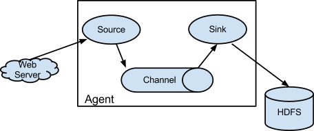

# Documentation ¶

## Navigation

- [Version 1.10.1](#releases-1.10.1)
- [Version 1.10.0](#releases-1.10.0)
- [Version 1.9.0](#releases-1.9.0)
- [Version 1.8.0](#releases-1.8.0)
- [Version 1.7.0](#releases-1.7.0)
- [Version 1.6.0](#releases-1.6.0)
- [Version 1.5.2](#releases-1.5.2)
- [Version 1.5.0.1](#releases-1.5.0.1)
- [Version 1.5.0](#releases-1.5.0)
- [Version 1.4.0](#releases-1.4.0)
- [Version 1.3.1](#releases-1.3.1)
- [Version 1.3.0](#releases-1.3.0)
- [Version 1.2.0](#releases-1.2.0)
- [Version 1.1.0 - Incubating](#releases-1.1.0)
- [Version 1.0.0 - Incubating](#releases-1.0.0)
- Apache Flume
  - [How to Get Involved](#getinvolved)
  - [Download](#download)
  - [Apache Flume Security Vulnerabilities](#security)
  - [Documentation](#documentation)
  - [Releases](#releases)
  - [Mailing lists](#mailinglists)
  - [Team](#team)
  - [Source Repository](#source)
  - [Testing](#testing)
  - [Sub Projects](#subprojects)
- Other pages
  - [Welcome to Apache Flume ¶](#index)

## Content

<a id="releases-1.10.1"></a>

<!-- source_url: https://flume.apache.org/releases/1.10.1.html -->

<!-- page_index: 1 -->

<a id="releases-1.10.1--version-1.10.1"></a>

# Version 1.10.1

Status of this release

Apache Flume 1.10.1 is the next release of Flume as an Apache top-level project
(TLP). Apache Flume 1.10.1 is production-ready software.

Release Documentation

- [Flume 1.10.1 User Guide](https://flume.apache.org/releases/content/1.10.1/FlumeUserGuide.html) (also in [pdf](https://flume.apache.org/releases/content/1.10.1/FlumeUserGuide.pdf))
- [Flume 1.10.1 Developer Guide](https://flume.apache.org/releases/content/1.10.1/FlumeDeveloperGuide.html) (also in [pdf](https://flume.apache.org/releases/content/1.10.1/FlumeDeveloperGuide.pdf))
- [Flume 1.10.1 API Documentation](https://flume.apache.org/releases/content/1.10.1/apidocs/index.html)

Changes

Release Notes - Flume - Version v1.10.1

\*\* Bug
:   - [[FLUME-3428](https://issues.apache.org/jira/browse/FLUME-3428)] - Fix for CVE-2022-34916, improper use of JNDI in JMSMessageConsumer
    - [[FLUME-3434](https://issues.apache.org/jira/browse/FLUME-3434)] - TwitterSource exceptions on serialization

\*\* Improvement
:   - [[FLUME-3427](https://issues.apache.org/jira/browse/FLUME-3427)] - Add support for JPMS
    - [[FLUME-3433](https://issues.apache.org/jira/browse/FLUME-3433)] - Limit the default Lookups to a specific few

---

<a id="releases-1.10.0"></a>

<!-- source_url: https://flume.apache.org/releases/1.10.0.html -->

<!-- page_index: 2 -->

<a id="releases-1.10.0--version-1.10.0"></a>

# Version 1.10.0

Status of this release

Apache Flume 1.10.0 is the twelfth release of Flume as an Apache top-level project
(TLP). Apache Flume 1.10.0 is production-ready software.

Release Documentation

- [Flume 1.10.0 User Guide](https://flume.apache.org/releases/content/1.10.0/FlumeUserGuide.html) (also in [pdf](https://flume.apache.org/releases/content/1.10.0/FlumeUserGuide.pdf))
- [Flume 1.10.0 Developer Guide](https://flume.apache.org/releases/content/1.10.0/FlumeDeveloperGuide.html) (also in [pdf](https://flume.apache.org/releases/content/1.10.0/FlumeDeveloperGuide.pdf))
- [Flume 1.10.0 API Documentation](https://flume.apache.org/releases/content/1.10.0/apidocs/index.html)

Changes

Release Notes - Flume - Version v1.10.0

\*\* Bug
:   - [[FLUME-3151](https://issues.apache.org/jira/browse/FLUME-3151)] - Upgrade Hadoop to 2.10.1
    - [[FLUME-3311](https://issues.apache.org/jira/browse/FLUME-3311)] - Update Wrong Use In HDFS Sink
    - [[FLUME-3316](https://issues.apache.org/jira/browse/FLUME-3316)] - Syslog Rfc3164Date test fails when the test date falls on a leap day
    - [[FLUME-3328](https://issues.apache.org/jira/browse/FLUME-3328)] - Fix Deprecated Properties table of HDFS Sink
    - [[FLUME-3356](https://issues.apache.org/jira/browse/FLUME-3356)] - Probable security issue in Flume
    - [[FLUME-3360](https://issues.apache.org/jira/browse/FLUME-3360)] - Maven assemble failed on macOS
    - [[FLUME-3395](https://issues.apache.org/jira/browse/FLUME-3395)] - Fix for CVE-2021-44228
    - [[FLUME-3407](https://issues.apache.org/jira/browse/FLUME-3407)] - workaround for jackson-mapper-asl-1.9.13.jar @ flume-ng
    - [[FLUME-3409](https://issues.apache.org/jira/browse/FLUME-3409)] - upgrade httpclient due to cve
    - [[FLUME-3416](https://issues.apache.org/jira/browse/FLUME-3416)] - Improve input validation
    - [[FLUME-3421](https://issues.apache.org/jira/browse/FLUME-3421)] - Default log4j settings do not log to console after FLUME-2050
    - [[FLUME-3426](https://issues.apache.org/jira/browse/FLUME-3426)] - Unresolved Security Issues

\*\* New Feature
:   - [[FLUME-3412](https://issues.apache.org/jira/browse/FLUME-3412)] - Add LoadBalancingChannelSelector

\*\* Improvement
:   - [[FLUME-199](https://issues.apache.org/jira/browse/FLUME-199)] - Unit tests should hunt for available ports if defaults are in use
    - [[FLUME-2050](https://issues.apache.org/jira/browse/FLUME-2050)] - Upgrade to log4j2 (when GA)
    - [[FLUME-3045](https://issues.apache.org/jira/browse/FLUME-3045)] - Document GitHub Pull Requests in How to Contribute Guide
    - [[FLUME-3335](https://issues.apache.org/jira/browse/FLUME-3335)] - Support configuration and reconfiguration via HTTP(S)
    - [[FLUME-3338](https://issues.apache.org/jira/browse/FLUME-3338)] - Doc Flume Recoverability with Kafka
    - [[FLUME-3363](https://issues.apache.org/jira/browse/FLUME-3363)] - CVE-2019-20445
    - [[FLUME-3368](https://issues.apache.org/jira/browse/FLUME-3368)] - Update Jackson to 2.9.10
    - [[FLUME-3389](https://issues.apache.org/jira/browse/FLUME-3389)] - Build and test Apache Flume on ARM64 CPU architecture
    - [[FLUME-3397](https://issues.apache.org/jira/browse/FLUME-3397)] - Upgrade Log4 to 2.17.1 and SLF4J to 1.7.32
    - [[FLUME-3398](https://issues.apache.org/jira/browse/FLUME-3398)] - Upgrade Kafka to a supported version.
    - [[FLUME-3399](https://issues.apache.org/jira/browse/FLUME-3399)] - Update Jackson to 2.13.1
    - [[FLUME-3403](https://issues.apache.org/jira/browse/FLUME-3403)] - The parquet-avro version used by flume is 1.4.1, which is vulnerable.
    - [[FLUME-3405](https://issues.apache.org/jira/browse/FLUME-3405)] - Reopened - The parquet-avro version used by flume is 1.4.1, which is vulnerable.
    - [[FLUME-3413](https://issues.apache.org/jira/browse/FLUME-3413)] - Add “initialization” phase to components.

\*\* Wish
:   - [[FLUME-3400](https://issues.apache.org/jira/browse/FLUME-3400)] - Upgrade commons-io to 2.11.0

\*\* Task
:   - [[FLUME-3401](https://issues.apache.org/jira/browse/FLUME-3401)] - Remove Kite Dataset Sink
    - [[FLUME-3402](https://issues.apache.org/jira/browse/FLUME-3402)] - remove org.codehaus.jackson dependencies
    - [[FLUME-3404](https://issues.apache.org/jira/browse/FLUME-3404)] - Update Commons CLI to 1.5.0, Commons Codec to 1.15, Commons Compress to 1.21 and Commons Lang to 2.6
    - [[FLUME-3410](https://issues.apache.org/jira/browse/FLUME-3410)] - upgrade hbase version
    - [[FLUME-3411](https://issues.apache.org/jira/browse/FLUME-3411)] - upgrade hive sink to 1.2.2
    - [[FLUME-3417](https://issues.apache.org/jira/browse/FLUME-3417)] - Remove Elasticsearch sink that requires Elasticsearch 0.90.1
    - [[FLUME-3419](https://issues.apache.org/jira/browse/FLUME-3419)] - Review project LICENSE and NOTICE
    - [[FLUME-3424](https://issues.apache.org/jira/browse/FLUME-3424)] - Upgrade Twitter4j to version 4.0.7+

\*\* Dependency upgrade
:   - [[FLUME-3339](https://issues.apache.org/jira/browse/FLUME-3339)] - Remove Xerces and Xalan dependencies
    - [[FLUME-3385](https://issues.apache.org/jira/browse/FLUME-3385)] - flume-ng-sdk uses Avro-IPC version with vulnerable version of Jetty
    - [[FLUME-3386](https://issues.apache.org/jira/browse/FLUME-3386)] - flume-ng-sdk uses vulnerable version of netty

---

<a id="releases-1.9.0"></a>

<!-- source_url: https://flume.apache.org/releases/1.9.0.html -->

<!-- page_index: 3 -->

<a id="releases-1.9.0--version-1.9.0"></a>

# Version 1.9.0

Status of this release

Apache Flume 1.9.0 is the eleventh release of Flume as an Apache top-level project
(TLP). Apache Flume 1.9.0 is production-ready software.

Release Documentation

- [Flume 1.9.0 User Guide](https://flume.apache.org/releases/content/1.9.0/FlumeUserGuide.html) (also in [pdf](assets/files/flumeuserguide_e73b889bec2d315d.pdf))
- [Flume 1.9.0 Developer Guide](https://flume.apache.org/releases/content/1.9.0/FlumeDeveloperGuide.html) (also in [pdf](assets/files/flumedeveloperguide_7405dcb4a6fa0253.pdf))
- [Flume 1.9.0 API Documentation](https://flume.apache.org/releases/content/1.9.0/apidocs/index.html)

Changes

Release Notes - Flume - Version v1.9.0

\*\* New Feature
:   - [[FLUME-2071](https://issues.apache.org/jira/browse/FLUME-2071)] - Flume Context doesn’t support float or double configuration values.
    - [[FLUME-2442](https://issues.apache.org/jira/browse/FLUME-2442)] - Need an alternative to providing clear text passwords in flume config
    - [[FLUME-3142](https://issues.apache.org/jira/browse/FLUME-3142)] - Adding HBase2 sink

\*\* Improvement
:   - [[FLUME-2653](https://issues.apache.org/jira/browse/FLUME-2653)] - Allow inUseSuffix to be null/empty
    - [[FLUME-2854](https://issues.apache.org/jira/browse/FLUME-2854)] - Parameterize jetty version in pom
    - [[FLUME-2977](https://issues.apache.org/jira/browse/FLUME-2977)] - Upgrade RAT to 0.12
    - [[FLUME-3050](https://issues.apache.org/jira/browse/FLUME-3050)] - add counters for error conditions and expose to monitor URL
    - [[FLUME-3182](https://issues.apache.org/jira/browse/FLUME-3182)] - Please add support for SSL/TLS for syslog (tcp) & multi\_port syslog (tcp) sources
    - [[FLUME-3186](https://issues.apache.org/jira/browse/FLUME-3186)] - Make asyncHbaseClient configuration parameters available from flume config
    - [[FLUME-3223](https://issues.apache.org/jira/browse/FLUME-3223)] - Flume HDFS Sink should retry close prior to performing a recoverLease
    - [[FLUME-3227](https://issues.apache.org/jira/browse/FLUME-3227)] - Add Rate Limiter to StressSource
    - [[FLUME-3239](https://issues.apache.org/jira/browse/FLUME-3239)] - Do not rename files in SpoolDirectorySource
    - [[FLUME-3246](https://issues.apache.org/jira/browse/FLUME-3246)] - Validate flume configuration to prevent larger source batch size than the channel transaction capacity
    - [[FLUME-3269](https://issues.apache.org/jira/browse/FLUME-3269)] - Support JSSE keystore/trustore -D system properties
    - [[FLUME-3275](https://issues.apache.org/jira/browse/FLUME-3275)] - Components supporting SSL/TLS should be able to specify protocol list
    - [[FLUME-3276](https://issues.apache.org/jira/browse/FLUME-3276)] - Components supporting SSL/TLS should be able to specify cipher suite list
    - [[FLUME-3280](https://issues.apache.org/jira/browse/FLUME-3280)] - Improve maven build to help code reviews by adding static code analyzer to it
    - [[FLUME-3281](https://issues.apache.org/jira/browse/FLUME-3281)] - Update to Kafka 2.0 client
    - [[FLUME-3282](https://issues.apache.org/jira/browse/FLUME-3282)] - Use slf4j in every component

\*\* Bug
:   - [[FLUME-1282](https://issues.apache.org/jira/browse/FLUME-1282)] - Flume 1.x build fails on Maven 2
    - [[FLUME-2232](https://issues.apache.org/jira/browse/FLUME-2232)] - Add findbugs to Flume build
    - [[FLUME-2436](https://issues.apache.org/jira/browse/FLUME-2436)] - Make hadoop-2 the default build profile
    - [[FLUME-2464](https://issues.apache.org/jira/browse/FLUME-2464)] - Remove hadoop-2 profile
    - [[FLUME-2786](https://issues.apache.org/jira/browse/FLUME-2786)] - It will enter a deadlock state when modify the conf file before I stop flume-ng
    - [[FLUME-2894](https://issues.apache.org/jira/browse/FLUME-2894)] - Flume components should stop in the correct order (graceful shutdown)
    - [[FLUME-2973](https://issues.apache.org/jira/browse/FLUME-2973)] - Deadlock in hdfs sink
    - [[FLUME-2976](https://issues.apache.org/jira/browse/FLUME-2976)] - Exception when JMS source tries to connect to a Weblogic server without authentication
    - [[FLUME-2988](https://issues.apache.org/jira/browse/FLUME-2988)] - Kafka Sink metrics missing eventDrainAttemptCount
    - [[FLUME-2989](https://issues.apache.org/jira/browse/FLUME-2989)] - Kafka Channel metrics missing eventTakeAttemptCount and eventPutAttemptCount
    - [[FLUME-3056](https://issues.apache.org/jira/browse/FLUME-3056)] - TestApplication hangs indefinitely
    - [[FLUME-3101](https://issues.apache.org/jira/browse/FLUME-3101)] - taildir source may endless loop when tail a file
    - [[FLUME-3106](https://issues.apache.org/jira/browse/FLUME-3106)] - When batchSize of sink greater than transactionCapacity of Memory Channel, Flume can produce endless data
    - [[FLUME-3107](https://issues.apache.org/jira/browse/FLUME-3107)] - When batchSize of sink greater than transactionCapacity of File Channel, Flume can produce endless data
    - [[FLUME-3114](https://issues.apache.org/jira/browse/FLUME-3114)] - Upgrade commons-httpclient library dependency
    - [[FLUME-3117](https://issues.apache.org/jira/browse/FLUME-3117)] - Application can be dead loop when call System.exit() in methodconfigure
    - [[FLUME-3133](https://issues.apache.org/jira/browse/FLUME-3133)] - Add a ipHeader config in Syslog Sources
    - [[FLUME-3201](https://issues.apache.org/jira/browse/FLUME-3201)] - Fix SyslogUtil to handle RFC3164 format in december correctly
    - [[FLUME-3218](https://issues.apache.org/jira/browse/FLUME-3218)] - Fix external process config filter test
    - [[FLUME-3222](https://issues.apache.org/jira/browse/FLUME-3222)] - java.nio.file.NoSuchFileException thrown when files are being deleted from the TAILDIR source
    - [[FLUME-3237](https://issues.apache.org/jira/browse/FLUME-3237)] - Handling RuntimeExceptions coming from the JMS provider in JMSSource
    - [[FLUME-3253](https://issues.apache.org/jira/browse/FLUME-3253)] - JP Morgan Chase scan shows vulnerabilities for Splunk App using Apache Flume 1.8
    - [[FLUME-3265](https://issues.apache.org/jira/browse/FLUME-3265)] - Cannot set batch-size for LoadBalancingRpcClient
    - [[FLUME-3270](https://issues.apache.org/jira/browse/FLUME-3270)] - Close JMS resources in JMSMessageConsumer constructor in case of failure
    - [[FLUME-3278](https://issues.apache.org/jira/browse/FLUME-3278)] - Handling -D keystore parameters in Kafka components
    - [[FLUME-3294](https://issues.apache.org/jira/browse/FLUME-3294)] - Fix polling logic in TaildirSource
    - [[FLUME-3298](https://issues.apache.org/jira/browse/FLUME-3298)] - Make hadoop-common optional in flume-ng-hadoop-credential-store-config-filter
    - [[FLUME-3299](https://issues.apache.org/jira/browse/FLUME-3299)] - Fix log4j scopes in pom files

\*\* Sub-task
:   - [[FLUME-3158](https://issues.apache.org/jira/browse/FLUME-3158)] - Upgrade surefire version and config
    - [[FLUME-3243](https://issues.apache.org/jira/browse/FLUME-3243)] - Increase the default of hdfs.callTimeout and document it’s deprecation
    - [[FLUME-3303](https://issues.apache.org/jira/browse/FLUME-3303)] - Mention future configuration change in the release notes

\*\* Test
:   - [[FLUME-3195](https://issues.apache.org/jira/browse/FLUME-3195)] - Split up the TestKafkaChannel class

\*\* Wish
:   - [[FLUME-3087](https://issues.apache.org/jira/browse/FLUME-3087)] - Change log level from WARN to INFO when using default “maxIOWorkers” value.

\*\* Task
:   - [[FLUME-3183](https://issues.apache.org/jira/browse/FLUME-3183)] - Maven: generate SHA-512 checksum during deploy

\*\* Dependency upgrade
:   - [[FLUME-2698](https://issues.apache.org/jira/browse/FLUME-2698)] - Upgrade Jetty Version
    - [[FLUME-3115](https://issues.apache.org/jira/browse/FLUME-3115)] - Upgrade netty library dependency
    - [[FLUME-3194](https://issues.apache.org/jira/browse/FLUME-3194)] - upgrade derby to the latest (1.14.1.0) version

\*\* Documentation
:   - [[FLUME-1342](https://issues.apache.org/jira/browse/FLUME-1342)] - Document JMX monitoring API
    - [[FLUME-2723](https://issues.apache.org/jira/browse/FLUME-2723)] - Document the requirement that Channel’s transactionCapacity >= batchSize of the source/sink
    - [[FLUME-3051](https://issues.apache.org/jira/browse/FLUME-3051)] - Mention the incompatibility of Kafka source with 0.8.x Kafka brokers
    - [[FLUME-3228](https://issues.apache.org/jira/browse/FLUME-3228)] - Incorrect parameter name in timestamp interceptor docs

---

<a id="releases-1.8.0"></a>

<!-- source_url: https://flume.apache.org/releases/1.8.0.html -->

<!-- page_index: 4 -->

<a id="releases-1.8.0--version-1.8.0"></a>

# Version 1.8.0

Status of this release

Apache Flume 1.8.0 is the eleventh release of Flume as an Apache top-level project
(TLP). Apache Flume 1.8.0 is production-ready software.

Release Documentation

- [Flume 1.8.0 User Guide](https://flume.apache.org/releases/content/1.8.0/FlumeUserGuide.html) (also in [pdf](assets/files/flumeuserguide_d744a7128dbdbd09.pdf))
- [Flume 1.8.0 Developer Guide](https://flume.apache.org/releases/content/1.8.0/FlumeDeveloperGuide.html) (also in [pdf](assets/files/flumedeveloperguide_768014c03169edf4.pdf))
- [Flume 1.8.0 API Documentation](https://flume.apache.org/releases/content/1.8.0/apidocs/index.html)

Changes

Release Notes - Flume - Version v1.8.0

\*\* New Feature
:   - [[FLUME-2171](https://issues.apache.org/jira/browse/FLUME-2171)] - Add Interceptor to remove headers from event
    - [[FLUME-2917](https://issues.apache.org/jira/browse/FLUME-2917)] - Provide netcat UDP source as alternative to TCP
    - [[FLUME-2993](https://issues.apache.org/jira/browse/FLUME-2993)] - Support environment variables in configuration files

\*\* Improvement
:   - [[FLUME-1520](https://issues.apache.org/jira/browse/FLUME-1520)] - Timestamp interceptor should support custom headers
    - [[FLUME-2945](https://issues.apache.org/jira/browse/FLUME-2945)] - Bump java target version to 1.8
    - [[FLUME-3020](https://issues.apache.org/jira/browse/FLUME-3020)] - Improve HDFSEventSink Escape Ingestion by more then 10x by not getting InetAddress on every record
    - [[FLUME-3025](https://issues.apache.org/jira/browse/FLUME-3025)] - Expose FileChannel.open on JMX
    - [[FLUME-3072](https://issues.apache.org/jira/browse/FLUME-3072)] - Add IP address to headers in flume log4j appender
    - [[FLUME-3092](https://issues.apache.org/jira/browse/FLUME-3092)] - Extend the FileChannel’s monitoring metrics
    - [[FLUME-3100](https://issues.apache.org/jira/browse/FLUME-3100)] - Support arbitrary header substitution for topic of Kafka
    - [[FLUME-3144](https://issues.apache.org/jira/browse/FLUME-3144)] - Improve Log4jAppender’s performance by allowing logging collection of messages

\*\* Bug
:   - [[FLUME-2620](https://issues.apache.org/jira/browse/FLUME-2620)] - File channel throws NullPointerException if a header value is null
    - [[FLUME-2752](https://issues.apache.org/jira/browse/FLUME-2752)] - Flume AvroSource will leak the memory and the OOM will be happened.
    - [[FLUME-2812](https://issues.apache.org/jira/browse/FLUME-2812)] - Exception in thread “SinkRunner-PollingRunner-DefaultSinkProcessor” java.lang.Error: Maximum permit count exceeded
    - [[FLUME-2857](https://issues.apache.org/jira/browse/FLUME-2857)] - Kafka Source/Channel/Sink does not restore default values when live update config
    - [[FLUME-2905](https://issues.apache.org/jira/browse/FLUME-2905)] - NetcatSource - Socket not closed when an exception is encountered during start() leading to file descriptor leaks
    - [[FLUME-2991](https://issues.apache.org/jira/browse/FLUME-2991)] - ExecSource command execution starts before starting the sourceCounter
    - [[FLUME-3027](https://issues.apache.org/jira/browse/FLUME-3027)] - Kafka Channel should clear offsets map after commit
    - [[FLUME-3031](https://issues.apache.org/jira/browse/FLUME-3031)] - sequence source should reset its counter for event body on channel exception
    - [[FLUME-3043](https://issues.apache.org/jira/browse/FLUME-3043)] - KafkaSink SinkCallback throws NullPointerException when Log4J level is debug
    - [[FLUME-3046](https://issues.apache.org/jira/browse/FLUME-3046)] - Kafka Sink and Source Configuration Improvements
    - [[FLUME-3049](https://issues.apache.org/jira/browse/FLUME-3049)] - Wrapping the exception into SecurityException in UGIExecutor.execute hides the original one
    - [[FLUME-3057](https://issues.apache.org/jira/browse/FLUME-3057)] - Build fails due to unsupported snappy-java version on ppc64le
    - [[FLUME-3080](https://issues.apache.org/jira/browse/FLUME-3080)] - Close failure in HDFS Sink might cause data loss
    - [[FLUME-3083](https://issues.apache.org/jira/browse/FLUME-3083)] - Taildir source can miss events if file updated in same second as file close
    - [[FLUME-3085](https://issues.apache.org/jira/browse/FLUME-3085)] - HDFS Sink can skip flushing some BucketWriters, might lead to data loss
    - [[FLUME-3112](https://issues.apache.org/jira/browse/FLUME-3112)] - Upgrade jackson-core library dependency
    - [[FLUME-3127](https://issues.apache.org/jira/browse/FLUME-3127)] - Upgrade libfb303 library dependency
    - [[FLUME-3131](https://issues.apache.org/jira/browse/FLUME-3131)] - Upgrade spring framework library dependencies
    - [[FLUME-3132](https://issues.apache.org/jira/browse/FLUME-3132)] - Upgrade tomcat jasper library dependencies
    - [[FLUME-3135](https://issues.apache.org/jira/browse/FLUME-3135)] - property logger in org.apache.flume.interceptor.RegexFilteringInterceptor confused
    - [[FLUME-3141](https://issues.apache.org/jira/browse/FLUME-3141)] - Small typo found in RegexHbaseEventSerializer.java
    - [[FLUME-3152](https://issues.apache.org/jira/browse/FLUME-3152)] - Add Flume Metric for Backup Checkpoint Errors
    - [[FLUME-3155](https://issues.apache.org/jira/browse/FLUME-3155)] - Use batch mode in mvn to fix Travis CI error
    - [[FLUME-3157](https://issues.apache.org/jira/browse/FLUME-3157)] - Refactor TestHDFSEventSinkOnMiniCluster to not use LeaseManager private API
    - [[FLUME-3173](https://issues.apache.org/jira/browse/FLUME-3173)] - Upgrade joda-time
    - [[FLUME-3174](https://issues.apache.org/jira/browse/FLUME-3174)] - HdfsSink AWS S3A authentication does not work on JDK 8
    - [[FLUME-3175](https://issues.apache.org/jira/browse/FLUME-3175)] - Javadoc generation fails due to Java8’s strict doclint

\*\* Documentation
:   - [[FLUME-2175](https://issues.apache.org/jira/browse/FLUME-2175)] - Update Developer Guide with notes on how to upgrade Protocol Buffer version
    - [[FLUME-2817](https://issues.apache.org/jira/browse/FLUME-2817)] - Sink for multi-agent flow example in user guide is set up incorrectly

\*\* Wish
:   - [[FLUME-2579](https://issues.apache.org/jira/browse/FLUME-2579)] - JMS source support durable subscriptions and message listening

\*\* Question
:   - [[FLUME-2427](https://issues.apache.org/jira/browse/FLUME-2427)] - java.lang.NoSuchMethodException and warning on HDFS (S3) sink

\*\* Task
:   - [[FLUME-3093](https://issues.apache.org/jira/browse/FLUME-3093)] - Groundwork for version changes in root pom
    - [[FLUME-3154](https://issues.apache.org/jira/browse/FLUME-3154)] - Add HBase client version check to AsyncHBaseSink and HBaseSink

\*\* Test
:   - [[FLUME-2997](https://issues.apache.org/jira/browse/FLUME-2997)] - Fix flaky junit test in SpillableMemoryChannel
    - [[FLUME-3002](https://issues.apache.org/jira/browse/FLUME-3002)] - Some tests in TestBucketWriter are flaky

---

<a id="releases-1.7.0"></a>

<!-- source_url: https://flume.apache.org/releases/1.7.0.html -->

<!-- page_index: 5 -->

<a id="releases-1.7.0--version-1.7.0"></a>

# Version 1.7.0

Status of this release

Apache Flume 1.7.0 is the tenth release of Flume as an Apache top-level project
(TLP). Apache Flume 1.7.0 is production-ready software.

Release Documentation

- [Flume 1.7.0 User Guide](https://flume.apache.org/releases/content/1.7.0/FlumeUserGuide.html) (also in [pdf](assets/files/flumeuserguide_6e8a982c4b5d66b7.pdf))
- [Flume 1.7.0 Developer Guide](https://flume.apache.org/releases/content/1.7.0/FlumeDeveloperGuide.html) (also in [pdf](assets/files/flumedeveloperguide_9e3c4416fcbfda26.pdf))
- [Flume 1.7.0 API Documentation](https://flume.apache.org/releases/content/1.7.0/apidocs/index.html)

Changes

Release Notes - Flume - Version v1.7.0

\*\* New Feature
:   - [[FLUME-2498](https://issues.apache.org/jira/browse/FLUME-2498)] - Implement Taildir Source

\*\* Improvement
:   - [[FLUME-1899](https://issues.apache.org/jira/browse/FLUME-1899)] - Make SpoolDir work with Sub-Directories
    - [[FLUME-2526](https://issues.apache.org/jira/browse/FLUME-2526)] - Build flume by jdk 7 in default
    - [[FLUME-2628](https://issues.apache.org/jira/browse/FLUME-2628)] - Add an optional parameter to specify the expected input text encoding for the netcat sourcef the netcat source
    - [[FLUME-2704](https://issues.apache.org/jira/browse/FLUME-2704)] - Configurable poll delay for spooling directory source
    - [[FLUME-2718](https://issues.apache.org/jira/browse/FLUME-2718)] - HTTP Source to support generic Stream Handler
    - [[FLUME-2729](https://issues.apache.org/jira/browse/FLUME-2729)] - Allow pollableSource backoff times to be configurable
    - [[FLUME-2755](https://issues.apache.org/jira/browse/FLUME-2755)] - Kafka Source reading multiple topics
    - [[FLUME-2781](https://issues.apache.org/jira/browse/FLUME-2781)] - A Kafka Channel defined as parseAsFlumeEvent=false cannot be correctly used by a Flume source
    - [[FLUME-2799](https://issues.apache.org/jira/browse/FLUME-2799)] - Kafka Source - Message Offset and Partition add to headers
    - [[FLUME-2801](https://issues.apache.org/jira/browse/FLUME-2801)] - Performance improvement on TailDir source
    - [[FLUME-2810](https://issues.apache.org/jira/browse/FLUME-2810)] - Add static Schema URL to AvroEventSerializer configuration
    - [[FLUME-2820](https://issues.apache.org/jira/browse/FLUME-2820)] - Support New Kafka APIs
    - [[FLUME-2852](https://issues.apache.org/jira/browse/FLUME-2852)] - Kafka Source/Sink should optionally read/write Flume records
    - [[FLUME-2868](https://issues.apache.org/jira/browse/FLUME-2868)] - Kafka Channel partition topic by key
    - [[FLUME-2872](https://issues.apache.org/jira/browse/FLUME-2872)] - Kafka Sink should be able to select which header as the key
    - [[FLUME-2875](https://issues.apache.org/jira/browse/FLUME-2875)] - Allow RollingFileSink to specify a file prefix and a file extension.
    - [[FLUME-2909](https://issues.apache.org/jira/browse/FLUME-2909)] - Bump Rat version
    - [[FLUME-2910](https://issues.apache.org/jira/browse/FLUME-2910)] - AsyncHBaseSink - Failure callbacks should log the exception that caused them
    - [[FLUME-2911](https://issues.apache.org/jira/browse/FLUME-2911)] - Add includePattern option in SpoolDirectorySource configuration
    - [[FLUME-2918](https://issues.apache.org/jira/browse/FLUME-2918)] - TaildirSource is underperforming with huge parent directories
    - [[FLUME-2937](https://issues.apache.org/jira/browse/FLUME-2937)] - Integrate checkstyle for non-test classes
    - [[FLUME-2941](https://issues.apache.org/jira/browse/FLUME-2941)] - Integrate checkstyle for test classes
    - [[FLUME-2954](https://issues.apache.org/jira/browse/FLUME-2954)] - make raw data appearing in log messages explicit
    - [[FLUME-2955](https://issues.apache.org/jira/browse/FLUME-2955)] - Add file path to the header in TaildirSource
    - [[FLUME-2959](https://issues.apache.org/jira/browse/FLUME-2959)] - Fix issues with flume-checkstyle module
    - [[FLUME-2982](https://issues.apache.org/jira/browse/FLUME-2982)] - Add localhost escape sequence to HDFS sink
    - [[FLUME-2999](https://issues.apache.org/jira/browse/FLUME-2999)] - Kafka channel and sink should enable statically assigned partition per event via header
    - [[FLUME-2821](https://issues.apache.org/jira/browse/FLUME-2821)] - Flume-Kafka Source with new Consumer
    - [[FLUME-2822](https://issues.apache.org/jira/browse/FLUME-2822)] - Flume-Kafka-Sink with new Producer
    - [[FLUME-2823](https://issues.apache.org/jira/browse/FLUME-2823)] - Flume-Kafka-Channel with new APIs

\*\* Bug
:   - [[FLUME-1668](https://issues.apache.org/jira/browse/FLUME-1668)] - Hdfs Sink File Rollover
    - [[FLUME-2132](https://issues.apache.org/jira/browse/FLUME-2132)] - Exception while syncing from Flume to HDFS
    - [[FLUME-2143](https://issues.apache.org/jira/browse/FLUME-2143)] - Flume build occasionally fails with OutOfMemoryError on Windows.
    - [[FLUME-2215](https://issues.apache.org/jira/browse/FLUME-2215)] - ResettableFileInputStream can’t support ucs-4 character
    - [[FLUME-2318](https://issues.apache.org/jira/browse/FLUME-2318)] - SpoolingDirectory is unable to handle empty files
    - [[FLUME-2448](https://issues.apache.org/jira/browse/FLUME-2448)] - Building flume from trunk failing with dependency error
    - [[FLUME-2484](https://issues.apache.org/jira/browse/FLUME-2484)] - NullPointerException in Kafka Sink test
    - [[FLUME-2485](https://issues.apache.org/jira/browse/FLUME-2485)] - Thrift Source tests fail on Oracle JDK 8
    - [[FLUME-2514](https://issues.apache.org/jira/browse/FLUME-2514)] - Some TestFileChannelRestart tests are extremely slow
    - [[FLUME-2567](https://issues.apache.org/jira/browse/FLUME-2567)] - Remove unneeded repository declarations in pom.xml
    - [[FLUME-2573](https://issues.apache.org/jira/browse/FLUME-2573)] - flume-ng –conf parameter is not used when starting a flume agent
    - [[FLUME-2593](https://issues.apache.org/jira/browse/FLUME-2593)] - ResettableFileInputStream returns negate values from read() method
    - [[FLUME-2619](https://issues.apache.org/jira/browse/FLUME-2619)] - Spooldir source does not log channel exceptions
    - [[FLUME-2632](https://issues.apache.org/jira/browse/FLUME-2632)] - High CPU on KafkaSink
    - [[FLUME-2652](https://issues.apache.org/jira/browse/FLUME-2652)] - Documented transaction handling semantics incorrect
    - [[FLUME-2660](https://issues.apache.org/jira/browse/FLUME-2660)] - Add documentation for EventValidator
    - [[FLUME-2672](https://issues.apache.org/jira/browse/FLUME-2672)] - NPE in KafkaSourceCounter
    - [[FLUME-2712](https://issues.apache.org/jira/browse/FLUME-2712)] - Optional channel errors slows down the Source to Main channel event rate
    - [[FLUME-2725](https://issues.apache.org/jira/browse/FLUME-2725)] - HDFS Sink does not use configured timezone for rounding
    - [[FLUME-2732](https://issues.apache.org/jira/browse/FLUME-2732)] - Make maximum tolerated failures before shutting down and recreating client in AsyncHbaseSink configurable
    - [[FLUME-2734](https://issues.apache.org/jira/browse/FLUME-2734)] - Kafka Channel timeout property is overridden by default value
    - [[FLUME-2738](https://issues.apache.org/jira/browse/FLUME-2738)] - Async HBase sink FD leak on client shutdown
    - [[FLUME-2746](https://issues.apache.org/jira/browse/FLUME-2746)] - How to include this Flume Patch in Flume 1.5.2 ?
    - [[FLUME-2749](https://issues.apache.org/jira/browse/FLUME-2749)] - Kerberos configuration error when using short names in multiple HDFS Sinks
    - [[FLUME-2751](https://issues.apache.org/jira/browse/FLUME-2751)] - Upgrade Derby version to 10.11.1.1
    - [[FLUME-2753](https://issues.apache.org/jira/browse/FLUME-2753)] - Error when specifying empty replace string in Search and Replace Interceptor
    - [[FLUME-2754](https://issues.apache.org/jira/browse/FLUME-2754)] - Hive Sink skipping first transaction in each Batch of Hive Transactions
    - [[FLUME-2761](https://issues.apache.org/jira/browse/FLUME-2761)] - Move Hive sink out of preview mode
    - [[FLUME-2763](https://issues.apache.org/jira/browse/FLUME-2763)] - flume\_env script should handle jvm parameters like -javaagent -agentpath -agentlib
    - [[FLUME-2773](https://issues.apache.org/jira/browse/FLUME-2773)] - TailDirSource throws FileNotFound Exception if ~/.flume directory is not created already
    - [[FLUME-2797](https://issues.apache.org/jira/browse/FLUME-2797)] - SyslogTcpSource uses Deprecated Class + Deprecate SyslogTcpSource
    - [[FLUME-2798](https://issues.apache.org/jira/browse/FLUME-2798)] - Malformed Syslog messages can lead to OutOfMemoryException
    - [[FLUME-2804](https://issues.apache.org/jira/browse/FLUME-2804)] - Hive sink - abort remaining transactions on shutdown
    - [[FLUME-2806](https://issues.apache.org/jira/browse/FLUME-2806)] - flume-ng.ps1 Error running script to start an agent on Windows
    - [[FLUME-2835](https://issues.apache.org/jira/browse/FLUME-2835)] - Hive Sink tests need to create table with transactional property set
    - [[FLUME-2841](https://issues.apache.org/jira/browse/FLUME-2841)] - Upgrade commons-collections to 3.2.2
    - [[FLUME-2844](https://issues.apache.org/jira/browse/FLUME-2844)] - ChannelCounter of SpillableMemoryChannel doesn’t register actually.
    - [[FLUME-2881](https://issues.apache.org/jira/browse/FLUME-2881)] - Windows Launch Script fails in plugins dir code
    - [[FLUME-2886](https://issues.apache.org/jira/browse/FLUME-2886)] - Optional Channels can cause OOMs
    - [[FLUME-2889](https://issues.apache.org/jira/browse/FLUME-2889)] - Fixes to DateTime computations
    - [[FLUME-2891](https://issues.apache.org/jira/browse/FLUME-2891)] - Revert FLUME-2712 and FLUME-2886
    - [[FLUME-2897](https://issues.apache.org/jira/browse/FLUME-2897)] - AsyncHBase sink NPE when Channel.getTransaction() fails
    - [[FLUME-2901](https://issues.apache.org/jira/browse/FLUME-2901)] - Document Kerberos setup for Kafka channel
    - [[FLUME-2908](https://issues.apache.org/jira/browse/FLUME-2908)] - NetcatSource - SocketChannel not closed when session is broken
    - [[FLUME-2913](https://issues.apache.org/jira/browse/FLUME-2913)] - Flume classpath too long
    - [[FLUME-2915](https://issues.apache.org/jira/browse/FLUME-2915)] - The kafka channel using new APIs will be stuck when the sink is avro sink
    - [[FLUME-2920](https://issues.apache.org/jira/browse/FLUME-2920)] - Kafka Channel Should Not Commit Offsets When Stopping
    - [[FLUME-2922](https://issues.apache.org/jira/browse/FLUME-2922)] - HDFSSequenceFile Should Sync Writer
    - [[FLUME-2923](https://issues.apache.org/jira/browse/FLUME-2923)] - Bump AsyncHBase version
    - [[FLUME-2936](https://issues.apache.org/jira/browse/FLUME-2936)] - KafkaSource tests arbitrarily fail
    - [[FLUME-2939](https://issues.apache.org/jira/browse/FLUME-2939)] - Upgrade recursive SpoolDir to use Java7 features
    - [[FLUME-2948](https://issues.apache.org/jira/browse/FLUME-2948)] - Docs: Fixed parameters on Replicating Channel Selector documentation example
    - [[FLUME-2949](https://issues.apache.org/jira/browse/FLUME-2949)] - Flume fails to build on Windows
    - [[FLUME-2950](https://issues.apache.org/jira/browse/FLUME-2950)] - ReliableSpoolingFileEventReader.rollCurrentFile is broken
    - [[FLUME-2952](https://issues.apache.org/jira/browse/FLUME-2952)] - SyslogAgent possible NPE on stop()
    - [[FLUME-2972](https://issues.apache.org/jira/browse/FLUME-2972)] - Handle offset migration in the new Kafka Channel
    - [[FLUME-2974](https://issues.apache.org/jira/browse/FLUME-2974)] - Some tests are broken in TestReliableSpoolingFileEventReader and TestSpoolingFileLineReader
    - [[FLUME-2983](https://issues.apache.org/jira/browse/FLUME-2983)] - Handle offset migration in the new Kafka Source

\*\* Documentation
:   - [[FLUME-2575](https://issues.apache.org/jira/browse/FLUME-2575)] - FLUME-2548 brings SSLv2Hello back for Avro Sink, but UG says it is one of the protocols to exclude
    - [[FLUME-2713](https://issues.apache.org/jira/browse/FLUME-2713)] - Document Fault Tolerant Config parameters in FlumeUserGuide
    - [[FLUME-2737](https://issues.apache.org/jira/browse/FLUME-2737)] - Documentation for Pollable Source config parameters introduced in FLUME-2729
    - [[FLUME-2783](https://issues.apache.org/jira/browse/FLUME-2783)] - Update Website Team page with new Committer’s
    - [[FLUME-2890](https://issues.apache.org/jira/browse/FLUME-2890)] - Typo in Twitter source warning
    - [[FLUME-2934](https://issues.apache.org/jira/browse/FLUME-2934)] - Document new cachePatternMatching option for TaildirSource
    - [[FLUME-2963](https://issues.apache.org/jira/browse/FLUME-2963)] - FlumeUserGuide - error in Kafka Source properties table
    - [[FLUME-2971](https://issues.apache.org/jira/browse/FLUME-2971)] - Document secure Kafka Sink/Source/Channel setup
    - [[FLUME-2975](https://issues.apache.org/jira/browse/FLUME-2975)] - Minor mistake in NetCat Source example in documentation
    - [[FLUME-2998](https://issues.apache.org/jira/browse/FLUME-2998)] - Add missing configuration parameter to SequenceSource docs

\*\* Task
:   - [[FLUME-2935](https://issues.apache.org/jira/browse/FLUME-2935)] - Bump java target version to 1.7

\*\* Test
:   - [[FLUME-3003](https://issues.apache.org/jira/browse/FLUME-3003)] - testSourceCounter in TestSyslogUdpSource is flaky

---

<a id="releases-1.6.0"></a>

<!-- source_url: https://flume.apache.org/releases/1.6.0.html -->

<!-- page_index: 6 -->

<a id="releases-1.6.0--version-1.6.0"></a>

# Version 1.6.0

Status of this release

Apache Flume 1.6.0 is the ninth release of Flume as an Apache top-level project
(TLP). Apache Flume 1.6.0 is production-ready software.

Release Documentation

- [Flume 1.6.0 User Guide](https://flume.apache.org/releases/content/1.6.0/FlumeUserGuide.html) (also in [pdf](assets/files/flumeuserguide_fe10a36b0dc9e0fe.pdf))
- [Flume 1.6.0 Developer Guide](https://flume.apache.org/releases/content/1.6.0/FlumeDeveloperGuide.html) (also in [pdf](assets/files/flumedeveloperguide_819869a2f53ccc86.pdf))
- [Flume 1.6.0 API Documentation](https://flume.apache.org/releases/content/1.6.0/apidocs/index.html)

Changes

Release Notes - Flume - Version v1.6.0

\*\* Sub-task
:   - [[FLUME-2250](https://issues.apache.org/jira/browse/FLUME-2250)] - Add support for Kafka Source
    - [[FLUME-2251](https://issues.apache.org/jira/browse/FLUME-2251)] - Add support for Kafka Sink
    - [[FLUME-2677](https://issues.apache.org/jira/browse/FLUME-2677)] - Update versions in 1.6.0 branch
    - [[FLUME-2686](https://issues.apache.org/jira/browse/FLUME-2686)] - Update KEYS file for 1.6 release

\*\* Bug
:   - [[FLUME-1793](https://issues.apache.org/jira/browse/FLUME-1793)] - Unit test TestElasticSearchLogStashEventSerializer fails with IBM JDK
    - [[FLUME-1934](https://issues.apache.org/jira/browse/FLUME-1934)] - Spoolingdir source exception when reading multiple zero size files
    - [[FLUME-2024](https://issues.apache.org/jira/browse/FLUME-2024)] - Add ExecSource flush timeout to Flume User Guide
    - [[FLUME-2126](https://issues.apache.org/jira/browse/FLUME-2126)] - Problem in elasticsearch sink when the event body is a complex field
    - [[FLUME-2148](https://issues.apache.org/jira/browse/FLUME-2148)] - Windows : Add flume-env.ps1
    - [[FLUME-2214](https://issues.apache.org/jira/browse/FLUME-2214)] - FileChannelIntegrityTool needs documentation in user guide
    - [[FLUME-2245](https://issues.apache.org/jira/browse/FLUME-2245)] - HDFS files with errors unable to close
    - [[FLUME-2337](https://issues.apache.org/jira/browse/FLUME-2337)] - export JAVA\_HOME in flume-env.sh.template and increase heap size
    - [[FLUME-2346](https://issues.apache.org/jira/browse/FLUME-2346)] - idLogFileMap in Log can lose track of file ids
    - [[FLUME-2404](https://issues.apache.org/jira/browse/FLUME-2404)] - Default maxReadBufferBytes might cause OOM and cause scribe source exit
    - [[FLUME-2408](https://issues.apache.org/jira/browse/FLUME-2408)] - Remove FLUME-1899 from Flume 1.5.0 change log.
    - [[FLUME-2416](https://issues.apache.org/jira/browse/FLUME-2416)] - Use CodecPool in compressed stream to prevent leak of direct buffers
    - [[FLUME-2420](https://issues.apache.org/jira/browse/FLUME-2420)] - HDFSEventSink#stop might throw ConcurrentModificationException
    - [[FLUME-2425](https://issues.apache.org/jira/browse/FLUME-2425)] - FileChannel should trim data and checkpoint directories
    - [[FLUME-2432](https://issues.apache.org/jira/browse/FLUME-2432)] - Update Kite dependency to 0.15.0
    - [[FLUME-2438](https://issues.apache.org/jira/browse/FLUME-2438)] - Make Syslog source message body configurable
    - [[FLUME-2450](https://issues.apache.org/jira/browse/FLUME-2450)] - Improve replay index insertion speed.
    - [[FLUME-2466](https://issues.apache.org/jira/browse/FLUME-2466)] - Embedded agent name cannot contain spaces
    - [[FLUME-2470](https://issues.apache.org/jira/browse/FLUME-2470)] - Kafka Sink and Source must use camel case for all configs.
    - [[FLUME-2472](https://issues.apache.org/jira/browse/FLUME-2472)] - SyslogUtils fails when system locale is not English
    - [[FLUME-2475](https://issues.apache.org/jira/browse/FLUME-2475)] - toLowerCase/toUpperCase used without Locale parameter to manipulate Enum
    - [[FLUME-2479](https://issues.apache.org/jira/browse/FLUME-2479)] - Kafka property auto.commit.enable is incorrect for KafkaSource
    - [[FLUME-2480](https://issues.apache.org/jira/browse/FLUME-2480)] - Typo in file channel exception: “Usable space exhaused”
    - [[FLUME-2481](https://issues.apache.org/jira/browse/FLUME-2481)] - TestFileChannelEncryption fails with System locale other than en\_US
    - [[FLUME-2482](https://issues.apache.org/jira/browse/FLUME-2482)] - Race condition in File Channels’ Log.removeOldLogs
    - [[FLUME-2486](https://issues.apache.org/jira/browse/FLUME-2486)] - TestExecSource fails on some environments
    - [[FLUME-2487](https://issues.apache.org/jira/browse/FLUME-2487)] - SyslogParser has rounding errors in timestamp parsing
    - [[FLUME-2488](https://issues.apache.org/jira/browse/FLUME-2488)] - TestElasticSearchRestClient fails on Oracle JDK 8
    - [[FLUME-2489](https://issues.apache.org/jira/browse/FLUME-2489)] - Upgrade Apache Curator to 2.6.0
    - [[FLUME-2492](https://issues.apache.org/jira/browse/FLUME-2492)] - Flume’s Kafka Source doesn’t account time correctly
    - [[FLUME-2495](https://issues.apache.org/jira/browse/FLUME-2495)] - Kafka Source may miss events when channel is not available
    - [[FLUME-2497](https://issues.apache.org/jira/browse/FLUME-2497)] - TCP and UDP syslog sources parsing the timestamp incorrectly
    - [[FLUME-2500](https://issues.apache.org/jira/browse/FLUME-2500)] - Add a channel that uses Kafka
    - [[FLUME-2505](https://issues.apache.org/jira/browse/FLUME-2505)] - Test added in FLUME-2502 is flaky
    - [[FLUME-2517](https://issues.apache.org/jira/browse/FLUME-2517)] - Performance issue: SimpleDateFormat constructor takes 30% of HDFSEventSink.process()
    - [[FLUME-2525](https://issues.apache.org/jira/browse/FLUME-2525)] - flume should handle a zero byte .flumespool-main.meta file for the spooldir source
    - [[FLUME-2538](https://issues.apache.org/jira/browse/FLUME-2538)] - TestResettableFileInputStream fails on JDK 8
    - [[FLUME-2556](https://issues.apache.org/jira/browse/FLUME-2556)] - TestBucketPath.testDateFormatHours fails intermittently
    - [[FLUME-2557](https://issues.apache.org/jira/browse/FLUME-2557)] - DatasetSink doesn’t work with Kerberos
    - [[FLUME-2560](https://issues.apache.org/jira/browse/FLUME-2560)] - Kafka channel entries missing for output jar generation
    - [[FLUME-2568](https://issues.apache.org/jira/browse/FLUME-2568)] - Additional fix for TestReliableSpoolingFileEventReader
    - [[FLUME-2578](https://issues.apache.org/jira/browse/FLUME-2578)] - Kafka source throws NPE if Kafka record has null key
    - [[FLUME-2586](https://issues.apache.org/jira/browse/FLUME-2586)] - HDFS Sink should have an option to try rename even if close fails
    - [[FLUME-2592](https://issues.apache.org/jira/browse/FLUME-2592)] - Specify main manifest attribute in flume tools jar
    - [[FLUME-2594](https://issues.apache.org/jira/browse/FLUME-2594)] - Close Async HBase Client if there are large number of consecutive timeouts
    - [[FLUME-2595](https://issues.apache.org/jira/browse/FLUME-2595)] - Add option to checkpoint on file channel shutdown
    - [[FLUME-2624](https://issues.apache.org/jira/browse/FLUME-2624)] - Improve Hive Sink performance
    - [[FLUME-2626](https://issues.apache.org/jira/browse/FLUME-2626)] - Remove trustmanager-type from Thrift RPC client
    - [[FLUME-2633](https://issues.apache.org/jira/browse/FLUME-2633)] - Update Kite dependency to 1.0.0
    - [[FLUME-2639](https://issues.apache.org/jira/browse/FLUME-2639)] - SecureThriftRpcClient client privileged calls throw IllegalAccessError
    - [[FLUME-2645](https://issues.apache.org/jira/browse/FLUME-2645)] - ipFilter.rules property name is wrong
    - [[FLUME-2654](https://issues.apache.org/jira/browse/FLUME-2654)] - Memory channel error message related to byteCapacity needs refining
    - [[FLUME-2657](https://issues.apache.org/jira/browse/FLUME-2657)] - Upgrade to Hive 1.0
    - [[FLUME-2658](https://issues.apache.org/jira/browse/FLUME-2658)] - Upgrade to Hbase 1.0
    - [[FLUME-2664](https://issues.apache.org/jira/browse/FLUME-2664)] - Site profile fails due to dependency issues
    - [[FLUME-2665](https://issues.apache.org/jira/browse/FLUME-2665)] - Update documentation for hdfs.closeTries based on FLUME-2586
    - [[FLUME-2670](https://issues.apache.org/jira/browse/FLUME-2670)] - Modify dependencies to not pull hadoop/hive related jars
    - [[FLUME-2673](https://issues.apache.org/jira/browse/FLUME-2673)] - Remove unused import in TestLog
    - [[FLUME-2678](https://issues.apache.org/jira/browse/FLUME-2678)] - Upgrade xalan to 2.7.2 to take care of CVE-2014-0107 vulnerability
    - [[FLUME-2679](https://issues.apache.org/jira/browse/FLUME-2679)] - Make hbase-1 the default profile

\*\* Dependency upgrade
:   - [[FLUME-2443](https://issues.apache.org/jira/browse/FLUME-2443)] - org.apache.hadoop.fs.FSDataOutputStream.sync() is deprecated in hadoop 2.4

\*\* Documentation
:   - [[FLUME-1594](https://issues.apache.org/jira/browse/FLUME-1594)] - Document JMX options
    - [[FLUME-2509](https://issues.apache.org/jira/browse/FLUME-2509)] - Add description for properties in Failover Sink Processor
    - [[FLUME-2630](https://issues.apache.org/jira/browse/FLUME-2630)] - Update documentation for Thrift Src/Sink SSL support and Kerberos support
    - [[FLUME-2635](https://issues.apache.org/jira/browse/FLUME-2635)] - Documentation for zookeeper dynamic configuration in flume
    - [[FLUME-2668](https://issues.apache.org/jira/browse/FLUME-2668)] - Document SecureThriftRpcClient/SecureRpcClientFactory in Flume Developer Guide

\*\* Improvement
:   - [[FLUME-1334](https://issues.apache.org/jira/browse/FLUME-1334)] - Write an startscript for flume agents on Windows
    - [[FLUME-1491](https://issues.apache.org/jira/browse/FLUME-1491)] - Dynamic configuration from Zookeeper watcher
    - [[FLUME-1521](https://issues.apache.org/jira/browse/FLUME-1521)] - Document the StressSource
    - [[FLUME-1710](https://issues.apache.org/jira/browse/FLUME-1710)] - JSONEvent.getBody should not return null
    - [[FLUME-1920](https://issues.apache.org/jira/browse/FLUME-1920)] - Test case TestFileChannel fails when flume is built from paths containing the string “hadoop”
    - [[FLUME-2237](https://issues.apache.org/jira/browse/FLUME-2237)] - Example config in User Guide to use same notation for Agent name
    - [[FLUME-2246](https://issues.apache.org/jira/browse/FLUME-2246)] - event body data size can make it configurable for logger sinker
    - [[FLUME-2273](https://issues.apache.org/jira/browse/FLUME-2273)] - ElasticSearchSink: Add handling for header substitution in indexName
    - [[FLUME-2373](https://issues.apache.org/jira/browse/FLUME-2373)] - Enable configuration to switch thrift source serialization protocol
    - [[FLUME-2385](https://issues.apache.org/jira/browse/FLUME-2385)] - Flume spans log file with “Spooling Directory Source runner has shutdown” messages at INFO level
    - [[FLUME-2401](https://issues.apache.org/jira/browse/FLUME-2401)] - Optionally Compress Backup Checkpoint
    - [[FLUME-2439](https://issues.apache.org/jira/browse/FLUME-2439)] - Update DatasetSink for Kite 0.15.0
    - [[FLUME-2462](https://issues.apache.org/jira/browse/FLUME-2462)] - Remove use of deprecated methods in DatasetSink
    - [[FLUME-2463](https://issues.apache.org/jira/browse/FLUME-2463)] - Add support for Hive and HBase datasets to DatasetSink
    - [[FLUME-2469](https://issues.apache.org/jira/browse/FLUME-2469)] - DatasetSink should load dataset when needed, not at startup
    - [[FLUME-2499](https://issues.apache.org/jira/browse/FLUME-2499)] - Include Kafka Message Key in Event Header, Updated Comments
    - [[FLUME-2502](https://issues.apache.org/jira/browse/FLUME-2502)] - Spool source’s directory listing is inefficient
    - [[FLUME-2558](https://issues.apache.org/jira/browse/FLUME-2558)] - Update javadoc for StressSource
    - [[FLUME-2562](https://issues.apache.org/jira/browse/FLUME-2562)] - Metrics for Flafka components
    - [[FLUME-2591](https://issues.apache.org/jira/browse/FLUME-2591)] - Kite DatasetSink 2.0
    - [[FLUME-2613](https://issues.apache.org/jira/browse/FLUME-2613)] - Tool/script for deleting individual message from queue
    - [[FLUME-2642](https://issues.apache.org/jira/browse/FLUME-2642)] - Limit kerberos relogin attempt

\*\* New Feature
:   - [[FLUME-1734](https://issues.apache.org/jira/browse/FLUME-1734)] - Create a Hive Sink based on the new Hive Streaming support
    - [[FLUME-2242](https://issues.apache.org/jira/browse/FLUME-2242)] - Flume Sink and Source for Apache Kafka
    - [[FLUME-2426](https://issues.apache.org/jira/browse/FLUME-2426)] - Support interceptors in the Embedded Agent
    - [[FLUME-2431](https://issues.apache.org/jira/browse/FLUME-2431)] - Add simple regex search-and-replace interceptor
    - [[FLUME-2570](https://issues.apache.org/jira/browse/FLUME-2570)] - Add option to not pad date fields
    - [[FLUME-2574](https://issues.apache.org/jira/browse/FLUME-2574)] - SSL Support for Thrift Rpc
    - [[FLUME-2631](https://issues.apache.org/jira/browse/FLUME-2631)] - End to End authentication in Flume

\*\* Task
:   - [[FLUME-2365](https://issues.apache.org/jira/browse/FLUME-2365)] - Please create a DOAP file for your TLP
    - [[FLUME-2454](https://issues.apache.org/jira/browse/FLUME-2454)] - Support batchSize to allow multiple events per transaction to the Kafka Sink
    - [[FLUME-2455](https://issues.apache.org/jira/browse/FLUME-2455)] - Documentation update for Kafka Sink
    - [[FLUME-2523](https://issues.apache.org/jira/browse/FLUME-2523)] - Document Kafka channel
    - [[FLUME-2612](https://issues.apache.org/jira/browse/FLUME-2612)] - Update kite to 0.17.1

\*\* Test
:   - [[FLUME-1501](https://issues.apache.org/jira/browse/FLUME-1501)] - Flume Scribe Source needs unit tests.

---

<a id="releases-1.5.2"></a>

<!-- source_url: https://flume.apache.org/releases/1.5.2.html -->

<!-- page_index: 7 -->

<a id="releases-1.5.2--version-1.5.2"></a>

# Version 1.5.2

Status of this release

Apache Flume 1.5.2 is the eighth release of Flume as an Apache top-level project
(TLP). Apache Flume 1.5.2 is production-ready software.

Apache Flume 1.5.2 is a maintenance and security release that disables SSLv3 for all security-enabled Flume
sources and sinks.

Release Documentation

- [Flume 1.5.2 User Guide](https://flume.apache.org/releases/content/1.5.2/FlumeUserGuide.html) (also in [pdf](assets/files/flumeuserguide_68d4eb0113db3d84.pdf))
- [Flume 1.5.2 Developer Guide](https://flume.apache.org/releases/content/1.5.2/FlumeDeveloperGuide.html) (also in [pdf](assets/files/flumedeveloperguide_a260cae422296a7f.pdf))
- [Flume 1.5.2 API Documentation](https://flume.apache.org/releases/content/1.5.2/apidocs/index.html)

Changes

Release Notes - Flume - Version v1.5.2

> - [[FLUME-2547](https://issues.apache.org/jira/browse/FLUME-2547)] - Removing SSLv2Hello causes Java 6 clients to break
> - [[FLUME-2548](https://issues.apache.org/jira/browse/FLUME-2548)] - Enable SSLv2Hello for Avro Source and NettyAvroRpcClient
> - [[FLUME-2549](https://issues.apache.org/jira/browse/FLUME-2549)] - Enable SSLv2Hello for HttpSource
> - [[FLUME-2551](https://issues.apache.org/jira/browse/FLUME-2551)] - Add dev-support to src tarball
> - [[FLUME-2441](https://issues.apache.org/jira/browse/FLUME-2441)] - Unit test TestHTTPSource.java failed with IBM JDK 1.7
> - [[FLUME-2520](https://issues.apache.org/jira/browse/FLUME-2520)] - HTTP Source should be able to block a prefixed set of protocols.
> - [[FLUME-2533](https://issues.apache.org/jira/browse/FLUME-2533)] - HTTPS tests fail on Java 6
> - [[FLUME-2511](https://issues.apache.org/jira/browse/FLUME-2511)] - Allow configuration of enabled protocols in Avro source and Rpc client

---

<a id="releases-1.5.0.1"></a>

<!-- source_url: https://flume.apache.org/releases/1.5.0.1.html -->

<!-- page_index: 8 -->

<a id="releases-1.5.0.1--version-1.5.0.1"></a>

# Version 1.5.0.1

Status of this release

Apache Flume 1.5.0.1 is the sixth release of Flume as an Apache top-level project
(TLP). Apache Flume 1.5.0.1 is production-ready software.

Release Documentation

- [Flume 1.5.0.1 User Guide](https://flume.apache.org/releases/content/1.5.0.1/FlumeUserGuide.html) (also in [pdf](https://flume.apache.org/releases/content/1.5.0.1/FlumeUserGuide.pdf))
- [Flume 1.5.0.1 Developer Guide](https://flume.apache.org/releases/content/1.5.0.1/FlumeDeveloperGuide.html) (also in [pdf](https://flume.apache.org/releases/content/1.5.0.1/FlumeDeveloperGuide.pdf))
- [Flume 1.5.0.1 API Documentation](https://flume.apache.org/releases/content/1.5.0.1/apidocs/index.html)

Changes

Release Notes - Flume - Version v1.5.0.1

\*\* Bug
:   - [[FLUME-2389](https://issues.apache.org/jira/browse/FLUME-2389)] - Spillable Memory Channel Example is incorrect
    - [[FLUME-2397](https://issues.apache.org/jira/browse/FLUME-2397)] - HBase-98 compatibility
    - [[FLUME-2400](https://issues.apache.org/jira/browse/FLUME-2400)] - Dataset Sink is not built in hbase-98 profile

---

<a id="releases-1.5.0"></a>

<!-- source_url: https://flume.apache.org/releases/1.5.0.html -->

<!-- page_index: 9 -->

<a id="releases-1.5.0--version-1.5.0"></a>

# Version 1.5.0

Status of this release

Apache Flume 1.5.0 is the fifth release of Flume as an Apache top-level project
(TLP). Apache Flume 1.5.0 is production-ready software.

Release Documentation

- [Flume 1.5.0 User Guide](https://flume.apache.org/releases/content/1.5.0/FlumeUserGuide.html) (also in [pdf](https://flume.apache.org/releases/content/1.5.0/FlumeUserGuide.pdf))
- [Flume 1.5.0 Developer Guide](https://flume.apache.org/releases/content/1.5.0/FlumeDeveloperGuide.html) (also in [pdf](https://flume.apache.org/releases/content/1.5.0/FlumeDeveloperGuide.pdf))
- [Flume 1.5.0 API Documentation](https://flume.apache.org/releases/content/1.5.0/apidocs/index.html)

Changes

Release Notes - Flume - Version v1.5.0

\*\* New Feature
:   - [[FLUME-1227](https://issues.apache.org/jira/browse/FLUME-1227)] - Introduce some sort of SpillableChannel
    - [[FLUME-2056](https://issues.apache.org/jira/browse/FLUME-2056)] - Allow SpoolDir to pass just the filename that is the source of an event
    - [[FLUME-2071](https://issues.apache.org/jira/browse/FLUME-2071)] - Flume Context doesn’t support float or double configuration values.
    - [[FLUME-2185](https://issues.apache.org/jira/browse/FLUME-2185)] - Upgrade morphlines to 0.7.0
    - [[FLUME-2188](https://issues.apache.org/jira/browse/FLUME-2188)] - flume-ng-log4jappender Support user supplied headers
    - [[FLUME-2225](https://issues.apache.org/jira/browse/FLUME-2225)] - Elasticsearch Sink for ES HTTP API
    - [[FLUME-2294](https://issues.apache.org/jira/browse/FLUME-2294)] - Add a sink for Kite Datasets
    - [[FLUME-2309](https://issues.apache.org/jira/browse/FLUME-2309)] - Spooling directory should not always consume the oldest file first.

\*\* Improvement
:   - [[FLUME-1542](https://issues.apache.org/jira/browse/FLUME-1542)] - Flume User Guide sample configurations need fixing
    - [[FLUME-1899](https://issues.apache.org/jira/browse/FLUME-1899)] - Make SpoolDir work with Sub-Directories
    - [[FLUME-2052](https://issues.apache.org/jira/browse/FLUME-2052)] - Spooling directory source should be able to replace or ignore malformed characters
    - [[FLUME-2130](https://issues.apache.org/jira/browse/FLUME-2130)] - Handle larger payloads via SyslogUDPSource
    - [[FLUME-2139](https://issues.apache.org/jira/browse/FLUME-2139)] - upgrade morphline library dependency to a 0.5.0 release
    - [[FLUME-2154](https://issues.apache.org/jira/browse/FLUME-2154)] - Reducing duplicate events caused by reset-connection-interval
    - [[FLUME-2155](https://issues.apache.org/jira/browse/FLUME-2155)] - Improve replay time
    - [[FLUME-2181](https://issues.apache.org/jira/browse/FLUME-2181)] - Optionally disable File Channel fsyncs
    - [[FLUME-2202](https://issues.apache.org/jira/browse/FLUME-2202)] - AsyncHBaseSink should coalesce increments to reduce RPC roundtrips
    - [[FLUME-2206](https://issues.apache.org/jira/browse/FLUME-2206)] - ElasticSearchSink ttl field modification to mimic Elasticsearch way of specifying TTL
    - [[FLUME-2207](https://issues.apache.org/jira/browse/FLUME-2207)] - HDFS file suffix style index suffix in ElasticSearchSink
    - [[FLUME-2212](https://issues.apache.org/jira/browse/FLUME-2212)] - upgrade to Morphlines-0.8.0
    - [[FLUME-2213](https://issues.apache.org/jira/browse/FLUME-2213)] - MorphlineInterceptor should share metric registry across threads for better (aggregate) reporting
    - [[FLUME-2217](https://issues.apache.org/jira/browse/FLUME-2217)] - Preserve priority, timestamp and hostname fields in MultiportSyslogTcp and Udp sources
    - [[FLUME-2231](https://issues.apache.org/jira/browse/FLUME-2231)] - Add details in Flume Ganglia config in User Guide
    - [[FLUME-2243](https://issues.apache.org/jira/browse/FLUME-2243)] - AvroSource to use TransceiverThreadFactory for Thread naming while initializing NioServerSocketChannelFactory
    - [[FLUME-2267](https://issues.apache.org/jira/browse/FLUME-2267)] - Increase default transactionCapacity for FileChannel to 10000 from 1000
    - [[FLUME-2275](https://issues.apache.org/jira/browse/FLUME-2275)] - Improve scalability of MorphlineInterceptor under contention
    - [[FLUME-2292](https://issues.apache.org/jira/browse/FLUME-2292)] - Upgrade mapdb to 0.9.8
    - [[FLUME-2316](https://issues.apache.org/jira/browse/FLUME-2316)] - Upgrade MorphlineSolrSink to kite-0.12.0
    - [[FLUME-2340](https://issues.apache.org/jira/browse/FLUME-2340)] - Refactor to make room for Morphlines Elasticsearch Sink
    - [[FLUME-2343](https://issues.apache.org/jira/browse/FLUME-2343)] - Add user impersonation to DatasetSink
    - [[FLUME-2351](https://issues.apache.org/jira/browse/FLUME-2351)] - Ability to override any parameter from the configuration file
    - [[FLUME-2352](https://issues.apache.org/jira/browse/FLUME-2352)] - HDFSCompressedDataStream should support appendBatch

\*\* Bug
:   - [[FLUME-1666](https://issues.apache.org/jira/browse/FLUME-1666)] - Syslog source strips timestamp and hostname from log message body
    - [[FLUME-1679](https://issues.apache.org/jira/browse/FLUME-1679)] - Add dependency on Guava to flume-ng-elasticsearch-sink POM
    - [[FLUME-1892](https://issues.apache.org/jira/browse/FLUME-1892)] - IRC Sink NPE
    - [[FLUME-1951](https://issues.apache.org/jira/browse/FLUME-1951)] - Remove unused future from FlumeEventQueue
    - [[FLUME-2007](https://issues.apache.org/jira/browse/FLUME-2007)] - HDFS Sink should check if file is closed and retry if it is not.
    - [[FLUME-2088](https://issues.apache.org/jira/browse/FLUME-2088)] - Minor typo in Flume User Guide JSON Reporting section
    - [[FLUME-2109](https://issues.apache.org/jira/browse/FLUME-2109)] - HTTPS support in HTTP Source
    - [[FLUME-2110](https://issues.apache.org/jira/browse/FLUME-2110)] - Scribe Source must check if category is null before inserting the headers
    - [[FLUME-2119](https://issues.apache.org/jira/browse/FLUME-2119)] - duplicate files cause flume to enter irrecoverable state
    - [[FLUME-2121](https://issues.apache.org/jira/browse/FLUME-2121)] - Upgrade Flume to log4j 1.2.17 to be in sync with HDFS/HBase
    - [[FLUME-2122](https://issues.apache.org/jira/browse/FLUME-2122)] - Minor cleanups of User guide
    - [[FLUME-2123](https://issues.apache.org/jira/browse/FLUME-2123)] - Morphline Solr sink missing short type name
    - [[FLUME-2124](https://issues.apache.org/jira/browse/FLUME-2124)] - Upgrade Morphline Solr Sink to CDK 0.4.1
    - [[FLUME-2127](https://issues.apache.org/jira/browse/FLUME-2127)] - JMX shutdown command for Flume
    - [[FLUME-2134](https://issues.apache.org/jira/browse/FLUME-2134)] - AsyncHbase Sink bugfix plus tests errors on Windows
    - [[FLUME-2135](https://issues.apache.org/jira/browse/FLUME-2135)] - Add zip to the build distribution for Windows support
    - [[FLUME-2136](https://issues.apache.org/jira/browse/FLUME-2136)] - Windows - Fix intermitent test failure in TestMonitoredCounterGroup.java
    - [[FLUME-2137](https://issues.apache.org/jira/browse/FLUME-2137)] - Fix StagedInstall.java to invoke the correct startup script on Windows
    - [[FLUME-2142](https://issues.apache.org/jira/browse/FLUME-2142)] - HTTPS tests for http source
    - [[FLUME-2145](https://issues.apache.org/jira/browse/FLUME-2145)] - TestCheckpointRebuilder.testFastReplay fails on Windows due to checkpoint file being memory mapped
    - [[FLUME-2151](https://issues.apache.org/jira/browse/FLUME-2151)] - Windows: Update TestExecSource to use native commands on Windows
    - [[FLUME-2152](https://issues.apache.org/jira/browse/FLUME-2152)] - Flume user guide says “Ganglia support” where it should say “JSON support”
    - [[FLUME-2156](https://issues.apache.org/jira/browse/FLUME-2156)] - Unregister then re-register MonitoredCounterGroup JMX MBeans on reconfigure
    - [[FLUME-2157](https://issues.apache.org/jira/browse/FLUME-2157)] - Spool directory source does not shut down correctly when Flume is reconfigured
    - [[FLUME-2159](https://issues.apache.org/jira/browse/FLUME-2159)] - Sporadic failures in TestNettyAvroRpcClient.spinThreadsCrazily()
    - [[FLUME-2161](https://issues.apache.org/jira/browse/FLUME-2161)] - Flume does not support spaces in -X java-opt command line args
    - [[FLUME-2172](https://issues.apache.org/jira/browse/FLUME-2172)] - Update protocol buffer from 2.4.1 to 2.5.0
    - [[FLUME-2176](https://issues.apache.org/jira/browse/FLUME-2176)] - SpoolDir Source, get ‘File has changed’ exception but actually there is no change on the file
    - [[FLUME-2182](https://issues.apache.org/jira/browse/FLUME-2182)] - Spooling Directory Source will not ingest data completely when a wide character appears at the edge of a buffer
    - [[FLUME-2184](https://issues.apache.org/jira/browse/FLUME-2184)] - flume-ng-morphline-solr-sink Build failing due to incorrect hadoop-common dependency declaration
    - [[FLUME-2191](https://issues.apache.org/jira/browse/FLUME-2191)] - HDFS Minicluster tests failing after protobuf upgrade.
    - [[FLUME-2192](https://issues.apache.org/jira/browse/FLUME-2192)] - AbstractSinkProcessor stop incorrectly calls start
    - [[FLUME-2198](https://issues.apache.org/jira/browse/FLUME-2198)] - Avro Source should disable itself if ipFilterRules contains invalid rules
    - [[FLUME-2199](https://issues.apache.org/jira/browse/FLUME-2199)] - Flume builds with new version require mvn install before site can be generated
    - [[FLUME-2200](https://issues.apache.org/jira/browse/FLUME-2200)] - HTTP Source should be able to use “port” parameter if SSL is enabled
    - [[FLUME-2208](https://issues.apache.org/jira/browse/FLUME-2208)] - Jetty’s default SocketSelector leaks File descriptors
    - [[FLUME-2209](https://issues.apache.org/jira/browse/FLUME-2209)] - AsyncHBaseSink will never recover if the column family does not exists for the first start
    - [[FLUME-2210](https://issues.apache.org/jira/browse/FLUME-2210)] - UnresolvedAddressException when using multiple hostNames in Elasticsearch sink configuration
    - [[FLUME-2220](https://issues.apache.org/jira/browse/FLUME-2220)] - ElasticSearch sink - duplicate fields in indexed document
    - [[FLUME-2229](https://issues.apache.org/jira/browse/FLUME-2229)] - Backoff period gets reset too often in OrderSelector
    - [[FLUME-2233](https://issues.apache.org/jira/browse/FLUME-2233)] - MemoryChannel lock contention on every put due to bytesRemaining Semaphore
    - [[FLUME-2235](https://issues.apache.org/jira/browse/FLUME-2235)] - idleFuture should be cancelled at the start of append
    - [[FLUME-2238](https://issues.apache.org/jira/browse/FLUME-2238)] - Provide option to configure worker threads in NettyAvroRpcClient
    - [[FLUME-2239](https://issues.apache.org/jira/browse/FLUME-2239)] - Clarify File Channel’s dataDirs setting in User Guide
    - [[FLUME-2252](https://issues.apache.org/jira/browse/FLUME-2252)] - Add null check before closing table in HbaseSink
    - [[FLUME-2253](https://issues.apache.org/jira/browse/FLUME-2253)] - Please delete old releases from mirroring system
    - [[FLUME-2255](https://issues.apache.org/jira/browse/FLUME-2255)] - Spooling Directory Source cannot handle channel exceptions
    - [[FLUME-2259](https://issues.apache.org/jira/browse/FLUME-2259)] - transaction closure not happening for all the scenario in hbasesink
    - [[FLUME-2262](https://issues.apache.org/jira/browse/FLUME-2262)] - Log4j Appender should use timeStamp field not getTimestamp
    - [[FLUME-2263](https://issues.apache.org/jira/browse/FLUME-2263)] - Bump Hadoop 2 version to 2.3.0
    - [[FLUME-2264](https://issues.apache.org/jira/browse/FLUME-2264)] - Log4j Appender + Avro Reflection on string results in an invalid avro schema
    - [[FLUME-2265](https://issues.apache.org/jira/browse/FLUME-2265)] - Closed bucket writers should be removed from sfwriters map
    - [[FLUME-2266](https://issues.apache.org/jira/browse/FLUME-2266)] - Update Morphline Sink to kite-0.10.0
    - [[FLUME-2270](https://issues.apache.org/jira/browse/FLUME-2270)] - Twitter Source Documentation Does not load properly
    - [[FLUME-2272](https://issues.apache.org/jira/browse/FLUME-2272)] - Getting start page returning 503 error
    - [[FLUME-2283](https://issues.apache.org/jira/browse/FLUME-2283)] - Spool Dir source must check interrupt flag before writing to channel
    - [[FLUME-2289](https://issues.apache.org/jira/browse/FLUME-2289)] - Disable maxUnderReplication test which is extremely flakey
    - [[FLUME-2301](https://issues.apache.org/jira/browse/FLUME-2301)] - Update HBaseSink tests to reflect sink returning backoff only on empty batches
    - [[FLUME-2302](https://issues.apache.org/jira/browse/FLUME-2302)] - TestHDFS Sink fails with Can’t get Kerberos realm
    - [[FLUME-2303](https://issues.apache.org/jira/browse/FLUME-2303)] - HBaseSink tests can fail based on order of execution
    - [[FLUME-2304](https://issues.apache.org/jira/browse/FLUME-2304)] - DatasetSink test fails unexpectedly
    - [[FLUME-2305](https://issues.apache.org/jira/browse/FLUME-2305)] - BucketWriter#close must cancel idleFuture
    - [[FLUME-2307](https://issues.apache.org/jira/browse/FLUME-2307)] - Remove Log writetimeout
    - [[FLUME-2311](https://issues.apache.org/jira/browse/FLUME-2311)] - Use standard way of finding queue/topic
    - [[FLUME-2312](https://issues.apache.org/jira/browse/FLUME-2312)] - Add utility for adorning HTTP contexts in Jetty
    - [[FLUME-2314](https://issues.apache.org/jira/browse/FLUME-2314)] - Upgrade to Mapdb 0.9.9
    - [[FLUME-2320](https://issues.apache.org/jira/browse/FLUME-2320)] - Deadlock in DatasetSink
    - [[FLUME-2323](https://issues.apache.org/jira/browse/FLUME-2323)] - Morphline sink must increment eventDrainAttemptCount when it takes event from channel
    - [[FLUME-2324](https://issues.apache.org/jira/browse/FLUME-2324)] - Support writing to multiple HBase clusters using HBaseSink
    - [[FLUME-2325](https://issues.apache.org/jira/browse/FLUME-2325)] - BucketWriter might throw BucketClosedException incorrectly
    - [[FLUME-2328](https://issues.apache.org/jira/browse/FLUME-2328)] - FileChannel Dual Checkpoint Backup Thread not released on Application stop
    - [[FLUME-2329](https://issues.apache.org/jira/browse/FLUME-2329)] - Add an alias for the Morphline Solr Sink
    - [[FLUME-2330](https://issues.apache.org/jira/browse/FLUME-2330)] - Remove the MorphlineHandlerImpl configuration option from MorphlineSink
    - [[FLUME-2334](https://issues.apache.org/jira/browse/FLUME-2334)] - Upgrade Asynchbase to 1.5.0 as this include hbase 0.96.x support
    - [[FLUME-2335](https://issues.apache.org/jira/browse/FLUME-2335)] - TestHBaseSink#testWithoutConfigurationObject() must delete the table at the end of the test
    - [[FLUME-2336](https://issues.apache.org/jira/browse/FLUME-2336)] - HBase tests that pass in ZK configs must use a new context object
    - [[FLUME-2338](https://issues.apache.org/jira/browse/FLUME-2338)] - Support coalescing increments in HBaseSink
    - [[FLUME-2345](https://issues.apache.org/jira/browse/FLUME-2345)] - Update to Kite 0.12.0 dependency
    - [[FLUME-2347](https://issues.apache.org/jira/browse/FLUME-2347)] - Add FLUME\_JAVA\_OPTS which allows users to inject java properties from cmd line
    - [[FLUME-2350](https://issues.apache.org/jira/browse/FLUME-2350)] - Consume Order tests need to space out file creation
    - [[FLUME-2357](https://issues.apache.org/jira/browse/FLUME-2357)] - HDFS sink should retry closing files that previously had close errors
    - [[FLUME-2381](https://issues.apache.org/jira/browse/FLUME-2381)] - Upgrade Hadoop version in Hadoop 2 profile to 2.4.0
    - [[FLUME-2379](https://issues.apache.org/jira/browse/FLUME-2379)] - Flume’s pom files are invalid and not parseable by non-maven build tools

\*\* Documentation
:   - [[FLUME-1223](https://issues.apache.org/jira/browse/FLUME-1223)] - Userguide improvement rolling file sink
    - [[FLUME-1678](https://issues.apache.org/jira/browse/FLUME-1678)] - Incorrect documentation for HBase sink
    - [[FLUME-1851](https://issues.apache.org/jira/browse/FLUME-1851)] - User Guide grammar mistake
    - [[FLUME-2064](https://issues.apache.org/jira/browse/FLUME-2064)] - Typo/Grammar in flume main user doc under Scribe
    - [[FLUME-2065](https://issues.apache.org/jira/browse/FLUME-2065)] - Regex Extractor Interceptor config agent name inconsistent with rest of docs
    - [[FLUME-2183](https://issues.apache.org/jira/browse/FLUME-2183)] - Add “Other Resources” page to wiki
    - [[FLUME-2278](https://issues.apache.org/jira/browse/FLUME-2278)] - Incorrect documentation for write-timeout of File Channel
    - [[FLUME-2319](https://issues.apache.org/jira/browse/FLUME-2319)] - Incorrect property name of Ganglia Reporting documentation

---

<a id="releases-1.4.0"></a>

<!-- source_url: https://flume.apache.org/releases/1.4.0.html -->

<!-- page_index: 10 -->

<a id="releases-1.4.0--version-1.4.0"></a>

# Version 1.4.0

Status of this release

Apache Flume 1.4.0 is the fourth release of Flume as an Apache top-level project
(TLP). Apache Flume 1.4.0 is production-ready software.

Release Documentation

- [Flume 1.4.0 User Guide](https://flume.apache.org/releases/content/1.4.0/FlumeUserGuide.html) (also in [pdf](assets/files/flumeuserguide_c55edbb4d1ac349b.pdf))
- [Flume 1.4.0 Developer Guide](https://flume.apache.org/releases/content/1.4.0/FlumeDeveloperGuide.html) (also in [pdf](assets/files/flumedeveloperguide_2908a223af7d1494.pdf))
- [Flume 1.4.0 API Documentation](https://flume.apache.org/releases/content/1.4.0/apidocs/index.html)

Changes

Release Notes - Flume - Version v1.4.0

- New Feature
  - [[FLUME-924](https://issues.apache.org/jira/browse/FLUME-924)] - Implement a JMS source for Flume NG
  - [[FLUME-997](https://issues.apache.org/jira/browse/FLUME-997)] - Support secure transport mechanism
  - [[FLUME-1502](https://issues.apache.org/jira/browse/FLUME-1502)] - Support for running simple configurations embedded in host process
  - [[FLUME-1516](https://issues.apache.org/jira/browse/FLUME-1516)] - FileChannel Write Dual Checkpoints to avoid replays
  - [[FLUME-1632](https://issues.apache.org/jira/browse/FLUME-1632)] - Persist progress on each file in file spooling client/source
  - [[FLUME-1735](https://issues.apache.org/jira/browse/FLUME-1735)] - Add support for a plugins.d directory
  - [[FLUME-1894](https://issues.apache.org/jira/browse/FLUME-1894)] - Implement Thrift RPC
  - [[FLUME-1917](https://issues.apache.org/jira/browse/FLUME-1917)] - FileChannel group commit (coalesce fsync)
  - [[FLUME-2010](https://issues.apache.org/jira/browse/FLUME-2010)] - Support Avro records in Log4jAppender and the HDFS Sink
  - [[FLUME-2048](https://issues.apache.org/jira/browse/FLUME-2048)] - Avro container file deserializer
  - [[FLUME-2070](https://issues.apache.org/jira/browse/FLUME-2070)] - Add a Flume Morphline Solr Sink
- Improvement
  - [[FLUME-1076](https://issues.apache.org/jira/browse/FLUME-1076)] - Sink batch sizes vary wildy
  - [[FLUME-1100](https://issues.apache.org/jira/browse/FLUME-1100)] - HDFSWriterFactory and HDFSFormatterFactory should allow extension
  - [[FLUME-1571](https://issues.apache.org/jira/browse/FLUME-1571)] - Channels should check for positive capacity and transaction capacity values
  - [[FLUME-1586](https://issues.apache.org/jira/browse/FLUME-1586)] - File Channel should support verifying integrity of individual events.
  - [[FLUME-1652](https://issues.apache.org/jira/browse/FLUME-1652)] - Logutils.getLogs could NPE
  - [[FLUME-1661](https://issues.apache.org/jira/browse/FLUME-1661)] - ExecSource cannot execute complex Unix commands
  - [[FLUME-1677](https://issues.apache.org/jira/browse/FLUME-1677)] - Add File-channel dependency to flume-ng-node’s pom.xml
  - [[FLUME-1699](https://issues.apache.org/jira/browse/FLUME-1699)] - Make the rename of the meta file platform neutral
  - [[FLUME-1702](https://issues.apache.org/jira/browse/FLUME-1702)] - HDFSEventSink should write to a hidden file as opposed to a .tmp file
  - [[FLUME-1740](https://issues.apache.org/jira/browse/FLUME-1740)] - Remove contrib/ directory from Flume NG
  - [[FLUME-1745](https://issues.apache.org/jira/browse/FLUME-1745)] - FlumeConfiguration Eats Exceptions
  - [[FLUME-1756](https://issues.apache.org/jira/browse/FLUME-1756)] - Avro client should be able to use load balancing RPC
  - [[FLUME-1757](https://issues.apache.org/jira/browse/FLUME-1757)] - Improve configuration of hbase serializers
  - [[FLUME-1762](https://issues.apache.org/jira/browse/FLUME-1762)] - File Channel should recover automatically if the checkpoint is incomplete or bad by deleting the contents of the checkpoint directory
  - [[FLUME-1768](https://issues.apache.org/jira/browse/FLUME-1768)] - Multiplexing channel selector should allow optional-only channels
  - [[FLUME-1769](https://issues.apache.org/jira/browse/FLUME-1769)] - Replicating channel selector should support optional channels
  - [[FLUME-1770](https://issues.apache.org/jira/browse/FLUME-1770)] - Flume should have serializer which supports serializer the headers to a simple string
  - [[FLUME-1777](https://issues.apache.org/jira/browse/FLUME-1777)] - AbstractSource does not provide enough implementation for sub-classes
  - [[FLUME-1790](https://issues.apache.org/jira/browse/FLUME-1790)] - Commands in EncryptionTestUtils comments require high encryption pack to be installed
  - [[FLUME-1794](https://issues.apache.org/jira/browse/FLUME-1794)] - FileChannel check for full disks in the background
  - [[FLUME-1800](https://issues.apache.org/jira/browse/FLUME-1800)] - Docs for spooling source durability changes
  - [[FLUME-1808](https://issues.apache.org/jira/browse/FLUME-1808)] - ElasticSearchSink is missing log4.properties
  - [[FLUME-1821](https://issues.apache.org/jira/browse/FLUME-1821)] - Support configuration of hbase instances to be used in AsyncHBaseSink from flume config
  - [[FLUME-1847](https://issues.apache.org/jira/browse/FLUME-1847)] - NPE in SourceConfiguration
  - [[FLUME-1848](https://issues.apache.org/jira/browse/FLUME-1848)] - HDFSDataStream logger is actually for a sequence file
  - [[FLUME-1855](https://issues.apache.org/jira/browse/FLUME-1855)] - Sequence gen source should be able to stop after a fixed number of events
  - [[FLUME-1864](https://issues.apache.org/jira/browse/FLUME-1864)] - Allow hdfs idle callback to clean up closed bucket writers
  - [[FLUME-1874](https://issues.apache.org/jira/browse/FLUME-1874)] - Ship with log4j.properties file that has a reliable time based rolling policy
  - [[FLUME-1876](https://issues.apache.org/jira/browse/FLUME-1876)] - Document hadoop dependency of FileChannel when used with EmbeddedAgent
  - [[FLUME-1878](https://issues.apache.org/jira/browse/FLUME-1878)] - FileChannel replay should print status every 10000 events
  - [[FLUME-1886](https://issues.apache.org/jira/browse/FLUME-1886)] - Add a JMS enum type to SourceType so that users don’t need to enter FQCN for JMSSource
  - [[FLUME-1889](https://issues.apache.org/jira/browse/FLUME-1889)] - Add HBASE and ASYNC\_HBASE enum types to SinkType so that users don’t need to enter FQCNs
  - [[FLUME-1906](https://issues.apache.org/jira/browse/FLUME-1906)] - Ability to disable WAL for put operation in HBaseSink
  - [[FLUME-1915](https://issues.apache.org/jira/browse/FLUME-1915)] - Enhance NettyAvroRpcClient and the use of NettyServer to optionally use compression
  - [[FLUME-1926](https://issues.apache.org/jira/browse/FLUME-1926)] - Optionally timeout Avro Sink Rpc Clients to avoid stickiness
  - [[FLUME-1940](https://issues.apache.org/jira/browse/FLUME-1940)] - Log a snapshot of Flume metrics on shutdown
  - [[FLUME-1945](https://issues.apache.org/jira/browse/FLUME-1945)] - HBase Serializer allow key from regular expression group
  - [[FLUME-1976](https://issues.apache.org/jira/browse/FLUME-1976)] - JMS Source document should provide instruction on JMS implementation jars
  - [[FLUME-1977](https://issues.apache.org/jira/browse/FLUME-1977)] - JMS Source connectionFactory property is not documented
  - [[FLUME-1992](https://issues.apache.org/jira/browse/FLUME-1992)] - ElasticSearch dependency is marked optional
  - [[FLUME-1994](https://issues.apache.org/jira/browse/FLUME-1994)] - Add ELASTICSEARCH enum type to SinkType to eliminate need for FQCN in agent configuration files
  - [[FLUME-2004](https://issues.apache.org/jira/browse/FLUME-2004)] - Need to capture metrics on the Flume exec source such as events received, rejected, etc.
  - [[FLUME-2005](https://issues.apache.org/jira/browse/FLUME-2005)] - Minor improvements to Flume assembly config
  - [[FLUME-2008](https://issues.apache.org/jira/browse/FLUME-2008)] - it would be very convenient to have a fat jar of flume-ng-log4jappender
  - [[FLUME-2009](https://issues.apache.org/jira/browse/FLUME-2009)] - Flume project throws error when imported into Eclipse IDE (Juno)
  - [[FLUME-2013](https://issues.apache.org/jira/browse/FLUME-2013)] - Parametrize java source and target version in the main pom file
  - [[FLUME-2015](https://issues.apache.org/jira/browse/FLUME-2015)] - ElasticSearchSink: need access to IndexRequestBuilder instance during flume event processing
  - [[FLUME-2046](https://issues.apache.org/jira/browse/FLUME-2046)] - Typo in HBaseSink java doc
  - [[FLUME-2049](https://issues.apache.org/jira/browse/FLUME-2049)] - Compile ElasticSearchSink with elasticsearch 0.90
  - [[FLUME-2062](https://issues.apache.org/jira/browse/FLUME-2062)] - make it possible for HBase sink to deposit event headers into corresponding column qualifiers
  - [[FLUME-2063](https://issues.apache.org/jira/browse/FLUME-2063)] - Add Configurable charset to RegexHbaseEventSerializer
  - [[FLUME-2076](https://issues.apache.org/jira/browse/FLUME-2076)] - JMX metrics support for HTTP Source
  - [[FLUME-2093](https://issues.apache.org/jira/browse/FLUME-2093)] - binary tarball that is created by flume’s assembly shouldn’t contain sources
  - [[FLUME-2100](https://issues.apache.org/jira/browse/FLUME-2100)] - Increase default batchSize of Morphline Solr Sink
  - [[FLUME-2105](https://issues.apache.org/jira/browse/FLUME-2105)] - Add docs for MorphlineSolrSink
- Bug
  - [[FLUME-1110](https://issues.apache.org/jira/browse/FLUME-1110)] - HDFS Sink throws IllegalStateException when flume-daemon shuts down
  - [[FLUME-1153](https://issues.apache.org/jira/browse/FLUME-1153)] - flume-ng script is missing some agent options in help output
  - [[FLUME-1175](https://issues.apache.org/jira/browse/FLUME-1175)] - RollingFileSink complains of Bad File Descriptor upon a reconfig event
  - [[FLUME-1262](https://issues.apache.org/jira/browse/FLUME-1262)] - Move doc generation to a different profile
  - [[FLUME-1285](https://issues.apache.org/jira/browse/FLUME-1285)] - FileChannel has a dependency on Hadoop IO classes
  - [[FLUME-1296](https://issues.apache.org/jira/browse/FLUME-1296)] - Lifecycle supervisor should check if the monitor service is still running before supervising
  - [[FLUME-1511](https://issues.apache.org/jira/browse/FLUME-1511)] - Scribe-source doesn’t handle zero message request correctly.
  - [[FLUME-1676](https://issues.apache.org/jira/browse/FLUME-1676)] - ExecSource should provide a configurable charset
  - [[FLUME-1688](https://issues.apache.org/jira/browse/FLUME-1688)] - Bump AsyncHBase version to 1.4.1
  - [[FLUME-1709](https://issues.apache.org/jira/browse/FLUME-1709)] - HDFS CompressedDataStream doesn’t support serializer parameter
  - [[FLUME-1720](https://issues.apache.org/jira/browse/FLUME-1720)] - LICENSE file contain entry for protobuf-<version>.jar, however proper artifact name is protobuf-java-<version>.jar
  - [[FLUME-1731](https://issues.apache.org/jira/browse/FLUME-1731)] - SpoolableDirectorySource should have configurable support for deleting files it has already completed instead of renaming
  - [[FLUME-1741](https://issues.apache.org/jira/browse/FLUME-1741)] - ElasticSearch tests leave directory data/elasticsearch/nodes/ lying around
  - [[FLUME-1748](https://issues.apache.org/jira/browse/FLUME-1748)] - HDFS Sink should check if the thread is interrupted before performing any HDFS operations
  - [[FLUME-1755](https://issues.apache.org/jira/browse/FLUME-1755)] - Load balancing RPC client has issues with downed hosts
  - [[FLUME-1766](https://issues.apache.org/jira/browse/FLUME-1766)] - AvroSource throws confusing exception when configured without a port
  - [[FLUME-1772](https://issues.apache.org/jira/browse/FLUME-1772)] - AbstractConfigurationProvider should remove component which throws exception from configure method.
  - [[FLUME-1773](https://issues.apache.org/jira/browse/FLUME-1773)] - File Channel worker thread should not be daemon
  - [[FLUME-1774](https://issues.apache.org/jira/browse/FLUME-1774)] - EventBackingStoreFactory error message asks user to delete checkpoint which is now done automatically
  - [[FLUME-1775](https://issues.apache.org/jira/browse/FLUME-1775)] - FileChannel Log Background worker should catch Throwable
  - [[FLUME-1776](https://issues.apache.org/jira/browse/FLUME-1776)] - Several modules require commons-lang but do not declare this in the pom
  - [[FLUME-1778](https://issues.apache.org/jira/browse/FLUME-1778)] - Upgrade Flume to use Avro 1.7.3
  - [[FLUME-1784](https://issues.apache.org/jira/browse/FLUME-1784)] - JMSource fix minor documentation problem and parameter name
  - [[FLUME-1788](https://issues.apache.org/jira/browse/FLUME-1788)] - Flume Thrift source can fail intermittently because of a race condition in Thrift server implementation on some Linux systems
  - [[FLUME-1789](https://issues.apache.org/jira/browse/FLUME-1789)] - Unit tests TestJCEFileKeyProvider and TestFileChannelEncryption fail with IBM JDK and flume-1.3.0
  - [[FLUME-1795](https://issues.apache.org/jira/browse/FLUME-1795)] - Flume thrift legacy source does not have proper logging configured
  - [[FLUME-1797](https://issues.apache.org/jira/browse/FLUME-1797)] - TestFlumeConfiguration is in com.apache.flume.conf namespace.
  - [[FLUME-1799](https://issues.apache.org/jira/browse/FLUME-1799)] - Generated source tarball is missing flume-ng-embedded-agent
  - [[FLUME-1802](https://issues.apache.org/jira/browse/FLUME-1802)] - Missing parameter –conf in example of the Flume User Guide
  - [[FLUME-1803](https://issues.apache.org/jira/browse/FLUME-1803)] - Generated dist tarball is missing flume-ng-embedded-agent
  - [[FLUME-1804](https://issues.apache.org/jira/browse/FLUME-1804)] - JMS source not included in binary dist
  - [[FLUME-1805](https://issues.apache.org/jira/browse/FLUME-1805)] - Embedded agent deps should be specified in dependencyManagement section of pom
  - [[FLUME-1818](https://issues.apache.org/jira/browse/FLUME-1818)] - Support various layouts in log4jappender
  - [[FLUME-1819](https://issues.apache.org/jira/browse/FLUME-1819)] - ExecSource don’t flush the cache if there is no input entries
  - [[FLUME-1820](https://issues.apache.org/jira/browse/FLUME-1820)] - Should not be possible for RPC client to block indefinitely on close()
  - [[FLUME-1822](https://issues.apache.org/jira/browse/FLUME-1822)] - Update javadoc for FlumeConfiguration
  - [[FLUME-1823](https://issues.apache.org/jira/browse/FLUME-1823)] - LoadBalancingRpcClient method must throw exception if it is called after close is called.
  - [[FLUME-1824](https://issues.apache.org/jira/browse/FLUME-1824)] - Inflights can complete successfully even if checkpoint fails
  - [[FLUME-1828](https://issues.apache.org/jira/browse/FLUME-1828)] - ResettableInputStream should support seek()
  - [[FLUME-1834](https://issues.apache.org/jira/browse/FLUME-1834)] - Userguide on trunk is missing some memory channel props
  - [[FLUME-1835](https://issues.apache.org/jira/browse/FLUME-1835)] - Flume User Guide has wrong prop in Load Balancing Sink Selector
  - [[FLUME-1844](https://issues.apache.org/jira/browse/FLUME-1844)] - HDFSEventSink should have option to use RawLocalFileSystem
  - [[FLUME-1845](https://issues.apache.org/jira/browse/FLUME-1845)] - Document plugin.d directory structure
  - [[FLUME-1849](https://issues.apache.org/jira/browse/FLUME-1849)] - Embedded Agent doesn’t shutdown supervisor
  - [[FLUME-1852](https://issues.apache.org/jira/browse/FLUME-1852)] - Issues with EmbeddedAgentConfiguration
  - [[FLUME-1854](https://issues.apache.org/jira/browse/FLUME-1854)] - Application class can deadlock if stopped immediately after start
  - [[FLUME-1863](https://issues.apache.org/jira/browse/FLUME-1863)] - EmbeddedAgent pom must pull in file channel
  - [[FLUME-1865](https://issues.apache.org/jira/browse/FLUME-1865)] - Rename the Sequence File formatters to Serializer to be consistent with the rest of Flume
  - [[FLUME-1866](https://issues.apache.org/jira/browse/FLUME-1866)] - ChannelProcessor is not logging ChannelExceptions.
  - [[FLUME-1867](https://issues.apache.org/jira/browse/FLUME-1867)] - There’s no option to set hostname for HTTPSource
  - [[FLUME-1868](https://issues.apache.org/jira/browse/FLUME-1868)] - FlumeUserGuide mentions wrong FQCN for JSONHandler
  - [[FLUME-1869](https://issues.apache.org/jira/browse/FLUME-1869)] - Request to add “HTTP” source type to SourceType.java
  - [[FLUME-1870](https://issues.apache.org/jira/browse/FLUME-1870)] - Flume sends non-numeric values with type as float to Ganglia causing ganglia to crash
  - [[FLUME-1872](https://issues.apache.org/jira/browse/FLUME-1872)] - SpoolingDirectorySource doesn’t delete tracker file when deletePolicy is “immediate”
  - [[FLUME-1879](https://issues.apache.org/jira/browse/FLUME-1879)] - Secure HBase documentation
  - [[FLUME-1880](https://issues.apache.org/jira/browse/FLUME-1880)] - Double-logging of created HDFS files
  - [[FLUME-1882](https://issues.apache.org/jira/browse/FLUME-1882)] - Allow case-insensitive deserializer value for SpoolDirectorySource
  - [[FLUME-1890](https://issues.apache.org/jira/browse/FLUME-1890)] - Flume should set the hbase keytab and principal in HBase conf object.
  - [[FLUME-1891](https://issues.apache.org/jira/browse/FLUME-1891)] - Fast replay runs even when checkpoint exists.
  - [[FLUME-1893](https://issues.apache.org/jira/browse/FLUME-1893)] - File Channel could miss possible checkpoint corruption
  - [[FLUME-1911](https://issues.apache.org/jira/browse/FLUME-1911)] - Add deprecation back to the legacy thrift code
  - [[FLUME-1916](https://issues.apache.org/jira/browse/FLUME-1916)] - HDFS sink should poll for # of active replicas. If less than required, roll the file.
  - [[FLUME-1918](https://issues.apache.org/jira/browse/FLUME-1918)] - File Channel cannot handle capacity of more than 500 Million events
  - [[FLUME-1922](https://issues.apache.org/jira/browse/FLUME-1922)] - HDFS Sink should optionally insert the timestamp at the sink
  - [[FLUME-1924](https://issues.apache.org/jira/browse/FLUME-1924)] - Bug in serializer context parsing in RollingFileSink
  - [[FLUME-1925](https://issues.apache.org/jira/browse/FLUME-1925)] - HDFS timeouts should not starve other threads
  - [[FLUME-1929](https://issues.apache.org/jira/browse/FLUME-1929)] - CheckpointRebuilder main method does not work
  - [[FLUME-1930](https://issues.apache.org/jira/browse/FLUME-1930)] - Inflights should clean up executors on close.
  - [[FLUME-1931](https://issues.apache.org/jira/browse/FLUME-1931)] - HDFS Sink has a commons-lang dependency which is missing in pom
  - [[FLUME-1932](https://issues.apache.org/jira/browse/FLUME-1932)] - no-reload-conf command line param does not work
  - [[FLUME-1937](https://issues.apache.org/jira/browse/FLUME-1937)] - Issue with maxUnderReplication in HDFS sink
  - [[FLUME-1939](https://issues.apache.org/jira/browse/FLUME-1939)] - FlumeEventQueue must check if file is open before setting the length of the file
  - [[FLUME-1943](https://issues.apache.org/jira/browse/FLUME-1943)] - ExecSource tests failing on Jenkins
  - [[FLUME-1948](https://issues.apache.org/jira/browse/FLUME-1948)] - plugins.d directory(ies) should be separately overridable, independent of FLUME\_HOME
  - [[FLUME-1949](https://issues.apache.org/jira/browse/FLUME-1949)] - Documentation for sink processor lists incorrect default
  - [[FLUME-1955](https://issues.apache.org/jira/browse/FLUME-1955)] - fileSuffix does not work with compressed streams
  - [[FLUME-1958](https://issues.apache.org/jira/browse/FLUME-1958)] - Remove attlasian-ide-plugin.xml from the repo
  - [[FLUME-1964](https://issues.apache.org/jira/browse/FLUME-1964)] - hdfs sink depends on commons-io but does not specify it in the pom
  - [[FLUME-1965](https://issues.apache.org/jira/browse/FLUME-1965)] - Thrift sink alias doesn’t exist
  - [[FLUME-1969](https://issues.apache.org/jira/browse/FLUME-1969)] - Update user Guide to explain the purpose of minimumRequiredSpace setting for FileChannel
  - [[FLUME-1974](https://issues.apache.org/jira/browse/FLUME-1974)] - Thrift compatibility issue with hbase-0.92
  - [[FLUME-1975](https://issues.apache.org/jira/browse/FLUME-1975)] - Use TThreadedSelectServer in ThriftSource if it is available
  - [[FLUME-1980](https://issues.apache.org/jira/browse/FLUME-1980)] - Log4jAppender should optionally drop events if append fails
  - [[FLUME-1981](https://issues.apache.org/jira/browse/FLUME-1981)] - Rpc client expiration can be done in a more thread-safe way
  - [[FLUME-1986](https://issues.apache.org/jira/browse/FLUME-1986)] - doTestInflightCorrupts should not commit transactions
  - [[FLUME-1993](https://issues.apache.org/jira/browse/FLUME-1993)] - On Windows, when using the spooling directory source, there is a file sharing violation when trying to delete tracker file
  - [[FLUME-2002](https://issues.apache.org/jira/browse/FLUME-2002)] - Flume RPC Client creates 2 threads per each log attempt if the remote flume agent goes down
  - [[FLUME-2011](https://issues.apache.org/jira/browse/FLUME-2011)] - “mvn test” fails
  - [[FLUME-2012](https://issues.apache.org/jira/browse/FLUME-2012)] - Two tests fail on Mac OS (saying they fail to load native library) with Java 7
  - [[FLUME-2014](https://issues.apache.org/jira/browse/FLUME-2014)] - Race condition when using local timestamp with BucketPath
  - [[FLUME-2023](https://issues.apache.org/jira/browse/FLUME-2023)] - Flume must login to secure HBase before creating the HTable instance
  - [[FLUME-2025](https://issues.apache.org/jira/browse/FLUME-2025)] - ThriftSource throws NPE in stop() if start() failed because socket open failed or if thrift server instance creation threw.
  - [[FLUME-2026](https://issues.apache.org/jira/browse/FLUME-2026)] - TestHTTPSource should use any available port rather than a hardcoded port number
  - [[FLUME-2027](https://issues.apache.org/jira/browse/FLUME-2027)] - Check for default replication fails on federated cluster in hdfs sink
  - [[FLUME-2032](https://issues.apache.org/jira/browse/FLUME-2032)] - HDFSEventSink doesn’t work in Windows
  - [[FLUME-2036](https://issues.apache.org/jira/browse/FLUME-2036)] - Make hostname optional for HTTPSource
  - [[FLUME-2042](https://issues.apache.org/jira/browse/FLUME-2042)] - log4jappender timeout should be configurable
  - [[FLUME-2043](https://issues.apache.org/jira/browse/FLUME-2043)] - JMS Source removed on failure to create configuration
  - [[FLUME-2044](https://issues.apache.org/jira/browse/FLUME-2044)] - HDFS Sink impersonation fails after the first file
  - [[FLUME-2051](https://issues.apache.org/jira/browse/FLUME-2051)] - Surefire 2.12 cannot run a single test on Windows. Upgrade to 2.12.3
  - [[FLUME-2054](https://issues.apache.org/jira/browse/FLUME-2054)] - Support Version Info on Windows and fix failure of TestVersionInfo
  - [[FLUME-2057](https://issues.apache.org/jira/browse/FLUME-2057)] - Failures in FileChannel’s TestEventQueueBackingStoreFactory on Windows
  - [[FLUME-2060](https://issues.apache.org/jira/browse/FLUME-2060)] - Failure in TestLog.testReplaySucceedsWithUnusedEmptyLogMetaDataFastReplay test on Windows
  - [[FLUME-2072](https://issues.apache.org/jira/browse/FLUME-2072)] - JMX metrics support for HBase Sink
  - [[FLUME-2081](https://issues.apache.org/jira/browse/FLUME-2081)] - JMX metrics support for SpoolDir
  - [[FLUME-2082](https://issues.apache.org/jira/browse/FLUME-2082)] - JMX support for Seq Generator Source
  - [[FLUME-2083](https://issues.apache.org/jira/browse/FLUME-2083)] - Avro Source should not start if SSL is enabled and keystore cannot be opened
  - [[FLUME-2098](https://issues.apache.org/jira/browse/FLUME-2098)] - Make Solr sink depend on the CDK version of morphlines
- Documentation
  - [[FLUME-1621](https://issues.apache.org/jira/browse/FLUME-1621)] - Document new MemoryChannel parameters in Flume User Guide
  - [[FLUME-1910](https://issues.apache.org/jira/browse/FLUME-1910)] - Add thrift RPC documentation
  - [[FLUME-1953](https://issues.apache.org/jira/browse/FLUME-1953)] - Fix dev guide error that says sink can read from multiple channels
  - [[FLUME-1962](https://issues.apache.org/jira/browse/FLUME-1962)] - Document proper specification of lzo codec as lzop in Flume User Guide
  - [[FLUME-1979](https://issues.apache.org/jira/browse/FLUME-1979)] - Wrong propname for connection reset interval in avro sink
  - [[FLUME-2030](https://issues.apache.org/jira/browse/FLUME-2030)] - Documentation of Configuration Changes JMSSource, HBaseSink, AsyncHBaseSink and ElasticSearchSink
- Task
  - [[FLUME-1686](https://issues.apache.org/jira/browse/FLUME-1686)] - Exclude target directories & Eclipse files from rat checks
  - [[FLUME-2094](https://issues.apache.org/jira/browse/FLUME-2094)] - Remove the deprecated - Recoverable Memory Channel
- Sub-task
  - [[FLUME-1626](https://issues.apache.org/jira/browse/FLUME-1626)] - Support Hbase security in Hbase sink
  - [[FLUME-1630](https://issues.apache.org/jira/browse/FLUME-1630)] - Flume configuration code could be improved
  - [[FLUME-1674](https://issues.apache.org/jira/browse/FLUME-1674)] - Documentation / Wiki
  - [[FLUME-1896](https://issues.apache.org/jira/browse/FLUME-1896)] - Implement Thrift RpcClient
  - [[FLUME-1897](https://issues.apache.org/jira/browse/FLUME-1897)] - Implement Thrift Sink
  - [[FLUME-1898](https://issues.apache.org/jira/browse/FLUME-1898)] - Implement Thrift Source
  - [[FLUME-2102](https://issues.apache.org/jira/browse/FLUME-2102)] - Update LICENSE file for Flume 1.4.0

---

<a id="releases-1.3.1"></a>

<!-- source_url: https://flume.apache.org/releases/1.3.1.html -->

<!-- page_index: 11 -->

<a id="releases-1.3.1--version-1.3.1"></a>

# Version 1.3.1

Status of this release

This release is the third release of Apache Flume as an Apache top level project and
is the third release that is considered ready for production use. This release is
primarily a maintenance release for Flume 1.3.0, and includes
several bug fixes and performance enhancements.

Release Documentation

- [Flume User Guide](assets/files/flumeuserguide_2615d934a021ca78.pdf)
- [Flume Developer Guide](assets/files/flumedeveloperguide_dcec02b5c9746e61.pdf)
- [API Documentation](https://flume.apache.org/releases/content/1.3.1/apidocs/index.html)

Changes

\*\* Bug
:   - [FLUME-1761] - FileChannel can NPE when log metadata file is empty
    - [FLUME-1763] - FileChannel Checkpoints should not be done without free space
    - [FLUME-1773] - File Channel worker thread should not be daemon
    - [FLUME-1774] - EventBackingStoreFactory error message asks user to delete checkpoint which is now done automatically
    - [FLUME-1775] - FileChannel Log Background worker should catch Throwable
    - [FLUME-1788] - Flume Thrift source can fail intermittently because of a race condition in Thrift server implementation on some Linux systems
    - [FLUME-1789] - Unit tests TestJCEFileKeyProvider and TestFileChannelEncryption fail with IBM JDK and flume-1.3.0
    - [FLUME-1795] - Flume thrift legacy source does not have proper logging configured

\*\* Improvement
:   - [FLUME-1571] - Channels should check for positive capacity and transaction capacity values
    - [FLUME-1699] - Make the rename of the meta file platform neutral
    - [FLUME-1762] - File Channel should recover automatically if the checkpoint is incomplete or bad by deleting the contents of the checkpoint directory
    - [FLUME-1790] - Commands in EncryptionTestUtils comments require high encryption pack to be installed
    - [FLUME-1794] - FileChannel check for full disks in the background

---

<a id="releases-1.3.0"></a>

<!-- source_url: https://flume.apache.org/releases/1.3.0.html -->

<!-- page_index: 12 -->

<a id="releases-1.3.0--version-1.3.0"></a>

# Version 1.3.0

Status of this release

This release is the second release of Apache Flume as an Apache top level project and
is the second release that is considered ready for production use. This release
has has substantially more features and functionality along with bug fixes and other
enhancements.

Release Documentation

- [Flume User Guide](assets/files/flumeuserguide_59f45fdc14bfaac3.pdf)
- [Flume Developer Guide](assets/files/flumedeveloperguide_8df35b4286ddde8f.pdf)
- [API Documentation](https://flume.apache.org/releases/content/1.3.0/apidocs/index.html)

Changes

\*\* New Feature
:   - [FLUME-1199] - Add HTTP Post Source
    - [FLUME-1371] - ElasticSearch Sink
    - [FLUME-1382] - Flume adopt message from existing local Scribe
    - [FLUME-1385] - Add a multiport syslog source
    - [FLUME-1424] - File Channel should support encryption
    - [FLUME-1425] - Create a SpoolDirectory Source and Client
    - [FLUME-1488] - Load Balancing RPC client should support exponential backoff of failed nodes
    - [FLUME-1537] - Dump RollingFileSink’s counter status when agent stops
    - [FLUME-1657] - Regex Extractor Interceptor

\*\* Improvement
:   - [FLUME-946] - Allow multiplexing channel selector to specify optional channels.
    - [FLUME-1337] - Add IDEA files to .gitignore
    - [FLUME-1358] - Add a regex-based filtering interceptor
    - [FLUME-1383] - Improve various log messages in FileChannel and HDFSSink
    - [FLUME-1408] - ScheduledExecutorService does not log uncaught Throwables, we should log them
    - [FLUME-1418] - Improvement for Log4j configuration
    - [FLUME-1419] - Using system time if ‘timestamp’ property is absent in event header
    - [FLUME-1434] - Distinguish background worker with channel name
    - [FLUME-1480] - Replace object descriptor with detailed component type plus name
    - [FLUME-1487] - FileChannel format needs to be extensible
    - [FLUME-1490] - Option to limit number of events sent in Stress source
    - [FLUME-1496] - TestFileChannel is bloated
    - [FLUME-1507] - Have “Topology Design Considerations” in User Guide
    - [FLUME-1509] - Flume HDFS sink should allow for the use of different timezones when resolving sink paths
    - [FLUME-1519] - LifecycleController prints tons of DEBUG messages
    - [FLUME-1523] - Allow -X java opts to be passed to the agent on the command line
    - [FLUME-1526] - LogFile log message is scary when no harm has been done
    - [FLUME-1531] - Flume User Guide should provide more details on configuring the timestamp interceptor
    - [FLUME-1535] - Ability to specify the capacity of MemoryChannel in bytes
    - [FLUME-1536] - Support for batch size in StressSource
    - [FLUME-1538] - Channels should expose channel fill ratio through JMX
    - [FLUME-1543] - TestFileChannel should be factored into many tests
    - [FLUME-1546] - File channel encryption: trim() passwords and warn user if he doesn’t have JCE policy file
    - [FLUME-1548] - Build dies due to older protocol buffers compiler
    - [FLUME-1550] - Use maven-antrun-plugin to save version
    - [FLUME-1554] - FileChannel fails to build on machines with old protocol buffer compiler
    - [FLUME-1556] - It would be nice if NullSink logged the number of event processed every 10K or so
    - [FLUME-1560] - TestFileChannel\* tests which fill up the channel should use larger batch size than 1
    - [FLUME-1563] - FileChannel Encryption KeyProvider configuration properties should be more consistent
    - [FLUME-1564] - FileChannel log file creation could be clarified and tested
    - [FLUME-1569] - MemoryChannel uses an Integer as a lock
    - [FLUME-1575] - FIleChannel Encryption should disallow a null key
    - [FLUME-1603] - FileChannel capacity reached message is unclear
    - [FLUME-1607] - FileChannel We should use a regex as opposed to simple filename filter when finding logs
    - [FLUME-1609] - FileChannel detecting when the underlying file systems are full could provide cleaner error recovery
    - [FLUME-1631] - Retire hdfs.txnEventMax in HDFS sink
    - [FLUME-1645] - add hdfs.fileSuffix property to HDFSEventSink
    - [FLUME-1660] - Close “idle” hdfs handles
    - [FLUME-1675] - Ignore netbeans config files in rat & git
    - [FLUME-1681] - Disable empty-file unit test for Spooling File Reader
    - [FLUME-1684] - Re-enable empty file unit test
    - [FLUME-1689] - BodyTextSerializer should allow an option not to add a newline to each serialized event
    - [FLUME-1692] - MultiportSyslogTCPSource user documentation and nickname
    - [FLUME-1707] - Update FlumeDevGuide
    - [FLUME-1706] - Website for 1.3 fails to build
    - [FLUME-1698] - Update RELEASE-NOTES
    - [FLUME-1711] - Update Flume User Guide
    - [FLUME-1713] - Netcat source should allow for *not* returning “OK” upon receipt of each message.
    - [FLUME-1740] - Remove contrib/ directory from Flume NG
    - [FLUME-1750] - File spooling client uses -D as command line option
    - [FLUME-1751] - User Guide Examples for File Channel encryption are broken in 1.3 rc5
    - [FLUME-1749] - .gitignore and elipse related files should not be included in source tarball
    - [FLUME-1752] - Update CHANGELOG for flume 1.3.0 rc6 to include latest changes

\*\* Bug
:   - [FLUME-1208] - Hbase sink should be built only in Hadoop-1.0 profile
    - [FLUME-1256] - OutofMemory erros in Flume build
    - [FLUME-1259] - Flume throws OutOfMemory error when sending data from netcat to avro source (negative test case)
    - [FLUME-1276] - Create a static header interceptor
    - [FLUME-1277] - Error parsing Syslog rfc 3164 messages with null values
    - [FLUME-1310] - Make Asynch hbase sink test work with other versions of Hbase
    - [FLUME-1354] - Update docs to show that recoverable memory channel is deprecated
    - [FLUME-1362] - Port retrying in TestThriftLegacySource not working
    - [FLUME-1363] - flume-ng-node - TestNetcatSource doesn’t try multiple ports
    - [FLUME-1364] - Document the necessity of the timestamp header when using time-related escapes for hdfs sink paths
    - [FLUME-1373] - Remove hardcoded file separator in HDFSEventSink
    - [FLUME-1374] - Support ganglia reporting
    - [FLUME-1376] - StaticInterceptor doc update
    - [FLUME-1377] - ChannelProcessor clobbers exception with NPE if Channel.getTransaction() throws
    - [FLUME-1389] - Flume gives opaque error if interceptor type not specified
    - [FLUME-1391] - Use sync() instead of syncFs() in HDFS Sink to be compatible with hadoop 0.20.2
    - [FLUME-1392] - Inactive channels get added to source channels list causing NPE
    - [FLUME-1398] - Improve concurrency for async hbase sink
    - [FLUME-1412] - Commons collections is used in file channel - even though it is not in pom.xml
    - [FLUME-1414] - VersionInfo should not create a log instance
    - [FLUME-1416] - Version Info should have hardcoded git repo address
    - [FLUME-1417] - File Channel checkpoint can be bad leading to the channel being unable to start.
    - [FLUME-1420] - Exception should be thrown if we cannot instaniate an EventSerializer
    - [FLUME-1421] - PollableSourceRunner does not name it’s thread
    - [FLUME-1422] - Fix “BarSource” Class Signature in Flume Developer Guide
    - [FLUME-1426] - FileChannel Replay could be faster
    - [FLUME-1428] - File Channel should not consider a file as inactive until all takes are committed.
    - [FLUME-1432] - FileChannel should replay logs in the order they were written
    - [FLUME-1437] - Checkpoint can miss pending takes.
    - [FLUME-1470] - Syslog source does not parse facility correctly
    - [FLUME-1479] - Multiple Sinks can connect to single Channel
    - [FLUME-1482] - Flume should support exposing metrics via HTTP in JSON/some other web service format.
    - [FLUME-1498] - File channel - Log updates and queue updates should be atomic
    - [FLUME-1500] - Upgrade flume to use latest version of Avro - v1.7
    - [FLUME-1504] - Test file channel times out randomly
    - [FLUME-1506] - Child poms pull in specific versions of packages not in top level pom
    - [FLUME-1512] - File Channel should not stop during a checkpoint.
    - [FLUME-1513] - File Channel log close() method should not be synchronized
    - [FLUME-1514] - Log4jAppender should also have flume-ng-configuration in the pom
    - [FLUME-1515] - Fix flume-1.3.0 branch test failures on ASF Jenkins.
    - [FLUME-1524] - TestMonitoredCounterGroup is flaky
    - [FLUME-1525] - On some (slow) machines TestFileChannel can fail
    - [FLUME-1534] - CheckpointRebuilder$ComparableFlumeEventPointer#equals does not work correctly.
    - [FLUME-1540] - CheckpointBuilder needs to open logfiles in inactive mode
    - [FLUME-1541] - Implement a SinkSelector for LoadBalancingSinkProcessor that includes failover mechanics
    - [FLUME-1544] - Update dev guide to reflect the protoc requirement
    - [FLUME-1545] - File channel missing implicit dependency on commons-lang
    - [FLUME-1552] - TestFileChannelEncryption fails without a high encryption policy file
    - [FLUME-1553] - TestFileChannelEncryption should be refactored to use TestFileChannelBase
    - [FLUME-1555] - StressSource outputs bad log messages that reference (Sequence generator)
    - [FLUME-1557] - It would be nice if SequenceGeneratorSource could do batching
    - [FLUME-1562] - TestLoadBalancingSinkProcessor.testRoundRobinBackoffFailureRecovery is flaky, fails every once in a while...
    - [FLUME-1565] - FileChannel Decryption in RandomReader is not thread safe
    - [FLUME-1567] - Avro source should expose the number of active connections through JMX
    - [FLUME-1570] - StressSource batching does not work unless maxTotalEvents is specified
    - [FLUME-1572] - Add batching to FILE\_ROLL sink
    - [FLUME-1576] - CHECKPOINT\_INCOMPLETE should be synced to disk before starting the checkpoint.
    - [FLUME-1577] - CHECKPOINT\_INCOMPLETE should be synced to disk before starting the checkpoint.
    - [FLUME-1578] - Proposal to modify file channel encryption config
    - [FLUME-1582] - flume-ng script should set LD\_LIBRARY\_PATH
    - [FLUME-1583] - FileChannel fast full replay will always be used if enabled
    - [FLUME-1595] - HDFS SequenceFile implementation is not durable due to not using syncFs()
    - [FLUME-1606] - Rollbacks of Put transactions does not clear the transaction from inflight puts.
    - [FLUME-1610] - HDFSEventSink and bucket writer have a race condition
    - [FLUME-1611] - LogUtils regex can be precompiled
    - [FLUME-1613] - All of the sink examples in the user guide are broken
    - [FLUME-1616] - FileChannel will lose data in when rollback fails with IOException
    - [FLUME-1620] - Update flume user guide for LoadBalancingSinkProcessor with the backoff changes.
    - [FLUME-1622] - MemoryChannel throws NPE if the event has no body
    - [FLUME-1638] - LoadBalancingRpcClient depends on com.google.common.collect.Maps
    - [FLUME-1639] - Client SDK should not have dependency on Guava
    - [FLUME-1650] - Fix flume-ng-hbase-sink compilation against Hadoop 2.X
    - [FLUME-1651] - in the hadoop-0.23 profile HBase version needs to be at least 0.94.2
    - [FLUME-1653] - Update Hadoop-23 profile to point to hadoop-2 alpha artifacts
    - [FLUME-1655] - Doc update needed for Regex Filtering Interceptor
    - [FLUME-1656] - flume-ng script disregards stderr from hadoop command when finding hadoop jars
    - [FLUME-1659] - JSON Handler should return simple events, not JSONEvents.
    - [FLUME-1662] - Convert null body in events into zero length arrays.
    - [FLUME-1664] - Logutils.getLogs remove unneeded directory check
    - [FLUME-1671] - Add support for custom components to MonitoredCounterGroup
    - [FLUME-1673] - MonitoredCounterGroup publishes this reference to platform MBean server in constructor
    - [FLUME-1683] - Fix Time Granularity Bug in SpoolingFileLineReader
    - [FLUME-1690] - Elastic Search Sink doesn’t run it’s unit tests
    - [FLUME-1712] - Regex Extractor Interceptor tests have timezone issues
    - [FLUME-1705] - SpoolDirectory short name points at the wrong class
    - [FLUME-1719] - Example export command in README do not properly close the string
    - [FLUME-1723] - AsyncHBase and Avro bring in different versions of Netty
    - [FLUME-1726] - SpoolingFileLineReader must close the reader before renaming
    - [FLUME-1743] - Multiport syslog tcp source does not load (v1.3 rc5)

\*\* Test
:   - [FLUME-1492] - Create integration test for file channel

\*\* Task
:   - [FLUME-1359] - Update main pom.xml file with regards to Flume TLP promotion

\*\* Sub-task
:   - [FLUME-897] - Implement write ahead log library
    - [FLUME-1629] - Add Audience/Stability annotations
    - [FLUME-1694] - Fix LICENSE file for binary artifacts
    - [FLUME-1695] - Fix tarball names and directories
    - [FLUME-1696] - Update build instructions as Flume build requires more memory
    - [FLUME-1697] - Update CHANGELOG after 1.3.0 RC0
    - [FLUME-1727] - Update CHANGELOG for rc4

---

<a id="releases-1.2.0"></a>

<!-- source_url: https://flume.apache.org/releases/1.2.0.html -->

<!-- page_index: 13 -->

<a id="releases-1.2.0--version-1.2.0"></a>

# Version 1.2.0

Status of this release

This release is the first release of Apache Flume as an Apache top level project and
is also the first release that is considered ready for production use.
As compared to the previous releases, it has substantially more features
and functionality along with bug fixes and other enhancements.

Release Documentation

- [Flume User Guide](assets/files/flumeuserguide_c2475ea3a2b3f8ca.pdf)
- [Flume Developer Guide](assets/files/flumedeveloperguide_191c2800dc37cbf2.pdf)
- [API Documentation](https://flume.apache.org/releases/content/1.2.0/apidocs/index.html)

Changes

\*\* New Feature
:   - [FLUME-896] - Implement a Durable Memory Channel
    - [FLUME-971] - Create developer guide for Flume NG
    - [FLUME-988] - Client SDK
    - [FLUME-1085] - Implement a durable FileChannel
    - [FLUME-1157] - Implement Interceptors (previously known as Decorators) for Flume 1.x
    - [FLUME-1183] - Implement an HBase Sink which supports table level access
    - [FLUME-1215] - Implement Timestamp Interceptor
    - [FLUME-1252] - Asynchronous HBase Sink

\*\* Improvement
:   - [FLUME-828] - LoggerSink representation of the event’s body isn’t too useful
    - [FLUME-881] - Would be nice if HDFS Sink would automatically choose best writableFormat based on fileType
    - [FLUME-979] - ExecSource should optionally restart the command when it exits
    - [FLUME-985] - All HDFS Operations in HDFSEventSink should have a timeout
    - [FLUME-1001] - Support custom processors
    - [FLUME-1011] - AvroSource should have a configurable max thread count
    - [FLUME-1020] - Implement Kerberos security for HDFS Sink
    - [FLUME-1030] - Retry logic for failover sink processor to handle downstream exceptions in a predictable manner.
    - [FLUME-1032] - Fix / clean up Flume NG build
    - [FLUME-1043] - SDK should mark slf4j deps as optional
    - [FLUME-1048] - speed up mvn package: stop building .zip packages
    - [FLUME-1049] - Use hadoop-1.0.0 as basis for default Flume build instead of 0.20.205
    - [FLUME-1078] - flume-ng script has no way to add, not replace, classpath
    - [FLUME-1090] - JDBC Channel: Minimize logging under nominal conditions
    - [FLUME-1117] - Support output to files in Avro container format
    - [FLUME-1122] - Flume documentation layout should be refactored
    - [FLUME-1126] - Support RFC 3164 and 5424 syslog format timestamp parsing
    - [FLUME-1127] - Add configuration support to AbstractAvroEventSerializer for Avro sync interval and compression support
    - [FLUME-1132] - HDFSEventSink has spurious and verbose log message
    - [FLUME-1140] - Adding Xms value in flume-env.sh
    - [FLUME-1160] - ComponentConfigurationFactory catches NullPointerException
    - [FLUME-1196] - Allow different HDFS Sinks within the same agent to write to HDFS as different users
    - [FLUME-1198] - Implement a load-balancing sink processor
    - [FLUME-1212] - Flume should pick HBase jars from HBASE\_HOME
    - [FLUME-1238] - Support active rolling of files created by HDFS Event Sink
    - [FLUME-1242] - Make flume user & dev guides easily editable
    - [FLUME-1275] - Add Regex Serializer for HBaseSink
    - [FLUME-1287] - Add Standalone Example to Docs
    - [FLUME-1330] - Avro Source should not use Fixed thread pool for boss threads when pool size is specified
    - [FLUME-1338] - Produce helpful error message in case that timestamp header is missing when time based bucketing is in use
    - [FLUME-1343] - Improve user guide
    - [FLUME-1345] - Use apache-flume for the artifact instead of flume-ng-dist
    - [FLUME-1351] - Add release version to Flume documentation

\*\* Bug
:   - [FLUME-862] - AvroSource breaks when config properties changes different service
    - [FLUME-1002] - FailoverSinkProcessor replaces sinks with same priority
    - [FLUME-1017] - syslog classes missing
    - [FLUME-1026] - Document Thread Safety Guarantees
    - [FLUME-1027] - Missing log4j library in Flume distribution
    - [FLUME-1031] - Depricate code generated by Thrift and Avro OG sources that is under com.cloudera package
    - [FLUME-1035] - slf4j error in flume sdk unit tests
    - [FLUME-1036] - Reconfiguration of AVRO or NETCAT source causes port bind exception
    - [FLUME-1037] - NETCAT handler theads terminate under stress test
    - [FLUME-1040] - Release-Notes says Apache Ivy instead of Apache Flume
    - [FLUME-1041] - maven warns of duplicate dependencies
    - [FLUME-1046] - invoking flume-ng script from bin directory fails
    - [FLUME-1047] - Client SDK has dependency on apache commons
    - [FLUME-1070] - Fix javadoc for configuring hdfsSink
    - [FLUME-1074] - AvroSink if any non-caught exception is thrown, an exception is thrown in finally clause
    - [FLUME-1075] - HDFSEventSink begin is called when transaction opened due to other error
    - [FLUME-1079] - Flume agent reconfiguration enters permanent bad state
    - [FLUME-1080] - Issue with HDFSEventSink for append support
    - [FLUME-1083] - Why does flume binary archive produces the following empty directories: bin/{ia64,amd64} ?
    - [FLUME-1087] - Restore Client API compat with v1.1.0
    - [FLUME-1088] - TestWAL.testThreadedAppend fails on jenkins build server
    - [FLUME-1094] - hadoop.profile=23 build is broken by slf4j-jcl dependencies
    - [FLUME-1096] - Add support to pass headers through AvroCLIClient
    - [FLUME-1098] - Hadoop jars from compilation step included in assembly build
    - [FLUME-1099] - copy-paste issue with RecoverableMemoryChannel
    - [FLUME-1102] - HDFSEventSink rollInterval is broken
    - [FLUME-1104] - HDFS rolls the first file incorrectly
    - [FLUME-1108] - FILE\_ROLL sink doesn’t accept value 0 for unlimited wait time before rolling file
    - [FLUME-1109] - Syslog sources need to be refactored
    - [FLUME-1112] - HDFSCompressedDataStream append does not work
    - [FLUME-1114] - Syslog Sources does not implement maxsize
    - [FLUME-1116] - Extra event created for max payload size of 2500 bytes in Flume syslogtcp source
    - [FLUME-1119] - Remove default ports for syslog sources
    - [FLUME-1121] - Recoverable Memory Channel cannot recover data
    - [FLUME-1124] - Lifecycle supervisor can cause thread contention, sometimes causing components to not startup.
    - [FLUME-1125] - flume-ng script allows flume-env.sh to clobber some command-line arguments
    - [FLUME-1128] - Conf poller should use schedule with fixed delay
    - [FLUME-1129] - change foo to agent in sample config
    - [FLUME-1130] - flume-ng script bad ordering on FLUME\_HOME var
    - [FLUME-1135] - flume-docs exclude is not sufficient for rat
    - [FLUME-1136] - Remove from executor service does not always remove the runnables from the queue
    - [FLUME-1142] - Seq source fails with multiplexing channel selector
    - [FLUME-1148] - Refactor logging
    - [FLUME-1149] - All sources get same channel list even if configuration is different.
    - [FLUME-1154] - flume-ng script should first try finding java from PATH and then try using bigtop, instead of vice-versa
    - [FLUME-1156] - If config file has empty sources, then throws NPE
    - [FLUME-1163] - HDFSEventSink leaves .tmp files in place when Flume is stopped
    - [FLUME-1164] - Configure should be called after stopping all events.
    - [FLUME-1177] - Maven deps on flume-ng-configuration module are brought in transitively instead of directly
    - [FLUME-1180] - ChannelSelectorFactory creates incorrect selector for multiplexing selector type
    - [FLUME-1181] - Context must enforce dot-separated prefix for sub-properties.
    - [FLUME-1182] - Syslog source cannot read format correctly from configuration
    - [FLUME-1184] - TestFileChannel.testThreaded fails sometimes
    - [FLUME-1188] - TestRecoverableMemoryChannel.testThreaded can fail sometimes
    - [FLUME-1190] - DurableFileChannel requires FILE enum definition in ChannelConfigurationType
    - [FLUME-1194] - RecoverableMemoryChannel prop misspelled – “rentention” should be “retention”
    - [FLUME-1200] - HDFSEventSink causes \*.snappy file to be created in HDFS even when snappy isn’t used (due to missing lib)
    - [FLUME-1202] - Too many approved licenses
    - [FLUME-1204] - Add more unit tests for hbase sink
    - [FLUME-1205] - NPE related to checkpointing when using FileChannel
    - [FLUME-1213] - HDFS sink should allow bucketpath rounding down.
    - [FLUME-1216] - Need useful error message when keytab does not exist
    - [FLUME-1217] - HDFS Event Sink generates warnings due to recent change
    - [FLUME-1219] - Race conditions in BucketWriter / HDFSEventSink
    - [FLUME-1220] - Load balancing channel selector needs to be in the configuration type
    - [FLUME-1221] - ThriftLegacySource doesn’t handle fields -> headers conversions for bytebuffers
    - [FLUME-1226] - FailoverRpcClient should check for NULL batch-size property
    - [FLUME-1229] - System.nanoTime incorrectly used in filename for HDFS file rolling
    - [FLUME-1230] - Sink gets initialized even when not active
    - [FLUME-1231] - Deadlock between BucketWriter and LeaseChecker on shutdown
    - [FLUME-1232] - Cannot start agent a 3rd time when using FileChannel
    - [FLUME-1234] - Can’t use %P escape sequence for bucket path of HDFS sink
    - [FLUME-1236] - File channel has a race condition between start and create transaction method
    - [FLUME-1240] - Add version info to Flume NG
    - [FLUME-1241] - Flume dist should include the flume-ng-doc directory
    - [FLUME-1244] - Implement a load-balancing RpcClient with round/robin and random distribution capabilties.
    - [FLUME-1245] - HDFSCompressedDataStream calls finish() on sync instead of flush()
    - [FLUME-1246] - FileChannel hangs silently when Hadoop libs not found
    - [FLUME-1248] - flume-ng script gets broken when it tried to load hbase classpath
    - [FLUME-1253] - Support for running integration tests
    - [FLUME-1254] - RpcClient can hang when communication is broken with the source.
    - [FLUME-1270] - Incorrect default hdfs.callTimeout and hdfs.fileType of HDFSEventSink in FlumeUserGuide.rst
    - [FLUME-1271] - Incorrect configuration causes NPE
    - [FLUME-1280] - Make all config properties of Hbase sinks public constants
    - [FLUME-1284] - Need host interceptor for hdfs bucket path escape sequence
    - [FLUME-1288] - Async hbase sink should throw exception when hbase reports failure and check hbase table correctness
    - [FLUME-1290] - HDFS Sink should accept fileType parameters of arbitrary case
    - [FLUME-1297] - Flume tests should wait for a few seconds for agent to start.
    - [FLUME-1301] - HDFSCompressedDataStream can lose data
    - [FLUME-1303] - java.library.path value is being truncated at first ‘n’ char
    - [FLUME-1304] - Allow for faster allocation of checkpoint file.
    - [FLUME-1306] - LoadBalancingRpcClient should catch exception for invalid RpcClient and failover to valid one
    - [FLUME-1309] - Integration tests not included in assembly build artifacts
    - [FLUME-1312] - Host interceptor should support custom headers
    - [FLUME-1314] - File channel log file can grow beyond max size which causes startup failure
    - [FLUME-1315] - Null sink should support batching
    - [FLUME-1316] - AvroSink should be configurable for connect-timeout and request-timeout
    - [FLUME-1317] - Assembly build pulls in target folder from flume-ng-tests
    - [FLUME-1319] - File Channel optimize replay of logs when a checkpoint is present
    - [FLUME-1320] - Add safeguard for checkpoint corruption detection
    - [FLUME-1322] - ChannelProcessor should catch Throwable to work around close() clobbering uncaught Exceptions
    - [FLUME-1323] - Remove shutdown hook from FileChannel
    - [FLUME-1324] - File Channel Log can contain unassigned blocks
    - [FLUME-1325] - Components should be stopped in the reverse order that they were started
    - [FLUME-1327] - File Channel can deadlock in when checkpoint happens in between a put/take/commit
    - [FLUME-1329] - AvroSink can hang during Avro RPC handshake
    - [FLUME-1331] - Start method of components throwing NoClassDefFoundError are not caught
    - [FLUME-1333] - Disable running of saveVersion.sh on Windows
    - [FLUME-1341] - Build fails on jenkins because a file exists in the environment
    - [FLUME-1344] - AvroSink JMX does not report connection created count accurately
    - [FLUME-1346] - Build warning from missing maven-sphinx version in reporting section
    - [FLUME-1347] - Deprecate RecoverableMemoryChannel
    - [FLUME-1348] - Update the documentation, correcting links and removing incubation.
    - [FLUME-1349] - Document Hbase sinks.
    - [FLUME-1352] - Add documentation for HDFS path rounddown.
    - [FLUME-1355] - Improve user guide section about sink processors
    - [FLUME-1356] - Document interceptors

\*\* Task
:   - [FLUME-840] - Update project committers in pom file
    - [FLUME-991] - Make flume configuration validation component specific at time rather than at runtime
    - [FLUME-1028] - Fix jenkins build after addition of submodule
    - [FLUME-1050] - Update version of surefire plugin
    - [FLUME-1073] - Default Log4j configuration file should have a rolling policy
    - [FLUME-1082] - Add User and dev guide to Flume site
    - [FLUME-1151] - Exclude docs directory from rat
    - [FLUME-1189] - Test ReoverableMemoryChannel throughput versus FileChannel
    - [FLUME-1300] - Update user guide for File Channel
    - [FLUME-1353] - Ensure license headers are consistent

\*\* Sub-task
:   - [FLUME-748] - Create metric collection infrastructure
    - [FLUME-962] - Failover capability for Client SDK
    - [FLUME-992] - Create configuration stubs for sources, channels, sinks etc
    - [FLUME-999] - Updating init scripts and variables to fit the term agent
    - [FLUME-1052] - Core configuration component
    - [FLUME-1053] - Basic SourceConfiguration
    - [FLUME-1054] - Basic ChannelConfiguration
    - [FLUME-1055] - Basic SinkConfiguration
    - [FLUME-1105] - Allow the optional disabling of foreign keys
    - [FLUME-1107] - Configuration keys for JDBC channel contain redundant prefix.
    - [FLUME-1113] - JDBC Channel invokes size query on every put

---

<a id="releases-1.1.0"></a>

<!-- source_url: https://flume.apache.org/releases/1.1.0.html -->

<!-- page_index: 14 -->

<a id="releases-1.1.0--version-1.1.0-incubating"></a>

# Version 1.1.0 - Incubating

Status of this release

This release is the second release of Apache Flume within the Apache
Incubator, and is labelled and should be considered as a beta version.
As compared to the previous release, it has substantially more features
and functionality along with bug fixes and other enhancements. However
it is likely to change until a stable release version.

Release Documentation

- [API Documentation](https://flume.apache.org/releases/content/1.1.0-incubating/apidocs/index.html)

Changes

- Sub-task
  :   - [FLUME-989] - Factor Flume Avro RPC interfaces out into separate Client SDK
- Bug
  :   - [FLUME-11] - Tests are setting logger level and should not be.
      - [FLUME-889] - All events in memory channel are lost on reconfiguration
      - [FLUME-920] - flume-ng script does not work on Ubuntu Maverick
      - [FLUME-933] - Default[Source|Sink|Channel]Factory implementation should do reference counting for create/unregistering instances.
      - [FLUME-936] - MemoryChannel is not thread safe
      - [FLUME-955] - Rat failure: Legacy Avro Source missing Apache license header
      - [FLUME-957] - Remove unused flume json config file
      - [FLUME-960] - TestAvroSink.testFailedConnect is racy and fails often
      - [FLUME-963] - Add additional tests to TestHDFSEventSink and demystify existing tests
      - [FLUME-1005] - Several issues with flume-ng script
      - [FLUME-1009] - HDFSEventSink should return BACKOFF when the channel returns null
      - [FLUME-1018] - Context can cause NullPointerException
      - [FLUME-1027] - Missing log4j library in Flume distribution
      - [FLUME-1029] - Flume build issue with Avro 1.6.2 and empty local repository
      - [FLUME-1031] - Depricate code generated by Thrift and Avro OG sources that is under com.cloudera package
- Improvement
  :   - [FLUME-886] - Create Log4j Appender
      - [FLUME-919] - flume-ng script should use exec when spawning the java process
      - [FLUME-922] - Straighten up branches for development
      - [FLUME-925] - Update build infrastructure to follow Apache Maven guidelines
      - [FLUME-932] - Making flume-ng components pluggage and name aware
      - [FLUME-934] - hadoop 1.0.0 sink and corresponding profile
      - [FLUME-935] - Create abstract implementations of basic channel/transaction semantics
      - [FLUME-939] - Load flume-env.sh from flume\_conf\_dir environment variable / system property as opposed to bin directory
      - [FLUME-945] - Add the ability to specify a default channel for multiplexing channel selector.
      - [FLUME-956] - Configuration File Template
      - [FLUME-958] - Miscellaneous build improvements
      - [FLUME-964] - Remove compiler warnings where possible
      - [FLUME-978] - Context interface is too basic requiring boilerplate user code
      - [FLUME-984] - SinkRunner should catch unhanded exceptions and log them like PollingSourceRunner
      - [FLUME-990] - Hive sink
      - [FLUME-1019] - Document Sink and related interfaces, defining expected behaviors
      - [FLUME-1021] - Document API contracts and expected behavior in additional interfaces, including Source
      - [FLUME-1032] - Fix / clean up Flume NG build
- New Feature
  :   - [FLUME-865] - Implement failover sink
      - [FLUME-892] - Support for SysLog as source
      - [FLUME-914] - Port the IRC sink to flume ng
      - [FLUME-930] - Support for multiplexing into different channels from single source.
      - [FLUME-942] - Support event compatibility with Flume 0.9x
      - [FLUME-970] - Create user guide for Flume NG
- Task
  :   - [FLUME-940] - Remove unused code from Flume
      - [FLUME-949] - Collapse PollableSink into Sink interface.
      - [FLUME-977] - Migrate trunk to 0.9.5 branch and move branch flume-728 over to trunk
      - [FLUME-1028] - Fix jenkins build after addition of submodule

---

<a id="releases-1.0.0"></a>

<!-- source_url: https://flume.apache.org/releases/1.0.0.html -->

<!-- page_index: 15 -->

<a id="releases-1.0.0--version-1.0.0-incubating"></a>

# Version 1.0.0 - Incubating

Status of this release

This release is the first release of Apache Flume within the Apache
Incubator, and is labelled and should be considered as a beta version.

Release Documentation

- [API Documentation](https://flume.apache.org/releases/content/1.0.0-incubating/apidocs/index.html)

Changes

- Bug
  :   - [FLUME-830] - flume uber jar is missing files from flume-file-channel project
      - [FLUME-831] - flume-jdbc-channel project has unnecessary direct dependency on log4j API
      - [FLUME-833] - Audit Direct Library Deps for Flume NG
      - [FLUME-835] - Issues during clean build of Flume NG
      - [FLUME-850] - Upgrade the version of Hadoop we use for HDFS sink
      - [FLUME-858] - HDFSWriterFactory is using operation == for string comparison
      - [FLUME-863] - Use of unknown sink type leads to NullPointerException
      - [FLUME-868] - RAT checks fail on builds.apache.org due to local maven repo
      - [FLUME-869] - JDBC channel tests leave derby.log in module directory
      - [FLUME-870] - LoggerSink contains two calls to Transaction#commit()
      - [FLUME-880] - HDFSFormatterFactory is using == operator for String objects
      - [FLUME-887] - Add maven assembly to build a source only artifact
      - [FLUME-891] - flume-ng script doesn’t build the classpath properly
      - [FLUME-894] - Add log4j as part of the build
      - [FLUME-898] - Create DISCLAIMER file for Flume project
      - [FLUME-900] - RELEASENOTES file needs to be ignored by RAT
      - [FLUME-902] - Remove thrift references in NG build
      - [FLUME-903] - Update project metadata in main pom
      - [FLUME-904] - Update plugin and dependency repos referenced in the main pom
      - [FLUME-905] - ExecSource silently fails after first transaction with channel
      - [FLUME-906] - Maven Avro plugin missing an entry in plugin dep management
      - [FLUME-907] - Maven assembly missing CHANGELOG and other misc files
      - [FLUME-908] - Clean out old bin and conf contents
      - [FLUME-909] - org.apache.flume.node.TestAbstractLogicalNodeManager is failing on some machines
      - [FLUME-910] - Typo in maven avro plugin groupId in plugin dep management
      - [FLUME-911] - README should reference Apache Flume rather than just Flume
      - [FLUME-912] - DEVNOTES contains outdated info
      - [FLUME-913] - slf4j-log4j binding is excluded from the dist assembly due to test scope
      - [FLUME-915] - Incorrect license information in various files
      - [FLUME-916] - DISCLAIMER file has an incorrect URL
- Improvement
  :   - [FLUME-846] - Bump Avro version to 1.6.x
      - [FLUME-867] - Pollable source and sink runners should reduce poll interval after several BACKOFFs
      - [FLUME-871] - HDFS sink needs to handle blocked/hung append operation
- Question
  :   - [FLUME-856] - Move data across hosts
- Task
  :   - [FLUME-876] - Update README, NOTICE, LICENSE, and DEVNOTES files
      - [FLUME-878] - Write release-ready Maven assembly descriptor
      - [FLUME-879] - Document Flume’s ASF release process
      - [FLUME-885] - Set version number of project to 1.0.0-SNAPSHOT for NG branch
      - [FLUME-899] - Add Release notes
      - [FLUME-901] - Make Flume NG build and pass tests against Hadoop 0.23 branch

Release Notes - Flume - Version NG alpha 2 - 20111107

- Bug
  :   - [FLUME-773] - ExecSource doesn’t rollback transactions on errors
      - [FLUME-805] - HDFS sink should mangle the names of incomplete files till they are closed
      - [FLUME-815] - Test json config file has missing bind property
      - [FLUME-816] - TestJdbcChannelProvider throws OOME based on RNG values
      - [FLUME-817] - JdbcChannel can not be created by DefaultChannelFactory
      - [FLUME-818] - PropertiesFileConfigurationProvider doesn’t properly log exceptions
      - [FLUME-822] - JDBC channel lock acquisition failure during take()
      - [FLUME-823] - The properties configuration provider should fail if the configuration file is not found
      - [FLUME-825] - Need to remove dependency on hadoop core from flume-ng-core project
      - [FLUME-827] - Avro client conn failure results in 60-second wait before terminating
      - [FLUME-848] - Typo is TestHDFSEventSink path
      - [FLUME-861] - AvroSource is failing on ClosedChannelException
- Improvement
  :   - [FLUME-819] - JDBC channel plugin is not registered with Flume node
      - [FLUME-820] - JDBC channel should support capacity specification.
      - [FLUME-821] - Derby schema handler should create the necessary indexes for fast lookups.
      - [FLUME-826] - Update libs
- New Feature
  :   - [FLUME-775] - Support text output
      - [FLUME-814] - Add support for multiple channels to sources
- Task
  :   - [FLUME-812] - Enable Apache RAT checks during Maven build
      - [FLUME-866] - Remove old plugins and log4j appender

Release Notes - Flume - Version NG alpha 1 - 20111021

- Sub-task
  :   - [FLUME-737] - Port Flume OG sources and sinks to NG interfaces
      - [FLUME-739] - Create NG node configuration components
      - [FLUME-747] - Create NG command line launchers and daemon infrastructure
      - [FLUME-760] - Implement JDBC based channel implementation
      - [FLUME-761] - Implement HDFS Flume NG sink
      - [FLUME-777] - Support text output for HDFS sink
      - [FLUME-795] - Replace the non-transactional memory channel with new transactional memory channel
- Bug
  :   - [FLUME-769] - FLUME-728 - TestJsonFileConfigurationProvider fails due to timing issue
      - [FLUME-784] - MemoryChannel should poll with timeout on take() rather than block indefinitely
      - [FLUME-788] - Add more test cases to Flume-NG HDFS test
      - [FLUME-803] - support re-entrant transaction for memory channel
      - [FLUME-806] - Fix cast exception in MemoryChannel due to config type changes
      - [FLUME-807] - Fix tests broken by FLUME-802 changes
      - [FLUME-809] - Fix channel syntax javadoc bug in PropertiesFileConfigurationProvider
      - [FLUME-811] - Remove logging of avro client that causes errors with proxy object methods
- Epic
  :   - [FLUME-728] - Flume NG refactoring
- Improvement
  :   - [FLUME-772] - MemoryChannel should push events back into channel on rollback
      - [FLUME-774] - Move HDFS sink into a separate module
      - [FLUME-781] - Add error checking to AvroCLICilent
      - [FLUME-782] - Instrument AvroSource with counters
      - [FLUME-783] - Add a batch event RPC call to AvroSource
      - [FLUME-804] - Support help and node name arguments from the command line
      - [FLUME-810] - Add help command line options to AvroCLIClient
- New Feature
  :   - [FLUME-771] - Implement NG Avro source
      - [FLUME-778] - Implement NG Avro sink
      - [FLUME-779] - Create an Avro CLI for sending data to the Avro source
- Task
  :   - [FLUME-780] - Reduce default log levels for chatty libraries
      - [FLUME-785] - Write javadoc for builtin channels
      - [FLUME-786] - Write javadoc for builtin sources
      - [FLUME-787] - Write javadoc for builtin sinks
      - [FLUME-801] - Write NG getting started guide
      - [FLUME-802] - Complete PropertyFileConfigurationProvider implementation

---

<a id="getinvolved"></a>

<!-- source_url: https://flume.apache.org/getinvolved.html -->

<!-- page_index: 16 -->

<a id="getinvolved--how-to-get-involved"></a>

# How to Get Involved

The Apache Flume project needs and appreciates all contributions, including documentation help, source code improvements, problem reports, and
even general feedback! If you are interested
in contributing, please visit our Wiki page on how to contribute at:
<https://cwiki.apache.org/confluence/display/FLUME/How+to+Contribute>

Also, consider joining the [mailing lists](#mailinglists).

How to Report Issues

The Apache Flume project uses JIRA for issue tracking. Please report any issues
you find at: <https://issues.apache.org/jira/browse/FLUME>

---

<a id="download"></a>

<!-- source_url: https://flume.apache.org/download.html -->

<!-- page_index: 17 -->

<a id="download--download"></a>

# Download

Apache Flume is distributed under the [Apache License, version 2.0](https://www.apache.org/licenses/LICENSE-2.0.html)

The link in the Mirrors column should display a list of available mirrors with a default selection based on your
inferred location. If you do not see that page, try a different browser. The checksum and signature are links to the
originals on the main distribution server.

Apache Flume binary (tar.gz)

[apache-flume-1.11.0-bin.tar.gz](https://www.apache.org/dyn/closer.lua/flume/1.11.0/apache-flume-1.11.0-bin.tar.gz)

[apache-flume-1.11.0-bin.tar.gz.sha512](https://www.apache.org/dist/flume/1.11.0/apache-flume-1.11.0-bin.tar.gz.sha512)

[apache-flume-1.11.0-bin.tar.gz.asc](https://www.apache.org/dist/flume/1.11.0/apache-flume-1.11.0-bin.tar.gz.asc)

Apache Flume source (tar.gz)

[apache-flume-1.11.0-src.tar.gz](https://www.apache.org/dyn/closer.lua/flume/1.11.0/apache-flume-1.11.0-src.tar.gz)

[apache-flume-1.11.0-src.tar.gz.sha512](https://www.apache.org/dist/flume/1.11.0/apache-flume-1.11.0-src.tar.gz.sha512)

[apache-flume-1.11.0-src.tar.gz.asc](https://www.apache.org/dist/flume/1.11.0/apache-flume-1.11.0-src.tar.gz.asc)

It is essential that you verify the integrity of the downloaded files using the PGP or SHA512 signatures. Please read
[Verifying Apache HTTP Server Releases](https://httpd.apache.org/dev/verification.html) for more information on
why you should verify our releases.

The PGP signatures can be verified using PGP or GPG. First download the [KEYS](https://www.apache.org/dist/flume/KEYS)
as well as the asc signature file for the relevant distribution. Make sure you get these files from the
[main distribution directory](https://www.apache.org/dist/flume/) rather than from a mirror.
Then verify the signatures using:

```
% gpg --import KEYS
% gpg --verify apache-flume-1.11.0-src.tar.gz.asc
```

Apache Flume 1.11.0 is signed by Ralph Goers B3D8E1BA

In addition, you can verify the SHA512 checksum on the files. A Unix program called sha or sha512sum is included in
many Unix distributions. Note that verifying the checksum is unnecessary if the PGP signature has been validated.

Previous\_Releases

All previous releases of Apache Flume can be found in the [archive repository](https://archive.apache.org/dist/flume).

---

<a id="security"></a>

<!-- source_url: https://flume.apache.org/security.html -->

<!-- page_index: 18 -->

<a id="security--apache-flume-security-vulnerabilities"></a>

# Apache Flume Security Vulnerabilities

This page lists all the security vulnerabilities fixed in released versions of Apache Flume. Each vulnerability is given a security impact rating by the Apache Flume security team. Note that this rating may vary from platform to platform. We also list the versions of Apache Flume the flaw is known to affect, and where a flaw has not been verified list the version with a question mark.

Binary patches are never provided. If you need to apply a source code patch, use the building instructions for the Apache Flume version that you are using.

If you need help on building or configuring Flume or other help on following the instructions to mitigate the known vulnerabilities listed here, please subscribe to, and send your questions to the public Flume Users mailing list.

If you have encountered an unlisted security vulnerability or other unexpected behaviour that has security impact, or if the descriptions here are incomplete, please report them privately to the [Flume SecurityTeam](mailto:private%40flume.apche.org). Thank you!

Fixed in Flume 1.11.0

[CVE-2022-42468](https://cve.mitre.org/cgi-bin/cvename.cgi?name=CVE-2022-42468): Apache Flume Improper Input Validation (JNDI Injection) in JMSSource.

| [CVE-2022-42468](https://cve.mitre.org/cgi-bin/cvename.cgi?name=CVE-2022-42468) | Deserialization of Untrusted Data |
| --- | --- |
| Severity | Moderate |
| Base CVSS SCore | 6.6 (AV:N/AC:H/PR:H/UI:N/S:U/C:H/I:H/A:H) |
| Versions Affected | Flume 1.4.0 through 1.10.1 |

Description

Apache Flume versions 1.4.0 through 1.10.1 are vulnerable to a remote code execution (RCE) attack when a configuration uses a JMS Source with an unsafe providerURL. This issue is fixed by limiting JNDI to allow only the use of the java protocol or no protocol.

Mitigation

Do not use JMSSource or upgrade to Apache Flume 1.11.0

Release Details

In release 1.11.0, if a protocol is specified in the providerUrl parameter only the java protocol will be allowed. If no protocol is specified it will also be allowed.

Credit

This issue was found by nbxiglk.

Fixed in Flume 1.10.1

[CVE-2022-34916](https://cve.mitre.org/cgi-bin/cvename.cgi?name=CVE-2022-34916): Apache Flume vulnerable to a JNDI RCE in JMSMessageConsumer.

| [CVE-2022-34916](https://cve.mitre.org/cgi-bin/cvename.cgi?name=CVE-2022-34916) | Deserialization of Untrusted Data |
| --- | --- |
| Severity | Moderate |
| Base CVSS SCore | 6.6 (AV:N/AC:H/PR:H/UI:N/S:U/C:H/I:H/A:H) |
| Versions Affected | Flume 1.4.0 through 1.10.0 |

Description

Flume’s JMSMessageConsumer class can be configured with a destination name. A JNDI lookup is performed on this name without performing an validation. This could result in untrusted data being deserialized.

Mitigation

Upgrade to Flume 1.10.1.

In releases 1.4.0 through 1.10.0 the JMSSource should not be used as it uses JMSMessageConsumer.

Release Details

In release 1.10.1, if a protocol is specified in the destination name parameter only the java protocol will be allowed. If no protocol is specified it will also be allowed.

Credit

This issue was found by Frentzen Amaral.

Fixed in Flume 1.10.0

[CVE-2022-25167](https://cve.mitre.org/cgi-bin/cvename.cgi?name=CVE-2022-25167): Apache Flume vulnerable to a JNDI RCE in JMSSource.

| [CVE-2022-25167](https://cve.mitre.org/cgi-bin/cvename.cgi?name=CVE-2022-25167) | Deserialization of Untrusted Data |
| --- | --- |
| Severity | Moderate |
| Base CVSS SCore | 6.6 (AV:N/AC:H/PR:H/UI:N/S:U/C:H/I:H/A:H) |
| Versions Affected | Flume 1.4.0 through 1.9.0 |

Description

Flume’s JMSSource class can be configured with a connection factory name. A JNDI lookup is performed on this name without performing an validation. This could result in untrusted data being deserialized.

Mitigation

Upgrade to Flume 1.10.0.

In releases 1.4.0 through 1.9.0 the JMSSource should not be used.

Release Details

In release 1.10.0, if a protocol is specified in the connection factory parameter only the java protocol will be allowed. If no protocol is specified it will also be allowed.

Credit

This issue was found by the Flume development team.

---

<a id="documentation"></a>

<!-- source_url: https://flume.apache.org/documentation.html -->

<!-- page_index: 19 -->

<a id="documentation--documentation"></a>

# Documentation

The latest released version:

- [Flume User Guide](https://flume.apache.org/releases/content/1.11.0/FlumeUserGuide.html)
- [Flume Developer Guide](https://flume.apache.org/releases/content/1.11.0/FlumeDeveloperGuide.html)

The documents below are the very most recent versions of the documentation and may contain features that have not
been released.

- [Flume User Guide](https://github.com/apache/flume/blob/trunk/flume-ng-doc/sphinx/FlumeUserGuide.rst) (unreleased version on github)
- [Flume Developer Guide](https://github.com/apache/flume/blob/trunk/flume-ng-doc/sphinx/FlumeDeveloperGuide.rst) (unreleased version on github)

For documentation on released versions of Flume, please see the [Releases](#releases) page.

---

<a id="releases"></a>

<!-- source_url: https://flume.apache.org/releases/index.html -->

<!-- page_index: 20 -->

# Releases ¶

[](#index)

™

Apache Flume™

[](https://www.apache.org)

<a id="releases--releases"></a>

# Releases

Current Release

The current stable release is [Apache Flume Version 1.11.0](https://flume.apache.org/releases/1.11.0.html).

Previous Releases

© Copyright 2009-2023 The Apache Software Foundation. Apache Flume, Flume, Apache, the Apache feather logo, and the Apache Flume project logo are trademarks of The Apache Software Foundation..

---

<a id="mailinglists"></a>

<!-- source_url: https://flume.apache.org/mailinglists.html -->

<!-- page_index: 21 -->

<a id="mailinglists--mailing-lists"></a>

# Mailing lists

These are the mailing lists that have been established for the Apache Flume project. For each list, there is a subscribe, unsubscribe, and an archive link.

| Name | Subscribe | Unsubscribe | List Archive |
| --- | --- | --- | --- |
| Flume User List | [user subscribe](mailto:user-subscribe%40flume.apache.org) | [user unsubscribe](mailto:user-unsubscribe%40flume.apache.org) | [Flume User List Archive](https://lists.apache.org/list.html?user@flume.apache.org) |
| Flume Developers List | [dev subscribe](mailto:dev-subscribe%40flume.apache.org) | [dev unsubscribe](mailto:dev-unsubscribe%40flume.apache.org) | [Flume Developer List Archive](https://lists.apache.org/list.html?dev@flume.apache.org) |
| Flume Commits List | [commit subscribe](mailto:commits-subscribe%40flume.apache.org) | [commit unsubscribe](mailto:commits-unsubscribe%40flume.apache.org) | [Flume Commits List Archive](https://lists.apache.org/list.html?commits@flume.apache.org) |
| Flume Issues List | [issues subscribe](mailto:issues-subscribe%40flume.apache.org) | [issues unsubscribe](mailto:issues-unsubscribe%40flume.apache.org) | [Flume Issues List Archive](https://lists.apache.org/list.html?issues@flume.apache.org) |

---

<a id="team"></a>

<!-- source_url: https://flume.apache.org/team.html -->

<!-- page_index: 22 -->

<a id="team--team"></a>

# Team

> A successful project requires many people to play many different roles. Some members write code or documentation,
> while others are valuable as testers, submitting patches and suggestions.
>
> The team is comprised of Members, Committers and Contributors. Members are responsible for making project management
> decisions, voting on releases as well as acting as Committers. Committers have direct access to the source code and
> actively evolve the codebase. Contributors improve the project through submission of patches and suggestions
> to the Members. The number of Contributors to the project is unbounded. Get involved today. All contributions
> to the project are greatly appreciated.
>
> The following individuals are recognized as currently active PMC Members or Project Committers.

| Name | Email | Id | Role |
| --- | --- | --- | --- |
| Ashish Paliwal | apaliwal at apache.org | apaliwal | Committer |
| Balázs Donát Bessenyei | bessbd at apache.org | bessbd | PMC Chair |
| Mike Percy | mpercy at apache.org | mpercy | PMC Member |
| Ralph Goers | rgoers at apache.org | rgoers | PMC Member |
| Sean Busbey | busbey at apache.org | busbey | Committer |
| Tristan Stevens | tristan at apache.org | tristan | PMC Member |

The following individuals are recognized as former PMC Members or Project Committers

| Name | Email | Id | Role | Status |
| --- | --- | --- | --- | --- |
| Aaron Kimball | kimballa at apache.org | kimballa | PMC Member | Last active 2011 |
| Ahmed Radwan | ahmed at apache.org | ahmed | PMC Member | Last active 2019 |
| Andrew Bayer | abayer at apache.org | abayer | PMC Member | Last active 2015 |
| Arvind Prabhakar | arvind at apache.org | arvind | PMC Member | Requested to be inactive in 2023 |
| Brock Noland | brock at apache.org | brock | PMC Member | Last active 2019 |
| Bruce Mitchener | brucem at apache.org | brucem | PMC Member | Last active - project creation |
| Denes Arvay | denes at apache.org | denes | PMC Member | Last active 2020 |
| Derek Deeter | ddeeter at apache.org | ddeeter | PMC Member | Last active - project creation |
| Eric Sammer | esammer at apache.org | esammer | PMC Member | Last active 2017 |
| Hari Shreedharan | hshreedharan at apache.org | hshreedharan | PMC Member | Emeritus 2022 |
| Henry Robinson | henry at apache.org | henry | PMC Member | Last active - project creation |
| Jaroslav Cecho | jarcec at apache.org | jarcec | PMC Member | Last active 2020 |
| Johny Rufus | johnyrufus at apache.org | johnyrufus | Committer | Last active 2017 |
| Jonathan Hsieh | jmhsieh at apache.org | jmhsieh | PMC Member | Last active 2020 |
| Juhani Connolly | juhanic at apache.org | juhanic | PMC Member | Last active 2020 |
| Mingjie Lai | mlai at apache.org | mlai | PMC Member | Last active 2012 |
| Mubarak Seyed | mubarak at apache.org | mubarak | Committer | Last active 2017 |
| Nick Verbeck | nerdynick at apache.org | nerdynick | PMC Member | Last active 2011 |
| Patrick Hunt | phunt at apache.org | phunt | PMC Member | Last active 2012 |
| Patrick Wendell | pwendell at apache.org | pwendell | Committer | Last active 2015 |
| Prasad Mujumdar | prasadm at apache.org | prasadm | PMC Member | Last active 2015 |
| Roshan Naik | roshannaik at apache.org | roshannaik | PMC Member | Last active 2017 |
| Attila Simon | sati at apache.org | sati | Committer | Last active 2017 |
| Ferenc Szabo | szaboferee at apache.org | szaboferee | Committer | Last active 2019 |
| Wolfgang Hoschek | whoschek at apache.org | whoschek | Committer | Last active 2016 |
| Will McQueen | will at apache.org | will | PMC Member | Last active 2017 |

---

<a id="source"></a>

<!-- source_url: https://flume.apache.org/source.html -->

<!-- page_index: 23 -->

<a id="source--source-repository"></a>

# Source Repository

Overview

This project uses [Git](http://git-scm.com/) to manage its source code. Instructions on
Git use can be found in the [Git documentation](http://git-scm.com/documentation/).

Web Access

The following is a link to the online source repository.

```

https://github.com/apache/flume
```

Anonymous Access

Flume maintains an active release branch along with trunk. The release branch represents the list of commits that will go into the next release.
All commits that go into trunk will also have to be committed using git cherry-pick and pushed to the current release branch.
The current release branch is flume-1.9.

The source can be checked out anonymously from git with this command::

```
$ git clone https://github.com/apache/flume.git
```

Developer Access

Everyone can access the Git repository via HTTP, but Committers must clone the git repository via HTTPS.:

```
$ git clone git@github.com:apache/flume.git
```

Committers should first commit the patch to trunk on your local repo:

```
$ git pull
$ git commit -m "A message"
$ git log
```

Copy the commit hash of the commit you just made. Then:

```
$ git checkout flume-1.9 (or the current release branch)
$ git pull
$ git cherry-pick <commit hash of the commit you made> (This should get committed immediately).
```

Now push to both trunk and the release branch:

```
$ git push -u origin trunk
$ git push -u origin flume-1.9
```

For more details, please read: [Git at Apache](https://gitbox.apache.org/).

The committer should make sure the commits are pushed to both branches. Please make sure all commits to the release branch are fast forward commits
and there are no merge commits on the release branch.

This process requires a little more work, but this guarantees that our release tags will not have accidental and local commits in its history, as we can force push to the release branches to remove these from history. Ideally we should try to keep the history on release branches linear, but if at some point we decide to start using feature branches, we might end up having merge commits on these branches too, but that is expected
and required - since that would represent the list of commits for that feature.

When a release is finalized, the current release branch will be frozen by the release manager for the release, and a new release branch will be
branched off the current release branch. The new branch will represent the next release and all commits not meant for the current release must
go to the new branch once the current branch is frozen. The release manager then pushes release related commits to the current branch.

For example, if the next release is flume-1.9.0, all commits should go to trunk and flume-1.9.
When the rolling release canidate, the release manager will create a new branch, say flume-1.10 from the latest commit of
flume-1.9. All further non-release related commits should go to trunk and flume-1.10 (unless the release manager thinks otherwise - in which case it can go to flume-1.9 and flume-1.10).

Please note that the main development branch is **trunk**, not master.

Access Through a Proxy

The Subversion client can go through a proxy, if you configure it to do so. To configure git to use a proxy:

```
$ git config http.proxy address:port
```

Then do a git clone as usual:

```
$ git clone https://github.com/apache/flume
```

SVN Access

If you prefer to use svn and not git, please use the [Github mirror](https://github.com/apache/flume) to checkout
the sources. Please read [this](https://github.com/blog/626-announcing-svn-support) and [this](https://github.com/blog/626-announcing-svn-support)
for details on how to use svn with github.

**Note 1:** The (erstwhile) Apache Flume [SVN repository](http://svn.apache.org/repos/asf/flume/) is no longer updated and should not be used to checkout
the source code.

**Note 2:** Committers could use either Apache Gitbox or Github repositories. SVN can no longer be used to commit.

---

<a id="testing"></a>

<!-- source_url: https://flume.apache.org/testing.html -->

<!-- page_index: 24 -->

<a id="testing--testing"></a>

# Testing

The Apache Flume project uses [TravisCI](https://travis-ci.com/github/apache/flume) to test the build of trunk branch
and all Pull Requests at GitHub.

The build and tests are executed on AMD64 and ARM64 CPU architectures.

---

<a id="subprojects"></a>

<!-- source_url: https://flume.apache.org/subprojects.html -->

<!-- page_index: 25 -->

# Sub Projects ¶

[](#index)

™

Apache Flume™

[](https://www.apache.org)

<a id="subprojects--sub-projects"></a>

# Sub Projects

Apache Flume has companion projects that provide extra functionality such as Channels, Sources, and Sinks as well as
ways to integrate with third party functionality.

© Copyright 2009-2023 The Apache Software Foundation. Apache Flume, Flume, Apache, the Apache feather logo, and the Apache Flume project logo are trademarks of The Apache Software Foundation..

---

<a id="index"></a>

<!-- source_url: https://flume.apache.org/index.html -->

<!-- page_index: 26 -->

<a id="index--welcome-to-apache-flume"></a>

# Welcome to Apache Flume

Flume is a distributed, reliable, and available service for
efficiently collecting, aggregating, and moving large amounts of log
data. It has a simple and flexible architecture based on streaming
data flows. It is robust and fault tolerant with tunable reliability
mechanisms and many failover and recovery mechanisms. It
uses a simple extensible data model that allows for online analytic
application.



News

<a id="index--oct-24-2022-apache-flume-1.11.0-released"></a>

### Oct 24, 2022 - Apache Flume 1.11.0 Released

The Apache Flume team is pleased to announce the release of Flume 1.11.0.

Flume is a distributed, reliable, and available service for efficiently
collecting, aggregating, and moving large amounts of streaming event data.

Flume 1.11.0 is stable, production-ready software, and is backwards-compatible with
previous versions of the Flume 1.x codeline.

This version of Flume adds support for deploying Flume as a Spring Boot application, adds support to the
Kafka source and sink for passing the Kafka timestamp and headers, and allows SSL hostname verification
to be disabled in the Kafka source and sink.

Flume 1.11.0 contains a fix for [CVE-2022-42468](https://cve.mitre.org/cgi-bin/cvename.cgi?name=CVE-2022-42468).
See the [Flume Security](#security) page for more details.

The full change log and documentation are available on the
[Flume 1.11.0 release page](https://flume.apache.org/releases/1.11.0.html).

This release can be downloaded from the Flume [Download](#download) page.

Your contributions, feedback, help and support make Flume better!
For more information on how to report problems or contribute, please visit our [Get Involved](#getinvolved) page.

<a id="index--aug-16-2022-apache-flume-1.10.1-released"></a>

### Aug 16, 2022 - Apache Flume 1.10.1 Released

The Apache Flume team is pleased to announce the release of Flume 1.10.1.

Flume is a distributed, reliable, and available service for efficiently
collecting, aggregating, and moving large amounts of streaming event data.

Flume 1.10.1 is stable, production-ready software, and is backwards-compatible with
previous versions of the Flume 1.x codeline.

This version of Flume adds the automatic module name to the manifest of the various Flume
jars allowing them to be usable in applications using the Java Platform Module System.

The full change log and documentation are available on the
[Flume 1.10.1 release page](#releases-1.10.1).

This release can be downloaded from the Flume [Download](#download) page.

Your contributions, feedback, help and support make Flume better!
For more information on how to report problems or contribute, please visit our [Get Involved](#getinvolved) page.

<a id="index--june-13-2022-apache-flume-1.10.0-released"></a>

### June 13, 2022 - Apache Flume 1.10.0 Released

The Apache Flume team is pleased to announce the release of Flume 1.10.0.

Flume is a distributed, reliable, and available service for efficiently
collecting, aggregating, and moving large amounts of streaming event data.

Flume 1.10.0 is stable, production-ready software, and is backwards-compatible with
previous versions of the Flume 1.x codeline.

Flume 1.10.0 contains a fix for [CVE-2022-25167](https://cve.mitre.org/cgi-bin/cvename.cgi?name=CVE-2022-25167).
See the [Flume Security](#security) page for more details.

This version of Flume upgrades many dependencies, resolving the CVEs associated with them.
Enhancements included in this release include the addition of a LoadBalancingChannelSelector, the ability to retrieve the Flume configuration from a remote source such as a Spring
Cloud Config Server, and support for composite configurations.

Flume has been updated to use Log4j 2.x instead of Log4j 1.x.

The full change log and documentation are available on the
[Flume 1.10.0 release page](#releases-1.10.0).

This release can be downloaded from the Flume [Download](#download) page.

Your contributions, feedback, help and support make Flume better!
For more information on how to report problems or contribute, please visit our [Get Involved](#getinvolved) page.

<a id="index--january-8-2019-apache-flume-1.9.0-released"></a>

### January 8, 2019 - Apache Flume 1.9.0 Released

The Apache Flume team is pleased to announce the release of Flume 1.9.0.

Flume is a distributed, reliable, and available service for efficiently
collecting, aggregating, and moving large amounts of streaming event data.

Version 1.9.0 is the eleventh Flume release as an Apache top-level project. Flume
1.9.0 is stable, production-ready software, and is backwards-compatible with
previous versions of the Flume 1.x codeline.

Several months of active development went into this release: about 70 patches were committed since 1.8.0, representing many features, enhancements, and bug fixes. While the full change log can be found on the 1.9.0 release page (link below), here are a few new feature highlights:

> - Better SSL/TLS support
> - Configuration Filters to provide a way to inject sensitive information like passwords into the configuration
> - Float and Double value support in Context
> - Kafka client upgraded to 2.0
> - HBase 2 support

Below is the list of people (from Git logs) who submitted and/or reviewed
improvements to Flume during the 1.9.0 development cycle:

> - Andras Beni
> - Attila Simon
> - Bessenyei Balázs Donát
> - Denes Arvay
> - Endre Major
> - Ferenc Szabo
> - Hans Uhlig
> - hunshenshi
> - Jehan Bruggeman
> - Laxman Ch
> - Mike Percy
> - Miklos Csanady
> - Peter Turcsanyi
> - Ralph Goers
> - Takafumi Saito
> - Tristan Stevens
> - Udai Kiran Potluri
> - Viktor Somogyi
> - Yan Jian

The full change log and documentation are available on the
[Flume 1.9.0 release page](#releases-1.9.0).

This release can be downloaded from the Flume [Download](#download) page.

Your contributions, feedback, help and support make Flume better!
For more information on how to report problems or contribute, please visit our [Get Involved](#getinvolved) page.

The Apache Flume Team

<a id="index--october-4-2017-apache-flume-1.8.0-released"></a>

### October 4, 2017 - Apache Flume 1.8.0 Released

The Apache Flume team is pleased to announce the release of Flume 1.8.0.

Flume is a distributed, reliable, and available service for efficiently
collecting, aggregating, and moving large amounts of streaming event data.

Version 1.8.0 is the eleventh Flume release as an Apache top-level project. Flume
1.8.0 is stable, production-ready software, and is backwards-compatible with
previous versions of the Flume 1.x codeline.

Several months of active development went into this release: about 80 patches were committed since 1.7.0, representing many features, enhancements, and bug fixes. While the full change log can be found on the 1.8.0 release page (link below), here are a few new feature highlights:

> - Add Interceptor to remove headers from event
> - Provide netcat UDP source as alternative to TCP
> - Support environment variables in configuration files

Below is the list of people (from Git logs) who submitted and/or reviewed
improvements to Flume during the 1.8.0 development cycle:

- Andras Beni
- Ashish Paliwal
- Attila Simon
- Ben Wheeler
- Bessenyei Balázs Donát
- Chris Horrocks
- Denes Arvay
- Ferenc Szabo
- Gabriel Commeau
- Hari Shreedharan
- Jeff Holoman
- Lior Zeno
- Marcell Hegedus
- Mike Percy
- Miklos Csanady
- Peter Ableda
- Peter Chen
- Ping Wang
- Pravin D’silva
- Robin Wang
- Roshan Naik
- Satoshi Iijima
- Shang Wu
- Siddharth Ahuja
- Takafumi Saito
- TeddyBear1314
- Theodore michael Malaska
- Tristan Stevens
- dengkai02
- eskrm
- filippovmn
- loleek

The full change log and documentation are available on the
[Flume 1.8.0 release page](#releases-1.8.0).

This release can be downloaded from the Flume [Download](#download) page.

Your contributions, feedback, help and support make Flume better!
For more information on how to report problems or contribute, please visit our [Get Involved](#getinvolved) page.

The Apache Flume Team

<a id="index--october-17-2016-apache-flume-1.7.0-released"></a>

### October 17, 2016 - Apache Flume 1.7.0 Released

The Apache Flume team is pleased to announce the release of Flume 1.7.0.

Flume is a distributed, reliable, and available service for efficiently
collecting, aggregating, and moving large amounts of streaming event data.

Version 1.7.0 is the tenth Flume release as an Apache top-level project.
Flume 1.7.0 is stable, production-ready software, and is backwards-compatible
with previous versions of the Flume 1.x codeline.

Several months of active development went into this release: almost 100 patches were committed since 1.6.0, representing many features, enhancements, and bug fixes. While the full change log can be found on the 1.7.0 release page (link below), here are a few new feature highlights:

> - Taildir source
> - Kafka integration improvements (eg. security)

Below is the list of people (from Git/SVN logs) who submitted and/or reviewed
improvements to Flume during the 1.7.0 development cycle:

- Abraham Fine
- Alexandre Dutra
- Andrea Rota
- Ashish Paliwal
- Attila Simon
- Bessenyei Balázs Donát
- Daniel Templeton
- Deepesh Khandelwal
- Denes Arvay
- Dylan Jones
- Fonso Li
- Gonzalo Herreros
- Grant Henke
- Grigoriy Rozhkov
- Hari Shreedharan
- Neerja Khattar
- Jarek Jarcec Cecho
- Jeff Holoman
- Johny Rufus
- Jonathan Smith
- Jun Seok Hong
- Kevin Conaway
- lfzCarlosC
- Li Xiang
- Liam Mousseau
- Lionel Herbet
- Lior Zeno
- Michelle Casbon
- Mike Percy
- Miroslav Holubec
- Muhammad Ehsan ul Haquen
- Niccolo Becchi
- Phil D’Amore
- Phil Scalan
- Philip Zeyliger
- Ralph Goer
- Rigo MacTaggart
- Roshan Naik
- Santiago M. Mola
- Satoshi Iijima
- Siddharth Ahuja
- Sriharsha Chintalapani
- Somin Mithraa
- Sriharsha Chintalapani
- Ted Malaska
- tinawenqiao
- Tristan Stevens

The full change log and documentation are available on the
[Flume 1.7.0 release page](#releases-1.7.0).

This release can be downloaded from the Flume [Download](#download) page.

Your contributions, feedback, help and support make Flume better!
For more information on how to report problems or contribute, please visit our [Get Involved](#getinvolved) page.

The Apache Flume Team

<a id="index--may-20-2015-apache-flume-1.6.0-released"></a>

### May 20, 2015 - Apache Flume 1.6.0 Released

The Apache Flume team is pleased to announce the release of Flume 1.6.0.

Flume is a distributed, reliable, and available service for efficiently
collecting, aggregating, and moving large amounts of streaming event data.

Version 1.6.0 is the ninth Flume release as an Apache top-level project.
Flume 1.6.0 is stable, production-ready software, and is backwards-compatible
with previous versions of the Flume 1.x codeline.

Several months of active development went into this release: 105 patches were committed since 1.5.2, representing many features, enhancements, and bug fixes. While the full change log can be found on the 1.6.0 release page (link below), here are a few new feature highlights:

> - Flume Sink and Source for Apache Kafka
> - A new channel that uses Kafka
> - Hive Sink based on the new Hive Streaming support
> - End to End authentication in Flume
> - Simple regex search-and-replace interceptor

The full change log and documentation are available on the
[Flume 1.6.0 release page](#releases-1.6.0).

This release can be downloaded from the Flume [Download](#download) page.

Your contributions, feedback, help and support make Flume better!
For more information on how to report problems or contribute, please visit our [Get Involved](#getinvolved) page.

The Apache Flume Team

<a id="index--november-18-2014-apache-flume-1.5.2-released"></a>

### November 18, 2014 - Apache Flume 1.5.2 Released

The Apache Flume team is pleased to announce the release of Flume 1.5.2

Flume is a distributed, reliable, and available service for efficiently
collecting, aggregating, and moving large amounts of streaming event data.

Version 1.5.2 is the eighth Flume release as an Apache top-level project.
Flume 1.5.2 is stable, production-ready software, and is backwards-compatible
with previous versions of the Flume 1.x codeline.

Apache Flume 1.5.2 is a security and maintenance release that disables SSLv3
on all components in Flume that support SSL/TLS. All users are encouraged to
update to this release as soon as possible.

The full change log and documentation are available on the
[Flume 1.5.2 release page](#releases-1.5.2).

This release can be downloaded from the Flume [Download](#download) page.

Your contributions, feedback, help and support make Flume better!
For more information on how to report problems or contribute, please visit our [Get Involved](#getinvolved) page.

The Apache Flume Team

<a id="index--july-16-2014-apache-flume-1.5.0.1-released"></a>

### July 16, 2014 - Apache Flume 1.5.0.1 Released

The Apache Flume team is pleased to announce the release of Flume 1.5.0.1

Flume is a distributed, reliable, and available service for efficiently
collecting, aggregating, and moving large amounts of streaming event data.

Version 1.5.0.1 is the sixth Flume release as an Apache top-level project.
Flume 1.5.0.1 is stable, production-ready software, and is backwards-compatible
with previous versions of the Flume 1.x codeline.

Apache Flume 1.5.0.1 is a maintenance release primarily meant to add support to build
against Apache HBase 0.98.x. This release adds a new build profile that builds Flume
against HBase 0.98.2.

Apache BigTop 0.8.0 release will ship Flume binaries built
against HBase 0.98.x.

The full change log and documentation are available on the
[Flume 1.5.0.1 release page](#releases-1.5.0.1).

This release can be downloaded from the Flume [Download](#download) page.

Your contributions, feedback, help and support make Flume better!
For more information on how to report problems or contribute, please visit our [Get Involved](#getinvolved) page.

The Apache Flume Team

<a id="index--may-20-2014-apache-flume-1.5.0-released"></a>

### May 20, 2014 - Apache Flume 1.5.0 Released

The Apache Flume team is pleased to announce the release of Flume 1.5.0.

Flume is a distributed, reliable, and available service for efficiently
collecting, aggregating, and moving large amounts of streaming event data.

Version 1.5.0 is the fifth Flume release as an Apache top-level project.
Flume 1.5.0 is stable, production-ready software, and is backwards-compatible
with previous versions of the Flume 1.x codeline.

Several months of active development went into this release: 123 patches were committed since 1.4.0, representing many features, enhancements, and bug fixes. While the full change log can be found on the 1.5.0 release page (link below), here are a few new feature highlights:

- New in-memory channel that can spill to disk
- A new dataset sink that use Kite API to write data to HDFS and HBase
- Support for Elastic Search HTTP API in Elastic Search Sink
- Much faster replay in the File Channel.

The full change log and documentation are available on the
[Flume 1.5.0 release page](#releases-1.5.0).

This release can be downloaded from the Flume [Download](#download) page.

Your contributions, feedback, help and support make Flume better!
For more information on how to report problems or contribute, please visit our [Get Involved](#getinvolved) page.

The Apache Flume Team

<a id="index--july-2-2013-apache-flume-1.4.0-released"></a>

### July 2, 2013 - Apache Flume 1.4.0 Released

The Apache Flume team is pleased to announce the release of Flume 1.4.0.

Flume is a distributed, reliable, and available service for efficiently
collecting, aggregating, and moving large amounts of streaming event data.

Version 1.4.0 is the fourth Flume release as an Apache top-level project.
Flume 1.4.0 is stable, production-ready software, and is backwards-compatible
with previous versions of the Flume 1.x codeline.

Six months of active development went into this release: 261 patches were committed since 1.3.1, representing many features, enhancements, and bug fixes. While the full change log can be found on the 1.4.0 release page (link below), here are a few new feature highlights:

- New JMS Source
- New Solr Sink with ETL capabilities
- Updated ElasticSearch sink to support ES version 0.90
- Support for secure SSL transport over Avro-RPC clients, sources & sinks
- Support for Thrift-RPC as a transport mechanism
- Support for embedding a Flume agent within applications
- Support for a new plugins.d directory structure for managing Flume addons
- Support for reading Avro files via the Spooling Directory source
- Support for writing Avro files with arbitrary schemas via the HDFS sink
- Support for ingesting Avro-serializable objects via the log4j API
- Improvements to the file channel to keep a backup checkpoint to avoid replays
- Performance improvements to the file channel, including group commit
- New file channel consistency check tool

Below is the list of people (from Git/SVN logs) who submitted and/or reviewed
improvements to Flume during the 1.4.0 development cycle:

- Alexander Alten-Lorenz
- Aline Guedes Pinto
- Brock Noland
- Cameron Gandevia
- Chris Birchall
- Christopher Nagy
- Deepesh Khandelwal
- Denny Ye
- Edward Sargisson
- Hari Shreedharan
- Israel Ekpo
- Ivan Bogdanov
- Jarek Jarcec Cecho
- Jeff Lord
- Joey Echeverria
- Jolly Chen
- Juhani Connolly
- Mark Grover
- Mike Percy
- Mubarak Seyed
- Nitin Verma
- Oliver B. Fischer
- Patrick Wendell
- Paul Chavez
- Pedro Urbina Escos
- Phil Scala
- Rahul Ravindran
- Ralph Goers
- Roman Shaposhnik
- Roshan Naik
- Sravya Tirukkovalur
- Steve Hoffman
- Ted Malaska
- Thiruvalluvan M. G.
- Thom DeCarlo
- Tim Bacon
- Tom White
- Venkat Ranganathan
- Venkatesh Sivasubramanian
- Will McQueen
- Wolfgang Hoschek

The full change log and documentation are available on the
[Flume 1.4.0 release page](#releases-1.4.0).

This release can be downloaded from the Flume [Download](#download) page.

Your contributions, feedback, help and support make Flume better!
For more information on how to report problems or contribute, please visit our [Get Involved](#getinvolved) page.

The Apache Flume Team

<a id="index--january-2-2013-apache-flume-1.3.1-released"></a>

### January 2, 2013 - Apache Flume 1.3.1 Released

The Apache Flume team is pleased to announce the release of Flume version 1.3.1.
Apache Flume 1.3.1 is the fifth release under the auspices of Apache of the
so-called “NG” codeline, and our third release as a top-level Apache
project! Flume 1.3.1 has been put through many stress and regression tests, is stable, production-ready software, and is backwards-compatible with
Flume 1.3.0 and Flume 1.2.0.

Apache Flume 1.3.1 is a maintainance release for the 1.3.0 release, and includes
several bug fixes and performance enhancements.

This release can be downloaded from the Flume download page at:
[https://flume.apache.org/download.html](#download)

The change log and documentation are available on the 1.3.1 release page:
[https://flume.apache.org/releases/1.3.1.html](#releases-1.3.1)

Your help and feedback is more than welcome!

<a id="index--december-2-2012-apache-flume-1.3.0-released"></a>

### December 2, 2012 - Apache Flume 1.3.0 Released

The Apache Flume team is pleased to announce the release of Flume version 1.3.0.

Apache Flume 1.3.0 is the fourth release under the auspices of Apache of the
so-called “NG” codeline, and our second release as a top-level Apache
project! Flume 1.3.0 has been put through many stress and regression tests, is stable, production-ready software, and is backwards-compatible with
Flume 1.2.0.

Four months of very active development went into this release: a whopping
221 patches were committed since 1.2.0, representing many features, enhancements, and bug fixes. While the full change log can be found in the
link below, here are a few new feature highlights:

- New HTTP Post Source
- New Spool Directory Source
- New Multi-port Syslog Source
- New Elastic Search Sink
- New Regex Extractor Interceptor
- File Channel Encryption

This release can be downloaded from the Flume download page at:
[https://flume.apache.org/download.html](#download)

The change log and documentation are available on the 1.3.0 release page:
[https://flume.apache.org/releases/1.3.0.html](#releases-1.3.0)

Your help and feedback is more than welcome!

<a id="index--july-26-2012-apache-flume-1.2.0-released"></a>

### July 26, 2012 - Apache Flume 1.2.0 Released

The Apache Flume team is pleased to announce the release of Flume version 1.2.0.

Apache Flume 1.2.0 is the third release under the auspices of Apache of the
so-called “NG” codeline, and our first release as a top-level Apache
project! Flume 1.2.0 has been put through many stress and regression tests, is stable, production-ready software, and is backwards-compatible with
Flume 1.1.0.

Four months of very active development went into this release: a whopping
192 patches were committed since 1.1.0, representing many features, enhancements, and bug fixes. While the full change log can be found in the
link below, here are a few new feature highlights:

- New durable file channel
- New client API
- New HBase sinks (two different implementations)
- New Interceptor interface (a plugin processing API)
- New JMX-based monitoring support

This release can be downloaded from the Flume download page at:
[https://flume.apache.org/download.html](#download)

The change log and documentation are available on the 1.2.0 release page:
[https://flume.apache.org/releases/1.2.0.html](#releases-1.2.0)

Your help and feedback is more than welcome!

<a id="index--july-26-2012-flume-meetup-nyc"></a>

### July 26, 2012 - Flume Meetup NYC

Strata + Hadoop World (<http://strataconf.com/stratany2012>) will be
held October 23-25 in NYC. A Flume Meetup is being organized
around this event. This Meetup will be a good place for users to
interact with each other and with Flume developers.

In order to help with organization, a [form](https://docs.google.com/spreadsheet/viewform?formkey=dGRDUUxxbUI3TUJuYnQwMV9sVzJDZEE6MA#gid=0)
has been set up with a few questions about what kind of Meetup the community wants, and which evening is best.
Please fill out the [form](https://docs.google.com/spreadsheet/viewform?formkey=dGRDUUxxbUI3TUJuYnQwMV9sVzJDZEE6MA#gid=0).
Feel free to post to the User’s mailing list with any questions.

---
