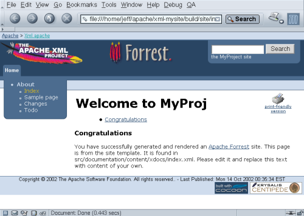
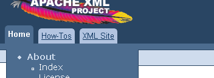
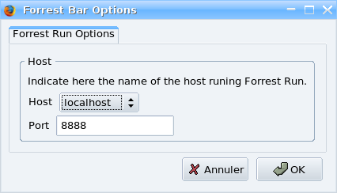
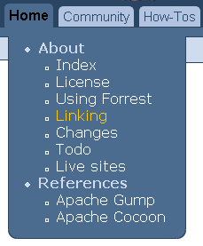
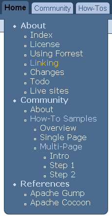
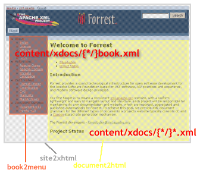
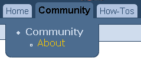
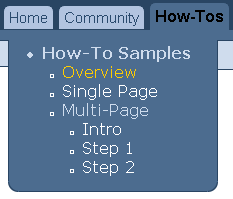
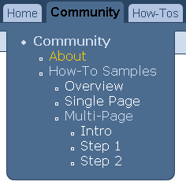
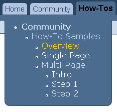

# Site Linkmap Table of Contents

## Navigation

- [How to do development with Apache Forrest](#howto-dev)
- Intended Audience
  - [Status of Themes: Skins and Dispatcher](#docs_0_90-status-themes)
- Prerequisites
  - [You have achieved the basic level of using Forrest. You have Forrest installed and can create a new site with 'forrest seed'. You have followed at least the first parts of the](#docs_0_100-your-project)
  - [You will enventually see that understanding of the Cocoon](#docs_0_100-sitemap-ref)
  - [read](#plugindocs-plugins_0_100-plugininfrastructure)
  - [Know how to use a](#docs_0_100-project-sitemap)
- Development techniques and scenarios
  - Understanding the Cocoon sitemap
    - [Forrest sitemap reference](#docs_0_100-sitemap-ref)
    - [Introduction to Pipelines in this](#docs_0_100-howto-howto-custom-html-source)
    - [About](#docs_0_100-project-sitemap)
- How to Build a Plugin
  - [More](#versions)
- Steps
  - Seed a New Plugin
    - [naming conventions](#plugindocs-plugins_0_100-plugininfrastructure)
  - Further Reading
    - [Plugin Infrastructure Documentation](#plugindocs-plugins_0_100-plugininfrastructure)
    - [Plugins Documentation](#plugindocs-plugins_0_100)
  - [Forrestbar](#tools-forrestbar)
- How to
  - [Quickstart](#plugindocs-plugins_0_80-org.apache.forrest.plugin.internal.dispatcher-how-howto-dispatcher-quickstart)
  - [Structurer](#plugindocs-plugins_0_80-org.apache.forrest.plugin.internal.dispatcher-how-howto-dispatcher-structurer)
  - [Contracts](#plugindocs-plugins_0_80-org.apache.forrest.plugin.internal.dispatcher-how-howto-dispatcher-contracts)
  - [Per Folder/File Themes](#plugindocs-plugins_0_80-org.apache.forrest.plugin.internal.dispatcher-how-perfolderthemes)
  - [Configure output serializer](#plugindocs-plugins_0_80-org.apache.forrest.plugin.internal.dispatcher-how-configure-serializer)
- [Dispatcher quickstart](#plugindocs-plugins_0_80-org.apache.forrest.plugin.internal.dispatcher-how-howto-dispatcher-quickstart)
- Further Reading
  - [How to use the structurer](#plugindocs-plugins_0_80-org.apache.forrest.plugin.internal.dispatcher-how-howto-dispatcher-structurer)
  - [Create your own contract implementation](#plugindocs-plugins_0_80-org.apache.forrest.plugin.internal.dispatcher-how-howto-dispatcher-contracts)
  - [How to deploy documentation with the Forrestbot "svn" workstage](#howto-forrestbot-svn)
  - [How to deploy documentation with the Forrestbot "scp" workstage](#howto-forrestbot-scp)
  - [Getting started with the "structurer"](#plugindocs-plugins_0_80-org.apache.forrest.plugin.internal.dispatcher-how-howto-dispatcher-structurer)
- How to customize processing of html source
  - [More](#versions)
- Understanding the HTML-Pipeline
  - html-Default Processing
    - [<map:transform src="{lm:transform.html.document}" />](#docs_0_100-glossary)
- [Forrestbot - automated building and deploying](#tools-forrestbot)
- [How to write a forrest:contract](#plugindocs-plugins_0_80-org.apache.forrest.plugin.internal.dispatcher-how-howto-dispatcher-contracts)
- About
  - [Dispatcher development](#plugindocs-plugins_0_80-org.apache.forrest.plugin.internal.dispatcher)
  - [Glossary](#plugindocs-plugins_0_80-org.apache.forrest.plugin.internal.dispatcher-dispatcher-glossary)
  - [Todo](#plugindocs-plugins_0_80-org.apache.forrest.plugin.internal.dispatcher-todo)
- [Internals](#plugindocs-plugins_0_80-org.apache.forrest.plugin.internal.dispatcher-int)
  - [Overview](#plugindocs-plugins_0_80-org.apache.forrest.plugin.internal.dispatcher-int)
- [Examples](#plugindocs-plugins_0_80-org.apache.forrest.plugin.internal.dispatcher-examples)
  - [Overview](#plugindocs-plugins_0_80-org.apache.forrest.plugin.internal.dispatcher-examples)
- [Dispatcher (Draft - feature under development)](#plugindocs-plugins_0_80-org.apache.forrest.plugin.internal.dispatcher)
- [Status of Themes: Skins and Dispatcher](#docs_0_80-status-themes)
- [Dispatcher Glossary](#plugindocs-plugins_0_80-org.apache.forrest.plugin.internal.dispatcher-dispatcher-glossary)
- [Todo List](#plugindocs-plugins_0_80-org.apache.forrest.plugin.internal.dispatcher-todo)
- [Per Folder/File Themes](#plugindocs-plugins_0_80-org.apache.forrest.plugin.internal.dispatcher-how-perfolderthemes-subfolder)
- [Welcome](#index)
- [Developers](#contrib)
- [Versioned Docs](#versions)
- [Plugins](#plugindocs)
- [Tools](#tools)
- [Forrest Plugins](#plugindocs)
- [Home](#plugindocs-plugins_0_80-org.apache.forrest.plugin.internal.dispatcher)
- [HowTo](#plugindocs-plugins_0_80-org.apache.forrest.plugin.internal.dispatcher-how-howto-dispatcher-quickstart)
- [Site Linkmap Table of Contents](#linkmap)
- Other pages
  - [Introduction to ASF Infrastructure](#asf-infrastructure)
  - [Becoming an Apache Forrest committer](#committed)
  - [Standards Compliance](#compliance)
  - [Apache Forrest documentation](#docs_0_100-body-index)
  - [Building Forrest](#docs_0_100-build)
  - [SourceTypeAction (content aware pipelines)](#docs_0_100-cap)
  - [Using Catalog Entity Resolver for local DTDs](#docs_0_100-catalog)
  - [Forrest dream list](#docs_0_100-dreams)
  - [Frequently Asked Questions](#docs_0_100-faq)
  - [CVS through SSH](#docs_0_100-howto-cvs-ssh-howto-cvs-ssh)
  - [Generate an ASF mirrors page using interactive web form](#docs_0_100-howto-howto-asf-mirror)
  - [How to Build a Plugin](#docs_0_100-howto-howto-buildplugin)
  - [How to modify the color of generated corner images](#docs_0_100-howto-howto-corner-images)
  - [How to customize Forrest CSS WYSIWYG-style](#docs_0_100-howto-howto-editcss)
  - [How to run Forrest from within Maven](#docs_0_100-howto-howto-forrest-from-maven)
  - [How to create a PDF document for each tab](#docs_0_100-howto-howto-pdf-tab)
  - [Overview of the How-To documents](#docs_0_100-howto)
  - [Example of a multi-page how-to](#docs_0_100-howto-multi-howto-multi)
  - [Index of /docs_0_100/howto/multi](#docs_0_100-howto-multi)
  - [Index of /docs_0_100/howto/multi](#docs_0_100-howto-multi-index_2)
  - [Index of /docs_0_100/howto/multi](#docs_0_100-howto-multi-index_3)
  - [Index of /docs_0_100/howto/multi](#docs_0_100-howto-multi-index_4)
  - [Index of /docs_0_100/howto/multi](#docs_0_100-howto-multi-index_5)
  - [Multi-page how-to: Step 1](#docs_0_100-howto-multi-step1)
  - [Multi-page how-to: Step 2](#docs_0_100-howto-multi-step2)
  - [Multi-page how-to: Step 3](#docs_0_100-howto-multi-step3)
  - [Apache Forrest documentation](#docs_0_100)
  - [Libre QuickStart](#docs_0_100-libre-intro)
  - [Menus and Linking](#docs_0_100-linking)
  - [Locationmaps](#docs_0_100-locationmap)
  - [The Forrest Primer](#docs_0_100-primer)
  - [Using extra project JavaScript and CSS resources](#docs_0_100-project-js-css)
  - [Properties](#docs_0_100-properties)
  - [Searching Forrest-built documentation](#docs_0_100-searching)
  - [Cocoon sitemap explained](#docs_0_100-sitemap-explain)
  - [Skin packaging, provision, and use](#docs_0_100-skin-package)
  - [Default skins](#docs_0_100-skins)
  - [Status of Themes: Skins and Dispatcher](#docs_0_100-status-themes)
  - [Upgrading to Apache Forrest 0.10-dev](#docs_0_100-upgrading_010)
  - [XML validation and entity resolution](#docs_0_100-validation)
  - [Apache Forrest documentation](#docs_0_80-body-index)
  - [Building Forrest](#docs_0_80-build)
  - [SourceTypeAction (content aware pipelines)](#docs_0_80-cap)
  - [Forrest dream list](#docs_0_80-dreams)
  - [Frequently Asked Questions](#docs_0_80-faq)
  - [Forrest Glossary](#docs_0_80-glossary)
  - [CVS through SSH](#docs_0_80-howto-cvs-ssh-howto-cvs-ssh)
  - [How to Build a Plugin (v0.8)](#docs_0_80-howto-howto-buildplugin)
  - [How to modify the color of generated corner images](#docs_0_80-howto-howto-corner-images)
  - [How to customize processing of html source (v0.8)](#docs_0_80-howto-howto-custom-html-source)
  - [How to customize Forrest CSS WYSIWYG-style](#docs_0_80-howto-howto-editcss)
  - [How to run Forrest from within Maven](#docs_0_80-howto-howto-forrest-from-maven)
  - [How to create a PDF document for each tab](#docs_0_80-howto-howto-pdf-tab)
  - [Overview of the How-To documents](#docs_0_80-howto)
  - [Example of a multi-page how-to](#docs_0_80-howto-multi-howto-multi)
  - [Multi-page how-to: Step 1](#docs_0_80-howto-multi-step1)
  - [Multi-page how-to: Step 2](#docs_0_80-howto-multi-step2)
  - [Multi-page how-to: Step 3](#docs_0_80-howto-multi-step3)
  - [Apache Forrest documentation](#docs_0_80)
  - [Libre QuickStart](#docs_0_80-libre-intro)
  - [Menus and Linking](#docs_0_80-linking)
  - [Locationmaps](#docs_0_80-locationmap)
  - [The Forrest Primer](#docs_0_80-primer)
  - [Searching Forrest-built documentation](#docs_0_80-searching)
  - [Cocoon sitemap explained](#docs_0_80-sitemap-explain)
  - [Forrest Sitemap Reference](#docs_0_80-sitemap-ref)
  - [Skin packaging, provision, and use](#docs_0_80-skin-package)
  - [Default skins](#docs_0_80-skins)
  - [Upgrading to Apache Forrest 0.8](#docs_0_80-upgrading_08)
  - [XML validation and entity resolution](#docs_0_80-validation)
  - [Using Forrest](#docs_0_80-your-project)
  - [Apache Forrest documentation](#docs_0_90-body-index)
  - [Building Forrest](#docs_0_90-build)
  - [SourceTypeAction (content aware pipelines)](#docs_0_90-cap)
  - [Forrest dream list](#docs_0_90-dreams)
  - [Frequently Asked Questions](#docs_0_90-faq)
  - [Forrest Glossary](#docs_0_90-glossary)
  - [CVS through SSH](#docs_0_90-howto-cvs-ssh-howto-cvs-ssh)
  - [Generate an ASF mirrors page using interactive web form](#docs_0_90-howto-howto-asf-mirror)
  - [How to Build a Plugin (v0.9)](#docs_0_90-howto-howto-buildplugin)
  - [How to modify the color of generated corner images](#docs_0_90-howto-howto-corner-images)
  - [How to customize processing of html source (v0.9)](#docs_0_90-howto-howto-custom-html-source)
  - [How to customize Forrest CSS WYSIWYG-style](#docs_0_90-howto-howto-editcss)
  - [How to run Forrest from within Maven](#docs_0_90-howto-howto-forrest-from-maven)
  - [How to create a PDF document for each tab](#docs_0_90-howto-howto-pdf-tab)
  - [Overview of the How-To documents](#docs_0_90-howto)
  - [Example of a multi-page how-to](#docs_0_90-howto-multi-howto-multi)
  - [Index of /docs_0_90/howto/multi](#docs_0_90-howto-multi)
  - [Index of /docs_0_90/howto/multi](#docs_0_90-howto-multi-index_2)
  - [Index of /docs_0_90/howto/multi](#docs_0_90-howto-multi-index_3)
  - [Index of /docs_0_90/howto/multi](#docs_0_90-howto-multi-index_4)
  - [Index of /docs_0_90/howto/multi](#docs_0_90-howto-multi-index_5)
  - [Multi-page how-to: Step 1](#docs_0_90-howto-multi-step1)
  - [Multi-page how-to: Step 2](#docs_0_90-howto-multi-step2)
  - [Multi-page how-to: Step 3](#docs_0_90-howto-multi-step3)
  - [Apache Forrest documentation](#docs_0_90)
  - [Libre QuickStart](#docs_0_90-libre-intro)
  - [Menus and Linking](#docs_0_90-linking)
  - [Locationmaps](#docs_0_90-locationmap)
  - [The Forrest Primer](#docs_0_90-primer)
  - [Properties](#docs_0_90-properties)
  - [Searching Forrest-built documentation](#docs_0_90-searching)
  - [Cocoon sitemap explained](#docs_0_90-sitemap-explain)
  - [Forrest Sitemap Reference](#docs_0_90-sitemap-ref)
  - [Skin packaging, provision, and use](#docs_0_90-skin-package)
  - [Default skins](#docs_0_90-skins)
  - [Upgrading to Apache Forrest 0.9](#docs_0_90-upgrading_09)
  - [XML validation and entity resolution](#docs_0_90-validation)
  - [Using Forrest](#docs_0_90-your-project)
  - [Documentation Best Practices](#documentation_bestpractices)
  - [DTD documentation](#dtdx-document-v13.dtdx)
  - [The Apache Forrest xdocs document-v1.3 DTD](#dtdx-document-v13)
  - [DTD documentation](#dtdx-document-v20.dtdx)
  - [The Apache Forrest xdocs document-v2.0 DTD](#dtdx-document-v20)
  - [Forrest DTD documentation](#dtdx-dtd-docs)
  - [DTD documentation](#dtdx-faq-v13.dtdx)
  - [DTD documentation](#dtdx-faq-v20.dtdx)
  - [DTD documentation](#dtdx-howto-v13.dtdx)
  - [DTD documentation](#dtdx-howto-v20.dtdx)
  - [Apache Forrest: Events](#events)
  - [Apache Forrest: documentation framework](#flyer)
  - [Our Contract](#forrest-contract)
  - [ForrestFriday monthly get-together](#forrest-friday)
  - [Apache Forrest project guidelines](#guidelines)
  - [Apache Gump integration](#gump)
  - [How to write a How-To](#howto-howto)
  - [Apache Forrest issue tracker](#issues)
  - [Examples Built-With-Forrest](#live-sites)
  - [Planning notes](#plan)
  - [Plan: Internal structure is XHTML2](#plan-internal-xhtml)
  - [Extending Forrest with Plugins](#plugindocs-plugins_0_100-usingplugins)
  - [Plugins Index](#plugindocs-plugins_0_90)
  - [Plugin Infrastructure](#plugindocs-plugins_0_90-plugininfrastructure)
  - [Extending Forrest with Plugins](#plugindocs-plugins_0_90-usingplugins)
  - [How to Publish Forrest Documentation](#procedures-how_to_publish_docs)
  - [How to release Forrest](#procedures-release-how_to_release)
  - [Draft: Proposal for ASF-wide Forrestbot](#proposal-asf-forrestbot)
  - [Subversion Best Practices](#subversion_bestpractices)
  - [Version control](#svn)
  - [Project tasks](#tasks)
  - [Thanks from Apache Forrest](#thanks)
  - [Todo List](#todo)
  - [Apache Forrest: Eclipse Plugin](#tools-eclipse)
  - [Forrestbot Web Interface](#tools-forrestbot-web-interface)
  - [XXE Forrest Configuration](#tools-xxe)
  - [Upgrading to Apache Forrest 0.7](#trash-docs_0_70-upgrading_07)
  - [Who we are](#who)
  - [Notes for forrest.zones.apache.org](#zone)

## Content

<a id="howto-dev"></a>

<!-- source_url: https://forrest.apache.org/howto-dev.html -->

<!-- page_index: 1 -->

# How to do development with Apache Forrest

Various scenarios are utilised to describe aspects of development. Bear in
mind that there are many ways to do things. Each developer has different
tools and habits, and different operating systems are used. So you will
need to glean the principles and apply them to your own situation.

This document assumes that you intend to contribute some parts of your
work back to the project. Techniques for network-based collaborative
development are encouraged.

<a id="howto-dev--development-environment"></a>

### Development environment

There is no \*proper\* dev environment. It really depends on your personal
preferences. In an opensource project there is huge variety of
environments. This makes it quite a challenge to keep sources consistent
(see discussion below).

Some people use vi or emacs, others use graphical editors, others use
integrated development environments such as Eclipse or IDEA.

Ensure to [configure](#docs_0_100-catalog) your xml editor to take
advantage of the local sets of DTDs provided by Forrest. This also
explains how to use xml validators such as 'xmllint'. If your editor of
choice doesn't validate XML, then most XML validation issues can be
discovered using forrest validate-xdocs

There really isn't much Java code in Forrest, but a Java Development
Environment such as Eclipse or any text editor of your choice will work
just fine. If you point Eclipse at the Forrest build file it will make
life easy for you.

<a id="howto-dev--using-subversion"></a>

### Using Subversion

The Subversion source control system is used for all ASF projects. You
can leverage this to ease your own development.

The "trunk" is where all new development and bugfixing happens. We aim
to keep the trunk usable at all times.

Each version release is a "branch", such as "forrest\_07\_branch". Crucial
bugfixes are also applied to the relevant release branch.

Branches are also used for developing complex new code which would
otherwise disrupt the trunk. When the new work is suitable, then that
branch is merged back to the trunk as soon as possible.

To get started, see the [instructions](#docs_0_100-build) for
obtaining the Apache Forrest sources via SVN.

Whether you use the svn command-line client or a fancy client, then you
still need to make sure you know how to operate SVN properly.
[http://svnbook.red-bean.com](http://svnbook.red-bean.com/)
is a must.

<a id="howto-dev--multiple-working-copies"></a>

#### Multiple working copies

Most developers would have a number of separate SVN working copies.
Hopefully you are brave enough to use the trunk for all your sites.
Sometimes that is not possible, for example when you are
co-operativley managing a site with other people who are not so brave, so you need to use a specific release. However consider using the SVN
release branch, rather than the release archive (tar or zip). This
enables you to easily keep up with bugfixes. You can also easily see
what local changes that you have made by using 'svn status; svn diff'.

Here is one layout ...

```

[localhost]$ ls /svn/asf
forrest_07_branch
forrest-trunk
        
```

<a id="howto-dev--watch-email-notifications-for-svn-differences"></a>

#### Watch email notifications for svn differences

Either subscribe to the project's
[svn mailing list](https://forrest.apache.org/mail-lists.html#forrest-svn) or monitor
it via one of the mail archives. This enables you to be immediately
up-to-date with changes to the repositories. The svn differences
(diffs) are automatically sent whenever a committer makes some
changes.

<a id="howto-dev--updating-svn-backwards-to-find-where-something-broke"></a>

#### Updating svn backwards to find where something broke

Sometimes the addition of new features will break something. Often it
is difficult to find where the break occurred and what caused it.
Updating your svn backwards will enable this.

Look at the svn@ mail list to guess which change might be the culprit, e.g. svn revision 406862.

```

Update backwards to just before the upgrade:
svn update -r 406861
... do 'build clean; build' and test.

Go back further if it still doesn't work.
After success, start upgrading forward.

Looking at the svn@ mailing list shows that
could jump forward past minor changes such as doc edits.
e.g. just after the upgrade:
svn update -r 406863
... do 'build clean; build' and test.

If it still works, move a bit further on:
svn update -r 407260
... do 'build clean; build' and test.

After finding the break, move back to head of trunk
svn update -r HEAD.
        
```

<a id="howto-dev--reverting-changes-using-svn-merge"></a>

#### Reverting Changes using SVN Merge

Two examples of using SVN Merge.

```

$ svn merge -r 400:300 /site-author/content/xdocs/index.xml /site-author/content/xdocs/index.xml

or

$ svn merge -r 303:302

... then commit as usual.
          
```

More information can be found at
[Common
use-cases for merging](http://svnbook.red-bean.com/en/1.0/ch04s04.html#svn-ch-4-sect-4.2) section of the Red Bean SVN Book.

<a id="howto-dev--creating-patches"></a>

#### Creating patches

See [instructions](#contrib--patch) for creating and
contributing patches. Make sure to do three things before creating the
patch:

- Do 'svn update' to be in sync with the repository in case someone else changed your files in SVN.
- Do 'svn status' to ensure that you are not including unnecessary changes.
- Do 'svn diff' to ensure that changes are what you expect.

After creating the patch, open it with a text editor and review it.

<a id="howto-dev--tips"></a>

#### Tips

- Keep a copy of this book, or the online version, close at hand:
  [Version Control with Subversion](http://svnbook.red-bean.com/)
  - the opensource SVN book.
- See all available branches and other repositories:
  <http://svn.apache.org/repos/asf/forrest/>
- Use online repository browsers to quickly see past activity for
  the files that you are working on:
  <http://svn.apache.org/viewcvs.cgi/forrest/trunk/>
- Use 'svn log foo.xsl' for a summary of recent activity and to
  see dates and revision numbers for changes.

<a id="howto-dev--editing-content"></a>

### Editing content

See the [FAQ](#docs_0_100-faq--edit-content). Basically any editor
can be used, because Forrest treats the editing of content as a separate
concern. Be sure to configure the editor to find local copies of DTDs.

<a id="howto-dev--code-style-guidelines"></a>

#### Code style guidelines

Consistent code makes everyone's life easier. See the
[Apache
Cocoon tips](http://cocoon.apache.org/community/committer.html). We don't get too hung up on style, but those few
basic things are important. However we know that coding style is
mixed, so just follow the same style as that which exists in the file
you are editing. We can occasionally clean up later.

Don't change anything that is not necessary. Remember that people need
to be able to read the differences on the svn@forrest mailing list.

<a id="howto-dev--whitespace"></a>

#### Whitespace

For new files, use spaces instead of tabs (java files have four-space
indentation, xml files and other text files have two-space
indentation).

Don't let your editor automatically change the whitespace for existing
files.

We know that many files in SVN do not have consistent whitespace. This
issue is continually being addressed. Please don't attempt to rectify
whitespace mixed up with other changes. This makes the important
changes difficult to see. Occasionally committers will rectify
whitespace for a set of files, when they know that no-one else is
working on that set.

Fixme (open)

The issues of whitespace and line endings needs to be very clearly
described. See some
[mail
discussion](http://marc.theaimsgroup.com/?l=forrest-dev&m=112450886218545) references.

<a id="howto-dev--line-length"></a>

#### Line length

If each paragraph of an xml source document is one enourmous long
line, then it is extremely difficult to know the changes with the SVN
diffs. Developers and especially committers, need to be able to
efficiently review the changes. Fold long lines to a sensible
line-length (normally 80-characters wide but not more than 120
characters).

<a id="howto-dev--use-forrest-run-for-immediate-gratification"></a>

#### Use 'forrest run' for immediate gratification

Edit documentation content and immediately view it in the browser.
When you are satisifed, then do 'forrest site' to ensure that the
whole documentation set hangs together and there are no broken
references.

In the dynamic 'forrest run' mode, you will get some feedback about
some xml validation errors. However, it is better to treat validation
as a separate concern. Use an xml editor or command-line tools such as
"xmllint". As a last resort, you can use 'forrest validate-xdocs'.

<a id="howto-dev--tips-2"></a>

#### Tips

- ####

<a id="howto-dev--understanding-the-cocoon-sitemap"></a>

### Understanding the Cocoon sitemap

The Cocoon sitemap is essential for Forrest developers. See some
introductions ....

- [Forrest sitemap reference](#docs_0_100-sitemap-ref).
- Introduction to Pipelines in this
  [How-to](#docs_0_100-howto-howto-custom-html-source).
- About
  [Forrest project sitemaps](#docs_0_100-project-sitemap).
- [Cocoon concepts](http://cocoon.apache.org/2.1/userdocs/concepts/).
- [Cocoon sitemap](http://cocoon.apache.org/2.1/userdocs/concepts/sitemap.html).
- [Cocoon protocols](http://cocoon.apache.org/2.1/userdocs/concepts/sitemap.html#Protocols), i.e. cocoon:/ and
  cocoon:// and context:// and resource:// etc. and the
  [file://](http://cocoon.apache.org/2.1/userdocs/concepts/sitemap.html#file-url)

<a id="howto-dev--debugging-and-profiling-techniques"></a>

### Debugging and profiling techniques

<a id="howto-dev--view-logfiles"></a>

#### View logfiles

The log files in WEB-INF/logs are indispensible when it comes to
debugging sitemaps. While ERRORs will generally always print in the
log files, while you're debugging something you may find it useful to
also customize log output in the "logkit.xconf" in webapp/WEB-INF and
raise the level of some loggers to WARN.

This [FAQ](#docs_0_100-faq--logs) describes the location of the
Cocoon logfiles and their configuration.

<a id="howto-dev--view-intermediate-processing"></a>

#### View intermediate processing

Perhaps the easiest way to "debug" Forrest is to be aware of all the
processing steps between taking in the source and outputting the end
result. When you know these you can do 'forrest run' and request the
intermediate documents, such as
"http://localhost:8888/body-index.html"
which will return the intermediate processing of the body part of the
/index.html document, and
"http://localhost:8888/index.xml"
which will return the intermediate xml.

The techniques described below help you to be aware of the
intermediate processing steps.

The [ForrestBar](#tools-forrestbar) also provides easy access
to various internal data to assist with both understanding how the
processing works and with debugging.

See also the [FAQ](#docs_0_100-faq--version)
which explains access to version and all "properties" information.

<a id="howto-dev--using-cocoon-sitemap-profiler"></a>

#### Using Cocoon sitemap profiler

Cocoon provides a simple profiler to analyse itself. This enables us
to list the various sitemap pipelines and components that are being
used, how much time was used by each, whether each component uses the
Cocoon cache, and show the actual xml data.

Note that the profiler is not used by default. To switch it on, edit
main/webapp/sitemap.xmap and search for "profiler".
Follow the instructions there to replace the standard "map:pipe"
components with the profiling pipes.

Now start your application as normal using 'forrest run' and request
localhost:8888/index.html three or four times to populate the profiler
with data.

Now request the special uri localhost:8888/cprofile.html to see the
results. Start at the "index.html" request, then follow the
processing. (If the table is empty, then you either forgot to do some
requests before looking for results, or forgot to switch on the
profiler in sitemap.)

NOTE: Do not forget to turn off the profiler in
main/webapp/sitemap.xmap when finished.

<a id="howto-dev--using-cocoon-sitemap-execution-logger"></a>

#### Using Cocoon sitemap execution logger

In main/webapp/WEB-INF/cocoon.xconf search for "sitemap
execution" and uncomment the component. For each sitemap component
that is executed, a message will go to WEB-INF/logs/sitemap-execution.log

Fixme (open)

See [FOR-1109](https://issues.apache.org/jira/browse/FOR-1109) - Not available in Cocoon-2.1

<a id="howto-dev--using-cocoon-logtransformer"></a>

#### Using Cocoon LogTransformer

LogTransformers can be inserted in the sitemaps. This will write the
sax events at that point into a named log file. Here is an example
(the logfile will be written relative to this particular sitemap) ...

```


<map:match pattern="*.html">
  <map:generate src="sources/{1}.xml"/>

  <map:transform type="log">
    <map:parameter name="logfile" value="my-1.log"/>
    <map:parameter name="append" value="no"/>
  </map:transform>

  <map:transform src="stylesheets/source-to-table.xsl"/>
  <map:transform src="stylesheets/table-to-page.xsl"/>

  <map:transform type="log">
    <map:parameter name="logfile" value="my-2.log"/>
    <map:parameter name="append" value="no"/>
  </map:transform>

  <map:transform src="stylesheets/page-to-html.xsl"/>
  <map:serialize type="html"/>
</map:match>

        
```

Another use for this technique is when you are not sure which path is
being taken through the sitemap. Add various LogTransformers with
different filenames and see which one gets triggered.

<a id="howto-dev--using-cocoon-validation-transformers"></a>

#### Using Cocoon Validation Transformers

Validating Transformers can be inserted in the sitemaps to validate
the xml stream at that stage. Enables RELAX NG validation and W3C XML
Schema validation using Jing and Xerces.

The Validation Block is already added to Forrest and configured. To
use it simply add entries to your sitemap like this and followed by a serializer:

```

...
<map:transform type="validation-report"
  src="{forrest:forrest.context}/resources/schema/relaxng/unstable/any.rng"/>
...
```

That can be added at any point where you want to validate the xml.
There is a default validation by reqesting the URI
'\*.validation.xml'
e.g. http://localhost:8888/index.validation.xml

See [Pier's
note to cocoon-dev](http://marc.theaimsgroup.com/?t=112541971900003) and Cocoon documentation:
[ValidatingTransformer](http://cocoon.zones.apache.org/daisy/documentation/components/1058/g2/684.html)
and
[ValidationReportTransformer](http://cocoon.zones.apache.org/daisy/documentation/components/1058/g2/691.html).
See [Validation Block Samples](http://cocoon.zones.apache.org/cocoon21/samples/blocks/validation/welcome) demos at the Cocoon zone.
See [API](http://cocoon.apache.org/2.1/apidocs/org/apache/cocoon/components/validation/Validator.html) docs.

Fixme (open)

The Cocoon docs are broken. See
[COCOON-2332](https://issues.apache.org/jira/browse/COCOON-2332)

<a id="howto-dev--validate-all-intermediate-xml-content"></a>

#### Validate all intermediate xml content

Add a text file at src/documentation/conf/uris.txt
which contains the line linkmap.validation-start.xml
(and any other extra URIs that you want Cocoon to process).

Add the line
project.urifile=${project.home}/src/documentation/conf/uris.txt
to your project's forrest.properties file.

After generating the complete site with 'forrest site'
see the document build/tmp/validation-reports.html

<a id="howto-dev--java-code"></a>

#### Java code

There are two ways to debug your java code. The first is through
embedded logging, the second is by tracing the codes execution.

You may find getLogger().debug() useful for understanding
the processing that goes on. You can then open the page that will use
the selected code and use the log files mentioned above to look for
the information message.

To step through the java code you need to run forrest with Java
debugging turned on. The forrest.jvmargs property in
the forrest.properties file can be used to start forrest
in debug mode on a specific port. For example:

```
forrest.jvmargs=-Xdebug -Xrunjdwp:transport=dt_socket,address=8000,server=y,suspend=n
```

<a id="howto-dev--finding-broken-internal-links"></a>

#### Finding broken internal links

Do 'forrest site' to produce the whole documentation set. Cocoon will
report its progress and reveal any problems. This
[FAQ](#docs_0_100-faq--build_msg_a) explains the messages that
Cocoon sends to standard output. Broken links are also reported to a
special file, which also shows the source file containing the break.
The location of this file is reported when Cocoon starts.

Broken links are also reported in 'forrest run' mode. Use your mouse
to point to each link. The browser status bar will show "error:..."
instead of the actual URL.

The most common cause is that the entry is missing in the site.xml
configuration file or the link in your source document is not using
the correct name for the "site:..." value. Use the "localhost:8888/abs-menulinks"
resource or via [ForrestBar](#tools-forrestbar).

<a id="howto-dev--tips-3"></a>

#### Tips

- Doing 'forrest -v' will provide verbose build messages to the
  standard output.

> [!NOTE]
> The next two sections describe the configuration of profiling tools but
> they are not integrated with the IDE. If you can figure out how to
> properly configure them for integrated operation with the IDE, please
> provide a documentation patch.

<a id="howto-dev--profiling-forrest-with-yourkit"></a>

#### Profiling Forrest with YourKit

Assuming you have the YourKit software installed you simply need to do
two things to profile a particular Forrest Project. First, you need to
add \*YourKit Home\*\bin\win32 to your PATH environment variable - where
\*YourKit Home\* is the installation directory of that software. Next
you need to add the following to your forrest.properties file for the
project.

```
forrest.jvmargs=-agentlib:yjpagent
```

You are now all set, simply type 'forrest run', then open up YourKit
and select "Connect to locally running profiled application...". If
you don't see the types of objects that you expected, check the
current filters - YourKit seems to filter out org.apache.\* namespaces
by default.

<a id="howto-dev--profiling-forrest-with-netbeans"></a>

#### Profiling Forrest with Netbeans

Assuming you have the Netbeans IDE installed, you simply need to do a
couple things to profile a particular Forrest Project. First, you need
to add \*Netbeans Home\*\profiler1\lib\deployed\jdk142\windows to your
path. Obviously, this needs to be slightly modified for a Unix
machine. Now, you need to add the following line to your
forrest.properties file for the project (replacing \*NetbeansHome\* with
the path to your install).

```
forrest.jvmargs=-agentpath:C:\*NetbeansHome*\\profiler1\\lib\\deployed\\jdk15\\windows\\
profilerinterface.dll=\C:\\*NetbeansHome*\\profiler1\\lib\\,5140
```

You are now all set, simply type 'forrest run', then open up the
Netbeans IDE with your Forrest project. Click Profile->Attach Profiler
and make selections appropriate to what you are trying to achieve.

<a id="howto-dev--using-cocoon-server-status"></a>

### Using Cocoon "server status"

Provides a list of the Cocoon cache and other server status and
environment information.

In the "forrest.properties" configuration, set the "project.required.plugins" property
to add the "org.apache.forrest.plugin.input.serverStatus" plugin.

Then in 'forrest run' mode, see
http://localhost:8888/cstatus.html

Of course this is a development-time facility. Be sure to disable it
for production deployment.

<a id="howto-dev--finding-the-relevant-sources"></a>

### Finding the relevant sources

You will need to be able to find which sources, sitemaps, stylesheets
are responsible for certain processing.

<a id="howto-dev--scenario:-how-does-i18n-work"></a>

#### Scenario: How does i18n work

We will do a search for "i18n" to start with, then refine that after
exploring some of the sources.

The UNIX tools find, grep, and sed are very powerful. We need a helper
script, otherwise 'find' is going to report matches for the hidden
.svn files and also files in /build/ directories.

```

echo "sed '/\.svn/d;/\/build\//d;/\/work\//d'" > ~/bin/exclude-find-svn
chmod +x ~/bin/exclude-find-svn
```

Now we will run find, use grep to search for the pattern in each file
and list the filenames. However, there is a stack of
forrest.properties files from the plugins, and there is i18n:text
being used in the viewHelper plugin, and some DTDs. So weed them out
...

```

cd /svn/asf/forrest-trunk
find . -type f | xargs grep -l "i18n" | ~/bin/exclude-find-svn \
 | grep -v "forrest.properties" | grep -v viewHelper | grep -v "\/schema\/"
```

The list of files shows that there is an FAQ about i18n, there are
various sitemaps in main/webapp/, some stylesheets in
main/webapp/skins/common/ and pelt, some other stylesheets in
main/webapp/resources/stylesheets/ ... we will look at the sitemaps
first. Use grep to list the actual matches and the filenames.

```

cd main/webapp
grep i18n *.*
```

Shows that five sitemaps are involved in some way. Always start with
sitemap.xamp and forrest.xmap as they do initial processing and then
delegate to other sitemaps. Open each file in your editor, and search
within for each "i18n" match. See that the xslt transformer is
declared to use i18n, then further down the page the "skinit" pipeline
uses the i18n transformer only if i18n is switched on.

<a id="howto-dev--tips-4"></a>

#### Tips

- ####

---

<a id="docs_0_90-status-themes"></a>

<!-- source_url: https://forrest.apache.org/docs_0_90/status-themes.html -->

<!-- page_index: 2 -->

# Status of Themes: Skins and Dispatcher

Font size:

<a id="docs_0_90-status-themes--status-of-themes:-skins-and-dispatcher"></a>

# Status of Themes: Skins and Dispatcher

This is documentation for current version v0.9
([More](#versions))

- [Skins](#docs_0_90-status-themes--skins)
- [Dispatcher](#docs_0_90-status-themes--dispatcher)
- [Plan for future framework](#docs_0_90-status-themes--framework)

<a id="docs_0_90-status-themes--skins"></a>

## Skins

"Skins" is the term used to describe the current method for adding
navigation and menu information to the content of a page and applying a
consistent theme for layout, colours, etc. The
["pelt" skin](#docs_0_100-your-project--skins) is the only one that the
Forrest project is maintaining. It is configurable enough to meet many
purposes. The main configuration file for skins is the skinconf.xml
file. There is an ability for users to create their own skins, although
we have not encouraged that.

For the Forrest-0.9 release, skins are still available and are still the
main mechanism.

<a id="docs_0_90-status-themes--dispatcher"></a>

## Dispatcher

"Dispatcher" is the term used to describe a new method which aims to be
a more flexible and complete solution to build a reliable common
structure for documents, incorporate other content, and provide hooks
for applying themes. Themes get configured by structurer definitions (a
wee bit like the skinconf.xml). Although strong progress has been made, it is still under development. We encourage developers to use Dispatcher
and contribute to its development. See its own documentation in the trunk whiteboard plugins.

<a id="docs_0_90-status-themes--plan-for-future-framework"></a>

## Plan for future framework

The desired direction is to use xhtml2 as the internal format, move the
current "skins" into a plugin, and develop input plugins for xdoc and
html sources. This would enable any theme engine to be used, whether
that be Skins or Dispatcher or some other.

See the development discussion:
[Re:
status of skins and dispatcher](http://thread.gmane.org/gmane.text.xml.forrest.devel/20573). This is planned for immediately
following the 0.8 release. New developers please help.

---

<a id="docs_0_100-your-project"></a>

<!-- source_url: https://forrest.apache.org/docs_0_100/your-project.html -->

<!-- page_index: 3 -->

# Using Forrest

[0.90 (current)](#docs_0_90)
[0.100-dev (under development)](#docs_0_100)
[0.80 (past)](#docs_0_80)

0.100-dev

[Overview](#docs_0_100)

Using Forrest

How-To

[Overview](#docs_0_100-howto)

Install Forrest

[Building Forrest from Source](#docs_0_100-build "Build and install the current                     unreleased version")

[Upgrading to 0.10-dev](#docs_0_100-upgrading_010)

Customize Forrest

[Sitemaps explained](#docs_0_100-sitemap-explain)

[Custom html source](#docs_0_100-howto-howto-custom-html-source)

[Project sitemap](#docs_0_100-project-sitemap)

[Project JS and CSS](#docs_0_100-project-js-css "Use extra JavaScript and CSS in your project")

[Edit CSS (WYSIWYG)](#docs_0_100-howto-howto-editcss)

[Create tab PDF](#docs_0_100-howto-howto-pdf-tab "Generate one pdf-document for all pages of a tab")

[CSS corner SVG](#docs_0_100-howto-howto-corner-images)

Integrate Forrest with tools

[Maven Integration](#docs_0_100-howto-howto-forrest-from-maven)

[Using DTD Catalogs](#docs_0_100-catalog)

Extend Forrest

[Build a Plugin](#docs_0_100-howto-howto-buildplugin)

[Package new Skins](#docs_0_100-skin-package)

[Download mirror](#docs_0_100-howto-howto-asf-mirror)

Adding Documentation

[Write a How-to](#howto-howto "Instructions for writing                 a new howto-document")

Multipage HowTo

[Introduction](#docs_0_100-howto-multi-howto-multi)

[Step 1](#docs_0_100-howto-multi-step1)

[Step 2](#docs_0_100-howto-multi-step2)

[Step 3](#docs_0_100-howto-multi-step3)

[FAQs](#docs_0_100-faq)

Background

[Menus and Linking](#docs_0_100-linking)

[Search Options in Forrest](#docs_0_100-searching)

[Locationmap](#docs_0_100-locationmap)

[Properties system](#docs_0_100-properties)

[Sitemap Reference](#docs_0_100-sitemap-ref)

[Skins](#docs_0_100-skins "About default skins, their naming and features")

[Dispatcher versus Skins](#docs_0_100-status-themes)

[Sourcetype Action](#docs_0_100-cap)

[XML validation and entity resolution](#docs_0_100-validation)

[Changes](https://forrest.apache.org/docs_0_100/changes.html)

[Glossary](#docs_0_100-glossary)

Reference docs

DTD documentation

[Overview](#dtdx-dtd-docs)

[document-v20](#dtdx-document-v20.dtdx)

[howto-v20](#dtdx-howto-v20.dtdx)

[faq-v20](#dtdx-faq-v20.dtdx)

[document-v13](#dtdx-document-v13.dtdx)

[howto-v13](#dtdx-howto-v13.dtdx)

[faq-v13](#dtdx-faq-v13.dtdx)

Doc samples

[document-v13](#dtdx-document-v13)

[document-v20](#dtdx-document-v20)

Older Docs

[Forrest Primer](#docs_0_100-primer)

[Libre](#docs_0_100-libre-intro)

[Dream list](#docs_0_100-dreams)

[CVS over SSH](#docs_0_100-howto-cvs-ssh-howto-cvs-ssh)

---

This is documentation for development version v0.10-dev
([More](#versions))


[](http://www.apache.org/foundation/contributing.html)
[](http://www.apache.org/events/current-event.html)

Font size:

<a id="docs_0_100-your-project--using-forrest"></a>

# Using Forrest

<a id="docs_0_100-your-project--a-tutorial-on-how-to-use-forrest-in-your-own-projects"></a>

### A tutorial on how to use Forrest in your own projects

This is documentation for development version v0.10-dev
([More](#versions))

- [Introduction](#docs_0_100-your-project--intro)
- [Installing Forrest](#docs_0_100-your-project--installing)
  - [Setting up the Environment](#docs_0_100-your-project--setting-up-the-environment)
    - [In Unix/Linux:](#docs_0_100-your-project--in-unix-linux:)
    - [Windows 2000](#docs_0_100-your-project--windows-2000)
    - [In Windows XP:](#docs_0_100-your-project--in-windows-xp:)
  - [ForrestBar](#docs_0_100-your-project--forrestbar)
- [The 'forrest' command](#docs_0_100-your-project--the-forrest-command)
- [Seeding a new project](#docs_0_100-your-project--seeding_new)
- [Seeding an existing project](#docs_0_100-your-project--seeding_existing)
- [Customizing your project](#docs_0_100-your-project--customizing)
  - [Configuring the Forrest skin: skinconf.xml](#docs_0_100-your-project--skinconf.xml)
  - [Changing the layout: forrest.properties](#docs_0_100-your-project--changing_the_layout)
- [Adding content](#docs_0_100-your-project--adding_content)
  - [site.xml](#docs_0_100-your-project--site.xml)
  - [tabs.xml](#docs_0_100-your-project--tabs.xml)
  - [Images](#docs_0_100-your-project--images)
- [Advanced customizations: sitemap.xmap](#docs_0_100-your-project--sitemap.xmap)
  - [Example: Adding a new content type](#docs_0_100-your-project--adding_new_content_type)
    - [Registering a new DTD](#docs_0_100-your-project--new_dtd)
  - [Example: Adding a new content type (advanced)](#docs_0_100-your-project--adding_new_content_type_2)
  - [Example: integrating external RSS content](#docs_0_100-your-project--integrating_rss)
- [Forrest skins](#docs_0_100-your-project--skins)
  - [Configuration of skins](#docs_0_100-your-project--skin-configuration)
  - [Defining a new skin](#docs_0_100-your-project--new_skin)
- [Interactive Forrest: faster turnaround when developing your docs](#docs_0_100-your-project--webapp)
  - [Running as a webapp](#docs_0_100-your-project--forrest_run)
    - [Using the webapp](#docs_0_100-your-project--using_webapp)
- [Invoking Forrest from Ant](#docs_0_100-your-project--invoking_from_ant)

<a id="docs_0_100-your-project--introduction"></a>

## Introduction

This tutorial will lead you through the process of installing Forrest, and using it to create a new project, or add Forrest-based docs to an
existing project.

<a id="docs_0_100-your-project--installing-forrest"></a>

## Installing Forrest

[Download](http://forrest.apache.org/mirrors.cgi) the latest release of
Forrest and follow the index.html in the top-level, or if you want to
try the development version, then [build
Forrest](#docs_0_100-build) from source.

<a id="docs_0_100-your-project--setting-up-the-environment"></a>

### Setting up the Environment

After downloading and extracting Forrest, you need to add environment
variables. The reason for this is so that the 'forrest' command is
available everywhere and it can locate its home directory and
resources. It is beyond the scope of Forrest to explain how to manage
your operating system. Some tips are listed below and this
[message](http://mail-archives.apache.org/mod_mbox/forrest-user/200610.mbox/%3ceab855560610181625u6e49b49at7df6c0c5e6812c74@mail.gmail.com%3e)
explains further and provides other tips about using Windows.

<a id="docs_0_100-your-project--in-unix-linux:"></a>

#### In Unix/Linux:

change directory to the top-level of the forrest distribution and do
...

~/apache-forrest$ export FORREST\_HOME=`pwd`

~/apache-forrest$ export PATH=$PATH:$FORREST\_HOME/bin

<a id="docs_0_100-your-project--permanently-setting-the-environment-variables-for-linux-unix"></a>

##### Permanently Setting The Environment Variables for Linux/Unix

Export only changes the variables during that terminal session for
that user, this is useful for testing. To permanently add the
variable edit either /etc/bash.bashrc (for all users)
or ~/.bash\_profile (for individual users). Add these
lines to the end of the file you edit:

```

      FORREST_HOME=/full/path/to/forrest
      export FORREST_HOME
      
      PATH=$PATH:$FORREST_HOME/bin
      export PATH
          
```

<a id="docs_0_100-your-project--the-debian-update-alternatives-system"></a>

##### The Debian update-alternatives system

If your system uses the alternatives system to manage application binaries and their locations, you may use that to link Forrest into your system's binary directory, instead of explicitly exporting environment variables. To check if your system has the alternatives system installed, execute this command:

update-alternatives --version

Update-alternatives will print its version if it is installed. If so, you may then add an entry for Forrest. Installing an update-alternatives entry may need to be run with root privileges. On some systems, that can be achieved with the "sudo" command, which executes single commands as the super user: for example, Ubuntu's GNU/Linux system uses this feature. Or you may need to contact a system administrator to install.

To install a Forrest entry, first, gather the path to Forrest's executable, and also note its version. In this example, Forrest has been unpacked and placed into '/opt/Apache/apache-forrest-0.8' (the executable is at bin/forrest). Then execute this command (here we use sudo to execute update-alternatives with root privileges):

sudo update-alternatives --install /usr/bin/forrest forrest '/opt/Apache/apache-forrest-0.8/bin/forrest' 800

The arguments to this command include '/usr/bin/forrest' as the system's location for the binary link, 'forrest' as the update-alternatives short name for this entry, '/opt/Apache/apache-forrest-0.8/bin/forrest' as the actual binary's location, and '800' as the priority.

Alternatives entries have a priority because you may install other versions of Forrest, and switch among them using update-alternatives: the highest priority entry will be selected as the default until you explicitly select another one to become active. Here, we have chosen a number based on Forrest's version: version 0.8 is installed, and priority 800 leaves room for adding several other versions; for instance, 0.90 may use priority 900, and 1.0 may be 1000.

Forrest should now be available on your command line. Execute: forrest --help

Forrest should print its help text. For more help with the alternatives system, use:

update-alternatives --help or man update-alternatives

<a id="docs_0_100-your-project--windows-2000"></a>

#### Windows 2000

Go to "My Computer", "Properties", "Advanced", "Environment
Variables"

add a new variable FORREST\_HOME as
C:\full\path\to\apache-forrest

edit PATH as %PATH%;%FORREST\_HOME%\bin

<a id="docs_0_100-your-project--in-windows-xp:"></a>

#### In Windows XP:

Go to "My Computer", "Properties", "Advanced", "Environment
Variables"

Create a New variable with name: FORREST\_HOME value:
C:\full\path\to\apache-forrest

Edit PATH by adding ;%FORREST\_HOME%\bin to the end of the current
value.

<a id="docs_0_100-your-project--forrestbar"></a>

### ForrestBar

Install the
[ForrestBar](#tools-forrestbar)
a toolbar extension for the Firefox browser. It provides
assisted navigation and search of various Forrest resources.

<a id="docs_0_100-your-project--the-forrest-command"></a>

## The 'forrest' command

To see what the 'forrest' command can do, type 'forrest -projecthelp'.
The build targets that are marked with \* are the commonly used ones.

```

  Apache Forrest.  Run 'forrest -projecthelp' to list options
  
  Buildfile: /usr/local/svn/forrest/src/core/bin/../forrest.build.xml
  
      *=======================================================*
      |                 Forrest Site Builder                  |
      |                        X.Y-dev                        |
      *=======================================================*
    
               Call this through the 'forrest' command
    
  Main targets:
  
   available-plugins     What plugins are available?
   available-skins       What skins are available?
   clean                 * Clean all directories and files generated during
                          the build
   init-plugins          Ensure the required plugins are available locally,
                         if any are not, download them automatically
   install-skin          Install the needed skin from the remote repository
   package-skin          Make a package of an existing skin
   run                   * Run Jetty (instant live webapp)
   run_custom_jetty      Run Jetty with configuration file found in the project
   run_default_jetty     Run Jetty with configuration file found in Forrest
   seed                  * Seeds a directory with a template project doc structure
   site                  * Generates a static HTML website for this project
   validate              Validate all: xdocs, skins, sitemap, etc
   validate-sitemap      Validate the project sitemaps
   validate-skinchoice   Validate skin choice
   validate-skinconf     Validate skinconf
   validate-skins        Validate skins
   validate-stylesheets  Validate XSL files
   validate-xdocs        Validate the project xdocs
   war                   * Generates a dynamic servlet-based website
                           (a packaged .war file)
   webapp                Generates a dynamic servlet-based website
                           (an unpackaged webapp).
   webapp-local          Generates a dynamic servlet-based website
                           (an unpackaged webapp). Note this webapp is suitable
                           for local execution only, use the 'war' or 'webapp'
                           target if you wish to deploy remotely.
  Default target: site
       
```

As 'site' is the default target, just running 'forrest' without options
will generate a "static HTML website". For example, typing 'forrest' in
the top-level "forrest/site-author" directory would build Forrest's own
website. But we're going to be building a new site for your project, so
read on.

<a id="docs_0_100-your-project--seeding-a-new-project"></a>

## Seeding a new project

'Seeding' a project is our own arborial term for adding a template
documentation set to your project, which you can then customize.

To try this out, create a completely new directory (outside the Forrest
distribution), then change directory to it, and do 'forrest seed'. This
will give you a new site with lots of demonstration documents. You can
also do "forrest seed-business", this will ask you a number of questions
about the site and will create a smaller site without all the
demonstration pages of the standard seed site.

> [!NOTE]
> forrest seed is useful to see what is possible within
> Forrest, but if you are creating a real site forrest
> seed-business has less content initially, and is therefore easier
> to edit (even if it is not a business site). We hope to include more
> seed sites in the future.

If you run forrest seed you should see output like this
below:

```

[/home/me/forrest/my-test]$ forrest seed

Apache Forrest.  Run 'forrest -projecthelp' to list options

Buildfile: /usr/local/svn/forrest/src/core/bin/../forrest.build.xml

init-props:
Loading project specific properties from
 /home/me/forrest/my-test/forrest.properties
...
echo-settings:

check-contentdir:

ensure-nocontent:

seed:
Copying 41 files to /home/me/forrest/my-test

-------------------------------
~~ Template project created! ~~

Here is an outline of the generated files:

/                        # /home/me/forrest/my-test
/forrest.properties      # Optional file describing your site layout
/src/documentation/      # Doc-specific files
/src/documentation/skinconf.xml    # Info about your project used by the skin
/src/documentation/content         # Site content.
/src/documentation/content/xdocs   # XML content.
/src/documentation/content/xdocs/index.xml # Home page
/src/documentation/content/xdocs/site.xml  # Navigation file for site structure
/src/documentation/content/xdocs/tabs.xml  # Skin-specific 'tabs' file.
/src/documentation/content/xdocs/*.html,pdf # Static content files, may have subdirs
/src/documentation/resources/images   # Project images (logos, etc)
# you can create other directories as needed (see forrest.properties)


What to do now?

- Render this template to static HTML by typing 'forrest'.
  View the generated HTML in a browser to make sure everything works.
- Alternatively 'forrest run' and browse to http://localhost:8888/ live demo.
- Start adding content in xdocs/ remembering to declare new files in site.xml
- Follow the document http://forrest.apache.org/docs/your-project.html
- Provide any feedback to dev@forrest.apache.org

Thanks for using Apache Forrest
-------------------------------

BUILD SUCCESSFUL
Total time: 5 seconds
      
```

> [!NOTE]
> As you have probably noticed, we like to document things right in the
> script, on the theory that people only read online docs when desperate
> :)

You now have a template documentation structure all set up:

```

[/home/me/forrest/my-test]$ tree
.
|-- build
|   `-- tmp
|       `-- projfilters.properties
|-- forrest.properties
|-- src
|   `-- documentation
|       |-- README.txt
|       |-- classes
|       |   `-- CatalogManager.properties
|       |-- content
|       |   `-- xdocs
|       |       |-- images
|       |       |   |-- group-logo.gif
|       |       |   |-- group.svg
|       |       |   |-- icon.png
|       |       |   |-- project-logo2.png
|       |       |   `-- project.svg
|       |       |-- index.xml
|       |       |-- samples
|       |       |   |-- ascii-art.xml
|       |       |   |-- cocoon-pyramid.aart
|       |       |   |-- faq.xml
|       |       |   |-- ihtml-sample.ihtml
|       |       |   |-- index.xml
|       |       |   |-- openoffice-writer.sxw
|       |       |   |-- sample.xml
|       |       |   |-- sample2.xml
|       |       |   |-- sdocbook.xml
|       |       |   |-- subdir
|       |       |   |   |-- book-sample.xml
|       |       |   |   `-- index.xml
|       |       |-- site.xml
|       |       |-- tabs.xml
|       |       |-- hello.pdf
|       |       |-- test1.html
|       |       `-- test2.html
|       `-- resources
|           `-- images
|           `-- schema
|           `-- stylesheets
|       |-- sitemap.xmap
|       |-- skinconf.xml
|       `-- translations
|           |-- langcode.xml
|           |-- languages_en.xml
|           |-- languages_es.xml
|           |-- menu.xml
|           |-- menu_af.xml
|           |-- menu_de.xml
|           |-- menu_es.xml
|           |-- menu_it.xml
|           |-- menu_no.xml
|           |-- menu_ru.xml
|           |-- menu_sk.xml
|           |-- tabs.xml
|           `-- tabs_es.xml
      
```

To render this to HTML, type 'forrest'. You should have a HTML site
rendered into the build/site directory:



Practise with adding new content. Change to the directory
src/documentation/content/xdocs and copy the file
index.xml to create my-new-file.xml as a new
document. Edit it to change some text. Add an entry to
site.xml by copying one of the other entries and changing
it to suit. Now do 'forrest' to see the result.

<a id="docs_0_100-your-project--seeding-an-existing-project"></a>

## Seeding an existing project

In the section above, we have run 'forrest seed' in an empty directory
to create a new project. If you have an existing codebase to which you
want to add Forrest docs, then run 'forrest seed' in your project base
directory, and the Forrest doc structure will be grafted onto your
project. This procedure only needs to be done once.

If your project already has XML documentation, it may be easier to tell
Forrest where the XML sources are, rather than rearrange your project
directories to accommodate Forrest. This can be done by editing
forrest.properties (consult the
[Changing the layout](#docs_0_100-your-project--changing_the_layout) section for
more details).

<a id="docs_0_100-your-project--customizing-your-project"></a>

## Customizing your project

Having seeded a project with template docs, you will now want to
customize it to your project's needs. Here we will deal with configuring
the skin, and changing the project layout.

<a id="docs_0_100-your-project--configuring-the-forrest-skin:-skinconf.xml"></a>

### Configuring the Forrest skin: skinconf.xml

Most Forrest skins can be customized through a single XML file, src/documentation/skinconf.xml, which looks like the
following example. Warning: The following example might be out-of-date.
Obtain a recent configuration file from a new 'forrest seed' site.

```


<!--
Skin configuration file. This file contains details of your project,
which will be used to configure the chosen Forrest skin.
-->

 <!DOCTYPE skinconfig PUBLIC
        "-//APACHE//DTD Skin Configuration V0.8-2//EN"
        "skinconfig-v08-2.dtd">

<skinconfig>
  <!-- To enable lucene search add provider="lucene"
    Add box-location="alt" to move the search box to an alternate location
    (if the skin supports it) and box-location="all" to show it in all
    available locations on the page.  Remove the <search> element to show
    no search box.
  -->
  <search name="MyProject" domain="example.org"/>

  <!-- Disable the print link? If enabled, invalid HTML 4.0.1 -->
  <disable-print-link>true</disable-print-link>  
  <!-- Disable the PDF link? -->
  <disable-pdf-link>false</disable-pdf-link>
  <!-- Disable the xml source link? -->
  <!-- The xml source link makes it possible to access the xml rendition
    of the source frim the html page, and to have it generated statically.
    This can be used to enable other sites and services to reuse the
    xml format for their uses. Keep this disabled if you don't want other
    sites to easily reuse your pages.-->
  <disable-xml-link>true</disable-xml-link>
  
  <!-- Disable navigation icons on all external links? -->
  <disable-external-link-image>false</disable-external-link-image>
  
  <!-- Disable w3c compliance links? -->
  <disable-compliance-links>false</disable-compliance-links>
  <!-- Render mailto: links unrecognisable by spam harvesters? -->
  <obfuscate-mail-links>true</obfuscate-mail-links>

  <!-- mandatory project logo
       skin: forrest-site renders it at the top -->
  <project-name>MyProject</project-name>
  <project-description>MyProject Description</project-description>
  <project-url>http://example.org/myproj/</project-url>
  <project-logo>images/project-logo2.png</project-logo>
  <!-- Alternative static image:
  <project-logo>images/project-logo2.png</project-logo> -->

  <!-- optional group logo
       skin: forrest-site renders it at the top-left corner -->
  <group-name>MyGroup</group-name>
  <group-description>MyGroup Description</group-description>
  <group-url>http://example.org</group-url>
  <group-logo>images/group.png</group-logo>
  <!-- Alternative static image:
  <group-logo>images/group-logo.gif</group-logo> -->

  <!-- optional host logo (e.g. sourceforge logo)
       skin: forrest-site renders it at the bottom-left corner -->
  <host-url></host-url>
  <host-logo></host-logo>
  
  <!-- relative url of a favicon file, normally favicon.ico -->
  <favicon-url></favicon-url>

  <!-- The following are used to construct a copyright statement -->
  <year>2005</year>
  <vendor>The Acme Software Foundation.</vendor>
  <!-- The optional copyright-link URL will used as a link in the
    copyright statement
  <copyright-link>http://www.apache.org/licenses/</copyright-link>
  -->

  <!-- Some skins use this to form a 'breadcrumb trail' of links.
    If you don't want these, then set the attributes to blank.
    The DTD purposefully requires them.
    Use location="alt" to move the trail to an alternate location
    (if the skin supports it).
  -->
  <trail>
    <a1 name="myGroup" href="http://www.apache.org/"/>
    <a2 name="myProject" href="http://forrest.apache.org/"/>
    <a3 name="" href=""/>
  </trail>

  <!-- Configure the TOC, i.e. the Table of Contents.
  @max-depth
   how many "section" levels need to be included in the
   generated Table of Contents (TOC). 
  @min-sections
   Minimum required to create a TOC.
  @location ("page","menu","page,menu")
   Where to show the TOC.
  -->
  <toc max-depth="2" min-sections="1" location="page"/>

  <!-- Heading types can be clean|underlined|boxed  -->
  <headings type="boxed"/>

  <extra-css>
    <!-- A sample to show how the class attribute can be used -->
    p.quote {
      margin-left: 2em;
      padding: .5em;
      background-color: #f0f0f0;
      font-family: monospace;
    }
  </extra-css>

  <colors>
  <!-- CSS coloring examples omitted for brevity -->
  </colors>
 
  <!-- Settings specific to PDF output.  -->
  <pdf>
    <!-- 
       Supported page sizes are a0, a1, a2, a3, a4, a5, executive,
       folio, legal, ledger, letter, quarto, tabloid (default letter).
       Supported page orientations are portrait, landscape (default
       portrait).
       Supported text alignments are left, right, justify (default left).
    -->
    <page size="letter" orientation="portrait" text-align="left"/>

    <!--
       Margins can be specified for top, bottom, inner, and outer
       edges. If double-sided="false", the inner edge is always left
       and the outer is always right. If double-sided="true", the
       inner edge will be left on odd pages, right on even pages,
       the outer edge vice versa.
       Specified below are the default settings.
    -->
    <margins double-sided="false">
      <top>1in</top>
      <bottom>1in</bottom>
      <inner>1.25in</inner>
      <outer>1in</outer>
    </margins>

    <!--
      Print the URL text next to all links going outside the file
    -->
    <show-external-urls>false</show-external-urls>
  </pdf>

  <!-- Credits are typically rendered as a set of small clickable
    images in the page footer -->
  <credits>
    <credit>
      <name>Built with Apache Forrest</name>
      <url>http://forrest.apache.org/</url>
      <image>images/built-with-forrest-button.png</image>
      <width>88</width>
      <height>31</height>
    </credit>
    <!-- A credit with @role='pdf' will have its name and url
      displayed in the PDF page's footer. -->
  </credits>

</skinconfig>

        
```

Customise this file for your project. The images/
directory mentioned in 'project-logo' and 'group-logo' elements
corresponds to the src/documentation/resources/images
directory (this mapping is done automatically by the sitemap).

Having edited this file (and ensured it is valid XML), re-run the
'forrest' command in the site root, and the site would be updated.

<a id="docs_0_100-your-project--changing-the-layout:-forrest.properties"></a>

### Changing the layout: forrest.properties

Forrest allows you to place files anywhere you want in your project, so long as you tell Forrest where you have placed the major file
types.

The forrest.properties file maps from your directory
layout to Forrest's. If you generated your site with 'forrest seed', you will have one pre-written, with all the entries commented out.

> [!NOTE]
> You only need to un-comment entries if you are going to change them to
> something different. If you keep in synchronisation with the 'forrest
> seed' defaults, then it is easy to diff each time that you update.

The main entries (with default values) are:

```

# Properties that must be set to override the default locations #
# Parent properties must be set. This usually means uncommenting
# project.content-dir if any other property using it is uncommented

#project.content-dir=src/documentation
#project.conf-dir=${project.content-dir}/conf
#project.sitemap-dir=${project.content-dir}
#project.xdocs-dir=${project.content-dir}/content/xdocs
#project.resources-dir=${project.content-dir}/resources
#project.stylesheets-dir=${project.resources-dir}/stylesheets
#project.images-dir=${project.resources-dir}/images
#project.schema-dir=${project.resources-dir}/schema
#project.skins-dir=${project.content-dir}/skins
#project.skinconf=${project.content-dir}/skinconf.xml
#project.lib-dir=${project.content-dir}/lib
#project.classes-dir=${project.content-dir}/classes
       
```

For example, if you wish to keep XML documentation in src/xdocs rather
than src/documentation/content/xdocs simply change the
definition for project.xdocs-dir

```
project.xdocs-dir=src/xdocs
```

For example, to emulate the simple
[Maven](http://maven.apache.org/) format:

```

         /xdocs
         /xdocs/images
         /xdocs/stylesheets
       
```

Here are the required property definitions:

```

project.content-dir=xdocs
project.sitemap-dir=${project.content-dir}
project.xdocs-dir=${project.content-dir}
project.stylesheets-dir=${project.content-dir}/stylesheets
project.images-dir=${project.content-dir}/images
project.skinconf=${project.content-dir}/skinconf.xml
         
```

> [!NOTE]
> Internally, Forrest rearranges the specified directory into the
> default src/documentation/content/xdocs structure. In the
> layout above, we have overlapping directories, so you will end up with
> duplicate files. This small glitch doesn't usually cause problems;
> just always remember that all links are resolved through the sitemap.

<a id="docs_0_100-your-project--adding-content"></a>

## Adding content

Now you can start adding content of your own, in
src/documentation/content/xdocs

<a id="docs_0_100-your-project--site.xml"></a>

### site.xml

When adding a new xml document, you would add an entry to the
project's site.xml file. This site.xml is like a site
index, and is rendered as the vertical column of links in the default
skin. Look at Forrest's own xdocs for an example. More detailed info
about site.xml is provided in the document
[Menus and Linking](#docs_0_100-linking).

<a id="docs_0_100-your-project--tabs.xml"></a>

### tabs.xml

The tabs.xml file is used to produce the 'tabs'. which
enable users to quickly jump to sections of your site. See the
[menu generation](#docs_0_100-linking--menu_generation) documentation
for more details, and again, consult Forrest's own docs for a usage
example.



You can have one or two levels of tabs. The images above show a single
level. However, you can create a second level that will only be
displayed when its parent tab is selected. For example, the
tabs.xml snippet below will display either one or two
rows of tabs, depending on which of the top level tabs is selected.
The first row will have two tabs: one labelled How-Tos
and the other labelled Apache XML Projects. When the
How-Tos tab is selected there will be no second row of
tabs. However, when the Apache XML Projects tab is
selected, a second row of tabs will be displayed below the first.

```


  <tab label="How-Tos" dir="community/howto/"/>
  <tab label="Apache XML Projects" href="http://xml.apache.org">
    <tab label="Forrest" href="http://forrest.apache.org/"/>
    <tab label="Xerces" href="http://xml.apache.org/xerces"/>
  </tab>

        
```

<a id="docs_0_100-your-project--images"></a>

### Images

Images usually go in the resources/images/ directory. The
default sitemap maps this directory to images/ so image
tags will typically look like <figure
src="images/project-logo2.png" alt="Project Logo"/>

<a id="docs_0_100-your-project--advanced-customizations:-sitemap.xmap"></a>

## Advanced customizations: sitemap.xmap

The Cocoon sitemap is a set of rules for generating content (HTML, PDFs
etc) from XML sources. Forrest has a default sitemap, which is adequate
for everyday sites. For example, the [Forrest
website](http://forrest.apache.org/) itself uses the default sitemap.

Sometimes, one needs to go beyond the default set of rules. This is
where Forrest really shines, because its Cocoon backend allows virtually
any processing pipeline to be defined. For example, one can:

- Transform custom XML content types with XSLT stylesheets.
- Generate PNG or JPEG images from
  [SVG](http://www.w3.org/TR/SVG/) XML files.
  (**Note:** Forrest's sitemap now does this natively.)
- Integrate external XML feeds (e.g. RSS) into your site's content.
  (**Note:** See issues.xmap for an example.)
- Merge XML sources via aggregation, or make content from large XML
  sources available as "virtual" files.
  (**Note:** Forrest makes extensive use of aggregation
  in the default sitemaps. It also defines a whole-site HTML
  and PDF, available as the standard names wholesite.html
  and wholesite.pdf.)
- Read content from exotic sources like
  [XML
  databases](http://www.rpbourret.com/xml/XMLDBLinks.htm).
- Integrate any of [Cocoon's](http://cocoon.apache.org/2.1/) vast array
  of capabilities. The possibilities are best appreciated by
  downloading the latest Cocoon distribution and playing with the
  samples.

The Forrest sitemaps are at main/webapp/\*.xmap

You can add pre-processing sitemaps to your project
src/documentation directory (or wherever
${project.sitemap-dir} points to). Get a copy of a simple
sitemap.xmap from a 'forrest seed site'.

Any match that is not handled, passes through to be handled by the
default Forrest sitemaps - obviously extremely powerful. The capability
is described in "[Using project
sitemaps](#docs_0_100-project-sitemap)" and some worked examples are shown in the following
sections here.

> [!NOTE]
> We advise you to spend time to understand the Apache Cocoon sitemap. See
> [Cocoon sitemap](http://cocoon.apache.org/2.1/userdocs/concepts/sitemap.html) and
> [Cocoon concepts](http://cocoon.apache.org/2.1/userdocs/concepts/) and related
> component documentation. The Forrest sitemap is broken into multiple
> files. The main one is **sitemap.xmap** which delegates to
> others. See the [Sitemap Reference](#docs_0_100-sitemap-ref)
> for a tour of the default sitemap.

<a id="docs_0_100-your-project--example:-adding-a-new-content-type"></a>

### Example: Adding a new content type

There are two methods for detecting types of documents and doing
special handling. The more complete solution is
[described](#docs_0_100-your-project--adding_new_content_type_2) in the
advanced section below. However, this basic method is also worth
understanding.

Follow this worked example. In a fresh directory do 'forrest seed'
then follow the steps described in this section.

An example scenario is that we have a specialised list of downloads
for a certain software package. It would be best to represent the
download information in a custom XML format. This means that it will
have its own document type declaration. We will need to detect this
new document type via our project sitemap and also provide a mapping
to a local copy of this DTD.

```

<?xml version="1.0" encoding="utf-8"?>
<!DOCTYPE document PUBLIC "-//Acme//DTD Download Documentation V1.0//EN"
  "dtd/download-v10.dtd">
<document> 
  <header>
    <title>Downloading Binaries</title>
  </header>
  <body>
    <section id="download">
      <title>Downloading binaries</title>
      <p>
        Here are the binaries for FooProject
      </p>
      <release version="0.9.13" date="2002-10-11">
        <downloads>
          <file
            url="http://prdownloads.sf.net/aft/fooproj-0.9.13-bin.zip?download"
            name="fooproj-0.9.13-bin.zip"
            size="5738322"/>
          <file
            url="http://prdownloads.sf.net/aft/fooproj-0.9.13-src.zip?download"
            name="fooproj-0.9.13-src.zip"
            size="10239777"/>
        </downloads>
      </release>
      <release version="0.9.12" date="2002-10-08">
        <downloads>
          <file
            url="http://prdownloads.sf.net/aft/fooproj-0.9.12-src.zip?download"
            name="fooproj-0.9.12-src.zip"
            size="10022737"/>
         </downloads>
       </release>
    </section>
    <section id="cvs">
      <title>Getting FooProject from CVS</title>
      <p>....</p>
    </section>
  </body>
</document>
        
```

This file called "download.xml" would be placed in your
content directory (typically
src/documentation/content/xdocs) and an entry added to
site.xml

To handle these special tags, one would write a stylesheet to convert
them to the intermediate Forrest xdocs structure. Here is such a
stylesheet, called "download-to-document.xsl" ...

```

<?xml version="1.0" encoding="utf-8"?>
<xsl:stylesheet
  version="1.0"
  xmlns:xsl="http://www.w3.org/1999/XSL/Transform">

  <xsl:template match="release">
    <section id="{@version}">
      <title>Version <xsl:value-of select="@version"/> (released
          <xsl:value-of select="@date"/>)</title>
      <table>
        <tr><th>File</th><th>Size</th></tr>
        <xsl:apply-templates select="downloads/*"/>
      </table>
    </section>
  </xsl:template>

  <xsl:template match="file">
    <tr>
      <td><a href="{@url}"><xsl:value-of select="@name"/></a></td>
      <td><xsl:value-of
           select="format-number(@size div (1024*1024), '##.##')"/> MB</td>
    </tr>
  </xsl:template>

  <xsl:template match="@* | node() | comment()">
    <xsl:copy>
      <xsl:apply-templates select="@*"/>
      <xsl:apply-templates/>
    </xsl:copy>
  </xsl:template>

</xsl:stylesheet>

        
```

Place this file in the default stylesheets directory, src/documentation/resources/stylesheets (or wherever
${project.stylesheets-dir} points).

Now we will create a project sitemap to control the transformation of
our custom xml structure into the Forrest intermediate xdocs
structure.

> [!NOTE]
> The [Sitemap Reference](#docs_0_100-sitemap-ref) provides
> details about how the sitemap works.

Add the following match to the file
src/documentation/sitemap.xmap ...

```

<?xml version="1.0"?>
<map:sitemap xmlns:map="http://apache.org/cocoon/sitemap/1.0">
 <map:pipelines>
  <map:pipeline>
  ...
  

   <map:match pattern="**download.xml">
    <map:generate src="{properties:content.xdocs}{1}download.xml" />
    <map:transform src="{properties:resources.stylesheets}/download-to-document.xsl" />
    <map:serialize type="xml"/>
   </map:match>


  </map:pipeline>
 </map:pipelines>
</map:sitemap>

        
```

That will intercept the request for the body content, for only this
specific "download" document, and will transform it into the
intermediate Forrest "document" format. The normal Forrest machinery
will handle the aggregation with navigation menus etc. and will apply
the normal skin.

<a id="docs_0_100-your-project--registering-a-new-dtd"></a>

#### Registering a new DTD

By default, Forrest requires that all XML files be valid, i.e. they
must have a DOCTYPE declaration and associated DTD, and validate
against it. Our new 'downloads' document type is no exception. The
[XML Validation](#docs_0_100-validation) document
continues this example, showing how to register a new document type.
Briefly, this involves:

- Create a new DTD or (in our case) extend an existing
  one.
- Place the new DTD in the
  ${project.schema-dir}/dtd directory.
- Add an XML Catalog to enable a mapping from the
  DOCTYPE public id to the relevant DTD file.
- Tell the system about your catalog.

> [!NOTE]
> Please see [XML Validation](#docs_0_100-validation) for
> the complete description for those steps.

<a id="docs_0_100-your-project--example:-adding-a-new-content-type-advanced"></a>

### Example: Adding a new content type (advanced)

The simple user sitemap in the previous example is fine for simple
situations. For a complete solution to the "Download DTD" issue we
need a more advanced sitemap which will do different processing
depending on the type of the source document.

We need to digress and explain the powerful
[SourceTypeAction (content aware
pipelines)](#docs_0_100-cap). It is a Cocoon sitemap component that peeks at the
top-part of a document to look for hints about the type of the
document. It has four methods: document-declaration, document-element
and namespace, processing-instruction, w3c-xml-schema.

Now to return to our specific example which uses SourceTypeAction to
detect the Document Type Declaration. Let us show the sitemap and then
explain it.

```

<?xml version="1.0"?>
<map:sitemap xmlns:map="http://apache.org/cocoon/sitemap/1.0">

 <map:components>
  <map:selectors default="parameter">
   <map:selector logger="sitemap.selector.parameter"
       name="parameter" src="org.apache.cocoon.selection.ParameterSelector" />
  </map:selectors>
  <map:actions>
   <map:action logger="sitemap.action.sourcetype" name="sourcetype"
       src="org.apache.forrest.sourcetype.SourceTypeAction">
    <sourcetype name="download-v1.0">
     <document-declaration
        public-id="-//Acme//DTD Download Documentation V1.0//EN" />
    </sourcetype>      
    <sourcetype name="download-v1.1">
     <document-declaration
        public-id="-//Acme//DTD Download Documentation V1.1//EN" />
    </sourcetype>      
   </map:action>
  </map:actions>
 </map:components>

 <map:pipelines>
  <map:pipeline>
   <map:match pattern="**download.xml">
    <map:generate src="{properties:content.xdocs}{1}download.xml" />
    <map:act type="sourcetype" src="{properties:content.xdocs}{1}download.xml">
     <map:select type="parameter">
      <map:parameter name="parameter-selector-test" value="{sourcetype}" />
      <map:when test="download-v1.0">
       <map:transform
          src="{properties:resources.stylesheets}/download-to-document.xsl" />
      </map:when>
      <map:when test="download-v1.1">
       <map:transform
          src="{properties:resources.stylesheets}/downloadv11-to-document.xsl" />
      </map:when>
     </map:select>
    </map:act>
    <map:serialize type="xml"/>
   </map:match>
  </map:pipeline>
 </map:pipelines>
</map:sitemap>

        
```

This is the type of processing that happens in the main
main/webapp/forrest.xmap sitemap. We have added similar
handling to our project sitemap. Basically, this uses the
[SourceTypeAction (content aware
pipelines)](#docs_0_100-cap) to detect the doctype. The new download-v11.dtd
needs to be also added to your project Catalog as
[described above](#docs_0_100-your-project--new_dtd).

Note that any sitemap component must be declared before it can be
used, because the project sitemap is the first sitemap to be
consulted.

<a id="docs_0_100-your-project--example:-integrating-external-rss-content"></a>

### Example: integrating external RSS content

Similar to the previous example, we can integrate RSS into our site
simply by providing a match in our project sitemap.xmap ...

```

<?xml version="1.0"?>
<map:sitemap xmlns:map="http://apache.org/cocoon/sitemap/1.0">
 <map:pipelines>
  <map:pipeline>

   <map:match pattern="**weblog.xml">
    <map:generate src="http://blogs.cocoondev.org/stevenn/index.rss"/>
    <map:transform src="{forrest:forrest.stylesheets}/rss-to-document.xsl"/>
    <map:serialize type="xml"/>
   </map:match>


   <map:match pattern=".......">
    <!-- handle other project-specific matches -->
   </map:match>
  </map:pipeline>
 </map:pipelines>
</map:sitemap>

        
```

You will probably want to copy the core Forrest
rss-to-document.xsl to your project, customise it to your
needs, and refer to it with
src="{properties:resources.stylesheets}/rss-to-document.xsl".
Then of course you would add an entry to site.xml to link to
weblog.html

<a id="docs_0_100-your-project--forrest-skins"></a>

## Forrest skins

As Forrest separates content from presentation, we can plug in different
"skins" to instantly change a site's look and feel. Forrest provides one
primary skin, pelt, and some others in various states of
development.

To change the skin, edit the forrest.properties file to set
project.skin=pelt or some other skin name. If running in
dynamic mode you need to restart Forrest in order to see the new skin.

> [!NOTE]
> Forrest supplies a collection of [default
> skins](#docs_0_100-skins) which are configurable and so should meet the needs of most
> projects. The aim is to provide many capabilities so that extra skins
> are not needed.

<a id="docs_0_100-your-project--configuration-of-skins"></a>

### Configuration of skins

All configuration is done via your project
src/documentation/skinconf.xml file. It contains many
comments to describe each capability. Please read those, there is no
point repeating here.

<a id="docs_0_100-your-project--defining-a-new-skin"></a>

### Defining a new skin

Consider discussing your needs on the mailing lists. There may be
planned enhancements to the core skins. Also consider contributing
your extensions to the core skins, rather than write your own skin.
Bear in mind that you could be creating an update and management
issue. Anyway, ...

Projects can define their own skin in the
src/documentation/skins directory (or wherever
${project.skins-dir} points). The default sitemap assumes
a certain skin layout, so the easiest way to create a new skin is by
copying an existing Forrest skin. For example, copy
main/webapp/skins/pelt to your project area at
src/documentation/skins/my-fancy-skin and add
project.skin=my-fancy-skin to forrest.properties

The two most interesting XSLT stylesheets involved are:

xslt/html/document-to-html.xsl
:   This stylesheet is applied to individual Forrest xdocs XML files, and
    converts them to HTML suitable for embedding in a larger HTML page.

xslt/html/site-to-xhtml.xsl
:   This stylesheet generates the final HTML file from an intermediate
    'site' structure produced by the other stylesheets. It defines the general
    layout, and adds the header and footer.

Typically there is a lot of commonality between skins. XSLT provides
an 'import' mechanism whereby one XSLT can extend another. Forrest
XSLTs typically 'import' from a common base:

```


<xsl:stylesheet version="1.0" xmlns:xsl="http://www.w3.org/1999/XSL/Transform">

  <xsl:import href="lm://transform.skin.common.html.document-to-html"/>

  ... overrides of default templates ...
 
</xsl:stylesheet>
        
```

Notice the use of the *lm* protocol in the import statement.
The *lm* protocol directs Forrest to use the
[locationmap](#docs_0_100-locationmap) to resolve the
location of the indicated stylesheet. If you trace this
call through the sitemap, you will find the following section of
main/webapp/locationmap-transforms.xml:

```


    <match pattern="transform.skin.*.*.*">
      <select>
        <location src="{properties:skins-dir}/{1}/xslt/{2}/{3}.xsl"/>
        <location src="{forrest:forrest.context}/skins/{1}/xslt/{2}/{3}.xsl"/>
      </select>
    </match>

        
```

This means that the locationmap first checks your project space
(according to the ${project.skins-dir} property of
your forrest.properties file) and, if the file is
not found there, it then checks in your installation of Forrest.

> [!NOTE]
> It has been necessary in the past to copy the common skin to
> your project when creating a custom skin. This is no longer the
> case.

<a id="docs_0_100-your-project--interactive-forrest:-faster-turnaround-when-developing-your-docs"></a>

## Interactive Forrest: faster turnaround when developing your docs

In comparison to simpler tools (like
[Anakia](http://jakarta.apache.org/velocity/anakia.html)) the Cocoon command-line mode (and
hence Forrest command-line mode) is slow. As the
[dream list](#docs_0_100-dreams) notes, Forrest was originally
intended to be used for dynamic sites, and the Cocoon crawler used only
to create static snapshots for mirroring. This section describes how, by
using a "live" Forrest webapp instance, the Forrest-based documentation
development can be faster and easier than with comparable tools.

<a id="docs_0_100-your-project--running-as-a-webapp"></a>

### Running as a webapp

Type 'forrest run' in your project root to start
Forrest's built-in Jetty web server. Once it has started, point your
browser at
<http://localhost:8888/>, which will show your website, rendered on demand as each link is
followed.

(Alternatively, if you wish to run Forrest from within an existing
servlet container, type forrest webapp to build an open
webapp in build/webapp/)

<a id="docs_0_100-your-project--using-the-webapp"></a>

#### Using the webapp

You can now edit the XML content in
build/webapp/content/xdocs and see the changes
immediately in the browser.

<a id="docs_0_100-your-project--invoking-forrest-from-ant"></a>

## Invoking Forrest from Ant

Ant has an
[<import>](http://ant.apache.org/manual/CoreTasks/import.html)
task which can be used to invoke Forrest from Ant. All targets and
properties are imported and can be used in your project build. Here is a
simple example:

```


<project name="myproject" default="hello">
     <!-- FORREST_HOME must be set as an environment variable -->
     <property environment="env"/>
     <property name="forrest.home" value="${env.FORREST_HOME}"/>
     <import file="${env.FORREST_HOME}/main/forrest.build.xml"/>

     <!-- 'site' is a target imported from forrest.build.xml -->
     <target name="post-build" depends="site">
       <echo>something here</echo>
     </target>
</project>
        
      
```

> [!WARNING]
> See issue
> [FOR-145](http://issues.apache.org/jira/browse/FOR-145)
> which causes clashes of Ant target names.

> [!WARNING]
> There is a bug in the plugin download mechanism in Forrest 0.7 that may
> prevent your plugins being installed correctly when calling Forrest from
> ANT. You can work around this bug by either ensuring a version number is
> defined for the plugin in forrest.properties or by manually installing
> the required plugins.

Because you are using your own version of Ant to do Forrest's work, you
will need to provide the supporting catalog entity resolver: 'cp
forrest/lib/core/xml-commons-resolver-1.1.jar $ANT\_HOME/lib'

Note: The technique described above requires Ant 1.6+ otherwise the
<import> task will not be available for you to use. Forrest
bundles the latest version of Ant, so you can invoke your project like
this: 'forrest -f myproject.xml'. This will not run the
'forrest' command. It will just use Forrest's Ant and
resolver to execute your buildfile.

Another option is to use the Forrest Antlet from the Krysalis Project's
[Antworks
Importer](http://antworks.sourceforge.net/importer/).

The [Forrestbot](#tools-forrestbot) provides workstages
to get source, build, deploy, and notify. This is very useful for
automating builds; you may want to consider using the Forrestbot.

SVN: $Revision: 1836689 $ $Date: 2018-07-26 11:59:32 +1000 (Thu, 26 Jul 2018) $

---

<a id="docs_0_100-sitemap-ref"></a>

<!-- source_url: https://forrest.apache.org/docs_0_100/sitemap-ref.html -->

<!-- page_index: 4 -->

# Forrest Sitemap Reference

[0.90 (current)](#docs_0_90)
[0.100-dev (under development)](#docs_0_100)
[0.80 (past)](#docs_0_80)

0.100-dev

[Overview](#docs_0_100)

[Using Forrest](#docs_0_100-your-project)

How-To

[Overview](#docs_0_100-howto)

Install Forrest

[Building Forrest from Source](#docs_0_100-build "Build and install the current                     unreleased version")

[Upgrading to 0.10-dev](#docs_0_100-upgrading_010)

Customize Forrest

[Sitemaps explained](#docs_0_100-sitemap-explain)

[Custom html source](#docs_0_100-howto-howto-custom-html-source)

[Project sitemap](#docs_0_100-project-sitemap)

[Project JS and CSS](#docs_0_100-project-js-css "Use extra JavaScript and CSS in your project")

[Edit CSS (WYSIWYG)](#docs_0_100-howto-howto-editcss)

[Create tab PDF](#docs_0_100-howto-howto-pdf-tab "Generate one pdf-document for all pages of a tab")

[CSS corner SVG](#docs_0_100-howto-howto-corner-images)

Integrate Forrest with tools

[Maven Integration](#docs_0_100-howto-howto-forrest-from-maven)

[Using DTD Catalogs](#docs_0_100-catalog)

Extend Forrest

[Build a Plugin](#docs_0_100-howto-howto-buildplugin)

[Package new Skins](#docs_0_100-skin-package)

[Download mirror](#docs_0_100-howto-howto-asf-mirror)

Adding Documentation

[Write a How-to](#howto-howto "Instructions for writing                 a new howto-document")

Multipage HowTo

[Introduction](#docs_0_100-howto-multi-howto-multi)

[Step 1](#docs_0_100-howto-multi-step1)

[Step 2](#docs_0_100-howto-multi-step2)

[Step 3](#docs_0_100-howto-multi-step3)

[FAQs](#docs_0_100-faq)

Background

[Menus and Linking](#docs_0_100-linking)

[Search Options in Forrest](#docs_0_100-searching)

[Locationmap](#docs_0_100-locationmap)

[Properties system](#docs_0_100-properties)

Sitemap Reference

[Skins](#docs_0_100-skins "About default skins, their naming and features")

[Dispatcher versus Skins](#docs_0_100-status-themes)

[Sourcetype Action](#docs_0_100-cap)

[XML validation and entity resolution](#docs_0_100-validation)

[Changes](https://forrest.apache.org/docs_0_100/changes.html)

[Glossary](#docs_0_100-glossary)

Reference docs

DTD documentation

[Overview](#dtdx-dtd-docs)

[document-v20](#dtdx-document-v20.dtdx)

[howto-v20](#dtdx-howto-v20.dtdx)

[faq-v20](#dtdx-faq-v20.dtdx)

[document-v13](#dtdx-document-v13.dtdx)

[howto-v13](#dtdx-howto-v13.dtdx)

[faq-v13](#dtdx-faq-v13.dtdx)

Doc samples

[document-v13](#dtdx-document-v13)

[document-v20](#dtdx-document-v20)

Older Docs

[Forrest Primer](#docs_0_100-primer)

[Libre](#docs_0_100-libre-intro)

[Dream list](#docs_0_100-dreams)

[CVS over SSH](#docs_0_100-howto-cvs-ssh-howto-cvs-ssh)

---

This is documentation for development version v0.10-dev
([More](#versions))


[](http://www.apache.org/foundation/contributing.html)
[](http://www.apache.org/events/current-event.html)

Font size:

<a id="docs_0_100-sitemap-ref--forrest-sitemap-reference"></a>

# Forrest Sitemap Reference

This is documentation for development version v0.10-dev
([More](#versions))

- [Getting started](#docs_0_100-sitemap-ref--getting_started)
- [Sitemap Overview](#docs_0_100-sitemap-ref--overview)
- [Source pipelines (\*\*.xml)](#docs_0_100-sitemap-ref--source_pipelines)
  - [forrest.xmap](#docs_0_100-sitemap-ref--forrest_xmap)
  - [Other source pipelines](#docs_0_100-sitemap-ref--other_source)
    - [Late-binding pipelines](#docs_0_100-sitemap-ref--late_binding_pipelines)
- [Output pipelines](#docs_0_100-sitemap-ref--output_pipelines)
  - [PDF output](#docs_0_100-sitemap-ref--pdf)
  - [HTML output](#docs_0_100-sitemap-ref--html)
- [Intermediate pipelines](#docs_0_100-sitemap-ref--intermediate_pipelines)
  - [Page body](#docs_0_100-sitemap-ref--body_pipeline)
  - [Page menu](#docs_0_100-sitemap-ref--menu_pipeline)
  - [Page tabs](#docs_0_100-sitemap-ref--tab_pipeline)
- [Resolving Resources](#docs_0_100-sitemap-ref--resolvingresources)
- [Menu XML generation](#docs_0_100-sitemap-ref--menu_generation_impl)
- [Link rewriting](#docs_0_100-sitemap-ref--linkrewriting_impl)
  - [Cocoon foundations: Input Modules](#docs_0_100-sitemap-ref--input_modules)
  - [Implementing "site:" rewriting](#docs_0_100-sitemap-ref--implement_rewriting)
    - [cocoon.xconf](#docs_0_100-sitemap-ref--cocoon_xconf)
    - [sitemap.xmap](#docs_0_100-sitemap-ref--sitemap)
    - [Dynamically generating a linkmap](#docs_0_100-sitemap-ref--dynamic_linkmap)

Technically, Forrest can be thought of as a
[Cocoon](http://cocoon.apache.org/2.1/) distribution that has been stripped
down and optimized for people with simple site publishing needs. Central
to Cocoon, and hence Forrest, is the **sitemap**. The sitemap
defines the site's URI space (what pages are available), and how each page
is constructed. Understanding the sitemap is the key to understanding
Forrest.

> [!NOTE]
> We advise you to spend time to understand the Apache Cocoon sitemap. See
> [Cocoon sitemap](http://cocoon.apache.org/2.1/userdocs/concepts/sitemap.html) and
> [Cocoon concepts](http://cocoon.apache.org/2.1/userdocs/concepts/) and related
> component documentation. It is also necessary to understand the "\*\*" and
> "\*" pattern matching and replacements. See the email thread: "Re: explain
> sitemap matches and pass parameters to transformers"
> [FOR-874](http://issues.apache.org/jira/browse/FOR-874).

This document provides an overview of the special sitemap which is used at
the core of Apache Forrest.

> [!WARNING]
> The example sitemap fragments might be out-of-date because since this
> document was written, the core sitemaps in main/webapp/ have changed and
> some of the specialised processing has moved to plugins. View your source
> sitemaps when reading this document. (See
> [FOR-922](https://issues.apache.org/jira/browse/FOR-922).)

<a id="docs_0_100-sitemap-ref--getting-started"></a>

## Getting started

Forrest's sitemap comprises the multiple
$FORREST\_HOME/main/webapp/\*.xmap files. The main one is
**sitemap.xmap** which delegates to others, including to
sitemaps in the various
[plugins](#plugindocs-plugins_0_100-plugininfrastructure).

You can add pre-processing sitemaps to your project
src/documentation directory (or wherever
${project.sitemap-dir} points to). Any match that is not
handled, passes through to be handled by the default Forrest sitemaps -
obviously extremely powerful. The capability is described in
"[Using project sitemaps](#docs_0_100-project-sitemap)".

Another way to experiment with the sitemap is to do 'forrest
run' on a Forrest-using site. Making changes to the core
\*.xmap files will now be immediately effective at
http://localhost:8888/

<a id="docs_0_100-sitemap-ref--sitemap-overview"></a>

## Sitemap Overview

Forrest's sitemap is divided both physically and logically. The most
obvious is the physical separation. There are a number of separate
\*.xmap files, each defining pipelines for a functional area. Each \*.xmap
file has its purpose documented in comments at the top. Here is a brief
overview of the files, in order of importance.

| **sitemap.xmap** | Primary sitemap file, which delegates responsibility for serving certain URIs to the others (technically called sub-sitemaps). More about the structure of this file later. |
| --- | --- |
| forrest.xmap | Sitemap defining Source pipelines, which generate the body section of Forrest pages. All pipelines here deliver XML in Forrest's intermediate "document-v13" format, regardless of originating source or format. |
| menu.xmap | Pipelines defining the XML that becomes the menu. |
| linkmap.xmap | Defines a mapping from abstract ("site:index") to physical ("index.html") links for the current page. See [Menus and Linking](#docs_0_100-linking) for a conceptual overview, and the [Link rewriting](#docs_0_100-sitemap-ref--linkrewriting_impl) section for technical details. |
| resources.xmap | Serves "resource" files (images, CSS, Javascript). |
| raw.xmap | Serves files located in src/documentation/content/xdocs that are not to be modified by Forrest. |
| plugins.xmap | Provides access to the plugins descriptor files. |
| aggregate.xmap | Generates a single page (HTML or PDF) containing all the content for the site. |
| faq.xmap | Processes FAQ documents. |
| status.xmap | Generates [changes](https://forrest.apache.org/docs_0_100/changes.html) and [todo](#todo) pages from a single status.xml in the project root. |
| issues.xmap | Generates a page of content from an RSS feed. Used in Forrest to generate a "current issues" list from JIRA. |
| revisions.xmap | Support for HOWTO documents that want "revisions". Revisions are XML snippets containing comments on the main XML file. The main pipeline here automatically appends a page's revisions to the bottom. |
| dtd.xmap | A Source pipeline that generates XML from a DTD, using Andy Clark's [DTD Parser](http://www.apache.org/~andyc/neko/doc/dtd/index.html). Useful for documenting DTD-based XML schemas, such as [Forrest's own DTDs](#dtdx-dtd-docs). |
| profiler.xmap | Defines the "profiler" pipeline. allowing pipelines to be benchmarked. |

<a id="docs_0_100-sitemap-ref--source-pipelines-.xml"></a>

## Source pipelines (\*\*.xml)

Most \*.xmap files (forrest, aggregate, faq, status, issues, revisions, dtd) define Source pipelines. Source pipelines define the content (body)
XML for site pages. The input XML format can be any format
(document-v13, Docbook, RSS, FAQ, Howto) and from any source (local or
remote). The output format is always Forrest's intermediate
"document-v13" format.

Source pipelines always have a ".xml" extension. Thus, [index.xml](assets/files/index_c9b5e3497d228f35.xml) gives you the XML source for the
index page. Likewise, [faq.xml](assets/files/faq_fe66712d642117cf.xml) gives you XML
for the FAQ (transformed from FAQ syntax), and
[changes.xml](assets/files/changes_bd0b0c2974542fd4.xml) returns XML from the
status.xml file. Take any page, and replace its extension
(.html or .pdf) with .xml and
you'll have the Source XML.

This is quite powerful, because we now have an abstraction layer, or
"virtual filesystem", on which the rest of Forrest's sitemap can build.
Subsequent layers don't need to care whether the XML was obtained
locally or remotely, or from what format. Wikis, RSS, FAQs and Docbook
files are all processed identically from here on.

```

                   (subsequent Forrest pipelines)
                                 |
--------+------------------------^------------------------------------------
        |          STANDARD FORREST FORMAT (current document-v13)
        +-----^-------^--------^------------^------^-----^-----^------^-----
SOURCE        |       |        |            |      |     |     |      |
FORMATS    doc-v11  doc-v13  doc-v20 ... Docbook  FAQ  Howto  Wiki  RSS  ??
(*.xml)
                        (in forrest.xmap, faq.xmap, etc)
      
```

<a id="docs_0_100-sitemap-ref--forrest.xmap"></a>

### forrest.xmap

Most of the usual Source pipelines are defined in
forrest.xmap which is the default (fallback) handler for
\*\*.xml pages. The forrest.xmap uses the
[SourceTypeAction](#docs_0_100-cap) to determine the type of
XML it is processing, and converts it to document-v13 if necessary.

For instance, say we are rendering [a
Howto document](#howto-howto) called "howto-howto.xml". It contains this
DOCTYPE declaration:

```

<!DOCTYPE howto PUBLIC "-//APACHE//DTD How-to V1.3//EN"
  "http://forrest.apache.org/dtd/howto-v13.dtd">
```

The SourceTypeAction sees this, and applies this transform to get it
to document-v13:

```


          <map:when test="howto-v13">
            <map:transform src="{forrest:forrest.stylesheets}/howto-to-document.xsl" />
          </map:when>
          
        
```

<a id="docs_0_100-sitemap-ref--other-source-pipelines"></a>

### Other source pipelines

As mentioned above, all non-core Source pipelines are distributed in
independent \*.xmap files. There is a block of
sitemap.xmap which simply delegates certain requests to
these subsitemaps:

```


<!-- Body content -->
      <map:match pattern="**.xml">
        <map:match pattern="locationmap.xml">
          <map:generate src="{forrest:forrest.locationmap}" />
          <map:serialize type="xml"/>
        </map:match>
        <map:match pattern="plugins.xml">
          <map:mount uri-prefix="" src="plugins.xmap" check-reload="yes" />
        </map:match>
        <map:match pattern="pluginDocs/plugins_(.*)/index(|\.source).xml" type="regexp">
          <map:mount uri-prefix="" src="plugins.xmap" check-reload="yes" />
        </map:match>
        <map:match pattern="linkmap.*">
          <map:mount uri-prefix="" src="linkmap.xmap" check-reload="yes" />
        </map:match>
        <map:match pattern="**faq.xml">
          <map:mount uri-prefix="" src="faq.xmap" check-reload="yes" />
        </map:match>
        <map:match pattern="community/**index.xml">
          <map:mount uri-prefix="" src="forrest.xmap" check-reload="yes" />
        </map:match>        ....
        ....
        
```

<a id="docs_0_100-sitemap-ref--late-binding-pipelines"></a>

#### Late-binding pipelines

One point of interest here is that the sub-sitemap is often not
specific about which URLs it handles, and relies on the caller (the
section listed above) to only pass relevant requests to it. We term
this "binding a URL" to a pipeline.

For instance, the main pipeline in faq.xmap matches
\*\*.xml, but only \*\*faq.xml requests are
sent to it.

This "late binding" is useful, because the whole URL space is
managed in sitemap.xmap and not spread over lots of
\*.xmap files. For instance, say you wish all \*.xml
inside a "faq/" directory to be processed as FAQs. Just
override sitemap.xmap and redefine the relevant source
matcher:

```


        <map:match pattern="**faq.xml">
          <map:mount uri-prefix="" src="faq.xmap" check-reload="yes" />
        </map:match>
          
```

<a id="docs_0_100-sitemap-ref--output-pipelines"></a>

## Output pipelines

To recap, we now have a \*.xml pipeline defined for each
page in the site, emitting standardized XML. These pipeline definitions
are located in various \*.xmap files, notably forrest.xmap

We now wish to render the XML from these pipelines to output formats
like HTML and PDF.

<a id="docs_0_100-sitemap-ref--pdf-output"></a>

### PDF output

> [!NOTE]
> PDF is now generated via the org.apache.forrest.plugin.output.pdf
> plugin.

Easiest case first; PDFs don't require menus or headers, so we can
simply transform our intermediate format into XSL:FO, and from there
to PDF. This is done by the following matches in
output.xmap from the pdf plugin ...

```


        <!-- Match requests for XSL:FO documents -->
        <map:match type="regexp" pattern="^(.*?)([^/]*).fo$">
            <map:select type="exists">
                <map:when test="{lm:project.{1}{2}.fo}">
                    <map:generate src="{lm:project.{1}{2}.fo}"/>
                </map:when>
                <map:otherwise>
                    <map:aggregate element="site">
                        <map:part src="cocoon://module.properties.properties"/>
                        <map:part src="cocoon://skinconf.xml"/>
                        <map:part src="cocoon://{1}{2}.xml"/>
                    </map:aggregate>
                    <map:transform type="xinclude"/>
                    <map:transform type="linkrewriter" src="cocoon://{1}linkmap-{2}.fo"/>
                    <map:transform src="{lm:pdf.transform.document.fo}">
                        <map:parameter name="imagesdir"  value="{properties:resources.images}/"/>
                        <map:parameter name="xmlbasedir" value="{properties:content.xdocs}{1}"/>
                        <map:parameter name="path"       value="{1}"/>
                    </map:transform>
                </map:otherwise>
            </map:select>
            <map:serialize type="xml"/>
        </map:match>

        
```

This section of the pipeline matches requests for XSL:FO
documents by using a regular expression match to break the
request into directory (.\*?) and filename ([^/]\*) parts. If
the XSL:FO document exists in the project (the
exists selector), it is used; otherwise, the
XSL:FO is generated:

1. The properties input module, skinconf and the [source document](#docs_0_100-sitemap-ref--source_pipelines) are
   combined into an aggregate
2. XInclude elements are processed
3. Links are rewritten
4. The source as generated from the preceding steps is
   transformed by the stylesheet with the locationmap hint
   pdf.transform.document.fo and serialized as
   the final XSL:FO document

```


        <!-- Match requests for PDF documents -->
        <map:match type="regexp" pattern="^(.*?)([^/]*).pdf$">
            <map:select type="exists">
                <map:when test="{lm:project.{1}{2}.pdf}">
                    <map:read src="{lm:project.{1}{2}.pdf}"/>
                </map:when>
                <map:when test="{lm:project.{1}{2}.fo}">
                    <map:generate src="{lm:project.{1}{2}.fo}"/>
                    <map:transform type="i18n">
                      <map:parameter name="locale" value="{../locale}"/>
                    </map:transform>
                    <map:serialize type="fo2pdf"/>
                </map:when>
                <map:otherwise>
                    <map:generate src="cocoon://{1}{2}.fo"/>
                    <map:transform type="i18n">
                      <map:parameter name="locale" value="{../locale}"/>
                    </map:transform>
                    <map:serialize type="fo2pdf"/>
                </map:otherwise>
            </map:select>
        </map:match>

        
```

This next section of the pipeline matches requests for PDF
documents in a manner similar to the previous match for
XSL:FO documents. If the PDF document exists in the project, it is passed directly to the client. If the XSL:FO document
exists for the requested PDF, the XSL:FO is serialized by
the fo2pdf serializer and passed to the client as PDF (after
i18n is handled by the i18n transformer). When neither PDF
nor XSL:FO exists, XSL:FO is generated by the match
described above, i18n elements are processed for the current
locale, and the result is serialized as PDF.

<a id="docs_0_100-sitemap-ref--html-output"></a>

### HTML output

Generating HTML pages is more complicated, because we have to merge
the page body with a menu and tabs, and then add a header and footer.
Here is the \*.html matcher in sitemap.xmap
...

```

          
          1   <map:match pattern="*.html">
          2     <map:aggregate element="site">
          3       <map:part src="cocoon:/skinconf.xml"/>
          4       <map:part src="cocoon:/build-info"/>
          5       <map:part src="cocoon:/tab-{0}"/>
          6       <map:part src="cocoon:/menu-{0}"/>
          7       <map:part src="cocoon:/body-{0}"/>
          8     </map:aggregate>
          9     <map:call resource="skinit">
          10      <map:parameter name="type" value="transform.site.xhtml"/>
          11      <map:parameter name="path" value="{0}"/>
          12    </map:call>
          13  </map:match>
          
        
```

So [index.html](#docs_0_100) is formed by
aggregating skinconf.xml, build-info, [body-index.html](#docs_0_100-body-index) and [menu-index.html](https://forrest.apache.org/docs_0_100/menu-index.html) and [tab-index.html](https://forrest.apache.org/docs_0_100/tab-index.html) and then
applying the site-to-xhtml.xsl stylesheet to
the result.

The conversion from transform.site.xhtml to
site-to-xhtml.xsl (line 10 above) is handled by
the locationmap in this fragment from
locationmap-transforms.xml:

```

          
          <match pattern="transform.*.*">
            <select>
              <location src="{properties:skins-dir}{forrest:forrest.skin}/xslt/html/{1}-to-{2}.xsl" />
              <location src="{forrest:forrest.context}/skins/{forrest:forrest.skin}/xslt/html/{1}-to-{2}.xsl"/>
              <location src="{forrest:forrest.context}/skins/common/xslt/html/{1}-to-{2}.xsl"/>
              <location src="{forrest:forrest.stylesheets}/{1}-to-{2}.xsl"/>
            </select>
          </match>
          
        
```

There is a nearly identical matcher for HTML files in subdirectories:

```

          
          <map:match pattern="**/*.html">
            <map:aggregate element="site">
              <map:part src="cocoon:/skinconf.xml"/>
              <map:part src="cocoon:/build-info"/>
              <map:part src="cocoon:/{1}/tab-{2}.html"/>
              <map:part src="cocoon:/{1}/menu-{2}.html"/>
              <map:part src="cocoon:/{1}/body-{2}.html"/>
            </map:aggregate>
            <map:call resource="skinit">
              <map:parameter name="type" value="transform.site.xhtml"/>
              <map:parameter name="path" value="{0}"/>
            </map:call>
          </map:match>
          
        
```

<a id="docs_0_100-sitemap-ref--intermediate-pipelines"></a>

## Intermediate pipelines

<a id="docs_0_100-sitemap-ref--page-body"></a>

### Page body

Here is the matcher which generates the page body:

```

          
          1   <map:match pattern="**body-*.html">
          2     <map:generate src="cocoon:/{1}{2}.xml"/>
          3     <map:transform type="idgen"/>
          4     <map:transform src="{lm:transform.xml.xml-xpointer-attributes}"/>
          5     <map:transform type="xinclude"/>
          6     <map:transform type="linkrewriter" src="cocoon:/{1}linkmap-{2}.html"/>
          7     <map:transform src="{lm:transform.html.broken-links}" />
          8     <map:call resource="skinit">
          9       <map:parameter name="type" value="transform.xdoc.html"/>
          10      <map:parameter name="path" value="{1}{2}.html"/>
          11      <map:parameter name="notoc" value="false"/>
          12    </map:call>
          13  </map:match>
          
        
```

1. In our matcher pattern, {1} will be the directory (if any) and {2}
   will be the filename.
2. First, we obtain XML content from a source pipeline
3. We then apply a custom-written
   IdGeneratorTransformer, which ensures that every
   <section> has an "id" attribute if one is not supplied, by
   generating one from the <title> if necessary. For example,
   <idgen> will transform:


```

              <section>
              <title>How to boil eggs</title>
              ...
            
```

   into:


```

              <section id="How+to+boil+eggs">
              <title>How to boil eggs</title>
              ...
            
```

   Later, the document-to-html.xsl stylesheet
   will create an <a name> element for every section,
   allowing this section to be referred to as
   index.html#How+to+boil+eggs. document-to-html.xsl
   is looked up by the key transform.xdoc.html
   in the locationmap in line 9 above. See
   locationmap-transforms.xml for this match.
4. We then expand XInclude elements.
5. and [rewrite links](#docs_0_100-sitemap-ref--linkrewriting_impl)..
6. and then finally apply the stylesheet that generates a fragment of
   HTML (minus the outer elements like
   <html> and <body>) suitable for merging with the menu and tabs.

<a id="docs_0_100-sitemap-ref--page-menu"></a>

### Page menu

In the sitemap.xmap file, the matcher generating HTML for
the menu is:

```

          
          1   <map:match pattern="**menu-*.html">
          2     <map:generate src="cocoon:/{1}book-{2}.html"/>
          3     <map:transform type="linkrewriter" src="cocoon:/{1}linkmap-{2}.html"/>
          4     <map:transform src="{lm:transform.html.broken-links}" />
          5     <map:call resource="skinit">
          6       <map:parameter name="type" value="transform.book.menu"/>
          7       <map:parameter name="path" value="{1}{2}.html"/>
          8     </map:call>
          9     <map:serialize type="xml"/>
          10  </map:match>
          
        
```

We get XML from a "book" pipeline, [rewrite links](#docs_0_100-sitemap-ref--linkrewriting_impl), and apply the
book-to-menu.xsl stylesheet to generate HTML.

How the menu XML is actually generated (the \*book-\*.html pipeline) is
sufficiently complex to require a
[section of its own](#docs_0_100-sitemap-ref--menu_generation_impl).

<a id="docs_0_100-sitemap-ref--page-tabs"></a>

### Page tabs

```

          
          <map:match pattern="**tab-*.html">
            <map:mount uri-prefix="" src="tabs.xmap" check-reload="yes" />
          </map:match>
          
        
```

And the match from tabs.xmap:

```

          
          1   <map:match pattern="**tab-*.html">
          2     <map:generate src="{lm:project.tabs.xml}"/>
          3     <map:transform type="xinclude"/>
          4     <map:select type="config">
          5       <map:parameter name="value" value="{properties:forrest.i18n}"/>
          6       <map:when test="true">
          7         <map:act type="locale">
          8           <map:transform src="{lm:transform.book.book-i18n}"/>
          9           <map:transform type="i18n">
          10            <map:parameter name="locale" value="{locale}"/>
          11          </map:transform>
          12        </map:act>
          13      </map:when>
          14    </map:select>
          15    <map:transform type="linkrewriter" src="cocoon:/{1}linkmap-{2}.html"/>
          16    <map:call resource="skinit">
          17      <map:parameter name="type" value="transform.tab.menu"/>
          18      <map:parameter name="path" value="{1}{2}.html"/>
          19    </map:call>
          20  </map:match>
          
        
```

All the smarts are in the tab-to-menu.xsl
stylesheet (resolved by the locationmap in line 17), which
needs to choose the correct tab based on the current path.
Currently, a "longest matching path" algorithm is
implemented. See the tab-to-menu.xsl stylesheet
for details.

<a id="docs_0_100-sitemap-ref--resolving-resources"></a>

## Resolving Resources

Many resources are resolved by the locationmap. This allow us to provide
many alternative locations for a file without cluttering up the sitemap
with multiple processing paths. We use a strict naming convention to
help make the sitemaps more readable. This is described in the
[Locationmap](#docs_0_100-locationmap--namingconvention)
documentation.

<a id="docs_0_100-sitemap-ref--menu-xml-generation"></a>

## Menu XML generation

The "book" pipeline is defined in sitemap.xmap as:

```

        
        <map:match pattern="**book-*.html">
          <map:mount uri-prefix="" src="menu.xmap" check-reload="yes" />
        </map:match>
        
      
```

Meaning that it is defined in the menu.xmap file. In there
we find the real definition, which is quite complicated, because there
are three supported menu systems (see [menus
and linking](#docs_0_100-linking)). We will not go through the sitemap itself
(menu.xmap), but will instead describe the logical steps involved:

1. Take site.xml and expand hrefs so that they are all
   root-relative.
2. Depending on the forrest.menu-scheme property, we now
   apply one of the two algorithms for choosing a set of menu links
   (described in [menu
   generation](#docs_0_100-linking--menu_generation)):

   - For "@tab" menu generation, we first ensure each site.xml node
     has a tab attribute (inherited from a parent if necessary), and
     then pass through nodes whose tab attribute matches that of the
     "current" node.

     For example, say our current page's path is
     community/howto/index.html. In
     site.xml we look for the node with this
     "href" and discover its "tab"
     attribute value is "howtos". We then prune the
     site.xml-derived content to contain only nodes with
     tab="howtos".

     All this is done with XSLT, so the sitemap snippet does not
     reveal this complexity:


```

    
    <map:transform src="resources/stylesheets/site-to-site-normalizetabs.xsl" />
    <map:transform src="resources/stylesheets/site-to-site-selectnode.xsl">
      <map:parameter name="path" value="{1}{2}"/>
    </map:transform>
    
              
```

   - For "directory" menu generation, we simply use an
     XPathTransformer to include only pages in the
     current page's directory, or below:


```


<map:transform type="xpath">
  <map:parameter name="include" value="//*[@href='{1}']" />
</map:transform>
                
              
```

     Here, the "{1}" is the directory part of the
     current page. So if our current page is
     community/howto/index.html then "{1}"
     will be community/howto/ and the transformer will
     include all nodes in that directory.

   We now have a site.xml subset relevant to our current
   page.
3. The "href" nodes in this are then made relative to the
   current page.
4. The XML is then transformed into a legacy "book.xml"
   format, for compatibility with existing stylesheets, and this XML
   format is returned (hence the name of the matcher:
   \*\*book-\*.html).

<a id="docs_0_100-sitemap-ref--link-rewriting"></a>

## Link rewriting

In numerous places in sitemap.xmap you will see the
"linkrewriter" transformer in action. For example:

```

<map:transform type="linkrewriter" src="cocoon:/{1}linkmap-{2}.html"/>
      
```

This statement is Cocoon's linking system in action. A full description
is provided in [Menus and Linking](#docs_0_100-linking). Here
we describe the implementation of linking.

<a id="docs_0_100-sitemap-ref--cocoon-foundations:-input-modules"></a>

### Cocoon foundations: Input Modules

The implementation of site: linking is heavily based on
Cocoon [Input Modules](http://cocoon.apache.org/2.1/userdocs/concepts/modules.html), a
little-known but quite powerful aspect of Cocoon. Input Modules are
generic Components which simply allow you to look up a value with a
key. The value is generally dynamically generated, or obtained by
querying an underlying data source.

In particular, Cocoon contains an XMLFileModule, which
lets one look up the value of an XML node, by interpreting the key as
an XPath expression. Cocoon also has a
SimpleMappingMetaModule, which allows the key to be
rewritten before it is used to look up a value.

The idea for putting these together to rewrite "site:"
links was described in [this
thread](http://marc.theaimsgroup.com/?t=103992708800001&r=1&w=2). The idea is to write a Cocoon Transformer that triggers
on encountering <link href="scheme:address">, and
interprets the scheme:address internal URI as
inputmodule:key. The transformer then uses the named
InputModule to look up the key value. The scheme:address
URI is then rewritten with the found value. This transformer was
implemented as
[LinkRewriterTransformer](http://cocoon.apache.org/2.1/apidocs/org/apache/cocoon/transformation/LinkRewriterTransformer.html), currently distributed as a "block" in Cocoon 2.1
(see [API docs](http://cocoon.apache.org/2.1/apidocs/org/apache/cocoon/transformation/LinkRewriterTransformer.html)).

<a id="docs_0_100-sitemap-ref--implementing-site:-rewriting"></a>

### Implementing "site:" rewriting

Using the above components, "site:" URI rewriting is
accomplished as follows.

<a id="docs_0_100-sitemap-ref--cocoon.xconf"></a>

#### cocoon.xconf

First, we declare all the input modules we will be needing:

```


<!-- For the site: scheme -->
<component-instance
  class="org.apache.cocoon.components.modules.input.XMLFileModule"
  logger="core.modules.xml" name="linkmap"/>

<!-- Links to URIs within the site -->
<component-instance
  class="org.apache.cocoon.components.modules.input.SimpleMappingMetaModule"
  logger="core.modules.mapper" name="site"/>

<!-- Links to external URIs, as distinct from 'site' URIs -->
<component-instance
  class="org.apache.cocoon.components.modules.input.SimpleMappingMetaModule"
  logger="core.modules.mapper" name="ext"/>

          
```

- **linkmap** will provide access to the contents of
  site.xml; for example, linkmap:/site/about/index/@href
  would return the value "index.html".
- **site** provides a "mask" over
  **linkmap** such that site:index expands
  to linkmap:/site//index/@href
- **ext** provides another "mask" over
  **linkmap**, such that ext:ant would
  expand to linkmap:/site/external-refs//ant/@href

However at the moment, we have only declared the input modules. They
will be configured in sitemap.xmap as described in the
next section.

<a id="docs_0_100-sitemap-ref--sitemap.xmap"></a>

#### sitemap.xmap

Now in the sitemap, we define the LinkRewriterTransformer, and
insert it into any pipelines which deal with user-editable XML
content:

```


....
<!-- Rewrites links, e.g. transforming
     href="site:index" to href="../index.html"
-->
<map:transformer name="linkrewriter"
  logger="sitemap.transformer.linkrewriter"
  src="org.apache.cocoon.transformation.LinkRewriterTransformer">
  <link-attrs>href src</link-attrs>
  <schemes>site ext</schemes>

  <input-module name="site">
    <input-module name="linkmap">
      <file src="{src}" reloadable="false" />
    </input-module>
    <prefix>/site//</prefix>
    <suffix>/@href</suffix>
  </input-module>
  <input-module name="ext">
    <input-module name="linkmap">
      <file src="{src}" reloadable="false" />
    </input-module>
    <prefix>/site/external-refs//</prefix>
    <suffix>/@href</suffix>
  </input-module>
</map:transformer>
....
....
<map:match pattern="**body-*.html">
  <map:generate src="cocoon:/{1}{2}.xml"/>
  <map:transform type="idgen"/>
  <map:transform type="xinclude"/>
  <map:transform type="linkrewriter" src="cocoon:/{1}linkmap-{2}.html"/>
  ...
</map:match>
          
```

As you can see, our three input modules are configured as part of
the LinkRewriterTransformer's configuration.

- Most deeply nested, we have:


```


                <input-module name="linkmap">
                  <file src="{src}" reloadable="false" />
              </input-module>
              
```

  The "{src}" text is expanded to the value of the
  "src" attribute in the "linkrewriter"
  instance, namely "cocoon:/{1}linkmap-{2}.html" Thus
  the linkmap module reads dynamically generated XML
  specific to the current request.
- One level out, we configure the "site" and
  "ext" input modules, to map onto our dynamically
  configured "linkmap" module.
- Then at the outermost level, we configure the
  "linkrewriter" transformer. First we tell it which
  attributes to consider rewriting:


```


                <link-attrs>href src</link-attrs>
                <schemes>site ext</schemes>
              
```

  So, "href" and "src" attributes
  starting with "site:" or "ext:" are
  rewritten.

  By nesting the "site" and "ext" input
  modules in the "linkrewriter" configuration, we
  tell "linkrewriter" to use these two input modules
  when rewriting links.

The end result is that, for example, the source XML for the
community/body-index.html page has its links rewritten
by an XMLFileModule reading XML from
cocoon:/community/linkmap-index.html

<a id="docs_0_100-sitemap-ref--dynamically-generating-a-linkmap"></a>

#### Dynamically generating a linkmap

Why do we need this "linkmap" pipeline generating dynamic XML from
site.xml, instead of just using site.xml directly? The reasons are described
in [the linkmap RT](http://marc.theaimsgroup.com/?l=forrest-dev&m=103444028129281&w=2): we need to
concatenate @hrefs and add dot-dots to the paths, depending on which
directory the linkee is in. This is done with the following
pipelines in linkmap.xmap ...

```


<!-- site.xml with @href's appended to be context-relative. -->
<map:match pattern="abs-linkmap">
  <map:generate src="content/xdocs/site.xml" />
  <map:transform src="resources/stylesheets/absolutize-linkmap.xsl" />
  <map:serialize type="xml" />
</map:match>

<!-- Linkmap for regular pages -->
<map:match pattern="**linkmap-*">
  <map:generate src="cocoon://abs-linkmap" />
  <map:transform src="resources/stylesheets/relativize-linkmap.xsl">
    <map:parameter name="path" value="{1}{2}" />
    <map:parameter name="site-root" value="{conf:project-url}" />
  </map:transform>
  <map:serialize type="xml" />
</map:match>
            
          
```

You can try these URIs out directly on a live Forrest to see what is
going on (for example, Forrest's own
[abs-linkmap](https://forrest.apache.org/abs-linkmap)).

---

<a id="plugindocs-plugins_0_100-plugininfrastructure"></a>

<!-- source_url: https://forrest.apache.org/pluginDocs/plugins_0_100/pluginInfrastructure.html -->

<!-- page_index: 5 -->

# Plugin Infrastructure

Font size:

<a id="plugindocs-plugins_0_100-plugininfrastructure--plugin-infrastructure"></a>

# Plugin Infrastructure

This is documentation for development version v0.10-dev
([More](#plugindocs))

- [Overview](#plugindocs-plugins_0_100-plugininfrastructure--overview)
- [What is a Forrest Plugin?](#plugindocs-plugins_0_100-plugininfrastructure--what-is-a-forrest-plugin)
  - [Types of Plugin](#plugindocs-plugins_0_100-plugininfrastructure--plugintypes)
    - [Input Plugins](#plugindocs-plugins_0_100-plugininfrastructure--inputplugins)
    - [Output Plugins](#plugindocs-plugins_0_100-plugininfrastructure--outputplugins)
    - [Internal Plugins](#plugindocs-plugins_0_100-plugininfrastructure--internalplugins)
  - [Naming Conventions](#plugindocs-plugins_0_100-plugininfrastructure--naming-conventions)
  - [An Example Plugin](#plugindocs-plugins_0_100-plugininfrastructure--an-example-plugin)
- [What Does a Forrest Plugin Look Like?](#plugindocs-plugins_0_100-plugininfrastructure--what-does-a-forrest-plugin-look-like)
  - [The IMS Manifest Plugin](#plugindocs-plugins_0_100-plugininfrastructure--the-ims-manifest-plugin)
- [How does Installation work?](#plugindocs-plugins_0_100-plugininfrastructure--how-does-installation-work)
- [Further Reading](#plugindocs-plugins_0_100-plugininfrastructure--further-reading)

<a id="plugindocs-plugins_0_100-plugininfrastructure--overview"></a>

## Overview

Forrest can be extended with the addition of plugins. This document
describes what a plugin is and outlines the plugin infrastructure so
that you can start building your own Forrest extensions.

<a id="plugindocs-plugins_0_100-plugininfrastructure--what-is-a-forrest-plugin"></a>

## What is a Forrest Plugin?

A Forrest plugin is a set of resources and configuration files that
extend the functionality of Forrest. They will typically consist of a
sitemap, zero or more stylesheets and zero or more schemas.

The plugins sitemap is mounted by Forrest's sitemap after the project
specific sitemap but before the Forrest default matchers. This allows a
plugin to override/extend default Forrest behaviour. By adopting a
plugin model we can keep the core of Forrest tightly focused on the
basic functionality, whilst still facilitating extensions to suit
individual projects needs.

<a id="plugindocs-plugins_0_100-plugininfrastructure--types-of-plugin"></a>

### Types of Plugin

There are three types of plugin, input, output and internal. Each plugin has a
specific role to play and extends a different part of Forrest:

```

                            internal plugins
                       (site.xml, abs-linkmap etc.)
                                   |
                                  \|/
                                   .
          input format --> intermediate format --> output format 
                        .                       .
                       /|\                     /|\
                        |                       |
                   input plugin            output plugin
                     (**.xml)         (**.html, **.pdf etc.) 
```

<a id="plugindocs-plugins_0_100-plugininfrastructure--input-plugins"></a>

#### Input Plugins

Input plugins provide a new source format. For example, the
OpenOffice.org plugin extends Forrest to allow the use of
OpenOffice.org Application file formats.

An input plugin provides an input.xmap file. This
provides the source matchers (i.e. \*\*.xml), it is mounted in
forrest.xmap before the default forrest \*\*.xml behaviour and
therefore can override that default behaviour but it will not
interfere with any internal Forrest infrastructure matches, or any
other plugins infrastructure matches.

An input plugin may also provide a resources.xmap file.
This can be used to match additional resources that are not stored
in XML files, for example, javascript files.

<a id="plugindocs-plugins_0_100-plugininfrastructure--output-plugins"></a>

#### Output Plugins

Output plugins provide a new output format. For example, the s5
plugin extends Forrest to produce HTML slides from Forrest
documents.

An output plugin provides an output.xmap file. This
provides the relevant output matchers (i.e. \*\*.html, \*\*.pdf,
\*\*.slides), it is mounted before any of the default matchers for
Forrest and so can override this default behaviour.

<a id="plugindocs-plugins_0_100-plugininfrastructure--internal-plugins"></a>

#### Internal Plugins

Internal plugins are for advanced use only. They provide ways of
extending or overriding Forrest's internal operations. For example, the IMSManifest plugin allows Forrest projects to use an IMS
Manifest file instead of a site.xml and tabs.xml configuration
files.

Internal plugins provide an internal.xmap file. This
provides the infrastructure matchers (i.e. site.xml, faq.xml, issues.xml), and will be mounted before \*any\* of the Forrest
matches. This sitemap can override any behaviour within Forrest and
so developers of these plugins must be especially careful with the
construction of their matchers, since they will be processed before
any other matchers and consequently can easily break existing
functionality. You must only do a <map:generate ...> if you
are certain you are going to process the full result.

<a id="plugindocs-plugins_0_100-plugininfrastructure--naming-conventions"></a>

### Naming Conventions

Technically you can name a plugin anything you like with one small
restriction (see below). However, we do have some naming conventions
that we recomend you follow. This is to minimise the chances of
collision between plugins from different developers.

The name should be structured like a java package name, and should
include a relevant reverse domain name. For example:

```
org.apache.forrest.plugin.PLUGIN_TYPE.PLUGIN_NAME
```

```
net.sf.forrestPlugins.PLUGIN_TYPE.PLUGIN_NAME
```

Where PLUGIN\_TYPE is either "internal", "input" or
"output" and PLUGIN\_NAME" is a suitable name chosen by
yourself.

> [!WARNING]
> Plugin names cannot have a '-' character in them. This character is
> used to indicate the start of a version number when defining a plugin
> to be used. See [Using Plugins](#plugindocs-plugins_0_100-usingplugins) for
> more information.

<a id="plugindocs-plugins_0_100-plugininfrastructure--an-example-plugin"></a>

### An Example Plugin

In order to fully understand the applicability of Forrest Plugins we
will consider an extension to the way in which Forrest defines the
structure of the site. By default Forrest uses a site.xml file to
define navigation through the site and a tabs.xml file to define the
tabs across the top of the page. But what if we want to use a
different file to describe site structure? For example, what if we
want to use an IMS Manifest file from the SCORM content package
standards (http://www.adlnet.org/).

An IMS Manifest file describes the structure of a site. It is also
possible to define a set of rules for extracting tab information from
such a file. Consequently, it is possible to use an IMSManifest file
to create Forrest's site.xml and tabs.xml files. The advantage would
be that we can then use SCORM compliant content objects within
Forrest.

Unfortunately, IMS Manifests are much more complex than site.xml and
tabs.xml files. Therefore, not all users will want to use them. Adding
the functionality as an optional plugin seems to be the ideal
solution.

<a id="plugindocs-plugins_0_100-plugininfrastructure--what-does-a-forrest-plugin-look-like"></a>

## What Does a Forrest Plugin Look Like?

Plugins will need to conform to a specified directory structure. This
mirrors the default forrest directory structure:

```
[plugin_name] | |-- plugin control files (xmap etc.) | |-- conf |   | |   `-- cocoon and component config files (e.g. *.xconf, jtidy) | |-- resources | |-- schema |   | |   |-- catalog.xcat |   | |   `-- dtd (DTDs etc.) | `-- stylesheets (XSLs etc.)
```

<a id="plugindocs-plugins_0_100-plugininfrastructure--the-ims-manifest-plugin"></a>

### The IMS Manifest Plugin

If we consider the IMS Manifest Plugin described above, we see that we
will need the following files and directory structure:

```
org.apache.forrest.plugin.internal.IMSManifest | |-- sitemap.xmap | |-- resources | |-- stylesheets | |- imsmanifest2site.xsl |- imsmanifest2tabs.xsl |- pathutils.xsl |- repositoryUtils.xsl
```

The sitemap.xmap file will override the default behaviour for the
navigation generation matchers in Forrest, for example, it contains a
matcher as follows:

```


<map:match pattern="abs-menulinks">
  <map:select type="exists">
    <map:when test="{properties:content.xdocs}imsmanifest.xml">
       <map:generate src="{properties:content.xdocs}imsmanifest.xml" />
       <map:transform src="resources/stylesheets/imsmanifest2site.xsl"/>
       <map:transform src="{forrest:forrest.stylesheets}/absolutize-linkmap.xsl" />
       <map:transform src="{forrest:forrest.stylesheets}/site2site-normalizetabs.xsl" />
     <map:serialize type="xml"/>
   </map:when>
   <map:when test="{properties:content.xdocs}site.xml">
      <map:generate src="{properties:content.xdocs}site.xml" />
      <map:transform src="{forrest:forrest.stylesheets}/absolutize-linkmap.xsl" />
      <map:transform src="{forrest:forrest.stylesheets}/site2site-normalizetabs.xsl" />
      <map:transform src="{forrest:forrest.stylesheets}/normalizehrefs.xsl"/>
    <map:serialize type="xml"/>
  </map:when>
  </map:select>
</map:match>

        
```

> [!NOTE]
> Note that this matcher will default to the behaviour provided by
> Forrest if there is no imsmanifest.xml file present in the project. At
> present it is necessary to copy this default behaviour from the
> original Forrest \*.xmap files. We hope to improve on this in the
> future.

<a id="plugindocs-plugins_0_100-plugininfrastructure--how-does-installation-work"></a>

## How does Installation work?

See the [Using Plugins](#plugindocs-plugins_0_100-usingplugins) for an overview
of how the plugin installation system works and the places and order
that will be searched.

When Forrest installs a plugin it downloads a zip of the plugin code and
extracts it into the plugins directory of Forrest and an
entry is made in a temporary sitemap that manages plugins for your
content object. For example, installing the IMSManifest plugin described
above will result in the following entry being added to the this
temporary sitemap:

```


<map:select type="exists">
  <map:when test="output.xmap">
    <map:mount uri-prefix="" 
      src="sitemap.xmap" 
      check-reload="yes" 
      pass-through="true"/>
  </map:when>
</map:select>
  
      
```

To be more accurate, the entries are made in one of three temporary
sitemaps, input.xmap, output.xmap and resources.xmap. These temporary
sitemaps are rebuilt each time the content object is built or run, thus
we are always guarenteed of having the right plugins installed.

<a id="plugindocs-plugins_0_100-plugininfrastructure--further-reading"></a>

## Further Reading

If you want to build a plugin you might like to start with our
[HowTo on Building Plugins](#docs_0_100-howto-howto-buildplugin).

---

<a id="docs_0_100-project-sitemap"></a>

<!-- source_url: https://forrest.apache.org/docs_0_100/project-sitemap.html -->

<!-- page_index: 6 -->

# Using project sitemaps

Font size:

<a id="docs_0_100-project-sitemap--using-project-sitemaps"></a>

# Using project sitemaps

This is documentation for development version v0.10-dev
([More](#versions))

- [Introduction](#docs_0_100-project-sitemap--introduction)
- [How does it work?](#docs_0_100-project-sitemap--how)
- [Example uses of this technique](#docs_0_100-project-sitemap--examples)
  - [Adding a new content type](#docs_0_100-project-sitemap--download)

<a id="docs_0_100-project-sitemap--introduction"></a>

## Introduction

After Forrest 0.6 it is now possible for projects to intercept the core
sitemaps, without needing to copy the main sitemaps and keep them
synchonised. This will enable hassle-free update to future Forrest
versions.

> [!NOTE]
> We advise you to spend time to understand the Apache Cocoon sitemap. See
> [Cocoon sitemap](http://cocoon.apache.org/2.1/userdocs/concepts/sitemap.html) and
> [Cocoon concepts](http://cocoon.apache.org/2.1/userdocs/concepts/) and related
> component documentation. The Forrest sitemap is broken into multiple
> files. The main one is **sitemap.xmap** which delegates to
> others. See the [Sitemap Reference](#docs_0_100-sitemap-ref)
> for a tour of the default sitemap.

<a id="docs_0_100-project-sitemap--how-does-it-work"></a>

## How does it work?

If a project has a sitemap.xmap file in it's documentation
dir, that gets mounted automatically by Forrest and becomes part of the
processing: it is a preprocessing step, and is the first one to handle
the request. Because of this it can serve any file directly. If it does
not want to serve a file, it can simply not match the URL and Forrest
will take care of it as usual.

The cool thing is that if that pipeline serves an xml representation, Forrest will provide a skinned version of it.

So if the project sitemap matches test.xml and transforms that to a
correctly structured Forrest intermediate "document-v\*", then the user
will see test.html fully rendered by Forrest.

Of course, to resolve the directories in your sitemap it is important to
use the 'project:' and 'forrest:' variables to prevent any possible
issue in the future.

<a id="docs_0_100-project-sitemap--example-uses-of-this-technique"></a>

## Example uses of this technique

<a id="docs_0_100-project-sitemap--adding-a-new-content-type"></a>

### Adding a new content type

See the section "Advanced customizations: sitemap.xmap" in the
[Using Forrest](#docs_0_100-your-project) document and then
follow the [Example:
Adding a new content type](#docs_0_100-your-project--adding_new_content_type).

---

<a id="docs_0_100-howto-howto-custom-html-source"></a>

<!-- source_url: https://forrest.apache.org/docs_0_100/howto/howto-custom-html-source.html -->

<!-- page_index: 7 -->

# How to customize processing of html source

[0.90 (current)](#docs_0_90)
[0.100-dev (under development)](#docs_0_100)
[0.80 (past)](#docs_0_80)

0.100-dev

[Overview](#docs_0_100)

[Using Forrest](#docs_0_100-your-project)

How-To

[Overview](#docs_0_100-howto)

Install Forrest

[Building Forrest from Source](#docs_0_100-build "Build and install the current                     unreleased version")

[Upgrading to 0.10-dev](#docs_0_100-upgrading_010)

Customize Forrest

[Sitemaps explained](#docs_0_100-sitemap-explain)

Custom html source

[Project sitemap](#docs_0_100-project-sitemap)

[Project JS and CSS](#docs_0_100-project-js-css "Use extra JavaScript and CSS in your project")

[Edit CSS (WYSIWYG)](#docs_0_100-howto-howto-editcss)

[Create tab PDF](#docs_0_100-howto-howto-pdf-tab "Generate one pdf-document for all pages of a tab")

[CSS corner SVG](#docs_0_100-howto-howto-corner-images)

Integrate Forrest with tools

[Maven Integration](#docs_0_100-howto-howto-forrest-from-maven)

[Using DTD Catalogs](#docs_0_100-catalog)

Extend Forrest

[Build a Plugin](#docs_0_100-howto-howto-buildplugin)

[Package new Skins](#docs_0_100-skin-package)

[Download mirror](#docs_0_100-howto-howto-asf-mirror)

Adding Documentation

[Write a How-to](#howto-howto "Instructions for writing                 a new howto-document")

Multipage HowTo

[Introduction](#docs_0_100-howto-multi-howto-multi)

[Step 1](#docs_0_100-howto-multi-step1)

[Step 2](#docs_0_100-howto-multi-step2)

[Step 3](#docs_0_100-howto-multi-step3)

[FAQs](#docs_0_100-faq)

Background

[Menus and Linking](#docs_0_100-linking)

[Search Options in Forrest](#docs_0_100-searching)

[Locationmap](#docs_0_100-locationmap)

[Properties system](#docs_0_100-properties)

[Sitemap Reference](#docs_0_100-sitemap-ref)

[Skins](#docs_0_100-skins "About default skins, their naming and features")

[Dispatcher versus Skins](#docs_0_100-status-themes)

[Sourcetype Action](#docs_0_100-cap)

[XML validation and entity resolution](#docs_0_100-validation)

[Changes](https://forrest.apache.org/docs_0_100/changes.html)

[Glossary](#docs_0_100-glossary)

Reference docs

DTD documentation

[Overview](#dtdx-dtd-docs)

[document-v20](#dtdx-document-v20.dtdx)

[howto-v20](#dtdx-howto-v20.dtdx)

[faq-v20](#dtdx-faq-v20.dtdx)

[document-v13](#dtdx-document-v13.dtdx)

[howto-v13](#dtdx-howto-v13.dtdx)

[faq-v13](#dtdx-faq-v13.dtdx)

Doc samples

[document-v13](#dtdx-document-v13)

[document-v20](#dtdx-document-v20)

Older Docs

[Forrest Primer](#docs_0_100-primer)

[Libre](#docs_0_100-libre-intro)

[Dream list](#docs_0_100-dreams)

[CVS over SSH](#docs_0_100-howto-cvs-ssh-howto-cvs-ssh)

---

This is documentation for development version v0.10-dev
([More](#versions))


[](http://www.apache.org/foundation/contributing.html)
[](http://www.apache.org/events/current-event.html)

Font size:

<a id="docs_0_100-howto-howto-custom-html-source--how-to-customize-processing-of-html-source"></a>

# How to customize processing of html source

This is documentation for development version v0.10-dev
([More](#versions))

Explains how to do additional processing of html source documents.

- [Intended Audience](#docs_0_100-howto-howto-custom-html-source--intended-audience)
- [Purpose](#docs_0_100-howto-howto-custom-html-source--purpose)
- [Prerequisites](#docs_0_100-howto-howto-custom-html-source--prerequisites)
- [Understanding the HTML-Pipeline](#docs_0_100-howto-howto-custom-html-source--understanding-the-html-pipeline)
  - [Driven by Example](#docs_0_100-howto-howto-custom-html-source--example)
  - [Finding the Sitemap](#docs_0_100-howto-howto-custom-html-source--sitemap)
  - [Find the Beginning of the Pipelines Section](#docs_0_100-howto-howto-custom-html-source--pipelines)
  - [Looking for a Match](#docs_0_100-howto-howto-custom-html-source--matches)
  - [Processing in the '\*\*/\*.html' Pipeline](#docs_0_100-howto-howto-custom-html-source--html-pipeline)
  - [Following the Pseudo-Protocols](#docs_0_100-howto-howto-custom-html-source--protocols)
  - [Second Call for Content](#docs_0_100-howto-howto-custom-html-source--call)
  - [First Match for '\*\*body-\*.html'](#docs_0_100-howto-howto-custom-html-source--match-1)
  - [Second Match for '\*\*body-\*.html'](#docs_0_100-howto-howto-custom-html-source--match-2)
  - [Third Call for Content](#docs_0_100-howto-howto-custom-html-source--match-3)
  - [html-Default Processing](#docs_0_100-howto-howto-custom-html-source--process-html)
  - [Returning to the '\*\*body-\*.html'-Pipeline](#docs_0_100-howto-howto-custom-html-source--body)
  - [Returning to the '\*\*/\*.html'-Pipeline](#docs_0_100-howto-howto-custom-html-source--aggregate)
  - [Customizing the html pipeline](#docs_0_100-howto-howto-custom-html-source--custom)
    - [When to customize?](#docs_0_100-howto-howto-custom-html-source--when)
    - [How to customize?](#docs_0_100-howto-howto-custom-html-source--how)
    - [What to intercept?](#docs_0_100-howto-howto-custom-html-source--what)
    - [Intercept pattern](#docs_0_100-howto-howto-custom-html-source--intercept)

<a id="docs_0_100-howto-howto-custom-html-source--intended-audience"></a>

## Intended Audience

Users who want to integrate HTML-pages that require custom adjustments and
everybody who wants to learn more about Forrest's pipelines in general.

<a id="docs_0_100-howto-howto-custom-html-source--purpose"></a>

## Purpose

Integrating legacy HTML pages is a common task when migrating existing
websites to Forrest. This document explains how to implement custom
processing which is required when Forrest's standard pipeline for html
does not suffice.

<a id="docs_0_100-howto-howto-custom-html-source--prerequisites"></a>

## Prerequisites

To follow these instructions you will need:

1. Know how to use a
   [project sitemap](#docs_0_100-project-sitemap).
2. A basic understanding of Cocoon's pipelines and their
   components. You should know about matchers, generators,
   transformers and serializers and have a rough idea how they work
   together in a pipeline. A good place to start learning about Cocoon is
   [Understanding Apache Cocoon](http://cocoon.apache.org/2.1/userdocs/concepts/).
   The Forrest [Sitemap Reference](#docs_0_100-sitemap-ref)
   will also be helpful.
3. If you want to follow the examples right through your
   Forrest, a current version of Forrest installed on your
   system and read-access to Forrest's program directory is
   necessary.
4. If you plan on creating your own custom processing for
   html-pages, you'll also need write access to your
   project directory.

<a id="docs_0_100-howto-howto-custom-html-source--understanding-the-html-pipeline"></a>

## Understanding the HTML-Pipeline

The first part of this howto explains the html pipeline, so as to provide
the background to enable you to add additional processing for legacy html
documents. If you already know how pipelines work, then skip to the
section about [Customizing the html pipeline](#docs_0_100-howto-howto-custom-html-source--custom).

<a id="docs_0_100-howto-howto-custom-html-source--driven-by-example"></a>

### Driven by Example

The best way to learn about Forrest pipelines is follow the processing
of an imaginary request through the forrest machinery.

So let's see what happens, when a client asks Forrest to serve the
document
'http://my.domain.org/mytest/mybad.html'.

<a id="docs_0_100-howto-howto-custom-html-source--finding-the-sitemap"></a>

### Finding the Sitemap

Like all applications based on Apache Cocoon, each request for a given
document is processed by searching a sitemap for a matching processing
pipeline. With Forrest, this core sitemap is found in the file
'main/webapp/sitemap.xmap' in Forrest's program directory.

Open the file 'main/webapp/sitemap.xmap' in Forrest's program directory
with a text editor of your choice.

> [!NOTE]
> Any simple text editor will suffice, since the XML in this file is quite
> simple in structure and easy to read.

Search for
map:sitemap
 to find the start of the Sitemap.

This sitemap is the starting point for all requests. So even if there
are other sitemaps (which we will see later on), we always start looking
for a matching pattern right here.

<a id="docs_0_100-howto-howto-custom-html-source--find-the-beginning-of-the-pipelines-section"></a>

### Find the Beginning of the Pipelines Section

Modular as everything else in Cocoon, Forrest's sitemap starts with a
long list of declarations for all the components used later on. We can
safely ignore these at the moment.

So let's skip right to the start of the Pipelines-Section. Search for
map:pipelines

Within the pipelines-element you will find a long list of
pipeline-Elements (no trailing 's'), each one of them defining a
processing pipeline within Forrest.

When handling a request, Forrest will check the Pipelines from top to
bottom until it encounters a Pipeline that will take care of our
request.

<a id="docs_0_100-howto-howto-custom-html-source--looking-for-a-match"></a>

### Looking for a Match

Like all Cocoon applications, Forrest knows which pipeline to use for
processing a certain request by looking at the entry criteria for each
pipeline it comes across. This can be a match against a given pattern, the test if a certain files exists or one of many other possible tests
that Cocoon supports.

To better know what we are talking about, let's follow Forrest down the
list to the Test for the First Pipeline:

Scroll down to the line
<map:match pattern="cprofile.\*">

Here you can see that very specialized matches need to occur early in
the sitemap. The requested file (and pathname) is compared to a pattern
'cprofile.\*' that would match if our request started with 'cprofile', endet with any kind of extension and had no pathname. Since it doesn't, we don't have a match and need to keep looking.

Skip forward until you find
<map:match pattern="\*\*/\*.html">
.

> [!NOTE]
> While scrolling down you may have noticed the match-pattern
> <map:match pattern="\*.html">
>  a couple of lines earlier. This will not match our request since
> \*.something in Cocoon matches only files in the root directory.

<a id="docs_0_100-howto-howto-custom-html-source--processing-in-the-.html-pipeline"></a>

### Processing in the '\*\*/\*.html' Pipeline

Let's take a quick look at this pipeline to understand what's happening
here:

```


<map:match pattern="**/*.html">
        <map:aggregate element="site">
          <map:part src="cocoon:/skinconf.xml"/>
          <map:part src="cocoon:/build-info"/>
          <map:part src="cocoon:/{1}/tab-{2}.html"/>
          <map:part src="cocoon:/{1}/menu-{2}.html"/>
          <map:part src="cocoon:/{1}/body-{2}.html"/>
        </map:aggregate>
        <map:call resource="skinit">
          <map:parameter name="type" value="transform.site.xhtml"/>
          <map:parameter name="path" value="{0}"/>
        </map:call>
      </map:match>
      
```

In the first part of this pipeline, the aggregate-element assembles
information required to build a Forrest page with menu and tabs from
different sources. Then the call to the skinit-resource picks up the
aggregated info and generates a page in the style of the current skin.
That's easy, isn't it?

Well, the complex part begins, when we take a closer look at the sources
of the aggregation.

```

<map:part src="cocoon:/{1}/body-{2}.html"/>
      
```

This mysterious element is most easily explained as a secondary request
to the Forrest system.

The 'cocoon:'-part is called a pseudo-protocol and tells the processor
to ask Forrest for the resource named behind the colon, process that
request and feed the output as input back into our pipeline. (The
'pseudo' goes back to the fact that unlike 'http' or 'ftp', which are
real protocols, you can use cocoon: only within the cocoon environments
as only Cocoon will know what to do with it.)

So even though we have already seen the end of our pipeline (the
skinning), we still don't know, what goes into the skinning and where it
comes from. To find out, we have to look at the sources of the
aggregation.

<a id="docs_0_100-howto-howto-custom-html-source--following-the-pseudo-protocols"></a>

### Following the Pseudo-Protocols

To find out what goes into our aggregation, we'll need to look at the
pipeline that is called by

```

<map:part src="cocoon:/{1}/body-{2}.html"/>
      
```

To do that, it's always a good idea to write down what this call
actually looks like when all the variables are replaced by real values.
A safe way to do that is to look at the matcher to start with, build a
list of the numbered variables and their meaning in the current context
and then assemble the actual expression(s) from it.

In our example the matcher pattern \*\*/\*.html is applied to
the request-name mytest/mybad.html, so we have three
variables altogether:

| %0 | mytest/mybad.html | the whole pathname |
| --- | --- | --- |
| %1 | mytest/ | the first match |
| %2 | mybad | the second match |

If we insert that into

```

<map:part src="cocoon:/{1}/body-{2}.html"/>
      
```

we get

```

<map:part src="cocoon:/mytest/body-mybad.html"/>
      
```

As you can easily tell, we are suddenly calling for a whole new
document. Let's see where that takes us:

<a id="docs_0_100-howto-howto-custom-html-source--second-call-for-content"></a>

### Second Call for Content

Processing of cocoon-calls is not much different from normal requests by
a client. When you launch a call like

```

<map:part src="cocoon:/mytest/body-mybad.html"/>
      
```

Forrest will once again start searching its main sitemap from the
beginning and look for a pipeline to match that call.

Search for
\*\*body-\*.html
 from the beginning of the sitemap to see where we find our next
match.

<a id="docs_0_100-howto-howto-custom-html-source--first-match-for-body-.html"></a>

### First Match for '\*\*body-\*.html'

Our first match is different to the previous ones because there is a
second condition placed inside the matcher. Doing the replacements

```


<map:select type="exists">
          <map:when test="{lm:project.{1}{2}.ehtml}">
      
```

we quickly discover that there can't be a file of that name in the
project-directory.
(The variable '{lm:project.}' is always replaced with the name of your
project directory that you can change in the 'forrest.properties'-file.)

So we have a pipeline, but it doesn't do anything. In this case Forrest
will simply keep looking for the next match further down.

<a id="docs_0_100-howto-howto-custom-html-source--second-match-for-body-.html"></a>

### Second Match for '\*\*body-\*.html'

Continue searching downwards for '\*\*body-\*.html' in the sitemap-file.

Looking at the pipeline that handles the request, we see that the
cocoon-protocol is once again invoked

```

<map:generate src="cocoon:/{1}{2}.xml"/>
      
```

this time as a direct generator of input for our pipeline.

So once again we ask Forrest to process a request for content. To know
what matcher to look for, let's first expand the variables:

In our example the matcher pattern \*\*body-\*.html is applied
to the request-name mytest/body-mybad.html. Which means
that we have three variables altogether:

| %0 | mytest/body-mybad.html | the whole pathname |
| --- | --- | --- |
| %1 | mytests/ | the first match |
| %2 | mybad | the second match |

If we insert that into

```

<map:generate src="cocoon:/{1}{2}.xml"/>
      
```

we get

```

<map:generate src="cocoon:/mytests/mybad.xml"/>
      
```

<a id="docs_0_100-howto-howto-custom-html-source--third-call-for-content"></a>

### Third Call for Content

So let's scan the main sitemap looking for a match for
'/mytests/mybad.xml'.

We find it in the pattern
<map:match pattern="\*\*.xml">
, which is the standard handling for all xml-requests.

Since our request fulfils none of the secondary criteria in this
pipeline, it falls right through to the map:mount-element at the end:

```

<map:mount uri-prefix="" src="forrest.xmap" check-reload="yes" />
      
```

which makes Forrest load and process a secondary sitemap, the file
'forrest.xmap' in the same directory.

Open the file 'forrest.xmap' and continue the search for a matching
pattern.

Our search first leads us to the matcher
<map:match type="wildcard" pattern="\*\*.xml">
 with a number of submatchers embedded into it.

The first one,
<map:match type="wildcard" pattern="\*\*.xml">
, would handle input coming from Forrest plugins. We won't go
into details here.

All further matchers
<map:match type="i18n" pattern="{properties:content.xdocs}{1}.\*.xml">
. implement what we call a cascade of matchers. By testing for
the existence of one source file after another Forrest will use and
process the first of the tested source-formats found.

> [!NOTE]
> Using the i18n-matcher here, Forrest will do a lot more than just
> finding content in one of many possible source formats. It will also
> make sure that the the proper language version of the conent (if there
> are several) is used. Read more about this matcher
> <http://cocoon.apache.org/2.1/apidocs/org/apache/cocoon/matching/LocaleMatcher.html>

Checking each matcher in turn you will find that a pipeline that tests
for the existence of the file with different extensions. '.html' is
third in this list and leads to the processing steps shown below:

<a id="docs_0_100-howto-howto-custom-html-source--html-default-processing"></a>

### html-Default Processing

The default processing of html-files consists of three processing steps:

1. <map:generate src="{source}" type="html" />
   Using Cocoons html-generator, Forrest reads the html-document
   from file and uses JTidy to clean up and convert it to xml
   (which is required for all processing in Cocoon pipelines).
   At the output of this transformer we will have a valid
   XHTML-document althought it might still contain some unwanted
   elements. We'll deal with those later (see
   [When to customize](#docs_0_100-howto-howto-custom-html-source--custom)).
2. <map:transform src="{lm:transform.html.document}" />
   Using the standard stylesheet 'html-to-document.xsl', this XHTML is
   transformed into Forrest's [Standard Document Format](#docs_0_100-glossary).
   (Refer to a detailed [explanation of locationmaps](#docs_0_100-locationmap)
   to understand exactly how and where that stylesheet is found!)
3. <map:serialize type="xml-document"/>
   Finally the document is serialized as XML and returned to the
   calling pipeline.

As a result, we now hand back the content of the html-document in
Forrest standard document format to the calling pipeline

> [!NOTE]
> To look at the output of this pipeline you can simply point you browser
> to 'http://localhost:8888/mytest/mybad.xml' (assuming that you are
> currently running Forrest on your machine and there is an html-page of
> that name).

<a id="docs_0_100-howto-howto-custom-html-source--returning-to-the-body-.html-pipeline"></a>

### Returning to the '\*\*body-\*.html'-Pipeline

On returning into the '\*\*body-\*.html'-Pipeline (in sitemap.xmap), processing continues with the next components in this pipeline:

- **idgen** will generate unique IDs for all elements
  that need to be referenced within a page (mainly headlines).
- **xinclude** would process any xinclude statements
  in the source.
  Since HTML does not support this mechanism, nothing happens
  in our example.
- **linkrewriter** adjusts links between pages
  so that they will still work in the final Forrest output
  directory structure. It also resolves any special Forrest links.
- The final transformation,
  <map:transform src="{lm:transform.html.broken-links}" />
  as the name suggests, will take care of reporting broken site-links.
  (Note that this is for highlighting the broken links on each relevant
  html output page, and not the list of broken links reported by Cocoon.
  See [explanation](#howto-dev--debug-links) of the latter.)
- The call to 'skinit' prepares the page body for presentation
  within the selected skin.

> [!NOTE]
> To look at the output of this pipeline you can simply point you browser
> to 'http://localhost:8888/mytest/body-mybad.html' (assuming that you are
> currently running Forrest on your machine and there is an html-page of
> that name).

<a id="docs_0_100-howto-howto-custom-html-source--returning-to-the-.html-pipeline"></a>

### Returning to the '\*\*/\*.html'-Pipeline

At the end of this pipeline, processing returns the results into the
aggregation section of the ['\*\*/\*.html'
Pipeline](#docs_0_100-howto-howto-custom-html-source--html-pipeline), merges it with other data, skins and serializes for
presentation in the requesting client.

<a id="docs_0_100-howto-howto-custom-html-source--customizing-the-html-pipeline"></a>

### Customizing the html pipeline

In this last part of this document, we will show how to customize the
HTML-pipeline to add your additional steps to the default processing.

<a id="docs_0_100-howto-howto-custom-html-source--when-to-customize"></a>

#### When to customize?

The html-Pipeline in Forrest is designed to be able to also integrate
legacy html-Pages in a Forrest project. In doing so, it will fix
common markup errors and convert html to Forrest's intermediate
document format.

Due to the nature of html as presentational markup, there is no way
this automated process can identify elements in your pages that are
not required or even unwanted in the Forrest environment.

A good example are pages from sites where the navigational elements
(menus, tabs etc.) are embedded in the html of each page. Since
Forrest can't know what is an unwanted menu and what belongs to the
page body that you want to keep, you will need to customize the
process to remove elements that are not needed. If you don't, then you
will see the original page from your legacy website, menu and all, embedded in your new Forrest site.

<a id="docs_0_100-howto-howto-custom-html-source--how-to-customize"></a>

#### How to customize?

To add your own custom processing for a group of pages, you will
enhance the project sitemap with pipelines that process your documents
according to your specifications.

This project sitemap is located in the file
'src/documentation/sitemap.xmap' in your Forrest project directory and
is created automatically whenever you seed a new project. At this
point it already contains a few examples for custom pipelines.

To add your own custom processing, edit the file and add a new
pipeline to the project sitemap. Since the project sitemap is loaded
into the main sitemap right at the top (search for 'This is the user
pipeline'), your pipeline intercepts practically all of Forrest's
standard pipelines.

<a id="docs_0_100-howto-howto-custom-html-source--what-to-intercept"></a>

#### What to intercept?

Where to intercept standard processing is really a matter of your
choice. A good rule is to replace as little standard handling as
possible so that future changes in the Forrest architecture are less
likely to break your application.

In our case all we need to do is add a transformation that removes all
the unwanted elements. The best place to do this would be right after
the generator has converted our document to xhtml.

However, since we can only replace a complete pipeline, we'll create a
new pipeline that intercepts \*\*.xml for our pages, copy the steps the
original processor is doing and add a transformation of our own to it.

<a id="docs_0_100-howto-howto-custom-html-source--intercept-pattern"></a>

#### Intercept pattern

Take great care when intercepting very basic pipelines. Instead of
designing our custom pipeline to match the original \*\*.xml pattern, try to narrow your matcher down to something that will only match your
pages.

If all your pages are located in a directory called mytest, then use a
matcher like '/mytest/\*.xml' to avoid highjacking the processing for
all the other requests.

Add a new pipeline in your project sitemap and set the matcher to
'/mytest/\*.xml'.

The new pipeline should look like this and does nothing so far.

```


<!--Custom Pipeline for my bad html-pages-->        
<map:pipeline>
    <map:match pattern="mytest/*.xml">

    </map:match>
</map:pipeline>
        
```

Open the 'forrest.xmap', search for
<map:match type="i18n" pattern="{properties:content.xdocs}{1}.\*.html">
, copy the three lines for handling \*.html files and paste them
into your new pipeline.

```


<!--Custom Pipeline for my bad html-pages-->        
<map:pipeline>
    <map:match pattern="mytest/*.xml">
      <map:generate src="mytest/{1}.html" type="html" />
      <map:transform src="{lm:transform.html.document}" />
      <map:serialize type="xml-document"/>
    </map:match>
</map:pipeline>
        
```

Your custom pipeline will now behave exactly like the standard
html-handler. All that is left to be done is creating the custom
transformation and adding it the pipeline.

Design and test a new XSL-Transformation that removes the unwanted
elements and save it in your project's stylesheet directory, usually
src/documentation/resources/stylesheets (defined in
project.stylesheets-dir of forrest.properties), which is central
storage for all stylesheets in a project.

Add the new transformation as a new line, straight after the
generator, and save the changes.

```


<!--Custom Pipeline for my bad html-pages-->        
<map:pipeline>
    <map:match pattern="mytest/*.xml">
      <map:generate src="mytest/{1}.html" type="html" />

      <map:transform src="{properties:resources.stylesheets}/fixMyBadHTML.xsl"/>

      <map:transform src="{lm:transform.html.document}" />
      <map:serialize type="xml-document"/>
    </map:match>
</map:pipeline>
        
```

Done! You have just added your own custom-processing. Don't forget to
view the pages to verify that it is working properly.

> [!NOTE]
> Our pipeline does not exactly do what the original pipeline does. To
> make things easier, we omitted the internationalization part in our
> pipeline. So if you need to create multi-language sites, make sure
> that you adjust your pipeline accordingly.

---

<a id="versions"></a>

<!-- source_url: https://forrest.apache.org/versions/ -->

<!-- page_index: 8 -->

# Version Specific Documentation

Font size:

<a id="versions--version-specific-documentation"></a>

# Version Specific Documentation

Documentation is available for various releases ...

- [0.9](#docs_0_90) - the current release
- [0.10-dev](#docs_0_100) - the current development version
- [0.8](#docs_0_80) - the past release

---

<a id="plugindocs-plugins_0_100"></a>

<!-- source_url: https://forrest.apache.org/pluginDocs/plugins_0_100/ -->

<!-- page_index: 9 -->

# Plugins Index

Font size:

<a id="plugindocs-plugins_0_100--plugins-index"></a>

# Plugins Index

This is documentation for development version v0.10-dev
([More](#plugindocs))

- [Plugins Index](#plugindocs-plugins_0_100--introduction)
  - [Released Plugins](#plugindocs-plugins_0_100--released-plugins)
    - [Input Plugins](#plugindocs-plugins_0_100--input-plugins)
    - [Output Plugins](#plugindocs-plugins_0_100--output-plugins)
    - [Internal Plugins](#plugindocs-plugins_0_100--internal-plugins)
  - [Whiteboard Plugins](#plugindocs-plugins_0_100--whiteboard-plugins)
    - [Input Plugins](#plugindocs-plugins_0_100--input-plugins-n10321)
    - [Output Plugins](#plugindocs-plugins_0_100--output-plugins-n10823)
    - [Internal Plugins](#plugindocs-plugins_0_100--internal-plugins-n10aeb)

<a id="plugindocs-plugins_0_100--plugins-index-2"></a>

## Plugins Index

Plugins are a way of extending Forrest to satisfy site-specific
needs. If a site requires one or more plugins then the site designer
will have named them in the project.required.plugins
property in the projects forrest.properties file. When
Forrest builds the site it will automatically discover the plugin
and install it. For more information on how to use plugins see
[Extending Forrest with Plugins](http://forrest.apache.org/pluginDocs/plugins_0_100/usingPlugins.html) .

This page lists all plugins that have been recognised by the Apache
Forrest project. There are two sections to this page, the first is
the released plugins, The second is the whiteboard plugins. Any
plugins in the released section have been verified as working in the
versions of Forrest specified. However, this verification does not
imply that the plugins are mature, merely that they work as
documented. See the plugin documentation for how mature they are and
the features they support.

The second section lists plugins in the whiteboard, that is plugins
that may change considerably in how they work before their first
official release. These plugins may not be fully functional, in most
cases they are usable, but developers should use them with caution as they are not
considered stable. You would need to keep up-to-date with the dev@
mailing list.

> [!NOTE]
> If you have created a plugin that is not listed here please let us
> know.

> [!NOTE]
> The minimum version of Forrest is for latest version of the plugin, there may be an earlier versions of the plugin for earlier versions
> of Forrest. If you do not define a version number for the plugin it
> will always use the latest version compatible with your version of
> Forrest. However, be aware that if you are using a development
> version of forrest, you will also be using development versions of
> the plugins.

<a id="plugindocs-plugins_0_100--released-plugins"></a>

### Released Plugins

<a id="plugindocs-plugins_0_100--input-plugins"></a>

#### Input Plugins

Input plugins enable Forrest to work with source documents in different
formats.

<a id="plugindocs-plugins_0_100--org.apache.forrest.plugin.input.dtdx"></a>

##### org.apache.forrest.plugin.input.dtdx

| Description | Use the NekoDTD tool packaged as a Cocoon Generator to automatically generate some hyperlinked DTD reference documentation. |
| --- | --- |
| Author | Apache Forrest Project |
| Website | <http://forrest.apache.org/pluginDocs/plugins_0_80/org.apache.forrest.plugin.input.dtdx> |
| Download URL: | <http://forrest.apache.org/plugins/> |
| Latest Plugin version | 0.2 |
| Minimum Forrest version required | Forrest-0.8 is required to use the most recent version of this plugin. |
| Initial Forrest version | This plugin was first available for Forrest-0.6 |

<a id="plugindocs-plugins_0_100--org.apache.forrest.plugin.input.excel"></a>

##### org.apache.forrest.plugin.input.excel

| Description | Reads (simple) Excel sheets from the Excel "Save As" (Type=XML). |
| --- | --- |
| Author | Apache Forrest Project |
| Website | <http://forrest.apache.org/pluginDocs/plugins_0_80/org.apache.forrest.plugin.input.excel/> |
| Download URL: | <http://forrest.apache.org/plugins/> |
| Latest Plugin version | 0.3 |
| Minimum Forrest version required | Forrest-0.8 is required to use the most recent version of this plugin. |
| Initial Forrest version | This plugin was first available for Forrest-0.7 |

<a id="plugindocs-plugins_0_100--org.apache.forrest.plugin.input.feeder"></a>

##### org.apache.forrest.plugin.input.feeder

| Description | Embed syndicated content in a Forrest site. |
| --- | --- |
| Author | Apache Forrest Project |
| Website | <http://forrest.apache.org/pluginDocs/plugins_0_80/org.apache.forrest.plugin.input.feeder> |
| Download URL: | <http://forrest.apache.org/plugins/> |
| Latest Plugin version | 0.2 |
| Minimum Forrest version required | Forrest-0.8 is required to use the most recent version of this plugin. |
| Initial Forrest version | This plugin was first available for Forrest-0.7 |

<a id="plugindocs-plugins_0_100--org.apache.forrest.plugin.input.listlocations"></a>

##### org.apache.forrest.plugin.input.listLocations

| Description | Use lists of locations maintained in a simple xml format and transform them to documents. |
| --- | --- |
| Author | Apache Forrest Project |
| Website | <http://forrest.apache.org/pluginDocs/plugins_0_80/org.apache.forrest.plugin.input.listLocations> |
| Download URL: | <http://forrest.apache.org/plugins/> |
| Latest Plugin version | 0.2 |
| Minimum Forrest version required | Forrest-0.8 is required to use the most recent version of this plugin. |
| Initial Forrest version | This plugin was first available for Forrest-0.7 |

<a id="plugindocs-plugins_0_100--org.apache.forrest.plugin.input.openoffice.org"></a>

##### org.apache.forrest.plugin.input.OpenOffice.org

| Description | Use various OpenOffice.org document formats as input sources. |
| --- | --- |
| Author | Apache Forrest Project |
| Website | <http://forrest.apache.org/pluginDocs/plugins_0_80/org.apache.forrest.plugin.input.OpenOffice.org> |
| Download URL: | <http://forrest.apache.org/plugins/> |
| Latest Plugin version | 0.2 |
| Minimum Forrest version required | Forrest-0.8 is required to use the most recent version of this plugin. |
| Initial Forrest version | This plugin was first available for Forrest-0.6 |

<a id="plugindocs-plugins_0_100--org.apache.forrest.plugin.input.photogallery"></a>

##### org.apache.forrest.plugin.input.PhotoGallery

| Description | Create a photo Gallery by simply dropping your photos into a directory. |
| --- | --- |
| Author | Apache Forrest Project |
| Website | <http://forrest.apache.org/pluginDocs/plugins_0_80/org.apache.forrest.plugin.input.PhotoGallery> |
| Download URL: | <http://forrest.apache.org/plugins/> |
| Latest Plugin version | 0.3 |
| Minimum Forrest version required | Forrest-0.8 is required to use the most recent version of this plugin. |
| Initial Forrest version | This plugin was first available for Forrest-0.7 |

<a id="plugindocs-plugins_0_100--org.apache.forrest.plugin.input.projectinfo"></a>

##### org.apache.forrest.plugin.input.projectInfo

| Description | Generates project info such as changelog and todo list. |
| --- | --- |
| Author | Apache Forrest Project |
| Website | <http://forrest.apache.org/pluginDocs/plugins_0_80/org.apache.forrest.plugin.input.projectInfo> |
| Download URL: | <http://forrest.apache.org/plugins/> |
| Latest Plugin version | 0.2 |
| Minimum Forrest version required | Forrest-0.8 is required to use the most recent version of this plugin. |
| Initial Forrest version | This plugin was first available for Forrest-0.6 |

<a id="plugindocs-plugins_0_100--org.apache.forrest.plugin.input.simplifieddocbook"></a>

##### org.apache.forrest.plugin.input.simplifiedDocbook

| Description | Enable Simplified Docbook to be used as input. |
| --- | --- |
| Author | Apache Forrest Project |
| Website | <http://forrest.apache.org/pluginDocs/plugins_0_80/org.apache.forrest.plugin.input.simplifiedDocbook> |
| Download URL: | <http://forrest.apache.org/plugins/> |
| Latest Plugin version | 0.2 |
| Minimum Forrest version required | Forrest-0.8 is required to use the most recent version of this plugin. |
| Initial Forrest version | This plugin was first available for Forrest-0.6 |

<a id="plugindocs-plugins_0_100--org.apache.forrest.plugin.input.wiki"></a>

##### org.apache.forrest.plugin.input.wiki

| Description | Embed various wiki documents in a Forrest site. |
| --- | --- |
| Author | Apache Forrest Project |
| Website | <http://forrest.apache.org/pluginDocs/plugins_0_80/org.apache.forrest.plugin.input.wiki> |
| Download URL: | <http://forrest.apache.org/plugins/> |
| Latest Plugin version | 0.2 |
| Minimum Forrest version required | Forrest-0.8 is required to use the most recent version of this plugin. |
| Initial Forrest version | This plugin was first available for Forrest-0.6 |

<a id="plugindocs-plugins_0_100--org.rblasch.forrest.plugin.input.pod"></a>

##### org.rblasch.forrest.plugin.input.pod

| Description | Embed Pod (Plain Old Documentation) documents in a Forrest site. |
| --- | --- |
| Author | Ronald Blaschke |
| Website | <http://www.rblasch.org/projects/pod-input/> |
| Download URL: | <http://www.rblasch.org/projects/pod-input> |
| Latest Plugin version | 0.1 |
| Minimum Forrest version required | Forrest-0.7 is required to use the most recent version of this plugin. |
| Initial Forrest version | This plugin was first available for Forrest-0.6 |

<a id="plugindocs-plugins_0_100--output-plugins"></a>

#### Output Plugins

Output plugins enable Forrest to produce documents in different formats.

<a id="plugindocs-plugins_0_100--org.apache.forrest.plugin.output.pdf"></a>

##### org.apache.forrest.plugin.output.pdf

| Description | Enable Forrest documents to be output in PDF format. |
| --- | --- |
| Author | Apache Forrest Project |
| Website | [http://forrest.apache.org/pluginDocs/plugins\_0\_100/org.apache.forrest.plugin.output.pdf](assets/files/org-apache-forrest-plugin-output_ee01d754489c03aa.pdf) |
| Download URL: | <http://forrest.apache.org/plugins/> |
| Latest Plugin version | 0.4 |
| Minimum Forrest version required | Forrest-0.10 is required to use the most recent version of this plugin. |
| Initial Forrest version | This plugin was first available for Forrest-0.6 |

<a id="plugindocs-plugins_0_100--org.apache.forrest.plugin.output.pod"></a>

##### org.apache.forrest.plugin.output.POD

| Description | Enable Forrest documents to be output in Plain Old Documentation (POD) format. |
| --- | --- |
| Author | Apache Forrest Project |
| Website | <http://forrest.apache.org/pluginDocs/plugins_0_80/org.apache.forrest.plugin.output.POD> |
| Download URL: | <http://forrest.apache.org/plugins/> |
| Latest Plugin version | 0.2 |
| Minimum Forrest version required | Forrest-0.8 is required to use the most recent version of this plugin. |
| Initial Forrest version | This plugin was first available for Forrest-0.6 |

<a id="plugindocs-plugins_0_100--org.apache.forrest.plugin.output.text"></a>

##### org.apache.forrest.plugin.output.Text

| Description | Enable Forrest documents to be output in Text format. |
| --- | --- |
| Author | Apache Forrest Project |
| Website | <http://forrest.apache.org/pluginDocs/plugins_0_80/org.apache.forrest.plugin.output.Text> |
| Download URL: | <http://forrest.apache.org/plugins/> |
| Latest Plugin version | 0.2 |
| Minimum Forrest version required | Forrest-0.8 is required to use the most recent version of this plugin. |
| Initial Forrest version | This plugin was first available for Forrest-0.6 |

<a id="plugindocs-plugins_0_100--s5"></a>

##### s5

| Description | Create S5: A Simple Standards-Based Slide Show System presentations from xdocs. |
| --- | --- |
| Author | Ross Gardler |
| Website | <http://forrest.apache.org/~rgardler/testingGround/forrestPlugins/s5> |
| Download URL: | <http://www.apache.org/~rgardler/testingGround/forrestPlugins/> |
| Latest Plugin version | 0.1 |
| Minimum Forrest version required | Forrest-0.7 is required to use the most recent version of this plugin. |
| Initial Forrest version | This plugin was first available for Forrest-0.7 |

<a id="plugindocs-plugins_0_100--internal-plugins"></a>

#### Internal Plugins

Internal plugins change the core behaviour of Forrest.

No plugins of this type available.

<a id="plugindocs-plugins_0_100--whiteboard-plugins"></a>

### Whiteboard Plugins

> [!WARNING]
> See [introduction](#plugindocs-plugins_0_100--introduction) for warnings about
> plugins in development.

> [!NOTE]
> Plugins in this section may not automatically
> deploy when you run Forrest as they are still in development.
> You may need to perform some manual installation steps to use
> them. See the plugin documentation for more details.

<a id="plugindocs-plugins_0_100--input-plugins-2"></a>

#### Input Plugins

Input plugins enable Forrest to work with source documents in different
formats.

<a id="plugindocs-plugins_0_100--org.apache.forrest.plugin.database"></a>

##### org.apache.forrest.plugin.Database

| Description | Read content from a relational database. |
| --- | --- |
| Author | Apache Forrest Project |
| Not yet published | This plugin has not yet been deployed. Only available in the development SVN repository. |
| Latest Plugin version | 0.1 |
| Minimum Forrest version required | Forrest-0.7 is required to use the most recent version of this plugin. |
| Initial Forrest version | This plugin was first available for Forrest-0.7 |
| Warning | This plugin is in the whiteboard development area. See notes in the [introduction](#plugindocs-plugins_0_100--introduction) above. |

<a id="plugindocs-plugins_0_100--org.apache.forrest.plugin.input.baetle"></a>

##### org.apache.forrest.plugin.input.baetle

| Description | Rendering Baetle, the RDF vocabulary to describe the content of bug databases. |
| --- | --- |
| Author | Apache Forrest Project |
| Not yet published | This plugin has not yet been deployed. Only available in the development SVN repository. |
| Latest Plugin version | 0.1 |
| Minimum Forrest version required | Forrest-0.9 is required to use the most recent version of this plugin. |
| Initial Forrest version | This plugin was first available for Forrest-0.9 |
| Warning | This plugin is in the whiteboard development area. See notes in the [introduction](#plugindocs-plugins_0_100--introduction) above. |

<a id="plugindocs-plugins_0_100--org.apache.forrest.plugin.input.blog"></a>

##### org.apache.forrest.plugin.input.Blog

| Description | Use Forrest to publish a weblog |
| --- | --- |
| Author | Apache Forrest Project |
| Not yet published | This plugin has not yet been deployed. Only available in the development SVN repository. |
| Latest Plugin version | 0.1 |
| Minimum Forrest version required | Forrest-0.8 is required to use the most recent version of this plugin. |
| Initial Forrest version | This plugin was first available for Forrest-0.8 |
| Warning | This plugin is in the whiteboard development area. See notes in the [introduction](#plugindocs-plugins_0_100--introduction) above. |

<a id="plugindocs-plugins_0_100--org.apache.forrest.plugin.input.citations"></a>

##### org.apache.forrest.plugin.input.citations

| Description | List of citations. |
| --- | --- |
| Author | Apache Forrest Project |
| Website | <http://forrest.apache.org/pluginDocs/plugins_0_80/org.apache.forrest.plugin.input.citations/> |
| Download URL: | <http://forrest.apache.org/plugins/> |
| Latest Plugin version | 0.1 |
| Minimum Forrest version required | Forrest-0.8 is required to use the most recent version of this plugin. |
| Initial Forrest version | This plugin was first available for Forrest-0.8 |
| Warning | This plugin is in the whiteboard development area. See notes in the [introduction](#plugindocs-plugins_0_100--introduction) above. |

<a id="plugindocs-plugins_0_100--org.apache.forrest.plugin.input.daisy"></a>

##### org.apache.forrest.plugin.input.Daisy

| Description | Allow content to be included from a Daisy CMS repository. |
| --- | --- |
| Author | Apache Forrest Project |
| Website | <http://forrest.apache.org/pluginDocs/plugins_0_80/org.apache.forrest.plugin.input.Daisy/> |
| Download URL: | <http://forrest.apache.org/plugins/> |
| Latest Plugin version | 0.1 |
| Minimum Forrest version required | Forrest-0.8 is required to use the most recent version of this plugin. |
| Initial Forrest version | This plugin was first available for Forrest-0.7 |
| Warning | This plugin is in the whiteboard development area. See notes in the [introduction](#plugindocs-plugins_0_100--introduction) above. |

<a id="plugindocs-plugins_0_100--org.apache.forrest.plugin.input.doac"></a>

##### org.apache.forrest.plugin.input.doac

| Description | Render Description-Of-A-Career (DOAC) data in forrest content objects. |
| --- | --- |
| Author | Apache Forrest Project |
| Not yet published | This plugin has not yet been deployed. Only available in the development SVN repository. |
| Latest Plugin version | 0.1 |
| Minimum Forrest version required | Forrest-0.8 is required to use the most recent version of this plugin. |
| Initial Forrest version | This plugin was first available for Forrest-0.8 |
| Warning | This plugin is in the whiteboard development area. See notes in the [introduction](#plugindocs-plugins_0_100--introduction) above. |

<a id="plugindocs-plugins_0_100--org.apache.forrest.plugin.input.doap"></a>

##### org.apache.forrest.plugin.input.doap

| Description | Embed DOAP files in forrest content objects. |
| --- | --- |
| Author | Apache Forrest Project |
| Website | <http://forrest.apache.org/pluginDocs/plugins_0_80/org.apache.forrest.plugin.input.doap/> |
| Download URL: | <http://forrest.apache.org/plugins/> |
| Latest Plugin version | 0.1 |
| Minimum Forrest version required | Forrest-0.8 is required to use the most recent version of this plugin. |
| Initial Forrest version | This plugin was first available for Forrest-0.8 |
| Warning | This plugin is in the whiteboard development area. See notes in the [introduction](#plugindocs-plugins_0_100--introduction) above. |

<a id="plugindocs-plugins_0_100--org.apache.forrest.plugin.input.ecs"></a>

##### org.apache.forrest.plugin.input.ecs

| Description | Process responses from Amazons E-Commerce System web services. |
| --- | --- |
| Author | Apache Forrest Project |
| Not yet published | This plugin has not yet been deployed. Only available in the development SVN repository. |
| Latest Plugin version | 0.1 |
| Minimum Forrest version required | Forrest-0.8 is required to use the most recent version of this plugin. |
| Initial Forrest version | This plugin was first available for Forrest-0.8 |
| Warning | This plugin is in the whiteboard development area. See notes in the [introduction](#plugindocs-plugins_0_100--introduction) above. |

<a id="plugindocs-plugins_0_100--org.apache.forrest.plugin.input.foaf"></a>

##### org.apache.forrest.plugin.input.foaf

| Description | Embed FOAF files in forrest content objects. |
| --- | --- |
| Author | Apache Forrest Project |
| Not yet published | This plugin has not yet been deployed. Only available in the development SVN repository. |
| Latest Plugin version | 0.1 |
| Minimum Forrest version required | Forrest-0.9 is required to use the most recent version of this plugin. |
| Initial Forrest version | This plugin was first available for Forrest-0.9 |
| Warning | This plugin is in the whiteboard development area. See notes in the [introduction](#plugindocs-plugins_0_100--introduction) above. |

<a id="plugindocs-plugins_0_100--org.apache.forrest.plugin.input.glossary"></a>

##### org.apache.forrest.plugin.input.glossary

| Description | Enable glossary: a list of technical terms and definitions. |
| --- | --- |
| Author | Apache Forrest Project |
| Website | <http://forrest.apache.org/pluginDocs/plugins_0_80/org.apache.forrest.plugin.input.glossary/> |
| Download URL: | <http://forrest.apache.org/plugins/> |
| Latest Plugin version | 0.1 |
| Minimum Forrest version required | Forrest-0.8 is required to use the most recent version of this plugin. |
| Initial Forrest version | This plugin was first available for Forrest-0.8 |
| Warning | This plugin is in the whiteboard development area. See notes in the [introduction](#plugindocs-plugins_0_100--introduction) above. |

<a id="plugindocs-plugins_0_100--org.apache.forrest.plugin.input.lenya"></a>

##### org.apache.forrest.plugin.input.Lenya

| Description | Allows content to be retrieved from a Lenya repository and skinned as part of a normal Forrest Content Object. |
| --- | --- |
| Author | Apache Forrest Project |
| Not yet published | This plugin has not yet been deployed. Only available in the development SVN repository. |
| Latest Plugin version | 0.1 |
| Minimum Forrest version required | Forrest-0.8 is required to use the most recent version of this plugin. |
| Initial Forrest version | This plugin was first available for Forrest-0.8 |
| Warning | This plugin is in the whiteboard development area. See notes in the [introduction](#plugindocs-plugins_0_100--introduction) above. |

<a id="plugindocs-plugins_0_100--org.apache.forrest.plugin.input.logo"></a>

##### org.apache.forrest.plugin.input.logo

| Description | Assist management of project logos and banner images. |
| --- | --- |
| Author | Apache Forrest Project |
| Website | <http://forrest.apache.org/pluginDocs/plugins_0_80/org.apache.forrest.plugin.input.logo/> |
| Download URL: | <http://forrest.apache.org/plugins/> |
| Latest Plugin version | 0.1 |
| Minimum Forrest version required | Forrest-0.8 is required to use the most recent version of this plugin. |
| Initial Forrest version | This plugin was first available for Forrest-0.8 |
| Warning | This plugin is in the whiteboard development area. See notes in the [introduction](#plugindocs-plugins_0_100--introduction) above. |

<a id="plugindocs-plugins_0_100--org.apache.forrest.plugin.input.logs"></a>

##### org.apache.forrest.plugin.input.logs

| Description | Embed log file output in Forrest sites. If Forrest is running in a dynamic environment, then pages can be updated to show recent changes in the log whenever required. |
| --- | --- |
| Author | Apache Forrest Project |
| Website | <http://forrest.apache.org/pluginDocs/plugins_0_70/org.apache.forrest.plugin.input.logs> |
| Download URL: | <http://forrest.apache.org/plugins/> |
| Latest Plugin version | 0.1 |
| Minimum Forrest version required | Forrest-0.7 is required to use the most recent version of this plugin. |
| Initial Forrest version | This plugin was first available for Forrest-0.7 |
| Warning | This plugin is in the whiteboard development area. See notes in the [introduction](#plugindocs-plugins_0_100--introduction) above. |

<a id="plugindocs-plugins_0_100--org.apache.forrest.plugin.input.odt"></a>

##### org.apache.forrest.plugin.input.odt

| Description | Use OpenDocument Writer files (\*.odt) as input sources. |
| --- | --- |
| Author | Apache Forrest Project |
| Website | <http://forrest.apache.org/pluginDocs/plugins_0_80/org.apache.forrest.plugin.input.odt> |
| Download URL: | <http://forrest.apache.org/plugins/> |
| Latest Plugin version | 0.1 |
| Minimum Forrest version required | Forrest-0.8 is required to use the most recent version of this plugin. |
| Initial Forrest version | This plugin was first available for Forrest-0.8 |
| Warning | This plugin is in the whiteboard development area. See notes in the [introduction](#plugindocs-plugins_0_100--introduction) above. |

<a id="plugindocs-plugins_0_100--org.apache.forrest.plugin.input.resume"></a>

##### org.apache.forrest.plugin.input.Resume

| Description | Basic support for Resumes, renders a single resume, or allows sorting of a number of resumes on skill. |
| --- | --- |
| Author | Apache Forrest Project |
| Not yet published | This plugin has not yet been deployed. Only available in the development SVN repository. |
| Latest Plugin version | 0.2 |
| Minimum Forrest version required | Forrest-0.8 is required to use the most recent version of this plugin. |
| Initial Forrest version | This plugin was first available for Forrest-0.8 |
| Warning | This plugin is in the whiteboard development area. See notes in the [introduction](#plugindocs-plugins_0_100--introduction) above. |

<a id="plugindocs-plugins_0_100--org.apache.forrest.plugin.input.serverstatus"></a>

##### org.apache.forrest.plugin.input.serverStatus

| Description | Provides a list of the Cocoon cache and other server status information. |
| --- | --- |
| Author | Apache Forrest Project |
| Website | <http://forrest.apache.org/pluginDocs/plugins_0_80/org.apache.forrest.plugin.input.serverStatus> |
| Download URL: | <http://forrest.apache.org/plugins/> |
| Latest Plugin version | 0.1 |
| Minimum Forrest version required | Forrest-0.8 is required to use the most recent version of this plugin. |
| Initial Forrest version | This plugin was first available for Forrest-0.8 |
| Warning | This plugin is in the whiteboard development area. See notes in the [introduction](#plugindocs-plugins_0_100--introduction) above. |

<a id="plugindocs-plugins_0_100--org.apache.forrest.plugin.input.skos"></a>

##### org.apache.forrest.plugin.input.skos

| Description | Rendering SKOS, a set of specifications to support the representation of thesauri, classification schemes, taxonomies, etc. |
| --- | --- |
| Author | Apache Forrest Project |
| Not yet published | This plugin has not yet been deployed. Only available in the development SVN repository. |
| Latest Plugin version | 0.1 |
| Minimum Forrest version required | Forrest-0.9 is required to use the most recent version of this plugin. |
| Initial Forrest version | This plugin was first available for Forrest-0.9 |
| Warning | This plugin is in the whiteboard development area. See notes in the [introduction](#plugindocs-plugins_0_100--introduction) above. |

<a id="plugindocs-plugins_0_100--org.apache.forrest.plugin.input.tei"></a>

##### org.apache.forrest.plugin.input.tei

| Description | Import TEI Lite documents into Forrest content objects. |
| --- | --- |
| Author | Apache Forrest |
| Not yet published | This plugin has not yet been deployed. Only available in the development SVN repository. |
| Latest Plugin version | 0.1 |
| Minimum Forrest version required | Forrest-0.8 is required to use the most recent version of this plugin. |
| Initial Forrest version | This plugin was first available for Forrest-0.8 |
| Warning | This plugin is in the whiteboard development area. See notes in the [introduction](#plugindocs-plugins_0_100--introduction) above. |

<a id="plugindocs-plugins_0_100--org.apache.forrest.plugin.input.xdoc"></a>

##### org.apache.forrest.plugin.input.XDoc

| Description | Input plugin for XDoc |
| --- | --- |
| Author | Apache Forrest Project |
| Not yet published | This plugin has not yet been deployed. Only available in the development SVN repository. |
| Latest Plugin version | 0.1 |
| Minimum Forrest version required | Forrest-0.8 is required to use the most recent version of this plugin. |
| Initial Forrest version | This plugin was first available for Forrest-0.8 |
| Warning | This plugin is in the whiteboard development area. See notes in the [introduction](#plugindocs-plugins_0_100--introduction) above. |

<a id="plugindocs-plugins_0_100--uk.ac.osswatch.forrest.input.features"></a>

##### uk.ac.osswatch.forrest.input.features

| Description | Allow project features to be recorded and rendered as part of a content object. This plugin is particularly useful when used in conjunction with the DOAP plugin. |
| --- | --- |
| Author | OSS Watch |
| Website | <http://simal.osswatch.ac.uk> |
| Download URL: | <http://simal.google.com/files/> |
| Latest Plugin version | 0.1 |
| Minimum Forrest version required | Forrest-0.8 is required to use the most recent version of this plugin. |
| Initial Forrest version | This plugin was first available for Forrest-0.8 |
| Warning | This plugin is in the whiteboard development area. See notes in the [introduction](#plugindocs-plugins_0_100--introduction) above. |

<a id="plugindocs-plugins_0_100--uk.ac.osswatch.forrest.input.ohloh"></a>

##### uk.ac.osswatch.forrest.input.ohloh

| Description | Extracts data from OhLoh.net using their API |
| --- | --- |
| Author | OSS Watch |
| Website | <http://simal.osswatch.ac.uk> |
| Download URL: | <http://simal.google.com/files/> |
| Latest Plugin version | 0.1 |
| Minimum Forrest version required | Forrest-0.8 is required to use the most recent version of this plugin. |
| Initial Forrest version | This plugin was first available for Forrest-0.8 |
| Warning | This plugin is in the whiteboard development area. See notes in the [introduction](#plugindocs-plugins_0_100--introduction) above. |

<a id="plugindocs-plugins_0_100--uk.ac.osswatch.forrest.input.sourceforge"></a>

##### uk.ac.osswatch.forrest.input.sourceforge

| Description | Extracts data from sourceforge.net. |
| --- | --- |
| Author | OSS Watch |
| Website | <http://simal.osswatch.ac.uk> |
| Download URL: | <http://simal.google.com/files/> |
| Latest Plugin version | 0.1 |
| Minimum Forrest version required | Forrest-0.8 is required to use the most recent version of this plugin. |
| Initial Forrest version | This plugin was first available for Forrest-0.8 |
| Warning | This plugin is in the whiteboard development area. See notes in the [introduction](#plugindocs-plugins_0_100--introduction) above. |

<a id="plugindocs-plugins_0_100--output-plugins-2"></a>

#### Output Plugins

Output plugins enable Forrest to produce documents in different formats.

<a id="plugindocs-plugins_0_100--org.apache.forrest.plugin.openoffice.org-output"></a>

##### org.apache.forrest.plugin.OpenOffice.org-output

| Description | Generate output in RTF format. |
| --- | --- |
| Author | Apache Forrest Project |
| Not yet published | This plugin has not yet been deployed. Only available in the development SVN repository. |
| Latest Plugin version | 0.1 |
| Minimum Forrest version required | Forrest-0.7 is required to use the most recent version of this plugin. |
| Initial Forrest version | This plugin was first available for Forrest-0.7 |
| Warning | This plugin is in the whiteboard development area. See notes in the [introduction](#plugindocs-plugins_0_100--introduction) above. |

<a id="plugindocs-plugins_0_100--org.apache.forrest.plugin.output.anakia"></a>

##### org.apache.forrest.plugin.output.Anakia

| Description | Produce output in Anakia-like "xdoc" format. Enables use of Forrest as a tool for gathering input from various sources, and export a consistent set of xml output documents. |
| --- | --- |
| Author | Apache Forrest Project |
| Website | <http://forrest.apache.org/pluginDocs/plugins_0_80/org.apache.forrest.plugin.output.Anakia/> |
| Download URL: | <http://forrest.apache.org/plugins/> |
| Latest Plugin version | 0.2 |
| Minimum Forrest version required | Forrest-0.8 is required to use the most recent version of this plugin. |
| Initial Forrest version | This plugin was first available for Forrest-0.8 |
| Warning | This plugin is in the whiteboard development area. See notes in the [introduction](#plugindocs-plugins_0_100--introduction) above. |

<a id="plugindocs-plugins_0_100--org.apache.forrest.plugin.output.chart"></a>

##### org.apache.forrest.plugin.output.Chart

| Description | Charting plugin that utilises JChart. |
| --- | --- |
| Author | Apache Forrest Project |
| Website | <http://forrest.apache.org/pluginDocs/plugins_0_70/org.apache.forrest.plugin.output.Chart> |
| Download URL: | <http://forrest.apache.org/plugins/> |
| Latest Plugin version | 0.1 |
| Minimum Forrest version required | Forrest-0.7 is required to use the most recent version of this plugin. |
| Initial Forrest version | This plugin was first available for Forrest-0.7 |
| Warning | This plugin is in the whiteboard development area. See notes in the [introduction](#plugindocs-plugins_0_100--introduction) above. |

<a id="plugindocs-plugins_0_100--org.apache.forrest.plugin.output.htmlarea"></a>

##### org.apache.forrest.plugin.output.htmlArea

| Description | WYSIWYG editing of HTML documents (requires Forrest to be running dynamically). |
| --- | --- |
| Author | Apache Forrest Project |
| Website | <http://forrest.apache.org/pluginDocs/plugins_0_70/org.apache.forrest.plugin.output.htmlArea> |
| Download URL: | <http://forrest.apache.org/plugins/> |
| Latest Plugin version | 0.1 |
| Minimum Forrest version required | Forrest-0.7 is required to use the most recent version of this plugin. |
| Initial Forrest version | This plugin was first available for Forrest-0.7 |
| Warning | This plugin is in the whiteboard development area. See notes in the [introduction](#plugindocs-plugins_0_100--introduction) above. |

<a id="plugindocs-plugins_0_100--org.apache.forrest.plugin.output.ical"></a>

##### org.apache.forrest.plugin.output.iCal

| Description | Creates iCal .ics files from forrest xdoc. |
| --- | --- |
| Author | Apache Forrest |
| Not yet published | This plugin has not yet been deployed. Only available in the development SVN repository. |
| Latest Plugin version | 0.1 |
| Minimum Forrest version required | Forrest-0.9 is required to use the most recent version of this plugin. |
| Initial Forrest version | This plugin was first available for Forrest-0.9 |
| Warning | This plugin is in the whiteboard development area. See notes in the [introduction](#plugindocs-plugins_0_100--introduction) above. |

<a id="plugindocs-plugins_0_100--org.apache.forrest.plugin.output.markdown"></a>

##### org.apache.forrest.plugin.output.Markdown

| Description | Produce output in Markdown text format. Enables use of Forrest as a tool for gathering input from various sources, and export a consistent set of \*.mdtext output documents. |
| --- | --- |
| Author | Apache Forrest Project |
| Website | <http://forrest.apache.org/pluginDocs/plugins_0_80/org.apache.forrest.plugin.output.Markdown/> |
| Download URL: | <http://forrest.apache.org/plugins/> |
| Latest Plugin version | 0.1 |
| Minimum Forrest version required | Forrest-0.8 is required to use the most recent version of this plugin. |
| Initial Forrest version | This plugin was first available for Forrest-0.8 |
| Warning | This plugin is in the whiteboard development area. See notes in the [introduction](#plugindocs-plugins_0_100--introduction) above. |

<a id="plugindocs-plugins_0_100--org.apache.forrest.plugin.output.ooo"></a>

##### org.apache.forrest.plugin.output.OOo

| Description | Creates OpenOffice 2.4+ .odt output from forrest xdoc. |
| --- | --- |
| Author | Apache Forrest |
| Not yet published | This plugin has not yet been deployed. Only available in the development SVN repository. |
| Latest Plugin version | 0.1 |
| Minimum Forrest version required | Forrest-0.9 is required to use the most recent version of this plugin. |
| Initial Forrest version | This plugin was first available for Forrest-0.9 |
| Warning | This plugin is in the whiteboard development area. See notes in the [introduction](#plugindocs-plugins_0_100--introduction) above. |

<a id="plugindocs-plugins_0_100--org.apache.forrest.plugin.output.solr"></a>

##### org.apache.forrest.plugin.output.solr

| Description | Generates solr documents from xdos. Further when run with the dispatcher it provides a GUI to manage your project in solr and a search interface to search your solr server. |
| --- | --- |
| Author | Apache Forrest Project |
| Website | <http://forrest.apache.org/pluginDocs/plugins_0_80/org.apache.forrest.plugin.output.solr> |
| Download URL: | <http://forrest.apache.org/plugins/> |
| Latest Plugin version | 0.1 |
| Minimum Forrest version required | Forrest-0.8 is required to use the most recent version of this plugin. |
| Initial Forrest version | This plugin was first available for Forrest-0.8 |
| Warning | This plugin is in the whiteboard development area. See notes in the [introduction](#plugindocs-plugins_0_100--introduction) above. |

<a id="plugindocs-plugins_0_100--org.apache.forrest.plugin.output.tei"></a>

##### org.apache.forrest.plugin.output.tei

| Description | Create TEI Lite documents from Forrest content objects. |
| --- | --- |
| Author | Apache Forrest |
| Not yet published | This plugin has not yet been deployed. Only available in the development SVN repository. |
| Latest Plugin version | 0.1 |
| Minimum Forrest version required | Forrest-0.8 is required to use the most recent version of this plugin. |
| Initial Forrest version | This plugin was first available for Forrest-0.8 |
| Warning | This plugin is in the whiteboard development area. See notes in the [introduction](#plugindocs-plugins_0_100--introduction) above. |

<a id="plugindocs-plugins_0_100--org.apache.forrest.plugin.output.voice"></a>

##### org.apache.forrest.plugin.output.voice

| Description | Add voiceXML content to a Forrest page. This allows the page to be read by a voice synthesiser and navigated with voice commands. |
| --- | --- |
| Author | Apache Forrest Project |
| Website | <http://forrest.apache.org/pluginDocs/plugins_0_80/org.apache.forrest.plugin.output.voice> |
| Download URL: | <http://forrest.apache.org/plugins/> |
| Latest Plugin version | 0.2 |
| Minimum Forrest version required | Forrest-0.8 is required to use the most recent version of this plugin. |
| Initial Forrest version | This plugin was first available for Forrest-0.8 |
| Warning | This plugin is in the whiteboard development area. See notes in the [introduction](#plugindocs-plugins_0_100--introduction) above. |

<a id="plugindocs-plugins_0_100--rtf-output"></a>

##### rtf-output

| Description | Generate output in RTF format. |
| --- | --- |
| Author | Apache Forrest Project |
| Not yet published | This plugin has not yet been deployed. Only available in the development SVN repository. |
| Latest Plugin version | 0.1 |
| Minimum Forrest version required | Forrest-0.7 is required to use the most recent version of this plugin. |
| Initial Forrest version | This plugin was first available for Forrest-0.6 |
| Warning | This plugin is in the whiteboard development area. See notes in the [introduction](#plugindocs-plugins_0_100--introduction) above. |

<a id="plugindocs-plugins_0_100--uk.ac.osswatch.forrest.themes"></a>

##### uk.ac.osswatch.forrest.themes

| Description | A theme used by the Simal project. |
| --- | --- |
| Author | OSS Watch |
| Website | <http://code.google.com/p/simal> |
| Download URL: | <http://simal.google.com/files/> |
| Latest Plugin version | 0.1 |
| Minimum Forrest version required | Forrest-0.8 is required to use the most recent version of this plugin. |
| Initial Forrest version | This plugin was first available for Forrest-0.8 |
| Warning | This plugin is in the whiteboard development area. See notes in the [introduction](#plugindocs-plugins_0_100--introduction) above. |

<a id="plugindocs-plugins_0_100--internal-plugins-2"></a>

#### Internal Plugins

Internal plugins change the core behaviour of Forrest.

<a id="plugindocs-plugins_0_100--org.apache.forrest.internal.googlesitemap"></a>

##### org.apache.forrest.internal.GoogleSitemap

| Description | Generates a google-sitemap for all pages in each site. |
| --- | --- |
| Author | Apache Forrest Project |
| Not yet published | This plugin has not yet been deployed. Only available in the development SVN repository. |
| Latest Plugin version | 0.1 |
| Minimum Forrest version required | Forrest-0.7 is required to use the most recent version of this plugin. |
| Initial Forrest version | This plugin was first available for Forrest-0.7 |
| Warning | This plugin is in the whiteboard development area. See notes in the [introduction](#plugindocs-plugins_0_100--introduction) above. |

<a id="plugindocs-plugins_0_100--org.apache.forrest.plugin.internal.devtools"></a>

##### org.apache.forrest.plugin.internal.DevTools

| Description | Provides various tools that are useful during the development of your Forrest based content object. |
| --- | --- |
| Author | Apache Forrest Project |
| Not yet published | This plugin has not yet been deployed. Only available in the development SVN repository. |
| Latest Plugin version | 0.1 |
| Minimum Forrest version required | Forrest-0.8 is required to use the most recent version of this plugin. |
| Initial Forrest version | This plugin was first available for Forrest-0.8 |
| Warning | This plugin is in the whiteboard development area. See notes in the [introduction](#plugindocs-plugins_0_100--introduction) above. |

<a id="plugindocs-plugins_0_100--org.apache.forrest.plugin.internal.dispatcher"></a>

##### org.apache.forrest.plugin.internal.dispatcher

| Description | Enable Forrest to use page-specific views and contracts. Next generation skinning. |
| --- | --- |
| Author | Apache Forrest Project |
| Website | <http://forrest.apache.org/pluginDocs/plugins_0_90/org.apache.forrest.plugin.internal.dispatcher> |
| Download URL: | <http://forrest.apache.org/plugins/> |
| Latest Plugin version | 0.2 |
| Minimum Forrest version required | Forrest-0.9 is required to use the most recent version of this plugin. |
| Initial Forrest version | This plugin was first available for Forrest-0.7 |
| Warning | This plugin is in the whiteboard development area. See notes in the [introduction](#plugindocs-plugins_0_100--introduction) above. |

<a id="plugindocs-plugins_0_100--org.apache.forrest.plugin.internal.imsmanifest"></a>

##### org.apache.forrest.plugin.internal.IMSManifest

| Description | Use an IMS Manifest file to manage site structure. Generates site.xml and tabs.xml from an imsmanifest.xml file when one is available. Also enables content in one Content Package to be embedded in another. |
| --- | --- |
| Author | Apache Forrest Project |
| Website | <http://forrest.apache.org/pluginDocs/plugins_0_70/org.apache.forrest.plugin.internal.IMSManifest> |
| Download URL: | <http://forrest.apache.org/plugins/> |
| Latest Plugin version | 0.1 |
| Minimum Forrest version required | Forrest-0.7 is required to use the most recent version of this plugin. |
| Initial Forrest version | This plugin was first available for Forrest-0.7 |
| Warning | This plugin is in the whiteboard development area. See notes in the [introduction](#plugindocs-plugins_0_100--introduction) above. |

<a id="plugindocs-plugins_0_100--org.apache.forrest.plugin.internal.notetaking"></a>

##### org.apache.forrest.plugin.internal.NoteTaking

| Description | Provides facilities for adding notes to pages when Forrest is run in dynamic mode. |
| --- | --- |
| Author | Apache Forrest Project |
| Not yet published | This plugin has not yet been deployed. Only available in the development SVN repository. |
| Latest Plugin version | 0.1 |
| Minimum Forrest version required | Forrest-0.8 is required to use the most recent version of this plugin. |
| Initial Forrest version | This plugin was first available for Forrest-0.8 |
| Warning | This plugin is in the whiteboard development area. See notes in the [introduction](#plugindocs-plugins_0_100--introduction) above. |

<a id="plugindocs-plugins_0_100--org.apache.forrest.plugin.internal.xhtml2"></a>

##### org.apache.forrest.plugin.internal.xhtml2

| Description | Forrest versions prior to 0.10 used XDoc as their internal format, versions from 0.10 onwards are going to use a subset of XHTML2 instead. This plugin converts the main forrest sitemaps to work with XHTML2. |
| --- | --- |
| Author | Apache Forrest Project |
| Not yet published | This plugin has not yet been deployed. Only available in the development SVN repository. |
| Latest Plugin version | 0.1 |
| Minimum Forrest version required | Forrest-0.8 is required to use the most recent version of this plugin. |
| Initial Forrest version | This plugin was first available for Forrest-0.8 |
| Warning | This plugin is in the whiteboard development area. See notes in the [introduction](#plugindocs-plugins_0_100--introduction) above. |

---

<a id="tools-forrestbar"></a>

<!-- source_url: https://forrest.apache.org/tools/forrestbar.html -->

<!-- page_index: 10 -->

# ForrestBar - Firefox toolbar to ease navigation and search of Forrest resources

Font size:

<a id="tools-forrestbar--forrestbar-firefox-toolbar-to-ease-navigation-and-search-of-forrest-resources"></a>

# ForrestBar - Firefox toolbar to ease navigation and search of Forrest resources

- [What is the ForrestBar?](#tools-forrestbar--introduction)
- [Installing the ForrestBar](#tools-forrestbar--install)
- [Using the ForrestBar](#tools-forrestbar--use)
  - [Forrest menu](#tools-forrestbar--forrest-menu)
  - [Apache menu](#tools-forrestbar--apache-menu)
  - [Ref menu](#tools-forrestbar--ref-menu)
  - [Dev menu](#tools-forrestbar--dev-menu)
  - [Dispatcher Dev menu](#tools-forrestbar--dispatcher-dev-menu)
    - [Internal formats section](#tools-forrestbar--internal-formats-section)
    - [Structurer section](#tools-forrestbar--structurer-section)
    - [Contracts section](#tools-forrestbar--contracts-section)
  - [Search Archives menu](#tools-forrestbar--search-archives-menu)
  - [Search Dispatcher menu](#tools-forrestbar--search-dispatcher-menu)
- [Configuring the ForrestBar](#tools-forrestbar--configure)

<a id="tools-forrestbar--what-is-the-forrestbar"></a>

## What is the ForrestBar?

The ForrestBar is a toolbar extension made for the
[Mozilla](http://www.mozilla.org/products/mozilla1.x/)
and [Firefox](http://www.mozilla.org/products/firefox/)
browsers that eases the navigation of online Apache Forrest resources
(including local instances of Forrest running on jetty or as a webapp), Apache links and other Apache projects.
It also provides targetted searches for Forrest resources, e.g. search
mail lists and issue tracker.

Navigation and developer assistance for Apache Forrest-related
documentation frameworks.

<a id="tools-forrestbar--installing-the-forrestbar"></a>

## Installing the ForrestBar

ForrestBar is currently compatible with Firefox 0.9 - 2.0+ and Mozilla
1.x browsers.

Select this link to [install](https://forrest.apache.org/tools/forrestbar.xpi)
ForrestBar.

If the extension does not automatically install for you when clicking on
the link, download ForrestBar by right clicking on the link and select
Save As... to save the file to your computer. To install, simply drag
the downloaded .xpi file into your browser's window and drop it.

To build (and perhaps enhance) ForrestBar locally rather than downloading, go to
FORREST\_HOME/tools/forrestbar and follow the README.txt document.
The .xpi file will be built for
you in the FORREST\_HOME/tools/forrestbar/build directory. You can then
install it by dragging and dropping as indicated above, or open the file.

<a id="tools-forrestbar--using-the-forrestbar"></a>

## Using the ForrestBar

ForrestBar has the following features.

<a id="tools-forrestbar--forrest-menu"></a>

### Forrest menu

This menu gives you direct access to various information about the
Forrest project such as :

- The Forrest Site
- The project Subversion repository
- The project Issues manager
- The mailing lists...

The last choice *Local Forrest* is a direct access to the
dynamic forrest site when you use 'forrest run' mode.

<a id="tools-forrestbar--apache-menu"></a>

### Apache menu

This menu gives you direct access to several information about the
Apache Software Foundation.

<a id="tools-forrestbar--ref-menu"></a>

### Ref menu

This menu gives you direct access to references and several documentation of
components used in the Forrest project such as :

- The Apache Ant documentation
- The Apache Cocoon documentation
- The Subversion Book

<a id="tools-forrestbar--dev-menu"></a>

### Dev menu

> [!WARNING]
> This menu needs the *Local Forrest* site to be launched, i.e.
> 'forrest run' mode.

This menu provides various internal Forrest data for developers.

- Access to "abs-menulinks" which is the internal representation
  of the "site.xml" navigation configuration. See
  [explanation](#docs_0_100-linking--menu_generation).
  Like the [Linkmap](#docs_0_100-faq--linkmap), it assists
  with development and [debugging](#howto-dev--debug).
- Access to the Cocoon Profiler which shows summary information about sitemap processing.
  See configuration [notes](#howto-dev--debug-cocoon-profiler).

<a id="tools-forrestbar--dispatcher-dev-menu"></a>

### Dispatcher Dev menu

> [!WARNING]
> This menu needs the *Local Forrest* site to be launched, i.e.
> 'forrest run' mode.
> The site needs to be enabled to use the Dispatcher.

<a id="tools-forrestbar--internal-formats-section"></a>

#### Internal formats section

These options give you direct access to dispatcher internal xml
formats of the current page such as :

- The Intermediate format
- The Body
- The Table of Content
- ...

These accesses are very interesting in development phase to display
- in xml format - the content of any dispatcher page.

<a id="tools-forrestbar--structurer-section"></a>

#### Structurer section

This option gives you direct access to the structurer which is in
charge to generate the current page.

<a id="tools-forrestbar--contracts-section"></a>

#### Contracts section

These options give you direct access to an automatically generated
page which displays the documentation of the available contracts
that you can use.

The *ls.contracts* option displays the list of standard
contracts available whereas the *ls.contracts.project* only
displays the list of contracts specific to the project.

<a id="tools-forrestbar--search-archives-menu"></a>

### Search Archives menu

This menu lets you search in different Forrest related archives or
sites such as :

- The mail (User or Devs) archives lists
- The commits in subversion repository
- The Forrest site
- The Jira Issues - site which manages Forrest issues

To perfom a search in one of these sites, just enter a keyword in the
Search field and select the site you want to search in in the Search
menu.

Jira Issues

If you enter the number of a Forrest issue you are working on (let's
say FOR-962) the search in the JIRA Issues site will directly access to
the Issue properties page.

Subversion revisions

Subversion revision gives you a direct access to the revision you
entered in the search field (let's say 521779).

Mail Message-Id

This is very useful to obtain a URL to reference a previous
discussion. Searches for a Message-Id at the Gmane.org service.
Select "Subject" to obtain a "thread-and-focus" URL.

<a id="tools-forrestbar--search-dispatcher-menu"></a>

### Search Dispatcher menu

> [!WARNING]
> This menu needs the *Local Forrest* site to be launched, i.e.
> 'forrest run' mode.
> The site needs to be enabled to use the Dispatcher.

This menu gives you direct access to Dispatcher contracts. You can access to html
or fo contract by entering the contract name in the search field and
selecting the corresponding *prepare* or *resolve*
option.

These accesses are very useful to check that the contract you are
working on is found by the dispatcher and is syntactically correct.

<a id="tools-forrestbar--configuring-the-forrestbar"></a>

## Configuring the ForrestBar

ForrestBar can be configured in order to change the *localhost*
and *port* used to connect to Forrest dynamic site, i.e. if you
have changed 'forrest run' mode to use a
[different port](#docs_0_100-faq--run_port).

The defaults are localhost:8888 and can be changed through
the Options window :



Once you have entered the correct values for your installation, the
ForrestBar saves them in your browser user preferences so that they will
be used again next time you will start your browser.

---

<a id="plugindocs-plugins_0_80-org.apache.forrest.plugin.internal.dispatcher-how-howto-dispatcher-quickstart"></a>

<!-- source_url: https://forrest.apache.org/pluginDocs/plugins_0_80/org.apache.forrest.plugin.internal.dispatcher/how/howto-dispatcher-quickstart.html -->

<!-- page_index: 11 -->

# Dispatcher quickstart

- How to
  - Quickstart
  - [Structurer](#plugindocs-plugins_0_80-org.apache.forrest.plugin.internal.dispatcher-how-howto-dispatcher-structurer)
  - [Contracts](#plugindocs-plugins_0_80-org.apache.forrest.plugin.internal.dispatcher-how-howto-dispatcher-contracts)
  - [Per Folder/File Themes](#plugindocs-plugins_0_80-org.apache.forrest.plugin.internal.dispatcher-how-perfolderthemes)
  - [Configure output serializer](#plugindocs-plugins_0_80-org.apache.forrest.plugin.internal.dispatcher-how-configure-serializer)


[
PDF](assets/files/howto-dispatcher-quickstart_1f06bf4ebb9ce683.pdf)

Font size:

<a id="plugindocs-plugins_0_80-org.apache.forrest.plugin.internal.dispatcher-how-howto-dispatcher-quickstart--dispatcher-quickstart"></a>

# Dispatcher quickstart

- [Intended Audience](#plugindocs-plugins_0_80-org.apache.forrest.plugin.internal.dispatcher-how-howto-dispatcher-quickstart--intended-audience)
- [Purpose](#plugindocs-plugins_0_80-org.apache.forrest.plugin.internal.dispatcher-how-howto-dispatcher-quickstart--purpose)
- [Prerequisites](#plugindocs-plugins_0_80-org.apache.forrest.plugin.internal.dispatcher-how-howto-dispatcher-quickstart--prerequisites)
- [Steps](#plugindocs-plugins_0_80-org.apache.forrest.plugin.internal.dispatcher-how-howto-dispatcher-quickstart--steps)
  - [Get ready](#plugindocs-plugins_0_80-org.apache.forrest.plugin.internal.dispatcher-how-howto-dispatcher-quickstart--patch)
  - [Dispatcher-enable the existing site](#plugindocs-plugins_0_80-org.apache.forrest.plugin.internal.dispatcher-how-howto-dispatcher-quickstart--enable)
  - [Use another theme](#plugindocs-plugins_0_80-org.apache.forrest.plugin.internal.dispatcher-how-howto-dispatcher-quickstart--another-theme)
  - [Create our own structurer by copy-and-customise](#plugindocs-plugins_0_80-org.apache.forrest.plugin.internal.dispatcher-how-howto-dispatcher-quickstart--our-structurer)
  - [Remove a default contract](#plugindocs-plugins_0_80-org.apache.forrest.plugin.internal.dispatcher-how-howto-dispatcher-quickstart--remove-default-contract)
  - [Add a default contract](#plugindocs-plugins_0_80-org.apache.forrest.plugin.internal.dispatcher-how-howto-dispatcher-quickstart--add-default-contract)
  - [Add a new project contract](#plugindocs-plugins_0_80-org.apache.forrest.plugin.internal.dispatcher-how-howto-dispatcher-quickstart--add-project-contract)
  - [Decide how to manage your contracts](#plugindocs-plugins_0_80-org.apache.forrest.plugin.internal.dispatcher-how-howto-dispatcher-quickstart--manage)
- [Further Reading](#plugindocs-plugins_0_80-org.apache.forrest.plugin.internal.dispatcher-how-howto-dispatcher-quickstart--further-reading)
- [Feedback](#plugindocs-plugins_0_80-org.apache.forrest.plugin.internal.dispatcher-how-howto-dispatcher-quickstart--feedback)

<a id="plugindocs-plugins_0_80-org.apache.forrest.plugin.internal.dispatcher-how-howto-dispatcher-quickstart--intended-audience"></a>

## Intended Audience

People who are helping to develop the Dispatcher.

> [!WARNING]
> The "Dispatcher" (previously known as "Views") is new functionality which
> is still in development phase. That is why it is in the "whiteboard"
> section of Forrest. This document will also need to change to keep pace.
> We are working at the moment on moving this plugin from the whiteboard
> into the core plugins. See [Status of
> Themes: Skins and Dispatcher](#docs_0_90-status-themes).

<a id="plugindocs-plugins_0_80-org.apache.forrest.plugin.internal.dispatcher-how-howto-dispatcher-quickstart--purpose"></a>

## Purpose

This document will get you started. We will Dispatcher-enable an existing
site and show how to add/remove ready-made contacts. Then we will discuss
how add your own new contracts.

This document encourages developers to get involved with fine-tuning and
testing the dispatcher. Please help to enhance the current core contracts
so that people do not need to re-invent the wheel.

<a id="plugindocs-plugins_0_80-org.apache.forrest.plugin.internal.dispatcher-how-howto-dispatcher-quickstart--prerequisites"></a>

## Prerequisites

- Using Forrest trunk of SVN (i.e. head of development).
- Followed the installation instructions below.
- You have an existing forrest site and want to try the
  new Dispatcher. Otherwise create a 'forrest seed-sample' site.

<a id="plugindocs-plugins_0_80-org.apache.forrest.plugin.internal.dispatcher-how-howto-dispatcher-quickstart--steps"></a>

## Steps

> [!NOTE]
> When developing with the dispatcher we assume you are using 'forrest run'
> and the following workflow "change files -> refresh browser".
> Installing a mozilla browser and the
> [Forrestbar](#tools-forrestbar) helps a lot with developing, but
> is not necessary.

<a id="plugindocs-plugins_0_80-org.apache.forrest.plugin.internal.dispatcher-how-howto-dispatcher-quickstart--get-ready"></a>

### Get ready

- Do 'svn update' on forrest/trunk
- Do the 'cd main; build clean; build' (necessary because the Dispatcher is changing rapidly and uses some Java)

<a id="plugindocs-plugins_0_80-org.apache.forrest.plugin.internal.dispatcher-how-howto-dispatcher-quickstart--dispatcher-enable-the-existing-site"></a>

### Dispatcher-enable the existing site

- Add the new plugins to forrest.properties ...
  ,org.apache.forrest.plugin.internal.dispatcher,org.apache.forrest.themes.core
- localhost:8888/index.html ... fantastic. See the pelt view.

<a id="plugindocs-plugins_0_80-org.apache.forrest.plugin.internal.dispatcher-how-howto-dispatcher-quickstart--use-another-theme"></a>

### Use another theme

- Add <property name="dispatcher.theme" value="pelt"/>
  to your forrest.properties.xml
- Re-start 'forrest run'
- localhost:8888/index.html ... See the new view.

<a id="plugindocs-plugins_0_80-org.apache.forrest.plugin.internal.dispatcher-how-howto-dispatcher-quickstart--create-our-own-structurer-by-copy-and-customise"></a>

### Create our own structurer by copy-and-customise

Copy the default structurer for the pelt theme and make local changes.

> [!NOTE]
> At this stage of rapid development of the Dispatcher, be sure to keep
> your copy synchronised. Use 'diff' against the known svn version of the
> core pelt.fv to track your local changes. Also please consider
> contributing new contracts and changes to the default structurers to the
> Forrest projects. That eases your local version management and everyone
> will benefit.

> [!NOTE]
> We use ${themer.project.dir} for
> PROJECT\_HOME/src/documentation/resources/themes (create the new
> directory first). You can change this location by adding
> <match pattern="themer.project.dir">
> <location src="{properties:resources}/themes" />
> </match>
> to your locationmap and point to another directory.

> [!NOTE]
> By default THEMER\_PLUGIN can be located at FORREST\_HOME/whiteboard/plugins/org.apache.forrest.themes.core

- Copy THEMER\_PLUGIN/themes/pelt.fv into your project at
  ${themer.project.dir}/pelt.fv
- Copy THEMER\_PLUGIN/themes/pelt/panels/pelt-html.header.panel.xml into your
  project at ${themer.project.dir}/pelt/panels/pelt-html.header.panel.xml
- Re-start 'forrest run'
- localhost:8888/index.html ... See the same view, now structured
  by us.
- In localhost:8888/resolve.structurer.index you can find a copy of your current structurer. Any change made to your pelt.fv file will be added here.

From here on there is no need to re-start 'forrest run'. Just edit the
structurer and see the effect.

> [!WARNING]
> Right now the dispatcher is heavely cached, so maybe in the current version it should be
> necessary to reboot the system in order to see the changes. To avoid temporally this problem, turn off the cache system changing:
> <forrest:views xmlns:forrest="http://apache.org/forrest/templates/1.0"
> xmlns:jx="http://apache.org/cocoon/templates/jx/1.0"
> jx:cache-key="#{$cocoon/parameters/getRequest}"
> jx:cache-validity="${Packages.org.apache.excalibur.source.impl.validity.NOPValidity()}">
> to
> <forrest:views xmlns:forrest="http://apache.org/forrest/templates/1.0"
> xmlns:jx="http://apache.org/cocoon/templates/jx/1.0">
> in your THEMER\_PLUGIN/themes/pelt.fv file.

<a id="plugindocs-plugins_0_80-org.apache.forrest.plugin.internal.dispatcher-how-howto-dispatcher-quickstart--remove-a-default-contract"></a>

### Remove a default contract

- Remove the top breadcrumb trail. Edit your pelt-html.header.panel.xml, find the
  "branding-breadcrumbs" contract and comment it out.

<a id="plugindocs-plugins_0_80-org.apache.forrest.plugin.internal.dispatcher-how-howto-dispatcher-quickstart--add-a-default-contract"></a>

### Add a default contract

Forrest provides many default contracts. If you are using the Forrestbar
then choose "dispatcher-devs => ls.contracts". Otherwise visit
localhost:8888/ls.contracts.html

- See the usage detail for your chosen contract via the above mentioned list.
  e.g. "siteinfo-current-time"
- Insert it at the appropriate point in your structurer. Note that it
  will need to go inside the appropriate CSS hook, e.g.

```

  ...
  <forrest:hook name="footer">
    <forrest:contract name="siteinfo-current-time"/>
    ...

          
```

Notice that you did not need to copy any other code to your project
space. Forrest finds the default contract in its core (the themes.core
plugin).

You will find some commonly used contracts in place but commented out in
both the common and the pelt structurer files. Feel free to uncomment
them to activate them, move them around into other hooks or create new
hooks for them.

> [!NOTE]
> Work is currently under way for implementing Panels (was tiles).
> Currently we now have a 'panels' sub-dir for each 'theme'. This panels
> sub-dir currently contains a main html panel
> '%themename%-html.panel.xml' and a CSS panel
> '%themename%-css.panel.xml'. So you can change a collection of HTML and
> CSS outputs from these two XML files.

<a id="plugindocs-plugins_0_80-org.apache.forrest.plugin.internal.dispatcher-how-howto-dispatcher-quickstart--add-a-new-project-contract"></a>

### Add a new project contract

> [!WARNING]
> Carefully consider the purpose of your contracts. If they are useful in
> a wider context, then they belong in plugins or the core of Forrest. See
> below for further discussion on this important topic.

Project-based contracts are defined in theme-specific and
output-format-specific directory structure, e.g.
${themer.project.dir}/THEME\_NAME/OUTPUT\_FORMAT/

Project-based contracts common to all themes go in
${themer.project.dir}/common/OUTPUT\_FORMAT/

To get started quickly (it is not a project-based contract but a demo), copy one of the default contracts. e.g. copy siteinfo-current-time.ft to
become siteinfo-doodad.ft ...

- Copy THEMER\_PLUGIN/themes/common/html/siteinfo-current-time.ft
  into your project at
  ${themer.project.dir}/common/html/siteinfo-doodad.ft
  (create the new directory first).
- Edit it to suit. Replace all occurrences of "siteinfo-current-time" with
  "siteinfo-doodad" and make your other changes (e.g. the text and the
  javascript function).
- Declare your new contract in your structurer as done above for adding a
  default contract.

See a list of your project-based contracts and their usage notes via
Forrestbar "dispatcher-devs => ls.contracts.project". Otherwise visit
localhost:8888/ls.contracts.project.html

<a id="plugindocs-plugins_0_80-org.apache.forrest.plugin.internal.dispatcher-how-howto-dispatcher-quickstart--decide-how-to-manage-your-contracts"></a>

### Decide how to manage your contracts

Depending on the use of a new contract you can place it in different
locations. General use contracts should be placed in the THEME\_PLUGIN
directory. Contracts only suitable for one theme should be stored in
the specific theme directory, that is, THEMER\_PLUGIN/resources/themes/THEME\_NAME/OUTPUT\_FORMAT.
Otherwise, common contracts should be place in the common folder:
THEMER\_PLUGIN/resources/themes/common/OUTPUT\_FORMAT.

If the contract is specific to a particular purpose, that is a
particular plugin, it should be included with the plugin itself.
For example, the "employment history" contract is specific to the
resume plugin so it should be placed there. The correct location for
contrats with a particular purpose is
PLUGIN\_NAME/resources/themes/THEME\_NAME/OUTPUT\_FORMAT.

There is another category for contracts, those that are both specific
to a particular purpose and defined for a specific site. For example, a "process order" contract that integrates with an in-house order
management system. In this case, another location is more suitable.
However, before proceed think again about the uniqueness of the contract.
Most contracts can be generalised to be useful in more than one
environment and so one of the above locations can be used. If you are
still sure that this is a site-specific contract then place it in
PROJECT\_HOME/src/documentation/resources/themes/common.

If you develop a new contract, please provide a patch via our
[issue tracker](#issues) so that we
can include it in future releases of Forrest.

<a id="plugindocs-plugins_0_80-org.apache.forrest.plugin.internal.dispatcher-how-howto-dispatcher-quickstart--further-reading"></a>

## Further Reading

Congratulations you are now able to work with the Dispatcher. From here we
recommend to read the following How-Tos:

- [How to use the structurer](#plugindocs-plugins_0_80-org.apache.forrest.plugin.internal.dispatcher-how-howto-dispatcher-structurer)
- [Create your own contract
  implementation](#plugindocs-plugins_0_80-org.apache.forrest.plugin.internal.dispatcher-how-howto-dispatcher-contracts)

<a id="plugindocs-plugins_0_80-org.apache.forrest.plugin.internal.dispatcher-how-howto-dispatcher-quickstart--feedback"></a>

## Feedback

Please provide feedback about this document via the
[mailing lists](http://forrest.apache.org/mail-lists.html).

---

<a id="plugindocs-plugins_0_80-org.apache.forrest.plugin.internal.dispatcher-how-howto-dispatcher-structurer"></a>

<!-- source_url: https://forrest.apache.org/pluginDocs/plugins_0_80/org.apache.forrest.plugin.internal.dispatcher/how/howto-dispatcher-structurer.html -->

<!-- page_index: 12 -->

# How to use the structurer

- How to
  - [Quickstart](#plugindocs-plugins_0_80-org.apache.forrest.plugin.internal.dispatcher-how-howto-dispatcher-quickstart)
  - Structurer
  - [Contracts](#plugindocs-plugins_0_80-org.apache.forrest.plugin.internal.dispatcher-how-howto-dispatcher-contracts)
  - [Per Folder/File Themes](#plugindocs-plugins_0_80-org.apache.forrest.plugin.internal.dispatcher-how-perfolderthemes)
  - [Configure output serializer](#plugindocs-plugins_0_80-org.apache.forrest.plugin.internal.dispatcher-how-configure-serializer)


[
PDF](assets/files/howto-dispatcher-structurer_d2c9d34e9b090381.pdf)

Font size:

<a id="plugindocs-plugins_0_80-org.apache.forrest.plugin.internal.dispatcher-how-howto-dispatcher-structurer--how-to-use-the-structurer"></a>

# How to use the structurer

This How-To describes the usage of the structurer config domain specific
language to create beautiful websites in no time.

- [Intended Audience](#plugindocs-plugins_0_80-org.apache.forrest.plugin.internal.dispatcher-how-howto-dispatcher-structurer--intended-audience)
- [Purpose](#plugindocs-plugins_0_80-org.apache.forrest.plugin.internal.dispatcher-how-howto-dispatcher-structurer--purpose)
- [Prerequisites](#plugindocs-plugins_0_80-org.apache.forrest.plugin.internal.dispatcher-how-howto-dispatcher-structurer--prerequisites)
- [Steps](#plugindocs-plugins_0_80-org.apache.forrest.plugin.internal.dispatcher-how-howto-dispatcher-structurer--steps)
  - [Empty structurer file](#plugindocs-plugins_0_80-org.apache.forrest.plugin.internal.dispatcher-how-howto-dispatcher-structurer--emptystructurer)
  - [Creating your first structurer](#plugindocs-plugins_0_80-org.apache.forrest.plugin.internal.dispatcher-how-howto-dispatcher-structurer--firststructurer)
  - [Hooks in the structurer](#plugindocs-plugins_0_80-org.apache.forrest.plugin.internal.dispatcher-how-howto-dispatcher-structurer--hookstructurer)
  - [CSS in the structurer](#plugindocs-plugins_0_80-org.apache.forrest.plugin.internal.dispatcher-how-howto-dispatcher-structurer--cssstructurer)
  - [Linking to an external css file](#plugindocs-plugins_0_80-org.apache.forrest.plugin.internal.dispatcher-how-howto-dispatcher-structurer--linking-to-an-external-css-file)
- [Further Reading](#plugindocs-plugins_0_80-org.apache.forrest.plugin.internal.dispatcher-how-howto-dispatcher-structurer--further-reading)
- [Feedback](#plugindocs-plugins_0_80-org.apache.forrest.plugin.internal.dispatcher-how-howto-dispatcher-structurer--feedback)

<a id="plugindocs-plugins_0_80-org.apache.forrest.plugin.internal.dispatcher-how-howto-dispatcher-structurer--intended-audience"></a>

## Intended Audience

> [!WARNING]
> The "Dispatcher" (aka "Views") is new functionality which is still in
> development phase. That is why it is in the "whiteboard" section of the
> Forrest distribution. This HowTo is a good start but still needs more
> work. See [Status of Themes: Skins and
> Dispatcher](#docs_0_90-status-themes).

This part of the the dispatcher is called the structurer and is dedicated
to webdesigner and user with some knowledge of css.

<a id="plugindocs-plugins_0_80-org.apache.forrest.plugin.internal.dispatcher-how-howto-dispatcher-structurer--purpose"></a>

## Purpose

This how-to will show you how to write a **structurer** from
the ground up. We will focus on html as the output format. As well it will
show how to add your own css implementation to the structurer.

<a id="plugindocs-plugins_0_80-org.apache.forrest.plugin.internal.dispatcher-how-howto-dispatcher-structurer--prerequisites"></a>

## Prerequisites

- Installing a mozilla browser and the forrestbar helps a lot in
  developing.

<a id="plugindocs-plugins_0_80-org.apache.forrest.plugin.internal.dispatcher-how-howto-dispatcher-structurer--steps"></a>

## Steps

> [!NOTE]
> When developing with the dispatcher we assume you are using 'forrest run'
> and the following workflow "change files -> refresh browser"
> Installing a mozilla browser and the forrestbar helps a lot in developing.
> Many instructions assumes that you have the forrestbar installed.

<a id="plugindocs-plugins_0_80-org.apache.forrest.plugin.internal.dispatcher-how-howto-dispatcher-structurer--empty-structurer-file"></a>

### Empty structurer file

```

<forrest:views 
  xmlns:forrest="http://apache.org/forrest/templates/1.0"
  xmlns:jx="http://apache.org/cocoon/templates/jx/1.0">
  <forrest:view type="html">
  </forrest:view>
</forrest:views>
      
```

**The structurer** is designed to be open for any format
that can use **forrest:view** as configuration file. The
only format we implemented is html for now. This is as well true for the
delivered contracts.

<a id="plugindocs-plugins_0_80-org.apache.forrest.plugin.internal.dispatcher-how-howto-dispatcher-structurer--creating-your-first-structurer"></a>

### Creating your first structurer

> [!WARNING]
> The structurer is based on jx templates to allow simple presentation
> logic (all code starting with "jx:"). Please refer to the cocoon
> documentation about jx.

In this section we will create a new structurer. We will override the
default structurer of the core themes for the index page of a new seed.
For that we will create a file called index.fv and save it
in the directory {properties:resources}/structurer/url
(create it if needed). This will make **only** the
index.html page look different from the rest of the project.

RecursiveDirectoryTraversalAction

You can set a view for an individual file, a directory, or the whole
site. To address multiple files in a directory call your
.fv file common.fv. If Forrest doesn't find a
.fv file with the same name as the current file it will use
the common.fv file in that directory, or the first one it finds going
upwards through the directory structure. common.fv files
affect all subdirectories unless they are overidden by another
common.fv or a file-specific foo.fv file.

Remember: pointing your browser to
http://localhost:8888/ls.contracts.html will show a page
with all contracts and themes that you can use in your project provided
by forrest.

Let us use the blank structurer from the earlier step and add the
content-main contract. In ls.contracts.html we find the information for
how to use the contract in our structurer. Our index.fv
should look like:

```

<forrest:views 
  xmlns:forrest="http://apache.org/forrest/templates/1.0"
  xmlns:jx="http://apache.org/cocoon/templates/jx/1.0">
  <forrest:view type="html">
    <forrest:contract name="content-main">
    <forrest:properties contract="content-main">
      <forrest:property name="content-main" nugget="get.body">
        <jx:import uri="cocoon://#{$cocoon/parameters/getRequest}.body.xml"/>
      </forrest:property>
      <!-- Heading types can be clean|underlined|boxed  -->
      <forrest:property name="content-main-conf">
        <headings type="underlined"/>
      </forrest:property>
    </forrest:properties>
  </forrest:contract>
  </forrest:view>
</forrest:views>
      
```

A contract has to request the data model it want to transform. This
happends by defining forrest:properties which have the same name like
the contract. In our case we want the HTML rendered from intermediate
format (\*\*.body.xml). This we are going to include via:
<jx:import uri="cocoon://#{$cocoon/parameters/getRequest}.body.xml"/>

Contracts can offer some property configuration of the outcome of the
transformation. In our case
<forrest:property name="content-main-conf">
<headings type="underlined"/>
</forrest:property>
.

Lets try our new structurer by pointing to
http://localhost:8888/index.html. We will see only the main
content. Now let us add the section navigation to our structurer. The
contract usage in the structurer can be looked up in ls.contracts.html.
Our structurer now looks like:

```

<forrest:views 
  xmlns:forrest="http://apache.org/forrest/templates/1.0"
  xmlns:jx="http://apache.org/cocoon/templates/jx/1.0">
  <forrest:view type="html">
    <forrest:contract name="nav-main">
      <forrest:properties contract="nav-main">
        <forrest:property name="nav-main" nugget="get.navigation">
          <jx:import 
            uri="cocoon://#{$cocoon/parameters/getRequest}.navigation.xml"/>
        </forrest:property>
      </forrest:properties>
    </forrest:contract>
    <forrest:contract name="content-main">
      <forrest:properties contract="content-main">
        <forrest:property name="content-main" nugget="get.body">
          <jx:import uri="cocoon://#{$cocoon/parameters/getRequest}.body.xml"/>
        </forrest:property>
        <!-- Heading types can be clean|underlined|boxed  -->
        <forrest:property name="content-main-conf">
          <headings type="underlined"/>
        </forrest:property>
      </forrest:properties>
    </forrest:contract>
  </forrest:view>
</forrest:views>
      
```

We now find the main content and the section navigation after each other
and in the order we placed them in the structurer, but we want it next
to each other (left: nav-section; right: content-main).

<a id="plugindocs-plugins_0_80-org.apache.forrest.plugin.internal.dispatcher-how-howto-dispatcher-structurer--hooks-in-the-structurer"></a>

### Hooks in the structurer

We will use now the first time a
<forrest:hook name="layoutId"/>
. Hooks are the styling side of the structurer. We can imitate
arbitrary html skeleton with their help. Before we explain how to use
your own css in the structurer, we will use the default css. You can see
in our example that we have css included. That is a default fallback
coming from the implementation. In this common.css we can find

```
/* menu */
#leftbar {
    width: 25%;
    float: left;
    background: #eae8e3;
    border: thin dashed #565248;
}
      
```

With this information we know to use
<forrest:hook name="leftbar"/>
 and add contracts into that container.

If we want to put the nav-section contract into the left-hand side
position of the site we need to place the contract into that hook. Like:

```

<forrest:hook name="leftbar">
  <!-- Include contract here -->
</forrest:hook>
      
```

Our structurer will then look like:

```

<forrest:views 
  xmlns:forrest="http://apache.org/forrest/templates/1.0"
  xmlns:jx="http://apache.org/cocoon/templates/jx/1.0">
  <forrest:view type="html">
    <forrest:hook name="leftbar">
      <forrest:contract name="nav-section">
        <forrest:properties contract="nav-section">
          <forrest:property name="nav-section" nugget="get.navigation">
            <jx:import 
              uri="cocoon://#{$cocoon/parameters/getRequest}.navigation.xml"/>
          </forrest:property>
        </forrest:properties>
      </forrest:contract>
    </forrest:hook>   
    <forrest:contract name="content-main">
      <forrest:properties contract="content-main">
        <forrest:property name="content-main" nugget="get.body">
          <jx:import uri="cocoon://#{$cocoon/parameters/getRequest}.body.xml"/>
        </forrest:property>
        <!-- Heading types can be clean|underlined|boxed  -->
        <forrest:property name="content-main-conf">
          <headings type="underlined"/>
        </forrest:property>
      </forrest:properties>
    </forrest:contract>
  </forrest:view>
</forrest:views>
      
```

<a id="plugindocs-plugins_0_80-org.apache.forrest.plugin.internal.dispatcher-how-howto-dispatcher-structurer--css-in-the-structurer"></a>

### CSS in the structurer

We now know how to place contracts and hooks in our structurer. Until
this stage we only used the common.css. CSS-support of the structurer is
as easy as placing contracts/hooks. To override the common.css
stylesheet we use another tag within our structurer
<forrest:css />
.

You can add inline and linked css with the structurer. As soon as you
use forrest:css you will disable the fallback css support from forrest.
With this tag we tell the dispatcher that we want to override the
common.css. After adding the following to our index.fv the design will
be different.

```

<forrest:css >
/* Extra css */
/* menu */
#leftbar {
  width: 25%;
  float: left;
  background: #CCCCFF;
  border: thin solid #000000;
}
</forrest:css>
      
```

We just changed the border-style to 'solid', the background to '#CCCCFF'
and the color to '#000000'. So you see a white page where the menu is
surrounded by a solid border with the defined background.

> [!NOTE]
> <forrest:css />
>  needs to be the direct child of
> <forrest:view type="html">

```

<forrest:views 
  xmlns:forrest="http://apache.org/forrest/templates/1.0"
  xmlns:jx="http://apache.org/cocoon/templates/jx/1.0">
  <forrest:view type="html">
    <forrest:css >
/* Extra css */
/* menu */
#leftbar {
  width: 25%;
  float: left;
  background: #CCCCFF;
  border: thin solid #000000;
}
    </forrest:css>
    <forrest:hook name="leftbar">
      <forrest:contract name="nav-section">
        <forrest:properties contract="nav-section">
          <forrest:property name="nav-section" nugget="get.navigation">
            <jx:import 
              uri="cocoon://#{$cocoon/parameters/getRequest}.navigation.xml"/>
          </forrest:property>
        </forrest:properties>
      </forrest:contract>
    </forrest:hook>   
    <forrest:contract name="content-main">
      <forrest:properties contract="content-main">
        <forrest:property name="content-main" nugget="get.body">
          <jx:import uri="cocoon://#{$cocoon/parameters/getRequest}.body.xml"/>
        </forrest:property>
        <!-- Heading types can be clean|underlined|boxed  -->
        <forrest:property name="content-main-conf">
          <headings type="underlined"/>
        </forrest:property>
      </forrest:properties>
    </forrest:contract>
  </forrest:view>
</forrest:views>
      
```

As a second example, let us change as well the content-main by adding
another hook
<forrest:hook name="content"/>
 We need to add the new layout container to our inline css:

```

/* The actual content */
#content {
  margin-left: 25%;
  padding: 0 20px 0 20px;
  background: #B9D3EE;
}
```

Then we have to add the 'content-main' contract to the 'content' hook.
The resulting structurer looks like:

```

<forrest:views 
  xmlns:forrest="http://apache.org/forrest/templates/1.0"
  xmlns:jx="http://apache.org/cocoon/templates/jx/1.0">
  <forrest:view type="html">
    <forrest:css >
/* Extra css */
/* menu */
#leftbar {
  width: 25%;
  float: left;
  background: #CCCCFF;
  border: thin solid #000000;
}
/* The actual content */
#content {
  margin-left: 25%;
  padding: 0 20px 0 20px;
  background: #B9D3EE;
}
    </forrest:css>
    <forrest:hook name="leftbar">
      <forrest:contract name="nav-section">
        <forrest:properties contract="nav-section">
          <forrest:property name="nav-section" nugget="get.navigation">
            <jx:import 
              uri="cocoon://#{$cocoon/parameters/getRequest}.navigation.xml"/>
          </forrest:property>
        </forrest:properties>
      </forrest:contract>
    </forrest:hook>
    <forrest:hook name="content">
      <forrest:contract name="content-main">
      <forrest:properties contract="content-main">
        <forrest:property name="content-main" nugget="get.body">
          <jx:import uri="cocoon://#{$cocoon/parameters/getRequest}.body.xml"/>
        </forrest:property>
        <!-- Heading types can be clean|underlined|boxed  -->
        <forrest:property name="content-main-conf">
          <headings type="underlined"/>
        </forrest:property>
      </forrest:properties>
    </forrest:contract>
    </forrest:hook>
  </forrest:view>
</forrest:views>
      
```

We are now able to place contracts into the layout container and add
custom css to the structurer.

<a id="plugindocs-plugins_0_80-org.apache.forrest.plugin.internal.dispatcher-how-howto-dispatcher-structurer--linking-to-an-external-css-file"></a>

### Linking to an external css file

> [!NOTE]
> This will change for the next version of views (v3) where we use a
> generic contract instead of the standalone element (forrest:css).

Make sure your project has the following directory structure. If it
doesn't you'll have to create it. "common" is the fallback for all
themes, if you want to override the css for a specific theme replace
"common" with "themeName". This is where Forrest will look for external
css stylesheets.

```

        $projectHome\src\documentation\resources\themes\common\css
```

Where $projectHome is the directory where your project exists.

Put your css stylesheets in this directory. For arguement's sake let's
say it's called mystyles.css

Edit your common.fv structurer (or whatever structurer (theme) you are
using). This will probably be some where in:

```
$projectHome\src\documentation\content\xdocs
```

or if you want to override it for the whole project in:

```
$projectHome\src\documentation\resources\themes\
```

Add the following element to the \*.fv file:

```

<forrest:css url="styles.css" media="screen" theme="pelt"/>
      
```

**Important!** This must appear straight after the "view
type" element (as first child):

```

<forrest:view type="html">
      
```

```

<forrest:css url="mystyles.css" media="screen" theme="pelt"/>
      
```

The attributes are:

1. the url where the css exist (NOTE: it will be rewritten to "../themes/mystyles.css").
2. the media type, you can set different styles for screen and print.
   This is really useful if you want to hide elements such as navigation
   in the print output (#nav-section{display:none} for example).
3. the theme, "pelt" is the default theme (another is the "common" theme). Change this if you
   are using your own theme.

You can have as many css links as you like, and they'll appear in the
head of your document in same order as they are in the .fv file.

Fixme (thorsten)

Add more information of recent threads around css in the structurer and
information how you add an @import? Use e.g.
<http://marc.theaimsgroup.com/?t=113471292700001&r=1&w=2>

<a id="plugindocs-plugins_0_80-org.apache.forrest.plugin.internal.dispatcher-how-howto-dispatcher-structurer--further-reading"></a>

## Further Reading

Congratulations you are now able to work with the structurer. From here we
recommend to read the following How-Tos:

- [Create your own contract
  implementation](#plugindocs-plugins_0_80-org.apache.forrest.plugin.internal.dispatcher-how-howto-dispatcher-contracts)

<a id="plugindocs-plugins_0_80-org.apache.forrest.plugin.internal.dispatcher-how-howto-dispatcher-structurer--feedback"></a>

## Feedback

Please provide feedback about this document via the
[mailing lists](http://forrest.apache.org/mail-lists.html).

---

<a id="plugindocs-plugins_0_80-org.apache.forrest.plugin.internal.dispatcher-how-howto-dispatcher-contracts"></a>

<!-- source_url: https://forrest.apache.org/pluginDocs/plugins_0_80/org.apache.forrest.plugin.internal.dispatcher/how/howto-dispatcher-contracts.html -->

<!-- page_index: 13 -->

# How to write a forrest:contract

- How to
  - [Quickstart](#plugindocs-plugins_0_80-org.apache.forrest.plugin.internal.dispatcher-how-howto-dispatcher-quickstart)
  - [Structurer](#plugindocs-plugins_0_80-org.apache.forrest.plugin.internal.dispatcher-how-howto-dispatcher-structurer)
  - Contracts
  - [Per Folder/File Themes](#plugindocs-plugins_0_80-org.apache.forrest.plugin.internal.dispatcher-how-perfolderthemes)
  - [Configure output serializer](#plugindocs-plugins_0_80-org.apache.forrest.plugin.internal.dispatcher-how-configure-serializer)


[
PDF](assets/files/howto-dispatcher-contracts_fe08a0f4ef2c9cc3.pdf)

Font size:

<a id="plugindocs-plugins_0_80-org.apache.forrest.plugin.internal.dispatcher-how-howto-dispatcher-contracts--how-to-write-a-forrest:contract"></a>

# How to write a forrest:contract

This How-To will explain how we wrote the contracts for the dispatcher and
hope afterwards you will be able to do the same.

- [Intended Audience](#plugindocs-plugins_0_80-org.apache.forrest.plugin.internal.dispatcher-how-howto-dispatcher-contracts--intended-audience)
- [Purpose](#plugindocs-plugins_0_80-org.apache.forrest.plugin.internal.dispatcher-how-howto-dispatcher-contracts--purpose)
- [Prerequisites](#plugindocs-plugins_0_80-org.apache.forrest.plugin.internal.dispatcher-how-howto-dispatcher-contracts--prerequisites)
- [Steps](#plugindocs-plugins_0_80-org.apache.forrest.plugin.internal.dispatcher-how-howto-dispatcher-contracts--steps)
  - [Enhance the maintenance](#plugindocs-plugins_0_80-org.apache.forrest.plugin.internal.dispatcher-how-howto-dispatcher-contracts--enhancemaintenance)
  - [Explaining the blank forrest:contract](#plugindocs-plugins_0_80-org.apache.forrest.plugin.internal.dispatcher-how-howto-dispatcher-contracts--blankcontract)
  - [Create a new contract](#plugindocs-plugins_0_80-org.apache.forrest.plugin.internal.dispatcher-how-howto-dispatcher-contracts--newcontract)
  - [Activating the contract](#plugindocs-plugins_0_80-org.apache.forrest.plugin.internal.dispatcher-how-howto-dispatcher-contracts--structurercontract)
  - [Plugin Supplied Contracts](#plugindocs-plugins_0_80-org.apache.forrest.plugin.internal.dispatcher-how-howto-dispatcher-contracts--plugincontracts)
- [Further Reading](#plugindocs-plugins_0_80-org.apache.forrest.plugin.internal.dispatcher-how-howto-dispatcher-contracts--further-reading)
- [Feedback](#plugindocs-plugins_0_80-org.apache.forrest.plugin.internal.dispatcher-how-howto-dispatcher-contracts--feedback)

<a id="plugindocs-plugins_0_80-org.apache.forrest.plugin.internal.dispatcher-how-howto-dispatcher-contracts--intended-audience"></a>

## Intended Audience

> [!WARNING]
> The "Dispatcher" (aka "Views") is new functionality which is still in
> development phase. That is why it is in the "whiteboard" section of the
> Forrest distribution. This HowTo is a good start but still needs more
> work. See [Status of Themes: Skins and
> Dispatcher](#docs_0_90-status-themes).

Devs and skin developer that wants to get started with forrest:contract
development. To really understand this how-to you need basic and sometimes
advanced understanding of the "old fashion" skin development process.

<a id="plugindocs-plugins_0_80-org.apache.forrest.plugin.internal.dispatcher-how-howto-dispatcher-contracts--purpose"></a>

## Purpose

This setup guide will explain how to create a forrest:contract from
scratch and how this forrest:contract work with the core parts of forrest.

<a id="plugindocs-plugins_0_80-org.apache.forrest.plugin.internal.dispatcher-how-howto-dispatcher-contracts--prerequisites"></a>

## Prerequisites

- Installing a mozilla browser and the forrestbar helps a lot in developing.

<a id="plugindocs-plugins_0_80-org.apache.forrest.plugin.internal.dispatcher-how-howto-dispatcher-contracts--steps"></a>

## Steps

> [!NOTE]
> The following content is from many mails around the topic, this how-to
> tries to be the consolidation of this thread. It is mainly based on the
> thread "[RT] Why using views" - in comparison with "old fashion" skins -
> usecase i18n

By working on the i18n integration for "pelt" we again encountered the
reasons for using the dispatcher. ;-) The maintenance problem was to
change the captions of the skin features (contracts) to enable support for
i18n. The case is that the site2xhtml.xsl has a lot of
repeating code.

For example the "last-publish"-contract could be found 2 times in the
code. This is not the only contract that was (is) doubled in the code. The
problem with that is that we needed to search the code for each caption
and senselessly repeat the following maintenance step of adding the
<i18n:text/>
-tags.

```


- <script 
- type="text/javascript">document.write("Published: " + document.lastModified);</script>

+ <script type="text/javascript">document.write("<i18n:text >Last
+ Published:</i18n:text>&#160;" + document.lastModified);

    
```

<a id="plugindocs-plugins_0_80-org.apache.forrest.plugin.internal.dispatcher-how-howto-dispatcher-contracts--enhance-the-maintenance"></a>

### Enhance the maintenance

Now we can enhance the maintenance for the future and we give these code
snippets contracts names (based on their functionality). This naming
enables us to keep the contract separate from the position code itself.
In xsl you would simply do:

1. replace the script by <xsl:call-template name="siteinfo-last-published"/>
2. and add:

```

<xsl:template name="siteinfo-last-published">
 <script type="text/javascript">
  document.write("<i18n:text >Last Published:</i18n:text>&#160;" + document.lastModified);
 </script>
</xsl:template>
      
```

This allows us in a next maintenance to just change the code of
<xsl:template name="siteinfo-last-published"/>
and apply it in any position where it is placed.

> [!NOTE]
> Now this refactoring of the site2xhtml.xsl is exactly what we doing in
> creating contracts for the dispatcher.

<a id="plugindocs-plugins_0_80-org.apache.forrest.plugin.internal.dispatcher-how-howto-dispatcher-contracts--explaining-the-blank-forrest:contract"></a>

### Explaining the blank forrest:contract

To start a new forrest:contract you can copy the 'blank.ft' from
org.apache.forrest.plugin.themes.core/themes/common/html/blank.ft.

The 'blank.ft' is a simple xml file with the following code which you
can use to base new contracts on:

```

<forrest:contract 
  xmlns:i18n="http://apache.org/cocoon/i18n/2.1"
  xmlns:forrest="http://apache.org/forrest/templates/1.0"
  name="blank">
  
  <!--NOTE: 
    When using the blank template as c'n p master just search and replace 'blank' by the {contract-name}!-->
  
  <description>
    blank will output {contract-function}. This is just a blank contract, it will output *nothing*.
  </description>
  <usage><![CDATA[<forrest:contract name="blank"/>></usage>
  <forrest:template xmlns:forrest="http://apache.org/forrest/templates/1.0"
    name="blank" inputFormat="xsl">
    <xsl:stylesheet version="1.1" 
      xmlns:xsl="http://www.w3.org/1999/XSL/Transform">
      <!--<xsl:param name="defaultVariables" select="'test.html'"/>-->
      <!--<xsl:variable name="skin-img-dir" select="$defaultVariables/*/*[@name='skin-img-dir']/@value"/>-->
      <xsl:template match="/">
        <forrest:content>
          <!--<forrest:part/>-->
          <!--<forrest:part xpath="/html/head"/>-->
        </forrest:content>
      </xsl:template>
    </xsl:stylesheet>
  </forrest:template>
</forrest:contract>
      
```

The most important is the name of the contract
<forrest:contract name="blank"/>
. This name is the same as the file name of the contract (without
file extension) blank.ft.

> [!NOTE]
> This is a **naming convention** that you need to always
> meet. All @name attributes must be the file name of the contract without
> file extension.

The
<description/>
 tag needs to be filled in with some information that is
explaining the contract to the webdesigner. The better explained the
more efficient for the web designer to pick the right contract.

```

<description>
  siteinfo-last-published-howto will output the last published date of the site with the help of jscript.
</description>
      
```

In the
<usage/>
 tag we have to explain how the designer can use the contract in
his structurer.

```

<usage><![CDATA[<forrest:contract name="siteinfo-last-published-howto"/>]]></usage>
      
```

To put contract code into the
<head></head>
 section, this needs to be declared in the contract as :-
<forrest:part xpath="/html/head">...</forrest:part>
 Simply by leaving out the xpath declaration and the code will go
into body. You can use
<forrest:part xpath="/html/head">...</forrest:part><forrest:part>...</forrest:part>
 if you need content in both head and body.

> [!WARNING]
> The last paragraph about
> <forrest:part/>
> has replaced the older way of
> <forrest:template name="blank" body="false" head="false">
> . Please be aware that this part of the dispatcher is still a moving
> target and may change still.

> [!NOTE]
> It is possible to use contracts in different input/output formats. We
> are focusing for now on format="html" as output and the
> inputFormat="xsl".

<a id="plugindocs-plugins_0_80-org.apache.forrest.plugin.internal.dispatcher-how-howto-dispatcher-contracts--create-a-new-contract"></a>

### Create a new contract

> [!NOTE]
> We use basic naming convention for contracts. Like "naming does not say
> anything about layout position, but functionality of the contract".

Now let us pick up the example we started with and create a
"siteinfo-last-published-howto" contract. Save the blank.ft to
{project.home}/src/documentation/resources/themes/common/html/siteinfo-last-published-howto.ft.

Now the maintenance-optimized code (xpath="/html/body/\*") was:

```

<xsl:template name="siteinfo-last-published">
 <script type="text/javascript">
  document.write("<i18n:text >Last Published:</i18n:text>&#160;" + document.lastModified);
 </script>
</xsl:template>
      
```

In this code we have to do the following steps to use it in our
contract:

- Search and replace "siteinfo-last-published" with "siteinfo-last-publish-howto-body"
- Add a "debug string - " to the template

The contract after this steps should look like:

```

<xsl:template name="siteinfo-last-publish-howto-body">
debug string - 
 <script type="text/javascript">
  document.write("<i18n:text >Last Published:</i18n:text>&#160;" + document.lastModified);
 </script>
</xsl:template>
      
```

Now we have to do some last steps in the siteinfo-last-publish-howto.ft

- Search and replace "blank" with "siteinfo-last-publish-howto"
- Add description and usage of the contract
- Copy the maintenance optimized code to the contract.

As the result your code should look like this:

```

<forrest:contract xmlns:forrest="http://apache.org/forrest/templates/1.0"
  name="siteinfo-last-published-howto">
  <description>
    siteinfo-last-published-howto will output the last published date of the site with the help of jscript.
  </description>
  <usage><![CDATA[<forrest:contract name="siteinfo-last-published-howto"/>]]></usage>
  <forrest:template 
    xmlns:i18n="http://apache.org/cocoon/i18n/2.1"
    xmlns:forrest="http://apache.org/forrest/templates/1.0"
    name="siteinfo-last-published-howto" inputFormat="xsl">
    <xsl:stylesheet version="1.1" 
        xmlns:i18n="http://apache.org/cocoon/i18n/2.1"
        xmlns:xsl="http://www.w3.org/1999/XSL/Transform">
        <xsl:template match="/">
          debug string - 
            <forrest:content>
              <forrest:part>
                <script type="text/javascript">document.write("<i18n:text >Last Published:</i18n:text>&#160;" + document.lastModified);</script>
              </forrest:part>
            </forrest:content>
        </xsl:template>
    </xsl:stylesheet>
  </forrest:template>
</forrest:contract>
      
```

<a id="plugindocs-plugins_0_80-org.apache.forrest.plugin.internal.dispatcher-how-howto-dispatcher-contracts--activating-the-contract"></a>

### Activating the contract

To see whether the new contract works we need to add it to our
structurer. The contract usage contains the contract-tag
<forrest:contract name="siteinfo-last-published-howto"/>
 Please see [Getting started
with the "structurer"](#plugindocs-plugins_0_80-org.apache.forrest.plugin.internal.dispatcher-how-howto-dispatcher-structurer) for more details.

> [!NOTE]
> Next to write are parameter-contracts with advanced features of the
> dispatcher.

<a id="plugindocs-plugins_0_80-org.apache.forrest.plugin.internal.dispatcher-how-howto-dispatcher-contracts--plugin-supplied-contracts"></a>

### Plugin Supplied Contracts

It is possible for plugins to provide contracts for use in the
dispatcher. For details on how this is done see the
[Plugin
HowTo](#docs_0_90-howto-howto-buildplugin--dispatcher).

<a id="plugindocs-plugins_0_80-org.apache.forrest.plugin.internal.dispatcher-how-howto-dispatcher-contracts--further-reading"></a>

## Further Reading

Congratulations you are now able to work with structurer contracts. From
here we recommend to read the following How-To's (if not already done):

- [Getting started with the "structurer"](#plugindocs-plugins_0_80-org.apache.forrest.plugin.internal.dispatcher-how-howto-dispatcher-structurer)

<a id="plugindocs-plugins_0_80-org.apache.forrest.plugin.internal.dispatcher-how-howto-dispatcher-contracts--feedback"></a>

## Feedback

Please provide feedback about this document via the
[mailing lists](http://forrest.apache.org/mail-lists.html).

---

<a id="plugindocs-plugins_0_80-org.apache.forrest.plugin.internal.dispatcher-how-perfolderthemes"></a>

<!-- source_url: https://forrest.apache.org/pluginDocs/plugins_0_80/org.apache.forrest.plugin.internal.dispatcher/how/perFolderThemes/index.html -->

<!-- page_index: 14 -->

# Per Folder/File Themes

[
PDF](assets/files/index_4e57779784efa72b.pdf)

Font size:

<a id="plugindocs-plugins_0_80-org.apache.forrest.plugin.internal.dispatcher-how-perfolderthemes--per-folder-file-themes"></a>

# Per Folder/File Themes

It is possible to customise the theme on a per folder or per file basis.

To do this simply add a \*.fv file in the directory that you wish to
create an alternative theme for. The name of this file must be the same as
the theme name you are using for your site. For example, this site uses the
"pelt" theme and the directory containing this file contains a pelt.fv file
that customises the theme for this file (and any others that may be in this
folder). In order to show this working we have simply stripped the PDF
link from the theme.

For demonstration purposes we also provide a
[subfolder](#plugindocs-plugins_0_80-org.apache.forrest.plugin.internal.dispatcher-how-perfolderthemes-subfolder) within this folder
that has another modified theme.

---

<a id="plugindocs-plugins_0_80-org.apache.forrest.plugin.internal.dispatcher-how-configure-serializer"></a>

<!-- source_url: https://forrest.apache.org/pluginDocs/plugins_0_80/org.apache.forrest.plugin.internal.dispatcher/how/configure-serializer.html -->

<!-- page_index: 15 -->

# Configure output serializer and doctype as xhtml or html

- How to
  - [Quickstart](#plugindocs-plugins_0_80-org.apache.forrest.plugin.internal.dispatcher-how-howto-dispatcher-quickstart)
  - [Structurer](#plugindocs-plugins_0_80-org.apache.forrest.plugin.internal.dispatcher-how-howto-dispatcher-structurer)
  - [Contracts](#plugindocs-plugins_0_80-org.apache.forrest.plugin.internal.dispatcher-how-howto-dispatcher-contracts)
  - [Per Folder/File Themes](#plugindocs-plugins_0_80-org.apache.forrest.plugin.internal.dispatcher-how-perfolderthemes)
  - Configure output serializer


[
PDF](assets/files/configure-serializer_1c6526a74b945eaf.pdf)

Font size:

<a id="plugindocs-plugins_0_80-org.apache.forrest.plugin.internal.dispatcher-how-configure-serializer--configure-output-serializer-and-doctype-as-xhtml-or-html"></a>

# Configure output serializer and doctype as xhtml or html

The default html output serializer for Dispatcher-based projects is the
"xhtml" serializer and the document type declaration is "XHTML 1.0 Strict".
That is fine for applications which require xml input. For example, running Forrest as a back-end server and some other tool utilising the forrest output.

However for some websites it would be better to serve plain old html.

To do this, simply add the following line to your project's symbols file.
That file is at:
PROJECT\_HOME/src/documentation/resources/schema/symbols-project-v10.ent

```
...
<!ENTITY dispatcher-output-serializer "html">
...
```

and then re-start Forrest.

The output will now be serialized as "html" and the document type declaration
will be "HTML 4.01 Transitional".

> [!NOTE]
> If your project does not yet have a "symbols file" then follow the
> [FAQ](http://forrest.apache.org/faq.html#sitemap-entities).

To change the document type declaration (perhaps to "Strict"), copy
the relevant entities from the main configuration file at
$FORREST\_HOME/main/webapp/resources/schema/entity/symbols-core-v10.ent
to your "symbols file" and over-ride them, i.e.

```
...
<!ENTITY serializer-html-doctype-public "-//W3C//DTD HTML 4.01//EN">
<!ENTITY serializer-html-doctype-system "http://www.w3.org/TR/html4/strict.dtd">
...
```

and then re-start Forrest.

In HTML, the System Identifier is optional, so it can be set to be empty:

```
...
<!ENTITY serializer-html-doctype-public "-//W3C//DTD HTML 4.01//EN">
<!ENTITY serializer-html-doctype-system "">
...
```

---

<a id="howto-forrestbot-svn"></a>

<!-- source_url: https://forrest.apache.org/howto-forrestbot-svn.html -->

<!-- page_index: 16 -->

# How to deploy documentation with the Forrestbot "svn" workstage

Getting involved

[Contributing](#contrib "Everyone is a developer and has something to contribute")

[Mail lists and discussion](https://forrest.apache.org/mail-lists.html "Discussion mail lists are the heart of the project: dev, user, svn")

[Reporting bugs and issues](#issues "Issue tracker manages known issues and desired enhancements")

[ForrestFriday IRC](#forrest-friday "ForrestFriday monthly get-together")

[Events](#events "List of upcoming related conferences and meetings")

Project

[Project guidelines](#guidelines "Open development guidelines to encourage participation")

[Being committed](#committed "Notes about contribution")

[Project tasks](#tasks "Tasks to keep the project flowing")

Resources and Infrastructure

[Introduction](#asf-infrastructure "Explain the ASF infrastructure")

[Mail lists](https://forrest.apache.org/mail-lists.html "Discussion mail lists are the heart of the project: dev, user, svn")

[Issue management](#issues "Issue tracker manages known issues and desired enhancements")

[Version control](#svn "Access to the Subversion (SVN) version control system")

[Demonstrations](http://forrest.zones.apache.org/ "Demonstrations and testbed at forrest.zones.apache.org")

[Gump integration](#gump)

Planning notes

[Overview](#plan)

[Internal XHTML](#plan-internal-xhtml)

[Todo](#todo)

Best Practices and Procedures

[Development tips](#howto-dev "Describes tips and procedures for efficiently developing with Forrest.")

Forrestbot svn

[Forrestbot scp](#howto-forrestbot-scp "Publish documentation with Forrestbot scp workstage")

[Subversion](#subversion_bestpractices "Best practice notes for Subversion")

[Documentation](#documentation_bestpractices "Best practice notes for documentation")

[Write a How-to](#howto-howto "Instructions for writing             a new howto-document")

Committer notes

[Zone management](#zone "Notes for committers to manage forrest.zones.apache.org")

[How to release](#procedures-release-how_to_release "Instructions on preparing and creating a new Forrest release.")

[Publishing Forrest documentation](#procedures-how_to_publish_docs "Instructions on publishing the Forrest             Website")

Proposals

[ASF Forrestbot](#proposal-asf-forrestbot)


[](http://www.apache.org/foundation/contributing.html)
[](http://www.apache.org/events/current-event.html)

Font size:

<a id="howto-forrestbot-svn--how-to-deploy-documentation-with-the-forrestbot-svn-workstage"></a>

# How to deploy documentation with the Forrestbot "svn" workstage

This How-To describes the building and deployment of a documentation set
with the help of the forrestbot "svn" workstage.

- [Intended Audience](#howto-forrestbot-svn--intended-audience)
- [Purpose](#howto-forrestbot-svn--purpose)
- [Prerequisites](#howto-forrestbot-svn--prerequisites)
- [Steps](#howto-forrestbot-svn--steps)
  - [Introduction](#howto-forrestbot-svn--introduction)
  - [Follow along on your local system](#howto-forrestbot-svn--follow)
  - [The deploy.svn.settings file](#howto-forrestbot-svn--settings)
  - [The Forrestbot buildfile](#howto-forrestbot-svn--buildfile)
  - [The "build" workstage](#howto-forrestbot-svn--build)
  - [The "deploy" workstage](#howto-forrestbot-svn--deploy)
  - [Moving the documents into production](#howto-forrestbot-svn--production)
- [Frequently Asked Questions](#howto-forrestbot-svn--faqs)
  - [1 General issues](#howto-forrestbot-svn--faq-general)
    - [1.1 Why all the svn warnings about "is already under version control"](#howto-forrestbot-svn--1.1-why-all-the-svn-warnings-about-is-already-under-version-control)
    - [1.2 Why are there SVN diffs for some documents, even though they have not changed?](#howto-forrestbot-svn--1.2-why-are-there-svn-diffs-for-some-documents-even-though-they-have-not-changed)
    - [1.3 Why is every PDF document being deployed, even though they have not changed.](#howto-forrestbot-svn--1.3-why-is-every-pdf-document-being-deployed-even-though-they-have-not-changed.)
- [Further Reading](#howto-forrestbot-svn--further-reading)

<a id="howto-forrestbot-svn--intended-audience"></a>

## Intended Audience

Anyone who generates a static documentation set with Forrest will need
to deploy the results, whether that be to a remote server or locally.

<a id="howto-forrestbot-svn--purpose"></a>

## Purpose

This howto will explain one method of using the Forrestbot, by way of the
worked example for managing the Apache Forrest project website. The Forrestbot has a number of deployment methods. After you understand the principles then you will be able to apply that to whatever method is relevant.

The secondary purpose is to explain to Forrest committers how to manage
our project documentation. Other ASF projects will also find it useful.

<a id="howto-forrestbot-svn--prerequisites"></a>

## Prerequisites

Refer to the [Forrestbot](#tools-forrestbot) documentation.
It is not necessary to have thorough knowledge, but a basic understanding
will help.

<a id="howto-forrestbot-svn--steps"></a>

## Steps

<a id="howto-forrestbot-svn--introduction"></a>

### Introduction

In this document "we/our" refers to the Apache Forrest project committers, who
manage the documentation. Even though other developers can help to
enhance the documentation by way of contributed patches, only the set of
committers can deploy (publish) it.

Our source documents are managed in the project's Subversion (SVN) version control system. Each committer has a local SVN working copy on their office computer. We can prepare source changes and review them with 'forrest run' and 'forrest validate-xdocs'. When satisfied we 'svn commit' those changes. Our Forrestbot uses the "getsrc.local" workstage to retrieve the sources from the local svn checkout.

The generated static documents which form the website are also stored in SVN. So our Forrestbot uses the "deploy.svn" workstage to deploy the generated documents.
The svnpubsub system automatically kicks in to do the final publish step.
Elegant.

That is what we call a "local forrestbot". Each committer can conduct
the workstages on their local computer. This enables a distributed team to manage the documentation.

We have another Forrestbot on our "zone"
[demonstration server](http://forrest.zones.apache.org/).
It runs automatically via cron each hour. Its workstages are not described in this howto, but essentially it gets the sources using the "getsrc.svn" workstage and it deploys the results to the local webserver htdocs directory on that machine using the "deploy.local" workstage. See that [buildfile](http://svn.apache.org/repos/asf/forrest/zone/htdocs/ft/forrest-docs.xml).

<a id="howto-forrestbot-svn--follow-along-on-your-local-system"></a>

### Follow along on your local system

You have all the sources for the Forrest project in your Forrest distribution in the "$FORREST\_HOME/site-author" directory. If you are using the release then you have a snapshot of the documentation. Of course if you have SVN trunk then you are up-to-date.

The Forrestbot build files for our site are also available. This means that you can run the "build" workstage. However you will not be able to do the "deploy" worskstage unless you are a Forrest committer.

There is a brief explanation of how to publish our site in the document
[$FORREST\_HOME/etc/publishing\_our\_site.txt](http://svn.apache.org/repos/asf/forrest/trunk/etc/publishing_our_site.txt)
and other notes for our project committers at
[How to Publish Forrest Documentation](#procedures-how_to_publish_docs).

<a id="howto-forrestbot-svn--the-deploy.svn.settings-file"></a>

### The deploy.svn.settings file

As explained in the above document, if your "svn username" is different from your local system username
create $FORREST\_HOME/deploy.svn.settings file like:

```
<?xml version="1.0"?>
<project>
  <property name="deploy.svn.user" value="myApacheUsername"/>
</project>
```

<a id="howto-forrestbot-svn--the-forrestbot-buildfile"></a>

### The Forrestbot buildfile

The Forrestbot buildfile sets some properties and declares the workstages (i.e. Ant targets) that need to be carried out. Of course this is fully explained in the [Forrestbot](#tools-forrestbot)
documentation.

Our buildfile is at
[$FORREST\_HOME/site-author/publish.xml](http://svn.apache.org/repos/asf/forrest/trunk/site-author/publish.xml)
...

```
<?xml version="1.0"?>
<project name="forrest-docs" default="main">
  <property name="getsrc.local.root-dir" location="."/>
  <target name="getsrc" depends="getsrc.clean-workdir, getsrc.local"/>
  <import file="../deploy.svn.settings" optional="true"/>
  <property name="deploy.svn.url"
    value="https://svn.apache.org/repos/asf/forrest/site"/>
  <target name="deploy" depends="deploy.svn"/>
  <property environment="env"/>
  <import file="${env.FORREST_HOME}/tools/forrestbot/core/forrestbot.xml"/>
</project>
```

So it gets the sources relative to the current directory. Actually
it reads the forrest.properties configuration file
to find out where other stuff is located.

It deploys the generated files directly to the forrest/site SVN repository.

<a id="howto-forrestbot-svn--the-build-workstage"></a>

### The "build" workstage

After doing the usual process to edit source documents, review them with
'forrest run', and ensure that things are in order with 'forrest validate'.

Now do the build:

```
cd $FORREST_HOME/site-author
forrest -f publish.xml build
```

This does the normal site build to generate the complete set of static documents. Watch for errors.

To review, see the built docs in build/forrest-docs directory.

<a id="howto-forrestbot-svn--the-deploy-workstage"></a>

### The "deploy" workstage

When satisfied, then deploy the built docs:

```
forrest -f publish.xml deploy -Ddeploy.svn.commit-message="my commit message"
```

If no commit message is supplied, then forrestbot will use a default.

Now don't get frightened. It might seem like nothing is happening.
The first time that the "deploy" worskstage is used it will need to
do an 'svn checkout' of the site repository. This will take some time.
On subsequent deploys, it will need to do an 'svn update'. So be patient.

The files that are being committed will now be listed. That is it.
They are now in the "[forrest/site](http://svn.apache.org/repos/asf/forrest/site)" SVN repository.

<a id="howto-forrestbot-svn--moving-the-documents-into-production"></a>

### Moving the documents into production

Next the svnpubsub system automatically kicks in to do the final publish step
(see [explanation](http://www.apache.org/dev/project-site#intro)). Essentially this monitors each project's "site" svn and publishes the changes.

See other [notes](http://apache.org/dev/project-site.html)
about how the ASF project websites are managed.

<a id="howto-forrestbot-svn--frequently-asked-questions"></a>

## Frequently Asked Questions

<a id="howto-forrestbot-svn--1-general-issues"></a>

### 1 General issues

<a id="howto-forrestbot-svn--1.1-why-all-the-svn-warnings-about-is-already-under-version-control"></a>

#### 1.1 Why all the svn warnings about "is already under version control"

The deploy workstage does 'svn add' for all the generated documents
that are new - in these cases the normal "A" messages will be issued.
However it just blindly adds all documents that are either new or
changed. So the warning messages are issued for the existing, updated
documents.

<a id="howto-forrestbot-svn--1.2-why-are-there-svn-diffs-for-some-documents-even-though-they-have-not-changed"></a>

#### 1.2 Why are there SVN diffs for some documents, even though they have not changed?

These un-necessary differences happen because the comitter who did 'svn add' for those files
did not have their Subversion client configured properly for the "svn:eol-style" setting.
See some [notes](#tasks--subversion-monitoring)
about rectifying this issue.

<a id="howto-forrestbot-svn--1.3-why-is-every-pdf-document-being-deployed-even-though-they-have-not-changed."></a>

#### 1.3 Why is every PDF document being deployed, even though they have not changed.

The PDF plugins FOP library is automatically adding a datestamp to
every generated document. We need to find a solution.
See [FOR-1077](https://issues.apache.org/jira/browse/FOR-1077)
and the [Upgrading 09](#docs_0_90-upgrading_09) document.

<a id="howto-forrestbot-svn--further-reading"></a>

## Further Reading

- [How to deploy documentation with the Forrestbot "scp" workstage](#howto-forrestbot-scp)
- [Forrestbot - automated building and deploying](#tools-forrestbot)

---

<a id="howto-forrestbot-scp"></a>

<!-- source_url: https://forrest.apache.org/howto-forrestbot-scp.html -->

<!-- page_index: 17 -->

# How to deploy documentation with the Forrestbot "scp" workstage

Font size:

<a id="howto-forrestbot-scp--how-to-deploy-documentation-with-the-forrestbot-scp-workstage"></a>

# How to deploy documentation with the Forrestbot "scp" workstage

This How-To describes the building and deployment of a documentation set
with the help of the forrestbot "scp" workstage.

- [Intended Audience](#howto-forrestbot-scp--intended-audience)
- [Purpose](#howto-forrestbot-scp--purpose)
- [Prerequisites](#howto-forrestbot-scp--prerequisites)
- [Steps](#howto-forrestbot-scp--steps)
  - [Introduction](#howto-forrestbot-scp--introduction)
  - [The deploy.scp.settings file](#howto-forrestbot-scp--settings)
  - [The Forrestbot buildfile](#howto-forrestbot-scp--buildfile)
  - [The Cocoon "checksums" facility](#howto-forrestbot-scp--checksums)
  - [The "build" workstage](#howto-forrestbot-scp--build)
  - [The "deploy" workstage](#howto-forrestbot-scp--deploy)
  - [Moving the documents into production](#howto-forrestbot-scp--production)
- [Further Reading](#howto-forrestbot-scp--further-reading)

<a id="howto-forrestbot-scp--intended-audience"></a>

## Intended Audience

Anyone who generates a static documentation set with Forrest will need
to deploy the results, whether that be to a remote server or locally.

<a id="howto-forrestbot-scp--purpose"></a>

## Purpose

This howto will explain one method of using the Forrestbot, by way of the
worked example for managing a company or private website, and using "Secure Copy (SCP)" to deploy to a remote webserver. The Forrestbot has a number of deployment methods. After you understand the principles then you will be able to apply that to whatever method is relevant.

The secondary purpose is to explain to ASF committers how to manage
project documentation, e.g. for an "Apache Labs" investigation.

This howto also explains the use of the Apache Cocoon "checksums" facility
to only process and deploy the changed files.

<a id="howto-forrestbot-scp--prerequisites"></a>

## Prerequisites

Refer to the [Forrestbot](#tools-forrestbot) documentation.
It is not necessary to have thorough knowledge, but a basic understanding
will help.

An account on a server configured to use SSH access.
e.g. [ASF Guide for new committers](http://apache.org/dev/new-committers-guide.html#ssh).

Review the [Forrestbot svn](#howto-forrestbot-svn) howto documentation.
That explains more generally how to use a Forrestbot.

Therefore this "scp" howto can have minimal content.

<a id="howto-forrestbot-scp--steps"></a>

## Steps

<a id="howto-forrestbot-scp--introduction"></a>

### Introduction

This Forrestbot uses the "getsrc.local" workstage to retrieve the sources from the local project workspace filesystem, i.e. from the top-level of your Forrest project site.

This Forrestbot uses the "deploy.scp" workstage to copy the generated documents
to the remote server. They go into a "stage" directory on the web server
which has a .htaccess file to enable selected people to review before putting into production.

<a id="howto-forrestbot-scp--the-deploy.scp.settings-file"></a>

### The deploy.scp.settings file

Create a file at the top-level of your project site named
deploy.scp.settings to provide your ssh credentials.
Set its file permissions so that only you can read it.

```
<?xml version="1.0"?>
<project>
  <property name="deploy.scp.keyfile" value="/Users/me/.ssh/id_rsa"/>
  <property name="deploy.scp.passphrase" value="#$!*%#..."/>
</project>
```

<a id="howto-forrestbot-scp--the-forrestbot-buildfile"></a>

### The Forrestbot buildfile

The Forrestbot buildfile sets some properties and declares the workstages (i.e. Ant targets) that need to be carried out. Of course this is fully explained in the [Forrestbot](#tools-forrestbot)
documentation.

Create a file at the top-level of your project website named, e.g.
publish-stage.xml

```
<?xml version="1.0"?>
<project name="my-lab-docs" default="main">
  <property name="getsrc.local.root-dir" location="."/>
  <target name="getsrc" depends="getsrc.clean-workdir, getsrc.local"/>
  <property name="deploy.scp.dest"
    value="username@apache.org:public_html/my-lab/stage"/>
  <import file="deploy.settings" optional="true"/>
  <target name="deploy" depends="deploy.scp"/>
  <property environment="env"/>
  <import file="${env.FORREST_HOME}/tools/forrestbot/core/forrestbot.xml"/>
</project>
```

So it gets the sources relative to the current directory. Actually
it reads the forrest.properties configuration file
to find out where other stuff is located.

It deploys the generated files directly to the user's "public\_html" webspace
into a "stage" sub-directory. Of course this "deploy.scp.dest" location
could be a full pathname to an htdocs directory on the remove remote server.

<a id="howto-forrestbot-scp--the-cocoon-checksums-facility"></a>

### The Cocoon "checksums" facility

Instruct Forrest's Cocoon to use a "checksums" file to record the checksum
of each document that it has processed. This enables subsequent builds to
only process the documents that have changed. This means that each file's
timestamp will only be touched if it is a changed document, which enables
the Forrestbot deploy.scp workstage to only deploy the changed files.

Follow the "[checksums](#docs_0_100-faq--checksums)" FAQ.

<a id="howto-forrestbot-scp--the-build-workstage"></a>

### The "build" workstage

After doing the usual process to edit source documents, review them with
'forrest run', and ensure that things are in order with 'forrest validate'.

Now do the build:

```
forrest -f publish-stage.xml build
```

This does the normal site build to generate the complete set of static documents. Watch for errors.

To review, see the built docs in build/my-lab-docs directory.

<a id="howto-forrestbot-scp--the-deploy-workstage"></a>

### The "deploy" workstage

When satisfied, then deploy the built docs:

```
forrest -f publish-satge.xml deploy
```

The files that are being transferred to the remote server will now be listed.

<a id="howto-forrestbot-scp--moving-the-documents-into-production"></a>

### Moving the documents into production

The reason for deploying the documents into a "stage" directory was so that
clients or collaborators could review it before going into production.
So ask them to review your people.apache.org/my-lab/stage/ site.
When satisfied, then:

```
ssh people.apache.org
cd publish_html/my-lab/stage
cp -Rf * ..
```

That is it.

<a id="howto-forrestbot-scp--further-reading"></a>

## Further Reading

- [How to deploy documentation with the Forrestbot "svn" workstage](#howto-forrestbot-svn)
- [Forrestbot - automated building and deploying](#tools-forrestbot)

---

<a id="docs_0_100-glossary"></a>

<!-- source_url: https://forrest.apache.org/docs_0_100/glossary.html -->

<!-- page_index: 18 -->

# Forrest Glossary

Font size:

<a id="docs_0_100-glossary--forrest-glossary"></a>

# Forrest Glossary

This is documentation for development version v0.10-dev
([More](#versions))

- [Introduction](#docs_0_100-glossary--introduction)
- [A](#docs_0_100-glossary--a)
- [C](#docs_0_100-glossary--c)
- [D](#docs_0_100-glossary--d)
- [G](#docs_0_100-glossary--g)
- [I](#docs_0_100-glossary--i)
- [L](#docs_0_100-glossary--l)
- [P](#docs_0_100-glossary--p)
- [R](#docs_0_100-glossary--r)
- [S](#docs_0_100-glossary--s)
- [T](#docs_0_100-glossary--t)
- [X](#docs_0_100-glossary--x)

<a id="docs_0_100-glossary--introduction"></a>

## Introduction

This is a glossary of terms and their definitions for the Apache Forrest
project. Some plugins also have a glossary, for example
[Dispatcher](http://forrest.apache.org/pluginDocs/plugins_0_80/org.apache.forrest.plugin.internal.dispatcher/dispatcher-glossary.html).

<a id="docs_0_100-glossary--a"></a>

## A

<table cellpadding="4" cellspacing="1" class="ForrestTable">
<tr>
<th>Term</th><th>Definitions</th><th>Notes</th>
</tr>
<tr>
<a name="AddContent"></a><td id="AddContent">Add content to this Glossary</td><td>
<p>
        1. This glossary is incomplete, please help where you can by adding definitions to
        existing items where needed. Also, add new Items to the glossary as
        appropriate.
</p>
</td><td></td>
</tr>
<tr>
<a name="acronyms-mail"></a><td id="acronyms-mail">Abbreviations in electronic mail</td><td>
<p>
        1. Abbreviations and acronyms are often used as shorthand in email, e.g. AFAIK "As Far As I Know", IMO "In My Opinion".

</p>
</td><td>
<ul>
<li>See Apache Cocoon
        <a href="http://wiki.apache.org/cocoon/AbbreviationsInMails">Abbreviations In Mails</a>
</li>
</ul>
</td>
</tr>
<tr>
<a name="ASF"></a><td id="ASF">The Apache Software Foundation (ASF)</td><td>
<p>
        1. <a href="http://apache.org/">The Apache Software Foundation</a> is the home of Apache
        Forrest.
        The ASF is a non-profit charity, membership-based corporation.

</p>
</td><td>
<ul>
<li>
<a href="http://apache.org/foundation/">Foundation website</a>
</li>
<li>
<a href="http://apache.org/foundation/faq.html">Foundation FAQ</a>
</li>
<li>
<a href="http://apache.org/foundation/how-it-works.html">How it works</a>
</li>
</ul>
</td>
</tr>
</table>

<a id="docs_0_100-glossary--c"></a>

## C

<table cellpadding="4" cellspacing="1" class="ForrestTable">
<tr>
<th>Term</th><th>Definitions</th><th>Notes</th>
</tr>
<tr>
<a name="CSS"></a><td id="CSS">Cascading Style Sheets (CSS)</td><td>
<p>
        1. A simple mechanism for adding style (e.g. fonts, colors, spacing) to Web
        documents. Source:
        <a href="http://www.w3.org/Style/CSS/">W3C</a>.
</p>
</td><td>
<ul>
<li>See
        <a href="http://www.w3.org/Style/CSS/">W3C</a>
</li>
<li>See
        <a href="http://www.csszengarden.com/">css Zen Garden</a>
</li>
</ul>
</td>
</tr>
</table>

<a id="docs_0_100-glossary--d"></a>

## D

<table cellpadding="4" cellspacing="1" class="ForrestTable">
<tr>
<th>Term</th><th>Definitions</th><th>Notes</th>
</tr>
<tr>
<a name="dispatcher"></a><td id="dispatcher">Dispatcher</td><td>
<p>
        1.
          The aim of the "Dispatcher" concept is to provide a flexible framework for
          creating site and page specific layout.
          See the Dispatcher documentation and the Dispatcher Glossary for specific terminology.

</p>
</td><td>
<ul>
<li>
<a href="#plugindocs-plugins_0_80-org.apache.forrest.plugin.internal.dispatcher">Dispatcher plugin documentation</a>
</li>
<li>
<a href="http://forrest.apache.org/pluginDocs/plugins_0_80/org.apache.forrest.plugin.internal.dispatcher/dispatcher-glossary.html">Dispatcher glossary</a>
</li>
<li>
<a href="#docs_0_100-status-themes">Status of themes: Skins and Dispatcher</a>
</li>
</ul>
</td>
</tr>
</table>

<a id="docs_0_100-glossary--g"></a>

## G

<table cellpadding="4" cellspacing="1" class="ForrestTable">
<tr>
<th>Term</th><th>Definitions</th><th>Notes</th>
</tr>
<tr>
<a name="generator"></a><td id="generator">Generator</td><td>
<p>
        1.
          A Generator is a Cocoon <a href="#docs_0_100-glossary--sitemap">sitemap</a> component.
          Each <a href="#docs_0_100-glossary--pipeline">pipeline</a> begins with a Generator. Its job
          is to generate XML content as SAX events and initialize the pipeline processing.
          The default generator is the "File Generator" which reads an xml document
          from the local file system or from any url.

</p>
</td><td>
<ul>
<li>
<a href="#docs_0_100-sitemap-ref">Sitemap Reference</a> and the Cocoon documents linked from there.
        </li>
</ul>
</td>
</tr>
</table>

<a id="docs_0_100-glossary--i"></a>

## I

| Term | Definitions | Notes |
| --- | --- | --- |
| Internal document format | 1. Forrest's *internal* document format (defined by an XML-grammar). This format is the common denominator for all things going into or coming out of Forrest's core processing. All input-plugins will translate their supported documents into this format, all output-plugins will create the output by transforming this format into something else. Currently Forrest uses "xdoc" [document-v13-dtd](#dtdx-document-v13.dtdx) as its internal format (see definition of [xdoc](#docs_0_100-glossary--xdoc) below). We plan to later use a set of xhtml2 as the internal format. |  |

<a id="docs_0_100-glossary--l"></a>

## L

<table cellpadding="4" cellspacing="1" class="ForrestTable">
<tr>
<th>Term</th><th>Definitions</th><th>Notes</th>
</tr>
<tr>
<a name="linkmap"></a><td id="linkmap">Linkmap</td><td>
<p>
        1.
          The "linkmap" is an internal resource that transforms the
          <a href="#docs_0_100-glossary--site-xml">site.xml</a> navigation and linking configuration
          file into a table-of-contents. Every site has one at localhost:8888/linkmap.html

</p>
</td><td>
<ul>
<li>
          For example, Forrest's <a href="#linkmap">Table of Contents</a>.
        </li>
</ul>
</td>
</tr>
<tr>
<a name="locationmap"></a><td id="locationmap">Locationmap</td><td>
<p>
        1.
          Locationmaps define the mapping from requests to locations,
          which enables content and resources to be located at various
          different sources. The advantage of this is that the URL seen
          by the user need bear no relation to the location of the source
          document, thus Forrest can separate the client URL space from
          the source document URL space. Thus, using the locationmap
          it is possible to pull together documents from many different
          locations into a single uniform site. In addition, since the
          user URL space is now unconnected to the source URL space it is
          possible to move source documents without breaking any existing
          user links. There are various core locationmaps in the main/webapp
          directory, each plugin can utilise locationmaps, and projects can
          manage their resources with a project-specific locationmap.

</p>
</td><td>
<ul>
<li>
<a href="#docs_0_100-locationmap">Locationmap</a>
</li>
</ul>
</td>
</tr>
</table>

<a id="docs_0_100-glossary--p"></a>

## P

<table cellpadding="4" cellspacing="1" class="ForrestTable">
<tr>
<th>Term</th><th>Definitions</th><th>Notes</th>
</tr>
<tr>
<a name="pipeline"></a><td id="pipeline">Pipeline</td><td>
<p>
        1.
          The Cocoon <a href="#docs_0_100-glossary--sitemap">Sitemaps</a> have one or more pipelines
          which handle the processing of various pieces of xml content.
          Each pipeline begins with a
          <a href="#docs_0_100-glossary--generator">Generator</a>, continues with zero or more
          <a href="#docs_0_100-glossary--transformer">Transformers</a>, and ends with a
          <a href="#docs_0_100-glossary--serializer">Serializer</a>.
          Aggregation enables building a hierarchy of pipelines.

</p>
</td><td>
<ul>
<li>
<a href="#docs_0_100-sitemap-ref">Sitemap Reference</a> and the Cocoon documents linked from there.
        </li>
</ul>
</td>
</tr>
<tr>
<a name="plugins"></a><td id="plugins">Plugins</td><td>
<p>
        1.
          A Forrest Plugin is a set of resources and configuration files that extend the functionality of Forrest.
          Plugins are a way of extending Forrest to satisfy site-specific needs.
          The core of Forrest handles certain processing via the
          <a href="#docs_0_100-glossary--sitemap">sitemaps</a> in main/webapp/*.xmap files.
          The main sitemap mounts a plugin sitemap from each declared plugin.
          For example an input plugin might handle projectInfo source documents
          to convert them into the <a href="#docs_0_100-glossary--internal-xml">internal document format</a>
          for further processing, while an output plugin would concern itself
          with generating output PDF documents. Nice <a href="#docs_0_100-glossary--soc">Separation of Concerns</a>.
          If no plugin is found to handle a certain document type, then processing falls back to the core.

</p>
</td><td>
<ul>
<li>
<a href="#plugindocs-plugins_0_100">Plugins index</a>
</li>
<li>
<a href="#plugindocs-plugins_0_100-usingplugins">Extending Forrest with Plugins</a>
</li>
<li>
<a href="#plugindocs-plugins_0_100-plugininfrastructure">Plugin infrastructure</a>
</li>
</ul>
</td>
</tr>
</table>

<a id="docs_0_100-glossary--r"></a>

## R

| Term | Definitions | Notes |
| --- | --- | --- |
| Release Candidate | 1. A temporary Forrest package built from trunk during the [release process](#procedures-release-how_to_release) to be tested and evaluated. |  |

<a id="docs_0_100-glossary--s"></a>

## S

<table cellpadding="4" cellspacing="1" class="ForrestTable">
<tr>
<th>Term</th><th>Definitions</th><th>Notes</th>
</tr>
<tr>
<a name="SoC"></a><td id="SoC">Separation of Concerns (SoC)</td><td>
<p>
        1. Different people, different skills, different purposes different code. Each can
        concentrate on their separate, but well-integrated, area of concern.
</p>
</td><td>
<ul>
<li>
<a href="http://cocoon.apache.org/2.1/introduction.html#Separation+of+Concerns+(SoC)">
          Introducing Apache Cocoon</a>
</li>
<li>
<a href="http://excalibur.apache.org/developing/introduction.html#Separation_of_Concerns">
          Apache Excalibur Introduction and Overview</a>
</li>
</ul>
</td>
</tr>
<tr>
<a name="serializer"></a><td id="serializer">Serializer</td><td>
<p>
        1.
          A Serializer is a Cocoon <a href="#docs_0_100-glossary--sitemap">sitemap</a> component.
          Each <a href="#docs_0_100-glossary--pipeline">pipeline</a> ends with a Serializer. Its job
          is to transform SAX events into binary or character streams for final
          client consumption. One example (the default) is the "HTML Serializer"
          which serializes xml content to html. The Serializer can have parameters
          to configure its behaviour, e.g. to specify the document type declaration.

</p>
</td><td>
<ul>
<li>
<a href="#docs_0_100-sitemap-ref">Sitemap Reference</a> and the Cocoon documents linked from there.
        </li>
</ul>
</td>
</tr>
<tr>
<a name="sitemap"></a><td id="sitemap">Sitemap</td><td>
<p>
        1.
          Cocoon Sitemaps (usually a filename ending with *.xmap)
          is the system to enable Apache Cocoon to know how to process
          different types of input and output.
          Note that many other environments use the term "sitemap" to refer to
          "a map of the site" which is what <a href="#docs_0_100-glossary--site-xml">site.xml</a> can be considered to be.

</p>
</td><td>
<ul>
<li>
<a href="#docs_0_100-sitemap-ref">Sitemap Reference</a>
</li>
<li>
<a href="#docs_0_100-project-sitemap">Using project sitemaps</a>
</li>
<li>
<a href="#plugindocs-plugins_0_100-plugininfrastructure">Plugins infrastructure</a>
</li>
</ul>
</td>
</tr>
<tr>
<a name="site-xml"></a><td id="site-xml">site.xml</td><td>
<p>
        1.
          The site.xml is the menu navigation and linking configuration file.
          Don't get confused with <a href="#docs_0_100-glossary--sitemap">sitemap</a> defined above.

</p>
</td><td>
<ul>
<li>
<a href="#docs_0_100-linking">Menus and linking</a>
</li>
</ul>
</td>
</tr>
<tr>
<a name="skins"></a><td id="skins">Skins</td><td>
<p>
        1.
          "Skins" are one method of providing alternatives for creating the
          layout and look-and-feel of the set of documents.
          Forrest provides one primary skin called <em>pelt</em>.
          See the definition of <a href="#docs_0_100-glossary--dispatcher">Dispatcher</a>
          for another method.

</p>
</td><td>
<ul>
<li>
<a href="#docs_0_100-your-project--skins">Using Forrest: Skins</a>
</li>
<li>
<a href="#docs_0_100-status-themes">Status of themes: Skins and Dispatcher</a>
</li>
</ul>
</td>
</tr>
<tr>
<a name="svn"></a><td id="svn">Subversion (SVN)</td><td>
<p>
        1.
          Subversion, also known as SVN, is the version control system used by all Apache projects.

</p>
</td><td>
<ul>
<li>
<a href="#svn">Version control</a>
</li>
</ul>
</td>
</tr>
</table>

<a id="docs_0_100-glossary--t"></a>

## T

<table cellpadding="4" cellspacing="1" class="ForrestTable">
<tr>
<th>Term</th><th>Definitions</th><th>Notes</th>
</tr>
<tr>
<a name="transformer"></a><td id="transformer">Transformer</td><td>
<p>
        1.
          A Transformer is a Cocoon <a href="#docs_0_100-glossary--sitemap">sitemap</a> component.
          Each <a href="#docs_0_100-glossary--pipeline">pipeline</a> has zero or more Transformers. Its job
          is to transform SAX events into other SAX events.
          The default transformer is the "XSLT Transformer" which uses an XSLT
          stylesheet to transform xml content. The Transformer can have parameters
          to configure its behaviour or pass data to the stylesheet.

</p>
</td><td>
<ul>
<li>
<a href="#docs_0_100-sitemap-ref">Sitemap Reference</a> and the Cocoon documents linked from there.
        </li>
</ul>
</td>
</tr>
</table>

<a id="docs_0_100-glossary--x"></a>

## X

<table cellpadding="4" cellspacing="1" class="ForrestTable">
<tr>
<th>Term</th><th>Definitions</th><th>Notes</th>
</tr>
<tr>
<a name="xdoc"></a><td id="xdoc">xdoc</td><td>
<p>
        1. "xdoc" is an xml documentation stucture that started life at some other ASF
        projects. Apache Forrest adopted it and enhanced it to be similar to xhtml2. "xdoc" is
        currently the <a href="#docs_0_100-glossary--internal-xml">internal xml structure</a>
        of Forrest (someday will be xhtml2). "xdocs" can be
        used as an input source format.

</p>
</td><td>
<ul>
<li>
<a href="#dtdx-dtd-docs">Reference docs</a>
</li>
<li>
<a href="#dtdx-document-v20">Sample xdoc</a>
</li>
</ul>
</td>
</tr>
</table>

---

<a id="tools-forrestbot"></a>

<!-- source_url: https://forrest.apache.org/tools/forrestbot.html -->

<!-- page_index: 19 -->

# Forrestbot - automated building and deploying

Within the new buildfile, you need to first set properties needed by the
workstages you are going to use and then specify which implementations
will be used by each workstage. Note that the properties need to be set
at the global scope (as children of <project>, i.e., outside of <target> elements) in order for your
settings to override the defaults in the Forrestbot implementation.
Other than that, the property definitions can appear anywhere before the
<import> task.

This sample buildfile can be used as a base from which to customize your
own buildfile. The file starts with the project name and default target, then sets the specific properties we need to get the source, indicate
the deployment location, and set up notification. It then specifies
which implementations we will use and finishes up with importing the
forrestbot.xml file. The 'main' target, which is specified
as the default here, is a convenience target (defined in
forrestbot.xml) that executes the four workstages (getsrc, build, deploy, notify) sequentially.

```


<project name="mysampleproject" default="main">
  <property name="notify.email.host" value="smtp.example.org"/>
  <property name="notify.email.to" value="me@domain.com"/>
  <property name="notify.administrator" value="Your Name"/>
  <property name="getsrc.cvs.user" value="anoncvs"/>
  <property name="getsrc.cvs.password" value="anoncvs"/>
  <property name="getsrc.cvs.root" value="/home/cvspublic"/>
  <property name="getsrc.cvs.host" value="cvs.example.org"/>
  <property name="getsrc.cvs.module" value="myproject"/>
  <property name="deploy.scp.dest" 
      value="username@example.org:/var/www/example.org/htdocs"/>

  <!-- here we declare the ssh keyfile and passphrase in an external file -->
  <import file="../deploy-settings.xml" optional="true"/>

  <!-- here we specify to use two notification implementations -->
  <target name="notify" depends="notify.local, notify.email"/>

  <!-- here we specify to deploy with the scp implementation -->
  <target name="deploy" depends="deploy.scp"/>

  <!-- the default implementation for getsrc is getsrc.cvs,
       which is what we want -->

  <!-- assumes FORREST_HOME has been set as an environment variable -->
  <property environment="env"/>
  <import file="${env.FORREST_HOME}/tools/forrestbot/core/forrestbot.xml"/>
</project>

      
```

<a id="tools-forrestbot--workstages"></a>

### Workstages

It is only necessary to include specific target implementations in the
buildfile if we want to override the default implementations. The
following table shows the various workstages, which implementations
may be used for each, and which one is the default.

<table cellpadding="4" cellspacing="1" class="ForrestTable">
<tr>
<th colspan="1" rowspan="1">Workstage</th>
<th colspan="1" rowspan="1">Implementations</th>
</tr>
<tr>
<td colspan="1" rowspan="1">getsrc</td>
<td colspan="1" rowspan="1">
<ul>
<li>
<a href="#tools-forrestbot--getsrc.local">getsrc.local</a>
</li>
<li>
<a href="#tools-forrestbot--getsrc.cvs">getsrc.cvs</a> (default)</li>
<li>
<a href="#tools-forrestbot--getsrc.svn">getsrc.svn</a>
</li>
</ul>
</td>
</tr>
<tr>
<td colspan="1" rowspan="1">build</td>
<td colspan="1" rowspan="1">
<ul>
<li>
<a href="#tools-forrestbot--build.forrest">build.forrest</a>
</li>
</ul>
</td>
</tr>
<tr>
<td colspan="1" rowspan="1">deploy</td>
<td colspan="1" rowspan="1">
<ul>
<li>
<a href="#tools-forrestbot--deploy.local">deploy.local</a>
                (default)</li>
<li>
<a href="#tools-forrestbot--deploy.scp">deploy.scp</a>
</li>
<li>
<a href="#tools-forrestbot--deploy.cvs">deploy.cvs</a>
</li>
<li>
<a href="#tools-forrestbot--deploy.svn">deploy.svn</a>
</li>
<li>
<a href="#tools-forrestbot--deploy.ftp">deploy.ftp</a>
</li>
</ul>
</td>
</tr>
<tr>
<td colspan="1" rowspan="1"><a href="#tools-forrestbot--notify">notify</a>
</td>
<td colspan="1" rowspan="1">
<ul>
<li>
<a href="#tools-forrestbot--notify.local">notify.local</a>
                (default)</li>
<li>
<a href="#tools-forrestbot--notify.email">notify.email</a>
</li>
</ul>
</td>
</tr>
</table>

If you want to do more advanced processing for your project, you can
override the 'main' target, which by default is <target
name="main" depends="getsrc, build, deploy, notify"/>, create your own implementation of a workstage, or use any other ant
tasks to do additional work. In order to create your own workstage
implementation, define the workstage target in question in your
mybuildfile.xml anywhere before the
<import> task. This will override the default
implementation provided by Forrestbot.

Also, you can choose a different target as the default by changing the
default attribute of <project>. For
example, you will much more frequently do a 'build' without a 'deploy'
during the development of your website, and only at the end do an
actual 'deploy', so you might want to choose 'build' as your default
target.

<a id="tools-forrestbot--deploying-only-modified-files"></a>

#### Deploying only modified files

Use the [checkums](#docs_0_100-faq--checksums) feature of
the Cocoon CLI. This enables Forrest to keep track of which
generated files have actually been changed. The Ant tasks used by
Forrestbot will then deploy only the modified files. Ant keeps a
cache.properties file. If you need to deploy all files
then remove this file and let it be re-generated.

Note that the deplo.svn and deploy.cvs workstages handle modified
files with their own mechanism.

<a id="tools-forrestbot--correct-use-of-getsrc.local"></a>

#### Correct Use of getsrc.local

There is a wrinkle when using the 'getsrc.local' implementation of
the 'getsrc' workstage. If you define your own 'getsrc.local'
target, make sure it starts with the <property>
task given here:

```
<target name="getsrc.local">
  <property name="build.home-dir" location="${getsrc.local.root-dir}"/>
  [...]
</target>
```

Alternatively (and preferably), define your 'getsrc' target like
this:

```
<target name="getsrc" depends="getsrc.clean-workdir, getsrc.get, getsrc.local"/>
```

and then implement the actual fetching of the sources in the
'getsrc.get' target. This latter approach is safer since it is more
likely to be forward-compatible with future versions of Forrestbot.

<a id="tools-forrestbot--workstage-properties"></a>

### Workstage Properties

Each workstage implementation is configurable with properties. The
following tables describe each property and whether or not you are
required to set it in your buildfile.

Many workstage properties use usernames and passwords. You may want to
keep them out of your project's Ant buildfile (especially if you store
that file in CVS or SVN). A nice way to do this is to create a
separate properties file (e.g., auth.properties) that
just sets those properties (don't include it in CVS/SVN). Then, at the
top of your project buildfile, have <property
file="auth.properties"/>.

<a id="tools-forrestbot--misc.-properties"></a>

#### Misc. Properties

| Property | Description | Default Value | Required? |
| --- | --- | --- | --- |
| ant.project.name (you specify this by <project name="\_\_\_\_"> in your buildfile) | This must be unique for each project. |  | Yes |

<a id="tools-forrestbot--getsrc.clean-workdir"></a>

#### getsrc.clean-workdir

This should be executed before a getsrc implementation is executed, e.g., <target name="getsrc" depends="getsrc.clean-workdir, getsrc.svn"/>.

<a id="tools-forrestbot--getsrc.local"></a>

#### getsrc.local

| Property | Description | Default Value | Required? |
| --- | --- | --- | --- |
| getsrc.local.root-dir | Absolute path to the project's root directory on the local computer. Use **location=** instead of **value=** for this <property> |  | Yes |

<a id="tools-forrestbot--getsrc.cvs"></a>

#### getsrc.cvs

| Property | Description | Default Value | Required? |
| --- | --- | --- | --- |
| getsrc.cvs.user | CVS username |  | Yes |
| getsrc.cvs.password | CVS password |  | Yes |
| getsrc.cvs.root | CVS root directory | /home/cvsroot | Yes |
| getsrc.cvs.host | CVS host | cvs.apache.org | Yes |
| getsrc.cvs.module | CVS module name (an alias for or the full path to the directory that contains forrest.properties) | ${ant.project.name} | Yes |
| getsrc.cvs.tag | CVS tag or branch name |  | No |

<a id="tools-forrestbot--getsrc.svn"></a>

#### getsrc.svn

| Property | Description | Default Value | Required? |
| --- | --- | --- | --- |
| getsrc.svn.url | Full repository URL for project (this directory must contain forrest.properties) |  | Yes |
| getsrc.svn.revision | Revision number to fetch | HEAD | No |

<a id="tools-forrestbot--build.forrest"></a>

#### build.forrest

| Property | Description | Default Value | Required? |
| --- | --- | --- | --- |
| build.work-dir | Directory to temporarily hold working files | work/${ant.project.name} | No |
| build.log-dir | Directory to hold log files | logs | No |

<a id="tools-forrestbot--deploy.local"></a>

#### deploy.local

| Property | Description | Default Value | Required? |
| --- | --- | --- | --- |
| deploy.local.dir | Path to deploy site to - the dir that would be the equivalant of build/site dir. Relative paths are relative to ${basedir}, which defaults to the dir containing the Forrestbot project buildfile (mybuildfile.xml). | sites/${ant.project.name} | No |

<a id="tools-forrestbot--deploy.scp"></a>

#### deploy.scp

The ${user.home}/.ssh/known\_hosts must properly
recognize the host, so you should manually make an ssh connection to
the host if you never have before.

If ${deploy.scp.keyfile}is defined, then it will use
key-based authentication in preference. Otherwise it will use
${deploy.scp.password}

| Property | Description | Default Value | Required? |
| --- | --- | --- | --- |
| deploy.scp.dest | Full destination reference in the format user@host:/directory/path |  | Yes |
| deploy.scp.keyfile | Location of the local file holding the private key. Usually /home/me/.ssh/id\_dsa or /home/me/.ssh/id\_rsa Note that the deploy.scp.passphrase must also be supplied. |  | No. However, if this is not supplied then scp will fallback to use the less secure deploy.scp.password |
| deploy.scp.passphrase | Local passphrase for your private key. |  | No. You will be prompted if it is not set. |
| deploy.scp.password | Password for user@host |  | No. You will be prompted if it is not set. Not needed if using the preferred deploy.scp.keyfile/deploy.scp.passphrase |

<a id="tools-forrestbot--deploy.cvs"></a>

#### deploy.cvs

This is only available on \*nix operating systems.

| Property | Description | Default Value | Required? |
| --- | --- | --- | --- |
| deploy.cvs.user | CVS username to use when committing changes |  | Yes |
| deploy.cvs.password | CVS password |  | Yes |
| deploy.cvs.root | CVS root | /home/cvs | Yes |
| deploy.cvs.host | CVS host | cvs.apache.org | Yes |
| deploy.cvs.module | CVS module | ${ant.project.name} | Yes |
| deploy.cvs.commit-message | Message to use when committing. You probably want to put a machine name or person's name here. | Automatic publish from forrestbot | No |

<a id="tools-forrestbot--deploy.svn"></a>

#### deploy.svn

| Property | Description | Default Value | Required? |
| --- | --- | --- | --- |
| deploy.svn.user | SVN username to use when committing changes. If your "svn username" is not the same as your local system username, then see explanation below. | Local system username. | No |
| deploy.svn.url | Full repository URL |  | Yes |
| deploy.svn.commit-message | Message to use when committing. You probably want to put a machine name or person's name here. | Publish from forrestbot | No |

This uses the "svn" executable expected to be present, and its
authorisation mechanism.

If your "svn username" is different from your local system username
create $FORREST\_HOME/deploy.svn.settings file like:

```
<?xml version="1.0"?>
<project>
  <property name="deploy.svn.user" value="myApacheUsername"/>
</project>
```

<a id="tools-forrestbot--deploy.ftp"></a>

#### deploy.ftp

| Property | Description | Default Value | Required? |
| --- | --- | --- | --- |
| deploy.ftp.server | FTP server to upload files to | localhost | No |
| deploy.ftp.user | FTP username to use for authenticating with the server | anonymous | No |
| deploy.ftp.password | Password for the FTP user | forrestbot@ | No |
| deploy.ftp.remotedir | The directory to upload to (this can be an absolute path or relative to the FTP user's default directory) | incoming | No |

<a id="tools-forrestbot--notify"></a>

#### notify

These settings are used by all notify implementations.

| Property | Description | Default Value | Required? |
| --- | --- | --- | --- |
| notify.administrator | Name and email address of the forrestbot administrator |  | Yes |
| notify.on.failure | On a build failure, notification will happen if this is true. | true | No |
| notify.on.success | On a succesful build, notification will happen if this is true. | true | No |
| notify.log | Log file |  | No. Set by other workstage(s). |
| notify.deploy-location | Deployed location |  | No. Set by other workstage(s). |
| notify.completion-status | Result of the build |  | No. Set by other workstage(s). |

<a id="tools-forrestbot--notify.local"></a>

#### notify.local

No properties.

<a id="tools-forrestbot--notify.email"></a>

#### notify.email

| Property | Description | Default Value | Required? |
| --- | --- | --- | --- |
| notify.email.host | SMTP host through which the email will be sent. | localhost | Yes |
| notify.email.to | Email address to send notification to. | ${user.name}@localhost | Yes |
| notify.email.from | From: address in the email | Forrestbot | No, but some mailers may require a valid email address. |

---

<a id="plugindocs-plugins_0_80-org.apache.forrest.plugin.internal.dispatcher"></a>

<!-- source_url: https://forrest.apache.org/pluginDocs/plugins_0_80/org.apache.forrest.plugin.internal.dispatcher/index.html -->

<!-- page_index: 20 -->

# Dispatcher (Draft - feature under development)

- About
  - Dispatcher development
  - [News](https://forrest.apache.org/pluginDocs/plugins_0_80/org.apache.forrest.plugin.internal.dispatcher/news.html "News about changes")
  - [Glossary](#plugindocs-plugins_0_80-org.apache.forrest.plugin.internal.dispatcher-dispatcher-glossary "Dispactcher related terms and meanings")
  - [Changes](https://forrest.apache.org/pluginDocs/plugins_0_80/org.apache.forrest.plugin.internal.dispatcher/changes.html "History of Changes")
  - [Todo](#plugindocs-plugins_0_80-org.apache.forrest.plugin.internal.dispatcher-todo "Todo List")
- How to
  - [Quickstart](#plugindocs-plugins_0_80-org.apache.forrest.plugin.internal.dispatcher-how-howto-dispatcher-quickstart)
  - [Structurer](#plugindocs-plugins_0_80-org.apache.forrest.plugin.internal.dispatcher-how-howto-dispatcher-structurer)
  - [Contracts](#plugindocs-plugins_0_80-org.apache.forrest.plugin.internal.dispatcher-how-howto-dispatcher-contracts)
  - [Per Folder/File Themes](#plugindocs-plugins_0_80-org.apache.forrest.plugin.internal.dispatcher-how-perfolderthemes)
  - [Configure output serializer](#plugindocs-plugins_0_80-org.apache.forrest.plugin.internal.dispatcher-how-configure-serializer)
- Internals
  - [Overview](#plugindocs-plugins_0_80-org.apache.forrest.plugin.internal.dispatcher-int)
- Examples
  - [Overview](#plugindocs-plugins_0_80-org.apache.forrest.plugin.internal.dispatcher-examples)


[
PDF](assets/files/index_1cb397026cf17979.pdf)

Font size:

<a id="plugindocs-plugins_0_80-org.apache.forrest.plugin.internal.dispatcher--dispatcher-draft-feature-under-development"></a>

# Dispatcher (Draft - feature under development)

- [Introduction](#plugindocs-plugins_0_80-org.apache.forrest.plugin.internal.dispatcher--introduction)
- [Dispatcher - advanced separation of concerns](#plugindocs-plugins_0_80-org.apache.forrest.plugin.internal.dispatcher--dispatcher)
  - [Structurer - configuration for themes](#plugindocs-plugins_0_80-org.apache.forrest.plugin.internal.dispatcher--structurer)
  - [Contracts - grouped functionality](#plugindocs-plugins_0_80-org.apache.forrest.plugin.internal.dispatcher--contracts)
- [Background](#plugindocs-plugins_0_80-org.apache.forrest.plugin.internal.dispatcher--background)
  - [Definition of naming conventions](#plugindocs-plugins_0_80-org.apache.forrest.plugin.internal.dispatcher--nc-definition)
  - [leather-dev](#plugindocs-plugins_0_80-org.apache.forrest.plugin.internal.dispatcher--leather)
- [Further information](#plugindocs-plugins_0_80-org.apache.forrest.plugin.internal.dispatcher--info)

> [!WARNING]
> The "dispatcher" is new functionality which is still in development phase.
> That is why it is in the "whiteboard" section of the Forrest distribution.
> We are working at the moment on moving this plugin from the whiteboard
> into the core plugins. Further all dispatcher related documents will be
> moved into the plugin as well. See
> [Status
> of Themes: Skins and Dispatcher](#docs_0_80-status-themes).

<a id="plugindocs-plugins_0_80-org.apache.forrest.plugin.internal.dispatcher--introduction"></a>

## Introduction

As stated in the Skin documentation the aim of the Forrest skins is to
provide many capabilities so that extra skins are not needed. Experience
showed that many Forrest users still decided to create a new skin
because the default skin did not offer the features that they wanted or
they "just" needed extra content in some pages. We introduced
skinconf.xml where the user could configure some features of skins but
it was up to the skin to support it and did not solve the problem to add
page specific extra content. That led us to develop a new concept of
creating skins (we called the result "themes") which would be more
easily extensible by a user.

<a id="plugindocs-plugins_0_80-org.apache.forrest.plugin.internal.dispatcher--dispatcher-advanced-separation-of-concerns"></a>

## Dispatcher - advanced separation of concerns

The aim of the "dispatcher" concept is to provide a flexible framework
for creating site and page specific layout in different formats from
different content through an advanced seperation of concerns.

The dispatcher is a filter that limits the data-model to a minimum by
only requesting what the structurer (e.g. common-html.vt.xml) need. This
leads to a different URL handling focus - away from document centric. A
document can (but does not have to) be behind a certain URL. Like said a
structurer can request any given data as input not only a document and
the forrest core contracts (like navigation). It may be the main
enhancement in comparison to skins that this concept lets you easily
extend the default data models provided by forrest.

Since the dispatcher has implemented a fallback concept it makes
maintenance of custom themes which are based on forrest core ones very
easy and less time consuming. The principal is to override or extend
only certain parts (contracts) of the core. This is based on the
observation that normally only a small percentage of core skin contracts
have been changed. At the same time the new plugin system emerged.
Plugins are a way of extending Forrest to satisfy site-specific needs.
This includes to provide for plugin specific contracts.

<a id="plugindocs-plugins_0_80-org.apache.forrest.plugin.internal.dispatcher--structurer-configuration-for-themes"></a>

### Structurer - configuration for themes

We developed **the structurer** to let the user decide
where to place elements in e.g. html pages. We started this work with
the skinconf.xml where you could configure certain
elements and their positions. These elements were known under certain
names. It was up to the skin designer to support this configuration
and the elements.

The work started with grouping elements (the ones from skinconf). We
used css-contracts that we added as @attributes e.g.
<div id="content-main"/>
. That made it possible to use the same elements in different
skins. For the full list refer to the
[initial contract list](http://svn.apache.org/repos/asf/forrest/trunk/main/webapp/skins/leather-dev/contracts.initial.txt)

Around this contracts we developed a configuration Domain Specific
Language - called **the structurer**. The
**structurer** allows us to define the order in which
**forrest:contract**s appear, and also to group them
using **forrest:hook**s.

**forrest:hook**s are containers that are only used for
layout reasons. They **do not** add any content nor
functionality to the output. They add **only** layout
information to the output. Actually e.g. a
<forrest:hook name="layoutId"/>
 will be transformed to
<div id="layoutId"/>

**forrest:contract**s are functionality or extra content
that a theme can use to display the request. Sometimes a contract
delivers **format-specific markup**, other times it
delivers a **format-independent string**. We decide
different kind of contracts, static one (like described in the
contract howto), semi static (which offer configuration parameter in
the structurer) and dynamic contracts (which offer semi-static
configuration and/or requesting the content).

The structurer is also a configuration file for the dispatcher. The
new thinking on the dispatcher is that one can include any content
from any given business service by dispatching a request against it.
In "old fashion" skins and in v1 contracts we assumed a given data
model. In the dispatcher there is **no** given data model
any more. All data has to be defined in the structurer so that they
can be dispatched.

<a id="plugindocs-plugins_0_80-org.apache.forrest.plugin.internal.dispatcher--contracts-grouped-functionality"></a>

### Contracts - grouped functionality

The result of the leather-dev development was grouped functionality in
named containers. We gave those code snippets names (based on their
functionality) and called them **contracts**. This naming
enabled us to keep the contract separate from the positioning of the
code itself. Furthermore, since major parts of the code of skins has
never been documented, we started to add for each contract a
description and an explanation on how to use this contract. The
skinconf.xml gave an excellent source for this documentation effort, since it described most features of the pelt skin.

Contracts are standalone, self explaining, configurable pieces of xsl
templates created purely for ease of maintenance.

Since these contracts are working from the input given in the
[structurer](#plugindocs-plugins_0_80-org.apache.forrest.plugin.internal.dispatcher--structurer), it works on
different input sources. One can pass variables into the contracts
that can be used to apply presentation logic in the xsl (like sorting
order, ...).

<a id="plugindocs-plugins_0_80-org.apache.forrest.plugin.internal.dispatcher--background"></a>

## Background

The problem with the forrest skins so far has been that even if "only"
the design changed (html-skeleton), we still had to write a completely
new skin and implement all functionality. Another problem was that the
functionality was not easily extensible by a user. We decided to support
a standard regarding naming conventions for css elements. This standard
has been developed on the
[OSCOM website](http://www.oscom.org/events/oscom4/proposals/skins.html), where you can find some more background information.

<a id="plugindocs-plugins_0_80-org.apache.forrest.plugin.internal.dispatcher--definition-of-naming-conventions"></a>

### Definition of naming conventions

"A naming convention is an attempt to systematize names in a field so
they unambiguously convey similar information in a similar manner."
[wikipedia](http://en.wikipedia.org/wiki/Naming_conventions)

<a id="plugindocs-plugins_0_80-org.apache.forrest.plugin.internal.dispatcher--leather-dev"></a>

### leather-dev

That led to the development of the "leather-dev" skin which
established a semantic container approach for div elements.
Leather-dev evolved from the "pelt" skin and used almost the same
functionality (contracts). We had started to encapsulate functional
code into templates, but there have been still in 4 xsl files and
without any documentation on what they are doing and how to use them.
The problems with leather-dev was pointed out in the mail
"[status
on leather-dev?](http://marc.theaimsgroup.com/?l=forrest-dev&m=111049344517653)". The main proplem was to limit users to only one
html-skeleton which was way too limiting regarding design. Since we
had now grouped functionality in named containers we were ready to
start the dispatcher (aka forrest:views).

<a id="plugindocs-plugins_0_80-org.apache.forrest.plugin.internal.dispatcher--further-information"></a>

## Further information

See the various How-to documents about the dispatcher, starting with the
[quickstart](#plugindocs-plugins_0_80-org.apache.forrest.plugin.internal.dispatcher-how-howto-dispatcher-quickstart). It would also be
useful to familiarise yourself with some of the terms used in the
dispatcher, the [Dispatcher Glossary](#plugindocs-plugins_0_80-org.apache.forrest.plugin.internal.dispatcher-dispatcher-glossary)
contains some of the terms used.

Apache Forrest 1.0 Specification (Draft, not yet published):
site-author/content/xdocs/TR/2005/WD-forrest10.html

---

<a id="plugindocs-plugins_0_80-org.apache.forrest.plugin.internal.dispatcher-dispatcher-glossary"></a>

<!-- source_url: https://forrest.apache.org/pluginDocs/plugins_0_80/org.apache.forrest.plugin.internal.dispatcher/dispatcher-glossary.html -->

<!-- page_index: 21 -->

# Dispatcher Glossary

- About
  - [Dispatcher development](#plugindocs-plugins_0_80-org.apache.forrest.plugin.internal.dispatcher)
  - [News](https://forrest.apache.org/pluginDocs/plugins_0_80/org.apache.forrest.plugin.internal.dispatcher/news.html "News about changes")
  - Glossary
  - [Changes](https://forrest.apache.org/pluginDocs/plugins_0_80/org.apache.forrest.plugin.internal.dispatcher/changes.html "History of Changes")
  - [Todo](#plugindocs-plugins_0_80-org.apache.forrest.plugin.internal.dispatcher-todo "Todo List")
- How to
  - [Quickstart](#plugindocs-plugins_0_80-org.apache.forrest.plugin.internal.dispatcher-how-howto-dispatcher-quickstart)
  - [Structurer](#plugindocs-plugins_0_80-org.apache.forrest.plugin.internal.dispatcher-how-howto-dispatcher-structurer)
  - [Contracts](#plugindocs-plugins_0_80-org.apache.forrest.plugin.internal.dispatcher-how-howto-dispatcher-contracts)
  - [Per Folder/File Themes](#plugindocs-plugins_0_80-org.apache.forrest.plugin.internal.dispatcher-how-perfolderthemes)
  - [Configure output serializer](#plugindocs-plugins_0_80-org.apache.forrest.plugin.internal.dispatcher-how-configure-serializer)
- Internals
  - [Overview](#plugindocs-plugins_0_80-org.apache.forrest.plugin.internal.dispatcher-int)
- Examples
  - [Overview](#plugindocs-plugins_0_80-org.apache.forrest.plugin.internal.dispatcher-examples)


[
PDF](assets/files/dispatcher-glossary_9a061d8d45ee9555.pdf)

Font size:

<a id="plugindocs-plugins_0_80-org.apache.forrest.plugin.internal.dispatcher-dispatcher-glossary--dispatcher-glossary"></a>

# Dispatcher Glossary

- [Introduction](#plugindocs-plugins_0_80-org.apache.forrest.plugin.internal.dispatcher-dispatcher-glossary--introduction)
- [A](#plugindocs-plugins_0_80-org.apache.forrest.plugin.internal.dispatcher-dispatcher-glossary--a)
- [C](#plugindocs-plugins_0_80-org.apache.forrest.plugin.internal.dispatcher-dispatcher-glossary--c)
- [D](#plugindocs-plugins_0_80-org.apache.forrest.plugin.internal.dispatcher-dispatcher-glossary--d)
- [H](#plugindocs-plugins_0_80-org.apache.forrest.plugin.internal.dispatcher-dispatcher-glossary--h)
- [N](#plugindocs-plugins_0_80-org.apache.forrest.plugin.internal.dispatcher-dispatcher-glossary--n)
- [P](#plugindocs-plugins_0_80-org.apache.forrest.plugin.internal.dispatcher-dispatcher-glossary--p)
- [S](#plugindocs-plugins_0_80-org.apache.forrest.plugin.internal.dispatcher-dispatcher-glossary--s)
- [T](#plugindocs-plugins_0_80-org.apache.forrest.plugin.internal.dispatcher-dispatcher-glossary--t)
- [V](#plugindocs-plugins_0_80-org.apache.forrest.plugin.internal.dispatcher-dispatcher-glossary--v)

<a id="plugindocs-plugins_0_80-org.apache.forrest.plugin.internal.dispatcher-dispatcher-glossary--introduction"></a>

## Introduction

This is a glossary of terms and their definitions for the Dispatcher (aka
views).

<a id="plugindocs-plugins_0_80-org.apache.forrest.plugin.internal.dispatcher-dispatcher-glossary--a"></a>

## A

<table cellpadding="4" cellspacing="1" class="ForrestTable">
<tr>
<th>Term</th>
<th>Definitions</th>
<th>Notes</th>
</tr>
<tr>
<a name="AddContent"></a>
<td id="AddContent">Add content to this Glossary</td>
<td>
<p>
        1. This glossary is incomplete, please help where you can by adding definitions to
        existing items where needed. Also, add new Dispatcher related Items to the glossary as
        appropriate.
</p>
</td>
<td>
<ul>
<li>See
        <a href="http://marc.theaimsgroup.com/?l=forrest-dev&amp;m=112596689428172&amp;w=2#1">
        Archive Mail</a>
</li>
<li>See
        <a href="http://issues.apache.org/jira/browse/FOR-639">Issue FOR-639</a>
</li>
</ul>
</td>
</tr>
</table>

<a id="plugindocs-plugins_0_80-org.apache.forrest.plugin.internal.dispatcher-dispatcher-glossary--c"></a>

## C

| Term | Definitions | Notes |
| --- | --- | --- |
| Contracts | 1. A contract is a snippet of re-usable code that gets used in a structurer file. 2. Contracts can be used or omitted as neccessary, though a few are really compulsary in order to define a basic skeleton structure and to include some styling (CSS) 3. Contracts mainly come in three (3) types, static, semi-static & dynamic. Static Contracts are pre-defined snippets of code that need no further information. Semi-static Contracts can include extra configuration variables, these would over-ride otherwise default variables. Dynamic Contracts can have extra configuration variables, but can also define their own snippets of code information. (Such as extra CSS elements, or generic markup elements). |  |
| Class | 1. In the context of the dispatcher, a **Class** is used as an optional attribute to the forrest:hook. This converts to <div class="example"></div>. See Also: [Name](#plugindocs-plugins_0_80-org.apache.forrest.plugin.internal.dispatcher-dispatcher-glossary--name) |  |

<a id="plugindocs-plugins_0_80-org.apache.forrest.plugin.internal.dispatcher-dispatcher-glossary--d"></a>

## D

| Term | Definitions | Notes |
| --- | --- | --- |
| Dispatcher | 1. The Dispatcher is the codename for the Forrest Implementation of the Core J2EE Dispatcher View. [java.sun.com](http://java.sun.com/blueprints/corej2eepatterns/Patterns/DispatcherView.html) has more information on its origins. 2. What we at 'Forrest' relate the Dispatcher to, is the overall technology and implementation of the replacement 'skins' system. Combining 'Views', 'Contracts' , 'Themes' enables separation of concerns to provide a fast and efficient documentation framework. See Also: [Contracts](#plugindocs-plugins_0_80-org.apache.forrest.plugin.internal.dispatcher-dispatcher-glossary--contracts), [Skins](#plugindocs-plugins_0_80-org.apache.forrest.plugin.internal.dispatcher-dispatcher-glossary--skins), [Separation Of Concerns](#plugindocs-plugins_0_80-org.apache.forrest.plugin.internal.dispatcher-dispatcher-glossary--soc), [Themes](#plugindocs-plugins_0_80-org.apache.forrest.plugin.internal.dispatcher-dispatcher-glossary--themes), [Views](#plugindocs-plugins_0_80-org.apache.forrest.plugin.internal.dispatcher-dispatcher-glossary--views) |  |

<a id="plugindocs-plugins_0_80-org.apache.forrest.plugin.internal.dispatcher-dispatcher-glossary--h"></a>

## H

| Term | Definitions | Notes |
| --- | --- | --- |
| forrest:hooks | 1. forrest:hooks is a concept of defining format independent hooks to structure the output. 2. Hooks are used to help define the layout of a page. Hooks are only used to define the structure in our output that is required to enable a theme to apply its look and feel. 3. Hooks convert to layout <div></div> container blocks and usually only consist of forrest:contracts 4. Hooks are applied currently in the themes.core plugin as part of a themes structurer configuration file such as %themename %-html.panel.xml (e.g pelt-html.panel.xml) or included in such configuration files via a panel file such as %themename%-%format%.panel.xml (e.g pelt-html.panel.xml) See Also: [Contracts](#plugindocs-plugins_0_80-org.apache.forrest.plugin.internal.dispatcher-dispatcher-glossary--contracts), [Structurer](#plugindocs-plugins_0_80-org.apache.forrest.plugin.internal.dispatcher-dispatcher-glossary--structurer) |  |

<a id="plugindocs-plugins_0_80-org.apache.forrest.plugin.internal.dispatcher-dispatcher-glossary--n"></a>

## N

| Term | Definitions | Notes |
| --- | --- | --- |
| Name | 1. In the context of the dispatcher, a **name** is used as an optional attribute to the forrest:hook. This converts to <div id="example"></div>. See Also: [Class](#plugindocs-plugins_0_80-org.apache.forrest.plugin.internal.dispatcher-dispatcher-glossary--class) |  |

<a id="plugindocs-plugins_0_80-org.apache.forrest.plugin.internal.dispatcher-dispatcher-glossary--p"></a>

## P

| Term | Definitions | Notes |
| --- | --- | --- |
| Property | 1. forrest:property - Todo:open |  |
| Panels | 1. Panels is the new name for a tile - a collection of contracts. See Also: [Tiles](#plugindocs-plugins_0_80-org.apache.forrest.plugin.internal.dispatcher-dispatcher-glossary--tiles) |  |

<a id="plugindocs-plugins_0_80-org.apache.forrest.plugin.internal.dispatcher-dispatcher-glossary--s"></a>

## S

| Term | Definitions | Notes |
| --- | --- | --- |
| Structurer | 1. The Structurer allows a user to define the layout and content of a site or parts of a site. 2. Structurer files contain hooks & contracts which you can include to build up a site structure template 3. A completed structurer file defines an overall theme (look and feel) for a site See Also: [Contracts](#plugindocs-plugins_0_80-org.apache.forrest.plugin.internal.dispatcher-dispatcher-glossary--contracts), [Hooks](#plugindocs-plugins_0_80-org.apache.forrest.plugin.internal.dispatcher-dispatcher-glossary--hooks), [Property](#plugindocs-plugins_0_80-org.apache.forrest.plugin.internal.dispatcher-dispatcher-glossary--property), [Themes](#plugindocs-plugins_0_80-org.apache.forrest.plugin.internal.dispatcher-dispatcher-glossary--themes) |  |
| Skins | 1. Skins is the name of the older alternative way for structuring and styling your site pages. 2. Skins is still used in Forrest versions 0.7 and 0.8-dev, though for 0.8-dev and beyond it can be concidered an option with Dispatcher being the other.(It is enabled as the default option currently) See Also: [Themes](#plugindocs-plugins_0_80-org.apache.forrest.plugin.internal.dispatcher-dispatcher-glossary--themes), [Dispatcher](#plugindocs-plugins_0_80-org.apache.forrest.plugin.internal.dispatcher-dispatcher-glossary--dispatcher) |  |

<a id="plugindocs-plugins_0_80-org.apache.forrest.plugin.internal.dispatcher-dispatcher-glossary--t"></a>

## T

| Term | Definitions | Notes |
| --- | --- | --- |
| Tiles | 1. A tile is a collection of contracts that are grouped together for easy inclusion into a theme. 2. Tiles was the original but deprecated name for a collection of contracts, it is now re-named and re-implemented as a 'Panels' See Also: [Panels](#plugindocs-plugins_0_80-org.apache.forrest.plugin.internal.dispatcher-dispatcher-glossary--panels) |  |
| Themes | 1. A more extensible and adaptable solution than its alternative 'Skins'. A 'Theme' is an overall content & style set. 2. A master 'common' theme provides the basis in which you can extend, over-ride or add to in order to make your own theme, you do not have to create a complete theme from scratch, simply include/exclude/over-ride/add what you need. The current 'Pelt Theme' based on its 'Pelt Skin' counterpart, but uses functionality and extends/inherits what it needs to from the 'common' theme. |  |

<a id="plugindocs-plugins_0_80-org.apache.forrest.plugin.internal.dispatcher-dispatcher-glossary--v"></a>

## V

| Term | Definitions | Notes |
| --- | --- | --- |
| Views | 1. Views is the older now deprecated name for what is now the 'Dispatcher' 2. Views also, confusingly, was used as a term for the Structurer, and forrest:views is a deprecated code that has been replaced with forrest:template. See Also: [Dispatcher](#plugindocs-plugins_0_80-org.apache.forrest.plugin.internal.dispatcher-dispatcher-glossary--dispatcher) |  |

---

<a id="plugindocs-plugins_0_80-org.apache.forrest.plugin.internal.dispatcher-todo"></a>

<!-- source_url: https://forrest.apache.org/pluginDocs/plugins_0_80/org.apache.forrest.plugin.internal.dispatcher/todo.html -->

<!-- page_index: 22 -->

# Todo List

[
PDF](assets/files/todo_a74adffbac0586f0.pdf)

Font size:

<a id="plugindocs-plugins_0_80-org.apache.forrest.plugin.internal.dispatcher-todo--todo-list"></a>

# Todo List

- [high](#plugindocs-plugins_0_80-org.apache.forrest.plugin.internal.dispatcher-todo--high)

<a id="plugindocs-plugins_0_80-org.apache.forrest.plugin.internal.dispatcher-todo--high"></a>

## high

- **[docs]**
  create some more example, that it is easier to adapt the concept. An examples section
  has been added, but more examples needed to cover the contracts available.
  → open
- **[core]**
  Rewrite matches to allow other output implementation then html.
  → open
- **[core]**
  Extract businessHelper to their on implementation plugin.
  → open

---

<a id="plugindocs-plugins_0_80-org.apache.forrest.plugin.internal.dispatcher-int"></a>

<!-- source_url: https://forrest.apache.org/pluginDocs/plugins_0_80/org.apache.forrest.plugin.internal.dispatcher/int/index.html -->

<!-- page_index: 23 -->

# Living on the edge.

- Internals
  - Overview


[
PDF](assets/files/index_e7a06c8e66c67564.pdf)

Font size:

<a id="plugindocs-plugins_0_80-org.apache.forrest.plugin.internal.dispatcher-int--living-on-the-edge."></a>

# Living on the edge.

- [Introduction](#plugindocs-plugins_0_80-org.apache.forrest.plugin.internal.dispatcher-int--introduction)
- [forrest.properties.xml](#plugindocs-plugins_0_80-org.apache.forrest.plugin.internal.dispatcher-int--fpx)
  - [Using properties in contracts](#plugindocs-plugins_0_80-org.apache.forrest.plugin.internal.dispatcher-int--using-properties-in-contracts)
- [locationmap.xml](#plugindocs-plugins_0_80-org.apache.forrest.plugin.internal.dispatcher-int--lm)
  - [Hands on the lm](#plugindocs-plugins_0_80-org.apache.forrest.plugin.internal.dispatcher-int--handson)

<a id="plugindocs-plugins_0_80-org.apache.forrest.plugin.internal.dispatcher-int--introduction"></a>

## Introduction

Since the dispatcher is in the whiteboard, we can afford to use the
latest features available in forrest. This helps to test these new
features and to be prepared for the future when this feature is
standard.

<a id="plugindocs-plugins_0_80-org.apache.forrest.plugin.internal.dispatcher-int--forrest.properties.xml"></a>

## forrest.properties.xml

We needed to prevent having references from the core to a plugin. This
can be done with the new properties system. You can override any of the
following values via a forrest.properties.xml in your
project.

```

  <property name="dispatcher.theme" value="pelt"/>
  <property name="dispatcher.fallback.theme" value="common"/>
  <property name="dispatcher.theme-ext" value=".fv"/>
  <property name="dispatcher.fallback.theme-ext" value=".fv"/>
  <property name="dispatcher.themer" value="org.apache.forrest.themes.core"/>
  <property name="dispatcher.home" value="org.apache.forrest.plugin.internal.dispatcher"/>
      
```

<a id="plugindocs-plugins_0_80-org.apache.forrest.plugin.internal.dispatcher-int--using-properties-in-contracts"></a>

### Using properties in contracts

In the contract body you can access all forrest properties by

```

          <xsl:param name="defaultVariables" select="'test.html'"/>
        
```

then extract the variable like:

```

          <xsl:variable name="skin-img-dir" select="$defaultVariables/*/*[@name='THE_PROPERTY']/@value"/>
        
```

more information which variables are available can be found at
http://localhost:8888/\*\*.props which connects to the
org.apache.forrest.plugin.output.inputModule plugin. A custom generator
contacts the forrest properties input module to get all aviable key/values and
outputs them to xml (dtd like forrest.properties.xml).

<a id="plugindocs-plugins_0_80-org.apache.forrest.plugin.internal.dispatcher-int--locationmap.xml"></a>

## locationmap.xml

One of the main features of the dispatcher is its fallback mechanism. We
are not only looking into one or two places but a sophisticated list of
locations. These locations are defined in the locationmap.xml. Like with
the forrest.properties.xml you can override any match in there by
implementing it in your project locationmap.xml.

<a id="plugindocs-plugins_0_80-org.apache.forrest.plugin.internal.dispatcher-int--hands-on-the-lm"></a>

### Hands on the lm

The resolving process of the structurer responsible for the URL has
implemented a high amount of fallbacks. Let us have a look.

```

<match pattern="resolve.structurer.**">
  <!-- 
      FIXME - Problem with the pattern
      ********************************
      We have encountered a strange problem with the pattern 'resolve.structurer.**'.
      The {1} sometimes matches nothing, whereas {../1} is OK.
      On the contrary, the {../1} sometimes matches nothing, whereas {1} is OK.
      As a temporary workaround, we put {../1}{1} which covers all the cases.
      CF. FOR-893
      
      structurer templating
      *********************
      URL specific structurer templates (project-based) e.g. index.fv
      * either in the structurer/url
      * or in the xdocs dir [deprecated]
      have priority *before* 
      
      a) sourcetype based e.g. document-v20.fv
      b) resourceTypeAction based on meta data e.g. xhtml.fv
      (demonstrates lenya meta data integration for DOCO)
      c) RecursiveDirectoryTraversalAction e.g. samples/common.fv
      c1) url dir
      c2) xdocs dir [deprecated]
     
      If no structurer template can be found in the project, 
      we use either the templates provided by the
      a) custom implementation of the themes.core plugin
      b) themes.core plugin
      where we test for 
      1) {properties:dispatcher.theme}{properties:dispatcher.theme-ext}
      2) {properties:dispatcher.fallback.theme}{properties:dispatcher.fallback.theme-ext}
      -->
  <select type="exists">
    <!-- project-based 
          url-based (url location) -->
    <location 
      src="{properties:resources}/structurer/url/{1}{properties:dispatcher.theme-ext}" 
      />
    <!-- project-based 
          url-based (xdocs location)  [deprecated]-->
    <location src="{properties:content.xdocs}{1}{properties:dispatcher.theme-ext}" />
    <act type="sourcetype" src="{properties:content.xdocs}{1}.xml">
      <!-- Sourcetype based 
          http://forrest.apache.org/docs/cap.html-->
      <location src="lm://dispatcher.structurer.resourceType.{sourcetype}" />
    </act>
    <act type="resourceTypeAction">
      <parameter value="{../1}{1}" name="request"/>
      <parameter value="{properties:content.xdocs}" name="projectDir"/>
      <parameter value="lm://dispatcher.structurer.resourceType." 
        name="resourceTypeBase"/>
      <parameter value=".xml.meta" name="metaExtension"/>
      <parameter value="resourceType" name="resourceTypeElement"/>
      <parameter value="http://apache.org/cocoon/lenya/page-envelope/1.0" 
        name="resourceTypeElementNS"/>
      <!--  Meta data based -->
      <location src="{uri}" />
    </act>
    <act type="RecursiveDirectoryTraversalAction">
      <parameter value="{../1}{1}" name="request"/>
      <parameter value="{properties:dispatcher.theme}" name="projectFallback"/>
      <parameter value="{properties:dispatcher.theme-ext}" 
        name="projectExtension"/>
      <parameter value="{properties:resources}structurer/url/" name="projectDir"/>
      <!--  url
            project-based theme-based = directory-based / parent-directory based (recursively) -->
      <location src="{uri}" />
    </act>
    <act type="RecursiveDirectoryTraversalAction">
      <parameter value="{../1}{1}" name="request"/>
      <parameter value="{properties:dispatcher.theme}" name="projectFallback"/>
      <parameter value="{properties:dispatcher.theme-ext}" 
        name="projectExtension"/>
      <parameter value="{properties:content.xdocs}" name="projectDir"/>
      <!--  xdocs  [deprecated]
            project-based theme-based = directory-based / parent-directory based (recursively) -->
      <location src="{uri}" />
    </act>
    <!-- themes-dir: project-application-based theme-dir-based -->
    <location 
      src="{lm:themer.project.dir}/{properties:dispatcher.theme}{properties:dispatcher.theme-ext}" 
      />
    <!-- themes-dir: project-application-based default -->
    <location 
      src="{lm:themer.project.dir}/{properties:dispatcher.fallback.theme}{properties:dispatcher.fallback.theme-ext}" 
      />
    <!-- themer: forrest-application-based theme-based -->
    <location 
      src="{lm:dispatcher.themer}/themes/{properties:dispatcher.theme}{properties:dispatcher.theme-ext}" 
      />
    <!-- themer: forrest-application-based default -->
    <location 
      src="{lm:dispatcher.themer}/themes/{properties:dispatcher.fallback.theme}{properties:dispatcher.fallback.theme-ext}" 
      />
  </select>
</match>
        
```

---

<a id="plugindocs-plugins_0_80-org.apache.forrest.plugin.internal.dispatcher-examples"></a>

<!-- source_url: https://forrest.apache.org/pluginDocs/plugins_0_80/org.apache.forrest.plugin.internal.dispatcher/examples/index.html -->

<!-- page_index: 24 -->

# Dispatcher (Draft - feature under development)

- Examples
  - Overview


[
POD](https://forrest.apache.org/pluginDocs/plugins_0_80/org.apache.forrest.plugin.internal.dispatcher/examples/index.pod)

Font size:

<a id="plugindocs-plugins_0_80-org.apache.forrest.plugin.internal.dispatcher-examples--dispatcher-draft-feature-under-development"></a>

# Dispatcher (Draft - feature under development)

- [Introduction](#plugindocs-plugins_0_80-org.apache.forrest.plugin.internal.dispatcher-examples--introduction)
- [Some examples to help you on your way](#plugindocs-plugins_0_80-org.apache.forrest.plugin.internal.dispatcher-examples--examples)
  - [Enabling and adding the POD plugin](#plugindocs-plugins_0_80-org.apache.forrest.plugin.internal.dispatcher-examples--pod-example)

> [!WARNING]
> The "dispatcher" is new functionality which is still in development phase.
> That is why it is in the "whiteboard" section of the Forrest distribution.
> We are working at the moment on moving this plugin from the whiteboard
> into the core plugins. Further all dispatcher related documents will be
> moved into the plugin as well. See
> [Status
> of Themes: Skins and Dispatcher](http://forrest.apache.org/docs_0_90/status-themes.html).

<a id="plugindocs-plugins_0_80-org.apache.forrest.plugin.internal.dispatcher-examples--introduction"></a>

## Introduction

This section will grow and show example usage of contracts in action -
either standalone contracts or those that work in conjunction with
plugins. Contributions Welcome.

<a id="plugindocs-plugins_0_80-org.apache.forrest.plugin.internal.dispatcher-examples--some-examples-to-help-you-on-your-way"></a>

## Some examples to help you on your way

<a id="plugindocs-plugins_0_80-org.apache.forrest.plugin.internal.dispatcher-examples--enabling-and-adding-the-pod-plugin"></a>

### Enabling and adding the POD plugin

On this page you will see a link to a .pod version of this page. Below are
the steps taken :-

- Add POD plugin to forrest.properties file
- org.apache.forrest.plugin.output.POD
- Add contract to include pod link - this can either be enabled in a
  master theme file (such as pelt.fv) or on a per folder basis (by altering a
  nested pelt.fv to point to modified \*.panels.xml). In this case, we want a
  modified option to only alter files in this examples folder.

Fixme (GM)

Example not yet complete, will expand on it soon.

---

<a id="docs_0_80-status-themes"></a>

<!-- source_url: https://forrest.apache.org/docs_0_80/status-themes.html -->

<!-- page_index: 25 -->

# Status of Themes: Skins and Dispatcher

Font size:

<a id="docs_0_80-status-themes--status-of-themes:-skins-and-dispatcher"></a>

# Status of Themes: Skins and Dispatcher

This is documentation for past version v0.8
([More](#versions))

- [Skins](#docs_0_80-status-themes--skins)
- [Dispatcher](#docs_0_80-status-themes--dispatcher)
- [Plan for future framework](#docs_0_80-status-themes--framework)

<a id="docs_0_80-status-themes--skins"></a>

## Skins

"Skins" is the term used to describe the current method for adding
navigation and menu information to the content of a page and applying a
consistent theme for layout, colours, etc. The
["pelt" skin](#docs_0_100-your-project--skins) is the only one that the
Forrest project is maintaining. It is configurable enough to meet many
purposes. The main configuration file for skins is the skinconf.xml
file. There is an ability for users to create their own skins, although
we have not encouraged that.

For the Forrest-0.8 release, skins are still available and are still the
main mechanism. No effort has been made to enhance skins.

<a id="docs_0_80-status-themes--dispatcher"></a>

## Dispatcher

"Dispatcher" is the term used to describe a new method which aims to be
a more flexible and complete solution to build a reliable common
structure for documents, incorporate other content, and provide hooks
for applying themes. Themes get configured by structurer definitions (a
wee bit like the skinconf.xml). Although strong progress has been made, it is still under development. We encourage developers to use Dispatcher
and contribute to its development. See the
[plugin documentation](#plugindocs-plugins_0_80-org.apache.forrest.plugin.internal.dispatcher) for more information.

<a id="docs_0_80-status-themes--plan-for-future-framework"></a>

## Plan for future framework

The desired direction is to use xhtml2 as the internal format, move the
current "skins" into a plugin, and develop input plugins for xdoc and
html sources. This would enable any theme engine to be used, whether
that be Skins or Dispatcher or some other.

See the development discussion:
[Re:
status of skins and dispatcher](http://thread.gmane.org/gmane.text.xml.forrest.devel/20573). This is planned for immediately
following the 0.8 release. New developers please help.

---

<a id="plugindocs-plugins_0_80-org.apache.forrest.plugin.internal.dispatcher-how-perfolderthemes-subfolder"></a>

<!-- source_url: https://forrest.apache.org/pluginDocs/plugins_0_80/org.apache.forrest.plugin.internal.dispatcher/how/perFolderThemes/subFolder/index.html -->

<!-- page_index: 26 -->

<a id="plugindocs-plugins_0_80-org.apache.forrest.plugin.internal.dispatcher-how-perfolderthemes-subfolder--per-folder-file-themes"></a>

# Per Folder/File Themes

This file has another customised theme, in this case we have stripped both
the pdf and the fontsize trail.

---

<a id="index"></a>

<!-- source_url: https://forrest.apache.org/index.html -->

<!-- page_index: 27 -->

# Welcome to Apache Forrest

Font size:

<a id="index--welcome-to-apache-forrest"></a>

# Welcome to Apache Forrest

7 February 2011 : Forrest-0.9 released
([More](http://forrest.apache.org/mirrors.cgi))

Apache Forrest™ software is a publishing framework that transforms
input from various sources into a unified presentation in one or more
output formats. The modular and extensible plug-in architecture of
Apache Forrest is based on Apache Cocoon and the relevant industry
standards that separate presentation from content. Forrest can generate
static documents, or be used as a dynamic server, or be deployed by its
automated facility.

- [Explanation and features](#index--explanation-and-features)
- [History and project status](#index--status)
- [News and events](#index--news)
- [Help Wanted!](#index--help)

The Apache Forrest project uses the opensource
[Apache License 2.0](https://forrest.apache.org/license.html) and adheres to
[open development](#guidelines--way) ideals.
We are part of The Apache Software Foundation ([ASF](http://www.apache.org/)).

> [!NOTE]
> Please realise that Forrest is still pre-1.0 release version. It is
> certainly usable for those who are prepared to move with it. See more
> notes about [status](#index--status) below.

<a id="index--explanation-and-features"></a>

## Explanation and features

Forrest is designed with the new user in mind. Much effort has gone into
making the process of generating a new site **easy** and
**simple**:

- **Step 1**: Do 'forrest seed' to populate
  the directory with template site structure and contents.
- **Step 2**: Add content by editing docs in
  task-specific, presentation-neutral XML.
- **Step 3**: Do 'forrest run' then use
  the web browser to immediately review
  changes at http://localhost:8888/
- **Step 4**: Do 'forrest' to generate the
  complete website from the XML sources.
  Various styles (known as skins) are available. Custom skins
  can be developed.
- **Step 5**: For more information about installation
  and use, see the
  [Using Forrest](#docs_0_100-your-project) guide.

> [!NOTE]
> The first time you run Forrest it may attempt to retrieve some plugins
> from the Internet (it depends on which distribution of Forrest you have
> installed). In some cases this will happen whenever a new plugin is
> specified, in other cases, for example when you have installed all
> plugins locally or have checked out the full source tree, the plugins
> will be retrieved from your local installation. In all cases once a
> plugin has been installed locally there is no need for Forrest to access
> the Internet. For more information see the
> [plugins documentation](#plugindocs).

Forrest's focus on low "startup cost" makes it ideal for rapid
development of small sites, where time and budget constraints do not
allow time-wasting HTML experiments. Of course, that same methodology
can scale up to large projects. Your development team does not need Java®
experience, or even XML skills, to use Forrest. The framework lets you
concentrate on content and design.

By **separating content from presentation**, providing
**content templates** and **pre-written
skins**, Forrest is unequalled at enabling content producers to
get their message out fast. This separation of concerns makes Forrest
excellent to publish **project documentation** (notably
software projects), **intranets**, and **home
pages**, and anything else you can think of.

Forrest is far from a quick and dirty solution however. Forrest is built
on the world's leading XML application framework, [Apache Cocoon](http://cocoon.apache.org/2.1/), which provides advanced
users with extremely powerful publishing capabilities.

- Multiple task-specific source XML formats can be used
  ([How-To](#howto-howto),
  [FAQ](#docs_0_100-faq),
  [changelogs](https://forrest.apache.org/docs_0_100/changes.html) and
  [todo lists](#todo) supported natively).
  Source formats include: Apache xdocs xml format, plain html
  documents, some Wiki formats, a subset of DocBook, ...
- Multiple output formats supported, for example HTML and PDF (using
  [Apache FOP](http://xmlgraphics.apache.org/fop/)).
- SVG to PNG rendering (using [Apache
  Batik](http://xmlgraphics.apache.org/batik/)). Simply drop the SVG in the appropriate directory
  and it will be rendered as PNG.
- Transparent inclusion and aggregation of external content, like
  [RSS feeds](https://forrest.apache.org/docs_0_100/changes.rss).
- Anything else possible with the
  [Cocoon sitemap](http://cocoon.apache.org/2.1/userdocs/concepts/sitemap.html). Using database
  queries, [charting](http://people.apache.org/~vgritsenko/stats/), web services
  integration; the possibilities are constantly growing as Cocoon grows.
  See the [Cocoon Features](http://cocoon.apache.org/2.1/features.html) list
  for the full suite of capabilities.
- Based on Java and XML standards, Forrest is platform-independent,
  making for a documentation system that is just as portable as the
  XML data that it processes.

Unique amongst comparable documentation tools, Forrest generates sites
that can run both **interactively** as a dynamic web
application, or as statically rendered pages.

This provides a path for site growth: start off small and static, and if
dynamic features (user login, forms processing, runtime data, site
search etc) are one day needed, these can be accommodated by switching
to webapp mode.

Running as a webapp has a major advantage during development: content
can be written, and then the rendered output viewed almost instantly in
a web browser. This [webapp
technique](#docs_0_100-your-project--webapp) enables Forrest's edit/review cycle to be faster than
command-line transformation tools.

<a id="index--history-and-project-status"></a>

## History and project status

Apache Forrest was started in January 2002, with the major use-case
being to create a consistent and efficient
[xml.apache.org](http://xml.apache.org/) group of
project websites with a uniform, lightweight, easy-to-navigate layout
and structure. In addition, Forrest was to be a Sourceforge-like project
management tool, complementing [Apache Gump](http://gump.apache.org/)
(hence the name 'Forrest').
See the Apache XML and Apache Cocoon mail lists around end 2001 (e.g.
[here](http://mail-archives.apache.org/mod_mbox/xml-general/200112.mbox/%3C3C173108.CEF1A1E7@apache.org%3E)
and
[here](http://mail-archives.apache.org/mod_mbox/xml-general/200112.mbox/%3C3C1D1333.4249357A@apache.org%3E) /
[here](http://mail-archives.apache.org/mod_mbox/cocoon-dev/200112.mbox/%3C3C1D1333.4249357A@apache.org%3E)).
Forrest [became](#guidelines--pmc) a top-level project
in May 2004.

The focus shifted for Apache Forrest to primarily be a generic
documentation tool capable of meeting many needs. Certain relevant
project management facilities are being added.

Apache Forrest is currently progressing rapidly through a series of 0.x
releases. It is certainly usable now (despite not yet being version
1.x). See the growing list of [example
sites](#live-sites) including many Apache sites.

In general, prior to 1.0, ensuring quality of design will be considered
more important than retaining backwards-compatibility. Users
(particularly those with custom sitemaps and skins) should be aware that
this is evolving software, and read the release notes carefully before
upgrading. That said, we appreciate the commitment in time that adopters
make, and will not make capricious or undocumented
backwards-incompatible changes.

Documentation on the Apache Forrest website exists for various versions
including the latest release, the current development, and past
releases. All versions of Forrest include their own copy of the
documentation. There is also documentation for each plugin and the
forrest seed site contains further examples and documentation (see
[FAQ](#docs_0_100-faq--docs)).

<a id="index--news-and-events"></a>

## News and events

See the [events](#events) list for more detail.

- Apache Forrest 0.9 was released on 2011-02-07. Consolidation.
- Apache Forrest 0.8 was released on 2007-04-18.
  Locationmaps define the mapping from requests to locations,
  which enables content and resources to be located at various
  different sources.

<a id="index--help-wanted"></a>

## Help Wanted!

Apache Forrest is in need of developers. If you know
(or want to learn) any of XML, Ant, HTML, XSLT, or CSS, then you are
qualified to help.

As with all Apache projects, Forrest is a meritocracy; the more you put
in, the more you get to define the project's future. See the
["contributing"](#contrib) page for more
information.

---

<a id="contrib"></a>

<!-- source_url: https://forrest.apache.org/contrib.html -->

<!-- page_index: 28 -->

# Contributing to Apache Forrest

Font size:

<a id="contrib--contributing-to-apache-forrest"></a>

# Contributing to Apache Forrest

- [Introduction](#contrib--introduction)
- [Help Wanted Here](#contrib--wanted)
- [Procedure for reporting bugs and issues and enhancement suggestions](#contrib--issues)
- [SVN Usage](#contrib--cvshowto)
- [SVN Committer with Secure Shell access](#contrib--ssh)
- [Procedure for Raising Development Issues](#contrib--procedure)
- [How to prepare and contribute patches](#contrib--patch)
- [How to revert changes in SVN](#contrib--revert)
- [Contribution Notes and Tips](#contrib--tips)

<a id="contrib--introduction"></a>

## Introduction

The Forrest Project is an [Open
Source](http://www.opensource.org/) volunteer project released under a very liberal license.
This means there are many ways to contribute to the project - either
with direct participation (coding, documenting, answering questions, proposing ideas, reporting bugs, suggesting bug-fixes, etc..) or by
resource donations (staff time, conference presentations, publicity, software) and even general hardware/money
[donations](http://www.apache.org/foundation/thanks.html)
via the ASF.

To begin with, we suggest you to subscribe to the
[Forrest mailing lists](https://forrest.apache.org/mail-lists.html) (follow the
link for information on how to subscribe and to access the mail list
archives). Listen-in for a while, to hear how others make contributions.

You can get your local working copy of the
[latest and greatest code](#docs_0_100-build) (which you find
in the Forrest module in the Subversion code repository). Review the
todo list and the issue tracker, choose a task. Perhaps you have noticed
something that needs patching, or have a new feature to contribute. Make
the changes, do the testing, generate a patch, and discuss on the dev
mailing list. (Do not worry - the process is easy and explained below.)

Document writers are usually the most wanted people so if you like to
help but you're not familiar with the innermost technical details, don't
worry: we have work for you!

<a id="contrib--help-wanted-here"></a>

## Help Wanted Here

We would be glad to have extra help in any of the following areas:

- Assisting to improve documentation.
- Testing Forrest (especially its less-frequently-used features) on
  various configurations and reporting back.
- New samples for the 'forrest seed-sample' to concisely describe
  and demonstrate features. Such samples can also enable automated testing.
- Debugging - producing reproduceable test cases and/or finding
  causes of bugs. Some known bugs are informally listed on To Do, and some are
  recorded as issues (see [explanation
  below](#contrib--procedure)).
- Providing new use-cases and requirements. If you think that
  Forrest does not quite meet your needs then tell us about it.
- Specifying/analysing/designing new features - and beyond. If you
  wish to get further involved with this, please join the forrest-dev mailing
  list, install and try out Forrest and read some of the
  [mail archives](https://forrest.apache.org/mail-lists.html). You should have a reasonable
  fluency in XML technologies, some Java and Ant skills, and a basic understanding of the Forrest
  architecture - don't just say "it should have XYZ" without reading anything
  first - because chances are, somebody has already thought of that feature!)
- Packaging easy-to-install packages (such as RPMs) for the myriad of
  possible configurations out there. (The project does not maintain anything but
  the basic .zip and .tar.gz packages, but anyone is
  welcome to build their own specific packages and announce them on the
  forrest-dev list)
- ... and there is just one other thing - don't forget to tell everyone
  who asks, how great Forrest is! The more people that know about and start
  to use Forrest, the larger the pool of potential contributors will be.

<a id="contrib--procedure-for-reporting-bugs-and-issues-and-enhancement-suggestions"></a>

## Procedure for reporting bugs and issues and enhancement suggestions

If you think that you have found a bug or you have a suggestion for
improvement, then please discuss it on one of the
[mailing lists](https://forrest.apache.org/mail-lists.html). However, please check
our Issue Tracker first as it may be already reported.

The [Apache Forrest Issue Tracker](#issues) collates
our known issues. Obviously not every issue is listed there. Some issues
have been discussed on the mailing list but do not yet have an issue
recorded.

The Roadmap is the best way to get an overview. The Unscheduled list
also needs regular review, and committers will schedule some of those
for the next release.

When creating a new issue, please provide a concise Summary Title and a
short Description. Add further information as Comments and include links
to the mail archives. The normal procedure is to discuss the issue on
the mailing list and then add relevant notes to the issue tracker, otherwise it becomes cluttered.

<a id="contrib--svn-usage"></a>

## SVN Usage

An overview of how to use Subversion (SVN) to participate in Forrest
development. Do not be afraid - you cannot accidently destroy the actual
code repository, because you are working with a local copy as an
anonymous user. Therefore, you do not have the system permissions to
change anything. You can only update your local repository and compare
your revisions with the real repository. The
[Building Forrest](#docs_0_100-build) document
explains.

<a id="contrib--svn-committer-with-secure-shell-access"></a>

## SVN Committer with Secure Shell access

After a developer has consistently provided contributions (code, documentation and discussion) and demonstrated committment, then the
rest of the dev community may vote to grant this developer commit access
to the Subversion repository. See the
[ASF developers resources](http://www.apache.org/dev/)
especially the
[Source code
repositories](http://www.apache.org/dev/version-control.html).

You will need secure access to the repository to be able to commit
patches. Commits to the SVN repository must use the https: protocol. If
you already have the codebase checked out via the http: protocol, then
the following command will convert it.

```
svn sw https://svn.apache.org/repos/asf/forrest/trunk
```

Line ending issues can be a problem when committing, since developers
use both Linux and Windows. SVN can understand that files are text (as
opposed to binary like images), but this must be specified for every new
file added. Your SVN client can be
[configured](http://www.apache.org/dev/version-control.html#https-svn)
to automatically do this for certain file extensions. To do it manually, make sure all line endings are in your current OS's native format (the
dos2unix and unix2dos utilities may be useful) and then do a svn
propset svn:eol-style native myfilename.txt and svn commit
-m "fix line endings" myfilename.txt

<a id="contrib--procedure-for-raising-development-issues"></a>

## Procedure for Raising Development Issues

There are two methods for discussing development and submitting patches.
So that everyone can be productive, it is important to know which method
is appropriate for a certain situation and how to go about it without
confusion. This section explains when to use the developer
[mailing list](https://forrest.apache.org/mail-lists.html) and the
[issue tracker](#issues).

Research your topic thoroughly before beginning to discuss a new
development issue. Search and browse through the email archives - your
issue may have been discussed before. Prepare your post clearly and
concisely.

Most issues will be discovered, resolved, and then patched quickly via
the developer mailing list. Larger issues, and ones that are not yet
fully understood or are hard to solve, are destined for the issue
tracker.

Experienced developers use the issue tracker directly, as they are very
sure when they have found a bug and when not. However, less experienced
users should first discuss it on the user or developer mailing list (as
appropriate). Impatient people always enter everything into the issue
tracker without caring if it is a bug of Forrest or their own
installation/configuration mistake - please do not do this.

As a rule-of-thumb, discuss an issue on the developers mailing list
first to work out any details. After it is confirmed to be worthwhile, and you are clear about it, then submit the bug description or patch via
Bug Tracking.

Perhaps you do not get any answer on your first reply, so just post it
again until you get one. (But please not every hour - allow a few days
for the list to deal with it.) Do not be impatient - remember that the
whole world is busy, not just you. Bear in mind that other countries
will have holidays at different times to your country and that they are
in different time zones. You might also consider rewriting your initial
posting - perhaps it was not clear enough and the readers eyes glazed
over.

<a id="contrib--how-to-prepare-and-contribute-patches"></a>

## How to prepare and contribute patches

If you use the current development version of Forrest via Subversion, then do 'svn update; svn status' to see what files that you
have changed. Do 'svn diff > mypatch.txt' to make a patch
which includes every change. To make a patch for a specific file, do
svn diff src/documentation/content/xdocs/faq.xml >
faq.xml.diff'. It is better to prepare the patch from the
$FORREST\_HOME directory so that it contains a definite path to the
document. However, be careful that the patch does not contain other
work-in-progress.

For more information about working with SVN, see
[Version Control with
Subversion](http://svnbook.red-bean.com/) - the opensource SVN book.

If you use a downloaded released version of Forrest (or don't use SVN), then use the 'diff' command of your operating system: 'diff -u
faq.xml.orig faq.xml > mypatch.txt' (better to do that from
$FORREST\_HOME directory). If you want to use the most recent version of
the documentation then grab its source file directly from the
[SVN
server](http://svn.apache.org/repos/asf/forrest/trunk/site-author/content/xdocs/) (and tell us which Revision number you used).

> [!NOTE]
> Please send all contributions via our [issue
> tracker](#issues). and specify the Forrest version or svn version of the
> source.

It is always a good idea to check the Forrest
[issue tracker](#issues) before diving in.

<a id="contrib--how-to-revert-changes-in-svn"></a>

## How to revert changes in SVN

Check out
<http://svnbook.red-bean.com/en/1.0/ch04s04.html#svn-ch-4-sect-4.2>
for instructions on how to revert (roll back) changes to svn.

<a id="contrib--contribution-notes-and-tips"></a>

## Contribution Notes and Tips

This is a collection of tips for contributing to the project in a manner
that is productive for all parties.

- See general ASF
  [Tips for email contributors](http://www.apache.org/dev/contrib-email-tips.html)
- Every contribution is worthwhile. Even if the ensuing discussion
  proves it to be off-beam, then it may jog ideas for other people.
- Use sensible and concise email subject headings. Search engines,
  and humans trying to browse a voluminous list, will respond favourably to a
  descriptive title.
- Start new threads with new Subject for new topics, rather than
  reusing the previous Subject line.
- Keep each topic focused. If some new topic arises then start a new
  discussion. This leaves the original topic to continue uncluttered.
- Whenever you decide to start a new topic, then start with a fresh
  new email message window. Do not use the "Reply to" button, because
  threaded mail-readers get confused (they utilise the In-reply-to
  header). If so, then your new topic will get lost in the previous thread and go
  unanswered.
- Prepend your email subject line with a marker when that is
  appropriate, e.g. [Proposal],
  [RT] (Random Thought which quickly blossom into research topics
  :-), [STATUS] (development status of a certain facility).
- When making changes to XML documentation, or any XML document for
  that matter, use a validating XML editor. Here is some assistance
  with editor
  [configuration](#docs_0_100-catalog).
- Remember that most people are participating in development on a
  volunteer basis and in their "spare time". These enthusiasts will attempt to
  respond to issues. It may take a little while to get your answers.
- Research your topic thoroughly before beginning to discuss a new
  development issue. Search and browse through the email archives - your issue
  may have been discussed before. Do not just perceive a problem and then rush
  out with a question - instead, delve.
- Try to at least offer a partial solution and not just a problem
  statement.
- Take the time to clearly explain your issue and write a concise
  email message. Less confusion facilitates fast and complete resolution.
- Do not bother to send an email reply that simply says "thanks". When
  the issue is resolved, that is the finish - end of thread. Reduce clutter.
- You would usually do any development work against the trunk of
  SVN.
- When sending a patch, you usually do not need to worry about which
  SVN branch it should be applied to. The maintainers of the repository will
  decide.
- Keep all project-related discussion on the mailing list. It is much
  better to utilise the wider audience, rather than to break off into
  private discussion groups. You never know who else will have the
  answer to your issues, and anyway other people are interested in
  the outcome.
- Become familiar with the mailing lists. As you browse and search,
  you will see the way other people do things. Follow the leading examples.

---

<a id="plugindocs"></a>

<!-- source_url: https://forrest.apache.org/pluginDocs/index.html -->

<!-- page_index: 29 -->

# Plugins documentation for each version

Font size:

<a id="plugindocs--plugins-documentation-for-each-version"></a>

# Plugins documentation for each version

Plugins documentation is available for various releases ...

- [0.9](#plugindocs-plugins_0_90) - the current release
- [0.10-dev](#plugindocs-plugins_0_100) - the current development version
- [0.8](https://forrest.apache.org/pluginDocs/plugins_0_80/index.html) - the past version

---

<a id="tools"></a>

<!-- source_url: https://forrest.apache.org/tools/ -->

<!-- page_index: 30 -->

# Tools for Forrest

Font size:

<a id="tools--tools-for-forrest"></a>

# Tools for Forrest

These are various tools that assist the use of Forrest.

---

<a id="linkmap"></a>

<!-- source_url: https://forrest.apache.org/linkmap.html -->

<!-- page_index: 31 -->

# Site Linkmap Table of Contents

Font size:

<a id="linkmap--site-linkmap-table-of-contents"></a>

# Site Linkmap Table of Contents

This is a map of the complete site and its structure.

- Forrest \_\_\_\_\_\_\_\_\_\_\_\_\_\_\_\_\_\_\_ *site*

- About \_\_\_\_\_\_\_\_\_\_\_\_\_\_\_\_\_\_\_ *about*

- [About Forrest](#index) \_\_\_\_\_\_\_\_\_\_\_\_\_\_\_\_\_\_\_ *index* : Welcome and introduction

- [Documentation ToC](#linkmap) \_\_\_\_\_\_\_\_\_\_\_\_\_\_\_\_\_\_\_ *linkmap* : Table of Contents for all Forrest documentation

- [Download](http://forrest.apache.org/mirrors.cgi) \_\_\_\_\_\_\_\_\_\_\_\_\_\_\_\_\_\_\_ *download* : Download a release from your nearest mirror or get the latest from SVN

- [Mail lists and discussion](https://forrest.apache.org/mail-lists.html) \_\_\_\_\_\_\_\_\_\_\_\_\_\_\_\_\_\_\_ *mail-lists* : Discussion mail lists are the heart of the project: dev, user, svn

- [License](https://forrest.apache.org/license.html) \_\_\_\_\_\_\_\_\_\_\_\_\_\_\_\_\_\_\_ *license* : Notes and FAQs about the licensing

- [Our contract](#forrest-contract) \_\_\_\_\_\_\_\_\_\_\_\_\_\_\_\_\_\_\_ *forrest-contract* : What each party can expect

- [Standards compliance](#compliance) \_\_\_\_\_\_\_\_\_\_\_\_\_\_\_\_\_\_\_ *compliance* : Declare the status of HTML, WAI, CSS compliance

- [Who we are](#who) \_\_\_\_\_\_\_\_\_\_\_\_\_\_\_\_\_\_\_ *who* : Explain who is involved

- [Flyer](#flyer) \_\_\_\_\_\_\_\_\_\_\_\_\_\_\_\_\_\_\_ *flyer* : One-page description

- [Example sites](#live-sites) \_\_\_\_\_\_\_\_\_\_\_\_\_\_\_\_\_\_\_ *live-sites* : Some sites created using Apache Forrest technology

- [Thanks](#thanks) \_\_\_\_\_\_\_\_\_\_\_\_\_\_\_\_\_\_\_ *thanks* : Acknowledgment to those who have become involved

- [Sponsorship](http://www.apache.org/foundation/sponsorship.html) \_\_\_\_\_\_\_\_\_\_\_\_\_\_\_\_\_\_\_ *sponsorship* : ASF Sponsorship Program

- [Security](http://www.apache.org/security/) \_\_\_\_\_\_\_\_\_\_\_\_\_\_\_\_\_\_\_ *security* : Please report vulnerabilities via ASF Security

- Getting involved \_\_\_\_\_\_\_\_\_\_\_\_\_\_\_\_\_\_\_ *getting-involved*

- [Contributing](#contrib) \_\_\_\_\_\_\_\_\_\_\_\_\_\_\_\_\_\_\_ *contrib* : Everyone is a developer and has something to contribute

- [Mail lists and discussion](https://forrest.apache.org/mail-lists.html) \_\_\_\_\_\_\_\_\_\_\_\_\_\_\_\_\_\_\_ *mail-lists* : Discussion mail lists are the heart of the project: dev, user, svn

- [Reporting bugs and issues](#issues) \_\_\_\_\_\_\_\_\_\_\_\_\_\_\_\_\_\_\_ *bugs* : Issue tracker manages known issues and desired enhancements

- [ForrestFriday IRC](#forrest-friday) \_\_\_\_\_\_\_\_\_\_\_\_\_\_\_\_\_\_\_ *forrest-friday* : ForrestFriday monthly get-together

- [Events](#events) \_\_\_\_\_\_\_\_\_\_\_\_\_\_\_\_\_\_\_ *events* : List of upcoming related conferences and meetings

- Project \_\_\_\_\_\_\_\_\_\_\_\_\_\_\_\_\_\_\_ *project*

- [Project guidelines](#guidelines) \_\_\_\_\_\_\_\_\_\_\_\_\_\_\_\_\_\_\_ *guidelines* : Open development guidelines to encourage participation

- [Being committed](#committed) \_\_\_\_\_\_\_\_\_\_\_\_\_\_\_\_\_\_\_ *committed* : Notes about contribution

- [Project tasks](#tasks) \_\_\_\_\_\_\_\_\_\_\_\_\_\_\_\_\_\_\_ *tasks* : Tasks to keep the project flowing

- Resources and Infrastructure \_\_\_\_\_\_\_\_\_\_\_\_\_\_\_\_\_\_\_ *infrastructure* : Tools and services that help us do our work

- [Introduction](#asf-infrastructure) \_\_\_\_\_\_\_\_\_\_\_\_\_\_\_\_\_\_\_ *overview* : Explain the ASF infrastructure

- [Mail lists](https://forrest.apache.org/mail-lists.html) \_\_\_\_\_\_\_\_\_\_\_\_\_\_\_\_\_\_\_ *mail-lists* : Discussion mail lists are the heart of the project: dev, user, svn

- [Issue management](#issues) \_\_\_\_\_\_\_\_\_\_\_\_\_\_\_\_\_\_\_ *jira* : Issue tracker manages known issues and desired enhancements

- [Version control](#svn) \_\_\_\_\_\_\_\_\_\_\_\_\_\_\_\_\_\_\_ *version-control* : Access to the Subversion (SVN) version control system

- [Demonstrations](http://forrest.zones.apache.org/) \_\_\_\_\_\_\_\_\_\_\_\_\_\_\_\_\_\_\_ *zone* : Demonstrations and testbed at forrest.zones.apache.org

- [Gump integration](#gump) \_\_\_\_\_\_\_\_\_\_\_\_\_\_\_\_\_\_\_ *gump-forrest*

- [Planning notes](#plan) \_\_\_\_\_\_\_\_\_\_\_\_\_\_\_\_\_\_\_ *plan*

- [Overview](#plan) \_\_\_\_\_\_\_\_\_\_\_\_\_\_\_\_\_\_\_ *overview*

- [Internal XHTML](#plan-internal-xhtml) \_\_\_\_\_\_\_\_\_\_\_\_\_\_\_\_\_\_\_ *internal-xhtml*

- [Todo](#todo) \_\_\_\_\_\_\_\_\_\_\_\_\_\_\_\_\_\_\_ *todo*

- Best Practices and Procedures \_\_\_\_\_\_\_\_\_\_\_\_\_\_\_\_\_\_\_ *procedures* : Procedures and best practices for common tasks

- [Development tips](#howto-dev) \_\_\_\_\_\_\_\_\_\_\_\_\_\_\_\_\_\_\_ *forrest-dev* : Describes tips and procedures for efficiently developing with Forrest.

- [Forrestbot svn](#howto-forrestbot-svn) \_\_\_\_\_\_\_\_\_\_\_\_\_\_\_\_\_\_\_ *forrestbot-svn* : Publish documentation with Forrestbot svn workstage

- [Forrestbot scp](#howto-forrestbot-scp) \_\_\_\_\_\_\_\_\_\_\_\_\_\_\_\_\_\_\_ *forrestbot-scp* : Publish documentation with Forrestbot scp workstage

- [Subversion](#subversion_bestpractices) \_\_\_\_\_\_\_\_\_\_\_\_\_\_\_\_\_\_\_ *svnBP* : Best practice notes for Subversion

- [Documentation](#documentation_bestpractices) \_\_\_\_\_\_\_\_\_\_\_\_\_\_\_\_\_\_\_ *docsBP* : Best practice notes for documentation

- [Write a How-to](#howto-howto) \_\_\_\_\_\_\_\_\_\_\_\_\_\_\_\_\_\_\_ *write-howto* : Instructions for writing a new howto-document

- Committer notes \_\_\_\_\_\_\_\_\_\_\_\_\_\_\_\_\_\_\_ *committers*

- [Zone management](#zone) \_\_\_\_\_\_\_\_\_\_\_\_\_\_\_\_\_\_\_ *zoneMangement* : Notes for committers to manage forrest.zones.apache.org

- [How to release](#procedures-release-how_to_release) \_\_\_\_\_\_\_\_\_\_\_\_\_\_\_\_\_\_\_ *howToRelease* : Instructions on preparing and creating a new Forrest release.

- [Publishing Forrest documentation](#procedures-how_to_publish_docs) \_\_\_\_\_\_\_\_\_\_\_\_\_\_\_\_\_\_\_ *howToPublishDocs* : Instructions on publishing the Forrest Website

- Proposals \_\_\_\_\_\_\_\_\_\_\_\_\_\_\_\_\_\_\_ *proposals*

- [ASF Forrestbot](#proposal-asf-forrestbot) \_\_\_\_\_\_\_\_\_\_\_\_\_\_\_\_\_\_\_ *asf-forrestbot*

- Related projects \_\_\_\_\_\_\_\_\_\_\_\_\_\_\_\_\_\_\_ *references*

- [ASF](http://www.apache.org/) \_\_\_\_\_\_\_\_\_\_\_\_\_\_\_\_\_\_\_ *asf*

- [Apache Gump](http://gump.apache.org/) \_\_\_\_\_\_\_\_\_\_\_\_\_\_\_\_\_\_\_ *gump*

- [Apache Cocoon](http://cocoon.apache.org/) \_\_\_\_\_\_\_\_\_\_\_\_\_\_\_\_\_\_\_ *cocoon*

- [Apache Lenya](http://lenya.apache.org/) \_\_\_\_\_\_\_\_\_\_\_\_\_\_\_\_\_\_\_ *lenya*

- [Apache XML](http://xml.apache.org/) \_\_\_\_\_\_\_\_\_\_\_\_\_\_\_\_\_\_\_ *xml*

- [projects.apache.org](http://projects.apache.org/) \_\_\_\_\_\_\_\_\_\_\_\_\_\_\_\_\_\_\_ *pao*

- [Tools](#tools) \_\_\_\_\_\_\_\_\_\_\_\_\_\_\_\_\_\_\_ *tools*

- [Index](#tools) \_\_\_\_\_\_\_\_\_\_\_\_\_\_\_\_\_\_\_ *index*

- [ForrestBar](#tools-forrestbar) \_\_\_\_\_\_\_\_\_\_\_\_\_\_\_\_\_\_\_ *forrestbar*

- [Forrestbot](#tools-forrestbot) \_\_\_\_\_\_\_\_\_\_\_\_\_\_\_\_\_\_\_ *forrestbot*

- [Forrestbot Webapp](#tools-forrestbot-web-interface) \_\_\_\_\_\_\_\_\_\_\_\_\_\_\_\_\_\_\_ *forrestbot-web-interface*

- [Eclipse Plugin](#tools-eclipse) \_\_\_\_\_\_\_\_\_\_\_\_\_\_\_\_\_\_\_ *eclipse*

- [XXE-Editor](#tools-xxe) \_\_\_\_\_\_\_\_\_\_\_\_\_\_\_\_\_\_\_ *xxe*

- Documentation in development \_\_\_\_\_\_\_\_\_\_\_\_\_\_\_\_\_\_\_ *v0.100* : Set of documents for the in-development version, i.e. SVN head

- [0.100-dev](#docs_0_100) \_\_\_\_\_\_\_\_\_\_\_\_\_\_\_\_\_\_\_ *documentation*

- [Overview](#docs_0_100) \_\_\_\_\_\_\_\_\_\_\_\_\_\_\_\_\_\_\_ *index*

- [Using Forrest](#docs_0_100-your-project) \_\_\_\_\_\_\_\_\_\_\_\_\_\_\_\_\_\_\_ *your-project*

- [How-To](#docs_0_100-howto) \_\_\_\_\_\_\_\_\_\_\_\_\_\_\_\_\_\_\_ *howto*

- [Overview](#docs_0_100-howto) \_\_\_\_\_\_\_\_\_\_\_\_\_\_\_\_\_\_\_ *overview*

- Install Forrest \_\_\_\_\_\_\_\_\_\_\_\_\_\_\_\_\_\_\_ *ForrestInstall*

- [Building Forrest from Source](#docs_0_100-build) \_\_\_\_\_\_\_\_\_\_\_\_\_\_\_\_\_\_\_ *build* : Build and install the current unreleased version

- [Upgrading to 0.10-dev](#docs_0_100-upgrading_010) \_\_\_\_\_\_\_\_\_\_\_\_\_\_\_\_\_\_\_ *upgrading\_010Ref*

- Customize Forrest \_\_\_\_\_\_\_\_\_\_\_\_\_\_\_\_\_\_\_ *ForrestCustomize* : Adapt and tune Forrest for your needs

- [Sitemaps explained](#docs_0_100-sitemap-explain) \_\_\_\_\_\_\_\_\_\_\_\_\_\_\_\_\_\_\_ *sitemap-explain*

- [Custom html source](#docs_0_100-howto-howto-custom-html-source) \_\_\_\_\_\_\_\_\_\_\_\_\_\_\_\_\_\_\_ *custom-html-source*

- [Project sitemap](#docs_0_100-project-sitemap) \_\_\_\_\_\_\_\_\_\_\_\_\_\_\_\_\_\_\_ *project-sitemapRef*

- [Project JS and CSS](#docs_0_100-project-js-css) \_\_\_\_\_\_\_\_\_\_\_\_\_\_\_\_\_\_\_ *project-js-css-ref* : Use extra JavaScript and CSS in your project

- [Edit CSS (WYSIWYG)](#docs_0_100-howto-howto-editcss) \_\_\_\_\_\_\_\_\_\_\_\_\_\_\_\_\_\_\_ *editcss*

- [Create tab PDF](#docs_0_100-howto-howto-pdf-tab) \_\_\_\_\_\_\_\_\_\_\_\_\_\_\_\_\_\_\_ *pdf-tab* : Generate one pdf-document for all pages of a tab

- [CSS corner SVG](#docs_0_100-howto-howto-corner-images) \_\_\_\_\_\_\_\_\_\_\_\_\_\_\_\_\_\_\_ *corner-css*

- Integrate Forrest with tools \_\_\_\_\_\_\_\_\_\_\_\_\_\_\_\_\_\_\_ *ForrestIntegrate*

- [Maven Integration](#docs_0_100-howto-howto-forrest-from-maven) \_\_\_\_\_\_\_\_\_\_\_\_\_\_\_\_\_\_\_ *maven*

- [Using DTD Catalogs](#docs_0_100-catalog) \_\_\_\_\_\_\_\_\_\_\_\_\_\_\_\_\_\_\_ *catalogRef1*

- Extend Forrest \_\_\_\_\_\_\_\_\_\_\_\_\_\_\_\_\_\_\_ *ForrestExtend* : Extend Forrest with new functionalities

- [Build a Plugin](#docs_0_100-howto-howto-buildplugin) \_\_\_\_\_\_\_\_\_\_\_\_\_\_\_\_\_\_\_ *buildPlugin*

- [Package new Skins](#docs_0_100-skin-package) \_\_\_\_\_\_\_\_\_\_\_\_\_\_\_\_\_\_\_ *skin-package*

- [Download mirror](#docs_0_100-howto-howto-asf-mirror) \_\_\_\_\_\_\_\_\_\_\_\_\_\_\_\_\_\_\_ *asf-mirror*

- Adding Documentation \_\_\_\_\_\_\_\_\_\_\_\_\_\_\_\_\_\_\_ *documentationCreate* : Instructions to enhance Forrest by writing new pieces of documentation.

- [Write a How-to](#howto-howto) \_\_\_\_\_\_\_\_\_\_\_\_\_\_\_\_\_\_\_ *write-howto* : Instructions for writing a new howto-document

- [Multipage HowTo](#docs_0_100-howto-multi) \_\_\_\_\_\_\_\_\_\_\_\_\_\_\_\_\_\_\_ *multi*

- [Introduction](#docs_0_100-howto-multi-howto-multi) \_\_\_\_\_\_\_\_\_\_\_\_\_\_\_\_\_\_\_ *intro*

- [Step 1](#docs_0_100-howto-multi-step1) \_\_\_\_\_\_\_\_\_\_\_\_\_\_\_\_\_\_\_ *step1*

- [Step 2](#docs_0_100-howto-multi-step2) \_\_\_\_\_\_\_\_\_\_\_\_\_\_\_\_\_\_\_ *step2*

- [Step 3](#docs_0_100-howto-multi-step3) \_\_\_\_\_\_\_\_\_\_\_\_\_\_\_\_\_\_\_ *step3*

- [FAQs](#docs_0_100-faq) \_\_\_\_\_\_\_\_\_\_\_\_\_\_\_\_\_\_\_ *faq*

- Background \_\_\_\_\_\_\_\_\_\_\_\_\_\_\_\_\_\_\_ *whitepapers* : Background documentation about Forrest and the technologies used

- [Menus and Linking](#docs_0_100-linking) \_\_\_\_\_\_\_\_\_\_\_\_\_\_\_\_\_\_\_ *linking*

- [Search Options in Forrest](#docs_0_100-searching) \_\_\_\_\_\_\_\_\_\_\_\_\_\_\_\_\_\_\_ *searching*

- [Locationmap](#docs_0_100-locationmap) \_\_\_\_\_\_\_\_\_\_\_\_\_\_\_\_\_\_\_ *locationmap*

- [Properties system](#docs_0_100-properties) \_\_\_\_\_\_\_\_\_\_\_\_\_\_\_\_\_\_\_ *properties*

- [Sitemap Reference](#docs_0_100-sitemap-ref) \_\_\_\_\_\_\_\_\_\_\_\_\_\_\_\_\_\_\_ *sitemap-ref*

- [Skins](#docs_0_100-skins) \_\_\_\_\_\_\_\_\_\_\_\_\_\_\_\_\_\_\_ *default-skins* : About default skins, their naming and features

- [Dispatcher versus Skins](#docs_0_100-status-themes) \_\_\_\_\_\_\_\_\_\_\_\_\_\_\_\_\_\_\_ *status-themes*

- [Sourcetype Action](#docs_0_100-cap) \_\_\_\_\_\_\_\_\_\_\_\_\_\_\_\_\_\_\_ *cap*

- [XML validation and entity resolution](#docs_0_100-validation) \_\_\_\_\_\_\_\_\_\_\_\_\_\_\_\_\_\_\_ *validation*

- [Changes](https://forrest.apache.org/docs_0_100/changes.html) \_\_\_\_\_\_\_\_\_\_\_\_\_\_\_\_\_\_\_ *changes*

- [Glossary](#docs_0_100-glossary) \_\_\_\_\_\_\_\_\_\_\_\_\_\_\_\_\_\_\_ *glossary*

- Reference docs \_\_\_\_\_\_\_\_\_\_\_\_\_\_\_\_\_\_\_ *samples*

- DTD documentation \_\_\_\_\_\_\_\_\_\_\_\_\_\_\_\_\_\_\_ *dtd-docs-container*

- [Overview](#dtdx-dtd-docs) \_\_\_\_\_\_\_\_\_\_\_\_\_\_\_\_\_\_\_ *dtd-docs*

- [document-v20](#dtdx-document-v20.dtdx) \_\_\_\_\_\_\_\_\_\_\_\_\_\_\_\_\_\_\_ *document-v20-dtd*

- [howto-v20](#dtdx-howto-v20.dtdx) \_\_\_\_\_\_\_\_\_\_\_\_\_\_\_\_\_\_\_ *howto-v20-dtd*

- [faq-v20](#dtdx-faq-v20.dtdx) \_\_\_\_\_\_\_\_\_\_\_\_\_\_\_\_\_\_\_ *faq-v20-dtd*

- [document-v13](#dtdx-document-v13.dtdx) \_\_\_\_\_\_\_\_\_\_\_\_\_\_\_\_\_\_\_ *document-v13-dtd*

- [howto-v13](#dtdx-howto-v13.dtdx) \_\_\_\_\_\_\_\_\_\_\_\_\_\_\_\_\_\_\_ *howto-v13-dtd*

- [faq-v13](#dtdx-faq-v13.dtdx) \_\_\_\_\_\_\_\_\_\_\_\_\_\_\_\_\_\_\_ *faq-v13-dtd*

- Doc samples \_\_\_\_\_\_\_\_\_\_\_\_\_\_\_\_\_\_\_ *samples-container*

- [document-v13](#dtdx-document-v13) \_\_\_\_\_\_\_\_\_\_\_\_\_\_\_\_\_\_\_ *document-v13*

- [document-v20](#dtdx-document-v20) \_\_\_\_\_\_\_\_\_\_\_\_\_\_\_\_\_\_\_ *document-v20*

- Older Docs \_\_\_\_\_\_\_\_\_\_\_\_\_\_\_\_\_\_\_ *older\_documentation*

- [Forrest Primer](#docs_0_100-primer) \_\_\_\_\_\_\_\_\_\_\_\_\_\_\_\_\_\_\_ *primer*

- [Libre](#docs_0_100-libre-intro) \_\_\_\_\_\_\_\_\_\_\_\_\_\_\_\_\_\_\_ *libre-intro*

- [Dream list](#docs_0_100-dreams) \_\_\_\_\_\_\_\_\_\_\_\_\_\_\_\_\_\_\_ *dreams*

- [CVS over SSH](#docs_0_100-howto-cvs-ssh-howto-cvs-ssh) \_\_\_\_\_\_\_\_\_\_\_\_\_\_\_\_\_\_\_ *cvsssh*

- [0.100 Plugins](#plugindocs-plugins_0_100) \_\_\_\_\_\_\_\_\_\_\_\_\_\_\_\_\_\_\_ *plugins*

- [Index](#plugindocs-plugins_0_100) \_\_\_\_\_\_\_\_\_\_\_\_\_\_\_\_\_\_\_ *index*

- [Using Plugins](#plugindocs-plugins_0_100-usingplugins) \_\_\_\_\_\_\_\_\_\_\_\_\_\_\_\_\_\_\_ *using*

- [Plugin Infrastructure](#plugindocs-plugins_0_100-plugininfrastructure) \_\_\_\_\_\_\_\_\_\_\_\_\_\_\_\_\_\_\_ *infrastructure*

- Documentation current \_\_\_\_\_\_\_\_\_\_\_\_\_\_\_\_\_\_\_ *v0.90* : Set of documents for the released version

- [0.90](#docs_0_90) \_\_\_\_\_\_\_\_\_\_\_\_\_\_\_\_\_\_\_ *documentation*

- [Overview](#docs_0_90) \_\_\_\_\_\_\_\_\_\_\_\_\_\_\_\_\_\_\_ *index*

- [Using Forrest](#docs_0_90-your-project) \_\_\_\_\_\_\_\_\_\_\_\_\_\_\_\_\_\_\_ *your-project*

- [How-To](#docs_0_90-howto) \_\_\_\_\_\_\_\_\_\_\_\_\_\_\_\_\_\_\_ *howto*

- [Overview](#docs_0_90-howto) \_\_\_\_\_\_\_\_\_\_\_\_\_\_\_\_\_\_\_ *overview*

- Install Forrest \_\_\_\_\_\_\_\_\_\_\_\_\_\_\_\_\_\_\_ *ForrestInstall*

- [Building Forrest from Source](#docs_0_90-build) \_\_\_\_\_\_\_\_\_\_\_\_\_\_\_\_\_\_\_ *build* : Build and install the current unreleased version

- [Upgrading to 0.9](#docs_0_90-upgrading_09) \_\_\_\_\_\_\_\_\_\_\_\_\_\_\_\_\_\_\_ *upgrading\_09Ref*

- Customize Forrest \_\_\_\_\_\_\_\_\_\_\_\_\_\_\_\_\_\_\_ *ForrestCustomize* : Adapt and tune Forrest for your needs

- [Sitemaps explained](#docs_0_90-sitemap-explain) \_\_\_\_\_\_\_\_\_\_\_\_\_\_\_\_\_\_\_ *sitemap-explain*

- [Custom html source](#docs_0_90-howto-howto-custom-html-source) \_\_\_\_\_\_\_\_\_\_\_\_\_\_\_\_\_\_\_ *custom-html-source*

- [Project sitemap](#docs_0_100-project-sitemap) \_\_\_\_\_\_\_\_\_\_\_\_\_\_\_\_\_\_\_ *project-sitemapRef*

- [Edit CSS (WYSIWYG)](#docs_0_90-howto-howto-editcss) \_\_\_\_\_\_\_\_\_\_\_\_\_\_\_\_\_\_\_ *editcss*

- [Create tab PDF](#docs_0_90-howto-howto-pdf-tab) \_\_\_\_\_\_\_\_\_\_\_\_\_\_\_\_\_\_\_ *pdf-tab* : Generate one pdf-document for all pages of a tab

- [CSS corner SVG](#docs_0_90-howto-howto-corner-images) \_\_\_\_\_\_\_\_\_\_\_\_\_\_\_\_\_\_\_ *corner-css*

- Integrate Forrest with tools \_\_\_\_\_\_\_\_\_\_\_\_\_\_\_\_\_\_\_ *ForrestIntegrate*

- [Maven Integration](#docs_0_90-howto-howto-forrest-from-maven) \_\_\_\_\_\_\_\_\_\_\_\_\_\_\_\_\_\_\_ *maven*

- [Using DTD Catalogs](#docs_0_100-catalog) \_\_\_\_\_\_\_\_\_\_\_\_\_\_\_\_\_\_\_ *catalogRef1*

- Extend Forrest \_\_\_\_\_\_\_\_\_\_\_\_\_\_\_\_\_\_\_ *ForrestExtend* : Extend Forrest with new functionalities

- [Build a Plugin](#docs_0_90-howto-howto-buildplugin) \_\_\_\_\_\_\_\_\_\_\_\_\_\_\_\_\_\_\_ *buildPlugin*

- [Package new Skins](#docs_0_90-skin-package) \_\_\_\_\_\_\_\_\_\_\_\_\_\_\_\_\_\_\_ *skin-package*

- [Download mirror](#docs_0_90-howto-howto-asf-mirror) \_\_\_\_\_\_\_\_\_\_\_\_\_\_\_\_\_\_\_ *asf-mirror*

- Adding Documentation \_\_\_\_\_\_\_\_\_\_\_\_\_\_\_\_\_\_\_ *documentationCreate* : Instructions to enhance Forrest by writing new pieces of documentation.

- [Write a How-to](#howto-howto) \_\_\_\_\_\_\_\_\_\_\_\_\_\_\_\_\_\_\_ *write-howto* : Instructions for writing a new howto-document

- [Multipage HowTo](#docs_0_90-howto-multi) \_\_\_\_\_\_\_\_\_\_\_\_\_\_\_\_\_\_\_ *multi*

- [Introduction](#docs_0_90-howto-multi-howto-multi) \_\_\_\_\_\_\_\_\_\_\_\_\_\_\_\_\_\_\_ *intro*

- [Step 1](#docs_0_90-howto-multi-step1) \_\_\_\_\_\_\_\_\_\_\_\_\_\_\_\_\_\_\_ *step1*

- [Step 2](#docs_0_90-howto-multi-step2) \_\_\_\_\_\_\_\_\_\_\_\_\_\_\_\_\_\_\_ *step2*

- [Step 3](#docs_0_90-howto-multi-step3) \_\_\_\_\_\_\_\_\_\_\_\_\_\_\_\_\_\_\_ *step3*

- [FAQs](#docs_0_90-faq) \_\_\_\_\_\_\_\_\_\_\_\_\_\_\_\_\_\_\_ *faq*

- Background \_\_\_\_\_\_\_\_\_\_\_\_\_\_\_\_\_\_\_ *whitepapers* : Background documentation about Forrest and the technologies used

- [Menus and Linking](#docs_0_90-linking) \_\_\_\_\_\_\_\_\_\_\_\_\_\_\_\_\_\_\_ *linking*

- [Search Options in Forrest](#docs_0_90-searching) \_\_\_\_\_\_\_\_\_\_\_\_\_\_\_\_\_\_\_ *searching*

- [Locationmap](#docs_0_90-locationmap) \_\_\_\_\_\_\_\_\_\_\_\_\_\_\_\_\_\_\_ *locationmap*

- [Properties system](#docs_0_90-properties) \_\_\_\_\_\_\_\_\_\_\_\_\_\_\_\_\_\_\_ *properties*

- [Sitemap Reference](#docs_0_90-sitemap-ref) \_\_\_\_\_\_\_\_\_\_\_\_\_\_\_\_\_\_\_ *sitemap-ref*

- [Skins](#docs_0_90-skins) \_\_\_\_\_\_\_\_\_\_\_\_\_\_\_\_\_\_\_ *default-skins* : About default skins, their naming and features

- [Dispatcher versus Skins](#docs_0_90-status-themes) \_\_\_\_\_\_\_\_\_\_\_\_\_\_\_\_\_\_\_ *status-themes*

- [Sourcetype Action](#docs_0_90-cap) \_\_\_\_\_\_\_\_\_\_\_\_\_\_\_\_\_\_\_ *cap*

- [XML validation and entity resolution](#docs_0_90-validation) \_\_\_\_\_\_\_\_\_\_\_\_\_\_\_\_\_\_\_ *validation*

- [Changes](https://forrest.apache.org/docs_0_90/changes.html) \_\_\_\_\_\_\_\_\_\_\_\_\_\_\_\_\_\_\_ *changes*

- [Glossary](#docs_0_90-glossary) \_\_\_\_\_\_\_\_\_\_\_\_\_\_\_\_\_\_\_ *glossary*

- Reference docs \_\_\_\_\_\_\_\_\_\_\_\_\_\_\_\_\_\_\_ *samples*

- DTD documentation \_\_\_\_\_\_\_\_\_\_\_\_\_\_\_\_\_\_\_ *dtd-docs-container*

- [Overview](#dtdx-dtd-docs) \_\_\_\_\_\_\_\_\_\_\_\_\_\_\_\_\_\_\_ *dtd-docs*

- [document-v20](#dtdx-document-v20.dtdx) \_\_\_\_\_\_\_\_\_\_\_\_\_\_\_\_\_\_\_ *document-v20-dtd*

- [howto-v20](#dtdx-howto-v20.dtdx) \_\_\_\_\_\_\_\_\_\_\_\_\_\_\_\_\_\_\_ *howto-v20-dtd*

- [faq-v20](#dtdx-faq-v20.dtdx) \_\_\_\_\_\_\_\_\_\_\_\_\_\_\_\_\_\_\_ *faq-v20-dtd*

- [document-v13](#dtdx-document-v13.dtdx) \_\_\_\_\_\_\_\_\_\_\_\_\_\_\_\_\_\_\_ *document-v13-dtd*

- [howto-v13](#dtdx-howto-v13.dtdx) \_\_\_\_\_\_\_\_\_\_\_\_\_\_\_\_\_\_\_ *howto-v13-dtd*

- [faq-v13](#dtdx-faq-v13.dtdx) \_\_\_\_\_\_\_\_\_\_\_\_\_\_\_\_\_\_\_ *faq-v13-dtd*

- Doc samples \_\_\_\_\_\_\_\_\_\_\_\_\_\_\_\_\_\_\_ *samples-container*

- [document-v13](#dtdx-document-v13) \_\_\_\_\_\_\_\_\_\_\_\_\_\_\_\_\_\_\_ *document-v13*

- [document-v20](#dtdx-document-v20) \_\_\_\_\_\_\_\_\_\_\_\_\_\_\_\_\_\_\_ *document-v20*

- Older Docs \_\_\_\_\_\_\_\_\_\_\_\_\_\_\_\_\_\_\_ *older\_documentation*

- [Forrest Primer](#docs_0_90-primer) \_\_\_\_\_\_\_\_\_\_\_\_\_\_\_\_\_\_\_ *primer*

- [Libre](#docs_0_90-libre-intro) \_\_\_\_\_\_\_\_\_\_\_\_\_\_\_\_\_\_\_ *libre-intro*

- [Dream list](#docs_0_90-dreams) \_\_\_\_\_\_\_\_\_\_\_\_\_\_\_\_\_\_\_ *dreams*

- [CVS over SSH](#docs_0_90-howto-cvs-ssh-howto-cvs-ssh) \_\_\_\_\_\_\_\_\_\_\_\_\_\_\_\_\_\_\_ *cvsssh*

- [0.90 Plugins](#plugindocs-plugins_0_90) \_\_\_\_\_\_\_\_\_\_\_\_\_\_\_\_\_\_\_ *plugins*

- [Index](#plugindocs-plugins_0_90) \_\_\_\_\_\_\_\_\_\_\_\_\_\_\_\_\_\_\_ *index*

- [Using Plugins](#plugindocs-plugins_0_90-usingplugins) \_\_\_\_\_\_\_\_\_\_\_\_\_\_\_\_\_\_\_ *using*

- [Plugin Infrastructure](#plugindocs-plugins_0_90-plugininfrastructure) \_\_\_\_\_\_\_\_\_\_\_\_\_\_\_\_\_\_\_ *infrastructure*

---

<a id="asf-infrastructure"></a>

<!-- source_url: https://forrest.apache.org/asf-infrastructure.html -->

<!-- page_index: 32 -->

# Introduction to ASF Infrastructure

Font size:

<a id="asf-infrastructure--introduction-to-asf-infrastructure"></a>

# Introduction to ASF Infrastructure

- [Overview](#asf-infrastructure--overview)

<a id="asf-infrastructure--overview"></a>

## Overview

The Apache Software Foundation ([ASF](http://www.apache.org/)) provides an
environment where various communities can operate. The ASF
Infrastructure is a key component. See [ASF
Development Infrastructure Information](http://www.apache.org/dev/). The information provided
there is relevant to all developers, together with information that is
only relevant for committers.

---

<a id="committed"></a>

<!-- source_url: https://forrest.apache.org/committed.html -->

<!-- page_index: 33 -->

# Becoming an Apache Forrest committer

Font size:

<a id="committed--becoming-an-apache-forrest-committer"></a>

# Becoming an Apache Forrest committer

This is a discussion of how users can become committers within the Apache
Forrest project.

- [What is a committer?](#committed--committers)
- [Contributing to the Project - CoPDoC](#committed--copdoc)
- [Becoming a Committer](#committed--becoming)
- [Responsibilities](#committed--responsibility)
- [Adding to the discussions and contributing code](#committed--discussion)
- [References](#committed--references)

<a id="committed--what-is-a-committer"></a>

## What is a committer?

> [!WARNING]
> This document is under development and does not yet represent the view
> of our community.

> [!NOTE]
> Content is being gleaned from various current and past discussions on
> the Forrest dev mailing list, in particular
> [this](http://marc.theaimsgroup.com/?l=forrest-dev&m=112239074108858).
> Further editing of this page is needed and would be greatly appreciated.

Committer is an term used at the ASF to signify someone who is committed
to a particular project and who is invited to be part of the core group
within the project that ensures the project's vitality (represented by
the PMC, Project Management Committee).

One thing that is sometimes hard to understand when you are new to the
open development1 process used at the ASF, is that we value
the community more than the code. A strong and healthy community will be
respectful and be a fun and rewarding place. Strong code will evolve.

<a id="committed--contributing-to-the-project-copdoc"></a>

## Contributing to the Project - CoPDoC

The foundation of a project and how the community contributes to it is
known by the acronym CoPDoC:

- (Co)mmunity - one must interact with others, and share vision
  and knowledge
- (P)roject - a clear vision and consensus are needed
- (Do)cumentation - without it, the stuff remains only in the
  minds of the authors
- (C)ode - discussion goes nowhere without code

<a id="committed--becoming-a-committer"></a>

## Becoming a Committer

There is nothing at The Apache Software Foundation that says you must
write code in order to be a committer. Anyone who is supportive of the
community and works in any of the CoPDoC areas is a likely candidate for
committership.

Apache is a meritocracy. That is, once someone has contributed
sufficiently to any area of CoPDoC they can be voted in as a committer.
Being a committer does not mean you commit code, it means you are
committed to the project.

One of the key contributions people can make to the community is through
the support of a wide user base by assisting users on the user list, writing user oriented docs and ensuring the user viewpoint is understood
by all developers. A main idea behind being a committer is the ability
to be a mentor and to work cooperatively with your peers.

The following diagram shows the progression of a user to a
committer/mentor.


Meritocracy progresses this way ------------>
------------------------>

Note that this is not a hierarchy, it is a progression from a broad user
base from which those that wish to to contribute to the ongoing
development of the project (again, through any aspect of CoPDoC, not
just coding) can become involved as developers. From these developers
are those who take on additional roles of mentoring and more fully
commit themselves to the project.

<a id="committed--responsibilities"></a>

## Responsibilities

The additional responsibilities of the PMC as a whole are outlined in
the Apache Forrest project guidelines2. It should be noted
though that Apache projects should be fun, not pressure. As a PMC
member, just as a developer, you do as much work as you feel like doing.
You do not need to participate in every discussion, just because it
concerns the PMC. Neither do you need to participate in every vote or in
every development issue. We like people to be involved and we reward
contributions (meritocracy), but we do not punish a lack of
contributions. People come and go as their needs change and we adapt to
those changes.

<a id="committed--adding-to-the-discussions-and-contributing-code"></a>

## Adding to the discussions and contributing code

Discussion leads to a clearer community understanding of the project's
goals and objectives and also of how the community works.

Of course, there needs to be a balance between too much chat and not
enough code. If something is easy to do in code and does not impact the
overall product (such as a bug fix) then just go ahead and do it.
However, if something is to introduce a new feature, then it is best to
introduce your idea to the community via an email to the dev mail list
first. In this introduction you should outline why you want to do
something, how you propose to do it (pseudo code is a good way of
expressing this) and ask for comments. Any comments received will help
to fine tune the design and, in many cases, produce a quicker, more
elegant solution (this is the benefit of many eyes on a solution).

The absence of comments from others does not mean it is not a good idea, in fact the reverse is true, it means nobody has any objection or
anything to add. It is only if people respond that you need to discuss
further. Once the discussion reaches consensus then coding can
accelerate. Once you have implicit or explicit approval for your
contribution, just go ahead and do it. Be sure to document what you have
done whilst you are at it. Without documentation (comments in code, mailing list discussion and user docs) your code is next to useless -
nobody knows it is there and nobody knows how it works.

Online discussion is important for community building. Offline
discussion and one-to-one conversations deny the community the chance to
become involved and lead to solutions that are not ideal. So please do
as much discussion as possible on the dev or user mailing list.

<a id="committed--references"></a>

## References

1 [Open development](#guidelines--way) at
Apache Forrest.

2 Apache Forrest [project
guidelines](#guidelines).

---

<a id="compliance"></a>

<!-- source_url: https://forrest.apache.org/compliance.html -->

<!-- page_index: 34 -->

# Standards Compliance

Font size:

<a id="compliance--standards-compliance"></a>

# Standards Compliance

- [Introduction](#compliance--introduction)
- [HTML](#compliance--html)
- [WAI](#compliance--wai)
- [CSS](#compliance--css)

<a id="compliance--introduction"></a>

## Introduction

Forrest is still quite young, so there are known issues. Standards
compliance is a definite major goal. Please send patches for the Forrest
stylesheets to ensure such compliance.

> [!NOTE]
> For your testing, use the Forrestbot-generated website at our
> [Zone testbed](http://forrest.zones.apache.org/) because that reflects the
> current SVN code.

<a id="compliance--html"></a>

## HTML

Tested using the W3C HTML Validation Service
([validator.w3.org](http://validator.w3.org/)).

The "pelt" skin validates as HTML 4.0.1

The "tigris" skin validates as HTML 4.0.1

<a id="compliance--wai"></a>

## WAI

See [Web Accessibility Initiative
(WAI)](http://www.w3.org/WAI/)

"W3C WCAG - AAA Compliance" using
[webxact.watchfire.com](http://webxact.watchfire.com/)

Issues ...

1. Priority 1: No errors, some warnings.
2. Priority 2: Some errors, some warnings.
3. Priority 3: Some errors, some warnings.

<a id="compliance--css"></a>

## CSS

Jigsaw:
[jigsaw.w3.org](http://jigsaw.w3.org/css-validator/)

Issues ...

1. CSS 2: No errors, some warnings.

---

<a id="docs_0_100-body-index"></a>

<!-- source_url: https://forrest.apache.org/docs_0_100/body-index.html -->

<!-- page_index: 35 -->

<a id="docs_0_100-body-index--apache-forrest-documentation"></a>

# Apache Forrest documentation

> [!NOTE]
> This is the **development** version of Apache Forrest.
> Developers can obtain it from the [Subversion](#svn)
> repository.
> See the notes for obtaining and [Building Forrest](#docs_0_100-build).

A good place to get started in our docs is the
[Using Forrest](#docs_0_100-your-project) guide.

There are some [upgrading notes](#docs_0_100-upgrading_010) for people
updating from previous versions of Forrest, along with summaries of some
new features.

In the [How-To](#docs_0_100-howto) section you will find various
practical guides on how to achieve common objectives in Forrest.

We also have a [FAQ](#docs_0_100-faq) list that you should consult
before posting questions to our user list.

The documentation [Table of Contents](#linkmap) provides a
useful overview of the main documentation. This [FAQ](#docs_0_100-faq--docs)
explains that there is other documentation at the example forrest
seed site and that each plugin has its own documentation.

There are docs for [other versions](#versions)
too.

---

<a id="docs_0_100-build"></a>

<!-- source_url: https://forrest.apache.org/docs_0_100/build.html -->

<!-- page_index: 36 -->

# Building Forrest

Font size:

<a id="docs_0_100-build--building-forrest"></a>

# Building Forrest

This is documentation for development version v0.10-dev
([More](#versions))

- [Getting the Forrest source](#docs_0_100-build--getting_from_source)
  - [Step-by-step Subversion (SVN) instructions for developers](#docs_0_100-build--step-by-step-subversion-svn-instructions-for-developers)
  - [Sources are also available in the release](#docs_0_100-build--release)
- [Building and installing Forrest](#docs_0_100-build--building)
- [Run Forrest, run!](#docs_0_100-build--run)

<a id="docs_0_100-build--getting-the-forrest-source"></a>

## Getting the Forrest source

<a id="docs_0_100-build--step-by-step-subversion-svn-instructions-for-developers"></a>

### Step-by-step Subversion (SVN) instructions for developers

> [!NOTE]
> If you are behind a proxy, see
> [this
> FAQ](http://subversion.tigris.org/project_faq.html#proxy).

1. Make sure you have a recent release of a
   [Subversion](http://subversion.tigris.org/)
   client installed and properly configured.
2. Read the ASF notes about source repositories and
   [version control](http://www.apache.org/dev/version-control.html)
   and see Forrest's developer notes about our
   [SVN](#svn).
3. At a command prompt, enter
   'svn co http://svn.apache.org/repos/asf/forrest/trunk forrest'
   (committers should replace http with https).
4. This will create a directory called "forrest" where the Forrest source will be stored.
5. Pay attention to README.txt and LICENSE.txt and NOTICE.txt files.

Whenever you want to update your Forrest source tree to the current
version, change to the top-level "forrest" directory and
invoke 'svn update'.

To see what changes you've made, invoke 'svn status'

SVN is really powerful. See
[Version Control with
Subversion](http://svnbook.red-bean.com/) - the opensource SVN book.

<a id="docs_0_100-build--sources-are-also-available-in-the-release"></a>

### Sources are also available in the release

Each release of forrest contains a copy of all sources as at the time
of the release. So the building instructions below do apply to that.
Of course the svn method described above will provide the most up-to-date
version for developers.

<a id="docs_0_100-build--building-and-installing-forrest"></a>

## Building and installing Forrest

> [!NOTE]
> This document applies to this specific version. See other
> instructions for the
> [development](#docs_0_100-build)
> version.

To build Forrest, change directory to 'forrest/main', and
then type 'build' on Windows or './build.sh'
on Unix. (Requires Java 1.5) If everything is successful, you should see
a message similar to:

```
*----------------------------------------------------------------- | Installation notice *----------------------------------------------------------------- | You have built the X.Y-dev version of Forrest.| Please set the environment variable FORREST_HOME point to |  /svn/forrest | It is recommended to add |    unix: $FORREST_HOME/bin: to your $PATH |    win: %FORREST_HOME%\bin; to your %PATH% | Then do 'forrest -projecthelp' to list options for the 'forrest' command | More help at http://forrest.apache.org/ *-----------------------------------------------------------------
```

As the message says, you need to add the distribution's
bin/ ("binary") directory to your PATH variable, so the
'forrest' command is available everywhere:

```

[~]$ cd /path/to/svn/forrest
[/svn/forrest]$ export FORREST_HOME=`pwd`
[/svn/forrest]$ export PATH=$PATH:$FORREST_HOME/bin
     
```

> [!WARNING]
> After updating the Forrest source from SVN, if there have been certain
> types of updates (e.g. Java sources, supporting libraries, build system, etc.) you will need to clean and build forrest again. Do 'cd
> forrest/main; build clean; build".

<a id="docs_0_100-build--run-forrest-run"></a>

## Run Forrest, run!

Forrest is now ready to go. To view and edit the local copy of Forrest
core documentation, cd to site-author and do 'forrest run'
to see the local webapp using the bundled Jetty server. Edit something
in content/xdocs/\*.xml see the immediate effect.

The document [Using Forrest](#docs_0_100-your-project) is your
next step.

---

<a id="docs_0_100-cap"></a>

<!-- source_url: https://forrest.apache.org/docs_0_100/cap.html -->

<!-- page_index: 37 -->

# SourceTypeAction (content aware pipelines)

Font size:

<a id="docs_0_100-cap--sourcetypeaction-content-aware-pipelines"></a>

# SourceTypeAction (content aware pipelines)

This is documentation for development version v0.10-dev
([More](#versions))

- [Introduction](#docs_0_100-cap--introduction)
- [Configuration](#docs_0_100-cap--configuration)
- [Usage](#docs_0_100-cap--usage)

<a id="docs_0_100-cap--introduction"></a>

## Introduction

SourceTypeAction assigns a "type" (a string) to an XML file. This is
done based on information occuring in the header of the XML file, up to
the document (root) element. This type is then returned to the sitemap
as a variable with the name 'sourcetype'. If no matching sourcetype
could be be found, null is returned and thus the contents of the action
element will not be executed.

SourceTypeAction works by pull-parsing the document and collecting
information such as the Public Id, the processing instructions, the
document element local name and namespace, and the xsi:schemaLocation
and xsi:noNamespaceSchemaLocation attributes. This information is then
compared with the rules described in the configuration of the
SourceTypeAction.

<a id="docs_0_100-cap--configuration"></a>

## Configuration

The action should be declared and configured in the map:actions section
of your sitemap. Example:

```

<map:sitemap xmlns:map="http://apache.org/cocoon/sitemap/1.0">
 <map:components>
  <...>
<map:actions>
   <map:action name="sourcetype"
      src="org.apache.forrest.sourcetype.SourceTypeAction">
    <sourcetype name="download-v1.0">
     <document-declaration
        public-id="-//Acme//DTD Download Documentation V1.0//EN" />
    </sourcetype>      
   </map:action>
  </map:actions>

 </map:components>
 <...>
</map:sitemap>
      
```

There are other examples in main/webapp/forrest.xmap

Each sourcetype-tag declares a source type. Inside the sourcetype-tag a
number of rules can be defined, described below. The sourcetypes will be
checked in the same order as they are defined in the configuration, the
first sourcetype of which all rules match will be used.

These are the available rules:

document-declaration
:   This rule checks the public ID. It takes one attribute
    public-id.

document-element
:   This rule checks the local name and/or namespace of the document
    element. These are specified with the attributes local-name and
    namespace. At least one of these two is required.

processing-instruction
:   This rule checks a processing instruction. It can take two
    attributes: target and data. The target attribute is
    always required, the data attribute is optional.

w3c-xml-schema
:   This rule checks the value of the xsi:schemaLocation and
    xsi:noNamespaceSchemaLocation attributes on the document element. These are
    specified with the attributes schema-location and
    no-namespace-schema-location.

Perhaps you need other methods. Please enhance the source at
main/java/org/apache/forrest/sourcetype

<a id="docs_0_100-cap--usage"></a>

## Usage

The source of which the sourcetype must be defined must be specified
using the 'src' attribute on the map:act element.

```

<map:act type="sourcetype" src="{1}">
...
</map:act>
      
```

See a real-life example in the advanced section of the
[Using
Forrest](#docs_0_100-your-project--adding_new_content_type_2) document.

---

<a id="docs_0_100-catalog"></a>

<!-- source_url: https://forrest.apache.org/docs_0_100/catalog.html -->

<!-- page_index: 38 -->

# Using Catalog Entity Resolver for local DTDs

Font size:

<a id="docs_0_100-catalog--using-catalog-entity-resolver-for-local-dtds"></a>

# Using Catalog Entity Resolver for local DTDs

This is documentation for development version v0.10-dev
([More](#versions))

- [Overview](#docs_0_100-catalog--overview)
- [General configuration notes](#docs_0_100-catalog--config)
- [Configuring specific tools](#docs_0_100-catalog--tools)
  - [Operating system catalog](#docs_0_100-catalog--system)
  - [xmllint validating parser](#docs_0_100-catalog--xmllint)
  - [Vim](#docs_0_100-catalog--vim)
  - [Emacs](#docs_0_100-catalog--emacs)
  - [onsgmls validating parser](#docs_0_100-catalog--onsgmls)
  - [jEdit - Open Source programmer's text editor](#docs_0_100-catalog--jedit)
  - [oXygen XML Editor](#docs_0_100-catalog--oxygenxml)
  - [xmlspy](#docs_0_100-catalog--xmlspy)
  - [XMLmind XML Editor (XXE)](#docs_0_100-catalog--xxe)
    - [XXE v2.5p2 or older](#docs_0_100-catalog--xxe-v2.5p2-or-older)
    - [XXE v2.5p3+](#docs_0_100-catalog--xxe-v2.5p3)
- [Further information and resources](#docs_0_100-catalog--info)

<a id="docs_0_100-catalog--overview"></a>

## Overview

This is a collection of notes for configuring the Catalog Entity
Resolver with your favourite XML tools (validating parsers and editors).

All XML documents declare their ruleset - the Document Type Definition
(DTD). When Forrest processes the documents, it uses the Resolver to
find Forrest's local copies of the DTDs, rather than trundling out onto
the network.

Many Java-based XML tools already have an entity resolver, probably the
same one that Forrest uses. Many non-Java tools also have an entity
resolver. To use these tools with documents based on the Forrest DTDs, you need to configure the tools.

> [!NOTE]
> The information provided here is not intended to endorse any particular
> tool.

If you have any other configuration tips for a particular tool, then
please send them to the forrest-dev mailing list.

<a id="docs_0_100-catalog--general-configuration-notes"></a>

## General configuration notes

The Forrest DTDs and supporting resources are in the Forrest
distribution at main/webapp/resources/schema/

Usually all that is required is to direct your tool to the "catalog"
supplied by Forrest at either:
$FORREST\_HOME/main/webapp/resources/schema/catalog.xcat
(for XML Catalog) or
$FORREST\_HOME/main/webapp/resources/schema/catalog (for TR
9401 Catalog).

<a id="docs_0_100-catalog--configuring-specific-tools"></a>

## Configuring specific tools

<a id="docs_0_100-catalog--operating-system-catalog"></a>

### Operating system catalog

Some operating systems already provide a system-wide catalog that is
used by many tools. This is usually located at
/etc/xml/catalog or at
/usr/share/sgml/catalog files.

For an XML Catalog, add this line:

```


<nextCatalog
catalog="/usr/local/svn/forrest/main/webapp/resources/schema/catalog.xcat"/>
        
        
```

For a TR 9401 Catalog, add this line:

```


CATALOG \
"/usr/local/svn/forrest/main/webapp/resources/schema/catalog"
        
        
```

Actually you probably do not want to touch that system catalog, so
rather create your own catalog file in your home directory which
refers to both the Forrest catalog and your system catalog.

<a id="docs_0_100-catalog--xmllint-validating-parser"></a>

### xmllint validating parser

"xmllint" is part of the "libxml2" package. It is very fast and
powerful, with are many facilities. It can validate whole directories
of files at once. Set the SGML\_CATALOG\_FILES environment variable.

```

export SGML_CATALOG_FILES=$SGML_CATALOG_FILES:\
$FORREST_HOME/main/webapp/resources/schema/catalog
xmllint --valid --catalogs --noout mydoc.xml
        
```

<a id="docs_0_100-catalog--vim"></a>

### Vim

The following .vimrc entries are useful:

```

au FileType xml set efm=%A%f:%l:\ %.%#error:\ %m,%-Z%p^,%-C%.%#
au FileType xml set makeprg=xmllint\ --noout\ --valid\ --catalogs\ %
        
```

See other notes about using
[Vim as XML
editor](http://www.pinkjuice.com/howto/vimxml/).

<a id="docs_0_100-catalog--emacs"></a>

### Emacs

See [nXML
mode](http://www.thaiopensource.com/nxml-mode/) and
[FAQ](http://www.dpawson.co.uk/relaxng/nxml/).

<a id="docs_0_100-catalog--onsgmls-validating-parser"></a>

### onsgmls validating parser

"onsgmls" is part of the "Open SP" package. You need to also tell it
where to find an "SGML declaration". The easiest way is to create your
own little "my-catalog" file, containing this:

```

SGMLDECL "/usr/share/sgml/xml.dcl"
CATALOG \
"/usr/local/svn/forrest/main/webapp/resources/schema/catalog"
        
```

Then point the parser at it:

```

onsgmls -c path/to/my-catalog -wall -wxml -s mydoc.xml
        
```

<a id="docs_0_100-catalog--jedit-open-source-programmer-s-text-editor"></a>

### jEdit - Open Source programmer's text editor

```


Select the menu:
Utilities > Global Options > Plugins:XML > Catalogs
Select the "+" button, and use the "File System Browser"
to specify the TR9401 Catalog file:
"forrest/main/webapp/resources/schema/catalog"
        
        
```

```


On version 4.2. Select the menu:
Plugins > Plugins Options > Plugins:XML > Catalogs
Select the "+" button, and use the "File System Browser"
to specify the TR9401 Catalog file:
"forrest/main/webapp/resources/schema/catalog"
        
        
```

<a id="docs_0_100-catalog--oxygen-xml-editor"></a>

### oXygen XML Editor

```


Select the menu:
Options > Preferences > XML Catalog
Specify the XML Catalog file:
"forrest/main/webapp/resources/schema/catalog.xcat"
        
        
```

<a id="docs_0_100-catalog--xmlspy"></a>

### xmlspy

```


Add the following entry to the file CustomCatalog.xml
(located in XMLSpy install directory):

<nextCatalog
catalog="file://localhost/C:/apache/forrest/main/webapp/
resources/schema/catalog.xcat"/>
        
        
```

<a id="docs_0_100-catalog--xmlmind-xml-editor-xxe"></a>

### XMLmind XML Editor (XXE)

<a id="docs_0_100-catalog--xxe-v2.5p2-or-older"></a>

#### XXE v2.5p2 or older

```


Select the menu:
Options > Options > Schema > Add File
Specify the XML Catalog file:
"forrest/main/webapp/resources/schema/catalog.xcat"
        
          
```

<a id="docs_0_100-catalog--xxe-v2.5p3"></a>

#### XXE v2.5p3+

XXE supports catalogs by automatic detection via configuration
files. Download the
[XXE
Forrest Config](http://www.splike.com/howtos/xxe_forrest.html) files from splike.com; this also add support
for WYSIWYG editing of forrest documents. Note: This configuration
suite has recently been added to the Forrest scratchpad.

<a id="docs_0_100-catalog--further-information-and-resources"></a>

## Further information and resources

Forrest and Cocoon use the
[Catalog
Entity Resolver](http://xml.apache.org/commons/components/resolver/) that is provided by the
[Apache XML Commons](http://xml.apache.org/commons/)
project. The resolver is packaged with the Forrest distribution at
lib/core/xml-commons-resolver-x.y.jar

Other Forrest documentation has some notes about configuring the entity
resolver for your own DTDs. See [XML
Validation](#docs_0_100-validation).

Cocoon has extensive documentation about the entity resolver. See
[Entity resolution with catalogs](http://cocoon.apache.org/2.1/userdocs/concepts/catalog.html).

---

<a id="docs_0_100-dreams"></a>

<!-- source_url: https://forrest.apache.org/docs_0_100/dreams.html -->

<!-- page_index: 39 -->

# Forrest dream list

Font size:

<a id="docs_0_100-dreams--forrest-dream-list"></a>

# Forrest dream list

<a id="docs_0_100-dreams--overview"></a>

### Overview

This is documentation for development version v0.10-dev
([More](#versions))

- [Introduction](#docs_0_100-dreams--introduction)
- [Draft dream list](#docs_0_100-dreams--draft-dream-list)

<a id="docs_0_100-dreams--introduction"></a>

## Introduction

This is the initial attempt to give focus to the Forrest project. This
summary is a loose collection of items from the forrest-dev mailing
list. Please add and re-arrange so that it can evolve into a focus
document. The [Forrest Primer](#docs_0_100-primer) provides an
overview.

These are the email threads and documents that are currently being
summarised. Please see those documents for further detail.

- [RT] my Forrest dream-list
  Date: Wed, 20 Feb 2002
  <http://marc.theaimsgroup.com/?l=forrest-dev&m=101431895118349>
  [done]
- README
  [FIXME: not yet started summarising]
- [phases] Forrest
  Date: Fri, 22 Feb 2002
  <http://marc.theaimsgroup.com/?l=forrest-dev&m=101445744931104>
  [FIXME: not yet started summarising]
- adding to the dream list
  Date: Fri, 15 Mar 2002
  <http://marc.theaimsgroup.com/?l=forrest-dev&m=101620970016263>
  [FIXME: not yet started summarising]
- analysis paralysis :-)
  Date: Mon, 25 Feb 2002
  <http://marc.theaimsgroup.com/?l=forrest-dev&m=101465344708301>
  [FIXME: not yet started summarising]
- documentation architecture?
  Date: Thu, 25 Apr 2002
  <http://marc.theaimsgroup.com/?l=forrest-dev&m=101973705501466>
  [FIXME: not yet started summarising]
- Topic Maps for Forrest ?
  Date: Mon, 18 Mar 2002
  <http://marc.theaimsgroup.com/?l=forrest-dev&m=101647290524645>
  [FIXME: not yet started summarising]

<a id="docs_0_100-dreams--draft-dream-list"></a>

## Draft dream list

- Forrest provides a robust technological infrastructure for open software development for the Apache Software Foundation based on ASF software, ASF practices and experience, and modern software design principles.
- a publishing system for documentation
- analysis of logs and publishing of results
- Ok, first of all: "it hurts my spirit" (I should TM this) to see the
  apache web sites with such a \*poor\* information infrastructure. Just
  look at sourceforge: it's not the best site of the world, but gives you
  lots of tools and information that we currently don't have (or have
  hidden someplace).
- I want Forrest to be the development infrastructure of your dreams,
  something that you'll be proud of showing your boss and say "if only we
  had this in place, we would save big bucks" so...
- Dream #1: Forrest should make Sourceforge look obsolete.
- So, in order for this to happen, it must be dynamic.
  Assumption #1: Forrest is a dynamic site.
  The staticity of apache web sites was mostly due to the quest for heavy
  mirroring, Forrest should allow mirroring, so
- Dream #2: Forrest should reduce xml.apache.org bandwidth use dramatically
- Dream #3: Forrest should automate mirroring in a simple and easy way.
  My idea is to use the 'command line' features of Cocoon to generate
  static snapshots of sites and produce mirrors directly using a sort of
  rsync or other mean. Anyway, the goal is to make sure mirroring is as
  easy as possible. No, easier than that.
- coherence: all the site should look coherent, same graphics, same
  look-and-feel, same information in the same locations, coherent and nice URI
  space (build to last! so that broken links are reduced!)
- structure: the site should look professional, the structure should be
  flexible enough to fit every need but solid enough to guide users
  browsing and developers adding resources
- scalability
- functionality: everything you ever wanted to have in your project web site
- logs and community rating: I want to have numbers to judge the value
  of a community/effort
- Downloads, number of committers, numbers of people subscribed on the users/dev
  list, numbers of mail messages / week on these lists, CVS activity...
  These are the kind of parameters I use to "judge" an Apache project that I
  have not been looking into before.
- Graphs of various statistics.
- Having good site metrics will be a valuable aid to those involved in
  maintenance and future re-design phases.
  See some discussion in
  <http://marc.theaimsgroup.com/?l=forrest-dev&m=102238816218885>
- Built-in search engine: users much have a simple way to find things.
  Lucene.
- User-writable pages: people should have a way to add things to the pages.
  See the thread for more detail on this.
  FIXME: get MARC ref
- short bios for the project committers, with pictures: gives a better
  sense of community. Having a weblog there would be great.
- news, announcements, events and project calendaring: the news and
  the announcements will generate a RSS feed, events will be aggregated
  into a project-wide calendar, or an effort-specific calendar, the events
  will also be overwritten on the logs, to indicate how logs were
  influenced by the events (say, a release or a new committer added)
- book-like PDF versions of documentation: easy to print out docs.
- integration with GUMP: dependencies, runs, committer that broke the run
- javadocs seemlessly integrated with the documentation and with the
  search engine.
  <http://marc.theaimsgroup.com/?l=forrest-dev&m=101620970016263>
- mail archive seemlessly integrated with the search engine (one should
  look for something and get results from either docs, javadocs or emails
  messages)
- coherent-looking CVS view
- document translation using Google translation services
- Integrated project management, task management, bug tracking, feature requests, process management.
  The idea is to integrate Scarab for bug tracking/patches and
  managing/feature requests.
  (As far as team management, this is a serious political issue and I do not
  want to tackle that one yet, not even on the dreamlist.)
- overview doco for all projects ... CVS Usage precis, overview of opensource
  and links to relevant doco

---

<a id="docs_0_100-faq"></a>

<!-- source_url: https://forrest.apache.org/docs_0_100/faq.html -->

<!-- page_index: 40 -->

# Frequently Asked Questions

[0.90 (current)](#docs_0_90)
[0.100-dev (under development)](#docs_0_100)
[0.80 (past)](#docs_0_80)

0.100-dev

[Overview](#docs_0_100)

[Using Forrest](#docs_0_100-your-project)

How-To

[Overview](#docs_0_100-howto)

Install Forrest

[Building Forrest from Source](#docs_0_100-build "Build and install the current                     unreleased version")

[Upgrading to 0.10-dev](#docs_0_100-upgrading_010)

Customize Forrest

[Sitemaps explained](#docs_0_100-sitemap-explain)

[Custom html source](#docs_0_100-howto-howto-custom-html-source)

[Project sitemap](#docs_0_100-project-sitemap)

[Project JS and CSS](#docs_0_100-project-js-css "Use extra JavaScript and CSS in your project")

[Edit CSS (WYSIWYG)](#docs_0_100-howto-howto-editcss)

[Create tab PDF](#docs_0_100-howto-howto-pdf-tab "Generate one pdf-document for all pages of a tab")

[CSS corner SVG](#docs_0_100-howto-howto-corner-images)

Integrate Forrest with tools

[Maven Integration](#docs_0_100-howto-howto-forrest-from-maven)

[Using DTD Catalogs](#docs_0_100-catalog)

Extend Forrest

[Build a Plugin](#docs_0_100-howto-howto-buildplugin)

[Package new Skins](#docs_0_100-skin-package)

[Download mirror](#docs_0_100-howto-howto-asf-mirror)

Adding Documentation

[Write a How-to](#howto-howto "Instructions for writing                 a new howto-document")

Multipage HowTo

[Introduction](#docs_0_100-howto-multi-howto-multi)

[Step 1](#docs_0_100-howto-multi-step1)

[Step 2](#docs_0_100-howto-multi-step2)

[Step 3](#docs_0_100-howto-multi-step3)

FAQs

Background

[Menus and Linking](#docs_0_100-linking)

[Search Options in Forrest](#docs_0_100-searching)

[Locationmap](#docs_0_100-locationmap)

[Properties system](#docs_0_100-properties)

[Sitemap Reference](#docs_0_100-sitemap-ref)

[Skins](#docs_0_100-skins "About default skins, their naming and features")

[Dispatcher versus Skins](#docs_0_100-status-themes)

[Sourcetype Action](#docs_0_100-cap)

[XML validation and entity resolution](#docs_0_100-validation)

[Changes](https://forrest.apache.org/docs_0_100/changes.html)

[Glossary](#docs_0_100-glossary)

Reference docs

DTD documentation

[Overview](#dtdx-dtd-docs)

[document-v20](#dtdx-document-v20.dtdx)

[howto-v20](#dtdx-howto-v20.dtdx)

[faq-v20](#dtdx-faq-v20.dtdx)

[document-v13](#dtdx-document-v13.dtdx)

[howto-v13](#dtdx-howto-v13.dtdx)

[faq-v13](#dtdx-faq-v13.dtdx)

Doc samples

[document-v13](#dtdx-document-v13)

[document-v20](#dtdx-document-v20)

Older Docs

[Forrest Primer](#docs_0_100-primer)

[Libre](#docs_0_100-libre-intro)

[Dream list](#docs_0_100-dreams)

[CVS over SSH](#docs_0_100-howto-cvs-ssh-howto-cvs-ssh)

---

This is documentation for development version v0.10-dev
([More](#versions))


[](http://www.apache.org/foundation/contributing.html)
[](http://www.apache.org/events/current-event.html)

Font size:

<a id="docs_0_100-faq--frequently-asked-questions"></a>

# Frequently Asked Questions

This is documentation for development version v0.10-dev
([More](#versions))

- [1. Getting Started and Building Forrest](#docs_0_100-faq--getting_started)
  - [1.1. How to use these FAQs?](#docs_0_100-faq--faq)
  - [1.2. Where can I read an overview about how to work with Forrest?](#docs_0_100-faq--overview)
  - [1.3. Where is all of the documentation?](#docs_0_100-faq--docs)
  - [1.4. What are the system requirements for Forrest?](#docs_0_100-faq--requirements)
  - [1.5. The old xml-forrest CVS code repository seems to be stale. What happened?](#docs_0_100-faq--cvs)
  - [1.6. How can I use SVN to keep up to date with the latest codebase?](#docs_0_100-faq--svn)
  - [1.7. How to use older versions of specific plugins?](#docs_0_100-faq--older-plugins)
  - [1.8. What is the best way to generate "standalone documents" using Forrest?](#docs_0_100-faq--single-document)
  - [1.9. When running ./build.sh in cygwin, I get an error: cygpath.exe:
    \*\*\* can't create title mutex, Win32 error 6.](#docs_0_100-faq--cygwin_mutex_error)
  - [1.10. On Java 6 fails validate-sitemap task. Missing the RELAX NG datatype library.](#docs_0_100-faq--oldjing)
  - [1.11. Windows gets confused about which Java version to use.](#docs_0_100-faq--winjava)
  - [1.12. How can I specify the amount of memory to be used by Java?](#docs_0_100-faq--maxmemory)
  - [1.13. How can I start forrest in Java debug mode?](#docs_0_100-faq--debug)
- [2. Content Creation](#docs_0_100-faq--content_faqs)
  - [2.1. What tools can be used to edit the content?](#docs_0_100-faq--edit-content)
  - [2.2.
    How to use the site.xml configuration file for menus and linking.](#docs_0_100-faq--site-xml)
  - [2.3.
    Where are examples of documents and site.xml and tabs.xml files?](#docs_0_100-faq--examples)
  - [2.4.
    Help, one of my documents is not being rendered.](#docs_0_100-faq--crawler)
  - [2.5. How can I generate one pdf-file out of the whole site or selected pages of the site?](#docs_0_100-faq--pdf-output)
  - [2.6. How do I insert page breaks into documents?](#docs_0_100-faq--pagebreaks)
  - [2.7. How can I generate html-pages to show a 'clickable' email-address (of the
    author-element)?](#docs_0_100-faq--clickable-email-address)
  - [2.8. How do I link to raw files such as config.txt and brochure.pdf?](#docs_0_100-faq--link_raw)
  - [2.9. Images don't display in PDFs. How do I fix this?](#docs_0_100-faq--pdf_images)
  - [2.10. The tab link in my site incorrectly assumes that 'index.html' is present in the
    linked-to directory. How do I fix this?](#docs_0_100-faq--tab-index)
  - [2.11. I need help with the interaction between tabs.xml and site.xml](#docs_0_100-faq--tab-site)
  - [2.12. How can I change the default file name that Forrest will look for when I request a
    URL like http://myserver or http://myserver/mydir/ ?](#docs_0_100-faq--defaultfilename)
  - [2.13. How can I use a start-up-page other than index.html?](#docs_0_100-faq--defaultstartpage)
  - [2.14. How to use a different filename extension for output, e.g. \*.php?](#docs_0_100-faq--output-filename-extension)
  - [2.15. How to generate pages ready for serving via PHP?](#docs_0_100-faq--php)
  - [2.16. How to use special characters in the labels of the site.xml file?](#docs_0_100-faq--label-entity)
  - [2.17. Does Forrest handle accents for non-English languages?](#docs_0_100-faq--encoding)
  - [2.18. How to use XML entities, for example string
    replacement?](#docs_0_100-faq--xml-entities)
  - [2.19. How to make Forrest clean up the project build directories?](#docs_0_100-faq--cleansite)
  - [2.20. How can I internationalise (i18n) my content?](#docs_0_100-faq--i18n)
  - [2.21. How can I include HTML content that is not to be skinned by Forrest?](#docs_0_100-faq--rawhtml)
  - [2.22. How to include additional JavaScript and CSS files?](#docs_0_100-faq--javascript)
  - [2.23. How to show a Table Of Contents for the whole site?](#docs_0_100-faq--linkmap)
- [3. Technical](#docs_0_100-faq--technical)
  - [3.1. Where is the Java code?](#docs_0_100-faq--java-code)
  - [3.2. How to enhance the responsiveness of the cache?](#docs_0_100-faq--populate-cache)
  - [3.3. I'm behind a proxy and it's preventing Plugins from being downloaded, what should I
    do?](#docs_0_100-faq--proxy_config)
  - [3.4. How can I generate html-pages to show the Revision tag of CVS or SVN?](#docs_0_100-faq--cvs_revison_tags)
  - [3.5. How to control the processing of URIs by Cocoon, e.g. exclude certain URIs, include
    other additional ones.](#docs_0_100-faq--cli-xconf)
  - [3.6. How do I stop Forrest breaking on links to external files that may not exist, like
    javadocs?](#docs_0_100-faq--ignoring_javadocs)
  - [3.7. Some of my files are not being processed because they use common filenames.](#docs_0_100-faq--claimed_patterns)
  - [3.8. What do the symbols and numbers mean when Forrest lists each document that it has
    built?](#docs_0_100-faq--build_msg_a)
  - [3.9. When generating PNG images from SVG, I get an error: Can't connect to X11 window
    server using ':0.0' as the value of the DISPLAY variable.](#docs_0_100-faq--headless_operation)
  - [3.10.
    The project logo that is generated from SVG is truncating my project name.](#docs_0_100-faq--project-logo-svg)
  - [3.11. How do i configure my favourite XML editor or parser to find the local Forrest
    DTDs?](#docs_0_100-faq--catalog)
  - [3.12. How to configure the Catalog Entity Resolver to use my own local project DTDs?](#docs_0_100-faq--project-dtd)
  - [3.13. We need an additional system-wide catalog to share DTDs between projects](#docs_0_100-faq--local-catalog)
  - [3.14. How to debug the Catalog Entity Resolver and local DTDs?](#docs_0_100-faq--debug-catalog)
  - [3.15. How to make the site look better and change its skin?](#docs_0_100-faq--skin)
  - [3.16. How do I enable XSP processing?](#docs_0_100-faq--xsp)
  - [3.17. How do breadcrumbs work? Why don't they work locally?](#docs_0_100-faq--breadcrumbs)
  - [3.18. How do I make forrest run listen on a different port?](#docs_0_100-faq--run_port)
  - [3.19. Can I run Forrest with Java debugging turned on?](#docs_0_100-faq--debugging)
  - [3.20. How do I enable Cocoon's document checksum feature?](#docs_0_100-faq--checksums)
  - [3.21. How to configure some Cocoon sitemap components, e.g. output html encoding or doctype?](#docs_0_100-faq--sitemap-entities)
  - [3.22. How to enable Cocoon error handling?](#docs_0_100-faq--handle-errors)
  - [3.23. Why are there SVN diffs for some documents, even though they have not changed?](#docs_0_100-faq--svn-eol-style)
- [4. Older version: 0.6](#docs_0_100-faq--old_faqs)
  - [4.1. Some of my files are not being processed because they use common filenames.](#docs_0_100-faq--old_claimed_patterns)
- [5. General](#docs_0_100-faq--general)
  - [5.1. Where is documentation for older versions of Forrest?](#docs_0_100-faq--wayback)
  - [5.2. What is the relationship between site.xml and book.xml?](#docs_0_100-faq--generating_menus)
  - [5.3. How do I use DocBook as the XML documentation format?](#docs_0_100-faq--docbook)
  - [5.4. How to report which version of Forrest is being used and the properties that are
    set?](#docs_0_100-faq--version)
  - [5.5. Where are the log files to find more infomation about errors?](#docs_0_100-faq--logs)
  - [5.6. How to filter or reduce the standard output messages?](#docs_0_100-faq--verbose-ant)
  - [5.7. How to enabled coloured standard output messages?](#docs_0_100-faq--coloured-ant)
  - [5.8. How to help?](#docs_0_100-faq--how_can_i_help)
  - [5.9. How to contribute a patch?](#docs_0_100-faq--patch)
  - [5.10. How can job positions be advertised?](#docs_0_100-faq--jobs)
  - [5.11. Is there a press kit? Who can journalists contact?](#docs_0_100-faq--press)
  - [5.12. How to report a security issue?](#docs_0_100-faq--security)

<a id="docs_0_100-faq--1.-getting-started-and-building-forrest"></a>

## 1. Getting Started and Building Forrest

<a id="docs_0_100-faq--1.1.-how-to-use-these-faqs"></a>

### 1.1. How to use these FAQs?

There is no particular order to these FAQs. Use your browser's "Find
in this page" facility to search for keywords.

<a id="docs_0_100-faq--1.2.-where-can-i-read-an-overview-about-how-to-work-with-forrest"></a>

### 1.2. Where can I read an overview about how to work with Forrest?

See the [Using Forrest](#docs_0_100-your-project) guide.

<a id="docs_0_100-faq--1.3.-where-is-all-of-the-documentation"></a>

### 1.3. Where is all of the documentation?

You have a local copy of the main documentation with your version of
Forrest. Do 'cd site-author; forrest run' and visit
http://localhost:8888/ in your browser. The most recent documentation
is in SVN trunk which creates the forrest.apache.org website.

Each [plugin](#plugindocs-plugins_0_100) has its own
documentation and working examples of its techniques.

The example seed site has other documentation and working examples of
various techniques. Do 'cd my-new-directory; forrest seed-sample;
forrest run'. Every hour the forrestbot generates a static version of
this documentation on our [testing zone](http://forrest.zones.apache.org/).

For older versions of Forrest see the explanation
[below](#docs_0_100-faq--wayback).

<a id="docs_0_100-faq--1.4.-what-are-the-system-requirements-for-forrest"></a>

### 1.4. What are the system requirements for Forrest?

Forrest includes everything necessary to build and run, except of
course for Java. In addition to all the Cocoon JARs, Forrest includes
and uses its own version of Apache Ant.

Java 1.5 (or newer) is required. If you are only going to use Forrest
as-is then you need only the Java Runtime Environment (JRE). If you
intend to enhance and rebuild Forrest (or use the Forrest sources with
Subversion or use a source snapshot) then you need the full JDK.

<a id="docs_0_100-faq--1.5.-the-old-xml-forrest-cvs-code-repository-seems-to-be-stale.-what-happened"></a>

### 1.5. The old xml-forrest CVS code repository seems to be stale. What happened?

Forrest switched from a CVS code repository to SVN (Subversion) code
repository. The old CVS repository is closed and not kept current.

<a id="docs_0_100-faq--1.6.-how-can-i-use-svn-to-keep-up-to-date-with-the-latest-codebase"></a>

### 1.6. How can I use SVN to keep up to date with the latest codebase?

Follow these [Building Forrest](#docs_0_100-build) notes.

The [Using Forrest](#docs_0_100-your-project) guide provides
further step-by-step assistance in getting started with Forrest for
your project.

<a id="docs_0_100-faq--1.7.-how-to-use-older-versions-of-specific-plugins"></a>

### 1.7. How to use older versions of specific plugins?

Sometimes one does not want to use the most recent functionality of a
plugin and instead need to use an older version. Information about
changes to each plugin can be found in its
[documentation](#plugindocs-plugins_0_100).

In the forrest.properties file, specify the version of the plugin that
you require, e.g.

```
project.required.plugins=org.apache.forrest.plugin.input.PhotoGallery-0.1,...
```

Users of Forrest-0.7 will need to do this for the projectInfo plugin
if you get the following error ...

```
Could not find component for role:
 [org.apache.cocoon.components.modules.input.InputModule/lm]
 (Key='org.apache.cocoon.components.modules.input.InputModule/
```

... then sorry, we mistakenly added new "locationmap" functionality
(due in version 0.8). So do this ...

```
project.required.plugins=org.apache.forrest.plugin.input.projectInfo-0.1,...
```

<a id="docs_0_100-faq--1.8.-what-is-the-best-way-to-generate-standalone-documents-using-forrest"></a>

### 1.8. What is the best way to generate "standalone documents" using Forrest?

There is a trick that can cut down your turnaround time with building.
In forrest.properties ...

```

# The URL to start crawling from #project.start-uri=linkmap.html
        
```

Uncomment that and set it to the specific page that you want. Forrest
will build that single document, then of course it will keep crawling
links from there. It might be confined to a sub-directory, but
depending on links could end up generating the whole site. The main
thing is that your page of interest is built first.

It is probably easiest to make this change temporarily as a
command-line parameter, e.g.

```

forrest -Dproject.start-uri=live-sites.html
        
```

You can terminate forrest with 'kill' or Ctrl-C after it has built
your pages of interest.

Cocoon can be instructed via the [Cocoon
cli.xconf](#docs_0_100-faq--cli-xconf) file to not follow links (see its "follow-links"
parameter). So this will build only the document that was specified.
Be careful, if you also usually build PDF pages, then they will not be
built.

Cocoon can also be instructed to not process certain URIs if you need
to temporarily exclude then.

Another useful technique is to use 'wget' or Apache Ant's Get task to
retrieve individual files, e.g. Do 'forrest run' and then
'wget http://localhost:8888/index.pdf'

<a id="docs_0_100-faq--1.9.-when-running-.-build.sh-in-cygwin-i-get-an-error:-cygpath.exe:-can-t-create-title-mutex-win32-error-6."></a>

### 1.9. When running ./build.sh in cygwin, I get an error: cygpath.exe: \*\*\* can't create title mutex, Win32 error 6.

This
[appears
to be a bug in cygwin](http://issues.apache.org/jira/browse/FOR-10). Please use the .bat script instead.

<a id="docs_0_100-faq--1.10.-on-java-6-fails-validate-sitemap-task.-missing-the-relax-ng-datatype-library."></a>

### 1.10. On Java 6 fails validate-sitemap task. Missing the RELAX NG datatype library.

```

validate-sitemap:
apache-forrest-0.8/main/webapp/resources/schema/relaxng/sitemap-v06.rng:72:31:
error: datatype library "http://www.w3.org/2001/XMLSchema-datatypes" not recognized
```

The version of Jing needs to be updated.

This is fixed in Forrest-0.9-dev version.
See [FOR-984](http://issues.apache.org/jira/browse/FOR-984).

One workaround is to update your copy of the
[Jing](http://code.google.com/p/jing-trang/) jar at
$FORREST\_HOME/lib/core/

Another workaround is to edit the forrest.properties configuration file
to expose the "forrest.validate.sitemap" property and set it to "false".
Might need to do the same for the "forrest.validate.stylesheets" property.

<a id="docs_0_100-faq--1.11.-windows-gets-confused-about-which-java-version-to-use."></a>

### 1.11. Windows gets confused about which Java version to use.

Cough, yes!. See this
[explanation](http://mail-archives.apache.org/mod_mbox/forrest-user/200704.mbox/%3c462CA40F.5020400@rblasch.org%3e)
on the Forrest mail lists.

<a id="docs_0_100-faq--1.12.-how-can-i-specify-the-amount-of-memory-to-be-used-by-java"></a>

### 1.12. How can I specify the amount of memory to be used by Java?

There are two ways to control this. If you get an OutOfMemoryError
when Cocoon is generating pages, see the first paragraph. If you get
an OutOfMemoryError when outside of Cocoon (e.g., copying raw files), see the second paragraph.

The maxmemory property in the
forrest.properties file controls how much memory Cocoon
uses. Like many other properties you can copy them from the default
configuration at main/fresh-site/forrest.properties

Set the ANT\_OPTS environment variable before you run
forrest. The exact value you set it to is dependant on your JVM, but
something like ANT\_OPTS=-Xmx500M will probably work.

<a id="docs_0_100-faq--1.13.-how-can-i-start-forrest-in-java-debug-mode"></a>

### 1.13. How can I start forrest in Java debug mode?

The forrest.jvmargs property in the
forrest.properties file can be used to start forrest in
debug mode on a specific port. forrest.jvmargs=-Xdebug
-Xrunjdwp:transport=dt\_socket,address=8000,server=y,suspend=n

<a id="docs_0_100-faq--2.-content-creation"></a>

## 2. Content Creation

<a id="docs_0_100-faq--2.1.-what-tools-can-be-used-to-edit-the-content"></a>

### 2.1. What tools can be used to edit the content?

If you are using the Apache Forrest XML
[document format](#dtdx-dtd-docs) or DocBook or other
XML document types, then you can use any text editor or even a
dedicated XML editor. You must ensure valid XML. See our
[configuration notes](#docs_0_100-catalog) for
various editors.

Remember that Forrest itself is not a Content Management System (CMS).
It can be configured to draw content from a CMS.
See one example using the [Locationmap](#docs_0_100-locationmap).

There are content management systems like
[Apache Lenya](http://lenya.apache.org/).

Remember that Forrest can also use other source formats, such as
OpenOffice.org docs or JSPWiki. Use the appropriate editor for those
document types and ensure that the document structure is consistent.
Forrest can also use "html" as the source format, in which case you
can use text editors or "html editors" such as the one provided with
the Mozilla web browser.

<a id="docs_0_100-faq--2.2.-how-to-use-the-site.xml-configuration-file-for-menus-and-linking."></a>

### 2.2. How to use the site.xml configuration file for menus and linking.

The site.xml configuration file is used for two different
purposes: defining the navigation menus, and as a method for defining
references to be used when linking between documents. This file is
fully explained in [Menus and Linking](#docs_0_100-linking).
Here is a precis:

The labels can be whatever text you want.

```

<faq label="FAQs" href="faq.html">
  <tech label="Technical" href="faq-tech.html">
    <docbook href="#docbook"/>
    <ignoring_javadocs href="#ignoring_javadocs"/>
  </tech>
  <user label="User" href="faq-user.html">
</faq>
        
```

That will create a menu like this with three links:

```
FAQs
   Technical
   User
```

These documents can be linked to from other documents, like this:

```

<a href="site:faq/tech"> link to the top of the Tech FAQs
<a href="site:faq/tech/docbook"> link to the DocBook FAQ in the Tech FAQs
        
```

If that "docbook" entry was a unique name in your site.xml then you
can shorten that latter link:

```

<a href="site:docbook"> link to the DocBook FAQ in the Tech FAQs
        
```

<a id="docs_0_100-faq--2.3.-where-are-examples-of-documents-and-site.xml-and-tabs.xml-files"></a>

### 2.3. Where are examples of documents and site.xml and tabs.xml files?

There are examples in the 'forrest seed site' and also the Forrest
website documents are included with the distribution (cd
forrest/site-author; forrest run).

<a id="docs_0_100-faq--2.4.-help-one-of-my-documents-is-not-being-rendered."></a>

### 2.4. Help, one of my documents is not being rendered.

Did you make a link to it? Forrest does not find documents by scanning
the filesystem to find the source documents. Rather it starts at one
document and crawls the links to find other documents to process.

There are essentially two ways to create links. Via a site.xml file to
define the navigation and menu structure, or via direct relative
linking. See the to previous FAQs.

Normally the source material will be local. The Forrest crawler does
not follow and process off-site links. The new locationmap (0.8+)
enables content to be drawn from remote sources.

<a id="docs_0_100-faq--2.5.-how-can-i-generate-one-pdf-file-out-of-the-whole-site-or-selected-pages-of-the-site"></a>

### 2.5. How can I generate one pdf-file out of the whole site or selected pages of the site?

Add the following entries to your site.xml file.
Note that the href must be exactly "wholesite" or "site" which triggers
a special match in the sitemap to aggregate all documents.

```
<about tab="home" label="About" href=""> ...<all_site label="Full HTML" href="wholesite.html"/> <all_sitePDF label="Full PDF" href="wholesite.pdf"/> ...</about>
```

In this case the menu labeled "About" will have 2 new items: "Full
PDF" and "Full HTML".

See also [How to
create a PDF document for each tab](#docs_0_100-howto-howto-pdf-tab).

This assumes that you use the
[site.xml](#docs_0_100-linking) method for your site
structure and navigation, rather than the old book.xml method.

> [!WARNING]
> There are many issues with the "wholesite" aggregation. Search the
> issue tracker and mail lists.

<a id="docs_0_100-faq--2.6.-how-do-i-insert-page-breaks-into-documents"></a>

### 2.6. How do I insert page breaks into documents?

Page breaks do not make a great deal of sense in HTML documents
intended for display on a screen. However, PDF documents are intended
for printing and therefore page breaks can be important.

To insert a page break in a PDF document simply add
*pageBreakBefore* and/or *pageBreakAfter* to the class
attribute of the block you wish to force a page break on. All the
common block grouping elements support this class, for example, note, warning, p and so on.

If you want these classes to be processed in your HTML documents as
well you should add the following to the extra-css
element in your projects skinconf.xml

```
.pageBreakBefore {margin-bottom: 0; page-break-before: always;} .pageBreakAfter {margin-bottom: 0; page-break-after: always;}
```

<a id="docs_0_100-faq--2.7.-how-can-i-generate-html-pages-to-show-a-clickable-email-address-of-the-author-element"></a>

### 2.7. How can I generate html-pages to show a 'clickable' email-address (of the author-element)?

You would override
$FORREST\_HOME/main/webapp/skins/common/xslt/html/document-to-html.xsl
and edit the "headers/authors" template.

<a id="docs_0_100-faq--2.8.-how-do-i-link-to-raw-files-such-as-config.txt-and-brochure.pdf"></a>

### 2.8. How do I link to raw files such as config.txt and brochure.pdf?

Handling of raw files was significantly changed in Forrest 0.7. See
[Upgrading to Apache Forrest
0.7](#trash-docs_0_70-upgrading_07--raw) for all the details.

<a id="docs_0_100-faq--2.9.-images-don-t-display-in-pdfs.-how-do-i-fix-this"></a>

### 2.9. Images don't display in PDFs. How do I fix this?

Forrest uses [Apache FOP](http://xml.apache.org/fop/)
for rendering PDFs. FOP cannot handle all image types natively, and
requires third-party jars to be added. FOP natively handles BMP, GIF, JPG, TIFF and EPS (with a few limitations). FOP can also handle SVG
(via Batik) and PNG (see below). For details, see
[FOP
Graphics formats](http://xml.apache.org/fop/graphics.html)

To get PNGs working in PDFs with Jimi:

1. Download Jimi from <http://java.sun.com/products/jimi/>
2. Unpack the Jimi distribution and copy JimiProClasses.zip to
   $FORREST/lib/optional/jimi-1.0.jar.

Alternatively you can use JAI (Java Advanced Imaging API at
http://java.sun.com/products/java-media/jai). For more
info, see
[FOP
Graphics Packages](http://xml.apache.org/fop/graphics.html#packages)

> [!NOTE]
> Due to Sun's licensing, we cannot redistribute Jimi or JAI with
> Forrest.

<a id="docs_0_100-faq--2.10.-the-tab-link-in-my-site-incorrectly-assumes-that-index.html-is-present-in-the-linked-to-directory.-how-do-i-fix-this"></a>

### 2.10. The tab link in my site incorrectly assumes that 'index.html' is present in the linked-to directory. How do I fix this?

In tabs.xml, use @href instead of @dir, and omit the
trailing '/'. Which file to serve is then a concern of the sitemap.
For example, if the "User Manual" tab should link to
manual/Introduction.html then tabs.xml
should contain:

```


  <tab label="User Manual" href="manual"/>
        
```

and add this rule to the sitemap:

```


  <map:match pattern="manual">
    <map:redirect-to uri="manual/Introduction.html"/>
  </map:match>
        
```

<a id="docs_0_100-faq--2.11.-i-need-help-with-the-interaction-between-tabs.xml-and-site.xml"></a>

### 2.11. I need help with the interaction between tabs.xml and site.xml

See the [tips](#docs_0_100-linking--tab-site).

<a id="docs_0_100-faq--2.12.-how-can-i-change-the-default-file-name-that-forrest-will-look-for-when-i-request-a-url-like-http:-myserver-or-http:-myserver-mydir"></a>

### 2.12. How can I change the default file name that Forrest will look for when I request a URL like http://myserver or http://myserver/mydir/ ?

To change the default file name from 'index.html' (default) to
'overview.html' you need to make the following changes:

1. Create a '[cli.xconf](#docs_0_100-faq--cli-xconf)' file for your project
2. Edit that file to replace 'index.html' in
   <default-filename>index.html</default-filename>
   with 'overview.html'.
3. Edit your project's [sitemap.xmap](#docs_0_100-project-sitemap) file.
4. Add the following code just before the end of the pipelines-element:

```


  <map:pipeline>
    <map:match type="regexp" pattern="^.+/$">
       <map:redirect-to uri="overview.html"/>
    </map:match>
  </map:pipeline>
          
            
```

<a id="docs_0_100-faq--2.13.-how-can-i-use-a-start-up-page-other-than-index.html"></a>

### 2.13. How can I use a start-up-page other than index.html?

Forrest by default assumes that the first page (home page) of your
site is named index.html. Which is good because most web servers are
configured to look for index.html when you call a url like
http://myserver

Like most settings in Forrest however this can be changed, for example
when you want your start-up-page for a CD-based documentation project
to be named 'start.html'.

To change the start page of a site:

1. Edit your project's [sitemap.xmap](#docs_0_100-project-sitemap) file.
2. Add the following code just before the end of the pipelines-element:

```


  <map:pipeline>
    <map:match pattern="">
      <map:redirect-to uri="start.html" />
    </map:match>
  </map:pipeline>
          
            
```

3. Name the uri-attribute whatever you'd like your start page to be.
4. Don't forget to create that page and refer to it in your site.xml

<a id="docs_0_100-faq--2.14.-how-to-use-a-different-filename-extension-for-output-e.g.-.php"></a>

### 2.14. How to use a different filename extension for output, e.g. \*.php?

Use the power of the Cocoon sitemaps. There is default handling for \*.php (see main/webapp/sitemap.xmap) to map the 'php' extension to an internal request for "html". See more about [PHP](#docs_0_100-faq--php) below.

Use the same internal re-direction technique for your special needs, e.g. copy that php match to your project sitemap and use ".htm" instead.

<a id="docs_0_100-faq--2.15.-how-to-generate-pages-ready-for-serving-via-php"></a>

### 2.15. How to generate pages ready for serving via PHP?

Use the \*.php filename extension (see [above](#docs_0_100-faq--output-filename-extension))
for the output html links in site.xml navigation. Add your php processing instructions to the source documents.

However, beware [FOR-999](http://issues.apache.org/jira/browse/FOR-999)
"processing-instruction nodes in source are not always passed through to html output"
whereby only PIs in certain body elements are handled.

<a id="docs_0_100-faq--2.16.-how-to-use-special-characters-in-the-labels-of-the-site.xml-file"></a>

### 2.16. How to use special characters in the labels of the site.xml file?

Use the numeric values for character entities. For example, rather
than using
&ouml;
 use
&#246;

See the
[XHTML
Character Entities](http://www.w3.org/TR/xhtml-modularization/dtd_module_defs.html#a_xhtml_character_entities) and see more discussion at
[Issue
FOR-244](http://issues.apache.org/jira/browse/FOR-244).

<a id="docs_0_100-faq--2.17.-does-forrest-handle-accents-for-non-english-languages"></a>

### 2.17. Does Forrest handle accents for non-English languages?

Yes, Forrest can process text in any language, so you can include:

- accents: á é í ó ú
- diereses: ä ë ï ö ü
- tildes: ã ñ ĩ õ ũ

This is because sources for Forrest docs are XML documents, which can
include any of these, provided the encoding declared by the XML doc
matches the actual encoding used in the file. For example if you
declare the default encoding:

```

<?xml version="1.0" encoding="UTF-8"?>
        
```

but the file content is actually using ISO-8859-1 then you will
receive validation errors, especially if you include some non-ASCII
characters.

This situation is commonly encountered when you edit the templates
created by forrest seed with your favorite (probably
localized) editor without paying attention to the encoding, or when
you create a new file and simply copy the headers from another file.

Although UTF-8 is an encoding well-suited for most languages, it is
not usually the default in popular editors or systems. In UNIX-like
systems, most popular editors can handle different encodings to write
the file in disk. With some editors the encoding of the file is
preserved, while with others the default is used regardless of the
original encoding. In most cases the encoding used to write files can
be controlled by setting the environment variable LANG to
an appropriate value, for instance:

```
[localhost]$ export LANG=en_US.UTF-8
```

Of course the *appropriate* way to set the encoding depends on
the editor/OS, but ultimately relys on the user preferences. So you
can use the encoding you prefer, as long as the encoding
attribute of the XML declaration matches the actual encoding of the
file. This means that if you are not willing to abandon ISO-8859-1 you
can always use the following declaration instead:

```

<?xml version="1.0" encoding="ISO-8859-1"?>
        
```

Another option is to use "character entities" such as
&ouml;
 (ö) or the numeric form
&#246;
 (ö).

Another related issue is that your webserver needs to send http
headers with the matching charset definitions to the html page.

Here are some references which explain further:
[GT2004
presentation by Torsten Schlabach](http://orixo.com/events/gt2004/bios.html#torsten) and
[Alan Wood's Unicode
resources](http://www.alanwood.net/unicode/).

<a id="docs_0_100-faq--2.18.-how-to-use-xml-entities-for-example-string-replacement"></a>

### 2.18. How to use XML entities, for example string replacement?

A set of symbols is available. See the demonstration in a fresh
'forrest seed' site (at
[samples-b/xml-entities.html](http://forrest.zones.apache.org/ft/build/forrest-seed/samples-b/xml-entities.html)).
For example, use
"&myp-t;" to represent the project name together with
trademark symbol "My Project Name™". Avoid lengthy typing and
potential spelling errors.

<a id="docs_0_100-faq--2.19.-how-to-make-forrest-clean-up-the-project-build-directories"></a>

### 2.19. How to make Forrest clean up the project build directories?

By default Forrest does not clean its build directories in the project
workspaces. This enables Cocoon to use its disk cache to speed up
successive runs of forrest.

Doing 'forrest clean-site' will remove the contents of the project's
generated documents directory. Doing 'forrest clean-work' will remove
the project's work directories (usually build/tmp and build/webapp
which include the Cocoon cache and the Cocoon logs). Doing 'forrest
clean' will remove both sections.

<a id="docs_0_100-faq--2.20.-how-can-i-internationalise-i18n-my-content"></a>

### 2.20. How can I internationalise (i18n) my content?

For example, navigation
menus can be internationalized and different content can be served.

There is an example to demonstrate and explain the facilities.
See a 'forrest seed-sample' site.

All internationalisation of tokens is carried out by the
[Cocoon
i18n Transformer](http://cocoon.apache.org/2.1/userdocs/i18nTransformer.html).

<a id="docs_0_100-faq--2.21.-how-can-i-include-html-content-that-is-not-to-be-skinned-by-forrest"></a>

### 2.21. How can I include HTML content that is not to be skinned by Forrest?

To serve, for example a legacy HTML site, add something like the
following to your project's sitemap and place the source content in a
src/documentation/content/old\_site/ directory.

```


      <map:match pattern="old_site/**.html">
        <map:select type="exists">
          <map:when test="{properties:content}{0}">
            <map:read src="{properties:content}{0}" mime-type="text/html"/>
<!--
            If you want JTidy to clean up your HTML source, then use a
            generator/serializer instead of the reader. However see FOR-679.
            <map:generate type="html" src="{properties:content}{0}" />
            <map:serialize type="html"/>
            -->
          </map:when>
        </map:select>
      </map:match>
     
```

Exactly what the match should be is dependant on your content
structure. It is outside the scope of this FAQ to provide full
details, but new users may like to refer to the
[Cocoon sitemap](#docs_0_100-sitemap-ref) docs.

There is a more detailed discussion of this topic in the samples of a
freshly seeded site. To see this documentation do the following:

1. mkdir seed
2. cd seed
3. forrest seed-sample
4. forrest run
5. http://localhost:8888/samples-b/linking.html#no-decoration

<a id="docs_0_100-faq--2.22.-how-to-include-additional-javascript-and-css-files"></a>

### 2.22. How to include additional JavaScript and CSS files?

Place various resources (e.g. javascript, css) into the "project
skins" directory. The default forrest.properties has this at
src/documentation/skins/$skin-name/ Javascript files would go in a
"scripts" subdirectory. CSS files would go in a "css" subdirectory.

Then refer to those from your source documents with URIs like
skin/blah.js and skin/foo.css

See how this is handled in the core sitemap called
resources.xmap

There is more complete explanation and additional techniques
in the document
[Using extra project JavaScript and CSS resources](#docs_0_100-project-js-css).

<a id="docs_0_100-faq--2.23.-how-to-show-a-table-of-contents-for-the-whole-site"></a>

### 2.23. How to show a Table Of Contents for the whole site?

Every site has an automatically generated document at
/linkmap.html which is produced from the site.xml
navigation configuration. It uses the @label and absolutized @href and
element name and @description attribute for each node.

For example, the Forrest project's [Site
Linkmap Table of Contents](#linkmap).

The document is also useful when developing your documentation and
linking to other docs. The element names (column #2) e.g.
href="site:**mail-lists**" or
href="site:**howto/overview**"

This is also the document that 'forrest site' uses to kick-start the
Cocoon crawler which then follows links to build each page. See the
project.start-uri in the forrest.properties file.

<a id="docs_0_100-faq--3.-technical"></a>

## 3. Technical

<a id="docs_0_100-faq--3.1.-where-is-the-java-code"></a>

### 3.1. Where is the Java code?

Because we are based on Apache Cocoon, a lot of the functionality is
provided behind-the-scenes, i.e. we use Cocoon's sitemaps and sitemap
components such as XSLT transformers. So there is not much need for
Java code in Forrest.

For Forrest developers who want to explore or enhance that code, see
the Apache Cocoon SVN trunk. From time-to-time we update Forrest's
packaged version of Cocoon and so can include your contributions.

That said, you will find some Java code in Forrest at main/java/...
for Cocoon components that have been developed at Forrest, e.g.
Locationmap and Dispatcher. There is also Java code for some plugins
with specialised purpose, e.g. PhotoGallery.

<a id="docs_0_100-faq--3.2.-how-to-enhance-the-responsiveness-of-the-cache"></a>

### 3.2. How to enhance the responsiveness of the cache?

Apache Cocoon has a sophisticated cache. When running Forrest in
dynamic mode, the initial visitor will receive slower response. The
very first page served will cause Cocoon to cache the pipelines. Later
requests will re-use those cached components and add others to the
cache. A good technique is to warm up the cache after the forrest
webapp has been re-started. Requesting the front page alone will
populate the cache with the common items used for other pages. Using a
spider such as wget, will warm up everything.

The Cocoon cache and sitemaps can be tuned. See
[Cocoon
Performance Tips](http://cocoon.apache.org/2.1/performancetips.html) and
[CocoonPerformance](http://wiki.apache.org/cocoon/CocoonPerformance)
and the "Object Stores" section of
main/webapp/WEB-INF/cocoon.xconf

Responsiveness can be further enhanced by utilising a transparent
proxy server, e.g. Apache HTTP Server as a frontend. See
[CocoonAndApacheModProxy](http://wiki.apache.org/cocoon/ApacheModProxy).

<a id="docs_0_100-faq--3.3.-i-m-behind-a-proxy-and-it-s-preventing-plugins-from-being-downloaded-what-should-i-do"></a>

### 3.3. I'm behind a proxy and it's preventing Plugins from being downloaded, what should I do?

You can configure the proxy in the forrest.properties
file. Set the proxy.host and proxy.port
accordingly.

You can also cross an authenticated proxy by setting the
proxy.user and proxy.password accordingly.

Generalise the proxy configuration

You certainly need to cross your proxy for every Forrest projects you
have. To avoid to edit every project forrest.properties
files, you can do once in your
${user.home}/forrest.properties !

<a id="docs_0_100-faq--3.4.-how-can-i-generate-html-pages-to-show-the-revision-tag-of-cvs-or-svn"></a>

### 3.4. How can I generate html-pages to show the Revision tag of CVS or SVN?

If you have:<version>$Revision: 1.30
$</version>The '1.30' will be extracted and
displayed at the bottom of the page as "version 1.30". See for
example the bottom of the  [Using
Forrest](#docs_0_100-your-project) document.

This technique could also be used for a modification date with $Date:
2004/01/15 08:52:47 $

When using Subversion, remember to set the relevant svn:keywords
properties.

<a id="docs_0_100-faq--3.5.-how-to-control-the-processing-of-uris-by-cocoon-e.g.-exclude-certain-uris-include-other-additional-ones."></a>

### 3.5. How to control the processing of URIs by Cocoon, e.g. exclude certain URIs, include other additional ones.

Forrest uses a configuration file to control the processing done by
the Apache Cocoon command-line called cli.xconf

Your project can supply its own cli.xconf and define
patterns for URIs to exclude. There are also other powerful
configuration features.

This means creating a directory src/documentation/conf
(or wherever ${forrest.conf-dir} points) and copying
$FORREST\_HOME/main/webapp/WEB-INF/cli.xconf to it.
Declare the location of this file in the forrest.properties
configuration, e.g.
project.configfile=${project.home}/src/documentation/conf/cli.xconf

Then edit cli.xconf, and add any exclude sections that you require.
The default cli.xconf ignores directory links and links containing
'apidocs' or starting with 'api/':

```


   ....
   <!-- Includes and excludes can be used to limit which URLs are rendered -->
   

   <exclude pattern="**/"/>
   <exclude pattern="**apidocs**"/>
   <exclude pattern="api/**"/>
   

   <uri src="favicon.ico"/>
</cocoon>
        
```

This is just an example, and you should modify it appropriately for
your site.

> [!NOTE]
> Wildcards may be used. These are a powerful feature of Cocoon's
> [sitemap](#docs_0_100-sitemap-ref). For example,
> **foo/\*** would match foo/bar, but not
> foo/bar/baz — use **foo/\*\*** to match
> that.

See the example "[HowTo Generate an ASF mirrors page](#docs_0_100-howto-howto-asf-mirror)"
which explains how to include non-linked extra documents to the processing
using the Cocoon CLI.

<a id="docs_0_100-faq--3.6.-how-do-i-stop-forrest-breaking-on-links-to-external-files-that-may-not-exist-like-javadocs"></a>

### 3.6. How do I stop Forrest breaking on links to external files that may not exist, like javadocs?

This can be done by overriding the [cli.xconf](#docs_0_100-faq--cli-xconf)  Cocoon config file, and defining
patterns for URLs to exclude.

<a id="docs_0_100-faq--3.7.-some-of-my-files-are-not-being-processed-because-they-use-common-filenames."></a>

### 3.7. Some of my files are not being processed because they use common filenames.

Certain patterns are claimed by the default sitemaps for special
processing. These reserved words include: site, wholesite, changes, todo, faq, images, my-images, skinconf, community, howto

Sometimes there are workarounds, e.g. faq.html or faq-interview.html
would fail, but interview-faq.html would be fine. In future versions
of Forrest we will attempt to deal with this issue
([FOR-217](http://issues.apache.org/jira/browse/FOR-217)).

<a id="docs_0_100-faq--3.8.-what-do-the-symbols-and-numbers-mean-when-forrest-lists-each-document-that-it-has-built"></a>

### 3.8. What do the symbols and numbers mean when Forrest lists each document that it has built?

Each time that Cocoon processes a link, it will report the status
messages ...

```
...* [212/166] [0/0]  1.16s  62.4Kb  docs_0_60/your-project.pdf X [0]         /docs_0_80/upgrading_08.html  BROKEN: No pipeline matched...* [213/164] [0/0]  0.391s 29.2Kb  docs_0_70/howto/howto-buildPlugin.pdf ^                           apidocs/index.html * [214/170] [7/66] 1.476s 45.5Kb  docs_0_60/sitemap-ref.html ...
```

- Column 1 is the page build status (\*=okay X=brokenLink ^=pageSkipped).
- Column 2 is the page count (pagesComplete/pagesRemaining). The latter will change because during processing one page, Cocoon will discover more.
- Column 3 is the number of links that were gathered from that page (newLinksInPage/linksInPage).
- Column 4 is the time taken.
- Column 5 is the page size.

<a id="docs_0_100-faq--3.9.-when-generating-png-images-from-svg-i-get-an-error:-can-t-connect-to-x11-window-server-using-:0.0-as-the-value-of-the-display-variable."></a>

### 3.9. When generating PNG images from SVG, I get an error: Can't connect to X11 window server using ':0.0' as the value of the DISPLAY variable.

If you are using JDK 1.5 or newer, you can enable *headless*
operation by running Forrest with the forrest.jvmarg
parameter set to -Djava.awt.headless=true, like this:

```
forrest -Dforrest.jvmargs=-Djava.awt.headless=true site
```

See also
[Cocoon
FAQ](http://cocoon.apache.org/2.1/faq/faq-configure-environment.html).

<a id="docs_0_100-faq--3.10.-the-project-logo-that-is-generated-from-svg-is-truncating-my-project-name."></a>

### 3.10. The project logo that is generated from SVG is truncating my project name.

In a 'forrest seed site' the project and the group logo are generated
from a Scalable Vector Graphics (SVG) file, using the text from the
<project-name> and <group-name>
elements of the skinconf.xml file. If you have a long
project-name then you may need to adjust the width of the image.
Perhaps you want to change the colours too. Edit the file at
src/documentation/content/xdocs/images/project.svg and
adjust the "width" attribute of the <svg> element. For further
details see [SVG](http://www.w3.org/Graphics/SVG/)
resources.

<a id="docs_0_100-faq--3.11.-how-do-i-configure-my-favourite-xml-editor-or-parser-to-find-the-local-forrest-dtds"></a>

### 3.11. How do i configure my favourite XML editor or parser to find the local Forrest DTDs?

Notes are provided for various tools at
[Using Catalog Entity Resolver for local
DTDs](#docs_0_100-catalog).

<a id="docs_0_100-faq--3.12.-how-to-configure-the-catalog-entity-resolver-to-use-my-own-local-project-dtds"></a>

### 3.12. How to configure the Catalog Entity Resolver to use my own local project DTDs?

See [Using Forrest](#docs_0_100-your-project--new_dtd) for
configuration guidance.

<a id="docs_0_100-faq--3.13.-we-need-an-additional-system-wide-catalog-to-share-dtds-between-projects"></a>

### 3.13. We need an additional system-wide catalog to share DTDs between projects

See [Using Forrest](#docs_0_100-validation--catalog) for
configuration guidance.

<a id="docs_0_100-faq--3.14.-how-to-debug-the-catalog-entity-resolver-and-local-dtds"></a>

### 3.14. How to debug the Catalog Entity Resolver and local DTDs?

See [XML validation](#docs_0_100-validation--debug-catalog).

<a id="docs_0_100-faq--3.15.-how-to-make-the-site-look-better-and-change-its-skin"></a>

### 3.15. How to make the site look better and change its skin?

There are [default skins](#docs_0_100-your-project--skins) provided, which
are configurable and so should meet the needs of most projects. The
aim is to provide many capabilities so that extra skins are not
needed.

See notes about
[configuration](#docs_0_100-your-project--skins) of the
skins. Some projects may have special needs and can define their
[own skin](#docs_0_100-your-project--new_skin).

<a id="docs_0_100-faq--3.16.-how-do-i-enable-xsp-processing"></a>

### 3.16. How do I enable XSP processing?

First consider whether your needs would be better met by Cocoon
itself, rather than Forrest.

That said, there are valid reasons for wanting programmatically
generated content, so here is how to enable XSP:

1. Download [jdtcore-\*.jar](http://svn.apache.org/repos/asf/cocoon/trunk/lib/optional/) from Cocoons SVN tree, and copy it to the $FORREST\_HOME/main/webapp/WEB-INF/lib
   directory (or lib/core/ directory in the source distribution).
2. Add the following generator definition in the map:generators
   section of your
   [project
   sitemap](#docs_0_100-project-sitemap)


```


  <map:generator name="serverpages"
     pool-grow="2" pool-max="32" pool-min="4"
     src="org.apache.cocoon.generation.ServerPagesGenerator"/>
            
```

3. Decide how you want to use XSP. For single files, you could just
   define a \*.xml matcher:


```


<map:match pattern="dynamic.xml">
  <map:generate src="content/xdocs/dynamic.xsp" type="serverpages"/>
  ...
  <map:serialize type="xml"/>
</map:match>
            
```

   You may instead wish to override forrest.xmap to define a general
   mapping for XSPs.

See also the
[AddingXSPToForrest](http://wiki.apache.org/cocoon/AddingXSPToForrest)
Wiki page.

<a id="docs_0_100-faq--3.17.-how-do-breadcrumbs-work-why-don-t-they-work-locally"></a>

### 3.17. How do breadcrumbs work? Why don't they work locally?

Breadcrumbs begin with up to three URLs specified in
skinconf.xml. Here is what the Forrest site uses:

```


  <trail>
    <link1 name="Apache Software Foundation" href="http://www.apache.org/"/>
    <link2 name="Apache Forrest" href="http://forrest.apache.org/"/>
    <link3 name="" href=""/>
  </trail>
        
```

If any links are blank, they are not used. After these first links, JavaScript looks at the URL for the current page and makes a link for
each directory after the domain. If you are viewing the site locally, there is no domain and so there will be no extra breadcrumbs, only the
ones that are specified in skinconf.xml.

<a id="docs_0_100-faq--3.18.-how-do-i-make-forrest-run-listen-on-a-different-port"></a>

### 3.18. How do I make forrest run listen on a different port?

forrest run -Dforrest.jvmargs="-Djetty.port=80"

Or copy Forrest's main/webapp/jettyconf.xml file to your project's
src/documentation directory and set the port number in that file. Then
do forrest run

<a id="docs_0_100-faq--3.19.-can-i-run-forrest-with-java-debugging-turned-on"></a>

### 3.19. Can I run Forrest with Java debugging turned on?

If you use an IDE like Eclipse and want to debug java code in Forrest
you need to start Forrest with debugging mode turned on. To do this
you need to add -Xdebug
-Xrunjdwp:transport=dt\_socket,address=8000,server=y,susp end=n
to the forrest.jvmargs property in the
forrest.properties file. Don't forget to ensure the
property is uncommented in that file.

<a id="docs_0_100-faq--3.20.-how-do-i-enable-cocoon-s-document-checksum-feature"></a>

### 3.20. How do I enable Cocoon's document checksum feature?

Why might you want to do this? There is really no effect on Cocoon
processing, but a little time can be saved on filesystem writes, which
will accumulate to a big savings for a site with thousands of files.

Some tools depend on the "date-last-modified" timestamp of the
generated files. For example, the Forrestbot will then deploy only the
modified files.

There was some discussion about this on the Forrest developer mailing
list:
[Cocoon
Checksum](http://marc.theaimsgroup.com/?l=forrest-dev&s=cocoon+checksum) Specifically note that this feature only stops Cocoon
from writing to disk if the new file is the same as the existing file.
Cocoon still spends the same amount of time generating the content as
it would if checksums were not enabled.

Locate the checksums-uri tag within cli.xconf and replace
the contents with an absolute path and filename for the checksums
file. Projects can supply their own (see FAQ:
[Cocoon cli.xconf](#docs_0_100-faq--cli-xconf)) or use the default
installation-wide cli.xconf file.

<a id="docs_0_100-faq--3.21.-how-to-configure-some-cocoon-sitemap-components-e.g.-output-html-encoding-or-doctype"></a>

### 3.21. How to configure some Cocoon sitemap components, e.g. output html encoding or doctype?

The core Cocoon components are defined in the
main/webapp/sitemap.xmap file. Normally the default
settings are suitable. There are some things that you might like to
change per project. For example, change the html encoding for output
html files from the default UTF-8 or configure a different document
type declaration for the Dispatcher.

Create a fresh site with 'forrest seed' and see the set of symbols at the
src/documentation/resources/schema/symbols-project-v10.ent file.
Copy that file to your own projects at the same location. Also add the
entry to your project xml catalog as shown in the seed site at
src/documentation/resources/schema/catalog.xcat file.

Now copy the particular entity that you wish to re-define from
main/webapp/resources/schema/entity/symbols-core-v10.ent
file into your project symbols file and edit the entity declaration.
Re-start Forrest.

<a id="docs_0_100-faq--3.22.-how-to-enable-cocoon-error-handling"></a>

### 3.22. How to enable Cocoon error handling?

When Cocoon encounters an exception then it will present a default
page to explain the error. Better error handling can be configured
by adding a "map:handle-errors" section to each sitemap from which
such exceptions might arise.

That is easily added directly to your project sitemap for any
special processing.
However for many cases it needs to be added to the main
webapp/sitemap.xmap file.

Do this by adding a "sitemap-handle-errors" xml entity to your project
"symbols" file ([explained above](#docs_0_100-faq--sitemap-entities)).
For example:

```

<!ENTITY sitemap-handle-errors '
     <map:handle-errors>
      <map:select type="exception">
       <map:when test="resourceNotFound">
         <map:generate type="exception"/>
         <map:transform src="{lm:transform.exception.text}">
           <map:parameter name="type" value="404"/>
         </map:transform>
         <map:serialize type="text" status-code="404"/>
       </map:when>
      </map:select>
    </map:handle-errors>
'>
```

Some exception selectors are already configured in Forrest's main
webapp/sitemap.xmap file at the "map:selectors" section.
There is a mechanism for declaring more selectors for your project.
As above, add a "sitemap-selectors" xml entity to your project "symbols" file.
For this example, we demonstrate using an extra file for the snippet content.

```

<!ENTITY sitemap-selectors SYSTEM "sitemap-selectors.xml">
```

The file will be found relative to your project "symbols" file that declared it.
(If you need to hold a common set of such files elsewhere, then the
project Catalog Entity Resolver could be configured.)
So here is an example "sitemap-selectors" snippet to configure the XPathExceptionSelector
to declare other exception names for use in a more comprehensive
"map:handle-errors" section:

```

<map:selector name="exception2" src="org.apache.cocoon.selection.XPathExceptionSelector">
  <exception name="transformer2" class="javax.xml.transform.TransformerException" unroll="true">
    <xpath name="goofer2" test="message='The identifier is not allowed.'"/>
  </exception>
  <exception class="java.lang.Throwable" unroll="true"/>
</map:selector>
```

The "message" text is issued from a stylesheet-directed termination
via <xsl:message terminate="yes">

This file-based entity is a very useful technique, as it handles the
case where both double-quotes and single-quotes are required in the entity content.

See further [explanation](http://s.apache.org/b8V).

<a id="docs_0_100-faq--3.23.-why-are-there-svn-diffs-for-some-documents-even-though-they-have-not-changed"></a>

### 3.23. Why are there SVN diffs for some documents, even though they have not changed?

These un-necessary differences happen because the comitter who did 'svn add' for those files
did not have their Subversion client configured properly for the "svn:eol-style" setting.
See some [notes](#tasks--subversion-monitoring)
about rectifying this issue.

<a id="docs_0_100-faq--4.-older-version:-0.6"></a>

## 4. Older version: 0.6

<a id="docs_0_100-faq--4.1.-some-of-my-files-are-not-being-processed-because-they-use-common-filenames."></a>

### 4.1. Some of my files are not being processed because they use common filenames.

Certain patterns are claimed by the default sitemaps for special
processing. These include: site, changes, todo, faq, images, my-images, skinconf, community, howto

Sometimes there are workarounds, e.g. faq.html or faq-interview.html
would fail, but interview-faq.html would be fine. In future versions
of Forrest we will attempt to deal with this issue
([FOR-217](http://issues.apache.org/jira/browse/FOR-217)).

<a id="docs_0_100-faq--5.-general"></a>

## 5. General

<a id="docs_0_100-faq--5.1.-where-is-documentation-for-older-versions-of-forrest"></a>

### 5.1. Where is documentation for older versions of Forrest?

Each version of Forrest contains its own documentation, as explained
[above](#docs_0_100-faq--docs).

The Forrest website holds
[documentation](#versions)
for only three versions of Forrest: the immediate past release, the current release, and the in-development version.

Thanks to the [Internet Archive](http://archive.org/), the Wayback Machine holds all past documentation.
For example, the 'Upgrading notes" for
[v0.6](https://web.archive.org/web/*/http://forrest.apache.org/docs_0_60/upgrading_06.html) and
[v0.7](https://web.archive.org/web/*/http://forrest.apache.org/docs_0_70/upgrading_07.html) versions.

<a id="docs_0_100-faq--5.2.-what-is-the-relationship-between-site.xml-and-book.xml"></a>

### 5.2. What is the relationship between site.xml and book.xml?

One site.xml file in your project root can replace all the book.xml files
(one per directory) in your site. Internally, Forrest uses site.xml to
dynamically generate book.xml files. However, Forrest first checks for
the existence of a book.xml file, so backwards-compatibility is
preserved. If a directory has a book.xml file, the book.xml will be
used to generate the menu. This supplement is useful in situations
where site.xml-generated menus aren't appropriate. See
[Menus and Linking](#docs_0_100-linking).

<a id="docs_0_100-faq--5.3.-how-do-i-use-docbook-as-the-xml-documentation-format"></a>

### 5.3. How do I use DocBook as the XML documentation format?

There are two ways. Forrest has a simplifiedDocbook
plugin which can transform the DocBook format into the Forrest "xdocs"
format on-the-fly and then render that as normal Forrest documents. Be
aware that the stylesheet that does this transformation is
deliberately very limited and does not attempt to deal with all
DocBook elements.

The other way is to use the full DocBook stylesheets directly. The
DocBook DTDs are shipped with Forrest and automatically handled.
However, you will need to have the DocBook stylesheets on your system
(they are too massive to ship with Forrest) and configure Forrest
accordingly. You will need to create a
[project sitemap](#docs_0_100-project-sitemap) as explained
in [Using Forrest](#docs_0_100-your-project) and add matches
to handle your DocBook documents. Here is an example. Note that you
need to change it to suit your situation. The match must be very
specific so that only the DocBook documents are matched. The rest of
the documents will be handled by Forrest core. Powerful regex
capabilities are available.

```

<?xml version="1.0"?>
<map:sitemap xmlns:map="http://apache.org/cocoon/sitemap/1.0">
 <map:pipelines>
  <map:pipeline>
   <map:match pattern="resolver-*.html">
    <map:generate src="{properties:content.xdocs}resolver-{1}.xml"/>
    <map:transform
      src="file:///usr/share/sgml/docbook/xsl-stylesheets/xhtml/docbook.xsl"/>
    <map:serialize type="xhtml"/>
   </map:match>
  </map:pipeline>
 </map:pipelines>
</map:sitemap>
        
```

You need to define the xhtml serializer used in <map:serialize
type="xhtml"/> in the components section of the sitemap. See the
[Cocoon
docs](http://cocoon.apache.org/2.1/userdocs/serializers/xhtml-serializer.html) for the elements you need to add to define this component.
You can see examples of other components being added in the
FORREST\_HOME/main/webapp/sitemap.xmap file. Alternatively
use the "html" DocBook stylesheets and the default Cocoon serializer, i.e. <map:serialize type="html"/>

The output of the above sitemap will be plain html not adorned with a
Forrest theme and navigation. If instead you need the latter, then use
the following technique instead. This transforms DocBook xml to html, then uses a Forrest core stylesheet to transform and serialize to the
internal xml format, then the normal machinery takes over and does the
output transformation. This use the Content Aware Pipelines
([SourceTypeAction](#docs_0_100-cap)) to peek at the source
xml. If it is DocBook-4.2 then this sitemap match is triggered, if not
then it falls through to the core of Forrest.

```

<?xml version="1.0"?>
<map:sitemap xmlns:map="http://apache.org/cocoon/sitemap/1.0">
 <map:components>
  <map:actions>
   <map:action logger="sitemap.action.sourcetype"
      name="sourcetype"src="org.apache.forrest.sourcetype.SourceTypeAction">
    <sourcetype name="docbook-v4.2">
     <document-declaration public-id="-//OASIS//DTD DocBook XML V4.2//EN"/>
    </sourcetype>
   </map:action>
  </map:actions>
  <map:selectors default="parameter">
   <map:selector logger="sitemap.selector.parameter"
      name="parameter" src="org.apache.cocoon.selection.ParameterSelector"/>
  </map:selectors>
 </map:components>
 <map:pipelines>
  <map:pipeline>
   <map:match pattern="**.xml">
    <map:act type="sourcetype" src="{properties:content.xdocs}{1}.xml">
     <map:select type="parameter">
      <map:parameter name="parameter-selector-test" value="{sourcetype}"/>
      <map:when test="docbook-v4.2">
       <map:generate src="{properties:content.xdocs}{../1}.xml"/>
       <map:transform
          src="file:///usr/share/sgml/docbook/xsl-stylesheets/html/docbook.xsl"/>
       <map:transform src="{forrest:forrest.stylesheets}/html-to-document.xsl"/>
       <map:transform type="idgen"/>
       <map:serialize type="xml-document"/>
      </map:when>
     </map:select>
    </map:act>
   </map:match>
  </map:pipeline>
 </map:pipelines>
</map:sitemap>
        
```

You can also use a mixture of the methods, some handled automatically
by Forrest and some directly using DocBook stylesheets. You can also
have a mixture of source files as "document-v\*" DTD and DocBook.

Ensure that the document type declaration in your XML instance is well
specified. Use a public identifier. The DTD will then be properly
resolved by Forrest. If you need to use different DTDs, then see
[Using Forrest](#docs_0_100-your-project--new_dtd) for
configuration guidance.

<a id="docs_0_100-faq--5.4.-how-to-report-which-version-of-forrest-is-being-used-and-the-properties-that-are-set"></a>

### 5.4. How to report which version of Forrest is being used and the properties that are set?

Do 'forrest -projecthelp' or './build.sh' to
find the version number.
Also when starting 'forrest' or 'forrest run'
the versions are reported for forrest, java, and ant.

To list the properties and other stuff, add "forrest.echo=true" to your
forrest.properties file and watch the build messages. Doing
'forrest -v' will provide verbose build messages and other useful
information.

In 'forrest run' mode, use the
[Forrestbar](#tools-forrestbar) to see the build-info
and properties, or access them directly:

- http://localhost:8888/build-info
- http://localhost:8888/module.properties.properties

See the documentation about the new [Properties](#docs_0_100-properties)
system.

<a id="docs_0_100-faq--5.5.-where-are-the-log-files-to-find-more-infomation-about-errors"></a>

### 5.5. Where are the log files to find more infomation about errors?

The logfiles are at build/webapp/WEB-INF/logs/

The log level can be raised with the logkit.xconf
configuration. If you are using Forrest in the interactive webapp mode
(which is generally easiest for debugging errors) then see the
main/webapp/WEB-INF/logkit.xconf file. If you are
generating a static site (with command-line 'forrest') then copy
$FORREST\_HOME/main/webapp/WEB-INF/logkit.xconf to your
project at src/documentation/conf/logkit.xconf and modify
it. See more information and efficiency tips with
[Cocoon
logging](http://wiki.apache.org/cocoon/ExploringTheLogs).

Doing 'forrest -v' will provide verbose build messages to
the standard output.

<a id="docs_0_100-faq--5.6.-how-to-filter-or-reduce-the-standard-output-messages"></a>

### 5.6. How to filter or reduce the standard output messages?

Where normally you would do
'forrest' or 'forrest run' etc. instead use
the "quiet" option, and do
'forrest -q' or 'forrest -q run' etc.
If errors are reported, then drop the "quiet" option and run again to
get the context for the error.

Doing 'forrest -v' will provide very verbose build messages to
the standard output.

<a id="docs_0_100-faq--5.7.-how-to-enabled-coloured-standard-output-messages"></a>

### 5.7. How to enabled coloured standard output messages?

Adding colour to the forrest output messages will greatly assist
readability.

Set the ANT\_ARGS environment variable like so:
export ANT\_ARGS="$ANT\_ARGS -logger org.apache.tools.ant.listener.AnsiColorLogger"

To change the default colours, set the ANT\_OPTS environment variable
like so:
export ANT\_OPTS="$ANT\_OPTS -Dant.logger.defaults=$FORREST\_HOME/etc/AnsiColorLogger.properties"
and create that configuration file as
[explained](http://ant.apache.org/manual/listeners.html#AnsiColorLogger)
in the Apache Ant Manual.
That is required on Mac OS X and the "Attribute" for each colour needs
to be "0" rather than the default "2".

Note that not all terminals support ANSI color codes.

<a id="docs_0_100-faq--5.8.-how-to-help"></a>

### 5.8. How to help?

Join one of the Forrest project [mailing
lists](https://forrest.apache.org/mail-lists.html) and tell us what you would like to see improved. We
regard all feedback as valuable, particularly from
newcomers—often, close proximity blinds software developers to
faults that are obvious to everyone else. Don't be shy!

<a id="docs_0_100-faq--5.9.-how-to-contribute-a-patch"></a>

### 5.9. How to contribute a patch?

Please send all contributions via our [issue
tracker](#issues). Here are notes about
[making patches](#contrib--patch).

More info about contributing can be found at the
[Contributing to Forrest](#contrib) page. It is
always a good idea to check the Forrest
[issue tracker](#issues) before diving
in.

<a id="docs_0_100-faq--5.10.-how-can-job-positions-be-advertised"></a>

### 5.10. How can job positions be advertised?

Employers can send notices about employment opportunities. There is a
special jobs<AT>apache.org mailing list. You can also send these
notices to the project mailing lists, e.g. dev list at Forrest or
Cocoon (add [jobs] to the subject line). You can also approach
particular developers off-list. However only genuine jobs, not pleas
for free support (see [mailing
lists](https://forrest.apache.org/mail-lists.html)).

Some enlightened employers enable their employees to contribute
material which was created during work-time using work-related
resources. See
[ASF Development Process](http://apache.org/foundation/how-it-works/legal.html).

<a id="docs_0_100-faq--5.11.-is-there-a-press-kit-who-can-journalists-contact"></a>

### 5.11. Is there a press kit? Who can journalists contact?

Press enquiries should be co-ordinated through the ASF Public Relations Committee (PRC).
See [contact](http://www.apache.org/foundation/contact.html) information.
The PRC also provides guidelines and handles particular usage of ASF
trademarks and logos (see also
[FAQ](http://www.apache.org/foundation/license-faq.html#Marks)
and
[Guidelines](http://www.apache.org/foundation/marks/)).

The Apache Forrest logo
([PNG](assets/images/project-logo2_bc823c9189bf720b.png))
and banner ([SVG](http://svn.apache.org/repos/asf/forrest/trunk/site-author/resources/images/apache-forrest-original.svg)
| [PNG](assets/images/apache-forrest2_9cb127cbf77fe648.png))
are available.
Unfortunately the logo is only available as PNG.

<a id="docs_0_100-faq--5.12.-how-to-report-a-security-issue"></a>

### 5.12. How to report a security issue?

Security and vulnerability issues are co-ordinated through the
[ASF Security Team](http://www.apache.org/security/).
This is only for reporting undisclosed security vulnerabilities in
Apache products. For other issues, use the Forrest project
[Issue tracker](#issues).

---

<a id="docs_0_100-howto-cvs-ssh-howto-cvs-ssh"></a>

<!-- source_url: https://forrest.apache.org/docs_0_100/howto/cvs-ssh/howto-cvs-ssh.html -->

<!-- page_index: 41 -->

# CVS through SSH

Font size:

<a id="docs_0_100-howto-cvs-ssh-howto-cvs-ssh--cvs-through-ssh"></a>

# CVS through SSH

This is documentation for development version v0.10-dev
([More](#versions))

This How-To describes the steps necessary to configure an SSH enabled CVS
connection. It is recommended to configure an SSH enabled CVS connection
to work with Apache code repositories.

- [Intended audience](#docs_0_100-howto-cvs-ssh-howto-cvs-ssh--intended-audience)
- [Purpose](#docs_0_100-howto-cvs-ssh-howto-cvs-ssh--purpose)
- [Prerequisites](#docs_0_100-howto-cvs-ssh-howto-cvs-ssh--prerequisites)
- [Steps](#docs_0_100-howto-cvs-ssh-howto-cvs-ssh--steps)
  - [Terms](#docs_0_100-howto-cvs-ssh-howto-cvs-ssh--terms)
  - [Setting up domain users](#docs_0_100-howto-cvs-ssh-howto-cvs-ssh--setting-up-domain-users)
  - [Setting up SSH access](#docs_0_100-howto-cvs-ssh-howto-cvs-ssh--ssh_access)
  - [Setting up passphrase access](#docs_0_100-howto-cvs-ssh-howto-cvs-ssh--setting-up-passphrase-access)
  - [Getting the project from CVS](#docs_0_100-howto-cvs-ssh-howto-cvs-ssh--getting-the-project-from-cvs)
  - [How to setup WinCVS](#docs_0_100-howto-cvs-ssh-howto-cvs-ssh--how-to-setup-wincvs)
  - [References](#docs_0_100-howto-cvs-ssh-howto-cvs-ssh--references)

<a id="docs_0_100-howto-cvs-ssh-howto-cvs-ssh--intended-audience"></a>

## Intended audience

This How-to is aimed at developers who have been granted committer access
to CVS repositories for particular projects.

<a id="docs_0_100-howto-cvs-ssh-howto-cvs-ssh--purpose"></a>

## Purpose

Using SSH to access CVS repositories is recommended for security reasons.
By configuring CVS to work with remote repository using private/public SSH
keys you'll be able to run CVS commands without a need to enter your
password every time you need access to CVS through SSH.

<a id="docs_0_100-howto-cvs-ssh-howto-cvs-ssh--prerequisites"></a>

## Prerequisites

- Account on the local machine.
- Commiter access to the project(s). *This also imply having account on the CVS host machine.*
- Cygwin - a Unix environment for Windows systems. You can get it [here](http://www.redhat.com/software/tools/cygwin/). *Not required for Linux/\*nix users.*
- A CVS GUI application (for Windows users only), e.g. WinCVS. *It is not required, but can be very useful.*

> [!NOTE]
> If you are behind a firewall check that you can communicate through the 22
> port. For anonymous access you will need 2401 one.

<a id="docs_0_100-howto-cvs-ssh-howto-cvs-ssh--steps"></a>

## Steps

How to proceed.

<a id="docs_0_100-howto-cvs-ssh-howto-cvs-ssh--terms"></a>

### Terms

SSH
:   Secure Shell. See [OpenSSH](http://www.openssh.org)

CVS
:   Concurrent Version System See [CVS Home Page](http://www.cvshome.org)

> [!NOTE]
> **$** represents local, **%** remote machine.

<a id="docs_0_100-howto-cvs-ssh-howto-cvs-ssh--setting-up-domain-users"></a>

### Setting up domain users

> [!NOTE]
> This step is necessary only for Windows users. Linux users can happily
> skip this section and pass to [Setting up SSH
> access](#docs_0_100-howto-cvs-ssh-howto-cvs-ssh--ssh_access) section

If you are a domain user then you should be added to Cygwin users list
(See [cygwin-dir]/etc/passwd).

- Start Cygwin, then enter following commands:

```

$ whoami administrator
$ mkgroup -d > /etc/group
$ mkpasswd -d | grep 'userxxx' >> /etc/passwd
$ exit
    
```

> [!NOTE]
> Replace 'userxxx' by your account name

- Start Cygwin/shell again and check that everything's Ok:

```

$ whoami userxxx
            
```

<a id="docs_0_100-howto-cvs-ssh-howto-cvs-ssh--setting-up-ssh-access"></a>

### Setting up SSH access

Start Cygwin/shell, then enter:

```

$ ssh-user-config Shall I create an SSH1 RSA identity file for you? (yes/no) no Shall I create an SSH2 RSA identity file for you? (yes/no) (yes/no) no Shall I create an SSH2 DSA identity file for you? (yes/no) (yes/no) yes Generating /home/userxxx/.ssh/id_dsa Enter passphrase (empty for no passphrase):Enter same passphrase again:Do you want to use this identity to login to this machine? (yes/no) yes Adding to /home/userxxx/.ssh/authorized_keys2
  
  Configuration finished. Have fun!
    
```

Now you have configured SSH on your machine. Next you have to setup
access to the CVS machine.

> [!WARNING]
> Having an empty passphrase isn't recommended for security reasons. See
> ssh-agent documentation on how to configure automatic
> passphrase retaining.

<a id="docs_0_100-howto-cvs-ssh-howto-cvs-ssh--setting-up-passphrase-access"></a>

### Setting up passphrase access

Perform the following:

```

$ scp ~/.ssh/id_dsa.pub userxxx@cvs.apache.org:.
$ ssh -l userxxx -L 2401:localhost:2401 cvs.apache.org
% mkdir ~/.ssh
% chmod 700 ~/.ssh
% cat ~/id_dsa.pub >> ~/.ssh/authorized_keys2
% rm ~/id_dsa.pub
% chmod 600 ~/.ssh/*
% exit
            
```

> [!NOTE]
> Note, that the account name on CVS machine can differ from your local
> account name.

Check that your configuration is correct:

```

$ ssh userxxx@cvs.apache.org
            
```

> [!NOTE]
> If this command doesn't work then it can mean that you have an old
> version of SSH. In this case try ssh -l userxxx
> cvs.apache.org. Run ssh --help to get all available
> options.

If now you are logged in to the to the CVS machine without entering the
password then everything's Ok.

<a id="docs_0_100-howto-cvs-ssh-howto-cvs-ssh--getting-the-project-from-cvs"></a>

### Getting the project from CVS

Now you are ready to get a project from CVS using SSH connection.

E.g. how it is done using Cygwin/shell

```

$ export CVS_RSH=/bin/ssh
$ cvs -d :ext:userxxx@cvs.apache.org:/home/cvs co xml-cocoon2
            
```

<a id="docs_0_100-howto-cvs-ssh-howto-cvs-ssh--how-to-setup-wincvs"></a>

### How to setup WinCVS

- Add ssh.exe directory to your system PATH environment variable. Say:
  C:\>set PATH=%PATH%;C:\cygwin\bin
- Add CVS\_RSH=ssh environment variable

Start WinCVS, then:

- From the main menu select **Admin**
- Then select **Preferences**
- In the dialog that comes up:
  Set the CVSROOT to userxxx@cvs.apache.org:/home/cvs
- Set the Authentication to SSH Server
- Click Ok

<a id="docs_0_100-howto-cvs-ssh-howto-cvs-ssh--references"></a>

### References

You can find more on CVS, SSH and WinCVS here:

- [CVS Home Page](http://www.cvshome.org)
- [OpenSSH](http://www.openssh.org)
- [Cygwin Home Page](http://www.redhat.com/software/tools/cygwin/)
- [WinCVS over SSH](http://odin.himinbi.org/wincvs-over-ssh/)

1.0

---

<a id="docs_0_100-howto-howto-asf-mirror"></a>

<!-- source_url: https://forrest.apache.org/docs_0_100/howto/howto-asf-mirror.html -->

<!-- page_index: 42 -->

# Generate an ASF mirrors page using interactive web form

Font size:

<a id="docs_0_100-howto-howto-asf-mirror--generate-an-asf-mirrors-page-using-interactive-web-form"></a>

# Generate an ASF mirrors page using interactive web form

This is documentation for development version v0.10-dev
([More](#versions))

Include html form elements into a forrest-generated html page. For
example, this enables building automated download mirror pages for ASF
project websites.

- [Intended Audience](#docs_0_100-howto-howto-asf-mirror--intended-audience)
- [Purpose](#docs_0_100-howto-howto-asf-mirror--purpose)
- [Prerequisites](#docs_0_100-howto-howto-asf-mirror--prerequisites)
- [Steps](#docs_0_100-howto-howto-asf-mirror--steps)
  - [Add the mirrors.cgi as a raw file](#docs_0_100-howto-howto-asf-mirror--cgi)
  - [Add the mirrors.html to xdocs directory](#docs_0_100-howto-howto-asf-mirror--html)
  - [Add a menu entry for Download](#docs_0_100-howto-howto-asf-mirror--menu)
  - [Cause the mirrors.html to be processed as an extra file](#docs_0_100-howto-howto-asf-mirror--link)
  - [Exclude mirrors CGI token URIs from processing](#docs_0_100-howto-howto-asf-mirror--exclude)
  - [Run 'forrest' to build your site](#docs_0_100-howto-howto-asf-mirror--forrest)

<a id="docs_0_100-howto-howto-asf-mirror--intended-audience"></a>

## Intended Audience

- Any Apache project that uses Forrest to generate their website
  will need to have a mirrors page.
- Anyone interested in the use of embedding html form
  elements into a generated Forrest page.
- Anyone needing to add extra documents to the processing.

<a id="docs_0_100-howto-howto-asf-mirror--purpose"></a>

## Purpose

All Apache projects use dynamically generated download pages which
determine the closest mirror and provide an interactive list of the
current alternative mirrors. This HowTo describes the procedure to
generate the template page that is utilised by the mirrors.cgi script.

The mirrors.cgi and mirrors.html are "extra" documents, i.e. have no links
from anywhere in the site. So we explain how to process additional files.

<a id="docs_0_100-howto-howto-asf-mirror--prerequisites"></a>

## Prerequisites

- Followed the documentation about
  [Making your
  downloads mirrorable](http://www.apache.org/~bodewig/mirror.html) and
  [Apache Mirroring Information](http://www.apache.org/dev/mirrors.html)
  .
- Established your ASF distribution space as described.
- Already building your project website with Forrest.

<a id="docs_0_100-howto-howto-asf-mirror--steps"></a>

## Steps

See the example for the Apache Forrest website. The following files are involved:

```

$FORREST_HOME/site-author/content/xdocs/site.xml (search for "mirrors")
$FORREST_HOME/site-author/content/xdocs/mirrors.html
$FORREST_HOME/site-author/content/mirrors.cgi
$FORREST_HOME/site-author/conf/cli.xconf (search for "mirrors")
$FORREST_HOME/site-author/forrest.properties (search for "project.configfile")
```

<a id="docs_0_100-howto-howto-asf-mirror--add-the-mirrors.cgi-as-a-raw-file"></a>

### Add the mirrors.cgi as a raw file

As explained in the mirrors document, there will be a two-line CGI
wrapper script at the top-level of your website called
mirrors.cgi

Utilising the Forrest concept of raw un-processed content, add the file
as src/documentation/mirrors.cgi (copy the Forrest
project's
[mirrors.cgi](http://svn.apache.org/repos/asf/forrest/trunk/site-author/content/mirrors.cgi))

<a id="docs_0_100-howto-howto-asf-mirror--add-the-mirrors.html-to-xdocs-directory"></a>

### Add the mirrors.html to xdocs directory

This file contains the html content of your mirror page, including the
html form elements which drive the mirror selection. It also contains
the specific tokens that are interpreted by the mirrors.cgi script to
add the list of mirrors and select the closest.

Add the file as src/documentation/xdocs/mirrors.html (Use
the Forrest project's
[mirrors.html](http://svn.apache.org/repos/asf/forrest/trunk/site-author/content/xdocs/mirrors.html)
as a template and edit it to suit.)

Note that the special tokens (e.g. [if-any http] [for http]) need to be
encompassed by xml comments.

<a id="docs_0_100-howto-howto-asf-mirror--add-a-menu-entry-for-download"></a>

### Add a menu entry for Download

Add an entry to your site.xml navigation. For example ...

```


 <about label="About">
  <index label="Index" href="index.html"/>
  <license label="License" href="license.html"/>
  <download label="Download" href="http://forrest.apache.org/mirrors.cgi"/>
  <download_html href="mirrors.html"/><!-- so the page is part of a tab -->
  ...
      
```

<a id="docs_0_100-howto-howto-asf-mirror--cause-the-mirrors.html-to-be-processed-as-an-extra-file"></a>

### Cause the mirrors.html to be processed as an extra file

Forrest gathers the links that are to be crawled, by reading site.xml
and by finding any other internal links in the actual documents. There
is no link to mirrors.html because it is an extra file that needs to be
generated and skinned, but not linked in any way.

The Cocoon command-line interface
([CLI](http://cocoon.apache.org/2.1/userdocs/offline/))
to the rescue. Add the following entry to your project's cli.xconf file.
See the FAQ about adding and configuring a project-based
[cli.xconf](#docs_0_100-faq--cli-xconf)

```


<uris name="mirrors" follow-links="false">
  <uri type="append" src="mirrors.html"/>
</uris>
      
```

> [!NOTE]
> Due to Issue
> [FOR-480](http://issues.apache.org/jira/browse/FOR-480)
> the generated mirrors.html will end up in forrest/main/site/mirrors.html
> rather than in the project's build directory. So use the following workaround
> in your cli.xconf file ...

This example comes from $FORREST\_HOME/site-author/conf/cli.xconf file.
The path is relative to $FORREST\_HOME/main/webapp/ directory. A full
pathname should also work.

```


<uris name="mirrors" follow-links="false">
  <uri type="append" src="mirrors.html"
      dest="../../site-author/build/site">
  </uri>
</uris>
      
```

<a id="docs_0_100-howto-howto-asf-mirror--exclude-mirrors-cgi-token-uris-from-processing"></a>

### Exclude mirrors CGI token URIs from processing

The mirrors.html has special URIs which are processed by the mirrors CGI script.
These URIs need to be excluded from processing by Cocoon. Add the following
entries to your conf/cli.xconf ...

```


<!-- Exclude tokens used in URLs to ASF mirrors (interpreted by a CGI) -->
<exclude pattern="[preferred]/**"/>
<exclude pattern="[location]"/>
      
```

<a id="docs_0_100-howto-howto-asf-mirror--run-forrest-to-build-your-site"></a>

### Run 'forrest' to build your site

That is all that you need to do, Forrest will take care of it from
there. Run the 'forrest site' command, or forrestbot.
The mirrors.html page will be generated with the skin applied.

---

<a id="docs_0_100-howto-howto-buildplugin"></a>

<!-- source_url: https://forrest.apache.org/docs_0_100/howto/howto-buildPlugin.html -->

<!-- page_index: 43 -->

# How to Build a Plugin

[0.90 (current)](#docs_0_90)
[0.100-dev (under development)](#docs_0_100)
[0.80 (past)](#docs_0_80)

0.100-dev

[Overview](#docs_0_100)

[Using Forrest](#docs_0_100-your-project)

How-To

[Overview](#docs_0_100-howto)

Install Forrest

[Building Forrest from Source](#docs_0_100-build "Build and install the current                     unreleased version")

[Upgrading to 0.10-dev](#docs_0_100-upgrading_010)

Customize Forrest

[Sitemaps explained](#docs_0_100-sitemap-explain)

[Custom html source](#docs_0_100-howto-howto-custom-html-source)

[Project sitemap](#docs_0_100-project-sitemap)

[Project JS and CSS](#docs_0_100-project-js-css "Use extra JavaScript and CSS in your project")

[Edit CSS (WYSIWYG)](#docs_0_100-howto-howto-editcss)

[Create tab PDF](#docs_0_100-howto-howto-pdf-tab "Generate one pdf-document for all pages of a tab")

[CSS corner SVG](#docs_0_100-howto-howto-corner-images)

Integrate Forrest with tools

[Maven Integration](#docs_0_100-howto-howto-forrest-from-maven)

[Using DTD Catalogs](#docs_0_100-catalog)

Extend Forrest

Build a Plugin

[Package new Skins](#docs_0_100-skin-package)

[Download mirror](#docs_0_100-howto-howto-asf-mirror)

Adding Documentation

[Write a How-to](#howto-howto "Instructions for writing                 a new howto-document")

Multipage HowTo

[Introduction](#docs_0_100-howto-multi-howto-multi)

[Step 1](#docs_0_100-howto-multi-step1)

[Step 2](#docs_0_100-howto-multi-step2)

[Step 3](#docs_0_100-howto-multi-step3)

[FAQs](#docs_0_100-faq)

Background

[Menus and Linking](#docs_0_100-linking)

[Search Options in Forrest](#docs_0_100-searching)

[Locationmap](#docs_0_100-locationmap)

[Properties system](#docs_0_100-properties)

[Sitemap Reference](#docs_0_100-sitemap-ref)

[Skins](#docs_0_100-skins "About default skins, their naming and features")

[Dispatcher versus Skins](#docs_0_100-status-themes)

[Sourcetype Action](#docs_0_100-cap)

[XML validation and entity resolution](#docs_0_100-validation)

[Changes](https://forrest.apache.org/docs_0_100/changes.html)

[Glossary](#docs_0_100-glossary)

Reference docs

DTD documentation

[Overview](#dtdx-dtd-docs)

[document-v20](#dtdx-document-v20.dtdx)

[howto-v20](#dtdx-howto-v20.dtdx)

[faq-v20](#dtdx-faq-v20.dtdx)

[document-v13](#dtdx-document-v13.dtdx)

[howto-v13](#dtdx-howto-v13.dtdx)

[faq-v13](#dtdx-faq-v13.dtdx)

Doc samples

[document-v13](#dtdx-document-v13)

[document-v20](#dtdx-document-v20)

Older Docs

[Forrest Primer](#docs_0_100-primer)

[Libre](#docs_0_100-libre-intro)

[Dream list](#docs_0_100-dreams)

[CVS over SSH](#docs_0_100-howto-cvs-ssh-howto-cvs-ssh)

---

This is documentation for development version v0.10-dev
([More](#versions))


[](http://www.apache.org/foundation/contributing.html)
[](http://www.apache.org/events/current-event.html)

Font size:

<a id="docs_0_100-howto-howto-buildplugin--how-to-build-a-plugin"></a>

# How to Build a Plugin

This is documentation for development version v0.10-dev
([More](#versions))

This How-To describes the steps necessary to build a plugin for Forrest.
Forrest uses plugins to add new input formats, output formats and to
change its default behaviour. Since plugins are downloaded when needed and
can be hosted at any location, plugin code can be developed independently
of Apache Forrest. This how-to describes each of the major steps in
creating a plugin and then works through some examples of plugin creation
in order to illustrate the materials.

- [Intended Audience](#docs_0_100-howto-howto-buildplugin--intended-audience)
- [Purpose](#docs_0_100-howto-howto-buildplugin--purpose)
- [Prerequisites](#docs_0_100-howto-howto-buildplugin--prerequisites)
- [Steps](#docs_0_100-howto-howto-buildplugin--steps)
  - [Type of Plugin](#docs_0_100-howto-howto-buildplugin--typeofplugin)
  - [Make ant available on the command-line](#docs_0_100-howto-howto-buildplugin--ant)
  - [Seed a New Plugin](#docs_0_100-howto-howto-buildplugin--seed)
    - [Edit the Plugin Template](#docs_0_100-howto-howto-buildplugin--edit-template)
  - [Edit the Plugin sitemap file(s)](#docs_0_100-howto-howto-buildplugin--edit-sitemap)
    - [Components, Actions and Resources](#docs_0_100-howto-howto-buildplugin--components)
  - [Create the Necessary Resource Files](#docs_0_100-howto-howto-buildplugin--resources)
    - [Entity catalog for DTDs and other resources](#docs_0_100-howto-howto-buildplugin--dtd-catalog)
  - [Create Samples in the Documentation](#docs_0_100-howto-howto-buildplugin--samples)
  - [Testing a Plugin](#docs_0_100-howto-howto-buildplugin--test)
    - [Testing During Development](#docs_0_100-howto-howto-buildplugin--testing-during-development)
  - [Managing the plugins descriptors](#docs_0_100-howto-howto-buildplugin--descriptor)
    - [Explanation](#docs_0_100-howto-howto-buildplugin--explain-descriptor)
    - [Register the Plugin with Apache Forrest](#docs_0_100-howto-howto-buildplugin--register)
  - [Deploying and Releasing a Plugin](#docs_0_100-howto-howto-buildplugin--release)
    - [Explanation](#docs_0_100-howto-howto-buildplugin--explain-deploy)
    - [Deploying the Plugin](#docs_0_100-howto-howto-buildplugin--deploy)
  - [Experimental Functionality](#docs_0_100-howto-howto-buildplugin--experimental)
    - [Locationmap](#docs_0_100-howto-howto-buildplugin--locationmap)
    - [Dispatcher](#docs_0_100-howto-howto-buildplugin--dispatcher)
    - [Plugin Properties](#docs_0_100-howto-howto-buildplugin--plugin-properties)
  - [Examples](#docs_0_100-howto-howto-buildplugin--examples)
    - [Input Plugin](#docs_0_100-howto-howto-buildplugin--input)
    - [Output Plugin](#docs_0_100-howto-howto-buildplugin--output)
    - [Internal Plugin](#docs_0_100-howto-howto-buildplugin--internal)
  - [Further Reading](#docs_0_100-howto-howto-buildplugin--extension)
  - [Summarise the Entire Process](#docs_0_100-howto-howto-buildplugin--summarise)

<a id="docs_0_100-howto-howto-buildplugin--intended-audience"></a>

## Intended Audience

Users needing to add additional input formats or output formats or to
change the operation of the Forrest internals.

> [!WARNING]
> Please make sure that you are using forrest 0.8 or above if you want use
> plugins. Forrest 0.6 will not work!!!

<a id="docs_0_100-howto-howto-buildplugin--purpose"></a>

## Purpose

This How-To will illustrate how to build a plugin, publish a plugin and
configure a Forrest project to use their plugin.

<a id="docs_0_100-howto-howto-buildplugin--prerequisites"></a>

## Prerequisites

Plugin developers should have:

- a basic knowledge of XML, XSLT and Cocoon pipelines
- a clear use-case for extending Forrest
- read
  [Plugin Infrastructure](#plugindocs-plugins_0_100-plugininfrastructure)
- verified with the Apache Forrest developer community that the
  required functionality does not already exist

<a id="docs_0_100-howto-howto-buildplugin--steps"></a>

## Steps

Here is how to proceed.

<a id="docs_0_100-howto-howto-buildplugin--type-of-plugin"></a>

### Type of Plugin

There are three types of plugin, each with a clear purpose, you must
first decide which [type of
plugin](#plugindocs-plugins_0_100-plugininfrastructure) you need to build.

<a id="docs_0_100-howto-howto-buildplugin--make-ant-available-on-the-command-line"></a>

### Make ant available on the command-line

The following instructions rely heavily on
[Apache Ant](http://ant.apache.org/) to automate some steps
in the process. Since ant is distributed as part of Forrest, all you
need to do is add Forrest's 'ant' executable directory to your system
path. The name of this directory is tools/ant/bin in your
Forrest program directory. Alternatively you can prefix all calls to ant
in the following instructions with the full path of the ant binary
directory, i.e. $FORREST\_HOME/tools/ant/bin/ant

If instead you really want to use your own version of Ant, then you will
need to copy forrest/lib/core/xml-commons-resolver.jar to $ANT\_HOME/lib
directory, otherwise the building of your plugins will go across the
network to get the DTDs on every xml parse. Be aware that Forrest might
be relying on some Ant features in its version.

<a id="docs_0_100-howto-howto-buildplugin--seed-a-new-plugin"></a>

### Seed a New Plugin

Regardless of the type of plugin you are building, the directory
structure is almost identical, as are most of the required configuration
files. In this How-To we will assume that you are creating a plugin in
the Forrest source tree. All plugins are developed in the
forrest/plugins directory or the
forrest/whiteboard/plugins directory.

Run the following set of commands:

```

      cd [path_to_forrest]/whiteboard/plugins
      ant seedPlugin
      
```

The above ant target will ask you the name of the plugin and some
additional information such as a brief description and will build a
minimal plugin directory structure and configuration. You will need to
customise these files to build your plugin.

> [!NOTE]
> Although you can name your project anything you like we do have some
> [naming conventions](#plugindocs-plugins_0_100-plugininfrastructure) that we
> recommend you follow. Plugins intended to be held at forrest.apache.org
> must follow the naming convention.

You can also build your plugins from a location outside of the Forrest
directory structure, for example from within your own project. If you
don't already have one, create a plugins directory, for example:

```

      cd $PROJECT_HOME
      mkdir plugins
      
```

Then copy $FORREST\_HOME/whiteboard/plugins/build.xml to
$PROJECT\_HOME/plugins. There are a couple of changes you now need to
make to the newly copied build.xml file. Open up 'build.xml' for
editing. You can change the project name value to something more
suitable. Find the property name for forrest.plugins.dir and change the
location to read:

```
location="."
```

You will also need a local "Plugins Descriptor" file.
So copy $FORREST\_HOME/plugins/plugins.xml to this local plugins directory.
Edit it to remove all of the "plugin" entries, and add your own ones.
Now need to declare this in the forrest properties.
Remember that each user can have a local forrest.properties file in their home directory.
Add the "forrest.plugins.descriptors" property by copying it from the forrest.properties file of a "seed-sample" project.
Append the full path-name for your local plugins descriptor file using the "file://" protocol.

So the revised commands for the $PROJECT\_HOME/plugins space, to seed a new plugin:

```

      cd [path_to_project_home]/plugins
      ant seedPlugin
      
```

See [Plugin Infrastructure](#plugindocs-plugins_0_100-plugininfrastructure) for
more information about the plugin directory structure and configuration
files.

<a id="docs_0_100-howto-howto-buildplugin--edit-the-plugin-template"></a>

#### Edit the Plugin Template

You now have a skeleton plugin project. However, it doesn't do
anything useful yet. Now is a good time to edit some of the files
provided.

Here are some general notes:

<a id="docs_0_100-howto-howto-buildplugin--status.xml"></a>

##### status.xml

This file is used to track changes to the plugin project and to
manage lists of things that still need to be done. At this stage you
should correct the person entry near the top of the
file. It is also a good idea to add a few key milestones in the task
list towards the bottom of the file.

As you work on the plugin you should record all major changes in
this file so that it can then be used as a changelog for your
plugin.

<a id="docs_0_100-howto-howto-buildplugin--forrest.properties"></a>

##### forrest.properties

This file defines many configuration parameters for Forrest. It does
not need to be customised in most cases. However, see for more
details.

<a id="docs_0_100-howto-howto-buildplugin--build.xml"></a>

##### build.xml

If the plugin uses Java, then set the "requires-java" property to true.

<a id="docs_0_100-howto-howto-buildplugin--src-documentation-skinconf.xml"></a>

##### src/documentation/skinconf.xml

This configures the skin for your plugin's documentation.
Note that it is a minimal file, as most content is centrally configured for all ASF plugins.

The "project-name" element was generated during the seedPlugin phase.
Now edit that to use a sensible short name, e.g. "Plugin: FooBar Output".
(This "project-name" is used to generate the default project logo banner.)
See other plugins for relevant examples.

Over-ride some other elements if needed, e.g. see the PDF output plugin.

If this is not an ASF-hosted plugin, then copy the skinconf.xml from a fresh
'forrest seed-sample' site instead.

<a id="docs_0_100-howto-howto-buildplugin--documentation"></a>

##### Documentation

It is also a good idea to start writing the documentation at this
stage. The above process created a very simple plugin documentation
site for you. All you have to do is add the content.

<a id="docs_0_100-howto-howto-buildplugin--style-notes-for-plugins-hosted-at-forrest.apache.org"></a>

##### Style notes for plugins hosted at forrest.apache.org

After seeding a new plugin, copy some configuration from an existing
plugin (e.g. org.apache.forrest.plugin.input.projectInfo). Copy
src/documentation/content/xdocs/images/project-logo.png
and
src/documentation/content/xdocs/favicon.ico
to the same place in your plugin.

<a id="docs_0_100-howto-howto-buildplugin--edit-the-plugin-sitemap-file-s"></a>

### Edit the Plugin sitemap file(s)

The plugin xmap file is a Cocoon sitemap that is mounted at
a strategic place in the Forrest pipeline. It is in this file that you
will instruct Forrest how to operate. An input plugin must provide a
input.xmap file, an output plugin must provide a
output.xmap file, whilst an internal plugin provides a
internal.xmap file. In addition, an input plugin may
provide a resources.xmap file to allow the plugin to handle
items such as JavaScript files.

> [!NOTE]
> All input plugins should allow the original source to be retrieved by
> requesting the document with a \*.source.xml extension. So
> you should ensure that you provide such a match.

It is beyond the scope of this How-To to give details about how to build
your plugins XMap. See the [Sitemap
Reference](#docs_0_100-sitemap-ref) for general information. See also
[Plugin Infrastructure](#plugindocs-plugins_0_100-plugininfrastructure) for some
hints and tips on creating plugin sitemaps. In addition, as with all
development work on Forrest, you will find the
[developer mailing list](https://forrest.apache.org/mail-lists.html#forrest-dev) a very
good resource (check the archives before posting, please).

<a id="docs_0_100-howto-howto-buildplugin--components-actions-and-resources"></a>

#### Components, Actions and Resources

If your plugin uses any components (i.e. generators, transformers or
serializers), actions or resources they must be defined in either the
xmap for this plugin or one of its parents. The parents of an
input.xmap are sitemap.xmap and
forrest.xmap, whilst the parent of both
output.xmap and internal.xmap are
sitemap.xmap

If you want to use the realpath where the sitemap.xmap of your plugin
resides then you need to use
{forrest:forrest.plugins}/PLUGIN\_NAME instead of
{realpath:/}.

See the examples below for more details.

<a id="docs_0_100-howto-howto-buildplugin--create-the-necessary-resource-files"></a>

### Create the Necessary Resource Files

Fixme (open)

Discuss the XSL files and other such resources

<a id="docs_0_100-howto-howto-buildplugin--entity-catalog-for-dtds-and-other-resources"></a>

#### Entity catalog for DTDs and other resources

If the plugin uses non-core DTDs and other entities, then add them to
the resources/schema directory and configure a
catalog.xcat file. The best way to do this is to copy an example from
another plugin (e.g. "listLocations" has a simple example; "glossary"
has a more complex example) and edit it to suit.

<a id="docs_0_100-howto-howto-buildplugin--create-samples-in-the-documentation"></a>

### Create Samples in the Documentation

Plugin documentation should provide (as a minimum) an index page that
provides an overview and a set of samples that demonstrate the
functionality of the plugin. Typically these samples will be provided in
a samples subdirectory in the plugin documentation and will
be referenced from both site.xml and tabs.xml
configuration files.

Try to provide a sample for all the major functions of your plugin and
document any configuration that is available.

<a id="docs_0_100-howto-howto-buildplugin--testing-a-plugin"></a>

### Testing a Plugin

Since your documentation for the plugin illustrates all of its
functionality, you can use that site for testing the plugin. However, you must first deploy in your local install of Forrest. Each plugin
contains a buildfile that includes a test target. This
target, by default, builds the documentation for your plugin.

Run the command ant test in the plugins directory.

Of course, the build should complete without errors.

> [!NOTE]
> You can also use forrest run to interactively examine your
> documentation (point your browser at
> <http://localhost:8888>).

It is also a really good idea to build proper tests for your plugins
using a suitable testing framework, for example, [WebTest](http://webtest.canoo.com/). We recommend that you
extend the test target in your plugins build file because
this target is also used when performing integration tests on Forrest.
In addition, we recommend that you use the samples in your documentation
for your tests, this way you are documenting your plugin at the same
time as writing your tests.

Ensure that your sitemaps are robust and handle matches for files in
sub-directories, as well as those at the root level.

<a id="docs_0_100-howto-howto-buildplugin--testing-during-development"></a>

#### Testing During Development

In the current plugin system plugins are not used from their src
directories, they must first be deployed locally. To do this run the
command $FORREST\_HOME/tools/ant/bin/ant local-deploy

> [!NOTE]
> The "test" target will do this deployment automatically for you. You
> need only run it manually if you wish to test the plugin whilst
> editing content in a live Forrest instance.

When you make changes to the plugin while doing its development, then
you need to do the local-deploy again for those changes to have
effect.

In most cases you can locally deploy a plugin without having to
restart Forrest. However, if your plugin changes any configuration
files in the conf directory you will, most likely, have
to restart Forrest to see these changes.

<a id="docs_0_100-howto-howto-buildplugin--managing-the-plugins-descriptors"></a>

### Managing the plugins descriptors

<a id="docs_0_100-howto-howto-buildplugin--explanation"></a>

#### Explanation

The files $FORREST\_HOME/plugins/plugins.xml and
$FORREST\_HOME/whiteboard/plugins/whiteboard-plugins.xml
are the core "Plugins Descriptor"
files. Each plugin is described with its name, purpose, location, and
version information. These descriptors are deployed to the forrest
website.
(If you are developing local plugins then you will have declared
additional [local plugins descriptor](#docs_0_100-howto-howto-buildplugin--local-plugins-descriptor)
files.)

Each plugin has a build.xml file which defines its version
information. Please keep that synchronised with the plugins.xml files.
Later
[FOR-533](http://issues.apache.org/jira/browse/FOR-533)
will generate this from the various build.xml files.

The Apache Forrest committers manage these files in SVN and publish
them as needed. Here are some notes.

When a plugin gains new functionality, then it will be dependent on a
more recent version of Forrest. Deploy the plugin one final time
before implementing the new work. For example, if current Forrest release is
0.7 then ...

- Review the docs and ensure any version numbers in text are "0.7"
- Edit the plugin's descriptors and build.xml file to ensure that the "forrestVersion" is 0.7 and that the "version" is appropriate.
- Ensure that the "website" parameter includes "pluginDocs/plugins\_0\_70"
- Edit status.xml to ensure that the changes notes are complete.
- Do 'ant deploy' and 'ant release' again
  to get any final minor changes deployed.

Now the plugin gains functionality that binds it to 0.8-dev (e.g.
converted to use locationmap) so ...

- Review the docs and ensure any version numbers in text are
  "0.8"
- Edit the plugin's descriptors and build.xml file to ensure that the "forrestVersion" is
  0.8 and that the "version" is incremented.
- Ensure that the "website" parameter includes "pluginDocs/plugins\_0\_80"
- Edit status.xml to add a new section and set the release date to "not-yet-released".
  Start adding changes notes and the new functionality.
- When ready do the plugin release process, and do 'ant deploy' and 'ant release' etc.

<a id="docs_0_100-howto-howto-buildplugin--register-the-plugin-with-apache-forrest"></a>

#### Register the Plugin with Apache Forrest

Fixme (open)

Describe making a request of Forrest devs for inclusion.
In the meantime just ask on the dev mail list.

<a id="docs_0_100-howto-howto-buildplugin--deploying-and-releasing-a-plugin"></a>

### Deploying and Releasing a Plugin

<a id="docs_0_100-howto-howto-buildplugin--explanation-2"></a>

#### Explanation

Fixme (open)

Describe "deploy" and "release" and when/how to use each.
In the meantime, there are some other useful mail threads and notes:

- [Re: plugins deployment problem](http://s.apache.org/ou)
  which has a good description of how the system works.
- a text document at $FORREST\_HOME/plugins/RELEASE\_PROCESS.txt

<a id="docs_0_100-howto-howto-buildplugin--deploying-the-plugin"></a>

#### Deploying the Plugin

To deploy the plugin so that others can use it, it must be made
available as a zip from the URL indicated in the
plugins.xml file. The plugins build file provides targets
to assist with this task.

To deploy a plugin simply run the command ant deploy from
within the plugin directory.

This command will, by default, deploy to the Apache Forrest web site.
In order to do this you need commit access to Forrest. If you want to
deploy your plugin to a different location you can build the zip of
your plugin with ant dist and then copy the zip file from
build/dist to wherever you intend to host the plugin.

> [!NOTE]
> Running this command on any plugin will also deploy any changes to the
> plugins.xml file. If you are deploying to your own
> website you will have to request changes to the
> plugins.xml and ask the Forrest committers to publish the
> new document.

> [!WARNING]
> Running the deploy or dist targets will
> always run the test target first. This is to ensure that
> you only deploy working plugins. This adds a little time to the deploy
> cycle, but we feel the peace of mind is worth it.

<a id="docs_0_100-howto-howto-buildplugin--experimental-functionality"></a>

### Experimental Functionality

> [!WARNING]
> This section describes functionality that is considered experimental.
> This functionality may be defective and is not part of the official
> release at this time, use at your own risk. If you do choose to use this
> functionality then we recomend that you join the Forrest dev list in
> order to keep abreast of the changes as they occur.

> [!NOTE]
> For an example of each of these features in use see the
> org.apache.forrest.internal.NoteTaking plugin.

<a id="docs_0_100-howto-howto-buildplugin--locationmap"></a>

#### Locationmap

Plugins can use the Forrest locationmap to expose resources to your
project and other plgins. To use this functionality add your
locationmap.xml file to the root of the plugin directory.

We have an
[issue](http://issues.apache.org/jira/browse/FOR-200) for
the status of locationmap development.

<a id="docs_0_100-howto-howto-buildplugin--dispatcher"></a>

#### Dispatcher

Dispatcher (previous codename Forrest Views) is the collective name
for the various pieces of functionality that are intended to replace
skins in the future. They allow for a much more configurable system of
defining the contents and look and feel of a site.

Plugins can expose contracts, resources and panels for use in
structurer files used within Dispatcher-based sites. In order to do
this you should develop your contracts as normal and place them in
PLUGIN\_HOME/resources/themes. However, this, by itself, is not sufficient to export your contracts. You will also need to add
the following match to your plugin's locationmap.xml
file:

```


    <match pattern="resolvePluginContract.*.**">
      <select type="exists">
        <location src="{forrest:forrest.plugins}/PLUGIN_NAME/resources/themes/{properties:dispatcher.theme}/{1}/{2}.ft" />
        <location src="{forrest:forrest.plugins}/PLUGIN_NAME/resources/themes/{properties:dispatcher.fallback.theme}/{1}/{2}.ft" />
      </select>
    </match>
    <match pattern="resolvePluginThemes.*.**">
      <select type="exists">
        <location src="{forrest:forrest.plugins}/PLUGIN_NAME/resources/themes/{properties:dispatcher.theme}/{1}/{2}.{1}" />
        <location src="{forrest:forrest.plugins}/PLUGIN_NAME/resources/themes/{properties:dispatcher.fallback.theme}/{1}/{2}.{1}" />
      </select>
    </match>
    <match pattern="resolvePluginPanels.**">
      <select type="exists">
        <location src="{forrest:forrest.plugins}/PLUGIN_NAME/resources/themes/{properties:dispatcher.theme}/panels/{1}.panel.xml" />
        <location src="{forrest:forrest.plugins}/PLUGIN_NAME/resources/themes/{properties:dispatcher.fallback.theme}/panels/{1}.panel.xml" />
      </select>
    </match>
        
```

Of course, you should replace PLUGIN\_NAME with the name
of your plugin.

Once Dispatcher becomes stable we will add this matches to the default
locationmap which is generated when you seed a new plugin, but for now
it must be done manually.

<a id="docs_0_100-howto-howto-buildplugin--plugin-properties"></a>

#### Plugin Properties

Plugins can define properties that each project can over-ride. For
more information see the issue below.

We have an
[issue](http://issues.apache.org/jira/browse/FOR-588) for
the status of this new configuration system.

<a id="docs_0_100-howto-howto-buildplugin--examples"></a>

### Examples

This section will provide some example plugins to help illustrate the
steps discussed above.

<a id="docs_0_100-howto-howto-buildplugin--input-plugin"></a>

#### Input Plugin

Fixme (open)

Discuss a simple example of an "input" plugin here.

<a id="docs_0_100-howto-howto-buildplugin--output-plugin"></a>

#### Output Plugin

Fixme (open)

Discuss a simple example of an "output" plugin here.

<a id="docs_0_100-howto-howto-buildplugin--internal-plugin"></a>

#### Internal Plugin

Fixme (open)

Discuss a simple example of an "internal" plugin here.

<a id="docs_0_100-howto-howto-buildplugin--further-reading"></a>

### Further Reading

- [Plugin Infrastructure Documentation](#plugindocs-plugins_0_100-plugininfrastructure) for Developers
- [Plugins Documentation](#plugindocs-plugins_0_100) for users

<a id="docs_0_100-howto-howto-buildplugin--summarise-the-entire-process"></a>

### Summarise the Entire Process

Fixme (open)

In a few sentences, remind the reader what they have just learned. This
helps to reinforce the main points of your How-To.

0.4.0

---

<a id="docs_0_100-howto-howto-corner-images"></a>

<!-- source_url: https://forrest.apache.org/docs_0_100/howto/howto-corner-images.html -->

<!-- page_index: 44 -->

# How to modify the color of generated corner images

Font size:

<a id="docs_0_100-howto-howto-corner-images--how-to-modify-the-color-of-generated-corner-images"></a>

# How to modify the color of generated corner images

This is documentation for development version v0.10-dev
([More](#versions))

This How-To describes how to modify the corner images that appear in the
menu and tabs of the skins.

- [Intended Audience](#docs_0_100-howto-howto-corner-images--intended-audience)
- [Purpose](#docs_0_100-howto-howto-corner-images--purpose)
- [Prerequisites](#docs_0_100-howto-howto-corner-images--prerequisites)
- [Steps](#docs_0_100-howto-howto-corner-images--steps)
  - [Understand how corner images are named (the contract)](#docs_0_100-howto-howto-corner-images--css-files)
  - [Modifying the skinconf.xml of your project](#docs_0_100-howto-howto-corner-images--skinconfig)
  - [Modifying .css files](#docs_0_100-howto-howto-corner-images--css_modify)
- [Feedback](#docs_0_100-howto-howto-corner-images--feedback)

<a id="docs_0_100-howto-howto-corner-images--intended-audience"></a>

## Intended Audience

Users who want to change the colors of the corner images in the output
html documents.

This explanation is also useful for skin developers to understand the
corner image generation process.

<a id="docs_0_100-howto-howto-corner-images--purpose"></a>

## Purpose

Forrest renders the corner images through
[Scalable Vector Graphics (SVG)](http://www.w3.org/TR/SVG/). It
may be necessary to change the color of the corner images to be suitable
for your own skin colors.

<a id="docs_0_100-howto-howto-corner-images--prerequisites"></a>

## Prerequisites

- Understand how to use the skinconf.xml file to change the appearance
  of the output documents.
- Understand how to create or modify skins by following the
  [Using Forrest](#docs_0_100-your-project) document
  (topic "[Forrest skins](#docs_0_100-your-project--skins)").

<a id="docs_0_100-howto-howto-corner-images--steps"></a>

## Steps

The procedure outlined below provides an understanding of how corner
images are named (the contract) and then shows how to define new colors
for these images by modifying the
src/documentation/skinconf.xml of a project.

<a id="docs_0_100-howto-howto-corner-images--understand-how-corner-images-are-named-the-contract"></a>

### Understand how corner images are named (the contract)

The corner images are referenced in some .css files of the above-named
skins; for example, in screen.css of the pelt skin:

```
/*Example from screen.css of pelt*/ .../** * Round corner */ #roundtop {background-image: url(images/rc-t-r-15-1body-2menu-3menu.png); background-repeat: no-repeat; background-position: top right;} ...
```

The naming follows a contract which is described below. In general, the
naming looks like:

```

images/{$name}-{$v-orientation}-{$h-orientation}-{$size}-1{$backgroundColor}-2{$strokeColor}-3{$foregroundColor}
      
```

The first part
(images/{$name}-{$v-orientation}-{$h-orientation}-{$size})
identifies which images is used and how big (width x height) it should
be. The second part\
(-1{$backgroundColor}-2{$strokeColor}-3{$foregroundColor})
identifies the coloring of each portion of the image. The input
parameter for the second part comes from the color profile of
src/documentation/skinconf.xml. The second part is easily
identifiable through the numbering 1-2-3.

Let us get into details:

images
:   Path to the xslt that creates the corner.
    images/ = {$FORREST\_HOME}/main/webapp/skins/common/images/

{$name}
:   In the common skin there are two XSLT files ready for use:

    - rc.svg.xslt: handles rounded corners
    - dc.svg.xslt: handles diagonal 45-degree corners

    name = [rc|dc]
    *e.g.*rc

{$v-orientation}
:   Vertical orientation of the corner images (top or bottom).
    v-orientation = [t|b]
    *e.g.*t

{$h-orientation}
:   Horizontal orientation of the corner images (left or right).
    h-orientation = [l|r]
    *e.g.*r

{$size}
:   Pixels size of the width **and** height of the corner image.
    size=x
    *e.g.*5

{$backgroundColor}
:   Any <color name=""/> element in the skinconf.xml (the value="{$color}"
    attribute will be applied).
    *e.g.*header

{$strokeColor}
:   Any <color name=""/> element in the skinconf.xml (the value="{$color}"
    attribute will be applied).
    *e.g.*searchbox

{$foregroundColor}
:   Any <color name=""/> element in the skinconf.xml (the value="{$color}"
    attribute will be applied).
    *e.g.*searchbox

The corner images are made by generating a dymanic
[svg
image](assets/images/rc-t-r-50-1body-2menu-3menu_50c66e491c756cbe.svg) to add the colors and size. Then this svg is serialize to
[the png
image](assets/images/rc-t-r-50-1body-2menu-3menu_4f798857bef40fd5.png) via the
[org.apache.cocoon.serialization.SVGSerializer](http://cocoon.apache.org/2.1/apidocs/org/apache/cocoon/serialization/SVGSerializer.html)
(see
[docs](http://cocoon.apache.org/2.1/userdocs/svg-serializer.html)).

Fixme (thorsten)

The following link is for pure debugging reason.
[test
png image](assets/images/rc-t-r-50-1body-2menu-3menu-test_940049371c2bdfb2.png) - this image is taken from the svg pipe instead of
directly generating it.

<a id="docs_0_100-howto-howto-corner-images--modifying-the-skinconf.xml-of-your-project"></a>

### Modifying the skinconf.xml of your project

modifying the skinconf.xml of your project (by default you
find it at [project-dir]/src/documentation/).

Starting about line 155 you find a <colors> ...
</colors> element with content commented-out:

```
<colors> <!-- These values are used for the generated CSS files. -->
<!-- Krysalis --> <!-- <color name="header"    value="#FFFFFF"/>
<color name="tab-selected" value="#a5b6c6" link="#000000" vlink="#000000" hlink="#000000"/> <color name="tab-unselected" value="#F7F7F7" link="#000000" vlink="#000000" hlink="#000000"/> <color name="subtab-selected" value="#a5b6c6" link="#000000" vlink="#000000" hlink="#000000"/> <color name="subtab-unselected" value="#a5b6c6" link="#000000" vlink="#000000" hlink="#000000"/>
...
-->
</colors>
```

To modify the colors of the corner images, you can either define your
own <color name=.../> elements or uncomment one of
the existing <color name=.../> elements and adjust
the color value to your needs.

*e.g.*

```

<color name="tab-selected" value="#FF0000"/>
      
```

This affects all corner images whose {$backgroundColor},
{$strokeColor} or {$foregroundColor} is set to
tab-selected.
For example, in screen.css (of the "pelt" skin) you find:

```

#roundbottomsmall {
    background-image: url(images/rc-b-r-5-1header-2tab-selected-3tab-selected.png);
    background-repeat: no-repeat;
    background-position: top right;
}
      
```

Now the stroke color (-2tab-selected) and the foreground
color (-3tab-selected) are set to red (remember: we defined
#FF0000 as the "color" value of tab-selected).

<a id="docs_0_100-howto-howto-corner-images--modifying-.css-files"></a>

### Modifying .css files

In addition to the modification of skinconf.xml you can
also modify the respective .css file of your skin.

Here's another example:

```
/*your .css file*/ ...#roundbottomsmall {background-image: url(images/rc-b-r-5-1foo-2secondfoo-3thirdfoo.png); background-repeat: no-repeat; background-position: top right;} ...
```

```

<!-- your skinconf.xml -->
...
<colors>
  <color name="foo" value="#FF0000"/>
  <color name="secondfoo" value="#00FF00"/>
  <color name="thirdfoo" value="##00FF00"/>
</colors>
      
```

Here we have created our own color tags (in the .css file) and defined
the respective values for them (in skinconf.xml). Now you
have color images with a red background and a green foreground.
Horrible, isn't it?

<a id="docs_0_100-howto-howto-corner-images--feedback"></a>

## Feedback

Please provide feedback about this document via the
[mailing lists](https://forrest.apache.org/mail-lists.html).

---

<a id="docs_0_100-howto-howto-editcss"></a>

<!-- source_url: https://forrest.apache.org/docs_0_100/howto/howto-editcss.html -->

<!-- page_index: 45 -->

# How to customize Forrest CSS WYSIWYG-style

Font size:

<a id="docs_0_100-howto-howto-editcss--how-to-customize-forrest-css-wysiwyg-style"></a>

# How to customize Forrest CSS WYSIWYG-style

This is documentation for development version v0.10-dev
([More](#versions))

This How-To shows how to use Mozilla Firefox and the free EditCSS-Plugin
to customize your Forrest design in a WYSIWYG-way.

- [Intended Audience](#docs_0_100-howto-howto-editcss--intended-audience)
- [Purpose](#docs_0_100-howto-howto-editcss--purpose)
- [Prerequisites](#docs_0_100-howto-howto-editcss--prerequisites)
- [Steps](#docs_0_100-howto-howto-editcss--steps)
  - [Open your Forrest](#docs_0_100-howto-howto-editcss--openforrest)
  - [Open the EditCSS-Sidebar](#docs_0_100-howto-howto-editcss--openeditcss)
  - [Change any CSS](#docs_0_100-howto-howto-editcss--changecss)
  - [How to save changes?](#docs_0_100-howto-howto-editcss--savechanges)
- [Feedback and further development of this How-To](#docs_0_100-howto-howto-editcss--feedback-and-further-development-of-this-how-to)

<a id="docs_0_100-howto-howto-editcss--intended-audience"></a>

## Intended Audience

Users who want to customize the Forrest look and feel or simply experiment
with changing certain CSS-styles settings to see what happens.

<a id="docs_0_100-howto-howto-editcss--purpose"></a>

## Purpose

A major part of Forrest's look and feel is controlled by a few CSS style
sheets. Since Forrest allows you to override these settings, changing the
CSS is a quick and easy alternative to creating (and maintaining) a whole
new skin.

You'll learn how to use free tools to change and experiment with styles in
a WYSIWYG way, so that you can immediately see what effect changing a CSS
property will have on the look and feel of your Forrest.

<a id="docs_0_100-howto-howto-editcss--prerequisites"></a>

## Prerequisites

To follow these instructions you will need:

1. Browser-access to the Forrest-site you want
   to experiment with. Starting with a new 'forrest seed' site is
   good for your first attempt.

> [!NOTE]
> You can even experiment with Forrest's core skins CSS. Please send
> patches if you enhance something.

2. The current version of the free Mozilla
   Firefox-Browser installed on your system.
   If you don't already use it, you can
   download it from <http://www.mozilla.org/products/firefox/>
3. The Firefox-PlugIn EditCSS. It downloads
   and installs in just a few seconds from the
   Install-Link at <http://editcss.mozdev.org/>

> [!NOTE]
> With standard security settings in place, Firefox will pop up a line
> at the top of the window because this site has by default no
> permission to install plugins on your computer. Click "Edit Options"
> and then "Allow" to change that, then click on the Install-link again.
> Don't forget to close and restart Firebird when the installation is
> finished.

4. A basic understanding of CSS and access to
   a good CSS-reference. Tutorials and
   Reference can be found at <http://www.htmlhelp.com/reference/css/>.

<a id="docs_0_100-howto-howto-editcss--steps"></a>

## Steps

<a id="docs_0_100-howto-howto-editcss--open-your-forrest"></a>

### Open your Forrest

Start your Firefox Browser and open the Forrest you'd like to work
on/play with.

The page you have pointed to will show up in Firefox's main window.

<a id="docs_0_100-howto-howto-editcss--open-the-editcss-sidebar"></a>

### Open the EditCSS-Sidebar

Select View-Sidebar-EditCSS from Firefox's main menu to open the EditCSS
sidebar.

The EditCSS sidebar will show next to the main window and load all the
styles from the main page.

<a id="docs_0_100-howto-howto-editcss--change-any-css"></a>

### Change any CSS

Change any style you'd like to experiment with or add new settings and
styles of your choice by simply editing the text of the sidebar.

EditCSS pushes any change you make in the sidebar right back into the
style-settings of the main window, so that effects will show right away.

> [!NOTE]
> On slow systems or when inserting big changes it might be a good idea to
> paste these from the clipboard to avoid a zillion updates to the main
> windows for every character you type.

<a id="docs_0_100-howto-howto-editcss--how-to-save-changes"></a>

### How to save changes?

Since it takes a few explanations to apply the changes to your Forrest, I've made this the topic of yet another HowTo called "Howto change and
extend Forrest-CSS"

<a id="docs_0_100-howto-howto-editcss--feedback-and-further-development-of-this-how-to"></a>

## Feedback and further development of this How-To

Please provide feedback about this document via the
[mailing lists](https://forrest.apache.org/mail-lists.html).

---

<a id="docs_0_100-howto-howto-forrest-from-maven"></a>

<!-- source_url: https://forrest.apache.org/docs_0_100/howto/howto-forrest-from-maven.html -->

<!-- page_index: 46 -->

# How to run Forrest from within Maven

Font size:

<a id="docs_0_100-howto-howto-forrest-from-maven--how-to-run-forrest-from-within-maven"></a>

# How to run Forrest from within Maven

This is documentation for development version v0.10-dev
([More](#versions))

This How-To describes how to run Forrest from within Maven.

- [Intended Audience](#docs_0_100-howto-howto-forrest-from-maven--intended-audience)
- [Purpose](#docs_0_100-howto-howto-forrest-from-maven--purpose)
- [Prerequisites](#docs_0_100-howto-howto-forrest-from-maven--prerequisites)
- [Steps](#docs_0_100-howto-howto-forrest-from-maven--steps)
  - [Set the FORREST\_HOME environment variable](#docs_0_100-howto-howto-forrest-from-maven--set-maven-home)
  - [Initialize an Ant environment property at the top of
    maven.xml](#docs_0_100-howto-howto-forrest-from-maven--define-ant-environment-prop)
  - [Add forrest goal to maven.xml](#docs_0_100-howto-howto-forrest-from-maven--add-forrest-goal-to-maven-xml)
  - [Alternative file](#docs_0_100-howto-howto-forrest-from-maven--alternative-file)
- [Feedback](#docs_0_100-howto-howto-forrest-from-maven--feedback)

<a id="docs_0_100-howto-howto-forrest-from-maven--intended-audience"></a>

## Intended Audience

Users who want to run Forrest from within Maven.

<a id="docs_0_100-howto-howto-forrest-from-maven--purpose"></a>

## Purpose

One may want to generate their project's documentation and/or website
using Forrest in lieu of Maven's site plugin.

<a id="docs_0_100-howto-howto-forrest-from-maven--prerequisites"></a>

## Prerequisites

- Understand how to add goals to [maven.xml](http://maven.apache.org/reference/user-guide.html#maven_xml).

<a id="docs_0_100-howto-howto-forrest-from-maven--steps"></a>

## Steps

The procedure outlined below describes how to add a goal to your project's
maven.xml that will invoke Forrest's site target.

<a id="docs_0_100-howto-howto-forrest-from-maven--set-the-forrest_home-environment-variable"></a>

### Set the FORREST\_HOME environment variable

Make sure the FORREST\_HOME environment variable points to your Forrest
home directory (i.e. the directory that contains
forrest.build.xml) (e.g. C:\opt\apache-forrest-0.7)

<a id="docs_0_100-howto-howto-forrest-from-maven--initialize-an-ant-environment-property-at-the-top-of-maven.xml"></a>

### Initialize an Ant environment property at the top of maven.xml

Paste the following line at the top of your maven.xml:

```

<property environment="env" />
      
```

<a id="docs_0_100-howto-howto-forrest-from-maven--add-forrest-goal-to-maven.xml"></a>

### Add forrest goal to maven.xml

Paste the following goal into your project's maven.xml:

```

<goal name="forrest" description="runs Forrest">
  <property name="forrest.home" location="${env.FORREST_HOME}" />
  <property name="forrest.ant.home" location="${forrest.home}/tools/ant" />
  <java classname="org.apache.tools.ant.Main" fork="true" failonerror="true" maxmemory="128M">
    <classpath>
      <fileset dir="${forrest.ant.home}/lib">
        <include name="*.jar" />
      </fileset>
      <pathelement path="${java.home}/../lib/tools.jar" />
    </classpath>
    <sysproperty key="ant.home" value="${forrest.ant.home}" />
    <sysproperty key="forrest.home" value="${forrest.home}" />
    <sysproperty key="basedir" value="${basedir}" />
    <sysproperty key="java.endorsed.dirs" value="${forrest.home}/lib/endorsed" />
    <arg line="-f ${forrest.home}/main/forrest.build.xml" />
  </java>
</goal>      
      
```

It is necessary to fork a separate java process because Maven 1.0 embeds
Ant 1.5.2, but Forrest's forrest.build.xml requires Ant 1.6. The goal
makes use of the copy of Ant 1.6 that is bundled with Forrest, so it's
not even necessary to have Ant 1.6 installed separately.

<a id="docs_0_100-howto-howto-forrest-from-maven--alternative-file"></a>

### Alternative file

Under $FORREST\_HOME/tools/targets/maven.xml

<a id="docs_0_100-howto-howto-forrest-from-maven--feedback"></a>

## Feedback

Please provide feedback about this document via the
[mailing lists](https://forrest.apache.org/mail-lists.html).

---

<a id="docs_0_100-howto-howto-pdf-tab"></a>

<!-- source_url: https://forrest.apache.org/docs_0_100/howto/howto-pdf-tab.html -->

<!-- page_index: 47 -->

# How to create a PDF document for each tab

Font size:

<a id="docs_0_100-howto-howto-pdf-tab--how-to-create-a-pdf-document-for-each-tab"></a>

# How to create a PDF document for each tab

This is documentation for development version v0.10-dev
([More](#versions))

This How-To describes the generation of a PDF document for each group of
documents that is defined by a tab.

- [Intended Audience](#docs_0_100-howto-howto-pdf-tab--intended-audience)
- [Purpose](#docs_0_100-howto-howto-pdf-tab--purpose)
- [Prerequisites](#docs_0_100-howto-howto-pdf-tab--prerequisites)
- [Steps](#docs_0_100-howto-howto-pdf-tab--steps)
  - [Create your project's main sitemap.xmap](#docs_0_100-howto-howto-pdf-tab--sitemap)
  - [Create another sitemap: pdf-tab.xmap](#docs_0_100-howto-howto-pdf-tab--aggregator)
  - [Edit project sitemap.xmap to mount pdf-tab.xmap](#docs_0_100-howto-howto-pdf-tab--mount)
  - [Edit the file pdf-tab.xmap](#docs_0_100-howto-howto-pdf-tab--edit-aggregator)
  - [Edit your site.xml](#docs_0_100-howto-howto-pdf-tab--edit-site)
  - [Explanation of the operation](#docs_0_100-howto-howto-pdf-tab--explain)
- [Feedback and further development of this How-To](#docs_0_100-howto-howto-pdf-tab--feedback-and-further-development-of-this-how-to)

<a id="docs_0_100-howto-howto-pdf-tab--intended-audience"></a>

## Intended Audience

Users who need to generate one printable document aggregated from a group
of documents.

<a id="docs_0_100-howto-howto-pdf-tab--purpose"></a>

## Purpose

By default Forrest generates a pdf file for each separate document of your
project. As well you can create a pdf of the whole site. But sometimes it
may be necessary to generate a pdf file out of selected tab, i.e. only for
certain parts of the site.

<a id="docs_0_100-howto-howto-pdf-tab--prerequisites"></a>

## Prerequisites

- Understand how to create project-specific sitemaps by following the
  [Using Forrest](#docs_0_100-your-project) document.

<a id="docs_0_100-howto-howto-pdf-tab--steps"></a>

## Steps

The procedure outlined below will define a project
sitemap.xmap and create a new pdf-tab.xmap.

<a id="docs_0_100-howto-howto-pdf-tab--create-your-project-s-main-sitemap.xmap"></a>

### Create your project's main sitemap.xmap

If you do not have already a sitemap then create a new empty one in your
src/documentation directory (or wherever
${project.sitemap-dir} points to).

<a id="docs_0_100-howto-howto-pdf-tab--create-another-sitemap:-pdf-tab.xmap"></a>

### Create another sitemap: pdf-tab.xmap

Like before create an empty sitemap and name it pdf-tab.xmap.

<a id="docs_0_100-howto-howto-pdf-tab--edit-project-sitemap.xmap-to-mount-pdf-tab.xmap"></a>

### Edit project sitemap.xmap to mount pdf-tab.xmap

Your sitemap should look something like this.

```


<map:sitemap xmlns:map="http://apache.org/cocoon/sitemap/1.0">
  <map:pipelines>
    <map:pipeline internal-only="false">
      <map:match pattern="**.xml">
        <!-- pdf-tab definitions -->
        <map:match pattern="pdf-tab.xml">
          <map:mount uri-prefix="" src="pdf-tab.xmap"
            check-reload="yes" />
        </map:match>
        <!-- end of pdf-tab definitions -->
      </map:match>
    </map:pipeline>
  </map:pipelines>
</map:sitemap>
      
```

<a id="docs_0_100-howto-howto-pdf-tab--edit-the-file-pdf-tab.xmap"></a>

### Edit the file pdf-tab.xmap

The
<map:match pattern="\*.xml">
 element should look like the following:

```


<map:sitemap xmlns:map="http://apache.org/cocoon/sitemap/1.0">
  <map:pipelines>
    <map:pipeline internal-only="false">
     <map:match pattern="*.xml">
	<map:generate src="cocoon://abs-linkmap"/>
	  <map:transform type="xpath">
	  	<map:parameter name="include" value="//*[@wholesite='true']"/>
		<map:parameter name="exclude" value="//*[@wholesite='false']"/>
	  </map:transform>
	  <map:transform src="resources/stylesheets/site2book.xsl" />
	  <map:transform src="resources/stylesheets/aggregates/book2cinclude.xsl">
	     <map:parameter name="title"
		value="{conf:project-name}: Still My Foo Site"/>
	     </map:transform>
	  <map:transform type="cinclude"/>
	  <map:transform src="resources/stylesheets/aggregates/doc2doc-uniqueids.xsl"/>
	  <map:transform src="resources/stylesheets/aggregates/docs2document.xsl"/>
	  <map:serialize type="xml"/>
    </map:match>    
   </map:pipeline>
  </map:pipelines>
</map:sitemap>
      
```

<a id="docs_0_100-howto-howto-pdf-tab--edit-your-site.xml"></a>

### Edit your site.xml

> [!NOTE]
> Do not use directories with "." in it. Replace them by "\_" e.g 1.2/ will
> not work in the aggregation. e.g. 1\_2/ just works fine.

Add the following entry to your site.xml in the
<about>
 element

```

... 
<whole_foosite href="pdf-tab.html" label="sub site" />
      
```

Your site.xml should look like this ...

```
...<about label="About"> <index label="Index" href="index.html" description="Welcome to MyProj"/> <changes label="Changes" href="changes.html" description="History of Changes" /> <todo label="Todo" href="todo.html" description="Todo List" /> <whole_foosite href="pdf-tab.html" label="pdf-tab" /> </about> ...
```

This allows you to link to it via a
<link href="site:whole\_foosite">
 reference.

Add to every element that should be included in the pdf-tab.pdf the
attribute wholesite="true"

```


<sample-wiki label="Wiki page" href="wiki-sample.html"
  description="wiki-sample" wholesite="true"/>
      
```

> [!NOTE]
> This attribute will be inherited by all children of the element. Do not
> use it in the parent element that contains the
> <whole\_foosite href="pdf-tab.html" label="pdf-tab" />
>  as the child (will cause a stack overflow if you
> do)!!!

<a id="docs_0_100-howto-howto-pdf-tab--explanation-of-the-operation"></a>

### Explanation of the operation

Line 4 of our example
<map:parameter name="include" value="//\*[@wholesite='true']"/>
 looks at your site.xml and will match every element containing
the wholesite="true" attribute. For example, to use the
"samples" tab ...

```
...<samples label="Samples" href="samples/" tab="samples" wholesite="true"> ...</samples> ...
```

It matches **all** of the elements that contain
wholesite="true" (in our example
<samples>
 and its "children") for the content of the pdf file to be
generated.

```

 
<samples label="Samples" href="samples/" tab="samples" wholesite="true">
 <sample2 label="Static content" href="sample2.html"      
   description="More Samples" wholesite='false'/>
 <sample-wiki label="Wiki page" href="wiki-sample.html"      
   description="wiki-sample" />
 <sample-ihtml label="ihtml page" href="ihtml-sample.html"      
   description="Test iHTML page" />
</samples> 
      
```

This example shows that you can as well exclude site(s) from the
aggregation by using the wholesite="false" attribute. This
attribute will be as well inherited by all children of the element.

Line 8 defines the title of the pdf file by taking the content of the
project-name variable in skinconf.xml and adding some funny
text:
<map:parameter name="title" value="{conf:project-name}: Still My Foo Site"/>

<a id="docs_0_100-howto-howto-pdf-tab--feedback-and-further-development-of-this-how-to"></a>

## Feedback and further development of this How-To

Please provide feedback about this document via the
[mailing lists](https://forrest.apache.org/mail-lists.html).

In the future, this ability will probably be incorporated into the main
Forrest process.

---

<a id="docs_0_100-howto"></a>

<!-- source_url: https://forrest.apache.org/docs_0_100/howto/ -->

<!-- page_index: 48 -->

# Overview of the How-To documents

Font size:

<a id="docs_0_100-howto--overview-of-the-how-to-documents"></a>

# Overview of the How-To documents

This is documentation for development version v0.10-dev
([More](#versions))

- [Forrest Site and Documentation](#docs_0_100-howto--forrest-site-and-documentation)
- [Using and developing with Forrest](#docs_0_100-howto--using-and-developing-with-forrest)
- [Extending Forrest](#docs_0_100-howto--extending-forrest)

<a id="docs_0_100-howto--forrest-site-and-documentation"></a>

## Forrest Site and Documentation

- [How to write a How-To](#howto-howto)
  - Provides instructions about writing documents. Please copy this
  file to serve as a template for your own document.
- [Generate an ASF mirrors page using interactive web form](#docs_0_100-howto-howto-asf-mirror)
  - include html form elements
  into a forrest-generated html page. For example, this enables building
  automated download mirror pages for ASF project websites.
  Also shows how to process "extra" documents, i.e. that have no links
  from anywhere in the site.

<a id="docs_0_100-howto--using-and-developing-with-forrest"></a>

## Using and developing with Forrest

You will soon see that there is not much distinction between users and
developers.

- [How to create a PDF document for each tab](#docs_0_100-howto-howto-pdf-tab)
  - Describes the generation of a PDF document for each
  group of documents that is defined by a tab.
- [How to edit Forrest's CSS in a WYSIWYG fashion](#docs_0_100-howto-howto-editcss)
  - Describes the use of Mozilla Firebird and the free EditCSS-Plugin to
  customize your Forrest design in a WYSIWYG-way.
- [How to modify the color of generated corner images](#docs_0_100-howto-howto-corner-images)
  - Describes the use of CSS values from the skinconf.xml configuration
  file to change the color of the corner images to be suitable for
  your own skin colors. Advanced use explains editing the \*.css too.
- [How to run Forrest from within Maven](#docs_0_100-howto-howto-forrest-from-maven)
  - For Maven users who want to generate their project's documentation and/or website
  using Forrest in lieu of Maven's site plugin.
- [How to customize processing of html source](#docs_0_100-howto-howto-custom-html-source)
  - When integrating legacy html documents into a Forrest-built site, additional processing
  of the html sources might be required.

<a id="docs_0_100-howto--extending-forrest"></a>

## Extending Forrest

- [How to create a Plugin for Forrest](#docs_0_100-howto-howto-buildplugin)
  - Describes how to write a plugin to add new input or output document
  formats, or to modify the default behaviour of Forrest

---

<a id="docs_0_100-howto-multi-howto-multi"></a>

<!-- source_url: https://forrest.apache.org/docs_0_100/howto/multi/howto-multi.html -->

<!-- page_index: 49 -->

# Example of a multi-page how-to

Font size:

<a id="docs_0_100-howto-multi-howto-multi--example-of-a-multi-page-how-to"></a>

# Example of a multi-page how-to

This is documentation for development version v0.10-dev
([More](#versions))

This is the shell of a multi-page how-to. Add your own content.

- [Intended audience](#docs_0_100-howto-multi-howto-multi--intended-audience)
- [Purpose](#docs_0_100-howto-multi-howto-multi--purpose)
- [Prerequisites](#docs_0_100-howto-multi-howto-multi--prerequisites)
- [Various Steps](#docs_0_100-howto-multi-howto-multi--various-steps)
- [Real World Extension](#docs_0_100-howto-multi-howto-multi--real-world-extension)
- [Tips](#docs_0_100-howto-multi-howto-multi--tips)
- [Related Resources](#docs_0_100-howto-multi-howto-multi--related-resources)
- [Feedback](#docs_0_100-howto-multi-howto-multi--feedback)

<a id="docs_0_100-howto-multi-howto-multi--intended-audience"></a>

## Intended audience

Describe the audience here.

<a id="docs_0_100-howto-multi-howto-multi--purpose"></a>

## Purpose

Explain the purpose of the howto here.

<a id="docs_0_100-howto-multi-howto-multi--prerequisites"></a>

## Prerequisites

Configuration requirements:

- This.
- That.

Requisite skills:

- These.
- Those.

<a id="docs_0_100-howto-multi-howto-multi--various-steps"></a>

## Various Steps

After this brief introductory paragraph, the steps are described in
separate documents:

- [Step 1: Do foo](#docs_0_100-howto-multi-step1)
- [Step 2: Do foobar](#docs_0_100-howto-multi-step2)
- [Step 3: Finish up](#docs_0_100-howto-multi-step3)

<a id="docs_0_100-howto-multi-howto-multi--real-world-extension"></a>

## Real World Extension

Briefly describe some relevant extensions that go beyond these basics.

<a id="docs_0_100-howto-multi-howto-multi--tips"></a>

## Tips

If you have a problem running the example, then you can try the following
tips:

- Tip #1
- Tip #2

<a id="docs_0_100-howto-multi-howto-multi--related-resources"></a>

## Related Resources

Cocoon resources:

- For all Cocoon basics see the
  [Cocoon Web site](http://cocoon.apache.org/2.1/).

<a id="docs_0_100-howto-multi-howto-multi--feedback"></a>

## Feedback

If you find any faults in this How-to or can see any improvements, please
contact the [project mail lists](https://forrest.apache.org/mail-lists.html) with
them.

---

<a id="docs_0_100-howto-multi"></a>

<!-- source_url: https://forrest.apache.org/docs_0_100/howto/multi/ -->

<!-- page_index: 50 -->

<a id="docs_0_100-howto-multi--index-of-docs_0_100-howto-multi"></a>

# Index of /docs\_0\_100/howto/multi

<table>
<tr><th></th><th><a href="#docs_0_100-howto-multi-index_4">Name</a></th><th><a href="#docs_0_100-howto-multi-index_3">Last modified</a></th><th><a href="#docs_0_100-howto-multi-index_5">Size</a></th><th><a href="#docs_0_100-howto-multi-index_2">Description</a></th></tr>
<tr><th colspan="5"></th></tr>
<tr><td></td><td><a href="#docs_0_100-howto">Parent Directory</a></td><td> </td><td align="right">  - </td><td> </td></tr>
<tr><td></td><td><a href="#docs_0_100-howto-multi-howto-multi">howto-multi.html</a></td><td align="right">2018-07-28 01:28  </td><td align="right"> 16K</td><td> </td></tr>
<tr><td></td><td><a href="#docs_0_100-howto-multi-step1">step1.html</a></td><td align="right">2018-07-28 01:28  </td><td align="right"> 14K</td><td> </td></tr>
<tr><td></td><td><a href="#docs_0_100-howto-multi-step2">step2.html</a></td><td align="right">2018-07-28 01:28  </td><td align="right"> 14K</td><td> </td></tr>
<tr><td></td><td><a href="#docs_0_100-howto-multi-step3">step3.html</a></td><td align="right">2018-07-28 01:28  </td><td align="right"> 14K</td><td> </td></tr>
<tr><th colspan="5"></th></tr>
</table>

---

<a id="docs_0_100-howto-multi-index_2"></a>

<!-- source_url: https://forrest.apache.org/docs_0_100/howto/multi/?C=D%3BO%3DA -->

<!-- page_index: 51 -->

<a id="docs_0_100-howto-multi-index_2--index-of-docs_0_100-howto-multi"></a>

# Index of /docs\_0\_100/howto/multi

<table>
<tr><th></th><th><a href="#docs_0_100-howto-multi-index_4">Name</a></th><th><a href="#docs_0_100-howto-multi-index_3">Last modified</a></th><th><a href="#docs_0_100-howto-multi-index_5">Size</a></th><th><a href="#docs_0_100-howto-multi-index_2">Description</a></th></tr>
<tr><th colspan="5"></th></tr>
<tr><td></td><td><a href="#docs_0_100-howto">Parent Directory</a></td><td> </td><td align="right">  - </td><td> </td></tr>
<tr><td></td><td><a href="#docs_0_100-howto-multi-howto-multi">howto-multi.html</a></td><td align="right">2018-07-28 01:28  </td><td align="right"> 16K</td><td> </td></tr>
<tr><td></td><td><a href="#docs_0_100-howto-multi-step1">step1.html</a></td><td align="right">2018-07-28 01:28  </td><td align="right"> 14K</td><td> </td></tr>
<tr><td></td><td><a href="#docs_0_100-howto-multi-step2">step2.html</a></td><td align="right">2018-07-28 01:28  </td><td align="right"> 14K</td><td> </td></tr>
<tr><td></td><td><a href="#docs_0_100-howto-multi-step3">step3.html</a></td><td align="right">2018-07-28 01:28  </td><td align="right"> 14K</td><td> </td></tr>
<tr><th colspan="5"></th></tr>
</table>

---

<a id="docs_0_100-howto-multi-index_3"></a>

<!-- source_url: https://forrest.apache.org/docs_0_100/howto/multi/?C=M%3BO%3DA -->

<!-- page_index: 52 -->

<a id="docs_0_100-howto-multi-index_3--index-of-docs_0_100-howto-multi"></a>

# Index of /docs\_0\_100/howto/multi

<table>
<tr><th></th><th><a href="#docs_0_100-howto-multi-index_4">Name</a></th><th><a href="#docs_0_100-howto-multi-index_3">Last modified</a></th><th><a href="#docs_0_100-howto-multi-index_5">Size</a></th><th><a href="#docs_0_100-howto-multi-index_2">Description</a></th></tr>
<tr><th colspan="5"></th></tr>
<tr><td></td><td><a href="#docs_0_100-howto">Parent Directory</a></td><td> </td><td align="right">  - </td><td> </td></tr>
<tr><td></td><td><a href="#docs_0_100-howto-multi-howto-multi">howto-multi.html</a></td><td align="right">2018-07-28 01:28  </td><td align="right"> 16K</td><td> </td></tr>
<tr><td></td><td><a href="#docs_0_100-howto-multi-step1">step1.html</a></td><td align="right">2018-07-28 01:28  </td><td align="right"> 14K</td><td> </td></tr>
<tr><td></td><td><a href="#docs_0_100-howto-multi-step2">step2.html</a></td><td align="right">2018-07-28 01:28  </td><td align="right"> 14K</td><td> </td></tr>
<tr><td></td><td><a href="#docs_0_100-howto-multi-step3">step3.html</a></td><td align="right">2018-07-28 01:28  </td><td align="right"> 14K</td><td> </td></tr>
<tr><th colspan="5"></th></tr>
</table>

---

<a id="docs_0_100-howto-multi-index_4"></a>

<!-- source_url: https://forrest.apache.org/docs_0_100/howto/multi/?C=N%3BO%3DD -->

<!-- page_index: 53 -->

<a id="docs_0_100-howto-multi-index_4--index-of-docs_0_100-howto-multi"></a>

# Index of /docs\_0\_100/howto/multi

<table>
<tr><th></th><th><a href="#docs_0_100-howto-multi-index_4">Name</a></th><th><a href="#docs_0_100-howto-multi-index_3">Last modified</a></th><th><a href="#docs_0_100-howto-multi-index_5">Size</a></th><th><a href="#docs_0_100-howto-multi-index_2">Description</a></th></tr>
<tr><th colspan="5"></th></tr>
<tr><td></td><td><a href="#docs_0_100-howto">Parent Directory</a></td><td> </td><td align="right">  - </td><td> </td></tr>
<tr><td></td><td><a href="#docs_0_100-howto-multi-howto-multi">howto-multi.html</a></td><td align="right">2018-07-28 01:28  </td><td align="right"> 16K</td><td> </td></tr>
<tr><td></td><td><a href="#docs_0_100-howto-multi-step1">step1.html</a></td><td align="right">2018-07-28 01:28  </td><td align="right"> 14K</td><td> </td></tr>
<tr><td></td><td><a href="#docs_0_100-howto-multi-step2">step2.html</a></td><td align="right">2018-07-28 01:28  </td><td align="right"> 14K</td><td> </td></tr>
<tr><td></td><td><a href="#docs_0_100-howto-multi-step3">step3.html</a></td><td align="right">2018-07-28 01:28  </td><td align="right"> 14K</td><td> </td></tr>
<tr><th colspan="5"></th></tr>
</table>

---

<a id="docs_0_100-howto-multi-index_5"></a>

<!-- source_url: https://forrest.apache.org/docs_0_100/howto/multi/?C=S%3BO%3DA -->

<!-- page_index: 54 -->

<a id="docs_0_100-howto-multi-index_5--index-of-docs_0_100-howto-multi"></a>

# Index of /docs\_0\_100/howto/multi

<table>
<tr><th></th><th><a href="#docs_0_100-howto-multi-index_4">Name</a></th><th><a href="#docs_0_100-howto-multi-index_3">Last modified</a></th><th><a href="#docs_0_100-howto-multi-index_5">Size</a></th><th><a href="#docs_0_100-howto-multi-index_2">Description</a></th></tr>
<tr><th colspan="5"></th></tr>
<tr><td></td><td><a href="#docs_0_100-howto">Parent Directory</a></td><td> </td><td align="right">  - </td><td> </td></tr>
<tr><td></td><td><a href="#docs_0_100-howto-multi-howto-multi">howto-multi.html</a></td><td align="right">2018-07-28 01:28  </td><td align="right"> 16K</td><td> </td></tr>
<tr><td></td><td><a href="#docs_0_100-howto-multi-step1">step1.html</a></td><td align="right">2018-07-28 01:28  </td><td align="right"> 14K</td><td> </td></tr>
<tr><td></td><td><a href="#docs_0_100-howto-multi-step2">step2.html</a></td><td align="right">2018-07-28 01:28  </td><td align="right"> 14K</td><td> </td></tr>
<tr><td></td><td><a href="#docs_0_100-howto-multi-step3">step3.html</a></td><td align="right">2018-07-28 01:28  </td><td align="right"> 14K</td><td> </td></tr>
<tr><th colspan="5"></th></tr>
</table>

---

<a id="docs_0_100-howto-multi-step1"></a>

<!-- source_url: https://forrest.apache.org/docs_0_100/howto/multi/step1.html -->

<!-- page_index: 55 -->

# Multi-page how-to: Step 1

[0.90 (current)](#docs_0_90)
[0.100-dev (under development)](#docs_0_100)
[0.80 (past)](#docs_0_80)

0.100-dev

[Overview](#docs_0_100)

[Using Forrest](#docs_0_100-your-project)

How-To

[Overview](#docs_0_100-howto)

Install Forrest

[Building Forrest from Source](#docs_0_100-build "Build and install the current                     unreleased version")

[Upgrading to 0.10-dev](#docs_0_100-upgrading_010)

Customize Forrest

[Sitemaps explained](#docs_0_100-sitemap-explain)

[Custom html source](#docs_0_100-howto-howto-custom-html-source)

[Project sitemap](#docs_0_100-project-sitemap)

[Project JS and CSS](#docs_0_100-project-js-css "Use extra JavaScript and CSS in your project")

[Edit CSS (WYSIWYG)](#docs_0_100-howto-howto-editcss)

[Create tab PDF](#docs_0_100-howto-howto-pdf-tab "Generate one pdf-document for all pages of a tab")

[CSS corner SVG](#docs_0_100-howto-howto-corner-images)

Integrate Forrest with tools

[Maven Integration](#docs_0_100-howto-howto-forrest-from-maven)

[Using DTD Catalogs](#docs_0_100-catalog)

Extend Forrest

[Build a Plugin](#docs_0_100-howto-howto-buildplugin)

[Package new Skins](#docs_0_100-skin-package)

[Download mirror](#docs_0_100-howto-howto-asf-mirror)

Adding Documentation

[Write a How-to](#howto-howto "Instructions for writing                 a new howto-document")

Multipage HowTo

[Introduction](#docs_0_100-howto-multi-howto-multi)

Step 1

[Step 2](#docs_0_100-howto-multi-step2)

[Step 3](#docs_0_100-howto-multi-step3)

[FAQs](#docs_0_100-faq)

Background

[Menus and Linking](#docs_0_100-linking)

[Search Options in Forrest](#docs_0_100-searching)

[Locationmap](#docs_0_100-locationmap)

[Properties system](#docs_0_100-properties)

[Sitemap Reference](#docs_0_100-sitemap-ref)

[Skins](#docs_0_100-skins "About default skins, their naming and features")

[Dispatcher versus Skins](#docs_0_100-status-themes)

[Sourcetype Action](#docs_0_100-cap)

[XML validation and entity resolution](#docs_0_100-validation)

[Changes](https://forrest.apache.org/docs_0_100/changes.html)

[Glossary](#docs_0_100-glossary)

Reference docs

DTD documentation

[Overview](#dtdx-dtd-docs)

[document-v20](#dtdx-document-v20.dtdx)

[howto-v20](#dtdx-howto-v20.dtdx)

[faq-v20](#dtdx-faq-v20.dtdx)

[document-v13](#dtdx-document-v13.dtdx)

[howto-v13](#dtdx-howto-v13.dtdx)

[faq-v13](#dtdx-faq-v13.dtdx)

Doc samples

[document-v13](#dtdx-document-v13)

[document-v20](#dtdx-document-v20)

Older Docs

[Forrest Primer](#docs_0_100-primer)

[Libre](#docs_0_100-libre-intro)

[Dream list](#docs_0_100-dreams)

[CVS over SSH](#docs_0_100-howto-cvs-ssh-howto-cvs-ssh)

---

This is documentation for development version v0.10-dev
([More](#versions))


[](http://www.apache.org/foundation/contributing.html)
[](http://www.apache.org/events/current-event.html)

Font size:

<a id="docs_0_100-howto-multi-step1--multi-page-how-to:-step-1"></a>

# Multi-page how-to: Step 1

This is documentation for development version v0.10-dev
([More](#versions))

- [Step 1: Do foo](#docs_0_100-howto-multi-step1--step-1:-do-foo)
  - [First section of this step](#docs_0_100-howto-multi-step1--first-section-of-this-step)
  - [Second section of this step](#docs_0_100-howto-multi-step1--second-section-of-this-step)

<a id="docs_0_100-howto-multi-step1--step-1:-do-foo"></a>

## Step 1: Do foo

<a id="docs_0_100-howto-multi-step1--first-section-of-this-step"></a>

### First section of this step

Description here.

<a id="docs_0_100-howto-multi-step1--second-section-of-this-step"></a>

### Second section of this step

Description here.

Source code follows ...

```


<pointy-brackets>
  <are-allowed-in-source-CDATA-sections/>
</pointy-brackets>

      
```

Now we move on to [Step 2: Do foobar](#docs_0_100-howto-multi-step2)

---

<a id="docs_0_100-howto-multi-step2"></a>

<!-- source_url: https://forrest.apache.org/docs_0_100/howto/multi/step2.html -->

<!-- page_index: 56 -->

# Multi-page how-to: Step 2

Font size:

<a id="docs_0_100-howto-multi-step2--multi-page-how-to:-step-2"></a>

# Multi-page how-to: Step 2

This is documentation for development version v0.10-dev
([More](#versions))

- [Step 2: Do foobar](#docs_0_100-howto-multi-step2--step-2:-do-foobar)
  - [First section of this step](#docs_0_100-howto-multi-step2--first-section-of-this-step)
  - [Second section of this step](#docs_0_100-howto-multi-step2--second-section-of-this-step)

<a id="docs_0_100-howto-multi-step2--step-2:-do-foobar"></a>

## Step 2: Do foobar

<a id="docs_0_100-howto-multi-step2--first-section-of-this-step"></a>

### First section of this step

Description here.

<a id="docs_0_100-howto-multi-step2--second-section-of-this-step"></a>

### Second section of this step

Description here.

Now we move on to [Step 3: Finish up](#docs_0_100-howto-multi-step3)

---

<a id="docs_0_100-howto-multi-step3"></a>

<!-- source_url: https://forrest.apache.org/docs_0_100/howto/multi/step3.html -->

<!-- page_index: 57 -->

# Multi-page how-to: Step 3

Font size:

<a id="docs_0_100-howto-multi-step3--multi-page-how-to:-step-3"></a>

# Multi-page how-to: Step 3

This is documentation for development version v0.10-dev
([More](#versions))

- [Step 3: Finish up](#docs_0_100-howto-multi-step3--step-3:-finish-up)
  - [First section of this step](#docs_0_100-howto-multi-step3--first-section-of-this-step)
  - [Second section of this step](#docs_0_100-howto-multi-step3--second-section-of-this-step)

<a id="docs_0_100-howto-multi-step3--step-3:-finish-up"></a>

## Step 3: Finish up

<a id="docs_0_100-howto-multi-step3--first-section-of-this-step"></a>

### First section of this step

Description here.

<a id="docs_0_100-howto-multi-step3--second-section-of-this-step"></a>

### Second section of this step

Description here.

Congratulations, you have finished. Now return to the
[start](#docs_0_100-howto-multi-howto-multi).

---

<a id="docs_0_100"></a>

<!-- source_url: https://forrest.apache.org/docs_0_100/ -->

<!-- page_index: 58 -->

# Apache Forrest documentation

Font size:

<a id="docs_0_100--apache-forrest-documentation"></a>

# Apache Forrest documentation

This is documentation for development version v0.10-dev
([More](#versions))

> [!NOTE]
> This is the **development** version of Apache Forrest.
> Developers can obtain it from the [Subversion](#svn)
> repository.
> See the notes for obtaining and [Building Forrest](#docs_0_100-build).

A good place to get started in our docs is the
[Using Forrest](#docs_0_100-your-project) guide.

There are some [upgrading notes](#docs_0_100-upgrading_010) for people
updating from previous versions of Forrest, along with summaries of some
new features.

In the [How-To](#docs_0_100-howto) section you will find various
practical guides on how to achieve common objectives in Forrest.

We also have a [FAQ](#docs_0_100-faq) list that you should consult
before posting questions to our user list.

The documentation [Table of Contents](#linkmap) provides a
useful overview of the main documentation. This [FAQ](#docs_0_100-faq--docs)
explains that there is other documentation at the example forrest
seed site and that each plugin has its own documentation.

There are docs for [other versions](#versions)
too.

---

<a id="docs_0_100-libre-intro"></a>

<!-- source_url: https://forrest.apache.org/docs_0_100/libre-intro.html -->

<!-- page_index: 59 -->

# Libre QuickStart

[0.90 (current)](#docs_0_90)
[0.100-dev (under development)](#docs_0_100)
[0.80 (past)](#docs_0_80)

0.100-dev

[Overview](#docs_0_100)

[Using Forrest](#docs_0_100-your-project)

How-To

[Overview](#docs_0_100-howto)

Install Forrest

[Building Forrest from Source](#docs_0_100-build "Build and install the current                     unreleased version")

[Upgrading to 0.10-dev](#docs_0_100-upgrading_010)

Customize Forrest

[Sitemaps explained](#docs_0_100-sitemap-explain)

[Custom html source](#docs_0_100-howto-howto-custom-html-source)

[Project sitemap](#docs_0_100-project-sitemap)

[Project JS and CSS](#docs_0_100-project-js-css "Use extra JavaScript and CSS in your project")

[Edit CSS (WYSIWYG)](#docs_0_100-howto-howto-editcss)

[Create tab PDF](#docs_0_100-howto-howto-pdf-tab "Generate one pdf-document for all pages of a tab")

[CSS corner SVG](#docs_0_100-howto-howto-corner-images)

Integrate Forrest with tools

[Maven Integration](#docs_0_100-howto-howto-forrest-from-maven)

[Using DTD Catalogs](#docs_0_100-catalog)

Extend Forrest

[Build a Plugin](#docs_0_100-howto-howto-buildplugin)

[Package new Skins](#docs_0_100-skin-package)

[Download mirror](#docs_0_100-howto-howto-asf-mirror)

Adding Documentation

[Write a How-to](#howto-howto "Instructions for writing                 a new howto-document")

Multipage HowTo

[Introduction](#docs_0_100-howto-multi-howto-multi)

[Step 1](#docs_0_100-howto-multi-step1)

[Step 2](#docs_0_100-howto-multi-step2)

[Step 3](#docs_0_100-howto-multi-step3)

[FAQs](#docs_0_100-faq)

Background

[Menus and Linking](#docs_0_100-linking)

[Search Options in Forrest](#docs_0_100-searching)

[Locationmap](#docs_0_100-locationmap)

[Properties system](#docs_0_100-properties)

[Sitemap Reference](#docs_0_100-sitemap-ref)

[Skins](#docs_0_100-skins "About default skins, their naming and features")

[Dispatcher versus Skins](#docs_0_100-status-themes)

[Sourcetype Action](#docs_0_100-cap)

[XML validation and entity resolution](#docs_0_100-validation)

[Changes](https://forrest.apache.org/docs_0_100/changes.html)

[Glossary](#docs_0_100-glossary)

Reference docs

DTD documentation

[Overview](#dtdx-dtd-docs)

[document-v20](#dtdx-document-v20.dtdx)

[howto-v20](#dtdx-howto-v20.dtdx)

[faq-v20](#dtdx-faq-v20.dtdx)

[document-v13](#dtdx-document-v13.dtdx)

[howto-v13](#dtdx-howto-v13.dtdx)

[faq-v13](#dtdx-faq-v13.dtdx)

Doc samples

[document-v13](#dtdx-document-v13)

[document-v20](#dtdx-document-v20)

Older Docs

[Forrest Primer](#docs_0_100-primer)

Libre

[Dream list](#docs_0_100-dreams)

[CVS over SSH](#docs_0_100-howto-cvs-ssh-howto-cvs-ssh)

---

This is documentation for development version v0.10-dev
([More](#versions))


[](http://www.apache.org/foundation/contributing.html)
[](http://www.apache.org/events/current-event.html)

Font size:

<a id="docs_0_100-libre-intro--libre-quickstart"></a>

# Libre QuickStart

This is documentation for development version v0.10-dev
([More](#versions))

This document is the current full documentation on the "libre" generator
that was implanted into xml-forrest.

- [Intro](#docs_0_100-libre-intro--intro)
- [Using Libre now (0.0 alfa)](#docs_0_100-libre-intro--using-libre-now-0.0-alfa)
  - [Generated Output](#docs_0_100-libre-intro--generated-output)
  - [libre.xml Contents](#docs_0_100-libre-intro--contents)
    - [Building Blocks](#docs_0_100-libre-intro--building-blocks)
  - [Important Side Effects](#docs_0_100-libre-intro--important-side-effects)
    - [No libre.xml](#docs_0_100-libre-intro--no-libre.xml)
    - [No Duplicates](#docs_0_100-libre-intro--no-duplicates)
  - [Example Constructs](#docs_0_100-libre-intro--example-constructs)
    - [Sorting your files or your menu entries?](#docs_0_100-libre-intro--sorting-your-files-or-your-menu-entries)
    - [Naming your files or asking them their name?](#docs_0_100-libre-intro--naming-your-files-or-asking-them-their-name)
- [Next Libre (0.1)](#docs_0_100-libre-intro--next-libre-0.1)
  - [Itches](#docs_0_100-libre-intro--itches)
  - [Upcoming Features](#docs_0_100-libre-intro--upcoming-features)
    - [Combinations of filter logic](#docs_0_100-libre-intro--combinations-of-filter-logic)
    - [Separating property-retrieval from formatting and
      testing](#docs_0_100-libre-intro--separating-property-retrieval-from-formatting-and-testing)
    - [Replace the introspection with semantically richer named
      properties to read.](#docs_0_100-libre-intro--replace-the-introspection-with-semantically-richer-named-properties-to-read.)
  - [Avalonising](#docs_0_100-libre-intro--avalonising)
  - [Unresolved Discussions](#docs_0_100-libre-intro--unresolved-discussions)
- [Libre Design](#docs_0_100-libre-intro--libre-design)
  - [Dependencies](#docs_0_100-libre-intro--dependencies)

<a id="docs_0_100-libre-intro--intro"></a>

## Intro

> [!WARNING]
> This document is still relevant for ideas and potential solutions.
> However, the experimental code for Libre was removed from the scratchpad
> on 2003-04-18 during spring cleaning. If you want to resurrect it, then
> use the cvs tag "before\_libre\_departure".

The libre idea was born out of the cocoon book.xml itch. The actual need
to start scratching was introduced by the higher volume of
book.xml-editing-work that came along with the cocoon documentation and
xml-forrest efforts.

The single idea behind it in fact is trying to automatically generate
part of the navigation tree which is held now in the different book.xml
's. This automation effort however is held back by the lack of meta-data
you can extract from the filesystem itself. This is why the libre
approach still requires you to add this extra metadata using some
libre.xml file. This libre.xml however has the following main advantages
over the book.xml:

- The settings are 'inherited' down the directory tree, so you do not
  need a libre.xml on each directory level. You only need it to change
  the subdir traversing strategy from its parent dir.
- It combines some 'filesystem-introspection'-like declarations
  that are used in run-time filtering, sorting and attributing decisions.
  Introspection strategies are currently based on either (1) reading properties
  of the java.io.File object at hand, or (2) executing xpath expressions on the
  pointed at XML file.

<a id="docs_0_100-libre-intro--using-libre-now-0.0-alfa"></a>

## Using Libre now (0.0 alfa)

> [!WARNING]
> Disclaimer: most of what you read below is 'how it was intended' . To
> what extent that matches the actual execution process is largely
> dependent on my programming skills and thoroughness of testing.
> In other words: don't expect a thing unless you've seen it work. (at
> this time)

<a id="docs_0_100-libre-intro--generated-output"></a>

### Generated Output

The XML output that comes out of the generator largely follows this
example:

```
<?xml version="1.0" encoding="UTF-8"?>
<collection xmlns="http://outerx.org/yer/hierarchy/0.1">
  <collection label="content">
    <collection label="xdocs">
      <item label="dreams.xml" 
               href="src/documentation/content/xdocs/dreams.xml" 
               title="Forrest dream list"/>
      <item label="faq.xml" 
               href="src/documentation/content/xdocs/faq.xml"/>
      <item label="book.xml" 
               href="src/documentation/content/xdocs/book.xml"/>
      <item label="contrib.xml" 
               href="src/documentation/content/xdocs/contrib.xml" 
               title="Contribution to Forrest"/>
      <item label="mail-archives.xml" 
               href="src/documentation/content/xdocs/mail-archives.xml" 
               title="Mail Archives"/>
      <item label="mail-lists.xml" 
               href="src/documentation/content/xdocs/mail-lists.xml" 
               title="Mailing Lists"/>
      <item label="license.xml" 
               href="src/documentation/content/xdocs/license.xml" 
               title="The Apache Software License"/>
      <item label="index.xml" 
               href="src/documentation/content/xdocs/index.xml" 
               title="Welcome to Forrest"/>
      <item label="who.xml" 
               href="src/documentation/content/xdocs/who.xml" 
               title="Who we are"/>
    </collection>
  </collection>
</collection>
```

And it's not getting any harder in fact: only 2 elements,
<collection> and <item> and that
should do. The first maps to a menu-group in the navigation, guess
what the second maps to?

The number and value (and its meaning) of the attributes on these
elements are specified in the libre.xml file.

<a id="docs_0_100-libre-intro--libre.xml-contents"></a>

### libre.xml Contents

That libre.xml file follows the
src/resources/schema/dtd/libre-v10.dtd. In fact the current release
allows for some extra elements (I'll explain where) and some
unrestricted attribute CDATA types that cause some extensible xml
output resp. some java-introspection to be triggered. So basically the
DTD will be limiting you more than the runtime interpretation. (future
versions will try to narrow this down seriously, main reason is that a
more elaborate DTD allows for more XML-editor assistance in editing
the files.)

The dtd:

```
<!ELEMENT libre (entry | auto)*>
<!ELEMENT entry (label?, href?)>
<!ATTLIST entry
  location CDATA #REQUIRED
> <!ELEMENT auto (filter?, sorter?, label?, href?)> <!ELEMENT label (xpath | property)> <!ELEMENT href (xpath | property)> <!ELEMENT filter (xpath | property)> <!ATTLIST filter logic (inverse | normal) "normal" clear (yes | no) "no" > <!ELEMENT sorter (xpath | property)> <!ATTLIST sorter order (ascending | descending) "ascending" clear (yes | no) "no" > <!ELEMENT xpath EMPTY> <!ATTLIST xpath expression CDATA #REQUIRED > <!ELEMENT property EMPTY> <!ATTLIST property name CDATA #REQUIRED mask CDATA #IMPLIED regex CDATA #IMPLIED substitute CDATA #IMPLIED >
```

<a id="docs_0_100-libre-intro--building-blocks"></a>

#### Building Blocks

The following elements get the following meaning when interpreted by
the LibreConfigBuilder

```
<libre xmlns="http://outerx.org/libre/config/0.1">
```

- This is one of those libre.xml files, that will configure how
  items are filteres, sorted and attributed

```
<entry location="[relative location path]" />
```

- Allows to manually sort out specific files or directories.
- Comparable to standard book.xml behaviour, except for the fact
  that

- libre doesn't yet support external hrefs (should be easy
  though)
- there is no difference between <menu> and
  <menu-item>, there just is <entry>. It
  will become a <collection> or <item> in
  the output based on the fact if the location points to a directory resp. a
  file.
- For locations that point to a filter it doesn't make sense, but
  when it points to a directory it is nested <filter> and
  <sort> elements get inherited down to the next level.

Fixme (mpo)

This last remarks actually means (1) I need to update the DTD to
reflect this and (2) check the code for actually doing this.

```
<auto>
```

- Automatically generates more <collection>
  and <item> elements in the output, based on the
  specifications of the nested elements: <filter> (which
  resources?) and <sort> (in which order?).

```
<filter logic="inverse" clear="no">
```

- This element wraps a so-called AttributeReader (there are
  currently two of them: <xpath> and
  <property>)
- The AttributeReader is going to specify which
  information-element is going to be retrieved from the file or directory it is
  pointing at. Depending on which one is used this wrapping filter will test for
  presence or regex match of the resource being read. Based on the outcome of
  this test (true or false) the passed file will be accepted or not in the
  list.
- This wrapping filter element allows to inverse the
  acceptance-logic (accept what normally should be rejected and vice versa).
- Using the clear="yes" attribute stops the
  inheritance of the used filter strategy from the parent directory. Instead the
  default filter strategy (which is to accept all files) is slided in at this
  level.

```
<sort order="descending" clear="no">
```

- This element wraps a so called AttributeReader (there are
  currently two of them: <xpath> and
  <property>).
- The AttributeReader is going to specify which
  information-element is going to be retrieved from the file or directory it is
  pointing at. This information element will be considered to be a simple
  Key-String and <collection> and <item>
  elements in the output will appear in the order defined by the alphabetic
  sorting of these keys.
- This wrapping sort element allows to reverse the order.
  (z->a instead of a->z)
- Using the clear="yes" attribute stops the
  inheritance of the used sort strategy from the parent directory. Instead the
  default sort strategy (which is to use default filesystem sorting, alphabetic
  on filename) is slided in at this level.

```
<label>, <href>, <YOURTAG>.... {AttributeDefinitions}
```

- The remainder of the elements inside the
  <auto> tag specify the attributes that need to be applied to
  the generated <collection> and <item>
  elements in the output: <item label=".." href=".." YOURTAG=".."
  />
- There is currently only support for adding attributes, not
  nested elements.
- These elements all wrap a so called AttributeReader (there are
  currently two of them: <xpath> and <property>)
- In these cases the wrapped AttributeReader is going to specify
  which information-element is going to be retrieved from the file or directory
  it is pointing at. This information element will be considered to be a simple
  String-value that gets slided in as the corresponding output attribute
  value.

```
<xpath expression="/document/header/title/text()">
```

- This element specifies an xpath AttributeReader to use inside
  <filter>, <sort> or
  {AttributeDefinitions}.
- It allows to specify an xpath expression that should result in
  one single text node to be returned when applied to the root node of the xml
  file at the location of any given entry. The contents of this text-node is the
  string value to sort (<sort> usage) or to fill in the
  specified attribute (<label>, <href>...
  use). When inside a <filter>: the presence of the node
  results in passing the test.

> [!WARNING]
> This currently breaks for non xml (\*.gif) files, so get
> your filter right please, and in the mean time: sorry for not being
> able to use it in the filter yet :-(.

```
<property name="path" regex="(\.[\\/])*(.*)" substitute="$2"/>
<property name="name"  mask="CVS"/>
```

- This element specifies an xpath AttributeReader to use inside
  <filter>, <sort> or
  {AttributeDefinitions}.
- It allows to specify a JavaBean-like property to read (this
  introspection behavior will probably not survive the future release) on the
  file at the 'location' of any given entry. The (object-)value of this property
  is automatically converted to a String (toString()) that becomes the value to
  sort (<sort> usage) or to fill in the specified attribute
  (<label>, <href>... use). When inside a
  <filter>, the test passes if the read property is not null
  or "".
- Furthermore this element allows to express more elaborate
  true-false tests (filter use) or regex substitution (other use)
  attributes:

- combination of @regex with @substitute accounts for a
  s/{regex}/{substitute}/ kind of operation on the string property.
- while @mask or @regex by their own (filter use) allow for a
  glob-mask or regex test to be applied on the read property.

<a id="docs_0_100-libre-intro--important-side-effects"></a>

### Important Side Effects

There are some things that libre is doing that you should be aware of.

<a id="docs_0_100-libre-intro--no-libre.xml"></a>

#### No libre.xml

When using an <auto> section, the filter will
NEVER accept the libre.xml file to be in the generated
output. You can however include a manual <entry>
to point to the libre.xml file if needed.

<a id="docs_0_100-libre-intro--no-duplicates"></a>

#### No Duplicates

You can combine multiple <entry> and
<auto> elements after each other. The system will
make sure that the resulting list of <collection>
and <item> will not contain duplicates. So the
filters in <auto> sections lower down the
libre.xml file can include already accepted files or
directories, they will only show up once in the output.

<a id="docs_0_100-libre-intro--example-constructs"></a>

### Example Constructs

Adding sorting and filtering to the filesystem with libre becomes a
subtle play with editable filesystem properties, smart XML content and
libre.xml configs. This should be considered as the
'extended' contract between the following roles in the documentation
system: the one choosing (or creating) the DTDs, the one applying
those to create content and give the resulting files a name, the one
that sets up the directories to store those files and writes the
libre.xml files.

<a id="docs_0_100-libre-intro--sorting-your-files-or-your-menu-entries"></a>

#### Sorting your files or your menu entries?

In every case the very pragmatic approach can become something like
this:

```
+ content
  + xdocs
    + 010Topic
      + 010Foo
      + 111Bar
    + 050Aspect
    + NotInList
```

In combination with something that lives by the introduced
alphabetic order, but yet hides the ugly number-prefixes:

```
<?xml version="1.0" encoding="UTF-8"?>
<!DOCTYPE libre PUBLIC "-//Outerthought//DTD Libre Configuration V0.1//EN" "libre-v01.dtd" >
<libre xmlns="http://outerx.org/libre/config/0.1">
  <auto>
    <filter logic="normal">
      <property name="name" regex="\d{3}(.*)"/>
    </filter>
    <label>
      <property name="name" regex="\d{3}(.*)" substitute="$1"/>
    </label>
  </auto>
</libre>
```

Will produce an automatic list of entries (collections and items in
the output) that

- <filter>: only resources which name starts
  with a 3-digit pattern
- No <sort>: in their natural filesystem order
  assured by the digit-prefix
- <label>: hold a label attribute that strips
  of the ugly number prefix

Of course the advantage over book.xml only comes when more menu
items should be easily slided in later on, and/or deeply nested
directory structures can all benefit from this same
filenaming/sorting strategy.

<a id="docs_0_100-libre-intro--naming-your-files-or-asking-them-their-name"></a>

#### Naming your files or asking them their name?

Given the poor expressiveness of the filesystem, the labels that
need to show up in the menu can hardly remain the filenames they are
now (specially if we're adding these ugly number prefixes). Instead
we can sign a contract with the content writer to also provide the
navigation system with a sensible name for his entry using XML
metadata that the system will pick up using an xpath expression.

```
<?xml version="1.0" encoding="UTF-8"?>
<!DOCTYPE libre PUBLIC "-//Outerthought//DTD Libre Configuration V0.1//EN" "libre-v01.dtd" >
<libre xmlns="http://outerx.org/libre/config/0.1">
  <entry location="dreams.xml" >
      <label>
         <xpath expression="/document/header/title/text()"/>
      </label>
  </entry>
  <auto>
    <filter>
      <property name="name" regex="\.xml$" />
    </filter>
    <sorter>
         <xpath expression="/document/header/title/text()"/>
    </sorter>
      <label>
          <xpath expression="/document/header/title/text()"/>
      </label>
  </auto>
</libre>
```

<a id="docs_0_100-libre-intro--next-libre-0.1"></a>

## Next Libre (0.1)

> [!NOTE]
> Next libre is in fact largely in your hands... just drop the forrest-dev
> [mail list](https://forrest.apache.org/mail-lists.html) a line, and see what
> happens...

<a id="docs_0_100-libre-intro--itches"></a>

### Itches

There is quite a number of fast code patches that can/need to happen

- package renaming and restructuring (ideas welcome, but not top of
  mind)
- on same level: possible xmlns and/or elms/atts renaming on the
  generated output and the libre.xml file
- when compiling you currently get 4 stupid deprecation warnings
  that should be removed, in fact:
- LibreConfigHelper has a silly test in it to switch to own parser
  and resolver if there is no avalon component manager in the neighborhoud
  (historical reason is the testing outside cocoon with the command line util,
  which should become some kind of avalon based junit task: if you have a clue
  how to start this, throw it at us please.)
- xpath property reader needs to survive working on a non-xml
  document (by returning nothing rather then breaking on the exception)
- general robustness and resilience towards
  mis-configurations
- filestreams need to get closed and avalon resources need to be
  released properly
- caching at the level of the generator needs to be set up
- in fact general performance has not been subject to loads of
  early optimizations :-P

<a id="docs_0_100-libre-intro--upcoming-features"></a>

### Upcoming Features

More importantly however there is a major set of new features that is
waiting to get in there. It all boils down in fact to having a more
expressive libre.xml file... some of the thoughts:

<a id="docs_0_100-libre-intro--combinations-of-filter-logic"></a>

#### Combinations of filter logic

Some itching stuff:

- logic="inverse" on the <filter> element seems a bit
  awkward
- *n*th degree of slickness in the regexes will only bring
  us so far, combinatory filter logic seems to be the way to go...:

```
<!ELEMENT filter (xpath | property | and | or | not)>
<!ELEMENT not    (xpath | property | and | or | not)>
<!ELEMENT and    (xpath | property | and | or | not)+>
<!ELEMENT or     (xpath | property | and | or | not)+>
```

So we can make up some richer:

```

<filter>
  <not>
      <and>
      <xpath .../>
      <not><property ..../></not>
      <or>
         ...
      </or>
    </and>
  </not>
</filter>
    
```

<a id="docs_0_100-libre-intro--separating-property-retrieval-from-formatting-and-testing"></a>

#### Separating property-retrieval from formatting and testing

Playing around with the attributes in <property>:

- poses hard to explain combinatory effects (@regex with
  @substitute vs without, @regex can't be combined with @mask, different
  behaviour inside <filter>== test or <sort>==formatting)
- which in fact are hard (if not impossible) to rule out by
  modifying the DTD
- makes you wonder why it's not available on the <xpath>
  ?

So maybe an example more down the lines of the following would be
easier to use:

```
<label><!-- same applies for the sort context -->
  <regexformatter exp="..." substitute="....">
    <property name="absoluteLocation" />
  </regexformatter>
</label>
```

Allowing the formatter to be used around the xpath reader as well.
And opening up the possibility to maybe format other stuff than
Strings: <dateformat format="dd/mmm/yy">

It would also clearly distinguish the semantical difference of
applying a test in the <filter> context:

```
<filter>
  <regextest match="...">
    <property ... />
  </regextest>
</filter>
```

And more logically introduce other tests like <globtest
match="..."> or <availabletest> or...

<a id="docs_0_100-libre-intro--replace-the-introspection-with-semantically-richer-named-properties-to-read."></a>

#### Replace the introspection with semantically richer named properties to read.

Currently the <property name="someJavaBeanProp">
is applied in a java introspection for the
getSomeJavaBeanProp() on the java.io.File
object that is actually representing the node in the hierarchy at
any given time. The DTD declares the attribute as of type CDATA.
These decisions however:

- lead to a lesser user guidance for the libre.xml writer using
  an XML (and DTD) savvy editor
- leads to assuming the libre.xml editor has access
  to and knows how to interpret jdk javadoc
- leads to poor semantical support and thus more possible RUNTIME
  errors for those just filling in some valid CDATA value that is not mapping any
  getter.
- leads to confusion for all, since who actually knows the subtle
  difference between all the get\*Path methods on java.io.File?

So the big idea here would be to go for an upfront declared list of
sensible and clearly defined properties that we would like to
read... Today's ideas about that list:

- name
- isDirectory (isCollection?)
- abs and relPath (or abs/rel Location? why would we need
  abs?)
- canRead
- canWrite
- lastModified
- length

The DTD would then list the possible attributeValues.

<a id="docs_0_100-libre-intro--avalonising"></a>

### Avalonising

There are a number of perceived opportunities in taking up a stronger
dependecy towards Avalon. Some of the possibilities become clear when
looking into the current design...

- Currently the EntryFactory is a abstract factory, the factory
  part could be done by an Avalon Component manager. Which would also allow the
  EntryFactory to become a cleaner component interface then it is now.
- Some investigation/feedback on the current hacker-way of using
  the Composables could be nice
- The current cli part in the package is only there for testing
  (avoiding the cocoon webapp cycle when developing/testing) it should be
  replaced by a more formal test class that actually would take up the role
  (probably delegate to ECM or the like) of the componentmanager to give the
  HierarchyReader the (avalon) environment he needs.

<a id="docs_0_100-libre-intro--unresolved-discussions"></a>

### Unresolved Discussions

- do we need support for nested elements inside
  <item> output (retrieved by e.g. xpath expressions)?
- do we need an extra <constant> like
  attributereader that would allow like book.xml to add fixed values for
  expressed attributes
- clear set out inheritance rules, just doing 'something' now
  :-(
- votes on needed file properties to replace the current (limiting
  and semantically poor) Java-introspection

<a id="docs_0_100-libre-intro--libre-design"></a>

## Libre Design

So why is that silly 'yer' package name in there? Yer originally was
some all-hierarchy-structures to SAX event thing, and since some of that
is in here as well, we kind of picked that idea up out of the dustbin.

So reflecting the current packagenames we kind of have these sets of
responsibilities

- *\*.yer.hierarchy*: describe in a formal way how hierarchies
  should be built up in order to have them dumped to XML using the
  HierarchyReader.
- *\*.yer.use.cocoon*:house of the generator. It basically just
  gets a reader and subscribes the next ContentHandler in the cocoon pipeline to
  the HierarchyReader that it is using.
- *\*.yer.impl*: hold the different implementations of the
  \*.yer.hierarchy API
- *\*.yer.impl.fs*: (only current impl) Build the described
  filesystem oriented implementation of the hierarchy. It is using the libre
  configuration strategy.
- *\*.yer.libre*: provide a generic strategy for adding
  filtering, sorting and attributing information to a hierarchy through the use
  of XML config files (in an XML configuration/declarative manner)

... hope this somewhat clarifies how things have been setup for now.

<a id="docs_0_100-libre-intro--dependencies"></a>

### Dependencies

- The regex stuff inside libre adds the dependency upon the oro
  package. Basically I failed to find substitution support inside the regex
  package (which is already in cocoon) in a timeframe comparable to just get on
  with this using oro.
- The HierarchyGenerator is the first one in the chain (and the
  last in fact) that actually needs the cocoon package (at least it was intended
  this way, could be that there are some glitches on this statement)
- There is a sort of false dependency on Avalon right now (some
  Composables in there, no real container stuff though). As expressed higher
  there are some plans to stronger benefit from this dependency.

---

<a id="docs_0_100-linking"></a>

<!-- source_url: https://forrest.apache.org/docs_0_100/linking.html -->

<!-- page_index: 60 -->

# Menus and Linking

[0.90 (current)](#docs_0_90)
[0.100-dev (under development)](#docs_0_100)
[0.80 (past)](#docs_0_80)

0.100-dev

[Overview](#docs_0_100)

[Using Forrest](#docs_0_100-your-project)

How-To

[Overview](#docs_0_100-howto)

Install Forrest

[Building Forrest from Source](#docs_0_100-build "Build and install the current                     unreleased version")

[Upgrading to 0.10-dev](#docs_0_100-upgrading_010)

Customize Forrest

[Sitemaps explained](#docs_0_100-sitemap-explain)

[Custom html source](#docs_0_100-howto-howto-custom-html-source)

[Project sitemap](#docs_0_100-project-sitemap)

[Project JS and CSS](#docs_0_100-project-js-css "Use extra JavaScript and CSS in your project")

[Edit CSS (WYSIWYG)](#docs_0_100-howto-howto-editcss)

[Create tab PDF](#docs_0_100-howto-howto-pdf-tab "Generate one pdf-document for all pages of a tab")

[CSS corner SVG](#docs_0_100-howto-howto-corner-images)

Integrate Forrest with tools

[Maven Integration](#docs_0_100-howto-howto-forrest-from-maven)

[Using DTD Catalogs](#docs_0_100-catalog)

Extend Forrest

[Build a Plugin](#docs_0_100-howto-howto-buildplugin)

[Package new Skins](#docs_0_100-skin-package)

[Download mirror](#docs_0_100-howto-howto-asf-mirror)

Adding Documentation

[Write a How-to](#howto-howto "Instructions for writing                 a new howto-document")

Multipage HowTo

[Introduction](#docs_0_100-howto-multi-howto-multi)

[Step 1](#docs_0_100-howto-multi-step1)

[Step 2](#docs_0_100-howto-multi-step2)

[Step 3](#docs_0_100-howto-multi-step3)

[FAQs](#docs_0_100-faq)

Background

Menus and Linking

[Search Options in Forrest](#docs_0_100-searching)

[Locationmap](#docs_0_100-locationmap)

[Properties system](#docs_0_100-properties)

[Sitemap Reference](#docs_0_100-sitemap-ref)

[Skins](#docs_0_100-skins "About default skins, their naming and features")

[Dispatcher versus Skins](#docs_0_100-status-themes)

[Sourcetype Action](#docs_0_100-cap)

[XML validation and entity resolution](#docs_0_100-validation)

[Changes](https://forrest.apache.org/docs_0_100/changes.html)

[Glossary](#docs_0_100-glossary)

Reference docs

DTD documentation

[Overview](#dtdx-dtd-docs)

[document-v20](#dtdx-document-v20.dtdx)

[howto-v20](#dtdx-howto-v20.dtdx)

[faq-v20](#dtdx-faq-v20.dtdx)

[document-v13](#dtdx-document-v13.dtdx)

[howto-v13](#dtdx-howto-v13.dtdx)

[faq-v13](#dtdx-faq-v13.dtdx)

Doc samples

[document-v13](#dtdx-document-v13)

[document-v20](#dtdx-document-v20)

Older Docs

[Forrest Primer](#docs_0_100-primer)

[Libre](#docs_0_100-libre-intro)

[Dream list](#docs_0_100-dreams)

[CVS over SSH](#docs_0_100-howto-cvs-ssh-howto-cvs-ssh)

---

This is documentation for development version v0.10-dev
([More](#versions))


[](http://www.apache.org/foundation/contributing.html)
[](http://www.apache.org/events/current-event.html)

Font size:

<a id="docs_0_100-linking--menus-and-linking"></a>

# Menus and Linking

This is documentation for development version v0.10-dev
([More](#versions))

- [Introduction](#docs_0_100-linking--intro)
- [site.xml](#docs_0_100-linking--site)
- [Generating Menus](#docs_0_100-linking--menu_generation)
  - [Tabs for External Resources](#docs_0_100-linking--tabs-external)
  - [Selecting menu entries](#docs_0_100-linking--selecting-entries)
  - [Alternative menu selection mechanisms.](#docs_0_100-linking--other-menu-selection)
    - [Directory-based selection](#docs_0_100-linking--dir-menu-selection)
    - [Specifying menus with book.xml](#docs_0_100-linking--book-menu-selection)
  - [Selecting the current tab](#docs_0_100-linking--tab-selection)
  - [Configuring the interaction between tabs.xml and site.xml](#docs_0_100-linking--tab-site)
- [Table of Contents Generation](#docs_0_100-linking--toc-generation)
- [Linking systems](#docs_0_100-linking--linking)
  - [Direct linking](#docs_0_100-linking--direct-linking)
  - [Indirect linking](#docs_0_100-linking--indirect-linking)
    - [Resolving site: URIs](#docs_0_100-linking--resolve-site-uris)
    - [ext: URIs: linking to external URLs](#docs_0_100-linking--resolve-ext-uris)
    - [Theory: source URIs](#docs_0_100-linking--source-uris)
    - [Future schemes](#docs_0_100-linking--future-schemes)
- [Concept](#docs_0_100-linking--concept)
- [Implementation](#docs_0_100-linking--implementation)

<a id="docs_0_100-linking--introduction"></a>

## Introduction

This document describes Forrest's internal URI space; how it is managed
with the "site.xml" configuration file, how menus are generated, and how
various link schemes (site: and ext:) operate. An overview of the
implementation is also provided.

While reading this document, bear in mind that the Cocoon
[Sitemap](#docs_0_100-sitemap-ref) is handling the processing.
The sitemaps are resolving the site: URIs and then matching them to
determine how to process each. In general, you can use the power of the
Cocoon Sitemap to handle certain difficult linking and menu situations
(for example see this [FAQ](#docs_0_100-faq--tab-index)).

<a id="docs_0_100-linking--site.xml"></a>

## site.xml

The "site.xml" configuration file is what we would call a "site map" if
Cocoon hadn't already claimed that term. The "site.xml" is a loosely
structured XML file, acting as a map of the site's contents. It provides
a unique identifier (an XPath address) for "nodes" of information in the
website. A "node" of site information can be:

- A category of information, like "the user guide". A category may
  correspond to a directory, but that is not required.
- A specific page, e.g. "the FAQ page"
- A specific section in a page, e.g. the "general" section of the FAQ
  page (identified by id="general" attribute)

In addition to providing fine-grained addressing of site info, the site.xml
allows *metadata* to be associated with each node, using
attributes or child elements. Most commonly, a label
attribute is used to provide a text description of the node.

There are currently two applications of site.xml

[Menu generation](#docs_0_100-linking--menu_generation)
:   site.xml is used to generate the menus for the HTML website.

[Indirect linking](#docs_0_100-linking--indirect-linking)
:   site.xml provides a basic aliasing mechanism for linking, e.g. one
    can write <link href="site:changes"> from anywhere in the site, and
    link to the "changes" information node (translated to changes.html).
    More on this below.

Here is a sample site.xml ...

```


<?xml version="1.0"?>
<site label="Forrest" href="" tab="home"
  xmlns="http://apache.org/forrest/linkmap/1.0">

  <about label="About">
    <index label="Index" href="index.html"/>
    <license label="License" href="license.html"/>
    <your-project label="Using Forrest" href="your-project.html">
      <new_content_type href="#adding_new_content_type"/>
    </your-project>
    <linking label="Linking" href="linking.html"/>
    <changes label="Changes" href="changes.html"/>
    <todo label="Todo" href="todo.html"/>
    <live-sites label="Live sites" href="live-sites.html"/>
  </about>

  <community label="Community" href="community/" tab="community">
    <index label="About" href="index.html"/>
    <howto-samples label="How-To Samples" href="howto/" tab="howto">
      <overview label="Overview" href="index.html"/>
      <single-page label="Single Page" href="v10/howto-v10.html"/>
      <multi-page label="Multi-Page" href="multi/">
        <intro label="Intro" href="howto-multi.html"/>
        <step1 label="Step 1" href="step1.html"/>
        <step2 label="Step 2" href="step2.html"/>
      </multi-page>
    </howto-samples>
  </community>

  <references label="References">
    <gump label="Apache Gump" href="http://gump.apache.org/"/>
    <cocoon label="Apache Cocoon" href="http://cocoon.apache.org/"/>
  </references>

  <external-refs>
    <mail-archive href="http://marc.theaimsgroup.com"/>
    <xml.apache.org href="http://xml.apache.org/">
      <commons href="commons/">
        <resolver href="components/resolver/"/>
      </commons>
      <fop href="fop/"/>
      <batik href="batik/"/>
    </xml.apache.org>

    <mail>
      <semantic-linking href="http://marc.theaimsgroup.com/?l=forrest-dev
        &amp;m=103097808318773&amp;w=2"/>
    </mail>
    <cool-uris href="www.w3.org/Provider/Style/URI.html"/>
    <uri-rfc href="http://zvon.org/tmRFC/RFC2396/Output/index.html"/>

  </external-refs>
</site>
        
      
```

As you can see, things are quite free-form. The rules are as follows:

- The root element must be "site", and normal content should be in the
  namespace http://apache.org/forrest/linkmap/1.0 (Feel
  free to mix in your own content (RDF, dublin core, etc) under new
  namespaces)
- Element names are used as identifiers. The "foo" in
  "site:foo" must therefore be a valid NMTOKEN.
- Elements with href attributes can be used as identifiers
  in "site:" URIs
- Relative href attribute contents are "accumulated" by prepending hrefs
  from ancestor nodes
- Elements without label attributes (and their children)
  are not displayed in the menu.
- Elements below external-refs are mapped to the
  "ext:" scheme. So "ext:commons/resolver/" becomes
  "http://xml.apache.org/commons/resolver/"

See another [explained example](#docs_0_100-faq--site-xml).
Also remember to look at the comprehensive example with Forrest's own
documentation.

<a id="docs_0_100-linking--generating-menus"></a>

## Generating Menus

Two files are used to define a site's tabs and menu (site.xml and
tabs.xml). Both files are located in
src/documentation/content/xdocs/

Assume that our tabs.xml looks like this:

```


<tabs ...>
    <tab id="home" label="Home" dir=""/>
    <tab id="community" label="Community" dir="community" indexfile="mailLists.html"/>
    <tab id="howto" label="How-Tos" dir="community/howto"/>
</tabs>
      
      
```

Using the "site.xml" listed above, we would get these menus:




When using the "dir" attribute as above the value of the
"indexfile" parameter is appended to the value of the
"dir" attribute (together with a preceding '/'). For
example, the link for the community tab above is
community/mailLists.html. Note that
"indexfile" defaults to "index.html" if no
value is supplied. Therefore the link for the howto tab is
community/howto/index.html

<a id="docs_0_100-linking--tabs-for-external-resources"></a>

### Tabs for External Resources

A tab can refer to an external resource by using the
"href" attribute instead of the "dir"
attribute. The value of "href" should be the URI of the
resource you wish to link to. For example:

```


<tab id="apache" label="XML Apache" href="http://xml.apache.org/"/>
        
        
```

Unlike the "dir" attribute, the value of
"href" is left unmodified by Forrest unless it is
root-relative and obviously specifies a directory (ends in '/'). In
which case /index.html will be added.

<a id="docs_0_100-linking--selecting-menu-entries"></a>

### Selecting menu entries

Forrest decides which menu entries to display, by examining the
"tab" attributes in the site.xml file. The children of all site.xml
entries with a "tab" which is equal to that of the
current page, are added to the menu, whilst the element itself forms
the root of that part of the menu (see the "community"
element in the example below). Child elements that have a different
"tab" attribute value will appear in the menu for their
parents, and will also form the root of a new menu for a tab with the
appropriate name (see the "howto-samples" element below).

Consider our site.xml example:

```

<site label="Forrest" href="" tab="home"
  xmlns="http://apache.org/forrest/linkmap/1.0">

  <about label="About">
    <index label="Index" href="index.html"/>
    <license label="License" href="license.html"/>
    <your-project label="Using Forrest" href="your-project.html">
      <new_content_type href="#adding_new_content_type"/>
    </your-project>
    <linking label="Linking" href="linking.html"/>
    ....
  </about>

  <community label="Community" href="community/" tab="community">
    <index label="About" href="index.html"/>
    <howto-samples label="How-To Samples" href="howto/" tab="howto">
      <overview label="Overview" href="index.html"/>
      <single-page label="Single Page" href="v10/howto-v10.html"/>
      <multi label="Multi-Page" href="multi/">
        <intro label="Intro" href="howto-multi.html"/>
        <step1 label="Step 1" href="step1.html"/>
      ...
```

Every site.xml node can potentially have a "tab" attribute. If
unspecified, nodes inherit the "tab" of their parent.
Thus everything in the **<about>** section has an
implicit tab="home" attribute.

> [!NOTE]
> You can see this by viewing your site's
> [abs-menulinks](https://forrest.apache.org/abs-menulinks) pipeline in a
> browser.

Say that the user is viewing the linking.html page. The
**<linking>** node has an implicit tab value of
"home". Forrest will select *all nodes with
tab="home"* and put them in the menu.

<a id="docs_0_100-linking--alternative-menu-selection-mechanisms."></a>

### Alternative menu selection mechanisms.

The "tab" attribute-based scheme for selecting a menu's
entries is not the only one, although it is the most flexible. Here we
describe a few alternatives.

<a id="docs_0_100-linking--directory-based-selection"></a>

#### Directory-based selection

In this scheme, each tab corresponds to a directory within the site.
All content below that directory is included in the menu.




To use this scheme:

- Edit forrest.properties and set
  project.menu-scheme=directories
- Remove the "id" attributes from tabs.xml
  entries.

<a id="docs_0_100-linking--specifying-menus-with-book.xml"></a>

#### Specifying menus with book.xml

Historically, menus in Forrest have been generated from a
book.xml file, one per directory. This mechanism is
still available, and if a book.xml is found, it will be
used in preference to the menu generated by the site.xml file. The
book.xml files can use "site:" URIs to
ease the maintenance burden that led to obsolescence of book.xml
files. In general, however, we recommend that users avoid
book.xml files.

<a id="docs_0_100-linking--selecting-the-current-tab"></a>

### Selecting the current tab

The tab selection algorithm is quite simple: the tab with the
"id" which matches that of the current site.xml node is
"selected". However the interaction of tabs.xml and site.xml while powerful, can
be complex to establish.

<a id="docs_0_100-linking--configuring-the-interaction-between-tabs.xml-and-site.xml"></a>

### Configuring the interaction between tabs.xml and site.xml

This is a collection of tips to assist with getting your menus and
tabs to properly display.

- See the various notes above, not repeated in this list of tips.
- View your site's
  [abs-menulinks](https://forrest.apache.org/abs-menulinks) pipeline in a
  browser. This is part of the internal Cocoon machinery, but like
  other sitemap resources, it is useful to view them to assist with
  debugging.
- The Forrest website also accompanies your software release
  in the site-author directory, so
  inspect its tabs.xml and site.xml to see how it is done. Also see the
  'forrest seed site' example. It is not as complex as the Forrest website.
- When you are fiddling with your attributes, change one thing at a time
  and document what you have changed.
- The value of the tab @id attribute cannot begin with a digit.
  Likewise, element names in tabs.xml and site.xml cannot begin with a digit.
- Add label attributes to site.xml elements to make the menus show.
  With nested elements in site.xml if the outer element does not have a label
  attribute then the inner elements will not be displayed.
- To cause tabs and menu items to be highlighted, there need to be
  corresponding elements in site.xml that have href attributes which match
  the relevant path.
  See
  [email explanation](http://www.mail-archive.com/user%40forrest.apache.org/msg01750.html).
- When the tab points to a directory, then to make the tab highlighted
  when selected, you need an element which matches index.html within the
  group of elements that define the menus for this tab in the site.xml
  file. That element can be without a label attribute, so that it doesn't
  display as a menu item. However doing that causes that tab's menus
  to be collapsed.
- Q: The tab link in my site assumes that 'index.html'
  is present in the linked-to directory. How do I fix this?
  A: In tabs.xml use @href instead of @dir attribute and omit the trailing '/'.
  Which file to serve is then a concern of the sitemap.
  See more at the [FAQ](#docs_0_100-faq--tab-index).

<a id="docs_0_100-linking--table-of-contents-generation"></a>

## Table of Contents Generation

Each page can have an automatically generated table of contents. This is
created from the titles of each section in your xdoc. By default only
sections up to two levels deep are included and the table of contents is
displayed at the top of the page. However, you can configure this
behaviour in src/documentation/skinconf.xml using the
"toc" element.

```


<toc level="2" location="page"/>
      
      
```

- **level** - is the depth to which you
  want your table of contents to go. Setting it to "3" will therefore
  include sections nested to 3 levels. Setting this to "0" will result in
  no table of contents being generated.
- **location** - indicates where you
  want the table of contents to be rendered. It can be set to one of
  three values:
  - page - the table of contents will be rendered
    at the top of the body of your page
  - menu - the table of contents will be rendered
    in the menu to the left of the body of the page
  - menu, page - table of contents will be rendered
    in both the page and the menu positions

<a id="docs_0_100-linking--linking-systems"></a>

## Linking systems

<a id="docs_0_100-linking--direct-linking"></a>

### Direct linking

In earlier versions of Forrest (and in similar systems), there has
been only one URI space: that of the generated site. If index.xml wants to
link to todo.xml then index.xml would use

```

          <a href="todo.html">to-do list<a>
        
```

The theoretical problem with this is that the content producer should
not know or care how Forrest is going to render the source. A URI
should only *identify* a resource, not specify it's type
[[mail ref](http://marc.theaimsgroup.com/?l=forrest-dev&m=103097808318773&w=2)] and
[[cool URIs](http://www.w3.org/Provider/Style/URI.html)]. In fact, as Forrest
typically renders to multiple output formats (HTML and PDF), links in
one of them (here, the PDF) are likely to break.

<a id="docs_0_100-linking--indirect-linking"></a>

### Indirect linking

Forrest's solution is simple: instead of <a href="todo.html">, write <a href="site:todo"> where:

site
:   is a URI "scheme"; a namespace that restricts
    the syntax and semantics of the rest of the URI
    [[rfc2396](http://zvon.org/tmRFC/RFC2396/Output/index.html)]. The semantics of "site" are
    "this identifier locates something in the site's XML sources".

todo
:   identifies the content in todo.xml by reference to a
    "node" of content declared in site.xml

We call this indirect, or *semantic* linking because instead of
linking to a physical representation (todo.html), we've linked to the
"idea" of "the todo file". It doesn't matter where it physically
lives; that will be sorted out by Forrest.

<a id="docs_0_100-linking--resolving-site:-uris"></a>

#### Resolving site: URIs

So how does "site:todo" get resolved? A full answer is
provided in the [implementation](#docs_0_100-linking--implementation)
section. Essentially, the "todo" part has
"/site//" prepended, and "/@href"
appended, to form the string "/site//todo/@href". This
is then used as an XPath expression in site.xml to identify the string
replacement, in this case "todo.html"

Thus by modifying the XPath prefix and suffix, almost any XML format
can be accommodated.

> [!NOTE]
> Actually, the XPath is applied to XML generated dynamically from
> site.xml. The generated XML has each "@href" fully expanded
> ("absolutized") and dot-dots (..) added as needed ("relativized").

Notice that the "//" allows us any degree of specificity when
linking. In the sample site.xml above, both
"site:new\_content\_type" and
"site:about/your-project/new\_content\_type" identify the
same node. It is up to you to decide how specific to make links. One
nice benefit of link "ambiguity" is that site.xml can be reorganized
without breaking links. For example, "new\_content\_type" currently
identifies a node in "your-project". By leaving that fact
unspecified in "site:new\_content\_type" we are free to
make "new\_content\_type" its own XML file, or a node in another file, in another category.

<a id="docs_0_100-linking--ext:-uris:-linking-to-external-urls"></a>

#### ext: URIs: linking to external URLs

The "ext:" scheme was created partly to demonstrate the
ease with which new schemes can be defined, and partly for practical
use. The "ext:" URIs identify nodes in site.xml below the
<external-refs> node. By convention, nodes here link to URLs
outside the website, and are not listed in the menu generated from
the site.xml file.

Here is a site.xml snippet illustrating "external-refs":

```


<site>
  ...
  <external-refs>
    <mail-archive href="http://marc.theaimsgroup.com"/>
    <xml.apache.org href="http://xml.apache.org/">
      <commons href="commons/">
        <resolver href="components/resolver/"/>
      </commons>
    </xml.apache.org>
    ...
  </external-refs>
</site>
          
```

As an example, <a href="ext:commons/resolver"> generates the
link
<http://xml.apache.org/commons/components/resolver/>

The general rules of site.xml and "site:" linking apply.
Specifically, the "@href" aggregation makes defining large numbers
of related URLs easy.

<a id="docs_0_100-linking--theory:-source-uris"></a>

#### Theory: source URIs

The "site:" URIs like "site:todo" are
examples of "*source*" URIs, in contrast to the more usual
foo.html style URIs, which we here call
"*destination*" URIs. This introduces an important concept:
that the "*source*" URI space exists and is independent of
that of the generated site. Furthermore, URIs (i.e. links) are
first-class objects, on par with XML documents, in that just as XML
content is transformed, so are the links. Within the source URI
space, we can have all sorts of interesting schemes (person: mail:
google: java: etc). These will all be translated into plain old
"http:" or relative URIs in the destination URI space, just like exotic XML source formats are translated into plain old
HTML in the output.

<a id="docs_0_100-linking--future-schemes"></a>

#### Future schemes

So far, the "site:" and "ext:" schemes are
defined. To give you some ideas on other things we'd like to
implement (and wouldd welcome help to implement) here are a few
possibilities.

| Scheme | Example "From" | Example "To" | Description |
| --- | --- | --- | --- |
| java | java:org.apache.proj.Some | ../../apidocs/org/apache/proj/Some.html | Links to documentation for a Java class (typically generated by javadoc). |
| mail | mail::<Message-Id> | http://marc.info?t=12345678 | Links to an email, identified by its Message-Id header. Any mail archive website could be used. |
| search | search:<searchterm> | http://www.google.com/search?q=searchterm | Link to set of results from a search engine |
| person | person:JT, person:JT/blog etc | mailto:jefft <at> apache.org, http://www.example.org/jefft/weblog/ | A "person:" scheme could be used, say, to insert an automatically obfuscated email address, or link to a URI in some way associated with that person. |

There are even more possibilities in specific environments. In an
intranet, a "project:XYZ" scheme could identify company
project pages. In a project like [Apache
Ant](http://ant.apache.org/), each Task could be identified with
task:<taskname>, e.g.
task:pathconvert.

<a id="docs_0_100-linking--concept"></a>

## Concept

The "site:" scheme and associated ideas for site.xml were
originally described in [the 'linkmap' RT
email](http://marc.theaimsgroup.com/?l=forrest-dev&m=103444028129281&w=2) to the forrest-dev list (RT means 'random thought'; a
Cocoon invention). Only section 2 has been implemented, and there is
still significant work required to implement the full system described.
In particular, there is much scope for automating the creation of site.xml
(section 4). However, what is currently implemented gains most of the
advantages of the system.

<a id="docs_0_100-linking--implementation"></a>

## Implementation

Full details on the implementation of
[link rewriting](#docs_0_100-sitemap-ref--linkrewriting_impl) and
[menu generation](#docs_0_100-sitemap-ref--menu_generation_impl) are
available in the [Sitemap Reference](#docs_0_100-sitemap-ref)

---

<a id="docs_0_100-locationmap"></a>

<!-- source_url: https://forrest.apache.org/docs_0_100/locationmap.html -->

<!-- page_index: 61 -->

# Locationmaps

Font size:

<a id="docs_0_100-locationmap--locationmaps"></a>

# Locationmaps

This is documentation for development version v0.10-dev
([More](#versions))

- [About Locationmaps](#docs_0_100-locationmap--overview)
- [Naming Convention](#docs_0_100-locationmap--namingconvention)
- [Explanation of Locationmap processing](#docs_0_100-locationmap--process)
- [Multiple Location Selectors](#docs_0_100-locationmap--selector)
- [Other Locationmap examples](#docs_0_100-locationmap--examples)
  - [Retrieving an XDoc via HTTP](#docs_0_100-locationmap--source-via-http)
  - [Retrieving HTML from a CMS](#docs_0_100-locationmap--source-from-remote-cms)
  - [Enhanced PDF-output plugin](#docs_0_100-locationmap--enhancepdfoutput)
  - [Source Resolving](#docs_0_100-locationmap--sourceresolving)
  - [Link Rewriting](#docs_0_100-locationmap--linkrewriting)
  - [Debugging Locationmaps](#docs_0_100-locationmap--debugging)

<a id="docs_0_100-locationmap--about-locationmaps"></a>

## About Locationmaps

A locationmap defines a mapping from requests to location strings.

It was conceived to:

- Provide a more powerful means for semantic linking.
- Enable Forrest with a standard configuration override mechanism.
- Decouple the conceptual source space used by Cocoon from
  the concrete source space, so that a change in the concrete sources
  does not impact on the sitemap.

In other words, the locationmap enables content to be retrieved from a
location that is defined in a locationmap file (located at
PROJECT\_HOME/src/documentation/content/locationmap.xml
file. The advantage of this is that the URL seen by the user need bear
no relation to the location of the source document, thus Forrest can
separate the client URL space from the source document URL space. Thus, using the locationmap it is possible to pull together documents from
many different locations into a single uniform site.

In addition, since the user URL space is now not connected to the source
URL space it is possible to move source documents without breaking any
existing user links.

The syntax of a locationmap resembles that of the sitemap, in that it
also makes use of Matchers and Selectors to traverse a tree of nodes
towards a leaf. In the case of the locationmap however the leaf does not
identify a pipeline, but instead identifies a location string.

Apache Forrest looks in the standard location for the source file first
(by default PROJECT\_HOME/src/documentation/content/...), if
a file is found in this location then the locationmap is not consulted.
However, if one is not found then the locationmap is used to resolve the
source file. The locationmap is resolved via the core sitemap, this
means that you can generate it dynamically if you so wish. Simply add a
match that looks something like this to your projects sitemap:

```


   <map:match pattern="locationmap-project.xml">
     <map:generate src="..."/>
     <map:transform src="..."/>
     <map:serialize type="xml"/>
   </map:match>
      
      
```

<a id="docs_0_100-locationmap--naming-convention"></a>

## Naming Convention

For those that are familiar with name resolution servers or the Handles
Service, it might be easier to think of the locationmap as a name
resolution module or sort of a handle resolution module that it accepts
"names" or whatever you desire to call these "hints" and returns the
location.

The thought is that by using hints that look a little like a file name
it disguises what locationmaps are really doing for us. By using
URN-style names, we are truly disassociating the name/hint from the
physical location.

For example, here is a locationmap entry based purely on filename:

```


<map:transform src="{lm:html-to-document.xsl}"/>
      
      
```

and here is that same entry using a "name" style. One implies a certain
physical location, whereas the one below is truly a name that needs to
be resolved to a physical location.

```


<map:transform src="{lm:transform.html.document}"/>
      
      
```

Locationmaps are also used by plugins, and your project can also have
its own locationmap.

Where the resource is provided by a plugin rather than Forrest itself, this is prefixed with the last part of the plugin name. For example:

```


<map:transform src="{lm:projectInfo.transform.changes.document}"/>
      
      
```

The above match means look in the projectInfo plugin for a transformer
stylesheet with filename changes-to-document.xsl

The naming convention is essentially one of:

```

[PLUGIN_NAME.]resource-type(dot)from-format(dot)to-format
      
```

or

```

[PLUGIN_NAME.]resource-type(dot)type(dot)name
      
```

Examples of these:

```

transform.xthml2.html
graphic.png.project-logo
projectInfo.transform.changes.rss
      
```

<a id="docs_0_100-locationmap--explanation-of-locationmap-processing"></a>

## Explanation of Locationmap processing

Some specific examples will explain. Please follow the relevant source
files.

The document [Cocoon sitemaps
explained](#docs_0_100-sitemap-explain) (better understand that document before trying to
understand locationmaps) has two specific transformers which use
locationmap references. The first one is:
<map:transform src="{lm:transform.linkmap.document}"/>

The Locationmap component first consults the primary locationmap
$FORREST\_HOME/main/webapp/locationmap.xml file. This first
mounts any project locationmap if available, then the locationmaps from
plugins, then the rest of the core locationmaps in the
$FORREST\_HOME/main/webapp/ directory. As with sitemaps, the
first match wins. So matches in your project locationmap have
precedence, then plugins, then core.

So let us get back to our specific example,
"lm:transform.linkmap.document". The "lm:" part means use
the locationmap protocol. There is no specific match for this in your
project locationmap, nor in any of the plugin locationmaps, so this
falls through to the core locationmaps. However, you will not find any
specific match for this in the core locationmaps, so what is happening?

See the last match in
$FORREST\_HOME/main/webapp/locationmap-transforms.xml file.
This a catchall matcher for any reference starting with
"transform."

```
<match pattern="transform.*.*"> <select> ......<location src="{forrest:forrest.stylesheets}/{1}-to-{2}.xsl"/> </select> </match>
```

As you know from your understanding of Cocoon sitemaps, the first
asterisk yields "linkmap" and the second asterisk yields "document". So, ignoring the other possible locations in this group which look in the
various skins stylesheet directories (see locationmap-transforms.xml
source), it will finally resolve to that last possible location to look
for a stylesheet called linkmap-to-document.xsl in the core
stylesheets directory
$FORREST\_HOME/main/webapp/resources/stylesheets/

That explains the magic of the locationmap naming convention.

<a id="docs_0_100-locationmap--multiple-location-selectors"></a>

## Multiple Location Selectors

You can define multiple possible locations for a file in the locationmap
with the following code:

```


<match pattern="tabs.xml">
  <select type="exists">      
    <location src="{properties:content.xdocs}tabs1.xml"/>
    <location src="{properties:content.xdocs}tabs2.xml"/>
  </select>   
</match>
    
      
```

Each location will be tested in turn, if the file exists then it will be
returned as a match, otherwise testing will continue.

<a id="docs_0_100-locationmap--other-locationmap-examples"></a>

## Other Locationmap examples

<a id="docs_0_100-locationmap--retrieving-an-xdoc-via-http"></a>

### Retrieving an XDoc via HTTP

Normally files are generated from
{properties:content.xdocs}. Using the Locationmap it is
possible to make these files come from elsewhere. This is useful if
you want to pull files from different directory structures, or even
remote repositories. For example, the following location match will
match any request for a document below "remote." and will retrieve the
source file from the Apache Forrest SVN repository (directly from the
ASF's SVN webserver). This is an ideal way to ensure that your
published docs are always up-to-date.

```

 <match pattern="project.remote.**.xml">
   <location src="http://svn.apache.org/repos/asf/forrest/trunk/site-author/content/xdocs/{1}.xml" />
 </match>
        
```

Note that because this is a wildcard matcher you can request any page
from the svn server simply by requesting
/remote.PATH/TO/FILE/FILENAME.html. In addition, we can
request any other output format available via Forrest plugins.

When including resources from remote repositories one has to be
careful about things like site and ext
linking. If the targets are not defined in the local
site.xml file then these links will be broken.

> [!WARNING]
> Because of the above limitation many of the links in the page
> generated from the above example are broken.

<a id="docs_0_100-locationmap--retrieving-html-from-a-cms"></a>

### Retrieving HTML from a CMS

Using the locationmap you can use Forrest to retrieve data from a
Content Management System (CMS), wither local or remote. As an example
we will consider Apache Lenya.

[Apache Lenya](http://lenya.apache.org) is a Java
Open-Source Content Management System based on open standards such as
XML and XSLT and the Apache Software Stack, in particular the XML
publishing framework Apache Cocoon.

The following locationmap matcher will instruct Forrest to retrieve
content from
http://lenya.zones.apache.org:8888/default/live/\*.html?raw=true, whenever a local URL of lenya/\*\* is encountered.

```

 <match pattern="lenya/**.xml">
   <location src="http://lenya.zones.apache.org:8888/default/live/{1}.html?raw=true" />
 </match>
        
```

However, since the source returned by this match is HTML and not XDoc
we must convert this to our internal XDoc format before we can use it.
We do this by adding the match below to our project's
sitemap.xmap file.

```

<map:match pattern="lenya/**.xml">
  <map:generate type="html" src="{lm:{0}}" />
  <map:transform src="{forrest:forrest.stylesheets}/html-to-document.xsl" />
  <map:serialize type="xml"/>
</map:match>
        
```

Since this snippet uses the HTML generator you must also ensure that
your sitemap has the HTML generator component defined. That is, your
sitemap must also include:

```

<map:components>
  <map:generators default="file">
    <map:generator name="html"
      src="org.apache.cocoon.generation.HTMLGenerator">
      <jtidy-config>WEB-INF/jtidy.properties</jtidy-config>
    </map:generator>
  </map:generators>
</map:components>
        
```

Since the HTML generator uses JTidy we need to make available a JTidy
configuration file. This is placed in
PROJECT\_HOME/src/documentation/WEB-INF/jtidy.properties
(the location can be changed in the above sitemap snippet). A sample
config file is given below:

```

indent=yes
indent-spaces=8
wrap=72
markup=no
output-xml=no
input-xml=no
show-warnings=yes
numeric-entities=yes
quote-marks=yes
quote-nbsp=yes
quote-ampersand=yes
break-before-br=yes
uppercase-tags=no
uppercase-attributes=no
char-encoding=latin1
        
```

> [!NOTE]
> This requirement to add items to your project sitemap will be removed
> in a future version either by Lenya outputting XDoc, or by Forrest
> switching to using XHTML as its internal format, or through the
> development of a plugin for Lenya that will include the necessary
> processing (whichever comes first).

> [!WARNING]
> This demo is an example only, it does not fully work at this time. For
> example, absolute URLs in the source document need to be rewritten to
> ensure that they are matched by the locationmap.

<a id="docs_0_100-locationmap--enhanced-pdf-output-plugin"></a>

### Enhanced PDF-output plugin

In order to change PDF rendered output, e.g. for your own skin
it is necessary to enhance/change the
plugin 'org.apache.forrest.plugin.output.pdf'. However, by default the plugin
takes its own locationmap pointing to the file 'document-to-fo.xsl' of the
plugin.

```

<match pattern="pdf.transform.*.*">
  <select>
    <location src="resources/stylesheets/{1}-to-{2}.xsl"/>
    <location
      src="{forrest:forrest.plugins}/org.apache.forrest.plugin.output.pdf/resources/stylesheets/{1}-to-{2}.xsl"/>
  </select>
</match>
        
```

To override this choice you can add this to your locationmap:

```

<match pattern="pdf.transform.*.*">
  <location src="{properties:skins-dir}/yourskin/xslt/fo/{1}-to-{2}.xsl"/>
</match>
        
```

Next, you can write your own 'document-to-fo.xsl' in the place specified above.
For example, you like to have a special paragraph that looks different to
default paragraphs by setting the font to 'oblique' and align it right:

```

<?xml version="1.0"?>

<xsl:stylesheet xmlns:xsl="http://www.w3.org/1999/XSL/Transform"
                xmlns:fo="http://www.w3.org/1999/XSL/Format"
                version="1.0">

<xsl:include href="lm://globalpdf.transform.document.fo" />

 <xsl:template match="p[@class='special']">
   <fo:block
     font-size="10pt"
     text-align="right"
     font-style="oblique">
     <xsl:apply-templates/>
   </fo:block>
 </xsl:template>

</xsl:stylesheet>
        
```

You may notice that this file contains only your definition and
a reference to "lm://globalpdf.transform.document.fo" which needs
to be resolved again in your locationmap with an entry that points to the
plugins 'document-to-fo.xsl'-file where all the other definitions are made:

```
   
<match pattern="globalpdf.transform.*.*">
  <location 
  src="{forrest:forrest.plugins}/org.apache.forrest.plugin.output.pdf/resources/stylesheets/{1}-to-{2}.xsl"/>
</match>
        
```

<a id="docs_0_100-locationmap--source-resolving"></a>

### Source Resolving

As well as being able to use the locationmap as a parameter in the
sitemap, it is also possible to use it as a pseudo-protocol within
resources processed by Forrest. For example, you can use it to import
an XSL provided by one plugin within another plugin:

```


          <xsl:import src="lm://OOo.transform.write.xdoc"/>
        
        
```

<a id="docs_0_100-locationmap--link-rewriting"></a>

### Link Rewriting

The locationmap can be used to rewrite URLs when the page is
generated. For example, when the locationmap has:

```

 <match pattern="rewriteDemo/**">
   <location src="http://www.domain.org/{1}.xml" />
 </match>
        
```

With the above match in the locationmap, a link which has
href="lm:rewriteDemo/index" will be rewritten to an
off-site address at domain.org

<a id="docs_0_100-locationmap--debugging-locationmaps"></a>

### Debugging Locationmaps

Debugging the locationmap can be difficult because Cocoons error
messages no longer provide meaningful data. We hope to improve this
over time, in the meantime we recommend that you increase the log
level of the locationmap logger. To do this edit the following line in
$FORREST\_HOME/main/webapp/WEB-INF/logkit.conf:

```

<category name="modules.mapper.lm" log-level="INFO">
        
```

For example, you could change the log level to "DEBUG".

Output from this logger can be found in
$PROJECT\_HOME/build/webapp/WEB-INF/logs/locationmap.log

If you are interested in your local locationmap
(PROJECT\_HOME/src/documentation/content/locationmap.xml)
the following lines at the top of the log-file indicate that the file
was read with success:

```
...DEBUG   (2009-02-26) 14:11.30:322   [core.modules.mapper.lm] (/):loading location map at cocoon://locationmap.xml ...DEBUG   (2009-02-26) 14:11.30:385   [core.modules.mapper.lm] (/):loading mounted location map at cocoon://locationmap-project.xml ...
```

If you find any Java-Exception below these lines, you should deactivate
your changes and locate the wrong piece of code, otherwise your locationmap
will be ignored.

In addition it is sometimes useful to increase the log level for the
sitemap too, since it may give hints on the locationmaps searched
in $FORREST\_HOME and $PROJECT\_HOME. Thus, changing the following line
in the same file from "ERROR" to "DEBUG" results in detailed output in
$PROJECT\_HOME/build/webapp/WEB-INF/logs/sitemap.log:

```

<category name="sitemap" log-level="ERROR">
        
```

You should not run production systems with this logger set higher than
"INFO" and "ERROR" as each request can generate large amounts of log information.

---

<a id="docs_0_100-primer"></a>

<!-- source_url: https://forrest.apache.org/docs_0_100/primer.html -->

<!-- page_index: 62 -->

# The Forrest Primer

[0.90 (current)](#docs_0_90)
[0.100-dev (under development)](#docs_0_100)
[0.80 (past)](#docs_0_80)

0.100-dev

[Overview](#docs_0_100)

[Using Forrest](#docs_0_100-your-project)

How-To

[Overview](#docs_0_100-howto)

Install Forrest

[Building Forrest from Source](#docs_0_100-build "Build and install the current                     unreleased version")

[Upgrading to 0.10-dev](#docs_0_100-upgrading_010)

Customize Forrest

[Sitemaps explained](#docs_0_100-sitemap-explain)

[Custom html source](#docs_0_100-howto-howto-custom-html-source)

[Project sitemap](#docs_0_100-project-sitemap)

[Project JS and CSS](#docs_0_100-project-js-css "Use extra JavaScript and CSS in your project")

[Edit CSS (WYSIWYG)](#docs_0_100-howto-howto-editcss)

[Create tab PDF](#docs_0_100-howto-howto-pdf-tab "Generate one pdf-document for all pages of a tab")

[CSS corner SVG](#docs_0_100-howto-howto-corner-images)

Integrate Forrest with tools

[Maven Integration](#docs_0_100-howto-howto-forrest-from-maven)

[Using DTD Catalogs](#docs_0_100-catalog)

Extend Forrest

[Build a Plugin](#docs_0_100-howto-howto-buildplugin)

[Package new Skins](#docs_0_100-skin-package)

[Download mirror](#docs_0_100-howto-howto-asf-mirror)

Adding Documentation

[Write a How-to](#howto-howto "Instructions for writing                 a new howto-document")

Multipage HowTo

[Introduction](#docs_0_100-howto-multi-howto-multi)

[Step 1](#docs_0_100-howto-multi-step1)

[Step 2](#docs_0_100-howto-multi-step2)

[Step 3](#docs_0_100-howto-multi-step3)

[FAQs](#docs_0_100-faq)

Background

[Menus and Linking](#docs_0_100-linking)

[Search Options in Forrest](#docs_0_100-searching)

[Locationmap](#docs_0_100-locationmap)

[Properties system](#docs_0_100-properties)

[Sitemap Reference](#docs_0_100-sitemap-ref)

[Skins](#docs_0_100-skins "About default skins, their naming and features")

[Dispatcher versus Skins](#docs_0_100-status-themes)

[Sourcetype Action](#docs_0_100-cap)

[XML validation and entity resolution](#docs_0_100-validation)

[Changes](https://forrest.apache.org/docs_0_100/changes.html)

[Glossary](#docs_0_100-glossary)

Reference docs

DTD documentation

[Overview](#dtdx-dtd-docs)

[document-v20](#dtdx-document-v20.dtdx)

[howto-v20](#dtdx-howto-v20.dtdx)

[faq-v20](#dtdx-faq-v20.dtdx)

[document-v13](#dtdx-document-v13.dtdx)

[howto-v13](#dtdx-howto-v13.dtdx)

[faq-v13](#dtdx-faq-v13.dtdx)

Doc samples

[document-v13](#dtdx-document-v13)

[document-v20](#dtdx-document-v20)

Older Docs

Forrest Primer

[Libre](#docs_0_100-libre-intro)

[Dream list](#docs_0_100-dreams)

[CVS over SSH](#docs_0_100-howto-cvs-ssh-howto-cvs-ssh)

---

This is documentation for development version v0.10-dev
([More](#versions))


[](http://www.apache.org/foundation/contributing.html)
[](http://www.apache.org/events/current-event.html)

Font size:

<a id="docs_0_100-primer--the-forrest-primer"></a>

# The Forrest Primer

<a id="docs_0_100-primer--don-t-panic"></a>

### Don't panic!

This is documentation for development version v0.10-dev
([More](#versions))

Forrest is a so-called
fledgling
project that will have a broad impact on
xml.apache.org projects. This
document helps you to better understand the vision and scope of Forrest, so that you learn what to expect (or not) from it, and eventually will
help you discovering places where your contribution could be valuable to
all of us.

- [History](#docs_0_100-primer--history)
- [What is Forrest](#docs_0_100-primer--what-is-forrest)
- [Forrest roles](#docs_0_100-primer--forrest-roles)
- [Getting your local copy of Forrest through CVS](#docs_0_100-primer--cvs)
  - [System requirements](#docs_0_100-primer--system-requirements)
  - [Getting Forrest](#docs_0_100-primer--getting-forrest)
  - [Step-by-step cvs instructions for Windows](#docs_0_100-primer--step-by-step-cvs-instructions-for-windows)
  - [Step-by-step cvs instructions for Unix](#docs_0_100-primer--step-by-step-cvs-instructions-for-unix)
- [Forrest distribution](#docs_0_100-primer--forrest-distribution)
- [The Forrest DTDs](#docs_0_100-primer--the-forrest-dtds)
- [Forrest site generation using Cocoon](#docs_0_100-primer--sitemap)
- [Where we are heading to](#docs_0_100-primer--where-we-are-heading-to)
- [Where you can help](#docs_0_100-primer--where-you-can-help)

> [!WARNING]
> This document is *very* out of date. There is a lot of good
> information here, but the focus of the project has shifted away from the
> Sourceforge-like project management system described here, towards being a
> simpler project-centric documentation tool -- JT

<a id="docs_0_100-primer--history"></a>

## History

Forrest has come into existence because of the abysmal state of the
[xml.apache.org](http://xml.apache.org/) website in
comparison with other open source community sites such as Sourceforge.
The old site had no consistent visual look and feel, which was largely
due to each and every sub-project managing its own site. Furthermore, much information which could potentially support community-based open
source development was hidden inside CVS repositories, mailing lists or
word of mouth. Once we experienced the usefullness of cross-project
collaboration supported by the Jakarta
[Gump](http://jakarta.apache.org/gump) project, we
reckoned having a single application responsible for the management of
the xml.apache.org site could be of benefit to our visitors. And if we
added aggregated access to other available resources such as download
stats or mailing list archives, the new xml.apache.org website could be
a true information clearinghouse for interested parties, both users and
contributors alike.

The Forrest vision was articulated by Stefano Mazzocchi and Sam Ruby, both long-time contributors to Apache projects, in the beginning of
2002, and was rapidly picked up by a bunch of other
[contributors](#who) as well, after a headstart by
Nicola Ken Barozzi. So here we are, plenty of work-in-progress to erect
what eventually will become a true community website infrastructure for
Apache open source development.

<a id="docs_0_100-primer--what-is-forrest"></a>

## What is Forrest

Forrest is a framework that supports the cross-project generation and
management of development project websites using Cocoon as its XML
publishing framework. It not only provides access to project
documentation, but also to other types of information that open source
developers depend upon daily: source code repositories, mailing lists, contact info and the like. It aggregates all these resources and
publishes them on a regular basis to a website, ensuring a consistent
look and feel using skins implemented with XSLT stylesheets. While
Forrest's primary focus is XML Apache project websites, it can be
adapted to other community development projects as well, as long as they
are willing to commit to proven best practices such as Ant for build
automation, CVS for source code control and XML as a documentation
source format.

Forrest is currently based on an
[Ant](http://jakarta.apache.org/ant/)-based project
build system called
[Centipede](http://www.krysalis.org/centipede/) that
drives a [Cocoon](http://cocoon.apache.org/)-based
document publication system. It contains a set of standard XML document
type declarations (DTDs) for project documentation, and different
'skins' consisting of XSLT stylesheets that produce HTML renditions of
XML documents using these DTDs.

The primary mode of operations for Forrest will be as follows:

> [!NOTE]
> This process is not quite ready for prime time yet, but it gives you an
> idea where we are heading to. Website generation with skins currently
> works, try using the docs target when invoking the
> build script. Add a project.skin property when
> invoking the build script to experience Forrest skins:
> build{.bat|.sh} -Dproject.skin=<thenameoftheskintouse>
> docs. Read our [CVS crash course](#docs_0_100-primer--cvs) to get
> hold of the current codebase and start playing with it.

1. Forrest will harvest documentation and related source files from
   each of the projects within the community that uses Forrest for their website,
   usually direct from the CVS repository. Which projects are included, and how
   they are retrieved is configured by a project descriptor file. This is an
   automated process that occurs several times a day to ensure Forrest has the
   latest information available.
2. Forrest then uses Cocoon to generate an HTML rendition of each
   project's website, configured by a generic sitemap. The result is a static
   collection of HTML documents and related images and stylesheets comprising the
   project's website. The impact Forrest has on the participating projects should
   be minimal, i.e. one should simply author XML documents, put them in a
   well-specified filesystem hierarchy, and Forrest will do its work.
3. Forrest will enrich the documentation source files with common
   information: a cross-project navigation structure (and rendition, of course),
   and useful 'community indicators' such as download statistics, number of
   contributors with commit access, ...
4. If the individual project build runs are successful, the project's
   website is automagically (re-)published to the (Apache) website, also several
   times day.

The Forrest website and the overall xml.apache.org website are
maintained and published using the same mechanism.

<a id="docs_0_100-primer--forrest-roles"></a>

## Forrest roles

Depending on your interests, your involvement with Forrest may vary, hence your *role*. We currently envision three different roles:

- **User** you want or need to use Forrest for your
  project because it uses Forrest to manage its documentation.
- **Adaptor** you want to adapt Forrest to support your
  individual project needs, presumably outside the XML Apache context, building
  your own skins or DTDs and the like.
- **Contributor** you are a fledgling Forresteer and
  want to contribute to the further development of it. If your contributions are
  valuable and in true community spirit, you can possibly gain commit access to
  the Forrest CVS repository and become an Apache committer. The first stage
  towards becoming a contributor is to join the forrest dev
  [mailing list](https://forrest.apache.org/mail-lists.html), the second is to download
  Forrest and start playing with it (see below).

Depending on your role, your potential area of interest in Forrest will
vary:

| Role | Interests |
| --- | --- |
| User | Forrest DTDs and documentation filesystem hierarchy (Cocoon sitemap) |
| Adaptor | + skin system and build environment |
| Contributor | + the Forrest codebase and runtime environment |

<a id="docs_0_100-primer--getting-your-local-copy-of-forrest-through-cvs"></a>

## Getting your local copy of Forrest through CVS

<a id="docs_0_100-primer--system-requirements"></a>

### System requirements

Forrest requires the following systems to be already installed on your
system:

- *Java Virtual Machine* A Java virtual machine must be
  present. Forrest has been tested against the latest Sun 1.3 JDK.

<a id="docs_0_100-primer--getting-forrest"></a>

### Getting Forrest

You can retrieve Forrest from its CVS repository or download
[here](http://www.apache.org/dyn/closer.cgi/xml/forrest/).
Some help with CVS follows (courtesy of our friends of the Cocoon
project).

<a id="docs_0_100-primer--step-by-step-cvs-instructions-for-windows"></a>

### Step-by-step cvs instructions for Windows

1. Download a recent release of WinCVS (homepage is
   <http://www.wincvs.org/>);
2. Install it;
3. Start it;
4. Click on Admin->Preferences;
5. In "Enter the CVSROOT:" enter
   ":pserver:anoncvs@cvs.apache.org:/home/cvspublic" (without
   quotes);
6. In "Authentication:" choose "passwd file on the cvs server";
7. Click "Ok";
8. Click Admin->Login;
9. When asked for the password: answer "anoncvs"
   (without quotes);
10. Click "Create->Checkout module";
11. Module name and path on the server is "xml-forrest"
    (no quotes);
12. Choose a dir to put the source code in;
13. Click "Ok";
14. If everything goes well, messages will start to appear in the log
    window;
15. Wait until you see "\*\*\*\*\*CVS exited normally with code
    0\*\*\*\*\*" in the log window;
16. The Forrest source is now on your harddrive.

<a id="docs_0_100-primer--step-by-step-cvs-instructions-for-unix"></a>

### Step-by-step cvs instructions for Unix

1. Make sure you have a CVS client package installed on your Unix
   system.
2. Start the shell of your choice.
3. Enter "cvs -d
   :pserver:anoncvs@cvs.apache.org:/home/cvspublic login".
4. When asked for the password: answer "anoncvs".
5. Enter "cvs -d
   :pserver:anoncvs@cvs.apache.org:/home/cvspublic -z3 checkout
   xml-forrest". This will create a directory called
   "xml-forrest" where the Forrest source will be stored.
6. Wait until cvs has finished.
7. The Forrest source is now on your harddrive.

In case you want to update your Forrest source tree to the current
version, change to the "xml-forrest" directory and invoke
"cvs -z3 update -d -P".

<a id="docs_0_100-primer--forrest-distribution"></a>

## Forrest distribution

Once you retrieved Forrest from its CVS repository, you will end up with
a filesystem hierarchy similar to this inside the
xml-forrest home directory:

> [!WARNING]
> This is highly volatile information!

```

+---legal                             various licenses for included projects
+---lib                               jar library
+---src
|   +---documentation               Forrest's documentation (not generally reusable)
|   |   +---content                 content of the Forrest website
|   |   |   +---xdocs               Forrest website XML documents
|   |   +---resources               Forrest-specific doc resources
|   |   |   +---images
|   +---resources                   Generic resources for any Forrest-using project.
|   |   +---conf                    Default (overridable) Forrest config files
|   |   +---library                 common components (not skin-specific)
|   |   |   +---xslt                document format transformers e.g. faq->xdoc
|   |   +---convert                 XSLTs for aiding a transition to Forrest
|   |   +---skins                   Forrest skins
|   |       +---basic
|   |       +---forrest-site        the future xml.apache.org skin
|   |       |   +---css             Cascading Stylesheets
|   |       |   +---images          skin-specific images
|   |       |   +---xslt            the skin stylesheets (per medium)
|   |       |       +---fo
|   |       |       +---html        html rendering skins
|   |       +---jakarta-site
|   |       +---scarab-site
|   |       +---xml-apache-site
|   |   +---schema                  Generic Forrest DTDs
|   |       +---dtd
|   |       +---relaxng
|   |       +---entity
|   |   +---images                  Reusable skin-agnostic images 
|   |   +---fresh-site              A template project structure
|   |   +---forrest-shbat           'shbat' Forrest distribution files
|   |   +---forrestbot              Ant-based Forrest deployment tool
|   |   +---forrestbar              Mozilla Forrest toolbar
|   |   +---charts                  charting trials
|   |   +---layout                  HTML page mock-ups
|   |   |   +---resources
|   |   |   +---xml.apache.org
|   |   |       +---images
|
+---tools                           Tools used to build Forrest
    +---ant                         Ant 1.6-dev scripts and jars
+---stylesheets                     Stylesheets used for project root XML files

      
```

The xml-forrest home directory consists of the main Ant
build script (build.xml) and platform-specific batch
files/shell scripts to invoke it. Forrest comes with Ant included, so
you do not need to install Ant separately.

Running Forrest is a batch operation you can start using the provided
build.{sh|bat} <targetname>. The current main targets
are:

- **docs** - generates an HTML rendition of
  the Forrest website using the default forrest-site skin
- **clean** - cleans out the
  build directory
- **webapp** - for those who cannot resist
  running Forrest live instead of its commandline invocation, this target builds
  a WAR file you can deploy in your servlet container (currently only tested for
  Tomcat 4.0.1). Mount-point of the web application will be
  xml-forrest.

After a build run, Forrest creates a build directory. You
can find the generated website in the
build/xml-forrest/docs/ directory. Forrest also creates a
tools/tmp/anttasks/ upon its first invocation. These are
Centipede-specific compiled Ant tasks.

<a id="docs_0_100-primer--the-forrest-dtds"></a>

## The Forrest DTDs

Forrest is the reference repository for the XML Apache documentation
DTDs. Special care is taken to provide a set of modular, extensible and
well-maintained DTDs for project documentation purposes. This modularity
is ensured using the
[OASIS
catalog](http://www.oasis-open.org/committees/entity/) mechanism, extensive use of external parameter entities
and an entity resolver capable of resolving entities through the
aforementioned catalog mechanism. For the docheads amongst us, this
means we adhere to the strict use of PUBLIC entity
identifiers both in document instances and DTD modules.

We have currently identified the following document types:

- General documents (document-v11.dtd),
- How-Tos (howto-v10.dtd),
- Collections of FAQs (faq-v11.dtd).

Some work is also under its way for other document types, in close
collaboration with the Cocoon project. You will also find some older
document types such as changes, javadoc, specification and todo, which are currently
under consideration for automatic generation and maintenance using Gump
or Centipede descriptors and the like. DTDs will be subject of serious
version management as soon as Forrest has a 1.0 release: they are made
to depend upon.

The DTDs are located in src/resources/schema/dtd and also
refer to some character entity collections stored in the
src/resources/schema/entity directory. These are referred
to by the declarations found in the
src/resources/schema/catalog OASIS Catalog file. Take
special care using the correct PUBLIC identifiers in the
DTD declaration of your instances:

```

<?xml version="1.0"?>
<!DOCTYPE document PUBLIC "-//APACHE//DTD Documentation V1.2//EN" "http://apache.org/forrest/dtd/document-v12.dtd">
<document>
  ...
  
      
```

The exact local location of the DTD for validation purposes is obtained
by the entity resolver evaluating the mapping scheme as defined in the
catalog file. This makes sure that you can move and
re-arrange your document instances apart from your DTD files. Later on, the DTDs will be web-accessible from the Forrest website for your
perusal.

<a id="docs_0_100-primer--forrest-site-generation-using-cocoon"></a>

## Forrest site generation using Cocoon

The docs target of the Forrest build environment invokes
Cocoon as a command-line application to generate an HTML rendition of
the project's documentation. It is not within the scope of this document
to explain the Cocoon internals, please read its own
[documentation](http://cocoon.apache.org/) to fully
understand the power of Cocoon.

Cocoon's site rendition behaviour is configured in a so-called
*sitemap*, a switchboard that binds URLs to an XML processing
pipeline. This pipeline typically consists of a Generator, one or more
Transformers and a Serializer. Forrest also makes use of Cocoon's
aggregation capabilities that merge multiple pipelines into one
resulting output document.

A typical page generated using Forrest looks like this:



This page is currently composed of two XML sources which are transformed
by a different XSLT stylesheet, aggregated by Cocoon with a
post-aggregation stylesheet adding the overall page grid and look &
feel. This simple example is handled by the following *sitemap*
snippets (src/documentation/conf/sitemap.xmap):

```

<map:match pattern="*.html">
  <map:aggregate element="site">
    <map:part src="cocoon:/book-{1}.xml"/>
    <map:part src="cocoon:/body-{1}.xml" label="content"/>
  </map:aggregate>
  <map:call resource="skinit">
    <map:parameter name="type" value="site2xhtml"/>
  </map:call>
</map:match>
      
```

```

<map:match pattern="**book-**.xml">
  <map:generate src="content/xdocs/{1}book.xml"/>
  <map:call resource="skinit">
    <map:parameter name="type" value="book2menu"/>
  </map:call>
</map:match>
      
```

```

<map:match pattern="body-**.xml">
  <map:generate src="content/xdocs/{1}.xml"/>
  <map:call resource="skinit">
    <map:parameter name="type" value="document2html"/>
  </map:call>
</map:match>
      
```

```

<map:resource name="skinit">
  <map:transform src="skins/@skin@/xslt/html/{type}.xsl">
    <map:parameter name="isfaq" value="{isfaq}"/>
  </map:transform>
  <map:serialize/>
</map:resource>
      
```

When an URL (e.g. http://forrest.apache.org/index.html) is
passed through the Cocoon system to generate the required page, the
pipeline flow is basically as follows:

1. The URL is matched by the \*.html pattern
2. Cocoon responds by aggregating two 'sub-requests'. The first is for
   the resource book-{1}.xml, the second is for the resource
   body-{1}.xml. The {1} parameter is replaced by the
   values of the first wildcard in the matching pattern above. These
   'sub-requests' are passed through the Cocoon pipeline just like any other
   request. This results in the following flow:

1. The first 'sub-request' (for book-index.xml is matched
   by the \*\*book-\*\*.xml pattern. This results in the file
   content/xdocs/book.xml being read. This document is then run
   through the book2menu stylesheet (which produces an HTML fragment
   comprising the site navigation, the red area in the image above.
2. The second 'sub-request' is matched by the body-\*\*.xml
   pattern. This results in the file index.xml being transformed
   using the document2html stylesheet, the yellow area in the
   screenshot.

3. The aggregation result is then transformed using the
   site2xhtml stylesheet which adds the cherries to the cake. The
   grey zone.

These *skin-specific* stylesheets are located in
src/documentation/skins/<nameoftheskin>/xslt/html, so
if you want to add your own skin, this is the place to be. Apart from
these, there exist a number of other stylesheets located in
src/documentation/library/xslt and more importantly:

- faq2document: transforms documents following the
  faq-v11 DTD to document-v11 grammar
- howto2document: transforms documents following the
  howto-v10 DTD to document-v11 grammar
- and some others.

As you see, all documents, regardless of their original DTD, are
transformed to the document DTD prior to rendition. This
alleviates the burden of adding new skins to implementing 3 simple
stylesheets: book2menu, document2html and
site2xhtml.

<a id="docs_0_100-primer--where-we-are-heading-to"></a>

## Where we are heading to

We have been explaining so far where we are now and what already works.
The purpose of this document however is to attract newcomers and entice
them to start contributing to Forrest. We have a decent generation
system for static project documentation, a nice set of skins and some
simple but effective DTDs. Our goals however are much more ambitious: we
have compiled a [dream list](#docs_0_100-dreams) that lists
most of them.

- Our first ambition is to support the project site generation and
  maintenance of other Apache projects in an automated manner, starting with our
  own website as a showcase. We are in the process of setting up the shell
  scripts and Ant tasks for this and will assist projects transitioning to
  Forrest.
- As it is often the case with collaborative open source development,
  there is no formal planning nor task assignments, and we will stick to that
  practice. We have however compiled a number of functional work areas:

| URI Namespace Management | Forrest will offer access to a broad set of information resources using durable URIs: please review [Tim Berners-Lee](http://www.w3.org/Provider/Style/URI.html)'s and [Jakob Nielsen](http://www.useit.com/alertbox/990321.html)'s opinion on this. We need a unified URI Namespace management approach, bearing in mind mirroring and 'hackable' URIs. |
| --- | --- |
| Skins | We currently have a nice set of skins which should be solidified. Furthermore, we need some serious finetuning of the forrest-site skin that will become the new xml.apache.org look&feel. |
| Aggregation and Syndication | We plan to aggregate on a per-project basis a number of relevant developer resources, such as project-related news, download statistics, committer bio pages (with photos!), navigable source code listings and the like. Some of these resources need to be made available across content syndication methods such as [RSS](http://blogspace.com/rss/). |
| Build Management | Fool-proof automation of Forrest runs and site publication using secure transfer methods and cron jobs. |
| Document Types | Expanding the collection of DTDs, documenting them using formal How-Tos and example documents. |
| xml.apache.org | Formation of an editorial team for the main xml.apache.org website, working in close collaboration with the [PMC](http://xml.apache.org/whoweare.html) and the different sub-project leads. |
| Integration | Forrest needs to coexist with existing cross-project collaboration tools such as [Gump](http://gump.apache.org/), [Scarab](http://scarab.tigris.org/) and [Eyebrowse](http://eyebrowse.tigris.org/) and provide integrated access to them. |
| Authoring support | Supporting document authors with preconfigured XML editing solutions. |
| Content Management | Establish an efficient content management practice, supporting versioning, remote access and work flow, presumably supported by a CMS such as [Slide](http://jakarta.apache.org/slide/). |
| Information Accessibility | We need to be accessible using a wide range of browsing devices operating on different platforms. Special care should be taken to support the [WAI](http://www.w3.org/WAI/) guidelines. |

<a id="docs_0_100-primer--where-you-can-help"></a>

## Where you can help

By now, you should have a better understanding of Forrest (if that is
not the case, consider contributing clarifications to this document). We
need more people to get the job done. Forrest is a fun project to work
on, and there is something in it for all of us:

- XML docheads with skills for document analysis and DTDs
  development
- Cocoon developers creating custom Cocoon components connecting
  Forrest with external resources
- Graphical whizzkids for true cross-browser HTML/CSS
  development
- People who believe XSLT will bring peace to earth (it will, but
  keep that quiet)
- Ant wizards able to compete with Nicola and Stefan
- Unix shell scripting / CVS / cron gurus, preferably bearded

Just drop us a line at the forrest-dev [mail
list](https://forrest.apache.org/mail-lists.html).

That is all, folks.

| Revision history |  |
| --- | --- |
| 2002-05-22 | Initial version, Steven Noels, stevenn.at.apache.org |
| 2002-05-23 | Various rephrasings and clarifications thanks to Ross Gardler, ross.at.saafe.org |
| 2002-09-23 | Updated the directory outline (jefft.at.apache.org) |

---

<a id="docs_0_100-project-js-css"></a>

<!-- source_url: https://forrest.apache.org/docs_0_100/project-js-css.html -->

<!-- page_index: 63 -->

# Using extra project JavaScript and CSS resources

Font size:

<a id="docs_0_100-project-js-css--using-extra-project-javascript-and-css-resources"></a>

# Using extra project JavaScript and CSS resources

This is documentation for development version v0.10-dev
([More](#versions))

- [Introduction](#docs_0_100-project-js-css--intro)
- [Demonstration](#docs_0_100-project-js-css--demo)
- [How](#docs_0_100-project-js-css--how)
  - [Overview](#docs_0_100-project-js-css--overview)
- [Examples](#docs_0_100-project-js-css--examples)
  - [D3.js Data Driven Documentation](#docs_0_100-project-js-css--example-d3)
  - [Leaflet](#docs_0_100-project-js-css--example-leaflet)

<a id="docs_0_100-project-js-css--introduction"></a>

## Introduction

There are various ways for your project to provide additional
JavaScript and Cascading Style Sheets.
The chosen [skin](#docs_0_100-your-project--skins) already provides many.
Your project can supplement that, and provide additional capabilities
for your whole site or for specific pages.

Note that the new Dispatcher capability provides its own more powerful techniques.
See [Status of Themes: Skins and Dispatcher](#docs_0_100-status-themes).
Still, some of the techniques described below are relevant.

<a id="docs_0_100-project-js-css--demonstration"></a>

## Demonstration

Demonstration #1:

Demonstration #2:

Demonstration #3:

<a id="docs_0_100-project-js-css--how"></a>

## How

<a id="docs_0_100-project-js-css--overview"></a>

### Overview

The "link" and "script" elements can be added to the head section of
your source xml or source html documents.
The project sitemap can add a Transformer to inject additional
elements to the internal xml.
The "Content Aware Pipelines" can detect certain documents to apply such.
The sitemaps and locationmaps resolve the linked resources by searching
through a set of known locations in your project.

Fixme (open)

Add explanations of each.

To understand how the various resources are linked and resolved, view the source file that created this page.
Also follow the addition in r1538085 to this site's project sitemap
($FORREST\_HOME/site-author/sitemap.xmap)
which shows how to utilise the Sourcetype Action (Content Aware Pipeline)
and how to use an additional Transformer to inject an additional "script"
element to the header of the internal xml.

The initial addition of this document was
[r1538085](https://svn.apache.org/r1538085)
and the first major enhancement was
[r1538865](https://svn.apache.org/r1538865).

<a id="docs_0_100-project-js-css--examples"></a>

## Examples

<a id="docs_0_100-project-js-css--d3.js-data-driven-documentation"></a>

### D3.js Data Driven Documentation

Hooking up
[D3.js](http://d3js.org/) is very easy, as shown there.
After declaring the "script" element in the header of your source, then add one of the example snippets to your project JS.
The "randomly color paragraphs" example is a quick test that you are
up and running.

Obviously it is a very powerful combination to use D3 together with
Forrest's ability to gather, co-ordinate, and transform data.

<a id="docs_0_100-project-js-css--leaflet"></a>

### Leaflet

Follow the excellent
[example](http://bost.ocks.org/mike/leaflet/)
"using D3 to render GeoJSON shapes in conjunction with Leaflet".

Forrest will automatically find the CSS and JS when you place them
in the corresponding "project resources" directories as explained above.

In this case we need to help Forrest find the images that are used by
the Leaflet CSS. For example, it is looking for the resource
css/images/zoom-in.png (i.e. relative to its CSS file).

However, the default machinery in Forrest for locating images does not
look in that location, even if you try to place them there.

Add to your "project locationmap". This is consulted first in the
sequence of locationmaps, so you can cause Forrest to look for all
project image files in certain specific locations. If it does not
find them there, then it continues through the default locationmaps.

So if you added your source images to a
resources/images/leaflet/ sub-directory, then add the following to your "project locationmap":

```

<match pattern="project.images.**.*">
  <location src="{properties:resources.images}leaflet/{1}.{2}" />
</match>
```

Note that each locationmap match can try multiple locations in sequence.

This "project locationmap" technique is useful for utilising multiple
image/javascript/css libraries and keeping their resources separate.

---

<a id="docs_0_100-properties"></a>

<!-- source_url: https://forrest.apache.org/docs_0_100/properties.html -->

<!-- page_index: 64 -->

# Properties

Font size:

<a id="docs_0_100-properties--properties"></a>

# Properties

This is documentation for development version v0.10-dev
([More](#versions))

- [Properties](#docs_0_100-properties--overview)
- [ModuleGenerator](#docs_0_100-properties--module)

<a id="docs_0_100-properties--properties-2"></a>

## Properties

There are various ways to configure forrest with your custom properties.
Since version 0.9 the preferred method is the forrest.properties.xml file.

We need to prevent having references from the core to any plugin. This
can be done with the new properties system. You can override any of the
following values (example based on pdf plugin) or add as much new once
via a forrest.properties.xml in your project.

```

  <property name="output.pdf.fontFamily.serif"     value="serif"/>
  <property name="output.pdf.fontFamily.sansSerif" value="sans-serif"/>
  <property name="output.pdf.fontFamily.monospace" value="monospace"/>
      
```

Implementing this properties in your project allows you to change the
font style of the pdf plugin.

Fixme ()

The properties system needs more documentation. There is discussion in the
mail archives.
Also [FOR-734](https://issues.apache.org/jira/browse/FOR-734)
and [FOR-588](https://issues.apache.org/jira/browse/FOR-588)
etc.

Fixme (forrest-dev)

There have been a proposal about the naming convention about the properties
system. Add the outcome to this document.

<a id="docs_0_100-properties--modulegenerator"></a>

## ModuleGenerator

Produces properties from an input-module. This is been managed by the
the ModuleGenerator. The generator contacts the input module and gets
an iterator of all attribute names. This iterator will be then used to
receive the values of the key. Till now we only use a Object to String
cast but an input module does not have to return a simple String but
can return any object. This may cause ClassCastExceptions for the values.

- http://localhost:8888/module.properties.properties - Properties of the project input
  module - used in the sitemap like
  {properties:content.xdocs}
- http://localhost:8888/module.date.properties - Properties of the date input
  module - we cast an object to a string, but the module returns
  java.util.Date. This causes a ClassCastException.

---

<a id="docs_0_100-searching"></a>

<!-- source_url: https://forrest.apache.org/docs_0_100/searching.html -->

<!-- page_index: 65 -->

# Searching Forrest-built documentation

Font size:

<a id="docs_0_100-searching--searching-forrest-built-documentation"></a>

# Searching Forrest-built documentation

This is documentation for development version v0.10-dev
([More](#versions))

- [Google SiteSearch](#docs_0_100-searching--google-sitesearch)
- [Lucene search](#docs_0_100-searching--lucene-search)
- [Disabling full-text search](#docs_0_100-searching--disabling-full-text-search)

Forrest provides you with two distinct options for making your
documentation available through full-text search:

- Google SiteSearch,
- Built-in search using Apache Lucene.

Both options have their advantages and disadvantages. The purpose of this
document is to outline them, and to help you make a choice. This document
also tells you how to disable full-text search completely, if you so
choose.

<a id="docs_0_100-searching--google-sitesearch"></a>

## Google SiteSearch

Forrest provides a simple interface to the Google search engine. It
invokes Google Advanced Search and limits the search scope to the domain
of your choice. Since the actual search functionality is implemented on
Google's end, you do not need any additional capability on your Forrest
server (which may well be a simple static web server serving content
generated with forrest site).

To use Google SiteSearch in your Forrest application, open your
skinconf.xml file. By default this file is in the
src/documentation subdirectory of your Forrest repository
root. Find the <search> element; it should be near
the top of the file. If the element does not exist, create it below the
<skinconfig> opening tag. If there is any attribute
named provider, remove it. The element should look similar
to this:

```

<search name="MyProject"
	domain="myproject.com"/>
      
```

Then, build your Forrest documentation and open it using your favorite
web browser. You are now invited to peruse the search box (most skins
render this in the top-right corner). Google's search results will be
displayed in a new browser window.

Needless to say, for this to work your content must be accessible to
Google's indexing robot. It can't be stored on a server which is only
locally accessible, or which requires authentication. In addition, the
content index is created and updated at a time of Google's choosing.
However, the search is fast and search precision is usually excellent.
So if your Forrest content is placed on a busy, popular public web
server, Google search is probably the best choice.

<a id="docs_0_100-searching--lucene-search"></a>

## Lucene search

Lucene is a high-performance, full-text search engine built entirely in
Java. To use Lucene-based search with your Forrest documentation, you
will need to run Forrest in a Java servlet environment (such as Tomcat
or Jetty). Lucene-based searching will not work in a static site
generated with the 'forrest site' command.

In order to enable Lucene-based full-text search in your Forrest
application, you must first edit your skinconf.xml file.
Locate the <search> element. If the element does not
exist, insert it right underneath the <skinconfig>
opening tag. Add an attribute named provider with a value
of lucene, so that the element looks similar to this:

```

<search name="MyProject" domain="myproject.com"
	provider="lucene"/>
      
```

Next, create and run your Forrest webapp. This may mean simply invoking
forrest run, or building and bundling a servlet webapp
(with forrest webapp), and then deploying it to your
servlet container.

You can now build a Lucene search index by pointing your web browser at
http://localhost:8888/lucene-update.html. This generates
the search index and provides some information about the index
generation process.

> [!NOTE]
> You may have to substitute a different hostname, port, or path, depending on your configuration. The path mentioned here reflects
> Forrest's default settings when invoked as forrest run.

Now you can utilize the full-text search box, located in the top-right
corner of the rendered Forrest pages. Search results will be displayed
in the same browser window and will look remarkably similar to the rest
of your Forrest documents.

Unlike with Google SiteSearch, the indexing information retrieved by
Lucene is stored on your own server, access to which you may limit to
users in your own organization. Likewise, you may update or recreate the
Lucene index at any time and at your own discretion. So if you aren't
making your Forrest-built documentation publicly available, and you're
able to run Forrest on a Java-enabled web server, Lucene search is
probably right for you.

<a id="docs_0_100-searching--disabling-full-text-search"></a>

## Disabling full-text search

If you are convinced your users don't need any full-text search
capability whatsoever, you may disallow displaying the search box
entirely. You may also wish to do so if you're keeping Forrest-built
content on a restricted server (meaning you can't use Google), while at
the same time not having any usable servlet-capable web server at your
disposal (meaning you can't use Lucene, either).

To disable full-text search completely, open the
skinconf.xml file and remove (or comment out) the entire
<search> element.

---

<a id="docs_0_100-sitemap-explain"></a>

<!-- source_url: https://forrest.apache.org/docs_0_100/sitemap-explain.html -->

<!-- page_index: 66 -->

# Cocoon sitemap explained

Font size:

<a id="docs_0_100-sitemap-explain--cocoon-sitemap-explained"></a>

# Cocoon sitemap explained

This is documentation for development version v0.10-dev
([More](#versions))

This document is intended to be a concise explanation of the Apache Cocoon
[Sitemap](#docs_0_100-sitemap-ref) and its use in Apache Forrest. This
is a worked example showing the automatically generated Table of Contents.
Please follow the various sitemaps as we explain.

```

cd $FORREST_HOME/site-author
forrest run
```

In a separate browser window, open
[localhost:8888/linkmap.html](#linkmap) to see
the generated Table of Contents. This has been transformed from the
site.xml navigation configuration to show the layout of the whole site as
a ToC.

Cocoon consults the sitemaps to find out how to process the
linkmap.html request.

The main sitemap is $FORREST\_HOME/main/webapp/sitemap.xmap
and if the match is not found there then other sitemaps are consulted. The
first match wins. Various sitemaps are responsible for different types of
processing and there are also sitemaps in the many plugins.

So let us see how linkmap.html is handled.

Open $FORREST\_HOME/main/webapp/sitemap.xmap in another
window. Search for "linkmap" to find the following snippet:

```

<map:match pattern="linkmap.*">
  <map:mount uri-prefix="" src="linkmap.xmap" check-reload="yes" />
</map:match>
    
```

Cocoon has passed through the other potential matches earlier in the
sitemap and now does further handling via the linkmap.xmap
sitemap.

Before going any further, it is necessary to understand the "\*\*" and "\*"
pattern matching and replacements. See the email thread: "Re: explain
sitemap matches and pass parameters to transformers"
[FOR-874](http://issues.apache.org/jira/browse/FOR-874).

Okay we will skip some explanation of processing. At this stage we are
only concerned with generating the internal xml. Later steps of processing
will transform that into the final html output and adorn it with
navigation menus and headers, etc. This is your main aim for most of your
sitemap work for input formats: handle the incoming requests, and
transform into the standard internal xml format. Then Forrest
automatically does the rest.

In another browser window, open localhost:8888/linkmap.xml to
see the internal xml format.

Open $FORREST\_HOME/main/webapp/linkmap.xmap sitemap. Move to
the "map:pipeline" section.

A digression: The first match is not triggered because our request is for
linkmap.xml and this match handles
linkmap.source.xml to essentially re-direct it to
linkmap.xml instead. That is what the cocoon:// means:
generate it via a different request within this sitemap. Try
localhost:8888/linkmap.source.xml to see the exact same
internal xml format.

The second match exactly meets our pattern linkmap.xml

```

<map:match pattern="linkmap.xml">
  <map:generate src="cocoon://abs-linkmap" />
  <map:transform src="{lm:transform.linkmap.document}"/>
  <map:serialize type="xml" />
</map:match>
    
```

As with all pipelines, it starts with a generator to commence the xml
stream, then transforms it with a single transformer (there could be
multiple sequential transformers) and finally the serializer component.
Here it is:

The generator is not simply reading an xml file. It produces the xml via a
different part of this sitemap. Let us explain that later and assume for
now that it produces the xml from your site.xml file.

Move on to the transformer. It transforms the xml obtained from the
site.xml into the internal document xml format using an XSLT stylesheet.
The locationmap reference defines the source for that stylesheet:
"lm:transform.linkmap.document" is evaluated by the Locationmap to be the
main/webapp/resources/stylesheets/linkmap-to-document.xsl
stylesheet. See the [Locationmap](#docs_0_100-locationmap)
documentation for explanation.

Now let us get back to that new request for "abs-linkmap". This is used a
number of times within this sitemap, hence it is its own pipeline. As
usual it starts with a generator, then a transformer, then a serializer.

Again the generator is sent to some other part of the sitemap hierarchy, because this request is needed by many other parts of the system beyond
just this linkmap handling. You see that it is not matched within this
linkmap.xmap sitemap. Go to the main sitemap.xmap and search for
"site.navigation.links.xml" where you find the match that handles this by
looking for various Locationmap definitions to find and transform the
site.xml file.

Don't get lost, come back to the linkmap.xmap sitemap.

Following this generator, the transformer turns the links into absolute
references. This is then serialized as xml to finish this "abs-linkmap"
match which is the end of the generator in our main match.

A developer's trick will help to understand what is happening. Edit the
linkmap.xmap to comment-out the transformer ...

```
<map:match pattern="linkmap.xml"> <map:generate src="cocoon://abs-linkmap" /> <!-- <map:transform src="{lm:transform.linkmap.document}"/> --> <map:serialize type="xml" /> </map:match>
```

Browser localhost:8888/linkmap.xml to see the result of the
"abs-linkmap" generation before it is transformed into the internal
document xml.

So now you understand some of the power of sitemaps.

A basic understanding of Cocoon's pipelines and their components will help
you to realise the true power. You should know about matchers, generators, transformers and serializers and have a rough idea how they work together
in a pipeline. A good place to start learning about Cocoon is
[Understanding
Apache Cocoon](http://cocoon.apache.org/2.1/userdocs/concepts/). The Forrest [Sitemap
Reference](#docs_0_100-sitemap-ref) will also be helpful.

---

<a id="docs_0_100-skin-package"></a>

<!-- source_url: https://forrest.apache.org/docs_0_100/skin-package.html -->

<!-- page_index: 67 -->

# Skin packaging, provision, and use

Font size:

<a id="docs_0_100-skin-package--skin-packaging-provision-and-use"></a>

# Skin packaging, provision, and use

<a id="docs_0_100-skin-package--automated-distributed-skin-packages"></a>

### Automated distributed skin packages

This is documentation for development version v0.10-dev
([More](#versions))

- [Overview](#docs_0_100-skin-package--overview)
- [Notes](#docs_0_100-skin-package--notes)

<a id="docs_0_100-skin-package--overview"></a>

## Overview

Skins are standard zip archives with a \*.zip extension. This enables
them to be unpacked and installed automatically.

To publish a skin:

```

1 - forrest package-skin
The skin package will be made in the skin dir, next to the custom skin.
2 - place the file in a directory on a web server
3 - ask forrest-dev to add the url and the skin name to the list of skins
```

To use a custom skin with automatic download:

```

1 - set the skin property in forrest.properties to the name of the skin
2 - forrest install-skin
3 - forrest
```

Currently there are two test skins: "testskin" and "testskin2"

To see the names of the remote skins:

```
forrest available-skins
```

<a id="docs_0_100-skin-package--notes"></a>

## Notes

The skin will get blown away by the next 'build clean' in forrest. But
that is okay because it is so quick to go get another copy. Also it may
be preferable to get a fresh copy. If the user wanted to keep the skin
and perhaps enhance it, then they can copy it to their project.

---

<a id="docs_0_100-skins"></a>

<!-- source_url: https://forrest.apache.org/docs_0_100/skins.html -->

<!-- page_index: 68 -->

# Default skins

Font size:

<a id="docs_0_100-skins--default-skins"></a>

# Default skins

This is documentation for development version v0.10-dev
([More](#versions))

- [Introduction](#docs_0_100-skins--introduction)
- [Convention for choosing skin names](#docs_0_100-skins--names)
- [Skin descriptions and examples](#docs_0_100-skins--skins)
  - [pelt](#docs_0_100-skins--pelt)
  - [tigris](#docs_0_100-skins--tigris)
  - [plain-dev](#docs_0_100-skins--plain-dev)
- [Old and deprecated skins](#docs_0_100-skins--old)
  - [forrest-site](#docs_0_100-skins--forrest-site)
  - [krysalis-site](#docs_0_100-skins--krysalis-site)

<a id="docs_0_100-skins--introduction"></a>

## Introduction

Forrest supplies a collection of default skins which are configurable
and so should meet the needs of most projects. The aim is to provide
many capabilities so that extra skins are not needed.

Note that the new Dispatcher capability will be a better solution. See
[Status of Themes: Skins and Dispatcher](#docs_0_100-status-themes).

<a id="docs_0_100-skins--convention-for-choosing-skin-names"></a>

## Convention for choosing skin names

The skin names are based on playing with the word "skin". See our
technique for
[choosing
skin names](http://svn.apache.org/repos/asf/forrest/trunk/main/webapp/skins/new-skin-names.txt). A name with "-dev" extension signifies that it is under
development. There is no concept of versions of default skins. New skins
have new names.

<a id="docs_0_100-skins--skin-descriptions-and-examples"></a>

## Skin descriptions and examples

<a id="docs_0_100-skins--pelt"></a>

### pelt

Uses CSS "div" and no HTML tables.

Examples: [Apache Forrest](http://forrest.apache.org/) |
[snapshot](assets/images/snapshot-skin-pelt_ccd1b21bc14ec230.png)

<a id="docs_0_100-skins--tigris"></a>

### tigris

This skin is based on version 1.1 of the
[style.tigris.org](http://style.tigris.org/) project. (It
deliberately contravenes our skin naming convention.)

Examples: [snapshot](assets/images/snapshot-skin-tigris_3a82679dbdd07bba.png)

<a id="docs_0_100-skins--plain-dev"></a>

### plain-dev

This is a very minimal skin to produce plain HTML documents. Such
capability might be useful to generate a collection of documents for
some off-line product's user help system.

Examples: [snapshot](assets/images/snapshot-skin-plain-dev_5da1639869575b21.png)

<a id="docs_0_100-skins--old-and-deprecated-skins"></a>

## Old and deprecated skins

The following skins are retained for a little while longer, but are
deprecated, so please move to one of the other skins.

<a id="docs_0_100-skins--forrest-site"></a>

### forrest-site

This is the old skin that we have been dragging around since early
days. Uses HTML tables.

Examples: [Apache XML](http://xml.apache.org/)

<a id="docs_0_100-skins--krysalis-site"></a>

### krysalis-site

Uses HTML tables.

Examples:

---

<a id="docs_0_100-status-themes"></a>

<!-- source_url: https://forrest.apache.org/docs_0_100/status-themes.html -->

<!-- page_index: 69 -->

# Status of Themes: Skins and Dispatcher

Font size:

<a id="docs_0_100-status-themes--status-of-themes:-skins-and-dispatcher"></a>

# Status of Themes: Skins and Dispatcher

This is documentation for development version v0.10-dev
([More](#versions))

- [Skins](#docs_0_100-status-themes--skins)
- [Dispatcher](#docs_0_100-status-themes--dispatcher)
- [Plan for future framework](#docs_0_100-status-themes--framework)

<a id="docs_0_100-status-themes--skins"></a>

## Skins

"Skins" is the term used to describe the current method for adding
navigation and menu information to the content of a page and applying a
consistent theme for layout, colours, etc. The
["pelt" skin](#docs_0_100-your-project--skins) is the only one that the
Forrest project is maintaining. It is configurable enough to meet many
purposes. The main configuration file for skins is the skinconf.xml
file. There is an ability for users to create their own skins, although
we have not encouraged that.

For the Forrest-0.9 release, skins are still available and are still the
main mechanism.

<a id="docs_0_100-status-themes--dispatcher"></a>

## Dispatcher

"Dispatcher" is the term used to describe a new method which aims to be
a more flexible and complete solution to build a reliable common
structure for documents, incorporate other content, and provide hooks
for applying themes. Themes get configured by structurer definitions (a
wee bit like the skinconf.xml). Although strong progress has been made, it is still under development. We encourage developers to use Dispatcher
and contribute to its development. See its own documentation in the trunk whiteboard plugins.

<a id="docs_0_100-status-themes--plan-for-future-framework"></a>

## Plan for future framework

The desired direction is to use xhtml2 as the internal format, move the
current "skins" into a plugin, and develop input plugins for xdoc and
html sources. This would enable any theme engine to be used, whether
that be Skins or Dispatcher or some other.

See the development discussion:
[Re:
status of skins and dispatcher](http://thread.gmane.org/gmane.text.xml.forrest.devel/20573). This is planned for immediately
following the 0.8 release. New developers please help.

---

<a id="docs_0_100-upgrading_010"></a>

<!-- source_url: https://forrest.apache.org/docs_0_100/upgrading_010.html -->

<!-- page_index: 70 -->

# Upgrading to Apache Forrest 0.10-dev

Font size:

<a id="docs_0_100-upgrading_010--upgrading-to-apache-forrest-0.10-dev"></a>

# Upgrading to Apache Forrest 0.10-dev

This is documentation for development version v0.10-dev
([More](#versions))

- [Introduction](#docs_0_100-upgrading_010--introduction)
- [New Features](#docs_0_100-upgrading_010--new)
- [Notes about documentation](#docs_0_100-upgrading_010--docs)
- [General upgrade tips](#docs_0_100-upgrading_010--tips)
- [Remove project sitemap if not necessary](#docs_0_100-upgrading_010--project-sitemap)
- [To be continued...](#docs_0_100-upgrading_010--to-be-continued...)

<a id="docs_0_100-upgrading_010--introduction"></a>

## Introduction

> [!NOTE]
> This is the **development** version of Apache Forrest.
> Developers can obtain it from the [Subversion](#svn)
> repository.
> See the instructions for obtaining and [Building
> Forrest](#docs_0_100-build).
> This Note will go away when the release candidate is packed.
> Until then see the release notes in preparation (which extracts the
> importance=high elements from the changes list).
> In site-author
> do http://localhost:8888/releaseNotes\_current.txt

This page describes some changes to Apache Forrest that affect people
who are upgrading to the 0.10-dev version. If you have other issues, then
please discuss on either the
[dev](https://forrest.apache.org/mail-lists.html#forrest-dev) or
[user](https://forrest.apache.org/mail-lists.html#forrest-user) mailing lists. As more
experience is gained, this document will be updated.

(If you are upgrading from a version prior to 0.9 then you will need to
see the notes for the previous upgrade.)

<a id="docs_0_100-upgrading_010--new-features"></a>

## New Features

The following list shows some of the key new features.
See also the RELEASE-NOTES document that was provided with
the release package. For the full list
of changes, see the main [change log](https://forrest.apache.org/docs_0_100/changes.html) and also
for each plugin.

- Placeholder

Some new initial plugins are in the "whiteboard". See the entries in the
[change log](https://forrest.apache.org/docs_0_100/changes.html) and see each plugin's
documentation and changes log. This includes the new Dispatcher. See
[Status of Themes: Skins and Dispatcher](#docs_0_100-status-themes).

<a id="docs_0_100-upgrading_010--notes-about-documentation"></a>

## Notes about documentation

After each release, the "Versioned Docs" are copied to form the new
"dev" set. Ideally the docs are then upgraded in readiness for the new
release. This has not been completed for recent releases. In particular
there are example snippets of sitemaps which have not yet been upgraded
to reflect the changes to the sitemaps and the separation of some core
stuff into plugins. See issues
[FOR-546](https://issues.apache.org/jira/browse/FOR-546) and
[FOR-922](https://issues.apache.org/jira/browse/FOR-922) and
others.

<a id="docs_0_100-upgrading_010--general-upgrade-tips"></a>

## General upgrade tips

Compare your configuration with that of a fresh seed site.

For example, synchronise your project's skinconf.xml and forrest.properties files:

Take advantage of the separation of concerns. In a new workspace, create
a fresh 'forrest seed' site, then tweak its
forrest.properties and skinconf.xml until it reflects your old site.
When it is ready, replace your project's skinconf.xml and
forrest.properties files.

Other configuration files should also be synchronised with the default
files which you copied. For example, a project
Catalog Entity Resolver or symbols entities (see
[notes](http://forrest-vm.apache.org/ft/build/forrest-seed/samples-b/xml-entities.html)).
Other potentional files that you might be using are:
the Apache Cocoon
[cli.xconf](#docs_0_100-faq--cli-xconf)
file to control Cocoon (for example to include/exclude some URIs);
the Jetty server
[configuration](#docs_0_100-faq--run_port)
file (for example to do 'forrest run' on a different port)
; etcetera.
You might also have a necessary
[project sitemap](#docs_0_100-upgrading_010--project-sitemap) (see next section).

Any remaining issues should concern other
aspects of your configuration, such as site.xml and your actual content.

<a id="docs_0_100-upgrading_010--remove-project-sitemap-if-not-necessary"></a>

## Remove project sitemap if not necessary

It has come to our attention that some people have a
[project sitemap](#docs_0_100-project-sitemap)
even though they are not using it. Such un-necessary sitemaps should be
removed to avoid maintenance issues.

If you do use a project sitemap, then pay attention to the 0.8 upgrade
instructions "[Forrest configuration simplification](#docs_0_80-upgrading_08)".

<a id="docs_0_100-upgrading_010--to-be-continued..."></a>

## To be continued...

...as more issues are discovered/remembered :) Please send feedback to
the [mailing list](https://forrest.apache.org/mail-lists.html#forrest-dev).

---

<a id="docs_0_100-validation"></a>

<!-- source_url: https://forrest.apache.org/docs_0_100/validation.html -->

<!-- page_index: 71 -->

# XML validation and entity resolution

[0.90 (current)](#docs_0_90)
[0.100-dev (under development)](#docs_0_100)
[0.80 (past)](#docs_0_80)

0.100-dev

[Overview](#docs_0_100)

[Using Forrest](#docs_0_100-your-project)

How-To

[Overview](#docs_0_100-howto)

Install Forrest

[Building Forrest from Source](#docs_0_100-build "Build and install the current                     unreleased version")

[Upgrading to 0.10-dev](#docs_0_100-upgrading_010)

Customize Forrest

[Sitemaps explained](#docs_0_100-sitemap-explain)

[Custom html source](#docs_0_100-howto-howto-custom-html-source)

[Project sitemap](#docs_0_100-project-sitemap)

[Project JS and CSS](#docs_0_100-project-js-css "Use extra JavaScript and CSS in your project")

[Edit CSS (WYSIWYG)](#docs_0_100-howto-howto-editcss)

[Create tab PDF](#docs_0_100-howto-howto-pdf-tab "Generate one pdf-document for all pages of a tab")

[CSS corner SVG](#docs_0_100-howto-howto-corner-images)

Integrate Forrest with tools

[Maven Integration](#docs_0_100-howto-howto-forrest-from-maven)

[Using DTD Catalogs](#docs_0_100-catalog)

Extend Forrest

[Build a Plugin](#docs_0_100-howto-howto-buildplugin)

[Package new Skins](#docs_0_100-skin-package)

[Download mirror](#docs_0_100-howto-howto-asf-mirror)

Adding Documentation

[Write a How-to](#howto-howto "Instructions for writing                 a new howto-document")

Multipage HowTo

[Introduction](#docs_0_100-howto-multi-howto-multi)

[Step 1](#docs_0_100-howto-multi-step1)

[Step 2](#docs_0_100-howto-multi-step2)

[Step 3](#docs_0_100-howto-multi-step3)

[FAQs](#docs_0_100-faq)

Background

[Menus and Linking](#docs_0_100-linking)

[Search Options in Forrest](#docs_0_100-searching)

[Locationmap](#docs_0_100-locationmap)

[Properties system](#docs_0_100-properties)

[Sitemap Reference](#docs_0_100-sitemap-ref)

[Skins](#docs_0_100-skins "About default skins, their naming and features")

[Dispatcher versus Skins](#docs_0_100-status-themes)

[Sourcetype Action](#docs_0_100-cap)

XML validation and entity resolution

[Changes](https://forrest.apache.org/docs_0_100/changes.html)

[Glossary](#docs_0_100-glossary)

Reference docs

DTD documentation

[Overview](#dtdx-dtd-docs)

[document-v20](#dtdx-document-v20.dtdx)

[howto-v20](#dtdx-howto-v20.dtdx)

[faq-v20](#dtdx-faq-v20.dtdx)

[document-v13](#dtdx-document-v13.dtdx)

[howto-v13](#dtdx-howto-v13.dtdx)

[faq-v13](#dtdx-faq-v13.dtdx)

Doc samples

[document-v13](#dtdx-document-v13)

[document-v20](#dtdx-document-v20)

Older Docs

[Forrest Primer](#docs_0_100-primer)

[Libre](#docs_0_100-libre-intro)

[Dream list](#docs_0_100-dreams)

[CVS over SSH](#docs_0_100-howto-cvs-ssh-howto-cvs-ssh)

---

This is documentation for development version v0.10-dev
([More](#versions))


[](http://www.apache.org/foundation/contributing.html)
[](http://www.apache.org/events/current-event.html)

Font size:

<a id="docs_0_100-validation--xml-validation-and-entity-resolution"></a>

# XML validation and entity resolution

<a id="docs_0_100-validation--dtds-catalogs-and-whatnot"></a>

### DTDs, catalogs and whatnot

This is documentation for development version v0.10-dev
([More](#versions))

- [Introduction](#docs_0_100-validation--intro)
- [XML validation](#docs_0_100-validation--xml_validation)
- [Validating new XML types](#docs_0_100-validation--validating-new-xml-types)
  - [Creating or extending a DTD](#docs_0_100-validation--creating-or-extending-a-dtd)
  - [Associating DTDs with document types](#docs_0_100-validation--catalog)
- [Debugging the Catalog Entity Resolver](#docs_0_100-validation--debug-catalog)
- [Referring to entities](#docs_0_100-validation--entities)
- [Validating in an XML editor](#docs_0_100-validation--validating-in-an-xml-editor)
- [Validation using RELAX NG](#docs_0_100-validation--relaxng)
- [Validation using Cocoon sitemap and the Cocoon Validation block](#docs_0_100-validation--sitemap)

<a id="docs_0_100-validation--introduction"></a>

## Introduction

When a source document uses a DTD to define its structure, then various
abilities are enabled. Forrest handles the annoying side of this and
takes advantage of the benefits.

The xml parser must locate the DTDs and other entities. Forrest uses the
XML Catalog Entity Resolver to associate DTD references with local
copies.

Forrest also uses the XML Document Type Declaration to effect the
[Content Aware Pipelines](#docs_0_100-cap). Remember that you
are not required to use DTDs (for example Forrest can also respond to a
namespace) so RELAX NG or W3C XML Schema can be used.

If you do use DTDs, then forrest is automatically configured to do XML
validation.

This document explains both the validation and entity resolution aspects
of the Forrest XML framework.

<a id="docs_0_100-validation--xml-validation"></a>

## XML validation

By default, Forrest will validate your XML before generating HTML or a
webapp from it, and fail if any XML files are not valid. Validation can
be performed manually by doing 'forrest validate' in the
project root directory.

For an XML file to be valid, it *must* have a document type
declaration at the top, indicating its content type. Hence by default, any Forrest-processed XML file that lacks a DOCTYPE declaration will
cause the build to break.

Despite the strict default behavior, Forrest is quite flexible about
validation. Validation can be switched off for certain sections of a
project. In validated sections, it is possible for projects to specify
exactly what files they want (and don't want) validated. Forrest
validation is controlled through a set of properties in
forrest.properties:

```

##############
# validation properties

# This set of properties determine if validation is performed
# Values are inherited unless overridden.
# e.g. if forrest.validate=false then all others are false unless set to true. #forrest.validate=true #forrest.validate.xdocs=${forrest.validate} #forrest.validate.skinconf=${forrest.validate} #forrest.validate.sitemap=${forrest.validate} #forrest.validate.stylesheets=${forrest.validate} #forrest.validate.skins=${forrest.validate} #forrest.validate.skins.stylesheets=${forrest.validate.skins}

# *.failonerror=(true|false) - stop when an XML file is invalid #forrest.validate.failonerror=true

# *.excludes=(pattern) - comma-separated list of path patterns to not validate
# e.g. #forrest.validate.xdocs.excludes=samples/subdir/**, samples/faq.xml #forrest.validate.xdocs.excludes=
      
```

For example, to avoid validating
${project.xdocs-dir}/slides.xml and everything inside the
${project.xdocs-dir}/manual/ directory, add this to
forrest.properties:

```
forrest.validate.xdocs.excludes=slides.xml, manual/**
```

> [!NOTE]
> The failonerror properties only work for files validated
> with Ant's <xmlvalidate> and not (yet) for those validated with
> <jing>, where failonerror defaults to
> true.

<a id="docs_0_100-validation--validating-new-xml-types"></a>

## Validating new XML types

Forrest provides an [OASIS Catalog](http://www.oasis-open.org/committees/entity/spec.html)
[see [tutorial](http://xml.apache.org/commons/components/resolver/resolver-article.html)]
forrest/main/webapp/resources/schema/catalog.xcat as a
means of associating public identifiers (e.g. -//APACHE//DTD
Documentation V1.1//EN above) with DTDs. If you
[add a new content
type](#docs_0_100-your-project--adding_new_content_type), you should add the DTD to
${project.schema-dir}/dtd/ and add an entry to the
${project.schema-dir}/catalog.xcat file. This section
describes the details of this process.

<a id="docs_0_100-validation--creating-or-extending-a-dtd"></a>

### Creating or extending a DTD

The main Forrest DTDs are designed to be modular and extensible, so it
is fairly easy to create a new document type that is a superset of one
from Forrest. This is what we'll demonstrate here, using our earlier
[download format](#docs_0_100-your-project--adding_new_content_type)
as an example. Our download format adds a group of new elements to the
standard 'documentv20' format. Our new elements are described by the
following DTD:

```

<!ELEMENT release (downloads)>
<!ATTLIST release
version CDATA #REQUIRED
date CDATA #REQUIRED>

<!ELEMENT downloads (file*)>

<!ELEMENT file EMPTY>
<!ATTLIST file
url CDATA #REQUIRED
name CDATA #REQUIRED
size CDATA #IMPLIED>
        
```

The document-v20 entities are defined in a reusable 'module':
forrest/main/webapp/resources/schema/dtd/document-v20.mod
The
forrest/main/webapp/resources/schema/dtd/document-v20.dtd
file provides a full description and basic example of how to pull in
modules. In our example, our DTD reuses modules
common-charents-v10.mod and
document-v20.mod. Here is the full DTD, with explanation
to follow.

```

<!-- ===================================================================

Download Doc format

PURPOSE:
This DTD provides simple extensions on the Apache DocumentV11 format to link
to a set of downloadable files.

TYPICAL INVOCATION:

<!DOCTYPE document PUBLIC "-//Acme//DTD Download Documentation V1.0//EN"
"download-v10.dtd">

==================================================================== -->


<!-- =============================================================== -->
<!-- Include the Common ISO Character Entity Sets -->
<!-- =============================================================== -->

<!ENTITY % common-charents PUBLIC
"-//APACHE//ENTITIES Common Character Entity Sets V1.0//EN"
"common-charents-v10.mod">
%common-charents;

<!-- =============================================================== -->
<!-- Document -->
<!-- =============================================================== -->

<!ENTITY % document PUBLIC "-//APACHE//ENTITIES Documentation V2.0//EN"
"document-v20.mod">

<!-- Override this entity so that 'release' is allowed below 'section' -->
<!ENTITY % local.sections "|release">

%document;

<!ELEMENT release (downloads)>
<!ATTLIST release
version CDATA #REQUIRED
date CDATA #REQUIRED>

<!ELEMENT downloads (file*)>

<!ELEMENT file EMPTY>
<!ATTLIST file
url CDATA #REQUIRED
name CDATA #REQUIRED
size CDATA #IMPLIED>

<!-- =============================================================== -->
<!-- End of DTD -->
<!-- =============================================================== -->
        
```

This custom DTD should be placed in your project resources directory
at src/documentation/resources/schema/dtd/

The <!ENTITY % ... > blocks are so-called
[parameter
entities](http://www.xml.com/axml/target.html#dt-PERef). They are like macros, whose content will be inserted
when a parameter-entity reference, like %common-charents;
or %document; is inserted.

In our DTD, we first pull in the 'common-charents' entity, which
defines character symbol sets. We then define the 'document' entity.
However, before the %document; PE reference, we first
override the 'local.section' entity. This is a hook into
document-v20.mod. By setting its value to '|release', we declare that
our <release> element is to be allowed wherever "local sections"
are used. There are five or so such hooks for different areas of the
document; see document-v20.dtd for more details. We then import the
%document; contents, and declare the rest of our DTD elements.

We now have a DTD for the 'download' document type.

> [!NOTE]
> [Chapter
> 5: Customizing DocBook](http://www.oasis-open.org/docbook/documentation/reference/html/ch05.html) of Norman Walsh's "DocBook: The
> Definitive Guide" gives a complete overview of the process of
> customizing a DTD.

<a id="docs_0_100-validation--associating-dtds-with-document-types"></a>

### Associating DTDs with document types

Recall that our DOCTYPE declaration for our download document type is:

```
<!DOCTYPE document PUBLIC "-//Acme//DTD Download Documentation V1.0//EN"
          "download-v10.dtd">
        
```

We only care about the quoted section after PUBLIC, called the "public identifier", which globally identifies our document
type. We cannot rely on the subsequent "system identifier" part
("download-v10.dtd"), because as a relative reference it is liable to
break. The solution Forrest uses is to ignore the system id, and rely
on a mapping from the public ID to a stable DTD location, via a
Catalog file.

> [!NOTE]
> See [this article](http://xml.apache.org/commons/components/resolver/resolver-article.html) for a good
> introduction to catalogs and the Cocoon documentation
> [Entity resolution with
> catalogs](http://cocoon.apache.org/2.1/userdocs/concepts/catalog.html).

Forrest provides a standard catalog file at
forrest/main/webapp/resources/schema/catalog.xcat for the
document types that Forrest supplies.

An additional system-wide catalog can be configured for use by
multiple forrest-based projects. See the "local-catalog" parameter in
main/webapp/WEB-INF/cocoon.xconf

Projects can augment this with their own catalog file located in
${project.schema-dir}/catalog.xcat to use it you must
specify either the path (full or relative) to your
catalog.xcat in the
CatalogManager.properties file. If you provide a relative
path you must set the property relative-catalogs to
"yes".

When Cocoon starts, it reads the
CatalogManager.properties file from your
project.classes-dir. This is usually
src/documentation/classes/ but you can change this in
forrest.properties. When you seed a new site using
forrest seed a sample catalog file is placed in the site
structure, you can use this as a template for your own files.

Forrest uses the XML Catalog syntax by default, although the older
plain-text format can also be used. Here is what the XML Catalog
format looks like:

```

<?xml version="1.0"?>
<!-- OASIS XML Catalog for Forrest -->
<catalog xmlns="urn:oasis:names:tc:entity:xmlns:xml:catalog">
  <public publicId="-//Acme//DTD Download Documentation V1.0//EN"
    uri="dtd/download-v10.dtd"/>
</catalog>
        
```

The format is described in [the
spec](http://www.oasis-open.org/committees/entity/spec.html), and is fairly simple and very powerful. The
"public" elements map a public identifier to a DTD
(relative to the catalog file).

We now have a custom DTD and a catalog mapping which lets both Forrest
and Cocoon locate the DTD. Now if we were to run 'forrest
validate-xdocs' our download file would validate along with all
the others. If something goes wrong, try running 'forrest -v
validate-xdocs' to see the error in more detail.

<a id="docs_0_100-validation--debugging-the-catalog-entity-resolver"></a>

## Debugging the Catalog Entity Resolver

If you suspect problems with your project catalog, then raise the
"verbosity" level in
src/documentation/classes/CatalogManager.properties and
re-start forrest. This should show your project catalogs being parsed
and loaded.

However this configuration does not show your DTDs being resolved. So
raise the verbosity level in the central configuration at
main/webapp/WEB-INF/properties/core.properties and
re-start forrest. This also shows the main catalogs being loaded and
shows the resolving of every DTD and entity set.

When a DTD is successfully resolved you should see the message:
Resolved public:

When debugging such issues, a network monitoring tool (e.g.
ngrep.sf.net) is useful to ensure that all resources are being locally
resolved and not wandering onto the network to find remote copies.

<a id="docs_0_100-validation--referring-to-entities"></a>

## Referring to entities

Look at the source of this document
(xdocs/docs/validation.xml) and see how the entity set
"Numeric and Special Graphic" is declared in the document
type declaration.

ISOnum.pen

&half;

½

<a id="docs_0_100-validation--validating-in-an-xml-editor"></a>

## Validating in an XML editor

If you have an XML editor that understands SGML or XML catalogs, let it
know where the Forrest catalog file is, and you will be able to validate
any Forrest XML file, regardless of location, as you edit your files.
See the [configuration notes](#docs_0_100-catalog) your
favourite editor.

<a id="docs_0_100-validation--validation-using-relax-ng"></a>

## Validation using RELAX NG

Other validation is also conducted during build-time using RELAX NG.
This validates all of the important configuration files, both in Forrest
itself and in your project. At the moment it processes all skinconf.xml
files, all sitemap.xmap files, and all XSLT stylesheets.

The RNG grammars to do this are located in the
main/webapp/resources/schema/relaxng directory. If you want
to know more about this, and perhaps extend it for your own use, then
see main/webapp/resources/schema/relaxng/README.txt and the
Ant targets in the various build.xml files.

<a id="docs_0_100-validation--validation-using-cocoon-sitemap-and-the-cocoon-validation-block"></a>

## Validation using Cocoon sitemap and the Cocoon Validation block

The content of pipelines can be validated at various points in the
Cocoon sitemaps using RELAX NG or W3C XML Schema. See
[notes](#howto-dev--debug-validation).

---

<a id="docs_0_80-body-index"></a>

<!-- source_url: https://forrest.apache.org/docs_0_80/body-index.html -->

<!-- page_index: 72 -->

<a id="docs_0_80-body-index--apache-forrest-documentation"></a>

# Apache Forrest documentation

A good place to get started in our docs is the
[Using Forrest](#docs_0_80-your-project) guide.

In the [How-To](#docs_0_80-howto) section you will find various
practical guides on how to achieve common objectives in Forrest.

We also have a [FAQ](#docs_0_80-faq) list that you should consult
before posting questions to our user list.

The documentation [Table of Contents](#linkmap) provides a
useful overview of the main documentation. [This
FAQ](#docs_0_100-faq--docs) explains that there is other documentation at the example forrest
seed site and that each plugin has its own documentation.

There are docs for [other versions](#versions)
too.

---

<a id="docs_0_80-build"></a>

<!-- source_url: https://forrest.apache.org/docs_0_80/build.html -->

<!-- page_index: 73 -->

# Building Forrest

Font size:

<a id="docs_0_80-build--building-forrest"></a>

# Building Forrest

This is documentation for past version v0.8
([More](#versions))

- [Getting the Forrest source](#docs_0_80-build--getting_from_source)
  - [Step-by-step Subversion (SVN) instructions for developers](#docs_0_80-build--step-by-step-subversion-svn-instructions-for-developers)
  - [Sources are also available in the release](#docs_0_80-build--release)
- [Building and installing Forrest](#docs_0_80-build--building)
- [Run Forrest, run!](#docs_0_80-build--run)

<a id="docs_0_80-build--getting-the-forrest-source"></a>

## Getting the Forrest source

<a id="docs_0_80-build--step-by-step-subversion-svn-instructions-for-developers"></a>

### Step-by-step Subversion (SVN) instructions for developers

> [!NOTE]
> If you are behind a proxy, see
> [this
> FAQ](http://subversion.tigris.org/project_faq.html#proxy).

1. Make sure you have a recent release of a
   [Subversion](http://subversion.tigris.org/)
   client installed and properly configured.
2. Read the ASF notes about source repositories and
   [version control](http://www.apache.org/dev/version-control.html).
3. At a command prompt, enter
   'svn co http://svn.apache.org/repos/asf/forrest/trunk forrest'
   (committers should replace http with https).
4. This will create a directory called "forrest" where the Forrest source will be stored.

Whenever you want to update your Forrest source tree to the current
version, change to the top-level "forrest" directory and
invoke 'svn update'.

To see what changes you've made, invoke 'svn status'

SVN is really powerful. See
[Version Control with
Subversion](http://svnbook.red-bean.com/) - the opensource SVN book.

<a id="docs_0_80-build--sources-are-also-available-in-the-release"></a>

### Sources are also available in the release

Each release of forrest contains a copy of all sources as at the time
of the release. So the building instructions below do apply to that.
Of course the svn method described above will provide the most up-to-date
version for developers.

<a id="docs_0_80-build--building-and-installing-forrest"></a>

## Building and installing Forrest

> [!NOTE]
> This document applies to this specific version. See other
> instructions for the
> [development](#docs_0_100-build)
> version.

To build Forrest, change directory to 'forrest/main', and
then type 'build' on Windows or './build.sh'
on Unix. (Requires Java 1.4) If everything is successful, you should see
a message similar to:

```
*----------------------------------------------------------------- | Installation notice *----------------------------------------------------------------- | You have built the X.Y-dev version of Forrest.| Please set the environment variable FORREST_HOME point to |  /svn/forrest | It is recommended to add |    unix: $FORREST_HOME/bin: to your $PATH |    win: %FORREST_HOME%\bin; to your %PATH% | Then do 'forrest -projecthelp' to list options for the 'forrest' command | More help at http://forrest.apache.org/ *-----------------------------------------------------------------
```

As the message says, you need to add the distribution's
bin/ ("binary") directory to your PATH variable, so the
'forrest' command is available everywhere:

```

[~]$ cd /path/to/svn/forrest
[/svn/forrest]$ export FORREST_HOME=`pwd`
[/svn/forrest]$ export PATH=$PATH:$FORREST_HOME/bin
     
```

> [!WARNING]
> After updating the Forrest source from SVN, if there have been certain
> types of updates (e.g. Java sources, supporting libraries, build system, etc.) you will need to clean and build forrest again. Do 'cd
> forrest/main; build clean; build".

<a id="docs_0_80-build--run-forrest-run"></a>

## Run Forrest, run!

Forrest is now ready to go. To view and edit the local copy of Forrest
core documentation, cd to site-author and do 'forrest run'
to see the local webapp using the bundled Jetty server. Edit something
in content/xdocs/\*.xml see the immediate effect.

The document [Using Forrest](#docs_0_100-your-project) is your
next step.

---

<a id="docs_0_80-cap"></a>

<!-- source_url: https://forrest.apache.org/docs_0_80/cap.html -->

<!-- page_index: 74 -->

# SourceTypeAction (content aware pipelines)

Font size:

<a id="docs_0_80-cap--sourcetypeaction-content-aware-pipelines"></a>

# SourceTypeAction (content aware pipelines)

This is documentation for past version v0.8
([More](#versions))

- [Introduction](#docs_0_80-cap--introduction)
- [Configuration](#docs_0_80-cap--configuration)
- [Usage](#docs_0_80-cap--usage)

<a id="docs_0_80-cap--introduction"></a>

## Introduction

SourceTypeAction assigns a "type" (a string) to an XML file. This is
done based on information occuring in the header of the XML file, up to
the document (root) element. This type is then returned to the sitemap
as a variable with the name 'sourcetype'. If no matching sourcetype
could be be found, null is returned and thus the contents of the action
element will not be executed.

SourceTypeAction works by pull-parsing the document and collecting
information such as the Public Id, the processing instructions, the
document element local name and namespace, and the xsi:schemaLocation
and xsi:noNamespaceSchemaLocation attributes. This information is then
compared with the rules described in the configuration of the
SourceTypeAction.

<a id="docs_0_80-cap--configuration"></a>

## Configuration

The action should be declared and configured in the map:actions section
of your sitemap. Example:

```

<map:sitemap xmlns:map="http://apache.org/cocoon/sitemap/1.0">
 <map:components>
  <...>
<map:actions>
   <map:action name="sourcetype"
      src="org.apache.forrest.sourcetype.SourceTypeAction">
    <sourcetype name="download-v1.0">
     <document-declaration
        public-id="-//Acme//DTD Download Documentation V1.0//EN" />
    </sourcetype>      
   </map:action>
  </map:actions>

 </map:components>
 <...>
</map:sitemap>
      
```

There are other examples in main/webapp/forrest.xmap

Each sourcetype-tag declares a source type. Inside the sourcetype-tag a
number of rules can be defined, described below. The sourcetypes will be
checked in the same order as they are defined in the configuration, the
first sourcetype of which all rules match will be used.

These are the available rules:

document-declaration
:   This rule checks the public ID. It takes one attribute
    public-id.

document-element
:   This rule checks the local name and/or namespace of the document
    element. These are specified with the attributes local-name and
    namespace. At least one of these two is required.

processing-instruction
:   This rule checks a processing instruction. It can take two
    attributes: target and data. The target attribute is
    always required, the data attribute is optional.

w3c-xml-schema
:   This rule checks the value of the xsi:schemaLocation and
    xsi:noNamespaceSchemaLocation attributes on the document element. These are
    specified with the attributes schema-location and
    no-namespace-schema-location.

Perhaps you need other methods. Please enhance the source at
main/java/org/apache/forrest/sourcetype

<a id="docs_0_80-cap--usage"></a>

## Usage

The source of which the sourcetype must be defined must be specified
using the 'src' attribute on the map:act element.

```

<map:act type="sourcetype" src="{1}">
...
</map:act>
      
```

See a real-life example in the advanced section of the
[Using
Forrest](#docs_0_80-your-project--adding_new_content_type_2) document.

---

<a id="docs_0_80-dreams"></a>

<!-- source_url: https://forrest.apache.org/docs_0_80/dreams.html -->

<!-- page_index: 75 -->

# Forrest dream list

Font size:

<a id="docs_0_80-dreams--forrest-dream-list"></a>

# Forrest dream list

<a id="docs_0_80-dreams--overview"></a>

### Overview

This is documentation for past version v0.8
([More](#versions))

- [Introduction](#docs_0_80-dreams--introduction)
- [Draft dream list](#docs_0_80-dreams--draft-dream-list)

<a id="docs_0_80-dreams--introduction"></a>

## Introduction

This is the initial attempt to give focus to the Forrest project. This
summary is a loose collection of items from the forrest-dev mailing
list. Please add and re-arrange so that it can evolve into a focus
document. The [Forrest Primer](#docs_0_100-primer) provides an
overview.

These are the email threads and documents that are currently being
summarised. Please see those documents for further detail.

- [RT] my Forrest dream-list
  Date: Wed, 20 Feb 2002
  <http://marc.theaimsgroup.com/?l=forrest-dev&m=101431895118349>
  [done]
- README
  [FIXME: not yet started summarising]
- [phases] Forrest
  Date: Fri, 22 Feb 2002
  <http://marc.theaimsgroup.com/?l=forrest-dev&m=101445744931104>
  [FIXME: not yet started summarising]
- adding to the dream list
  Date: Fri, 15 Mar 2002
  <http://marc.theaimsgroup.com/?l=forrest-dev&m=101620970016263>
  [FIXME: not yet started summarising]
- analysis paralysis :-)
  Date: Mon, 25 Feb 2002
  <http://marc.theaimsgroup.com/?l=forrest-dev&m=101465344708301>
  [FIXME: not yet started summarising]
- documentation architecture?
  Date: Thu, 25 Apr 2002
  <http://marc.theaimsgroup.com/?l=forrest-dev&m=101973705501466>
  [FIXME: not yet started summarising]
- Topic Maps for Forrest ?
  Date: Mon, 18 Mar 2002
  <http://marc.theaimsgroup.com/?l=forrest-dev&m=101647290524645>
  [FIXME: not yet started summarising]

<a id="docs_0_80-dreams--draft-dream-list"></a>

## Draft dream list

- Forrest provides a robust technological infrastructure for open software development for the Apache Software Foundation based on ASF software, ASF practices and experience, and modern software design principles.
- a publishing system for documentation
- analysis of logs and publishing of results
- Ok, first of all: "it hurts my spirit" (I should TM this) to see the
  apache web sites with such a \*poor\* information infrastructure. Just
  look at sourceforge: it's not the best site of the world, but gives you
  lots of tools and information that we currently don't have (or have
  hidden someplace).
- I want Forrest to be the development infrastructure of your dreams,
  something that you'll be proud of showing your boss and say "if only we
  had this in place, we would save big bucks" so...
- Dream #1: Forrest should make Sourceforge look obsolete.
- So, in order for this to happen, it must be dynamic.
  Assumption #1: Forrest is a dynamic site.
  The staticity of apache web sites was mostly due to the quest for heavy
  mirroring, Forrest should allow mirroring, so
- Dream #2: Forrest should reduce xml.apache.org bandwidth use dramatically
- Dream #3: Forrest should automate mirroring in a simple and easy way.
  My idea is to use the 'command line' features of Cocoon to generate
  static snapshots of sites and produce mirrors directly using a sort of
  rsync or other mean. Anyway, the goal is to make sure mirroring is as
  easy as possible. No, easier than that.
- coherence: all the site should look coherent, same graphics, same
  look-and-feel, same information in the same locations, coherent and nice URI
  space (build to last! so that broken links are reduced!)
- structure: the site should look professional, the structure should be
  flexible enough to fit every need but solid enough to guide users
  browsing and developers adding resources
- scalability
- functionality: everything you ever wanted to have in your project web site
- logs and community rating: I want to have numbers to judge the value
  of a community/effort
- Downloads, number of committers, numbers of people subscribed on the users/dev
  list, numbers of mail messages / week on these lists, CVS activity...
  These are the kind of parameters I use to "judge" an Apache project that I
  have not been looking into before.
- Graphs of various statistics.
- Having good site metrics will be a valuable aid to those involved in
  maintenance and future re-design phases.
  See some discussion in
  <http://marc.theaimsgroup.com/?l=forrest-dev&m=102238816218885>
- Built-in search engine: users much have a simple way to find things.
  Lucene.
- User-writable pages: people should have a way to add things to the pages.
  See the thread for more detail on this.
  FIXME: get MARC ref
- short bios for the project committers, with pictures: gives a better
  sense of community. Having a weblog there would be great.
- news, announcements, events and project calendaring: the news and
  the announcements will generate a RSS feed, events will be aggregated
  into a project-wide calendar, or an effort-specific calendar, the events
  will also be overwritten on the logs, to indicate how logs were
  influenced by the events (say, a release or a new committer added)
- book-like PDF versions of documentation: easy to print out docs.
- integration with GUMP: dependencies, runs, committer that broke the run
- javadocs seemlessly integrated with the documentation and with the
  search engine.
  <http://marc.theaimsgroup.com/?l=forrest-dev&m=101620970016263>
- mail archive seemlessly integrated with the search engine (one should
  look for something and get results from either docs, javadocs or emails
  messages)
- coherent-looking CVS view
- document translation using Google translation services
- Integrated project management, task management, bug tracking, feature requests, process management.
  The idea is to integrate Scarab for bug tracking/patches and
  managing/feature requests.
  (As far as team management, this is a serious political issue and I do not
  want to tackle that one yet, not even on the dreamlist.)
- overview doco for all projects ... CVS Usage precis, overview of opensource
  and links to relevant doco

---

<a id="docs_0_80-faq"></a>

<!-- source_url: https://forrest.apache.org/docs_0_80/faq.html -->

<!-- page_index: 76 -->

# Frequently Asked Questions

[0.90 (current)](#docs_0_90)
[0.100-dev (under development)](#docs_0_100)
[0.80 (past)](#docs_0_80)

0.80

[Overview](#docs_0_80)

[Using Forrest](#docs_0_80-your-project)

How-To

[Overview](#docs_0_80-howto)

Install Forrest

[Building Forrest from Source](#docs_0_80-build "Build and install the current                     unreleased version")

[Upgrading to 0.8](#docs_0_80-upgrading_08)

Customize Forrest

[Sitemaps explained](#docs_0_80-sitemap-explain)

[Custom html source](#docs_0_80-howto-howto-custom-html-source)

[Project sitemap](#docs_0_100-project-sitemap)

[Edit CSS (WYSIWYG)](#docs_0_80-howto-howto-editcss)

[Create tab PDF](#docs_0_80-howto-howto-pdf-tab "Generate one pdf-document for all pages of a tab")

[CSS corner SVG](#docs_0_80-howto-howto-corner-images)

Integrate Forrest with tools

[Maven Integration](#docs_0_80-howto-howto-forrest-from-maven)

[Using DTD Catalogs](#docs_0_100-catalog)

Extend Forrest

[Build a Plugin](#docs_0_80-howto-howto-buildplugin)

[Package new Skins](#docs_0_80-skin-package)

[Download mirror](https://forrest.apache.org/docs_0_80/howto/howto-asf-mirror.html)

Adding Documentation

[Write a How-to](#howto-howto "Instructions for writing                 a new howto-document")

Multipage HowTo

[Introduction](#docs_0_80-howto-multi-howto-multi)

[Step 1](#docs_0_80-howto-multi-step1)

[Step 2](#docs_0_80-howto-multi-step2)

[Step 3](#docs_0_80-howto-multi-step3)

FAQs

Background

[Menus and Linking](#docs_0_80-linking)

[Search Options in Forrest](#docs_0_80-searching)

[Locationmap](#docs_0_80-locationmap)

[Sitemap Reference](#docs_0_80-sitemap-ref)

[Skins](#docs_0_80-skins "About default skins, their naming and features")

[Dispatcher versus Skins](#docs_0_80-status-themes)

[Sourcetype Action](#docs_0_80-cap)

[XML validation and entity resolution](#docs_0_80-validation)

[Changes](https://forrest.apache.org/docs_0_80/changes.html)

[Glossary](#docs_0_80-glossary)

Reference docs

DTD documentation

[Overview](#dtdx-dtd-docs)

[document-v20](#dtdx-document-v20.dtdx)

[howto-v20](#dtdx-howto-v20.dtdx)

[faq-v20](#dtdx-faq-v20.dtdx)

[document-v13](#dtdx-document-v13.dtdx)

[howto-v13](#dtdx-howto-v13.dtdx)

[faq-v13](#dtdx-faq-v13.dtdx)

Doc samples

[document-v13](#dtdx-document-v13)

[document-v20](#dtdx-document-v20)

Older Docs

[Forrest Primer](#docs_0_80-primer)

[Libre](#docs_0_80-libre-intro)

[Dream list](#docs_0_80-dreams)

[CVS over SSH](#docs_0_80-howto-cvs-ssh-howto-cvs-ssh)

---

This is documentation for past version v0.8
([More](#versions))


[](http://www.apache.org/foundation/contributing.html)
[](http://www.apache.org/events/current-event.html)

Font size:

<a id="docs_0_80-faq--frequently-asked-questions"></a>

# Frequently Asked Questions

This is documentation for past version v0.8
([More](#versions))

- [1. Getting Started and Building Forrest](#docs_0_80-faq--getting_started)
  - [1.1. How to use these FAQs?](#docs_0_80-faq--faq)
  - [1.2. Where can I read an overview about how to work with Forrest?](#docs_0_80-faq--overview)
  - [1.3. Where is all of the documentation?](#docs_0_80-faq--docs)
  - [1.4. What are the system requirements for Forrest?](#docs_0_80-faq--requirements)
  - [1.5. The old xml-forrest CVS code repository seems to be stale. What happened?](#docs_0_80-faq--cvs)
  - [1.6. How can I use SVN to keep up to date with the latest codebase?](#docs_0_80-faq--svn)
  - [1.7. How to use older versions of specific plugins?](#docs_0_80-faq--older-plugins)
  - [1.8. What is the best way to generate "standalone documents" using Forrest?](#docs_0_80-faq--single-document)
  - [1.9. When running ./build.sh in cygwin, I get an error: cygpath.exe:
    \*\*\* can't create title mutex, Win32 error 6.](#docs_0_80-faq--cygwin_mutex_error)
  - [1.10. How can I specify the amount of memory to be used by Java?](#docs_0_80-faq--maxmemory)
  - [1.11. How can I start forrest in Java debug mode?](#docs_0_80-faq--debug)
- [2. Content Creation](#docs_0_80-faq--content_faqs)
  - [2.1. What tools can be used to edit the content?](#docs_0_80-faq--edit-content)
  - [2.2.
    How to use the site.xml configuration file for menus and linking.](#docs_0_80-faq--site-xml)
  - [2.3.
    Where are examples of documents and site.xml and tabs.xml files?](#docs_0_80-faq--examples)
  - [2.4.
    Help, one of my documents is not being rendered.](#docs_0_80-faq--crawler)
  - [2.5. How can I generate one pdf-file out of the whole site or selected pages of the site?](#docs_0_80-faq--pdf-output)
  - [2.6. How do I insert page breaks into documents?](#docs_0_80-faq--pagebreaks)
  - [2.7. How can I generate html-pages to show a 'clickable' email-address (of the
    author-element)?](#docs_0_80-faq--clickable-email-address)
  - [2.8. How do I link to raw files such as config.txt and brochure.pdf?](#docs_0_80-faq--link_raw)
  - [2.9. Images don't display in PDFs. How do I fix this?](#docs_0_80-faq--pdf_images)
  - [2.10. The tab link in my site incorrectly assumes that 'index.html' is present in the
    linked-to directory. How do I fix this?](#docs_0_80-faq--tab-index)
  - [2.11. I need help with the interaction between tabs.xml and site.xml](#docs_0_80-faq--tab-site)
  - [2.12. How can I change the default file name that Forrest will look for when I request a
    URL like http://myserver or http://myserver/mydir/ ?](#docs_0_80-faq--defaultfilename)
  - [2.13. How can I use a start-up-page other than index.html?](#docs_0_80-faq--defaultstartpage)
  - [2.14. How to use special characters in the labels of the site.xml file?](#docs_0_80-faq--label-entity)
  - [2.15. Does Forrest handle accents for non-English languages?](#docs_0_80-faq--encoding)
  - [2.16. How to use XML entities, for example string
    replacement?](#docs_0_80-faq--xml-entities)
  - [2.17. How to make Forrest clean up the project build directories?](#docs_0_80-faq--cleansite)
  - [2.18. How can I internationalise (i18n) my content?](#docs_0_80-faq--i18n)
  - [2.19. How can I include HTML content that is not to be skinned by Forrest?](#docs_0_80-faq--rawhtml)
  - [2.20. How to include additional Javascript and CSS files?](#docs_0_80-faq--javascript)
  - [2.21. How to show a Table Of Contents for the whole site?](#docs_0_80-faq--linkmap)
- [3. Technical](#docs_0_80-faq--technical)
  - [3.1. Where is the Java code?](#docs_0_80-faq--java-code)
  - [3.2. How to enhance the responsiveness of the cache?](#docs_0_80-faq--populate-cache)
  - [3.3. I'm behind a proxy and it's preventing Plugins from being downloaded, what should I
    do?](#docs_0_80-faq--proxy_config)
  - [3.4. How can I generate html-pages to show the Revision tag of CVS or SVN?](#docs_0_80-faq--cvs_revison_tags)
  - [3.5. How to control the processing of URIs by Cocoon, e.g. exclude certain URIs, include
    other additional ones.](#docs_0_80-faq--cli-xconf)
  - [3.6. How do I stop Forrest breaking on links to external files that may not exist, like
    javadocs?](#docs_0_80-faq--ignoring_javadocs)
  - [3.7. Some of my files are not being processed because they use common filenames.](#docs_0_80-faq--claimed_patterns)
  - [3.8. What do the symbols and numbers mean when Forrest lists each document that it has
    built?](#docs_0_80-faq--build_msg_a)
  - [3.9. When generating PNG images from SVG, I get an error: Can't connect to X11 window
    server using ':0.0' as the value of the DISPLAY variable.](#docs_0_80-faq--headless_operation)
  - [3.10.
    The project logo that is generated from SVG is truncating my project name.](#docs_0_80-faq--project-logo-svg)
  - [3.11. How do i configure my favourite XML editor or parser to find the local Forrest
    DTDs?](#docs_0_80-faq--catalog)
  - [3.12. How to configure the Catalog Entity Resolver to use my own local project DTDs?](#docs_0_80-faq--project-dtd)
  - [3.13. We need an additional system-wide catalog to share DTDs between projects](#docs_0_80-faq--local-catalog)
  - [3.14. How to debug the Catalog Entity Resolver and local DTDs?](#docs_0_80-faq--debug-catalog)
  - [3.15. How to make the site look better and change its skin?](#docs_0_80-faq--skin)
  - [3.16. How do I enable XSP processing?](#docs_0_80-faq--xsp)
  - [3.17. How do breadcrumbs work? Why don't they work locally?](#docs_0_80-faq--breadcrumbs)
  - [3.18. How do I make forrest run listen on a different port?](#docs_0_80-faq--run_port)
  - [3.19. Can I run Forrest with Java debugging turned on?](#docs_0_80-faq--debugging)
  - [3.20. How do I enable Cocoon's document checksum feature?](#docs_0_80-faq--checksums)
- [4. Older version: 0.6](#docs_0_80-faq--old_faqs)
  - [4.1. Some of my files are not being processed because they use common filenames.](#docs_0_80-faq--old_claimed_patterns)
- [5. General](#docs_0_80-faq--general)
  - [5.1. What is the relationship between site.xml and book.xml?](#docs_0_80-faq--generating_menus)
  - [5.2. How do I use DocBook as the XML documentation format?](#docs_0_80-faq--docbook)
  - [5.3. How to report which version of Forrest is being used and the properties that are
    set?](#docs_0_80-faq--version)
  - [5.4. Where are the log files to find more infomation about errors?](#docs_0_80-faq--logs)
  - [5.5. How to help?](#docs_0_80-faq--how_can_i_help)
  - [5.6. How to contribute a patch?](#docs_0_80-faq--patch)
  - [5.7. How can job positions be advertised?](#docs_0_80-faq--jobs)

<a id="docs_0_80-faq--1.-getting-started-and-building-forrest"></a>

## 1. Getting Started and Building Forrest

<a id="docs_0_80-faq--1.1.-how-to-use-these-faqs"></a>

### 1.1. How to use these FAQs?

There is no particular order to these FAQs. Use your browser's "Find
in this page" facility to search for keywords.

<a id="docs_0_80-faq--1.2.-where-can-i-read-an-overview-about-how-to-work-with-forrest"></a>

### 1.2. Where can I read an overview about how to work with Forrest?

See the [Using Forrest](#docs_0_100-your-project) guide.

<a id="docs_0_80-faq--1.3.-where-is-all-of-the-documentation"></a>

### 1.3. Where is all of the documentation?

You have a local copy of the main documentation with your version of
Forrest. Do 'cd site-author; forrest run' and visit
http://localhost:8888/ in your browser. The most recent documentation
is in SVN trunk which creates the forrest.apache.org website.

Each [plugin](#plugindocs-plugins_0_100) has its own
documentation and working examples of its techniques.

The example seed site has other documentation and working examples of
various techniques. Do 'cd my-new-directory; forrest seed-sample;
forrest run'. Every hour the forrestbot generates a static version of
this documentation on our [testing zone](http://forrest.zones.apache.org/).

<a id="docs_0_80-faq--1.4.-what-are-the-system-requirements-for-forrest"></a>

### 1.4. What are the system requirements for Forrest?

Forrest includes everything necessary to build and run, except of
course for Java. In addition to all the Cocoon JARs, Forrest includes
and uses its own version of Apache Ant.

Java 1.4 (or newer) is required. If you are only going to use Forrest
as-is then you need only the Java Runtime Environment (JRE). If you
intend to enhance and rebuild Forrest (or use the Forrest sources with
Subversion or use a source snapshot) then you need the full JDK.

<a id="docs_0_80-faq--1.5.-the-old-xml-forrest-cvs-code-repository-seems-to-be-stale.-what-happened"></a>

### 1.5. The old xml-forrest CVS code repository seems to be stale. What happened?

Forrest switched from a CVS code repository to SVN (Subversion) code
repository. The old CVS repository is closed and not kept current.

<a id="docs_0_80-faq--1.6.-how-can-i-use-svn-to-keep-up-to-date-with-the-latest-codebase"></a>

### 1.6. How can I use SVN to keep up to date with the latest codebase?

Follow these [Building Forrest](#docs_0_100-build) notes.

The [Using Forrest](#docs_0_100-your-project) guide provides
further step-by-step assistance in getting started with Forrest for
your project.

<a id="docs_0_80-faq--1.7.-how-to-use-older-versions-of-specific-plugins"></a>

### 1.7. How to use older versions of specific plugins?

Sometimes one does not want to use the most recent functionality of a
plugin and instead need to use an older version. Information about
changes to each plugin can be found in its
[documentation](#plugindocs-plugins_0_100).

In the forrest.properties file, specify the version of the plugin that
you require, e.g.

```
project.required.plugins=org.apache.forrest.plugin.input.PhotoGallery-0.1,...
```

Users of Forrest-0.7 will need to do this for the projectInfo plugin
if you get the following error ...

```
Could not find component for role:
 [org.apache.cocoon.components.modules.input.InputModule/lm]
 (Key='org.apache.cocoon.components.modules.input.InputModule/
```

... then sorry, we mistakenly added new "locationmap" functionality
(due in version 0.8). So do this ...

```
project.required.plugins=org.apache.forrest.plugin.input.projectInfo-0.1,...
```

<a id="docs_0_80-faq--1.8.-what-is-the-best-way-to-generate-standalone-documents-using-forrest"></a>

### 1.8. What is the best way to generate "standalone documents" using Forrest?

There is a trick that can cut down your turnaround time with building.
In forrest.properties ...

```

# The URL to start crawling from #project.start-uri=linkmap.html
        
```

Uncomment that and set it to the specific page that you want. Forrest
will build that single document, then of course it will keep crawling
links from there. It might be confined to a sub-directory, but
depending on links could end up generating the whole site. The main
thing is that your page of interest is built first.

It is probably easiest to make this change temporarily as a
command-line parameter, e.g.

```

forrest -Dproject.start-uri=live-sites.html
        
```

You can terminate forrest with 'kill' or Ctrl-C after it has built
your pages of interest.

Cocoon can be instructed via the [Cocoon
cli.xconf](#docs_0_80-faq--cli-xconf) file to not follow links (see its "follow-links"
parameter). So this will build only the document that was specified.
Be careful, if you also usually build PDF pages, then they will not be
built.

Cocoon can also be instructed to not process certain URIs if you need
to temporarily exclude then.

Another useful technique is to use 'wget' or Apache Ant's Get task to
retrieve individual files, e.g. Do 'forrest run' and then 'wget
http://localhost:8888/index.pdf'.

<a id="docs_0_80-faq--1.9.-when-running-.-build.sh-in-cygwin-i-get-an-error:-cygpath.exe:-can-t-create-title-mutex-win32-error-6."></a>

### 1.9. When running ./build.sh in cygwin, I get an error: cygpath.exe: \*\*\* can't create title mutex, Win32 error 6.

This
[appears
to be a bug in cygwin](http://issues.apache.org/jira/secure/ViewIssue.jspa?key=FOR-10). Please use the .bat script instead.

<a id="docs_0_80-faq--1.10.-how-can-i-specify-the-amount-of-memory-to-be-used-by-java"></a>

### 1.10. How can I specify the amount of memory to be used by Java?

There are two ways to control this. If you get an OutOfMemoryError
when Cocoon is generating pages, see the first paragraph. If you get
an OutOfMemoryError when outside of Cocoon (e.g., copying raw files), see the second paragraph.

The maxmemory property in the
forrest.properties file controls how much memory Cocoon
uses. Like many other properties you can copy them from the default
configuration at main/fresh-site/forrest.properties

Set the ANT\_OPTS environment variable before you run
forrest. The exact value you set it to is dependant on your JVM, but
something like ANT\_OPTS=-Xmx500M will probably work.

<a id="docs_0_80-faq--1.11.-how-can-i-start-forrest-in-java-debug-mode"></a>

### 1.11. How can I start forrest in Java debug mode?

The forrest.jvmargs property in the
forrest.properties file can be used to start forrest in
debug mode on a specific port. forrest.jvmargs=-Xdebug
-Xrunjdwp:transport=dt\_socket,address=8000,server=y,suspend=n

<a id="docs_0_80-faq--2.-content-creation"></a>

## 2. Content Creation

<a id="docs_0_80-faq--2.1.-what-tools-can-be-used-to-edit-the-content"></a>

### 2.1. What tools can be used to edit the content?

If you are using the Apache Forrest XML
[document format](#dtdx-dtd-docs) or DocBook or other
XML document types, then you can use any text editor or even a
dedicated XML editor. You must ensure valid XML. See our
[configuration notes](#docs_0_100-catalog) for
various editors.

There are content management systems like
[Apache Lenya](http://lenya.apache.org/).

Remember that Forrest can also use other source formats, such as
OpenOffice.org docs or JSPWiki. Use the appropriate editor for those
document types and ensure that the document stucture is consistent.
Forrest can also use "html" as the source format, in which case you
can use text editors or "html editors" such as the one provided with
the Mozilla web browser.

<a id="docs_0_80-faq--2.2.-how-to-use-the-site.xml-configuration-file-for-menus-and-linking."></a>

### 2.2. How to use the site.xml configuration file for menus and linking.

The site.xml configuration file is used for two different
purposes: defining the navigation menus, and as a method for defining
references to be used when linking between documents. This file is
fully explained in [Menus and Linking](#docs_0_100-linking).
Here is a precis:

The labels can be whatever text you want.

```

<faq label="FAQs" href="faq.html">
  <tech label="Technical" href="faq-tech.html">
    <docbook href="#docbook"/>
    <ignoring_javadocs href="#ignoring_javadocs"/>
  </tech>
  <user label="User" href="faq-user.html">
</faq>
        
```

That will create a menu like this with three links:

```
FAQs
   Technical
   User
```

These documents can be linked to from other documents, like this:

```

<a href="site:faq/tech"> link to the top of the Tech FAQs
<a href="site:faq/tech/docbook"> link to the DocBook FAQ in the Tech FAQs
        
```

If that "docbook" entry was a unique name in your site.xml then you
can shorten that latter link:

```

<a href="site:docbook"> link to the DocBook FAQ in the Tech FAQs
        
```

<a id="docs_0_80-faq--2.3.-where-are-examples-of-documents-and-site.xml-and-tabs.xml-files"></a>

### 2.3. Where are examples of documents and site.xml and tabs.xml files?

There are examples in the 'forrest seed site' and also the Forrest
website documents are included with the distribution (cd
forrest/site-author; forrest run).

<a id="docs_0_80-faq--2.4.-help-one-of-my-documents-is-not-being-rendered."></a>

### 2.4. Help, one of my documents is not being rendered.

Did you make a link to it? Forrest does not find documents by scanning
the filesystem to find the source documents. Rather it starts at one
document and crawls the links to find other documents to process.

There are essentially two ways to create links. Via a site.xml file to
define the navigation and menu structure, or via direct relative
linking. See the to previous FAQs.

Normally the source material will be local. The Forrest crawler does
not follow and process off-site links. The new locationmap (0.8+)
enables content to be drawn from remote sources.

<a id="docs_0_80-faq--2.5.-how-can-i-generate-one-pdf-file-out-of-the-whole-site-or-selected-pages-of-the-site"></a>

### 2.5. How can I generate one pdf-file out of the whole site or selected pages of the site?

Add the following entries to your site.xml file.
Note that the href must be exactly "wholesite" or "site" which triggers
a special match in the sitemap to aggregate all documents.

```
<about tab="home" label="About" href=""> ...<all_site label="Full HTML" href="wholesite.html"/> <all_sitePDF label="Full PDF" href="wholesite.pdf"/> ...</about>
```

In this case the menu labeled "About" will have 2 new items: "Full
PDF" and "Full HTML".

See also [How to
create a PDF document for each tab](#docs_0_100-howto-howto-pdf-tab).

This assumes that you use the
[site.xml](#docs_0_100-linking) method for your site
structure and navigation, rather than the old book.xml method.

> [!WARNING]
> There are many issues with the "wholesite" aggregation. Search the
> issue tracker and mail lists.
> The main issue is for Forrest-0.8 and the new locationmap
> ([FOR-733](http://issues.apache.org/jira/browse/FOR-733)).

<a id="docs_0_80-faq--2.6.-how-do-i-insert-page-breaks-into-documents"></a>

### 2.6. How do I insert page breaks into documents?

Page breaks do not make a great deal of sense in HTML documents
intended for display on a screen. However, PDF documents are intended
for printing and therefore page breaks can be important.

To insert a page break in a PDF document simply add
*pageBreakBefore* and/or *pageBreakAfter* to the class
attribute of the block you wish to force a page break on. All the
common block grouping elements support this class, for example, note, warning, p and so on.

If you want these classes to be processed in your HTML documents as
well you should add the following to the extra-css
element in your projects skinconf.xml

```
.pageBreakBefore {margin-bottom: 0; page-break-before: always;} .pageBreakAfter {margin-bottom: 0; page-break-after: always;}
```

<a id="docs_0_80-faq--2.7.-how-can-i-generate-html-pages-to-show-a-clickable-email-address-of-the-author-element"></a>

### 2.7. How can I generate html-pages to show a 'clickable' email-address (of the author-element)?

You would override
$FORREST\_HOME/main/webapp/skins/common/xslt/html/document-to-html.xsl
and edit the "headers/authors" template.

<a id="docs_0_80-faq--2.8.-how-do-i-link-to-raw-files-such-as-config.txt-and-brochure.pdf"></a>

### 2.8. How do I link to raw files such as config.txt and brochure.pdf?

Handling of raw files was significantly changed in Forrest 0.7. See
[Upgrading to Apache Forrest
0.7](#trash-docs_0_70-upgrading_07--raw) for all the details.

<a id="docs_0_80-faq--2.9.-images-don-t-display-in-pdfs.-how-do-i-fix-this"></a>

### 2.9. Images don't display in PDFs. How do I fix this?

Forrest uses [Apache FOP](http://xml.apache.org/fop/)
for rendering PDFs. FOP cannot handle all image types natively, and
requires third-party jars to be added. FOP natively handles BMP, GIF, JPG, TIFF and EPS (with a few limitations). FOP can also handle SVG
(via Batik!and PNG (see below). For details, see
[FOP
Graphics formats](http://xml.apache.org/fop/graphics.html)

To get PNGs working in PDFs with Jimi:

1. Download Jimi from <http://java.sun.com/products/jimi/>
2. Unpack the Jimi distribution and copy JimiProClasses.zip to
   $FORREST/lib/optional/jimi-1.0.jar.

Alternatively you can use JAI (Java Advanced Imaging API at
http://java.sun.com/products/java-media/jai). For more
info, see
[FOP
Graphics Packages](http://xml.apache.org/fop/graphics.html#packages)

> [!NOTE]
> Due to Sun's licensing, we cannot redistribute Jimi or JAI with
> Forrest.

<a id="docs_0_80-faq--2.10.-the-tab-link-in-my-site-incorrectly-assumes-that-index.html-is-present-in-the-linked-to-directory.-how-do-i-fix-this"></a>

### 2.10. The tab link in my site incorrectly assumes that 'index.html' is present in the linked-to directory. How do I fix this?

In tabs.xml, use @href instead of @dir, and omit the
trailing '/'. Which file to serve is then a concern of the sitemap.
For example, if the "User Manual" tab should link to
manual/Introduction.html then tabs.xml
should contain:

```


  <tab label="User Manual" href="manual"/>
        
```

and add this rule to the sitemap:

```


  <map:match pattern="manual">
    <map:redirect-to uri="manual/Introduction.html"/>
  </map:match>
        
```

<a id="docs_0_80-faq--2.11.-i-need-help-with-the-interaction-between-tabs.xml-and-site.xml"></a>

### 2.11. I need help with the interaction between tabs.xml and site.xml

See the [tips](#docs_0_100-linking--tab-site).

<a id="docs_0_80-faq--2.12.-how-can-i-change-the-default-file-name-that-forrest-will-look-for-when-i-request-a-url-like-http:-myserver-or-http:-myserver-mydir"></a>

### 2.12. How can I change the default file name that Forrest will look for when I request a URL like http://myserver or http://myserver/mydir/ ?

To change the default file name from 'index.html' (default) to
'overview.html' you need to make the following changes:

1. Create a '[cli.xconf](#docs_0_80-faq--cli-xconf)' file for your project
2. Edit that file to replace 'index.html' in
   <default-filename>index.html</default-filename>
   with 'overview.html'.
3. Edit your project's [sitemap.xmap](#docs_0_100-project-sitemap) file.
4. Add the following code just before the end of the pipelines-element:

```


  <map:pipeline>
    <map:match type="regexp" pattern="^.+/$">
       <map:redirect-to uri="overview.html"/>
    </map:match>
  </map:pipeline>
          
            
```

<a id="docs_0_80-faq--2.13.-how-can-i-use-a-start-up-page-other-than-index.html"></a>

### 2.13. How can I use a start-up-page other than index.html?

Forrest by default assumes that the first page (home page) of your
site is named index.html. Which is good because most web servers are
configured to look for index.html when you call a url like
http://myserver

Like most settings in Forrest however this can be changed, for example
when you want your start-up-page for a CD-based documentation project
to be named 'start.html'.

To change the start page of a site:

1. Edit your project's [sitemap.xmap](#docs_0_100-project-sitemap) file.
2. Add the following code just before the end of the pipelines-element:

```


  <map:pipeline>
    <map:match pattern="">
      <map:redirect-to uri="start.html" />
    </map:match>
  </map:pipeline>
          
            
```

3. Name the uri-attribute whatever you'd like your start page to be.
4. Don't forget to create that page and refer to it in your site.xml

<a id="docs_0_80-faq--2.14.-how-to-use-special-characters-in-the-labels-of-the-site.xml-file"></a>

### 2.14. How to use special characters in the labels of the site.xml file?

Use the numeric values for character entities. For example, rather
than using
&ouml;
 use
&#246;

See the
[XHTML
Character Entities](http://www.w3.org/TR/xhtml-modularization/dtd_module_defs.html#a_xhtml_character_entities) and see more discussion at
[Issue
FOR-244](http://issues.apache.org/jira/browse/FOR-244).

<a id="docs_0_80-faq--2.15.-does-forrest-handle-accents-for-non-english-languages"></a>

### 2.15. Does Forrest handle accents for non-English languages?

Yes, Forrest can process text in any language, so you can include:

- accents: á é í ó ú
- diereses: ä ë ï ö ü
- tildes: ã ñ ĩ õ ũ

This is because sources for Forrest docs are XML documents, which can
include any of these, provided the encoding declared by the XML doc
matches the actual encoding used in the file. For example if you
declare the default encoding:

```

<?xml version="1.0" encoding="UTF-8"?>
        
```

but the file content is actually using ISO-8859-1 then you will
receive validation errors, especially if you include some non-ASCII
characters.

This situation is commonly encountered when you edit the templates
created by forrest seed with your favorite (probably
localized) editor without paying attention to the encoding, or when
you create a new file and simply copy the headers from another file.

Although UTF-8 is an encoding well-suited for most languages, it is
not usually the default in popular editors or systems. In UNIX-like
systems, most popular editors can handle different encodings to write
the file in disk. With some editors the encoding of the file is
preserved, while with others the default is used regardless of the
original encoding. In most cases the encoding used to write files can
be controlled by setting the environment variable LANG to
an appropriate value, for instance:

```
[localhost]$ export LANG=en_US.UTF-8
```

Of course the *appropriate* way to set the encoding depends on
the editor/OS, but ultimately relys on the user preferences. So you
can use the encoding you prefer, as long as the encoding
attribute of the XML declaration matches the actual encoding of the
file. This means that if you are not willing to abandon ISO-8859-1 you
can always use the following declaration instead:

```

<?xml version="1.0" encoding="ISO-8859-1"?>
        
```

Another option is to use "character entities" such as
&ouml;
 (ö) or the numeric form
&#246;
 (ö).

Another related issue is that your webserver needs to send http
headers with the matching charset definitions to the html page.

Here are some references which explain further:
[GT2004
presentation by Torsten Schlabach](http://orixo.com/events/gt2004/bios.html#torsten) and
[Alan Wood's Unicode
resources](http://www.alanwood.net/unicode/).

<a id="docs_0_80-faq--2.16.-how-to-use-xml-entities-for-example-string-replacement"></a>

### 2.16. How to use XML entities, for example string replacement?

A set of symbols is available. See the demonstration in a fresh
'forrest seed' site (at samples/xml-entities.html). For example, use
"&myp-t;" to represent the project name together with
trademark symbol "My Project Name™". Avoid lengthy typing and
potential spelling errors.

<a id="docs_0_80-faq--2.17.-how-to-make-forrest-clean-up-the-project-build-directories"></a>

### 2.17. How to make Forrest clean up the project build directories?

By default Forrest does not clean its build directories in the project
workspaces. This enables Cocoon to use its disk cache to speed up
successive runs of forrest.

Doing 'forrest clean-site' will remove the contents of the project's
generated documents directory. Doing 'forrest clean-work' will remove
the project's work directories (usually build/tmp and build/webapp
which include the Cocoon cache and the Cocoon logs). Doing 'forrest
clean' will remove both sections.

<a id="docs_0_80-faq--2.18.-how-can-i-internationalise-i18n-my-content"></a>

### 2.18. How can I internationalise (i18n) my content?

The i18n features of Forrest are still under development (as of 0.7)
however there are some features available. For example, navigation
menus can be i18n'd (see fresh-site for an example). Currently, [work is
underway](http://issues.apache.org/jira/browse/FOR-506) to i18n skins

All internationalistation of tokens in, for example, the skins and the
menus, is carried out by the
[Cocoon
i18n Transformer](http://cocoon.apache.org/2.1/userdocs/i18nTransformer.html). You can see an example of how it works in the
above linked issue.

<a id="docs_0_80-faq--2.19.-how-can-i-include-html-content-that-is-not-to-be-skinned-by-forrest"></a>

### 2.19. How can I include HTML content that is not to be skinned by Forrest?

To serve, for example a legacy HTML site, add something like the
following to your project's sitemap and place the source content at
the src/documentation/content/xdocs/old\_site/ directory.

```

<map:match pattern="old_site/**.html">
 <map:select type="exists">
  <map:when test="{properties:content}{0}">
    <map:read src="{properties:content}/{0}" mime-type="text/html"/>
    <!--
      Use this instead if you want JTidy to clean up your HTML
      <map:generate type="html" src="{properties:content}/{0}" />
      <map:serialize type="html"/>
    -->
  </map:when>
 </map:select>
</map:match>
        
```

Exactly what the match should be is dependant on your content
structure. It is outside the scope of this FAQ to provide full
details, but new users may like to refer to the
[Cocoon sitemap](#docs_0_100-sitemap-ref) docs.

There is a more detailed discussion of this topic in the samples of a
freshly seeded site. To see this documentation do the following:

1. mkdir seed
2. cd seed
3. forrest seed-sample
4. forrest
5. http://localhost:8888/samples/linking.html#no-decoration

<a id="docs_0_80-faq--2.20.-how-to-include-additional-javascript-and-css-files"></a>

### 2.20. How to include additional Javascript and CSS files?

Place various resources (e.g. javascript, css) into the "project
skins" directory. The default forrest.properties has this at
src/documentation/skins/$skin-name/ Javascript files would go in a
"scripts" subdirectory. CSS files would go in a "css" subdirectory.

Then refer to those from your source documents with URIs like
/skin/blah.js and /skin/foo.css

See how this is handled in the core sitemap called
forrest/main/webapp/resources.xmap Search for "javascript" then follow
to the <map:resource name="skin-read"> section.

<a id="docs_0_80-faq--2.21.-how-to-show-a-table-of-contents-for-the-whole-site"></a>

### 2.21. How to show a Table Of Contents for the whole site?

Every site has an automatically generated document at
/linkmap.html which is produced from the site.xml
navigation configuration. It uses the @label and absolutized @href and
element name and @description attribute for each node.

For example, the Forrest project's [Site
Linkmap Table of Contents](#linkmap).

The document is also useful when developing your documentation and
linking to other docs. The element names (column #2) e.g.
href="site:**mail-lists**" or
href="site:**howto/overview**"

This is also the document that 'forrest site' uses to kick-start the
Cocoon crawler which then follows links to build each page. See the
project.start-uri in the forrest.properties file.

<a id="docs_0_80-faq--3.-technical"></a>

## 3. Technical

<a id="docs_0_80-faq--3.1.-where-is-the-java-code"></a>

### 3.1. Where is the Java code?

Because we are based on Apache Cocoon, a lot of the functionality is
provided behind-the-scenes, i.e. we use Cocoon's sitemaps and sitemap
components such as XSLT transformers. So there is not much need for
Java code in Forrest.

For Forrest developers who want to explore or enhance that code, see
the Apache Cocoon SVN trunk. From time-to-time we update Forrest's
packaged version of Cocoon and so can include your contributions.

That said, you will find some Java code in Forrest at main/java/...
for Cocoon components that have been developed at Forrest, e.g.
Locationmap and Dispatcher. There is also Java code for some plugins
with specialised purpose, e.g. PhotoGallery.

<a id="docs_0_80-faq--3.2.-how-to-enhance-the-responsiveness-of-the-cache"></a>

### 3.2. How to enhance the responsiveness of the cache?

Apache Cocoon has a sophisticated cache. When running Forrest in
dynamic mode, the initial visitor will receive slower response. The
very first page served will cause Cocoon to cache the pipelines. Later
requests will re-use those cached components and add others to the
cache. A good technique is to warm up the cache after the forrest
webapp has been re-started. Requesting the front page alone will
populate the cache with the common items used for other pages. Using a
spider such as wget, will warm up everything.

The Cocoon cache and sitemaps can be tuned. See
[Cocoon
Performance Tips](http://cocoon.apache.org/2.1/performancetips.html) and
[CocoonPerformance](http://wiki.apache.org/cocoon/CocoonPerformance)
and the "Object Stores" section of
main/webapp/WEB-INF/forrest-core.xconf

Responsiveness can be further enhanced by utilising a transparent
proxy server, e.g. Apache HTTP Server as a frontend. See
[CocoonAndApacheModProxy](http://wiki.apache.org/cocoon/ApacheModProxy).

<a id="docs_0_80-faq--3.3.-i-m-behind-a-proxy-and-it-s-preventing-plugins-from-being-downloaded-what-should-i-do"></a>

### 3.3. I'm behind a proxy and it's preventing Plugins from being downloaded, what should I do?

You can configure the proxy in the forrest.properties
file. Set the proxy.host and proxy.port
accordingly.

You can also cross an authenticated proxy by setting the
proxy.user and proxy.password accordingly.

Generalise the proxy configuration

You certainly need to cross your proxy for every Forrest projects you
have. To avoid to edit every project forrest.properties
files, you can do once in your
${user.home}/forrest.properties !

<a id="docs_0_80-faq--3.4.-how-can-i-generate-html-pages-to-show-the-revision-tag-of-cvs-or-svn"></a>

### 3.4. How can I generate html-pages to show the Revision tag of CVS or SVN?

If you have:<version>$Revision: 1.30
$</version>The '1.30' will be extracted and
displayed at the bottom of the page as "version 1.30". See for
example the bottom of the  [Using
Forrest](#docs_0_100-your-project) document.

This technique could also be used for a modification date with $Date:
2004/01/15 08:52:47 $

When using Subversion, remember to set the relevant svn:keywords
properties.

<a id="docs_0_80-faq--3.5.-how-to-control-the-processing-of-uris-by-cocoon-e.g.-exclude-certain-uris-include-other-additional-ones."></a>

### 3.5. How to control the processing of URIs by Cocoon, e.g. exclude certain URIs, include other additional ones.

Forrest uses a configuration file to control the processing done by
the Apache Cocoon command-line called cli.xconf

Your project can supply its own cli.xconf and define
patterns for URIs to exclude. There are also other powerful
configuration features.

This means creating a directory src/documentation/conf
(or wherever ${forrest.conf-dir} points) and copying
$FORREST\_HOME/main/webapp/WEB-INF/cli.xconf to it.
Declare the location of this file in the forrest.properties
configuration, e.g.
project.configfile=${project.home}/src/documentation/conf/cli.xconf

Then edit cli.xconf, and add any exclude sections that you require.
The default cli.xconf ignores directory links and links containing
'apidocs' or starting with 'api/':

```


   ....
   <!-- Includes and excludes can be used to limit which URLs are rendered -->
   

   <exclude pattern="**/"/>
   <exclude pattern="**apidocs**"/>
   <exclude pattern="api/**"/>
   

   <uri src="favicon.ico"/>
</cocoon>
        
```

This is just an example, and you should modify it appropriately for
your site.

> [!NOTE]
> Wildcards may be used. These are a powerful feature of Cocoon's
> [sitemap](#docs_0_100-sitemap-ref). For example,
> **foo/\*** would match foo/bar, but not
> foo/bar/baz — use **foo/\*\*** to match
> that.

<a id="docs_0_80-faq--3.6.-how-do-i-stop-forrest-breaking-on-links-to-external-files-that-may-not-exist-like-javadocs"></a>

### 3.6. How do I stop Forrest breaking on links to external files that may not exist, like javadocs?

This can be done by overriding the [cli.xconf](#docs_0_80-faq--cli-xconf)  Cocoon config file, and defining
patterns for URLs to exclude.

<a id="docs_0_80-faq--3.7.-some-of-my-files-are-not-being-processed-because-they-use-common-filenames."></a>

### 3.7. Some of my files are not being processed because they use common filenames.

Certain patterns are claimed by the default sitemaps for special
processing. These reserved words include: site, wholesite, changes, todo, faq, images, my-images, skinconf, community, howto

Sometimes there are workarounds, e.g. faq.html or faq-interview.html
would fail, but interview-faq.html would be fine. In future versions
of Forrest we will attempt to deal with this issue
([FOR-217](http://issues.apache.org/jira/browse/FOR-217)).

<a id="docs_0_80-faq--3.8.-what-do-the-symbols-and-numbers-mean-when-forrest-lists-each-document-that-it-has-built"></a>

### 3.8. What do the symbols and numbers mean when Forrest lists each document that it has built?

Each time that Cocoon processes a link, it will report the status
messages ...

```
...* [212/166] [0/0]  1.16s  62.4Kb  docs_0_60/your-project.pdf X [0]         /docs_0_80/upgrading_08.html  BROKEN: No pipeline matched...* [213/164] [0/0]  0.391s 29.2Kb  docs_0_70/howto/howto-buildPlugin.pdf ^                           apidocs/index.html * [214/170] [7/66] 1.476s 45.5Kb  docs_0_60/sitemap-ref.html ...
```

- Column 1 is the page build status (\*=okay X=brokenLink ^=pageSkipped).
- Column 2 is the page count (pagesComplete/pagesRemaining). The latter will change because during processing one page, Cocoon will discover more.
- Column 3 is the number of links that were gathered from that page (newLinksInPage/linksInPage).
- Column 4 is the time taken.
- Column 5 is the page size.

<a id="docs_0_80-faq--3.9.-when-generating-png-images-from-svg-i-get-an-error:-can-t-connect-to-x11-window-server-using-:0.0-as-the-value-of-the-display-variable."></a>

### 3.9. When generating PNG images from SVG, I get an error: Can't connect to X11 window server using ':0.0' as the value of the DISPLAY variable.

If you are using JDK 1.4.0 or newer, you can enable *headless*
operation by running Forrest with the forrest.jvmarg
parameter set to -Djava.awt.headless=true, like this:

```
forrest -Dforrest.jvmargs=-Djava.awt.headless=true site
```

See also
[Cocoon
FAQ](http://cocoon.apache.org/2.1/faq/faq-configure-environment.html).

<a id="docs_0_80-faq--3.10.-the-project-logo-that-is-generated-from-svg-is-truncating-my-project-name."></a>

### 3.10. The project logo that is generated from SVG is truncating my project name.

In a 'forrest seed site' the project and the group logo are generated
from a Scalable Vector Graphics (SVG) file, using the text from the
<project-name> and <group-name>
elements of the skinconf.xml file. If you have a long
project-name then you may need to adjust the width of the image.
Perhaps you want to change the colours too. Edit the file at
src/documentation/content/xdocs/images/project.svg and
adjust the "width" attribute of the <svg> element. For further
details see [SVG](http://www.w3.org/Graphics/SVG/)
resources.

<a id="docs_0_80-faq--3.11.-how-do-i-configure-my-favourite-xml-editor-or-parser-to-find-the-local-forrest-dtds"></a>

### 3.11. How do i configure my favourite XML editor or parser to find the local Forrest DTDs?

Notes are provided for various tools at
[Using Catalog Entity Resolver for local
DTDs](#docs_0_100-catalog).

<a id="docs_0_80-faq--3.12.-how-to-configure-the-catalog-entity-resolver-to-use-my-own-local-project-dtds"></a>

### 3.12. How to configure the Catalog Entity Resolver to use my own local project DTDs?

See [Using Forrest](#docs_0_100-your-project--new_dtd) for
configuration guidance.

<a id="docs_0_80-faq--3.13.-we-need-an-additional-system-wide-catalog-to-share-dtds-between-projects"></a>

### 3.13. We need an additional system-wide catalog to share DTDs between projects

See [Using Forrest](#docs_0_100-validation--catalog) for
configuration guidance.

<a id="docs_0_80-faq--3.14.-how-to-debug-the-catalog-entity-resolver-and-local-dtds"></a>

### 3.14. How to debug the Catalog Entity Resolver and local DTDs?

See [XML validation](#docs_0_100-validation--debug-catalog).

<a id="docs_0_80-faq--3.15.-how-to-make-the-site-look-better-and-change-its-skin"></a>

### 3.15. How to make the site look better and change its skin?

There are [default skins](#docs_0_100-your-project--skins) provided, which
are configurable and so should meet the needs of most projects. The
aim is to provide many capabilities so that extra skins are not
needed.

See notes about
[configuration](#docs_0_100-your-project--skins) of the
skins. Some projects may have special needs and can define their
[own skin](#docs_0_100-your-project--new_skin).

<a id="docs_0_80-faq--3.16.-how-do-i-enable-xsp-processing"></a>

### 3.16. How do I enable XSP processing?

First consider whether your needs would be better met by Cocoon
itself, rather than Forrest.

That said, there are valid reasons for wanting programmatically
generated content, so here is how to enable XSP:

1. Download [jdtcore-\*.jar](http://svn.apache.org/repos/asf/cocoon/trunk/lib/optional/) from Cocoons SVN tree, and copy it to the $FORREST\_HOME/main/webapp/WEB-INF/lib
   directory (or lib/core/ directory in the source distribution).
2. Add the following generator definition in the map:generators
   section of your
   [project
   sitemap](#docs_0_100-project-sitemap)


```


  <map:generator name="serverpages"
     pool-grow="2" pool-max="32" pool-min="4"
     src="org.apache.cocoon.generation.ServerPagesGenerator"/>
            
```

3. Decide how you want to use XSP. For single files, you could just
   define a \*.xml matcher:


```


<map:match pattern="dynamic.xml">
  <map:generate src="content/xdocs/dynamic.xsp" type="serverpages"/>
  ...
  <map:serialize type="xml"/>
</map:match>
            
```

   You may instead wish to override forrest.xmap to define a general
   mapping for XSPs.

See also the
[AddingXSPToForrest](http://wiki.apache.org/cocoon/AddingXSPToForrest)
Wiki page.

<a id="docs_0_80-faq--3.17.-how-do-breadcrumbs-work-why-don-t-they-work-locally"></a>

### 3.17. How do breadcrumbs work? Why don't they work locally?

Breadcrumbs begin with up to three URLs specified in
skinconf.xml. Here is what the Forrest site uses:

```


  <trail>
    <link1 name="apache" href="http://www.apache.org/"/>
    <link2 name="xml.apache" href="http://xml.apache.org/"/>
    <link3 name="" href=""/>
  </trail>
        
```

If any links are blank, they are not used. After these first links, JavaScript looks at the URL for the current page and makes a link for
each directory after the domain. If you are viewing the site locally, there is no domain and so there will be no extra breadcrumbs, only the
ones that are specified in skinconf.xml.

<a id="docs_0_80-faq--3.18.-how-do-i-make-forrest-run-listen-on-a-different-port"></a>

### 3.18. How do I make forrest run listen on a different port?

forrest run -Dforrest.jvmargs="-Djetty.port=80"

Or copy Forrest's main/webapp/jettyconf.xml file to your project's
src/documentation directory and set the port number in that file. Then
do forrest run

<a id="docs_0_80-faq--3.19.-can-i-run-forrest-with-java-debugging-turned-on"></a>

### 3.19. Can I run Forrest with Java debugging turned on?

If you use an IDE like Eclipse and want to debug java code in Forrest
you need to start Forrest with debugging mode turned on. To do this
you need to add -Xdebug
-Xrunjdwp:transport=dt\_socket,address=8000,server=y,susp end=n
to the forrest.jvmargs property in the
forrest.properties file. Don't forget to ensure the
property is uncommented in that file.

<a id="docs_0_80-faq--3.20.-how-do-i-enable-cocoon-s-document-checksum-feature"></a>

### 3.20. How do I enable Cocoon's document checksum feature?

Why might you want to do this? There is really no effect on Cocoon
processing, but a little time can be saved on filesystem writes, which
will accumulate to a big savings for a site with thousands of files.

Some tools depend on the "date-last-modified" timestamp of the
generated files. For example, the Forrestbot will then deploy only the
modified files.

There was some discussion about this on the Forrest developer mailing
list:
[Cocoon
Checksum](http://marc.theaimsgroup.com/?l=forrest-dev&s=cocoon+checksum) Specifically note that this feature only stops Cocoon
from writing to disk if the new file is the same as the existing file.
Cocoon still spends the same amount of time generating the content as
it would if checksums were not enabled.

Locate the checksums-uri tag within cli.xconf and replace
the contents with an absolute path and filename for the checksums
file. Projects can supply their own (see FAQ:
[Cocoon cli.xconf](#docs_0_80-faq--cli-xconf)) or use the default
installation-wide cli.xconf file.

<a id="docs_0_80-faq--4.-older-version:-0.6"></a>

## 4. Older version: 0.6

<a id="docs_0_80-faq--4.1.-some-of-my-files-are-not-being-processed-because-they-use-common-filenames."></a>

### 4.1. Some of my files are not being processed because they use common filenames.

Certain patterns are claimed by the default sitemaps for special
processing. These include: site, changes, todo, faq, images, my-images, skinconf, community, howto

Sometimes there are workarounds, e.g. faq.html or faq-interview.html
would fail, but interview-faq.html would be fine. In future versions
of Forrest we will attempt to deal with this issue
([FOR-217](http://issues.apache.org/jira/browse/FOR-217)).

<a id="docs_0_80-faq--5.-general"></a>

## 5. General

<a id="docs_0_80-faq--5.1.-what-is-the-relationship-between-site.xml-and-book.xml"></a>

### 5.1. What is the relationship between site.xml and book.xml?

One site.xml file in your project root can replace all the book.xml files
(one per directory) in your site. Internally, Forrest uses site.xml to
dynamically generate book.xml files. However, Forrest first checks for
the existence of a book.xml file, so backwards-compatibility is
preserved. If a directory has a book.xml file, the book.xml will be
used to generate the menu. This supplement is useful in situations
where site.xml-generated menus aren't appropriate. See
[Menus and Linking](#docs_0_100-linking).

<a id="docs_0_80-faq--5.2.-how-do-i-use-docbook-as-the-xml-documentation-format"></a>

### 5.2. How do I use DocBook as the XML documentation format?

There are two ways. Forrest has a simplifiedDocbook
plugin which can transform the DocBook format into the Forrest "xdocs"
format on-the-fly and then render that as normal Forrest documents. Be
aware that the stylesheet that does this transformation is
deliberately very limited and does not attempt to deal with all
DocBook elements.

The other way is to use the full DocBook stylesheets directly. The
DocBook DTDs are shipped with Forrest and automatically handled.
However, you will need to have the DocBook stylesheets on your system
(they are too massive to ship with Forrest) and configure Forrest
accordingly. You will need to create a
[project sitemap](#docs_0_100-project-sitemap) as explained
in [Using Forrest](#docs_0_100-your-project) and add matches
to handle your DocBook documents. Here is an example. Note that you
need to change it to suit your situation. The match must be very
specific so that only the DocBook documents are matched. The rest of
the documents will be handled by Forrest core. Powerful regex
capabilities are available.

```

<?xml version="1.0"?>
<map:sitemap xmlns:map="http://apache.org/cocoon/sitemap/1.0">
 <map:pipelines>
  <map:pipeline>
   <map:match pattern="resolver-*.html">
    <map:generate src="{properties:content.xdocs}resolver-{1}.xml"/>
    <map:transform
      src="file:///usr/share/sgml/docbook/xsl-stylesheets/xhtml/docbook.xsl"/>
    <map:serialize type="xhtml"/>
   </map:match>
  </map:pipeline>
 </map:pipelines>
</map:sitemap>
        
```

You need to define the xhtml serializer used in <map:serialize
type="xhtml"/> in the components section of the sitemap. See the
[Cocoon
docs](http://cocoon.apache.org/2.1/userdocs/serializers/xhtml-serializer.html) for the elements you need to add to define this component.
You can see examples of other components being added in the
FORREST\_HOME/main/webapp/sitemap.xmap file. Alternatively
use the "html" DocBook stylesheets and the default Cocoon serializer, i.e. <map:serialize type="html"/>

The output of the above sitemap will be plain html not adorned with a
Forrest theme and navigation. If instead you need the latter, then use
the following technique instead. This transforms DocBook xml to html, then uses a Forrest core stylesheet to transform and serialize to the
internal xml format, then the normal machinery takes over and does the
output transformation. This use the Content Aware Pipelines
([SourceTypeAction](#docs_0_100-cap)) to peek at the source
xml. If it is DocBook-4.2 then this sitemap match is triggered, if not
then it falls through to the core of Forrest.

```

<?xml version="1.0"?>
<map:sitemap xmlns:map="http://apache.org/cocoon/sitemap/1.0">
 <map:components>
  <map:actions>
   <map:action logger="sitemap.action.sourcetype"
      name="sourcetype"src="org.apache.forrest.sourcetype.SourceTypeAction">
    <sourcetype name="docbook-v4.2">
     <document-declaration public-id="-//OASIS//DTD DocBook XML V4.2//EN"/>
    </sourcetype>
   </map:action>
  </map:actions>
  <map:selectors default="parameter">
   <map:selector logger="sitemap.selector.parameter"
      name="parameter" src="org.apache.cocoon.selection.ParameterSelector"/>
  </map:selectors>
 </map:components>
 <map:pipelines>
  <map:pipeline>
   <map:match pattern="**.xml">
    <map:act type="sourcetype" src="{properties:content.xdocs}{1}.xml">
     <map:select type="parameter">
      <map:parameter name="parameter-selector-test" value="{sourcetype}"/>
      <map:when test="docbook-v4.2">
       <map:generate src="{properties:content.xdocs}{../1}.xml"/>
       <map:transform
          src="file:///usr/share/sgml/docbook/xsl-stylesheets/html/docbook.xsl"/>
       <map:transform src="{forrest:forrest.stylesheets}/html-to-document.xsl"/>
       <map:transform type="idgen"/>
       <map:serialize type="xml-document"/>
      </map:when>
     </map:select>
    </map:act>
   </map:match>
  </map:pipeline>
 </map:pipelines>
</map:sitemap>
        
```

You can also use a mixture of the methods, some handled automatically
by Forrest and some directly using DocBook stylesheets. You can also
have a mixture of source files as "document-v\*" DTD and DocBook.

Ensure that the document type declaration in your XML instance is well
specified. Use a public identifier. The DTD will then be properly
resolved by Forrest. If you need to use different DTDs, then see
[Using Forrest](#docs_0_100-your-project--new_dtd) for
configuration guidance.

<a id="docs_0_80-faq--5.3.-how-to-report-which-version-of-forrest-is-being-used-and-the-properties-that-are-set"></a>

### 5.3. How to report which version of Forrest is being used and the properties that are set?

Do 'forrest -projecthelp' or './build.sh' to
find the version number.

To list the properties, add "forrest.echo=true" to your
forrest.properties file and watch the build messages. Doing
'forrest -v' will provide verbose build messages.

<a id="docs_0_80-faq--5.4.-where-are-the-log-files-to-find-more-infomation-about-errors"></a>

### 5.4. Where are the log files to find more infomation about errors?

The logfiles are at build/webapp/WEB-INF/logs/

The log level can be raised with the logkit.xconf
configuration. If you are using Forrest in the interactive webapp mode
(which is generally easiest for debugging errors) then see the
main/webapp/WEB-INF/logkit.xconf file. If you are
generating a static site (with command-line 'forrest') then copy
$FORREST\_HOME/main/webapp/WEB-INF/logkit.xconf to your
project at src/documentation/conf/logkit.xconf and modify
it. See more information and efficiency tips with
[Cocoon
logging](http://wiki.apache.org/cocoon/ExploringTheLogs).

Doing 'forrest -v' will provide verbose build messages to
the standard output.

<a id="docs_0_80-faq--5.5.-how-to-help"></a>

### 5.5. How to help?

Join one of the Forrest project [mailing
lists](https://forrest.apache.org/mail-lists.html) and tell us what you would like to see improved. We
regard all feedback as valuable, particularly from
newcomers—often, close proximity blinds software developers to
faults that are obvious to everyone else. Don't be shy!

<a id="docs_0_80-faq--5.6.-how-to-contribute-a-patch"></a>

### 5.6. How to contribute a patch?

Please send all contributions via our [issue
tracker](#issues). Here are notes about
[making patches](#contrib--patch).

More info about contributing can be found at the
[Contributing to Forrest](#contrib) page. It is
always a good idea to check the Forrest
[issue tracker](#issues) before diving
in.

<a id="docs_0_80-faq--5.7.-how-can-job-positions-be-advertised"></a>

### 5.7. How can job positions be advertised?

Employers can send notices about employment opportunities. There is a
special jobs<AT>apache.org mailing list. You can also send these
notices to the project mailing lists, e.g. dev list at Forrest or
Cocoon (add [jobs] to the subject line). You can also approach
particular developers off-list. However only genuine jobs, not pleas
for free support (see [mailing
lists](https://forrest.apache.org/mail-lists.html)).

Some enlightened employers enable their employees to contribute
material which was created during work time using work-related
resources. Please note the need to file a Corporate Contributor
License Agreement
([CCLA](http://www.apache.org/licenses/)) with The
Apache Software Foundation.

---

<a id="docs_0_80-glossary"></a>

<!-- source_url: https://forrest.apache.org/docs_0_80/glossary.html -->

<!-- page_index: 77 -->

# Forrest Glossary

Font size:

<a id="docs_0_80-glossary--forrest-glossary"></a>

# Forrest Glossary

This is documentation for past version v0.8
([More](#versions))

- [Introduction](#docs_0_80-glossary--introduction)
- [A](#docs_0_80-glossary--a)
- [C](#docs_0_80-glossary--c)
- [R](#docs_0_80-glossary--r)
- [S](#docs_0_80-glossary--s)
- [X](#docs_0_80-glossary--x)

<a id="docs_0_80-glossary--introduction"></a>

## Introduction

This is a glossary of terms and their definitions for the Apache Forrest
project. Some plugins also have a glossary, for example
[Dispatcher](http://forrest.apache.org/pluginDocs/dev/org.apache.forrest.plugin.internal.dispatcher/).

<a id="docs_0_80-glossary--a"></a>

## A

<table cellpadding="4" cellspacing="1" class="ForrestTable">
<tr>
<th>Term</th><th>Definitions</th><th>Notes</th>
</tr>
<tr>
<a name="AddContent"></a><td id="AddContent">Add content to this Glossary</td><td>
<p>
        1. This glossary is incomplete, please help where you can by adding definitions to
        existing items where needed. Also, add new Items to the glossary as
        appropriate.
</p>
</td><td></td>
</tr>
<tr>
<a name="acronyms-mail"></a><td id="acronyms-mail">Abbreviations in electronic mail</td><td>
<p>
        1. Abbreviations and acronyms are often used as shorthand in email, e.g. AFAIK "As Far As I Know", IMO "In My Opinion".

</p>
</td><td>
<ul>
<li>See Apache Cocoon
        <a href="http://wiki.apache.org/cocoon/AbbreviationsInMails">Abbreviations In Mails</a>
</li>
</ul>
</td>
</tr>
<tr>
<a name="ASF"></a><td id="ASF">The Apache Software Foundation (ASF)</td><td>
<p>
        1. <a href="http://apache.org/">The Apache Software Foundation</a> is the home of Apache
        Forrest.
</p>
</td><td></td>
</tr>
</table>

<a id="docs_0_80-glossary--c"></a>

## C

<table cellpadding="4" cellspacing="1" class="ForrestTable">
<tr>
<th>Term</th><th>Definitions</th><th>Notes</th>
</tr>
<tr>
<a name="CSS"></a><td id="CSS">Cascading Style Sheets (CSS)</td><td>
<p>
        1. A simple mechanism for adding style (e.g. fonts, colors, spacing) to Web
        documents. Source:
        <a href="http://www.w3.org/Style/CSS/">W3C</a>.
</p>
</td><td>
<ul>
<li>See
        <a href="http://www.w3.org/Style/CSS/">W3C</a>
</li>
<li>See
        <a href="http://www.csszengarden.com/">css Zen Garden</a>
</li>
</ul>
</td>
</tr>
</table>

<a id="docs_0_80-glossary--r"></a>

## R

| Term | Definitions | Notes |
| --- | --- | --- |
| Release Candidate | 1. A temporary Forrest package build from trunk during the [release process](#procedures-release-how_to_release) to be tested and evaluated. |  |

<a id="docs_0_80-glossary--s"></a>

## S

<table cellpadding="4" cellspacing="1" class="ForrestTable">
<tr>
<th>Term</th><th>Definitions</th><th>Notes</th>
</tr>
<tr>
<a name="SoC"></a><td id="SoC">Separation of Concerns (SoC)</td><td>
<p>
        1. Different people, different skills, different purposes different code. Each can
        concentrate on their separate, but well-integrated, area of concern.
</p>
</td><td>
<ul>
<li>
<a href="http://cocoon.apache.org/2.1/introduction.html#Separation+of+Concerns+(SoC)">
          Introducing Apache Cocoon</a>
</li>
<li>
<a href="http://excalibur.apache.org/developing/introduction.html#Separation_of_Concerns">
          Apache Excalibur Introduction and Overview</a>
</li>
</ul>
</td>
</tr>
<tr>
<a name="Skins"></a><td id="Skins">Skins</td><td>
<p>
        1.
</p>
</td><td></td>
</tr>
<tr>
<a name="StandardDocumentFormat"></a><td id="StandardDocumentFormat">Standard Document Format</td><td>
<p>
        1. Forrests <em>internal</em> document format (defined by an XML-grammar). This format ist the common denominator
                for all things going into or coming out of Forrest's core processing. All input-plugins will translate their supported documents into this
                format, all output-plugins will create the output by transforming this format into something else. Currently Forrest uses <a href="#dtdx-document-v13.dtdx">document-v13-dtd</a> as its internal format.

</p>
</td><td></td>
</tr>
</table>

<a id="docs_0_80-glossary--x"></a>

## X

<table cellpadding="4" cellspacing="1" class="ForrestTable">
<tr>
<th>Term</th><th>Definitions</th><th>Notes</th>
</tr>
<tr>
<a name="xdoc"></a><td id="xdoc">xdoc</td><td>
<p>
        1. "xdoc" is an xml documentation stucture that started life at some other ASF
        projects. Apache Forrest adopted it and enhanced it to be similar to xhtml2. "xdoc" is
        currently the internal xml structure of Forrest (someday will be xhtml2). "xdocs" can be
        used as an input source format.
</p>
</td><td>
<ul>
<li>
<a href="#dtdx-dtd-docs">Reference docs</a>
</li>
<li>
<a href="#dtdx-document-v20">Sample xdoc</a>
</li>
</ul>
</td>
</tr>
</table>

---

<a id="docs_0_80-howto-cvs-ssh-howto-cvs-ssh"></a>

<!-- source_url: https://forrest.apache.org/docs_0_80/howto/cvs-ssh/howto-cvs-ssh.html -->

<!-- page_index: 78 -->

# CVS through SSH

Font size:

<a id="docs_0_80-howto-cvs-ssh-howto-cvs-ssh--cvs-through-ssh"></a>

# CVS through SSH

This is documentation for past version v0.8
([More](#versions))

This How-To describes the steps necessary to configure an SSH enabled CVS
connection. It is recommended to configure an SSH enabled CVS connection
to work with Apache code repositories.

- [Intended audience](#docs_0_80-howto-cvs-ssh-howto-cvs-ssh--intended-audience)
- [Purpose](#docs_0_80-howto-cvs-ssh-howto-cvs-ssh--purpose)
- [Prerequisites](#docs_0_80-howto-cvs-ssh-howto-cvs-ssh--prerequisites)
- [Steps](#docs_0_80-howto-cvs-ssh-howto-cvs-ssh--steps)
  - [Terms](#docs_0_80-howto-cvs-ssh-howto-cvs-ssh--terms)
  - [Setting up domain users](#docs_0_80-howto-cvs-ssh-howto-cvs-ssh--setting-up-domain-users)
  - [Setting up SSH access](#docs_0_80-howto-cvs-ssh-howto-cvs-ssh--ssh_access)
  - [Setting up passphrase access](#docs_0_80-howto-cvs-ssh-howto-cvs-ssh--setting-up-passphrase-access)
  - [Getting the project from CVS](#docs_0_80-howto-cvs-ssh-howto-cvs-ssh--getting-the-project-from-cvs)
  - [How to setup WinCVS](#docs_0_80-howto-cvs-ssh-howto-cvs-ssh--how-to-setup-wincvs)
  - [References](#docs_0_80-howto-cvs-ssh-howto-cvs-ssh--references)

<a id="docs_0_80-howto-cvs-ssh-howto-cvs-ssh--intended-audience"></a>

## Intended audience

This How-to is aimed at developers who have been granted committer access
to CVS repositories for particular projects.

<a id="docs_0_80-howto-cvs-ssh-howto-cvs-ssh--purpose"></a>

## Purpose

Using SSH to access CVS repositories is recommended for security reasons.
By configuring CVS to work with remote repository using private/public SSH
keys you'll be able to run CVS commands without a need to enter your
password every time you need access to CVS through SSH.

<a id="docs_0_80-howto-cvs-ssh-howto-cvs-ssh--prerequisites"></a>

## Prerequisites

- Account on the local machine.
- Commiter access to the project(s). *This also imply having account on the CVS host machine.*
- Cygwin - a Unix environment for Windows systems. You can get it [here](http://www.redhat.com/software/tools/cygwin/). *Not required for Linux/\*nix users.*
- A CVS GUI application (for Windows users only), e.g. WinCVS. *It is not required, but can be very useful.*

> [!NOTE]
> If you are behind a firewall check that you can communicate through the 22
> port. For anonymous access you will need 2401 one.

<a id="docs_0_80-howto-cvs-ssh-howto-cvs-ssh--steps"></a>

## Steps

How to proceed.

<a id="docs_0_80-howto-cvs-ssh-howto-cvs-ssh--terms"></a>

### Terms

SSH
:   Secure Shell. See [OpenSSH](http://www.openssh.org)

CVS
:   Concurrent Version System See [CVS Home Page](http://www.cvshome.org)

> [!NOTE]
> **$** represents local, **%** remote machine.

<a id="docs_0_80-howto-cvs-ssh-howto-cvs-ssh--setting-up-domain-users"></a>

### Setting up domain users

> [!NOTE]
> This step is necessary only for Windows users. Linux users can happily
> skip this section and pass to [Setting up SSH
> access](#docs_0_80-howto-cvs-ssh-howto-cvs-ssh--ssh_access) section

If you are a domain user then you should be added to Cygwin users list
(See [cygwin-dir]/etc/passwd).

- Start Cygwin, then enter following commands:

```

$ whoami administrator
$ mkgroup -d > /etc/group
$ mkpasswd -d | grep 'userxxx' >> /etc/passwd
$ exit
    
```

> [!NOTE]
> Replace 'userxxx' by your account name

- Start Cygwin/shell again and check that everything's Ok:

```

$ whoami userxxx
            
```

<a id="docs_0_80-howto-cvs-ssh-howto-cvs-ssh--setting-up-ssh-access"></a>

### Setting up SSH access

Start Cygwin/shell, then enter:

```

$ ssh-user-config Shall I create an SSH1 RSA identity file for you? (yes/no) no Shall I create an SSH2 RSA identity file for you? (yes/no) (yes/no) no Shall I create an SSH2 DSA identity file for you? (yes/no) (yes/no) yes Generating /home/userxxx/.ssh/id_dsa Enter passphrase (empty for no passphrase):Enter same passphrase again:Do you want to use this identity to login to this machine? (yes/no) yes Adding to /home/userxxx/.ssh/authorized_keys2
  
  Configuration finished. Have fun!
    
```

Now you have configured SSH on your machine. Next you have to setup
access to the CVS machine.

> [!WARNING]
> Having an empty passphrase isn't recommended for security reasons. See
> ssh-agent documentation on how to configure automatic
> passphrase retaining.

<a id="docs_0_80-howto-cvs-ssh-howto-cvs-ssh--setting-up-passphrase-access"></a>

### Setting up passphrase access

Perform the following:

```

$ scp ~/.ssh/id_dsa.pub userxxx@cvs.apache.org:.
$ ssh -l userxxx -L 2401:localhost:2401 cvs.apache.org
% mkdir ~/.ssh
% chmod 700 ~/.ssh
% cat ~/id_dsa.pub >> ~/.ssh/authorized_keys2
% rm ~/id_dsa.pub
% chmod 600 ~/.ssh/*
% exit
            
```

> [!NOTE]
> Note, that the account name on CVS machine can differ from your local
> account name.

Check that your configuration is correct:

```

$ ssh userxxx@cvs.apache.org
            
```

> [!NOTE]
> If this command doesn't work then it can mean that you have an old
> version of SSH. In this case try ssh -l userxxx
> cvs.apache.org. Run ssh --help to get all available
> options.

If now you are logged in to the to the CVS machine without entering the
password then everything's Ok.

<a id="docs_0_80-howto-cvs-ssh-howto-cvs-ssh--getting-the-project-from-cvs"></a>

### Getting the project from CVS

Now you are ready to get a project from CVS using SSH connection.

E.g. how it is done using Cygwin/shell

```

$ export CVS_RSH=/bin/ssh
$ cvs -d :ext:userxxx@cvs.apache.org:/home/cvs co xml-cocoon2
            
```

<a id="docs_0_80-howto-cvs-ssh-howto-cvs-ssh--how-to-setup-wincvs"></a>

### How to setup WinCVS

- Add ssh.exe directory to your system PATH environment variable. Say:
  C:\>set PATH=%PATH%;C:\cygwin\bin
- Add CVS\_RSH=ssh environment variable

Start WinCVS, then:

- From the main menu select **Admin**
- Then select **Preferences**
- In the dialog that comes up:
  Set the CVSROOT to userxxx@cvs.apache.org:/home/cvs
- Set the Authentication to SSH Server
- Click Ok

<a id="docs_0_80-howto-cvs-ssh-howto-cvs-ssh--references"></a>

### References

You can find more on CVS, SSH and WinCVS here:

- [CVS Home Page](http://www.cvshome.org)
- [OpenSSH](http://www.openssh.org)
- [Cygwin Home Page](http://www.redhat.com/software/tools/cygwin/)
- [WinCVS over SSH](http://odin.himinbi.org/wincvs-over-ssh/)

1.0

---

<a id="docs_0_80-howto-howto-buildplugin"></a>

<!-- source_url: https://forrest.apache.org/docs_0_80/howto/howto-buildPlugin.html -->

<!-- page_index: 79 -->

# How to Build a Plugin (v0.8)

Here is how to proceed.

<a id="docs_0_80-howto-howto-buildplugin--type-of-plugin"></a>

### Type of Plugin

There are three types of plugin, each with a clear purpose, you must
first decide which [type of
plugin](#plugindocs-plugins_0_100-plugininfrastructure) you need to build.

<a id="docs_0_80-howto-howto-buildplugin--make-ant-available-on-the-command-line"></a>

### Make ant available on the command-line

The following instructions rely heavily on
[Apache Ant](http://ant.apache.org/) to automate some steps
in the process. Since ant is distributed as part of Forrest, all you
need to do is add Forrest's 'ant' executable directory to your system
path. The name of this directory is tools/ant/bin in your
Forrest program directory. Alternatively you can prefix all calls to ant
in the following instructions with the full path of the ant binary
directory, i.e. $FORREST\_HOME/tools/ant/bin/ant

If instead you really want to use your own version of Ant, then you will
need to copy forrest/lib/core/xml-commons-resolver.jar to $ANT\_HOME/lib
directory, otherwise the building of your plugins will go across the
network to get the DTDs on every xml parse. Be aware that Forrest might
be relying on some Ant features in its version.

<a id="docs_0_80-howto-howto-buildplugin--seed-a-new-plugin"></a>

### Seed a New Plugin

Regardless of the type of plugin you are building, the directory
structure is almost identical, as are most of the required configuration
files. In this How-To we will assume that you are creating a plugin in
the Forrest source tree. All plugins are developed in the
forrest/plugins directory or the
forrest/whiteboard/plugins directory.

Run the following set of commands:

```

      cd [path_to_forrest]/whiteboard/plugins
      ant seedPlugin
      
```

The above ant target will ask you the name of the plugin and some
additional information such as a brief description and will build a
minimal plugin directory structure and configuration. You will need to
customise these files to build your plugin.

> [!NOTE]
> Although you can name your project anything you like we do have some
> [naming conventions](#plugindocs-plugins_0_100-plugininfrastructure) that we
> recommend you follow. Plugins intended to be held at forrest.apache.org
> must follow the naming convention.

You can also build your plugins from a location outside of the Forrest
directory structure, for example from within your own project. If you
don't already have one, create a plugins directory, for example:

```

      cd $PROJECT_HOME
      mkdir plugins
      
```

Then copy $FORREST\_HOME/whiteboard/plugins/build.xml to
$PROJECT\_HOME/plugins. There are a couple of changes you now need to
make to the newly copied build.xml file. Open up 'build.xml' for
editing. You can change the project name value to something more
suitable.Find the property name for forrest.plugins.dir and change the
location to read

```
location="."
```

So, revised commands for $PROJECT\_HOME/plugins:

```

      cd [path_to_project_home]/plugins
      ant seedPlugin
      
```

See [Plugin Infrastructure](#plugindocs-plugins_0_100-plugininfrastructure) for
more information about the plugin directory structure and configuration
files.

<a id="docs_0_80-howto-howto-buildplugin--edit-the-plugin-template"></a>

#### Edit the Plugin Template

You now have a skeleton plugin project. However, it doesn't do
anything useful yet. Now is a good time to edit some of the files
provided.

Here are some general notes:

<a id="docs_0_80-howto-howto-buildplugin--status.xml"></a>

##### status.xml

This file is used to track changes to the plugin project and to
manage lists of things that still need to be done. At this stage you
should correct the person entry near the top of the
file. It is also a good idea to add a few key milestones in the task
list towards the bottom of the file.

As you work on the plugin you should record all major changes in
this file so that it can then be used as a changelog for your
plugin.

<a id="docs_0_80-howto-howto-buildplugin--forrest.properties"></a>

##### forrest.properties

This file defines many configuration parameters for Forrest. It does
not need to be customised in most cases. However, see for more
details.

<a id="docs_0_80-howto-howto-buildplugin--src-documentation-skinconf.xml"></a>

##### src/documentation/skinconf.xml

This configures the skin for your plugins documentation. There are
some items that need to be configured in here, for example, the
copyright information. The file is heavily commented so probably
best to read through it, changing what you need to.

<a id="docs_0_80-howto-howto-buildplugin--documentation"></a>

##### Documentation

It is also a good idea to start writing the documentation at this
stage. The above process created a very simple plugin documentation
site for you. All you have to do is add the content.

<a id="docs_0_80-howto-howto-buildplugin--style-notes-for-plugins-hosted-at-forrest.apache.org"></a>

##### Style notes for plugins hosted at forrest.apache.org

After seeding a new plugin, copy the configuration from an existing
plugin (e.g. org.apache.forrest.plugin.input.projectInfo). Copy
src/documentation/skinconf.xml (and edit to suit) and
src/documentation/content/xdocs/images/project-logo.gif

<a id="docs_0_80-howto-howto-buildplugin--edit-the-plugin-sitemap-file-s"></a>

### Edit the Plugin sitemap file(s)

The plugin xmap file is a Cocoon sitemap that is mounted at
a strategic place in the Forrest pipeline. It is in this file that you
will instruct Forrest how to operate. An input plugin must provide a
input.xmap file, an output plugin must provide a
output.xmap file, whilst an internal plugin provides a
internal.xmap file. In addition, an input plugin may
provide a resources.xmap file to allow the plugin to handle
items such as JavaScript files.

> [!NOTE]
> All input plugins should allow the original source to be retrieved by
> requesting the document with a \*.source.xml extension. So
> you should ensure that you provide such a match.

It is beyond the scope of this How-To to give details about how to build
your plugins XMap. See the [Sitemap
Reference](#docs_0_100-sitemap-ref) for general information. See also
[Plugin Infrastructure](#plugindocs-plugins_0_100-plugininfrastructure) for some
hints and tips on creating plugin sitemaps. In addition, as with all
development work on Forrest, you will find the
[developer mailing list](https://forrest.apache.org/mail-lists.html#forrest-dev) a very
good resource (check the archives before posting, please).

<a id="docs_0_80-howto-howto-buildplugin--components-actions-and-resources"></a>

#### Components, Actions and Resources

If your plugin uses any components (i.e. generators, transformers or
serializers), actions or resources they must be defined in either the
xmap for this plugin or one of its parents. The parents of an
input.xmap are sitemap.xmap and
forrest.xmap, whilst the parent of both
output.xmap and internal.xmap are
sitemap.xmap

If you want to use the realpath where the sitemap.xmap of your plugin
resides then you need to use
{forrest:forrest.plugins}/PLUGIN\_NAME instead of
{realpath:/}.

See the examples below for more details.

<a id="docs_0_80-howto-howto-buildplugin--create-the-necessary-resource-files"></a>

### Create the Necessary Resource Files

Fixme (open)

Discuss the XSL files and other such resources

<a id="docs_0_80-howto-howto-buildplugin--entity-catalog-for-dtds-and-other-resources"></a>

#### Entity catalog for DTDs and other resources

If the plugin uses non-core DTDs and other entities, then add them to
the resources/schema directory and configure a
catalog.xcat file. The best way to do this is to copy an example from
another plugin (e.g. "listLocations" has a simple example; "glossary"
has a more complex example) and edit it to suit.

<a id="docs_0_80-howto-howto-buildplugin--create-samples-in-the-documentation"></a>

### Create Samples in the Documentation

Plugin documentation should provide (as a minimum) an index page that
provides an overview and a set of samples that demonstrate the
functionality of the plugin. Typically these samples will be provided in
a samples subdirectory in the plugin documentation and will
be referenced from both site.xml and tabs.xml
configuration files.

Try to provide a sample for all the major functions of your plugin and
document any configuration that is available.

<a id="docs_0_80-howto-howto-buildplugin--testing-a-plugin"></a>

### Testing a Plugin

Since your documentation for the plugin illustrates all of its
functionality, you can use that site for testing the plugin. However, you must first deploy in your local install of Forrest. Each plugin
contains a buildfile that includes a test target. This
target, by default, builds the documentation for your plugin.

Run the command ant test in the plugins directory.

Of course, the build should complete without errors.

> [!NOTE]
> You can also use forrest run to interactively examine your
> documentation (point your browser at
> <http://localhost:8888>).

It is also a really good idea to build proper tests for your plugins
using a suitable testing framework, for example, [WebTest](http://webtest.canoo.com/). We recommend that you
extend the test target in your plugins build file because
this target is also used when performing integration tests on Forrest.
In addition, we recommend that you use the samples in your documentation
for your tests, this way you are documenting your plugin at the same
time as writing your tests.

Ensure that your sitemaps are robust and handle matches for files in
sub-directories, as well as those at the root level.

<a id="docs_0_80-howto-howto-buildplugin--testing-during-development"></a>

#### Testing During Development

In the current plugin system plugins are not used from their src
directories, they must first be deployed locally. To do this run the
command $FORREST\_HOME/tools/ant/bin/ant local-deploy

> [!NOTE]
> The "test" target will do this deployment automatically for you. You
> need only run it manually if you wish to test the plugin whilst
> editing content in a live Forrest instance.

When you make changes to the plugin while doing its development, then
you need to do the local-deploy again for those changes to have
effect.

In most cases you can locally deploy a plugin without having to
restart Forrest. However, if your plugin changes any configuration
files in the conf directory you will, most likely, have
to restart Forrest to see these changes.

<a id="docs_0_80-howto-howto-buildplugin--releasing-a-plugin"></a>

### Releasing a Plugin

<a id="docs_0_80-howto-howto-buildplugin--register-the-plugin-with-apache-forrest"></a>

#### Register the Plugin with Apache Forrest

Fixme (rdg)

Describe making a request of Forrest devs for inclusion

<a id="docs_0_80-howto-howto-buildplugin--deploying-the-plugin"></a>

#### Deploying the Plugin

To deploy the plugin so that others can use it, it must be made
available as a zip from the URL indicated in the
plugins.xml file. The plugins build file provides targets
to assist with this task.

To deploy a plugin simply run the command ant deploy from
within the plugin directory.

This command will, by default, deploy to the Apache Forrest web site.
In order to do this you need commit access to Forrest. If you want to
deploy your plugin to a different location you can build the zip of
your plugin with ant dist and then copy the zip file from
build/dist to wherever you intend to host the plugin.

> [!NOTE]
> Running this command on any plugin will also deploy any changes to the
> plugins.xml file. If you are deploying to your own
> website you will have to request changes to the
> plugins.xml and ask the Forrest committers to publish the
> new document.

> [!WARNING]
> Running the deploy or dist targets will
> always run the test target first. This is to ensure that
> you only deploy working plugins. This adds a little time to the deploy
> cycle, but we feel the peace of mind is worth it.

<a id="docs_0_80-howto-howto-buildplugin--managing-the-plugins-descriptors"></a>

#### Managing the plugins descriptors

The files plugins/plugins.xml and whiteboard/plugins/plugins.xml are
the "Plugins Descriptor" files. Each plugin is described with its
name, purpose, location, and version information. These descriptors
are deployed to the forrest website.

Each plugin has a build.xml file which defines its version
information. Please keep that synchronised with the plugins.xml files.
Later
[FOR-533](http://issues.apache.org/jira/browse/FOR-533)
will generate this from the various build.xml files.

The Apache Forrest committers manage these files in SVN and publish
them as needed. Here are some notes.

When a plugin gains new functionality, then it will be dependent on a
more recent version of Forrest. Deploy the plugin one final time
before implementing the new work. For example, if current release is
0.7 then ...

- Review the docs and ensure any version numbers in text are "0.7"
- Edit the skinconf.xml to ensure that all version numbers are "0.7", e.g. the MOTD.
- Edit the plugin's descriptors to ensure that the "forrestVersion" is 0.7 and that the "version" is appropriate.
- Ensure that the "website" parameter includes "pluginDocs/plugins\_0\_70"
- Edit status.xml to set the release date. Ensure that the changes notes are complete.

Now the plugin gains functionality that binds it to 0.8-dev (e.g.
converted to use locationmap) so ...

- Review the docs and ensure any version numbers in text are
  "0.8"
- Edit the skinconf.xml to ensure that all version numbers are
  "0.8-dev", e.g. the MOTD.
- Edit the plugin's descriptors to ensure that the "forrestVersion" is
  0.8 and that the "version" is incremented.
- Ensure that the "website" parameter includes "pluginDocs/plugins\_0\_80"
- Edit status.xml to add a new section and set the release date.
  Start adding changes notes.

<a id="docs_0_80-howto-howto-buildplugin--experimental-functionality"></a>

### Experimental Functionality

> [!WARNING]
> This section describes functionality that is considered experimental.
> This functionality may be defective and is not part of the official
> release at this time, use at your own risk. If you do choose to use this
> functionality then we recomend that you join the Forrest dev list in
> order to keep abreast of the changes as they occur.

> [!NOTE]
> For an example of each of these features in use see the
> org.apache.forrest.internal.NoteTaking plugin.

<a id="docs_0_80-howto-howto-buildplugin--locationmap"></a>

#### Locationmap

Plugins can use the Forrest locationmap to expose resources to your
project and other plgins. To use this functionality add your
locationmap.xml file to the root of the plugin directory.

We have an
[issue](http://issues.apache.org/jira/browse/FOR-200) for
the status of locationmap development.

<a id="docs_0_80-howto-howto-buildplugin--dispatcher"></a>

#### Dispatcher

Dispatcher (previous codename Forrest Views) is the collective name
for the various pieces of functionality that are intended to replace
skins in the future. They allow for a much more configurable system of
defining the contents and look and feel of a site.

Plugins can expose contracts, resources and panels for use in
structurer files used within Dispatcher-based sites. In order to do
this you should develop your contracts as normal and place them in
PLUGIN\_HOME/resources/themes. However, this, by itself, is not sufficient to export your contracts. You will also need to add
the following match to your plugin's locationmap.xml
file:

```


    <match pattern="resolvePluginContract.*.**">
      <select type="exists">
        <location src="{forrest:forrest.plugins}/PLUGIN_NAME/resources/themes/{properties:dispatcher.theme}/{1}/{2}.ft" />
        <location src="{forrest:forrest.plugins}/PLUGIN_NAME/resources/themes/{properties:dispatcher.fallback.theme}/{1}/{2}.ft" />
      </select>
    </match>
    <match pattern="resolvePluginThemes.*.**">
      <select type="exists">
        <location src="{forrest:forrest.plugins}/PLUGIN_NAME/resources/themes/{properties:dispatcher.theme}/{1}/{2}.{1}" />
        <location src="{forrest:forrest.plugins}/PLUGIN_NAME/resources/themes/{properties:dispatcher.fallback.theme}/{1}/{2}.{1}" />
      </select>
    </match>
    <match pattern="resolvePluginPanels.**">
      <select type="exists">
        <location src="{forrest:forrest.plugins}/PLUGIN_NAME/resources/themes/{properties:dispatcher.theme}/panels/{1}.panel.xml" />
        <location src="{forrest:forrest.plugins}/PLUGIN_NAME/resources/themes/{properties:dispatcher.fallback.theme}/panels/{1}.panel.xml" />
      </select>
    </match>
        
```

Of course, you should replace PLUGIN\_NAME with the name
of your plugin.

Once Dispatcher becomes stable we will add this matches to the default
locationmap which is generated when you seed a new plugin, but for now
it must be done manually.

<a id="docs_0_80-howto-howto-buildplugin--plugin-properties"></a>

#### Plugin Properties

Plugins can define properties that each project can over-ride. For
more information see the issue below.

We have an
[issue](http://issues.apache.org/jira/browse/FOR-588) for
the status of this new configuration system.

<a id="docs_0_80-howto-howto-buildplugin--examples"></a>

### Examples

This section will provide some example plugins to help illustrate the
steps discussed above.

<a id="docs_0_80-howto-howto-buildplugin--input-plugin"></a>

#### Input Plugin

Fixme (RDG)

Discuss OpenOffice.org plugin here

<a id="docs_0_80-howto-howto-buildplugin--output-plugin"></a>

#### Output Plugin

Fixme (RDG)

Discuss s5 plugin here

<a id="docs_0_80-howto-howto-buildplugin--internal-plugin"></a>

#### Internal Plugin

Fixme (RDG)

Discuss IMSManifest plugin here

<a id="docs_0_80-howto-howto-buildplugin--further-reading"></a>

### Further Reading

- [Plugin Infrastructure Documentation](#plugindocs-plugins_0_100-plugininfrastructure) for Developers
- [Plugins Documentation](#plugindocs-plugins_0_100) for users

<a id="docs_0_80-howto-howto-buildplugin--summarise-the-entire-process"></a>

### Summarise the Entire Process

Fixme (open)

In a few sentences, remind the reader what they have just learned. This
helps to reinforce the main points of your How-To.

---

<a id="docs_0_80-howto-howto-corner-images"></a>

<!-- source_url: https://forrest.apache.org/docs_0_80/howto/howto-corner-images.html -->

<!-- page_index: 80 -->

# How to modify the color of generated corner images

Font size:

<a id="docs_0_80-howto-howto-corner-images--how-to-modify-the-color-of-generated-corner-images"></a>

# How to modify the color of generated corner images

This is documentation for past version v0.8
([More](#versions))

This How-To describes how to modify the corner images that appear in the
menu and tabs of the skins.

- [Intended Audience](#docs_0_80-howto-howto-corner-images--intended-audience)
- [Purpose](#docs_0_80-howto-howto-corner-images--purpose)
- [Prerequisites](#docs_0_80-howto-howto-corner-images--prerequisites)
- [Steps](#docs_0_80-howto-howto-corner-images--steps)
  - [Understand how corner images are named (the contract)](#docs_0_80-howto-howto-corner-images--css-files)
  - [Modifying the skinconf.xml of your project](#docs_0_80-howto-howto-corner-images--skinconfig)
  - [Modifying .css files](#docs_0_80-howto-howto-corner-images--css_modify)
- [Feedback](#docs_0_80-howto-howto-corner-images--feedback)

<a id="docs_0_80-howto-howto-corner-images--intended-audience"></a>

## Intended Audience

Users who want to change the colors of the corner images in the output
html documents.

This explanation is also useful for skin developers to understand the
corner image generation process.

<a id="docs_0_80-howto-howto-corner-images--purpose"></a>

## Purpose

Forrest renders the corner images through
[Scalable Vector Graphics (SVG)](http://www.w3.org/TR/SVG/). It
may be necessary to change the color of the corner images to be suitable
for your own skin colors.

<a id="docs_0_80-howto-howto-corner-images--prerequisites"></a>

## Prerequisites

- Understand how to use the skinconf.xml file to change the appearance
  of the output documents.
- Understand how to create or modify skins by following the
  [Using Forrest](#docs_0_100-your-project) document
  (topic "[Forrest skins](#docs_0_100-your-project--skins)").

<a id="docs_0_80-howto-howto-corner-images--steps"></a>

## Steps

The procedure outlined below provides an understanding of how corner
images are named (the contract) and then shows how to define new colors
for these images by modifying the
src/documentation/skinconf.xml of a project.

<a id="docs_0_80-howto-howto-corner-images--understand-how-corner-images-are-named-the-contract"></a>

### Understand how corner images are named (the contract)

The corner images are referenced in some .css files of the above-named
skins; for example, in screen.css of the pelt skin:

```
/*Example from screen.css of pelt*/ .../** * Round corner */ #roundtop {background-image: url(images/rc-t-r-15-1body-2menu-3menu.png); background-repeat: no-repeat; background-position: top right;} ...
```

The naming follows a contract which is described below. In general, the
naming looks like:

```

images/{$name}-{$v-orientation}-{$h-orientation}-{$size}-1{$backgroundColor}-2{$strokeColor}-3{$foregroundColor}
      
```

The first part
(images/{$name}-{$v-orientation}-{$h-orientation}-{$size})
identifies which images is used and how big (width x height) it should
be. The second part\
(-1{$backgroundColor}-2{$strokeColor}-3{$foregroundColor})
identifies the coloring of each portion of the image. The input
parameter for the second part comes from the color profile of
src/documentation/skinconf.xml. The second part is easily
identifiable through the numbering 1-2-3.

Let us get into details:

images
:   Path to the xslt that creates the corner.
    images/ = {$FORREST\_HOME}/main/webapp/skins/common/images/

{$name}
:   In the common skin there are two XSLT files ready for use:

    - rc.svg.xslt: handles rounded corners
    - dc.svg.xslt: handles diagonal 45-degree corners

    name = [rc|dc]
    *e.g.*rc

{$v-orientation}
:   Vertical orientation of the corner images (top or bottom).
    v-orientation = [t|b]
    *e.g.*t

{$h-orientation}
:   Horizontal orientation of the corner images (left or right).
    h-orientation = [l|r]
    *e.g.*r

{$size}
:   Pixels size of the width **and** height of the corner image.
    size=x
    *e.g.*5

{$backgroundColor}
:   Any <color name=""/> element in the skinconf.xml (the value="{$color}"
    attribute will be applied).
    *e.g.*header

{$strokeColor}
:   Any <color name=""/> element in the skinconf.xml (the value="{$color}"
    attribute will be applied).
    *e.g.*searchbox

{$foregroundColor}
:   Any <color name=""/> element in the skinconf.xml (the value="{$color}"
    attribute will be applied).
    *e.g.*searchbox

The corner images are made by generating a dymanic
[svg
image](assets/images/rc-t-r-50-1body-2menu-3menu_50c66e491c756cbe.svg) to add the colors and size. Then this svg is serialize to
[the png
image](assets/images/rc-t-r-50-1body-2menu-3menu_4f798857bef40fd5.png) via the
[org.apache.cocoon.serialization.SVGSerializer](http://cocoon.apache.org/2.1/apidocs/org/apache/cocoon/serialization/SVGSerializer.html)
(see
[docs](http://cocoon.apache.org/2.1/userdocs/svg-serializer.html)).

Fixme (thorsten)

The following link is for pure debugging reason.
[test
png image](assets/images/rc-t-r-50-1body-2menu-3menu-test_940049371c2bdfb2.png) - this image is taken from the svg pipe instead of
directly generating it.

<a id="docs_0_80-howto-howto-corner-images--modifying-the-skinconf.xml-of-your-project"></a>

### Modifying the skinconf.xml of your project

modifying the skinconf.xml of your project (by default you
find it at [project-dir]/src/documentation/).

Starting about line 155 you find a <colors> ...
</colors> element with content commented-out:

```
<colors> <!-- These values are used for the generated CSS files. -->
<!-- Krysalis --> <!-- <color name="header"    value="#FFFFFF"/>
<color name="tab-selected" value="#a5b6c6" link="#000000" vlink="#000000" hlink="#000000"/> <color name="tab-unselected" value="#F7F7F7" link="#000000" vlink="#000000" hlink="#000000"/> <color name="subtab-selected" value="#a5b6c6" link="#000000" vlink="#000000" hlink="#000000"/> <color name="subtab-unselected" value="#a5b6c6" link="#000000" vlink="#000000" hlink="#000000"/>
...
-->
</colors>
```

To modify the colors of the corner images, you can either define your
own <color name=.../> elements or uncomment one of
the existing <color name=.../> elements and adjust
the color value to your needs.

*e.g.*

```

<color name="tab-selected" value="#FF0000"/>
      
```

This affects all corner images whose {$backgroundColor},
{$strokeColor} or {$foregroundColor} is set to
tab-selected.
For example, in screen.css (of the "pelt" skin) you find:

```

#roundbottomsmall {
    background-image: url(images/rc-b-r-5-1header-2tab-selected-3tab-selected.png);
    background-repeat: no-repeat;
    background-position: top right;
}
      
```

Now the stroke color (-2tab-selected) and the foreground
color (-3tab-selected) are set to red (remember: we defined
#FF0000 as the "color" value of tab-selected).

<a id="docs_0_80-howto-howto-corner-images--modifying-.css-files"></a>

### Modifying .css files

In addition to the modification of skinconf.xml you can
also modify the respective .css file of your skin.

Here's another example:

```
/*your .css file*/ ...#roundbottomsmall {background-image: url(images/rc-b-r-5-1foo-2secondfoo-3thirdfoo.png); background-repeat: no-repeat; background-position: top right;} ...
```

```

<!-- your skinconf.xml -->
...
<colors>
  <color name="foo" value="#FF0000"/>
  <color name="secondfoo" value="#00FF00"/>
  <color name="thirdfoo" value="##00FF00"/>
</colors>
      
```

Here we have created our own color tags (in the .css file) and defined
the respective values for them (in skinconf.xml). Now you
have color images with a red background and a green foreground.
Horrible, isn't it?

<a id="docs_0_80-howto-howto-corner-images--feedback"></a>

## Feedback

Please provide feedback about this document via the
[mailing lists](https://forrest.apache.org/mail-lists.html).

---

<a id="docs_0_80-howto-howto-custom-html-source"></a>

<!-- source_url: https://forrest.apache.org/docs_0_80/howto/howto-custom-html-source.html -->

<!-- page_index: 81 -->

# How to customize processing of html source (v0.8)

The first part of this howto explains the html pipeline, so as to provide
the background to enable you to add additional processing for legacy html
documents. If you already know how pipelines work, then skip to the
section about [Customizing the html pipeline](#docs_0_80-howto-howto-custom-html-source--custom).

<a id="docs_0_80-howto-howto-custom-html-source--driven-by-example"></a>

### Driven by Example

The best way to learn about Forrest pipelines is follow the processing
of an imaginary request through the forrest machinery.

So let's see what happens, when a client asks Forrest to serve the
document
'http://my.domain.org/mytest/mybad.html'.

<a id="docs_0_80-howto-howto-custom-html-source--finding-the-sitemap"></a>

### Finding the Sitemap

Like all applications based on Apache Cocoon, each request for a given
document is processed by searching a sitemap for a matching processing
pipeline. With Forrest, this core sitemap is found in the file
'main/webapp/sitemap.xmap' in Forrest's program directory.

Open the file 'main/webapp/sitemap.xmap' in Forrest's program directory
with a text editor of your choice.

> [!NOTE]
> Any simple text editor will suffice, since the XML in this file is quite
> simple in structure and easy to read.

Search for
map:sitemap
 to find the start of the Sitemap.

This sitemap is the starting point for all requests. So even if there
are other sitemaps (which we will see later on), we always start looking
for a matching pattern right here.

<a id="docs_0_80-howto-howto-custom-html-source--find-the-beginning-of-the-pipelines-section"></a>

### Find the Beginning of the Pipelines Section

Modular as everything else in Cocoon, Forrest's sitemap starts with a
long list of declarations for all the components used later on. We can
safely ignore these at the moment.

So let's skip right to the start of the Pipelines-Section. Search for
map:pipelines

Within the pipelines-element you will find a long list of
pipeline-Elements (no trailing 's'), each one of them defining a
processing pipeline within Forrest.

When handling a request, Forrest will check the Pipelines from top to
bottom until it encounters a Pipeline that will take care of our
request.

<a id="docs_0_80-howto-howto-custom-html-source--looking-for-a-match"></a>

### Looking for a Match

Like all Cocoon applications, Forrest knows which pipeline to use for
processing a certain request by looking at the entry criteria for each
pipeline it comes across. This can be a match against a given pattern, the test if a certain files exists or one of many other possible tests
that Cocoon supports.

To better know what we are talking about, let's follow Forrest down the
list to the Test for the First Pipeline:

Scroll down to the line
<map:match pattern="cprofile.\*">

Here you can see that very specialized matches need to occur early in
the sitemap. The requested file (and pathname) is compared to a pattern
'cprofile.\*' that would match if our request started with 'cprofile', endet with any kind of extension and had no pathname. Since it doesn't, we don't have a match and need to keep looking.

Skip forward until you find
<map:match pattern="\*\*/\*.html">
.

> [!NOTE]
> While scrolling down you may have noticed the match-pattern
> <map:match pattern="\*.html">
>  a couple of lines earlier. This will not match our request since
> \*.something in Cocoon matches only files in the root directory.

<a id="docs_0_80-howto-howto-custom-html-source--processing-in-the-.html-pipeline"></a>

### Processing in the '\*\*/\*.html' Pipeline

Let's take a quick look at this pipeline to understand what's happening
here:

```


<map:match pattern="**/*.html">
        <map:aggregate element="site">
          <map:part src="cocoon:/skinconf.xml"/>
          <map:part src="cocoon:/build-info"/>
          <map:part src="cocoon:/{1}/tab-{2}.html"/>
          <map:part src="cocoon:/{1}/menu-{2}.html"/>
          <map:part src="cocoon:/{1}/body-{2}.html"/>
        </map:aggregate>
        <map:call resource="skinit">
          <map:parameter name="type" value="transform.site.xhtml"/>
          <map:parameter name="path" value="{0}"/>
        </map:call>
      </map:match>
      
```

In the first part of this pipeline, the aggregate-element assembles
information required to build a Forrest page with menu and tabs from
different sources. Then the call to the skinit-resource picks up the
aggregated info and generates a page in the style of the current skin.
That's easy, isn't it?

Well, the complex part begins, when we take a closer look at the sources
of the aggregation.

```

<map:part src="cocoon:/{1}/body-{2}.html"/>
      
```

This mysterious element is most easily explained as a secondary request
to the Forrest system.

The 'cocoon:'-part is called a pseudo-protocol and tells the processor
to ask Forrest for the resource named behind the colon, process that
request and feed the output as input back into our pipeline. (The
'pseudo' goes back to the fact that unlike 'http' or 'ftp', which are
real protocols, you can use cocoon: only within the cocoon environments
as only Cocoon will know what to do with it.)

So even though we have already seen the end of our pipeline (the
skinning), we still don't know, what goes into the skinning and where it
comes from. To find out, we have to look at the sources of the
aggregation.

<a id="docs_0_80-howto-howto-custom-html-source--following-the-pseudo-protocols"></a>

### Following the Pseudo-Protocols

To find out what goes into our aggregation, we'll need to look at the
pipeline that is called by

```

<map:part src="cocoon:/{1}/body-{2}.html"/>
      
```

To do that, it's always a good idea to write down what this call
actually looks like when all the variables are replaced by real values.
A safe way to do that is to look at the matcher to start with, build a
list of the numbered variables and their meaning in the current context
and then assemble the actual expression(s) from it.

In our example the matcher pattern \*\*/\*.html is applied to
the request-name mytest/mybad.html, so we have three
variables altogether:

| %0 | mytest/mybad.html | the whole pathname |
| --- | --- | --- |
| %1 | mytest/ | the first match |
| %2 | mybad | the second match |

If we insert that into

```

<map:part src="cocoon:/{1}/body-{2}.html"/>
      
```

we get

```

<map:part src="cocoon:/mytest/body-mybad.html"/>
      
```

As you can easily tell, we are suddenly calling for a whole new
document. Let's see where that takes us:

<a id="docs_0_80-howto-howto-custom-html-source--second-call-for-content"></a>

### Second Call for Content

Processing of cocoon-calls is not much different from normal requests by
a client. When you launch a call like

```

<map:part src="cocoon:/mytest/body-mybad.html"/>
      
```

Forrest will once again start searching its main sitemap from the
beginning and look for a pipeline to match that call.

Search for
\*\*body-\*.html
 from the beginning of the sitemap to see where we find our next
match.

<a id="docs_0_80-howto-howto-custom-html-source--first-match-for-body-.html"></a>

### First Match for '\*\*body-\*.html'

Our first match is different to the previous ones because there is a
second condition placed inside the matcher. Doing the replacements

```


<map:select type="exists">
          <map:when test="{lm:project.{1}{2}.ehtml}">
      
```

we quickly discover that there can't be a file of that name in the
project-directory.
(The variable '{lm:project.}' is always replaced with the name of your
project directory that you can change in the 'forrest.properties'-file.)

So we have a pipeline, but it doesn't do anything. In this case Forrest
will simply keep looking for the next match further down.

<a id="docs_0_80-howto-howto-custom-html-source--second-match-for-body-.html"></a>

### Second Match for '\*\*body-\*.html'

Continue searching downwards for '\*\*body-\*.html' in the sitemap-file.

Looking at the pipeline that handles the request, we see that the
cocoon-protocol is once again invoked

```

<map:generate src="cocoon:/{1}{2}.xml"/>
      
```

this time as a direct generator of input for our pipeline.

So once again we ask Forrest to process a request for content. To know
what matcher to look for, let's first expand the variables:

In our example the matcher pattern \*\*body-\*.html is applied
to the request-name mytest/body-mybad.html. Which means
that we have three variables altogether:

| %0 | mytest/body-mybad.html | the whole pathname |
| --- | --- | --- |
| %1 | mytests/ | the first match |
| %2 | mybad | the second match |

If we insert that into

```

<map:generate src="cocoon:/{1}{2}.xml"/>
      
```

we get

```

<map:generate src="cocoon:/mytests/mybad.xml"/>
      
```

<a id="docs_0_80-howto-howto-custom-html-source--third-call-for-content"></a>

### Third Call for Content

So let's scan the main sitemap looking for a match for
'/mytests/mybad.xml'.

We find it in the pattern
<map:match pattern="\*\*.xml">
, which is the standard handling for all xml-requests.

Since our request fulfils none of the secondary criteria in this
pipeline, it falls right through to the map:mount-element at the end:

```

<map:mount uri-prefix="" src="forrest.xmap" check-reload="yes" />
      
```

which makes Forrest load and process a secondary sitemap, the file
'forrest.xmap' in the same directory.

Open the file 'forrest.xmap' and continue the search for a matching
pattern.

Our search first leads us to the matcher
<map:match type="wildcard" pattern="\*\*.xml">
 with a number of submatchers embedded into it.

The first one,
<map:match type="wildcard" pattern="\*\*.xml">
, would handle input coming from Forrest plugins. We won't go
into details here.

All further matchers
<map:match type="i18n" pattern="{properties:content.xdocs}{1}.\*.xml">
. implement what we call a cascade of matchers. By testing for
the existence of one source file after another Forrest will use and
process the first of the tested source-formats found.

> [!NOTE]
> Using the i18n-matcher here, Forrest will do a lot more than just
> finding content in one of many possible source formats. It will also
> make sure that the the proper language version of the conent (if there
> are several) is used. Read more about this matcher
> <http://cocoon.apache.org/2.1/apidocs/org/apache/cocoon/matching/LocaleMatcher.html>

Checking each matcher in turn you will find that a pipeline that tests
for the existence of the file with different extensions. '.html' is
third in this list and leads to the processing steps shown below:

<a id="docs_0_80-howto-howto-custom-html-source--html-default-processing"></a>

### html-Default Processing

The default processing of html-files consists of three processing steps:

1. <map:generate src="{source}" type="html" />
   Using Cocoons html-generator, Forrest reads the html-document
   from file and uses JTidy to clean up and convert it to xml
   (which is required for all processing in Cocoon pipelines).
   At the output of this transformer we will have a valid
   XHTML-document althought it might still contain some unwanted
   elements. We'll deal with those later (see
   [When to customize](#docs_0_80-howto-howto-custom-html-source--custom)).
2. <map:transform src="{lm:transform.html.document}" />
   Using the standard stylesheet 'html-to-document.xsl', this XHTML is
   transformed into Forrest's [Standard Document Format](#docs_0_100-glossary). (refer to a detailed [explanation of locationsmaps](#docs_0_100-locationmap)
   to understand exactly how and where that stylesheet is found!)
3. <map:serialize type="xml-document"/>
   Finally the document is serialized as XML and returned to the
   calling pipeline.

As a result, we now hand back the content of the html-document in
Forrest standard document format to the calling pipeline

> [!NOTE]
> To look at the output of this pipeline you can simply point you browser
> to 'http://localhost:8888/mytest/mybad.xml' (assuming that you are
> currently running Forrest on your machine and there is an html-page of
> that name).

<a id="docs_0_80-howto-howto-custom-html-source--returning-to-the-body-.html-pipeline"></a>

### Returning to the '\*\*body-\*.html'-Pipeline

On returning into the '\*\*body-\*.html'-Pipeline (in sitemap.xmap), processing continues with the next components in this pipeline:

- **idgen** will generate unique IDs for all elements
  that need to be referenced within a page (mainly headlines).
- **xinclude** would process any xinclude statements
  in the source.
  Since HTML does not support this mechanism, nothing happens
  in our example.
- **linkrewriter** adjusts links between pages
  so that they will still work in the final Forrest output
  directory structure. It also resolves any special Forrest links.
- The final transformation,
  <map:transform src="{lm:transform.html.broken-links}" /> as the name suggests, will take
  care of reporting broken site-links.
- The call to 'skinit' prepares the page body for presentation
  within the selected skin.

> [!NOTE]
> To look at the output of this pipeline you can simply point you browser
> to 'http://localhost:8888/mytest/body-mybad.html' (assuming that you are
> currently running Forrest on your machine and there is an html-page of
> that name).

<a id="docs_0_80-howto-howto-custom-html-source--returning-to-the-.html-pipeline"></a>

### Returning to the '\*\*/\*.html'-Pipeline

At the end of this pipeline, processing returns the results into the
aggregation section of the ['\*\*/\*.html'
Pipeline](#docs_0_80-howto-howto-custom-html-source--html-pipeline), merges it with other data, skins and serializes for
presentation in the requesting client.

<a id="docs_0_80-howto-howto-custom-html-source--customizing-the-html-pipeline"></a>

### Customizing the html pipeline

In this last part of this document, we will show how to customize the
HTML-pipeline to add your additional steps to the default processing.

<a id="docs_0_80-howto-howto-custom-html-source--when-to-customize"></a>

#### When to customize?

The html-Pipeline in Forrest is designed to be able to also integrate
legacy html-Pages in a Forrest project. In doing so, it will fix
common markup errors and convert html to Forrest's intermediate
document format.

Due to the nature of html as presentational markup, there is no way
this automated process can identify elements in your pages that are
not required or even unwanted in the Forrest environment.

A good example are pages from sites where the navigational elements
(menus, tabs etc.) are embedded in the html of each page. Since
Forrest can't know what is an unwanted menu and what belongs to the
page body that you want to keep, you will need to customize the
process to remove elements that are not needed. If you don't, then you
will see the original page from your legacy website, menu and all, embedded in your new Forrest site.

<a id="docs_0_80-howto-howto-custom-html-source--how-to-customize"></a>

#### How to customize?

To add your own custom processing for a group of pages, you will
enhance the project sitemap with pipelines that process your documents
according to your specifications.

This project sitemap is located in the file
'src/documentation/sitemap.xmap' in your Forrest project directory and
is created automatically whenever you seed a new project. At this
point it already contains a few examples for custom pipelines.

To add your own custom processing, edit the file and add a new
pipeline to the project sitemap. Since the project sitemap is loaded
into the main sitemap right at the top (search for 'This is the user
pipeline'), your pipeline intercepts practically all of Forrest's
standard pipelines.

<a id="docs_0_80-howto-howto-custom-html-source--what-to-intercept"></a>

#### What to intercept?

Where to intercept standard processing is really a matter of your
choice. A good rule is to replace as little standard handling as
possible so that future changes in the Forrest architecture are less
likely to break your application.

In our case all we need to do is add a transformation that removes all
the unwanted elements. The best place to do this would be right after
the generator has converted our document to xhtml.

However, since we can only replace a complete pipeline, we'll create a
new pipeline that intercepts \*\*.xml for our pages, copy the steps the
original processor is doing and add a transformation of our own to it.

<a id="docs_0_80-howto-howto-custom-html-source--intercept-pattern"></a>

#### Intercept pattern

Take great care when intercepting very basic pipelines. Instead of
designing our custom pipeline to match the original \*\*.xml pattern, try to narrow your matcher down to something that will only match your
pages.

If all your pages are located in a directory called mytest, then use a
matcher like '/mytest/\*.xml' to avoid highjacking the processing for
all the other requests.

Add a new pipeline in your project sitemap and set the matcher to
'/mytest/\*.xml'.

The new pipeline should look like this and does nothing so far.

```


<!--Custom Pipeline for my bad html-pages-->        
<map:pipeline>
    <map:match pattern="mytest/*.xml">

    </map:match>
</map:pipeline>
        
```

Open the 'forrest.xmap', search for
<map:match type="i18n" pattern="{properties:content.xdocs}{1}.\*.html">
, copy the three lines for handling \*.html files and paste them
into your new pipeline.

```


<!--Custom Pipeline for my bad html-pages-->        
<map:pipeline>
    <map:match pattern="mytest/*.xml">
      <map:generate src="mytest/{1}.html" type="html" />
      <map:transform src="{lm:transform.html.document}" />
      <map:serialize type="xml-document"/>
    </map:match>
</map:pipeline>
        
```

Your custom pipeline will now behave exactly like the standard
html-handler. All that is left to be done is creating the custom
transformation and adding it the pipeline.

Design and test a new XSL-Transformation that removes the unwanted
elements and save it in your project's stylesheet directory, usually
src/documentation/resources/stylesheets (defined in
project.stylesheets-dir of forrest.properties), which is central
storage for all stylesheets in a project.

Add the new transformation as a new line, straight after the
generator, and save the changes.

```


<!--Custom Pipeline for my bad html-pages-->        
<map:pipeline>
    <map:match pattern="mytest/*.xml">
      <map:generate src="mytest/{1}.html" type="html" />

      <map:transform src="{properties:resources.stylesheets}/fixMyBadHTML.xsl"/>

      <map:transform src="{lm:transform.html.document}" />
      <map:serialize type="xml-document"/>
    </map:match>
</map:pipeline>
        
```

Done! You have just added your own custom-processing. Don't forget to
view the pages to verify that it is working properly.

> [!NOTE]
> Our pipeline does not exactly do what the original pipeline does. To
> make things easier, we omitted the internationalization part in our
> pipeline. So if you need to create multi-language sites, make sure
> that you adjust your pipeline accordingly.

---

<a id="docs_0_80-howto-howto-editcss"></a>

<!-- source_url: https://forrest.apache.org/docs_0_80/howto/howto-editcss.html -->

<!-- page_index: 82 -->

# How to customize Forrest CSS WYSIWYG-style

Font size:

<a id="docs_0_80-howto-howto-editcss--how-to-customize-forrest-css-wysiwyg-style"></a>

# How to customize Forrest CSS WYSIWYG-style

This is documentation for past version v0.8
([More](#versions))

This How-To shows how to use Mozilla Firefox and the free EditCSS-Plugin
to customize your Forrest design in a WYSIWYG-way.

- [Intended Audience](#docs_0_80-howto-howto-editcss--intended-audience)
- [Purpose](#docs_0_80-howto-howto-editcss--purpose)
- [Prerequisites](#docs_0_80-howto-howto-editcss--prerequisites)
- [Steps](#docs_0_80-howto-howto-editcss--steps)
  - [Open your Forrest](#docs_0_80-howto-howto-editcss--openforrest)
  - [Open the EditCSS-Sidebar](#docs_0_80-howto-howto-editcss--openeditcss)
  - [Change any CSS](#docs_0_80-howto-howto-editcss--changecss)
  - [How to save changes?](#docs_0_80-howto-howto-editcss--savechanges)
- [Feedback and further development of this How-To](#docs_0_80-howto-howto-editcss--feedback-and-further-development-of-this-how-to)

<a id="docs_0_80-howto-howto-editcss--intended-audience"></a>

## Intended Audience

Users who want to customize the Forrest look and feel or simply experiment
with changing certain CSS-styles settings to see what happens.

<a id="docs_0_80-howto-howto-editcss--purpose"></a>

## Purpose

A major part of Forrest's look and feel is controlled by a few CSS style
sheets. Since Forrest allows you to override these settings, changing the
CSS is a quick and easy alternative to creating (and maintaining) a whole
new skin.

You'll learn how to use free tools to change and experiment with styles in
a WYSIWYG way, so that you can immediately see what effect changing a CSS
property will have on the look and feel of your Forrest.

<a id="docs_0_80-howto-howto-editcss--prerequisites"></a>

## Prerequisites

To follow these instructions you will need:

1. Browser-access to the Forrest-site you want
   to experiment with. Starting with a new 'forrest seed' site is
   good for your first attempt.

> [!NOTE]
> You can even experiment with Forrest's core skins CSS. Please send
> patches if you enhance something.

2. The current version of the free Mozilla
   Firefox-Browser installed on your system.
   If you don't already use it, you can
   download it from <http://www.mozilla.org/products/firefox/>
3. The Firefox-PlugIn EditCSS. It downloads
   and installs in just a few seconds from the
   Install-Link at <http://editcss.mozdev.org/>

> [!NOTE]
> With standard security settings in place, Firefox will pop up a line
> at the top of the window because this site has by default no
> permission to install plugins on your computer. Click "Edit Options"
> and then "Allow" to change that, then click on the Install-link again.
> Don't forget to close and restart Firebird when the installation is
> finished.

4. A basic understanding of CSS and access to
   a good CSS-reference. Tutorials and
   Reference can be found at <http://www.htmlhelp.com/reference/css/>.

<a id="docs_0_80-howto-howto-editcss--steps"></a>

## Steps

<a id="docs_0_80-howto-howto-editcss--open-your-forrest"></a>

### Open your Forrest

Start your Firefox Browser and open the Forrest you'd like to work
on/play with.

The page you have pointed to will show up in Firefox's main window.

<a id="docs_0_80-howto-howto-editcss--open-the-editcss-sidebar"></a>

### Open the EditCSS-Sidebar

Select View-Sidebar-EditCSS from Firefox's main menu to open the EditCSS
sidebar.

The EditCSS sidebar will show next to the main window and load all the
styles from the main page.

<a id="docs_0_80-howto-howto-editcss--change-any-css"></a>

### Change any CSS

Change any style you'd like to experiment with or add new settings and
styles of your choice by simply editing the text of the sidebar.

EditCSS pushes any change you make in the sidebar right back into the
style-settings of the main window, so that effects will show right away.

> [!NOTE]
> On slow systems or when inserting big changes it might be a good idea to
> paste these from the clipboard to avoid a zillion updates to the main
> windows for every character you type.

<a id="docs_0_80-howto-howto-editcss--how-to-save-changes"></a>

### How to save changes?

Since it takes a few explanations to apply the changes to your Forrest, I've made this the topic of yet another HowTo called "Howto change and
extend Forrest-CSS"

<a id="docs_0_80-howto-howto-editcss--feedback-and-further-development-of-this-how-to"></a>

## Feedback and further development of this How-To

Please provide feedback about this document via the
[mailing lists](https://forrest.apache.org/mail-lists.html).

---

<a id="docs_0_80-howto-howto-forrest-from-maven"></a>

<!-- source_url: https://forrest.apache.org/docs_0_80/howto/howto-forrest-from-maven.html -->

<!-- page_index: 83 -->

# How to run Forrest from within Maven

Font size:

<a id="docs_0_80-howto-howto-forrest-from-maven--how-to-run-forrest-from-within-maven"></a>

# How to run Forrest from within Maven

This is documentation for past version v0.8
([More](#versions))

This How-To describes how to run Forrest from within Maven.

- [Intended Audience](#docs_0_80-howto-howto-forrest-from-maven--intended-audience)
- [Purpose](#docs_0_80-howto-howto-forrest-from-maven--purpose)
- [Prerequisites](#docs_0_80-howto-howto-forrest-from-maven--prerequisites)
- [Steps](#docs_0_80-howto-howto-forrest-from-maven--steps)
  - [Set the FORREST\_HOME environment variable](#docs_0_80-howto-howto-forrest-from-maven--set-maven-home)
  - [Initialize an Ant environment property at the top of
    maven.xml](#docs_0_80-howto-howto-forrest-from-maven--define-ant-environment-prop)
  - [Add forrest goal to maven.xml](#docs_0_80-howto-howto-forrest-from-maven--add-forrest-goal-to-maven-xml)
  - [Alternative file](#docs_0_80-howto-howto-forrest-from-maven--alternative-file)
- [Feedback](#docs_0_80-howto-howto-forrest-from-maven--feedback)

<a id="docs_0_80-howto-howto-forrest-from-maven--intended-audience"></a>

## Intended Audience

Users who want to run Forrest from within Maven.

<a id="docs_0_80-howto-howto-forrest-from-maven--purpose"></a>

## Purpose

One may want to generate their project's documentation and/or website
using Forrest in lieu of Maven's site plugin.

<a id="docs_0_80-howto-howto-forrest-from-maven--prerequisites"></a>

## Prerequisites

- Understand how to add goals to [maven.xml](http://maven.apache.org/reference/user-guide.html#maven_xml).

<a id="docs_0_80-howto-howto-forrest-from-maven--steps"></a>

## Steps

The procedure outlined below describes how to add a goal to your project's
maven.xml that will invoke Forrest's site target.

<a id="docs_0_80-howto-howto-forrest-from-maven--set-the-forrest_home-environment-variable"></a>

### Set the FORREST\_HOME environment variable

Make sure the FORREST\_HOME environment variable points to your Forrest
home directory (i.e. the directory that contains
forrest.build.xml) (e.g. C:\opt\apache-forrest-0.7)

<a id="docs_0_80-howto-howto-forrest-from-maven--initialize-an-ant-environment-property-at-the-top-of-maven.xml"></a>

### Initialize an Ant environment property at the top of maven.xml

Paste the following line at the top of your maven.xml:

```

<property environment="env" />
      
```

<a id="docs_0_80-howto-howto-forrest-from-maven--add-forrest-goal-to-maven.xml"></a>

### Add forrest goal to maven.xml

Paste the following goal into your project's maven.xml:

```

<goal name="forrest" description="runs Forrest">
  <property name="forrest.home" location="${env.FORREST_HOME}" />
  <property name="forrest.ant.home" location="${forrest.home}/tools/ant" />
  <java classname="org.apache.tools.ant.Main" fork="true" failonerror="true" maxmemory="128M">
    <classpath>
      <fileset dir="${forrest.ant.home}/lib">
        <include name="*.jar" />
      </fileset>
      <pathelement path="${java.home}/../lib/tools.jar" />
    </classpath>
    <sysproperty key="ant.home" value="${forrest.ant.home}" />
    <sysproperty key="forrest.home" value="${forrest.home}" />
    <sysproperty key="basedir" value="${basedir}" />
    <sysproperty key="java.endorsed.dirs" value="${forrest.home}/lib/endorsed" />
    <arg line="-f ${forrest.home}/main/forrest.build.xml" />
  </java>
</goal>      
      
```

It is necessary to fork a separate java process because Maven 1.0 embeds
Ant 1.5.2, but Forrest's forrest.build.xml requires Ant 1.6. The goal
makes use of the copy of Ant 1.6 that is bundled with Forrest, so it's
not even necessary to have Ant 1.6 installed separately.

<a id="docs_0_80-howto-howto-forrest-from-maven--alternative-file"></a>

### Alternative file

Under $FORREST\_HOME/tools/targets/maven.xml

<a id="docs_0_80-howto-howto-forrest-from-maven--feedback"></a>

## Feedback

Please provide feedback about this document via the
[mailing lists](https://forrest.apache.org/mail-lists.html).

---

<a id="docs_0_80-howto-howto-pdf-tab"></a>

<!-- source_url: https://forrest.apache.org/docs_0_80/howto/howto-pdf-tab.html -->

<!-- page_index: 84 -->

# How to create a PDF document for each tab

Font size:

<a id="docs_0_80-howto-howto-pdf-tab--how-to-create-a-pdf-document-for-each-tab"></a>

# How to create a PDF document for each tab

This is documentation for past version v0.8
([More](#versions))

This How-To describes the generation of a PDF document for each group of
documents that is defined by a tab.

- [Intended Audience](#docs_0_80-howto-howto-pdf-tab--intended-audience)
- [Purpose](#docs_0_80-howto-howto-pdf-tab--purpose)
- [Prerequisites](#docs_0_80-howto-howto-pdf-tab--prerequisites)
- [Steps](#docs_0_80-howto-howto-pdf-tab--steps)
  - [Create your project's main sitemap.xmap](#docs_0_80-howto-howto-pdf-tab--sitemap)
  - [Create another sitemap: pdf-tab.xmap](#docs_0_80-howto-howto-pdf-tab--aggregator)
  - [Edit project sitemap.xmap to mount pdf-tab.xmap](#docs_0_80-howto-howto-pdf-tab--mount)
  - [Edit the file pdf-tab.xmap](#docs_0_80-howto-howto-pdf-tab--edit-aggregator)
  - [Edit your site.xml](#docs_0_80-howto-howto-pdf-tab--edit-site)
  - [Explanation of the operation](#docs_0_80-howto-howto-pdf-tab--explain)
- [Feedback and further development of this How-To](#docs_0_80-howto-howto-pdf-tab--feedback-and-further-development-of-this-how-to)

<a id="docs_0_80-howto-howto-pdf-tab--intended-audience"></a>

## Intended Audience

Users who need to generate one printable document aggregated from a group
of documents.

<a id="docs_0_80-howto-howto-pdf-tab--purpose"></a>

## Purpose

By default Forrest generates a pdf file for each separate document of your
project. As well you can create a pdf of the whole site. But sometimes it
may be necessary to generate a pdf file out of selected tab, i.e. only for
certain parts of the site.

<a id="docs_0_80-howto-howto-pdf-tab--prerequisites"></a>

## Prerequisites

- Understand how to create project-specific sitemaps by following the
  [Using Forrest](#docs_0_100-your-project) document.

<a id="docs_0_80-howto-howto-pdf-tab--steps"></a>

## Steps

The procedure outlined below will define a project
sitemap.xmap and create a new pdf-tab.xmap.

<a id="docs_0_80-howto-howto-pdf-tab--create-your-project-s-main-sitemap.xmap"></a>

### Create your project's main sitemap.xmap

If you do not have already a sitemap then create a new empty one in your
src/documentation directory (or wherever
${project.sitemap-dir} points to).

<a id="docs_0_80-howto-howto-pdf-tab--create-another-sitemap:-pdf-tab.xmap"></a>

### Create another sitemap: pdf-tab.xmap

Like before create an empty sitemap and name it pdf-tab.xmap.

<a id="docs_0_80-howto-howto-pdf-tab--edit-project-sitemap.xmap-to-mount-pdf-tab.xmap"></a>

### Edit project sitemap.xmap to mount pdf-tab.xmap

Your sitemap should look something like this.

```


<map:sitemap xmlns:map="http://apache.org/cocoon/sitemap/1.0">
  <map:pipelines>
    <map:pipeline internal-only="false">
      <map:match pattern="**.xml">
        <!-- pdf-tab definitions -->
        <map:match pattern="pdf-tab.xml">
          <map:mount uri-prefix="" src="pdf-tab.xmap"
            check-reload="yes" />
        </map:match>
        <!-- end of pdf-tab definitions -->
      </map:match>
    </map:pipeline>
  </map:pipelines>
</map:sitemap>
      
```

<a id="docs_0_80-howto-howto-pdf-tab--edit-the-file-pdf-tab.xmap"></a>

### Edit the file pdf-tab.xmap

The
<map:match pattern="\*.xml">
 element should look like the following:

```


<map:sitemap xmlns:map="http://apache.org/cocoon/sitemap/1.0">
  <map:pipelines>
    <map:pipeline internal-only="false">
     <map:match pattern="*.xml">
	<map:generate src="cocoon://abs-linkmap"/>
	  <map:transform type="xpath">
	  	<map:parameter name="include" value="//*[@wholesite='true']"/>
		<map:parameter name="exclude" value="//*[@wholesite='false']"/>
	  </map:transform>
	  <map:transform src="resources/stylesheets/site2book.xsl" />
	  <map:transform src="resources/stylesheets/aggregates/book2cinclude.xsl">
	     <map:parameter name="title"
		value="{conf:project-name}: Still My Foo Site"/>
	     </map:transform>
	  <map:transform type="cinclude"/>
	  <map:transform src="resources/stylesheets/aggregates/doc2doc-uniqueids.xsl"/>
	  <map:transform src="resources/stylesheets/aggregates/docs2document.xsl"/>
	  <map:serialize type="xml"/>
    </map:match>    
   </map:pipeline>
  </map:pipelines>
</map:sitemap>
      
```

<a id="docs_0_80-howto-howto-pdf-tab--edit-your-site.xml"></a>

### Edit your site.xml

> [!NOTE]
> Do not use directories with "." in it. Replace them by "\_" e.g 1.2/ will
> not work in the aggregation. e.g. 1\_2/ just works fine.

Add the following entry to your site.xml in the
<about>
 element

```

... 
<whole_foosite href="pdf-tab.html" label="sub site" />
      
```

Your site.xml should look like this ...

```
...<about label="About"> <index label="Index" href="index.html" description="Welcome to MyProj"/> <changes label="Changes" href="changes.html" description="History of Changes" /> <todo label="Todo" href="todo.html" description="Todo List" /> <whole_foosite href="pdf-tab.html" label="pdf-tab" /> </about> ...
```

This allows you to link to it via a
<link href="site:whole\_foosite">
 reference.

Add to every element that should be included in the pdf-tab.pdf the
attribute wholesite="true"

```


<sample-wiki label="Wiki page" href="wiki-sample.html"
  description="wiki-sample" wholesite="true"/>
      
```

> [!NOTE]
> This attribute will be inherited by all children of the element. Do not
> use it in the parent element that contains the
> <whole\_foosite href="pdf-tab.html" label="pdf-tab" />
>  as the child (will cause a stack overflow if you
> do)!!!

<a id="docs_0_80-howto-howto-pdf-tab--explanation-of-the-operation"></a>

### Explanation of the operation

Line 4 of our example
<map:parameter name="include" value="//\*[@wholesite='true']"/>
 looks at your site.xml and will match every element containing
the wholesite="true" attribute. For example, to use the
"samples" tab ...

```
...<samples label="Samples" href="samples/" tab="samples" wholesite="true"> ...</samples> ...
```

It matches **all** of the elements that contain
wholesite="true" (in our example
<samples>
 and its "children") for the content of the pdf file to be
generated.

```

 
<samples label="Samples" href="samples/" tab="samples" wholesite="true">
 <sample2 label="Static content" href="sample2.html"      
   description="More Samples" wholesite='false'/>
 <sample-wiki label="Wiki page" href="wiki-sample.html"      
   description="wiki-sample" />
 <sample-ihtml label="ihtml page" href="ihtml-sample.html"      
   description="Test iHTML page" />
</samples> 
      
```

This example shows that you can as well exclude site(s) from the
aggregation by using the wholesite="false" attribute. This
attribute will be as well inherited by all children of the element.

Line 8 defines the title of the pdf file by taking the content of the
project-name variable in skinconf.xml and adding some funny
text:
<map:parameter name="title" value="{conf:project-name}: Still My Foo Site"/>

<a id="docs_0_80-howto-howto-pdf-tab--feedback-and-further-development-of-this-how-to"></a>

## Feedback and further development of this How-To

Please provide feedback about this document via the
[mailing lists](https://forrest.apache.org/mail-lists.html).

In the future, this ability will probably be incorporated into the main
Forrest process.

---

<a id="docs_0_80-howto"></a>

<!-- source_url: https://forrest.apache.org/docs_0_80/howto/index.html -->

<!-- page_index: 85 -->

# Overview of the How-To documents

Font size:

<a id="docs_0_80-howto--overview-of-the-how-to-documents"></a>

# Overview of the How-To documents

This is documentation for past version v0.8
([More](#versions))

- [Forrest Site and Documentation](#docs_0_80-howto--forrest-site-and-documentation)
- [Using and developing with Forrest](#docs_0_80-howto--using-and-developing-with-forrest)
- [Extending Forrest](#docs_0_80-howto--extending-forrest)

<a id="docs_0_80-howto--forrest-site-and-documentation"></a>

## Forrest Site and Documentation

- [How to write a How-To](#howto-howto)
  - Provides instructions about writing documents. Please copy this
  file to serve as a template for your own document.
- [Generate an ASF mirrors page using interactive web form](#docs_0_100-howto-howto-asf-mirror)
  - include html form elements
  into a forrest-generated html page. For example, this enables building
  automated download mirror pages for ASF project websites.
  Also shows how to process "extra" documents, i.e. that have no links
  from anywhere in the site.

<a id="docs_0_80-howto--using-and-developing-with-forrest"></a>

## Using and developing with Forrest

You will soon see that there is not much distinction between users and
developers.

- [How to create a PDF document for each tab](#docs_0_100-howto-howto-pdf-tab)
  - Describes the generation of a PDF document for each
  group of documents that is defined by a tab.
- [How to edit Forrest's CSS in a WYSIWYG fashion](#docs_0_100-howto-howto-editcss)
  - Describes the use of Mozilla Firebird and the free EditCSS-Plugin to
  customize your Forrest design in a WYSIWYG-way.
- [How to modify the color of generated corner images](#docs_0_100-howto-howto-corner-images)
  - Describes the use of CSS values from the skinconf.xml configuration
  file to change the color of the corner images to be suitable for
  your own skin colors. Advanced use explains editing the \*.css too.
- [How to run Forrest from within Maven](#docs_0_100-howto-howto-forrest-from-maven)
  - For Maven users who want to generate their project's documentation and/or website
  using Forrest in lieu of Maven's site plugin.
- [How to customize processing of html source](#docs_0_100-howto-howto-custom-html-source)
  - When integrating legacy html documents into a Forrest-built site, additional processing
  of the html sources might be required.

<a id="docs_0_80-howto--extending-forrest"></a>

## Extending Forrest

- [How to create a Plugin for Forrest](#docs_0_100-howto-howto-buildplugin)
  - Describes how to write a plugin to add new input or output document
  formats, or to modify the default behaviour of Forrest

---

<a id="docs_0_80-howto-multi-howto-multi"></a>

<!-- source_url: https://forrest.apache.org/docs_0_80/howto/multi/howto-multi.html -->

<!-- page_index: 86 -->

# Example of a multi-page how-to

Font size:

<a id="docs_0_80-howto-multi-howto-multi--example-of-a-multi-page-how-to"></a>

# Example of a multi-page how-to

This is documentation for past version v0.8
([More](#versions))

This is the shell of a multi-page how-to. Add your own content.

- [Intended audience](#docs_0_80-howto-multi-howto-multi--intended-audience)
- [Purpose](#docs_0_80-howto-multi-howto-multi--purpose)
- [Prerequisites](#docs_0_80-howto-multi-howto-multi--prerequisites)
- [Various Steps](#docs_0_80-howto-multi-howto-multi--various-steps)
- [Real World Extension](#docs_0_80-howto-multi-howto-multi--real-world-extension)
- [Tips](#docs_0_80-howto-multi-howto-multi--tips)
- [Related Resources](#docs_0_80-howto-multi-howto-multi--related-resources)
- [Feedback](#docs_0_80-howto-multi-howto-multi--feedback)

<a id="docs_0_80-howto-multi-howto-multi--intended-audience"></a>

## Intended audience

Describe the audience here.

<a id="docs_0_80-howto-multi-howto-multi--purpose"></a>

## Purpose

Explain the purpose of the howto here.

<a id="docs_0_80-howto-multi-howto-multi--prerequisites"></a>

## Prerequisites

Configuration requirements:

- This.
- That.

Requisite skills:

- These.
- Those.

<a id="docs_0_80-howto-multi-howto-multi--various-steps"></a>

## Various Steps

After this brief introductory paragraph, the steps are described in
separate documents:

- [Step 1: Do foo](#docs_0_80-howto-multi-step1)
- [Step 2: Do foobar](#docs_0_80-howto-multi-step2)
- [Step 3: Finish up](#docs_0_80-howto-multi-step3)

<a id="docs_0_80-howto-multi-howto-multi--real-world-extension"></a>

## Real World Extension

Briefly describe some relevant extensions that go beyond these basics.

<a id="docs_0_80-howto-multi-howto-multi--tips"></a>

## Tips

If you have a problem running the example, then you can try the following
tips:

- Tip #1
- Tip #2

<a id="docs_0_80-howto-multi-howto-multi--related-resources"></a>

## Related Resources

Cocoon resources:

- For all Cocoon basics see the
  [Cocoon Web site](http://cocoon.apache.org/2.1/).

<a id="docs_0_80-howto-multi-howto-multi--feedback"></a>

## Feedback

If you find any faults in this How-to or can see any improvements, please
contact the [project mail lists](https://forrest.apache.org/mail-lists.html) with
them.

---

<a id="docs_0_80-howto-multi-step1"></a>

<!-- source_url: https://forrest.apache.org/docs_0_80/howto/multi/step1.html -->

<!-- page_index: 87 -->

# Multi-page how-to: Step 1

Font size:

<a id="docs_0_80-howto-multi-step1--multi-page-how-to:-step-1"></a>

# Multi-page how-to: Step 1

This is documentation for past version v0.8
([More](#versions))

- [Step 1: Do foo](#docs_0_80-howto-multi-step1--step-1:-do-foo)
  - [First section of this step](#docs_0_80-howto-multi-step1--first-section-of-this-step)
  - [Second section of this step](#docs_0_80-howto-multi-step1--second-section-of-this-step)

<a id="docs_0_80-howto-multi-step1--step-1:-do-foo"></a>

## Step 1: Do foo

<a id="docs_0_80-howto-multi-step1--first-section-of-this-step"></a>

### First section of this step

Description here.

<a id="docs_0_80-howto-multi-step1--second-section-of-this-step"></a>

### Second section of this step

Description here.

Source code follows ...

```


<pointy-brackets>
  <are-allowed-in-source-CDATA-sections/>
</pointy-brackets>

      
```

Now we move on to [Step 2: Do foobar](#docs_0_80-howto-multi-step2)

---

<a id="docs_0_80-howto-multi-step2"></a>

<!-- source_url: https://forrest.apache.org/docs_0_80/howto/multi/step2.html -->

<!-- page_index: 88 -->

# Multi-page how-to: Step 2

Font size:

<a id="docs_0_80-howto-multi-step2--multi-page-how-to:-step-2"></a>

# Multi-page how-to: Step 2

This is documentation for past version v0.8
([More](#versions))

- [Step 2: Do foobar](#docs_0_80-howto-multi-step2--step-2:-do-foobar)
  - [First section of this step](#docs_0_80-howto-multi-step2--first-section-of-this-step)
  - [Second section of this step](#docs_0_80-howto-multi-step2--second-section-of-this-step)

<a id="docs_0_80-howto-multi-step2--step-2:-do-foobar"></a>

## Step 2: Do foobar

<a id="docs_0_80-howto-multi-step2--first-section-of-this-step"></a>

### First section of this step

Description here.

<a id="docs_0_80-howto-multi-step2--second-section-of-this-step"></a>

### Second section of this step

Description here.

Now we move on to [Step 3: Finish up](#docs_0_80-howto-multi-step3)

---

<a id="docs_0_80-howto-multi-step3"></a>

<!-- source_url: https://forrest.apache.org/docs_0_80/howto/multi/step3.html -->

<!-- page_index: 89 -->

# Multi-page how-to: Step 3

Font size:

<a id="docs_0_80-howto-multi-step3--multi-page-how-to:-step-3"></a>

# Multi-page how-to: Step 3

This is documentation for past version v0.8
([More](#versions))

- [Step 3: Finish up](#docs_0_80-howto-multi-step3--step-3:-finish-up)
  - [First section of this step](#docs_0_80-howto-multi-step3--first-section-of-this-step)
  - [Second section of this step](#docs_0_80-howto-multi-step3--second-section-of-this-step)

<a id="docs_0_80-howto-multi-step3--step-3:-finish-up"></a>

## Step 3: Finish up

<a id="docs_0_80-howto-multi-step3--first-section-of-this-step"></a>

### First section of this step

Description here.

<a id="docs_0_80-howto-multi-step3--second-section-of-this-step"></a>

### Second section of this step

Description here.

Congratulations, you have finished. Now return to the
[start](#docs_0_80-howto-multi-howto-multi).

---

<a id="docs_0_80"></a>

<!-- source_url: https://forrest.apache.org/docs_0_80/index.html -->

<!-- page_index: 90 -->

# Apache Forrest documentation

Font size:

<a id="docs_0_80--apache-forrest-documentation"></a>

# Apache Forrest documentation

This is documentation for past version v0.8
([More](#versions))

A good place to get started in our docs is the
[Using Forrest](#docs_0_80-your-project) guide.

In the [How-To](#docs_0_80-howto) section you will find various
practical guides on how to achieve common objectives in Forrest.

We also have a [FAQ](#docs_0_80-faq) list that you should consult
before posting questions to our user list.

The documentation [Table of Contents](#linkmap) provides a
useful overview of the main documentation. [This
FAQ](#docs_0_100-faq--docs) explains that there is other documentation at the example forrest
seed site and that each plugin has its own documentation.

There are docs for [other versions](#versions)
too.

---

<a id="docs_0_80-libre-intro"></a>

<!-- source_url: https://forrest.apache.org/docs_0_80/libre-intro.html -->

<!-- page_index: 91 -->

# Libre QuickStart

Font size:

<a id="docs_0_80-libre-intro--libre-quickstart"></a>

# Libre QuickStart

This is documentation for past version v0.8
([More](#versions))

This document is the current full documentation on the "libre" generator
that was implanted into xml-forrest.

- [Intro](#docs_0_80-libre-intro--intro)
- [Using Libre now (0.0 alfa)](#docs_0_80-libre-intro--using-libre-now-0.0-alfa)
  - [Generated Output](#docs_0_80-libre-intro--generated-output)
  - [libre.xml Contents](#docs_0_80-libre-intro--contents)
    - [Building Blocks](#docs_0_80-libre-intro--building-blocks)
  - [Important Side Effects](#docs_0_80-libre-intro--important-side-effects)
    - [No libre.xml](#docs_0_80-libre-intro--no-libre.xml)
    - [No Duplicates](#docs_0_80-libre-intro--no-duplicates)
  - [Example Constructs](#docs_0_80-libre-intro--example-constructs)
    - [Sorting your files or your menu entries?](#docs_0_80-libre-intro--sorting-your-files-or-your-menu-entries)
    - [Naming your files or asking them their name?](#docs_0_80-libre-intro--naming-your-files-or-asking-them-their-name)
- [Next Libre (0.1)](#docs_0_80-libre-intro--next-libre-0.1)
  - [Itches](#docs_0_80-libre-intro--itches)
  - [Upcoming Features](#docs_0_80-libre-intro--upcoming-features)
    - [Combinations of filter logic](#docs_0_80-libre-intro--combinations-of-filter-logic)
    - [Separating property-retrieval from formatting and
      testing](#docs_0_80-libre-intro--separating-property-retrieval-from-formatting-and-testing)
    - [Replace the introspection with semantically richer named
      properties to read.](#docs_0_80-libre-intro--replace-the-introspection-with-semantically-richer-named-properties-to-read.)
  - [Avalonising](#docs_0_80-libre-intro--avalonising)
  - [Unresolved Discussions](#docs_0_80-libre-intro--unresolved-discussions)
- [Libre Design](#docs_0_80-libre-intro--libre-design)
  - [Dependencies](#docs_0_80-libre-intro--dependencies)

<a id="docs_0_80-libre-intro--intro"></a>

## Intro

> [!WARNING]
> This document is still relevant for ideas and potential solutions.
> However, the experimental code for Libre was removed from the scratchpad
> on 2003-04-18 during spring cleaning. If you want to resurrect it, then
> use the cvs tag "before\_libre\_departure".

The libre idea was born out of the cocoon book.xml itch. The actual need
to start scratching was introduced by the higher volume of
book.xml-editing-work that came along with the cocoon documentation and
xml-forrest efforts.

The single idea behind it in fact is trying to automatically generate
part of the navigation tree which is held now in the different book.xml
's. This automation effort however is held back by the lack of meta-data
you can extract from the filesystem itself. This is why the libre
approach still requires you to add this extra metadata using some
libre.xml file. This libre.xml however has the following main advantages
over the book.xml:

- The settings are 'inherited' down the directory tree, so you do not
  need a libre.xml on each directory level. You only need it to change
  the subdir traversing strategy from its parent dir.
- It combines some 'filesystem-introspection'-like declarations
  that are used in run-time filtering, sorting and attributing decisions.
  Introspection strategies are currently based on either (1) reading properties
  of the java.io.File object at hand, or (2) executing xpath expressions on the
  pointed at XML file.

<a id="docs_0_80-libre-intro--using-libre-now-0.0-alfa"></a>

## Using Libre now (0.0 alfa)

> [!WARNING]
> Disclaimer: most of what you read below is 'how it was intended' . To
> what extent that matches the actual execution process is largely
> dependent on my programming skills and thoroughness of testing.
> In other words: don't expect a thing unless you've seen it work. (at
> this time)

<a id="docs_0_80-libre-intro--generated-output"></a>

### Generated Output

The XML output that comes out of the generator largely follows this
example:

```
<?xml version="1.0" encoding="UTF-8"?>
<collection xmlns="http://outerx.org/yer/hierarchy/0.1">
  <collection label="content">
    <collection label="xdocs">
      <item label="dreams.xml" 
               href="src/documentation/content/xdocs/dreams.xml" 
               title="Forrest dream list"/>
      <item label="faq.xml" 
               href="src/documentation/content/xdocs/faq.xml"/>
      <item label="book.xml" 
               href="src/documentation/content/xdocs/book.xml"/>
      <item label="contrib.xml" 
               href="src/documentation/content/xdocs/contrib.xml" 
               title="Contribution to Forrest"/>
      <item label="mail-archives.xml" 
               href="src/documentation/content/xdocs/mail-archives.xml" 
               title="Mail Archives"/>
      <item label="mail-lists.xml" 
               href="src/documentation/content/xdocs/mail-lists.xml" 
               title="Mailing Lists"/>
      <item label="license.xml" 
               href="src/documentation/content/xdocs/license.xml" 
               title="The Apache Software License"/>
      <item label="index.xml" 
               href="src/documentation/content/xdocs/index.xml" 
               title="Welcome to Forrest"/>
      <item label="who.xml" 
               href="src/documentation/content/xdocs/who.xml" 
               title="Who we are"/>
    </collection>
  </collection>
</collection>
```

And it's not getting any harder in fact: only 2 elements,
<collection> and <item> and that
should do. The first maps to a menu-group in the navigation, guess
what the second maps to?

The number and value (and its meaning) of the attributes on these
elements are specified in the libre.xml file.

<a id="docs_0_80-libre-intro--libre.xml-contents"></a>

### libre.xml Contents

That libre.xml file follows the
src/resources/schema/dtd/libre-v10.dtd. In fact the current release
allows for some extra elements (I'll explain where) and some
unrestricted attribute CDATA types that cause some extensible xml
output resp. some java-introspection to be triggered. So basically the
DTD will be limiting you more than the runtime interpretation. (future
versions will try to narrow this down seriously, main reason is that a
more elaborate DTD allows for more XML-editor assistance in editing
the files.)

The dtd:

```
<!ELEMENT libre (entry | auto)*>
<!ELEMENT entry (label?, href?)>
<!ATTLIST entry
  location CDATA #REQUIRED
> <!ELEMENT auto (filter?, sorter?, label?, href?)> <!ELEMENT label (xpath | property)> <!ELEMENT href (xpath | property)> <!ELEMENT filter (xpath | property)> <!ATTLIST filter logic (inverse | normal) "normal" clear (yes | no) "no" > <!ELEMENT sorter (xpath | property)> <!ATTLIST sorter order (ascending | descending) "ascending" clear (yes | no) "no" > <!ELEMENT xpath EMPTY> <!ATTLIST xpath expression CDATA #REQUIRED > <!ELEMENT property EMPTY> <!ATTLIST property name CDATA #REQUIRED mask CDATA #IMPLIED regex CDATA #IMPLIED substitute CDATA #IMPLIED >
```

<a id="docs_0_80-libre-intro--building-blocks"></a>

#### Building Blocks

The following elements get the following meaning when interpreted by
the LibreConfigBuilder

```
<libre xmlns="http://outerx.org/libre/config/0.1">
```

- This is one of those libre.xml files, that will configure how
  items are filteres, sorted and attributed

```
<entry location="[relative location path]" />
```

- Allows to manually sort out specific files or directories.
- Comparable to standard book.xml behaviour, except for the fact
  that

- libre doesn't yet support external hrefs (should be easy
  though)
- there is no difference between <menu> and
  <menu-item>, there just is <entry>. It
  will become a <collection> or <item> in
  the output based on the fact if the location points to a directory resp. a
  file.
- For locations that point to a filter it doesn't make sense, but
  when it points to a directory it is nested <filter> and
  <sort> elements get inherited down to the next level.

Fixme (mpo)

This last remarks actually means (1) I need to update the DTD to
reflect this and (2) check the code for actually doing this.

```
<auto>
```

- Automatically generates more <collection>
  and <item> elements in the output, based on the
  specifications of the nested elements: <filter> (which
  resources?) and <sort> (in which order?).

```
<filter logic="inverse" clear="no">
```

- This element wraps a so-called AttributeReader (there are
  currently two of them: <xpath> and
  <property>)
- The AttributeReader is going to specify which
  information-element is going to be retrieved from the file or directory it is
  pointing at. Depending on which one is used this wrapping filter will test for
  presence or regex match of the resource being read. Based on the outcome of
  this test (true or false) the passed file will be accepted or not in the
  list.
- This wrapping filter element allows to inverse the
  acceptance-logic (accept what normally should be rejected and vice versa).
- Using the clear="yes" attribute stops the
  inheritance of the used filter strategy from the parent directory. Instead the
  default filter strategy (which is to accept all files) is slided in at this
  level.

```
<sort order="descending" clear="no">
```

- This element wraps a so called AttributeReader (there are
  currently two of them: <xpath> and
  <property>).
- The AttributeReader is going to specify which
  information-element is going to be retrieved from the file or directory it is
  pointing at. This information element will be considered to be a simple
  Key-String and <collection> and <item>
  elements in the output will appear in the order defined by the alphabetic
  sorting of these keys.
- This wrapping sort element allows to reverse the order.
  (z->a instead of a->z)
- Using the clear="yes" attribute stops the
  inheritance of the used sort strategy from the parent directory. Instead the
  default sort strategy (which is to use default filesystem sorting, alphabetic
  on filename) is slided in at this level.

```
<label>, <href>, <YOURTAG>.... {AttributeDefinitions}
```

- The remainder of the elements inside the
  <auto> tag specify the attributes that need to be applied to
  the generated <collection> and <item>
  elements in the output: <item label=".." href=".." YOURTAG=".."
  />
- There is currently only support for adding attributes, not
  nested elements.
- These elements all wrap a so called AttributeReader (there are
  currently two of them: <xpath> and <property>)
- In these cases the wrapped AttributeReader is going to specify
  which information-element is going to be retrieved from the file or directory
  it is pointing at. This information element will be considered to be a simple
  String-value that gets slided in as the corresponding output attribute
  value.

```
<xpath expression="/document/header/title/text()">
```

- This element specifies an xpath AttributeReader to use inside
  <filter>, <sort> or
  {AttributeDefinitions}.
- It allows to specify an xpath expression that should result in
  one single text node to be returned when applied to the root node of the xml
  file at the location of any given entry. The contents of this text-node is the
  string value to sort (<sort> usage) or to fill in the
  specified attribute (<label>, <href>...
  use). When inside a <filter>: the presence of the node
  results in passing the test.

> [!WARNING]
> This currently breaks for non xml (\*.gif) files, so get
> your filter right please, and in the mean time: sorry for not being
> able to use it in the filter yet :-(.

```
<property name="path" regex="(\.[\\/])*(.*)" substitute="$2"/>
<property name="name"  mask="CVS"/>
```

- This element specifies an xpath AttributeReader to use inside
  <filter>, <sort> or
  {AttributeDefinitions}.
- It allows to specify a JavaBean-like property to read (this
  introspection behavior will probably not survive the future release) on the
  file at the 'location' of any given entry. The (object-)value of this property
  is automatically converted to a String (toString()) that becomes the value to
  sort (<sort> usage) or to fill in the specified attribute
  (<label>, <href>... use). When inside a
  <filter>, the test passes if the read property is not null
  or "".
- Furthermore this element allows to express more elaborate
  true-false tests (filter use) or regex substitution (other use)
  attributes:

- combination of @regex with @substitute accounts for a
  s/{regex}/{substitute}/ kind of operation on the string property.
- while @mask or @regex by their own (filter use) allow for a
  glob-mask or regex test to be applied on the read property.

<a id="docs_0_80-libre-intro--important-side-effects"></a>

### Important Side Effects

There are some things that libre is doing that you should be aware of.

<a id="docs_0_80-libre-intro--no-libre.xml"></a>

#### No libre.xml

When using an <auto> section, the filter will
NEVER accept the libre.xml file to be in the generated
output. You can however include a manual <entry>
to point to the libre.xml file if needed.

<a id="docs_0_80-libre-intro--no-duplicates"></a>

#### No Duplicates

You can combine multiple <entry> and
<auto> elements after each other. The system will
make sure that the resulting list of <collection>
and <item> will not contain duplicates. So the
filters in <auto> sections lower down the
libre.xml file can include already accepted files or
directories, they will only show up once in the output.

<a id="docs_0_80-libre-intro--example-constructs"></a>

### Example Constructs

Adding sorting and filtering to the filesystem with libre becomes a
subtle play with editable filesystem properties, smart XML content and
libre.xml configs. This should be considered as the
'extended' contract between the following roles in the documentation
system: the one choosing (or creating) the DTDs, the one applying
those to create content and give the resulting files a name, the one
that sets up the directories to store those files and writes the
libre.xml files.

<a id="docs_0_80-libre-intro--sorting-your-files-or-your-menu-entries"></a>

#### Sorting your files or your menu entries?

In every case the very pragmatic approach can become something like
this:

```
+ content
  + xdocs
    + 010Topic
      + 010Foo
      + 111Bar
    + 050Aspect
    + NotInList
```

In combination with something that lives by the introduced
alphabetic order, but yet hides the ugly number-prefixes:

```
<?xml version="1.0" encoding="UTF-8"?>
<!DOCTYPE libre PUBLIC "-//Outerthought//DTD Libre Configuration V0.1//EN" "libre-v01.dtd" >
<libre xmlns="http://outerx.org/libre/config/0.1">
  <auto>
    <filter logic="normal">
      <property name="name" regex="\d{3}(.*)"/>
    </filter>
    <label>
      <property name="name" regex="\d{3}(.*)" substitute="$1"/>
    </label>
  </auto>
</libre>
```

Will produce an automatic list of entries (collections and items in
the output) that

- <filter>: only resources which name starts
  with a 3-digit pattern
- No <sort>: in their natural filesystem order
  assured by the digit-prefix
- <label>: hold a label attribute that strips
  of the ugly number prefix

Of course the advantage over book.xml only comes when more menu
items should be easily slided in later on, and/or deeply nested
directory structures can all benefit from this same
filenaming/sorting strategy.

<a id="docs_0_80-libre-intro--naming-your-files-or-asking-them-their-name"></a>

#### Naming your files or asking them their name?

Given the poor expressiveness of the filesystem, the labels that
need to show up in the menu can hardly remain the filenames they are
now (specially if we're adding these ugly number prefixes). Instead
we can sign a contract with the content writer to also provide the
navigation system with a sensible name for his entry using XML
metadata that the system will pick up using an xpath expression.

```
<?xml version="1.0" encoding="UTF-8"?>
<!DOCTYPE libre PUBLIC "-//Outerthought//DTD Libre Configuration V0.1//EN" "libre-v01.dtd" >
<libre xmlns="http://outerx.org/libre/config/0.1">
  <entry location="dreams.xml" >
      <label>
         <xpath expression="/document/header/title/text()"/>
      </label>
  </entry>
  <auto>
    <filter>
      <property name="name" regex="\.xml$" />
    </filter>
    <sorter>
         <xpath expression="/document/header/title/text()"/>
    </sorter>
      <label>
          <xpath expression="/document/header/title/text()"/>
      </label>
  </auto>
</libre>
```

<a id="docs_0_80-libre-intro--next-libre-0.1"></a>

## Next Libre (0.1)

> [!NOTE]
> Next libre is in fact largely in your hands... just drop the forrest-dev
> [mail list](https://forrest.apache.org/mail-lists.html) a line, and see what
> happens...

<a id="docs_0_80-libre-intro--itches"></a>

### Itches

There is quite a number of fast code patches that can/need to happen

- package renaming and restructuring (ideas welcome, but not top of
  mind)
- on same level: possible xmlns and/or elms/atts renaming on the
  generated output and the libre.xml file
- when compiling you currently get 4 stupid deprecation warnings
  that should be removed, in fact:
- LibreConfigHelper has a silly test in it to switch to own parser
  and resolver if there is no avalon component manager in the neighborhoud
  (historical reason is the testing outside cocoon with the command line util,
  which should become some kind of avalon based junit task: if you have a clue
  how to start this, throw it at us please.)
- xpath property reader needs to survive working on a non-xml
  document (by returning nothing rather then breaking on the exception)
- general robustness and resilience towards
  mis-configurations
- filestreams need to get closed and avalon resources need to be
  released properly
- caching at the level of the generator needs to be set up
- in fact general performance has not been subject to loads of
  early optimizations :-P

<a id="docs_0_80-libre-intro--upcoming-features"></a>

### Upcoming Features

More importantly however there is a major set of new features that is
waiting to get in there. It all boils down in fact to having a more
expressive libre.xml file... some of the thoughts:

<a id="docs_0_80-libre-intro--combinations-of-filter-logic"></a>

#### Combinations of filter logic

Some itching stuff:

- logic="inverse" on the <filter> element seems a bit
  awkward
- *n*th degree of slickness in the regexes will only bring
  us so far, combinatory filter logic seems to be the way to go...:

```
<!ELEMENT filter (xpath | property | and | or | not)>
<!ELEMENT not    (xpath | property | and | or | not)>
<!ELEMENT and    (xpath | property | and | or | not)+>
<!ELEMENT or     (xpath | property | and | or | not)+>
```

So we can make up some richer:

```

<filter>
  <not>
      <and>
      <xpath .../>
      <not><property ..../></not>
      <or>
         ...
      </or>
    </and>
  </not>
</filter>
    
```

<a id="docs_0_80-libre-intro--separating-property-retrieval-from-formatting-and-testing"></a>

#### Separating property-retrieval from formatting and testing

Playing around with the attributes in <property>:

- poses hard to explain combinatory effects (@regex with
  @substitute vs without, @regex can't be combined with @mask, different
  behaviour inside <filter>== test or <sort>==formatting)
- which in fact are hard (if not impossible) to rule out by
  modifying the DTD
- makes you wonder why it's not available on the <xpath>
  ?

So maybe an example more down the lines of the following would be
easier to use:

```
<label><!-- same applies for the sort context -->
  <regexformatter exp="..." substitute="....">
    <property name="absoluteLocation" />
  </regexformatter>
</label>
```

Allowing the formatter to be used around the xpath reader as well.
And opening up the possibility to maybe format other stuff than
Strings: <dateformat format="dd/mmm/yy">

It would also clearly distinguish the semantical difference of
applying a test in the <filter> context:

```
<filter>
  <regextest match="...">
    <property ... />
  </regextest>
</filter>
```

And more logically introduce other tests like <globtest
match="..."> or <availabletest> or...

<a id="docs_0_80-libre-intro--replace-the-introspection-with-semantically-richer-named-properties-to-read."></a>

#### Replace the introspection with semantically richer named properties to read.

Currently the <property name="someJavaBeanProp">
is applied in a java introspection for the
getSomeJavaBeanProp() on the java.io.File
object that is actually representing the node in the hierarchy at
any given time. The DTD declares the attribute as of type CDATA.
These decisions however:

- lead to a lesser user guidance for the libre.xml writer using
  an XML (and DTD) savvy editor
- leads to assuming the libre.xml editor has access
  to and knows how to interpret jdk javadoc
- leads to poor semantical support and thus more possible RUNTIME
  errors for those just filling in some valid CDATA value that is not mapping any
  getter.
- leads to confusion for all, since who actually knows the subtle
  difference between all the get\*Path methods on java.io.File?

So the big idea here would be to go for an upfront declared list of
sensible and clearly defined properties that we would like to
read... Today's ideas about that list:

- name
- isDirectory (isCollection?)
- abs and relPath (or abs/rel Location? why would we need
  abs?)
- canRead
- canWrite
- lastModified
- length

The DTD would then list the possible attributeValues.

<a id="docs_0_80-libre-intro--avalonising"></a>

### Avalonising

There are a number of perceived opportunities in taking up a stronger
dependecy towards Avalon. Some of the possibilities become clear when
looking into the current design...

- Currently the EntryFactory is a abstract factory, the factory
  part could be done by an Avalon Component manager. Which would also allow the
  EntryFactory to become a cleaner component interface then it is now.
- Some investigation/feedback on the current hacker-way of using
  the Composables could be nice
- The current cli part in the package is only there for testing
  (avoiding the cocoon webapp cycle when developing/testing) it should be
  replaced by a more formal test class that actually would take up the role
  (probably delegate to ECM or the like) of the componentmanager to give the
  HierarchyReader the (avalon) environment he needs.

<a id="docs_0_80-libre-intro--unresolved-discussions"></a>

### Unresolved Discussions

- do we need support for nested elements inside
  <item> output (retrieved by e.g. xpath expressions)?
- do we need an extra <constant> like
  attributereader that would allow like book.xml to add fixed values for
  expressed attributes
- clear set out inheritance rules, just doing 'something' now
  :-(
- votes on needed file properties to replace the current (limiting
  and semantically poor) Java-introspection

<a id="docs_0_80-libre-intro--libre-design"></a>

## Libre Design

So why is that silly 'yer' package name in there? Yer originally was
some all-hierarchy-structures to SAX event thing, and since some of that
is in here as well, we kind of picked that idea up out of the dustbin.

So reflecting the current packagenames we kind of have these sets of
responsibilities

- *\*.yer.hierarchy*: describe in a formal way how hierarchies
  should be built up in order to have them dumped to XML using the
  HierarchyReader.
- *\*.yer.use.cocoon*:house of the generator. It basically just
  gets a reader and subscribes the next ContentHandler in the cocoon pipeline to
  the HierarchyReader that it is using.
- *\*.yer.impl*: hold the different implementations of the
  \*.yer.hierarchy API
- *\*.yer.impl.fs*: (only current impl) Build the described
  filesystem oriented implementation of the hierarchy. It is using the libre
  configuration strategy.
- *\*.yer.libre*: provide a generic strategy for adding
  filtering, sorting and attributing information to a hierarchy through the use
  of XML config files (in an XML configuration/declarative manner)

... hope this somewhat clarifies how things have been setup for now.

<a id="docs_0_80-libre-intro--dependencies"></a>

### Dependencies

- The regex stuff inside libre adds the dependency upon the oro
  package. Basically I failed to find substitution support inside the regex
  package (which is already in cocoon) in a timeframe comparable to just get on
  with this using oro.
- The HierarchyGenerator is the first one in the chain (and the
  last in fact) that actually needs the cocoon package (at least it was intended
  this way, could be that there are some glitches on this statement)
- There is a sort of false dependency on Avalon right now (some
  Composables in there, no real container stuff though). As expressed higher
  there are some plans to stronger benefit from this dependency.

---

<a id="docs_0_80-linking"></a>

<!-- source_url: https://forrest.apache.org/docs_0_80/linking.html -->

<!-- page_index: 92 -->

# Menus and Linking

Font size:

<a id="docs_0_80-linking--menus-and-linking"></a>

# Menus and Linking

This is documentation for past version v0.8
([More](#versions))

- [Introduction](#docs_0_80-linking--intro)
- [site.xml](#docs_0_80-linking--site)
- [Generating Menus](#docs_0_80-linking--menu_generation)
  - [Tabs for External Resources](#docs_0_80-linking--tabs-external)
  - [Selecting menu entries](#docs_0_80-linking--selecting-entries)
  - [Alternative menu selection mechanisms.](#docs_0_80-linking--other-menu-selection)
    - [Directory-based selection](#docs_0_80-linking--dir-menu-selection)
    - [Specifying menus with book.xml](#docs_0_80-linking--book-menu-selection)
  - [Selecting the current tab](#docs_0_80-linking--tab-selection)
  - [Configuring the interaction between tabs.xml and site.xml](#docs_0_80-linking--tab-site)
- [Table of Contents Generation](#docs_0_80-linking--toc-generation)
- [Linking systems](#docs_0_80-linking--linking)
  - [Direct linking](#docs_0_80-linking--direct-linking)
  - [Indirect linking](#docs_0_80-linking--indirect-linking)
    - [Resolving site: URIs](#docs_0_80-linking--resolve-site-uris)
    - [ext: URIs: linking to external URLs](#docs_0_80-linking--resolve-ext-uris)
    - [Theory: source URIs](#docs_0_80-linking--source-uris)
    - [Future schemes](#docs_0_80-linking--future-schemes)
- [Concept](#docs_0_80-linking--concept)
- [Implementation](#docs_0_80-linking--implementation)

<a id="docs_0_80-linking--introduction"></a>

## Introduction

This document describes Forrest's internal URI space; how it is managed
with the "site.xml" configuration file, how menus are generated, and how
various link schemes (site: and ext:) operate. An overview of the
implementation is also provided.

While reading this document, bear in mind that the Cocoon
[Sitemap](#docs_0_100-sitemap-ref) is handling the processing.
The sitemaps are resolving the site: URIs and then matching them to
determine how to process each. In general, you can use the power of the
Cocoon Sitemap to handle certain difficult linking and menu situations
(for example see this [FAQ](#docs_0_100-faq--tab-index)).

<a id="docs_0_80-linking--site.xml"></a>

## site.xml

The "site.xml" configuration file is what we would call a "site map" if
Cocoon hadn't already claimed that term. The "site.xml" is a loosely
structured XML file, acting as a map of the site's contents. It provides
a unique identifier (an XPath address) for "nodes" of information in the
website. A "node" of site information can be:

- A category of information, like "the user guide". A category may
  correspond to a directory, but that is not required.
- A specific page, e.g. "the FAQ page"
- A specific section in a page, e.g. the "general" section of the FAQ
  page (identified by id="general" attribute)

In addition to providing fine-grained addressing of site info, the site.xml
allows *metadata* to be associated with each node, using
attributes or child elements. Most commonly, a label
attribute is used to provide a text description of the node.

There are currently two applications of site.xml

[Menu generation](#docs_0_80-linking--menu_generation)
:   site.xml is used to generate the menus for the HTML website.

[Indirect linking](#docs_0_80-linking--indirect-linking)
:   site.xml provides a basic aliasing mechanism for linking, e.g. one
    can write <link href="site:changes"> from anywhere in the site, and
    link to the "changes" information node (translated to changes.html).
    More on this below.

Here is a sample site.xml ...

```


<?xml version="1.0"?>
<site label="Forrest" href="" tab="home"
  xmlns="http://apache.org/forrest/linkmap/1.0">

  <about label="About">
    <index label="Index" href="index.html"/>
    <license label="License" href="license.html"/>
    <your-project label="Using Forrest" href="your-project.html">
      <new_content_type href="#adding_new_content_type"/>
    </your-project>
    <linking label="Linking" href="linking.html"/>
    <changes label="Changes" href="changes.html"/>
    <todo label="Todo" href="todo.html"/>
    <live-sites label="Live sites" href="live-sites.html"/>
  </about>

  <community label="Community" href="community/" tab="community">
    <index label="About" href="index.html"/>
    <howto-samples label="How-To Samples" href="howto/" tab="howto">
      <overview label="Overview" href="index.html"/>
      <single-page label="Single Page" href="v10/howto-v10.html"/>
      <multi-page label="Multi-Page" href="multi/">
        <intro label="Intro" href="howto-multi.html"/>
        <step1 label="Step 1" href="step1.html"/>
        <step2 label="Step 2" href="step2.html"/>
      </multi-page>
    </howto-samples>
  </community>

  <references label="References">
    <gump label="Apache Gump" href="http://gump.apache.org/"/>
    <cocoon label="Apache Cocoon" href="http://cocoon.apache.org/"/>
  </references>

  <external-refs>
    <mail-archive href="http://marc.theaimsgroup.com"/>
    <xml.apache.org href="http://xml.apache.org/">
      <commons href="commons/">
        <resolver href="components/resolver/"/>
      </commons>
      <fop href="fop/"/>
      <batik href="batik/"/>
    </xml.apache.org>

    <mail>
      <semantic-linking href="http://marc.theaimsgroup.com/?l=forrest-dev
        &amp;m=103097808318773&amp;w=2"/>
    </mail>
    <cool-uris href="www.w3.org/Provider/Style/URI.html"/>
    <uri-rfc href="http://zvon.org/tmRFC/RFC2396/Output/index.html"/>

  </external-refs>
</site>
        
      
```

As you can see, things are quite free-form. The rules are as follows:

- The root element must be "site", and normal content should be in the
  namespace http://apache.org/forrest/linkmap/1.0 (Feel
  free to mix in your own content (RDF, dublin core, etc) under new
  namespaces)
- Element names are used as identifiers. The "foo" in
  "site:foo" must therefore be a valid NMTOKEN.
- Elements with href attributes can be used as identifiers
  in "site:" URIs
- Relative href attribute contents are "accumulated" by prepending hrefs
  from ancestor nodes
- Elements without label attributes (and their children)
  are not displayed in the menu.
- Elements below external-refs are mapped to the
  "ext:" scheme. So "ext:commons/resolver/" becomes
  "http://xml.apache.org/commons/resolver/"

See another [explained example](#docs_0_100-faq--site-xml).
Also remember to look at the comprehensive example with Forrest's own
documentation.

<a id="docs_0_80-linking--generating-menus"></a>

## Generating Menus

Two files are used to define a site's tabs and menu (site.xml and
tabs.xml). Both files are located in
src/documentation/content/xdocs/

Assume that our tabs.xml looks like this:

```


<tabs ...>
    <tab id="home" label="Home" dir=""/>
    <tab id="community" label="Community" dir="community" indexfile="mailLists.html"/>
    <tab id="howto" label="How-Tos" dir="community/howto"/>
</tabs>
      
      
```

Using the "site.xml" listed above, we would get these menus:





When using the "dir" attribute as above the value of the
"indexfile" parameter is appended to the value of the
"dir" attribute (together with a preceding '/'). For
example, the link for the community tab above is
community/mailLists.html. Note that
"indexfile" defaults to "index.html" if no
value is supplied. Therefore the link for the howto tab is
community/howto/index.html

<a id="docs_0_80-linking--tabs-for-external-resources"></a>

### Tabs for External Resources

A tab can refer to an external resource by using the
"href" attribute instead of the "dir"
attribute. The value of "href" should be the URI of the
resource you wish to link to. For example:

```


<tab id="apache" label="XML Apache" href="http://xml.apache.org/"/>
        
        
```

Unlike the "dir" attribute, the value of
"href" is left unmodified by Forrest unless it is
root-relative and obviously specifies a directory (ends in '/'). In
which case /index.html will be added.

<a id="docs_0_80-linking--selecting-menu-entries"></a>

### Selecting menu entries

Forrest decides which menu entries to display, by examining the
"tab" attributes in the site.xml file. The children of all site.xml
entries with a "tab" which is equal to that of the
current page, are added to the menu, whilst the element itself forms
the root of that part of the menu (see the "community"
element in the example below). Child elements that have a different
"tab" attribute value will appear in the menu for their
parents, and will also form the root of a new menu for a tab with the
appropriate name (see the "howto-samples" element below).

Consider our site.xml example:

```

<site label="Forrest" href="" tab="home"
  xmlns="http://apache.org/forrest/linkmap/1.0">

  <about label="About">
    <index label="Index" href="index.html"/>
    <license label="License" href="license.html"/>
    <your-project label="Using Forrest" href="your-project.html">
      <new_content_type href="#adding_new_content_type"/>
    </your-project>
    <linking label="Linking" href="linking.html"/>
    ....
  </about>

  <community label="Community" href="community/" tab="community">
    <index label="About" href="index.html"/>
    <howto-samples label="How-To Samples" href="howto/" tab="howto">
      <overview label="Overview" href="index.html"/>
      <single-page label="Single Page" href="v10/howto-v10.html"/>
      <multi label="Multi-Page" href="multi/">
        <intro label="Intro" href="howto-multi.html"/>
        <step1 label="Step 1" href="step1.html"/>
      ...
```

Every site.xml node can potentially have a "tab" attribute. If
unspecified, nodes inherit the "tab" of their parent.
Thus everything in the **<about>** section has an
implicit tab="home" attribute.

> [!NOTE]
> You can see this by viewing your site's
> [abs-menulinks](https://forrest.apache.org/abs-menulinks) pipeline in a
> browser.

Say that the user is viewing the linking.html page. The
**<linking>** node has an implicit tab value of
"home". Forrest will select *all nodes with
tab="home"* and put them in the menu.

<a id="docs_0_80-linking--alternative-menu-selection-mechanisms."></a>

### Alternative menu selection mechanisms.

The "tab" attribute-based scheme for selecting a menu's
entries is not the only one, although it is the most flexible. Here we
describe a few alternatives.

<a id="docs_0_80-linking--directory-based-selection"></a>

#### Directory-based selection

In this scheme, each tab corresponds to a directory within the site.
All content below that directory is included in the menu.





To use this scheme:

- Edit forrest.properties and set
  project.menu-scheme=directories
- Remove the "id" attributes from tabs.xml
  entries.

<a id="docs_0_80-linking--specifying-menus-with-book.xml"></a>

#### Specifying menus with book.xml

Historically, menus in Forrest have been generated from a
book.xml file, one per directory. This mechanism is
still available, and if a book.xml is found, it will be
used in preference to the menu generated by the site.xml file. The
book.xml files can use "site:" URIs to
ease the maintenance burden that led to obsolescence of book.xml
files. In general, however, we recommend that users avoid
book.xml files.

<a id="docs_0_80-linking--selecting-the-current-tab"></a>

### Selecting the current tab

The tab selection algorithm is quite simple: the tab with the
"id" which matches that of the current site.xml node is
"selected". However the interaction of tabs.xml and site.xml while powerful, can
be complex to establish.

<a id="docs_0_80-linking--configuring-the-interaction-between-tabs.xml-and-site.xml"></a>

### Configuring the interaction between tabs.xml and site.xml

This is a collection of tips to assist with getting your menus and
tabs to properly display.

- See the various notes above, not repeated in this list of tips.
- View your site's
  [abs-menulinks](https://forrest.apache.org/abs-menulinks) pipeline in a
  browser. This is part of the internal Cocoon machinery, but like
  other sitemap resources, it is useful to view them to assist with
  debugging.
- The Forrest website also accompanies your software release
  in the site-author directory, so
  inspect its tabs.xml and site.xml to see how it is done. Also see the
  'forrest seed site' example. It is not as complex as the Forrest website.
- When you are fiddling with your attributes, change one thing at a time
  and document what you have changed.
- The value of the tab @id attribute cannot begin with a digit.
  Likewise, element names in tabs.xml and site.xml cannot begin with a digit.
- Add label attributes to site.xml elements to make the menus show.
  With nested elements in site.xml if the outer element does not have a label
  attribute then the inner elements will not be displayed.
- To cause tabs and menu items to be highlighted, there need to be
  corresponding elements in site.xml that have href attributes which match
  the relevant path.
  See
  [email explanation](http://www.mail-archive.com/user%40forrest.apache.org/msg01750.html).
- When the tab points to a directory, then to make the tab highlighted
  when selected, you need an element which matches index.html within the
  group of elements that define the menus for this tab in the site.xml
  file. That element can be without a label attribute, so that it doesn't
  display as a menu item. However doing that causes that tab's menus
  to be collapsed.
- Q: The tab link in my site assumes that 'index.html'
  is present in the linked-to directory. How do I fix this?
  A: In tabs.xml use @href instead of @dir attribute and omit the trailing '/'.
  Which file to serve is then a concern of the sitemap.
  See more at the [FAQ](#docs_0_100-faq--tab-index).

<a id="docs_0_80-linking--table-of-contents-generation"></a>

## Table of Contents Generation

Each page can have an automatically generated table of contents. This is
created from the titles of each section in your xdoc. By default only
sections up to two levels deep are included and the table of contents is
displayed at the top of the page. However, you can configure this
behaviour in src/documentation/skinconf.xml using the
"toc" element.

```


<toc level="2" location="page"/>
      
      
```

- **level** - is the depth to which you
  want your table of contents to go. Setting it to "3" will therefore
  include sections nested to 3 levels. Setting this to "0" will result in
  no table of contents being generated.
- **location** - indicates where you
  want the table of contents to be rendered. It can be set to one of
  three values:
  - page - the table of contents will be rendered
    at the top of the body of your page
  - menu - the table of contents will be rendered
    in the menu to the left of the body of the page
  - menu, page - table of contents will be rendered
    in both the page and the menu positions

<a id="docs_0_80-linking--linking-systems"></a>

## Linking systems

<a id="docs_0_80-linking--direct-linking"></a>

### Direct linking

In earlier versions of Forrest (and in similar systems), there has
been only one URI space: that of the generated site. If index.xml wants to
link to todo.xml then index.xml would use

```

          <a href="todo.html">to-do list<a>
        
```

The theoretical problem with this is that the content producer should
not know or care how Forrest is going to render the source. A URI
should only *identify* a resource, not specify it's type
[[mail ref](http://marc.theaimsgroup.com/?l=forrest-dev&m=103097808318773&w=2)] and
[[cool URIs](http://www.w3.org/Provider/Style/URI.html)]. In fact, as Forrest
typically renders to multiple output formats (HTML and PDF), links in
one of them (here, the PDF) are likely to break.

<a id="docs_0_80-linking--indirect-linking"></a>

### Indirect linking

Forrest's solution is simple: instead of <a href="todo.html">, write <a href="site:todo"> where:

site
:   is a URI "scheme"; a namespace that restricts
    the syntax and semantics of the rest of the URI
    [[rfc2396](http://zvon.org/tmRFC/RFC2396/Output/index.html)]. The semantics of "site" are
    "this identifier locates something in the site's XML sources".

todo
:   identifies the content in todo.xml by reference to a
    "node" of content declared in site.xml

We call this indirect, or *semantic* linking because instead of
linking to a physical representation (todo.html), we've linked to the
"idea" of "the todo file". It doesn't matter where it physically
lives; that will be sorted out by Forrest.

<a id="docs_0_80-linking--resolving-site:-uris"></a>

#### Resolving site: URIs

So how does "site:todo" get resolved? A full answer is
provided in the [implementation](#docs_0_80-linking--implementation)
section. Essentially, the "todo" part has
"/site//" prepended, and "/@href"
appended, to form the string "/site//todo/@href". This
is then used as an XPath expression in site.xml to identify the string
replacement, in this case "todo.html"

Thus by modifying the XPath prefix and suffix, almost any XML format
can be accommodated.

> [!NOTE]
> Actually, the XPath is applied to XML generated dynamically from
> site.xml. The generated XML has each "@href" fully expanded
> ("absolutized") and dot-dots (..) added as needed ("relativized").

Notice that the "//" allows us any degree of specificity when
linking. In the sample site.xml above, both
"site:new\_content\_type" and
"site:about/your-project/new\_content\_type" identify the
same node. It is up to you to decide how specific to make links. One
nice benefit of link "ambiguity" is that site.xml can be reorganized
without breaking links. For example, "new\_content\_type" currently
identifies a node in "your-project". By leaving that fact
unspecified in "site:new\_content\_type" we are free to
make "new\_content\_type" its own XML file, or a node in another file, in another category.

<a id="docs_0_80-linking--ext:-uris:-linking-to-external-urls"></a>

#### ext: URIs: linking to external URLs

The "ext:" scheme was created partly to demonstrate the
ease with which new schemes can be defined, and partly for practical
use. The "ext:" URIs identify nodes in site.xml below the
<external-refs> node. By convention, nodes here link to URLs
outside the website, and are not listed in the menu generated from
the site.xml file.

Here is a site.xml snippet illustrating "external-refs":

```


<site>
  ...
  <external-refs>
    <mail-archive href="http://marc.theaimsgroup.com"/>
    <xml.apache.org href="http://xml.apache.org/">
      <commons href="commons/">
        <resolver href="components/resolver/"/>
      </commons>
    </xml.apache.org>
    ...
  </external-refs>
</site>
          
```

As an example, <a href="ext:commons/resolver"> generates the
link
<http://xml.apache.org/commons/components/resolver/>

The general rules of site.xml and "site:" linking apply.
Specifically, the "@href" aggregation makes defining large numbers
of related URLs easy.

<a id="docs_0_80-linking--theory:-source-uris"></a>

#### Theory: source URIs

The "site:" URIs like "site:todo" are
examples of "*source*" URIs, in contrast to the more usual
foo.html style URIs, which we here call
"*destination*" URIs. This introduces an important concept:
that the "*source*" URI space exists and is independent of
that of the generated site. Furthermore, URIs (i.e. links) are
first-class objects, on par with XML documents, in that just as XML
content is transformed, so are the links. Within the source URI
space, we can have all sorts of interesting schemes (person: mail:
google: java: etc). These will all be translated into plain old
"http:" or relative URIs in the destination URI space, just like exotic XML source formats are translated into plain old
HTML in the output.

<a id="docs_0_80-linking--future-schemes"></a>

#### Future schemes

So far, the "site:" and "ext:" schemes are
defined. To give you some ideas on other things we'd like to
implement (and wouldd welcome help to implement) here are a few
possibilities.

| Scheme | Example "From" | Example "To" | Description |
| --- | --- | --- | --- |
| java | java:org.apache.proj.SomeClass | ../../apidocs/org/apache/proj/SomeClass.html | Links to documentation for a Java class (typically generated by javadoc). |
| mail | mail::<Message-Id> | http://marc.theaimsgroup.com?t=12345678 | Links to an email, identified by its Message-Id header. Any mail archive website could be used. |
| search | search:<searchterm> | http://www.google.com/search?q=searchterm | Link to set of results from a search engine |
| person | person:JT, person:JT/blog etc | mailto:jefft<at>apache.org, http://www.webweavertech.com/jefft/weblog/ | A "person:" scheme could be used, say, to insert an automatically obfuscated email address, or link to a URI in some way associated with that person. |

There are even more possibilities in specific environments. In an
intranet, a "project:XYZ" scheme could identify company
project pages. In a project like [Apache
Ant](http://ant.apache.org/), each Task could be identified with
task:<taskname>, e.g.
task:pathconvert.

<a id="docs_0_80-linking--concept"></a>

## Concept

The "site:" scheme and associated ideas for site.xml were
originally described in [the 'linkmap' RT
email](http://marc.theaimsgroup.com/?l=forrest-dev&m=103444028129281&w=2) to the forrest-dev list (RT means 'random thought'; a
Cocoon invention). Only section 2 has been implemented, and there is
still significant work required to implement the full system described.
In particular, there is much scope for automating the creation of site.xml
(section 4). However, what is currently implemented gains most of the
advantages of the system.

<a id="docs_0_80-linking--implementation"></a>

## Implementation

Full details on the implementation of
[link rewriting](#docs_0_100-sitemap-ref--linkrewriting_impl) and
[menu generation](#docs_0_100-sitemap-ref--menu_generation_impl) are
available in the [Sitemap Reference](#docs_0_100-sitemap-ref)

---

<a id="docs_0_80-locationmap"></a>

<!-- source_url: https://forrest.apache.org/docs_0_80/locationmap.html -->

<!-- page_index: 93 -->

# Locationmaps

[0.90 (current)](#docs_0_90)
[0.100-dev (under development)](#docs_0_100)
[0.80 (past)](#docs_0_80)

0.80

[Overview](#docs_0_80)

[Using Forrest](#docs_0_80-your-project)

How-To

[Overview](#docs_0_80-howto)

Install Forrest

[Building Forrest from Source](#docs_0_80-build "Build and install the current                     unreleased version")

[Upgrading to 0.8](#docs_0_80-upgrading_08)

Customize Forrest

[Sitemaps explained](#docs_0_80-sitemap-explain)

[Custom html source](#docs_0_80-howto-howto-custom-html-source)

[Project sitemap](#docs_0_100-project-sitemap)

[Edit CSS (WYSIWYG)](#docs_0_80-howto-howto-editcss)

[Create tab PDF](#docs_0_80-howto-howto-pdf-tab "Generate one pdf-document for all pages of a tab")

[CSS corner SVG](#docs_0_80-howto-howto-corner-images)

Integrate Forrest with tools

[Maven Integration](#docs_0_80-howto-howto-forrest-from-maven)

[Using DTD Catalogs](#docs_0_100-catalog)

Extend Forrest

[Build a Plugin](#docs_0_80-howto-howto-buildplugin)

[Package new Skins](#docs_0_80-skin-package)

[Download mirror](https://forrest.apache.org/docs_0_80/howto/howto-asf-mirror.html)

Adding Documentation

[Write a How-to](#howto-howto "Instructions for writing                 a new howto-document")

Multipage HowTo

[Introduction](#docs_0_80-howto-multi-howto-multi)

[Step 1](#docs_0_80-howto-multi-step1)

[Step 2](#docs_0_80-howto-multi-step2)

[Step 3](#docs_0_80-howto-multi-step3)

[FAQs](#docs_0_80-faq)

Background

[Menus and Linking](#docs_0_80-linking)

[Search Options in Forrest](#docs_0_80-searching)

Locationmap

[Sitemap Reference](#docs_0_80-sitemap-ref)

[Skins](#docs_0_80-skins "About default skins, their naming and features")

[Dispatcher versus Skins](#docs_0_80-status-themes)

[Sourcetype Action](#docs_0_80-cap)

[XML validation and entity resolution](#docs_0_80-validation)

[Changes](https://forrest.apache.org/docs_0_80/changes.html)

[Glossary](#docs_0_80-glossary)

Reference docs

DTD documentation

[Overview](#dtdx-dtd-docs)

[document-v20](#dtdx-document-v20.dtdx)

[howto-v20](#dtdx-howto-v20.dtdx)

[faq-v20](#dtdx-faq-v20.dtdx)

[document-v13](#dtdx-document-v13.dtdx)

[howto-v13](#dtdx-howto-v13.dtdx)

[faq-v13](#dtdx-faq-v13.dtdx)

Doc samples

[document-v13](#dtdx-document-v13)

[document-v20](#dtdx-document-v20)

Older Docs

[Forrest Primer](#docs_0_80-primer)

[Libre](#docs_0_80-libre-intro)

[Dream list](#docs_0_80-dreams)

[CVS over SSH](#docs_0_80-howto-cvs-ssh-howto-cvs-ssh)

---

This is documentation for past version v0.8
([More](#versions))


[](http://www.apache.org/foundation/contributing.html)
[](http://www.apache.org/events/current-event.html)

Font size:

<a id="docs_0_80-locationmap--locationmaps"></a>

# Locationmaps

This is documentation for past version v0.8
([More](#versions))

- [About Locationmaps](#docs_0_80-locationmap--overview)
- [Naming Convention](#docs_0_80-locationmap--namingconvention)
- [Explanation of Locationmap processing](#docs_0_80-locationmap--process)
- [Multiple Location Selectors](#docs_0_80-locationmap--selector)
- [Other Locationmap examples](#docs_0_80-locationmap--examples)
  - [Retrieving an XDoc via HTTP](#docs_0_80-locationmap--source-via-http)
  - [Retrieving HTML from a CMS](#docs_0_80-locationmap--source-from-remote-cms)
  - [Source Resolving](#docs_0_80-locationmap--sourceresolving)
  - [Link Rewriting](#docs_0_80-locationmap--linkrewriting)
  - [Debugging Locationmaps](#docs_0_80-locationmap--debugging)

<a id="docs_0_80-locationmap--about-locationmaps"></a>

## About Locationmaps

A locationmap defines a mapping from requests to location strings.

It was conceived to:

- Provide a more powerful means for semantic linking.
- Enable Forrest with a standard configuration override mechanism.
- Decouple the conceptual source space used by Cocoon from
  the concrete source space, so that a change in the concrete sources
  does not impact on the sitemap.

In other words, the locationmap enables content to be retrieved from a
location that is defined in a locationmap file (located at
PROJECT\_HOME/src/documentation/content/locationmap.xml
file. The advantage of this is that the URL seen by the user need bear
no relation to the location of the source document, thus Forrest can
separate the client URL space from the source document URL space. Thus, using the locationmap it is possible to pull together documents from
many different locations into a single uniform site.

In addition, since the user URL space is now not connected to the source
URL space it is possible to move source documents without breaking any
existing user links.

The syntax of a locationmap resembles that of the sitemap, in that it
also makes use of Matchers and Selectors to traverse a tree of nodes
towards a leaf. In the case of the locationmap however the leaf does not
identify a pipeline, but instead identifies a location string.

Apache Forrest looks in the standard location for the source file first
(by default PROJECT\_HOME/src/documentation/content/...), if
a file is found in this location then the locationmap is not consulted.
However, if one is not found then the locationmap is used to resolve the
source file. The locationmap is resolved via the core sitemap, this
means that you can generate it dynamically if you so wish. Simply add a
match that looks something like this to your projects sitemap:

```


   <map:match pattern="locationmap-project.xml">
     <map:generate src="..."/>
     <map:transform src="..."/>
     <map:serialize type="xml"/>
   </map:match>
      
      
```

<a id="docs_0_80-locationmap--naming-convention"></a>

## Naming Convention

For those that are familiar with name resolution servers or the Handles
Service, it might be easier to think of the locationmap as a name
resolution module or sort of a handle resolution module that it accepts
"names" or whatever you desire to call these "hints" and returns the
location.

The thought is that by using hints that look a little like a file name
it disguises what locationmaps are really doing for us. By using
URN-style names, we are truly disassociating the name/hint from the
physical location.

For example, here is a locationmap entry based purely on filename:

```


<map:transform src="{lm:html-to-document.xsl}"/>
      
      
```

and here is that same entry using a "name" style. One implies a certain
physical location, whereas the one below is truly a name that needs to
be resolved to a physical location.

```


<map:transform src="{lm:transform.html.document}"/>
      
      
```

Locationmaps are also used by plugins, and your project can also have
its own locationmap.

Where the resource is provided by a plugin rather than Forrest itself, this is prefixed with the last part of the plugin name. For example:

```


<map:transform src="{lm:projectInfo.transform.changes.document}"/>
      
      
```

The above match means look in the projectInfo plugin for a transformer
stylesheet with filename changes-to-document.xsl

The naming convention is essentially one of:

```

[PLUGIN_NAME.]resource-type(dot)from-format(dot)to-format
      
```

or

```

[PLUGIN_NAME.]resource-type(dot)type(dot)name
      
```

Examples of these:

```

transform.xthml2.html
graphic.png.project-logo
projectInfo.transform.changes.rss
      
```

<a id="docs_0_80-locationmap--explanation-of-locationmap-processing"></a>

## Explanation of Locationmap processing

Some specific examples will explain. Please follow the relevant source
files.

The document [Cocoon sitemaps
explained](#docs_0_100-sitemap-explain) (better understand that document before trying to
understand locationmaps) has two specific transformers which use
locationmap references. The first one is:
<map:transform src="{lm:transform.linkmap.document}"/>

The Locationmap component first consults the primary locationmap
$FORREST\_HOME/main/webapp/locationmap.xml file. This first
mounts any project locationmap if available, then the locationmaps from
plugins, then the rest of the core locationmaps in the
$FORREST\_HOME/main/webapp/ directory. As with sitemaps, the
first match wins. So matches in your project locationmap have
precedence, then plugins, then core.

So let us get back to our specifc example,
"lm:transform.linkmap.document". The "lm:" part means use
the locationmap protocol. There is no specific match for this in your
project locationmap, nor in any of the plugin locationmaps, so this
falls through to the core locationmaps. However, you will not find any
specific match for this in the core locationmaps, so what is happening?

See the last match in
$FORREST\_HOME/main/webapp/locationmap-transforms.xml file.
This a catchall matcher for any reference starting with
"transform."

```
<match pattern="transform.*.*"> <select> ......<location src="{forrest:forrest.stylesheets}/{1}-to-{2}.xsl"/> </select> </match>
```

As you know from your understanding of Cocoon sitemaps, the first
asterisk yields "linkmap" and the second asterisk yields "document". So, ignoring the other possible locations in this group which look in the
various skins stylesheet directories (see locationmap-transforms.xml
source), it will finally resolve to that last possible location to look
for a stylesheet called linkmap-to-document.xsl in the core
stylesheets directory
$FORREST\_HOME/main/webapp/resources/stylesheets/

That explains the magic of the locationmap naming convention.

<a id="docs_0_80-locationmap--multiple-location-selectors"></a>

## Multiple Location Selectors

You can define multiple possble locations for a file in the locationmap
with the following code:

```


<match pattern="tabs.xml">
  <select type="exists">      
    <location src="{properties:content.xdocs}tabs1.xml"/>
    <location src="{properties:content.xdocs}tabs2.xml"/>
  </select>   
</match>
    
      
```

Each location will be tested in turn, if the file exists then it will be
returned as a match, otherwise testing will continue.

<a id="docs_0_80-locationmap--other-locationmap-examples"></a>

## Other Locationmap examples

<a id="docs_0_80-locationmap--retrieving-an-xdoc-via-http"></a>

### Retrieving an XDoc via HTTP

Normally files are generated from
{properties:content.xdocs}. Using the Locationmap it is
possible to make these files come from elsewhere. This is useful if
you want to pull files from different directory structures, or even
remote repositories. For example, the following location match will
match any request for a document below "remote." and will retrieve the
source file from the Apache Forrest SVN repository (directly from the
ASF's SVN webserver). This is an ideal way to ensure that your
published docs are always up-to-date.

```

 <match pattern="project.remote.**.xml">
   <location src="http://svn.apache.org/repos/asf/forrest/trunk/site-author/content/xdocs/{1}.xml" />
 </match>
        
```

Note that because this is a wildcard matcher you can request any page
from the svn server simply by requesting
/remote.PATH/TO/FILE/FILENAME.html. In addition, we can
request any other output format available via Forrest plugins.

When including resources from remote repositories one has to be
careful about things like site and ext
linking. If the targets are not defined in the local
site.xml file then these links will be broken.

> [!WARNING]
> Because of the above limitation many of the links in the page
> generated from the above example are broken.

<a id="docs_0_80-locationmap--retrieving-html-from-a-cms"></a>

### Retrieving HTML from a CMS

Using the locationmap you can use Forrest to retrieve data from a
Content Management System (CMS), wither local or remote. As an example
we will consider Apache Lenya.

[Apache Lenya](http://lenya.apache.org) is a Java
Open-Source Content Management System based on open standards such as
XML and XSLT and the Apache Software Stack, in particular the XML
publishing framework Apache Cocoon.

The following locationmap matcher will instruct Forrest to retrieve
content from
http://lenya.zones.apache.org:8888/default/live/\*.html?raw=true, whenever a local URL of lenya/\*\* is encountered.

```

 <match pattern="lenya/**.xml">
   <location src="http://lenya.zones.apache.org:8888/default/live/{1}.html?raw=true" />
 </match>
        
```

However, since the source returned by this match is HTML and not XDoc
we must convert this to our internal XDoc format before we can use it.
We do this by adding the match below to our project's
sitemap.xmap file.

```

<map:match pattern="lenya/**.xml">
  <map:generate type="html" src="{lm:{0}}" />
  <map:transform src="{forrest:forrest.stylesheets}/html-to-document.xsl" />
  <map:serialize type="xml"/>
</map:match>
        
```

Since this snippet uses the HTML generator you must also ensure that
your sitemap has the HTML generator component defined. That is, your
sitemap must also include:

```

<map:components>
  <map:generators default="file">
    <map:generator name="html"
      src="org.apache.cocoon.generation.HTMLGenerator">
      <jtidy-config>WEB-INF/jtidy.properties</jtidy-config>
    </map:generator>
  </map:generators>
</map:components>
        
```

Since the HTML generator uses JTidy we need to make available a JTidy
configuration file. This is placed in
PROJECT\_HOME/src/documentation/WEB-INF/jtidy.properties
(the location can be changed in the above sitemap snippet). A sample
config file is given below:

```

indent=yes
indent-spaces=8
wrap=72
markup=no
output-xml=no
input-xml=no
show-warnings=yes
numeric-entities=yes
quote-marks=yes
quote-nbsp=yes
quote-ampersand=yes
break-before-br=yes
uppercase-tags=no
uppercase-attributes=no
char-encoding=latin1
        
```

> [!NOTE]
> This requirement to add items to your project sitemap will be removed
> in a future version either by Lenya outputting XDoc, or by Forrest
> switching to using XHTML as its internal format, or through the
> development of a plugin for Lenya that will include the necessary
> processing (whichever comes first).

> [!WARNING]
> This demo is an example only, it does not fully work at this time. For
> example, absolute URLs in the source document need to be rewritten to
> ensure that they are matched by the locationmap.

<a id="docs_0_80-locationmap--source-resolving"></a>

### Source Resolving

As well as being able to use the locationmap as a parameter in the
sitemap, it is also possible to use it as a psuedo-protocol within
resources processed by Forrest. For example, you can use it to import
an XSL provided by one plugin within another plugin:

```


          <xsl:import src="lm://OOo.transform.write.xdoc"/>
        
        
```

<a id="docs_0_80-locationmap--link-rewriting"></a>

### Link Rewriting

The locationmap can be used to rewrite URLs when the page is
generated. For example, when the locationmap has:

```

 <match pattern="rewriteDemo/**">
   <location src="http://www.domain.org/{1}.xml" />
 </match>
        
```

With the above match in the locationmap, a link which has
href="lm:rewriteDemo/index" will be rewritten to an
offsite address at domain.org

<a id="docs_0_80-locationmap--debugging-locationmaps"></a>

### Debugging Locationmaps

Debugging the locationmap can be difficult because Cocoons error
messages no longer provide meaningful data. We hope to improve this
over time, in the meantime we recommend that you increase the log
level of the locationmap logger. To do this edit the following line in
$FORREST\_HOME/main/webapp/WEB-INF/logkit.conf:

```

<category name="modules.mapper.lm" log-level="INFO">
        
```

For example, you could change the log level to "DEBUG".

Output from this logger can be found in
$PROJECT\_HOME/build/webapp/WEB-INF/logs/locationmap.log

You should not run production systems with this logger set higher than
"INFO as each request can generate large amounts of log information.

---

<a id="docs_0_80-primer"></a>

<!-- source_url: https://forrest.apache.org/docs_0_80/primer.html -->

<!-- page_index: 94 -->

# The Forrest Primer

Font size:

<a id="docs_0_80-primer--the-forrest-primer"></a>

# The Forrest Primer

<a id="docs_0_80-primer--don-t-panic"></a>

### Don't panic!

This is documentation for past version v0.8
([More](#versions))

Forrest is a so-called
fledgling
project that will have a broad impact on
xml.apache.org projects. This
document helps you to better understand the vision and scope of Forrest, so that you learn what to expect (or not) from it, and eventually will
help you discovering places where your contribution could be valuable to
all of us.

- [History](#docs_0_80-primer--history)
- [What is Forrest](#docs_0_80-primer--what-is-forrest)
- [Forrest roles](#docs_0_80-primer--forrest-roles)
- [Getting your local copy of Forrest through CVS](#docs_0_80-primer--cvs)
  - [System requirements](#docs_0_80-primer--system-requirements)
  - [Getting Forrest](#docs_0_80-primer--getting-forrest)
  - [Step-by-step cvs instructions for Windows](#docs_0_80-primer--step-by-step-cvs-instructions-for-windows)
  - [Step-by-step cvs instructions for Unix](#docs_0_80-primer--step-by-step-cvs-instructions-for-unix)
- [Forrest distribution](#docs_0_80-primer--forrest-distribution)
- [The Forrest DTDs](#docs_0_80-primer--the-forrest-dtds)
- [Forrest site generation using Cocoon](#docs_0_80-primer--sitemap)
- [Where we are heading to](#docs_0_80-primer--where-we-are-heading-to)
- [Where you can help](#docs_0_80-primer--where-you-can-help)

> [!WARNING]
> This document is *very* out of date. There is a lot of good
> information here, but the focus of the project has shifted away from the
> Sourceforge-like project management system described here, towards being a
> simpler project-centric documentation tool -- JT

<a id="docs_0_80-primer--history"></a>

## History

Forrest has come into existence because of the abysmal state of the
[xml.apache.org](http://xml.apache.org/) website in
comparison with other open source community sites such as Sourceforge.
The old site had no consistent visual look and feel, which was largely
due to each and every sub-project managing its own site. Furthermore, much information which could potentially support community-based open
source development was hidden inside CVS repositories, mailing lists or
word of mouth. Once we experienced the usefullness of cross-project
collaboration supported by the Jakarta
[Gump](http://jakarta.apache.org/gump) project, we
reckoned having a single application responsible for the management of
the xml.apache.org site could be of benefit to our visitors. And if we
added aggregated access to other available resources such as download
stats or mailing list archives, the new xml.apache.org website could be
a true information clearinghouse for interested parties, both users and
contributors alike.

The Forrest vision was articulated by Stefano Mazzocchi and Sam Ruby, both long-time contributors to Apache projects, in the beginning of
2002, and was rapidly picked up by a bunch of other
[contributors](#who) as well, after a headstart by
Nicola Ken Barozzi. So here we are, plenty of work-in-progress to erect
what eventually will become a true community website infrastructure for
Apache open source development.

<a id="docs_0_80-primer--what-is-forrest"></a>

## What is Forrest

Forrest is a framework that supports the cross-project generation and
management of development project websites using Cocoon as its XML
publishing framework. It not only provides access to project
documentation, but also to other types of information that open source
developers depend upon daily: source code repositories, mailing lists, contact info and the like. It aggregates all these resources and
publishes them on a regular basis to a website, ensuring a consistent
look and feel using skins implemented with XSLT stylesheets. While
Forrest's primary focus is XML Apache project websites, it can be
adapted to other community development projects as well, as long as they
are willing to commit to proven best practices such as Ant for build
automation, CVS for source code control and XML as a documentation
source format.

Forrest is currently based on an
[Ant](http://jakarta.apache.org/ant/)-based project
build system called
[Centipede](http://www.krysalis.org/centipede/) that
drives a [Cocoon](http://cocoon.apache.org/)-based
document publication system. It contains a set of standard XML document
type declarations (DTDs) for project documentation, and different
'skins' consisting of XSLT stylesheets that produce HTML renditions of
XML documents using these DTDs.

The primary mode of operations for Forrest will be as follows:

> [!NOTE]
> This process is not quite ready for prime time yet, but it gives you an
> idea where we are heading to. Website generation with skins currently
> works, try using the docs target when invoking the
> build script. Add a project.skin property when
> invoking the build script to experience Forrest skins:
> build{.bat|.sh} -Dproject.skin=<thenameoftheskintouse>
> docs. Read our [CVS crash course](#docs_0_80-primer--cvs) to get
> hold of the current codebase and start playing with it.

1. Forrest will harvest documentation and related source files from
   each of the projects within the community that uses Forrest for their website,
   usually direct from the CVS repository. Which projects are included, and how
   they are retrieved is configured by a project descriptor file. This is an
   automated process that occurs several times a day to ensure Forrest has the
   latest information available.
2. Forrest then uses Cocoon to generate an HTML rendition of each
   project's website, configured by a generic sitemap. The result is a static
   collection of HTML documents and related images and stylesheets comprising the
   project's website. The impact Forrest has on the participating projects should
   be minimal, i.e. one should simply author XML documents, put them in a
   well-specified filesystem hierarchy, and Forrest will do its work.
3. Forrest will enrich the documentation source files with common
   information: a cross-project navigation structure (and rendition, of course),
   and useful 'community indicators' such as download statistics, number of
   contributors with commit access, ...
4. If the individual project build runs are successful, the project's
   website is automagically (re-)published to the (Apache) website, also several
   times day.

The Forrest website and the overall xml.apache.org website are
maintained and published using the same mechanism.

<a id="docs_0_80-primer--forrest-roles"></a>

## Forrest roles

Depending on your interests, your involvement with Forrest may vary, hence your *role*. We currently envision three different roles:

- **User** you want or need to use Forrest for your
  project because it uses Forrest to manage its documentation.
- **Adaptor** you want to adapt Forrest to support your
  individual project needs, presumably outside the XML Apache context, building
  your own skins or DTDs and the like.
- **Contributor** you are a fledgling Forresteer and
  want to contribute to the further development of it. If your contributions are
  valuable and in true community spirit, you can possibly gain commit access to
  the Forrest CVS repository and become an Apache committer. The first stage
  towards becoming a contributor is to join the forrest dev
  [mailing list](https://forrest.apache.org/mail-lists.html), the second is to download
  Forrest and start playing with it (see below).

Depending on your role, your potential area of interest in Forrest will
vary:

| Role | Interests |
| --- | --- |
| User | Forrest DTDs and documentation filesystem hierarchy (Cocoon sitemap) |
| Adaptor | + skin system and build environment |
| Contributor | + the Forrest codebase and runtime environment |

<a id="docs_0_80-primer--getting-your-local-copy-of-forrest-through-cvs"></a>

## Getting your local copy of Forrest through CVS

<a id="docs_0_80-primer--system-requirements"></a>

### System requirements

Forrest requires the following systems to be already installed on your
system:

- *Java Virtual Machine* A Java virtual machine must be
  present. Forrest has been tested against the latest Sun 1.3 JDK.

<a id="docs_0_80-primer--getting-forrest"></a>

### Getting Forrest

You can retrieve Forrest from its CVS repository or download
[here](http://www.apache.org/dyn/closer.cgi/xml/forrest/).
Some help with CVS follows (courtesy of our friends of the Cocoon
project).

<a id="docs_0_80-primer--step-by-step-cvs-instructions-for-windows"></a>

### Step-by-step cvs instructions for Windows

1. Download a recent release of WinCVS (homepage is
   <http://www.wincvs.org/>);
2. Install it;
3. Start it;
4. Click on Admin->Preferences;
5. In "Enter the CVSROOT:" enter
   ":pserver:anoncvs@cvs.apache.org:/home/cvspublic" (without
   quotes);
6. In "Authentication:" choose "passwd file on the cvs server";
7. Click "Ok";
8. Click Admin->Login;
9. When asked for the password: answer "anoncvs"
   (without quotes);
10. Click "Create->Checkout module";
11. Module name and path on the server is "xml-forrest"
    (no quotes);
12. Choose a dir to put the source code in;
13. Click "Ok";
14. If everything goes well, messages will start to appear in the log
    window;
15. Wait until you see "\*\*\*\*\*CVS exited normally with code
    0\*\*\*\*\*" in the log window;
16. The Forrest source is now on your harddrive.

<a id="docs_0_80-primer--step-by-step-cvs-instructions-for-unix"></a>

### Step-by-step cvs instructions for Unix

1. Make sure you have a CVS client package installed on your Unix
   system.
2. Start the shell of your choice.
3. Enter "cvs -d
   :pserver:anoncvs@cvs.apache.org:/home/cvspublic login".
4. When asked for the password: answer "anoncvs".
5. Enter "cvs -d
   :pserver:anoncvs@cvs.apache.org:/home/cvspublic -z3 checkout
   xml-forrest". This will create a directory called
   "xml-forrest" where the Forrest source will be stored.
6. Wait until cvs has finished.
7. The Forrest source is now on your harddrive.

In case you want to update your Forrest source tree to the current
version, change to the "xml-forrest" directory and invoke
"cvs -z3 update -d -P".

<a id="docs_0_80-primer--forrest-distribution"></a>

## Forrest distribution

Once you retrieved Forrest from its CVS repository, you will end up with
a filesystem hierarchy similar to this inside the
xml-forrest home directory:

> [!WARNING]
> This is highly volatile information!

```

+---legal                             various licenses for included projects
+---lib                               jar library
+---src
|   +---documentation               Forrest's documentation (not generally reusable)
|   |   +---content                 content of the Forrest website
|   |   |   +---xdocs               Forrest website XML documents
|   |   +---resources               Forrest-specific doc resources
|   |   |   +---images
|   +---resources                   Generic resources for any Forrest-using project.
|   |   +---conf                    Default (overridable) Forrest config files
|   |   +---library                 common components (not skin-specific)
|   |   |   +---xslt                document format transformers e.g. faq->xdoc
|   |   +---convert                 XSLTs for aiding a transition to Forrest
|   |   +---skins                   Forrest skins
|   |       +---basic
|   |       +---forrest-site        the future xml.apache.org skin
|   |       |   +---css             Cascading Stylesheets
|   |       |   +---images          skin-specific images
|   |       |   +---xslt            the skin stylesheets (per medium)
|   |       |       +---fo
|   |       |       +---html        html rendering skins
|   |       +---jakarta-site
|   |       +---scarab-site
|   |       +---xml-apache-site
|   |   +---schema                  Generic Forrest DTDs
|   |       +---dtd
|   |       +---relaxng
|   |       +---entity
|   |   +---images                  Reusable skin-agnostic images 
|   |   +---fresh-site              A template project structure
|   |   +---forrest-shbat           'shbat' Forrest distribution files
|   |   +---forrestbot              Ant-based Forrest deployment tool
|   |   +---forrestbar              Mozilla Forrest toolbar
|   |   +---charts                  charting trials
|   |   +---layout                  HTML page mock-ups
|   |   |   +---resources
|   |   |   +---xml.apache.org
|   |   |       +---images
|
+---tools                           Tools used to build Forrest
    +---ant                         Ant 1.6-dev scripts and jars
+---stylesheets                     Stylesheets used for project root XML files

      
```

The xml-forrest home directory consists of the main Ant
build script (build.xml) and platform-specific batch
files/shell scripts to invoke it. Forrest comes with Ant included, so
you do not need to install Ant separately.

Running Forrest is a batch operation you can start using the provided
build.{sh|bat} <targetname>. The current main targets
are:

- **docs** - generates an HTML rendition of
  the Forrest website using the default forrest-site skin
- **clean** - cleans out the
  build directory
- **webapp** - for those who cannot resist
  running Forrest live instead of its commandline invocation, this target builds
  a WAR file you can deploy in your servlet container (currently only tested for
  Tomcat 4.0.1). Mount-point of the web application will be
  xml-forrest.

After a build run, Forrest creates a build directory. You
can find the generated website in the
build/xml-forrest/docs/ directory. Forrest also creates a
tools/tmp/anttasks/ upon its first invocation. These are
Centipede-specific compiled Ant tasks.

<a id="docs_0_80-primer--the-forrest-dtds"></a>

## The Forrest DTDs

Forrest is the reference repository for the XML Apache documentation
DTDs. Special care is taken to provide a set of modular, extensible and
well-maintained DTDs for project documentation purposes. This modularity
is ensured using the
[OASIS
catalog](http://www.oasis-open.org/committees/entity/) mechanism, extensive use of external parameter entities
and an entity resolver capable of resolving entities through the
aforementioned catalog mechanism. For the docheads amongst us, this
means we adhere to the strict use of PUBLIC entity
identifiers both in document instances and DTD modules.

We have currently identified the following document types:

- General documents (document-v11.dtd),
- How-Tos (howto-v10.dtd),
- Collections of FAQs (faq-v11.dtd).

Some work is also under its way for other document types, in close
collaboration with the Cocoon project. You will also find some older
document types such as changes, javadoc, specification and todo, which are currently
under consideration for automatic generation and maintenance using Gump
or Centipede descriptors and the like. DTDs will be subject of serious
version management as soon as Forrest has a 1.0 release: they are made
to depend upon.

The DTDs are located in src/resources/schema/dtd and also
refer to some character entity collections stored in the
src/resources/schema/entity directory. These are referred
to by the declarations found in the
src/resources/schema/catalog OASIS Catalog file. Take
special care using the correct PUBLIC identifiers in the
DTD declaration of your instances:

```

<?xml version="1.0"?>
<!DOCTYPE document PUBLIC "-//APACHE//DTD Documentation V1.2//EN" "http://apache.org/forrest/dtd/document-v12.dtd">
<document>
  ...
  
      
```

The exact local location of the DTD for validation purposes is obtained
by the entity resolver evaluating the mapping scheme as defined in the
catalog file. This makes sure that you can move and
re-arrange your document instances apart from your DTD files. Later on, the DTDs will be web-accessible from the Forrest website for your
perusal.

<a id="docs_0_80-primer--forrest-site-generation-using-cocoon"></a>

## Forrest site generation using Cocoon

The docs target of the Forrest build environment invokes
Cocoon as a command-line application to generate an HTML rendition of
the project's documentation. It is not within the scope of this document
to explain the Cocoon internals, please read its own
[documentation](http://cocoon.apache.org/) to fully
understand the power of Cocoon.

Cocoon's site rendition behaviour is configured in a so-called
*sitemap*, a switchboard that binds URLs to an XML processing
pipeline. This pipeline typically consists of a Generator, one or more
Transformers and a Serializer. Forrest also makes use of Cocoon's
aggregation capabilities that merge multiple pipelines into one
resulting output document.

A typical page generated using Forrest looks like this:


This page is currently composed of two XML sources which are transformed
by a different XSLT stylesheet, aggregated by Cocoon with a
post-aggregation stylesheet adding the overall page grid and look &
feel. This simple example is handled by the following *sitemap*
snippets (src/documentation/conf/sitemap.xmap):

```

<map:match pattern="*.html">
  <map:aggregate element="site">
    <map:part src="cocoon:/book-{1}.xml"/>
    <map:part src="cocoon:/body-{1}.xml" label="content"/>
  </map:aggregate>
  <map:call resource="skinit">
    <map:parameter name="type" value="site2xhtml"/>
  </map:call>
</map:match>
      
```

```

<map:match pattern="**book-**.xml">
  <map:generate src="content/xdocs/{1}book.xml"/>
  <map:call resource="skinit">
    <map:parameter name="type" value="book2menu"/>
  </map:call>
</map:match>
      
```

```

<map:match pattern="body-**.xml">
  <map:generate src="content/xdocs/{1}.xml"/>
  <map:call resource="skinit">
    <map:parameter name="type" value="document2html"/>
  </map:call>
</map:match>
      
```

```

<map:resource name="skinit">
  <map:transform src="skins/@skin@/xslt/html/{type}.xsl">
    <map:parameter name="isfaq" value="{isfaq}"/>
  </map:transform>
  <map:serialize/>
</map:resource>
      
```

When an URL (e.g. http://forrest.apache.org/index.html) is
passed through the Cocoon system to generate the required page, the
pipeline flow is basically as follows:

1. The URL is matched by the \*.html pattern
2. Cocoon responds by aggregating two 'sub-requests'. The first is for
   the resource book-{1}.xml, the second is for the resource
   body-{1}.xml. The {1} parameter is replaced by the
   values of the first wildcard in the matching pattern above. These
   'sub-requests' are passed through the Cocoon pipeline just like any other
   request. This results in the following flow:

1. The first 'sub-request' (for book-index.xml is matched
   by the \*\*book-\*\*.xml pattern. This results in the file
   content/xdocs/book.xml being read. This document is then run
   through the book2menu stylesheet (which produces an HTML fragment
   comprising the site navigation, the red area in the image above.
2. The second 'sub-request' is matched by the body-\*\*.xml
   pattern. This results in the file index.xml being transformed
   using the document2html stylesheet, the yellow area in the
   screenshot.

3. The aggregation result is then transformed using the
   site2xhtml stylesheet which adds the cherries to the cake. The
   grey zone.

These *skin-specific* stylesheets are located in
src/documentation/skins/<nameoftheskin>/xslt/html, so
if you want to add your own skin, this is the place to be. Apart from
these, there exist a number of other stylesheets located in
src/documentation/library/xslt and more importantly:

- faq2document: transforms documents following the
  faq-v11 DTD to document-v11 grammar
- howto2document: transforms documents following the
  howto-v10 DTD to document-v11 grammar
- and some others.

As you see, all documents, regardless of their original DTD, are
transformed to the document DTD prior to rendition. This
alleviates the burden of adding new skins to implementing 3 simple
stylesheets: book2menu, document2html and
site2xhtml.

<a id="docs_0_80-primer--where-we-are-heading-to"></a>

## Where we are heading to

We have been explaining so far where we are now and what already works.
The purpose of this document however is to attract newcomers and entice
them to start contributing to Forrest. We have a decent generation
system for static project documentation, a nice set of skins and some
simple but effective DTDs. Our goals however are much more ambitious: we
have compiled a [dream list](#docs_0_100-dreams) that lists
most of them.

- Our first ambition is to support the project site generation and
  maintenance of other Apache projects in an automated manner, starting with our
  own website as a showcase. We are in the process of setting up the shell
  scripts and Ant tasks for this and will assist projects transitioning to
  Forrest.
- As it is often the case with collaborative open source development,
  there is no formal planning nor task assignments, and we will stick to that
  practice. We have however compiled a number of functional work areas:

| URI Namespace Management | Forrest will offer access to a broad set of information resources using durable URIs: please review [Tim Berners-Lee](http://www.w3.org/Provider/Style/URI.html)'s and [Jakob Nielsen](http://www.useit.com/alertbox/990321.html)'s opinion on this. We need a unified URI Namespace management approach, bearing in mind mirroring and 'hackable' URIs. |
| --- | --- |
| Skins | We currently have a nice set of skins which should be solidified. Furthermore, we need some serious finetuning of the forrest-site skin that will become the new xml.apache.org look&feel. |
| Aggregation and Syndication | We plan to aggregate on a per-project basis a number of relevant developer resources, such as project-related news, download statistics, committer bio pages (with photos!), navigable source code listings and the like. Some of these resources need to be made available across content syndication methods such as [RSS](http://blogspace.com/rss/). |
| Build Management | Fool-proof automation of Forrest runs and site publication using secure transfer methods and cron jobs. |
| Document Types | Expanding the collection of DTDs, documenting them using formal How-Tos and example documents. |
| xml.apache.org | Formation of an editorial team for the main xml.apache.org website, working in close collaboration with the [PMC](http://xml.apache.org/whoweare.html) and the different sub-project leads. |
| Integration | Forrest needs to coexist with existing cross-project collaboration tools such as [Gump](http://gump.apache.org/), [Scarab](http://scarab.tigris.org/) and [Eyebrowse](http://eyebrowse.tigris.org/) and provide integrated access to them. |
| Authoring support | Supporting document authors with preconfigured XML editing solutions. |
| Content Management | Establish an efficient content management practice, supporting versioning, remote access and work flow, presumably supported by a CMS such as [Slide](http://jakarta.apache.org/slide/). |
| Information Accessibility | We need to be accessible using a wide range of browsing devices operating on different platforms. Special care should be taken to support the [WAI](http://www.w3.org/WAI/) guidelines. |

<a id="docs_0_80-primer--where-you-can-help"></a>

## Where you can help

By now, you should have a better understanding of Forrest (if that is
not the case, consider contributing clarifications to this document). We
need more people to get the job done. Forrest is a fun project to work
on, and there is something in it for all of us:

- XML docheads with skills for document analysis and DTDs
  development
- Cocoon developers creating custom Cocoon components connecting
  Forrest with external resources
- Graphical whizzkids for true cross-browser HTML/CSS
  development
- People who believe XSLT will bring peace to earth (it will, but
  keep that quiet)
- Ant wizards able to compete with Nicola and Stefan
- Unix shell scripting / CVS / cron gurus, preferably bearded

Just drop us a line at the forrest-dev [mail
list](https://forrest.apache.org/mail-lists.html).

That is all, folks.

| Revision history |  |
| --- | --- |
| 2002-05-22 | Initial version, Steven Noels, stevenn.at.apache.org |
| 2002-05-23 | Various rephrasings and clarifications thanks to Ross Gardler, ross.at.saafe.org |
| 2002-09-23 | Updated the directory outline (jefft.at.apache.org) |

---

<a id="docs_0_80-searching"></a>

<!-- source_url: https://forrest.apache.org/docs_0_80/searching.html -->

<!-- page_index: 95 -->

# Searching Forrest-built documentation

Font size:

<a id="docs_0_80-searching--searching-forrest-built-documentation"></a>

# Searching Forrest-built documentation

This is documentation for past version v0.8
([More](#versions))

- [Google SiteSearch](#docs_0_80-searching--google-sitesearch)
- [Lucene search](#docs_0_80-searching--lucene-search)
- [Disabling full-text search](#docs_0_80-searching--disabling-full-text-search)

Forrest provides you with two distinct options for making your
documentation available through full-text search:

- Google SiteSearch,
- Built-in search using Apache Lucene.

Both options have their advantages and disadvantages. The purpose of this
document is to outline them, and to help you make a choice. This document
also tells you how to disable full-text search completely, if you so
choose.

<a id="docs_0_80-searching--google-sitesearch"></a>

## Google SiteSearch

Forrest provides a simple interface to the Google search engine. It
invokes Google Advanced Search and limits the search scope to the domain
of your choice. Since the actual search functionality is implemented on
Google's end, you do not need any additional capability on your Forrest
server (which may well be a simple static web server serving content
generated with forrest site).

To use Google SiteSearch in your Forrest application, open your
skinconf.xml file. By default this file is in the
src/documentation subdirectory of your Forrest repository
root. Find the <search> element; it should be near
the top of the file. If the element does not exist, create it below the
<skinconfig> opening tag. If there is any attribute
named provider, remove it. The element should look similar
to this:

```

<search name="MyProject"
	domain="myproject.com"/>
      
```

Then, build your Forrest documentation and open it using your favorite
web browser. You are now invited to peruse the search box (most skins
render this in the top-right corner). Google's search results will be
displayed in a new browser window.

Needless to say, for this to work your content must be accessible to
Google's indexing robot. It can't be stored on a server which is only
locally accessible, or which requires authentication. In addition, the
content index is created and updated at a time of Google's choosing.
However, the search is fast and search precision is usually excellent.
So if your Forrest content is placed on a busy, popular public web
server, Google search is probably the best choice.

<a id="docs_0_80-searching--lucene-search"></a>

## Lucene search

Lucene is a high-performance, full-text search engine built entirely in
Java. To use Lucene-based search with your Forrest documentation, you
will need to run Forrest in a Java servlet environment (such as Tomcat
or Jetty). Lucene-based searching will not work in a static site
generated with the 'forrest site' command.

In order to enable Lucene-based full-text search in your Forrest
application, you must first edit your skinconf.xml file.
Locate the <search> element. If the element does not
exist, insert it right underneath the <skinconfig>
opening tag. Add an attribute named provider with a value
of lucene, so that the element looks similar to this:

```

<search name="MyProject" domain="myproject.com"
	provider="lucene"/>
      
```

Next, create and run your Forrest webapp. This may mean simply invoking
forrest run, or building and bundling a servlet webapp
(with forrest webapp), and then deploying it to your
servlet container.

You can now build a Lucene search index by pointing your web browser at
http://localhost:8888/lucene-update.html. This generates
the search index and provides some information about the index
generation process.

> [!NOTE]
> You may have to substitute a different hostname, port, or path, depending on your configuration. The path mentioned here reflects
> Forrest's default settings when invoked as forrest run.

Now you can utilize the full-text search box, located in the top-right
corner of the rendered Forrest pages. Search results will be displayed
in the same browser window and will look remarkably similar to the rest
of your Forrest documents.

Unlike with Google SiteSearch, the indexing information retrieved by
Lucene is stored on your own server, access to which you may limit to
users in your own organization. Likewise, you may update or recreate the
Lucene index at any time and at your own discretion. So if you aren't
making your Forrest-built documentation publicly available, and you're
able to run Forrest on a Java-enabled web server, Lucene search is
probably right for you.

<a id="docs_0_80-searching--disabling-full-text-search"></a>

## Disabling full-text search

If you are convinced your users don't need any full-text search
capability whatsoever, you may disallow displaying the search box
entirely. You may also wish to do so if you're keeping Forrest-built
content on a restricted server (meaning you can't use Google), while at
the same time not having any usable servlet-capable web server at your
disposal (meaning you can't use Lucene, either).

To disable full-text search completely, open the
skinconf.xml file and remove (or comment out) the entire
<search> element.

---

<a id="docs_0_80-sitemap-explain"></a>

<!-- source_url: https://forrest.apache.org/docs_0_80/sitemap-explain.html -->

<!-- page_index: 96 -->

# Cocoon sitemap explained

Font size:

<a id="docs_0_80-sitemap-explain--cocoon-sitemap-explained"></a>

# Cocoon sitemap explained

This is documentation for past version v0.8
([More](#versions))

This document is intended to be a concise explanation of the Apache Cocoon
[Sitemap](#docs_0_100-sitemap-ref) and its use in Apache Forrest. This
is a worked example showing the automatically generated Table of Contents.
Please follow the various sitemaps as we explain.

```

cd $FORREST_HOME/site-author
forrest run
```

In a separate browser window, open
[localhost:8888/linkmap.html](#linkmap) to see
the generated Table of Contents. This has been transformed from the
site.xml navigation configuration to show the layout of the whole site as
a ToC.

Cocoon consults the sitemaps to find out how to process the
linkmap.html request.

The main sitemap is $FORREST\_HOME/main/webapp/sitemap.xmap
and if the match is not found there then other sitemaps are consulted. The
first match wins. Various sitemaps are responsible for different types of
processing and there are also sitemaps in the many plugins.

So let us see how linkmap.html is handled.

Open $FORREST\_HOME/main/webapp/sitemap.xmap in another
window. Search for "linkmap" to find the following snippet:

```

<map:match pattern="linkmap.*">
  <map:mount uri-prefix="" src="linkmap.xmap" check-reload="yes" />
</map:match>
    
```

Cocoon has passed through the other potential matches earlier in the
sitemap and now does further handling via the linkmap.xmap
sitemap.

Before going any further, it is necessary to understand the "\*\*" and "\*"
pattern matching and replacements. See the email thread: "Re: explain
sitemap matches and pass parameters to transformers"
[FOR-874](http://issues.apache.org/jira/browse/FOR-874).

Okay we will skip some explanation of processing. At this stage we are
only concerned with generating the internal xml. Later steps of processing
will transform that into the final html output and adorn it with
navigation menus and headers, etc. This is your main aim for most of your
sitemap work for input formats: handle the incoming requests, and
transform into the standard internal xml format. Then Forrest
automatically does the rest.

In another browser window, open localhost:8888/linkmap.xml to
see the internal xml format.

Open $FORREST\_HOME/main/webapp/linkmap.xmap sitemap. Move to
the "map:pipeline" section.

A digression: The first match is not triggered because our request is for
linkmap.xml and this match handles
linkmap.source.xml to essentially re-direct it to
linkmap.xml instead. That is what the cocoon:// means:
generate it via a different request within this sitemap. Try
localhost:8888/linkmap.source.xml to see the exact same
internal xml format.

The second match exactly meets our pattern linkmap.xml

```

<map:match pattern="linkmap.xml">
  <map:generate src="cocoon://abs-linkmap" />
  <map:transform src="{lm:transform.linkmap.document}"/>
  <map:serialize type="xml" />
</map:match>
    
```

As with all pipelines, it starts with a generator to commence the xml
stream, then transforms it with a single transformer (there could be
multiple sequential transformers) and finally the serializer component.
Here it is:

The generator is not simply reading an xml file. It produces the xml via a
different part of this sitemap. Let us explain that later and assume for
now that it produces the xml from your site.xml file.

Move on to the transformer. It transforms the xml obtained from the
site.xml into the internal document xml format using an XSLT stylesheet.
The locationmap reference defines the source for that stylesheet:
"lm:transform.linkmap.document" is evaluated by the Locationmap to be the
main/webapp/resources/stylesheets/linkmap-to-document.xsl
stylesheet. See the [Locationmap](#docs_0_100-locationmap)
documentation for explanation.

Now let us get back to that new request for "abs-linkmap". This is used a
number of times within this sitemap, hence it is its own pipeline. As
usual it starts with a generator, then a transformer, then a serializer.

Again the generator is sent to some other part of the sitemap hierarchy, because this request is needed by many other parts of the system beyond
just this linkmap handling. You see that it is not matched within this
linkmap.xmap sitemap. Go to the main sitemap.xmap and search for
"site.navigation.links.xml" where you find the match that handles this by
looking for various Locationmap definitions to find and transform the
site.xml file.

Don't get lost, come back to the linkmap.xmap sitemap.

Following this generator, the transformer turns the links into absolute
references. This is then serialized as xml to finish this "abs-linkmap"
match which is the end of the generator in our main match.

A developer's trick will help to understand what is happening. Edit the
linkmap.xmap to comment-out the transformer ...

```
<map:match pattern="linkmap.xml"> <map:generate src="cocoon://abs-linkmap" /> <!-- <map:transform src="{lm:transform.linkmap.document}"/> --> <map:serialize type="xml" /> </map:match>
```

Browser localhost:8888/linkmap.xml to see the result of the
"abs-linkmap" generation before it is transformed into the internal
document xml.

So now you understand some of the power of sitemaps.

A basic understanding of Cocoon's pipelines and their components will help
you to realise the true power. You should know about matchers, generators, transformers and serializers and have a rough idea how they work together
in a pipeline. A good place to start learning about Cocoon is
[Understanding
Apache Cocoon](http://cocoon.apache.org/2.1/userdocs/concepts/). The Forrest [Sitemap
Reference](#docs_0_100-sitemap-ref) will also be helpful.

---

<a id="docs_0_80-sitemap-ref"></a>

<!-- source_url: https://forrest.apache.org/docs_0_80/sitemap-ref.html -->

<!-- page_index: 97 -->

# Forrest Sitemap Reference

Font size:

<a id="docs_0_80-sitemap-ref--forrest-sitemap-reference"></a>

# Forrest Sitemap Reference

This is documentation for past version v0.8
([More](#versions))

- [Getting started](#docs_0_80-sitemap-ref--getting_started)
- [Sitemap Overview](#docs_0_80-sitemap-ref--overview)
- [Source pipelines (\*\*.xml)](#docs_0_80-sitemap-ref--source_pipelines)
  - [forrest.xmap](#docs_0_80-sitemap-ref--forrest_xmap)
  - [Other source pipelines](#docs_0_80-sitemap-ref--other_source)
    - [Late-binding pipelines](#docs_0_80-sitemap-ref--late_binding_pipelines)
- [Output pipelines](#docs_0_80-sitemap-ref--output_pipelines)
  - [PDF output](#docs_0_80-sitemap-ref--pdf)
  - [HTML output](#docs_0_80-sitemap-ref--html)
- [Intermediate pipelines](#docs_0_80-sitemap-ref--intermediate_pipelines)
  - [Page body](#docs_0_80-sitemap-ref--body_pipeline)
  - [Page menu](#docs_0_80-sitemap-ref--menu_pipeline)
  - [Page tabs](#docs_0_80-sitemap-ref--tab_pipeline)
- [Resolving Resources](#docs_0_80-sitemap-ref--resolvingresources)
- [Menu XML generation](#docs_0_80-sitemap-ref--menu_generation_impl)
- [Link rewriting](#docs_0_80-sitemap-ref--linkrewriting_impl)
  - [Cocoon foundations: Input Modules](#docs_0_80-sitemap-ref--input_modules)
  - [Implementing "site:" rewriting](#docs_0_80-sitemap-ref--implement_rewriting)
    - [cocoon.xconf](#docs_0_80-sitemap-ref--cocoon_xconf)
    - [sitemap.xmap](#docs_0_80-sitemap-ref--sitemap)
    - [Dynamically generating a linkmap](#docs_0_80-sitemap-ref--dynamic_linkmap)

Technically, Forrest can be thought of as a
[Cocoon](http://cocoon.apache.org/2.1/) distribution that has been stripped
down and optimized for people with simple site publishing needs. Central
to Cocoon, and hence Forrest, is the **sitemap**. The sitemap
defines the site's URI space (what pages are available), and how each page
is constructed. Understanding the sitemap is the key to understanding
Forrest.

> [!NOTE]
> We advise you to spend time to understand the Apache Cocoon sitemap. See
> [Cocoon sitemap](http://cocoon.apache.org/2.1/userdocs/concepts/sitemap.html) and
> [Cocoon concepts](http://cocoon.apache.org/2.1/userdocs/concepts/) and related
> component documentation. It is also necessary to understand the "\*\*" and
> "\*" pattern matching and replacements. See the email thread: "Re: explain
> sitemap matches and pass parameters to transformers"
> [FOR-874](http://issues.apache.org/jira/browse/FOR-874).

This document provides an overview of the special sitemap which is used at
the core of Apache Forrest.

> [!WARNING]
> The example sitemap fragments might be out-of-date because since this
> document was written, the core sitemaps in main/webapp/ have changed and
> some of the specialised processing has moved to plugins. View your source
> sitemaps when reading this document. (See
> [FOR-922](https://issues.apache.org/jira/browse/FOR-922).)

<a id="docs_0_80-sitemap-ref--getting-started"></a>

## Getting started

Forrest's sitemap comprises the multiple
$FORREST\_HOME/main/webapp/\*.xmap files. The main one is
**sitemap.xmap** which delegates to others, including to
sitemaps in the various
[plugins](#plugindocs-plugins_0_100-plugininfrastructure).

You can add pre-processing sitemaps to your project
src/documentation directory (or wherever
${project.sitemap-dir} points to). Any match that is not
handled, passes through to be handled by the default Forrest sitemaps -
obviously extremely powerful. The capability is described in
"[Using project sitemaps](#docs_0_100-project-sitemap)".

Another way to experiment with the sitemap is to do 'forrest
run' on a Forrest-using site. Making changes to the core
\*.xmap files will now be immediately effective at
http://localhost:8888/

<a id="docs_0_80-sitemap-ref--sitemap-overview"></a>

## Sitemap Overview

Forrest's sitemap is divided both physically and logically. The most
obvious is the physical separation. There are a number of separate
\*.xmap files, each defining pipelines for a functional area. Each \*.xmap
file has its purpose documented in comments at the top. Here is a brief
overview of the files, in order of importance.

| **sitemap.xmap** | Primary sitemap file, which delegates responsibility for serving certain URIs to the others (technically called sub-sitemaps). More about the structure of this file later. |
| --- | --- |
| forrest.xmap | Sitemap defining Source pipelines, which generate the body section of Forrest pages. All pipelines here deliver XML in Forrest's intermediate "document-v13" format, regardless of originating source or format. |
| menu.xmap | Pipelines defining the XML that becomes the menu. |
| linkmap.xmap | Defines a mapping from abstract ("site:index") to physical ("index.html") links for the current page. See [Menus and Linking](#docs_0_100-linking) for a conceptual overview, and the [Link rewriting](#docs_0_80-sitemap-ref--linkrewriting_impl) section for technical details. |
| resources.xmap | Serves "resource" files (images, CSS, Javascript). |
| raw.xmap | Serves files located in src/documentation/content/xdocs that are not to be modified by Forrest. |
| aggregate.xmap | Generates a single page (HTML or PDF) containing all the content for the site. |
| faq.xmap | Processes FAQ documents. |
| status.xmap | Generates [changes](https://forrest.apache.org/docs_0_100/changes.html) and [todo](#todo) pages from a single status.xml in the project root. |
| issues.xmap | Generates a page of content from an RSS feed. Used in Forrest to generate a "current issues" list from JIRA. |
| revisions.xmap | Support for HOWTO documents that want "revisions". Revisions are XML snippets containing comments on the main XML file. The main pipeline here automatically appends a page's revisions to the bottom. |
| dtd.xmap | A Source pipeline that generates XML from a DTD, using Andy Clark's [DTD Parser](http://www.apache.org/~andyc/neko/doc/dtd/index.html). Useful for documenting DTD-based XML schemas, such as [Forrest's own DTDs](#dtdx-dtd-docs). |
| profiler.xmap | Defines the "profiler" pipeline. allowing pipelines to be benchmarked. |

<a id="docs_0_80-sitemap-ref--source-pipelines-.xml"></a>

## Source pipelines (\*\*.xml)

Most \*.xmap files (forrest, aggregate, faq, status, issues, revisions, dtd) define Source pipelines. Source pipelines define the content (body)
XML for site pages. The input XML format can be any format
(document-v13, Docbook, RSS, FAQ, Howto) and from any source (local or
remote). The output format is always Forrest's intermediate
"document-v13" format.

Source pipelines always have a ".xml" extension. Thus, [index.xml](assets/files/index_c3db3d2bd111a0bc.xml) gives you the XML source for the
index page. Likewise, [faq.xml](assets/files/faq_73192129e328996c.xml) gives you XML
for the FAQ (transformed from FAQ syntax), and
[changes.xml](assets/files/changes_39e7da58fea51073.xml) returns XML from the
status.xml file. Take any page, and replace its extension
(.html or .pdf) with .xml and
you'll have the Source XML.

This is quite powerful, because we now have an abstraction layer, or
"virtual filesystem", on which the rest of Forrest's sitemap can build.
Subsequent layers don't need to care whether the XML was obtained
locally or remotely, or from what format. Wikis, RSS, FAQs and Docbook
files are all processed identically from here on.

```

                   (subsequent Forrest pipelines)
                                 |
--------+------------------------^------------------------------------------
        |          STANDARD FORREST FORMAT (current document-v13)
        +-----^-------^--------^------------^------^-----^-----^------^-----
SOURCE        |       |        |            |      |     |     |      |
FORMATS    doc-v11  doc-v13  doc-v20 ... Docbook  FAQ  Howto  Wiki  RSS  ??
(*.xml)
                        (in forrest.xmap, faq.xmap, etc)
      
```

<a id="docs_0_80-sitemap-ref--forrest.xmap"></a>

### forrest.xmap

Most of the usual Source pipelines are defined in
forrest.xmap which is the default (fallback) handler for
\*\*.xml pages. The forrest.xmap uses the
[SourceTypeAction](#docs_0_100-cap) to determine the type of
XML it is processing, and converts it to document-v13 if necessary.

For instance, say we are rendering [a
Howto document](#howto-howto) called "howto-howto.xml". It contains this
DOCTYPE declaration:

```

<!DOCTYPE howto PUBLIC "-//APACHE//DTD How-to V1.3//EN"
  "http://forrest.apache.org/dtd/howto-v13.dtd">
```

The SourceTypeAction sees this, and applies this transform to get it
to document-v13:

```


          <map:when test="howto-v13">
            <map:transform src="{forrest:forrest.stylesheets}/howto-to-document.xsl" />
          </map:when>
          
        
```

<a id="docs_0_80-sitemap-ref--other-source-pipelines"></a>

### Other source pipelines

As mentioned above, all non-core Source pipelines are distributed in
independent \*.xmap files. There is a block of
sitemap.xmap which simply delegates certain requests to
these subsitemaps:

```


      <!-- Body content -->
      <map:match pattern="**.xml">
        <map:match pattern="changes.xml">
          <map:mount uri-prefix="" src="status.xmap" check-reload="yes" />
        </map:match>

        <map:match pattern="todo.xml">
          <map:mount uri-prefix="" src="status.xmap" check-reload="yes" />
        </map:match>

        <map:match pattern="**dtdx.xml">
          <map:mount uri-prefix="" src="dtd.xmap" check-reload="yes" />
        </map:match>

        <map:match pattern="forrest-issues.xml">
          <map:mount uri-prefix="" src="issues.xmap" check-reload="yes" />
        </map:match>

        <map:match pattern="**faq.xml">
          <map:mount uri-prefix="" src="faq.xmap" check-reload="yes" />
        </map:match>

        <map:match pattern="site.xml">
          <map:mount uri-prefix="" src="aggregate.xmap" check-reload="yes" />
        </map:match>
        ....
        ....
        
```

<a id="docs_0_80-sitemap-ref--late-binding-pipelines"></a>

#### Late-binding pipelines

One point of interest here is that the sub-sitemap is often not
specific about which URLs it handles, and relies on the caller (the
section listed above) to only pass relevant requests to it. We term
this "binding a URL" to a pipeline.

For instance, the main pipeline in faq.xmap matches
\*\*.xml, but only \*\*faq.xml requests are
sent to it.

This "late binding" is useful, because the whole URL space is
managed in sitemap.xmap and not spread over lots of
\*.xmap files. For instance, say you wish all \*.xml
inside a "faq/" directory to be processed as FAQs. Just
override sitemap.xmap and redefine the relevant source
matcher:

```


        <map:match pattern="**faq.xml">
          <map:mount uri-prefix="" src="faq.xmap" check-reload="yes" />
        </map:match>
          
```

<a id="docs_0_80-sitemap-ref--output-pipelines"></a>

## Output pipelines

To recap, we now have a \*.xml pipeline defined for each
page in the site, emitting standardized XML. These pipeline definitions
are located in various \*.xmap files, notably forrest.xmap

We now wish to render the XML from these pipelines to output formats
like HTML and PDF.

<a id="docs_0_80-sitemap-ref--pdf-output"></a>

### PDF output

> [!NOTE]
> PDF is now generated via the org.apache.forrest.plugin.output.pdf
> plugin.

Easiest case first; PDFs don't require menus or headers, so we can
simply transform our intermediate format into XSL:FO, and from there
to PDF. This is done by the following matcher in
output.xmap from the pdf plugin ...

```


1   <map:match type="regexp" pattern="^(.*?)([^/]*).pdf$">
2     <map:generate src="cocoon:/{1}{2}.xml"/>
3     <map:transform type="xinclude"/>
4     <map:transform type="linkrewriter" src="cocoon://{1}linkmap-{2}.pdf"/>
5     <map:transform src="skins/{forrest:forrest.skin}/xslt/fo/document-to-fo.xsl">
6       <map:parameter name="ctxbasedir" value="{realpath:.}/"/>
7       <map:parameter name="xmlbasedir" value="content/xdocs/{1}"/>
8     </map:transform>
9     <map:serialize type="fo2pdf"/>
10  </map:match>
        
        
```

1. The first line uses a matching regexp to break the URL into
   directory (.\*?) and filename
   ([^/]\*) parts.
2. We then generate XML from a [Source
   pipeline](#docs_0_80-sitemap-ref--source_pipelines), with the URL cocoon:/{1}{2}.xml
3. We then expand any XInclude statements..
4. and [rewrite links](#docs_0_80-sitemap-ref--linkrewriting_impl)..
5. and finally apply the document-to-fo.xsl stylesheet, to generate
   XSL:FO XML.

Lastly, we generate a PDF using the fo2pdf serializer.

<a id="docs_0_80-sitemap-ref--html-output"></a>

### HTML output

Generating HTML pages is more complicated, because we have to merge
the page body with a menu and tabs, and then add a header and footer.
Here is the \*.html matcher in sitemap.xmap
...

```

          <map:match pattern="*.html">
            <map:aggregate element="site">
            <map:part src="cocoon:/tab-{0}"/>
            <map:part src="cocoon:/menu-{0}"/>
            <map:part src="cocoon:/body-{0}"/>
            </map:aggregate>
            <map:call resource="skinit">
              <map:parameter name="type" value="site2xhtml"/>
              <map:parameter name="path" value="{0}"/>
            </map:call>
          </map:match>
        
```

So [index.html](#docs_0_80) is formed from
aggregating [body-index.html](#docs_0_80-body-index) and
[menu-index.html](https://forrest.apache.org/docs_0_80/menu-index.html) and
[tab-index.html](https://forrest.apache.org/docs_0_80/tab-index.html) and then applying
the site-to-xhtml.xsl stylesheet to the result.

There is a nearly identical matcher for HTML files in subdirectories:

```

          <map:match pattern="**/*.html">
            <map:aggregate element="site">
            <map:part src="cocoon:/{1}/tab-{2}.html"/>
            <map:part src="cocoon:/{1}/menu-{2}.html"/>
            <map:part src="cocoon:/{1}/body-{2}.html"/>
            </map:aggregate>
            <map:call resource="skinit">
              <map:parameter name="type"
                value="site2xhtml"/>
              <map:parameter name="path"
                value="{0}"/>
            </map:call>
          </map:match>
        
```

<a id="docs_0_80-sitemap-ref--intermediate-pipelines"></a>

## Intermediate pipelines

<a id="docs_0_80-sitemap-ref--page-body"></a>

### Page body

Here is the matcher which generates the page body:

```


1   <map:match pattern="**body-*.html">
2     <map:generate src="cocoon:/{1}{2}.xml"/>
3     <map:transform type="idgen"/>
4     <map:transform type="xinclude"/>
5     <map:transform type="linkrewriter" src="cocoon:/{1}linkmap-{2}.html"/>
6     <map:call resource="skinit">
7       <map:parameter name="type" value="document2html"/>
8       <map:parameter name="path" value="{1}{2}.html"/>
9       <map:parameter name="notoc" value="false"/>
10    </map:call>
11  </map:match>
          
        
```

1. In our matcher pattern, {1} will be the directory (if any) and {2}
   will be the filename.
2. First, we obtain XML content from a source pipeline
3. We then apply a custom-written
   IdGeneratorTransformer, which ensures that every
   <section> has an "id" attribute if one is not supplied, by
   generating one from the <title> if necessary. For example,
   <idgen> will transform:


```

              <section>
              <title>How to boil eggs</title>
              ...
            
```

   into:


```

              <section id="How+to+boil+eggs">
              <title>How to boil eggs</title>
              ...
            
```

   Later, the document-to-html.xsl stylesheet will
   create an <a name> element for every section, allowing this
   section to be referred to as
   index.html#How+to+boil+eggs.
4. We then expand XInclude elements.
5. and [rewrite links](#docs_0_80-sitemap-ref--linkrewriting_impl)..
6. and then finally apply the stylesheet that generates a fragment of
   HTML (minus the outer elements like
   <html> and <body>) suitable for merging with the menu and tabs.

<a id="docs_0_80-sitemap-ref--page-menu"></a>

### Page menu

In the sitemap.xmap file, the matcher generating HTML for
the menu is:

```


      <map:match pattern="**menu-*.html">
        <map:generate src="cocoon:/{1}book-{2}.html"/>
        <map:transform type="linkrewriter" src="cocoon:/{1}linkmap-{2}.html"/>
        <map:call resource="skinit">
          <map:parameter name="type" value="book2menu"/>
          <map:parameter name="path" value="{1}{2}.html"/>
        </map:call>
      </map:match>
      
        
```

We get XML from a "book" pipeline, [rewrite links](#docs_0_80-sitemap-ref--linkrewriting_impl), and apply the
book-to-menu.xsl stylesheet to generate HTML.

How the menu XML is actually generated (the \*book-\*.html pipeline) is
sufficiently complex to require a
[section of its own](#docs_0_80-sitemap-ref--menu_generation_impl).

<a id="docs_0_80-sitemap-ref--page-tabs"></a>

### Page tabs

Tab generation is quite tame compared to menus:

```


     <map:match pattern="**tab-*.html">
       <map:generate src="content/xdocs/tabs.xml" />
       <map:transform type="linkrewriter" src="cocoon:/{1}linkmap-{2}.html"/>
       <map:call resource="skinit">
         <map:parameter name="type" value="tab2menu"/>
         <map:parameter name="path" value="{1}{2}.html"/>
       </map:call>
     </map:match>
           
        
```

All the smarts are in the tab-to-menu.xsl stylesheet, which needs to choose the correct tab based on the current path.
Currently, a "longest matching path" algorithm is implemented. See the
tab-to-menu.xsl stylesheet for details.

<a id="docs_0_80-sitemap-ref--resolving-resources"></a>

## Resolving Resources

Many resources are resolved by the locationmap. This allow us to provide
many alternative locations for a file without cluttering up the sitemap
with multiple processing paths. We use a strict naming convention to
help make the sitemaps more readable. This is described in the
[Locationmap](#docs_0_100-locationmap--namingconvention)
documentation.

<a id="docs_0_80-sitemap-ref--menu-xml-generation"></a>

## Menu XML generation

The "book" pipeline is defined in sitemap.xmapas:

```


        <map:match pattern="**book-*.html">
          <map:mount uri-prefix="" src="menu.xmap" check-reload="yes" />
        </map:match>
        
      
```

Meaning that it is defined in the menu.xmap file. In there
we find the real definition, which is quite complicated, because there
are three supported menu systems (see [menus
and linking](#docs_0_100-linking)). We will not go through the sitemap itself
(menu.xmap), but will instead describe the logical steps involved:

1. Take site.xml and expand hrefs so that they are all
   root-relative.
2. Depending on the forrest.menu-scheme property, we now
   apply one of the two algorithms for choosing a set of menu links
   (described in [menu
   generation](#docs_0_100-linking--menu_generation)):

   - For "@tab" menu generation, we first ensure each site.xml node
     has a tab attribute (inherited from a parent if necessary), and
     then pass through nodes whose tab attribute matches that of the
     "current" node.

     For example, say our current page's path is
     community/howto/index.html. In
     site.xml we look for the node with this
     "href" and discover its "tab"
     attribute value is "howtos". We then prune the
     site.xml-derived content to contain only nodes with
     tab="howtos".

     All this is done with XSLT, so the sitemap snippet does not
     reveal this complexity:


```


<map:transform src="resources/stylesheets/site-to-site-normalizetabs.xsl" />
<map:transform src="resources/stylesheets/site-to-site-selectnode.xsl">
  <map:parameter name="path" value="{1}{2}"/>
</map:transform>
                
              
```

   - For "directory" menu generation, we simply use an
     XPathTransformer to include only pages in the
     current page's directory, or below:


```


<map:transform type="xpath">
  <map:parameter name="include" value="//*[@href='{1}']" />
</map:transform>
                
              
```

     Here, the "{1}" is the directory part of the
     current page. So if our current page is
     community/howto/index.html then "{1}"
     will be community/howto/ and the transformer will
     include all nodes in that directory.

   We now have a site.xml subset relevant to our current
   page.
3. The "href" nodes in this are then made relative to the
   current page.
4. The XML is then transformed into a legacy "book.xml"
   format, for compatibility with existing stylesheets, and this XML
   format is returned (hence the name of the matcher:
   \*\*book-\*.html).

<a id="docs_0_80-sitemap-ref--link-rewriting"></a>

## Link rewriting

In numerous places in sitemap.xmap you will see the
"linkrewriter" transformer in action. For example:

```

<map:transform type="linkrewriter" src="cocoon:/{1}linkmap-{2}.html"/>
      
```

This statement is Cocoon's linking system in action. A full description
is provided in [Menus and Linking](#docs_0_100-linking). Here
we describe the implementation of linking.

<a id="docs_0_80-sitemap-ref--cocoon-foundations:-input-modules"></a>

### Cocoon foundations: Input Modules

The implementation of site: linking is heavily based on
Cocoon [Input Modules](http://cocoon.apache.org/2.1/userdocs/concepts/modules.html), a
little-known but quite powerful aspect of Cocoon. Input Modules are
generic Components which simply allow you to look up a value with a
key. The value is generally dynamically generated, or obtained by
querying an underlying data source.

In particular, Cocoon contains an XMLFileModule, which
lets one look up the value of an XML node, by interpreting the key as
an XPath expression. Cocoon also has a
SimpleMappingMetaModule, which allows the key to be
rewritten before it is used to look up a value.

The idea for putting these together to rewrite "site:"
links was described in [this
thread](http://marc.theaimsgroup.com/?t=103992708800001&r=1&w=2). The idea is to write a Cocoon Transformer that triggers
on encountering <link href="scheme:address">, and
interprets the scheme:address internal URI as
inputmodule:key. The transformer then uses the named
InputModule to look up the key value. The scheme:address
URI is then rewritten with the found value. This transformer was
implemented as
[LinkRewriterTransformer](http://cocoon.apache.org/2.1/apidocs/org/apache/cocoon/transformation/LinkRewriterTransformer.html), currently distributed as a "block" in Cocoon 2.1

<a id="docs_0_80-sitemap-ref--implementing-site:-rewriting"></a>

### Implementing "site:" rewriting

Using the above components, "site:" URI rewriting is
accomplished as follows.

<a id="docs_0_80-sitemap-ref--cocoon.xconf"></a>

#### cocoon.xconf

First, we declare all the input modules we will be needing:

```


<!-- For the site: scheme -->
<component-instance
  class="org.apache.cocoon.components.modules.input.XMLFileModule"
  logger="core.modules.xml" name="linkmap"/>

<!-- Links to URIs within the site -->
<component-instance
  class="org.apache.cocoon.components.modules.input.SimpleMappingMetaModule"
  logger="core.modules.mapper" name="site"/>

<!-- Links to external URIs, as distinct from 'site' URIs -->
<component-instance
  class="org.apache.cocoon.components.modules.input.SimpleMappingMetaModule"
  logger="core.modules.mapper" name="ext"/>

          
```

- **linkmap** will provide access to the contents of
  site.xml; for example, linkmap:/site/about/index/@href
  would return the value "index.html".
- **site** provides a "mask" over
  **linkmap** such that site:index expands
  to linkmap:/site//index/@href
- **ext** provides another "mask" over
  **linkmap**, such that ext:ant would
  expand to linkmap:/site/external-refs//ant/@href

However at the moment, we have only declared the input modules. They
will be configured in sitemap.xmap as described in the
next section.

<a id="docs_0_80-sitemap-ref--sitemap.xmap"></a>

#### sitemap.xmap

Now in the sitemap, we define the LinkRewriterTransformer, and
insert it into any pipelines which deal with user-editable XML
content:

```


....
<!-- Rewrites links, e.g. transforming
     href="site:index" to href="../index.html"
-->
<map:transformer name="linkrewriter"
  logger="sitemap.transformer.linkrewriter"
  src="org.apache.cocoon.transformation.LinkRewriterTransformer">
  <link-attrs>href src</link-attrs>
  <schemes>site ext</schemes>

  <input-module name="site">
    <input-module name="linkmap">
      <file src="{src}" reloadable="false" />
    </input-module>
    <prefix>/site//</prefix>
    <suffix>/@href</suffix>
  </input-module>
  <input-module name="ext">
    <input-module name="linkmap">
      <file src="{src}" reloadable="false" />
    </input-module>
    <prefix>/site/external-refs//</prefix>
    <suffix>/@href</suffix>
  </input-module>
</map:transformer>
....
....
<map:match pattern="**body-*.html">
  <map:generate src="cocoon:/{1}{2}.xml"/>
  <map:transform type="idgen"/>
  <map:transform type="xinclude"/>
  <map:transform type="linkrewriter" src="cocoon:/{1}linkmap-{2}.html"/>
  ...
</map:match>
          
```

As you can see, our three input modules are configured as part of
the LinkRewriterTransformer's configuration.

- Most deeply nested, we have:


```


                <input-module name="linkmap">
                  <file src="{src}" reloadable="false" />
              </input-module>
              
```

  The "{src}" text is expanded to the value of the
  "src" attribute in the "linkrewriter"
  instance, namely "cocoon:/{1}linkmap-{2}.html" Thus
  the linkmap module reads dynamically generated XML
  specific to the current request.
- One level out, we configure the "site" and
  "ext" input modules, to map onto our dynamically
  configured "linkmap" module.
- Then at the outermost level, we configure the
  "linkrewriter" transformer. First we tell it which
  attributes to consider rewriting:


```


                <link-attrs>href src</link-attrs>
                <schemes>site ext</schemes>
              
```

  So, "href" and "src" attributes
  starting with "site:" or "ext:" are
  rewritten.

  By nesting the "site" and "ext" input
  modules in the "linkrewriter" configuration, we
  tell "linkrewriter" to use these two input modules
  when rewriting links.

The end result is that, for example, the source XML for the
community/body-index.html page has its links rewritten
by an XMLFileModule reading XML from
cocoon:/community/linkmap-index.html

<a id="docs_0_80-sitemap-ref--dynamically-generating-a-linkmap"></a>

#### Dynamically generating a linkmap

Why do we need this "linkmap" pipeline generating dynamic XML from
site.xml, instead of just using site.xml directly? The reasons are described
in [the linkmap RT](http://marc.theaimsgroup.com/?l=forrest-dev&m=103444028129281&w=2): we need to
concatenate @hrefs and add dot-dots to the paths, depending on which
directory the linkee is in. This is done with the following
pipelines in linkmap.xmap ...

```


<!-- site.xml with @href's appended to be context-relative. -->
<map:match pattern="abs-linkmap">
  <map:generate src="content/xdocs/site.xml" />
  <map:transform src="resources/stylesheets/absolutize-linkmap.xsl" />
  <map:serialize type="xml" />
</map:match>

<!-- Linkmap for regular pages -->
<map:match pattern="**linkmap-*">
  <map:generate src="cocoon://abs-linkmap" />
  <map:transform src="resources/stylesheets/relativize-linkmap.xsl">
    <map:parameter name="path" value="{1}{2}" />
    <map:parameter name="site-root" value="{conf:project-url}" />
  </map:transform>
  <map:serialize type="xml" />
</map:match>
            
          
```

You can try these URIs out directly on a live Forrest to see what is
going on (for example, Forrest's own
[abs-linkmap](https://forrest.apache.org/abs-linkmap)).

---

<a id="docs_0_80-skin-package"></a>

<!-- source_url: https://forrest.apache.org/docs_0_80/skin-package.html -->

<!-- page_index: 98 -->

# Skin packaging, provision, and use

Font size:

<a id="docs_0_80-skin-package--skin-packaging-provision-and-use"></a>

# Skin packaging, provision, and use

<a id="docs_0_80-skin-package--automated-distributed-skin-packages"></a>

### Automated distributed skin packages

This is documentation for past version v0.8
([More](#versions))

- [Overview](#docs_0_80-skin-package--overview)
- [Notes](#docs_0_80-skin-package--notes)

<a id="docs_0_80-skin-package--overview"></a>

## Overview

Skins are standard zip archives with a \*.zip extension. This enables
them to be unpacked and installed automatically.

To publish a skin:

```

1 - forrest package-skin
The skin package will be made in the skin dir, next to the custom skin.
2 - place the file in a directory on a web server
3 - ask forrest-dev to add the url and the skin name to the list of skins
```

To use a custom skin with automatic download:

```

1 - set the skin property in forrest.properties to the name of the skin
2 - forrest install-skin
3 - forrest
```

Currently there are two test skins: "testskin" and "testskin2"

To see the names of the remote skins:

```
forrest available-skins
```

<a id="docs_0_80-skin-package--notes"></a>

## Notes

The skin will get blown away by the next 'build clean' in forrest. But
that is okay because it is so quick to go get another copy. Also it may
be preferable to get a fresh copy. If the user wanted to keep the skin
and perhaps enhance it, then they can copy it to their project.

---

<a id="docs_0_80-skins"></a>

<!-- source_url: https://forrest.apache.org/docs_0_80/skins.html -->

<!-- page_index: 99 -->

# Default skins

Font size:

<a id="docs_0_80-skins--default-skins"></a>

# Default skins

This is documentation for past version v0.8
([More](#versions))

- [Introduction](#docs_0_80-skins--introduction)
- [Convention for choosing skin names](#docs_0_80-skins--names)
- [Skin descriptions and examples](#docs_0_80-skins--skins)
  - [pelt](#docs_0_80-skins--pelt)
  - [tigris](#docs_0_80-skins--tigris)
  - [plain-dev](#docs_0_80-skins--plain-dev)
- [Old and deprecated skins](#docs_0_80-skins--old)
  - [forrest-site](#docs_0_80-skins--forrest-site)
  - [krysalis-site](#docs_0_80-skins--krysalis-site)

<a id="docs_0_80-skins--introduction"></a>

## Introduction

Forrest supplies a collection of default skins which are configurable
and so should meet the needs of most projects. The aim is to provide
many capabilities so that extra skins are not needed.

Note that the new Dispatcher capability will be a better solution. See
[Status of Themes: Skins and Dispatcher](#docs_0_100-status-themes).

<a id="docs_0_80-skins--convention-for-choosing-skin-names"></a>

## Convention for choosing skin names

The skin names are based on playing with the word "skin". See our
technique for
[choosing
skin names](http://svn.apache.org/repos/asf/forrest/trunk/main/webapp/skins/new-skin-names.txt). A name with "-dev" extension signifies that it is under
development. There is no concept of versions of default skins. New skins
have new names.

<a id="docs_0_80-skins--skin-descriptions-and-examples"></a>

## Skin descriptions and examples

<a id="docs_0_80-skins--pelt"></a>

### pelt

Uses CSS "div" and no HTML tables.

Examples: [Apache Forrest](http://forrest.apache.org/) |
[Apache Lenya](http://lenya.apache.org/)

<a id="docs_0_80-skins--tigris"></a>

### tigris

This skin is based on version 1.1 of the
[style.tigris.org](http://style.tigris.org/) project. (It
deliberately contravenes our skin naming convention.)

Examples: [Core Computer Security
Group](http://www.core.gen.tr/)

<a id="docs_0_80-skins--plain-dev"></a>

### plain-dev

This is a very minimal skin to produce plain HTML documents. Such
capability might be useful to generate a collection of documents for
some off-line product's user help system.

Examples: [snapshot](assets/images/snapshot-plain-dev_f7d3f49581d1385f.png)

<a id="docs_0_80-skins--old-and-deprecated-skins"></a>

## Old and deprecated skins

The following skins are retained for a little while longer, but are
deprecated, so please move to one of the other skins.

<a id="docs_0_80-skins--forrest-site"></a>

### forrest-site

This is the old skin that we have been dragging around since early
days. Uses HTML tables.

Examples: [Apache XML](http://xml.apache.org/)

<a id="docs_0_80-skins--krysalis-site"></a>

### krysalis-site

Uses HTML tables.

Examples:

---

<a id="docs_0_80-upgrading_08"></a>

<!-- source_url: https://forrest.apache.org/docs_0_80/upgrading_08.html -->

<!-- page_index: 100 -->

# Upgrading to Apache Forrest 0.8

Font size:

<a id="docs_0_80-upgrading_08--upgrading-to-apache-forrest-0.8"></a>

# Upgrading to Apache Forrest 0.8

This is documentation for past version v0.8
([More](#versions))

- [Introduction](#docs_0_80-upgrading_08--introduction)
- [New Features](#docs_0_80-upgrading_08--new)
- [Locationmaps](#docs_0_80-upgrading_08--locationmaps)
- [Prototype xml-based properties system](#docs_0_80-upgrading_08--config)
- [Forrest configuration simplification](#docs_0_80-upgrading_08--modules)
- [Run a clean target after upgrade](#docs_0_80-upgrading_08--clean)
- [New filename convention for stylesheets](#docs_0_80-upgrading_08--to2to)
- [Notes about documentation](#docs_0_80-upgrading_08--docs)
- [Notes about Cocoon version](#docs_0_80-upgrading_08--cocoon)
- [The "wholesite" aggregation is not functioning](#docs_0_80-upgrading_08--wholesite)
- [Whitespace and indenting of xml files with xmlformat](#docs_0_80-upgrading_08--xmlformat)
- [General upgrade tips](#docs_0_80-upgrading_08--tips)
- [Remove project sitemap if not necessary](#docs_0_80-upgrading_08--project-sitemap)
- [To be continued...](#docs_0_80-upgrading_08--to-be-continued...)

<a id="docs_0_80-upgrading_08--introduction"></a>

## Introduction

This page describes some changes to Apache Forrest that affect people
who are upgrading to the 0.8 version. If you have other issues, then
please discuss on either the
[dev](https://forrest.apache.org/mail-lists.html#forrest-dev) or
[user](https://forrest.apache.org/mail-lists.html#forrest-user) mailing lists. As more
experience is gained, this document will be updated.

(If you are upgrading from a version prior to 0.7 then you will need to
see the notes for the previous upgrade.)

<a id="docs_0_80-upgrading_08--new-features"></a>

## New Features

The following list shows some of the key new features. For the full list
of changes, see the main [change log](https://forrest.apache.org/docs_0_100/changes.html) and also
for each plugin.

- [Locationmaps](#docs_0_100-locationmap).

Many new initial plugins are in the "whiteboard". See the entries in the
[change log](https://forrest.apache.org/docs_0_100/changes.html) and see each plugin's
documentation and changes log. This includes the new Dispatcher. See
[Status of Themes: Skins and Dispatcher](#docs_0_100-status-themes).

<a id="docs_0_80-upgrading_08--locationmaps"></a>

## Locationmaps

The [Locationmaps](#docs_0_100-locationmap) define the mapping from
requests to locations which enables content and resources to be located
at various different sources.

Adding a default locationmap to your project is not required, but is
advisable. Sooner or later you will use it. Having a default one also
reduces the verbosity of the log files. Copy one from a fresh 'forrest
seed' to
PROJECT\_HOME/src/documentation/content/locationmap.xml

> [!WARNING]
> If you do use locationmaps and an entry for a specific request is
> missing Forrest generates a confusing error message. Please ask on our
> mailing lists for help in debugging your problem (hint, turn on
> locationmap debugging in
> [FORREST\_HOME]/main/webapp/WEB-INF/logkit.xconf, restart Forrest, request the broken pages and visit
> [SITE\_HOME]/build/webapp/logs/locationmap.xml). This issue will be fixed
> in the next version of Forrest.

<a id="docs_0_80-upgrading_08--prototype-xml-based-properties-system"></a>

## Prototype xml-based properties system

Prototype of new xml-based properties system.
Projects and plugins can use a forrest.properties.xml file.
At this stage, it supplements the existing forrest.properties file.
See the projectInfo plugin for an example of its use. Search the dev
mailing list for more information.

<a id="docs_0_80-upgrading_08--forrest-configuration-simplification"></a>

## Forrest configuration simplification

**FOR-920** Merging the defaults and
project modules to the new properties module.
You can use it like {properties:forrest.home}

In all custom code (e.g. [project sitemap](#docs_0_100-project-sitemap) or [plugins sitemaps](#plugindocs-plugins_0_100-usingplugins)) you need to do the
following:

- find:
  {defaults: and replace with
  {properties:forrest.
- find:
  {forrest: and replace with
  {forrest:forrest. or
  {properties:forrest. (if you do not need the
  ChainMetaModule)
- find:
  {project: and replace with
  {properties:

The consequence of not making such corrections is an error message similar to the following:

```
Could not find component for role:
[org.apache.cocoon.components.modules.input.InputModule/project]
```

The most likely cuplrit is forgetting to edit your "project sitemap" explained [below](#docs_0_80-upgrading_08--project-sitemap).
See the [glossary](#docs_0_100-glossary) if you are confused by terminology.

<a id="docs_0_80-upgrading_08--run-a-clean-target-after-upgrade"></a>

## Run a clean target after upgrade

Do 'forrest clean-work' in each of your projects. This also removes the
old Cocoon disk cache.

<a id="docs_0_80-upgrading_08--new-filename-convention-for-stylesheets"></a>

## New filename convention for stylesheets

There is now a filenaming convention for stylesheets (e.g.
document-to-html.xsl). This assists with automating the location of such
resources. See [Locationmap](#docs_0_100-locationmap).

For the default use of Forrest, this makes no difference. However, if
you have developed your own skin then you will need to do some filename
changes, e.g. 'cd skins/my-skin/xslt/html; mv tab2menu.xsl
tab-to-menu.xsl' (do each of book2menu.xsl document2html.xsl
site2xhtml.xsl tab2menu.xsl). It is advisable to follow this naming
convention for your other resources, which will mean that you can
utilise the locationmap.

<a id="docs_0_80-upgrading_08--notes-about-documentation"></a>

## Notes about documentation

After each release, the "Versioned Docs" are copied to form the new
"dev" set. Ideally the docs are then upgraded in readiness for the new
release. This has not been completed for the 0.8 release. In particular
there are example snippets of sitemaps which have not yet been upgraded
to reflect the changes to the sitemaps and the separation of some core
stuff into plugins. See issues
[FOR-546](http://issues.apache.org/jira/browse/FOR-546) and
[FOR-922](http://issues.apache.org/jira/browse/FOR-922) and
others.

<a id="docs_0_80-upgrading_08--notes-about-cocoon-version"></a>

## Notes about Cocoon version

The last time that we upgraded our packaged version of Cocoon trunk was
using their SVN r351990 on 2005-12-08. Since then a number of things
have happened to cause us to fall out of synchronisation with Cocoon.
There is various discussion about this in the Forrest and Cocoon dev
mail archives.

If you use your own version of Cocoon, then you will know about the
upgrade notes in the $FORREST\_HOME/etc/cocoon\_upgrade directory. You
might be able to advance a bit beyond the SVN revision, but not much.
Please help to rectify this situation.
See [FOR-1015](http://issues.apache.org/jira/browse/FOR-1015).

<a id="docs_0_80-upgrading_08--the-wholesite-aggregation-is-not-functioning"></a>

## The "wholesite" aggregation is not functioning

See notes in the [FAQ](#docs_0_100-faq) about "wholesite".

<a id="docs_0_80-upgrading_08--whitespace-and-indenting-of-xml-files-with-xmlformat"></a>

## Whitespace and indenting of xml files with xmlformat

All xml type files have been formatted using xmlformat. You can apply
this to your own work if necessary by using the same configuration as
the Forrest project. See notes at
[FOR-644](http://issues.apache.org/jira/browse/FOR-644).

<a id="docs_0_80-upgrading_08--general-upgrade-tips"></a>

## General upgrade tips

Synchronise your project's skinconf.xml and forrest.properties files.

Take advantage of the separation of concerns. In a new workspace, create
a fresh 'forrest seed' site, then tweak its
forrest.properties and skinconf.xml until it reflects your old site.
When it is ready, replace your project's skinconf.xml and
forrest.properties files. Any remaining issues would concern other
aspects of your configuration, such as site.xml and your actual content.

<a id="docs_0_80-upgrading_08--remove-project-sitemap-if-not-necessary"></a>

## Remove project sitemap if not necessary

It has come to our attention that some people have a
[project sitemap](#docs_0_100-project-sitemap)
even though they are not using it. Such un-necessary sitemaps should be
removed to avoid maintenance issues.

If you do use a project sitemap, then pay attention to the upgrade
instructions "[Forrest configuration simplification](#docs_0_80-upgrading_08--modules)" above.

<a id="docs_0_80-upgrading_08--to-be-continued..."></a>

## To be continued...

...as more issues are discovered/remembered :) Please send feedback to
the [mailing list](https://forrest.apache.org/mail-lists.html#forrest-dev).

---

<a id="docs_0_80-validation"></a>

<!-- source_url: https://forrest.apache.org/docs_0_80/validation.html -->

<!-- page_index: 101 -->

# XML validation and entity resolution

Font size:

<a id="docs_0_80-validation--xml-validation-and-entity-resolution"></a>

# XML validation and entity resolution

<a id="docs_0_80-validation--dtds-catalogs-and-whatnot"></a>

### DTDs, catalogs and whatnot

This is documentation for past version v0.8
([More](#versions))

- [Introduction](#docs_0_80-validation--intro)
- [XML validation](#docs_0_80-validation--xml_validation)
- [Validating new XML types](#docs_0_80-validation--validating-new-xml-types)
  - [Creating or extending a DTD](#docs_0_80-validation--creating-or-extending-a-dtd)
  - [Associating DTDs with document types](#docs_0_80-validation--catalog)
- [Debugging the Catalog Entity Resolver](#docs_0_80-validation--debug-catalog)
- [Referring to entities](#docs_0_80-validation--entities)
- [Validating in an XML editor](#docs_0_80-validation--validating-in-an-xml-editor)
- [Validation using RELAX NG](#docs_0_80-validation--relaxng)
- [Validation using Cocoon sitemap and the Cocoon Validation block](#docs_0_80-validation--sitemap)

<a id="docs_0_80-validation--introduction"></a>

## Introduction

When a source document uses a DTD to define its structure, then various
abilities are enabled. Forrest handles the annoying side of this and
takes advantage of the benefits.

The xml parser must locate the DTDs and other entities. Forrest uses the
XML Catalog Entity Resolver to associate DTD references with local
copies.

Forrest also uses the XML Document Type Declaration to effect the
[Content Aware Pipelines](#docs_0_100-cap). Remember that you
are not required to use DTDs (for example Forrest can also respond to a
namespace) so RELAX NG or W3c XML Schema can be used.

If you do use DTDs, then forrest is automatically configured to do XML
validation.

This document explains both the validation and entity resolution aspects
of the Forrest XML framework.

<a id="docs_0_80-validation--xml-validation"></a>

## XML validation

By default, Forrest will validate your XML before generating HTML or a
webapp from it, and fail if any XML files are not valid. Validation can
be performed manually by doing 'forrest validate' in the
project root directory.

For an XML file to be valid, it *must* have a document type
declaration at the top, indicating its content type. Hence by default, any Forrest-processed XML file that lacks a DOCTYPE declaration will
cause the build to break.

Despite the strict default behavior, Forrest is quite flexible about
validation. Validation can be switched off for certain sections of a
project. In validated sections, it is possible for projects to specify
exactly what files they want (and don't want) validated. Forrest
validation is controlled through a set of properties in
forrest.properties:

```

##############
# validation properties

# This set of properties determine if validation is performed
# Values are inherited unless overridden.
# e.g. if forrest.validate=false then all others are false unless set to true. #forrest.validate=true #forrest.validate.xdocs=${forrest.validate} #forrest.validate.skinconf=${forrest.validate} #forrest.validate.sitemap=${forrest.validate} #forrest.validate.stylesheets=${forrest.validate} #forrest.validate.skins=${forrest.validate} #forrest.validate.skins.stylesheets=${forrest.validate.skins}

# *.failonerror=(true|false) - stop when an XML file is invalid #forrest.validate.failonerror=true

# *.excludes=(pattern) - comma-separated list of path patterns to not validate
# e.g. #forrest.validate.xdocs.excludes=samples/subdir/**, samples/faq.xml #forrest.validate.xdocs.excludes=
      
```

For example, to avoid validating
${project.xdocs-dir}/slides.xml and everything inside the
${project.xdocs-dir}/manual/ directory, add this to
forrest.properties:

```
forrest.validate.xdocs.excludes=slides.xml, manual/**
```

> [!NOTE]
> The failonerror properties only work for files validated
> with Ant's <xmlvalidate> and not (yet) for those validated with
> <jing>, where failonerror defaults to
> true.

<a id="docs_0_80-validation--validating-new-xml-types"></a>

## Validating new XML types

Forrest provides an [OASIS Catalog](http://www.oasis-open.org/committees/entity/spec.html)
[see [tutorial](http://xml.apache.org/commons/components/resolver/resolver-article.html)]
forrest/main/webapp/resources/schema/catalog.xcat as a
means of associating public identifiers (e.g. -//APACHE//DTD
Documentation V1.1//EN above) with DTDs. If you
[add a new content
type](#docs_0_100-your-project--adding_new_content_type), you should add the DTD to
${project.schema-dir}/dtd/ and add an entry to the
${project.schema-dir}/catalog.xcat file. This section
describes the details of this process.

<a id="docs_0_80-validation--creating-or-extending-a-dtd"></a>

### Creating or extending a DTD

The main Forrest DTDs are designed to be modular and extensible, so it
is fairly easy to create a new document type that is a superset of one
from Forrest. This is what we'll demonstrate here, using our earlier
[download format](#docs_0_100-your-project--adding_new_content_type)
as an example. Our download format adds a group of new elements to the
standard 'documentv13' format. Our new elements are described by the
following DTD:

```

<!ELEMENT release (downloads)>
<!ATTLIST release
version CDATA #REQUIRED
date CDATA #REQUIRED>

<!ELEMENT downloads (file*)>

<!ELEMENT file EMPTY>
<!ATTLIST file
url CDATA #REQUIRED
name CDATA #REQUIRED
size CDATA #IMPLIED>
        
```

The document-v13 entities are defined in a reusable 'module':
forrest/main/webapp/resources/schema/dtd/document-v13.mod
The
forrest/main/webapp/resources/schema/dtd/document-v13.dtd
file provides a full description and basic example of how to pull in
modules. In our example, our DTD reuses modules
common-charents-v10.mod and
document-v13.mod. Here is the full DTD, with explanation
to follow.

```

<!-- ===================================================================

Download Doc format

PURPOSE:
This DTD provides simple extensions on the Apache DocumentV11 format to link
to a set of downloadable files.

TYPICAL INVOCATION:

<!DOCTYPE document PUBLIC "-//Acme//DTD Download Documentation V1.0//EN"
"download-v10.dtd">

==================================================================== -->


<!-- =============================================================== -->
<!-- Include the Common ISO Character Entity Sets -->
<!-- =============================================================== -->

<!ENTITY % common-charents PUBLIC
"-//APACHE//ENTITIES Common Character Entity Sets V1.0//EN"
"common-charents-v10.mod">
%common-charents;

<!-- =============================================================== -->
<!-- Document -->
<!-- =============================================================== -->

<!ENTITY % document PUBLIC "-//APACHE//ENTITIES Documentation V1.3//EN"
"document-v13.mod">

<!-- Override this entity so that 'release' is allowed below 'section' -->
<!ENTITY % local.sections "|release">

%document;

<!ELEMENT release (downloads)>
<!ATTLIST release
version CDATA #REQUIRED
date CDATA #REQUIRED>

<!ELEMENT downloads (file*)>

<!ELEMENT file EMPTY>
<!ATTLIST file
url CDATA #REQUIRED
name CDATA #REQUIRED
size CDATA #IMPLIED>

<!-- =============================================================== -->
<!-- End of DTD -->
<!-- =============================================================== -->
        
```

This custom DTD should be placed in your project resources directory
at src/documentation/resources/schema/dtd/

The <!ENTITY % ... > blocks are so-called
[parameter
entities](http://www.xml.com/axml/target.html#dt-PERef). They are like macros, whose content will be inserted
when a parameter-entity reference, like %common-charents;
or %document; is inserted.

In our DTD, we first pull in the 'common-charents' entity, which
defines character symbol sets. We then define the 'document' entity.
However, before the %document; PE reference, we first
override the 'local.section' entity. This is a hook into
document-v13.mod. By setting its value to '|release', we declare that
our <release> element is to be allowed wherever "local sections"
are used. There are five or so such hooks for different areas of the
document; see document-v13.dtd for more details. We then import the
%document; contents, and declare the rest of our DTD elements.

We now have a DTD for the 'download' document type.

> [!NOTE]
> [Chapter
> 5: Customizing DocBook](http://www.oasis-open.org/docbook/documentation/reference/html/ch05.html) of Norman Walsh's "DocBook: The
> Definitive Guide" gives a complete overview of the process of
> customizing a DTD.

<a id="docs_0_80-validation--associating-dtds-with-document-types"></a>

### Associating DTDs with document types

Recall that our DOCTYPE declaration for our download document type is:

```
<!DOCTYPE document PUBLIC "-//Acme//DTD Download Documentation V1.0//EN"
          "download-v10.dtd">
        
```

We only care about the quoted section after PUBLIC, called the "public identifier", which globally identifies our document
type. We cannot rely on the subsequent "system identifier" part
("download-v10.dtd"), because as a relative reference it is liable to
break. The solution Forrest uses is to ignore the system id, and rely
on a mapping from the public ID to a stable DTD location, via a
Catalog file.

> [!NOTE]
> See [this article](http://xml.apache.org/commons/components/resolver/resolver-article.html) for a good
> introduction to catalogs and the Cocoon documentation
> [Entity resolution with
> catalogs](http://cocoon.apache.org/2.1/userdocs/concepts/catalog.html).

Forrest provides a standard catalog file at
forrest/main/webapp/resources/schema/catalog.xcat for the
document types that Forrest supplies.

An additional system-wide catalog can be configured for use by
multiple forrest-based projects. See the "local-catalog" parameter in
main/webapp/WEB-INF/xconf/forrest-core.xconf

Projects can augment this with their own catalog file located in
${project.schema-dir}/catalog.xcat to use it you must
specify either the path (full or relative) to your
catalog.xcat in the
CatalogManager.properties file. If you provide a relative
path you must set the property relative-catalogs to
"yes".

When Cocoon starts, it reads the
CatalogManager.properties file from your
project.classes-dir. This is usually
src/documentation/classes/ but you can change this in
forrest.properties. When you seed a new site using
forrest seed a sample catalog file is placed in the site
structure, you can use this as a template for your own files.

Forrest uses the XML Catalog syntax by default, although the older
plain-text format can also be used. Here is what the XML Catalog
format looks like:

```

<?xml version="1.0"?>
<!-- OASIS XML Catalog for Forrest -->
<catalog xmlns="urn:oasis:names:tc:entity:xmlns:xml:catalog">
  <public publicId="-//Acme//DTD Download Documentation V1.0//EN"
    uri="dtd/download-v10.dtd"/>
</catalog>
        
```

The format is described in [the
spec](http://www.oasis-open.org/committees/entity/spec.html), and is fairly simple and very powerful. The
"public" elements map a public identifier to a DTD
(relative to the catalog file).

We now have a custom DTD and a catalog mapping which lets both Forrest
and Cocoon locate the DTD. Now if we were to run 'forrest
validate-xdocs' our download file would validate along with all
the others. If something goes wrong, try running 'forrest -v
validate-xdocs' to see the error in more detail.

<a id="docs_0_80-validation--debugging-the-catalog-entity-resolver"></a>

## Debugging the Catalog Entity Resolver

If you suspect problems with your project catalog, then raise the
"verbosity" level in
src/documentation/classes/CatalogManager.properties and
re-start forrest. This should show your project catalogs being parsed
and loaded.

However this configuration does not show your DTDs being resolved. So
raise the verbosity level in the central configuration at
main/webapp/WEB-INF/properties/dev/core.properties and
re-start forrest. This also shows the main catalogs being loaded and
shows the resolving of every DTD and entity set.

When a DTD is successfully resolved you should see the message:
Resolved public:

When debugging such issues, a network monitoring tool (e.g.
ngrep.sf.net) is useful to ensure that all resources are being locally
resolved and not wandering onto the network to find remote copies.

<a id="docs_0_80-validation--referring-to-entities"></a>

## Referring to entities

Look at the source of this document
(xdocs/docs/validation.xml) and see how the entity set
"Numeric and Special Graphic" is declared in the document
type declaration.

ISOnum.pen

&half;

½

<a id="docs_0_80-validation--validating-in-an-xml-editor"></a>

## Validating in an XML editor

If you have an XML editor that understands SGML or XML catalogs, let it
know where the Forrest catalog file is, and you will be able to validate
any Forrest XML file, regardless of location, as you edit your files.
See the [configuration notes](#docs_0_100-catalog) your
favourite editor.

<a id="docs_0_80-validation--validation-using-relax-ng"></a>

## Validation using RELAX NG

Other validation is also conducted during build-time using RELAX NG.
This validates all of the important configuration files, both in Forrest
itself and in your project. At the moment it processes all skinconf.xml
files, all sitemap.xmap files, and all XSLT stylesheets.

The RNG grammars to do this are located in the
main/webapp/resources/schema/relaxng directory. If you want
to know more about this, and perhaps extend it for your own use, then
see main/webapp/resources/schema/relaxng/README.txt and the
Ant targets in the various build.xml files.

<a id="docs_0_80-validation--validation-using-cocoon-sitemap-and-the-cocoon-validation-block"></a>

## Validation using Cocoon sitemap and the Cocoon Validation block

The content of pipelines can be validated at various points in the
Cocoon sitemaps using RELAX NG or W3C XML Schema. See
[notes](#howto-dev--debug-validation).

---

<a id="docs_0_80-your-project"></a>

<!-- source_url: https://forrest.apache.org/docs_0_80/your-project.html -->

<!-- page_index: 102 -->

# Using Forrest

Font size:

<a id="docs_0_80-your-project--using-forrest"></a>

# Using Forrest

<a id="docs_0_80-your-project--a-tutorial-on-how-to-use-forrest-in-your-own-projects"></a>

### A tutorial on how to use Forrest in your own projects

This is documentation for past version v0.8
([More](#versions))

- [Introduction](#docs_0_80-your-project--intro)
- [Installing Forrest](#docs_0_80-your-project--installing)
  - [Setting up the Environment](#docs_0_80-your-project--setting-up-the-environment)
    - [In Unix/Linux:](#docs_0_80-your-project--in-unix-linux:)
    - [Windows 2000](#docs_0_80-your-project--windows-2000)
    - [In Windows XP:](#docs_0_80-your-project--in-windows-xp:)
- [The 'forrest' Command](#docs_0_80-your-project--the-forrest-command)
- [Seeding a new project](#docs_0_80-your-project--seeding_new)
- [Seeding an existing project](#docs_0_80-your-project--seeding_existing)
- [Customizing your project](#docs_0_80-your-project--customizing)
  - [Configuring the Forrest skin: skinconf.xml](#docs_0_80-your-project--skinconf.xml)
  - [Changing the layout: forrest.properties](#docs_0_80-your-project--changing_the_layout)
- [Adding content](#docs_0_80-your-project--adding_content)
  - [site.xml](#docs_0_80-your-project--site.xml)
  - [tabs.xml](#docs_0_80-your-project--tabs.xml)
  - [Images](#docs_0_80-your-project--images)
- [Advanced customizations: sitemap.xmap](#docs_0_80-your-project--sitemap.xmap)
  - [Example: Adding a new content type](#docs_0_80-your-project--adding_new_content_type)
    - [Registering a new DTD](#docs_0_80-your-project--new_dtd)
  - [Example: Adding a new content type (advanced)](#docs_0_80-your-project--adding_new_content_type_2)
  - [Example: integrating external RSS content](#docs_0_80-your-project--integrating_rss)
- [Forrest skins](#docs_0_80-your-project--skins)
  - [Configuration of skins](#docs_0_80-your-project--skin-configuration)
  - [Defining a new skin](#docs_0_80-your-project--new_skin)
- [Interactive Forrest: faster turnaround when developing your docs](#docs_0_80-your-project--webapp)
  - [Running as a webapp](#docs_0_80-your-project--forrest_run)
    - [Using the webapp](#docs_0_80-your-project--using_webapp)
- [Invoking Forrest from Ant](#docs_0_80-your-project--invoking_from_ant)

<a id="docs_0_80-your-project--introduction"></a>

## Introduction

This tutorial will lead you through the process of installing Forrest, and using it to create a new project, or add Forrest-based docs to an
existing project.

<a id="docs_0_80-your-project--installing-forrest"></a>

## Installing Forrest

[Download](http://forrest.apache.org/mirrors.cgi) the latest release of
Forrest and follow the index.html in the top-level, or if you want to
try the development version, then [build
Forrest](#docs_0_100-build) from source.

<a id="docs_0_80-your-project--setting-up-the-environment"></a>

### Setting up the Environment

After downloading and extracting Forrest, you need to add environment
variables. The reason for this is so that the 'forrest' command is
available everywhere and it can locate its home directory and
resources. It is beyond the scope of Forrest to explain how to manage
your operating system. Some tips are listed below and this
[message](http://mail-archives.apache.org/mod_mbox/forrest-user/200610.mbox/%3ceab855560610181625u6e49b49at7df6c0c5e6812c74@mail.gmail.com%3e)
explains further and provides other tips about using Windows.

<a id="docs_0_80-your-project--in-unix-linux:"></a>

#### In Unix/Linux:

change directory to the top-level of the forrest distribution and do
...

~/apache-forrest$ export FORREST\_HOME=`pwd`

~/apache-forrest$ export PATH=$PATH:$FORREST\_HOME/bin

<a id="docs_0_80-your-project--permanently-setting-the-environment-variables-for-linux-unix"></a>

##### Permanently Setting The Environment Variables for Linux/Unix

Export only changes the variables during that terminal session for
that user, this is useful for testing. To permanently add the
variable edit either /etc/bash.bashrc (for all users)
or ~/.bash\_profile (for individual users). Add these
lines to the end of the file you edit:

```

      FORREST_HOME=/full/path/to/forrest
      export FORREST_HOME
      
      PATH=$PATH:$FORREST_HOME/bin
      export PATH
          
```

<a id="docs_0_80-your-project--the-debian-update-alternatives-system"></a>

##### The Debian update-alternatives system

If your system uses the alternatives system to manage application binaries and their locations, you may use that to link Forrest into your system's binary directory, instead of explicitly exporting environment variables. To check if your system has the alternatives system installed, execute this command:

update-alternatives --version

Update-alternatives will print its version if it is installed. If so, you may then add an entry for Forrest. Installing an update-alternatives entry may need to be run with root privileges. On some systems, that can be achieved with the "sudo" command, which executes single commands as the super user: for example, Ubuntu's GNU/Linux system uses this feature. Or you may need to contact a system administrator to install.

To install a Forrest entry, first, gather the path to Forrest's executable, and also note its version. In this example, Forrest has been unpacked and placed into '/opt/Apache/apache-forrest-0.8' (the executable is at bin/forrest). Then execute this command (here we use sudo to execute update-alternatives with root privileges):

sudo update-alternatives --install /usr/bin/forrest forrest '/opt/Apache/apache-forrest-0.8/bin/forrest' 800

The arguments to this command include '/usr/bin/forrest' as the system's location for the binary link, 'forrest' as the update-alternatives short name for this entry, '/opt/Apache/apache-forrest-0.8/bin/forrest' as the actual binary's location, and '800' as the priority.

Alternatives entries have a priority because you may install other versions of Forrest, and switch among them using update-alternatives: the highest priority entry will be selected as the default until you explicitly select another one to become active. Here, we have chosen a number based on Forrest's version: version 0.8 is installed, and priority 800 leaves room for adding several other versions; for instance, 0.90 may use priority 900, and 1.0 may be 1000.

Forrest should now be available on your command line. Execute: forrest --help

Forrest should print its help text. For more help with the alternatives system, use:

update-alternatives --help or man update-alternatives

<a id="docs_0_80-your-project--windows-2000"></a>

#### Windows 2000

Go to "My Computer", "Properties", "Advanced", "Environment
Variables"

add a new variable FORREST\_HOME as
C:\full\path\to\apache-forrest

edit PATH as %PATH%;%FORREST\_HOME%\bin

<a id="docs_0_80-your-project--in-windows-xp:"></a>

#### In Windows XP:

Go to "My Computer", "Properties", "Advanced", "Environment
Variables"

Create a New variable with name: FORREST\_HOME value:
C:\full\path\to\apache-forrest

Edit PATH by adding ;%FORREST\_HOME%\bin to the end of the current
value.

<a id="docs_0_80-your-project--the-forrest-command"></a>

## The 'forrest' Command

To see what the 'forrest' command can do, type 'forrest -projecthelp'.
The build targets that are marked with \* are the commonly used ones.

```

  Apache Forrest.  Run 'forrest -projecthelp' to list options
  
  Buildfile: /usr/local/svn/forrest/src/core/bin/../forrest.build.xml
  
      *=======================================================*
      |                 Forrest Site Builder                  |
      |                        X.Y-dev                        |
      *=======================================================*
    
               Call this through the 'forrest' command
    
  Main targets:
  
   available-plugins     What plugins are available?
   available-skins       What skins are available?
   clean                 * Clean all directories and files generated during
                          the build
   init-plugins          Ensure the required plugins are available locally,
                         if any are not, download them automatically
   install-skin          Install the needed skin from the remote repository
   package-skin          Make a package of an existing skin
   run                   * Run Jetty (instant live webapp)
   run_custom_jetty      Run Jetty with configuration file found in the project
   run_default_jetty     Run Jetty with configuration file found in Forrest
   seed                  * Seeds a directory with a template project doc structure
   site                  * Generates a static HTML website for this project
   validate              Validate all: xdocs, skins, sitemap, etc
   validate-sitemap      Validate the project sitemaps
   validate-skinchoice   Validate skin choice
   validate-skinconf     Validate skinconf
   validate-skins        Validate skins
   validate-stylesheets  Validate XSL files
   validate-xdocs        Validate the project xdocs
   war                   * Generates a dynamic servlet-based website
                           (a packaged .war file)
   webapp                Generates a dynamic servlet-based website
                           (an unpackaged webapp).
   webapp-local          Generates a dynamic servlet-based website
                           (an unpackaged webapp). Note this webapp is suitable
                           for local execution only, use the 'war' or 'webapp'
                           target if you wish to deploy remotely.
  Default target: site
       
```

As 'site' is the default target, just running 'forrest' without options
will generate a "static HTML website". For example, typing 'forrest' in
the top-level "forrest/site-author" directory would build Forrest's own
website. But we're going to be building a new site for your project, so
read on.

<a id="docs_0_80-your-project--seeding-a-new-project"></a>

## Seeding a new project

'Seeding' a project is our own arborial term for adding a template
documentation set to your project, which you can then customize.

To try this out, create a completely new directory (outside the Forrest
distribution), then change directory to it, and do 'forrest seed'. This
will give you a new site with lots of demonstration documents. You can
also do "forrest seed-business", this will ask you a number of questions
about the site and will create a smaller site without all the
demonstration pages of the standard seed site.

> [!NOTE]
> forrest seed is useful to see what is possible within
> Forrest, but if you are creating a real site forrest
> seed-business has less content initially, and is therefore easier
> to edit (even if it is not a business site). We hope to include more
> seed sites in the future.

If you run forrest seed you should see output like this
below:

```

[/home/me/forrest/my-test]$ forrest seed

Apache Forrest.  Run 'forrest -projecthelp' to list options

Buildfile: /usr/local/svn/forrest/src/core/bin/../forrest.build.xml

init-props:
Loading project specific properties from
 /home/me/forrest/my-test/forrest.properties
...
echo-settings:

check-contentdir:

ensure-nocontent:

seed:
Copying 41 files to /home/me/forrest/my-test

-------------------------------
~~ Template project created! ~~

Here is an outline of the generated files:

/                        # /home/me/forrest/my-test
/forrest.properties      # Optional file describing your site layout
/src/documentation/      # Doc-specific files
/src/documentation/skinconf.xml    # Info about your project used by the skin
/src/documentation/content         # Site content.
/src/documentation/content/xdocs   # XML content.
/src/documentation/content/xdocs/index.xml # Home page
/src/documentation/content/xdocs/site.xml  # Navigation file for site structure
/src/documentation/content/xdocs/tabs.xml  # Skin-specific 'tabs' file.
/src/documentation/content/xdocs/*.html,pdf # Static content files, may have subdirs
/src/documentation/resources/images   # Project images (logos, etc)
# you can create other directories as needed (see forrest.properties)


What to do now?

- Render this template to static HTML by typing 'forrest'.
  View the generated HTML in a browser to make sure everything works.
- Alternatively 'forrest run' and browse to http://localhost:8888/ live demo.
- Start adding content in xdocs/ remembering to declare new files in site.xml
- Follow the document http://forrest.apache.org/docs/your-project.html
- Provide any feedback to dev@forrest.apache.org

Thanks for using Apache Forrest
-------------------------------

BUILD SUCCESSFUL
Total time: 5 seconds
      
```

> [!NOTE]
> As you have probably noticed, we like to document things right in the
> script, on the theory that people only read online docs when desperate
> :)

You now have a template documentation structure all set up:

```

[/home/me/forrest/my-test]$ tree
.
|-- build
|   `-- tmp
|       `-- projfilters.properties
|-- forrest.properties
|-- src
|   `-- documentation
|       |-- README.txt
|       |-- classes
|       |   `-- CatalogManager.properties
|       |-- content
|       |   `-- xdocs
|       |       |-- images
|       |       |   |-- group-logo.gif
|       |       |   |-- group.svg
|       |       |   |-- icon.png
|       |       |   |-- project-logo.gif
|       |       |   `-- project.svg
|       |       |-- index.xml
|       |       |-- samples
|       |       |   |-- ascii-art.xml
|       |       |   |-- cocoon-pyramid.aart
|       |       |   |-- faq.xml
|       |       |   |-- ihtml-sample.ihtml
|       |       |   |-- index.xml
|       |       |   |-- openoffice-writer.sxw
|       |       |   |-- sample.xml
|       |       |   |-- sample2.xml
|       |       |   |-- sdocbook.xml
|       |       |   |-- subdir
|       |       |   |   |-- book-sample.xml
|       |       |   |   `-- index.xml
|       |       |-- site.xml
|       |       |-- tabs.xml
|       |       |-- hello.pdf
|       |       |-- test1.html
|       |       `-- test2.html
|       `-- resources
|           `-- images
|           `-- schema
|           `-- stylesheets
|       |-- sitemap.xmap
|       |-- skinconf.xml
|       `-- translations
|           |-- langcode.xml
|           |-- languages_en.xml
|           |-- languages_es.xml
|           |-- menu.xml
|           |-- menu_af.xml
|           |-- menu_de.xml
|           |-- menu_es.xml
|           |-- menu_it.xml
|           |-- menu_no.xml
|           |-- menu_ru.xml
|           |-- menu_sk.xml
|           |-- tabs.xml
|           `-- tabs_es.xml
      
```

To render this to HTML, type 'forrest'. You should have a HTML site
rendered into the build/site directory:


Practise with adding new content. Change to the directory
src/documentation/content/xdocs and copy the file
index.xml to create my-new-file.xml as a new
document. Edit it to change some text. Add an entry to
site.xml by copying one of the other entries and changing
it to suit. Now do 'forrest' to see the result.

<a id="docs_0_80-your-project--seeding-an-existing-project"></a>

## Seeding an existing project

In the section above, we have run 'forrest seed' in an empty directory
to create a new project. If you have an existing codebase to which you
want to add Forrest docs, then run 'forrest seed' in your project base
directory, and the Forrest doc structure will be grafted onto your
project. This procedure only needs to be done once.

If your project already has XML documentation, it may be easier to tell
Forrest where the XML sources are, rather than rearrange your project
directories to accommodate Forrest. This can be done by editing
forrest.properties (consult the
[Changing the layout](#docs_0_80-your-project--changing_the_layout) section for
more details).

<a id="docs_0_80-your-project--customizing-your-project"></a>

## Customizing your project

Having seeded a project with template docs, you will now want to
customize it to your project's needs. Here we will deal with configuring
the skin, and changing the project layout.

<a id="docs_0_80-your-project--configuring-the-forrest-skin:-skinconf.xml"></a>

### Configuring the Forrest skin: skinconf.xml

Most Forrest skins can be customized through a single XML file, src/documentation/skinconf.xml, which looks like this:

```


<!--
Skin configuration file. This file contains details of your project,
which will be used to configure the chosen Forrest skin.
-->

 <!DOCTYPE skinconfig PUBLIC
        "-//APACHE//DTD Skin Configuration V0.6-3//EN"
        "skinconfig-v06-3.dtd">

<skinconfig>
  <!-- To enable lucene search add provider="lucene"
    Add box-location="alt" to move the search box to an alternate location
    (if the skin supports it) and box-location="all" to show it in all
    available locations on the page.  Remove the <search> element to show
    no search box.
  -->
  <search name="MyProject" domain="example.org"/>

  <!-- Disable the print link? If enabled, invalid HTML 4.0.1 -->
  <disable-print-link>true</disable-print-link>  
  <!-- Disable the PDF link? -->
  <disable-pdf-link>false</disable-pdf-link>
  <!-- Disable the xml source link? -->
  <!-- The xml source link makes it possible to access the xml rendition
    of the source frim the html page, and to have it generated statically.
    This can be used to enable other sites and services to reuse the
    xml format for their uses. Keep this disabled if you don't want other
    sites to easily reuse your pages.-->
  <disable-xml-link>true</disable-xml-link>
  
  <!-- Disable navigation icons on all external links? -->
  <disable-external-link-image>false</disable-external-link-image>
  
  <!-- Disable w3c compliance links? -->
  <disable-compliance-links>false</disable-compliance-links>
  <!-- Render mailto: links unrecognisable by spam harvesters? -->
  <obfuscate-mail-links>true</obfuscate-mail-links>

  <!-- mandatory project logo
       skin: forrest-site renders it at the top -->
  <project-name>MyProject</project-name>
  <project-description>MyProject Description</project-description>
  <project-url>http://example.org/myproj/</project-url>
  <project-logo>images/project.png</project-logo>
  <!-- Alternative static image:
  <project-logo>images/project-logo.gif</project-logo> -->

  <!-- optional group logo
       skin: forrest-site renders it at the top-left corner -->
  <group-name>MyGroup</group-name>
  <group-description>MyGroup Description</group-description>
  <group-url>http://example.org</group-url>
  <group-logo>images/group.png</group-logo>
  <!-- Alternative static image:
  <group-logo>images/group-logo.gif</group-logo> -->

  <!-- optional host logo (e.g. sourceforge logo)
       skin: forrest-site renders it at the bottom-left corner -->
  <host-url></host-url>
  <host-logo></host-logo>
  
  <!-- relative url of a favicon file, normally favicon.ico -->
  <favicon-url></favicon-url>

  <!-- The following are used to construct a copyright statement -->
  <year>2005</year>
  <vendor>The Acme Software Foundation.</vendor>
  <!-- The optional copyright-link URL will used as a link in the
    copyright statement
  <copyright-link>http://www.apache.org/licenses/</copyright-link>
  -->

  <!-- Some skins use this to form a 'breadcrumb trail' of links.
    If you don't want these, then set the attributes to blank.
    The DTD purposefully requires them.
    Use location="alt" to move the trail to an alternate location
    (if the skin supports it).
  -->
  <trail>
    <link1 name="myGroup" href="http://www.apache.org/"/>
    <link2 name="myProject" href="http://forrest.apache.org/"/>
    <link3 name="" href=""/>
  </trail>

  <!-- Configure the TOC, i.e. the Table of Contents.
  @max-depth
   how many "section" levels need to be included in the
   generated Table of Contents (TOC). 
  @min-sections
   Minimum required to create a TOC.
  @location ("page","menu","page,menu")
   Where to show the TOC.
  -->
  <toc max-depth="2" min-sections="1" location="page"/>

  <!-- Heading types can be clean|underlined|boxed  -->
  <headings type="boxed"/>

  <extra-css>
    <!-- A sample to show how the class attribute can be used -->
    p.quote {
      margin-left: 2em;
      padding: .5em;
      background-color: #f0f0f0;
      font-family: monospace;
    }
  </extra-css>

  <colors>
  <!-- CSS coloring examples omitted for brevity -->
  </colors>
 
  <!-- Settings specific to PDF output.  -->
  <pdf>
    <!-- 
       Supported page sizes are a0, a1, a2, a3, a4, a5, executive,
       folio, legal, ledger, letter, quarto, tabloid (default letter).
       Supported page orientations are portrait, landscape (default
       portrait).
       Supported text alignments are left, right, justify (default left).
    -->
    <page size="letter" orientation="portrait" text-align="left"/>

    <!--
       Margins can be specified for top, bottom, inner, and outer
       edges. If double-sided="false", the inner edge is always left
       and the outer is always right. If double-sided="true", the
       inner edge will be left on odd pages, right on even pages,
       the outer edge vice versa.
       Specified below are the default settings.
    -->
    <margins double-sided="false">
      <top>1in</top>
      <bottom>1in</bottom>
      <inner>1.25in</inner>
      <outer>1in</outer>
    </margins>

    <!--
      Print the URL text next to all links going outside the file
    -->
    <show-external-urls>false</show-external-urls>
  </pdf>

  <!-- Credits are typically rendered as a set of small clickable
    images in the page footer -->
  <credits>
    <credit>
      <name>Built with Apache Forrest</name>
      <url>http://forrest.apache.org/</url>
      <image>images/built-with-forrest-button.png</image>
      <width>88</width>
      <height>31</height>
    </credit>
    <!-- A credit with @role='pdf' will have its name and url
      displayed in the PDF page's footer. -->
  </credits>

</skinconfig>

        
```

Customise this file for your project. The images/
directory mentioned in 'project-logo' and 'group-logo' elements
corresponds to the src/documentation/resources/images
directory (this mapping is done automatically by the sitemap).

Having edited this file (and ensured it is valid XML), re-run the
'forrest' command in the site root, and the site would be updated.

<a id="docs_0_80-your-project--changing-the-layout:-forrest.properties"></a>

### Changing the layout: forrest.properties

Forrest allows you to place files anywhere you want in your project, so long as you tell Forrest where you have placed the major file
types.

The forrest.properties file maps from your directory
layout to Forrest's. If you generated your site with 'forrest seed', you will have one pre-written, with all the entries commented out.

> [!NOTE]
> You only need to un-comment entries if you are going to change them to
> something different. If you keep in synchronisation with the 'forrest
> seed' defaults, then it is easy to diff each time that you update.

The main entries (with default values) are:

```

# Properties that must be set to override the default locations #
# Parent properties must be set. This usually means uncommenting
# project.content-dir if any other property using it is uncommented

#project.content-dir=src/documentation
#project.conf-dir=${project.content-dir}/conf
#project.sitemap-dir=${project.content-dir}
#project.xdocs-dir=${project.content-dir}/content/xdocs
#project.resources-dir=${project.content-dir}/resources
#project.stylesheets-dir=${project.resources-dir}/stylesheets
#project.images-dir=${project.resources-dir}/images
#project.schema-dir=${project.resources-dir}/schema
#project.skins-dir=${project.content-dir}/skins
#project.skinconf=${project.content-dir}/skinconf.xml
#project.lib-dir=${project.content-dir}/lib
#project.classes-dir=${project.content-dir}/classes
       
```

For example, if you wish to keep XML documentation in src/xdocs rather
than src/documentation/content/xdocs simply change the
definition for project.xdocs-dir

```
project.xdocs-dir=src/xdocs
```

For example, to emulate the simple
[Maven](http://maven.apache.org/) format:

```

         /xdocs
         /xdocs/images
         /xdocs/stylesheets
       
```

Here are the required property definitions:

```

project.content-dir=xdocs
project.sitemap-dir=${project.content-dir}
project.xdocs-dir=${project.content-dir}
project.stylesheets-dir=${project.content-dir}/stylesheets
project.images-dir=${project.content-dir}/images
project.skinconf=${project.content-dir}/skinconf.xml
         
```

> [!NOTE]
> Internally, Forrest rearranges the specified directory into the
> default src/documentation/content/xdocs structure. In the
> layout above, we have overlapping directories, so you will end up with
> duplicate files. This small glitch doesn't usually cause problems;
> just always remember that all links are resolved through the sitemap.

<a id="docs_0_80-your-project--adding-content"></a>

## Adding content

Now you can start adding content of your own, in
src/documentation/content/xdocs

<a id="docs_0_80-your-project--site.xml"></a>

### site.xml

When adding a new xml document, you would add an entry to the
project's site.xml file. This site.xml is like a site
index, and is rendered as the vertical column of links in the default
skin. Look at Forrest's own xdocs for an example. More detailed info
about site.xml is provided in the document
[Menus and Linking](#docs_0_100-linking).

<a id="docs_0_80-your-project--tabs.xml"></a>

### tabs.xml

The tabs.xml file is used to produce the 'tabs'. which
enable users to quickly jump to sections of your site. See the
[menu generation](#docs_0_100-linking--menu_generation) documentation
for more details, and again, consult Forrest's own docs for a usage
example.


You can have one or two levels of tabs. The images above show a single
level. However, you can create a second level that will only be
displayed when its parent tab is selected. For example, the
tabs.xml snippet below will display either one or two
rows of tabs, depending on which of the top level tabs is selected.
The first row will have two tabs: one labelled How-Tos
and the other labelled Apache XML Projects. When the
How-Tos tab is selected there will be no second row of
tabs. However, when the Apache XML Projects tab is
selected, a second row of tabs will be displayed below the first.

```


  <tab label="How-Tos" dir="community/howto/"/>
  <tab label="Apache XML Projects" href="http://xml.apache.org">
    <tab label="Forrest" href="http://forrest.apache.org/"/>
    <tab label="Xerces" href="http://xml.apache.org/xerces"/>
  </tab>

        
```

<a id="docs_0_80-your-project--images"></a>

### Images

Images usually go in the resources/images/ directory. The
default sitemap maps this directory to images/ so image
tags will typically look like <figure
src="images/project-logo.png" alt="Project Logo"/>

<a id="docs_0_80-your-project--advanced-customizations:-sitemap.xmap"></a>

## Advanced customizations: sitemap.xmap

The Cocoon sitemap is a set of rules for generating content (HTML, PDFs
etc) from XML sources. Forrest has a default sitemap, which is adequate
for everyday sites. For example, the [Forrest
website](http://forrest.apache.org/) itself uses the default sitemap.

Sometimes, one needs to go beyond the default set of rules. This is
where Forrest really shines, because its Cocoon backend allows virtually
any processing pipeline to be defined. For example, one can:

- Transform custom XML content types with XSLT stylesheets.
- Generate PNG or JPEG images from
  [SVG](http://www.w3.org/TR/SVG/) XML files.
  (**Note:** Forrest's sitemap now does this natively.)
- Integrate external XML feeds (e.g. RSS) into your site's content.
  (**Note:** See issues.xmap for an example.)
- Merge XML sources via aggregation, or make content from large XML
  sources available as "virtual" files.
  (**Note:** Forrest makes extensive use of aggregation
  in the default sitemaps. It also defines a whole-site HTML
  and PDF, available as the standard names wholesite.html
  and wholesite.pdf.)
- Read content from exotic sources like
  [XML
  databases](http://www.rpbourret.com/xml/XMLDBLinks.htm).
- Integrate any of [Cocoon's](http://cocoon.apache.org/2.1/) vast array
  of capabilities. The possibilities are best appreciated by
  downloading the latest Cocoon distribution and playing with the
  samples.

The Forrest sitemaps are at main/webapp/\*.xmap

You can add pre-processing sitemaps to your project
src/documentation directory (or wherever
${project.sitemap-dir} points to). Get a copy of a simple
sitemap.xmap from a 'forrest seed site'.

Any match that is not handled, passes through to be handled by the
default Forrest sitemaps - obviously extremely powerful. The capability
is described in "[Using project
sitemaps](#docs_0_100-project-sitemap)" and some worked examples are shown in the following
sections here.

> [!NOTE]
> We advise you to spend time to understand the Apache Cocoon sitemap. See
> [Cocoon sitemap](http://cocoon.apache.org/2.1/userdocs/concepts/sitemap.html) and
> [Cocoon concepts](http://cocoon.apache.org/2.1/userdocs/concepts/) and related
> component documentation. The Forrest sitemap is broken into multiple
> files. The main one is **sitemap.xmap** which delegates to
> others. See the [Sitemap Reference](#docs_0_100-sitemap-ref)
> for a tour of the default sitemap.

<a id="docs_0_80-your-project--example:-adding-a-new-content-type"></a>

### Example: Adding a new content type

There are two methods for detecting types of documents and doing
special handling. The more complete solution is
[described](#docs_0_80-your-project--adding_new_content_type_2) in the
advanced section below. However, this basic method is also worth
understanding.

Follow this worked example. In a fresh directory do 'forrest seed'
then follow the steps described in this section.

An example scenario is that we have a specialised list of downloads
for a certain software package. It would be best to represent the
download information in a custom XML format. This means that it will
have its own document type declaration. We will need to detect this
new document type via our project sitemap and also provide a mapping
to a local copy of this DTD.

```

<?xml version="1.0" encoding="utf-8"?>
<!DOCTYPE document PUBLIC "-//Acme//DTD Download Documentation V1.0//EN"
  "dtd/download-v10.dtd">
<document> 
  <header>
    <title>Downloading Binaries</title>
  </header>
  <body>
    <section id="download">
      <title>Downloading binaries</title>
      <p>
        Here are the binaries for FooProject
      </p>
      <release version="0.9.13" date="2002-10-11">
        <downloads>
          <file
            url="http://prdownloads.sf.net/aft/fooproj-0.9.13-bin.zip?download"
            name="fooproj-0.9.13-bin.zip"
            size="5738322"/>
          <file
            url="http://prdownloads.sf.net/aft/fooproj-0.9.13-src.zip?download"
            name="fooproj-0.9.13-src.zip"
            size="10239777"/>
        </downloads>
      </release>
      <release version="0.9.12" date="2002-10-08">
        <downloads>
          <file
            url="http://prdownloads.sf.net/aft/fooproj-0.9.12-src.zip?download"
            name="fooproj-0.9.12-src.zip"
            size="10022737"/>
         </downloads>
       </release>
    </section>
    <section id="cvs">
      <title>Getting FooProject from CVS</title>
      <p>....</p>
    </section>
  </body>
</document>
        
```

This file called "download.xml" would be placed in your
content directory (typically
src/documentation/content/xdocs) and an entry added to
site.xml

To handle these special tags, one would write a stylesheet to convert
them to the intermediate Forrest xdocs structure. Here is such a
stylesheet, called "download-to-document.xsl" ...

```

<?xml version="1.0" encoding="utf-8"?>
<xsl:stylesheet
  version="1.0"
  xmlns:xsl="http://www.w3.org/1999/XSL/Transform">

  <xsl:template match="release">
    <section id="{@version}">
      <title>Version <xsl:value-of select="@version"/> (released
          <xsl:value-of select="@date"/>)</title>
      <table>
        <tr><th>File</th><th>Size</th></tr>
        <xsl:apply-templates select="downloads/*"/>
      </table>
    </section>
  </xsl:template>

  <xsl:template match="file">
    <tr>
      <td><link href="{@url}"><xsl:value-of select="@name"/></link></td>
      <td><xsl:value-of
           select="format-number(@size div (1024*1024), '##.##')"/> MB</td>
    </tr>
  </xsl:template>

  <xsl:template match="@* | node() | comment()">
    <xsl:copy>
      <xsl:apply-templates select="@*"/>
      <xsl:apply-templates/>
    </xsl:copy>
  </xsl:template>

</xsl:stylesheet>

        
```

Place this file in the default stylesheets directory, src/documentation/resources/stylesheets (or wherever
${project.stylesheets-dir} points).

Now we will create a project sitemap to control the transformation of
our custom xml structure into the Forrest intermediate xdocs
structure.

> [!NOTE]
> The [Sitemap Reference](#docs_0_100-sitemap-ref) provides
> details about how the sitemap works.

Add the following match to the file
src/documentation/sitemap.xmap ...

```

<?xml version="1.0"?>
<map:sitemap xmlns:map="http://apache.org/cocoon/sitemap/1.0">
 <map:pipelines>
  <map:pipeline>
  ...
  

   <map:match pattern="**download.xml">
    <map:generate src="{properties:content.xdocs}{1}download.xml" />
    <map:transform src="{properties:resources.stylesheets}/download-to-document.xsl" />
    <map:serialize type="xml"/>
   </map:match>


  </map:pipeline>
 </map:pipelines>
</map:sitemap>

        
```

That will intercept the request for the body content, for only this
specific "download" document, and will transform it into the
intermediate Forrest "document" format. The normal Forrest machinery
will handle the aggregation with navigation menus etc. and will apply
the normal skin.

<a id="docs_0_80-your-project--registering-a-new-dtd"></a>

#### Registering a new DTD

By default, Forrest requires that all XML files be valid, i.e. they
must have a DOCTYPE declaration and associated DTD, and validate
against it. Our new 'downloads' document type is no exception. The
[XML Validation](#docs_0_100-validation) document
continues this example, showing how to register a new document type.
Briefly, this involves:

- Create a new DTD or (in our case) extend an existing
  one.
- Place the new DTD in the
  ${project.schema-dir}/dtd directory.
- Add an XML Catalog to enable a mapping from the
  DOCTYPE public id to the relevant DTD file.
- Tell the system about your catalog.

> [!NOTE]
> Please see [XML Validation](#docs_0_100-validation) for
> the complete description for those steps.

<a id="docs_0_80-your-project--example:-adding-a-new-content-type-advanced"></a>

### Example: Adding a new content type (advanced)

The simple user sitemap in the previous example is fine for simple
situations. For a complete solution to the "Download DTD" issue we
need a more advanced sitemap which will do different processing
depending on the type of the source document.

We need to digress and explain the powerful
[SourceTypeAction (content aware
pipelines)](#docs_0_100-cap). It is a Cocoon sitemap component that peeks at the
top-part of a document to look for hints about the type of the
document. It has four methods: document-declaration, document-element
and namespace, processing-instruction, w3c-xml-schema.

Now to return to our specific example which uses SourceTypeAction to
detect the Document Type Declaration. Let us show the sitemap and then
explain it.

```

<?xml version="1.0"?>
<map:sitemap xmlns:map="http://apache.org/cocoon/sitemap/1.0">

 <map:components>
  <map:selectors default="parameter">
   <map:selector logger="sitemap.selector.parameter"
       name="parameter" src="org.apache.cocoon.selection.ParameterSelector" />
  </map:selectors>
  <map:actions>
   <map:action logger="sitemap.action.sourcetype" name="sourcetype"
       src="org.apache.forrest.sourcetype.SourceTypeAction">
    <sourcetype name="download-v1.0">
     <document-declaration
        public-id="-//Acme//DTD Download Documentation V1.0//EN" />
    </sourcetype>      
    <sourcetype name="download-v1.1">
     <document-declaration
        public-id="-//Acme//DTD Download Documentation V1.1//EN" />
    </sourcetype>      
   </map:action>
  </map:actions>
 </map:components>

 <map:pipelines>
  <map:pipeline>
   <map:match pattern="**download.xml">
    <map:generate src="{properties:content.xdocs}{1}download.xml" />
    <map:act type="sourcetype" src="{properties:content.xdocs}{1}download.xml">
     <map:select type="parameter">
      <map:parameter name="parameter-selector-test" value="{sourcetype}" />
      <map:when test="download-v1.0">
       <map:transform
          src="{properties:resources.stylesheets}/download-to-document.xsl" />
      </map:when>
      <map:when test="download-v1.1">
       <map:transform
          src="{properties:resources.stylesheets}/downloadv11-to-document.xsl" />
      </map:when>
     </map:select>
    </map:act>
    <map:serialize type="xml"/>
   </map:match>
  </map:pipeline>
 </map:pipelines>
</map:sitemap>

        
```

This is the type of processing that happens in the main
main/webapp/forrest.xmap sitemap. We have added similar
handling to our project sitemap. Basically, this uses the
[SourceTypeAction (content aware
pipelines)](#docs_0_100-cap) to detect the doctype. The new document-v11.dtd
needs to be also added to your project Catalog as
[described above](#docs_0_80-your-project--new_dtd).

Note that any sitemap component must be declared before it can be
used, because the project sitemap is the first sitemap to be
consulted.

<a id="docs_0_80-your-project--example:-integrating-external-rss-content"></a>

### Example: integrating external RSS content

Similar to the previous example, we can integrate RSS into our site
simply by providing a match in our project sitemap.xmap ...

```

<?xml version="1.0"?>
<map:sitemap xmlns:map="http://apache.org/cocoon/sitemap/1.0">
 <map:pipelines>
  <map:pipeline>

   <map:match pattern="**weblog.xml">
    <map:generate src="http://blogs.cocoondev.org/stevenn/index.rss"/>
    <map:transform src="{forrest:forrest.stylesheets}/rss-to-document.xsl"/>
    <map:serialize type="xml"/>
   </map:match>


   <map:match pattern=".......">
    <!-- handle other project-specific matches -->
   </map:match>
  </map:pipeline>
 </map:pipelines>
</map:sitemap>

        
```

You will probably want to copy the core Forrest
rss-to-document.xsl to your project, customise it to your
needs, and refer to it with
src="{properties:resources.stylesheets}/rss-to-document.xsl".
Then of course you would add an entry to site.xml to link to
weblog.html

<a id="docs_0_80-your-project--forrest-skins"></a>

## Forrest skins

As Forrest separates content from presentation, we can plug in different
"skins" to instantly change a site's look and feel. Forrest provides one
primary skin, pelt, and some others in various states of
development.

To change the skin, edit the forrest.properties file to set
project.skin=pelt or some other skin name. If running in
dynamic mode you need to restart Forrest in order to see the new skin.

> [!NOTE]
> Forrest supplies a collection of [default
> skins](#docs_0_100-your-project--skins) which are configurable and so should meet the needs of most
> projects. The aim is to provide many capabilities so that extra skins
> are not needed.

<a id="docs_0_80-your-project--configuration-of-skins"></a>

### Configuration of skins

All configuration is done via your project
src/documentation/skinconf.xml file. It contains many
comments to describe each capability. Please read those, there is no
point repeating here.

<a id="docs_0_80-your-project--defining-a-new-skin"></a>

### Defining a new skin

Consider discussing your needs on the mailing lists. There may be
planned enhancements to the core skins. Also consider contributing
your extensions to the core skins, rather than write your own skin.
Bear in mind that you could be creating an update and management
issue. Anyway, ...

Projects can define their own skin in the
src/documentation/skins directory (or wherever
${project.skins-dir} points). The default sitemap assumes
a certain skin layout, so the easiest way to create a new skin is by
copying an existing Forrest skin. For example, copy
main/webapp/skins/pelt to your project area at
src/documentation/skins/my-fancy-skin and add
project.skin=my-fancy-skin to forrest.properties

The two most interesting XSLT stylesheets involved are:

xslt/html/document-to-html.xsl
:   This stylesheet is applied to individual Forrest xdocs XML files, and
    converts them to HTML suitable for embedding in a larger HTML page.

xslt/html/site-to-xhtml.xsl
:   This stylesheet generates the final HTML file from an intermediate
    'site' structure produced by the other stylesheets. It defines the general
    layout, and adds the header and footer.

Typically there is a lot of commonality between skins. XSLT provides
an 'import' mechanism whereby one XSLT can extend another. Forrest
XSLTs typically 'import' from a common base:

```


<xsl:stylesheet version="1.0" xmlns:xsl="http://www.w3.org/1999/XSL/Transform">

  <xsl:import href="../../../common/xslt/html/document-to-html.xsl"/>

  ... overrides of default templates ...
 
</xsl:stylesheet>
        
```

In order to use this feature in your custom skins you must copy the
common skin from the forrest distribution into your custom skins
directory (from main/webapp/skins/common). This will
protect your skin from changes in the Forrest common skin, but you
must remember to update this skin in order to take advantage of new
features added over time by the Forrest team.

> [!NOTE]
> The above paragraph means that if you do copy an existing skin as this
> section recomends you will also need to copy the common skin since all
> existing skins import the common skin.

This is particularly relevant for menu rendering (book-to-menu.xsl), where the common stylesheet does the 'logic' of which item is
selected, and over-riding stylesheets define the presentation.

<a id="docs_0_80-your-project--interactive-forrest:-faster-turnaround-when-developing-your-docs"></a>

## Interactive Forrest: faster turnaround when developing your docs

In comparison to simpler tools (like
[Anakia](http://jakarta.apache.org/velocity/anakia.html)) the Cocoon command-line mode (and
hence Forrest command-line mode) is slow. As the
[dream list](#docs_0_100-dreams) notes, Forrest was originally
intended to be used for dynamic sites, and the Cocoon crawler used only
to create static snapshots for mirroring. This section describes how, by
using a "live" Forrest webapp instance, the Forrest-based documentation
development can be faster and easier than with comparable tools.

<a id="docs_0_80-your-project--running-as-a-webapp"></a>

### Running as a webapp

Type 'forrest run' in your project root to start
Forrest's built-in Jetty web server. Once it has started, point your
browser at
<http://localhost:8888/>, which will show your website, rendered on demand as each link is
followed.

(Alternatively, if you wish to run Forrest from within an existing
servlet container, type forrest webapp to build an open
webapp in build/webapp/)

<a id="docs_0_80-your-project--using-the-webapp"></a>

#### Using the webapp

You can now edit the XML content in
build/webapp/content/xdocs and see the changes
immediately in the browser.

<a id="docs_0_80-your-project--invoking-forrest-from-ant"></a>

## Invoking Forrest from Ant

Ant has an
[<import>](http://ant.apache.org/manual/CoreTasks/import.html)
task which can be used to invoke Forrest from Ant. All targets and
properties are imported and can be used in your project build. Here is a
simple example:

```


<project name="myproject" default="hello">
     <!-- FORREST_HOME must be set as an environment variable -->
     <property environment="env"/>
     <property name="forrest.home" value="${env.FORREST_HOME}"/>
     <import file="${env.FORREST_HOME}/main/forrest.build.xml"/>

     <!-- 'site' is a target imported from forrest.build.xml -->
     <target name="post-build" depends="site">
       <echo>something here</echo>
     </target>
</project>
        
      
```

> [!WARNING]
> See issue
> [FOR-145](http://issues.apache.org/jira/browse/FOR-145)
> which causes clashes of Ant target names.

> [!WARNING]
> There is a bug in the plugin download mechanism in Forrest 0.7 that may
> prevent your plugins being installed correctly when calling Forrest from
> ANT. You can work around this bug by either ensuring a version number is
> defined for the plugin in forrest.properties or by manually installing
> the required plugins.

Because you are using your own version of Ant to do Forrest's work, you
will need to provide the supporting catalog entity resolver: 'cp
forrest/lib/core/xml-commons-resolver-1.1.jar $ANT\_HOME/lib'

Note: The technique described above requires Ant 1.6+ otherwise the
<import> task will not be available for you to use. Forrest
bundles the latest version of Ant, so you can invoke your project like
this: 'forrest -f myproject.xml'. This will not run the
'forrest' command. It will just use Forrest's Ant and
resolver to execute your buildfile.

Another option is to use the Forrest Antlet from the Krysalis Project's
[Antworks
Importer](http://antworks.sourceforge.net/importer/).

The [Forrestbot](#tools-forrestbot) provides workstages
to get source, build, deploy, and notify. This is very useful for
automating builds; you may want to consider using the Forrestbot.

SVN: $Revision: 699039 $ $Date: 2008-09-26 04:22:05 +1000 (Fri, 26 Sep 2008) $

---

<a id="docs_0_90-body-index"></a>

<!-- source_url: https://forrest.apache.org/docs_0_90/body-index.html -->

<!-- page_index: 103 -->

<a id="docs_0_90-body-index--apache-forrest-documentation"></a>

# Apache Forrest documentation

A good place to get started in our docs is the
[Using Forrest](#docs_0_100-your-project) guide.

There are some [upgrading notes](#docs_0_90-upgrading_09) for people
updating from previous versions of Forrest, along with summaries of some
new features.

In the [How-To](#docs_0_100-howto) section you will find various
practical guides on how to achieve common objectives in Forrest.

We also have a [FAQ](#docs_0_100-faq) list that you should consult
before posting questions to our user list.

The documentation [Table of Contents](#linkmap) provides a
useful overview of the main documentation. This [FAQ](#docs_0_100-faq--docs)
explains that there is other documentation at the example forrest
seed site and that each plugin has its own documentation.

There are docs for [other versions](#versions)
too.

---

<a id="docs_0_90-build"></a>

<!-- source_url: https://forrest.apache.org/docs_0_90/build.html -->

<!-- page_index: 104 -->

# Building Forrest

Font size:

<a id="docs_0_90-build--building-forrest"></a>

# Building Forrest

This is documentation for current version v0.9
([More](#versions))

- [Getting the Forrest source](#docs_0_90-build--getting_from_source)
  - [Step-by-step Subversion (SVN) instructions for developers](#docs_0_90-build--step-by-step-subversion-svn-instructions-for-developers)
  - [Sources are also available in the release](#docs_0_90-build--release)
- [Building and installing Forrest](#docs_0_90-build--building)
- [Run Forrest, run!](#docs_0_90-build--run)

<a id="docs_0_90-build--getting-the-forrest-source"></a>

## Getting the Forrest source

<a id="docs_0_90-build--step-by-step-subversion-svn-instructions-for-developers"></a>

### Step-by-step Subversion (SVN) instructions for developers

> [!NOTE]
> If you are behind a proxy, see
> [this
> FAQ](http://subversion.tigris.org/project_faq.html#proxy).

1. Make sure you have a recent release of a
   [Subversion](http://subversion.tigris.org/)
   client installed and properly configured.
2. Read the ASF notes about source repositories and
   [version control](http://www.apache.org/dev/version-control.html)
   and see Forrest's developer notes about our
   [SVN](#svn).
3. At a command prompt, enter
   'svn co http://svn.apache.org/repos/asf/forrest/trunk forrest'
   (committers should replace http with https).
4. This will create a directory called "forrest" where the Forrest source will be stored.
5. Pay attention to README.txt and LICENSE.txt and NOTICE.txt files.

Whenever you want to update your Forrest source tree to the current
version, change to the top-level "forrest" directory and
invoke 'svn update'.

To see what changes you've made, invoke 'svn status'

SVN is really powerful. See
[Version Control with
Subversion](http://svnbook.red-bean.com/) - the opensource SVN book.

<a id="docs_0_90-build--sources-are-also-available-in-the-release"></a>

### Sources are also available in the release

Each release of forrest contains a copy of all sources as at the time
of the release. So the building instructions below do apply to that.
Of course the svn method described above will provide the most up-to-date
version for developers.

<a id="docs_0_90-build--building-and-installing-forrest"></a>

## Building and installing Forrest

> [!NOTE]
> This document applies to this specific version. See other
> instructions for the
> [development](#docs_0_100-build)
> version.

To build Forrest, change directory to 'forrest/main', and
then type 'build' on Windows or './build.sh'
on Unix. (Requires Java 1.5) If everything is successful, you should see
a message similar to:

```
*----------------------------------------------------------------- | Installation notice *----------------------------------------------------------------- | You have built the X.Y-dev version of Forrest.| Please set the environment variable FORREST_HOME point to |  /svn/forrest | It is recommended to add |    unix: $FORREST_HOME/bin: to your $PATH |    win: %FORREST_HOME%\bin; to your %PATH% | Then do 'forrest -projecthelp' to list options for the 'forrest' command | More help at http://forrest.apache.org/ *-----------------------------------------------------------------
```

As the message says, you need to add the distribution's
bin/ ("binary") directory to your PATH variable, so the
'forrest' command is available everywhere:

```

[~]$ cd /path/to/svn/forrest
[/svn/forrest]$ export FORREST_HOME=`pwd`
[/svn/forrest]$ export PATH=$PATH:$FORREST_HOME/bin
     
```

> [!WARNING]
> After updating the Forrest source from SVN, if there have been certain
> types of updates (e.g. Java sources, supporting libraries, build system, etc.) you will need to clean and build forrest again. Do 'cd
> forrest/main; build clean; build".

<a id="docs_0_90-build--run-forrest-run"></a>

## Run Forrest, run!

Forrest is now ready to go. To view and edit the local copy of Forrest
core documentation, cd to site-author and do 'forrest run'
to see the local webapp using the bundled Jetty server. Edit something
in content/xdocs/\*.xml see the immediate effect.

The document [Using Forrest](#docs_0_100-your-project) is your
next step.

---

<a id="docs_0_90-cap"></a>

<!-- source_url: https://forrest.apache.org/docs_0_90/cap.html -->

<!-- page_index: 105 -->

# SourceTypeAction (content aware pipelines)

Font size:

<a id="docs_0_90-cap--sourcetypeaction-content-aware-pipelines"></a>

# SourceTypeAction (content aware pipelines)

This is documentation for current version v0.9
([More](#versions))

- [Introduction](#docs_0_90-cap--introduction)
- [Configuration](#docs_0_90-cap--configuration)
- [Usage](#docs_0_90-cap--usage)

<a id="docs_0_90-cap--introduction"></a>

## Introduction

SourceTypeAction assigns a "type" (a string) to an XML file. This is
done based on information occuring in the header of the XML file, up to
the document (root) element. This type is then returned to the sitemap
as a variable with the name 'sourcetype'. If no matching sourcetype
could be be found, null is returned and thus the contents of the action
element will not be executed.

SourceTypeAction works by pull-parsing the document and collecting
information such as the Public Id, the processing instructions, the
document element local name and namespace, and the xsi:schemaLocation
and xsi:noNamespaceSchemaLocation attributes. This information is then
compared with the rules described in the configuration of the
SourceTypeAction.

<a id="docs_0_90-cap--configuration"></a>

## Configuration

The action should be declared and configured in the map:actions section
of your sitemap. Example:

```

<map:sitemap xmlns:map="http://apache.org/cocoon/sitemap/1.0">
 <map:components>
  <...>
<map:actions>
   <map:action name="sourcetype"
      src="org.apache.forrest.sourcetype.SourceTypeAction">
    <sourcetype name="download-v1.0">
     <document-declaration
        public-id="-//Acme//DTD Download Documentation V1.0//EN" />
    </sourcetype>      
   </map:action>
  </map:actions>

 </map:components>
 <...>
</map:sitemap>
      
```

There are other examples in main/webapp/forrest.xmap

Each sourcetype-tag declares a source type. Inside the sourcetype-tag a
number of rules can be defined, described below. The sourcetypes will be
checked in the same order as they are defined in the configuration, the
first sourcetype of which all rules match will be used.

These are the available rules:

document-declaration
:   This rule checks the public ID. It takes one attribute
    public-id.

document-element
:   This rule checks the local name and/or namespace of the document
    element. These are specified with the attributes local-name and
    namespace. At least one of these two is required.

processing-instruction
:   This rule checks a processing instruction. It can take two
    attributes: target and data. The target attribute is
    always required, the data attribute is optional.

w3c-xml-schema
:   This rule checks the value of the xsi:schemaLocation and
    xsi:noNamespaceSchemaLocation attributes on the document element. These are
    specified with the attributes schema-location and
    no-namespace-schema-location.

Perhaps you need other methods. Please enhance the source at
main/java/org/apache/forrest/sourcetype

<a id="docs_0_90-cap--usage"></a>

## Usage

The source of which the sourcetype must be defined must be specified
using the 'src' attribute on the map:act element.

```

<map:act type="sourcetype" src="{1}">
...
</map:act>
      
```

See a real-life example in the advanced section of the
[Using
Forrest](#docs_0_90-your-project--adding_new_content_type_2) document.

---

<a id="docs_0_90-dreams"></a>

<!-- source_url: https://forrest.apache.org/docs_0_90/dreams.html -->

<!-- page_index: 106 -->

# Forrest dream list

Font size:

<a id="docs_0_90-dreams--forrest-dream-list"></a>

# Forrest dream list

<a id="docs_0_90-dreams--overview"></a>

### Overview

This is documentation for current version v0.9
([More](#versions))

- [Introduction](#docs_0_90-dreams--introduction)
- [Draft dream list](#docs_0_90-dreams--draft-dream-list)

<a id="docs_0_90-dreams--introduction"></a>

## Introduction

This is the initial attempt to give focus to the Forrest project. This
summary is a loose collection of items from the forrest-dev mailing
list. Please add and re-arrange so that it can evolve into a focus
document. The [Forrest Primer](#docs_0_100-primer) provides an
overview.

These are the email threads and documents that are currently being
summarised. Please see those documents for further detail.

- [RT] my Forrest dream-list
  Date: Wed, 20 Feb 2002
  <http://marc.theaimsgroup.com/?l=forrest-dev&m=101431895118349>
  [done]
- README
  [FIXME: not yet started summarising]
- [phases] Forrest
  Date: Fri, 22 Feb 2002
  <http://marc.theaimsgroup.com/?l=forrest-dev&m=101445744931104>
  [FIXME: not yet started summarising]
- adding to the dream list
  Date: Fri, 15 Mar 2002
  <http://marc.theaimsgroup.com/?l=forrest-dev&m=101620970016263>
  [FIXME: not yet started summarising]
- analysis paralysis :-)
  Date: Mon, 25 Feb 2002
  <http://marc.theaimsgroup.com/?l=forrest-dev&m=101465344708301>
  [FIXME: not yet started summarising]
- documentation architecture?
  Date: Thu, 25 Apr 2002
  <http://marc.theaimsgroup.com/?l=forrest-dev&m=101973705501466>
  [FIXME: not yet started summarising]
- Topic Maps for Forrest ?
  Date: Mon, 18 Mar 2002
  <http://marc.theaimsgroup.com/?l=forrest-dev&m=101647290524645>
  [FIXME: not yet started summarising]

<a id="docs_0_90-dreams--draft-dream-list"></a>

## Draft dream list

- Forrest provides a robust technological infrastructure for open software development for the Apache Software Foundation based on ASF software, ASF practices and experience, and modern software design principles.
- a publishing system for documentation
- analysis of logs and publishing of results
- Ok, first of all: "it hurts my spirit" (I should TM this) to see the
  apache web sites with such a \*poor\* information infrastructure. Just
  look at sourceforge: it's not the best site of the world, but gives you
  lots of tools and information that we currently don't have (or have
  hidden someplace).
- I want Forrest to be the development infrastructure of your dreams,
  something that you'll be proud of showing your boss and say "if only we
  had this in place, we would save big bucks" so...
- Dream #1: Forrest should make Sourceforge look obsolete.
- So, in order for this to happen, it must be dynamic.
  Assumption #1: Forrest is a dynamic site.
  The staticity of apache web sites was mostly due to the quest for heavy
  mirroring, Forrest should allow mirroring, so
- Dream #2: Forrest should reduce xml.apache.org bandwidth use dramatically
- Dream #3: Forrest should automate mirroring in a simple and easy way.
  My idea is to use the 'command line' features of Cocoon to generate
  static snapshots of sites and produce mirrors directly using a sort of
  rsync or other mean. Anyway, the goal is to make sure mirroring is as
  easy as possible. No, easier than that.
- coherence: all the site should look coherent, same graphics, same
  look-and-feel, same information in the same locations, coherent and nice URI
  space (build to last! so that broken links are reduced!)
- structure: the site should look professional, the structure should be
  flexible enough to fit every need but solid enough to guide users
  browsing and developers adding resources
- scalability
- functionality: everything you ever wanted to have in your project web site
- logs and community rating: I want to have numbers to judge the value
  of a community/effort
- Downloads, number of committers, numbers of people subscribed on the users/dev
  list, numbers of mail messages / week on these lists, CVS activity...
  These are the kind of parameters I use to "judge" an Apache project that I
  have not been looking into before.
- Graphs of various statistics.
- Having good site metrics will be a valuable aid to those involved in
  maintenance and future re-design phases.
  See some discussion in
  <http://marc.theaimsgroup.com/?l=forrest-dev&m=102238816218885>
- Built-in search engine: users much have a simple way to find things.
  Lucene.
- User-writable pages: people should have a way to add things to the pages.
  See the thread for more detail on this.
  FIXME: get MARC ref
- short bios for the project committers, with pictures: gives a better
  sense of community. Having a weblog there would be great.
- news, announcements, events and project calendaring: the news and
  the announcements will generate a RSS feed, events will be aggregated
  into a project-wide calendar, or an effort-specific calendar, the events
  will also be overwritten on the logs, to indicate how logs were
  influenced by the events (say, a release or a new committer added)
- book-like PDF versions of documentation: easy to print out docs.
- integration with GUMP: dependencies, runs, committer that broke the run
- javadocs seemlessly integrated with the documentation and with the
  search engine.
  <http://marc.theaimsgroup.com/?l=forrest-dev&m=101620970016263>
- mail archive seemlessly integrated with the search engine (one should
  look for something and get results from either docs, javadocs or emails
  messages)
- coherent-looking CVS view
- document translation using Google translation services
- Integrated project management, task management, bug tracking, feature requests, process management.
  The idea is to integrate Scarab for bug tracking/patches and
  managing/feature requests.
  (As far as team management, this is a serious political issue and I do not
  want to tackle that one yet, not even on the dreamlist.)
- overview doco for all projects ... CVS Usage precis, overview of opensource
  and links to relevant doco

---

<a id="docs_0_90-faq"></a>

<!-- source_url: https://forrest.apache.org/docs_0_90/faq.html -->

<!-- page_index: 107 -->

# Frequently Asked Questions

[0.90 (current)](#docs_0_90)
[0.100-dev (under development)](#docs_0_100)
[0.80 (past)](#docs_0_80)

0.90

[Overview](#docs_0_90)

[Using Forrest](#docs_0_90-your-project)

How-To

[Overview](#docs_0_90-howto)

Install Forrest

[Building Forrest from Source](#docs_0_90-build "Build and install the current                     unreleased version")

[Upgrading to 0.9](#docs_0_90-upgrading_09)

Customize Forrest

[Sitemaps explained](#docs_0_90-sitemap-explain)

[Custom html source](#docs_0_90-howto-howto-custom-html-source)

[Project sitemap](#docs_0_100-project-sitemap)

[Edit CSS (WYSIWYG)](#docs_0_90-howto-howto-editcss)

[Create tab PDF](#docs_0_90-howto-howto-pdf-tab "Generate one pdf-document for all pages of a tab")

[CSS corner SVG](#docs_0_90-howto-howto-corner-images)

Integrate Forrest with tools

[Maven Integration](#docs_0_90-howto-howto-forrest-from-maven)

[Using DTD Catalogs](#docs_0_100-catalog)

Extend Forrest

[Build a Plugin](#docs_0_90-howto-howto-buildplugin)

[Package new Skins](#docs_0_90-skin-package)

[Download mirror](#docs_0_90-howto-howto-asf-mirror)

Adding Documentation

[Write a How-to](#howto-howto "Instructions for writing                 a new howto-document")

Multipage HowTo

[Introduction](#docs_0_90-howto-multi-howto-multi)

[Step 1](#docs_0_90-howto-multi-step1)

[Step 2](#docs_0_90-howto-multi-step2)

[Step 3](#docs_0_90-howto-multi-step3)

FAQs

Background

[Menus and Linking](#docs_0_90-linking)

[Search Options in Forrest](#docs_0_90-searching)

[Locationmap](#docs_0_90-locationmap)

[Properties system](#docs_0_90-properties)

[Sitemap Reference](#docs_0_90-sitemap-ref)

[Skins](#docs_0_90-skins "About default skins, their naming and features")

[Dispatcher versus Skins](#docs_0_90-status-themes)

[Sourcetype Action](#docs_0_90-cap)

[XML validation and entity resolution](#docs_0_90-validation)

[Changes](https://forrest.apache.org/docs_0_90/changes.html)

[Glossary](#docs_0_90-glossary)

Reference docs

DTD documentation

[Overview](#dtdx-dtd-docs)

[document-v20](#dtdx-document-v20.dtdx)

[howto-v20](#dtdx-howto-v20.dtdx)

[faq-v20](#dtdx-faq-v20.dtdx)

[document-v13](#dtdx-document-v13.dtdx)

[howto-v13](#dtdx-howto-v13.dtdx)

[faq-v13](#dtdx-faq-v13.dtdx)

Doc samples

[document-v13](#dtdx-document-v13)

[document-v20](#dtdx-document-v20)

Older Docs

[Forrest Primer](#docs_0_90-primer)

[Libre](#docs_0_90-libre-intro)

[Dream list](#docs_0_90-dreams)

[CVS over SSH](#docs_0_90-howto-cvs-ssh-howto-cvs-ssh)

---

This is documentation for current version v0.9
([More](#versions))


[](http://www.apache.org/foundation/contributing.html)
[](http://www.apache.org/events/current-event.html)

Font size:

<a id="docs_0_90-faq--frequently-asked-questions"></a>

# Frequently Asked Questions

This is documentation for current version v0.9
([More](#versions))

- [1. Getting Started and Building Forrest](#docs_0_90-faq--getting_started)
  - [1.1. How to use these FAQs?](#docs_0_90-faq--faq)
  - [1.2. Where can I read an overview about how to work with Forrest?](#docs_0_90-faq--overview)
  - [1.3. Where is all of the documentation?](#docs_0_90-faq--docs)
  - [1.4. What are the system requirements for Forrest?](#docs_0_90-faq--requirements)
  - [1.5. The old xml-forrest CVS code repository seems to be stale. What happened?](#docs_0_90-faq--cvs)
  - [1.6. How can I use SVN to keep up to date with the latest codebase?](#docs_0_90-faq--svn)
  - [1.7. How to use older versions of specific plugins?](#docs_0_90-faq--older-plugins)
  - [1.8. What is the best way to generate "standalone documents" using Forrest?](#docs_0_90-faq--single-document)
  - [1.9. When running ./build.sh in cygwin, I get an error: cygpath.exe:
    \*\*\* can't create title mutex, Win32 error 6.](#docs_0_90-faq--cygwin_mutex_error)
  - [1.10. On Java 6 fails validate-sitemap task. Missing the RELAX NG datatype library.](#docs_0_90-faq--oldjing)
  - [1.11. Windows gets confused about which Java version to use.](#docs_0_90-faq--winjava)
  - [1.12. How can I specify the amount of memory to be used by Java?](#docs_0_90-faq--maxmemory)
  - [1.13. How can I start forrest in Java debug mode?](#docs_0_90-faq--debug)
- [2. Content Creation](#docs_0_90-faq--content_faqs)
  - [2.1. What tools can be used to edit the content?](#docs_0_90-faq--edit-content)
  - [2.2.
    How to use the site.xml configuration file for menus and linking.](#docs_0_90-faq--site-xml)
  - [2.3.
    Where are examples of documents and site.xml and tabs.xml files?](#docs_0_90-faq--examples)
  - [2.4.
    Help, one of my documents is not being rendered.](#docs_0_90-faq--crawler)
  - [2.5. How can I generate one pdf-file out of the whole site or selected pages of the site?](#docs_0_90-faq--pdf-output)
  - [2.6. How do I insert page breaks into documents?](#docs_0_90-faq--pagebreaks)
  - [2.7. How can I generate html-pages to show a 'clickable' email-address (of the
    author-element)?](#docs_0_90-faq--clickable-email-address)
  - [2.8. How do I link to raw files such as config.txt and brochure.pdf?](#docs_0_90-faq--link_raw)
  - [2.9. Images don't display in PDFs. How do I fix this?](#docs_0_90-faq--pdf_images)
  - [2.10. The tab link in my site incorrectly assumes that 'index.html' is present in the
    linked-to directory. How do I fix this?](#docs_0_90-faq--tab-index)
  - [2.11. I need help with the interaction between tabs.xml and site.xml](#docs_0_90-faq--tab-site)
  - [2.12. How can I change the default file name that Forrest will look for when I request a
    URL like http://myserver or http://myserver/mydir/ ?](#docs_0_90-faq--defaultfilename)
  - [2.13. How can I use a start-up-page other than index.html?](#docs_0_90-faq--defaultstartpage)
  - [2.14. How to use a different filename extension for output, e.g. \*.php?](#docs_0_90-faq--output-filename-extension)
  - [2.15. How to generate pages ready for serving via PHP?](#docs_0_90-faq--php)
  - [2.16. How to use special characters in the labels of the site.xml file?](#docs_0_90-faq--label-entity)
  - [2.17. Does Forrest handle accents for non-English languages?](#docs_0_90-faq--encoding)
  - [2.18. How to use XML entities, for example string
    replacement?](#docs_0_90-faq--xml-entities)
  - [2.19. How to make Forrest clean up the project build directories?](#docs_0_90-faq--cleansite)
  - [2.20. How can I internationalise (i18n) my content?](#docs_0_90-faq--i18n)
  - [2.21. How can I include HTML content that is not to be skinned by Forrest?](#docs_0_90-faq--rawhtml)
  - [2.22. How to include additional Javascript and CSS files?](#docs_0_90-faq--javascript)
  - [2.23. How to show a Table Of Contents for the whole site?](#docs_0_90-faq--linkmap)
- [3. Technical](#docs_0_90-faq--technical)
  - [3.1. Where is the Java code?](#docs_0_90-faq--java-code)
  - [3.2. How to enhance the responsiveness of the cache?](#docs_0_90-faq--populate-cache)
  - [3.3. I'm behind a proxy and it's preventing Plugins from being downloaded, what should I
    do?](#docs_0_90-faq--proxy_config)
  - [3.4. How can I generate html-pages to show the Revision tag of CVS or SVN?](#docs_0_90-faq--cvs_revison_tags)
  - [3.5. How to control the processing of URIs by Cocoon, e.g. exclude certain URIs, include
    other additional ones.](#docs_0_90-faq--cli-xconf)
  - [3.6. How do I stop Forrest breaking on links to external files that may not exist, like
    javadocs?](#docs_0_90-faq--ignoring_javadocs)
  - [3.7. Some of my files are not being processed because they use common filenames.](#docs_0_90-faq--claimed_patterns)
  - [3.8. What do the symbols and numbers mean when Forrest lists each document that it has
    built?](#docs_0_90-faq--build_msg_a)
  - [3.9. When generating PNG images from SVG, I get an error: Can't connect to X11 window
    server using ':0.0' as the value of the DISPLAY variable.](#docs_0_90-faq--headless_operation)
  - [3.10.
    The project logo that is generated from SVG is truncating my project name.](#docs_0_90-faq--project-logo-svg)
  - [3.11. How do i configure my favourite XML editor or parser to find the local Forrest
    DTDs?](#docs_0_90-faq--catalog)
  - [3.12. How to configure the Catalog Entity Resolver to use my own local project DTDs?](#docs_0_90-faq--project-dtd)
  - [3.13. We need an additional system-wide catalog to share DTDs between projects](#docs_0_90-faq--local-catalog)
  - [3.14. How to debug the Catalog Entity Resolver and local DTDs?](#docs_0_90-faq--debug-catalog)
  - [3.15. How to make the site look better and change its skin?](#docs_0_90-faq--skin)
  - [3.16. How do I enable XSP processing?](#docs_0_90-faq--xsp)
  - [3.17. How do breadcrumbs work? Why don't they work locally?](#docs_0_90-faq--breadcrumbs)
  - [3.18. How do I make forrest run listen on a different port?](#docs_0_90-faq--run_port)
  - [3.19. Can I run Forrest with Java debugging turned on?](#docs_0_90-faq--debugging)
  - [3.20. How do I enable Cocoon's document checksum feature?](#docs_0_90-faq--checksums)
  - [3.21. How to configure some Cocoon sitemap components, e.g. output html encoding or doctype?](#docs_0_90-faq--sitemap-entities)
  - [3.22. Why are there SVN diffs for some documents, even though they have not changed?](#docs_0_90-faq--svn-eol-style)
- [4. Older version: 0.6](#docs_0_90-faq--old_faqs)
  - [4.1. Some of my files are not being processed because they use common filenames.](#docs_0_90-faq--old_claimed_patterns)
- [5. General](#docs_0_90-faq--general)
  - [5.1. What is the relationship between site.xml and book.xml?](#docs_0_90-faq--generating_menus)
  - [5.2. How do I use DocBook as the XML documentation format?](#docs_0_90-faq--docbook)
  - [5.3. How to report which version of Forrest is being used and the properties that are
    set?](#docs_0_90-faq--version)
  - [5.4. Where are the log files to find more infomation about errors?](#docs_0_90-faq--logs)
  - [5.5. How to filter or reduce the standard output messages?](#docs_0_90-faq--verbose-ant)
  - [5.6. How to enabled coloured standard output messages?](#docs_0_90-faq--coloured-ant)
  - [5.7. How to help?](#docs_0_90-faq--how_can_i_help)
  - [5.8. How to contribute a patch?](#docs_0_90-faq--patch)
  - [5.9. How can job positions be advertised?](#docs_0_90-faq--jobs)
  - [5.10. Is there a press kit? Who can journalists contact?](#docs_0_90-faq--press)
  - [5.11. How to report a security issue?](#docs_0_90-faq--security)

<a id="docs_0_90-faq--1.-getting-started-and-building-forrest"></a>

## 1. Getting Started and Building Forrest

<a id="docs_0_90-faq--1.1.-how-to-use-these-faqs"></a>

### 1.1. How to use these FAQs?

There is no particular order to these FAQs. Use your browser's "Find
in this page" facility to search for keywords.

<a id="docs_0_90-faq--1.2.-where-can-i-read-an-overview-about-how-to-work-with-forrest"></a>

### 1.2. Where can I read an overview about how to work with Forrest?

See the [Using Forrest](#docs_0_100-your-project) guide.

<a id="docs_0_90-faq--1.3.-where-is-all-of-the-documentation"></a>

### 1.3. Where is all of the documentation?

You have a local copy of the main documentation with your version of
Forrest. Do 'cd site-author; forrest run' and visit
http://localhost:8888/ in your browser. The most recent documentation
is in SVN trunk which creates the forrest.apache.org website.

Each [plugin](#plugindocs-plugins_0_100) has its own
documentation and working examples of its techniques.

The example seed site has other documentation and working examples of
various techniques. Do 'cd my-new-directory; forrest seed-sample;
forrest run'. Every hour the forrestbot generates a static version of
this documentation on our [testing zone](http://forrest.zones.apache.org/).

<a id="docs_0_90-faq--1.4.-what-are-the-system-requirements-for-forrest"></a>

### 1.4. What are the system requirements for Forrest?

Forrest includes everything necessary to build and run, except of
course for Java. In addition to all the Cocoon JARs, Forrest includes
and uses its own version of Apache Ant.

Java 1.5 (or newer) is required. If you are only going to use Forrest
as-is then you need only the Java Runtime Environment (JRE). If you
intend to enhance and rebuild Forrest (or use the Forrest sources with
Subversion or use a source snapshot) then you need the full JDK.

<a id="docs_0_90-faq--1.5.-the-old-xml-forrest-cvs-code-repository-seems-to-be-stale.-what-happened"></a>

### 1.5. The old xml-forrest CVS code repository seems to be stale. What happened?

Forrest switched from a CVS code repository to SVN (Subversion) code
repository. The old CVS repository is closed and not kept current.

<a id="docs_0_90-faq--1.6.-how-can-i-use-svn-to-keep-up-to-date-with-the-latest-codebase"></a>

### 1.6. How can I use SVN to keep up to date with the latest codebase?

Follow these [Building Forrest](#docs_0_100-build) notes.

The [Using Forrest](#docs_0_100-your-project) guide provides
further step-by-step assistance in getting started with Forrest for
your project.

<a id="docs_0_90-faq--1.7.-how-to-use-older-versions-of-specific-plugins"></a>

### 1.7. How to use older versions of specific plugins?

Sometimes one does not want to use the most recent functionality of a
plugin and instead need to use an older version. Information about
changes to each plugin can be found in its
[documentation](#plugindocs-plugins_0_100).

In the forrest.properties file, specify the version of the plugin that
you require, e.g.

```
project.required.plugins=org.apache.forrest.plugin.input.PhotoGallery-0.1,...
```

Users of Forrest-0.7 will need to do this for the projectInfo plugin
if you get the following error ...

```
Could not find component for role:
 [org.apache.cocoon.components.modules.input.InputModule/lm]
 (Key='org.apache.cocoon.components.modules.input.InputModule/
```

... then sorry, we mistakenly added new "locationmap" functionality
(due in version 0.8). So do this ...

```
project.required.plugins=org.apache.forrest.plugin.input.projectInfo-0.1,...
```

<a id="docs_0_90-faq--1.8.-what-is-the-best-way-to-generate-standalone-documents-using-forrest"></a>

### 1.8. What is the best way to generate "standalone documents" using Forrest?

There is a trick that can cut down your turnaround time with building.
In forrest.properties ...

```

# The URL to start crawling from #project.start-uri=linkmap.html
        
```

Uncomment that and set it to the specific page that you want. Forrest
will build that single document, then of course it will keep crawling
links from there. It might be confined to a sub-directory, but
depending on links could end up generating the whole site. The main
thing is that your page of interest is built first.

It is probably easiest to make this change temporarily as a
command-line parameter, e.g.

```

forrest -Dproject.start-uri=live-sites.html
        
```

You can terminate forrest with 'kill' or Ctrl-C after it has built
your pages of interest.

Cocoon can be instructed via the [Cocoon
cli.xconf](#docs_0_90-faq--cli-xconf) file to not follow links (see its "follow-links"
parameter). So this will build only the document that was specified.
Be careful, if you also usually build PDF pages, then they will not be
built.

Cocoon can also be instructed to not process certain URIs if you need
to temporarily exclude then.

Another useful technique is to use 'wget' or Apache Ant's Get task to
retrieve individual files, e.g. Do 'forrest run' and then
'wget http://localhost:8888/index.pdf'

<a id="docs_0_90-faq--1.9.-when-running-.-build.sh-in-cygwin-i-get-an-error:-cygpath.exe:-can-t-create-title-mutex-win32-error-6."></a>

### 1.9. When running ./build.sh in cygwin, I get an error: cygpath.exe: \*\*\* can't create title mutex, Win32 error 6.

This
[appears
to be a bug in cygwin](http://issues.apache.org/jira/browse/FOR-10). Please use the .bat script instead.

<a id="docs_0_90-faq--1.10.-on-java-6-fails-validate-sitemap-task.-missing-the-relax-ng-datatype-library."></a>

### 1.10. On Java 6 fails validate-sitemap task. Missing the RELAX NG datatype library.

```

validate-sitemap:
apache-forrest-0.8/main/webapp/resources/schema/relaxng/sitemap-v06.rng:72:31:
error: datatype library "http://www.w3.org/2001/XMLSchema-datatypes" not recognized
```

The version of Jing needs to be updated.

This is fixed in Forrest-0.9-dev version.
See [FOR-984](http://issues.apache.org/jira/browse/FOR-984).

One workaround is to update your copy of the
[Jing](http://code.google.com/p/jing-trang/) jar at
$FORREST\_HOME/lib/core/

Another workaround is to edit the forrest.properties configuration file
to expose the "forrest.validate.sitemap" property and set it to "false".
Might need to do the same for the "forrest.validate.stylesheets" property.

<a id="docs_0_90-faq--1.11.-windows-gets-confused-about-which-java-version-to-use."></a>

### 1.11. Windows gets confused about which Java version to use.

Cough, yes!. See this
[explanation](http://mail-archives.apache.org/mod_mbox/forrest-user/200704.mbox/%3c462CA40F.5020400@rblasch.org%3e)
on the Forrest mail lists.

<a id="docs_0_90-faq--1.12.-how-can-i-specify-the-amount-of-memory-to-be-used-by-java"></a>

### 1.12. How can I specify the amount of memory to be used by Java?

There are two ways to control this. If you get an OutOfMemoryError
when Cocoon is generating pages, see the first paragraph. If you get
an OutOfMemoryError when outside of Cocoon (e.g., copying raw files), see the second paragraph.

The maxmemory property in the
forrest.properties file controls how much memory Cocoon
uses. Like many other properties you can copy them from the default
configuration at main/fresh-site/forrest.properties

Set the ANT\_OPTS environment variable before you run
forrest. The exact value you set it to is dependant on your JVM, but
something like ANT\_OPTS=-Xmx500M will probably work.

<a id="docs_0_90-faq--1.13.-how-can-i-start-forrest-in-java-debug-mode"></a>

### 1.13. How can I start forrest in Java debug mode?

The forrest.jvmargs property in the
forrest.properties file can be used to start forrest in
debug mode on a specific port. forrest.jvmargs=-Xdebug
-Xrunjdwp:transport=dt\_socket,address=8000,server=y,suspend=n

<a id="docs_0_90-faq--2.-content-creation"></a>

## 2. Content Creation

<a id="docs_0_90-faq--2.1.-what-tools-can-be-used-to-edit-the-content"></a>

### 2.1. What tools can be used to edit the content?

If you are using the Apache Forrest XML
[document format](#dtdx-dtd-docs) or DocBook or other
XML document types, then you can use any text editor or even a
dedicated XML editor. You must ensure valid XML. See our
[configuration notes](#docs_0_100-catalog) for
various editors.

There are content management systems like
[Apache Lenya](http://lenya.apache.org/).

Remember that Forrest can also use other source formats, such as
OpenOffice.org docs or JSPWiki. Use the appropriate editor for those
document types and ensure that the document stucture is consistent.
Forrest can also use "html" as the source format, in which case you
can use text editors or "html editors" such as the one provided with
the Mozilla web browser.

<a id="docs_0_90-faq--2.2.-how-to-use-the-site.xml-configuration-file-for-menus-and-linking."></a>

### 2.2. How to use the site.xml configuration file for menus and linking.

The site.xml configuration file is used for two different
purposes: defining the navigation menus, and as a method for defining
references to be used when linking between documents. This file is
fully explained in [Menus and Linking](#docs_0_100-linking).
Here is a precis:

The labels can be whatever text you want.

```

<faq label="FAQs" href="faq.html">
  <tech label="Technical" href="faq-tech.html">
    <docbook href="#docbook"/>
    <ignoring_javadocs href="#ignoring_javadocs"/>
  </tech>
  <user label="User" href="faq-user.html">
</faq>
        
```

That will create a menu like this with three links:

```
FAQs
   Technical
   User
```

These documents can be linked to from other documents, like this:

```

<a href="site:faq/tech"> link to the top of the Tech FAQs
<a href="site:faq/tech/docbook"> link to the DocBook FAQ in the Tech FAQs
        
```

If that "docbook" entry was a unique name in your site.xml then you
can shorten that latter link:

```

<a href="site:docbook"> link to the DocBook FAQ in the Tech FAQs
        
```

<a id="docs_0_90-faq--2.3.-where-are-examples-of-documents-and-site.xml-and-tabs.xml-files"></a>

### 2.3. Where are examples of documents and site.xml and tabs.xml files?

There are examples in the 'forrest seed site' and also the Forrest
website documents are included with the distribution (cd
forrest/site-author; forrest run).

<a id="docs_0_90-faq--2.4.-help-one-of-my-documents-is-not-being-rendered."></a>

### 2.4. Help, one of my documents is not being rendered.

Did you make a link to it? Forrest does not find documents by scanning
the filesystem to find the source documents. Rather it starts at one
document and crawls the links to find other documents to process.

There are essentially two ways to create links. Via a site.xml file to
define the navigation and menu structure, or via direct relative
linking. See the to previous FAQs.

Normally the source material will be local. The Forrest crawler does
not follow and process off-site links. The new locationmap (0.8+)
enables content to be drawn from remote sources.

<a id="docs_0_90-faq--2.5.-how-can-i-generate-one-pdf-file-out-of-the-whole-site-or-selected-pages-of-the-site"></a>

### 2.5. How can I generate one pdf-file out of the whole site or selected pages of the site?

Add the following entries to your site.xml file.
Note that the href must be exactly "wholesite" or "site" which triggers
a special match in the sitemap to aggregate all documents.

```
<about tab="home" label="About" href=""> ...<all_site label="Full HTML" href="wholesite.html"/> <all_sitePDF label="Full PDF" href="wholesite.pdf"/> ...</about>
```

In this case the menu labeled "About" will have 2 new items: "Full
PDF" and "Full HTML".

See also [How to
create a PDF document for each tab](#docs_0_100-howto-howto-pdf-tab).

This assumes that you use the
[site.xml](#docs_0_100-linking) method for your site
structure and navigation, rather than the old book.xml method.

> [!WARNING]
> There are many issues with the "wholesite" aggregation. Search the
> issue tracker and mail lists.

<a id="docs_0_90-faq--2.6.-how-do-i-insert-page-breaks-into-documents"></a>

### 2.6. How do I insert page breaks into documents?

Page breaks do not make a great deal of sense in HTML documents
intended for display on a screen. However, PDF documents are intended
for printing and therefore page breaks can be important.

To insert a page break in a PDF document simply add
*pageBreakBefore* and/or *pageBreakAfter* to the class
attribute of the block you wish to force a page break on. All the
common block grouping elements support this class, for example, note, warning, p and so on.

If you want these classes to be processed in your HTML documents as
well you should add the following to the extra-css
element in your projects skinconf.xml

```
.pageBreakBefore {margin-bottom: 0; page-break-before: always;} .pageBreakAfter {margin-bottom: 0; page-break-after: always;}
```

<a id="docs_0_90-faq--2.7.-how-can-i-generate-html-pages-to-show-a-clickable-email-address-of-the-author-element"></a>

### 2.7. How can I generate html-pages to show a 'clickable' email-address (of the author-element)?

You would override
$FORREST\_HOME/main/webapp/skins/common/xslt/html/document-to-html.xsl
and edit the "headers/authors" template.

<a id="docs_0_90-faq--2.8.-how-do-i-link-to-raw-files-such-as-config.txt-and-brochure.pdf"></a>

### 2.8. How do I link to raw files such as config.txt and brochure.pdf?

Handling of raw files was significantly changed in Forrest 0.7. See
[Upgrading to Apache Forrest
0.7](#trash-docs_0_70-upgrading_07--raw) for all the details.

<a id="docs_0_90-faq--2.9.-images-don-t-display-in-pdfs.-how-do-i-fix-this"></a>

### 2.9. Images don't display in PDFs. How do I fix this?

Forrest uses [Apache FOP](http://xml.apache.org/fop/)
for rendering PDFs. FOP cannot handle all image types natively, and
requires third-party jars to be added. FOP natively handles BMP, GIF, JPG, TIFF and EPS (with a few limitations). FOP can also handle SVG
(via Batik) and PNG (see below). For details, see
[FOP
Graphics formats](http://xml.apache.org/fop/graphics.html)

To get PNGs working in PDFs with Jimi:

1. Download Jimi from <http://java.sun.com/products/jimi/>
2. Unpack the Jimi distribution and copy JimiProClasses.zip to
   $FORREST/lib/optional/jimi-1.0.jar.

Alternatively you can use JAI (Java Advanced Imaging API at
http://java.sun.com/products/java-media/jai). For more
info, see
[FOP
Graphics Packages](http://xml.apache.org/fop/graphics.html#packages)

> [!NOTE]
> Due to Sun's licensing, we cannot redistribute Jimi or JAI with
> Forrest.

<a id="docs_0_90-faq--2.10.-the-tab-link-in-my-site-incorrectly-assumes-that-index.html-is-present-in-the-linked-to-directory.-how-do-i-fix-this"></a>

### 2.10. The tab link in my site incorrectly assumes that 'index.html' is present in the linked-to directory. How do I fix this?

In tabs.xml, use @href instead of @dir, and omit the
trailing '/'. Which file to serve is then a concern of the sitemap.
For example, if the "User Manual" tab should link to
manual/Introduction.html then tabs.xml
should contain:

```


  <tab label="User Manual" href="manual"/>
        
```

and add this rule to the sitemap:

```


  <map:match pattern="manual">
    <map:redirect-to uri="manual/Introduction.html"/>
  </map:match>
        
```

<a id="docs_0_90-faq--2.11.-i-need-help-with-the-interaction-between-tabs.xml-and-site.xml"></a>

### 2.11. I need help with the interaction between tabs.xml and site.xml

See the [tips](#docs_0_100-linking--tab-site).

<a id="docs_0_90-faq--2.12.-how-can-i-change-the-default-file-name-that-forrest-will-look-for-when-i-request-a-url-like-http:-myserver-or-http:-myserver-mydir"></a>

### 2.12. How can I change the default file name that Forrest will look for when I request a URL like http://myserver or http://myserver/mydir/ ?

To change the default file name from 'index.html' (default) to
'overview.html' you need to make the following changes:

1. Create a '[cli.xconf](#docs_0_90-faq--cli-xconf)' file for your project
2. Edit that file to replace 'index.html' in
   <default-filename>index.html</default-filename>
   with 'overview.html'.
3. Edit your project's [sitemap.xmap](#docs_0_100-project-sitemap) file.
4. Add the following code just before the end of the pipelines-element:

```


  <map:pipeline>
    <map:match type="regexp" pattern="^.+/$">
       <map:redirect-to uri="overview.html"/>
    </map:match>
  </map:pipeline>
          
            
```

<a id="docs_0_90-faq--2.13.-how-can-i-use-a-start-up-page-other-than-index.html"></a>

### 2.13. How can I use a start-up-page other than index.html?

Forrest by default assumes that the first page (home page) of your
site is named index.html. Which is good because most web servers are
configured to look for index.html when you call a url like
http://myserver

Like most settings in Forrest however this can be changed, for example
when you want your start-up-page for a CD-based documentation project
to be named 'start.html'.

To change the start page of a site:

1. Edit your project's [sitemap.xmap](#docs_0_100-project-sitemap) file.
2. Add the following code just before the end of the pipelines-element:

```


  <map:pipeline>
    <map:match pattern="">
      <map:redirect-to uri="start.html" />
    </map:match>
  </map:pipeline>
          
            
```

3. Name the uri-attribute whatever you'd like your start page to be.
4. Don't forget to create that page and refer to it in your site.xml

<a id="docs_0_90-faq--2.14.-how-to-use-a-different-filename-extension-for-output-e.g.-.php"></a>

### 2.14. How to use a different filename extension for output, e.g. \*.php?

Use the power of the Cocoon sitemaps. There is default handling for \*.php (see main/webapp/sitemap.xmap) to map the 'php' extension to an internal request for "html". See more about [PHP](#docs_0_90-faq--php) below.

Use the same internal re-direction technique for your special needs, e.g. copy that php match to your project sitemap and use ".htm" instead.

<a id="docs_0_90-faq--2.15.-how-to-generate-pages-ready-for-serving-via-php"></a>

### 2.15. How to generate pages ready for serving via PHP?

Use the \*.php filename extension (see [above](#docs_0_90-faq--output-filename-extension))
for the output html links in site.xml navigation. Add your php processing instructions to the source documents.

However, beware [FOR-999](http://issues.apache.org/jira/browse/FOR-999)
"processing-instruction nodes in source are not always passed through to html output"
whereby only PIs in certain body elements are handled.

<a id="docs_0_90-faq--2.16.-how-to-use-special-characters-in-the-labels-of-the-site.xml-file"></a>

### 2.16. How to use special characters in the labels of the site.xml file?

Use the numeric values for character entities. For example, rather
than using
&ouml;
 use
&#246;

See the
[XHTML
Character Entities](http://www.w3.org/TR/xhtml-modularization/dtd_module_defs.html#a_xhtml_character_entities) and see more discussion at
[Issue
FOR-244](http://issues.apache.org/jira/browse/FOR-244).

<a id="docs_0_90-faq--2.17.-does-forrest-handle-accents-for-non-english-languages"></a>

### 2.17. Does Forrest handle accents for non-English languages?

Yes, Forrest can process text in any language, so you can include:

- accents: á é í ó ú
- diereses: ä ë ï ö ü
- tildes: ã ñ ĩ õ ũ

This is because sources for Forrest docs are XML documents, which can
include any of these, provided the encoding declared by the XML doc
matches the actual encoding used in the file. For example if you
declare the default encoding:

```

<?xml version="1.0" encoding="UTF-8"?>
        
```

but the file content is actually using ISO-8859-1 then you will
receive validation errors, especially if you include some non-ASCII
characters.

This situation is commonly encountered when you edit the templates
created by forrest seed with your favorite (probably
localized) editor without paying attention to the encoding, or when
you create a new file and simply copy the headers from another file.

Although UTF-8 is an encoding well-suited for most languages, it is
not usually the default in popular editors or systems. In UNIX-like
systems, most popular editors can handle different encodings to write
the file in disk. With some editors the encoding of the file is
preserved, while with others the default is used regardless of the
original encoding. In most cases the encoding used to write files can
be controlled by setting the environment variable LANG to
an appropriate value, for instance:

```
[localhost]$ export LANG=en_US.UTF-8
```

Of course the *appropriate* way to set the encoding depends on
the editor/OS, but ultimately relys on the user preferences. So you
can use the encoding you prefer, as long as the encoding
attribute of the XML declaration matches the actual encoding of the
file. This means that if you are not willing to abandon ISO-8859-1 you
can always use the following declaration instead:

```

<?xml version="1.0" encoding="ISO-8859-1"?>
        
```

Another option is to use "character entities" such as
&ouml;
 (ö) or the numeric form
&#246;
 (ö).

Another related issue is that your webserver needs to send http
headers with the matching charset definitions to the html page.

Here are some references which explain further:
[GT2004
presentation by Torsten Schlabach](http://orixo.com/events/gt2004/bios.html#torsten) and
[Alan Wood's Unicode
resources](http://www.alanwood.net/unicode/).

<a id="docs_0_90-faq--2.18.-how-to-use-xml-entities-for-example-string-replacement"></a>

### 2.18. How to use XML entities, for example string replacement?

A set of symbols is available. See the demonstration in a fresh
'forrest seed' site (at
[samples-b/xml-entities.html](http://forrest.zones.apache.org/ft/build/forrest-seed/samples-b/xml-entities.html)).
For example, use
"&myp-t;" to represent the project name together with
trademark symbol "My Project Name™". Avoid lengthy typing and
potential spelling errors.

<a id="docs_0_90-faq--2.19.-how-to-make-forrest-clean-up-the-project-build-directories"></a>

### 2.19. How to make Forrest clean up the project build directories?

By default Forrest does not clean its build directories in the project
workspaces. This enables Cocoon to use its disk cache to speed up
successive runs of forrest.

Doing 'forrest clean-site' will remove the contents of the project's
generated documents directory. Doing 'forrest clean-work' will remove
the project's work directories (usually build/tmp and build/webapp
which include the Cocoon cache and the Cocoon logs). Doing 'forrest
clean' will remove both sections.

<a id="docs_0_90-faq--2.20.-how-can-i-internationalise-i18n-my-content"></a>

### 2.20. How can I internationalise (i18n) my content?

For example, navigation
menus can be internationalized and different content can be served.

There is an example to demonstrate and explain the facilities.
See a 'forrest seed-sample' site.

All internationalisation of tokens is carried out by the
[Cocoon
i18n Transformer](http://cocoon.apache.org/2.1/userdocs/i18nTransformer.html).

<a id="docs_0_90-faq--2.21.-how-can-i-include-html-content-that-is-not-to-be-skinned-by-forrest"></a>

### 2.21. How can I include HTML content that is not to be skinned by Forrest?

To serve, for example a legacy HTML site, add something like the
following to your project's sitemap and place the source content in a
src/documentation/content/old\_site/ directory.

```


      <map:match pattern="old_site/**.html">
        <map:select type="exists">
          <map:when test="{properties:content}{0}">
            <map:read src="{properties:content}{0}" mime-type="text/html"/>
<!--
            If you want JTidy to clean up your HTML source, then use a
            generator/serializer instead of the reader. However see FOR-679.
            <map:generate type="html" src="{properties:content}{0}" />
            <map:serialize type="html"/>
            -->
          </map:when>
        </map:select>
      </map:match>
     
```

Exactly what the match should be is dependant on your content
structure. It is outside the scope of this FAQ to provide full
details, but new users may like to refer to the
[Cocoon sitemap](#docs_0_100-sitemap-ref) docs.

There is a more detailed discussion of this topic in the samples of a
freshly seeded site. To see this documentation do the following:

1. mkdir seed
2. cd seed
3. forrest seed-sample
4. forrest run
5. http://localhost:8888/samples-b/linking.html#no-decoration

<a id="docs_0_90-faq--2.22.-how-to-include-additional-javascript-and-css-files"></a>

### 2.22. How to include additional Javascript and CSS files?

Place various resources (e.g. javascript, css) into the "project
skins" directory. The default forrest.properties has this at
src/documentation/skins/$skin-name/ Javascript files would go in a
"scripts" subdirectory. CSS files would go in a "css" subdirectory.

Then refer to those from your source documents with URIs like
/skin/blah.js and /skin/foo.css

See how this is handled in the core sitemap called
forrest/main/webapp/resources.xmap Search for "javascript" then follow
to the <map:resource name="skin-read"> section.

<a id="docs_0_90-faq--2.23.-how-to-show-a-table-of-contents-for-the-whole-site"></a>

### 2.23. How to show a Table Of Contents for the whole site?

Every site has an automatically generated document at
/linkmap.html which is produced from the site.xml
navigation configuration. It uses the @label and absolutized @href and
element name and @description attribute for each node.

For example, the Forrest project's [Site
Linkmap Table of Contents](#linkmap).

The document is also useful when developing your documentation and
linking to other docs. The element names (column #2) e.g.
href="site:**mail-lists**" or
href="site:**howto/overview**"

This is also the document that 'forrest site' uses to kick-start the
Cocoon crawler which then follows links to build each page. See the
project.start-uri in the forrest.properties file.

<a id="docs_0_90-faq--3.-technical"></a>

## 3. Technical

<a id="docs_0_90-faq--3.1.-where-is-the-java-code"></a>

### 3.1. Where is the Java code?

Because we are based on Apache Cocoon, a lot of the functionality is
provided behind-the-scenes, i.e. we use Cocoon's sitemaps and sitemap
components such as XSLT transformers. So there is not much need for
Java code in Forrest.

For Forrest developers who want to explore or enhance that code, see
the Apache Cocoon SVN trunk. From time-to-time we update Forrest's
packaged version of Cocoon and so can include your contributions.

That said, you will find some Java code in Forrest at main/java/...
for Cocoon components that have been developed at Forrest, e.g.
Locationmap and Dispatcher. There is also Java code for some plugins
with specialised purpose, e.g. PhotoGallery.

<a id="docs_0_90-faq--3.2.-how-to-enhance-the-responsiveness-of-the-cache"></a>

### 3.2. How to enhance the responsiveness of the cache?

Apache Cocoon has a sophisticated cache. When running Forrest in
dynamic mode, the initial visitor will receive slower response. The
very first page served will cause Cocoon to cache the pipelines. Later
requests will re-use those cached components and add others to the
cache. A good technique is to warm up the cache after the forrest
webapp has been re-started. Requesting the front page alone will
populate the cache with the common items used for other pages. Using a
spider such as wget, will warm up everything.

The Cocoon cache and sitemaps can be tuned. See
[Cocoon
Performance Tips](http://cocoon.apache.org/2.1/performancetips.html) and
[CocoonPerformance](http://wiki.apache.org/cocoon/CocoonPerformance)
and the "Object Stores" section of
main/webapp/WEB-INF/cocoon.xconf

Responsiveness can be further enhanced by utilising a transparent
proxy server, e.g. Apache HTTP Server as a frontend. See
[CocoonAndApacheModProxy](http://wiki.apache.org/cocoon/ApacheModProxy).

<a id="docs_0_90-faq--3.3.-i-m-behind-a-proxy-and-it-s-preventing-plugins-from-being-downloaded-what-should-i-do"></a>

### 3.3. I'm behind a proxy and it's preventing Plugins from being downloaded, what should I do?

You can configure the proxy in the forrest.properties
file. Set the proxy.host and proxy.port
accordingly.

You can also cross an authenticated proxy by setting the
proxy.user and proxy.password accordingly.

Generalise the proxy configuration

You certainly need to cross your proxy for every Forrest projects you
have. To avoid to edit every project forrest.properties
files, you can do once in your
${user.home}/forrest.properties !

<a id="docs_0_90-faq--3.4.-how-can-i-generate-html-pages-to-show-the-revision-tag-of-cvs-or-svn"></a>

### 3.4. How can I generate html-pages to show the Revision tag of CVS or SVN?

If you have:<version>$Revision: 1.30
$</version>The '1.30' will be extracted and
displayed at the bottom of the page as "version 1.30". See for
example the bottom of the  [Using
Forrest](#docs_0_100-your-project) document.

This technique could also be used for a modification date with $Date:
2004/01/15 08:52:47 $

When using Subversion, remember to set the relevant svn:keywords
properties.

<a id="docs_0_90-faq--3.5.-how-to-control-the-processing-of-uris-by-cocoon-e.g.-exclude-certain-uris-include-other-additional-ones."></a>

### 3.5. How to control the processing of URIs by Cocoon, e.g. exclude certain URIs, include other additional ones.

Forrest uses a configuration file to control the processing done by
the Apache Cocoon command-line called cli.xconf

Your project can supply its own cli.xconf and define
patterns for URIs to exclude. There are also other powerful
configuration features.

This means creating a directory src/documentation/conf
(or wherever ${forrest.conf-dir} points) and copying
$FORREST\_HOME/main/webapp/WEB-INF/cli.xconf to it.
Declare the location of this file in the forrest.properties
configuration, e.g.
project.configfile=${project.home}/src/documentation/conf/cli.xconf

Then edit cli.xconf, and add any exclude sections that you require.
The default cli.xconf ignores directory links and links containing
'apidocs' or starting with 'api/':

```


   ....
   <!-- Includes and excludes can be used to limit which URLs are rendered -->
   

   <exclude pattern="**/"/>
   <exclude pattern="**apidocs**"/>
   <exclude pattern="api/**"/>
   

   <uri src="favicon.ico"/>
</cocoon>
        
```

This is just an example, and you should modify it appropriately for
your site.

> [!NOTE]
> Wildcards may be used. These are a powerful feature of Cocoon's
> [sitemap](#docs_0_100-sitemap-ref). For example,
> **foo/\*** would match foo/bar, but not
> foo/bar/baz — use **foo/\*\*** to match
> that.

See the example "[HowTo Generate an ASF mirrors page](#docs_0_100-howto-howto-asf-mirror)"
which explains how to include non-linked extra documents to the processing
using the Cocoon CLI.

<a id="docs_0_90-faq--3.6.-how-do-i-stop-forrest-breaking-on-links-to-external-files-that-may-not-exist-like-javadocs"></a>

### 3.6. How do I stop Forrest breaking on links to external files that may not exist, like javadocs?

This can be done by overriding the [cli.xconf](#docs_0_90-faq--cli-xconf)  Cocoon config file, and defining
patterns for URLs to exclude.

<a id="docs_0_90-faq--3.7.-some-of-my-files-are-not-being-processed-because-they-use-common-filenames."></a>

### 3.7. Some of my files are not being processed because they use common filenames.

Certain patterns are claimed by the default sitemaps for special
processing. These reserved words include: site, wholesite, changes, todo, faq, images, my-images, skinconf, community, howto

Sometimes there are workarounds, e.g. faq.html or faq-interview.html
would fail, but interview-faq.html would be fine. In future versions
of Forrest we will attempt to deal with this issue
([FOR-217](http://issues.apache.org/jira/browse/FOR-217)).

<a id="docs_0_90-faq--3.8.-what-do-the-symbols-and-numbers-mean-when-forrest-lists-each-document-that-it-has-built"></a>

### 3.8. What do the symbols and numbers mean when Forrest lists each document that it has built?

Each time that Cocoon processes a link, it will report the status
messages ...

```
...* [212/166] [0/0]  1.16s  62.4Kb  docs_0_60/your-project.pdf X [0]         /docs_0_80/upgrading_08.html  BROKEN: No pipeline matched...* [213/164] [0/0]  0.391s 29.2Kb  docs_0_70/howto/howto-buildPlugin.pdf ^                           apidocs/index.html * [214/170] [7/66] 1.476s 45.5Kb  docs_0_60/sitemap-ref.html ...
```

- Column 1 is the page build status (\*=okay X=brokenLink ^=pageSkipped).
- Column 2 is the page count (pagesComplete/pagesRemaining). The latter will change because during processing one page, Cocoon will discover more.
- Column 3 is the number of links that were gathered from that page (newLinksInPage/linksInPage).
- Column 4 is the time taken.
- Column 5 is the page size.

<a id="docs_0_90-faq--3.9.-when-generating-png-images-from-svg-i-get-an-error:-can-t-connect-to-x11-window-server-using-:0.0-as-the-value-of-the-display-variable."></a>

### 3.9. When generating PNG images from SVG, I get an error: Can't connect to X11 window server using ':0.0' as the value of the DISPLAY variable.

If you are using JDK 1.5 or newer, you can enable *headless*
operation by running Forrest with the forrest.jvmarg
parameter set to -Djava.awt.headless=true, like this:

```
forrest -Dforrest.jvmargs=-Djava.awt.headless=true site
```

See also
[Cocoon
FAQ](http://cocoon.apache.org/2.1/faq/faq-configure-environment.html).

<a id="docs_0_90-faq--3.10.-the-project-logo-that-is-generated-from-svg-is-truncating-my-project-name."></a>

### 3.10. The project logo that is generated from SVG is truncating my project name.

In a 'forrest seed site' the project and the group logo are generated
from a Scalable Vector Graphics (SVG) file, using the text from the
<project-name> and <group-name>
elements of the skinconf.xml file. If you have a long
project-name then you may need to adjust the width of the image.
Perhaps you want to change the colours too. Edit the file at
src/documentation/content/xdocs/images/project.svg and
adjust the "width" attribute of the <svg> element. For further
details see [SVG](http://www.w3.org/Graphics/SVG/)
resources.

<a id="docs_0_90-faq--3.11.-how-do-i-configure-my-favourite-xml-editor-or-parser-to-find-the-local-forrest-dtds"></a>

### 3.11. How do i configure my favourite XML editor or parser to find the local Forrest DTDs?

Notes are provided for various tools at
[Using Catalog Entity Resolver for local
DTDs](#docs_0_100-catalog).

<a id="docs_0_90-faq--3.12.-how-to-configure-the-catalog-entity-resolver-to-use-my-own-local-project-dtds"></a>

### 3.12. How to configure the Catalog Entity Resolver to use my own local project DTDs?

See [Using Forrest](#docs_0_100-your-project--new_dtd) for
configuration guidance.

<a id="docs_0_90-faq--3.13.-we-need-an-additional-system-wide-catalog-to-share-dtds-between-projects"></a>

### 3.13. We need an additional system-wide catalog to share DTDs between projects

See [Using Forrest](#docs_0_100-validation--catalog) for
configuration guidance.

<a id="docs_0_90-faq--3.14.-how-to-debug-the-catalog-entity-resolver-and-local-dtds"></a>

### 3.14. How to debug the Catalog Entity Resolver and local DTDs?

See [XML validation](#docs_0_100-validation--debug-catalog).

<a id="docs_0_90-faq--3.15.-how-to-make-the-site-look-better-and-change-its-skin"></a>

### 3.15. How to make the site look better and change its skin?

There are [default skins](#docs_0_100-your-project--skins) provided, which
are configurable and so should meet the needs of most projects. The
aim is to provide many capabilities so that extra skins are not
needed.

See notes about
[configuration](#docs_0_100-your-project--skins) of the
skins. Some projects may have special needs and can define their
[own skin](#docs_0_100-your-project--new_skin).

<a id="docs_0_90-faq--3.16.-how-do-i-enable-xsp-processing"></a>

### 3.16. How do I enable XSP processing?

First consider whether your needs would be better met by Cocoon
itself, rather than Forrest.

That said, there are valid reasons for wanting programmatically
generated content, so here is how to enable XSP:

1. Download [jdtcore-\*.jar](http://svn.apache.org/repos/asf/cocoon/trunk/lib/optional/) from Cocoons SVN tree, and copy it to the $FORREST\_HOME/main/webapp/WEB-INF/lib
   directory (or lib/core/ directory in the source distribution).
2. Add the following generator definition in the map:generators
   section of your
   [project
   sitemap](#docs_0_100-project-sitemap)


```


  <map:generator name="serverpages"
     pool-grow="2" pool-max="32" pool-min="4"
     src="org.apache.cocoon.generation.ServerPagesGenerator"/>
            
```

3. Decide how you want to use XSP. For single files, you could just
   define a \*.xml matcher:


```


<map:match pattern="dynamic.xml">
  <map:generate src="content/xdocs/dynamic.xsp" type="serverpages"/>
  ...
  <map:serialize type="xml"/>
</map:match>
            
```

   You may instead wish to override forrest.xmap to define a general
   mapping for XSPs.

See also the
[AddingXSPToForrest](http://wiki.apache.org/cocoon/AddingXSPToForrest)
Wiki page.

<a id="docs_0_90-faq--3.17.-how-do-breadcrumbs-work-why-don-t-they-work-locally"></a>

### 3.17. How do breadcrumbs work? Why don't they work locally?

Breadcrumbs begin with up to three URLs specified in
skinconf.xml. Here is what the Forrest site uses:

```


  <trail>
    <link1 name="Apache Software Foundation" href="http://www.apache.org/"/>
    <link2 name="Apache Forrest" href="http://forrest.apache.org/"/>
    <link3 name="" href=""/>
  </trail>
        
```

If any links are blank, they are not used. After these first links, JavaScript looks at the URL for the current page and makes a link for
each directory after the domain. If you are viewing the site locally, there is no domain and so there will be no extra breadcrumbs, only the
ones that are specified in skinconf.xml.

<a id="docs_0_90-faq--3.18.-how-do-i-make-forrest-run-listen-on-a-different-port"></a>

### 3.18. How do I make forrest run listen on a different port?

forrest run -Dforrest.jvmargs="-Djetty.port=80"

Or copy Forrest's main/webapp/jettyconf.xml file to your project's
src/documentation directory and set the port number in that file. Then
do forrest run

<a id="docs_0_90-faq--3.19.-can-i-run-forrest-with-java-debugging-turned-on"></a>

### 3.19. Can I run Forrest with Java debugging turned on?

If you use an IDE like Eclipse and want to debug java code in Forrest
you need to start Forrest with debugging mode turned on. To do this
you need to add -Xdebug
-Xrunjdwp:transport=dt\_socket,address=8000,server=y,susp end=n
to the forrest.jvmargs property in the
forrest.properties file. Don't forget to ensure the
property is uncommented in that file.

<a id="docs_0_90-faq--3.20.-how-do-i-enable-cocoon-s-document-checksum-feature"></a>

### 3.20. How do I enable Cocoon's document checksum feature?

Why might you want to do this? There is really no effect on Cocoon
processing, but a little time can be saved on filesystem writes, which
will accumulate to a big savings for a site with thousands of files.

Some tools depend on the "date-last-modified" timestamp of the
generated files. For example, the Forrestbot will then deploy only the
modified files.

There was some discussion about this on the Forrest developer mailing
list:
[Cocoon
Checksum](http://marc.theaimsgroup.com/?l=forrest-dev&s=cocoon+checksum) Specifically note that this feature only stops Cocoon
from writing to disk if the new file is the same as the existing file.
Cocoon still spends the same amount of time generating the content as
it would if checksums were not enabled.

Locate the checksums-uri tag within cli.xconf and replace
the contents with an absolute path and filename for the checksums
file. Projects can supply their own (see FAQ:
[Cocoon cli.xconf](#docs_0_90-faq--cli-xconf)) or use the default
installation-wide cli.xconf file.

<a id="docs_0_90-faq--3.21.-how-to-configure-some-cocoon-sitemap-components-e.g.-output-html-encoding-or-doctype"></a>

### 3.21. How to configure some Cocoon sitemap components, e.g. output html encoding or doctype?

The core Cocoon components are defined in the
main/webapp/sitemap.xmap file. Normally the default
settings are suitable. There are some things that you might like to
change per project. For example, change the html encoding for output
html files from the default UTF-8 or configure a different document
type declaration for the Dispatcher.

Create a fresh site with 'forrest seed' and see the set of symbols at the
src/documentation/resources/schema/symbols-project-v10.ent file.
Copy that file to your own projects at the same location. Also add the
entry to your project xml catalog as shown in the seed site at
src/documentation/resources/schema/catalog.xcat file.

Now copy the particular entity that you wish to re-define from
main/webapp/resources/schema/entity/symbols-core-v10.ent
file into your project symbols file and edit the entity declaration.
Re-start Forrest.

<a id="docs_0_90-faq--3.22.-why-are-there-svn-diffs-for-some-documents-even-though-they-have-not-changed"></a>

### 3.22. Why are there SVN diffs for some documents, even though they have not changed?

These un-necessary differences happen because the comitter who did 'svn add' for those files
did not have their Subversion client configured properly for the "svn:eol-style" setting.
See some [notes](#tasks--subversion-monitoring)
about rectifying this issue.

<a id="docs_0_90-faq--4.-older-version:-0.6"></a>

## 4. Older version: 0.6

<a id="docs_0_90-faq--4.1.-some-of-my-files-are-not-being-processed-because-they-use-common-filenames."></a>

### 4.1. Some of my files are not being processed because they use common filenames.

Certain patterns are claimed by the default sitemaps for special
processing. These include: site, changes, todo, faq, images, my-images, skinconf, community, howto

Sometimes there are workarounds, e.g. faq.html or faq-interview.html
would fail, but interview-faq.html would be fine. In future versions
of Forrest we will attempt to deal with this issue
([FOR-217](http://issues.apache.org/jira/browse/FOR-217)).

<a id="docs_0_90-faq--5.-general"></a>

## 5. General

<a id="docs_0_90-faq--5.1.-what-is-the-relationship-between-site.xml-and-book.xml"></a>

### 5.1. What is the relationship between site.xml and book.xml?

One site.xml file in your project root can replace all the book.xml files
(one per directory) in your site. Internally, Forrest uses site.xml to
dynamically generate book.xml files. However, Forrest first checks for
the existence of a book.xml file, so backwards-compatibility is
preserved. If a directory has a book.xml file, the book.xml will be
used to generate the menu. This supplement is useful in situations
where site.xml-generated menus aren't appropriate. See
[Menus and Linking](#docs_0_100-linking).

<a id="docs_0_90-faq--5.2.-how-do-i-use-docbook-as-the-xml-documentation-format"></a>

### 5.2. How do I use DocBook as the XML documentation format?

There are two ways. Forrest has a simplifiedDocbook
plugin which can transform the DocBook format into the Forrest "xdocs"
format on-the-fly and then render that as normal Forrest documents. Be
aware that the stylesheet that does this transformation is
deliberately very limited and does not attempt to deal with all
DocBook elements.

The other way is to use the full DocBook stylesheets directly. The
DocBook DTDs are shipped with Forrest and automatically handled.
However, you will need to have the DocBook stylesheets on your system
(they are too massive to ship with Forrest) and configure Forrest
accordingly. You will need to create a
[project sitemap](#docs_0_100-project-sitemap) as explained
in [Using Forrest](#docs_0_100-your-project) and add matches
to handle your DocBook documents. Here is an example. Note that you
need to change it to suit your situation. The match must be very
specific so that only the DocBook documents are matched. The rest of
the documents will be handled by Forrest core. Powerful regex
capabilities are available.

```

<?xml version="1.0"?>
<map:sitemap xmlns:map="http://apache.org/cocoon/sitemap/1.0">
 <map:pipelines>
  <map:pipeline>
   <map:match pattern="resolver-*.html">
    <map:generate src="{properties:content.xdocs}resolver-{1}.xml"/>
    <map:transform
      src="file:///usr/share/sgml/docbook/xsl-stylesheets/xhtml/docbook.xsl"/>
    <map:serialize type="xhtml"/>
   </map:match>
  </map:pipeline>
 </map:pipelines>
</map:sitemap>
        
```

You need to define the xhtml serializer used in <map:serialize
type="xhtml"/> in the components section of the sitemap. See the
[Cocoon
docs](http://cocoon.apache.org/2.1/userdocs/serializers/xhtml-serializer.html) for the elements you need to add to define this component.
You can see examples of other components being added in the
FORREST\_HOME/main/webapp/sitemap.xmap file. Alternatively
use the "html" DocBook stylesheets and the default Cocoon serializer, i.e. <map:serialize type="html"/>

The output of the above sitemap will be plain html not adorned with a
Forrest theme and navigation. If instead you need the latter, then use
the following technique instead. This transforms DocBook xml to html, then uses a Forrest core stylesheet to transform and serialize to the
internal xml format, then the normal machinery takes over and does the
output transformation. This use the Content Aware Pipelines
([SourceTypeAction](#docs_0_100-cap)) to peek at the source
xml. If it is DocBook-4.2 then this sitemap match is triggered, if not
then it falls through to the core of Forrest.

```

<?xml version="1.0"?>
<map:sitemap xmlns:map="http://apache.org/cocoon/sitemap/1.0">
 <map:components>
  <map:actions>
   <map:action logger="sitemap.action.sourcetype"
      name="sourcetype"src="org.apache.forrest.sourcetype.SourceTypeAction">
    <sourcetype name="docbook-v4.2">
     <document-declaration public-id="-//OASIS//DTD DocBook XML V4.2//EN"/>
    </sourcetype>
   </map:action>
  </map:actions>
  <map:selectors default="parameter">
   <map:selector logger="sitemap.selector.parameter"
      name="parameter" src="org.apache.cocoon.selection.ParameterSelector"/>
  </map:selectors>
 </map:components>
 <map:pipelines>
  <map:pipeline>
   <map:match pattern="**.xml">
    <map:act type="sourcetype" src="{properties:content.xdocs}{1}.xml">
     <map:select type="parameter">
      <map:parameter name="parameter-selector-test" value="{sourcetype}"/>
      <map:when test="docbook-v4.2">
       <map:generate src="{properties:content.xdocs}{../1}.xml"/>
       <map:transform
          src="file:///usr/share/sgml/docbook/xsl-stylesheets/html/docbook.xsl"/>
       <map:transform src="{forrest:forrest.stylesheets}/html-to-document.xsl"/>
       <map:transform type="idgen"/>
       <map:serialize type="xml-document"/>
      </map:when>
     </map:select>
    </map:act>
   </map:match>
  </map:pipeline>
 </map:pipelines>
</map:sitemap>
        
```

You can also use a mixture of the methods, some handled automatically
by Forrest and some directly using DocBook stylesheets. You can also
have a mixture of source files as "document-v\*" DTD and DocBook.

Ensure that the document type declaration in your XML instance is well
specified. Use a public identifier. The DTD will then be properly
resolved by Forrest. If you need to use different DTDs, then see
[Using Forrest](#docs_0_100-your-project--new_dtd) for
configuration guidance.

<a id="docs_0_90-faq--5.3.-how-to-report-which-version-of-forrest-is-being-used-and-the-properties-that-are-set"></a>

### 5.3. How to report which version of Forrest is being used and the properties that are set?

Do 'forrest -projecthelp' or './build.sh' to
find the version number.
Also when starting 'forrest' or 'forrest run'
the versions are reported for forrest, java, and ant.

To list the properties and other stuff, add "forrest.echo=true" to your
forrest.properties file and watch the build messages. Doing
'forrest -v' will provide verbose build messages and other useful
information.

In 'forrest run' mode, use the
[Forrestbar](#tools-forrestbar) to see the build-info
and properties, or access them directly:

- http://localhost:8888/build-info
- http://localhost:8888/module.properties.properties

See the documentation about the new [Properties](#docs_0_100-properties)
system.

<a id="docs_0_90-faq--5.4.-where-are-the-log-files-to-find-more-infomation-about-errors"></a>

### 5.4. Where are the log files to find more infomation about errors?

The logfiles are at build/webapp/WEB-INF/logs/

The log level can be raised with the logkit.xconf
configuration. If you are using Forrest in the interactive webapp mode
(which is generally easiest for debugging errors) then see the
main/webapp/WEB-INF/logkit.xconf file. If you are
generating a static site (with command-line 'forrest') then copy
$FORREST\_HOME/main/webapp/WEB-INF/logkit.xconf to your
project at src/documentation/conf/logkit.xconf and modify
it. See more information and efficiency tips with
[Cocoon
logging](http://wiki.apache.org/cocoon/ExploringTheLogs).

Doing 'forrest -v' will provide verbose build messages to
the standard output.

<a id="docs_0_90-faq--5.5.-how-to-filter-or-reduce-the-standard-output-messages"></a>

### 5.5. How to filter or reduce the standard output messages?

Where normally you would do
'forrest' or 'forrest run' etc. instead use
the "quiet" option, and do
'forrest -q' or 'forrest -q run' etc.
If errors are reported, then drop the "quiet" option and run again to
get the context for the error.

Doing 'forrest -v' will provide very verbose build messages to
the standard output.

<a id="docs_0_90-faq--5.6.-how-to-enabled-coloured-standard-output-messages"></a>

### 5.6. How to enabled coloured standard output messages?

Adding colour to the forrest output messages will greatly assist
readability.

Set the ANT\_ARGS environment variable like so:
export ANT\_ARGS="$ANT\_ARGS -logger org.apache.tools.ant.listener.AnsiColorLogger"

To change the default colours, set the ANT\_OPTS environment variable
like so:
export ANT\_OPTS="$ANT\_OPTS -Dant.logger.defaults=$FORREST\_HOME/etc/AnsiColorLogger.properties"
and create that configuration file as
[explained](http://ant.apache.org/manual/listeners.html#AnsiColorLogger)
in the Apache Ant Manual.
That is required on Mac OS X and the "Attribute" for each colour needs
to be "0" rather than the default "2".

Note that not all terminals support ANSI color codes.

<a id="docs_0_90-faq--5.7.-how-to-help"></a>

### 5.7. How to help?

Join one of the Forrest project [mailing
lists](https://forrest.apache.org/mail-lists.html) and tell us what you would like to see improved. We
regard all feedback as valuable, particularly from
newcomers—often, close proximity blinds software developers to
faults that are obvious to everyone else. Don't be shy!

<a id="docs_0_90-faq--5.8.-how-to-contribute-a-patch"></a>

### 5.8. How to contribute a patch?

Please send all contributions via our [issue
tracker](#issues). Here are notes about
[making patches](#contrib--patch).

More info about contributing can be found at the
[Contributing to Forrest](#contrib) page. It is
always a good idea to check the Forrest
[issue tracker](#issues) before diving
in.

<a id="docs_0_90-faq--5.9.-how-can-job-positions-be-advertised"></a>

### 5.9. How can job positions be advertised?

Employers can send notices about employment opportunities. There is a
special jobs<AT>apache.org mailing list. You can also send these
notices to the project mailing lists, e.g. dev list at Forrest or
Cocoon (add [jobs] to the subject line). You can also approach
particular developers off-list. However only genuine jobs, not pleas
for free support (see [mailing
lists](https://forrest.apache.org/mail-lists.html)).

Some enlightened employers enable their employees to contribute
material which was created during work time using work-related
resources. Please note the need to file a Corporate Contributor
License Agreement
([CCLA](http://www.apache.org/licenses/)) with The
Apache Software Foundation.

<a id="docs_0_90-faq--5.10.-is-there-a-press-kit-who-can-journalists-contact"></a>

### 5.10. Is there a press kit? Who can journalists contact?

Press enquiries should be co-ordinated through the ASF Public Relations Committee (PRC).
See [contact](http://www.apache.org/foundation/contact.html) information.
The PRC also provides guidelines and handles particular usage of ASF
trademarks and logos (see also
[FAQ](http://www.apache.org/foundation/license-faq.html#Marks)
and
[Guidelines](http://www.apache.org/foundation/marks/)).

The Apache Forrest logo
([PNG](assets/images/project-logo_90bee167dc7961f5.png))
and banner ([SVG](http://svn.apache.org/repos/asf/forrest/trunk/site-author/resources/images/apache-forrest-original.svg)
| [PNG](assets/images/apache-forrest_b81e6c9a658bcf4f.png))
are available.
Unfortunately the logo is only available as PNG.

<a id="docs_0_90-faq--5.11.-how-to-report-a-security-issue"></a>

### 5.11. How to report a security issue?

Security and vulnerability issues are co-ordinated through the
[ASF Security Team](http://www.apache.org/security/).
This is only for reporting undisclosed security vulnerabilities in
Apache products. For other issues, use the Forrest project
[Issue tracker](#issues).

---

<a id="docs_0_90-glossary"></a>

<!-- source_url: https://forrest.apache.org/docs_0_90/glossary.html -->

<!-- page_index: 108 -->

# Forrest Glossary

Font size:

<a id="docs_0_90-glossary--forrest-glossary"></a>

# Forrest Glossary

This is documentation for current version v0.9
([More](#versions))

- [Introduction](#docs_0_90-glossary--introduction)
- [A](#docs_0_90-glossary--a)
- [C](#docs_0_90-glossary--c)
- [D](#docs_0_90-glossary--d)
- [G](#docs_0_90-glossary--g)
- [I](#docs_0_90-glossary--i)
- [L](#docs_0_90-glossary--l)
- [P](#docs_0_90-glossary--p)
- [R](#docs_0_90-glossary--r)
- [S](#docs_0_90-glossary--s)
- [T](#docs_0_90-glossary--t)
- [X](#docs_0_90-glossary--x)

<a id="docs_0_90-glossary--introduction"></a>

## Introduction

This is a glossary of terms and their definitions for the Apache Forrest
project. Some plugins also have a glossary, for example
[Dispatcher](http://forrest.apache.org/pluginDocs/plugins_0_80/org.apache.forrest.plugin.internal.dispatcher/dispatcher-glossary.html).

<a id="docs_0_90-glossary--a"></a>

## A

<table cellpadding="4" cellspacing="1" class="ForrestTable">
<tr>
<th>Term</th><th>Definitions</th><th>Notes</th>
</tr>
<tr>
<a name="AddContent"></a><td id="AddContent">Add content to this Glossary</td><td>
<p>
        1. This glossary is incomplete, please help where you can by adding definitions to
        existing items where needed. Also, add new Items to the glossary as
        appropriate.
</p>
</td><td></td>
</tr>
<tr>
<a name="acronyms-mail"></a><td id="acronyms-mail">Abbreviations in electronic mail</td><td>
<p>
        1. Abbreviations and acronyms are often used as shorthand in email, e.g. AFAIK "As Far As I Know", IMO "In My Opinion".

</p>
</td><td>
<ul>
<li>See Apache Cocoon
        <a href="http://wiki.apache.org/cocoon/AbbreviationsInMails">Abbreviations In Mails</a>
</li>
</ul>
</td>
</tr>
<tr>
<a name="ASF"></a><td id="ASF">The Apache Software Foundation (ASF)</td><td>
<p>
        1. <a href="http://apache.org/">The Apache Software Foundation</a> is the home of Apache
        Forrest.
        The ASF is a non-profit charity, membership-based corporation.

</p>
</td><td>
<ul>
<li>
<a href="http://apache.org/foundation/">Foundation website</a>
</li>
<li>
<a href="http://apache.org/foundation/faq.html">Foundation FAQ</a>
</li>
<li>
<a href="http://apache.org/foundation/how-it-works.html">How it works</a>
</li>
</ul>
</td>
</tr>
</table>

<a id="docs_0_90-glossary--c"></a>

## C

<table cellpadding="4" cellspacing="1" class="ForrestTable">
<tr>
<th>Term</th><th>Definitions</th><th>Notes</th>
</tr>
<tr>
<a name="CSS"></a><td id="CSS">Cascading Style Sheets (CSS)</td><td>
<p>
        1. A simple mechanism for adding style (e.g. fonts, colors, spacing) to Web
        documents. Source:
        <a href="http://www.w3.org/Style/CSS/">W3C</a>.
</p>
</td><td>
<ul>
<li>See
        <a href="http://www.w3.org/Style/CSS/">W3C</a>
</li>
<li>See
        <a href="http://www.csszengarden.com/">css Zen Garden</a>
</li>
</ul>
</td>
</tr>
</table>

<a id="docs_0_90-glossary--d"></a>

## D

<table cellpadding="4" cellspacing="1" class="ForrestTable">
<tr>
<th>Term</th><th>Definitions</th><th>Notes</th>
</tr>
<tr>
<a name="dispatcher"></a><td id="dispatcher">Dispatcher</td><td>
<p>
        1.
          The aim of the "Dispatcher" concept is to provide a flexible framework for
          creating site and page specific layout.
          See the Dispatcher documentation and the Dispatcher Glossary for specific terminology.

</p>
</td><td>
<ul>
<li>
<a href="#plugindocs-plugins_0_80-org.apache.forrest.plugin.internal.dispatcher">Dispatcher plugin documentation</a>
</li>
<li>
<a href="http://forrest.apache.org/pluginDocs/plugins_0_80/org.apache.forrest.plugin.internal.dispatcher/dispatcher-glossary.html">Dispatcher glossary</a>
</li>
<li>
<a href="#docs_0_100-status-themes">Status of themes: Skins and Dispatcher</a>
</li>
</ul>
</td>
</tr>
</table>

<a id="docs_0_90-glossary--g"></a>

## G

<table cellpadding="4" cellspacing="1" class="ForrestTable">
<tr>
<th>Term</th><th>Definitions</th><th>Notes</th>
</tr>
<tr>
<a name="generator"></a><td id="generator">Generator</td><td>
<p>
        1.
          A Generator is a Cocoon <a href="#docs_0_90-glossary--sitemap">sitemap</a> component.
          Each <a href="#docs_0_90-glossary--pipeline">pipeline</a> begins with a Generator. Its job
          is to generate XML content as SAX events and initialize the pipeline processing.
          The default generator is the "File Generator" which reads an xml document
          from the local file system or from any url.

</p>
</td><td>
<ul>
<li>
<a href="#docs_0_100-sitemap-ref">Sitemap Reference</a> and the Cocoon documents linked from there.
        </li>
</ul>
</td>
</tr>
</table>

<a id="docs_0_90-glossary--i"></a>

## I

| Term | Definitions | Notes |
| --- | --- | --- |
| Internal document format | 1. Forrest's *internal* document format (defined by an XML-grammar). This format is the common denominator for all things going into or coming out of Forrest's core processing. All input-plugins will translate their supported documents into this format, all output-plugins will create the output by transforming this format into something else. Currently Forrest uses "xdoc" [document-v13-dtd](#dtdx-document-v13.dtdx) as its internal format (see definition of [xdoc](#docs_0_90-glossary--xdoc) below). We plan to later use a set of xhtml2 as the internal format. |  |

<a id="docs_0_90-glossary--l"></a>

## L

<table cellpadding="4" cellspacing="1" class="ForrestTable">
<tr>
<th>Term</th><th>Definitions</th><th>Notes</th>
</tr>
<tr>
<a name="linkmap"></a><td id="linkmap">Linkmap</td><td>
<p>
        1.
          The "linkmap" is an internal resource that transforms the
          <a href="#docs_0_90-glossary--site-xml">site.xml</a> navigation and linking configuration
          file into a table-of-contents. Every site has one at localhost:8888/linkmap.html

</p>
</td><td>
<ul>
<li>
          For example, Forrest's <a href="#linkmap">Table of Contents</a>.
        </li>
</ul>
</td>
</tr>
<tr>
<a name="locationmap"></a><td id="locationmap">Locationmap</td><td>
<p>
        1.
          Locationmaps define the mapping from requests to locations,
          which enables content and resources to be located at various
          different sources. The advantage of this is that the URL seen
          by the user need bear no relation to the location of the source
          document, thus Forrest can separate the client URL space from
          the source document URL space. Thus, using the locationmap
          it is possible to pull together documents from many different
          locations into a single uniform site. In addition, since the
          user URL space is now unconnected to the source URL space it is
          possible to move source documents without breaking any existing
          user links. There are various core locationmaps in the main/webapp
          directory, each plugin can utilise locationmaps, and projects can
          manage their resources with a project-specific locationmap.

</p>
</td><td>
<ul>
<li>
<a href="#docs_0_100-locationmap">Locationmap</a>
</li>
</ul>
</td>
</tr>
</table>

<a id="docs_0_90-glossary--p"></a>

## P

<table cellpadding="4" cellspacing="1" class="ForrestTable">
<tr>
<th>Term</th><th>Definitions</th><th>Notes</th>
</tr>
<tr>
<a name="pipeline"></a><td id="pipeline">Pipeline</td><td>
<p>
        1.
          The Cocoon <a href="#docs_0_90-glossary--sitemap">Sitemaps</a> have one or more pipelines
          which handle the processing of various pieces of xml content.
          Each pipeline begins with a
          <a href="#docs_0_90-glossary--generator">Generator</a>, continues with zero or more
          <a href="#docs_0_90-glossary--transformer">Transformers</a>, and ends with a
          <a href="#docs_0_90-glossary--serializer">Serializer</a>.
          Aggregation enables building a hierarchy of pipelines.

</p>
</td><td>
<ul>
<li>
<a href="#docs_0_100-sitemap-ref">Sitemap Reference</a> and the Cocoon documents linked from there.
        </li>
</ul>
</td>
</tr>
<tr>
<a name="plugins"></a><td id="plugins">Plugins</td><td>
<p>
        1.
          A Forrest Plugin is a set of resources and configuration files that extend the functionality of Forrest.
          Plugins are a way of extending Forrest to satisfy site-specific needs.
          The core of Forrest handles certain processing via the
          <a href="#docs_0_90-glossary--sitemap">sitemaps</a> in main/webapp/*.xmap files.
          The main sitemap mounts a plugin sitemap from each declared plugin.
          For example an input plugin might handle projectInfo source documents
          to convert them into the <a href="#docs_0_90-glossary--internal-xml">internal document format</a>
          for further processing, while an output plugin would concern itself
          with generating output PDF documents. Nice <a href="#docs_0_90-glossary--soc">Separation of Concerns</a>.
          If no plugin is found to handle a certain document type, then processing falls back to the core.

</p>
</td><td>
<ul>
<li>
<a href="#plugindocs-plugins_0_100">Plugins index</a>
</li>
<li>
<a href="#plugindocs-plugins_0_100-usingplugins">Extending Forrest with Plugins</a>
</li>
<li>
<a href="#plugindocs-plugins_0_100-plugininfrastructure">Plugin infrastructure</a>
</li>
</ul>
</td>
</tr>
</table>

<a id="docs_0_90-glossary--r"></a>

## R

| Term | Definitions | Notes |
| --- | --- | --- |
| Release Candidate | 1. A temporary Forrest package built from trunk during the [release process](#procedures-release-how_to_release) to be tested and evaluated. |  |

<a id="docs_0_90-glossary--s"></a>

## S

<table cellpadding="4" cellspacing="1" class="ForrestTable">
<tr>
<th>Term</th><th>Definitions</th><th>Notes</th>
</tr>
<tr>
<a name="SoC"></a><td id="SoC">Separation of Concerns (SoC)</td><td>
<p>
        1. Different people, different skills, different purposes different code. Each can
        concentrate on their separate, but well-integrated, area of concern.
</p>
</td><td>
<ul>
<li>
<a href="http://cocoon.apache.org/2.1/introduction.html#Separation+of+Concerns+(SoC)">
          Introducing Apache Cocoon</a>
</li>
<li>
<a href="http://excalibur.apache.org/developing/introduction.html#Separation_of_Concerns">
          Apache Excalibur Introduction and Overview</a>
</li>
</ul>
</td>
</tr>
<tr>
<a name="serializer"></a><td id="serializer">Serializer</td><td>
<p>
        1.
          A Serializer is a Cocoon <a href="#docs_0_90-glossary--sitemap">sitemap</a> component.
          Each <a href="#docs_0_90-glossary--pipeline">pipeline</a> ends with a Serializer. Its job
          is to transform SAX events into binary or character streams for final
          client consumption. One example (the default) is the "HTML Serializer"
          which serializes xml content to html. The Serializer can have parameters
          to configure its behaviour, e.g. to specify the document type declaration.

</p>
</td><td>
<ul>
<li>
<a href="#docs_0_100-sitemap-ref">Sitemap Reference</a> and the Cocoon documents linked from there.
        </li>
</ul>
</td>
</tr>
<tr>
<a name="sitemap"></a><td id="sitemap">Sitemap</td><td>
<p>
        1.
          Cocoon Sitemaps (usually a filename ending with *.xmap)
          is the system to enable Apache Cocoon to know how to process
          different types of input and output.
          Note that many other environments use the term "sitemap" to refer to
          "a map of the site" which is what <a href="#docs_0_90-glossary--site-xml">site.xml</a> can be considered to be.

</p>
</td><td>
<ul>
<li>
<a href="#docs_0_100-sitemap-ref">Sitemap Reference</a>
</li>
<li>
<a href="#docs_0_100-project-sitemap">Using project sitemaps</a>
</li>
<li>
<a href="#plugindocs-plugins_0_100-plugininfrastructure">Plugins infrastructure</a>
</li>
</ul>
</td>
</tr>
<tr>
<a name="site-xml"></a><td id="site-xml">site.xml</td><td>
<p>
        1.
          The site.xml is the menu navigation and linking configuration file.
          Don't get confused with <a href="#docs_0_90-glossary--sitemap">sitemap</a> defined above.

</p>
</td><td>
<ul>
<li>
<a href="#docs_0_100-linking">Menus and linking</a>
</li>
</ul>
</td>
</tr>
<tr>
<a name="skins"></a><td id="skins">Skins</td><td>
<p>
        1.
          "Skins" are one method of providing alternatives for creating the
          layout and look-and-feel of the set of documents.
          Forrest provides one primary skin called <em>pelt</em>.
          See the definition of <a href="#docs_0_90-glossary--dispatcher">Dispatcher</a>
          for another method.

</p>
</td><td>
<ul>
<li>
<a href="#docs_0_100-your-project--skins">Using Forrest: Skins</a>
</li>
<li>
<a href="#docs_0_100-status-themes">Status of themes: Skins and Dispatcher</a>
</li>
</ul>
</td>
</tr>
<tr>
<a name="svn"></a><td id="svn">Subversion (SVN)</td><td>
<p>
        1.
          Subversion, also known as SVN, is the version control system used by all Apache projects.

</p>
</td><td>
<ul>
<li>
<a href="#svn">Version control</a>
</li>
</ul>
</td>
</tr>
</table>

<a id="docs_0_90-glossary--t"></a>

## T

<table cellpadding="4" cellspacing="1" class="ForrestTable">
<tr>
<th>Term</th><th>Definitions</th><th>Notes</th>
</tr>
<tr>
<a name="transformer"></a><td id="transformer">Transformer</td><td>
<p>
        1.
          A Transformer is a Cocoon <a href="#docs_0_90-glossary--sitemap">sitemap</a> component.
          Each <a href="#docs_0_90-glossary--pipeline">pipeline</a> has zero or more Transformers. Its job
          is to transform SAX events into other SAX events.
          The default transformer is the "XSLT Transformer" which uses an XSLT
          stylesheet to transform xml content. The Transformer can have parameters
          to configure its behaviour or pass data to the stylesheet.

</p>
</td><td>
<ul>
<li>
<a href="#docs_0_100-sitemap-ref">Sitemap Reference</a> and the Cocoon documents linked from there.
        </li>
</ul>
</td>
</tr>
</table>

<a id="docs_0_90-glossary--x"></a>

## X

<table cellpadding="4" cellspacing="1" class="ForrestTable">
<tr>
<th>Term</th><th>Definitions</th><th>Notes</th>
</tr>
<tr>
<a name="xdoc"></a><td id="xdoc">xdoc</td><td>
<p>
        1. "xdoc" is an xml documentation stucture that started life at some other ASF
        projects. Apache Forrest adopted it and enhanced it to be similar to xhtml2. "xdoc" is
        currently the <a href="#docs_0_90-glossary--internal-xml">internal xml structure</a>
        of Forrest (someday will be xhtml2). "xdocs" can be
        used as an input source format.

</p>
</td><td>
<ul>
<li>
<a href="#dtdx-dtd-docs">Reference docs</a>
</li>
<li>
<a href="#dtdx-document-v20">Sample xdoc</a>
</li>
</ul>
</td>
</tr>
</table>

---

<a id="docs_0_90-howto-cvs-ssh-howto-cvs-ssh"></a>

<!-- source_url: https://forrest.apache.org/docs_0_90/howto/cvs-ssh/howto-cvs-ssh.html -->

<!-- page_index: 109 -->

# CVS through SSH

Font size:

<a id="docs_0_90-howto-cvs-ssh-howto-cvs-ssh--cvs-through-ssh"></a>

# CVS through SSH

This is documentation for current version v0.9
([More](#versions))

This How-To describes the steps necessary to configure an SSH enabled CVS
connection. It is recommended to configure an SSH enabled CVS connection
to work with Apache code repositories.

- [Intended audience](#docs_0_90-howto-cvs-ssh-howto-cvs-ssh--intended-audience)
- [Purpose](#docs_0_90-howto-cvs-ssh-howto-cvs-ssh--purpose)
- [Prerequisites](#docs_0_90-howto-cvs-ssh-howto-cvs-ssh--prerequisites)
- [Steps](#docs_0_90-howto-cvs-ssh-howto-cvs-ssh--steps)
  - [Terms](#docs_0_90-howto-cvs-ssh-howto-cvs-ssh--terms)
  - [Setting up domain users](#docs_0_90-howto-cvs-ssh-howto-cvs-ssh--setting-up-domain-users)
  - [Setting up SSH access](#docs_0_90-howto-cvs-ssh-howto-cvs-ssh--ssh_access)
  - [Setting up passphrase access](#docs_0_90-howto-cvs-ssh-howto-cvs-ssh--setting-up-passphrase-access)
  - [Getting the project from CVS](#docs_0_90-howto-cvs-ssh-howto-cvs-ssh--getting-the-project-from-cvs)
  - [How to setup WinCVS](#docs_0_90-howto-cvs-ssh-howto-cvs-ssh--how-to-setup-wincvs)
  - [References](#docs_0_90-howto-cvs-ssh-howto-cvs-ssh--references)

<a id="docs_0_90-howto-cvs-ssh-howto-cvs-ssh--intended-audience"></a>

## Intended audience

This How-to is aimed at developers who have been granted committer access
to CVS repositories for particular projects.

<a id="docs_0_90-howto-cvs-ssh-howto-cvs-ssh--purpose"></a>

## Purpose

Using SSH to access CVS repositories is recommended for security reasons.
By configuring CVS to work with remote repository using private/public SSH
keys you'll be able to run CVS commands without a need to enter your
password every time you need access to CVS through SSH.

<a id="docs_0_90-howto-cvs-ssh-howto-cvs-ssh--prerequisites"></a>

## Prerequisites

- Account on the local machine.
- Commiter access to the project(s). *This also imply having account on the CVS host machine.*
- Cygwin - a Unix environment for Windows systems. You can get it [here](http://www.redhat.com/software/tools/cygwin/). *Not required for Linux/\*nix users.*
- A CVS GUI application (for Windows users only), e.g. WinCVS. *It is not required, but can be very useful.*

> [!NOTE]
> If you are behind a firewall check that you can communicate through the 22
> port. For anonymous access you will need 2401 one.

<a id="docs_0_90-howto-cvs-ssh-howto-cvs-ssh--steps"></a>

## Steps

How to proceed.

<a id="docs_0_90-howto-cvs-ssh-howto-cvs-ssh--terms"></a>

### Terms

SSH
:   Secure Shell. See [OpenSSH](http://www.openssh.org)

CVS
:   Concurrent Version System See [CVS Home Page](http://www.cvshome.org)

> [!NOTE]
> **$** represents local, **%** remote machine.

<a id="docs_0_90-howto-cvs-ssh-howto-cvs-ssh--setting-up-domain-users"></a>

### Setting up domain users

> [!NOTE]
> This step is necessary only for Windows users. Linux users can happily
> skip this section and pass to [Setting up SSH
> access](#docs_0_90-howto-cvs-ssh-howto-cvs-ssh--ssh_access) section

If you are a domain user then you should be added to Cygwin users list
(See [cygwin-dir]/etc/passwd).

- Start Cygwin, then enter following commands:

```

$ whoami administrator
$ mkgroup -d > /etc/group
$ mkpasswd -d | grep 'userxxx' >> /etc/passwd
$ exit
    
```

> [!NOTE]
> Replace 'userxxx' by your account name

- Start Cygwin/shell again and check that everything's Ok:

```

$ whoami userxxx
            
```

<a id="docs_0_90-howto-cvs-ssh-howto-cvs-ssh--setting-up-ssh-access"></a>

### Setting up SSH access

Start Cygwin/shell, then enter:

```

$ ssh-user-config Shall I create an SSH1 RSA identity file for you? (yes/no) no Shall I create an SSH2 RSA identity file for you? (yes/no) (yes/no) no Shall I create an SSH2 DSA identity file for you? (yes/no) (yes/no) yes Generating /home/userxxx/.ssh/id_dsa Enter passphrase (empty for no passphrase):Enter same passphrase again:Do you want to use this identity to login to this machine? (yes/no) yes Adding to /home/userxxx/.ssh/authorized_keys2
  
  Configuration finished. Have fun!
    
```

Now you have configured SSH on your machine. Next you have to setup
access to the CVS machine.

> [!WARNING]
> Having an empty passphrase isn't recommended for security reasons. See
> ssh-agent documentation on how to configure automatic
> passphrase retaining.

<a id="docs_0_90-howto-cvs-ssh-howto-cvs-ssh--setting-up-passphrase-access"></a>

### Setting up passphrase access

Perform the following:

```

$ scp ~/.ssh/id_dsa.pub userxxx@cvs.apache.org:.
$ ssh -l userxxx -L 2401:localhost:2401 cvs.apache.org
% mkdir ~/.ssh
% chmod 700 ~/.ssh
% cat ~/id_dsa.pub >> ~/.ssh/authorized_keys2
% rm ~/id_dsa.pub
% chmod 600 ~/.ssh/*
% exit
            
```

> [!NOTE]
> Note, that the account name on CVS machine can differ from your local
> account name.

Check that your configuration is correct:

```

$ ssh userxxx@cvs.apache.org
            
```

> [!NOTE]
> If this command doesn't work then it can mean that you have an old
> version of SSH. In this case try ssh -l userxxx
> cvs.apache.org. Run ssh --help to get all available
> options.

If now you are logged in to the to the CVS machine without entering the
password then everything's Ok.

<a id="docs_0_90-howto-cvs-ssh-howto-cvs-ssh--getting-the-project-from-cvs"></a>

### Getting the project from CVS

Now you are ready to get a project from CVS using SSH connection.

E.g. how it is done using Cygwin/shell

```

$ export CVS_RSH=/bin/ssh
$ cvs -d :ext:userxxx@cvs.apache.org:/home/cvs co xml-cocoon2
            
```

<a id="docs_0_90-howto-cvs-ssh-howto-cvs-ssh--how-to-setup-wincvs"></a>

### How to setup WinCVS

- Add ssh.exe directory to your system PATH environment variable. Say:
  C:\>set PATH=%PATH%;C:\cygwin\bin
- Add CVS\_RSH=ssh environment variable

Start WinCVS, then:

- From the main menu select **Admin**
- Then select **Preferences**
- In the dialog that comes up:
  Set the CVSROOT to userxxx@cvs.apache.org:/home/cvs
- Set the Authentication to SSH Server
- Click Ok

<a id="docs_0_90-howto-cvs-ssh-howto-cvs-ssh--references"></a>

### References

You can find more on CVS, SSH and WinCVS here:

- [CVS Home Page](http://www.cvshome.org)
- [OpenSSH](http://www.openssh.org)
- [Cygwin Home Page](http://www.redhat.com/software/tools/cygwin/)
- [WinCVS over SSH](http://odin.himinbi.org/wincvs-over-ssh/)

1.0

---

<a id="docs_0_90-howto-howto-asf-mirror"></a>

<!-- source_url: https://forrest.apache.org/docs_0_90/howto/howto-asf-mirror.html -->

<!-- page_index: 110 -->

# Generate an ASF mirrors page using interactive web form

Font size:

<a id="docs_0_90-howto-howto-asf-mirror--generate-an-asf-mirrors-page-using-interactive-web-form"></a>

# Generate an ASF mirrors page using interactive web form

This is documentation for current version v0.9
([More](#versions))

Include html form elements into a forrest-generated html page. For
example, this enables building automated download mirror pages for ASF
project websites.

- [Intended Audience](#docs_0_90-howto-howto-asf-mirror--intended-audience)
- [Purpose](#docs_0_90-howto-howto-asf-mirror--purpose)
- [Prerequisites](#docs_0_90-howto-howto-asf-mirror--prerequisites)
- [Steps](#docs_0_90-howto-howto-asf-mirror--steps)
  - [Add the mirrors.cgi as a raw file](#docs_0_90-howto-howto-asf-mirror--cgi)
  - [Add the mirrors.html to xdocs directory](#docs_0_90-howto-howto-asf-mirror--html)
  - [Add a menu entry for Download](#docs_0_90-howto-howto-asf-mirror--menu)
  - [Cause the mirrors.html to be processed as an extra file](#docs_0_90-howto-howto-asf-mirror--link)
  - [Exclude mirrors CGI token URIs from processing](#docs_0_90-howto-howto-asf-mirror--exclude)
  - [Run 'forrest' to build your site](#docs_0_90-howto-howto-asf-mirror--forrest)

<a id="docs_0_90-howto-howto-asf-mirror--intended-audience"></a>

## Intended Audience

- Any Apache project that uses Forrest to generate their website
  will need to have a mirrors page.
- Anyone interested in the use of embedding html form
  elements into a generated Forrest page.
- Anyone needing to add extra documents to the processing.

<a id="docs_0_90-howto-howto-asf-mirror--purpose"></a>

## Purpose

All Apache projects use dynamically generated download pages which
determine the closest mirror and provide an interactive list of the
current alternative mirrors. This HowTo describes the procedure to
generate the template page that is utilised by the mirrors.cgi script.

The mirrors.cgi and mirrors.html are "extra" documents, i.e. have no links
from anywhere in the site. So we explain how to process additional files.

<a id="docs_0_90-howto-howto-asf-mirror--prerequisites"></a>

## Prerequisites

- Followed the documentation about
  [Making your
  downloads mirrorable](http://www.apache.org/~bodewig/mirror.html) and
  [Apache Mirroring Information](http://www.apache.org/dev/mirrors.html)
  .
- Established your ASF distribution space as described.
- Already building your project website with Forrest.

<a id="docs_0_90-howto-howto-asf-mirror--steps"></a>

## Steps

See the example for the Apache Forrest website. The following files are involved:

```

$FORREST_HOME/site-author/content/xdocs/site.xml (search for "mirrors")
$FORREST_HOME/site-author/content/xdocs/mirrors.html
$FORREST_HOME/site-author/content/mirrors.cgi
$FORREST_HOME/site-author/conf/cli.xconf (search for "mirrors")
$FORREST_HOME/site-author/forrest.properties (search for "project.configfile")
```

<a id="docs_0_90-howto-howto-asf-mirror--add-the-mirrors.cgi-as-a-raw-file"></a>

### Add the mirrors.cgi as a raw file

As explained in the mirrors document, there will be a two-line CGI
wrapper script at the top-level of your website called
mirrors.cgi

Utilising the Forrest concept of raw un-processed content, add the file
as src/documentation/mirrors.cgi (copy the Forrest
project's
[mirrors.cgi](http://svn.apache.org/repos/asf/forrest/trunk/site-author/content/mirrors.cgi))

<a id="docs_0_90-howto-howto-asf-mirror--add-the-mirrors.html-to-xdocs-directory"></a>

### Add the mirrors.html to xdocs directory

This file contains the html content of your mirror page, including the
html form elements which drive the mirror selection. It also contains
the specific tokens that are interpreted by the mirrors.cgi script to
add the list of mirrors and select the closest.

Add the file as src/documentation/xdocs/mirrors.html (Use
the Forrest project's
[mirrors.html](http://svn.apache.org/repos/asf/forrest/trunk/site-author/content/xdocs/mirrors.html)
as a template and edit it to suit.)

Note that the special tokens (e.g. [if-any http] [for http]) need to be
encompassed by xml comments.

<a id="docs_0_90-howto-howto-asf-mirror--add-a-menu-entry-for-download"></a>

### Add a menu entry for Download

Add an entry to your site.xml navigation. For example ...

```


 <about label="About">
  <index label="Index" href="index.html"/>
  <license label="License" href="license.html"/>
  <download label="Download" href="http://forrest.apache.org/mirrors.cgi"/>
  <download_html href="mirrors.html"/><!-- so the page is part of a tab -->
  ...
      
```

<a id="docs_0_90-howto-howto-asf-mirror--cause-the-mirrors.html-to-be-processed-as-an-extra-file"></a>

### Cause the mirrors.html to be processed as an extra file

Forrest gathers the links that are to be crawled, by reading site.xml
and by finding any other internal links in the actual documents. There
is no link to mirrors.html because it is an extra file that needs to be
generated and skinned, but not linked in any way.

The Cocoon command-line interface
([CLI](http://cocoon.apache.org/2.1/userdocs/offline/))
to the rescue. Add the following entry to your project's cli.xconf file.
See the FAQ about adding and configuring a project-based
[cli.xconf](#docs_0_100-faq--cli-xconf)

```


<uris name="mirrors" follow-links="false">
  <uri type="append" src="mirrors.html"/>
</uris>
      
```

> [!NOTE]
> Due to Issue
> [FOR-480](http://issues.apache.org/jira/browse/FOR-480)
> the generated mirrors.html will end up in forrest/main/site/mirrors.html
> rather than in the project's build directory. So use the following workaround
> in your cli.xconf file ...

This example comes from $FORREST\_HOME/site-author/conf/cli.xconf file.
The path is relative to $FORREST\_HOME/main/webapp/ directory. A full
pathname should also work.

```


<uris name="mirrors" follow-links="false">
  <uri type="append" src="mirrors.html"
      dest="../../site-author/build/site">
  </uri>
</uris>
      
```

<a id="docs_0_90-howto-howto-asf-mirror--exclude-mirrors-cgi-token-uris-from-processing"></a>

### Exclude mirrors CGI token URIs from processing

The mirrors.html has special URIs which are processed by the mirrors CGI script.
These URIs need to be excluded from processing by Cocoon. Add the following
entries to your conf/cli.xconf ...

```


<!-- Exclude tokens used in URLs to ASF mirrors (interpreted by a CGI) -->
<exclude pattern="[preferred]/**"/>
<exclude pattern="[location]"/>
      
```

<a id="docs_0_90-howto-howto-asf-mirror--run-forrest-to-build-your-site"></a>

### Run 'forrest' to build your site

That is all that you need to do, Forrest will take care of it from
there. Run the 'forrest site' command, or forrestbot.
The mirrors.html page will be generated with the skin applied.

---

<a id="docs_0_90-howto-howto-buildplugin"></a>

<!-- source_url: https://forrest.apache.org/docs_0_90/howto/howto-buildPlugin.html -->

<!-- page_index: 111 -->

# How to Build a Plugin (v0.9)

Here is how to proceed.

<a id="docs_0_90-howto-howto-buildplugin--type-of-plugin"></a>

### Type of Plugin

There are three types of plugin, each with a clear purpose, you must
first decide which [type of
plugin](#plugindocs-plugins_0_100-plugininfrastructure) you need to build.

<a id="docs_0_90-howto-howto-buildplugin--make-ant-available-on-the-command-line"></a>

### Make ant available on the command-line

The following instructions rely heavily on
[Apache Ant](http://ant.apache.org/) to automate some steps
in the process. Since ant is distributed as part of Forrest, all you
need to do is add Forrest's 'ant' executable directory to your system
path. The name of this directory is tools/ant/bin in your
Forrest program directory. Alternatively you can prefix all calls to ant
in the following instructions with the full path of the ant binary
directory, i.e. $FORREST\_HOME/tools/ant/bin/ant

If instead you really want to use your own version of Ant, then you will
need to copy forrest/lib/core/xml-commons-resolver.jar to $ANT\_HOME/lib
directory, otherwise the building of your plugins will go across the
network to get the DTDs on every xml parse. Be aware that Forrest might
be relying on some Ant features in its version.

<a id="docs_0_90-howto-howto-buildplugin--seed-a-new-plugin"></a>

### Seed a New Plugin

Regardless of the type of plugin you are building, the directory
structure is almost identical, as are most of the required configuration
files. In this How-To we will assume that you are creating a plugin in
the Forrest source tree. All plugins are developed in the
forrest/plugins directory or the
forrest/whiteboard/plugins directory.

Run the following set of commands:

```

      cd [path_to_forrest]/whiteboard/plugins
      ant seedPlugin
      
```

The above ant target will ask you the name of the plugin and some
additional information such as a brief description and will build a
minimal plugin directory structure and configuration. You will need to
customise these files to build your plugin.

> [!NOTE]
> Although you can name your project anything you like we do have some
> [naming conventions](#plugindocs-plugins_0_100-plugininfrastructure) that we
> recommend you follow. Plugins intended to be held at forrest.apache.org
> must follow the naming convention.

You can also build your plugins from a location outside of the Forrest
directory structure, for example from within your own project. If you
don't already have one, create a plugins directory, for example:

```

      cd $PROJECT_HOME
      mkdir plugins
      
```

Then copy $FORREST\_HOME/whiteboard/plugins/build.xml to
$PROJECT\_HOME/plugins. There are a couple of changes you now need to
make to the newly copied build.xml file. Open up 'build.xml' for
editing. You can change the project name value to something more
suitable.Find the property name for forrest.plugins.dir and change the
location to read

```
location="."
```

So, revised commands for $PROJECT\_HOME/plugins:

```

      cd [path_to_project_home]/plugins
      ant seedPlugin
      
```

See [Plugin Infrastructure](#plugindocs-plugins_0_100-plugininfrastructure) for
more information about the plugin directory structure and configuration
files.

<a id="docs_0_90-howto-howto-buildplugin--edit-the-plugin-template"></a>

#### Edit the Plugin Template

You now have a skeleton plugin project. However, it doesn't do
anything useful yet. Now is a good time to edit some of the files
provided.

Here are some general notes:

<a id="docs_0_90-howto-howto-buildplugin--status.xml"></a>

##### status.xml

This file is used to track changes to the plugin project and to
manage lists of things that still need to be done. At this stage you
should correct the person entry near the top of the
file. It is also a good idea to add a few key milestones in the task
list towards the bottom of the file.

As you work on the plugin you should record all major changes in
this file so that it can then be used as a changelog for your
plugin.

<a id="docs_0_90-howto-howto-buildplugin--forrest.properties"></a>

##### forrest.properties

This file defines many configuration parameters for Forrest. It does
not need to be customised in most cases. However, see for more
details.

<a id="docs_0_90-howto-howto-buildplugin--build.xml"></a>

##### build.xml

If the plugin uses Java, then set the "requires-java" property to true.

<a id="docs_0_90-howto-howto-buildplugin--src-documentation-skinconf.xml"></a>

##### src/documentation/skinconf.xml

This configures the skin for your plugins documentation.
Note that it is a minimal file, as most content is centrally configured for all ASF plugins.
Over-ride some elements if needed, e.g. see the PDF output plugin.

If this is not and ASF-hosted plugin, then copy the skinconf.xml from a fresh
'forrest seed-sample' site instead.

<a id="docs_0_90-howto-howto-buildplugin--documentation"></a>

##### Documentation

It is also a good idea to start writing the documentation at this
stage. The above process created a very simple plugin documentation
site for you. All you have to do is add the content.

<a id="docs_0_90-howto-howto-buildplugin--style-notes-for-plugins-hosted-at-forrest.apache.org"></a>

##### Style notes for plugins hosted at forrest.apache.org

After seeding a new plugin, copy some configuration from an existing
plugin (e.g. org.apache.forrest.plugin.input.projectInfo). Copy
src/documentation/content/xdocs/images/project-logo.gif
and
src/documentation/content/xdocs/favicon.ico

<a id="docs_0_90-howto-howto-buildplugin--edit-the-plugin-sitemap-file-s"></a>

### Edit the Plugin sitemap file(s)

The plugin xmap file is a Cocoon sitemap that is mounted at
a strategic place in the Forrest pipeline. It is in this file that you
will instruct Forrest how to operate. An input plugin must provide a
input.xmap file, an output plugin must provide a
output.xmap file, whilst an internal plugin provides a
internal.xmap file. In addition, an input plugin may
provide a resources.xmap file to allow the plugin to handle
items such as JavaScript files.

> [!NOTE]
> All input plugins should allow the original source to be retrieved by
> requesting the document with a \*.source.xml extension. So
> you should ensure that you provide such a match.

It is beyond the scope of this How-To to give details about how to build
your plugins XMap. See the [Sitemap
Reference](#docs_0_100-sitemap-ref) for general information. See also
[Plugin Infrastructure](#plugindocs-plugins_0_100-plugininfrastructure) for some
hints and tips on creating plugin sitemaps. In addition, as with all
development work on Forrest, you will find the
[developer mailing list](https://forrest.apache.org/mail-lists.html#forrest-dev) a very
good resource (check the archives before posting, please).

<a id="docs_0_90-howto-howto-buildplugin--components-actions-and-resources"></a>

#### Components, Actions and Resources

If your plugin uses any components (i.e. generators, transformers or
serializers), actions or resources they must be defined in either the
xmap for this plugin or one of its parents. The parents of an
input.xmap are sitemap.xmap and
forrest.xmap, whilst the parent of both
output.xmap and internal.xmap are
sitemap.xmap

If you want to use the realpath where the sitemap.xmap of your plugin
resides then you need to use
{forrest:forrest.plugins}/PLUGIN\_NAME instead of
{realpath:/}.

See the examples below for more details.

<a id="docs_0_90-howto-howto-buildplugin--create-the-necessary-resource-files"></a>

### Create the Necessary Resource Files

Fixme (open)

Discuss the XSL files and other such resources

<a id="docs_0_90-howto-howto-buildplugin--entity-catalog-for-dtds-and-other-resources"></a>

#### Entity catalog for DTDs and other resources

If the plugin uses non-core DTDs and other entities, then add them to
the resources/schema directory and configure a
catalog.xcat file. The best way to do this is to copy an example from
another plugin (e.g. "listLocations" has a simple example; "glossary"
has a more complex example) and edit it to suit.

<a id="docs_0_90-howto-howto-buildplugin--create-samples-in-the-documentation"></a>

### Create Samples in the Documentation

Plugin documentation should provide (as a minimum) an index page that
provides an overview and a set of samples that demonstrate the
functionality of the plugin. Typically these samples will be provided in
a samples subdirectory in the plugin documentation and will
be referenced from both site.xml and tabs.xml
configuration files.

Try to provide a sample for all the major functions of your plugin and
document any configuration that is available.

<a id="docs_0_90-howto-howto-buildplugin--testing-a-plugin"></a>

### Testing a Plugin

Since your documentation for the plugin illustrates all of its
functionality, you can use that site for testing the plugin. However, you must first deploy in your local install of Forrest. Each plugin
contains a buildfile that includes a test target. This
target, by default, builds the documentation for your plugin.

Run the command ant test in the plugins directory.

Of course, the build should complete without errors.

> [!NOTE]
> You can also use forrest run to interactively examine your
> documentation (point your browser at
> <http://localhost:8888>).

It is also a really good idea to build proper tests for your plugins
using a suitable testing framework, for example, [WebTest](http://webtest.canoo.com/). We recommend that you
extend the test target in your plugins build file because
this target is also used when performing integration tests on Forrest.
In addition, we recommend that you use the samples in your documentation
for your tests, this way you are documenting your plugin at the same
time as writing your tests.

Ensure that your sitemaps are robust and handle matches for files in
sub-directories, as well as those at the root level.

<a id="docs_0_90-howto-howto-buildplugin--testing-during-development"></a>

#### Testing During Development

In the current plugin system plugins are not used from their src
directories, they must first be deployed locally. To do this run the
command $FORREST\_HOME/tools/ant/bin/ant local-deploy

> [!NOTE]
> The "test" target will do this deployment automatically for you. You
> need only run it manually if you wish to test the plugin whilst
> editing content in a live Forrest instance.

When you make changes to the plugin while doing its development, then
you need to do the local-deploy again for those changes to have
effect.

In most cases you can locally deploy a plugin without having to
restart Forrest. However, if your plugin changes any configuration
files in the conf directory you will, most likely, have
to restart Forrest to see these changes.

<a id="docs_0_90-howto-howto-buildplugin--managing-the-plugins-descriptors"></a>

### Managing the plugins descriptors

<a id="docs_0_90-howto-howto-buildplugin--explanation"></a>

#### Explanation

The files plugins/plugins.xml and
whiteboard/plugins/whiteboard-plugins.xml are the "Plugins Descriptor"
files. Each plugin is described with its name, purpose, location, and
version information. These descriptors are deployed to the forrest
website.

Each plugin has a build.xml file which defines its version
information. Please keep that synchronised with the plugins.xml files.
Later
[FOR-533](http://issues.apache.org/jira/browse/FOR-533)
will generate this from the various build.xml files.

The Apache Forrest committers manage these files in SVN and publish
them as needed. Here are some notes.

When a plugin gains new functionality, then it will be dependent on a
more recent version of Forrest. Deploy the plugin one final time
before implementing the new work. For example, if current Forrest release is
0.7 then ...

- Review the docs and ensure any version numbers in text are "0.7"
- Edit the plugin's descriptors and build.xml file to ensure that the "forrestVersion" is 0.7 and that the "version" is appropriate.
- Ensure that the "website" parameter includes "pluginDocs/plugins\_0\_70"
- Edit status.xml to ensure that the changes notes are complete.
- Do 'ant deploy' and 'ant release' again
  to get any final minor changes deployed.

Now the plugin gains functionality that binds it to 0.8-dev (e.g.
converted to use locationmap) so ...

- Review the docs and ensure any version numbers in text are
  "0.8"
- Edit the plugin's descriptors and build.xml file to ensure that the "forrestVersion" is
  0.8 and that the "version" is incremented.
- Ensure that the "website" parameter includes "pluginDocs/plugins\_0\_80"
- Edit status.xml to add a new section and set the release date to "not-yet-released".
  Start adding changes notes and the new functionality.
- When ready do the plugin release process, and do 'ant deploy' and 'ant release' etc.

<a id="docs_0_90-howto-howto-buildplugin--register-the-plugin-with-apache-forrest"></a>

#### Register the Plugin with Apache Forrest

Fixme (open)

Describe making a request of Forrest devs for inclusion.
In the meantime just ask on the dev mail list.

<a id="docs_0_90-howto-howto-buildplugin--deploying-and-releasing-a-plugin"></a>

### Deploying and Releasing a Plugin

<a id="docs_0_90-howto-howto-buildplugin--explanation-2"></a>

#### Explanation

Fixme (open)

Describe "deploy" and "release" and when/how to use each.
In the meantime, there are some other useful mail threads and notes:

- [Re: plugins deployment problem](http://s.apache.org/ou)
  which has a good description of how the system works.
- a text document at $FORREST\_HOME/plugins/RELEASE\_PROCESS.txt

<a id="docs_0_90-howto-howto-buildplugin--deploying-the-plugin"></a>

#### Deploying the Plugin

To deploy the plugin so that others can use it, it must be made
available as a zip from the URL indicated in the
plugins.xml file. The plugins build file provides targets
to assist with this task.

To deploy a plugin simply run the command ant deploy from
within the plugin directory.

This command will, by default, deploy to the Apache Forrest web site.
In order to do this you need commit access to Forrest. If you want to
deploy your plugin to a different location you can build the zip of
your plugin with ant dist and then copy the zip file from
build/dist to wherever you intend to host the plugin.

> [!NOTE]
> Running this command on any plugin will also deploy any changes to the
> plugins.xml file. If you are deploying to your own
> website you will have to request changes to the
> plugins.xml and ask the Forrest committers to publish the
> new document.

> [!WARNING]
> Running the deploy or dist targets will
> always run the test target first. This is to ensure that
> you only deploy working plugins. This adds a little time to the deploy
> cycle, but we feel the peace of mind is worth it.

<a id="docs_0_90-howto-howto-buildplugin--experimental-functionality"></a>

### Experimental Functionality

> [!WARNING]
> This section describes functionality that is considered experimental.
> This functionality may be defective and is not part of the official
> release at this time, use at your own risk. If you do choose to use this
> functionality then we recomend that you join the Forrest dev list in
> order to keep abreast of the changes as they occur.

> [!NOTE]
> For an example of each of these features in use see the
> org.apache.forrest.internal.NoteTaking plugin.

<a id="docs_0_90-howto-howto-buildplugin--locationmap"></a>

#### Locationmap

Plugins can use the Forrest locationmap to expose resources to your
project and other plgins. To use this functionality add your
locationmap.xml file to the root of the plugin directory.

We have an
[issue](http://issues.apache.org/jira/browse/FOR-200) for
the status of locationmap development.

<a id="docs_0_90-howto-howto-buildplugin--dispatcher"></a>

#### Dispatcher

Dispatcher (previous codename Forrest Views) is the collective name
for the various pieces of functionality that are intended to replace
skins in the future. They allow for a much more configurable system of
defining the contents and look and feel of a site.

Plugins can expose contracts, resources and panels for use in
structurer files used within Dispatcher-based sites. In order to do
this you should develop your contracts as normal and place them in
PLUGIN\_HOME/resources/themes. However, this, by itself, is not sufficient to export your contracts. You will also need to add
the following match to your plugin's locationmap.xml
file:

```


    <match pattern="resolvePluginContract.*.**">
      <select type="exists">
        <location src="{forrest:forrest.plugins}/PLUGIN_NAME/resources/themes/{properties:dispatcher.theme}/{1}/{2}.ft" />
        <location src="{forrest:forrest.plugins}/PLUGIN_NAME/resources/themes/{properties:dispatcher.fallback.theme}/{1}/{2}.ft" />
      </select>
    </match>
    <match pattern="resolvePluginThemes.*.**">
      <select type="exists">
        <location src="{forrest:forrest.plugins}/PLUGIN_NAME/resources/themes/{properties:dispatcher.theme}/{1}/{2}.{1}" />
        <location src="{forrest:forrest.plugins}/PLUGIN_NAME/resources/themes/{properties:dispatcher.fallback.theme}/{1}/{2}.{1}" />
      </select>
    </match>
    <match pattern="resolvePluginPanels.**">
      <select type="exists">
        <location src="{forrest:forrest.plugins}/PLUGIN_NAME/resources/themes/{properties:dispatcher.theme}/panels/{1}.panel.xml" />
        <location src="{forrest:forrest.plugins}/PLUGIN_NAME/resources/themes/{properties:dispatcher.fallback.theme}/panels/{1}.panel.xml" />
      </select>
    </match>
        
```

Of course, you should replace PLUGIN\_NAME with the name
of your plugin.

Once Dispatcher becomes stable we will add this matches to the default
locationmap which is generated when you seed a new plugin, but for now
it must be done manually.

<a id="docs_0_90-howto-howto-buildplugin--plugin-properties"></a>

#### Plugin Properties

Plugins can define properties that each project can over-ride. For
more information see the issue below.

We have an
[issue](http://issues.apache.org/jira/browse/FOR-588) for
the status of this new configuration system.

<a id="docs_0_90-howto-howto-buildplugin--examples"></a>

### Examples

This section will provide some example plugins to help illustrate the
steps discussed above.

<a id="docs_0_90-howto-howto-buildplugin--input-plugin"></a>

#### Input Plugin

Fixme (open)

Discuss a simple example of an "input" plugin here.

<a id="docs_0_90-howto-howto-buildplugin--output-plugin"></a>

#### Output Plugin

Fixme (open)

Discuss a simple example of an "output" plugin here.

<a id="docs_0_90-howto-howto-buildplugin--internal-plugin"></a>

#### Internal Plugin

Fixme (open)

Discuss a simple example of an "internal" plugin here.

<a id="docs_0_90-howto-howto-buildplugin--further-reading"></a>

### Further Reading

- [Plugin Infrastructure Documentation](#plugindocs-plugins_0_100-plugininfrastructure) for Developers
- [Plugins Documentation](#plugindocs-plugins_0_100) for users

<a id="docs_0_90-howto-howto-buildplugin--summarise-the-entire-process"></a>

### Summarise the Entire Process

Fixme (open)

In a few sentences, remind the reader what they have just learned. This
helps to reinforce the main points of your How-To.

---

<a id="docs_0_90-howto-howto-corner-images"></a>

<!-- source_url: https://forrest.apache.org/docs_0_90/howto/howto-corner-images.html -->

<!-- page_index: 112 -->

# How to modify the color of generated corner images

Font size:

<a id="docs_0_90-howto-howto-corner-images--how-to-modify-the-color-of-generated-corner-images"></a>

# How to modify the color of generated corner images

This is documentation for current version v0.9
([More](#versions))

This How-To describes how to modify the corner images that appear in the
menu and tabs of the skins.

- [Intended Audience](#docs_0_90-howto-howto-corner-images--intended-audience)
- [Purpose](#docs_0_90-howto-howto-corner-images--purpose)
- [Prerequisites](#docs_0_90-howto-howto-corner-images--prerequisites)
- [Steps](#docs_0_90-howto-howto-corner-images--steps)
  - [Understand how corner images are named (the contract)](#docs_0_90-howto-howto-corner-images--css-files)
  - [Modifying the skinconf.xml of your project](#docs_0_90-howto-howto-corner-images--skinconfig)
  - [Modifying .css files](#docs_0_90-howto-howto-corner-images--css_modify)
- [Feedback](#docs_0_90-howto-howto-corner-images--feedback)

<a id="docs_0_90-howto-howto-corner-images--intended-audience"></a>

## Intended Audience

Users who want to change the colors of the corner images in the output
html documents.

This explanation is also useful for skin developers to understand the
corner image generation process.

<a id="docs_0_90-howto-howto-corner-images--purpose"></a>

## Purpose

Forrest renders the corner images through
[Scalable Vector Graphics (SVG)](http://www.w3.org/TR/SVG/). It
may be necessary to change the color of the corner images to be suitable
for your own skin colors.

<a id="docs_0_90-howto-howto-corner-images--prerequisites"></a>

## Prerequisites

- Understand how to use the skinconf.xml file to change the appearance
  of the output documents.
- Understand how to create or modify skins by following the
  [Using Forrest](#docs_0_100-your-project) document
  (topic "[Forrest skins](#docs_0_100-your-project--skins)").

<a id="docs_0_90-howto-howto-corner-images--steps"></a>

## Steps

The procedure outlined below provides an understanding of how corner
images are named (the contract) and then shows how to define new colors
for these images by modifying the
src/documentation/skinconf.xml of a project.

<a id="docs_0_90-howto-howto-corner-images--understand-how-corner-images-are-named-the-contract"></a>

### Understand how corner images are named (the contract)

The corner images are referenced in some .css files of the above-named
skins; for example, in screen.css of the pelt skin:

```
/*Example from screen.css of pelt*/ .../** * Round corner */ #roundtop {background-image: url(images/rc-t-r-15-1body-2menu-3menu.png); background-repeat: no-repeat; background-position: top right;} ...
```

The naming follows a contract which is described below. In general, the
naming looks like:

```

images/{$name}-{$v-orientation}-{$h-orientation}-{$size}-1{$backgroundColor}-2{$strokeColor}-3{$foregroundColor}
      
```

The first part
(images/{$name}-{$v-orientation}-{$h-orientation}-{$size})
identifies which images is used and how big (width x height) it should
be. The second part\
(-1{$backgroundColor}-2{$strokeColor}-3{$foregroundColor})
identifies the coloring of each portion of the image. The input
parameter for the second part comes from the color profile of
src/documentation/skinconf.xml. The second part is easily
identifiable through the numbering 1-2-3.

Let us get into details:

images
:   Path to the xslt that creates the corner.
    images/ = {$FORREST\_HOME}/main/webapp/skins/common/images/

{$name}
:   In the common skin there are two XSLT files ready for use:

    - rc.svg.xslt: handles rounded corners
    - dc.svg.xslt: handles diagonal 45-degree corners

    name = [rc|dc]
    *e.g.*rc

{$v-orientation}
:   Vertical orientation of the corner images (top or bottom).
    v-orientation = [t|b]
    *e.g.*t

{$h-orientation}
:   Horizontal orientation of the corner images (left or right).
    h-orientation = [l|r]
    *e.g.*r

{$size}
:   Pixels size of the width **and** height of the corner image.
    size=x
    *e.g.*5

{$backgroundColor}
:   Any <color name=""/> element in the skinconf.xml (the value="{$color}"
    attribute will be applied).
    *e.g.*header

{$strokeColor}
:   Any <color name=""/> element in the skinconf.xml (the value="{$color}"
    attribute will be applied).
    *e.g.*searchbox

{$foregroundColor}
:   Any <color name=""/> element in the skinconf.xml (the value="{$color}"
    attribute will be applied).
    *e.g.*searchbox

The corner images are made by generating a dymanic
[svg
image](assets/images/rc-t-r-50-1body-2menu-3menu_50c66e491c756cbe.svg) to add the colors and size. Then this svg is serialize to
[the png
image](assets/images/rc-t-r-50-1body-2menu-3menu_4f798857bef40fd5.png) via the
[org.apache.cocoon.serialization.SVGSerializer](http://cocoon.apache.org/2.1/apidocs/org/apache/cocoon/serialization/SVGSerializer.html)
(see
[docs](http://cocoon.apache.org/2.1/userdocs/svg-serializer.html)).

Fixme (thorsten)

The following link is for pure debugging reason.
[test
png image](assets/images/rc-t-r-50-1body-2menu-3menu-test_940049371c2bdfb2.png) - this image is taken from the svg pipe instead of
directly generating it.

<a id="docs_0_90-howto-howto-corner-images--modifying-the-skinconf.xml-of-your-project"></a>

### Modifying the skinconf.xml of your project

modifying the skinconf.xml of your project (by default you
find it at [project-dir]/src/documentation/).

Starting about line 155 you find a <colors> ...
</colors> element with content commented-out:

```
<colors> <!-- These values are used for the generated CSS files. -->
<!-- Krysalis --> <!-- <color name="header"    value="#FFFFFF"/>
<color name="tab-selected" value="#a5b6c6" link="#000000" vlink="#000000" hlink="#000000"/> <color name="tab-unselected" value="#F7F7F7" link="#000000" vlink="#000000" hlink="#000000"/> <color name="subtab-selected" value="#a5b6c6" link="#000000" vlink="#000000" hlink="#000000"/> <color name="subtab-unselected" value="#a5b6c6" link="#000000" vlink="#000000" hlink="#000000"/>
...
-->
</colors>
```

To modify the colors of the corner images, you can either define your
own <color name=.../> elements or uncomment one of
the existing <color name=.../> elements and adjust
the color value to your needs.

*e.g.*

```

<color name="tab-selected" value="#FF0000"/>
      
```

This affects all corner images whose {$backgroundColor},
{$strokeColor} or {$foregroundColor} is set to
tab-selected.
For example, in screen.css (of the "pelt" skin) you find:

```

#roundbottomsmall {
    background-image: url(images/rc-b-r-5-1header-2tab-selected-3tab-selected.png);
    background-repeat: no-repeat;
    background-position: top right;
}
      
```

Now the stroke color (-2tab-selected) and the foreground
color (-3tab-selected) are set to red (remember: we defined
#FF0000 as the "color" value of tab-selected).

<a id="docs_0_90-howto-howto-corner-images--modifying-.css-files"></a>

### Modifying .css files

In addition to the modification of skinconf.xml you can
also modify the respective .css file of your skin.

Here's another example:

```
/*your .css file*/ ...#roundbottomsmall {background-image: url(images/rc-b-r-5-1foo-2secondfoo-3thirdfoo.png); background-repeat: no-repeat; background-position: top right;} ...
```

```

<!-- your skinconf.xml -->
...
<colors>
  <color name="foo" value="#FF0000"/>
  <color name="secondfoo" value="#00FF00"/>
  <color name="thirdfoo" value="##00FF00"/>
</colors>
      
```

Here we have created our own color tags (in the .css file) and defined
the respective values for them (in skinconf.xml). Now you
have color images with a red background and a green foreground.
Horrible, isn't it?

<a id="docs_0_90-howto-howto-corner-images--feedback"></a>

## Feedback

Please provide feedback about this document via the
[mailing lists](https://forrest.apache.org/mail-lists.html).

---

<a id="docs_0_90-howto-howto-custom-html-source"></a>

<!-- source_url: https://forrest.apache.org/docs_0_90/howto/howto-custom-html-source.html -->

<!-- page_index: 113 -->

# How to customize processing of html source (v0.9)

The first part of this howto explains the html pipeline, so as to provide
the background to enable you to add additional processing for legacy html
documents. If you already know how pipelines work, then skip to the
section about [Customizing the html pipeline](#docs_0_90-howto-howto-custom-html-source--custom).

<a id="docs_0_90-howto-howto-custom-html-source--driven-by-example"></a>

### Driven by Example

The best way to learn about Forrest pipelines is follow the processing
of an imaginary request through the forrest machinery.

So let's see what happens, when a client asks Forrest to serve the
document
'http://my.domain.org/mytest/mybad.html'.

<a id="docs_0_90-howto-howto-custom-html-source--finding-the-sitemap"></a>

### Finding the Sitemap

Like all applications based on Apache Cocoon, each request for a given
document is processed by searching a sitemap for a matching processing
pipeline. With Forrest, this core sitemap is found in the file
'main/webapp/sitemap.xmap' in Forrest's program directory.

Open the file 'main/webapp/sitemap.xmap' in Forrest's program directory
with a text editor of your choice.

> [!NOTE]
> Any simple text editor will suffice, since the XML in this file is quite
> simple in structure and easy to read.

Search for
map:sitemap
 to find the start of the Sitemap.

This sitemap is the starting point for all requests. So even if there
are other sitemaps (which we will see later on), we always start looking
for a matching pattern right here.

<a id="docs_0_90-howto-howto-custom-html-source--find-the-beginning-of-the-pipelines-section"></a>

### Find the Beginning of the Pipelines Section

Modular as everything else in Cocoon, Forrest's sitemap starts with a
long list of declarations for all the components used later on. We can
safely ignore these at the moment.

So let's skip right to the start of the Pipelines-Section. Search for
map:pipelines

Within the pipelines-element you will find a long list of
pipeline-Elements (no trailing 's'), each one of them defining a
processing pipeline within Forrest.

When handling a request, Forrest will check the Pipelines from top to
bottom until it encounters a Pipeline that will take care of our
request.

<a id="docs_0_90-howto-howto-custom-html-source--looking-for-a-match"></a>

### Looking for a Match

Like all Cocoon applications, Forrest knows which pipeline to use for
processing a certain request by looking at the entry criteria for each
pipeline it comes across. This can be a match against a given pattern, the test if a certain files exists or one of many other possible tests
that Cocoon supports.

To better know what we are talking about, let's follow Forrest down the
list to the Test for the First Pipeline:

Scroll down to the line
<map:match pattern="cprofile.\*">

Here you can see that very specialized matches need to occur early in
the sitemap. The requested file (and pathname) is compared to a pattern
'cprofile.\*' that would match if our request started with 'cprofile', endet with any kind of extension and had no pathname. Since it doesn't, we don't have a match and need to keep looking.

Skip forward until you find
<map:match pattern="\*\*/\*.html">
.

> [!NOTE]
> While scrolling down you may have noticed the match-pattern
> <map:match pattern="\*.html">
>  a couple of lines earlier. This will not match our request since
> \*.something in Cocoon matches only files in the root directory.

<a id="docs_0_90-howto-howto-custom-html-source--processing-in-the-.html-pipeline"></a>

### Processing in the '\*\*/\*.html' Pipeline

Let's take a quick look at this pipeline to understand what's happening
here:

```


<map:match pattern="**/*.html">
        <map:aggregate element="site">
          <map:part src="cocoon:/skinconf.xml"/>
          <map:part src="cocoon:/build-info"/>
          <map:part src="cocoon:/{1}/tab-{2}.html"/>
          <map:part src="cocoon:/{1}/menu-{2}.html"/>
          <map:part src="cocoon:/{1}/body-{2}.html"/>
        </map:aggregate>
        <map:call resource="skinit">
          <map:parameter name="type" value="transform.site.xhtml"/>
          <map:parameter name="path" value="{0}"/>
        </map:call>
      </map:match>
      
```

In the first part of this pipeline, the aggregate-element assembles
information required to build a Forrest page with menu and tabs from
different sources. Then the call to the skinit-resource picks up the
aggregated info and generates a page in the style of the current skin.
That's easy, isn't it?

Well, the complex part begins, when we take a closer look at the sources
of the aggregation.

```

<map:part src="cocoon:/{1}/body-{2}.html"/>
      
```

This mysterious element is most easily explained as a secondary request
to the Forrest system.

The 'cocoon:'-part is called a pseudo-protocol and tells the processor
to ask Forrest for the resource named behind the colon, process that
request and feed the output as input back into our pipeline. (The
'pseudo' goes back to the fact that unlike 'http' or 'ftp', which are
real protocols, you can use cocoon: only within the cocoon environments
as only Cocoon will know what to do with it.)

So even though we have already seen the end of our pipeline (the
skinning), we still don't know, what goes into the skinning and where it
comes from. To find out, we have to look at the sources of the
aggregation.

<a id="docs_0_90-howto-howto-custom-html-source--following-the-pseudo-protocols"></a>

### Following the Pseudo-Protocols

To find out what goes into our aggregation, we'll need to look at the
pipeline that is called by

```

<map:part src="cocoon:/{1}/body-{2}.html"/>
      
```

To do that, it's always a good idea to write down what this call
actually looks like when all the variables are replaced by real values.
A safe way to do that is to look at the matcher to start with, build a
list of the numbered variables and their meaning in the current context
and then assemble the actual expression(s) from it.

In our example the matcher pattern \*\*/\*.html is applied to
the request-name mytest/mybad.html, so we have three
variables altogether:

| %0 | mytest/mybad.html | the whole pathname |
| --- | --- | --- |
| %1 | mytest/ | the first match |
| %2 | mybad | the second match |

If we insert that into

```

<map:part src="cocoon:/{1}/body-{2}.html"/>
      
```

we get

```

<map:part src="cocoon:/mytest/body-mybad.html"/>
      
```

As you can easily tell, we are suddenly calling for a whole new
document. Let's see where that takes us:

<a id="docs_0_90-howto-howto-custom-html-source--second-call-for-content"></a>

### Second Call for Content

Processing of cocoon-calls is not much different from normal requests by
a client. When you launch a call like

```

<map:part src="cocoon:/mytest/body-mybad.html"/>
      
```

Forrest will once again start searching its main sitemap from the
beginning and look for a pipeline to match that call.

Search for
\*\*body-\*.html
 from the beginning of the sitemap to see where we find our next
match.

<a id="docs_0_90-howto-howto-custom-html-source--first-match-for-body-.html"></a>

### First Match for '\*\*body-\*.html'

Our first match is different to the previous ones because there is a
second condition placed inside the matcher. Doing the replacements

```


<map:select type="exists">
          <map:when test="{lm:project.{1}{2}.ehtml}">
      
```

we quickly discover that there can't be a file of that name in the
project-directory.
(The variable '{lm:project.}' is always replaced with the name of your
project directory that you can change in the 'forrest.properties'-file.)

So we have a pipeline, but it doesn't do anything. In this case Forrest
will simply keep looking for the next match further down.

<a id="docs_0_90-howto-howto-custom-html-source--second-match-for-body-.html"></a>

### Second Match for '\*\*body-\*.html'

Continue searching downwards for '\*\*body-\*.html' in the sitemap-file.

Looking at the pipeline that handles the request, we see that the
cocoon-protocol is once again invoked

```

<map:generate src="cocoon:/{1}{2}.xml"/>
      
```

this time as a direct generator of input for our pipeline.

So once again we ask Forrest to process a request for content. To know
what matcher to look for, let's first expand the variables:

In our example the matcher pattern \*\*body-\*.html is applied
to the request-name mytest/body-mybad.html. Which means
that we have three variables altogether:

| %0 | mytest/body-mybad.html | the whole pathname |
| --- | --- | --- |
| %1 | mytests/ | the first match |
| %2 | mybad | the second match |

If we insert that into

```

<map:generate src="cocoon:/{1}{2}.xml"/>
      
```

we get

```

<map:generate src="cocoon:/mytests/mybad.xml"/>
      
```

<a id="docs_0_90-howto-howto-custom-html-source--third-call-for-content"></a>

### Third Call for Content

So let's scan the main sitemap looking for a match for
'/mytests/mybad.xml'.

We find it in the pattern
<map:match pattern="\*\*.xml">
, which is the standard handling for all xml-requests.

Since our request fulfils none of the secondary criteria in this
pipeline, it falls right through to the map:mount-element at the end:

```

<map:mount uri-prefix="" src="forrest.xmap" check-reload="yes" />
      
```

which makes Forrest load and process a secondary sitemap, the file
'forrest.xmap' in the same directory.

Open the file 'forrest.xmap' and continue the search for a matching
pattern.

Our search first leads us to the matcher
<map:match type="wildcard" pattern="\*\*.xml">
 with a number of submatchers embedded into it.

The first one,
<map:match type="wildcard" pattern="\*\*.xml">
, would handle input coming from Forrest plugins. We won't go
into details here.

All further matchers
<map:match type="i18n" pattern="{properties:content.xdocs}{1}.\*.xml">
. implement what we call a cascade of matchers. By testing for
the existence of one source file after another Forrest will use and
process the first of the tested source-formats found.

> [!NOTE]
> Using the i18n-matcher here, Forrest will do a lot more than just
> finding content in one of many possible source formats. It will also
> make sure that the the proper language version of the conent (if there
> are several) is used. Read more about this matcher
> <http://cocoon.apache.org/2.1/apidocs/org/apache/cocoon/matching/LocaleMatcher.html>

Checking each matcher in turn you will find that a pipeline that tests
for the existence of the file with different extensions. '.html' is
third in this list and leads to the processing steps shown below:

<a id="docs_0_90-howto-howto-custom-html-source--html-default-processing"></a>

### html-Default Processing

The default processing of html-files consists of three processing steps:

1. <map:generate src="{source}" type="html" />
   Using Cocoons html-generator, Forrest reads the html-document
   from file and uses JTidy to clean up and convert it to xml
   (which is required for all processing in Cocoon pipelines).
   At the output of this transformer we will have a valid
   XHTML-document althought it might still contain some unwanted
   elements. We'll deal with those later (see
   [When to customize](#docs_0_90-howto-howto-custom-html-source--custom)).
2. <map:transform src="{lm:transform.html.document}" />
   Using the standard stylesheet 'html-to-document.xsl', this XHTML is
   transformed into Forrest's [Standard Document Format](#docs_0_100-glossary). (refer to a detailed [explanation of locationsmaps](#docs_0_100-locationmap)
   to understand exactly how and where that stylesheet is found!)
3. <map:serialize type="xml-document"/>
   Finally the document is serialized as XML and returned to the
   calling pipeline.

As a result, we now hand back the content of the html-document in
Forrest standard document format to the calling pipeline

> [!NOTE]
> To look at the output of this pipeline you can simply point you browser
> to 'http://localhost:8888/mytest/mybad.xml' (assuming that you are
> currently running Forrest on your machine and there is an html-page of
> that name).

<a id="docs_0_90-howto-howto-custom-html-source--returning-to-the-body-.html-pipeline"></a>

### Returning to the '\*\*body-\*.html'-Pipeline

On returning into the '\*\*body-\*.html'-Pipeline (in sitemap.xmap), processing continues with the next components in this pipeline:

- **idgen** will generate unique IDs for all elements
  that need to be referenced within a page (mainly headlines).
- **xinclude** would process any xinclude statements
  in the source.
  Since HTML does not support this mechanism, nothing happens
  in our example.
- **linkrewriter** adjusts links between pages
  so that they will still work in the final Forrest output
  directory structure. It also resolves any special Forrest links.
- The final transformation,
  <map:transform src="{lm:transform.html.broken-links}" /> as the name suggests, will take
  care of reporting broken site-links.
- The call to 'skinit' prepares the page body for presentation
  within the selected skin.

> [!NOTE]
> To look at the output of this pipeline you can simply point you browser
> to 'http://localhost:8888/mytest/body-mybad.html' (assuming that you are
> currently running Forrest on your machine and there is an html-page of
> that name).

<a id="docs_0_90-howto-howto-custom-html-source--returning-to-the-.html-pipeline"></a>

### Returning to the '\*\*/\*.html'-Pipeline

At the end of this pipeline, processing returns the results into the
aggregation section of the ['\*\*/\*.html'
Pipeline](#docs_0_90-howto-howto-custom-html-source--html-pipeline), merges it with other data, skins and serializes for
presentation in the requesting client.

<a id="docs_0_90-howto-howto-custom-html-source--customizing-the-html-pipeline"></a>

### Customizing the html pipeline

In this last part of this document, we will show how to customize the
HTML-pipeline to add your additional steps to the default processing.

<a id="docs_0_90-howto-howto-custom-html-source--when-to-customize"></a>

#### When to customize?

The html-Pipeline in Forrest is designed to be able to also integrate
legacy html-Pages in a Forrest project. In doing so, it will fix
common markup errors and convert html to Forrest's intermediate
document format.

Due to the nature of html as presentational markup, there is no way
this automated process can identify elements in your pages that are
not required or even unwanted in the Forrest environment.

A good example are pages from sites where the navigational elements
(menus, tabs etc.) are embedded in the html of each page. Since
Forrest can't know what is an unwanted menu and what belongs to the
page body that you want to keep, you will need to customize the
process to remove elements that are not needed. If you don't, then you
will see the original page from your legacy website, menu and all, embedded in your new Forrest site.

<a id="docs_0_90-howto-howto-custom-html-source--how-to-customize"></a>

#### How to customize?

To add your own custom processing for a group of pages, you will
enhance the project sitemap with pipelines that process your documents
according to your specifications.

This project sitemap is located in the file
'src/documentation/sitemap.xmap' in your Forrest project directory and
is created automatically whenever you seed a new project. At this
point it already contains a few examples for custom pipelines.

To add your own custom processing, edit the file and add a new
pipeline to the project sitemap. Since the project sitemap is loaded
into the main sitemap right at the top (search for 'This is the user
pipeline'), your pipeline intercepts practically all of Forrest's
standard pipelines.

<a id="docs_0_90-howto-howto-custom-html-source--what-to-intercept"></a>

#### What to intercept?

Where to intercept standard processing is really a matter of your
choice. A good rule is to replace as little standard handling as
possible so that future changes in the Forrest architecture are less
likely to break your application.

In our case all we need to do is add a transformation that removes all
the unwanted elements. The best place to do this would be right after
the generator has converted our document to xhtml.

However, since we can only replace a complete pipeline, we'll create a
new pipeline that intercepts \*\*.xml for our pages, copy the steps the
original processor is doing and add a transformation of our own to it.

<a id="docs_0_90-howto-howto-custom-html-source--intercept-pattern"></a>

#### Intercept pattern

Take great care when intercepting very basic pipelines. Instead of
designing our custom pipeline to match the original \*\*.xml pattern, try to narrow your matcher down to something that will only match your
pages.

If all your pages are located in a directory called mytest, then use a
matcher like '/mytest/\*.xml' to avoid highjacking the processing for
all the other requests.

Add a new pipeline in your project sitemap and set the matcher to
'/mytest/\*.xml'.

The new pipeline should look like this and does nothing so far.

```


<!--Custom Pipeline for my bad html-pages-->        
<map:pipeline>
    <map:match pattern="mytest/*.xml">

    </map:match>
</map:pipeline>
        
```

Open the 'forrest.xmap', search for
<map:match type="i18n" pattern="{properties:content.xdocs}{1}.\*.html">
, copy the three lines for handling \*.html files and paste them
into your new pipeline.

```


<!--Custom Pipeline for my bad html-pages-->        
<map:pipeline>
    <map:match pattern="mytest/*.xml">
      <map:generate src="mytest/{1}.html" type="html" />
      <map:transform src="{lm:transform.html.document}" />
      <map:serialize type="xml-document"/>
    </map:match>
</map:pipeline>
        
```

Your custom pipeline will now behave exactly like the standard
html-handler. All that is left to be done is creating the custom
transformation and adding it the pipeline.

Design and test a new XSL-Transformation that removes the unwanted
elements and save it in your project's stylesheet directory, usually
src/documentation/resources/stylesheets (defined in
project.stylesheets-dir of forrest.properties), which is central
storage for all stylesheets in a project.

Add the new transformation as a new line, straight after the
generator, and save the changes.

```


<!--Custom Pipeline for my bad html-pages-->        
<map:pipeline>
    <map:match pattern="mytest/*.xml">
      <map:generate src="mytest/{1}.html" type="html" />

      <map:transform src="{properties:resources.stylesheets}/fixMyBadHTML.xsl"/>

      <map:transform src="{lm:transform.html.document}" />
      <map:serialize type="xml-document"/>
    </map:match>
</map:pipeline>
        
```

Done! You have just added your own custom-processing. Don't forget to
view the pages to verify that it is working properly.

> [!NOTE]
> Our pipeline does not exactly do what the original pipeline does. To
> make things easier, we omitted the internationalization part in our
> pipeline. So if you need to create multi-language sites, make sure
> that you adjust your pipeline accordingly.

---

<a id="docs_0_90-howto-howto-editcss"></a>

<!-- source_url: https://forrest.apache.org/docs_0_90/howto/howto-editcss.html -->

<!-- page_index: 114 -->

# How to customize Forrest CSS WYSIWYG-style

Font size:

<a id="docs_0_90-howto-howto-editcss--how-to-customize-forrest-css-wysiwyg-style"></a>

# How to customize Forrest CSS WYSIWYG-style

This is documentation for current version v0.9
([More](#versions))

This How-To shows how to use Mozilla Firefox and the free EditCSS-Plugin
to customize your Forrest design in a WYSIWYG-way.

- [Intended Audience](#docs_0_90-howto-howto-editcss--intended-audience)
- [Purpose](#docs_0_90-howto-howto-editcss--purpose)
- [Prerequisites](#docs_0_90-howto-howto-editcss--prerequisites)
- [Steps](#docs_0_90-howto-howto-editcss--steps)
  - [Open your Forrest](#docs_0_90-howto-howto-editcss--openforrest)
  - [Open the EditCSS-Sidebar](#docs_0_90-howto-howto-editcss--openeditcss)
  - [Change any CSS](#docs_0_90-howto-howto-editcss--changecss)
  - [How to save changes?](#docs_0_90-howto-howto-editcss--savechanges)
- [Feedback and further development of this How-To](#docs_0_90-howto-howto-editcss--feedback-and-further-development-of-this-how-to)

<a id="docs_0_90-howto-howto-editcss--intended-audience"></a>

## Intended Audience

Users who want to customize the Forrest look and feel or simply experiment
with changing certain CSS-styles settings to see what happens.

<a id="docs_0_90-howto-howto-editcss--purpose"></a>

## Purpose

A major part of Forrest's look and feel is controlled by a few CSS style
sheets. Since Forrest allows you to override these settings, changing the
CSS is a quick and easy alternative to creating (and maintaining) a whole
new skin.

You'll learn how to use free tools to change and experiment with styles in
a WYSIWYG way, so that you can immediately see what effect changing a CSS
property will have on the look and feel of your Forrest.

<a id="docs_0_90-howto-howto-editcss--prerequisites"></a>

## Prerequisites

To follow these instructions you will need:

1. Browser-access to the Forrest-site you want
   to experiment with. Starting with a new 'forrest seed' site is
   good for your first attempt.

> [!NOTE]
> You can even experiment with Forrest's core skins CSS. Please send
> patches if you enhance something.

2. The current version of the free Mozilla
   Firefox-Browser installed on your system.
   If you don't already use it, you can
   download it from <http://www.mozilla.org/products/firefox/>
3. The Firefox-PlugIn EditCSS. It downloads
   and installs in just a few seconds from the
   Install-Link at <http://editcss.mozdev.org/>

> [!NOTE]
> With standard security settings in place, Firefox will pop up a line
> at the top of the window because this site has by default no
> permission to install plugins on your computer. Click "Edit Options"
> and then "Allow" to change that, then click on the Install-link again.
> Don't forget to close and restart Firebird when the installation is
> finished.

4. A basic understanding of CSS and access to
   a good CSS-reference. Tutorials and
   Reference can be found at <http://www.htmlhelp.com/reference/css/>.

<a id="docs_0_90-howto-howto-editcss--steps"></a>

## Steps

<a id="docs_0_90-howto-howto-editcss--open-your-forrest"></a>

### Open your Forrest

Start your Firefox Browser and open the Forrest you'd like to work
on/play with.

The page you have pointed to will show up in Firefox's main window.

<a id="docs_0_90-howto-howto-editcss--open-the-editcss-sidebar"></a>

### Open the EditCSS-Sidebar

Select View-Sidebar-EditCSS from Firefox's main menu to open the EditCSS
sidebar.

The EditCSS sidebar will show next to the main window and load all the
styles from the main page.

<a id="docs_0_90-howto-howto-editcss--change-any-css"></a>

### Change any CSS

Change any style you'd like to experiment with or add new settings and
styles of your choice by simply editing the text of the sidebar.

EditCSS pushes any change you make in the sidebar right back into the
style-settings of the main window, so that effects will show right away.

> [!NOTE]
> On slow systems or when inserting big changes it might be a good idea to
> paste these from the clipboard to avoid a zillion updates to the main
> windows for every character you type.

<a id="docs_0_90-howto-howto-editcss--how-to-save-changes"></a>

### How to save changes?

Since it takes a few explanations to apply the changes to your Forrest, I've made this the topic of yet another HowTo called "Howto change and
extend Forrest-CSS"

<a id="docs_0_90-howto-howto-editcss--feedback-and-further-development-of-this-how-to"></a>

## Feedback and further development of this How-To

Please provide feedback about this document via the
[mailing lists](https://forrest.apache.org/mail-lists.html).

---

<a id="docs_0_90-howto-howto-forrest-from-maven"></a>

<!-- source_url: https://forrest.apache.org/docs_0_90/howto/howto-forrest-from-maven.html -->

<!-- page_index: 115 -->

# How to run Forrest from within Maven

Font size:

<a id="docs_0_90-howto-howto-forrest-from-maven--how-to-run-forrest-from-within-maven"></a>

# How to run Forrest from within Maven

This is documentation for current version v0.9
([More](#versions))

This How-To describes how to run Forrest from within Maven.

- [Intended Audience](#docs_0_90-howto-howto-forrest-from-maven--intended-audience)
- [Purpose](#docs_0_90-howto-howto-forrest-from-maven--purpose)
- [Prerequisites](#docs_0_90-howto-howto-forrest-from-maven--prerequisites)
- [Steps](#docs_0_90-howto-howto-forrest-from-maven--steps)
  - [Set the FORREST\_HOME environment variable](#docs_0_90-howto-howto-forrest-from-maven--set-maven-home)
  - [Initialize an Ant environment property at the top of
    maven.xml](#docs_0_90-howto-howto-forrest-from-maven--define-ant-environment-prop)
  - [Add forrest goal to maven.xml](#docs_0_90-howto-howto-forrest-from-maven--add-forrest-goal-to-maven-xml)
  - [Alternative file](#docs_0_90-howto-howto-forrest-from-maven--alternative-file)
- [Feedback](#docs_0_90-howto-howto-forrest-from-maven--feedback)

<a id="docs_0_90-howto-howto-forrest-from-maven--intended-audience"></a>

## Intended Audience

Users who want to run Forrest from within Maven.

<a id="docs_0_90-howto-howto-forrest-from-maven--purpose"></a>

## Purpose

One may want to generate their project's documentation and/or website
using Forrest in lieu of Maven's site plugin.

<a id="docs_0_90-howto-howto-forrest-from-maven--prerequisites"></a>

## Prerequisites

- Understand how to add goals to [maven.xml](http://maven.apache.org/reference/user-guide.html#maven_xml).

<a id="docs_0_90-howto-howto-forrest-from-maven--steps"></a>

## Steps

The procedure outlined below describes how to add a goal to your project's
maven.xml that will invoke Forrest's site target.

<a id="docs_0_90-howto-howto-forrest-from-maven--set-the-forrest_home-environment-variable"></a>

### Set the FORREST\_HOME environment variable

Make sure the FORREST\_HOME environment variable points to your Forrest
home directory (i.e. the directory that contains
forrest.build.xml) (e.g. C:\opt\apache-forrest-0.7)

<a id="docs_0_90-howto-howto-forrest-from-maven--initialize-an-ant-environment-property-at-the-top-of-maven.xml"></a>

### Initialize an Ant environment property at the top of maven.xml

Paste the following line at the top of your maven.xml:

```

<property environment="env" />
      
```

<a id="docs_0_90-howto-howto-forrest-from-maven--add-forrest-goal-to-maven.xml"></a>

### Add forrest goal to maven.xml

Paste the following goal into your project's maven.xml:

```

<goal name="forrest" description="runs Forrest">
  <property name="forrest.home" location="${env.FORREST_HOME}" />
  <property name="forrest.ant.home" location="${forrest.home}/tools/ant" />
  <java classname="org.apache.tools.ant.Main" fork="true" failonerror="true" maxmemory="128M">
    <classpath>
      <fileset dir="${forrest.ant.home}/lib">
        <include name="*.jar" />
      </fileset>
      <pathelement path="${java.home}/../lib/tools.jar" />
    </classpath>
    <sysproperty key="ant.home" value="${forrest.ant.home}" />
    <sysproperty key="forrest.home" value="${forrest.home}" />
    <sysproperty key="basedir" value="${basedir}" />
    <sysproperty key="java.endorsed.dirs" value="${forrest.home}/lib/endorsed" />
    <arg line="-f ${forrest.home}/main/forrest.build.xml" />
  </java>
</goal>      
      
```

It is necessary to fork a separate java process because Maven 1.0 embeds
Ant 1.5.2, but Forrest's forrest.build.xml requires Ant 1.6. The goal
makes use of the copy of Ant 1.6 that is bundled with Forrest, so it's
not even necessary to have Ant 1.6 installed separately.

<a id="docs_0_90-howto-howto-forrest-from-maven--alternative-file"></a>

### Alternative file

Under $FORREST\_HOME/tools/targets/maven.xml

<a id="docs_0_90-howto-howto-forrest-from-maven--feedback"></a>

## Feedback

Please provide feedback about this document via the
[mailing lists](https://forrest.apache.org/mail-lists.html).

---

<a id="docs_0_90-howto-howto-pdf-tab"></a>

<!-- source_url: https://forrest.apache.org/docs_0_90/howto/howto-pdf-tab.html -->

<!-- page_index: 116 -->

# How to create a PDF document for each tab

Font size:

<a id="docs_0_90-howto-howto-pdf-tab--how-to-create-a-pdf-document-for-each-tab"></a>

# How to create a PDF document for each tab

This is documentation for current version v0.9
([More](#versions))

This How-To describes the generation of a PDF document for each group of
documents that is defined by a tab.

- [Intended Audience](#docs_0_90-howto-howto-pdf-tab--intended-audience)
- [Purpose](#docs_0_90-howto-howto-pdf-tab--purpose)
- [Prerequisites](#docs_0_90-howto-howto-pdf-tab--prerequisites)
- [Steps](#docs_0_90-howto-howto-pdf-tab--steps)
  - [Create your project's main sitemap.xmap](#docs_0_90-howto-howto-pdf-tab--sitemap)
  - [Create another sitemap: pdf-tab.xmap](#docs_0_90-howto-howto-pdf-tab--aggregator)
  - [Edit project sitemap.xmap to mount pdf-tab.xmap](#docs_0_90-howto-howto-pdf-tab--mount)
  - [Edit the file pdf-tab.xmap](#docs_0_90-howto-howto-pdf-tab--edit-aggregator)
  - [Edit your site.xml](#docs_0_90-howto-howto-pdf-tab--edit-site)
  - [Explanation of the operation](#docs_0_90-howto-howto-pdf-tab--explain)
- [Feedback and further development of this How-To](#docs_0_90-howto-howto-pdf-tab--feedback-and-further-development-of-this-how-to)

<a id="docs_0_90-howto-howto-pdf-tab--intended-audience"></a>

## Intended Audience

Users who need to generate one printable document aggregated from a group
of documents.

<a id="docs_0_90-howto-howto-pdf-tab--purpose"></a>

## Purpose

By default Forrest generates a pdf file for each separate document of your
project. As well you can create a pdf of the whole site. But sometimes it
may be necessary to generate a pdf file out of selected tab, i.e. only for
certain parts of the site.

<a id="docs_0_90-howto-howto-pdf-tab--prerequisites"></a>

## Prerequisites

- Understand how to create project-specific sitemaps by following the
  [Using Forrest](#docs_0_100-your-project) document.

<a id="docs_0_90-howto-howto-pdf-tab--steps"></a>

## Steps

The procedure outlined below will define a project
sitemap.xmap and create a new pdf-tab.xmap.

<a id="docs_0_90-howto-howto-pdf-tab--create-your-project-s-main-sitemap.xmap"></a>

### Create your project's main sitemap.xmap

If you do not have already a sitemap then create a new empty one in your
src/documentation directory (or wherever
${project.sitemap-dir} points to).

<a id="docs_0_90-howto-howto-pdf-tab--create-another-sitemap:-pdf-tab.xmap"></a>

### Create another sitemap: pdf-tab.xmap

Like before create an empty sitemap and name it pdf-tab.xmap.

<a id="docs_0_90-howto-howto-pdf-tab--edit-project-sitemap.xmap-to-mount-pdf-tab.xmap"></a>

### Edit project sitemap.xmap to mount pdf-tab.xmap

Your sitemap should look something like this.

```


<map:sitemap xmlns:map="http://apache.org/cocoon/sitemap/1.0">
  <map:pipelines>
    <map:pipeline internal-only="false">
      <map:match pattern="**.xml">
        <!-- pdf-tab definitions -->
        <map:match pattern="pdf-tab.xml">
          <map:mount uri-prefix="" src="pdf-tab.xmap"
            check-reload="yes" />
        </map:match>
        <!-- end of pdf-tab definitions -->
      </map:match>
    </map:pipeline>
  </map:pipelines>
</map:sitemap>
      
```

<a id="docs_0_90-howto-howto-pdf-tab--edit-the-file-pdf-tab.xmap"></a>

### Edit the file pdf-tab.xmap

The
<map:match pattern="\*.xml">
 element should look like the following:

```


<map:sitemap xmlns:map="http://apache.org/cocoon/sitemap/1.0">
  <map:pipelines>
    <map:pipeline internal-only="false">
     <map:match pattern="*.xml">
	<map:generate src="cocoon://abs-linkmap"/>
	  <map:transform type="xpath">
	  	<map:parameter name="include" value="//*[@wholesite='true']"/>
		<map:parameter name="exclude" value="//*[@wholesite='false']"/>
	  </map:transform>
	  <map:transform src="resources/stylesheets/site2book.xsl" />
	  <map:transform src="resources/stylesheets/aggregates/book2cinclude.xsl">
	     <map:parameter name="title"
		value="{conf:project-name}: Still My Foo Site"/>
	     </map:transform>
	  <map:transform type="cinclude"/>
	  <map:transform src="resources/stylesheets/aggregates/doc2doc-uniqueids.xsl"/>
	  <map:transform src="resources/stylesheets/aggregates/docs2document.xsl"/>
	  <map:serialize type="xml"/>
    </map:match>    
   </map:pipeline>
  </map:pipelines>
</map:sitemap>
      
```

<a id="docs_0_90-howto-howto-pdf-tab--edit-your-site.xml"></a>

### Edit your site.xml

> [!NOTE]
> Do not use directories with "." in it. Replace them by "\_" e.g 1.2/ will
> not work in the aggregation. e.g. 1\_2/ just works fine.

Add the following entry to your site.xml in the
<about>
 element

```

... 
<whole_foosite href="pdf-tab.html" label="sub site" />
      
```

Your site.xml should look like this ...

```
...<about label="About"> <index label="Index" href="index.html" description="Welcome to MyProj"/> <changes label="Changes" href="changes.html" description="History of Changes" /> <todo label="Todo" href="todo.html" description="Todo List" /> <whole_foosite href="pdf-tab.html" label="pdf-tab" /> </about> ...
```

This allows you to link to it via a
<link href="site:whole\_foosite">
 reference.

Add to every element that should be included in the pdf-tab.pdf the
attribute wholesite="true"

```


<sample-wiki label="Wiki page" href="wiki-sample.html"
  description="wiki-sample" wholesite="true"/>
      
```

> [!NOTE]
> This attribute will be inherited by all children of the element. Do not
> use it in the parent element that contains the
> <whole\_foosite href="pdf-tab.html" label="pdf-tab" />
>  as the child (will cause a stack overflow if you
> do)!!!

<a id="docs_0_90-howto-howto-pdf-tab--explanation-of-the-operation"></a>

### Explanation of the operation

Line 4 of our example
<map:parameter name="include" value="//\*[@wholesite='true']"/>
 looks at your site.xml and will match every element containing
the wholesite="true" attribute. For example, to use the
"samples" tab ...

```
...<samples label="Samples" href="samples/" tab="samples" wholesite="true"> ...</samples> ...
```

It matches **all** of the elements that contain
wholesite="true" (in our example
<samples>
 and its "children") for the content of the pdf file to be
generated.

```

 
<samples label="Samples" href="samples/" tab="samples" wholesite="true">
 <sample2 label="Static content" href="sample2.html"      
   description="More Samples" wholesite='false'/>
 <sample-wiki label="Wiki page" href="wiki-sample.html"      
   description="wiki-sample" />
 <sample-ihtml label="ihtml page" href="ihtml-sample.html"      
   description="Test iHTML page" />
</samples> 
      
```

This example shows that you can as well exclude site(s) from the
aggregation by using the wholesite="false" attribute. This
attribute will be as well inherited by all children of the element.

Line 8 defines the title of the pdf file by taking the content of the
project-name variable in skinconf.xml and adding some funny
text:
<map:parameter name="title" value="{conf:project-name}: Still My Foo Site"/>

<a id="docs_0_90-howto-howto-pdf-tab--feedback-and-further-development-of-this-how-to"></a>

## Feedback and further development of this How-To

Please provide feedback about this document via the
[mailing lists](https://forrest.apache.org/mail-lists.html).

In the future, this ability will probably be incorporated into the main
Forrest process.

---

<a id="docs_0_90-howto"></a>

<!-- source_url: https://forrest.apache.org/docs_0_90/howto/ -->

<!-- page_index: 117 -->

# Overview of the How-To documents

Font size:

<a id="docs_0_90-howto--overview-of-the-how-to-documents"></a>

# Overview of the How-To documents

This is documentation for current version v0.9
([More](#versions))

- [Forrest Site and Documentation](#docs_0_90-howto--forrest-site-and-documentation)
- [Using and developing with Forrest](#docs_0_90-howto--using-and-developing-with-forrest)
- [Extending Forrest](#docs_0_90-howto--extending-forrest)

<a id="docs_0_90-howto--forrest-site-and-documentation"></a>

## Forrest Site and Documentation

- [How to write a How-To](#howto-howto)
  - Provides instructions about writing documents. Please copy this
  file to serve as a template for your own document.
- [Generate an ASF mirrors page using interactive web form](#docs_0_100-howto-howto-asf-mirror)
  - include html form elements
  into a forrest-generated html page. For example, this enables building
  automated download mirror pages for ASF project websites.
  Also shows how to process "extra" documents, i.e. that have no links
  from anywhere in the site.

<a id="docs_0_90-howto--using-and-developing-with-forrest"></a>

## Using and developing with Forrest

You will soon see that there is not much distinction between users and
developers.

- [How to create a PDF document for each tab](#docs_0_100-howto-howto-pdf-tab)
  - Describes the generation of a PDF document for each
  group of documents that is defined by a tab.
- [How to edit Forrest's CSS in a WYSIWYG fashion](#docs_0_100-howto-howto-editcss)
  - Describes the use of Mozilla Firebird and the free EditCSS-Plugin to
  customize your Forrest design in a WYSIWYG-way.
- [How to modify the color of generated corner images](#docs_0_100-howto-howto-corner-images)
  - Describes the use of CSS values from the skinconf.xml configuration
  file to change the color of the corner images to be suitable for
  your own skin colors. Advanced use explains editing the \*.css too.
- [How to run Forrest from within Maven](#docs_0_100-howto-howto-forrest-from-maven)
  - For Maven users who want to generate their project's documentation and/or website
  using Forrest in lieu of Maven's site plugin.
- [How to customize processing of html source](#docs_0_100-howto-howto-custom-html-source)
  - When integrating legacy html documents into a Forrest-built site, additional processing
  of the html sources might be required.

<a id="docs_0_90-howto--extending-forrest"></a>

## Extending Forrest

- [How to create a Plugin for Forrest](#docs_0_100-howto-howto-buildplugin)
  - Describes how to write a plugin to add new input or output document
  formats, or to modify the default behaviour of Forrest

---

<a id="docs_0_90-howto-multi-howto-multi"></a>

<!-- source_url: https://forrest.apache.org/docs_0_90/howto/multi/howto-multi.html -->

<!-- page_index: 118 -->

# Example of a multi-page how-to

Font size:

<a id="docs_0_90-howto-multi-howto-multi--example-of-a-multi-page-how-to"></a>

# Example of a multi-page how-to

This is documentation for current version v0.9
([More](#versions))

This is the shell of a multi-page how-to. Add your own content.

- [Intended audience](#docs_0_90-howto-multi-howto-multi--intended-audience)
- [Purpose](#docs_0_90-howto-multi-howto-multi--purpose)
- [Prerequisites](#docs_0_90-howto-multi-howto-multi--prerequisites)
- [Various Steps](#docs_0_90-howto-multi-howto-multi--various-steps)
- [Real World Extension](#docs_0_90-howto-multi-howto-multi--real-world-extension)
- [Tips](#docs_0_90-howto-multi-howto-multi--tips)
- [Related Resources](#docs_0_90-howto-multi-howto-multi--related-resources)
- [Feedback](#docs_0_90-howto-multi-howto-multi--feedback)

<a id="docs_0_90-howto-multi-howto-multi--intended-audience"></a>

## Intended audience

Describe the audience here.

<a id="docs_0_90-howto-multi-howto-multi--purpose"></a>

## Purpose

Explain the purpose of the howto here.

<a id="docs_0_90-howto-multi-howto-multi--prerequisites"></a>

## Prerequisites

Configuration requirements:

- This.
- That.

Requisite skills:

- These.
- Those.

<a id="docs_0_90-howto-multi-howto-multi--various-steps"></a>

## Various Steps

After this brief introductory paragraph, the steps are described in
separate documents:

- [Step 1: Do foo](#docs_0_90-howto-multi-step1)
- [Step 2: Do foobar](#docs_0_90-howto-multi-step2)
- [Step 3: Finish up](#docs_0_90-howto-multi-step3)

<a id="docs_0_90-howto-multi-howto-multi--real-world-extension"></a>

## Real World Extension

Briefly describe some relevant extensions that go beyond these basics.

<a id="docs_0_90-howto-multi-howto-multi--tips"></a>

## Tips

If you have a problem running the example, then you can try the following
tips:

- Tip #1
- Tip #2

<a id="docs_0_90-howto-multi-howto-multi--related-resources"></a>

## Related Resources

Cocoon resources:

- For all Cocoon basics see the
  [Cocoon Web site](http://cocoon.apache.org/2.1/).

<a id="docs_0_90-howto-multi-howto-multi--feedback"></a>

## Feedback

If you find any faults in this How-to or can see any improvements, please
contact the [project mail lists](https://forrest.apache.org/mail-lists.html) with
them.

---

<a id="docs_0_90-howto-multi"></a>

<!-- source_url: https://forrest.apache.org/docs_0_90/howto/multi/ -->

<!-- page_index: 119 -->

<a id="docs_0_90-howto-multi--index-of-docs_0_90-howto-multi"></a>

# Index of /docs\_0\_90/howto/multi

<table>
<tr><th></th><th><a href="#docs_0_90-howto-multi-index_4">Name</a></th><th><a href="#docs_0_90-howto-multi-index_3">Last modified</a></th><th><a href="#docs_0_90-howto-multi-index_5">Size</a></th><th><a href="#docs_0_90-howto-multi-index_2">Description</a></th></tr>
<tr><th colspan="5"></th></tr>
<tr><td></td><td><a href="#docs_0_90-howto">Parent Directory</a></td><td> </td><td align="right">  - </td><td> </td></tr>
<tr><td></td><td><a href="#docs_0_90-howto-multi-howto-multi">howto-multi.html</a></td><td align="right">2017-04-24 00:17  </td><td align="right"> 15K</td><td> </td></tr>
<tr><td></td><td><a href="#docs_0_90-howto-multi-step1">step1.html</a></td><td align="right">2017-04-24 00:17  </td><td align="right"> 14K</td><td> </td></tr>
<tr><td></td><td><a href="#docs_0_90-howto-multi-step2">step2.html</a></td><td align="right">2017-04-24 00:17  </td><td align="right"> 14K</td><td> </td></tr>
<tr><td></td><td><a href="#docs_0_90-howto-multi-step3">step3.html</a></td><td align="right">2017-04-24 00:17  </td><td align="right"> 14K</td><td> </td></tr>
<tr><th colspan="5"></th></tr>
</table>

---

<a id="docs_0_90-howto-multi-index_2"></a>

<!-- source_url: https://forrest.apache.org/docs_0_90/howto/multi/?C=D%3BO%3DA -->

<!-- page_index: 120 -->

<a id="docs_0_90-howto-multi-index_2--index-of-docs_0_90-howto-multi"></a>

# Index of /docs\_0\_90/howto/multi

<table>
<tr><th></th><th><a href="#docs_0_90-howto-multi-index_4">Name</a></th><th><a href="#docs_0_90-howto-multi-index_3">Last modified</a></th><th><a href="#docs_0_90-howto-multi-index_5">Size</a></th><th><a href="#docs_0_90-howto-multi-index_2">Description</a></th></tr>
<tr><th colspan="5"></th></tr>
<tr><td></td><td><a href="#docs_0_90-howto">Parent Directory</a></td><td> </td><td align="right">  - </td><td> </td></tr>
<tr><td></td><td><a href="#docs_0_90-howto-multi-howto-multi">howto-multi.html</a></td><td align="right">2017-04-24 00:17  </td><td align="right"> 15K</td><td> </td></tr>
<tr><td></td><td><a href="#docs_0_90-howto-multi-step1">step1.html</a></td><td align="right">2017-04-24 00:17  </td><td align="right"> 14K</td><td> </td></tr>
<tr><td></td><td><a href="#docs_0_90-howto-multi-step2">step2.html</a></td><td align="right">2017-04-24 00:17  </td><td align="right"> 14K</td><td> </td></tr>
<tr><td></td><td><a href="#docs_0_90-howto-multi-step3">step3.html</a></td><td align="right">2017-04-24 00:17  </td><td align="right"> 14K</td><td> </td></tr>
<tr><th colspan="5"></th></tr>
</table>

---

<a id="docs_0_90-howto-multi-index_3"></a>

<!-- source_url: https://forrest.apache.org/docs_0_90/howto/multi/?C=M%3BO%3DA -->

<!-- page_index: 121 -->

<a id="docs_0_90-howto-multi-index_3--index-of-docs_0_90-howto-multi"></a>

# Index of /docs\_0\_90/howto/multi

<table>
<tr><th></th><th><a href="#docs_0_90-howto-multi-index_4">Name</a></th><th><a href="#docs_0_90-howto-multi-index_3">Last modified</a></th><th><a href="#docs_0_90-howto-multi-index_5">Size</a></th><th><a href="#docs_0_90-howto-multi-index_2">Description</a></th></tr>
<tr><th colspan="5"></th></tr>
<tr><td></td><td><a href="#docs_0_90-howto">Parent Directory</a></td><td> </td><td align="right">  - </td><td> </td></tr>
<tr><td></td><td><a href="#docs_0_90-howto-multi-howto-multi">howto-multi.html</a></td><td align="right">2017-04-24 00:17  </td><td align="right"> 15K</td><td> </td></tr>
<tr><td></td><td><a href="#docs_0_90-howto-multi-step1">step1.html</a></td><td align="right">2017-04-24 00:17  </td><td align="right"> 14K</td><td> </td></tr>
<tr><td></td><td><a href="#docs_0_90-howto-multi-step2">step2.html</a></td><td align="right">2017-04-24 00:17  </td><td align="right"> 14K</td><td> </td></tr>
<tr><td></td><td><a href="#docs_0_90-howto-multi-step3">step3.html</a></td><td align="right">2017-04-24 00:17  </td><td align="right"> 14K</td><td> </td></tr>
<tr><th colspan="5"></th></tr>
</table>

---

<a id="docs_0_90-howto-multi-index_4"></a>

<!-- source_url: https://forrest.apache.org/docs_0_90/howto/multi/?C=N%3BO%3DD -->

<!-- page_index: 122 -->

<a id="docs_0_90-howto-multi-index_4--index-of-docs_0_90-howto-multi"></a>

# Index of /docs\_0\_90/howto/multi

<table>
<tr><th></th><th><a href="#docs_0_90-howto-multi-index_4">Name</a></th><th><a href="#docs_0_90-howto-multi-index_3">Last modified</a></th><th><a href="#docs_0_90-howto-multi-index_5">Size</a></th><th><a href="#docs_0_90-howto-multi-index_2">Description</a></th></tr>
<tr><th colspan="5"></th></tr>
<tr><td></td><td><a href="#docs_0_90-howto">Parent Directory</a></td><td> </td><td align="right">  - </td><td> </td></tr>
<tr><td></td><td><a href="#docs_0_90-howto-multi-howto-multi">howto-multi.html</a></td><td align="right">2017-04-24 00:17  </td><td align="right"> 15K</td><td> </td></tr>
<tr><td></td><td><a href="#docs_0_90-howto-multi-step1">step1.html</a></td><td align="right">2017-04-24 00:17  </td><td align="right"> 14K</td><td> </td></tr>
<tr><td></td><td><a href="#docs_0_90-howto-multi-step2">step2.html</a></td><td align="right">2017-04-24 00:17  </td><td align="right"> 14K</td><td> </td></tr>
<tr><td></td><td><a href="#docs_0_90-howto-multi-step3">step3.html</a></td><td align="right">2017-04-24 00:17  </td><td align="right"> 14K</td><td> </td></tr>
<tr><th colspan="5"></th></tr>
</table>

---

<a id="docs_0_90-howto-multi-index_5"></a>

<!-- source_url: https://forrest.apache.org/docs_0_90/howto/multi/?C=S%3BO%3DA -->

<!-- page_index: 123 -->

<a id="docs_0_90-howto-multi-index_5--index-of-docs_0_90-howto-multi"></a>

# Index of /docs\_0\_90/howto/multi

<table>
<tr><th></th><th><a href="#docs_0_90-howto-multi-index_4">Name</a></th><th><a href="#docs_0_90-howto-multi-index_3">Last modified</a></th><th><a href="#docs_0_90-howto-multi-index_5">Size</a></th><th><a href="#docs_0_90-howto-multi-index_2">Description</a></th></tr>
<tr><th colspan="5"></th></tr>
<tr><td></td><td><a href="#docs_0_90-howto">Parent Directory</a></td><td> </td><td align="right">  - </td><td> </td></tr>
<tr><td></td><td><a href="#docs_0_90-howto-multi-howto-multi">howto-multi.html</a></td><td align="right">2017-04-24 00:17  </td><td align="right"> 15K</td><td> </td></tr>
<tr><td></td><td><a href="#docs_0_90-howto-multi-step1">step1.html</a></td><td align="right">2017-04-24 00:17  </td><td align="right"> 14K</td><td> </td></tr>
<tr><td></td><td><a href="#docs_0_90-howto-multi-step2">step2.html</a></td><td align="right">2017-04-24 00:17  </td><td align="right"> 14K</td><td> </td></tr>
<tr><td></td><td><a href="#docs_0_90-howto-multi-step3">step3.html</a></td><td align="right">2017-04-24 00:17  </td><td align="right"> 14K</td><td> </td></tr>
<tr><th colspan="5"></th></tr>
</table>

---

<a id="docs_0_90-howto-multi-step1"></a>

<!-- source_url: https://forrest.apache.org/docs_0_90/howto/multi/step1.html -->

<!-- page_index: 124 -->

# Multi-page how-to: Step 1

[0.90 (current)](#docs_0_90)
[0.100-dev (under development)](#docs_0_100)
[0.80 (past)](#docs_0_80)

0.90

[Overview](#docs_0_90)

[Using Forrest](#docs_0_90-your-project)

How-To

[Overview](#docs_0_90-howto)

Install Forrest

[Building Forrest from Source](#docs_0_90-build "Build and install the current                     unreleased version")

[Upgrading to 0.9](#docs_0_90-upgrading_09)

Customize Forrest

[Sitemaps explained](#docs_0_90-sitemap-explain)

[Custom html source](#docs_0_90-howto-howto-custom-html-source)

[Project sitemap](#docs_0_100-project-sitemap)

[Edit CSS (WYSIWYG)](#docs_0_90-howto-howto-editcss)

[Create tab PDF](#docs_0_90-howto-howto-pdf-tab "Generate one pdf-document for all pages of a tab")

[CSS corner SVG](#docs_0_90-howto-howto-corner-images)

Integrate Forrest with tools

[Maven Integration](#docs_0_90-howto-howto-forrest-from-maven)

[Using DTD Catalogs](#docs_0_100-catalog)

Extend Forrest

[Build a Plugin](#docs_0_90-howto-howto-buildplugin)

[Package new Skins](#docs_0_90-skin-package)

[Download mirror](#docs_0_90-howto-howto-asf-mirror)

Adding Documentation

[Write a How-to](#howto-howto "Instructions for writing                 a new howto-document")

Multipage HowTo

[Introduction](#docs_0_90-howto-multi-howto-multi)

Step 1

[Step 2](#docs_0_90-howto-multi-step2)

[Step 3](#docs_0_90-howto-multi-step3)

[FAQs](#docs_0_90-faq)

Background

[Menus and Linking](#docs_0_90-linking)

[Search Options in Forrest](#docs_0_90-searching)

[Locationmap](#docs_0_90-locationmap)

[Properties system](#docs_0_90-properties)

[Sitemap Reference](#docs_0_90-sitemap-ref)

[Skins](#docs_0_90-skins "About default skins, their naming and features")

[Dispatcher versus Skins](#docs_0_90-status-themes)

[Sourcetype Action](#docs_0_90-cap)

[XML validation and entity resolution](#docs_0_90-validation)

[Changes](https://forrest.apache.org/docs_0_90/changes.html)

[Glossary](#docs_0_90-glossary)

Reference docs

DTD documentation

[Overview](#dtdx-dtd-docs)

[document-v20](#dtdx-document-v20.dtdx)

[howto-v20](#dtdx-howto-v20.dtdx)

[faq-v20](#dtdx-faq-v20.dtdx)

[document-v13](#dtdx-document-v13.dtdx)

[howto-v13](#dtdx-howto-v13.dtdx)

[faq-v13](#dtdx-faq-v13.dtdx)

Doc samples

[document-v13](#dtdx-document-v13)

[document-v20](#dtdx-document-v20)

Older Docs

[Forrest Primer](#docs_0_90-primer)

[Libre](#docs_0_90-libre-intro)

[Dream list](#docs_0_90-dreams)

[CVS over SSH](#docs_0_90-howto-cvs-ssh-howto-cvs-ssh)

---

This is documentation for current version v0.9
([More](#versions))


[](http://www.apache.org/foundation/contributing.html)
[](http://www.apache.org/events/current-event.html)

Font size:

<a id="docs_0_90-howto-multi-step1--multi-page-how-to:-step-1"></a>

# Multi-page how-to: Step 1

This is documentation for current version v0.9
([More](#versions))

- [Step 1: Do foo](#docs_0_90-howto-multi-step1--step-1:-do-foo)
  - [First section of this step](#docs_0_90-howto-multi-step1--first-section-of-this-step)
  - [Second section of this step](#docs_0_90-howto-multi-step1--second-section-of-this-step)

<a id="docs_0_90-howto-multi-step1--step-1:-do-foo"></a>

## Step 1: Do foo

<a id="docs_0_90-howto-multi-step1--first-section-of-this-step"></a>

### First section of this step

Description here.

<a id="docs_0_90-howto-multi-step1--second-section-of-this-step"></a>

### Second section of this step

Description here.

Source code follows ...

```


<pointy-brackets>
  <are-allowed-in-source-CDATA-sections/>
</pointy-brackets>

      
```

Now we move on to [Step 2: Do foobar](#docs_0_90-howto-multi-step2)

---

<a id="docs_0_90-howto-multi-step2"></a>

<!-- source_url: https://forrest.apache.org/docs_0_90/howto/multi/step2.html -->

<!-- page_index: 125 -->

# Multi-page how-to: Step 2

Font size:

<a id="docs_0_90-howto-multi-step2--multi-page-how-to:-step-2"></a>

# Multi-page how-to: Step 2

This is documentation for current version v0.9
([More](#versions))

- [Step 2: Do foobar](#docs_0_90-howto-multi-step2--step-2:-do-foobar)
  - [First section of this step](#docs_0_90-howto-multi-step2--first-section-of-this-step)
  - [Second section of this step](#docs_0_90-howto-multi-step2--second-section-of-this-step)

<a id="docs_0_90-howto-multi-step2--step-2:-do-foobar"></a>

## Step 2: Do foobar

<a id="docs_0_90-howto-multi-step2--first-section-of-this-step"></a>

### First section of this step

Description here.

<a id="docs_0_90-howto-multi-step2--second-section-of-this-step"></a>

### Second section of this step

Description here.

Now we move on to [Step 3: Finish up](#docs_0_90-howto-multi-step3)

---

<a id="docs_0_90-howto-multi-step3"></a>

<!-- source_url: https://forrest.apache.org/docs_0_90/howto/multi/step3.html -->

<!-- page_index: 126 -->

# Multi-page how-to: Step 3

Font size:

<a id="docs_0_90-howto-multi-step3--multi-page-how-to:-step-3"></a>

# Multi-page how-to: Step 3

This is documentation for current version v0.9
([More](#versions))

- [Step 3: Finish up](#docs_0_90-howto-multi-step3--step-3:-finish-up)
  - [First section of this step](#docs_0_90-howto-multi-step3--first-section-of-this-step)
  - [Second section of this step](#docs_0_90-howto-multi-step3--second-section-of-this-step)

<a id="docs_0_90-howto-multi-step3--step-3:-finish-up"></a>

## Step 3: Finish up

<a id="docs_0_90-howto-multi-step3--first-section-of-this-step"></a>

### First section of this step

Description here.

<a id="docs_0_90-howto-multi-step3--second-section-of-this-step"></a>

### Second section of this step

Description here.

Congratulations, you have finished. Now return to the
[start](#docs_0_90-howto-multi-howto-multi).

---

<a id="docs_0_90"></a>

<!-- source_url: https://forrest.apache.org/docs_0_90/ -->

<!-- page_index: 127 -->

# Apache Forrest documentation

[0.90 (current)](#docs_0_90)
[0.100-dev (under development)](#docs_0_100)
[0.80 (past)](#docs_0_80)

0.90

Overview

[Using Forrest](#docs_0_90-your-project)

How-To

[Overview](#docs_0_90-howto)

Install Forrest

[Building Forrest from Source](#docs_0_90-build "Build and install the current                     unreleased version")

[Upgrading to 0.9](#docs_0_90-upgrading_09)

Customize Forrest

[Sitemaps explained](#docs_0_90-sitemap-explain)

[Custom html source](#docs_0_90-howto-howto-custom-html-source)

[Project sitemap](#docs_0_100-project-sitemap)

[Edit CSS (WYSIWYG)](#docs_0_90-howto-howto-editcss)

[Create tab PDF](#docs_0_90-howto-howto-pdf-tab "Generate one pdf-document for all pages of a tab")

[CSS corner SVG](#docs_0_90-howto-howto-corner-images)

Integrate Forrest with tools

[Maven Integration](#docs_0_90-howto-howto-forrest-from-maven)

[Using DTD Catalogs](#docs_0_100-catalog)

Extend Forrest

[Build a Plugin](#docs_0_90-howto-howto-buildplugin)

[Package new Skins](#docs_0_90-skin-package)

[Download mirror](#docs_0_90-howto-howto-asf-mirror)

Adding Documentation

[Write a How-to](#howto-howto "Instructions for writing                 a new howto-document")

Multipage HowTo

[Introduction](#docs_0_90-howto-multi-howto-multi)

[Step 1](#docs_0_90-howto-multi-step1)

[Step 2](#docs_0_90-howto-multi-step2)

[Step 3](#docs_0_90-howto-multi-step3)

[FAQs](#docs_0_90-faq)

Background

[Menus and Linking](#docs_0_90-linking)

[Search Options in Forrest](#docs_0_90-searching)

[Locationmap](#docs_0_90-locationmap)

[Properties system](#docs_0_90-properties)

[Sitemap Reference](#docs_0_90-sitemap-ref)

[Skins](#docs_0_90-skins "About default skins, their naming and features")

[Dispatcher versus Skins](#docs_0_90-status-themes)

[Sourcetype Action](#docs_0_90-cap)

[XML validation and entity resolution](#docs_0_90-validation)

[Changes](https://forrest.apache.org/docs_0_90/changes.html)

[Glossary](#docs_0_90-glossary)

Reference docs

DTD documentation

[Overview](#dtdx-dtd-docs)

[document-v20](#dtdx-document-v20.dtdx)

[howto-v20](#dtdx-howto-v20.dtdx)

[faq-v20](#dtdx-faq-v20.dtdx)

[document-v13](#dtdx-document-v13.dtdx)

[howto-v13](#dtdx-howto-v13.dtdx)

[faq-v13](#dtdx-faq-v13.dtdx)

Doc samples

[document-v13](#dtdx-document-v13)

[document-v20](#dtdx-document-v20)

Older Docs

[Forrest Primer](#docs_0_90-primer)

[Libre](#docs_0_90-libre-intro)

[Dream list](#docs_0_90-dreams)

[CVS over SSH](#docs_0_90-howto-cvs-ssh-howto-cvs-ssh)

---

This is documentation for current version v0.9
([More](#versions))


[](http://www.apache.org/foundation/contributing.html)
[](http://www.apache.org/events/current-event.html)

Font size:

<a id="docs_0_90--apache-forrest-documentation"></a>

# Apache Forrest documentation

This is documentation for current version v0.9
([More](#versions))

A good place to get started in our docs is the
[Using Forrest](#docs_0_100-your-project) guide.

There are some [upgrading notes](#docs_0_90-upgrading_09) for people
updating from previous versions of Forrest, along with summaries of some
new features.

In the [How-To](#docs_0_100-howto) section you will find various
practical guides on how to achieve common objectives in Forrest.

We also have a [FAQ](#docs_0_100-faq) list that you should consult
before posting questions to our user list.

The documentation [Table of Contents](#linkmap) provides a
useful overview of the main documentation. This [FAQ](#docs_0_100-faq--docs)
explains that there is other documentation at the example forrest
seed site and that each plugin has its own documentation.

There are docs for [other versions](#versions)
too.

---

<a id="docs_0_90-libre-intro"></a>

<!-- source_url: https://forrest.apache.org/docs_0_90/libre-intro.html -->

<!-- page_index: 128 -->

# Libre QuickStart

Font size:

<a id="docs_0_90-libre-intro--libre-quickstart"></a>

# Libre QuickStart

This is documentation for current version v0.9
([More](#versions))

This document is the current full documentation on the "libre" generator
that was implanted into xml-forrest.

- [Intro](#docs_0_90-libre-intro--intro)
- [Using Libre now (0.0 alfa)](#docs_0_90-libre-intro--using-libre-now-0.0-alfa)
  - [Generated Output](#docs_0_90-libre-intro--generated-output)
  - [libre.xml Contents](#docs_0_90-libre-intro--contents)
    - [Building Blocks](#docs_0_90-libre-intro--building-blocks)
  - [Important Side Effects](#docs_0_90-libre-intro--important-side-effects)
    - [No libre.xml](#docs_0_90-libre-intro--no-libre.xml)
    - [No Duplicates](#docs_0_90-libre-intro--no-duplicates)
  - [Example Constructs](#docs_0_90-libre-intro--example-constructs)
    - [Sorting your files or your menu entries?](#docs_0_90-libre-intro--sorting-your-files-or-your-menu-entries)
    - [Naming your files or asking them their name?](#docs_0_90-libre-intro--naming-your-files-or-asking-them-their-name)
- [Next Libre (0.1)](#docs_0_90-libre-intro--next-libre-0.1)
  - [Itches](#docs_0_90-libre-intro--itches)
  - [Upcoming Features](#docs_0_90-libre-intro--upcoming-features)
    - [Combinations of filter logic](#docs_0_90-libre-intro--combinations-of-filter-logic)
    - [Separating property-retrieval from formatting and
      testing](#docs_0_90-libre-intro--separating-property-retrieval-from-formatting-and-testing)
    - [Replace the introspection with semantically richer named
      properties to read.](#docs_0_90-libre-intro--replace-the-introspection-with-semantically-richer-named-properties-to-read.)
  - [Avalonising](#docs_0_90-libre-intro--avalonising)
  - [Unresolved Discussions](#docs_0_90-libre-intro--unresolved-discussions)
- [Libre Design](#docs_0_90-libre-intro--libre-design)
  - [Dependencies](#docs_0_90-libre-intro--dependencies)

<a id="docs_0_90-libre-intro--intro"></a>

## Intro

> [!WARNING]
> This document is still relevant for ideas and potential solutions.
> However, the experimental code for Libre was removed from the scratchpad
> on 2003-04-18 during spring cleaning. If you want to resurrect it, then
> use the cvs tag "before\_libre\_departure".

The libre idea was born out of the cocoon book.xml itch. The actual need
to start scratching was introduced by the higher volume of
book.xml-editing-work that came along with the cocoon documentation and
xml-forrest efforts.

The single idea behind it in fact is trying to automatically generate
part of the navigation tree which is held now in the different book.xml
's. This automation effort however is held back by the lack of meta-data
you can extract from the filesystem itself. This is why the libre
approach still requires you to add this extra metadata using some
libre.xml file. This libre.xml however has the following main advantages
over the book.xml:

- The settings are 'inherited' down the directory tree, so you do not
  need a libre.xml on each directory level. You only need it to change
  the subdir traversing strategy from its parent dir.
- It combines some 'filesystem-introspection'-like declarations
  that are used in run-time filtering, sorting and attributing decisions.
  Introspection strategies are currently based on either (1) reading properties
  of the java.io.File object at hand, or (2) executing xpath expressions on the
  pointed at XML file.

<a id="docs_0_90-libre-intro--using-libre-now-0.0-alfa"></a>

## Using Libre now (0.0 alfa)

> [!WARNING]
> Disclaimer: most of what you read below is 'how it was intended' . To
> what extent that matches the actual execution process is largely
> dependent on my programming skills and thoroughness of testing.
> In other words: don't expect a thing unless you've seen it work. (at
> this time)

<a id="docs_0_90-libre-intro--generated-output"></a>

### Generated Output

The XML output that comes out of the generator largely follows this
example:

```
<?xml version="1.0" encoding="UTF-8"?>
<collection xmlns="http://outerx.org/yer/hierarchy/0.1">
  <collection label="content">
    <collection label="xdocs">
      <item label="dreams.xml" 
               href="src/documentation/content/xdocs/dreams.xml" 
               title="Forrest dream list"/>
      <item label="faq.xml" 
               href="src/documentation/content/xdocs/faq.xml"/>
      <item label="book.xml" 
               href="src/documentation/content/xdocs/book.xml"/>
      <item label="contrib.xml" 
               href="src/documentation/content/xdocs/contrib.xml" 
               title="Contribution to Forrest"/>
      <item label="mail-archives.xml" 
               href="src/documentation/content/xdocs/mail-archives.xml" 
               title="Mail Archives"/>
      <item label="mail-lists.xml" 
               href="src/documentation/content/xdocs/mail-lists.xml" 
               title="Mailing Lists"/>
      <item label="license.xml" 
               href="src/documentation/content/xdocs/license.xml" 
               title="The Apache Software License"/>
      <item label="index.xml" 
               href="src/documentation/content/xdocs/index.xml" 
               title="Welcome to Forrest"/>
      <item label="who.xml" 
               href="src/documentation/content/xdocs/who.xml" 
               title="Who we are"/>
    </collection>
  </collection>
</collection>
```

And it's not getting any harder in fact: only 2 elements,
<collection> and <item> and that
should do. The first maps to a menu-group in the navigation, guess
what the second maps to?

The number and value (and its meaning) of the attributes on these
elements are specified in the libre.xml file.

<a id="docs_0_90-libre-intro--libre.xml-contents"></a>

### libre.xml Contents

That libre.xml file follows the
src/resources/schema/dtd/libre-v10.dtd. In fact the current release
allows for some extra elements (I'll explain where) and some
unrestricted attribute CDATA types that cause some extensible xml
output resp. some java-introspection to be triggered. So basically the
DTD will be limiting you more than the runtime interpretation. (future
versions will try to narrow this down seriously, main reason is that a
more elaborate DTD allows for more XML-editor assistance in editing
the files.)

The dtd:

```
<!ELEMENT libre (entry | auto)*>
<!ELEMENT entry (label?, href?)>
<!ATTLIST entry
  location CDATA #REQUIRED
> <!ELEMENT auto (filter?, sorter?, label?, href?)> <!ELEMENT label (xpath | property)> <!ELEMENT href (xpath | property)> <!ELEMENT filter (xpath | property)> <!ATTLIST filter logic (inverse | normal) "normal" clear (yes | no) "no" > <!ELEMENT sorter (xpath | property)> <!ATTLIST sorter order (ascending | descending) "ascending" clear (yes | no) "no" > <!ELEMENT xpath EMPTY> <!ATTLIST xpath expression CDATA #REQUIRED > <!ELEMENT property EMPTY> <!ATTLIST property name CDATA #REQUIRED mask CDATA #IMPLIED regex CDATA #IMPLIED substitute CDATA #IMPLIED >
```

<a id="docs_0_90-libre-intro--building-blocks"></a>

#### Building Blocks

The following elements get the following meaning when interpreted by
the LibreConfigBuilder

```
<libre xmlns="http://outerx.org/libre/config/0.1">
```

- This is one of those libre.xml files, that will configure how
  items are filteres, sorted and attributed

```
<entry location="[relative location path]" />
```

- Allows to manually sort out specific files or directories.
- Comparable to standard book.xml behaviour, except for the fact
  that

- libre doesn't yet support external hrefs (should be easy
  though)
- there is no difference between <menu> and
  <menu-item>, there just is <entry>. It
  will become a <collection> or <item> in
  the output based on the fact if the location points to a directory resp. a
  file.
- For locations that point to a filter it doesn't make sense, but
  when it points to a directory it is nested <filter> and
  <sort> elements get inherited down to the next level.

Fixme (mpo)

This last remarks actually means (1) I need to update the DTD to
reflect this and (2) check the code for actually doing this.

```
<auto>
```

- Automatically generates more <collection>
  and <item> elements in the output, based on the
  specifications of the nested elements: <filter> (which
  resources?) and <sort> (in which order?).

```
<filter logic="inverse" clear="no">
```

- This element wraps a so-called AttributeReader (there are
  currently two of them: <xpath> and
  <property>)
- The AttributeReader is going to specify which
  information-element is going to be retrieved from the file or directory it is
  pointing at. Depending on which one is used this wrapping filter will test for
  presence or regex match of the resource being read. Based on the outcome of
  this test (true or false) the passed file will be accepted or not in the
  list.
- This wrapping filter element allows to inverse the
  acceptance-logic (accept what normally should be rejected and vice versa).
- Using the clear="yes" attribute stops the
  inheritance of the used filter strategy from the parent directory. Instead the
  default filter strategy (which is to accept all files) is slided in at this
  level.

```
<sort order="descending" clear="no">
```

- This element wraps a so called AttributeReader (there are
  currently two of them: <xpath> and
  <property>).
- The AttributeReader is going to specify which
  information-element is going to be retrieved from the file or directory it is
  pointing at. This information element will be considered to be a simple
  Key-String and <collection> and <item>
  elements in the output will appear in the order defined by the alphabetic
  sorting of these keys.
- This wrapping sort element allows to reverse the order.
  (z->a instead of a->z)
- Using the clear="yes" attribute stops the
  inheritance of the used sort strategy from the parent directory. Instead the
  default sort strategy (which is to use default filesystem sorting, alphabetic
  on filename) is slided in at this level.

```
<label>, <href>, <YOURTAG>.... {AttributeDefinitions}
```

- The remainder of the elements inside the
  <auto> tag specify the attributes that need to be applied to
  the generated <collection> and <item>
  elements in the output: <item label=".." href=".." YOURTAG=".."
  />
- There is currently only support for adding attributes, not
  nested elements.
- These elements all wrap a so called AttributeReader (there are
  currently two of them: <xpath> and <property>)
- In these cases the wrapped AttributeReader is going to specify
  which information-element is going to be retrieved from the file or directory
  it is pointing at. This information element will be considered to be a simple
  String-value that gets slided in as the corresponding output attribute
  value.

```
<xpath expression="/document/header/title/text()">
```

- This element specifies an xpath AttributeReader to use inside
  <filter>, <sort> or
  {AttributeDefinitions}.
- It allows to specify an xpath expression that should result in
  one single text node to be returned when applied to the root node of the xml
  file at the location of any given entry. The contents of this text-node is the
  string value to sort (<sort> usage) or to fill in the
  specified attribute (<label>, <href>...
  use). When inside a <filter>: the presence of the node
  results in passing the test.

> [!WARNING]
> This currently breaks for non xml (\*.gif) files, so get
> your filter right please, and in the mean time: sorry for not being
> able to use it in the filter yet :-(.

```
<property name="path" regex="(\.[\\/])*(.*)" substitute="$2"/>
<property name="name"  mask="CVS"/>
```

- This element specifies an xpath AttributeReader to use inside
  <filter>, <sort> or
  {AttributeDefinitions}.
- It allows to specify a JavaBean-like property to read (this
  introspection behavior will probably not survive the future release) on the
  file at the 'location' of any given entry. The (object-)value of this property
  is automatically converted to a String (toString()) that becomes the value to
  sort (<sort> usage) or to fill in the specified attribute
  (<label>, <href>... use). When inside a
  <filter>, the test passes if the read property is not null
  or "".
- Furthermore this element allows to express more elaborate
  true-false tests (filter use) or regex substitution (other use)
  attributes:

- combination of @regex with @substitute accounts for a
  s/{regex}/{substitute}/ kind of operation on the string property.
- while @mask or @regex by their own (filter use) allow for a
  glob-mask or regex test to be applied on the read property.

<a id="docs_0_90-libre-intro--important-side-effects"></a>

### Important Side Effects

There are some things that libre is doing that you should be aware of.

<a id="docs_0_90-libre-intro--no-libre.xml"></a>

#### No libre.xml

When using an <auto> section, the filter will
NEVER accept the libre.xml file to be in the generated
output. You can however include a manual <entry>
to point to the libre.xml file if needed.

<a id="docs_0_90-libre-intro--no-duplicates"></a>

#### No Duplicates

You can combine multiple <entry> and
<auto> elements after each other. The system will
make sure that the resulting list of <collection>
and <item> will not contain duplicates. So the
filters in <auto> sections lower down the
libre.xml file can include already accepted files or
directories, they will only show up once in the output.

<a id="docs_0_90-libre-intro--example-constructs"></a>

### Example Constructs

Adding sorting and filtering to the filesystem with libre becomes a
subtle play with editable filesystem properties, smart XML content and
libre.xml configs. This should be considered as the
'extended' contract between the following roles in the documentation
system: the one choosing (or creating) the DTDs, the one applying
those to create content and give the resulting files a name, the one
that sets up the directories to store those files and writes the
libre.xml files.

<a id="docs_0_90-libre-intro--sorting-your-files-or-your-menu-entries"></a>

#### Sorting your files or your menu entries?

In every case the very pragmatic approach can become something like
this:

```
+ content
  + xdocs
    + 010Topic
      + 010Foo
      + 111Bar
    + 050Aspect
    + NotInList
```

In combination with something that lives by the introduced
alphabetic order, but yet hides the ugly number-prefixes:

```
<?xml version="1.0" encoding="UTF-8"?>
<!DOCTYPE libre PUBLIC "-//Outerthought//DTD Libre Configuration V0.1//EN" "libre-v01.dtd" >
<libre xmlns="http://outerx.org/libre/config/0.1">
  <auto>
    <filter logic="normal">
      <property name="name" regex="\d{3}(.*)"/>
    </filter>
    <label>
      <property name="name" regex="\d{3}(.*)" substitute="$1"/>
    </label>
  </auto>
</libre>
```

Will produce an automatic list of entries (collections and items in
the output) that

- <filter>: only resources which name starts
  with a 3-digit pattern
- No <sort>: in their natural filesystem order
  assured by the digit-prefix
- <label>: hold a label attribute that strips
  of the ugly number prefix

Of course the advantage over book.xml only comes when more menu
items should be easily slided in later on, and/or deeply nested
directory structures can all benefit from this same
filenaming/sorting strategy.

<a id="docs_0_90-libre-intro--naming-your-files-or-asking-them-their-name"></a>

#### Naming your files or asking them their name?

Given the poor expressiveness of the filesystem, the labels that
need to show up in the menu can hardly remain the filenames they are
now (specially if we're adding these ugly number prefixes). Instead
we can sign a contract with the content writer to also provide the
navigation system with a sensible name for his entry using XML
metadata that the system will pick up using an xpath expression.

```
<?xml version="1.0" encoding="UTF-8"?>
<!DOCTYPE libre PUBLIC "-//Outerthought//DTD Libre Configuration V0.1//EN" "libre-v01.dtd" >
<libre xmlns="http://outerx.org/libre/config/0.1">
  <entry location="dreams.xml" >
      <label>
         <xpath expression="/document/header/title/text()"/>
      </label>
  </entry>
  <auto>
    <filter>
      <property name="name" regex="\.xml$" />
    </filter>
    <sorter>
         <xpath expression="/document/header/title/text()"/>
    </sorter>
      <label>
          <xpath expression="/document/header/title/text()"/>
      </label>
  </auto>
</libre>
```

<a id="docs_0_90-libre-intro--next-libre-0.1"></a>

## Next Libre (0.1)

> [!NOTE]
> Next libre is in fact largely in your hands... just drop the forrest-dev
> [mail list](https://forrest.apache.org/mail-lists.html) a line, and see what
> happens...

<a id="docs_0_90-libre-intro--itches"></a>

### Itches

There is quite a number of fast code patches that can/need to happen

- package renaming and restructuring (ideas welcome, but not top of
  mind)
- on same level: possible xmlns and/or elms/atts renaming on the
  generated output and the libre.xml file
- when compiling you currently get 4 stupid deprecation warnings
  that should be removed, in fact:
- LibreConfigHelper has a silly test in it to switch to own parser
  and resolver if there is no avalon component manager in the neighborhoud
  (historical reason is the testing outside cocoon with the command line util,
  which should become some kind of avalon based junit task: if you have a clue
  how to start this, throw it at us please.)
- xpath property reader needs to survive working on a non-xml
  document (by returning nothing rather then breaking on the exception)
- general robustness and resilience towards
  mis-configurations
- filestreams need to get closed and avalon resources need to be
  released properly
- caching at the level of the generator needs to be set up
- in fact general performance has not been subject to loads of
  early optimizations :-P

<a id="docs_0_90-libre-intro--upcoming-features"></a>

### Upcoming Features

More importantly however there is a major set of new features that is
waiting to get in there. It all boils down in fact to having a more
expressive libre.xml file... some of the thoughts:

<a id="docs_0_90-libre-intro--combinations-of-filter-logic"></a>

#### Combinations of filter logic

Some itching stuff:

- logic="inverse" on the <filter> element seems a bit
  awkward
- *n*th degree of slickness in the regexes will only bring
  us so far, combinatory filter logic seems to be the way to go...:

```
<!ELEMENT filter (xpath | property | and | or | not)>
<!ELEMENT not    (xpath | property | and | or | not)>
<!ELEMENT and    (xpath | property | and | or | not)+>
<!ELEMENT or     (xpath | property | and | or | not)+>
```

So we can make up some richer:

```

<filter>
  <not>
      <and>
      <xpath .../>
      <not><property ..../></not>
      <or>
         ...
      </or>
    </and>
  </not>
</filter>
    
```

<a id="docs_0_90-libre-intro--separating-property-retrieval-from-formatting-and-testing"></a>

#### Separating property-retrieval from formatting and testing

Playing around with the attributes in <property>:

- poses hard to explain combinatory effects (@regex with
  @substitute vs without, @regex can't be combined with @mask, different
  behaviour inside <filter>== test or <sort>==formatting)
- which in fact are hard (if not impossible) to rule out by
  modifying the DTD
- makes you wonder why it's not available on the <xpath>
  ?

So maybe an example more down the lines of the following would be
easier to use:

```
<label><!-- same applies for the sort context -->
  <regexformatter exp="..." substitute="....">
    <property name="absoluteLocation" />
  </regexformatter>
</label>
```

Allowing the formatter to be used around the xpath reader as well.
And opening up the possibility to maybe format other stuff than
Strings: <dateformat format="dd/mmm/yy">

It would also clearly distinguish the semantical difference of
applying a test in the <filter> context:

```
<filter>
  <regextest match="...">
    <property ... />
  </regextest>
</filter>
```

And more logically introduce other tests like <globtest
match="..."> or <availabletest> or...

<a id="docs_0_90-libre-intro--replace-the-introspection-with-semantically-richer-named-properties-to-read."></a>

#### Replace the introspection with semantically richer named properties to read.

Currently the <property name="someJavaBeanProp">
is applied in a java introspection for the
getSomeJavaBeanProp() on the java.io.File
object that is actually representing the node in the hierarchy at
any given time. The DTD declares the attribute as of type CDATA.
These decisions however:

- lead to a lesser user guidance for the libre.xml writer using
  an XML (and DTD) savvy editor
- leads to assuming the libre.xml editor has access
  to and knows how to interpret jdk javadoc
- leads to poor semantical support and thus more possible RUNTIME
  errors for those just filling in some valid CDATA value that is not mapping any
  getter.
- leads to confusion for all, since who actually knows the subtle
  difference between all the get\*Path methods on java.io.File?

So the big idea here would be to go for an upfront declared list of
sensible and clearly defined properties that we would like to
read... Today's ideas about that list:

- name
- isDirectory (isCollection?)
- abs and relPath (or abs/rel Location? why would we need
  abs?)
- canRead
- canWrite
- lastModified
- length

The DTD would then list the possible attributeValues.

<a id="docs_0_90-libre-intro--avalonising"></a>

### Avalonising

There are a number of perceived opportunities in taking up a stronger
dependecy towards Avalon. Some of the possibilities become clear when
looking into the current design...

- Currently the EntryFactory is a abstract factory, the factory
  part could be done by an Avalon Component manager. Which would also allow the
  EntryFactory to become a cleaner component interface then it is now.
- Some investigation/feedback on the current hacker-way of using
  the Composables could be nice
- The current cli part in the package is only there for testing
  (avoiding the cocoon webapp cycle when developing/testing) it should be
  replaced by a more formal test class that actually would take up the role
  (probably delegate to ECM or the like) of the componentmanager to give the
  HierarchyReader the (avalon) environment he needs.

<a id="docs_0_90-libre-intro--unresolved-discussions"></a>

### Unresolved Discussions

- do we need support for nested elements inside
  <item> output (retrieved by e.g. xpath expressions)?
- do we need an extra <constant> like
  attributereader that would allow like book.xml to add fixed values for
  expressed attributes
- clear set out inheritance rules, just doing 'something' now
  :-(
- votes on needed file properties to replace the current (limiting
  and semantically poor) Java-introspection

<a id="docs_0_90-libre-intro--libre-design"></a>

## Libre Design

So why is that silly 'yer' package name in there? Yer originally was
some all-hierarchy-structures to SAX event thing, and since some of that
is in here as well, we kind of picked that idea up out of the dustbin.

So reflecting the current packagenames we kind of have these sets of
responsibilities

- *\*.yer.hierarchy*: describe in a formal way how hierarchies
  should be built up in order to have them dumped to XML using the
  HierarchyReader.
- *\*.yer.use.cocoon*:house of the generator. It basically just
  gets a reader and subscribes the next ContentHandler in the cocoon pipeline to
  the HierarchyReader that it is using.
- *\*.yer.impl*: hold the different implementations of the
  \*.yer.hierarchy API
- *\*.yer.impl.fs*: (only current impl) Build the described
  filesystem oriented implementation of the hierarchy. It is using the libre
  configuration strategy.
- *\*.yer.libre*: provide a generic strategy for adding
  filtering, sorting and attributing information to a hierarchy through the use
  of XML config files (in an XML configuration/declarative manner)

... hope this somewhat clarifies how things have been setup for now.

<a id="docs_0_90-libre-intro--dependencies"></a>

### Dependencies

- The regex stuff inside libre adds the dependency upon the oro
  package. Basically I failed to find substitution support inside the regex
  package (which is already in cocoon) in a timeframe comparable to just get on
  with this using oro.
- The HierarchyGenerator is the first one in the chain (and the
  last in fact) that actually needs the cocoon package (at least it was intended
  this way, could be that there are some glitches on this statement)
- There is a sort of false dependency on Avalon right now (some
  Composables in there, no real container stuff though). As expressed higher
  there are some plans to stronger benefit from this dependency.

---

<a id="docs_0_90-linking"></a>

<!-- source_url: https://forrest.apache.org/docs_0_90/linking.html -->

<!-- page_index: 129 -->

# Menus and Linking

Font size:

<a id="docs_0_90-linking--menus-and-linking"></a>

# Menus and Linking

This is documentation for current version v0.9
([More](#versions))

- [Introduction](#docs_0_90-linking--intro)
- [site.xml](#docs_0_90-linking--site)
- [Generating Menus](#docs_0_90-linking--menu_generation)
  - [Tabs for External Resources](#docs_0_90-linking--tabs-external)
  - [Selecting menu entries](#docs_0_90-linking--selecting-entries)
  - [Alternative menu selection mechanisms.](#docs_0_90-linking--other-menu-selection)
    - [Directory-based selection](#docs_0_90-linking--dir-menu-selection)
    - [Specifying menus with book.xml](#docs_0_90-linking--book-menu-selection)
  - [Selecting the current tab](#docs_0_90-linking--tab-selection)
  - [Configuring the interaction between tabs.xml and site.xml](#docs_0_90-linking--tab-site)
- [Table of Contents Generation](#docs_0_90-linking--toc-generation)
- [Linking systems](#docs_0_90-linking--linking)
  - [Direct linking](#docs_0_90-linking--direct-linking)
  - [Indirect linking](#docs_0_90-linking--indirect-linking)
    - [Resolving site: URIs](#docs_0_90-linking--resolve-site-uris)
    - [ext: URIs: linking to external URLs](#docs_0_90-linking--resolve-ext-uris)
    - [Theory: source URIs](#docs_0_90-linking--source-uris)
    - [Future schemes](#docs_0_90-linking--future-schemes)
- [Concept](#docs_0_90-linking--concept)
- [Implementation](#docs_0_90-linking--implementation)

<a id="docs_0_90-linking--introduction"></a>

## Introduction

This document describes Forrest's internal URI space; how it is managed
with the "site.xml" configuration file, how menus are generated, and how
various link schemes (site: and ext:) operate. An overview of the
implementation is also provided.

While reading this document, bear in mind that the Cocoon
[Sitemap](#docs_0_100-sitemap-ref) is handling the processing.
The sitemaps are resolving the site: URIs and then matching them to
determine how to process each. In general, you can use the power of the
Cocoon Sitemap to handle certain difficult linking and menu situations
(for example see this [FAQ](#docs_0_100-faq--tab-index)).

<a id="docs_0_90-linking--site.xml"></a>

## site.xml

The "site.xml" configuration file is what we would call a "site map" if
Cocoon hadn't already claimed that term. The "site.xml" is a loosely
structured XML file, acting as a map of the site's contents. It provides
a unique identifier (an XPath address) for "nodes" of information in the
website. A "node" of site information can be:

- A category of information, like "the user guide". A category may
  correspond to a directory, but that is not required.
- A specific page, e.g. "the FAQ page"
- A specific section in a page, e.g. the "general" section of the FAQ
  page (identified by id="general" attribute)

In addition to providing fine-grained addressing of site info, the site.xml
allows *metadata* to be associated with each node, using
attributes or child elements. Most commonly, a label
attribute is used to provide a text description of the node.

There are currently two applications of site.xml

[Menu generation](#docs_0_90-linking--menu_generation)
:   site.xml is used to generate the menus for the HTML website.

[Indirect linking](#docs_0_90-linking--indirect-linking)
:   site.xml provides a basic aliasing mechanism for linking, e.g. one
    can write <link href="site:changes"> from anywhere in the site, and
    link to the "changes" information node (translated to changes.html).
    More on this below.

Here is a sample site.xml ...

```


<?xml version="1.0"?>
<site label="Forrest" href="" tab="home"
  xmlns="http://apache.org/forrest/linkmap/1.0">

  <about label="About">
    <index label="Index" href="index.html"/>
    <license label="License" href="license.html"/>
    <your-project label="Using Forrest" href="your-project.html">
      <new_content_type href="#adding_new_content_type"/>
    </your-project>
    <linking label="Linking" href="linking.html"/>
    <changes label="Changes" href="changes.html"/>
    <todo label="Todo" href="todo.html"/>
    <live-sites label="Live sites" href="live-sites.html"/>
  </about>

  <community label="Community" href="community/" tab="community">
    <index label="About" href="index.html"/>
    <howto-samples label="How-To Samples" href="howto/" tab="howto">
      <overview label="Overview" href="index.html"/>
      <single-page label="Single Page" href="v10/howto-v10.html"/>
      <multi-page label="Multi-Page" href="multi/">
        <intro label="Intro" href="howto-multi.html"/>
        <step1 label="Step 1" href="step1.html"/>
        <step2 label="Step 2" href="step2.html"/>
      </multi-page>
    </howto-samples>
  </community>

  <references label="References">
    <gump label="Apache Gump" href="http://gump.apache.org/"/>
    <cocoon label="Apache Cocoon" href="http://cocoon.apache.org/"/>
  </references>

  <external-refs>
    <mail-archive href="http://marc.theaimsgroup.com"/>
    <xml.apache.org href="http://xml.apache.org/">
      <commons href="commons/">
        <resolver href="components/resolver/"/>
      </commons>
      <fop href="fop/"/>
      <batik href="batik/"/>
    </xml.apache.org>

    <mail>
      <semantic-linking href="http://marc.theaimsgroup.com/?l=forrest-dev
        &amp;m=103097808318773&amp;w=2"/>
    </mail>
    <cool-uris href="www.w3.org/Provider/Style/URI.html"/>
    <uri-rfc href="http://zvon.org/tmRFC/RFC2396/Output/index.html"/>

  </external-refs>
</site>
        
      
```

As you can see, things are quite free-form. The rules are as follows:

- The root element must be "site", and normal content should be in the
  namespace http://apache.org/forrest/linkmap/1.0 (Feel
  free to mix in your own content (RDF, dublin core, etc) under new
  namespaces)
- Element names are used as identifiers. The "foo" in
  "site:foo" must therefore be a valid NMTOKEN.
- Elements with href attributes can be used as identifiers
  in "site:" URIs
- Relative href attribute contents are "accumulated" by prepending hrefs
  from ancestor nodes
- Elements without label attributes (and their children)
  are not displayed in the menu.
- Elements below external-refs are mapped to the
  "ext:" scheme. So "ext:commons/resolver/" becomes
  "http://xml.apache.org/commons/resolver/"

See another [explained example](#docs_0_100-faq--site-xml).
Also remember to look at the comprehensive example with Forrest's own
documentation.

<a id="docs_0_90-linking--generating-menus"></a>

## Generating Menus

Two files are used to define a site's tabs and menu (site.xml and
tabs.xml). Both files are located in
src/documentation/content/xdocs/

Assume that our tabs.xml looks like this:

```


<tabs ...>
    <tab id="home" label="Home" dir=""/>
    <tab id="community" label="Community" dir="community" indexfile="mailLists.html"/>
    <tab id="howto" label="How-Tos" dir="community/howto"/>
</tabs>
      
      
```

Using the "site.xml" listed above, we would get these menus:


When using the "dir" attribute as above the value of the
"indexfile" parameter is appended to the value of the
"dir" attribute (together with a preceding '/'). For
example, the link for the community tab above is
community/mailLists.html. Note that
"indexfile" defaults to "index.html" if no
value is supplied. Therefore the link for the howto tab is
community/howto/index.html

<a id="docs_0_90-linking--tabs-for-external-resources"></a>

### Tabs for External Resources

A tab can refer to an external resource by using the
"href" attribute instead of the "dir"
attribute. The value of "href" should be the URI of the
resource you wish to link to. For example:

```


<tab id="apache" label="XML Apache" href="http://xml.apache.org/"/>
        
        
```

Unlike the "dir" attribute, the value of
"href" is left unmodified by Forrest unless it is
root-relative and obviously specifies a directory (ends in '/'). In
which case /index.html will be added.

<a id="docs_0_90-linking--selecting-menu-entries"></a>

### Selecting menu entries

Forrest decides which menu entries to display, by examining the
"tab" attributes in the site.xml file. The children of all site.xml
entries with a "tab" which is equal to that of the
current page, are added to the menu, whilst the element itself forms
the root of that part of the menu (see the "community"
element in the example below). Child elements that have a different
"tab" attribute value will appear in the menu for their
parents, and will also form the root of a new menu for a tab with the
appropriate name (see the "howto-samples" element below).

Consider our site.xml example:

```

<site label="Forrest" href="" tab="home"
  xmlns="http://apache.org/forrest/linkmap/1.0">

  <about label="About">
    <index label="Index" href="index.html"/>
    <license label="License" href="license.html"/>
    <your-project label="Using Forrest" href="your-project.html">
      <new_content_type href="#adding_new_content_type"/>
    </your-project>
    <linking label="Linking" href="linking.html"/>
    ....
  </about>

  <community label="Community" href="community/" tab="community">
    <index label="About" href="index.html"/>
    <howto-samples label="How-To Samples" href="howto/" tab="howto">
      <overview label="Overview" href="index.html"/>
      <single-page label="Single Page" href="v10/howto-v10.html"/>
      <multi label="Multi-Page" href="multi/">
        <intro label="Intro" href="howto-multi.html"/>
        <step1 label="Step 1" href="step1.html"/>
      ...
```

Every site.xml node can potentially have a "tab" attribute. If
unspecified, nodes inherit the "tab" of their parent.
Thus everything in the **<about>** section has an
implicit tab="home" attribute.

> [!NOTE]
> You can see this by viewing your site's
> [abs-menulinks](https://forrest.apache.org/abs-menulinks) pipeline in a
> browser.

Say that the user is viewing the linking.html page. The
**<linking>** node has an implicit tab value of
"home". Forrest will select *all nodes with
tab="home"* and put them in the menu.

<a id="docs_0_90-linking--alternative-menu-selection-mechanisms."></a>

### Alternative menu selection mechanisms.

The "tab" attribute-based scheme for selecting a menu's
entries is not the only one, although it is the most flexible. Here we
describe a few alternatives.

<a id="docs_0_90-linking--directory-based-selection"></a>

#### Directory-based selection

In this scheme, each tab corresponds to a directory within the site.
All content below that directory is included in the menu.




To use this scheme:

- Edit forrest.properties and set
  project.menu-scheme=directories
- Remove the "id" attributes from tabs.xml
  entries.

<a id="docs_0_90-linking--specifying-menus-with-book.xml"></a>

#### Specifying menus with book.xml

Historically, menus in Forrest have been generated from a
book.xml file, one per directory. This mechanism is
still available, and if a book.xml is found, it will be
used in preference to the menu generated by the site.xml file. The
book.xml files can use "site:" URIs to
ease the maintenance burden that led to obsolescence of book.xml
files. In general, however, we recommend that users avoid
book.xml files.

<a id="docs_0_90-linking--selecting-the-current-tab"></a>

### Selecting the current tab

The tab selection algorithm is quite simple: the tab with the
"id" which matches that of the current site.xml node is
"selected". However the interaction of tabs.xml and site.xml while powerful, can
be complex to establish.

<a id="docs_0_90-linking--configuring-the-interaction-between-tabs.xml-and-site.xml"></a>

### Configuring the interaction between tabs.xml and site.xml

This is a collection of tips to assist with getting your menus and
tabs to properly display.

- See the various notes above, not repeated in this list of tips.
- View your site's
  [abs-menulinks](https://forrest.apache.org/abs-menulinks) pipeline in a
  browser. This is part of the internal Cocoon machinery, but like
  other sitemap resources, it is useful to view them to assist with
  debugging.
- The Forrest website also accompanies your software release
  in the site-author directory, so
  inspect its tabs.xml and site.xml to see how it is done. Also see the
  'forrest seed site' example. It is not as complex as the Forrest website.
- When you are fiddling with your attributes, change one thing at a time
  and document what you have changed.
- The value of the tab @id attribute cannot begin with a digit.
  Likewise, element names in tabs.xml and site.xml cannot begin with a digit.
- Add label attributes to site.xml elements to make the menus show.
  With nested elements in site.xml if the outer element does not have a label
  attribute then the inner elements will not be displayed.
- To cause tabs and menu items to be highlighted, there need to be
  corresponding elements in site.xml that have href attributes which match
  the relevant path.
  See
  [email explanation](http://www.mail-archive.com/user%40forrest.apache.org/msg01750.html).
- When the tab points to a directory, then to make the tab highlighted
  when selected, you need an element which matches index.html within the
  group of elements that define the menus for this tab in the site.xml
  file. That element can be without a label attribute, so that it doesn't
  display as a menu item. However doing that causes that tab's menus
  to be collapsed.
- Q: The tab link in my site assumes that 'index.html'
  is present in the linked-to directory. How do I fix this?
  A: In tabs.xml use @href instead of @dir attribute and omit the trailing '/'.
  Which file to serve is then a concern of the sitemap.
  See more at the [FAQ](#docs_0_100-faq--tab-index).

<a id="docs_0_90-linking--table-of-contents-generation"></a>

## Table of Contents Generation

Each page can have an automatically generated table of contents. This is
created from the titles of each section in your xdoc. By default only
sections up to two levels deep are included and the table of contents is
displayed at the top of the page. However, you can configure this
behaviour in src/documentation/skinconf.xml using the
"toc" element.

```


<toc level="2" location="page"/>
      
      
```

- **level** - is the depth to which you
  want your table of contents to go. Setting it to "3" will therefore
  include sections nested to 3 levels. Setting this to "0" will result in
  no table of contents being generated.
- **location** - indicates where you
  want the table of contents to be rendered. It can be set to one of
  three values:
  - page - the table of contents will be rendered
    at the top of the body of your page
  - menu - the table of contents will be rendered
    in the menu to the left of the body of the page
  - menu, page - table of contents will be rendered
    in both the page and the menu positions

<a id="docs_0_90-linking--linking-systems"></a>

## Linking systems

<a id="docs_0_90-linking--direct-linking"></a>

### Direct linking

In earlier versions of Forrest (and in similar systems), there has
been only one URI space: that of the generated site. If index.xml wants to
link to todo.xml then index.xml would use

```

          <a href="todo.html">to-do list<a>
        
```

The theoretical problem with this is that the content producer should
not know or care how Forrest is going to render the source. A URI
should only *identify* a resource, not specify it's type
[[mail ref](http://marc.theaimsgroup.com/?l=forrest-dev&m=103097808318773&w=2)] and
[[cool URIs](http://www.w3.org/Provider/Style/URI.html)]. In fact, as Forrest
typically renders to multiple output formats (HTML and PDF), links in
one of them (here, the PDF) are likely to break.

<a id="docs_0_90-linking--indirect-linking"></a>

### Indirect linking

Forrest's solution is simple: instead of <a href="todo.html">, write <a href="site:todo"> where:

site
:   is a URI "scheme"; a namespace that restricts
    the syntax and semantics of the rest of the URI
    [[rfc2396](http://zvon.org/tmRFC/RFC2396/Output/index.html)]. The semantics of "site" are
    "this identifier locates something in the site's XML sources".

todo
:   identifies the content in todo.xml by reference to a
    "node" of content declared in site.xml

We call this indirect, or *semantic* linking because instead of
linking to a physical representation (todo.html), we've linked to the
"idea" of "the todo file". It doesn't matter where it physically
lives; that will be sorted out by Forrest.

<a id="docs_0_90-linking--resolving-site:-uris"></a>

#### Resolving site: URIs

So how does "site:todo" get resolved? A full answer is
provided in the [implementation](#docs_0_90-linking--implementation)
section. Essentially, the "todo" part has
"/site//" prepended, and "/@href"
appended, to form the string "/site//todo/@href". This
is then used as an XPath expression in site.xml to identify the string
replacement, in this case "todo.html"

Thus by modifying the XPath prefix and suffix, almost any XML format
can be accommodated.

> [!NOTE]
> Actually, the XPath is applied to XML generated dynamically from
> site.xml. The generated XML has each "@href" fully expanded
> ("absolutized") and dot-dots (..) added as needed ("relativized").

Notice that the "//" allows us any degree of specificity when
linking. In the sample site.xml above, both
"site:new\_content\_type" and
"site:about/your-project/new\_content\_type" identify the
same node. It is up to you to decide how specific to make links. One
nice benefit of link "ambiguity" is that site.xml can be reorganized
without breaking links. For example, "new\_content\_type" currently
identifies a node in "your-project". By leaving that fact
unspecified in "site:new\_content\_type" we are free to
make "new\_content\_type" its own XML file, or a node in another file, in another category.

<a id="docs_0_90-linking--ext:-uris:-linking-to-external-urls"></a>

#### ext: URIs: linking to external URLs

The "ext:" scheme was created partly to demonstrate the
ease with which new schemes can be defined, and partly for practical
use. The "ext:" URIs identify nodes in site.xml below the
<external-refs> node. By convention, nodes here link to URLs
outside the website, and are not listed in the menu generated from
the site.xml file.

Here is a site.xml snippet illustrating "external-refs":

```


<site>
  ...
  <external-refs>
    <mail-archive href="http://marc.theaimsgroup.com"/>
    <xml.apache.org href="http://xml.apache.org/">
      <commons href="commons/">
        <resolver href="components/resolver/"/>
      </commons>
    </xml.apache.org>
    ...
  </external-refs>
</site>
          
```

As an example, <a href="ext:commons/resolver"> generates the
link
<http://xml.apache.org/commons/components/resolver/>

The general rules of site.xml and "site:" linking apply.
Specifically, the "@href" aggregation makes defining large numbers
of related URLs easy.

<a id="docs_0_90-linking--theory:-source-uris"></a>

#### Theory: source URIs

The "site:" URIs like "site:todo" are
examples of "*source*" URIs, in contrast to the more usual
foo.html style URIs, which we here call
"*destination*" URIs. This introduces an important concept:
that the "*source*" URI space exists and is independent of
that of the generated site. Furthermore, URIs (i.e. links) are
first-class objects, on par with XML documents, in that just as XML
content is transformed, so are the links. Within the source URI
space, we can have all sorts of interesting schemes (person: mail:
google: java: etc). These will all be translated into plain old
"http:" or relative URIs in the destination URI space, just like exotic XML source formats are translated into plain old
HTML in the output.

<a id="docs_0_90-linking--future-schemes"></a>

#### Future schemes

So far, the "site:" and "ext:" schemes are
defined. To give you some ideas on other things we'd like to
implement (and wouldd welcome help to implement) here are a few
possibilities.

| Scheme | Example "From" | Example "To" | Description |
| --- | --- | --- | --- |
| java | java:org.apache.proj.Some | ../../apidocs/org/apache/proj/Some.html | Links to documentation for a Java class (typically generated by javadoc). |
| mail | mail::<Message-Id> | http://marc.info?t=12345678 | Links to an email, identified by its Message-Id header. Any mail archive website could be used. |
| search | search:<searchterm> | http://www.google.com/search?q=searchterm | Link to set of results from a search engine |
| person | person:JT, person:JT/blog etc | mailto:jefft <at> apache.org, http://www.example.org/jefft/weblog/ | A "person:" scheme could be used, say, to insert an automatically obfuscated email address, or link to a URI in some way associated with that person. |

There are even more possibilities in specific environments. In an
intranet, a "project:XYZ" scheme could identify company
project pages. In a project like [Apache
Ant](http://ant.apache.org/), each Task could be identified with
task:<taskname>, e.g.
task:pathconvert.

<a id="docs_0_90-linking--concept"></a>

## Concept

The "site:" scheme and associated ideas for site.xml were
originally described in [the 'linkmap' RT
email](http://marc.theaimsgroup.com/?l=forrest-dev&m=103444028129281&w=2) to the forrest-dev list (RT means 'random thought'; a
Cocoon invention). Only section 2 has been implemented, and there is
still significant work required to implement the full system described.
In particular, there is much scope for automating the creation of site.xml
(section 4). However, what is currently implemented gains most of the
advantages of the system.

<a id="docs_0_90-linking--implementation"></a>

## Implementation

Full details on the implementation of
[link rewriting](#docs_0_100-sitemap-ref--linkrewriting_impl) and
[menu generation](#docs_0_100-sitemap-ref--menu_generation_impl) are
available in the [Sitemap Reference](#docs_0_100-sitemap-ref)

---

<a id="docs_0_90-locationmap"></a>

<!-- source_url: https://forrest.apache.org/docs_0_90/locationmap.html -->

<!-- page_index: 130 -->

# Locationmaps

Font size:

<a id="docs_0_90-locationmap--locationmaps"></a>

# Locationmaps

This is documentation for current version v0.9
([More](#versions))

- [About Locationmaps](#docs_0_90-locationmap--overview)
- [Naming Convention](#docs_0_90-locationmap--namingconvention)
- [Explanation of Locationmap processing](#docs_0_90-locationmap--process)
- [Multiple Location Selectors](#docs_0_90-locationmap--selector)
- [Other Locationmap examples](#docs_0_90-locationmap--examples)
  - [Retrieving an XDoc via HTTP](#docs_0_90-locationmap--source-via-http)
  - [Retrieving HTML from a CMS](#docs_0_90-locationmap--source-from-remote-cms)
  - [Enhanced PDF-output plugin](#docs_0_90-locationmap--enhancepdfoutput)
  - [Source Resolving](#docs_0_90-locationmap--sourceresolving)
  - [Link Rewriting](#docs_0_90-locationmap--linkrewriting)
  - [Debugging Locationmaps](#docs_0_90-locationmap--debugging)

<a id="docs_0_90-locationmap--about-locationmaps"></a>

## About Locationmaps

A locationmap defines a mapping from requests to location strings.

It was conceived to:

- Provide a more powerful means for semantic linking.
- Enable Forrest with a standard configuration override mechanism.
- Decouple the conceptual source space used by Cocoon from
  the concrete source space, so that a change in the concrete sources
  does not impact on the sitemap.

In other words, the locationmap enables content to be retrieved from a
location that is defined in a locationmap file (located at
PROJECT\_HOME/src/documentation/content/locationmap.xml
file. The advantage of this is that the URL seen by the user need bear
no relation to the location of the source document, thus Forrest can
separate the client URL space from the source document URL space. Thus, using the locationmap it is possible to pull together documents from
many different locations into a single uniform site.

In addition, since the user URL space is now not connected to the source
URL space it is possible to move source documents without breaking any
existing user links.

The syntax of a locationmap resembles that of the sitemap, in that it
also makes use of Matchers and Selectors to traverse a tree of nodes
towards a leaf. In the case of the locationmap however the leaf does not
identify a pipeline, but instead identifies a location string.

Apache Forrest looks in the standard location for the source file first
(by default PROJECT\_HOME/src/documentation/content/...), if
a file is found in this location then the locationmap is not consulted.
However, if one is not found then the locationmap is used to resolve the
source file. The locationmap is resolved via the core sitemap, this
means that you can generate it dynamically if you so wish. Simply add a
match that looks something like this to your projects sitemap:

```


   <map:match pattern="locationmap-project.xml">
     <map:generate src="..."/>
     <map:transform src="..."/>
     <map:serialize type="xml"/>
   </map:match>
      
      
```

<a id="docs_0_90-locationmap--naming-convention"></a>

## Naming Convention

For those that are familiar with name resolution servers or the Handles
Service, it might be easier to think of the locationmap as a name
resolution module or sort of a handle resolution module that it accepts
"names" or whatever you desire to call these "hints" and returns the
location.

The thought is that by using hints that look a little like a file name
it disguises what locationmaps are really doing for us. By using
URN-style names, we are truly disassociating the name/hint from the
physical location.

For example, here is a locationmap entry based purely on filename:

```


<map:transform src="{lm:html-to-document.xsl}"/>
      
      
```

and here is that same entry using a "name" style. One implies a certain
physical location, whereas the one below is truly a name that needs to
be resolved to a physical location.

```


<map:transform src="{lm:transform.html.document}"/>
      
      
```

Locationmaps are also used by plugins, and your project can also have
its own locationmap.

Where the resource is provided by a plugin rather than Forrest itself, this is prefixed with the last part of the plugin name. For example:

```


<map:transform src="{lm:projectInfo.transform.changes.document}"/>
      
      
```

The above match means look in the projectInfo plugin for a transformer
stylesheet with filename changes-to-document.xsl

The naming convention is essentially one of:

```

[PLUGIN_NAME.]resource-type(dot)from-format(dot)to-format
      
```

or

```

[PLUGIN_NAME.]resource-type(dot)type(dot)name
      
```

Examples of these:

```

transform.xthml2.html
graphic.png.project-logo
projectInfo.transform.changes.rss
      
```

<a id="docs_0_90-locationmap--explanation-of-locationmap-processing"></a>

## Explanation of Locationmap processing

Some specific examples will explain. Please follow the relevant source
files.

The document [Cocoon sitemaps
explained](#docs_0_100-sitemap-explain) (better understand that document before trying to
understand locationmaps) has two specific transformers which use
locationmap references. The first one is:
<map:transform src="{lm:transform.linkmap.document}"/>

The Locationmap component first consults the primary locationmap
$FORREST\_HOME/main/webapp/locationmap.xml file. This first
mounts any project locationmap if available, then the locationmaps from
plugins, then the rest of the core locationmaps in the
$FORREST\_HOME/main/webapp/ directory. As with sitemaps, the
first match wins. So matches in your project locationmap have
precedence, then plugins, then core.

So let us get back to our specific example,
"lm:transform.linkmap.document". The "lm:" part means use
the locationmap protocol. There is no specific match for this in your
project locationmap, nor in any of the plugin locationmaps, so this
falls through to the core locationmaps. However, you will not find any
specific match for this in the core locationmaps, so what is happening?

See the last match in
$FORREST\_HOME/main/webapp/locationmap-transforms.xml file.
This a catchall matcher for any reference starting with
"transform."

```
<match pattern="transform.*.*"> <select> ......<location src="{forrest:forrest.stylesheets}/{1}-to-{2}.xsl"/> </select> </match>
```

As you know from your understanding of Cocoon sitemaps, the first
asterisk yields "linkmap" and the second asterisk yields "document". So, ignoring the other possible locations in this group which look in the
various skins stylesheet directories (see locationmap-transforms.xml
source), it will finally resolve to that last possible location to look
for a stylesheet called linkmap-to-document.xsl in the core
stylesheets directory
$FORREST\_HOME/main/webapp/resources/stylesheets/

That explains the magic of the locationmap naming convention.

<a id="docs_0_90-locationmap--multiple-location-selectors"></a>

## Multiple Location Selectors

You can define multiple possible locations for a file in the locationmap
with the following code:

```


<match pattern="tabs.xml">
  <select type="exists">      
    <location src="{properties:content.xdocs}tabs1.xml"/>
    <location src="{properties:content.xdocs}tabs2.xml"/>
  </select>   
</match>
    
      
```

Each location will be tested in turn, if the file exists then it will be
returned as a match, otherwise testing will continue.

<a id="docs_0_90-locationmap--other-locationmap-examples"></a>

## Other Locationmap examples

<a id="docs_0_90-locationmap--retrieving-an-xdoc-via-http"></a>

### Retrieving an XDoc via HTTP

Normally files are generated from
{properties:content.xdocs}. Using the Locationmap it is
possible to make these files come from elsewhere. This is useful if
you want to pull files from different directory structures, or even
remote repositories. For example, the following location match will
match any request for a document below "remote." and will retrieve the
source file from the Apache Forrest SVN repository (directly from the
ASF's SVN webserver). This is an ideal way to ensure that your
published docs are always up-to-date.

```

 <match pattern="project.remote.**.xml">
   <location src="http://svn.apache.org/repos/asf/forrest/trunk/site-author/content/xdocs/{1}.xml" />
 </match>
        
```

Note that because this is a wildcard matcher you can request any page
from the svn server simply by requesting
/remote.PATH/TO/FILE/FILENAME.html. In addition, we can
request any other output format available via Forrest plugins.

When including resources from remote repositories one has to be
careful about things like site and ext
linking. If the targets are not defined in the local
site.xml file then these links will be broken.

> [!WARNING]
> Because of the above limitation many of the links in the page
> generated from the above example are broken.

<a id="docs_0_90-locationmap--retrieving-html-from-a-cms"></a>

### Retrieving HTML from a CMS

Using the locationmap you can use Forrest to retrieve data from a
Content Management System (CMS), wither local or remote. As an example
we will consider Apache Lenya.

[Apache Lenya](http://lenya.apache.org) is a Java
Open-Source Content Management System based on open standards such as
XML and XSLT and the Apache Software Stack, in particular the XML
publishing framework Apache Cocoon.

The following locationmap matcher will instruct Forrest to retrieve
content from
http://lenya.zones.apache.org:8888/default/live/\*.html?raw=true, whenever a local URL of lenya/\*\* is encountered.

```

 <match pattern="lenya/**.xml">
   <location src="http://lenya.zones.apache.org:8888/default/live/{1}.html?raw=true" />
 </match>
        
```

However, since the source returned by this match is HTML and not XDoc
we must convert this to our internal XDoc format before we can use it.
We do this by adding the match below to our project's
sitemap.xmap file.

```

<map:match pattern="lenya/**.xml">
  <map:generate type="html" src="{lm:{0}}" />
  <map:transform src="{forrest:forrest.stylesheets}/html-to-document.xsl" />
  <map:serialize type="xml"/>
</map:match>
        
```

Since this snippet uses the HTML generator you must also ensure that
your sitemap has the HTML generator component defined. That is, your
sitemap must also include:

```

<map:components>
  <map:generators default="file">
    <map:generator name="html"
      src="org.apache.cocoon.generation.HTMLGenerator">
      <jtidy-config>WEB-INF/jtidy.properties</jtidy-config>
    </map:generator>
  </map:generators>
</map:components>
        
```

Since the HTML generator uses JTidy we need to make available a JTidy
configuration file. This is placed in
PROJECT\_HOME/src/documentation/WEB-INF/jtidy.properties
(the location can be changed in the above sitemap snippet). A sample
config file is given below:

```

indent=yes
indent-spaces=8
wrap=72
markup=no
output-xml=no
input-xml=no
show-warnings=yes
numeric-entities=yes
quote-marks=yes
quote-nbsp=yes
quote-ampersand=yes
break-before-br=yes
uppercase-tags=no
uppercase-attributes=no
char-encoding=latin1
        
```

> [!NOTE]
> This requirement to add items to your project sitemap will be removed
> in a future version either by Lenya outputting XDoc, or by Forrest
> switching to using XHTML as its internal format, or through the
> development of a plugin for Lenya that will include the necessary
> processing (whichever comes first).

> [!WARNING]
> This demo is an example only, it does not fully work at this time. For
> example, absolute URLs in the source document need to be rewritten to
> ensure that they are matched by the locationmap.

<a id="docs_0_90-locationmap--enhanced-pdf-output-plugin"></a>

### Enhanced PDF-output plugin

In order to change PDF rendered output, e.g. for your own skin
it is necessary to enhance/change the
plugin 'org.apache.forrest.plugin.output.pdf'. However, by default the plugin
takes its own locationmap pointing to the file 'document-to-fo.xsl' of the
plugin.

```

<match pattern="pdf.transform.*.*">
  <select>
    <location src="resources/stylesheets/{1}-to-{2}.xsl"/>
    <location
      src="{forrest:forrest.plugins}/org.apache.forrest.plugin.output.pdf/resources/stylesheets/{1}-to-{2}.xsl"/>
  </select>
</match>
        
```

To override this choice you can add this to your locationmap:

```

<match pattern="pdf.transform.*.*">
  <location src="{properties:skins-dir}/yourskin/xslt/fo/{1}-to-{2}.xsl"/>
</match>
        
```

Next, you can write your own 'document-to-fo.xsl' in the place specified above.
For example, you like to have a special paragraph that looks different to
default paragraphs by setting the font to 'oblique' and align it right:

```

<?xml version="1.0"?>

<xsl:stylesheet xmlns:xsl="http://www.w3.org/1999/XSL/Transform"
                xmlns:fo="http://www.w3.org/1999/XSL/Format"
                version="1.0">

<xsl:include href="lm://globalpdf.transform.document.fo" />

 <xsl:template match="p[@class='special']">
   <fo:block
     font-size="10pt"
     text-align="right"
     font-style="oblique">
     <xsl:apply-templates/>
   </fo:block>
 </xsl:template>

</xsl:stylesheet>
        
```

You may notice that this file contains only your definition and
a reference to "lm://globalpdf.transform.document.fo" which needs
to be resolved again in your locationmap with an entry that points to the
plugins 'document-to-fo.xsl'-file where all the other definitions are made:

```
   
<match pattern="globalpdf.transform.*.*">
  <location 
  src="{forrest:forrest.plugins}/org.apache.forrest.plugin.output.pdf/resources/stylesheets/{1}-to-{2}.xsl"/>
</match>
        
```

<a id="docs_0_90-locationmap--source-resolving"></a>

### Source Resolving

As well as being able to use the locationmap as a parameter in the
sitemap, it is also possible to use it as a pseudo-protocol within
resources processed by Forrest. For example, you can use it to import
an XSL provided by one plugin within another plugin:

```


          <xsl:import src="lm://OOo.transform.write.xdoc"/>
        
        
```

<a id="docs_0_90-locationmap--link-rewriting"></a>

### Link Rewriting

The locationmap can be used to rewrite URLs when the page is
generated. For example, when the locationmap has:

```

 <match pattern="rewriteDemo/**">
   <location src="http://www.domain.org/{1}.xml" />
 </match>
        
```

With the above match in the locationmap, a link which has
href="lm:rewriteDemo/index" will be rewritten to an
off-site address at domain.org

<a id="docs_0_90-locationmap--debugging-locationmaps"></a>

### Debugging Locationmaps

Debugging the locationmap can be difficult because Cocoons error
messages no longer provide meaningful data. We hope to improve this
over time, in the meantime we recommend that you increase the log
level of the locationmap logger. To do this edit the following line in
$FORREST\_HOME/main/webapp/WEB-INF/logkit.conf:

```

<category name="modules.mapper.lm" log-level="INFO">
        
```

For example, you could change the log level to "DEBUG".

Output from this logger can be found in
$PROJECT\_HOME/build/webapp/WEB-INF/logs/locationmap.log

If you are interested in your local locationmap
(PROJECT\_HOME/src/documentation/content/locationmap.xml)
the following lines at the top of the log-file indicate that the file
was read with success:

```
...DEBUG   (2009-02-26) 14:11.30:322   [core.modules.mapper.lm] (/):loading location map at cocoon://locationmap.xml ...DEBUG   (2009-02-26) 14:11.30:385   [core.modules.mapper.lm] (/):loading mounted location map at cocoon://locationmap-project.xml ...
```

If you find any Java-Exception below these lines, you should deactivate
your changes and locate the wrong piece of code, otherwise your locationmap
will be ignored.

In addition it is sometimes useful to increase the log level for the
sitemap too, since it may give hints on the locationmaps searched
in $FORREST\_HOME and $PROJECT\_HOME. Thus, changing the following line
in the same file from "ERROR" to "DEBUG" results in detailed output in
$PROJECT\_HOME/build/webapp/WEB-INF/logs/sitemap.log:

```

<category name="sitemap" log-level="ERROR">
        
```

You should not run production systems with this logger set higher than
"INFO" and "ERROR" as each request can generate large amounts of log information.

---

<a id="docs_0_90-primer"></a>

<!-- source_url: https://forrest.apache.org/docs_0_90/primer.html -->

<!-- page_index: 131 -->

# The Forrest Primer

Font size:

<a id="docs_0_90-primer--the-forrest-primer"></a>

# The Forrest Primer

<a id="docs_0_90-primer--don-t-panic"></a>

### Don't panic!

This is documentation for current version v0.9
([More](#versions))

Forrest is a so-called
fledgling
project that will have a broad impact on
xml.apache.org projects. This
document helps you to better understand the vision and scope of Forrest, so that you learn what to expect (or not) from it, and eventually will
help you discovering places where your contribution could be valuable to
all of us.

- [History](#docs_0_90-primer--history)
- [What is Forrest](#docs_0_90-primer--what-is-forrest)
- [Forrest roles](#docs_0_90-primer--forrest-roles)
- [Getting your local copy of Forrest through CVS](#docs_0_90-primer--cvs)
  - [System requirements](#docs_0_90-primer--system-requirements)
  - [Getting Forrest](#docs_0_90-primer--getting-forrest)
  - [Step-by-step cvs instructions for Windows](#docs_0_90-primer--step-by-step-cvs-instructions-for-windows)
  - [Step-by-step cvs instructions for Unix](#docs_0_90-primer--step-by-step-cvs-instructions-for-unix)
- [Forrest distribution](#docs_0_90-primer--forrest-distribution)
- [The Forrest DTDs](#docs_0_90-primer--the-forrest-dtds)
- [Forrest site generation using Cocoon](#docs_0_90-primer--sitemap)
- [Where we are heading to](#docs_0_90-primer--where-we-are-heading-to)
- [Where you can help](#docs_0_90-primer--where-you-can-help)

> [!WARNING]
> This document is *very* out of date. There is a lot of good
> information here, but the focus of the project has shifted away from the
> Sourceforge-like project management system described here, towards being a
> simpler project-centric documentation tool -- JT

<a id="docs_0_90-primer--history"></a>

## History

Forrest has come into existence because of the abysmal state of the
[xml.apache.org](http://xml.apache.org/) website in
comparison with other open source community sites such as Sourceforge.
The old site had no consistent visual look and feel, which was largely
due to each and every sub-project managing its own site. Furthermore, much information which could potentially support community-based open
source development was hidden inside CVS repositories, mailing lists or
word of mouth. Once we experienced the usefullness of cross-project
collaboration supported by the Jakarta
[Gump](http://jakarta.apache.org/gump) project, we
reckoned having a single application responsible for the management of
the xml.apache.org site could be of benefit to our visitors. And if we
added aggregated access to other available resources such as download
stats or mailing list archives, the new xml.apache.org website could be
a true information clearinghouse for interested parties, both users and
contributors alike.

The Forrest vision was articulated by Stefano Mazzocchi and Sam Ruby, both long-time contributors to Apache projects, in the beginning of
2002, and was rapidly picked up by a bunch of other
[contributors](#who) as well, after a headstart by
Nicola Ken Barozzi. So here we are, plenty of work-in-progress to erect
what eventually will become a true community website infrastructure for
Apache open source development.

<a id="docs_0_90-primer--what-is-forrest"></a>

## What is Forrest

Forrest is a framework that supports the cross-project generation and
management of development project websites using Cocoon as its XML
publishing framework. It not only provides access to project
documentation, but also to other types of information that open source
developers depend upon daily: source code repositories, mailing lists, contact info and the like. It aggregates all these resources and
publishes them on a regular basis to a website, ensuring a consistent
look and feel using skins implemented with XSLT stylesheets. While
Forrest's primary focus is XML Apache project websites, it can be
adapted to other community development projects as well, as long as they
are willing to commit to proven best practices such as Ant for build
automation, CVS for source code control and XML as a documentation
source format.

Forrest is currently based on an
[Ant](http://jakarta.apache.org/ant/)-based project
build system called
[Centipede](http://www.krysalis.org/centipede/) that
drives a [Cocoon](http://cocoon.apache.org/)-based
document publication system. It contains a set of standard XML document
type declarations (DTDs) for project documentation, and different
'skins' consisting of XSLT stylesheets that produce HTML renditions of
XML documents using these DTDs.

The primary mode of operations for Forrest will be as follows:

> [!NOTE]
> This process is not quite ready for prime time yet, but it gives you an
> idea where we are heading to. Website generation with skins currently
> works, try using the docs target when invoking the
> build script. Add a project.skin property when
> invoking the build script to experience Forrest skins:
> build{.bat|.sh} -Dproject.skin=<thenameoftheskintouse>
> docs. Read our [CVS crash course](#docs_0_90-primer--cvs) to get
> hold of the current codebase and start playing with it.

1. Forrest will harvest documentation and related source files from
   each of the projects within the community that uses Forrest for their website,
   usually direct from the CVS repository. Which projects are included, and how
   they are retrieved is configured by a project descriptor file. This is an
   automated process that occurs several times a day to ensure Forrest has the
   latest information available.
2. Forrest then uses Cocoon to generate an HTML rendition of each
   project's website, configured by a generic sitemap. The result is a static
   collection of HTML documents and related images and stylesheets comprising the
   project's website. The impact Forrest has on the participating projects should
   be minimal, i.e. one should simply author XML documents, put them in a
   well-specified filesystem hierarchy, and Forrest will do its work.
3. Forrest will enrich the documentation source files with common
   information: a cross-project navigation structure (and rendition, of course),
   and useful 'community indicators' such as download statistics, number of
   contributors with commit access, ...
4. If the individual project build runs are successful, the project's
   website is automagically (re-)published to the (Apache) website, also several
   times day.

The Forrest website and the overall xml.apache.org website are
maintained and published using the same mechanism.

<a id="docs_0_90-primer--forrest-roles"></a>

## Forrest roles

Depending on your interests, your involvement with Forrest may vary, hence your *role*. We currently envision three different roles:

- **User** you want or need to use Forrest for your
  project because it uses Forrest to manage its documentation.
- **Adaptor** you want to adapt Forrest to support your
  individual project needs, presumably outside the XML Apache context, building
  your own skins or DTDs and the like.
- **Contributor** you are a fledgling Forresteer and
  want to contribute to the further development of it. If your contributions are
  valuable and in true community spirit, you can possibly gain commit access to
  the Forrest CVS repository and become an Apache committer. The first stage
  towards becoming a contributor is to join the forrest dev
  [mailing list](https://forrest.apache.org/mail-lists.html), the second is to download
  Forrest and start playing with it (see below).

Depending on your role, your potential area of interest in Forrest will
vary:

| Role | Interests |
| --- | --- |
| User | Forrest DTDs and documentation filesystem hierarchy (Cocoon sitemap) |
| Adaptor | + skin system and build environment |
| Contributor | + the Forrest codebase and runtime environment |

<a id="docs_0_90-primer--getting-your-local-copy-of-forrest-through-cvs"></a>

## Getting your local copy of Forrest through CVS

<a id="docs_0_90-primer--system-requirements"></a>

### System requirements

Forrest requires the following systems to be already installed on your
system:

- *Java Virtual Machine* A Java virtual machine must be
  present. Forrest has been tested against the latest Sun 1.3 JDK.

<a id="docs_0_90-primer--getting-forrest"></a>

### Getting Forrest

You can retrieve Forrest from its CVS repository or download
[here](http://www.apache.org/dyn/closer.cgi/xml/forrest/).
Some help with CVS follows (courtesy of our friends of the Cocoon
project).

<a id="docs_0_90-primer--step-by-step-cvs-instructions-for-windows"></a>

### Step-by-step cvs instructions for Windows

1. Download a recent release of WinCVS (homepage is
   <http://www.wincvs.org/>);
2. Install it;
3. Start it;
4. Click on Admin->Preferences;
5. In "Enter the CVSROOT:" enter
   ":pserver:anoncvs@cvs.apache.org:/home/cvspublic" (without
   quotes);
6. In "Authentication:" choose "passwd file on the cvs server";
7. Click "Ok";
8. Click Admin->Login;
9. When asked for the password: answer "anoncvs"
   (without quotes);
10. Click "Create->Checkout module";
11. Module name and path on the server is "xml-forrest"
    (no quotes);
12. Choose a dir to put the source code in;
13. Click "Ok";
14. If everything goes well, messages will start to appear in the log
    window;
15. Wait until you see "\*\*\*\*\*CVS exited normally with code
    0\*\*\*\*\*" in the log window;
16. The Forrest source is now on your harddrive.

<a id="docs_0_90-primer--step-by-step-cvs-instructions-for-unix"></a>

### Step-by-step cvs instructions for Unix

1. Make sure you have a CVS client package installed on your Unix
   system.
2. Start the shell of your choice.
3. Enter "cvs -d
   :pserver:anoncvs@cvs.apache.org:/home/cvspublic login".
4. When asked for the password: answer "anoncvs".
5. Enter "cvs -d
   :pserver:anoncvs@cvs.apache.org:/home/cvspublic -z3 checkout
   xml-forrest". This will create a directory called
   "xml-forrest" where the Forrest source will be stored.
6. Wait until cvs has finished.
7. The Forrest source is now on your harddrive.

In case you want to update your Forrest source tree to the current
version, change to the "xml-forrest" directory and invoke
"cvs -z3 update -d -P".

<a id="docs_0_90-primer--forrest-distribution"></a>

## Forrest distribution

Once you retrieved Forrest from its CVS repository, you will end up with
a filesystem hierarchy similar to this inside the
xml-forrest home directory:

> [!WARNING]
> This is highly volatile information!

```

+---legal                             various licenses for included projects
+---lib                               jar library
+---src
|   +---documentation               Forrest's documentation (not generally reusable)
|   |   +---content                 content of the Forrest website
|   |   |   +---xdocs               Forrest website XML documents
|   |   +---resources               Forrest-specific doc resources
|   |   |   +---images
|   +---resources                   Generic resources for any Forrest-using project.
|   |   +---conf                    Default (overridable) Forrest config files
|   |   +---library                 common components (not skin-specific)
|   |   |   +---xslt                document format transformers e.g. faq->xdoc
|   |   +---convert                 XSLTs for aiding a transition to Forrest
|   |   +---skins                   Forrest skins
|   |       +---basic
|   |       +---forrest-site        the future xml.apache.org skin
|   |       |   +---css             Cascading Stylesheets
|   |       |   +---images          skin-specific images
|   |       |   +---xslt            the skin stylesheets (per medium)
|   |       |       +---fo
|   |       |       +---html        html rendering skins
|   |       +---jakarta-site
|   |       +---scarab-site
|   |       +---xml-apache-site
|   |   +---schema                  Generic Forrest DTDs
|   |       +---dtd
|   |       +---relaxng
|   |       +---entity
|   |   +---images                  Reusable skin-agnostic images 
|   |   +---fresh-site              A template project structure
|   |   +---forrest-shbat           'shbat' Forrest distribution files
|   |   +---forrestbot              Ant-based Forrest deployment tool
|   |   +---forrestbar              Mozilla Forrest toolbar
|   |   +---charts                  charting trials
|   |   +---layout                  HTML page mock-ups
|   |   |   +---resources
|   |   |   +---xml.apache.org
|   |   |       +---images
|
+---tools                           Tools used to build Forrest
    +---ant                         Ant 1.6-dev scripts and jars
+---stylesheets                     Stylesheets used for project root XML files

      
```

The xml-forrest home directory consists of the main Ant
build script (build.xml) and platform-specific batch
files/shell scripts to invoke it. Forrest comes with Ant included, so
you do not need to install Ant separately.

Running Forrest is a batch operation you can start using the provided
build.{sh|bat} <targetname>. The current main targets
are:

- **docs** - generates an HTML rendition of
  the Forrest website using the default forrest-site skin
- **clean** - cleans out the
  build directory
- **webapp** - for those who cannot resist
  running Forrest live instead of its commandline invocation, this target builds
  a WAR file you can deploy in your servlet container (currently only tested for
  Tomcat 4.0.1). Mount-point of the web application will be
  xml-forrest.

After a build run, Forrest creates a build directory. You
can find the generated website in the
build/xml-forrest/docs/ directory. Forrest also creates a
tools/tmp/anttasks/ upon its first invocation. These are
Centipede-specific compiled Ant tasks.

<a id="docs_0_90-primer--the-forrest-dtds"></a>

## The Forrest DTDs

Forrest is the reference repository for the XML Apache documentation
DTDs. Special care is taken to provide a set of modular, extensible and
well-maintained DTDs for project documentation purposes. This modularity
is ensured using the
[OASIS
catalog](http://www.oasis-open.org/committees/entity/) mechanism, extensive use of external parameter entities
and an entity resolver capable of resolving entities through the
aforementioned catalog mechanism. For the docheads amongst us, this
means we adhere to the strict use of PUBLIC entity
identifiers both in document instances and DTD modules.

We have currently identified the following document types:

- General documents (document-v11.dtd),
- How-Tos (howto-v10.dtd),
- Collections of FAQs (faq-v11.dtd).

Some work is also under its way for other document types, in close
collaboration with the Cocoon project. You will also find some older
document types such as changes, javadoc, specification and todo, which are currently
under consideration for automatic generation and maintenance using Gump
or Centipede descriptors and the like. DTDs will be subject of serious
version management as soon as Forrest has a 1.0 release: they are made
to depend upon.

The DTDs are located in src/resources/schema/dtd and also
refer to some character entity collections stored in the
src/resources/schema/entity directory. These are referred
to by the declarations found in the
src/resources/schema/catalog OASIS Catalog file. Take
special care using the correct PUBLIC identifiers in the
DTD declaration of your instances:

```

<?xml version="1.0"?>
<!DOCTYPE document PUBLIC "-//APACHE//DTD Documentation V1.2//EN" "http://apache.org/forrest/dtd/document-v12.dtd">
<document>
  ...
  
      
```

The exact local location of the DTD for validation purposes is obtained
by the entity resolver evaluating the mapping scheme as defined in the
catalog file. This makes sure that you can move and
re-arrange your document instances apart from your DTD files. Later on, the DTDs will be web-accessible from the Forrest website for your
perusal.

<a id="docs_0_90-primer--forrest-site-generation-using-cocoon"></a>

## Forrest site generation using Cocoon

The docs target of the Forrest build environment invokes
Cocoon as a command-line application to generate an HTML rendition of
the project's documentation. It is not within the scope of this document
to explain the Cocoon internals, please read its own
[documentation](http://cocoon.apache.org/) to fully
understand the power of Cocoon.

Cocoon's site rendition behaviour is configured in a so-called
*sitemap*, a switchboard that binds URLs to an XML processing
pipeline. This pipeline typically consists of a Generator, one or more
Transformers and a Serializer. Forrest also makes use of Cocoon's
aggregation capabilities that merge multiple pipelines into one
resulting output document.

A typical page generated using Forrest looks like this:


This page is currently composed of two XML sources which are transformed
by a different XSLT stylesheet, aggregated by Cocoon with a
post-aggregation stylesheet adding the overall page grid and look &
feel. This simple example is handled by the following *sitemap*
snippets (src/documentation/conf/sitemap.xmap):

```

<map:match pattern="*.html">
  <map:aggregate element="site">
    <map:part src="cocoon:/book-{1}.xml"/>
    <map:part src="cocoon:/body-{1}.xml" label="content"/>
  </map:aggregate>
  <map:call resource="skinit">
    <map:parameter name="type" value="site2xhtml"/>
  </map:call>
</map:match>
      
```

```

<map:match pattern="**book-**.xml">
  <map:generate src="content/xdocs/{1}book.xml"/>
  <map:call resource="skinit">
    <map:parameter name="type" value="book2menu"/>
  </map:call>
</map:match>
      
```

```

<map:match pattern="body-**.xml">
  <map:generate src="content/xdocs/{1}.xml"/>
  <map:call resource="skinit">
    <map:parameter name="type" value="document2html"/>
  </map:call>
</map:match>
      
```

```

<map:resource name="skinit">
  <map:transform src="skins/@skin@/xslt/html/{type}.xsl">
    <map:parameter name="isfaq" value="{isfaq}"/>
  </map:transform>
  <map:serialize/>
</map:resource>
      
```

When an URL (e.g. http://forrest.apache.org/index.html) is
passed through the Cocoon system to generate the required page, the
pipeline flow is basically as follows:

1. The URL is matched by the \*.html pattern
2. Cocoon responds by aggregating two 'sub-requests'. The first is for
   the resource book-{1}.xml, the second is for the resource
   body-{1}.xml. The {1} parameter is replaced by the
   values of the first wildcard in the matching pattern above. These
   'sub-requests' are passed through the Cocoon pipeline just like any other
   request. This results in the following flow:

1. The first 'sub-request' (for book-index.xml is matched
   by the \*\*book-\*\*.xml pattern. This results in the file
   content/xdocs/book.xml being read. This document is then run
   through the book2menu stylesheet (which produces an HTML fragment
   comprising the site navigation, the red area in the image above.
2. The second 'sub-request' is matched by the body-\*\*.xml
   pattern. This results in the file index.xml being transformed
   using the document2html stylesheet, the yellow area in the
   screenshot.

3. The aggregation result is then transformed using the
   site2xhtml stylesheet which adds the cherries to the cake. The
   grey zone.

These *skin-specific* stylesheets are located in
src/documentation/skins/<nameoftheskin>/xslt/html, so
if you want to add your own skin, this is the place to be. Apart from
these, there exist a number of other stylesheets located in
src/documentation/library/xslt and more importantly:

- faq2document: transforms documents following the
  faq-v11 DTD to document-v11 grammar
- howto2document: transforms documents following the
  howto-v10 DTD to document-v11 grammar
- and some others.

As you see, all documents, regardless of their original DTD, are
transformed to the document DTD prior to rendition. This
alleviates the burden of adding new skins to implementing 3 simple
stylesheets: book2menu, document2html and
site2xhtml.

<a id="docs_0_90-primer--where-we-are-heading-to"></a>

## Where we are heading to

We have been explaining so far where we are now and what already works.
The purpose of this document however is to attract newcomers and entice
them to start contributing to Forrest. We have a decent generation
system for static project documentation, a nice set of skins and some
simple but effective DTDs. Our goals however are much more ambitious: we
have compiled a [dream list](#docs_0_100-dreams) that lists
most of them.

- Our first ambition is to support the project site generation and
  maintenance of other Apache projects in an automated manner, starting with our
  own website as a showcase. We are in the process of setting up the shell
  scripts and Ant tasks for this and will assist projects transitioning to
  Forrest.
- As it is often the case with collaborative open source development,
  there is no formal planning nor task assignments, and we will stick to that
  practice. We have however compiled a number of functional work areas:

| URI Namespace Management | Forrest will offer access to a broad set of information resources using durable URIs: please review [Tim Berners-Lee](http://www.w3.org/Provider/Style/URI.html)'s and [Jakob Nielsen](http://www.useit.com/alertbox/990321.html)'s opinion on this. We need a unified URI Namespace management approach, bearing in mind mirroring and 'hackable' URIs. |
| --- | --- |
| Skins | We currently have a nice set of skins which should be solidified. Furthermore, we need some serious finetuning of the forrest-site skin that will become the new xml.apache.org look&feel. |
| Aggregation and Syndication | We plan to aggregate on a per-project basis a number of relevant developer resources, such as project-related news, download statistics, committer bio pages (with photos!), navigable source code listings and the like. Some of these resources need to be made available across content syndication methods such as [RSS](http://blogspace.com/rss/). |
| Build Management | Fool-proof automation of Forrest runs and site publication using secure transfer methods and cron jobs. |
| Document Types | Expanding the collection of DTDs, documenting them using formal How-Tos and example documents. |
| xml.apache.org | Formation of an editorial team for the main xml.apache.org website, working in close collaboration with the [PMC](http://xml.apache.org/whoweare.html) and the different sub-project leads. |
| Integration | Forrest needs to coexist with existing cross-project collaboration tools such as [Gump](http://gump.apache.org/), [Scarab](http://scarab.tigris.org/) and [Eyebrowse](http://eyebrowse.tigris.org/) and provide integrated access to them. |
| Authoring support | Supporting document authors with preconfigured XML editing solutions. |
| Content Management | Establish an efficient content management practice, supporting versioning, remote access and work flow, presumably supported by a CMS such as [Slide](http://jakarta.apache.org/slide/). |
| Information Accessibility | We need to be accessible using a wide range of browsing devices operating on different platforms. Special care should be taken to support the [WAI](http://www.w3.org/WAI/) guidelines. |

<a id="docs_0_90-primer--where-you-can-help"></a>

## Where you can help

By now, you should have a better understanding of Forrest (if that is
not the case, consider contributing clarifications to this document). We
need more people to get the job done. Forrest is a fun project to work
on, and there is something in it for all of us:

- XML docheads with skills for document analysis and DTDs
  development
- Cocoon developers creating custom Cocoon components connecting
  Forrest with external resources
- Graphical whizzkids for true cross-browser HTML/CSS
  development
- People who believe XSLT will bring peace to earth (it will, but
  keep that quiet)
- Ant wizards able to compete with Nicola and Stefan
- Unix shell scripting / CVS / cron gurus, preferably bearded

Just drop us a line at the forrest-dev [mail
list](https://forrest.apache.org/mail-lists.html).

That is all, folks.

| Revision history |  |
| --- | --- |
| 2002-05-22 | Initial version, Steven Noels, stevenn.at.apache.org |
| 2002-05-23 | Various rephrasings and clarifications thanks to Ross Gardler, ross.at.saafe.org |
| 2002-09-23 | Updated the directory outline (jefft.at.apache.org) |

---

<a id="docs_0_90-properties"></a>

<!-- source_url: https://forrest.apache.org/docs_0_90/properties.html -->

<!-- page_index: 132 -->

# Properties

Font size:

<a id="docs_0_90-properties--properties"></a>

# Properties

This is documentation for current version v0.9
([More](#versions))

- [Properties](#docs_0_90-properties--overview)
- [ModuleGenerator](#docs_0_90-properties--module)

<a id="docs_0_90-properties--properties-2"></a>

## Properties

There are various ways to configure forrest with your custom properties.
Since version 0.9 the preferred method is the forrest.properties.xml file.

We need to prevent having references from the core to any plugin. This
can be done with the new properties system. You can override any of the
following values (example based on pdf plugin) or add as much new once
via a forrest.properties.xml in your project.

```

  <property name="output.pdf.fontFamily.serif"     value="serif"/>
  <property name="output.pdf.fontFamily.sansSerif" value="sans-serif"/>
  <property name="output.pdf.fontFamily.monospace" value="monospace"/>
      
```

Implementing this properties in your project allows you to change the
font style of the pdf plugin.

Fixme ()

The properties system needs more documentation. There is discussion in the
mail archives.
Also [FOR-734](https://issues.apache.org/jira/browse/FOR-734)
and [FOR-588](https://issues.apache.org/jira/browse/FOR-588)
etc.

Fixme (forrest-dev)

There have been a proposal about the naming convention about the properties
system. Add the outcome to this document.

<a id="docs_0_90-properties--modulegenerator"></a>

## ModuleGenerator

Produces properties from an input-module. This is been managed by the
the ModuleGenerator. The generator contacts the input module and gets
an iterator of all attribute names. This iterator will be then used to
receive the values of the key. Till now we only use a Object to String
cast but an input module does not have to return a simple String but
can return any object. This may cause ClassCastExceptions for the values.

- http://localhost:8888/module.properties.properties - Properties of the project input
  module - used in the sitemap like
  {properties:content.xdocs}
- http://localhost:8888/module.date.properties - Properties of the date input
  module - we cast an object to a string, but the module returns
  java.util.Date. This causes a ClassCastException.

---

<a id="docs_0_90-searching"></a>

<!-- source_url: https://forrest.apache.org/docs_0_90/searching.html -->

<!-- page_index: 133 -->

# Searching Forrest-built documentation

Font size:

<a id="docs_0_90-searching--searching-forrest-built-documentation"></a>

# Searching Forrest-built documentation

This is documentation for current version v0.9
([More](#versions))

- [Google SiteSearch](#docs_0_90-searching--google-sitesearch)
- [Lucene search](#docs_0_90-searching--lucene-search)
- [Disabling full-text search](#docs_0_90-searching--disabling-full-text-search)

Forrest provides you with two distinct options for making your
documentation available through full-text search:

- Google SiteSearch,
- Built-in search using Apache Lucene.

Both options have their advantages and disadvantages. The purpose of this
document is to outline them, and to help you make a choice. This document
also tells you how to disable full-text search completely, if you so
choose.

<a id="docs_0_90-searching--google-sitesearch"></a>

## Google SiteSearch

Forrest provides a simple interface to the Google search engine. It
invokes Google Advanced Search and limits the search scope to the domain
of your choice. Since the actual search functionality is implemented on
Google's end, you do not need any additional capability on your Forrest
server (which may well be a simple static web server serving content
generated with forrest site).

To use Google SiteSearch in your Forrest application, open your
skinconf.xml file. By default this file is in the
src/documentation subdirectory of your Forrest repository
root. Find the <search> element; it should be near
the top of the file. If the element does not exist, create it below the
<skinconfig> opening tag. If there is any attribute
named provider, remove it. The element should look similar
to this:

```

<search name="MyProject"
	domain="myproject.com"/>
      
```

Then, build your Forrest documentation and open it using your favorite
web browser. You are now invited to peruse the search box (most skins
render this in the top-right corner). Google's search results will be
displayed in a new browser window.

Needless to say, for this to work your content must be accessible to
Google's indexing robot. It can't be stored on a server which is only
locally accessible, or which requires authentication. In addition, the
content index is created and updated at a time of Google's choosing.
However, the search is fast and search precision is usually excellent.
So if your Forrest content is placed on a busy, popular public web
server, Google search is probably the best choice.

<a id="docs_0_90-searching--lucene-search"></a>

## Lucene search

Lucene is a high-performance, full-text search engine built entirely in
Java. To use Lucene-based search with your Forrest documentation, you
will need to run Forrest in a Java servlet environment (such as Tomcat
or Jetty). Lucene-based searching will not work in a static site
generated with the 'forrest site' command.

In order to enable Lucene-based full-text search in your Forrest
application, you must first edit your skinconf.xml file.
Locate the <search> element. If the element does not
exist, insert it right underneath the <skinconfig>
opening tag. Add an attribute named provider with a value
of lucene, so that the element looks similar to this:

```

<search name="MyProject" domain="myproject.com"
	provider="lucene"/>
      
```

Next, create and run your Forrest webapp. This may mean simply invoking
forrest run, or building and bundling a servlet webapp
(with forrest webapp), and then deploying it to your
servlet container.

You can now build a Lucene search index by pointing your web browser at
http://localhost:8888/lucene-update.html. This generates
the search index and provides some information about the index
generation process.

> [!NOTE]
> You may have to substitute a different hostname, port, or path, depending on your configuration. The path mentioned here reflects
> Forrest's default settings when invoked as forrest run.

Now you can utilize the full-text search box, located in the top-right
corner of the rendered Forrest pages. Search results will be displayed
in the same browser window and will look remarkably similar to the rest
of your Forrest documents.

Unlike with Google SiteSearch, the indexing information retrieved by
Lucene is stored on your own server, access to which you may limit to
users in your own organization. Likewise, you may update or recreate the
Lucene index at any time and at your own discretion. So if you aren't
making your Forrest-built documentation publicly available, and you're
able to run Forrest on a Java-enabled web server, Lucene search is
probably right for you.

<a id="docs_0_90-searching--disabling-full-text-search"></a>

## Disabling full-text search

If you are convinced your users don't need any full-text search
capability whatsoever, you may disallow displaying the search box
entirely. You may also wish to do so if you're keeping Forrest-built
content on a restricted server (meaning you can't use Google), while at
the same time not having any usable servlet-capable web server at your
disposal (meaning you can't use Lucene, either).

To disable full-text search completely, open the
skinconf.xml file and remove (or comment out) the entire
<search> element.

---

<a id="docs_0_90-sitemap-explain"></a>

<!-- source_url: https://forrest.apache.org/docs_0_90/sitemap-explain.html -->

<!-- page_index: 134 -->

# Cocoon sitemap explained

Font size:

<a id="docs_0_90-sitemap-explain--cocoon-sitemap-explained"></a>

# Cocoon sitemap explained

This is documentation for current version v0.9
([More](#versions))

This document is intended to be a concise explanation of the Apache Cocoon
[Sitemap](#docs_0_100-sitemap-ref) and its use in Apache Forrest. This
is a worked example showing the automatically generated Table of Contents.
Please follow the various sitemaps as we explain.

```

cd $FORREST_HOME/site-author
forrest run
```

In a separate browser window, open
[localhost:8888/linkmap.html](#linkmap) to see
the generated Table of Contents. This has been transformed from the
site.xml navigation configuration to show the layout of the whole site as
a ToC.

Cocoon consults the sitemaps to find out how to process the
linkmap.html request.

The main sitemap is $FORREST\_HOME/main/webapp/sitemap.xmap
and if the match is not found there then other sitemaps are consulted. The
first match wins. Various sitemaps are responsible for different types of
processing and there are also sitemaps in the many plugins.

So let us see how linkmap.html is handled.

Open $FORREST\_HOME/main/webapp/sitemap.xmap in another
window. Search for "linkmap" to find the following snippet:

```

<map:match pattern="linkmap.*">
  <map:mount uri-prefix="" src="linkmap.xmap" check-reload="yes" />
</map:match>
    
```

Cocoon has passed through the other potential matches earlier in the
sitemap and now does further handling via the linkmap.xmap
sitemap.

Before going any further, it is necessary to understand the "\*\*" and "\*"
pattern matching and replacements. See the email thread: "Re: explain
sitemap matches and pass parameters to transformers"
[FOR-874](http://issues.apache.org/jira/browse/FOR-874).

Okay we will skip some explanation of processing. At this stage we are
only concerned with generating the internal xml. Later steps of processing
will transform that into the final html output and adorn it with
navigation menus and headers, etc. This is your main aim for most of your
sitemap work for input formats: handle the incoming requests, and
transform into the standard internal xml format. Then Forrest
automatically does the rest.

In another browser window, open localhost:8888/linkmap.xml to
see the internal xml format.

Open $FORREST\_HOME/main/webapp/linkmap.xmap sitemap. Move to
the "map:pipeline" section.

A digression: The first match is not triggered because our request is for
linkmap.xml and this match handles
linkmap.source.xml to essentially re-direct it to
linkmap.xml instead. That is what the cocoon:// means:
generate it via a different request within this sitemap. Try
localhost:8888/linkmap.source.xml to see the exact same
internal xml format.

The second match exactly meets our pattern linkmap.xml

```

<map:match pattern="linkmap.xml">
  <map:generate src="cocoon://abs-linkmap" />
  <map:transform src="{lm:transform.linkmap.document}"/>
  <map:serialize type="xml" />
</map:match>
    
```

As with all pipelines, it starts with a generator to commence the xml
stream, then transforms it with a single transformer (there could be
multiple sequential transformers) and finally the serializer component.
Here it is:

The generator is not simply reading an xml file. It produces the xml via a
different part of this sitemap. Let us explain that later and assume for
now that it produces the xml from your site.xml file.

Move on to the transformer. It transforms the xml obtained from the
site.xml into the internal document xml format using an XSLT stylesheet.
The locationmap reference defines the source for that stylesheet:
"lm:transform.linkmap.document" is evaluated by the Locationmap to be the
main/webapp/resources/stylesheets/linkmap-to-document.xsl
stylesheet. See the [Locationmap](#docs_0_100-locationmap)
documentation for explanation.

Now let us get back to that new request for "abs-linkmap". This is used a
number of times within this sitemap, hence it is its own pipeline. As
usual it starts with a generator, then a transformer, then a serializer.

Again the generator is sent to some other part of the sitemap hierarchy, because this request is needed by many other parts of the system beyond
just this linkmap handling. You see that it is not matched within this
linkmap.xmap sitemap. Go to the main sitemap.xmap and search for
"site.navigation.links.xml" where you find the match that handles this by
looking for various Locationmap definitions to find and transform the
site.xml file.

Don't get lost, come back to the linkmap.xmap sitemap.

Following this generator, the transformer turns the links into absolute
references. This is then serialized as xml to finish this "abs-linkmap"
match which is the end of the generator in our main match.

A developer's trick will help to understand what is happening. Edit the
linkmap.xmap to comment-out the transformer ...

```
<map:match pattern="linkmap.xml"> <map:generate src="cocoon://abs-linkmap" /> <!-- <map:transform src="{lm:transform.linkmap.document}"/> --> <map:serialize type="xml" /> </map:match>
```

Browser localhost:8888/linkmap.xml to see the result of the
"abs-linkmap" generation before it is transformed into the internal
document xml.

So now you understand some of the power of sitemaps.

A basic understanding of Cocoon's pipelines and their components will help
you to realise the true power. You should know about matchers, generators, transformers and serializers and have a rough idea how they work together
in a pipeline. A good place to start learning about Cocoon is
[Understanding
Apache Cocoon](http://cocoon.apache.org/2.1/userdocs/concepts/). The Forrest [Sitemap
Reference](#docs_0_100-sitemap-ref) will also be helpful.

---

<a id="docs_0_90-sitemap-ref"></a>

<!-- source_url: https://forrest.apache.org/docs_0_90/sitemap-ref.html -->

<!-- page_index: 135 -->

# Forrest Sitemap Reference

Font size:

<a id="docs_0_90-sitemap-ref--forrest-sitemap-reference"></a>

# Forrest Sitemap Reference

This is documentation for current version v0.9
([More](#versions))

- [Getting started](#docs_0_90-sitemap-ref--getting_started)
- [Sitemap Overview](#docs_0_90-sitemap-ref--overview)
- [Source pipelines (\*\*.xml)](#docs_0_90-sitemap-ref--source_pipelines)
  - [forrest.xmap](#docs_0_90-sitemap-ref--forrest_xmap)
  - [Other source pipelines](#docs_0_90-sitemap-ref--other_source)
    - [Late-binding pipelines](#docs_0_90-sitemap-ref--late_binding_pipelines)
- [Output pipelines](#docs_0_90-sitemap-ref--output_pipelines)
  - [PDF output](#docs_0_90-sitemap-ref--pdf)
  - [HTML output](#docs_0_90-sitemap-ref--html)
- [Intermediate pipelines](#docs_0_90-sitemap-ref--intermediate_pipelines)
  - [Page body](#docs_0_90-sitemap-ref--body_pipeline)
  - [Page menu](#docs_0_90-sitemap-ref--menu_pipeline)
  - [Page tabs](#docs_0_90-sitemap-ref--tab_pipeline)
- [Resolving Resources](#docs_0_90-sitemap-ref--resolvingresources)
- [Menu XML generation](#docs_0_90-sitemap-ref--menu_generation_impl)
- [Link rewriting](#docs_0_90-sitemap-ref--linkrewriting_impl)
  - [Cocoon foundations: Input Modules](#docs_0_90-sitemap-ref--input_modules)
  - [Implementing "site:" rewriting](#docs_0_90-sitemap-ref--implement_rewriting)
    - [cocoon.xconf](#docs_0_90-sitemap-ref--cocoon_xconf)
    - [sitemap.xmap](#docs_0_90-sitemap-ref--sitemap)
    - [Dynamically generating a linkmap](#docs_0_90-sitemap-ref--dynamic_linkmap)

Technically, Forrest can be thought of as a
[Cocoon](http://cocoon.apache.org/2.1/) distribution that has been stripped
down and optimized for people with simple site publishing needs. Central
to Cocoon, and hence Forrest, is the **sitemap**. The sitemap
defines the site's URI space (what pages are available), and how each page
is constructed. Understanding the sitemap is the key to understanding
Forrest.

> [!NOTE]
> We advise you to spend time to understand the Apache Cocoon sitemap. See
> [Cocoon sitemap](http://cocoon.apache.org/2.1/userdocs/concepts/sitemap.html) and
> [Cocoon concepts](http://cocoon.apache.org/2.1/userdocs/concepts/) and related
> component documentation. It is also necessary to understand the "\*\*" and
> "\*" pattern matching and replacements. See the email thread: "Re: explain
> sitemap matches and pass parameters to transformers"
> [FOR-874](http://issues.apache.org/jira/browse/FOR-874).

This document provides an overview of the special sitemap which is used at
the core of Apache Forrest.

> [!WARNING]
> The example sitemap fragments might be out-of-date because since this
> document was written, the core sitemaps in main/webapp/ have changed and
> some of the specialised processing has moved to plugins. View your source
> sitemaps when reading this document. (See
> [FOR-922](https://issues.apache.org/jira/browse/FOR-922).)

<a id="docs_0_90-sitemap-ref--getting-started"></a>

## Getting started

Forrest's sitemap comprises the multiple
$FORREST\_HOME/main/webapp/\*.xmap files. The main one is
**sitemap.xmap** which delegates to others, including to
sitemaps in the various
[plugins](#plugindocs-plugins_0_100-plugininfrastructure).

You can add pre-processing sitemaps to your project
src/documentation directory (or wherever
${project.sitemap-dir} points to). Any match that is not
handled, passes through to be handled by the default Forrest sitemaps -
obviously extremely powerful. The capability is described in
"[Using project sitemaps](#docs_0_100-project-sitemap)".

Another way to experiment with the sitemap is to do 'forrest
run' on a Forrest-using site. Making changes to the core
\*.xmap files will now be immediately effective at
http://localhost:8888/

<a id="docs_0_90-sitemap-ref--sitemap-overview"></a>

## Sitemap Overview

Forrest's sitemap is divided both physically and logically. The most
obvious is the physical separation. There are a number of separate
\*.xmap files, each defining pipelines for a functional area. Each \*.xmap
file has its purpose documented in comments at the top. Here is a brief
overview of the files, in order of importance.

| **sitemap.xmap** | Primary sitemap file, which delegates responsibility for serving certain URIs to the others (technically called sub-sitemaps). More about the structure of this file later. |
| --- | --- |
| forrest.xmap | Sitemap defining Source pipelines, which generate the body section of Forrest pages. All pipelines here deliver XML in Forrest's intermediate "document-v13" format, regardless of originating source or format. |
| menu.xmap | Pipelines defining the XML that becomes the menu. |
| linkmap.xmap | Defines a mapping from abstract ("site:index") to physical ("index.html") links for the current page. See [Menus and Linking](#docs_0_100-linking) for a conceptual overview, and the [Link rewriting](#docs_0_90-sitemap-ref--linkrewriting_impl) section for technical details. |
| resources.xmap | Serves "resource" files (images, CSS, Javascript). |
| raw.xmap | Serves files located in src/documentation/content/xdocs that are not to be modified by Forrest. |
| plugins.xmap | Provides access to the plugins descriptor files. |
| aggregate.xmap | Generates a single page (HTML or PDF) containing all the content for the site. |
| faq.xmap | Processes FAQ documents. |
| status.xmap | Generates [changes](https://forrest.apache.org/docs_0_100/changes.html) and [todo](#todo) pages from a single status.xml in the project root. |
| issues.xmap | Generates a page of content from an RSS feed. Used in Forrest to generate a "current issues" list from JIRA. |
| revisions.xmap | Support for HOWTO documents that want "revisions". Revisions are XML snippets containing comments on the main XML file. The main pipeline here automatically appends a page's revisions to the bottom. |
| dtd.xmap | A Source pipeline that generates XML from a DTD, using Andy Clark's [DTD Parser](http://www.apache.org/~andyc/neko/doc/dtd/index.html). Useful for documenting DTD-based XML schemas, such as [Forrest's own DTDs](#dtdx-dtd-docs). |
| profiler.xmap | Defines the "profiler" pipeline. allowing pipelines to be benchmarked. |

<a id="docs_0_90-sitemap-ref--source-pipelines-.xml"></a>

## Source pipelines (\*\*.xml)

Most \*.xmap files (forrest, aggregate, faq, status, issues, revisions, dtd) define Source pipelines. Source pipelines define the content (body)
XML for site pages. The input XML format can be any format
(document-v13, Docbook, RSS, FAQ, Howto) and from any source (local or
remote). The output format is always Forrest's intermediate
"document-v13" format.

Source pipelines always have a ".xml" extension. Thus, [index.xml](assets/files/index_1c83f03483d4e01f.xml) gives you the XML source for the
index page. Likewise, [faq.xml](assets/files/faq_066b0f04a05e2ada.xml) gives you XML
for the FAQ (transformed from FAQ syntax), and
[changes.xml](assets/files/changes_7993deae4ed82103.xml) returns XML from the
status.xml file. Take any page, and replace its extension
(.html or .pdf) with .xml and
you'll have the Source XML.

This is quite powerful, because we now have an abstraction layer, or
"virtual filesystem", on which the rest of Forrest's sitemap can build.
Subsequent layers don't need to care whether the XML was obtained
locally or remotely, or from what format. Wikis, RSS, FAQs and Docbook
files are all processed identically from here on.

```

                   (subsequent Forrest pipelines)
                                 |
--------+------------------------^------------------------------------------
        |          STANDARD FORREST FORMAT (current document-v13)
        +-----^-------^--------^------------^------^-----^-----^------^-----
SOURCE        |       |        |            |      |     |     |      |
FORMATS    doc-v11  doc-v13  doc-v20 ... Docbook  FAQ  Howto  Wiki  RSS  ??
(*.xml)
                        (in forrest.xmap, faq.xmap, etc)
      
```

<a id="docs_0_90-sitemap-ref--forrest.xmap"></a>

### forrest.xmap

Most of the usual Source pipelines are defined in
forrest.xmap which is the default (fallback) handler for
\*\*.xml pages. The forrest.xmap uses the
[SourceTypeAction](#docs_0_100-cap) to determine the type of
XML it is processing, and converts it to document-v13 if necessary.

For instance, say we are rendering [a
Howto document](#howto-howto) called "howto-howto.xml". It contains this
DOCTYPE declaration:

```

<!DOCTYPE howto PUBLIC "-//APACHE//DTD How-to V1.3//EN"
  "http://forrest.apache.org/dtd/howto-v13.dtd">
```

The SourceTypeAction sees this, and applies this transform to get it
to document-v13:

```


          <map:when test="howto-v13">
            <map:transform src="{forrest:forrest.stylesheets}/howto-to-document.xsl" />
          </map:when>
          
        
```

<a id="docs_0_90-sitemap-ref--other-source-pipelines"></a>

### Other source pipelines

As mentioned above, all non-core Source pipelines are distributed in
independent \*.xmap files. There is a block of
sitemap.xmap which simply delegates certain requests to
these subsitemaps:

```


<!-- Body content -->
      <map:match pattern="**.xml">
        <map:match pattern="locationmap.xml">
          <map:generate src="{forrest:forrest.locationmap}" />
          <map:serialize type="xml"/>
        </map:match>
        <map:match pattern="plugins.xml">
          <map:mount uri-prefix="" src="plugins.xmap" check-reload="yes" />
        </map:match>
        <map:match pattern="pluginDocs/plugins_(.*)/index(|\.source).xml" type="regexp">
          <map:mount uri-prefix="" src="plugins.xmap" check-reload="yes" />
        </map:match>
        <map:match pattern="linkmap.*">
          <map:mount uri-prefix="" src="linkmap.xmap" check-reload="yes" />
        </map:match>
        <map:match pattern="**faq.xml">
          <map:mount uri-prefix="" src="faq.xmap" check-reload="yes" />
        </map:match>
        <map:match pattern="community/**index.xml">
          <map:mount uri-prefix="" src="forrest.xmap" check-reload="yes" />
        </map:match>        ....
        ....
        
```

<a id="docs_0_90-sitemap-ref--late-binding-pipelines"></a>

#### Late-binding pipelines

One point of interest here is that the sub-sitemap is often not
specific about which URLs it handles, and relies on the caller (the
section listed above) to only pass relevant requests to it. We term
this "binding a URL" to a pipeline.

For instance, the main pipeline in faq.xmap matches
\*\*.xml, but only \*\*faq.xml requests are
sent to it.

This "late binding" is useful, because the whole URL space is
managed in sitemap.xmap and not spread over lots of
\*.xmap files. For instance, say you wish all \*.xml
inside a "faq/" directory to be processed as FAQs. Just
override sitemap.xmap and redefine the relevant source
matcher:

```


        <map:match pattern="**faq.xml">
          <map:mount uri-prefix="" src="faq.xmap" check-reload="yes" />
        </map:match>
          
```

<a id="docs_0_90-sitemap-ref--output-pipelines"></a>

## Output pipelines

To recap, we now have a \*.xml pipeline defined for each
page in the site, emitting standardized XML. These pipeline definitions
are located in various \*.xmap files, notably forrest.xmap

We now wish to render the XML from these pipelines to output formats
like HTML and PDF.

<a id="docs_0_90-sitemap-ref--pdf-output"></a>

### PDF output

> [!NOTE]
> PDF is now generated via the org.apache.forrest.plugin.output.pdf
> plugin.

Easiest case first; PDFs don't require menus or headers, so we can
simply transform our intermediate format into XSL:FO, and from there
to PDF. This is done by the following matches in
output.xmap from the pdf plugin ...

```


        <!-- Match requests for XSL:FO documents -->
        <map:match type="regexp" pattern="^(.*?)([^/]*).fo$">
            <map:select type="exists">
                <map:when test="{lm:project.{1}{2}.fo}">
                    <map:generate src="{lm:project.{1}{2}.fo}"/>
                </map:when>
                <map:otherwise>
                    <map:aggregate element="site">
                        <map:part src="cocoon://module.properties.properties"/>
                        <map:part src="cocoon://skinconf.xml"/>
                        <map:part src="cocoon://{1}{2}.xml"/>
                    </map:aggregate>
                    <map:transform type="xinclude"/>
                    <map:transform type="linkrewriter" src="cocoon://{1}linkmap-{2}.fo"/>
                    <map:transform src="{lm:pdf.transform.document.fo}">
                        <map:parameter name="imagesdir"  value="{properties:resources.images}/"/>
                        <map:parameter name="xmlbasedir" value="{properties:content.xdocs}{1}"/>
                        <map:parameter name="path"       value="{1}"/>
                    </map:transform>
                </map:otherwise>
            </map:select>
            <map:serialize type="xml"/>
        </map:match>

        
```

This section of the pipeline matches requests for XSL:FO
documents by using a regular expression match to break the
request into directory (.\*?) and filename ([^/]\*) parts. If
the XSL:FO document exists in the project (the
exists selector), it is used; otherwise, the
XSL:FO is generated:

1. The properties input module, skinconf and the [source document](#docs_0_90-sitemap-ref--source_pipelines) are
   combined into an aggregate
2. XInclude elements are processed
3. Links are rewritten
4. The source as generated from the preceding steps is
   transformed by the stylesheet with the locationmap hint
   pdf.transform.document.fo and serialized as
   the final XSL:FO document

```


        <!-- Match requests for PDF documents -->
        <map:match type="regexp" pattern="^(.*?)([^/]*).pdf$">
            <map:select type="exists">
                <map:when test="{lm:project.{1}{2}.pdf}">
                    <map:read src="{lm:project.{1}{2}.pdf}"/>
                </map:when>
                <map:when test="{lm:project.{1}{2}.fo}">
                    <map:generate src="{lm:project.{1}{2}.fo}"/>
                    <map:transform type="i18n">
                      <map:parameter name="locale" value="{../locale}"/>
                    </map:transform>
                    <map:serialize type="fo2pdf"/>
                </map:when>
                <map:otherwise>
                    <map:generate src="cocoon://{1}{2}.fo"/>
                    <map:transform type="i18n">
                      <map:parameter name="locale" value="{../locale}"/>
                    </map:transform>
                    <map:serialize type="fo2pdf"/>
                </map:otherwise>
            </map:select>
        </map:match>

        
```

This next section of the pipeline matches requests for PDF
documents in a manner similar to the previous match for
XSL:FO documents. If the PDF document exists in the project, it is passed directly to the client. If the XSL:FO document
exists for the requested PDF, the XSL:FO is serialized by
the fo2pdf serializer and passed to the client as PDF (after
i18n is handled by the i18n transformer). When neither PDF
nor XSL:FO exists, XSL:FO is generated by the match
described above, i18n elements are processed for the current
locale, and the result is serialized as PDF.

<a id="docs_0_90-sitemap-ref--html-output"></a>

### HTML output

Generating HTML pages is more complicated, because we have to merge
the page body with a menu and tabs, and then add a header and footer.
Here is the \*.html matcher in sitemap.xmap
...

```

          
          1   <map:match pattern="*.html">
          2     <map:aggregate element="site">
          3       <map:part src="cocoon:/skinconf.xml"/>
          4       <map:part src="cocoon:/build-info"/>
          5       <map:part src="cocoon:/tab-{0}"/>
          6       <map:part src="cocoon:/menu-{0}"/>
          7       <map:part src="cocoon:/body-{0}"/>
          8     </map:aggregate>
          9     <map:call resource="skinit">
          10      <map:parameter name="type" value="transform.site.xhtml"/>
          11      <map:parameter name="path" value="{0}"/>
          12    </map:call>
          13  </map:match>
          
        
```

So [index.html](#docs_0_90) is formed by
aggregating skinconf.xml, build-info, [body-index.html](#docs_0_90-body-index) and [menu-index.html](https://forrest.apache.org/docs_0_90/menu-index.html) and [tab-index.html](https://forrest.apache.org/docs_0_90/tab-index.html) and then
applying the site-to-xhtml.xsl stylesheet to
the result.

The conversion from transform.site.xhtml to
site-to-xhtml.xsl (line 10 above) is handled by
the locationmap in this fragment from
locationmap-transforms.xml:

```

          
          <match pattern="transform.*.*">
            <select>
              <location src="{properties:skins-dir}{forrest:forrest.skin}/xslt/html/{1}-to-{2}.xsl" />
              <location src="{forrest:forrest.context}/skins/{forrest:forrest.skin}/xslt/html/{1}-to-{2}.xsl"/>
              <location src="{forrest:forrest.context}/skins/common/xslt/html/{1}-to-{2}.xsl"/>
              <location src="{forrest:forrest.stylesheets}/{1}-to-{2}.xsl"/>
            </select>
          </match>
          
        
```

There is a nearly identical matcher for HTML files in subdirectories:

```

          
          <map:match pattern="**/*.html">
            <map:aggregate element="site">
              <map:part src="cocoon:/skinconf.xml"/>
              <map:part src="cocoon:/build-info"/>
              <map:part src="cocoon:/{1}/tab-{2}.html"/>
              <map:part src="cocoon:/{1}/menu-{2}.html"/>
              <map:part src="cocoon:/{1}/body-{2}.html"/>
            </map:aggregate>
            <map:call resource="skinit">
              <map:parameter name="type" value="transform.site.xhtml"/>
              <map:parameter name="path" value="{0}"/>
            </map:call>
          </map:match>
          
        
```

<a id="docs_0_90-sitemap-ref--intermediate-pipelines"></a>

## Intermediate pipelines

<a id="docs_0_90-sitemap-ref--page-body"></a>

### Page body

Here is the matcher which generates the page body:

```

          
          1   <map:match pattern="**body-*.html">
          2     <map:generate src="cocoon:/{1}{2}.xml"/>
          3     <map:transform type="idgen"/>
          4     <map:transform src="{lm:transform.xml.xml-xpointer-attributes}"/>
          5     <map:transform type="xinclude"/>
          6     <map:transform type="linkrewriter" src="cocoon:/{1}linkmap-{2}.html"/>
          7     <map:transform src="{lm:transform.html.broken-links}" />
          8     <map:call resource="skinit">
          9       <map:parameter name="type" value="transform.xdoc.html"/>
          10      <map:parameter name="path" value="{1}{2}.html"/>
          11      <map:parameter name="notoc" value="false"/>
          12    </map:call>
          13  </map:match>
          
        
```

1. In our matcher pattern, {1} will be the directory (if any) and {2}
   will be the filename.
2. First, we obtain XML content from a source pipeline
3. We then apply a custom-written
   IdGeneratorTransformer, which ensures that every
   <section> has an "id" attribute if one is not supplied, by
   generating one from the <title> if necessary. For example,
   <idgen> will transform:


```

              <section>
              <title>How to boil eggs</title>
              ...
            
```

   into:


```

              <section id="How+to+boil+eggs">
              <title>How to boil eggs</title>
              ...
            
```

   Later, the document-to-html.xsl stylesheet
   will create an <a name> element for every section,
   allowing this section to be referred to as
   index.html#How+to+boil+eggs. document-to-html.xsl
   is looked up by the key transform.xdoc.html
   in the locationmap in line 9 above. See
   locationmap-transforms.xml for this match.
4. We then expand XInclude elements.
5. and [rewrite links](#docs_0_90-sitemap-ref--linkrewriting_impl)..
6. and then finally apply the stylesheet that generates a fragment of
   HTML (minus the outer elements like
   <html> and <body>) suitable for merging with the menu and tabs.

<a id="docs_0_90-sitemap-ref--page-menu"></a>

### Page menu

In the sitemap.xmap file, the matcher generating HTML for
the menu is:

```

          
          1   <map:match pattern="**menu-*.html">
          2     <map:generate src="cocoon:/{1}book-{2}.html"/>
          3     <map:transform type="linkrewriter" src="cocoon:/{1}linkmap-{2}.html"/>
          4     <map:transform src="{lm:transform.html.broken-links}" />
          5     <map:call resource="skinit">
          6       <map:parameter name="type" value="transform.book.menu"/>
          7       <map:parameter name="path" value="{1}{2}.html"/>
          8     </map:call>
          9     <map:serialize type="xml"/>
          10  </map:match>
          
        
```

We get XML from a "book" pipeline, [rewrite links](#docs_0_90-sitemap-ref--linkrewriting_impl), and apply the
book-to-menu.xsl stylesheet to generate HTML.

How the menu XML is actually generated (the \*book-\*.html pipeline) is
sufficiently complex to require a
[section of its own](#docs_0_90-sitemap-ref--menu_generation_impl).

<a id="docs_0_90-sitemap-ref--page-tabs"></a>

### Page tabs

```

          
          <map:match pattern="**tab-*.html">
            <map:mount uri-prefix="" src="tabs.xmap" check-reload="yes" />
          </map:match>
          
        
```

And the match from tabs.xmap:

```

          
          1   <map:match pattern="**tab-*.html">
          2     <map:generate src="{lm:project.tabs.xml}"/>
          3     <map:transform type="xinclude"/>
          4     <map:select type="config">
          5       <map:parameter name="value" value="{properties:forrest.i18n}"/>
          6       <map:when test="true">
          7         <map:act type="locale">
          8           <map:transform src="{lm:transform.book.book-i18n}"/>
          9           <map:transform type="i18n">
          10            <map:parameter name="locale" value="{locale}"/>
          11          </map:transform>
          12        </map:act>
          13      </map:when>
          14    </map:select>
          15    <map:transform type="linkrewriter" src="cocoon:/{1}linkmap-{2}.html"/>
          16    <map:call resource="skinit">
          17      <map:parameter name="type" value="transform.tab.menu"/>
          18      <map:parameter name="path" value="{1}{2}.html"/>
          19    </map:call>
          20  </map:match>
          
        
```

All the smarts are in the tab-to-menu.xsl
stylesheet (resolved by the locationmap in line 17), which
needs to choose the correct tab based on the current path.
Currently, a "longest matching path" algorithm is
implemented. See the tab-to-menu.xsl stylesheet
for details.

<a id="docs_0_90-sitemap-ref--resolving-resources"></a>

## Resolving Resources

Many resources are resolved by the locationmap. This allow us to provide
many alternative locations for a file without cluttering up the sitemap
with multiple processing paths. We use a strict naming convention to
help make the sitemaps more readable. This is described in the
[Locationmap](#docs_0_100-locationmap--namingconvention)
documentation.

<a id="docs_0_90-sitemap-ref--menu-xml-generation"></a>

## Menu XML generation

The "book" pipeline is defined in sitemap.xmap as:

```

        
        <map:match pattern="**book-*.html">
          <map:mount uri-prefix="" src="menu.xmap" check-reload="yes" />
        </map:match>
        
      
```

Meaning that it is defined in the menu.xmap file. In there
we find the real definition, which is quite complicated, because there
are three supported menu systems (see [menus
and linking](#docs_0_100-linking)). We will not go through the sitemap itself
(menu.xmap), but will instead describe the logical steps involved:

1. Take site.xml and expand hrefs so that they are all
   root-relative.
2. Depending on the forrest.menu-scheme property, we now
   apply one of the two algorithms for choosing a set of menu links
   (described in [menu
   generation](#docs_0_100-linking--menu_generation)):

   - For "@tab" menu generation, we first ensure each site.xml node
     has a tab attribute (inherited from a parent if necessary), and
     then pass through nodes whose tab attribute matches that of the
     "current" node.

     For example, say our current page's path is
     community/howto/index.html. In
     site.xml we look for the node with this
     "href" and discover its "tab"
     attribute value is "howtos". We then prune the
     site.xml-derived content to contain only nodes with
     tab="howtos".

     All this is done with XSLT, so the sitemap snippet does not
     reveal this complexity:


```

    
    <map:transform src="resources/stylesheets/site-to-site-normalizetabs.xsl" />
    <map:transform src="resources/stylesheets/site-to-site-selectnode.xsl">
      <map:parameter name="path" value="{1}{2}"/>
    </map:transform>
    
              
```

   - For "directory" menu generation, we simply use an
     XPathTransformer to include only pages in the
     current page's directory, or below:


```


<map:transform type="xpath">
  <map:parameter name="include" value="//*[@href='{1}']" />
</map:transform>
                
              
```

     Here, the "{1}" is the directory part of the
     current page. So if our current page is
     community/howto/index.html then "{1}"
     will be community/howto/ and the transformer will
     include all nodes in that directory.

   We now have a site.xml subset relevant to our current
   page.
3. The "href" nodes in this are then made relative to the
   current page.
4. The XML is then transformed into a legacy "book.xml"
   format, for compatibility with existing stylesheets, and this XML
   format is returned (hence the name of the matcher:
   \*\*book-\*.html).

<a id="docs_0_90-sitemap-ref--link-rewriting"></a>

## Link rewriting

In numerous places in sitemap.xmap you will see the
"linkrewriter" transformer in action. For example:

```

<map:transform type="linkrewriter" src="cocoon:/{1}linkmap-{2}.html"/>
      
```

This statement is Cocoon's linking system in action. A full description
is provided in [Menus and Linking](#docs_0_100-linking). Here
we describe the implementation of linking.

<a id="docs_0_90-sitemap-ref--cocoon-foundations:-input-modules"></a>

### Cocoon foundations: Input Modules

The implementation of site: linking is heavily based on
Cocoon [Input Modules](http://cocoon.apache.org/2.1/userdocs/concepts/modules.html), a
little-known but quite powerful aspect of Cocoon. Input Modules are
generic Components which simply allow you to look up a value with a
key. The value is generally dynamically generated, or obtained by
querying an underlying data source.

In particular, Cocoon contains an XMLFileModule, which
lets one look up the value of an XML node, by interpreting the key as
an XPath expression. Cocoon also has a
SimpleMappingMetaModule, which allows the key to be
rewritten before it is used to look up a value.

The idea for putting these together to rewrite "site:"
links was described in [this
thread](http://marc.theaimsgroup.com/?t=103992708800001&r=1&w=2). The idea is to write a Cocoon Transformer that triggers
on encountering <link href="scheme:address">, and
interprets the scheme:address internal URI as
inputmodule:key. The transformer then uses the named
InputModule to look up the key value. The scheme:address
URI is then rewritten with the found value. This transformer was
implemented as
[LinkRewriterTransformer](http://cocoon.apache.org/2.1/apidocs/org/apache/cocoon/transformation/LinkRewriterTransformer.html), currently distributed as a "block" in Cocoon 2.1
(see [API docs](http://cocoon.apache.org/2.1/apidocs/org/apache/cocoon/transformation/LinkRewriterTransformer.html)).

<a id="docs_0_90-sitemap-ref--implementing-site:-rewriting"></a>

### Implementing "site:" rewriting

Using the above components, "site:" URI rewriting is
accomplished as follows.

<a id="docs_0_90-sitemap-ref--cocoon.xconf"></a>

#### cocoon.xconf

First, we declare all the input modules we will be needing:

```


<!-- For the site: scheme -->
<component-instance
  class="org.apache.cocoon.components.modules.input.XMLFileModule"
  logger="core.modules.xml" name="linkmap"/>

<!-- Links to URIs within the site -->
<component-instance
  class="org.apache.cocoon.components.modules.input.SimpleMappingMetaModule"
  logger="core.modules.mapper" name="site"/>

<!-- Links to external URIs, as distinct from 'site' URIs -->
<component-instance
  class="org.apache.cocoon.components.modules.input.SimpleMappingMetaModule"
  logger="core.modules.mapper" name="ext"/>

          
```

- **linkmap** will provide access to the contents of
  site.xml; for example, linkmap:/site/about/index/@href
  would return the value "index.html".
- **site** provides a "mask" over
  **linkmap** such that site:index expands
  to linkmap:/site//index/@href
- **ext** provides another "mask" over
  **linkmap**, such that ext:ant would
  expand to linkmap:/site/external-refs//ant/@href

However at the moment, we have only declared the input modules. They
will be configured in sitemap.xmap as described in the
next section.

<a id="docs_0_90-sitemap-ref--sitemap.xmap"></a>

#### sitemap.xmap

Now in the sitemap, we define the LinkRewriterTransformer, and
insert it into any pipelines which deal with user-editable XML
content:

```


....
<!-- Rewrites links, e.g. transforming
     href="site:index" to href="../index.html"
-->
<map:transformer name="linkrewriter"
  logger="sitemap.transformer.linkrewriter"
  src="org.apache.cocoon.transformation.LinkRewriterTransformer">
  <link-attrs>href src</link-attrs>
  <schemes>site ext</schemes>

  <input-module name="site">
    <input-module name="linkmap">
      <file src="{src}" reloadable="false" />
    </input-module>
    <prefix>/site//</prefix>
    <suffix>/@href</suffix>
  </input-module>
  <input-module name="ext">
    <input-module name="linkmap">
      <file src="{src}" reloadable="false" />
    </input-module>
    <prefix>/site/external-refs//</prefix>
    <suffix>/@href</suffix>
  </input-module>
</map:transformer>
....
....
<map:match pattern="**body-*.html">
  <map:generate src="cocoon:/{1}{2}.xml"/>
  <map:transform type="idgen"/>
  <map:transform type="xinclude"/>
  <map:transform type="linkrewriter" src="cocoon:/{1}linkmap-{2}.html"/>
  ...
</map:match>
          
```

As you can see, our three input modules are configured as part of
the LinkRewriterTransformer's configuration.

- Most deeply nested, we have:


```


                <input-module name="linkmap">
                  <file src="{src}" reloadable="false" />
              </input-module>
              
```

  The "{src}" text is expanded to the value of the
  "src" attribute in the "linkrewriter"
  instance, namely "cocoon:/{1}linkmap-{2}.html" Thus
  the linkmap module reads dynamically generated XML
  specific to the current request.
- One level out, we configure the "site" and
  "ext" input modules, to map onto our dynamically
  configured "linkmap" module.
- Then at the outermost level, we configure the
  "linkrewriter" transformer. First we tell it which
  attributes to consider rewriting:


```


                <link-attrs>href src</link-attrs>
                <schemes>site ext</schemes>
              
```

  So, "href" and "src" attributes
  starting with "site:" or "ext:" are
  rewritten.

  By nesting the "site" and "ext" input
  modules in the "linkrewriter" configuration, we
  tell "linkrewriter" to use these two input modules
  when rewriting links.

The end result is that, for example, the source XML for the
community/body-index.html page has its links rewritten
by an XMLFileModule reading XML from
cocoon:/community/linkmap-index.html

<a id="docs_0_90-sitemap-ref--dynamically-generating-a-linkmap"></a>

#### Dynamically generating a linkmap

Why do we need this "linkmap" pipeline generating dynamic XML from
site.xml, instead of just using site.xml directly? The reasons are described
in [the linkmap RT](http://marc.theaimsgroup.com/?l=forrest-dev&m=103444028129281&w=2): we need to
concatenate @hrefs and add dot-dots to the paths, depending on which
directory the linkee is in. This is done with the following
pipelines in linkmap.xmap ...

```


<!-- site.xml with @href's appended to be context-relative. -->
<map:match pattern="abs-linkmap">
  <map:generate src="content/xdocs/site.xml" />
  <map:transform src="resources/stylesheets/absolutize-linkmap.xsl" />
  <map:serialize type="xml" />
</map:match>

<!-- Linkmap for regular pages -->
<map:match pattern="**linkmap-*">
  <map:generate src="cocoon://abs-linkmap" />
  <map:transform src="resources/stylesheets/relativize-linkmap.xsl">
    <map:parameter name="path" value="{1}{2}" />
    <map:parameter name="site-root" value="{conf:project-url}" />
  </map:transform>
  <map:serialize type="xml" />
</map:match>
            
          
```

You can try these URIs out directly on a live Forrest to see what is
going on (for example, Forrest's own
[abs-linkmap](https://forrest.apache.org/abs-linkmap)).

---

<a id="docs_0_90-skin-package"></a>

<!-- source_url: https://forrest.apache.org/docs_0_90/skin-package.html -->

<!-- page_index: 136 -->

# Skin packaging, provision, and use

Font size:

<a id="docs_0_90-skin-package--skin-packaging-provision-and-use"></a>

# Skin packaging, provision, and use

<a id="docs_0_90-skin-package--automated-distributed-skin-packages"></a>

### Automated distributed skin packages

This is documentation for current version v0.9
([More](#versions))

- [Overview](#docs_0_90-skin-package--overview)
- [Notes](#docs_0_90-skin-package--notes)

<a id="docs_0_90-skin-package--overview"></a>

## Overview

Skins are standard zip archives with a \*.zip extension. This enables
them to be unpacked and installed automatically.

To publish a skin:

```

1 - forrest package-skin
The skin package will be made in the skin dir, next to the custom skin.
2 - place the file in a directory on a web server
3 - ask forrest-dev to add the url and the skin name to the list of skins
```

To use a custom skin with automatic download:

```

1 - set the skin property in forrest.properties to the name of the skin
2 - forrest install-skin
3 - forrest
```

Currently there are two test skins: "testskin" and "testskin2"

To see the names of the remote skins:

```
forrest available-skins
```

<a id="docs_0_90-skin-package--notes"></a>

## Notes

The skin will get blown away by the next 'build clean' in forrest. But
that is okay because it is so quick to go get another copy. Also it may
be preferable to get a fresh copy. If the user wanted to keep the skin
and perhaps enhance it, then they can copy it to their project.

---

<a id="docs_0_90-skins"></a>

<!-- source_url: https://forrest.apache.org/docs_0_90/skins.html -->

<!-- page_index: 137 -->

# Default skins

Font size:

<a id="docs_0_90-skins--default-skins"></a>

# Default skins

This is documentation for current version v0.9
([More](#versions))

- [Introduction](#docs_0_90-skins--introduction)
- [Convention for choosing skin names](#docs_0_90-skins--names)
- [Skin descriptions and examples](#docs_0_90-skins--skins)
  - [pelt](#docs_0_90-skins--pelt)
  - [tigris](#docs_0_90-skins--tigris)
  - [plain-dev](#docs_0_90-skins--plain-dev)
- [Old and deprecated skins](#docs_0_90-skins--old)
  - [forrest-site](#docs_0_90-skins--forrest-site)
  - [krysalis-site](#docs_0_90-skins--krysalis-site)

<a id="docs_0_90-skins--introduction"></a>

## Introduction

Forrest supplies a collection of default skins which are configurable
and so should meet the needs of most projects. The aim is to provide
many capabilities so that extra skins are not needed.

Note that the new Dispatcher capability will be a better solution. See
[Status of Themes: Skins and Dispatcher](#docs_0_100-status-themes).

<a id="docs_0_90-skins--convention-for-choosing-skin-names"></a>

## Convention for choosing skin names

The skin names are based on playing with the word "skin". See our
technique for
[choosing
skin names](http://svn.apache.org/repos/asf/forrest/trunk/main/webapp/skins/new-skin-names.txt). A name with "-dev" extension signifies that it is under
development. There is no concept of versions of default skins. New skins
have new names.

<a id="docs_0_90-skins--skin-descriptions-and-examples"></a>

## Skin descriptions and examples

<a id="docs_0_90-skins--pelt"></a>

### pelt

Uses CSS "div" and no HTML tables.

Examples: [Apache Forrest](http://forrest.apache.org/) |
[snapshot](assets/images/snapshot-skin-pelt_4eaeba847bc07845.png)

<a id="docs_0_90-skins--tigris"></a>

### tigris

This skin is based on version 1.1 of the
[style.tigris.org](http://style.tigris.org/) project. (It
deliberately contravenes our skin naming convention.)

Examples: [snapshot](assets/images/snapshot-skin-tigris_00c5f6d9d41f2769.png)

<a id="docs_0_90-skins--plain-dev"></a>

### plain-dev

This is a very minimal skin to produce plain HTML documents. Such
capability might be useful to generate a collection of documents for
some off-line product's user help system.

Examples: [snapshot](assets/images/snapshot-skin-plain-dev_b5bf916b70c5bc62.png)

<a id="docs_0_90-skins--old-and-deprecated-skins"></a>

## Old and deprecated skins

The following skins are retained for a little while longer, but are
deprecated, so please move to one of the other skins.

<a id="docs_0_90-skins--forrest-site"></a>

### forrest-site

This is the old skin that we have been dragging around since early
days. Uses HTML tables.

Examples: [Apache XML](http://xml.apache.org/)

<a id="docs_0_90-skins--krysalis-site"></a>

### krysalis-site

Uses HTML tables.

Examples:

---

<a id="docs_0_90-upgrading_09"></a>

<!-- source_url: https://forrest.apache.org/docs_0_90/upgrading_09.html -->

<!-- page_index: 138 -->

# Upgrading to Apache Forrest 0.9

Font size:

<a id="docs_0_90-upgrading_09--upgrading-to-apache-forrest-0.9"></a>

# Upgrading to Apache Forrest 0.9

This is documentation for current version v0.9
([More](#versions))

- [Introduction](#docs_0_90-upgrading_09--introduction)
- [New Features](#docs_0_90-upgrading_09--new)
- [Java 1.5 (or newer) is required](#docs_0_90-upgrading_09--jdk15)
- [Notes about Cocoon version](#docs_0_90-upgrading_09--cocoon)
  - [Cocoon upgrade issues](#docs_0_90-upgrading_09--cocoon-upgrade)
- [Missing project symbols file in some projects](#docs_0_90-upgrading_09--missing-symbols)
- [Improved PDF output plugin](#docs_0_90-upgrading_09--pdf)
- [Improved generated IDs for sections](#docs_0_90-upgrading_09--generated-id)
- [Notes about documentation](#docs_0_90-upgrading_09--docs)
- [General upgrade tips](#docs_0_90-upgrading_09--tips)
- [Remove project sitemap if not necessary](#docs_0_90-upgrading_09--project-sitemap)
- [To be continued...](#docs_0_90-upgrading_09--to-be-continued...)

<a id="docs_0_90-upgrading_09--introduction"></a>

## Introduction

This page describes some changes to Apache Forrest that affect people
who are upgrading to the 0.9 version. If you have other issues, then
please discuss on either the
[dev](https://forrest.apache.org/mail-lists.html#forrest-dev) or
[user](https://forrest.apache.org/mail-lists.html#forrest-user) mailing lists. As more
experience is gained, this document will be updated.

(If you are upgrading from a version prior to 0.8 then you will need to
see the notes for the previous upgrade.)

<a id="docs_0_90-upgrading_09--new-features"></a>

## New Features

The following list shows some of the key new features.
See also the RELEASE-NOTES document that was provided with
the release package. For the full list
of changes, see the main [change log](https://forrest.apache.org/docs_0_100/changes.html) and also
for each plugin.

- Our packaged Apache Cocoon is upgraded, along with various other
  important supporting products such as Apache Xerces and Apache Xalan, etc.
- The properties are supplemented by the new
  [Properties](#docs_0_100-properties) system.
- Java 1.5

Some new initial plugins are in the "whiteboard". See the entries in the
[change log](https://forrest.apache.org/docs_0_100/changes.html) and see each plugin's
documentation and changes log. This includes the new Dispatcher. See
[Status of Themes: Skins and Dispatcher](#docs_0_100-status-themes).

<a id="docs_0_90-upgrading_09--java-1.5-or-newer-is-required"></a>

## Java 1.5 (or newer) is required

Java 1.5 (or newer) is required, starting with this Forrest 0.9 version.
For further information, see
[FAQ](#docs_0_90-faq--requirements).

<a id="docs_0_90-upgrading_09--notes-about-cocoon-version"></a>

## Notes about Cocoon version

Our packaged version of Apache Cocoon has been upgraded to use the
latest version of their stable 2.1 branch. This is a major step forward
for Forrest. It enables us to use a reliable and up-to-date Cocoon.
Forrest developers can again participate at Cocoon to fix issues or
develop new blocks. A number of major performance issues are already
fixed in this version.

In previous versions of Forrest we were using a development version of
Cocoon trunk (i.e. 2.2). A number of things happened which caused us to
fall out of synchronisation with Cocoon. They started using Maven as a
build system, which took a long time to settle down. In turn that meant
that Apache Gump could not perform continuous integration, which shut
Forrest off. At the same time Cocoon trunk was making technical advances
which changed some of the ways that Forrest interacts with Cocoon. In
particular the command-line interface which Forrest uses to build a
complete static site.
See other notes via [FOR-1017](http://issues.apache.org/jira/browse/FOR-1017).

Cocoon-2.1 is closer to our stalled version of Cocoon-2.2 than the
current head of Cocoon-2.2 trunk.

Note that this move does not preclude us from future updates to other
versions of Cocoon or even to another xml processing framework.

If you want to use your own version of Cocoon-2.1, for example to add
another Cocoon Block or to enhance a particular existing block, then
see the notes in the $FORREST\_HOME/etc/cocoon\_upgrade
directory.

<a id="docs_0_90-upgrading_09--cocoon-upgrade-issues"></a>

### Cocoon upgrade issues

There are only two minor issues for those upgrading from the previous
version of Forrest:

When you first use this in your existing projects, there will probably
be a message about a certain cache item. On the second run all is well.
A way to avoid that would be to do 'forrest clean-work' in each of
your projects to remove the old Cocoon cache.

The configuration file is now at
main/webapp/WEB-INF/cocoon.xconf

Our previous version of Cocoon had a facility called "Running modes"
which enabled one set of a minimal group of properties for development
and a different set for production. This is not available in Cocoon-2.1
version. If you were using this feature, then simply move your defined
properties into the main/webapp/WEB-INF/properties/core.properties
file.

<a id="docs_0_90-upgrading_09--missing-project-symbols-file-in-some-projects"></a>

## Missing project symbols file in some projects

Users of 0.8, and developers with older 0.9-dev, who based their sites on 'forrest seed-basic' rather than 'forrest seed-sample' will be affected by [FOR-1075](https://issues.apache.org/jira/browse/FOR-1075). There was a partially implemented xml catalog with missing symbols file.

You would get the message:

```
Failed to create InputSource (java.io.FileNotFoundException:
.../src/documentation/resources/schema/symbols-project-v10.ent
(No such file or directory)...
```

This is just a warning message from the misconfigured xml entity catalog.
To silence it, simply copy the file from a new "seed-basic" site, or more directly by
cp $FORREST\_HOME/main/fresh-site/src/documentation/resources/schema/symbols-project-v10.ent $PROJECT/src/documentation/resources/schema/symbols-project-v10.ent

This "project symbols" ability using xml entities is useful in two ways.
To provide common symbols, words, and phrases, in your source documents
(added in v0.8 - [FAQ](#docs_0_100-faq--xml-entities)).
To configure some Cocoon sitemap components
(added in v0.9 - [FAQ](#docs_0_100-faq--sitemap-entities)).

<a id="docs_0_90-upgrading_09--improved-pdf-output-plugin"></a>

## Improved PDF output plugin

Many plugins have been upgraded and there are some new plugins.
See the [Changes](https://forrest.apache.org/docs_0_100/changes.html) and the [Plugins](#plugindocs)
documentation.

In particular, the PDF output plugin has many improvements, uses a newer Apache FOP etc.
It is much more configurable, See its plugin documentation.

However there is a minor, but annoying, problem.
See [FOR-1077](https://issues.apache.org/jira/browse/FOR-1077).
Forrest (via Cocoon) re-generates every document. Every PDF now gets differences
due to some internal metadata dates, even though its content might not have changed.
When the documentation set is deployed, e.g. via svn, these changed files will also
be deployed.

For the Forrest project website, we decided to stop (via skinconf.xml) using PDFs
for every page and do it only for some specific documents.

Remember that if you need to use an old version of any plugin, then it can be
specified in forrest.properties by appending the version number (e.g. "-0.2" or "-0.3")
to the required plugin name.

<a id="docs_0_90-upgrading_09--improved-generated-ids-for-sections"></a>

## Improved generated IDs for sections

The conversion of xdoc sections to html will generate named anchors
for use with URI fragment identifiers.

Forrest utilises the @id attribute if it exists (ideal).
Otherwise it generates one utilising the "section/title" element.

With prior versions of Forrest, an extra automatic ID was always generated.
This now only happens if those other pieces are missing.

So when you first update your project's deployed html documentation, there will
be many changes removing those old superfluous named anchors
(e.g. <a name="N1000E").

<a id="docs_0_90-upgrading_09--notes-about-documentation"></a>

## Notes about documentation

After each release, the "Versioned Docs" are copied to form the new
"dev" set. Ideally the docs are then upgraded in readiness for the new
release. This has not been completed for recent releases. In particular
there are example snippets of sitemaps which have not yet been upgraded
to reflect the changes to the sitemaps and the separation of some core
stuff into plugins. See issues
[FOR-546](https://issues.apache.org/jira/browse/FOR-546) and
[FOR-922](https://issues.apache.org/jira/browse/FOR-922) and
others.

<a id="docs_0_90-upgrading_09--general-upgrade-tips"></a>

## General upgrade tips

Compare your configuration with that of a fresh seed site.

For example, synchronise your project's skinconf.xml and forrest.properties files:

Take advantage of the separation of concerns. In a new workspace, create
a fresh 'forrest seed' site, then tweak its
forrest.properties and skinconf.xml until it reflects your old site.
When it is ready, replace your project's skinconf.xml and
forrest.properties files.

Other configuration should also be synchronised. For example, a project
Catalog Entity Resolver or symbols entities (see
[notes](http://forrest-vm.apache.org/ft/build/forrest-seed/samples-b/xml-entities.html)).

Any remaining issues should concern other
aspects of your configuration, such as site.xml and your actual content.

<a id="docs_0_90-upgrading_09--remove-project-sitemap-if-not-necessary"></a>

## Remove project sitemap if not necessary

It has come to our attention that some people have a
[project sitemap](#docs_0_100-project-sitemap)
even though they are not using it. Such un-necessary sitemaps should be
removed to avoid maintenance issues.

If you do use a project sitemap, then pay attention to the 0.8 upgrade
instructions "[Forrest configuration simplification](#docs_0_80-upgrading_08)".

<a id="docs_0_90-upgrading_09--to-be-continued..."></a>

## To be continued...

...as more issues are discovered/remembered :) Please send feedback to
the [mailing list](https://forrest.apache.org/mail-lists.html#forrest-dev).

---

<a id="docs_0_90-validation"></a>

<!-- source_url: https://forrest.apache.org/docs_0_90/validation.html -->

<!-- page_index: 139 -->

# XML validation and entity resolution

[0.90 (current)](#docs_0_90)
[0.100-dev (under development)](#docs_0_100)
[0.80 (past)](#docs_0_80)

0.90

[Overview](#docs_0_90)

[Using Forrest](#docs_0_90-your-project)

How-To

[Overview](#docs_0_90-howto)

Install Forrest

[Building Forrest from Source](#docs_0_90-build "Build and install the current                     unreleased version")

[Upgrading to 0.9](#docs_0_90-upgrading_09)

Customize Forrest

[Sitemaps explained](#docs_0_90-sitemap-explain)

[Custom html source](#docs_0_90-howto-howto-custom-html-source)

[Project sitemap](#docs_0_100-project-sitemap)

[Edit CSS (WYSIWYG)](#docs_0_90-howto-howto-editcss)

[Create tab PDF](#docs_0_90-howto-howto-pdf-tab "Generate one pdf-document for all pages of a tab")

[CSS corner SVG](#docs_0_90-howto-howto-corner-images)

Integrate Forrest with tools

[Maven Integration](#docs_0_90-howto-howto-forrest-from-maven)

[Using DTD Catalogs](#docs_0_100-catalog)

Extend Forrest

[Build a Plugin](#docs_0_90-howto-howto-buildplugin)

[Package new Skins](#docs_0_90-skin-package)

[Download mirror](#docs_0_90-howto-howto-asf-mirror)

Adding Documentation

[Write a How-to](#howto-howto "Instructions for writing                 a new howto-document")

Multipage HowTo

[Introduction](#docs_0_90-howto-multi-howto-multi)

[Step 1](#docs_0_90-howto-multi-step1)

[Step 2](#docs_0_90-howto-multi-step2)

[Step 3](#docs_0_90-howto-multi-step3)

[FAQs](#docs_0_90-faq)

Background

[Menus and Linking](#docs_0_90-linking)

[Search Options in Forrest](#docs_0_90-searching)

[Locationmap](#docs_0_90-locationmap)

[Properties system](#docs_0_90-properties)

[Sitemap Reference](#docs_0_90-sitemap-ref)

[Skins](#docs_0_90-skins "About default skins, their naming and features")

[Dispatcher versus Skins](#docs_0_90-status-themes)

[Sourcetype Action](#docs_0_90-cap)

XML validation and entity resolution

[Changes](https://forrest.apache.org/docs_0_90/changes.html)

[Glossary](#docs_0_90-glossary)

Reference docs

DTD documentation

[Overview](#dtdx-dtd-docs)

[document-v20](#dtdx-document-v20.dtdx)

[howto-v20](#dtdx-howto-v20.dtdx)

[faq-v20](#dtdx-faq-v20.dtdx)

[document-v13](#dtdx-document-v13.dtdx)

[howto-v13](#dtdx-howto-v13.dtdx)

[faq-v13](#dtdx-faq-v13.dtdx)

Doc samples

[document-v13](#dtdx-document-v13)

[document-v20](#dtdx-document-v20)

Older Docs

[Forrest Primer](#docs_0_90-primer)

[Libre](#docs_0_90-libre-intro)

[Dream list](#docs_0_90-dreams)

[CVS over SSH](#docs_0_90-howto-cvs-ssh-howto-cvs-ssh)

---

This is documentation for current version v0.9
([More](#versions))


[](http://www.apache.org/foundation/contributing.html)
[](http://www.apache.org/events/current-event.html)

Font size:

<a id="docs_0_90-validation--xml-validation-and-entity-resolution"></a>

# XML validation and entity resolution

<a id="docs_0_90-validation--dtds-catalogs-and-whatnot"></a>

### DTDs, catalogs and whatnot

This is documentation for current version v0.9
([More](#versions))

- [Introduction](#docs_0_90-validation--intro)
- [XML validation](#docs_0_90-validation--xml_validation)
- [Validating new XML types](#docs_0_90-validation--validating-new-xml-types)
  - [Creating or extending a DTD](#docs_0_90-validation--creating-or-extending-a-dtd)
  - [Associating DTDs with document types](#docs_0_90-validation--catalog)
- [Debugging the Catalog Entity Resolver](#docs_0_90-validation--debug-catalog)
- [Referring to entities](#docs_0_90-validation--entities)
- [Validating in an XML editor](#docs_0_90-validation--validating-in-an-xml-editor)
- [Validation using RELAX NG](#docs_0_90-validation--relaxng)
- [Validation using Cocoon sitemap and the Cocoon Validation block](#docs_0_90-validation--sitemap)

<a id="docs_0_90-validation--introduction"></a>

## Introduction

When a source document uses a DTD to define its structure, then various
abilities are enabled. Forrest handles the annoying side of this and
takes advantage of the benefits.

The xml parser must locate the DTDs and other entities. Forrest uses the
XML Catalog Entity Resolver to associate DTD references with local
copies.

Forrest also uses the XML Document Type Declaration to effect the
[Content Aware Pipelines](#docs_0_100-cap). Remember that you
are not required to use DTDs (for example Forrest can also respond to a
namespace) so RELAX NG or W3C XML Schema can be used.

If you do use DTDs, then forrest is automatically configured to do XML
validation.

This document explains both the validation and entity resolution aspects
of the Forrest XML framework.

<a id="docs_0_90-validation--xml-validation"></a>

## XML validation

By default, Forrest will validate your XML before generating HTML or a
webapp from it, and fail if any XML files are not valid. Validation can
be performed manually by doing 'forrest validate' in the
project root directory.

For an XML file to be valid, it *must* have a document type
declaration at the top, indicating its content type. Hence by default, any Forrest-processed XML file that lacks a DOCTYPE declaration will
cause the build to break.

Despite the strict default behavior, Forrest is quite flexible about
validation. Validation can be switched off for certain sections of a
project. In validated sections, it is possible for projects to specify
exactly what files they want (and don't want) validated. Forrest
validation is controlled through a set of properties in
forrest.properties:

```

##############
# validation properties

# This set of properties determine if validation is performed
# Values are inherited unless overridden.
# e.g. if forrest.validate=false then all others are false unless set to true. #forrest.validate=true #forrest.validate.xdocs=${forrest.validate} #forrest.validate.skinconf=${forrest.validate} #forrest.validate.sitemap=${forrest.validate} #forrest.validate.stylesheets=${forrest.validate} #forrest.validate.skins=${forrest.validate} #forrest.validate.skins.stylesheets=${forrest.validate.skins}

# *.failonerror=(true|false) - stop when an XML file is invalid #forrest.validate.failonerror=true

# *.excludes=(pattern) - comma-separated list of path patterns to not validate
# e.g. #forrest.validate.xdocs.excludes=samples/subdir/**, samples/faq.xml #forrest.validate.xdocs.excludes=
      
```

For example, to avoid validating
${project.xdocs-dir}/slides.xml and everything inside the
${project.xdocs-dir}/manual/ directory, add this to
forrest.properties:

```
forrest.validate.xdocs.excludes=slides.xml, manual/**
```

> [!NOTE]
> The failonerror properties only work for files validated
> with Ant's <xmlvalidate> and not (yet) for those validated with
> <jing>, where failonerror defaults to
> true.

<a id="docs_0_90-validation--validating-new-xml-types"></a>

## Validating new XML types

Forrest provides an [OASIS Catalog](http://www.oasis-open.org/committees/entity/spec.html)
[see [tutorial](http://xml.apache.org/commons/components/resolver/resolver-article.html)]
forrest/main/webapp/resources/schema/catalog.xcat as a
means of associating public identifiers (e.g. -//APACHE//DTD
Documentation V1.1//EN above) with DTDs. If you
[add a new content
type](#docs_0_100-your-project--adding_new_content_type), you should add the DTD to
${project.schema-dir}/dtd/ and add an entry to the
${project.schema-dir}/catalog.xcat file. This section
describes the details of this process.

<a id="docs_0_90-validation--creating-or-extending-a-dtd"></a>

### Creating or extending a DTD

The main Forrest DTDs are designed to be modular and extensible, so it
is fairly easy to create a new document type that is a superset of one
from Forrest. This is what we'll demonstrate here, using our earlier
[download format](#docs_0_100-your-project--adding_new_content_type)
as an example. Our download format adds a group of new elements to the
standard 'documentv20' format. Our new elements are described by the
following DTD:

```

<!ELEMENT release (downloads)>
<!ATTLIST release
version CDATA #REQUIRED
date CDATA #REQUIRED>

<!ELEMENT downloads (file*)>

<!ELEMENT file EMPTY>
<!ATTLIST file
url CDATA #REQUIRED
name CDATA #REQUIRED
size CDATA #IMPLIED>
        
```

The document-v20 entities are defined in a reusable 'module':
forrest/main/webapp/resources/schema/dtd/document-v20.mod
The
forrest/main/webapp/resources/schema/dtd/document-v20.dtd
file provides a full description and basic example of how to pull in
modules. In our example, our DTD reuses modules
common-charents-v10.mod and
document-v20.mod. Here is the full DTD, with explanation
to follow.

```

<!-- ===================================================================

Download Doc format

PURPOSE:
This DTD provides simple extensions on the Apache DocumentV11 format to link
to a set of downloadable files.

TYPICAL INVOCATION:

<!DOCTYPE document PUBLIC "-//Acme//DTD Download Documentation V1.0//EN"
"download-v10.dtd">

==================================================================== -->


<!-- =============================================================== -->
<!-- Include the Common ISO Character Entity Sets -->
<!-- =============================================================== -->

<!ENTITY % common-charents PUBLIC
"-//APACHE//ENTITIES Common Character Entity Sets V1.0//EN"
"common-charents-v10.mod">
%common-charents;

<!-- =============================================================== -->
<!-- Document -->
<!-- =============================================================== -->

<!ENTITY % document PUBLIC "-//APACHE//ENTITIES Documentation V2.0//EN"
"document-v20.mod">

<!-- Override this entity so that 'release' is allowed below 'section' -->
<!ENTITY % local.sections "|release">

%document;

<!ELEMENT release (downloads)>
<!ATTLIST release
version CDATA #REQUIRED
date CDATA #REQUIRED>

<!ELEMENT downloads (file*)>

<!ELEMENT file EMPTY>
<!ATTLIST file
url CDATA #REQUIRED
name CDATA #REQUIRED
size CDATA #IMPLIED>

<!-- =============================================================== -->
<!-- End of DTD -->
<!-- =============================================================== -->
        
```

This custom DTD should be placed in your project resources directory
at src/documentation/resources/schema/dtd/

The <!ENTITY % ... > blocks are so-called
[parameter
entities](http://www.xml.com/axml/target.html#dt-PERef). They are like macros, whose content will be inserted
when a parameter-entity reference, like %common-charents;
or %document; is inserted.

In our DTD, we first pull in the 'common-charents' entity, which
defines character symbol sets. We then define the 'document' entity.
However, before the %document; PE reference, we first
override the 'local.section' entity. This is a hook into
document-v20.mod. By setting its value to '|release', we declare that
our <release> element is to be allowed wherever "local sections"
are used. There are five or so such hooks for different areas of the
document; see document-v20.dtd for more details. We then import the
%document; contents, and declare the rest of our DTD elements.

We now have a DTD for the 'download' document type.

> [!NOTE]
> [Chapter
> 5: Customizing DocBook](http://www.oasis-open.org/docbook/documentation/reference/html/ch05.html) of Norman Walsh's "DocBook: The
> Definitive Guide" gives a complete overview of the process of
> customizing a DTD.

<a id="docs_0_90-validation--associating-dtds-with-document-types"></a>

### Associating DTDs with document types

Recall that our DOCTYPE declaration for our download document type is:

```
<!DOCTYPE document PUBLIC "-//Acme//DTD Download Documentation V1.0//EN"
          "download-v10.dtd">
        
```

We only care about the quoted section after PUBLIC, called the "public identifier", which globally identifies our document
type. We cannot rely on the subsequent "system identifier" part
("download-v10.dtd"), because as a relative reference it is liable to
break. The solution Forrest uses is to ignore the system id, and rely
on a mapping from the public ID to a stable DTD location, via a
Catalog file.

> [!NOTE]
> See [this article](http://xml.apache.org/commons/components/resolver/resolver-article.html) for a good
> introduction to catalogs and the Cocoon documentation
> [Entity resolution with
> catalogs](http://cocoon.apache.org/2.1/userdocs/concepts/catalog.html).

Forrest provides a standard catalog file at
forrest/main/webapp/resources/schema/catalog.xcat for the
document types that Forrest supplies.

An additional system-wide catalog can be configured for use by
multiple forrest-based projects. See the "local-catalog" parameter in
main/webapp/WEB-INF/cocoon.xconf

Projects can augment this with their own catalog file located in
${project.schema-dir}/catalog.xcat to use it you must
specify either the path (full or relative) to your
catalog.xcat in the
CatalogManager.properties file. If you provide a relative
path you must set the property relative-catalogs to
"yes".

When Cocoon starts, it reads the
CatalogManager.properties file from your
project.classes-dir. This is usually
src/documentation/classes/ but you can change this in
forrest.properties. When you seed a new site using
forrest seed a sample catalog file is placed in the site
structure, you can use this as a template for your own files.

Forrest uses the XML Catalog syntax by default, although the older
plain-text format can also be used. Here is what the XML Catalog
format looks like:

```

<?xml version="1.0"?>
<!-- OASIS XML Catalog for Forrest -->
<catalog xmlns="urn:oasis:names:tc:entity:xmlns:xml:catalog">
  <public publicId="-//Acme//DTD Download Documentation V1.0//EN"
    uri="dtd/download-v10.dtd"/>
</catalog>
        
```

The format is described in [the
spec](http://www.oasis-open.org/committees/entity/spec.html), and is fairly simple and very powerful. The
"public" elements map a public identifier to a DTD
(relative to the catalog file).

We now have a custom DTD and a catalog mapping which lets both Forrest
and Cocoon locate the DTD. Now if we were to run 'forrest
validate-xdocs' our download file would validate along with all
the others. If something goes wrong, try running 'forrest -v
validate-xdocs' to see the error in more detail.

<a id="docs_0_90-validation--debugging-the-catalog-entity-resolver"></a>

## Debugging the Catalog Entity Resolver

If you suspect problems with your project catalog, then raise the
"verbosity" level in
src/documentation/classes/CatalogManager.properties and
re-start forrest. This should show your project catalogs being parsed
and loaded.

However this configuration does not show your DTDs being resolved. So
raise the verbosity level in the central configuration at
main/webapp/WEB-INF/properties/core.properties and
re-start forrest. This also shows the main catalogs being loaded and
shows the resolving of every DTD and entity set.

When a DTD is successfully resolved you should see the message:
Resolved public:

When debugging such issues, a network monitoring tool (e.g.
ngrep.sf.net) is useful to ensure that all resources are being locally
resolved and not wandering onto the network to find remote copies.

<a id="docs_0_90-validation--referring-to-entities"></a>

## Referring to entities

Look at the source of this document
(xdocs/docs/validation.xml) and see how the entity set
"Numeric and Special Graphic" is declared in the document
type declaration.

ISOnum.pen

&half;

½

<a id="docs_0_90-validation--validating-in-an-xml-editor"></a>

## Validating in an XML editor

If you have an XML editor that understands SGML or XML catalogs, let it
know where the Forrest catalog file is, and you will be able to validate
any Forrest XML file, regardless of location, as you edit your files.
See the [configuration notes](#docs_0_100-catalog) your
favourite editor.

<a id="docs_0_90-validation--validation-using-relax-ng"></a>

## Validation using RELAX NG

Other validation is also conducted during build-time using RELAX NG.
This validates all of the important configuration files, both in Forrest
itself and in your project. At the moment it processes all skinconf.xml
files, all sitemap.xmap files, and all XSLT stylesheets.

The RNG grammars to do this are located in the
main/webapp/resources/schema/relaxng directory. If you want
to know more about this, and perhaps extend it for your own use, then
see main/webapp/resources/schema/relaxng/README.txt and the
Ant targets in the various build.xml files.

<a id="docs_0_90-validation--validation-using-cocoon-sitemap-and-the-cocoon-validation-block"></a>

## Validation using Cocoon sitemap and the Cocoon Validation block

The content of pipelines can be validated at various points in the
Cocoon sitemaps using RELAX NG or W3C XML Schema. See
[notes](#howto-dev--debug-validation).

---

<a id="docs_0_90-your-project"></a>

<!-- source_url: https://forrest.apache.org/docs_0_90/your-project.html -->

<!-- page_index: 140 -->

# Using Forrest

[0.90 (current)](#docs_0_90)
[0.100-dev (under development)](#docs_0_100)
[0.80 (past)](#docs_0_80)

0.90

[Overview](#docs_0_90)

Using Forrest

How-To

[Overview](#docs_0_90-howto)

Install Forrest

[Building Forrest from Source](#docs_0_90-build "Build and install the current                     unreleased version")

[Upgrading to 0.9](#docs_0_90-upgrading_09)

Customize Forrest

[Sitemaps explained](#docs_0_90-sitemap-explain)

[Custom html source](#docs_0_90-howto-howto-custom-html-source)

[Project sitemap](#docs_0_100-project-sitemap)

[Edit CSS (WYSIWYG)](#docs_0_90-howto-howto-editcss)

[Create tab PDF](#docs_0_90-howto-howto-pdf-tab "Generate one pdf-document for all pages of a tab")

[CSS corner SVG](#docs_0_90-howto-howto-corner-images)

Integrate Forrest with tools

[Maven Integration](#docs_0_90-howto-howto-forrest-from-maven)

[Using DTD Catalogs](#docs_0_100-catalog)

Extend Forrest

[Build a Plugin](#docs_0_90-howto-howto-buildplugin)

[Package new Skins](#docs_0_90-skin-package)

[Download mirror](#docs_0_90-howto-howto-asf-mirror)

Adding Documentation

[Write a How-to](#howto-howto "Instructions for writing                 a new howto-document")

Multipage HowTo

[Introduction](#docs_0_90-howto-multi-howto-multi)

[Step 1](#docs_0_90-howto-multi-step1)

[Step 2](#docs_0_90-howto-multi-step2)

[Step 3](#docs_0_90-howto-multi-step3)

[FAQs](#docs_0_90-faq)

Background

[Menus and Linking](#docs_0_90-linking)

[Search Options in Forrest](#docs_0_90-searching)

[Locationmap](#docs_0_90-locationmap)

[Properties system](#docs_0_90-properties)

[Sitemap Reference](#docs_0_90-sitemap-ref)

[Skins](#docs_0_90-skins "About default skins, their naming and features")

[Dispatcher versus Skins](#docs_0_90-status-themes)

[Sourcetype Action](#docs_0_90-cap)

[XML validation and entity resolution](#docs_0_90-validation)

[Changes](https://forrest.apache.org/docs_0_90/changes.html)

[Glossary](#docs_0_90-glossary)

Reference docs

DTD documentation

[Overview](#dtdx-dtd-docs)

[document-v20](#dtdx-document-v20.dtdx)

[howto-v20](#dtdx-howto-v20.dtdx)

[faq-v20](#dtdx-faq-v20.dtdx)

[document-v13](#dtdx-document-v13.dtdx)

[howto-v13](#dtdx-howto-v13.dtdx)

[faq-v13](#dtdx-faq-v13.dtdx)

Doc samples

[document-v13](#dtdx-document-v13)

[document-v20](#dtdx-document-v20)

Older Docs

[Forrest Primer](#docs_0_90-primer)

[Libre](#docs_0_90-libre-intro)

[Dream list](#docs_0_90-dreams)

[CVS over SSH](#docs_0_90-howto-cvs-ssh-howto-cvs-ssh)

---

This is documentation for current version v0.9
([More](#versions))


[](http://www.apache.org/foundation/contributing.html)
[](http://www.apache.org/events/current-event.html)

Font size:

<a id="docs_0_90-your-project--using-forrest"></a>

# Using Forrest

<a id="docs_0_90-your-project--a-tutorial-on-how-to-use-forrest-in-your-own-projects"></a>

### A tutorial on how to use Forrest in your own projects

This is documentation for current version v0.9
([More](#versions))

- [Introduction](#docs_0_90-your-project--intro)
- [Installing Forrest](#docs_0_90-your-project--installing)
  - [Setting up the Environment](#docs_0_90-your-project--setting-up-the-environment)
    - [In Unix/Linux:](#docs_0_90-your-project--in-unix-linux:)
    - [Windows 2000](#docs_0_90-your-project--windows-2000)
    - [In Windows XP:](#docs_0_90-your-project--in-windows-xp:)
  - [ForrestBar](#docs_0_90-your-project--forrestbar)
- [The 'forrest' command](#docs_0_90-your-project--the-forrest-command)
- [Seeding a new project](#docs_0_90-your-project--seeding_new)
- [Seeding an existing project](#docs_0_90-your-project--seeding_existing)
- [Customizing your project](#docs_0_90-your-project--customizing)
  - [Configuring the Forrest skin: skinconf.xml](#docs_0_90-your-project--skinconf.xml)
  - [Changing the layout: forrest.properties](#docs_0_90-your-project--changing_the_layout)
- [Adding content](#docs_0_90-your-project--adding_content)
  - [site.xml](#docs_0_90-your-project--site.xml)
  - [tabs.xml](#docs_0_90-your-project--tabs.xml)
  - [Images](#docs_0_90-your-project--images)
- [Advanced customizations: sitemap.xmap](#docs_0_90-your-project--sitemap.xmap)
  - [Example: Adding a new content type](#docs_0_90-your-project--adding_new_content_type)
    - [Registering a new DTD](#docs_0_90-your-project--new_dtd)
  - [Example: Adding a new content type (advanced)](#docs_0_90-your-project--adding_new_content_type_2)
  - [Example: integrating external RSS content](#docs_0_90-your-project--integrating_rss)
- [Forrest skins](#docs_0_90-your-project--skins)
  - [Configuration of skins](#docs_0_90-your-project--skin-configuration)
  - [Defining a new skin](#docs_0_90-your-project--new_skin)
- [Interactive Forrest: faster turnaround when developing your docs](#docs_0_90-your-project--webapp)
  - [Running as a webapp](#docs_0_90-your-project--forrest_run)
    - [Using the webapp](#docs_0_90-your-project--using_webapp)
- [Invoking Forrest from Ant](#docs_0_90-your-project--invoking_from_ant)

<a id="docs_0_90-your-project--introduction"></a>

## Introduction

This tutorial will lead you through the process of installing Forrest, and using it to create a new project, or add Forrest-based docs to an
existing project.

<a id="docs_0_90-your-project--installing-forrest"></a>

## Installing Forrest

[Download](http://forrest.apache.org/mirrors.cgi) the latest release of
Forrest and follow the index.html in the top-level, or if you want to
try the development version, then [build
Forrest](#docs_0_100-build) from source.

<a id="docs_0_90-your-project--setting-up-the-environment"></a>

### Setting up the Environment

After downloading and extracting Forrest, you need to add environment
variables. The reason for this is so that the 'forrest' command is
available everywhere and it can locate its home directory and
resources. It is beyond the scope of Forrest to explain how to manage
your operating system. Some tips are listed below and this
[message](http://mail-archives.apache.org/mod_mbox/forrest-user/200610.mbox/%3ceab855560610181625u6e49b49at7df6c0c5e6812c74@mail.gmail.com%3e)
explains further and provides other tips about using Windows.

<a id="docs_0_90-your-project--in-unix-linux:"></a>

#### In Unix/Linux:

change directory to the top-level of the forrest distribution and do
...

~/apache-forrest$ export FORREST\_HOME=`pwd`

~/apache-forrest$ export PATH=$PATH:$FORREST\_HOME/bin

<a id="docs_0_90-your-project--permanently-setting-the-environment-variables-for-linux-unix"></a>

##### Permanently Setting The Environment Variables for Linux/Unix

Export only changes the variables during that terminal session for
that user, this is useful for testing. To permanently add the
variable edit either /etc/bash.bashrc (for all users)
or ~/.bash\_profile (for individual users). Add these
lines to the end of the file you edit:

```

      FORREST_HOME=/full/path/to/forrest
      export FORREST_HOME
      
      PATH=$PATH:$FORREST_HOME/bin
      export PATH
          
```

<a id="docs_0_90-your-project--the-debian-update-alternatives-system"></a>

##### The Debian update-alternatives system

If your system uses the alternatives system to manage application binaries and their locations, you may use that to link Forrest into your system's binary directory, instead of explicitly exporting environment variables. To check if your system has the alternatives system installed, execute this command:

update-alternatives --version

Update-alternatives will print its version if it is installed. If so, you may then add an entry for Forrest. Installing an update-alternatives entry may need to be run with root privileges. On some systems, that can be achieved with the "sudo" command, which executes single commands as the super user: for example, Ubuntu's GNU/Linux system uses this feature. Or you may need to contact a system administrator to install.

To install a Forrest entry, first, gather the path to Forrest's executable, and also note its version. In this example, Forrest has been unpacked and placed into '/opt/Apache/apache-forrest-0.8' (the executable is at bin/forrest). Then execute this command (here we use sudo to execute update-alternatives with root privileges):

sudo update-alternatives --install /usr/bin/forrest forrest '/opt/Apache/apache-forrest-0.8/bin/forrest' 800

The arguments to this command include '/usr/bin/forrest' as the system's location for the binary link, 'forrest' as the update-alternatives short name for this entry, '/opt/Apache/apache-forrest-0.8/bin/forrest' as the actual binary's location, and '800' as the priority.

Alternatives entries have a priority because you may install other versions of Forrest, and switch among them using update-alternatives: the highest priority entry will be selected as the default until you explicitly select another one to become active. Here, we have chosen a number based on Forrest's version: version 0.8 is installed, and priority 800 leaves room for adding several other versions; for instance, 0.90 may use priority 900, and 1.0 may be 1000.

Forrest should now be available on your command line. Execute: forrest --help

Forrest should print its help text. For more help with the alternatives system, use:

update-alternatives --help or man update-alternatives

<a id="docs_0_90-your-project--windows-2000"></a>

#### Windows 2000

Go to "My Computer", "Properties", "Advanced", "Environment
Variables"

add a new variable FORREST\_HOME as
C:\full\path\to\apache-forrest

edit PATH as %PATH%;%FORREST\_HOME%\bin

<a id="docs_0_90-your-project--in-windows-xp:"></a>

#### In Windows XP:

Go to "My Computer", "Properties", "Advanced", "Environment
Variables"

Create a New variable with name: FORREST\_HOME value:
C:\full\path\to\apache-forrest

Edit PATH by adding ;%FORREST\_HOME%\bin to the end of the current
value.

<a id="docs_0_90-your-project--forrestbar"></a>

### ForrestBar

Install the
[ForrestBar](#tools-forrestbar)
a toolbar extension for the Firefox browser. It provides
assisted navigation and search of various Forrest resources.

<a id="docs_0_90-your-project--the-forrest-command"></a>

## The 'forrest' command

To see what the 'forrest' command can do, type 'forrest -projecthelp'.
The build targets that are marked with \* are the commonly used ones.

```

  Apache Forrest.  Run 'forrest -projecthelp' to list options
  
  Buildfile: /usr/local/svn/forrest/src/core/bin/../forrest.build.xml
  
      *=======================================================*
      |                 Forrest Site Builder                  |
      |                        X.Y-dev                        |
      *=======================================================*
    
               Call this through the 'forrest' command
    
  Main targets:
  
   available-plugins     What plugins are available?
   available-skins       What skins are available?
   clean                 * Clean all directories and files generated during
                          the build
   init-plugins          Ensure the required plugins are available locally,
                         if any are not, download them automatically
   install-skin          Install the needed skin from the remote repository
   package-skin          Make a package of an existing skin
   run                   * Run Jetty (instant live webapp)
   run_custom_jetty      Run Jetty with configuration file found in the project
   run_default_jetty     Run Jetty with configuration file found in Forrest
   seed                  * Seeds a directory with a template project doc structure
   site                  * Generates a static HTML website for this project
   validate              Validate all: xdocs, skins, sitemap, etc
   validate-sitemap      Validate the project sitemaps
   validate-skinchoice   Validate skin choice
   validate-skinconf     Validate skinconf
   validate-skins        Validate skins
   validate-stylesheets  Validate XSL files
   validate-xdocs        Validate the project xdocs
   war                   * Generates a dynamic servlet-based website
                           (a packaged .war file)
   webapp                Generates a dynamic servlet-based website
                           (an unpackaged webapp).
   webapp-local          Generates a dynamic servlet-based website
                           (an unpackaged webapp). Note this webapp is suitable
                           for local execution only, use the 'war' or 'webapp'
                           target if you wish to deploy remotely.
  Default target: site
       
```

As 'site' is the default target, just running 'forrest' without options
will generate a "static HTML website". For example, typing 'forrest' in
the top-level "forrest/site-author" directory would build Forrest's own
website. But we're going to be building a new site for your project, so
read on.

<a id="docs_0_90-your-project--seeding-a-new-project"></a>

## Seeding a new project

'Seeding' a project is our own arborial term for adding a template
documentation set to your project, which you can then customize.

To try this out, create a completely new directory (outside the Forrest
distribution), then change directory to it, and do 'forrest seed'. This
will give you a new site with lots of demonstration documents. You can
also do "forrest seed-business", this will ask you a number of questions
about the site and will create a smaller site without all the
demonstration pages of the standard seed site.

> [!NOTE]
> forrest seed is useful to see what is possible within
> Forrest, but if you are creating a real site forrest
> seed-business has less content initially, and is therefore easier
> to edit (even if it is not a business site). We hope to include more
> seed sites in the future.

If you run forrest seed you should see output like this
below:

```

[/home/me/forrest/my-test]$ forrest seed

Apache Forrest.  Run 'forrest -projecthelp' to list options

Buildfile: /usr/local/svn/forrest/src/core/bin/../forrest.build.xml

init-props:
Loading project specific properties from
 /home/me/forrest/my-test/forrest.properties
...
echo-settings:

check-contentdir:

ensure-nocontent:

seed:
Copying 41 files to /home/me/forrest/my-test

-------------------------------
~~ Template project created! ~~

Here is an outline of the generated files:

/                        # /home/me/forrest/my-test
/forrest.properties      # Optional file describing your site layout
/src/documentation/      # Doc-specific files
/src/documentation/skinconf.xml    # Info about your project used by the skin
/src/documentation/content         # Site content.
/src/documentation/content/xdocs   # XML content.
/src/documentation/content/xdocs/index.xml # Home page
/src/documentation/content/xdocs/site.xml  # Navigation file for site structure
/src/documentation/content/xdocs/tabs.xml  # Skin-specific 'tabs' file.
/src/documentation/content/xdocs/*.html,pdf # Static content files, may have subdirs
/src/documentation/resources/images   # Project images (logos, etc)
# you can create other directories as needed (see forrest.properties)


What to do now?

- Render this template to static HTML by typing 'forrest'.
  View the generated HTML in a browser to make sure everything works.
- Alternatively 'forrest run' and browse to http://localhost:8888/ live demo.
- Start adding content in xdocs/ remembering to declare new files in site.xml
- Follow the document http://forrest.apache.org/docs/your-project.html
- Provide any feedback to dev@forrest.apache.org

Thanks for using Apache Forrest
-------------------------------

BUILD SUCCESSFUL
Total time: 5 seconds
      
```

> [!NOTE]
> As you have probably noticed, we like to document things right in the
> script, on the theory that people only read online docs when desperate
> :)

You now have a template documentation structure all set up:

```

[/home/me/forrest/my-test]$ tree
.
|-- build
|   `-- tmp
|       `-- projfilters.properties
|-- forrest.properties
|-- src
|   `-- documentation
|       |-- README.txt
|       |-- classes
|       |   `-- CatalogManager.properties
|       |-- content
|       |   `-- xdocs
|       |       |-- images
|       |       |   |-- group-logo.gif
|       |       |   |-- group.svg
|       |       |   |-- icon.png
|       |       |   |-- project-logo.gif
|       |       |   `-- project.svg
|       |       |-- index.xml
|       |       |-- samples
|       |       |   |-- ascii-art.xml
|       |       |   |-- cocoon-pyramid.aart
|       |       |   |-- faq.xml
|       |       |   |-- ihtml-sample.ihtml
|       |       |   |-- index.xml
|       |       |   |-- openoffice-writer.sxw
|       |       |   |-- sample.xml
|       |       |   |-- sample2.xml
|       |       |   |-- sdocbook.xml
|       |       |   |-- subdir
|       |       |   |   |-- book-sample.xml
|       |       |   |   `-- index.xml
|       |       |-- site.xml
|       |       |-- tabs.xml
|       |       |-- hello.pdf
|       |       |-- test1.html
|       |       `-- test2.html
|       `-- resources
|           `-- images
|           `-- schema
|           `-- stylesheets
|       |-- sitemap.xmap
|       |-- skinconf.xml
|       `-- translations
|           |-- langcode.xml
|           |-- languages_en.xml
|           |-- languages_es.xml
|           |-- menu.xml
|           |-- menu_af.xml
|           |-- menu_de.xml
|           |-- menu_es.xml
|           |-- menu_it.xml
|           |-- menu_no.xml
|           |-- menu_ru.xml
|           |-- menu_sk.xml
|           |-- tabs.xml
|           `-- tabs_es.xml
      
```

To render this to HTML, type 'forrest'. You should have a HTML site
rendered into the build/site directory:


Practise with adding new content. Change to the directory
src/documentation/content/xdocs and copy the file
index.xml to create my-new-file.xml as a new
document. Edit it to change some text. Add an entry to
site.xml by copying one of the other entries and changing
it to suit. Now do 'forrest' to see the result.

<a id="docs_0_90-your-project--seeding-an-existing-project"></a>

## Seeding an existing project

In the section above, we have run 'forrest seed' in an empty directory
to create a new project. If you have an existing codebase to which you
want to add Forrest docs, then run 'forrest seed' in your project base
directory, and the Forrest doc structure will be grafted onto your
project. This procedure only needs to be done once.

If your project already has XML documentation, it may be easier to tell
Forrest where the XML sources are, rather than rearrange your project
directories to accommodate Forrest. This can be done by editing
forrest.properties (consult the
[Changing the layout](#docs_0_90-your-project--changing_the_layout) section for
more details).

<a id="docs_0_90-your-project--customizing-your-project"></a>

## Customizing your project

Having seeded a project with template docs, you will now want to
customize it to your project's needs. Here we will deal with configuring
the skin, and changing the project layout.

<a id="docs_0_90-your-project--configuring-the-forrest-skin:-skinconf.xml"></a>

### Configuring the Forrest skin: skinconf.xml

Most Forrest skins can be customized through a single XML file, src/documentation/skinconf.xml, which looks like the
following example. Warning: The following example might be out-of-date.
Obtain a recent configuration file from a new 'forrest seed' site.

```


<!--
Skin configuration file. This file contains details of your project,
which will be used to configure the chosen Forrest skin.
-->

 <!DOCTYPE skinconfig PUBLIC
        "-//APACHE//DTD Skin Configuration V0.8-2//EN"
        "skinconfig-v08-2.dtd">

<skinconfig>
  <!-- To enable lucene search add provider="lucene"
    Add box-location="alt" to move the search box to an alternate location
    (if the skin supports it) and box-location="all" to show it in all
    available locations on the page.  Remove the <search> element to show
    no search box.
  -->
  <search name="MyProject" domain="example.org"/>

  <!-- Disable the print link? If enabled, invalid HTML 4.0.1 -->
  <disable-print-link>true</disable-print-link>  
  <!-- Disable the PDF link? -->
  <disable-pdf-link>false</disable-pdf-link>
  <!-- Disable the xml source link? -->
  <!-- The xml source link makes it possible to access the xml rendition
    of the source frim the html page, and to have it generated statically.
    This can be used to enable other sites and services to reuse the
    xml format for their uses. Keep this disabled if you don't want other
    sites to easily reuse your pages.-->
  <disable-xml-link>true</disable-xml-link>
  
  <!-- Disable navigation icons on all external links? -->
  <disable-external-link-image>false</disable-external-link-image>
  
  <!-- Disable w3c compliance links? -->
  <disable-compliance-links>false</disable-compliance-links>
  <!-- Render mailto: links unrecognisable by spam harvesters? -->
  <obfuscate-mail-links>true</obfuscate-mail-links>

  <!-- mandatory project logo
       skin: forrest-site renders it at the top -->
  <project-name>MyProject</project-name>
  <project-description>MyProject Description</project-description>
  <project-url>http://example.org/myproj/</project-url>
  <project-logo>images/project.png</project-logo>
  <!-- Alternative static image:
  <project-logo>images/project-logo.gif</project-logo> -->

  <!-- optional group logo
       skin: forrest-site renders it at the top-left corner -->
  <group-name>MyGroup</group-name>
  <group-description>MyGroup Description</group-description>
  <group-url>http://example.org</group-url>
  <group-logo>images/group.png</group-logo>
  <!-- Alternative static image:
  <group-logo>images/group-logo.gif</group-logo> -->

  <!-- optional host logo (e.g. sourceforge logo)
       skin: forrest-site renders it at the bottom-left corner -->
  <host-url></host-url>
  <host-logo></host-logo>
  
  <!-- relative url of a favicon file, normally favicon.ico -->
  <favicon-url></favicon-url>

  <!-- The following are used to construct a copyright statement -->
  <year>2005</year>
  <vendor>The Acme Software Foundation.</vendor>
  <!-- The optional copyright-link URL will used as a link in the
    copyright statement
  <copyright-link>http://www.apache.org/licenses/</copyright-link>
  -->

  <!-- Some skins use this to form a 'breadcrumb trail' of links.
    If you don't want these, then set the attributes to blank.
    The DTD purposefully requires them.
    Use location="alt" to move the trail to an alternate location
    (if the skin supports it).
  -->
  <trail>
    <a1 name="myGroup" href="http://www.apache.org/"/>
    <a2 name="myProject" href="http://forrest.apache.org/"/>
    <a3 name="" href=""/>
  </trail>

  <!-- Configure the TOC, i.e. the Table of Contents.
  @max-depth
   how many "section" levels need to be included in the
   generated Table of Contents (TOC). 
  @min-sections
   Minimum required to create a TOC.
  @location ("page","menu","page,menu")
   Where to show the TOC.
  -->
  <toc max-depth="2" min-sections="1" location="page"/>

  <!-- Heading types can be clean|underlined|boxed  -->
  <headings type="boxed"/>

  <extra-css>
    <!-- A sample to show how the class attribute can be used -->
    p.quote {
      margin-left: 2em;
      padding: .5em;
      background-color: #f0f0f0;
      font-family: monospace;
    }
  </extra-css>

  <colors>
  <!-- CSS coloring examples omitted for brevity -->
  </colors>
 
  <!-- Settings specific to PDF output.  -->
  <pdf>
    <!-- 
       Supported page sizes are a0, a1, a2, a3, a4, a5, executive,
       folio, legal, ledger, letter, quarto, tabloid (default letter).
       Supported page orientations are portrait, landscape (default
       portrait).
       Supported text alignments are left, right, justify (default left).
    -->
    <page size="letter" orientation="portrait" text-align="left"/>

    <!--
       Margins can be specified for top, bottom, inner, and outer
       edges. If double-sided="false", the inner edge is always left
       and the outer is always right. If double-sided="true", the
       inner edge will be left on odd pages, right on even pages,
       the outer edge vice versa.
       Specified below are the default settings.
    -->
    <margins double-sided="false">
      <top>1in</top>
      <bottom>1in</bottom>
      <inner>1.25in</inner>
      <outer>1in</outer>
    </margins>

    <!--
      Print the URL text next to all links going outside the file
    -->
    <show-external-urls>false</show-external-urls>
  </pdf>

  <!-- Credits are typically rendered as a set of small clickable
    images in the page footer -->
  <credits>
    <credit>
      <name>Built with Apache Forrest</name>
      <url>http://forrest.apache.org/</url>
      <image>images/built-with-forrest-button.png</image>
      <width>88</width>
      <height>31</height>
    </credit>
    <!-- A credit with @role='pdf' will have its name and url
      displayed in the PDF page's footer. -->
  </credits>

</skinconfig>

        
```

Customise this file for your project. The images/
directory mentioned in 'project-logo' and 'group-logo' elements
corresponds to the src/documentation/resources/images
directory (this mapping is done automatically by the sitemap).

Having edited this file (and ensured it is valid XML), re-run the
'forrest' command in the site root, and the site would be updated.

<a id="docs_0_90-your-project--changing-the-layout:-forrest.properties"></a>

### Changing the layout: forrest.properties

Forrest allows you to place files anywhere you want in your project, so long as you tell Forrest where you have placed the major file
types.

The forrest.properties file maps from your directory
layout to Forrest's. If you generated your site with 'forrest seed', you will have one pre-written, with all the entries commented out.

> [!NOTE]
> You only need to un-comment entries if you are going to change them to
> something different. If you keep in synchronisation with the 'forrest
> seed' defaults, then it is easy to diff each time that you update.

The main entries (with default values) are:

```

# Properties that must be set to override the default locations #
# Parent properties must be set. This usually means uncommenting
# project.content-dir if any other property using it is uncommented

#project.content-dir=src/documentation
#project.conf-dir=${project.content-dir}/conf
#project.sitemap-dir=${project.content-dir}
#project.xdocs-dir=${project.content-dir}/content/xdocs
#project.resources-dir=${project.content-dir}/resources
#project.stylesheets-dir=${project.resources-dir}/stylesheets
#project.images-dir=${project.resources-dir}/images
#project.schema-dir=${project.resources-dir}/schema
#project.skins-dir=${project.content-dir}/skins
#project.skinconf=${project.content-dir}/skinconf.xml
#project.lib-dir=${project.content-dir}/lib
#project.classes-dir=${project.content-dir}/classes
       
```

For example, if you wish to keep XML documentation in src/xdocs rather
than src/documentation/content/xdocs simply change the
definition for project.xdocs-dir

```
project.xdocs-dir=src/xdocs
```

For example, to emulate the simple
[Maven](http://maven.apache.org/) format:

```

         /xdocs
         /xdocs/images
         /xdocs/stylesheets
       
```

Here are the required property definitions:

```

project.content-dir=xdocs
project.sitemap-dir=${project.content-dir}
project.xdocs-dir=${project.content-dir}
project.stylesheets-dir=${project.content-dir}/stylesheets
project.images-dir=${project.content-dir}/images
project.skinconf=${project.content-dir}/skinconf.xml
         
```

> [!NOTE]
> Internally, Forrest rearranges the specified directory into the
> default src/documentation/content/xdocs structure. In the
> layout above, we have overlapping directories, so you will end up with
> duplicate files. This small glitch doesn't usually cause problems;
> just always remember that all links are resolved through the sitemap.

<a id="docs_0_90-your-project--adding-content"></a>

## Adding content

Now you can start adding content of your own, in
src/documentation/content/xdocs

<a id="docs_0_90-your-project--site.xml"></a>

### site.xml

When adding a new xml document, you would add an entry to the
project's site.xml file. This site.xml is like a site
index, and is rendered as the vertical column of links in the default
skin. Look at Forrest's own xdocs for an example. More detailed info
about site.xml is provided in the document
[Menus and Linking](#docs_0_100-linking).

<a id="docs_0_90-your-project--tabs.xml"></a>

### tabs.xml

The tabs.xml file is used to produce the 'tabs'. which
enable users to quickly jump to sections of your site. See the
[menu generation](#docs_0_100-linking--menu_generation) documentation
for more details, and again, consult Forrest's own docs for a usage
example.


You can have one or two levels of tabs. The images above show a single
level. However, you can create a second level that will only be
displayed when its parent tab is selected. For example, the
tabs.xml snippet below will display either one or two
rows of tabs, depending on which of the top level tabs is selected.
The first row will have two tabs: one labelled How-Tos
and the other labelled Apache XML Projects. When the
How-Tos tab is selected there will be no second row of
tabs. However, when the Apache XML Projects tab is
selected, a second row of tabs will be displayed below the first.

```


  <tab label="How-Tos" dir="community/howto/"/>
  <tab label="Apache XML Projects" href="http://xml.apache.org">
    <tab label="Forrest" href="http://forrest.apache.org/"/>
    <tab label="Xerces" href="http://xml.apache.org/xerces"/>
  </tab>

        
```

<a id="docs_0_90-your-project--images"></a>

### Images

Images usually go in the resources/images/ directory. The
default sitemap maps this directory to images/ so image
tags will typically look like <figure
src="images/project-logo.png" alt="Project Logo"/>

<a id="docs_0_90-your-project--advanced-customizations:-sitemap.xmap"></a>

## Advanced customizations: sitemap.xmap

The Cocoon sitemap is a set of rules for generating content (HTML, PDFs
etc) from XML sources. Forrest has a default sitemap, which is adequate
for everyday sites. For example, the [Forrest
website](http://forrest.apache.org/) itself uses the default sitemap.

Sometimes, one needs to go beyond the default set of rules. This is
where Forrest really shines, because its Cocoon backend allows virtually
any processing pipeline to be defined. For example, one can:

- Transform custom XML content types with XSLT stylesheets.
- Generate PNG or JPEG images from
  [SVG](http://www.w3.org/TR/SVG/) XML files.
  (**Note:** Forrest's sitemap now does this natively.)
- Integrate external XML feeds (e.g. RSS) into your site's content.
  (**Note:** See issues.xmap for an example.)
- Merge XML sources via aggregation, or make content from large XML
  sources available as "virtual" files.
  (**Note:** Forrest makes extensive use of aggregation
  in the default sitemaps. It also defines a whole-site HTML
  and PDF, available as the standard names wholesite.html
  and wholesite.pdf.)
- Read content from exotic sources like
  [XML
  databases](http://www.rpbourret.com/xml/XMLDBLinks.htm).
- Integrate any of [Cocoon's](http://cocoon.apache.org/2.1/) vast array
  of capabilities. The possibilities are best appreciated by
  downloading the latest Cocoon distribution and playing with the
  samples.

The Forrest sitemaps are at main/webapp/\*.xmap

You can add pre-processing sitemaps to your project
src/documentation directory (or wherever
${project.sitemap-dir} points to). Get a copy of a simple
sitemap.xmap from a 'forrest seed site'.

Any match that is not handled, passes through to be handled by the
default Forrest sitemaps - obviously extremely powerful. The capability
is described in "[Using project
sitemaps](#docs_0_100-project-sitemap)" and some worked examples are shown in the following
sections here.

> [!NOTE]
> We advise you to spend time to understand the Apache Cocoon sitemap. See
> [Cocoon sitemap](http://cocoon.apache.org/2.1/userdocs/concepts/sitemap.html) and
> [Cocoon concepts](http://cocoon.apache.org/2.1/userdocs/concepts/) and related
> component documentation. The Forrest sitemap is broken into multiple
> files. The main one is **sitemap.xmap** which delegates to
> others. See the [Sitemap Reference](#docs_0_100-sitemap-ref)
> for a tour of the default sitemap.

<a id="docs_0_90-your-project--example:-adding-a-new-content-type"></a>

### Example: Adding a new content type

There are two methods for detecting types of documents and doing
special handling. The more complete solution is
[described](#docs_0_90-your-project--adding_new_content_type_2) in the
advanced section below. However, this basic method is also worth
understanding.

Follow this worked example. In a fresh directory do 'forrest seed'
then follow the steps described in this section.

An example scenario is that we have a specialised list of downloads
for a certain software package. It would be best to represent the
download information in a custom XML format. This means that it will
have its own document type declaration. We will need to detect this
new document type via our project sitemap and also provide a mapping
to a local copy of this DTD.

```

<?xml version="1.0" encoding="utf-8"?>
<!DOCTYPE document PUBLIC "-//Acme//DTD Download Documentation V1.0//EN"
  "dtd/download-v10.dtd">
<document> 
  <header>
    <title>Downloading Binaries</title>
  </header>
  <body>
    <section id="download">
      <title>Downloading binaries</title>
      <p>
        Here are the binaries for FooProject
      </p>
      <release version="0.9.13" date="2002-10-11">
        <downloads>
          <file
            url="http://prdownloads.sf.net/aft/fooproj-0.9.13-bin.zip?download"
            name="fooproj-0.9.13-bin.zip"
            size="5738322"/>
          <file
            url="http://prdownloads.sf.net/aft/fooproj-0.9.13-src.zip?download"
            name="fooproj-0.9.13-src.zip"
            size="10239777"/>
        </downloads>
      </release>
      <release version="0.9.12" date="2002-10-08">
        <downloads>
          <file
            url="http://prdownloads.sf.net/aft/fooproj-0.9.12-src.zip?download"
            name="fooproj-0.9.12-src.zip"
            size="10022737"/>
         </downloads>
       </release>
    </section>
    <section id="cvs">
      <title>Getting FooProject from CVS</title>
      <p>....</p>
    </section>
  </body>
</document>
        
```

This file called "download.xml" would be placed in your
content directory (typically
src/documentation/content/xdocs) and an entry added to
site.xml

To handle these special tags, one would write a stylesheet to convert
them to the intermediate Forrest xdocs structure. Here is such a
stylesheet, called "download-to-document.xsl" ...

```

<?xml version="1.0" encoding="utf-8"?>
<xsl:stylesheet
  version="1.0"
  xmlns:xsl="http://www.w3.org/1999/XSL/Transform">

  <xsl:template match="release">
    <section id="{@version}">
      <title>Version <xsl:value-of select="@version"/> (released
          <xsl:value-of select="@date"/>)</title>
      <table>
        <tr><th>File</th><th>Size</th></tr>
        <xsl:apply-templates select="downloads/*"/>
      </table>
    </section>
  </xsl:template>

  <xsl:template match="file">
    <tr>
      <td><a href="{@url}"><xsl:value-of select="@name"/></a></td>
      <td><xsl:value-of
           select="format-number(@size div (1024*1024), '##.##')"/> MB</td>
    </tr>
  </xsl:template>

  <xsl:template match="@* | node() | comment()">
    <xsl:copy>
      <xsl:apply-templates select="@*"/>
      <xsl:apply-templates/>
    </xsl:copy>
  </xsl:template>

</xsl:stylesheet>

        
```

Place this file in the default stylesheets directory, src/documentation/resources/stylesheets (or wherever
${project.stylesheets-dir} points).

Now we will create a project sitemap to control the transformation of
our custom xml structure into the Forrest intermediate xdocs
structure.

> [!NOTE]
> The [Sitemap Reference](#docs_0_100-sitemap-ref) provides
> details about how the sitemap works.

Add the following match to the file
src/documentation/sitemap.xmap ...

```

<?xml version="1.0"?>
<map:sitemap xmlns:map="http://apache.org/cocoon/sitemap/1.0">
 <map:pipelines>
  <map:pipeline>
  ...
  

   <map:match pattern="**download.xml">
    <map:generate src="{properties:content.xdocs}{1}download.xml" />
    <map:transform src="{properties:resources.stylesheets}/download-to-document.xsl" />
    <map:serialize type="xml"/>
   </map:match>


  </map:pipeline>
 </map:pipelines>
</map:sitemap>

        
```

That will intercept the request for the body content, for only this
specific "download" document, and will transform it into the
intermediate Forrest "document" format. The normal Forrest machinery
will handle the aggregation with navigation menus etc. and will apply
the normal skin.

<a id="docs_0_90-your-project--registering-a-new-dtd"></a>

#### Registering a new DTD

By default, Forrest requires that all XML files be valid, i.e. they
must have a DOCTYPE declaration and associated DTD, and validate
against it. Our new 'downloads' document type is no exception. The
[XML Validation](#docs_0_100-validation) document
continues this example, showing how to register a new document type.
Briefly, this involves:

- Create a new DTD or (in our case) extend an existing
  one.
- Place the new DTD in the
  ${project.schema-dir}/dtd directory.
- Add an XML Catalog to enable a mapping from the
  DOCTYPE public id to the relevant DTD file.
- Tell the system about your catalog.

> [!NOTE]
> Please see [XML Validation](#docs_0_100-validation) for
> the complete description for those steps.

<a id="docs_0_90-your-project--example:-adding-a-new-content-type-advanced"></a>

### Example: Adding a new content type (advanced)

The simple user sitemap in the previous example is fine for simple
situations. For a complete solution to the "Download DTD" issue we
need a more advanced sitemap which will do different processing
depending on the type of the source document.

We need to digress and explain the powerful
[SourceTypeAction (content aware
pipelines)](#docs_0_100-cap). It is a Cocoon sitemap component that peeks at the
top-part of a document to look for hints about the type of the
document. It has four methods: document-declaration, document-element
and namespace, processing-instruction, w3c-xml-schema.

Now to return to our specific example which uses SourceTypeAction to
detect the Document Type Declaration. Let us show the sitemap and then
explain it.

```

<?xml version="1.0"?>
<map:sitemap xmlns:map="http://apache.org/cocoon/sitemap/1.0">

 <map:components>
  <map:selectors default="parameter">
   <map:selector logger="sitemap.selector.parameter"
       name="parameter" src="org.apache.cocoon.selection.ParameterSelector" />
  </map:selectors>
  <map:actions>
   <map:action logger="sitemap.action.sourcetype" name="sourcetype"
       src="org.apache.forrest.sourcetype.SourceTypeAction">
    <sourcetype name="download-v1.0">
     <document-declaration
        public-id="-//Acme//DTD Download Documentation V1.0//EN" />
    </sourcetype>      
    <sourcetype name="download-v1.1">
     <document-declaration
        public-id="-//Acme//DTD Download Documentation V1.1//EN" />
    </sourcetype>      
   </map:action>
  </map:actions>
 </map:components>

 <map:pipelines>
  <map:pipeline>
   <map:match pattern="**download.xml">
    <map:generate src="{properties:content.xdocs}{1}download.xml" />
    <map:act type="sourcetype" src="{properties:content.xdocs}{1}download.xml">
     <map:select type="parameter">
      <map:parameter name="parameter-selector-test" value="{sourcetype}" />
      <map:when test="download-v1.0">
       <map:transform
          src="{properties:resources.stylesheets}/download-to-document.xsl" />
      </map:when>
      <map:when test="download-v1.1">
       <map:transform
          src="{properties:resources.stylesheets}/downloadv11-to-document.xsl" />
      </map:when>
     </map:select>
    </map:act>
    <map:serialize type="xml"/>
   </map:match>
  </map:pipeline>
 </map:pipelines>
</map:sitemap>

        
```

This is the type of processing that happens in the main
main/webapp/forrest.xmap sitemap. We have added similar
handling to our project sitemap. Basically, this uses the
[SourceTypeAction (content aware
pipelines)](#docs_0_100-cap) to detect the doctype. The new download-v11.dtd
needs to be also added to your project Catalog as
[described above](#docs_0_90-your-project--new_dtd).

Note that any sitemap component must be declared before it can be
used, because the project sitemap is the first sitemap to be
consulted.

<a id="docs_0_90-your-project--example:-integrating-external-rss-content"></a>

### Example: integrating external RSS content

Similar to the previous example, we can integrate RSS into our site
simply by providing a match in our project sitemap.xmap ...

```

<?xml version="1.0"?>
<map:sitemap xmlns:map="http://apache.org/cocoon/sitemap/1.0">
 <map:pipelines>
  <map:pipeline>

   <map:match pattern="**weblog.xml">
    <map:generate src="http://blogs.cocoondev.org/stevenn/index.rss"/>
    <map:transform src="{forrest:forrest.stylesheets}/rss-to-document.xsl"/>
    <map:serialize type="xml"/>
   </map:match>


   <map:match pattern=".......">
    <!-- handle other project-specific matches -->
   </map:match>
  </map:pipeline>
 </map:pipelines>
</map:sitemap>

        
```

You will probably want to copy the core Forrest
rss-to-document.xsl to your project, customise it to your
needs, and refer to it with
src="{properties:resources.stylesheets}/rss-to-document.xsl".
Then of course you would add an entry to site.xml to link to
weblog.html

<a id="docs_0_90-your-project--forrest-skins"></a>

## Forrest skins

As Forrest separates content from presentation, we can plug in different
"skins" to instantly change a site's look and feel. Forrest provides one
primary skin, pelt, and some others in various states of
development.

To change the skin, edit the forrest.properties file to set
project.skin=pelt or some other skin name. If running in
dynamic mode you need to restart Forrest in order to see the new skin.

> [!NOTE]
> Forrest supplies a collection of [default
> skins](#docs_0_100-skins) which are configurable and so should meet the needs of most
> projects. The aim is to provide many capabilities so that extra skins
> are not needed.

<a id="docs_0_90-your-project--configuration-of-skins"></a>

### Configuration of skins

All configuration is done via your project
src/documentation/skinconf.xml file. It contains many
comments to describe each capability. Please read those, there is no
point repeating here.

<a id="docs_0_90-your-project--defining-a-new-skin"></a>

### Defining a new skin

Consider discussing your needs on the mailing lists. There may be
planned enhancements to the core skins. Also consider contributing
your extensions to the core skins, rather than write your own skin.
Bear in mind that you could be creating an update and management
issue. Anyway, ...

Projects can define their own skin in the
src/documentation/skins directory (or wherever
${project.skins-dir} points). The default sitemap assumes
a certain skin layout, so the easiest way to create a new skin is by
copying an existing Forrest skin. For example, copy
main/webapp/skins/pelt to your project area at
src/documentation/skins/my-fancy-skin and add
project.skin=my-fancy-skin to forrest.properties

The two most interesting XSLT stylesheets involved are:

xslt/html/document-to-html.xsl
:   This stylesheet is applied to individual Forrest xdocs XML files, and
    converts them to HTML suitable for embedding in a larger HTML page.

xslt/html/site-to-xhtml.xsl
:   This stylesheet generates the final HTML file from an intermediate
    'site' structure produced by the other stylesheets. It defines the general
    layout, and adds the header and footer.

Typically there is a lot of commonality between skins. XSLT provides
an 'import' mechanism whereby one XSLT can extend another. Forrest
XSLTs typically 'import' from a common base:

```


<xsl:stylesheet version="1.0" xmlns:xsl="http://www.w3.org/1999/XSL/Transform">

  <xsl:import href="lm://transform.skin.common.html.document-to-html"/>

  ... overrides of default templates ...
 
</xsl:stylesheet>
        
```

Notice the use of the *lm* protocol in the import statement.
The *lm* protocol directs Forrest to use the
[locationmap](#docs_0_100-locationmap) to resolve the
location of the indicated stylesheet. If you trace this
call through the sitemap, you will find the following section of
main/webapp/locationmap-transforms.xml:

```


    <match pattern="transform.skin.*.*.*">
      <select>
        <location src="{properties:skins-dir}/{1}/xslt/{2}/{3}.xsl"/>
        <location src="{forrest:forrest.context}/skins/{1}/xslt/{2}/{3}.xsl"/>
      </select>
    </match>

        
```

This means that the locationmap first checks your project space
(according to the ${project.skins-dir} property of
your forrest.properties file) and, if the file is
not found there, it then checks in your installation of Forrest.

> [!NOTE]
> It has been necessary in the past to copy the common skin to
> your project when creating a custom skin. This is no longer the
> case.

<a id="docs_0_90-your-project--interactive-forrest:-faster-turnaround-when-developing-your-docs"></a>

## Interactive Forrest: faster turnaround when developing your docs

In comparison to simpler tools (like
[Anakia](http://jakarta.apache.org/velocity/anakia.html)) the Cocoon command-line mode (and
hence Forrest command-line mode) is slow. As the
[dream list](#docs_0_100-dreams) notes, Forrest was originally
intended to be used for dynamic sites, and the Cocoon crawler used only
to create static snapshots for mirroring. This section describes how, by
using a "live" Forrest webapp instance, the Forrest-based documentation
development can be faster and easier than with comparable tools.

<a id="docs_0_90-your-project--running-as-a-webapp"></a>

### Running as a webapp

Type 'forrest run' in your project root to start
Forrest's built-in Jetty web server. Once it has started, point your
browser at
<http://localhost:8888/>, which will show your website, rendered on demand as each link is
followed.

(Alternatively, if you wish to run Forrest from within an existing
servlet container, type forrest webapp to build an open
webapp in build/webapp/)

<a id="docs_0_90-your-project--using-the-webapp"></a>

#### Using the webapp

You can now edit the XML content in
build/webapp/content/xdocs and see the changes
immediately in the browser.

<a id="docs_0_90-your-project--invoking-forrest-from-ant"></a>

## Invoking Forrest from Ant

Ant has an
[<import>](http://ant.apache.org/manual/CoreTasks/import.html)
task which can be used to invoke Forrest from Ant. All targets and
properties are imported and can be used in your project build. Here is a
simple example:

```


<project name="myproject" default="hello">
     <!-- FORREST_HOME must be set as an environment variable -->
     <property environment="env"/>
     <property name="forrest.home" value="${env.FORREST_HOME}"/>
     <import file="${env.FORREST_HOME}/main/forrest.build.xml"/>

     <!-- 'site' is a target imported from forrest.build.xml -->
     <target name="post-build" depends="site">
       <echo>something here</echo>
     </target>
</project>
        
      
```

> [!WARNING]
> See issue
> [FOR-145](http://issues.apache.org/jira/browse/FOR-145)
> which causes clashes of Ant target names.

> [!WARNING]
> There is a bug in the plugin download mechanism in Forrest 0.7 that may
> prevent your plugins being installed correctly when calling Forrest from
> ANT. You can work around this bug by either ensuring a version number is
> defined for the plugin in forrest.properties or by manually installing
> the required plugins.

Because you are using your own version of Ant to do Forrest's work, you
will need to provide the supporting catalog entity resolver: 'cp
forrest/lib/core/xml-commons-resolver-1.1.jar $ANT\_HOME/lib'

Note: The technique described above requires Ant 1.6+ otherwise the
<import> task will not be available for you to use. Forrest
bundles the latest version of Ant, so you can invoke your project like
this: 'forrest -f myproject.xml'. This will not run the
'forrest' command. It will just use Forrest's Ant and
resolver to execute your buildfile.

Another option is to use the Forrest Antlet from the Krysalis Project's
[Antworks
Importer](http://antworks.sourceforge.net/importer/).

The [Forrestbot](#tools-forrestbot) provides workstages
to get source, build, deploy, and notify. This is very useful for
automating builds; you may want to consider using the Forrestbot.

SVN: $Revision: 887646 $ $Date: 2009-12-06 19:23:52 +1100 (Sun, 06 Dec 2009) $

---

<a id="documentation_bestpractices"></a>

<!-- source_url: https://forrest.apache.org/documentation_bestpractices.html -->

<!-- page_index: 141 -->

# Documentation Best Practices

Font size:

<a id="documentation_bestpractices--documentation-best-practices"></a>

# Documentation Best Practices

- [Golden Rules](#documentation_bestpractices--goldenrules)

<a id="documentation_bestpractices--golden-rules"></a>

## Golden Rules

All help is welcome building and maintaining Forrest documentation. But
please take the time to read this before you start.

- Never physically move an existing file in docs unless you really
  have to. Consider the alternative of moving the file in site. See
  site for examples.
- If you physically move a file, make sure you add an entry in the
  section '# Some moved documents' of
  site-author/content/.htaccess. The entry will redirect
  visitors from old (invalid) urls to the new URL of a resource and
  should look like this:
  RedirectMatch ^/[old URL] http://[new URL]

---

<a id="dtdx-document-v13.dtdx"></a>

<!-- source_url: https://forrest.apache.org/dtdx/document-v13.dtdx.html -->

<!-- page_index: 142 -->

# DTD documentation

[0.90 (current)](#docs_0_90)
[0.100-dev (under development)](#docs_0_100)
[0.80 (past)](#docs_0_80)

0.100-dev

[Overview](#docs_0_100)

[Using Forrest](#docs_0_100-your-project)

How-To

[Overview](#docs_0_100-howto)

Install Forrest

[Building Forrest from Source](#docs_0_100-build "Build and install the current                     unreleased version")

[Upgrading to 0.10-dev](#docs_0_100-upgrading_010)

Customize Forrest

[Sitemaps explained](#docs_0_100-sitemap-explain)

[Custom html source](#docs_0_100-howto-howto-custom-html-source)

[Project sitemap](#docs_0_100-project-sitemap)

[Project JS and CSS](#docs_0_100-project-js-css "Use extra JavaScript and CSS in your project")

[Edit CSS (WYSIWYG)](#docs_0_100-howto-howto-editcss)

[Create tab PDF](#docs_0_100-howto-howto-pdf-tab "Generate one pdf-document for all pages of a tab")

[CSS corner SVG](#docs_0_100-howto-howto-corner-images)

Integrate Forrest with tools

[Maven Integration](#docs_0_100-howto-howto-forrest-from-maven)

[Using DTD Catalogs](#docs_0_100-catalog)

Extend Forrest

[Build a Plugin](#docs_0_100-howto-howto-buildplugin)

[Package new Skins](#docs_0_100-skin-package)

[Download mirror](#docs_0_100-howto-howto-asf-mirror)

Adding Documentation

[Write a How-to](#howto-howto "Instructions for writing                 a new howto-document")

Multipage HowTo

[Introduction](#docs_0_100-howto-multi-howto-multi)

[Step 1](#docs_0_100-howto-multi-step1)

[Step 2](#docs_0_100-howto-multi-step2)

[Step 3](#docs_0_100-howto-multi-step3)

[FAQs](#docs_0_100-faq)

Background

[Menus and Linking](#docs_0_100-linking)

[Search Options in Forrest](#docs_0_100-searching)

[Locationmap](#docs_0_100-locationmap)

[Properties system](#docs_0_100-properties)

[Sitemap Reference](#docs_0_100-sitemap-ref)

[Skins](#docs_0_100-skins "About default skins, their naming and features")

[Dispatcher versus Skins](#docs_0_100-status-themes)

[Sourcetype Action](#docs_0_100-cap)

[XML validation and entity resolution](#docs_0_100-validation)

[Changes](https://forrest.apache.org/docs_0_100/changes.html)

[Glossary](#docs_0_100-glossary)

Reference docs

DTD documentation

[Overview](#dtdx-dtd-docs)

[document-v20](#dtdx-document-v20.dtdx)

[howto-v20](#dtdx-howto-v20.dtdx)

[faq-v20](#dtdx-faq-v20.dtdx)

document-v13

[howto-v13](#dtdx-howto-v13.dtdx)

[faq-v13](#dtdx-faq-v13.dtdx)

Doc samples

[document-v13](#dtdx-document-v13)

[document-v20](#dtdx-document-v20)

Older Docs

[Forrest Primer](#docs_0_100-primer)

[Libre](#docs_0_100-libre-intro)

[Dream list](#docs_0_100-dreams)

[CVS over SSH](#docs_0_100-howto-cvs-ssh-howto-cvs-ssh)


[](http://www.apache.org/foundation/contributing.html)
[](http://www.apache.org/events/current-event.html)

Font size:

<a id="dtdx-document-v13.dtdx--dtd-documentation"></a>

# DTD documentation

- [Top-level element(s)](#dtdx-document-v13.dtdx--elements-top)
- [Element declarations](#dtdx-document-v13.dtdx--elements)
  - [abstract](#dtdx-document-v13.dtdx--abstract)
  - [acronym](#dtdx-document-v13.dtdx--acronym)
  - [anchor](#dtdx-document-v13.dtdx--anchor)
  - [authors](#dtdx-document-v13.dtdx--authors)
  - [body](#dtdx-document-v13.dtdx--body)
  - [br](#dtdx-document-v13.dtdx--br)
  - [caption](#dtdx-document-v13.dtdx--caption)
  - [code](#dtdx-document-v13.dtdx--code)
  - [dd](#dtdx-document-v13.dtdx--dd)
  - [dl](#dtdx-document-v13.dtdx--dl)
  - [document](#dtdx-document-v13.dtdx--document)
  - [dt](#dtdx-document-v13.dtdx--dt)
  - [em](#dtdx-document-v13.dtdx--em)
  - [figure](#dtdx-document-v13.dtdx--figure)
  - [fixme](#dtdx-document-v13.dtdx--fixme)
  - [footer](#dtdx-document-v13.dtdx--footer)
  - [fork](#dtdx-document-v13.dtdx--fork)
  - [header](#dtdx-document-v13.dtdx--header)
  - [icon](#dtdx-document-v13.dtdx--icon)
  - [img](#dtdx-document-v13.dtdx--img)
  - [jump](#dtdx-document-v13.dtdx--jump)
  - [legal](#dtdx-document-v13.dtdx--legal)
  - [li](#dtdx-document-v13.dtdx--li)
  - [link](#dtdx-document-v13.dtdx--link)
  - [note](#dtdx-document-v13.dtdx--note)
  - [notice](#dtdx-document-v13.dtdx--notice)
  - [ol](#dtdx-document-v13.dtdx--ol)
  - [p](#dtdx-document-v13.dtdx--p)
  - [person](#dtdx-document-v13.dtdx--person)
  - [section](#dtdx-document-v13.dtdx--section)
  - [source](#dtdx-document-v13.dtdx--source)
  - [strong](#dtdx-document-v13.dtdx--strong)
  - [sub](#dtdx-document-v13.dtdx--sub)
  - [subtitle](#dtdx-document-v13.dtdx--subtitle)
  - [sup](#dtdx-document-v13.dtdx--sup)
  - [table](#dtdx-document-v13.dtdx--table)
  - [td](#dtdx-document-v13.dtdx--td)
  - [th](#dtdx-document-v13.dtdx--th)
  - [title](#dtdx-document-v13.dtdx--title)
  - [tr](#dtdx-document-v13.dtdx--tr)
  - [type](#dtdx-document-v13.dtdx--type)
  - [ul](#dtdx-document-v13.dtdx--ul)
  - [version](#dtdx-document-v13.dtdx--version)
  - [warning](#dtdx-document-v13.dtdx--warning)

<a id="dtdx-document-v13.dtdx--top-level-element-s"></a>

## Top-level element(s)

- [document](#dtdx-document-v13.dtdx--document)

<a id="dtdx-document-v13.dtdx--element-declarations"></a>

## Element declarations

<a id="dtdx-document-v13.dtdx--abstract"></a>

### abstract

**Element name** abstract

**Content model**

---

**Attributes**

<table border="0" cellpadding="0" cellspacing="0" class="dtdElement">
<tr>
<td>id</td><td> </td><td width="100%">
        type: ID
</td>
</tr>
<tr>
<td>class</td><td> </td><td width="100%">
        type: CDATA
</td>
</tr>
<tr>
<td>xml:lang</td><td> </td><td width="100%">
        type: NMTOKEN
</td>
</tr>
</table>

---

**Used inside**

[header](#dtdx-document-v13.dtdx--header)

<a id="dtdx-document-v13.dtdx--acronym"></a>

### acronym

**Element name** acronym

**Content model**

(
#PCDATA
) \*

---

**Attributes**

<table border="0" cellpadding="0" cellspacing="0" class="dtdElement">
<tr>
<td>title</td><td> </td><td width="100%">
        type: CDATA
        required attribute
</td>
</tr>
<tr>
<td>id</td><td> </td><td width="100%">
        type: ID
</td>
</tr>
<tr>
<td>class</td><td> </td><td width="100%">
        type: CDATA
</td>
</tr>
<tr>
<td>xml:lang</td><td> </td><td width="100%">
        type: NMTOKEN
</td>
</tr>
</table>

---

**Used inside**

<a id="dtdx-document-v13.dtdx--anchor"></a>

### anchor

**Element name** anchor

**Content model**

EMPTY

---

**Attributes**

<table border="0" cellpadding="0" cellspacing="0" class="dtdElement">
<tr>
<td>id</td><td> </td><td width="100%">
        type: ID
        required attribute
</td>
</tr>
<tr>
<td>class</td><td> </td><td width="100%">
        type: CDATA
</td>
</tr>
<tr>
<td>xml:lang</td><td> </td><td width="100%">
        type: NMTOKEN
</td>
</tr>
</table>

---

**Used inside**

<a id="dtdx-document-v13.dtdx--authors"></a>

### authors

**Element name** authors

**Content model**

( [person](#dtdx-document-v13.dtdx--person) + )

---

**Attributes**

<table border="0" cellpadding="0" cellspacing="0" class="dtdElement">
<tr>
<td>id</td><td> </td><td width="100%">
        type: ID
</td>
</tr>
<tr>
<td>class</td><td> </td><td width="100%">
        type: CDATA
</td>
</tr>
<tr>
<td>xml:lang</td><td> </td><td width="100%">
        type: NMTOKEN
</td>
</tr>
</table>

---

**Used inside**

[header](#dtdx-document-v13.dtdx--header)

<a id="dtdx-document-v13.dtdx--body"></a>

### body

**Element name** body

**Content model**

---

**Attributes**

<table border="0" cellpadding="0" cellspacing="0" class="dtdElement">
<tr>
<td>id</td><td> </td><td width="100%">
        type: ID
</td>
</tr>
<tr>
<td>class</td><td> </td><td width="100%">
        type: CDATA
</td>
</tr>
<tr>
<td>xml:lang</td><td> </td><td width="100%">
        type: NMTOKEN
</td>
</tr>
</table>

---

**Used inside**

[document](#dtdx-document-v13.dtdx--document)

<a id="dtdx-document-v13.dtdx--br"></a>

### br

**Element name** br

**Content model**

EMPTY

---

**Attributes**

<table border="0" cellpadding="0" cellspacing="0" class="dtdElement">
<tr>
<td>id</td><td> </td><td width="100%">
        type: ID
</td>
</tr>
<tr>
<td>class</td><td> </td><td width="100%">
        type: CDATA
</td>
</tr>
<tr>
<td>xml:lang</td><td> </td><td width="100%">
        type: NMTOKEN
</td>
</tr>
</table>

---

**Used inside**

<a id="dtdx-document-v13.dtdx--caption"></a>

### caption

**Element name** caption

**Content model**

---

**Attributes**

<table border="0" cellpadding="0" cellspacing="0" class="dtdElement">
<tr>
<td>id</td><td> </td><td width="100%">
        type: ID
</td>
</tr>
<tr>
<td>class</td><td> </td><td width="100%">
        type: CDATA
</td>
</tr>
<tr>
<td>xml:lang</td><td> </td><td width="100%">
        type: NMTOKEN
</td>
</tr>
</table>

---

**Used inside**

[table](#dtdx-document-v13.dtdx--table)

<a id="dtdx-document-v13.dtdx--code"></a>

### code

**Element name** code

**Content model**

(
#PCDATA
)

---

**Attributes**

<table border="0" cellpadding="0" cellspacing="0" class="dtdElement">
<tr>
<td>id</td><td> </td><td width="100%">
        type: ID
</td>
</tr>
<tr>
<td>class</td><td> </td><td width="100%">
        type: CDATA
</td>
</tr>
<tr>
<td>xml:lang</td><td> </td><td width="100%">
        type: NMTOKEN
</td>
</tr>
</table>

---

**Used inside**

<a id="dtdx-document-v13.dtdx--dd"></a>

### dd

**Element name** dd

**Content model**

---

**Attributes**

<table border="0" cellpadding="0" cellspacing="0" class="dtdElement">
<tr>
<td>id</td><td> </td><td width="100%">
        type: ID
</td>
</tr>
<tr>
<td>class</td><td> </td><td width="100%">
        type: CDATA
</td>
</tr>
<tr>
<td>xml:lang</td><td> </td><td width="100%">
        type: NMTOKEN
</td>
</tr>
</table>

---

**Used inside**

[dl](#dtdx-document-v13.dtdx--dl)

<a id="dtdx-document-v13.dtdx--dl"></a>

### dl

**Element name** dl

**Content model**

( [dt](#dtdx-document-v13.dtdx--dt) , [dd](#dtdx-document-v13.dtdx--dd) ) +

---

**Attributes**

<table border="0" cellpadding="0" cellspacing="0" class="dtdElement">
<tr>
<td>id</td><td> </td><td width="100%">
        type: ID
</td>
</tr>
<tr>
<td>class</td><td> </td><td width="100%">
        type: CDATA
</td>
</tr>
<tr>
<td>xml:lang</td><td> </td><td width="100%">
        type: NMTOKEN
</td>
</tr>
</table>

---

**Used inside**

<a id="dtdx-document-v13.dtdx--document"></a>

### document

**Element name** document

**Content model**

( [header](#dtdx-document-v13.dtdx--header) , [body](#dtdx-document-v13.dtdx--body) , [footer](#dtdx-document-v13.dtdx--footer) ? )

---

**Attributes**

<table border="0" cellpadding="0" cellspacing="0" class="dtdElement">
<tr>
<td>id</td><td> </td><td width="100%">
        type: ID
</td>
</tr>
<tr>
<td>class</td><td> </td><td width="100%">
        type: CDATA
</td>
</tr>
<tr>
<td>xml:lang</td><td> </td><td width="100%">
        type: NMTOKEN
</td>
</tr>
</table>

<a id="dtdx-document-v13.dtdx--dt"></a>

### dt

**Element name** dt

**Content model**

---

**Attributes**

<table border="0" cellpadding="0" cellspacing="0" class="dtdElement">
<tr>
<td>id</td><td> </td><td width="100%">
        type: ID
</td>
</tr>
<tr>
<td>class</td><td> </td><td width="100%">
        type: CDATA
</td>
</tr>
<tr>
<td>xml:lang</td><td> </td><td width="100%">
        type: NMTOKEN
</td>
</tr>
</table>

---

**Used inside**

[dl](#dtdx-document-v13.dtdx--dl)

<a id="dtdx-document-v13.dtdx--em"></a>

### em

**Element name** em

**Content model**

---

**Attributes**

<table border="0" cellpadding="0" cellspacing="0" class="dtdElement">
<tr>
<td>id</td><td> </td><td width="100%">
        type: ID
</td>
</tr>
<tr>
<td>class</td><td> </td><td width="100%">
        type: CDATA
</td>
</tr>
<tr>
<td>xml:lang</td><td> </td><td width="100%">
        type: NMTOKEN
</td>
</tr>
</table>

---

**Used inside**

<a id="dtdx-document-v13.dtdx--figure"></a>

### figure

**Element name** figure

**Content model**

EMPTY

---

**Attributes**

<table border="0" cellpadding="0" cellspacing="0" class="dtdElement">
<tr>
<td>src</td><td> </td><td width="100%">
        type: CDATA
        required attribute
</td>
</tr>
<tr>
<td>alt</td><td> </td><td width="100%">
        type: CDATA
        required attribute
</td>
</tr>
<tr>
<td>height</td><td> </td><td width="100%">
        type: CDATA
</td>
</tr>
<tr>
<td>width</td><td> </td><td width="100%">
        type: CDATA
</td>
</tr>
<tr>
<td>usemap</td><td> </td><td width="100%">
        type: CDATA
</td>
</tr>
<tr>
<td>ismap</td><td> </td><td width="100%">
        possible values: ismap
</td>
</tr>
<tr>
<td>align</td><td> </td><td width="100%">
        type: CDATA
</td>
</tr>
<tr>
<td>id</td><td> </td><td width="100%">
        type: ID
</td>
</tr>
<tr>
<td>class</td><td> </td><td width="100%">
        type: CDATA
</td>
</tr>
<tr>
<td>xml:lang</td><td> </td><td width="100%">
        type: NMTOKEN
</td>
</tr>
</table>

---

**Used inside**

<a id="dtdx-document-v13.dtdx--fixme"></a>

### fixme

**Element name** fixme

**Content model**

---

**Attributes**

<table border="0" cellpadding="0" cellspacing="0" class="dtdElement">
<tr>
<td>author</td><td> </td><td width="100%">
        type: CDATA
        required attribute
</td>
</tr>
<tr>
<td>id</td><td> </td><td width="100%">
        type: ID
</td>
</tr>
<tr>
<td>class</td><td> </td><td width="100%">
        type: CDATA
</td>
</tr>
<tr>
<td>xml:lang</td><td> </td><td width="100%">
        type: NMTOKEN
</td>
</tr>
</table>

---

**Used inside**

<a id="dtdx-document-v13.dtdx--footer"></a>

### footer

<table border="0" cellpadding="0" cellspacing="0" class="dtdElement">
<tr>
<td colspan="3">Element name <span>footer</span></td>
</tr>
<tr>
<td>Content model </td><td colspan="2" width="100%">( <a href="#dtdx-document-v13.dtdx--legal">legal</a> )</td>
</tr>
<tr>
<td colspan="3">

</td>
</tr>
<tr>
<td>Used inside</td><td width="100%"><a href="#dtdx-document-v13.dtdx--document">document</a></td>
</tr>
<tr>
<td colspan="3"> </td>
</tr>
</table>

<a id="dtdx-document-v13.dtdx--fork"></a>

### fork

**Element name** fork

**Content model**

---

**Attributes**

<table border="0" cellpadding="0" cellspacing="0" class="dtdElement">
<tr>
<td>id</td><td> </td><td width="100%">
        type: ID
</td>
</tr>
<tr>
<td>class</td><td> </td><td width="100%">
        type: CDATA
</td>
</tr>
<tr>
<td>xml:lang</td><td> </td><td width="100%">
        type: NMTOKEN
</td>
</tr>
<tr>
<td>href</td><td> </td><td width="100%">
        type: CDATA
        required attribute
</td>
</tr>
<tr>
<td>role</td><td> </td><td width="100%">
        type: CDATA
</td>
</tr>
<tr>
<td>title</td><td> </td><td width="100%">
        type: CDATA
</td>
</tr>
<tr>
<td>rel</td><td> </td><td width="100%">
        type: CDATA
</td>
</tr>
</table>

---

**Used inside**

<a id="dtdx-document-v13.dtdx--header"></a>

### header

**Element name** header

**Content model**

---

**Attributes**

<table border="0" cellpadding="0" cellspacing="0" class="dtdElement">
<tr>
<td>id</td><td> </td><td width="100%">
        type: ID
</td>
</tr>
<tr>
<td>class</td><td> </td><td width="100%">
        type: CDATA
</td>
</tr>
<tr>
<td>xml:lang</td><td> </td><td width="100%">
        type: NMTOKEN
</td>
</tr>
</table>

---

**Used inside**

[document](#dtdx-document-v13.dtdx--document)

<a id="dtdx-document-v13.dtdx--icon"></a>

### icon

**Element name** icon

**Content model**

EMPTY

---

**Attributes**

<table border="0" cellpadding="0" cellspacing="0" class="dtdElement">
<tr>
<td>src</td><td> </td><td width="100%">
        type: CDATA
        required attribute
</td>
</tr>
<tr>
<td>alt</td><td> </td><td width="100%">
        type: CDATA
        required attribute
</td>
</tr>
<tr>
<td>height</td><td> </td><td width="100%">
        type: CDATA
</td>
</tr>
<tr>
<td>width</td><td> </td><td width="100%">
        type: CDATA
</td>
</tr>
<tr>
<td>id</td><td> </td><td width="100%">
        type: ID
</td>
</tr>
<tr>
<td>class</td><td> </td><td width="100%">
        type: CDATA
</td>
</tr>
<tr>
<td>xml:lang</td><td> </td><td width="100%">
        type: NMTOKEN
</td>
</tr>
</table>

---

**Used inside**

<a id="dtdx-document-v13.dtdx--img"></a>

### img

**Element name** img

**Content model**

EMPTY

---

**Attributes**

<table border="0" cellpadding="0" cellspacing="0" class="dtdElement">
<tr>
<td>src</td><td> </td><td width="100%">
        type: CDATA
        required attribute
</td>
</tr>
<tr>
<td>alt</td><td> </td><td width="100%">
        type: CDATA
        required attribute
</td>
</tr>
<tr>
<td>height</td><td> </td><td width="100%">
        type: CDATA
</td>
</tr>
<tr>
<td>width</td><td> </td><td width="100%">
        type: CDATA
</td>
</tr>
<tr>
<td>usemap</td><td> </td><td width="100%">
        type: CDATA
</td>
</tr>
<tr>
<td>ismap</td><td> </td><td width="100%">
        possible values: ismap
</td>
</tr>
<tr>
<td>id</td><td> </td><td width="100%">
        type: ID
</td>
</tr>
<tr>
<td>class</td><td> </td><td width="100%">
        type: CDATA
</td>
</tr>
<tr>
<td>xml:lang</td><td> </td><td width="100%">
        type: NMTOKEN
</td>
</tr>
</table>

---

**Used inside**

<a id="dtdx-document-v13.dtdx--jump"></a>

### jump

**Element name** jump

**Content model**

---

**Attributes**

<table border="0" cellpadding="0" cellspacing="0" class="dtdElement">
<tr>
<td>id</td><td> </td><td width="100%">
        type: ID
</td>
</tr>
<tr>
<td>class</td><td> </td><td width="100%">
        type: CDATA
</td>
</tr>
<tr>
<td>xml:lang</td><td> </td><td width="100%">
        type: NMTOKEN
</td>
</tr>
<tr>
<td>href</td><td> </td><td width="100%">
        type: CDATA
        required attribute
</td>
</tr>
<tr>
<td>role</td><td> </td><td width="100%">
        type: CDATA
</td>
</tr>
<tr>
<td>title</td><td> </td><td width="100%">
        type: CDATA
</td>
</tr>
<tr>
<td>rel</td><td> </td><td width="100%">
        type: CDATA
</td>
</tr>
</table>

---

**Used inside**

<a id="dtdx-document-v13.dtdx--legal"></a>

### legal

**Element name** legal

**Content model**

---

**Attributes**

<table border="0" cellpadding="0" cellspacing="0" class="dtdElement">
<tr>
<td>id</td><td> </td><td width="100%">
        type: ID
</td>
</tr>
<tr>
<td>class</td><td> </td><td width="100%">
        type: CDATA
</td>
</tr>
<tr>
<td>xml:lang</td><td> </td><td width="100%">
        type: NMTOKEN
</td>
</tr>
</table>

---

**Used inside**

[footer](#dtdx-document-v13.dtdx--footer)

<a id="dtdx-document-v13.dtdx--li"></a>

### li

**Element name** li

**Content model**

---

**Attributes**

<table border="0" cellpadding="0" cellspacing="0" class="dtdElement">
<tr>
<td>id</td><td> </td><td width="100%">
        type: ID
</td>
</tr>
<tr>
<td>class</td><td> </td><td width="100%">
        type: CDATA
</td>
</tr>
<tr>
<td>xml:lang</td><td> </td><td width="100%">
        type: NMTOKEN
</td>
</tr>
</table>

---

**Used inside**

[ul](#dtdx-document-v13.dtdx--ul) | [ol](#dtdx-document-v13.dtdx--ol)

<a id="dtdx-document-v13.dtdx--link"></a>

### link

**Element name** link

**Content model**

---

**Attributes**

<table border="0" cellpadding="0" cellspacing="0" class="dtdElement">
<tr>
<td>id</td><td> </td><td width="100%">
        type: ID
</td>
</tr>
<tr>
<td>class</td><td> </td><td width="100%">
        type: CDATA
</td>
</tr>
<tr>
<td>xml:lang</td><td> </td><td width="100%">
        type: NMTOKEN
</td>
</tr>
<tr>
<td>href</td><td> </td><td width="100%">
        type: CDATA
        required attribute
</td>
</tr>
<tr>
<td>role</td><td> </td><td width="100%">
        type: CDATA
</td>
</tr>
<tr>
<td>title</td><td> </td><td width="100%">
        type: CDATA
</td>
</tr>
<tr>
<td>rel</td><td> </td><td width="100%">
        type: CDATA
</td>
</tr>
</table>

---

**Used inside**

<a id="dtdx-document-v13.dtdx--note"></a>

### note

**Element name** note

**Content model**

---

**Attributes**

<table border="0" cellpadding="0" cellspacing="0" class="dtdElement">
<tr>
<td>label</td><td> </td><td width="100%">
        type: CDATA
</td>
</tr>
<tr>
<td>id</td><td> </td><td width="100%">
        type: ID
</td>
</tr>
<tr>
<td>class</td><td> </td><td width="100%">
        type: CDATA
</td>
</tr>
<tr>
<td>xml:lang</td><td> </td><td width="100%">
        type: NMTOKEN
</td>
</tr>
</table>

---

**Used inside**

<a id="dtdx-document-v13.dtdx--notice"></a>

### notice

**Element name** notice

**Content model**

---

**Attributes**

<table border="0" cellpadding="0" cellspacing="0" class="dtdElement">
<tr>
<td>id</td><td> </td><td width="100%">
        type: ID
</td>
</tr>
<tr>
<td>class</td><td> </td><td width="100%">
        type: CDATA
</td>
</tr>
<tr>
<td>xml:lang</td><td> </td><td width="100%">
        type: NMTOKEN
</td>
</tr>
</table>

---

**Used inside**

[header](#dtdx-document-v13.dtdx--header)

<a id="dtdx-document-v13.dtdx--ol"></a>

### ol

**Element name** ol

**Content model**

( [li](#dtdx-document-v13.dtdx--li) | [ol](#dtdx-document-v13.dtdx--ol) | [ul](#dtdx-document-v13.dtdx--ul) | [dl](#dtdx-document-v13.dtdx--dl) ) +

---

**Attributes**

<table border="0" cellpadding="0" cellspacing="0" class="dtdElement">
<tr>
<td>id</td><td> </td><td width="100%">
        type: ID
</td>
</tr>
<tr>
<td>class</td><td> </td><td width="100%">
        type: CDATA
</td>
</tr>
<tr>
<td>xml:lang</td><td> </td><td width="100%">
        type: NMTOKEN
</td>
</tr>
<tr>
<td>spacing</td><td> </td><td width="100%">
        possible values: normal compact
</td>
</tr>
</table>

---

**Used inside**

<a id="dtdx-document-v13.dtdx--p"></a>

### p

**Element name** p

**Content model**

---

**Attributes**

<table border="0" cellpadding="0" cellspacing="0" class="dtdElement">
<tr>
<td>id</td><td> </td><td width="100%">
        type: ID
</td>
</tr>
<tr>
<td>class</td><td> </td><td width="100%">
        type: CDATA
</td>
</tr>
<tr>
<td>xml:lang</td><td> </td><td width="100%">
        type: NMTOKEN
</td>
</tr>
<tr>
<td>xml:space</td><td> </td><td width="100%">
        possible values: default preserve
</td>
</tr>
</table>

---

**Used inside**

<a id="dtdx-document-v13.dtdx--person"></a>

### person

**Element name** person

**Content model**

EMPTY

---

**Attributes**

<table border="0" cellpadding="0" cellspacing="0" class="dtdElement">
<tr>
<td>id</td><td> </td><td width="100%">
        type: ID
</td>
</tr>
<tr>
<td>class</td><td> </td><td width="100%">
        type: CDATA
</td>
</tr>
<tr>
<td>xml:lang</td><td> </td><td width="100%">
        type: NMTOKEN
</td>
</tr>
<tr>
<td>name</td><td> </td><td width="100%">
        type: CDATA
        required attribute
</td>
</tr>
<tr>
<td>email</td><td> </td><td width="100%">
        type: CDATA
        required attribute
</td>
</tr>
</table>

---

**Used inside**

[authors](#dtdx-document-v13.dtdx--authors)

<a id="dtdx-document-v13.dtdx--section"></a>

### section

**Element name** section

**Content model**

---

**Attributes**

<table border="0" cellpadding="0" cellspacing="0" class="dtdElement">
<tr>
<td>id</td><td> </td><td width="100%">
        type: ID
</td>
</tr>
<tr>
<td>class</td><td> </td><td width="100%">
        type: CDATA
</td>
</tr>
<tr>
<td>xml:lang</td><td> </td><td width="100%">
        type: NMTOKEN
</td>
</tr>
</table>

---

**Used inside**

[body](#dtdx-document-v13.dtdx--body) | [section](#dtdx-document-v13.dtdx--section)

<a id="dtdx-document-v13.dtdx--source"></a>

### source

**Element name** source

**Content model**

---

**Attributes**

<table border="0" cellpadding="0" cellspacing="0" class="dtdElement">
<tr>
<td>id</td><td> </td><td width="100%">
        type: ID
</td>
</tr>
<tr>
<td>class</td><td> </td><td width="100%">
        type: CDATA
</td>
</tr>
<tr>
<td>xml:lang</td><td> </td><td width="100%">
        type: NMTOKEN
</td>
</tr>
<tr>
<td>xml:space</td><td> </td><td width="100%">
        default value: preserve
        fixed value: preserve
        possible values: default preserve
</td>
</tr>
</table>

---

**Used inside**

<a id="dtdx-document-v13.dtdx--strong"></a>

### strong

**Element name** strong

**Content model**

---

**Attributes**

<table border="0" cellpadding="0" cellspacing="0" class="dtdElement">
<tr>
<td>id</td><td> </td><td width="100%">
        type: ID
</td>
</tr>
<tr>
<td>class</td><td> </td><td width="100%">
        type: CDATA
</td>
</tr>
<tr>
<td>xml:lang</td><td> </td><td width="100%">
        type: NMTOKEN
</td>
</tr>
</table>

---

**Used inside**

<a id="dtdx-document-v13.dtdx--sub"></a>

### sub

**Element name** sub

**Content model**

(
#PCDATA
)

---

**Attributes**

<table border="0" cellpadding="0" cellspacing="0" class="dtdElement">
<tr>
<td>id</td><td> </td><td width="100%">
        type: ID
</td>
</tr>
<tr>
<td>class</td><td> </td><td width="100%">
        type: CDATA
</td>
</tr>
<tr>
<td>xml:lang</td><td> </td><td width="100%">
        type: NMTOKEN
</td>
</tr>
</table>

---

**Used inside**

<a id="dtdx-document-v13.dtdx--subtitle"></a>

### subtitle

**Element name** subtitle

**Content model**

(
#PCDATA
| [strong](#dtdx-document-v13.dtdx--strong) | [em](#dtdx-document-v13.dtdx--em) | [code](#dtdx-document-v13.dtdx--code) | [sub](#dtdx-document-v13.dtdx--sub) | [sup](#dtdx-document-v13.dtdx--sup) ) \*

---

**Attributes**

<table border="0" cellpadding="0" cellspacing="0" class="dtdElement">
<tr>
<td>id</td><td> </td><td width="100%">
        type: ID
</td>
</tr>
<tr>
<td>class</td><td> </td><td width="100%">
        type: CDATA
</td>
</tr>
<tr>
<td>xml:lang</td><td> </td><td width="100%">
        type: NMTOKEN
</td>
</tr>
</table>

---

**Used inside**

[header](#dtdx-document-v13.dtdx--header)

<a id="dtdx-document-v13.dtdx--sup"></a>

### sup

**Element name** sup

**Content model**

(
#PCDATA
)

---

**Attributes**

<table border="0" cellpadding="0" cellspacing="0" class="dtdElement">
<tr>
<td>id</td><td> </td><td width="100%">
        type: ID
</td>
</tr>
<tr>
<td>class</td><td> </td><td width="100%">
        type: CDATA
</td>
</tr>
<tr>
<td>xml:lang</td><td> </td><td width="100%">
        type: NMTOKEN
</td>
</tr>
</table>

---

**Used inside**

<a id="dtdx-document-v13.dtdx--table"></a>

### table

**Element name** table

**Content model**

( [caption](#dtdx-document-v13.dtdx--caption) ? , [tr](#dtdx-document-v13.dtdx--tr) + )

---

**Attributes**

<table border="0" cellpadding="0" cellspacing="0" class="dtdElement">
<tr>
<td>id</td><td> </td><td width="100%">
        type: ID
</td>
</tr>
<tr>
<td>class</td><td> </td><td width="100%">
        type: CDATA
</td>
</tr>
<tr>
<td>xml:lang</td><td> </td><td width="100%">
        type: NMTOKEN
</td>
</tr>
</table>

---

**Used inside**

<a id="dtdx-document-v13.dtdx--td"></a>

### td

**Element name** td

**Content model**

---

**Attributes**

<table border="0" cellpadding="0" cellspacing="0" class="dtdElement">
<tr>
<td>id</td><td> </td><td width="100%">
        type: ID
</td>
</tr>
<tr>
<td>class</td><td> </td><td width="100%">
        type: CDATA
</td>
</tr>
<tr>
<td>xml:lang</td><td> </td><td width="100%">
        type: NMTOKEN
</td>
</tr>
<tr>
<td>colspan</td><td> </td><td width="100%">
        type: CDATA
        default value: 1
</td>
</tr>
<tr>
<td>rowspan</td><td> </td><td width="100%">
        type: CDATA
        default value: 1
</td>
</tr>
</table>

---

**Used inside**

[tr](#dtdx-document-v13.dtdx--tr)

<a id="dtdx-document-v13.dtdx--th"></a>

### th

**Element name** th

**Content model**

---

**Attributes**

<table border="0" cellpadding="0" cellspacing="0" class="dtdElement">
<tr>
<td>id</td><td> </td><td width="100%">
        type: ID
</td>
</tr>
<tr>
<td>class</td><td> </td><td width="100%">
        type: CDATA
</td>
</tr>
<tr>
<td>xml:lang</td><td> </td><td width="100%">
        type: NMTOKEN
</td>
</tr>
<tr>
<td>colspan</td><td> </td><td width="100%">
        type: CDATA
        default value: 1
</td>
</tr>
<tr>
<td>rowspan</td><td> </td><td width="100%">
        type: CDATA
        default value: 1
</td>
</tr>
</table>

---

**Used inside**

[tr](#dtdx-document-v13.dtdx--tr)

<a id="dtdx-document-v13.dtdx--title"></a>

### title

**Element name** title

**Content model**

---

**Attributes**

<table border="0" cellpadding="0" cellspacing="0" class="dtdElement">
<tr>
<td>id</td><td> </td><td width="100%">
        type: ID
</td>
</tr>
<tr>
<td>class</td><td> </td><td width="100%">
        type: CDATA
</td>
</tr>
<tr>
<td>xml:lang</td><td> </td><td width="100%">
        type: NMTOKEN
</td>
</tr>
</table>

---

**Used inside**

[header](#dtdx-document-v13.dtdx--header) | [section](#dtdx-document-v13.dtdx--section)

<a id="dtdx-document-v13.dtdx--tr"></a>

### tr

**Element name** tr

**Content model**

( [th](#dtdx-document-v13.dtdx--th) | [td](#dtdx-document-v13.dtdx--td) ) +

---

**Attributes**

<table border="0" cellpadding="0" cellspacing="0" class="dtdElement">
<tr>
<td>id</td><td> </td><td width="100%">
        type: ID
</td>
</tr>
<tr>
<td>class</td><td> </td><td width="100%">
        type: CDATA
</td>
</tr>
<tr>
<td>xml:lang</td><td> </td><td width="100%">
        type: NMTOKEN
</td>
</tr>
</table>

---

**Used inside**

[table](#dtdx-document-v13.dtdx--table)

<a id="dtdx-document-v13.dtdx--type"></a>

### type

**Element name** type

**Content model**

(
#PCDATA
)

---

**Attributes**

<table border="0" cellpadding="0" cellspacing="0" class="dtdElement">
<tr>
<td>id</td><td> </td><td width="100%">
        type: ID
</td>
</tr>
<tr>
<td>class</td><td> </td><td width="100%">
        type: CDATA
</td>
</tr>
<tr>
<td>xml:lang</td><td> </td><td width="100%">
        type: NMTOKEN
</td>
</tr>
</table>

---

**Used inside**

[header](#dtdx-document-v13.dtdx--header)

<a id="dtdx-document-v13.dtdx--ul"></a>

### ul

**Element name** ul

**Content model**

( [li](#dtdx-document-v13.dtdx--li) | [ol](#dtdx-document-v13.dtdx--ol) | [ul](#dtdx-document-v13.dtdx--ul) | [dl](#dtdx-document-v13.dtdx--dl) ) +

---

**Attributes**

<table border="0" cellpadding="0" cellspacing="0" class="dtdElement">
<tr>
<td>id</td><td> </td><td width="100%">
        type: ID
</td>
</tr>
<tr>
<td>class</td><td> </td><td width="100%">
        type: CDATA
</td>
</tr>
<tr>
<td>xml:lang</td><td> </td><td width="100%">
        type: NMTOKEN
</td>
</tr>
<tr>
<td>spacing</td><td> </td><td width="100%">
        possible values: normal compact
</td>
</tr>
</table>

---

**Used inside**

<a id="dtdx-document-v13.dtdx--version"></a>

### version

**Element name** version

**Content model**

(
#PCDATA
)

---

**Attributes**

<table border="0" cellpadding="0" cellspacing="0" class="dtdElement">
<tr>
<td>id</td><td> </td><td width="100%">
        type: ID
</td>
</tr>
<tr>
<td>class</td><td> </td><td width="100%">
        type: CDATA
</td>
</tr>
<tr>
<td>xml:lang</td><td> </td><td width="100%">
        type: NMTOKEN
</td>
</tr>
<tr>
<td>major</td><td> </td><td width="100%">
        type: CDATA
</td>
</tr>
<tr>
<td>minor</td><td> </td><td width="100%">
        type: CDATA
</td>
</tr>
<tr>
<td>fix</td><td> </td><td width="100%">
        type: CDATA
</td>
</tr>
<tr>
<td>tag</td><td> </td><td width="100%">
        type: CDATA
</td>
</tr>
</table>

---

**Used inside**

[header](#dtdx-document-v13.dtdx--header)

<a id="dtdx-document-v13.dtdx--warning"></a>

### warning

**Element name** warning

**Content model**

---

**Attributes**

<table border="0" cellpadding="0" cellspacing="0" class="dtdElement">
<tr>
<td>label</td><td> </td><td width="100%">
        type: CDATA
</td>
</tr>
<tr>
<td>id</td><td> </td><td width="100%">
        type: ID
</td>
</tr>
<tr>
<td>class</td><td> </td><td width="100%">
        type: CDATA
</td>
</tr>
<tr>
<td>xml:lang</td><td> </td><td width="100%">
        type: NMTOKEN
</td>
</tr>
</table>

---

**Used inside**

---

<a id="dtdx-document-v13"></a>

<!-- source_url: https://forrest.apache.org/dtdx/document-v13.html -->

<!-- page_index: 143 -->

# The Apache Forrest xdocs document-v1.3 DTD

Font size:

<a id="dtdx-document-v13--the-apache-forrest-xdocs-document-v1.3-dtd"></a>

# The Apache Forrest xdocs document-v1.3 DTD

This is a demonstration document using all possible elements in the
current Apache Forrest xdocs document-v13.dtd

- [Sample Content](#dtdx-document-v13--sample)
  - [Block and inline elements](#dtdx-document-v13--block-inline)
  - [Various presentation formats](#dtdx-document-v13--presentations)
  - [Using sections](#dtdx-document-v13--section)
  - [Sections, the sequel](#dtdx-document-v13--sub-section)
    - [Section 2.1](#dtdx-document-v13--sub-sub-section)
  - [Showing preformatted source code](#dtdx-document-v13--source)
  - [Using tables](#dtdx-document-v13--table)
  - [Using figures](#dtdx-document-v13--figure)
- [DTD changes](#dtdx-document-v13--changes)
  - [Changes since document-v12](#dtdx-document-v13--changes-13)
  - [Changes since document-v11](#dtdx-document-v13--changes-12)

> [!NOTE]
> This is a demonstration document using all possible elements in the
> current Apache Forrest xdocs document-v13.dtd (See the
> [DTD changes](#dtdx-document-v13--changes) section at the bottom.)

<a id="dtdx-document-v13--sample-content"></a>

## Sample Content

**Hint:** See the xml source to see how the various
elements are used and see the [DTD reference
documentation](#dtdx-dtd-docs).

<a id="dtdx-document-v13--block-and-inline-elements"></a>

### Block and inline elements

This is a simple paragraph. Most documents contain a fair amount of
paragraphs. Paragraphs are called <p>.

With the <p xml:space="preserve"> attribute, you can declare
that whitespace should be preserved, without implying it is in any other
way special.

This next paragraph has a class attribute of 'quote'. CSS can be used
to present this <p class='quote'> in a different
style than the other paragraphs. The handling of this quoted paragraph
is defined in the <extra-css> element in the skinconf.xml.

Anyway, like I was sayin', shrimp is the fruit of the sea. You can
barbecue it, boil it, broil it, bake it, sautee it. Dey's uh, shrimp-kabobs, shrimp creole, shrimp gumbo. Pan fried, deep fried, stir-fried. There's pineapple shrimp, lemon shrimp, coconut shrimp, pepper shrimp, shrimp soup, shrimp stew, shrimp salad, shrimp and
potatoes, shrimp burger, shrimp sandwich. That- that's about it.

A number of in-line elements are available in the DTD, we will show
them inside an unordered list (<ul>):

- Here is a simple list item (<li>).
- Have you seen the use of the <code> element in the
  previous item?
- Also, we have <sub> and <sup>
  elements to show content above or below the text
  baseline.
- There is a facility to *emphasize* certain words using the
  <em>**<strong>**
  elements.
- We can use
  <icon>s too.
- Another possibility is the  element:
  ,
  which offers the ability to refer to an image map.
- We have elements for hyperlinking:

  <link href="../index.html">
  :   Use this to
      [link](#index "Example of a document via link")
      to another document. As per normal, this will open the new document
      in the same browser window.

  <link href="#section">
  :   Use this to
      [link](#dtdx-document-v13--section "Example of a document via local anchor")
      to the named anchor in the current document.

  <link href="../index.html#History">
  :   Use this to
      [link](#index--history "Example of a document via link and anchor")
      to another document and go to the named anchor. This will open
      the new document in the same browser window.

  <jump href="../index.html">
  :   Use this to
      [jump](#index)
      to another document and optionally go to a named
      [anchor](#index--overview)
      within that document. This will open the new document in the same
      browser window. So what is the difference between link and jump?
      The jump behaves differently, in that it will replace any frames
      in the current window.
      This is the equivalent of
      <a ... target="\_top">

  <fork href="../index.html">
  :   Use this to
      [fork](#index)
      your webbrowser to another document. This will open the document
      in a new, unnamed browser window.
      This is the equivalent of
      <a ... target="\_blank">
- Oh, by the way, a definition list <dl> was used inside
  the previous list item. We could put another
  - unordered list
  - inside the list item

Or even tables..

inside tables..

or inside lists, but I believe this liberty gets quickly quite
hairy as you see.

So far for the in-line elements, let's look at some paragraph-level
elements.

Fixme (SN)

The <fixme> element is used for stuff which still
needs work. Mind the author attribute!

> [!NOTE]
> Use the <note> element to draw attention to
> something, e.g. ...The <code> element is used when
> the author can't express himself clearly using normal sentences ;-)

> [!WARNING]
> Sleep deprivation can be the result of being involved in an open
> source project. (a.k.a. the <warning> element).

> [!NOTE]
> **Important**
> If you want your own labels for notes and warnings, specify them using
> the label attribute.

Apart from unordered lists, we have ordered lists too, of course.

1. Item 1
2. Item 2
3. This should be 3 if my math is still OK.

<a id="dtdx-document-v13--various-presentation-formats"></a>

### Various presentation formats

This sample document, written in document-v13 XML can be presented via
Forrest in a number of different formats. The links in the following
list show this document in each of the currently available formats.

Each of the formats can be made available as a link near the top of
the page. Actual placement of those links depends on the skin
currently in use. Those links are enabled in the skinconf.xml via the
<disable-XXX-link> elements in the skinconf.xml

| Presentation Format | Description | skinconf.xml Element |
| --- | --- | --- |
| [HTML](#dtdx-document-v13) | This document in HTML format. | Always generated by default. Cannot be turned off. |
| [XML](assets/files/document-v13_230f6e4e24d85536.xml) | This document in its raw XML format. | <disable-xml-link>. By default, set to true, meaning that this link will not be shown. |
| [PDF](assets/files/document-v13_26fefe2f085a0c6c.pdf) | This document as Adobe PDF | <disable-pdf-link>. By default, set to false, meaning that this link will be shown. |
| Text | This document as straight text. | <disable-txt-link>. By default, set to true, meaning that this link will not be shown. NOT YET IMPLEMENTED. |
| [POD](https://forrest.apache.org/dtdx/document-v13.pod) | This document as Perl POD (Plain Old Documentation). Text with minimal formatting directives. If on a \*nix system with perl installed, see "man perlpod". | <disable-pod-link>. By default, set to true, meaning that this link will not be shown. |

<a id="dtdx-document-v13--using-sections"></a>

### Using sections

You can use sections to put some structure in your document. For some
strange historical reason, the section title is an attribute of the
<section> element.

<a id="dtdx-document-v13--sections-the-sequel"></a>

### Sections, the sequel

Just some second section.

<a id="dtdx-document-v13--section-2.1"></a>

#### Section 2.1

Which contains a subsection (2.1).

<a id="dtdx-document-v13--showing-preformatted-source-code"></a>

### Showing preformatted source code

Enough about these sections. Let's have a look at more interesting
elements, <source> for instance:

```

// This example is from the book _Java in a Nutshell_ by David Flanagan.
// Written by David Flanagan.  Copyright (c) 1996 O'Reilly & Associates.
// You may study, use, modify, and distribute this example for any purpose.
// This example is provided WITHOUT WARRANTY either expressed or implied.

import java.applet.*;    // Don't forget these import statements!
import java.awt.*;

public class FirstApplet extends Applet {
    // This method displays the applet.
    // The Graphics class is how you do all drawing in Java.
    public void paint(Graphics g) {
        g.drawString("Hello World", 25, 50);
    }
}
```

CDATA sections are used within <source> elements so
that you can write pointy brackets without needing to escape them with
messy &lt; entities ...

```


<pointy>
  easy
</pointy>

        
```

Please take care to still use a sensible line-length within your
source elements.

<a id="dtdx-document-v13--using-tables"></a>

### Using tables

And now for a table:

heading cell 1

heading cell 2

heading cell 3

data cell

this data cell spans two columns

Tables can be nested:

| column 1 | column 2 |
| --- | --- |
| cell A | cell B

- and can include most other elements
- such as lists

<a id="dtdx-document-v13--using-figures"></a>

### Using figures

And a <figure> to end all of this. Note that this
can also be implemented with an  element.


<a id="dtdx-document-v13--dtd-changes"></a>

## DTD changes

See the generated [DTD reference
documentation](#dtdx-dtd-docs).

<a id="dtdx-document-v13--changes-since-document-v12"></a>

### Changes since document-v12

All v1.2 docs will work fine as v1.3 DTD. The main change is the
addition of a @class attribute to every element, which enables the
"extra-css" section in the skinconf to be put to good use.

<a id="dtdx-document-v13--changes-since-document-v11"></a>

### Changes since document-v11

doc-v12 enhances doc-v11 by relaxing various restrictions that were
found to be unnecessary.

- Links ((link|jump|fork) and inline elements (br|img|icon|acronym) are
  allowed inside title.
- Paragraphs (p|source|note|warning|fixme), table and figure|anchor are
  allowed inside li.
- Paragraphs (p|source|note|warning|fixme), lists (ol|ul|dl), table,
  figure|anchor are allowed inside definition lists (dd) and tables (td
  and dh).
- Inline content
  (strong|em|code|sub|sup|br|img|icon|acronym|link|jump|fork) is
  allowed in strong and em.

---

<a id="dtdx-document-v20.dtdx"></a>

<!-- source_url: https://forrest.apache.org/dtdx/document-v20.dtdx.html -->

<!-- page_index: 144 -->

# DTD documentation

Font size:

<a id="dtdx-document-v20.dtdx--dtd-documentation"></a>

# DTD documentation

- [Top-level element(s)](#dtdx-document-v20.dtdx--elements-top)
- [Element declarations](#dtdx-document-v20.dtdx--elements)
  - [a](#dtdx-document-v20.dtdx--a)
  - [abstract](#dtdx-document-v20.dtdx--abstract)
  - [acronym](#dtdx-document-v20.dtdx--acronym)
  - [anchor](#dtdx-document-v20.dtdx--anchor)
  - [area](#dtdx-document-v20.dtdx--area)
  - [authors](#dtdx-document-v20.dtdx--authors)
  - [body](#dtdx-document-v20.dtdx--body)
  - [br](#dtdx-document-v20.dtdx--br)
  - [caption](#dtdx-document-v20.dtdx--caption)
  - [code](#dtdx-document-v20.dtdx--code)
  - [dd](#dtdx-document-v20.dtdx--dd)
  - [dl](#dtdx-document-v20.dtdx--dl)
  - [document](#dtdx-document-v20.dtdx--document)
  - [dt](#dtdx-document-v20.dtdx--dt)
  - [em](#dtdx-document-v20.dtdx--em)
  - [figure](#dtdx-document-v20.dtdx--figure)
  - [fixme](#dtdx-document-v20.dtdx--fixme)
  - [footer](#dtdx-document-v20.dtdx--footer)
  - [header](#dtdx-document-v20.dtdx--header)
  - [icon](#dtdx-document-v20.dtdx--icon)
  - [img](#dtdx-document-v20.dtdx--img)
  - [legal](#dtdx-document-v20.dtdx--legal)
  - [li](#dtdx-document-v20.dtdx--li)
  - [link](#dtdx-document-v20.dtdx--link)
  - [map](#dtdx-document-v20.dtdx--map)
  - [meta](#dtdx-document-v20.dtdx--meta)
  - [note](#dtdx-document-v20.dtdx--note)
  - [notice](#dtdx-document-v20.dtdx--notice)
  - [ol](#dtdx-document-v20.dtdx--ol)
  - [p](#dtdx-document-v20.dtdx--p)
  - [person](#dtdx-document-v20.dtdx--person)
  - [script](#dtdx-document-v20.dtdx--script)
  - [section](#dtdx-document-v20.dtdx--section)
  - [source](#dtdx-document-v20.dtdx--source)
  - [strong](#dtdx-document-v20.dtdx--strong)
  - [sub](#dtdx-document-v20.dtdx--sub)
  - [subtitle](#dtdx-document-v20.dtdx--subtitle)
  - [sup](#dtdx-document-v20.dtdx--sup)
  - [table](#dtdx-document-v20.dtdx--table)
  - [td](#dtdx-document-v20.dtdx--td)
  - [th](#dtdx-document-v20.dtdx--th)
  - [title](#dtdx-document-v20.dtdx--title)
  - [tr](#dtdx-document-v20.dtdx--tr)
  - [type](#dtdx-document-v20.dtdx--type)
  - [ul](#dtdx-document-v20.dtdx--ul)
  - [version](#dtdx-document-v20.dtdx--version)
  - [warning](#dtdx-document-v20.dtdx--warning)
  - [xi:include](#dtdx-document-v20.dtdx--xi:include)

<a id="dtdx-document-v20.dtdx--top-level-element-s"></a>

## Top-level element(s)

- [document](#dtdx-document-v20.dtdx--document)

<a id="dtdx-document-v20.dtdx--element-declarations"></a>

## Element declarations

<a id="dtdx-document-v20.dtdx--a"></a>

### a

**Element name** a

**Content model**

---

**Attributes**

<table border="0" cellpadding="0" cellspacing="0" class="dtdElement">
<tr>
<td>id</td><td> </td><td width="100%">
        type: ID
</td>
</tr>
<tr>
<td>class</td><td> </td><td width="100%">
        type: CDATA
</td>
</tr>
<tr>
<td>xml:lang</td><td> </td><td width="100%">
        type: NMTOKEN
</td>
</tr>
<tr>
<td>href</td><td> </td><td width="100%">
        type: CDATA
        required attribute
</td>
</tr>
<tr>
<td>title</td><td> </td><td width="100%">
        type: CDATA
</td>
</tr>
<tr>
<td>rel</td><td> </td><td width="100%">
        type: CDATA
</td>
</tr>
</table>

---

**Used inside**

<a id="dtdx-document-v20.dtdx--abstract"></a>

### abstract

**Element name** abstract

**Content model**

---

**Attributes**

<table border="0" cellpadding="0" cellspacing="0" class="dtdElement">
<tr>
<td>id</td><td> </td><td width="100%">
        type: ID
</td>
</tr>
<tr>
<td>class</td><td> </td><td width="100%">
        type: CDATA
</td>
</tr>
<tr>
<td>xml:lang</td><td> </td><td width="100%">
        type: NMTOKEN
</td>
</tr>
</table>

---

**Used inside**

[header](#dtdx-document-v20.dtdx--header)

<a id="dtdx-document-v20.dtdx--acronym"></a>

### acronym

**Element name** acronym

**Content model**

(
#PCDATA
) \*

---

**Attributes**

<table border="0" cellpadding="0" cellspacing="0" class="dtdElement">
<tr>
<td>title</td><td> </td><td width="100%">
        type: CDATA
        required attribute
</td>
</tr>
<tr>
<td>id</td><td> </td><td width="100%">
        type: ID
</td>
</tr>
<tr>
<td>class</td><td> </td><td width="100%">
        type: CDATA
</td>
</tr>
<tr>
<td>xml:lang</td><td> </td><td width="100%">
        type: NMTOKEN
</td>
</tr>
</table>

---

**Used inside**

<a id="dtdx-document-v20.dtdx--anchor"></a>

### anchor

**Element name** anchor

**Content model**

EMPTY

---

**Attributes**

<table border="0" cellpadding="0" cellspacing="0" class="dtdElement">
<tr>
<td>id</td><td> </td><td width="100%">
        type: ID
        required attribute
</td>
</tr>
<tr>
<td>class</td><td> </td><td width="100%">
        type: CDATA
</td>
</tr>
<tr>
<td>xml:lang</td><td> </td><td width="100%">
        type: NMTOKEN
</td>
</tr>
</table>

---

**Used inside**

<a id="dtdx-document-v20.dtdx--area"></a>

### area

**Element name** area

**Content model**

EMPTY

---

**Attributes**

<table border="0" cellpadding="0" cellspacing="0" class="dtdElement">
<tr>
<td>shape</td><td> </td><td width="100%">
        default value: rect
        possible values: rect circle poly default
</td>
</tr>
<tr>
<td>coords</td><td> </td><td width="100%">
        type: CDATA
</td>
</tr>
<tr>
<td>href</td><td> </td><td width="100%">
        type: CDATA
        required attribute
</td>
</tr>
<tr>
<td>title</td><td> </td><td width="100%">
        type: CDATA
</td>
</tr>
<tr>
<td>rel</td><td> </td><td width="100%">
        type: CDATA
</td>
</tr>
<tr>
<td>nohref</td><td> </td><td width="100%">
        possible values: nohref
</td>
</tr>
<tr>
<td>alt</td><td> </td><td width="100%">
        type: CDATA
        required attribute
</td>
</tr>
</table>

---

**Used inside**

[map](#dtdx-document-v20.dtdx--map)

<a id="dtdx-document-v20.dtdx--authors"></a>

### authors

**Element name** authors

**Content model**

( [person](#dtdx-document-v20.dtdx--person) + )

---

**Attributes**

<table border="0" cellpadding="0" cellspacing="0" class="dtdElement">
<tr>
<td>id</td><td> </td><td width="100%">
        type: ID
</td>
</tr>
<tr>
<td>class</td><td> </td><td width="100%">
        type: CDATA
</td>
</tr>
<tr>
<td>xml:lang</td><td> </td><td width="100%">
        type: NMTOKEN
</td>
</tr>
</table>

---

**Used inside**

[header](#dtdx-document-v20.dtdx--header)

<a id="dtdx-document-v20.dtdx--body"></a>

### body

**Element name** body

**Content model**

---

**Attributes**

<table border="0" cellpadding="0" cellspacing="0" class="dtdElement">
<tr>
<td>id</td><td> </td><td width="100%">
        type: ID
</td>
</tr>
<tr>
<td>class</td><td> </td><td width="100%">
        type: CDATA
</td>
</tr>
<tr>
<td>xml:lang</td><td> </td><td width="100%">
        type: NMTOKEN
</td>
</tr>
</table>

---

**Used inside**

[document](#dtdx-document-v20.dtdx--document)

<a id="dtdx-document-v20.dtdx--br"></a>

### br

**Element name** br

**Content model**

EMPTY

---

**Attributes**

<table border="0" cellpadding="0" cellspacing="0" class="dtdElement">
<tr>
<td>id</td><td> </td><td width="100%">
        type: ID
</td>
</tr>
<tr>
<td>class</td><td> </td><td width="100%">
        type: CDATA
</td>
</tr>
<tr>
<td>xml:lang</td><td> </td><td width="100%">
        type: NMTOKEN
</td>
</tr>
</table>

---

**Used inside**

<a id="dtdx-document-v20.dtdx--caption"></a>

### caption

**Element name** caption

**Content model**

---

**Attributes**

<table border="0" cellpadding="0" cellspacing="0" class="dtdElement">
<tr>
<td>id</td><td> </td><td width="100%">
        type: ID
</td>
</tr>
<tr>
<td>class</td><td> </td><td width="100%">
        type: CDATA
</td>
</tr>
<tr>
<td>xml:lang</td><td> </td><td width="100%">
        type: NMTOKEN
</td>
</tr>
</table>

---

**Used inside**

[table](#dtdx-document-v20.dtdx--table)

<a id="dtdx-document-v20.dtdx--code"></a>

### code

**Element name** code

**Content model**

(
#PCDATA
)

---

**Attributes**

<table border="0" cellpadding="0" cellspacing="0" class="dtdElement">
<tr>
<td>id</td><td> </td><td width="100%">
        type: ID
</td>
</tr>
<tr>
<td>class</td><td> </td><td width="100%">
        type: CDATA
</td>
</tr>
<tr>
<td>xml:lang</td><td> </td><td width="100%">
        type: NMTOKEN
</td>
</tr>
</table>

---

**Used inside**

<a id="dtdx-document-v20.dtdx--dd"></a>

### dd

**Element name** dd

**Content model**

---

**Attributes**

<table border="0" cellpadding="0" cellspacing="0" class="dtdElement">
<tr>
<td>id</td><td> </td><td width="100%">
        type: ID
</td>
</tr>
<tr>
<td>class</td><td> </td><td width="100%">
        type: CDATA
</td>
</tr>
<tr>
<td>xml:lang</td><td> </td><td width="100%">
        type: NMTOKEN
</td>
</tr>
</table>

---

**Used inside**

[dl](#dtdx-document-v20.dtdx--dl)

<a id="dtdx-document-v20.dtdx--dl"></a>

### dl

**Element name** dl

**Content model**

( [dt](#dtdx-document-v20.dtdx--dt) , [dd](#dtdx-document-v20.dtdx--dd) ) +

---

**Attributes**

<table border="0" cellpadding="0" cellspacing="0" class="dtdElement">
<tr>
<td>id</td><td> </td><td width="100%">
        type: ID
</td>
</tr>
<tr>
<td>class</td><td> </td><td width="100%">
        type: CDATA
</td>
</tr>
<tr>
<td>xml:lang</td><td> </td><td width="100%">
        type: NMTOKEN
</td>
</tr>
</table>

---

**Used inside**

<a id="dtdx-document-v20.dtdx--document"></a>

### document

**Element name** document

**Content model**

( [header](#dtdx-document-v20.dtdx--header) , [body](#dtdx-document-v20.dtdx--body) , [footer](#dtdx-document-v20.dtdx--footer) ? )

---

**Attributes**

<table border="0" cellpadding="0" cellspacing="0" class="dtdElement">
<tr>
<td>id</td><td> </td><td width="100%">
        type: ID
</td>
</tr>
<tr>
<td>class</td><td> </td><td width="100%">
        type: CDATA
</td>
</tr>
<tr>
<td>xml:lang</td><td> </td><td width="100%">
        type: NMTOKEN
</td>
</tr>
<tr>
<td>xmlns:xi</td><td> </td><td width="100%">
        type: CDATA
        default value: http://www.w3.org/2001/XInclude
        fixed value: http://www.w3.org/2001/XInclude
</td>
</tr>
</table>

<a id="dtdx-document-v20.dtdx--dt"></a>

### dt

**Element name** dt

**Content model**

---

**Attributes**

<table border="0" cellpadding="0" cellspacing="0" class="dtdElement">
<tr>
<td>id</td><td> </td><td width="100%">
        type: ID
</td>
</tr>
<tr>
<td>class</td><td> </td><td width="100%">
        type: CDATA
</td>
</tr>
<tr>
<td>xml:lang</td><td> </td><td width="100%">
        type: NMTOKEN
</td>
</tr>
</table>

---

**Used inside**

[dl](#dtdx-document-v20.dtdx--dl)

<a id="dtdx-document-v20.dtdx--em"></a>

### em

**Element name** em

**Content model**

---

**Attributes**

<table border="0" cellpadding="0" cellspacing="0" class="dtdElement">
<tr>
<td>id</td><td> </td><td width="100%">
        type: ID
</td>
</tr>
<tr>
<td>class</td><td> </td><td width="100%">
        type: CDATA
</td>
</tr>
<tr>
<td>xml:lang</td><td> </td><td width="100%">
        type: NMTOKEN
</td>
</tr>
</table>

---

**Used inside**

<a id="dtdx-document-v20.dtdx--figure"></a>

### figure

**Element name** figure

**Content model**

EMPTY

---

**Attributes**

<table border="0" cellpadding="0" cellspacing="0" class="dtdElement">
<tr>
<td>src</td><td> </td><td width="100%">
        type: CDATA
        required attribute
</td>
</tr>
<tr>
<td>alt</td><td> </td><td width="100%">
        type: CDATA
        required attribute
</td>
</tr>
<tr>
<td>height</td><td> </td><td width="100%">
        type: CDATA
</td>
</tr>
<tr>
<td>width</td><td> </td><td width="100%">
        type: CDATA
</td>
</tr>
<tr>
<td>usemap</td><td> </td><td width="100%">
        type: CDATA
</td>
</tr>
<tr>
<td>ismap</td><td> </td><td width="100%">
        possible values: ismap
</td>
</tr>
<tr>
<td>align</td><td> </td><td width="100%">
        type: CDATA
</td>
</tr>
<tr>
<td>id</td><td> </td><td width="100%">
        type: ID
</td>
</tr>
<tr>
<td>class</td><td> </td><td width="100%">
        type: CDATA
</td>
</tr>
<tr>
<td>xml:lang</td><td> </td><td width="100%">
        type: NMTOKEN
</td>
</tr>
</table>

---

**Used inside**

<a id="dtdx-document-v20.dtdx--fixme"></a>

### fixme

**Element name** fixme

**Content model**

---

**Attributes**

<table border="0" cellpadding="0" cellspacing="0" class="dtdElement">
<tr>
<td>author</td><td> </td><td width="100%">
        type: CDATA
        required attribute
</td>
</tr>
<tr>
<td>id</td><td> </td><td width="100%">
        type: ID
</td>
</tr>
<tr>
<td>class</td><td> </td><td width="100%">
        type: CDATA
</td>
</tr>
<tr>
<td>xml:lang</td><td> </td><td width="100%">
        type: NMTOKEN
</td>
</tr>
</table>

---

**Used inside**

<a id="dtdx-document-v20.dtdx--footer"></a>

### footer

<table border="0" cellpadding="0" cellspacing="0" class="dtdElement">
<tr>
<td colspan="3">Element name <span>footer</span></td>
</tr>
<tr>
<td>Content model </td><td colspan="2" width="100%">( <a href="#dtdx-document-v20.dtdx--legal">legal</a> )</td>
</tr>
<tr>
<td colspan="3">

</td>
</tr>
<tr>
<td>Used inside</td><td width="100%"><a href="#dtdx-document-v20.dtdx--document">document</a></td>
</tr>
<tr>
<td colspan="3"> </td>
</tr>
</table>

<a id="dtdx-document-v20.dtdx--header"></a>

### header

**Element name** header

**Content model**

---

**Attributes**

<table border="0" cellpadding="0" cellspacing="0" class="dtdElement">
<tr>
<td>id</td><td> </td><td width="100%">
        type: ID
</td>
</tr>
<tr>
<td>class</td><td> </td><td width="100%">
        type: CDATA
</td>
</tr>
<tr>
<td>xml:lang</td><td> </td><td width="100%">
        type: NMTOKEN
</td>
</tr>
</table>

---

**Used inside**

[document](#dtdx-document-v20.dtdx--document)

<a id="dtdx-document-v20.dtdx--icon"></a>

### icon

**Element name** icon

**Content model**

EMPTY

---

**Attributes**

<table border="0" cellpadding="0" cellspacing="0" class="dtdElement">
<tr>
<td>src</td><td> </td><td width="100%">
        type: CDATA
        required attribute
</td>
</tr>
<tr>
<td>alt</td><td> </td><td width="100%">
        type: CDATA
        required attribute
</td>
</tr>
<tr>
<td>height</td><td> </td><td width="100%">
        type: CDATA
</td>
</tr>
<tr>
<td>width</td><td> </td><td width="100%">
        type: CDATA
</td>
</tr>
<tr>
<td>id</td><td> </td><td width="100%">
        type: ID
</td>
</tr>
<tr>
<td>class</td><td> </td><td width="100%">
        type: CDATA
</td>
</tr>
<tr>
<td>xml:lang</td><td> </td><td width="100%">
        type: NMTOKEN
</td>
</tr>
</table>

---

**Used inside**

<a id="dtdx-document-v20.dtdx--img"></a>

### img

**Element name** img

**Content model**

EMPTY

---

**Attributes**

<table border="0" cellpadding="0" cellspacing="0" class="dtdElement">
<tr>
<td>src</td><td> </td><td width="100%">
        type: CDATA
        required attribute
</td>
</tr>
<tr>
<td>alt</td><td> </td><td width="100%">
        type: CDATA
        required attribute
</td>
</tr>
<tr>
<td>title</td><td> </td><td width="100%">
        type: CDATA
</td>
</tr>
<tr>
<td>height</td><td> </td><td width="100%">
        type: CDATA
</td>
</tr>
<tr>
<td>width</td><td> </td><td width="100%">
        type: CDATA
</td>
</tr>
<tr>
<td>usemap</td><td> </td><td width="100%">
        type: CDATA
</td>
</tr>
<tr>
<td>ismap</td><td> </td><td width="100%">
        possible values: ismap
</td>
</tr>
<tr>
<td>id</td><td> </td><td width="100%">
        type: ID
</td>
</tr>
<tr>
<td>class</td><td> </td><td width="100%">
        type: CDATA
</td>
</tr>
<tr>
<td>xml:lang</td><td> </td><td width="100%">
        type: NMTOKEN
</td>
</tr>
</table>

---

**Used inside**

<a id="dtdx-document-v20.dtdx--legal"></a>

### legal

**Element name** legal

**Content model**

---

**Attributes**

<table border="0" cellpadding="0" cellspacing="0" class="dtdElement">
<tr>
<td>id</td><td> </td><td width="100%">
        type: ID
</td>
</tr>
<tr>
<td>class</td><td> </td><td width="100%">
        type: CDATA
</td>
</tr>
<tr>
<td>xml:lang</td><td> </td><td width="100%">
        type: NMTOKEN
</td>
</tr>
</table>

---

**Used inside**

[footer](#dtdx-document-v20.dtdx--footer)

<a id="dtdx-document-v20.dtdx--li"></a>

### li

**Element name** li

**Content model**

---

**Attributes**

<table border="0" cellpadding="0" cellspacing="0" class="dtdElement">
<tr>
<td>id</td><td> </td><td width="100%">
        type: ID
</td>
</tr>
<tr>
<td>class</td><td> </td><td width="100%">
        type: CDATA
</td>
</tr>
<tr>
<td>xml:lang</td><td> </td><td width="100%">
        type: NMTOKEN
</td>
</tr>
</table>

---

**Used inside**

[ul](#dtdx-document-v20.dtdx--ul) | [ol](#dtdx-document-v20.dtdx--ol)

<a id="dtdx-document-v20.dtdx--link"></a>

### link

**Element name** link

**Content model**

EMPTY

---

**Attributes**

<table border="0" cellpadding="0" cellspacing="0" class="dtdElement">
<tr>
<td>href</td><td> </td><td width="100%">
        type: CDATA
</td>
</tr>
<tr>
<td>media</td><td> </td><td width="100%">
        type: CDATA
</td>
</tr>
<tr>
<td>rel</td><td> </td><td width="100%">
        type: CDATA
</td>
</tr>
<tr>
<td>type</td><td> </td><td width="100%">
        type: CDATA
</td>
</tr>
</table>

---

**Used inside**

[header](#dtdx-document-v20.dtdx--header)

<a id="dtdx-document-v20.dtdx--map"></a>

### map

**Element name** map

**Content model**

( [area](#dtdx-document-v20.dtdx--area) + )

---

**Attributes**

<table border="0" cellpadding="0" cellspacing="0" class="dtdElement">
<tr>
<td>name</td><td> </td><td width="100%">
        type: CDATA
</td>
</tr>
<tr>
<td>id</td><td> </td><td width="100%">
        type: ID
</td>
</tr>
<tr>
<td>class</td><td> </td><td width="100%">
        type: CDATA
</td>
</tr>
<tr>
<td>xml:lang</td><td> </td><td width="100%">
        type: NMTOKEN
</td>
</tr>
</table>

---

**Used inside**

<a id="dtdx-document-v20.dtdx--meta"></a>

### meta

**Element name** meta

**Content model**

(
#PCDATA
)

---

**Attributes**

<table border="0" cellpadding="0" cellspacing="0" class="dtdElement">
<tr>
<td>name</td><td> </td><td width="100%">
        type: NMTOKEN
        required attribute
</td>
</tr>
<tr>
<td>id</td><td> </td><td width="100%">
        type: ID
</td>
</tr>
<tr>
<td>class</td><td> </td><td width="100%">
        type: CDATA
</td>
</tr>
<tr>
<td>xml:lang</td><td> </td><td width="100%">
        type: NMTOKEN
</td>
</tr>
</table>

---

**Used inside**

[header](#dtdx-document-v20.dtdx--header)

<a id="dtdx-document-v20.dtdx--note"></a>

### note

**Element name** note

**Content model**

---

**Attributes**

<table border="0" cellpadding="0" cellspacing="0" class="dtdElement">
<tr>
<td>label</td><td> </td><td width="100%">
        type: CDATA
</td>
</tr>
<tr>
<td>id</td><td> </td><td width="100%">
        type: ID
</td>
</tr>
<tr>
<td>class</td><td> </td><td width="100%">
        type: CDATA
</td>
</tr>
<tr>
<td>xml:lang</td><td> </td><td width="100%">
        type: NMTOKEN
</td>
</tr>
</table>

---

**Used inside**

<a id="dtdx-document-v20.dtdx--notice"></a>

### notice

**Element name** notice

**Content model**

---

**Attributes**

<table border="0" cellpadding="0" cellspacing="0" class="dtdElement">
<tr>
<td>id</td><td> </td><td width="100%">
        type: ID
</td>
</tr>
<tr>
<td>class</td><td> </td><td width="100%">
        type: CDATA
</td>
</tr>
<tr>
<td>xml:lang</td><td> </td><td width="100%">
        type: NMTOKEN
</td>
</tr>
</table>

---

**Used inside**

[header](#dtdx-document-v20.dtdx--header)

<a id="dtdx-document-v20.dtdx--ol"></a>

### ol

**Element name** ol

**Content model**

( [li](#dtdx-document-v20.dtdx--li) ) +

---

**Attributes**

<table border="0" cellpadding="0" cellspacing="0" class="dtdElement">
<tr>
<td>id</td><td> </td><td width="100%">
        type: ID
</td>
</tr>
<tr>
<td>class</td><td> </td><td width="100%">
        type: CDATA
</td>
</tr>
<tr>
<td>xml:lang</td><td> </td><td width="100%">
        type: NMTOKEN
</td>
</tr>
<tr>
<td>spacing</td><td> </td><td width="100%">
        possible values: normal compact
</td>
</tr>
</table>

---

**Used inside**

<a id="dtdx-document-v20.dtdx--p"></a>

### p

**Element name** p

**Content model**

---

**Attributes**

<table border="0" cellpadding="0" cellspacing="0" class="dtdElement">
<tr>
<td>id</td><td> </td><td width="100%">
        type: ID
</td>
</tr>
<tr>
<td>class</td><td> </td><td width="100%">
        type: CDATA
</td>
</tr>
<tr>
<td>xml:lang</td><td> </td><td width="100%">
        type: NMTOKEN
</td>
</tr>
<tr>
<td>xml:space</td><td> </td><td width="100%">
        possible values: default preserve
</td>
</tr>
</table>

---

**Used inside**

<a id="dtdx-document-v20.dtdx--person"></a>

### person

**Element name** person

**Content model**

EMPTY

---

**Attributes**

<table border="0" cellpadding="0" cellspacing="0" class="dtdElement">
<tr>
<td>id</td><td> </td><td width="100%">
        type: ID
</td>
</tr>
<tr>
<td>class</td><td> </td><td width="100%">
        type: CDATA
</td>
</tr>
<tr>
<td>xml:lang</td><td> </td><td width="100%">
        type: NMTOKEN
</td>
</tr>
<tr>
<td>name</td><td> </td><td width="100%">
        type: CDATA
        required attribute
</td>
</tr>
<tr>
<td>email</td><td> </td><td width="100%">
        type: CDATA
        required attribute
</td>
</tr>
</table>

---

**Used inside**

[authors](#dtdx-document-v20.dtdx--authors)

<a id="dtdx-document-v20.dtdx--script"></a>

### script

**Element name** script

**Content model**

EMPTY

---

**Attributes**

src

type: CDATA

type

type: CDATA

---

**Used inside**

[header](#dtdx-document-v20.dtdx--header)

<a id="dtdx-document-v20.dtdx--section"></a>

### section

**Element name** section

**Content model**

---

**Attributes**

<table border="0" cellpadding="0" cellspacing="0" class="dtdElement">
<tr>
<td>id</td><td> </td><td width="100%">
        type: ID
</td>
</tr>
<tr>
<td>class</td><td> </td><td width="100%">
        type: CDATA
</td>
</tr>
<tr>
<td>xml:lang</td><td> </td><td width="100%">
        type: NMTOKEN
</td>
</tr>
</table>

---

**Used inside**

[body](#dtdx-document-v20.dtdx--body) | [section](#dtdx-document-v20.dtdx--section)

<a id="dtdx-document-v20.dtdx--source"></a>

### source

**Element name** source

**Content model**

---

**Attributes**

<table border="0" cellpadding="0" cellspacing="0" class="dtdElement">
<tr>
<td>id</td><td> </td><td width="100%">
        type: ID
</td>
</tr>
<tr>
<td>class</td><td> </td><td width="100%">
        type: CDATA
</td>
</tr>
<tr>
<td>xml:lang</td><td> </td><td width="100%">
        type: NMTOKEN
</td>
</tr>
<tr>
<td>xml:space</td><td> </td><td width="100%">
        default value: preserve
        fixed value: preserve
        possible values: default preserve
</td>
</tr>
</table>

---

**Used inside**

<a id="dtdx-document-v20.dtdx--strong"></a>

### strong

**Element name** strong

**Content model**

---

**Attributes**

<table border="0" cellpadding="0" cellspacing="0" class="dtdElement">
<tr>
<td>id</td><td> </td><td width="100%">
        type: ID
</td>
</tr>
<tr>
<td>class</td><td> </td><td width="100%">
        type: CDATA
</td>
</tr>
<tr>
<td>xml:lang</td><td> </td><td width="100%">
        type: NMTOKEN
</td>
</tr>
</table>

---

**Used inside**

<a id="dtdx-document-v20.dtdx--sub"></a>

### sub

**Element name** sub

**Content model**

(
#PCDATA
)

---

**Attributes**

<table border="0" cellpadding="0" cellspacing="0" class="dtdElement">
<tr>
<td>id</td><td> </td><td width="100%">
        type: ID
</td>
</tr>
<tr>
<td>class</td><td> </td><td width="100%">
        type: CDATA
</td>
</tr>
<tr>
<td>xml:lang</td><td> </td><td width="100%">
        type: NMTOKEN
</td>
</tr>
</table>

---

**Used inside**

<a id="dtdx-document-v20.dtdx--subtitle"></a>

### subtitle

**Element name** subtitle

**Content model**

(
#PCDATA
| [strong](#dtdx-document-v20.dtdx--strong) | [em](#dtdx-document-v20.dtdx--em) | [code](#dtdx-document-v20.dtdx--code) | [sub](#dtdx-document-v20.dtdx--sub) | [sup](#dtdx-document-v20.dtdx--sup) ) \*

---

**Attributes**

<table border="0" cellpadding="0" cellspacing="0" class="dtdElement">
<tr>
<td>id</td><td> </td><td width="100%">
        type: ID
</td>
</tr>
<tr>
<td>class</td><td> </td><td width="100%">
        type: CDATA
</td>
</tr>
<tr>
<td>xml:lang</td><td> </td><td width="100%">
        type: NMTOKEN
</td>
</tr>
</table>

---

**Used inside**

[header](#dtdx-document-v20.dtdx--header)

<a id="dtdx-document-v20.dtdx--sup"></a>

### sup

**Element name** sup

**Content model**

(
#PCDATA
)

---

**Attributes**

<table border="0" cellpadding="0" cellspacing="0" class="dtdElement">
<tr>
<td>id</td><td> </td><td width="100%">
        type: ID
</td>
</tr>
<tr>
<td>class</td><td> </td><td width="100%">
        type: CDATA
</td>
</tr>
<tr>
<td>xml:lang</td><td> </td><td width="100%">
        type: NMTOKEN
</td>
</tr>
</table>

---

**Used inside**

<a id="dtdx-document-v20.dtdx--table"></a>

### table

**Element name** table

**Content model**

( [caption](#dtdx-document-v20.dtdx--caption) ? , ( [tr](#dtdx-document-v20.dtdx--tr) | [xi:include](#dtdx-document-v20.dtdx--xi:include) ) + )

---

**Attributes**

<table border="0" cellpadding="0" cellspacing="0" class="dtdElement">
<tr>
<td>id</td><td> </td><td width="100%">
        type: ID
</td>
</tr>
<tr>
<td>class</td><td> </td><td width="100%">
        type: CDATA
</td>
</tr>
<tr>
<td>xml:lang</td><td> </td><td width="100%">
        type: NMTOKEN
</td>
</tr>
</table>

---

**Used inside**

<a id="dtdx-document-v20.dtdx--td"></a>

### td

**Element name** td

**Content model**

---

**Attributes**

<table border="0" cellpadding="0" cellspacing="0" class="dtdElement">
<tr>
<td>id</td><td> </td><td width="100%">
        type: ID
</td>
</tr>
<tr>
<td>class</td><td> </td><td width="100%">
        type: CDATA
</td>
</tr>
<tr>
<td>xml:lang</td><td> </td><td width="100%">
        type: NMTOKEN
</td>
</tr>
<tr>
<td>colspan</td><td> </td><td width="100%">
        type: CDATA
        default value: 1
</td>
</tr>
<tr>
<td>rowspan</td><td> </td><td width="100%">
        type: CDATA
        default value: 1
</td>
</tr>
</table>

---

**Used inside**

[tr](#dtdx-document-v20.dtdx--tr)

<a id="dtdx-document-v20.dtdx--th"></a>

### th

**Element name** th

**Content model**

---

**Attributes**

<table border="0" cellpadding="0" cellspacing="0" class="dtdElement">
<tr>
<td>id</td><td> </td><td width="100%">
        type: ID
</td>
</tr>
<tr>
<td>class</td><td> </td><td width="100%">
        type: CDATA
</td>
</tr>
<tr>
<td>xml:lang</td><td> </td><td width="100%">
        type: NMTOKEN
</td>
</tr>
<tr>
<td>colspan</td><td> </td><td width="100%">
        type: CDATA
        default value: 1
</td>
</tr>
<tr>
<td>rowspan</td><td> </td><td width="100%">
        type: CDATA
        default value: 1
</td>
</tr>
</table>

---

**Used inside**

[tr](#dtdx-document-v20.dtdx--tr)

<a id="dtdx-document-v20.dtdx--title"></a>

### title

**Element name** title

**Content model**

---

**Attributes**

<table border="0" cellpadding="0" cellspacing="0" class="dtdElement">
<tr>
<td>id</td><td> </td><td width="100%">
        type: ID
</td>
</tr>
<tr>
<td>class</td><td> </td><td width="100%">
        type: CDATA
</td>
</tr>
<tr>
<td>xml:lang</td><td> </td><td width="100%">
        type: NMTOKEN
</td>
</tr>
</table>

---

**Used inside**

[header](#dtdx-document-v20.dtdx--header) | [section](#dtdx-document-v20.dtdx--section)

<a id="dtdx-document-v20.dtdx--tr"></a>

### tr

**Element name** tr

**Content model**

( [th](#dtdx-document-v20.dtdx--th) | [td](#dtdx-document-v20.dtdx--td) ) +

---

**Attributes**

<table border="0" cellpadding="0" cellspacing="0" class="dtdElement">
<tr>
<td>id</td><td> </td><td width="100%">
        type: ID
</td>
</tr>
<tr>
<td>class</td><td> </td><td width="100%">
        type: CDATA
</td>
</tr>
<tr>
<td>xml:lang</td><td> </td><td width="100%">
        type: NMTOKEN
</td>
</tr>
</table>

---

**Used inside**

[table](#dtdx-document-v20.dtdx--table)

<a id="dtdx-document-v20.dtdx--type"></a>

### type

**Element name** type

**Content model**

(
#PCDATA
)

---

**Attributes**

<table border="0" cellpadding="0" cellspacing="0" class="dtdElement">
<tr>
<td>id</td><td> </td><td width="100%">
        type: ID
</td>
</tr>
<tr>
<td>class</td><td> </td><td width="100%">
        type: CDATA
</td>
</tr>
<tr>
<td>xml:lang</td><td> </td><td width="100%">
        type: NMTOKEN
</td>
</tr>
</table>

---

**Used inside**

[header](#dtdx-document-v20.dtdx--header)

<a id="dtdx-document-v20.dtdx--ul"></a>

### ul

**Element name** ul

**Content model**

( [li](#dtdx-document-v20.dtdx--li) ) +

---

**Attributes**

<table border="0" cellpadding="0" cellspacing="0" class="dtdElement">
<tr>
<td>id</td><td> </td><td width="100%">
        type: ID
</td>
</tr>
<tr>
<td>class</td><td> </td><td width="100%">
        type: CDATA
</td>
</tr>
<tr>
<td>xml:lang</td><td> </td><td width="100%">
        type: NMTOKEN
</td>
</tr>
<tr>
<td>spacing</td><td> </td><td width="100%">
        possible values: normal compact
</td>
</tr>
</table>

---

**Used inside**

<a id="dtdx-document-v20.dtdx--version"></a>

### version

**Element name** version

**Content model**

(
#PCDATA
)

---

**Attributes**

<table border="0" cellpadding="0" cellspacing="0" class="dtdElement">
<tr>
<td>id</td><td> </td><td width="100%">
        type: ID
</td>
</tr>
<tr>
<td>class</td><td> </td><td width="100%">
        type: CDATA
</td>
</tr>
<tr>
<td>xml:lang</td><td> </td><td width="100%">
        type: NMTOKEN
</td>
</tr>
<tr>
<td>major</td><td> </td><td width="100%">
        type: CDATA
</td>
</tr>
<tr>
<td>minor</td><td> </td><td width="100%">
        type: CDATA
</td>
</tr>
<tr>
<td>fix</td><td> </td><td width="100%">
        type: CDATA
</td>
</tr>
<tr>
<td>tag</td><td> </td><td width="100%">
        type: CDATA
</td>
</tr>
</table>

---

**Used inside**

[header](#dtdx-document-v20.dtdx--header)

<a id="dtdx-document-v20.dtdx--warning"></a>

### warning

**Element name** warning

**Content model**

---

**Attributes**

<table border="0" cellpadding="0" cellspacing="0" class="dtdElement">
<tr>
<td>label</td><td> </td><td width="100%">
        type: CDATA
</td>
</tr>
<tr>
<td>id</td><td> </td><td width="100%">
        type: ID
</td>
</tr>
<tr>
<td>class</td><td> </td><td width="100%">
        type: CDATA
</td>
</tr>
<tr>
<td>xml:lang</td><td> </td><td width="100%">
        type: NMTOKEN
</td>
</tr>
</table>

---

**Used inside**

<a id="dtdx-document-v20.dtdx--xi:include"></a>

### xi:include

**Element name** xi:include

**Content model**

EMPTY

---

**Attributes**

<table border="0" cellpadding="0" cellspacing="0" class="dtdElement">
<tr>
<td>parse</td><td> </td><td width="100%">
        default value: xml
        possible values: text xml
</td>
</tr>
<tr>
<td>href</td><td> </td><td width="100%">
        type: CDATA
        required attribute
</td>
</tr>
<tr>
<td>xpointer</td><td> </td><td width="100%">
        type: CDATA
</td>
</tr>
<tr>
<td>encoding</td><td> </td><td width="100%">
        type: CDATA
</td>
</tr>
</table>

---

**Used inside**

---

<a id="dtdx-document-v20"></a>

<!-- source_url: https://forrest.apache.org/dtdx/document-v20.html -->

<!-- page_index: 145 -->

# The Apache Forrest xdocs document-v2.0 DTD

Font size:

<a id="dtdx-document-v20--the-apache-forrest-xdocs-document-v2.0-dtd"></a>

# The Apache Forrest xdocs document-v2.0 DTD

<a id="dtdx-document-v20--this-is-a-subtitle"></a>

### This is a subtitle

This is a demonstration document using all possible elements in the
current Apache Forrest xdocs document-v20.dtd

- [Sample Content](#dtdx-document-v20--sample)
  - [Block and inline elements](#dtdx-document-v20--block-inline)
  - [Various presentation formats](#dtdx-document-v20--presentations)
  - [Using sections](#dtdx-document-v20--section)
  - [Sections, the sequel](#dtdx-document-v20--sub-section)
    - [Section 2.1](#dtdx-document-v20--sub-sub-section)
  - [Showing preformatted source code](#dtdx-document-v20--source)
  - [Using tables](#dtdx-document-v20--table)
  - [Using figures](#dtdx-document-v20--figure)
  - [Using map and area](#dtdx-document-v20--area-map)
  - [Using class attribute on links](#dtdx-document-v20--link-class)
- [DTD changes](#dtdx-document-v20--changes)
  - [Changes between document-v13 and document-v20](#dtdx-document-v20--changes-20)
  - [Changes between document-v12 and document-v13](#dtdx-document-v20--changes-13)
  - [Changes between document-v11 and document-v12](#dtdx-document-v20--changes-12)

> [!NOTE]
> This is a demonstration document using all possible elements in the
> current Apache Forrest xdocs document-v20.dtd (See the
> [DTD changes](#dtdx-document-v20--changes) section at the bottom.)

<a id="dtdx-document-v20--sample-content"></a>

## Sample Content

**Hint:** See the xml source to see how the various
elements are used and see the [DTD reference
documentation](#dtdx-dtd-docs).

<a id="dtdx-document-v20--block-and-inline-elements"></a>

### Block and inline elements

This is a simple paragraph. Most documents contain a fair amount of
paragraphs. Paragraphs are called <p>.

With the <p xml:space="preserve"> attribute, you can declare
that whitespace should be preserved, without implying it is in any other
way special.

This next paragraph has a class attribute of 'quote'.
CSS can be used
to present this <p class='quote'> in a different
style than the other paragraphs. The handling of this quoted paragraph
is defined in the <extra-css> element in the skinconf.xml.

Anyway, like I was sayin', shrimp is the fruit of the sea. You can
barbecue it, boil it, broil it, bake it, sautee it. Dey's uh, shrimp-kabobs, shrimp creole, shrimp gumbo. Pan fried, deep fried, stir-fried. There's pineapple shrimp, lemon shrimp, coconut shrimp, pepper shrimp, shrimp soup, shrimp stew, shrimp salad, shrimp and
potatoes, shrimp burger, shrimp sandwich. That- that's about it.

A number of in-line elements are available in the DTD, we will show
them inside an unordered list (<ul>):

- Here is a simple list item (<li>).
- Have you seen the use of the <code> element in the
  previous item?
- Also, we have <sub> and <sup>
  elements to show content above or below the text
  baseline.
- There is a facility to *emphasize* certain words using the
  <em>**<strong>**
  elements.
- We can use
  <icon>s too.
- Another possibility is the  element:
  ,
  which offers the ability to refer to an image map.
- We have elements for hyperlinking:

  <a href="../index.html">
  :   Use this to
      [link](#index "Example of a document via link")
      to another document. As per normal, this will open the new document
      in the same browser window.

  <a href="#section">
  :   Use this to
      [link](#dtdx-document-v20--section "Example of a document via local anchor")
      to the named anchor in the current document.

  <a href="../index.html#status">
  :   Use this to
      [link](#index--status "Example of a document via link and anchor")
      to another document and go to the named anchor. This will open
      the new document in the same browser window.

  Targetted window control with jump and fork.
  :   See demonstration
      [using class attribute on links](#dtdx-document-v20--link-class).
- Oh, by the way, a definition list <dl> was used inside
  the previous list item. We could put another
  - unordered list
  - inside the list item

Or even tables..

inside tables..

or inside lists, but I believe this liberty gets quickly quite
hairy as you see.

So far for the in-line elements, let's look at some paragraph-level
elements.

Fixme (SN)

The <fixme> element is used for stuff which still
needs work. Mind the author attribute!

> [!NOTE]
> Use the <note> element to draw attention to
> something, e.g. ...The <code> element is used when
> the author can't express himself clearly using normal sentences ;-)

> [!WARNING]
> Sleep deprivation can be the result of being involved in an open
> source project. (a.k.a. the <warning> element).

> [!NOTE]
> **Important**
> If you want your own labels for notes and warnings, specify them using
> the label attribute.

Apart from unordered lists, we have ordered lists too, of course.

1. Item 1
2. Item 2
3. This should be 3 if my math is still OK.

<a id="dtdx-document-v20--various-presentation-formats"></a>

### Various presentation formats

This sample document, written in document-v20 XML can be presented via
Forrest in a number of different formats. The links in the following
list show this document in each of the currently available formats.

Each of the formats can be made available as a link near the top of
the page. Actual placement of those links depends on the skin
currently in use. Those links are enabled in the skinconf.xml via the
<disable-XXX-link> elements in the skinconf.xml

| Presentation Format | Description | skinconf.xml Element |
| --- | --- | --- |
| [HTML](#dtdx-document-v20) | This document in HTML format. | Always generated by default. Cannot be turned off. |
| [XML](assets/files/document-v20_cc7b9d44b011db3f.xml) | This document in its raw XML format. | <disable-xml-link>. By default, set to true, meaning that this link will not be shown. |
| [PDF](assets/files/document-v20_16a7a486f82791f4.pdf) | This document as Adobe PDF | <disable-pdf-link>. By default, set to false, meaning that this link will be shown. |
| [Text](assets/files/document-v20_12b316e09c452fe6.txt) | This document as straight text. For additional information see the Forrest text-output plugin. | <disable-txt-link>. By default, set to true, meaning that this link will not be shown. |
| [POD](https://forrest.apache.org/dtdx/document-v20.pod) | This document as Perl POD (Plain Old Documentation). Text with minimal formatting directives. If on a \*nix system with perl installed, see "man perlpod". For additional information see the Forrest pod-output plugin. | <disable-pod-link>. By default, set to true, meaning that this link will not be shown. |

<a id="dtdx-document-v20--using-sections"></a>

### Using sections

You can use sections to put some structure in your document.

<a id="dtdx-document-v20--sections-the-sequel"></a>

### Sections, the sequel

Just some second section.

<a id="dtdx-document-v20--section-2.1"></a>

#### Section 2.1

Which contains a subsection (2.1).

<a id="dtdx-document-v20--showing-preformatted-source-code"></a>

### Showing preformatted source code

Enough about these sections. Let's have a look at more interesting
elements, <source> for instance:

```

// This example is from the book _Java in a Nutshell_ by David Flanagan.
// Written by David Flanagan.  Copyright (c) 1996 O'Reilly & Associates.
// You may study, use, modify, and distribute this example for any purpose.
// This example is provided WITHOUT WARRANTY either expressed or implied.

import java.applet.*;    // Don't forget these import statements!
import java.awt.*;

public class FirstApplet extends Applet {
    // This method displays the applet.
    // The Graphics class is how you do all drawing in Java.
    public void paint(Graphics g) {
        g.drawString("Hello World", 25, 50);
    }
}
```

CDATA sections are used within <source> elements so
that you can write pointy brackets without needing to escape them with
messy &lt; entities ...

```


<pointy>
  easy
</pointy>

        
```

Please take care to still use a sensible line-length within your
source elements.

<a id="dtdx-document-v20--using-tables"></a>

### Using tables

And now for a table:

heading cell 1

heading cell 2

heading cell 3

data cell

this data cell spans two columns

Tables can be nested:

| column 1 | column 2 |
| --- | --- |
| cell A | cell B

- and can include most other elements
- such as lists

<a id="dtdx-document-v20--using-figures"></a>

### Using figures

And a <figure> to end all of this. Note that this
can also be implemented with an  element.


<a id="dtdx-document-v20--using-map-and-area"></a>

### Using map and area


<a id="dtdx-document-v20--using-class-attribute-on-links"></a>

### Using class attribute on links

The document-v13 had elements <fork> and <jump>. In
document-v20, those elements no longer exist but the functionality can
be duplicated by using the @class attribute. Even though the opening
of separate windows should be under the control of the user, these
techniques can still be employed.

| Document V1.3 | Document V2.0 |
| --- | --- |
| <fork href="../index.html"> | <a class="fork" href="../index.html"> |
| <jump href="../index.html"> | <a class="jump" href="../index.html"> |

<a id="dtdx-document-v20--dtd-changes"></a>

## DTD changes

See the generated [DTD reference
documentation](#dtdx-dtd-docs).

<a id="dtdx-document-v20--changes-between-document-v13-and-document-v20"></a>

### Changes between document-v13 and document-v20

- Renamed **<link>**
  to **<a>**
- Removed **<fork>**
  and **<jump>** in favour of the
  **<a>** element. See demonstration
  [using class attribute on links](#dtdx-document-v20--link-class).
- Enabled use of XInclude. See example in the 'forrest seed sample' site.

<a id="dtdx-document-v20--changes-between-document-v12-and-document-v13"></a>

### Changes between document-v12 and document-v13

All v1.2 docs will work fine as v1.3 DTD. The main change is the
addition of a @class attribute to every element, which enables the
"extra-css" section in the skinconf to be put to good use.

<a id="dtdx-document-v20--changes-between-document-v11-and-document-v12"></a>

### Changes between document-v11 and document-v12

doc-v12 enhances doc-v11 by relaxing various restrictions that were
found to be unnecessary.

- Links ((link|jump|fork) and inline elements (br|img|icon|acronym) are
  allowed inside title.
- Paragraphs (p|source|note|warning|fixme), table and figure|anchor are
  allowed inside li.
- Paragraphs (p|source|note|warning|fixme), lists (ol|ul|dl), table,
  figure|anchor are allowed inside definition lists (dd) and tables (td
  and dh).
- Inline content
  (strong|em|code|sub|sup|br|img|icon|acronym|link|jump|fork) is
  allowed in strong and em.

by Joe Bloggs, Fred Bloggs

SVN: $Revision$ $Date$

---

<a id="dtdx-dtd-docs"></a>

<!-- source_url: https://forrest.apache.org/dtdx/dtd-docs.html -->

<!-- page_index: 146 -->

# Forrest DTD documentation

Font size:

<a id="dtdx-dtd-docs--forrest-dtd-documentation"></a>

# Forrest DTD documentation

- [Overview](#dtdx-dtd-docs--overview)
- [The generated documentation](#dtdx-dtd-docs--dtdx)

<a id="dtdx-dtd-docs--overview"></a>

## Overview

We use the
[NekoDTD](http://www.apache.org/~andyc/neko/doc/dtd/index.html)
tool packaged as a Cocoon Generator to automatically generate some
hyperlinked DTD reference documentation. Note that these references do
not reflect the modularity of our DTDs, they are primarily
"user-oriented help" documentation.

The actual DTDs are located in the Forrest distribution at
main/webapp/resources/schema/

<a id="dtdx-dtd-docs--the-generated-documentation"></a>

## The generated documentation

Generated documentation for Apache Forrest document-v20 ...

- [document-v20](#dtdx-document-v20.dtdx)
- [howto-v20](#dtdx-howto-v20.dtdx)
- [faq-v20](#dtdx-faq-v20.dtdx)

Generated documentation for Apache Forrest document-v13 ...

- [document-v13](#dtdx-document-v13.dtdx)
- [howto-v13](#dtdx-howto-v13.dtdx)
- [faq-v13](#dtdx-faq-v13.dtdx)

---

<a id="dtdx-faq-v13.dtdx"></a>

<!-- source_url: https://forrest.apache.org/dtdx/faq-v13.dtdx.html -->

<!-- page_index: 147 -->

# DTD documentation

Font size:

<a id="dtdx-faq-v13.dtdx--dtd-documentation"></a>

# DTD documentation

- [Top-level element(s)](#dtdx-faq-v13.dtdx--elements-top)
- [Element declarations](#dtdx-faq-v13.dtdx--elements)
  - [abstract](#dtdx-faq-v13.dtdx--abstract)
  - [acronym](#dtdx-faq-v13.dtdx--acronym)
  - [anchor](#dtdx-faq-v13.dtdx--anchor)
  - [answer](#dtdx-faq-v13.dtdx--answer)
  - [authors](#dtdx-faq-v13.dtdx--authors)
  - [body](#dtdx-faq-v13.dtdx--body)
  - [br](#dtdx-faq-v13.dtdx--br)
  - [caption](#dtdx-faq-v13.dtdx--caption)
  - [code](#dtdx-faq-v13.dtdx--code)
  - [dd](#dtdx-faq-v13.dtdx--dd)
  - [dl](#dtdx-faq-v13.dtdx--dl)
  - [document](#dtdx-faq-v13.dtdx--document)
  - [dt](#dtdx-faq-v13.dtdx--dt)
  - [em](#dtdx-faq-v13.dtdx--em)
  - [faq](#dtdx-faq-v13.dtdx--faq)
  - [faqs](#dtdx-faq-v13.dtdx--faqs)
  - [figure](#dtdx-faq-v13.dtdx--figure)
  - [fixme](#dtdx-faq-v13.dtdx--fixme)
  - [footer](#dtdx-faq-v13.dtdx--footer)
  - [fork](#dtdx-faq-v13.dtdx--fork)
  - [header](#dtdx-faq-v13.dtdx--header)
  - [icon](#dtdx-faq-v13.dtdx--icon)
  - [img](#dtdx-faq-v13.dtdx--img)
  - [jump](#dtdx-faq-v13.dtdx--jump)
  - [legal](#dtdx-faq-v13.dtdx--legal)
  - [li](#dtdx-faq-v13.dtdx--li)
  - [link](#dtdx-faq-v13.dtdx--link)
  - [note](#dtdx-faq-v13.dtdx--note)
  - [notice](#dtdx-faq-v13.dtdx--notice)
  - [ol](#dtdx-faq-v13.dtdx--ol)
  - [p](#dtdx-faq-v13.dtdx--p)
  - [part](#dtdx-faq-v13.dtdx--part)
  - [person](#dtdx-faq-v13.dtdx--person)
  - [question](#dtdx-faq-v13.dtdx--question)
  - [section](#dtdx-faq-v13.dtdx--section)
  - [source](#dtdx-faq-v13.dtdx--source)
  - [strong](#dtdx-faq-v13.dtdx--strong)
  - [sub](#dtdx-faq-v13.dtdx--sub)
  - [subtitle](#dtdx-faq-v13.dtdx--subtitle)
  - [sup](#dtdx-faq-v13.dtdx--sup)
  - [table](#dtdx-faq-v13.dtdx--table)
  - [td](#dtdx-faq-v13.dtdx--td)
  - [th](#dtdx-faq-v13.dtdx--th)
  - [title](#dtdx-faq-v13.dtdx--title)
  - [tr](#dtdx-faq-v13.dtdx--tr)
  - [type](#dtdx-faq-v13.dtdx--type)
  - [ul](#dtdx-faq-v13.dtdx--ul)
  - [version](#dtdx-faq-v13.dtdx--version)
  - [warning](#dtdx-faq-v13.dtdx--warning)

<a id="dtdx-faq-v13.dtdx--top-level-element-s"></a>

## Top-level element(s)

- [document](#dtdx-faq-v13.dtdx--document)
- [faqs](#dtdx-faq-v13.dtdx--faqs)

<a id="dtdx-faq-v13.dtdx--element-declarations"></a>

## Element declarations

<a id="dtdx-faq-v13.dtdx--abstract"></a>

### abstract

**Element name** abstract

**Content model**

---

**Attributes**

<table border="0" cellpadding="0" cellspacing="0" class="dtdElement">
<tr>
<td>id</td><td> </td><td width="100%">
        type: ID
</td>
</tr>
<tr>
<td>class</td><td> </td><td width="100%">
        type: CDATA
</td>
</tr>
<tr>
<td>xml:lang</td><td> </td><td width="100%">
        type: NMTOKEN
</td>
</tr>
</table>

---

**Used inside**

[header](#dtdx-faq-v13.dtdx--header)

<a id="dtdx-faq-v13.dtdx--acronym"></a>

### acronym

**Element name** acronym

**Content model**

(
#PCDATA
) \*

---

**Attributes**

<table border="0" cellpadding="0" cellspacing="0" class="dtdElement">
<tr>
<td>title</td><td> </td><td width="100%">
        type: CDATA
        required attribute
</td>
</tr>
<tr>
<td>id</td><td> </td><td width="100%">
        type: ID
</td>
</tr>
<tr>
<td>class</td><td> </td><td width="100%">
        type: CDATA
</td>
</tr>
<tr>
<td>xml:lang</td><td> </td><td width="100%">
        type: NMTOKEN
</td>
</tr>
</table>

---

**Used inside**

<a id="dtdx-faq-v13.dtdx--anchor"></a>

### anchor

**Element name** anchor

**Content model**

EMPTY

---

**Attributes**

<table border="0" cellpadding="0" cellspacing="0" class="dtdElement">
<tr>
<td>id</td><td> </td><td width="100%">
        type: ID
        required attribute
</td>
</tr>
<tr>
<td>class</td><td> </td><td width="100%">
        type: CDATA
</td>
</tr>
<tr>
<td>xml:lang</td><td> </td><td width="100%">
        type: NMTOKEN
</td>
</tr>
</table>

---

**Used inside**

<a id="dtdx-faq-v13.dtdx--answer"></a>

### answer

**Element name** answer

**Content model**

---

**Attributes**

author

type: IDREF

---

**Used inside**

[faq](#dtdx-faq-v13.dtdx--faq)

<a id="dtdx-faq-v13.dtdx--authors"></a>

### authors

**Element name** authors

**Content model**

( [person](#dtdx-faq-v13.dtdx--person) + )

---

**Attributes**

<table border="0" cellpadding="0" cellspacing="0" class="dtdElement">
<tr>
<td>id</td><td> </td><td width="100%">
        type: ID
</td>
</tr>
<tr>
<td>class</td><td> </td><td width="100%">
        type: CDATA
</td>
</tr>
<tr>
<td>xml:lang</td><td> </td><td width="100%">
        type: NMTOKEN
</td>
</tr>
</table>

---

**Used inside**

[header](#dtdx-faq-v13.dtdx--header) | [faqs](#dtdx-faq-v13.dtdx--faqs)

<a id="dtdx-faq-v13.dtdx--body"></a>

### body

**Element name** body

**Content model**

---

**Attributes**

<table border="0" cellpadding="0" cellspacing="0" class="dtdElement">
<tr>
<td>id</td><td> </td><td width="100%">
        type: ID
</td>
</tr>
<tr>
<td>class</td><td> </td><td width="100%">
        type: CDATA
</td>
</tr>
<tr>
<td>xml:lang</td><td> </td><td width="100%">
        type: NMTOKEN
</td>
</tr>
</table>

---

**Used inside**

[document](#dtdx-faq-v13.dtdx--document)

<a id="dtdx-faq-v13.dtdx--br"></a>

### br

**Element name** br

**Content model**

EMPTY

---

**Attributes**

<table border="0" cellpadding="0" cellspacing="0" class="dtdElement">
<tr>
<td>id</td><td> </td><td width="100%">
        type: ID
</td>
</tr>
<tr>
<td>class</td><td> </td><td width="100%">
        type: CDATA
</td>
</tr>
<tr>
<td>xml:lang</td><td> </td><td width="100%">
        type: NMTOKEN
</td>
</tr>
</table>

---

**Used inside**

<a id="dtdx-faq-v13.dtdx--caption"></a>

### caption

**Element name** caption

**Content model**

---

**Attributes**

<table border="0" cellpadding="0" cellspacing="0" class="dtdElement">
<tr>
<td>id</td><td> </td><td width="100%">
        type: ID
</td>
</tr>
<tr>
<td>class</td><td> </td><td width="100%">
        type: CDATA
</td>
</tr>
<tr>
<td>xml:lang</td><td> </td><td width="100%">
        type: NMTOKEN
</td>
</tr>
</table>

---

**Used inside**

[table](#dtdx-faq-v13.dtdx--table)

<a id="dtdx-faq-v13.dtdx--code"></a>

### code

**Element name** code

**Content model**

(
#PCDATA
)

---

**Attributes**

<table border="0" cellpadding="0" cellspacing="0" class="dtdElement">
<tr>
<td>id</td><td> </td><td width="100%">
        type: ID
</td>
</tr>
<tr>
<td>class</td><td> </td><td width="100%">
        type: CDATA
</td>
</tr>
<tr>
<td>xml:lang</td><td> </td><td width="100%">
        type: NMTOKEN
</td>
</tr>
</table>

---

**Used inside**

<a id="dtdx-faq-v13.dtdx--dd"></a>

### dd

**Element name** dd

**Content model**

---

**Attributes**

<table border="0" cellpadding="0" cellspacing="0" class="dtdElement">
<tr>
<td>id</td><td> </td><td width="100%">
        type: ID
</td>
</tr>
<tr>
<td>class</td><td> </td><td width="100%">
        type: CDATA
</td>
</tr>
<tr>
<td>xml:lang</td><td> </td><td width="100%">
        type: NMTOKEN
</td>
</tr>
</table>

---

**Used inside**

[dl](#dtdx-faq-v13.dtdx--dl)

<a id="dtdx-faq-v13.dtdx--dl"></a>

### dl

**Element name** dl

**Content model**

( [dt](#dtdx-faq-v13.dtdx--dt) , [dd](#dtdx-faq-v13.dtdx--dd) ) +

---

**Attributes**

<table border="0" cellpadding="0" cellspacing="0" class="dtdElement">
<tr>
<td>id</td><td> </td><td width="100%">
        type: ID
</td>
</tr>
<tr>
<td>class</td><td> </td><td width="100%">
        type: CDATA
</td>
</tr>
<tr>
<td>xml:lang</td><td> </td><td width="100%">
        type: NMTOKEN
</td>
</tr>
</table>

---

**Used inside**

<a id="dtdx-faq-v13.dtdx--document"></a>

### document

**Element name** document

**Content model**

( [header](#dtdx-faq-v13.dtdx--header) , [body](#dtdx-faq-v13.dtdx--body) , [footer](#dtdx-faq-v13.dtdx--footer) ? )

---

**Attributes**

<table border="0" cellpadding="0" cellspacing="0" class="dtdElement">
<tr>
<td>id</td><td> </td><td width="100%">
        type: ID
</td>
</tr>
<tr>
<td>class</td><td> </td><td width="100%">
        type: CDATA
</td>
</tr>
<tr>
<td>xml:lang</td><td> </td><td width="100%">
        type: NMTOKEN
</td>
</tr>
</table>

<a id="dtdx-faq-v13.dtdx--dt"></a>

### dt

**Element name** dt

**Content model**

---

**Attributes**

<table border="0" cellpadding="0" cellspacing="0" class="dtdElement">
<tr>
<td>id</td><td> </td><td width="100%">
        type: ID
</td>
</tr>
<tr>
<td>class</td><td> </td><td width="100%">
        type: CDATA
</td>
</tr>
<tr>
<td>xml:lang</td><td> </td><td width="100%">
        type: NMTOKEN
</td>
</tr>
</table>

---

**Used inside**

[dl](#dtdx-faq-v13.dtdx--dl)

<a id="dtdx-faq-v13.dtdx--em"></a>

### em

**Element name** em

**Content model**

---

**Attributes**

<table border="0" cellpadding="0" cellspacing="0" class="dtdElement">
<tr>
<td>id</td><td> </td><td width="100%">
        type: ID
</td>
</tr>
<tr>
<td>class</td><td> </td><td width="100%">
        type: CDATA
</td>
</tr>
<tr>
<td>xml:lang</td><td> </td><td width="100%">
        type: NMTOKEN
</td>
</tr>
</table>

---

**Used inside**

<a id="dtdx-faq-v13.dtdx--faq"></a>

### faq

**Element name** faq

**Content model**

( [question](#dtdx-faq-v13.dtdx--question) , [answer](#dtdx-faq-v13.dtdx--answer) )

---

**Attributes**

<table border="0" cellpadding="0" cellspacing="0" class="dtdElement">
<tr>
<td>id</td><td> </td><td width="100%">
        type: ID
</td>
</tr>
<tr>
<td>class</td><td> </td><td width="100%">
        type: CDATA
</td>
</tr>
<tr>
<td>xml:lang</td><td> </td><td width="100%">
        type: NMTOKEN
</td>
</tr>
</table>

---

**Used inside**

[faqs](#dtdx-faq-v13.dtdx--faqs) | [part](#dtdx-faq-v13.dtdx--part)

<a id="dtdx-faq-v13.dtdx--faqs"></a>

### faqs

**Element name** faqs

**Content model**

( [authors](#dtdx-faq-v13.dtdx--authors) ? , ( [faq](#dtdx-faq-v13.dtdx--faq) | [part](#dtdx-faq-v13.dtdx--part) ) + )

---

**Attributes**

<table border="0" cellpadding="0" cellspacing="0" class="dtdElement">
<tr>
<td>id</td><td> </td><td width="100%">
        type: ID
</td>
</tr>
<tr>
<td>class</td><td> </td><td width="100%">
        type: CDATA
</td>
</tr>
<tr>
<td>xml:lang</td><td> </td><td width="100%">
        type: NMTOKEN
</td>
</tr>
<tr>
<td>title</td><td> </td><td width="100%">
        type: CDATA
        required attribute
</td>
</tr>
</table>

<a id="dtdx-faq-v13.dtdx--figure"></a>

### figure

**Element name** figure

**Content model**

EMPTY

---

**Attributes**

<table border="0" cellpadding="0" cellspacing="0" class="dtdElement">
<tr>
<td>src</td><td> </td><td width="100%">
        type: CDATA
        required attribute
</td>
</tr>
<tr>
<td>alt</td><td> </td><td width="100%">
        type: CDATA
        required attribute
</td>
</tr>
<tr>
<td>height</td><td> </td><td width="100%">
        type: CDATA
</td>
</tr>
<tr>
<td>width</td><td> </td><td width="100%">
        type: CDATA
</td>
</tr>
<tr>
<td>usemap</td><td> </td><td width="100%">
        type: CDATA
</td>
</tr>
<tr>
<td>ismap</td><td> </td><td width="100%">
        possible values: ismap
</td>
</tr>
<tr>
<td>align</td><td> </td><td width="100%">
        type: CDATA
</td>
</tr>
<tr>
<td>id</td><td> </td><td width="100%">
        type: ID
</td>
</tr>
<tr>
<td>class</td><td> </td><td width="100%">
        type: CDATA
</td>
</tr>
<tr>
<td>xml:lang</td><td> </td><td width="100%">
        type: NMTOKEN
</td>
</tr>
</table>

---

**Used inside**

<a id="dtdx-faq-v13.dtdx--fixme"></a>

### fixme

**Element name** fixme

**Content model**

---

**Attributes**

<table border="0" cellpadding="0" cellspacing="0" class="dtdElement">
<tr>
<td>author</td><td> </td><td width="100%">
        type: CDATA
        required attribute
</td>
</tr>
<tr>
<td>id</td><td> </td><td width="100%">
        type: ID
</td>
</tr>
<tr>
<td>class</td><td> </td><td width="100%">
        type: CDATA
</td>
</tr>
<tr>
<td>xml:lang</td><td> </td><td width="100%">
        type: NMTOKEN
</td>
</tr>
</table>

---

**Used inside**

<a id="dtdx-faq-v13.dtdx--footer"></a>

### footer

<table border="0" cellpadding="0" cellspacing="0" class="dtdElement">
<tr>
<td colspan="3">Element name <span>footer</span></td>
</tr>
<tr>
<td>Content model </td><td colspan="2" width="100%">( <a href="#dtdx-faq-v13.dtdx--legal">legal</a> )</td>
</tr>
<tr>
<td colspan="3">

</td>
</tr>
<tr>
<td>Used inside</td><td width="100%"><a href="#dtdx-faq-v13.dtdx--document">document</a></td>
</tr>
<tr>
<td colspan="3"> </td>
</tr>
</table>

<a id="dtdx-faq-v13.dtdx--fork"></a>

### fork

**Element name** fork

**Content model**

---

**Attributes**

<table border="0" cellpadding="0" cellspacing="0" class="dtdElement">
<tr>
<td>id</td><td> </td><td width="100%">
        type: ID
</td>
</tr>
<tr>
<td>class</td><td> </td><td width="100%">
        type: CDATA
</td>
</tr>
<tr>
<td>xml:lang</td><td> </td><td width="100%">
        type: NMTOKEN
</td>
</tr>
<tr>
<td>href</td><td> </td><td width="100%">
        type: CDATA
        required attribute
</td>
</tr>
<tr>
<td>role</td><td> </td><td width="100%">
        type: CDATA
</td>
</tr>
<tr>
<td>title</td><td> </td><td width="100%">
        type: CDATA
</td>
</tr>
<tr>
<td>rel</td><td> </td><td width="100%">
        type: CDATA
</td>
</tr>
</table>

---

**Used inside**

<a id="dtdx-faq-v13.dtdx--header"></a>

### header

**Element name** header

**Content model**

---

**Attributes**

<table border="0" cellpadding="0" cellspacing="0" class="dtdElement">
<tr>
<td>id</td><td> </td><td width="100%">
        type: ID
</td>
</tr>
<tr>
<td>class</td><td> </td><td width="100%">
        type: CDATA
</td>
</tr>
<tr>
<td>xml:lang</td><td> </td><td width="100%">
        type: NMTOKEN
</td>
</tr>
</table>

---

**Used inside**

[document](#dtdx-faq-v13.dtdx--document)

<a id="dtdx-faq-v13.dtdx--icon"></a>

### icon

**Element name** icon

**Content model**

EMPTY

---

**Attributes**

<table border="0" cellpadding="0" cellspacing="0" class="dtdElement">
<tr>
<td>src</td><td> </td><td width="100%">
        type: CDATA
        required attribute
</td>
</tr>
<tr>
<td>alt</td><td> </td><td width="100%">
        type: CDATA
        required attribute
</td>
</tr>
<tr>
<td>height</td><td> </td><td width="100%">
        type: CDATA
</td>
</tr>
<tr>
<td>width</td><td> </td><td width="100%">
        type: CDATA
</td>
</tr>
<tr>
<td>id</td><td> </td><td width="100%">
        type: ID
</td>
</tr>
<tr>
<td>class</td><td> </td><td width="100%">
        type: CDATA
</td>
</tr>
<tr>
<td>xml:lang</td><td> </td><td width="100%">
        type: NMTOKEN
</td>
</tr>
</table>

---

**Used inside**

<a id="dtdx-faq-v13.dtdx--img"></a>

### img

**Element name** img

**Content model**

EMPTY

---

**Attributes**

<table border="0" cellpadding="0" cellspacing="0" class="dtdElement">
<tr>
<td>src</td><td> </td><td width="100%">
        type: CDATA
        required attribute
</td>
</tr>
<tr>
<td>alt</td><td> </td><td width="100%">
        type: CDATA
        required attribute
</td>
</tr>
<tr>
<td>height</td><td> </td><td width="100%">
        type: CDATA
</td>
</tr>
<tr>
<td>width</td><td> </td><td width="100%">
        type: CDATA
</td>
</tr>
<tr>
<td>usemap</td><td> </td><td width="100%">
        type: CDATA
</td>
</tr>
<tr>
<td>ismap</td><td> </td><td width="100%">
        possible values: ismap
</td>
</tr>
<tr>
<td>id</td><td> </td><td width="100%">
        type: ID
</td>
</tr>
<tr>
<td>class</td><td> </td><td width="100%">
        type: CDATA
</td>
</tr>
<tr>
<td>xml:lang</td><td> </td><td width="100%">
        type: NMTOKEN
</td>
</tr>
</table>

---

**Used inside**

<a id="dtdx-faq-v13.dtdx--jump"></a>

### jump

**Element name** jump

**Content model**

---

**Attributes**

<table border="0" cellpadding="0" cellspacing="0" class="dtdElement">
<tr>
<td>id</td><td> </td><td width="100%">
        type: ID
</td>
</tr>
<tr>
<td>class</td><td> </td><td width="100%">
        type: CDATA
</td>
</tr>
<tr>
<td>xml:lang</td><td> </td><td width="100%">
        type: NMTOKEN
</td>
</tr>
<tr>
<td>href</td><td> </td><td width="100%">
        type: CDATA
        required attribute
</td>
</tr>
<tr>
<td>role</td><td> </td><td width="100%">
        type: CDATA
</td>
</tr>
<tr>
<td>title</td><td> </td><td width="100%">
        type: CDATA
</td>
</tr>
<tr>
<td>rel</td><td> </td><td width="100%">
        type: CDATA
</td>
</tr>
</table>

---

**Used inside**

<a id="dtdx-faq-v13.dtdx--legal"></a>

### legal

**Element name** legal

**Content model**

---

**Attributes**

<table border="0" cellpadding="0" cellspacing="0" class="dtdElement">
<tr>
<td>id</td><td> </td><td width="100%">
        type: ID
</td>
</tr>
<tr>
<td>class</td><td> </td><td width="100%">
        type: CDATA
</td>
</tr>
<tr>
<td>xml:lang</td><td> </td><td width="100%">
        type: NMTOKEN
</td>
</tr>
</table>

---

**Used inside**

[footer](#dtdx-faq-v13.dtdx--footer)

<a id="dtdx-faq-v13.dtdx--li"></a>

### li

**Element name** li

**Content model**

---

**Attributes**

<table border="0" cellpadding="0" cellspacing="0" class="dtdElement">
<tr>
<td>id</td><td> </td><td width="100%">
        type: ID
</td>
</tr>
<tr>
<td>class</td><td> </td><td width="100%">
        type: CDATA
</td>
</tr>
<tr>
<td>xml:lang</td><td> </td><td width="100%">
        type: NMTOKEN
</td>
</tr>
</table>

---

**Used inside**

[ul](#dtdx-faq-v13.dtdx--ul) | [ol](#dtdx-faq-v13.dtdx--ol)

<a id="dtdx-faq-v13.dtdx--link"></a>

### link

**Element name** link

**Content model**

---

**Attributes**

<table border="0" cellpadding="0" cellspacing="0" class="dtdElement">
<tr>
<td>id</td><td> </td><td width="100%">
        type: ID
</td>
</tr>
<tr>
<td>class</td><td> </td><td width="100%">
        type: CDATA
</td>
</tr>
<tr>
<td>xml:lang</td><td> </td><td width="100%">
        type: NMTOKEN
</td>
</tr>
<tr>
<td>href</td><td> </td><td width="100%">
        type: CDATA
        required attribute
</td>
</tr>
<tr>
<td>role</td><td> </td><td width="100%">
        type: CDATA
</td>
</tr>
<tr>
<td>title</td><td> </td><td width="100%">
        type: CDATA
</td>
</tr>
<tr>
<td>rel</td><td> </td><td width="100%">
        type: CDATA
</td>
</tr>
</table>

---

**Used inside**

<a id="dtdx-faq-v13.dtdx--note"></a>

### note

**Element name** note

**Content model**

---

**Attributes**

<table border="0" cellpadding="0" cellspacing="0" class="dtdElement">
<tr>
<td>label</td><td> </td><td width="100%">
        type: CDATA
</td>
</tr>
<tr>
<td>id</td><td> </td><td width="100%">
        type: ID
</td>
</tr>
<tr>
<td>class</td><td> </td><td width="100%">
        type: CDATA
</td>
</tr>
<tr>
<td>xml:lang</td><td> </td><td width="100%">
        type: NMTOKEN
</td>
</tr>
</table>

---

**Used inside**

<a id="dtdx-faq-v13.dtdx--notice"></a>

### notice

**Element name** notice

**Content model**

---

**Attributes**

<table border="0" cellpadding="0" cellspacing="0" class="dtdElement">
<tr>
<td>id</td><td> </td><td width="100%">
        type: ID
</td>
</tr>
<tr>
<td>class</td><td> </td><td width="100%">
        type: CDATA
</td>
</tr>
<tr>
<td>xml:lang</td><td> </td><td width="100%">
        type: NMTOKEN
</td>
</tr>
</table>

---

**Used inside**

[header](#dtdx-faq-v13.dtdx--header)

<a id="dtdx-faq-v13.dtdx--ol"></a>

### ol

**Element name** ol

**Content model**

( [li](#dtdx-faq-v13.dtdx--li) | [ol](#dtdx-faq-v13.dtdx--ol) | [ul](#dtdx-faq-v13.dtdx--ul) | [dl](#dtdx-faq-v13.dtdx--dl) ) +

---

**Attributes**

<table border="0" cellpadding="0" cellspacing="0" class="dtdElement">
<tr>
<td>id</td><td> </td><td width="100%">
        type: ID
</td>
</tr>
<tr>
<td>class</td><td> </td><td width="100%">
        type: CDATA
</td>
</tr>
<tr>
<td>xml:lang</td><td> </td><td width="100%">
        type: NMTOKEN
</td>
</tr>
<tr>
<td>spacing</td><td> </td><td width="100%">
        possible values: normal compact
</td>
</tr>
</table>

---

**Used inside**

<a id="dtdx-faq-v13.dtdx--p"></a>

### p

**Element name** p

**Content model**

---

**Attributes**

<table border="0" cellpadding="0" cellspacing="0" class="dtdElement">
<tr>
<td>id</td><td> </td><td width="100%">
        type: ID
</td>
</tr>
<tr>
<td>class</td><td> </td><td width="100%">
        type: CDATA
</td>
</tr>
<tr>
<td>xml:lang</td><td> </td><td width="100%">
        type: NMTOKEN
</td>
</tr>
<tr>
<td>xml:space</td><td> </td><td width="100%">
        possible values: default preserve
</td>
</tr>
</table>

---

**Used inside**

<a id="dtdx-faq-v13.dtdx--part"></a>

### part

**Element name** part

**Content model**

( [title](#dtdx-faq-v13.dtdx--title) , ( [faq](#dtdx-faq-v13.dtdx--faq) | [part](#dtdx-faq-v13.dtdx--part) ) + )

---

**Attributes**

<table border="0" cellpadding="0" cellspacing="0" class="dtdElement">
<tr>
<td>id</td><td> </td><td width="100%">
        type: ID
</td>
</tr>
<tr>
<td>class</td><td> </td><td width="100%">
        type: CDATA
</td>
</tr>
<tr>
<td>xml:lang</td><td> </td><td width="100%">
        type: NMTOKEN
</td>
</tr>
</table>

---

**Used inside**

[faqs](#dtdx-faq-v13.dtdx--faqs) | [part](#dtdx-faq-v13.dtdx--part)

<a id="dtdx-faq-v13.dtdx--person"></a>

### person

**Element name** person

**Content model**

EMPTY

---

**Attributes**

<table border="0" cellpadding="0" cellspacing="0" class="dtdElement">
<tr>
<td>id</td><td> </td><td width="100%">
        type: ID
</td>
</tr>
<tr>
<td>class</td><td> </td><td width="100%">
        type: CDATA
</td>
</tr>
<tr>
<td>xml:lang</td><td> </td><td width="100%">
        type: NMTOKEN
</td>
</tr>
<tr>
<td>name</td><td> </td><td width="100%">
        type: CDATA
        required attribute
</td>
</tr>
<tr>
<td>email</td><td> </td><td width="100%">
        type: CDATA
        required attribute
</td>
</tr>
</table>

---

**Used inside**

[authors](#dtdx-faq-v13.dtdx--authors)

<a id="dtdx-faq-v13.dtdx--question"></a>

### question

**Element name** question

**Content model**

---

**Attributes**

<table border="0" cellpadding="0" cellspacing="0" class="dtdElement">
<tr>
<td>id</td><td> </td><td width="100%">
        type: ID
</td>
</tr>
<tr>
<td>class</td><td> </td><td width="100%">
        type: CDATA
</td>
</tr>
<tr>
<td>xml:lang</td><td> </td><td width="100%">
        type: NMTOKEN
</td>
</tr>
</table>

---

**Used inside**

[faq](#dtdx-faq-v13.dtdx--faq)

<a id="dtdx-faq-v13.dtdx--section"></a>

### section

**Element name** section

**Content model**

---

**Attributes**

<table border="0" cellpadding="0" cellspacing="0" class="dtdElement">
<tr>
<td>id</td><td> </td><td width="100%">
        type: ID
</td>
</tr>
<tr>
<td>class</td><td> </td><td width="100%">
        type: CDATA
</td>
</tr>
<tr>
<td>xml:lang</td><td> </td><td width="100%">
        type: NMTOKEN
</td>
</tr>
</table>

---

**Used inside**

[body](#dtdx-faq-v13.dtdx--body) | [section](#dtdx-faq-v13.dtdx--section)

<a id="dtdx-faq-v13.dtdx--source"></a>

### source

**Element name** source

**Content model**

---

**Attributes**

<table border="0" cellpadding="0" cellspacing="0" class="dtdElement">
<tr>
<td>id</td><td> </td><td width="100%">
        type: ID
</td>
</tr>
<tr>
<td>class</td><td> </td><td width="100%">
        type: CDATA
</td>
</tr>
<tr>
<td>xml:lang</td><td> </td><td width="100%">
        type: NMTOKEN
</td>
</tr>
<tr>
<td>xml:space</td><td> </td><td width="100%">
        default value: preserve
        fixed value: preserve
        possible values: default preserve
</td>
</tr>
</table>

---

**Used inside**

<a id="dtdx-faq-v13.dtdx--strong"></a>

### strong

**Element name** strong

**Content model**

---

**Attributes**

<table border="0" cellpadding="0" cellspacing="0" class="dtdElement">
<tr>
<td>id</td><td> </td><td width="100%">
        type: ID
</td>
</tr>
<tr>
<td>class</td><td> </td><td width="100%">
        type: CDATA
</td>
</tr>
<tr>
<td>xml:lang</td><td> </td><td width="100%">
        type: NMTOKEN
</td>
</tr>
</table>

---

**Used inside**

<a id="dtdx-faq-v13.dtdx--sub"></a>

### sub

**Element name** sub

**Content model**

(
#PCDATA
)

---

**Attributes**

<table border="0" cellpadding="0" cellspacing="0" class="dtdElement">
<tr>
<td>id</td><td> </td><td width="100%">
        type: ID
</td>
</tr>
<tr>
<td>class</td><td> </td><td width="100%">
        type: CDATA
</td>
</tr>
<tr>
<td>xml:lang</td><td> </td><td width="100%">
        type: NMTOKEN
</td>
</tr>
</table>

---

**Used inside**

<a id="dtdx-faq-v13.dtdx--subtitle"></a>

### subtitle

**Element name** subtitle

**Content model**

(
#PCDATA
| [strong](#dtdx-faq-v13.dtdx--strong) | [em](#dtdx-faq-v13.dtdx--em) | [code](#dtdx-faq-v13.dtdx--code) | [sub](#dtdx-faq-v13.dtdx--sub) | [sup](#dtdx-faq-v13.dtdx--sup) ) \*

---

**Attributes**

<table border="0" cellpadding="0" cellspacing="0" class="dtdElement">
<tr>
<td>id</td><td> </td><td width="100%">
        type: ID
</td>
</tr>
<tr>
<td>class</td><td> </td><td width="100%">
        type: CDATA
</td>
</tr>
<tr>
<td>xml:lang</td><td> </td><td width="100%">
        type: NMTOKEN
</td>
</tr>
</table>

---

**Used inside**

[header](#dtdx-faq-v13.dtdx--header)

<a id="dtdx-faq-v13.dtdx--sup"></a>

### sup

**Element name** sup

**Content model**

(
#PCDATA
)

---

**Attributes**

<table border="0" cellpadding="0" cellspacing="0" class="dtdElement">
<tr>
<td>id</td><td> </td><td width="100%">
        type: ID
</td>
</tr>
<tr>
<td>class</td><td> </td><td width="100%">
        type: CDATA
</td>
</tr>
<tr>
<td>xml:lang</td><td> </td><td width="100%">
        type: NMTOKEN
</td>
</tr>
</table>

---

**Used inside**

<a id="dtdx-faq-v13.dtdx--table"></a>

### table

**Element name** table

**Content model**

( [caption](#dtdx-faq-v13.dtdx--caption) ? , [tr](#dtdx-faq-v13.dtdx--tr) + )

---

**Attributes**

<table border="0" cellpadding="0" cellspacing="0" class="dtdElement">
<tr>
<td>id</td><td> </td><td width="100%">
        type: ID
</td>
</tr>
<tr>
<td>class</td><td> </td><td width="100%">
        type: CDATA
</td>
</tr>
<tr>
<td>xml:lang</td><td> </td><td width="100%">
        type: NMTOKEN
</td>
</tr>
</table>

---

**Used inside**

<a id="dtdx-faq-v13.dtdx--td"></a>

### td

**Element name** td

**Content model**

---

**Attributes**

<table border="0" cellpadding="0" cellspacing="0" class="dtdElement">
<tr>
<td>id</td><td> </td><td width="100%">
        type: ID
</td>
</tr>
<tr>
<td>class</td><td> </td><td width="100%">
        type: CDATA
</td>
</tr>
<tr>
<td>xml:lang</td><td> </td><td width="100%">
        type: NMTOKEN
</td>
</tr>
<tr>
<td>colspan</td><td> </td><td width="100%">
        type: CDATA
        default value: 1
</td>
</tr>
<tr>
<td>rowspan</td><td> </td><td width="100%">
        type: CDATA
        default value: 1
</td>
</tr>
</table>

---

**Used inside**

[tr](#dtdx-faq-v13.dtdx--tr)

<a id="dtdx-faq-v13.dtdx--th"></a>

### th

**Element name** th

**Content model**

---

**Attributes**

<table border="0" cellpadding="0" cellspacing="0" class="dtdElement">
<tr>
<td>id</td><td> </td><td width="100%">
        type: ID
</td>
</tr>
<tr>
<td>class</td><td> </td><td width="100%">
        type: CDATA
</td>
</tr>
<tr>
<td>xml:lang</td><td> </td><td width="100%">
        type: NMTOKEN
</td>
</tr>
<tr>
<td>colspan</td><td> </td><td width="100%">
        type: CDATA
        default value: 1
</td>
</tr>
<tr>
<td>rowspan</td><td> </td><td width="100%">
        type: CDATA
        default value: 1
</td>
</tr>
</table>

---

**Used inside**

[tr](#dtdx-faq-v13.dtdx--tr)

<a id="dtdx-faq-v13.dtdx--title"></a>

### title

**Element name** title

**Content model**

---

**Attributes**

<table border="0" cellpadding="0" cellspacing="0" class="dtdElement">
<tr>
<td>id</td><td> </td><td width="100%">
        type: ID
</td>
</tr>
<tr>
<td>class</td><td> </td><td width="100%">
        type: CDATA
</td>
</tr>
<tr>
<td>xml:lang</td><td> </td><td width="100%">
        type: NMTOKEN
</td>
</tr>
</table>

---

**Used inside**

[header](#dtdx-faq-v13.dtdx--header) | [section](#dtdx-faq-v13.dtdx--section) | [part](#dtdx-faq-v13.dtdx--part)

<a id="dtdx-faq-v13.dtdx--tr"></a>

### tr

**Element name** tr

**Content model**

( [th](#dtdx-faq-v13.dtdx--th) | [td](#dtdx-faq-v13.dtdx--td) ) +

---

**Attributes**

<table border="0" cellpadding="0" cellspacing="0" class="dtdElement">
<tr>
<td>id</td><td> </td><td width="100%">
        type: ID
</td>
</tr>
<tr>
<td>class</td><td> </td><td width="100%">
        type: CDATA
</td>
</tr>
<tr>
<td>xml:lang</td><td> </td><td width="100%">
        type: NMTOKEN
</td>
</tr>
</table>

---

**Used inside**

[table](#dtdx-faq-v13.dtdx--table)

<a id="dtdx-faq-v13.dtdx--type"></a>

### type

**Element name** type

**Content model**

(
#PCDATA
)

---

**Attributes**

<table border="0" cellpadding="0" cellspacing="0" class="dtdElement">
<tr>
<td>id</td><td> </td><td width="100%">
        type: ID
</td>
</tr>
<tr>
<td>class</td><td> </td><td width="100%">
        type: CDATA
</td>
</tr>
<tr>
<td>xml:lang</td><td> </td><td width="100%">
        type: NMTOKEN
</td>
</tr>
</table>

---

**Used inside**

[header](#dtdx-faq-v13.dtdx--header)

<a id="dtdx-faq-v13.dtdx--ul"></a>

### ul

**Element name** ul

**Content model**

( [li](#dtdx-faq-v13.dtdx--li) | [ol](#dtdx-faq-v13.dtdx--ol) | [ul](#dtdx-faq-v13.dtdx--ul) | [dl](#dtdx-faq-v13.dtdx--dl) ) +

---

**Attributes**

<table border="0" cellpadding="0" cellspacing="0" class="dtdElement">
<tr>
<td>id</td><td> </td><td width="100%">
        type: ID
</td>
</tr>
<tr>
<td>class</td><td> </td><td width="100%">
        type: CDATA
</td>
</tr>
<tr>
<td>xml:lang</td><td> </td><td width="100%">
        type: NMTOKEN
</td>
</tr>
<tr>
<td>spacing</td><td> </td><td width="100%">
        possible values: normal compact
</td>
</tr>
</table>

---

**Used inside**

<a id="dtdx-faq-v13.dtdx--version"></a>

### version

**Element name** version

**Content model**

(
#PCDATA
)

---

**Attributes**

<table border="0" cellpadding="0" cellspacing="0" class="dtdElement">
<tr>
<td>id</td><td> </td><td width="100%">
        type: ID
</td>
</tr>
<tr>
<td>class</td><td> </td><td width="100%">
        type: CDATA
</td>
</tr>
<tr>
<td>xml:lang</td><td> </td><td width="100%">
        type: NMTOKEN
</td>
</tr>
<tr>
<td>major</td><td> </td><td width="100%">
        type: CDATA
</td>
</tr>
<tr>
<td>minor</td><td> </td><td width="100%">
        type: CDATA
</td>
</tr>
<tr>
<td>fix</td><td> </td><td width="100%">
        type: CDATA
</td>
</tr>
<tr>
<td>tag</td><td> </td><td width="100%">
        type: CDATA
</td>
</tr>
</table>

---

**Used inside**

[header](#dtdx-faq-v13.dtdx--header)

<a id="dtdx-faq-v13.dtdx--warning"></a>

### warning

**Element name** warning

**Content model**

---

**Attributes**

<table border="0" cellpadding="0" cellspacing="0" class="dtdElement">
<tr>
<td>label</td><td> </td><td width="100%">
        type: CDATA
</td>
</tr>
<tr>
<td>id</td><td> </td><td width="100%">
        type: ID
</td>
</tr>
<tr>
<td>class</td><td> </td><td width="100%">
        type: CDATA
</td>
</tr>
<tr>
<td>xml:lang</td><td> </td><td width="100%">
        type: NMTOKEN
</td>
</tr>
</table>

---

**Used inside**

---

<a id="dtdx-faq-v20.dtdx"></a>

<!-- source_url: https://forrest.apache.org/dtdx/faq-v20.dtdx.html -->

<!-- page_index: 148 -->

# DTD documentation

Font size:

<a id="dtdx-faq-v20.dtdx--dtd-documentation"></a>

# DTD documentation

- [Top-level element(s)](#dtdx-faq-v20.dtdx--elements-top)
- [Element declarations](#dtdx-faq-v20.dtdx--elements)
  - [a](#dtdx-faq-v20.dtdx--a)
  - [abstract](#dtdx-faq-v20.dtdx--abstract)
  - [acronym](#dtdx-faq-v20.dtdx--acronym)
  - [anchor](#dtdx-faq-v20.dtdx--anchor)
  - [answer](#dtdx-faq-v20.dtdx--answer)
  - [area](#dtdx-faq-v20.dtdx--area)
  - [authors](#dtdx-faq-v20.dtdx--authors)
  - [body](#dtdx-faq-v20.dtdx--body)
  - [br](#dtdx-faq-v20.dtdx--br)
  - [caption](#dtdx-faq-v20.dtdx--caption)
  - [code](#dtdx-faq-v20.dtdx--code)
  - [dd](#dtdx-faq-v20.dtdx--dd)
  - [dl](#dtdx-faq-v20.dtdx--dl)
  - [document](#dtdx-faq-v20.dtdx--document)
  - [dt](#dtdx-faq-v20.dtdx--dt)
  - [elaboration](#dtdx-faq-v20.dtdx--elaboration)
  - [em](#dtdx-faq-v20.dtdx--em)
  - [faq](#dtdx-faq-v20.dtdx--faq)
  - [faqs](#dtdx-faq-v20.dtdx--faqs)
  - [faqsection](#dtdx-faq-v20.dtdx--faqsection)
  - [figure](#dtdx-faq-v20.dtdx--figure)
  - [fixme](#dtdx-faq-v20.dtdx--fixme)
  - [footer](#dtdx-faq-v20.dtdx--footer)
  - [header](#dtdx-faq-v20.dtdx--header)
  - [icon](#dtdx-faq-v20.dtdx--icon)
  - [img](#dtdx-faq-v20.dtdx--img)
  - [legal](#dtdx-faq-v20.dtdx--legal)
  - [li](#dtdx-faq-v20.dtdx--li)
  - [link](#dtdx-faq-v20.dtdx--link)
  - [map](#dtdx-faq-v20.dtdx--map)
  - [meta](#dtdx-faq-v20.dtdx--meta)
  - [note](#dtdx-faq-v20.dtdx--note)
  - [notice](#dtdx-faq-v20.dtdx--notice)
  - [ol](#dtdx-faq-v20.dtdx--ol)
  - [p](#dtdx-faq-v20.dtdx--p)
  - [person](#dtdx-faq-v20.dtdx--person)
  - [question](#dtdx-faq-v20.dtdx--question)
  - [script](#dtdx-faq-v20.dtdx--script)
  - [section](#dtdx-faq-v20.dtdx--section)
  - [source](#dtdx-faq-v20.dtdx--source)
  - [strong](#dtdx-faq-v20.dtdx--strong)
  - [sub](#dtdx-faq-v20.dtdx--sub)
  - [subtitle](#dtdx-faq-v20.dtdx--subtitle)
  - [sup](#dtdx-faq-v20.dtdx--sup)
  - [table](#dtdx-faq-v20.dtdx--table)
  - [td](#dtdx-faq-v20.dtdx--td)
  - [th](#dtdx-faq-v20.dtdx--th)
  - [title](#dtdx-faq-v20.dtdx--title)
  - [tr](#dtdx-faq-v20.dtdx--tr)
  - [type](#dtdx-faq-v20.dtdx--type)
  - [ul](#dtdx-faq-v20.dtdx--ul)
  - [version](#dtdx-faq-v20.dtdx--version)
  - [warning](#dtdx-faq-v20.dtdx--warning)
  - [xi:include](#dtdx-faq-v20.dtdx--xi:include)

<a id="dtdx-faq-v20.dtdx--top-level-element-s"></a>

## Top-level element(s)

- [document](#dtdx-faq-v20.dtdx--document)
- [faqs](#dtdx-faq-v20.dtdx--faqs)

<a id="dtdx-faq-v20.dtdx--element-declarations"></a>

## Element declarations

<a id="dtdx-faq-v20.dtdx--a"></a>

### a

**Element name** a

**Content model**

---

**Attributes**

<table border="0" cellpadding="0" cellspacing="0" class="dtdElement">
<tr>
<td>id</td><td> </td><td width="100%">
        type: ID
</td>
</tr>
<tr>
<td>class</td><td> </td><td width="100%">
        type: CDATA
</td>
</tr>
<tr>
<td>xml:lang</td><td> </td><td width="100%">
        type: NMTOKEN
</td>
</tr>
<tr>
<td>href</td><td> </td><td width="100%">
        type: CDATA
        required attribute
</td>
</tr>
<tr>
<td>title</td><td> </td><td width="100%">
        type: CDATA
</td>
</tr>
<tr>
<td>rel</td><td> </td><td width="100%">
        type: CDATA
</td>
</tr>
</table>

---

**Used inside**

<a id="dtdx-faq-v20.dtdx--abstract"></a>

### abstract

**Element name** abstract

**Content model**

---

**Attributes**

<table border="0" cellpadding="0" cellspacing="0" class="dtdElement">
<tr>
<td>id</td><td> </td><td width="100%">
        type: ID
</td>
</tr>
<tr>
<td>class</td><td> </td><td width="100%">
        type: CDATA
</td>
</tr>
<tr>
<td>xml:lang</td><td> </td><td width="100%">
        type: NMTOKEN
</td>
</tr>
</table>

---

**Used inside**

[header](#dtdx-faq-v20.dtdx--header)

<a id="dtdx-faq-v20.dtdx--acronym"></a>

### acronym

**Element name** acronym

**Content model**

(
#PCDATA
) \*

---

**Attributes**

<table border="0" cellpadding="0" cellspacing="0" class="dtdElement">
<tr>
<td>title</td><td> </td><td width="100%">
        type: CDATA
        required attribute
</td>
</tr>
<tr>
<td>id</td><td> </td><td width="100%">
        type: ID
</td>
</tr>
<tr>
<td>class</td><td> </td><td width="100%">
        type: CDATA
</td>
</tr>
<tr>
<td>xml:lang</td><td> </td><td width="100%">
        type: NMTOKEN
</td>
</tr>
</table>

---

**Used inside**

<a id="dtdx-faq-v20.dtdx--anchor"></a>

### anchor

**Element name** anchor

**Content model**

EMPTY

---

**Attributes**

<table border="0" cellpadding="0" cellspacing="0" class="dtdElement">
<tr>
<td>id</td><td> </td><td width="100%">
        type: ID
        required attribute
</td>
</tr>
<tr>
<td>class</td><td> </td><td width="100%">
        type: CDATA
</td>
</tr>
<tr>
<td>xml:lang</td><td> </td><td width="100%">
        type: NMTOKEN
</td>
</tr>
</table>

---

**Used inside**

<a id="dtdx-faq-v20.dtdx--answer"></a>

### answer

**Element name** answer

**Content model**

---

**Attributes**

author

type: IDREF

---

**Used inside**

[faq](#dtdx-faq-v20.dtdx--faq)

<a id="dtdx-faq-v20.dtdx--area"></a>

### area

**Element name** area

**Content model**

EMPTY

---

**Attributes**

<table border="0" cellpadding="0" cellspacing="0" class="dtdElement">
<tr>
<td>shape</td><td> </td><td width="100%">
        default value: rect
        possible values: rect circle poly default
</td>
</tr>
<tr>
<td>coords</td><td> </td><td width="100%">
        type: CDATA
</td>
</tr>
<tr>
<td>href</td><td> </td><td width="100%">
        type: CDATA
        required attribute
</td>
</tr>
<tr>
<td>title</td><td> </td><td width="100%">
        type: CDATA
</td>
</tr>
<tr>
<td>rel</td><td> </td><td width="100%">
        type: CDATA
</td>
</tr>
<tr>
<td>nohref</td><td> </td><td width="100%">
        possible values: nohref
</td>
</tr>
<tr>
<td>alt</td><td> </td><td width="100%">
        type: CDATA
        required attribute
</td>
</tr>
</table>

---

**Used inside**

[map](#dtdx-faq-v20.dtdx--map)

<a id="dtdx-faq-v20.dtdx--authors"></a>

### authors

**Element name** authors

**Content model**

( [person](#dtdx-faq-v20.dtdx--person) + )

---

**Attributes**

<table border="0" cellpadding="0" cellspacing="0" class="dtdElement">
<tr>
<td>id</td><td> </td><td width="100%">
        type: ID
</td>
</tr>
<tr>
<td>class</td><td> </td><td width="100%">
        type: CDATA
</td>
</tr>
<tr>
<td>xml:lang</td><td> </td><td width="100%">
        type: NMTOKEN
</td>
</tr>
</table>

---

**Used inside**

[header](#dtdx-faq-v20.dtdx--header) | [faqs](#dtdx-faq-v20.dtdx--faqs)

<a id="dtdx-faq-v20.dtdx--body"></a>

### body

**Element name** body

**Content model**

---

**Attributes**

<table border="0" cellpadding="0" cellspacing="0" class="dtdElement">
<tr>
<td>id</td><td> </td><td width="100%">
        type: ID
</td>
</tr>
<tr>
<td>class</td><td> </td><td width="100%">
        type: CDATA
</td>
</tr>
<tr>
<td>xml:lang</td><td> </td><td width="100%">
        type: NMTOKEN
</td>
</tr>
</table>

---

**Used inside**

[document](#dtdx-faq-v20.dtdx--document)

<a id="dtdx-faq-v20.dtdx--br"></a>

### br

**Element name** br

**Content model**

EMPTY

---

**Attributes**

<table border="0" cellpadding="0" cellspacing="0" class="dtdElement">
<tr>
<td>id</td><td> </td><td width="100%">
        type: ID
</td>
</tr>
<tr>
<td>class</td><td> </td><td width="100%">
        type: CDATA
</td>
</tr>
<tr>
<td>xml:lang</td><td> </td><td width="100%">
        type: NMTOKEN
</td>
</tr>
</table>

---

**Used inside**

<a id="dtdx-faq-v20.dtdx--caption"></a>

### caption

**Element name** caption

**Content model**

---

**Attributes**

<table border="0" cellpadding="0" cellspacing="0" class="dtdElement">
<tr>
<td>id</td><td> </td><td width="100%">
        type: ID
</td>
</tr>
<tr>
<td>class</td><td> </td><td width="100%">
        type: CDATA
</td>
</tr>
<tr>
<td>xml:lang</td><td> </td><td width="100%">
        type: NMTOKEN
</td>
</tr>
</table>

---

**Used inside**

[table](#dtdx-faq-v20.dtdx--table)

<a id="dtdx-faq-v20.dtdx--code"></a>

### code

**Element name** code

**Content model**

(
#PCDATA
)

---

**Attributes**

<table border="0" cellpadding="0" cellspacing="0" class="dtdElement">
<tr>
<td>id</td><td> </td><td width="100%">
        type: ID
</td>
</tr>
<tr>
<td>class</td><td> </td><td width="100%">
        type: CDATA
</td>
</tr>
<tr>
<td>xml:lang</td><td> </td><td width="100%">
        type: NMTOKEN
</td>
</tr>
</table>

---

**Used inside**

<a id="dtdx-faq-v20.dtdx--dd"></a>

### dd

**Element name** dd

**Content model**

---

**Attributes**

<table border="0" cellpadding="0" cellspacing="0" class="dtdElement">
<tr>
<td>id</td><td> </td><td width="100%">
        type: ID
</td>
</tr>
<tr>
<td>class</td><td> </td><td width="100%">
        type: CDATA
</td>
</tr>
<tr>
<td>xml:lang</td><td> </td><td width="100%">
        type: NMTOKEN
</td>
</tr>
</table>

---

**Used inside**

[dl](#dtdx-faq-v20.dtdx--dl)

<a id="dtdx-faq-v20.dtdx--dl"></a>

### dl

**Element name** dl

**Content model**

( [dt](#dtdx-faq-v20.dtdx--dt) , [dd](#dtdx-faq-v20.dtdx--dd) ) +

---

**Attributes**

<table border="0" cellpadding="0" cellspacing="0" class="dtdElement">
<tr>
<td>id</td><td> </td><td width="100%">
        type: ID
</td>
</tr>
<tr>
<td>class</td><td> </td><td width="100%">
        type: CDATA
</td>
</tr>
<tr>
<td>xml:lang</td><td> </td><td width="100%">
        type: NMTOKEN
</td>
</tr>
</table>

---

**Used inside**

<a id="dtdx-faq-v20.dtdx--document"></a>

### document

**Element name** document

**Content model**

( [header](#dtdx-faq-v20.dtdx--header) , [body](#dtdx-faq-v20.dtdx--body) , [footer](#dtdx-faq-v20.dtdx--footer) ? )

---

**Attributes**

<table border="0" cellpadding="0" cellspacing="0" class="dtdElement">
<tr>
<td>id</td><td> </td><td width="100%">
        type: ID
</td>
</tr>
<tr>
<td>class</td><td> </td><td width="100%">
        type: CDATA
</td>
</tr>
<tr>
<td>xml:lang</td><td> </td><td width="100%">
        type: NMTOKEN
</td>
</tr>
<tr>
<td>xmlns:xi</td><td> </td><td width="100%">
        type: CDATA
        default value: http://www.w3.org/2001/XInclude
        fixed value: http://www.w3.org/2001/XInclude
</td>
</tr>
</table>

<a id="dtdx-faq-v20.dtdx--dt"></a>

### dt

**Element name** dt

**Content model**

---

**Attributes**

<table border="0" cellpadding="0" cellspacing="0" class="dtdElement">
<tr>
<td>id</td><td> </td><td width="100%">
        type: ID
</td>
</tr>
<tr>
<td>class</td><td> </td><td width="100%">
        type: CDATA
</td>
</tr>
<tr>
<td>xml:lang</td><td> </td><td width="100%">
        type: NMTOKEN
</td>
</tr>
</table>

---

**Used inside**

[dl](#dtdx-faq-v20.dtdx--dl)

<a id="dtdx-faq-v20.dtdx--elaboration"></a>

### elaboration

**Element name** elaboration

**Content model**

---

**Attributes**

<table border="0" cellpadding="0" cellspacing="0" class="dtdElement">
<tr>
<td>id</td><td> </td><td width="100%">
        type: ID
</td>
</tr>
<tr>
<td>class</td><td> </td><td width="100%">
        type: CDATA
</td>
</tr>
<tr>
<td>xml:lang</td><td> </td><td width="100%">
        type: NMTOKEN
</td>
</tr>
</table>

---

**Used inside**

[question](#dtdx-faq-v20.dtdx--question)

<a id="dtdx-faq-v20.dtdx--em"></a>

### em

**Element name** em

**Content model**

---

**Attributes**

<table border="0" cellpadding="0" cellspacing="0" class="dtdElement">
<tr>
<td>id</td><td> </td><td width="100%">
        type: ID
</td>
</tr>
<tr>
<td>class</td><td> </td><td width="100%">
        type: CDATA
</td>
</tr>
<tr>
<td>xml:lang</td><td> </td><td width="100%">
        type: NMTOKEN
</td>
</tr>
</table>

---

**Used inside**

<a id="dtdx-faq-v20.dtdx--faq"></a>

### faq

**Element name** faq

**Content model**

( [question](#dtdx-faq-v20.dtdx--question) , [answer](#dtdx-faq-v20.dtdx--answer) )

---

**Attributes**

<table border="0" cellpadding="0" cellspacing="0" class="dtdElement">
<tr>
<td>id</td><td> </td><td width="100%">
        type: ID
</td>
</tr>
<tr>
<td>class</td><td> </td><td width="100%">
        type: CDATA
</td>
</tr>
<tr>
<td>xml:lang</td><td> </td><td width="100%">
        type: NMTOKEN
</td>
</tr>
</table>

---

**Used inside**

[faqs](#dtdx-faq-v20.dtdx--faqs) | [faqsection](#dtdx-faq-v20.dtdx--faqsection)

<a id="dtdx-faq-v20.dtdx--faqs"></a>

### faqs

**Element name** faqs

**Content model**

( [title](#dtdx-faq-v20.dtdx--title) ? , [authors](#dtdx-faq-v20.dtdx--authors) ? , ( [faq](#dtdx-faq-v20.dtdx--faq) | [faqsection](#dtdx-faq-v20.dtdx--faqsection) ) + )

---

**Attributes**

<table border="0" cellpadding="0" cellspacing="0" class="dtdElement">
<tr>
<td>id</td><td> </td><td width="100%">
        type: ID
</td>
</tr>
<tr>
<td>class</td><td> </td><td width="100%">
        type: CDATA
</td>
</tr>
<tr>
<td>xml:lang</td><td> </td><td width="100%">
        type: NMTOKEN
</td>
</tr>
</table>

<a id="dtdx-faq-v20.dtdx--faqsection"></a>

### faqsection

**Element name** faqsection

**Content model**

( [title](#dtdx-faq-v20.dtdx--title) , ( [faq](#dtdx-faq-v20.dtdx--faq) | [faqsection](#dtdx-faq-v20.dtdx--faqsection) ) + )

---

**Attributes**

<table border="0" cellpadding="0" cellspacing="0" class="dtdElement">
<tr>
<td>id</td><td> </td><td width="100%">
        type: ID
</td>
</tr>
<tr>
<td>class</td><td> </td><td width="100%">
        type: CDATA
</td>
</tr>
<tr>
<td>xml:lang</td><td> </td><td width="100%">
        type: NMTOKEN
</td>
</tr>
</table>

---

**Used inside**

[faqs](#dtdx-faq-v20.dtdx--faqs) | [faqsection](#dtdx-faq-v20.dtdx--faqsection)

<a id="dtdx-faq-v20.dtdx--figure"></a>

### figure

**Element name** figure

**Content model**

EMPTY

---

**Attributes**

<table border="0" cellpadding="0" cellspacing="0" class="dtdElement">
<tr>
<td>src</td><td> </td><td width="100%">
        type: CDATA
        required attribute
</td>
</tr>
<tr>
<td>alt</td><td> </td><td width="100%">
        type: CDATA
        required attribute
</td>
</tr>
<tr>
<td>height</td><td> </td><td width="100%">
        type: CDATA
</td>
</tr>
<tr>
<td>width</td><td> </td><td width="100%">
        type: CDATA
</td>
</tr>
<tr>
<td>usemap</td><td> </td><td width="100%">
        type: CDATA
</td>
</tr>
<tr>
<td>ismap</td><td> </td><td width="100%">
        possible values: ismap
</td>
</tr>
<tr>
<td>align</td><td> </td><td width="100%">
        type: CDATA
</td>
</tr>
<tr>
<td>id</td><td> </td><td width="100%">
        type: ID
</td>
</tr>
<tr>
<td>class</td><td> </td><td width="100%">
        type: CDATA
</td>
</tr>
<tr>
<td>xml:lang</td><td> </td><td width="100%">
        type: NMTOKEN
</td>
</tr>
</table>

---

**Used inside**

<a id="dtdx-faq-v20.dtdx--fixme"></a>

### fixme

**Element name** fixme

**Content model**

---

**Attributes**

<table border="0" cellpadding="0" cellspacing="0" class="dtdElement">
<tr>
<td>author</td><td> </td><td width="100%">
        type: CDATA
        required attribute
</td>
</tr>
<tr>
<td>id</td><td> </td><td width="100%">
        type: ID
</td>
</tr>
<tr>
<td>class</td><td> </td><td width="100%">
        type: CDATA
</td>
</tr>
<tr>
<td>xml:lang</td><td> </td><td width="100%">
        type: NMTOKEN
</td>
</tr>
</table>

---

**Used inside**

<a id="dtdx-faq-v20.dtdx--footer"></a>

### footer

<table border="0" cellpadding="0" cellspacing="0" class="dtdElement">
<tr>
<td colspan="3">Element name <span>footer</span></td>
</tr>
<tr>
<td>Content model </td><td colspan="2" width="100%">( <a href="#dtdx-faq-v20.dtdx--legal">legal</a> )</td>
</tr>
<tr>
<td colspan="3">

</td>
</tr>
<tr>
<td>Used inside</td><td width="100%"><a href="#dtdx-faq-v20.dtdx--document">document</a></td>
</tr>
<tr>
<td colspan="3"> </td>
</tr>
</table>

<a id="dtdx-faq-v20.dtdx--header"></a>

### header

**Element name** header

**Content model**

---

**Attributes**

<table border="0" cellpadding="0" cellspacing="0" class="dtdElement">
<tr>
<td>id</td><td> </td><td width="100%">
        type: ID
</td>
</tr>
<tr>
<td>class</td><td> </td><td width="100%">
        type: CDATA
</td>
</tr>
<tr>
<td>xml:lang</td><td> </td><td width="100%">
        type: NMTOKEN
</td>
</tr>
</table>

---

**Used inside**

[document](#dtdx-faq-v20.dtdx--document)

<a id="dtdx-faq-v20.dtdx--icon"></a>

### icon

**Element name** icon

**Content model**

EMPTY

---

**Attributes**

<table border="0" cellpadding="0" cellspacing="0" class="dtdElement">
<tr>
<td>src</td><td> </td><td width="100%">
        type: CDATA
        required attribute
</td>
</tr>
<tr>
<td>alt</td><td> </td><td width="100%">
        type: CDATA
        required attribute
</td>
</tr>
<tr>
<td>height</td><td> </td><td width="100%">
        type: CDATA
</td>
</tr>
<tr>
<td>width</td><td> </td><td width="100%">
        type: CDATA
</td>
</tr>
<tr>
<td>id</td><td> </td><td width="100%">
        type: ID
</td>
</tr>
<tr>
<td>class</td><td> </td><td width="100%">
        type: CDATA
</td>
</tr>
<tr>
<td>xml:lang</td><td> </td><td width="100%">
        type: NMTOKEN
</td>
</tr>
</table>

---

**Used inside**

<a id="dtdx-faq-v20.dtdx--img"></a>

### img

**Element name** img

**Content model**

EMPTY

---

**Attributes**

<table border="0" cellpadding="0" cellspacing="0" class="dtdElement">
<tr>
<td>src</td><td> </td><td width="100%">
        type: CDATA
        required attribute
</td>
</tr>
<tr>
<td>alt</td><td> </td><td width="100%">
        type: CDATA
        required attribute
</td>
</tr>
<tr>
<td>title</td><td> </td><td width="100%">
        type: CDATA
</td>
</tr>
<tr>
<td>height</td><td> </td><td width="100%">
        type: CDATA
</td>
</tr>
<tr>
<td>width</td><td> </td><td width="100%">
        type: CDATA
</td>
</tr>
<tr>
<td>usemap</td><td> </td><td width="100%">
        type: CDATA
</td>
</tr>
<tr>
<td>ismap</td><td> </td><td width="100%">
        possible values: ismap
</td>
</tr>
<tr>
<td>id</td><td> </td><td width="100%">
        type: ID
</td>
</tr>
<tr>
<td>class</td><td> </td><td width="100%">
        type: CDATA
</td>
</tr>
<tr>
<td>xml:lang</td><td> </td><td width="100%">
        type: NMTOKEN
</td>
</tr>
</table>

---

**Used inside**

<a id="dtdx-faq-v20.dtdx--legal"></a>

### legal

**Element name** legal

**Content model**

---

**Attributes**

<table border="0" cellpadding="0" cellspacing="0" class="dtdElement">
<tr>
<td>id</td><td> </td><td width="100%">
        type: ID
</td>
</tr>
<tr>
<td>class</td><td> </td><td width="100%">
        type: CDATA
</td>
</tr>
<tr>
<td>xml:lang</td><td> </td><td width="100%">
        type: NMTOKEN
</td>
</tr>
</table>

---

**Used inside**

[footer](#dtdx-faq-v20.dtdx--footer)

<a id="dtdx-faq-v20.dtdx--li"></a>

### li

**Element name** li

**Content model**

---

**Attributes**

<table border="0" cellpadding="0" cellspacing="0" class="dtdElement">
<tr>
<td>id</td><td> </td><td width="100%">
        type: ID
</td>
</tr>
<tr>
<td>class</td><td> </td><td width="100%">
        type: CDATA
</td>
</tr>
<tr>
<td>xml:lang</td><td> </td><td width="100%">
        type: NMTOKEN
</td>
</tr>
</table>

---

**Used inside**

[ul](#dtdx-faq-v20.dtdx--ul) | [ol](#dtdx-faq-v20.dtdx--ol)

<a id="dtdx-faq-v20.dtdx--link"></a>

### link

**Element name** link

**Content model**

EMPTY

---

**Attributes**

<table border="0" cellpadding="0" cellspacing="0" class="dtdElement">
<tr>
<td>href</td><td> </td><td width="100%">
        type: CDATA
</td>
</tr>
<tr>
<td>media</td><td> </td><td width="100%">
        type: CDATA
</td>
</tr>
<tr>
<td>rel</td><td> </td><td width="100%">
        type: CDATA
</td>
</tr>
<tr>
<td>type</td><td> </td><td width="100%">
        type: CDATA
</td>
</tr>
</table>

---

**Used inside**

[header](#dtdx-faq-v20.dtdx--header)

<a id="dtdx-faq-v20.dtdx--map"></a>

### map

**Element name** map

**Content model**

( [area](#dtdx-faq-v20.dtdx--area) + )

---

**Attributes**

<table border="0" cellpadding="0" cellspacing="0" class="dtdElement">
<tr>
<td>name</td><td> </td><td width="100%">
        type: CDATA
</td>
</tr>
<tr>
<td>id</td><td> </td><td width="100%">
        type: ID
</td>
</tr>
<tr>
<td>class</td><td> </td><td width="100%">
        type: CDATA
</td>
</tr>
<tr>
<td>xml:lang</td><td> </td><td width="100%">
        type: NMTOKEN
</td>
</tr>
</table>

---

**Used inside**

<a id="dtdx-faq-v20.dtdx--meta"></a>

### meta

**Element name** meta

**Content model**

(
#PCDATA
)

---

**Attributes**

<table border="0" cellpadding="0" cellspacing="0" class="dtdElement">
<tr>
<td>name</td><td> </td><td width="100%">
        type: NMTOKEN
        required attribute
</td>
</tr>
<tr>
<td>id</td><td> </td><td width="100%">
        type: ID
</td>
</tr>
<tr>
<td>class</td><td> </td><td width="100%">
        type: CDATA
</td>
</tr>
<tr>
<td>xml:lang</td><td> </td><td width="100%">
        type: NMTOKEN
</td>
</tr>
</table>

---

**Used inside**

[header](#dtdx-faq-v20.dtdx--header)

<a id="dtdx-faq-v20.dtdx--note"></a>

### note

**Element name** note

**Content model**

---

**Attributes**

<table border="0" cellpadding="0" cellspacing="0" class="dtdElement">
<tr>
<td>label</td><td> </td><td width="100%">
        type: CDATA
</td>
</tr>
<tr>
<td>id</td><td> </td><td width="100%">
        type: ID
</td>
</tr>
<tr>
<td>class</td><td> </td><td width="100%">
        type: CDATA
</td>
</tr>
<tr>
<td>xml:lang</td><td> </td><td width="100%">
        type: NMTOKEN
</td>
</tr>
</table>

---

**Used inside**

<a id="dtdx-faq-v20.dtdx--notice"></a>

### notice

**Element name** notice

**Content model**

---

**Attributes**

<table border="0" cellpadding="0" cellspacing="0" class="dtdElement">
<tr>
<td>id</td><td> </td><td width="100%">
        type: ID
</td>
</tr>
<tr>
<td>class</td><td> </td><td width="100%">
        type: CDATA
</td>
</tr>
<tr>
<td>xml:lang</td><td> </td><td width="100%">
        type: NMTOKEN
</td>
</tr>
</table>

---

**Used inside**

[header](#dtdx-faq-v20.dtdx--header)

<a id="dtdx-faq-v20.dtdx--ol"></a>

### ol

**Element name** ol

**Content model**

( [li](#dtdx-faq-v20.dtdx--li) ) +

---

**Attributes**

<table border="0" cellpadding="0" cellspacing="0" class="dtdElement">
<tr>
<td>id</td><td> </td><td width="100%">
        type: ID
</td>
</tr>
<tr>
<td>class</td><td> </td><td width="100%">
        type: CDATA
</td>
</tr>
<tr>
<td>xml:lang</td><td> </td><td width="100%">
        type: NMTOKEN
</td>
</tr>
<tr>
<td>spacing</td><td> </td><td width="100%">
        possible values: normal compact
</td>
</tr>
</table>

---

**Used inside**

<a id="dtdx-faq-v20.dtdx--p"></a>

### p

**Element name** p

**Content model**

---

**Attributes**

<table border="0" cellpadding="0" cellspacing="0" class="dtdElement">
<tr>
<td>id</td><td> </td><td width="100%">
        type: ID
</td>
</tr>
<tr>
<td>class</td><td> </td><td width="100%">
        type: CDATA
</td>
</tr>
<tr>
<td>xml:lang</td><td> </td><td width="100%">
        type: NMTOKEN
</td>
</tr>
<tr>
<td>xml:space</td><td> </td><td width="100%">
        possible values: default preserve
</td>
</tr>
</table>

---

**Used inside**

<a id="dtdx-faq-v20.dtdx--person"></a>

### person

**Element name** person

**Content model**

EMPTY

---

**Attributes**

<table border="0" cellpadding="0" cellspacing="0" class="dtdElement">
<tr>
<td>id</td><td> </td><td width="100%">
        type: ID
</td>
</tr>
<tr>
<td>class</td><td> </td><td width="100%">
        type: CDATA
</td>
</tr>
<tr>
<td>xml:lang</td><td> </td><td width="100%">
        type: NMTOKEN
</td>
</tr>
<tr>
<td>name</td><td> </td><td width="100%">
        type: CDATA
        required attribute
</td>
</tr>
<tr>
<td>email</td><td> </td><td width="100%">
        type: CDATA
        required attribute
</td>
</tr>
</table>

---

**Used inside**

[authors](#dtdx-faq-v20.dtdx--authors)

<a id="dtdx-faq-v20.dtdx--question"></a>

### question

**Element name** question

**Content model**

---

**Attributes**

<table border="0" cellpadding="0" cellspacing="0" class="dtdElement">
<tr>
<td>id</td><td> </td><td width="100%">
        type: ID
</td>
</tr>
<tr>
<td>class</td><td> </td><td width="100%">
        type: CDATA
</td>
</tr>
<tr>
<td>xml:lang</td><td> </td><td width="100%">
        type: NMTOKEN
</td>
</tr>
</table>

---

**Used inside**

[faq](#dtdx-faq-v20.dtdx--faq)

<a id="dtdx-faq-v20.dtdx--script"></a>

### script

**Element name** script

**Content model**

EMPTY

---

**Attributes**

src

type: CDATA

type

type: CDATA

---

**Used inside**

[header](#dtdx-faq-v20.dtdx--header)

<a id="dtdx-faq-v20.dtdx--section"></a>

### section

**Element name** section

**Content model**

---

**Attributes**

<table border="0" cellpadding="0" cellspacing="0" class="dtdElement">
<tr>
<td>id</td><td> </td><td width="100%">
        type: ID
</td>
</tr>
<tr>
<td>class</td><td> </td><td width="100%">
        type: CDATA
</td>
</tr>
<tr>
<td>xml:lang</td><td> </td><td width="100%">
        type: NMTOKEN
</td>
</tr>
</table>

---

**Used inside**

[body](#dtdx-faq-v20.dtdx--body) | [section](#dtdx-faq-v20.dtdx--section)

<a id="dtdx-faq-v20.dtdx--source"></a>

### source

**Element name** source

**Content model**

---

**Attributes**

<table border="0" cellpadding="0" cellspacing="0" class="dtdElement">
<tr>
<td>id</td><td> </td><td width="100%">
        type: ID
</td>
</tr>
<tr>
<td>class</td><td> </td><td width="100%">
        type: CDATA
</td>
</tr>
<tr>
<td>xml:lang</td><td> </td><td width="100%">
        type: NMTOKEN
</td>
</tr>
<tr>
<td>xml:space</td><td> </td><td width="100%">
        default value: preserve
        fixed value: preserve
        possible values: default preserve
</td>
</tr>
</table>

---

**Used inside**

<a id="dtdx-faq-v20.dtdx--strong"></a>

### strong

**Element name** strong

**Content model**

---

**Attributes**

<table border="0" cellpadding="0" cellspacing="0" class="dtdElement">
<tr>
<td>id</td><td> </td><td width="100%">
        type: ID
</td>
</tr>
<tr>
<td>class</td><td> </td><td width="100%">
        type: CDATA
</td>
</tr>
<tr>
<td>xml:lang</td><td> </td><td width="100%">
        type: NMTOKEN
</td>
</tr>
</table>

---

**Used inside**

<a id="dtdx-faq-v20.dtdx--sub"></a>

### sub

**Element name** sub

**Content model**

(
#PCDATA
)

---

**Attributes**

<table border="0" cellpadding="0" cellspacing="0" class="dtdElement">
<tr>
<td>id</td><td> </td><td width="100%">
        type: ID
</td>
</tr>
<tr>
<td>class</td><td> </td><td width="100%">
        type: CDATA
</td>
</tr>
<tr>
<td>xml:lang</td><td> </td><td width="100%">
        type: NMTOKEN
</td>
</tr>
</table>

---

**Used inside**

<a id="dtdx-faq-v20.dtdx--subtitle"></a>

### subtitle

**Element name** subtitle

**Content model**

(
#PCDATA
| [strong](#dtdx-faq-v20.dtdx--strong) | [em](#dtdx-faq-v20.dtdx--em) | [code](#dtdx-faq-v20.dtdx--code) | [sub](#dtdx-faq-v20.dtdx--sub) | [sup](#dtdx-faq-v20.dtdx--sup) ) \*

---

**Attributes**

<table border="0" cellpadding="0" cellspacing="0" class="dtdElement">
<tr>
<td>id</td><td> </td><td width="100%">
        type: ID
</td>
</tr>
<tr>
<td>class</td><td> </td><td width="100%">
        type: CDATA
</td>
</tr>
<tr>
<td>xml:lang</td><td> </td><td width="100%">
        type: NMTOKEN
</td>
</tr>
</table>

---

**Used inside**

[header](#dtdx-faq-v20.dtdx--header)

<a id="dtdx-faq-v20.dtdx--sup"></a>

### sup

**Element name** sup

**Content model**

(
#PCDATA
)

---

**Attributes**

<table border="0" cellpadding="0" cellspacing="0" class="dtdElement">
<tr>
<td>id</td><td> </td><td width="100%">
        type: ID
</td>
</tr>
<tr>
<td>class</td><td> </td><td width="100%">
        type: CDATA
</td>
</tr>
<tr>
<td>xml:lang</td><td> </td><td width="100%">
        type: NMTOKEN
</td>
</tr>
</table>

---

**Used inside**

<a id="dtdx-faq-v20.dtdx--table"></a>

### table

**Element name** table

**Content model**

( [caption](#dtdx-faq-v20.dtdx--caption) ? , ( [tr](#dtdx-faq-v20.dtdx--tr) | [xi:include](#dtdx-faq-v20.dtdx--xi:include) ) + )

---

**Attributes**

<table border="0" cellpadding="0" cellspacing="0" class="dtdElement">
<tr>
<td>id</td><td> </td><td width="100%">
        type: ID
</td>
</tr>
<tr>
<td>class</td><td> </td><td width="100%">
        type: CDATA
</td>
</tr>
<tr>
<td>xml:lang</td><td> </td><td width="100%">
        type: NMTOKEN
</td>
</tr>
</table>

---

**Used inside**

<a id="dtdx-faq-v20.dtdx--td"></a>

### td

**Element name** td

**Content model**

---

**Attributes**

<table border="0" cellpadding="0" cellspacing="0" class="dtdElement">
<tr>
<td>id</td><td> </td><td width="100%">
        type: ID
</td>
</tr>
<tr>
<td>class</td><td> </td><td width="100%">
        type: CDATA
</td>
</tr>
<tr>
<td>xml:lang</td><td> </td><td width="100%">
        type: NMTOKEN
</td>
</tr>
<tr>
<td>colspan</td><td> </td><td width="100%">
        type: CDATA
        default value: 1
</td>
</tr>
<tr>
<td>rowspan</td><td> </td><td width="100%">
        type: CDATA
        default value: 1
</td>
</tr>
</table>

---

**Used inside**

[tr](#dtdx-faq-v20.dtdx--tr)

<a id="dtdx-faq-v20.dtdx--th"></a>

### th

**Element name** th

**Content model**

---

**Attributes**

<table border="0" cellpadding="0" cellspacing="0" class="dtdElement">
<tr>
<td>id</td><td> </td><td width="100%">
        type: ID
</td>
</tr>
<tr>
<td>class</td><td> </td><td width="100%">
        type: CDATA
</td>
</tr>
<tr>
<td>xml:lang</td><td> </td><td width="100%">
        type: NMTOKEN
</td>
</tr>
<tr>
<td>colspan</td><td> </td><td width="100%">
        type: CDATA
        default value: 1
</td>
</tr>
<tr>
<td>rowspan</td><td> </td><td width="100%">
        type: CDATA
        default value: 1
</td>
</tr>
</table>

---

**Used inside**

[tr](#dtdx-faq-v20.dtdx--tr)

<a id="dtdx-faq-v20.dtdx--title"></a>

### title

**Element name** title

**Content model**

---

**Attributes**

<table border="0" cellpadding="0" cellspacing="0" class="dtdElement">
<tr>
<td>id</td><td> </td><td width="100%">
        type: ID
</td>
</tr>
<tr>
<td>class</td><td> </td><td width="100%">
        type: CDATA
</td>
</tr>
<tr>
<td>xml:lang</td><td> </td><td width="100%">
        type: NMTOKEN
</td>
</tr>
</table>

---

**Used inside**

[header](#dtdx-faq-v20.dtdx--header) | [section](#dtdx-faq-v20.dtdx--section) | [faqs](#dtdx-faq-v20.dtdx--faqs) | [faqsection](#dtdx-faq-v20.dtdx--faqsection)

<a id="dtdx-faq-v20.dtdx--tr"></a>

### tr

**Element name** tr

**Content model**

( [th](#dtdx-faq-v20.dtdx--th) | [td](#dtdx-faq-v20.dtdx--td) ) +

---

**Attributes**

<table border="0" cellpadding="0" cellspacing="0" class="dtdElement">
<tr>
<td>id</td><td> </td><td width="100%">
        type: ID
</td>
</tr>
<tr>
<td>class</td><td> </td><td width="100%">
        type: CDATA
</td>
</tr>
<tr>
<td>xml:lang</td><td> </td><td width="100%">
        type: NMTOKEN
</td>
</tr>
</table>

---

**Used inside**

[table](#dtdx-faq-v20.dtdx--table)

<a id="dtdx-faq-v20.dtdx--type"></a>

### type

**Element name** type

**Content model**

(
#PCDATA
)

---

**Attributes**

<table border="0" cellpadding="0" cellspacing="0" class="dtdElement">
<tr>
<td>id</td><td> </td><td width="100%">
        type: ID
</td>
</tr>
<tr>
<td>class</td><td> </td><td width="100%">
        type: CDATA
</td>
</tr>
<tr>
<td>xml:lang</td><td> </td><td width="100%">
        type: NMTOKEN
</td>
</tr>
</table>

---

**Used inside**

[header](#dtdx-faq-v20.dtdx--header)

<a id="dtdx-faq-v20.dtdx--ul"></a>

### ul

**Element name** ul

**Content model**

( [li](#dtdx-faq-v20.dtdx--li) ) +

---

**Attributes**

<table border="0" cellpadding="0" cellspacing="0" class="dtdElement">
<tr>
<td>id</td><td> </td><td width="100%">
        type: ID
</td>
</tr>
<tr>
<td>class</td><td> </td><td width="100%">
        type: CDATA
</td>
</tr>
<tr>
<td>xml:lang</td><td> </td><td width="100%">
        type: NMTOKEN
</td>
</tr>
<tr>
<td>spacing</td><td> </td><td width="100%">
        possible values: normal compact
</td>
</tr>
</table>

---

**Used inside**

<a id="dtdx-faq-v20.dtdx--version"></a>

### version

**Element name** version

**Content model**

(
#PCDATA
)

---

**Attributes**

<table border="0" cellpadding="0" cellspacing="0" class="dtdElement">
<tr>
<td>id</td><td> </td><td width="100%">
        type: ID
</td>
</tr>
<tr>
<td>class</td><td> </td><td width="100%">
        type: CDATA
</td>
</tr>
<tr>
<td>xml:lang</td><td> </td><td width="100%">
        type: NMTOKEN
</td>
</tr>
<tr>
<td>major</td><td> </td><td width="100%">
        type: CDATA
</td>
</tr>
<tr>
<td>minor</td><td> </td><td width="100%">
        type: CDATA
</td>
</tr>
<tr>
<td>fix</td><td> </td><td width="100%">
        type: CDATA
</td>
</tr>
<tr>
<td>tag</td><td> </td><td width="100%">
        type: CDATA
</td>
</tr>
</table>

---

**Used inside**

[header](#dtdx-faq-v20.dtdx--header)

<a id="dtdx-faq-v20.dtdx--warning"></a>

### warning

**Element name** warning

**Content model**

---

**Attributes**

<table border="0" cellpadding="0" cellspacing="0" class="dtdElement">
<tr>
<td>label</td><td> </td><td width="100%">
        type: CDATA
</td>
</tr>
<tr>
<td>id</td><td> </td><td width="100%">
        type: ID
</td>
</tr>
<tr>
<td>class</td><td> </td><td width="100%">
        type: CDATA
</td>
</tr>
<tr>
<td>xml:lang</td><td> </td><td width="100%">
        type: NMTOKEN
</td>
</tr>
</table>

---

**Used inside**

<a id="dtdx-faq-v20.dtdx--xi:include"></a>

### xi:include

**Element name** xi:include

**Content model**

EMPTY

---

**Attributes**

<table border="0" cellpadding="0" cellspacing="0" class="dtdElement">
<tr>
<td>parse</td><td> </td><td width="100%">
        default value: xml
        possible values: text xml
</td>
</tr>
<tr>
<td>href</td><td> </td><td width="100%">
        type: CDATA
        required attribute
</td>
</tr>
<tr>
<td>xpointer</td><td> </td><td width="100%">
        type: CDATA
</td>
</tr>
<tr>
<td>encoding</td><td> </td><td width="100%">
        type: CDATA
</td>
</tr>
</table>

---

**Used inside**

---

<a id="dtdx-howto-v13.dtdx"></a>

<!-- source_url: https://forrest.apache.org/dtdx/howto-v13.dtdx.html -->

<!-- page_index: 149 -->

# DTD documentation

Font size:

<a id="dtdx-howto-v13.dtdx--dtd-documentation"></a>

# DTD documentation

- [Top-level element(s)](#dtdx-howto-v13.dtdx--elements-top)
- [Element declarations](#dtdx-howto-v13.dtdx--elements)
  - [abstract](#dtdx-howto-v13.dtdx--abstract)
  - [acronym](#dtdx-howto-v13.dtdx--acronym)
  - [anchor](#dtdx-howto-v13.dtdx--anchor)
  - [answer](#dtdx-howto-v13.dtdx--answer)
  - [audience](#dtdx-howto-v13.dtdx--audience)
  - [authors](#dtdx-howto-v13.dtdx--authors)
  - [body](#dtdx-howto-v13.dtdx--body)
  - [br](#dtdx-howto-v13.dtdx--br)
  - [caption](#dtdx-howto-v13.dtdx--caption)
  - [code](#dtdx-howto-v13.dtdx--code)
  - [dd](#dtdx-howto-v13.dtdx--dd)
  - [dl](#dtdx-howto-v13.dtdx--dl)
  - [document](#dtdx-howto-v13.dtdx--document)
  - [dt](#dtdx-howto-v13.dtdx--dt)
  - [em](#dtdx-howto-v13.dtdx--em)
  - [extension](#dtdx-howto-v13.dtdx--extension)
  - [faq](#dtdx-howto-v13.dtdx--faq)
  - [faqs](#dtdx-howto-v13.dtdx--faqs)
  - [feedback](#dtdx-howto-v13.dtdx--feedback)
  - [figure](#dtdx-howto-v13.dtdx--figure)
  - [fixme](#dtdx-howto-v13.dtdx--fixme)
  - [footer](#dtdx-howto-v13.dtdx--footer)
  - [fork](#dtdx-howto-v13.dtdx--fork)
  - [header](#dtdx-howto-v13.dtdx--header)
  - [howto](#dtdx-howto-v13.dtdx--howto)
  - [icon](#dtdx-howto-v13.dtdx--icon)
  - [img](#dtdx-howto-v13.dtdx--img)
  - [jump](#dtdx-howto-v13.dtdx--jump)
  - [last-modified-content-date](#dtdx-howto-v13.dtdx--last-modified-content-date)
  - [legal](#dtdx-howto-v13.dtdx--legal)
  - [li](#dtdx-howto-v13.dtdx--li)
  - [link](#dtdx-howto-v13.dtdx--link)
  - [note](#dtdx-howto-v13.dtdx--note)
  - [notice](#dtdx-howto-v13.dtdx--notice)
  - [ol](#dtdx-howto-v13.dtdx--ol)
  - [overview](#dtdx-howto-v13.dtdx--overview)
  - [p](#dtdx-howto-v13.dtdx--p)
  - [part](#dtdx-howto-v13.dtdx--part)
  - [person](#dtdx-howto-v13.dtdx--person)
  - [prerequisites](#dtdx-howto-v13.dtdx--prerequisites)
  - [purpose](#dtdx-howto-v13.dtdx--purpose)
  - [question](#dtdx-howto-v13.dtdx--question)
  - [references](#dtdx-howto-v13.dtdx--references)
  - [section](#dtdx-howto-v13.dtdx--section)
  - [source](#dtdx-howto-v13.dtdx--source)
  - [steps](#dtdx-howto-v13.dtdx--steps)
  - [strong](#dtdx-howto-v13.dtdx--strong)
  - [sub](#dtdx-howto-v13.dtdx--sub)
  - [subtitle](#dtdx-howto-v13.dtdx--subtitle)
  - [sup](#dtdx-howto-v13.dtdx--sup)
  - [table](#dtdx-howto-v13.dtdx--table)
  - [td](#dtdx-howto-v13.dtdx--td)
  - [th](#dtdx-howto-v13.dtdx--th)
  - [tips](#dtdx-howto-v13.dtdx--tips)
  - [title](#dtdx-howto-v13.dtdx--title)
  - [tr](#dtdx-howto-v13.dtdx--tr)
  - [type](#dtdx-howto-v13.dtdx--type)
  - [ul](#dtdx-howto-v13.dtdx--ul)
  - [version](#dtdx-howto-v13.dtdx--version)
  - [warning](#dtdx-howto-v13.dtdx--warning)

<a id="dtdx-howto-v13.dtdx--top-level-element-s"></a>

## Top-level element(s)

- [document](#dtdx-howto-v13.dtdx--document)
- [howto](#dtdx-howto-v13.dtdx--howto)
- [overview](#dtdx-howto-v13.dtdx--overview)

<a id="dtdx-howto-v13.dtdx--element-declarations"></a>

## Element declarations

<a id="dtdx-howto-v13.dtdx--abstract"></a>

### abstract

**Element name** abstract

**Content model**

---

**Attributes**

<table border="0" cellpadding="0" cellspacing="0" class="dtdElement">
<tr>
<td>id</td><td> </td><td width="100%">
        type: ID
</td>
</tr>
<tr>
<td>class</td><td> </td><td width="100%">
        type: CDATA
</td>
</tr>
<tr>
<td>xml:lang</td><td> </td><td width="100%">
        type: NMTOKEN
</td>
</tr>
</table>

---

**Used inside**

[header](#dtdx-howto-v13.dtdx--header)

<a id="dtdx-howto-v13.dtdx--acronym"></a>

### acronym

**Element name** acronym

**Content model**

(
#PCDATA
) \*

---

**Attributes**

<table border="0" cellpadding="0" cellspacing="0" class="dtdElement">
<tr>
<td>title</td><td> </td><td width="100%">
        type: CDATA
        required attribute
</td>
</tr>
<tr>
<td>id</td><td> </td><td width="100%">
        type: ID
</td>
</tr>
<tr>
<td>class</td><td> </td><td width="100%">
        type: CDATA
</td>
</tr>
<tr>
<td>xml:lang</td><td> </td><td width="100%">
        type: NMTOKEN
</td>
</tr>
</table>

---

**Used inside**

<a id="dtdx-howto-v13.dtdx--anchor"></a>

### anchor

**Element name** anchor

**Content model**

EMPTY

---

**Attributes**

<table border="0" cellpadding="0" cellspacing="0" class="dtdElement">
<tr>
<td>id</td><td> </td><td width="100%">
        type: ID
        required attribute
</td>
</tr>
<tr>
<td>class</td><td> </td><td width="100%">
        type: CDATA
</td>
</tr>
<tr>
<td>xml:lang</td><td> </td><td width="100%">
        type: NMTOKEN
</td>
</tr>
</table>

---

**Used inside**

<a id="dtdx-howto-v13.dtdx--answer"></a>

### answer

**Element name** answer

**Content model**

---

**Attributes**

author

type: IDREF

---

**Used inside**

[faq](#dtdx-howto-v13.dtdx--faq)

<a id="dtdx-howto-v13.dtdx--audience"></a>

### audience

**Element name** audience

**Content model**

---

**Attributes**

<table border="0" cellpadding="0" cellspacing="0" class="dtdElement">
<tr>
<td>title</td><td> </td><td width="100%">
        type: CDATA
        required attribute
</td>
</tr>
<tr>
<td>id</td><td> </td><td width="100%">
        type: ID
</td>
</tr>
<tr>
<td>class</td><td> </td><td width="100%">
        type: CDATA
</td>
</tr>
<tr>
<td>xml:lang</td><td> </td><td width="100%">
        type: NMTOKEN
</td>
</tr>
</table>

---

**Used inside**

[howto](#dtdx-howto-v13.dtdx--howto)

<a id="dtdx-howto-v13.dtdx--authors"></a>

### authors

**Element name** authors

**Content model**

( [person](#dtdx-howto-v13.dtdx--person) + )

---

**Attributes**

<table border="0" cellpadding="0" cellspacing="0" class="dtdElement">
<tr>
<td>id</td><td> </td><td width="100%">
        type: ID
</td>
</tr>
<tr>
<td>class</td><td> </td><td width="100%">
        type: CDATA
</td>
</tr>
<tr>
<td>xml:lang</td><td> </td><td width="100%">
        type: NMTOKEN
</td>
</tr>
</table>

---

**Used inside**

[header](#dtdx-howto-v13.dtdx--header) | [faqs](#dtdx-howto-v13.dtdx--faqs)

<a id="dtdx-howto-v13.dtdx--body"></a>

### body

**Element name** body

**Content model**

---

**Attributes**

<table border="0" cellpadding="0" cellspacing="0" class="dtdElement">
<tr>
<td>id</td><td> </td><td width="100%">
        type: ID
</td>
</tr>
<tr>
<td>class</td><td> </td><td width="100%">
        type: CDATA
</td>
</tr>
<tr>
<td>xml:lang</td><td> </td><td width="100%">
        type: NMTOKEN
</td>
</tr>
</table>

---

**Used inside**

[document](#dtdx-howto-v13.dtdx--document)

<a id="dtdx-howto-v13.dtdx--br"></a>

### br

**Element name** br

**Content model**

EMPTY

---

**Attributes**

<table border="0" cellpadding="0" cellspacing="0" class="dtdElement">
<tr>
<td>id</td><td> </td><td width="100%">
        type: ID
</td>
</tr>
<tr>
<td>class</td><td> </td><td width="100%">
        type: CDATA
</td>
</tr>
<tr>
<td>xml:lang</td><td> </td><td width="100%">
        type: NMTOKEN
</td>
</tr>
</table>

---

**Used inside**

<a id="dtdx-howto-v13.dtdx--caption"></a>

### caption

**Element name** caption

**Content model**

---

**Attributes**

<table border="0" cellpadding="0" cellspacing="0" class="dtdElement">
<tr>
<td>id</td><td> </td><td width="100%">
        type: ID
</td>
</tr>
<tr>
<td>class</td><td> </td><td width="100%">
        type: CDATA
</td>
</tr>
<tr>
<td>xml:lang</td><td> </td><td width="100%">
        type: NMTOKEN
</td>
</tr>
</table>

---

**Used inside**

[table](#dtdx-howto-v13.dtdx--table)

<a id="dtdx-howto-v13.dtdx--code"></a>

### code

**Element name** code

**Content model**

(
#PCDATA
)

---

**Attributes**

<table border="0" cellpadding="0" cellspacing="0" class="dtdElement">
<tr>
<td>id</td><td> </td><td width="100%">
        type: ID
</td>
</tr>
<tr>
<td>class</td><td> </td><td width="100%">
        type: CDATA
</td>
</tr>
<tr>
<td>xml:lang</td><td> </td><td width="100%">
        type: NMTOKEN
</td>
</tr>
</table>

---

**Used inside**

<a id="dtdx-howto-v13.dtdx--dd"></a>

### dd

**Element name** dd

**Content model**

---

**Attributes**

<table border="0" cellpadding="0" cellspacing="0" class="dtdElement">
<tr>
<td>id</td><td> </td><td width="100%">
        type: ID
</td>
</tr>
<tr>
<td>class</td><td> </td><td width="100%">
        type: CDATA
</td>
</tr>
<tr>
<td>xml:lang</td><td> </td><td width="100%">
        type: NMTOKEN
</td>
</tr>
</table>

---

**Used inside**

[dl](#dtdx-howto-v13.dtdx--dl)

<a id="dtdx-howto-v13.dtdx--dl"></a>

### dl

**Element name** dl

**Content model**

( [dt](#dtdx-howto-v13.dtdx--dt) , [dd](#dtdx-howto-v13.dtdx--dd) ) +

---

**Attributes**

<table border="0" cellpadding="0" cellspacing="0" class="dtdElement">
<tr>
<td>id</td><td> </td><td width="100%">
        type: ID
</td>
</tr>
<tr>
<td>class</td><td> </td><td width="100%">
        type: CDATA
</td>
</tr>
<tr>
<td>xml:lang</td><td> </td><td width="100%">
        type: NMTOKEN
</td>
</tr>
</table>

---

**Used inside**

<a id="dtdx-howto-v13.dtdx--document"></a>

### document

**Element name** document

**Content model**

( [header](#dtdx-howto-v13.dtdx--header) , [body](#dtdx-howto-v13.dtdx--body) , [footer](#dtdx-howto-v13.dtdx--footer) ? )

---

**Attributes**

<table border="0" cellpadding="0" cellspacing="0" class="dtdElement">
<tr>
<td>id</td><td> </td><td width="100%">
        type: ID
</td>
</tr>
<tr>
<td>class</td><td> </td><td width="100%">
        type: CDATA
</td>
</tr>
<tr>
<td>xml:lang</td><td> </td><td width="100%">
        type: NMTOKEN
</td>
</tr>
</table>

<a id="dtdx-howto-v13.dtdx--dt"></a>

### dt

**Element name** dt

**Content model**

---

**Attributes**

<table border="0" cellpadding="0" cellspacing="0" class="dtdElement">
<tr>
<td>id</td><td> </td><td width="100%">
        type: ID
</td>
</tr>
<tr>
<td>class</td><td> </td><td width="100%">
        type: CDATA
</td>
</tr>
<tr>
<td>xml:lang</td><td> </td><td width="100%">
        type: NMTOKEN
</td>
</tr>
</table>

---

**Used inside**

[dl](#dtdx-howto-v13.dtdx--dl)

<a id="dtdx-howto-v13.dtdx--em"></a>

### em

**Element name** em

**Content model**

---

**Attributes**

<table border="0" cellpadding="0" cellspacing="0" class="dtdElement">
<tr>
<td>id</td><td> </td><td width="100%">
        type: ID
</td>
</tr>
<tr>
<td>class</td><td> </td><td width="100%">
        type: CDATA
</td>
</tr>
<tr>
<td>xml:lang</td><td> </td><td width="100%">
        type: NMTOKEN
</td>
</tr>
</table>

---

**Used inside**

<a id="dtdx-howto-v13.dtdx--extension"></a>

### extension

**Element name** extension

**Content model**

---

**Attributes**

<table border="0" cellpadding="0" cellspacing="0" class="dtdElement">
<tr>
<td>title</td><td> </td><td width="100%">
        type: CDATA
        required attribute
</td>
</tr>
<tr>
<td>id</td><td> </td><td width="100%">
        type: ID
</td>
</tr>
<tr>
<td>class</td><td> </td><td width="100%">
        type: CDATA
</td>
</tr>
<tr>
<td>xml:lang</td><td> </td><td width="100%">
        type: NMTOKEN
</td>
</tr>
</table>

---

**Used inside**

[howto](#dtdx-howto-v13.dtdx--howto)

<a id="dtdx-howto-v13.dtdx--faq"></a>

### faq

**Element name** faq

**Content model**

( [question](#dtdx-howto-v13.dtdx--question) , [answer](#dtdx-howto-v13.dtdx--answer) )

---

**Attributes**

<table border="0" cellpadding="0" cellspacing="0" class="dtdElement">
<tr>
<td>id</td><td> </td><td width="100%">
        type: ID
</td>
</tr>
<tr>
<td>class</td><td> </td><td width="100%">
        type: CDATA
</td>
</tr>
<tr>
<td>xml:lang</td><td> </td><td width="100%">
        type: NMTOKEN
</td>
</tr>
</table>

---

**Used inside**

[faqs](#dtdx-howto-v13.dtdx--faqs) | [part](#dtdx-howto-v13.dtdx--part)

<a id="dtdx-howto-v13.dtdx--faqs"></a>

### faqs

**Element name** faqs

**Content model**

( [authors](#dtdx-howto-v13.dtdx--authors) ? , ( [faq](#dtdx-howto-v13.dtdx--faq) | [part](#dtdx-howto-v13.dtdx--part) ) + )

---

**Attributes**

<table border="0" cellpadding="0" cellspacing="0" class="dtdElement">
<tr>
<td>id</td><td> </td><td width="100%">
        type: ID
</td>
</tr>
<tr>
<td>class</td><td> </td><td width="100%">
        type: CDATA
</td>
</tr>
<tr>
<td>xml:lang</td><td> </td><td width="100%">
        type: NMTOKEN
</td>
</tr>
<tr>
<td>title</td><td> </td><td width="100%">
        type: CDATA
        required attribute
</td>
</tr>
</table>

---

**Used inside**

[howto](#dtdx-howto-v13.dtdx--howto)

<a id="dtdx-howto-v13.dtdx--feedback"></a>

### feedback

**Element name** feedback

**Content model**

---

**Attributes**

<table border="0" cellpadding="0" cellspacing="0" class="dtdElement">
<tr>
<td>title</td><td> </td><td width="100%">
        type: CDATA
        required attribute
</td>
</tr>
<tr>
<td>id</td><td> </td><td width="100%">
        type: ID
</td>
</tr>
<tr>
<td>class</td><td> </td><td width="100%">
        type: CDATA
</td>
</tr>
<tr>
<td>xml:lang</td><td> </td><td width="100%">
        type: NMTOKEN
</td>
</tr>
</table>

---

**Used inside**

[howto](#dtdx-howto-v13.dtdx--howto)

<a id="dtdx-howto-v13.dtdx--figure"></a>

### figure

**Element name** figure

**Content model**

EMPTY

---

**Attributes**

<table border="0" cellpadding="0" cellspacing="0" class="dtdElement">
<tr>
<td>src</td><td> </td><td width="100%">
        type: CDATA
        required attribute
</td>
</tr>
<tr>
<td>alt</td><td> </td><td width="100%">
        type: CDATA
        required attribute
</td>
</tr>
<tr>
<td>height</td><td> </td><td width="100%">
        type: CDATA
</td>
</tr>
<tr>
<td>width</td><td> </td><td width="100%">
        type: CDATA
</td>
</tr>
<tr>
<td>usemap</td><td> </td><td width="100%">
        type: CDATA
</td>
</tr>
<tr>
<td>ismap</td><td> </td><td width="100%">
        possible values: ismap
</td>
</tr>
<tr>
<td>align</td><td> </td><td width="100%">
        type: CDATA
</td>
</tr>
<tr>
<td>id</td><td> </td><td width="100%">
        type: ID
</td>
</tr>
<tr>
<td>class</td><td> </td><td width="100%">
        type: CDATA
</td>
</tr>
<tr>
<td>xml:lang</td><td> </td><td width="100%">
        type: NMTOKEN
</td>
</tr>
</table>

---

**Used inside**

<a id="dtdx-howto-v13.dtdx--fixme"></a>

### fixme

**Element name** fixme

**Content model**

---

**Attributes**

<table border="0" cellpadding="0" cellspacing="0" class="dtdElement">
<tr>
<td>author</td><td> </td><td width="100%">
        type: CDATA
        required attribute
</td>
</tr>
<tr>
<td>id</td><td> </td><td width="100%">
        type: ID
</td>
</tr>
<tr>
<td>class</td><td> </td><td width="100%">
        type: CDATA
</td>
</tr>
<tr>
<td>xml:lang</td><td> </td><td width="100%">
        type: NMTOKEN
</td>
</tr>
</table>

---

**Used inside**

<a id="dtdx-howto-v13.dtdx--footer"></a>

### footer

<table border="0" cellpadding="0" cellspacing="0" class="dtdElement">
<tr>
<td colspan="3">Element name <span>footer</span></td>
</tr>
<tr>
<td>Content model </td><td colspan="2" width="100%">( <a href="#dtdx-howto-v13.dtdx--legal">legal</a> )</td>
</tr>
<tr>
<td colspan="3">

</td>
</tr>
<tr>
<td>Used inside</td><td width="100%"><a href="#dtdx-howto-v13.dtdx--document">document</a></td>
</tr>
<tr>
<td colspan="3"> </td>
</tr>
</table>

<a id="dtdx-howto-v13.dtdx--fork"></a>

### fork

**Element name** fork

**Content model**

---

**Attributes**

<table border="0" cellpadding="0" cellspacing="0" class="dtdElement">
<tr>
<td>id</td><td> </td><td width="100%">
        type: ID
</td>
</tr>
<tr>
<td>class</td><td> </td><td width="100%">
        type: CDATA
</td>
</tr>
<tr>
<td>xml:lang</td><td> </td><td width="100%">
        type: NMTOKEN
</td>
</tr>
<tr>
<td>href</td><td> </td><td width="100%">
        type: CDATA
        required attribute
</td>
</tr>
<tr>
<td>role</td><td> </td><td width="100%">
        type: CDATA
</td>
</tr>
<tr>
<td>title</td><td> </td><td width="100%">
        type: CDATA
</td>
</tr>
<tr>
<td>rel</td><td> </td><td width="100%">
        type: CDATA
</td>
</tr>
</table>

---

**Used inside**

<a id="dtdx-howto-v13.dtdx--header"></a>

### header

**Element name** header

**Content model**

---

**Attributes**

<table border="0" cellpadding="0" cellspacing="0" class="dtdElement">
<tr>
<td>id</td><td> </td><td width="100%">
        type: ID
</td>
</tr>
<tr>
<td>class</td><td> </td><td width="100%">
        type: CDATA
</td>
</tr>
<tr>
<td>xml:lang</td><td> </td><td width="100%">
        type: NMTOKEN
</td>
</tr>
</table>

---

**Used inside**

[document](#dtdx-howto-v13.dtdx--document) | [howto](#dtdx-howto-v13.dtdx--howto)

<a id="dtdx-howto-v13.dtdx--howto"></a>

### howto

**Element name** howto

**Content model**

---

**Attributes**

<table border="0" cellpadding="0" cellspacing="0" class="dtdElement">
<tr>
<td>id</td><td> </td><td width="100%">
        type: ID
</td>
</tr>
<tr>
<td>class</td><td> </td><td width="100%">
        type: CDATA
</td>
</tr>
<tr>
<td>xml:lang</td><td> </td><td width="100%">
        type: NMTOKEN
</td>
</tr>
</table>

<a id="dtdx-howto-v13.dtdx--icon"></a>

### icon

**Element name** icon

**Content model**

EMPTY

---

**Attributes**

<table border="0" cellpadding="0" cellspacing="0" class="dtdElement">
<tr>
<td>src</td><td> </td><td width="100%">
        type: CDATA
        required attribute
</td>
</tr>
<tr>
<td>alt</td><td> </td><td width="100%">
        type: CDATA
        required attribute
</td>
</tr>
<tr>
<td>height</td><td> </td><td width="100%">
        type: CDATA
</td>
</tr>
<tr>
<td>width</td><td> </td><td width="100%">
        type: CDATA
</td>
</tr>
<tr>
<td>id</td><td> </td><td width="100%">
        type: ID
</td>
</tr>
<tr>
<td>class</td><td> </td><td width="100%">
        type: CDATA
</td>
</tr>
<tr>
<td>xml:lang</td><td> </td><td width="100%">
        type: NMTOKEN
</td>
</tr>
</table>

---

**Used inside**

<a id="dtdx-howto-v13.dtdx--img"></a>

### img

**Element name** img

**Content model**

EMPTY

---

**Attributes**

<table border="0" cellpadding="0" cellspacing="0" class="dtdElement">
<tr>
<td>src</td><td> </td><td width="100%">
        type: CDATA
        required attribute
</td>
</tr>
<tr>
<td>alt</td><td> </td><td width="100%">
        type: CDATA
        required attribute
</td>
</tr>
<tr>
<td>height</td><td> </td><td width="100%">
        type: CDATA
</td>
</tr>
<tr>
<td>width</td><td> </td><td width="100%">
        type: CDATA
</td>
</tr>
<tr>
<td>usemap</td><td> </td><td width="100%">
        type: CDATA
</td>
</tr>
<tr>
<td>ismap</td><td> </td><td width="100%">
        possible values: ismap
</td>
</tr>
<tr>
<td>id</td><td> </td><td width="100%">
        type: ID
</td>
</tr>
<tr>
<td>class</td><td> </td><td width="100%">
        type: CDATA
</td>
</tr>
<tr>
<td>xml:lang</td><td> </td><td width="100%">
        type: NMTOKEN
</td>
</tr>
</table>

---

**Used inside**

<a id="dtdx-howto-v13.dtdx--jump"></a>

### jump

**Element name** jump

**Content model**

---

**Attributes**

<table border="0" cellpadding="0" cellspacing="0" class="dtdElement">
<tr>
<td>id</td><td> </td><td width="100%">
        type: ID
</td>
</tr>
<tr>
<td>class</td><td> </td><td width="100%">
        type: CDATA
</td>
</tr>
<tr>
<td>xml:lang</td><td> </td><td width="100%">
        type: NMTOKEN
</td>
</tr>
<tr>
<td>href</td><td> </td><td width="100%">
        type: CDATA
        required attribute
</td>
</tr>
<tr>
<td>role</td><td> </td><td width="100%">
        type: CDATA
</td>
</tr>
<tr>
<td>title</td><td> </td><td width="100%">
        type: CDATA
</td>
</tr>
<tr>
<td>rel</td><td> </td><td width="100%">
        type: CDATA
</td>
</tr>
</table>

---

**Used inside**

<a id="dtdx-howto-v13.dtdx--last-modified-content-date"></a>

### last-modified-content-date

**Element name** last-modified-content-date

**Content model**

EMPTY

---

**Attributes**

date

type: CDATA
required attribute

---

**Used inside**

[header](#dtdx-howto-v13.dtdx--header)

<a id="dtdx-howto-v13.dtdx--legal"></a>

### legal

**Element name** legal

**Content model**

---

**Attributes**

<table border="0" cellpadding="0" cellspacing="0" class="dtdElement">
<tr>
<td>id</td><td> </td><td width="100%">
        type: ID
</td>
</tr>
<tr>
<td>class</td><td> </td><td width="100%">
        type: CDATA
</td>
</tr>
<tr>
<td>xml:lang</td><td> </td><td width="100%">
        type: NMTOKEN
</td>
</tr>
</table>

---

**Used inside**

[footer](#dtdx-howto-v13.dtdx--footer)

<a id="dtdx-howto-v13.dtdx--li"></a>

### li

**Element name** li

**Content model**

---

**Attributes**

<table border="0" cellpadding="0" cellspacing="0" class="dtdElement">
<tr>
<td>id</td><td> </td><td width="100%">
        type: ID
</td>
</tr>
<tr>
<td>class</td><td> </td><td width="100%">
        type: CDATA
</td>
</tr>
<tr>
<td>xml:lang</td><td> </td><td width="100%">
        type: NMTOKEN
</td>
</tr>
</table>

---

**Used inside**

[ul](#dtdx-howto-v13.dtdx--ul) | [ol](#dtdx-howto-v13.dtdx--ol)

<a id="dtdx-howto-v13.dtdx--link"></a>

### link

**Element name** link

**Content model**

---

**Attributes**

<table border="0" cellpadding="0" cellspacing="0" class="dtdElement">
<tr>
<td>id</td><td> </td><td width="100%">
        type: ID
</td>
</tr>
<tr>
<td>class</td><td> </td><td width="100%">
        type: CDATA
</td>
</tr>
<tr>
<td>xml:lang</td><td> </td><td width="100%">
        type: NMTOKEN
</td>
</tr>
<tr>
<td>href</td><td> </td><td width="100%">
        type: CDATA
        required attribute
</td>
</tr>
<tr>
<td>role</td><td> </td><td width="100%">
        type: CDATA
</td>
</tr>
<tr>
<td>title</td><td> </td><td width="100%">
        type: CDATA
</td>
</tr>
<tr>
<td>rel</td><td> </td><td width="100%">
        type: CDATA
</td>
</tr>
</table>

---

**Used inside**

<a id="dtdx-howto-v13.dtdx--note"></a>

### note

**Element name** note

**Content model**

---

**Attributes**

<table border="0" cellpadding="0" cellspacing="0" class="dtdElement">
<tr>
<td>label</td><td> </td><td width="100%">
        type: CDATA
</td>
</tr>
<tr>
<td>id</td><td> </td><td width="100%">
        type: ID
</td>
</tr>
<tr>
<td>class</td><td> </td><td width="100%">
        type: CDATA
</td>
</tr>
<tr>
<td>xml:lang</td><td> </td><td width="100%">
        type: NMTOKEN
</td>
</tr>
</table>

---

**Used inside**

<a id="dtdx-howto-v13.dtdx--notice"></a>

### notice

**Element name** notice

**Content model**

---

**Attributes**

<table border="0" cellpadding="0" cellspacing="0" class="dtdElement">
<tr>
<td>id</td><td> </td><td width="100%">
        type: ID
</td>
</tr>
<tr>
<td>class</td><td> </td><td width="100%">
        type: CDATA
</td>
</tr>
<tr>
<td>xml:lang</td><td> </td><td width="100%">
        type: NMTOKEN
</td>
</tr>
</table>

---

**Used inside**

[header](#dtdx-howto-v13.dtdx--header)

<a id="dtdx-howto-v13.dtdx--ol"></a>

### ol

**Element name** ol

**Content model**

( [li](#dtdx-howto-v13.dtdx--li) | [ol](#dtdx-howto-v13.dtdx--ol) | [ul](#dtdx-howto-v13.dtdx--ul) | [dl](#dtdx-howto-v13.dtdx--dl) ) +

---

**Attributes**

<table border="0" cellpadding="0" cellspacing="0" class="dtdElement">
<tr>
<td>id</td><td> </td><td width="100%">
        type: ID
</td>
</tr>
<tr>
<td>class</td><td> </td><td width="100%">
        type: CDATA
</td>
</tr>
<tr>
<td>xml:lang</td><td> </td><td width="100%">
        type: NMTOKEN
</td>
</tr>
<tr>
<td>spacing</td><td> </td><td width="100%">
        possible values: normal compact
</td>
</tr>
</table>

---

**Used inside**

<a id="dtdx-howto-v13.dtdx--overview"></a>

### overview

**Element name** overview

**Content model**

---

**Attributes**

<table border="0" cellpadding="0" cellspacing="0" class="dtdElement">
<tr>
<td>title</td><td> </td><td width="100%">
        type: CDATA
        required attribute
</td>
</tr>
<tr>
<td>id</td><td> </td><td width="100%">
        type: ID
</td>
</tr>
<tr>
<td>class</td><td> </td><td width="100%">
        type: CDATA
</td>
</tr>
<tr>
<td>xml:lang</td><td> </td><td width="100%">
        type: NMTOKEN
</td>
</tr>
</table>

<a id="dtdx-howto-v13.dtdx--p"></a>

### p

**Element name** p

**Content model**

---

**Attributes**

<table border="0" cellpadding="0" cellspacing="0" class="dtdElement">
<tr>
<td>id</td><td> </td><td width="100%">
        type: ID
</td>
</tr>
<tr>
<td>class</td><td> </td><td width="100%">
        type: CDATA
</td>
</tr>
<tr>
<td>xml:lang</td><td> </td><td width="100%">
        type: NMTOKEN
</td>
</tr>
<tr>
<td>xml:space</td><td> </td><td width="100%">
        possible values: default preserve
</td>
</tr>
</table>

---

**Used inside**

<a id="dtdx-howto-v13.dtdx--part"></a>

### part

**Element name** part

**Content model**

( [title](#dtdx-howto-v13.dtdx--title) , ( [faq](#dtdx-howto-v13.dtdx--faq) | [part](#dtdx-howto-v13.dtdx--part) ) + )

---

**Attributes**

<table border="0" cellpadding="0" cellspacing="0" class="dtdElement">
<tr>
<td>id</td><td> </td><td width="100%">
        type: ID
</td>
</tr>
<tr>
<td>class</td><td> </td><td width="100%">
        type: CDATA
</td>
</tr>
<tr>
<td>xml:lang</td><td> </td><td width="100%">
        type: NMTOKEN
</td>
</tr>
</table>

---

**Used inside**

[faqs](#dtdx-howto-v13.dtdx--faqs) | [part](#dtdx-howto-v13.dtdx--part)

<a id="dtdx-howto-v13.dtdx--person"></a>

### person

**Element name** person

**Content model**

EMPTY

---

**Attributes**

<table border="0" cellpadding="0" cellspacing="0" class="dtdElement">
<tr>
<td>id</td><td> </td><td width="100%">
        type: ID
</td>
</tr>
<tr>
<td>class</td><td> </td><td width="100%">
        type: CDATA
</td>
</tr>
<tr>
<td>xml:lang</td><td> </td><td width="100%">
        type: NMTOKEN
</td>
</tr>
<tr>
<td>name</td><td> </td><td width="100%">
        type: CDATA
        required attribute
</td>
</tr>
<tr>
<td>email</td><td> </td><td width="100%">
        type: CDATA
        required attribute
</td>
</tr>
</table>

---

**Used inside**

[authors](#dtdx-howto-v13.dtdx--authors)

<a id="dtdx-howto-v13.dtdx--prerequisites"></a>

### prerequisites

**Element name** prerequisites

**Content model**

---

**Attributes**

<table border="0" cellpadding="0" cellspacing="0" class="dtdElement">
<tr>
<td>title</td><td> </td><td width="100%">
        type: CDATA
        required attribute
</td>
</tr>
<tr>
<td>id</td><td> </td><td width="100%">
        type: ID
</td>
</tr>
<tr>
<td>class</td><td> </td><td width="100%">
        type: CDATA
</td>
</tr>
<tr>
<td>xml:lang</td><td> </td><td width="100%">
        type: NMTOKEN
</td>
</tr>
</table>

---

**Used inside**

[howto](#dtdx-howto-v13.dtdx--howto)

<a id="dtdx-howto-v13.dtdx--purpose"></a>

### purpose

**Element name** purpose

**Content model**

---

**Attributes**

<table border="0" cellpadding="0" cellspacing="0" class="dtdElement">
<tr>
<td>title</td><td> </td><td width="100%">
        type: CDATA
        required attribute
</td>
</tr>
<tr>
<td>id</td><td> </td><td width="100%">
        type: ID
</td>
</tr>
<tr>
<td>class</td><td> </td><td width="100%">
        type: CDATA
</td>
</tr>
<tr>
<td>xml:lang</td><td> </td><td width="100%">
        type: NMTOKEN
</td>
</tr>
</table>

---

**Used inside**

[howto](#dtdx-howto-v13.dtdx--howto)

<a id="dtdx-howto-v13.dtdx--question"></a>

### question

**Element name** question

**Content model**

---

**Attributes**

<table border="0" cellpadding="0" cellspacing="0" class="dtdElement">
<tr>
<td>id</td><td> </td><td width="100%">
        type: ID
</td>
</tr>
<tr>
<td>class</td><td> </td><td width="100%">
        type: CDATA
</td>
</tr>
<tr>
<td>xml:lang</td><td> </td><td width="100%">
        type: NMTOKEN
</td>
</tr>
</table>

---

**Used inside**

[faq](#dtdx-howto-v13.dtdx--faq)

<a id="dtdx-howto-v13.dtdx--references"></a>

### references

**Element name** references

**Content model**

---

**Attributes**

<table border="0" cellpadding="0" cellspacing="0" class="dtdElement">
<tr>
<td>title</td><td> </td><td width="100%">
        type: CDATA
        required attribute
</td>
</tr>
<tr>
<td>id</td><td> </td><td width="100%">
        type: ID
</td>
</tr>
<tr>
<td>class</td><td> </td><td width="100%">
        type: CDATA
</td>
</tr>
<tr>
<td>xml:lang</td><td> </td><td width="100%">
        type: NMTOKEN
</td>
</tr>
</table>

---

**Used inside**

[howto](#dtdx-howto-v13.dtdx--howto)

<a id="dtdx-howto-v13.dtdx--section"></a>

### section

**Element name** section

**Content model**

---

**Attributes**

<table border="0" cellpadding="0" cellspacing="0" class="dtdElement">
<tr>
<td>id</td><td> </td><td width="100%">
        type: ID
</td>
</tr>
<tr>
<td>class</td><td> </td><td width="100%">
        type: CDATA
</td>
</tr>
<tr>
<td>xml:lang</td><td> </td><td width="100%">
        type: NMTOKEN
</td>
</tr>
</table>

---

**Used inside**

<a id="dtdx-howto-v13.dtdx--source"></a>

### source

**Element name** source

**Content model**

---

**Attributes**

<table border="0" cellpadding="0" cellspacing="0" class="dtdElement">
<tr>
<td>id</td><td> </td><td width="100%">
        type: ID
</td>
</tr>
<tr>
<td>class</td><td> </td><td width="100%">
        type: CDATA
</td>
</tr>
<tr>
<td>xml:lang</td><td> </td><td width="100%">
        type: NMTOKEN
</td>
</tr>
<tr>
<td>xml:space</td><td> </td><td width="100%">
        default value: preserve
        fixed value: preserve
        possible values: default preserve
</td>
</tr>
</table>

---

**Used inside**

<a id="dtdx-howto-v13.dtdx--steps"></a>

### steps

**Element name** steps

**Content model**

---

**Attributes**

<table border="0" cellpadding="0" cellspacing="0" class="dtdElement">
<tr>
<td>title</td><td> </td><td width="100%">
        type: CDATA
        required attribute
</td>
</tr>
<tr>
<td>id</td><td> </td><td width="100%">
        type: ID
</td>
</tr>
<tr>
<td>class</td><td> </td><td width="100%">
        type: CDATA
</td>
</tr>
<tr>
<td>xml:lang</td><td> </td><td width="100%">
        type: NMTOKEN
</td>
</tr>
</table>

---

**Used inside**

[howto](#dtdx-howto-v13.dtdx--howto)

<a id="dtdx-howto-v13.dtdx--strong"></a>

### strong

**Element name** strong

**Content model**

---

**Attributes**

<table border="0" cellpadding="0" cellspacing="0" class="dtdElement">
<tr>
<td>id</td><td> </td><td width="100%">
        type: ID
</td>
</tr>
<tr>
<td>class</td><td> </td><td width="100%">
        type: CDATA
</td>
</tr>
<tr>
<td>xml:lang</td><td> </td><td width="100%">
        type: NMTOKEN
</td>
</tr>
</table>

---

**Used inside**

<a id="dtdx-howto-v13.dtdx--sub"></a>

### sub

**Element name** sub

**Content model**

(
#PCDATA
)

---

**Attributes**

<table border="0" cellpadding="0" cellspacing="0" class="dtdElement">
<tr>
<td>id</td><td> </td><td width="100%">
        type: ID
</td>
</tr>
<tr>
<td>class</td><td> </td><td width="100%">
        type: CDATA
</td>
</tr>
<tr>
<td>xml:lang</td><td> </td><td width="100%">
        type: NMTOKEN
</td>
</tr>
</table>

---

**Used inside**

<a id="dtdx-howto-v13.dtdx--subtitle"></a>

### subtitle

**Element name** subtitle

**Content model**

(
#PCDATA
| [strong](#dtdx-howto-v13.dtdx--strong) | [em](#dtdx-howto-v13.dtdx--em) | [code](#dtdx-howto-v13.dtdx--code) | [sub](#dtdx-howto-v13.dtdx--sub) | [sup](#dtdx-howto-v13.dtdx--sup) ) \*

---

**Attributes**

<table border="0" cellpadding="0" cellspacing="0" class="dtdElement">
<tr>
<td>id</td><td> </td><td width="100%">
        type: ID
</td>
</tr>
<tr>
<td>class</td><td> </td><td width="100%">
        type: CDATA
</td>
</tr>
<tr>
<td>xml:lang</td><td> </td><td width="100%">
        type: NMTOKEN
</td>
</tr>
</table>

---

**Used inside**

[header](#dtdx-howto-v13.dtdx--header)

<a id="dtdx-howto-v13.dtdx--sup"></a>

### sup

**Element name** sup

**Content model**

(
#PCDATA
)

---

**Attributes**

<table border="0" cellpadding="0" cellspacing="0" class="dtdElement">
<tr>
<td>id</td><td> </td><td width="100%">
        type: ID
</td>
</tr>
<tr>
<td>class</td><td> </td><td width="100%">
        type: CDATA
</td>
</tr>
<tr>
<td>xml:lang</td><td> </td><td width="100%">
        type: NMTOKEN
</td>
</tr>
</table>

---

**Used inside**

<a id="dtdx-howto-v13.dtdx--table"></a>

### table

**Element name** table

**Content model**

( [caption](#dtdx-howto-v13.dtdx--caption) ? , [tr](#dtdx-howto-v13.dtdx--tr) + )

---

**Attributes**

<table border="0" cellpadding="0" cellspacing="0" class="dtdElement">
<tr>
<td>id</td><td> </td><td width="100%">
        type: ID
</td>
</tr>
<tr>
<td>class</td><td> </td><td width="100%">
        type: CDATA
</td>
</tr>
<tr>
<td>xml:lang</td><td> </td><td width="100%">
        type: NMTOKEN
</td>
</tr>
</table>

---

**Used inside**

<a id="dtdx-howto-v13.dtdx--td"></a>

### td

**Element name** td

**Content model**

---

**Attributes**

<table border="0" cellpadding="0" cellspacing="0" class="dtdElement">
<tr>
<td>id</td><td> </td><td width="100%">
        type: ID
</td>
</tr>
<tr>
<td>class</td><td> </td><td width="100%">
        type: CDATA
</td>
</tr>
<tr>
<td>xml:lang</td><td> </td><td width="100%">
        type: NMTOKEN
</td>
</tr>
<tr>
<td>colspan</td><td> </td><td width="100%">
        type: CDATA
        default value: 1
</td>
</tr>
<tr>
<td>rowspan</td><td> </td><td width="100%">
        type: CDATA
        default value: 1
</td>
</tr>
</table>

---

**Used inside**

[tr](#dtdx-howto-v13.dtdx--tr)

<a id="dtdx-howto-v13.dtdx--th"></a>

### th

**Element name** th

**Content model**

---

**Attributes**

<table border="0" cellpadding="0" cellspacing="0" class="dtdElement">
<tr>
<td>id</td><td> </td><td width="100%">
        type: ID
</td>
</tr>
<tr>
<td>class</td><td> </td><td width="100%">
        type: CDATA
</td>
</tr>
<tr>
<td>xml:lang</td><td> </td><td width="100%">
        type: NMTOKEN
</td>
</tr>
<tr>
<td>colspan</td><td> </td><td width="100%">
        type: CDATA
        default value: 1
</td>
</tr>
<tr>
<td>rowspan</td><td> </td><td width="100%">
        type: CDATA
        default value: 1
</td>
</tr>
</table>

---

**Used inside**

[tr](#dtdx-howto-v13.dtdx--tr)

<a id="dtdx-howto-v13.dtdx--tips"></a>

### tips

**Element name** tips

**Content model**

---

**Attributes**

<table border="0" cellpadding="0" cellspacing="0" class="dtdElement">
<tr>
<td>title</td><td> </td><td width="100%">
        type: CDATA
        required attribute
</td>
</tr>
<tr>
<td>id</td><td> </td><td width="100%">
        type: ID
</td>
</tr>
<tr>
<td>class</td><td> </td><td width="100%">
        type: CDATA
</td>
</tr>
<tr>
<td>xml:lang</td><td> </td><td width="100%">
        type: NMTOKEN
</td>
</tr>
</table>

---

**Used inside**

[howto](#dtdx-howto-v13.dtdx--howto)

<a id="dtdx-howto-v13.dtdx--title"></a>

### title

**Element name** title

**Content model**

---

**Attributes**

<table border="0" cellpadding="0" cellspacing="0" class="dtdElement">
<tr>
<td>id</td><td> </td><td width="100%">
        type: ID
</td>
</tr>
<tr>
<td>class</td><td> </td><td width="100%">
        type: CDATA
</td>
</tr>
<tr>
<td>xml:lang</td><td> </td><td width="100%">
        type: NMTOKEN
</td>
</tr>
</table>

---

**Used inside**

[header](#dtdx-howto-v13.dtdx--header) | [section](#dtdx-howto-v13.dtdx--section) | [part](#dtdx-howto-v13.dtdx--part)

<a id="dtdx-howto-v13.dtdx--tr"></a>

### tr

**Element name** tr

**Content model**

( [th](#dtdx-howto-v13.dtdx--th) | [td](#dtdx-howto-v13.dtdx--td) ) +

---

**Attributes**

<table border="0" cellpadding="0" cellspacing="0" class="dtdElement">
<tr>
<td>id</td><td> </td><td width="100%">
        type: ID
</td>
</tr>
<tr>
<td>class</td><td> </td><td width="100%">
        type: CDATA
</td>
</tr>
<tr>
<td>xml:lang</td><td> </td><td width="100%">
        type: NMTOKEN
</td>
</tr>
</table>

---

**Used inside**

[table](#dtdx-howto-v13.dtdx--table)

<a id="dtdx-howto-v13.dtdx--type"></a>

### type

**Element name** type

**Content model**

(
#PCDATA
)

---

**Attributes**

<table border="0" cellpadding="0" cellspacing="0" class="dtdElement">
<tr>
<td>id</td><td> </td><td width="100%">
        type: ID
</td>
</tr>
<tr>
<td>class</td><td> </td><td width="100%">
        type: CDATA
</td>
</tr>
<tr>
<td>xml:lang</td><td> </td><td width="100%">
        type: NMTOKEN
</td>
</tr>
</table>

---

**Used inside**

[header](#dtdx-howto-v13.dtdx--header)

<a id="dtdx-howto-v13.dtdx--ul"></a>

### ul

**Element name** ul

**Content model**

( [li](#dtdx-howto-v13.dtdx--li) | [ol](#dtdx-howto-v13.dtdx--ol) | [ul](#dtdx-howto-v13.dtdx--ul) | [dl](#dtdx-howto-v13.dtdx--dl) ) +

---

**Attributes**

<table border="0" cellpadding="0" cellspacing="0" class="dtdElement">
<tr>
<td>id</td><td> </td><td width="100%">
        type: ID
</td>
</tr>
<tr>
<td>class</td><td> </td><td width="100%">
        type: CDATA
</td>
</tr>
<tr>
<td>xml:lang</td><td> </td><td width="100%">
        type: NMTOKEN
</td>
</tr>
<tr>
<td>spacing</td><td> </td><td width="100%">
        possible values: normal compact
</td>
</tr>
</table>

---

**Used inside**

<a id="dtdx-howto-v13.dtdx--version"></a>

### version

**Element name** version

**Content model**

(
#PCDATA
)

---

**Attributes**

<table border="0" cellpadding="0" cellspacing="0" class="dtdElement">
<tr>
<td>id</td><td> </td><td width="100%">
        type: ID
</td>
</tr>
<tr>
<td>class</td><td> </td><td width="100%">
        type: CDATA
</td>
</tr>
<tr>
<td>xml:lang</td><td> </td><td width="100%">
        type: NMTOKEN
</td>
</tr>
<tr>
<td>major</td><td> </td><td width="100%">
        type: CDATA
</td>
</tr>
<tr>
<td>minor</td><td> </td><td width="100%">
        type: CDATA
</td>
</tr>
<tr>
<td>fix</td><td> </td><td width="100%">
        type: CDATA
</td>
</tr>
<tr>
<td>tag</td><td> </td><td width="100%">
        type: CDATA
</td>
</tr>
</table>

---

**Used inside**

[header](#dtdx-howto-v13.dtdx--header)

<a id="dtdx-howto-v13.dtdx--warning"></a>

### warning

**Element name** warning

**Content model**

---

**Attributes**

<table border="0" cellpadding="0" cellspacing="0" class="dtdElement">
<tr>
<td>label</td><td> </td><td width="100%">
        type: CDATA
</td>
</tr>
<tr>
<td>id</td><td> </td><td width="100%">
        type: ID
</td>
</tr>
<tr>
<td>class</td><td> </td><td width="100%">
        type: CDATA
</td>
</tr>
<tr>
<td>xml:lang</td><td> </td><td width="100%">
        type: NMTOKEN
</td>
</tr>
</table>

---

**Used inside**

---

<a id="dtdx-howto-v20.dtdx"></a>

<!-- source_url: https://forrest.apache.org/dtdx/howto-v20.dtdx.html -->

<!-- page_index: 150 -->

# DTD documentation

Font size:

<a id="dtdx-howto-v20.dtdx--dtd-documentation"></a>

# DTD documentation

- [Top-level element(s)](#dtdx-howto-v20.dtdx--elements-top)
- [Element declarations](#dtdx-howto-v20.dtdx--elements)
  - [a](#dtdx-howto-v20.dtdx--a)
  - [abstract](#dtdx-howto-v20.dtdx--abstract)
  - [acronym](#dtdx-howto-v20.dtdx--acronym)
  - [anchor](#dtdx-howto-v20.dtdx--anchor)
  - [answer](#dtdx-howto-v20.dtdx--answer)
  - [area](#dtdx-howto-v20.dtdx--area)
  - [audience](#dtdx-howto-v20.dtdx--audience)
  - [authors](#dtdx-howto-v20.dtdx--authors)
  - [body](#dtdx-howto-v20.dtdx--body)
  - [br](#dtdx-howto-v20.dtdx--br)
  - [caption](#dtdx-howto-v20.dtdx--caption)
  - [code](#dtdx-howto-v20.dtdx--code)
  - [dd](#dtdx-howto-v20.dtdx--dd)
  - [dl](#dtdx-howto-v20.dtdx--dl)
  - [document](#dtdx-howto-v20.dtdx--document)
  - [dt](#dtdx-howto-v20.dtdx--dt)
  - [elaboration](#dtdx-howto-v20.dtdx--elaboration)
  - [em](#dtdx-howto-v20.dtdx--em)
  - [extension](#dtdx-howto-v20.dtdx--extension)
  - [faq](#dtdx-howto-v20.dtdx--faq)
  - [faqs](#dtdx-howto-v20.dtdx--faqs)
  - [faqsection](#dtdx-howto-v20.dtdx--faqsection)
  - [feedback](#dtdx-howto-v20.dtdx--feedback)
  - [figure](#dtdx-howto-v20.dtdx--figure)
  - [fixme](#dtdx-howto-v20.dtdx--fixme)
  - [footer](#dtdx-howto-v20.dtdx--footer)
  - [header](#dtdx-howto-v20.dtdx--header)
  - [howto](#dtdx-howto-v20.dtdx--howto)
  - [icon](#dtdx-howto-v20.dtdx--icon)
  - [img](#dtdx-howto-v20.dtdx--img)
  - [last-modified-content-date](#dtdx-howto-v20.dtdx--last-modified-content-date)
  - [legal](#dtdx-howto-v20.dtdx--legal)
  - [li](#dtdx-howto-v20.dtdx--li)
  - [link](#dtdx-howto-v20.dtdx--link)
  - [map](#dtdx-howto-v20.dtdx--map)
  - [meta](#dtdx-howto-v20.dtdx--meta)
  - [note](#dtdx-howto-v20.dtdx--note)
  - [notice](#dtdx-howto-v20.dtdx--notice)
  - [ol](#dtdx-howto-v20.dtdx--ol)
  - [overview](#dtdx-howto-v20.dtdx--overview)
  - [p](#dtdx-howto-v20.dtdx--p)
  - [person](#dtdx-howto-v20.dtdx--person)
  - [prerequisites](#dtdx-howto-v20.dtdx--prerequisites)
  - [purpose](#dtdx-howto-v20.dtdx--purpose)
  - [question](#dtdx-howto-v20.dtdx--question)
  - [references](#dtdx-howto-v20.dtdx--references)
  - [script](#dtdx-howto-v20.dtdx--script)
  - [section](#dtdx-howto-v20.dtdx--section)
  - [source](#dtdx-howto-v20.dtdx--source)
  - [steps](#dtdx-howto-v20.dtdx--steps)
  - [strong](#dtdx-howto-v20.dtdx--strong)
  - [sub](#dtdx-howto-v20.dtdx--sub)
  - [subtitle](#dtdx-howto-v20.dtdx--subtitle)
  - [sup](#dtdx-howto-v20.dtdx--sup)
  - [table](#dtdx-howto-v20.dtdx--table)
  - [td](#dtdx-howto-v20.dtdx--td)
  - [th](#dtdx-howto-v20.dtdx--th)
  - [tips](#dtdx-howto-v20.dtdx--tips)
  - [title](#dtdx-howto-v20.dtdx--title)
  - [tr](#dtdx-howto-v20.dtdx--tr)
  - [type](#dtdx-howto-v20.dtdx--type)
  - [ul](#dtdx-howto-v20.dtdx--ul)
  - [version](#dtdx-howto-v20.dtdx--version)
  - [warning](#dtdx-howto-v20.dtdx--warning)
  - [xi:include](#dtdx-howto-v20.dtdx--xi:include)

<a id="dtdx-howto-v20.dtdx--top-level-element-s"></a>

## Top-level element(s)

- [document](#dtdx-howto-v20.dtdx--document)
- [howto](#dtdx-howto-v20.dtdx--howto)
- [overview](#dtdx-howto-v20.dtdx--overview)

<a id="dtdx-howto-v20.dtdx--element-declarations"></a>

## Element declarations

<a id="dtdx-howto-v20.dtdx--a"></a>

### a

**Element name** a

**Content model**

---

**Attributes**

<table border="0" cellpadding="0" cellspacing="0" class="dtdElement">
<tr>
<td>id</td><td> </td><td width="100%">
        type: ID
</td>
</tr>
<tr>
<td>class</td><td> </td><td width="100%">
        type: CDATA
</td>
</tr>
<tr>
<td>xml:lang</td><td> </td><td width="100%">
        type: NMTOKEN
</td>
</tr>
<tr>
<td>href</td><td> </td><td width="100%">
        type: CDATA
        required attribute
</td>
</tr>
<tr>
<td>title</td><td> </td><td width="100%">
        type: CDATA
</td>
</tr>
<tr>
<td>rel</td><td> </td><td width="100%">
        type: CDATA
</td>
</tr>
</table>

---

**Used inside**

<a id="dtdx-howto-v20.dtdx--abstract"></a>

### abstract

**Element name** abstract

**Content model**

---

**Attributes**

<table border="0" cellpadding="0" cellspacing="0" class="dtdElement">
<tr>
<td>id</td><td> </td><td width="100%">
        type: ID
</td>
</tr>
<tr>
<td>class</td><td> </td><td width="100%">
        type: CDATA
</td>
</tr>
<tr>
<td>xml:lang</td><td> </td><td width="100%">
        type: NMTOKEN
</td>
</tr>
</table>

---

**Used inside**

[header](#dtdx-howto-v20.dtdx--header)

<a id="dtdx-howto-v20.dtdx--acronym"></a>

### acronym

**Element name** acronym

**Content model**

(
#PCDATA
) \*

---

**Attributes**

<table border="0" cellpadding="0" cellspacing="0" class="dtdElement">
<tr>
<td>title</td><td> </td><td width="100%">
        type: CDATA
        required attribute
</td>
</tr>
<tr>
<td>id</td><td> </td><td width="100%">
        type: ID
</td>
</tr>
<tr>
<td>class</td><td> </td><td width="100%">
        type: CDATA
</td>
</tr>
<tr>
<td>xml:lang</td><td> </td><td width="100%">
        type: NMTOKEN
</td>
</tr>
</table>

---

**Used inside**

<a id="dtdx-howto-v20.dtdx--anchor"></a>

### anchor

**Element name** anchor

**Content model**

EMPTY

---

**Attributes**

<table border="0" cellpadding="0" cellspacing="0" class="dtdElement">
<tr>
<td>id</td><td> </td><td width="100%">
        type: ID
        required attribute
</td>
</tr>
<tr>
<td>class</td><td> </td><td width="100%">
        type: CDATA
</td>
</tr>
<tr>
<td>xml:lang</td><td> </td><td width="100%">
        type: NMTOKEN
</td>
</tr>
</table>

---

**Used inside**

<a id="dtdx-howto-v20.dtdx--answer"></a>

### answer

**Element name** answer

**Content model**

---

**Attributes**

author

type: IDREF

---

**Used inside**

[faq](#dtdx-howto-v20.dtdx--faq)

<a id="dtdx-howto-v20.dtdx--area"></a>

### area

**Element name** area

**Content model**

EMPTY

---

**Attributes**

<table border="0" cellpadding="0" cellspacing="0" class="dtdElement">
<tr>
<td>shape</td><td> </td><td width="100%">
        default value: rect
        possible values: rect circle poly default
</td>
</tr>
<tr>
<td>coords</td><td> </td><td width="100%">
        type: CDATA
</td>
</tr>
<tr>
<td>href</td><td> </td><td width="100%">
        type: CDATA
        required attribute
</td>
</tr>
<tr>
<td>title</td><td> </td><td width="100%">
        type: CDATA
</td>
</tr>
<tr>
<td>rel</td><td> </td><td width="100%">
        type: CDATA
</td>
</tr>
<tr>
<td>nohref</td><td> </td><td width="100%">
        possible values: nohref
</td>
</tr>
<tr>
<td>alt</td><td> </td><td width="100%">
        type: CDATA
        required attribute
</td>
</tr>
</table>

---

**Used inside**

[map](#dtdx-howto-v20.dtdx--map)

<a id="dtdx-howto-v20.dtdx--audience"></a>

### audience

**Element name** audience

**Content model**

---

**Attributes**

<table border="0" cellpadding="0" cellspacing="0" class="dtdElement">
<tr>
<td>title</td><td> </td><td width="100%">
        type: CDATA
        required attribute
</td>
</tr>
<tr>
<td>id</td><td> </td><td width="100%">
        type: ID
</td>
</tr>
<tr>
<td>class</td><td> </td><td width="100%">
        type: CDATA
</td>
</tr>
<tr>
<td>xml:lang</td><td> </td><td width="100%">
        type: NMTOKEN
</td>
</tr>
</table>

---

**Used inside**

[howto](#dtdx-howto-v20.dtdx--howto)

<a id="dtdx-howto-v20.dtdx--authors"></a>

### authors

**Element name** authors

**Content model**

( [person](#dtdx-howto-v20.dtdx--person) + )

---

**Attributes**

<table border="0" cellpadding="0" cellspacing="0" class="dtdElement">
<tr>
<td>id</td><td> </td><td width="100%">
        type: ID
</td>
</tr>
<tr>
<td>class</td><td> </td><td width="100%">
        type: CDATA
</td>
</tr>
<tr>
<td>xml:lang</td><td> </td><td width="100%">
        type: NMTOKEN
</td>
</tr>
</table>

---

**Used inside**

[header](#dtdx-howto-v20.dtdx--header) | [faqs](#dtdx-howto-v20.dtdx--faqs)

<a id="dtdx-howto-v20.dtdx--body"></a>

### body

**Element name** body

**Content model**

---

**Attributes**

<table border="0" cellpadding="0" cellspacing="0" class="dtdElement">
<tr>
<td>id</td><td> </td><td width="100%">
        type: ID
</td>
</tr>
<tr>
<td>class</td><td> </td><td width="100%">
        type: CDATA
</td>
</tr>
<tr>
<td>xml:lang</td><td> </td><td width="100%">
        type: NMTOKEN
</td>
</tr>
</table>

---

**Used inside**

[document](#dtdx-howto-v20.dtdx--document)

<a id="dtdx-howto-v20.dtdx--br"></a>

### br

**Element name** br

**Content model**

EMPTY

---

**Attributes**

<table border="0" cellpadding="0" cellspacing="0" class="dtdElement">
<tr>
<td>id</td><td> </td><td width="100%">
        type: ID
</td>
</tr>
<tr>
<td>class</td><td> </td><td width="100%">
        type: CDATA
</td>
</tr>
<tr>
<td>xml:lang</td><td> </td><td width="100%">
        type: NMTOKEN
</td>
</tr>
</table>

---

**Used inside**

<a id="dtdx-howto-v20.dtdx--caption"></a>

### caption

**Element name** caption

**Content model**

---

**Attributes**

<table border="0" cellpadding="0" cellspacing="0" class="dtdElement">
<tr>
<td>id</td><td> </td><td width="100%">
        type: ID
</td>
</tr>
<tr>
<td>class</td><td> </td><td width="100%">
        type: CDATA
</td>
</tr>
<tr>
<td>xml:lang</td><td> </td><td width="100%">
        type: NMTOKEN
</td>
</tr>
</table>

---

**Used inside**

[table](#dtdx-howto-v20.dtdx--table)

<a id="dtdx-howto-v20.dtdx--code"></a>

### code

**Element name** code

**Content model**

(
#PCDATA
)

---

**Attributes**

<table border="0" cellpadding="0" cellspacing="0" class="dtdElement">
<tr>
<td>id</td><td> </td><td width="100%">
        type: ID
</td>
</tr>
<tr>
<td>class</td><td> </td><td width="100%">
        type: CDATA
</td>
</tr>
<tr>
<td>xml:lang</td><td> </td><td width="100%">
        type: NMTOKEN
</td>
</tr>
</table>

---

**Used inside**

<a id="dtdx-howto-v20.dtdx--dd"></a>

### dd

**Element name** dd

**Content model**

---

**Attributes**

<table border="0" cellpadding="0" cellspacing="0" class="dtdElement">
<tr>
<td>id</td><td> </td><td width="100%">
        type: ID
</td>
</tr>
<tr>
<td>class</td><td> </td><td width="100%">
        type: CDATA
</td>
</tr>
<tr>
<td>xml:lang</td><td> </td><td width="100%">
        type: NMTOKEN
</td>
</tr>
</table>

---

**Used inside**

[dl](#dtdx-howto-v20.dtdx--dl)

<a id="dtdx-howto-v20.dtdx--dl"></a>

### dl

**Element name** dl

**Content model**

( [dt](#dtdx-howto-v20.dtdx--dt) , [dd](#dtdx-howto-v20.dtdx--dd) ) +

---

**Attributes**

<table border="0" cellpadding="0" cellspacing="0" class="dtdElement">
<tr>
<td>id</td><td> </td><td width="100%">
        type: ID
</td>
</tr>
<tr>
<td>class</td><td> </td><td width="100%">
        type: CDATA
</td>
</tr>
<tr>
<td>xml:lang</td><td> </td><td width="100%">
        type: NMTOKEN
</td>
</tr>
</table>

---

**Used inside**

<a id="dtdx-howto-v20.dtdx--document"></a>

### document

**Element name** document

**Content model**

( [header](#dtdx-howto-v20.dtdx--header) , [body](#dtdx-howto-v20.dtdx--body) , [footer](#dtdx-howto-v20.dtdx--footer) ? )

---

**Attributes**

<table border="0" cellpadding="0" cellspacing="0" class="dtdElement">
<tr>
<td>id</td><td> </td><td width="100%">
        type: ID
</td>
</tr>
<tr>
<td>class</td><td> </td><td width="100%">
        type: CDATA
</td>
</tr>
<tr>
<td>xml:lang</td><td> </td><td width="100%">
        type: NMTOKEN
</td>
</tr>
<tr>
<td>xmlns:xi</td><td> </td><td width="100%">
        type: CDATA
        default value: http://www.w3.org/2001/XInclude
        fixed value: http://www.w3.org/2001/XInclude
</td>
</tr>
</table>

<a id="dtdx-howto-v20.dtdx--dt"></a>

### dt

**Element name** dt

**Content model**

---

**Attributes**

<table border="0" cellpadding="0" cellspacing="0" class="dtdElement">
<tr>
<td>id</td><td> </td><td width="100%">
        type: ID
</td>
</tr>
<tr>
<td>class</td><td> </td><td width="100%">
        type: CDATA
</td>
</tr>
<tr>
<td>xml:lang</td><td> </td><td width="100%">
        type: NMTOKEN
</td>
</tr>
</table>

---

**Used inside**

[dl](#dtdx-howto-v20.dtdx--dl)

<a id="dtdx-howto-v20.dtdx--elaboration"></a>

### elaboration

**Element name** elaboration

**Content model**

---

**Attributes**

<table border="0" cellpadding="0" cellspacing="0" class="dtdElement">
<tr>
<td>id</td><td> </td><td width="100%">
        type: ID
</td>
</tr>
<tr>
<td>class</td><td> </td><td width="100%">
        type: CDATA
</td>
</tr>
<tr>
<td>xml:lang</td><td> </td><td width="100%">
        type: NMTOKEN
</td>
</tr>
</table>

---

**Used inside**

[question](#dtdx-howto-v20.dtdx--question)

<a id="dtdx-howto-v20.dtdx--em"></a>

### em

**Element name** em

**Content model**

---

**Attributes**

<table border="0" cellpadding="0" cellspacing="0" class="dtdElement">
<tr>
<td>id</td><td> </td><td width="100%">
        type: ID
</td>
</tr>
<tr>
<td>class</td><td> </td><td width="100%">
        type: CDATA
</td>
</tr>
<tr>
<td>xml:lang</td><td> </td><td width="100%">
        type: NMTOKEN
</td>
</tr>
</table>

---

**Used inside**

<a id="dtdx-howto-v20.dtdx--extension"></a>

### extension

**Element name** extension

**Content model**

---

**Attributes**

<table border="0" cellpadding="0" cellspacing="0" class="dtdElement">
<tr>
<td>title</td><td> </td><td width="100%">
        type: CDATA
        required attribute
</td>
</tr>
<tr>
<td>id</td><td> </td><td width="100%">
        type: ID
</td>
</tr>
<tr>
<td>class</td><td> </td><td width="100%">
        type: CDATA
</td>
</tr>
<tr>
<td>xml:lang</td><td> </td><td width="100%">
        type: NMTOKEN
</td>
</tr>
</table>

---

**Used inside**

[howto](#dtdx-howto-v20.dtdx--howto)

<a id="dtdx-howto-v20.dtdx--faq"></a>

### faq

**Element name** faq

**Content model**

( [question](#dtdx-howto-v20.dtdx--question) , [answer](#dtdx-howto-v20.dtdx--answer) )

---

**Attributes**

<table border="0" cellpadding="0" cellspacing="0" class="dtdElement">
<tr>
<td>id</td><td> </td><td width="100%">
        type: ID
</td>
</tr>
<tr>
<td>class</td><td> </td><td width="100%">
        type: CDATA
</td>
</tr>
<tr>
<td>xml:lang</td><td> </td><td width="100%">
        type: NMTOKEN
</td>
</tr>
</table>

---

**Used inside**

[faqs](#dtdx-howto-v20.dtdx--faqs) | [faqsection](#dtdx-howto-v20.dtdx--faqsection)

<a id="dtdx-howto-v20.dtdx--faqs"></a>

### faqs

**Element name** faqs

**Content model**

( [title](#dtdx-howto-v20.dtdx--title) ? , [authors](#dtdx-howto-v20.dtdx--authors) ? , ( [faq](#dtdx-howto-v20.dtdx--faq) | [faqsection](#dtdx-howto-v20.dtdx--faqsection) ) + )

---

**Attributes**

<table border="0" cellpadding="0" cellspacing="0" class="dtdElement">
<tr>
<td>id</td><td> </td><td width="100%">
        type: ID
</td>
</tr>
<tr>
<td>class</td><td> </td><td width="100%">
        type: CDATA
</td>
</tr>
<tr>
<td>xml:lang</td><td> </td><td width="100%">
        type: NMTOKEN
</td>
</tr>
</table>

---

**Used inside**

[howto](#dtdx-howto-v20.dtdx--howto)

<a id="dtdx-howto-v20.dtdx--faqsection"></a>

### faqsection

**Element name** faqsection

**Content model**

( [title](#dtdx-howto-v20.dtdx--title) , ( [faq](#dtdx-howto-v20.dtdx--faq) | [faqsection](#dtdx-howto-v20.dtdx--faqsection) ) + )

---

**Attributes**

<table border="0" cellpadding="0" cellspacing="0" class="dtdElement">
<tr>
<td>id</td><td> </td><td width="100%">
        type: ID
</td>
</tr>
<tr>
<td>class</td><td> </td><td width="100%">
        type: CDATA
</td>
</tr>
<tr>
<td>xml:lang</td><td> </td><td width="100%">
        type: NMTOKEN
</td>
</tr>
</table>

---

**Used inside**

[faqs](#dtdx-howto-v20.dtdx--faqs) | [faqsection](#dtdx-howto-v20.dtdx--faqsection)

<a id="dtdx-howto-v20.dtdx--feedback"></a>

### feedback

**Element name** feedback

**Content model**

---

**Attributes**

<table border="0" cellpadding="0" cellspacing="0" class="dtdElement">
<tr>
<td>title</td><td> </td><td width="100%">
        type: CDATA
        required attribute
</td>
</tr>
<tr>
<td>id</td><td> </td><td width="100%">
        type: ID
</td>
</tr>
<tr>
<td>class</td><td> </td><td width="100%">
        type: CDATA
</td>
</tr>
<tr>
<td>xml:lang</td><td> </td><td width="100%">
        type: NMTOKEN
</td>
</tr>
</table>

---

**Used inside**

[howto](#dtdx-howto-v20.dtdx--howto)

<a id="dtdx-howto-v20.dtdx--figure"></a>

### figure

**Element name** figure

**Content model**

EMPTY

---

**Attributes**

<table border="0" cellpadding="0" cellspacing="0" class="dtdElement">
<tr>
<td>src</td><td> </td><td width="100%">
        type: CDATA
        required attribute
</td>
</tr>
<tr>
<td>alt</td><td> </td><td width="100%">
        type: CDATA
        required attribute
</td>
</tr>
<tr>
<td>height</td><td> </td><td width="100%">
        type: CDATA
</td>
</tr>
<tr>
<td>width</td><td> </td><td width="100%">
        type: CDATA
</td>
</tr>
<tr>
<td>usemap</td><td> </td><td width="100%">
        type: CDATA
</td>
</tr>
<tr>
<td>ismap</td><td> </td><td width="100%">
        possible values: ismap
</td>
</tr>
<tr>
<td>align</td><td> </td><td width="100%">
        type: CDATA
</td>
</tr>
<tr>
<td>id</td><td> </td><td width="100%">
        type: ID
</td>
</tr>
<tr>
<td>class</td><td> </td><td width="100%">
        type: CDATA
</td>
</tr>
<tr>
<td>xml:lang</td><td> </td><td width="100%">
        type: NMTOKEN
</td>
</tr>
</table>

---

**Used inside**

<a id="dtdx-howto-v20.dtdx--fixme"></a>

### fixme

**Element name** fixme

**Content model**

---

**Attributes**

<table border="0" cellpadding="0" cellspacing="0" class="dtdElement">
<tr>
<td>author</td><td> </td><td width="100%">
        type: CDATA
        required attribute
</td>
</tr>
<tr>
<td>id</td><td> </td><td width="100%">
        type: ID
</td>
</tr>
<tr>
<td>class</td><td> </td><td width="100%">
        type: CDATA
</td>
</tr>
<tr>
<td>xml:lang</td><td> </td><td width="100%">
        type: NMTOKEN
</td>
</tr>
</table>

---

**Used inside**

<a id="dtdx-howto-v20.dtdx--footer"></a>

### footer

<table border="0" cellpadding="0" cellspacing="0" class="dtdElement">
<tr>
<td colspan="3">Element name <span>footer</span></td>
</tr>
<tr>
<td>Content model </td><td colspan="2" width="100%">( <a href="#dtdx-howto-v20.dtdx--legal">legal</a> )</td>
</tr>
<tr>
<td colspan="3">

</td>
</tr>
<tr>
<td>Used inside</td><td width="100%"><a href="#dtdx-howto-v20.dtdx--document">document</a></td>
</tr>
<tr>
<td colspan="3"> </td>
</tr>
</table>

<a id="dtdx-howto-v20.dtdx--header"></a>

### header

**Element name** header

**Content model**

---

**Attributes**

<table border="0" cellpadding="0" cellspacing="0" class="dtdElement">
<tr>
<td>id</td><td> </td><td width="100%">
        type: ID
</td>
</tr>
<tr>
<td>class</td><td> </td><td width="100%">
        type: CDATA
</td>
</tr>
<tr>
<td>xml:lang</td><td> </td><td width="100%">
        type: NMTOKEN
</td>
</tr>
</table>

---

**Used inside**

[document](#dtdx-howto-v20.dtdx--document) | [howto](#dtdx-howto-v20.dtdx--howto)

<a id="dtdx-howto-v20.dtdx--howto"></a>

### howto

**Element name** howto

**Content model**

---

**Attributes**

<table border="0" cellpadding="0" cellspacing="0" class="dtdElement">
<tr>
<td>id</td><td> </td><td width="100%">
        type: ID
</td>
</tr>
<tr>
<td>class</td><td> </td><td width="100%">
        type: CDATA
</td>
</tr>
<tr>
<td>xml:lang</td><td> </td><td width="100%">
        type: NMTOKEN
</td>
</tr>
</table>

<a id="dtdx-howto-v20.dtdx--icon"></a>

### icon

**Element name** icon

**Content model**

EMPTY

---

**Attributes**

<table border="0" cellpadding="0" cellspacing="0" class="dtdElement">
<tr>
<td>src</td><td> </td><td width="100%">
        type: CDATA
        required attribute
</td>
</tr>
<tr>
<td>alt</td><td> </td><td width="100%">
        type: CDATA
        required attribute
</td>
</tr>
<tr>
<td>height</td><td> </td><td width="100%">
        type: CDATA
</td>
</tr>
<tr>
<td>width</td><td> </td><td width="100%">
        type: CDATA
</td>
</tr>
<tr>
<td>id</td><td> </td><td width="100%">
        type: ID
</td>
</tr>
<tr>
<td>class</td><td> </td><td width="100%">
        type: CDATA
</td>
</tr>
<tr>
<td>xml:lang</td><td> </td><td width="100%">
        type: NMTOKEN
</td>
</tr>
</table>

---

**Used inside**

<a id="dtdx-howto-v20.dtdx--img"></a>

### img

**Element name** img

**Content model**

EMPTY

---

**Attributes**

<table border="0" cellpadding="0" cellspacing="0" class="dtdElement">
<tr>
<td>src</td><td> </td><td width="100%">
        type: CDATA
        required attribute
</td>
</tr>
<tr>
<td>alt</td><td> </td><td width="100%">
        type: CDATA
        required attribute
</td>
</tr>
<tr>
<td>title</td><td> </td><td width="100%">
        type: CDATA
</td>
</tr>
<tr>
<td>height</td><td> </td><td width="100%">
        type: CDATA
</td>
</tr>
<tr>
<td>width</td><td> </td><td width="100%">
        type: CDATA
</td>
</tr>
<tr>
<td>usemap</td><td> </td><td width="100%">
        type: CDATA
</td>
</tr>
<tr>
<td>ismap</td><td> </td><td width="100%">
        possible values: ismap
</td>
</tr>
<tr>
<td>id</td><td> </td><td width="100%">
        type: ID
</td>
</tr>
<tr>
<td>class</td><td> </td><td width="100%">
        type: CDATA
</td>
</tr>
<tr>
<td>xml:lang</td><td> </td><td width="100%">
        type: NMTOKEN
</td>
</tr>
</table>

---

**Used inside**

<a id="dtdx-howto-v20.dtdx--last-modified-content-date"></a>

### last-modified-content-date

**Element name** last-modified-content-date

**Content model**

EMPTY

---

**Attributes**

date

type: CDATA
required attribute

---

**Used inside**

[header](#dtdx-howto-v20.dtdx--header)

<a id="dtdx-howto-v20.dtdx--legal"></a>

### legal

**Element name** legal

**Content model**

---

**Attributes**

<table border="0" cellpadding="0" cellspacing="0" class="dtdElement">
<tr>
<td>id</td><td> </td><td width="100%">
        type: ID
</td>
</tr>
<tr>
<td>class</td><td> </td><td width="100%">
        type: CDATA
</td>
</tr>
<tr>
<td>xml:lang</td><td> </td><td width="100%">
        type: NMTOKEN
</td>
</tr>
</table>

---

**Used inside**

[footer](#dtdx-howto-v20.dtdx--footer)

<a id="dtdx-howto-v20.dtdx--li"></a>

### li

**Element name** li

**Content model**

---

**Attributes**

<table border="0" cellpadding="0" cellspacing="0" class="dtdElement">
<tr>
<td>id</td><td> </td><td width="100%">
        type: ID
</td>
</tr>
<tr>
<td>class</td><td> </td><td width="100%">
        type: CDATA
</td>
</tr>
<tr>
<td>xml:lang</td><td> </td><td width="100%">
        type: NMTOKEN
</td>
</tr>
</table>

---

**Used inside**

[ul](#dtdx-howto-v20.dtdx--ul) | [ol](#dtdx-howto-v20.dtdx--ol)

<a id="dtdx-howto-v20.dtdx--link"></a>

### link

**Element name** link

**Content model**

EMPTY

---

**Attributes**

<table border="0" cellpadding="0" cellspacing="0" class="dtdElement">
<tr>
<td>href</td><td> </td><td width="100%">
        type: CDATA
</td>
</tr>
<tr>
<td>media</td><td> </td><td width="100%">
        type: CDATA
</td>
</tr>
<tr>
<td>rel</td><td> </td><td width="100%">
        type: CDATA
</td>
</tr>
<tr>
<td>type</td><td> </td><td width="100%">
        type: CDATA
</td>
</tr>
</table>

---

**Used inside**

[header](#dtdx-howto-v20.dtdx--header)

<a id="dtdx-howto-v20.dtdx--map"></a>

### map

**Element name** map

**Content model**

( [area](#dtdx-howto-v20.dtdx--area) + )

---

**Attributes**

<table border="0" cellpadding="0" cellspacing="0" class="dtdElement">
<tr>
<td>name</td><td> </td><td width="100%">
        type: CDATA
</td>
</tr>
<tr>
<td>id</td><td> </td><td width="100%">
        type: ID
</td>
</tr>
<tr>
<td>class</td><td> </td><td width="100%">
        type: CDATA
</td>
</tr>
<tr>
<td>xml:lang</td><td> </td><td width="100%">
        type: NMTOKEN
</td>
</tr>
</table>

---

**Used inside**

<a id="dtdx-howto-v20.dtdx--meta"></a>

### meta

**Element name** meta

**Content model**

(
#PCDATA
)

---

**Attributes**

<table border="0" cellpadding="0" cellspacing="0" class="dtdElement">
<tr>
<td>name</td><td> </td><td width="100%">
        type: NMTOKEN
        required attribute
</td>
</tr>
<tr>
<td>id</td><td> </td><td width="100%">
        type: ID
</td>
</tr>
<tr>
<td>class</td><td> </td><td width="100%">
        type: CDATA
</td>
</tr>
<tr>
<td>xml:lang</td><td> </td><td width="100%">
        type: NMTOKEN
</td>
</tr>
</table>

---

**Used inside**

[header](#dtdx-howto-v20.dtdx--header)

<a id="dtdx-howto-v20.dtdx--note"></a>

### note

**Element name** note

**Content model**

---

**Attributes**

<table border="0" cellpadding="0" cellspacing="0" class="dtdElement">
<tr>
<td>label</td><td> </td><td width="100%">
        type: CDATA
</td>
</tr>
<tr>
<td>id</td><td> </td><td width="100%">
        type: ID
</td>
</tr>
<tr>
<td>class</td><td> </td><td width="100%">
        type: CDATA
</td>
</tr>
<tr>
<td>xml:lang</td><td> </td><td width="100%">
        type: NMTOKEN
</td>
</tr>
</table>

---

**Used inside**

<a id="dtdx-howto-v20.dtdx--notice"></a>

### notice

**Element name** notice

**Content model**

---

**Attributes**

<table border="0" cellpadding="0" cellspacing="0" class="dtdElement">
<tr>
<td>id</td><td> </td><td width="100%">
        type: ID
</td>
</tr>
<tr>
<td>class</td><td> </td><td width="100%">
        type: CDATA
</td>
</tr>
<tr>
<td>xml:lang</td><td> </td><td width="100%">
        type: NMTOKEN
</td>
</tr>
</table>

---

**Used inside**

[header](#dtdx-howto-v20.dtdx--header)

<a id="dtdx-howto-v20.dtdx--ol"></a>

### ol

**Element name** ol

**Content model**

( [li](#dtdx-howto-v20.dtdx--li) ) +

---

**Attributes**

<table border="0" cellpadding="0" cellspacing="0" class="dtdElement">
<tr>
<td>id</td><td> </td><td width="100%">
        type: ID
</td>
</tr>
<tr>
<td>class</td><td> </td><td width="100%">
        type: CDATA
</td>
</tr>
<tr>
<td>xml:lang</td><td> </td><td width="100%">
        type: NMTOKEN
</td>
</tr>
<tr>
<td>spacing</td><td> </td><td width="100%">
        possible values: normal compact
</td>
</tr>
</table>

---

**Used inside**

<a id="dtdx-howto-v20.dtdx--overview"></a>

### overview

**Element name** overview

**Content model**

---

**Attributes**

<table border="0" cellpadding="0" cellspacing="0" class="dtdElement">
<tr>
<td>title</td><td> </td><td width="100%">
        type: CDATA
        required attribute
</td>
</tr>
<tr>
<td>id</td><td> </td><td width="100%">
        type: ID
</td>
</tr>
<tr>
<td>class</td><td> </td><td width="100%">
        type: CDATA
</td>
</tr>
<tr>
<td>xml:lang</td><td> </td><td width="100%">
        type: NMTOKEN
</td>
</tr>
</table>

<a id="dtdx-howto-v20.dtdx--p"></a>

### p

**Element name** p

**Content model**

---

**Attributes**

<table border="0" cellpadding="0" cellspacing="0" class="dtdElement">
<tr>
<td>id</td><td> </td><td width="100%">
        type: ID
</td>
</tr>
<tr>
<td>class</td><td> </td><td width="100%">
        type: CDATA
</td>
</tr>
<tr>
<td>xml:lang</td><td> </td><td width="100%">
        type: NMTOKEN
</td>
</tr>
<tr>
<td>xml:space</td><td> </td><td width="100%">
        possible values: default preserve
</td>
</tr>
</table>

---

**Used inside**

<a id="dtdx-howto-v20.dtdx--person"></a>

### person

**Element name** person

**Content model**

EMPTY

---

**Attributes**

<table border="0" cellpadding="0" cellspacing="0" class="dtdElement">
<tr>
<td>id</td><td> </td><td width="100%">
        type: ID
</td>
</tr>
<tr>
<td>class</td><td> </td><td width="100%">
        type: CDATA
</td>
</tr>
<tr>
<td>xml:lang</td><td> </td><td width="100%">
        type: NMTOKEN
</td>
</tr>
<tr>
<td>name</td><td> </td><td width="100%">
        type: CDATA
        required attribute
</td>
</tr>
<tr>
<td>email</td><td> </td><td width="100%">
        type: CDATA
        required attribute
</td>
</tr>
</table>

---

**Used inside**

[authors](#dtdx-howto-v20.dtdx--authors)

<a id="dtdx-howto-v20.dtdx--prerequisites"></a>

### prerequisites

**Element name** prerequisites

**Content model**

---

**Attributes**

<table border="0" cellpadding="0" cellspacing="0" class="dtdElement">
<tr>
<td>title</td><td> </td><td width="100%">
        type: CDATA
        required attribute
</td>
</tr>
<tr>
<td>id</td><td> </td><td width="100%">
        type: ID
</td>
</tr>
<tr>
<td>class</td><td> </td><td width="100%">
        type: CDATA
</td>
</tr>
<tr>
<td>xml:lang</td><td> </td><td width="100%">
        type: NMTOKEN
</td>
</tr>
</table>

---

**Used inside**

[howto](#dtdx-howto-v20.dtdx--howto)

<a id="dtdx-howto-v20.dtdx--purpose"></a>

### purpose

**Element name** purpose

**Content model**

---

**Attributes**

<table border="0" cellpadding="0" cellspacing="0" class="dtdElement">
<tr>
<td>title</td><td> </td><td width="100%">
        type: CDATA
        required attribute
</td>
</tr>
<tr>
<td>id</td><td> </td><td width="100%">
        type: ID
</td>
</tr>
<tr>
<td>class</td><td> </td><td width="100%">
        type: CDATA
</td>
</tr>
<tr>
<td>xml:lang</td><td> </td><td width="100%">
        type: NMTOKEN
</td>
</tr>
</table>

---

**Used inside**

[howto](#dtdx-howto-v20.dtdx--howto)

<a id="dtdx-howto-v20.dtdx--question"></a>

### question

**Element name** question

**Content model**

---

**Attributes**

<table border="0" cellpadding="0" cellspacing="0" class="dtdElement">
<tr>
<td>id</td><td> </td><td width="100%">
        type: ID
</td>
</tr>
<tr>
<td>class</td><td> </td><td width="100%">
        type: CDATA
</td>
</tr>
<tr>
<td>xml:lang</td><td> </td><td width="100%">
        type: NMTOKEN
</td>
</tr>
</table>

---

**Used inside**

[faq](#dtdx-howto-v20.dtdx--faq)

<a id="dtdx-howto-v20.dtdx--references"></a>

### references

**Element name** references

**Content model**

---

**Attributes**

<table border="0" cellpadding="0" cellspacing="0" class="dtdElement">
<tr>
<td>title</td><td> </td><td width="100%">
        type: CDATA
        required attribute
</td>
</tr>
<tr>
<td>id</td><td> </td><td width="100%">
        type: ID
</td>
</tr>
<tr>
<td>class</td><td> </td><td width="100%">
        type: CDATA
</td>
</tr>
<tr>
<td>xml:lang</td><td> </td><td width="100%">
        type: NMTOKEN
</td>
</tr>
</table>

---

**Used inside**

[howto](#dtdx-howto-v20.dtdx--howto)

<a id="dtdx-howto-v20.dtdx--script"></a>

### script

**Element name** script

**Content model**

EMPTY

---

**Attributes**

src

type: CDATA

type

type: CDATA

---

**Used inside**

[header](#dtdx-howto-v20.dtdx--header)

<a id="dtdx-howto-v20.dtdx--section"></a>

### section

**Element name** section

**Content model**

---

**Attributes**

<table border="0" cellpadding="0" cellspacing="0" class="dtdElement">
<tr>
<td>id</td><td> </td><td width="100%">
        type: ID
</td>
</tr>
<tr>
<td>class</td><td> </td><td width="100%">
        type: CDATA
</td>
</tr>
<tr>
<td>xml:lang</td><td> </td><td width="100%">
        type: NMTOKEN
</td>
</tr>
</table>

---

**Used inside**

<a id="dtdx-howto-v20.dtdx--source"></a>

### source

**Element name** source

**Content model**

---

**Attributes**

<table border="0" cellpadding="0" cellspacing="0" class="dtdElement">
<tr>
<td>id</td><td> </td><td width="100%">
        type: ID
</td>
</tr>
<tr>
<td>class</td><td> </td><td width="100%">
        type: CDATA
</td>
</tr>
<tr>
<td>xml:lang</td><td> </td><td width="100%">
        type: NMTOKEN
</td>
</tr>
<tr>
<td>xml:space</td><td> </td><td width="100%">
        default value: preserve
        fixed value: preserve
        possible values: default preserve
</td>
</tr>
</table>

---

**Used inside**

<a id="dtdx-howto-v20.dtdx--steps"></a>

### steps

**Element name** steps

**Content model**

---

**Attributes**

<table border="0" cellpadding="0" cellspacing="0" class="dtdElement">
<tr>
<td>title</td><td> </td><td width="100%">
        type: CDATA
        required attribute
</td>
</tr>
<tr>
<td>id</td><td> </td><td width="100%">
        type: ID
</td>
</tr>
<tr>
<td>class</td><td> </td><td width="100%">
        type: CDATA
</td>
</tr>
<tr>
<td>xml:lang</td><td> </td><td width="100%">
        type: NMTOKEN
</td>
</tr>
</table>

---

**Used inside**

[howto](#dtdx-howto-v20.dtdx--howto)

<a id="dtdx-howto-v20.dtdx--strong"></a>

### strong

**Element name** strong

**Content model**

---

**Attributes**

<table border="0" cellpadding="0" cellspacing="0" class="dtdElement">
<tr>
<td>id</td><td> </td><td width="100%">
        type: ID
</td>
</tr>
<tr>
<td>class</td><td> </td><td width="100%">
        type: CDATA
</td>
</tr>
<tr>
<td>xml:lang</td><td> </td><td width="100%">
        type: NMTOKEN
</td>
</tr>
</table>

---

**Used inside**

<a id="dtdx-howto-v20.dtdx--sub"></a>

### sub

**Element name** sub

**Content model**

(
#PCDATA
)

---

**Attributes**

<table border="0" cellpadding="0" cellspacing="0" class="dtdElement">
<tr>
<td>id</td><td> </td><td width="100%">
        type: ID
</td>
</tr>
<tr>
<td>class</td><td> </td><td width="100%">
        type: CDATA
</td>
</tr>
<tr>
<td>xml:lang</td><td> </td><td width="100%">
        type: NMTOKEN
</td>
</tr>
</table>

---

**Used inside**

<a id="dtdx-howto-v20.dtdx--subtitle"></a>

### subtitle

**Element name** subtitle

**Content model**

(
#PCDATA
| [strong](#dtdx-howto-v20.dtdx--strong) | [em](#dtdx-howto-v20.dtdx--em) | [code](#dtdx-howto-v20.dtdx--code) | [sub](#dtdx-howto-v20.dtdx--sub) | [sup](#dtdx-howto-v20.dtdx--sup) ) \*

---

**Attributes**

<table border="0" cellpadding="0" cellspacing="0" class="dtdElement">
<tr>
<td>id</td><td> </td><td width="100%">
        type: ID
</td>
</tr>
<tr>
<td>class</td><td> </td><td width="100%">
        type: CDATA
</td>
</tr>
<tr>
<td>xml:lang</td><td> </td><td width="100%">
        type: NMTOKEN
</td>
</tr>
</table>

---

**Used inside**

[header](#dtdx-howto-v20.dtdx--header)

<a id="dtdx-howto-v20.dtdx--sup"></a>

### sup

**Element name** sup

**Content model**

(
#PCDATA
)

---

**Attributes**

<table border="0" cellpadding="0" cellspacing="0" class="dtdElement">
<tr>
<td>id</td><td> </td><td width="100%">
        type: ID
</td>
</tr>
<tr>
<td>class</td><td> </td><td width="100%">
        type: CDATA
</td>
</tr>
<tr>
<td>xml:lang</td><td> </td><td width="100%">
        type: NMTOKEN
</td>
</tr>
</table>

---

**Used inside**

<a id="dtdx-howto-v20.dtdx--table"></a>

### table

**Element name** table

**Content model**

( [caption](#dtdx-howto-v20.dtdx--caption) ? , ( [tr](#dtdx-howto-v20.dtdx--tr) | [xi:include](#dtdx-howto-v20.dtdx--xi:include) ) + )

---

**Attributes**

<table border="0" cellpadding="0" cellspacing="0" class="dtdElement">
<tr>
<td>id</td><td> </td><td width="100%">
        type: ID
</td>
</tr>
<tr>
<td>class</td><td> </td><td width="100%">
        type: CDATA
</td>
</tr>
<tr>
<td>xml:lang</td><td> </td><td width="100%">
        type: NMTOKEN
</td>
</tr>
</table>

---

**Used inside**

<a id="dtdx-howto-v20.dtdx--td"></a>

### td

**Element name** td

**Content model**

---

**Attributes**

<table border="0" cellpadding="0" cellspacing="0" class="dtdElement">
<tr>
<td>id</td><td> </td><td width="100%">
        type: ID
</td>
</tr>
<tr>
<td>class</td><td> </td><td width="100%">
        type: CDATA
</td>
</tr>
<tr>
<td>xml:lang</td><td> </td><td width="100%">
        type: NMTOKEN
</td>
</tr>
<tr>
<td>colspan</td><td> </td><td width="100%">
        type: CDATA
        default value: 1
</td>
</tr>
<tr>
<td>rowspan</td><td> </td><td width="100%">
        type: CDATA
        default value: 1
</td>
</tr>
</table>

---

**Used inside**

[tr](#dtdx-howto-v20.dtdx--tr)

<a id="dtdx-howto-v20.dtdx--th"></a>

### th

**Element name** th

**Content model**

---

**Attributes**

<table border="0" cellpadding="0" cellspacing="0" class="dtdElement">
<tr>
<td>id</td><td> </td><td width="100%">
        type: ID
</td>
</tr>
<tr>
<td>class</td><td> </td><td width="100%">
        type: CDATA
</td>
</tr>
<tr>
<td>xml:lang</td><td> </td><td width="100%">
        type: NMTOKEN
</td>
</tr>
<tr>
<td>colspan</td><td> </td><td width="100%">
        type: CDATA
        default value: 1
</td>
</tr>
<tr>
<td>rowspan</td><td> </td><td width="100%">
        type: CDATA
        default value: 1
</td>
</tr>
</table>

---

**Used inside**

[tr](#dtdx-howto-v20.dtdx--tr)

<a id="dtdx-howto-v20.dtdx--tips"></a>

### tips

**Element name** tips

**Content model**

---

**Attributes**

<table border="0" cellpadding="0" cellspacing="0" class="dtdElement">
<tr>
<td>title</td><td> </td><td width="100%">
        type: CDATA
        required attribute
</td>
</tr>
<tr>
<td>id</td><td> </td><td width="100%">
        type: ID
</td>
</tr>
<tr>
<td>class</td><td> </td><td width="100%">
        type: CDATA
</td>
</tr>
<tr>
<td>xml:lang</td><td> </td><td width="100%">
        type: NMTOKEN
</td>
</tr>
</table>

---

**Used inside**

[howto](#dtdx-howto-v20.dtdx--howto)

<a id="dtdx-howto-v20.dtdx--title"></a>

### title

**Element name** title

**Content model**

---

**Attributes**

<table border="0" cellpadding="0" cellspacing="0" class="dtdElement">
<tr>
<td>id</td><td> </td><td width="100%">
        type: ID
</td>
</tr>
<tr>
<td>class</td><td> </td><td width="100%">
        type: CDATA
</td>
</tr>
<tr>
<td>xml:lang</td><td> </td><td width="100%">
        type: NMTOKEN
</td>
</tr>
</table>

---

**Used inside**

[header](#dtdx-howto-v20.dtdx--header) | [section](#dtdx-howto-v20.dtdx--section) | [faqs](#dtdx-howto-v20.dtdx--faqs) | [faqsection](#dtdx-howto-v20.dtdx--faqsection)

<a id="dtdx-howto-v20.dtdx--tr"></a>

### tr

**Element name** tr

**Content model**

( [th](#dtdx-howto-v20.dtdx--th) | [td](#dtdx-howto-v20.dtdx--td) ) +

---

**Attributes**

<table border="0" cellpadding="0" cellspacing="0" class="dtdElement">
<tr>
<td>id</td><td> </td><td width="100%">
        type: ID
</td>
</tr>
<tr>
<td>class</td><td> </td><td width="100%">
        type: CDATA
</td>
</tr>
<tr>
<td>xml:lang</td><td> </td><td width="100%">
        type: NMTOKEN
</td>
</tr>
</table>

---

**Used inside**

[table](#dtdx-howto-v20.dtdx--table)

<a id="dtdx-howto-v20.dtdx--type"></a>

### type

**Element name** type

**Content model**

(
#PCDATA
)

---

**Attributes**

<table border="0" cellpadding="0" cellspacing="0" class="dtdElement">
<tr>
<td>id</td><td> </td><td width="100%">
        type: ID
</td>
</tr>
<tr>
<td>class</td><td> </td><td width="100%">
        type: CDATA
</td>
</tr>
<tr>
<td>xml:lang</td><td> </td><td width="100%">
        type: NMTOKEN
</td>
</tr>
</table>

---

**Used inside**

[header](#dtdx-howto-v20.dtdx--header)

<a id="dtdx-howto-v20.dtdx--ul"></a>

### ul

**Element name** ul

**Content model**

( [li](#dtdx-howto-v20.dtdx--li) ) +

---

**Attributes**

<table border="0" cellpadding="0" cellspacing="0" class="dtdElement">
<tr>
<td>id</td><td> </td><td width="100%">
        type: ID
</td>
</tr>
<tr>
<td>class</td><td> </td><td width="100%">
        type: CDATA
</td>
</tr>
<tr>
<td>xml:lang</td><td> </td><td width="100%">
        type: NMTOKEN
</td>
</tr>
<tr>
<td>spacing</td><td> </td><td width="100%">
        possible values: normal compact
</td>
</tr>
</table>

---

**Used inside**

<a id="dtdx-howto-v20.dtdx--version"></a>

### version

**Element name** version

**Content model**

(
#PCDATA
)

---

**Attributes**

<table border="0" cellpadding="0" cellspacing="0" class="dtdElement">
<tr>
<td>id</td><td> </td><td width="100%">
        type: ID
</td>
</tr>
<tr>
<td>class</td><td> </td><td width="100%">
        type: CDATA
</td>
</tr>
<tr>
<td>xml:lang</td><td> </td><td width="100%">
        type: NMTOKEN
</td>
</tr>
<tr>
<td>major</td><td> </td><td width="100%">
        type: CDATA
</td>
</tr>
<tr>
<td>minor</td><td> </td><td width="100%">
        type: CDATA
</td>
</tr>
<tr>
<td>fix</td><td> </td><td width="100%">
        type: CDATA
</td>
</tr>
<tr>
<td>tag</td><td> </td><td width="100%">
        type: CDATA
</td>
</tr>
</table>

---

**Used inside**

[header](#dtdx-howto-v20.dtdx--header)

<a id="dtdx-howto-v20.dtdx--warning"></a>

### warning

**Element name** warning

**Content model**

---

**Attributes**

<table border="0" cellpadding="0" cellspacing="0" class="dtdElement">
<tr>
<td>label</td><td> </td><td width="100%">
        type: CDATA
</td>
</tr>
<tr>
<td>id</td><td> </td><td width="100%">
        type: ID
</td>
</tr>
<tr>
<td>class</td><td> </td><td width="100%">
        type: CDATA
</td>
</tr>
<tr>
<td>xml:lang</td><td> </td><td width="100%">
        type: NMTOKEN
</td>
</tr>
</table>

---

**Used inside**

<a id="dtdx-howto-v20.dtdx--xi:include"></a>

### xi:include

**Element name** xi:include

**Content model**

EMPTY

---

**Attributes**

<table border="0" cellpadding="0" cellspacing="0" class="dtdElement">
<tr>
<td>parse</td><td> </td><td width="100%">
        default value: xml
        possible values: text xml
</td>
</tr>
<tr>
<td>href</td><td> </td><td width="100%">
        type: CDATA
        required attribute
</td>
</tr>
<tr>
<td>xpointer</td><td> </td><td width="100%">
        type: CDATA
</td>
</tr>
<tr>
<td>encoding</td><td> </td><td width="100%">
        type: CDATA
</td>
</tr>
</table>

---

**Used inside**

---

<a id="events"></a>

<!-- source_url: https://forrest.apache.org/events.html -->

<!-- page_index: 151 -->

# Apache Forrest: Events

Font size:

<a id="events--apache-forrest:-events"></a>

# Apache Forrest: Events

- [Upcoming events](#events--upcoming)
  - [ApacheCon NA 2018 (24-29 September 2018)](#events--apachecon-na-2018)
  - [ForrestFriday monthly get-together](#events--forrest-friday)
- [Past events](#events--past)
  - [ApacheCon US 2009 (2-6 November 2009)](#events--apachecon-us-2009)
  - [ApacheCon Europe 2009 (23-27 March 2009)](#events--apachecon-eu-2009)
  - [ApacheCon US 2008 (3-7 November 2008)](#events--apachecon-us-2008)
  - [ApacheCon Europe 2008 (7-11 April 2008)](#events--apachecon-eu-2008)
  - [Apache Cocoon Get-Together 2007 (3-5 October 2007)](#events--cocoon-gt-2007)
  - [ApacheCon US 2007 (12-16 November 2007)](#events--apachecon-us-2007)
  - [ApacheCon Europe 2007 (1-4 May 2007)](#events--apachecon-eu-2007)
  - [ApacheCon US 2006 (9-13 October 2006)](#events--apachecon-us-2006)
    - [ApacheCon Session: WE21: Single Source Publishing with Apache Forrest](#events--we21-austin-2006)
  - [ApacheCon EU 2006 (26-30 June)](#events--apachecon-eu-2006)
    - [ApacheCon Session: FR19: Single Source Publishing with Apache Forrest](#events--fr19-dublin-2006)
  - [ApacheCon US 2005 (10-14 December)](#events--apachecon-us-2005)
    - [ApacheCon Session: Single Source Publishing with Apache Forrest](#events--fs-ac-us-2005)
  - [ApacheCon Europe 2005 (18-22 July)](#events--apachecon-eu-2005)
    - [Apache committers hackathon](#events--ht-stuttgart-2005)
    - [Apache Forrest workshop on Views](#events--ws-stuttgart-2005)
    - [Usability professionals meeting](#events--ua-stuttgart-2005)
    - [ApacheCon Session: Single Source Publishing with Apache Forrest](#events--rf-stuttgart-2005)
    - [Apache Forrest get-together](#events--gt-stuttgart-2005)

<a id="events--upcoming-events"></a>

## Upcoming events

<a id="events--apachecon-na-2018-24-29-september-2018"></a>

### ApacheCon NA 2018 (24-29 September 2018)

[ApacheCon NA 2018](http://www.apachecon.com) - Plenty of
committers going to Montreal, Canada for ApacheCon NA 2018 including
one or two Forrest folks.

<a id="events--forrestfriday-monthly-get-together"></a>

### ForrestFriday monthly get-together

Note that these sessions are currently on hold.

On the second Friday of each month we have a 24-hour get-together
using IRC and other collaborative tools, to work on Forrest
development and get to know each other. See how to
[participate](#forrest-friday).

<a id="events--past-events"></a>

## Past events

<a id="events--apachecon-us-2009-2-6-november-2009"></a>

### ApacheCon US 2009 (2-6 November 2009)

[ApacheCon US 2009](http://www.us.apachecon.com/c/acus2009/) - Please
make plans to join us for the conference in Oakland, California on 2-6 November
2009.

<a id="events--apachecon-europe-2009-23-27-march-2009"></a>

### ApacheCon Europe 2009 (23-27 March 2009)

[ApacheCon Europe 2009](http://www.eu.apachecon.com/c/aceu2009/) - Please
make plans to join us for the conference in Amsterdam, The Netherlands on 23-27
March 2009.

<a id="events--apachecon-us-2008-3-7-november-2008"></a>

### ApacheCon US 2008 (3-7 November 2008)

[ApacheCon US 2008](http://www.us.apachecon.com/c/acus2008/) - Please
make plans to join us for the conference in New Orleans on 3-7 November 2008.

<a id="events--apachecon-europe-2008-7-11-april-2008"></a>

### ApacheCon Europe 2008 (7-11 April 2008)

[ApacheCon Europe 2008](http://eu.apachecon.com/eu2008/) - Please
make plans to join us for the conference in Amsterdam, The Netherlands on 7-11
April 2008

<a id="events--apache-cocoon-get-together-2007-3-5-october-2007"></a>

### Apache Cocoon Get-Together 2007 (3-5 October 2007)

[Apache Cocoon Get-Together 2007](http://www.cocoongt.org/) - Please
make plans to meet Cocoon people in Rome, Italy on 3-5 October 2007.

<a id="events--apachecon-us-2007-12-16-november-2007"></a>

### ApacheCon US 2007 (12-16 November 2007)

[ApacheCon US 2007](http://us.apachecon.com/) - Please
make plans to join us for the conference in Atlanta, Georgia, USA on 12-16 November 2007.

<a id="events--apachecon-europe-2007-1-4-may-2007"></a>

### ApacheCon Europe 2007 (1-4 May 2007)

[ApacheCon Europe 2007](http://www.apachecon.com/2007/EU/) - Please
make plans to join us for the conference in Amsterdam, The Netherlands on 1-4
May 2007.

<a id="events--apachecon-us-2006-9-13-october-2006"></a>

### ApacheCon US 2006 (9-13 October 2006)

[ApacheCon US 2006](http://www.apachecon.com/2006/US/) - Please
make plans to join us for the conference in Austin, Texas, USA on 9-13
October 2006.

Apart from all of the general ApacheCon events, there are a number of
Forrest-specific events. In chronological order ...

<a id="events--apachecon-session:-we21:-single-source-publishing-with-apache-forrest"></a>

#### ApacheCon Session: WE21: Single Source Publishing with Apache Forrest

Wednesday 11 October - Official ApacheCon session conducted by
Ferdinand Soethe.
[Read
more](http://www.apachecon.com/2006/US/html/sessions.html).

<a id="events--apachecon-eu-2006-26-30-june"></a>

### ApacheCon EU 2006 (26-30 June)

[ApacheCon EU 2006](http://apachecon.com/2006/EU/) - Please
make plans to join us for the conference in Dublin, Ireland on 26-30
June 2006.

Apart from all of the general ApacheCon events, there are a number of
Forrest-specific events. In chronological order ...

<a id="events--apachecon-session:-fr19:-single-source-publishing-with-apache-forrest"></a>

#### ApacheCon Session: FR19: Single Source Publishing with Apache Forrest

Friday 30 June - Official ApacheCon session conducted by Ferdinand
Soethe.

> [!NOTE]
> This session was re-scheduled for Friday 30 June 14:30-15:30.

<a id="events--apachecon-us-2005-10-14-december"></a>

### ApacheCon US 2005 (10-14 December)

[ApacheCon US 2005](http://apachecon.com/2005/US/) took
place in San Diego, California, USA on 10-14 December 2005.

Apart from all of the general ApacheCon events, there is one
Forrest-specific event.

<a id="events--apachecon-session:-single-source-publishing-with-apache-forrest"></a>

#### ApacheCon Session: Single Source Publishing with Apache Forrest

Tuesday 13 December at 09:00 to 10:00 - Official ApacheCon session
conducted by Ferdinand Soethe. See the
[ApacheCon
Schedule](http://apachecon.com/2005/US/html/sessions.html) Session TU01. The event is only open to ApacheCon
attendees.

<a id="events--apachecon-europe-2005-18-22-july"></a>

### ApacheCon Europe 2005 (18-22 July)

[ApacheCon Europe 2005](http://apachecon.com/2005/EU/) in
Stuttgart, Germany on 18-22 July 2005. For the first time there is a
session related to Apache Forrest.

Apart from all of the general ApacheCon events, there are a number of
Forrest-specific events. In chronological order ...

<a id="events--apache-committers-hackathon"></a>

#### Apache committers hackathon

Monday 18 July and Tuesday 19 July all day - Open to any Apache
committer. Among the many topics, some of us will informally chat
about Apache Forrest and maybe fix some bugs. We will probably
collaborate with the Apache Lenya committers too.

<a id="events--apache-forrest-workshop-on-views"></a>

#### Apache Forrest workshop on Views

Monday 18 July commencing at 18:30 - We will go out to dinner and
then meet for a developers workshop specifically about the new Views
plugin development. Topics will include Views, XHTML2 internal
format, and general project planning. Discussions will be technical
and will assume knowledge of Forrest. We will certainly answer
questions to ensure that people understand the background. However
the main aim is an intensive project design session. The event is
open to anybody, you don't need to be attending ApacheCon. Venue and
Directions: Gather at the foyer of the ApacheCon.

<a id="events--usability-professionals-meeting"></a>

#### Usability professionals meeting

Tuesday 19 July commencing at 18:30 - Johannes Schaefer will present
Apache Forrest to an informal meeting of usability professionals.
The event is open to other German-speaking people. See
[further
information](http://www.gui-design.de/ak/ak_050719.htm).

<a id="events--apachecon-session:-single-source-publishing-with-apache-forrest-2"></a>

#### ApacheCon Session: Single Source Publishing with Apache Forrest

Wednesday 20 July at 14:30 to 15:30 - Official ApacheCon session
conducted by Ross Gardler and Ferdinand Soethe. See the
[ApacheCon
Schedule](http://apachecon.com/2005/EU/html/sessions.html) Session WE16. The event is only open to ApacheCon
attendees.

<a id="events--apache-forrest-get-together"></a>

#### Apache Forrest get-together

Wednesday 20 July commencing at 20:00 - Informal get together to
discuss any topic related to Apache Forrest. Follows on from the
session earlier in the day. Please come and meet other Forrest
developers and users. Describe your own use cases. The event is open
to anybody, you don't need to be attending ApacheCon. Venue and
Directions: Gather at the foyer of the ApacheCon at 20:00. The event
will be held at Stuttgart University of Applied Sciences Many thanks
to HfT. See
([HfT
map](http://www.hft-stuttgart.de/Hochschule/wirueberuns/Lageplan/)) which is just a few steps north-west of the ApacheCon-site:


---

<a id="flyer"></a>

<!-- source_url: https://forrest.apache.org/flyer.html -->

<!-- page_index: 152 -->

# Apache Forrest: documentation framework

Font size:

<a id="flyer--apache-forrest:-documentation-framework"></a>

# Apache Forrest: documentation framework

Apache Forrest™ software ([forrest.apache.org](http://forrest.apache.org/))
is a publishing framework that transforms
input from various sources into a unified presentation in one or more
output formats. The modular and extensible plug-in architecture of
Apache Forrest is based on Apache Cocoon and the relevant industry
standards that separate presentation from content. Forrest can generate
static documents, or be used as a dynamic server, or be deployed by its
automated facility.

By **separating content from presentation**, providing
**content templates** and **pre-written skins**, Forrest is unequalled at enabling content producers to get their message
out fast. This separation of concerns makes Forrest excellent to publish
**project documentation** (notably software projects),
**intranets**, and **home pages**.

Forrest is built on one of the world's leading XML application frameworks, [Apache Cocoon](http://cocoon.apache.org/2.1/), which provides advanced users with
extremely powerful publishing capabilities.

- Multiple task-specific source XML formats can be used
  ([How-To](#howto-howto),
  [FAQ](#docs_0_100-faq),
  [changelogs](https://forrest.apache.org/docs_0_100/changes.html) and
  [todo lists](#todo) supported natively).
  Source formats include: Apache xdocs xml format, plain html
  documents, some Wiki formats, a subset of DocBook, ...
- Multiple output formats supported, for example HTML and PDF (using
  [Apache FOP](http://xmlgraphics.apache.org/fop/)).
- SVG to PNG rendering (using [Apache
  Batik](http://xmlgraphics.apache.org/batik/)). Simply drop the SVG in the appropriate directory
  and it will be rendered as PNG.
- Transparent inclusion and aggregation of external content, like
  [RSS feeds](https://forrest.apache.org/docs_0_100/changes.rss).
- Anything else possible with the
  [Cocoon sitemap](http://cocoon.apache.org/2.1/userdocs/concepts/sitemap.html). Using database
  queries, [charting](http://people.apache.org/~vgritsenko/stats/), web services
  integration; the possibilities are constantly growing as Cocoon grows.
  See the [Cocoon Features](http://cocoon.apache.org/2.1/features.html) list
  for the full suite of capabilities.
- Based on Java, Forrest is platform-independent, making for a
  documentation system that is just as portable as the XML data it
  processes.
- Your development team does not need Java experience, or even XML
  skills, to use Forrest. The framework lets you concentrate on
  content and design.

Unique amongst comparable documentation tools, Forrest generates sites
that can run both **interactively** as a dynamic web
application, or as statically rendered pages. Running as a webapp has a
major advantage during development: content can be written, and then the
rendered output viewed almost instantly in a web browser. This
[webapp technique](#docs_0_100-your-project--webapp) enables the
edit/review cycle to be faster than command-line transformation tools.

---

<a id="forrest-contract"></a>

<!-- source_url: https://forrest.apache.org/forrest-contract.html -->

<!-- page_index: 153 -->

# Our Contract

Font size:

<a id="forrest-contract--our-contract"></a>

# Our Contract

This document describes, in a very techy bullet-style way, how to use
Apache Forrest.

- [Apache Forrest will:](#forrest-contract--forrest-will)
- [TheProject must:](#forrest-contract--project-must)
- [TheProject can:](#forrest-contract--project-can)

> [!NOTE]
> This document describes the formal contract between **Apache
> Forrest** and the **Project (your development team)**
> that is using it for generating its documentation, hereafter referred to
> as "TheProject".

> [!NOTE]
> Some terminology will assist: {docroot} is the location
> inside TheProject's file hierarchy where all documentation related
> resources are stored. Usually {docroot} equals to
> {projecthome}/src/documentation

<a id="forrest-contract--apache-forrest-will:"></a>

## Apache Forrest will:

Provide infrastructure ...

- Use Apache Cocoon to generate the HTML and PDF documentation for
  TheProject.
- Provide default Cocoon sitemaps, Cocoon pipelines, skins and other
  theme abilities, document type definitions (DTDs) and other appropriate schema.
- Provide a framework for plugins and various input/output capabilities as plugins.
- Provide a willing group of supporting developers at the
  [mail lists](https://forrest.apache.org/mail-lists.html).

<a id="forrest-contract--theproject-must:"></a>

## TheProject must:

Provide content and configuration ...

- Provide XML content in {docroot}/content/xdocs
  according to the Forrest DTDs, or one of the other input formats.
- Provide navigation metadata using the configuration files
  site.xml and tabs.xml
- Provide the skin configuation file in
  {docroot}/skinconf.xml

<a id="forrest-contract--theproject-can:"></a>

## TheProject can:

Add extra abilities ...

- Specify other properties (e.g. additional plugins) in
  {docroot}/forrest.properties
- Provide its own skin in
  {docroot}/skins/{your-skin-name} (Check the current
  Forrest skins and the related pipelines to see what they are doing.
  Bear in mind that the provided skins are able to be configured and
  may already meet your needs.)
- Provide own DTDs to handle other specialised document types in
  {docroot}/resources/schema/dtd
  - and extra stylesheets to convert own grammar to the
    intermediate 'document' structure.
  - and declare those extra DTDs in
    {docroot}/resources/schema/catalog.xcat
- Provide its own overwriting versions of sitemaps
  ({docroot}/sitemap.xmap and other \*.xmap files)
  ... (be sure you know what you are doing since you are then leaving
  the area where other people can help you out.
- Develop its own additional functionality using plugins.

---

<a id="forrest-friday"></a>

<!-- source_url: https://forrest.apache.org/forrest-friday.html -->

<!-- page_index: 154 -->

# ForrestFriday monthly get-together

Font size:

<a id="forrest-friday--forrestfriday-monthly-get-together"></a>

# ForrestFriday monthly get-together

- [Overview](#forrest-friday--overview)
- [Purpose](#forrest-friday--purpose)
- [How to participate](#forrest-friday--how)
- [Notes for channel operator](#forrest-friday--op)

<a id="forrest-friday--overview"></a>

## Overview

On the second Friday of each month we have a 24-hour get-together using
the dev mailing list, Internet Relay Chat (IRC), and other collaborative
tools, to work on Forrest development and get to know each other.

ForrestFriday starts at 06:00 UTC (6am Greenwich Mean Time in London)
and lasts for 24 hours.

The next event will take place on **?? ?? 2006**. (Note:
See recent mail discussion - not happening until further notice.) See
[start
time](http://www.timeanddate.com/worldclock/fixedtime.html?year=2006&month=07&day=14&hour=6&min=0&sec=0) and
[zone
overlap](http://www.timeanddate.com/worldclock/meetingtime.html?day=14&month=07&year=2006&p1=136&p2=48&p3=176&p4=240&p5=224&p6=213).

<a id="forrest-friday--purpose"></a>

## Purpose

The day is devoted to working collaboratively to solve particular issues
and getting to know each other. In the weeks leading up to each event, decide on the dev mailing list what the main topic should be. Probably
something that needs groups work (e.g. moving the internal format to be
XHTML2).

There will also be an effort to clean up the [Issue
Tracker](#issues).

The dev mailing list is still the main form of communication and all
decisions are made there. The IRC channel is to support that and provide
a place for near real-time discussion.

The IRC channel is definitely not open continuously. It is only for
temporary communications at this monthly meeting.

This is not a user help forum, please do that on the user mailing list.

<a id="forrest-friday--how-to-participate"></a>

## How to participate

- All volunteers are welcome.
- Get an IRC client (some are mentioned at [irchelp.org](http://irchelp.org/))
  and see [IRC Tutorial](http://www.irchelp.org/irchelp/irctutorial.html).
- Read the dev mailing list. That is where any decisions will be
  made and the name of the IRC channel will be announced.
- At the start time, connect to irc.freenode.net and join the channel.
- The discussion will be logged, summarised, and added to our
  "[events](http://svn.apache.org/repos/asf/forrest/events/forrest-friday/)"
  SVN repository.
- ASF committers should try to use a nickname that matches their ASF
  committer id.
  Please also apply for an "IRC hostname
  [cloak](http://freenode.net/faq.shtml#cloaks)".
  This hides your machine hostname. It also enables ASF oversight
  processes to ensure that project PMC members are participating.
  Instructions are in our SVN at
  <https://svn.apache.org/repos/private/committers/docs/freenode-cloaks.txt>
- See notes about the [topic of the day](#plan).
- We hope to also have a Lenya instance. This will enable a "whiteboard"
  for the day, and also be the first step for later Forrest-Lenya integration.

<a id="forrest-friday--notes-for-channel-operator"></a>

## Notes for channel operator

- Send a reminder email to dev- prior to the event. Send one about a
  week beforehand so that the Topic can be decided and to remind people
  that it is happening (it comes around quickly). Send another the day
  before the event. Then do the following on the day ...
- The first person to join the IRC channel is the operator.
- See the irchelp.org
  [guide](http://www.irchelp.org/irchelp/changuide.html)
  for channel operators.
- Make sure that your irc client is creating a logfile.
- Decide on a channel name. Join it a bit before the start time, then do
  this setup ...
- Set the channel mode: /mode +n
- Declare today's topic: /topic ForrestFriday: XHTML2 core and Jira cleanup
- Ask cheche to start the logger bot and tell the URL for the live logfile.
- Make sure that your client is creating a logfile.
- Begin a summary text file in the "forrest-events" SVN. Committers
  should add to this during the day. Don't leave it until the end.
- Announce to the dev mailing list that the channel is open and tell the channel name
  and the URL for the live log.
- During the session, occasionally refer to the live logfile URL. People can read
  what they missed, and also refer to previous discussion by stating the time that
  it occurred.
- At the end, everyone leaves the channel and it will automatically close.
  Ask cheche to stop the logger bot.
- Add the logfile to the Forrest Events repository.

---

<a id="guidelines"></a>

<!-- source_url: https://forrest.apache.org/guidelines.html -->

<!-- page_index: 155 -->

# Apache Forrest project guidelines

Font size:

<a id="guidelines--apache-forrest-project-guidelines"></a>

# Apache Forrest project guidelines

- [The mission of Apache Forrest](#guidelines--mission)
- [Open development](#guidelines--way)
- [Roles and responsibilities](#guidelines--roles)
- [Project Management Committee (PMC)](#guidelines--pmc)
  - [Quarterly reports to ASF Board](#guidelines--report)
  - [Electing new committers and PMC members](#guidelines--elect)
- [Decision making](#guidelines--decision)
  - [Voting](#guidelines--voting)
  - [Types of approval](#guidelines--approvals)
  - [Vetoes](#guidelines--veto)
  - [Actions](#guidelines--actions)
  - [Voting timeframes](#guidelines--timeframe)
  - [Voting procedure](#guidelines--procedure)
  - [Ultimatum and breakdown](#guidelines--ultimatum)
- [Communication channels](#guidelines--communication)
- [Code management](#guidelines--code)
- [Contribution and acknowledgement](#guidelines--contribution)
- [Development procedure](#guidelines--develop)

This document provides the guidelines under which the Apache Forrest
project operates. It defines the roles and responsibilities, who may vote, how voting works, how conflicts are resolved, etc. Apache Forrest is a
project of The Apache Software Foundation
([ASF](http://www.apache.org/foundation/)) which is a
US 501(c)(3) charitable organisation. As with all such organisations there are some
procedures to be followed. The ASF website explains the operation and
background of the ASF. These project guidelines supplement that ASF
documentation. Normally these guidelines are not needed - the project just
gets on with its day-to-day operation - but they enable all people to
understand how the project operates.

<a id="guidelines--the-mission-of-apache-forrest"></a>

## The mission of Apache Forrest

The creation and maintenance of open-source software for distribution at
no charge to the public, with the purpose of generation of aggregated
multi-channel documentation maintaining a separation of content and
presentation.

<a id="guidelines--open-development"></a>

## Open development

Forrest is typical of Apache projects, in that it operates under a set
of principles that encourage open development. There is no clear
definition (perhaps that is part of it) and it is ever-evolving. Each
ASF project is different in its own way - there is healthy diversity
rather than uniformity across all projects. The main principles are to
facilitate open collaborative development, with respect for others; to
ensure that there is a healthy community (even to give community issues
higher priority than code issues); to use a consensus-based approach; to
ensure that each [contributor](#guidelines--contribution) is
recognised and feels a productive part of the community; to encourage
diversity; to make the project a nice place to be.

Each project, as part of the
[resolution](http://www.apache.org/foundation/records/minutes/2004/board_minutes_2004_05_26.txt)
that formed its Project Management Committee
([PMC](#guidelines--pmc)), creates its set of project guidelines
intended to encourage open development and increased participation.
These facilitate the project to conduct its main charge, which is the
creation and maintenance of open-source software for distribution at no
charge to the public with the purpose of its
[mission](#guidelines--mission).

For more information about the way that Apache projects operate, please
refer to the [ASF
foundation](http://www.apache.org/foundation/) and [ASF
developer](http://www.apache.org/dev/) sections of the ASF website, including the
[ASF
ByLaws](http://www.apache.org/foundation/bylaws.html) and the [How it works](http://www.apache.org/foundation/how-it-works.html)
document, the
[FAQs](http://www.apache.org/foundation/faq.html) about
the Foundation, and the
[Incubator project](http://incubator.apache.org/).

<a id="guidelines--roles-and-responsibilities"></a>

## Roles and responsibilities

The meritocracy enables various roles as defined in the
[How it works](http://www.apache.org/foundation/how-it-works.html) document.

[user](http://www.apache.org/foundation/how-it-works.html#users)
|
[developer](http://www.apache.org/foundation/how-it-works.html#developers)
|
[committer](http://www.apache.org/foundation/how-it-works.html#committers)
|
[PMC
member](http://www.apache.org/foundation/how-it-works.html#pmc-members) |
[ASF
member](http://www.apache.org/foundation/how-it-works.html#asf-members)

The Apache Forrest committers and PMC members are
[listed](#who).

<a id="guidelines--project-management-committee-pmc"></a>

## Project Management Committee (PMC)

The Apache Forrest project was
[established](#index--status)
in January 2002 and became a
top-level project in May 2004. The Project Management Committee (PMC)
was created by a
[resolution](http://www.apache.org/foundation/records/minutes/2004/board_minutes_2004_05_26.txt)
of the board of the Apache Software Foundation. See explanation of the
role of the PMC in that resolution and also the
[ASF
Bylaws](http://www.apache.org/foundation/bylaws.html) and
[How-it-works](http://www.apache.org/foundation/how-it-works.html#pmc)
and this
[mail
thread](http://mail-archives.apache.org/mod_mbox/incubator-general/200311.mbox/%3C7025D8A1-1D0F-11D8-8AF4-000393753936@apache.org%3E).

At Forrest, the group of PMC members essentially equates to the group of
committers. We encourage all committers to be PMC members. See
explanation [below](#guidelines--elect). See the
"[who we are](#who)" page for explanation of why
some committers from the old project are not PMC members.

PMC members can be as active as they choose, with no pressure from the
project. People can be quiet and speak up occasionally when they see a
topic that motivates them enough to contribute to the discussion or to
cast a vote. Individual PMC members do not need to be involved in every
aspect of the project. As a group, the PMC will maintain sufficient
oversight.

The responsibilities of the PMC include:

- Be familiar with these project guidelines, and the
  ASF Bylaws, and with the ASF documentation and procedures
  in general.
- Keep oversight of the commit log messages and ensure that
  the codebase does not have copyright and license issues, and that the
  project is heading in the desired direction.
- Keep oversight of the mailing lists and community to ensure that
  the [open development](#guidelines--way) ideals are upheld.
- Resolve license disputes regarding products of the project,
  including other supporting software that is re-distributed.
- Decide what is distributed as products of the project.
  In particular all releases must be approved by the PMC.
- Guide the direction of the project.
- Strive for and help to facilitate a harmonious productive community.
- Nominate new PMC members and committers.
- Maintain the project's shared resources, including the
  codebase repository, mailing lists, websites.
- Speak on behalf of the project.
- Maintain these and other guidelines of the project.

The PMC does have a private mailing list on which it can discuss certain
issues. However this list is rarely used and every effort is made to
conduct all discussion on the public mailing lists.

Membership of the PMC is by invitation only and must receive consensus
approval of the PMC members.

The actual list of PMC members is in the SVN "committers" repository at
/board/committee-info.txt and is reflected at the
"[who we are](#who)" page.

A PMC member is considered "emeritus" by their own declaration, e.g.
perhaps personal reasons. Please send a note to the PMC private mail
list and we will follow up to
[adjust](https://www.apache.org/dev/pmc.html#emeritus)
the roster. An
emeritus member may request reinstatement to the PMC. Such reinstatement
is subject to consensus approval of the PMC members. Membership of the
PMC can be revoked by unanimous consensus of PMC members (other than the
member in question).

The chair of the PMC is appointed by the Board and is an officer of the
ASF (Vice President). The chair has primary responsibility to the Board, and has the power to establish rules and procedures for the day-to-day
management of the communities for which the PMC is responsible, including the composition of the PMC itself. The chair reports to the
board every three months about the status of the project. The PMC may
consider the position of PMC chair annually and may recommend a new
chair to the board. Ultimately, however, it is the board's
responsibility who it chooses to appoint as the PMC chair. See further
explanation of the role of the chair in the
[How-it-works](http://www.apache.org/foundation/how-it-works.html#pmc) document and the
[ASF
Bylaws](http://www.apache.org/foundation/bylaws.html) (section 6.3) and the
[PMC FAQ](http://www.apache.org/dev/pmc.html#chair)

<a id="guidelines--quarterly-reports-to-asf-board"></a>

### Quarterly reports to ASF Board

Every three months, it is the responsibility of our PMC chair to send
a report to the ASF Board. This is mainly concerned with the status of
our community, but can also include the technical progress. Further
details are in the "committers" SVN in the /board/ directory.

The minutes are available for each
[board meeting](http://www.apache.org/foundation/board/calendar.html). Our reporting schedule is: Feb, May, Aug, Nov.

<a id="guidelines--electing-new-committers-and-pmc-members"></a>

### Electing new committers and PMC members

When we see new people who are committed and consistent, we will
discuss each case to ensure that the PMC is in agreement. See the list
of [qualities](#committed) that we look for. We
conduct the vote on the private PMC mailing list to enable a frank
discussion and so that we do not conduct public discussions about
people.

In most cases we will be inviting people to go straight from developer
to PMC member, i.e. they simultaneously become committer and PMC
member. We always want new committers to also be PMC members.
Otherwise they do not have a binding vote and so we would create
classes of committers. Another issue is
[indemnification](http://mail-archives.apache.org/mod_mbox/incubator-general/200311.mbox/%3C7025D8A1-1D0F-11D8-8AF4-000393753936@apache.org%3E).
However, when we invite a new committer we do let them choose not to
be on the PMC, though we do not encourage that.

However, there may be extraordinary cases where we want limited
work-related commit access and so the committer is not also a PMC
member (e.g. perhaps temporary access for
[GSoC](http://wiki.apache.org/general/SummerOfCode)).
This will be resolved during the discussion and vote.

PMC members can also see further
[notes](https://svn.apache.org/repos/private/pmc/forrest/pmc-member-vote.txt)
about the process of electing new people.

<a id="guidelines--decision-making"></a>

## Decision making

Different types of decisions require different forms of approval. For
example, the previous section describes several decisions which require
"consensus approval". This section defines how voting is performed, the
types of approval, and which types of decision require which type of
approval.

Most day-to-day operations do not require explicit voting - just get on
and do the work. See the "Lazy approval" type described below.

<a id="guidelines--voting"></a>

### Voting

Certain actions and decisions regarding the project are made by votes
on the project development mailing list. Where necessary (e.g. discussion and vote
[about](#guidelines--elect) specific people to be new committers) PMC voting
may take place on the private PMC mailing list.

Votes are clearly indicated by subject line starting with [VOTE].
Discussion and proposal should have happened prior to the vote. Voting
is carried out by replying to the vote mail. See
[voting procedure](#guidelines--procedure) below. Votes are
expressed using one of the following symbols:

**+1**

"Yes," "Agree," or "the action should be
performed." In general, this vote also indicates a willingness
on the behalf of the voter to assist with "making it happen".

**+0**

This vote indicates a willingness for the action under
consideration to go ahead. The voter, however will not be able
to help.

**-0**

This vote indicates that the voter does not, in general, agree with
the proposed action but is not concerned enough to prevent the
action going ahead.

**-1**

This is a negative vote. On issues where consensus is required, this vote counts as a [veto](#guidelines--veto).
All vetoes must
contain an explanation of why the veto is appropriate. Vetoes with
no explanation are void. It may also be appropriate for a -1 vote
to include an alternative course of action.

**abstain**

People can abstain from voting. They can either remain
silent or express their reason.

All participants in the project are encouraged to show their
preference for a particular action by voting. When the votes are
tallied, only the votes of PMC members are binding. Non-binding votes
are still useful to enable everyone to understand the perception of an
action by the wider community.

Voting can also be applied to changes made to the project codebase.
These typically take the form of a veto (-1) in reply to the commit
message sent when the commit is made.

<a id="guidelines--types-of-approval"></a>

### Types of approval

Different actions require different types of approval:

| **Consensus approval** | Consensus approval requires 3 binding +1 votes and no binding vetoes. |
| --- | --- |
| **Lazy majority (majority consensus)** | A lazy majority vote requires 3 binding +1 votes and more binding +1 votes than -1 votes. |
| **Lazy approval** | An action with lazy approval is implicitly allowed unless a -1 vote is received, at which time, depending on the type of action, either lazy majority or consensus approval must be obtained. |
| **2/3 majority** | Some actions require a 2/3 majority of PMC members. Such actions typically affect the foundation of the project (e.g. adopting a new codebase to replace an existing product). The higher threshold is designed to ensure such changes are strongly supported. To pass this vote requires at least 2/3 of the votes that are cast to be +1. |
| **Unanimous consensus** | All of the votes that are cast are to be +1 and there can be no binding vetoes (-1). |

<a id="guidelines--vetoes"></a>

### Vetoes

A valid veto cannot be over-ruled, it can only be withdrawn by its
issuer. Any veto must be accompanied by reasoning and be prepared to
defend it.

The validity of a veto, if challenged, can be confirmed by anyone who
has a binding vote. This does not necessarily signify agreement with
the veto - merely that the veto is valid. In case of disputes about
whether a veto is valid, then opinion of the PMC chair is final.

If you disagree with a valid veto, then you must engage the person
casting the veto to further discuss the issues. The vetoer is obliged
to vote early and to then work with the community to resolve the
matter.

If a veto is not withdrawn, the action that has been vetoed must be
reversed in a timely manner.

<a id="guidelines--actions"></a>

### Actions

This section describes the various actions which are undertaken within
the project, the corresponding
[approval](#guidelines--approvals) required for that action, and
those who have binding votes over the action.

| Action | Description | Approval | Binding Votes |
| --- | --- | --- | --- |
| **Code change** | A change made to a codebase of the project by a committer. This includes source code, documentation, website content, etc. | Lazy approval | PMC members |
| **Release plan** | Defines the timetable and actions for a release. A release plan cannot be vetoed (hence lazy majority). | Lazy majority | PMC members |
| **Product release** | When a release of one of the project's products is ready, a vote is required to accept the release as an official release of the project. A release cannot be vetoed (hence lazy majority). A [Release Manager](#procedures-release-how_to_release--rm) might choose to get an issue resolved or re-schedule, but that is their [decision](#procedures-release-how_to_release--decisionrm). | Lazy majority | PMC members |
| **Adoption of new codebase** | When the codebase for an existing, released product is to be replaced with an alternative codebase. If such a vote fails to gain approval, the existing code base will continue. This also covers the creation of new sub-projects within the project. | 2/3 majority | PMC members |
| **New committer** | When a new committer is proposed for the project. | Consensus approval | PMC members |
| **New PMC member** | When a new member is proposed for the PMC. | Consensus approval | PMC members |
| **Reinstate emeritus member** | An emeritus PMC member can be reinstated. | Consensus approval | PMC members (excluding the member in question) |
| **Committer removal** | When removal of commit privileges is sought. | Unanimous consensus | PMC members (excluding the committer in question if a member of the PMC) |
| **PMC member removal** | When removal of a PMC member is sought. See also section 6.5 of the ASF Bylaws whereby the ASF Board may remove a PMC member. | Unanimous consensus | PMC members (excluding the member in question) |

<a id="guidelines--voting-timeframes"></a>

### Voting timeframes

Votes are normally open for a period of one week to allow all active
voters time to consider the vote. If the vote has not achieved a
quorum (the chair decides if sufficient people have voted), then it
can be extended for another week. If still no quorum, then the vote
fails, and would need to be raised again later. Votes relating to code
changes are not subject to a strict timetable, but should be made as
timely as possible.

Be careful about holidays when calling a vote. This is hard when we do
not know customs in every part of the world. So if someone knows that
there is a problem with the vote timing, then please say so.

<a id="guidelines--voting-procedure"></a>

### Voting procedure

Discussion about the topic would have already happened in a [Proposal]
email thread to express the issues and opinions. The [Vote] thread is
to ratify the proposal if that is felt to be necessary.

The instigator sends the Vote email to the dev mailing list. Describe
the issue with no ambiguity and in a positive sense. Define the date
and time for the end of the vote period.

Votes are expressed by replying email using the
[voting symbols](#guidelines--voting) defined above. Voters can
change their vote during the timeframe. At the end of the vote period, the instigator tallies the number of final votes and reports the
results.

<a id="guidelines--ultimatum-and-breakdown"></a>

### Ultimatum and breakdown

For breakdown situations and those requiring unanimous consensus, if
this consensus cannot be reached within the extended timeframe, then
the Board expects the chair to act as the officer of the Foundation
and make the ultimate decision.

<a id="guidelines--communication-channels"></a>

## Communication channels

The primary mechanism for communication is the mailing lists. Anyone can
participate, no matter what their time zone. A reliable searchable
archive of past discussion is built. Oversight is enabled. Many eyes
ensures that the project evolves in a consistent direction.

All decisions are made on the "dev" mailing list.

The main channel for user support is the "user" mailing list. As is
usual with mailing lists, be prepared to wait for an answer.

Occasionally we will use other communication channels such as IRC. These
are used only for a specific purpose and are not permanently available.
This policy ensures that solutions are available in the mailing list
archives and enables people to respond at whatever time that they
choose. Permanent IRC channels are poor from a community-building
point-of-view, as they tend to create time-zone based cliques. So we
don't.

Similarly, private discussions are discouraged. The rest of the
community would not benefit from the understanding that is developed.
Off-list discussions put too much load on overworked volunteers.

<a id="guidelines--code-management"></a>

## Code management

The term "patch" has two meanings: Developers provide a set of changes
via our [Issue Tracker](#issues) marked for
inclusion, which will be applied by a committer. Committers apply their
own work directly, but it is still essentially a patch.

We use the
[Commit-then-review](http://www.apache.org/foundation/glossary.html#CommitThenReview)
method for decision-making about code changes. Please refer to that
glossary definition. Note that it does not preclude the committer from
making changes to patches prior to their commit, nor mean that the
committer can be careless. Rather it is a policy for decision-making.

There is an important issue where both developers and committers need to
pay special attention: "licenses". We must not introduce licensing
conditions that go beyond the terms of the [Apache
License](http://www.apache.org/licenses/). (See also ASF [legal](http://www.apache.org/dev/#licenses).)
If such issues do creep in to our repository, then we
must work as quickly as possible to address it and definitely before the
next release.

There are some other problem areas: What should a committer do if the
patch is sloppy, containing inconsistent whitespace and other code
formatting, which mean that actual changes are not easily visible in the
svn diff messages. What if there is poorly constructed (yet working) xml
or java code? What if the new functionality is beyond the scope of the
project? What if there is a better way to do the task? What if the patch
will break the build, thereby preventing other developers from working
and causing an unstable trunk?

The committer has various options: ask the developer to resubmit the
patch; change the patch to fix the problems prior to committing; discuss
the issues on the dev list; commit it and then draw attention to the
issues so that the rest of the community can review and fix it. A
combination of these options would appear to be the best approach.
Please aim to not break the build, or introduce license problems, or
make noisy changes that obscure the real differences.

Committers should not be afraid to add changes that still need
attention. This enables prompt patch application and eases the load on
the individual committer. An interesting side-effect is that it
encourages community growth. See this [discussion](http://marc.info/?t=118117187100001)
and its previous threads for an excellent view regarding this topic.

<a id="guidelines--contribution-and-acknowledgement"></a>

## Contribution and acknowledgement

Some [principles](#guidelines--way) of open development at ASF are
to ensure that each contributor is recognised and feels a productive
part of the community, and to encourage diversity, respect, and
equality. Key to this is the recognition of contributions from
individuals in a manner that also recognises the community effort that
made it all possible. It is important to remember that there is no
concept of individual leadership. See the discussion of
[meritocracy](http://www.apache.org/foundation/how-it-works.html#meritocracy)
and other sections of the
[How the
ASF works](http://www.apache.org/foundation/how-it-works.html) document.

In an Open Source Project, or more importantly, a project developed
using an open process, such as Apache Forrest, most contributions of
actual code are supported by, or at least \*should\* be supported by, design discussion, oversight, testing, documentation, bug fixes and much
more. No code contribution is an independent unit of work (or should not
be). It is therefore impossible to credit individual contributors, it is
simply unmanageable, even if it is possible to identify each part of a
contribution.

At Apache Forrest we use the following method to provide recognition:

- All developers encourage other developers to participate on the
  mailing lists, treat each other with respect, and openly collaborate.
  This enables the contributors to feel a part of the project and shows
  that their discussion and ideas are valuable. These replies enhance
  the presence of their name in the email archives and search engines.
- Encourage contributors to add patches via the
  [issue tracker](#issues). This also enables clear
  tracking of the issue and by default specifically shows who was the
  contributor.
- When committers apply the patch, they refer to the issue number
  and the contributor's name. This enables linkage between the issue
  tracker and the Subversion history. It adds the contributor's name
  to the mail archives.
- Committers apply patches as soon as possible. This keeps the contributor
  enthused and shows them that their work is valuable.
- Committers add an entry for each significant contribution to the
  top-level [changes](https://forrest.apache.org/docs_0_100/changes.html) document (site-author/status.xml)
  and detailed entries to the relevant plugin's changes document. This enables linkage
  to the relevant issue and shows the contributor's name. It also shows
  the initials of the committer who did the work to add the patch.
- When committers are adding their own work, they similarly add entries
  to the "changes" documents. Their initials are added to the entry.
- The existing PMC will notice new contributors who are committed. It eventually
  [invites](#guidelines--elect) them to become new committers/PMC members. See the
  [notes](#committed) about this topic.
- Committers/PMC members are
  [listed](#who).

As discussed above, there is no specific documentation which lists each
contributor and their work. For those who are interested there are
various mechanisms: Use general internet search services; use search
services provided by various third-party mail archives; search the "svn"
mailing list using committer IDs and using contributor names; browse the
[changes](https://forrest.apache.org/docs_0_100/changes.html) page; use 'svn log' and 'svn
blame'.

<a id="guidelines--development-procedure"></a>

## Development procedure

> [!NOTE]
> This section is still under development. The issues have been discussed
> on the mailing list. Decisions need to be put into words, so that we do
> not need to revisit the topic.

Development work is done on the trunk of SVN. Wherever possible, functionality is contained in "plugins". There are "release branches" of
SVN, e.g. forrest\_07\_branch.

Fixme (open)

The following issues still need to be added above. There are also some
relevant email threads, from which we need to extract info.

```

* Define our policy for adding changes to release branch.
* Define the purpose of the "whiteboard/incubator".
* Declare that we only really maintain the current release branch
  (although contributed patches will be applied).
* When to create a temporary branch for development and when/how to merge.
  

Some of the many relevant threads in no particular order ...

http://marc.theaimsgroup.com/?t=113344003500003
Whiteboard usage - rename it to incubator

http://marc.theaimsgroup.com/?t=112798856400001
Starting a 1.0 development  (Re: [Proposal] rollback)

http://marc.theaimsgroup.com/?l=forrest-dev&m=111968323717620
http://marc.theaimsgroup.com/?l=forrest-dev&m=111983663526246
http://marc.theaimsgroup.com/?t=111970529900001
Project participation and hackability    (was: [VOTE] merge locationmap

http://marc.theaimsgroup.com/?t=112507381300001
use of whiteboard in forrest

http://marc.theaimsgroup.com/?t=112504310100005
[Proposal] Development process and a stable trunk

http://marc.theaimsgroup.com/?l=forrest-dev&m=113521408020541
when to make a release of a branch
http://marc.theaimsgroup.com/?l=forrest-dev&m=112643002807899
How to apply an update to 0.7

http://marc.theaimsgroup.com/?t=113616009300002
[RT] "Last known working snapshot" of Forrest head

http://marc.theaimsgroup.com/?t=113830245600001
[Proposal] code freeze on dispatcher related resources

http://marc.theaimsgroup.com/?t=114667400800004
[Proposal] Refining our Development Process

Document our use of Branches for development
http://issues.apache.org/jira/browse/FOR-631

http://marc.info/?t=117858638000084
Re: fixing bugs in trunk or branch
and see prior discussion in response to r535593

    
```

---

<a id="gump"></a>

<!-- source_url: https://forrest.apache.org/gump.html -->

<!-- page_index: 156 -->

# Apache Gump integration

Font size:

<a id="gump--apache-gump-integration"></a>

# Apache Gump integration

- [Introduction](#gump--introduction)
- [Configuration](#gump--configuration)
- [Results](#gump--results)
  - [forrest-core](#gump--forrest-core)
  - [forrest-test-basic](#gump--forrest-test-basic)
  - [forrest-test-deploy-plugins](#gump--forrest-test-deploy-plugins)
  - [forrest-test](#gump--forrest-test)
  - [forrest-forrestbar](#gump--forrest-forrestbar)
  - [forrest-rat](#gump--forrest-rat)

<a id="gump--introduction"></a>

## Introduction

[Apache Gump](http://gump.apache.org/) builds Apache Forrest
trunk and the latest development versions of each of our dependencies.
This enables early detection of issues. Part of Gump's aim is to
draw people beyond the project boundaries and assist with community
integration and collaboration.

Because Forrest has many dependencies, we happen towards the end of
the run.
If dependencies (e.g. Apache Cocoon and certain blocks, Apache Xalan, etc.)
fail, then of course the build of Forrest will fail.

The successful use of Forrest via Gump, indicates that we could update
our supporting products to more recent versions.

> [!NOTE]
> 2013-09: Gump is using our own packaged version of Cocoon-2.1 and many of our supported products, as gump is now not building those projects.

> [!NOTE]
> The set of projects that gump does handle for us:
> ant, ant-contrib, xml-apis, xml-xerces, xalan, xml-resolver, xml-batik, xmlgraphics-commons, commons-cli, commons-collections, commons-jxpath, commons-io, commons-lang, commons-logging, concurrent, oro, logging-log4j-12, rat

<a id="gump--configuration"></a>

## Configuration

The
[Gump
metadata descriptor](http://svn.apache.org/repos/asf/gump/metadata/project/forrest.xml) for Forrest defines a number of different
projects.
All ASF committers have access. Do
'svn co https://svn.apache.org/repos/asf/gump/metadata gump-metadata'

Via that metadata descriptor, Gump refers to targets named "gump-\*"
in our $FORREST\_HOME/main/build.xml file.

See the [Gump Object Model](http://gump.apache.org/metadata/)
documentation.

Notifications are sent to the forrest-dev mailing list.

The top-level module for Forrest is at
<http://vmgump.apache.org/forrest/>

<a id="gump--results"></a>

## Results

The results at separate Gump installations (currently only one):
vmgump.a.o (Ubuntu Linux)

See [notes](http://gump.apache.org/#When+does+Gump+run?)
about when Gump operates, what platform, and what JVM version.

<a id="gump--forrest-core"></a>

### forrest-core

**Status:** Active

This is the core of forrest.

[vmgump.a.o](http://vmgump.apache.org/forrest/forrest-core/)

<a id="gump--forrest-test-basic"></a>

### forrest-test-basic

**Status:** Active

This does 'forrest test-basic' to build our "seed-basic" site.

[vmgump.a.o](http://vmgump.apache.org/forrest/forrest-test-basic/)

<a id="gump--forrest-test-deploy-plugins"></a>

### forrest-test-deploy-plugins

**Status:** Active

This does 'forrest gump-plugins' to deploy each of the plugins that is
required by the 'forrest-test' gump project.
The need for this step is explained at
[FOR-1235](https://issues.apache.org/jira/browse/FOR-1235).

[vmgump.a.o](http://vmgump.apache.org/forrest/forrest-test-deploy-plugins/)

<a id="gump--forrest-test"></a>

### forrest-test

**Status:** Active

This does 'forrest test' to build our "seed-sample" site.

[vmgump.a.o](http://vmgump.apache.org/forrest/forrest-test/)

<a id="gump--forrest-forrestbar"></a>

### forrest-forrestbar

**Status:** Active

The ForrestBar tool.

[vmgump.a.o](http://vmgump.apache.org/forrest/forrest-forrestbar/)

<a id="gump--forrest-rat"></a>

### forrest-rat

**Status:** Active

Using Apache RAT (Release Audit Tool) to give some indication of the
the state of our source code headers and some other license aspects.

[vmgump.a.o](http://vmgump.apache.org/forrest/forrest-rat/)

---

<a id="howto-howto"></a>

<!-- source_url: https://forrest.apache.org/howto-howto.html -->

<!-- page_index: 157 -->

# How to write a How-To

Font size:

<a id="howto-howto--how-to-write-a-how-to"></a>

# How to write a How-To

This How-To describes the steps necessary to write a How-To document.
Writing documentation is a valuable way to give back to the community.

- [Intended Audience](#howto-howto--intended-audience)
- [Purpose](#howto-howto--purpose)
- [Prerequisites](#howto-howto--prerequisites)
- [Steps](#howto-howto--steps)
  - [Write the Overview](#howto-howto--overview)
  - [Describe your Intended Audience](#howto-howto--audience)
  - [State the Purpose](#howto-howto--purpose)
  - [List any Prerequisites](#howto-howto--prerequisites)
  - [Describe the Steps of your How-To](#howto-howto--steps)
  - [Extend the Learning](#howto-howto--extension)
  - [Summarize the Entire Process](#howto-howto--summarize)
  - [Additional Tips or FAQs](#howto-howto--tips)
  - [References](#howto-howto--references)
  - [Submit via the project issue tracker](#howto-howto--contribute)
  - [Get some feedback](#howto-howto--feedback)
- [Extension](#howto-howto--extension)
- [Frequently Asked Questions](#howto-howto--faqs)
  - [1 General issues](#howto-howto--faq-general)
    - [1.1 What is the difference between a How-To and a tutorial?](#howto-howto--1.1-what-is-the-difference-between-a-how-to-and-a-tutorial)
  - [2 Style issues](#howto-howto--faq-style)
    - [2.1 What spelling convention should I follow?](#howto-howto--2.1-what-spelling-convention-should-i-follow)
- [Tips](#howto-howto--tips)
  - [How-To dtd](#howto-howto--tip-dtd)
- [References](#howto-howto--references)

<a id="howto-howto--intended-audience"></a>

## Intended Audience

Users who are ready to share their knowledge and experiences with the
community.

<a id="howto-howto--purpose"></a>

## Purpose

These guidelines are based on successful how-to document structures used
by other open source projects with diverse author groups. Following these
tried and true guidelines will help to ensure the effectiveness of your
work.

<a id="howto-howto--prerequisites"></a>

## Prerequisites

How-To authors should have:

- A unique How-To topic, related to using Forrest, which fulfills a
  specific need. Look at existing How-Tos to find a niche for your work.
  Consider posting your idea for the How-To to user mailing list, to make
  sure another author's draft is not already in process.
- A sufficient ability in English to write the document. However, we would
  rather that you just make a start, as the community can help to
  fine-tune the document.
- Copy this template document "howto-howto.xml" to be modified with
  your own content as necessary.
- An understanding of the How-To document structure. Just use this
  template document and you will be safe.
  Make sure you run 'forrest validate-xdocs' before
  contributing your document.

> [!NOTE]
> See the [DTD documentation](#dtdx-howto-v20.dtdx) which explains
> the document structure.

<a id="howto-howto--steps"></a>

## Steps

Here is how to proceed.

<a id="howto-howto--write-the-overview"></a>

### Write the Overview

An overview helps potential readers to determine quickly if a particular
How-To matches their interests or needs. In a few sentences, summarize
the main points of your How-To. Make sure to include any critical
definitions which will help readers evaluate the utility of your How-To.
Consider writing the overview last, after you have completed all other
sections.

<a id="howto-howto--describe-your-intended-audience"></a>

### Describe your Intended Audience

If your How-To is targetted at a specific audience, describe it here.
For example, potential readers will have different levels of skill using
Forrest. They will also bring different areas of expertise and
backgrounds to their How-To learning experience. When you clarify your
target audience up front, you will save all other readers time and
confusion.

<a id="howto-howto--state-the-purpose"></a>

### State the Purpose

State the purpose of your How-To. Explain how the reader will benefit by
reading it. Give your reader an incentive or two to continue.

<a id="howto-howto--list-any-prerequisites"></a>

### List any Prerequisites

Inform your reader about any required knowledge, configuration, or
resources they may need before stepping through your How-To. Assist them
in this preparation by linking to other useful resources on the Forrest
site or the web. Helping your readers to prepare increases the
likelihood that they will continue reading your How-To.

<a id="howto-howto--describe-the-steps-of-your-how-to"></a>

### Describe the Steps of your How-To

In a precise, step-by-step approach, walk your reader through the
process. Make sure your reader can reproduce your intended result by
following your exact steps. Make the learning process efficient by
supplying sample code snippets or configuration details as necessary.

<a id="howto-howto--extend-the-learning"></a>

### Extend the Learning

Provide your reader with a few real-world examples of how the techniques
or capabilities gained from your How-To could be applied. Reward the
reader for successfully completing the How-To with a few ideas about how
it will pay off.

<a id="howto-howto--summarize-the-entire-process"></a>

### Summarize the Entire Process

In a few sentences, remind the reader what they have just learned. This
helps to reinforce the main points of your How-To.

<a id="howto-howto--additional-tips-or-faqs"></a>

### Additional Tips or FAQs

In some cases, step-by-step instructions simply aren't enough. Use this
section to pass on any other tips or frequently asked questions.
Anticipating the needs of your readers will increase the overall success
of your writing effort.

<a id="howto-howto--references"></a>

### References

Remember to acknowledge any third-party resources or individuals who
contributed to the development of your How-To. Consider providing links
for those motivated readers who want to learn more.

<a id="howto-howto--submit-via-the-project-issue-tracker"></a>

### Submit via the project issue tracker

Create an attachment for your How-To document, and submit it via the
project [issue tracker](#issues).

<a id="howto-howto--get-some-feedback"></a>

### Get some feedback

When the committers have added your document then it will be available
for everyone to to build upon and enhance. Feedback will happen via the
[mailing lists](https://forrest.apache.org/mail-lists.html).

<a id="howto-howto--extension"></a>

## Extension

Solutions can be extended to cover many different problem domains. A
nearly unlimited number of potential How-To topics, from simple to
complex, are available right now, limited only by your imagination.

<a id="howto-howto--frequently-asked-questions"></a>

## Frequently Asked Questions

<a id="howto-howto--1-general-issues"></a>

### 1 General issues

<a id="howto-howto--1.1-what-is-the-difference-between-a-how-to-and-a-tutorial"></a>

#### 1.1 What is the difference between a How-To and a tutorial?

The goal of a How-To is to help the reader to accomplish a specific
task with clear and consise instructions. While tutorials may
contain How-To-like instructions and content, they also include
additional background and conceptual content to help teach their
readers higher order concepts along the way. How-Tos are concerned
about filling an immediate, short-term need. Tutorials often provide
long-term knowledge which can be applied across a range of needs.

<a id="howto-howto--2-style-issues"></a>

### 2 Style issues

<a id="howto-howto--2.1-what-spelling-convention-should-i-follow"></a>

#### 2.1 What spelling convention should I follow?

Use whatever spelling convention (American, British, etc.) that is
most intuitive to you.

<a id="howto-howto--tips"></a>

## Tips

<a id="howto-howto--how-to-dtd"></a>

### How-To dtd

The document structure is likely to change at some time. Please note
that this HOWTO page is likely to change as well.

<a id="howto-howto--references-2"></a>

## References

This is not the first, nor will it be the last, How-To on writing How-Tos.
For other ideas and opinions on the matter, check out the following
sources.

- Joel D. Canfield's [How
  to Write a How-To](http://www.evolt.org/article/How_To_Write_A_How_To/9741/18250/index.html) on evolt.org.
- The Linux Documentation Project's [HOWTO](http://www.tldp.org/HOWTO/HOWTO-INDEX/index.html)
  index page provides many excellent How-To documents to inspire your
  efforts.

0.3

---

<a id="issues"></a>

<!-- source_url: https://forrest.apache.org/issues.html -->

<!-- page_index: 158 -->

# Apache Forrest issue tracker

Font size:

<a id="issues--apache-forrest-issue-tracker"></a>

# Apache Forrest issue tracker

- [Introduction](#issues--intro)
- [Guidelines and hints for reporting issues](#issues--guide)
  - [Special fields: Priority (a.k.a. Severity)](#issues--priority)
  - [Special fields: Urgency](#issues--urgency)
  - [Permissions](#issues--permissions)
- [Some search filters](#issues--filters)

<a id="issues--introduction"></a>

## Introduction

The Apache Forrest uses an issue tracker called JIRA. All of the project
contributions should go there (not to the mailing list). This enables us
to keep track of contributions and to classify and manage the issues.

<https://issues.apache.org/jira/browse/FOR>
is the main entry point which provides access to enter, view, search, and add additional comments to issues. There are some additional search
[filters](#issues--filters) provided below.

You need to set up an account there before you can create new issues or
add comments to existing issues. Anyone can register as a user and
report issues. See [guidelines](#issues--guide) below.

Note that the issue tracker is not a discussion or user help forum.
Please discuss issues about using Forrest on the user or dev mailing
list.

Security and vulnerability issues are co-ordinated through the
[ASF Security Team](http://www.apache.org/security/).
That is only for reporting undisclosed security vulnerabilities in
Apache products. For other issues, use the Forrest project
Issue tracker.

<a id="issues--guidelines-and-hints-for-reporting-issues"></a>

## Guidelines and hints for reporting issues

- Start here <https://issues.apache.org/jira/browse/FOR>
- Ensure that an issue does not already exist.
  Use JIRA's powerful "Find Issues" ability. Set the Project and
  Status fields. See the Help about boolean queries in the Query field.
  The easiest way to search is using our [Forrestbar](#tools-forrestbar) browser add-on.
  Also see other notes below (at [Some search filters](#issues--filters))
  for general assistance with JIRA search and filters.
- After login, choose "Create New Issue".
- Follow the prompts below each entry field.
- If you don't know the answer to a particular question, then
  leave the field blank.
- Add a concise initial Description, then add more Comments later to
  further describe the issue.
- Other people will follow up and enhance your description and
  classifications.
- If details about your computing environment are relevant
  (e.g. Java version or operating system) then add them to a Comment.
- If you are going to also add a patch, then select "Patch available".
  (Reporters of issues can add this later via "Edit issue".)
  Follow the instructions about "Grant license" and ensure that you are
  able to do so.
  Be aware of the [Public Forum Archive Policy](http://www.apache.org/foundation/public-archives.html).

<a id="issues--special-fields:-priority-a.k.a.-severity"></a>

### Special fields: Priority (a.k.a. Severity)

The Priority is the severity according to the issue reporter. This
will be a guideline to the development team to identify the most
urgent issues. It is not a guarantee that a Critical issue will be
resolved before a Major issue.

Follow the JIRA help icon to see the definition of the options.

<a id="issues--special-fields:-urgency"></a>

### Special fields: Urgency

The project team will classify this according to their urgency. The
aim is to be able to see at a glance which issues should be attended
to, so that developers can operate efficiently and so that the product
can be released as soon as possible. Some issues hinder the project, so need to be identified.

Fixme (open)

Not sure about the project's use of the "Urgency" field. See issue
[FOR-853](http://issues.apache.org/jira/browse/FOR-853)

We use the following definition of the options.

- None: The default. Not yet classified.
- Blocker: Prevents other developers from working; or critical issue with functionality;
  or holds up the implementation of other functionality.
  Cannot release until it is fixed. Will be fixed ASAP.
- Urgent: Is a key new feature; or affects many users. Will be fixed before the next
  release.
- Normal: If this issue scratches the itch of any particular developer, then
  they should help to solve it and provide a patch.
- Low: If this issue bothers you, then fix it because it is not a high priority
  for the project.

<a id="issues--permissions"></a>

### Permissions

- Anyone: Browse, Find, View.
- jira-users: People who have registered as a user of the ASF JIRA.
  Create, Edit, Comment, Attach, Vote, Watch.
  The reporter can also Close.
- forrest-developers: People who are Forrest committers.
  Resolve, Close, Delete issues, Delete coments, Link, Assign, Schedule Fix Version, Administer Project.
- Some committers are global adminstrators: Edit user details, Add users to groups, Configure.

<a id="issues--some-search-filters"></a>

## Some search filters

Various general searches are available from our
[front page](https://issues.apache.org/jira/browse/FOR)
(choose "Summary : Issues" from the left-hand panel) e.g.
"Unresolved: By Component", or "Added recently".

To conduct a specific new search and keep it confined to Forrest issues, it seems that the easiest route is to start with of those, then modify.

The following are some special filters:

- [FOR-open-with-patch](https://issues.apache.org/jira/issues/?filter=12310472)
  - Committers need to visit this regularly and deal with the patches.
- [FOR-roadmap-dev](https://issues.apache.org/jira/issues/?filter=12310820)
  - Open issues that are scheduled to be investigated.
- [FOR-unresolved-with-attachment](https://issues.apache.org/jira/issues/?filter=12310476)
  - Issues that have demonstrations of problems, but no solution or patch.
  Of course it will include FOR-open-with-patch.
  (Note that this filter searches for the string "attach" so will not find all.)
- [FOR-unscheduled](https://issues.apache.org/jira/issues/?filter=12310043)
  - Issues that have not yet been scheduled to be fixed for a certain version.

Fixme (open)

Not sure about the project's use of the "Urgency" field.

- [FOR-urgency-blocker](https://issues.apache.org/jira/issues/?filter=12310473)
  - Issues that the project considers to be Blockers.
- [FOR-urgency-urgent](https://issues.apache.org/jira/issues/?filter=12310475)
  - Issues that the project considers to be Urgent.

---

<a id="live-sites"></a>

<!-- source_url: https://forrest.apache.org/live-sites.html -->

<!-- page_index: 159 -->

# Examples Built-With-Forrest

Font size:

<a id="live-sites--examples-built-with-forrest"></a>

# Examples Built-With-Forrest

- [Skinned Sites](#live-sites--skinned)
- [Sites using upcoming Dispatcher](#live-sites--dispatcher)

These are some of the sites that were created using Apache Forrest
technology.

If you want your site added to the list, then please send a request to the
[mailing lists](https://forrest.apache.org/mail-lists.html) or to the
[Issue tracker](#issues). Tell us the URL, Name, and
catch-phrase.

<a id="live-sites--skinned-sites"></a>

## Skinned Sites

These sites use the skinning system that was part of all releases up to
and including 0.7 release. This system is expected to be deprecated soon
in favour of a more flexible system called Dispatcher. See the next
section for some examples of such sites.

- [Apache XML Project (xml.apache.org)](http://xml.apache.org/)
- [Apache Forrest](http://forrest.apache.org/)
- [Apache Cocoon](http://cocoon.apache.org/)
- [Apache Lenya](http://lenya.apache.org/)
- [Anteater](http://aft.sourceforge.net/) - Ant-based functional testing
- [Chaperon](http://chaperon.sourceforge.net) - text parser
- Some [Apache
  Committer](http://www.apache.org/~coar/people.html) personal pages
- [Apache FOP](http://xmlgraphics.apache.org/fop/)
  (Formatting Objects Processor)
- [Dream Models](http://www.dream-models.com/)
  - gather information about electric radio controlled helicopters
- [Apache Stats (Vadim's Home Page)](http://people.apache.org/~vgritsenko/stats/) - some web statistics
- [Z-alarm - Ensure
  information server integrity](http://www.indexgeo.net/zalarm/)
- [Apache Jakarta POI](http://jakarta.apache.org/poi/)
- [Terra-International, Inc. (Japanese)](http://terra-intl.com/)
- [Apache Jakarta POI (Japanese Translation)](http://jakarta.terra-intl.com/poi/)
- [XFP](http://xfp.sourceforge.net/) - eXtensible Filtering Pipelines
- [Apache Web Services Project](http://ws.apache.org/)
- [Apache WSIF Project](http://ws.apache.org/wsif/) - Web Services Invocation Framework
- [Apache XMLBeans](http://xml.apache.org/xmlbeans/) - An XML-Java binding tool
- [Druid: The Database Manager](http://druid.sourceforge.net/) - GUI tool to create databases (GPL)
- [Apache Axis](http://ws.apache.org/axis/) - an implementation of the SOAP ("Simple Object Access Protocol")
- [Apache SOAP](http://ws.apache.org/soap/) - an implementation of the SOAP submission
- [Cell Electrophysiology Simulation Environment (CESE)](http://cese.sourceforge.net/)
  - a framework for computational electrophysiological simulations
- [Apache Gump](http://gump.apache.org/)
- [AG Software](http://www.agssa.net/)
- [PostgreSQL JDBC Driver](http://jdbc.postgresql.org/)
- [SuperBonBon Industries](http://www.sbbi.net/)
- [Cañones Software Outfitter](http://www.softoutfit.com/)
- [Cirque|Digital, LLC](http://www.cirquedigital.com/)
- [Apache Derby](http://db.apache.org/derby/)
  - a zero admin, embeddable java rdbms
- [CCCP Common Clan Portal](http://www.cccp-project.org/)
  - Primarily a J2EE website application for game clans
- [Sámi proofing tools development project](http://www.divvun.no/)
- [Sámi terminology portal](http://www.risten.no/)
  - (background documentation uses Forrest, the main page uses eXist+Cocoon)
- [uml2svg](http://uml2svg.sourceforge.net/)
  - an
  XSLT-based tool for converting XMI-compliant UML Diagrams into
  SVG
- [j2world](http://www.j2world.net/)
  - smart solutions for a mobile world
- [J2EE Quick Start](http://j2ee.by.ru/)
- [Java Workshop](http://javaworkshop.sourceforge.net) online web book - show cases some of the tools that every java developer should have in his / her toolbox
- [Globalization Tool Kit](http://g11ntoolkit.sourceforge.net/)
  - Introduction to the G11NToolKit.
- [Barcode4J](http://barcode4j.sourceforge.net/krysalis-barcode.html)
  - a flexible generator for barcodes written in Java.
- [Xholon](http://www.primordion.com/Xholon/)
  - A Java framework for developing UML 2.0 and other event-driven systems.
- [Cellontro](http://www.primordion.com/Cellontro/)
  - Modeling and simulation of cells, other biological entities, and
  biochemical networks, using Xholon.
- [Apparatus Framework](http://apfw.sourceforge.net/) -
  An object-oriented software framework written in C++ for
  embedded applications.
- [Skiclub
  Troisdorf-Sieglar e.V.](http://www.skiclub-troisdorf.de/) - the skiclub aims to provide ski related
  activities and social events for our members in and around Troisdorf area
  (near Cologne and Bonn).
- [Scriptella ETL](http://scriptella.javaforge.com) - Open source ETL (Extract-Transform-Load) and script execution tool.
- [antdepo.org](http://antdepo.org/) - Open Source automation harness built on top of Apache Ant
- [JAgraffe](http://stephane.galles.free.fr/jagraffe/english) - Quickly send scaled down
  pictures by email only via DnD.
- [Apache Hama](http://incubator.apache.org/hama) - a parallel matrix computational package based on Hadoop.
- [Rough Brothers, Inc.](http://www.roughbros.com)
  - Greenhouse Design and Greenhouse Manufacturing, Conservatories and Retail Garden Centers
- [Kirtland Flight Center](http://kirtlandflightcenter.org/)
  - non-profit pilot training club.
- [Inqwell](http://www.inqwell.com/) - Writing applications in inq - language and execution environment.
- [Technical Solutions Inc. DBA Techsol](http://techsol.ca/) - Techsol is a North American (NAFTA) corporation providing low-cost outsourcing of your embedded product, or ZigBee wireless adapter, design and board fabrication.
- [Techsol's Medallion System](http://medallionsystem.com/) - Techsol's embedded computer products division specialises on Linux on ARM technology.
- [Techsol Engineering Inc.](http://techsoleng.com/) - Specialists in (GNU/)Linux on ARM on TFT touch screens for high reliability applications.

<a id="live-sites--sites-using-upcoming-dispatcher"></a>

## Sites using upcoming Dispatcher

The skinning system in versions of Forrest up to and including 0.7 was
great, however, it proved to be too inflexible. Soon we will have brand
new system called Dispatcher. The following sites are examples.

> [!NOTE]
> The Dispatcher is still in development. Please
> only use them if you know what you are doing. We expect to include them
> in an upcoming release at which point we will be encouraging their use.

- [Apache Lenya
  Zone](http://lenya.zones.apache.org/) - this site is using v2 with some nice demonstrations of
  new features like the theme switcher.
- [tarGET-X - know the unknown](http://www.target-x.de/)
  by thorsten.
- [CDK - club deportivo kriaturitas](http://www.criaturitas.org/)
  - Website of the basketball club CDK located in Sevilla, España.
- [varietee™ adjustable golf practice platforms](http://www.varietee.com.au/)
- [Simal](http://simal.oss-watch.ac.uk) - an RDF/XML project registry framework.
- [jrds](http://jrds.sourceforge.net/) - a cacti like tools written in java
- [ViTables](http://www.vitables.org/) - a PyTables and HDF5 browser written in Python

---

<a id="plan"></a>

<!-- source_url: https://forrest.apache.org/plan/ -->

<!-- page_index: 160 -->

# Planning notes

Font size:

<a id="plan--planning-notes"></a>

# Planning notes

- [Overview](#plan--overview)
- [Ongoing major development topics](#plan--topics)

<a id="plan--overview"></a>

## Overview

This is a collection of notes to assist with certain project planning
and to co-ordinate development. When the development work is complete, then these docs can be removed because all of the content will have
moved into the documentation proper.

Refer to the [Issue Tracker](#issues) for further specific
information. Try to keep these notes, and the issues, as concise as
possible.

<a id="plan--ongoing-major-development-topics"></a>

## Ongoing major development topics

Some current topics in no particular order.

- [Internal structure is XHTML2](#plan-internal-xhtml)
- Integrate the "views" facility with the core and rename its components.
- Forrest profiling, memory consumption, sitemap efficiency.
- Configuration system.
- Define strategy for releases of separate minimal core and separate
  plugin releases.
- Move skins stuff to plugins.
- Improve integration of Cocoon and Forrest, or something different.
  See options at [FOR-1017](https://issues.apache.org/jira/browse/FOR-1017).
- Improve integration of Lenya and Forrest.

---

<a id="plan-internal-xhtml"></a>

<!-- source_url: https://forrest.apache.org/plan/internal-xhtml.html -->

<!-- page_index: 161 -->

# Plan: Internal structure is XHTML2

Font size:

<a id="plan-internal-xhtml--plan:-internal-structure-is-xhtml2"></a>

# Plan: Internal structure is XHTML2

- [Overview](#plan-internal-xhtml--overview)
- [Tasks](#plan-internal-xhtml--tasks)

<a id="plan-internal-xhtml--overview"></a>

## Overview

The internal document structure currently uses document-v13 and this is
due to become XHTML2.

See the parent issue:
[FOR-184](http://issues.apache.org/jira/browse/FOR-184) which
also has links to some of the various email discussion threads.

<a id="plan-internal-xhtml--tasks"></a>

## Tasks

The first job is to define what needs to happen. See the email
discussion:
[Re:
Planning the move to XHTML2](http://marc.theaimsgroup.com/?l=forrest-dev&m=112512727827172). Ross has started to add those as
subtasks for issue FOR-184.

---

<a id="plugindocs-plugins_0_100-usingplugins"></a>

<!-- source_url: https://forrest.apache.org/pluginDocs/plugins_0_100/usingPlugins.html -->

<!-- page_index: 162 -->

# Extending Forrest with Plugins

Font size:

<a id="plugindocs-plugins_0_100-usingplugins--extending-forrest-with-plugins"></a>

# Extending Forrest with Plugins

This is documentation for development version v0.10-dev
([More](#plugindocs))

- [Overview](#plugindocs-plugins_0_100-usingplugins--overview)
  - [What plugins are available?](#plugindocs-plugins_0_100-usingplugins--available)
- [How is a Plugin Installed?](#plugindocs-plugins_0_100-usingplugins--install)
  - [List of Plugins Needed by the Project](#plugindocs-plugins_0_100-usingplugins--required)
  - [What Version of Plugins will be used ?](#plugindocs-plugins_0_100-usingplugins--version)
  - [Where does Forrest look for Plugins sources?](#plugindocs-plugins_0_100-usingplugins--sources)
    - [Overview](#plugindocs-plugins_0_100-usingplugins--overview)
- [Editing plugins sources to enhance functionality](#plugindocs-plugins_0_100-usingplugins--local-deploy)
- [Upgrading from a Version of Forrest Without Plugins](#plugindocs-plugins_0_100-usingplugins--no-plugins)
- [Avoiding Plugin Conflicts](#plugindocs-plugins_0_100-usingplugins--conflict)
- [Further Reading](#plugindocs-plugins_0_100-usingplugins--more)

<a id="plugindocs-plugins_0_100-usingplugins--overview"></a>

## Overview

Forrest provides the core functionality for generating documentation in
various output formats from a range of input formats. However, it does
not end there. Forrest can be extended through the addition of plugins.
This document serves as an introduction to the Forrest plugin mechanism.

<a id="plugindocs-plugins_0_100-usingplugins--what-plugins-are-available"></a>

### What plugins are available?

You can run the command forrest available-plugins to get
a list of the known plugins for Forrest.

If you would like to have your own plugin added to this list then
contact the [developer mailing list](https://forrest.apache.org/mail-lists.html).

<a id="plugindocs-plugins_0_100-usingplugins--how-is-a-plugin-installed"></a>

## How is a Plugin Installed?

<a id="plugindocs-plugins_0_100-usingplugins--list-of-plugins-needed-by-the-project"></a>

### List of Plugins Needed by the Project

If a site requires one or more plugins then the site designer will
have to list them in the project.required.plugins
property in the projects forrest.properties file. When
Forrest builds the site it will automatically discover the plugins and
install them. In otherwords, the user needs do nothing.

For example,

```

project.required.plugins=org.apache.forrest.plugin.output.pdf,
  org.apache.forrest.plugin.input.simplifiedDocbook
```

(note that that is all in one line with no spaces)
will cause Forrest to load the plugins called
"org.apache.forrest.plugin.output.pdf" and
"org.apache.forrest.plugin.input.simplifiedDocbook".

> [!NOTE]
> By default a new forrest project has that property configured to
> include some plugins. Currently there is only one to generate PDF
> output from your source documents.

<a id="plugindocs-plugins_0_100-usingplugins--what-version-of-plugins-will-be-used"></a>

### What Version of Plugins will be used ?

In the absence of a version number for the plugin (as is the case in
the example above) the most recent version that is applicabe to your
release of Forrest will be used. This may result in unexpected
behaviour if a new version of the plugin has been released that is
incompatible with your current site. To force Forrest into using a
specific version of a plugin you should add "-VERSION\_NUMBER" to the
end of the plugin name. For example, to force forrest to use the version 0.2
of the "output.pdf" plugin you would use
org.apache.forrest.plugin.output.pdf-0.2. If
you define a version of the plugin that does not exist then it will
fall back to using the most recent version available. This feature is
useful when developing a new site as you can quickly force a plugin
upgrade by deleting all installed plugins (use the command 'ant
cleanPlugins'). However, this might result in the installation of an
in-development plugin, therefore in a production environment you
should always specify a known working version.

<a id="plugindocs-plugins_0_100-usingplugins--where-does-forrest-look-for-plugins-sources"></a>

### Where does Forrest look for Plugins sources?

<a id="plugindocs-plugins_0_100-usingplugins--overview-2"></a>

#### Overview

This is fairly complex, so here is a simple overview. If you want to
know the details you need to read the rest of this section. For most
people this overview will be sufficient.

Forrest will try and retrieve a plugin from local source files
first, if that fails it will look on a remote distribution server.
Once it finds a copy of the plugin it will deploy it to the local
Forrest instance and use it from there.

The local directories that will be searched are defined in the
project.required.plugins.src property, which is defined
in the forrest.properties file. By default this is set
to
${forrest.home}/plugins,${forrest.home}/whiteboard/plugins, which means that these two directories will be searched for plugins.

If you have a collection of local plugins the directory in which they are located
must be added this property. For example, if your local plugins are in /export/forrest\_plugins
this property should be something like:
project.required.plugins.src=${forrest.home}/plugins,${forrest.home}/whiteboard/plugins,/export/forrest\_plugins

You can add this line to your projects
forrest.properties file. However, it may be more
convenient to add it to a forrest.properties file in
your users home directory.

Forrest uses a fall back mecanism to find the plugins to install for a
project.

For an unversionned plugin, Forrest tries to get it from :

1. different local sources directories (project.required.plugins.src property)
2. if not found : the remote site in the forrest version directory
3. if not found : the remote site (with no forrest version directory)

For a versionned plugin, Forrest tries to get :

1. the versionned plugin from different local sources directories (project.required.plugins.src property)
2. if not found : the versionned plugin from the remote site in the forrest version directory
3. if not found : the unversionned plugin in different local sources directory (project.required.plugins.src property again)
4. if not found : the unversionned plugin from the remote site in the forrest version directory
5. if not found : the remote site (with no forrest version directory)

By default, forrest looks into the two following directories to find
plugins sources : ${forrest.home}/plugins and
${forrest.home}/whiteboard/plugins. It is possible to add
other sources locations by specifying the
project.required.plugins.src property in the projects
forrest.properties file.

For example,

```
project.required.plugins.src=${forrest.home}/plugins,${forrest.home}/whiteboard/plugins,/export/forrest_plugins
```

will add the project specific directory
${project.home}/plugins to the list of directories to
search in.

If sources are not found, forrest will try to get them from the Web.
Forrest *knows* the plugins description with plugins
descriptors files in which plugins are described as follows :

```

<plugin name="org.apache.forrest.plugin.output.pdf"
  type="output"
  author="Apache Forrest Project"
  website="http://forrest.apache.org/pluginDocs/plugins_0_80/org.apache.forrest.plugin.output.pdf"
  url="http://forrest.apache.org/plugins/"
  version="0.2">
  <description>
    Enable Forrest documents to be output in PDF format.
  </description>
  <forrestVersion>0.8</forrestVersion>
</plugin>
        
```

The url to download the different plugins is indicated in this file.

By default, forrest gets the two following plugins descriptors files :
http://forrest.apache.org/plugins/plugins.xml and
http://forrest.apache.org/plugins/whiteboard-plugins.xml.
It is possible to add other plugins descriptors files by specifying
the forrest.plugins.descriptors property in the projects
forrest.properties file.

For example,

```
forrest.plugins.descriptors=http://forrest.apache.org/plugins/plugins.xml,http://forrest.apache.org/plugins/whiteboard-plugins.xml,file:///${project.home}/plugins/plugins.xml
```

will add the project specific plugins descriptors file
file:///${project.home}/plugins/plugins.xml to the list
of descriptors.

<a id="plugindocs-plugins_0_100-usingplugins--editing-plugins-sources-to-enhance-functionality"></a>

## Editing plugins sources to enhance functionality

> [!NOTE]
> Of course, developers would need the sources. They are available via
> [SVN](#docs_0_100-build). Alternatively, see your
> $FORREST\_HOME/build/plugins/ directory. Copy them somewhere for your
> development and set the project.required.plugins.src property as described
> above. The SVN method is preferred.

> [!NOTE]
> Until issue
> [FOR-388](http://issues.apache.org/jira/browse/FOR-388) is
> fixed to enable the use of plugins in-place, any change to sources
> requires you to either restart forrest or to manually deploy the plugin
> locally with "ant local-deploy". See Further reading for "How to build a
> Plugin". It is worth noting that if your changes are to Java files you
> will always have to restart Forrest to ensure the class loader loads
> your new classes.

If you need to add specific behaviour to an existing plugin, you should
first consider whether your changes will be of use to all users of the
plugin or not. If they are of general use then you can edit the plugin
source files in their original location (i.e. not in the build
directory). Once you have completed your changes please
[prepare a patch and submit it for
inclusion](#contrib--patch) in code base.

If your changes are specific to your own use of the plugin you can
create a local copy of the plugin for this. However, we strongly advise
against this since you will need to manually update your plugin each
time a new release of the original is made. In the vast majority of
cases local enhancements to a plugin wil be of use to the wider
communtiy. Please donate back to the project and help keep it vibrant
and useful. See the Further Reading section at the end of this document
for links to documents with more information.

<a id="plugindocs-plugins_0_100-usingplugins--upgrading-from-a-version-of-forrest-without-plugins"></a>

## Upgrading from a Version of Forrest Without Plugins

The plugin functionality was introduced in version 0.7 of Forrest. At
this time some of the functionality previously in Forrest was extracted
into a plugin. However, we have not broken backward compatability with
earlier versions. In the absence of a
project.required.plugins property in the projects
forrest.properties file all plugins that contain
functionality previously part of Forrest itself will be loaded
automatically. Unless you intend to use new functionality provided by a
plugin you will not need to make any changes to your project.

If you do require additional plugin functionality, be sure to include
all required plugins in the project.required.plugins
property in the project's forrest.properties. You can view
main/webapp/default-forrest.properties to see the names of
plugins that provide previously core functionality.

It is also worth noting that there is a small performance improvement if
you remove plugins that are not in use. Therefore, if you do not use one
or more of the plugins named in the
project.required.plugins property of
main/webapp/default-forrest.properties it is recomended
that you override this value in your project's
forrest.properties file.

<a id="plugindocs-plugins_0_100-usingplugins--avoiding-plugin-conflicts"></a>

## Avoiding Plugin Conflicts

Clashes between plugins can occur. For example, the simplified-docbook
and full docbook plugins may try and process the same files. In this
instance the one that is mounted first will take precedence. Plugins are
mounted in the order they appear in the
project.required.plugins property, therefore the mounting
order and therefore processing precedence is under user control.

<a id="plugindocs-plugins_0_100-usingplugins--further-reading"></a>

## Further Reading

- [Plugin Infrastructure](#plugindocs-plugins_0_100-plugininfrastructure)
- [How to build a Plugin](#docs_0_100-howto-howto-buildplugin)

---

<a id="plugindocs-plugins_0_90"></a>

<!-- source_url: https://forrest.apache.org/pluginDocs/plugins_0_90/ -->

<!-- page_index: 163 -->

# Plugins Index

Font size:

<a id="plugindocs-plugins_0_90--plugins-index"></a>

# Plugins Index

This is documentation for current version v0.9
([More](#plugindocs))

- [Plugins Index](#plugindocs-plugins_0_90--introduction)
  - [Released Plugins](#plugindocs-plugins_0_90--released-plugins)
    - [Input Plugins](#plugindocs-plugins_0_90--input-plugins)
    - [Output Plugins](#plugindocs-plugins_0_90--output-plugins)
    - [Internal Plugins](#plugindocs-plugins_0_90--internal-plugins)
  - [Whiteboard Plugins](#plugindocs-plugins_0_90--whiteboard-plugins)
    - [Input Plugins](#plugindocs-plugins_0_90--input-plugins-n10327)
    - [Output Plugins](#plugindocs-plugins_0_90--output-plugins-n10829)
    - [Internal Plugins](#plugindocs-plugins_0_90--internal-plugins-n10af1)

<a id="plugindocs-plugins_0_90--plugins-index-2"></a>

## Plugins Index

Plugins are a way of extending Forrest to satisfy site-specific
needs. If a site requires one or more plugins then the site designer
will have named them in the project.required.plugins
property in the projects forrest.properties file. When
Forrest builds the site it will automatically discover the plugin
and install it. For more information on how to use plugins see
[Extending Forrest with Plugins](http://forrest.apache.org/pluginDocs/plugins_0_90/usingPlugins.html) .

This page lists all plugins that have been recognised by the Apache
Forrest project. There are two sections to this page, the first is
the released plugins, The second is the whiteboard plugins. Any
plugins in the released section have been verified as working in the
versions of Forrest specified. However, this verification does not
imply that the plugins are mature, merely that they work as
documented. See the plugin documentation for how mature they are and
the features they support.

The second section lists plugins in the whiteboard, that is plugins
that may change considerably in how they work before their first
official release. These plugins may not be fully functional, in most
cases they are usable, but developers should use them with caution as they are not
considered stable. You would need to keep up-to-date with the dev@
mailing list.

> [!NOTE]
> If you have created a plugin that is not listed here please let us
> know.

> [!NOTE]
> The minimum version of Forrest is for latest version of the plugin, there may be an earlier versions of the plugin for earlier versions
> of Forrest. If you do not define a version number for the plugin it
> will always use the latest version compatible with your version of
> Forrest. However, be aware that if you are using a development
> version of forrest, you will also be using development versions of
> the plugins.

<a id="plugindocs-plugins_0_90--released-plugins"></a>

### Released Plugins

<a id="plugindocs-plugins_0_90--input-plugins"></a>

#### Input Plugins

Input plugins enable Forrest to work with source documents in different
formats.

<a id="plugindocs-plugins_0_90--org.apache.forrest.plugin.input.dtdx"></a>

##### org.apache.forrest.plugin.input.dtdx

| Description | Use the NekoDTD tool packaged as a Cocoon Generator to automatically generate some hyperlinked DTD reference documentation. |
| --- | --- |
| Author | Apache Forrest Project |
| Website | <http://forrest.apache.org/pluginDocs/plugins_0_80/org.apache.forrest.plugin.input.dtdx> |
| Download URL: | <http://forrest.apache.org/plugins/> |
| Latest Plugin version | 0.2 |
| Minimum Forrest version required | Forrest-0.8 is required to use the most recent version of this plugin. |
| Initial Forrest version | This plugin was first available for Forrest-0.6 |

<a id="plugindocs-plugins_0_90--org.apache.forrest.plugin.input.excel"></a>

##### org.apache.forrest.plugin.input.excel

| Description | Reads (simple) Excel sheets from the Excel "Save As" (Type=XML). |
| --- | --- |
| Author | Apache Forrest Project |
| Website | <http://forrest.apache.org/pluginDocs/plugins_0_80/org.apache.forrest.plugin.input.excel/> |
| Download URL: | <http://forrest.apache.org/plugins/> |
| Latest Plugin version | 0.3 |
| Minimum Forrest version required | Forrest-0.8 is required to use the most recent version of this plugin. |
| Initial Forrest version | This plugin was first available for Forrest-0.7 |

<a id="plugindocs-plugins_0_90--org.apache.forrest.plugin.input.feeder"></a>

##### org.apache.forrest.plugin.input.feeder

| Description | Embed syndicated content in a Forrest site. |
| --- | --- |
| Author | Apache Forrest Project |
| Website | <http://forrest.apache.org/pluginDocs/plugins_0_80/org.apache.forrest.plugin.input.feeder> |
| Download URL: | <http://forrest.apache.org/plugins/> |
| Latest Plugin version | 0.2 |
| Minimum Forrest version required | Forrest-0.8 is required to use the most recent version of this plugin. |
| Initial Forrest version | This plugin was first available for Forrest-0.7 |

<a id="plugindocs-plugins_0_90--org.apache.forrest.plugin.input.listlocations"></a>

##### org.apache.forrest.plugin.input.listLocations

| Description | Use lists of locations maintained in a simple xml format and transform them to documents. |
| --- | --- |
| Author | Apache Forrest Project |
| Website | <http://forrest.apache.org/pluginDocs/plugins_0_80/org.apache.forrest.plugin.input.listLocations> |
| Download URL: | <http://forrest.apache.org/plugins/> |
| Latest Plugin version | 0.2 |
| Minimum Forrest version required | Forrest-0.8 is required to use the most recent version of this plugin. |
| Initial Forrest version | This plugin was first available for Forrest-0.7 |

<a id="plugindocs-plugins_0_90--org.apache.forrest.plugin.input.openoffice.org"></a>

##### org.apache.forrest.plugin.input.OpenOffice.org

| Description | Use various OpenOffice.org document formats as input sources. |
| --- | --- |
| Author | Apache Forrest Project |
| Website | <http://forrest.apache.org/pluginDocs/plugins_0_80/org.apache.forrest.plugin.input.OpenOffice.org> |
| Download URL: | <http://forrest.apache.org/plugins/> |
| Latest Plugin version | 0.2 |
| Minimum Forrest version required | Forrest-0.8 is required to use the most recent version of this plugin. |
| Initial Forrest version | This plugin was first available for Forrest-0.6 |

<a id="plugindocs-plugins_0_90--org.apache.forrest.plugin.input.photogallery"></a>

##### org.apache.forrest.plugin.input.PhotoGallery

| Description | Create a photo Gallery by simply dropping your photos into a directory. |
| --- | --- |
| Author | Apache Forrest Project |
| Website | <http://forrest.apache.org/pluginDocs/plugins_0_80/org.apache.forrest.plugin.input.PhotoGallery> |
| Download URL: | <http://forrest.apache.org/plugins/> |
| Latest Plugin version | 0.3 |
| Minimum Forrest version required | Forrest-0.8 is required to use the most recent version of this plugin. |
| Initial Forrest version | This plugin was first available for Forrest-0.7 |

<a id="plugindocs-plugins_0_90--org.apache.forrest.plugin.input.projectinfo"></a>

##### org.apache.forrest.plugin.input.projectInfo

| Description | Generates project info such as changelog and todo list. |
| --- | --- |
| Author | Apache Forrest Project |
| Website | <http://forrest.apache.org/pluginDocs/plugins_0_80/org.apache.forrest.plugin.input.projectInfo> |
| Download URL: | <http://forrest.apache.org/plugins/> |
| Latest Plugin version | 0.2 |
| Minimum Forrest version required | Forrest-0.8 is required to use the most recent version of this plugin. |
| Initial Forrest version | This plugin was first available for Forrest-0.6 |

<a id="plugindocs-plugins_0_90--org.apache.forrest.plugin.input.simplifieddocbook"></a>

##### org.apache.forrest.plugin.input.simplifiedDocbook

| Description | Enable Simplified Docbook to be used as input. |
| --- | --- |
| Author | Apache Forrest Project |
| Website | <http://forrest.apache.org/pluginDocs/plugins_0_80/org.apache.forrest.plugin.input.simplifiedDocbook> |
| Download URL: | <http://forrest.apache.org/plugins/> |
| Latest Plugin version | 0.2 |
| Minimum Forrest version required | Forrest-0.8 is required to use the most recent version of this plugin. |
| Initial Forrest version | This plugin was first available for Forrest-0.6 |

<a id="plugindocs-plugins_0_90--org.apache.forrest.plugin.input.wiki"></a>

##### org.apache.forrest.plugin.input.wiki

| Description | Embed various wiki documents in a Forrest site. |
| --- | --- |
| Author | Apache Forrest Project |
| Website | <http://forrest.apache.org/pluginDocs/plugins_0_80/org.apache.forrest.plugin.input.wiki> |
| Download URL: | <http://forrest.apache.org/plugins/> |
| Latest Plugin version | 0.2 |
| Minimum Forrest version required | Forrest-0.8 is required to use the most recent version of this plugin. |
| Initial Forrest version | This plugin was first available for Forrest-0.6 |

<a id="plugindocs-plugins_0_90--org.rblasch.forrest.plugin.input.pod"></a>

##### org.rblasch.forrest.plugin.input.pod

| Description | Embed Pod (Plain Old Documentation) documents in a Forrest site. |
| --- | --- |
| Author | Ronald Blaschke |
| Website | <http://www.rblasch.org/projects/pod-input/> |
| Download URL: | <http://www.rblasch.org/projects/pod-input> |
| Latest Plugin version | 0.1 |
| Minimum Forrest version required | Forrest-0.7 is required to use the most recent version of this plugin. |
| Initial Forrest version | This plugin was first available for Forrest-0.6 |

<a id="plugindocs-plugins_0_90--output-plugins"></a>

#### Output Plugins

Output plugins enable Forrest to produce documents in different formats.

<a id="plugindocs-plugins_0_90--org.apache.forrest.plugin.output.pdf"></a>

##### org.apache.forrest.plugin.output.pdf

| Description | Enable Forrest documents to be output in PDF format. |
| --- | --- |
| Author | Apache Forrest Project |
| Website | [http://forrest.apache.org/pluginDocs/plugins\_0\_100/org.apache.forrest.plugin.output.pdf](assets/files/org-apache-forrest-plugin-output_ee01d754489c03aa.pdf) |
| Download URL: | <http://forrest.apache.org/plugins/> |
| Latest Plugin version | 0.4 |
| Minimum Forrest version required | Forrest-0.10 is required to use the most recent version of this plugin. |
| Other versions | Older versions are available to suit this "0.9" version of Forrest. This will be detected automatically. For documentation, please browse. |
| Initial Forrest version | This plugin was first available for Forrest-0.6 |

<a id="plugindocs-plugins_0_90--org.apache.forrest.plugin.output.pod"></a>

##### org.apache.forrest.plugin.output.POD

| Description | Enable Forrest documents to be output in Plain Old Documentation (POD) format. |
| --- | --- |
| Author | Apache Forrest Project |
| Website | <http://forrest.apache.org/pluginDocs/plugins_0_80/org.apache.forrest.plugin.output.POD> |
| Download URL: | <http://forrest.apache.org/plugins/> |
| Latest Plugin version | 0.2 |
| Minimum Forrest version required | Forrest-0.8 is required to use the most recent version of this plugin. |
| Initial Forrest version | This plugin was first available for Forrest-0.6 |

<a id="plugindocs-plugins_0_90--org.apache.forrest.plugin.output.text"></a>

##### org.apache.forrest.plugin.output.Text

| Description | Enable Forrest documents to be output in Text format. |
| --- | --- |
| Author | Apache Forrest Project |
| Website | <http://forrest.apache.org/pluginDocs/plugins_0_80/org.apache.forrest.plugin.output.Text> |
| Download URL: | <http://forrest.apache.org/plugins/> |
| Latest Plugin version | 0.2 |
| Minimum Forrest version required | Forrest-0.8 is required to use the most recent version of this plugin. |
| Initial Forrest version | This plugin was first available for Forrest-0.6 |

<a id="plugindocs-plugins_0_90--s5"></a>

##### s5

| Description | Create S5: A Simple Standards-Based Slide Show System presentations from xdocs. |
| --- | --- |
| Author | Ross Gardler |
| Website | <http://forrest.apache.org/~rgardler/testingGround/forrestPlugins/s5> |
| Download URL: | <http://www.apache.org/~rgardler/testingGround/forrestPlugins/> |
| Latest Plugin version | 0.1 |
| Minimum Forrest version required | Forrest-0.7 is required to use the most recent version of this plugin. |
| Initial Forrest version | This plugin was first available for Forrest-0.7 |

<a id="plugindocs-plugins_0_90--internal-plugins"></a>

#### Internal Plugins

Internal plugins change the core behaviour of Forrest.

No plugins of this type available.

<a id="plugindocs-plugins_0_90--whiteboard-plugins"></a>

### Whiteboard Plugins

> [!WARNING]
> See [introduction](#plugindocs-plugins_0_90--introduction) for warnings about
> plugins in development.

> [!NOTE]
> Plugins in this section may not automatically
> deploy when you run Forrest as they are still in development.
> You may need to perform some manual installation steps to use
> them. See the plugin documentation for more details.

<a id="plugindocs-plugins_0_90--input-plugins-2"></a>

#### Input Plugins

Input plugins enable Forrest to work with source documents in different
formats.

<a id="plugindocs-plugins_0_90--org.apache.forrest.plugin.database"></a>

##### org.apache.forrest.plugin.Database

| Description | Read content from a relational database. |
| --- | --- |
| Author | Apache Forrest Project |
| Not yet published | This plugin has not yet been deployed. Only available in the development SVN repository. |
| Latest Plugin version | 0.1 |
| Minimum Forrest version required | Forrest-0.7 is required to use the most recent version of this plugin. |
| Initial Forrest version | This plugin was first available for Forrest-0.7 |
| Warning | This plugin is in the whiteboard development area. See notes in the [introduction](#plugindocs-plugins_0_90--introduction) above. |

<a id="plugindocs-plugins_0_90--org.apache.forrest.plugin.input.baetle"></a>

##### org.apache.forrest.plugin.input.baetle

| Description | Rendering Baetle, the RDF vocabulary to describe the content of bug databases. |
| --- | --- |
| Author | Apache Forrest Project |
| Not yet published | This plugin has not yet been deployed. Only available in the development SVN repository. |
| Latest Plugin version | 0.1 |
| Minimum Forrest version required | Forrest-0.9 is required to use the most recent version of this plugin. |
| Initial Forrest version | This plugin was first available for Forrest-0.9 |
| Warning | This plugin is in the whiteboard development area. See notes in the [introduction](#plugindocs-plugins_0_90--introduction) above. |

<a id="plugindocs-plugins_0_90--org.apache.forrest.plugin.input.blog"></a>

##### org.apache.forrest.plugin.input.Blog

| Description | Use Forrest to publish a weblog |
| --- | --- |
| Author | Apache Forrest Project |
| Not yet published | This plugin has not yet been deployed. Only available in the development SVN repository. |
| Latest Plugin version | 0.1 |
| Minimum Forrest version required | Forrest-0.8 is required to use the most recent version of this plugin. |
| Initial Forrest version | This plugin was first available for Forrest-0.8 |
| Warning | This plugin is in the whiteboard development area. See notes in the [introduction](#plugindocs-plugins_0_90--introduction) above. |

<a id="plugindocs-plugins_0_90--org.apache.forrest.plugin.input.citations"></a>

##### org.apache.forrest.plugin.input.citations

| Description | List of citations. |
| --- | --- |
| Author | Apache Forrest Project |
| Website | <http://forrest.apache.org/pluginDocs/plugins_0_80/org.apache.forrest.plugin.input.citations/> |
| Download URL: | <http://forrest.apache.org/plugins/> |
| Latest Plugin version | 0.1 |
| Minimum Forrest version required | Forrest-0.8 is required to use the most recent version of this plugin. |
| Initial Forrest version | This plugin was first available for Forrest-0.8 |
| Warning | This plugin is in the whiteboard development area. See notes in the [introduction](#plugindocs-plugins_0_90--introduction) above. |

<a id="plugindocs-plugins_0_90--org.apache.forrest.plugin.input.daisy"></a>

##### org.apache.forrest.plugin.input.Daisy

| Description | Allow content to be included from a Daisy CMS repository. |
| --- | --- |
| Author | Apache Forrest Project |
| Website | <http://forrest.apache.org/pluginDocs/plugins_0_80/org.apache.forrest.plugin.input.Daisy/> |
| Download URL: | <http://forrest.apache.org/plugins/> |
| Latest Plugin version | 0.1 |
| Minimum Forrest version required | Forrest-0.8 is required to use the most recent version of this plugin. |
| Initial Forrest version | This plugin was first available for Forrest-0.7 |
| Warning | This plugin is in the whiteboard development area. See notes in the [introduction](#plugindocs-plugins_0_90--introduction) above. |

<a id="plugindocs-plugins_0_90--org.apache.forrest.plugin.input.doac"></a>

##### org.apache.forrest.plugin.input.doac

| Description | Render Description-Of-A-Career (DOAC) data in forrest content objects. |
| --- | --- |
| Author | Apache Forrest Project |
| Not yet published | This plugin has not yet been deployed. Only available in the development SVN repository. |
| Latest Plugin version | 0.1 |
| Minimum Forrest version required | Forrest-0.8 is required to use the most recent version of this plugin. |
| Initial Forrest version | This plugin was first available for Forrest-0.8 |
| Warning | This plugin is in the whiteboard development area. See notes in the [introduction](#plugindocs-plugins_0_90--introduction) above. |

<a id="plugindocs-plugins_0_90--org.apache.forrest.plugin.input.doap"></a>

##### org.apache.forrest.plugin.input.doap

| Description | Embed DOAP files in forrest content objects. |
| --- | --- |
| Author | Apache Forrest Project |
| Website | <http://forrest.apache.org/pluginDocs/plugins_0_80/org.apache.forrest.plugin.input.doap/> |
| Download URL: | <http://forrest.apache.org/plugins/> |
| Latest Plugin version | 0.1 |
| Minimum Forrest version required | Forrest-0.8 is required to use the most recent version of this plugin. |
| Initial Forrest version | This plugin was first available for Forrest-0.8 |
| Warning | This plugin is in the whiteboard development area. See notes in the [introduction](#plugindocs-plugins_0_90--introduction) above. |

<a id="plugindocs-plugins_0_90--org.apache.forrest.plugin.input.ecs"></a>

##### org.apache.forrest.plugin.input.ecs

| Description | Process responses from Amazons E-Commerce System web services. |
| --- | --- |
| Author | Apache Forrest Project |
| Not yet published | This plugin has not yet been deployed. Only available in the development SVN repository. |
| Latest Plugin version | 0.1 |
| Minimum Forrest version required | Forrest-0.8 is required to use the most recent version of this plugin. |
| Initial Forrest version | This plugin was first available for Forrest-0.8 |
| Warning | This plugin is in the whiteboard development area. See notes in the [introduction](#plugindocs-plugins_0_90--introduction) above. |

<a id="plugindocs-plugins_0_90--org.apache.forrest.plugin.input.foaf"></a>

##### org.apache.forrest.plugin.input.foaf

| Description | Embed FOAF files in forrest content objects. |
| --- | --- |
| Author | Apache Forrest Project |
| Not yet published | This plugin has not yet been deployed. Only available in the development SVN repository. |
| Latest Plugin version | 0.1 |
| Minimum Forrest version required | Forrest-0.9 is required to use the most recent version of this plugin. |
| Initial Forrest version | This plugin was first available for Forrest-0.9 |
| Warning | This plugin is in the whiteboard development area. See notes in the [introduction](#plugindocs-plugins_0_90--introduction) above. |

<a id="plugindocs-plugins_0_90--org.apache.forrest.plugin.input.glossary"></a>

##### org.apache.forrest.plugin.input.glossary

| Description | Enable glossary: a list of technical terms and definitions. |
| --- | --- |
| Author | Apache Forrest Project |
| Website | <http://forrest.apache.org/pluginDocs/plugins_0_80/org.apache.forrest.plugin.input.glossary/> |
| Download URL: | <http://forrest.apache.org/plugins/> |
| Latest Plugin version | 0.1 |
| Minimum Forrest version required | Forrest-0.8 is required to use the most recent version of this plugin. |
| Initial Forrest version | This plugin was first available for Forrest-0.8 |
| Warning | This plugin is in the whiteboard development area. See notes in the [introduction](#plugindocs-plugins_0_90--introduction) above. |

<a id="plugindocs-plugins_0_90--org.apache.forrest.plugin.input.lenya"></a>

##### org.apache.forrest.plugin.input.Lenya

| Description | Allows content to be retrieved from a Lenya repository and skinned as part of a normal Forrest Content Object. |
| --- | --- |
| Author | Apache Forrest Project |
| Not yet published | This plugin has not yet been deployed. Only available in the development SVN repository. |
| Latest Plugin version | 0.1 |
| Minimum Forrest version required | Forrest-0.8 is required to use the most recent version of this plugin. |
| Initial Forrest version | This plugin was first available for Forrest-0.8 |
| Warning | This plugin is in the whiteboard development area. See notes in the [introduction](#plugindocs-plugins_0_90--introduction) above. |

<a id="plugindocs-plugins_0_90--org.apache.forrest.plugin.input.logo"></a>

##### org.apache.forrest.plugin.input.logo

| Description | Assist management of project logos and banner images. |
| --- | --- |
| Author | Apache Forrest Project |
| Website | <http://forrest.apache.org/pluginDocs/plugins_0_80/org.apache.forrest.plugin.input.logo/> |
| Download URL: | <http://forrest.apache.org/plugins/> |
| Latest Plugin version | 0.1 |
| Minimum Forrest version required | Forrest-0.8 is required to use the most recent version of this plugin. |
| Initial Forrest version | This plugin was first available for Forrest-0.8 |
| Warning | This plugin is in the whiteboard development area. See notes in the [introduction](#plugindocs-plugins_0_90--introduction) above. |

<a id="plugindocs-plugins_0_90--org.apache.forrest.plugin.input.logs"></a>

##### org.apache.forrest.plugin.input.logs

| Description | Embed log file output in Forrest sites. If Forrest is running in a dynamic environment, then pages can be updated to show recent changes in the log whenever required. |
| --- | --- |
| Author | Apache Forrest Project |
| Website | <http://forrest.apache.org/pluginDocs/plugins_0_70/org.apache.forrest.plugin.input.logs> |
| Download URL: | <http://forrest.apache.org/plugins/> |
| Latest Plugin version | 0.1 |
| Minimum Forrest version required | Forrest-0.7 is required to use the most recent version of this plugin. |
| Initial Forrest version | This plugin was first available for Forrest-0.7 |
| Warning | This plugin is in the whiteboard development area. See notes in the [introduction](#plugindocs-plugins_0_90--introduction) above. |

<a id="plugindocs-plugins_0_90--org.apache.forrest.plugin.input.odt"></a>

##### org.apache.forrest.plugin.input.odt

| Description | Use OpenDocument Writer files (\*.odt) as input sources. |
| --- | --- |
| Author | Apache Forrest Project |
| Website | <http://forrest.apache.org/pluginDocs/plugins_0_80/org.apache.forrest.plugin.input.odt> |
| Download URL: | <http://forrest.apache.org/plugins/> |
| Latest Plugin version | 0.1 |
| Minimum Forrest version required | Forrest-0.8 is required to use the most recent version of this plugin. |
| Initial Forrest version | This plugin was first available for Forrest-0.8 |
| Warning | This plugin is in the whiteboard development area. See notes in the [introduction](#plugindocs-plugins_0_90--introduction) above. |

<a id="plugindocs-plugins_0_90--org.apache.forrest.plugin.input.resume"></a>

##### org.apache.forrest.plugin.input.Resume

| Description | Basic support for Resumes, renders a single resume, or allows sorting of a number of resumes on skill. |
| --- | --- |
| Author | Apache Forrest Project |
| Not yet published | This plugin has not yet been deployed. Only available in the development SVN repository. |
| Latest Plugin version | 0.2 |
| Minimum Forrest version required | Forrest-0.8 is required to use the most recent version of this plugin. |
| Initial Forrest version | This plugin was first available for Forrest-0.8 |
| Warning | This plugin is in the whiteboard development area. See notes in the [introduction](#plugindocs-plugins_0_90--introduction) above. |

<a id="plugindocs-plugins_0_90--org.apache.forrest.plugin.input.serverstatus"></a>

##### org.apache.forrest.plugin.input.serverStatus

| Description | Provides a list of the Cocoon cache and other server status information. |
| --- | --- |
| Author | Apache Forrest Project |
| Website | <http://forrest.apache.org/pluginDocs/plugins_0_80/org.apache.forrest.plugin.input.serverStatus> |
| Download URL: | <http://forrest.apache.org/plugins/> |
| Latest Plugin version | 0.1 |
| Minimum Forrest version required | Forrest-0.8 is required to use the most recent version of this plugin. |
| Initial Forrest version | This plugin was first available for Forrest-0.8 |
| Warning | This plugin is in the whiteboard development area. See notes in the [introduction](#plugindocs-plugins_0_90--introduction) above. |

<a id="plugindocs-plugins_0_90--org.apache.forrest.plugin.input.skos"></a>

##### org.apache.forrest.plugin.input.skos

| Description | Rendering SKOS, a set of specifications to support the representation of thesauri, classification schemes, taxonomies, etc. |
| --- | --- |
| Author | Apache Forrest Project |
| Not yet published | This plugin has not yet been deployed. Only available in the development SVN repository. |
| Latest Plugin version | 0.1 |
| Minimum Forrest version required | Forrest-0.9 is required to use the most recent version of this plugin. |
| Initial Forrest version | This plugin was first available for Forrest-0.9 |
| Warning | This plugin is in the whiteboard development area. See notes in the [introduction](#plugindocs-plugins_0_90--introduction) above. |

<a id="plugindocs-plugins_0_90--org.apache.forrest.plugin.input.tei"></a>

##### org.apache.forrest.plugin.input.tei

| Description | Import TEI Lite documents into Forrest content objects. |
| --- | --- |
| Author | Apache Forrest |
| Not yet published | This plugin has not yet been deployed. Only available in the development SVN repository. |
| Latest Plugin version | 0.1 |
| Minimum Forrest version required | Forrest-0.8 is required to use the most recent version of this plugin. |
| Initial Forrest version | This plugin was first available for Forrest-0.8 |
| Warning | This plugin is in the whiteboard development area. See notes in the [introduction](#plugindocs-plugins_0_90--introduction) above. |

<a id="plugindocs-plugins_0_90--org.apache.forrest.plugin.input.xdoc"></a>

##### org.apache.forrest.plugin.input.XDoc

| Description | Input plugin for XDoc |
| --- | --- |
| Author | Apache Forrest Project |
| Not yet published | This plugin has not yet been deployed. Only available in the development SVN repository. |
| Latest Plugin version | 0.1 |
| Minimum Forrest version required | Forrest-0.8 is required to use the most recent version of this plugin. |
| Initial Forrest version | This plugin was first available for Forrest-0.8 |
| Warning | This plugin is in the whiteboard development area. See notes in the [introduction](#plugindocs-plugins_0_90--introduction) above. |

<a id="plugindocs-plugins_0_90--uk.ac.osswatch.forrest.input.features"></a>

##### uk.ac.osswatch.forrest.input.features

| Description | Allow project features to be recorded and rendered as part of a content object. This plugin is particularly useful when used in conjunction with the DOAP plugin. |
| --- | --- |
| Author | OSS Watch |
| Website | <http://simal.osswatch.ac.uk> |
| Download URL: | <http://simal.google.com/files/> |
| Latest Plugin version | 0.1 |
| Minimum Forrest version required | Forrest-0.8 is required to use the most recent version of this plugin. |
| Initial Forrest version | This plugin was first available for Forrest-0.8 |
| Warning | This plugin is in the whiteboard development area. See notes in the [introduction](#plugindocs-plugins_0_90--introduction) above. |

<a id="plugindocs-plugins_0_90--uk.ac.osswatch.forrest.input.ohloh"></a>

##### uk.ac.osswatch.forrest.input.ohloh

| Description | Extracts data from OhLoh.net using their API |
| --- | --- |
| Author | OSS Watch |
| Website | <http://simal.osswatch.ac.uk> |
| Download URL: | <http://simal.google.com/files/> |
| Latest Plugin version | 0.1 |
| Minimum Forrest version required | Forrest-0.8 is required to use the most recent version of this plugin. |
| Initial Forrest version | This plugin was first available for Forrest-0.8 |
| Warning | This plugin is in the whiteboard development area. See notes in the [introduction](#plugindocs-plugins_0_90--introduction) above. |

<a id="plugindocs-plugins_0_90--uk.ac.osswatch.forrest.input.sourceforge"></a>

##### uk.ac.osswatch.forrest.input.sourceforge

| Description | Extracts data from sourceforge.net. |
| --- | --- |
| Author | OSS Watch |
| Website | <http://simal.osswatch.ac.uk> |
| Download URL: | <http://simal.google.com/files/> |
| Latest Plugin version | 0.1 |
| Minimum Forrest version required | Forrest-0.8 is required to use the most recent version of this plugin. |
| Initial Forrest version | This plugin was first available for Forrest-0.8 |
| Warning | This plugin is in the whiteboard development area. See notes in the [introduction](#plugindocs-plugins_0_90--introduction) above. |

<a id="plugindocs-plugins_0_90--output-plugins-2"></a>

#### Output Plugins

Output plugins enable Forrest to produce documents in different formats.

<a id="plugindocs-plugins_0_90--org.apache.forrest.plugin.openoffice.org-output"></a>

##### org.apache.forrest.plugin.OpenOffice.org-output

| Description | Generate output in RTF format. |
| --- | --- |
| Author | Apache Forrest Project |
| Not yet published | This plugin has not yet been deployed. Only available in the development SVN repository. |
| Latest Plugin version | 0.1 |
| Minimum Forrest version required | Forrest-0.7 is required to use the most recent version of this plugin. |
| Initial Forrest version | This plugin was first available for Forrest-0.7 |
| Warning | This plugin is in the whiteboard development area. See notes in the [introduction](#plugindocs-plugins_0_90--introduction) above. |

<a id="plugindocs-plugins_0_90--org.apache.forrest.plugin.output.anakia"></a>

##### org.apache.forrest.plugin.output.Anakia

| Description | Produce output in Anakia-like "xdoc" format. Enables use of Forrest as a tool for gathering input from various sources, and export a consistent set of xml output documents. |
| --- | --- |
| Author | Apache Forrest Project |
| Website | <http://forrest.apache.org/pluginDocs/plugins_0_80/org.apache.forrest.plugin.output.Anakia/> |
| Download URL: | <http://forrest.apache.org/plugins/> |
| Latest Plugin version | 0.2 |
| Minimum Forrest version required | Forrest-0.8 is required to use the most recent version of this plugin. |
| Initial Forrest version | This plugin was first available for Forrest-0.8 |
| Warning | This plugin is in the whiteboard development area. See notes in the [introduction](#plugindocs-plugins_0_90--introduction) above. |

<a id="plugindocs-plugins_0_90--org.apache.forrest.plugin.output.chart"></a>

##### org.apache.forrest.plugin.output.Chart

| Description | Charting plugin that utilises JChart. |
| --- | --- |
| Author | Apache Forrest Project |
| Website | <http://forrest.apache.org/pluginDocs/plugins_0_70/org.apache.forrest.plugin.output.Chart> |
| Download URL: | <http://forrest.apache.org/plugins/> |
| Latest Plugin version | 0.1 |
| Minimum Forrest version required | Forrest-0.7 is required to use the most recent version of this plugin. |
| Initial Forrest version | This plugin was first available for Forrest-0.7 |
| Warning | This plugin is in the whiteboard development area. See notes in the [introduction](#plugindocs-plugins_0_90--introduction) above. |

<a id="plugindocs-plugins_0_90--org.apache.forrest.plugin.output.htmlarea"></a>

##### org.apache.forrest.plugin.output.htmlArea

| Description | WYSIWYG editing of HTML documents (requires Forrest to be running dynamically). |
| --- | --- |
| Author | Apache Forrest Project |
| Website | <http://forrest.apache.org/pluginDocs/plugins_0_70/org.apache.forrest.plugin.output.htmlArea> |
| Download URL: | <http://forrest.apache.org/plugins/> |
| Latest Plugin version | 0.1 |
| Minimum Forrest version required | Forrest-0.7 is required to use the most recent version of this plugin. |
| Initial Forrest version | This plugin was first available for Forrest-0.7 |
| Warning | This plugin is in the whiteboard development area. See notes in the [introduction](#plugindocs-plugins_0_90--introduction) above. |

<a id="plugindocs-plugins_0_90--org.apache.forrest.plugin.output.ical"></a>

##### org.apache.forrest.plugin.output.iCal

| Description | Creates iCal .ics files from forrest xdoc. |
| --- | --- |
| Author | Apache Forrest |
| Not yet published | This plugin has not yet been deployed. Only available in the development SVN repository. |
| Latest Plugin version | 0.1 |
| Minimum Forrest version required | Forrest-0.9 is required to use the most recent version of this plugin. |
| Initial Forrest version | This plugin was first available for Forrest-0.9 |
| Warning | This plugin is in the whiteboard development area. See notes in the [introduction](#plugindocs-plugins_0_90--introduction) above. |

<a id="plugindocs-plugins_0_90--org.apache.forrest.plugin.output.markdown"></a>

##### org.apache.forrest.plugin.output.Markdown

| Description | Produce output in Markdown text format. Enables use of Forrest as a tool for gathering input from various sources, and export a consistent set of \*.mdtext output documents. |
| --- | --- |
| Author | Apache Forrest Project |
| Website | <http://forrest.apache.org/pluginDocs/plugins_0_80/org.apache.forrest.plugin.output.Markdown/> |
| Download URL: | <http://forrest.apache.org/plugins/> |
| Latest Plugin version | 0.1 |
| Minimum Forrest version required | Forrest-0.8 is required to use the most recent version of this plugin. |
| Initial Forrest version | This plugin was first available for Forrest-0.8 |
| Warning | This plugin is in the whiteboard development area. See notes in the [introduction](#plugindocs-plugins_0_90--introduction) above. |

<a id="plugindocs-plugins_0_90--org.apache.forrest.plugin.output.ooo"></a>

##### org.apache.forrest.plugin.output.OOo

| Description | Creates OpenOffice 2.4+ .odt output from forrest xdoc. |
| --- | --- |
| Author | Apache Forrest |
| Not yet published | This plugin has not yet been deployed. Only available in the development SVN repository. |
| Latest Plugin version | 0.1 |
| Minimum Forrest version required | Forrest-0.9 is required to use the most recent version of this plugin. |
| Initial Forrest version | This plugin was first available for Forrest-0.9 |
| Warning | This plugin is in the whiteboard development area. See notes in the [introduction](#plugindocs-plugins_0_90--introduction) above. |

<a id="plugindocs-plugins_0_90--org.apache.forrest.plugin.output.solr"></a>

##### org.apache.forrest.plugin.output.solr

| Description | Generates solr documents from xdos. Further when run with the dispatcher it provides a GUI to manage your project in solr and a search interface to search your solr server. |
| --- | --- |
| Author | Apache Forrest Project |
| Website | <http://forrest.apache.org/pluginDocs/plugins_0_80/org.apache.forrest.plugin.output.solr> |
| Download URL: | <http://forrest.apache.org/plugins/> |
| Latest Plugin version | 0.1 |
| Minimum Forrest version required | Forrest-0.8 is required to use the most recent version of this plugin. |
| Initial Forrest version | This plugin was first available for Forrest-0.8 |
| Warning | This plugin is in the whiteboard development area. See notes in the [introduction](#plugindocs-plugins_0_90--introduction) above. |

<a id="plugindocs-plugins_0_90--org.apache.forrest.plugin.output.tei"></a>

##### org.apache.forrest.plugin.output.tei

| Description | Create TEI Lite documents from Forrest content objects. |
| --- | --- |
| Author | Apache Forrest |
| Not yet published | This plugin has not yet been deployed. Only available in the development SVN repository. |
| Latest Plugin version | 0.1 |
| Minimum Forrest version required | Forrest-0.8 is required to use the most recent version of this plugin. |
| Initial Forrest version | This plugin was first available for Forrest-0.8 |
| Warning | This plugin is in the whiteboard development area. See notes in the [introduction](#plugindocs-plugins_0_90--introduction) above. |

<a id="plugindocs-plugins_0_90--org.apache.forrest.plugin.output.voice"></a>

##### org.apache.forrest.plugin.output.voice

| Description | Add voiceXML content to a Forrest page. This allows the page to be read by a voice synthesiser and navigated with voice commands. |
| --- | --- |
| Author | Apache Forrest Project |
| Website | <http://forrest.apache.org/pluginDocs/plugins_0_80/org.apache.forrest.plugin.output.voice> |
| Download URL: | <http://forrest.apache.org/plugins/> |
| Latest Plugin version | 0.2 |
| Minimum Forrest version required | Forrest-0.8 is required to use the most recent version of this plugin. |
| Initial Forrest version | This plugin was first available for Forrest-0.8 |
| Warning | This plugin is in the whiteboard development area. See notes in the [introduction](#plugindocs-plugins_0_90--introduction) above. |

<a id="plugindocs-plugins_0_90--rtf-output"></a>

##### rtf-output

| Description | Generate output in RTF format. |
| --- | --- |
| Author | Apache Forrest Project |
| Not yet published | This plugin has not yet been deployed. Only available in the development SVN repository. |
| Latest Plugin version | 0.1 |
| Minimum Forrest version required | Forrest-0.7 is required to use the most recent version of this plugin. |
| Initial Forrest version | This plugin was first available for Forrest-0.6 |
| Warning | This plugin is in the whiteboard development area. See notes in the [introduction](#plugindocs-plugins_0_90--introduction) above. |

<a id="plugindocs-plugins_0_90--uk.ac.osswatch.forrest.themes"></a>

##### uk.ac.osswatch.forrest.themes

| Description | A theme used by the Simal project. |
| --- | --- |
| Author | OSS Watch |
| Website | <http://code.google.com/p/simal> |
| Download URL: | <http://simal.google.com/files/> |
| Latest Plugin version | 0.1 |
| Minimum Forrest version required | Forrest-0.8 is required to use the most recent version of this plugin. |
| Initial Forrest version | This plugin was first available for Forrest-0.8 |
| Warning | This plugin is in the whiteboard development area. See notes in the [introduction](#plugindocs-plugins_0_90--introduction) above. |

<a id="plugindocs-plugins_0_90--internal-plugins-2"></a>

#### Internal Plugins

Internal plugins change the core behaviour of Forrest.

<a id="plugindocs-plugins_0_90--org.apache.forrest.internal.googlesitemap"></a>

##### org.apache.forrest.internal.GoogleSitemap

| Description | Generates a google-sitemap for all pages in each site. |
| --- | --- |
| Author | Apache Forrest Project |
| Not yet published | This plugin has not yet been deployed. Only available in the development SVN repository. |
| Latest Plugin version | 0.1 |
| Minimum Forrest version required | Forrest-0.7 is required to use the most recent version of this plugin. |
| Initial Forrest version | This plugin was first available for Forrest-0.7 |
| Warning | This plugin is in the whiteboard development area. See notes in the [introduction](#plugindocs-plugins_0_90--introduction) above. |

<a id="plugindocs-plugins_0_90--org.apache.forrest.plugin.internal.devtools"></a>

##### org.apache.forrest.plugin.internal.DevTools

| Description | Provides various tools that are useful during the development of your Forrest based content object. |
| --- | --- |
| Author | Apache Forrest Project |
| Not yet published | This plugin has not yet been deployed. Only available in the development SVN repository. |
| Latest Plugin version | 0.1 |
| Minimum Forrest version required | Forrest-0.8 is required to use the most recent version of this plugin. |
| Initial Forrest version | This plugin was first available for Forrest-0.8 |
| Warning | This plugin is in the whiteboard development area. See notes in the [introduction](#plugindocs-plugins_0_90--introduction) above. |

<a id="plugindocs-plugins_0_90--org.apache.forrest.plugin.internal.dispatcher"></a>

##### org.apache.forrest.plugin.internal.dispatcher

| Description | Enable Forrest to use page-specific views and contracts. Next generation skinning. |
| --- | --- |
| Author | Apache Forrest Project |
| Website | <http://forrest.apache.org/pluginDocs/plugins_0_90/org.apache.forrest.plugin.internal.dispatcher> |
| Download URL: | <http://forrest.apache.org/plugins/> |
| Latest Plugin version | 0.2 |
| Minimum Forrest version required | Forrest-0.9 is required to use the most recent version of this plugin. |
| Initial Forrest version | This plugin was first available for Forrest-0.7 |
| Warning | This plugin is in the whiteboard development area. See notes in the [introduction](#plugindocs-plugins_0_90--introduction) above. |

<a id="plugindocs-plugins_0_90--org.apache.forrest.plugin.internal.imsmanifest"></a>

##### org.apache.forrest.plugin.internal.IMSManifest

| Description | Use an IMS Manifest file to manage site structure. Generates site.xml and tabs.xml from an imsmanifest.xml file when one is available. Also enables content in one Content Package to be embedded in another. |
| --- | --- |
| Author | Apache Forrest Project |
| Website | <http://forrest.apache.org/pluginDocs/plugins_0_70/org.apache.forrest.plugin.internal.IMSManifest> |
| Download URL: | <http://forrest.apache.org/plugins/> |
| Latest Plugin version | 0.1 |
| Minimum Forrest version required | Forrest-0.7 is required to use the most recent version of this plugin. |
| Initial Forrest version | This plugin was first available for Forrest-0.7 |
| Warning | This plugin is in the whiteboard development area. See notes in the [introduction](#plugindocs-plugins_0_90--introduction) above. |

<a id="plugindocs-plugins_0_90--org.apache.forrest.plugin.internal.notetaking"></a>

##### org.apache.forrest.plugin.internal.NoteTaking

| Description | Provides facilities for adding notes to pages when Forrest is run in dynamic mode. |
| --- | --- |
| Author | Apache Forrest Project |
| Not yet published | This plugin has not yet been deployed. Only available in the development SVN repository. |
| Latest Plugin version | 0.1 |
| Minimum Forrest version required | Forrest-0.8 is required to use the most recent version of this plugin. |
| Initial Forrest version | This plugin was first available for Forrest-0.8 |
| Warning | This plugin is in the whiteboard development area. See notes in the [introduction](#plugindocs-plugins_0_90--introduction) above. |

<a id="plugindocs-plugins_0_90--org.apache.forrest.plugin.internal.xhtml2"></a>

##### org.apache.forrest.plugin.internal.xhtml2

| Description | Forrest versions prior to 0.10 used XDoc as their internal format, versions from 0.10 onwards are going to use a subset of XHTML2 instead. This plugin converts the main forrest sitemaps to work with XHTML2. |
| --- | --- |
| Author | Apache Forrest Project |
| Not yet published | This plugin has not yet been deployed. Only available in the development SVN repository. |
| Latest Plugin version | 0.1 |
| Minimum Forrest version required | Forrest-0.8 is required to use the most recent version of this plugin. |
| Initial Forrest version | This plugin was first available for Forrest-0.8 |
| Warning | This plugin is in the whiteboard development area. See notes in the [introduction](#plugindocs-plugins_0_90--introduction) above. |

---

<a id="plugindocs-plugins_0_90-plugininfrastructure"></a>

<!-- source_url: https://forrest.apache.org/pluginDocs/plugins_0_90/pluginInfrastructure.html -->

<!-- page_index: 164 -->

# Plugin Infrastructure

Font size:

<a id="plugindocs-plugins_0_90-plugininfrastructure--plugin-infrastructure"></a>

# Plugin Infrastructure

This is documentation for current version v0.9
([More](#plugindocs))

- [Overview](#plugindocs-plugins_0_90-plugininfrastructure--overview)
- [What is a Forrest Plugin?](#plugindocs-plugins_0_90-plugininfrastructure--what-is-a-forrest-plugin)
  - [Types of Plugin](#plugindocs-plugins_0_90-plugininfrastructure--plugintypes)
    - [Input Plugins](#plugindocs-plugins_0_90-plugininfrastructure--inputplugins)
    - [Output Plugins](#plugindocs-plugins_0_90-plugininfrastructure--outputplugins)
    - [Internal Plugins](#plugindocs-plugins_0_90-plugininfrastructure--internalplugins)
  - [Naming Conventions](#plugindocs-plugins_0_90-plugininfrastructure--naming-conventions)
  - [An Example Plugin](#plugindocs-plugins_0_90-plugininfrastructure--an-example-plugin)
- [What Does a Forrest Plugin Look Like?](#plugindocs-plugins_0_90-plugininfrastructure--what-does-a-forrest-plugin-look-like)
  - [The IMS Manifest Plugin](#plugindocs-plugins_0_90-plugininfrastructure--the-ims-manifest-plugin)
- [How does Installation work?](#plugindocs-plugins_0_90-plugininfrastructure--how-does-installation-work)
- [Further Reading](#plugindocs-plugins_0_90-plugininfrastructure--further-reading)

<a id="plugindocs-plugins_0_90-plugininfrastructure--overview"></a>

## Overview

Forrest can be extended with the addition of plugins. This document
describes what a plugin is and outlines the plugin infrastructure so
that you can start building your own Forrest extensions.

<a id="plugindocs-plugins_0_90-plugininfrastructure--what-is-a-forrest-plugin"></a>

## What is a Forrest Plugin?

A Forrest plugin is a set of resources and configuration files that
extend the functionality of Forrest. They will typically consist of a
sitemap, zero or more stylesheets and zero or more schemas.

The plugins sitemap is mounted by Forrest's sitemap after the project
specific sitemap but before the Forrest default matchers. This allows a
plugin to override/extend default Forrest behaviour. By adopting a
plugin model we can keep the core of Forrest tightly focused on the
basic functionality, whilst still facilitating extensions to suit
individual projects needs.

<a id="plugindocs-plugins_0_90-plugininfrastructure--types-of-plugin"></a>

### Types of Plugin

There are three types of plugin, input, output and internal. Each plugin has a
specific role to play and extends a different part of Forrest:

```

                            internal plugins
                       (site.xml, abs-linkmap etc.)
                                   |
                                  \|/
                                   .
          input format --> intermediate format --> output format 
                        .                       .
                       /|\                     /|\
                        |                       |
                   input plugin            output plugin
                     (**.xml)         (**.html, **.pdf etc.) 
```

<a id="plugindocs-plugins_0_90-plugininfrastructure--input-plugins"></a>

#### Input Plugins

Input plugins provide a new source format. For example, the
OpenOffice.org plugin extends Forrest to allow the use of
OpenOffice.org Application file formats.

An input plugin provides an input.xmap file. This
provides the source matchers (i.e. \*\*.xml), it is mounted in
forrest.xmap before the default forrest \*\*.xml behaviour and
therefore can override that default behaviour but it will not
interfere with any internal Forrest infrastructure matches, or any
other plugins infrastructure matches.

An input plugin may also provide a resources.xmap file.
This can be used to match additional resources that are not stored
in XML files, for example, javascript files.

<a id="plugindocs-plugins_0_90-plugininfrastructure--output-plugins"></a>

#### Output Plugins

Output plugins provide a new output format. For example, the s5
plugin extends Forrest to produce HTML slides from Forrest
documents.

An output plugin provides an output.xmap file. This
provides the relevant output matchers (i.e. \*\*.html, \*\*.pdf,
\*\*.slides), it is mounted before any of the default matchers for
Forrest and so can override this default behaviour.

<a id="plugindocs-plugins_0_90-plugininfrastructure--internal-plugins"></a>

#### Internal Plugins

Internal plugins are for advanced use only. They provide ways of
extending or overriding Forrest's internal operations. For example, the IMSManifest plugin allows Forrest projects to use an IMS
Manifest file instead of a site.xml and tabs.xml configuration
files.

Internal plugins provide an internal.xmap file. This
provides the infrastructure matchers (i.e. site.xml, faq.xml, issues.xml), and will be mounted before \*any\* of the Forrest
matches. This sitemap can override any behaviour within Forrest and
so developers of these plugins must be especially careful with the
construction of their matchers, since they will be processed before
any other matchers and consequently can easily break existing
functionality. You must only do a <map:generate ...> if you
are certain you are going to process the full result.

<a id="plugindocs-plugins_0_90-plugininfrastructure--naming-conventions"></a>

### Naming Conventions

Technically you can name a plugin anything you like with one small
restriction (see below). However, we do have some naming conventions
that we recomend you follow. This is to minimise the chances of
collision between plugins from different developers.

The name should be structured like a java package name, and should
include a relevant reverse domain name. For example:

```
org.apache.forrest.plugin.PLUGIN_TYPE.PLUGIN_NAME
```

```
net.sf.forrestPlugins.PLUGIN_TYPE.PLUGIN_NAME
```

Where PLUGIN\_TYPE is either "internal", "input" or
"output" and PLUGIN\_NAME" is a suitable name chosen by
yourself.

> [!WARNING]
> Plugin names cannot have a '-' character in them. This character is
> used to indicate the start of a version number when defining a plugin
> to be used. See [Using Plugins](#plugindocs-plugins_0_100-usingplugins) for
> more information.

<a id="plugindocs-plugins_0_90-plugininfrastructure--an-example-plugin"></a>

### An Example Plugin

In order to fully understand the applicability of Forrest Plugins we
will consider an extension to the way in which Forrest defines the
structure of the site. By default Forrest uses a site.xml file to
define navigation through the site and a tabs.xml file to define the
tabs across the top of the page. But what if we want to use a
different file to describe site structure? For example, what if we
want to use an IMS Manifest file from the SCORM content package
standards (http://www.adlnet.org/).

An IMS Manifest file describes the structure of a site. It is also
possible to define a set of rules for extracting tab information from
such a file. Consequently, it is possible to use an IMSManifest file
to create Forrest's site.xml and tabs.xml files. The advantage would
be that we can then use SCORM compliant content objects within
Forrest.

Unfortunately, IMS Manifests are much more complex than site.xml and
tabs.xml files. Therefore, not all users will want to use them. Adding
the functionality as an optional plugin seems to be the ideal
solution.

<a id="plugindocs-plugins_0_90-plugininfrastructure--what-does-a-forrest-plugin-look-like"></a>

## What Does a Forrest Plugin Look Like?

Plugins will need to conform to a specified directory structure. This
mirrors the default forrest directory structure:

```
[plugin_name] | |-- plugin control files (xmap etc.) | |-- conf |   | |   `-- cocoon and component config files (e.g. *.xconf, jtidy) | |-- resources | |-- schema |   | |   |-- catalog.xcat |   | |   `-- dtd (DTDs etc.) | `-- stylesheets (XSLs etc.)
```

<a id="plugindocs-plugins_0_90-plugininfrastructure--the-ims-manifest-plugin"></a>

### The IMS Manifest Plugin

If we consider the IMS Manifest Plugin described above, we see that we
will need the following files and directory structure:

```
org.apache.forrest.plugin.internal.IMSManifest | |-- sitemap.xmap | |-- resources | |-- stylesheets | |- imsmanifest2site.xsl |- imsmanifest2tabs.xsl |- pathutils.xsl |- repositoryUtils.xsl
```

The sitemap.xmap file will override the default behaviour for the
navigation generation matchers in Forrest, for example, it contains a
matcher as follows:

```


<map:match pattern="abs-menulinks">
  <map:select type="exists">
    <map:when test="{properties:content.xdocs}imsmanifest.xml">
       <map:generate src="{properties:content.xdocs}imsmanifest.xml" />
       <map:transform src="resources/stylesheets/imsmanifest2site.xsl"/>
       <map:transform src="{forrest:forrest.stylesheets}/absolutize-linkmap.xsl" />
       <map:transform src="{forrest:forrest.stylesheets}/site2site-normalizetabs.xsl" />
     <map:serialize type="xml"/>
   </map:when>
   <map:when test="{properties:content.xdocs}site.xml">
      <map:generate src="{properties:content.xdocs}site.xml" />
      <map:transform src="{forrest:forrest.stylesheets}/absolutize-linkmap.xsl" />
      <map:transform src="{forrest:forrest.stylesheets}/site2site-normalizetabs.xsl" />
      <map:transform src="{forrest:forrest.stylesheets}/normalizehrefs.xsl"/>
    <map:serialize type="xml"/>
  </map:when>
  </map:select>
</map:match>

        
```

> [!NOTE]
> Note that this matcher will default to the behaviour provided by
> Forrest if there is no imsmanifest.xml file present in the project. At
> present it is necessary to copy this default behaviour from the
> original Forrest \*.xmap files. We hope to improve on this in the
> future.

<a id="plugindocs-plugins_0_90-plugininfrastructure--how-does-installation-work"></a>

## How does Installation work?

See the [Using Plugins](#plugindocs-plugins_0_100-usingplugins) for an overview
of how the plugin installation system works and the places and order
that will be searched.

When Forrest installs a plugin it downloads a zip of the plugin code and
extracts it into the plugins directory of Forrest and an
entry is made in a temporary sitemap that manages plugins for your
content object. For example, installing the IMSManifest plugin described
above will result in the following entry being added to the this
temporary sitemap:

```


<map:select type="exists">
  <map:when test="output.xmap">
    <map:mount uri-prefix="" 
      src="sitemap.xmap" 
      check-reload="yes" 
      pass-through="true"/>
  </map:when>
</map:select>
  
      
```

To be more accurate, the entries are made in one of three temporary
sitemaps, input.xmap, output.xmap and resources.xmap. These temporary
sitemaps are rebuilt each time the content object is built or run, thus
we are always guarenteed of having the right plugins installed.

<a id="plugindocs-plugins_0_90-plugininfrastructure--further-reading"></a>

## Further Reading

If you want to build a plugin you might like to start with our
[HowTo on Building Plugins](#docs_0_100-howto-howto-buildplugin).

---

<a id="plugindocs-plugins_0_90-usingplugins"></a>

<!-- source_url: https://forrest.apache.org/pluginDocs/plugins_0_90/usingPlugins.html -->

<!-- page_index: 165 -->

# Extending Forrest with Plugins

Font size:

<a id="plugindocs-plugins_0_90-usingplugins--extending-forrest-with-plugins"></a>

# Extending Forrest with Plugins

This is documentation for current version v0.9
([More](#plugindocs))

- [Overview](#plugindocs-plugins_0_90-usingplugins--overview)
  - [What plugins are available?](#plugindocs-plugins_0_90-usingplugins--available)
- [How is a Plugin Installed?](#plugindocs-plugins_0_90-usingplugins--install)
  - [List of Plugins Needed by the Project](#plugindocs-plugins_0_90-usingplugins--required)
  - [What Version of Plugins will be used ?](#plugindocs-plugins_0_90-usingplugins--version)
  - [Where does Forrest look for Plugins sources?](#plugindocs-plugins_0_90-usingplugins--sources)
    - [Overview](#plugindocs-plugins_0_90-usingplugins--overview)
- [Editing plugins sources to enhance functionality](#plugindocs-plugins_0_90-usingplugins--local-deploy)
- [Upgrading from a Version of Forrest Without Plugins](#plugindocs-plugins_0_90-usingplugins--no-plugins)
- [Avoiding Plugin Conflicts](#plugindocs-plugins_0_90-usingplugins--conflict)
- [Further Reading](#plugindocs-plugins_0_90-usingplugins--more)

<a id="plugindocs-plugins_0_90-usingplugins--overview"></a>

## Overview

Forrest provides the core functionality for generating documentation in
various output formats from a range of input formats. However, it does
not end there. Forrest can be extended through the addition of plugins.
This document serves as an introduction to the Forrest plugin mechanism.

<a id="plugindocs-plugins_0_90-usingplugins--what-plugins-are-available"></a>

### What plugins are available?

You can run the command forrest available-plugins to get
a list of the known plugins for Forrest.

If you would like to have your own plugin added to this list then
contact the [developer mailing list](https://forrest.apache.org/mail-lists.html).

<a id="plugindocs-plugins_0_90-usingplugins--how-is-a-plugin-installed"></a>

## How is a Plugin Installed?

<a id="plugindocs-plugins_0_90-usingplugins--list-of-plugins-needed-by-the-project"></a>

### List of Plugins Needed by the Project

If a site requires one or more plugins then the site designer will
have to list them in the project.required.plugins
property in the projects forrest.properties file. When
Forrest builds the site it will automatically discover the plugins and
install them. In otherwords, the user needs do nothing.

For example,

```

project.required.plugins=org.apache.forrest.plugin.output.pdf,
  org.apache.forrest.plugin.input.simplifiedDocbook
```

(note that that is all in one line with no spaces)
will cause Forrest to load the plugins called
"org.apache.forrest.plugin.output.pdf" and
"org.apache.forrest.plugin.input.simplifiedDocbook".

> [!NOTE]
> By default a new forrest project has that property configured to
> include some plugins. Currently there is only one to generate PDF
> output from your source documents.

<a id="plugindocs-plugins_0_90-usingplugins--what-version-of-plugins-will-be-used"></a>

### What Version of Plugins will be used ?

In the absence of a version number for the plugin (as is the case in
the example above) the most recent version that is applicabe to your
release of Forrest will be used. This may result in unexpected
behaviour if a new version of the plugin has been released that is
incompatible with your current site. To force Forrest into using a
specific version of a plugin you should add "-VERSION\_NUMBER" to the
end of the plugin name. For example, to force forrest to use the version 0.2
of the "output.pdf" plugin you would use
org.apache.forrest.plugin.output.pdf-0.2. If
you define a version of the plugin that does not exist then it will
fall back to using the most recent version available. This feature is
useful when developing a new site as you can quickly force a plugin
upgrade by deleting all installed plugins (use the command 'ant
cleanPlugins'). However, this might result in the installation of an
in-development plugin, therefore in a production environment you
should always specify a known working version.

<a id="plugindocs-plugins_0_90-usingplugins--where-does-forrest-look-for-plugins-sources"></a>

### Where does Forrest look for Plugins sources?

<a id="plugindocs-plugins_0_90-usingplugins--overview-2"></a>

#### Overview

This is fairly complex, so here is a simple overview. If you want to
know the details you need to read the rest of this section. For most
people this overview will be sufficient.

Forrest will try and retrieve a plugin from local source files
first, if that fails it will look on a remote distribution server.
Once it finds a copy of the plugin it will deploy it to the local
Forrest instance and use it from there.

The local directories that will be searched are defined in the
project.required.plugins.src property, which is defined
in the forrest.properties file. By default this is set
to
${forrest.home}/plugins,${forrest.home}/whiteboard/plugins, which means that these two directories will be searched for plugins.

If you have a collection of local plugins the directory in which they are located
must be added this property. For example, if your local plugins are in /export/forrest\_plugins
this property should be something like:
project.required.plugins.src=${forrest.home}/plugins,${forrest.home}/whiteboard/plugins,/export/forrest\_plugins

You can add this line to your projects
forrest.properties file. However, it may be more
convenient to add it to a forrest.properties file in
your users home directory.

Forrest uses a fall back mecanism to find the plugins to install for a
project.

For an unversionned plugin, Forrest tries to get it from :

1. different local sources directories (project.required.plugins.src property)
2. if not found : the remote site in the forrest version directory
3. if not found : the remote site (with no forrest version directory)

For a versionned plugin, Forrest tries to get :

1. the versionned plugin from different local sources directories (project.required.plugins.src property)
2. if not found : the versionned plugin from the remote site in the forrest version directory
3. if not found : the unversionned plugin in different local sources directory (project.required.plugins.src property again)
4. if not found : the unversionned plugin from the remote site in the forrest version directory
5. if not found : the remote site (with no forrest version directory)

By default, forrest looks into the two following directories to find
plugins sources : ${forrest.home}/plugins and
${forrest.home}/whiteboard/plugins. It is possible to add
other sources locations by specifying the
project.required.plugins.src property in the projects
forrest.properties file.

For example,

```
project.required.plugins.src=${forrest.home}/plugins,${forrest.home}/whiteboard/plugins,/export/forrest_plugins
```

will add the project specific directory
${project.home}/plugins to the list of directories to
search in.

If sources are not found, forrest will try to get them from the Web.
Forrest *knows* the plugins description with plugins
descriptors files in which plugins are described as follows :

```

<plugin name="org.apache.forrest.plugin.output.pdf"
  type="output"
  author="Apache Forrest Project"
  website="http://forrest.apache.org/pluginDocs/plugins_0_80/org.apache.forrest.plugin.output.pdf"
  url="http://forrest.apache.org/plugins/"
  version="0.2">
  <description>
    Enable Forrest documents to be output in PDF format.
  </description>
  <forrestVersion>0.8</forrestVersion>
</plugin>
        
```

The url to download the different plugins is indicated in this file.

By default, forrest gets the two following plugins descriptors files :
http://forrest.apache.org/plugins/plugins.xml and
http://forrest.apache.org/plugins/whiteboard-plugins.xml.
It is possible to add other plugins descriptors files by specifying
the forrest.plugins.descriptors property in the projects
forrest.properties file.

For example,

```
forrest.plugins.descriptors=http://forrest.apache.org/plugins/plugins.xml,http://forrest.apache.org/plugins/whiteboard-plugins.xml,file:///${project.home}/plugins/plugins.xml
```

will add the project specific plugins descriptors file
file:///${project.home}/plugins/plugins.xml to the list
of descriptors.

<a id="plugindocs-plugins_0_90-usingplugins--editing-plugins-sources-to-enhance-functionality"></a>

## Editing plugins sources to enhance functionality

> [!NOTE]
> Of course, developers would need the sources. They are available via
> [SVN](#docs_0_100-build). Alternatively, see your
> $FORREST\_HOME/build/plugins/ directory. Copy them somewhere for your
> development and set the project.required.plugins.src property as described
> above. The SVN method is preferred.

> [!NOTE]
> Until issue
> [FOR-388](http://issues.apache.org/jira/browse/FOR-388) is
> fixed to enable the use of plugins in-place, any change to sources
> requires you to either restart forrest or to manually deploy the plugin
> locally with "ant local-deploy". See Further reading for "How to build a
> Plugin". It is worth noting that if your changes are to Java files you
> will always have to restart Forrest to ensure the class loader loads
> your new classes.

If you need to add specific behaviour to an existing plugin, you should
first consider whether your changes will be of use to all users of the
plugin or not. If they are of general use then you can edit the plugin
source files in their original location (i.e. not in the build
directory). Once you have completed your changes please
[prepare a patch and submit it for
inclusion](#contrib--patch) in code base.

If your changes are specific to your own use of the plugin you can
create a local copy of the plugin for this. However, we strongly advise
against this since you will need to manually update your plugin each
time a new release of the original is made. In the vast majority of
cases local enhancements to a plugin wil be of use to the wider
communtiy. Please donate back to the project and help keep it vibrant
and useful. See the Further Reading section at the end of this document
for links to documents with more information.

<a id="plugindocs-plugins_0_90-usingplugins--upgrading-from-a-version-of-forrest-without-plugins"></a>

## Upgrading from a Version of Forrest Without Plugins

The plugin functionality was introduced in version 0.7 of Forrest. At
this time some of the functionality previously in Forrest was extracted
into a plugin. However, we have not broken backward compatability with
earlier versions. In the absence of a
project.required.plugins property in the projects
forrest.properties file all plugins that contain
functionality previously part of Forrest itself will be loaded
automatically. Unless you intend to use new functionality provided by a
plugin you will not need to make any changes to your project.

If you do require additional plugin functionality, be sure to include
all required plugins in the project.required.plugins
property in the project's forrest.properties. You can view
main/webapp/default-forrest.properties to see the names of
plugins that provide previously core functionality.

It is also worth noting that there is a small performance improvement if
you remove plugins that are not in use. Therefore, if you do not use one
or more of the plugins named in the
project.required.plugins property of
main/webapp/default-forrest.properties it is recomended
that you override this value in your project's
forrest.properties file.

<a id="plugindocs-plugins_0_90-usingplugins--avoiding-plugin-conflicts"></a>

## Avoiding Plugin Conflicts

Clashes between plugins can occur. For example, the simplified-docbook
and full docbook plugins may try and process the same files. In this
instance the one that is mounted first will take precedence. Plugins are
mounted in the order they appear in the
project.required.plugins property, therefore the mounting
order and therefore processing precedence is under user control.

<a id="plugindocs-plugins_0_90-usingplugins--further-reading"></a>

## Further Reading

- [Plugin Infrastructure](#plugindocs-plugins_0_100-plugininfrastructure)
- [How to build a Plugin](#docs_0_100-howto-howto-buildplugin)

---

<a id="procedures-how_to_publish_docs"></a>

<!-- source_url: https://forrest.apache.org/procedures/How_to_publish_docs.html -->

<!-- page_index: 166 -->

# How to Publish Forrest Documentation

Font size:

<a id="procedures-how_to_publish_docs--how-to-publish-forrest-documentation"></a>

# How to Publish Forrest Documentation

This documents the steps to update the Forrest Website.

- [Introduction](#procedures-how_to_publish_docs--about)
- [Updating the site with a local forrestbot](#procedures-how_to_publish_docs--forrestbot-local)
- [Other docs](#procedures-how_to_publish_docs--orgdoc)

<a id="procedures-how_to_publish_docs--introduction"></a>

## Introduction

All documentation about Apache Forrest is managed as a Forrest-built
project located in the site-author directory of forrest/trunk SVN. The
Apache Forrest website is updated by generating static pages from the
site-author-project and committing them to the forrest/site SVN, which
is then 'svn checkout' on the forrest.apache.org webserver to create the
website.

See other notes for the Documentation Coordination
[tasks](#tasks).

<a id="procedures-how_to_publish_docs--updating-the-site-with-a-local-forrestbot"></a>

## Updating the site with a local forrestbot

Generating and publishing the main docs is very easy using a local
forrestbot:

```
cd site-author
forrest -f publish.xml build
forrest -f publish.xml deploy
```

Note: if your system username is not the same as your "svn username"
then provide a "deploy.svn.settings" file as explained at
$FORREST\_HOME/etc/publishing\_our\_site.txt

This builds the documentation locally then deploys it by committing it
to the
[forrest/site
SVN](http://svn.apache.org/repos/asf/forrest/site).
The svnpubsub system automatically kicks in to do the final publish step.

See more detailed [explanation](#howto-forrestbot-svn) of this
procedure.

Publishing documentation for a particular plugin is done by:

```
cd plugins/myPluginName
$FORREST_HOME/tools/ant/bin/ant deploy-docs
```

See further information in the
[buildPlugin](#docs_0_100-howto-howto-buildplugin) doc.

See some general notes about managing
[project
websites](http://www.apache.org/dev/project-site.html).

Fixme (open)

This is work in progress.

<a id="procedures-how_to_publish_docs--other-docs"></a>

## Other docs

There have been a few explantions of our docs processing on the
forrest-dev mail list. Need to glean the info from them. Here is the
content of some:

```


                To publish from trunk/site-author/
                
                # Make changes to sources, and then test, then commit.

                # Please, please, ensure valid xml docs. Errors will be
                # reported during the 'build' phase if you don't.
                # Also it prevents other people from working with the docs,
                # which goes against the collaborative development process.

                # You can do 'forrest validate-xdocs" beforehand or use
                # a validating editor (link: catalog.html) or for a single doc use
                # xmllint (link: catalog.html) from the command-line, e.g.
                # xmllint --noout --valid --catalogs faq.xml

                # Use the forrestbot to build and then deploy to svn.apache.org ...
                
                cd site-author
                forrest -f publish.xml build
# ... verify files in build/forrest-docs forrest -f publish.xml deploy -Ddeploy.svn.commit-message="my commit message"
                
                Now the files are in SVN at forrest/site
                Periodically the real website files are updated from there.
                You do not have to do anything else.
                
                ----------------------
                Note: The first time that you deploy, it will need to do
                a long svn checkout first.
                 
      
```

Some more notes that need to be integrated above ...

Note that forrestbot does not remove docs from the forrest/site SVN
(FOR-392). So need to manually delete:
'svn delete https://svn.apache.org/repos/asf/forrest/site/.../oldDoc'
and then remove it from the forrestbot work directories: 'cd
$FORREST\_HOME/site-author; rm build/forrest-docs/oldDoc; rm
work/svn-deploy/forrest-docs/oldDoc'.

The generated docs are in build/forrest-docs which is the name given to
it in the forrestbot descriptor (site-author/publish.xml). Here is a
trick for reviewing changes that forrestbot is ready to deploy ...

```

forrest -f publish.xml build
svn update work/svn-deploy/forrest-docs
diff -rq work/svn-deploy/forrest-docs build/forrest-docs | grep -v "\.svn" | grep differ
```

If you change something that affects all pages (e.g. layout changes; navigation
menu additions or MOTD changes that affect old "versioned docs")
then see the note in conf/cli.xconf about temporarily not excluding
old "docs\_\*" patterns.

If there have been changes to tools/forrestbar then need to follow the
instructions there to build it. Then copy its build/forrestbar.xpi to
site-author/content/xdocs/tools/forrestbar.xpi and commit that. Then run
forrestbot to build and deploy the site, or alternatively for a quick
fix, just commit it to forest/site/tools (which is what forrestbot would do).

---

<a id="procedures-release-how_to_release"></a>

<!-- source_url: https://forrest.apache.org/procedures/release/How_to_release.html -->

<!-- page_index: 167 -->

# How to release Forrest

Font size:

<a id="procedures-release-how_to_release--how-to-release-forrest"></a>

# How to release Forrest

This document provides guidelines for the steps that a Release Manager (RM) should follow when
doing a Forrest release.

- [About this document](#procedures-release-how_to_release--about)
- [Who is a Release Manager](#procedures-release-how_to_release--rm)
- [Tasks to be done by the project before the release can start](#procedures-release-how_to_release--prep)
- [Preparing the project for the release](#procedures-release-how_to_release--prepproject)
- [Preparations for the Release Manager](#procedures-release-how_to_release--preprm)
- [Preparing the Release Plan](#procedures-release-how_to_release--preprelplan)
- [Preparing the code base](#procedures-release-how_to_release--prepcodebase)
- [Preparing your working copy of SVN trunk](#procedures-release-how_to_release--preptrunk)
- [Preparing the "dist" SVN](#procedures-release-how_to_release--prepdistsvn)
- [Preparing docs for next release cycle](#procedures-release-how_to_release--adjustdocs)
- [Building the release candidate packages](#procedures-release-how_to_release--builddist)
- [Testing the release candidate and voting](#procedures-release-how_to_release--vote)
- [Finalizing the release](#procedures-release-how_to_release--finalrel)
- [Prepare the site-author docs for next development phase](#procedures-release-how_to_release--prepsite)
- [Upload and announcement](#procedures-release-how_to_release--uploadandannounce)
- [Cleanup](#procedures-release-how_to_release--cleanup)
- [Conclusion](#procedures-release-how_to_release--conclusion)

<a id="procedures-release-how_to_release--about-this-document"></a>

## About this document

> [!WARNING]
> This document is constantly being developed and some steps will need to be
> re-arranged. There are some fixme notes that we will review after each
> release. Do not take this document at face value - always try to visualise the
> effect of each step.

This document provides guidelines for the steps that a Release Manager (RM) should follow
when doing a Forrest release. Note that it might have mistakes - we seem
to discover something new each time and some steps might need to happen
in a different order. Fine tune these notes for next time. Do some
practice runs. Read through these notes often in the lead up to the
release to imagine the effect and order of some steps.

There are some steps that other committers, and even developers, can
assist with, especially in the areas of getting ready for the release
and the final testing. Many of the steps can be done only by the Release
Manager.

The lead-up to the release is a good opportunity to build the project community
and to draw in new developers. The steps in this process try to maximise that.

Fixme (open)

Some of the complexity in this process is due to site-author docs accompanying
the release. That is a good thing because then they have local docs.
However it complicates this process because the documentation version numbers, xdocs layout, site.xml navigation, etc. all need to be relevant for
packing with the release. Trunk needs to stay that way during testing of RCs.
Just before the release announcement, certain things need to be updated to
create and publish the website. Then following the release, updated to be
ready for the next develoment cycle. Much of that process in unavoidable, but
some could be simplified.

<a id="procedures-release-how_to_release--who-is-a-release-manager"></a>

## Who is a Release Manager

A Release Manager is a Forrest committer who does the work of the
release process to prepare a release candidate and sign release packages, co-ordinate
testing and voting, uploading to the dist area and ensuring mirrors, and
sending the announcement.
See the [release guidelines](http://httpd.apache.org/dev/release.html)
of the HTTP Server project, which has useful notes about the RM role.

The project developers have the role of preparing the product to release
quality, testing, fixing issues, and voting for the release candidate.
The votes of the PMC will [decide](#procedures-release-how_to_release--vote) whether the product is fit for release.

The RM makes all the [calls](#procedures-release-how_to_release--decisionrm) regarding the actual preparations and the
doing of the release.

The RM could do the job alone, which enables speedy process. There are
not actually many tasks where assistants can help with the release
itself (other than with the pre-release tasks and testing).
However it is a good
idea to have an assistant so as to pass on the knowledge, to help
document the process, and to perceive potential flaws. More than one
assistant would probably hinder.

The RM needs to have an incredible amount of time and energy available, especially to prepare the first release candidate and to finalise the release.

The RM should be comfortable with using SVN and be familiar
with the distribution mirror system, and with ASF release
procedures. Also need to be a quick decision-maker and able to find and solve
issues on the spot. It would be nice if others help to solve last minute
issues, but don't expect it.

The following notes are terse. If you don't understand, then
probably not ready to be an RM.

<a id="procedures-release-how_to_release--tasks-to-be-done-by-the-project-before-the-release-can-start"></a>

## Tasks to be done by the project before the release can start

There are a number of things to be done by the project before the
release will start. Don't leave these until the last minute. It is not
the Release Manager's job to fix bugs nor address blocker issues. The RM
job begins after the project is ready to do the release.

- The project updates the [Roadmap](#issues--filters)
  to schedule the realistic Issues.
  Be brutal. If these issues have not been fixed by now, then it is
  quite okay to re-schedule them to delay until the next development
  version. See example emails from the lead-up to previous releases.
- The project made good progress towards fixing the Blockers
  and applying the outstanding [patches](#issues--filters).
- The documentation content is ready.
- Plugins have been reviewed and deployed as necessary. Some perhaps need to
  go through a release process. This should happen independently of the core release process.
- Supporting products (e.g. Ant, Xerces) should have been updated well before this
  stage. Do not attempt such upgrades too close to the release, as it
  will distract attention from other issues and possibly introduce new problems.
- Add some issues to the Roadmap for the important general issues that need to
  happen before the release.
  Some examples from last time: FOR-911, FOR-868, FOR-865, FOR-855, FOR-644.
- Relevant changes are listed in the site-author/status.xml and
  contributors have been attributed. Other changes are listed in the
  various plugins/status.xml files.
  See [FOR-865](https://issues.apache.org/jira/browse/FOR-865)
- Add relevant information to the
  [upgrading notes](https://issues.apache.org/jira/browse/FOR-868).
- Major changes are listed in the site-author/status.xml using the
  "importance" attribute. This will be used to generate the list of
  top changes for the Release Notes and Announcement text.

  http://localhost:8888/releaseNotes\_0.9-dev.html
- Committers (as many as possible) have their up-to-date PGP keys
  in the KEYS file in Forrest's root directory.
  Instructions about how to add keys are included in that file.
  See
  [instructions](http://www.apache.org/dev/release-signing.html#keys-policy)
  about how to create and manage PGP keys, and see the notes about
  encouraging a strong
  [web of trust](http://www.apache.org/dev/release-signing.html#web-of-trust).
  See these tools to ensure that signatures and keys are okay:
  [pgp signature checker](http://people.apache.org/~henkp/checker/sig.html)
- Be familiar with our [voting guidelines](#guidelines--voting) and
  [release actions](#guidelines--actions).

Fixme (open)

Decide the content of the release. Previously we just packed everything
in trunk (see the "release-dist" target) and included a built
forrest.jar file. Now there is extra stuff that should not be included.
See [FOR-911](http://issues.apache.org/jira/browse/FOR-911).

<a id="procedures-release-how_to_release--preparing-the-project-for-the-release"></a>

## Preparing the project for the release

In this step the Release Manager starts the process to finalise the
outstanding blocker issues.

1. Ensure the above preconditions are met.

   If not, then the project is not yet ready for release. Remember that
   it is not the RM's job to do this.

   If so, then send an email to get the project to decide what to do
   with the remaining issues. Propose to delay some issues to a future
   release, encourage people to fix others. See
   [FOR-853](http://issues.apache.org/jira/browse/FOR-853).
   Look at
   [msg02310.html](http://www.mail-archive.com/dev@forrest.apache.org/msg02310.html)
   for an example of such a message.
2. Start discussion on Java-Version to use for compiling and testing
   the release. If necessary, alter the build.compiler.vm value in main/build.xml and plugins/build.xml and in various other files.
   Conduct a text search for the old version.

<a id="procedures-release-how_to_release--preparations-for-the-release-manager"></a>

## Preparations for the Release Manager

Particularly the Release Manager, but also anyone assisting, needs to be
familiar with standard procedures and Apache terminology. This is
crucial for a successful release.

- If you have never done a release before or need to refresh your
  memory, read all about Apache releases in general at
  <http://www.apache.org/dev/#releases>
  and
  [Apache Incubator](http://incubator.apache.org/guides/releasemanagement.html).
  Note that these documents change often. Make sure any assistants
  have read and understood this as well.
- As discussed above, be sure that you have plenty of time and energy.
  You will need to be persistent throughout the process.
- Be familiar with the process of signing release packages and generating MD5
  and PGP. Some more info is at
  [Signing
  Releases](http://www.apache.org/dev/release-signing.html) and our download notes for the
  [Verification](http://forrest.apache.org/mirrors.cgi#verify).
- Practice signing email in readiness for the announcement.
- Investigate the release procedure notes of other ASF projects.
- Make sure that the network connection is reliable and efficient.
- Install the Java-Version that has been agreed for compiling the
  release. Do this well ahead of time to avoid delays, and ensure that
  Forrest works for you.
- Get a printout of this document to scribble notes as you go.
- Use a text file to prepare/record your svn merge commands.
- Browse the dev mail list to see what happened around the previous release.
  Some mails will be useful to glean words to re-use.

<a id="procedures-release-how_to_release--preparing-the-release-plan"></a>

## Preparing the Release Plan

Prepare the Release Plan to define the corner stones of the coming
release. Deciding the dates and timing that suits everybody might be
difficult. Try to be careful about holiday periods and try to
find timing that is good to attract the most people to help.

Some items are:

- Java-Version to test this release
- The Release Manager
- Date for end of vote on release plan
- Date for create release candidate and start of testing period
- Optional creation of release candidate #2 (when there are bugs)
- Date for end of vote on the final release candidate
- Scheduled release date

Remind people about our [voting guidelines](#guidelines--voting) and
[release actions](#guidelines--actions).

See past release plans as examples:
[0.9](http://s.apache.org/x5)
|
[0.8](http://s.apache.org/jI)
|
[0.7](http://s.apache.org/VL5)

> [!NOTE]
> There are various reasons for voting on the Release Plan, e.g.
> draws attention to the release process; encourages people to get
> involved; prompts people get their changes committed; ensures that the
> date is suitable and
> people will be around to test and then vote on the actual release. This
> ensures that it is the PMC as a whole that prepares and issues the
> release, rather than an individual. Such procedures give us the
> protection accorded by the ASF being a corporation. See a good
> discussion on the cocoon-dev list:
> [Re: Voting on releases?](http://marc.theaimsgroup.com/?t=114296877800003)

<a id="procedures-release-how_to_release--preparing-the-code-base"></a>

## Preparing the code base

Anyone can help with this phase.

1. Ensure that there are no license issues. The committers and PMC
   would have been continually monitoring this. There are some tools to
   assist with scanning for issues. See
   [further information](#tasks--legal-monitoring).
2. Ensure that the line-endings and svn:eol-style property are correct
   for all files. See
   [further
   information](#tasks--subversion-monitoring).
3. Ensure that documentation structure and content is ready.
4. Ensure that the documentation is building properly, do 'cd site-author; forrest'. Fix any linking errors.
5. Create a new file, etc/RELEASE-NOTES-0.9.txt, where x.y is the version currently being released.
   In this file, insert the list of important changes which is obtained by doing:
   http://localhost:8888/releaseNotes\_0.9-dev.txt

   Fixme ()

   move this step to later, emphasise preparing it now, e.g. in today's
   there are no "important" for "docs" category.

   Fixme ()

   Needed to hand tweak some "Link:" ... some have local URLS. Manually
   removed Table of Contents.
6. Prepare the announcement text. Create a file admin/announcement-x.txt
   (by 'svn move' the old one) and list the major new features, e.g. locationmap.
   The admin directory is not included in the release package so editing can continue.
7. Ensure that each plugin that uses the locationmap has its "release
   version" set to 0.8 or more.

   If a plugin has a locationmap.xml file or uses "lm:" references in
   its \*.xmap, then it is using locationmap. See
   [How to Build a Plugin](#docs_0_100-howto-howto-buildplugin).
8. Ensure that plugins descriptors in both core and whiteboard are up-to-date.
9. Ensure that all relevant plugins have been deployed to plugins/0.9/
   (see other notes at [How to Build a Plugin](#docs_0_100-howto-howto-buildplugin--release)).

   Fixme (open)

   Check and integrate the documents referenced in that howto.

<a id="procedures-release-how_to_release--preparing-your-working-copy-of-svn-trunk"></a>

## Preparing your working copy of SVN trunk

Fixme (fso)

We need to discuss order from here on. My idea is to adjust docs before
we enter code freeze to save time later. But if the rc fails and release
is postponed might need to roll back changes easily and - if possible -
roll them forward later. So creating an svn branch for the rc seems to
make sense to me. Probably easiest would be to create an rc branch here
and co that. wdyt?

In this step you make absolutely sure that your working copy of SVN
trunk has no local modifications, or additional files that you have been
fiddling with, and especially files that might be hidden by svn:ignore
settings.

There are two ways to do this. Either do a complete new svn checkout, or
use the 'svn status --no-ignore' command on your existing working copy.

1. In a new empty directory do 'svn co
   https://svn.apache.org/repos/asf/forrest/trunk'

Alternative Approach

1. Do 'svn update -r HEAD' to ensure that you are up-to-date.
2. Run 'svn status --no-ignore'
3. Delete any extra files you might have added/changed in your local
   copy. Delete any "build" directories in plugins, etc. **Extra
   files must not be packed with the release.** It must be a
   pristine copy of the current trunk.

<a id="procedures-release-how_to_release--preparing-the-dist-svn"></a>

## Preparing the "dist" SVN

The SVN at
<https://dist.apache.org/repos/dist/release/forrest/>
holds some html files for the header and footer of the mirrors, and the other files that form the distribution.
This is automatically reflected by
[SvnPubSub](http://www.apache.org/dev/cms.html#svnpubsub) on the server to
/www/www.apache.org/dist/forrest directory, which is our public distribution space.

Ensure that the KEYS file is synchronised with the copy in Forrest svn
trunk and commit the changes.

Ensure that our "dist/dev" SVN area at
<https://dist.apache.org/repos/dist/dev/forrest/>
is ready to hold the release candidate for voting.

<a id="procedures-release-how_to_release--preparing-docs-for-next-release-cycle"></a>

## Preparing docs for next release cycle

In this phase we get the docs ready for the release. You will commit
these changes after the code-freeze, but do not publish to the website
until after the release.

Fixme (open)

We definitely need to use automated version number strings where possible.
It is too easy to miss some, as we did with 0.8 release.
We have a set of core xml entities available.
Also see the source xml for this document, which utilises entities to
manage the version numbers between releases.

1. Edit site.xml as follows:

   1. Move all version numbers one line down so that the existing:


```

 <versions tab="docs">
    <overview label="Overview" href="versions/index.html"/>
    <v0.9 label="0.9-dev" href="site:index"/>
    <v0.8 label="0.8 (current)" href="site:v0.80//index"/>
    <v0.7 label="0.7" href="site:v0.70//index"/>
  <versions>
```

      becomes:


```

 <versions tab="docs">
    <overview label="Overview" href="versions/index.html"/>
    <v0.10 label="0.10-dev" href="site:index"/>
    <v0.9 label="0.9 (current)" href="site:v0.90//index"/>
    <v0.8 label="0.8" href="site:v0.80//index"/>
  <versions>
```

      Similarly for <pluginVersions
2. Similarly edit tabs.xml
3. Further edit site.xml to configure the menu labels. See an example site.xml
   from a past release. Basically do this ...

   1. Add section <v0.100> with minimal content above the <v0.90> section.
   2. Edit the label@ and description@ attributes for each of the three sections.
      <v0.100> and <v0.90> and <v0.80>
   3. Remove the label@ attribute for the <v0.80> section. This prevents
      it from appearing in the [linkmap ToC](#linkmap).
   4. Remove the whole section <v0.70> of the past docs.
4. Edit version numbers in xdocs/versions/index.xml
5. Edit version numbers in xdocs/pluginDocs/index.xml
6. Edit version numbers in tools/forrestbar/
7. Edit version numbers in MOTD section of site-author/skinconf.xml
8. Edit version numbers in main/fresh-site/..../site.xml and tabs.xml
9. Copy the past "Upgrading" notes from the past version.
   Do: svn cp site-author/content/xdocs/docs\_0\_70/upgrading\_07.xml site-author/content/xdocs/trash/
10. Remove the past versions (0.7) docs directory. Do:
    svn rm site-author/content/xdocs/docs\_0\_70
11. Edit site-author/conf/cli.xconf where it excludes old docs from
    being generated (a trick to speed up). Adjust the version numbers.
12. Change the "fixfor" attribute to the next version for the
    "project.issues-rss-url" RSS feed in the site-author/forrest.properties file.
    Find the version number via the "Road Map" link at our Jira front page.
    Verify localhost:8888/forrest-issues.html
13. Edit site-author/status.xml to
    Remove the "-dev" from the current <release> tag, and set
    the anticipated release date. Remove the "-dev" from the text intro.
14. Validate status.xml (e.g. with 'xmllint' or with 'forrest validate-status').
15. Create a new directory as a stub for the next section of development docs.
    Create a placeholder index page and upgrading notes. See a past release
    for example. Do this ...


```

svn mkdir docs_0_100
svn copy docs_0_90/index.xml docs_0_100
svn copy docs_0_90/upgrading_09.xml docs_0_100/upgrading_010.xml
... edit those docs to suit. Emphasise developers and encourage svn.
```

16. Start the next set of development pluginDocs. Do:
    svn cp pluginDocs/plugins\_0\_90 pluginDocs/plugins\_0\_100
17. Remove the "dev" note from docs\_0\_90/index.xml and docs\_0\_90/upgrading\_09.xml
18. Edit the Forrest home page in the "News and events" section and add
    a text like:


```

 Apache Forrest 0.9 was released on ## YYYY-MM-DD ##.
 [### Add some important new features ###]
```

19. Edit version numbers in the top-level quickstart $FORREST\_HOME/index.html
20. Undo the exclusions of docs\_0\_80 etc. in site-author/conf/cli.xconf
21. Ensure that the documentation is building properly, do 'cd site-author; forrest'.
    Fix any linking errors. Review changes.html to ensure section numbering.
22. Edit the site-author/content/doap.xml to add the new release date.
    Note that we have copies [FOR-1210](https://issues.apache.org/jira/browse/FOR-1210).
23. Edit the forrest/site-author/content/xdocs/mirrors.html and adjust
    all version-specific content.
    In the "Verify" section near the end, add the name of the Release Manager
    and the PGP key Id used to sign the release.
24. Check that the download page looks correct. Can get an idea with
    localhost:8888/mirrors.html
25. Search (e.g. with find and grep) to ensure that no version numbers
    have been missed. Sometimes people add more hard-coded version numbers
    since the last release. If you find any, then add them to the list
    above (or better still, automate them).
26. Edit site-author/conf/cli.xconf
    to ensure that only the old docs\_0\_80 are excluded.
27. Commit all of the above changes after the code-freeze has started
    in the next section.
    However do not build-and-deploy until after the release.

Fixme ()

Not sure what will happen with the forrestbot on our zone during this
phase. If the steps in this Release Process are correct, then such users
of live trunk should get a smooth upgrade. We will see.

<a id="procedures-release-how_to_release--building-the-release-candidate-packages"></a>

## Building the release candidate packages

In this phase the Release Manager builds the release candidate to be
tested.

> [!NOTE]
> You can practice the following steps (as far as creating the branch)
> without committing anything even before code-freeze. This ensures a good
> release candidate.

1. Announce that the code-freeze has now commenced.
   Use the template [announce\_code\_freeze.txt](assets/files/announce-code-freeze_1c6f11a8f0579f0e.txt)
   to send email to dev list.
   The meaning of "code-freeze" is defined in that template.
2. Update your SVN working copy to include any last minute changes.
   Keep an eye on the svn@ mail list.
3. Do any final work, such as license header checks and xml code cleanup.
4. Ensure that your Java version is the lowest specified of our
   supported versions.


> [!NOTE]
> Set the environment variable JAVA\_HOME to the path of the Java
> version. Note for Windows: If you change the setting in system
> properties, you need to logout and login again for the changes to
> become effective.

5. Update the version numbers at various places:

   1. Edit main/build.xml and remove the "-dev" text around line 48:


```

 <property name="forrest.version" value="0.9-dev"/>
to:
 <property name="forrest.version" value="0.9"/>
                          
```

   2. Similarly in main/forrest.build.xml around line 28.
   3. Edit plugins/build.xml to increase the docs version number to
      the next major release. Around line 23:


```

 <property name="forrest.version" value="0.9"/>
to:
 <property name="forrest.version" value="0.10"/>
```


> [!NOTE]
> This is deliberately a major version up. It is assumed that new
> plugins will be developed against the next version of Forrest.
> Individual plugins can override this property in their own build
> files.

   Fixme ()

   There are probably other areas which have version numbers. How can
   we improve this? Possibly with XML Entities, possibly with Ant
   properties.
6. Run the following quick tests from the command line of your system
   to ensure that all is well:

   - Change to the main directory and run build test.
     The build should conclude without errors from both seed builds.
   - Change to the site-author directory and run 'forrest'. The docs
     should build without errors.

   If there are any problems, focus on problems that prevent building
   and invite other commiters to help you solve the problems.


> [!NOTE]
> It is not your job to fix bugs and code freeze should not commence
> with a broken trunk.

   If there are bugs with the build system that cannot be easily fixed,
   then call a halt to the release process and start a discussion on
   rescheduling options on the dev-list with the template
   [rc\_did\_not\_build\_what\_now.txt](assets/files/rc-did-not-build-what-now_d0faa4fdb1beed89.txt)
7. Remove the build directories from core and plugins. Do svn st
   --no-ignore in the root directory of your release candidate
   directory to be sure that all files created by the test build have
   been removed and no other files have been changed. The status
   command should report no changes.
8. Edit 3 files in tools/forrestbar to update the version number to match the new release:

```

xpi/install.rdf, line 23: <em:version>0.9<em:version>

xpi/install.js, line 19: var err = initInstall("ForrestBar", "forrestbar", "0.9");

xpi/chrome/content/contents.rdf, line 25: chrome:displayName="ForrestBar 0.9"/> 

                    
```

9. Build the forrestbar and replace site-author/content/xdocs/tools/forrestbar.xpi
10. Update the etc/RELEASE-NOTES-0.9.txt as described above.
11. Commit all of the above changes.
12. Do 'svn up'
13. Take note of the SVN revision number of your trunk by running
    svn info from the command line in the Release
    Candidate's root dir and look at the "Last Changed Rev: ######".
    This will be used later for the svn log message when the branch is
    created. Also it is helpful for ensuring that no new commits have
    been made, i.e. people forgetting the code freeze. From here on
    carefully watch the svn@ list.
14. Cleanup your working copy to remove any extra files.


```

cd $FORREST_HOME
find . -name build | xargs rm -rf
svn status --no-ignore
```

15. Now we will build the release candidate packages for Windows and
    Unix.

    - Change to directory $FORREST\_HOME/main and run 'build release-dist'
      to generate the release candidate packages.
16. Tag SVN trunk for the release candidate:


```
svn copy -r ####### -m "Create tag forrest_09_rc# from trunk r#######" \
  https://svn.apache.org/repos/asf/forrest/trunk \
  https://svn.apache.org/repos/asf/forrest/tags/forrest_09_rc#
```

    where 'rc#' is the release candidate number (e.g. rc1, rc2).

    See
    <http://svn.apache.org/repos/asf/forrest/tags/>
    for examples of past tags.
17. Unpack and test the relevant archive in a fresh new directory.
    No point getting people to test if it is broken. You need this for your own testing and vote anyway.
    Be sure to set FORREST\_HOME and PATH properly for this release candidate location
    i.e. ensure that you are not using your trunk working copy.
18. Sign the Release Candidate packages and create the \*.asc and \*.md5
    files.

    Here is one example when using gpg and openssl from the command
    line.


```

gpg --output apache-forrest-0.9.tar.gz.asc \
  --detach-sig --armor apache-forrest-0.9.tar.gz

gpg --verify apache-forrest-0.9.tar.gz.asc \
  apache-forrest-0.9.tar.gz
```

    ... should say "Good signature from ..."


```

openssl dgst -md5 -out apache-forrest-0.9.tar.gz.md5 \
apache-forrest-0.9.tar.gz

md5sum apache-forrest-0.9.tar.gz
```

    ... output should match that of the md5 file.
19. Create a maintenance branch in SVN. This command can be run from
    anywhere because it uses full URLs.


```

svn copy -r ##### -m "Create the 0.9 release branch from r#####" \
    https://svn.apache.org/repos/asf/forrest/trunk \
    https://svn.apache.org/repos/asf/forrest/branches/forrest_09_branch

where
  '#####' is the SVN revision number that the branch was created from,
  which was the revision that the release candidate packages were generated from.
  (Remember that you recorded this number earlier.)
                  
```

    See
    <http://svn.apache.org/repos/asf/forrest/branches/>
    for examples of past branches, e.g. forrest\_08\_branch

<a id="procedures-release-how_to_release--testing-the-release-candidate-and-voting"></a>

## Testing the release candidate and voting

Get Forrest developers to test the actual packges on various platforms.

1. Upload the release candidate packages and signatures to the dist/dev/forrest SVN.
   See [notes](#procedures-release-how_to_release--prepdistsvn).
2. Use template
   [test\_and\_vote\_on\_rel\_cand.txt](assets/files/test-and-vote-on-rel-cand_0d1da084ca04e680.txt)
   for an email to the dev-list asking all developers to test and vote.
   Don't forget to modify the template, to specify the md5sums etc.
   People need to tell you the md5sum to be sure that they have tested
   and voted on the correct release candidate. This is especially
   important if there has been more than one release candidate.
3. During this testing phase, the Release Manager should:

   - Make sure that people are reporting that the packages unpack on different systems without problems.
   - Make sure that people have followed the actual user instructions in the Forrest
     distribution at README.txt and index.html
   - Encourage people to build some difficult sites.
   - Occasionally remind people about how much time remains for testing.
4. If substantial problems are revealed (not just minor glitches) then co-ordinate their
   fixing by other developers. Doing the fixing of issues is not the Release Manager's job.
   Deciding what constitutes a "substantial" issue is entirely the RM's call.
   Remember that there is still a code freeze, so don't let people be tempted to fix other
   minor stuff or add some pet new feature that they have neglected. That can easily
   introduce new problems.
   Of course be as accommodating as possible.
5. If necessary start again with [Building the packages](#procedures-release-how_to_release--builddist) and build another
   release candidate. Remember to do 'svn update' first and to record the
   new SVN revision number.
6. Tally the votes and report the result to the dev list.

> [!NOTE]
> It is vitally important that people review and vote against the actual
> final source release candidate source packages (and not just against their SVN working copy).

<a id="procedures-release-how_to_release--finalizing-the-release"></a>

## Finalizing the release

When a good release candidate has been achieved and affirmed by the
vote, we'll finalize the release.

1. If there have been changes to the trunk since the branch was
   created, then merge trunk to branch. Remember to use a proper commit message
   which includes the revision number used for the merge (see the SVN Book).

   Fixme (fso)

   What is the purpose of this step? It doesn't seem to be right
   because trunk may already contain parts of the next version. What we
   should do is do all fixing of RC-problems in the rc-branch (same as
   changing docs) then, on release, merge branch back into trunk to
   integrate fixes and doc-changes back into trunk. wdyt?

   Fixme (dc)

   It should not contain new functionality because we are in a code
   freeze
2. Tag SVN by doing:


```
svn copy -m "Create tag forrest_09_release from release branch" \
  https://svn.apache.org/repos/asf/forrest/branches/forrest_09_branch \
  https://svn.apache.org/repos/asf/forrest/tags/forrest_09_release
```

   See
   <http://svn.apache.org/repos/asf/forrest/tags/>
   for examples of past tags, e.g. forrest\_08\_release

   Fixme (fso)

   If we change procedure to create an rc-branch this will become a
   merge changes from trunk then rename rc-branch to final release
   branch. right?
3. Tag the "site" SVN by doing:


```
svn copy -m "Create tag forrest_09_release_site from site" \
  https://svn.apache.org/repos/asf/forrest/site \
  https://svn.apache.org/repos/asf/forrest/tags/forrest_09_release_site
```

4. Announce the end of the code-freeze by sending the email-template
   [announce\_end\_of\_code\_freeze.txt](assets/files/announce-end-of-code-freeze_5de18e522580f294.txt)
   to the dev list.

<a id="procedures-release-how_to_release--prepare-the-site-author-docs-for-next-development-phase"></a>

## Prepare the site-author docs for next development phase

> [!NOTE]
> Before doing anything, skip to the next section to get the upload commenced.

While waiting for the mirrors to catch up, you will copy the docs set for the
next development, then call off the code-freeze. Do this ...

- Create a copy of current dev-docs in trunk for the next development phase ...

```

cd site-author/content/xdocs
svn rm docs_0_100/index.xml
svn copy docs_0_90/* docs_0_100
svn copy pluginDocs/plugins_0_90 plugins_0_100
```

- Edit site.xml and add a copy of the most current versioned section (e.g. <v0.90>) above it.
  Increment the first decimal of the section's name to reflect the next planned release (e.g. <v0.100>).
  Note that some of this was already done above.
- Edit site-author/status.xml to add a new
  <release>
   section above it for development on the next version.
  Add one placeholder action for the next "upgrading" doc.
  Do the same in the release branch for a possible x.y.1


```
<release version="0.10-dev" date="not yet released"> <introduction> ...</release> <release version="0.9" date="2011-02-07"> <action ...
```

- Return the "dev" note to docs\_0\_100/index.xml and to docs\_0\_100/upgrading\_010.xml
  and add some of the orginal
  general points that still apply.
- Edit site-author/conf/cli.xconf to exclude the old docs again.
- Add new plugins directories to the "forrest/site" SVN ...

```

svn mkdir pluginDocs/plugins_0_100
svn mkdir plugins/0.10
```

- Edit main/build.xml, increment the version and add a -dev tag:
  around line 48: <property name="version" value="0.10-dev"/>
- Edit main/forrest.build.xml and update the version: around line 28:


```
<property name="version" value="0.10-dev"/>
```

- Edit version numbers in plugins/build.xml
- Edit version numbers in tools/forrestbar
- Increment the version numbers in the head of the xml source of this
  "How\_to\_release" document. These are xml entities which display the
  various version numbers in this document.
- Update the .htaccess file to redirect /docs/dev/ to the next
  version, and do other changes noted in the .htaccess file. See
  site-author/content/.htaccess

  Fixme (fso)

  Need to go through .htaccess and clean up.
- Update the release version number and release date in xdocs/index.xml
  and site-author/content/doap.xml files.
  Note that we have copies [FOR-1210](https://issues.apache.org/jira/browse/FOR-1210).
- Commit all of the above changes.
- Remember do not publish the website yet.
- Send email to the dev list to remind people about the new docs set docs\_0\_100
  and that we don't update docs\_0\_70 set. Also remind about the new release branch
  of svn. See example email from the previous release.

<a id="procedures-release-how_to_release--upload-and-announcement"></a>

## Upload and announcement

In this phase we'll upload the new Release, wait for it to be available
on most mirror sites, publish the new website, then announce the release.

The reason for waiting, is because when you send the announcement, most of
the mirrors need to be up-to-date or your audience will grumble.
See various notes below, explaining the delays.

> [!NOTE]
> During this phase there is a lot of waiting. While things are happening
> you can be doing some of the other tasks in this Upload section and in
> the [Cleanup](#procedures-release-how_to_release--cleanup) section.

1. The signatures that were provided by people who voted +1
   for the release may be appended to the \*.asc file.
2. Use 'svn move' to upload the release: i.e. move the \*.tar.gz, the \*.zip, the \*.asc
   and \*.md5 files, and the RELEASE-NOTES-0.9.txt from dist/dev/forrest SVN to dist/release/forrest SVN.
   Note that SvnPubSub will automatically publish the release.

   Leave the previous distribution there as well as the new one, until after
   the announcement (because mirrors.html cannot be updated until most
   mirrors have received the release).

   See these tools to ensure that signatures and keys are okay:
   [pgp signature checker](http://people.apache.org/~henkp/checker/sig.html)

   The process is documented at
   [http://www.apache.org/~bodewig/mirror.html](http://people.apache.org/~bodewig/mirror.html)
   and
   <http://www.apache.org/dev/#releases>
3. Wait for the various mirrors to pick up the new files.
4. Now that the propagation is underway, return to the previous
   [section](#procedures-release-how_to_release--prepsite) to continue with documentation preparation.
5. Wait for the various mirrors to pick up the new files.

   For some mirrors, this takes only a few hours. However others are
   slow. How long to wait is a tradeoff, e.g. 8 hours has been the norm.

   See [Status of mirrors](http://www.apache.org/mirrors/).
   It is a very useful service and fun to watch. See the "age histogram"
   near the bottom.

   Take note of the time that the eu.apache.org mirror is updated, then
   compare each "mirror age" to that.

   When you see that a good proportion of the mirrors have received the
   release, then update the website, then send the announcement.
6. Ensure that docs are \*not\* being excluded via site-author/conf/cli.xconf
   as we need to re-build the whole site.
7. Before re-building and deploying the new website, check the time.
   Remember that an 'svn up' happens our on server just after the hour, then
   a bit later the rsync happens and the site is live about 20 minutes past.
   This site deployment will take some time, mostly because you are actually
   doing a fresh installation of a local forrestbot (it does 'svn co forrest/site').
8. Re-build and publish the Forrest website as normal. Be
   sure to use the new version of trunk for building the docs. Refer to
   [Publishing Forrest Documentation](#procedures-how_to_publish_docs)
   for details. Beware, there is a forrestbot bug whereby with a brand new
   forrest installation, the first deploy only does the added files.
   So do the "build and deploy" again.
9. Use the proxy trick to do a quick review before the publishing rsync
   happens (see [infra notes](http://apache.org/dev/project-site.html)).
   There might still be a chance to re-deploy.
10. After rsync, test the new Forrest [website](http://forrest.apache.org/)
    and the redirects
    [f.a.o/docs/](#docs_0_90) and
    [f.a.o/docs/dev/](#docs_0_100) and the
    [download](http://forrest.apache.org/mirrors.cgi) page.
11. Send [announce\_release.txt](assets/files/announce-release_759547270650fec0.txt) as email to
    the Forrest user and dev list and the ASF-wide announce lists.
    Sign the email (e.g. PGP).

    See previous announcements for examples:
    [0.9](http://marc.info/?l=apache-announce&m=129716364828886)
    |
    [0.8](http://marc.info/?l=apache-announce&m=117688881228702)
    |
    [0.7](http://marc.info/?l=xml-apache-announce&m=111960678028211)
    |
    [0.6](http://marc.info/?l=xml-apache-announce&m=109784461425740)
    |
    [0.5.1](http://marc.info/?l=xml-apache-announce&m=106541447606765)
    |
    [0.5](http://marc.info/?l=xml-apache-announce&m=106352706005681)
    |
    [0.4](http://marc.info/?l=jakarta-announce&m=104510734501302)
    |
    [0.3](http://marc.info/?l=xml-apache-announce&m=104399934113331)
    |
    [0.2](http://marc.info/?l=xml-apache-announce&m=103746673310573)
12. Do the Freshmeat announcement:
    <http://freshmeat.net/projects/forrest/>
13. Update the release information at our
    [Wikipedia](http://en.wikipedia.org/wiki/Apache_Forrest) page.

<a id="procedures-release-how_to_release--cleanup"></a>

## Cleanup

1. Remove the old generated docs from SVN forrest/site/docs\_0\_70
   which removes them from the website.
2. One day later, remove old distribution files from the dist/release/forrest SVN.
   They have already been automatically archived at
   archive.apache.org/dist/forrest/

   Tidy the archive area, being very careful.

   See Henk's cleanup
   [notes](http://people.apache.org/~henkp/tlps/).
3. Tidy up any "site:v0.8" references. These will refer to old documentation
   that will be removed at the next release. Especially status.xml file will
   have such. Generalise as many as possible.
4. Do some Jira administration (need to be in the jira-administrators
   group)

   1. Tweak the "release" versions via "admin" interface at our Jira.
      Do this ...
   2. Re-name the VersionIds using "Manage Versions" then "Edit
      details": e.g. 0.9-dev is renamed to 0.9 and 0.10 becomes 0.10-dev
   3. Mark 0.9 as released using "Manage Versions".
      Review the Issues for the old version.
   4. Edit the filter "FOR-roadmap-dev" to refer to the new "0.10-dev" version.
5. Deploy the Forrest site again.
6. Review Henk's
   [pgp checks and md5 checks](http://people.apache.org/~henkp/).

<a id="procedures-release-how_to_release--conclusion"></a>

## Conclusion

All done!

Or perhaps not.. if you think of anything, please refine these
instructions.

---

<a id="proposal-asf-forrestbot"></a>

<!-- source_url: https://forrest.apache.org/proposal-asf-forrestbot.html -->

<!-- page_index: 168 -->

# Draft: Proposal for ASF-wide Forrestbot

Font size:

<a id="proposal-asf-forrestbot--draft:-proposal-for-asf-wide-forrestbot"></a>

# Draft: Proposal for ASF-wide Forrestbot

- [Overview](#proposal-asf-forrestbot--overview)
- [About Forrestbot](#proposal-asf-forrestbot--forrestbot)
- [Requirements](#proposal-asf-forrestbot--requirements)
- [Demonstration](#proposal-asf-forrestbot--demo)

> [!WARNING]
> This is a draft proposal document. It is not yet the consensus of ASF nor
> the Infrastructure committee.

<a id="proposal-asf-forrestbot--overview"></a>

## Overview

All ASF projects need to be able to concentrate on their projects and
the content of their websites, rather than get tangled up in arcane
website publication procedures.

A proposal is currently being discussed for
[ASF-wide
documentation staging and publishing](http://people.apache.org/~crossley/proposal-asf-publish.html).

The context of this Forrestbot proposal is at Item C through to Item G
of that infrastructure, the "staging server". This does not preclude
other mechanisms - some projects might choose to use Forrestbot.

<a id="proposal-asf-forrestbot--about-forrestbot"></a>

## About Forrestbot

The Forrestbot enables the automated building and deployment of
websites. It will retrieve the source from SVN or CVS, build the
website, and then deploy it. Notifications can be sent. It keeps a log
of the build process. See more [detailed
explanation](#tools-forrestbot).

There is also a "web interface" component to Forrestbot to enable the
project committers to easily trigger their website build, view the
result, and deploy it to the staging server. See more
[detailed explanation](#tools-forrestbot-web-interface).

<a id="proposal-asf-forrestbot--requirements"></a>

## Requirements

The staging server (e.g. stage.apache.org) would be a virtual server. A
stable version of "forrest" and "forrestbot" would be installed there.
Each project that uses forrestbot would have a forrestbot configuration
file. This defines the SVN or CVS repository to get the source from, where to deploy the built site, and various other parameters.

The Forrestbot web interface requires a servlet container (e.g.
[Apache Tomcat](http://jakarta.apache.org/tomcat/)) and an
[Apache HTTP Server](http://httpd.apache.org/) would be used
to view the staging sites.

<a id="proposal-asf-forrestbot--demonstration"></a>

## Demonstration

The recent demonstration on brutus is now gone. Soon we will set up a
new demo on our zone machine.

---

<a id="subversion_bestpractices"></a>

<!-- source_url: https://forrest.apache.org/subversion_bestpractices.html -->

<!-- page_index: 169 -->

# Subversion Best Practices

Font size:

<a id="subversion_bestpractices--subversion-best-practices"></a>

# Subversion Best Practices

- [Golden Rules](#subversion_bestpractices--goldenrules)

Fixme ()

This doc is under development. It should have general notes to assist all
developers to use the latest code in Forrest SVN and tips for working with
SVN. An extra section would have other tips specific for Forrest
committers. Some tips should instead be added to the ASF-wide docs, where
we can link to them.

<a id="subversion_bestpractices--golden-rules"></a>

## Golden Rules

Using subversion seems so easy. But there are so many things you can do
to mess up other peoples work. This document tries to name just a few:

- Be familiar with the [instructions](#svn) for using Forrest SVN.
- See ASF-wide notes for [developers](http://www.apache.org/dev/#svn).
- Use the [SVN Book](http://svnbook.red-bean.com/) - Version Control with Subversion.
- [Configure](#contrib--svn-config) your svn client.

  Fixme ()

  Move the notes from contrib.html to here. See other notes in
  [email](http://marc.theaimsgroup.com/?t=114834506800002).
- When moving an existing file please use "svn move fromFile toFile". This ensures
  that the history of the item is not lost.

---

<a id="svn"></a>

<!-- source_url: https://forrest.apache.org/svn.html -->

<!-- page_index: 170 -->

# Version control

Font size:

<a id="svn--version-control"></a>

# Version control

The version control system Subversion is used by all ASF projects to
manage their source code and other resources.

The Forrest "trunk" is where the main development happens. From time-to-time
"branches" are used for specific short-term development tasks and later
merged to trunk.

Developers can browse the trunk via
[direct access](http://svn.apache.org/repos/asf/forrest/) or
via the [ViewVC web
interface](http://svn.apache.org/viewvc/forrest/trunk).
Pay attention to LICENSE.txt and NOTICE.txt files.
Similarly branches can be browsed (go up one level).

For every change, a notification email is automatically sent to the
[svn@ mailing list](https://forrest.apache.org/mail-lists.html). Subscribe to that list or
search the archives to keep up-to-date with changes.

Developers can work with the most recent sources rather than a released
version, follow the [instructions](#docs_0_100-build) to checkout your
working copy.

See other [best practice notes](#subversion_bestpractices).

---

<a id="tasks"></a>

<!-- source_url: https://forrest.apache.org/tasks.html -->

<!-- page_index: 171 -->

# Project tasks

Getting involved

[Contributing](#contrib "Everyone is a developer and has something to contribute")

[Mail lists and discussion](https://forrest.apache.org/mail-lists.html "Discussion mail lists are the heart of the project: dev, user, svn")

[Reporting bugs and issues](#issues "Issue tracker manages known issues and desired enhancements")

[ForrestFriday IRC](#forrest-friday "ForrestFriday monthly get-together")

[Events](#events "List of upcoming related conferences and meetings")

Project

[Project guidelines](#guidelines "Open development guidelines to encourage participation")

[Being committed](#committed "Notes about contribution")

Project tasks

Resources and Infrastructure

[Introduction](#asf-infrastructure "Explain the ASF infrastructure")

[Mail lists](https://forrest.apache.org/mail-lists.html "Discussion mail lists are the heart of the project: dev, user, svn")

[Issue management](#issues "Issue tracker manages known issues and desired enhancements")

[Version control](#svn "Access to the Subversion (SVN) version control system")

[Demonstrations](http://forrest.zones.apache.org/ "Demonstrations and testbed at forrest.zones.apache.org")

[Gump integration](#gump)

Planning notes

[Overview](#plan)

[Internal XHTML](#plan-internal-xhtml)

[Todo](#todo)

Best Practices and Procedures

[Development tips](#howto-dev "Describes tips and procedures for efficiently developing with Forrest.")

[Forrestbot svn](#howto-forrestbot-svn "Publish documentation with Forrestbot svn workstage")

[Forrestbot scp](#howto-forrestbot-scp "Publish documentation with Forrestbot scp workstage")

[Subversion](#subversion_bestpractices "Best practice notes for Subversion")

[Documentation](#documentation_bestpractices "Best practice notes for documentation")

[Write a How-to](#howto-howto "Instructions for writing             a new howto-document")

Committer notes

[Zone management](#zone "Notes for committers to manage forrest.zones.apache.org")

[How to release](#procedures-release-how_to_release "Instructions on preparing and creating a new Forrest release.")

[Publishing Forrest documentation](#procedures-how_to_publish_docs "Instructions on publishing the Forrest             Website")

Proposals

[ASF Forrestbot](#proposal-asf-forrestbot)


[](http://www.apache.org/foundation/contributing.html)
[](http://www.apache.org/events/current-event.html)

Font size:

<a id="tasks--project-tasks"></a>

# Project tasks

- [Overview](#tasks--overview)
- [The tasks](#tasks--tasks)
  - [PMC Member](#tasks--pmc-member)
  - [PMC Chair](#tasks--pmc-chair)
  - [Release Manager](#tasks--release-manager)
  - [ForrestFriday Coordination](#tasks--forrest-friday-coordination)
  - [Issue Tracker Coordination](#tasks--issue-tracker-coordination)
  - [Documentation Coordination](#tasks--documentation-coordination)
  - [Continuous Integration Monitoring](#tasks--ci-monitoring)
  - [Subversion Monitoring](#tasks--subversion-monitoring)
  - [Legal Monitoring](#tasks--legal-monitoring)
  - [Developer](#tasks--developer)

<a id="tasks--overview"></a>

## Overview

There are many tasks that need to be done to keep the project flowing.
With the tasks being well-defined, the hope is that various people will
be able to assist to carry out the tasks and so not rely on a couple of
individuals to do all the work.

There are no roles for "leadership" of technical areas. We don't have
the concept of leadership at the ASF. Rather these are "functional
tasks".

This is not intended to put pressure on people to force them to do work
nor "pull their weight". If they do not manage to do a task, then
someone else will be able to do it. Of course, shared load means a
healthy project.

Most tasks are not too onerous. For example, for
the "Documentation Coordination", the only job might be to publish the
documentation every Friday. Sure it can be done at other times and other
people can do it too, but at least it gets done once per week.

Having a person doing a task does not mean that everyone can leave it to
them and rely on them. Anyone else can dive in and do the job (for
example, publish the docs twice per week). The more people who are
familiar with the task, the better. Perhaps the person who is primarily
doing that task will notice that there can be improvements to how they
are doing it.

If a person is dissatisfied with the way a particular task is being done
then find a way to offer constructive criticism, perhaps by assisting or
by enhancing the task documentation.

Most of the tasks (except of course the Developer tasks) can only be
carried out by PMC members because commit access is required.

<a id="tasks--the-tasks"></a>

## The tasks

These are the main tasks, including the obvious ones. There are probably
other tasks that need to be defined also. Each task should have some
continually enhanced documentation about it, so that any person can do
the tasks.

<a id="tasks--pmc-member"></a>

### PMC Member

This is well-defined in our [project
guidelines](#guidelines) and in the top-level ASF docs.

<a id="tasks--pmc-chair"></a>

### PMC Chair

This is well-defined in our [project
guidelines](#guidelines) and in the top-level ASF docs.

<a id="tasks--release-manager"></a>

### Release Manager

Tasks are defined in [How to Release
Forrest](#procedures-release-how_to_release)

Only one person can do this task, although other people can assist.
There is a lot of knowledge invested in this RM role. Document it as much
as possible.

<a id="tasks--forrestfriday-coordination"></a>

### ForrestFriday Coordination

The tasks are defined in
[ForrestFriday](#forrest-friday).

Each month someone needs to co-ordinate the IRC session and be the
main channel operator, maintain the logfile and commit it to the
events SVN.

Ensure that the session is summarised.

This task can possibly be done by someone who is not a committer.
However, a logfile and summary need to be committed to SVN.

<a id="tasks--issue-tracker-coordination"></a>

### Issue Tracker Coordination

Add new Components, e.g. for each new plugin.

Other general Admin tasks.

Add new committers to the forrest-administrators group.

Add/enhance [Filters](#issues).

Review issues to ensure that they are properly categorised. This is
best done as soon as a new issue comes in.

Review the list of unscheduled issues.

Each month get the project to review the outstanding major issues that
are scheduled for the upcoming release.

<a id="tasks--documentation-coordination"></a>

### Documentation Coordination

Publish the documentation at least once per week.

Various people make edits to the source files, but often the
documentation is not generated and published. Also people add new
entries to site-author/status.xml but the changes.html needs to be
regularly generated from it.

This task is not actually about doing the documentation. That should
be up to everyone.

Generating and publishing the main docs is very easy using a local
forrestbot: See [How to publish Forrest
documentation](#procedures-how_to_publish_docs).

<a id="tasks--continuous-integration-monitoring"></a>

### Continuous Integration Monitoring

We mainly use Apache Gump, which conducts
[various jobs](#gump) for us.

Monitor the Forrest dev mail list, where Gump sends our notifications.
Attend to Forrest-related issues. Issues may arise from our dependencies
- Gump will encourage us to help to fix those.

Enhance and extend the jobs that Gump performs for us.

We also have the ASF
[Buildbot](http://ci.apache.org/buildbot.html)
which just runs our RAT report (which Gump also does).
See some notes [below](#tasks--legal-monitoring)
in the Legal Monitoring section.

<a id="tasks--subversion-monitoring"></a>

### Subversion Monitoring

The issue of whitespace is important in projects which have developers
on both Windows and UNIX-based operating systems. The unnecessary
differences obscure the real changes and so make it difficult for
people to be aware.

Ensure that svn:eol-style settings are "native" for all text files.
Encourage people to properly
[configure](http://www.apache.org/dev/version-control.html#https-svn-config)
their SVN client.
Detect such issues using a script like
[committers/tools/report\_svn\_text.pl](https://svn.apache.org/repos/private/committers/tools/report_svn_text.pl)
and see also some tips in
[FOR-124](https://issues.apache.org/jira/browse/FOR-124).

Ensure no line-endings issues. This is coupled with the abovementioned
"svn:eol-style" issue.
Detect such issues using a script like
[committers/tools/find\_carriage\_returns.sh](https://svn.apache.org/repos/private/committers/tools/find_carriage_returns.sh)

Regularly tidy the whitespace in xml files.
See the script
[$FORREST\_HOME/etc/tidy-xml.pl](http://svn.apache.org/repos/asf/forrest/trunk/etc/tidy-xml.pl)
and the
[$FORREST\_HOME/etc/tidy-config.txt](http://svn.apache.org/repos/asf/forrest/trunk/etc/tidy-config.txt) configuration file.
This is best done as part of the release process, when everyone should
have already committed any outstanding changes. With such an operation, there is a high chance of conflicts.
See also some tips in
[FOR-644](https://issues.apache.org/jira/browse/FOR-644).

Regularly run java-tidy. (Not yet ready.)

<a id="tasks--legal-monitoring"></a>

### Legal Monitoring

Regularly run a script which verifies and inserts missing license
headers to source files. Review the output and fix issues.
For example:
[committers/relicense/src/perl/](https://svn.apache.org/repos/private/committers/relicense/src/perl/)
and other tools at
[committers/tools/](https://svn.apache.org/repos/private/committers/tools/)
and
[Apache RAT](http://creadur.apache.org/rat/)
and some other suggestions at
[Apache Labs](http://labs.apache.org/).
See also some tips in
[FOR-855](https://issues.apache.org/jira/browse/FOR-855)
and
[FOR-123](https://issues.apache.org/jira/browse/FOR-123).
Also see $FORREST\_HOME/etc/relicense.txt and
$FORREST\_HOME/etc/relicense-avoid.txt files.

RAT is automatically run on our sources. See the reports via
[Gump](#gump) and
[Buildbot](http://ci.apache.org/projects/forrest/rat-output.html).
We are not being notified about
[Buildbot](https://ci.apache.org/builders/forrest-trunk)
errors, so need to look.

Regularly ensure that there are appropriate matching licenses to
accompany each supporting product that we redistribute.
(Use the filename pattern: product-version[.-]license.txt or uppercase.)

For each such license, also ensure that it is referred to in
$FORREST\_HOME/LICENSE.txt file. If their license required attribution, then add to $FORREST\_HOME/NOTICE.txt file. Also replicate any NOTICE
which accompanies a supporting product.
See [FOR-857](https://issues.apache.org/jira/browse/FOR-857).

See some guidelines at
[ASF Legal](http://www.apache.org/dev/#licenses).

This should have continual oversight by the PMC as a whole, but the
monitoring is something that needs to be done regularly, and
definitely prior to each release.

<a id="tasks--developer"></a>

### Developer

The above tasks are only for PMC Members. How can any Developer be
involved? That is easy: do the Developer tasks.

Help out with commenting on the Issue Tracker, fixing the issues, contributing to discussion, contributing patches, turning discussion
into clear documentation.

This is incredibly valuable and will enable the project to grow. After
time, you will probably be elected as Committer/PMC Member and when
comfortable, can take on one of the Project Management tasks.

---

<a id="thanks"></a>

<!-- source_url: https://forrest.apache.org/thanks.html -->

<!-- page_index: 172 -->

# Thanks from Apache Forrest

Font size:

<a id="thanks--thanks-from-apache-forrest"></a>

# Thanks from Apache Forrest

- [General thanks](#thanks--general)
- [Packaged software attribution](#thanks--packaged-attribution)
- [Supporting software attribution](#thanks--supporting-attribution)

The Apache Forrest project gives thanks ...

<a id="thanks--general-thanks"></a>

## General thanks

[The Apache Software
Foundation (ASF)](http://www.apache.org/foundation/) provides an excellent home for our community. See
also the [ASF
thanks page](http://www.apache.org/foundation/thanks.html) and the [ASF sponsors page](http://www.apache.org/foundation/sponsorship.html).
Without *your* support The Apache Software Foundation would not be here for us all.

The individual developers who participate via the dev
[mailing list](https://forrest.apache.org/mail-lists.html).

Our [committers](#who) and Project Management Committee.

Our [users](https://forrest.apache.org/mail-lists.html). See some of their
[example sites](#live-sites).

<a id="thanks--packaged-software-attribution"></a>

## Packaged software attribution

Various products are packaged with the Apache Forrest distribution.
These products use a license that is compatible with the Apache License.
Most products do not require specific attribution, but some do request
that. See the NOTICE.txt and LICENSE.txt files in the distribution.

<a id="thanks--supporting-software-attribution"></a>

## Supporting software attribution

Developers use various tools to assist with their work, such as
[xml editors](#docs_0_100-catalog) and IDEs such as
[IntelliJ IDEA](http://www.jetbrains.com/idea/opensource/) or
[Eclipse](http://www.eclipse.org/). Most tools do not require
attribution, but some do ([YourKit Java
Profiler](http://www.yourkit.com/)).

---

<a id="todo"></a>

<!-- source_url: https://forrest.apache.org/todo.html -->

<!-- page_index: 173 -->

# Todo List

Font size:

<a id="todo--todo-list"></a>

# Todo List

- [high](#todo--high)
- [medium](#todo--medium)
- [low](#todo--low)

<a id="todo--high"></a>

## high

- **[code]**
  Please see our Jira
  [issue tracker](#issues) for tasks to be done.
  Note that the Todo list below is old. We need someone to move those
  tasks over to the issue tracker.
  → open
- **[code]**
  Rework the menu generation system to make it more flexible. See thread
  [Fixing
  menus](http://marc.theaimsgroup.com/?w=2&r=1&s=Fixing+menus&q=t)
  → open
- **[code]**
  Define an 'object model' for Forrest sites, in the form of a Cocoon
  pipeline, that defines
  - The directory structure of a site
  - Site metadata (what currently lives in skinconf.xml + gump.xml
  stuff)
  - Perhaps site.xml metadata for pages?
  This info can then be made public to the sitemap (via XMLFileModule
  attributes) and the stylesheets (through
  document(cocoon:/...) calls or inlined with source XML).
  → open
- **[code]**
  Finalise the project-definition DTDs, like status.xml and module.xml;
  try to come up with a common format with others on community.at.apache.org.
  → NKB

<a id="todo--medium"></a>

## medium

- **[code]**
  Finish the RSS feed for status.xml.
  Aggregate status.xml and project.xml to have all needed project data.
  → NKB
- **[docs]**
  Add stylesheets to render the enhanced status.xml file contents.
  → open
- **[code]**
  In skinconf.xml, change 'disable-search' to 'enable-search'.
  → JT
- **[code]**
  Enhance the initial forrest toolbar for Mozilla.
  See email discussion [draft forrest toolbar for Mozilla](http://marc.theaimsgroup.com/?l=forrest-dev&m=102471820523388).
  → NKB
- **[code]**
  Fix things so docs can be edited in src/\*, and have the changes appear
  immediately in the webapp. Involves creating/using an InputModule for
  passing 'forrest.skin' and other properties to the sitemap, so we can
  avoid the @skin@ hack, and a bit of forrest.build.xml hacking. There
  are some @tokens@ in a forrest-site CSS file that also need some sort
  of in-place modification. Perhaps a @token@-to-value Transformer could
  be the same ${variable}-to-value Transformer mentioned in the RT [3].
  → open
- **[code]**
  Act on ['Entities in XML docs' RT](http://marc.theaimsgroup.com/?t=104099660500001&r=1&w=2).
  I can implement Stefano's
  suggested solution quite easily, but is such limited functionality
  worth the cost of introducing a proprietary ${variable} syntax? Maybe..
  Best short-term alternative seems to be using the XNI XInclude
  processor for pre-validation inclusion.
  → open
- **[docs]**
  A lot of the info on the website is outdated.
  → open
- **[docs]**
  Using metadata
  from site.xml, it would at least be possible to indicate how old the
  doc is, and perhaps indicate its relevance from a small controlled
  vocabulary.
  → open
- **[design]**
  Develop a mechanism for supporting legacy URLs.
  See email discussion -
  [redirects with static sites](http://marc.theaimsgroup.com/?l=forrest-dev&m=102390892524750)
  → open
- **[code]**
  Fix up and integrate the Forrest Maven plugin.
  → open

<a id="todo--low"></a>

## low

- **[code]**
  Ensure that PHP-like stuff can be embedded easily in Forrest files and
  document it.
  → open
- **[code]**
  Continue the development of the [Libre](#docs_0_100-libre-intro) facility - replacement for
  \*/book.xml
  → open
- **[docs]**
  Start a community doc where we list tools such as "code".
  → open
- **[code]**
  Migrate to a decent schema language, primarily so that we can use
  namespaces in XML docs, allowing things like XInclude,
  [in-line metadata](http://www.xml.com/pub/a/2002/10/30/rdf-friendly.html),
  in-line SVG, Jelly snippets, or anything else users can make a
  Transformer for.
  → open
- **[code]**
  Streamline the process of adding support for new schemas. Ideally we'd
  have an auto-download system, e.g. 'forrest-update docbook' would fetch
  and install the Docbook DTDs, create catalog entries, sitemap mods etc.
  → open
- **[code]**
  Make a CSS Generator and a stylesheet to serialize it to text.
  → NKB
- **[docs]**
  Add a document about authoring in XML for beginners..
  → open

---

<a id="tools-eclipse"></a>

<!-- source_url: https://forrest.apache.org/tools/eclipse.html -->

<!-- page_index: 174 -->

# Apache Forrest: Eclipse Plugin

Font size:

<a id="tools-eclipse--apache-forrest:-eclipse-plugin"></a>

# Apache Forrest: Eclipse Plugin

- [Eclipse Plugin](#tools-eclipse--overview)
- [Installation notes](#tools-eclipse--install)
- [Wizards](#tools-eclipse--wizards)
  - [Creating a new Forrest Project](#tools-eclipse--newproject)
  - [Creating a new XDoc](#tools-eclipse--newxdoc)
- [Editors](#tools-eclipse--editors)
  - [site.xml Editor](#tools-eclipse--sitexmleditor)
  - [tabs.xml Editor](#tools-eclipse--tabsxmleditor)
  - [Locationmap.xml Editor](#tools-eclipse--locationmapeditor)
  - [Activate Forrest:Views for a project](#tools-eclipse--forrestviews)
  - [Browse a remote Repostory](#tools-eclipse--repositorybrowser)
    - [Daisy Repository](#tools-eclipse--daisy-repository)
- [Modify and Build Forrest Sites](#tools-eclipse--modifyandbuild)
  - [Modify Settings](#tools-eclipse--modifysettings)
  - [Build Site Options](#tools-eclipse--buildsettings)

<a id="tools-eclipse--eclipse-plugin"></a>

## Eclipse Plugin

> [!WARNING]
> The Forrest plugin for Eclipse is new and under development.

<a id="tools-eclipse--installation-notes"></a>

## Installation notes

To get you started while the documentation is being developed, see this
forrest-dev mail thread:
 [[eclipse] How to install?](http://marc.theaimsgroup.com/?t=112059632000001)  .

<a id="tools-eclipse--wizards"></a>

## Wizards

A number of wizards are provided for performing common tasks. This
section briefly describes the available wizards.

<a id="tools-eclipse--creating-a-new-forrest-project"></a>

### Creating a new Forrest Project

To create a new Forrest project select "New Project" from either the
context menu in the package explorer or the "New" menu and select
Forrest -> Seed New Project.

**Project Name and Location**

A wizard will ask you for the name of the project and the location in
which the project files are to be created (by default the files will
be in your current workspace). When you are done, click on Next

**Site options**

Here you will see the Site Options page. This is where you can specify
certain options for your new site. Currently the available options
are:

- Group Name
- Project Name
- Vendor
- Copyright link
- Disable PDF link
- Disable POD link
- Disable Print link
- Disable Text link
- Disable XML link

There is also an option to save these sselections as your default
settings. If this is done, the next time you create a project it will
have the same seelections that you have specified here. When you are
finished with this page, click on Next

**Activate Plugins**

This page allows you to select the plugins that you would like your
project to use. The list of available plugins is on the left and list
of plugins that you have chosen for your project is on the right. Once
you have selected those plugins click on Finish to create your new
Site Project.

<a id="tools-eclipse--creating-a-new-xdoc"></a>

### Creating a new XDoc

To create a new XDoc within yout Forrest project select "New ->
Other..." and then select "New XDoc" from the Forrest node.

<a id="tools-eclipse--editors"></a>

## Editors

A number of editors are provided for Forrest configuration files. This
section describes those editors.

<a id="tools-eclipse--site.xml-editor"></a>

### site.xml Editor

First, you need to activate the Site.xml view. This can be done by:
 Window -> Show View -> Other... -> Forrest -> SiteXML -> OK
 Now you will see the the view open up in Eclipse. To view a
tree, click on the project you are working and you should see the
structure of the site.xml as a tree in the view.

There are two ways to add the note to the site.xml file.

1. Drag a file from the Package Explorer to the tree. This will create a new element
   with references to that dropped file(s).
2. Right click on an element in the site.xml tree and select "Add Element". A wizard will come up which will allow you to enter the HREF, Description, Label and Element name for the new element that is being added.

To delete an element, right click on the element in the tree and click
on "Delete Element".

> [!WARNING]
> For the changes to show up when you run a test site for your project, you must save the changes. Right click on the tree and select "Save".
> In a later version of the plugin this step will not be necessary.

Fixme (Anil Ramnanan)

Currently there is no easy way to edit an existing element. The
element will be linked to the Properties View in Eclipse to allow for
easy editing

<a id="tools-eclipse--tabs.xml-editor"></a>

### tabs.xml Editor

First, you need to activate the Tab.xml view. This can be done by:
 Window -> Show View -> Other... -> Forrest -> TabXML -> OK
 Now you will see the the view open up in Eclipse. To view a
tree, click on the project you are working and you should see the
structure of the tabs.xml as a tree in the view.

To add a new element to the tabs.xml file right click on an element in
the tabs.xml tree and select "Add Element". A wizard will come up
which will allow you to enter the Id, Dir, Label and Index File for
the new tab element that is being added.

To delete an element, right click on the element in the tree and click
on Delete Element

> [!WARNING]
> For the changes to show up when you run a test site for your project, you must save the changes. Right click on the tree and select "Save".
> In a later version of the plugin this step will not be necessary.

Fixme (Anil Ramnanan)

Currently there is no easy way to edit an element. The element will be
linked to the Properties View in Eclipse to allow for easy editing

<a id="tools-eclipse--locationmap.xml-editor"></a>

### Locationmap.xml Editor

First, you need to activate the Locationmap view. This can be done by:

Window -> Show View -> Other... -> Forrest -> Locationmap -> OK

Now you will see the the view open up in Eclipse. To view a tree, click on the project you are working and you should see the structure
of the Locationmap.xml as a tree in the view.

To add a match, you must rich click on the locater element and click
on "Add Match". A wizard will come up asking you to enter the Pattern
or the Match.

Right click on the match you just created and click on "Add Location".
This will allow you to enter the Location Source.

To delete an element, right click on the element in the tree and click
on Delete Element

For the changes to show up when you run a test site for your project, you must save the changes. Right click on the tree and select "Save".

Fixme (Anil Ramnanan)

Currently there is no easy way to edit an element. The element will be
linked to the Properties View in Eclipse to allow for easy editing

<a id="tools-eclipse--activate-forrest:views-for-a-project"></a>

### Activate Forrest:Views for a project

To activate views when seeding a new project:

File -> New -> Project -> Forrest -> Seed New Project -> Next

Type in the name of the project and click on Next. To Activate views
for the new project, check off "Activate Views" and click on Finish.
When "Activate Views" is selected, the new project has
project.skin=leather-dev uncommented and the relevant plugins for
views are added to project.required.plugins

To add a new View doc (\*.fv), click on New -> Other -> Forrest -> View
Doc. Enter the file name of the view document and click on Finish.

<a id="tools-eclipse--browse-a-remote-repostory"></a>

### Browse a remote Repostory

The Repository Browser allows you to browse a a remote repository and
include the documents in a Forrest Project. To show the Repository
Browser view go to Window -> Show View - >Other. Expand the Forrest
Tree and select Repository Browser.

> [!NOTE]
> Currently the repository Browser only has support for the Daisy
> repository but support for other repoisotries can be easily added. If
> you have specific need pleae join us on the dev list where we will be
> happy to assist.

<a id="tools-eclipse--daisy-repository"></a>

#### Daisy Repository

For the Repository Browser to work with the
[Daisy repository](http://www.cocoondev.org/daisy), the
settings for the daisy repository must be configured.

Go to Windows -> Preferences. Chose Daisy. Here you will see a
number of options to set for the daisy repository.

- Repository Location - this is the http location of the repoistory browser. This can be a domain name or an IP address e.g. localhost or 127.0.0.1
- Repository Port - This is the port that the repository runs on e.g. 9623
- Repository Username - This is the username that is set for the repository
- Repository Password - This is the password that is used to authenticate the user for the repository

To include a document from a Repository in a Forrest Project, click on
the document in the Document list of the repository browser and drag
it to locator section in the Locationmap View.

<a id="tools-eclipse--modify-and-build-forrest-sites"></a>

## Modify and Build Forrest Sites

Once a Forrest Project has been created the user can access the context
menus to modify and build the site.

<a id="tools-eclipse--modify-settings"></a>

### Modify Settings

In order to modify the settings of a project, right click on the
project in the Package Explorer. At the bottom of the menu you will
find two meny items.

- Modify Plugins Selection - This will let you add and remove Forrest plugins from your project
- Modify Configurations - This allows you to modify the Site Option settings that were selected when the project was created.

<a id="tools-eclipse--build-site-options"></a>

### Build Site Options

In order to build a project, right click on the project in the Package
Explorer. At the bottom of the menu you will find the Site menu item.
This menu item has a number of sub items.

- Start Test Server - This will start the project as a local webapp and open a browser window that will allow you to preview it.
- Stop Test Server - This will stop the local webapp.
- Build WAR File - This will build the site as a webapp in a war file located in the build folder of your project.
- Build Site - This will build a static site from your project in the Build folder of your project.

---

<a id="tools-forrestbot-web-interface"></a>

<!-- source_url: https://forrest.apache.org/tools/forrestbot-web-interface.html -->

<!-- page_index: 175 -->

# Forrestbot Web Interface

Font size:

<a id="tools-forrestbot-web-interface--forrestbot-web-interface"></a>

# Forrestbot Web Interface

- [Build](#tools-forrestbot-web-interface--build)
- [Requirements](#tools-forrestbot-web-interface--requirements)
- [Installation](#tools-forrestbot-web-interface--installation)
- [FAQ](#tools-forrestbot-web-interface--faq)
  - [The build and/or deploy commands don't seem to work](#tools-forrestbot-web-interface--the-build-and-or-deploy-commands-don-t-seem-to-work)
  - [Can I do anything with this besides just running the
    forrestbot?](#tools-forrestbot-web-interface--can-i-do-anything-with-this-besides-just-running-the-forrestbot)
- [TODO Wishlist](#tools-forrestbot-web-interface--todo-wishlist)

This webapp implements a website staging application for sites built with
Apache Forrest. The webapp hosts HTML for a number of managed websites.
The user can regenerate these sites at will. Once the user is satisfied
with the site, they may 'deploy' the site, making it live.

<a id="tools-forrestbot-web-interface--build"></a>

## Build

To build the webapp from source, you need
[Apache Maven](http://maven.apache.org/)
installed. From a command prompt, go to the
forrest/tools/forrestbot/webapp directory and execute
"maven war".

<a id="tools-forrestbot-web-interface--requirements"></a>

## Requirements

- Forrest
- A servlet container such as [Apache Tomcat](http://jakarta.apache.org/tomcat)
- Directories for:

- forrestbot buildfiles
- source and working files
- log files
- built websites (this is not their deployed location)

- A webserver to view the sites in the build directory

The server does not need local access to the sites' source nor final
deployed location. The buildfiles configure the transfer of those files.

<a id="tools-forrestbot-web-interface--installation"></a>

## Installation

> [!NOTE]
> Most of this configuration is related to the
> [OpenSymphony
> OSUser](http://www.opensymphony.com/osuser/) authentication layer.

1. Extract the war to an empty directory
2. Modify welcome.local.html
3. Modify WEB-INF/classes/osuser.xml if you want to use an
   authenticator other than XML files
4. Modify projects.xml, groups.xml, and users.xml (all in
   WEB-INF/classes) according to your needs
5. Optionally modify logging via WEB-INF/classes/log4j.properties
6. Modify WEB-INF/classes/settings.properties according to the server's
   specific setup
7. Deploy the webapp in Tomcat or some other servlet container (you may
   want to repackage the war file)
8. Make sure tomcat has permissions to write in forrestbot's build,
   work, and log directories.

Optional: set up "cron jobs" to execute forrestbot. This is completely
independent of the forrestbot web interface, but is often useful. A
suggested practice is to build the sites regularly and deploy them as
desired through the web interface.

<a id="tools-forrestbot-web-interface--faq"></a>

## FAQ

<a id="tools-forrestbot-web-interface--the-build-and-or-deploy-commands-don-t-seem-to-work"></a>

### The build and/or deploy commands don't seem to work

> [!WARNING]
> The only environment variable available is FORREST\_HOME, which is set
> by forrest-home in the settings.properties file. Use a wrapper script
> (see below) if you need other environment variables.

Currently forrestbot only logs the forrest part of it's execution, not
the whole thing. And the web interface starts a forrestbot process and
doesn't watch it's progress directly.

Set debug-exec=true in settings.properties and make sure
log4j.properties logs at the DEBUG level. This will log all the thread
output.

Then look at the debugging output for the command executed and the
working directory used. Log into the server as the use the Tomcat
server uses and cd to the working directory and then execute the
command. This will fairly accurately simulate what the web interface
does.

<a id="tools-forrestbot-web-interface--can-i-do-anything-with-this-besides-just-running-the-forrestbot"></a>

### Can I do anything with this besides just running the forrestbot?

Sure. Create a wrapper script and specify it as forrest-exec in
settings.properties. Here's an example:

```
#!/bin/bash

# get env vars. /home/user/.profile

# group writable for easier sharing of files with others who run forrestbot umask g+w

# you can preprocess something here
xmlfile=$2
if [ "${xmlfile##*.}" = "xml" ]                # everything after last .
then
    target=$3
    if [ "$target" != "deploy" ]                # don't run preprocess task on a deploy
    then
        projectTarget=${xmlfile%.*}               # everything before last .
# do something special for $projectTarget here fi else echo "Syntax: forrest_wrapper.sh -f myapp.xml [build|deploy|...]" exit fi

# run forrest(bot) with all the parameters forrest $*

# you can postprocess something here
```

<a id="tools-forrestbot-web-interface--todo-wishlist"></a>

## TODO Wishlist

- seperate authorization of 'build' and 'deploy'
- log everything, not just the build
- view old log files
- ability to reload all config files on the fly
- put date at top of viewlog\_body page

---

<a id="tools-xxe"></a>

<!-- source_url: https://forrest.apache.org/tools/xxe.html -->

<!-- page_index: 176 -->

# XXE Forrest Configuration

Font size:

<a id="tools-xxe--xxe-forrest-configuration"></a>

# XXE Forrest Configuration

- [Requirements](#tools-xxe--requirements)
- [Build](#tools-xxe--build)
- [Install](#tools-xxe--install)
- [Upgrade](#tools-xxe--upgrade)
- [History](#tools-xxe--history)
  - [1.4](#tools-xxe--1.4)
  - [1.3](#tools-xxe--1.3)

> [!NOTE]
> This is not a particular endorsement of XXE over other xml editors. It is
> just that we provide this tool to take advantage of XXE.

[XMLmind XML Editor](http://www.xmlmind.com/xmleditor/)
is a validating XML editor featuring a word processor-like view. We
support the Forrest plugin for XXE only, please direct all XXE-related
questions to XXE support or mailing lists.

<a id="tools-xxe--requirements"></a>

## Requirements

- XXE 3.0p1+ (version 1.3 of the tool works with XXE version 2.5p3 -
  3.0)
- Forrest 0.5+

<a id="tools-xxe--build"></a>

## Build

To build the configuration:

1. Make sure the FORREST\_HOME environment variable is set
2. Change directory to $FORREST\_HOME/tools/xxe
3. Run ant in this directory

e.g.

```
you@yourHost:~/src/apache/forrest-trunk$ cd tools/xxe 
        you@yourHost:~/src/apache/forrest-trunk/tools/xxe$ ant Buildfile: 
        build.xml -init: clean: copy-dtds: [copy] Copying 71 files to 
        /home/you/src/apache/forrest-trunk/tools/xxe copy-catalog: [copy] 
        Copying 1 file to /home/you/src/apache/forrest-trunk/tools/xxe update: 
        dist: [mkdir] Created dir: 
        /home/you/src/apache/forrest-trunk/tools/xxe/dist [zip] Building zip: 
        /home/you/src/apache/forrest-trunk/tools/xxe/dist/XXE_forrest_config-1.4.zip 
        BUILD SUCCESSFUL Total time: 9 seconds
```

**Developer note:**
To work directly with the SVN version of the configuration, check out
http://svn.apache.org/repos/asf/forrest/trunk/tools/xxe/ into the
forrest folder in the XXE addon folder. Run
the build there to copy the DTDs

[XXE Custom Configuration Info](http://www.xmlmind.com/xmleditor/_distrib/doc/configure/index.html)

<a id="tools-xxe--install"></a>

## Install

1. Extract into the XXE application config directory (e.g.
   D:\Program Files\XMLmind\_XML\_Editor\config)
   **OR**
2. Extract into your XXE user directory (e.g.
   ~/.xxe/addon/config) (only in version 1.3+ of this
   config). For version 1.3+, this is the recommended installation
   location, as it permits upgrading XXE without having to reinstall
   this config

> [!NOTE]
> This location is new for XXE 2.10, and is not tested with earlier
> releases!

<a id="tools-xxe--upgrade"></a>

## Upgrade

1. Delete the forrest directory from the XXE application
   config directory. (e.g. D:\Program
   Files\XMLmind\_XML\_Editor\config)
   **OR**
2. Delete the 'forrest' directory from your user XXE config directory:
   - \*nix-es: ~/.xxe/addon/
   - Windows:
     %SystemDrive%\Documents and Settings\user\Application
     Data\XMLmind\XMLeditor\depending on where you
   installed the previous version of the tool
3. Install normally

<a id="tools-xxe--history"></a>

## History

<a id="tools-xxe--1.4"></a>

### 1.4

- Updated the tool to work with XXE 3.0p1. (FOR-779)

> [!NOTE]
> This change is backwards INCOMPATIBLE, therefore the tool now
> *requires* XXE 3.0p1+.

- Added XXE-provided default rendering of tables

<a id="tools-xxe--1.3"></a>

### 1.3

- Fixed a bug that prevented this config to work with XXE 3.x
  (FOR-720)
- Fixed a bug that prevented correct loading of the common css
  stylesheet (FOR-581)
- Changed icon references to be installation independent
  (FOR-581)
- Added a Forrest menu, with more robust table manipulation, and
  for v2 docs some link traversals (both taken from the XXE XHTML
  config)
- Added more entries to the Table button (menu) in the Forrest
  toolbar, replicating the entries in the Forrest menu
- Added a History section to the README and documentation

---

<a id="trash-docs_0_70-upgrading_07"></a>

<!-- source_url: https://forrest.apache.org/trash/docs_0_70/upgrading_07.html -->

<!-- page_index: 177 -->

# Upgrading to Apache Forrest 0.7

Font size:

<a id="trash-docs_0_70-upgrading_07--upgrading-to-apache-forrest-0.7"></a>

# Upgrading to Apache Forrest 0.7

- [Introduction](#trash-docs_0_70-upgrading_07--introduction)
- [New Features](#trash-docs_0_70-upgrading_07--new)
- [Run a clean target after upgrade](#trash-docs_0_70-upgrading_07--clean)
- [New location of $FORREST\_HOME](#trash-docs_0_70-upgrading_07--home)
- [Java 1.4 (or newer) is required](#trash-docs_0_70-upgrading_07--jdk14)
- [General upgrade tips](#trash-docs_0_70-upgrading_07--tips)
- [Plugin architecture](#trash-docs_0_70-upgrading_07--plugin)
- [Configure plugins](#trash-docs_0_70-upgrading_07--configure-plugin)
- [Including raw un-processed content](#trash-docs_0_70-upgrading_07--raw)
- [To be continued...](#trash-docs_0_70-upgrading_07--to-be-continued...)

<a id="trash-docs_0_70-upgrading_07--introduction"></a>

## Introduction

This page describes some changes to Apache Forrest that affect people
who are upgrading to the 0.7 version. If you have other issues, then
please discuss on either the
[dev](https://forrest.apache.org/mail-lists.html#forrest-dev) or
[user](https://forrest.apache.org/mail-lists.html#forrest-user) mailing lists. As more
experience is gained, this document will be updated.

(If you are upgrading from a version prior to 0.6 then you will need to
see the notes for the previous upgrade.)

<a id="trash-docs_0_70-upgrading_07--new-features"></a>

## New Features

The following list shows some of the key new features (for the full list
of changes, see the [change log](https://forrest.apache.org/docs_0_100/changes.html)).

- Plugin architecture
- Java 1.4

As usual, do a "forrest seed site" in a new directory and compare the
forrest.properties and skinconf.xml with that of your project.

<a id="trash-docs_0_70-upgrading_07--run-a-clean-target-after-upgrade"></a>

## Run a clean target after upgrade

Do 'forrest clean-work' in each of your projects. This also removes the
old Cocoon disk cache.

<a id="trash-docs_0_70-upgrading_07--new-location-of-forrest_home"></a>

## New location of $FORREST\_HOME

$FORREST\_HOME is now the top-level of the distribution. Also make sure
$PATH gets updated to use the new $FORREST\_HOME/bin

<a id="trash-docs_0_70-upgrading_07--java-1.4-or-newer-is-required"></a>

## Java 1.4 (or newer) is required

Java 1.4 (or newer) is required, starting with this Forrest 0.7 version.
For further information, see
[FAQ](#docs_0_100-faq--requirements).

<a id="trash-docs_0_70-upgrading_07--general-upgrade-tips"></a>

## General upgrade tips

Synchronise your project's skinconf.xml and forrest.properties files.

Take advantage of the separation of concerns. In a new workspace, create
a fresh 'forrest seed' site, then tweak its
forrest.properties and skinconf.xml until it reflects your old site.
When it is ready, replace your project's skinconf.xml and
forrest.properties files. Any remaining issues would concern other
aspects of your configuration, such as site.xml and your actual content.

<a id="trash-docs_0_70-upgrading_07--plugin-architecture"></a>

## Plugin architecture

See [Plugin Infrastructure](#plugindocs-plugins_0_100-plugininfrastructure) and
[Extending Forrest with Plugins](#plugindocs-plugins_0_100-usingplugins) and for
developing new plugins see [How
to Build a Plugin](#docs_0_100-howto-howto-buildplugin). See the list of
[current plugins](#plugindocs-plugins_0_100) and their
documentation.

Note that other experimental plugins can be found in the
"whiteboard/plugins" directory.

<a id="trash-docs_0_70-upgrading_07--configure-plugins"></a>

## Configure plugins

Some functionality has been moved out of the forrest core and into
plugins. You will need to declare any plugins that are used by your
project, e.g. if you use projectInfo (status, changes, todo) and PDF
output, then declare the following in forrest.properties

```

project.required.plugins=org.apache.forrest.plugin.input.projectInfo,org.apache.forrest.plugin.output.pdf
      
```

<a id="trash-docs_0_70-upgrading_07--including-raw-un-processed-content"></a>

## Including raw un-processed content

The method for including "raw un-processed content" has changed.

In 0.6 version, the raw content was placed in the
src/documentation/content/ directory and potential sub-directories. In
the generated site, these links would automatically function. Any linked
file with .html extension was not processed and not adorned with Forrest
skin and navigation menus.

It was also possible to place HTML content in the xdocs directory where
it would be copied across if it was linked from the main content.

In 0.7 version, any file that is linked to, needs to be placed in the
content/xdocs/ directory structure. Any linked file with .html extension
is now processed and is adorned with Forrest skin and navigation menus.

If you you wish to emulate the behaviour of 0.6 and earlier then you
must add the following to your project sitemap.

```

<map:match pattern="**.html">
 <map:select type="exists">
  <map:when test="{properties:content}{0}">
    <map:read src="{properties:content}/{0}" mime-type="text/html"/>
    <!--
      Use this instead if you want JTidy to clean up your HTML
      <map:generate type="html" src="{properties:content}/{0}" />
      <map:serialize type="html"/>
    -->
  </map:when>
  <map:when test="{properties:content.xdocs}{0}">
    <map:read src="{properties:content.xdocs}/{0}" mime-type="text/html"/>
    <!--
      Use this instead if you want JTidy to clean up your HTML
      <map:generate type="html" src="{properties:content.xdocs}/{0}" />
      <map:serialize type="html"/>
    -->
  </map:when>
 </map:select>
</map:match>
        
```

If you need to include files that are not linked to, then place them in
the src/documentation/content/ directories as with the 0.6 version.

<a id="trash-docs_0_70-upgrading_07--to-be-continued..."></a>

## To be continued...

...as more issues are discovered/remembered :) Please send feedback to
the [mailing list](https://forrest.apache.org/mail-lists.html#forrest-dev).

---

<a id="who"></a>

<!-- source_url: https://forrest.apache.org/who.html -->

<!-- page_index: 178 -->

# Who we are

Font size:

<a id="who--who-we-are"></a>

# Who we are

- [The Forrest Community](#who--community)
- [List of committers](#who--committers)
- [Notes](#who--notes)

<a id="who--the-forrest-community"></a>

## The Forrest Community

The Forrest Project operates as a meritocracy: the more you do, the more
responsibility you will obtain. This page lists all of the people who
have gone the extra mile and are Committers. If you would like to get
involved, the first step is to join the mailing lists.

Of course the committers are not the only people involved in the
community. Thanks to the many people for their contributions of patches, assistance, ideas, and email discussion. Some are mentioned at the
[changes](https://forrest.apache.org/docs_0_100/changes.html) page. See how we
[acknowledge](#guidelines--contribution) contributions.

Please do not send emails directly to individual developers asking for
free support - see the Important Notices at the
[mailing lists](https://forrest.apache.org/mail-lists.html) page.

<a id="who--list-of-committers"></a>

## List of committers

List of all people who have ever been committers at Apache Forrest, sorted alphabetically.

- *[NKB] - Nicola Ken Barozzi (nicolaken.at.apache.org)*
- **[DB] - Dave Brondsema (brondsem.at.apache.org)**
- **[DC] - David Crossley (crossley.at.apache.org)** - PMC Chair
- **[BMD] - Brian M. Dubé (bdube.at.apache.org)**
- **[CD] - Cyriaque Dupoirieux (cdupoirieux.at.apache.org)**
- **[AG] - Antonio Gallardo (antonio.at.apache.org)**
- *[RDG] - Ross Gardler (rgardler.at.apache.org)*
- **[DG] - Diwaker Gupta (diwaker.at.apache.org)**
- *[JM] - Jeremias Maerki (jeremias.at.apache.org)*
- **[SKH] - Sina Khakbaz Heshmati (sina.at.apache.org)**
- [SM] - Stefano Mazzocchi (stefano.at.apache.org)
- *[GM] - Gavin McDonald (gmcdonald.at.apache.org)*
- **[SNM] - Sjur Moshagen (sjur.at.apache.org)**
- [JRM] - John Morrison (morrijr.at.apache.org)
- [SN] - Steven Noels (stevenn.at.apache.org)
- **[JJP] - Juan Jose Pablos (cheche.at.apache.org)**
- [KP] - Konstantin Piroumian (kpiroumian.at.apache.org)
- [MP] - Marc Portier (mpo.at.apache.org)
- [SR] - Sam Ruby (rubys.at.apache.org)
- **[JS] - Johannes Schaefer (josch.at.apache.org)**
- **[TS] - Thorsten Scherler (thorsten.at.apache.org)**
- *[FSO] - Ferdinand Soethe (ferdinand.at.apache.org)*
- **[RFT] - Rick F. Tessner (rick.at.apache.org)**
- [JT] - Jeff Turner (jefft.at.apache.org)
- **[TW] - Tim Williams (twilliams.at.apache.org)**

<a id="who--notes"></a>

## Notes

Strong type denotes "Project Management Committee
([PMC](#guidelines--pmc)) member". Emphasis type denotes
"emeritus PMC member". See the [ASF role
definitions](#guidelines--roles) for detailed role information. The actual list of PMC
members is in the SVN "committers" repository at
/board/committee-info.txt

Some people were committers prior to Forrest becoming a top-level
project and so gaining a PMC. They were not around since then, so have
never been on the PMC.

All new committers are
[encouraged](#guidelines--pmc-committers) to be PMC
members.

Committers can be as active as they choose and there is no performance
pressure from the project. For those who are interested in the work that
each particular committer has done, see the
[acknowledgements](#guidelines--contribution) section.

All [Apache
Cocoon committers](http://people.apache.org/committers-by-project.html#cocoon) and
[Apache
Lenya committers](http://people.apache.org/committers-by-project.html#lenya) also have rights to commit to Forrest.
Before your first commit, please either subscribe to the svn@ mail list, or add yourself to the "allow" list (i.e. svn-allow-subscribe@).

---

<a id="zone"></a>

<!-- source_url: https://forrest.apache.org/zone.html -->

<!-- page_index: 179 -->

# Notes for forrest.zones.apache.org

Font size:

<a id="zone--notes-for-forrest.zones.apache.org"></a>

# Notes for forrest.zones.apache.org

- [Overview](#zone--overview)
- [Configuration](#zone--configuration)
- [Software](#zone--software)
  - [Forrest](#zone--s-forrest)
- [The forrestbots](#zone--fb)
- [Log files](#zone--logs)
- [Administration](#zone--admin)
  - [User administration](#zone--admin-user)
- [Other notes](#zone--other)

<a id="zone--overview"></a>

## Overview

Note the current hostname is forrest-vm.apache.org. Links in this
text have been updated but not all uses of the name forrest.zones.apache.org.

The server [forrest-vm.apache.org](http://forrest-vm.apache.org/)
provides our testing and demonstration area. It is managed by Apache
Forrest committers. The material is intended for developer use only.

<a id="zone--configuration"></a>

## Configuration

Configuration files and directory structures are stored in SVN at
[https://svn.apache.org/repos/asf/forrest/zone](https://svn.apache.org/repos/asf/forrest/zone/) and
additional private stuff is in our pmc/forrest/zone SVN.

The current environment is a virtual machine provisioned using
configuration information stored using [Puppet](https://puppetlabs.com/).

- Basic configuration classes and settings
  - [data/nodes/forrest-vm.apache.org.yaml](https://github.com/apache/infrastructure-puppet/blob/deployment/data/nodes/forrest-vm.apache.org.yaml)
- Manifest to create role account and install extra packages
  - [modules/forrest\_pvm\_asf/manifests/init.pp](https://github.com/apache/infrastructure-puppet/blob/deployment/modules/forrest_pvm_asf/manifests/init.pp)

Configuration changes may be applied by submitting a
[pull request](https://help.github.com/articles/using-pull-requests/).
Fork the [repository](https://github.com/apache/infrastructure-puppet), make your changes on a topic branch based on deployment branch, and submit your request.

Other (old) notes are in SVN at
[zone/README.txt](http://svn.apache.org/repos/asf/forrest/zone/README.txt)

Note that the user account forrest is now a role account named forrest\_role.

**config**

```

creates /home/forrest_role/config ... $CONFIG
directories /forrestbot-*/ are the forrestbot homes, see below.
setenv*.sh ... these are sourced by the forrestbots and other
  cronjobs and user configs, to set the environment.
```

**htdocs**

```

creates /home/forrest_role/htdocs ... $DOC_ROOT
directories /ft/ and /fts/ are the forrestbot config and results, see below.
```

**test-sources**

```

A place to hold sources for various test sites.
Normally these would be in the relevant project's SVN.
Hold them here until building properly.
```

Cron runs the various Forrestbots and management tasks, such as updating
the forrest-trunk software; cleaning up old logfiles, etc. A copy of the
crontab is stored in SVN at zone/config/crontab.txt.

<a id="zone--software"></a>

## Software

Installed software is now managed via Puppet, see above.

<a id="zone--forrest"></a>

### Forrest

**forrest-trunk**

```

svn checkout of trunk.
automatically 'svn update' and 'build' via cron: $CONFIG/update-forrest-trunk.sh
```

**forrest-trunk-stable**

```

svn checkout of trunk, manually updated as needed.
```

**forrest-release**

```

svn checkout of current release branch, manually updated as needed.
```

To manually update -stable or -release do this:

```


source $CONFIG/setenv-java-14.sh
cd /export/opt/forrest-trunk-stable
svn up
cd main
./build.sh clean; ./build.sh

        
```

<a id="zone--the-forrestbots"></a>

## The forrestbots

There are various forrestbots operating with different versions of
forrest. Their home is at $CONFIG

**$CONFIG/forrestbot-trunk**

```

forrestbot operating with trunk.
builds various sites automatically, triggered via cron.
Configuration files and the generated results are at $DOC_ROOT/ft/
```

**$CONFIG/forrestbot-trunk-stable**

```

forrestbot operating with trunk-stable.
builds various sites, only runs when needed, triggered via cron.
Configuration files and the generated results are at $DOC_ROOT/fts/
```

<a id="zone--log-files"></a>

## Log files

Forrestbot logs are at $CONFIG/forrestbot-trunk/logs/
and old ones are cleaned up daily by the crontab.
The content is sent to the dev list whenever a non-successful build happens.

The Cocoon logfiles for each built site are at
$CONFIG/forrestbot-trunk/conf/work/\*/webapp/WEB-INF/logs/
(which of course are re-generated on each hourly run).
These are saved to
$CONFIG/forrestbot-trunk/logs/\*-cocoon-log-\*.tar.gz
to assist with debugging.

There is also a log file for each site that
forrestbot builds which captures the output of cron (cronout-\*.txt). Be
sure to verify this logfile after making configuration changes.

Whenever the 'forrest' software automatically updates following commits, then there will be a logfile at the $CONFIG top-level directory.
Old ones are cleaned up daily by the crontab.

<a id="zone--administration"></a>

## Administration

See the general notes for the
[zone
administration](http://www.apache.org/dev/solaris-zones.html).

The project chair is the root user. Committers can ask on the dev list
to get a user account added or modified.

Monitor the infrastructure@
[mail lists](http://www.apache.org/dev/infra-mail.html)
for changes to the
[machine](http://www.apache.org/dev/machines.html#jails-tlps).

Keep an eye on the status via the
[monitoring](http://status.apache.org/) service.

Occasionally the "SSL server certificate" will change for svn.apache.org
server. Monitor the infrastructure and committers mail lists, and see
infra
[notes](http://www.apache.org/dev/version-control.html#cert)
about this topic.

If you think that you need to contact
[infra](http://www.apache.org/dev/infra-contact)
about anything, then please try our Forrest dev or private list first.
See the monitor page for
[Service Status](http://status.apache.org/).

Keep an occasional eye on $CONFIG/update-forrest-trunk.log This is
the output of the cronjob to do svn update to trunk and re-build.

<a id="zone--user-administration"></a>

### User administration

After receiving your account, please be sure to configure it properly.

See some notes at
[configuring opie
for sudo access](https://www.apache.org/dev/freebsd-jails#opie). Opie and sudo are needed to work as the forrest\_role
user.

Look at the setup of some other users on our zone.

<a id="zone--other-notes"></a>

## Other notes

- See some other discussion in the thread
  [Re: zone for testing forrest](http://marc.info/?l=forrest-dev&m=111717382712670)

---
