# Guide

## Navigation

- [Guide](#guide)
- [Introduction](#introduction)
- [Quick Start](#quick_start-quick_start)
  - [Quick Start (Running in Local)](#quick_start-quick_start)
  - [Quick Start(Running in GeaFlow Console)](#quick_start-quick_start_docker)
  - [Quick Start (Running near line inference with UDF)](#quick_start-quick_start_infer-udf)
  - [quick start sql to graph](#quick_start-quick_start_sql_to_graph)
- [Concepts](#concepts-glossary)
  - [Glossary](#concepts-glossary)
  - [DSL Principle Introduction](#concepts-dsl_principle)
  - [Framework Architecture](#concepts-framework_principle)
  - [Introduction to State Principles](#concepts-state_principle)
  - [GeaFlow Console Platform](#concepts-console_principle)
- [Development](#application-development-api-overview)
  - [API](#application-development-api-overview)
    - [API Introduction](#application-development-api-overview)
    - [Stream](#application-development-api-stream-source)
      - [Source Introduction](#application-development-api-stream-source)
      - [Process Introduction](#application-development-api-stream-process)
      - [Sink Introduction](#application-development-api-stream-sink)
    - [Graph](#application-development-api-graph-traversal)
      - [Graph Traversal Introduction](#application-development-api-graph-traversal)
      - [Graph Compute Introduction](#application-development-api-graph-compute)
  - [DSL](#application-development-dsl-overview)
    - [Hybrid-DSL Introduction](#application-development-dsl-overview)
    - [Syntax](#application-development-dsl-syntax-dcl)
      - [Use Graph](#application-development-dsl-syntax-dcl)
      - [DDL](#application-development-dsl-syntax-ddl)
      - [DML](#application-development-dsl-syntax-dml)
      - [DQL](#application-development-dsl-syntax-dql-match)
        - [Match](#application-development-dsl-syntax-dql-match)
        - [SELECT](#application-development-dsl-syntax-dql-select)
        - [UNION](#application-development-dsl-syntax-dql-union)
        - [WITH](#application-development-dsl-syntax-dql-with)
    - [Build-In](#application-development-dsl-build-in-aggregate)
      - [Aggregate](#application-development-dsl-build-in-aggregate)
      - [Condition](#application-development-dsl-build-in-condition)
      - [Date](#application-development-dsl-build-in-date)
      - [Logical](#application-development-dsl-build-in-logical)
      - [Math](#application-development-dsl-build-in-math)
      - [String](#application-development-dsl-build-in-string)
      - [Table](#application-development-dsl-build-in-table)
    - [UDF](#application-development-dsl-udf-udf)
      - [UDF Introduction](#application-development-dsl-udf-udf)
      - [UDAF Introduction](#application-development-dsl-udf-udaf)
      - [UDTF Introduction](#application-development-dsl-udf-udtf)
      - [UDGA Introduction](#application-development-dsl-udf-udga)
  - [Connector](#application-development-connector-common)
    - [Introduction to Connector Basics](#application-development-connector-common)
    - [File Connector Introduction](#application-development-connector-file)
    - [Console Connector Introduction](#application-development-connector-console)
    - [JDBC Connector Introduction](#application-development-connector-jdbc)
    - [Hive Connector Introduction](#application-development-connector-hive)
    - [Kafka Connector Introduction](#application-development-connector-kafka)
    - [Hbase Connector Introduction](#application-development-connector-hbase)
    - [Hudi Connector Introduction](#application-development-connector-hudi)
    - [Pulsar Connector Introduction](#application-development-connector-pulsar)
    - [User Defined Connector](#application-development-connector-udc)
  - [Text2GQL Syntax Manual](#application-development-chat_guide)
- [Deployment](#deploy-install_guide)
  - [Kubernetes Cluster Deployment](#deploy-install_guide)
  - [Deploying Kubernetes Operator](#deploy-quick_start_operator)
  - [GeaFlow Dashboard](#deploy-dashboard)
  - [🌈 G6VP Graph Visualization](#deploy-collaborate_with_g6vp)
  - [LLM Local Deployment](#deploy-install_llm)
  - [Install Minikube](#deploy-install_minikube)
- [Contribution](#contribution)
- [Contacts](#contacts)
- [Thanks](#thanks)
- [Reference](#reference-vs_join)
  - [Why using graphs for relational operations is more appealing than table joins?](#reference-vs_join)

## Content

<a id="guide"></a>

<!-- source_url: https://geaflow.incubator.apache.org/docs/guide/ -->

<!-- page_index: 1 -->

# Guide

Apache GeaFlow (Incubating) is a distributed streaming graph computing engine originally initiated by Ant Group, and it has since been integrated into the Apache ecosystem. It supports core capabilities such as trillion-level graph storage, hybrid graph and table processing, real-time graph computing, and interactive graph analysis. Currently, it is widely used in scenarios such as data warehouse acceleration, financial risk control, knowledge graph, and social networks etc.

For more information: [GeaFlow Introduction](#introduction)

For design paper: [GeaFlow: A Graph Extended and Accelerated Dataflow System](https://dl.acm.org/doi/abs/10.1145/3589771)

- Distributed streaming graph computing
- Hybrid graph and table processing (SQL+GQL)
- Unified stream/batch/graph computing
- Trillion-level graph-native storage
- Interactive graph analytics
- High availability and exactly once semantics
- High-level API operator development
- UDF/graph-algorithms/connector support
- One-stop graph development platform
- Cloud-native deployment

Step 1: Package the JAR and submit the Quick Start task

1. Prepare Git、JDK8、Maven、Docker environment。
2. Download Code：`git clone https://github.com/apache/geaflow.git geaflow`
3. Build Project：`./build.sh --module=geaflow --output=package`
4. Test Job：`./bin/gql_submit.sh --gql geaflow/geaflow-examples/gql/loop_detection_file_demo.sql`

Step 2: Launch the console and experience submitting the Quick Start task through the console

5. Build console JAR and image (requires starting Docker)：`./build.sh --module=geaflow-console`
6. Start Console：`docker run -d --name geaflow-console -p 8888:8888 geaflow-console:0.1`

For more details：[Quick Start](#quick_start-quick_start)。

GeaFlow supports two sets of programming interfaces: DSL and API. You can develop streaming graph computing jobs using GeaFlow's SQL extension language SQL+ISO/GQL or use GeaFlow's high-level API programming interface to develop applications in Java.

- DSL application development: [DSL Application Development](#application-development-dsl-overview)
- API application development: [API Application Development](#application-development-api-overview)

GeaFlow supports incremental graph computing capabilities, allowing for continuous streaming incremental graph iterative computing or traversals on dynamic graphs (graphs that are constantly changing). When GeaFlow consumes messages from real-time middleware, the points associated with the real-time data in the current window are activated, triggering iterative graph computing. In each iteration, only the updated points need to notify their neighboring nodes, while unchanged points are not triggered for computing, significantly enhancing the timeliness of the calculations.

In the early days of the industry, there were systems for distributed offline graph computing using Spark GraphX. To support similar engine capabilities, Spark relied on the Spark Streaming framework. However, although this integrated approach can handle streaming consumption of point-edge data, it still requires full graph computings every time a calculation is triggered. This makes it challenging to meet the performance expectations of the business (this approach is also referred to as snapshot-based graph computing).

Using the WCC (Weakly Connected Components) algorithm as an example, we compared the algorithmic execution time of GeaFlow and Spark solutions, with specific performance results as follows:
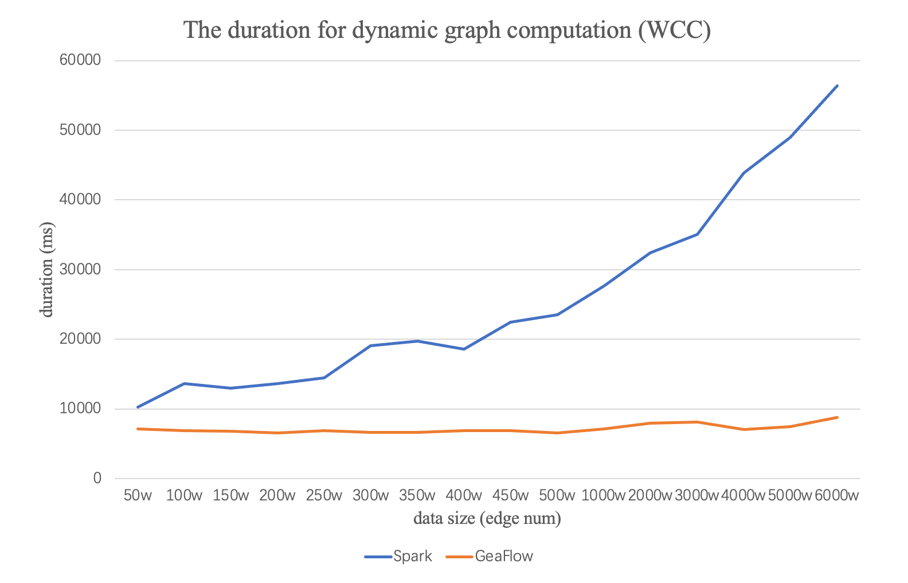

Since GeaFlow only activates the vertex-edge relations involved in the current window for incremental computing, the computing time can be completed within seconds, and the computing time for each window remains fairly stable. As the data volume increases, Spark’s need to backtrack through historical data during computing also grows. While the machine capacity has not reached its limit, the computing delay shows a positive correlation with the data volume. In similar conditions, GeaFlow's computing time may slightly increase but can generally still be kept at the level of seconds.

Compared to traditional stream processing engines (such as Flink and Storm, which are based on table models), GeaFlow utilizes a graph as its data model (using a vertex-edge storage format), offering significant performance advantages in handling Join operations, especially for complex multi-hop relationships (like joins exceeding 3 hops and complex cycle searches).

To make a comparison, we analyzed the performance of Flink and GeaFlow using the K-Hop algorithm. K-Hop relationships refer to chains of relationships in which individuals can know each other through K intermediaries. For example, in social networks, K-Hop indicates user relationships connected through K intermediaries. In transaction analysis, K-Hop refers to the path of funds transferred consecutively K times.

In comparing the time consumption of the K-Hop algorithm in Flink and GeaFlow:
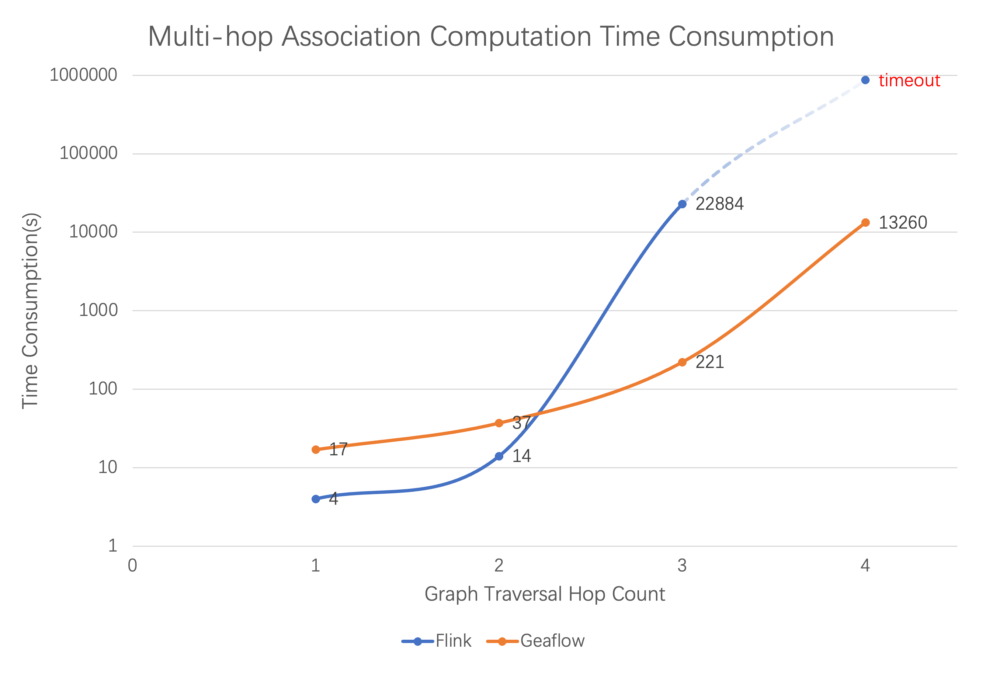

As shown in the figure above, Flink performs slightly better than GeaFlow in one-hop and two-hop scenarios. This is because, in these cases, the data volume involved in the Join calculations is relatively small, and both the left and right tables are compact, resulting in shorter traversal times. Additionally, Flink's computing framework can cache the historical results of Join operations.

Thank you very much for contributing to GeaFlow, whether bug reporting, documentation improvement, or major feature development, we warmly welcome all contributions.

For more information: [Contribution](#contribution).

Contact us through the following mailing list.

| Name | Scope |  |  |  |
| --- | --- | --- | --- | --- |
| [dev@geaflow.apache.org](mailto:dev@geaflow.apache.org) | Development-related discussions | [Subscribe](mailto:dev-subscribe@geaflow.apache.org) | [Unsubscribe](mailto:dev-unsubscribe@geaflow.apache.org) | [Archives](http://mail-archives.apache.org/mod_mbox/geaflow-dev/) |

**If you are interested in GeaFlow, please give our project
a  [⭐️](https://github.com/apache/geaflow) .**

Thanks to some outstanding open-source projects in the industry such as Apache Flink, Apache Spark, and Apache Calcite, some modules of GeaFlow were developed with their references. We would like to express our special gratitude for their contributions. Also, thanks to all the individual developers who have contributed to this repository, which are listed below.


Made with [contrib.rocks](https://contrib.rocks).

---

<a id="introduction"></a>

<!-- source_url: https://geaflow.incubator.apache.org/docs/introduction/ -->

<!-- page_index: 2 -->

# Introduction

Early big data processing mainly relied on offline processing, with technologies like Hadoop effectively solving
the problem of analyzing large-scale data. However, processing efficiency was inadequate for high real-time demand scenarios. The emergence of stream computing engines, represented by Storm, effectively addressed the issue of real-time data processing, improving processing efficiency. However, Storm itself does not provide state management capabilities and is powerless in handling stateful computations such as aggregation. The emergence of Flink effectively addressed this shortcoming by introducing state management and checkpoint mechanisms, achieving efficient stateful stream computing capabilities.

As real-time data processing scenarios evolve, particularly in real-time data warehousing scenarios, real-time
relational operations (i.e. stream join) increasingly become a challenge in realizing data real-time. Although Flink has excellent state management capabilities and outstanding performance, its performance bottleneck becomes more pronounced when handling join operations, especially when it involves three or more degrees of join. This is because each end of the join requires its own data state, and when there are multiple joins, the amount of data in the state increases significantly, making it difficult to accept in terms of performance. The root cause of this problem is that streaming computing systems like Flink use tables as their data model. However, the table model is a two-dimensional structure that does not include relationship definitions and storage, and when handling relationship operations, it can only be achieved through join operations, which incurs high costs.

In Ant Financial's big data scenarios, particularly in financial risk control and real-time data warehousing, there
are a large number of join operations, and how to improve the efficiency and performance of joins has become an important challenge we face. We have introduced the graph model, which is a data model that describes entity relationships using a point-edge structure. In the graph model, points represent entities, and edges represent relationships, and the data is stored together at the point-edge level. Therefore, the graph model naturally defines relationships and simultaneously materializes point-edge relationships at the storage level. Based on the graph model, we have implemented the next-generation real-time computing engine, GeaFlow, which effectively addresses the problem of complex relationship operations that traditional streaming computing engines face. Currently, GeaFlow has been widely used in scenarios such as data warehousing acceleration, financial risk control, knowledge graphs, and social networks.

The overall architecture of GeaFlow is as follows:

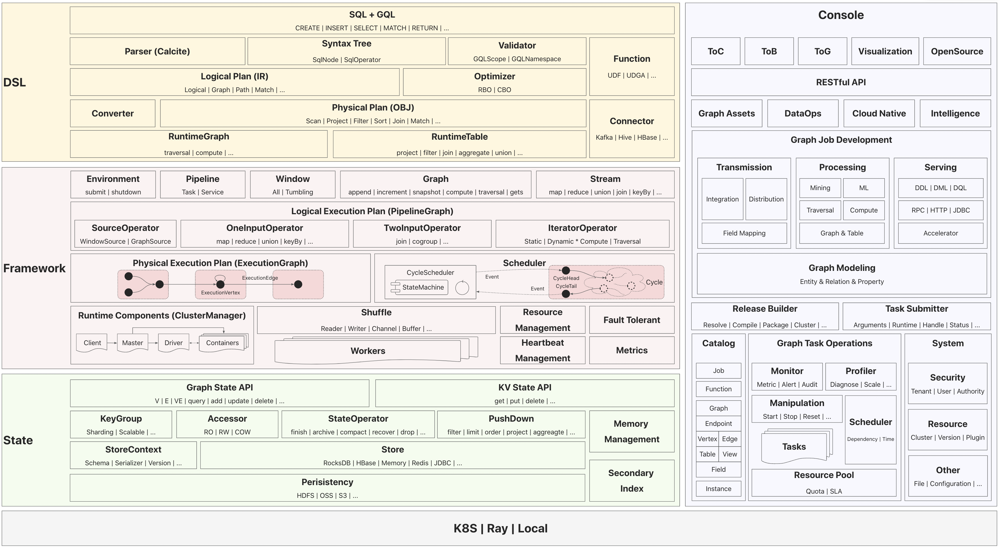

- [DSL Layer](#concepts-dsl_principle): GeaFlow has designed a fusion analysis language, SQL+GQL, which supports unified processing of table models and graph models.
- [Framework Layer](#concepts-framework_principle): GeaFlow has designed two sets of APIs for graph and stream, supporting the fusion computation of streaming, batch, and graph processing. It has also implemented a unified distributed scheduling model based on Cycle.
- [State Layer](#concepts-state_principle): GeaFlow has designed two sets of APIs for graph and key-value storage, supporting the mixed storage of table data and graph data. The overall design follows the Sharing Nothing principle and supports the persistence of data to remote storage.
- [Console Platform](#concepts-console_principle): GeaFlow provides an all-in-one graph development platform, implementing the capabilities of graph data modeling, processing, and analysis. It also provides operational and control support for graph tasks.
- **Execution Environment**: GeaFlow can run in various heterogeneous execution environments, such as K8S, Ray, and local mode.

In data warehouse scenarios, there are a large number of join operations, and in the DWD layer, it is often necessary to expand multiple tables into one large wide table to speed up subsequent queries. When the number of tables involved in a join increases, traditional real-time computing engines find it difficult to ensure the efficiency and performance of joins. This has become a challenging problem in the field of real-time data warehousing. GeaFlow's real-time graph computing engine can effectively address this problem. GeaFlow uses the graph as its data model, replacing the wide tables in the DWD layer, and can realize real-time graph construction. At the query stage, utilizing the point-edge materialization characteristics of the graph can greatly accelerate relationship operation queries. The following is the process diagram of GeaFlow's real-time data warehouse acceleration:

Under the background of informationization, channel attribution and path analysis of user behavior are the core of traffic analysis. By calculating the effective behavior path of users in real-time, and constructing a complete conversion path, it can quickly help businesses understand the value of products and assist operations in adjusting their strategies in a timely manner. The core points of real-time attribution analysis are accuracy and effectiveness. Accuracy requires ensuring the accuracy of user behavior path analysis under controllable costs. Effectiveness requires high real-time calculation to quickly assist business decision-making.
Based on the capabilities of the GeaFlow's streaming computing, accurate and timely attribution analysis can be achieved. The following figure shows how this is accomplished:
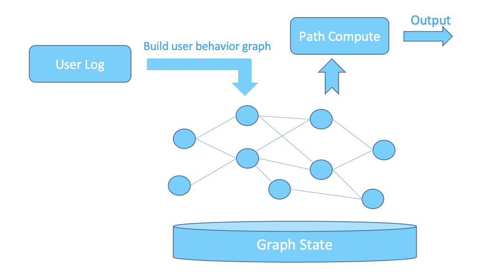
Firstly, GeaFlow converts the user behavior logs into a user behavior topology graph in real-time, with users as the vertex and every behavior related to them as an the edge towards the buried page. Then, GeaFlow analyzes the subgraph of user behavior in advance using its streaming computing capability, and based on the attribution path matching rule, matches and calculates the attribution path of the corresponding user for the transaction behavior, and outputs it to the downstream systems.

In the context of credit risk management, detecting credit card cashing-out fraud is a typical risk management requirement. Based on analysis of existing cashing-out patterns, it can be seen that cashing-out is a loop subgraph. How to efficiently and quickly identify cashing-out in a large graph can greatly increase the efficiency of risk identification. Taking the following graph as an example, by transforming real-time transaction flows and transfer flows from input data sources into a real-time transaction graph, and then performing graph feature analysis on user transaction behavior based on risk management policies, such as loop checking and other feature calculations, real-time detection of cashing-out can be provided to decision-making and monitoring platforms. GeaFlow's real-time graph construction and calculation abilities can quickly identify abnormal transactional behaviors such as cashing-out, greatly reducing platform risk.
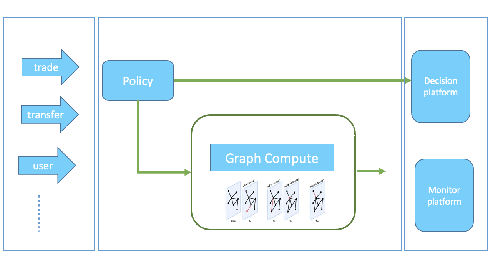

---

<a id="quick_start-quick_start"></a>

<!-- source_url: https://geaflow.incubator.apache.org/docs/quick_start/quick_start/ -->

<!-- page_index: 3 -->

# Quick Start (Running in Local)

To compile GeaFlow, the following environments are required:

- JDK8
- Maven (recommended version 3.6.3 or higher)
- Git

Execute the following commands to compile the GeaFlow source code:

```shell
git clone https://github.com/TuGraph-family/tugraph-analytics.git geaflow 
cd geaflow/ 
./build.sh --module=geaflow --output=package 
```

Here's how to run a real-time loop detection graph computing job in a local environment:

1. Directly execute the script:

```shell
bin/gql_submit.sh --gql geaflow/geaflow-examples/gql/loop_detection_file_demo.sql 
```

"loop\_detection.sql" is a DSL calculation job for real-time querying all four-degree loops in a graph. Its contents are as follows:

```sql
set geaflow.dsl.window.size = 1; 
set geaflow.dsl.ignore.exception = true; 
 
CREATE GRAPH IF NOT EXISTS dy_modern ( 
  Vertex person ( 
    id bigint ID, 
    name varchar 
  ), 
  Edge knows ( 
    srcId bigint SOURCE ID, 
    targetId bigint DESTINATION ID, 
    weight double 
  ) 
) WITH ( 
  storeType='rocksdb', 
  shardCount = 1 
); 
 
CREATE TABLE IF NOT EXISTS tbl_source ( 
  text varchar 
) WITH ( 
  type='file', 
  `geaflow.dsl.file.path` = 'resource:///demo/demo_job_data.txt', 
  `geaflow.dsl.column.separator`='|' 
); 
 
CREATE TABLE IF NOT EXISTS tbl_result ( 
  a_id bigint, 
  b_id bigint, 
  c_id bigint, 
  d_id bigint, 
  a1_id bigint 
) WITH ( 
  type='file', 
  `geaflow.dsl.file.path` = '/tmp/geaflow/demo_job_result' 
); 
 
USE GRAPH dy_modern; 
 
INSERT INTO dy_modern.person(id, name) 
  SELECT 
  cast(trim(split_ex(t1, ',', 0)) as bigint), 
  split_ex(trim(t1), ',', 1) 
  FROM ( 
    Select trim(substr(text, 2)) as t1 
    FROM tbl_source 
    WHERE substr(text, 1, 1) = '.' 
  ); 
 
INSERT INTO dy_modern.knows 
  SELECT 
  cast(split_ex(t1, ',', 0) as bigint), 
  cast(split_ex(t1, ',', 1) as bigint), 
  cast(split_ex(t1, ',', 2) as double) 
  FROM ( 
    Select trim(substr(text, 2)) as t1 
    FROM tbl_source 
    WHERE substr(text, 1, 1) = '-' 
  ); 
 
INSERT INTO tbl_result 
  SELECT DISTINCT 
  a_id, 
  b_id, 
  c_id, 
  d_id, 
  a1_id 
  FROM ( 
  MATCH (a:person) -[:knows]->(b:person) -[:knows]-> (c:person) 
  -[:knows]-> (d:person) -> (a:person) 
  RETURN a.id as a_id, b.id as b_id, c.id as c_id, d.id as d_id, a.id as a1_id 
  ); 
```

This DSL reads real-time data from the **demo\_job\_data.txt** file in the project resources, constructs a graph, calculates all
4-degree loops in the graph, outputs the IDs of the vertex on the loop to the `/tmp/geaflow/demo_job_result`
directory. Users can also set the parameter `geaflow.dsl.file.path` to modify the output path.

2. the output result is:

```text
2,3,4,1,2 
4,1,2,3,4 
3,4,1,2,3 
1,2,3,4,1 
```

Users can also input data on the command console and build graphs in real time.

1. Execute the script:

```shell
bin/gql_submit.sh --gql geaflow/geaflow-examples/gql/loop_detection_socket_demo.sql 
```

The main difference of "loop\_detection\_socket\_demo.sql" is that the source table is read from socket data:

```sql
CREATE TABLE IF NOT EXISTS tbl_source ( 
  text varchar 
) WITH ( 
  type='socket', 
  `geaflow.dsl.column.separator` = '#', 
  `geaflow.dsl.socket.host` = 'localhost', 
  `geaflow.dsl.socket.port` = 9003 
); 
 
CREATE TABLE IF NOT EXISTS tbl_result ( 
  a_id bigint, 
  b_id bigint, 
  c_id bigint, 
  d_id bigint, 
  a1_id bigint 
) WITH ( 
  type='socket', 
    `geaflow.dsl.column.separator` = ',', 
    `geaflow.dsl.socket.host` = 'localhost', 
    `geaflow.dsl.socket.port` = 9003 
); 
```

This DSL reads real-time data from the socket service on port 9003, constructs a graph in real-time, calculates all 4-degree loops in the graph, outputs the IDs of the vertex on the loop to the socket service on port 9003, and displays them on the socket console.

2. Start SocketServer

Run the following command to start the socket server program:

```shell
bin/socket.sh 
```

After the socket service is started, the following information is displayed on the console:

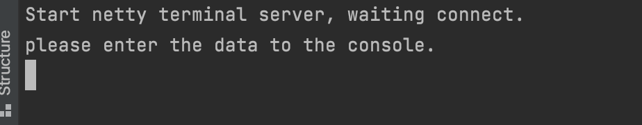

3. Input data

The input data is as follows: the "." in front of the data represents a point data, and the "-" represents an edge data (start, end, and weight).

```text
. 1,jim 
. 2,kate 
. 3,lily 
. 4,lucy 
. 5,brown 
. 6,jack 
. 7,jackson 
- 1,2,0.2 
- 2,3,0.3 
- 3,4,0.2 
- 4,1,0.1 
- 4,5,0.1 
- 5,1,0.2 
- 5,6,0.1 
- 6,7,0.1 
```

We can see the calculated loop data displayed on the socket console:

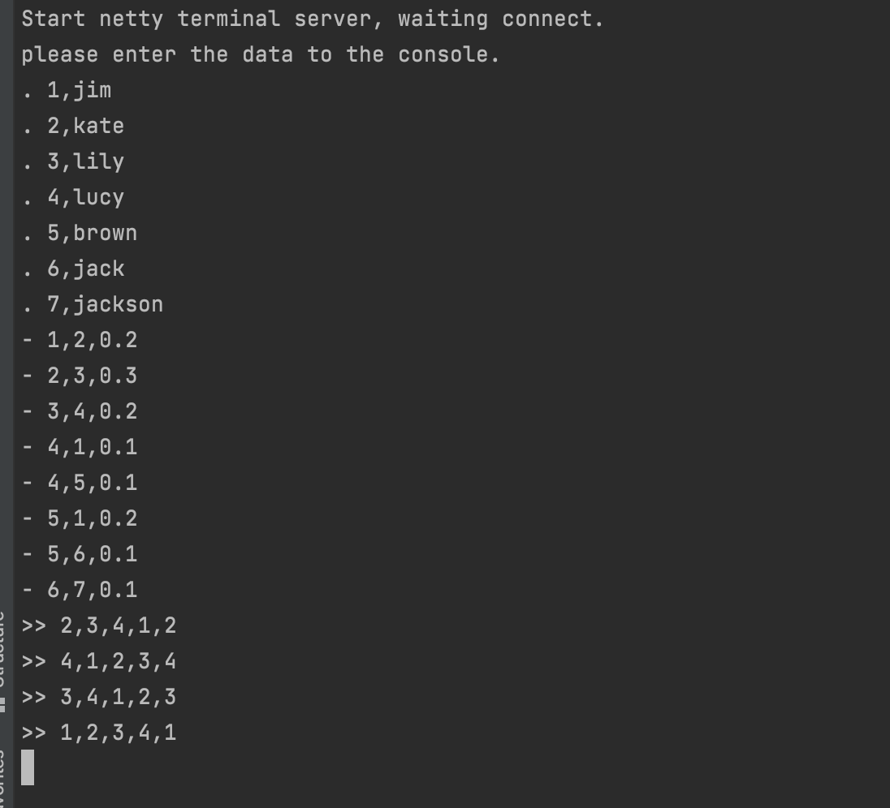

You can also continue to enter new point edge data to view the latest calculation results, such as entering the following data:

```text
- 6,3,0.1 
```

We can see that the new loop 3-4-5-6-3 is checked out:

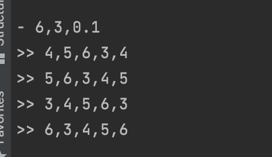

4. Access the dashboard page

The local mode will use the local 8090 and 8088 ports and comes with a dashboard page.

Visit <http://localhost:8090> in the browser to access the front-end page.
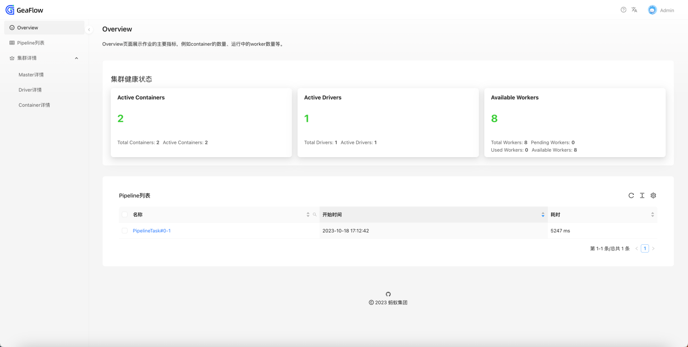

If the port is occupied, the `gql_submit.sh` will choose a larger available port number.
Please check the console output for the following log to find the port being used.

```text
View dashboard via http://localhost:${master_port}. 
```

For more dashboard related content, please refer to the documentation:
[Dashboard](#deploy-dashboard)

1. Run the shell to submit the pre-edited demo GQL:

```shell
bin/gql_submit.sh --gql geaflow/geaflow-examples/gql/sql_join_to_graph_demo.sql 
```

Here, `sql_join_to_graph_demo.sql` is an SQL Join query in a simulated streaming graph. Its key content is as follows:

```sql
USE GRAPH dy_modern; 
 
select u.name, friend.name 
from person u, knows e, person friend 
where u.id = e.srcId and e.targetId = friend.id 
; 
```

This DSL reads node and edge data from the **demo\_job\_data.txt** resource file within the project to construct the graph.

Then, it performs a join query on nodes and edges of the graph `dy_modern`. The engine automatically translates the join semantics into a graph query.

2. Output Results

You can print the contents of the result file by running the following command:

```shell
cat /tmp/geaflow/sql_join_to_graph_demo_result/partition_0   
```

The query results are written to `/tmp/geaflow/sql_join_to_graph_demo_result` by default. Users can also customize the output path by modifying the `geaflow.dsl.file.path` parameter.

```text
jim,jim 
kate,kate 
lily,lily 
lucy,lucy 
jim,jim 
lucy,lucy 
lucy,lucy 
jack,jack 
```

For more information on SQL graph queries, please refer to the documentation:
[Doc](#quick_start-quick_start_sql_to_graph)

GeaFlow Console is a graph computing research and development platform provided by GeaFlow. In this document, we will introduce how to launch the GeaFlow Console platform in a Docker container and submit graph computing jobs.
Document address: [Running in Docker](#quick_start-quick_start_docker)

Geaflow Kubernetes Operator is a deployment tool that can quickly deploy Geaflow applications to kubernetes clusters.
We will introduce how to install geaflow-kubernetes-operator through Helm and quickly submit
geaflow jobs through yaml files, and in addition, how to visit the operator's dashboard page to
view the job details in the cluster.
Document address: [Running By kubernetes operator](#deploy-quick_start_operator)

G6VP is an extensible visual analysis platform, including data source management, composition, personalized configuration of graphic elements, visual analysis and other functional modules. Using G6VP, it is easy to visualize the results of Geaflow calculations. Document address: [Document](#deploy-collaborate_with_g6vp)

---

<a id="quick_start-quick_start_docker"></a>

<!-- source_url: https://geaflow.incubator.apache.org/docs/quick_start/quick_start_docker/ -->

<!-- page_index: 4 -->

# Quick Start(Running in GeaFlow Console)

1. Install Docker and adjust Docker service resource settings (Dashboard-Settings-Resources), then start Docker service:

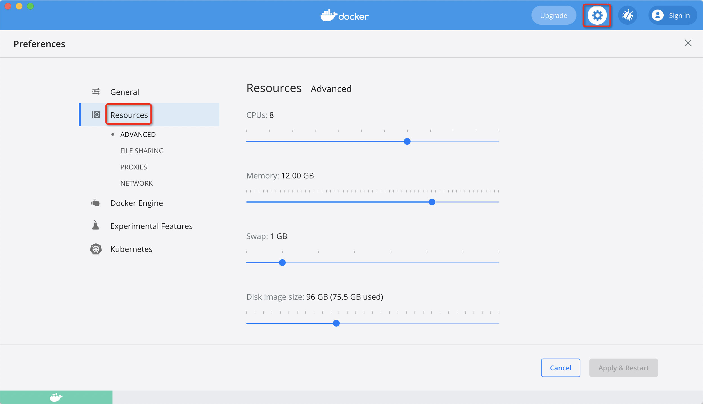

2. Pull GeaFlow Image

Run the following command to pull the remote geaflow console image:

For x86 architecture pull x86 image:

```shell
docker pull tugraph/geaflow-console:<version> 
```

If it is arm architecture, pull the arm image:

```shell
docker pull tugraph/geaflow-console-arm:<version> 
```

If the pull fails due to network problems, you can also run the following command to directly build the local image
(before building the image, start the docker container, and the build the script to build the image of the
corresponding type based on the machine type):

```shell
git clone https://github.com/TuGraph-family/tugraph-analytics.git geaflow 
cd geaflow/ 
./build.sh --module=geaflow-console 
 
```

The entire compilation process may take some time, please be patient. After the image compilation is successful, use
the following command to view the image.

```shell
docker images 
```

The name of the remotely pulled image is: **tugraph/geaflow-console:0.1**(x86 architecture) or **tugraph/
geaflow-console-arm :0.1**(arm architecture)
. The name of the local image is **geaflow-console:0.1**. You only need to select one method to build the image.

Below is an introduction on running the flow graph job mentioned in Local Mode Execution inside a docker container.

1. Start the GeaFlow Console service locally.

- For the Remote Image:

**x86 architecture**

```shell
docker run -d --name geaflow-console -p 8888:8888 tugraph/geaflow-console:0.1 
```

**arm Architecture**

```text
docker run -d --name geaflow-console -p 8888:8888 tugraph/geaflow-console-arm:0.1 
```

- For the Local Image

```shell
docker run -d --name geaflow-console -p 8888:8888 geaflow-console:0.1 
```

> [!NOTE]
> : The tag name of the remote image is different from that of the local build image, and the startup
> command is different.

Enter the container and wait for the Java process to start. After that, access [localhost:8888](http://localhost:8888) to enter the GeaFlow Console platform page.

```shell
> docker exec -it geaflow-console tailf /tmp/logs/geaflow/app-default.log
 
# wait the logs below and open url http://localhost:8888 GeaflowApplication:61 - Started GeaflowApplication in 11.437 seconds (JVM running for 13.475)
```

2. Register Account

The first registered user will be set as the default administrator. Log in as an administrator and use the one-click installation feature to start system initialization.

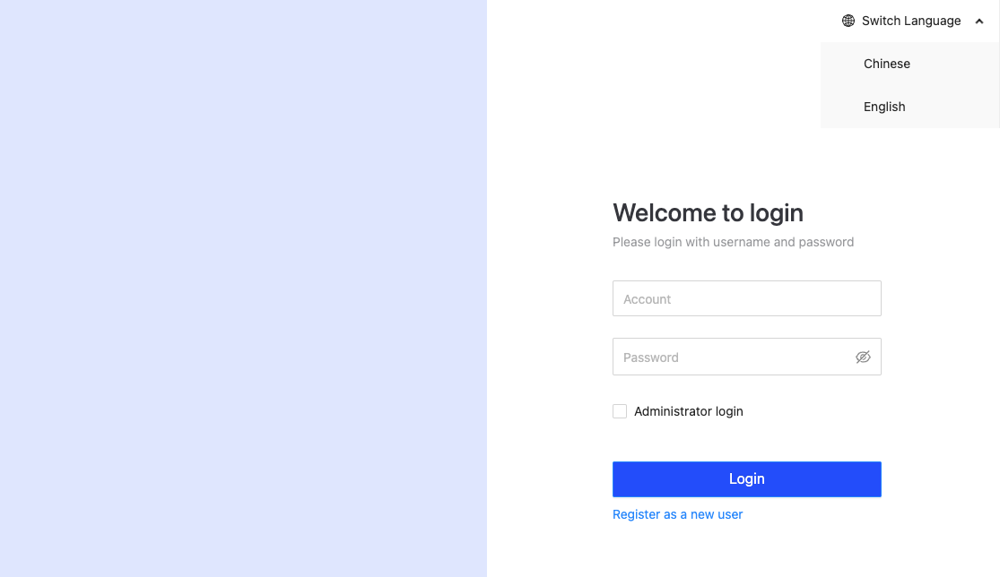

3. Config GeaFlow

GeaFlow requires configuration of runtime environment settings during its initial run, including cluster settings, runtime settings, data storage settings, and file storage settings.

3.1 Cluster Config

Click "Next" and use the default Container mode, which is local container mode.

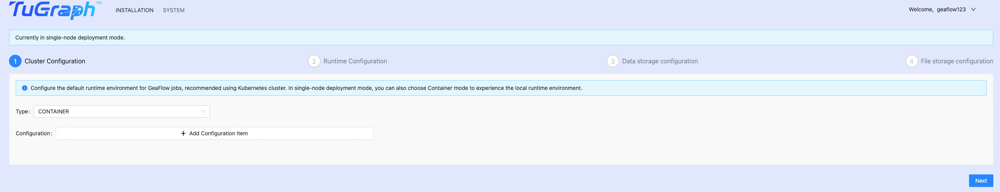

3.2 Runtime Config

For local runtime mode, you can skip this step and use the default system settings by clicking "Next" directly.

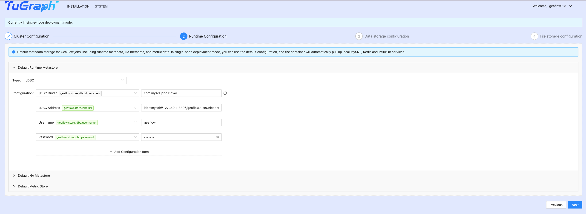

3.3 Storage Config

Select the graph data storage location. For local mode, select LOCAL and enter a local directory. If you don't need to fill it out, click "Next" directly.

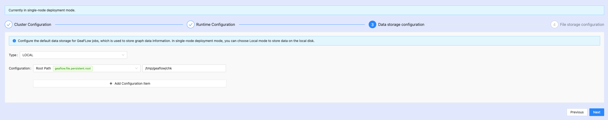

3.4 File Config

This configuration is for the persistent storage of GeaFlow engine JAR and user JAR files, such as in HDFS. For local runtime mode, it is the same as the data storage configuration, so select LOCAL mode and enter a local directory. If you don't need to fill it out, click "Next" directly.

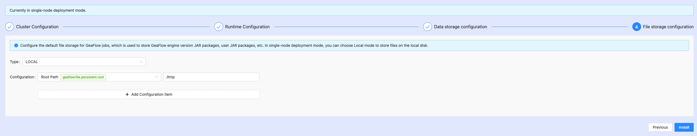
After completing the configuration, click the one-click installation button. After successful installation, the administrator will automatically switch to the default instance under the personal tenant and can directly create and publish graph computing tasks.

4. Submit compute job

Go to the `DEVELOPMENT` page, Console has automatically created a demo job after starting (The loop detection job in
[Local Demo](#quick_start-quick_start)), shown as follows.

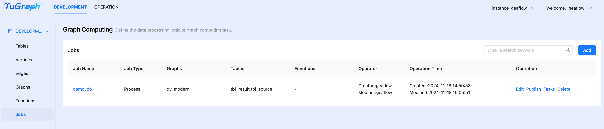

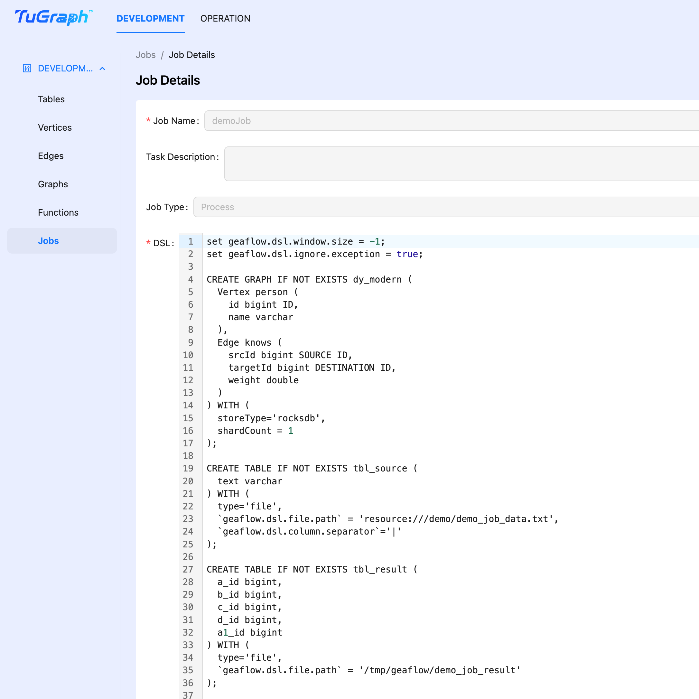

Click the `"Publish"` button to publish the job.

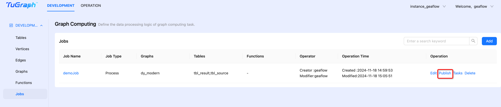

Then go to the Job Management page and click the `"Submit"` button to submit the task for execution.

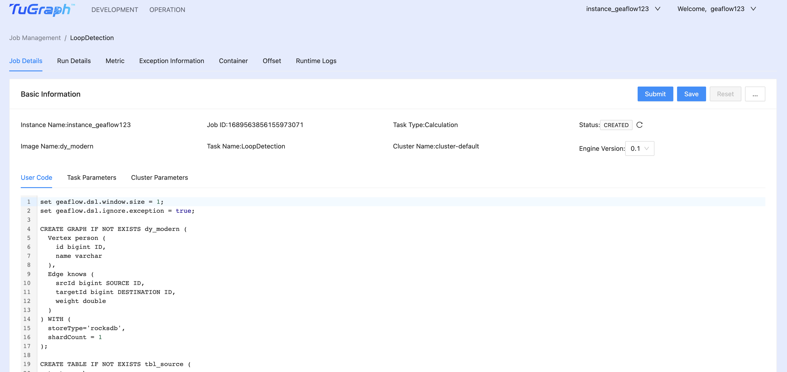

5. After running, you can find the result file in the output path in docker (the default path is:
   `/tmp/geaflow/demo_job_result`)

```text
2,3,4,1,2 
4,1,2,3,4 
3,4,1,2,3 
1,2,3,4,1 
```

GeaFlow supports K8S deployment. For details about the deployment mode, see the document: [K8S Deployment](#deploy-install_guide).

---

<a id="quick_start-quick_start_infer-udf"></a>

<!-- source_url: https://geaflow.incubator.apache.org/docs/quick_start/quick_start_infer&UDF/ -->

<!-- page_index: 5 -->

# Quick Start (Running near line inference with UDF)

GeaFlow provides near-line model inference capabilities. Users only need to provide the Python file for model calling.
There is no need to convert the model into an onnx model, which avoids the performance degradation caused by model conversion.
At the same time, it reduces the deployment difficulty for algorithm developers. This example shows how to use GeaFlow
to call the AI model for inference and obtain model inference results during the near-line computing process.
The AI model in this example is a graph node classification model trained on Cora, a commonly used data set for GNN.
GeaFlow reads the node id to construct a vertex, and then in the process of near-line calculation, Send the node ID to the python model inference process, call the AI model inference to obtain the node prediction type
and the corresponding probability, and then return the result to the GeaFlow java process.
This example shows how to perform model reasoning through GeaFlow. In real scenarios, the logic of near-line
computing may be more complex. Model reasoning is only a step in near-line computing.
After obtaining the model results, complex iterative calculations can be performed, and the inference model can even
be called multiple times, which can be expanded as needed.

- Reference [1.quick\_start.md](#quick_start-quick_start)

- Reference [2.quick\_start\_docker.md](#quick_start-quick_start_docker)

- [udf resources](https://geaflow.incubator.apache.org/data/InferUDF.zip)
- Structure of udf project

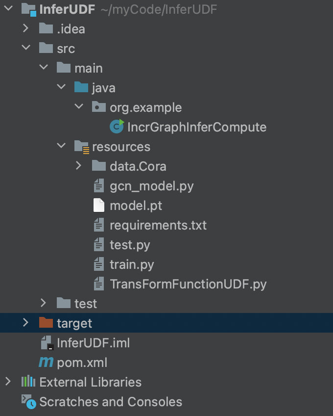

- IncrGraphInferCompute implements IncVertexCentricCompute api.
  In this method, the AI model is called for inference and the inference results are obtained.

```java
package org.example; 
 
import com.antgroup.geaflow.api.function.io.SinkFunction; 
import com.antgroup.geaflow.api.graph.compute.IncVertexCentricCompute; 
import com.antgroup.geaflow.api.graph.function.vc.IncVertexCentricComputeFunction; 
import com.antgroup.geaflow.api.graph.function.vc.VertexCentricCombineFunction; 
import com.antgroup.geaflow.api.graph.function.vc.base.IncGraphInferContext; 
import com.antgroup.geaflow.api.pdata.stream.window.PWindowSource; 
import com.antgroup.geaflow.api.window.impl.SizeTumblingWindow; 
import com.antgroup.geaflow.common.config.Configuration; 
import com.antgroup.geaflow.common.config.keys.ExecutionConfigKeys; 
import com.antgroup.geaflow.common.config.keys.FrameworkConfigKeys; 
import com.antgroup.geaflow.common.type.primitive.IntegerType; 
import com.antgroup.geaflow.env.Environment; 
import com.antgroup.geaflow.env.EnvironmentFactory; 
import com.antgroup.geaflow.example.function.FileSink; 
import com.antgroup.geaflow.example.function.FileSource; 
import com.antgroup.geaflow.file.FileConfigKeys; 
import com.antgroup.geaflow.model.graph.edge.IEdge; 
import com.antgroup.geaflow.model.graph.edge.impl.ValueEdge; 
import com.antgroup.geaflow.model.graph.meta.GraphMetaType; 
import com.antgroup.geaflow.model.graph.vertex.IVertex; 
import com.antgroup.geaflow.model.graph.vertex.impl.ValueVertex; 
import com.antgroup.geaflow.pipeline.IPipelineResult; 
import com.antgroup.geaflow.pipeline.Pipeline; 
import com.antgroup.geaflow.pipeline.PipelineFactory; 
import com.antgroup.geaflow.pipeline.task.IPipelineTaskContext; 
import com.antgroup.geaflow.pipeline.task.PipelineTask; 
import com.antgroup.geaflow.view.GraphViewBuilder; 
import com.antgroup.geaflow.view.IViewDesc.BackendType; 
import com.antgroup.geaflow.view.graph.GraphViewDesc; 
import com.antgroup.geaflow.view.graph.PGraphView; 
import com.antgroup.geaflow.view.graph.PIncGraphView; 
import org.slf4j.Logger; 
import org.slf4j.LoggerFactory; 
 
import java.util.Arrays; 
import java.util.Collections; 
import java.util.HashMap; 
import java.util.Iterator; 
import java.util.List; 
import java.util.Map; 
 
public class IncrGraphInferCompute { 
 
    private static final Logger LOGGER = LoggerFactory.getLogger(IncrGraphInferCompute.class); 
 
    // Set result dir. 
    public static final String RESULT_FILE_PATH = "/tmp/geaflow"; 
    public static final String INFER_PYTHON_CLASS_NAME = "myTransFormFunction"; 
 
    public static void main(String[] args) { 
        Map<String, String> config = new HashMap<>(); 
        config.put(ExecutionConfigKeys.JOB_APP_NAME.getKey(), IncrGraphInferCompute.class.getSimpleName()); 
        config.put(FileConfigKeys.ROOT.getKey(), "/tmp/"); 
        Environment environment = EnvironmentFactory.onLocalEnvironment(args); 
        Configuration configuration = environment.getEnvironmentContext().getConfig(); 
 
        configuration.putAll(config); 
        IPipelineResult result = submit(environment); 
        result.get(); 
    } 
 
    public static IPipelineResult<?> submit(Environment environment) { 
        final Pipeline pipeline = PipelineFactory.buildPipeline(environment); 
        Configuration envConfig = environment.getEnvironmentContext().getConfig(); 
 
        envConfig.put(FrameworkConfigKeys.INFER_ENV_ENABLE, "true"); 
        envConfig.put(FrameworkConfigKeys.INFER_ENV_USER_TRANSFORM_CLASSNAME, INFER_PYTHON_CLASS_NAME); 
        envConfig.put(FrameworkConfigKeys.INFER_ENV_INIT_TIMEOUT_SEC, "1800"); 
        // Replace according to your hardware. 
        envConfig.put(FrameworkConfigKeys.INFER_ENV_CONDA_URL, "https://repo.anaconda.com/miniconda/Miniconda3-latest-Linux-aarch64.sh"); 
        envConfig.put(FileSink.OUTPUT_DIR, RESULT_FILE_PATH); 
 
        //build graph view 
        final String graphName = "graph_view_name"; 
        GraphViewDesc graphViewDesc = GraphViewBuilder.createGraphView(graphName) 
                .withShardNum(1) 
                .withBackend(BackendType.RocksDB) 
                .withSchema(new GraphMetaType(IntegerType.INSTANCE, ValueVertex.class, Integer.class, 
                        ValueEdge.class, IntegerType.class)) 
                .build(); 
        pipeline.withView(graphName, graphViewDesc); 
        pipeline.submit(new PipelineTask() { 
            @Override 
            public void execute(IPipelineTaskContext pipelineTaskCxt) { 
                Configuration conf = pipelineTaskCxt.getConfig(); 
                PWindowSource<IVertex<Integer, List<Object>>> vertices = 
                        // extract vertex from edge file 
                        pipelineTaskCxt.buildSource(new FileSource<>("data/Cora/node_ids.txt", 
                                line -> { 
                                    String[] fields = line.split(","); 
                                    IVertex<Integer, List<Object>> vertex = new ValueVertex<>( 
                                            Integer.valueOf(fields[0]), null); 
                                    return Arrays.asList(vertex); 
                                }), SizeTumblingWindow.of(10000)) 
                                .withParallelism(1); 
 
                PWindowSource<IEdge<Integer, Integer>> edges = 
                        pipelineTaskCxt.buildSource(new com.antgroup.geaflow.example.function.FileSource<>("data/Cora/node_ids.txt", 
                                line -> { 
                                    String[] fields = line.split(","); 
                                    IEdge<Integer, Integer> edge = new ValueEdge<>(Integer.valueOf(fields[0]), 
                                            Integer.valueOf(fields[0]), 1); 
                                    return Collections.singletonList(edge); 
                                }), SizeTumblingWindow.of(5000)); 
 
 
                PGraphView<Integer, List<Object>, Integer> fundGraphView = 
                        pipelineTaskCxt.getGraphView(graphName); 
 
                PIncGraphView<Integer, List<Object>, Integer> incGraphView = 
                        fundGraphView.appendGraph(vertices, edges); 
                int mapParallelism = 1; 
                int sinkParallelism = 1; 
                SinkFunction<String> sink = new FileSink<>(); 
                incGraphView.incrementalCompute(new IncGraphAlgorithms(1)) 
                        .getVertices() 
                        .map(v -> String.format("%s,%s", v.getId(), v.getValue())) 
                        .withParallelism(mapParallelism) 
                        .sink(sink) 
                        .withParallelism(sinkParallelism); 
            } 
        }); 
 
        return pipeline.execute(); 
    } 
 
    public static class IncGraphAlgorithms extends IncVertexCentricCompute<Integer, List<Object>, 
            Integer, Integer> { 
 
        public IncGraphAlgorithms(long iterations) { 
            super(iterations); 
        } 
 
        @Override 
        public IncVertexCentricComputeFunction<Integer, List<Object>, Integer, Integer> getIncComputeFunction() { 
            return new InferVertexCentricComputeFunction(); 
        } 
 
        @Override 
        public VertexCentricCombineFunction<Integer> getCombineFunction() { 
            return null; 
        } 
 
    } 
 
    public static class InferVertexCentricComputeFunction implements 
            IncVertexCentricComputeFunction<Integer, List<Object>, Integer, Integer> { 
 
        private IncGraphComputeContext<Integer, List<Object>, Integer, Integer> graphContext; 
        private IncGraphInferContext<List<Object>> graphInferContext; 
 
        @Override 
        public void init(IncGraphComputeContext<Integer, List<Object>, Integer, Integer> graphContext) { 
            this.graphContext = graphContext; 
            this.graphInferContext = (IncGraphInferContext<List<Object>>) graphContext; 
        } 
 
        @Override 
        public void evolve(Integer vertexId, 
                           TemporaryGraph<Integer, List<Object>, Integer> temporaryGraph) { 
            long lastVersionId = 0L; 
            IVertex<Integer, List<Object>> vertex = temporaryGraph.getVertex(); 
            HistoricalGraph<Integer, List<Object>, Integer> historicalGraph = graphContext 
                    .getHistoricalGraph(); 
            if (vertex == null) { 
                vertex = historicalGraph.getSnapShot(lastVersionId).vertex().get(); 
            } 
 
            if (vertex != null) { 
                // Call the AI model to predict the class to which the node belongs and the corresponding probability.   
                List<Object> result = this.graphInferContext.infer(vertexId); 
                // Sink result. 
                graphContext.collect(vertex.withValue(result)); 
                LOGGER.info("node-{} max prob: {}, predict class: {}", vertexId, result.get(0), result.get(1)); 
            } 
        } 
 
        @Override 
        public void compute(Integer vertexId, Iterator<Integer> messageIterator) { 
        } 
 
        @Override 
        public void finish(Integer vertexId, MutableGraph<Integer, List<Object>, Integer> mutableGraph) { 
        } 
    } 
 
} 
```

- The AI inference model(Classify graph nodes in [Cora dataset](https://linqs-data.soe.ucsc.edu/public/lbc/cora.tgz)) is defined in the TransFormFunctionUDF.py file, as follows:

```python
import abc 
from typing import Union, List 
import torch 
import ast 
from torch_geometric.datasets import Planetoid 
from gcn_model import GCN 
 
def safe_int(number): 
    try: 
        return int(number) 
    except: 
        return 0 
 
 
def safe_float(number): 
    try: 
        return float(number) 
    except: 
        return 0.0 
 
 
class TransFormFunction(abc.ABC): 
    def __init__(self, input_size): 
        self.input_size = input_size 
 
    @abc.abstractmethod 
    def load_model(self, *args): 
        pass 
 
    @abc.abstractmethod 
    def transform_pre(self, *args) -> Union[torch.Tensor, List[torch.Tensor]]: 
        pass 
 
    @abc.abstractmethod 
    def transform_post(self, *args): 
        pass 
 
 
# User class need to inherit TransFormFunction. 
class myTransFormFunction(TransFormFunction): 
    def __init__(self): 
        super().__init__(1) 
        print("init myTransFormFunction") 
        self.device = torch.device('cuda' if torch.cuda.is_available() else 'cpu') 
        self.dataset = Planetoid(root='./data', name='Cora') 
        self.data = self.dataset[0].to(self.device) 
        self.load_model('model.pt') 
 
    def load_model(self, model_path: str): 
        model = GCN(self.dataset.num_node_features, self.dataset.num_classes).to(self.device) 
        model.load_state_dict(torch.load(model_path)) 
        model.eval() 
        out = model(self.data) 
        self.prob = torch.exp(out) 
 
    # Define model infer logic. 
    def transform_pre(self, *args): 
        node_prob = self.prob[args[0]] 
        max_prob, max_class = node_prob.max(dim=0) 
        return [max_prob.item(), max_class.item()], [max_prob.item(), max_class.item()] 
 
    def transform_post(self, res): 
        return res 
 
```

- Set the python dependencies required for model inference in requirements.txt, as follows:

```text
--index-url https://pypi.tuna.tsinghua.edu.cn/simple 
torch 
torchvision 
torchaudio 
torch-scatter 
torch-sparse 
torch-cluster 
torch-spline-conv 
torch-geometric 
```

- model.pt is the trained model file that needs to be used.
- The corresponding engine dependencies need to be introduced in pom.xml,
  and the version needs to be modified to the version of the GeaFlow engine you are using.

```xml
<?xml version="1.0" encoding="UTF-8"?> 
<project xmlns="http://maven.apache.org/POM/4.0.0" 
         xmlns:xsi="http://www.w3.org/2001/XMLSchema-instance" 
         xsi:schemaLocation="http://maven.apache.org/POM/4.0.0 http://maven.apache.org/xsd/maven-4.0.0.xsd"> 
    <modelVersion>4.0.0</modelVersion> 
 
    <groupId>org.example</groupId> 
    <artifactId>InferUDF</artifactId> 
    <version>1.0-SNAPSHOT</version> 
    <packaging>jar</packaging> 
 
    <properties> 
        <maven.compiler.source>8</maven.compiler.source> 
        <maven.compiler.target>8</maven.compiler.target> 
        <project.build.sourceEncoding>UTF-8</project.build.sourceEncoding> 
    </properties> 
    <dependencies> 
        <dependency> 
            <groupId>com.antgroup.tugraph</groupId> 
            <artifactId>geaflow-api</artifactId> 
            <version>0.5.0-SNAPSHOT</version> 
        </dependency> 
 
        <dependency> 
            <groupId>com.antgroup.tugraph</groupId> 
            <artifactId>geaflow-pdata</artifactId> 
            <version>0.5.0-SNAPSHOT</version> 
        </dependency> 
 
        <dependency> 
            <groupId>com.antgroup.tugraph</groupId> 
            <artifactId>geaflow-cluster</artifactId> 
            <version>0.5.0-SNAPSHOT</version> 
        </dependency> 
 
        <dependency> 
            <groupId>com.antgroup.tugraph</groupId> 
            <artifactId>geaflow-on-local</artifactId> 
            <version>0.5.0-SNAPSHOT</version> 
        </dependency> 
 
        <dependency> 
            <groupId>com.antgroup.tugraph</groupId> 
            <artifactId>geaflow-pipeline</artifactId> 
            <version>0.5.0-SNAPSHOT</version> 
        </dependency> 
 
        <dependency> 
            <groupId>com.antgroup.tugraph</groupId> 
            <artifactId>geaflow-infer</artifactId> 
            <version>0.5.0-SNAPSHOT</version> 
        </dependency> 
 
        <dependency> 
            <groupId>com.antgroup.tugraph</groupId> 
            <artifactId>geaflow-operator</artifactId> 
            <version>0.5.0-SNAPSHOT</version> 
        </dependency> 
 
        <dependency> 
            <groupId>com.antgroup.tugraph</groupId> 
            <artifactId>geaflow-api</artifactId> 
            <version>0.5.0-SNAPSHOT</version> 
        </dependency> 
 
        <dependency> 
            <groupId>com.antgroup.tugraph</groupId> 
            <artifactId>geaflow-common</artifactId> 
            <version>0.5.0-SNAPSHOT</version> 
        </dependency> 
 
        <dependency> 
            <groupId>com.antgroup.tugraph</groupId> 
            <artifactId>geaflow-examples</artifactId> 
            <version>0.5.0-SNAPSHOT</version> 
        </dependency> 
    </dependencies> 
</project> 
```

- Execute the command "mvn clean install", and you can get the compiled udf package in the target directory.

- Create job
  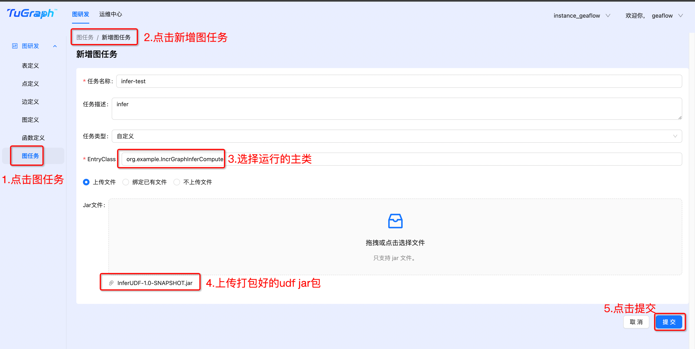
- Publish job
  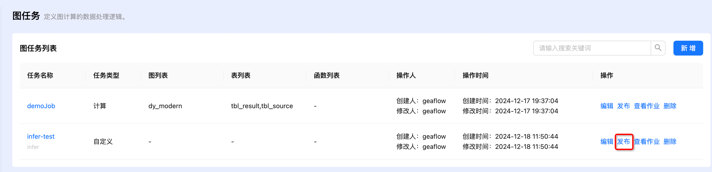
- Submit job
  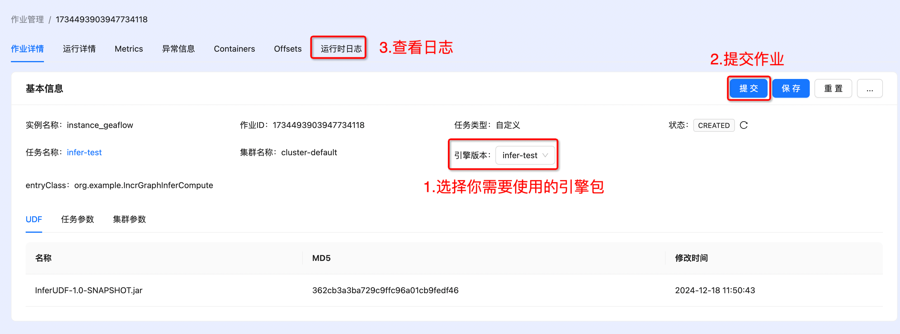
- View results. The results are saved in the path /tmp/geaflow/result\_0
  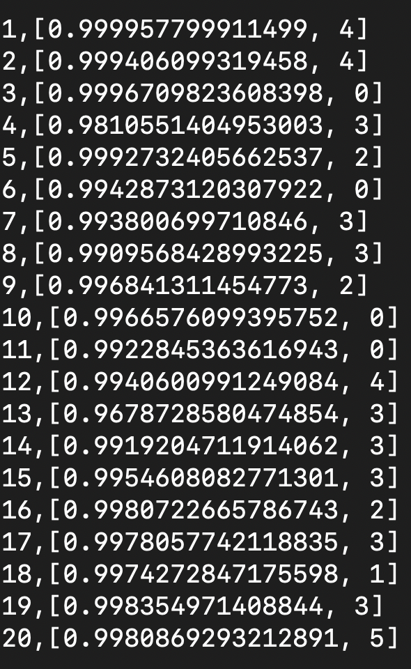

---

<a id="quick_start-quick_start_sql_to_graph"></a>

<!-- source_url: https://geaflow.incubator.apache.org/docs/quick_start/quick_start_sql_to_graph/ -->

<!-- page_index: 6 -->

# quick_start_sql_to_graph

1. Run the shell to submit the pre-edited demo GQL:

```shell
bin/gql_submit.sh --gql geaflow/geaflow-examples/gql/sql_join_to_graph_demo.sql 
```

Here, `sql_join_to_graph_demo.sql` is an SQL Join query in a simulated streaming graph. Its key content is as follows:

```sql
USE GRAPH dy_modern; 
 
select u.name, friend.name 
from person u, knows e, person friend 
where u.id = e.srcId and e.targetId = friend.id 
; 
```

This DSL reads node and edge data from the **demo\_job\_data.txt** resource file within the project to construct the graph.

Then, it performs a join query on nodes and edges of the graph `dy_modern`. The engine automatically translates the join semantics into a graph query.

2. Output Results

You can print the contents of the result file by running the following command:

```shell
cat /tmp/geaflow/sql_join_to_graph_demo_result/partition_0   
```

The query results are written to `/tmp/geaflow/sql_join_to_graph_demo_result` by default. Users can also customize the output path by modifying the `geaflow.dsl.file.path` parameter.

```text
jim,jim 
kate,kate 
lily,lily 
lucy,lucy 
jim,jim 
lucy,lucy 
lucy,lucy 
jack,jack 
```

1. Run the shell to submit the pre-edited demo GQL:

```shell
bin/gql_submit.sh --gql geaflow/geaflow-examples/gql/sql_join_to_graph_demo_02.sql 
```

The key content of the `sql_join_to_graph_demo_02.sql` file is as follows:

```sql
USE GRAPH dy_modern; 
 
SELECT    u.name, 
          friend_num 
FROM      person u, 
          ( 
          SELECT    srcId AS pid, 
                    COUNT(DISTINCT targetId) AS friend_num 
          FROM      knows 
          GROUP BY  srcId 
          ) t_friend_num 
WHERE     u.id = pid; 
```

This DSL reads node and edge data from the **demo\_job\_data.txt** resource file within the project to construct the graph.

Then, it performs a join query on nodes and edges of the graph `dy_modern`. The engine automatically translates the join semantics into a graph query.

2. Output Results

You can print the contents of the result file by running the following command:

```shell
cat /tmp/geaflow/sql_join_to_graph_demo_02_result/partition_0   
```

The query results are written to `/tmp/geaflow/sql_join_to_graph_demo_02_result` by default. Users can also customize the output path by modifying the `geaflow.dsl.file.path` parameter.

The results show the number of friends recorded for each person in the graph:

```text
lucy,2 
jim,1 
kate,1 
lily,1 
jack,1 
```

---

<a id="concepts-glossary"></a>

<!-- source_url: https://geaflow.incubator.apache.org/docs/concepts/glossary/ -->

<!-- page_index: 7 -->

# Glossary

**K8S**：k8s is short for Kubernetes, which is an open-source container orchestration platform that provides automated deployment, scaling, and management of containerized applications. It can run on various cloud platforms, physical servers, and virtual machines, and supports multiple container runtimes, enabling high availability, load balancing, automatic scaling, and automatic repair, and other functions.

**Graph Processing**： Graph Processing is a computing model used to solve computational problems related to graph data structures. The graph computing model can be applied to solve many real-world problems, such as social network analysis, network traffic analysis, medical diagnosis, and more.

**ISO-GQL**：GQL is a standard query language for property graphs, which stands for "Graph Query Language", and is an ISO/IEC international standard database language. In addition to supporting the Gremlin query language, GeaFlow also supports GQL. This means that GeaFlow users can use the GQL language to query and analyze their graph data, thereby enhancing their graph data processing capabilities.

**Cycle**： The GeaFlow Scheduler is a core data structure in the scheduling model. A cycle is described as a basic unit that can be executed repeatedly, and it includes a description of input, intermediate calculations, data exchange, and output. It is generated by the vertex groups in the execution plan and supports nesting.

**Event**： The core data structure for the interaction between scheduling and computation at the Runtime layer is the Scheduler. The Scheduler constructs a state machine from a series of event sets and distributes it to workers for computation and execution. Some of these events are executable, meaning they have their own computational semantics, and the entire scheduling and computation process is executed asynchronously.

**Graph Traversal** : Graph Traversal refers to the process of traversing all nodes or some nodes in a graph data structure, visiting all nodes in a specific order, mainly using depth-first search (DFS) and breadth-first search (BFS). It is used to solve many problems, including finding the shortest path between two nodes, detecting cycles in a graph, and so on.

**Graph State**： GraphState is used to store the graph data or intermediate results of graph iteration calculations in Geaflow. It provides exactly-once semantics and the ability to reuse jobs at the job level. GraphState can be divided into two types: Static and Dynamic. Static GraphState views the entire graph as a complete entity, and all operations are performed on a complete graph. Dynamic GraphState assumes that the graph is dynamically changing and is composed of time slices, and all slices make up a complete graph, and all operations are performed on the slices.

**Key State**： KeyState is used to store intermediate results during the calculation process and is generally used for stream processing, such as recording intermediate aggregation results in KeyState when performing aggregation. Similar to GraphState, Geaflow regularly persists KeyState, so KeyState also provides exactly-once semantics. Depending on the data result, KeyState can be divided into KeyValueState, KeyListState, KeyMapState, and so on.

GraphView is the critical core data abstraction in Geaflow, representing a virtual view based on graph structure. It is an abstraction of graph physical storage, which can represent the storage and operation of graph data on multiple nodes. In Geaflow, GraphView is a first-class citizen, and all user operations on the graph are based on GraphView. For example, distributing point and edge streams as GraphView incremental point/edge data sets, generating snapshots for the current GraphView, and triggering calculations based on snapshot graphs or dynamic GraphViews.

GraphView has the following main functions:

- Graph manipulation：it can add or delete vertex and edge data, as well as perform queries and take snapshots based on a specific time slice.
- Graph storage: it can be stored in a graph database or other storage media (such as a file system, KV storage, wide-table storage, native graph, etc.).
- Graph partitioning: it also supports different graph partitioning methods.
- Graph computation: it can perform iterative traversal or computation on the graph.

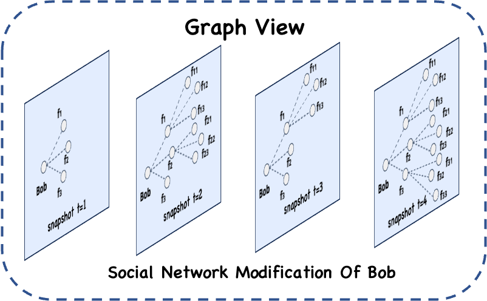

Define a GraphView for a social network that describes interpersonal relationships.

DSL Code

```sql
CREATE GRAPH social_network (Vertex person (id int ID,name varchar ),Edge knows (person1 int SOURCE ID,person2 int DESTINATION ID,weight int) ) WITH (storeType='rocksdb',shardCount = 128 );
```

HLA Code

```java
//build graph view. 
final String graphName = "social_network"; 
GraphViewDesc graphViewDesc = GraphViewBuilder 
	.createGraphView(graphName) 
	.withShardNum(128) 
	.withBackend(BackendType.RocksDB) 
    .withSchema(new GraphMetaType(IntegerType.INSTANCE, ValueVertex.class, 
                String.class, ValueEdge.class, Integer.class)) 
	.build(); 
 
// bind the graphview with pipeline1 
pipeline.withView(graphName, graphViewDesc); 
pipeline.submit(new PipelineTask()); 
 
```

The term "Streaming Graph" refers to graph data that is stream-based, dynamic, and constantly changing. Within the context of GeaFlow, Streaming Graph also refers to the computing mode for streaming graphs, Which is designed for graphs that undergo streaming changes, and performs operations such as graph traversal, graph matching, and graph computation based on graph changes.

Based on the GeaFlow framework, it is easy to perform dynamic computation on streaming graphs. In GeaFlow, we have abstracted two core concepts: Dynamic Graph and Static Graph.

- Static Graph refers to a static graph, in which the nodes and edges are fixed at a certain point in time and do not change. Computation on Static Graph is based on the static structure of the entire graph, so conventional graph algorithms and processing can be used for computation.
- Dynamic Graph refers to a dynamic graph, where nodes and edges are constantly changing. When the status of a node or edge changes, Dynamic Graph updates the graph structure promptly and performs computation on the new graph structure. In Dynamic Graph, nodes and edges can have dynamic attributes, which can also change with the graph. Computation on Dynamic Graph is based on the real-time structure and attributes of the graph, so special algorithms and processing are required for computation.

GeaFlow provides various computation modes and algorithms based on Dynamic Graph and Static Graph to facilitate users' choices and usage based on different needs. At the same time, GeaFlow also supports custom algorithms and processing, so users can extend and optimize algorithms according to their own needs.

Streaming Graph mainly has the following features:

- Supports streaming processing of node and edge data, but the overall graph is static.
- Supports continuous updates and queries of the graph structure, and can handle incremental data processing caused by changes in the graph structure.
- Supports backtracking history and can be queried based on historical snapshots.
- Supports the calculation logic order of the graph, such as the time sequence of edges.

Through real-time graph data flow and changes, Streaming Graph can dynamically implement graph calculations and analysis, and has a wide range of applications. For example, in the fields of social network analysis, financial risk control, and Internet of Things data analysis, Streaming Graph has broad applications prospects.

When building a Streaming Graph, a new node and edge can be added to the graph continuously through an incremental data stream, thus dynamically constructing the graph. At the same time, for each incremental data graph construction completion, it can trigger traversal calculation tracking the evolving process of Bob's 2-degree friends over time.

DSL code

```sql
 
set geaflow.dsl.window.size = 1; 
 
CREATE TABLE table_knows ( 
  personId int, 
  friendId int, 
  weight int 
) WITH ( 
  type='file', 
  geaflow.dsl.file.path = 'resource:///data/table_knows.txt' 
); 
 
INSERT INTO social_network.knows 
SELECT personId, friendId, weight 
FROM table_knows; 
 
CREATE TABLE result ( 
  personName varchar, 
  friendName varchar, 
  weight int 
) WITH ( 
	type='console' 
); 
 
-- Graph View Name Defined in Graph View Concept -- 
USE GRAPH social_network; 
-- find person id 3's known persons triggered every window. 
INSERT INTO result 
SELECT 
	name, 
	known_name, 
	weight 
FROM ( 
  MATCH (a:person where a.name = 'Bob') -[e:knows]->{1, 2}(b) 
  RETURN a.name as name, b.name as known_name, e.weight as weight 
) 
```

HLA code

```java
//build graph view. 
final String graphName = "social_network"; 
GraphViewDesc graphViewDesc = GraphViewBuilder.createGraphView(graphName).build(); 
pipeline.withView(graphName, graphViewDesc); 
 
// submit pipeLine task. 
pipeline.submit(new PipelineTask() { 
	@Override 
	public void execute(IPipelineTaskContext pipelineTaskCxt) { 
 
        // build vertices streaming source. 
		PStreamSource<IVertex<Integer, String>> persons = 
			pipelineTaskCxt.buildSource( 
				new CollectionSource.(getVertices()), SizeTumblingWindow.of(5000)); 
		// build edges streaming source. 
		PStreamSource<IEdge<Integer, Integer>> knows = 
			pipelineTaskCxt.buildSource( 
				new CollectionSource<>(getEdges()), SizeTumblingWindow.of(5000)); 
		// build graphview by graph name. 
		PGraphView<Integer, String, Integer> socialNetwork = 
			pipelineTaskCxt.buildGraphView(graphName); 
		// incremental build graph view. 
		PIncGraphView<Integer, String, Integer> incSocialNetwor = 
			socialNetwork.appendGraph(vertices, edges); 
 
		// traversal by 'Bob'. 
		incGraphView.incrementalTraversal(new IncGraphTraversalAlgorithms(2)) 
			.start('Bob') 
			.map(res -> String.format("%s,%s", res.getResponseId(), res.getResponse())) 
			.sink(new ConsoleSink<>()); 
	} 
}); 
```

---

<a id="concepts-dsl_principle"></a>

<!-- source_url: https://geaflow.incubator.apache.org/docs/concepts/dsl_principle/ -->

<!-- page_index: 8 -->

# DSL Principle Introduction

The overall architecture of GeaFlow DSL is shown in the following figure:

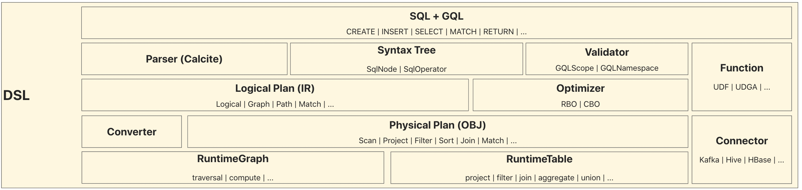

DSL Layer is a typical compiler technology architecture, which consists of syntax analysis, semantic analysis, intermediate code generation (IR), code optimization, and target code generation (OBJ).

- **Language Design**: GeaFlow has designed a fusion syntax of SQL+GQL to address the demand for integrated analysis of graphs and tables.
- **Syntax Analysis**: By extending the SqlNode and SqlOperator of [Calcite](https://calcite.apache.org/), GeaFlow implements a syntax parser for SQL+GQL, generating unified syntax tree information.
- **Semantic Analysis**: By extending the Scope and Namespace of Calcite, GeaFlow implements a custom Validator to perform constraint semantic checks on the syntax tree.
- **Intermediate Code Generation**: By extending the RelNode of Calcite, GeaFlow implements Logical RelNode on the graph for the intermediate representation of GQL syntax.
- **Code Optimization**: The optimizer implements a large number of optimization rules (RBO) to improve execution performance, and may introduce CBO in the future.
- **Target Code Generation**: The code generator Converter is responsible for converting Logical RelNode to Physical RelNode, which is the target code. Physical RelNode can be directly translated into API calls on the graph or table.
- **Custom Functions**: GeaFlow provides a wide range of built-in system functions, and users can also register custom functions as needed.
- **Custom Plugins**: GeaFlow allows users to extend their own Connector types to support different data sources and data formats.

The main execution flow of DSL is illustrated in the following figure:
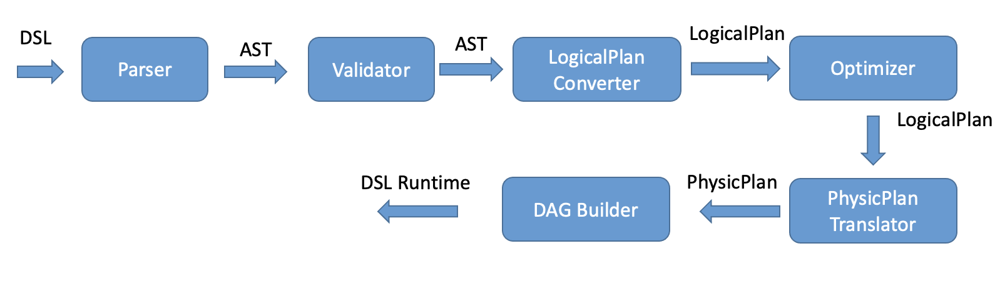
The DSL text is first parsed by the Parser to generate the AST syntax tree, and then the Validator performs semantic checking and type inference to generate a validated AST syntax tree. The graph-logic execution plan is then generated by the Logical Plan transformer. The logical execution plan is optimized by the Optimizer to generate an optimized logical execution plan. The physical execution plan is then generated by the Physical Plan transformer, and the physical execution logic is generated by the DAG Builder. GeaFlow DSL uses a two-level DAG structure to describe the physical execution logic of the flowchart.

Unlike traditional distributed table data processing engines such as Storm, Flink, and Spark, GeaFlow is a flowchart-integrated distributed computing system. Its physical execution plan uses a two-level DAG structure for the flowchart, as shown in the following figure:
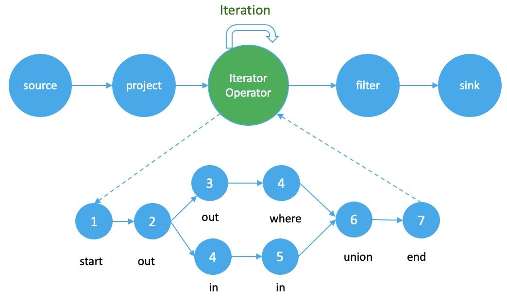
The outer layer DAG contains operator for table processing and iterative operator for graph processing, which is the main part of the physical execution logic and links the computing logic of the flowchart. The inner DAG expands the graph computation logic through the DAG, representing the specific execution of graph iterative computation.

---

<a id="concepts-framework_principle"></a>

<!-- source_url: https://geaflow.incubator.apache.org/docs/concepts/framework_principle/ -->

<!-- page_index: 9 -->

# Framework Architecture

The architecture of GeaFlow Framework is shown in the following diagram:

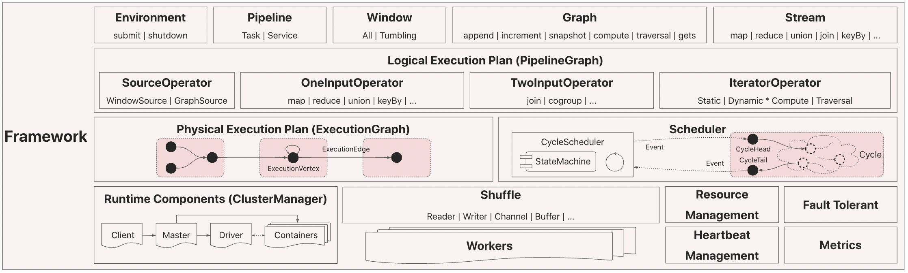

- **High Level API**: GeaFlow adapts to heterogeneous distributed execution environments (K8S, Ray, Local) through the Environment interface. It encapsulates the user's data processing flow using Pipelines and abstracts the stream processing (unbounded window) and batch processing (bounded window) using Windows. The Graph interface provides computation APIs on static graphs and dynamic graphs (streaming graphs), such as append/snapshot/compute/traversal, while the Stream interface provides unified stream and batch processing APIs, such as map/reduce/join/keyBy, etc.
- **Logical Execution Plan**: The logical execution plan information is encapsulated in the PipelineGraph object. It organizes the high-level API operators in a directed acyclic graph. Operators are categorized into 5 types: SourceOperator for data source loading, OneInputOperator/TwoInputOperator for traditional data processing, and IteratorOperator for static/dynamic graph computation. The vertices (PipelineVertex) in the DAG store crucial information about operators, such as type, parallelism, and operator functions, while the edges (PipelineEdge) record key information about data shuffling, such as partition rules (forward/broadcast/key), and encoders/decoders.
- **Physical Execution Plan**: The physical execution plan information is encapsulated in the ExecutionGraph object, which supports a two-level nested structure to schedule subgraphs that can be executed in pipelined manner. The example execution plan DAG in the graph is partitioned into three subgraph structures for execution.
- **Scheduler**: GeaFlow designs a Cycle-based scheduler (CycleScheduler) to achieve unified scheduling for stream, batch, and graph processing. The scheduling process is triggered by an event-driven model. Each subgraph in the physical execution plan is transformed into an ExecutionCycle object. The scheduler sends events to the head node (Head) of the cycle and receives events sent back from the tail node (Tail) to form a complete scheduling loop. For stream processing, each cycle scheduling round completes the processing of a window of data and continues indefinitely. For batch processing, the entire cycle scheduling is executed only once. For graph processing, each cycle scheduling round completes one iteration of graph computation.
- **Runtime Components**: GeaFlow's runtime launches the Client, Master, Driver, and Container components. When the Client submits a Pipeline to the Driver, it triggers the construction of the execution plan, task allocation (resources are provided by ResourceManagement), and scheduler. Each Container can run multiple Worker components, and data exchange between different Worker components is done through the Shuffle module. All workers need to regularly send heartbeats (HeartbeatManagement) to the Master and report runtime metric information to the time-series database. Additionally, GeaFlow's runtime provides fault tolerance mechanisms (FailOver) to continue execution in case of exceptions/interruptions.

The core modules of GeaFlow computing engine mainly include execution plan generation and optimization, unified cycle scheduling, and worker runtime execution. The following is an introduction to these core modules.

For the submitted PipelineTask in the stream graph scenario, a unified execution plan model is constructed, and different execution modes are aggregated together as a group for scheduling to provide a unified execution unit.

- PipelineGraph
  The PipelineGraph is constructed from the PipelineTask submitted by the user's API. The user's API is transformed into an operator corresponding to a vertex, and the data dependencies between vertices are represented by edges. The PipelineGraph only constructs a structured logical execution plan from the API and does not have the physical execution semantics.
- ExecutionGraph
  The ExecutionGraph aggregates a group of executable vertices together to build the corresponding ExecutionGroup based on different calculation models. Each group represents an independent schedulable unit. A group can be built from one or more vertices and can be considered as a small execution plan. The data exchange within the group is done in pipeline mode, while batch mode is used between groups. The group describes the specific execution mode, supports nesting, can be executed once or multiple times, and can execute data from one or more windows. The group is shown in the following figure. ExecutionGroup is ultimately transformed into the basic unit cycle for scheduling and execution.
  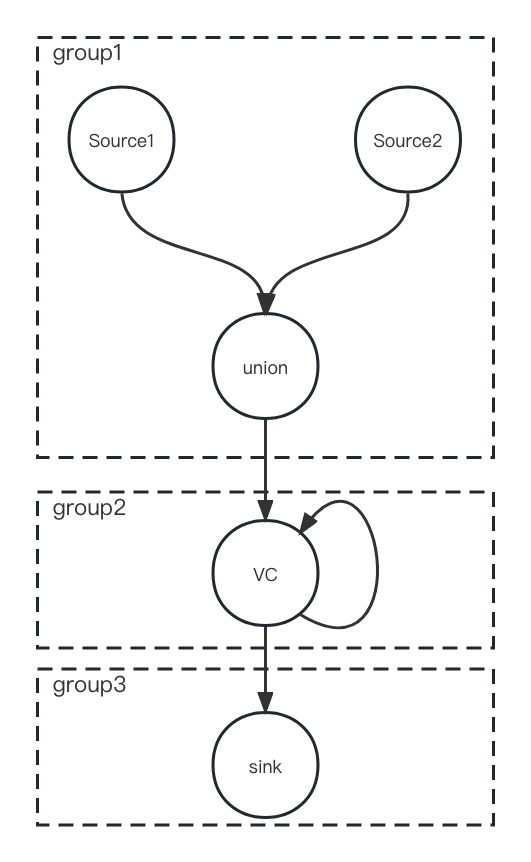

Scheduling generates scheduling basic units cycles based on ExecutionGroup defined in ExecutionGraph. A cycle is a basic unit that can be executed repeatedly and contains descriptions of input, intermediate calculations, data exchange, and output. The scheduling and execution process is mainly as follows:

1. Divide the execution plan into a group of cycles. If there is no data dependency between cycles, they can be executed in series or in parallel.
2. According to the scheduling data policy of the cycle, the cycle is scheduled and executed in order.
3. Wait until all cycles are executed, and return the scheduling execution results.
   Each cycle contains a group of executable ExecutionTasks, and each task can be distributed for remote execution. All execution tasks in a cycle can be divided as follows:
   Head task: the starting point of the cycle data stream. The scheduling sends an execution event to the head task, reads data from the source or the output of the previous cycle, processes it, and sends it to the downstream.
   Tail task: the end of the cycle data stream. After processing the data, the tail task sends an event to the scheduler, indicating that a round of calculation is completed.
   Other non-head/tail tasks: intermediate execution tasks that receive input data from upstream, process it, and send it directly to the downstream.
   The scheduling and execution process of the cycle is like a "loop," continuously sending events to the head and receiving return events from the tail, as shown in the following figure. The scheduling initializes the scheduling state according to the type of the cycle, and the scheduling process is also a process of state transition. Based on the received event, the scheduling decides the type of event to be sent to the head for the next round.
   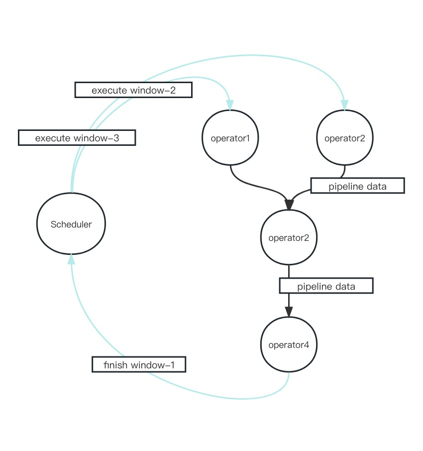

Runtime module is responsible for the specific computation and execution of all GeaFlow mode tasks, including streaming-batch, static/dynamic graph. Its entire worker process is as follows:

1. Scheduler is responsible for sending various types of events to Container for processing.
2. Dispatcher (inherited from AbstractTaskRunner) is responsible for receiving events sent by Scheduler and distributing them to specified TaskRunners according to their workerId.
3. TaskRunner (also inherited from AbstractTaskRunner) is responsible for fetching TASK(Event) from taskQueue, and the specific Event will be processed by Task. The whole lifecycle of Task includes creation, processing and ending. For abnormal Tasks, they can be directly interrupted.
   a. Task creation and initialization will be completed according to CreateTaskEvent. The lifecycle of Task will end according to DestroyTaskEvent.
   b. Other types of events will be completed on the semantic level of specific calculation through execute() method of corresponding CommandEvent. For example, according to InitCycleEvent, Worker will build upstream and downstream dependencies. According to LaunchSourceEvent, Worker will trigger source to start reading data, etc.
   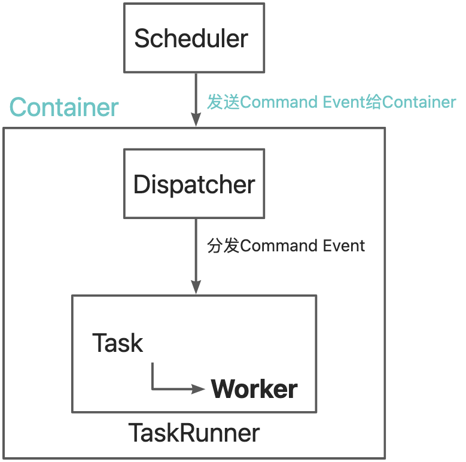
   The core data structure in the current TaskContext includes the Worker responsible for executing computations, the FetchService responsible for asynchronous data reading from upstream nodes to downstream, and the EmitterService responsible for outputting data generated by the execution Worker to downstream.

- Worker: mainly responsible for aligning and processing data in the flow graph, and calling back the corresponding DoneEvent to Scheduler after each batch processing, so that Scheduler can perform subsequent scheduling logic according to the DoneEvent.
- FetchService: responsible for asynchronously pulling data from the upstream channel, and putting it into the worker processing queue through the Listener registered by the worker.
- EmitterService: responsible for partition writing the data generated by the Worker into the corresponding Channel.

- Command Events can be divided into two types:
  - Normal Command Events, which do not have specific execute logic and are usually used to trigger the start and end of Task or Cycle lifecycles.
  - Executable Command Events, which have their own execute logic, such as Cycle initialization, data reading in the Source node, computation in the processing node, and cleanup after the Cycle ends.
- In the scheduling module, various types of events will be constructed into a State Machine for the lifecycle management of the entire scheduling task.
- Developers can extend Events and implement corresponding execute logic according to design needs, and add them to the State Machine. Then Scheduler can automatically schedule and execute them as expected.

For all runtime component processes, such as master/driver/container, they are initialized and run based on context. When creating a new process, the context required by the process is constructed first, and each process persists the context during initialization. When a process restarts abnormally, the context is recovered first, and then the process is re-initialized based on the context.

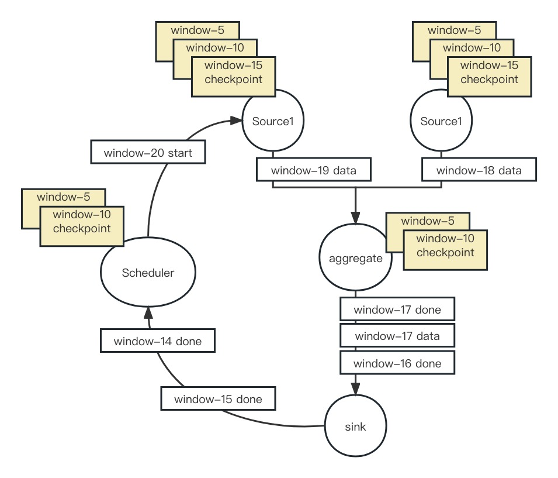

- Distributed snapshot of job
  The Scheduler determines the new windowId to be sent to the running tasks based on its current scheduling state, triggering the computation of the new window. When each operator completes the calculation of the corresponding window, if a snapshot of the current window context needs to be taken, the corresponding state within the operator will be persisted to storage.
  Finally, after the Scheduler receives the message that all tasks for a certain window have completed, it will take a snapshot of the scheduling metadata as needed and persist it. Only then is the processing of this window considered finished. When the Scheduler and the operator recover to this window context, they can continue to execute based on that window.
- Snapshot persistence
  When a snapshot is taken after a window calculation is completed, the storage method for the snapshot can be chosen. Currently, MEMORY, ROCKSDB, and JDBC are available.
- State recovery
  The snapshot storage is distributed, with each component, Scheduler, and operator storing and persisting their own data. During recovery, the Scheduler first recovers the windowId that was last completed from the storage, and then the Scheduler context is restored to the snapshot corresponding to that windowId. Then, a rollback command is sent to all workers, and each worker is restored to the specified window context. Finally, the Scheduler begins sending execution tasks again, continuing to execute based on the recovered state.

---

<a id="concepts-state_principle"></a>

<!-- source_url: https://geaflow.incubator.apache.org/docs/concepts/state_principle/ -->

<!-- page_index: 10 -->

# Introduction to State Principles

In Geaflow, state refers to the intermediate calculation results of directly calculated nodes during graph and flow computation processes. This intermediate result may be organized source data information or some results generated by calculation. State management is responsible for the storage and access of this data as well as consistency assurance. As the central data hub of Geaflow, its functional model, performance, and reliability directly affect the entire use process of Geaflow, and it is the foundation of the entire system.

- In terms of the function, it supports Geaflow's real-time, multi-mode dynamic graph engine, including low-latency flow graph fusion computation, high-performance long-cycle graph simulation, large-scale dynamic graph exploration, and more.
- In terms of the computation model, the state management in Geaflow belongs to the combination of real-time model and graph model. It needs to overcome the processing mechanism with state in real-time computing, low latency, fault tolerance, and recovery mechanisms. Additionally, it also needs to solve the problems of complex data, high association, data-driven computation, and large intermediate results in graph models.
- In terms of performance, state management needs to solve the problem of achieving high throughput and low-latency storage and query capabilities under the premise of low cost, multiple scenarios, and large-scale data. This includes accessing data at the scale of trillions of edges, accessing larger attribute information, and random and traversal access with multiple pushdown semantics.

Therefore, we have the following architecture diagram, which is flexible and supports multiple pluggable components.

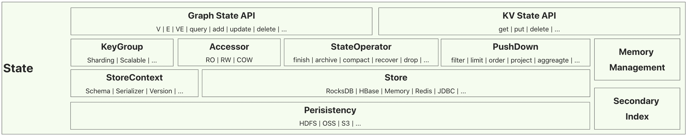

- **State API**: Provides an API for key-value storage operations, such as get/put/delete. It also provides APIs for graph storage, such as V/E/VE, and operations for adding/updating/deleting vertices and edges.
- **State Execution Layer**: Implements data sharding and scalability through the design of KeyGroups. Accessor provides IO abstractions for different read/write strategies and data models. StateOperator abstracts the storage layer SPI, including operations like finish (flushing to disk), archive (checkpoint), compact (compression), recover (recovery), etc. Additionally, State provides various pushdown optimizations to accelerate IO access efficiency. Customized memory management and attribute-based secondary indexing are also provided for storage access optimization.
- **Store Layer**: GeaFlow supports multiple types of storage systems and encapsulates schemas, serializers, and
  data version information through StoreContext. This layer deals with how in-memory data structures are mapped to storage structures. Currently, storage engines include Redis, Rocksdb (GeaFlow's proprietary storage system), which provide services through SPI. Depending on the characteristics of the storage engine, they may support different data models. For example, all data structures in Rocksdb need to be mapped to key-value pairs, while Redis inherently provides advanced data structures like lists/maps.
- **Persistence Layer**: GeaFlow State itself does not provide persistence capability. If a machine failure or disk corruption occurs, data loss may happen. Therefore, it relies on external components to provide persistence storage. These components are also pluggable and can support distributed file storage or object storage, such as HDFS/OSS/S3, etc.

The life of State shows below:

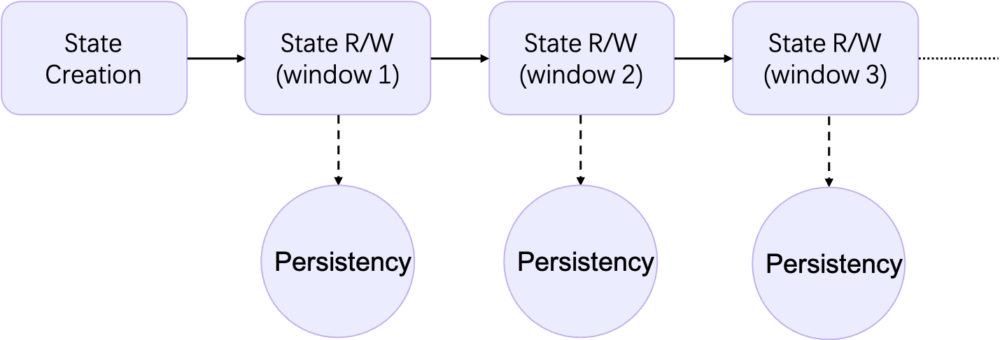

When failOver happens, it will recover from the last persistent data. The following is the detailed process.

The data processed by State is already divided into each partition dimension by the framework layer.

All State requests go through the StateFactory, and different States can be requested based on different Descriptors.

```java
buildGraphState(GraphStateDescriptor, Configuration):GraphState 
buildKeyValueState(KeyValueStateDescriptor, Configuration):KeyValueState 
buildKeyListState(KeyListDescriptor, Configuration):KeyListState 
buildKeyMapState(KeyMapStateDescriptor, Configuration):KeyMapState 
```

The Descriptor needs to declare basic information, including State name, Store type, etc. Different State names correspond to isolated States, and different States can be requested to represent different scenarios. For example, a Memory Store State can be requested as a temporary storage or calculation intermediate.

The choice of Store type is closely related to storage performance. For example, for Key State, if the underlying Store supports the KMap method, it will directly use the functions of KMap, which can perform incremental subkey operations. If it does not support KMap, it will be converted to a KV-model State, and the entire Map will be operated on, which will greatly magnify the size of both read and write operations.

After creation, we also need to read and write to the State.

Depending on the different types of State requested as mentioned above, they have different ways of reading and writing, which will be discussed in the end of the document.

In a computing task, if there is an exceptional circumstance such as a machine failure, the state data stored on the disk can be lost. To enable normal rollback, State also needs to consider the ability of persistence, so that the machine that is reassigned can retrieve the State data and continue computing.

In each computing task, users need to periodically do a checkpoint to persist the data and ensure the safety of the state data. This can be done after a batch of tasks is completed, or after the derivative task is completed. The timing of the checkpoint should be consistent with the source offset. Only when both the state checkpoint and source offset are saved, can it be considered that all state data of this job has been persisted.

When an exception occurs, the framework layer will perform FailOver, and State will automatically roll back to the latest state. Depending on the choice of the persistence layer as mentioned above, State data will be retrieved and loaded from the corresponding distributed file storage or object storage.

State can be roughly divided into Graph State and Key State, corresponding to different data structures and mapping to different storage models in the Store layer. For example, for the store type of Rocksdb, there will be different types of storage models such as KV and Graph.

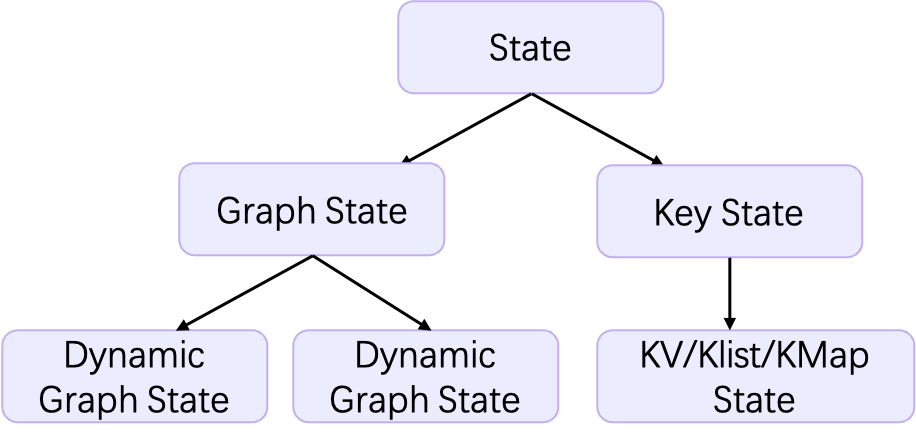

Graph State can be further classified into StaticGraph and DynamicGraph, based on whether it is a dynamic graph or not.
The difference is that StaticGraph treats the entire graph as a complete one, and all operations are performed on the complete graph.
On the other hand, DynamicGraph considers the graph to be dynamic, consisting of slice graphs that form a complete graph.

StaticGraphState API is divided into several parts, including query, upsert, delete, and manage.

- query: Graph query, which allows users to flexibly query GraphState from multiple dimensions such as nodes, edges, nodes and outbound edges. It can be a random or global query, and different pushdown conditions can be added. The final return value can be an iterator or a list.
- upsert: Adding nodes or edges.
- delete: Deleting a certain node or ID.
- manage: Divided into operator and other operations. Operator is the data operation of the State, which can perform flushing persistence or recovery. Other operations include obtaining information such as summary and metrics.

DynamicGraphState API is similar to StaticGraphState, but each node and edge is associated with a version number.

At the same time, Dynamic Graph State also adds version-related queries, which can obtain all versions or the latest version corresponding to certain nodes, and can obtain the specific values of each version.

KeyState API is divided into several parts, including:

- KeyValueState
- KeyListState
- KeyMapState

Each corresponds to a different user-level data structure. Similar to GraphState, KeyState also provides the ability to query, upsert, delete, and manage, but the query does not provide complex query semantic information like GraphState. Different State data structures have differences in querying and storage. For example, KMap allows modification and querying of a single subkey, while KV modifies and queries the entire value.

---

<a id="concepts-console_principle"></a>

<!-- source_url: https://geaflow.incubator.apache.org/docs/concepts/console_principle/ -->

<!-- page_index: 11 -->

# GeaFlow Console Platform

GeaFlow Console provides a unified platform for graph development and operations, as well as metadata (Catalog) services for the engine runtime.

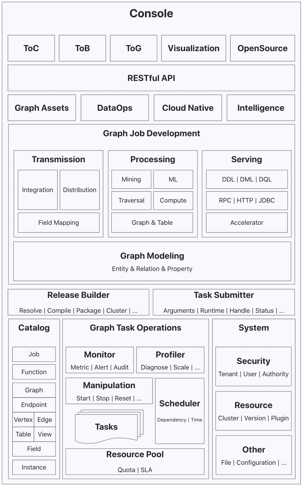

- **RESTful API**: The platform provides standardized RESTful APIs and authentication mechanisms, supporting unified API services for web and application clients.
- **Job Development**: The platform supports graph data modeling based on the "Relationship-Entity-Attribute" paradigm. Based on field mapping configurations, users can define graph data integration (Import) and distribution (Export) tasks. Graph data processing tasks based on graph models support diverse computational scenarios, such as Traversal, Compute, Mining, etc. Graph data services based on data accelerators provide real-time analysis capabilities supporting multiple protocols and integration with BI and visualization analysis tools.
- **Build & Submit**: The platform separates the development state from the operational state through the independent abstraction of jobs and tasks. After development, jobs can be published, triggering the build pipeline (Release Builder) to generate a release version. The task submitter (Task Submitter) is responsible for submitting the contents of the release version to the execution environment to generate a computational task.
- **Task Operations**: Tasks are the runtime state of jobs. The platform provides operational capabilities for task manipulation (start/stop/reset), monitoring (metrics/alerts/auditing), optimization (diagnostics/scalability/tuning), and scheduling. Task runtime resources are allocated and managed by the resource pool.
- **Metadata Services**: The platform also hosts metadata services for the engine runtime, enabling automation for development and operations. Metadata is segregated based on instances, and development resources within an instance can be accessed directly by name, such as vertices, edges, graphs, tables, views, functions, etc.
- **System Management**: The platform provides multi-tenant isolation, fine-grained user permission control, and system resource management capabilities.

GeaFlow supports execution in various heterogeneous environments. Taking the common K8S deployment environment as an example, the physical deployment architecture of GeaFlow is as follows:

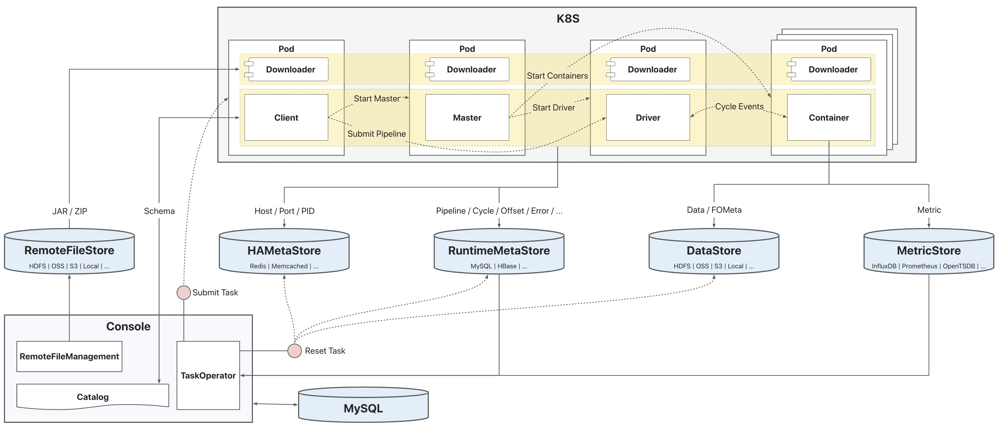

During the full lifecycle of a GeaFlow task, there are several key phases:

- **Development Phase**: The Console platform manages all development resources within an instance. Before creating a task, users can prepare the required development resource information in advance and store it in the Catalog.
- **Build Phase**: After the job is created, the build pipeline is triggered by the publish action. The user's JAR files, task's ZIP package, etc., are uploaded to the RemoteFileStore.
- **Submission Phase**: When a job is submitted, the Console creates a KubernetesJobClient based on the job's parameter configuration, runtime environment information, and remote file addresses. This client pod will bring up the master pod, container pods, and driver pod. After all pods are up and running, the client sends the pipeline to the driver for execution. The driver interacts with the containers through cycle scheduling events. When starting, each pod downloads the version JAR file, user JAR file, job ZIP package, etc., from the RemoteFileStore. When compiling DSL code, the driver also uses the Catalog API provided by the Console to operate on schema information.
- **Runtime Phase**: During task execution, various components report different data and information. The master reports heartbeat summary information for the task, the driver reports pipeline/cycle metrics and error information, and the containers report offsets, metric definitions, and error information. The RuntimeMetaStore stores pipeline/cycle metrics, offsets, heartbeat summaries, errors, etc., for the task. The HAMetaStore stores address information for various runtime components. The DataStore stores state data and metadata required for task failover. The MetricStore stores runtime metric information.
- **Monitoring Phase**: The Console primarily queries information stored in the RuntimeMetaStore and MetricStore for runtime monitoring of the task.
- **Cleanup Phase**: When a task is reset/deleted, the Console performs cleanup operations on the task's runtime metadata, HAMetaStore, and some data.

---

<a id="application-development-api-overview"></a>

<!-- source_url: https://geaflow.incubator.apache.org/docs/application-development/api/overview/ -->

<!-- page_index: 12 -->

# API Introduction

GeaFlow API is a development interface provided for advanced users, which supports two types of APIs: Graph API and Stream API:

- Graph API: Graph is a first-class citizen of the GeaFlow framework. Currently, the GeaFlow framework provides a set of graph computing programming interfaces based on GraphView, including graph construction, graph computation, and traversal. In GeaFlow, both static and dynamic graphs are supported.
  - Static Graph API: Static graph computing API. Full graph computing or traversal can be performed based on this API.
  - Dynamic Graph API: Dynamic graph computing API. GraphView is the data abstraction of a dynamic graph in GeaFlow. Based on GraphView, dynamic graph computing or traversal can be performed. At the same time, support for Snapshot generation from GraphView is provided. The Snapshot can provide the same interface capability as the Static Graph API.
    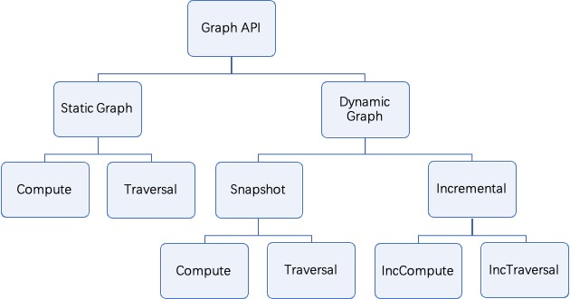
- The Stream API: GeaFlow provides a set of programming interfaces for general computing, including source construction, streaming batch computing, and sink output. In GeaFlow, both Batch and Stream are supported.
  - Batch API: Batch computing API, which can perform batch computation based on this API.
  - Stream API: Streaming computing API. StreamView is the data abstraction of a dynamic stream in GeaFlow. Based on StreamView, streaming computing can be performed.

From the introduction of the two types of APIs, it can be seen that GeaFlow unifies the graph view and stream view semantics through View internally. At the same time, in order to support two sets of APIs for dynamic and static computing, GeaFlow abstracts the concept of Window internally. Starting from the Source API, a Window must be included to split data windows based on the Window.

- For streaming or dynamic graph APIs, the Window can be split by size, and each window reads a certain size of data to achieve incremental computation.
- For batch or static graph APIs, the Window will use the AllWindow mode, and a window will read the full amount of data to achieve full computation.

To develop a GeaFlow API application, you need to add maven dependencies:

```xml
<dependency> 
    <groupId>com.antgroup.tugraph</groupId> 
    <artifactId>geaflow-api</artifactId> 
    <version>0.1</version> 
</dependency> 
 
<dependency> 
    <groupId>com.antgroup.tugraph</groupId> 
    <artifactId>geaflow-pdata</artifactId> 
    <version>0.1</version> 
</dependency> 
 
<dependency> 
    <groupId>com.antgroup.tugraph</groupId> 
    <artifactId>geaflow-cluster</artifactId> 
    <version>0.1</version> 
</dependency> 
 
<dependency> 
    <groupId>com.antgroup.tugraph</groupId> 
    <artifactId>geaflow-on-local</artifactId> 
    <version>0.1</version> 
</dependency> 
 
<dependency> 
    <groupId>com.antgroup.tugraph</groupId> 
    <artifactId>geaflow-pipeline</artifactId> 
    <version>0.1</version> 
</dependency> 
```

Graph API is a first-class citizen in GeaFlow, which provides a set of graph computing programming interfaces based on GraphView, including graph construction, graph computation, and traversal. The specific API descriptions are shown in the following table:

<table>
<tbody><tr>
<td>Type</td>
<td>API</td>
<td>Explanation</td>
</tr>
<tr>
<td rowspan="7">Dynamic Graph</td>
<td>PGraphView init(GraphViewDesc graphViewDesc)</td>
<td>Initialize with graphViewDesc as input</td>
</tr>
<tr>
<td>PGraphView PIncGraphView appendVertex(PWindowStream vertexStream)     </td>
<td>Using a distributed vertex stream as the incremental set of graph vertices for GraphView</td>
</tr>
<tr>
<td>PIncGraphView appendEdge(PWindowStream edgeStream)     </td>
<td>Using a distributed edge stream as the incremental set of graph edges for GraphView</td>
</tr>
<tr>
<td>PIncGraphView appendGraph(PWindowStream vertexStream, PWindowStream edgeStream)     </td>
<td>Using a distributed vertex and edge stream as the incremental set of graph vertices/edges for GraphView</td>
</tr>
<tr>
<td> PGraphTraversal incrementalTraversal(IncVertexCentricTraversal incVertexCentricTraversal)     </td>
<td>Performing incremental graph traversal on a dynamic GraphView</td>
</tr>
<tr>
<td>PGraphCompute incrementalCompute(IncVertexCentricCompute incVertexCentricCompute)     </td>
<td>Performing incremental graph computation on a dynamic GraphView</td>
</tr>
<tr>
<td>void materialize()     </td>
<td>Storing the incremental set of points and edges from a dynamic GraphView into state </td>
</tr>
<tr>
<td rowspan="7">Static Graph</td>
<td> PGraphCompute compute(VertexCentricCompute vertexCentricCompute)</td>
<td>Performing static graph vertex centric computation on Graph</td>
</tr>
<tr>
<td> PGraphWindow compute(ScatterGatherCompute sgAlgorithm, int parallelism)     </td>
<td>Performing static graph scatter gather computation on Graph</td>
</tr>
<tr>
<td> PGraphTraversal traversal(VertexCentricTraversal vertexCentricTraversal)     </td>
<td>Performing static graph vertex centric traversal on Graph</td>
</tr>
<tr>
<td> PWindowStream getEdges()     </td>
<td>Return a collection of edges</td>
</tr>
<tr>
<td>PWindowStream getVertices()     </td>
<td>Return a collection of vertices </td>
</tr></tbody></table>

The Stream API provides a set of programming interfaces for general computation, including source construction, stream and batch computing, and sink output. The specific API documentation is shown in the table below:

<table>
<tbody><tr>
<td>Type</td>
<td>API</td>
<td>Explanation</td>
</tr>
<tr>
<td rowspan="4">Stream</td>
<td>PStreamView init(IViewDesc viewDesc)</td>
<td>Initializing with a StreamViewDesc</td>
</tr>
<tr>
<td>PIncStreamView append(PWindowStream windowStream)     </td>
<td>Using distributed data as an incremental dataset for a StreamView</td>
</tr>
<tr>
<td>PWindowStream reduce(ReduceFunction reduceFunction)     </td>
<td>Performing incremental reduce aggregation on a dynamic StreamView</td>
</tr>
<tr>
<td> PWindowStream aggregate(AggregateFunction aggregateFunction)     </td>
<td>Performing incremental aggregate aggregation on a dynamic StreamView</td>
</tr>
<tr>
<td rowspan="12">Batch</td>
<td>PStreamView  PWindowStream map(MapFunction mapFunction)</td>
<td>Performing map operation</td>
</tr>
<tr>
<td>PWindowStream filter(FilterFunction filterFunction)     </td>
<td>Performing filter operation</td>
</tr>
<tr>
<td> PWindowStream flatMap(FlatMapFunction flatMapFunction)      </td>
<td>Performing flatMap operation</td>
</tr>
<tr>
<td> PWindowStream union(PStream uStream)     </td>
<td>Performing union merge on two streams</td>
</tr>
<tr>
<td>PWindowBroadcastStream broadcast()     </td>
<td>Broadcasting a stream downstream</td>
</tr>
<tr>
<td> PWindowKeyStream keyBy(KeySelector selectorFunction)     </td>
<td>Performing keyby operation based on selectorFunction rules</td>
</tr>
<tr>
<td>PStreamSink sink(SinkFunction sinkFunction)     </td>
<td>Outputting the results</td>
</tr>
<tr>
<td>PWindowCollect collect()     </td>
<td>Triggering the collection of data results</td>
</tr>
<tr>
<td>PWindowStream reduce(ReduceFunction reduceFunction)     </td>
<td>Performing a reduce aggregation calculation within a window</td>
</tr>
<tr>
<td> PWindowStream aggregate(AggregateFunction aggregateFunction)     </td>
<td>Performing a aggregate aggregation calculation within a window</td>
</tr>
<tr>
<td> PIncStreamView materialize()     </td>
<td>Using a PWindowKeyStream as a dynamic StreamView and generating an IncStreamView after default keyby</td>
</tr></tbody></table>

PageRank algorithm was originally used to calculate the importance of Internet pages. It was proposed by Page and Brin in 1996 and used in the ranking of web pages in Google search engine. In fact, PageRank can be defined on any digraph and later applied to many problems such as social influence analysis, text summary and so on.
Assuming that the Internet is a directed graph, the random walk model is defined on the basis of which, namely, the first-order Markov chain, represents the process of web page visitors browsing the web pages randomly on the Internet. It is assumed that the viewer jumps to the next page with equal probability according to the hyperlink connected out in each page, and continues to carry out such a random jump on the Internet, this process forms a first-order Markov chain. PageRank represents the smooth distribution of this Markov chain. The PageRank value of each page is the stationary probability.
The implementation of the algorithm is as follows: 1. Assume that the initial influence value of each point in the figure is the same; 2. 2. Calculate the jump probability of each point to other points, and update the influence value of the point; 3. Perform n iterations until the influence value of each point no longer changes, that is the convergence state.

```java
 
public class IncrGraphCompute { 
 
    private static final Logger LOGGER = LoggerFactory.getLogger(IncrGraphCompute.class); 
	// Computed result path. 
    public static final String RESULT_FILE_PATH = "./target/tmp/data/result/incr_graph"; 
	// Comparison result path. 
    public static final String REF_FILE_PATH = "data/reference/incr_graph"; 
 
    public static void main(String[] args) { 
		// Get execution environment. 
        Environment environment = EnvironmentFactory.onLocalEnvironment(); 
		// Perform job submission. 
        IPipelineResult result = submit(environment); 
		// Wait for execution to complete. 
        result.get(); 
		// Close the execution environment. 
		environment.shutdown(); 
    } 
 
    public static IPipelineResult<?> submit(Environment environment) { 
		// Build the task execution flow. 
        final Pipeline pipeline = PipelineFactory.buildPipeline(environment); 
		// Get the job environment configuration. 
        Configuration envConfig = environment.getEnvironmentContext().getConfig(); 
		// Specifies the path to save the calculation results. 
        envConfig.put(FileSink.OUTPUT_DIR, RESULT_FILE_PATH); 
 
        // Graphview name. 
        final String graphName = "graph_view_name"; 
		// Create delta graph graphview. 
        GraphViewDesc graphViewDesc = GraphViewBuilder 
			.createGraphView(graphName) 
			// Set the number of graphview shards, which can be specified from the configuration. 
            .withShardNum(envConfig.getInteger(ExampleConfigKeys.ITERATOR_PARALLELISM)) 
			// Set graphview backend type. 
            .withBackend(BackendType.RocksDB) 
			// Specify graphview schema information such as vertices/edges and attributes. 
            .withSchema(new GraphMetaType(IntegerType.INSTANCE, ValueVertex.class, Integer.class, ValueEdge.class, IntegerType.class)) 
            .build(); 
		// Add the created graphview information to the task execution flow. 
        pipeline.withView(graphName, graphViewDesc); 
		 
		// Submit the task and execute. 
        pipeline.submit(new PipelineTask() { 
            @Override 
            public void execute(IPipelineTaskContext pipelineTaskCxt) { 
                Configuration conf = pipelineTaskCxt.getConfig(); 
				// 1. Build vertex data input source. 
                PWindowSource<IVertex<Integer, Integer>> vertices = 
                    // Extract vertex from edge file. 
                    pipelineTaskCxt.buildSource(new RecoverableFileSource<>("data/input/email_edge",			 
						// Specifies the parsing format for each row of data. 
                        line -> { 
                            String[] fields = line.split(","); 
                            IVertex<Integer, Integer> vertex1 = new ValueVertex<>( 
                                Integer.valueOf(fields[0]), 1); 
                            IVertex<Integer, Integer> vertex2 = new ValueVertex<>( 
                                Integer.valueOf(fields[1]), 1); 
                            return Arrays.asList(vertex1, vertex2); 
                        }), SizeTumblingWindow.of(10000)) 
						// Specifies the parallelism of vertex data sources. 
                        .withParallelism(pipelineTaskCxt.getConfig().getInteger(ExampleConfigKeys.SOURCE_PARALLELISM)); 
				 
				// 2. Build the edge data input source. 
                PWindowSource<IEdge<Integer, Integer>> edges = 
                    pipelineTaskCxt.buildSource( new RecoverableFileSource<>("data/input/email_edge",			 
						// Specifies the parsing format for each row of data. 
                        line -> { 
                            String[] fields = line.split(","); 
                            IEdge<Integer, Integer> edge = new ValueEdge<>(Integer.valueOf(fields[0]), 
                                Integer.valueOf(fields[1]), 1); 
                            return Collections.singletonList(edge); 
                        }), SizeTumblingWindow.of(5000)) 
						// Specifies the parallelism of edge data sources. 
						.withParallelism(pipelineTaskCxt.getConfig().getInteger(ExampleConfigKeys.SOURCE_PARALLELISM)); 
				 
				// Get the defined graphview and build the graph data. 
                PGraphView<Integer, Integer, Integer> fundGraphView = 
                    pipelineTaskCxt.getGraphView(graphName); 
                PIncGraphView<Integer, Integer, Integer> incGraphView = 
                    fundGraphView.appendGraph(vertices, edges); 
				// Get the concurrency of Map tasks running in a job. 
                int mapParallelism = pipelineTaskCxt.getConfig().getInteger(ExampleConfigKeys.MAP_PARALLELISM); 
				// Get the concurrency of Sink tasks running in a job. 
                int sinkParallelism = pipelineTaskCxt.getConfig().getInteger(ExampleConfigKeys.SINK_PARALLELISM); 
				// Create sink method. 
                SinkFunction<String> sink = ExampleSinkFunctionFactory.getSinkFunction(conf);			 
				// Based on graph algorithm, dynamic graph calculation is performed. 
                incGraphView.incrementalCompute(new IncGraphAlgorithms(3)) 
					// Get the result of vertices data and perform a map operation. 
                    .getVertices() 
                    .map(v -> String.format("%s,%s", v.getId(), v.getValue())) 
                    .withParallelism(mapParallelism) 
                    .sink(sink) 
                    .withParallelism(sinkParallelism); 
            } 
        }); 
		 
        return pipeline.execute(); 
    } 
	 
	// Implement Pagerank dynamic graph algorithm. 
    public static class IncGraphAlgorithms extends IncVertexCentricCompute<Integer, Integer, 
        Integer, Integer> { 
 
        public IncGraphAlgorithms(long iterations) { 
			// Set the maximum number of iterations for the algorithm. 
            super(iterations); 
        } 
 
        @Override 
        public IncVertexCentricComputeFunction<Integer, Integer, Integer, Integer> getIncComputeFunction() { 
			// Specify the Pagerank calculation logic. 
            return new PRVertexCentricComputeFunction(); 
        } 
 
        @Override 
        public VertexCentricCombineFunction<Integer> getCombineFunction() { 
            return null; 
        } 
 
    } 
 
    public static class PRVertexCentricComputeFunction implements 
        IncVertexCentricComputeFunction<Integer, Integer, Integer, Integer> { 
 
        private IncGraphComputeContext<Integer, Integer, Integer, Integer> graphContext; 
		 
		// Init method, set graphContext. 
        @Override 
        public void init(IncGraphComputeContext<Integer, Integer, Integer, Integer> graphContext) {	 
            this.graphContext = graphContext; 
        } 
		 
		// The first round of iteration implementation of the evolve method. 
        @Override 
        public void evolve(Integer vertexId, 
                           TemporaryGraph<Integer, Integer, Integer> temporaryGraph) { 
			// Set the dynamic graph version to 0. 
            long lastVersionId = 0L; 
			// Get the vertex whose ID is equal to vertexId from the incremental graph. 
            IVertex<Integer, Integer> vertex = temporaryGraph.getVertex(); 
			// Get the historical base graph. 
            HistoricalGraph<Integer, Integer, Integer> historicalGraph = graphContext 
                .getHistoricalGraph(); 
            if (vertex == null) { 
				// If there is no vertex with ID equal to vertexId in the incremental graph, get it from the historical graph. 
                vertex = historicalGraph.getSnapShot(lastVersionId).vertex().get(); 
            } 
 
            if (vertex != null) { 
				// Get all the outgoing edges corresponding to a vertex from the incremental graph. 
                List<IEdge<Integer, Integer>> newEs = temporaryGraph.getEdges(); 
				// Get all the outgoing edges corresponding to a vertex from the historical graph. 
                List<IEdge<Integer, Integer>> oldEs = historicalGraph.getSnapShot(lastVersionId) 
                    .edges().getOutEdges(); 
                if (newEs != null) { 
                    for (IEdge<Integer, Integer> edge : newEs) { 
						// Send a message with the content of vertexId to the targetId of all edges in the incremental graph. 
                        graphContext.sendMessage(edge.getTargetId(), vertexId); 
                    } 
                } 
                if (oldEs != null) { 
                    for (IEdge<Integer, Integer> edge : oldEs) { 
						// Send a message with the content of vertexId to the targetId of all edges in the historical graph. 
                        graphContext.sendMessage(edge.getTargetId(), vertexId); 
                    } 
                } 
            } 
 
        } 
 
        @Override 
        public void compute(Integer vertexId, Iterator<Integer> messageIterator) { 
            int max = 0; 
			// Iterate through all messages received by vertexId and take the maximum value. 
            while (messageIterator.hasNext()) { 
                int value = messageIterator.next(); 
                max = max > value ? max : value; 
            } 
			// Get the vertex whose ID is equal to vertexId from the incremental graph. 
            IVertex<Integer, Integer> vertex = graphContext.getTemporaryGraph().getVertex();		 
			// Get the vertex whose ID is equal to vertexId from the historical graph. 
            IVertex<Integer, Integer> historyVertex = graphContext.getHistoricalGraph().getSnapShot(0).vertex().get(); 
			// Take the maximum value between the attribute value of a vertex in the incremental graph and the maximum value of the messages. 
            if (vertex != null && max < vertex.getValue()) { 
                max = vertex.getValue(); 
            } 
			// Take the maximum value between the attribute value of a vertex in the historical graph and the maximum value of the messages. 
            if (historyVertex != null && max < historyVertex.getValue()) { 
                max = historyVertex.getValue(); 
            } 
			// Update the attribute value of a vertex in the incremental graph. 
            graphContext.getTemporaryGraph().updateVertexValue(max); 
        } 
		 
		 
        @Override 
        public void finish(Integer vertexId, MutableGraph<Integer, Integer, Integer> mutableGraph) { 
			// Get the vertices and edges related to vertexId from the incremental graph. 
            IVertex<Integer, Integer> vertex = graphContext.getTemporaryGraph().getVertex(); 
            List<IEdge<Integer, Integer>> edges = graphContext.getTemporaryGraph().getEdges(); 
            if (vertex != null) { 
				// Add the vertices in the incremental graph to the graph data. 
                mutableGraph.addVertex(0, vertex); 
                graphContext.collect(vertex); 
            } else { 
                LOGGER.info("not found vertex {} in temporaryGraph ", vertexId); 
            } 
            if (edges != null) { 
				// Add the edges in the incremental graph to the graph data. 
                edges.stream().forEach(edge -> { 
                    mutableGraph.addEdge(0, edge); 
                }); 
            } 
        } 
    } 
 
} 
 
```

```java
 
public class PageRank { 
 
    private static final Logger LOGGER = LoggerFactory.getLogger(PageRank.class); 
	 
	// Computed result path. 
    public static final String RESULT_FILE_PATH = "./target/tmp/data/result/pagerank"; 
	 
	// Comparison result path. 
    public static final String REF_FILE_PATH = "data/reference/pagerank"; 
 
    public static void main(String[] args) { 
		// Get execution environment. 
        Environment environment = EnvironmentFactory.onLocalEnvironment(); 
		// Perform job submission. 
        IPipelineResult<?> result = submit(environment); 
		// Wait for execution to complete. 
        result.get(); 
		// Close the execution environment. 
        environment.shutdown(); 
    } 
 
    public static IPipelineResult<?> submit(Environment environment) { 
		// Build the task execution flow. 
        Pipeline pipeline = PipelineFactory.buildPipeline(environment); 
		// Get the job environment configuration. 
        Configuration envConfig = environment.getEnvironmentContext().getConfig(); 
		// Specifies the path to save the calculation results. 
        envConfig.put(FileSink.OUTPUT_DIR, RESULT_FILE_PATH); 
		 
		// Submit the task and execute. 
        pipeline.submit((PipelineTask) pipelineTaskCxt -> { 
            Configuration conf = pipelineTaskCxt.getConfig(); 
			// 1. Build vertex data input source. 
            PWindowSource<IVertex<Integer, Double>> prVertices = 
                pipelineTaskCxt.buildSource(new FileSource<>("data/input/email_vertex", 
					// Specifies the parsing format for each row of data. 
                    line -> { 
                        String[] fields = line.split(","); 
                        IVertex<Integer, Double> vertex = new ValueVertex<>( 
                            Integer.valueOf(fields[0]), Double.valueOf(fields[1])); 
                        return Collections.singletonList(vertex); 
                    }), AllWindow.getInstance()) 
					// Specifies the parallelism of vertex data sources. 
                    .withParallelism(conf.getInteger(ExampleConfigKeys.SOURCE_PARALLELISM)); 
			// 2. Build the edge data input source. 
            PWindowSource<IEdge<Integer, Integer>> prEdges = pipelineTaskCxt.buildSource(new FileSource<>("data/input/email_edge", 
				// Specifies the parsing format for each row of data. 
                line -> { 
                    String[] fields = line.split(","); 
                    IEdge<Integer, Integer> edge = new ValueEdge<>(Integer.valueOf(fields[0]), Integer.valueOf(fields[1]), 1); 
                    return Collections.singletonList(edge); 
                }), AllWindow.getInstance()) 
				// Specifies the parallelism of edge data sources. 
                .withParallelism(conf.getInteger(ExampleConfigKeys.SOURCE_PARALLELISM)); 
			 
			// The parallelism of iteration computation. 
            int iterationParallelism = conf.getInteger(ExampleConfigKeys.ITERATOR_PARALLELISM);		 
			// Define graphview. 
            GraphViewDesc graphViewDesc = GraphViewBuilder 
                .createGraphView(GraphViewBuilder.DEFAULT_GRAPH) 
				// Specify the number of shards as 2. 
                .withShardNum(2) 
				// Specify the backend type as memory. 
                .withBackend(BackendType.Memory) 
                .build(); 
			 
			// Build a static graph based on vertex/edge data and the defined graph view. 
            PGraphWindow<Integer, Double, Integer> graphWindow = 
                pipelineTaskCxt.buildWindowStreamGraph(prVertices, prEdges, graphViewDesc); 
			// Create sink method. 
            SinkFunction<IVertex<Integer, Double>> sink = ExampleSinkFunctionFactory.getSinkFunction(conf); 
			// Specify the computation concurrency and execute the static computation method. 
            graphWindow.compute(new PRAlgorithms(3)) 
                .compute(iterationParallelism) 
				// Get the computed vertices result and output them according to the defined sink function. 
                .getVertices() 
                .sink(sink) 
                .withParallelism(conf.getInteger(ExampleConfigKeys.SINK_PARALLELISM)); 
        }); 
 
        return pipeline.execute(); 
    } 
 
    public static class PRAlgorithms extends VertexCentricCompute<Integer, Double, Integer, Double> { 
 
        public PRAlgorithms(long iterations) { 
			// Specify the iteration number for static graph computation. 
            super(iterations); 
        } 
 
        @Override 
        public VertexCentricComputeFunction<Integer, Double, Integer, Double> getComputeFunction() { 
            return new PRVertexCentricComputeFunction(); 
        } 
 
        @Override 
        public VertexCentricCombineFunction<Double> getCombineFunction() { 
            return null; 
        } 
 
    } 
 
    public static class PRVertexCentricComputeFunction extends AbstractVcFunc<Integer, Double, Integer, Double> { 
		// The implementation of the static graph computation method. 
        @Override 
        public void compute(Integer vertexId, 
                            Iterator<Double> messageIterator) { 
			// Get the vertex from the static graph where the vertex ID equals vertexId. 
            IVertex<Integer, Double> vertex = this.context.vertex().get(); 
            if (this.context.getIterationId() == 1) { 
				// In the first iteration, send messages to neighboring nodes, and the message content is the attribute value of the vertex with vertexId. 
                this.context.sendMessageToNeighbors(vertex.getValue()); 
            } else { 
                double sum = 0; 
                while (messageIterator.hasNext()) { 
                    double value = messageIterator.next(); 
                    sum += value; 
                } 
				// Sum up the received messages and set it as the attribute value of the current vertex. 
                this.context.setNewVertexValue(sum); 
            } 
        } 
 
    } 
} 
 
```

```java
 
public class WordCountStream { 
 
    private static final Logger LOGGER = LoggerFactory.getLogger(WordCountStream.class); 
	 
	// Computed result path. 
    public static final String RESULT_FILE_PATH = "./target/tmp/data/result/wordcount"; 
	 
	// Comparison result path. 
    public static final String REF_FILE_PATH = "data/reference/wordcount"; 
 
    public static void main(String[] args) { 
		// Get execution environment. 
        Environment environment = EnvironmentUtil.loadEnvironment(args); 
		// Perform job submission. 
        IPipelineResult<?> result = submit(environment); 
        result.get(); 
		// Close the execution environment. 
        environment.shutdown(); 
    } 
 
    public static IPipelineResult<?> submit(Environment environment) { 
		// Build the task execution flow. 
        Pipeline pipeline = PipelineFactory.buildPipeline(environment); 
		// Get the job environment configuration. 
        Configuration envConfig = environment.getEnvironmentContext().getConfig(); 
		// Turn off the materialize switch for dynamic streaming. 
        envConfig.getConfigMap().put(FrameworkConfigKeys.INC_STREAM_MATERIALIZE_DISABLE.getKey(), Boolean.TRUE.toString()); 
		// Specifies the path to save the calculation results. 
        envConfig.getConfigMap().put(FileSink.OUTPUT_DIR, RESULT_FILE_PATH); 
 
        pipeline.submit(new PipelineTask() { 
            @Override 
            public void execute(IPipelineTaskContext pipelineTaskCxt) { 
                Configuration conf = pipelineTaskCxt.getConfig(); 
 
				// Gets the input data stream. 
                PWindowSource<String> streamSource = pipelineTaskCxt.buildSource( 
                    new FileSource<String>("data/input/email_edge", 
						// Specifies the parsing format for each row of data. 
                        line -> { 
                            String[] fields = line.split(","); 
                            return Collections.singletonList(fields[0]); 
								// Define the size of the data window. 
                        }) {}, SizeTumblingWindow.of(5000)) 
					// Specifies the parallelism of input data sources. 
                    .withParallelism(conf.getInteger(ExampleConfigKeys.SOURCE_PARALLELISM)); 
 
                SinkFunction<String> sink = ExampleSinkFunctionFactory.getSinkFunction(conf);			 
                streamSource 
					// Perform map operation on the data in the stream. 
                    .map(e -> Tuple.of(e, 1)) 
					// Key by. 
                    .keyBy(new KeySelectorFunc()) 
					// Reduce: the aggregation to count the number of identical data. 
                    .reduce(new CountFunc()) 
					// Specify the concurrency num of the operator. 
                    .withParallelism(conf.getInteger(ExampleConfigKeys.REDUCE_PARALLELISM)) 
                    .map(v -> String.format("(%s,%s)", ((Tuple) v).f0, ((Tuple) v).f1)) 
                    .sink(sink) 
                    .withParallelism(conf.getInteger(ExampleConfigKeys.SINK_PARALLELISM)); 
            } 
        }); 
 
        return pipeline.execute(); 
    } 
 
    public static void validateResult() throws IOException { 
        ResultValidator.validateResult(REF_FILE_PATH, RESULT_FILE_PATH); 
    } 
 
 
    public static class MapFunc implements MapFunction<String, Tuple<String, Integer>> { 
		// Implement the map method to convert each input word to a Tuple. 
        @Override 
        public Tuple<String, Integer> map(String value) { 
            LOGGER.info("MapFunc process value: {}", value); 
            return Tuple.of(value, 1); 
        } 
    } 
 
    public static class KeySelectorFunc implements KeySelector<Tuple<String, Integer>, Object> { 
 
        @Override 
        public Object getKey(Tuple<String, Integer> value) { 
            return value.f0; 
        } 
    } 
 
    public static class CountFunc implements ReduceFunction<Tuple<String, Integer>> { 
 
        @Override 
        public Tuple<String, Integer> reduce(Tuple<String, Integer> oldValue, Tuple<String, Integer> newValue) { 
            return Tuple.of(oldValue.f0, oldValue.f1 + newValue.f1); 
        } 
    } 
} 
 
```

```java
 
public class WindowStreamKeyAgg implements Serializable { 
 
    private static final Logger LOGGER = LoggerFactory.getLogger(WindowStreamKeyAgg.class); 
	// Computed result path. 
    public static final String RESULT_FILE_PATH = "./target/tmp/data/result/wordcount"; 
	 
	// Comparison result path. 
    public static final String REF_FILE_PATH = "data/reference/wordcount"; 
 
    public static void main(String[] args) { 
		// Get execution environment. 
        Environment environment = EnvironmentUtil.loadEnvironment(args); 
		// Perform job submission. 
        IPipelineResult<?> result = submit(environment); 
        result.get(); 
		// Close the execution environment. 
        environment.shutdown(); 
    } 
 
    public static IPipelineResult<?> submit(Environment environment) { 
		// Build the task execution flow. 
        Pipeline pipeline = PipelineFactory.buildPipeline(environment); 
		// Get the job environment configuration. 
        Configuration envConfig = environment.getEnvironmentContext().getConfig(); 
		// Specifies the path to save the calculation results. 
        envConfig.getConfigMap().put(FileSink.OUTPUT_DIR, RESULT_FILE_PATH); 
        pipeline.submit(new PipelineTask() { 
            @Override 
            public void execute(IPipelineTaskContext pipelineTaskCxt) { 
                Configuration conf = pipelineTaskCxt.getConfig(); 
 
				// Define the window size as 5000 and construct an input data stream. 
                PWindowSource<String> streamSource = 
                    pipelineTaskCxt.buildSource(new FileSource<String>("data/input" 
                    + "/email_edge", Collections::singletonList) {}, SizeTumblingWindow.of(5000)); 
 
                SinkFunction<String> sink = ExampleSinkFunctionFactory.getSinkFunction(conf); 
                streamSource 
                    .flatMap(new FlatMapFunction<String, Long>() { 
                        @Override 
                        public void flatMap(String value, Collector collector) { 
							// Flatmap implementation. 
                            String[] records = value.split(SPLIT); 
                            for (String record : records) { 
								// Split and partition each line of data. 
                                collector.partition(Long.valueOf(record)); 
                            } 
                        } 
                    }) 
					// Map. 
                    .map(p -> Tuple.of(p, p)) 
					// Key by. 
                    .keyBy(p -> ((long) ((Tuple) p).f0) % 7) 
                    .aggregate(new AggFunc()) 
                    .withParallelism(conf.getInteger(AGG_PARALLELISM)) 
                    .map(v -> String.format("%s,%s", ((Tuple) v).f0, ((Tuple) v).f1)) 
                    .sink(sink).withParallelism(conf.getInteger(SINK_PARALLELISM)); 
            } 
        }); 
 
        return pipeline.execute(); 
    } 
 
	 
    public static class AggFunc implements 
        AggregateFunction<Tuple<Long, Long>, Tuple<Long, Long>, Tuple<Long, Long>> { 
		 
		// Define the accumulator implementation. 
        @Override 
        public Tuple<Long, Long> createAccumulator() { 
            return Tuple.of(0L, 0L); 
        } 
		 
        @Override 
        public void add(Tuple<Long, Long> value, Tuple<Long, Long> accumulator) { 
			// Add up the f1 values of two values with the same key. 
            accumulator.setF0(value.f0); 
            accumulator.setF1(value.f1 + accumulator.f1); 
        } 
 
        @Override 
        public Tuple<Long, Long> getResult(Tuple<Long, Long> accumulator) { 
			// Return the result after accumulation. 
            return Tuple.of(accumulator.f0, accumulator.f1); 
        } 
 
        @Override 
        public Tuple<Long, Long> merge(Tuple<Long, Long> a, Tuple<Long, Long> b) { 
            return null; 
        } 
    } 
 
} 
 
 
```

---

<a id="application-development-api-stream-source"></a>

<!-- source_url: https://geaflow.incubator.apache.org/docs/application-development/api/stream/source/ -->

<!-- page_index: 13 -->

# Source Introduction

GeaFlow provides Source API to the public, and IWindow needs to be provided at the interface level to build the corresponding window source. Users can define the specific source reading logic by implementing SourceFunction.

| API | Interface Description | Input Parameter Description |
| --- | --- | --- |
| PWindowSource build(IPipelineContext pipelineContext, SourceFunction sourceFunction, IWindow window) | Build window source | SourceFunction: Define source reading logic. GeaFlow has already implemented several types of source function internally, such as Collection, File, etc. IWindow: There are currently two types supported, SizeTumblingWindow and AllWindow. The former can be used to support streaming reading windows, and the latter is used to support batch one-time reading. |

To build a window source, users can generally use the buildSource interface provided by IPipelineTaskContext directly.

```java
	// Interface. 
	<T> PWindowSource<T> buildSource(SourceFunction<T> sourceFunction, IWindow<T> window); 
 
	// Example: Build a collection source with a window size of 2. 
	List<String> words = Lists.newArrayList("hello", "world", "hello", "word"); 
	PWindowSource<String> source = 
        pipelineTaskCxt.buildSource(new CollectionSource<String>(words) {}, 
            SizeTumblingWindow.of(2)); 
```

```java
public class WindowStreamWordCount { 
 
    private static final Logger LOGGER = 
        LoggerFactory.getLogger(WindowStreamWordCount.class); 
 
    public static void main(String[] args) { 
        Environment environment = EnvironmentFactory.onLocalEnvironment(); 
        Pipeline pipeline = PipelineFactory.buildPipeline(environment); 
        pipeline.submit(new PipelineTask() { 
            @Override 
            public void execute(IPipelineTaskContext pipelineTaskCxt) { 
                Configuration config = pipelineTaskCxt.getConfig(); 
                List<String> words = Lists.newArrayList("hello", "world", "hello", "word"); 
                // Build source using the built-in CollectionSource, while specifying the window type as SizeTumblingWindow and window size as 2. 
                PWindowSource<String> source = 
                    pipelineTaskCxt.buildSource(new CollectionSource<String>(words) {}, 
                        SizeTumblingWindow.of(2)); 
                source.sink(v -> LOGGER.info("result: {}", v)); 
            } 
        }); 
 
        IPipelineResult result = pipeline.execute(); 
        // Wait for execution to complete. 
        result.get(); 
    } 
 
} 
```

---

<a id="application-development-api-stream-process"></a>

<!-- source_url: https://geaflow.incubator.apache.org/docs/application-development/api/stream/process/ -->

<!-- page_index: 14 -->

# Process Introduction

GeaFlow provides a series of Process APIs to the public, which are similar to general stream batch but not identical. As already introduced in the Source API, the source constructed from it has window semantics. Therefore, all GeaFlow Process APIs also have window semantics.

| API | Interface Description | Input Parameter Description |
| --- | --- | --- |
| PWindowStream map(MapFunction<T, R> mapFunction) | By implementing mapFunction, input T can be transformed into R and output to downstream | mapFunction：Users define their own conversion logic, T represents input type, and R represents output type |
| PWindowStream filter(FilterFunction filterFunction) | "By implementing filterFunction, T that does not meet the requirements can be filtered out | filterFunction：Users define their own filter logic, T represents input type |
| PWindowStream flatMap(FlatMapFunction<T, R> flatMapFunction) | By implementing flatMapFunction, one T input can generate n R outputs and output to downstream | flatMapFunction：Users implement their own logic, T represents input type, and R represents output type |
| PWindowStream union(PStream uStream) | Used to implement merging two input streams | uStream：Input stream, T represents the input stream type |
| PWindowBroadcastStream broadcast() | Broadcasting data streams | No |
| PWindowKeyStream<KEY, T> keyBy(KeySelector<T, KEY> selectorFunction) | Shuffle the input records according to the KEY and output them | selectorFunction：Users define their own logic for selecting KEY, T represents record input type, and KEY represents the defined KEY type |
| PWindowStream reduce(ReduceFunction reduceFunction) | Support two modes of reduce. For batch, it is based on the reduction and aggregation calculation within the current window. For dynamic streams, it is based on the global reduction and aggregation calculation of dynamic increment (equivalent to Flink's stream aggregation calculation). By default, GeaFLOW adopts dynamic stream aggregation calculation semantics. If batch semantics are needed, users can enable them through parameters | reduceFunction：Users define their own reduce aggregation logic. T indicates the input record type |
| <ACC, OUT> PWindowStream aggregate(AggregateFunction<T, ACC, OUT> aggregateFunction) | Support two modes of aggregate. For batch processing, it is based on the aggregate calculation within the current window; while for stream processing, it is based on the global aggregate calculation of dynamic increment (equivalent to Flink's stream aggregation calculation). By default, GeaFlow adopts stream aggregate calculation semantics. If batch semantics are needed, users can enable them through parameters | aggregateFunction：Users define their own aggregation calculation logic, T represents input type, ACC represents aggregation value type, and OUT represents output type |
| PIncStreamView materialize() | Used to identify whether the aggregation calculation is based on streaming or batch processing. By default, there is no need to call this interface | No |

```java
public class StreamUnionPipeline implements Serializable { 
 
    private static final Logger LOGGER = LoggerFactory.getLogger(StreamUnionPipeline.class); 
 
    public static final String RESULT_FILE_PATH = "./target/tmp/data/result/union"; 
    public static final String REF_FILE_PATH = "data/reference/union"; 
    public static final String SPLIT = ","; 
 
    public static void main(String[] args) { 
        // Get execution environment. 
        Environment environment = EnvironmentFactory.onLocalEnvironment(); 
        // Perform job submission. 
        IPipelineResult<?> result = submit(environment); 
        result.get(); 
        // Wait for execution to complete. 
        environment.shutdown(); 
    } 
 
    public static IPipelineResult<?> submit(Environment environment) { 
        Pipeline pipeline = PipelineFactory.buildPipeline(environment); 
        Configuration envConfig = environment.getEnvironmentContext().getConfig(); 
        envConfig.getConfigMap().put(FileSink.OUTPUT_DIR, RESULT_FILE_PATH); 
        pipeline.submit(new PipelineTask() { 
            @Override 
            public void execute(IPipelineTaskContext pipelineTaskCxt) { 
                Configuration conf = pipelineTaskCxt.getConfig(); 
                PWindowSource<String> streamSource = 
                    pipelineTaskCxt.buildSource(new FileSource<String>("data/input" 
                        + "/email_edge", 
                        Collections::singletonList) {}, SizeTumblingWindow.of(5000)); 
 
                PWindowSource<String> streamSource2 = 
                    pipelineTaskCxt.buildSource(new FileSource<String>("data/input" 
                        + "/email_edge", 
                        Collections::singletonList) {}, SizeTumblingWindow.of(5000)); 
 
                SinkFunction<String> sink = ExampleSinkFunctionFactory.getSinkFunction(conf); 
                streamSource 
                    // Union streamSource with streamSource2。 
                    .union(streamSource2) 
                    // Parse each message according to the SPLIT delimiter, and distribute each data downstream. 
                    .flatMap(new FlatMapFunction<String, Long>() { 
                        @Override 
                        public void flatMap(String value, Collector collector) { 
                            String[] records = value.split(SPLIT); 
                            for (String record : records) { 
                                collector.partition(Long.valueOf(record)); 
                            } 
                        } 
                    }) 
                    // Build tuple. 
                    .map(p -> Tuple.of(p, p)) 
                    // Shuffle according to the tuple as the key. 
                    .keyBy(p -> p) 
                    // Perform dynamic stream incremental computation. 
                    .aggregate(new AggFunc()) 
                    // Specify the parallelism for aggregation. 
                    .withParallelism(conf.getInteger(AGG_PARALLELISM)) 
                    .map(v -> String.format("%s", v)) 
                    .sink(sink) 
                    .withParallelism(conf.getInteger(SINK_PARALLELISM)); 
            } 
        }); 
 
        return pipeline.execute(); 
    } 
 
    public static class AggFunc implements 
        AggregateFunction<Tuple<Long, Long>, Tuple<Long, Long>, Tuple<Long, Long>> { 
 
        // Initialize and create Accumulator. 
        @Override 
        public Tuple<Long, Long> createAccumulator() { 
            return Tuple.of(0L, 0L); 
        } 
 
        // Add the value to the accumulator. 
        @Override 
        public void add(Tuple<Long, Long> value, Tuple<Long, Long> accumulator) { 
            accumulator.setF0(value.f0); 
            accumulator.setF1(value.f1 + accumulator.f1); 
        } 
 
        // Get Tuple2 result from accumulator. 
        @Override 
        public Tuple<Long, Long> getResult(Tuple<Long, Long> accumulator) { 
            return Tuple.of(accumulator.f0, accumulator.f1); 
        } 
 
        @Override 
        public Tuple<Long, Long> merge(Tuple<Long, Long> a, Tuple<Long, Long> b) { 
            return null; 
        } 
    } 
} 
 
```

---

<a id="application-development-api-stream-sink"></a>

<!-- source_url: https://geaflow.incubator.apache.org/docs/application-development/api/stream/sink/ -->

<!-- page_index: 15 -->

# Sink Introduction

GeaFlow provides Sink API to the public, used to build Window Sink. Users can define specific output logic by implementing SinkFunction.

| API | Interface Description | Input Parameter Description |
| --- | --- | --- |
| PStreamSink sink(SinkFunction sinkFunction) | Output the result | SinkFunction: Users can define their respective output semantics by implementing the SinkFunction interface. GeaFlow has integrated several sink functions internally, such as Console, File, etc. |

- Sink Usage

```java
	// Print the results directly to the console. 
	source.sink(v -> {LOGGER.info("result: {}", v)}); 
```

```java
public class WindowStreamWordCount {
private static final Logger LOGGER = LoggerFactory.getLogger(WindowStreamWordCount.class);
public static void main(String[] args) {Environment environment = EnvironmentFactory.onLocalEnvironment(); Pipeline pipeline = PipelineFactory.buildPipeline(environment); pipeline.submit(new PipelineTask() {@Override public void execute(IPipelineTaskContext pipelineTaskCxt) {Configuration config = pipelineTaskCxt.getConfig(); List<String> words = Lists.newArrayList("hello", "world", "hello", "word"); PWindowSource<String> source = pipelineTaskCxt.buildSource(new CollectionSource<String>(words) {}, SizeTumblingWindow.of(100)); // Print the results directly to the console.source.sink(v -> {LOGGER.info("result: {}", v); });} });
IPipelineResult result = pipeline.execute(); result.get();}}
```

---

<a id="application-development-api-graph-traversal"></a>

<!-- source_url: https://geaflow.incubator.apache.org/docs/application-development/api/graph/traversal/ -->

<!-- page_index: 16 -->

# Graph Traversal Introduction

GeaFlow provides interfaces for implementing graph traversal algorithms, which can be used for subgraph traversal and full graph traversal. Users can choose to continue traversing vertices or edges in the traversal algorithm and define the number of iterations.

| API | Interface Description | Input Parameter Description |
| --- | --- | --- |
| void open(IncVertexCentricTraversalFuncContext<K, VV, EV, M, R> vertexCentricFuncContext) | Perform the open operation of vertexCentricFunction | vertexCentricFuncContext: where K represents the type of vertex ID, VV represents the type of vertex value, EV represents the type of edge value, M represents the type of message defined in graph traversal, and R represents the type of traversal result |
| void init(ITraversalRequest traversalRequest) | Graph traversal initialization interface | traversalRequest: Trigger vertices for graph traversal, where K represents the type of vertex ID |
| void evolve(K vertexId, TemporaryGraph<K, VV, EV> temporaryGraph) | Implement processing logic for incremental graph during the first round of computation | vertexId: ID of the current computing vertex, where K represents the type of vertex ID. temporaryGraph: Temporary incremental graph, where K represents the type of vertex ID, VV represents the type of vertex value, and EV represents the type of edge value |
| void compute(K vertexId, Iterator messageIterator) | Graph traversal interface | vertexId: ID of the current computing vertex, where K represents the type of vertex ID. messageIterator: All messages sent to the current vertex during graph traversal, where M represents the type of message defined in the traversal iteration process |
| void finish(K vertexId, MutableGraph<K, VV, EV> mutableGraph) | Graph traversal complete interface | vertexId: ID of the current computing vertex, where K represents the type of vertex ID. mutableGraph: Mutable graph, where K represents the type of vertex ID, VV represents the type of vertex value, and EV represents the type of edge value |

- Detailed interface

```java
   public interface IncVertexCentricTraversalFunction<K, VV, EV, M, R> extends IncVertexCentricFunction<K, VV 
   , EV, M> { 
 
   void open(IncVertexCentricTraversalFuncContext<K, VV, EV, M, R> vertexCentricFuncContext); 
 
   void init(ITraversalRequest<K> traversalRequest); 
 
   void evolve(K vertexId, TemporaryGraph<K, VV, EV> temporaryGraph); 
 
   void compute(K vertexId, Iterator<M> messageIterator); 
 
   void finish(K vertexId, MutableGraph<K, VV, EV> mutableGraph); 
 
   interface IncVertexCentricTraversalFuncContext<K, VV, EV, M, R> extends IncGraphContext<K, VV, EV, 
   M> { 
   /** Activate traversal starting point for use in the following iteration. */ 
   void activeRequest(ITraversalRequest<K> request); 
   /** Collect traversal results. */ 
   void takeResponse(ITraversalResponse<R> response); 
 
        void broadcast(IGraphMessage<K, M> message); 
    	/** Get historical graph data. */ 
        TraversalHistoricalGraph<K, VV, EV> getHistoricalGraph(); 
   } 
 
 
    interface TraversalHistoricalGraph<K, VV, EV>  extends HistoricalGraph<K, VV, EV> { 
    	/** Get the snapshot of specified version. */ 
        TraversalGraphSnapShot<K, VV, EV> getSnapShot(long version); 
    } 
 
    interface TraversalGraphSnapShot<K, VV, EV> extends GraphSnapShot<K, VV, EV> { 
    	/** Get the starting vertex for graph traversal. */ 
        TraversalVertexQuery<K, VV> vertex(); 
    	/** Get the starting edge for graph traversal. */ 
        TraversalEdgeQuery<K, EV> edges(); 
    } 
} 
```

```java
public class IncrGraphTraversalAll { 
 
    private static final Logger LOGGER = 
        LoggerFactory.getLogger(IncrGraphTraversalAll.class); 
     
    public static void main(String[] args) { 
        Environment environment = EnvironmentFactory.onLocalEnvironment(); 
        Pipeline pipeline = PipelineFactory.buildPipeline(environment); 
        String graphName = "graph_view_name"; 
        GraphViewDesc graphViewDesc = GraphViewBuilder.createGraphView(graphName) 
            .withShardNum(2) 
            .withBackend(BackendType.RocksDB) 
            .withSchema(new GraphMetaType(IntegerType.INSTANCE, ValueVertex.class, Integer.class, ValueEdge.class, IntegerType.class)) 
            .build(); 
        pipeline.withView(graphName, graphViewDesc); 
        pipeline.submit(new PipelineTask() { 
            @Override 
            public void execute(IPipelineTaskContext pipelineTaskCxt) { 
                PWindowSource<IVertex<Integer, Integer>> vertices = 
                    pipelineTaskCxt.buildSource(new RecoverableFileSource<>("data/input/email_edge", 
                            line -> { 
                                String[] fields = line.split(","); 
                                IVertex<Integer, Integer> vertex1 = new ValueVertex<>( 
                                    Integer.valueOf(fields[0]), 1); 
                                IVertex<Integer, Integer> vertex2 = new ValueVertex<>( 
                                    Integer.valueOf(fields[1]), 1); 
                                return Arrays.asList(vertex1, vertex2); 
                            }), SizeTumblingWindow.of(10000)); 
                 
                PWindowSource<IEdge<Integer, Integer>> edges = 
                    pipelineTaskCxt.buildSource( new RecoverableFileSource<>("data/input/email_edge", 
                        line -> { 
                            String[] fields = line.split(","); 
                            IEdge<Integer, Integer> edge = new ValueEdge<>(Integer.valueOf(fields[0]), 
                                Integer.valueOf(fields[1]), 1); 
                            return Collections.singletonList(edge); 
                        }), SizeTumblingWindow.of(5000)); 
 
                PGraphView<Integer, Integer, Integer> fundGraphView = 
                    pipelineTaskCxt.getGraphView(graphName); 
                PIncGraphView<Integer, Integer, Integer> incGraphView = 
                    fundGraphView.appendGraph(vertices, edges); 
                incGraphView.incrementalTraversal(new IncGraphTraversalAlgorithms(3)) 
                    .start() 
                    .sink(v -> {}); 
            } 
        }); 
        IPipelineResult result = pipeline.execute(); 
        result.get(); 
    } 
     
    public static class IncGraphTraversalAlgorithms extends IncVertexCentricTraversal<Integer, 
            Integer, Integer, Integer, Integer> { 
         
        public IncGraphTraversalAlgorithms(long iterations) { 
            super(iterations); 
        } 
         
        @Override 
        public IncVertexCentricTraversalFunction<Integer, Integer, Integer, Integer, Integer> getIncTraversalFunction() { 
            return new IncVertexCentricTraversalFunction<Integer, Integer, Integer, Integer, Integer>() { 
 
                private IncVertexCentricTraversalFuncContext<Integer, Integer, Integer, Integer, Integer> vertexCentricFuncContext; 
 
                @Override 
                public void open(IncVertexCentricTraversalFuncContext<Integer, Integer, Integer, Integer, 
                    Integer> vertexCentricFuncContext) { 
                    this.vertexCentricFuncContext = vertexCentricFuncContext; 
                } 
 
                @Override 
                public void evolve(Integer vertexId, 
                                   TemporaryGraph<Integer, Integer, Integer> temporaryGraph) { 
                    MutableGraph<Integer, Integer, 
                        Integer> mutableGraph = this.vertexCentricFuncContext.getMutableGraph(); 
                    IVertex<Integer, Integer> vertex = temporaryGraph.getVertex(); 
                    if (vertex != null) { 
                        mutableGraph.addVertex(0, vertex); 
                    } 
                    List<IEdge<Integer, Integer>> edges = temporaryGraph.getEdges(); 
                    if (edges != null) { 
                        for (IEdge<Integer, Integer> edge : edges) { 
                            mutableGraph.addEdge(0, edge); 
                        } 
                    } 
                } 
 
                @Override 
                public void init(ITraversalRequest<Integer> traversalRequest) { 
                    int requestId = traversalRequest.getVId(); 
                    List<IEdge<Integer, Integer>> edges = 
                        this.vertexCentricFuncContext.getHistoricalGraph().getSnapShot(0).edges().getEdges(); 
                    int sum = 0; 
                    if (edges != null) { 
                        for (IEdge<Integer, Integer> edge : edges) { 
                            sum += edge.getValue(); 
                        } 
                    } 
                    this.vertexCentricFuncContext.takeResponse(new TraversalResponse(requestId, sum)); 
                } 
 
                @Override 
                public void compute(Integer vertexId, Iterator<Integer> messageIterator) { 
                } 
 
                @Override 
                public void finish(Integer vertexId, 
                                   MutableGraph<Integer, Integer, Integer> mutableGraph) { 
                } 
            }; 
        } 
        @Override 
        public VertexCentricCombineFunction<Integer> getCombineFunction() { 
            return null; 
        } 
    } 
 
    static class TraversalResponse implements ITraversalResponse<Integer> { 
 
        private long responseId; 
 
        private int value; 
 
        public TraversalResponse(long responseId, int value) { 
            this.responseId = responseId; 
            this.value = value; 
        } 
        @Override 
        public long getResponseId() { 
            return responseId; 
        } 
        @Override 
        public Integer getResponse() { 
            return value; 
        } 
        @Override 
        public ResponseType getType() { 
            return ResponseType.Vertex; 
        } 
        @Override 
        public String toString() { 
            return responseId + "," + value; 
        } 
    } 
} 
```

| API | Interface Description | Input Parameter Description |
| --- | --- | --- |
| void open(VertexCentricTraversalFuncContext<K, VV, EV, M, R> vertexCentricFuncContext) | Perform open operation using vertexCentric function | vertexCentricFuncContext: K represents the type of vertex ID, VV represents the type of vertex value, EV represents the type of edge value, M represents the type of message defined in graph traversal, and R represents the type of traversal result |
| void init(ITraversalRequest traversalRequest) | Graph traversal initialization interface | Traversal request: Graph traversal trigger vertex, where K represents the type of vertex ID |
| void compute(K vertexId, Iterator messageIterator) | Graph traversal interface | vertexId: ID of the current computing vertex, where K represents the type of vertex ID. messageIterator: All messages sent to the current vertex during graph traversal, where M represents the type of message defined in the traversal iteration process |

- Detailed interface

```java
public interface VertexCentricTraversalFunction<K, VV, EV, M, R> extends VertexCentricFunction<K, VV 
    , EV, M> { 
 
    void open(VertexCentricTraversalFuncContext<K, VV, EV, M, R> vertexCentricFuncContext); 
	/** Graph traversal algorithm initialization method. */ 
    void init(ITraversalRequest<K> traversalRequest); 
	/** Implement graph traversal logic. */ 
    void compute(K vertexId, Iterator<M> messageIterator); 
 
    void finish(); 
 
    void close(); 
	 
    interface VertexCentricTraversalFuncContext<K, VV, EV, M, R> extends VertexCentricFuncContext<K, 
        VV, EV, M> { 
    	/** Retrieve graph traversal results. */ 
        void takeResponse(ITraversalResponse<R> response); 
    	/** Get the starting vertex for graph traversal. */ 
        TraversalVertexQuery<K, VV> vertex(); 
    	/** Get the starting edges for graph traversal. */ 
        TraversalEdgeQuery<K, EV> edges(); 
 
        void broadcast(IGraphMessage<K, M> message); 
    } 
 
    interface TraversalVertexQuery<K, VV> extends VertexQuery<K, VV> { 
    	/** Retrieve iterator of vertices in graph traversal. */ 
        Iterator<K> loadIdIterator(); 
    } 
 
    interface TraversalEdgeQuery<K, EV> extends EdgeQuery<K, EV> { 
    	/** Retrieve the corresponding graph traversal starting vertices by specifying the vertex ID. */ 
        TraversalEdgeQuery<K, EV> withId(K vertexId); 
    } 
} 
```

```java
public class StaticGraphTraversalAllExample { 
    private static final Logger LOGGER = 
            LoggerFactory.getLogger(StaticGraphTraversalAllExample.class); 
 
    public static void main(String[] args) { 
        Environment environment = EnvironmentFactory.onLocalEnvironment(); 
        Pipeline pipeline = PipelineFactory.buildPipeline(environment); 
        pipeline.submit(new PipelineTask() { 
            @Override 
            public void execute(IPipelineTaskContext pipelineTaskCxt) { 
                PWindowSource<IVertex<Integer, Integer>> prVertices = 
                        pipelineTaskCxt.buildSource(new FileSource<>("data/input/email_vertex", 
                                line -> { 
                                    String[] fields = line.split(","); 
                                    IVertex<Integer, Integer> vertex = new ValueVertex<>(Integer.valueOf(fields[0]), 
                                            Integer.valueOf(fields[1])); 
                                    return Collections.singletonList(vertex); 
                                }), AllWindow.getInstance()).withParallelism(1); 
 
                PWindowSource<IEdge<Integer, Integer>> prEdges = 
                        pipelineTaskCxt.buildSource(new FileSource<>("data/input/email_edge", 
                                line -> { 
                                    String[] fields = line.split(","); 
                                    IEdge<Integer, Integer> edge = new ValueEdge<>(Integer.valueOf(fields[0]), 
                                            Integer.valueOf(fields[1]), 1); 
                                    return Collections.singletonList(edge); 
                                }), AllWindow.getInstance()).withParallelism(1); 
 
                GraphViewDesc graphViewDesc = GraphViewBuilder 
                        .createGraphView(GraphViewBuilder.DEFAULT_GRAPH) 
                        .withShardNum(1) 
                        .withBackend(BackendType.Memory) 
                        .build(); 
 
                PGraphWindow<Integer, Integer, Integer> graphWindow = 
                        pipelineTaskCxt.buildWindowStreamGraph(prVertices, prEdges, graphViewDesc); 
 
                graphWindow.traversal(new VertexCentricTraversal<Integer, Integer, Integer, Integer, Integer>(3) { 
                    @Override 
                    public VertexCentricTraversalFunction<Integer, Integer, Integer, Integer, 
                            Integer> getTraversalFunction() { 
                        return new VertexCentricTraversalFunction<Integer, Integer, Integer, Integer, Integer>() { 
 
                            private VertexCentricTraversalFuncContext<Integer, Integer, Integer, Integer, Integer> vertexCentricFuncContext; 
 
                            @Override 
                            public void open( 
                                    VertexCentricTraversalFuncContext<Integer, Integer, Integer, Integer, Integer> vertexCentricFuncContext) { 
                                this.vertexCentricFuncContext = vertexCentricFuncContext; 
                            } 
 
                            @Override 
                            public void init(ITraversalRequest<Integer> traversalRequest) { 
                                this.vertexCentricFuncContext.takeResponse( 
                                        new TraversalResponse(traversalRequest.getRequestId(), 1)); 
                            } 
                            @Override 
                            public void compute(Integer vertexId, Iterator<Integer> messageIterator) { 
                            } 
                            @Override 
                            public void finish() { 
                            } 
                            @Override 
                            public void close() { 
                            } 
                        }; 
                    } 
 
                    @Override 
                    public VertexCentricCombineFunction<Integer> getCombineFunction() { 
                        return null; 
                    } 
                }).start().sink(v -> {}); 
            } 
        }); 
 
        IPipelineResult result = pipeline.execute(); 
        result.get(); 
    } 
    public static class TraversalResponse implements ITraversalResponse<Integer> { 
        private long responseId; 
        private int response; 
        public TraversalResponse(long responseId, int response) { 
            this.responseId = responseId; 
            this.response = response; 
        } 
 
        @Override 
        public long getResponseId() { 
            return responseId; 
        } 
 
        @Override 
        public Integer getResponse() { 
            return response; 
        } 
 
        @Override 
        public ResponseType getType() { 
            return ResponseType.Vertex; 
        } 
 
        @Override 
        public String toString() { 
            return "TraversalResponse{" + "responseId=" + responseId + ", response=" + response 
                    + '}'; 
        } 
    } 
 
} 
```

---

<a id="application-development-api-graph-compute"></a>

<!-- source_url: https://geaflow.incubator.apache.org/docs/application-development/api/graph/compute/ -->

<!-- page_index: 17 -->

# Graph Compute Introduction

GeaFlow provides interfaces for implementing graph computing algorithms, and static or dynamic graph computing can be performed by implementing the corresponding interfaces. Users can define specific computing logic and maximum iteration times in the compute algorithm.

| API | Interface Description | Input Parameter Description |
| --- | --- | --- |
| void init(IncGraphComputeContext<K, VV, EV, M> incGraphContext) | Graph computing initialization interface | incGraphContext: Context for incremental dynamic graph computing, where K represents the type of vertex ID, VV represents the type of vertex value, EV represents the type of edge value, and M represents the type of message to be sent |
| void evolve(K vertexId, TemporaryGraph<K, VV, EV> temporaryGraph) | First round iteration for incremental graph processing logic implementation | vertexId: The ID of the current vertex point, where K represents the type of vertex ID temporaryGraph: Temporary incremental graph, where K represents the type of vertex ID, VV represents the type of vertex value, and EV represents the type of edge value |
| void compute(K vertexId, Iterator messageIterator) | Iterative computing interface | vertexId: The ID of the current computation point, where K represents the type of vertex ID |
| void finish(K vertexId, MutableGraph<K, VV, EV> mutableGraph) | Iterative computing complete interface | vertexId: The ID of the current computation vertex, where K represents the type of vertex ID mutableGraph: Mutable graph, where K represents the type of vertex ID, VV represents the type of vertex value, and EV represents the type of edge value |

- Detailed interface

```java
 
public interface IncVertexCentricFunction<K, VV, EV, M> extends Function { 
 
   void evolve(K vertexId, TemporaryGraph<K, VV, EV> temporaryGraph); 
 
   void compute(K vertexId, Iterator<M> messageIterator); 
 
   void finish(K vertexId, MutableGraph<K, VV, EV> mutableGraph); 
 
   interface IncGraphContext<K, VV, EV, M> { 
       /** Get job id. */ 
       long getJobId(); 
 
        /** Get the current iterartion id. */ 
        long getIterationId(); 
         
        /** Get the runtime context. */ 
        RuntimeContext getRuntimeContext(); 
 
        /** Get the mutable graph. */ 
        MutableGraph<K, VV, EV> getMutableGraph(); 
 
    	/** Get the temporary graph. */ 
        TemporaryGraph<K, VV, EV> getTemporaryGraph(); 
 
        /** Get the historical graph. */ 
        HistoricalGraph<K, VV, EV> getHistoricalGraph(); 
 
        /** Send message to specified vertex. */ 
        void sendMessage(K vertexId, M message); 
 
        /** Send message to neighbors of current vertex. */ 
        void sendMessageToNeighbors(M message); 
 
   } 
 
   interface TemporaryGraph<K, VV, EV> { 
   /** Get vertex from temporary graph. */ 
   IVertex<K, VV> getVertex(); 
 
        /** Get the edges from incremental graph. */ 
        List<IEdge<K, EV>> getEdges(); 
 
        /** Update vertex value. */ 
        void updateVertexValue(VV value); 
 
   } 
 
   interface HistoricalGraph<K, VV, EV> { 
   /** Get the latest version id of graph state. */ 
   Long getLatestVersionId(); 
 
        /** Get all versions of graph state. */ 
        List<Long> getAllVersionIds(); 
 
        /** Get all vertices. */ 
        Map<Long, IVertex<K, VV>> getAllVertex(); 
 
        /** Get the all vertices of specified version. */ 
        Map<Long, IVertex<K, VV>> getAllVertex(List<Long> versions); 
 
        /** Get vertices of the graph data of a specified version that meet the filtering condition. */ 
        Map<Long, IVertex<K, VV>> getAllVertex(List<Long> versions, IVertexFilter<K, VV> vertexFilter); 
 
        /** Get snapshot of the graph data of a specified version. */ 
        GraphSnapShot<K, VV, EV> getSnapShot(long version); 
 
   } 
 
   interface GraphSnapShot<K, VV, EV> { 
   /** Get the current version id. */ 
   long getVersion(); 
   /** Get vertex. */ 
   VertexQuery<K, VV> vertex(); 
   /** Get edges. */ 
   EdgeQuery<K, EV> edges(); 
 
   } 
 
   interface MutableGraph<K, VV, EV> { 
   /** Add a vertex to the graph and specify its version ID. */ 
   void addVertex(long version, IVertex<K, VV> vertex); 
   /** Add a edge to the graph and specify its version ID. */ 
   void addEdge(long version, IEdge<K, EV> edge); 
 
   } 
 
 
} 
 
public interface IncVertexCentricComputeFunction<K, VV, EV, M> extends 
        IncVertexCentricFunction<K, VV, EV, M> { 
 
    void init(IncGraphComputeContext<K, VV, EV, M> incGraphContext); 
 
    interface IncGraphComputeContext<K, VV, EV, M> extends IncGraphContext<K, VV, EV, M> { 
        void collect(IVertex<K, VV> vertex); 
    } 
 
} 
```

```java
public class IncrGraphCompute { 
 
   private static final Logger LOGGER = LoggerFactory.getLogger(IncrGraphCompute.class); 
 
   public static void main(String[] args) { 
      Environment environment = EnvironmentFactory.onLocalEnvironment(); 
      IPipelineResult result = submit(environment); 
      result.get(); 
      environment.shutdown(); 
   } 
 
   public static IPipelineResult<?> submit(Environment environment) { 
      final Pipeline pipeline = PipelineFactory.buildPipeline(environment); 
      final String graphName = "graph_view_name"; 
      GraphViewDesc graphViewDesc = GraphViewBuilder.createGraphView(graphName) 
              .withShardNum(4) 
              .withBackend(BackendType.RocksDB) 
              .withSchema(new GraphMetaType(IntegerType.INSTANCE, ValueVertex.class, Integer.class, ValueEdge.class, IntegerType.class)) 
              .build(); 
      pipeline.withView(graphName, graphViewDesc); 
      pipeline.submit(new PipelineTask() { 
         @Override 
         public void execute(IPipelineTaskContext pipelineTaskCxt) { 
            Configuration conf = pipelineTaskCxt.getConfig(); 
            PWindowSource<IVertex<Integer, Integer>> vertices = 
                    // Extract vertex from edge file. 
                    pipelineTaskCxt.buildSource(new RecoverableFileSource<>("data/input/email_edge", 
                            line -> { 
                               String[] fields = line.split(","); 
                               IVertex<Integer, Integer> vertex1 = new ValueVertex<>( 
                                       Integer.valueOf(fields[0]), 1); 
                               IVertex<Integer, Integer> vertex2 = new ValueVertex<>( 
                                       Integer.valueOf(fields[1]), 1); 
                               return Arrays.asList(vertex1, vertex2); 
                            }), SizeTumblingWindow.of(10000)); 
 
            PWindowSource<IEdge<Integer, Integer>> edges = 
                    pipelineTaskCxt.buildSource( new RecoverableFileSource<>("data/input/email_edge", 
                            line -> { 
                               String[] fields = line.split(","); 
                               IEdge<Integer, Integer> edge = new ValueEdge<>(Integer.valueOf(fields[0]), 
                                       Integer.valueOf(fields[1]), 1); 
                               return Collections.singletonList(edge); 
                            }), SizeTumblingWindow.of(5000)); 
 
            PGraphView<Integer, Integer, Integer> fundGraphView = pipelineTaskCxt.getGraphView(graphName); 
 
            PIncGraphView<Integer, Integer, Integer> incGraphView = fundGraphView.appendGraph(vertices, edges); 
            incGraphView.incrementalCompute(new IncGraphAlgorithms(3)) 
                    .getVertices() 
                    .map(v -> String.format("%s,%s", v.getId(), v.getValue())) 
                    .sink(v -> { 
                       LOGGER.info("result: {}", v); 
                    }); 
         } 
      }); 
      return pipeline.execute(); 
   } 
 
 
   public static class IncGraphAlgorithms extends IncVertexCentricCompute<Integer, Integer, Integer, Integer> { 
      public IncGraphAlgorithms(long iterations) { 
         super(iterations); 
      } 
 
      @Override 
      public IncVertexCentricComputeFunction<Integer, Integer, Integer, Integer> getIncComputeFunction() { 
         return new IncVertexCentricComputeFunction<Integer, Integer, Integer, Integer>() { 
            private IncGraphComputeContext<Integer, Integer, Integer, Integer> graphContext; 
 
            @Override 
            public void init(IncGraphComputeContext<Integer, Integer, Integer, Integer> graphContext) { 
               this.graphContext = graphContext; 
            } 
            @Override 
            public void evolve(Integer vertexId, 
                               TemporaryGraph<Integer, Integer, Integer> temporaryGraph) { 
               IVertex<Integer, Integer> vertex = temporaryGraph.getVertex(); 
               if (vertex != null) { 
                  if (temporaryGraph.getEdges() != null) { 
                     for (IEdge<Integer, Integer> edge : temporaryGraph.getEdges()) { 
                        graphContext.sendMessage(edge.getTargetId(), vertexId); 
                     } 
                  } 
               } 
            } 
 
            @Override 
            public void compute(Integer vertexId, Iterator<Integer> messageIterator) { 
               int max = 0; 
               while (messageIterator.hasNext()) { 
                  int value = messageIterator.next(); 
                  max = Math.max(max, value); 
               } 
               graphContext.getTemporaryGraph().updateVertexValue(max); 
            } 
 
            @Override 
            public void finish(Integer vertexId, MutableGraph<Integer, Integer, Integer> mutableGraph) { 
               IVertex<Integer, Integer> vertex = graphContext.getTemporaryGraph().getVertex(); 
               graphContext.collect(vertex); 
            } 
         }; 
      } 
      @Override 
      public VertexCentricCombineFunction<Integer> getCombineFunction() { 
         return null; 
      } 
 
   } 
} 
```

| API | Interface Description | Input Parameter Description |
| --- | --- | --- |
| void init(VertexCentricComputeFuncContext<K, VV, EV, M> vertexCentricFuncContext) | Iterative computing initialization interface | vertexCentricFuncContext: Context for static graph computing, where K represents the type of vertex ID, VV represents the type of vertex value, EV represents the type of edge value, and M represents the type of message to be sent |
| void compute(K vertexId, Iterator messageIterator) | Iterative computing interface | vertexId: The ID of the current computation vertex, where K represents the type of vertex ID messageIterator: All messages sent to the current vertex during iteration, where M represents the type of message defined during iterative computing |
| void finish() | Iterative computing complete interface | no |

- Detailed interface

```java
public interface VertexCentricComputeFunction<K, VV, EV, M> extends VertexCentricFunction<K, VV, 
EV, M> { 
 
    void init(VertexCentricComputeFuncContext<K, VV, EV, M> vertexCentricFuncContext); 
 
    void compute(K vertex, Iterator<M> messageIterator); 
 
    void finish(); 
 
    interface VertexCentricComputeFuncContext<K, VV, EV, M> extends VertexCentricFuncContext<K, VV, 
        EV, M> { 
    	/** Set new vertex value. */ 
        void setNewVertexValue(VV value); 
 
    } 
 
} 
```

```java
public class StaticsGraphCompute { 
     
    public static void main(String[] args) { 
      	Environment environment = EnvironmentFactory.onLocalEnvironment(); 
        IPipelineResult result = submit(environment); 
        result.get(); 
        environment.shutdown(); 
    } 
 
    public static IPipelineResult<?> submit(Environment environment) { 
        Pipeline pipeline = PipelineFactory.buildPipeline(environment); 
 
        pipeline.submit((PipelineTask) pipelineTaskCxt -> { 
            PWindowSource<IVertex<Integer, Integer>> prVertices = 
                pipelineTaskCxt.buildSource(new FileSource<>("data/input/email_vertex", 
                    line -> { 
                        String[] fields = line.split(","); 
                        IVertex<Integer, Integer> vertex = new ValueVertex<>( 
                            Integer.valueOf(fields[0]), Integer.valueOf(fields[1])); 
                        return Collections.singletonList(vertex); 
                    }), AllWindow.getInstance()) 
                    .withParallelism(2); 
 
            PWindowSource<IEdge<Integer, Integer>> prEdges = pipelineTaskCxt.buildSource(new FileSource<>( 
                "data/input/email_edge", line -> { 
                String[] fields = line.split(","); 
                IEdge<Integer, Integer> edge = new ValueEdge<>(Integer.valueOf(fields[0]), Integer.valueOf(fields[1]), 1); 
                return Collections.singletonList(edge); 
            }), AllWindow.getInstance()).withParallelism(2); 
 
            GraphViewDesc graphViewDesc = GraphViewBuilder 
                .createGraphView(GraphViewBuilder.DEFAULT_GRAPH) 
                .withShardNum(2) 
                .withBackend(BackendType.Memory) 
                .build(); 
             
            PGraphWindow<Integer, Integer, Integer> graphWindow = 
                pipelineTaskCxt.buildWindowStreamGraph(prVertices, prEdges, graphViewDesc); 
            graphWindow.compute(new SSSPAlgorithm(1, 10)) 
                .compute(2) 
                .getVertices() 
                .sink(v -> {}); 
        }); 
        return pipeline.execute(); 
    } 
     
    public static class SSSPAlgorithm extends VertexCentricCompute<Integer, Integer, Integer, Integer> { 
 
        private final int srcId; 
        public SSSPAlgorithm(int srcId, long iterations) { 
            super(iterations); 
            this.srcId = srcId; 
        } 
 
        @Override 
        public VertexCentricComputeFunction<Integer, Integer, Integer, Integer> getComputeFunction() { 
            return new VertexCentricComputeFunction<Integer, Integer, Integer, Integer>() { 
                 
                private VertexCentricComputeFuncContext<Integer, Integer, Integer, Integer> context; 
                @Override 
                public void init(VertexCentricComputeFuncContext<Integer, Integer, Integer, Integer> vertexCentricFuncContext) { 
                    this.context = vertexCentricFuncContext; 
                } 
 
                @Override 
                public void compute(Integer vertex, Iterator<Integer> messageIterator) { 
                    int minDistance = vertex == srcId ? 0 : Integer.MAX_VALUE; 
                    if (messageIterator != null) { 
                        while (messageIterator.hasNext()) { 
                            Integer value = messageIterator.next(); 
                            minDistance = Math.min(minDistance, value); 
                        } 
                    } 
                    IVertex<Integer, Integer> iVertex = this.context.vertex().get(); 
                    if (minDistance < iVertex.getValue()) { 
                        this.context.setNewVertexValue(minDistance); 
                        for (IEdge<Integer, Integer> edge : this.context.edges().getOutEdges()) { 
                            this.context.sendMessage(edge.getTargetId(), minDistance + edge.getValue()); 
                        } 
                    } 
                } 
                @Override 
                public void finish() { 
                     
                } 
            }; 
        } 
        @Override 
        public VertexCentricCombineFunction<Integer> getCombineFunction() { 
            return null; 
        } 
    } 
} 
```

---

<a id="application-development-dsl-overview"></a>

<!-- source_url: https://geaflow.incubator.apache.org/docs/application-development/dsl/overview/ -->

<!-- page_index: 18 -->

# Hybrid-DSL Introduction

Hybrid-DSL is a data analysis language provided by GeaFlow, which supports standard SQL+ISO/GQL for analysis on graph and tables. Through Hybrid-DSL, relational operations can be performed on table data, and graph matching and graph algorithm calculation can be performed on graph data. It also supports processing table and graph data at the same time.

- **Process GQL return results through SQL**

```sql
    SELECT 
    a.id, 
    b.id, 
    AVG(e.amt), 
    MAX(e.amt) 
   
    FROM ( 
    MATCH (a) -[e:knows]->(b:person where b.id != 1) 
    RETURN a, e, b 
    )  
    Group By a.id, b.id 
    Having AVG(e.amt) > 10 
```

The path returned by GQL Match can be further analyzed and processed through SQL.

- **Trigger GQL graph query through SQL**

```sql
SELECT * FROM (WITH p AS (SELECT * FROM (VALUES(1, 'r0', 0.4), (4, 'r1', 0.5)) AS t(id, name, weight)) MATCH (a:person where id = p.id) -[e where weight > p.weight]->(b) RETURN p.name as name, a.id as a_id, e.weight as weight, b.id as b_id)
```

It is possible to define a parameter table for GQL, where the data in the parameter table triggers GQL queries one by one. GQL will return the computation results corresponding to each parameter separately.

- Developing UDF/UDAF/UDTF/UDGA requires adding the following dependencies:

```xml
 <dependency> 
    <groupId>com.antgroup.tugraph</groupId> 
    <artifactId>geaflow-dsl-common</artifactId> 
    <version>0.1</version> 
</dependency> 
```

- To develop a custom Connector, add the following dependencies:

```xml
<dependency> 
    <groupId>com.antgroup.tugraph</groupId> 
    <artifactId>geaflow-dsl-connector-api</artifactId> 
    <version>0.1</version> 
</dependency> 
```

---

<a id="application-development-dsl-syntax-dcl"></a>

<!-- source_url: https://geaflow.incubator.apache.org/docs/application-development/dsl/syntax/dcl/ -->

<!-- page_index: 19 -->

# Use Graph

You must set current using graph before execute graph match query.

```sql
USE GRAPH Identifier 
```

```sql
-- Set current using graph. 
USE GRAPH modern; 
 
INSERT INTO tbl_result 
SELECT 
	a.id, 
	b.id, 
	c.id, 
	c.kind, 
	d.id, 
	d.type 
FROM ( 
  MATCH (a) -> (b) where b.id > 0 and a.lang is null 
  MATCH (a) <- (c) where label(c) = 'person' 
  Let c.kind = 'k' || cast(c.age / 10 as varchar) 
  MATCH (c) -> (d) where d != b 
  Let d.type = if (label(d) = 'person', 1, 0) 
  RETURN a, b, c, d 
) 
; 
```

<a id="application-development-dsl-syntax-dcl--use-instance"></a>

# Use Instance

An Instance is similar to the database in Hive/Mysql. We can specify the instance for
the table/function/graph queryed by the follow dsl.

```sql
USE INSTANCE Identifier 
```

```sql
Use instance geaflow; 
USE GRAPH modern; 
 
INSERT INTO tbl_result 
SELECT 
	a.id, 
	b.id, 
	c.id, 
	c.kind, 
	d.id, 
	d.type 
FROM ( 
  MATCH (a) -> (b) where b.id > 0 and a.lang is null 
  MATCH (a) <- (c) where label(c) = 'person' 
  Let c.kind = 'k' || cast(c.age / 10 as varchar) 
  MATCH (c) -> (d) where d != b 
  Let d.type = if (label(d) = 'person', 1, 0) 
  RETURN a, b, c, d 
); 
```

---

<a id="application-development-dsl-syntax-ddl"></a>

<!-- source_url: https://geaflow.incubator.apache.org/docs/application-development/dsl/syntax/ddl/ -->

<!-- page_index: 20 -->

# DDL

This command is used to create a table in GeaFlow, which belongs to external tables and is stored in catalog.

**Syntax**

```text
CREATE TABLE <table name> (<column name> <data type> [ { , <column name> <data type> } ... ] ) WITH （ type = <table type> [ { , <config key> = <config value> } ... ] );
```

**Example**

```sql
Create Table v_person_table ( 
	id bigint, 
	name varchar, 
	age int 
) WITH ( 
	type='file', 
	geaflow.dsl.file.path = 'resource:///data/persons.txt' 
); 
```

This example creates a table called **v\_person\_table**, which includes three columns: id, name, age. The storage type of the table is a file (or files), and the **geaflow.dsl.file.path** config specifies that the file to be accessed is located in a specified directory in the engine's resources.

| Type Name | Value |
| --- | --- |
| BOOLEAN | true, false |
| SHORT | Range: -2^15 + 1 ~ 2^15-1 |
| INT | Range: -2^31 + 1 ~ 2^31-1 |
| BIGINT | Range: -2^63 + 1 ~ 2^63-1 |
| DOUBLE | Range: -2^1024 ~ +2^1024 |
| VARCHAR | Variable length character string |

When creating a table, the **WITH** keyword can be used to associate the table with its configs, which only apply to that table. By specifying configs, GeaFlow's table can access external tables. The **type** config is used to specify the storage type of the external table.

**Example**

```sql
CREATE TABLE tbl_vertex_person ( 
	id VARCHAR, 
	firstName VARCHAR, 
	lastName VARCHAR, 
	gender VARCHAR 
) WITH ( 
	type ='file', 
	geaflow.dsl.file.path = '/social_network/dynamic', 
	geaflow.dsl.column.separator = '|', 
	geaflow.dsl.window.size = 5000, 
	geaflow.dsl.file.name.regex = '^[(?i)p]erson[_][0-9].*' 
); 
```

This example creates a table of file type and specifies some associated configs.
From top to bottom, "**type**" specifies the storage type is file.
"**geaflow.dsl.file.path**" specifies that the stored files are located in a folder.
"**geaflow.dsl.column.separator**" specifies that the content in the file is separated by vertical bars.
"**geaflow.dsl.window.size**" specifies the number of lines to read from the file in each batch.
"**geaflow.dsl.file.name.regex**" specifies the regular expression pattern used to filter file names. The table only needs to read files in the folder containing the word "person" in their names.

For details of the external table types and their corresponding usage supported by GeaFlow, please refer to the Connector section.

This command is used to create a temporary table view that represents the query result.

**Syntax**

```text
CREATE VIEW <table veiw name>  
( 
	<column name> 
	[ { , <column name>} ... ] 
) AS 
	<table query> 
; 
```

**Example**

```sql
CREATE VIEW console_1 (a, b, c) AS 
SELECT id, name, age FROM v_person_table; 
```

This command is used to create a graph. For graphs, GeaFlow has self-maintained storage.

**Syntax**
A graph must contain at least one pair of vertex and edge. The vertex table must include an "**ID**" field as identifier, and the edge table must include a pair of "**source id**" and "**destination id**" fields as identifiers. The edge table may also have a "**timestamp**" field to represent time.

```text
CREATE GRAPH <graph name> (<graph vertex> [ { , <graph vertex> } ... ] , <graph edge> [ { , <graph edge> } ... ] ) WITH （ storeType = <graph store type> [ { , <config key> = <config value> } ... ] );
<graph vertex>  ::=VERTEX <vertex name> (<column name> <data type> ID [ {, <column name> <data type> } ... ])
<graph edge>  ::=Edge <edge name> (<column name> <data type> SOURCE ID , <column name> <data type> DESTINATION ID [ , <column name> <data type> TIMESTAMP ] [ {, <column name> <data type> } ... ])
```

**Example**

```sql
CREATE GRAPH dy_modern ( 
	Vertex person ( 
		id bigint ID, 
		name varchar, 
		age int 
	), 
	Vertex software ( 
		id bigint ID, 
		name varchar, 
		lang varchar 
	), 
	Edge knows ( 
		srcId bigint SOURCE ID, 
		targetId bigint DESTINATION ID, 
		weight double 
	), 
	Edge created ( 
		srcId bigint SOURCE ID, 
		targetId bigint DESTINATION ID, 
		weight double 
	) 
) WITH ( 
	storeType = 'rocksdb', 
	shardCount = 2 
); 
```

This example creates a graph "**dy\_modern**" that is divided into two shards and stored in RocksDB. The graph has two types of nodes and edges. Nodes "**Person**" and "**Software**" both have an "**id**" field of type long as the identifier, and they also have a "name" field. Nodes of type "Person" have an additional field "age", and nodes of type "Software" have a field "lang". Edges of type "**knows**" and "**created**" have "**srcId**" and "**targetId**" fields of type long as source and destination identifiers respectively. They do not have a timestamp, but both have a "weight" field.

In theory, the vertex and edge fields can be named arbitrarily and assigned any type. However, an unreasonable graph schema can cause difficult problems for subsequent type calculations.

For example, "**Match (p)**" matches any type of vertex p, and for the dy\_modern graph, which only has two types of vertex, it is equivalent to "**Match (p:person|software)**".Here, the **union calculation** of two types of nodes generates the "**person|software**" type, which is very common in graph traversal.

Vertex and edge types union follows the following rules:

- Vertex and edge types cannot be unionized with each other.
- The fields id/source id/destination id/timestamp belong to the meta fields and must have the same name and type in the union types.
- attribute fields with the same name must have the same type.

In summary, it is recommended to follow the following rules when creating the vertex/edge type of a graph:

- Use "id" as the identifier field name for vertex, and "srcId" and "targetId" as the identifier field names for edges;
- Use the same type for the "id" field of all vetex, and the same for edges;
- Use more open types for fields whenever possible to accommodate different data types, such as String, Long, Double, etc.

The storage type of a graph can be specified in the configuration list associated with the **WITH** keyword using the "**storeType**" config. Currently, GeaFlow supports **Memory**, **RocksDB** as graph storage.

The number of storage shards for a graph can be specified using the "**shardCount**" config. The number of storage shards affects the parallelism of graph traversal. Setting a larger value can utilize more machines for parrallel computation, but will also require more resources.

This command is used to import a user defined function.

**Syntax**

```text
CREATE FUNCTION <function name> AS <implementation class> 
[ USING  <remote resource> ] 
; 
```

**Example**

```sql
CREATE FUNCTION mysssp AS 'com.antgroup.geaflow.dsl.udf.graph.SingleSourceShortestPath'; 
```

The implementation class of the UDF needs to inherit the **UserDefinedFunction** class or its subclass, please refer to the **User Defined Function** section for details.

---

<a id="application-development-dsl-syntax-dml"></a>

<!-- source_url: https://geaflow.incubator.apache.org/docs/application-development/dsl/syntax/dml/ -->

<!-- page_index: 21 -->

# DML

**Syntax**

```text
INSERT INTO <table name>  
<table query> 
; 
```

**Example**
Example 1:

```sql
INSERT INTO test_table VALUES ('json', 111); 
```

This example inserts a row of data into the **test\_table** table.

Example 2:

```sql
INSERT INTO user_table 
SELECT id, age FROM users 
WHERE age > 20; 
```

This example inserts a query result into the **user\_table** table.

Example 3:

```sql
INSERT INTO tbl_result 
MATCH (a:person where a.id = 1) -[e:knows]->(b:person) 
RETURN a.id as a_id, e.weight as weight, b.id as b_id; 
```

This example inserts a result returned by a graph traversal query into the **tbl\_result** table.

Insert command can also insert data into the graph. Unlike tables, graphs use storage self-maintained by GeaFlow.

When insert data into vertex or edge in the graph using the *INSERT* command, the target node is represented by the graph name and vertex/edge name separated by a dot, and supports reordering of fields.

**Syntax**

```text
INSERT INTO <graph name>.<vertex/edge name> 
[(<field name> [{, <field name>} ... ])] 
<table query> 
; 
```

**Example**
Example 1

```sql
INSERT INTO dy_modern.person 
SELECT cast(id as bigint), name, cast(other as int) as age 
FROM modern_vertex WHERE type = 'person' 
; 
```

This example inserts data from the source table **modern\_vertex** into the vertex **person** in the graph **dy\_modern**. The three fields in source table modern\_vertex correspond to the fields in vertex person one-to-one.

Example 2

```sql
INSERT INTO dy_modern.person(name, id, age) 
SELECT 'jim', 1,  20 
UNION ALL 
SELECT 'kate', 2, 22 
; 
```

This example inserts two rows of data into the vertex **person** in the graph **dy\_modern**. The fields in the data are arranged in the order of "name, id, age", corresponding to the same fields in the vertex table person. Assuming that person has other fields, those fields are automatically **filled with null** values.

Example 3

```sql
INSERT INTO dy_modern.knows 
SELECT 1, 2, 0.2 
; 
```

This example inserts one row into the edge **knows** in the graph **dy\_modern**.

Sometimes the source table needs to be inserted into multiple nodes simultaneously, especially when the foreign key of the source table represents a relationship, which often needs to be transformed into a type of edge, and the foreign key value will also become the opposite endpoint of the edge. The INSERT statement also supports this type of insertion where a single source table has multiple target nodes.

**Syntax**

```text
INSERT INTO <graph name> 
(<vertex/edge name>.<field name> [{, <vertex/edge name>.<field name>} ... ]) 
<table query> 
; 
```

Unlike inserting data into nodes as a whole, this syntax puts the names of nodes in parentheses, and each field needs to specify the node to which it belongs. Similarly to the previous examples, any fields that are not specified will be automatically filled with null values. If any meta fields (id or timestamp) are not specified, a syntax check error will occur.

**Example**
Example 1

```sql
INSERT INTO dy_graph( 
  Country.id, Country.name, Country.url, isPartOf.srcId, isPartOf.targetId 
) 
SELECT CAST(id as BIGINT), name, url, 
CAST(id as BIGINT), CAST(PartOfPlaceId as BIGINT) 
FROM tbl_vertex_place 
Where type = 'Country'; 
```

This example inserts data into the node "**Country**" and the edge "**isPartOf**" in the graph "**dy\_graph**" simultaneously. The foreign key "**PartOfPlaceId**" in the source table represents the continent to which the country belongs, and is transformed into an outgoing edge "isPartOf".

Example 2

```sql
INSERT INTO dy_graph( 
  Tag.id, Tag.name, Tag.url, hasType.srcId, hasType.targetId, TagClass.id 
) 
SELECT CAST(id as BIGINT), name, url, 
CAST(id as BIGINT), CAST(TypeTagClassId as BIGINT), 
CAST(TypeTagClassId as BIGINT) 
FROM tbl_vertex_tag 
Where length(url) > 3; 
```

This example inserts data into the nodes "**Tag**" and "**TagClass**", and the edge "**hasType**" in the graph "**dy\_modern**" simultaneously. The foreign key "**TypeTagClassId**" in the source table is transformed into the edge type of "hasType", and a new node "TagClass" is also inserted. Assuming that "TagClass" has other fields, those fields will be automatically filled with null values.

Even with this syntax, each record in the source table can only trigger one insertion in one type of node or edge. If multiple insertions are required, multiple INSERT statements should be written.

---

<a id="application-development-dsl-syntax-dql-match"></a>

<!-- source_url: https://geaflow.incubator.apache.org/docs/application-development/dsl/syntax/dql/match/ -->

<!-- page_index: 22 -->

# Match

- [Match](#application-development-dsl-syntax-dql-match--match)
- [Regex-Match](#application-development-dsl-syntax-dql-match--regex-match)
- [Return](#application-development-dsl-syntax-dql-match--return)
- [Let](#application-development-dsl-syntax-dql-match--let)
- [SubQuery](#application-development-dsl-syntax-dql-match--subquery)
- [Continue-Match](#application-development-dsl-syntax-dql-match--continue-match)

```sql
MatchStatement: MATCH PathPatthern (',' PathPatthern)* [WHERE boolExpr] 
 
PathPatthern: Node ([Edge] Node)* 
Node: '(' Identifier [ ':' StringLiteral ] [ WHERE boolExpr] 
Edge: '-' '[' Identifier [ ':' StringLiteral ] [ WHERE boolExpr] ']' '-' 
		 | '-' '[' Identifier [ ':' StringLiteral ] [ WHERE boolExpr] ']' '->' 
		 | '<-' '[' Identifier [ ':' StringLiteral ] [ WHERE boolExpr] ']' '-' 
```

Match a vertex in the graph.

Match an edge in the graph. You can defined three kinds of edge direction: **In**, **Out** and **Both**.

| In Edge | Out Edge | Both Edge |
| --- | --- | --- |
| <-[edge]- | -[edge]-> | -[edge]- |

- Basic Mathch

```sql
-- Match all node  
MATCH (a) 
 
-- Match all person node 
MATCH (a:person) 
 
-- Match node where id = 1 
MATCH (a:person where id = 1) 
 
-- One hop match 
MATCH (a:person where id = 1)-[e:knows where e.weight > 0.4]->(b:person) 
 
-- Tow hop match 
MATCH (a:person)-(b:person) <- (c) 
 
-- Match in-vertex for node a 
MATCH (a:person)<-[e:knows]-(b) 
```

- Match With Filter

```sql
MATCH (a:person)<-[e:knows]-(b) Where a.id = b.id 
 
```

- Match Join
  Match two path pattern and join them with the common label.
  e.g.

```sql
MATCH (a) -> (b), (a) -> (c) 
```

The output is **p1 = (a, b) join p2 = (a, c) on p1.a = p2.a**.

<a id="application-development-dsl-syntax-dql-match--regex-match"></a>

# Regex-Match

```sql
PathPatthern: Node Edge '{' minHop ',' [ maxHop] '}' Node 
```

```sql
MATCH (a) -[e]->{1,5} (b) 
 
MATCH (a) -[e]->{1,}  (b) 
```

<a id="application-development-dsl-syntax-dql-match--return"></a>

# Return

```sql
RETURN expr {',' expr}*  
[ GROUP BY expr {',' expr}* ]  
[ ORDER BY expr [ASC|DESC] {',' expr [ASC|DESC]} ] 
[ LIMIT number ] 
```

```sql
MATCH (a:person WHERE a.id = '1')-[e:knows]->(b:person) 
RETURN a.name as name, b.id as b_id 
 
MATCH (a:person WHERE a.id = '1')-[e:knows]->(b:person) 
RETURN a, b 
 
-- GROUP BY 
MATCH (a:person)-[e:knows where e.weight > 0.4]->(b:person) 
RETURN a.id, SUM(e.weight) * 10 as amt GROUP BY a.id 
 
-- ORDER BY 
MATCH (a:person WHERE a.id = '1')-[e:knows]->(b:person) 
RETURN a, b order by a.age DESC, b.age ASC 
 
-- LIMIT 
MATCH (a:person WHERE a.id = '1')-[e:knows]->(b:person) 
RETURN a, b order by a.age DESC, b.age ASC LIMIT 10 
```

<a id="application-development-dsl-syntax-dql-match--let"></a>

# Let

Let statement is used to modify the attribute for the vertex or edge on the path.

```sql
LET Identifier '.' Identifier = expr 
```

```sql
 MATCH (a:person where a.id = 1) -[e:knows]->(b:person) 
 LET a.weight = a.age / cast(100.0 as double), 
 LET b.weight = b.age / cast(100.0 as double) 
 
 
MATCH (a:person where a.id = 1) -[e:knows]->(b:person) 
LET a.weight = a.age / cast(100.0 as double), 
LET a.weight = a.weight * 2, 
LET b.weight = 1.0, 
LET b.age = 20 
 
```

<a id="application-development-dsl-syntax-dql-match--subquery"></a>

# SubQuery

```sql
AggregateFunction '(' PathPatthern '=>' expr ')' 
```

```sql
EXISTS PathPatthern 
```

```sql
MATCH (a:person WHERE id = 1)-[e]->(b) 
Where COUNT((b) ->(c) => c) >= 1 
RETURN a, e, b 
 
MATCH (a:person WHERE id = 1)-[e]->(b) 
Let b.out_cnt = COUNT((b) ->(c) => c), 
Let b.out_weight = SUM((b) -[e1]-> (c) => e1.weight) 
RETURN a, e, b 
```

```sql
MATCH (a:person WHERE id = 1)-[e]->(b) 
Where EXISTS (b) -> (c) 
      And SUM((b) -[e1]-> (c) => e1.weight) > 1 
RETURN a, e, b 
```

<a id="application-development-dsl-syntax-dql-match--continue-match"></a>

# Continue-Match

You can write a match follow another match. The return path will be the join of the two match.

```sql
MatchStatement 
MatchStatement 
```

```sql
MATCH (a:person where a.id = 1) -[e:knows]->(b:person) 
LET a.weight = a.age / cast(100.0 as double), 
LET a.weight = a.weight * 2 
MATCH(b) -[]->(c) 
RETURN a.id as a_id, a.weight as a_weight, b.id as b_id, c.id as c_id 
 
 
MATCH (a) -> (b) where b.id > 0 and a.lang is null 
MATCH (a) <- (c) where label(c) = 'person' 
Let c.kind = 'k' || cast(c.age / 10 as varchar) 
MATCH (c) -> (d) where d != b 
Let d.type = if (label(d) = 'person', 1, 0) 
RETURN a, b, c, d 
```

---

<a id="application-development-dsl-syntax-dql-select"></a>

<!-- source_url: https://geaflow.incubator.apache.org/docs/application-development/dsl/syntax/dql/select/ -->

<!-- page_index: 23 -->

# SELECT

```sql
SELECT [ DISTINCT ] 
{ * | expr (, expr )* } 
FROM { Table | SubQuery | Match } 
[ WHERE boolExpr ] 
[ Group By expr (',' expr)* ] 
[ HAVING boolExpr ] 
[ ORDER BY (expr [ASC|DESC]) (',' expr [ASC|DESC])* ] 
[ LIMIT number ] 
```

<a id="application-development-dsl-syntax-dql-select--example"></a>

# Example

```sql
SELECT id, name, age FROM user; 
 
SELECT DISTINCT id, name, age FROM user; 
 
SELECT price * 10 FROM trade; 
```

```sql
SELECT id, name, age FROM user where id > 10 
```

```sql
SELECT id, name, age  
FROM ( 
	SELECT * FROM user where id > 10 
) 
```

```sql
SELECT 
	a_id, 
	weight, 
	b_id 
FROM ( 
  MATCH (a) -[e:knows]->(b:person where b.id != 1) 
  RETURN a.id as a_id, e.weight as weight, b.id as b_id 
) 
```

More information about match, please see the Match Syntax.

```sql
SELECT id, name, age FROM user where id > 10; 
 
SELECT DISTINCT id, name, age FROM user where id > 10; 
 
SELECT price * 10 FROM trade where price > 20; 
```

```sql
SELECT age, count(id) as cnt FROM user GROUP BY age; 
 
SELECT type, max(age), min(age), avg(age) FROM user GROUP BY type; 
```

```sql
SELECT age, count(id) as cnt FROM user GROUP BY age Having count(id) > 10; 
```

```sql
SELECT * from user order by age; 
 
SELECT age, count(id) as cnt FROM user GROUP BY age Having count(id) > 10 Order by cnt; 
```

```sql
SELECT * from user order by age limit 10; 
 
SELECT * from user limit 10; 
```

---

<a id="application-development-dsl-syntax-dql-union"></a>

<!-- source_url: https://geaflow.incubator.apache.org/docs/application-development/dsl/syntax/dql/union/ -->

<!-- page_index: 24 -->

# UNION

```sql
select_statement 
UNION [ ALL ] 
select_statement 
 
```

<a id="application-development-dsl-syntax-dql-union--example"></a>

# Example

```sql
SELECT * FROM ( 
	SELECT * FROM user WHERE id < 10 
	UNION ALL 
	SELECT * FROM user WHERE id > 15 
); 
 
SELECT * FROM ( 
	SELECT * FROM user WHERE id < 10 
	UNION 
	SELECT * FROM user WHERE id > 15 
); 
 
SELECT * FROM ( 
	SELECT * FROM user WHERE id % 3 = 0 
	UNION ALL 
	SELECT * FROM user WHERE id % 3 = 1 
	UNION ALL 
	SELECT * FROM user WHERE id % 3 = 2 
); 
 
```

---

<a id="application-development-dsl-syntax-dql-with"></a>

<!-- source_url: https://geaflow.incubator.apache.org/docs/application-development/dsl/syntax/dql/with/ -->

<!-- page_index: 25 -->

# WITH

The with clause is used to specified the request vertex id and paramters for the graph traversal.

```sql
WITH Identifier AS '(' SubQuery ')' 
```

<a id="application-development-dsl-syntax-dql-with--example"></a>

# Example

```sql
SELECT 
	a_id, 
	b_id, 
	weight 
FROM ( 
  WITH p AS ( 
    SELECT * FROM (VALUES(1, 0.4), (4, 0.5)) AS t(id, weight) 
  ) 
  MATCH (a:person where a.id = p.id) -[e where weight > p.weight + 0.1]->(b) 
  RETURN a.id as a_id, e.weight as weight, b.id as b_id 
); 
 
 
```

The Match statement will be request by each rows in the with subquery. The result is equivalent to the result of each record firing the Match statement separately.

---

<a id="application-development-dsl-build-in-aggregate"></a>

<!-- source_url: https://geaflow.incubator.apache.org/docs/application-development/dsl/build-in/aggregate/ -->

<!-- page_index: 26 -->

# Aggregate

GeaFlow support the following aggregate functions:

- [COUNT](#application-development-dsl-build-in-aggregate--count)
- [MAX](#application-development-dsl-build-in-aggregate--max)
- [MIN](#application-development-dsl-build-in-aggregate--min)
- [SUM](#application-development-dsl-build-in-aggregate--sum)
- [AVG](#application-development-dsl-build-in-aggregate--avg)

**Syntax**

```sql
long count([DISTINCT] Expr) 
```

**Description**
Return count value for the aggregate group. The initial value is 0.

**Example**

```sql
select id, count(id) from user group by id; 
select count(distinct id) from user; 
select count(1) from user; 
```

**Syntax**

```sql
int max(int value) 
long max(long value) 
double max(double value) 
varchar max(varchar value) 
```

**Description**
Return the maximum value for the aggregate group. The initial value is null.

**Example**

```sql
select id, max(age) from user group by id; 
select max(name) from user; 
```

**Syntax**

```sql
int min(int value) 
long min(long value) 
double min(double value) 
varchar min(varchar value) 
```

**Description**
Return the minimum value for the aggregate group. The initial value is null.

**Example**

```sql
select id, min(age) from user group by id; 
select min(name) from user; 
```

**Syntax**

```sql
int sum([DISTINCT] int value) 
long sum([DISTINCT] long value) 
double sum([DISTINCT] double value) 
```

**Description**
Return the sum of the aggregate group. The initial value is 0(or 0.0 for double).

**Example**

```sql
select id, sum(age) from user group by id; 
select sum(DISTINCT age) from user; 
select sum(1) from user; 
```

**Syntax**

```sql
int avg([DISTINCT] int value) 
long avg([DISTINCT] long value) 
double avg([DISTINCT] double value) 
```

**Description**
Return the average value for the aggregate group. The initial value is null.

**Example**

```sql
select id, avg(age) from user group by id; 
select avg(DISTINCT age) from user; 
```

---

<a id="application-development-dsl-build-in-condition"></a>

<!-- source_url: https://geaflow.incubator.apache.org/docs/application-development/dsl/build-in/condition/ -->

<!-- page_index: 27 -->

# Condition

GeaFlow support both **Case** And **If** condition functions.

- [Case](#application-development-dsl-build-in-condition--case)
- [If](#application-development-dsl-build-in-condition--if)

**Syntax**

```sql
CASE expression 
    WHEN condition1 THEN result1 
    [WHEN condition2 THEN result2] 
    ... 
    [WHEN conditionN THEN resultN] 
    [ELSE result] 
END 
```

OR

```text
CASE WHEN condition1 THEN result1 
    [WHEN condition2 THEN result2] 
    ... 
    [WHEN conditionN THEN resultN] 
    [ELSE result] 
END 
```

**Description**
Returns the expression result when the case-when branch match the condtion.

**Example**

```sql
CASE a 
	WHEN 1 THEN '1' 
	WHEN 2 THEN '2' 
	ELSE '3' 
END 
 
CASE WHEN a = 1 THEN '1' 
     WHEN a = 2 THEN '2' 
	 ELSE '3' 
END 
```

**Syntax**

```sql
IF (expression, trueValue, falseValue) 
```

**Description**
Returns trueValue when the expression is true, otherwise return falseValue.

**Example**

```sql
if(a = 1, -1, a) 
```

---

<a id="application-development-dsl-build-in-date"></a>

<!-- source_url: https://geaflow.incubator.apache.org/docs/application-development/dsl/build-in/date/ -->

<!-- page_index: 28 -->

# Date

GeaFlow support the following date function:

- [from\_unixtime](#application-development-dsl-build-in-date--from_unixtime)
- [from\_unixtime\_millis](#application-development-dsl-build-in-date--from_unixtime_millis)
- [unix\_timestamp](#application-development-dsl-build-in-date--unix_timestamp)
- [unix\_timestamp\_millis](#application-development-dsl-build-in-date--unix_timestamp_millis)
- [isdate](#application-development-dsl-build-in-date--isdate)
- [now](#application-development-dsl-build-in-date--now)
- [day](#application-development-dsl-build-in-date--day)
- [weekday](#application-development-dsl-build-in-date--weekday)
- [lastday](#application-development-dsl-build-in-date--lastday)
- [day\_of\_month](#application-development-dsl-build-in-date--day_of_month)
- [week\_of\_year](#application-development-dsl-build-in-date--week_of_year)
- [date\_add](#application-development-dsl-build-in-date--date_add)
- [date\_sub](#application-development-dsl-build-in-date--date_sub)
- [date\_diff](#application-development-dsl-build-in-date--date_diff)
- [add\_months](#application-development-dsl-build-in-date--add_months)
- [date\_format](#application-development-dsl-build-in-date--date_format)
- [date\_part](#application-development-dsl-build-in-date--date_part)
- [date\_trunc](#application-development-dsl-build-in-date--date_trunc)

**Syntax**

```sql
string from_unixtime(int unixtime) 
string from_unixtime(long unixtime) 
string from_unixtime(int unixtime, string format) 
string from_unixtime(long unixtime, string format) 
string from_unixtime(string unixtime, string format) 
```

**Description**
Translate unix timestamp to the format time. The default format is "yyyy-MM-dd HH:mm:ss". Return Null if any of the input is null.

**Example**

```sql
from_unixtime(11111111) = '1970-05-09 22:25:11' 
from_unixtime(11111111, 'yyyy-MM-dd HH:mm:ss.SSSSSS') = '1970-05-09 22:25:11.000000' 
```

**Syntax**

```sql
string from_unixtime_millis(int unixtime) 
string from_unixtime_millis(long unixtime) 
string from_unixtime_millis(string unixtime) 
string from_unixtime_millis(int unixtime, string format) 
string from_unixtime_millis(long unixtime, string format) 
```

**Description**
Translate unix millis timestamp to the format time. The default format is "yyyy-MM-dd HH:mm:ss.SSS". Return Null if any of the input is null.
**Example**

```sql
from_unixtime_millis(11111111) = '1970-01-01 11:05:11.111' 
from_unixtime_millis(11111111, 'yyyy-MM-dd HH:mm:ss') = '1970-01-01 11:05:11' 
from_unixtime_millis(11111111, 'yyyy-MM-dd HH:mm:ss.SSSSSS') = '1970-01-01 11:05:11.111000' 
```

**Syntax**

```sql
long unix_timestamp() 
long unix_timestamp(string dateText) 
long unix_timestamp(string dateText, string patternText) 
```

**Description**
Return Unix timestamp. If no argument is provided, return the current timestamp. If dateText is given, return the corresponding timestamp. When the format patternText is not specified, parse dateText using the default formats "yyyy-MM-dd", "yyyy-MM-dd HH:mm:ss" or "yyyy-MM-dd HH:mm:ss.SSSSSS". Return Null if any of the input is null.

**Example**

```sql
unix_timestamp('1987-06-05 00:11:22') = 549817882 
unix_timestamp('1987-06-05 00:11', 'yyyy-MM-dd HH:mm') = 549817860 
```

**Syntax**

```sql
long unix_timestamp_millis() 
long unix_timestamp_millis(string dateText) 
long unix_timestamp_millis(string dateText, string patternText) 
```

**Description**
Return Unix millis timestamp. Similar to the function **unix\_timestamp**.
**Example**

```sql
unix_timestamp_millis('1987-06-05 00:11:22') = 549817882000 
unix_timestamp_millis('1987-06-05', 'yyyy-mm-dd') = 536774760000 
```

**Syntax**

```sql
boolean isdate(string date) 
boolean isdate(string date, string format) 
```

**Description**
Returns whether string is a date of the format. The default format is "yyyy-MM-dd HH:mm:ss". Return false if any of the input is null.

**Example**

```sql
isdate('1987-06-05 00:11:22') = true 
isdate('xxxxxxxxxxxxx') = false 
isdate('1987-06-05 00:11:22', 'yyyy-MM-dd HH:mm:ss.SSSSSS') = false 
```

**Syntax**

```sql
long now() 
long now(int offset) 
long now(long offset) 
```

**Description**
Returns the current timestamp with an optional offset.

**Example**

```sql
now() 
now(1000) 
```

**Syntax**

```sql
int day(string dateString) 
```

**Description**
Returns the day of date. The default format is "yyyy-MM-dd" or "yyyy-MM-dd HH:mm:ss". Return null if any of the input is null.

**Example**

```sql
day('1987-06-05 00:11:22') = 5 
```

**Syntax**

```sql
int weekday(string dateString) 
```

**Description**
Returns the weekday of date. The default format is "yyyy-MM-dd" or "yyyy-MM-dd HH:mm:ss". Return null if any of the input is null.

**Example**

```sql
weekday('1987-06-05 00:11:22') = 5 
```

**Syntax**

```sql
string lastday(string dateString) 
```

**Description**
Returns the last day of the month which the date belongs to. The default format is "yyyy-MM-dd" or "yyyy-MM-dd HH:mm:ss". Return null if any of the input is null.

**Example**

```sql
lastday('1987-06-05') = '1987-06-30 00:00:00' 
```

**Syntax**

```sql
int day_of_month(string dateString) 
```

**Description**
Returns the date of the month of date. The default format is "yyyy-MM-dd" or "yyyy-MM-dd HH:mm:ss". Return null if any of the input is null.

**Example**

```sql
day_of_month('1987-06-05 00:11:22') = 5 
```

**Syntax**

```sql
int week_of_year(string dateString) 
```

**Description**
Returns the week of the year of the given date. The default format is "yyyy-MM-dd" or "yyyy-MM-dd HH:mm:ss". Return null if any of the input is null.

**Example**

```sql
week_of_year('1987-06-05 00:11:22') = 23 
```

**Syntax**

```sql
string date_add(string date, int days) 
```

**Description**
Add a number of days to the specified date. The default format is "yyyy-MM-dd" or "yyyy-MM-dd HH:mm:ss". Return Null if any of the input is null.

**Example**

```sql
date_add('2017-09-25 10:00:00', 1) = '2017-09-26' 
date_add('2017-09-25', 1) = '2017-09-26' 
date_add('2017-09-25', -1) = '2017-09-24' 
```

**Syntax**

```sql
string date_sub(string date, int days) 
```

**Description**
Sub a number of days to the specified date. The default format is "yyyy-MM-dd" or "yyyy-MM-dd HH:mm:ss". Return Null if any of the input is null.

**Example**

```sql
date_sub('2017-09-25 10:00:00', 1) = '2017-09-24' 
date_sub('2017-09-25', 1) = '2017-09-24' 
date_sub('2017-09-25', -1) = '2017-09-26' 
```

**Syntax**

```sql
int date_diff(string dateString1, string dateString2) 
```

**Description**
Returns the number of days from dateString2 to dateString1. The default format is "yyyy-MM-dd" or "yyyy-MM-dd HH:mm:ss". Return Null if any of the input is null.

**Example**

```sql
date_diff('2017-09-26', '2017-09-25') = 1 
date_diff('2017-09-24', '2017-09-25') = -1 
```

**Syntax**

```sql
string add_months(string date, int months) 
```

**Description**
Add a number of months to the specified date. The default format is "yyyy-MM-dd" or "yyyy-MM-dd HH:mm:ss". Return Null if any of the input is null.

**Example**

```sql
add_months('2017-09-25 10:00:00', 1) = '2017-10-25 10:00:00' 
add_months('2017-09-25', 1) = '2017-10-25' 
add_months('2017-09-25', -1) = '2017-08-25' 
```

**Syntax**

```sql
string date_format(string dateText) 
string date_format(string dateText, string toFormat) 
string date_format(string dateText, string fromFormat, string toFormat) 
```

**Description**
Returns convert the date from a format to another. The default **fromFormat** is "yyyy-MM-dd HH:mm:ss" or "yyyy-MM-dd HH:mm:ss.SSSSSS", and the default **toFormat** is "yyyy-MM-dd HH:mm:ss". Return Null if any of the input is null.

**Example**

```sql
date_format('1987-06-05 00:11:22') = '1987-06-05 00:11:22' 
date_format('1987-06-05 00:11:22', 'MM-dd-yyyy') = '06-05-1987' 
date_format('00:11:22 1987-06-05', 'HH:mm:ss yyyy-MM-dd', 'MM-dd-yyyy') = '06-05-1987' 
```

**Syntax**

```sql
int date_part(string dateText, string datePart) 
```

**Description**
Returns part of the date by date part format. The default date format is "yyyy-MM-dd HH:mm:ss" or "yyyy-MM-dd". Return Null if any of the input is null. The datePart format is as shown in the table below.

| Select | datePart |
| --- | --- |
| YEAR | yyyy, year |
| MONTH | mm, mon, month |
| DAY\_OF\_MONTH | dd, day |
| HOUR\_OF\_DAY | hh, hour |
| MINUTE | mi, minute |
| SECOND | ss, second |

**Example**

```sql
date_part('1987-06-05 00:11:22', 'yyyy') = 1987 
date_part('1987-06-05 00:11:22', 'mm') = 6 
date_part('1987-06-05 00:11:22', 'dd') = 5 
date_part('1987-06-05 00:11:22', 'hh') = 0 
date_part('1987-06-05 00:11:22', 'mi') = 11 
date_part('1987-06-05 00:11:22', 'ss') = 22 
date_part('1987-06-05', 'ss') = 0 
```

**Syntax**

```sql
string date_trunc(string dateText, string datePart) 
```

**Description**
Returns date truncated to the unit specified by the format. The default date format is "yyyy-MM-dd HH:mm:ss" or "yyyy-MM-dd". Return Null if any of the input is null. The datePart format is the same as the function **date\_part**.

**Example**

```sql
date_trunc('1987-06-05 00:11:22', 'yyyy') = '1987-01-01 00:00:00' 
date_trunc('1987-06-05 00:11:22', 'mm') = '1987-06-01 00:00:00' 
date_trunc('1987-06-05 00:11:22', 'dd') = '1987-06-05 00:00:00' 
date_trunc('1987-06-05 00:11:22', 'hh') = '1987-06-05 00:00:00' 
date_trunc('1987-06-05 00:11:22', 'mi') = '1987-06-05 00:11:00' 
date_trunc('1987-06-05 00:11:22', 'ss') = '1987-06-05 00:11:22' 
date_trunc('1987-06-05', 'ss') = '1987-01-01 00:00:00' 
```

---

<a id="application-development-dsl-build-in-logical"></a>

<!-- source_url: https://geaflow.incubator.apache.org/docs/application-development/dsl/build-in/logical/ -->

<!-- page_index: 29 -->

# Logical

Geaflow supports the following logical operations.

| Operation | Description |
| --- | --- |
| boolean1 OR boolean2 | Return true if boolean1 is true or boolean2 is true. |
| boolean1 AND boolean2 | Return true only if boolean1 is true and boolean2 is true. |
| NOT boolean | Return the result of a NOT operation for given boolean variable. |
| boolean IS FALSE | Return true if boolean variable is false. If boolean variable is UNKNOWN, return false. |
| boolean IS NOT FALSE | Return true if boolean variable is true. If boolean variable is UNKNOWN, return true. |
| boolean IS TRUE | Return true if boolean variable is true. If boolean variable is UNKNOWN, return false. |
| boolean IS NOT TRUE | Return true if boolean variable is false. If boolean variable is UNKNOWN, return true. |
| value1 = value2 | Return true if value1 is equal to value2. |
| value1 <> value2 | Return true if value1 is not equal to value2. |
| value1 > value2 | Return true if value1 is greater than value2. |
| value1 >= value2 | Return true if value1 is greater than or equal to value2. |
| value1 < value2 | Return true if value1 is smaller than value2. |
| value1 <= value2 | Return true if value1 is smaller than or equal to value2. |
| value IS NULL | Return true if value is null. |
| value IS NOT NULL | Return true if value is not null. |
| value1 IS DISTINCT FROM value2 | Return true if value1 is distinct from value2. If both value1 and value2 are null, they are considered equal. |
| value1 IS NOT DISTINCT FROM value2 | Return true if value1 is equal to value2. If both value1 and value2 are null, they are considered equal. |
| value1 BETWEEN value2 AND value3 | Return true if value1 is greater than or equal to value2 and smaller than value3. |
| value1 NOT BETWEEN value2 AND value3 | Return true if value1 is smaller than value2 and greater than or equal to value3. |
| string1 LIKE string2 [ ESCAPE string3 ] | Perform fuzzy matching on the string string1, return true if it matches to pattern string2, and false if it doesn't match. |
| string1 NOT LIKE string2 [ ESCAPE string3 ] | Perform fuzzy matching on the string string1, return false if it matches to pattern string2, and true if it doesn't match. |
| value IN (value [, value]\* ) | Return true if value is equal to any value in the list. |
| value NOT IN (value [, value]\* ) | Return true if value is not equal to every value in the list. |

---

<a id="application-development-dsl-build-in-math"></a>

<!-- source_url: https://geaflow.incubator.apache.org/docs/application-development/dsl/build-in/math/ -->

<!-- page_index: 30 -->

# Math

Geaflow supports the following mathematical operations.

| Operation | Description |
| --- | --- |
| + numeric | Return the positive value of numeric |
| - numeric | Return the negative value of numeric |
| numeric1 + numeric2 | Return the result of numeric1 plus numeric2 |
| numeric1 - numeric2 | Return the result of numeric1 minus numeric2 |
| numeric1 \* numeric2 | Return the result of numeric1 multiply numeric2 |
| numeric1 / numeric2 | Return the result of numeric1 divid numeric2. If numeric1 and numeric2 are integers, they are evenly divided. e.g. 3/2 = 1, 3/2.0 = 1.5 |
| POWER(numeric1, numeric2) | Return the result of numeric1 raised to the numeric2 |
| ABS(numeric) | Return the absolute value of numeric |
| MOD(numeric1, numeric2) | Return the remainder of numeric1/numeric2 |
| SQRT(numeric) | Return the square root of numeric |
| LN(numeric) | Return the natural logarithm of numeric to base `e` |
| LOG10(numeric) | Return the natural logarithm of numeric to base 10 |
| EXP(numeric) | Return the result of `e` raised to the numeric |
| CEIL(numeric) | Return the smallest integer value greater than or equal to numeric |
| FLOOR(numeric) | Return the biggest integer value less than or equal to numeric |
| SIN(numeric) | Return the sine of numeric |
| COS(numeric) | Return the cosine of numeric |
| TAN(numeric) | Return the tangent of numeric |
| COT(numeric) | Return the cotangent of numeric |
| ASIN(numeric) | Return the arc sine of numeric |
| ACOS(numeric) | Return the arc cosine of numeric |
| ATAN(numeric) | Return the arc tangent of numeric |
| DEGREES(numeric) | Returns the degree of numeric, converted from radians to degrees |
| RADIANS(numeric) | Returns the radian of numeric, converted from degrees to radians |
| SIGN(numeric) | Return the sign of numeric, 1 represents a positive number, -1 represents a negative number, and 0 represents 0 |
| PI | Return the constant value of `PI` |
| E() | Return the constant value of `e` |
| RAND() | Return a random double number between 0-1 |
| RAND(seed s) | Use the initial seed to return pseudo random double values between 0.0 (inclusive) and 1.0 (exclusive). If two RAND functions have the same initial seed, both RAND functions will return the same sequence of numbers |
| RAND\_INTEGER(bound numeric) | Return a random integer number between `0-numeric` |
| RAND\_INTEGER(seed s, bound numeric) | Use the initial seed to return pseudo random integer values between 0 (inclusive) and `numeric` (exclusive). If two RAND\_INTEGER functions have the same initial seed, both RAND\_INTEGER functions will return the same sequence of numbers |
| ROUND(numeric1, numeric2) | Return the result of rounding the argument numeric1 to numeric2 decimal places |
| log2(numeric) | Return the natural logarithm of numeric to base 2 |

---

<a id="application-development-dsl-build-in-string"></a>

<!-- source_url: https://geaflow.incubator.apache.org/docs/application-development/dsl/build-in/string/ -->

<!-- page_index: 31 -->

# String

GeaFlow support the following string functions.

- [ascii2str](#application-development-dsl-build-in-string--ascii2str)
- [base64\_decode](#application-development-dsl-build-in-string--base64_decode)
- [base64\_encode](#application-development-dsl-build-in-string--base64_encode)
- [concat](#application-development-dsl-build-in-string--concat)
- [concat\_ws](#application-development-dsl-build-in-string--concat_ws)
- [hash](#application-development-dsl-build-in-string--hash)
- [index\_of](#application-development-dsl-build-in-string--index_of)
- [instr](#application-development-dsl-build-in-string--instr)
- [isBlank](#application-development-dsl-build-in-string--isblank)
- [length](#application-development-dsl-build-in-string--length)
- [like](#application-development-dsl-build-in-string--like)
- [lower](#application-development-dsl-build-in-string--lower)
- [ltrim](#application-development-dsl-build-in-string--ltrim)
- [regexp](#application-development-dsl-build-in-string--regexp)
- [regexp\_count](#application-development-dsl-build-in-string--regexp_count)
- [regexp\_extract](#application-development-dsl-build-in-string--regexp_extract)
- [repeat](#application-development-dsl-build-in-string--repeat)
- [replace](#application-development-dsl-build-in-string--replace)
- [reverse](#application-development-dsl-build-in-string--reverse)
- [rtrim](#application-development-dsl-build-in-string--rtrim)
- [space](#application-development-dsl-build-in-string--space)
- [split\_ex](#application-development-dsl-build-in-string--split_ex)
- [substr](#application-development-dsl-build-in-string--substr)
- [trim](#application-development-dsl-build-in-string--trim)
- [upper](#application-development-dsl-build-in-string--upper)
- [urldecode](#application-development-dsl-build-in-string--urldecode)
- [urlencode](#application-development-dsl-build-in-string--urlencode)

**Syntax**

```sql
string ascii2str(int ascii) 
string ascii2str(long ascii) 
```

**Description**
Converts numbers to corresponding ascii characters. Return Null if input is null.

**Example**

```sql
ascii2str(66) = 'B' 
ascii2str(48) = '0' 
```

**Syntax**

```sql
string base64_decode(string s) 
```

**Description**
Decodes the string from Base64. Return Null if input is null.

**Example**

```sql
base64_decode('YWJjIA==') = 'abc ' 
base64_decode('dGVzdF9zdHJpbmc=') = 'test_string' 
base64_decode(null) = null 
```

**Syntax**

```sql
string base64_encode(string s) 
```

**Description**
Encodes the string to Base64. Return Null if input is null.

**Example**

```sql
base64_encode('abc ') = 'YWJjIA==' 
base64_encode('test_string') = 'dGVzdF9zdHJpbmc=' 
```

**Syntax**

```sql
string concat(string... args) 
```

**Description**
Returns the string of concatenating the strings passed in as parameters in order. Return Null if input is null.

**Example**

```sql
concat('1',null,'2') = '12' 
concat('1','2',null) = '12' 
concat(null) = null; 
```

**Syntax**

```sql
string concat_ws(string separator, string... args) 
```

**Description**
Concatenates all strings in arguments, separated by the separator. Use an empty string as separator if the input separator is null.

**Example**

```sql
concat_ws(',','a','b','c')= 'a,b,c' 
concat_ws(',','1','2','ant') = '1,2,ant' 
concat_ws(',','1',null,'c') = '1,,c' 
concat_ws(null, 'a','b','c') = 'abc' 
```

**Syntax**

```sql
int hash(object s) 
```

**Description**
Returns the hash code of input object. Return Null if input is null.

**Example**

```sql
hash('1') = 49 
hash(2) = 2 
```

**Syntax**

```sql
int index_of(string str, string target, int index) 
int index_of(string str, string target) 
```

**Description**
Returns the position of the target string in the input string from position index. If index is not specified, default value is 0. The index of the first letter is 0. Return -1 if any of the input is null.

**Example**

```sql
index_of('a test string', 'string', 3) = 7 
index_of('a test string', 'test') = 2 
index_of(null, 'test') = -1 
```

**Syntax**

```sql
bigint instr(string str, string target) 
bigint instr(string str, string target, bigint index, bigint nth) 
```

**Description**
If there are 2 input args in function, return the location where target string first appeared in the string (counting from 1) from position 1.
If there are 4 input args in function, return the location where target string nth time appeared in the string (counting from 1) from position index.
Return Null if any of the input is null. If index < 1 or nth < 1, return null.
If target string does not appear in str, return 0.

**Example**

```sql
instr('abc', 'a') = 1 
instr('a test string', 'string', 3, 1) = 8 
instr('abc', 'a', 3, -1) = null 
instr('abc', null) = null 
```

**Syntax**

```sql
boolean isBlank(string str) 
```

**Description**
Returns whether the input string is blank. Return true if input is null.

**Example**

```sql
isBlank('test') = false 
isBlank(' ') = true 
```

**Syntax**

```sql
bigint length(string str) 
```

**Description**
Returns the length of the input string. Return Null if input is null.

**Example**

```sql
length('abc') = 3 
length('abc  ') = 5 
```

**Syntax**

```sql
boolean like(string str, string likePattern) 
```

**Description**
Returns whether string matches to the pattern. Return Null if any of the input is null.

**Example**

```sql
like('abc', '%abc') = true 
like('test', 'abc\\%') = false 
like('abc', 'a%bc') = true 
```

**Syntax**

```sql
string lower(string str) 
```

**Description**
Returns str with all characters converted to lowercase. Return Null if input is null.

**Example**

```sql
lower('ABC') = 'abc' 
lower(null) = null 
```

**Syntax**

```sql
string ltrim(string str) 
```

**Description**
Removes the leading space characters from input string. Return Null if input is null.

**Example**

```sql
ltrim('    abc    ') = 'abc    ' 
ltrim('   test') = 'test' 
```

**Syntax**

```sql
boolean regexp(string str, string pattern) 
```

**Description**
Returns true if input string matches to pattern. Return Null if any of the input is null.

**Example**

```sql
regexp('a.b.c.d.e.f', '.') = true 
regexp('a.b.c.d.e.f', '.d%') = false 
regexp('a.b.c.d.e.f', null) = null 
```

**Syntax**

```sql
bigint regexp(string str, string pattern) 
bigint regexp(string str, string pattern, bigint startPos) 
```

**Description**
Returns the number of substring which matches to pattern. If startPos is not specified, start from position 0. Return Null if any of the input is null.

**Example**

```sql
regexp('ab1d2d3dsss', '[0-9]d', 0) = 3 
regexp('ab1d2d3dsss', '[0-9]d', 8) = 0 
regexp('ab1d2d3dsss', '.b') = 1 
```

**Syntax**

```sql
string regexp_extract(string str, string pattern) 
string regexp_extract(string str, string pattern, bigint extractIndex) 
```

**Description**
Returns the string extracted using the pattern. If extractIndex is not specified, start from 1. The index of the first letter is 1. Return Null if any of the input is null.

**Example**

```sql
regexp_extract('abchebar', 'abc(.*?)(bar)', 1) = 'he' 
regexp_extract('100-200', '(\d+)-(\d+)') = '100' 
```

**Syntax**

```sql
string regexp_replace(string str, string pattern, string replacement) 
```

**Description**
Replaces all substrings of str that matching the pattern. Return Null if any of the input is null.

**Example**

```sql
regexp_replace('100-200', '(\\d+)', 'num') = 'num-num' 
regexp_replace('(adfafa', '\\(', '') = 'adfafa' 
regexp_replace('adfabadfasdf', '[a]', '3') = '3df3b3df3sdf' 
```

**Syntax**

```sql
string repeat(string str, int n) 
```

**Description**
Returns the result of repeating concatenation of string str n times. Return Null if any of the input is null.

**Example**

```sql
repeat('abc', 3) = 'abcabcabc' 
repeat(null, 4) = null 
```

**Syntax**

```sql
string replace(string str, string oldString, string newString) 
```

**Description**
Replaces all old substring with new substring in str. Return Null if any of the input is null.

**Example**

```sql
replace('test test', 'test', 'c') = 'c c' 
replace('test test', 'test', '') = ' ' 
```

**Syntax**

```sql
string reverse(string str) 
```

**Description**
Returns the reversed string. Return Null if input is null.

**Example**

```sql
reverse('abc') = 'cba' 
reverse(null) = null 
```

**Syntax**

```sql
string rtrim(string str) 
```

**Description**
Removes the trailing space characters from str. Return Null if input is null.

**Example**

```sql
rtrim('    abc    ') = '    abc' 
rtrim('test') = 'test' 
```

**Syntax**

```sql
string space(bigint n) 
```

**Description**
Returns a string of n spaces. Return Null if input is null.

**Example**

```sql
space(5) = '     ' 
space(null) = null 
```

**Syntax**

```sql
string split_ex(string str, string separator, int nth) 
```

**Description**
Splits str by separator and returns the nth substring. Return Null if any of the input is null or nth < 0.

**Example**

```sql
split_ex('a.b.c.d.e', '.', 5) = null 
split_ex('a.b.c.d.e', '.', 1) = 'b' 
split_ex('a.b.c.d.e', '.', -1) = null 
```

**Syntax**

```sql
string substr(string str, int pos) 
string substr(string str, int pos, int len) 
```

**Description**
Returns the part of the string described by the first parameter starting from pos and having a length of len. The index of the first letter is 1. If length is not specified, default value is infinity. Return Null if any of the input is null.

**Example**

```sql
substr('testString', 5, 10) = 'String' 
substr('testString', -6) = 'String' 
```

**Syntax**

```sql
string trim(string str) 
```

**Description**
Removes the leading and trailing space characters from str. Return Null if input is null.

**Example**

```sql
trim('    abc    ') = 'abc' 
trim('abc') = 'abc' 
```

**Syntax**

```sql
string upper(string str) 
```

**Description**
Returns str with all characters converted to uppercase. Return Null if input is null.

**Example**

```sql
upper('abc') = 'ABC' 
upper(null) = null 
```

**Syntax**

```sql
string urldecode(string str) 
```

**Description**
Decodes the URL using UTF-8. Return Null if input is null.

**Example**

```sql
urldecode('a%3d0%26c%3d1') = 'a=0&c=1' 
urldecode('a%3D2') = 'a=2' 
```

**Syntax**

```sql
string urlencode(string str) 
```

**Description**
Eecodes the URL using UTF-8. Return Null if input is null.

**Example**

```sql
urlencode('a=0&c=1') = 'a%3d0%26c%3d1' 
urlencode('a=2') = 'a%3D2' 
```

---

<a id="application-development-dsl-build-in-table"></a>

<!-- source_url: https://geaflow.incubator.apache.org/docs/application-development/dsl/build-in/table/ -->

<!-- page_index: 32 -->

# Table

The table function returns a list of rows for each input.
**Table Function Syntax**

```text
SELECT expr (, expr)* 
FROM (Table | SubQuery), 
LATERAL TABLE '('TableFunctionRef')' AS Identifier '(' Identifier (,Identifier)* ')' 
```

**Syntax**

```sql
	split(string text) 
	split(string text, string separator) 
```

**Description**
Split the text to a list of single string by the separator. The default separator is: ','.

**Example**

```sql
SELECT t.id, u.name FROM users u, LATERAL table(split(u.ids)) as t(id); 
SELECT t.id, u.name FROM users u, LATERAL table(split(u.ids, ',')) as t(id); 
```

---

<a id="application-development-dsl-udf-udf"></a>

<!-- source_url: https://geaflow.incubator.apache.org/docs/application-development/dsl/udf/udf/ -->

<!-- page_index: 33 -->

# UDF Introduction

The UDF (User Defined Function) map scalar values to a scalar value.

```java
public abstract class UserDefinedFunction implements Serializable {
/** * Init method for the user defined function.*/ public void open(FunctionContext context) {}
/** * Close method for the user defined function.*/ public void close() {}}
public abstract class UDF extends UserDefinedFunction {
}
```

```java
public class ConcatWS extends UDF {
public String eval(String... args) {String separator = args[0]; String[] words = new String[args.length - 1]; for (int index = 0; index < d.length; index++) {words[index] = args[index + 1];} return StringUtils.join(words, separator);}
}
```

```sql
Create Function my_cancat as 'com.antgroup.geaflow.dsl.udf.table.string.ConcatWS';  
 
select my_cancat(',', '1', '2', '3'); 
```

---

<a id="application-development-dsl-udf-udaf"></a>

<!-- source_url: https://geaflow.incubator.apache.org/docs/application-development/dsl/udf/udaf/ -->

<!-- page_index: 34 -->

# UDAF Introduction

The UDAF (User Defined Aggregate Function) aggregate multi-rows to a single value.

```java
public abstract class UserDefinedFunction implements Serializable {
/** * Init method for the user defined function.*/ public void open(FunctionContext context) {}
/** * Close method for the user defined function.*/ public void close() {}}
public abstract class UDAF<InputT, AccumT, OutputT> extends UserDefinedFunction {
/** * Create aggregate accumulator for aggregate function to store the aggregate value.*/ public abstract AccumT createAccumulator();
/** * Accumulate the input to the accumulator.*/ public abstract void accumulate(AccumT accumulator, InputT input);
/** * Merge the accumulator iterator to the accumulator.* @param accumulator The accumulator to merged to.* @param its The accumulator iterators to merge from.*/ public abstract void merge(AccumT accumulator, Iterable<AccumT> its);
/** * Reset the accumulator to init value.*/ public abstract void resetAccumulator(AccumT accumulator);
/** * Get aggregate function result from the accumulator.*/ public abstract OutputT getValue(AccumT accumulator);
}
```

```java
public class AvgDouble extends UDAF<Double, Accumulator, Double> {
@Override public Accumulator createAccumulator() {return new Accumulator();}
@Override public void accumulate(Accumulator accumulator, Double input) {if (null != input) {accumulator.sum += input; accumulator.count ++;}}
@Override public void merge(Accumulator merged, Iterable<Accumulator> accumulators) {for (Accumulator accumulator : accumulators) {merged.sum += accumulator.sum; merged.count += accumulator.count;}}
@Override public void resetAccumulator(Accumulator accumulator) {accumulator.sum = 0.0; accumulator.count = 0L;}
@Override public Double getValue(Accumulator accumulator) {return accumulator.count == 0 ? null :(accumulator.sum / (double) accumulator.count);}
public static class Accumulator implements Serializable {public double sum = 0.0; public long count = 0;}}
```

```sql
CREATE Function my_avg AS 'com.antgroup.geaflow.dsl.udf.table.agg.AvgDouble'; 
 
SELECT my_avg(age) from user; 
```

---

<a id="application-development-dsl-udf-udtf"></a>

<!-- source_url: https://geaflow.incubator.apache.org/docs/application-development/dsl/udf/udtf/ -->

<!-- page_index: 35 -->

# UDTF Introduction

The UDTF (User Defined Table Function) expand the input to multi-line rows.

```java
public abstract class UserDefinedFunction implements Serializable {
/** * Init method for the user defined function.*/ public void open(FunctionContext context) {}
/** * Close method for the user defined function.*/ public void close() {}}
public abstract class UDTF extends UserDefinedFunction {
protected List<Object[]> collector;
public UDTF() {this.collector = Lists.newArrayList();}
/** * Collect the result.*/ protected void collect(Object[] output) {
}
/** * Returns type output types for the function.* @param paramTypes The parameter types of the function.* @param outFieldNames The output fields of the function in the sql.*/ public abstract List<Class<?>> getReturnType(List<Class<?>> paramTypes,List<String> outFieldNames);}
```

Each UDTF should have one or more **eval** method.

```java
public class Split extends UDTF {
private String splitChar = ",";
public void eval(String text) {evalInternal(text);}
public void eval(String text, String separator) {evalInternal(text, separator);}
private void evalInternal(String... args) {if (args != null && (args.length == 1 || args.length == 2)) {if (args.length == 2 && StringUtils.isNotEmpty(args[1])) {splitChar = args[1];} String[] lines = StringUtils.split(args[0], splitChar); for (String line : lines) {collect(new Object[]{line});}}}
@Override public List<Class<?>> getReturnType(List<Class<?>> paramTypes,List<String> outputFields) {return Collections.singletonList(String.class);}}
```

```sql
CREATE Function my_split AS 'com.antgroup.geaflow.dsl.udf.Split'; 
 
SELECT t.id, u.name FROM users u, LATERAL table(my_split(u.ids)) as t(id); 
```

---

<a id="application-development-dsl-udf-udga"></a>

<!-- source_url: https://geaflow.incubator.apache.org/docs/application-development/dsl/udf/udga/ -->

<!-- page_index: 36 -->

# UDGA Introduction

The UDGA (User Defined Graph Algorithm) defined a graph algorithm.e.g. sssp, pagerank.

```java
/** * Interface for the User Defined Graph Algorithm.* @param <K> The id type for vertex.* @param <M> The message type for message send between vertices.*/ public interface AlgorithmUserFunction<K, M> extends Serializable {
/** * Init method for the function * @param context The runtime context.* @param params  The parameters for the function.*/ void init(AlgorithmRuntimeContext<K, M> context, Object[] params);
/** * Processing method for each vertex and the messages it received.*/ void process(RowVertex vertex, Iterator<M> messages);
/** * Returns the output type for the function.*/ StructType getOutputType();}
```

```java
public class PageRank implements AlgorithmUserFunction { 
 
    private AlgorithmRuntimeContext context; 
    private double alpha = 0.85; 
    private double convergence = 0.01; 
    private int iteration = 20; 
 
    @Override 
    public void init(AlgorithmRuntimeContext context, Object[] parameters) { 
        this.context = context; 
        if (parameters.length > 3) { 
            throw new IllegalArgumentException( 
                "Only support zero or more arguments, false arguments " 
                    + "usage: func([alpha, [convergence, [max_iteration]]])"); 
        } 
        if (parameters.length > 0) { 
            alpha = Double.parseDouble(String.valueOf(parameters[0])); 
        } 
        if (parameters.length > 1) { 
            convergence = Double.parseDouble(String.valueOf(parameters[1])); 
        } 
        if (parameters.length > 2) { 
            iteration = Integer.parseInt(String.valueOf(parameters[2])); 
        } 
    } 
 
    @Override 
    public void process(RowVertex vertex, Iterator messages) { 
        List<RowEdge> outEdges = new ArrayList<>(context.loadEdges(EdgeDirection.OUT)); 
        outEdges.addAll(context.loadEdges(EdgeDirection.BOTH)); 
        if (context.getCurrentIterationId() == 1L) { 
            double initValue = 1.0; 
            sendMessageToNeighbors(outEdges, 1.0 / outEdges.size()); 
            sendMessageToNeighbors(outEdges, -1.0); 
            context.updateVertexValue(ObjectRow.create(initValue)); 
        } else if (context.getCurrentIterationId() <= iteration) { 
            double sum = 0.0; 
            while (messages.hasNext()) { 
                double input = (double) messages.next(); 
                input = input > 0 ? input : 0.0; 
                sum += input; 
            } 
            double pr = (1 - alpha) + (sum * alpha); 
            double currentPr = (double) vertex.getValue().getField(0,  
								DoubleType.INSTANCE); 
            if (Math.abs(currentPr - pr) > convergence) { 
                sendMessageToNeighbors(outEdges, pr / outEdges.size()); 
            } 
            sendMessageToNeighbors(outEdges, -1.0); 
            context.updateVertexValue(ObjectRow.create(pr)); 
        } else { 
            double currentPr = (double) vertex.getValue().getField(0,  
								DoubleType.INSTANCE); 
            context.take(ObjectRow.create(vertex.getId(), currentPr)); 
            return; 
        } 
    } 
 
    @Override 
    public StructType getOutputType() { 
        return new StructType( 
            new TableField("id", LongType.INSTANCE, false), 
            new TableField("pr", DoubleType.INSTANCE, false) 
        ); 
    } 
 
    private void sendMessageToNeighbors(List<RowEdge> outEdges, Object message) { 
        for (RowEdge rowEdge : outEdges) { 
            context.sendMessage(rowEdge.getTargetId(), message); 
        } 
    } 
```

```sql
CREATE Function my_page_rank AS 'com.antgroup.geaflow.dsl.udf.graph.PageRank'; 
 
INSERT INTO tbl_result 
CALL my_page_rank(1) YIELD (vid, prValue) 
RETURN vid, ROUND(prValue, 2) 
; 
```

---

<a id="application-development-connector-common"></a>

<!-- source_url: https://geaflow.incubator.apache.org/docs/application-development/connector/common/ -->

<!-- page_index: 37 -->

# Introduction to Connector Basics

GeaFlow supports reading and writing data from various connectors. GeaFlow identifies them as external tables and stores the metadata in the Catalog.

```sql
CREATE [TEMPORARY] TABLE [IF NOT EXISTS] table ( 
  id BIGINT, 
  name VARCHAR, 
  age INT 
) WITH ( 
	type='file', 
    geaflow.dsl.file.path = '/path/to/file', 
    geaflow.dsl.window.size = 1000 
) 
```

Declare a table to use a Connector, and the specific use as a Source/Sink is determined by the read/write behavior.

TEMPORARY is used to create a temporary table that is not stored in the Catalog.

If IF NOT EXISTS is not specified, an error will be thrown if a table with the same name already exists.

The WITH clause is used to specify the configuration information for the Connector. The type field is mandatory to specify the type of Connector to be used, for example, 'file' represents using a file.

Additionally, we can add table parameters in the WITH clause. These parameters will override the external (SQL file, job parameters) configurations and have the highest priority.

| Key | Required | Description |
| --- | --- | --- |
| type | true | Specifies the type of Connector to be used |
| geaflow.dsl.window.size | false | Important. -1 indicates reading all data as one window, which is batch processing. A positive value indicates several data as one window, which is stream processing. |
| geaflow.dsl.partitions.per.source.parallelism | false | Groups several shards of the Source together to reduce the resource usage associated with concurrency. |

```sql
CREATE TABLE console_sink ( 
  id BIGINT, 
  name VARCHAR, 
  age INT 
) WITH ( 
	type='console' 
); 
 
-- Write one row to the log 
INSERT INTO console_sink 
SELECT 1, 'a', 2; 
```

---

<a id="application-development-connector-file"></a>

<!-- source_url: https://geaflow.incubator.apache.org/docs/application-development/connector/file/ -->

<!-- page_index: 38 -->

# File Connector Introduction

GeaFlow support read data from file and write data to file.

```sql
CREATE TABLE file_table ( 
  id BIGINT, 
  name VARCHAR, 
  age INT 
) WITH ( 
	type='file', 
    geaflow.dsl.file.path = '/path/to/file' 
) 
```

| Key | Required | Description |
| --- | --- | --- |
| geaflow.file.persistent.config.json | false | The JSON format DFS configuration will override the system environment configuration. |
| geaflow.dsl.file.path | true | The file path to read or write. |
| geaflow.dsl.column.separator | false | The column separator for split text to columns.Default value is ','. |
| geaflow.dsl.line.separator | false | The line separator for split text to columns..Default value is '\n'. |
| geaflow.dsl.file.name.regex | false | The regular expression filter rule for file name reading is empty by default. |
| geaflow.dsl.file.format | false | The file format for reading and writing supports Parquet and TXT, with the default format being TXT. |

```sql
CREATE TABLE file_source ( 
  id BIGINT, 
  name VARCHAR, 
  age INT 
) WITH ( 
	type='file', 
    geaflow.dsl.file.path = '/path/to/file' 
); 
 
CREATE TABLE file_sink ( 
  id BIGINT, 
  name VARCHAR, 
  age INT 
) WITH ( 
	type='file', 
    geaflow.dsl.file.path = '/path/to/file' 
); 
 
INSERT INTO file_sink 
SELECT * FROM file_source; 
```

---

<a id="application-development-connector-console"></a>

<!-- source_url: https://geaflow.incubator.apache.org/docs/application-development/connector/console/ -->

<!-- page_index: 39 -->

# Console Connector Introduction

```sql
CREATE TABLE console_table ( 
  id BIGINT, 
  name VARCHAR, 
  age INT 
) WITH ( 
	type='console', 
    geaflow.dsl.console.skip = true 
) 
```

| Key | Required | Description |
| --- | --- | --- |
| geaflow.dsl.console.skip | false | Whether to skip the log, i.e., no output at all. The default value is false. |

```sql
CREATE TABLE file_source ( 
  id BIGINT, 
  name VARCHAR, 
  age INT 
) WITH ( 
	type='file', 
    geaflow.dsl.file.path = '/path/to/file' 
); 
 
CREATE TABLE console_sink ( 
  id BIGINT, 
  name VARCHAR, 
  age INT 
) WITH ( 
	type='console' 
); 
 
INSERT INTO console_sink 
SELECT * FROM file_source; 
```

---

<a id="application-development-connector-jdbc"></a>

<!-- source_url: https://geaflow.incubator.apache.org/docs/application-development/connector/jdbc/ -->

<!-- page_index: 40 -->

# JDBC Connector Introduction

The JDBC Connector is contributed by the community and supports both reading and writing operations.

```sql
CREATE TABLE jdbc_table ( 
  id BIGINT, 
  name VARCHAR, 
  age INT 
) WITH ( 
	type='jdbc', 
    geaflow.dsl.jdbc.driver = 'org.h2.Driver', 
    geaflow.dsl.jdbc.url = 'jdbc:h2:mem:testdb;DB_CLOSE_DELAY=-1', 
    geaflow.dsl.jdbc.username = 'h2_user', 
    geaflow.dsl.jdbc.password = 'h2_pwd', 
    geaflow.dsl.jdbc.table.name = 'source_table' 
); 
```

| Key | Required | Description |
| --- | --- | --- |
| geaflow.dsl.jdbc.driver | true | The JDBC driver. |
| geaflow.dsl.jdbc.url | true | The database URL. |
| geaflow.dsl.jdbc.username | true | The database username. |
| geaflow.dsl.jdbc.password | true | The database password. |
| geaflow.dsl.jdbc.table.name | true | The table name. |
| geaflow.dsl.jdbc.partition.num | false | The JDBC partition number, default 1. |
| geaflow.dsl.jdbc.partition.column | false | The JDBC partition column. Default value is 'id'. |
| geaflow.dsl.jdbc.partition.lowerbound | false | The lowerbound of JDBC partition, just used to decide the partition stride, not for filtering the rows in table. |
| geaflow.dsl.jdbc.partition.upperbound | false | The upperbound of JDBC partition, just used to decide the partition stride, not for filtering the rows in table. |

```sql
set geaflow.dsl.jdbc.driver = 'org.h2.Driver'; 
set geaflow.dsl.jdbc.url = 'jdbc:h2:mem:testdb;DB_CLOSE_DELAY=-1'; 
set geaflow.dsl.jdbc.username = 'h2_user'; 
set geaflow.dsl.jdbc.password = 'h2_pwd';  
 
CREATE TABLE jdbc_source_table ( 
  id BIGINT, 
  name VARCHAR, 
  age INT 
) WITH ( 
	type='jdbc', 
    geaflow.dsl.jdbc.table.name = 'source_table', 
); 
 
CREATE TABLE jdbc_sink_table ( 
  id BIGINT, 
  name VARCHAR, 
  age INT 
) WITH ( 
	type='jdbc', 
    geaflow.dsl.jdbc.table.name = 'sink_table' 
); 
 
INSERT INTO jdbc_sink_table 
SELECT * FROM jdbc_source_table; 
```

---

<a id="application-development-connector-hive"></a>

<!-- source_url: https://geaflow.incubator.apache.org/docs/application-development/connector/hive/ -->

<!-- page_index: 41 -->

# Hive Connector Introduction

GeaFlow support read data from hive table through the hive metastore server. Currently we support Hive 2.3.x version.

```sql
CREATE TABLE hive_table ( 
  id BIGINT, 
  name VARCHAR, 
  age INT 
) WITH ( 
	type='hive', 
    geaflow.dsl.hive.database.name = 'default', 
	geaflow.dsl.hive.table.name = 'user', 
	geaflow.dsl.hive.metastore.uris = 'thrift://localhost:9083' 
) 
```

| Key | Required | Description |
| --- | --- | --- |
| geaflow.dsl.hive.database.name | true | The hive database name. |
| geaflow.dsl.hive.table.name | true | The hive table name. |
| geaflow.dsl.hive.metastore.uris | true | The hive metastore uris |
| geaflow.dsl.hive.splits.per.partition | false | The number of splits for each hive partition.Default value is 1. |

```sql
CREATE TABLE hive_table ( 
  id BIGINT, 
  name VARCHAR, 
  age INT 
) WITH ( 
	type='hive', 
    geaflow.dsl.hive.database.name = 'default', 
	geaflow.dsl.hive.table.name = 'user', 
	geaflow.dsl.hive.metastore.uris = 'thrift://localhost:9083' 
); 
 
CREATE TABLE console ( 
  id BIGINT, 
  name VARCHAR, 
  age INT 
) WITH ( 
	type='console' 
); 
 
INSERT INTO console 
SELECT * FROM hive_table; 
```

---

<a id="application-development-connector-kafka"></a>

<!-- source_url: https://geaflow.incubator.apache.org/docs/application-development/connector/kafka/ -->

<!-- page_index: 42 -->

# Kafka Connector Introduction

GeaFlow support read data from kafka and write data to kafka. Currently support kafka version is 2.4.1.

```sql
CREATE TABLE kafka_table ( 
  id BIGINT, 
  name VARCHAR, 
  age INT 
) WITH ( 
	type='kafka', 
    geaflow.dsl.kafka.servers = 'localhost:9092', 
	geaflow.dsl.kafka.topic = 'test-topic' 
) 
```

| Key | Required | Description |
| --- | --- | --- |
| geaflow.dsl.kafka.servers | true | The kafka bootstrap servers list. |
| geaflow.dsl.kafka.topic | true | The kafka topic. |
| geaflow.dsl.kafka.group.id | false | The kafka group id. Default value is: 'default-group-id'. |

```sql
CREATE TABLE kafka_source ( 
  id BIGINT, 
  name VARCHAR, 
  age INT 
) WITH ( 
	type='kafka', 
    geaflow.dsl.kafka.servers = 'localhost:9092', 
	geaflow.dsl.kafka.topic = 'read-topic' 
); 
 
CREATE TABLE kafka_sink ( 
  id BIGINT, 
  name VARCHAR, 
  age INT 
) WITH ( 
	type='kafka', 
    geaflow.dsl.kafka.servers = 'localhost:9092', 
	geaflow.dsl.kafka.topic = 'write-topic' 
); 
 
INSERT INTO kafka_sink 
SELECT * FROM kafka_source; 
```

---

<a id="application-development-connector-hbase"></a>

<!-- source_url: https://geaflow.incubator.apache.org/docs/application-development/connector/hbase/ -->

<!-- page_index: 43 -->

# Hbase Connector Introduction

The HBase Connector is contributed by the community and supports Sink yet.

```sql
CREATE TABLE hbase_table ( 
  id BIGINT, 
  name VARCHAR, 
  age INT 
) WITH ( 
	type='hbase', 
    geaflow.dsl.hbase.zookeeper.quorum = '127.0.0.1', 
    geaflow.dsl.hbase.tablename = 'GeaFlowBase', 
    geaflow.dsl.hbase.rowkey.column = 'id' 
); 
```

| Key | Required | Description |
| --- | --- | --- |
| geaflow.dsl.hbase.zookeeper.quorum | true | HBase zookeeper quorum servers list. |
| geaflow.dsl.hbase.namespace | false | HBase namespace. |
| geaflow.dsl.hbase.tablename | true | HBase table name. |
| geaflow.dsl.hbase.rowkey.column | true | HBase rowkey columns. |
| geaflow.dsl.hbase.rowkey.separator | false | HBase rowkey join serapator. |
| geaflow.dsl.hbase.familyname.mapping | false | HBase column family name mapping. |
| geaflow.dsl.hbase.buffersize | false | HBase writer buffer size. |

```sql
CREATE TABLE file_source ( 
  id BIGINT, 
  name VARCHAR, 
  age INT 
) WITH ( 
	type='file', 
    geaflow.dsl.file.path = '/path/to/file' 
); 
 
CREATE TABLE hbase_table ( 
  id BIGINT, 
  name VARCHAR, 
  age INT 
) WITH ( 
	type='hbase', 
    geaflow.dsl.hbase.zookeeper.quorum = '127.0.0.1', 
    geaflow.dsl.hbase.tablename = 'GeaFlowBase', 
    geaflow.dsl.hbase.rowkey.column = 'id' 
); 
 
INSERT INTO hbase_table 
SELECT * FROM file_source; 
```

---

<a id="application-development-connector-hudi"></a>

<!-- source_url: https://geaflow.incubator.apache.org/docs/application-development/connector/hudi/ -->

<!-- page_index: 44 -->

# Hudi Connector Introduction

GeaFlow Hudi currently supports reading data from files.

```sql
CREATE TABLE IF NOT EXISTS hudi_person ( 
  id BIGINT, 
  name VARCHAR 
) WITH ( 
  type='hudi',  
  geaflow.file.persistent.config.json = '{\'fs.defaultFS\':\'namenode:9000\'}', 
  geaflow.dsl.file.path='/path/to/hudi_person' 
); 
```

| Key | Required | Description |
| --- | --- | --- |
| geaflow.dsl.file.path | true | The path of the file or folder to read from or write to. |
| geaflow.file.persistent.config.json | false | JSON-formatted DFS configuration, which will override the system environment configuration. |

```sql
set geaflow.dsl.window.size = -1; 
 
CREATE TABLE IF NOT EXISTS hudi_person ( 
  id BIGINT, 
  name VARCHAR 
) WITH ( 
   type='hudi',  
  `geaflow.file.persistent.config.json` = '{\'fs.defaultFS\':\'namenode:9000\'}', 
	geaflow.dsl.file.path='/path/to/hudi_person' 
); 
 
CREATE TABLE IF NOT EXISTS hudi_sink ( 
  id BIGINT, 
  name VARCHAR 
) WITH ( 
  type='hudi',  
  `geaflow.file.persistent.config.json` = '{\'fs.defaultFS\':\'namenode:9000\'}', 
	geaflow.dsl.file.path='/path/to/hudi_sink' 
); 
 
INSERT INTO hudi_sink 
SELECT * FROM hudi_person; 
```

---

<a id="application-development-connector-pulsar"></a>

<!-- source_url: https://geaflow.incubator.apache.org/docs/application-development/connector/pulsar/ -->

<!-- page_index: 45 -->

# Pulsar Connector Introduction

GeaFlow supports reading data from Pulsar and writing data to Pulsar. The currently supported Pulsar version is 2.8.1.

```sql
CREATE TABLE pulsar_table ( 
  id BIGINT, 
  name VARCHAR, 
  age INT 
) WITH ( 
	type='pulsar', 
    `geaflow.dsl.pulsar.servers` = 'localhost', 
    `geaflow.dsl.pulsar.port` = '6650', 
    `geaflow.dsl.pulsar.topic` = 'persistent://test/test_pulsar_connector/topic_read', 
    `geaflow.dsl.pulsar.subscriptionInitialPosition` = 'latest' 
) 
```

| Key | Required | Description |
| --- | --- | --- |
| geaflow.dsl.pulsar.servers | yes | The pulsar bootstrap servers list. |
| geaflow.dsl.pulsar.port | yes | The port of pulsar bootstrap servers. |
| geaflow.dsl.pulsar.topic | yes | Pulsar topic |
| geaflow.dsl.pulsar.subscriptionInitialPosition | No | The initial position of consumer, default is 'latest'. |

Note: Pulsar connector cannot specify a partition topic. If you want to consume messages for a certain partition, please select the sub topic name of the partition topic.

Example 1 is from pulsar to `topic_read` data and write it to the `topic_write`.

```sql
CREATE TABLE pulsar_source ( 
    id BIGINT, 
    name VARCHAR, 
    age INT 
) WITH ( 
    type='pulsar', 
    `geaflow.dsl.pulsar.servers` = 'localhost', 
    `geaflow.dsl.pulsar.port` = '6650', 
    `geaflow.dsl.pulsar.topic` = 'persistent://test/test_pulsar_connector/topic_read', 
    `geaflow.dsl.pulsar.subscriptionInitialPosition` = 'latest' 
    ); 
CREATE TABLE pulsar_sink ( 
    id BIGINT, 
    name VARCHAR, 
    age INT 
) WITH ( 
    type='pulsar', 
    `geaflow.dsl.pulsar.servers` = 'localhost', 
    `geaflow.dsl.pulsar.port` = '6650', 
    `geaflow.dsl.pulsar.topic` = 'persistent://test/test_pulsar_connector/topic_write' 
    ); 
INSERT INTO pulsar_sink 
SELECT * FROM pulsar_source; 
```

Similarly, we can also perform a fourth degree loop detection.

```sql
set geaflow.dsl.window.size = 1; 
set geaflow.dsl.ignore.exception = true; 
 
CREATE GRAPH IF NOT EXISTS pulsar_modern ( 
  Vertex person ( 
    id bigint ID, 
    name varchar 
  ), 
  Edge knows ( 
    srcId bigint SOURCE ID, 
    targetId bigint DESTINATION ID, 
    weight double 
  ) 
) WITH (storeType='rocksdb', 
  shardCount = 1 
); 
 
CREATE TABLE IF NOT EXISTS pulsar_source ( 
    text varchar 
) WITH ( 
    type='pulsar', 
    `geaflow.dsl.column.separator` = '#', 
    `geaflow.dsl.pulsar.servers` = 'localhost', 
    `geaflow.dsl.pulsar.port` = '6650', 
    `geaflow.dsl.pulsar.topic` = 'persistent://test/test_pulsar_connector/topic_read', 
    `geaflow.dsl.pulsar.subscriptionInitialPosition` = 'latest' 
    ); 
 
CREATE TABLE IF NOT EXISTS pulsar_sink ( 
    a_id bigint, 
    b_id bigint, 
    c_id bigint, 
    d_id bigint, 
    a1_id bigint 
) WITH ( 
    type='pulsar', 
    `geaflow.dsl.pulsar.servers` = 'localhost', 
    `geaflow.dsl.pulsar.port` = '6650', 
    `geaflow.dsl.pulsar.topic` = 'persistent://test/test_pulsar_connector/topic_write' 
    ); 
 
USE GRAPH pulsar_modern; 
 
INSERT INTO pulsar_modern.person(id, name) 
SELECT 
    cast(trim(split_ex(t1, ',', 0)) as bigint), 
    split_ex(trim(t1), ',', 1) 
FROM ( 
    Select trim(substr(text, 2)) as t1 
    FROM pulsar_source 
    WHERE substr(text, 1, 1) = '.' 
    ); 
 
INSERT INTO pulsar_modern.knows 
SELECT 
    cast(split_ex(t1, ',', 0) as bigint), 
    cast(split_ex(t1, ',', 1) as bigint), 
    cast(split_ex(t1, ',', 2) as double) 
FROM ( 
    Select trim(substr(text, 2)) as t1 
    FROM pulsar_source 
    WHERE substr(text, 1, 1) = '-' 
    ); 
 
INSERT INTO pulsar_sink 
SELECT 
    a_id, 
    b_id, 
    c_id, 
    d_id, 
    a1_id 
FROM ( 
      MATCH (a:person) -[:knows]->(b:person) -[:knows]-> (c:person) 
          -[:knows]-> (d:person) -> (a:person) 
          RETURN a.id as a_id, b.id as b_id, c.id as c_id, d.id as d_id, a.id as a1_id 
    ); 
```

---

<a id="application-development-connector-udc"></a>

<!-- source_url: https://geaflow.incubator.apache.org/docs/application-development/connector/udc/ -->

<!-- page_index: 46 -->

# User Defined Connector

GeaFlow support user defined connector using the java SPI.

User should implement a **TableConnector**. We support **TableReadableConnector** for read and **TableWritableConnector** for write. If you implement both of them, the connector will support both read and write.

```java
/** * The interface for table connector.*/ public interface TableConnector {
/** * Return table connector type.*/ String getType();}
/** * A readable table connector.*/ public interface TableReadableConnector extends TableConnector {
TableSource createSource(Configuration conf);}
/** * A writable table connector.*/ public interface TableWritableConnector extends TableConnector {
/** * Create the {@link TableSink} for the table connector.*/ TableSink createSink(Configuration conf);}
```

TableSource is the inferface for read data from the connector.

```java
/** * Interface for table source.*/ public interface TableSource extends Serializable {
/** * The init method for compile time.*/ void init(Configuration tableConf, TableSchema tableSchema);
/** * The init method for runtime.*/ void open(RuntimeContext context);
/** * List all the partitions for the source.*/ List<Partition> listPartitions();
/** * Returns the {@link TableDeserializer} for the source to convert data read from * the source to {@link Row}.*/ <IN> TableDeserializer<IN> getDeserializer(Configuration conf);
/** * Fetch data for the partition from start offset. if the windowSize is -1, it represents an * all-window which will read all the data from the source, else return widow size for data.*/ <T> FetchData<T> fetch(Partition partition, Optional<Offset> startOffset, long windowSize) throws IOException;
/** * The close callback for the job finish the execution.*/ void close();}
```

TableSink is the interface for write data to the connector.

```java
/** * Interface for table sink.*/ public interface TableSink extends Serializable {
/** * The init method for compile time.*/ void init(Configuration tableConf, StructType schema);
/** * The init method for runtime.*/ void open(RuntimeContext context);
/** * The write method for writing row to the table.*/ void write(Row row) throws IOException;
/** * The finish callback for each window finished.*/ void finish() throws IOException;
/** * The close callback for the job finish the execution.*/ void close();}
```

Here is an example for console table connector.

```java
public class ConsoleTableConnector implements TableWritableConnector {
@Override public String getType() {return "CONSOLE";}
@Override public TableSink createSink(Configuration conf) {return new ConsoleTableSink();}}
public class ConsoleTableSink implements TableSink {
private static final Logger LOGGER =LoggerFactory.getLogger(ConsoleTableSink.class);
private boolean skip;
@Override public void init(Configuration tableConf, StructType schema) {skip = tableConf.getBoolean(ConsoleConfigKeys.GEAFLOW_DSL_CONSOLE_SKIP);}
@Override public void open(RuntimeContext context) {
}
@Override public void write(Row row) {if (!skip) {LOGGER.info(row.toString());}}
@Override public void finish() {
}
@Override public void close() {
}}
```

After implement the **ConsoleTableConnector**, you should put the full class name to
the **resources/META-INF.services/com.antgroup.geaflow.dsl.connector.api.TableConnector**

```java
CREATE TABLE file_source ( 
  id BIGINT, 
  name VARCHAR, 
  age INT 
) WITH ( 
	type='file', 
    geaflow.dsl.file.path = '/path/to/file' 
); 
 
CREATE TABLE console_sink ( 
  id BIGINT, 
  name VARCHAR, 
  age INT 
) WITH ( 
	type='console' 
); 
 
INSERT INTO console_sink 
SELECT * FROM file_source; 
```

---

<a id="application-development-chat_guide"></a>

<!-- source_url: https://geaflow.incubator.apache.org/docs/application-development/chat_guide/ -->

<!-- page_index: 47 -->

# Text2GQL Syntax Manual

This manual enumerates common syntax elements of GQL along with reference prompts, enabling users to formulate GQL statements by referring to the provided example queries.

| Syntax | Query Example | Result |
| --- | --- | --- |
| Find Vertex | Locate vertices of type person | match(a:person) return a |
| Find Edge | Return all edges labeled as knows | match(a)-[e:knows]->(b) return e |
| Find Relationships | Query 10 universities located in Beijing Identify 5 students related to Teacher Xiao Zhang | match(a:city where a.name = '北京')<-[:belong]-(b:university) return b limit 10 match(a:teacher where a.name='Xiao Zhang')-[e]-(b:student) return b limit 5 |
| Find Multi-Degree Relationships | Find people known by friends of Student Xiao Wang Retrieve departments connected to universities, then students linked to those departments, and courses chosen by those students Identify software co-created by Tencent and Google, return 5 results | match(a:student where a.name = 'Xiao Wang')-[e:friend]->(b)-[e2:knows]->(c:person) return c match(a:university)-[e:has]->(b:department)-[e2:has]->(c:student)-[e3:selects]->(d:course) return d match(a:company where a.name='Tencent')-[e:creates]->(b:software)<-[e2:creates]-(c:company where c.name='Google') return b.name limit 5 |
| Loop | From person Zhang Siqi, traverse through pay edges, reach vertices within 2 to 4 degrees | match(a:person where a.name='Zhang Siqi')-[e:pay]->{2,4}(b:person) return b |
| Loop | Identify 3-hop cycles involving persons who know Li Hong | match(a:person where name = 'Li Hong')-[e:knows]->{1,2}(b)->(a) return a.id, b.id as b\_id |
| Filter Criteria | Find people known by Xiaohong, aged over 20, earning more than 5000 Fetch 10 nodes not female, shorter than 160cm, or with an id greater than 5 | match(a:person where a.name='Xiaohong')-[e:knows]->(b:person where b.age > 20 and b.salary > 5000) return b match(a where (a.gender <> 'female' and a.height < 160) or a.id > 5) return a limit 10 |
| Let Single Value | Query software created by Ant Group, set minPrice of software equal to its minimum price, return company id and software's minPrice | match(a:company where a.name = 'Ant Group')-[e:creates]->(b:software) let b.minPrice = MIN(b.price) return a.id, b.minPrice |
| Let Subquery | Find employees of Ant Group, set their countSalary equal to the sum of salaries of those who know them, then find the software they purchase Identify the country that city id 10 belongs to, assign the average count of companies related to the country as avgCnt | match(a:company where a.name = 'Ant Group')-[e:employee]->(b:person) let b.countSalary = SUM((b:person)<-[e2:knows]-(c:person) => c.salary) match(b:person)-[e3:buy]->(d:software) return b.countSalary, d match(a:city where id = '10')-[e:belong]->(b:country)<-[e2:belong]-(c:company) let b.avgCnt = AVG(c.peopleNumber) return b |
| Function Call | Invoke SSSP function with 'arg1', 10 as inputs, return id and distance | match(a:person) call sssp(a, 10) yield (id, distance) return id, distance |
| order | Return software created by companies, sorted by company scale descending and software price ascending | match(a:company)-[e:creates]->(b:software) return a.scale,b.price order by a.scale desc, b.price asc |
| group by | Find people known by Xiaohong, grouped by gender, return max salary For Peking University affiliates, return the average count of people per company, grouped by company scale | match(a:person where person.name = 'Xiaohong')-[e:knows]->(b:person) return MAX(b.salary) group by b.gender match(a:university where a.name='北京大学')-[e]-(b:company) return AVG(b.peopleNumber) group by b.scale |
| join | Find all people liked by Zheng Wei and all who know him, return together Find schools related to person Alice, denote as X, further find companies and persons associated with X | match(a:person where a.name = 'Zheng Wei')-[e:likes]->(b:person),(a:person where a.name = 'Zheng Wei')<-[e2:knows]-(c:person) return a, b, c match(a:person where a.name = 'alice')-[e]-(b:school), (b:school)-[e2]-(c:company),(b:school)-[e3]-(d:person) return a, b, c, d |
| Schema Query with Graph (Automatically appended in Console) | Using this graph schema:CREATE GRAPH g ( Vertex film ( id int ID, name varchar, category varchar, value int ), Vertex cinema ( id int ID, name varchar, address varchar, size int ), Vertex person ( id int ID, name varchar, age int, gender varchar, height int, salary int ), Vertex comment ( id int ID, name varchar, createTime bigint, wordCount int ), Vertex tag ( id int ID, name varchar, value int ), Edge person\_likes\_comment ( srcId int FROM person SOURCE ID, targetId int FROM comment DESTINATION ID, weight double, f0 int, f1 boolean ), Edge cinema\_releases\_film ( srcId int FROM cinema SOURCE ID, targetId int FROM film DESTINATION ID, weight double, f0 int, f1 boolean ), Edge person\_watch\_film ( srcId int FROM person SOURCE ID, targetId int FROM film DESTINATION ID, weight double, f0 int, f1 boolean, timeStamp bigint ), Edge film\_has\_tag ( srcId int FROM film SOURCE ID, targetId int FROM tag DESTINATION ID, weight double, f0 int, f1 boolean ), Edge person\_creates\_comment ( srcId int FROM person SOURCE ID, targetId int FROM comment DESTINATION ID, weight double, f0 int, f1 boolean, timeStamp bigint ), Edge comment\_belong\_film ( srcId int FROM comment SOURCE ID, targetId int FROM film DESTINATION ID, weight double, f0 int, f1 boolean ));Find comments created by Sun Mei and liked by Sun Jiancong, return all | match(a:person where a.name = 'Sun Mei')-[e:person\_creates\_comment]->(b:comment),(c:person where c.name = 'Sun Jiancong')-[e2:person\_likes\_comment]->(d:comment)return a, b, c, d |
| Multi-Query with Graph Schema | Using this graph schema:CREATE GRAPH g ( Vertex book ( id int ID, name varchar, id int ID, name varchar, category varchar, price int, wordCount int, createTime bigint ), Vertex publisher ( id int ID, name varchar, age int, gender varchar, height int, salary int ), Vertex reader ( id int ID, name varchar, age int, gender varchar, height int, salary int ), Vertex author ( id int ID, name varchar, age int, gender varchar, height int, salary int ), Edge author\_write\_book ( srcId int FROM author SOURCE ID, targetId int FROM book DESTINATION ID, weight double, f0 int, f1 boolean, timeStamp bigint ), Edge publisher\_publish\_book ( srcId int FROM publisher SOURCE ID, targetId int FROM book DESTINATION ID, weight double, f0 int, f1 boolean, timeStamp bigint ), Edge book\_refers\_book ( srcId int FROM book SOURCE ID, targetId int FROM book DESTINATION ID, weight double, f0 int, f1 boolean ), Edge reader\_likes\_book ( srcId int FROM reader SOURCE ID, targetId int FROM book DESTINATION ID, weight double, f0 int, f1 boolean ), Edge author\_knows\_author ( srcId int FROM author SOURCE ID, targetId int FROM author DESTINATION ID, weight double, f0 int, f1 boolean ));Execute 4 queries: 1. Writers known by Huang Jiacong; 2. Edges labeled author\_knows\_author; 3. IDs of books related to "Computer Networks"; 4. 152 books related to both He Xue and Zhang Jiancong | Queries:1: match(a:author)<-[e:author\_knows\_author]-(b:author where b.name='Huang Jiacong') return a, b;2: match(a:author)-[e:author\_knows\_author]->(b:author) return e;3: match(a:book where a.name='Computer Networks')-[e]-(b:book) return b.id;4: match(a where a.name='He Xue')-[e]->(b:book)<-[e2]-(c where c.name='Zhang Jiancong') return b limit 152; |

---

<a id="deploy-install_guide"></a>

<!-- source_url: https://geaflow.incubator.apache.org/docs/deploy/install_guide/ -->

<!-- page_index: 48 -->

# Kubernetes Cluster Deployment

Here, we use minikube as an example to simulate a Kubernetes cluster on a single machine. If you already have a Kubernetes cluster set up, you may proceed directly to the next steps and skip this section. For instructions on installing minikube, refer to the [Installing Minikube](#deploy-install_minikube) chapter.

Create a geaflow service account, otherwise the program has no permission to create new K8S
resources (only needed for the first time)

```shell
# Create a geaflow service account kubectl create serviceaccount geaflow kubectl create clusterrolebinding geaflow-role-binding --clusterrole=edit --serviceaccount=default:geaflow --namespace=default
```

Finally, in order to allow the containers inside Docker to access the Minikube API, it is necessary to proxy Minikube to ${your\_local\_ip}:8000, so that other containers can directly access Minikube through this port.

Do not to close the terminal process that the proxy belongs to. For subsequent operations, please start a new terminal.

```shell
# Create a proxy for port 8000 kubectl proxy --port=8000 --address='${your_local_ip}' --accept-hosts='^.*' &
```

Download GeaFlow source code, build GeaFlow engine image and GeaFlow Console image.

```shell
git clone https://github.com/TuGraph-family/tugraph-analytics.git geaflow 
cd geaflow/ 
bash ./build.sh --all 
```

After the image compilation is successful, use the following command to view the images:

```shell
# check geaflow image eval $(minikube docker-env) docker images
 
# check geaflow-console image eval $(minikube docker-env --unset) docker images
```

The default GeaFlow platform image name is "geaflow-console:0.1", and the engine image name is "geaflow:0.1". After starting the platform image "geaflow-console:0.1", you can access the GeaFlow console through a web browser to create and submit GeaFlow jobs. The GeaFlow jobs are run based on the built engine image "geaflow:0.1" by default.

Start the GeaFlow Console platform service locally, suitable for Minikube environment. (Replace ${your.host.name} with the public IP address of your machine.)

```shell
docker run -d --name geaflow-console -p 8888:8888 -p 3306:3306 -p 6379:6379 -p 8086:8086 -e geaflow.host=${your.host.name} geaflow-console:0.1 
```

Start the external GeaFlow Console platform service, suitable for a real K8S cluster environment. (Replace ${your.host.name} with the internal IP address of your machine, for example 172.xx.xxx.xx; replace ${your.public.ip} with the external public IP address, so that GEAFlow Console can be accessed from the outside.)

```shell
docker run -d --name geaflow-console -p 8888:8888 -p 3306:3306 -p 6379:6379 -p 8086:8086 -e geaflow.host=${your.host.name} geaflow-console:0.1 
```

The container starts in "local" mode by default, and local MySQL, Redis, and InfluxDB are launched by default.

```properties
# /opt/geaflow/config/application.properties 
geaflow.deploy.mode=local 
geaflow.host=127.0.0.1 
geaflow.gateway.port=8888 
geaflow.gateway.url=http://${geaflow.host}:${geaflow.gateway.port} 
 
# Datasource 
spring.datasource.driver-class-name=com.mysql.jdbc.Driver 
spring.datasource.url=jdbc:mysql://${geaflow.host}:3306/geaflow?useUnicode=true&characterEncoding=utf8 
spring.datasource.username=geaflow 
spring.datasource.password=geaflow 
```

Enter the container and wait for the GeaFlow web process to start. After that, access <localhost:8888> to enter the GeaFlow Console platform page.

```shell
> docker exec -it geaflow-console tailf /tmp/logs/geaflow/app-default.log
 
# wait the logs below and open url http://localhost:8888 GeaflowApplication:61 - Started GeaflowApplication in 11.437 seconds (JVM running for 13.475)
```

If you want to start the container in "cluster" mode, you need to adjust the datasource configuration to point to an external data source and set a unified service URL for external access. The container supports environment variable injection of datasource configuration and service URL. For example:

```shell
docker run -d --name geaflow-console -p 8888:8888 \ 
-e geaflow.deploy.mode="cluster" \ 
-e geaflow.host=${your.host.name} \ 
-e geaflow.gateway.port=8888 \ 
-e geaflow.gateway.url=${your.geaflow.gateway.url} \ 
-e spring.datasource.url=${your.datasource.url} \ 
-e spring.datasource.username=${your.datasource.username} \ 
-e spring.datasource.password=${your.datasource.password} \ 
geaflow-console:1.0 
```

If you want to modify the port number of the front-end Node process or Java process, you only need to set the environment variables "geaflow.gateway.port" and remap the port number. for example:

```shell
docker run -d --name geaflow-console -p 9999:9999 \ 
-e geaflow.gateway.port=9999 \ 
geaflow-console:1.0 
```

The first registered user will be set as the administrator by default. Log in as an administrator and use the "One-click Installation" function to start system initialization.


When the administrator logs into the GeaFlow system for the first time, the one-click installation process will be triggered to prepare the system for initialization.

Configure the runtime cluster for GeaFlow jobs, and it is recommended to use Kubernetes. In local mode, the default proxy address is ${your.host.name}:8000. Please make sure that minikube has been started locally and the proxy address has been set. If you set the address of the K8S cluster, please ensure that the connectivity of the address is normal.

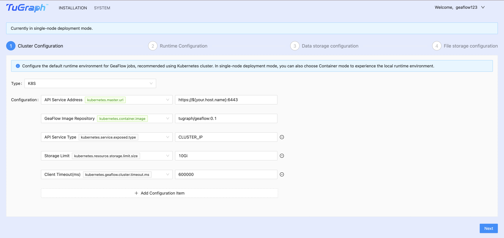

Add the following configuration for K8S cluster:

```text
# Set storage limit to 10Gi 
"kubernetes.resource.storage.limit.size":"10Gi" 
# Configure service API to the K8S service address, usually on port 6443 
"kubernetes.master.url":"https://${your.host.name}:6443" 
# Find the configuration file '/etc/kubernetes/admin.conf' in the K8S cluster, and configure the following three fields from top to bottom 
"kubernetes.ca.data":"" 
"kubernetes.cert.data":"" 
"kubernetes.cert.key":"" 
```

Configure the storage of runtime metadata for GeaFlow jobs. Runtime metadata includes information such as the job's Pipeline, Cycle, checkpoint, and exceptions. It is recommended to use MySQL.

Configure the storage of HA metadata for GeaFlow job runtime. HA metadata includes information such as Master, Driver, Container, and other main components. It is recommended to use Redis.

Configure the storage of metric data for GeaFlow job runtime, which is used for job metric monitoring. It is recommended to use InfluxDB.

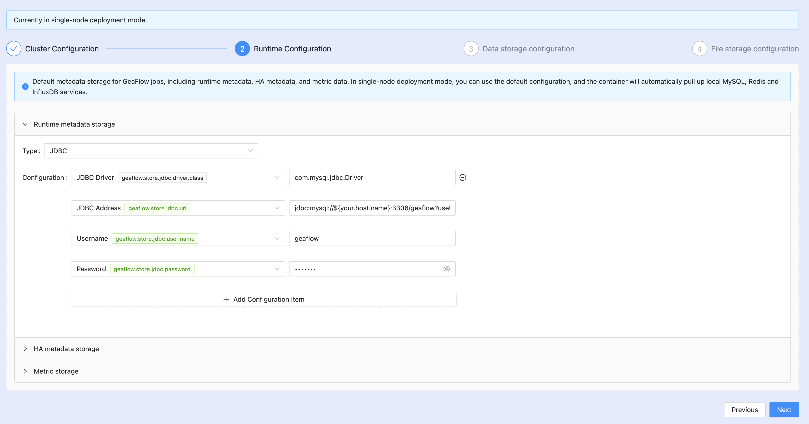

In local mode, when the docker container starts, MySQL, Redis, and InfluxDB services will be automatically pulled up by default.

Add the following configuration for K8S cluster:

```text
# Configure influshdb.token as a random value 
"influxdb.token":"f5fb50a361f762a0af045c47d98f66e401f1b632b3133b3dc2680110262d1135" 
```

Configure the persistent storage of GeaFlow job, graph, and table data, and it is recommended to use HDFS. In local mode, the default is the disk inside the container.


Configure the persistent storage of GeaFlow engine JAR and user JAR files, and it is recommended to use HDFS. In local mode, the default is the disk inside the container.


After the installation is successful, **the administrator will automatically switch to the default instance under the default tenant**, and you can directly create and publish graph computation tasks at this time.

GeaFlow console supports tenant isolation and supports system mode perspective and tenant mode perspective to use product features.

**Note:**
The user icon menu in the upper right corner of the page provides a quick mode switching entry.

When the user logs in as an administrator, they will enter the system mode. At this time, you can perform system operations such as one-click installation and system management.

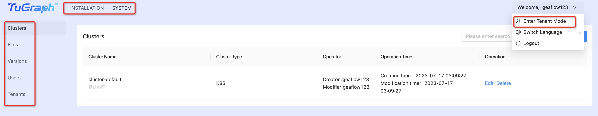

In system mode, the administrator can manage information such as clusters, GeaFlow engine versions, files, users, tenants, etc.

After normal user login, they will enter tenant mode. At this time, they can perform graph computing development and maintenance operations.

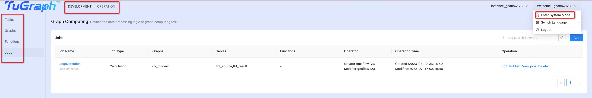

In tenant mode, users can create development resources such as instances, graphs, tables, and graph computing tasks. They can also publish graph computing tasks, submit graph computing jobs, and perform other related operations.

Add a graph computing task and describe the business logic of graph computing using SQL+GQL.

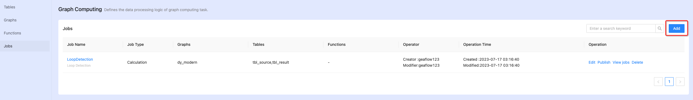

After creating a task, click on "publish" to enter the job operation and maintenance interface.

Before submitting a job, you can also adjust the default task parameters and cluster parameters to facilitate adjustments to job behavior.

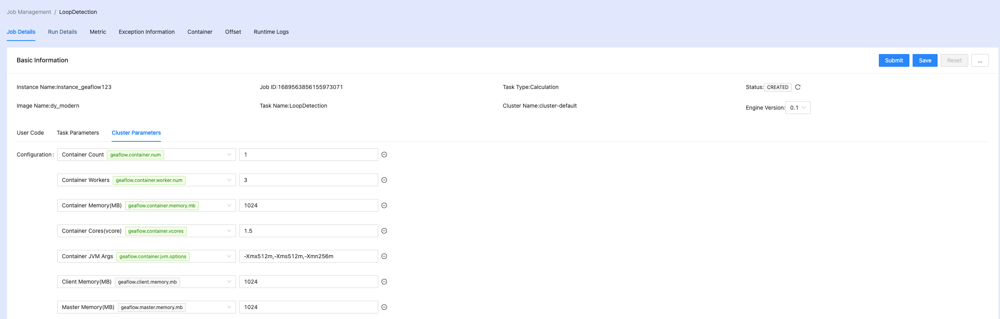

Access other tabs on the job details page to view information about job runtime, metrics, containers, exceptions, logs, and more.

---

<a id="deploy-quick_start_operator"></a>

<!-- source_url: https://geaflow.incubator.apache.org/docs/deploy/quick_start_operator/ -->

<!-- page_index: 49 -->

# Deploying Kubernetes Operator

1. Download and install Docker and Minikube. Refer to the documentation: [Installing Minikube](#deploy-install_minikube).
2. Pull GeaFlow Image

Run the following command to pull the remote geaflow image:

```shell
docker pull tugraph/geaflow:0.6 
```

If the pull fails due to network problems, you can also run the following command to directly build the local image
(before building the image, start the docker container):

```shell
git clone https://github.com/TuGraph-family/tugraph-analytics.git geaflow 
cd geaflow/ 
bash ./build.sh --module=geaflow 
```

The entire compilation process may take some time, please be patient. After the image compilation is successful, use
the following command to view the image.

```shell
docker images 
```

The name of the remotely pulled image is: **tugraph/geaflow:0.6**
. The name of the local image is **geaflow:0.1**. You only need to select one method to build the image.

Below is an introduction on installation of Geaflow Kubernetes Operator。

1. Download the code of GeaFlow。

```shell
git clone https://github.com/TuGraph-family/tugraph-analytics.git geaflow 
cd geaflow/ 
```

2. Build the image of Geaflow Kubernetes Operator

```shell
docker pull tugraph/geaflow-kubernetes-operator:0.6 
```

If the pull fails due to network problems, you can also run the following command to directly build the local image
(before building the image, start the docker container):

```shell
cd geaflow/geaflow-kubernetes-operator/ 
bash ./build-operator.sh 
```

Geaflow-kubernetes-operator need JDK11 or above version to
build. The entire compilation process may take some time, please be patient. After the image compilation is successful, use
the following command to view the image.

```shell
docker images 
```

The name of the remotely pulled image is: **tugraph/geaflow-kubernetes-operator:0.6**
. The name of the local image is **geaflow-kubernetes-operator:0.1**. You only need to select one
method to build the image.

3. Confirm and modify the image name in helm

Open the file /helm/geaflow-kubernetes-operator/values.yaml.
If you need to modify the image name, you could change **image.repository** and **image.
tag** to use the correct image.

4. Install Geaflow Kubernetes Operator by Helm

```shell
cd geaflow/geaflow-kubernetes-operator/ 
helm install geaflow-kubernetes-operator helm/geaflow-kubernetes-operator 
```

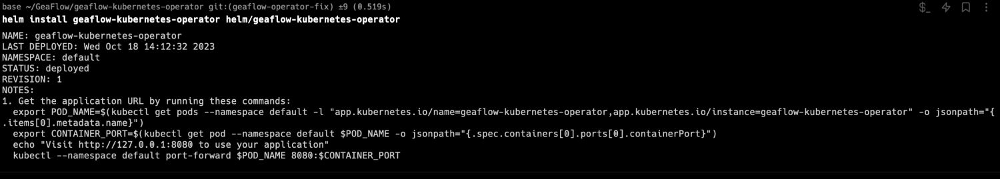

5. Check whether the pod is running normally in the minikube dashboard
   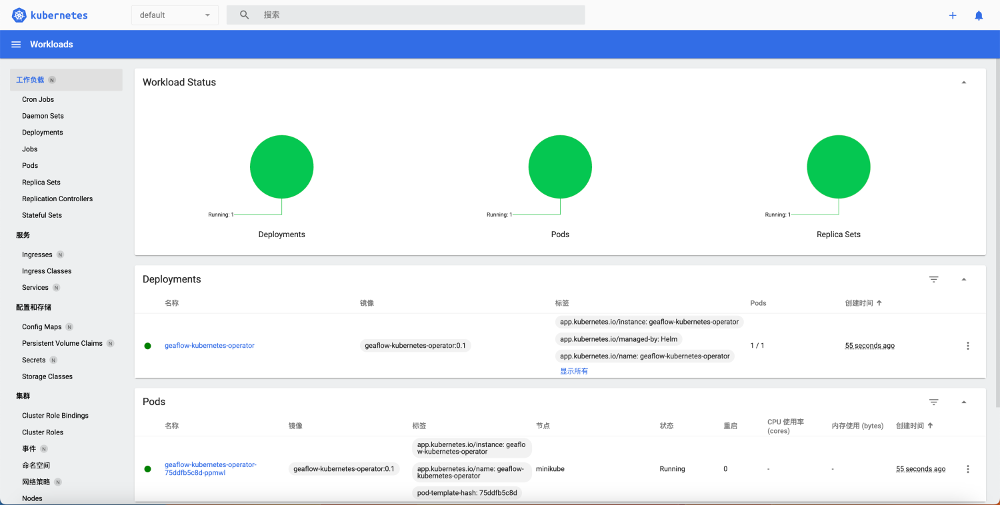
6. Proxy GeaFlow-Operator-Dashboard to the local port through port-forward (default port is 8089)

Please replace **${operator-pod-name}** with the actual operator pod name.

```shell
kubectl port-forward ${operator-pod-name} 8089:8089 
```

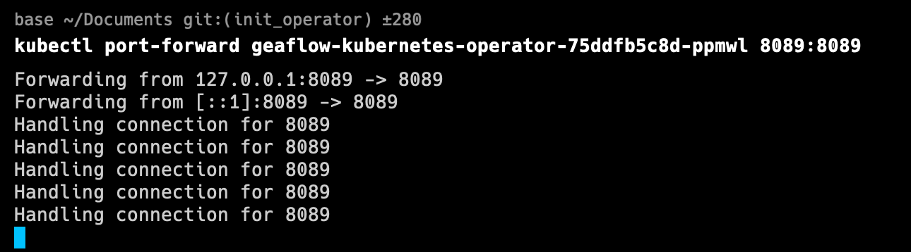

7. Visit localhost:8089 with your browser to open the operator cluster page.

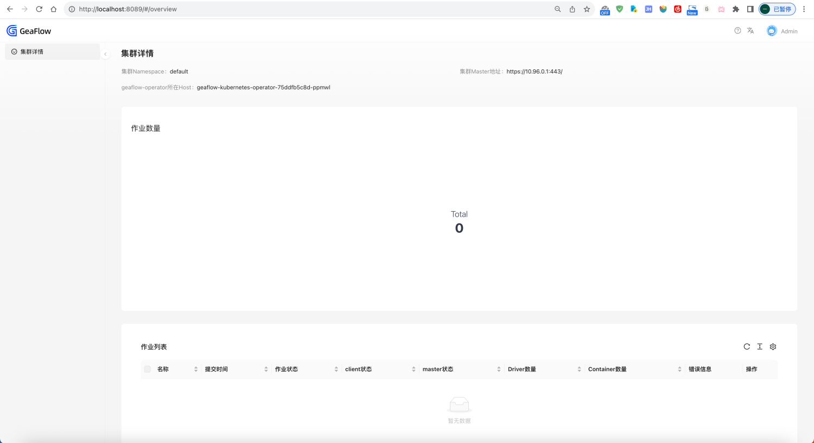

After geaflow-kubernetes-operator is successfully deployed and run, you can write the job's yaml file and submit the job.
First, we write a yaml file of geaflow's built-in sample job.

```yaml
apiVersion: geaflow.antgroup.com/v1 
kind: GeaflowJob 
metadata: 
  # Job name 
  name: geaflow-example 
spec: 
  # Job image name 
  image: geaflow:0.1 
  # Image pull policy of the job pods 
  imagePullPolicy: IfNotPresent 
  # Kubernetes service account of the job 
  serviceAccount: geaflow 
  # Java main class of the job 
  entryClass: com.antgroup.geaflow.example.graph.statical.compute.khop.KHop 
  clientSpec: 
    # Resource params of client pod 
    resource: 
      cpuCores: 1 
      memoryMb: 1000 
      jvmOptions: -Xmx800m,-Xms800m,-Xmn300m 
  masterSpec: 
    # Resource params of master pod 
    resource: 
      cpuCores: 1 
      memoryMb: 1000 
      jvmOptions: -Xmx800m,-Xms800m,-Xmn300m 
  driverSpec: 
    # Resource params of driver pod 
    resource: 
      cpuCores: 1 
      memoryMb: 1000 
      jvmOptions: -Xmx800m,-Xms800m,-Xmn300m 
    # Driver number 
    driverNum: 1 
  containerSpec: 
    # Resource params of container pod 
    resource: 
      cpuCores: 1 
      memoryMb: 1000 
      jvmOptions: -Xmx800m,-Xms800m,-Xmn300m 
    # Container number 
    containerNum: 1 
    # Worker number per container pod 
    workerNumPerContainer: 4 
  userSpec: 
    # Metric params of job 
    metricConfig: 
      geaflow.metric.reporters: slf4j 
      geaflow.metric.stats.type: memory 
    # State config of job 
    stateConfig: 
      geaflow.file.persistent.type: LOCAL 
      geaflow.store.redis.host: host.minikube.internal 
      geaflow.store.redis.port: "6379" 
    # Additional user defined params 
    additionalArgs: 
      geaflow.system.state.backend.type: MEMORY 
```

The Geaflow job relies on the redis component. You can quickly start a redis container through docker and map the port to localhost.

```shell
docker pull redis:latest 
docker run -p 6379:6379 --name geaflow_redis redis:latest 
```

If you have already deployed a redis component, you can replace the following parameters in example.yaml with the existing redis host and port number.

```yaml
spec: 
   userSpec: 
     stateConfig: 
       geaflow.store.redis.host: ${your.redis.host} 
       geaflow.store.redis.port: ${your.redis.port} 
```

Then run the following command to submit the job:

```shell
cd geaflow/geaflow-kubernetes-operator/example 
kubectl apply example_hla.yml 
```

When submitting HLA jobs, you need to pay extra attention to the following parameters:

- entryClass is required.
- udfJars is optional. If you need, please fill in the url address of your own file.

```yaml
spec: 
  # Required 
  entryClass: com.example.MyEntryClass 
  # Optional 
  udfJars: 
    - name: myUdf.jar 
      url: http://localhost:8888/download/myUdf.jar 
```

When submitting DSL jobs, you need to pay extra attention to the following parameters:

- Do not fill in entryClass, leave it blank.
- gqlFile is required, please fill in the name and url address of your file.
- udfJars is optional. If available, please fill in the url address of your own file.

```yaml
spec: 
  # Do not fill in entryClass 
  # entryClass: com.example.MyEntryClass 
  # Required 
  gqlFile: 
    # Name must be correct 
    name: myGql.gql 
    url: http://localhost:8888/download/myGql.gql 
  # Optional 
  udfJars: 
    - name: myUdf.jar 
      url: http://localhost:8888/download/myUdf.jar 
```

Regarding more parameters of DSL jobs and HLA jobs, we have prepared two demo jobs in the
project directory **geaflow-kubernetes-operator/example** directory for your reference. Please
refer to the sample files in the project respectively:

- example/example-dsl.yml
- example/example-hla.yml

Visit <http://localhost:8089>, you can open the cluster overview page to view the list and details of
all geaflow job CRs in the cluster.
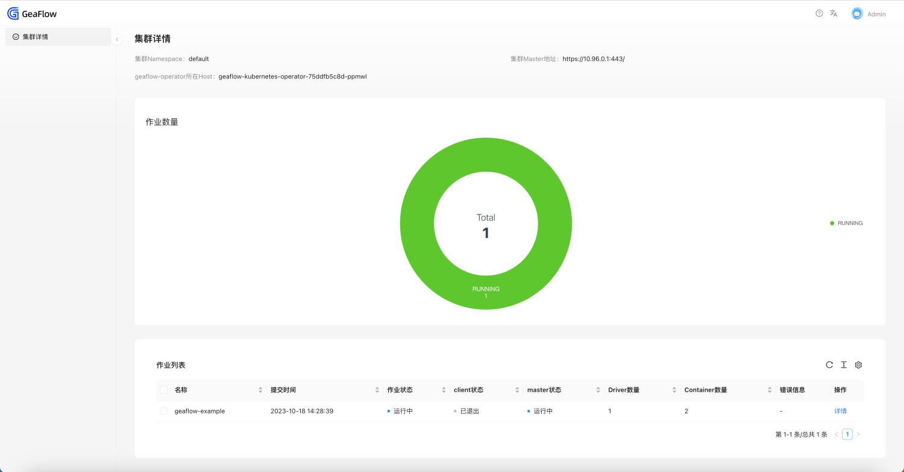

Run the following command to view the status of CR

```shell
kubectl get geaflowjob geaflow-example 
```

---

<a id="deploy-dashboard"></a>

<!-- source_url: https://geaflow.incubator.apache.org/docs/deploy/dashboard/ -->

<!-- page_index: 50 -->

# GeaFlow Dashboard

Geaflow-dashboard provides a job-level monitoring page for Geaflow. You can easily view the following information of the job through the dashboard:

- Job health (Container and Worker activity)
- Job progress (Pipeline and Cycle information)
- Runtime logs of each component of the job
- Process metrics for each component of the job
- Flame graph of each component of the job
- Thread Dump of each component of the job

When the job is running in a k8s cluster, the HTTP service can be exposed externally through the master's service and can be accessed directly through the service.
In the local or development environment, you can also directly map to the master pod port through the kubectl port-forward command.

1. Deploy the job to minikube. For how to deploy the job, please refer to [Quick Start](#quick_start-quick_start).
2. Open minikube-dashboard and find the pod name of the master (or enter the following command in the terminal to obtain it).

```shell
kubectl get pods 
```

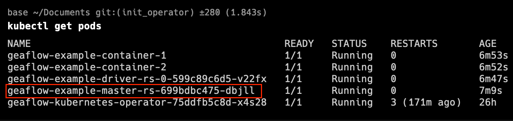
3. Open the terminal and enter the following command to map the 8090 port in the pod container to the localhost's local port 8090.
Please replace **${your-master-pod-name}** with your own pod name.

```shell
kubectl port-forward ${your-master-pod-name} 8090:8090 
```

4. Open the browser and visit <http://localhost:8090> to open the page.

The Overview page displays the health status of the entire job. You can check here whether the container and driver are running normally.

In addition, the Overview page will also display the Pipeline list of the job.


You can also enter the page through the Pipeline menu in the sidebar. The page includes the name, start time, and cost time of each Pipeline of the job.
If the cost is 0, means that the Pipeline has started execution but has not yet completed.

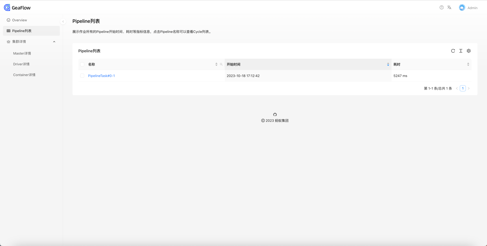

Click on the Pipeline name to enter the secondary menu and view information on all Cycle lists under the current Pipeline.

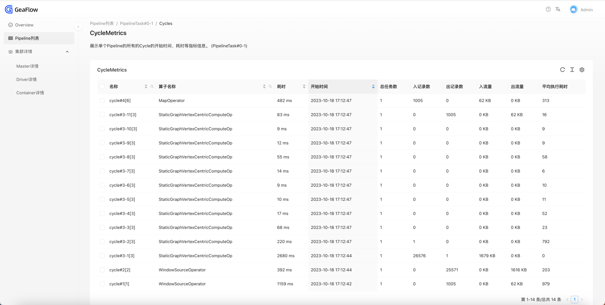

You can view various information about each component of the job (including master, driver, and container).
It can be accessed via the menu in the sidebar.

The Driver details display the basic information of all drivers. Container details display the basic information of all Containers.

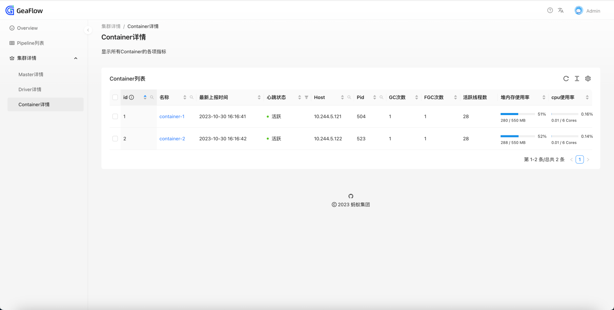
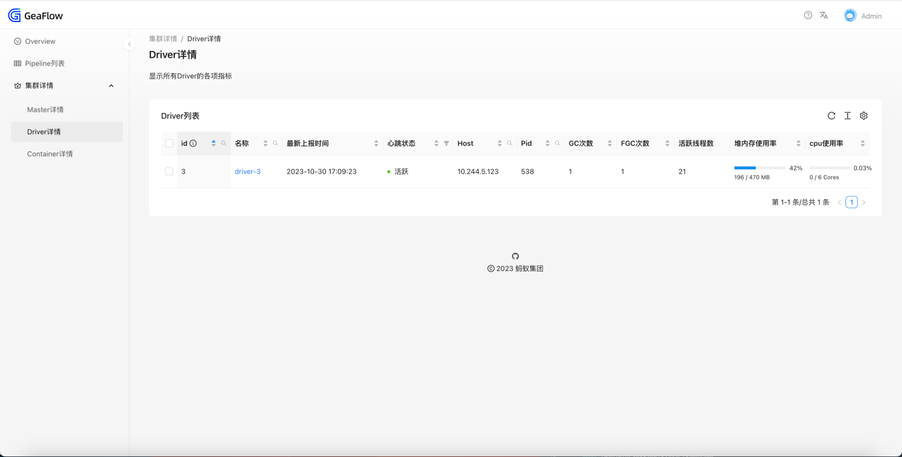

By clicking the Master details in the left column, or by clicking the component name in the Driver/Container details, you can jump to the component's runtime page.
In the runtime page, you can view the following contents.

- View the process metrics of the component

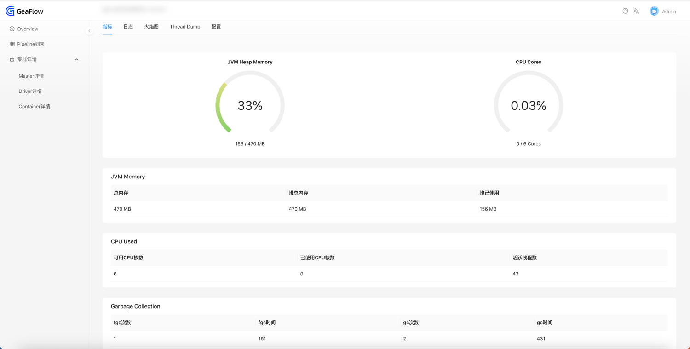

- View real-time logs of the component. Here we take the master as an example to introduce the log files.
  - master.log: Java main process log of master.
  - master.log.1/master.log.2: Java main process log backup of master.
  - agent.log: Agent service log of master.
  - geaflow.log: shell startup script log after entering the container.

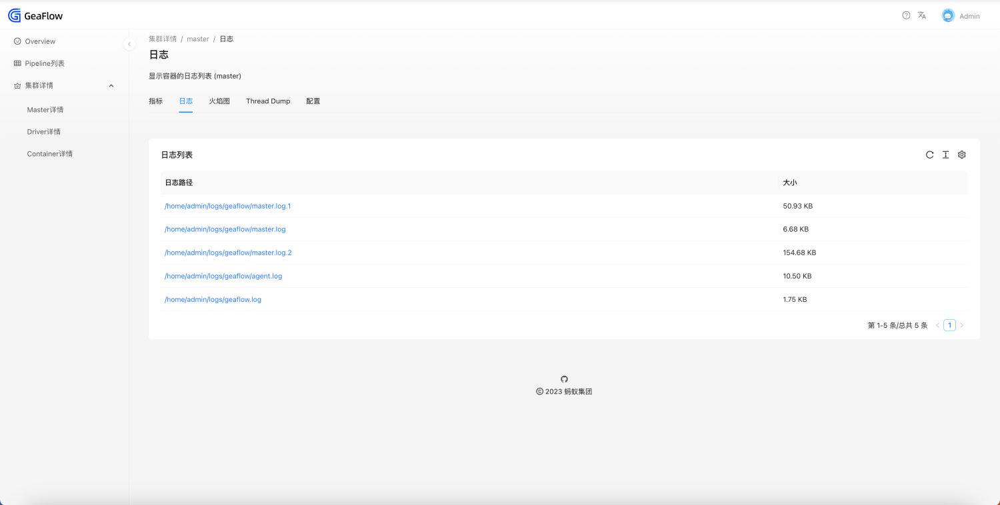
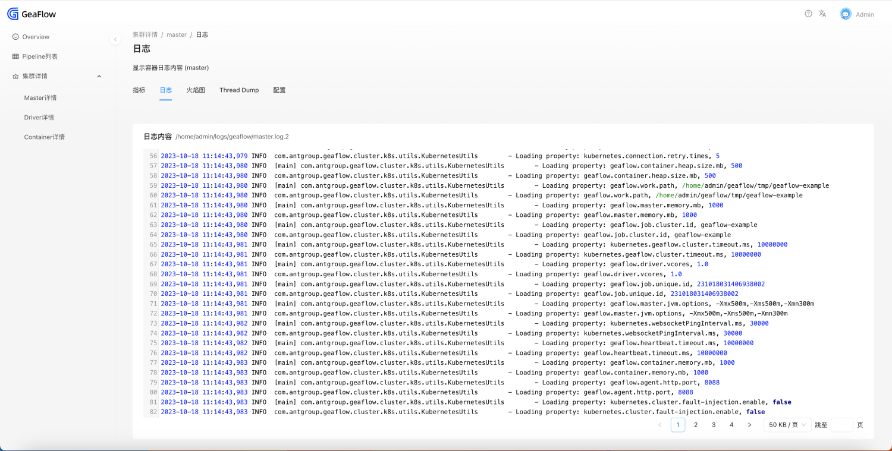

- Perform CPU/ALLOC analysis on the process and generate flame graph.

The flame graph analysis type can be selected as CPU or ALLOC. A single analysis can last up to 60 seconds, and a maximum of 10 historical records can be retained.

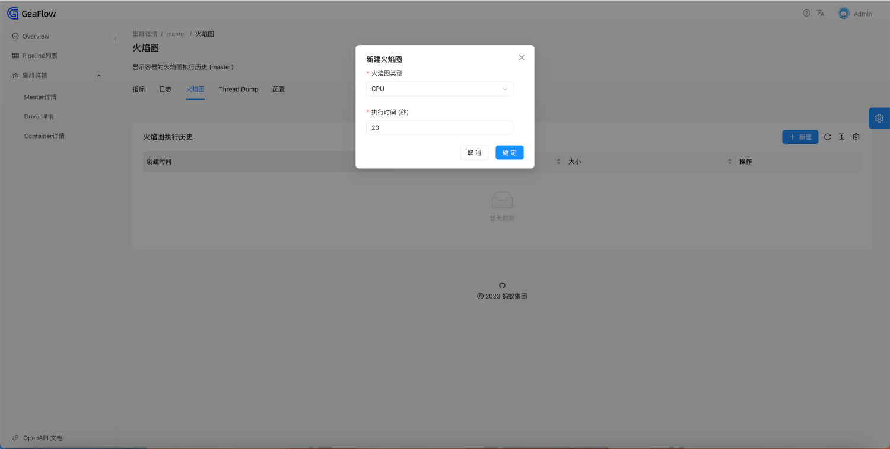
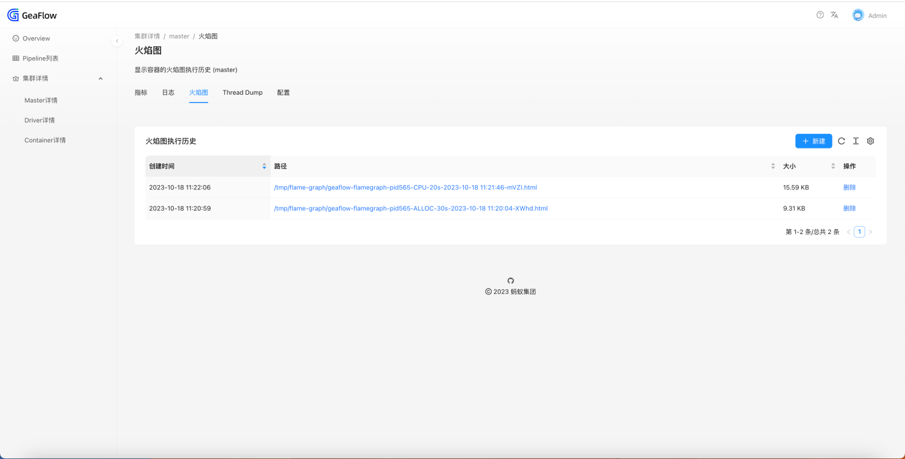
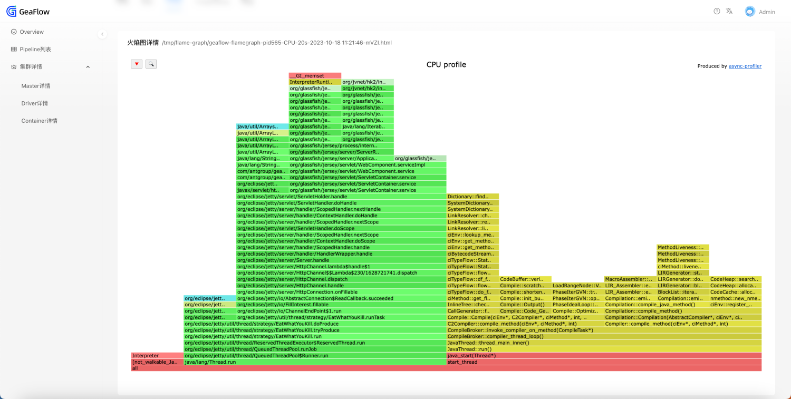

- Perform Thread Dump on the process. Keep the results of the latest dump.

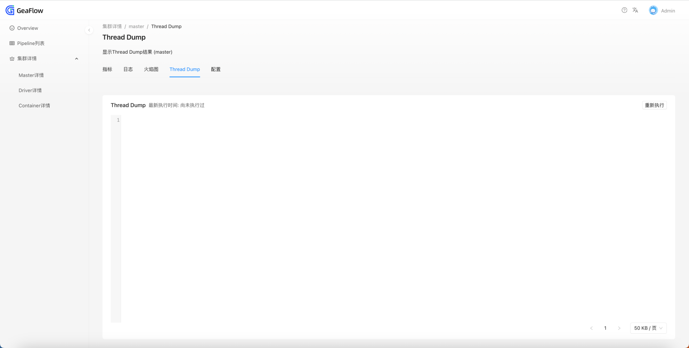
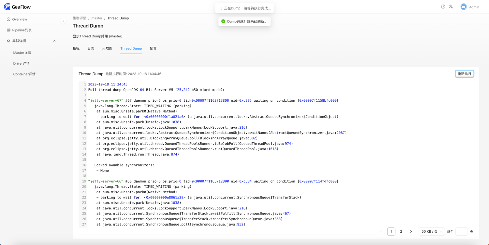

- View all configurations of the process (only master owns this page)

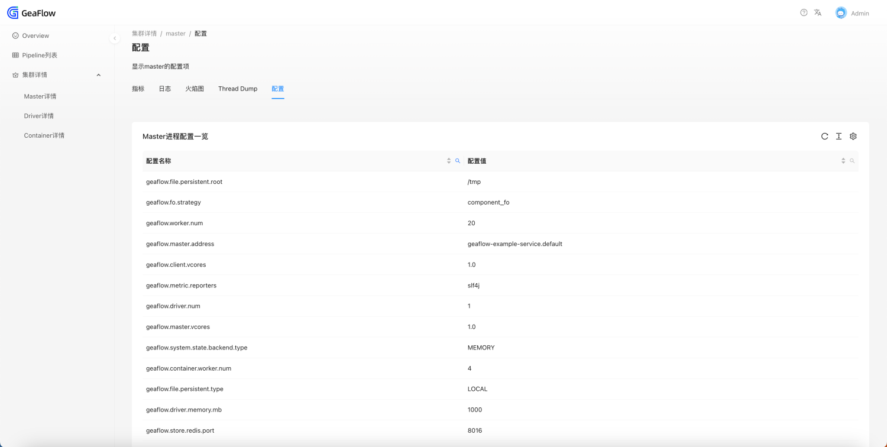

Partial list columns can be sorted and searched.

When searching, click the "Search" icon, enter keywords, and click the "Search" button.

When resetting, click the "Reset" button and the list will be refreshed.

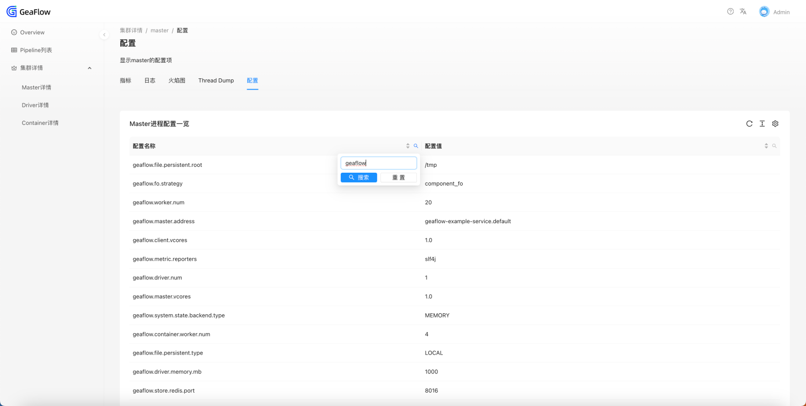

The page supports switching between Chinese and English. Click the "Text A" icon in the upper right corner to select the language.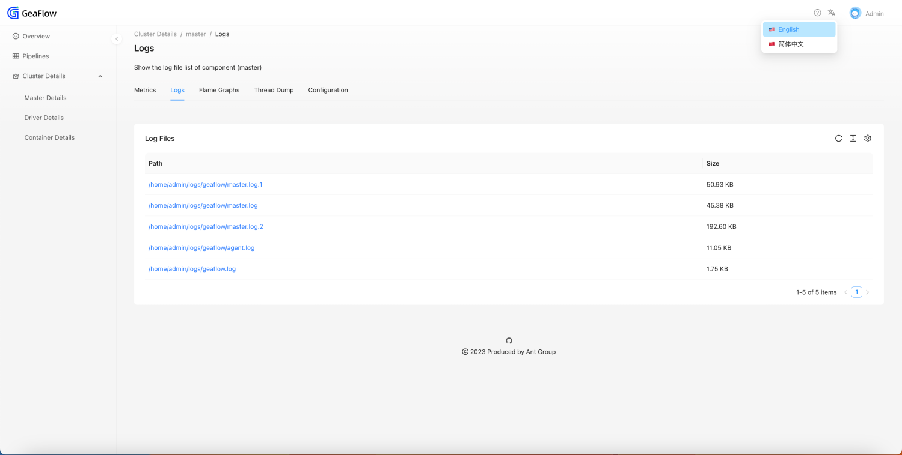

---

<a id="deploy-collaborate_with_g6vp"></a>

<!-- source_url: https://geaflow.incubator.apache.org/docs/deploy/collaborate_with_g6vp/ -->

<!-- page_index: 51 -->

# 🌈 G6VP Graph Visualization

Reference [Quick Start](https://github.com/TuGraph-family/tugraph-analytics/blob/master/docs/docs-cn/quick_start.md)

⚠️ Note that in the 'start SocketServer' step use the following command instead

```bash
bin/socket.sh 9003 GI 
```

When the terminal outputs the following, GeaFlow is ready to establish a connection.


> If any problem occurs during service startup, see <https://github.com/TuGraph-family/tugraph-analytics/issues/1>

Enter [New Canvas](https://insight.antv.antgroup.com/#/workbook/create), enter a workbook name. We will manually add the dot edge data later, so choose a case data set here, and use the **minimalist template**

We need to add two components, in the toolbar add **Clean canvas**; Then add **Loop Detection Demo** to the side container of the default layout


> The project canvas should look like this
> 

Click the '🧹 Clear' option in the toolbar to clear the canvas node


By default, a connection is automatically established after the Loop Detection Demo component is added.


GeaFlow will also output the following after the connection is established:


Loop detection Demo provides two ways to interact:

- Method 1 Enter the dot information in the input box
- Method 2 Demonstrate using built-in data

> Both methods essentially call GeaFlow for real-time calculations, but Method 2 omits the manual input process.

Here we use the built-in data for a quick demonstration, click [Options], select 'Add Points', 7 points of information appear in the canvas; Then select 'Add Edges'. We can see the add record in the above dialog.


Similarly, the GeaFlow terminal outputs operational information in real time and automatically starts computation tasks.


After the loop detection calculation task is completed, GeaFlow automatically returns the detection results.


The loop detection results are dynamically displayed on the right canvas:


---

<a id="deploy-install_llm"></a>

<!-- source_url: https://geaflow.incubator.apache.org/docs/deploy/install_llm/ -->

<!-- page_index: 52 -->

# LLM Local Deployment

The users have the capability to locally deploy extensive models as a service. The complete process, encompassing downloading pre-trained models, deploying them as a service, and debugging, is described in the following steps. It is essential for the user's machine to have Docker installed and be granted access to the repository containing these large models.

The pre-trained large model file has been uploaded to the [Hugging Face repository](https://huggingface.co/tugraph/CodeLlama-7b-GQL-hf). Please proceed with downloading and locally unzipping the model file.
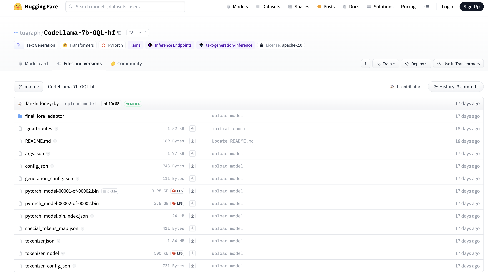

1. Run the following command on the terminal to download the Docker image required for model servicing:

```text
docker pull tugraph/llam_infer_service:0.0.1 
 
// Use the following command to verify that the image was successfully downloaded 
 
docker images 
```

2. Run the following command to start the Docker container:

```text
docker run -it  --name ${Container name} -v ${Local model path}:${Container model path} -p ${Local port}:${Container service port} -d ${Image name} 
 
// Such as 
docker run -it --name my-model-container -v /home/huggingface:/opt/huggingface -p 8000:8000 -d llama_inference_server:v1 
 
// Check whether the container is running properly 
docker ps 
```

Here, we map the container's port 8000 to the local machine's port 8000, mount the directory where the local model (/home/huggingface) resides to the container's path (/opt/huggingface), and set the container name to my-model-container.

1. Model transformation

```text
// Enter the container you just created 
docker exec -it ${container_id} bash 
 
// Execute the following command 
cd /opt/llama_cpp 
python3 ./convert.py ${Container model path} 
```

When the execution is complete, a file with the prefix ggml-model is generated under the container model path.
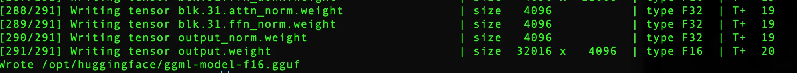

2. Model quantization (optional)
   Take the llam2-7B model as an example: By default, the accuracy of the model converted by convert.py is F16 and the model size is 13.0GB. If the current machine resources cannot satisfy such a large model inference, the converted model can be further quantized by./quantize.

```text
// As shown below, q4_0 quantizes the original model to int4 and compresses the model size to 3.5GB 
 
cd /opt/llama_cpp 
./quantize ${Default generated F16 model path} ${Quantized model path} q4_0 
```

The following are reference indicators such as the size and reasoning speed of the quantized model:
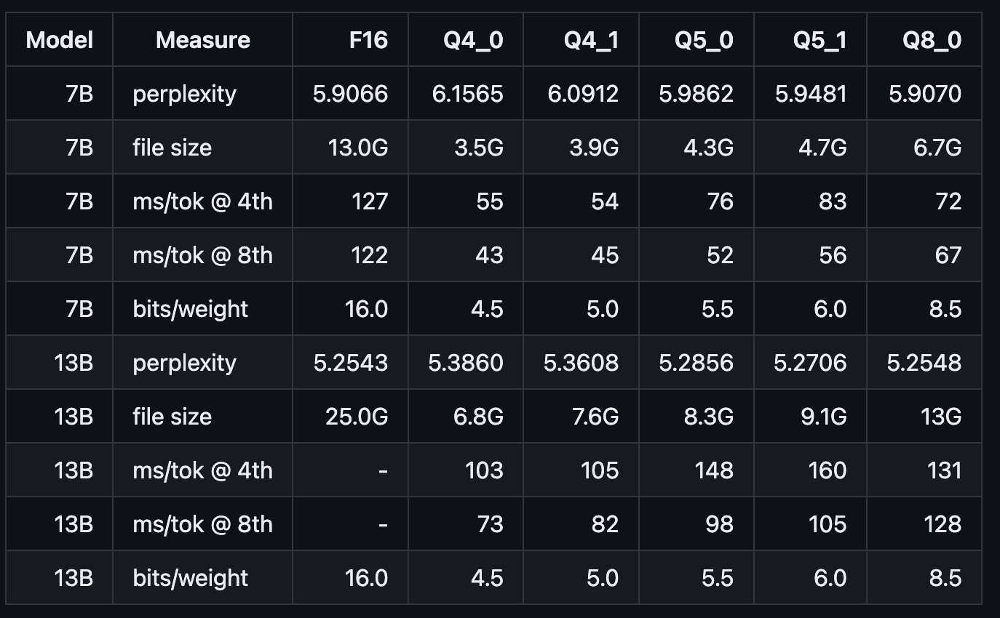

3. Model servicing
   Run the following command to deploy the above generated model as a service, and specify the address and port of the service binding through the parameters:

```text
// ./server -h. You can view parameter details 
// ${ggml-model...file} The file name prefixes the generated ggml-model 
 
cd /opt/llama_cpp 
./server --host ${ip} --port ${port} -m ${Container model path}/${ggml-model...file} -c 4096 
 
// Such as 
./server --host 0.0.0.0 --port 8000 -m  /opt/huggingface/ggml-model-f16.gguf -c 4096 
```

4. Debugging service
   Send an http request to the service address, where "prompt" is the query statement and "content" is the inference result.

```text
curl --request POST \ 
    --url http://127.0.0.1:8000/completion \ 
    --header "Content-Type: application/json" \ 
    --data '{"prompt": "请返回小红的10个年龄大于20的朋友","n_predict": 128}' 
```

Debugging service
The following is the model inference result after service deployment:
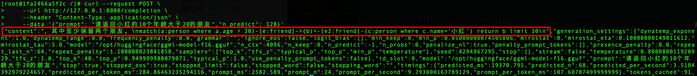

---

<a id="deploy-install_minikube"></a>

<!-- source_url: https://geaflow.incubator.apache.org/docs/deploy/install_minikube/ -->

<!-- page_index: 53 -->

# Install Minikube

Here we will use minikube as an example to simulate a K8S cluster on a single machine.

If you already have a K8S cluster, you can skip this part and use it directly.

Download and install minikube.

```text
# ARM architecture 
curl -LO https://storage.googleapis.com/minikube/releases/latest/minikube-darwin-arm64 
sudo install minikube-darwin-arm64 /usr/local/bin/minikube 
 
# x86 architecture 
curl -LO https://storage.googleapis.com/minikube/releases/latest/minikube-darwin-amd64 
sudo install minikube-darwin-amd64 /usr/local/bin/minikube 
```

Start minikube and dashboard.

```text
# Start minikube with docker as the driver 
minikube start --driver=docker --ports=32761:32761 —image-mirror-country='cn' 
# Starting minikube dashboard will automatically open the dashboard page in the browser.  
# If it doesn't open, copy the dashboard address provided in the terminal and open it in the browser. 
minikube dashboard 
```

**Note:**
Do not to close the terminal process that the dashboard belongs to. For subsequent operations, please start a new terminal. Otherwise, the API server process will exit.

If you want to use GeaFlow on the local minikube environment, please make sure that minikube is running properly. GeaFlow engine image will be automatically built into the minikube environment. Otherwise, it will be built into the local Docker environment and you need to manually push it to the image repository for use.

```shell
# confirm host、kubelet、apiserver is running minikube status
```

---

<a id="contribution"></a>

<!-- source_url: https://geaflow.incubator.apache.org/docs/contribution/ -->

<!-- page_index: 54 -->

# Contribution

1. **Create ISSUE**

You can create an ISSUE on GitHub, including four types of bug reports, new feature requests, and custom issue. Please provide a detailed description of your problem or solution in the ISSUE.

2. **Develop Code**

You can use your preferred Java integrated development environment for code development, which must follow GeaFlow's code specifications. You can use the mvn command to package and verify the code format. To ensure code quality, you need to supplement the newly added and modified code with unit tests.

3. **Submit PR**

After local code development and testing are completed, you can submit a PR to the GeaFlow master branch. After submitting the PR, the community committer will conduct a code review of your PR.

- Fork Code：Fork GeaFlow's code on GitHub.
- Add Repository：`git remote add fork https://github.com/<your-username>/tugraph-analytics.git`
- Push Branch：`git push fork <branch-name>`
- Create PR：Click `https://github.com/<your-username>/tugraph-analytics/pull/new/<branch-name>` and create PR.

4. **Code Review**

The community committer will provide feedback on code specifications, code logic, etc. on GitHub. You need to provide feedback and make modifications to the problems raised. After several rounds of feedback and modification, the community will eventually accept your PR and merge it into the master branch.

GeaFlow Project's issues provides a few simple issues for quick participation in community contributions. These
issues are labeled **good first issues**, and you can choose the issues you are interested in to contribute.

---

<a id="contacts"></a>

<!-- source_url: https://geaflow.incubator.apache.org/docs/contacts/ -->

<!-- page_index: 55 -->

# Contacts

You can contact us through the following methods:

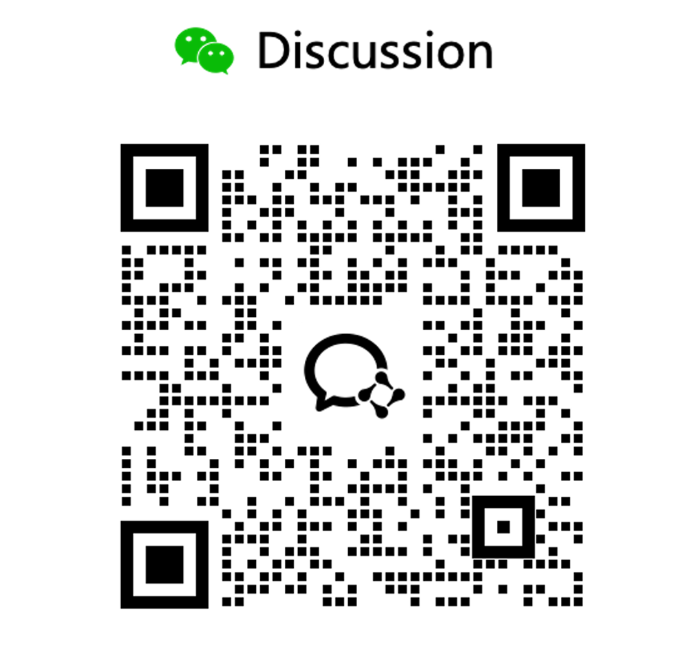

Discord

<https://discord.com/invite/apKdP3DXuH>

---

<a id="thanks"></a>

<!-- source_url: https://geaflow.incubator.apache.org/docs/thanks/ -->

<!-- page_index: 56 -->

# Thanks

Thank you very much for contributing to GeaFlow, whether bug reporting, documentation improvement, or major feature development, we warmly welcome all contributions.

---

<a id="reference-vs_join"></a>

<!-- source_url: https://geaflow.incubator.apache.org/docs/reference/vs_join/ -->

<!-- page_index: 57 -->

# Why using graphs for relational operations is more appealing than table joins?

The relational model is widely used for data modeling in database and data warehouse systems. However, **the model with the word "relationship" in its name is not suitable for handling relationships.**

In the table-based modeling used in the relational model, relationship operations are handled through join operations. However, in practical use, especially with streaming updates, this approach has many pain points.

The focus of the table model is to represent multiple records as tables, but it lacks the ability to describe relationships itself, and can only be achieved through join operations.

In both batch and streaming computational systems, Join operations involve a significant amount of shuffle and computational overhead. Furthermore, the intermediate results generated by Join are duplicated multiple times due to association, leading to exponential data expansion and redundancy, resulting in high storage consumption.

In the experiment shown in the figure below, we simulated scenarios of performing one-hop, two-hop, and three-hop relationship operations in sequence. It is clear that the more complex the multi-hop relationship calculation, the worse the performance of join operations in the relational model. In terms of total time, using graph-based Match calculations can save more than 90% of the time.

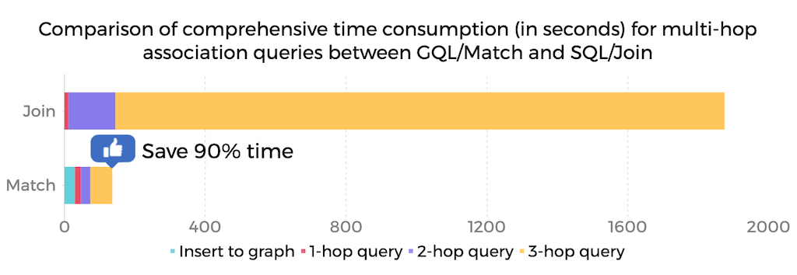

Figure 1

In many data warehouse analysis scenarios, in order to improve data query performance, multiple tables are often materialized into a large wide table in advance.

Although the wide table can accelerate query performance, it suffers from severe data inflation and redundancy. Due to the one-to-many association between tables, the data in one table is multiplied through associations, resulting in exponential data inflation and redundancy.

Moreover, once the wide table is generated, it is difficult to change it, otherwise a new wide table needs to be regenerated, which is time-consuming and labor-intensive, and not flexible enough.

In this case, using a graph model can easily solve this problem. A graph is a natural representation of relationships, where entities are represented by nodes and relationships are represented by edges.

For example, in a social network graph, each person can be represented by a node, and the relationships between people can be represented by edges. There can be various complex relationships between people, which can be represented by different edges.

Obviously, **the process of constructing a graph is essentially the extraction of relationships between entities, and at the data storage level, it actually materializes the relationships to achieve better relationship calculation performance.**

Compared to the relationship materialization method of wide tables, due to the aggregation of points and edges in the graph structure itself, constructing a graph is very efficient. The figure below shows the performance of high-performance graph construction in GeaFlow, which demonstrates that the graph construction operation itself is extremely fast, and due to the sharding feature of graphs, it has excellent scalability.

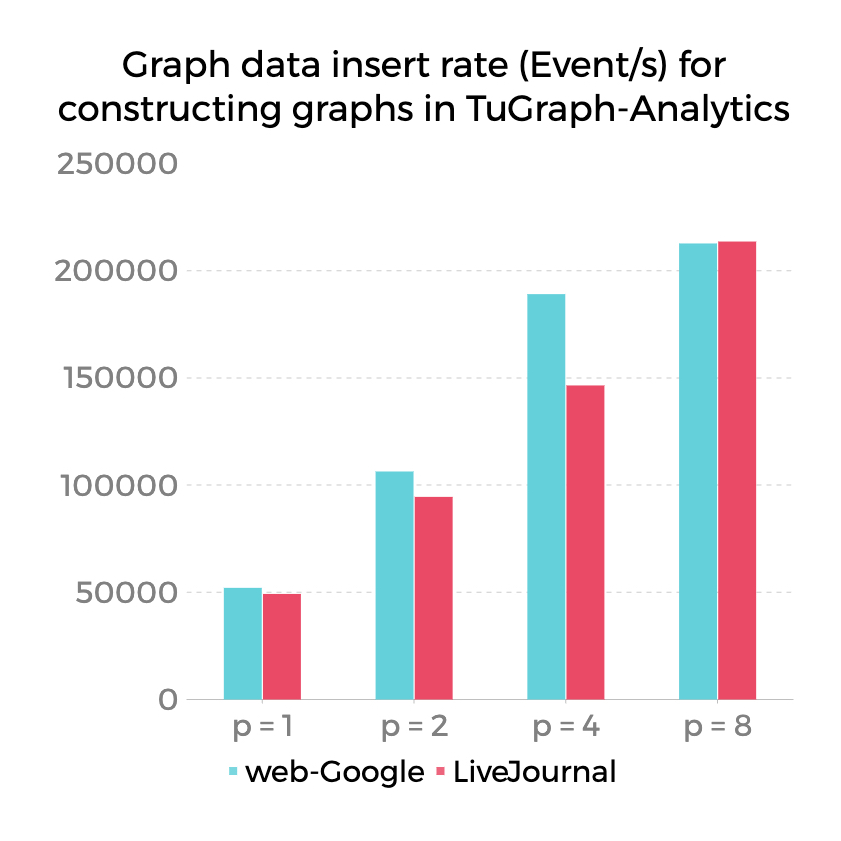

Figure 2

In the experiment shown in Figure 1, it can also be observed that we spent a small amount of time inserting the graph (the cost of the green "insert to graph" part) in exchange for the acceleration effect of the graph modeling on subsequent join queries.

Analytical systems based on table modeling only support SQL join for relationship analysis, which is very limited in complex scenarios. For example, querying all friends within 4 degrees of separation for a person, or finding the shortest path, these complex relationship queries are difficult to describe using SQL join on tables.

GeaFlow provides a query language that combines GQL and SQL styles. This is a data analysis language that combines graphs and tables, inherited from standard SQL+ISO/GQL, and can easily perform graph and table analysis.

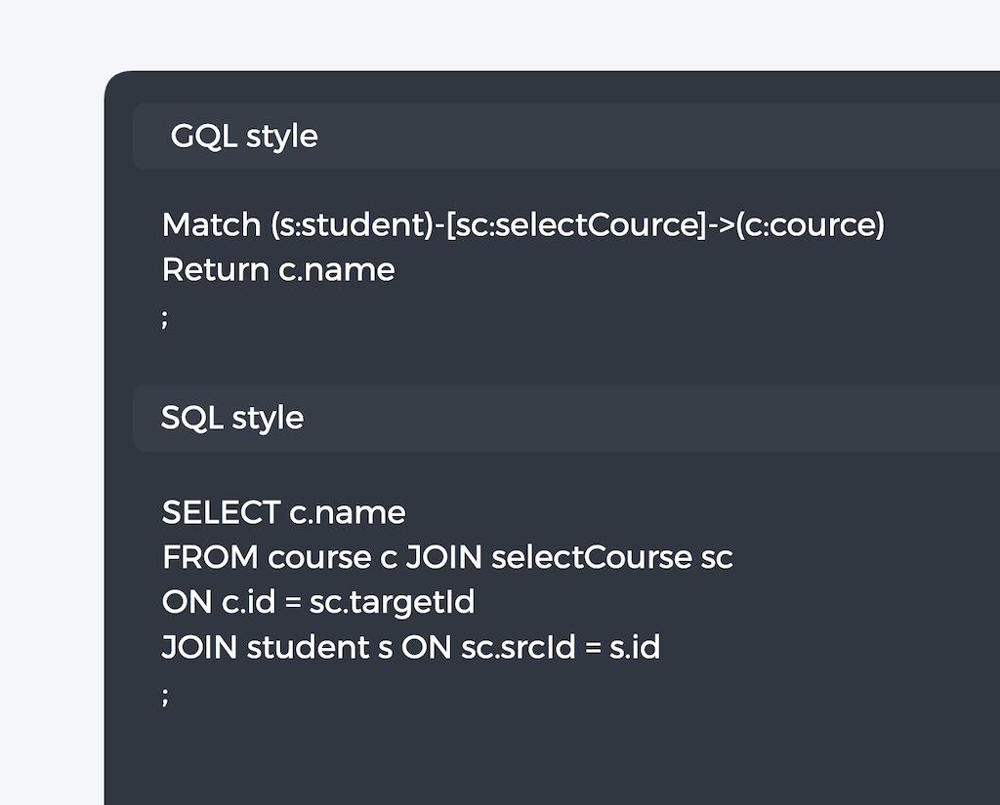

Figure 3

**In the DSL, the results of graph computation and table queries are equivalent and can be processed like table data for relationship operations.** This means that both the GQL and SQL descriptions in Figure 3 can achieve similar effects, greatly enhancing the query expression capability of users。

The GeaFlow DSL engine will support automatic conversion of SQL joins into GQL execution. Users can freely mix SQL and GQL style queries, and perform graph matching, graph algorithms, and table queries at the same time.

GeaFlow is an open-source distributed streaming graph computing engine developed by Ant Group. Within Ant Group, it has been widely used in scenarios such as data warehouse acceleration, financial risk control, knowledge graph, and social networks.

GeaFlow was officially open-sourced in June 2023, opening up its core capability of graph-based streaming and batch computing. Compared to traditional streaming computing engines such as Flink and Storm, which are based on table models for real-time processing, GeaFlow has a self-developed graph storage as its foundation and a streaming-batch computing engine as its weapon. It integrates GQL/SQL DSL language as its flag, and has significant advantages in complex multi-degree relationship operations.

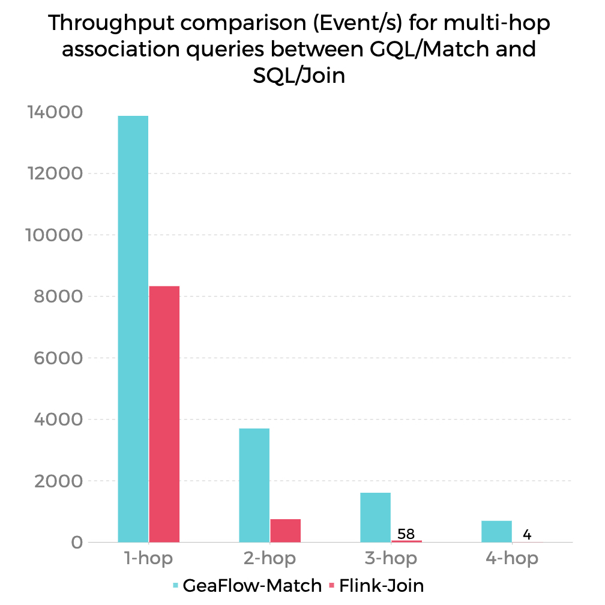

Figure 4

Figure 4 shows the use of the Match operator in GeaFlow to perform multi-hop relationship queries on a graph, compared to the real-time throughput improvement brought by the Join operator in Flink. In complex multi-hop scenarios, existing streaming computing engines are basically unable to handle real-time processing. The existence of the graph model breaks through this limitation and extends the application scenarios of real-time streaming computing.

---
