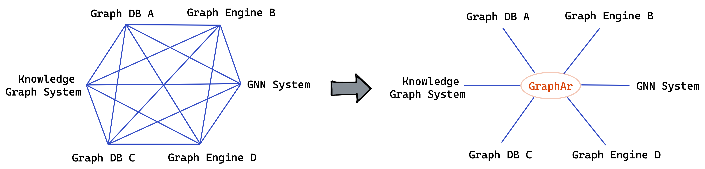

# Documentation

## Navigation

- [Documentation](#index)
- [Overview](#overview)
  - [Motivation](#overview-motivation)
  - [Concepts](#overview-concepts)
- [Specification](#category-specification)
  - [Format Specification](#specification-format)
  - [Implementation Status](#specification-implementation-status)
- [Libraries](#category-libraries)
  - [C++ Library](#category-c-library)
    - [Getting Started](#libraries-cpp-getting-started)
    - [Examples](#category-examples)
      - [Co-Work with BGL](#libraries-cpp-examples-bgl)
      - [Integrate into GraphScope](#libraries-cpp-examples-graphscope)
      - [Out-of-core Graph Algorithms](#libraries-cpp-examples-out-of-core)
      - [Convert SNAP Datasets to GraphAr Format](#libraries-cpp-examples-snap-to-graphar)
  - [Java Library](#libraries-java)
    - [info](#libraries-java-info-getting-started)
      - [Getting Started with Info Module](#libraries-java-info-getting-started)
    - [java-FFI](#libraries-java-java-ffi-getting-started)
      - [Getting Started with java FFI Module](#libraries-java-java-ffi-getting-started)
      - [How to Develop Java FFI Library](#libraries-java-java-ffi-how_to_develop_java_ffi)
  - [Spark Library](#libraries-spark)
    - [Examples](#libraries-spark-examples)
  - [PySpark Library](#libraries-pyspark)
    - [How to use GraphAr PySpark package](#libraries-pyspark-how-to)

## Content

<a id="index"></a>

<!-- source_url: https://graphar.incubator.apache.org/docs/ -->

<!-- page_index: 1 -->

# Documentation

Welcome to the documentation for Apache GraphAr. Here, you can find information about the GraphAr File Format, including specification and libraries.

Overview of the Apache GraphAr project.

Documentation about the Apache GraphAr file format.

Documentation about the libraries of Apache GraphAr.

---

<a id="overview"></a>

<!-- source_url: https://graphar.incubator.apache.org/docs/overview/ -->

<!-- page_index: 2 -->

# Overview



GraphAr is a project to standardize the graph data format and provide a set of libraries to generate, access and transform such formatted files.

It is intended to serve as the standard file format for importing/exporting and persistent storage of the graph data which can be used by diverse existing systems, reducing the overhead when various systems co-work.

Additionally, it can also serve as the direct data source for graph processing applications.

---

<a id="overview-motivation"></a>

<!-- source_url: https://graphar.incubator.apache.org/docs/overview/motivation/ -->

<!-- page_index: 3 -->

# Motivation

Numerous graph systems, such as Neo4j, Nebula Graph, and Apache HugeGraph, have been developed in recent years.
Each of these systems has its own graph data storage format, complicating the exchange of graph data between different systems.
The need for a standard data file format for large-scale graph data storage and processing that can be used by diverse existing systems is evident, as it would reduce overhead when various systems work together.

Our aim is to fill this gap and contribute to the open-source community by providing a standard data file format for graph data storage and exchange, as well as for out-of-core querying.
This format, which we have named GraphAr, is engineered to be efficient, cross-language compatible, and to support out-of-core processing scenarios, such as those commonly found in data lakes.
Furthermore, GraphAr's flexible design ensures that it can be easily extended to accommodate a broader array of graph data storage and exchange use cases in the future.

---

<a id="overview-concepts"></a>

<!-- source_url: https://graphar.incubator.apache.org/docs/overview/concepts/ -->

<!-- page_index: 4 -->

# Concepts

Glossary of relevant concepts and terms.

- **Property Group**: GraphAr splits the properties of vertex/edge into groups to allow for efficient storage
  and access without the need to load all properties. Also benefits appending of new properties. Each property
  group is the unit of storage and is stored in a separate directory.
- **Adjacency List**: The storage method to store the edges of certain vertex type. Which include:

  - *ordered by source vertex id*: the edges are ordered and aligned by the source vertex
  - *ordered by destination vertex id*: the edges are ordered and aligned by the destination vertex
  - *unordered by source vertex id*: the edges are unordered but aligned by the source vertex
  - *unordered by destination vertex id*: the edges are unordered but aligned by the destination vertex
- **Compressed Sparse Row (CSR)**: The storage layout the edges of certain vertex type. Corresponding to the
  ordered by source vertex id adjacency list, the edges are stored in a single array and the offsets of the
  edges of each vertex are stored in a separate array.
- **Compressed Sparse Column (CSC)**: The storage layout the edges of certain vertex type. Corresponding to the
  ordered by destination vertex id adjacency list, the edges are stored in a single array and the offsets of the
  edges of each vertex are stored in a separate array.
- **Coordinate List (COO)**: The storage layout the edges of certain vertex type. Corresponding to the unordered
  by source vertex id or unordered by destination vertex id adjacency list, the edges are stored in a single array and
  no offsets are stored.
- **Vertex Chunk**: The storage unit of vertex. Each vertex chunk contains a fixed number of vertices and is stored
  in a separate file.
- **Edge Chunk**: The storage unit of edge. Each edge chunk contains a fixed number of edges and is stored in a separate file.

**Highlights**:
The design of property group and vertex/edge chunk allows users to

- Access the data without reading all the data into memory
- Conveniently append new properties to the graph without the need to reorganize the data
- Efficiently store and access the data in a distributed environment and parallel processing

---

<a id="category-specification"></a>

<!-- source_url: https://graphar.incubator.apache.org/docs/category/specification/ -->

<!-- page_index: 5 -->

# Specification | Apache GraphAr

[<a id="category-specification--format-specification"></a>

## 📄️ Format Specification

Property Graph](#specification-format)

[<a id="category-specification--implementation-status"></a>

## 📄️ Implementation Status

The following tables summarize the features available in the various official GraphAr libraries.](#specification-implementation-status)

---

<a id="specification-format"></a>

<!-- source_url: https://graphar.incubator.apache.org/docs/specification/format/ -->

<!-- page_index: 6 -->

# Format Specification

> [!NOTE]
> In the logical vertex table, some property can be marked as the primary key, such as the "id" column of the "person" table.

---

<a id="specification-implementation-status"></a>

<!-- source_url: https://graphar.incubator.apache.org/docs/specification/implementation-status/ -->

<!-- page_index: 7 -->

# Implementation Status

> [!NOTE]
> - (\*) The data type of List is not supported by the CSV payload file format.

---

<a id="category-libraries"></a>

<!-- source_url: https://graphar.incubator.apache.org/docs/category/libraries/ -->

<!-- page_index: 8 -->

# Libraries | Apache GraphAr

[<a id="category-libraries--c-library"></a>

## 🗃️ C++ Library

2 items](#category-c-library)

[<a id="category-libraries--java-library"></a>

## 🗃️ Java Library

2 items](#libraries-java)

[<a id="category-libraries--spark-library"></a>

## 🗃️ Spark Library

1 items](#libraries-spark)

[<a id="category-libraries--pyspark-library"></a>

## 🗃️ PySpark Library

1 items](#libraries-pyspark)

---

<a id="category-c-library"></a>

<!-- source_url: https://graphar.incubator.apache.org/docs/category/c-library/ -->

<!-- page_index: 9 -->

# C++ Library | Apache GraphAr

[<a id="category-c-library--getting-started"></a>

## 📄️ Getting Started

This article is a quick guide that explains how to work with GraphAr](#libraries-cpp-getting-started)

[<a id="category-c-library--examples"></a>

## 🗃️ Examples

4 items](#category-examples)

---

<a id="libraries-cpp-getting-started"></a>

<!-- source_url: https://graphar.incubator.apache.org/docs/libraries/cpp/getting-started/ -->

<!-- page_index: 10 -->

# Getting Started

> [!NOTE]
> It is allowed to store different types of adjLists for a group of
> edges at the same time.

---

<a id="category-examples"></a>

<!-- source_url: https://graphar.incubator.apache.org/docs/category/examples/ -->

<!-- page_index: 11 -->

# Examples | Apache GraphAr

[<a id="category-examples--co-work-with-bgl"></a>

## 📄️ Co-Work with BGL

The [Boost Graph Library](#libraries-cpp-examples-bgl)

[<a id="category-examples--integrate-into-graphscope"></a>

## 📄️ Integrate into GraphScope

GraphScope is a unified distributed graph](#libraries-cpp-examples-graphscope)

[<a id="category-examples--out-of-core-graph-algorithms"></a>

## 📄️ Out-of-core Graph Algorithms

An important application case of GraphAr is to serve out-of-core graph](#libraries-cpp-examples-out-of-core)

[<a id="category-examples--convert-snap-datasets-to-graphar-format"></a>

## 📄️ Convert SNAP Datasets to GraphAr Format

SNAP (Stanford Network Analysis](#libraries-cpp-examples-snap-to-graphar)

---

<a id="libraries-cpp-examples-bgl"></a>

<!-- source_url: https://graphar.incubator.apache.org/docs/libraries/cpp/examples/bgl/ -->

<!-- page_index: 12 -->

<a id="libraries-cpp-examples-bgl--co-work-with-bgl"></a>

# Co-Work with BGL

The [Boost Graph Library
(BGL)](https://cs.brown.edu/~jwicks/boost/libs/graph/doc/) is the first
C++ library to apply the principles of generic programming to the
construction of the advanced data structures and algorithms used in
graph computations. The BGL graph interface and graph components are
generic in the same sense as the Standard Template Library (STL). And it
provides some built-in algorithms which cover a core set of algorithm
patterns and a larger set of graph algorithms.

We take calculating CC as an example, to demonstrate how BGL works with
GraphAr. A weakly connected component is a maximal subgraph of a graph
such that for every pair of vertices in it, there is an undirected path
connecting them. And the CC algorithm is to identify all such components
in a graph. Learn more about [the CC
algorithm](https://en.wikipedia.org/wiki/Connected_component).

The source code of CC based on BGL can be found at
[bgl\_example.cc](https://github.com/apache/incubator-graphar/blob/main/cpp/examples/bgl_example.cc).
In this program, the graph information file is first read to get the
metadata:

```cpp
std::string path = ... // the path of the graph information file 
auto graph_info = graphar::GraphInfo::Load(path).value(); 
```

And then, the vertex collection and the edge collection are established
as the handles to access the graph data:

```cpp
auto maybe_vertices = graphar::VerticesCollection::Make(graph_info, "person"); 
auto vertices = maybe_vertices.value(); 
auto maybe_edges = graphar::EdgesCollection::Make(graph_info, "person", "knows", "person", graphar::AdjListType::ordered_by_source); 
auto edges = maybe_edges.value(); 
```

Next, we construct the in-memory graph data structure for BGL by
traversing the vertices and edges via GraphAr's high-level reading
interface (the vertex iterator and the edge iterator):

```cpp
// define the Graph type in BGL 
typedef boost::adjacency_list<boost::vecS, // use vector to store edges 
                              boost::vecS, // use vector to store vertices 
                              boost::undirectedS, // undirected 
                              boost::property<boost::vertex_name_t, int64_t>, // vertex property 
                              boost::no_property> Graph; // no edge property 
// descriptors for vertex in BGL 
typedef typename boost::graph_traits<Graph>::vertex_descriptor Vertex; 
 
// declare a graph object with (num_vertices) vertices and an edge iterator 
std::vector<std::pair<graphar::IdType, graphar::IdType>> edges_array; 
auto it_begin = edges->begin(), it_end = edges->end(); 
for (auto it = it_begin; it != it_end; ++it) 
   edges_array.push_back(std::make_pair(it.source(), it.destination())); 
Graph g(edges_array.begin(), edges_array.end(), num_vertices); 
 
// define the internal vertex property "id" 
boost::property_map<Graph, boost::vertex_name_t>::type id = get(boost::vertex_name_t(), g); 
auto v_it_begin = vertices->begin(), v_it_end = vertices->end(); 
for (auto it = v_it_begin; it != v_it_end; ++it) { 
   auto vertex = *it; 
   boost::put(id, vertex.id(), vertex.property<int64_t>("id").value()); 
} 
```

After that, an internal CC algorithm provided by BGL is called:

```cpp
// define the external vertex property "component" 
std::vector<int> component(num_vertices); 
// call algorithm: cc 
int cc_num = boost::connected_components(g, &component[0]); 
std::cout << "Total number of components: " << cc_num << std::endl; 
```

Finally, we could use a **VerticesBuilder** of GraphAr to write the
results to new generated GraphAr format data:

```cpp
// construct a new property group 
graphar::Property cc = {"cc", graphar::int32(), false}; 
std::vector<graphar::Property> property_vector = {cc}; 
auto group = graphar::CreatePropertyGroup(property_vector, graphar::FileType::PARQUET); 
 
// construct the new vertex info 
std::string vertex_type = "cc_result", vertex_prefix = "result/"; 
int chunk_size = 100; 
auto new_info = graphar::CreateVertexInfo(vertex_type, chunk_size, {group}, vertex_prefix); 
 
// access the vertices via the index map and vertex iterator of BGL 
typedef boost::property_map<Graph, boost::vertex_index_t>::type IndexMap; 
IndexMap index = boost::get(boost::vertex_index, g); 
typedef boost::graph_traits<Graph>::vertex_iterator vertex_iter; 
std::pair<vertex_iter, vertex_iter> vp; 
 
// dump the results through the VerticesBuilder 
graphar::builder::VerticesBuilder builder(new_info, "/tmp/"); 
for (vp = boost::vertices(g); vp.first!= vp.second; ++vp.first) { 
   Vertex v = *vp.first; 
   graphar::builder::Vertex vertex(index[v]); 
   vertex.AddProperty(cc.name, component[index[v]]); 
   builder.AddVertex(vertex); 
} 
builder.Dump(); 
```

---

<a id="libraries-cpp-examples-graphscope"></a>

<!-- source_url: https://graphar.incubator.apache.org/docs/libraries/cpp/examples/graphscope/ -->

<!-- page_index: 13 -->

<a id="libraries-cpp-examples-graphscope--integrate-into-graphscope"></a>

# Integrate into GraphScope

[GraphScope](https://graphscope.io/) is a unified distributed graph
computing platform that provides a one-stop environment for performing
diverse graph operations on a cluster through a user-friendly Python
interface. As an important application case of GraphAr, we have
integrated it into GraphScope.

GraphScope works on a graph G fragmented via a partition strategy picked
by the user and each worker maintains a fragment of G. Given a query, it
posts the same query to all the workers and computes following the BSP
(Bulk Synchronous Parallel) model. More specifically, each worker first
executes processing against its local fragment, to compute partial
answers in parallel. And then each worker may exchange partial results
with other processors via synchronous message passing.

To integrate GraphAr into GraphScope, we implemented
*ArrowFragmentBuilder* and *ArrowFragmentWriter*. *ArrowFragmentBuilder*
establishes the fragments for workers of GraphScope through reading GraphAr
format data in parallel. Conversely, *ArrowFragmentWriter* can take the
GraphScope fragments and save them as GraphAr format files. If you're interested in
knowing more about the implementation, please refer to the [source
code](https://github.com/v6d-io/v6d/commit/0eda2067e45fbb4ac46892398af0edc84fe1c27b).

The time performance of *ArrowFragmentBuilder* and *ArrowFragmentWriter*
in GraphScope is heavily dependent on the partitioning of the graph into
GraphAr format files, that is, the *vertex chunk size* and *edge chunk size*, which
are specified in the vertex information file and in the edge information
file, respectively.

Generally speaking, fewer chunks are created if the file size is large.
On small graphs, this can be disadvantageous as it reduces the degree of
parallelism, prolonging disk I/O time. On the other hand, having too
many small files increases the overhead associated with the file system
and the file parser.

We have conducted micro benchmarks to compare the time performance for
reading/writing GraphAr format files by
*ArrowFragmentBuilder*/*ArrowFragmentWriter*, across different *vertex
chunk size* and *edge chunk size* configurations. The settings we
recommend for *vertex chunk size* and *edge chunk size* are **2^18** and
**2^22**, respectively, which lead to efficient performance in most
cases. These settings can be used as the reference values when
integrating GraphAr into other systems besides GraphScope.

Here we report the performance results of *ArrowFragmentBuilder*, and
compare it with loading the same graph through the default loading
strategy of GraphScope (through reading the csv files in parallel) . The
execution time reported below includes loading the graph data from the
disk into memory, as well as building GraphScope fragments from such
data. The experiments are conducted on a cluster of 4 AliCloud
ecs.r6.6xlarge instances (24vCPU, 192GB memory), and using
[com-friendster](https://snap.stanford.edu/data/com-Friendster.html) (a
simple graph) and [ldbc-snb-30](https://ldbcouncil.org/benchmarks/snb/)
(a multi-labeled property graph) as datasets.

| Dataset | Workers | Default Loading | GraphAr Loading |
| --- | --- | --- | --- |
| com-friendster | 4 | 282s | 54s |
| ldbc-snb-30 | 4 | 196s | 40s |

---

<a id="libraries-cpp-examples-out-of-core"></a>

<!-- source_url: https://graphar.incubator.apache.org/docs/libraries/cpp/examples/out-of-core/ -->

<!-- page_index: 14 -->

# Out-of-core Graph Algorithms

> [!TIP]
> In this example, two kinds of edges are used. The
> **ordered\_by\_source** edges are used to access all outgoing edges of
> an active vertex, and **ordered\_by\_dest** edges are used to access the
> incoming edges. In this way, all the neighbors of an active vertex can
> be accessed and processed.
>
> Although GraphAr supports to get the outgoing (incoming) edges of a
> single vertex for all adjList types, it is most efficient when the
> type is **ordered\_by\_source** (**ordered\_by\_dest**) since it can avoid
> to read redundant data.

---

<a id="libraries-cpp-examples-snap-to-graphar"></a>

<!-- source_url: https://graphar.incubator.apache.org/docs/libraries/cpp/examples/snap-to-graphar/ -->

<!-- page_index: 15 -->

<a id="libraries-cpp-examples-snap-to-graphar--convert-snap-datasets-to-graphar-format"></a>

# Convert SNAP Datasets to GraphAr Format

[SNAP](https://snap.stanford.edu/data/) (Stanford Network Analysis
Project) is a general-purpose network analysis and graph mining library.
It provides a variety of datasets for research and development. In this
section, we will show how to convert the SNAP datasets to GraphAr
format, showcasing the process with the
[ego-Facebook](https://snap.stanford.edu/data/ego-Facebook.html) graph
as a case study. The conversion leverages GraphInfo constructors and the
high-level writer functions from the C++ library.

Before converting, download the ego-Facebook dataset from the SNAP
website. The dataset is a text file with each line representing an edge
in the graph.

```bash
cd /path/to/your/dataset 
wget https://snap.stanford.edu/data/facebook_combined.txt.gz 
gunzip facebook_combined.txt.gz 
```

The initial phase involves constructing VertexInfo, EdgeInfo, and
GraphInfo objects, which are subsequently serialized into YAML files.
For instance, the code snippet below illustrates the creation and
storage of the vertex information file.

```cpp
auto version = graphar::InfoVersion::Parse("gar/v1").value(); 
 
// meta info 
std::string vertex_type = "node", vertex_prefix = "vertex/node/"; 
 
// create vertex info 
auto vertex_info = graphar::CreateVertexInfo( 
    vertex_type, VERTEX_CHUNK_SIZE, {}, vertex_prefix, version); 
 
// save & dump vertex info 
ASSERT(!vertex_info->Dump().has_error()); 
ASSERT(vertex_info->Save(save_path + "node.vertex.yml").ok()); 
 
// create and save edge info file ... 
auto edge_info = ... 
ASSERT(!edge_info->Dump().has_error()); 
ASSERT(edge_info->Save(save_path + "node_links_node.edge.yml").ok()); 
 
// create and save graph info file ... 
auto graph_info = ... 
ASSERT(!graph_info->Dump().has_error()); 
ASSERT(graph_info->Save(save_path + graph_name + ".graph.yml").ok()); 
```

Subsequently, we employ the high-level vertex and edge builders provided
by the GraphAr C++ library to generate payload data files with vertex
and edge data. The code snippet that follows demonstrates the generation
and preservation of the edge data file.

```cpp
// construct edges builder 
auto e_builder = graphar::builder::EdgesBuilder::Make( 
                     edge_info, save_path, ADJLIST_TYPE, VERTEX_COUNT) 
                     .value(); 
// read edge data from file 
std::ifstream file(DATA_PATH); 
std::string line; 
while (std::getline(file, line)) { 
  std::istringstream iss(line); 
  // skip comments 
  if (line[0] == '#') { 
    continue; 
  } 
  int src, dst; 
  if (!(iss >> src >> dst)) { 
    break; 
  } 
  graphar::builder::Edge e(src, dst); 
  ASSERT(e_builder->AddEdge(e).ok()); 
} 
 
// dump & clear 
ASSERT(e_builder->Dump().ok()); 
e_builder->Clear(); 
```

For comprehensive insights into this example, please consult the
accompanying [source
code](https://github.com/apache/incubator-graphar/tree/main/cpp/examples/snap_dataset_to_graphar.cc)
.

---

<a id="libraries-java"></a>

<!-- source_url: https://graphar.incubator.apache.org/docs/libraries/java/ -->

<!-- page_index: 16 -->

<a id="libraries-java--java-library"></a>

# Java Library

The GraphAr Java library is currently available in two versions:

This version is implemented using FastFFI to bridge Java and C++ code. While functional, this version is no longer being actively updated or maintained.

This is the next generation of the GraphAr Java library, being actively developed to provide a pure Java implementation without native dependencies.

Currently, only the `graphar-info` module has been implemented in pure Java, which provides the ability to parse graph info (schema). Additional modules such as IO and high level API will be provided progressively.

---

<a id="libraries-java-info-getting-started"></a>

<!-- source_url: https://graphar.incubator.apache.org/docs/libraries/java/info/getting-started/ -->

<!-- page_index: 17 -->

<a id="libraries-java-info-getting-started--getting-started-with-info-module"></a>

# Getting Started with Info Module

This article is a quick guide that explains how to work with GraphAr Java Info module. The Info module is part of the pure Java implementation of GraphAr and provides capabilities for parsing graph metadata (schema) from YAML files.

GraphAr uses a group of information files to save the metadata for a graph. For more information, see [GraphAr Format Specification](https://graphar.apache.org/docs/specification/format#information-files).

`java-info` module provides the function of reading and parsing information files

Here's a simple example of how to use the java-info module:

```java
import org.apache.graphar.info.GraphInfo; 
import org.apache.graphar.info.loader.GraphInfoLoader; 
import org.apache.graphar.info.loader.impl.LocalFileSystemStreamGraphInfoLoader; 
import java.nio.file.Paths; 
 
// Load graph info from a YAML file 
GraphInfoLoader loader = new LocalFileSystemStreamGraphInfoLoader(); 
GraphInfo graphInfo = loader.loadGraphInfo(Paths.get("path/to/graph.yml").toUri()); 
 
// Access graph metadata 
String graphName = graphInfo.getName(); 
List<VertexInfo> vertices = graphInfo.getVertexInfos(); 
List<EdgeInfo> edges = graphInfo.getEdgeInfos(); 
 
// Access vertex metadata 
VertexInfo personVertex = vertices.get(0); 
String vertexType = personVertex.getType(); 
long chunkSize = personVertex.getChunkSize(); 
 
// Access edge metadata 
EdgeInfo knowsEdge = edges.get(0); 
String edgeType = knowsEdge.getEdgeType(); 
boolean isDirected = knowsEdge.isDirected(); 
```

The java-info module requires users to implement their own YAML reading interface, because we typically face data lakes where data may be stored anywhere (local file or HDFS or S3 or OSS...). Users can implement one or more of `StringGraphInfoLoader`, `ReaderGraphInfoLoader`, or `StreamGraphInfoLoader` (a local file system implementation is already provided).

Here's an example of how to implement a custom YAML loader by extending the `StringGraphInfoLoader` abstract class:

```java
import org.apache.graphar.info.loader.StringGraphInfoLoader; 
import java.io.IOException; 
import java.net.URI; 
 
public class MyStringGraphInfoLoader extends StringGraphInfoLoader { 
    @Override 
    public String readYaml(URI uri) throws IOException { 
        // Implement your custom logic to read YAML from any source 
        // This example shows reading from a database, but it could be HTTP, S3, HDFS, etc. 
         
        // Example: Read from a database based on URI path 
        String path = uri.getPath(); 
        // Query database for YAML content 
        return readYamlFromDatabase(path); 
    } 
     
    private String readYamlFromDatabase(String path) throws IOException { 
        // Your database access logic here 
        // This is just a placeholder implementation 
        // In a real implementation, you would connect to your database 
        // and retrieve the YAML content based on the path 
         
        // For example: 
        // Connection conn = DriverManager.getConnection(dbUrl, username, password); 
        // PreparedStatement stmt = conn.prepareStatement("SELECT yaml_content FROM graphs WHERE id = ?"); 
        // stmt.setString(1, path); 
        // ResultSet rs = stmt.executeQuery(); 
        // if (rs.next()) { 
        //     return rs.getString("yaml_content"); 
        // } 
         
        // Placeholder return 
        return "name: example\ntype: graph\nversion: v1"; 
    } 
} 
 
// Usage of the custom loader 
MyStringGraphInfoLoader customLoader = new MyStringGraphInfoLoader(); 
GraphInfo graphInfo = customLoader.loadGraphInfo(URI.create("db://mydatabase/graphs/graph1/graph.yml")); 
```

The java-info module also provides functionality to save graph metadata to YAML files using the `GraphSaver` interface. Here's an example of how to use it:

```java
import org.apache.graphar.info.GraphInfo; 
import org.apache.graphar.info.saver.GraphInfoSaver; 
import org.apache.graphar.info.saver.impl.LocalFileSystemYamlGraphSaver; 
import java.net.URI; 
 
// Create or obtain a GraphInfo object 
GraphInfo graphInfo = createOrLoadGraphInfo(); // your method to create or load GraphInfo 
 
// Create a GraphSaver instance 
GraphInfoSaver graphSaver = new LocalFileSystemYamlGraphSaver(); 
 
// Save the graph info to a directory 
String savePath = "/path/to/save/directory"; 
try { 
    graphSaver.save(URI.create(savePath), graphInfo); 
    System.out.println("Graph info saved successfully to " + savePath); 
} catch (IOException e) { 
    System.err.println("Failed to save graph info: " + e.getMessage()); 
    e.printStackTrace(); 
} 
```

This will save the graph metadata as a set of YAML files:

- One main graph YAML file (e.g., `graph-name.graph.yaml`)
- One YAML file for each vertex type (e.g., `person.vertex.yaml`)
- One YAML file for each edge type (e.g., `person_knows_person.edge.yaml`)

Alternatively, you can use the dump method to convert graph info to a string and store it anywhere:

```java
import org.apache.graphar.info.GraphInfo; 
import org.apache.graphar.info.EdgeInfo; 
import org.apache.graphar.info.VertexInfo; 
import java.net.URI; 
 
// Create or obtain a GraphInfo object 
GraphInfo graphInfo = createOrLoadGraphInfo(); // your method to create or load GraphInfo 
 
// Set custom storage URIs for vertex and edge info files 
for (VertexInfo vertexInfo : graphInfo.getVertexInfos()) { 
    graphInfo.setStoreUri(vertexInfo, URI.create("db://path/vertex/" + vertexInfo.getType() + ".vertex.yaml")); 
} 
 
for (EdgeInfo edgeInfo : graphInfo.getEdgeInfos()) { 
    graphInfo.setStoreUri(edgeInfo, URI.create("db://path/edge/" + edgeInfo.getConcat() + ".edge.yaml")); 
} 
 
// Convert graph info to YAML string 
String graphYamlString = graphInfo.dump(); 
 
// Now you can store the YAML string anywhere you want 
// For example, save to a database, send over network, etc. 
saveYamlStringToDatabase(graphYamlString); 
```

To build the graphar-info module, you need:

- JDK 11 or higher
- Maven 3.5 or higher

Build the module with Maven:

```bash
cd maven-projects/info 
mvn clean install 
```

---

<a id="libraries-java-java-ffi-getting-started"></a>

<!-- source_url: https://graphar.incubator.apache.org/docs/libraries/java/java-FFI/getting-started/ -->

<!-- page_index: 18 -->

# Getting Started with java FFI Module

Based on an efficient FFI for Java and C++ called
[fastFFI](https://github.com/alibaba/fastFFI), the GraphAr Java
library allows users to write Java for generating, loading and
transforming GraphAr format files. It consists of several components:

- **Information Classes**: As same with in the C++ library, the
  information classes are implemented to construct and access the meta
  information about the **graphs**, **vertices** and **edges** in
  GraphAr.
- **Writers**: The GraphAr Java writer provides a set of interfaces
  that can be used to write Apache Arrow VectorSchemaRoot into GraphAr format
  files. Every time it takes a VectorSchemaRoot as the logical table
  for a type of vertices or edges, then convert it to ArrowTable, and
  then dumps it to standard GraphAr format files (CSV, ORC or Parquet files) under
  the specific directory path.
- **Readers**: The GraphAr Java reader provides a set of interfaces
  that can be used to read GraphAr format files. It reads a collection of vertices
  or edges at a time and assembles the result into the ArrowTable.
  Similar with the reader in the C++ library, it supports the users to
  specify the data they need, e.g., reading a single property group
  instead of all properties.

Only support installing from source currently, but we will support
installing from Maven in the future.

Firstly, install llvm-11. `LLVM11_HOME` should point to the home of
LLVM 11. In Ubuntu, it is at `/usr/lib/llvm-11`. Basically, the build
procedure the following binary:

- `$LLVM11_HOME/bin/clang++`
- `$LLVM11_HOME/bin/ld.lld`
- `$LLVM11_HOME/lib/cmake/llvm`

Tips:

- Use Ubuntu as example:

```bash
sudo apt-get install llvm-11 clang-11 lld-11 libclang-11-dev libz-dev -y 
export LLVM11_HOME=/usr/lib/llvm-11 
```

- Or compile from source with this [script](https://github.com/alibaba/fastFFI/blob/main/docker/install-llvm11.sh):

```bash
export LLVM11_HOME=/usr/lib/llvm-11 
export LLVM_VAR=11.0.0 
sudo ./install-llvm11.sh 
```

Make the graphar-java-library directory as the current working
directory:

```bash
git clone https://github.com/apache/incubator-graphar.git 
cd incubator-graphar 
git submodule update --init 
cd maven-projects/java 
```

Compile package:

```bash
mvn clean install -DskipTests 
```

This will build GraphAr C++ library internally for Java. If you already installed GraphAr C++ library in your system, you can append this option to skip: `-DbuildGarCPP=OFF`.

Then set GraphAr as a dependency in maven project:

```xml
<dependencies> 
    <dependency> 
      <groupId>org.apache.graphar</groupId> 
      <artifactId>java</artifactId> 
      <version>0.1.0</version> 
    </dependency> 
</dependencies> 
```

The Java library for GraphAr provides distinct information classes for
constructing and accessing meta information about graphs, vertices, and
edges. These classes act as essential parameters for constructing
readers and writers, and they can be built either from the existing meta
files (in the Yaml format) or in-memory from scratch.

To construct information from a Yaml file, please refer to the following
example code.

```java
// read graph yaml and construct information 
String path = ...; // the path to the yaml file 
Result<StdSharedPtr<GraphInfo>> graphInfoResult = GraphInfo.load(path); 
if (!graphInfoResult.hasError()) { 
    GraphInfo graphInfo = graphInfoResult.value().get(); 
    // use information classes 
    StdVector<StdSharedPtr<@CXXReference VertexInfo>> vertexInfos = graphInfo.getVertexInfos(); 
    StdVector<StdSharedPtr<@CXXReference EdgeInfo>> edgeInfos = graphInfo.getEdgeInfos(); 
} 
```

See [test for
graphinfo](https://github.com/apache/incubator-graphar/blob/main/maven-projects/java/src/test/java/org/apache/graphar/graphinfo)
for the complete example.

The GraphAr Java writers wrap C++ interfaces to write arrow::Table into GraphAr
formatted files in a batch-import fashion. But arrow::Table is not easy
to build in Java. Instead, the GraphAr Java library provide a static
method to convert VectorSchemaRoot into arrow::Table. Warning: There are
some problems concerning this method which lead to memory leaks. We will
fix it or rewrite writers with Apache arrow Java.

With the VertexWriter, users can specify a particular property group to
be written into its corresponding chunks, or choose to write all
property groups. For edge chunks, besides the meta data (edge info), the
adjList type should also be specified. The adjList/properties can be
written alone, or alternatively, all adjList, properties, and the offset
(for CSR and CSC format) chunks can be written simultaneously.

To utilize the GraphAr Java writer, please refer to the following example
code.

```java
// common steps to construct VectorSchemaRoot 
String uri = "file:" + ...; // data source 
ScanOptions options = new ScanOptions(/*batchSize*/ 32768); 
StdSharedPtr<ArrowTable> table = null; 
try (BufferAllocator allocator = new RootAllocator(); 
        DatasetFactory datasetFactory = 
           new FileSystemDatasetFactory( 
                   allocator, NativeMemoryPool.getDefault(), FileFormat.PARQUET, uri); 
        Dataset dataset = datasetFactory.finish(); 
        Scanner scanner = dataset.newScan(options); 
        ArrowReader reader = scanner.scanBatches()) { 
    while (reader.loadNextBatch()) { 
        try (VectorSchemaRoot root = reader.getVectorSchemaRoot()) { 
            // convert VectorSchemaRoot to ArrowTable 
            table = ArrowTable.fromVectorSchemaRoot(allocator, root, reader); 
        } 
    } 
} catch (Exception e) { 
            e.printStackTrace(); 
} 
 
// construct writer object 
String path = ...; // file to be wrote 
StdString edgeMetaFile = StdString.create(path); 
StdSharedPtr<Yaml> edgeMeta = Yaml.loadFile(edgeMetaFile).value(); 
StdSharedPtr<EdgeInfo> edgeInfo = EdgeInfo.load(edgeMeta).value(); 
EdgeChunkWriter writer = EdgeChunkWriter.factory.create( 
                        edgeInfo, StdString.create("/tmp/"), AdjListType.ordered_by_source); 
 
// write table with writer object 
writer.sortAndWriteAdjListTable(table, 0, 0); // Write adj list of vertex chunk 0 to files 
```

See [test for
writers](https://github.com/apache/incubator-graphar/blob/main/maven-projects/java/src/test/java/org/apache/graphar/writers)
for the complete example.

The GraphAr Java reader provides an extensive set of interfaces to read
GraphAr format files. It reads a collection of vertices or edges at a time as
ArrowTable. Similar with the reader in C++ library, it supports the
users to specify the data they need, e.g., a single property group.

To utilize the GraphAr Java reader, please refer to the following example
code.

```java
// construct vertex chunk reader 
graphInfo = ...; // load graph meta info 
StdString label = StdString.create("person"); 
StdString propertyName = StdString.create("id"); 
        if (graphInfo.get().getVertexInfo(label).get() == null) { 
        // throw Exception or do other things 
        } 
StdSharedPtr<PropertyGroup> group = 
        graphInfo.get().getVertexInfo(label).get().getPropertyGroup(propertyName); 
 
Result<StdSharedPtr<VertexPropertyArrowChunkReader>> maybeReader = 
        GrapharStaticFunctions.INSTANCE.constructVertexPropertyArrowChunkReader( 
                graphInfo, label, group); 
// check reader's status if needed 
StdSharedPtr<VertexPropertyArrowChunkReader> reader = maybeReader.value(); 
Result<StdSharedPtr<ArrowTable>> result = reader.get().getChunk(); 
// check table's status if needed 
StdSharedPtr<ArrowTable> table = result.value(); 
```

See [test for
readers](https://github.com/apache/incubator-graphar/blob/main/maven-projects/java/src/test/java/org/apache/graphar/readers)
for the complete example.

---

<a id="libraries-java-java-ffi-how_to_develop_java_ffi"></a>

<!-- source_url: https://graphar.incubator.apache.org/docs/libraries/java/java-FFI/how_to_develop_java_ffi/ -->

<!-- page_index: 19 -->

# How to Develop Java FFI Library

GraphAr Java library based on GraphAr C++ library and an efficient FFI
for Java and C++ called
[FastFFI](https://github.com/alibaba/fastFFI).

- Interface
- Class
- JNI code
- GraphAr C++ library

If you want to use classes or functions of GraphAr C++ library through
JAVA SDK, you only need to write interfaces with annotations. After the
interfaces are ready, the java code for the interfaces and the the C++
code which include JNI code for native methods will be automatically
generated by FastFFI.For annotation’s usage, please refer to
[FastFFI](https://github.com/alibaba/fastFFI).

Interfaces and classes will be compiled to bytecode. Usually, JNI code
will be compiled to bitcode as a part of dynamic library which can be
called by native methods directly. If llvm4jni is enable, suitable
method in JNI will be transferred to bytecode.

For decoupling the implementation of C++ and Java, we use a bridge
dynamic library called gar-jni to connect them, it will integrate all
C++ dependencies(e.g. JNI code, GraphAr C++ library and arrow C++) and
can be called by native methods in Java directly. Most JNI code is
generated by FastFFI, but some JNI code is written by ourselves, such as
JNI code for transferring VectorSchemaRoot into arrow::Table.

To build the bridge dynamic library, here is main part of our CMakeLists.txt:

```cmake
# set auto-generated JNI code and handwriting JNI code as source files 
file(GLOB SOURCES "${CMAKE_CURRENT_SOURCE_DIR}/target/generated-sources/annotations/*.cc" "${CMAKE_CURRENT_SOURCE_DIR}/target/generated-test-sources/test-annotations/*.cc" 
                  "${CMAKE_CURRENT_SOURCE_DIR}/src/main/cpp/ffi/*.cc") 
# remove auto-generated JNI code for specific method cause we have handwriting JNI code for it 
list(REMOVE_ITEM SOURCES "${CMAKE_CURRENT_SOURCE_DIR}/target/generated-sources/annotations/jni_com_alibaba_graphar_arrow_ArrowTable_Static_cxx_0x58c7409.cc") 
 
set(LIBNAME "gar-jni") 
 
# find JNI related libraries 
find_package(JNI REQUIRED) 
include_directories(SYSTEM ${JAVA_INCLUDE_PATH}) 
include_directories(SYSTEM ${JAVA_INCLUDE_PATH2}) 
 
# some JNI code depends on arrow 
find_package(Arrow REQUIRED) 
# build graphar-cpp in specific version 
include(graphar-cpp) 
build_graphar_cpp() 
 
# build the bridge JNI library 
add_library(${LIBNAME} SHARED ${SOURCES}) 
# include graphar-cpp headers 
target_include_directories(${LIBNAME} SYSTEM BEFORE PRIVATE ${GRAPHAR_INCLUDE_DIR}) 
# link graphar-cpp and arrow 
target_link_libraries(${LIBNAME} ${CMAKE_JNI_LINKER_FLAGS} gar_shared) 
target_link_libraries(${LIBNAME} ${CMAKE_JNI_LINKER_FLAGS} Arrow::arrow_static) 
```

More about usage of CMake, please refer to
[CMake's official website](https://cmake.org/).

Please refer to
[GraphAr Java Library user guide](#libraries-java-java-ffi-getting-started).

```bash
export GAR_TEST_DATA=$PWD/../../testing/ 
mvn clean test 
```

This will build GraphAr C++ library internally for Java. If you already
installed GraphAr C++ library in your system, you can append this option
to skip: `-DbuildGarCPP=OFF`.

We follow
[AOSP Java code style](https://source.android.com/docs/setup/contribute/code-style).
To ensure CI for checking code style will pass, please ensure check
below is success:

```bash
mvn spotless:check 
```

If there are violations, running command below to automatically format:

```bash
mvn spotless:apply 
```

---

<a id="libraries-spark"></a>

<!-- source_url: https://graphar.incubator.apache.org/docs/libraries/spark/ -->

<!-- page_index: 20 -->

# Spark Library

> [!NOTE]
> There are certain limitations while using the Graph Transformer:
>
> - The vertices (or edges) of the source and destination graphs are aligned by labels, meaning each vertex/edge label included in the destination graph must have an equivalent in the source graph, in order for the related chunks to be loaded as the data source.
> - For each group of vertices/edges (i.e., each single label), each property included in the destination graph (defined in the relevant VertexInfo/EdgeInfo) must also be present in the source graph.
>
>   In addition, users can use the GraphAr Spark Reader/Writer to conduct data transformation more flexibly at the vertex/edge table level, as opposed to the graph level. This allows for a more granular approach to transforming data, as [TransformExample.scala](https://github.com/apache/incubator-graphar/blob/main/maven-projects/spark/graphar/src/test/scala/org/apache/graphar/TransformExample.scala) shows.

---

<a id="libraries-spark-examples"></a>

<!-- source_url: https://graphar.incubator.apache.org/docs/libraries/spark/examples/ -->

<!-- page_index: 21 -->

# Examples

> [!TIP]
> - The Neo4j Spark Connector offers different save modes and writing options, such as Append(CREATE) or Overwrite(MERGE). Please refer to its [documentation](https://neo4j.com/docs/spark/current/writing/) for more information and take the most appropriate method while using.
> - The Neo4j Spark Connector supports to use [Spark structured streaming API](https://neo4j.com/docs/spark/current/streaming), which works differently from Spark batching. One can utilize this API to read/write a stream from/to Neo4j, avoiding to maintain all data in the memory.

---

<a id="libraries-pyspark"></a>

<!-- source_url: https://graphar.incubator.apache.org/docs/libraries/pyspark/ -->

<!-- page_index: 22 -->

# PySpark Library

> [!NOTE]
> The current policy of GraphAr project is that for Apache Spark
> the main API is Scala Spark API. PySpark API follows scala Spark API.
> Please refer to [GraphAr Spark library](#libraries-spark)
> for more detailed information about how to use GraphAr with Apache
> Spark.

---

<a id="libraries-pyspark-how-to"></a>

<!-- source_url: https://graphar.incubator.apache.org/docs/libraries/pyspark/how-to/ -->

<!-- page_index: 23 -->

# How to use GraphAr PySpark package

`graphar_pyspark` is implemented as bindings to GraphAr spark scala
library. You should have `graphar-0.1.0-SNAPSHOT.jar` in your
Apache Spark JVM classpath. Otherwise you will get an exception. To
add it specify `config("spark.jars", "path-to-graphar-jar")` when
you create a SparkSession:

```python
from pyspark.sql import SparkSession 
 
spark = ( 
    SparkSession 
    .builder 
    .master("local[1]") 
    .appName("graphar-local-tests") 
    .config("spark.jars", "../../spark/graphar/target/graphar-0.1.0-SNAPSHOT.jar") 
    .config("spark.log.level", "INFO") 
    .getOrCreate() 
) 
```

PySpark bindings are heavily relying on JVM-calls via `py4j`. To
initiate all the necessary things for it just call
`graphar_pyspark.initialize()`:

```python
from graphar_pyspark import initialize 
 
initialize(spark) 
```

Now you can import, create and modify all the classes you can
call from [scala API of GraphAr](https://graphar.apache.org/docs/spark/).
For simplify using of graphar from python constants, like GAR-types, supported file-types, etc. are placed in `graphar_pyspark.enums`.

```python
from graphar_pyspark.info import Property, PropertyGroup, AdjList, AdjListType, VertexInfo, EdgeInfo, GraphInfo 
from graphar_pyspark.enums import GarType, FileType 
```

Main objects of GraphAr are the following:

- GraphInfo
- VertexInfo
- EdgeInfo

You can check [Scala library documentation](#libraries-spark)
for the more detailed information.

GraphAr PySpark package provide two main ways how to initiate
objects, like `GraphInfo`:

- `from_python(**args)` when you create an object based on
  python-arguments
- `from_scala(jvm_ref)` when you create an object from the
  corresponded JVM-object (`py4j.java_gateway.JavaObject`)

```python
help(Property.from_python) 
 
Help on method from_python in module graphar_pyspark.info: 
 
from_python(name: 'str', data_type: 'GarType', is_primary: 'bool') -> 'PropertyType' method of builtins.type instance 
       Create an instance of the Class from Python arguments. 
        
       :param name: property name 
       :param data_type: property data type 
       :param is_primary: flag that property is primary 
       :returns: instance of Python Class. 
```

```python
python_property = Property.from_python(name="my_property", data_type=GarType.INT64, is_primary=False) 
print(type(python_property)) 
 
<class 'graphar_pyspark.info.Property'> 
```

You can always get a reference to the corresponding JVM object. For
example, if you want to use it in your own code and need a direct link
to the underlying instance of Scala Class, you can just call
`to_scala()` method:

```python
scala_obj = python_property.to_scala() 
print(type(scala_obj)) 
 
<class 'py4j.java_gateway.JavaObject'> 
```

As we already mentioned, you can initialize an instance of the Python
class from the JVM object:

```python
help(Property.from_scala) 
 
Help on method from_scala in module graphar_pyspark.info: 
 
   from_scala(jvm_obj: 'JavaObject') -> 'PropertyType' method of builtins.type instance 
       Create an instance of the Class from the corresponding JVM object. 
        
       :param jvm_obj: scala object in JVM. 
       :returns: instance of Python Class. 
```

```python
python_property = Property.from_scala(scala_obj) 
```

Each public property and method of the Scala API is provided in
python, but in a pythonic-naming convention. For example, in Scala, `Property` has the following fields:

- name
- data\_type
- is\_primary

For each of such a field in Scala API there is a getter and setter
methods. You can call them from the Python too:

```python
python_property.get_name() 
 
'my_property' 
```

You can also modify fields, but be careful: when you modify field of
instance of the Python class, you modify the underlying Scala Object
at the same moment!

```python
new_name = "my_renamed_property" 
python_property.set_name(new_name) 
python_property.get_name() 
 
'my_renamed_property' 
```

But manual creating of objects is not a primary way of using GraphAr
PySpark. `GraphInfo`, `VertexInfo` and `EdgeInfo` can be also
initialized by reading from YAML-files:

```python
modern_graph_v_person = VertexInfo.load_vertex_info("../../testing/modern_graph/person.vertex.yml") 
modern_graph_e_person_person = EdgeInfo.load_edge_info("../../testing/modern_graph/person_knows_person.edge.yml") 
modern_graph = GraphInfo.load_graph_info("../../testing/modern_graph/modern_graph.graph.yml") 
```

After that you can work with such an objects like regular python
objects:

```python
print(modern_graph_v_person.dump()) 
 
" 
chunk_size: 2 
prefix: vertex/person/ 
property_groups: 
  - prefix: id/ 
    file_type: csv 
    properties: 
      - is_primary: true 
        name: id 
        data_type: int64 
  - prefix: name_age/ 
    file_type: csv 
    properties: 
      - is_primary: false 
        name: name 
        data_type: string 
      - is_primary: false 
        name: age 
        data_type: int64 
label: person 
version: gar/v1 
"       
```

```python
print(modern_graph_v_person.contain_property("id") is True) 
print(modern_graph_v_person.contain_property("bad_id?") is False) 
             
True 
True 
```

Please, refer to Scala API and examples of GraphAr Spark Scala
library to see detailed and business-case oriented examples!

---
