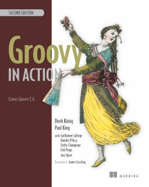
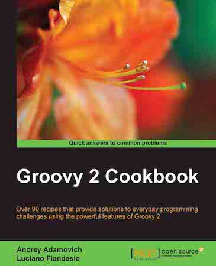

# Documentation

## Navigation

- [Support](#support)
- [Reporting issues](#reporting-issues)
- [Mailing lists](#mailing-lists)
- [Events](#events)
- [User groups](#usergroups)
- [Thanks](#thanks)
- Socialize
  - [Discuss on the mailing list](#mailing-lists)
  - [Events and conferences](#events)
  - [Report issues in Jira](#reporting-issues)
- Other pages
  - [The Apache Groovy programming language - Groovy Development Kit](#api)
  - [Concurrent API for Java](#concurrent-java)
  - [Documentation](#documentation)
  - [groovydoc - the Groovy documentation generator](#groovydoc)
  - [Learn](#learn)
  - [The Apache Groovy programming language - Groovy reference documentation](#single-page-documentation)
  - [Style guide](#style-guide)
  - [Testing guide](#testing)

## Content

<a id="support"></a>

<!-- source_url: https://groovy-lang.org/support.html -->

<!-- page_index: 1 -->

<a id="support--support"></a>

# Support

There are numerous ways to get help with Groovy™:

- discuss language usage or direction with other Groovy users and developers through the [mailing lists](#mailing-lists) - this is the place for all official discussions
- discuss matters on [Slack](https://www.groovycommunity.com/); it's run by Groovy enthusiasts in the community for casual conversations and Q&A
- ask a question on [Stack Overflow](https://stackoverflow.com/questions/tagged/groovy); these are answered by Groovy enthusiasts in the community
- find known issues (or create new ones) in our [bug tracker](#reporting-issues)
- attend upcoming [events and conferences](#events) to learn more about Groovy and to share your experience with others
- visit a local [user group](#usergroups) to meet other Groovy enthusiasts

If you click on the socialize link in the menu, you will also find other ways to interact
with the Groovy community, and follow the news around the ecosystem.

---

---

<a id="reporting-issues"></a>

<!-- source_url: https://groovy-lang.org/reporting-issues.html -->

<!-- page_index: 2 -->

<a id="reporting-issues--reporting-issues"></a>

# Reporting Issues

<a id="reporting-issues--reporting-issues-2"></a>

## Reporting issues

The Groovy project is using the [JIRA bug tracker](https://issues.apache.org/jira/browse/GROOVY/) to report and track issues, feature enhancements, and new features.

Here is a checklist before creating a new issue:

- Check the [existing documentation](https://groovy.apache.org/#documenting) to make sure the behavior you are reporting is really a bug, not a feature.
- Check the [existing issues](https://issues.apache.org/jira/browse/GROOVY/) to make sure you aren't experiencing an existing known bug. (In this case feel free to add additional information to the existing issue if you have new information.)
- You'll frequently wish to discuss your issue first on one of the [mailing lists](#mailing-lists)
  or in one of the forums to make sure what you believe is a bug isn't really
  a feature or to gather support and ideas for your feature enhancement request.
  Alternatively, consider using the [Slack](https://www.groovycommunity.com/) channel. (This channel is not endorsed by the Apache Software Foundation; it's run by Groovy enthusiasts in the community.)

NOTE: While we don't absolutely exclude you from asking questions within Jira (as distinct from reporting technical issues), you'll probably receive much better support from the mailing lists or forums.

If proceeding with reporting a new issue, here are some tips for making a good bug/issue report:

- A meaningful title that captures how you believe Groovy is working incorrectly
- Relevant version information: Groovy version(s) showing the problem, Groovy version where the behavior last worked, JDK version, operating system or third-party library versions if relevant
- Any relevant stacktraces
- Preconditions and steps to reproduce the bug. Preferably with no (or as few as possible) dependencies on third-party projects/libraries
- Actual and expected results
- Any relevant additional information: are you using indy, static compilation, local meta-programming additions, other libraries that might have metaprogramming in play.

Ready to report a new issue? (You'll need to sign up and log in, before proceeding.)

Report an issue

---

<a id="mailing-lists"></a>

<!-- source_url: https://groovy-lang.org/mailing-lists.html -->

<!-- page_index: 3 -->

<a id="mailing-lists--available-lists"></a>

# Available lists

<a id="mailing-lists--users-groovy.apache.org"></a>

### users@groovy.apache.org

*General purpose list for questions and discussion about Groovy*

[Browse](https://lists.apache.org/list.html?users@groovy.apache.org)

[Subscribe](mailto:users-subscribe@groovy.apache.org)

[Unsubscribe](mailto:users-unsubscribe@groovy.apache.org)

[Archive](http://mail-archives.apache.org/mod_mbox/groovy-users/)

<a id="mailing-lists--dev-groovy.apache.org"></a>

### dev@groovy.apache.org

*More focused list about the language implementation and its evolution*

[Browse](https://lists.apache.org/list.html?dev@groovy.apache.org)

[Subscribe](mailto:dev-subscribe@groovy.apache.org)

[Unsubscribe](mailto:dev-unsubscribe@groovy.apache.org)

[Archive](http://mail-archives.apache.org/mod_mbox/groovy-dev/)

<a id="mailing-lists--commits-groovy.apache.org"></a>

### commits@groovy.apache.org

*Tracks all commits*

[Browse](https://lists.apache.org/list.html?commits@groovy.apache.org)

[Subscribe](mailto:commits-subscribe@groovy.apache.org)

[Unsubscribe](mailto:commits-unsubscribe@groovy.apache.org)

[Archive](http://mail-archives.apache.org/mod_mbox/groovy-commits/)

<a id="mailing-lists--notifications-groovy.apache.org"></a>

### notifications@groovy.apache.org

*Contains JIRA and Github notifications*

[Browse](https://lists.apache.org/list.html?notifications@groovy.apache.org)

[Subscribe](mailto:notifications-subscribe@groovy.apache.org)

[Unsubscribe](mailto:notifications-unsubscribe@groovy.apache.org)

[Archive](http://mail-archives.apache.org/mod_mbox/groovy-notifications/)

---

<a id="mailing-lists--alternative-mailing-list-archives"></a>

## Alternative mailing-list archives

- You can also find archives on mail-archive.com: [users](https://www.mail-archive.com/users@groovy.apache.org/) [dev](https://www.mail-archive.com/dev@groovy.apache.org/) [commits](https://www.mail-archive.com/commits@groovy.apache.org/) [notifications](https://www.mail-archive.com/notifications@groovy.apache.org/)
- You can also find some historic dev mailing-list archives on MARC: [groovy-dev](https://marc.info/?l=groovy-dev&r=1&s=groovy&q=b&w=4)
- Historically, the mailing lists were also available through Nabble. These are archived on the Internet Archive: [combined](https://web.archive.org/web/20210507154652/http://groovy.329449.n5.nabble.com/)

---

<a id="events"></a>

<!-- source_url: https://groovy-lang.org/events.html -->

<!-- page_index: 4 -->

<a id="events--events"></a>

# Events

Groovy and its ecosystem are often represented at various Java-oriented conferences, but there are also events fully dedicated to the Groovy ecosystem.
Here are upcoming ones you might be interested in learning about.

---


<a id="events--community-over-code-glasgow-2026"></a>

## [Community over Code Glasgow 2026](https://communityovercode.org/)

<a id="events--glasgow-uk-october-11-14-2026"></a>

### Glasgow, UK — *October 11-14, 2026*

The latest innovations from dozens of Apache projects and their communities in a collaborative, vendor-neutral environment.

---

---

<a id="usergroups"></a>

<!-- source_url: https://groovy-lang.org/usergroups.html -->

<!-- page_index: 5 -->

# The Apache Groovy programming language - User groups

We're living in a virtual world, but it's great from time to time to be able to meet in real life, chat with other Groovy users, discover new aspects of the language or platform, attend presentations about special features or ecosystem projects, and more.
Groovy user groups are there for you to exchange with others about your favorite language.

- [Asia](#usergroups--asia)
- [Europe](#usergroups--europe)
- [North-America](#usergroups--northamerica)
- [South-America](#usergroups--southamerica)

---

<a id="usergroups--asia"></a>

## Asia

<a id="usergroups--india"></a>

### India

- [Bangalore Groovy Grails Meetup](http://www.meetup.com/Bangalore-Groovy-Grails-Meetup/)

<a id="usergroups--japan"></a>

### Japan

- [Japan Grails/Groovy User Group](http://www.jggug.org/)

---

<a id="usergroups--europe"></a>

## Europe

<a id="usergroups--denmark"></a>

### Denmark

- [Aarhus Groovy & Grails Meetup](https://www.linkedin.com/groups/3702945/)

<a id="usergroups--france"></a>

### France

- Paris Groovy Grails User Group

<a id="usergroups--germany"></a>

### Germany

- Berlin Groovy User Group (Inactive)

<a id="usergroups--israel"></a>

### Israel

- Groovy & Grails Israel User Group

<a id="usergroups--poland"></a>

### Poland

- Warsaw Groovy User Group (Inactive)

<a id="usergroups--spain"></a>

### Spain

- [Madrid Groovy User Group](http://www.meetup.com/madrid-gug/)

<a id="usergroups--the-netherlands"></a>

### The Netherlands

- [Dutch Groovy and Grails User Group (NLGUG)](http://www.meetup.com/nl-gug/)

---

<a id="usergroups--north-america"></a>

## North-America

<a id="usergroups--united-states"></a>

### United States

- Austin Groovy and Grails User Group (TX) (Inactive)
- Boston Groovy, Grails, Spring Meetup (B2GS) (Inactive)
- Coder Consortium of Sacramento (Inactive)
- [Groovy Users of Minnesota](https://www.meetup.com/groovymn/)
- NYC Groovy / Grails Meetup (Inactive)
- [Pittsburgh Groovy Programming](http://www.meetup.com/Pittsburgh-Groovy-Programming/)

---

<a id="usergroups--south-america"></a>

## South-America

<a id="usergroups--brazil"></a>

### Brazil

- [Grails Brasil - Groovy and Grails users group of Brazil](https://www.facebook.com/groups/grails.brasil/)
- [Brazil Groovy and Grails Meetup](http://www.meetup.com/groovybr)

---

<a id="thanks"></a>

<!-- source_url: https://groovy-lang.org/thanks.html -->

<!-- page_index: 6 -->

<a id="thanks--thanks"></a>

# Thanks

Groovy would not be the successful Open Source project it is today, without the help of its users, forming the base of a wider Groovy
community and [ecosystem](https://groovy-lang.org/ecosystem.html) of projects using Groovy.

The Apache Groovy team would like to thank:

- [The Apache Software Foundation](http://www.apache.org) which owns
  the project. We want to [thank](http://www.apache.org/foundation/thanks.html) the Apache
  Software Foundation and its sponsors for providing support for the Apache Community of open-source software projects.
- [JetBrains](http://www.jetbrains.com/) cover the cost of our server
  which runs our continuous integration server, hosts our documentation and website,
  and they are also offering free licenses for
  the [TeamCity](http://www.jetbrains.com/teamcity/) integration server and
  the [IntelliJ IDEA](http://www.jetbrains.com/idea/) development environment.
- [JFrog](http://www.jfrog.com/) provide infrastructure
  for deploying and hosting snapshots and releases of older versions of Groovy
  and an additional mirror for newer versions,
  thanks to their [Artifactory](https://jfrog.com/artifactory/) offering.

Sponsors are a key ingredient of the success of the Apache projects.
If you consider helping the project in any way, please don't hesitate to contact the Groovy development team.
Your help will be most appreciated.

---

---

<a id="api"></a>

<!-- source_url: https://groovy-lang.org/api.html -->

<!-- page_index: 7 -->

# The Apache Groovy programming language - Groovy Development Kit

[](https://github.com/apache/groovy)

<iframe class="doc-embed" frameborder="0" height="100%" src="https://docs.groovy-lang.org/latest/html/gapi" width="100%"></iframe>

---

<a id="concurrent-java"></a>

<!-- source_url: https://groovy-lang.org/concurrent-java.html -->

<!-- page_index: 8 -->

<a id="concurrent-java--concurrent-api-for-java"></a>

# Concurrent API for Java

Contents not found for <https://docs.groovy-lang.org/latest/html/documentation/core-concurrent-java.html>, most likely because this section has not yet been written.

---

<a id="documentation"></a>

<!-- source_url: https://groovy-lang.org/documentation.html -->

<!-- page_index: 9 -->

<a id="documentation--documentation"></a>

# Documentation

The Apache Groovy™ documentation is available as a [single-page document](#single-page-documentation), or a [PDF](https://docs.groovy-lang.org/docs/latest/html/documentation/index.pdf), or feel free to pick at a direct section below.

You can also browse [documentation for other versions](#documentation--all-versions).

---

<a id="documentation--getting-started"></a>

## Getting started

- [Download Groovy](https://groovy-lang.org/download.html)
- [Install Groovy](https://groovy-lang.org/install.html)
- [Differences with Java](https://groovy-lang.org/differences.html)
- [The Groovy Development Kit](https://groovy-lang.org/groovy-dev-kit.html)
- [The Grape dependency manager](https://groovy-lang.org/grape.html)
- [Testing guide](#testing)
- [Style guide](#style-guide)

<a id="documentation--language-specification"></a>

## Language Specification

- [Syntax](https://groovy-lang.org/syntax.html)
- [Operators](https://groovy-lang.org/operators.html)
- [Program structure](https://groovy-lang.org/structure.html)
- [Object orientation](https://groovy-lang.org/objectorientation.html)
- [Closures](https://groovy-lang.org/closures.html)
- [Semantics](https://groovy-lang.org/semantics.html)

<a id="documentation--diving-deeper"></a>

## Diving Deeper

- [Runtime and compile-time metaprogramming](https://groovy-lang.org/metaprogramming.html)
- [Domain-Specific Languages](https://groovy-lang.org/dsls.html)
- [Design patterns in Groovy](https://groovy-lang.org/design-patterns.html)
- [Async/await in Groovy](https://groovy-lang.org/async.html)
- [Parallel collections](https://groovy-lang.org/parallel-collections.html)
- [Concurrent dataflow](https://groovy-lang.org/concurrent-dataflow.html)
- [Concurrent actors and agents](https://groovy-lang.org/concurrent-actors.html)
- [Concurrent API for Java](#concurrent-java)
- [Integrating Groovy into applications](https://groovy-lang.org/integrating.html)
- [Security](https://groovy-lang.org/security.html)

<a id="documentation--groovy-module-guides"></a>

## Groovy module guides

- [Parsing and producing JSON](https://groovy-lang.org/processing-json.html)
- [Working with a relational database](https://groovy-lang.org/databases.html)
- [Processing XML](https://groovy-lang.org/processing-xml.html)
- [Processing YAML](https://groovy-lang.org/processing-yaml.html)
- [Processing TOML](https://groovy-lang.org/processing-toml.html)
- [Processing CSV](https://groovy-lang.org/processing-csv.html)
- [Http client support](https://groovy-lang.org/http-builder.html)
- [Reading Markdown](https://groovy-lang.org/reading-markdown.html)
- [SQL-like querying of collections](https://groovy-lang.org/using-ginq.html)
- [Template engines](https://groovy-lang.org/templating.html)
- [Servlet support](https://groovy-lang.org/servlet.html)
- [Working with JMX](https://groovy-lang.org/jmx.html)
- [Design by contract support](https://groovy-lang.org/contracts.html)

<a id="documentation--tools"></a>

## Tools

- [groovy - the Groovy command-line](https://groovy-lang.org/groovy.html)
- [groovyc - the Groovy compiler](https://groovy-lang.org/groovyc.html)
- [groovydoc - the Groovy documentation generator](#groovydoc)
- [groovysh - the Groovy repl-like shell](https://groovy-lang.org/groovysh.html)
- [groovyConsole - the Groovy Swing console](https://groovy-lang.org/groovyconsole.html)
- [IDE integration](https://groovy-lang.org/ides.html)

<a id="documentation--api-documentation"></a>

## API documentation

- [GroovyDoc documentation of the Groovy APIs](#api)
- [The Groovy Development Kit enhancements](https://groovy-lang.org/gdk.html)

---

<a id="documentation--documentation-for-all-groovy-versions"></a>

## Documentation for all Groovy versions

You can browse the documentation of a particular version of Groovy (since Groovy 1.7):

Select a version6.0.0-alpha-15.0.65.0.55.0.45.0.35.0.25.0.15.0.05.0.0-rc-15.0.0-beta-25.0.0-beta-15.0.0-alpha-125.0.0-alpha-115.0.0-alpha-105.0.0-alpha-95.0.0-alpha-85.0.0-alpha-75.0.0-alpha-65.0.0-alpha-55.0.0-alpha-45.0.0-alpha-35.0.0-alpha-25.0.0-alpha-14.0.324.0.314.0.304.0.294.0.284.0.274.0.264.0.254.0.244.0.234.0.224.0.214.0.204.0.194.0.184.0.174.0.164.0.154.0.144.0.134.0.124.0.114.0.104.0.94.0.84.0.74.0.64.0.54.0.44.0.34.0.24.0.14.0.04.0.0-rc-24.0.0-rc-13.0.253.0.243.0.233.0.223.0.213.0.203.0.193.0.183.0.173.0.163.0.153.0.143.0.133.0.123.0.113.0.103.0.93.0.83.0.73.0.63.0.53.0.43.0.33.0.23.0.13.0.02.6.0-alpha-42.6.0-alpha-32.6.0-alpha-22.6.0-alpha-12.5.232.5.222.5.212.5.202.5.192.5.182.5.172.5.162.5.152.5.142.5.132.5.122.5.112.5.102.5.92.5.82.5.72.5.62.5.52.5.42.5.32.5.22.5.12.5.02.4.212.4.202.4.192.4.182.4.172.4.162.4.152.4.142.4.132.4.122.4.112.4.102.4.92.4.82.4.72.4.62.4.52.4.42.4.32.4.22.4.12.4.02.3.112.3.102.3.92.3.82.3.72.3.62.3.52.3.42.3.32.3.22.3.12.3.02.2.22.2.12.2.02.1.92.1.82.1.72.1.62.1.52.1.42.1.32.1.22.1.12.1.02.0.82.0.72.0.62.0.52.0.42.0.32.0.22.0.12.0.01.8.91.8.81.8.71.8.61.8.51.8.41.8.31.8.21.8.11.8.01.7.111.7.101.7.91.7.81.7.71.7.61.7.51.7.41.7.31.7.21.7.11.7.0

---

<a id="groovydoc"></a>

<!-- source_url: https://groovy-lang.org/groovydoc.html -->

<!-- page_index: 10 -->

<a id="groovydoc--groovydoc-the-groovy-documentation-generator"></a>

# groovydoc - the Groovy documentation generator

GroovyDoc is a tool responsible for generating documentation from your code. It acts like the Javadoc tool in the
Java world but is capable of handling both `groovy` and `java` files. The distribution comes with two ways of generating
documentation: from [command line](#groovydoc--groovydoc-commandline) or from [Apache Ant](#groovydoc--groovydoc-ant). Other build tools
like Maven or Gradle also offer wrappers for Groovydoc.

<a id="groovydoc--groovydoc-commandline"></a>
<a id="groovydoc--1.-the-groovydoc-command-line-tool"></a>

## [1. The groovydoc command line tool](#groovydoc--groovydoc-commandline)

The `groovydoc` command line can be invoked to generate groovydocs:

```
groovydoc [options] [packagenames] [sourcefiles]
```

where options must be picked from the following table:

| Short version | Long version | Description |
| --- | --- | --- |
| -author |  | Include @author paragraphs (currently not used) |
| -charset <charset> |  | Charset for cross-platform viewing of generated documentation |
| -classpath, -cp | --classpath | Specify where to find the class files - must be first argument |
| -d | --destdir <dir> | Destination directory for output files |
|  | --debug | Enable debug output |
| -doctitle <html> |  | Include title for the overview page |
| -exclude <pkglist> |  | Specify a list of packages to exclude (separated by colons for all operating systems) |
| -fileEncoding <charset> |  | Charset for generated documentation files |
| -footer <html> |  | Include footer text for each page |
| -header <html> |  | Include header text for each page |
| -help | --help | Display help message |
| -nomainforscripts |  | Don’t include the implicit 'public static void main' method for scripts |
| -noscripts |  | Don’t process Groovy Scripts |
| -notimestamp |  | Don’t include timestamp within hidden comment in generated HTML |
| -noversionstamp |  | Don’t include Groovy version within hidden comment in generated HTML |
| -overview <file> |  | Read overview documentation from HTML file |
| -package |  | Show package/protected/public classes and members |
| -private |  | Show all classes and members |
| -protected |  | Show protected/public classes and members (default) |
| -public |  | Show only public classes and members |
| -quiet |  | Suppress superfluous output |
| -sourcepath <pathlist> |  | Specify where to find source files (dirs separated by platform path separator) |
| -stylesheetfile <path> |  | File to change style of the generated documentation |
| -verbose |  | Enable verbose output |
|  | --version | Display the version |
| -windowtitle <text> |  | Browser window title for the documentation |
| -javaversion <version> |  | The version of the Java source files |

<a id="groovydoc--_java_versions"></a>
<a id="groovydoc--1.1.-java-versions"></a>

### [1.1. Java Versions](#groovydoc--_java_versions)

The supported Java Versions for `groovydoc` are defined by the JavaParser library’s [LanguageLevel](https://www.javadoc.io/doc/com.github.javaparser/javaparser-core/3.28.0/com/github/javaparser/ParserConfiguration.LanguageLevel.html) class.

<a id="groovydoc--groovydoc-ant"></a>
<a id="groovydoc--2.-the-groovydoc-ant-task"></a>

## [2. The groovydoc Ant task](#groovydoc--groovydoc-ant)

The `groovydoc` Ant task allows generating groovydocs from an Ant build.

<a id="groovydoc--thegroovydocanttask-requiredtaskdef"></a>
<a id="groovydoc--2.1.-required-taskdef"></a>

### [2.1. Required taskdef](#groovydoc--thegroovydocanttask-requiredtaskdef)

Assuming all the groovy jars you need are in *my.classpath* (this will be `groovy-VERSION.jar`, `groovy-ant-VERSION.jar`, `groovy-groovydoc-VERSION.jar` plus any modules and transitive dependencies you might be using)
you will need to declare this task at some point in the build.xml prior to the groovydoc task being invoked.

```xml
<taskdef name         = "groovydoc"
         classname    = "org.codehaus.groovy.ant.Groovydoc"
         classpathref = "my.classpath"/>
```

<a id="groovydoc--thegroovydocanttask-groovydocattributes"></a>
<a id="groovydoc--2.2.-groovydoc-attributes"></a>

### [2.2. <groovydoc> Attributes](#groovydoc--thegroovydocanttask-groovydocattributes)

| Attribute | Description | Required |
| --- | --- | --- |
| destdir | Location to store the class files. | Yes |
| sourcepath | The sourcepath to use. | No |
| packagenames | Comma separated list of package files (with terminating wildcard). | No |
| use | Create class and package usage pages. | No |
| windowtitle | Browser window title for the documentation (text). | No |
| doctitle | Include title for the package index(first) page (html-code). | No |
| header | Include header text for each page (html-code). | No |
| footer | Include footer text for each page (html-code). | No |
| overview | Read overview documentation from HTML file. | No |
| private | Show all classes and members (i.e. including private ones) if set to ``true''. | No |
| javaversion | The version of the Java source files. | No |

<a id="groovydoc--thegroovydocanttask-groovydocnestedelements"></a>
<a id="groovydoc--2.3.-groovydoc-nested-elements"></a>

### [2.3. <groovydoc> Nested Elements](#groovydoc--thegroovydocanttask-groovydocnestedelements)

<a id="groovydoc--thegroovydocanttask-link"></a>
<a id="groovydoc--2.3.1.-link"></a>

#### [2.3.1. link](#groovydoc--thegroovydocanttask-link)

Create link to groovydoc/javadoc output at the given URL.

| Attribute | Description | Required |
| --- | --- | --- |
| packages | Comma separated list of package prefixes | Yes |
| href | Base URL of external site | Yes |

<a id="groovydoc--thegroovydocanttask-example1-groovydocanttask"></a>
<a id="groovydoc--2.3.2.-example-1-groovydoc-ant-task"></a>

#### [2.3.2. Example #1 - <groovydoc> Ant task](#groovydoc--thegroovydocanttask-example1-groovydocanttask)

```xml
<taskdef name           = "groovydoc"
         classname      = "org.codehaus.groovy.ant.Groovydoc"
         classpathref   = "path_to_groovy_all"/>

<groovydoc destdir      = "${docsDirectory}/gapi"
           sourcepath   = "${mainSourceDirectory}"
           packagenames = "**.*"
           use          = "true"
           windowtitle  = "${title}"
           doctitle     = "${title}"
           header       = "${title}"
           footer       = "${docFooter}"
           overview     = "src/main/overview.html"
           private      = "false">
        <link packages="java.,org.xml.,javax.,org.xml." href="http://docs.oracle.com/javase/8/docs/api/"/>
        <link packages="org.apache.tools.ant."          href="http://docs.groovy-lang.org/docs/ant/api/"/>
        <link packages="org.junit.,junit.framework."    href="http://junit.org/junit4/javadoc/latest/"/>
        <link packages="groovy.,org.codehaus.groovy."   href="http://docs.groovy-lang.org/latest/html/api/"/>
        <link packages="org.codehaus.gmaven."           href="http://groovy.github.io/gmaven/apidocs/"/>
</groovydoc>
```

<a id="groovydoc--thegroovydocanttask-example2-executinggroovydocfromgroovy"></a>
<a id="groovydoc--2.3.3.-example-2-executing-groovydoc-from-groovy"></a>

#### [2.3.3. Example #2 - Executing <groovydoc> from Groovy](#groovydoc--thegroovydocanttask-example2-executinggroovydocfromgroovy)

```groovy
def ant = new AntBuilder()
ant.taskdef(name: "groovydoc", classname: "org.codehaus.groovy.ant.Groovydoc")
ant.groovydoc(
    destdir      : "${docsDirectory}/gapi",
    sourcepath   : "${mainSourceDirectory}",
    packagenames : "**.*",
    use          : "true",
    windowtitle  : "${title}",
    doctitle     : "${title}",
    header       : "${title}",
    footer       : "${docFooter}",
    overview     : "src/main/overview.html",
    private      : "false") {
        link(packages:"java.,org.xml.,javax.,org.xml.",href:"http://docs.oracle.com/javase/8/docs/api/")
        link(packages:"groovy.,org.codehaus.groovy.",  href:"http://docs.groovy-lang.org/latest/html/api/")
        link(packages:"org.apache.tools.ant.",         href:"http://docs.groovy-lang.org/docs/ant/api/")
        link(packages:"org.junit.,junit.framework.",   href:"http://junit.org/junit4/javadoc/latest/")
        link(packages:"org.codehaus.gmaven.",          href:"http://groovy.github.io/gmaven/apidocs/")
}
```

<a id="groovydoc--_custom_templates"></a>
<a id="groovydoc--2.4.-custom-templates"></a>

### [2.4. Custom templates](#groovydoc--_custom_templates)

The `groovydoc` Ant task supports custom templates, but it requires two steps:

1. A custom groovydoc class
2. A new groovydoc task definition

<a id="groovydoc--_custom_groovydoc_class"></a>
<a id="groovydoc--2.4.1.-custom-groovydoc-class"></a>

#### [2.4.1. Custom Groovydoc class](#groovydoc--_custom_groovydoc_class)

The first step requires you to extend the `Groovydoc` class, like in the following example:

```java
package org.codehaus.groovy.tools.groovydoc;
import org.codehaus.groovy.ant.Groovydoc;
/** * Overrides GroovyDoc's default class template - for testing purpose only.*/ public class CustomGroovyDoc extends Groovydoc {
@Override protected String[] getClassTemplates() {return new String[]{"org/codehaus/groovy/tools/groovydoc/testfiles/classDocName.html"};}}
```

You can override the following methods:

- `getClassTemplates` for class-level templates
- `getPackageTemplates` for package-level templates
- `getDocTemplates` for top-level templates

You can find the list of default templates in the `org.codehaus.groovy.tools.groovydoc.gstringTemplates.GroovyDocTemplateInfo`
class.

<a id="groovydoc--_using_the_custom_groovydoc_task"></a>
<a id="groovydoc--2.4.2.-using-the-custom-groovydoc-task"></a>

#### [2.4.2. Using the custom groovydoc task](#groovydoc--_using_the_custom_groovydoc_task)

Once you’ve written the class, using it is just a matter of redefining the `groovydoc` task:

```xml
<taskdef name           = "groovydoc"
         classname      = "org.codehaus.groovy.ant.CustomGroovyDoc"
         classpathref   = "path_to_groovy_all"/>
```

Please note that template customization is provided as is. APIs are subject to change, so you must consider this as a
fragile feature.

<a id="groovydoc--groovydoc-gmavenplus"></a>
<a id="groovydoc--3.-gmavenplus-maven-plugin"></a>

## [3. GMavenPlus Maven Plugin](#groovydoc--groovydoc-gmavenplus)

[GMavenPlus](https://github.com/groovy/GMavenPlus) is a Maven plugin with goals that
support GroovyDoc generation.

---

<a id="learn"></a>

<!-- source_url: https://groovy-lang.org/learn.html -->

<!-- page_index: 11 -->

<a id="learn--learn"></a>

# Learn

Welcome to the learning section of the Groovy website.

First of all, you will need to [get started](#documentation--gettingstarted)
by installing Groovy on your system or project.

Once all set up, we invite you to have a look at the Groovy
[documentation](#documentation), which explains all the
[details of the language](#documentation--languagespecification), such as how to use the
[tools](#documentation--tools)
that come with a Groovy installation, and how to tackle more complex tasks with the various
[module user guides](#documentation--groovymoduleguides).

But there are other ways to learn more about Groovy, thanks to [books](#learn--books)
and [presentations](#learn--videos) given about Groovy at conferences.

---

<a id="learn--books"></a>

## Books

Another great approach to learning Groovy is to read the various books published
on the language:

- 

- [More info](http://www.manning.com/koenig2/)

<a id="learn--groovy-in-action-second-edition"></a>

# [Groovy in Action, Second Edition](http://www.manning.com/koenig2/)

By Dierk König, Paul King, Guillaume Laforge, Hamlet D'Arcy, Cédric Champeau, Erik Pragt, and Jon Skeet

The undisputed definitive reference on the Groovy programming language, authored by core members of the development team.

- 

- [More info](http://www.manning.com/kousen/)

<a id="learn--making-java-groovy"></a>

# [Making Java Groovy](http://www.manning.com/kousen/)

By Ken Kousen

Make Java development easier by adding Groovy. Each chapter focuses on a task Java developers do, like building, testing, or working with databases or restful web services, and shows ways Groovy can help.

- 

- [More info](https://pragprog.com/titles/vslg2/programming-groovy-2/)

<a id="learn--programming-groovy-2"></a>

# [Programming Groovy 2](https://pragprog.com/titles/vslg2/programming-groovy-2/)

By Venkat Subramaniam

Dynamic productivity for the Java developer

- 

- [More info](https://www.packtpub.com/product/groovy-2-cookbook/9781849519366/)

<a id="learn--groovy-2-cookbook"></a>

# [Groovy 2 Cookbook](https://www.packtpub.com/product/groovy-2-cookbook/9781849519366/)

By Andrey Adamovitch, Luciano Fiandeso

Over 90 recipes that provide solutions to everyday programming challenges using the powerful features of Groovy 2

- 

- [More info](https://www.packtpub.com/product/groovy-for-domain-specific-languages/9781849695404/)

<a id="learn--groovy-for-domain-specific-languages-second-edition"></a>

# [Groovy for Domain-Specific Languages - Second Edition](https://www.packtpub.com/product/groovy-for-domain-specific-languages/9781849695404/)

By Fergal Dearle

Extend and enhance your Java applications with domain-specific scripting in Groovy

- 

- [More info](https://leanpub.com/groovy-goodness-notebook)

<a id="learn--groovy-goodness-notebook"></a>

# [Groovy Goodness Notebook](https://leanpub.com/groovy-goodness-notebook)

By Hubert A. Klein Ikkink

Experience the Groovy programming language through code snippets. Learn more about (hidden) Groovy features with code snippets and short articles. The articles and code will get you started quickly and will give more insight in Groovy.

- 

- [More info](https://link.springer.com/book/10.1007/978-1-4842-2117-4)

<a id="learn--learning-groovy"></a>

# [Learning Groovy](https://link.springer.com/book/10.1007/978-1-4842-2117-4)

By Adam L. Davis

Start building powerful apps that take advantage of the dynamic scripting capabilities of the Groovy language. This book covers Groovy fundamentals, such as installing Groovy, using Groovy tools, and working with the Groovy Development Kit (GDK). You'll also learn more advanced aspects of Groovy.

- 

- [More info](http://www.casadocodigo.com.br/products/livro-grails)

<a id="learn--falando-de-grails"></a>

# [Falando de Grails](http://www.casadocodigo.com.br/products/livro-grails)

By Henrique Lobo Weissmann

For Groovy and Grails developers, authored by the founder of Grails Brasil based on his experiences as a Groovy and Grails consultant.

---

<a id="learn--presentations"></a>

## Presentations

Many Groovy-related presentations have been recorded at [conferences](#events)
that you might wish to have a look at, to learn more about Groovy, delve into particular topics, and more.

Below are a few selected presentations given at Groovy-related conferences.

[](https://www.youtube.com/watch?v=2NGeaIwmnC8&list=PLwxhnQ2Qv3xuE4JEKBpyE2AbbM_7G0EN1&index=5)

[<a id="learn--the-groovy-ecosystem-revisited"></a>

# The Groovy ecosystem revisited](https://www.youtube.com/watch?v=2NGeaIwmnC8&list=PLwxhnQ2Qv3xuE4JEKBpyE2AbbM_7G0EN1&index=5)By Andrés Almiray

[slides](http://fr.slideshare.net/aalmiray/gr8conf-groovy-ecosystem)

Groovy is a well established player in the JVM since a few years ago.
Its increased popularity across the years has spawned several projects that conform the Groovy Ecosystem.
You've probably heard of Grails, Gradle, Griffon and Spock.
But what about the rest of projects that are just waiting around the corner to be discovered and make your life easier?
This talk presents them tools and libraries that use Groovy as the main driving force to get the job done.

[](https://www.youtube.com/watch?v=1xvg8Wcj-hg&list=PLwxhnQ2Qv3xuE4JEKBpyE2AbbM_7G0EN1&index=9)

[<a id="learn--metaprogramming-with-the-groovy-runtime"></a>

# Metaprogramming with the Groovy runtime](https://www.youtube.com/watch?v=1xvg8Wcj-hg&list=PLwxhnQ2Qv3xuE4JEKBpyE2AbbM_7G0EN1&index=9)By Jeff Brown

The dynamic runtime nature of Groovy is one of the things that sets it apart from standard Java and makes it a fantastic language for building dynamic applications for the Java Platform.
The metaprogramming capabilities offered by the language provide everything that an application development team needs to build systems that are far more capable than their all Java counterparts.
This Part 1 of 2 will cover the runtime metaprogramming capabilities of Groovy. The session will dive deep into Groovy's Meta Object Protocol (MOP) which implements the incredibly dynamic runtime dispatch mechanism.
The session will include a lot of live code demonstrating really powerful runtime features of the language.
This session is focused specifically on Groovy's runtime metaprogramming capabilities.
Part 2 of 2 will cover Groovy's compile time metaprogramming capabilities

[](https://www.youtube.com/watch?v=GfIhxi7L6R0&list=PLwxhnQ2Qv3xuE4JEKBpyE2AbbM_7G0EN1&index=17)

[<a id="learn--groovy-puzzlers"></a>

# Groovy Puzzlers](https://www.youtube.com/watch?v=GfIhxi7L6R0&list=PLwxhnQ2Qv3xuE4JEKBpyE2AbbM_7G0EN1&index=17)By Noam Tenne

Remember the epic Java Puzzlers? Here's the Groovy version, and we have some neat ones!
Even though we are totally a Grails shop here at JFrog, some of these had us scratching our heads for days trying to figure them out.
And there is more!
Contributions from the truly Groovy senseis, including Guillaume Laforge, Andrés Almiray, Tim Yates, Ken Kousen
make this talk an unforgettable journey to Groovy.
In this talk, you'll have the expected dose of fun and enlightenment hearing about our mistakes and failures, great and small, in hard core Groovy/Grails development.

You can find more presentations:

- [GR8Conf YouTube channel](https://www.youtube.com/channel/UCJXNOMywewNmau4hzAy4LjA/videos)
- [GR8Conf US YouTube channel](https://www.youtube.com/user/GR8ConfUS/videos)
- [Greach YouTube channel](https://www.youtube.com/user/TheGreachChannel/videos)

---

<a id="learn--courses"></a>

## Courses

Another great resource for learning Groovy is through a course. You could spend time hunting down
various videos on the web but these courses have all the information you need packed into one place.

[](https://www.udemy.com/apache-groovy/?couponCode=LEARN_GROOVY)

[<a id="learn--the-complete-apache-groovy-developer-course"></a>

# The Complete Apache Groovy Developer Course](https://www.udemy.com/apache-groovy/?couponCode=LEARN_GROOVY)By Dan Vega

I am going to teach you everything you need to know to start using The Groovy Programming language.
If you're a beginner programmer with a some experience in another language like Python or Ruby this course is for you.
Dynamic languages are generally thought of as easier for total beginners to learn because they're flexible and fun.
If you're an existing Java Developer (Beginner or Experienced) this course is also for you.

This course is packed with almost 14 hours of content. We are going to start off with getting your
development environment up and running and then go through the very basics of the language.
From there we are going to build on that in each section cover topics like closures, meta-programming, builders and so much more.

[](https://www.oreilly.com/library/view/groovy-programming-fundamentals/9781491926253/)

[<a id="learn--groovy-fundamentals"></a>

# Groovy Fundamentals](https://www.oreilly.com/library/view/groovy-programming-fundamentals/9781491926253/)By Ken Kousen

Learn the advantages of using Groovy by itself and with existing Java projects. This video workshop takes
you into the heart of this JVM language and shows you how Groovy can help increase your productivity through
dynamic language features similar to those of Python, Ruby, and Smalltalk.

[](https://learning.oreilly.com/videos/practical-groovy-programming/9781491930908/)

[<a id="learn--practical-groovy-programming"></a>

# Practical Groovy Programming](https://learning.oreilly.com/videos/practical-groovy-programming/9781491930908/)By Ken Kousen

Take your basic Groovy skills to the next level with this practical video workshop. Presenter and Java consultant
Ken Kousen shows you how to work with XML and JSON, implement runtime metaprogramming, and use several AST transformations.
You'll also dive into operator overloading, Groovy SQL, and the Groovy JDK.

[](https://learning.oreilly.com/videos/mastering-groovy-programming/9781491930915)

[<a id="learn--mastering-groovy-programming"></a>

# Mastering Groovy Programming](https://learning.oreilly.com/videos/mastering-groovy-programming/9781491930915)By Ken Kousen

Learn advanced techniques for working with the Groovy programming language. In this video workshop, presenter
and Java consultant Ken Kousen shows you how to create RESTful web services, conduct Unit Tests, apply Groovy's
functional programming features, and use Java's Spring Framework in conjunction with Groovy.

[](https://objectcomputing.com/services/training/catalog/grails/groovy-beginner-to-advanced)

[<a id="learn--groovy-beginner-to-advanced"></a>

# Groovy Beginner To Advanced](https://objectcomputing.com/services/training/catalog/grails/groovy-beginner-to-advanced)By Object Computing

This 2-day, comprehensive course covers a lot of material and takes JVM developers from beginner to advanced
with the Groovy language by way of comprehensive lecture, demonstration, and hands-on exercises.
Developers will leave the experience with all of the skills needed to effectively use the Groovy programming
language to build many kinds of JVM applications.

[](https://objectcomputing.com/services/training/catalog/grails/advanced-groovy-metaprogramming-with-grails-3)

[<a id="learn--groovy-metaprogramming"></a>

# Groovy Metaprogramming](https://objectcomputing.com/services/training/catalog/grails/advanced-groovy-metaprogramming-with-grails-3)By Object Computing

The course covers, in-depth, how Groovy's dynamic dispatch mechanism works and how application and plugin
code can participate with that dispatch mechanism to provide more simple application code. You'll also learn
techniques that may be applied at compile time to enhance classes, including AST Transformations, automatically enhancing Grails artifacts with traits and more.

---

<a id="single-page-documentation"></a>

<!-- source_url: https://groovy-lang.org/single-page-documentation.html -->

<!-- page_index: 12 -->

# The Apache Groovy programming language - Groovy reference documentation

[](https://github.com/apache/groovy)

<iframe class="doc-embed" frameborder="0" height="100%" src="https://docs.groovy-lang.org/latest/html/documentation/" width="100%"></iframe>

---

<a id="style-guide"></a>

<!-- source_url: https://groovy-lang.org/style-guide.html -->

<!-- page_index: 13 -->

<a id="style-guide--style-guide"></a>

# Style guide

A Java developer embarking on a Groovy adventure will always have Java in mind, and will progressively learn Groovy, one feature at a time, becoming more productive and writing more idiomatic Groovy code.
This document’s purpose is to guide such a developer along the way, teaching some common Groovy syntax style, new operators, and new features like closures, etc.
This guide is not complete and only serves as a quick intro and a base for further guideline sections
should you feel like contributing to the document and enhancing it.

<a id="style-guide--_no_semicolons"></a>
<a id="style-guide--1.-no-semicolons"></a>

## [1. No semicolons](#style-guide--_no_semicolons)

When coming from a C / C++ / C# / Java background, we’re so used to semicolons, that we put them everywhere.
Even worse, Groovy supports 99% of Java’s syntax, and sometimes, it’s so easy to paste some Java code into your Groovy programs, that you end up with tons of semicolons everywhere.
But… semicolons are optional in Groovy, you can omit them, and it’s more idiomatic to remove them.

<a id="style-guide--_return_keyword_optional"></a>
<a id="style-guide--2.-return-keyword-optional"></a>

## [2. Return keyword optional](#style-guide--_return_keyword_optional)

In Groovy, the last expression evaluated in the body of a method can be returned without necessitating the `return` keyword.
Especially for short methods and for closures, it’s nicer to omit it for brevity:

```groovy
String toString() { return "a server" }
String toString() { "a server" }
```

But sometimes, this doesn’t look too good when you’re using a variable, and see it visually twice on two rows:

```groovy
def props() {
    def m1 = [a: 1, b: 2]
    m2 = m1.findAll { k, v -> v % 2 == 0 }
    m2.c = 3
    m2
}
```

In such case, either putting a newline before the last expression, or explicitly using `return` may yield better readability.

I, for myself, sometimes use the `return` keyword, sometimes not, it’s often a matter of taste.
But often, inside of closure, we omit it more often than not, for example. So even if the keyword is optional, this is by no means mandatory to not use it if you think it halters the readability of your code.

A word of caution, however. When using methods which are defined with the `def` keyword instead of a specific concrete type, you may be surprised to see the last expression being returned sometimes. So usually prefer using a specific return type like void or a type.
In our example above, imagine we forgot to put m2 as last statement to be returned, the last expression would be `m2.c = 3`, which would return… `3`, and not the map you expect.

Statements like `if`/`else`, `try`/`catch` can thus return a value as well, as there’s a "last expression" evaluated in those statements:

```groovy
def foo(n) {if(n == 1) {"Roshan" } else {"Dawrani"}}
assert foo(1) == "Roshan" assert foo(2) == "Dawrani"
```

<a id="style-guide--_def_and_type"></a>
<a id="style-guide--3.-def-and-type"></a>

## [3. Def and type](#style-guide--_def_and_type)

As we’re talking about `def` and types, I often see developers using both `def` and a type. But `def` is redundant here.
So make a choice, either use `def` or a type.

So don’t write:

```groovy
def String name = "Guillaume"
```

But:

```groovy
String name = "Guillaume"
```

When using `def` in Groovy, the actual type holder is `Object` (so you can assign any object to variables defined with `def`, and return any kind of object if a method is declared returning `def`).

When defining a method with untyped parameters, you can use `def` but it’s not needed, so we tend to omit them.
So instead of:

```groovy
void doSomething(def param1, def param2) { }
```

Prefer:

```groovy
void doSomething(param1, param2) { }
```

But as we mention in the last section of the document, it’s usually better to type your method parameters, so as to help with documenting your code, and also help IDEs for code-completion, or for leveraging the static type checking or static compilation capabilities of Groovy.

Another place where `def` is redundant and should be avoided is when defining constructors:

```groovy
class MyClass {
    def MyClass() {}
}
```

Instead, just remove the `def`:

```groovy
class MyClass {
    MyClass() {}
}
```

<a id="style-guide--_public_by_default"></a>
<a id="style-guide--4.-public-by-default"></a>

## [4. Public by default](#style-guide--_public_by_default)

By default, Groovy considers classes and methods `public`.
So you don’t have to use the `public` modifier everywhere something is public.
Only if it’s not public, you should put a visibility modifier.

So instead of:

```groovy
public class Server {
    public String toString() { return "a server" }
}
```

Prefer the more concise:

```groovy
class Server {
    String toString() { "a server" }
}
```

You may wonder about the 'package-scope' visibility, and the fact Groovy allows one to omit 'public' means that this scope is not supported by default, but there’s actually a special Groovy annotation which allows you to use that visibility:

```groovy
class Server {
    @PackageScope Cluster cluster
}
```

<a id="style-guide--_omitting_parentheses"></a>
<a id="style-guide--5.-omitting-parentheses"></a>

## [5. Omitting parentheses](#style-guide--_omitting_parentheses)

Groovy allows you to omit the parentheses for top-level expressions, like with the `println` command:

```groovy
println "Hello"
method a, b
```

vs:

```groovy
println("Hello")
method(a, b)
```

When a closure is the last parameter of a method call, like when using Groovy’s `each{}` iteration mechanism, you can put the closure outside the closing parentheses, and even omit the parentheses:

```groovy
list.each( { println it } )
list.each(){ println it }
list.each  { println it }
```

Always prefer the third form, which is more natural, as an empty pair of parentheses is just useless syntactical noise!

In some cases parentheses are required, such as when making nested method calls or when calling a method without parameters.

```groovy
def foo(n) { n }
def bar() { 1 }

println foo 1 // won't work
def m = bar   // won't work
```

<a id="style-guide--_classes_as_first_class_citizens"></a>
<a id="style-guide--6.-classes-as-first-class-citizens"></a>

## [6. Classes as first-class citizens](#style-guide--_classes_as_first_class_citizens)

The `.class` suffix is not needed in Groovy, a bit like in Java’s `instanceof`.

For example:

```groovy
connection.doPost(BASE_URI + "/modify.hqu", params, ResourcesResponse.class)
```

Using GStrings we’re going to cover below, and using first class citizens:

```groovy
connection.doPost("${BASE_URI}/modify.hqu", params, ResourcesResponse)
```

<a id="style-guide--_getters_and_setters"></a>
<a id="style-guide--7.-getters-and-setters"></a>

## [7. Getters and Setters](#style-guide--_getters_and_setters)

In Groovy, a getter and a setter form what we call a "property", and offer a shortcut notation for accessing and setting such properties.
So instead of the Java-way of calling getters / setters, you can use a field-like access notation:

```groovy
resourceGroup.getResourcePrototype().getName() == SERVER_TYPE_NAME
resourceGroup.resourcePrototype.name == SERVER_TYPE_NAME

resourcePrototype.setName("something")
resourcePrototype.name = "something"
```

When writing your beans in Groovy, often called POGOs (Plain Old Groovy Objects), you don’t have to create the field and getter / setter yourself, but let the Groovy compiler do it for you.

So instead of:

```groovy
class Person {
    private String name
    String getName() { return name }
    void setName(String name) { this.name = name }
}
```

You can simply write:

```groovy
class Person {
    String name
}
```

As you can see, a freestanding 'field' without modifier visibility actually
makes the Groovy compiler to generate a private field and a getter and setter for you.

When using such POGOs from Java, the getter and setter are indeed there, and can be used as usual, of course.

Although the compiler creates the usual getter/setter logic, if you wish to do anything additional or different in those getters/setters, you’re free to still provide them, and the compiler will use your logic, instead of the default generated one.

<a id="style-guide--_initializing_beans_with_named_parameters_and_the_default_constructor"></a>
<a id="style-guide--8.-initializing-beans-with-named-parameters-and-the-default-constructor"></a>

## [8. Initializing beans with named parameters and the default constructor](#style-guide--_initializing_beans_with_named_parameters_and_the_default_constructor)

With a bean like:

```groovy
class Server {
    String name
    Cluster cluster
}
```

Instead of setting each setter in subsequent statements as follows:

```groovy
def server = new Server()
server.name = "Obelix"
server.cluster = aCluster
```

You can use named parameters with the default constructor (first the constructor is called, then the setters are called in the sequence in which they are specified in the map):

```groovy
def server = new Server(name: "Obelix", cluster: aCluster)
```

<a id="style-guide--_using_with_and_tap_for_repeated_operations_on_the_same_bean"></a>
<a id="style-guide--9.-using-with-and-tap-for-repeated-operations-on-the-same-bean"></a>

## [9. Using `with()` and `tap()` for repeated operations on the same bean](#style-guide--_using_with_and_tap_for_repeated_operations_on_the_same_bean)

Named-parameters with the default constructor is interesting when creating new instances, but what if you are updating an instance that was given to you, do you have to repeat the 'server' prefix again and again?
No, thanks to the `with()` and `tap()` methods that Groovy adds on all objects of any kind:

```groovy
server.name = application.name
server.status = status
server.sessionCount = 3
server.start()
server.stop()
```

vs:

```groovy
server.with {
    name = application.name
    status = status
    sessionCount = 3
    start()
    stop()
}
```

As with any closure in Groovy, the last statement is considered the return value. In the example above this is the result of `stop()`. To use this as a builder, that just returns the incoming object, there is also `tap()`:

```groovy
def person = new Person().with {
    name = "Ada Lovelace"
    it // Note the explicit mention of it as the return value
}
```

vs:

```groovy
def person = new Person().tap {
    name = "Ada Lovelace"
}
```

Note: you can also use `with(true)` instead of `tap()` and `with(false)` instead of `with()`.

<a id="style-guide--_equals_and"></a>
<a id="style-guide--10.-equals-and"></a>

## [10. Equals and `==`](#style-guide--_equals_and)

Java’s `==` is actually Groovy’s `is()` method, and Groovy’s `==` is a clever `equals()`!

To compare the references of objects, instead of `==`, you should use `a.is(b)`.

But to do the usual `equals()` comparison, you should prefer Groovy’s `==`, as it also takes care of avoiding `NullPointerException`, independently of whether the left or right is `null` or not.

Instead of:

```groovy
status != null && status.equals(ControlConstants.STATUS_COMPLETED)
```

Do:

```groovy
status == ControlConstants.STATUS_COMPLETED
```

<a id="style-guide--_gstrings_interpolation_multiline"></a>
<a id="style-guide--11.-gstrings-interpolation-multiline"></a>

## [11. GStrings (interpolation, multiline)](#style-guide--_gstrings_interpolation_multiline)

We often use string and variable concatenation in Java, with many opening `/` closing of double quotes, plus signs, and `\n` characters for newlines.
With interpolated strings (called GStrings), such strings look better and are less painful to type:

```groovy
throw new Exception("Unable to convert resource: " + resource)
```

vs:

```groovy
throw new Exception("Unable to convert resource: ${resource}")
```

Inside the curly braces, you can put any kind of expression, not just variables.
For simple variables, or `variable.property`, you can even drop the curly braces:

```groovy
throw new Exception("Unable to convert resource: $resource")
```

You can even lazily evaluate those expressions using a closure notation with `${-> resource }`.
When the GString will be coerced to a String, it’ll evaluate the closure and get the `toString()` representation of the return value.

Example:

```groovy
int i = 3

def s1 = "i's value is: ${i}"
def s2 = "i's value is: ${-> i}"

i++

assert s1 == "i's value is: 3" // eagerly evaluated, takes the value on creation
assert s2 == "i's value is: 4" // lazily evaluated, takes the new value into account
```

When strings and their concatenated expression are long in Java:

```groovy
throw new PluginException("Failed to execute command list-applications:" +
    " The group with name " +
    parameterMap.groupname[0] +
    " is not compatible group of type " +
    SERVER_TYPE_NAME)
```

You can use the `\` continuation character (this is not a multiline string):

```groovy
throw new PluginException("Failed to execute command list-applications: \
The group with name ${parameterMap.groupname[0]} \
is not compatible group of type ${SERVER_TYPE_NAME}")
```

Or using multiline strings with triple quotes:

```groovy
throw new PluginException("""Failed to execute command list-applications:
    The group with name ${parameterMap.groupname[0]}
    is not compatible group of type ${SERVER_TYPE_NAME)}""")
```

You can also strip the indentation appearing on the left side of the multiline strings by calling `.stripIndent()` on that string.

Also note the difference between single quotes and double quotes in Groovy: single quotes always create Java Strings, without interpolation of variables, whereas double quotes either create Java Strings or GStrings when interpolated variables are present.

For multiline strings, you can triple the quotes: i.e. triple double quotes for GStrings and triple single quotes for mere Strings.

If you need to write regular expression patterns, you should use the "slashy" string notation:

```groovy
assert "foooo/baaaaar" ==~ /fo+\/ba+r/
```

The advantage of the "slashy" notation is that you don’t need to double escape backslashes, making working with regex a bit simpler.

Last but not least, prefer using single quoted strings when you need string constants, and use double-quoted strings when you are explicitly relying on string interpolation.

<a id="style-guide--_native_syntax_for_data_structures"></a>
<a id="style-guide--12.-native-syntax-for-data-structures"></a>

## [12. Native syntax for data structures](#style-guide--_native_syntax_for_data_structures)

Groovy provides native syntax constructs for data structures like lists, maps, regex, or ranges of values.
Make sure to leverage them in your Groovy programs.

Here are some examples of those native constructs:

```groovy
def list = [1, 4, 6, 9]

// by default, keys are Strings, no need to quote them
// you can wrap keys with () like [(variableStateAcronym): stateName] to insert a variable or object as a key.
def map = [CA: 'California', MI: 'Michigan']

// ranges can be inclusive and exclusive
def range = 10..20 // inclusive
assert range.size() == 11
// use brackets if you need to call a method on a range definition
assert (10..<20).size() == 10 // exclusive

def pattern = ~/fo*/

// equivalent to add()
list << 5

// call contains()
assert 4 in list
assert 5 in list
assert 15 in range

// subscript notation
assert list[1] == 4

// add a new key value pair
map << [WA: 'Washington']
// subscript notation
assert map['CA'] == 'California'
// property notation
assert map.WA == 'Washington'

// matches() strings against patterns
assert 'foo' ==~ pattern
```

<a id="style-guide--_the_groovy_development_kit"></a>
<a id="style-guide--13.-the-groovy-development-kit"></a>

## [13. The Groovy Development Kit](#style-guide--_the_groovy_development_kit)

Continuing on the data structures, when you need to iterate over collections, Groovy provides various additional methods, decorating Java’s core data structures, like `each{}`, `find{}`, `findAll{}`, `every{}`, `collect{}`, `inject{}`.
These methods add a functional flavor to the programming language and help working with complex algorithms more easily.
Lots of new methods are applied to various types, through decoration, thanks to the dynamic nature of the language.
You can find lots of very useful methods on String, Files, Streams, Collections, and much more:

<http://groovy-lang.org/gdk.html>

<a id="style-guide--_the_power_of_switch"></a>
<a id="style-guide--14.-the-power-of-switch"></a>

## [14. The power of switch](#style-guide--_the_power_of_switch)

Groovy’s `switch` is much more powerful than in C-ish languages which usually only accept primitives and assimilated.
Groovy’s `switch` accepts pretty much any kind of type.

```groovy
def x = 1.23
def result = ""
switch (x) {
    case "foo": result = "found foo"
    // lets fall through
    case "bar": result += "bar"
    case [4, 5, 6, 'inList']:
        result = "list"
        break
    case 12..30:
        result = "range"
        break
    case Integer:
        result = "integer"
        break
    case Number:
        result = "number"
        break
    case { it > 3 }:
        result = "number > 3"
        break
    default: result = "default"
}
assert result == "number"
```

And more generally, types with an `isCase()` method can also decide whether a value corresponds with a case

<a id="style-guide--_import_aliasing"></a>
<a id="style-guide--15.-import-aliasing"></a>

## [15. Import aliasing](#style-guide--_import_aliasing)

In Java, when using two classes of the same name but from different packages, like `java.util.List`
and `java.awt.List`, you can import one class, but have to use a fully-qualified name for the other.

Also sometimes, in your code, multiple usages of a long class name, can increase verbosity and
reduce clarity of the code.

To improve such situations, Groovy features import aliasing:

```groovy
import java.util.List as UtilList
import java.awt.List as AwtList
import javax.swing.WindowConstants as WC

UtilList list1 = [WC.EXIT_ON_CLOSE]
assert list1.size() instanceof Integer
def list2 = new AwtList()
assert list2.size() instanceof java.awt.Dimension
```

You can also use aliasing when importing methods statically:

```groovy
import static java.lang.Math.abs as mabs
assert mabs(-4) == 4
```

<a id="style-guide--_groovy_truth"></a>
<a id="style-guide--16.-groovy-truth"></a>

## [16. Groovy Truth](#style-guide--_groovy_truth)

All objects can be 'coerced' to a boolean value: everything that’s `null`, `void`, equal to zero, or empty evaluates to `false`, and if not, evaluates to `true`.

So instead of writing:

```groovy
if (name != null && name.length > 0) {}
```

You can just do:

```groovy
if (name) {}
```

Same thing for collections, etc.

Thus, you can use some shortcuts in things like `while()`, `if()`, the ternary operator, the Elvis operator (see below), etc.

It’s even possible to customize the Groovy Truth, by adding a boolean `asBoolean()` method to your classes!

<a id="style-guide--_safe_graph_navigation"></a>
<a id="style-guide--17.-safe-graph-navigation"></a>

## [17. Safe graph navigation](#style-guide--_safe_graph_navigation)

Groovy supports a variant of the `.` operator to safely navigate an object graph.

In Java, when you’re interested in a node deep in the graph and need to check for `null`, you often end up writing complex `if`, or nested `if` statements like this:

```groovy
if (order != null) {
    if (order.getCustomer() != null) {
        if (order.getCustomer().getAddress() != null) {
            System.out.println(order.getCustomer().getAddress());
        }
    }
}
```

With `?.` safe dereference operator, you can simplify such code with:

```groovy
println order?.customer?.address
```

Nulls are checked throughout the call chain and no `NullPointerException` will be thrown if any element is `null`, and the resulting value will be null if something’s `null`.

<a id="style-guide--_assert"></a>
<a id="style-guide--18.-assert"></a>

## [18. Assert](#style-guide--_assert)

To check your parameters, your return values, and more, you can use the `assert` statement.

Contrary to Java’s `assert`, Groovy’s `assert`s don’t need to be activated to be working, so an `assert` is always checked.

```groovy
def check(String name) {
    // name non-null and non-empty according to Groovy Truth
    assert name
    // safe navigation + Groovy Truth to check
    assert name?.size() > 3
}
```

You’ll also notice the nice output that Groovy’s "Power Assert" statement provides, with a graph view of the various values of each sub-expression being asserted.

<a id="style-guide--_elvis_operator_for_default_values"></a>
<a id="style-guide--19.-elvis-operator-for-default-values"></a>

## [19. Elvis operator for default values](#style-guide--_elvis_operator_for_default_values)

The Elvis operator is a special ternary operator shortcut which is handy to use for default values.

We often have to write code like:

```groovy
def result = name != null ? name : "Unknown"
```

Thanks to Groovy Truth, the `null` check can be simplified to just 'name'.

And to go even further, since you return 'name' anyway, instead of repeating name twice in this ternary expression, we can somehow remove what’s in between the question mark and colon, by using the Elvis operator, so that the above becomes:

```groovy
def result = name ?: "Unknown"
```

<a id="style-guide--_catch_any_exception"></a>
<a id="style-guide--20.-catch-any-exception"></a>

## [20. Catch any exception](#style-guide--_catch_any_exception)

If you don’t really care about the type of the exception which is thrown inside your `try` block, you can simply catch any of them and simply omit the type of the caught exception.
So instead of catching the exceptions like in:

```groovy
try {
    // ...
} catch (Exception t) {
    // something bad happens
}
```

Then catch anything ('any' or 'all', or whatever makes you think it’s anything):

```groovy
try {
    // ...
} catch (any) {
    // something bad happens
}
```

> [!NOTE]
> Note that it’s catching all Exceptions, not `Throwable`s. If you need to really catch "everything", you’ll have to be explicit and say you want to catch `Throwable`s.

<a id="style-guide--_optional_typing_advice"></a>
<a id="style-guide--21.-optional-typing-advice"></a>

## [21. Optional typing advice](#style-guide--_optional_typing_advice)

I’ll finish on some words on when and how to use optional typing.
Groovy lets you decide whether you use explicit strong typing, or when you use `def`.

I’ve got a rather simple rule of thumb: whenever the code you’re writing is going to be used by others as a public API, you should always favor the use of strong typing, it helps making the contract stronger, avoids possible passed arguments type mistakes, gives better documentation, and also helps the IDE with code completion.
Whenever the code is for your use only, like private methods, or when the IDE can easily infer the type, then you’re more free to decide when to type or not.

---

<a id="testing"></a>

<!-- source_url: https://groovy-lang.org/testing.html -->

<!-- page_index: 14 -->

<a id="testing--testing-guide"></a>

# Testing guide

<a id="testing--_introduction"></a>
<a id="testing--1.-introduction"></a>

## [1. Introduction](#testing--_introduction)

The Groovy programming language comes with great support for writing tests. In addition to the language
features and test integration with state-of-the-art testing libraries and frameworks, the Groovy ecosystem has born
a rich set of testing libraries and frameworks.

This chapter will start with language specific testing features and continue with a closer look at JUnit
integration, Spock for specifications, and Geb for functional tests. Finally, we’ll do an overview of other testing
libraries known to be working with Groovy.

<a id="testing--_language_features"></a>
<a id="testing--2.-language-features"></a>

## [2. Language Features](#testing--_language_features)

Besides integrated support for JUnit, the Groovy programming language comes with features that have proven
to be very valuable for test-driven development. This section gives insight on them.

<a id="testing--_power_assertions"></a>
<a id="testing--2.1.-power-assertions"></a>

### [2.1. Power Assertions](#testing--_power_assertions)

Writing tests means formulating assumptions by using assertions. In Java this can be done by using the `assert`
keyword that has been added in J2SE 1.4. In Java, `assert` statements can be enabled via the JVM parameters `-ea`
(or `-enableassertions`) and `-da` (or `-disableassertions`). Assertion statements in Java are disabled by default.

Groovy comes with a rather *powerful variant* of `assert` also known as *power assertion statement*. Groovy’s power
`assert` differs from the Java version in its output given the boolean expression validates to `false`:

```groovy
def x = 1
assert x == 2

// Output:             (1)
//
// Assertion failed:
// assert x == 2
//        | |
//        1 false
```

**1**

This section shows the std-err output

The `java.lang.AssertionError` that is thrown whenever the assertion can not be validated successfully, contains
an extended version of the original exception message. The power assertion output shows evaluation results from
the outer to the inner expression.

The power assertion statements true power unleashes in complex Boolean statements, or statements with
collections or other `toString`-enabled classes:

```groovy
def x = [1,2,3,4,5]
assert (x << 6) == [6,7,8,9,10]

// Output:
//
// Assertion failed:
// assert (x << 6) == [6,7,8,9,10]
//         | |     |
//         | |     false
//         | [1, 2, 3, 4, 5, 6]
//         [1, 2, 3, 4, 5, 6]
```

Another important difference from Java is that in Groovy assertions are *enabled by default*. It has been a language design
decision to remove the possibility to deactivate assertions. Or, as Bertrand Meyer stated, `it makes no sense to take
off your swim ring if you put your feet into real water`.

One thing to be aware of are methods with side effects inside Boolean expressions in power assertion statements. As
the internal error message construction mechanism does only store references to instances under target, it happens that the error message text is invalid at rendering time in case of side-effecting methods involved:

```groovy
assert [[1,2,3,3,3,3,4]].first().unique() == [1,2,3]

// Output:
//
// Assertion failed:
// assert [[1,2,3,3,3,3,4]].first().unique() == [1,2,3]
//                          |       |        |
//                          |       |        false
//                          |       [1, 2, 3, 4]
//                          [1, 2, 3, 4]           (1)
```

**1**

The error message shows the actual state of the collection, not the state before the `unique` method was applied

> [!NOTE]
> If you choose to provide a custom assertion error message this can be done by using the Java syntax `assert
> expression1 : expression2` where `expression1` is the Boolean expression and `expression2` is the custom error message.
> Be aware though that this will disable the power assert and will fully fall back to custom
> error messages on assertion errors.

<a id="testing--_mocking_and_stubbing"></a>
<a id="testing--2.2.-mocking-and-stubbing"></a>

### [2.2. Mocking and Stubbing](#testing--_mocking_and_stubbing)

Groovy has excellent built-in support for a range of mocking and stubbing alternatives. When using Java, dynamic mocking
frameworks are very popular. A key reason for this is that it is hard work creating custom hand-crafted mocks using Java.
Such frameworks can be used easily with Groovy if you choose but creating custom mocks is much easier in Groovy. You
can often get away with simple maps or closures to build your custom mocks.

The following sections show ways to create mocks and stubs with Groovy language features only.

<a id="testing--_map_coercion"></a>
<a id="testing--2.2.1.-map-coercion"></a>

#### [2.2.1. Map Coercion](#testing--_map_coercion)

By using maps or expandos, we can incorporate desired behaviour of a collaborator very easily as shown here:

```groovy
class TranslationService {String convert(String key) {return "test"}}
def service = [convert: { String key -> 'some text' }] as TranslationService assert 'some text' == service.convert('key.text')
```

The `as` operator can be used to coerce a map to a particular class. The given map keys are interpreted as
method names and the values, being `groovy.lang.Closure` blocks, are interpreted as method code blocks.

> [!NOTE]
> Be aware that map coercion can get into the way if you deal with custom `java.util.Map` descendant classes in combination
> with the `as` operator. The map coercion mechanism is targeted directly at certain collection classes, it doesn’t take
> custom classes into account.

<a id="testing--_closure_coercion"></a>
<a id="testing--2.2.2.-closure-coercion"></a>

#### [2.2.2. Closure Coercion](#testing--_closure_coercion)

The 'as' operator can be used with closures in a neat way which is great for developer testing in simple scenarios.
We haven’t found this technique to be so powerful that we want to do away with dynamic mocking, but it can be very
useful in simple cases none-the-less.

Classes or interfaces holding a single method, including SAM (single abstract method) classes, can be used to coerce
a closure block to be an object of the given type. Be aware that for doing this, Groovy internally create a proxy object
descending for the given class. So the object will not be a direct instance of the given class. This important if, for
example, the generated proxy object’s metaclass is altered afterwards.

Let’s have an example on coercing a closure to be of a specific type:

```groovy
def service = { String key -> 'some text' } as TranslationService
assert 'some text' == service.convert('key.text')
```

Groovy supports a feature called implicit SAM coercion. This means that the `as` operator is not necessary in situations
where the runtime can infer the target SAM type. This type of coercion might be useful in tests to mock entire SAM
classes:

```groovy
abstract class BaseService {
    abstract void doSomething()
}

BaseService service = { -> println 'doing something' }
service.doSomething()
```

<a id="testing--_mockfor_and_stubfor"></a>
<a id="testing--2.2.3.-mockfor-and-stubfor"></a>

#### [2.2.3. MockFor and StubFor](#testing--_mockfor_and_stubfor)

The Groovy mocking and stubbing classes can be found in the `groovy.mock.interceptor` package.

The `MockFor` class supports (typically unit) testing of classes in isolation by allowing a *strictly ordered* expectation
of the behavior of collaborators to be defined. A typical test scenario involves a class under test and one or more collaborators. In such a scenario it is
often desirable to just test the business logic of the class under test. One strategy for doing that is to replace
the collaborator instances with simplified mock objects to help isolate out the logic in the test target. MockFor
allows such mocks to be created using meta-programming. The desired behavior of collaborators is defined as a behavior
specification. The behavior is enforced and checked automatically.

Let’s assume our target classes looked like this:

```groovy
class Person {String first, last}
class Family {Person father, mother def nameOfMother() { "$mother.first $mother.last" }}
```

With `MockFor`, a mock expectation is always sequence dependent and its use automatically ends with a call to `verify`:

```groovy
def mock = new MockFor(Person)      (1)
mock.demand.getFirst{ 'dummy' }
mock.demand.getLast{ 'name' }
mock.use {                          (2)
    def mary = new Person(first:'Mary', last:'Smith')
    def f = new Family(mother:mary)
    assert f.nameOfMother() == 'dummy name'
}
mock.expect.verify()                (3)
```

| **1** | a new mock is created by a new instance of `MockFor` |
| --- | --- |
| **2** | a `Closure` is passed to `use` which enables the mocking functionality |
| **3** | a call to `verify` checks whether the sequence and number of method calls is as expected |

The `StubFor` class supports (typically unit) testing of classes in isolation by allowing a *loosely-ordered* expectation
of the behavior of collaborators to be defined. A typical test scenario involves a class under test and one or more
collaborators. In such a scenario it is often desirable to just test the business logic of the CUT. One strategy for
doing that is to replace the collaborator instances with simplified stub objects to help isolate out the logic
in the target class. `StubFor` allows such stubs to be created using meta-programming. The desired behavior of
collaborators is defined as a behavior specification.

In contrast to `MockFor` the stub expectation checked with `verify` is sequence independent and its use is optional:

```groovy
def stub = new StubFor(Person)      (1)
stub.demand.with {                  (2)
    getLast{ 'name' }
    getFirst{ 'dummy' }
}
stub.use {                          (3)
    def john = new Person(first:'John', last:'Smith')
    def f = new Family(father:john)
    assert f.father.first == 'dummy'
    assert f.father.last == 'name'
}
stub.expect.verify()                (4)
```

| **1** | a new stub is created by a new instance of `StubFor` |
| --- | --- |
| **2** | the `with` method is used for delegating all calls inside the closure to the `StubFor` instance |
| **3** | a `Closure` is passed to `use` which enables the stubbing functionality |
| **4** | a call to `verify` (optional) checks whether the number of method calls is as expected |

`MockFor` and `StubFor` can not be used to test statically compiled classes e.g. for Java classes or Groovy classes that
make use of `@CompileStatic`. To stub and/or mock these classes you can use Spock or one of the Java mocking libraries.

<a id="testing--testing_guide_emc"></a>
<a id="testing--2.2.4.-expando-meta-class-emc"></a>

#### [2.2.4. Expando Meta-Class (EMC)](#testing--testing_guide_emc)

Groovy includes a special `MetaClass` the so-called `ExpandoMetaClass` (EMC). It allows to dynamically add methods, constructors, properties and static methods using a neat closure syntax.

Every `java.lang.Class` is supplied with a special `metaClass` property that will give a reference to an
`ExpandoMetaClass` instance. The expando metaclass is not restricted to custom classes, it can be used for
JDK classes like for example `java.lang.String` as well:

```groovy
String.metaClass.swapCase = {->
    def sb = new StringBuffer()
    delegate.each {
        sb << (Character.isUpperCase(it as char) ? Character.toLowerCase(it as char) :
            Character.toUpperCase(it as char))
    }
    sb.toString()
}

def s = "heLLo, worLD!"
assert s.swapCase() == 'HEllO, WORld!'
```

The `ExpandoMetaClass` is a rather good candidate for mocking functionality as it allows for more advanced stuff
like mocking static methods

```groovy
class Book {
    String title
}

Book.metaClass.static.create << { String title -> new Book(title:title) }

def b = Book.create("The Stand")
assert b.title == 'The Stand'
```

or even constructors

```groovy
Book.metaClass.constructor << { String title -> new Book(title:title) }

def b = new Book("The Stand")
assert b.title == 'The Stand'
```

> [!NOTE]
> Mocking constructors might seem like a hack that’s better not even to be considered but even there might be valid
> use cases. An example can be found in Grails where domain class constructors are added at run-time with the
> help of `ExpandoMetaClass`. This lets the domain object register itself in the Spring application context and allows
> for injection of services or other beans controlled by the dependency-injection container.

If you want to change the `metaClass` property on a per test method level you need to remove the changes that were
done to the metaclass, otherwise those changes would be persistent across test method calls. Changes are removed by
replacing the metaclass in the `GroovyMetaClassRegistry`:

```groovy
GroovySystem.metaClassRegistry.removeMetaClass(String)
```

Another alternative is to register a `MetaClassRegistryChangeEventListener`, track the changed classes and remove
the changes in the cleanup method of your chosen testing runtime. A good example can be found
[in the Grails web
development framework](https://github.com/grails/grails-core/blob/master/grails-bootstrap/src/main/groovy/grails/build/support/MetaClassRegistryCleaner.java).

Besides using the `ExpandoMetaClass` on a class-level, there is also support for using the metaclass on a per-object
level:

```groovy
def b = new Book(title: "The Stand")
b.metaClass.getTitle {-> 'My Title' }

assert b.title == 'My Title'
```

In this case the metaclass change is related to the instance only. Depending on the test scenario this might be a better
fit than the global metaclass change.

<a id="testing--_gdk_methods"></a>
<a id="testing--2.3.-gdk-methods"></a>

### [2.3. GDK Methods](#testing--_gdk_methods)

The following section gives a brief overview on GDK methods that can be leveraged in test case scenarios, for example for
test data generation.

<a id="testing--_iterablecombinations"></a>
<a id="testing--2.3.1.-iterable-combinations"></a>

#### [2.3.1. Iterable#combinations](#testing--_iterablecombinations)

The `combinations` method that is added on `java.lang.Iterable` compliant classes can be used to get a list of
combinations from a list containing two or more sub-lists:

```groovy
void testCombinations() {
    def combinations = [[2, 3],[4, 5, 6]].combinations()
    assert combinations == [[2, 4], [3, 4], [2, 5], [3, 5], [2, 6], [3, 6]]
}
```

The method could be used in test case scenarios to generate all possible argument combinations for a specific method
call.

<a id="testing--_iterableeachcombination"></a>
<a id="testing--2.3.2.-iterable-eachcombination"></a>

#### [2.3.2. Iterable#eachCombination](#testing--_iterableeachcombination)

The `eachCombination` method that is added on `java.lang.Iterable` can be used to apply a function (or in this
case a `groovy.lang.Closure`) to each if the combinations that has been built by the `combinations` method:

`eachCombination` is a GDK method that is added to all classes conforming to the `java.lang.Iterable` interface.
It applies a function on each combination of the input lists:

```groovy
void testEachCombination() {
    [[2, 3],[4, 5, 6]].eachCombination { println it[0] + it[1] }
}
```

The method could be used in the testing context to call methods with each of the generated combinations.

<a id="testing--_tool_support"></a>
<a id="testing--2.4.-tool-support"></a>

### [2.4. Tool Support](#testing--_tool_support)

<a id="testing--_test_code_coverage"></a>
<a id="testing--2.4.1.-test-code-coverage"></a>

#### [2.4.1. Test Code Coverage](#testing--_test_code_coverage)

Code coverage is a useful measure of the effectiveness of (unit) tests. A program with high code coverage has a
lower chance to hold critical bugs than a program with no or low coverage. To get code coverage metrics, the generated byte-code usually needs to be instrumented before the tests are executed. One tool with Groovy support
for this task is [Cobertura](http://cobertura.github.io/cobertura/).

The following code listing shows an example on how to enable Cobertura test coverage reports in a Gradle build script from
a Groovy project:

```groovy
def pluginVersion = '<plugin version>' def groovyVersion = '<groovy version>' def junitVersion = '<junit version>'
buildscript {repositories {mavenCentral()} dependencies {classpath 'com.eriwen:gradle-cobertura-plugin:${pluginVersion}'}}
apply plugin: 'groovy' apply plugin: 'cobertura'
repositories {mavenCentral()}
dependencies {compile "org.codehaus.groovy:groovy-all:${groovyVersion}" testCompile "junit:junit:${junitVersion}"}
cobertura {format = 'html' includes = ['**/*.java', '**/*.groovy'] excludes = ['com/thirdparty/**/*.*']}
```

Several output formats can be chosen for Cobertura coverage reports and test code coverage reports can be added to
continuous integration build tasks.

<a id="testing--_testing_with_junit"></a>
<a id="testing--3.-testing-with-junit"></a>

## [3. Testing with JUnit](#testing--_testing_with_junit)

Groovy simplifies JUnit testing in the following ways:

- You use the same overall practices as you would when testing with Java but you
  can adopt much of Groovy’s concise syntax in your tests making them succinct. You can even use
  the capabilities for writing testing domain specific languages (DSLs) if you feel so inclined.
- There are numerous helper classes that simplify many testing activities. The details differ
  in some cases depending on the version of JUnit you are using. We’ll cover those details shortly.
- Groovy’s PowerAssert mechanism is wonderful to use in your tests
- Groovy deems that tests are so important you should be able to run them as easily as scripts or classes.
  This is why Groovy includes an automatic test runner when using the `groovy` command or the GroovyConsole.
  This gives you some additional options over and above running your tests

In the following sections we will have a closer look at JUnit 3, 4 and 5 Groovy integration.

<a id="testing--_junit_3"></a>
<a id="testing--3.1.-junit-3"></a>

### [3.1. JUnit 3](#testing--_junit_3)

Maybe one of the most prominent Groovy classes supporting JUnit 3 tests is the `GroovyTestCase` class. Being
derived from `junit.framework.TestCase` it offers a bunch of additional methods that make testing in Groovy a breeze.

> [!NOTE]
> Although `GroovyTestCase` inherits from `TestCase` doesn’t mean you can’t use JUnit 4 features in your project. In fact, the most recent Groovy versions come with a bundled JUnit 4 and that comes with a backwards compatible `TestCase`
> implementation. There have been some discussion on the Groovy mailing-list on whether to use `GroovyTestCase` or JUnit 4
> with the result that it is mostly a matter of taste, but with `GroovyTestCase` you get a bunch of methods for free that
> make certain types of tests easier to write.

In this section, we will have a look at some of the methods provided by `GroovyTestCase`. A full list of these can be
found in the JavaDoc documentation for [groovy.test.GroovyTestCase](https://docs.groovy-lang.org/5.0.6/html/gapi/index.html?groovy/test/GroovyTestCase.html) , don’t forget it is inherited from `junit.framework.TestCase` which inherits all the `assert*` methods.

<a id="testing--_assertion_methods"></a>
<a id="testing--3.1.1.-assertion-methods"></a>

#### [3.1.1. Assertion Methods](#testing--_assertion_methods)

`GroovyTestCase` is inherited from `junit.framework.TestCase` therefore it inherits a large number of assertion methods
being available to be called in every test method:

```groovy
class MyTestCase extends GroovyTestCase {

    void testAssertions() {
        assertTrue(1 == 1)
        assertEquals("test", "test")

        def x = "42"
        assertNotNull "x must not be null", x
        assertNull null

        assertSame x, x
    }

}
```

As can be seen above, in contrast to Java it is possible to leave out the parenthesis in most situations which
leads to even more readability of JUnit assertion method call expressions.

An interesting assertion method that is added by `GroovyTestCase` is `assertScript`. It ensures that the given Groovy
code string succeeds without any exception:

```groovy
void testScriptAssertions() {
    assertScript '''
        def x = 1
        def y = 2

        assert x + y == 3
    '''
}
```

<a id="testing--_shouldfail_methods"></a>
<a id="testing--3.1.2.-shouldfail-methods"></a>

#### [3.1.2. shouldFail Methods](#testing--_shouldfail_methods)

`shouldFail` can be used to check whether the given code block fails or not. In case it fails, the assertion does hold, otherwise the assertion fails:

```groovy
void testInvalidIndexAccess1() {
    def numbers = [1,2,3,4]
    shouldFail {
        numbers.get(4)
    }
}
```

The example above uses the basic `shouldFail` method interface that takes a `groovy.lang.Closure` as a single argument.
The `Closure` instance holds the code that is supposed to be breaking during run-time.

If we wanted to assert `shouldFail` on a specific `java.lang.Exception` type we could have done so by using the `shouldFail`
implementation that takes the `Exception` class as first argument and the `Closure` as second argument:

```groovy
void testInvalidIndexAccess2() {
    def numbers = [1,2,3,4]
    shouldFail IndexOutOfBoundsException, {
        numbers.get(4)
    }
}
```

If anything other than `IndexOutOfBoundsException` (or a descendant class of it) is thrown, the test case will fail.

A pretty nice feature of `shouldFail` hasn’t been visible so far: it returns the exception message. This is really
useful if you want to assert on the exception error message:

```groovy
void testInvalidIndexAccess3() {def numbers = [1,2,3,4] def msg = shouldFail IndexOutOfBoundsException, {numbers.get(4)} assert msg.contains('Index: 4, Size: 4') || msg.contains('Index 4 out-of-bounds for length 4') || msg.contains('Index 4 out of bounds for length 4')}
```

<a id="testing--_notyetimplemented_method"></a>
<a id="testing--3.1.3.-notyetimplemented-method"></a>

#### [3.1.3. notYetImplemented Method](#testing--_notyetimplemented_method)

The `notYetImplemented` method has been greatly influenced by HtmlUnit. It allows to write a test method but mark it
as not yet implemented. As long as the test method fails and is marked with `notYetImplemented` the test goes green:

```groovy
void testNotYetImplemented1() {
    if (notYetImplemented()) return   (1)

    assert 1 == 2                     (2)
}
```

**1**

a call to `notYetImplemented` is necessary for `GroovyTestCase` to get the current method stack.

**2**

as long as the test evaluates to `false` the test execution will be successful.

An alternative to the `notYetImplemented` method is the `@NotYetImplemented` annotation. It allows for annotating a
method as not yet implemented, with the exact same behavior as `GroovyTestCase#notYetImplemented` but without the need
for the `notYetImplemented` method call:

```groovy
@NotYetImplemented
void testNotYetImplemented2() {
    assert 1 == 2
}
```

<a id="testing--_junit_4"></a>
<a id="testing--3.2.-junit-4"></a>

### [3.2. JUnit 4](#testing--_junit_4)

Groovy can be used to write JUnit 4 test cases without any restrictions. The `groovy.test.GroovyAssert` holds
various static methods that can be used as replacement for the `GroovyTestCase` methods in JUnit 4 tests:

```groovy
import org.junit.Test
import static groovy.test.GroovyAssert.shouldFail
class JUnit4ExampleTests {
@Test void indexOutOfBoundsAccess() {def numbers = [1,2,3,4] shouldFail {numbers.get(4)}}
}
```

As can be seen in the example above, the static methods found in `GroovyAssert` are imported at the beginning of the
class definition thus `shouldFail` can be used the same way it can be used in a `GroovyTestCase`.

> [!NOTE]
> `groovy.test.GroovyAssert` descends from `org.junit.Assert` that means it inherits all JUnit assertion methods. However, with the introduction of the power assertion statement, it turned out to be *good practice to rely on assertion statements*
> instead of using the JUnit assertion methods with the improved message being the main reason.

It is worth mentioning that `GroovyAssert.shouldFail` is not absolutely identical to `GroovyTestCase.shouldFail`. While
`GroovyTestCase.shouldFail` returns the exception message, `GroovyAssert.shouldFail` returns the exception itself. It
takes a few more keystrokes to get the message, but in return you can access other properties and methods of the
exception:

```groovy
@Test
void shouldFailReturn() {
    def e = shouldFail {
        throw new RuntimeException('foo',
                                   new RuntimeException('bar'))
    }
    assert e instanceof RuntimeException
    assert e.message == 'foo'
    assert e.cause.message == 'bar'
}
```

<a id="testing--_junit_5"></a>
<a id="testing--3.3.-junit-5"></a>

### [3.3. JUnit 5](#testing--_junit_5)

Much of the approach and helper classes described under JUnit4 apply when using JUnit5 however JUnit5
uses some slightly different class annotations when writing your tests. See the [JUnit5](https://junit.org) documentation
for more details.

Create your test classes as per normal JUnit5 guidelines as shown in this example:

```groovy
class MyTest {@Test void streamSum() {assertTrue(Stream.of(1, 2, 3) .mapToInt(i -> i) .sum() > 5, () -> "Sum should be greater than 5")}
@RepeatedTest(value=2, name = "{displayName} {currentRepetition}/{totalRepetitions}") void streamSumRepeated() {assert Stream.of(1, 2, 3).mapToInt(i -> i).sum() == 6}
private boolean isPalindrome(s) { s == s.reverse()  }
@ParameterizedTest                                                              (1) @ValueSource(strings = [ "racecar", "radar", "able was I ere I saw elba" ]) void palindromes(String candidate) {assert isPalindrome(candidate)}
@TestFactory def dynamicTestCollection() {[dynamicTest("Add test") { -> assert 1 + 1 == 2 },dynamicTest("Multiply Test", () -> { assert 2 * 3 == 6 }) ]}}
```

**1**

This test requires the additional `org.junit.jupiter:junit-jupiter-params` dependency if not already in your project.

You can run the tests in your IDE or build tool if it supports and is configured for JUnit5.
If you run the above test in the GroovyConsole or via the `groovy` command, you will see a short text summary of the
result of running the test:

```
JUnit5 launcher: passed=8, failed=0, skipped=0, time=246ms
```

More detailed information is available at the `FINE` logging level. You can configure your logging to display such
information or do it programmatically as follows:

```groovy
@BeforeAll
static void init() {
  def logger = Logger.getLogger(LoggingListener.name)
  logger.level = Level.FINE
  logger.addHandler(new ConsoleHandler(level: Level.FINE))
}
```

<a id="testing--_testing_with_spock"></a>
<a id="testing--4.-testing-with-spock"></a>

## [4. Testing with Spock](#testing--_testing_with_spock)

Spock is a testing and specification framework for Java and Groovy applications. What makes it stand out from the
crowd is its beautiful and highly expressive specification DSL. In practice, Spock specifications are written as
Groovy classes. Although written in Groovy they can be used to test Java classes. Spock can be used for unit, integration or BDD (behavior-driven-development) testing, it doesn’t put itself into a specific category of testing
frameworks or libraries.

> [!NOTE]
> Beside these awesome features Spock is a good example on how to leverage advanced Groovy programming
> language features in third party libraries, for example, by using Groovy AST transformations.

> [!NOTE]
> This section should not serve as detailed guide on how to use Spock, it should rather give an impression what Spock
> is about and how it can be leveraged for unit, integration, functional or any other type of testing.

The next section we will have a first look at the anatomy of a Spock specification. It should give a
pretty good feeling on what Spock is up to.

<a id="testing--_specifications"></a>
<a id="testing--4.1.-specifications"></a>

### [4.1. Specifications](#testing--_specifications)

Spock lets you write specifications that describe features (properties, aspects) exhibited by a system of
interest. The "system" can be anything between a single class and an entire application, a more advanced term for it is
*system under specification*. The *feature description* starts from a specific snapshot of the system and its
collaborators, this snapshot is called the *feature’s fixture*.

Spock specification classes are derived from `spock.lang.Specification`. A concrete specification class might consist
of fields, fixture methods, features methods and helper methods.

Let’s have a look at a simple specification with a single feature method for an imaginary `Stack` class:

```groovy
class StackSpec extends Specification {

    def "adding an element leads to size increase"() {  (1)
        setup: "a new stack instance is created"        (2)
            def stack = new Stack()

        when:                                           (3)
            stack.push 42

        then:                                           (4)
            stack.size() == 1
    }
}
```

| **1** | Feature method, is by convention named with a String literal. |
| --- | --- |
| **2** | Setup block, here is where any setup work for this feature needs to be done. |
| **3** | When block describes a stimulus, a certain action under target by this feature specification. |
| **4** | Then block any expressions that can be used to validate the result of the code that was triggered by the when block. |

Spock feature specifications are defined as methods inside a `spock.lang.Specification` class. They describe the feature
by using a String literal instead of a method name.

A feature method holds multiple blocks, in our example we used `setup`, `when` and `then`. The `setup` block is special
in that it is optional and allows to configure local variables visible inside the feature method. The `when` block
defines the stimulus and is a companion of the `then` block which describes the response to the stimulus.

Note that the `setup` method in the `StackSpec` above additionally
has a description String. Description Strings are optional and can be added after block labels (like `setup`, `when`, `then`).

<a id="testing--_more_spock"></a>
<a id="testing--4.2.-more-spock"></a>

### [4.2. More Spock](#testing--_more_spock)

Spock provides much more features like data tables or advanced mocking capabilities. Feel free to consult the
[Spock GitHub page](https://github.com/spockframework/spock) for more documentation and download information.

<a id="testing--_functional_tests_with_geb"></a>
<a id="testing--5.-functional-tests-with-geb"></a>

## [5. Functional Tests with Geb](#testing--_functional_tests_with_geb)

Geb is a functional web testing and scraper library that integrates with JUnit and Spock. It is based upon the
Selenium web drivers and, like Spock, provides a Groovy DSL to write functional tests for web applications.

Geb has great features that make it a good fit for a functional testing library:

- DOM access via a JQuery-like `$` function
- implements the *page pattern*
- support for modularization of certain web components (e.g. menu-bars, etc.) with *modules*
- integration with JavaScript via the JS variable

> [!NOTE]
> This section should not serve as detailed guide on how to use Geb, it should rather give an impression what Geb
> is about and how it can be leveraged functional testing.

The next section will give an example on how Geb can be used to write a functional test for a simple
web page with a single search field.

<a id="testing--_a_geb_script"></a>
<a id="testing--5.1.-a-geb-script"></a>

### [5.1. A Geb Script](#testing--_a_geb_script)

Although Geb can be used standalone in a Groovy script, in many scenarios it’s used in combination with other testing
frameworks. Geb comes with various base classes that can be used in JUnit 3, 4, TestNG or Spock tests. The base classes
are part of additional Geb modules that need to be added as a dependency.

For example, the following `@Grab` dependencies can be used to run Geb with the Selenium Firefox driver in
JUnit4 tests. The module that is needed for JUnit 3/4 support is `geb-junit4`:

```groovy
@Grab('org.gebish:geb-core:0.9.2')
@Grab('org.gebish:geb-junit4:0.9.2')
@Grab('org.seleniumhq.selenium:selenium-firefox-driver:2.26.0')
@Grab('org.seleniumhq.selenium:selenium-support:2.26.0')
```

The central class in Geb is the `geb.Browser` class. As its name implies it is used
to browse pages and access DOM elements:

```groovy
import geb.Browser
import org.openqa.selenium.firefox.FirefoxDriver

def browser = new Browser(driver: new FirefoxDriver(), baseUrl: 'http://myhost:8080/myapp')  (1)
browser.drive {
    go "/login"                        (2)

    $("#username").text = 'John'       (3)
    $("#password").text = 'Doe'

    $("#loginButton").click()

    assert title == "My Application - Dashboard"
}
```

**1**

A new `Browser` instance is created. In this case it uses the Selenium `FirefoxDriver` and sets the `baseUrl`.

**2**

`go` is used to navigate to a URL or relative URI

**3**

`$` together with CSS selectors is used to access the `username` and `password` DOM fields.

The `Browser` class comes with a `drive` method that delegates all method/property calls to the current
`browser` instance. The `Browser` configuration must not be done inline, it can also be externalized in a
`GebConfig.groovy` configuration file for example. In practice, the usage of the `Browser` class is mostly hidden
by Geb test base classes. They delegate all missing properties and method calls to the current `browser` instance
that exists in the background:

```groovy
class SearchTests extends geb.junit4.GebTest {
@Test void executeSearch() {go 'http://somehost/mayapp/search'              (1) $('#searchField').text = 'John Doe'             (2) $('#searchButton').click()                      (3)
assert $('.searchResult a').first().text() == 'Mr. John Doe' (4)}}
```

| **1** | `Browser#go` takes a relative or absolute link and calls the page. |
| --- | --- |
| **2** | `Browser#$` is used to access DOM content. Any CSS selectors supported by the underlying Selenium drivers are allowed |
| **3** | `click` is used to click a button. |
| **4** | `$` is used to get the first link out of the `searchResult` block |

The example above shows a simple Geb web test with the JUnit 4 base class `geb.junit4.GebTest`. Note that in this case
the `Browser` configuration is externalized. `GebTest` delegates methods like `go` and `$` to the underlying `browser`
instance.

<a id="testing--_more_geb"></a>
<a id="testing--5.2.-more-geb"></a>

### [5.2. More Geb](#testing--_more_geb)

In the previous section we only scratched the surface of the available Geb features. More information on Geb can be found
at the [project homepage](http://gebish.org).

---
