# Get Started ¶

## Navigation

- [Hamilton](#index)
- [USER GUIDE](#how-tos)
  - [Get Started](#get-started)
    - [Why use Apache Hamilton?](#get-started-why-hamilton)
    - [Install](#get-started-install)
    - [Your First Dataflow](#get-started-your-first-dataflow)
    - [Learning Resources](#get-started-learning-resources)
    - [Contributing](#get-started-contributing)
    - [License](#get-started-license)
  - [Concepts](#concepts)
    - [Glossary](#concepts-glossary)
    - [Functions, nodes & dataflow](#concepts-node)
    - [Driver](#concepts-driver)
    - [Visualization](#concepts-visualization)
    - [Materialization](#concepts-materialization)
    - [Function modifiers](#concepts-function-modifiers)
    - [Builder](#concepts-builder)
    - [Caching](#concepts-caching)
    - [Function modifiers (Advanced)](#concepts-function-modifiers-advanced)
    - [Dynamic DAGs/Parallel Execution](#concepts-parallel-task)
    - [UI Overview](#concepts-ui)
    - [Local Mode](#concepts-ui--local-mode)
    - [Docker/Deployed Mode](#concepts-ui--docker-deployed-mode)
    - [Get started](#concepts-ui--get-started)
    - [Features](#concepts-ui--features)
    - [SDK Configuration](#concepts-ui--sdk-configuration)
    - [Best Practices](#concepts-best-practices)
      - [Function Naming](#concepts-best-practices-function-naming)
      - [Migrating to Apache Hamilton](#concepts-best-practices-migrating-to-hamilton)
      - [Code Organization](#concepts-best-practices-code-organization)
      - [Common Indices](#concepts-best-practices-common-indices)
      - [Output Immutability](#concepts-best-practices-output-immutability)
      - [Using within your ETL System](#concepts-best-practices-using-within-your-etl-system)
      - [Loading Data](#concepts-best-practices-loading-data)
  - [User Guide](#how-tos)
    - [Jupyter notebooks](#how-tos-use-in-jupyter-notebook)
    - [Loading data](#how-tos-load-data)
    - [Caching](#how-tos-caching-tutorial)
    - [Feature engineering](#how-tos-use-for-feature-engineering)
    - [Reusing functions and nodes](#how-tos-reuse-nodes)
    - [Model training](#how-tos-ml-training)
    - [LLM workflows](#how-tos-llm-workflows)
    - [Data quality](#how-tos-run-data-quality-checks)
    - [Testing Apache Hamilton code](#how-tos-test-hamilton-code)
    - [Lineage + Apache Hamilton](#how-tos-use-hamilton-for-lineage)
    - [Scaling computation](#how-tos-scale-up)
    - [Microservice](#how-tos-microservice)
    - [Extension autoloading](#how-tos-extensions-autoloading)
    - [Wrapping the Driver](#how-tos-wrapping-driver)
    - [Command line interface](#how-tos-cli-reference)
    - [pre-commit hooks](#how-tos-pre-commit-hooks)
  - [Apache Hamilton UI](#hamilton-ui)
    - [UI Overview](#hamilton-ui-ui)
    - [Local Mode](#hamilton-ui-ui--local-mode)
    - [Docker/Deployed Mode](#hamilton-ui-ui--docker-deployed-mode)
    - [Get started](#hamilton-ui-ui--get-started)
    - [Features](#hamilton-ui-ui--features)
    - [SDK Configuration](#hamilton-ui-ui--sdk-configuration)
  - [IDE extension](#hamilton-vscode)
    - [Apache Hamilton VSCode](#hamilton-vscode-vscode_extension)
    - [Language Server](#hamilton-vscode-language_server)
  - [Integrations](#integrations)
    - [dlt](#integrations-dlt)
    - [FastAPI](#integrations-fastapi)
    - [Ibis](#integrations-ibis)
    - [Streamlit](#integrations-streamlit)
    - [dbt](#integrations-dbt)
  - [Code Comparisons](#code-comparisons)
    - [Kedro](#code-comparisons-kedro)
    - [Dagster](#code-comparisons-dagster)
    - [LangChain](#code-comparisons-langchain)
    - [Airflow](#code-comparisons-airflow)
- [DOWNLOADS](#asf-downloads)
  - [Downloads](#asf-downloads)
- COMMUNITY
  - [Meet-ups](#community)
  - [Ecosystem](#ecosystem)
    - [Claude Code Plugin for Hamilton](#ecosystem-claude-code-plugin)
    - [MCP Server](#ecosystem-mcp-server)
- REFERENCE
  - [Decorators](#reference-decorators)
    - [check output*](#reference-decorators-check_output)
    - [config.when*](#reference-decorators-config_when)
    - [dataloader](#reference-decorators-dataloader)
    - [datasaver](#reference-decorators-datasaver)
    - [does](#reference-decorators-does)
    - [unpack fields](#reference-decorators-unpack_fields)
    - [extract columns](#reference-decorators-extract_columns)
    - [extract fields](#reference-decorators-extract_fields)
    - [inject](#reference-decorators-inject)
    - [load from](#reference-decorators-load_from)
    - [parameterize](#reference-decorators-parameterize)
    - [parameterize extract columns](#reference-decorators-parameterize_extract_columns)
    - [parameterize frame](#reference-decorators-parameterize_frame)
    - [parameterize sources](#reference-decorators-parameterize_sources)
    - [parameterized subdag](#reference-decorators-parameterize_subdag)
    - [parameterize values](#reference-decorators-parameterize_values)
    - [pipe family](#reference-decorators-pipe)
    - [resolve](#reference-decorators-resolve)
    - [save to](#reference-decorators-save_to)
    - [subdag](#reference-decorators-subdag)
    - [schema](#reference-decorators-schema)
    - [with columns](#reference-decorators-with_columns)
  - [Drivers](#reference-drivers)
    - [Builder](#reference-drivers-driver)
    - [Driver](#reference-drivers-driver--driver)
    - [DefaultGraphExecutor](#reference-drivers-driver--defaultgraphexecutor)
    - [TaskBasedGraphExecutor](#reference-drivers-driver--taskbasedgraphexecutor)
    - [AsyncDriver](#reference-drivers-asyncdriver)
    - [Custom Driver](#reference-drivers-custom)
  - [Caching](#reference-caching)
    - [Caching logic](#reference-caching-caching-logic)
    - [Data versioning](#reference-caching-data-versioning)
    - [Stores](#reference-caching-stores)
  - [GraphAdapters](#reference-graph-adapters)
    - [SimplePythonDataFrameGraphAdapter](#reference-graph-adapters-simplepythondataframegraphadapter)
    - [SimplePythonGraphAdapter](#reference-graph-adapters-simplepythongraphadapter)
    - [HamiltonGraphAdapter](#reference-graph-adapters-hamiltongraphadapter)
    - [h async.AsyncGraphAdapter](#reference-graph-adapters-asyncgraphadapter)
    - [h threadpool.FutureAdapter](#reference-graph-adapters-threadpoolfutureadapter)
    - [CachingGraphAdapter](#reference-graph-adapters-cachinggraphadapter)
    - [h dask.DaskGraphAdapter](#reference-graph-adapters-daskgraphadapter)
    - [h spark.PySparkUDFGraphAdapter](#reference-graph-adapters-pysparkudfgraphadapter)
    - [h ray.RayGraphAdapter](#reference-graph-adapters-raygraphadapter)
    - [h spark.SparkKoalasGraphAdapter](#reference-graph-adapters-sparkkoalasgraphadapter)
  - [Lifecycle Adapters](#reference-lifecycle-hooks)
    - [lifecycle.ResultBuilder](#reference-lifecycle-hooks-resultbuilder)
    - [lifecycle.LegacyResultMixin](#reference-lifecycle-hooks-legacyresultmixin)
    - [lifecycle.api.GraphAdapter](#reference-lifecycle-hooks-graphadapter)
    - [lifecycle.NodeExecutionHook](#reference-lifecycle-hooks-nodeexecutionhook)
    - [lifecycle.api.GraphExecutionHook](#reference-lifecycle-hooks-graphexecutionhook)
    - [lifecycle.api.EdgeConnectionHook](#reference-lifecycle-hooks-edgeconnectionhook)
    - [lifecycle.api.NodeExecutionMethod](#reference-lifecycle-hooks-nodeexecutionmethod)
    - [lifecycle.api.StaticValidator](#reference-lifecycle-hooks-staticvalidator)
    - [lifecycle.api.GraphConstructionHook](#reference-lifecycle-hooks-graphconstructionhook)
    - [lifecycle.api.TaskSubmissionHook](#reference-lifecycle-hooks-tasksubmissionhook)
    - [lifecycle.api.TaskReturnHook](#reference-lifecycle-hooks-taskreturnhook)
    - [lifecycle.api.TaskExecutionHook](#reference-lifecycle-hooks-taskexecutionhook)
    - [lifecycle.api.TaskGroupingHook](#reference-lifecycle-hooks-taskgroupinghook)
    - [lifecycle.PDBDebugger](#reference-lifecycle-hooks-pdbdebugger)
    - [lifecycle.PrintLn](#reference-lifecycle-hooks-println)
    - [plugins.h tqdm.ProgressBar](#reference-lifecycle-hooks-progressbar)
    - [plugins.h rich.RichProgressBar](#reference-lifecycle-hooks-richprogressbar)
    - [plugins.h ddog.DDOGTracer](#reference-lifecycle-hooks-ddogtracer)
    - [lifecycle.FunctionInputOutputTypeChecker](#reference-lifecycle-hooks-functioninputoutputtypechecker)
    - [plugins.h slack.SlackNotifier](#reference-lifecycle-hooks-slacknotifierhook)
    - [lifecycle.GracefulErrorAdapter](#reference-lifecycle-hooks-gracefulerroradapter)
    - [plugins.h spark.SparkInputValidator](#reference-lifecycle-hooks-sparkinputvalidator)
    - [plugins.h narhwals.NarwhalsAdapter](#reference-lifecycle-hooks-narwhals)
    - [plugins.h narhwals.NarwhalsDataFrameResultBuilder](#reference-lifecycle-hooks-narwhals--plugins-h-narhwals-narwhalsdataframeresultbuilder)
    - [plugins.h mlflow.MLFlowTracker](#reference-lifecycle-hooks-mlflowtracker)
    - [lifecycle.NoEdgeAndInputTypeChecking](#reference-lifecycle-hooks-noedgeandinputtypechecking)
    - [plugins.h openlineage.OpenLineageAdapter](#reference-lifecycle-hooks-openlineageadapter)
  - [ResultBuilders](#reference-result-builders)
    - [Generic](#reference-result-builders-generic)
    - [Numpy](#reference-result-builders-numpy)
    - [Pandas](#reference-result-builders-pandas)
    - [Polars](#reference-result-builders-polars)
    - [Dask](#reference-result-builders-dask)
    - [plugins.h pyarrow.PyarrowTableResult](#reference-result-builders-pyarrow)
    - [Custom ResultBuilder](#reference-result-builders-custom)
  - [I/O](#reference-io)
    - [Using Data Adapters](#reference-io-available-data-adapters)
    - [Data Loaders](#reference-io-available-data-adapters--data-loaders)
    - [Data Savers](#reference-io-available-data-adapters--data-savers)
    - [Data Adapters](#reference-io-adapter-documentation)
  - [Dataflows](#reference-dataflows)
    - [clear storage()](#reference-dataflows-clear_storage)
    - [copy()](#reference-dataflows-copy)
    - [find()](#reference-dataflows-find)
    - [import module()](#reference-dataflows-import_module)
    - [inspect()](#reference-dataflows-inspect)
    - [inspect module()](#reference-dataflows-inspect_module)
    - [install dependencies string()](#reference-dataflows-install_dependencies_string)
    - [latest commit()](#reference-dataflows-latest_commit)
    - [list()](#reference-dataflows-list)
    - [pull module()](#reference-dataflows-pull_module)
- [ASF](#asf)
  - [ASF](#asf)
    - [Downloads](#asf-downloads)

## Content

<a id="index"></a>

<!-- source_url: https://hamilton.incubator.apache.org/ -->

<!-- page_index: 1 -->

# Hamilton

[
<svg viewbox="0 0 24 24" xmlns="http://www.w3.org/2000/svg">
<path></path>
</svg>

Back to top](#index)

[
<svg><use href="#svg-eye"></use></svg>

View this page](https://github.com/apache/hamilton/blob/main/docs/index.md?plain=true "View this page")

[
<svg><use href="#svg-pencil"></use></svg>

Edit this page](https://github.com/apache/hamilton/edit/main/docs/index.md "Edit this page")

<svg><use href="#svg-toc"></use></svg>

<figure class="align-center" id="id1">
<a href="assets/images/hamilton-incubator-logo_fda94c35482bcaa2.svg">
</a>
<figcaption>
<p><span>Apache Hamilton (Incubator Podling) logo</span></p>
<div>
<p id="welcome-to-apache-hamilton">Welcome to Apache Hamilton</p>
<div align="left">
<a href="https://join.slack.com/t/hamilton-opensource/shared_invite/zt-2niepkra8-DGKGf_tTYhXuJWBTXtIs4g" target="_blank"></a>
<a href="https://twitter.com/hamilton_os" target="_blank"></a>
<a href="https://pepy.tech/project/sf-hamilton" target="_blank"></a>
<a href="https://pepy.tech/project/sf-hamilton" target="_blank"></a>
</div>
<p>Apache Hamilton (incubating) is a general-purpose framework to write dataflows using regular Python functions. At the core, each function defines a transformation and its parameters indicates its dependencies. Apache Hamilton automatically connects individual functions into a <a href="https://en.wikipedia.org/wiki/Directed_acyclic_graph">Directed Acyclic Graph</a> (DAG) that can be executed, visualized, optimized, and reported on.
Apache Hamilton also comes with a <a href="#hamilton-ui"><span>UI</span></a> to visualize, catalog, and monitor your dataflows.</p>
<figure id="id2">
<a href="assets/images/abc_9550787d50ecb808.png">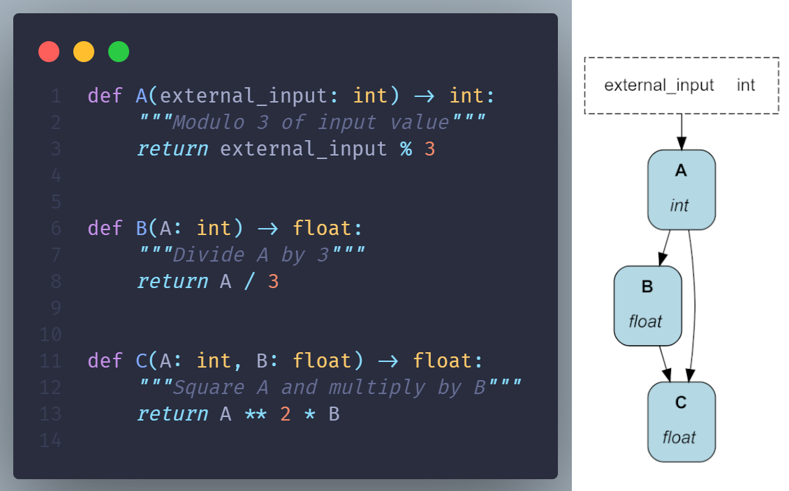
</a>
<figcaption>
<p><span>The ABC of Apache Hamilton</span></p>
</figcaption>
</figure>
<p id="why-should-you-use-apache-hamilton-incubating">Why should you use Apache Hamilton (incubating)?</p>
<p><strong>Facilitate collaboration</strong>. By focusing on functions, Apache Hamilton avoids sprawling code hierarchy and generates flat dataflows. Well-scoped functions make it easier to add features, complete code reviews, debug pipeline failures, and hand-off projects. Visualizations can be generated directly from your code to better understand and document it.
Integration with the <a href="#hamilton-ui"><span>Apache Hamilton UI</span></a> allows you to track lineage, catalog code &amp; artifacts, and monitor your dataflows.</p>
<p><strong>Reduce development time</strong>. Apache Hamilton dataflows are reusable across projects and context (e.g., pipeline vs. web service). The benefits of developing robust and well-tested solutions are multiplied by reusability. Explore community-contributed dataflows in the <a href="#ecosystem"><span>ecosystem</span></a>.</p>
<p><strong>Own your platform</strong>. Apache Hamilton helps you integrate the frameworks and tools of your stack. Apache Hamilton’s features are easy to extend and customize to your needs. This flexibility enables self-serve designs and ultimately reduces the risks of vendor lock-in.</p>
<p><strong>Scale your dataflow</strong>. Apache Hamilton separates transformation logic from execution, allowing you to seamlessly scale via remote execution (AWS, Modal, etc.) and specialized computation engines (Spark, Ray, duckdb etc.). Apache Hamilton was battle tested under intensive enterprise data workloads.</p>
<p>Here’s a quick overview of benefits that Apache Hamilton provides as compared to other tools:</p>
<div>
<table>
<thead>
<tr><th><p>Feature</p></th>
<th><p>Apache Hamilton</p></th>
<th><p>Macro orchestration systems (e.g. Airflow)</p></th>
<th><p>Feast</p></th>
<th><p>dbt</p></th>
<th><p>Dask</p></th>
</tr>
</thead>
<tbody>
<tr><td><p>Execute a graph of data transformations</p></td>
<td><p>✅</p></td>
<td><p>✅</p></td>
<td><p>❌</p></td>
<td><p>✅</p></td>
<td><p>✅</p></td>
</tr>
<tr><td><p>Can visualize lineage easily</p></td>
<td><p>✅</p></td>
<td><p>❌</p></td>
<td><p>❌</p></td>
<td><p>✅</p></td>
<td><p>✅</p></td>
</tr>
<tr><td><p>Can model GenerativeAI/LLM based workflows</p></td>
<td><p>✅</p></td>
<td><p>❌</p></td>
<td><p>❌</p></td>
<td><p>❌</p></td>
<td><p>❌</p></td>
</tr>
<tr><td><p>Is a feature store</p></td>
<td><p>❌</p></td>
<td><p>❌</p></td>
<td><p>✅</p></td>
<td><p>❌</p></td>
<td><p>❌</p></td>
</tr>
<tr><td><p>Helps you structure your code base</p></td>
<td><p>✅</p></td>
<td><p>❌</p></td>
<td><p>❌</p></td>
<td><p>✅</p></td>
<td><p>❌</p></td>
</tr>
<tr><td><p>Is just a library</p></td>
<td><p>✅</p></td>
<td><p>❌</p></td>
<td><p>❌</p></td>
<td><p>❌</p></td>
<td><p>✅</p></td>
</tr>
<tr><td><p>Runs anywhere python runs</p></td>
<td><p>✅</p></td>
<td><p>❌</p></td>
<td><p>❌</p></td>
<td><p>❌</p></td>
<td><p>✅</p></td>
</tr>
<tr><td><p>Documentation friendly</p></td>
<td><p>✅</p></td>
<td><p>❌</p></td>
<td><p>❌</p></td>
<td><p>❌</p></td>
<td><p>❌</p></td>
</tr>
<tr><td><p>Code is always unit testable</p></td>
<td><p>✅</p></td>
<td><p>❌</p></td>
<td><p>❌</p></td>
<td><p>❌</p></td>
<td><p>❌</p></td>
</tr>
</tbody>
</table>
</div>
<p id="architecture-overview">Architecture Overview</p>
<p>The following diagram gives a simplified overview of the main components of Apache Hamilton.</p>
<p>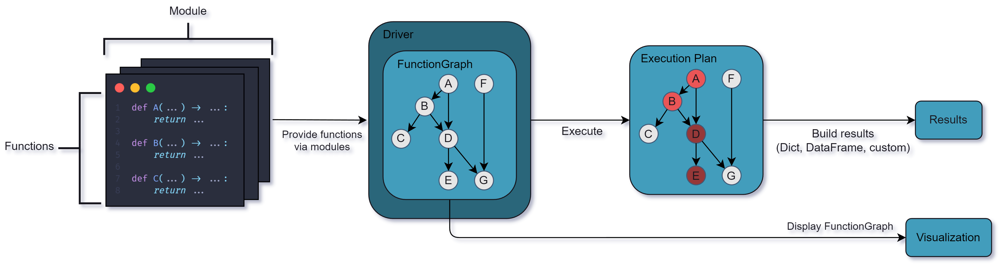</p>
<p><strong>Functions &amp; Module</strong>. Transformations are regular Python functions organized into modules. Functions must be type-annotated, but hold no dependency with Apache Hamilton and can be reused outside of it.</p>
<p><strong>Driver &amp; FunctionGraph</strong>. The <code><span>Driver</span></code> will automatically assemble the <code><span>FunctionGraph</span></code> from the modules given. The <code><span>Driver</span></code> can be configured to modify and extend the execution behavior (e.g., remote execution, monitoring, webhooks, caching).</p>
<p><strong>Visualization</strong>. The <code><span>FunctionGraph</span></code> can be visualized without executing code. This coupling ensures visualizations always match the code from modules.</p>
<p><strong>Execution</strong>. When requesting variables, the <code><span>Driver</span></code> establishes an execution plan to only compute the required functions. Then, results are gathered and returned to the user.</p>
<p id="who-is-using-apache-hamilton">Who is using Apache Hamilton?</p>
<p></p>
<p>Multiple companies are doing cool stuff with Apache Hamilton! Come chat with members of the community and the development team on <a href="https://join.slack.com/t/hamilton-opensource/shared_invite/zt-2niepkra8-DGKGf_tTYhXuJWBTXtIs4g">Slack</a>:</p>
<ul>
<li><p><strong>Wealth.com</strong> - Async Python LLM document processing pipelines</p></li>
<li><p><strong>Wren.ai</strong> - Async RAG pipelines</p></li>
<li><p><strong>Oxehealth</strong> - Multi-modal prediction</p></li>
<li><p><strong>PupPilot</strong> - Async python LLM transcript processing pipelines</p></li>
<li><p><strong>Stitch Fix</strong> — Time series forecasting</p></li>
<li><p><strong>British cycling</strong> — Telemetry analysis</p></li>
<li><p><strong>Joby</strong> - Flight data processing</p></li>
<li><p><strong>Transfix</strong> - Online featurization and prediction</p></li>
<li><p><strong>IBM</strong> - Internal search and ML pipelines</p></li>
<li><p><strong>Ascena</strong> - Feature engineering</p></li>
<li><p><strong>Adobe</strong> - Prompt engineering research</p></li>
<li><p><strong>Axiom Cloud</strong> - IoT data processing</p></li>
<li><p><strong>Oak Ridge &amp; PNNL</strong> - <a href="https://github.com/IMMM-SFA/naturf/tree/feature/nodes">Naturf project</a></p></li>
<li><p><strong>Habitat</strong> - Time-series feature engineering</p></li>
<li><p><strong>UK Government Digital Service</strong> - National feedback pipeline (processing &amp; analysis)</p></li>
<li><p><strong>Railoify</strong> - Orchestrate pandas code</p></li>
<li><p><strong>Lexis Nexis</strong> - Feature processing and lineage</p></li>
<li><p><strong>Opendoor</strong> - Manage PySpark pipelines</p></li>
<li><p><strong>KI</strong> - Feature engineering</p></li>
<li><p><strong>Kora Money</strong> - DS/ML Workflows</p></li>
<li><p><strong>Capitec Bank</strong> - Financial decisions</p></li>
<li><p><strong>Best Egg</strong> - Feature engineering</p></li>
<li><p><strong>RTV Euro AGD</strong> - General feature engineering &amp; machine learning</p></li>
</ul>
<p id="testimonials">Testimonials</p>
<link href="_static/testimonials.css" rel="stylesheet" type="text/css"/>
<div>
<div>
<div>
<p>"Apache Hamilton provides a modular and compatible framework that has significantly empowered our data science team. We've been able to build robust and flexible data pipelines with ease. The documentation is thorough and regularly updated... Even with no prior experience with the package, our team successfully migrated one of our legacy data pipelines to the Apache Hamilton structure within a month. This transition has greatly enhanced our productivity, enabling us to focus more on feature engineering and model iteration while Apache Hamilton's DAG approach seamlessly manages data lineage. I highly recommend Apache Hamilton to data professionals looking for a reliable, standardized solution for creating and managing data pipelines."</p>
<a id="index--yuan-liu"></a>

<h4>Yuan Liu</h4>
<span>DS, Kora Financial</span>
</div>
</div>
<div>
<div>
<p>"How (with good software practices) do you orchestrate a system of asynchronous LLM calls, but where some of them depend on others? How do you build such a system so that it’s modular and testable? At wealth.com we've selected Apache Hamilton to help us solve these problems and others. And today our product, Ester AI, an AI legal assistant that extracts information from estate planning documents, is running in production with Apache Hamilton under the hood."</p>
<a id="index--kyle-pounder"></a>

<h4>Kyle Pounder</h4>
<span>CTO, Wealth.com</span>
</div>
</div>
<div>
<div>
<p>"Apache Hamilton is simplicity. Its declarative approach to defining pipelines (as well as the UI to visualize them) makes testing and modifying the code easy, and onboarding is quick and painless. Since using Apache Hamilton, we have improved our efficiency of both developing new functionality and onboarding new developers to work on the code. We deliver solutions more quickly than before."</p>
<a id="index--micha-siedlaczek"></a>

<h4>Michał Siedlaczek</h4>
<span>Senior DS/SWE, IBM</span>
</div>
</div>
<div>
<div>
<p>"...The companion Apache Hamilton UI has taken the value proposition up enormously with the ability to clearly show lineage &amp; track execution times, covering a major part of our observability needs"</p>
<a id="index--fran-boon"></a>

<h4>Fran Boon</h4>
<span>Director, Oxehealth.com</span>
</div>
</div>
<div>
<div>
<p>"Many thanks to writing such a great library. We are very excited about it and very pleased with so many decisions you've made. 🙏"</p>
<a id="index--louwrens"></a>

<h4>Louwrens</h4>
<span>Software Engineer, luoautomation.com</span>
</div>
</div>
</div>
</div>
</figcaption>
</figure>

---

<a id="how-tos"></a>

<!-- source_url: https://hamilton.incubator.apache.org/how-tos/ -->

<!-- page_index: 2 -->

# User Guide ¶

[
<svg viewbox="0 0 24 24" xmlns="http://www.w3.org/2000/svg">
<path></path>
</svg>

Back to top](#how-tos)

[
<svg><use href="#svg-eye"></use></svg>

View this page](https://github.com/apache/hamilton/blob/main/docs/how-tos/index.rst?plain=true "View this page")

[
<svg><use href="#svg-pencil"></use></svg>

Edit this page](https://github.com/apache/hamilton/edit/main/docs/how-tos/index.rst "Edit this page")

<svg><use href="#svg-toc"></use></svg>

<a id="how-tos--user-guide"></a>

# User Guide

This portion of the documentation goes over the set of common examples for Apache Hamilton usage, so you can apply
it to your day-to-day work. Each one corresponds to an example in the [examples](https://github.com/apache/hamilton/tree/main/examples)
directory. If there’s an example you want but don’t see, reach out or open an issue on github – we’re always looking to add more.

- [Jupyter notebooks](#how-tos-use-in-jupyter-notebook)
  - [1 - Dynamically create modules within your notebook](#how-tos-use-in-jupyter-notebook--dynamically-create-modules-within-your-notebook)
    - [Use Hamilton Jupyter Magic](#how-tos-use-in-jupyter-notebook--use-hamilton-jupyter-magic)
      - [Importing specific functions into cell modules](#how-tos-use-in-jupyter-notebook--importing-specific-functions-into-cell-modules)
    - [Using ad\_hoc\_utils to create a temporary module (e.g. use in google colab)](#how-tos-use-in-jupyter-notebook--using-ad-hoc-utils-to-create-a-temporary-module-e-g-use-in-google-colab)
    - [Caveat with this approach:](#how-tos-use-in-jupyter-notebook--caveat-with-this-approach)
  - [2 - Importing modules into your notebook](#how-tos-use-in-jupyter-notebook--importing-modules-into-your-notebook)
    - [Step 1 — Install Jupyter & Apache Hamilton](#how-tos-use-in-jupyter-notebook--step-1-install-jupyter-apache-hamilton)
    - [Step 2— Set up the files](#how-tos-use-in-jupyter-notebook--step-2-set-up-the-files)
    - [Step 3— The basic process of iteration](#how-tos-use-in-jupyter-notebook--step-3-the-basic-process-of-iteration)
  - [Pro-tip: You can use ipython magic to autoreload code](#how-tos-use-in-jupyter-notebook--pro-tip-you-can-use-ipython-magic-to-autoreload-code)
  - [Pro-tip: You can import functions directly](#how-tos-use-in-jupyter-notebook--pro-tip-you-can-import-functions-directly)
- [Loading data](#how-tos-load-data)
- [Caching](#how-tos-caching-tutorial)
  - [Basics](#how-tos-caching-tutorial--basics)
    - [Understanding the `cache_key`](#how-tos-caching-tutorial--understanding-the-cache-key)
  - [Adding a node](#how-tos-caching-tutorial--adding-a-node)
  - [Changing inputs](#how-tos-caching-tutorial--changing-inputs)
  - [Changing code](#how-tos-caching-tutorial--changing-code)
  - [Changing external data](#how-tos-caching-tutorial--changing-external-data)
    - [Idempotency](#how-tos-caching-tutorial--idempotency)
    - [`.with_cache()` to specify caching behavior](#how-tos-caching-tutorial--with-cache-to-specify-caching-behavior)
    - [`@cache` to specify caching behavior](#how-tos-caching-tutorial--cache-to-specify-caching-behavior)
    - [When to use `@cache` vs. `.with_cache()`?](#how-tos-caching-tutorial--when-to-use-cache-vs-with-cache)
  - [Force recompute all](#how-tos-caching-tutorial--force-recompute-all)
  - [Setting default behavior](#how-tos-caching-tutorial--setting-default-behavior)
  - [Materializers](#how-tos-caching-tutorial--materializers)
    - [Usage patterns](#how-tos-caching-tutorial--usage-patterns)
  - [Changing the cache format](#how-tos-caching-tutorial--changing-the-cache-format)
  - [Introspecting the cache](#how-tos-caching-tutorial--introspecting-the-cache)
    - [Interactively explore runs](#how-tos-caching-tutorial--interactively-explore-runs)
  - [Managing storage](#how-tos-caching-tutorial--managing-storage)
    - [Setting the cache `path`](#how-tos-caching-tutorial--setting-the-cache-path)
    - [Instantiating the `result_store` and `metadata_store`](#how-tos-caching-tutorial--instantiating-the-result-store-and-metadata-store)
    - [Deleting data and recovering storage](#how-tos-caching-tutorial--deleting-data-and-recovering-storage)
  - [Usage patterns](#how-tos-caching-tutorial--id1)
  - [🚧 INTERNALS](#how-tos-caching-tutorial--internals)
    - [Manually retrieve results](#how-tos-caching-tutorial--manually-retrieve-results)
    - [Decoding the `cache_key`](#how-tos-caching-tutorial--decoding-the-cache-key)
    - [Manually retrieve metadata](#how-tos-caching-tutorial--manually-retrieve-metadata)
- [Feature engineering](#how-tos-use-for-feature-engineering)
  - [Offline Feature Engineering](#how-tos-use-for-feature-engineering--offline-feature-engineering)
    - [Apache Hamilton Example](#how-tos-use-for-feature-engineering--apache-hamilton-example)
  - [Streaming Feature Engineering](#how-tos-use-for-feature-engineering--streaming-feature-engineering)
    - [Apache Hamilton Example](#how-tos-use-for-feature-engineering--id1)
  - [Online Feature Engineering](#how-tos-use-for-feature-engineering--online-feature-engineering)
    - [Apache Hamilton Example](#how-tos-use-for-feature-engineering--id2)
  - [Write once, run anywhere blog post:](#how-tos-use-for-feature-engineering--write-once-run-anywhere-blog-post)
  - [Best Egg Platform Blog Post:](#how-tos-use-for-feature-engineering--best-egg-platform-blog-post)
  - [FAQ](#how-tos-use-for-feature-engineering--faq)
    - [Q. Can I use Apache Hamilton for feature engineering with Feast?](#how-tos-use-for-feature-engineering--q-can-i-use-apache-hamilton-for-feature-engineering-with-feast)
- [Reusing functions and nodes](#how-tos-reuse-nodes)
  - [1. Reuse a function module across multiple Drivers](#how-tos-reuse-nodes--reuse-a-function-module-across-multiple-drivers)
  - [2. Override a module to swap same-named functions](#how-tos-reuse-nodes--override-a-module-to-swap-same-named-functions)
  - [3. `@subdag` – repeat the same transform inside one Driver](#how-tos-reuse-nodes--subdag-repeat-the-same-transform-inside-one-driver)
  - [4. `@parameterized_subdag` – many subdags at once (advanced)](#how-tos-reuse-nodes--parameterized-subdag-many-subdags-at-once-advanced)
  - [Choosing between the four patterns](#how-tos-reuse-nodes--choosing-between-the-four-patterns)
  - [Where to go from here](#how-tos-reuse-nodes--where-to-go-from-here)
- [Model training](#how-tos-ml-training)
- [LLM workflows](#how-tos-llm-workflows)
- [Data quality](#how-tos-run-data-quality-checks)
  - [Async validators](#how-tos-run-data-quality-checks--async-validators)
- [Testing Apache Hamilton code](#how-tos-test-hamilton-code)
  - [Prerequisites](#how-tos-test-hamilton-code--prerequisites)
  - [1. Unit-testing plain functions](#how-tos-test-hamilton-code--unit-testing-plain-functions)
    - [Notes](#how-tos-test-hamilton-code--notes)
  - [2. Unit-testing decorated functions](#how-tos-test-hamilton-code--unit-testing-decorated-functions)
  - [3. Integration-testing the DAG](#how-tos-test-hamilton-code--integration-testing-the-dag)
  - [4. In-memory modules for self-contained tests](#how-tos-test-hamilton-code--in-memory-modules-for-self-contained-tests)
  - [Where to go from here](#how-tos-test-hamilton-code--where-to-go-from-here)
- [Lineage + Apache Hamilton](#how-tos-use-hamilton-for-lineage)
  - [Common Problems (and therefore questions)](#how-tos-use-hamilton-for-lineage--common-problems-and-therefore-questions)
  - [What is “Lineage”?](#how-tos-use-hamilton-for-lineage--what-is-lineage)
  - [Apache Hamilton’s Lineage Capabilities](#how-tos-use-hamilton-for-lineage--apache-hamilton-s-lineage-capabilities)
    - [Lineage as Code](#how-tos-use-hamilton-for-lineage--lineage-as-code)
    - [Reproducibility](#how-tos-use-hamilton-for-lineage--reproducibility)
    - [Auditing and Compliance](#how-tos-use-hamilton-for-lineage--auditing-and-compliance)
    - [Troubleshooting and Debugging](#how-tos-use-hamilton-for-lineage--troubleshooting-and-debugging)
    - [Collaboration](#how-tos-use-hamilton-for-lineage--collaboration)
  - [Recipe for using Apache Hamilton’s Lineage Capabilities](#how-tos-use-hamilton-for-lineage--recipe-for-using-apache-hamilton-s-lineage-capabilities)
  - [A script you could write to ask questions of your DAGs](#how-tos-use-hamilton-for-lineage--a-script-you-could-write-to-ask-questions-of-your-dags)
- [Scaling computation](#how-tos-scale-up)
- [Microservice](#how-tos-microservice)
- [Extension autoloading](#how-tos-extensions-autoloading)
  - [Autoloading behavior](#how-tos-extensions-autoloading--autoloading-behavior)
  - [Disable autoloading](#how-tos-extensions-autoloading--disable-autoloading)
    - [1. Programmatically](#how-tos-extensions-autoloading--programmatically)
    - [2. Environment variables](#how-tos-extensions-autoloading--environment-variables)
    - [3. Configuration file](#how-tos-extensions-autoloading--configuration-file)
  - [Manually loading extensions](#how-tos-extensions-autoloading--manually-loading-extensions)
    - [1. Importing the extension](#how-tos-extensions-autoloading--importing-the-extension)
    - [2. Registering the extension](#how-tos-extensions-autoloading--registering-the-extension)
- [Wrapping the Driver](#how-tos-wrapping-driver)
- [Command line interface](#how-tos-cli-reference)
  - [Installation](#how-tos-cli-reference--installation)
  - [`hamilton` (global)](#how-tos-cli-reference--hamilton-global)
  - [`hamilton build`](#how-tos-cli-reference--hamilton-build)
  - [`hamilton diff`](#how-tos-cli-reference--hamilton-diff)
  - [`hamilton version`](#how-tos-cli-reference--hamilton-version)
  - [`hamilton view`](#how-tos-cli-reference--hamilton-view)
- [pre-commit hooks](#how-tos-pre-commit-hooks)
  - [Use pre-commit hooks for safer Apache Hamilton code changes](#how-tos-pre-commit-hooks--use-pre-commit-hooks-for-safer-apache-hamilton-code-changes)
  - [What are pre-commit hooks?](#how-tos-pre-commit-hooks--what-are-pre-commit-hooks)
  - [Add pre-commit hooks to your project](#how-tos-pre-commit-hooks--add-pre-commit-hooks-to-your-project)
    - [Steps to get started](#how-tos-pre-commit-hooks--steps-to-get-started)
  - [Custom Apache Hamilton pre-commit hooks](#how-tos-pre-commit-hooks--custom-apache-hamilton-pre-commit-hooks)
    - [Checking dataflow definition](#how-tos-pre-commit-hooks--checking-dataflow-definition)
    - [Checking dataflow paths](#how-tos-pre-commit-hooks--checking-dataflow-paths)
  - [Add Apache Hamilton pre-commit to your project](#how-tos-pre-commit-hooks--add-apache-hamilton-pre-commit-to-your-project)

---

<a id="get-started"></a>

<!-- source_url: https://hamilton.incubator.apache.org/get-started/ -->

<!-- page_index: 3 -->

# Get Started ¶

[
<svg viewbox="0 0 24 24" xmlns="http://www.w3.org/2000/svg">
<path></path>
</svg>

Back to top](#get-started)

[
<svg><use href="#svg-eye"></use></svg>

View this page](https://github.com/apache/hamilton/blob/main/docs/get-started/index.rst?plain=true "View this page")

[
<svg><use href="#svg-pencil"></use></svg>

Edit this page](https://github.com/apache/hamilton/edit/main/docs/get-started/index.rst "Edit this page")

<svg><use href="#svg-toc"></use></svg>

<a id="get-started--get-started"></a>

# Get Started

Welcome to Apache Hamilton’s documentation!

<a id="get-started--www.tryhamilton.dev"></a>

## www.tryhamilton.dev

Before diving in, we highly recommend you try Apache Hamilton in your browser at <https://www.tryhamilton.dev>.
It allows you to:

> 1. run python in the browser, so you can get a feel for the basics of Apache Hamilton *without installing anything!*
> 2. it includes various examples that you can run and modify.
>
> 3. it represents an easy hands-on introduction to Apache Hamilton that should get you comfortable with the framework and its basic capabilities.

<a id="get-started--get-started-with-apache-hamilton-locally"></a>

## Get started with Apache Hamilton locally

The following section of the docs will teach you how to install Apache Hamilton and get started with your own project.

- [Why use Apache Hamilton?](#get-started-why-hamilton)
  - [Comparison to Other Frameworks](#get-started-why-hamilton--comparison-to-other-frameworks)
    - [Orchestration Systems](#get-started-why-hamilton--orchestration-systems)
    - [Feature Stores](#get-started-why-hamilton--feature-stores)
    - [Data Science Ecosystems/ML platforms](#get-started-why-hamilton--data-science-ecosystems-ml-platforms)
    - [Registries / Experiment Tracking](#get-started-why-hamilton--registries-experiment-tracking)
    - [Python Dataframe/manipulation Libraries](#get-started-why-hamilton--python-dataframe-manipulation-libraries)
    - [Python “big data” systems](#get-started-why-hamilton--python-big-data-systems)
- [Install](#get-started-install)
  - [Installing with pip](#get-started-install--installing-with-pip)
  - [Installing with conda](#get-started-install--installing-with-conda)
  - [Installing from source](#get-started-install--installing-from-source)
- [Your First Dataflow](#get-started-your-first-dataflow)
  - [Write transformation functions](#get-started-your-first-dataflow--write-transformation-functions)
  - [Run your dataflow](#get-started-your-first-dataflow--run-your-dataflow)
- [Learning Resources](#get-started-learning-resources)
  - [📒 User Guide Documentation](#get-started-learning-resources--user-guide-documentation)
  - [📚 Reference Documentation](#get-started-learning-resources--reference-documentation)
  - [🌐 Ecosystem & Integrations](#get-started-learning-resources--ecosystem-integrations)
  - [✍ tryhamilton.dev](#get-started-learning-resources--tryhamilton-dev)
  - [👋 Slack](#get-started-learning-resources--slack)
  - [📣 Talks & Videos](#get-started-learning-resources--talks-videos)
  - [📰 External Blogs](#get-started-learning-resources--external-blogs)
  - [🎙 Podcasts](#get-started-learning-resources--podcasts)
- [Contributing](#get-started-contributing)
- [License](#get-started-license)

On this page

- [Get Started](#get-started)
  - [www.tryhamilton.dev](#get-started--www-tryhamilton-dev)
  - [Get started with Apache Hamilton locally](#get-started--get-started-with-apache-hamilton-locally)

---

<a id="get-started-why-hamilton"></a>

<!-- source_url: https://hamilton.incubator.apache.org/get-started/why-hamilton/ -->

<!-- page_index: 4 -->

# Why use Apache Hamilton? ¶

[
<svg viewbox="0 0 24 24" xmlns="http://www.w3.org/2000/svg">
<path></path>
</svg>

Back to top](#get-started-why-hamilton)

[
<svg><use href="#svg-eye"></use></svg>

View this page](https://github.com/apache/hamilton/blob/main/docs/get-started/why-hamilton.md?plain=true "View this page")

[
<svg><use href="#svg-pencil"></use></svg>

Edit this page](https://github.com/apache/hamilton/edit/main/docs/get-started/why-hamilton.md "Edit this page")

<svg><use href="#svg-toc"></use></svg>

<a id="get-started-why-hamilton--why-use-apache-hamilton"></a>

# Why use Apache Hamilton?

There are many choices for building dataflows/pipelines/workflows/ETLs.
Let’s compare Apache Hamilton to some of the other options to help answer this question.

<a id="get-started-why-hamilton--comparison-to-other-frameworks"></a>

## Comparison to Other Frameworks

There are a lot of frameworks out there, especially in the pipeline space. This section should help you figure out when to
use Apache Hamilton with another framework, or in place of a framework, or when to use another framework altogether.

Let’s go over some groups of “competitive” or “complimentary” products. For a basic overview, see the product matrix on the [homepage](#index).

<a id="get-started-why-hamilton--orchestration-systems"></a>

### Orchestration Systems

Examples include:

- [Airflow](https://airflow.apache.org/)
- [Metaflow](https://github.com/Netflix/metaflow)
- [Luigi](https://github.com/spotify/luigi)
- [dbt](https://www.getdbt.com/)

Apache Hamilton is not, in itself a macro, i.e. high level, task orchestration system. While it does orchestrate functions, and the DAG abstraction is very powerful, it does not provision compute, or schedule long-running jobs. Apache Hamilton works well in conjunction with these macro systems.
Apache Hamilton provides the capabilities of fine-grained lineage, highly readable code, and self-documenting pipelines, which many of these systems lack.

Apache Hamilton can be used within any python orchestration system in the following ways:

1. *Hamilton DAGs can be called within orchestration system tasks.*
   See the [Apache Hamilton + Airflow example](https://blog.dagworks.io/p/supercharge-your-airflow-dag-with). The integration is generally trivial – all you have to do
   is call out to the hamilton library within your task. If your orchestrator supports python, then you’re good to go. Some pseudocode (if your orchestrator handles scripts like airflow):


```
#my_task.py import
hamilton import
my_transformations dr =hamilton.driver.Driver ({},my_functions) output =dr.execute (['final_var' ],inputs =...) do_something_with (output)
```

2. *Hamilton DAGs can be broken up to run as components within an orchestration system.*
   With the ability to include [overrides](#concepts-driver),
   you can run the DAG on each task, overloading the outputs of the last task + any static inputs/configuration, and pass it into the next task. This is more
   of a manual/power-user feature. Some pseudocode:


```
#my_task.py import
hamilton import
my_functions prior_inputs =load_relevant_task_results () desired_outputs =['final_var_1','final_var_2'] inputs =my_inputs dr =hamilton.driver.Driver ({},my_functions) output =dr.execute (desired_outputs,inputs =inputs,overrides =prior_inputs) save_for_later (output)
```

<a id="get-started-why-hamilton--feature-stores"></a>

### Feature Stores

Examples include:

- [Hopsworks](https://www.hopsworks.ai/)
- [Feast](https://feast.dev/)
- [Tecton](https://tecton.ai/)

One can think of Apache Hamilton as a being your “feature definition store”, where “store” is code + git. While it does
not provide all the capabilities of a standard feature store, it provides a source of truth for the code that
generated the features, and can be run in a portable method. *So*, if your desire is just to be able to run the same
code in different environments, and have an online/offline store of features, you can use hamilton both to save the
features offline, and generate features online on the fly.

See the [feature engineering example](#how-tos-use-for-feature-engineering) for more possibilities, as
well as [blogs on the feature topic](https://blog.dagworks.io/?sort=search&amp;search=features).

Note that in small cases, you probably don’t need a true feature store – recomputing derived features in an ETL
and online can be very efficient, as long as you have some database to look values up (or have them passed in).

Also note that joins and aggregations can get tricky. We often recommend using our “polymorphic function
definition” i.e. functions decorated with `@config.when`, to either load up the non-online-friendly features
from a feature store or do an external lookup to simulate an online join.

We expect Apache Hamilton to play a prominent role in the way feature stores work in the future.

<a id="get-started-why-hamilton--data-science-ecosystems-ml-platforms"></a>

### Data Science Ecosystems/ML platforms

Examples include:

- [Kedro](https://kedro.org/)
- [Domino Data Labs](https://www.dominodatalab.com/)
- [Dataiku](https://www.dataiku.com/)
- [SageMaker](https://aws.amazon.com/sagemaker/)
- [Google Cloud Vertex AI Platform](https://cloud.google.com/vertex-ai)
- etc.

We’ve kind of grouped a whole suite of platforms into the same bucket here. These
tend to have a lot of capabilities all related to ML. Apache Hamilton can be used in conjunction with these
platforms in a variety of ways. For example, you can use Apache Hamilton to generate features for a model
that you train in one of these platforms. Or you can use Apache Hamilton to generate a model using the
platform’s compute, and then save the model to the platform’s registry.

<a id="get-started-why-hamilton--registries-experiment-tracking"></a>

### Registries / Experiment Tracking

Examples include:

- [MLflow](https://mlflow.org/)
- [Weights and Biases](https://wandb.ai/site)
- [DVC](https://dvc.org/)

Most pipelines have a “reverse ETL problem” – they need to get the results of the pipeline into a some
sort of datastore or registry. Apache Hamilton can be used in conjunction with these tools as the glue code
that helps everything work together. For example, you can use Apache Hamilton to generate a model
and then store metrics computed by Apache Hamilton to one of these “destinations”.

There are three main ways to integrate with these tools:

- inside a function that Apache Hamilton orchestrates
- outside Apache Hamilton (e.g. in a script that calls Apache Hamilton)
- using “materializers” (see [materializers](#reference-io)) (see [this blog](https://blog.dagworks.io/p/separate-data-io-from-transformation)).

See this [ML reference post](https://blog.dagworks.io/p/from-dev-to-prod-a-ml-pipeline-reference) for examples of how to use Apache Hamilton with these tools.

<a id="get-started-why-hamilton--python-dataframe-manipulation-libraries"></a>

### Python Dataframe/manipulation Libraries

Examples include:

- [pandas](https://pandas.pydata.org/)
- [dask](https://www.dask.org/)
- [modin](https://github.com/modin-project/modin)
- [polars](https://www.pola.rs/)
- [duckdb](https://duckdb.org/)

Apache Hamilton works with any python dataframe/manipulation oriented libraries.
See our [examples folder](https://github.com/apache/hamilton/tree/main/examples)
to see how to use Apache Hamilton with these libraries.

<a id="get-started-why-hamilton--python-big-data-systems"></a>

### Python “big data” systems

The following systems are ones that you would resort to using when wanting to scale up your data processing.

Examples include:

- [dask](https://www.dask.org/)
- [ray](https://ray.io/)
- [pyspark](https://spark.apache.org/docs/latest/api/python/)
- [pandas-on-spark](https://spark.apache.org/docs/latest/api/python/user_guide/pandas_on_spark/index.html)

These all provide capabilities to either (a) express and execute computation over datasets in python or (b)
parallelize it. Often both. Apache Hamilton has a variety of integrations with these systems. The basics is that Apache Hamilton
can make use of these systems to execute the DAG using the [GraphAdapter](#reference-graph-adapters) abstraction and [Lifecycle Hooks](#reference-lifecycle-hooks).

See our [examples folder](https://github.com/apache/hamilton/tree/main/examples)
to see how to use Apache Hamilton with these systems.

On this page

- [Why use Apache Hamilton?](#get-started-why-hamilton)
  - [Comparison to Other Frameworks](#get-started-why-hamilton--comparison-to-other-frameworks)
    - [Orchestration Systems](#get-started-why-hamilton--orchestration-systems)
    - [Feature Stores](#get-started-why-hamilton--feature-stores)
    - [Data Science Ecosystems/ML platforms](#get-started-why-hamilton--data-science-ecosystems-ml-platforms)
    - [Registries / Experiment Tracking](#get-started-why-hamilton--registries-experiment-tracking)
    - [Python Dataframe/manipulation Libraries](#get-started-why-hamilton--python-dataframe-manipulation-libraries)
    - [Python “big data” systems](#get-started-why-hamilton--python-big-data-systems)

---

<a id="get-started-install"></a>

<!-- source_url: https://hamilton.incubator.apache.org/get-started/install/ -->

<!-- page_index: 5 -->

# Install ¶

[
<svg viewbox="0 0 24 24" xmlns="http://www.w3.org/2000/svg">
<path></path>
</svg>

Back to top](#get-started-install)

[
<svg><use href="#svg-eye"></use></svg>

View this page](https://github.com/apache/hamilton/blob/main/docs/get-started/install.md?plain=true "View this page")

[
<svg><use href="#svg-pencil"></use></svg>

Edit this page](https://github.com/apache/hamilton/edit/main/docs/get-started/install.md "Edit this page")

<svg><use href="#svg-toc"></use></svg>

Installing hamilton is easy!

<a id="get-started-install--install"></a>

# Install

Apache Hamilton is a lightweight framework with a variety of extensions/plugins. To get started, you’ll need the following:

- `python >= 3.10`
- `pip`

For help with python/pip/managing virtual environments see the [python docs](https://docs.python.org/3/tutorial/venv.html/).

<a id="get-started-install--installing-with-pip"></a>

## Installing with pip

Apache Hamilton is published on [pypi](https://pypi.org/project/sf-hamilton/) under `sf-hamilton`. To install, run:

`pip install sf-hamilton`

To use the DAG visualization functionality, instead install with

`pip install sf-hamilton[visualization]`

*Note: for visualization you may additionally need to install graphviz externally – see*
[graphviz](https://graphviz.org/download/) *for instructions on the correct way for your
operating system.*

<a id="get-started-install--installing-with-conda"></a>

## Installing with conda

Apache Hamilton is also available on conda if you prefer:

`conda install -c hamilton-opensource sf-hamilton`

<a id="get-started-install--installing-from-source"></a>

## Installing from source

You can also download the code and run it from the source.

```
git clone https://github.com/apache/hamilton.git
cd hamilton
pip install -e .
```

On this page

- [Install](#get-started-install)
  - [Installing with pip](#get-started-install--installing-with-pip)
  - [Installing with conda](#get-started-install--installing-with-conda)
  - [Installing from source](#get-started-install--installing-from-source)

---

<a id="get-started-your-first-dataflow"></a>

<!-- source_url: https://hamilton.incubator.apache.org/get-started/your-first-dataflow/ -->

<!-- page_index: 6 -->

# Your First Dataflow ¶

> [!NOTE]
> [Back to top](#get-started-your-first-dataflow)
>
> [View this page](https://github.com/apache/hamilton/blob/main/docs/get-started/your-first-dataflow.rst?plain=true "View this page")
>
> [Edit this page](https://github.com/apache/hamilton/edit/main/docs/get-started/your-first-dataflow.rst "Edit this page")
>
> <a id="get-started-your-first-dataflow--your-first-dataflow"></a>

>
> # Your First Dataflow
>
> Let’s get started with a dataflow that computes statistics on a time-series of marketing spend.
>
> We’re jumping in head-first. If you want to start with an overview, skip ahead to
> [Concepts](#concepts).
>
> > [!NOTE]
> > You can follow along in the [examples directory](https://github.com/apache/hamilton/tree/main/examples/hello_world)
> > of the [hamilton repo](https://github.com/apache/hamilton/). We highly recommend forking the repo and playing
> > around with the code to get comfortable.
>
> <a id="get-started-your-first-dataflow--write-transformation-functions"></a>

>
> ## Write transformation functions
>
> Create a file `my_functions.py` and add the following two functions:
>
> ```
> import
> pandas
> as
> pd def
> avg_3wk_spend (spend:pd.Series) -> pd.Series:
> """Rolling 3 week average spend.""" return spend.rolling (3).mean () def
> acquisition_cost (avg_3wk_spend:pd.Series,signups:pd.Series) -> pd.Series:
> """The cost per signup in relation to a rolling average of spend.""" return avg_3wk_spend / signups
> ```
>
> An astute observer might ask the following questions:
>
> 1. **Why do the parameter names clash with the function names?** This is core to how hamilton works. It utilizes dependency injection to create a DAG of computation. Parameter names tell the framework where your function gets its data.
> 2. **OK, if the parameter names determine the source of the data, why have we not defined defined `spend` or `signups` as functions?** This is OK, as we will provide this data as an input when we actually want to materialize our functions. The DAG doesn’t have to be complete when it is compiled.
> 3. **Why is there no main line to call these functions?** Good observation. In fact, we never will call them (directly)! This is one of the core principles of Apache Hamilton. You write individual transforms and the rest is handled by the framework. More on that next.
> 4. **The functions all output pandas series. What if I don’t want to use series?** You don’t have to! Apache Hamilton is not opinionated on the data type you use. The following are all perfectly valid as well (and we support dask/spark/ray/other distributed frameworks).
>
> Let’s add a few more functions to our `my_functions.py` file:
>
> ```
> def
> spend_mean (spend:pd.Series) -> float:
> """Shows function creating a scalar. In this case it computes the mean of the entire column.""" return spend.mean () def
> spend_zero_mean (spend:pd.Series,spend_mean:float) -> pd.Series:
> """Shows function that takes a scalar. In this case to zero mean spend.""" return spend - spend_mean def
> spend_std_dev (spend:pd.Series) -> float:
> """Function that computes the standard deviation of the spend column.""" return spend.std () def
> spend_zero_mean_unit_variance (spend_zero_mean:pd.Series,spend_std_dev:float) -> pd.Series:
> """Function showing one way to make spend have zero mean and unit variance.""" return spend_zero_mean / spend_std_dev
> ```
>
> Let’s give these functions a spin!
>
> <a id="get-started-your-first-dataflow--run-your-dataflow"></a>

>
> ## Run your dataflow
>
> To actually run the dataflow, we’ll need to write [a driver](#concepts-driver). Create a`my_script.py` with the following contents:
>
> ```
> import
> logging import
> sys import
> pandas
> as
> pd # We add this to speed up running things if you have a lot in your python environment.from
> hamilton
> import registry;
> registry.disable_autoload () from
> hamilton
> import driver,base import
> my_functions # we import the module here! logger =logging.getLogger (__name__) logging.basicConfig (stream =sys.stdout) if __name__ =='__main__':# Instantiate a common spine for your pipeline index =pd.date_range ("2022-01-01",periods =6,freq ="w") initial_columns ={# load from actuals or wherever -- this is our initial data we use as input.# Note: these do not have to be all series, they could be scalar inputs.'signups':pd.Series ([1,10,50,100,200,400 ],index =index ),'spend':pd.Series ([10,10,20,40,40,50 ],index =index ),} dr =(driver.Builder ().with_config ({}) # we don't have any configuration or invariant data for this example..with_modules (my_functions) # we need to tell hamilton where to load function definitions from.with_adapters (base.PandasDataFrameResult ()) # we want a pandas dataframe as output.build ()) # we need to specify what we want in the final dataframe (these could be function pointers).output_columns =['spend','signups','avg_3wk_spend','acquisition_cost',] # let's create the dataframe! df =dr.execute (output_columns,inputs =initial_columns) # `pip install sf-hamilton[visualization]` earlier you can also do # dr.visualize_execution(output_columns,'./my_dag.png', {}) print (df)
> ```
>
> Run the script with the following command:
>
> `python my_script.py`
>
> And you should see the following output:
>
> ```
>             spend  signups  avg_3wk_spend  acquisition_cost
> 2022-01-02     10        1            NaN            10.000
> 2022-01-09     10       10            NaN             1.000
> 2022-01-16     20       50      13.333333             0.400
> 2022-01-23     40      100      23.333333             0.400
> 2022-01-30     40      200      33.333333             0.200
> 2022-02-06     50      400      43.333333             0.125
> ```
>
> Not only is your spend to signup ratio decreasing exponentially (your product is going viral!), but you’ve also
> successfully run your first Apache Hamilton Dataflow. Kudos!
>
> See, wasn’t that quick and easy?
>
> Note: if you’re ever like “why are things taking a while to execute?”, then you might have too much
> in your python environment and Apache Hamilton is auto-loading all the extensions. You can disable this by
> setting the environment variable `HAMILTON_AUTOLOAD_EXTENSIONS=0` or programmatically via
> `from hamilton import registry; registry.disable_autoload()` - for more see [Extension autoloading](#how-tos-extensions-autoloading).
>
> On this page
>
> - [Your First Dataflow](#get-started-your-first-dataflow)
>   - [Write transformation functions](#get-started-your-first-dataflow--write-transformation-functions)
>   - [Run your dataflow](#get-started-your-first-dataflow--run-your-dataflow)

---

<a id="get-started-learning-resources"></a>

<!-- source_url: https://hamilton.incubator.apache.org/get-started/learning-resources/ -->

<!-- page_index: 7 -->

# Learning Resources ¶

[
<svg viewbox="0 0 24 24" xmlns="http://www.w3.org/2000/svg">
<path></path>
</svg>

Back to top](#get-started-learning-resources)

[
<svg><use href="#svg-eye"></use></svg>

View this page](https://github.com/apache/hamilton/blob/main/docs/get-started/learning-resources.md?plain=true "View this page")

[
<svg><use href="#svg-pencil"></use></svg>

Edit this page](https://github.com/apache/hamilton/edit/main/docs/get-started/learning-resources.md "Edit this page")

<svg><use href="#svg-toc"></use></svg>

<a id="get-started-learning-resources--learning-resources"></a>

# Learning Resources

Several channels are available to get started with Apache Hamilton, learn advanced usage, and participate in the latest feature development.

<a id="get-started-learning-resources--user-guide-documentation"></a>

## 📒 User Guide Documentation

The [user guide](#concepts) gives a complete overview of Apache Hamilton’s features.

<a id="get-started-learning-resources--reference-documentation"></a>

## 📚 Reference Documentation

The [reference documentation](#reference-dataflows) details Apache Hamilton’s public API.

<a id="get-started-learning-resources--ecosystem-integrations"></a>

## 🌐 Ecosystem & Integrations

The [ecosystem page](#ecosystem) lists all built-in integrations (pandas, Polars, Spark, etc.) and external community resources. Find reusable dataflows, blog posts, and video tutorials there.

<a id="get-started-learning-resources--tryhamilton.dev"></a>

## ✍ tryhamilton.dev

The [tryhamilton.dev](https://tryhamilton.dev) website provides interactive tutorials in-browser to learn specific Apache Hamilton concepts.

<a id="get-started-learning-resources--slack"></a>

## 👋 Slack

The [Slack channel](https://join.slack.com/t/hamilton-opensource/shared_invite/zt-2niepkra8-DGKGf_tTYhXuJWBTXtIs4g) is the ideal place to ask questions, request features, and give feedback.

<a id="get-started-learning-resources--talks-videos"></a>

## 📣 Talks & Videos

See the [ecosystem page](#ecosystem) for links to video content and conference talks.

- 2024-02 Apache Hamilton Meet-up for February

  - [Recording](https://www.youtube.com/watch?v=ks672Lm0CJo.)
  - [Slides](https://github.com/skrawcz/talks/files/14351139/Apache Hamilton.February.2024.Meetup.pdf)
- 2023-12 Why you should build your GenAI/LLM apps using Apache Hamilton. [AICamp End of Year in SF](https://www.aicamp.ai/event/eventdetails/W2023121217)

  - [Recording](https://youtu.be/IwWixrjhkZU?si=DVa72Zr4iD-hibS5&amp;t=7602)
  - [Slides](https://github.com/skrawcz/talks/files/13666470/Why.you.should.build.your.GenAI\_LLM.apps.using.Apache Hamilton.pdf)
- 2023-12 Bridging Classic ML Pipelines with the World of LLMs. [PyData Global](https://global2023.pydata.org/cfp/talk/3REDA9/)

  - [Slides](https://github.com/skrawcz/talks/files/13666479/Bridging.Classic.ML.Pipelines.with.the.World.of.LLMs.1.pdf)
- 2023-11 Apache Hamilton: Natively bringing software engineering best practices to python data transformations. [Scale by the Bay](https://www.scale.bythebay.io/).

  - [Recording](https://www.youtube.com/watch?v=gK4-6X0h7PU)
  - [Slides](https://github.com/skrawcz/talks/files/13969784/Scale.By.The.Bay.-.Hamilton_.Natively.bringing.SWE.best.practices.to.python.data.transformations.pdf)
- 2023-09 Apache Hamilton: Natively bringing software engineering best practices to python data transformations. [Bay Area Python Interest Group (BAYPIGgies)](https://www.meetup.com/baypiggies/events/296283989/)

  - [Slides](https://github.com/skrawcz/talks/files/12785978/BayPIGgies\_.Apache Hamilton.Talk.pdf)
- 2023-08 dbt + Apache Hamilton: Enabling you to maintain complex Python within dbt models. [MDSFest’23](https://www.mdsfest.com/)

  - [Recording](https://www.youtube.com/watch?v=ZM-kM8DqlaQ&amp;list=PLdVpUmZrh0QpDi07ENp3FD5aTFuTTtWnP)
  - [Slides](https://github.com/skrawcz/talks/files/12431755/dbt.%2B.Hamilton_.Enabling.you.to.maintain.complex.python.within.dbt.models.pdf)
- 2023-06 Apache Hamilton: an OS tool to add to your LLM App toolbelt. LLM Avalanche.

  - [Slides](https://github.com/skrawcz/talks/files/11899349/Hamilton_.an.OS.tool.to.add.to.your.LLM.App.toolbelt.pdf)
- 2023-06 Feature Engineering with Apache Hamilton: Portability & Lineage. [Budapest ML Forum June 2023](https://budapestml.hu/2023/en/)

  - [Slides](https://github.com/skrawcz/talks/files/11690901/Stefan_Krawczyk_BudapestTalkJune2023_FeatureEngineeringwith.Hamilton_Portability.Lineage.pdf)
- 2023-06 British Cycling Data Platform in Python. Manchester PyData Meetup

  - [Slides](https://github.com/skrawcz/talks/files/11899331/PyData.British.Cycling.7.June.2023.pdf)
  - Co-presented with Peter Robinson, and Murray Tait.
- 2023-04 Lightweight Lineage with Apache Hamilton. PyData Seattle

  - [Slides](https://github.com/skrawcz/talks/files/11399972/PyData-Seattl-Lightning-Talk-2023-Lighweight-Lineage-with-Apache Hamilton.pdf)
- 2023-01 Apache Hamilton: Natively bringing software engineering best practices to python data transformations. AI Camp Meetup San Jose

  - [Slides](https://github.com/skrawcz/talks/files/10830349/Hamilton_.Natively.bringing.software.engineering.best.practices.to.python.data.transformations.-.January.2023.pdf)
- 2022-10 Apache Hamilton: an open source, declarative, micro-framework for clean & robust feature transform code in Python. Feature Store Summit

  - [Event](https://www.featurestoresummit.com/)
  - [Slides](https://github.com/skrawcz/talks/files/9759661/FS.Summit.2022.-.Apache Hamilton.pdf)
- 2022-09 Apache Hamilton: enabling software engineering best practices for data transformations via generalized dataflow graphs. DEco - First International Workshop on Data Ecosystems

  - [Event](https://dbis.rwth-aachen.de/DEco22/)
  - [Slides](https://github.com/skrawcz/talks/files/9550914/Submitted.-.DEco.2022_.Hamilton_.enabling.software.engineering.best.practices.for.data.transformations.via.generalized.dataflow.graphs.1.pdf)
- 2022-09 Apache Hamilton: a modular open source declarative paradigm for high level modeling of dataflows. CDMS - First International Workshop on Composable Data Management Systems

  - [Event](https://cdmsworkshop.github.io/2022/)
  - [Slides](https://github.com/skrawcz/talks/files/9550939/CDMS.2022.-.Hamilton_.a.modular.open.source.declarative.paradigm.for.high.level.modeling.of.dataflows.1.pdf)
  - [Paper](https://cdmsworkshop.github.io/2022/Proceedings/ShortPapers/Paper6_StefanKrawczyk.pdf)
- 2022-08 Apache Hamilton: A Python Micro-Framework for tidy scalable Pandas. Scalable Pandas Meetup

  - [Recording](https://www.youtube.com/watch?v=m_rjCzxQj4c&amp;ab_channel=Ponder)
  - [Slides](https://github.com/skrawcz/talks/files/9428705/Apache Hamilton.%40.Ponder.Pandas.meetup.pdf)
- 2022-08 Scalable feature engineering with Apache Hamilton on Ray. Ray Summit

  - [Slides](https://github.com/skrawcz/talks/files/9411082/Submitted.Slides.-.Ray.Summit\_.Scalable.feature.engineering.with.Apache Hamilton.on.Ray.pdf)
- 2022-07 Apache Hamilton: A Python Micro-Framework for Data / Feature Engineering. MLOPsWorld Bay Area

  - [Slides](https://github.com/skrawcz/talks/files/9213924/Hamilton_.A.Python.Micro-Framework.for.Data._.Feature.Engineering.pdf)
- 2022-05 Apache Hamilton: a python micro-framework for data / feature engineering at Stitch Fix. AICamp

  - [Recording](https://www.youtube.com/watch?v=PDGIt37dov8)
  - [Slides](https://github.com/skrawcz/talks/files/8691633/AICamp.Apache Hamilton.Presentation.pdf)
- 2022-02 [Open Source] Apache Hamilton, a micro framework for creating dataframes, and its application at Stitch Fix. Apply(Meetup)

  - [Event](https://www.applyconf.com/agenda/open-source-hamilton-a-micro-framework-for-creating-dataframes-and-its-application-at-stitch-fix/).
  - [Recording](https://www.youtube.com/watch?v=CHfrT5OVjlM)
  - [Slides](https://github.com/skrawcz/talks/blob/main/Public%20ApplyConf2022%20-%20%5BOpen%20Source%5D%20Hamilton%2C%20a%20micro%20framework%20for%20creating%20dataframes%2C%20and%20its%20application%20at%20Stitch%20Fix.pdf)
- 2021-12 Apache Hamilton an open source micro framework for creating dataframes. SF Python Meetup

  - [Recording](https://www.youtube.com/watch?v=_XUYfwougz4)
  - [Slides](https://github.com/skrawcz/talks/files/8944605/Python.Meetup.Dec.2021.-.Hamilton_.an.open.source.micro.framework.for.creating.dataframes.pdf)

<a id="get-started-learning-resources--external-blogs"></a>

## 📰 External Blogs

For external resources including blogs, see the [ecosystem page](#ecosystem). Here are some notable blog posts about Apache Hamilton:

- 2024-03 [RAG: ingestion and chunking using Apache Hamilton and scaling to Ray, Dask, or PySpark](https://blog.dagworks.io/p/rag-ingestion-and-chunking-using)
- 2024-02 [A command line tool to improve your development workflow](https://blog.dagworks.io/p/a-command-line-tool-to-improve-your)
- 2024-02 [Monthly Meetup Recap and office hours](https://blog.dagworks.io/p/monthly-hamilton-meetup-and-office)
- 2024-02 [Using IPython Jupyter Magic commands to improve the notebook experience](https://blog.dagworks.io/p/using-ipython-jupyter-magic-commands)
- 2024-02 [Building a lightweight experiment manager](https://blog.dagworks.io/p/building-a-lightweight-experiment)
- 2024-01 [Customizing Apache Hamilton’s Execution with the new Lifecycle API](https://blog.dagworks.io/p/customizing-hamiltons-execution-with)
- 2024-01 [How well-structured should your data code be?](https://blog.dagworks.io/p/how-well-structured-should-your-data)
- 2024-01 [From Dev to Prod: a ML Pipeline Reference Post](https://blog.dagworks.io/p/from-dev-to-prod-a-ml-pipeline-reference)
- 2023-12 [Winning over hearts and minds at work: ADKAR my favorite change management approach](https://blog.dagworks.io/p/winning-hearts-and-minds-at-work)
- 2023-11 [🚀 We’re launching the Apache Hamilton Dataflow Hub!](https://blog.dagworks.io/p/were-launching-the-hamilton-dataflow)
- 2023-10 [Separate data I/O from transformation – your future self will thank you.](https://blog.dagworks.io/p/separate-data-io-from-transformation)
- 2023-09 [Retrieval augmented generation (RAG) with Streamlit, FastAPI, Weaviate, and Apache Hamilton!](https://blog.dagworks.io/p/retrieval-augmented-generation-reference-arch)
- 2023-09 [LLMOps: Production prompt engineering patterns with Apache Hamilton](https://blog.dagworks.io/p/llmops-production-prompt-engineering)
- 2023-09 [Feature Engineering with Apache Hamilton](https://blog.dagworks.io/p/feature-engineering-with-hamilton)
- 2023-08 [Expressing PySpark Transformations Declaratively with Apache Hamilton](https://blog.dagworks.io/p/expressing-pyspark-transformations)
- 2023-08 [Containerized PDF Summarizer with FastAPI and Apache Hamilton](https://blog.dagworks.io/p/containerized-pdf-summarizer-with)
- 2023-08 [Dynamic DAGs: Counting Stars with Apache Hamilton](https://blog.dagworks.io/p/counting-stars-with-hamilton)
- 2023-08 [Featurization: Integrating Apache Hamilton with Feast](https://blog.dagworks.io/p/featurization-integrating-hamilton)
- 2023-07 [Simplify Prefect Workflow Creation and Maintenance with Apache Hamilton](https://blog.dagworks.io/p/simplify-prefect-workflow-creation)
- 2023-07 [Building a maintainable and modular LLM application stack with Apache Hamilton](https://blog.dagworks.io/p/building-a-maintainable-and-modular)
- 2023-06 [Simplify Airflow DAG Creation and Maintenance with Apache Hamilton](https://blog.dagworks.io/p/supercharge-your-airflow-dag-with)
- 2023-05 [Lineage + Apache Hamilton in 10 minutes](https://blog.dagworks.io/p/lineage-hamilton-in-10-minutes-c2b8a944e2e6)
- 2022-11 [Apache Hamilton + DBT in 5 minutes](https://blog.dagworks.io/p/hamilton-dbt-in-5-minutes-62e4cb63f08f)
- 2022-07 [Tidy production pandas with Apache Hamilton](https://towardsdatascience.com/tidy-production-pandas-with-hamilton-3b759a2bf562)
- 2022-06 [Developing Scalable Feature Engineering DAGs with Metaflow & Apache Hamilton](https://outerbounds.com/blog/developing-scalable-feature-engineering-dags)
- 2022-05 [Apache Hamilton backstory and intro post on TDS](https://towardsdatascience.com/functions-dags-introducing-hamilton-a-microframework-for-dataframe-generation-more-8e34b84efc1d)
- 2022-05 [Apache Hamilton + Pandas in five minutes](https://towardsdatascience.com/how-to-use-hamilton-with-pandas-in-5-minutes-89f63e5af8f5)
- 2022-05 [Iterating with Apache Hamilton in a Notebook](https://towardsdatascience.com/how-to-use-hamilton-with-pandas-in-5-minutes-89f63e5af8f5)

<a id="get-started-learning-resources--podcasts"></a>

## 🎙 Podcasts

- 2024-03 [Apache Hamilton mention in Real Python, about ipython magic command post](https://realpython.com/podcasts/rpp/196/)
- 2023-06 [Exploring the Intersection of DAGs, ML Code, and Complex Code Bases: An Elegant Solution Unveiled with Stefan Krawczyk of DAGWorks](https://datastackshow.com/podcast/exploring-the-intersection-of-dags-ml-code-and-complex-code-bases-an-elegant-solution-unveiled-with-stefan-krawczyk-of-dagworks/)
- 2022-08 [S01 E08 - MLOps Week 8: The MLOps Mindset with Stefan Krawczyk](https://rss.com/podcasts/mlops-weekly/571949/)
- 2022-04 [MLOps dla 100 data scientistów](https://nieliniowy.pl/mlops-dla-100-data-scientistow-stefan-krawczyk-stitch-fix/) (in Polish)
- 2021-09 [Aggressively Helpful Platform teams](https://www.youtube.com/watch?v=az8lXG9v4uo)

On this page

- [Learning Resources](#get-started-learning-resources)
  - [📒 User Guide Documentation](#get-started-learning-resources--user-guide-documentation)
  - [📚 Reference Documentation](#get-started-learning-resources--reference-documentation)
  - [🌐 Ecosystem & Integrations](#get-started-learning-resources--ecosystem-integrations)
  - [✍ tryhamilton.dev](#get-started-learning-resources--tryhamilton-dev)
  - [👋 Slack](#get-started-learning-resources--slack)
  - [📣 Talks & Videos](#get-started-learning-resources--talks-videos)
  - [📰 External Blogs](#get-started-learning-resources--external-blogs)
  - [🎙 Podcasts](#get-started-learning-resources--podcasts)

---

<a id="get-started-contributing"></a>

<!-- source_url: https://hamilton.incubator.apache.org/get-started/contributing/ -->

<!-- page_index: 8 -->

# Contributing ¶

[
<svg viewbox="0 0 24 24" xmlns="http://www.w3.org/2000/svg">
<path></path>
</svg>

Back to top](#get-started-contributing)

[
<svg><use href="#svg-eye"></use></svg>

View this page](https://github.com/apache/hamilton/blob/main/docs/get-started/contributing.rst?plain=true "View this page")

[
<svg><use href="#svg-pencil"></use></svg>

Edit this page](https://github.com/apache/hamilton/edit/main/docs/get-started/contributing.rst "Edit this page")

<svg><use href="#svg-toc"></use></svg>

<a id="get-started-contributing--contributing"></a>

# Contributing

We are open contributions big and small. See our [contributing guidelines](https://github.com/apache/hamilton/blob/main/CONTRIBUTING.md).

We also operate under a [Code of Conduct](https://www.apache.org/foundation/policies/conduct.html), and
expect contributors to do the same.

---

<a id="get-started-license"></a>

<!-- source_url: https://hamilton.incubator.apache.org/get-started/license/ -->

<!-- page_index: 9 -->

# License ¶

[
<svg viewbox="0 0 24 24" xmlns="http://www.w3.org/2000/svg">
<path></path>
</svg>

Back to top](#get-started-license)

[
<svg><use href="#svg-eye"></use></svg>

View this page](https://github.com/apache/hamilton/blob/main/docs/get-started/license.rst?plain=true "View this page")

[
<svg><use href="#svg-pencil"></use></svg>

Edit this page](https://github.com/apache/hamilton/edit/main/docs/get-started/license.rst "Edit this page")

<svg><use href="#svg-toc"></use></svg>

<a id="get-started-license--license"></a>

# License

Apache Hamilton is released under the [Apache 2.0 License](https://github.com/apache/hamilton/blob/main/LICENSE).

---

<a id="concepts"></a>

<!-- source_url: https://hamilton.incubator.apache.org/concepts/ -->

<!-- page_index: 10 -->

# Concepts ¶

[
<svg viewbox="0 0 24 24" xmlns="http://www.w3.org/2000/svg">
<path></path>
</svg>

Back to top](#concepts)

[
<svg><use href="#svg-eye"></use></svg>

View this page](https://github.com/apache/hamilton/blob/main/docs/concepts/index.rst?plain=true "View this page")

[
<svg><use href="#svg-pencil"></use></svg>

Edit this page](https://github.com/apache/hamilton/edit/main/docs/concepts/index.rst "Edit this page")

<svg><use href="#svg-toc"></use></svg>

<a id="concepts--concepts"></a>

# Concepts

Now that you’re familiar with the basics and have run your own dataflow, let’s dive into the
concepts that makes Apache Hamilton unique and powerful.

- [Glossary](#concepts-glossary)
- [Functions, nodes & dataflow](#concepts-node)
  - [Functions](#concepts-node--functions)
    - [Specifying dependencies](#concepts-node--specifying-dependencies)
    - [Helper function](#concepts-node--helper-function)
    - [Function naming tips](#concepts-node--function-naming-tips)
  - [Nodes](#concepts-node--nodes)
    - [Anatomy of a node](#concepts-node--anatomy-of-a-node)
  - [Dataflow](#concepts-node--dataflow)
    - [How other frameworks build graphs](#concepts-node--how-other-frameworks-build-graphs)
      - [Readability](#concepts-node--readability)
      - [Maintainability](#concepts-node--maintainability)
  - [Recap](#concepts-node--recap)
  - [Next step](#concepts-node--next-step)
- [Driver](#concepts-driver)
  - [Define the Driver](#concepts-driver--define-the-driver)
  - [Visualize the dataflow](#concepts-driver--visualize-the-dataflow)
  - [Execute the dataflow](#concepts-driver--execute-the-dataflow)
  - [Development tips](#concepts-driver--development-tips)
    - [With a Python module](#concepts-driver--with-a-python-module)
    - [With a Jupyter notebook](#concepts-driver--with-a-jupyter-notebook)
  - [Recap](#concepts-driver--recap)
  - [Next step](#concepts-driver--next-step)
- [Visualization](#concepts-visualization)
  - [Available visualizations](#concepts-visualization--available-visualizations)
    - [View full dataflow](#concepts-visualization--view-full-dataflow)
    - [View executed dataflow](#concepts-visualization--view-executed-dataflow)
  - [View node dependencies](#concepts-visualization--view-node-dependencies)
  - [Configure your visualization](#concepts-visualization--configure-your-visualization)
    - [Custom node labels with display\_name](#concepts-visualization--custom-node-labels-with-display-name)
    - [Apply custom style](#concepts-visualization--apply-custom-style)
- [Materialization](#concepts-materialization)
  - [Different ways to write the same dataflow](#concepts-materialization--different-ways-to-write-the-same-dataflow)
  - [Without materialization](#concepts-materialization--without-materialization)
    - [Limitations](#concepts-materialization--limitations)
  - [With materialization](#concepts-materialization--with-materialization)
    - [Simple Materialization](#concepts-materialization--simple-materialization)
    - [Static materializers](#concepts-materialization--static-materializers)
    - [Dynamic materializers](#concepts-materialization--dynamic-materializers)
    - [Function modifiers](#concepts-materialization--function-modifiers)
  - [DataLoader and DataSaver](#concepts-materialization--dataloader-and-datasaver)
- [Function modifiers](#concepts-function-modifiers)
  - [Decorators](#concepts-function-modifiers--decorators)
  - [Reminder: Anatomy of a node](#concepts-function-modifiers--reminder-anatomy-of-a-node)
  - [Add metadata to a node](#concepts-function-modifiers--add-metadata-to-a-node)
    - [@tag](#concepts-function-modifiers--tag)
    - [Query node by tag](#concepts-function-modifiers--query-node-by-tag)
    - [Customize visualization by tag](#concepts-function-modifiers--customize-visualization-by-tag)
    - [@schema](#concepts-function-modifiers--schema)
  - [Validate node output](#concepts-function-modifiers--validate-node-output)
    - [@check\_output\*](#concepts-function-modifiers--check-output)
    - [pandera support](#concepts-function-modifiers--pandera-support)
    - [pydantic support](#concepts-function-modifiers--pydantic-support)
  - [Split node output into *n* nodes](#concepts-function-modifiers--split-node-output-into-n-nodes)
    - [@unpack\_fields](#concepts-function-modifiers--unpack-fields)
    - [@extract\_fields](#concepts-function-modifiers--extract-fields)
    - [@extract\_columns](#concepts-function-modifiers--extract-columns)
  - [Define one function, create *n* nodes](#concepts-function-modifiers--define-one-function-create-n-nodes)
    - [@parameterize](#concepts-function-modifiers--parameterize)
  - [Select functions to include](#concepts-function-modifiers--select-functions-to-include)
    - [@config](#concepts-function-modifiers--config)
  - [Load and save external data](#concepts-function-modifiers--load-and-save-external-data)
    - [@load\_from](#concepts-function-modifiers--load-from)
    - [@save\_to](#concepts-function-modifiers--save-to)
- [Builder](#concepts-builder)
  - [with\_modules()](#concepts-builder--with-modules)
  - [with\_config()](#concepts-builder--with-config)
    - [with\_materializers()](#concepts-builder--with-materializers)
  - [with\_cache()](#concepts-builder--with-cache)
  - [with\_adapters()](#concepts-builder--with-adapters)
  - [enable\_dynamic\_execution()](#concepts-builder--enable-dynamic-execution)
- [Caching](#concepts-caching)
  - [How does it work?](#concepts-caching--how-does-it-work)
    - [Cache key](#concepts-caching--cache-key)
  - [Observing the cache](#concepts-caching--observing-the-cache)
    - [Logging](#concepts-caching--logging)
    - [Visualization](#concepts-caching--visualization)
    - [Structured logs](#concepts-caching--structured-logs)
  - [Cached result format](#concepts-caching--cached-result-format)
  - [Caching behavior](#concepts-caching--caching-behavior)
    - [Setting caching behavior](#concepts-caching--setting-caching-behavior)
    - [via `@cache`](#concepts-caching--via-cache)
    - [via `Builder().with_cache()`](#concepts-caching--via-builder-with-cache)
    - [Set a default behavior](#concepts-caching--set-a-default-behavior)
  - [Code version](#concepts-caching--code-version)
  - [Data version](#concepts-caching--data-version)
    - [Recursion depth](#concepts-caching--recursion-depth)
    - [Support additional types](#concepts-caching--support-additional-types)
  - [Storage](#concepts-caching--storage)
    - [Setting the cache path](#concepts-caching--setting-the-cache-path)
      - [By project](#concepts-caching--by-project)
      - [Globally](#concepts-caching--globally)
      - [Separate locations](#concepts-caching--separate-locations)
    - [Inspect storage](#concepts-caching--inspect-storage)
    - [In-memory](#concepts-caching--in-memory)
      - [Persist cache](#concepts-caching--persist-cache)
      - [Load cache](#concepts-caching--load-cache)
  - [Roadmap](#concepts-caching--roadmap)
- [Function modifiers (Advanced)](#concepts-function-modifiers-advanced)
- [Dynamic DAGs/Parallel Execution](#concepts-parallel-task)
  - [Using an Adapter](#concepts-parallel-task--using-an-adapter)
  - [Using the Parallelizable[] and Collect[] types](#concepts-parallel-task--using-the-parallelizable-and-collect-types)
  - [Known Caveats](#concepts-parallel-task--known-caveats)
    - [Serialization](#concepts-parallel-task--serialization)
    - [Multiple Collects](#concepts-parallel-task--multiple-collects)
- [UI Overview](#concepts-ui)
- [Local Mode](#concepts-ui--local-mode)
- [Docker/Deployed Mode](#concepts-ui--docker-deployed-mode)
  - [Install](#concepts-ui--install)
  - [Building the Docker Images locally](#concepts-ui--building-the-docker-images-locally)
  - [Self-Hosting](#concepts-ui--self-hosting)
  - [Running on Snowflake](#concepts-ui--running-on-snowflake)
- [Get started](#concepts-ui--get-started)
  - [Existing Apache Hamilton Code](#concepts-ui--existing-apache-hamilton-code)
  - [I need some Apache Hamilton code to run](#concepts-ui--i-need-some-apache-hamilton-code-to-run)
- [Features](#concepts-ui--features)
  - [Dataflow versioning](#concepts-ui--dataflow-versioning)
  - [Assets/features catalog](#concepts-ui--assets-features-catalog)
  - [Browser](#concepts-ui--browser)
  - [Run tracking + telemetry](#concepts-ui--run-tracking-telemetry)
- [SDK Configuration](#concepts-ui--sdk-configuration)
  - [Changing where data is sent](#concepts-ui--changing-where-data-is-sent)
  - [Changing behavior of what is captured](#concepts-ui--changing-behavior-of-what-is-captured)
- [Best Practices](#concepts-best-practices)
  - [Function Naming](#concepts-best-practices-function-naming)
    - [It enables you to define your Apache Hamilton dataflow](#concepts-best-practices-function-naming--it-enables-you-to-define-your-apache-hamilton-dataflow)
    - [It drives collaboration and reuse](#concepts-best-practices-function-naming--it-drives-collaboration-and-reuse)
    - [It serves as documentation itself](#concepts-best-practices-function-naming--it-serves-as-documentation-itself)
  - [Migrating to Apache Hamilton](#concepts-best-practices-migrating-to-hamilton)
    - [Continuous Integration for Comparisons](#concepts-best-practices-migrating-to-hamilton--continuous-integration-for-comparisons)
    - [Integrate into your code base via a “custom wrapper object”](#concepts-best-practices-migrating-to-hamilton--integrate-into-your-code-base-via-a-custom-wrapper-object)
  - [Code Organization](#concepts-best-practices-code-organization)
    - [Team thinking](#concepts-best-practices-code-organization--team-thinking)
    - [Helps isolate what you’re working on](#concepts-best-practices-code-organization--helps-isolate-what-you-re-working-on)
    - [Enables you to replace parts of your DAG easily for different contexts](#concepts-best-practices-code-organization--enables-you-to-replace-parts-of-your-dag-easily-for-different-contexts)
  - [Common Indices](#concepts-best-practices-common-indices)
    - [Best practice:](#concepts-best-practices-common-indices--best-practice)
  - [Output Immutability](#concepts-best-practices-output-immutability)
    - [Best practice:](#concepts-best-practices-output-immutability--best-practice)
  - [Using within your ETL System](#concepts-best-practices-using-within-your-etl-system)
    - [Compatibility Matrix](#concepts-best-practices-using-within-your-etl-system--compatibility-matrix)
    - [ETL Recipe](#concepts-best-practices-using-within-your-etl-system--etl-recipe)
  - [Loading Data](#concepts-best-practices-loading-data)
    - [Plugging in new Data Sources](#concepts-best-practices-loading-data--plugging-in-new-data-sources)
      - [Modules as Interfaces](#concepts-best-practices-loading-data--modules-as-interfaces)
      - [Using the Config to Decide Sources](#concepts-best-practices-loading-data--using-the-config-to-decide-sources)

---

<a id="concepts-glossary"></a>

<!-- source_url: https://hamilton.incubator.apache.org/concepts/glossary/ -->

<!-- page_index: 11 -->

# Glossary ¶

[
<svg viewbox="0 0 24 24" xmlns="http://www.w3.org/2000/svg">
<path></path>
</svg>

Back to top](#concepts-glossary)

[
<svg><use href="#svg-eye"></use></svg>

View this page](https://github.com/apache/hamilton/blob/main/docs/concepts/glossary.rst?plain=true "View this page")

[
<svg><use href="#svg-pencil"></use></svg>

Edit this page](https://github.com/apache/hamilton/edit/main/docs/concepts/glossary.rst "Edit this page")

<svg><use href="#svg-toc"></use></svg>

<a id="concepts-glossary--glossary"></a>

# Glossary

Before we dive into the concepts, let’s clarify the terminology we’ll be using:

Directed Acyclic Graph (DAG)

A [directed acyclic graph](https://en.wikipedia.org/wiki/Directed_acyclic_graph) is a computer science/mathematics term for representing the world with “nodes” and “edges”, where “edges” only flow in one direction. It is called a graph because it can be drawn and visualized.

Dataflow

The organization of functions and dependencies. This is a DAG – it’s directed (one function is running before the other), acyclic, (there are no cycles, i.e., no function runs before itself), and a graph (it is easily naturally represented by nodes and edges) and can be represented visually. See [Functions, nodes & dataflow](#concepts-node).

Node |
Hamilton node |
Transform

A single step in the dataflow DAG representing a computation – usually 1:1 with functions but decorators break that pattern – in which case multiple transforms trace back to a single function. See [Functions, nodes & dataflow](#concepts-node).

Function |
Python function |
Hamilton function |
Node definition

A Python function written by a user to create a single node (in the standard case) or many (using function modifiers). See [Functions, nodes & dataflow](#concepts-node).

Module |
Python module

Python code organized into a `.py` file. These are natural groupings of functions that turn to a set of nodes. See [Code Organization](#concepts-best-practices-code-organization) for more details.

Driver |
Hamilton Driver

An object that loads Python modules to build a dataflow. It is responsible for visualizing and executing the dataflow. See [Driver](#concepts-driver).

script |
runner |
driver code

The piece of code where you create the Driver and execute the dataflow to get results.

Config

Data that dictates the way the DAG is constructed. See [Driver](#concepts-driver).

Function modifiers |
Decorators

A function that modifies how your Hamilton function is compiled into a Hamilton node. See [Function modifiers](#concepts-function-modifiers).

---

<a id="concepts-node"></a>

<!-- source_url: https://hamilton.incubator.apache.org/concepts/node/ -->

<!-- page_index: 12 -->

# Functions, nodes & dataflow ¶

[
<svg viewbox="0 0 24 24" xmlns="http://www.w3.org/2000/svg">
<path></path>
</svg>

Back to top](#concepts-node)

[
<svg><use href="#svg-eye"></use></svg>

View this page](https://github.com/apache/hamilton/blob/main/docs/concepts/node.rst?plain=true "View this page")

[
<svg><use href="#svg-pencil"></use></svg>

Edit this page](https://github.com/apache/hamilton/edit/main/docs/concepts/node.rst "Edit this page")

<svg><use href="#svg-toc"></use></svg>

<a id="concepts-node--functions-nodes-dataflow"></a>

# Functions, nodes & dataflow

On this page, you’ll learn how Apache Hamilton converts your Python functions into nodes and then creates a dataflow.

<a id="concepts-node--functions"></a>

## Functions

Apache Hamilton requires you to write your code using functions. To get started, you simply need to:

- [Annotate the type](https://docs.python.org/3/library/typing.html) of the function parameters and return value.
- Specify the function dependencies with the parameter names.
- Store your code in Python modules (`.py` files).

Since your code doesn’t depend on special “Apache Hamilton code”, you can reuse it however you want!

<a id="concepts-node--specifying-dependencies"></a>

### Specifying dependencies

In Apache Hamilton, you define dependencies by matching parameter names with the names of other functions. Below, the function name and return type `A() -> int` match the parameter `A: int` found in functions `B()` and `C()`.

```
def
A () -> int:
"""Constant value 35""" return 35 def
B (A:int) -> float:
"""Divide A by 3""" return A / 3 def
C (A:int,B:float) -> float:
"""Square A and multiply by B""" return A ** 2 * B
```

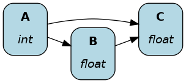

The figure shows how Apache Hamilton automatically assembled the functions `A()`, `B()`, and `C()`.

<a id="concepts-node--helper-function"></a>

### Helper function

You can prefix a function name with an underscore (`_`) to prevent it from being included in a dataflow. Below, `A()` and `B()` are part of the dataflow, but `_round_three_decimals()` isn’t.

```
def
_round_three_decimals (value:float) -> float:
"""Round value by 3 decimals""" return round (value,3) def
A (external_input:int) -> int:
"""Modulo 3 of input value""" return external_input % 3 def
B (A:int) -> float:
"""Divide A by 3""" b =A / 3 return _round_three_decimals (b)
```

<a id="concepts-node--function-naming-tips"></a>

### Function naming tips

Apache Hamilton strongly agrees with the [Zen of Python](https://peps.python.org/pep-0020/) #2: “Explicit is better than implicit”. Meaningful function names help document what functions do, so don’t shy away from longer names. If you were to come across a function named `life_time_value` versus `ltv` versus `l_t_v`, which one is most obvious? Remember your code usually lives a lot longer than you ever think it will.

Unlike the common practice of including meaningful verbs in function names (e.g., `get_credentials()`, `statistical_test()`), with Apache Hamilton, the function name should more closely align with nouns. That’s because the function name determines the node name and how data will be queried. Therefore, names that describe the node result rather than its action may be more readable (e.g., `credentials()`, `statistical_results()`).

<a id="concepts-node--nodes"></a>

## Nodes

A node is a single “operation” or “step” in a dataflow. Apache Hamilton users write Python functions that Apache Hamilton converts into nodes. User never directly create nodes.

<a id="concepts-node--anatomy-of-a-node"></a>

### Anatomy of a node

The following figure and table detail how a Python function maps to a Hamilton node.

[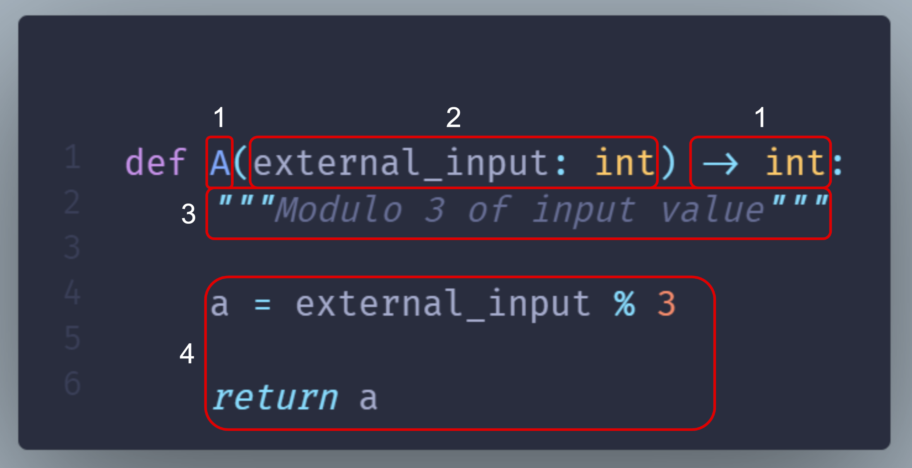](assets/images/function-anatomy_05d4462d380e6e5f.png)

| id | Function components | Node components |
| --- | --- | --- |
| 1 | Function name and return type annotation | Node name and type |
| 2 | Parameter names and type annotations | Node dependencies |
| 3 | Docstring | Description of the node return value |
| 4 | Function body | Implementation of the node |

Since functions almost always map to nodes 1-to-1, the two terms are often used interchangeably. However, there are exceptions that we’ll discuss later in this guide.

<a id="concepts-node--dataflow"></a>

## Dataflow

From a collection of nodes, Apache Hamilton automatically assembles the dataflow. For each node, it creates edges between itself and its dependencies, resulting in a [dataflow](https://en.wikipedia.org/wiki/Dataflow_programming) (or a [graph](https://en.wikipedia.org/wiki/Graph_(discrete_mathematics)) in more mathematical terms).

From the user perspective, you give Apache Hamilton a Python module containing your functions and it will generate your dataflow! This is a key difference with popular orchestration / pipeline / workflow frameworks (Airflow, Kedro, Prefect, VertexAI, SageMaker, etc.)

<a id="concepts-node--how-other-frameworks-build-graphs"></a>

### How other frameworks build graphs

In most frameworks, you first define nodes / steps / tasks / components. Then, you need to create your dataflow by explicitly specifying the relationship between each node.

<a id="concepts-node--readability"></a>

#### Readability

In that case, the code for `step A` doesn’t tell you how it relates `step B` or the broader dataflow. Apache Hamilton solves this problem by tying functions, nodes, and dataflow definitions in a single place. The ratio of reading to writing code can be as high as [10:1](https://www.goodreads.com/quotes/835238-indeed-the-ratio-of-time-spent-reading-versus-writing-is), especially for complex dataflows, so optimizing for readability is high-value.

<a id="concepts-node--maintainability"></a>

#### Maintainability

Typically, editing a dataflow (new feature, debugging, etc.) alters both what a **node** does and how the **dataflow** is structured. Consequently, changes to `step A` require you to manually ensure consistent edits to the definition of dataflows, which is likely in another file. In enterprise settings, it can become difficult to discover and track every location where `step A` is used (potentially 10s or 100s of pipelines), increasing the likelihood of breaking changes. Apache Hamilton avoids this problem entirely because changes to the node definitions, and thus the dataflow, will propagate to all places the code is used. This greatly improves maintainability and development speed by facilitating code changes.

<a id="concepts-node--recap"></a>

## Recap

- Users write Python functions into modules with proper naming and typing
- Helper functions use an underscore prefix (e.g., `_helper()`)
- Apache Hamilton converts functions into nodes
- Apache Hamilton automatically assembles nodes into a dataflow

<a id="concepts-node--next-step"></a>

## Next step

So far, we learned how to write Apache Hamilton code for our dataflow. Next, we’ll explore how we can effectively

1. Convert a Python module into dataflow
2. Visualize a dataflow
3. Execute a dataflow
4. Gather and store results of a dataflow

On this page

- [Functions, nodes & dataflow](#concepts-node)
  - [Functions](#concepts-node--functions)
    - [Specifying dependencies](#concepts-node--specifying-dependencies)
    - [Helper function](#concepts-node--helper-function)
    - [Function naming tips](#concepts-node--function-naming-tips)
  - [Nodes](#concepts-node--nodes)
    - [Anatomy of a node](#concepts-node--anatomy-of-a-node)
  - [Dataflow](#concepts-node--dataflow)
    - [How other frameworks build graphs](#concepts-node--how-other-frameworks-build-graphs)
      - [Readability](#concepts-node--readability)
      - [Maintainability](#concepts-node--maintainability)
  - [Recap](#concepts-node--recap)
  - [Next step](#concepts-node--next-step)

---

<a id="concepts-driver"></a>

<!-- source_url: https://hamilton.incubator.apache.org/concepts/driver/ -->

<!-- page_index: 13 -->

# Driver ¶

[
<svg viewbox="0 0 24 24" xmlns="http://www.w3.org/2000/svg">
<path></path>
</svg>

Back to top](#concepts-driver)

[
<svg><use href="#svg-eye"></use></svg>

View this page](https://github.com/apache/hamilton/blob/main/docs/concepts/driver.rst?plain=true "View this page")

[
<svg><use href="#svg-pencil"></use></svg>

Edit this page](https://github.com/apache/hamilton/edit/main/docs/concepts/driver.rst "Edit this page")

<svg><use href="#svg-toc"></use></svg>

<a id="concepts-driver--driver"></a>

# Driver

Once you defined your dataflow in a Python module, you need to create a Hamilton Driver to execute it. This page details the Driver basics, which include:

1. Defining the Driver
2. Visualizing the dataflow
3. Executing the dataflow

For this page, let’s pretend we defined the following module `my_dataflow.py`:

```
# my_dataflow.py def A () -> int:"""Constant value 35""" return 35 def B (A:int) -> float:"""Divide A by 3""" return A / 3 def C (A:int,B:float) -> float:"""Square A and multiply by B""" return A ** 2 * B
```

<a id="concepts-driver--define-the-driver"></a>

## Define the Driver

First, you need to create a `driver.Driver` object. This is done by passing Python modules to the `driver.Builder()` object along other configurations and calling `.build()`.

The most basic Driver is built like this:

```
# run.py from hamilton import driver import my_dataflow # <- module containing functions to define dataflow # variable `dr` is of type `driver.Driver` # it is created by a `driver.Builder` object dr =driver.Builder ().with_modules (my_dataflow).build ()
```

The `.build()` method will fail if the definition found in `my_dataflow` is invalid (e.g., type mismatch, missing annotations) allowing you to fix issues and iterate quickly.

The `Driver` is defined in the context you intend to run, separately from your dataflow module. It can be in a script, notebook, server, web app, or anywhere else Python can run. As a convention, most Apache Hamilton code examples use a script named `run.py`.

<a id="concepts-driver--visualize-the-dataflow"></a>

## Visualize the dataflow

Once you successfully created your Driver, you can visualize the entire dataflow with the following:

```
# run.py from hamilton import driver import my_dataflow dr =driver.Builder ().with_modules (my_dataflow).build () dr.display_all_functions ("dag.png") # outputs a file dag.png dr.display_all_functions () # to view directly in a notebook
```

Dataflow visualizations are useful for documenting your project and quickly making sense of what a dataflow does (see [Visualization](#concepts-visualization)).

<a id="concepts-driver--execute-the-dataflow"></a>

## Execute the dataflow

From the Driver, you can request the value of specific nodes by calling `dr.execute(final_vars=[...])`, where `final_vars` is a list of node names. By default, results are returned in a dictionary with `{node_name: result}`.

The following requests the node `C` and visualizes the dataflow execution:

```
# run.py from hamilton import driver import my_dataflow dr =driver.Builder ().with_modules (my_dataflow).build () dr.visualize_execution (["C" ],"execute_c.png") results =dr.execute (["C" ]) print (results ["C" ]) # access results dictionary
```

The Driver automatically determines the minimum required path to compute requested nodes. See the respective outputs for `dr.visualize_execution(["C"])` and `dr.visualize_execution(["B"])`:

[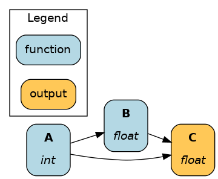](assets/images/execute-c_f0d0bcfef6481685.png)
[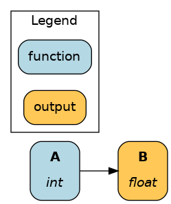](assets/images/execute-b_eee5d3cabe89ce3b.png)

<a id="concepts-driver--development-tips"></a>

## Development tips

With Apache Hamilton, development time is mostly spent writing functions for your dataflow in a Python module. Rebuilding the Driver and visualizing your dataflow as you make changes helps iterative development. Find below two useful development workflows.

<a id="concepts-driver--with-a-python-module"></a>

### With a Python module

One approach is to define the dataflow and the Driver in the same file (e.g., `my_dataflow.py`). Then, you can execute it as a script with `python my_dataflow.py` to rebuild the Driver and visualize your dataflow. This ensures your dataflow definition remains valid as you make changes.

For example:

```
# my_dataflow.py def A () -> int:"""Constant value 35""" return 35 # ... more functions # is True when calling `python my_dataflow.py` if __name__ =="__main__":from hamilton import driver # __main__ refers to the file itself # and yes, a file can import itself as a module! import __main__ dr =driver.Builder ().with_modules (__main__).build () dr.display_all_functions ("dag.png") dr.execute (["C" ])
```

<a id="concepts-driver--with-a-jupyter-notebook"></a>

### With a Jupyter notebook

Another approach is to define the dataflow in a module (e.g., `my_dataflow.py`) and reload the Driver in a Jupyter notebook. This allows for a more interactive experience when you want to inspect the results of functions as you’re developing.

By default, Python only imports a module once and subsequent `import` statements don’t reload the module. We reload our imported module with `importlib.reload(my_dataflow)` and rebuild the Driver as we make changes to our dataflow.

```
# notebook.ipynb # %%cell 1 import importlib from hamilton import driver import my_dataflow # %%cell 2 # this will reload an already imported module importlib.reload (my_dataflow) # rebuild the `Driver` with the reloaded module and execute again dr =driver.Builder ().with_modules (my_dataflow).build () dr.display_all_functions ("dag.png") results =dr.execute (["C" ]) # %%cell 3 # do something with results print (results ["C" ])
```

Learn other Jupyter development tips on the page [Jupyter notebooks](#how-tos-use-in-jupyter-notebook).

<a id="concepts-driver--recap"></a>

## Recap

- The Driver automatically assembles a dataflow from Python modules
- The Driver visualizes the dataflow created from your code
- Functions are executed by requesting nodes to driver `.execute()`

<a id="concepts-driver--next-step"></a>

## Next step

Now, you know the basics of authoring and executing Apache Hamilton dataflows! We encourage you to:

- Write some code with our [interactive tutorials](https://www.tryhamilton.dev/intro)
- Kickstart your project with [community resources](https://hamilton.incubator.apache.org/concepts/ecosystem/index.html)

The next **Concepts** pages cover notions to write more expressive and powerful code. If you feel stuck or constrained with the basics, it’s probably a good time to (re)visit them. They include:

- Materialization: interact with external data sources
- Function modifiers: write expressive dataflows without repeating code
- Builder: how to customize your Driver

On this page

- [Driver](#concepts-driver)
  - [Define the Driver](#concepts-driver--define-the-driver)
  - [Visualize the dataflow](#concepts-driver--visualize-the-dataflow)
  - [Execute the dataflow](#concepts-driver--execute-the-dataflow)
  - [Development tips](#concepts-driver--development-tips)
    - [With a Python module](#concepts-driver--with-a-python-module)
    - [With a Jupyter notebook](#concepts-driver--with-a-jupyter-notebook)
  - [Recap](#concepts-driver--recap)
  - [Next step](#concepts-driver--next-step)

---

<a id="concepts-visualization"></a>

<!-- source_url: https://hamilton.incubator.apache.org/concepts/visualization/ -->

<!-- page_index: 14 -->

# Visualization ¶

[
<svg viewbox="0 0 24 24" xmlns="http://www.w3.org/2000/svg">
<path></path>
</svg>

Back to top](#concepts-visualization)

[
<svg><use href="#svg-eye"></use></svg>

View this page](https://github.com/apache/hamilton/blob/main/docs/concepts/visualization.rst?plain=true "View this page")

[
<svg><use href="#svg-pencil"></use></svg>

Edit this page](https://github.com/apache/hamilton/edit/main/docs/concepts/visualization.rst "Edit this page")

<svg><use href="#svg-toc"></use></svg>

<a id="concepts-visualization--visualization"></a>

# Visualization

After assembling the dataflow, several visualization features become available to the Driver. Apache Hamilton dataflow visualizations are great for documentation because they are directly derived from the code.

On this page, you’ll learn:

- the available visualization functions
- how to answer lineage questions
- how to apply a custom style to your visualization

For this page, we’ll assume we have the following dataflow and Driver:

```
# my_dataflow.py def A () -> int:"""Constant value 35""" return 35 def B (A:int) -> float:"""Divide A by 3""" return A / 3 def C (A:int,B:float) -> float:"""Square A and multiply by B""" return A ** 2 * B def D (A:int) -> str:"""Say `hello` A times""" return "hello " def E (D:str) -> str:"""Say hello*A world""" return D + "world" # run.py from hamilton import driver import my_dataflow dr =driver.Builder ().with_modules (my_dataflow).build ()
```

<a id="concepts-visualization--available-visualizations"></a>

## Available visualizations

<a id="concepts-visualization--view-full-dataflow"></a>

### View full dataflow

During development and for documentation, it’s most useful to view the full dataflow and all nodes.

```

dr
.
display_all_functions
(
...
)
```

[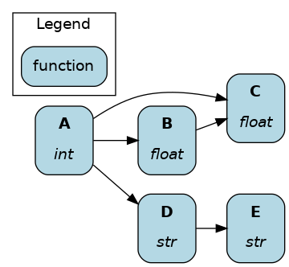](assets/images/display-all_2308288e998b179e.png)

<a id="concepts-visualization--view-executed-dataflow"></a>

### View executed dataflow

Visualizing exactly which nodes were executed is more helpful than viewing the full dataflow when logging driver execution (e.g., ML experiments).

You should produce the visualization before executing the dataflow. Otherwise, the figure won’t be generated if the execution fails first.

```
# pull variables to ensure .execute() and # .visualize_execution() receive the same # arguments final_vars =["A","C","E"] inputs =dict () overrides =dict (B =36.1) dr.visualize_execution (final_vars =final_vars,inputs =inputs,overrides =overrides,) dr.execute (final_vars =final_vars,inputs =inputs,overrides =overrides,)
```

[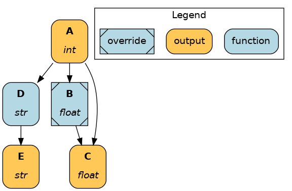](assets/images/execution_23b2d935a8971a1e.png)

An equivalent method is available if you’re using materialization.

```
materializer =to.json (path ="./out.json",dependencies =["C","E" ],combine =base.DictResult (),id ="results_to_json",) additional_vars =["A"] inputs =dict () overrides =dict (B =36.1) dr.visualize_materialization (materializer,additional_vars =additional_vars,inputs =inputs,overrides =dict (B =36.1 ),output_file_path ="dag.png") dr.materialize (materializer,additional_vars =additional_vars,inputs =inputs,overrides =dict (B =36.1 ),)
```

[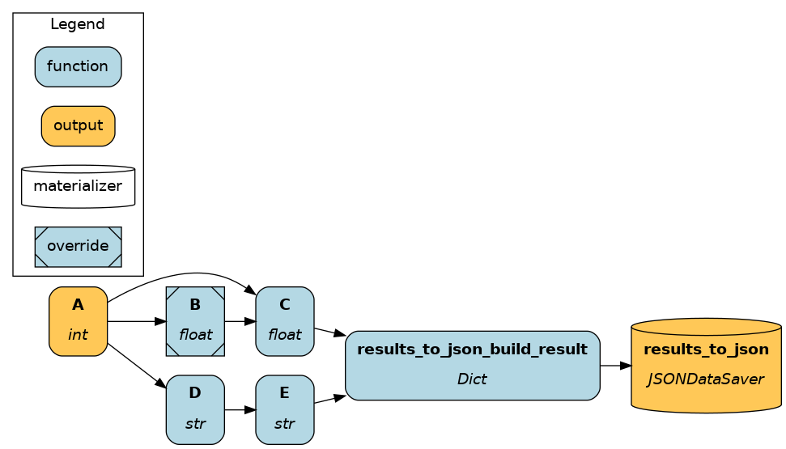](assets/images/materialization_b949fc490f473cc2.png)

Learn more about [Materialization](#concepts-materialization).

<a id="concepts-visualization--view-node-dependencies"></a>

## View node dependencies

Representing data pipelines, ML experiments, or LLM applications as a dataflow helps reason about the dependencies between operations. The Hamilton Driver has the following utilities to select and return a list of nodes (to learn more [Lineage + Apache Hamilton](#how-tos-use-hamilton-for-lineage)):

- `.what_is_upstream_of(*node_names: str)`
- `.what_is_downstream_of(*node_names: str)`
- `.what_is_the_path_between(upstream_node_name: str, downstream_node_name: str)`

These functions are wrapped into their visualization counterparts:

Display ancestors of `B`:

```

dr
.
display_upstream
([
"B"
])
```

[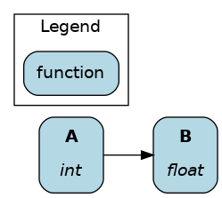](assets/images/upstream_89a58ab1d76b7942.png)

Display descendants of `D` and its immediate parents (`A` only).

```

dr
.
display_downstream
([
"D"
])
```

[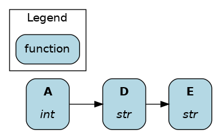](assets/images/downstream_db5b9b6545a2f0bb.png)

Filter nodes to the necessary path:

```
dr.visualize_path - between ("A","C") # dr.visualize_path-between("C", "D") would return # ValueError: No path found between C and D.
```

[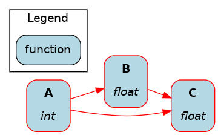](assets/images/between_bcbcc1332db59c06.png)

<a id="concepts-visualization--configure-your-visualization"></a>

## Configure your visualization

All of the above visualization functions share parameters to customize the visualization (e.g., hide legend, hide inputs). Learn more by reviewing the API reference for [Driver.display\_all\_functions()](https://hamilton.apache.org/reference/drivers/Driver/#hamilton.driver.Driver.display_all_functions); parameters should apply to all other visualizations.

<a id="concepts-visualization--custom-node-labels-with-display_name"></a>

### Custom node labels with display\_name

Use the `@tag` decorator with `display_name` to show human-readable labels in visualizations while keeping valid Python identifiers as function names. This is useful for creating presentation-ready diagrams or adding business-friendly names:

```
from
hamilton.function_modifiers
import tag @tag (display_name ="Parse Raw JSON") def
parse_raw_json (raw_data:str) -> dict:return json.loads (raw_data) @tag (display_name ="Transform to DataFrame") def
transform_to_df (parse_raw_json:dict) -> pd.DataFrame:return pd.DataFrame (parse_raw_json)
```

When visualized, nodes will display “Parse Raw JSON” and “Transform to DataFrame” instead of their function names. This keeps your code Pythonic while making visualizations more readable for stakeholders.

Note that `display_name` only affects visualization labels - the actual node names used in code and execution remain the function names.

<a id="concepts-visualization--apply-custom-style"></a>

### Apply custom style

By default, each node is labeled with name and type, and stylized (shape, color, outline, etc.). By passing a function to the parameter `custom_style_function`, you can customize the node style based on its attributes. This pairs nicely with the `@tag` function modifier (learn more [Add metadata to a node](#concepts-function-modifiers--tag-decorators))

Your own custom style function must:

1. Use only keyword arguments, taking in `node` and `node_class`.
2. Return a tuple `(style, node_class, legend_name)` where:
   :   - `style`: dictionary of valid graphviz node style attributes.
       - `node_class`: class used to style the default visualization - we recommend returning the input `node_class`
       - `legend_name`: text to display in the legend. Return `None` for no legend entry.
3. For the execution-focused visualizations, your custom styles are applied before the modifiers for outputs and overrides are applied.

If you need more customization, we suggest getting the graphviz object produced, and modifying it directly.

This [online graphviz editor](https://edotor.net/) can help you get started!

```
def
custom_style (*,node:graph_types.HamiltonNode,node_class:str) -> Tuple [dict,Optional [str ],Optional [str ]]:
"""Custom style function for the visualization.:param node: node that Apache Hamilton is styling.:param node_class: class used to style the default visualization :return: a triple of (style, node_class, legend_name) """ if node.type in [float,int ]:style =({"fillcolor":"aquamarine" },node_class,"numbers") else:style =({},node_class,None) return style dr.display_all_functions (custom_style_function =custom_style)
```

[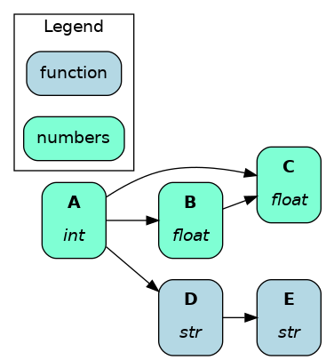](assets/images/custom-style_609885d0ec61a98a.png)

See the [full code example](https://github.com/apache/hamilton/tree/main/examples/styling_visualization) for more details.

On this page

- [Visualization](#concepts-visualization)
  - [Available visualizations](#concepts-visualization--available-visualizations)
    - [View full dataflow](#concepts-visualization--view-full-dataflow)
    - [View executed dataflow](#concepts-visualization--view-executed-dataflow)
  - [View node dependencies](#concepts-visualization--view-node-dependencies)
  - [Configure your visualization](#concepts-visualization--configure-your-visualization)
    - [Custom node labels with display\_name](#concepts-visualization--custom-node-labels-with-display-name)
    - [Apply custom style](#concepts-visualization--apply-custom-style)

---

<a id="concepts-materialization"></a>

<!-- source_url: https://hamilton.incubator.apache.org/concepts/materialization/ -->

<!-- page_index: 15 -->

# Materialization ¶

> [!NOTE]
> > [!NOTE]
> > [Back to top](#concepts-materialization)
> >
> > [View this page](https://github.com/apache/hamilton/blob/main/docs/concepts/materialization.rst?plain=true "View this page")
> >
> > [Edit this page](https://github.com/apache/hamilton/edit/main/docs/concepts/materialization.rst "Edit this page")
> >
> > > [!NOTE]
> > > > [!NOTE]
> > > > <a id="concepts-materialization--materialization"></a>

> > > >
> > > > # Materialization
> > > >
> > > > So far, we executed our dataflow using the `Driver.execute()` method, which can receive an `inputs` dictionary and return a `results` dictionary (by default). However, you can also execute code with `Driver.materialize()` to directly read from / write to external data sources (file, database, cloud data store).
> > > >
> > > > On this page, you’ll learn:
> > > >
> > > > - How to load and save data in Apache Hamilton
> > > > - Why use materialization
> > > > - What are `DataSaver` and `DataLoader` objects
> > > > - The difference between `.execute()` and `.materialize()`
> > > > - The basics to write your own materializer
> > > >
> > > > <a id="concepts-materialization--different-ways-to-write-the-same-dataflow"></a>

> > > >
> > > > ## Different ways to write the same dataflow
> > > >
> > > > Below are 6 ways to write a dataflow that:
> > > >
> > > > 1. loads a dataframe from a parquet file
> > > > 2. preprocesses the dataframe
> > > > 3. trains a machine learning model
> > > > 4. saves the trained model
> > > >
> > > > The first two options don’t use the concept of materialization and the next four do.
> > > >
> > > > <a id="concepts-materialization--without-materialization"></a>

> > > >
> > > > ## Without materialization
> > > >
> > > > <table class="docutils align-left">
> > > > <thead>
> > > > <tr><th><ol>
> > > > <li><p>From nodes</p></li>
> > > > </ol>
> > > > </th>
> > > > <th><ol start="2">
> > > > <li><p>From <code><span>Driver</span></code></p></li>
> > > > </ol>
> > > > </th>
> > > > </tr>
> > > > </thead>
> > > > <tbody>
> > > > <tr><td><div><div><pre><span></span><span>import</span><span> </span><span>pandas</span><span> </span><span>as</span><span> </span><span>pd</span>
> > > > <span>import</span><span> </span><span>xgboost</span>
> > > >
> > > > <span>def</span><span> </span><span>raw_df</span><span>(</span><span>data_path</span><span>:</span> <span>str</span><span>)</span> <span>-&gt;</span> <span>pd</span><span>.</span><span>DataFrame</span><span>:</span>
> > > > <span>    </span><span>"""Load raw data from parquet file"""</span>
> > > >     <span>return</span> <span>pd</span><span>.</span><span>read_parquet</span><span>(</span><span>data_path</span><span>)</span>
> > > >
> > > > <span>def</span><span> </span><span>preprocessed_df</span><span>(</span><span>raw_df</span><span>:</span> <span>pd</span><span>.</span><span>DataFrame</span><span>)</span> <span>-&gt;</span> <span>pd</span><span>.</span><span>DataFrame</span><span>:</span>
> > > > <span>    </span><span>"""preprocess raw data"""</span>
> > > >     <span>return</span> <span>...</span>
> > > >
> > > > <span>def</span><span> </span><span>model</span><span>(</span><span>preprocessed_df</span><span>:</span> <span>pd</span><span>.</span><span>DataFrame</span><span>)</span> <span>-&gt;</span> <span>xgboost</span><span>.</span><span>XGBModel</span><span>:</span>
> > > > <span>    </span><span>"""Train model on preprocessed data"""</span>
> > > >     <span>return</span> <span>...</span>
> > > >
> > > > <span>def</span><span> </span><span>save_model</span><span>(</span><span>model</span><span>:</span> <span>xgboost</span><span>.</span><span>XGBModel</span><span>,</span> <span>model_dir</span><span>:</span> <span>str</span><span>)</span> <span>-&gt;</span> <span>None</span><span>:</span>
> > > > <span>    </span><span>"""Save trained model to JSON format"""</span>
> > > >     <span>model</span><span>.</span><span>save_model</span><span>(</span><span>f</span><span>"</span><span>{</span><span>model_dir</span><span>}</span><span>/model.json"</span><span>)</span>
> > > >
> > > > <span>if</span> <span>__name__</span> <span>==</span> <span>"__main__"</span><span>:</span>
> > > >     <span>import</span><span> </span><span>__main__</span>
> > > >
> > > >     <span>from</span><span> </span><span>hamilton</span><span> </span><span>import</span> <span>driver</span>
> > > >
> > > >     <span>dr</span> <span>=</span> <span>driver</span><span>.</span><span>Builder</span><span>()</span><span>.</span><span>with_modules</span><span>(</span><span>__main__</span><span>)</span><span>.</span><span>build</span><span>()</span>
> > > >
> > > >     <span>data_path</span> <span>=</span> <span>"..."</span>
> > > >     <span>model_dir</span> <span>=</span> <span>"..."</span>
> > > >     <span>inputs</span> <span>=</span> <span>dict</span><span>(</span><span>data_path</span><span>=</span><span>data_path</span><span>,</span> <span>model_dir</span><span>=</span><span>model_dir</span><span>)</span>
> > > >     <span>final_vars</span> <span>=</span> <span>[</span><span>"save_model"</span><span>]</span>
> > > >     <span>results</span> <span>=</span> <span>dr</span><span>.</span><span>execute</span><span>(</span><span>final_vars</span><span>,</span> <span>inputs</span><span>=</span><span>inputs</span><span>)</span>
> > > >     <span># results["save_model"] == None</span>
> > > > </pre></div>
> > > > </div>
> > > > </td>
> > > > <td><div><div><pre><span></span><span>import</span><span> </span><span>pandas</span><span> </span><span>as</span><span> </span><span>pd</span>
> > > > <span>import</span><span> </span><span>xgboost</span>
> > > >
> > > > <span>def</span><span> </span><span>preprocessed_df</span><span>(</span><span>raw_df</span><span>:</span> <span>pd</span><span>.</span><span>DataFrame</span><span>)</span> <span>-&gt;</span> <span>pd</span><span>.</span><span>DataFrame</span><span>:</span>
> > > > <span>    </span><span>"""preprocess raw data"""</span>
> > > >     <span>return</span> <span>...</span>
> > > >
> > > > <span>def</span><span> </span><span>model</span><span>(</span><span>preprocessed_df</span><span>:</span> <span>pd</span><span>.</span><span>DataFrame</span><span>)</span> <span>-&gt;</span> <span>xgboost</span><span>.</span><span>XGBModel</span><span>:</span>
> > > > <span>    </span><span>"""Train model on preprocessed data"""</span>
> > > >     <span>return</span> <span>...</span>
> > > >
> > > > <span>if</span> <span>__name__</span> <span>==</span> <span>"__main__"</span><span>:</span>
> > > >     <span>import</span><span> </span><span>__main__</span>
> > > >
> > > >     <span>from</span><span> </span><span>hamilton</span><span> </span><span>import</span> <span>driver</span>
> > > >
> > > >     <span>dr</span> <span>=</span> <span>driver</span><span>.</span><span>Builder</span><span>()</span><span>.</span><span>with_modules</span><span>(</span><span>__main__</span><span>)</span><span>.</span><span>build</span><span>()</span>
> > > >
> > > >     <span>data_path</span> <span>=</span> <span>"..."</span>
> > > >     <span>model_dir</span> <span>=</span> <span>"..."</span>
> > > >     <span>inputs</span> <span>=</span> <span>dict</span><span>(</span><span>raw_df</span><span>=</span><span>pd</span><span>.</span><span>read_parquet</span><span>(</span><span>data_path</span><span>))</span>
> > > >     <span>final_vars</span> <span>=</span> <span>[</span><span>"model"</span><span>]</span>
> > > >
> > > >     <span>results</span> <span>=</span> <span>dr</span><span>.</span><span>execute</span><span>(</span><span>final_vars</span><span>,</span> <span>inputs</span><span>=</span><span>inputs</span><span>)</span>
> > > >     <span>results</span><span>[</span><span>"model"</span><span>]</span><span>.</span><span>save_model</span><span>(</span><span>f</span><span>"</span><span>{</span><span>model_dir</span><span>}</span><span>/model.json"</span><span>)</span>
> > > > </pre></div>
> > > > </div>
> > > > </td>
> > > > </tr>
> > > > <tr><td><a href="assets/images/node-ctx_ceb6be7f070a8f92.png">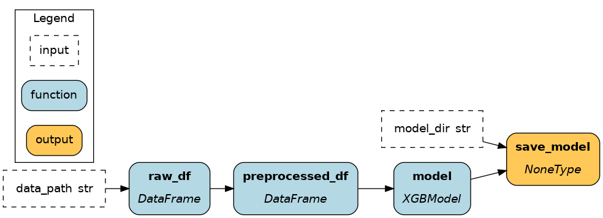
> > > > </a>
> > > > </td>
> > > > <td><a href="assets/images/driver-ctx_2bb4c532e1a488e7.png">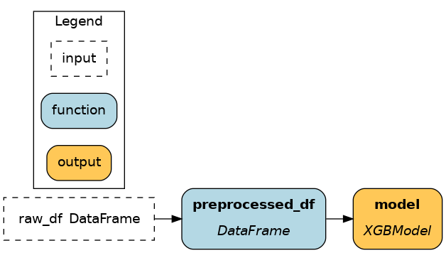
> > > > </a>
> > > > </td>
> > > > </tr>
> > > > </tbody>
> > > > </table>
> > > >
> > > > Observations:
> > > >
> > > > 1. These two approaches load and save data using `pandas` and `xgboost` without any Apache Hamilton constructs. These methods are transparent and simple to get started, but as the number of node grows (or across projects) defining one node per parquet file to load introduces a lot of boilerplate.
> > > > 2. Using **1) from nodes** improves visibility by including loading & saving in the dataflow (as illustrated).
> > > > 3. Using **2) from ``Driver``** facilitates modifying loading & saving before code execution when executing the code, without modifying the dataflow itself. It is particularly useful when moving from development to production.
> > > >
> > > > <a id="concepts-materialization--limitations"></a>

> > > >
> > > > ### Limitations
> > > >
> > > > Apache Hamilton’s approach to “materializations” aims to solve 3 limitations:
> > > >
> > > > 1. **Redundancy**: deduplicate loading & saving code to improve maintainability and debugging
> > > > 2. **Observability**: include loading & saving in the dataflow for full observability and allow hooks
> > > > 3. **Flexibility**: change the loading & saving behavior without editing the dataflow
> > > >
> > > > > [!NOTE]
> > > > > <a id="concepts-materialization--with-materialization"></a>

> > > > >
> > > > > ## With materialization
> > > > >
> > > > > <table class="docutils align-left">
> > > > > <thead>
> > > > > <tr><th><ol start="3">
> > > > > <li><p>Simple Materialization</p></li>
> > > > > </ol>
> > > > > </th>
> > > > > <th><ol start="4">
> > > > > <li><p>Static materializers</p></li>
> > > > > </ol>
> > > > > </th>
> > > > > <th><ol start="5">
> > > > > <li><p>Dynamic materializers</p></li>
> > > > > </ol>
> > > > > </th>
> > > > > <th><ol start="6">
> > > > > <li><p>Function modifiers</p></li>
> > > > > </ol>
> > > > > </th>
> > > > > </tr>
> > > > > </thead>
> > > > > <tbody>
> > > > > <tr><td><div><div><pre><span></span><span>import</span><span> </span><span>pandas</span><span> </span><span>as</span><span> </span><span>pd</span>
> > > > > <span>import</span><span> </span><span>xgboost</span>
> > > > >
> > > > > <span>from</span><span> </span><span>hamilton.function_modifiers</span><span> </span><span>import</span> <span>dataloader</span><span>,</span> <span>datasaver</span>
> > > > > <span>from</span><span> </span><span>hamilton.io</span><span> </span><span>import</span> <span>utils</span>
> > > > >
> > > > > <span>@dataloader</span><span>()</span>
> > > > > <span>def</span><span> </span><span>raw_df</span><span>(</span><span>data_path</span><span>:</span> <span>str</span><span>)</span> <span>-&gt;</span> <span>tuple</span><span>[</span><span>pd</span><span>.</span><span>DataFrame</span><span>,</span> <span>dict</span><span>]:</span>
> > > > > <span>    </span><span>"""Load raw data from parquet file"""</span>
> > > > >     <span>df</span> <span>=</span> <span>pd</span><span>.</span><span>read_parquet</span><span>(</span><span>data_path</span><span>)</span>
> > > > >     <span>return</span> <span>df</span><span>,</span> <span>utils</span><span>.</span><span>get_file_and_dataframe_metadata</span><span>(</span><span>data_path</span><span>,</span> <span>df</span><span>)</span>
> > > > >
> > > > > <span>def</span><span> </span><span>preprocessed_df</span><span>(</span><span>raw_df</span><span>:</span> <span>pd</span><span>.</span><span>DataFrame</span><span>)</span> <span>-&gt;</span> <span>pd</span><span>.</span><span>DataFrame</span><span>:</span>
> > > > > <span>    </span><span>"""preprocess raw data"""</span>
> > > > >     <span>return</span> <span>...</span>
> > > > >
> > > > > <span>def</span><span> </span><span>model</span><span>(</span><span>preprocessed_df</span><span>:</span> <span>pd</span><span>.</span><span>DataFrame</span><span>)</span> <span>-&gt;</span> <span>xgboost</span><span>.</span><span>XGBModel</span><span>:</span>
> > > > > <span>    </span><span>"""Train model on preprocessed data"""</span>
> > > > >     <span>return</span> <span>...</span>
> > > > >
> > > > > <span>@datasaver</span><span>()</span>
> > > > > <span>def</span><span> </span><span>save_model</span><span>(</span><span>model</span><span>:</span> <span>xgboost</span><span>.</span><span>XGBModel</span><span>,</span> <span>model_dir</span><span>:</span> <span>str</span><span>)</span> <span>-&gt;</span> <span>dict</span><span>:</span>
> > > > > <span>    </span><span>"""Save trained model to JSON format"""</span>
> > > > >     <span>model</span><span>.</span><span>save_model</span><span>(</span><span>f</span><span>"</span><span>{</span><span>model_dir</span><span>}</span><span>/model.json"</span><span>)</span>
> > > > >     <span>return</span> <span>utils</span><span>.</span><span>get_file_metadata</span><span>(</span><span>f</span><span>"</span><span>{</span><span>model_dir</span><span>}</span><span>/model.json"</span><span>)</span>
> > > > >
> > > > > <span>if</span> <span>__name__</span> <span>==</span> <span>"__main__"</span><span>:</span>
> > > > >     <span>import</span><span> </span><span>__main__</span>
> > > > >
> > > > >     <span>from</span><span> </span><span>hamilton</span><span> </span><span>import</span> <span>driver</span>
> > > > >
> > > > >     <span>dr</span> <span>=</span> <span>driver</span><span>.</span><span>Builder</span><span>()</span><span>.</span><span>with_modules</span><span>(</span><span>__main__</span><span>)</span><span>.</span><span>build</span><span>()</span>
> > > > >     <span>data_path</span> <span>=</span> <span>"..."</span>
> > > > >     <span>model_dir</span> <span>=</span> <span>"..."</span>
> > > > >     <span>inputs</span> <span>=</span> <span>dict</span><span>(</span><span>data_path</span><span>=</span><span>data_path</span><span>,</span> <span>model_dir</span><span>=</span><span>model_dir</span><span>)</span>
> > > > >     <span>final_vars</span> <span>=</span> <span>[</span><span>"save_model"</span><span>]</span>
> > > > >     <span>results</span> <span>=</span> <span>dr</span><span>.</span><span>execute</span><span>(</span><span>final_vars</span><span>,</span> <span>inputs</span><span>=</span><span>inputs</span><span>)</span>
> > > > >     <span># results["save_model"] == None</span>
> > > > > </pre></div>
> > > > > </div>
> > > > > </td>
> > > > > <td><div><div><pre><span></span><span>import</span><span> </span><span>pandas</span><span> </span><span>as</span><span> </span><span>pd</span>
> > > > > <span>import</span><span> </span><span>xgboost</span>
> > > > >
> > > > > <span>def</span><span> </span><span>preprocessed_df</span><span>(</span><span>raw_df</span><span>:</span> <span>pd</span><span>.</span><span>DataFrame</span><span>)</span> <span>-&gt;</span> <span>pd</span><span>.</span><span>DataFrame</span><span>:</span>
> > > > > <span>    </span><span>"""preprocess raw data"""</span>
> > > > >     <span>return</span> <span>...</span>
> > > > >
> > > > > <span>def</span><span> </span><span>model</span><span>(</span><span>preprocessed_df</span><span>:</span> <span>pd</span><span>.</span><span>DataFrame</span><span>)</span> <span>-&gt;</span> <span>xgboost</span><span>.</span><span>XGBModel</span><span>:</span>
> > > > > <span>    </span><span>"""Train model on preprocessed data"""</span>
> > > > >     <span>return</span> <span>...</span>
> > > > >
> > > > > <span>if</span> <span>__name__</span> <span>==</span> <span>"__main__"</span><span>:</span>
> > > > >     <span>import</span><span> </span><span>__main__</span>
> > > > >
> > > > >     <span>from</span><span> </span><span>hamilton</span><span> </span><span>import</span> <span>driver</span>
> > > > >     <span>from</span><span> </span><span>hamilton.io.materialization</span><span> </span><span>import</span> <span>from_</span><span>,</span> <span>to</span>
> > > > >
> > > > >     <span>data_path</span> <span>=</span> <span>"..."</span>
> > > > >     <span>model_dir</span> <span>=</span> <span>"..."</span>
> > > > >     <span>materializers</span> <span>=</span> <span>[</span>
> > > > >         <span>from_</span><span>.</span><span>parquet</span><span>(</span><span>target</span><span>=</span><span>"raw_df"</span><span>,</span> <span>path</span><span>=</span><span>data_path</span><span>),</span>
> > > > >         <span>to</span><span>.</span><span>json</span><span>(</span>
> > > > >             <span>id</span><span>=</span><span>"model__json"</span><span>,</span>  <span># name of the DataSaver node</span>
> > > > >             <span>dependencies</span><span>=</span><span>[</span><span>"model"</span><span>],</span>
> > > > >             <span>path</span><span>=</span><span>f</span><span>"</span><span>{</span><span>model_dir</span><span>}</span><span>/model.json"</span><span>,</span>
> > > > >         <span>),</span>
> > > > >     <span>]</span>
> > > > >     <span>dr</span> <span>=</span> <span>(</span>
> > > > >         <span>driver</span><span>.</span><span>Builder</span><span>()</span>
> > > > >         <span>.</span><span>with_modules</span><span>(</span><span>__main__</span><span>)</span>
> > > > >         <span>.</span><span>with_materializers</span><span>(</span><span>*</span><span>materializers</span><span>)</span>
> > > > >         <span>.</span><span>build</span><span>()</span>
> > > > >     <span>)</span>
> > > > >
> > > > >     <span>results</span> <span>=</span> <span>dr</span><span>.</span><span>execute</span><span>([</span><span>"model"</span><span>,</span> <span>"model__json"</span><span>])</span>
> > > > >     <span># results["model"]  &lt;- the model</span>
> > > > >     <span># results["model__json"] &lt;- metadata from saving the model</span>
> > > > > </pre></div>
> > > > > </div>
> > > > > </td>
> > > > > <td><div><div><pre><span></span><span>import</span><span> </span><span>pandas</span><span> </span><span>as</span><span> </span><span>pd</span>
> > > > > <span>import</span><span> </span><span>xgboost</span>
> > > > >
> > > > > <span>def</span><span> </span><span>preprocessed_df</span><span>(</span><span>raw_df</span><span>:</span> <span>pd</span><span>.</span><span>DataFrame</span><span>)</span> <span>-&gt;</span> <span>pd</span><span>.</span><span>DataFrame</span><span>:</span>
> > > > > <span>    </span><span>"""preprocess raw data"""</span>
> > > > >     <span>return</span> <span>...</span>
> > > > >
> > > > > <span>def</span><span> </span><span>model</span><span>(</span><span>preprocessed_df</span><span>:</span> <span>pd</span><span>.</span><span>DataFrame</span><span>)</span> <span>-&gt;</span> <span>xgboost</span><span>.</span><span>XGBModel</span><span>:</span>
> > > > > <span>    </span><span>"""Train model on preprocessed data"""</span>
> > > > >     <span>return</span> <span>...</span>
> > > > >
> > > > > <span>if</span> <span>__name__</span> <span>==</span> <span>"__main__"</span><span>:</span>
> > > > >     <span>import</span><span> </span><span>__main__</span>
> > > > >
> > > > >     <span>from</span><span> </span><span>hamilton</span><span> </span><span>import</span> <span>driver</span>
> > > > >     <span>from</span><span> </span><span>hamilton.io.materialization</span><span> </span><span>import</span> <span>from_</span><span>,</span> <span>to</span>
> > > > >
> > > > >     <span>data_path</span> <span>=</span> <span>"..."</span>
> > > > >     <span>model_dir</span> <span>=</span> <span>"..."</span>
> > > > >     <span>materializers</span> <span>=</span> <span>[</span>
> > > > >         <span>from_</span><span>.</span><span>parquet</span><span>(</span><span>target</span><span>=</span><span>"raw_df"</span><span>,</span> <span>path</span><span>=</span><span>data_path</span><span>),</span>
> > > > >         <span>to</span><span>.</span><span>json</span><span>(</span>
> > > > >             <span>id</span><span>=</span><span>"model__json"</span><span>,</span>  <span># name of the DataSaver node</span>
> > > > >             <span>dependencies</span><span>=</span><span>[</span><span>"model"</span><span>],</span>
> > > > >             <span>path</span><span>=</span><span>f</span><span>"</span><span>{</span><span>model_dir</span><span>}</span><span>/model.json"</span><span>,</span>
> > > > >         <span>),</span>
> > > > >     <span>]</span>
> > > > >     <span>dr</span> <span>=</span> <span>driver</span><span>.</span><span>Builder</span><span>()</span><span>.</span><span>with_modules</span><span>(</span><span>__main__</span><span>)</span><span>.</span><span>build</span><span>()</span>
> > > > >     <span># executes all `to.` materializers; use `additional_vars` to execute other nodes</span>
> > > > >     <span>metadata</span><span>,</span> <span>results</span> <span>=</span> <span>dr</span><span>.</span><span>materialize</span><span>(</span><span>*</span><span>materializers</span><span>,</span> <span>additional_vars</span><span>=</span><span>[</span><span>"model"</span><span>])</span>
> > > > >     <span># results["model"]  &lt;- the model</span>
> > > > >     <span># metadata["model__json"] &lt;- metadata from saving the model</span>
> > > > > </pre></div>
> > > > > </div>
> > > > > </td>
> > > > > <td><div><div><pre><span></span><span>import</span><span> </span><span>pandas</span><span> </span><span>as</span><span> </span><span>pd</span>
> > > > > <span>import</span><span> </span><span>xgboost</span>
> > > > >
> > > > > <span>from</span><span> </span><span>hamilton.function_modifiers</span><span> </span><span>import</span> <span>load_from</span><span>,</span> <span>save_to</span><span>,</span> <span>source</span>
> > > > >
> > > > > <span># source("data_path") allows to read the input value for `data_path`</span>
> > > > > <span>@load_from</span><span>.</span><span>parquet</span><span>(</span><span>path</span><span>=</span><span>source</span><span>(</span><span>"data_path"</span><span>))</span>
> > > > > <span>def</span><span> </span><span>preprocessed_df</span><span>(</span><span>raw_df</span><span>:</span> <span>pd</span><span>.</span><span>DataFrame</span><span>)</span> <span>-&gt;</span> <span>pd</span><span>.</span><span>DataFrame</span><span>:</span>
> > > > > <span>    </span><span>"""preprocess raw data"""</span>
> > > > >     <span>return</span> <span>...</span>
> > > > >
> > > > > <span>@save_to</span><span>.</span><span>json</span><span>(</span><span>path</span><span>=</span><span>source</span><span>(</span><span>"model_path"</span><span>))</span>
> > > > > <span>def</span><span> </span><span>model</span><span>(</span><span>preprocessed_df</span><span>:</span> <span>pd</span><span>.</span><span>DataFrame</span><span>)</span> <span>-&gt;</span> <span>xgboost</span><span>.</span><span>XGBModel</span><span>:</span>
> > > > > <span>    </span><span>"""Train model on preprocessed data"""</span>
> > > > >     <span>return</span> <span>...</span>
> > > > >
> > > > > <span>if</span> <span>__name__</span> <span>==</span> <span>"__main__"</span><span>:</span>
> > > > >     <span>import</span><span> </span><span>__main__</span>
> > > > >
> > > > >     <span>from</span><span> </span><span>hamilton</span><span> </span><span>import</span> <span>driver</span>
> > > > >
> > > > >     <span>dr</span> <span>=</span> <span>driver</span><span>.</span><span>Builder</span><span>()</span><span>.</span><span>with_modules</span><span>(</span><span>__main__</span><span>)</span><span>.</span><span>build</span><span>()</span>
> > > > >
> > > > >     <span>data_path</span> <span>=</span> <span>"..."</span>
> > > > >     <span>model_path</span> <span>=</span> <span>"..."</span>
> > > > >     <span>inputs</span> <span>=</span> <span>dict</span><span>(</span><span>data_path</span><span>=</span><span>data_path</span><span>,</span> <span>model_path</span><span>=</span><span>model_path</span><span>)</span>
> > > > >     <span>final_vars</span> <span>=</span> <span>[</span><span>"save.model"</span><span>,</span> <span>"model"</span><span>]</span>
> > > > >     <span>results</span> <span>=</span> <span>dr</span><span>.</span><span>execute</span><span>(</span><span>final_vars</span><span>,</span> <span>inputs</span><span>=</span><span>inputs</span><span>)</span>
> > > > >     <span># results["model"]  &lt;- the model</span>
> > > > >     <span># results["save.model"] &lt;- metadata from saving the model</span>
> > > > > </pre></div>
> > > > > </div>
> > > > > </td>
> > > > > </tr>
> > > > > <tr><td><a href="assets/images/simple-materializer-ctx_94f28905e58a4278.png">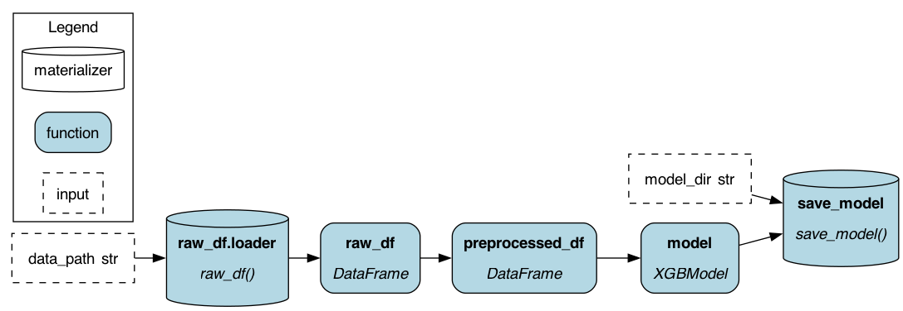
> > > > > </a>
> > > > > </td>
> > > > > <td><a href="assets/images/static-materializer-ctx_ca2c36a9d8c7b61e.png">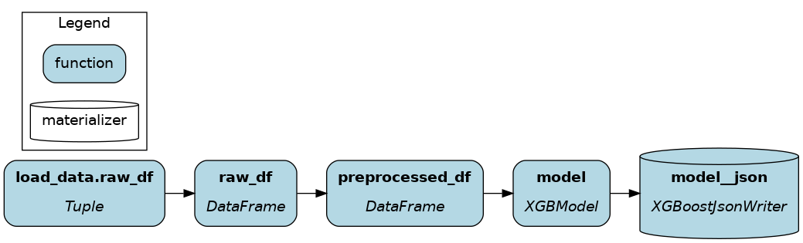
> > > > > </a>
> > > > > </td>
> > > > > <td><a href="assets/images/dynamic-materializer-ctx_de5471a3fc661db5.png">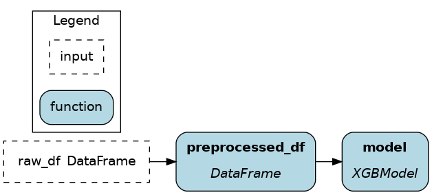
> > > > > </a>
> > > > > </td>
> > > > > <td><a href="assets/images/decorator-ctx_b52f8708719b8be5.png">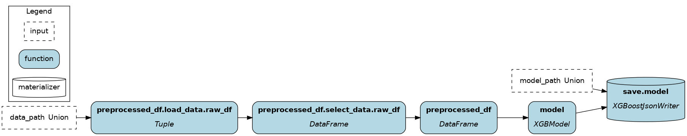
> > > > > </a>
> > > > > </td>
> > > > > </tr>
> > > > > </tbody>
> > > > > </table>
> > > > >
> > > > > <a id="concepts-materialization--simple-materialization"></a>

> > > > >
> > > > > ### Simple Materialization
> > > > >
> > > > > When you don’t need to hide the implementation details of how you read and write, but you
> > > > > want to track what was read and written, you need to expose extra metadata. This is where
> > > > > the [@datasaver()](#reference-decorators-datasaver) and [@dataloader()](#reference-decorators-dataloader) decorators come in. They allow you to return
> > > > > metadata about what was read and written, and this metadata is then used to track what
> > > > > was read and written.
> > > > >
> > > > > This is our recommended first step when you’re starting to use materialization in Apache Hamilton.
> > > > >
> > > > > <a id="concepts-materialization--static-materializers"></a>

> > > > >
> > > > > ### Static materializers
> > > > >
> > > > > Passing `from_` and `to` Apache Hamilton objects to `Builder().with_materializers()` injects into the dataflow standardized nodes to load and save data. It solves the 3 limitations highlighted in the previous section:
> > > > >
> > > > > 1. Redundancy ✅: Using the `from_` and `to` Apache Hamilton constructs reduces the boilerplate to load and save data from common formats (JSON, parquet, CSV, etc.) and to interact with 3rd party libraries (pandas, matplotlib, xgboost, dlt, etc.)
> > > > > 2. Observability ✅: Loaders and savers are part of the dataflow. You can view them with `Driver.display_all_functions()` and execute nodes by requesting them with `Driver.execute()`.
> > > > > 3. Flexibility ✅: The loading and saving behavior is decoupled from the dataflow and can modified easily when creating the `Driver` and executing code.
> > > > >
> > > > > > [!NOTE]
> > > > > > `from_` data loaders can be specified as optional with `optional=True`. This allows specified data loaders to be skipped rather than raise an exception when not referenced by a dataflow.
> > > > >
> > > > > <a id="concepts-materialization--dynamic-materializers"></a>

> > > > >
> > > > > ### Dynamic materializers
> > > > >
> > > > > The dataflow is executed by passing `from_` and `to` objects to `Driver.materialize()` instead of the regular `Driver.execute()`. This approach ressembles **2) from Driver**:
> > > > >
> > > > > > [!NOTE]
> > > > > > `Driver.materialize()` can receive data savers (`from_`) and loaders (`to`) and will execute all `to` passed. Like `Driver.execute()`, it can receive `inputs`, and `overrides`, but instead of `final_vars` it receives `additional_vars`.
> > > > >
> > > > > 1. Redundancy ✅: Uses `from_` and `to` Apache Hamilton constructs.
> > > > > 2. Observability 🚸: Materializers are visible with `Driver.visualize_materialization()`, but can’t be introspected otherwise. Also, you need to rely on `Driver.materialize()` which has a different call signature.
> > > > > 3. Flexibility ✅: Loading and saving is decoupled from the dataflow.
> > > > >
> > > > > > [!NOTE]
> > > > > > Using static materializers is typically preferrable. Static and dynamic materializers can be used together with `dr = Builder.with_materializers().build()` and later `dr.materialize()`.
> > > > >
> > > > > <a id="concepts-materialization--function-modifiers"></a>

> > > > >
> > > > > ### Function modifiers
> > > > >
> > > > > By adding `@load_from` and `@save_to` function modifiers ([Load and save external data](#concepts-function-modifiers--loader-saver-decorators)) to Hamilton functions, materializers are generated when using `Builder.with_modules()`. This approach ressembles **1) from Driver**:
> > > > >
> > > > > > [!NOTE]
> > > > > > **Under the hood, the @load\_from modifier uses the same code as from\_ to load data, same for @save\_to and to .**
> > > > > >
> > > > >
> > > > > 1. Redundancy 🚸: Using `@load_from` and `@save_to` reduces redundancy. However, to make available to multiple nodes a loaded table, you would need to decorate each node with the same `@save_to`. Also, it might be impractical to decorate dynamically generated nodes (e.g., when using the `@parameterize` function modifier).
> > > > > 2. Observability ✅: Loaders and savers are part of the dataflow.
> > > > > 3. Flexibility 🚸: You can modify the path and materializer kwargs at runtime using `source()` in the decorator definition, but you can’t change the format itself (e.g., from parquet to CSV).
> > > > >
> > > > > > [!NOTE]
> > > > > > It can be desirable to couple loading and saving to the dataflow using function modifiers. It makes it clear when reading the dataflow definition which nodes should load or save data using external sources.
> > > >
> > > > <a id="concepts-materialization--dataloader-and-datasaver"></a>

> > > >
> > > > ## DataLoader and DataSaver
> > > >
> > > > In Apache Hamilton, `DataLoader` and `DataSaver` are classes that define how to load or save a particular data format. Calling `Driver.materialize(DataLoader(), DataSaver())` adds nodes to the dataflow (see visualizations above).
> > > >
> > > > Here are simplified snippets for saving and loading an XGBoost model to/from JSON.
> > > >
> > > > >
> > > > <table class="docutils align-default">
> > > > <thead>
> > > > <tr><th><p>DataLoader</p></th>
> > > > <th><p>DataSaver</p></th>
> > > > </tr>
> > > > </thead>
> > > > <tbody>
> > > > <tr><td><div><div><pre><span></span><span>import</span><span> </span><span>dataclasses</span>
> > > > <span>from</span><span> </span><span>os</span><span> </span><span>import</span> <span>PathLike</span>
> > > > <span>from</span><span> </span><span>typing</span><span> </span><span>import</span> <span>Any</span><span>,</span> <span>Collection</span><span>,</span> <span>Dict</span><span>,</span> <span>Tuple</span><span>,</span> <span>Type</span><span>,</span> <span>Union</span>
> > > >
> > > > <span>import</span><span> </span><span>xgboost</span>
> > > >
> > > > <span>from</span><span> </span><span>hamilton.io</span><span> </span><span>import</span> <span>utils</span>
> > > > <span>from</span><span> </span><span>hamilton.io.data_adapters</span><span> </span><span>import</span> <span>DataLoader</span>
> > > >
> > > > <span>@dataclasses</span><span>.</span><span>dataclass</span>
> > > > <span>class</span><span> </span><span>XGBoostJsonReader</span><span>(</span><span>DataLoader</span><span>):</span>
> > > >     <span>path</span><span>:</span> <span>Union</span><span>[</span><span>str</span><span>,</span> <span>bytearray</span><span>,</span> <span>PathLike</span><span>]</span>
> > > >
> > > >     <span>@classmethod</span>
> > > >     <span>def</span><span> </span><span>applicable_types</span><span>(</span><span>cls</span><span>)</span> <span>-&gt;</span> <span>Collection</span><span>[</span><span>Type</span><span>]:</span>
> > > >         <span>return</span> <span>[</span><span>xgboost</span><span>.</span><span>XGBModel</span><span>]</span>
> > > >
> > > >     <span>def</span><span> </span><span>load_data</span><span>(</span><span>self</span><span>,</span> <span>type_</span><span>:</span> <span>Type</span><span>)</span> <span>-&gt;</span> <span>Tuple</span><span>[</span><span>xgboost</span><span>.</span><span>XGBModel</span><span>,</span> <span>Dict</span><span>[</span><span>str</span><span>,</span> <span>Any</span><span>]]:</span>
> > > >         <span># uses the XGBoost library</span>
> > > >         <span>model</span> <span>=</span> <span>type_</span><span>()</span>
> > > >         <span>model</span><span>.</span><span>load_model</span><span>(</span><span>self</span><span>.</span><span>path</span><span>)</span>
> > > >         <span>metadata</span> <span>=</span> <span>utils</span><span>.</span><span>get_file_metadata</span><span>(</span><span>self</span><span>.</span><span>path</span><span>)</span>
> > > >         <span>return</span> <span>model</span><span>,</span> <span>metadata</span>
> > > >
> > > >     <span>@classmethod</span>
> > > >     <span>def</span><span> </span><span>name</span><span>(</span><span>cls</span><span>)</span> <span>-&gt;</span> <span>str</span><span>:</span>
> > > >         <span>return</span> <span>"json"</span>  <span># the name for `from_.{name}`</span>
> > > > </pre></div>
> > > > </div>
> > > > </td>
> > > > <td><div><div><pre><span></span><span>import</span><span> </span><span>dataclasses</span>
> > > > <span>from</span><span> </span><span>os</span><span> </span><span>import</span> <span>PathLike</span>
> > > > <span>from</span><span> </span><span>typing</span><span> </span><span>import</span> <span>Any</span><span>,</span> <span>Collection</span><span>,</span> <span>Dict</span><span>,</span> <span>Type</span><span>,</span> <span>Union</span>
> > > >
> > > > <span>import</span><span> </span><span>xgboost</span>
> > > >
> > > > <span>from</span><span> </span><span>hamilton.io</span><span> </span><span>import</span> <span>utils</span>
> > > > <span>from</span><span> </span><span>hamilton.io.data_adapters</span><span> </span><span>import</span> <span>DataSaver</span>
> > > >
> > > > <span>@dataclasses</span><span>.</span><span>dataclass</span>
> > > > <span>class</span><span> </span><span>XGBoostJsonWriter</span><span>(</span><span>DataSaver</span><span>):</span>
> > > >     <span>path</span><span>:</span> <span>Union</span><span>[</span><span>str</span><span>,</span> <span>PathLike</span><span>]</span>
> > > >
> > > >     <span>@classmethod</span>
> > > >     <span>def</span><span> </span><span>applicable_types</span><span>(</span><span>cls</span><span>)</span> <span>-&gt;</span> <span>Collection</span><span>[</span><span>Type</span><span>]:</span>
> > > >         <span>return</span> <span>[</span><span>xgboost</span><span>.</span><span>XGBModel</span><span>]</span>
> > > >
> > > >     <span>def</span><span> </span><span>save_data</span><span>(</span><span>self</span><span>,</span> <span>data</span><span>:</span> <span>xgboost</span><span>.</span><span>XGBModel</span><span>)</span> <span>-&gt;</span> <span>Dict</span><span>[</span><span>str</span><span>,</span> <span>Any</span><span>]:</span>
> > > >         <span># uses the XGBoost library</span>
> > > >         <span>data</span><span>.</span><span>save_model</span><span>(</span><span>self</span><span>.</span><span>path</span><span>)</span>
> > > >         <span>return</span> <span>utils</span><span>.</span><span>get_file_metadata</span><span>(</span><span>self</span><span>.</span><span>path</span><span>)</span>
> > > >
> > > >     <span>@classmethod</span>
> > > >     <span>def</span><span> </span><span>name</span><span>(</span><span>cls</span><span>)</span> <span>-&gt;</span> <span>str</span><span>:</span>
> > > >         <span>return</span> <span>"json"</span>  <span># the name for `to.{name}`</span>
> > > > </pre></div>
> > > > </div>
> > > > </td>
> > > > </tr>
> > > > </tbody>
> > > > </table>
> > > >
> > > > To define your own DataSaver and DataLoader, the Apache Hamilton [XGBoost extension](https://github.com/apache/hamilton/blob/main/hamilton/plugins/xgboost_extensions.py) provides a good example

On this page

- [Materialization](#concepts-materialization)
  - [Different ways to write the same dataflow](#concepts-materialization--different-ways-to-write-the-same-dataflow)
  - [Without materialization](#concepts-materialization--without-materialization)
    - [Limitations](#concepts-materialization--limitations)
  - [With materialization](#concepts-materialization--with-materialization)
    - [Simple Materialization](#concepts-materialization--simple-materialization)
    - [Static materializers](#concepts-materialization--static-materializers)
    - [Dynamic materializers](#concepts-materialization--dynamic-materializers)
    - [Function modifiers](#concepts-materialization--function-modifiers)
  - [DataLoader and DataSaver](#concepts-materialization--dataloader-and-datasaver)

---

<a id="concepts-function-modifiers"></a>

<!-- source_url: https://hamilton.incubator.apache.org/concepts/function-modifiers/ -->

<!-- page_index: 16 -->

# Function modifiers ¶

> [!NOTE]
> > [!NOTE]
> > [Back to top](#concepts-function-modifiers)
> >
> > [View this page](https://github.com/apache/hamilton/blob/main/docs/concepts/function-modifiers.rst?plain=true "View this page")
> >
> > [Edit this page](https://github.com/apache/hamilton/edit/main/docs/concepts/function-modifiers.rst "Edit this page")
> >
> > > [!NOTE]
> > > > [!NOTE]
> > > > <a id="concepts-function-modifiers--function-modifiers"></a>

> > > >
> > > > # Function modifiers
> > > >
> > > > In [Functions, nodes & dataflow](#concepts-node), we discussed how to write Python functions to define Hamilton nodes and dataflow. In the basic case, each function defines one node.
> > > >
> > > > Yet, it’s common to need nodes with similar purposes but different dependencies, such as preprocessing training and evaluation datasets. In that case, using a **function modifier** can help create both nodes from a single Hamilton function!
> > > >
> > > > On this page, you’ll learn:
> > > >
> > > > - Python decorators basics
> > > > - Add metadata to node
> > > > - Validate node output
> > > > - Split node output into *n* nodes
> > > > - Define one function, create *n* nodes
> > > > - Select nodes to load from module
> > > >
> > > > This page covers important conceptual notions but is not exhaustive. To find details about all function modifiers see API references [Decorators](#reference-decorators).
> > > >
> > > > <a id="concepts-function-modifiers--decorators"></a>

> > > >
> > > > ## Decorators
> > > >
> > > > Python decorators are statements that begin with `@` located above function definitions. Apache Hamilton uses decorators to implement function modifiers and reduce the amount of code you have to write to make expressive dataflows.
> > > >
> > > > Multiple decorators can be stacked on a single function and are applied from bottom to top. Apache Hamilton decorators should be insensitive to ordering, but be careful with non-Apache Hamilton decorators (e.g., @retries, @time). See this [decorator primer](https://realpython.com/primer-on-python-decorators/) to learn more.
> > > >
> > > > Function modifiers were designed to have clear semantics, so you should be able to figure out what they do from their name. For instance, the following code adds metadata using `@tag` and conducts some checks over the return value with `check_output`.
> > > >
> > > > ```
> > > > @tag (owner ='Data-Science',pii ='False') @check_output (data_type =np.float64,range =(- 5.0,5.0 ),allow_nans =False) def
> > > > height_zero_mean_unit_variance (height_zero_mean:pd.Series,height_std_dev:pd.Series) -> pd.Series:"""Zero mean unit variance value of height""" return height_zero_mean / height_std_dev
> > > > ```
> > > >
> > > > <a id="concepts-function-modifiers--reminder:-anatomy-of-a-node"></a>

> > > >
> > > > ## Reminder: Anatomy of a node
> > > >
> > > > This section from the page [Functions, nodes & dataflow](#concepts-node) details how a Python function maps to a Hamilton node. We’ll reuse these terms to explain the function modifiers.
> > > >
> > > > [](assets/images/function-anatomy_05d4462d380e6e5f.png)
> > > >
> > > > | id | Function components | Node components |
> > > > | --- | --- | --- |
> > > > | 1 | Function name and return type annotation | Node name and type |
> > > > | 2 | Parameter names and type annotations | Node dependencies |
> > > > | 3 | Docstring | Description of the node return value |
> > > > | 4 | Function body | Implementation of the node |
> > > >
> > > > <a id="concepts-function-modifiers--add-metadata-to-a-node"></a>

> > > >
> > > > ## Add metadata to a node
> > > >
> > > > <a id="concepts-function-modifiers--tag"></a>

> > > >
> > > > ### @tag
> > > >
> > > > The `@tag` decorator **doesn’t modify the function/node**. It attaches metadata to the node that can be used by Apache Hamilton and you. It can help tag nodes by ownership, data source, version, infrastructure, and anything else.
> > > >
> > > > For example, this tags the associated data product and the sensitivity of the data.
> > > >
> > > > ```
> > > > from
> > > > hamilton.function_modifiers
> > > > import tag @tag (data_product ='final',pii ='true') def
> > > > final_column (intermediate_column:pd.Series) -> pd.Series:...
> > > > ```
> > > >
> > > > <a id="concepts-function-modifiers--query-node-by-tag"></a>

> > > >
> > > > ### Query node by tag
> > > >
> > > > Once you built your Driver, you can get all nodes with `Driver.list_available_variables()` and then filter them by tag. The following gets all the nodes for which `data_product="final"` and passes them to `driver.execute()`
> > > >
> > > > ```
> > > > dr =driver.Builder ().with_modules (my_module).build () tagged_nodes =[node.name for node in dr.list_available_variables () if 'final' ==node.tags.get ('data_product' )] results =dr.execute (tagged_nodes)
> > > > ```
> > > >
> > > > <a id="concepts-function-modifiers--customize-visualization-by-tag"></a>

> > > >
> > > > ### Customize visualization by tag
> > > >
> > > > Tags are also accessible to the visualization styling feature, allowing you to highlight important nodes for your documentation. See [Apply custom style](#concepts-visualization--custom-visualization-style) for details.
> > > >
> > > > [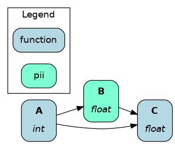](assets/images/custom-viz_c7083582cdd8dfae.png)
> > > >
> > > > <a id="concepts-function-modifiers--schema"></a>

> > > >
> > > > ### @schema
> > > >
> > > > The `@schema` function modifiers provides a lightweight way to add type metadata to dataframes. It works by specifying tuples of `(field_name, field_type)` with types as strings.
> > > >
> > > > ```
> > > > from
> > > > hamilton.function_modifiers
> > > > import schema @schema.output (("a","int" ),("b","float" ),("c","str")) def
> > > > clean_df (raw_df:pd.DataFrame) -> pd.DataFrame:return pd.DataFrame.from_records ({"a":[1 ],"b":[2.0 ],"c":["3" ]})
> > > > ```
> > > >
> > > > 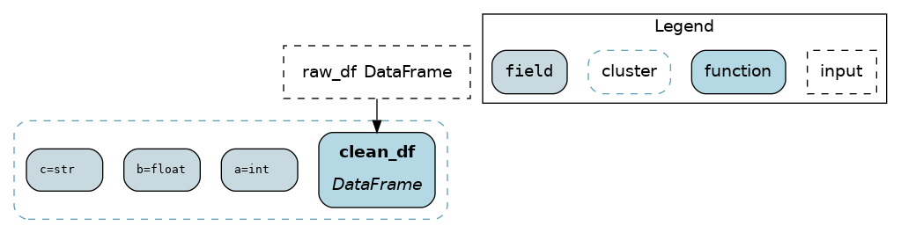
> > > >
> > > > <a id="concepts-function-modifiers--validate-node-output"></a>

> > > >
> > > > ## Validate node output
> > > >
> > > > The `@check_output` function modifiers are applied on the **node output / function return** and therefore don’t directly affect node behavior. Decorators separate data validation from the function body where the core logic is. It improves function readability, and it helps reusing and maintaining standardized checks across multiple functions.
> > > >
> > > > > [!NOTE]
> > > > > **In the future, validation capabilities may be added to @schema . For now, it’s only added metadata.**
> > > > >
> > > >
> > > > <a id="concepts-function-modifiers--check_output"></a>

> > > >
> > > > ### @check\_output\*
> > > >
> > > > The `@check_output` implements many data checks for Python objects and DataFrame/Series including data type, min/max/between, count, fraction of null/nan values, and allow null/nan. Failed checks are either logged (`importance="warn"`) or make the dataflow fail (`importance="fail"`).
> > > >
> > > > The next snippet checks if the returned Series is of type `np.int32`, which is non-nullable, and if its within the range 0-100, and logs failed checks. This allows us to manually review instances where data validation failed.
> > > >
> > > > ```
> > > > from
> > > > hamilton.function_modifiers
> > > > import check_output @check_output (data_type =np.int32,range =(0,100 ),importance ="warn") def
> > > > quiz_grade (quiz_df:pd.DataFrame) -> pd.Series:return ...
> > > > ```
> > > >
> > > > 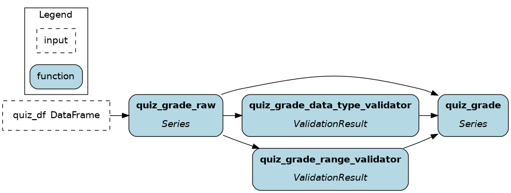
> > > >
> > > > - To see all available validators, go to the file `hamilton/data_quality/default_validators.py` and view the variable `AVAILABLE_DEFAULT_VALIDATORS`.
> > > > - The function modifier `@check_output_custom` allows you to define your own validator. Validators inherit the `base.DataValidator` class (or `base.BaseDefaultValidator` for use with `@check_output`) and are essentially standardized Hamilton node definitions (instead of functions). See `hamilton/data_quality/default_validators.py` or reach out on [Slack](https://join.slack.com/t/hamilton-opensource/shared_invite/zt-2niepkra8-DGKGf_tTYhXuJWBTXtIs4g) for help!
> > > > - For async validation logic (e.g., async database or API calls), inherit from `base.AsyncDataValidator` or `base.AsyncBaseDefaultValidator` instead. These define `async def validate()` and work with `AsyncDriver`. You can mix sync and async validators in a single `@check_output_custom` call.
> > > > - Note: `@check_output_custom` decorators cannot be stacked, but they instead can take multiple validators.
> > > >
> > > > > [!NOTE]
> > > > > As you see, validation steps effectively add nodes to the dataflow and the visualization. This helps trace which specific check failed for instance, but it can make visualizations harder to read.
> > > > >
> > > > > You can hide these nodes using the custom visualization style feature (see [Apply custom style](#concepts-visualization--custom-visualization-style)) by applying the style `{"style": "invis"}` to nodes with the tag `hamilton.data_quality.source_node`. This will only keep the original nodes and their `_raw` variant.
> > > >
> > > > <a id="concepts-function-modifiers--pandera-support"></a>

> > > >
> > > > ### pandera support
> > > >
> > > > Apache Hamilton has a pandera plugin for data validation that you can install with `pip install sf-hamilton[pandera]`. Then, you can pass a pandera schema (for DataFrame or Series) to `@check_output(schema=...)`.
> > > >
> > > > <a id="concepts-function-modifiers--pydantic-support"></a>

> > > >
> > > > ### pydantic support
> > > >
> > > > Apache Hamilton also supports data validation of pydantic models, which can be enabled with `pip install sf-hamilton[pydantic]`. With pydantic installed, you can pass any subclass of the pydantic base model to `@check_output(model=...)`. Pydantic validation is performed in strict mode, meaning that raw values will not be coerced to the model’s types. For more information on strict mode see the [pydantic docs](https://docs.pydantic.dev/latest/concepts/strict_mode/).
> > > >
> > > > <a id="concepts-function-modifiers--split-node-output-into-n-nodes"></a>

> > > >
> > > > ## Split node output into *n* nodes
> > > >
> > > > Sometimes, your node outputs multiple values that you would like to name and make available to other nodes. These function modifiers act on the **node output / function return**.
> > > >
> > > > > [!NOTE]
> > > > > **To add metadata to extracted nodes, use @tag\_output , which works just like @tag .**
> > > > >
> > > >
> > > > <a id="concepts-function-modifiers--unpack_fields"></a>

> > > >
> > > > ### @unpack\_fields
> > > >
> > > > A good example is splitting a dataset into training, validation, and test splits. We use `@unpack_fields`, which requires specifying the names of the fields to extract. The function must return a tuple with at least as many elements as there are specified fields. Note that selecting a subset of the tuple or using an indeterminate tuple size is also possible.
> > > >
> > > > ```
> > > > from
> > > > typing
> > > > import Tuple from
> > > > hamilton.function_modifiers
> > > > import unpack_fields @unpack_fields ("X_train","X_validation","X_test") def
> > > > dataset_splits (X:np.ndarray) -> Tuple [np.ndarray,np.ndarray,np.ndarray ]:
> > > > """Randomly split data into train, validation, test""" X_train,X_validation,X_test =random_split (X) return X_train,X_validation,X_test
> > > > ```
> > > >
> > > > [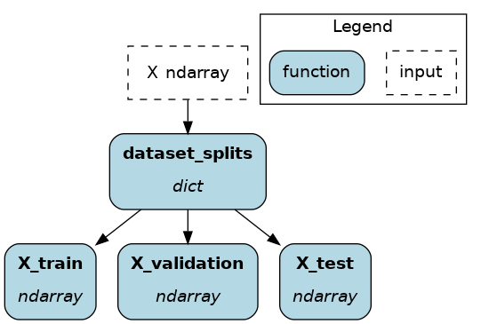](assets/images/extract-fields_210578de4ad20941.png)
> > > >
> > > > Now, `X_train`, `X_validation`, and `X_test` are available to other nodes and can be queried with `.execute()`. However, since `dataset_splits` is itself a node, you can query it to obtain all splits in a single tuple!
> > > >
> > > > <a id="concepts-function-modifiers--extract_fields"></a>

> > > >
> > > > ### @extract\_fields
> > > >
> > > > Additionally, we can extract fields from an output dictionary using `@extract_fields`. The function must return a dictionary that contains, at a minimum, those keys specified in the decorator. In this case, you can specify a dictionary of fields and their types:
> > > >
> > > > ```
> > > > from
> > > > typing
> > > > import Dict from
> > > > hamilton.function_modifiers
> > > > import extract_fields @extract_fields (dict (# fields specified as a dictionary X_train =np.ndarray,X_validation =np.ndarray,X_test =np.ndarray,)) def
> > > > dataset_splits (X:np.ndarray) -> Dict:
> > > > """Randomly split data into train, validation, test""" X_train,X_validation,X_test =random_split (X) return dict (X_train =X_train,# keys match those from @extract_fields X_validation =X_validation,X_test =X_test,)
> > > > ```
> > > >
> > > > [](assets/images/extract-fields_210578de4ad20941.png)
> > > >
> > > > Or if you are using a generic dictionary, you can specify solely the field names.
> > > >
> > > > ```
> > > > from
> > > > typing
> > > > import Dict from
> > > > hamilton.function_modifiers
> > > > import extract_fields @extract_fields ("X_train","X_validation","X_test") # field names only def
> > > > dataset_splits (X:np.ndarray) -> Dict [str,np.ndarray ]:# generic dict
> > > > """Randomly split data into train, validation, test""" X_train,X_validation,X_test =random_split (X) return dict (X_train =X_train,X_validation =X_validation,X_test =X_test,)
> > > > ```
> > > >
> > > > If you are using a TypedDict, you can specify the just field names.
> > > >
> > > > ```
> > > > from
> > > > typing
> > > > import TypedDict from
> > > > hamilton.function_modifiers
> > > > import extract_fields class
> > > > DatasetSplits (TypedDict ):X_train:np.ndarray X_validation:np.ndarray X_test:np.ndarray @extract_fields ("X_train","X_validation","X_test") def
> > > > dataset_splits (X:np.ndarray) -> DatasetSplits:
> > > > """Randomly split data into train, validation, test""" X_train,X_validation,X_test =random_split (X) return dict (X_train =X_train,X_validation =X_validation,X_test =X_test,)
> > > > ```
> > > >
> > > > Or you can leave the field names empty and extract all fields from the TypedDict.
> > > >
> > > > ```
> > > > from
> > > > typing
> > > > import TypedDict from
> > > > hamilton.function_modifiers
> > > > import extract_fields class
> > > > DatasetSplits (TypedDict ):X_train:np.ndarray X_validation:np.ndarray X_test:np.ndarray @extract_fields (DatasetSplits) # field names only def
> > > > dataset_splits (X:np.ndarray) -> DatasetSplits:
> > > > """Randomly split data into train, validation, test""" X_train,X_validation,X_test =random_split (X) return dict (X_train =X_train,X_validation =X_validation,X_test =X_test,)
> > > > ```
> > > >
> > > > Again, `X_train`, `X_validation`, and `X_test` are now available to other nodes, or you can query the `dataset_splits` node to retrieve all splits in a dictionary.
> > > >
> > > > <a id="concepts-function-modifiers--extract_columns"></a>

> > > >
> > > > ### @extract\_columns
> > > >
> > > > `@extract_columns` is a specialized version of `@extract_fields` to get individual columns of a dataframe (pandas, polars, Spark, etc.). It enables column-level lineage which improves visibility over data transformations and facilitates reusing feature transformations. Also, it can reduce memory usage by avoiding moving large dataframe through nodes.
> > > >
> > > > Since it knows how to extract series from a dataframe, you just have to specify the column names.
> > > >
> > > > ```
> > > > from
> > > > hamilton.function_modifiers
> > > > import extract_columns # assuming `user_id` and `weekday` are existing columns # note that strings are passed directly, without a list @extract_columns ("user_id","weekday") def
> > > > clean_df (raw_df:pd.DataFrame) -> pd.DataFrame:
> > > > """Clean my data""" clean_df =clean_my_data (raw_df) return clean_df
> > > > ```
> > > >
> > > > [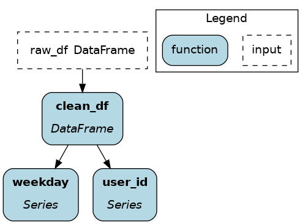](assets/images/extract-columns_ba3ce05d5a0accc8.png)
> > > >
> > > > <a id="concepts-function-modifiers--define-one-function-create-n-nodes"></a>

> > > >
> > > > ## Define one function, create *n* nodes
> > > >
> > > > The family of `@parameterize` function modifiers allows the creation of multiple nodes with the same **node implementation / function body** (and therefore output type), but different **node inputs**.
> > > >
> > > > This has many applications, such as producing the same performance plot for multiple models or computing groupby aggregates along different dimensions.
> > > >
> > > > <a id="concepts-function-modifiers--parameterize"></a>

> > > >
> > > > ### @parameterize
> > > >
> > > > You need to specify the generated **node name**, a dictionary of dependencies, and optionally a docstring. For the dependencies, you can pass constants with `value()` or get them from the dataflow by passing a node name to `source()`. These notions are tricky at first, but let’s look at an example:
> > > >
> > > > We create 3 nodes: `revenue_by_age`, `revenue_by_country`, `revenue_by_occupation`. For each, we get the dataframe `df` from the dataflow using `source()` and specify a different `groupby_col` with `value()`. Also, the docstring uses `{groupby_col}` to have the value inserted.
> > > >
> > > > ```
> > > > from hamilton.function_modifiers import parameterize
> > > > from hamilton.function_modifiers import source, value
> > > >
> > > > @parameterize(
> > > >     revenue_by_age=dict(df=source("df"), groupby_col=value("age")),
> > > >     revenue_by_country=dict(df=source("df"), groupby_col=value("country")),
> > > >     revenue_by_occupation=dict(df=source("df"), groupby_col=value("occupation")),
> > > > )
> > > > def population_metrics(df: pd.DataFrame, groupby_col: str) -> dict:
> > > >     """Compute df metrics aggregates over dimension {groupby_col}"""
> > > >     return df.groupby(groupby_col)["revenue"] \
> > > >              .agg(["mean", "min", "max"]) \
> > > >              .to_dict()
> > > > ```
> > > >
> > > > 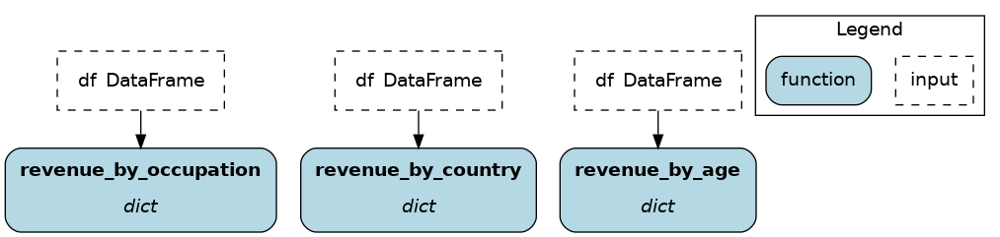
> > > >
> > > > - The above example mixes constant `value()` and dataflow `source()` dependencies. The syntax is indeed verbose. Simplified syntaxes are available through `@parameterize_values` and `@parameterize_sources` if you only need one type of dependency.
> > > > - If you need to extract columns from the output of a generated node, use `@parameterize_extract_columns`
> > > >
> > > > <a id="concepts-function-modifiers--select-functions-to-include"></a>

> > > >
> > > > ## Select functions to include
> > > >
> > > > The family of `@config` decorators doesn’t modify the function. Rather, it tells the Driver which functions from the module (and therefore nodes) to include in the dataflow. This helps projects that need to run in different contexts (e.g., locally vs orchestrator) or need to swap different implementations of a node (e.g., ML experiments, code migration, A/B testing).
> > > >
> > > > > [!NOTE]
> > > > > At first, there can be confusion between `@config` and the `inputs` and `overrides` of the Driver’s `.execute()` and `.materialize()` methods. In common language, people might refer to the `.execute(inputs=..., overrides=...)` as a configuration. However, these two affect the values passing through the dataflow **once the Driver is built** while `@config` determines **how the Driver is built**.
> > > >
> > > > <a id="concepts-function-modifiers--config"></a>

> > > >
> > > > ### @config
> > > >
> > > > For the decorator, you must specify one or more `key=value` pairs. Then, you need to add to the Builder `.with_config()` and give it a dictionary of `key=value` pairs. This will determine which functions to load.
> > > >
> > > > This example uses `@config.when()` to select between a binary classifier and a regressor model. Notice a few elements:
> > > >
> > > > - both functions have the same name `base_model` with a suffix `__binary` or `__regression`. This is required because Python enforces unique function names. After the config determines which function to load, Apache Hamilton will remove the suffix from the node name.
> > > > - the two functions have different return types, so `train_model` needs to annotate `base_model` as a `Union[]` type.
> > > >
> > > > ```
> > > > # model_training.py from hamilton.function_modifiers import config @config.when (task ="binary_classification") def base_model__binary () -> XGBClassifier:return XGBClassifier (...) @config.when (task ="continuous_regression") def base_model__regression () -> XGBRegressor:return XGBRegressor (...) def train_model (base_model:Union [XGBClassifier,XGBRegressor ],X:np.ndarray,y:np.ndarray,) -> Union [XGBClassifier,XGBRegressor ]:return ...# run.py dr =(driver.Builder ().with_modules (model_training).with_config (dict (task ="continuous_regression" )).build ())
> > > > ```
> > > >
> > > > [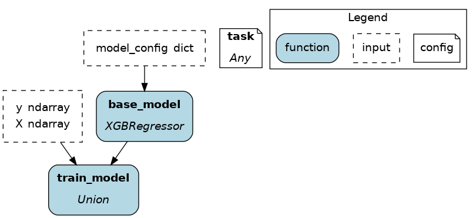](assets/images/config-1_fe6d3a1869ce5245.png)
> > > > [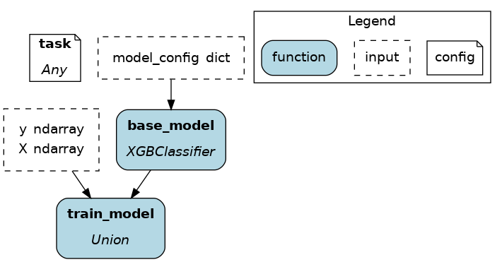](assets/images/config-2_043bad0f10f80c5b.png)
> > > >
> > > > In the above example, if the Driver receives no value for the key `task` or the value isn’t `"binary_classification"` or `"continuous_regression"`, there would be no `base_model` node loaded and `train_model` would fail.
> > > >
> > > > Using `@config.when_not()` can help set up a default case and ensure a `base_model` node is always loaded.
> > > >
> > > > ```
> > > > @config.when (library ="xgboost") def
> > > > base_model__xgboost () -> XGBClassifier:return XGBClassifier (...) @config.when_not (library ="xgboost") def
> > > > base_model__default () -> sklearn.ensemble.RandomForestRegressor:return sklearn.ensemble.RandomForestRegressor (...)
> > > > ```
> > > >
> > > > There exists also `@config.when_in()` and `@config.when_not_in()` that accept a list of values to check. Expanding on the previous example:
> > > >
> > > > ```
> > > > @config.when (library ="xgboost") def
> > > > base_model__xgboost () -> XGBClassifier:return XGBClassifier (...) @config.when (library ="lightgbm") def
> > > > base_model__lightgbm () -> LGBMClassifier:return LGBMClassifier (...) @config.when_not_in (library =["xgboost","lightgbm" ]) def
> > > > base_model__default () -> sklearn.ensemble.RandomForestRegressor:return sklearn.ensemble.RandomForestRegressor (...)
> > > > ```
> > > >
> > > > <a id="concepts-function-modifiers--load-and-save-external-data"></a>

> > > >
> > > > ## Load and save external data
> > > >
> > > > Most dataflows require reading or writing data to external sources in some capacity. It’s a good idea to conduct this step in a node separated from transformations to trace failures more easily.
> > > >
> > > > Nevertheless, adding one function per read/write becomes tedious and hard to maintain. Apache Hamilton provides well-tested implementations for common formats (JSON, CSV, Parquet, etc.) available through `@load_from` and `@save_to` decorators and materializers (see [Materialization](#concepts-materialization)).
> > > >
> > > > More formats are available through Apache Hamilton plugins, and you should be able to add your own custom loader/saver (reach out on [Slack](https://join.slack.com/t/hamilton-opensource/shared_invite/zt-2niepkra8-DGKGf_tTYhXuJWBTXtIs4g) for help!)
> > > >
> > > > <a id="concepts-function-modifiers--load_from"></a>

> > > >
> > > > ### @load\_from
> > > >
> > > > You can think of `@load_from` as adding an upstream node. The next example specifies the `path` of the file, which will be loaded in the variable `raw_data`. Note that the variable type should be compatible with the loaded file (`dict` for JSON here).
> > > >
> > > > ```
> > > > @load_from.json (path ="/path/to/file.json") def
> > > > normalized_data (raw_data:dict) -> dict:return ...
> > > > ```
> > > >
> > > > [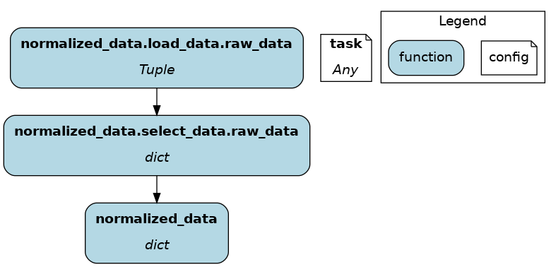](assets/images/load-from_2cc009bd3e0e90a3.png)
> > > >
> > > > It is possible to use `source()` (like in `@parameterize`) to specify the file path from the driver code. See:
> > > >
> > > > ```
> > > > # functions.py @load_from.json (path =source ("raw_data_path" )) def normalized_data (raw_data:dict) -> dict:return ...# run.py dr =driver.Builder ().with_modules (functions).build () dr.execute (["normalized_data" ],inputs =dict (raw_data_path ="./this/file.json" ))
> > > > ```
> > > >
> > > > You will need to use the `inject_` keyword when you load multiple files into a node or your function has multiple parameters.
> > > >
> > > > ```
> > > > @load_from.json (path ="/path/to/logs.json",inject_ ="logs1") @load_from.json (path ="/path/to/other/logs.json",inject_ ="logs2") def
> > > > merged_logs (logs1:dict,logs2:dict) -> dict:return ...
> > > > ```
> > > >
> > > > [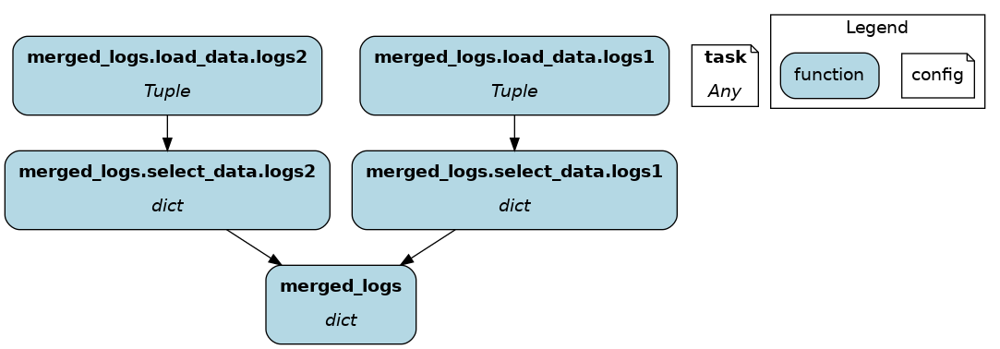](assets/images/load-from-inject_2311e5ec5ea65d0c.png)
> > > >
> > > > <a id="concepts-function-modifiers--save_to"></a>

> > > >
> > > > ### @save\_to
> > > >
> > > > The `@save_to` decorator works very similarly to `@load_from`. In this case, `path=...` specifies where the data will be saved, and an `output_name_` is required to be able to request the node from `Driver.execute()`. Here again, `source()` can be used.
> > > >
> > > > ```
> > > > # functions.py @save_to.json (path =source ("metrics_path" ),output_name_ ="metrics_to_json") def eval_metric (x:np.ndarray,y:np.ndarray) -> dict:return dict (...) # run.py dr =driver.Builder ().with_modules (functions).build () dr.execute (["metrics_to_json" ],inputs =dict (metrics_path ="./out/metrics.json" ))
> > > > ```
> > > >
> > > > [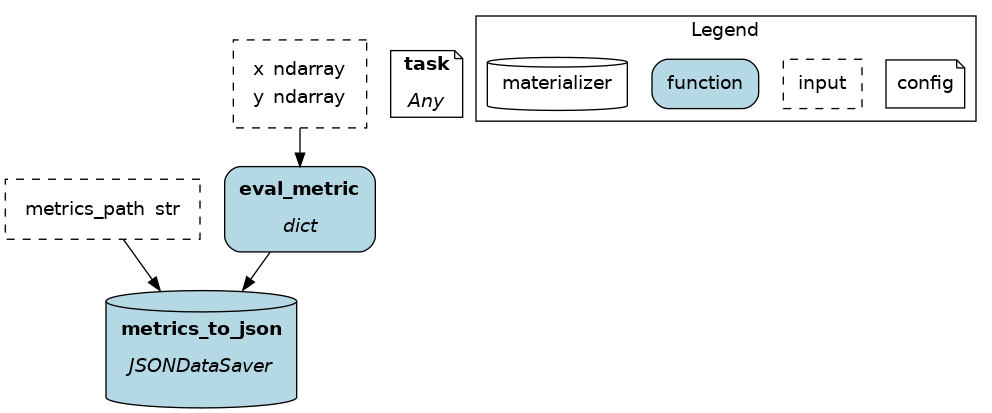](assets/images/save-to_1797835d282d9a8f.png)

On this page

- [Function modifiers](#concepts-function-modifiers)
  - [Decorators](#concepts-function-modifiers--decorators)
  - [Reminder: Anatomy of a node](#concepts-function-modifiers--reminder-anatomy-of-a-node)
  - [Add metadata to a node](#concepts-function-modifiers--add-metadata-to-a-node)
    - [@tag](#concepts-function-modifiers--tag)
    - [Query node by tag](#concepts-function-modifiers--query-node-by-tag)
    - [Customize visualization by tag](#concepts-function-modifiers--customize-visualization-by-tag)
    - [@schema](#concepts-function-modifiers--schema)
  - [Validate node output](#concepts-function-modifiers--validate-node-output)
    - [@check\_output\*](#concepts-function-modifiers--check-output)
    - [pandera support](#concepts-function-modifiers--pandera-support)
    - [pydantic support](#concepts-function-modifiers--pydantic-support)
  - [Split node output into *n* nodes](#concepts-function-modifiers--split-node-output-into-n-nodes)
    - [@unpack\_fields](#concepts-function-modifiers--unpack-fields)
    - [@extract\_fields](#concepts-function-modifiers--extract-fields)
    - [@extract\_columns](#concepts-function-modifiers--extract-columns)
  - [Define one function, create *n* nodes](#concepts-function-modifiers--define-one-function-create-n-nodes)
    - [@parameterize](#concepts-function-modifiers--parameterize)
  - [Select functions to include](#concepts-function-modifiers--select-functions-to-include)
    - [@config](#concepts-function-modifiers--config)
  - [Load and save external data](#concepts-function-modifiers--load-and-save-external-data)
    - [@load\_from](#concepts-function-modifiers--load-from)
    - [@save\_to](#concepts-function-modifiers--save-to)

---

<a id="concepts-builder"></a>

<!-- source_url: https://hamilton.incubator.apache.org/concepts/builder/ -->

<!-- page_index: 17 -->

# Builder ¶

> [!NOTE]
> > [!NOTE]
> > [Back to top](#concepts-builder)
> >
> > [View this page](https://github.com/apache/hamilton/blob/main/docs/concepts/builder.rst?plain=true "View this page")
> >
> > [Edit this page](https://github.com/apache/hamilton/edit/main/docs/concepts/builder.rst "Edit this page")
> >
> > <a id="concepts-builder--builder"></a>

> >
> > # Builder
> >
> > The [Driver](#concepts-driver) page covered the basics of building the Driver, visualizing the dataflow, and executing the dataflow. We learned how to create the dataflow by passing a Python module to `Builder().with_modules()`.
> >
> > On this page, how to configure your Driver with the `driver.Builder()`. There will be mentions of advanced concepts, which are further explained on their respective page.
> >
> > > [!NOTE]
> > > **dr = ( driver . Builder () . with\_modules ( my\_dataflow ) . build () )**
> > > As your Builder code grows complex, defining it over multiple lines can improve readability. This is possible by using parentheses after the assignment `=`
> > >
> > > The order of Builder statements doesn’t matter as long as `.build()` is last.
> >
> > <a id="concepts-builder--with_modules"></a>

> >
> > ## with\_modules()
> >
> > This passes dataflow modules to the Driver. When passing multiple modules, the Driver assembles them into a single dataflow.
> >
> > ```
> > # my_dataflow.py def A () -> int:"""Constant value 35""" return 35 def B (A:int) -> float:"""Divide A by 3""" return A / 3
> > ```
> >
> > ```
> > # my_other_dataflow.py def C (A:int,B:float) -> float:"""Square A and multiply by B""" return A ** 2 * B
> > ```
> >
> > ```
> > # run.py from hamilton import driver import my_dataflow import my_other_dataflow dr =driver.Builder ().with_modules (my_dataflow,my_other_dataflow).build ()
> > ```
> >
> > 
> >
> > It encourages organizing code into logical modules (e.g., feature processing, model training, model evaluation). `features.py` might depend on PySpark and `model_training.py` on XGBoost. By organizing modules by dependencies, it’s easier to reuse the XGBoost model training module in a project that doesn’t use PySpark and avoid version conflicts.
> >
> > ```
> > # run.py from hamilton import driver import features import model_training import model_evaluation dr =(driver.Builder ().with_modules (features,model_training,model_evaluation).build ())
> > ```
> >
> > > [!NOTE]
> > > **dr = ( driver . Builder () . with\_modules ( module\_A , module\_B ) . allow\_module\_overrides () . build () )**
> > > Your modules may have same named functions which will raise an error when using `.build()` since we cannot have two nodes with the same name. You can use the method `.allow_module_overrides()` and Apache Hamilton will choose the function from the later imported module.
> > >
> > > If `module_A` and `module_B` both have the function `foo()`, Apache Hamilton will use `module_B.foo()` when constructing the DAG. See <https://github.com/apache/hamilton/tree/main/examples/module_overrides> for more info.
> >
> > <a id="concepts-builder--with_config"></a>

> >
> > ## with\_config()
> >
> > This is directly related to the `@config` function decorator (see [Select functions to include](#concepts-function-modifiers--config-decorators)) and doesn’t have any effect in its absence. By passing a dictionary to `with_config()`, you configure which functions will be used to create the dataflow. You can’t change the config after the Driver is created. Instead, you need to rebuild the Driver with the new config values.
> >
> > ```
> > # my_dataflow.py from hamilton.function_modifiers import config def A () -> int:"""Constant value 35""" return 35 @config.when_not (version ="remote") def B__default (A:int) -> float:"""Divide A by 3""" return A / 3 @config.when (version ="remote") def B__remote (A:int) -> float:"""Divide A by 2""" return A / 2
> > ```
> >
> > ```
> > # run.py from hamilton import driver import my_dataflow dr =(driver.Builder ().with_modules (my_dataflow).with_config (dict (version ="remote" )).build ()) dr.display_all_functions ("dag.png")
> > ```
> >
> > 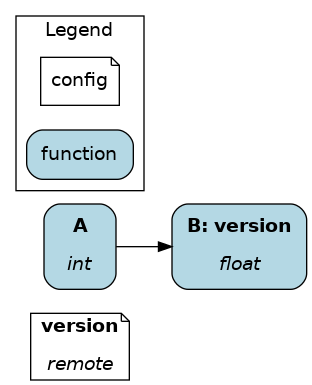
> >
> > <a id="concepts-builder--with_materializers"></a>

> >
> > ### with\_materializers()
> >
> > Adds DataSaver and DataLoader nodes to your dataflow. This allows to visualize these nodes using `Driver.display_all_functions()` and be executed by name with `Driver.execute()`. More details on the [Materialization](#concepts-materialization) documentation page.
> >
> > ```
> > # my_dataflow.py import pandas as pd from hamilton.function_modifiers import config def clean_df (raw_df:pd.DataFrame) -> pd.DataFrame:return ...def features_df (clean_df:pd.DataFrame) -> pd.DataFrame:return ...
> > ```
> >
> > ```
> > # run.py from hamilton import driver from hamilton.io.materialization import from_,to import my_dataflow loader =from_.parquet (target ="raw_df",path ="/my/raw_file.parquet") saver =to.parquet (id ="features__parquet",dependencies =["features_df" ],path ="/my/feature_file.parquet") dr =(driver.Builder ().with_modules (my_dataflow).with_materializers (loader,saver).build ()) dr.display_all_functions ("dag.png") dr.execute (["features__parquet" ])
> > ```
> >
> > 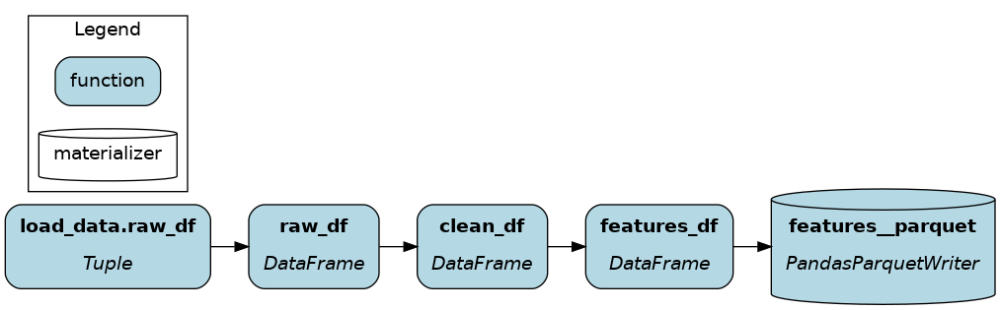
> >
> > <a id="concepts-builder--with_cache"></a>

> >
> > ## with\_cache()
> >
> > This enables Apache Hamilton’s caching feature, which allows to automatically store intermediary results and reuse them in subsequent executions to skip computations. Learn more in the [Caching](#concepts-caching) section.
> >
> > ```
> > from
> > hamilton
> > import driver import
> > my_dataflow dr =(driver.Builder ().with_modules (my_dataflow).with_cache ().build ())
> > ```
> >
> > <a id="concepts-builder--with_adapters"></a>

> >
> > ## with\_adapters()
> >
> > This allows to add multiple Lifecycle hooks to the Driver. This is a very flexible abstraction to develop custom plugins to do logging, telemetry, alerts, and more. The following adds a hook to launch debugger when reaching the node `"B"`:
> >
> > ```
> > # run.py from hamilton import driver,lifecycle import my_dataflow debug_hook =lifecycle.default.PDBDebugger (node_filter ="B",during =True) dr =(driver.Builder ().with_modules (my_dataflow).with_adapters (debug_hook).build ())
> > ```
> >
> > Other hooks are available to output a progress bar in the terminal, do experiment tracking for your Apache Hamilton runs, cache results to disk, send logs to DataDog, and more!
> >
> > <a id="concepts-builder--enable_dynamic_execution"></a>

> >
> > ## enable\_dynamic\_execution()
> >
> > This directly relates to the Builder `with_local_executor()` and `with_remote_executor()` and the `Parallelizable/Collect` functions (see [Dynamic DAGs/Parallel Execution](#concepts-parallel-task)). For the Driver to be able to parse them, you need to set `allow_experimental_mode=True` like the following:
> >
> > ```
> > # run.py from hamilton import driver import my_dataflow # <- this contains Parallelizable/Collect nodes dr =(driver.Builder ().enable_dynamic_execution (allow_experimental_mode =True) # set True.with_modules (my_dataflow).build ())
> > ```
> >
> > By enabling dynamic execution, reasonable defaults are used for local and remote executors. You also specify them explicitly as such:
> >
> > ```
> > # run.py from hamilton import driver from hamilton.execution import executors import my_dataflow dr =(driver.Builder ().with_modules (my_dataflow).enable_dynamic_execution (allow_experimental_mode =True).with_local_executor (executors.SynchronousLocalTaskExecutor ()).with_remote_executor (executors.MultiProcessingExecutor (max_tasks =5 )).build ())
> > ```

On this page

- [Builder](#concepts-builder)
  - [with\_modules()](#concepts-builder--with-modules)
  - [with\_config()](#concepts-builder--with-config)
    - [with\_materializers()](#concepts-builder--with-materializers)
  - [with\_cache()](#concepts-builder--with-cache)
  - [with\_adapters()](#concepts-builder--with-adapters)
  - [enable\_dynamic\_execution()](#concepts-builder--enable-dynamic-execution)

---

<a id="concepts-caching"></a>

<!-- source_url: https://hamilton.incubator.apache.org/concepts/caching/ -->

<!-- page_index: 18 -->

# Caching ¶

> [!NOTE]
> [Back to top](#concepts-caching)
>
> [View this page](https://github.com/apache/hamilton/blob/main/docs/concepts/caching.rst?plain=true "View this page")
>
> [Edit this page](https://github.com/apache/hamilton/edit/main/docs/concepts/caching.rst "Edit this page")
>
> > [!WARNING]
> > > [!NOTE]
> > > <a id="concepts-caching--caching"></a>

> > >
> > > # Caching
> > >
> > > Caching enables storing execution results to be reused in later executions, effectively skipping redundant computations. This speeds up execution and saves resources (computation, API credits, GPU time, etc.), and has applications both for development and production.
> > >
> > > To enable caching, add `.with_cache()` to your `Builder()`.
> > >
> > > ```
> > > from
> > > hamilton
> > > import driver import
> > > my_dataflow dr =(driver.Builder ().with_module (my_dataflow).with_cache ().build ()) dr.execute ([...]) dr.execute ([...])
> > > ```
> > >
> > > The first execution will store **metadata** and **results** next to the current directory under `./.hamilton_cache`. The next execution will retrieve results from cache when possible to skip execution.
> > >
> > > > [!NOTE]
> > > > **We highly suggest viewing the Caching tutorial for a practical introduction to caching.**
> > > >
> > >
> > > <a id="concepts-caching--how-does-it-work"></a>

> > >
> > > ## How does it work?
> > >
> > > Caching relies on multiple components:
> > >
> > > - **Cache adapter**: decide to retrieve a result or execute the node
> > > - **Metadata store**: store information about past node executions
> > > - **Result store**: store results on disk, it is unaware of other cache components.
> > >
> > > At a high-level, the cache adapter does the following for each node:
> > >
> > > 1. Before execution: determine the `cache_key`
> > > 2. At execution:
> > >    :   1. if the `cache_key` finds a match in the metadata store (cache **hit**), retrieve the `data_version` of the `result`.
> > >        2. If there’s no match (cache **miss**), execute the node and store the `data_version` of the `result` in the metadata store.
> > > 3. After execution: if we had to execute the node, store the `result` in the result store.
> > >
> > > The caching mechanism is highly performant because it can pass `data_version` (small strings) through the dataflow instead of the actual data until a node needs to be executed.
> > >
> > > The result store is a mapping of `{data_version: result}`. While a `cache_key` is unique to determine retrieval or execution, multiple cache keys can point to the same `data_version`, which avoid storing duplicate results.
> > >
> > > <a id="concepts-caching--cache-key"></a>

> > >
> > > ### Cache key
> > >
> > > Understanding the `cache_key` is important to understand why a node is recomputed or not. It is composed of:
> > >
> > > - `node_name`: name of the node
> > > - `code_version`: version of the node’s code
> > > - `dependencies_data_versions`: `data_version` of each dependency of the node
> > >
> > > ```
> > > {
> > > "node_name":
> > > "processed_data",
> > > "code_version":
> > > "c2ccafa54280fbc969870b6baa445211277d7e8cfa98a0821836c175603ffda2",
> > > "dependencies_data_versions":
> > > {
> > > "raw_data":
> > > "WgV5-4SfdKTfUY66x-msj_xXsKNPNTP2guRhfw==",
> > > "date":
> > > "ZWNhd-XNlIF0YV9-2ZXJzaW9u_YGAgKA==",
> > > }}
> > > ```
> > >
> > > By traversing the cache keys’ `dependencies_data_versions`, we can actually reconstruct the dataflow structure!
> > >
> > > > [!WARNING]
> > > > Cache keys could be unstable across Python and Apache Hamilton versions (because of new features, bug fixes, etc.). Upgrading Python or Apache Hamilton could require starting with a new empty cache for reliable behavior.
> > >
> > > > [!NOTE]
> > > > <a id="concepts-caching--observing-the-cache"></a>

> > > >
> > > > ## Observing the cache
> > > >
> > > > Caching is best understood throung interacting with it. Apache Hamilton offers many utilities to observe and introspect the cache manually.
> > > >
> > > > <a id="concepts-caching--logging"></a>

> > > >
> > > > ### Logging
> > > >
> > > > To see how the cache works step-by-step, start your code (script, notebook, etc.) by getting the logger and setting the level to `DEBUG`. Using `INFO` will be less noisy and only log `GET_RESULT` and `EXECUTE_NODE` events.
> > > >
> > > > ```
> > > > import
> > > > logging logger =logging.getLogger ("hamilton.caching") logger.setLevel (logging.INFO) logger.addHandler (logging.StreamHandler ()) # this handler will print to the console
> > > > ```
> > > >
> > > > The logs follow the structure `{node_name}::{task_id}::{actor}::{event_type}::{message}`, omitting empty sections.
> > > >
> > > > ```
> > > > # example INFO logs for nodes foo, bar, and baz foo::result_store::get_result::hit bar::adapter::execute_node baz::adapter::execute_node
> > > > ```
> > > >
> > > > <a id="concepts-caching--visualization"></a>

> > > >
> > > > ### Visualization
> > > >
> > > > After `Driver` execution, calling `dr.cache.view_run()` will create a visualization of the dataflow with results retrieved from the cache highlighted.
> > > >
> > > > By default, it shows the latest run, but it’s possible to view previous runs by passing a `run_id`. Specify a `output_file_path` to save the visualization.
> > > >
> > > > ```
> > > > # ... define and execute a `Driver` # select the 3rd unique run_id run_id_3 =dr.cache.run_ids [2] dr.cache.view_run (run_id =run_id_3,output_file_path ="cached_run_3.png")
> > > > ```
> > > >
> > > > 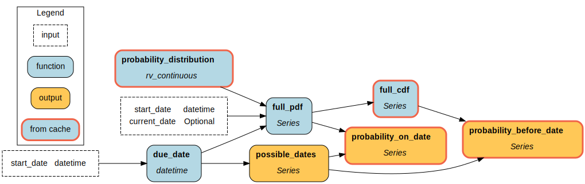
> > > >
> > > > Visualization produced by `dr.cache.view_run()`. Retrieved results are outlined.
> > > >
> > > > > [!NOTE]
> > > > > **The method .view\_run() doens’t currently support task-based execution or Parallelizable/Collect .**
> > > > >
> > > >
> > > > <a id="concepts-caching--structured-logs"></a>

> > > >
> > > > ### Structured logs
> > > >
> > > > Structured logs are stored on the `Driver.cache` and can be inspected programmatically. By setting `.with_cache(log_to_file=True)`, structured logs will also be appended to a `.jsonl` file as they happen; this is ideal for production usage.
> > > >
> > > > To access log, use `Driver.cache.logs()`. You can `.logs(level=...)` to `"info"` or `"debug"` to view only `GET_RESULT` and `EXECUTE_NODE` or all events. Specifying `.logs(run_id=...)` will return logs from a given run, and leaving it empty will returns logs for all executions of this `Driver`.
> > > >
> > > > ```
> > > > dr.execute (...) dr.cache.logs (level ="info")
> > > > ```
> > > >
> > > > The shape of the returned object is slightly diffrent if specifying a `run_id` or not. Specifying a `run_id` will give `{node_name: List[CachingEvent]}`
> > > >
> > > > Requesting `Driver.cache.logs()` will return a dictionary with `run_id` as key and list of `CachingEvent` as values `{run_id: List[CachingEvent]}`. This is useful for comparing run and verify nodes were properly executed or retrieved.
> > > >
> > > > ```
> > > > dr.cache.logs (level ="debug",run_id =dr.cache.last_run_id) # {#     'raw_data': [CachingEvent(...), ...],#     'processed_data': [CachingEvent(...), ...],#     'amount_per_country': [CachingEvent(...), ...] # } dr.cache.logs (level ="debug") # {#     'run_id_1': [CachingEvent(...), ...],#     'run_id_2': [CachingEvent(...), ...] # }
> > > > ```
> > > >
> > > > > [!NOTE]
> > > > > When using `Parallelizable/Collect`, nodes part of the “parallel branches” will have a `task_id` key too `{node_name: {task_id: List[CachingEvent]}}` while nodes outside branches will remain `{node_name: List[CachingEvent]}`
> > >
> > > > [!NOTE]
> > > > <a id="concepts-caching--cached-result-format"></a>

> > > >
> > > > ## Cached result format
> > > >
> > > > By default, caching uses the `pickle` format because it can accomodate almost all Python objects. Although, it has [caveats](https://grantjenks.com/docs/diskcache/tutorial.html#caveats). The `cache` decorator allows you to use a different format for a given node (`JSON`, `CSV`, `Parquet`, etc.).
> > > >
> > > > The next snippet caches `clean_dataset` as `parquet`, and `statistics` as `json`. These formats maybe more reliable, efficient, and easier to work with.
> > > >
> > > > ```
> > > > # my_dataflow.py import pandas as pd from hamilton.function_modifiers import cache def raw_data (path:str) -> pd.DataFrame:return pd.read_csv (path) @cache (format ="parquet") def clean_dataset (raw_data:pd.DataFrame) -> pd.DataFrame:raw_data =raw_data.fillna (0) return raw_data @cache (format ="json") def statistics (clean_dataset:pd.DataFrame) -> dict:return ...
> > > > ```
> > > >
> > > > ```
> > > > import
> > > > driver import
> > > > my_dataflow dr =(driver.Builder ().with_modules (my_dataflow).with_cache ().buid ()) # first execution will product a ``parquet`` file for  ``clean_dataset`` # and a ``json`` file for ``statistics`` dr.execute (["statistics" ]) # second execution will use these parquet and json files when loading results dr.execute (["statistics" ])
> > > > ```
> > > >
> > > > > [!NOTE]
> > > > > **Internally, this uses Materializers**
> > > > >
> > >
> > > <a id="concepts-caching--caching-behavior"></a>

> > >
> > > ## Caching behavior
> > >
> > > The **caching behavior** refers to the caching logic used to:
> > > - version data
> > > - load and store metadata
> > > - load and store results
> > > - execute or not a node
> > >
> > > The `DEFAULT` behavior aims to be easy to use and facilitate iterative development. However, other behavior may be desirble in particular scenarios or when going to production. The behavior can be set node-by-node.
> > >
> > > 1. `DEFAULT`: Try to retrieve results from cache instead of executing the node. Node result and metadata are stored.
> > > 2. `RECOMPUTE`: Always execute the node / never retrieve from cache. Result and metadata are stored. This can be useful to ensure external data is alawys reloaded.
> > > 3. `DISABLE`: Act as if caching isn’t enabled for this node. Nodes depending on a disabled node will miss metadata for cache retrieval, forcing their re-execution. Useful for disabling caching in parts of the dataflow.
> > > 4. `IGNORE`: Similar to **Disable**, but downstream nodes will ignore the missing metadata and can successfully retrieve results. Useful to ignore “irrelevant” nodes that shouldn’t impact the results (e.g., credentials, API clients, database connections).
> > >
> > > > [!NOTE]
> > > > **See also**
> > > > Learn more in the [Caching logic](#reference-caching-caching-logic) reference section.
> > >
> > > > [!NOTE]
> > > > There are other caching behaviors theoretically possible, but these four should cover most cases. Let us know if you have a use case that is not covered.
> > >
> > > <a id="concepts-caching--setting-caching-behavior"></a>

> > >
> > > ### Setting caching behavior
> > >
> > > The caching behavior can be specified at the node-level via the `@cache` function modifier or at the builder-level via `.with_cache(...)` arguments. Note that the behavior specified by the `Builder` will override the behavior from `@cache` since it’s closer to execution.
> > >
> > > <a id="concepts-caching--via-cache"></a>

> > >
> > > ### via `@cache`
> > >
> > > Below, we set `raw_data` to `RECOMPUTE` because the file it loads data from may change between executions. After executing and versioning the result of `raw_data`, if the data didn’t change from previous execution, we’ll be able to retrieve `clean_dataset` and `statistics` from cache.
> > >
> > > ```
> > > # my_dataflow.py import pandas as pd from hamilton.function_modifiers import cache @cache (behavior ="recompute") def raw_data (path:str) -> pd.DataFrame:return pd.read_csv (path) def clean_dataset (raw_data:pd.DataFrame) -> pd.DataFrame:raw_data =raw_data.fillna (0) return raw_data def statistics (clean_dataset:pd.DataFrame) -> dict:return ...
> > > ```
> > >
> > > <a id="concepts-caching--via-builder-.with_cache"></a>

> > >
> > > ### via `Builder().with_cache()`
> > >
> > > Equivalently, we could set this behavior via the `Builder`. You can pass a list of node names to the keyword arguments `recompute`, `ignore`, and `disable`. Using `True` to enable that behavior for all nodes. For example, using `recompute=True` will force execution of all nodes and store their results in cache. Having `disable=True` is equivalent to not having the `.with_cache()` clause.
> > >
> > > ```
> > > from
> > > hamilton
> > > import driver import
> > > my_dataflow dr =(driver.Builder ().with_modules (my_dataflow).with_cache (recompute =["raw_data" ]).build ())
> > > ```
> > >
> > > <a id="concepts-caching--set-a-default-behavior"></a>

> > >
> > > ### Set a default behavior
> > >
> > > By default, caching is “opt-out” meaning all nodes are cached unless specified otherwise. To make it “opt-in”, where only the specified nodes are cached, set `default_behavior="disable"`. You can also try different default behaviors.
> > >
> > > ```
> > > from
> > > hamilton
> > > import driver import
> > > my_dataflow dr =(driver.Builder ().with_modules (my_dataflow).with_cache (default =["raw_data","statistics" ],# set behavior DEFAULT default_behavior ="disable" # all other nodes are DISABLE).build ())
> > > ```
> > >
> > > <a id="concepts-caching--code-version"></a>

> > >
> > > ## Code version
> > >
> > > The `code_version` of a node is determined by hashing its source code, ignoring docstring and comments.
> > >
> > > Importantly, Apache Hamilton will not version nested function calls. If you edit utility functions or upgrade Python libraries, the cache might incorrectly assume the code to be the same.
> > >
> > > For example, take the following function `foo`:
> > >
> > > ```
> > > def
> > > _increment (x ):return x + 1 def
> > > foo ():return _increment (13) # foo's code version: 129064d4496facc003686e0070967051ceb82c354508a58440910eb82af300db
> > > ```
> > >
> > > Despite editing the nested `_increment()`, we get the same `code_version` because the content of `foo()` hasn’t changed.
> > >
> > > ```
> > > def
> > > _increment (x ):return x + 2 def
> > > foo ():return _increment (13) # foo's code version: 129064d4496facc003686e0070967051ceb82c354508a58440910eb82af300db
> > > ```
> > >
> > > In that case, `foo()` should return `13 + 2` instead of `13 + 1`. Unaware of the change in `_increment()`, the cache will find a `cache_key` match and return `13 + 1`.
> > >
> > > A solution is to set the caching behavior to `RECOMPUTE` to force execute `foo()`. Another is to delete stored metadata or results to force re-execution.
> > >
> > > <a id="concepts-caching--data-version"></a>

> > >
> > > ## Data version
> > >
> > > Caching requires the ability to uniquely identify data (e.g., create a hash). By default, all Python primitive types (`int`, `str`, `dict`, etc.) are supported and more types can be added via extensions (e.g., `pandas`). For types not explicitly supported, caching can still function by versioning the object’s internal `__dict__` instead. However, this could be expensive to compute or less reliable than alternatives.
> > >
> > > <a id="concepts-caching--recursion-depth"></a>

> > >
> > > ### Recursion depth
> > >
> > > To version complex objects, we recursively hash its values. For example, versioning an object `List[Dict[str, float]]` involves hashing all keys and values of all dictionaries. Versioning complex objects with large `__dict__` state can become expensive.
> > >
> > > In practice, we need to need a maximum recursion depth because there’s a trade-off between the computational cost of hashing data and how accurately it uniquely identifies data (reduce hashing collisions).
> > >
> > > Here’s how to set the max depth:
> > >
> > > ```
> > > from
> > > hamilton.io
> > > import fingerprinting fingerprinting.set_max_depth (depth =3)
> > > ```
> > >
> > > <a id="concepts-caching--support-additional-types"></a>

> > >
> > > ### Support additional types
> > >
> > > Additional types can be supported by registering a hashing function via the module `hamilton.io.fingerprinting`. It uses [@functools.singledispatch](https://docs.python.org/3/library/functools.html#functools.singledispatch) to register the hashing function per Python type. The function must return a `str`. The code snippets shows how to support polars `DataFrame`:
> > >
> > > ```
> > > import
> > > polars
> > > as
> > > pl from
> > > hamilton.io
> > > import fingerprinting # specify the type via the decorator @fingerprinting.hash_value.register (pl.DataFrame) def
> > > hash_polars_dataframe (obj,* args,** kwargs) -> str:
> > > """Convert a polars dataframe to a list of row hashes, then hash the list.We consider that row order matters.""" # obj is of type `pl.DataFrame` hash_per_row =obj.hash_rows (seed =0) # fingerprinting.hash_value(...) will automatically hash primitive Python types return fingerprinting.hash_value (hash_per_row)
> > > ```
> > >
> > > Alternatively, you can register functions without using decorators.
> > >
> > > ```
> > > from
> > > hamilton.io
> > > import fingerprinting def
> > > hash_polars_dataframe (obj,* args,** kwargs) -> str:...fingerprinting.hash_value.register (pl.DataFrame,hash_polars_dataframe)
> > > ```
> > >
> > > If you want to override the base case, the one defined by the function `hash_value()`, you can do so by registering a function for the type `object`.
> > >
> > > ```
> > > @fingerprinting.hash_value.register (object) def
> > > hash_object (obj,* args,** kwargs) -> str:...
> > > ```
> > >
> > > > [!TIP]
> > > > **Hint**
> > > > <a id="concepts-caching--storage"></a>

> > > >
> > > > ## Storage
> > > >
> > > > The caching feature is powered by two data storages:
> > > >
> > > > - **Metadata store**: It contains information about past `Driver` executions (**code version**, **data version**, run id, etc.). From this metadata, Apache Hamilton determines if a node needs to be executed or not. This metadata is generally lightweight.
> > > > - **Result store**: It’s a key-value store that maps a **data version** to a **result**. It’s completely unaware of nodes, executions, etc. and simply holds the **results**. The result store can significantly grow in size depending on your usage. By default, all results are pickled, but [other formats are possible](#concepts-caching--cache-result-format).
> > > >
> > > > <a id="concepts-caching--setting-the-cache-path"></a>

> > > >
> > > > ### Setting the cache path
> > > >
> > > > By default, the **metadata** and **results** are stored under a new subdirectory `./.hamilton_cache/`, next to the current directory. Alternatively, you can set a path via `.with_cache(path=...)` that will be applied to both stores.
> > > >
> > > > <a id="concepts-caching--by-project"></a>

> > > >
> > > > #### By project
> > > >
> > > > Centralizing your cache by project is useful when you have nodes that are reused across multiple dataflows (e.g., training and inference ML pipelines, feature engineering).
> > > >
> > > > ```
> > > > # training_script.py from hamilton import driver import training cache_path ="/path/to/project/hamilton_cache" train_dr =driver.Builder ().with_modules (training).with_cache (path =cache_path).build () # inference_script.py from hamilton import driver import inference cache_path ="/path/to/project/hamilton_cache" predict_dr =driver.Builder ().with_modules (inference).with_cache (path =cache_path).build ()
> > > > ```
> > > >
> > > > <a id="concepts-caching--globally"></a>

> > > >
> > > > #### Globally
> > > >
> > > > Using a global cache is easier storage management. Since the metadata and the results for *all* your Apache Hamilton dataflows are in one place, it can be easier to cleanup disk space.
> > > >
> > > > ```
> > > > import
> > > > pathlib from
> > > > hamilton
> > > > import driver import
> > > > my_dataflow # set the cache under the user's global directory for any operating system # The `Path` is converted to a string.cache_path =str (pathlib.expanduser ().joinpath ("/.hamilton_cache" )) dr =driver.Builder ().with_module (my_dataflow).with_cache (path =cache_path).build ()
> > > > ```
> > > >
> > > > > [!TIP]
> > > > > **It can be a good idea to store the cache path in an environment variable.**
> > > > >
> > > >
> > > > <a id="concepts-caching--separate-locations"></a>

> > > >
> > > > #### Separate locations
> > > >
> > > > If you want the metadata and result stores to be at different location, you can instantiate and pass them to `.with_cache()`. In that case, `.with_cache()`’s `path` parameter will be ignored.
> > > >
> > > > ```
> > > > from
> > > > hamilton
> > > > import driver from
> > > > hamitlon.io.store
> > > > import SQLiteMetadataStore,ShelveResultStore metadata_store =SQLiteMetadataStore (path ="~/.hamilton_cache") result_store =ShelveResultStore (path ="/path/to/my/project") dr =(driver.Builder ().with_modules (dataflow).with_cache (metadata_store =metadata_store,result_store =result_store,).build ())
> > > > ```
> > > >
> > > > <a id="concepts-caching--inspect-storage"></a>

> > > >
> > > > ### Inspect storage
> > > >
> > > > It is possible to directly interact with the metadata and result stores either by creating them or via `Driver.cache`.
> > > >
> > > > ```
> > > > from
> > > > hamilton.caching.stores.sqlite
> > > > import SQLiteMetadataStore from
> > > > hamilton.caching.stores.file
> > > > import FileResultStore metadata_store =SQLiteMetadataStore (path ="~/.hamilton_cache") result_store =FileResultStore (path ="/path/to/my/project") metadata_store.get (context_key =...) result_store.get (data_version =...)
> > > > ```
> > > >
> > > > ```
> > > > from
> > > > hamilton
> > > > import driver import
> > > > my_dataflow dr =(driver.Builder ().with_modules (dataflow).with_cache ().build ()) dr.cache.metadata_store.get (context_key =...) dr.cache.result_store.get (data_version =...)
> > > > ```
> > > >
> > > > A useful pattern is using the `Driver.cache` state or structured logs <caching-structured-logs> to retrieve a **data version** and query the **result store**.
> > > >
> > > > ```
> > > > from
> > > > hamilton
> > > > import driver from
> > > > hamilton.caching.adapter
> > > > import CachingEventType import
> > > > my_dataflow dr =(driver.Builder ().with_modules (dataflow).with_cache ().build ()) dr.execute (["amount_per_country" ]) # via `cache.data_versions`; this points to the latest run data_version =dr.cache.data_versions ["amount_per_country"] stored_result =dr.cache.result_store.get (data_version) # via structured logs; this allows to query any run run_id =...for event in dr.cache.logs (level ="debug" )[run_id ]:if (event.event_type ==CachingEventType.SET_RESULT and event.node_name =="amount_per_country" ):data_version =event.value break stored_result =dr.cache.result_store (data_version)
> > > > ```
> > > >
> > > > > [!WARNING]
> > > > > <a id="concepts-caching--in-memory"></a>

> > > > >
> > > > > ### In-memory
> > > > >
> > > > > You can enable in-memory caching by using the `InMemoryMetadataStore` and `InMemoryResultStore`. Caching behaves the same, but metadata and results are never persisted to disk. This is useful in notebooks and interactive sessions where results are only temporary relevant (e.g., experimentating with new features).
> > > > >
> > > > > > [!WARNING]
> > > > > > **In-memory caching can quickly fill memory. We suggest selectively caching results to limit this issue.**
> > > > > >
> > > > >
> > > > > ```
> > > > > from
> > > > > hamilton
> > > > > import driver from
> > > > > hamilton.caching.stores.memory
> > > > > import InMemoryMetadataStore,InMemoryResultStore import
> > > > > dataflow dr =(driver.Builder ().with_modules (dataflow).with_cache (metadata_store =InMemoryMetadataStore (),result_store =InMemoryResultStore (),).build ())
> > > > > ```
> > > > >
> > > > > In-memory stores also allow you to persist your entire in-memory session to disk or start your in-memory session by loading an existing cache. This is compatible with most implementations.
> > > > >
> > > > > <a id="concepts-caching--persist-cache"></a>

> > > > >
> > > > > #### Persist cache
> > > > >
> > > > > This snippet shows how to persist an in-memory cache to an sqlite-backed metadata store and a file-based result store. Note that you should persist both the metadata and results stores for this to be useful. The `.persist_to()` method will repeatedly call `.set()` on the destination store. Persisting multiple times will add to the already cached data.
> > > > >
> > > > > ```
> > > > > from
> > > > > hamilton
> > > > > import driver from
> > > > > hamilton.caching.stores.sqlite
> > > > > import SQLiteMetadataStore from
> > > > > hamilton.caching.stores.file
> > > > > import FileResultStore from
> > > > > hamilton.caching.stores.memory
> > > > > import InMemoryMetadataStore,InMemoryResultStore import
> > > > > my_dataflow dr =(driver.Builder ().with_modules (my_dataflow).with_cache (metadata_store =InMemoryMetadataStore (),result_store =InMemoryResultStore (),).build ()) # execute the Driver several time. This will populate the in-memory stores dr.execute (...) # persist to disk dr.cache.metadata_store.persist_to (SQLiteMetadataStore (path ="./.hamilton_cache" )) dr.cache.result_store.persist_to (FileResultStore (path ="./.hamilton_cache" ))
> > > > > ```
> > > > >
> > > > > <a id="concepts-caching--load-cache"></a>

> > > > >
> > > > > #### Load cache
> > > > >
> > > > > This snippet loads in-memory data from persisted metadata and result stores. The `.load_from()` is a classmethod and returns an instance of the in-memory store. The method `InMemoryResultStore.load_from(...)` must receive as argument a result store, but also a metadata store or a list of `data_version` to load. This is because `ResultStore` implementations don’t have a registry of stored results.
> > > > >
> > > > > ```
> > > > > from
> > > > > hamilton
> > > > > import driver from
> > > > > hamilton.caching.stores.sqlite
> > > > > import SQLiteMetadataStore from
> > > > > hamilton.caching.stores.file
> > > > > import FileResultStore from
> > > > > hamilton.caching.stores.memory
> > > > > import InMemoryMetadataStore,InMemoryResultStore import
> > > > > my_dataflow # create persisted stores metadata_store =SQLiteMetadataStore (path ="./.hamilton_cache") result_store =FileResultStore (path ="./.hamilton_cache") dr =(driver.Builder ().with_modules (my_dataflow).with_cache (# create in-memory stores by loading from persisted store metadata_store =InMemoryMetadataStore.load_from (metadata_store ),result_store =InMemoryResultStore.load_from (result_store =result_store,metadata_store =metadata_store,),).build ())
> > > > > ```
> > >
> > > <a id="concepts-caching--roadmap"></a>

> > >
> > > ## Roadmap
> > >
> > > Caching is a significant Apache Hamilton feature and there are plans to expand it. Here are some ideas and areas for development. Feel free comment on them or make other suggestions via [Slack](https://join.slack.com/t/hamilton-opensource/shared_invite/zt-2niepkra8-DGKGf_tTYhXuJWBTXtIs4g) or GitHub!
> > >
> > > - **Apache Hamilton UI integration**: caching introduces the concept of `data_version`. This metadata could be captured by the Apache Hamilton UI to show how different values are used across dataflow executions. This would be particularly useful for experiment tracking and lineage.
> > > - **Distributed caching support**: the initial release supports multithreading and multiprocessing on a single machine. For distributed execution, we will need `ResultStore` and `MetadataStore` that can be remote and are safe for concurrent access.
> > > - **Integrate with remote execution** (Ray, Skypilot, Modal, Runhouse): facilitate a pattern where the dataflow is executed locally, but some nodes can selectively be executed remotely and have their results cached locally.
> > > - **async support**: Support caching with `AsyncDriver`. This requires a significant amount of code, but the core logic shouldn’t change much.
> > > - **cache eviction**: Allow to set up a max storage (in size or number of items) or time-based policy to delete data from the metadata and result stores. This would help with managing the cache size.
> > > - **more store backends**: The initial release includes backend supported by the Python standard library (SQLite metadata and file-based results). Could support more backends via [fsspec](https://filesystem-spec.readthedocs.io/en/latest/?badge=latest) (AWS, Azure, GCP, Databricks, etc.)
> > > - **support more types**: Include specialized hashing functions for complex objects from popular libraries. This can be done through Apache Hamilton extensions.

---

<a id="concepts-function-modifiers-advanced"></a>

<!-- source_url: https://hamilton.incubator.apache.org/concepts/function-modifiers-advanced/ -->

<!-- page_index: 19 -->

# Function modifiers (Advanced) ¶

> [!WARNING]
> [Back to top](#concepts-function-modifiers-advanced)
>
> [View this page](https://github.com/apache/hamilton/blob/main/docs/concepts/function-modifiers-advanced.rst?plain=true "View this page")
>
> [Edit this page](https://github.com/apache/hamilton/edit/main/docs/concepts/function-modifiers-advanced.rst "Edit this page")
>
> <a id="concepts-function-modifiers-advanced--function-modifiers-advanced"></a>

>
> # Function modifiers (Advanced)
>
> > [!WARNING]
> > This page is a work in progress. Refer to the API reference for more documentation and please ask a public question on [Slack](https://join.slack.com/t/hamilton-opensource/shared_invite/zt-2niepkra8-DGKGf_tTYhXuJWBTXtIs4g) if you need help!
>
> The page [Function modifiers](#concepts-function-modifiers) details how to use decorators to write expressive dataflows. The e presented function modifiers are highly expressive and should be sufficient in the large majority of cases.
>
> Nonetheless, there exists higher level abstractions for power users that *may* be useful for integrations with your existing platform. If you want to use complex machinery instead of writing 1 additional function, comeback when it’s your 10th manually addition 🛠
>
> This page assumes an advanced understanding of Apache Hamilton and will cover:
>
> - @pipe
> - @subdag
> - @parameterize\_subdag
> - @resolve

---

<a id="concepts-parallel-task"></a>

<!-- source_url: https://hamilton.incubator.apache.org/concepts/parallel-task/ -->

<!-- page_index: 20 -->

# Dynamic DAGs/Parallel Execution ¶

[
<svg viewbox="0 0 24 24" xmlns="http://www.w3.org/2000/svg">
<path></path>
</svg>

Back to top](#concepts-parallel-task)

[
<svg><use href="#svg-eye"></use></svg>

View this page](https://github.com/apache/hamilton/blob/main/docs/concepts/parallel-task.rst?plain=true "View this page")

[
<svg><use href="#svg-pencil"></use></svg>

Edit this page](https://github.com/apache/hamilton/edit/main/docs/concepts/parallel-task.rst "Edit this page")

<svg><use href="#svg-toc"></use></svg>

<a id="concepts-parallel-task--dynamic-dags-parallel-execution"></a>

# Dynamic DAGs/Parallel Execution

There are two approaches to parallel execution in Apache Hamilton:

1. Using an adapter that submits each node/function to a system that handles execution, e.g. ray, dask, async, or a threadpool.
2. Using the Parallelizable[] and Collect[] types + delegating to an executor.

<a id="concepts-parallel-task--using-an-adapter"></a>

## Using an Adapter

The adapter approach effectively farms out the execution of each node/function to a system that can handle resolving
futures. That is, Apache Hamilton walks the DAG and submits each node to the adapter, which then submits the node for execution, and internally the execution resolves any Futures from prior submitted nodes.

To make use of this, the general pattern is you apply an adapter to the driver and don’t need to touch your Hamilton functions!:

```
from
hamilton
import driver from
hamilton.execution
import executors from
hamilton.plugins.h_threadpool
import FutureAdapter # from hamilton.plugins.h_ray import RayGraphAdapter # from hamilton.plugins.h_dask import DaskGraphAdapter dr =(driver.Builder ().with_modules (foo_module).with_adapter (FutureAdapter ()).build ()) dr.execute (["my_variable" ],inputs ={...},overrides ={...})
```

The code above will execute the DAG submitting to a ThreadPoolExecutor (see [h\_threadpool.FutureAdapter](#reference-graph-adapters-threadpoolfutureadapter)), which is great if you’re doing a lot of I/O bound work, e.g. making API calls, reading from a database, etc.

See this [Threadpool based example](https://github.com/apache/hamilton/blob/main/examples/parallelism/lazy_threadpool_execution/) for a complete example.

Other adapters, e.g. Ray [h\_ray.RayGraphAdapter](#reference-graph-adapters-raygraphadapter), Dask [h\_dask.DaskGraphAdapter](#reference-graph-adapters-daskgraphadapter), etc… will submit to their respective executors, but will involve object serialization
(see caveats below).

<a id="concepts-parallel-task--using-the-parallelizable-and-collect-types"></a>

## Using the Parallelizable[] and Collect[] types

Apache Hamilton now has pluggable execution, which allows for the following:

1. Grouping of nodes into “tasks” (discrete execution unit between serialization boundaries)
2. Executing the tasks in parallel, using any executor of your choice

You can run this executor using the Builder, a utility class that allows you to build a driver piece by piece.
Note that you currently have to call enable\_dynamic\_execution(allow\_experimental\_mode=True)
which will toggle it to use the V2 executor. Then, you can:

1. Add task executors to specify how to run the tasks
2. Add node grouping strategies
3. Add modules to crawl for functions
4. Add a results builder to shape the results

Either constructing the driver, or using the builder and not calling enable\_dynamic\_execution will give you the standard executor.
We highly recommend you use the builder pattern – while the constructor of the Driver will be fully
backwards compatible according to the rules of semantic versioning, we may change it in the future (for 2.0).

Note that the new executor is required to handle dynamic creation of nodes (E.G. using Parallelizable[] and Collect[].

Let’s look at an example of the driver:

```
from
my_code
import foo_module,bar_module from
hamilton
import driver from
hamilton.execution
import executors dr =(driver.Builder ().with_modules (foo_module).enable_dynamic_execution (allow_experimental_mode =True).with_config ({"config_key":"config_value" }).with_local_executor (executors.SynchronousLocalTaskExecutor ()).with_remote_executor (executors.MultiProcessingExecutor (max_tasks =5 )).build ()) dr.execute (["my_variable" ],inputs ={...},overrides ={...})
```

Note that we set a remote executor, and a local executor. While you can bypass this and instead set an execution\_manager
in the builder call (see [Builder](#reference-drivers-driver) for documentation on the Builder),this goes along with the default grouping strategy, which is to place each node in its own group, except for
dynamically generated (Parallelizable[]) blocks, which are each made into one group, and executed locally.

Thus, when you write a DAG like this (a simple map-reduce pattern):

```
from
hamilton.htypes
import Parallelizable,Collect def
url () -> Parallelizable [str ]:for url_ in _list_all_urls ():yield url_ def
url_loaded (url:str) -> str:return _load (urls) def
counts (url_loaded:str) -> int:return len (url_loaded.split (" " )) def
total_words (counts:Collect [int ]) -> int:return sum (counts)
```

The block containing counts and url\_loaded will get marked as one task, repeated for each URL in url\_loaded, and run on the remote executor (which in this case is the ThreadPoolExecutor).

Note that we currently have the following caveats:

1. No nested Parallelizable[]/Collect[] blocks – we only allow one level of parallelization
2. Serialization for Multiprocessing is suboptimal – we currently use the default pickle serializer, which breaks with certain cases. Ray, Dask, etc… all work well, and we plan to add support for joblib + cloudpickle serialization.
3. Collect[] input types are limited to one per function – this is another caveat that we intend to get rid of, but for now you’ll want to concat/put into one function before collecting.

<a id="concepts-parallel-task--known-caveats"></a>

## Known Caveats

If you’re familiar with multi-processing then these caveats will be familiar to you. If not, then you should be aware of the following:

<a id="concepts-parallel-task--serialization"></a>

### Serialization

Challenge:

- Objects are by default pickled and sent to the remote executor, and then unpickled.
- This can be slow, and can break with certain types of objects, e.g. OpenAI Client, DB Client, etc.

Solution:

- Make sure that your objects are serializable.
- If you’re using a library that doesn’t support serialization, then one option is to have Apache Hamilton instantiate
  the object in each parallel block. You can do this by making the code depend on something within the parallel block.
- Another option is write a custom wrapper function that uses \_\_set\_state\_\_ and \_\_get\_state\_\_ to serialize and deserialize the object.
- See [this issue](https://github.com/apache/hamilton/issues/743) for details and possible features to make
  this simpler to deal with.

<a id="concepts-parallel-task--multiple-collects"></a>

### Multiple Collects

Currently, by design (see all limitations [here](https://github.com/apache/hamilton/issues/301)), you can only have one “collect” downstream of “parallel”.

So the following code WILL NOT WORK:

```
import
logging from
hamilton
import driver from
hamilton.execution.executors
import SynchronousLocalTaskExecutor from
hamilton.htypes
import Collect,Parallelizable import
pandas
as
pd ANALYSIS_OB =tuple [tuple [str,...],pd.DataFrame] ANALYSIS_RES =dict [str,str | float] def
split_by_cols (full_data:pd.DataFrame,columns:list [str ]) -> Parallelizable [ANALYSIS_OB ]:for idx,grp in full_data.groupby (columns ):yield (idx,grp) def
sub_metric_1 (split_by_cols:ANALYSIS_OB,number:float =1.0) -> ANALYSIS_RES:idx,grp =split_by_cols return {"key":idx,"mean":grp ["spend"].mean () + number} def
sub_metric_2 (split_by_cols:ANALYSIS_OB) -> ANALYSIS_RES:idx,grp =split_by_cols return {"key":idx,"mean":grp ["signups"].mean ()} def
metric_1 (sub_metric_1:Collect [ANALYSIS_RES ],columns:list [str ]) -> pd.DataFrame:data =[[k for k in d ["key" ]] + [d ["mean" ],"spend"] for d in sub_metric_1] cols =list (columns) + ["mean","metric"] return pd.DataFrame (data,columns =cols) def
metric_2 (sub_metric_2:Collect [ANALYSIS_RES ],columns:list [str ]) -> pd.DataFrame:data =[[k for k in d ["key" ]] + [d ["mean" ],"signups"] for d in sub_metric_2] cols =list (columns) + ["mean","metric"] return pd.DataFrame (data,columns =cols) # this will not work because you can't have two Collect[] calls downstream from a Parallelizable[] call def
all_agg (metric_1:pd.DataFrame,metric_2:pd.DataFrame) -> pd.DataFrame:return pd.concat ([metric_1,metric_2 ]) if __name__ =="__main__":from
hamilton.execution
import executors import
__main__ from
hamilton.log_setup
import setup_logging setup_logging (log_level =logging.DEBUG) local_executor =executors.SynchronousLocalTaskExecutor () dr =(driver.Builder ().enable_dynamic_execution (allow_experimental_mode =True).with_modules (__main__).with_remote_executor (local_executor).build ()) df =pd.DataFrame (index =pd.date_range ('20230101','20230110' ),data ={"signups":[1,10,50,100,200,400,700,800,1000,1300 ],"spend":[10,10,20,40,40,50,100,80,90,120 ],"region":["A","B","C","A","B","C","A","B","C","X" ],}) ans =dr.execute (["all_agg" ],inputs ={"full_data":df,"number":3.1,"columns":["region" ],}) print (ans ["all_agg" ])
```

To fix this, (this is documented in this [issue](https://github.com/apache/hamilton/issues/742)) you can either create a new function that combines the two Collect[] calls that could be combined with
[@config.when](#reference-decorators-config_when).

```
def
all_metrics (sub_metric_1:ANALYSIS_RES,sub_metric_2:ANALYSIS_RES) -> ANALYSIS_RES:return ...# join the two dicts in whatever way you want def
all_agg (all_metrics:Collect [ANALYSIS_RES ]) -> pd.DataFrame:return ...# join them all into a dataframe
```

Or you use [@resolve](#reference-decorators-resolve), with [@group (scroll down a little)](#reference-decorators-parameterize), [@inject](#reference-decorators-inject), to set what should be determined to be collected at DAG construction time:

```
@resolve (when =ResolveAt.CONFIG_AVAILABLE,decorate_with =lambda metric_names:inject (# this will annotate the function with @inject # it will then inject a group of values corresponding to the sources wanted sub_metrics =group (* [source (x) for x in metric_names ]) ),) def
all_metrics (sub_metrics:list [ANALYSIS_RES ],columns:list [str ]) -> pd.DataFrame:frames =[] for a in sub_metrics:frames.append (_to_frame (a,columns )) return pd.concat (frames) # then in your driver:from
hamilton
import settings _config ={settings.ENABLE_POWER_USER_MODE:True} _config ["metric_names"] =["sub_metric_1","sub_metric_2"] # Then in the driver building pass in the configuration:.with_config (_config)
```

On this page

- [Dynamic DAGs/Parallel Execution](#concepts-parallel-task)
  - [Using an Adapter](#concepts-parallel-task--using-an-adapter)
  - [Using the Parallelizable[] and Collect[] types](#concepts-parallel-task--using-the-parallelizable-and-collect-types)
  - [Known Caveats](#concepts-parallel-task--known-caveats)
    - [Serialization](#concepts-parallel-task--serialization)
    - [Multiple Collects](#concepts-parallel-task--multiple-collects)

---

<a id="concepts-ui"></a>

<!-- source_url: https://hamilton.incubator.apache.org/concepts/ui/ -->

<!-- page_index: 21 -->

# UI Overview ¶

[
<svg viewbox="0 0 24 24" xmlns="http://www.w3.org/2000/svg">
<path></path>
</svg>

Back to top](#concepts-ui)

[
<svg><use href="#svg-eye"></use></svg>

View this page](https://github.com/apache/hamilton/blob/main/docs/concepts/ui.rst?plain=true "View this page")

[
<svg><use href="#svg-pencil"></use></svg>

Edit this page](https://github.com/apache/hamilton/edit/main/docs/concepts/ui.rst "Edit this page")

<svg><use href="#svg-toc"></use></svg>

<a id="concepts-ui--ui-overview"></a>

# UI Overview

Apache Hamilton comes with a fully open-source UI that can be run both for local deployment and on a remote server.
The UI consists of the following features:

1. Telemetry for hamilton executions – both on the history of executions and the data itself.
2. A feature/artifact catalog for browsing/connecting executions of nodes -> results.
3. A dataflow (i.e. DAG) visualizer for exploring and looking at your code, and determining lineage.
4. A project explorer for viewing curating projects and viewing versions of your Apache Hamilton dataflows.

In short, the Apache Hamilton UI aims to combine a large swath of MLOps/data observability systems in one simple application.

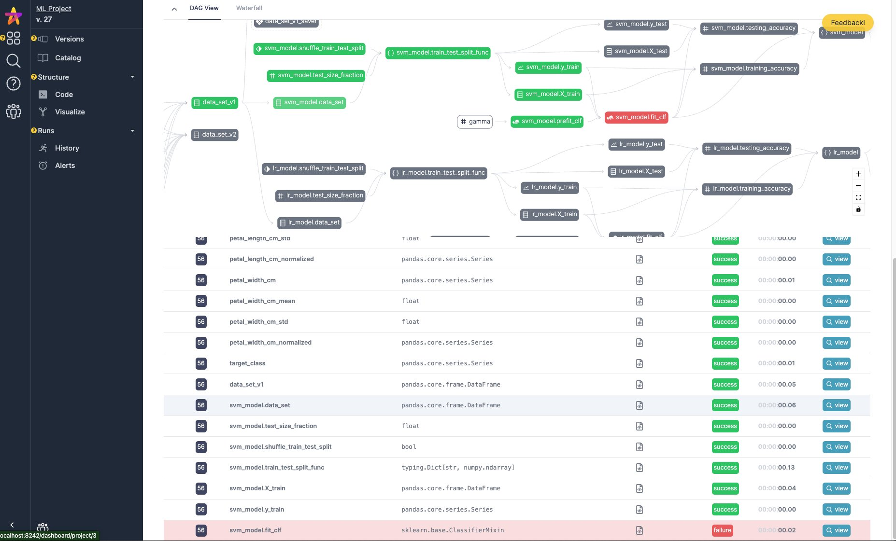

—

The Apache Hamilton UI has two modes:
1. Run locally using sqlite3
2. Run on docker images with postgres (meant for deployment)

<a id="concepts-ui--local-mode"></a>

# Local Mode

To run the hamilton UI in local mode, you can do the following:

```
pip install "sf-hamilton[ui,sdk]"
hamilton ui
# python -m hamilton.cli.__main__ ui # on windows
```

This will launch a browser window in localhost:8241. You can then navigate to the UI and start using it!
While this can potentially handle a small production workflow, you may want to run on postgres with a separate frontend/backend/db
for full scalability and a multi-read/write db.

<a id="concepts-ui--docker-deployed-mode"></a>

# Docker/Deployed Mode

The Apache Hamilton UI can be contained within a set of Docker images. You launch with [docker-compose](https://docs.docker.com/compose/), and it will start up the UI, the backend server, and a Postgres database. If you’d like a quick overview of some of the features, you can watch the following:

<iframe allow="accelerometer; autoplay; clipboard-write; encrypted-media; gyroscope; picture-in-picture; web-share" allowfullscreen="" frameborder="0" height="315" referrerpolicy="strict-origin-when-cross-origin" src="https://www.youtube.com/embed/0VIVSeN7Ij8?si=i3vTsfTNorzh5y2C" title="YouTube video player" width="560"></iframe>

Note: if you run into the “Invalid HTTP\_HOST” error, then please set the environment variable HAMILTON\_ALLOWED\_HOSTS=”\*” (or comma separated list of domains of choice) for the backend docker container. You can inject
this via -e or in the docker-compose[-prod].yml file itself.

<a id="concepts-ui--install"></a>

## Install

If you’d like a video walkthrough on getting set up, you can watch the following:

<iframe allow="accelerometer; autoplay; clipboard-write; encrypted-media; gyroscope; picture-in-picture; web-share" allowfullscreen="" frameborder="0" height="315" referrerpolicy="strict-origin-when-cross-origin" src="https://www.youtube.com/embed/DPfxlTwaNsM?si=gks5oOAWsNPSJbe_" title="YouTube video player" width="560"></iframe>

As prerequisites, you will need to have Docker installed – you can follow instructions [here](https://docs.docker.com/engine/install/).

1. Clone the Apache Hamilton repository locally

```
git clone https://github.com/apache/hamilton
```

2. Navigate to the `hamilton/ui` directory

```
cd hamilton/ui
```

3. Execute the installation script with the following command

```
./run.sh
```

This will:

- Pull all Docker images from the Docker Hub
- Start a local Postgres database
- Start the backend server
- Start the frontend server

This takes a bit of time! So be patient. The server will be running on port 8242.

4. Then navigate to `http://localhost:8242` in your browser, and enter your email (this will be the username used within the app).

<a id="concepts-ui--building-the-docker-images-locally"></a>

## Building the Docker Images locally

If building the Docker containers from scratch, increase your Docker memory to 10gb or more – you can do this in the Docker Desktop settings.

To build the images locally, you can run the following command:

```
# from the hamilton/ui directory./dev.sh --build
```

This will build the containers from scratch. If you just want to mount the local code, you can run just

```
./dev.sh
```

<a id="concepts-ui--self-hosting"></a>

## Self-Hosting

If you know docker, you should be good to go. The one environment variable to know is HAMILTON\_ALLOWED\_HOSTS, which you can set to \* to allow all hosts, or
a comma separated list of hosts you want to allow.

To host the UI on a subpath, set REACT\_APP\_HAMILTON\_SUB\_PATH to the subpath required. For example, to run on https://domain.com/hamilton:

```

-
 
REACT_APP_HAMILTON_SUB_PATH=/hamilton
```

Make sure that the sub path environment variable begins with / if set.

Please reach out to us if you want to deploy on your own infrastructure and need help - [join slack](https://join.slack.com/t/hamilton-opensource/shared_invite/zt-2niepkra8-DGKGf_tTYhXuJWBTXtIs4g).
More extensive self-hosting documentation is in the works, e.g. Snowflake, Databricks, AWS, GCP, Azure, etc.; we’d love a helm
chart contribution!

<a id="concepts-ui--running-on-snowflake"></a>

## Running on Snowflake

You can run the Apache Hamilton UI on Snowflake Container Services. For a detailed guide, see the blog post
[Observability of Python code and application logic with Apache Hamilton UI on Snowflake Container Services](https://medium.com/@pkantyka/observability-of-python-code-and-application-logic-with-hamilton-ui-on-snowflake-container-services-a26693b46635) by
[Greg Kantyka](https://medium.com/@pkantyka) and the [Apache Hamilton Snowflake Example](https://github.com/apache/hamilton/tree/main/examples/snowflake/hamilton_ui).

<a id="concepts-ui--get-started"></a>

# Get started

Now that you have your server running, you can run a simple dataflow and watch it in the UI!
You can follow instructions in the UI when you create a new project, or follow the instructions here.

First, install the SDK:

```
pip install "sf-hamilton[sdk]"
```

Then, navigate to the project page (dashboard/projects), in the running UI, and click the green `+ New DAG` button.

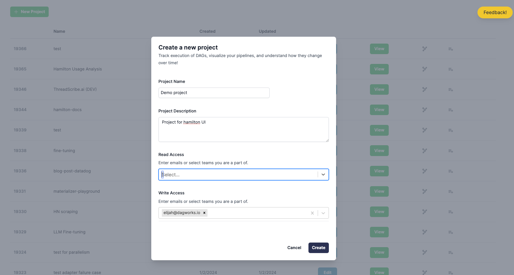

Remember the project ID – you’ll use it for the next steps.

<a id="concepts-ui--existing-apache-hamilton-code"></a>

## Existing Apache Hamilton Code

Add the following adapter to your code if you have existing Apache Hamilton code:

```
from
hamilton_sdk
import adapters tracker =adapters.HamiltonTracker (project_id =PROJECT_ID_FROM_ABOVE,username ="USERNAME/EMAIL_YOU_PUT_IN_THE_UI",dag_name ="my_version_of_the_dag",tags ={"environment":"DEV","team":"MY_TEAM","version":"X"}) dr =(driver.Builder ().with_config (your_config).with_modules (* your_modules).with_adapters (tracker).build ())
```

Then run your DAG, and follow the links in the logs! Note that the link is correct if you’re using
the local mode – if you’re on postgres it links to 8241 (but you’ll want to follow it to 8241).

<a id="concepts-ui--i-need-some-apache-hamilton-code-to-run"></a>

## I need some Apache Hamilton code to run

If you don’t have Apache Hamilton code to run this with, you can run Apache Hamilton UI example under [examples/hamilton\_ui](https://github.com/apache/hamilton/tree/main/examples/hamilton_ui):

```
# we assume you're in the Apache Hamilton repository root cd examples/hamilton_ui
# make sure you have the right python packages installed pip install -r requirements.txt
# run the pipeline providing the email and project_id you created in the UI python run.py --email <email> --project_id <project_id>
```

You should see links in the [logs to the UI](http://localhost:8242/dashboard/projects), where you can see the DAG run + the data summaries captured.

<a id="concepts-ui--features"></a>

# Features

Once you get to the UI, you can navigate to the projects page (left hand nav-bar). Assuming you have created a project
and logged to it, you can then navigate to view it and then more details about it. E.g. versions, code, lineage, catalog, execution runs.
See below for a few screenshots of the UI.

<a id="concepts-ui--dataflow-versioning"></a>

## Dataflow versioning

Select a dataflow versions to compare and visualize.

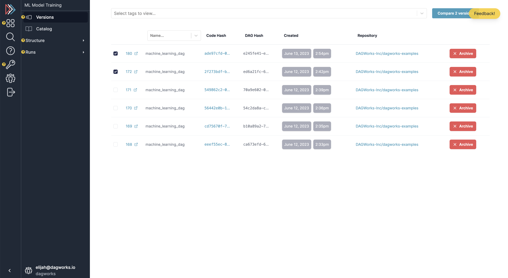

<a id="concepts-ui--assets-features-catalog"></a>

## Assets/features catalog

View functions, nodes, and assets across a history of runs.

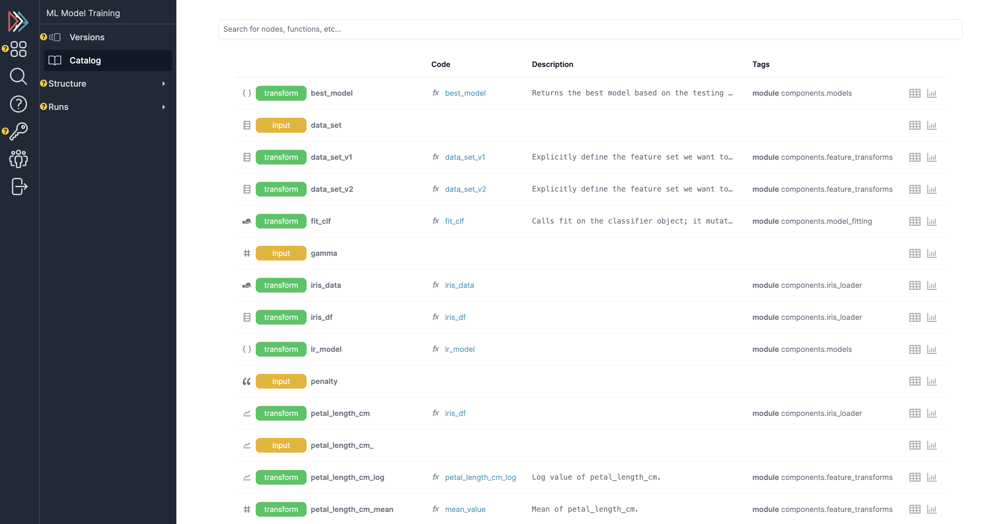

<a id="concepts-ui--browser"></a>

## Browser

View dataflow structure and code.

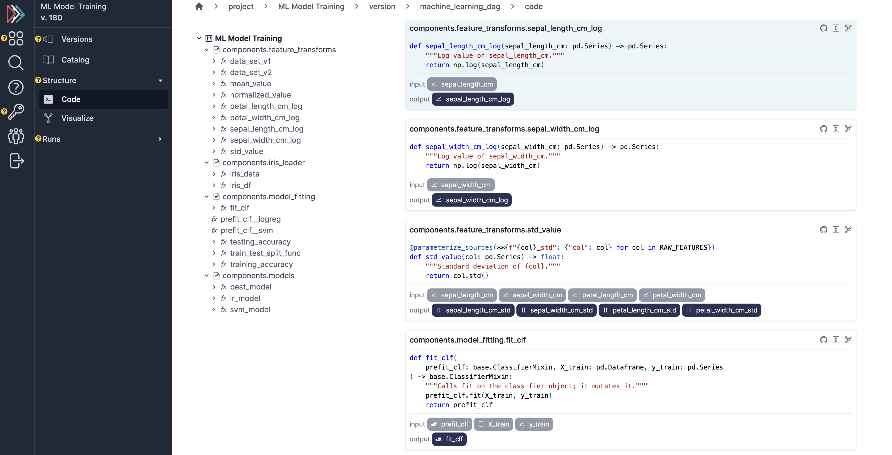
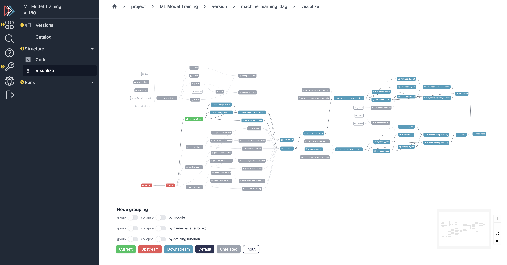

<a id="concepts-ui--run-tracking-telemetry"></a>

## Run tracking + telemetry

View a history of runs, telemetry on runs/comparison, and data for specific runs:

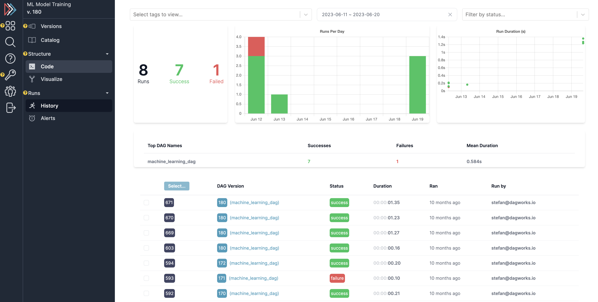
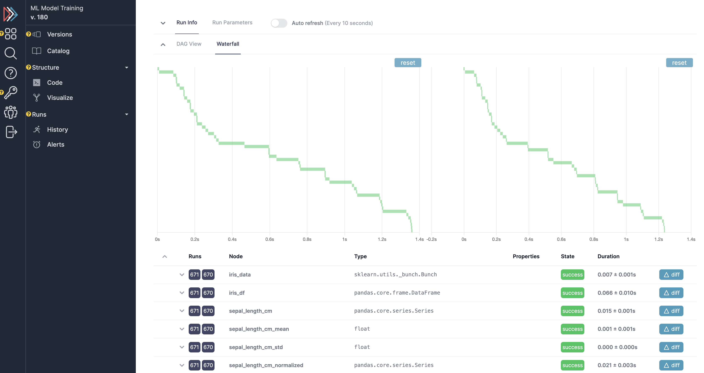
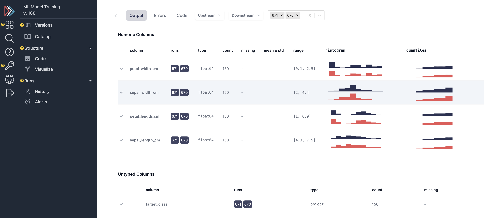

<a id="concepts-ui--sdk-configuration"></a>

# SDK Configuration

This section documents HamiltonTracker configuration options.

<a id="concepts-ui--changing-where-data-is-sent"></a>

## Changing where data is sent

You can change where telemetry is logged by passing in hamilton\_api\_url and/or hamilton\_ui\_url to the
HamiltonTracker constructor. By default, these are set to localhost:8241/8242.

```
from
hamilton_sdk
import adapters tracker =adapters.HamiltonTracker (project_id =PROJECT_ID_FROM_ABOVE,username ="USERNAME/EMAIL_YOU_PUT_IN_THE_UI",dag_name ="my_version_of_the_dag",tags ={"environment":"DEV","team":"MY_TEAM","version":"X" },hamilton_api_url ="http://YOUR_DOMAIN_HERE:8241",hamilton_ui_url ="http://YOUR_DOMAIN_HERE:8242" # if using docker the UI is on 8242.) dr =(driver.Builder ().with_config (your_config).with_modules (* your_modules).with_adapters (tracker).build ())
```

<a id="concepts-ui--changing-behavior-of-what-is-captured"></a>

## Changing behavior of what is captured

By default, a lot is captured and sent to the Apache Hamilton UI.

Here are a few options that can change that - these can be found
in hamilton\_sdk.tracking.constants. You can either change the defaults by
directly changing the constants, by specifying them in a config file, or via environment variables.

Here we first explain the options:

| Option | Default | Explanation |
| --- | --- | --- |
| CAPTURE\_DATA\_STATISTICS | True | Whether to capture any data insights/statistics |
| MAX\_LIST\_LENGTH\_CAPTURE | 50 | Max length for list capture |
| MAX\_DICT\_LENGTH\_CAPTURE | 100 | Max length for dict capture |
| DEFAULT\_CONFIG\_URI | ~/.hamilton.conf | Default config file URI. |

To change the defaults via a config file, you can do the following:

```
[SDK_CONSTANTS] MAX_LIST_LENGTH_CAPTURE =100 MAX_DICT_LENGTH_CAPTURE =200 # save this to ~/.hamilton.conf
```

To change the defaults via environment variables, you can do the following, prefixing them with HAMILTON\_:

```
export HAMILTON_MAX_LIST_LENGTH_CAPTURE=100
export HAMILTON_MAX_DICT_LENGTH_CAPTURE=200
python run_my_hamilton_code.py
```

To change the defaults directly, you can do the following:

```
from
hamilton_sdk.tracking
import constants constants.MAX_LIST_LENGTH_CAPTURE =100 constants.MAX_DICT_LENGTH_CAPTURE =200 tracker =adapters.HamiltonTracker (project_id =PROJECT_ID_FROM_ABOVE,username ="USERNAME/EMAIL_YOU_PUT_IN_THE_UI",dag_name ="my_version_of_the_dag",tags ={"environment":"DEV","team":"MY_TEAM","version":"X"}) dr =(driver.Builder ().with_config (your_config).with_modules (* your_modules).with_adapters (tracker).build ()) dr.execute (...)
```

In terms of precedence, the order is:

1. Module default.
2. Config file values.
3. Environment variables.
4. Directly set values.

---

<a id="concepts-best-practices"></a>

<!-- source_url: https://hamilton.incubator.apache.org/concepts/best-practices/ -->

<!-- page_index: 22 -->

# Best Practices ¶

[
<svg viewbox="0 0 24 24" xmlns="http://www.w3.org/2000/svg">
<path></path>
</svg>

Back to top](#concepts-best-practices)

[
<svg><use href="#svg-eye"></use></svg>

View this page](https://github.com/apache/hamilton/blob/main/docs/concepts/best-practices/index.rst?plain=true "View this page")

[
<svg><use href="#svg-pencil"></use></svg>

Edit this page](https://github.com/apache/hamilton/edit/main/docs/concepts/best-practices/index.rst "Edit this page")

<svg><use href="#svg-toc"></use></svg>

<a id="concepts-best-practices--best-practices"></a>

# Best Practices

A set of best-practices to help you get the most out of Apache Hamilton quickly and easily.

- [Function Naming](#concepts-best-practices-function-naming)
  - [It enables you to define your Apache Hamilton dataflow](#concepts-best-practices-function-naming--it-enables-you-to-define-your-apache-hamilton-dataflow)
  - [It drives collaboration and reuse](#concepts-best-practices-function-naming--it-drives-collaboration-and-reuse)
  - [It serves as documentation itself](#concepts-best-practices-function-naming--it-serves-as-documentation-itself)
- [Migrating to Apache Hamilton](#concepts-best-practices-migrating-to-hamilton)
  - [Continuous Integration for Comparisons](#concepts-best-practices-migrating-to-hamilton--continuous-integration-for-comparisons)
  - [Integrate into your code base via a “custom wrapper object”](#concepts-best-practices-migrating-to-hamilton--integrate-into-your-code-base-via-a-custom-wrapper-object)
- [Code Organization](#concepts-best-practices-code-organization)
  - [Team thinking](#concepts-best-practices-code-organization--team-thinking)
  - [Helps isolate what you’re working on](#concepts-best-practices-code-organization--helps-isolate-what-you-re-working-on)
  - [Enables you to replace parts of your DAG easily for different contexts](#concepts-best-practices-code-organization--enables-you-to-replace-parts-of-your-dag-easily-for-different-contexts)
- [Common Indices](#concepts-best-practices-common-indices)
  - [Best practice:](#concepts-best-practices-common-indices--best-practice)
- [Output Immutability](#concepts-best-practices-output-immutability)
  - [Best practice:](#concepts-best-practices-output-immutability--best-practice)
- [Using within your ETL System](#concepts-best-practices-using-within-your-etl-system)
  - [Compatibility Matrix](#concepts-best-practices-using-within-your-etl-system--compatibility-matrix)
  - [ETL Recipe](#concepts-best-practices-using-within-your-etl-system--etl-recipe)
- [Loading Data](#concepts-best-practices-loading-data)
  - [Plugging in new Data Sources](#concepts-best-practices-loading-data--plugging-in-new-data-sources)
    - [Modules as Interfaces](#concepts-best-practices-loading-data--modules-as-interfaces)
    - [Using the Config to Decide Sources](#concepts-best-practices-loading-data--using-the-config-to-decide-sources)

---

<a id="concepts-best-practices-function-naming"></a>

<!-- source_url: https://hamilton.incubator.apache.org/concepts/best-practices/function-naming/ -->

<!-- page_index: 23 -->

# Function Naming ¶

[
<svg viewbox="0 0 24 24" xmlns="http://www.w3.org/2000/svg">
<path></path>
</svg>

Back to top](#concepts-best-practices-function-naming)

[
<svg><use href="#svg-eye"></use></svg>

View this page](https://github.com/apache/hamilton/blob/main/docs/concepts/best-practices/function-naming.rst?plain=true "View this page")

[
<svg><use href="#svg-pencil"></use></svg>

Edit this page](https://github.com/apache/hamilton/edit/main/docs/concepts/best-practices/function-naming.rst "Edit this page")

<svg><use href="#svg-toc"></use></svg>

<a id="concepts-best-practices-function-naming--function-naming"></a>

# Function Naming

Here are three important points about function naming:

1. It enables you to define your Apache Hamilton dataflow.
2. It drives collaboration & code reuse.
3. It serves as documentation itself.

You don’t need to get this right the first time – search and replace is really easy with Apache Hamilton code bases – but it
is something to converge thinking on!

<a id="concepts-best-practices-function-naming--it-enables-you-to-define-your-apache-hamilton-dataflow"></a>

## It enables you to define your Apache Hamilton dataflow

As the name of a hamilton function defines the name of the created artifact, naming is vital to a readable, extensible
hamilton codebase. Names must mean something:

```
def
foo_bar (input1:int,input2:pd.Series) -> pd.Series:
"""docs...""" ...
```

In this case, `foo_bar` is not helpful - it’s unclear what this function produces at all. Remember you want function
names to mean something, since that will enable clarity when using Apache Hamilton, what is being requested, and will help
document what the function itself is doing.

<a id="concepts-best-practices-function-naming--it-drives-collaboration-and-reuse"></a>

## It drives collaboration and reuse

When people come to encounter your code, they’ll need to understand it, add to it, modify it, etc.

You’ll want to ensure some standardization to enable:

1. Mapping business concepts to function names. E.g. That will help people to find things in the code that map to things that happen within your business.
2. Ensuring naming uniformity across the code base. People usually follow the precedent of the code around them, so if everything in a particular module for say, date features, has a `D_` prefix, then they will likely follow that naming convention. This is likely something you will iterate on – and it’s best to try to converge on a team naming convention once you have a feel for the Hamilton functions being written by the team.

We suggest that long functions names that are separated by `_` aren’t a bad thing. E.g. if you were to come across a
function named `life_time_value` versus `ltv` versus `l_t_v`, which one is more obvious as to what it is and what
it represents?

<a id="concepts-best-practices-function-naming--it-serves-as-documentation-itself"></a>

## It serves as documentation itself

Remember your code usually lives a lot longer that you ever think it will. So our suggestion is to always err to the
more obvious way of naming to ensure it’s clear what a function represents.

Again, if you were to come across a function named `life_time_value` versus ``` ltv` versus ``l_t_v ```, which one is
more obvious as to what it is and what it represents?

On this page

- [Function Naming](#concepts-best-practices-function-naming)
  - [It enables you to define your Apache Hamilton dataflow](#concepts-best-practices-function-naming--it-enables-you-to-define-your-apache-hamilton-dataflow)
  - [It drives collaboration and reuse](#concepts-best-practices-function-naming--it-drives-collaboration-and-reuse)
  - [It serves as documentation itself](#concepts-best-practices-function-naming--it-serves-as-documentation-itself)

---

<a id="concepts-best-practices-migrating-to-hamilton"></a>

<!-- source_url: https://hamilton.incubator.apache.org/concepts/best-practices/migrating-to-hamilton/ -->

<!-- page_index: 24 -->

# Migrating to Apache Hamilton ¶

[
<svg viewbox="0 0 24 24" xmlns="http://www.w3.org/2000/svg">
<path></path>
</svg>

Back to top](#concepts-best-practices-migrating-to-hamilton)

[
<svg><use href="#svg-eye"></use></svg>

View this page](https://github.com/apache/hamilton/blob/main/docs/concepts/best-practices/migrating-to-hamilton.rst?plain=true "View this page")

[
<svg><use href="#svg-pencil"></use></svg>

Edit this page](https://github.com/apache/hamilton/edit/main/docs/concepts/best-practices/migrating-to-hamilton.rst "Edit this page")

<svg><use href="#svg-toc"></use></svg>

<a id="concepts-best-practices-migrating-to-hamilton--migrating-to-apache-hamilton"></a>

# Migrating to Apache Hamilton

Here are two suggestions for helping you migrate to Apache Hamilton

<a id="concepts-best-practices-migrating-to-hamilton--continuous-integration-for-comparisons"></a>

## Continuous Integration for Comparisons

Create a way to easily & frequently compare results.

1. Integrate with continuous integration (CI) system if you can.
2. 🔎🐛 Having a means that tests code early & often will helps diagnose bugs in your old code (most likely) or your new implementation (less likely).
3. Specifically, have a system to compare the output of your Apache Hamilton code, to compare to the output of your existing system.

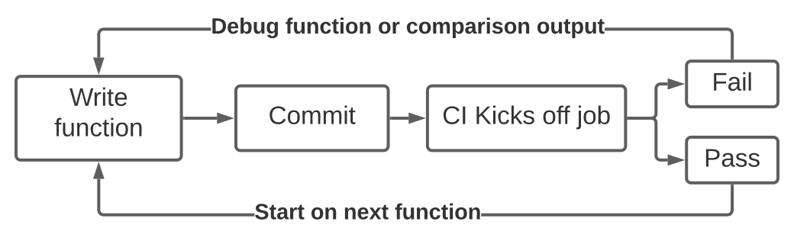

<a id="concepts-best-practices-migrating-to-hamilton--integrate-into-your-code-base-via-a-custom-wrapper-object"></a>

## Integrate into your code base via a “custom wrapper object”

If you have existing systems that you want to integrate Apache Hamilton into, it might require non-trivial effort for you to
change those systems to be able to use Apache Hamilton. If that’s the case, then we suggest creating a “custom object” to
“wrap” Apache Hamilton, so that it’s easier to migrate to it.

Specifically, this custom wrapper object class’s purpose is to match your existing API expectations. It will act as the
translation layer from your existing API expectations, to what running Apache Hamilton requires, and back. In Apache Hamilton
terminology, this is a Custom Driver Wrapper, since it wraps around the Hamilton Driver class.

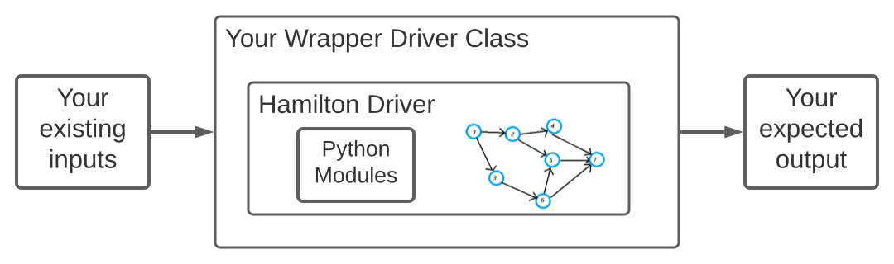

This is a best practice because:

1. When migrating, it’s best to avoid making too many changes. So don’t change your API expectations if you can.
2. It allows you to easily insert Apache Hamilton into any context. Thereby minimizing potential migration problems.

On this page

- [Migrating to Apache Hamilton](#concepts-best-practices-migrating-to-hamilton)
  - [Continuous Integration for Comparisons](#concepts-best-practices-migrating-to-hamilton--continuous-integration-for-comparisons)
  - [Integrate into your code base via a “custom wrapper object”](#concepts-best-practices-migrating-to-hamilton--integrate-into-your-code-base-via-a-custom-wrapper-object)

---

<a id="concepts-best-practices-code-organization"></a>

<!-- source_url: https://hamilton.incubator.apache.org/concepts/best-practices/code-organization/ -->

<!-- page_index: 25 -->

# Code Organization ¶

[
<svg viewbox="0 0 24 24" xmlns="http://www.w3.org/2000/svg">
<path></path>
</svg>

Back to top](#concepts-best-practices-code-organization)

[
<svg><use href="#svg-eye"></use></svg>

View this page](https://github.com/apache/hamilton/blob/main/docs/concepts/best-practices/code-organization.rst?plain=true "View this page")

[
<svg><use href="#svg-pencil"></use></svg>

Edit this page](https://github.com/apache/hamilton/edit/main/docs/concepts/best-practices/code-organization.rst "Edit this page")

<svg><use href="#svg-toc"></use></svg>

<a id="concepts-best-practices-code-organization--code-organization"></a>

# Code Organization

Apache Hamilton will force you to organize your code! Here’s some tips.

Apache Hamilton forces you to put your code into modules that are distinct from where you run your code.

You’ll soon find that a single python module does not make sense, and so you’ll organically start to (very likely) put
like functions with like functions, i.e. thus creating domain specific modules –> use this to your development
advantage!

At Stitch Fix we:

1. Use modules to model team thinking, e.g. date\_features.py.
2. Use modules to helps isolate what you’re working on.
3. Use modules to replace parts of your Apache Hamilton dataflow very easily for different contexts.

<a id="concepts-best-practices-code-organization--team-thinking"></a>

## Team thinking

You’ll need to curate your modules. We suggest orienting this around how teams think about the business.

E.g. marketing spend features should be in the same module, or in separate modules but in the same directory/package.

This will then make it easy for people to browse the code base and discover what is available.

<a id="concepts-best-practices-code-organization--helps-isolate-what-you-re-working-on"></a>

## Helps isolate what you’re working on

Grouping functions into modules then helps set the tone for what you’re working on. It helps set the “namespace”, if
you will, for that function. Thus you can have the same function name used in multiple modules, as long as only one of
those modules is imported to build the DAG.

Thus modules help you create boundaries in your code base to isolate functions that you’ll want to change inputs to.

<a id="concepts-best-practices-code-organization--enables-you-to-replace-parts-of-your-dag-easily-for-different-contexts"></a>

## Enables you to replace parts of your DAG easily for different contexts

The names you provide as inputs to functions form a defined “interface”, to borrow a computer science term, so if you
want to swap/change/augment an input, having a function that would map to it defined in another module(s) provides a
lot of flexibility. Rather than having a single module with all functions defined in it, separating the functions into
different modules could be a productivity win.

Why? That’s because when you come to tell Apache Hamilton what functions constitute your dataflow (i.e. DAG), you’ll be able
to simply replace/add/change the module being passed. So if you want to compute inputs for certain functions
differently, this composability of including/excluding modules, when building the DAG provides a lot of flexibility
that you can exploit to make your development cycle faster.

On this page

- [Code Organization](#concepts-best-practices-code-organization)
  - [Team thinking](#concepts-best-practices-code-organization--team-thinking)
  - [Helps isolate what you’re working on](#concepts-best-practices-code-organization--helps-isolate-what-you-re-working-on)
  - [Enables you to replace parts of your DAG easily for different contexts](#concepts-best-practices-code-organization--enables-you-to-replace-parts-of-your-dag-easily-for-different-contexts)

---

<a id="concepts-best-practices-common-indices"></a>

<!-- source_url: https://hamilton.incubator.apache.org/concepts/best-practices/common-indices/ -->

<!-- page_index: 26 -->

# Common Indices ¶

[
<svg viewbox="0 0 24 24" xmlns="http://www.w3.org/2000/svg">
<path></path>
</svg>

Back to top](#concepts-best-practices-common-indices)

[
<svg><use href="#svg-eye"></use></svg>

View this page](https://github.com/apache/hamilton/blob/main/docs/concepts/best-practices/common-indices.rst?plain=true "View this page")

[
<svg><use href="#svg-pencil"></use></svg>

Edit this page](https://github.com/apache/hamilton/edit/main/docs/concepts/best-practices/common-indices.rst "Edit this page")

<svg><use href="#svg-toc"></use></svg>

<a id="concepts-best-practices-common-indices--common-indices"></a>

# Common Indices

If you’re creating dataframes, then this will apply to you!

While Apache Hamilton is a general-purpose framework, we’ve found a common pattern is to manipulate datasets that have shared
indices (spines) for creating dataframes.

Although this might not apply towards every use-case (E.G. more complex joins with spark dataframes), a large selection
of use-cases can be enabled if every dataframe in your pipeline shares an index. This is particularly pertinent when
writing transformations over (non-event-based) time-series data.

While Apache Hamilton currently has no means of enforcing shared-spine, it is up to the writer of the function to validate
input data as necessary. Thus we recommend the following if you are creating a dataframe as output:

<a id="concepts-best-practices-common-indices--best-practice:"></a>

## Best practice:

1. Load data via functions, defined in their own specific module.
2. Take that loaded data, and transform/ensure indexes match the output you want to create.
3. Continue with transformations.

For time-series modeling, this will mean you provide a common time-series index. Or, if you’re creating features for
input to a classification model, e.g. over clients, then ensure the index is client\_ids.

On this page

- [Common Indices](#concepts-best-practices-common-indices)
  - [Best practice:](#concepts-best-practices-common-indices--best-practice)

---

<a id="concepts-best-practices-output-immutability"></a>

<!-- source_url: https://hamilton.incubator.apache.org/concepts/best-practices/output-immutability/ -->

<!-- page_index: 27 -->

# Output Immutability ¶

[
<svg viewbox="0 0 24 24" xmlns="http://www.w3.org/2000/svg">
<path></path>
</svg>

Back to top](#concepts-best-practices-output-immutability)

[
<svg><use href="#svg-eye"></use></svg>

View this page](https://github.com/apache/hamilton/blob/main/docs/concepts/best-practices/output-immutability.rst?plain=true "View this page")

[
<svg><use href="#svg-pencil"></use></svg>

Edit this page](https://github.com/apache/hamilton/edit/main/docs/concepts/best-practices/output-immutability.rst "Edit this page")

<svg><use href="#svg-toc"></use></svg>

<a id="concepts-best-practices-output-immutability--output-immutability"></a>

# Output Immutability

In Apache Hamilton, functions are only called once!

Immutability means, that once a “data structure”, e.g. a column is created, and output by a function, the values in the
column are not changeable.

When Apache Hamilton figures out the execution call path, it walks it and calls functions only once. This means, that if the
output of a function is immutable, then there’s only one place it was created; it’s not modified anywhere else. This
provides a great debugging experience if there are ever issues in your dataflow. We believe that by default, one should
always strive for immutability of outputs.

However, it is up to you, the Hamilton function writer, to ensure that immutability is something that is adhered to.

<a id="concepts-best-practices-output-immutability--best-practice:"></a>

## Best practice:

1. To preserve “immutability” of outputs, don’t mutate passed in data structures. e.g. if you get passed in a pandas series, don’t mutate it.

   1. Test for this in your unit tests if this is something important to you!
2. Otherwise YMMV with debugging:

   1. Clearly document mutating inputs in your function documentation if you do mutate inputs provided. That will make debugging your code that much simpler!

On this page

- [Output Immutability](#concepts-best-practices-output-immutability)
  - [Best practice:](#concepts-best-practices-output-immutability--best-practice)

---

<a id="concepts-best-practices-using-within-your-etl-system"></a>

<!-- source_url: https://hamilton.incubator.apache.org/concepts/best-practices/using-within-your-etl-system/ -->

<!-- page_index: 28 -->

# Using within your ETL System ¶

[
<svg viewbox="0 0 24 24" xmlns="http://www.w3.org/2000/svg">
<path></path>
</svg>

Back to top](#concepts-best-practices-using-within-your-etl-system)

[
<svg><use href="#svg-eye"></use></svg>

View this page](https://github.com/apache/hamilton/blob/main/docs/concepts/best-practices/using-within-your-etl-system.rst?plain=true "View this page")

[
<svg><use href="#svg-pencil"></use></svg>

Edit this page](https://github.com/apache/hamilton/edit/main/docs/concepts/best-practices/using-within-your-etl-system.rst "Edit this page")

<svg><use href="#svg-toc"></use></svg>

<a id="concepts-best-practices-using-within-your-etl-system--using-within-your-etl-system"></a>

# Using within your ETL System

Conceptually you can integrate Apache Hamilton within your existing ETL system quite easily:

<a id="concepts-best-practices-using-within-your-etl-system--compatibility-matrix"></a>

## Compatibility Matrix

| Framework / Scheduler | Compatibility |
| --- | --- |
| [Airflow](http://airflow.org) | ✅ (see [airflow example](<https://github.com/apache/hamilton/tree/main/examples/airflow>)) |
| [Dagster](https://dagster.io) | ✅ |
| [Prefect](https://prefect.io) | ✅ (see [prefect example](<https://github.com/apache/hamilton/tree/main/examples/prefect>)) |
| [Kubeflow Pipelines](https://www.kubeflow.org/docs/components/pipelines) | ✅ |
| [CRON](https://en.wikipedia.org/wiki/Cron) | ✅ |
| [dbt](https://getdbt.com) | ✅ (see dbt example) |
| [kubernetes](https://kubernetes.io) | ✅ but you need to setup kubernetes to run an image that can run python code - e.g. see [Running a python application on kubernetes](https://medium.com/avmconsulting-blog/running-a-python-application-on-kubernetes-aws-56609e7cd88c) |
| [docker](https://www.docker.com) | ✅ but you need to setup a docker image that can execute python code. |
| … in general if it runs python 3.7+ … | ✅ |

<a id="concepts-best-practices-using-within-your-etl-system--etl-recipe"></a>

## ETL Recipe

1. Write Hamilton functions & “driver” code.
2. Publish your Hamilton functions in a package, or import via other means (e.g. checkout a repository & include in python path).
3. Include sf-hamilton as a python dependency
4. Have your ETL system execute your “driver” code.
5. Profit.

On this page

- [Using within your ETL System](#concepts-best-practices-using-within-your-etl-system)
  - [Compatibility Matrix](#concepts-best-practices-using-within-your-etl-system--compatibility-matrix)
  - [ETL Recipe](#concepts-best-practices-using-within-your-etl-system--etl-recipe)

---

<a id="concepts-best-practices-loading-data"></a>

<!-- source_url: https://hamilton.incubator.apache.org/concepts/best-practices/loading-data/ -->

<!-- page_index: 29 -->

# Loading Data ¶

[
<svg viewbox="0 0 24 24" xmlns="http://www.w3.org/2000/svg">
<path></path>
</svg>

Back to top](#concepts-best-practices-loading-data)

[
<svg><use href="#svg-eye"></use></svg>

View this page](https://github.com/apache/hamilton/blob/main/docs/concepts/best-practices/loading-data.rst?plain=true "View this page")

[
<svg><use href="#svg-pencil"></use></svg>

Edit this page](https://github.com/apache/hamilton/edit/main/docs/concepts/best-practices/loading-data.rst "Edit this page")

<svg><use href="#svg-toc"></use></svg>

<a id="concepts-best-practices-loading-data--loading-data"></a>

# Loading Data

In Apache Hamilton, data loaders are just the same as other functions in the DAG. They take in configuration parameters, and
output datasets in the desired form. Following up on the marketing spend dataset, you might write a data loader that
reads a dataframe saved in csv format on s3 like this:

```
import
boto3 import
urllib import
pandas
as
pd from
hamilton.function_modifiers
import extract_columns client =boto3.client ("s3") @extract_columns ('col1','col2','col3',...) def
marketing_spend (marketing_spend_data_path:str) -> pd.DataFrame:
"""Loads marketing spend from specified path on s3 """ if not marketing_spend_data_path.startswith ("s3://" ):raise ValueError (f "Invalid s3 URI {marketing_spend_data_path} ") return pd.read_csv (marketing_spend_data_path,storage_options ={...}) # See https://pandas.pydata.org/docs/reference/api/pandas.read_csv.html#pandas-read-csv for more info
```

Loading data is as easy as that! Run your driver with `marketing_spend_data_path` as a parameter, and you’re good to
go. However, there are a few considerations you might have prior to productionalizing this dataflow…

<a id="concepts-best-practices-loading-data--plugging-in-new-data-sources"></a>

## Plugging in new Data Sources

An advantage of Apache Hamilton is that it allows for rapid plug-and play for various components of your pipeline. This is
particularly important for data loading, where you might want to load your data from different sources depending on some
context. For instance – if you’re running your pipeline in production, you may want to use the production data sources.
If you’re running it in QA, you might want to use the staging data sources. Or, if you’re running it locally, you might
want to use abbreviated, in-memory data sources for testing. While Apache Hamilton is not opinionated on exactly \_how\_ you make
this switch, it presents a variety of tooling that can make it more manageable. Some options. To demonstrate some
techniques, let’s continue on the example of loading marketing spend…

<a id="concepts-best-practices-loading-data--modules-as-interfaces"></a>

### Modules as Interfaces

Say you have multiple data-loading nodes in your DAG. One strategy is to put them all in a single module. That way, if you want to load them up from different sources, you can simply switch the module your driver utilizes. Taking the example from above, you might have the following modules:

```
@extract_columns ('col1','col2','col3',...) def
marketing_spend (marketing_spend_data_path:str) -> pd.DataFrame:
"""Loads marketing spend from specified path on s3 """ if not marketing_spend_data_path.startswith ("s3://" ):raise ValueError (f "Invalid s3 URI {marketing_spend_data_path} ") return pd.read_csv (marketing_spend_data_path,storage_options ={...}) # See https://pandas.pydata.org/docs/reference/api/pandas.read_csv.html#pandas-read-csv for more info
```

```
@extract_columns ('col1','col2','col3',...) def
marketing_spend (marketing_spend_data_path:str) -> pd.DataFrame:
"""Loads marketing spend from specified path on s3 """ if not marketing_spend_data_path.endswith ("csv" ):raise ValueError (f "Invalid local data loading target {marketing_spend_data_path} ") if not os.path.exists (marketing_spend_data_path ):raise ValueError (f "Path does not exists") return pd.read_csv (marketing_spend_data_path)
```

Then, in your driver, you can choose between which module you want to use:

```
local_data_driver =Driver (config,local_data_loaders,...) prod_data_driver =Driver (config,prod_data_loaders,...)
```

<a id="concepts-best-practices-loading-data--using-the-config-to-decide-sources"></a>

### Using the Config to Decide Sources

Note that we can utilize the config to determine where the data comes from as well. By using `config.when` you can
arrive at the same effect as above, while making it entirely config driven. If you combine the two functions into the
same module with @config.when it will look as follows:

```
@config.when (data_source ='local') @extract_columns ('col1','col2','col3',...) def
marketing_spend__local (marketing_spend_data_path:str) -> pd.DataFrame:...@config.when (data_source ='prod') @extract_columns ('col1','col2','col3',...) def
marketing_spend__prod (marketing_spend_data_path:str) -> pd.DataFrame:...
```

Then you can invoke your driver but set the config differently:

```
driver =Driver ({'data_source':'prod','marketing_spend_data_path':'s3://...' },data_loaders,...)
```

Note that there are a variety of other ways you can organize your code – at this point its entirely use-case dependent.
Apache Hamilton is a language for declaring dataflows that’s applicable towards a multitude of use-cases. It’s not going to
dictate how to write your functions or where you put them.

On this page

- [Loading Data](#concepts-best-practices-loading-data)
  - [Plugging in new Data Sources](#concepts-best-practices-loading-data--plugging-in-new-data-sources)
    - [Modules as Interfaces](#concepts-best-practices-loading-data--modules-as-interfaces)
    - [Using the Config to Decide Sources](#concepts-best-practices-loading-data--using-the-config-to-decide-sources)

---

<a id="how-tos-use-in-jupyter-notebook"></a>

<!-- source_url: https://hamilton.incubator.apache.org/how-tos/use-in-jupyter-notebook/ -->

<!-- page_index: 30 -->

<a id="how-tos-use-in-jupyter-notebook--jupyter-notebooks"></a>

# Jupyter notebooks

There are two main ways to use Apache Hamilton in a notebook.

1. Dynamically create modules within the notebook.
2. Import modules into the notebook.

<a id="how-tos-use-in-jupyter-notebook--1-dynamically-create-modules-within-your-notebook"></a>

## 1 - Dynamically create modules within your notebook

There’s two main ways, using the Hamilton Jupyter magic, or using `ad_hoc_utils` to create a temporary module.

<a id="how-tos-use-in-jupyter-notebook--use-hamilton-jupyter-magic"></a>

### Use Hamilton Jupyter Magic

The Hamilton Jupyter magic allows you to dynamically create a module from a cell in your notebook. This is useful for quick iteration and development.
Once you’re then happy, it’s easy to then write out a module with the functions you’ve developed using `%%writefile` magic.

To load the magic:

```
# load some extensions / magic...% load_ext hamilton.plugins.jupyter_magic
```

Then to use it:

```

%%
cell_to_module
-
m
MODULE_NAME
# more args
```

To see help on the magic, you can run `%%cell_to_module --help`, or just `?%%cell_to_module` in a cell.

It should output information similar to the following:

-m, –module\_name: Module name to provide. Default is jupyter\_module.
-c, –config: JSON config string, or variable name containing config to use.
-r, –rebuild-drivers: Flag to rebuild drivers.
-d, –display: Flag to visualize dataflow.
-v, –verbosity: of standard output. 0 to hide. 1 is normal, default.

Example use:

```
%% cell_to_module - m MODULE_NAME -- display -- rebuild - drivers def
hello () -> str:return "hello" def
world (hello:str) -> str:return f " {hello} world"
```

Once you’re happy with the functions you’ve developed, you can then write them out to a module using the `%%writefile` magic:

```

%%
writefile
hello_world
.
py
```

<a id="how-tos-use-in-jupyter-notebook--importing-specific-functions-into-cell-modules"></a>

#### Importing specific functions into cell modules

If you import parts of modules in a Hamilton Jupyter Magic cell, these will need to be reloaded when changes are made to their source. This can be done either by restarting the kernel or with the help of importlib.reload:

```

%%
cell_to_module
MODULE_NAME
# first import the module itself, so it can be reloaded import
 
my_common_functions
# reload the module import
 
importlib
importlib
.
reload
(
my_common_functions
)
# now import the specific function from the module from
 
my_common_functions
 
import
commonfunction
# use the imported function commonfunction ()
```

<a id="how-tos-use-in-jupyter-notebook--using-ad_hoc_utils-to-create-a-temporary-module-e.g.-use-in-google-colab"></a>

### Using ad\_hoc\_utils to create a temporary module (e.g. use in google colab)

You have the ability to inline define functions with your driver that can be used to build a DAG. *We strongly recommend only using this approach when absolutely necessary* — it’s very easy to build spaghetti code this way.

For example, say we want to add a function to compute the logarithm of `avg_3wk_spend` and not add it to `some_functions.py`, we can do the following steps directly in our notebook:

```
# Step 1 - define function import numpy as np def log_avg_3wk_spend (avg_3wk_spend:pd.Series) -> pd.Series:"""Simple function taking the logarithm of spend over signups.""" return np.log (avg_3wk_spend)
```

We then have to create a “temporary python module” to house it in. We do this by importing `ad_hoc_utils` and then calling the `create_temporary_module` function, passing in the functions we want, and providing a name for the module we’re creating.

```
# Step 2 - create a temporary modeul to house all notebook functions from hamilton import ad_hoc_utils temp_module =ad_hoc_utils.create_temporary_module (log_avg_3wk_spend,module_name ='function_example')
```

You can now treat `temp_module` like a python module and pass it to your driver and use Hamilton like normal:

```
# Step 3 - add the module to the driver and continue as usual dr =driver.Driver (config,some_functions,temp_module) df =dr.execute (['avg_3wk_spend','log_avg_3wk_spend' ],inputs =input_data)
```

<a id="how-tos-use-in-jupyter-notebook--caveat-with-this-approach:"></a>

### Caveat with this approach:

Using a “temporary python module” will not enable scaling of computation by using Ray, Dask, or Pandas on Spark. So we suggest only using this approach for development purposes only.

<a id="how-tos-use-in-jupyter-notebook--2-importing-modules-into-your-notebook"></a>

## 2 - Importing modules into your notebook

This tutorial can also be found [published on TDS](https://towardsdatascience.com/how-to-iterate-with-hamilton-in-a-notebook-8ec0f85851ed).

<a id="how-tos-use-in-jupyter-notebook--step-1-install-jupyter-apache-hamilton"></a>

### Step 1 — Install Jupyter & Apache Hamilton

I assume you already have this step set up. But just in case you don’t:

```
pip install jupyterlab
pip install sf-hamilton
```

Then to start the notebook server it should just be:

<a id="how-tos-use-in-jupyter-notebook--step-2-set-up-the-files"></a>

### Step 2— Set up the files

1. Start up your Jupyter notebook.
2. Go to the directory where you want your notebook and Hamilton function module(s) to live.
3. Create a python file(s). Do that by going to “New > text file”. It’ll open a “file” editor view. Name the file and give it a `.py` extension. Once you save it, you’ll see that jupyter now provides python syntax highlighting. Keep this tab open, so you can flip back to it to edit this file.
4. Start up a notebook that you will use in another browser tab.

<a id="how-tos-use-in-jupyter-notebook--step-3-the-basic-process-of-iteration"></a>

### Step 3— The basic process of iteration

At a high level, you will be switching back and forth between your tabs. You will add functions to your Hamilton function python module, and then import/reimport that module into your notebook to get the changes. From there you will then use Apache Hamilton as usual to run and execute things and the notebook for all the standard things you use notebooks for.

Let’s walk through an example.

Here’s a function I added to our Hamilton function module. I named the module `some_functions.py` (obviously choose a better name for your situation).

```
import
pandas
as
pd def
avg_3wk_spend (spend:pd.Series) -> pd.Series:
"""Rolling 3 week average spend.""" print ("foo") # will use this to prove it reloaded! return spend.rolling (3).mean ()
```

And here’s what I set up in my notebook to be able to use Hamilton and import this module:

Cell 1: This just imports the base things we need; see the pro-tip at the bottom of this page for how to automatically reload changes.

```

import
 
importlib
import
 
pandas
 
as
 
pd
from
 
hamilton
 
import
driver
```

Cell 2: Import your Hamilton function module(s)

```

# import your hamilton function module(s) here import
 
some_functions
```

Cell 3: Run this cell anytime you make and save changes to `some_functions.py`

```
# use this to reload the module after making changes to it.importlib.reload (some_functions)
```

What this will do is reload the module, and therefore make sure the code is up to date for you to use.

Cell 4: Use Hamilton

```
config ={} dr =driver.Driver (config,some_functions) input_data ={'spend':pd.Series ([0,1,2,3,4,5,6,7,8,9,10 ])} df =dr.execute (['avg_3wk_spend' ],inputs =input_data)
```

You should see `foo` printed as an output after running this cell.

Okay, so let’s now say we’re iterating on our Hamilton functions. Go to your Hamilton function module (`some_functions.py` in this example) in your other browser tab, and change the `print("foo")` to something else, e.g. `print("foo-bar").` Save the file — it should look something like this:

```
def
avg_3wk_spend (spend:pd.Series) -> pd.Series:
"""Rolling 3 week average spend.""" print ("foo-bar") return spend.rolling (3).mean ()
```

Go back to your notebook, and re-run Cell 3 & Cell 4. You should now see a different output printed, e.g. `foo-bar` .

Congratulations! You just managed to iterate on Apache Hamilton using a Jupyter notebook!

**To summarize** this is how things ended up looking on my end:

- Here’s what my `some_functions.py` file looks like:


- Here’s what my notebook looks like:


<a id="how-tos-use-in-jupyter-notebook--pro-tip:-you-can-use-ipython-magic-to-autoreload-code"></a>

## Pro-tip: You can use ipython magic to autoreload code

Open a Python module and a Jupyter notebook side-to-side, and then add [%autoreload ipython magic](https://ipython.org/ipython-doc/3/config/extensions/autoreload.html) to the notebook to auto-reload the cell:

```
from
hamilton.driver
import Driver # load extension % load_ext autoreload # configure autoreload to only affect specified files % autoreload 1 # import & specify my_module to be reloaded # i.e. this is the data transformation module that I have open in other tab % aimport my_module hamilton_driver =Driver ({},my_module) hamilton_driver.execute (['desired_output1','desired_output2' ])
```

You’d then follow the following process:

1. Write your data transformation in the open python module
2. In the notebook, instantiate a Hamilton Driver and test the DAG with a small subset of data.
3. Because of %autoreload, the module is reimported with the latest changes each time the Hamilton DAG is executed. This approach prevents out-of-order notebook executions, and functions always reside in clean .py files.

Credit: [Thierry Jean’s blog post](https://medium.com/@thijean/the-perks-of-creating-dataflows-with-hamilton-36e8c56dd2a).

<a id="how-tos-use-in-jupyter-notebook--pro-tip:-you-can-import-functions-directly"></a>

## Pro-tip: You can import functions directly

The nice thing about forcing Hamilton functions into a module, is that it’s very easy to re-use in another context. E.g. another notebook, or directly.

For example, it is easy to directly use the functions in the notebook, like so:

```
some_functions.avg_3wk_spend (pd.Series ([0,1,2,3,4,5,6,7,8,9,10 ]))
```

Which calls the `avg_3wk_spend` function we defined in the `some_functions.py` module.

---

<a id="how-tos-load-data"></a>

<!-- source_url: https://hamilton.incubator.apache.org/how-tos/load-data/ -->

<!-- page_index: 31 -->

# Loading data ¶

[
<svg viewbox="0 0 24 24" xmlns="http://www.w3.org/2000/svg">
<path></path>
</svg>

Back to top](#how-tos-load-data)

[
<svg><use href="#svg-eye"></use></svg>

View this page](https://github.com/apache/hamilton/blob/main/docs/how-tos/load-data.rst?plain=true "View this page")

[
<svg><use href="#svg-pencil"></use></svg>

Edit this page](https://github.com/apache/hamilton/edit/main/docs/how-tos/load-data.rst "Edit this page")

<svg><use href="#svg-toc"></use></svg>

<a id="how-tos-load-data--loading-data"></a>

# Loading data

While we’ve been injecting data in from the driver in previous examples, Hamilton functions are fully capable of loading their own data.
In the following example, we’ll show how to use Apache Hamilton to:

1. Load data from an external source (CSV file and duckdb database)
2. Alter the source of data depending on how the DAG is parameterized/created
3. Mock data for a test-setting (so you can quickly execute your DAG without having to wait for data to load)

See the full tutorial [here](https://github.com/apache/hamilton/tree/main/examples/data_loaders).

---

<a id="how-tos-caching-tutorial"></a>

<!-- source_url: https://hamilton.incubator.apache.org/how-tos/caching-tutorial/ -->

<!-- page_index: 32 -->

# Caching ¶

> [!NOTE]
> [Back to top](#how-tos-caching-tutorial)
>
> [View this page](https://github.com/apache/hamilton/blob/main/docs/how-tos/caching-tutorial.ipynb?plain=true "View this page")
>
> [Edit this page](https://github.com/apache/hamilton/edit/main/docs/how-tos/caching-tutorial.ipynb "Edit this page")
>
> Licensed to the Apache Software Foundation (ASF) under one
> or more contributor license agreements. See the NOTICE file
> distributed with this work for additional information
> regarding copyright ownership. The ASF licenses this file
> to you under the Apache License, Version 2.0 (the
> “License”); you may not use this file except in compliance
> with the License. You may obtain a copy of the License at
>
> http://www.apache.org/licenses/LICENSE-2.0
>
> Unless required by applicable law or agreed to in writing, software distributed under the License is distributed on an
> “AS IS” BASIS, WITHOUT WARRANTIES OR CONDITIONS OF ANY
> KIND, either express or implied. See the License for the
> specific language governing permissions and limitations
> under the License.
>
> <a id="how-tos-caching-tutorial--caching"></a>

>
> # Caching
>
> In Hamilton, **caching** broadly refers to “reusing results from previous executions to skip redundant computation”. If you change code or pass new data, it will automatically determine which results can be reused and which nodes need to be re-executed. This improves execution speed and reduces resource usage (computation, API credits, etc.).
>
> > [!NOTE]
> > **Open the notebook in Google Colab for an interactive version and better syntax highlighting.**
> >
>
> Throughout this tutorial, we’ll be using the Hamilton notebook extension to define dataflows directly in the notebook ([see tutorial](https://github.com/apache/hamilton/blob/main/examples/jupyter_notebook_magic/example.ipynb)).
>
> ```
> from hamilton import driver
>
> # load the notebook extension %reload_ext hamilton.plugins.jupyter_magic
> ```
>
> We import the `logging` module and get the logger from `hamilton.caching`. With the level set to `INFO`, we’ll see `GET_RESULT` and `EXECUTE_NODE` cache events as they happen.
>
> ```
> import
> logging logger =logging.getLogger ("hamilton.caching") logger.setLevel (logging.INFO) logger.addHandler (logging.StreamHandler ())
> ```
>
> The next cell deletes the cached data to ensure this notebook can be run from top to bottom without any issues.
>
> ```
> import
> shutil shutil.rmtree ("./.hamilton_cache",ignore_errors =True)
> ```
>
> <a id="how-tos-caching-tutorial--basics"></a>

>
> ## Basics
>
> Throughout this notebook, we’ll use the same simple dataflow that processes transactions in various locations and currencies.
>
> We use the cell magic `%%cell_to_module` from the Hamilton notebook extension. It will convert the content of the cell into a Python module that can be loaded by Hamilton. The `--display` flag allows to visualize the dataflow.
>
> ```
> %%cell_to_module basics_module --display
> import pandas as pd
>
> DATA = {
>     "cities": ["New York", "Los Angeles", "Chicago", "Montréal", "Vancouver"],
>     "date": ["2024-09-13", "2024-09-12", "2024-09-11", "2024-09-11", "2024-09-09"],
>     "amount": [478.23, 251.67, 989.34, 742.14, 584.56],
>     "country": ["USA", "USA", "USA", "Canada", "Canada"],
>     "currency": ["USD", "USD", "USD", "CAD", "CAD"],
> }
>
> def raw_data() -> pd.DataFrame:
>     """Loading raw data. This simulates loading from a file, database, or external service."""
>     return pd.DataFrame(DATA)
>
> def processed_data(raw_data: pd.DataFrame, cutoff_date: str) -> pd.DataFrame:
>     """Filter out rows before cutoff date and convert currency to USD."""
>     df = raw_data.loc[raw_data.date > cutoff_date].copy()
>     df["amound_in_usd"] = df["amount"]
>     df.loc[df.country == "Canada", "amound_in_usd"] *= 0.73
>     return df
> ```
>
> 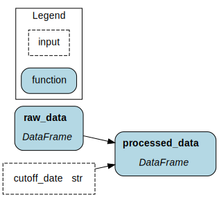
>
> Then, we build the `Driver` with caching enabled and execute the dataflow.
>
> ```
> basics_dr =driver.Builder ().with_modules (basics_module).with_cache ().build () basics_results_1 =basics_dr.execute (["processed_data" ],inputs ={"cutoff_date":"2024-09-01" }) print () print (basics_results_1 ["processed_data"].head ())
> ```
>
> ```
> raw_data::adapter::execute_node
> processed_data::adapter::execute_node
> ```
>
> ```
>         cities        date  amount country currency  amound_in_usd
> 0     New York  2024-09-13  478.23     USA      USD       478.2300
> 1  Los Angeles  2024-09-12  251.67     USA      USD       251.6700
> 2      Chicago  2024-09-11  989.34     USA      USD       989.3400
> 3     Montréal  2024-09-11  742.14  Canada      CAD       541.7622
> 4    Vancouver  2024-09-09  584.56  Canada      CAD       426.7288
> ```
>
> We can view what values were retrieved from the cache using `dr.cache.view_run()`. Since this was the first execution, nothing is retrieved.
>
> ```
>
> basics_dr
> .
> cache
> .
> view_run
> ()
> ```
>
> 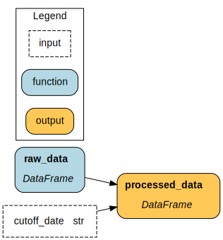
>
> On the second execution, `processed_data` is retrieved from cache as reported in the logs and highlighted in the visualization
>
> ```
> basics_results_2 =basics_dr.execute (["processed_data" ],inputs ={"cutoff_date":"2024-09-01" }) print () print (basics_results_2 ["processed_data"].head ()) print () basics_dr.cache.view_run ()
> ```
>
> ```
> raw_data::result_store::get_result::hit
> processed_data::result_store::get_result::hit
> ```
>
> ```
>         cities        date  amount country currency  amound_in_usd
> 0     New York  2024-09-13  478.23     USA      USD       478.2300
> 1  Los Angeles  2024-09-12  251.67     USA      USD       251.6700
> 2      Chicago  2024-09-11  989.34     USA      USD       989.3400
> 3     Montréal  2024-09-11  742.14  Canada      CAD       541.7622
> 4    Vancouver  2024-09-09  584.56  Canada      CAD       426.7288
> ```
>
> 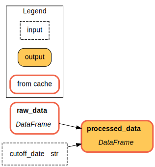
>
> <a id="how-tos-caching-tutorial--understanding-the-cache_key"></a>

>
> ### Understanding the `cache_key`
>
> The Hamilton cache stores results using a `cache_key`. It is composed of the node’s name (`node_name`), the code that defines it (`code_version`), and its data inputs (`data_version` of its dependencies).
>
> For example, the cache keys for the previous cells are:
>
> ```
> {
> "node_name":
> "raw_data",
> "code_version":
> "9d727859b9fd883247c3379d4d25a35af4a56df9d9fde20c75c6375dde631c68",
> "dependencies_data_versions":
> {}
> // it has no dependencies} {
> "node_name":
> "processed_data",
> "code_version":
> "c9e3377d6c5044944bd89eeb7073c730ee8707627c39906b4156c6411f056f00",
> "dependencies_data_versions":
> {
> "cutoff_date":
> "WkGjJythLWYAIj2Qr8T_ug==",
> // input value
> "raw_data":
> "t-BDcMLikFSNdn4piUKy1mBcKPoEsnsYjUNzWg=="
> // raw_data's result
> }}
> ```
>
> Results could be successfully retrieved because nodes in the first execution and second execution shared the same `cache_key`.
>
> The `cache_key` objects are internal and you won’t have to interact with them directly. However, keep that concept in mind throughout this tutorial. Towards the end, we show how to manually handle the `cache_key` for debugging.
>
> <a id="how-tos-caching-tutorial--adding-a-node"></a>

>
> ## Adding a node
>
> Let’s say you’re iteratively developing your dataflow and you add a new node. Here, we copy the previous module into a new module named `adding_node_module` and define the node `amount_per_country`.
>
> > In practice, you would edit the cell directly, but this makes the notebook easier to read and maintain
>
> ```
> %%cell_to_module adding_node_module --display
> import pandas as pd
>
> DATA = {
>     "cities": ["New York", "Los Angeles", "Chicago", "Montréal", "Vancouver"],
>     "date": ["2024-09-13", "2024-09-12", "2024-09-11", "2024-09-11", "2024-09-09"],
>     "amount": [478.23, 251.67, 989.34, 742.14, 584.56],
>     "country": ["USA", "USA", "USA", "Canada", "Canada"],
>     "currency": ["USD", "USD", "USD", "CAD", "CAD"],
> }
>
> def raw_data() -> pd.DataFrame:
>     """Loading raw data. This simulates loading from a file, database, or external service."""
>     return pd.DataFrame(DATA)
>
> def processed_data(raw_data: pd.DataFrame, cutoff_date: str) -> pd.DataFrame:
>     """Filter out rows before cutoff date and convert currency to USD."""
>     df = raw_data.loc[raw_data.date > cutoff_date].copy()
>     df["amound_in_usd"] = df["amount"]
>     df.loc[df.country == "Canada", "amound_in_usd"] *= 0.73
>     return df
>
> def amount_per_country(processed_data: pd.DataFrame) -> pd.DataFrame:
>     """Sum the amount in USD per country"""
>     return processed_data.groupby("country")["amound_in_usd"].sum().to_frame()
> ```
>
> 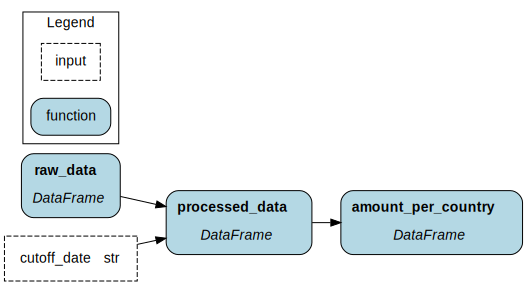
>
> We build a new `Driver` with `adding_node_module` and execute the dataflow. You’ll notice that `raw_data` and `processed_data` are retrieved and only `amount_per_country` is executed.
>
> ```
> adding_node_dr =driver.Builder ().with_modules (adding_node_module).with_cache ().build () adding_node_results =adding_node_dr.execute (["processed_data","amount_per_country" ],inputs ={"cutoff_date":"2024-09-01"}) print () print (adding_node_results ["amount_per_country"].head ()) print () adding_node_dr.cache.view_run ()
> ```
>
> ```
> raw_data::result_store::get_result::hit
> processed_data::result_store::get_result::hit
> amount_per_country::adapter::execute_node
> ```
>
> ```
>          amound_in_usd
> country
> Canada         968.491
> USA           1719.240
> ```
>
> 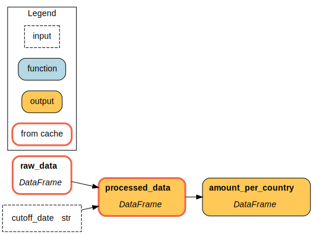
>
> Even though this is the first execution of `adding_node_dr` and the module `adding_node_module`, the cache contains results for `raw_data` and `processed_data`. We’re able to retrieve values because they have the same cache keys (code version and dependencies data versions).
>
> This means you can reuse cached results across dataflows. This is particularly useful with training and inference machine learning pipelines.
>
> <a id="how-tos-caching-tutorial--changing-inputs"></a>

>
> ## Changing inputs
>
> We reuse the same dataflow `adding_node_module`, but change the input `cutoff_date` from
> `"2024-09-01"` to `"2024-09-11"`.
>
> This new input forces `processed_data` to be re-executed. This produces a new result for `processed_data`, which cascades and also forced `amount_per_country` to be re-executed.
>
> ```
> changing_inputs_dr =driver.Builder ().with_modules (adding_node_module).with_cache ().build () changing_inputs_results_1 =changing_inputs_dr.execute (["processed_data","amount_per_country" ],inputs ={"cutoff_date":"2024-09-11"}) print () print (changing_inputs_results_1 ["amount_per_country"].head ()) print () changing_inputs_dr.cache.view_run ()
> ```
>
> ```
> raw_data::result_store::get_result::hit
> processed_data::adapter::execute_node
> amount_per_country::adapter::execute_node
> ```
>
> ```
>          amound_in_usd
> country
> USA              729.9
> ```
>
> 
>
> Now, we execute with the `cutoff_date` value `"2024-09-05"`, which forces `processed_data` to be executed.
>
> ```
> changing_inputs_results_2 =changing_inputs_dr.execute (["processed_data","amount_per_country" ],inputs ={"cutoff_date":"2024-09-05"}) print () print (changing_inputs_results_2 ["amount_per_country"].head ()) print () changing_inputs_dr.cache.view_run ()
> ```
>
> ```
> raw_data::result_store::get_result::hit
> processed_data::adapter::execute_node
> amount_per_country::result_store::get_result::hit
> ```
>
> ```
>          amound_in_usd
> country
> Canada         968.491
> USA           1719.240
> ```
>
> 
>
> Notice that the cache could still retrieve `amount_per_country`. This is because `processed_data` return a value that had been cached previously (in the `Adding a node` section).
>
> In concrete terms, filtering rows by the date `"2024-09-05"` or `"2024-09-01"` includes the same rows and produces the same dataframe.
>
> ```
> print (adding_node_results ["processed_data" ]) print () print (changing_inputs_results_2 ["processed_data" ])
> ```
>
> ```
>         cities        date  amount country currency  amound_in_usd
> 0     New York  2024-09-13  478.23     USA      USD       478.2300
> 1  Los Angeles  2024-09-12  251.67     USA      USD       251.6700
> 2      Chicago  2024-09-11  989.34     USA      USD       989.3400
> 3     Montréal  2024-09-11  742.14  Canada      CAD       541.7622
> 4    Vancouver  2024-09-09  584.56  Canada      CAD       426.7288
>
>         cities        date  amount country currency  amound_in_usd
> 0     New York  2024-09-13  478.23     USA      USD       478.2300
> 1  Los Angeles  2024-09-12  251.67     USA      USD       251.6700
> 2      Chicago  2024-09-11  989.34     USA      USD       989.3400
> 3     Montréal  2024-09-11  742.14  Canada      CAD       541.7622
> 4    Vancouver  2024-09-09  584.56  Canada      CAD       426.7288
> ```
>
> <a id="how-tos-caching-tutorial--changing-code"></a>

>
> ## Changing code
>
> As you develop your dataflow, you will need to edit upstream nodes. Caching will automatically detect code changes and determine which node needs to be re-executed. In `processed_data()`, we’ll change the conversation rate from `0.73` to `0.71`.
>
> > NOTE. changes to docstrings and comments `#` are ignored when versioning a node.
>
> ```
> %%cell_to_module changing_code_module
> import pandas as pd
>
> DATA = {
>     "cities": ["New York", "Los Angeles", "Chicago", "Montréal", "Vancouver"],
>     "date": ["2024-09-13", "2024-09-12", "2024-09-11", "2024-09-11", "2024-09-09"],
>     "amount": [478.23, 251.67, 989.34, 742.14, 584.56],
>     "country": ["USA", "USA", "USA", "Canada", "Canada"],
>     "currency": ["USD", "USD", "USD", "CAD", "CAD"],
> }
>
> def raw_data() -> pd.DataFrame:
>     """Loading raw data. This simulates loading from a file, database, or external service."""
>     return pd.DataFrame(DATA)
>
> def processed_data(raw_data: pd.DataFrame, cutoff_date: str) -> pd.DataFrame:
>     """Filter out rows before cutoff date and convert currency to USD."""
>     df = raw_data.loc[raw_data.date > cutoff_date].copy()
>     df["amound_in_usd"] = df["amount"]
>     df.loc[df.country == "Canada", "amound_in_usd"] *= 0.71  # <- VALUE CHANGED FROM module_2
>     return df
>
> def amount_per_country(processed_data: pd.DataFrame) -> pd.DataFrame:
>     """Sum the amount in USD per country"""
>     return processed_data.groupby("country")["amound_in_usd"].sum().to_frame()
> ```
>
> We need to execute `processed_data` because the code change created a new `cache_key` and led to a cache miss. Then, `processed_data` returns a previously unseen value, forcing `amount_per_country` to also be re-executed
>
> ```
> changing_code_dr_1 =driver.Builder ().with_modules (changing_code_module).with_cache ().build () changing_code_results_1 =changing_code_dr_1.execute (["processed_data","amount_per_country" ],inputs ={"cutoff_date":"2024-09-01"}) print () print (changing_code_results_1 ["amount_per_country"].head ()) print () changing_code_dr_1.cache.view_run ()
> ```
>
> ```
> raw_data::result_store::get_result::hit
> processed_data::adapter::execute_node
> amount_per_country::adapter::execute_node
> ```
>
> ```
>          amound_in_usd
> country
> Canada         941.957
> USA           1719.240
> ```
>
> 
>
> We make another code change to `processed_data` to accomodate currency conversion for Brazil and Mexico.
>
> ```
> %%cell_to_module changing_code_module_2
> import pandas as pd
>
> DATA = {
>     "cities": ["New York", "Los Angeles", "Chicago", "Montréal", "Vancouver"],
>     "date": ["2024-09-13", "2024-09-12", "2024-09-11", "2024-09-11", "2024-09-09"],
>     "amount": [478.23, 251.67, 989.34, 742.14, 584.56],
>     "country": ["USA", "USA", "USA", "Canada", "Canada"],
>     "currency": ["USD", "USD", "USD", "CAD", "CAD"],
> }
>
> def raw_data() -> pd.DataFrame:
>     """Loading raw data. This simulates loading from a file, database, or external service."""
>     return pd.DataFrame(DATA)
>
> def processed_data(raw_data: pd.DataFrame, cutoff_date: str) -> pd.DataFrame:
>     """Filter out rows before cutoff date and convert currency to USD."""
>     df = raw_data.loc[raw_data.date > cutoff_date].copy()
>     df["amound_in_usd"] = df["amount"]
>     df.loc[df.country == "Canada", "amound_in_usd"] *= 0.71
>     df.loc[df.country == "Brazil", "amound_in_usd"] *= 0.18  # <- LINE ADDED
>     df.loc[df.country == "Mexico", "amound_in_usd"] *= 0.05  # <- LINE ADDED
>     return df
>
> def amount_per_country(processed_data: pd.DataFrame) -> pd.DataFrame:
>     """Sum the amount in USD per country"""
>     return processed_data.groupby("country")["amound_in_usd"].sum().to_frame()
> ```
>
> Again, the code change forces `processed_data` to be executed.
>
> ```
> changing_code_dr_2 =driver.Builder ().with_modules (changing_code_module_2).with_cache ().build () changing_code_results_2 =changing_code_dr_2.execute (["processed_data","amount_per_country" ],inputs ={"cutoff_date":"2024-09-01" }) print () print (changing_code_results_2 ["amount_per_country"].head ()) print () changing_code_dr_2.cache.view_run ()
> ```
>
> ```
> raw_data::result_store::get_result::hit
> processed_data::adapter::execute_node
> amount_per_country::result_store::get_result::hit
> ```
>
> ```
>          amound_in_usd
> country
> Canada         941.957
> USA           1719.240
> ```
>
> 
>
> However, `amount_per_country` can be retrieved because `processed_data` returned a previously seen value.
>
> In concrete terms, adding code to process currency from Brazil and Mexico didn’t change the `processed_data` result because it only includes data from the USA and Canada.
>
> > NOTE. This is similar to what happened at the end of the section **Changing inputs**.
>
> ```
> print (changing_code_results_1 ["processed_data" ]) print () print (changing_code_results_2 ["processed_data" ])
> ```
>
> ```
>         cities        date  amount country currency  amound_in_usd
> 0     New York  2024-09-13  478.23     USA      USD       478.2300
> 1  Los Angeles  2024-09-12  251.67     USA      USD       251.6700
> 2      Chicago  2024-09-11  989.34     USA      USD       989.3400
> 3     Montréal  2024-09-11  742.14  Canada      CAD       526.9194
> 4    Vancouver  2024-09-09  584.56  Canada      CAD       415.0376
>
>         cities        date  amount country currency  amound_in_usd
> 0     New York  2024-09-13  478.23     USA      USD       478.2300
> 1  Los Angeles  2024-09-12  251.67     USA      USD       251.6700
> 2      Chicago  2024-09-11  989.34     USA      USD       989.3400
> 3     Montréal  2024-09-11  742.14  Canada      CAD       526.9194
> 4    Vancouver  2024-09-09  584.56  Canada      CAD       415.0376
> ```
>
> <a id="how-tos-caching-tutorial--changing-external-data"></a>

>
> ## Changing external data
>
> Hamilton’s caching mechanism uses the node’s `code_version` and its dependencies `data_version` to determine if the node needs to be executed or the result can be retrieved from cache. By default, it assumes [idempotency](https://www.astronomer.io/docs/learn/dag-best-practices#review-idempotency) of operations.
>
> This section covers how to handle node with external effects, such as reading or writing external data.
>
> <a id="how-tos-caching-tutorial--idempotency"></a>

>
> ### Idempotency
>
> To illustrate idempotency, let’s use this minimal dataflow which has a single node that returns the current date and time:
>
> ```
> import
> datetime def
> current_datetime () -> datetime.datetime:return datetime.datetime.now ()
> ```
>
> The first execution will execute the node and store the resulting date and time. On the second execution, the cache will read the stored result instead of re-executing. Why? Because the `code_version` is the same and the dependencies `data_version` (it has no dependencies) haven’t changed.
>
> A similar situation occurs when reading from external data, as shown here:
>
> ```
> import
> pandas
> as
> pd def
> dataset (file_path:str) -> pd.DataFrame:return pd.read_csv (file_path)
> ```
>
> Here, the code of `dataset()` and the value for `file_path` can stay the same, but the file itself could be updated (e.g., new rows added).
>
> The next sections show how to always re-execute a node and ensure the latest data is used. The `DATA` constant is modified with transactions in Brazil and Mexico to simulate `raw_data` loading a new dataset.
>
> ```
> %%cell_to_module changing_external_module
> import pandas as pd
>
> DATA = {
>     "cities": ["New York", "Los Angeles", "Chicago", "Montréal", "Vancouver", "Houston", "Phoenix", "Mexico City", "Chihuahua City", "Rio de Janeiro"],
>     "date": ["2024-09-13", "2024-09-12", "2024-09-11", "2024-09-11", "2024-09-09", "2024-09-08", "2024-09-07", "2024-09-06", "2024-09-05", "2024-09-04"],
>     "amount": [478.23, 251.67, 989.34, 742.14, 584.56, 321.85, 918.67, 135.22, 789.12, 432.78],
>     "country": ["USA", "USA", "USA", "Canada", "Canada", "USA", "USA", "Mexico", "Mexico", "Brazil"],
>     "currency": ["USD", "USD", "USD", "CAD", "CAD", "USD", "USD", "MXN", "MXN", "BRL"],
> }
>
> def raw_data() -> pd.DataFrame:
>     """Loading raw data. This simulates loading from a file, database, or external service."""
>     return pd.DataFrame(DATA)
>
> def processed_data(raw_data: pd.DataFrame, cutoff_date: str) -> pd.DataFrame:
>     """Filter out rows before cutoff date and convert currency to USD."""
>     df = raw_data.loc[raw_data.date > cutoff_date].copy()
>     df["amound_in_usd"] = df["amount"]
>     df.loc[df.country == "Canada", "amound_in_usd"] *= 0.71
>     df.loc[df.country == "Brazil", "amound_in_usd"] *= 0.18
>     df.loc[df.country == "Mexico", "amound_in_usd"] *= 0.05
>     return df
>
> def amount_per_country(processed_data: pd.DataFrame) -> pd.DataFrame:
>     """Sum the amount in USD per country"""
>     return processed_data.groupby("country")["amound_in_usd"].sum().to_frame()
> ```
>
> At execution, we see `raw_data` being retrieved along with all downstream nodes. Also, we note that the printed results don’t include Brazil nor Mexico.
>
> ```
> changing_external_dr =driver.Builder ().with_modules (changing_external_module).with_cache ().build () changing_external_results =changing_external_dr.execute (["amount_per_country" ],inputs ={"cutoff_date":"2024-09-01" }) print () print (changing_external_results ["amount_per_country"].head ()) print () changing_external_dr.cache.view_run ()
> ```
>
> ```
> raw_data::result_store::get_result::hit
> processed_data::result_store::get_result::hit
> amount_per_country::result_store::get_result::hit
> ```
>
> ```
>          amound_in_usd
> country
> Canada         941.957
> USA           1719.240
> ```
>
> 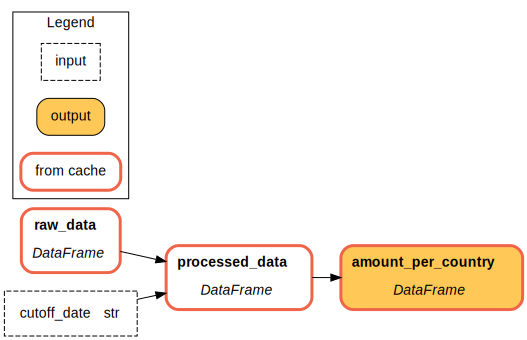
>
> <a id="how-tos-caching-tutorial--.with_cache-to-specify-caching-behavior"></a>

>
> ### `.with_cache()` to specify caching behavior
>
> Here, we build a new `Driver` with the same `changing_external_module`, but we specify in `.with_cache()` to always recompute `raw_data`.
>
> The visualization shows that `raw_data` was executed, and because of the new data, all downstream nodes also need to be executed. The results now include Brazil and Mexico.
>
> ```
> changing_external_with_cache_dr =driver.Builder ().with_modules (changing_external_module).with_cache (recompute =["raw_data" ]).build () changing_external_with_cache_results =changing_external_with_cache_dr.execute (["amount_per_country" ],inputs ={"cutoff_date":"2024-09-01" }) print () print (changing_external_with_cache_results ["amount_per_country"].head ()) print () changing_external_with_cache_dr.cache.view_run ()
> ```
>
> ```
> raw_data::adapter::execute_node
> processed_data::adapter::execute_node
> amount_per_country::adapter::execute_node
> ```
>
> ```
>          amound_in_usd
> country
> Brazil         77.9004
> Canada        941.9570
> Mexico         46.2170
> USA          2959.7600
> ```
>
> 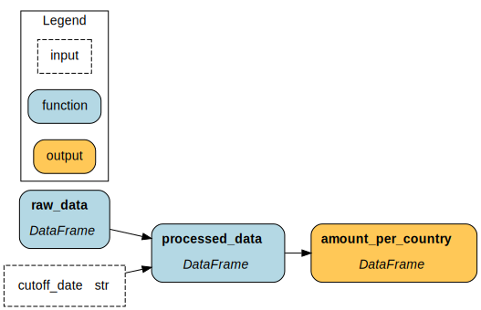
>
> <a id="how-tos-caching-tutorial--cache-to-specify-caching-behavior"></a>

>
> ### `@cache` to specify caching behavior
>
> Another way to specify the `RECOMPUTE` behavior is to use the `@cache` decorator.
>
> ```
> %%cell_to_module changing_external_decorator_module
> import pandas as pd
> from hamilton.function_modifiers import cache
>
> DATA = {
>     "cities": ["New York", "Los Angeles", "Chicago", "Montréal", "Vancouver", "Houston", "Phoenix", "Mexico City", "Chihuahua City", "Rio de Janeiro"],
>     "date": ["2024-09-13", "2024-09-12", "2024-09-11", "2024-09-11", "2024-09-09", "2024-09-08", "2024-09-07", "2024-09-06", "2024-09-05", "2024-09-04"],
>     "amount": [478.23, 251.67, 989.34, 742.14, 584.56, 321.85, 918.67, 135.22, 789.12, 432.78],
>     "country": ["USA", "USA", "USA", "Canada", "Canada", "USA", "USA", "Mexico", "Mexico", "Brazil"],
>     "currency": ["USD", "USD", "USD", "CAD", "CAD", "USD", "USD", "MXN", "MXN", "BRL"],
> }
>
> @cache(behavior="recompute")
> def raw_data() -> pd.DataFrame:
>     """Loading raw data. This simulates loading from a file, database, or external service."""
>     return pd.DataFrame(DATA)
>
> def processed_data(raw_data: pd.DataFrame, cutoff_date: str) -> pd.DataFrame:
>     """Filter out rows before cutoff date and convert currency to USD."""
>     df = raw_data.loc[raw_data.date > cutoff_date].copy()
>     df["amound_in_usd"] = df["amount"]
>     df.loc[df.country == "Canada", "amound_in_usd"] *= 0.71
>     df.loc[df.country == "Brazil", "amound_in_usd"] *= 0.18
>     df.loc[df.country == "Mexico", "amound_in_usd"] *= 0.05
>     return df
>
> def amount_per_country(processed_data: pd.DataFrame) -> pd.DataFrame:
>     """Sum the amount in USD per country"""
>     return processed_data.groupby("country")["amound_in_usd"].sum().to_frame()
> ```
>
> We build a new `Driver` with `changing_external_cache_decorator_module`, which includes the `@cache` decorator. Note that we don’t specify anything in `.with_cache()`.
>
> ```
> changing_external_decorator_dr =(driver.Builder ().with_modules (changing_external_decorator_module).with_cache ().build ()) changing_external_decorator_results =changing_external_decorator_dr.execute (["amount_per_country" ],inputs ={"cutoff_date":"2024-09-01"}) print () print (changing_external_decorator_results ["amount_per_country"].head ()) print () changing_external_decorator_dr.cache.view_run ()
> ```
>
> ```
> raw_data::adapter::execute_node
> processed_data::result_store::get_result::hit
> amount_per_country::result_store::get_result::hit
> ```
>
> ```
>          amound_in_usd
> country
> Brazil         77.9004
> Canada        941.9570
> Mexico         46.2170
> USA          2959.7600
> ```
>
> 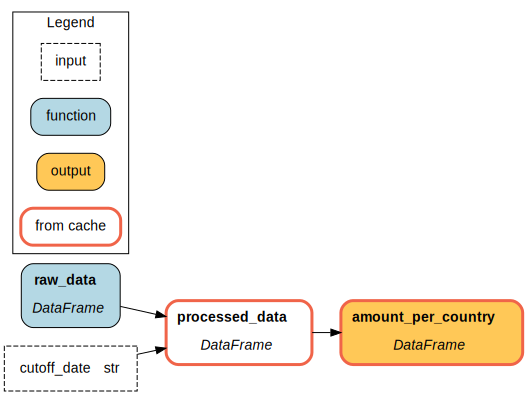
>
> We see that `raw_data` was re-executed. Then, `processed_data` and `amount_per_country` can be retrieved because they were produced just before by the `changing_external_with_cache_dr`
>
> <a id="how-tos-caching-tutorial--when-to-use-cache-vs.-.with_cache"></a>

>
> ### When to use `@cache` vs. `.with_cache()`?
>
> Specifying the caching behavior via `.with_cache()` or `@cache` is entirely equivalent. There are benefits to either approach:
>
> - `@cache`: specify behavior at the dataflow-level. The behavior is tied to the node and will be picked up by all `Driver` loading the module. This can prevent errors or unexpected behaviors for users of that dataflow.
> - `.with_cache()`: specify behavior at the `Driver`-level. Gives the flexiblity to change the behavior without modifying the dataflow code and committing changes. You might be ok with `DEFAULT` during development, but want to ensure `RECOMPUTE` in production.
>
> Importantly, the behavior specified in `.with_cache(...)` overrides whatever is in `@cache` because it is closer to execution. For example, having `.with_cache(default=["raw_data"])` `@cache(behavior="recompute")` would force `DEFAULT` behavior.
>
> >
> > [!IMPORTANT]
> > ⛔ : Using the `@cache` decorator alone doesn’t enable caching; adding `.with_cache()` to the `Builder` does. The decorator is only a mean to specify special behaviors for a node.
>
> <a id="how-tos-caching-tutorial--force-recompute-all"></a>

>
> ## Force recompute all
>
> By specifying `.with_cache(recompute=True)`, you are setting the behavior `RECOMPUTE` for all nodes. This forces recomputation, which is useful for producing a “cache refresh” with up-to-date values.
>
> ```
> recompute_all_dr =(driver.Builder ().with_modules (changing_external_decorator_module).with_cache (recompute =True).build ()) recompute_all_results =recompute_all_dr.execute (["amount_per_country" ],inputs ={"cutoff_date":"2024-09-01"}) print () print (recompute_all_results ["amount_per_country"].head ()) print () recompute_all_dr.cache.view_run ()
> ```
>
> ```
> raw_data::adapter::execute_node
> processed_data::adapter::execute_node
> amount_per_country::adapter::execute_node
> ```
>
> ```
>          amound_in_usd
> country
> Brazil         77.9004
> Canada        941.9570
> Mexico         46.2170
> USA          2959.7600
> ```
>
> 
>
> We see that all nodes were recomputed.
>
> <a id="how-tos-caching-tutorial--setting-default-behavior"></a>

>
> ## Setting default behavior
>
> Once you enable caching using `.with_cache()`, it is a “opt-out” feature by default. This means all nodes are cached unless you set the `DISABLE` behavior via `@cache` or `.with_cache(disable=[...])`. This can become difficult to manage as the number of nodes increases.
>
> You can make it an “opt-in” feature by setting `default_behavior="disable"` in `.with_cache()`. This way, you’re using caching, but only for nodes explicitly specified in `@cache` or `.with_cache()`.
>
> Here, we build a `Driver` with the `changing_external_decorator_module`, where `raw_data` was set to have behavior `RECOMPUTE`, and set the default behavior to `DISABLE`.
>
> ```
> default_behavior_dr =(driver.Builder ().with_modules (changing_external_decorator_module).with_cache (default_behavior ="disable").build ()) default_behavior_results =default_behavior_dr.execute (["amount_per_country" ],inputs ={"cutoff_date":"2024-09-01"}) print () print (default_behavior_results ["amount_per_country"].head ()) print () default_behavior_dr.cache.view_run ()
> ```
>
> ```
> raw_data::adapter::execute_node
> processed_data::adapter::execute_node
> amount_per_country::adapter::execute_node
> ```
>
> ```
>          amound_in_usd
> country
> Brazil         77.9004
> Canada        941.9570
> Mexico         46.2170
> USA          2959.7600
> ```
>
> 
>
> ```
> default_behavior_dr.cache.behaviors [default_behavior_dr.cache.last_run_id]
> ```
>
> ```
> {'amount_per_country': <CachingBehavior.DISABLE: 3>,
>  'processed_data': <CachingBehavior.DISABLE: 3>,
>  'raw_data': <CachingBehavior.RECOMPUTE: 2>,
>  'cutoff_date': <CachingBehavior.DISABLE: 3>}
> ```
>
> <a id="how-tos-caching-tutorial--materializers"></a>

>
> ## Materializers
>
> > NOTE. You can skip this section if you’re not using materializers.
>
> `DataLoader` and `DataSaver` (collectively “materializers”) are special Hamilton nodes that connect your dataflow to external data (files, databases, etc.). These constructs are safe to use with caching and are complementary.
>
> **Caching**
>
> - writing and reading shorter-term data to be used with the dataflow
> - strong connection between the code and the data
> - automatically handle multiple versions of the same dataset
>
> **Materializers**
>
> - robust mechanism to read/write data from many sources
> - data isn’t necessarily meant to be used with Hamilton (e.g., loading from a warehouse, outputting a report).
> - typically outputs to a static destination; each write overwrites the previous stored dataset.
>
> The next cell uses `@dataloader` and `@datasaver` decorators. In the visualization, we see the added `raw_data.loader` and `saved_data` nodes.
>
> ```
> %%cell_to_module materializers_module -d
> import pandas as pd
> from hamilton.function_modifiers import dataloader, datasaver
>
> DATA = {
>     "cities": ["New York", "Los Angeles", "Chicago", "Montréal", "Vancouver", "Houston", "Phoenix", "Mexico City", "Chihuahua City", "Rio de Janeiro"],
>     "date": ["2024-09-13", "2024-09-12", "2024-09-11", "2024-09-11", "2024-09-09", "2024-09-08", "2024-09-07", "2024-09-06", "2024-09-05", "2024-09-04"],
>     "amount": [478.23, 251.67, 989.34, 742.14, 584.56, 321.85, 918.67, 135.22, 789.12, 432.78],
>     "country": ["USA", "USA", "USA", "Canada", "Canada", "USA", "USA", "Mexico", "Mexico", "Brazil"],
>     "currency": ["USD", "USD", "USD", "CAD", "CAD", "USD", "USD", "MXN", "MXN", "BRL"],
> }
>
> @dataloader()
> def raw_data() -> tuple[pd.DataFrame, dict]:
>     """Loading raw data. This simulates loading from a file, database, or external service."""
>     data = pd.DataFrame(DATA)
>     metadata = {"source": "notebook", "format": "json"}
>     return data, metadata
>
> def processed_data(raw_data: pd.DataFrame, cutoff_date: str) -> pd.DataFrame:
>     """Filter out rows before cutoff date and convert currency to USD."""
>     df = raw_data.loc[raw_data.date > cutoff_date].copy()
>     df["amound_in_usd"] = df["amount"]
>     df.loc[df.country == "Canada", "amound_in_usd"] *= 0.71
>     df.loc[df.country == "Brazil", "amound_in_usd"] *= 0.18
>     df.loc[df.country == "Mexico", "amound_in_usd"] *= 0.05
>     return df
>
> def amount_per_country(processed_data: pd.DataFrame) -> pd.DataFrame:
>     """Sum the amount in USD per country"""
>     return processed_data.groupby("country")["amound_in_usd"].sum().to_frame()
>
> @datasaver()
> def saved_data(amount_per_country: pd.DataFrame) -> dict:
>     amount_per_country.to_parquet("./saved_data.parquet")
>     metadata = {"source": "notebook", "format": "parquet"}
>     return metadata
> ```
>
> 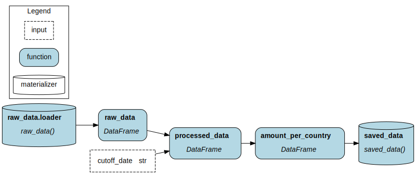
>
> Next, we build a `Driver` as usual.
>
> ```
> materializers_dr =(driver.Builder ().with_modules (materializers_module).with_cache ().build ()) materializers_results =materializers_dr.execute (["amount_per_country","saved_data" ],inputs ={"cutoff_date":"2024-09-01"}) print () print (materializers_results ["amount_per_country"].head ()) print () materializers_dr.cache.view_run ()
> ```
>
> ```
> raw_data.loader::adapter::execute_node
> raw_data::adapter::execute_node
> processed_data::result_store::get_result::hit
> amount_per_country::result_store::get_result::hit
> saved_data::adapter::execute_node
> ```
>
> ```
>          amound_in_usd
> country
> Brazil         77.9004
> Canada        941.9570
> Mexico         46.2170
> USA          2959.7600
> ```
>
> 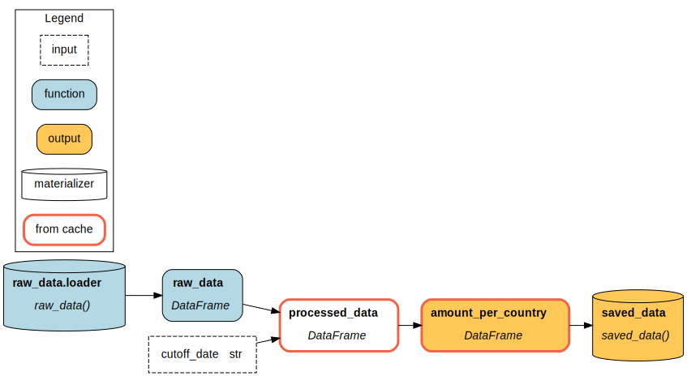
>
> We execute the dataflow a second time to show that loaders and savers are just like any other node; they can be cached and retrieved.
>
> ```
> materializers_results =materializers_dr.execute (["amount_per_country","saved_data" ],inputs ={"cutoff_date":"2024-09-01"}) print () print (materializers_results ["amount_per_country"].head ()) print () materializers_dr.cache.view_run ()
> ```
>
> ```
> raw_data.loader::result_store::get_result::hit
> raw_data::result_store::get_result::hit
> processed_data::result_store::get_result::hit
> amount_per_country::result_store::get_result::hit
> saved_data::result_store::get_result::hit
> ```
>
> ```
>          amound_in_usd
> country
> Brazil         77.9004
> Canada        941.9570
> Mexico         46.2170
> USA          2959.7600
> ```
>
> 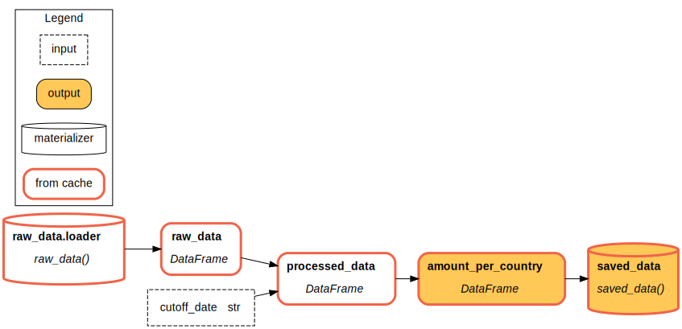
>
> <a id="how-tos-caching-tutorial--usage-patterns"></a>

>
> ### Usage patterns
>
> Here are a few common scenarios:
>
> **Loading data is expensive**: Your dataflow uses a `DataLoader` to get data from Snowflake. You want to load it once and cache it. When executing your dataflow, you want to use your cached copy to save query time, egress costs, etc.
>
> - Use the `DEFAULT` caching behavior for loaders.
>
> **Only save new data**: You run the dataflow multiple times (maybe with different parameters or on a schedule) and only want to write to destination when the data changes.
>
> - Use the `DEFAULT` caching behavior for savers.
>
> **Always read the latest data**: You want to use caching, but also ensure the dataflow always uses the latest data. This involves executing the `DataLoader` every time, get the data in-memory, version it, and then determine what needs to be executed (see **Changing external data**).
>
> - Use the `RECOMPUTE` caching behavior for loaders.
>
> Use the parameters `default_loader_behavior` or `default_saver_behavior` of the `.with_cache()` clause to specify the behavior for all loaders or savers.
>
> > NOTE. The **Caching + materializers tutorial** notebook details how to achieve granular control over loader and saver behaviors.
>
> ```
> materializers_dr_2 =(driver.Builder ().with_modules (materializers_module).with_cache (default_loader_behavior ="recompute",default_saver_behavior ="disable").build ()) materializers_results_2 =materializers_dr_2.execute (["amount_per_country","saved_data" ],inputs ={"cutoff_date":"2024-09-01"}) print () print (materializers_results_2 ["amount_per_country"].head ()) print () materializers_dr_2.cache.view_run ()
> ```
>
> ```
> raw_data.loader::adapter::execute_node
> raw_data::adapter::execute_node
> processed_data::result_store::get_result::hit
> amount_per_country::result_store::get_result::hit
> saved_data::adapter::execute_node
> ```
>
> ```
>          amound_in_usd
> country
> Brazil         77.9004
> Canada        941.9570
> Mexico         46.2170
> USA          2959.7600
> ```
>
> 
>
> ```
> materializers_dr_2.cache.behaviors [materializers_dr_2.cache.last_run_id]
> ```
>
> ```
> {'amount_per_country': <CachingBehavior.DEFAULT: 1>,
>  'processed_data': <CachingBehavior.DEFAULT: 1>,
>  'raw_data.loader': <CachingBehavior.RECOMPUTE: 2>,
>  'raw_data': <CachingBehavior.RECOMPUTE: 2>,
>  'saved_data': <CachingBehavior.DISABLE: 3>,
>  'cutoff_date': <CachingBehavior.DEFAULT: 1>}
> ```
>
> <a id="how-tos-caching-tutorial--changing-the-cache-format"></a>

>
> ## Changing the cache format
>
> By default, results are stored in `pickle` format. It’s a convenient default but [comes with caveats](https://grantjenks.com/docs/diskcache/tutorial.html#caveats). You can use the `@cache` decorator to specify another file format for storing results.
>
> By default this includes:
>
> - `json`
> - `parquet`
> - `csv`
> - `excel`
> - `file`
> - `feather`
> - `orc`
>
> This feature uses `DataLoader` and `DataSaver` under the hood and supports all of the same formats (including your custom ones, as long as they take a `path` attribute).
>
> > This is an area of active development. Feel free to share suggestions and feedback!
>
> The next cell sets `processed_data` to be cached using the `parquet` format.
>
> ```
> %%cell_to_module cache_format_module
> import pandas as pd
> from hamilton.function_modifiers import cache
>
> DATA = {
>     "cities": ["New York", "Los Angeles", "Chicago", "Montréal", "Vancouver", "Houston", "Phoenix", "Mexico City", "Chihuahua City", "Rio de Janeiro"],
>     "date": ["2024-09-13", "2024-09-12", "2024-09-11", "2024-09-11", "2024-09-09", "2024-09-08", "2024-09-07", "2024-09-06", "2024-09-05", "2024-09-04"],
>     "amount": [478.23, 251.67, 989.34, 742.14, 584.56, 321.85, 918.67, 135.22, 789.12, 432.78],
>     "country": ["USA", "USA", "USA", "Canada", "Canada", "USA", "USA", "Mexico", "Mexico", "Brazil"],
>     "currency": ["USD", "USD", "USD", "CAD", "CAD", "USD", "USD", "MXN", "MXN", "BRL"],
> }
>
> def raw_data() -> pd.DataFrame:
>     """Loading raw data. This simulates loading from a file, database, or external service."""
>     return pd.DataFrame(DATA)
>
> @cache(format="parquet")
> def processed_data(raw_data: pd.DataFrame, cutoff_date: str) -> pd.DataFrame:
>     """Filter out rows before cutoff date and convert currency to USD."""
>     df = raw_data.loc[raw_data.date > cutoff_date].copy()
>     df["amound_in_usd"] = df["amount"]
>     df.loc[df.country == "Canada", "amound_in_usd"] *= 0.71
>     df.loc[df.country == "Brazil", "amound_in_usd"] *= 0.18
>     df.loc[df.country == "Mexico", "amound_in_usd"] *= 0.05
>     return df
>
> def amount_per_country(processed_data: pd.DataFrame) -> pd.Series:
>     """Sum the amount in USD per country"""
>     return processed_data.groupby("country")["amound_in_usd"].sum()
> ```
>
> When executing the dataflow, we see `raw_data` recomputed because it’s a dataloader. The result for `processed_data` will be retrieved, but it will be saved again as `.parquet` this time.
>
> ```
> cache_format_dr =driver.Builder ().with_modules (cache_format_module).with_cache ().build () cache_format_results =cache_format_dr.execute (["amount_per_country" ],inputs ={"cutoff_date":"2024-09-01" }) print () print (cache_format_results ["amount_per_country"].head ()) print () cache_format_dr.cache.view_run ()
> ```
>
> ```
> raw_data::result_store::get_result::hit
> processed_data::adapter::execute_node
> amount_per_country::adapter::execute_node
> ```
>
> ```
> country
> Canada     941.957
> USA       1719.240
> Name: amound_in_usd, dtype: float64
> ```
>
> 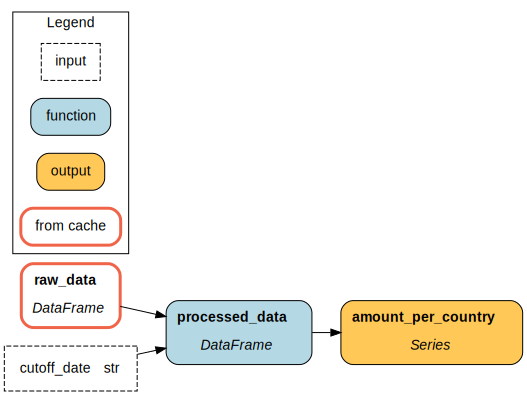
>
> Now, under the `./.hamilton_cache`, there will be two results of the same name, one with the `.parquet` extension and one without. The one without is actually a pickeld `DataLoader` to retrieve the `.parquet` file.
>
> You can access the path programmatically via the `result_store._path_from_data_version(...)` method.
>
> ```
> data_version =cache_format_dr.cache.data_versions [cache_format_dr.cache.last_run_id ]["processed_data"] parquet_path =cache_format_dr.cache.result_store._path_from_data_version (data_version).with_suffix (".parquet") parquet_path.exists ()
> ```
>
> ```
> True
> ```
>
> <a id="how-tos-caching-tutorial--introspecting-the-cache"></a>

>
> ## Introspecting the cache
>
> The `Driver.cache` stores information about all executions over its lifetime. Previous `run_id` are available through `Driver.cache.run_ids` and can be used in tandem without other utility functions:
>
> - Resolve the node caching behavior (e.g., “recompute”)
> - Access structured logs
> - Visualize the cache execution
>
> Also, `Driver.cache.last_run_id` is a shortcut to the most recent execution.
>
> ```
> cache_format_dr.cache.resolve_behaviors (cache_format_dr.cache.last_run_id)
> ```
>
> ```
> {'amount_per_country': <CachingBehavior.DEFAULT: 1>,
>  'processed_data': <CachingBehavior.DEFAULT: 1>,
>  'raw_data': <CachingBehavior.DEFAULT: 1>,
>  'cutoff_date': <CachingBehavior.DEFAULT: 1>}
> ```
>
> ```
> run_logs =cache_format_dr.cache.logs (cache_format_dr.cache.last_run_id,level ="debug") for event in run_logs ["processed_data" ]:print (event)
> ```
>
> ```
> processed_data::adapter::resolve_behavior
> processed_data::adapter::set_cache_key
> processed_data::adapter::get_cache_key::hit
> processed_data::adapter::get_data_version::miss
> processed_data::metadata_store::get_data_version::miss
> processed_data::adapter::execute_node
> processed_data::adapter::set_data_version
> processed_data::metadata_store::set_data_version
> processed_data::adapter::get_cache_key::hit
> processed_data::adapter::get_data_version::hit
> processed_data::result_store::set_result
> processed_data::adapter::get_data_version::hit
> processed_data::adapter::resolve_behavior
> ```
>
> ```
> # for `.view_run()` passing no parameter is equivalent to the last `run_id` cache_format_dr.cache.view_run (cache_format_dr.cache.last_run_id)
> ```
>
> 
>
> <a id="how-tos-caching-tutorial--interactively-explore-runs"></a>

>
> ### Interactively explore runs
>
> By using `ipywidgets` we can easily build a widget to iterate over `run_id` values and display cache information. Below, we create a `Driver` and execute it a few times to generate data then inspect it with a widget.
>
> ```
> interactive_dr =driver.Builder ().with_modules (cache_format_module).with_cache ().build () interactive_dr.execute (["amount_per_country" ],inputs ={"cutoff_date":"2024-09-01" }) interactive_dr.execute (["amount_per_country" ],inputs ={"cutoff_date":"2024-09-05" }) interactive_dr.execute (["amount_per_country" ],inputs ={"cutoff_date":"2024-09-10" }) interactive_dr.execute (["amount_per_country" ],inputs ={"cutoff_date":"2024-09-11" }) interactive_dr.execute (["amount_per_country" ],inputs ={"cutoff_date":"2024-09-13" })
> ```
>
> ```
> raw_data::result_store::get_result::hit
> processed_data::result_store::get_result::hit
> amount_per_country::result_store::get_result::hit
> raw_data::result_store::get_result::hit
> processed_data::adapter::execute_node
> amount_per_country::result_store::get_result::hit
> raw_data::result_store::get_result::hit
> processed_data::adapter::execute_node
> amount_per_country::adapter::execute_node
> raw_data::result_store::get_result::hit
> processed_data::adapter::execute_node
> amount_per_country::adapter::execute_node
> raw_data::result_store::get_result::hit
> processed_data::adapter::execute_node
> amount_per_country::adapter::execute_node
> ```
>
> ```
> {'amount_per_country': Series([], Name: amound_in_usd, dtype: float64)}
> ```
>
> The following cell allows you to click-and-drag or use arrow-keys to navigate
>
> ```
> from
> IPython.display
> import display from
> ipywidgets
> import SelectionSlider,interact @interact (run_id =SelectionSlider (options =interactive_dr.cache.run_ids )) def
> iterate_over_runs (run_id ):display (interactive_dr.cache.data_versions [run_id ]) display (interactive_dr.cache.view_run (run_id =run_id ))
> ```
>
> <a id="how-tos-caching-tutorial--managing-storage"></a>

>
> ## Managing storage
>
> <a id="how-tos-caching-tutorial--setting-the-cache-path"></a>

>
> ### Setting the cache `path`
>
> By default, metadata and results are stored under `./.hamilton_cache`, relative to the current directory at execution time. You can also manually set the directory via `.with_cache(path=...)` to isolate or centralize cache storage between dataflows or projects.
>
> Running the next cell will create the directory `./my_other_cache`.
>
> ```
> manual_path_dr =driver.Builder ().with_modules (cache_format_module).with_cache (path ="./my_other_cache").build ()
> ```
>
> <a id="how-tos-caching-tutorial--instantiating-the-result_store-and-metadata_store"></a>

>
> ### Instantiating the `result_store` and `metadata_store`
>
> If you need to store metadata and results in separate locations, you can do so by instantiating the `result_store` and `metadata_store` manually with their own configuration. In this case, setting `.with_cache(path=...)` would be ignored.
>
> ```
> from
> hamilton.caching.stores.file
> import FileResultStore from
> hamilton.caching.stores.sqlite
> import SQLiteMetadataStore result_store =FileResultStore (path ="./results") metadata_store =SQLiteMetadataStore (path ="./metadata") manual_stores_dr =(driver.Builder ().with_modules (cache_format_module).with_cache (result_store =result_store,metadata_store =metadata_store,).build ())
> ```
>
> <a id="how-tos-caching-tutorial--deleting-data-and-recovering-storage"></a>

>
> ### Deleting data and recovering storage
>
> As you use caching, you might be generating a lot of data that you don’t need anymore. One straightforward solution is to delete the entire directory where metadata and results are stored.
>
> You can also programmatically call `.delete_all()` on the `result_store` and `metadata_store`, which should reclaim most storage. If you delete results, make sure to also delete metadata. The caching mechanism should figure it out, but it’s safer to keep them in sync.
>
> ```
> manual_stores_dr.cache.metadata_store.delete_all () manual_stores_dr.cache.result_store.delete_all ()
> ```
>
> <a id="how-tos-caching-tutorial--usage-patterns-2"></a>

>
> ## Usage patterns
>
> As demonstrated here, caching works great in a notebook environment.
>
> - In addition to iteration speed, caching allows you to restart your kernel or shutdown your computer for the day without worry. When you’ll come back, you will still be able to retrieve results from cache.
> - A similar benefit is the ability resume execution between environments. For example, you might be running Hamilton in a script, but when a bug happens you can reload these values in a notebook and investigate.
> - Caching works great with other adapters like the `HamiltonTracker` that powers the Hamilton UI and the `MLFlowTracker` for experiment tracking.
>
> <a id="how-tos-caching-tutorial--internals"></a>

>
> ## 🚧 INTERNALS
>
> If you’re curious the following sections provide details about the caching internals. These APIs are not public and may change without notice.
>
> <a id="how-tos-caching-tutorial--manually-retrieve-results"></a>

>
> ### Manually retrieve results
>
> Using the `Driver.cache` you can directly retrieve results from previous executions. The cache stores “data versions” which are keys for the `result_store`.
>
> Here, we get the `run_id` for the 4th execution (index 3) and the data version for `processed_data` before retrieving its value.
>
> ```
> run_id =interactive_dr.cache.run_ids [3] data_version =interactive_dr.cache.data_versions [run_id ]["processed_data"] result =interactive_dr.cache.result_store.get (data_version) print (result)
> ```
>
> ```
>         cities        date  amount country currency  amound_in_usd
> 0     New York  2024-09-13  478.23     USA      USD         478.23
> 1  Los Angeles  2024-09-12  251.67     USA      USD         251.67
> ```
>
> <a id="how-tos-caching-tutorial--decoding-the-cache_key"></a>

>
> ### Decoding the `cache_key`
>
> By now, you should have a better grasp on how Hamilton’s caching determines when to execute a node. Internally, it creates a `cache_key` from the `code_version` of the node and the `data_version` of each dependency. The cache keys are stored on the `Driver.cache` and can be decoded for introspection and debugging.
>
> Here, we get the `run_id` for the 3rd execution (index 2) and the cache key for `amount_per_country`. We then use `decode_key()` to retrieve the `node_name`, `code_version`, and `dependencies_data_versions`.
>
> ```
> from
> hamilton.caching.cache_key
> import decode_key run_id =interactive_dr.cache.run_ids [2] cache_key =interactive_dr.cache.cache_keys [run_id ]["amount_per_country"] decode_key (cache_key)
> ```
>
> ```
> {'node_name': 'amount_per_country',
>  'code_version': 'c2ccafa54280fbc969870b6baa445211277d7e8cfa98a0821836c175603ffda2',
>  'dependencies_data_versions': {'processed_data': 'WgV5-4SfdKTfUY66x-msj_xXsKNPNTP2guRhfw=='}}
> ```
>
> Indeed, this match the data version for `processed_data` for the 3rd execution.
>
> ```
> interactive_dr.cache.data_versions [run_id ]["processed_data"]
> ```
>
> ```
> 'WgV5-4SfdKTfUY66x-msj_xXsKNPNTP2guRhfw=='
> ```
>
> <a id="how-tos-caching-tutorial--manually-retrieve-metadata"></a>

>
> ### Manually retrieve metadata
>
> In addition to the `result_store`, there is a `metadata_store` that contains mapping between `cache_key` and `data_version` (cache keys are unique, but many can point to the same data).
>
> Using the knowledge from the previous section, we can use the cache key for `amount_per_country` to retrieve its `data_version` and result. It’s also possible to decode its `cache_key`, and get the `data_version` for its dependencies, making the node execution reproducible.
>
> ```
> run_id =interactive_dr.cache.run_ids [2] cache_key =interactive_dr.cache.cache_keys [run_id ]["amount_per_country"] amount_data_version =interactive_dr.cache.metadata_store.get (cache_key) amount_result =interactive_dr.cache.result_store.get (amount_data_version) print (amount_result)
> ```
>
> ```
> country
> Canada     526.9194
> USA       1719.2400
> Name: amound_in_usd, dtype: float64
> ```
>
> ```
> for dep_name,dependency_data_version in decode_key (cache_key )["dependencies_data_versions"].items ():dep_result =interactive_dr.cache.result_store.get (dependency_data_version) print (dep_name) print (dep_result) print ()
> ```
>
> ```
> processed_data
>         cities        date  amount country currency  amound_in_usd
> 0     New York  2024-09-13  478.23     USA      USD         478.23
> 1  Los Angeles  2024-09-12  251.67     USA      USD         251.67
> 2      Chicago  2024-09-11  989.34     USA      USD         989.34
> 3     Montréal  2024-09-11  742.14  Canada      CAD       526.9194
> ```
>
> On this page
>
> - [Caching](#how-tos-caching-tutorial)
>   - [Basics](#how-tos-caching-tutorial--basics)
>     - [Understanding the `cache_key`](#how-tos-caching-tutorial--understanding-the-cache-key)
>   - [Adding a node](#how-tos-caching-tutorial--adding-a-node)
>   - [Changing inputs](#how-tos-caching-tutorial--changing-inputs)
>   - [Changing code](#how-tos-caching-tutorial--changing-code)
>   - [Changing external data](#how-tos-caching-tutorial--changing-external-data)
>     - [Idempotency](#how-tos-caching-tutorial--idempotency)
>     - [`.with_cache()` to specify caching behavior](#how-tos-caching-tutorial--with-cache-to-specify-caching-behavior)
>     - [`@cache` to specify caching behavior](#how-tos-caching-tutorial--cache-to-specify-caching-behavior)
>     - [When to use `@cache` vs. `.with_cache()`?](#how-tos-caching-tutorial--when-to-use-cache-vs-with-cache)
>   - [Force recompute all](#how-tos-caching-tutorial--force-recompute-all)
>   - [Setting default behavior](#how-tos-caching-tutorial--setting-default-behavior)
>   - [Materializers](#how-tos-caching-tutorial--materializers)
>     - [Usage patterns](#how-tos-caching-tutorial--usage-patterns)
>   - [Changing the cache format](#how-tos-caching-tutorial--changing-the-cache-format)
>   - [Introspecting the cache](#how-tos-caching-tutorial--introspecting-the-cache)
>     - [Interactively explore runs](#how-tos-caching-tutorial--interactively-explore-runs)
>   - [Managing storage](#how-tos-caching-tutorial--managing-storage)
>     - [Setting the cache `path`](#how-tos-caching-tutorial--setting-the-cache-path)
>     - [Instantiating the `result_store` and `metadata_store`](#how-tos-caching-tutorial--instantiating-the-result-store-and-metadata-store)
>     - [Deleting data and recovering storage](#how-tos-caching-tutorial--deleting-data-and-recovering-storage)
>   - [Usage patterns](#how-tos-caching-tutorial--id1)
>   - [🚧 INTERNALS](#how-tos-caching-tutorial--internals)
>     - [Manually retrieve results](#how-tos-caching-tutorial--manually-retrieve-results)
>     - [Decoding the `cache_key`](#how-tos-caching-tutorial--decoding-the-cache-key)
>     - [Manually retrieve metadata](#how-tos-caching-tutorial--manually-retrieve-metadata)

---

<a id="how-tos-use-for-feature-engineering"></a>

<!-- source_url: https://hamilton.incubator.apache.org/how-tos/use-for-feature-engineering/ -->

<!-- page_index: 33 -->

# Feature engineering ¶

[
<svg viewbox="0 0 24 24" xmlns="http://www.w3.org/2000/svg">
<path></path>
</svg>

Back to top](#how-tos-use-for-feature-engineering)

[
<svg><use href="#svg-eye"></use></svg>

View this page](https://github.com/apache/hamilton/blob/main/docs/how-tos/use-for-feature-engineering.rst?plain=true "View this page")

[
<svg><use href="#svg-pencil"></use></svg>

Edit this page](https://github.com/apache/hamilton/edit/main/docs/how-tos/use-for-feature-engineering.rst "Edit this page")

<svg><use href="#svg-toc"></use></svg>

<a id="how-tos-use-for-feature-engineering--feature-engineering"></a>

# Feature engineering

Apache Hamilton’s roots are in time-series offline feature engineering. But it can be used for any type of feature engineering:
offline, streaming, online. All our examples are oriented towards Pandas, but rest assured, you can use Apache Hamilton with
any python objects, e.g. numpy, polars, and even pyspark.

Here’s a 20 minute video ([slides](https://github.com/skrawcz/talks/files/9759661/FS.Summit.2022.-.ApacheHamilton.pdf)), with
brief backstory on Apache Hamilton, and an overview (at around the 8:52 mark) of how to use it for feature engineering which
was presented at the Feature Store Summit 2022:

<iframe allow="accelerometer; autoplay; clipboard-write; encrypted-media; gyroscope; picture-in-picture; web-share" allowfullscreen="" frameborder="0" height="315" src="https://www.youtube.com/embed/b9tfdNZZ-nk" title="YouTube video player" width="560"></iframe>

Otherwise here we present a high level overview and then direct users to the examples folder for more details. We suggest
reading the Offline Feature Engineering section first, since it’s the most common use case, and helps explain the
python module structure you should be going for with Apache Hamilton. If you need more guidance here, please reach out to us on
[slack](https://join.slack.com/t/hamilton-opensource/shared_invite/zt-2niepkra8-DGKGf_tTYhXuJWBTXtIs4g).

<a id="how-tos-use-for-feature-engineering--offline-feature-engineering"></a>

## Offline Feature Engineering

To use Apache Hamilton for offline feature engineering, a common pattern is:

1. create a data\_loader module(s) that loads the data from the source(s) (e.g. a database, a csv file, etc.).
2. create feature transform module(s) that transform the data into features.
3. create a data set module(s) that combines the data\_loader and feature transform modules if you want to connect fitting a model with Apache Hamilton. Or, you do this data set definition in your driver code.

Here is a sketch of the above pattern:

```
# data_loader.py @extract_columns (*...) # you can choose to expose individual columns def load_data (...) -> pd.DataFrame:return pd.read_csv (...) ...# feature_transform.py def feature_a (raw_input_a:pd.Series,...) -> pd.Series:return raw_input_a + ......# dataset.py (optional) def model_set_x (feature_a:pd.Series,...) -> pd.DataFrame:return pd.DataFrame ({'feature_a':feature_a,...}) # run.py def main ():dr =driver.Driver (config,data_loader,feature_transform,dataset) feature_df =dr.execute ([feature_transform.feature_a,...]) ...
```

<a id="how-tos-use-for-feature-engineering--apache-hamilton-example"></a>

### Apache Hamilton Example

We do not provide a specific example here, since most of the examples in the examples folder fall under this category.
Some examples to browse:

- [Hello World](https://github.com/apache/hamilton/tree/main/examples/hello_world) shows the basics of how to
  use Apache Hamilton.
- [Data Quality](https://github.com/apache/hamilton/tree/main/examples/data_quality) shows how to incorporate
  runtime data quality checks into your feature engineering pipeline.
- [Time-series Kaggle Example](https://github.com/apache/hamilton/tree/main/examples/model_examples/time-series)
  shows one way to structure your code to ingest, create features, and fit a model.
- [Feature engineering in multiple contexts](https://github.com/apache/hamilton/tree/main/examples/feature_engineering/feature_engineering_multiple_contexts)
  helps show how you can use Apache Hamilton in multiple contexts reusing code where possible, e.g. offline, & online.
- [PySpark UDF Map Examples](https://github.com/apache/hamilton/tree/main/examples/spark/pyspark_udfs)
  shows how to use Apache Hamilton to encode map operations for use with PySpark.

<a id="how-tos-use-for-feature-engineering--streaming-feature-engineering"></a>

## Streaming Feature Engineering

Right now, there is no specific streaming support. Instead, we model the problem as we would for offline. Apache Hamilton
has an inputs= argument to the execute() function in the driver. This allows you to then instantiate a Apache Hamilton
Driver once, and then call execute() multiple times with different inputs. Otherwise you’d have a similar python
module structure as for offline feature engineering – perhaps just dropping the data\_loader module since you would
provide the inputs directly to the execute() function.

Here’s a sketch of how you might use Apache Hamilton in conjunction with a Kafka Client:

```
# run.py def main ():kakfa_client =KafkaClient (...) dr =driver.Driver (config,feature_transform) for batch in kafka_client.get_batches ():# this is pseudo code, but you get the idea feature_df =dr.execute ([feature_transform.feature_a,...],inputs =batch.to_dict ()) # do something / emit back to kafka, etc.
```

**Caveats to think about**. Here are some things to think about when using Apache Hamilton for streaming feature engineering:

> - aggregation features, you likely want to understand whether you want to aggregate over the entire stream or just the current batch, or load values that were computed offline.

<a id="how-tos-use-for-feature-engineering--apache-hamilton-example-2"></a>

### Apache Hamilton Example

Currently we don’t have a streaming example. But we are working on it. We direct users to look at the online example
for now, since conceptually from a modularity stand point, things would be set up in a similar way.

<a id="how-tos-use-for-feature-engineering--online-feature-engineering"></a>

## Online Feature Engineering

Online feature engineering can be quite simple or quite complex, depending on your situation. However, good news is, that Apache Hamilton should be able to help you in any situation. The modularity of Apache Hamilton allows you to swap out implementations
of features easily, as well as override values, and even ask the Driver what features are required from the source data
to create the features that you want. We think Apache Hamilton can help you keep things simple, but then extend to helping you
handle more complex situations.

The basic structure of your python modules, does not change. Depending on whether you want Apache Hamilton to load data from a feature store, or you have all the data passed in, you just need to appropriately segment your feature transforms into modules, or use
the @config.\* decorator, to help you segment your feature computation dataflow to give you the flexibility you need.

*Caveats to think about*. Here are some things to think about when using Apache Hamilton for online feature engineering:

> - aggregation features, most likely you’ll want to load aggregated feature values that were computed offline, rather than compute them live.

We skip showing a sketch of structure here, and invite you to look at the examples below.

<a id="how-tos-use-for-feature-engineering--apache-hamilton-example-3"></a>

### Apache Hamilton Example

We direct users to look at [Feature engineering in multiple contexts](https://github.com/apache/hamilton/tree/main/examples/feature_engineering/feature_engineering_multiple_contexts)
that currently describes two scenarios around how you could incorporate Apache Hamilton into an online web-service, and have
it aligned with your batch offline processes. Note, these examples should give you the high level first principles
view of how to do things. Since having something running in production , we didn’t want to get too specific.

<a id="how-tos-use-for-feature-engineering--write-once-run-anywhere-blog-post:"></a>

## Write once, run anywhere blog post:

For a comprehensive post on writing a feature once and using it anywhere see [this blog](https://blog.dagworks.io/p/feature-engineering-with-hamilton).
The companion example code can be found [here](https://github.com/apache/hamilton/tree/main/examples/feature_engineering/write_once_run_everywhere_blog_post).

<a id="how-tos-use-for-feature-engineering--best-egg-platform-blog-post:"></a>

## Best Egg Platform Blog Post:

For an overview of how Best Egg built their feature platform on Apache Hamilton see [this blog](https://blog.dagworks.io/p/building-a-better-feature-platform?r=2cg5z1&utm_campaign=post&utm_medium=web).

<a id="how-tos-use-for-feature-engineering--faq"></a>

## FAQ

<a id="how-tos-use-for-feature-engineering--q.-can-i-use-apache-hamilton-for-feature-engineering-with-feast"></a>

### Q. Can I use Apache Hamilton for feature engineering with Feast?

Yes, you can use Apache Hamilton with Feast. See our [Feast example](<https://github.com/apache/hamilton/tree/main/examples/feast>) and accompanying [blog post](<https://blog.dagworks.io/p/featurization-integrating-hamilton>). Typically people use Apache Hamilton on the offline side to compute features that then
get pushed to Feast. For the online side it varies as to how to integrate the two.

On this page

- [Feature engineering](#how-tos-use-for-feature-engineering)
  - [Offline Feature Engineering](#how-tos-use-for-feature-engineering--offline-feature-engineering)
    - [Apache Hamilton Example](#how-tos-use-for-feature-engineering--apache-hamilton-example)
  - [Streaming Feature Engineering](#how-tos-use-for-feature-engineering--streaming-feature-engineering)
    - [Apache Hamilton Example](#how-tos-use-for-feature-engineering--id1)
  - [Online Feature Engineering](#how-tos-use-for-feature-engineering--online-feature-engineering)
    - [Apache Hamilton Example](#how-tos-use-for-feature-engineering--id2)
  - [Write once, run anywhere blog post:](#how-tos-use-for-feature-engineering--write-once-run-anywhere-blog-post)
  - [Best Egg Platform Blog Post:](#how-tos-use-for-feature-engineering--best-egg-platform-blog-post)
  - [FAQ](#how-tos-use-for-feature-engineering--faq)
    - [Q. Can I use Apache Hamilton for feature engineering with Feast?](#how-tos-use-for-feature-engineering--q-can-i-use-apache-hamilton-for-feature-engineering-with-feast)

---

<a id="how-tos-reuse-nodes"></a>

<!-- source_url: https://hamilton.incubator.apache.org/how-tos/reuse-nodes/ -->

<!-- page_index: 34 -->

# Reusing functions and nodes ¶

[
<svg viewbox="0 0 24 24" xmlns="http://www.w3.org/2000/svg">
<path></path>
</svg>

Back to top](#how-tos-reuse-nodes)

[
<svg><use href="#svg-eye"></use></svg>

View this page](https://github.com/apache/hamilton/blob/main/docs/how-tos/reuse-nodes.rst?plain=true "View this page")

[
<svg><use href="#svg-pencil"></use></svg>

Edit this page](https://github.com/apache/hamilton/edit/main/docs/how-tos/reuse-nodes.rst "Edit this page")

<svg><use href="#svg-toc"></use></svg>

<a id="how-tos-reuse-nodes--reusing-functions-and-nodes"></a>

# Reusing functions and nodes

A common question on [Slack](https://join.slack.com/t/hamilton-opensource/shared_invite/zt-2niepkra8-DGKGf_tTYhXuJWBTXtIs4g):
*“I want to run the same logic for several regions / datasets / model variants
– what is the Hamilton way?”* Hamilton has four answers, and the right one
depends on how the variation is shaped.

This page walks through them in order from simplest to most advanced:

1. **Reuse a function module across multiple Drivers** – the data is what
   varies, the dataflow is the same.
2. **Override a module with another that has the same function names** –
   one or two specific functions need to be swapped (e.g. for testing or for a
   different runtime context).
3. **Use** `@subdag` – you want the *same* transformation graph evaluated
   several times *inside one Driver*, with different inputs or config.
4. **Use** `@parameterized_subdag` – the variation is large enough that
   writing one `@subdag` per case becomes tedious. (Advanced.)

Every code sample below is taken from a runnable example in the
[examples folder](https://github.com/apache/hamilton/tree/main/examples), so
you can copy any of them, run them locally, and adapt them.

<a id="how-tos-reuse-nodes--1.-reuse-a-function-module-across-multiple-drivers"></a>

## 1. Reuse a function module across multiple Drivers

If the *dataflow* is the same and only the *data* changes, you do not need
any decorator – you just import the function module and build a Driver
wherever you need one. This is the most common form of reuse and the one to
reach for first.

The
[feature\_engineering\_multiple\_contexts](https://github.com/apache/hamilton/tree/main/examples/feature_engineering/feature_engineering_multiple_contexts)
example shows this pattern across an offline ETL and an online FastAPI
service: `features.py` is written **once**, then driven from two contexts.
The offline ETL builds a Driver and executes it on a batch of rows; the
online server builds another Driver from the same module and executes it
per-request.

When to reach for this pattern:

- The same feature definitions need to run in batch *and* in a request
  handler.
- You want to share code between training and inference.
- You want different teams to consume the same canonical module with their
  own inputs.

What you do *not* need: any Hamilton-specific decorator. The reuse is just
ordinary Python imports plus building a Driver per context.

<a id="how-tos-reuse-nodes--2.-override-a-module-to-swap-same-named-functions"></a>

## 2. Override a module to swap same-named functions

Sometimes you want most of a dataflow to stay the same and only swap one
or two functions – for example, replacing a real data loader with a mock
one in tests, or switching between two implementations of the same business
rule.

By default Hamilton refuses to build a DAG when two modules define
functions with the same name, because the resulting graph would be
ambiguous. The
[module\_overrides](https://github.com/apache/hamilton/tree/main/examples/module_overrides)
example shows how to opt in to a “later wins” rule with
`Builder.allow_module_overrides()`:

`examples/module_overrides/module_a.py`

```
def
foo () -> str:return "This is module a."
```

`examples/module_overrides/module_b.py`

```
def
foo () -> str:return "This is module b."
```

`examples/module_overrides/run.py`

```
import
module_a import
module_b from
hamilton
import driver if __name__ =="__main__":dr =(driver.Builder ().with_modules (module_a,module_b,).allow_module_overrides ().build ()) print ("builder: ",dr.execute (inputs ={},final_vars =["foo" ]))
```

When `allow_module_overrides()` is set, the function from the
**later-imported** module wins, so the example above prints
`"This is module b."`.

When to reach for this pattern:

- You have a stable dataflow but want a small, well-named seam for swapping
  in a test double, a mock data source, or an environment-specific function.
- You want the swap to be visible in the Driver-construction code, rather
  than buried inside a function or a config flag.

When *not* to reach for this pattern:

- If many functions need to vary, prefer keeping the variations in distinct
  modules and choosing which one to import. Module overrides are best as a
  surgical tool.

<a id="how-tos-reuse-nodes--3.-subdag-repeat-the-same-transform-inside-one-driver"></a>

## 3. `@subdag` – repeat the same transform inside one Driver

Sometimes you want the *same* transformation graph evaluated several times
*inside the same DAG*, each time with a different input or configuration –
for example, computing unique-user counts at daily / weekly / monthly grains
across two regions.

The `@subdag` decorator from `hamilton.function_modifiers` does this
declaratively. From the source documentation:

> `@subdag` enables you to rerun components of your DAG with varying
> parameters. That is, it enables you to “chain” what you could express
> with a Driver into a single DAG.

The
[reusing\_functions](https://github.com/apache/hamilton/tree/main/examples/reusing_functions)
example computes `unique_users` for two regions and three time grains.
The shared logic lives in `unique_users.py`:

`examples/reusing_functions/unique_users.py`

```
import
pandas
as
pd _grain_mapping ={"day":"D","week":"W","month":"M"} def
_validate_grain (grain:str ):assert grain in ["day","week","month"] def
filtered_interactions (website_interactions:pd.DataFrame,region:str) -> pd.DataFrame:return website_interactions [website_interactions.region ==region] def
unique_users (filtered_interactions:pd.DataFrame,grain:str) -> pd.Series:
"""Gives the number of shares traded by the frequency""" _validate_grain (grain) return filtered_interactions.resample (_grain_mapping [grain ])["user_id"].nunique ()
```

Then in `reusable_subdags.py`, each `@subdag` declaration creates one
named instance of that subgraph, with its own `inputs` and `config`:

One @subdag invocation from `examples/reusing_functions/reusable_subdags.py`

```
@subdag (unique_users,inputs ={"grain":value ("day" )},config ={"region":"US" },) def
daily_unique_users_US (unique_users:pd.Series) -> pd.Series:return unique_users
```

Each decorated function:

- Takes the *output* of its sub-DAG as its argument. Above, the sub-DAG ends
  in `unique_users`, so the wrapping function receives `unique_users:
  pd.Series` and returns it (perhaps after post-processing).
- Receives `inputs={"grain": value("day")}` – this binds the sub-DAG
  input `grain` to the literal `"day"` for *this instance only*.
- Receives `config={"region": "US"}` – this scopes Hamilton’s
  `@config.when` selection to `"US"` for this sub-DAG.

The same module then defines five more analogous functions (`weekly_*`, `monthly_*`, the `CA` variants), giving twelve nodes that all reuse the
same underlying definitions.

Two parameters worth knowing:

- `namespace` – a string prefix for the nodes that `@subdag` materialises.
  By default Hamilton uses the wrapping function’s name, which is normally
  what you want.
- `external_inputs` – declare any function parameter that comes from
  *outside* the sub-DAG (e.g. from the surrounding DAG). This makes the
  boundary between the sub-DAG and its surroundings explicit.

When to reach for this pattern:

- You want one Driver, one visualised DAG, and one `execute` call to
  produce all the variants – rather than a Python `for` loop over many
  Drivers in your application code.
- You want lineage and execution metadata for every variant captured by
  Hamilton, not by a wrapper script.

<a id="how-tos-reuse-nodes--4.-parameterized_subdag-many-subdags-at-once-advanced"></a>

## 4. `@parameterized_subdag` – many subdags at once (advanced)

If you have *many* subdags that differ only along a small number of
parameters, writing one `@subdag` declaration per case becomes verbose.
`@parameterized_subdag` is syntactic sugar that produces several subdags
from a single decorator – analogous to how `@parameterize` produces
several nodes from one function.

From the
[source documentation](https://github.com/apache/hamilton/blob/main/hamilton/function_modifiers/recursive.py):

```
@parameterized_subdag (feature_modules,from_datasource_1 ={"inputs":{"data":value ("datasource_1.csv" )}},from_datasource_2 ={"inputs":{"data":value ("datasource_2.csv" )}},from_datasource_3 ={"inputs":{"data":value ("datasource_3.csv" )},"config":{"filter":"only_even_client_ids" },},) def
feature_engineering (feature_df:pd.DataFrame) -> pd.DataFrame:return feature_df
```

Each entry below the decorator becomes one subdag, all built from the same
`feature_modules` but with different inputs / config.

The Hamilton source itself includes a deliberate warning on this decorator:

> Think about whether this feature is really the one you want – often
> times, verbose, static DAGs are far more readable than very concise,
> highly parameterized DAGs.

In practice: prefer the explicit form from section 3 until the repetition
genuinely hurts. Reach for `@parameterized_subdag` when the parameter
list comes from elsewhere (e.g. a config file resolved with `@resolve`)
or when you have a dozen-plus near-identical subdags.

The full reference for both decorators lives at:

- [subdag](#reference-decorators-subdag)
- [parameterized\_subdag](#reference-decorators-parameterize_subdag)

<a id="how-tos-reuse-nodes--choosing-between-the-four-patterns"></a>

## Choosing between the four patterns

A short decision tree:

- **The data varies, the code does not** → just build another Driver from
  the same module (section 1).
- **One or two named functions need to be swapped** → put the swaps in
  another module and use `allow_module_overrides()` (section 2).
- **You want N copies of the same transform graph in one DAG** → use
  `@subdag` (section 3).
- **You have many copies and the parameter list is itself data** → consider
  `@parameterized_subdag` (section 4).

In practice, most production Hamilton projects rely heavily on (1), use (2)
sparingly for testing seams, reach for (3) when modeling per-segment or
per-grain pipelines, and treat (4) as an advanced tool.

<a id="how-tos-reuse-nodes--where-to-go-from-here"></a>

## Where to go from here

- Walk through the runnable examples linked above:
  [feature\_engineering\_multiple\_contexts](https://github.com/apache/hamilton/tree/main/examples/feature_engineering/feature_engineering_multiple_contexts),
  [module\_overrides](https://github.com/apache/hamilton/tree/main/examples/module_overrides),
  and
  [reusing\_functions](https://github.com/apache/hamilton/tree/main/examples/reusing_functions).
- Read [Code Organization](#concepts-best-practices-code-organization) for the module
  layout that makes these patterns natural.
- For an end-to-end deep-dive on subdags and reuse, see the
  [Hamilton March 2024 Meetup tutorial notebook](https://github.com/DAGWorks-Inc/hamilton-tutorials/blob/main/2024-03-19/march-meetup.ipynb).

On this page

- [Reusing functions and nodes](#how-tos-reuse-nodes)
  - [1. Reuse a function module across multiple Drivers](#how-tos-reuse-nodes--reuse-a-function-module-across-multiple-drivers)
  - [2. Override a module to swap same-named functions](#how-tos-reuse-nodes--override-a-module-to-swap-same-named-functions)
  - [3. `@subdag` – repeat the same transform inside one Driver](#how-tos-reuse-nodes--subdag-repeat-the-same-transform-inside-one-driver)
  - [4. `@parameterized_subdag` – many subdags at once (advanced)](#how-tos-reuse-nodes--parameterized-subdag-many-subdags-at-once-advanced)
  - [Choosing between the four patterns](#how-tos-reuse-nodes--choosing-between-the-four-patterns)
  - [Where to go from here](#how-tos-reuse-nodes--where-to-go-from-here)

---

<a id="how-tos-ml-training"></a>

<!-- source_url: https://hamilton.incubator.apache.org/how-tos/ml-training/ -->

<!-- page_index: 35 -->

# Model training ¶

[
<svg viewbox="0 0 24 24" xmlns="http://www.w3.org/2000/svg">
<path></path>
</svg>

Back to top](#how-tos-ml-training)

[
<svg><use href="#svg-eye"></use></svg>

View this page](https://github.com/apache/hamilton/blob/main/docs/how-tos/ml-training.rst?plain=true "View this page")

[
<svg><use href="#svg-pencil"></use></svg>

Edit this page](https://github.com/apache/hamilton/edit/main/docs/how-tos/ml-training.rst "Edit this page")

<svg><use href="#svg-toc"></use></svg>

<a id="how-tos-ml-training--model-training"></a>

# Model training

As Apache Hamilton is a generic library for representing dataflows in pandas, it can be used for a wide array of tasks.
One of the more common applications is using hamilton for training, testing, and executing machine learning models, all the way from feature-engineering through training and inference.

The following two examples show how to use Apache Hamilton to model an entire ML pipeline:

1. A [classification pipeline](https://github.com/apache/hamilton/tree/main/examples/model_examples/scikit-learn) for the iris dataset using scikit-learn
2. An [implementation](https://github.com/apache/hamilton/tree/main/examples/model_examples/time-series) of the m5 kaggle competition to do time-series forecasting on unit sales for using Walmart data.

The goal of these is to get you comfortable with building out ML pipelines using hamilton, potentially giving you inspiration/templates from which you can get started.

---

<a id="how-tos-llm-workflows"></a>

<!-- source_url: https://hamilton.incubator.apache.org/how-tos/llm-workflows/ -->

<!-- page_index: 36 -->

# LLM workflows ¶

[
<svg viewbox="0 0 24 24" xmlns="http://www.w3.org/2000/svg">
<path></path>
</svg>

Back to top](#how-tos-llm-workflows)

[
<svg><use href="#svg-eye"></use></svg>

View this page](https://github.com/apache/hamilton/blob/main/docs/how-tos/llm-workflows.md?plain=true "View this page")

[
<svg><use href="#svg-pencil"></use></svg>

Edit this page](https://github.com/apache/hamilton/edit/main/docs/how-tos/llm-workflows.md "Edit this page")

<svg><use href="#svg-toc"></use></svg>

<a id="how-tos-llm-workflows--llm-workflows"></a>

# LLM workflows

Apache Hamilton is great for describing dataflows, and a lot of “actions” you want
an “agent” to perform can be described as one, e.g. create an embedding
of some passed in text, query a vector database, find the nearest documents, etc.

The benefit of using Apache Hamilton within an LLM Powered app is that:

1. you can visualize the dataflow.
2. you can easily test, modify, compose, and reuse dataflows. For example,
   you can easily test the dataflow that creates an embedding of some text
   without having to worry about the rest of the dataflow.
3. you can easily swap out the implementation details of components surgically. For example,
   you can swap out the vector database client based on configuration, this helps in ensuring
   you can quickly and easily modify/update your dataflow and have confidence around the impact of that change.
4. you can use functionality like runtime data quality checks/extend Apache Hamilton’s capabilities with your own needs to inject/augment
   your dataflow with additional functionality, e.g. caching, logging, etc.
5. you can request the intermediate outputs of a dataflow by requesting it as output without any surgery required to
   any of your code to do so. This is useful for debugging.

The following examples show how to use Apache Hamilton for LLM workflows:

- [How to use “OpenAI functions” with a Knowledge Base](https://github.com/apache/hamilton/tree/main/examples/LLM_Workflows/knowledge_retrieval/)
- [Modular LLM Stack](https://github.com/apache/hamilton/tree/main/examples/LLM_Workflows/modular_llm_stack) with [blog post](https://blog.dagworks.io/p/building-a-maintainable-and-modular)
- [PDF Summarizer](https://github.com/apache/hamilton/tree/main/examples/LLM_Workflows/pdf_summarizer) which shows
  a partial RAG workflow (just missing going to a vector store to get the PDF/content) that runs inside FastAPI with a Streamlit frontend.

---

<a id="how-tos-run-data-quality-checks"></a>

<!-- source_url: https://hamilton.incubator.apache.org/how-tos/run-data-quality-checks/ -->

<!-- page_index: 37 -->

# Data quality ¶

[
<svg viewbox="0 0 24 24" xmlns="http://www.w3.org/2000/svg">
<path></path>
</svg>

Back to top](#how-tos-run-data-quality-checks)

[
<svg><use href="#svg-eye"></use></svg>

View this page](https://github.com/apache/hamilton/blob/main/docs/how-tos/run-data-quality-checks.rst?plain=true "View this page")

[
<svg><use href="#svg-pencil"></use></svg>

Edit this page](https://github.com/apache/hamilton/edit/main/docs/how-tos/run-data-quality-checks.rst "Edit this page")

<svg><use href="#svg-toc"></use></svg>

<a id="how-tos-run-data-quality-checks--data-quality"></a>

# Data quality

Apache Hamilton comes with data quality included out of the box.
While you can read more about this in the [API reference](#reference-decorators), we have a few examples to help get you started.

The following two examples showcase a similar workflow, one using the vanilla hamilton data quality decorator, and the other using the pandera integration.
The goal of this is to show how to use runtime data quality checks in a larger, more complex ETL.

1. [Data quality with hamilton](https://github.com/apache/hamilton/tree/main/examples/data_quality/simple)
2. [Data quality with pandera](https://github.com/apache/hamilton/tree/main/examples/data_quality/pandera)

<a id="how-tos-run-data-quality-checks--async-validators"></a>

## Async validators

For validation logic that requires async operations (e.g., async database queries or API calls), use `AsyncDataValidator` or `AsyncBaseDefaultValidator` from `hamilton.data_quality.base`. These define `async def validate()` and work with `AsyncDriver`. You can mix sync and async validators in a single `@check_output_custom` call.

See the [check\_output reference](#reference-decorators-check_output) and [data quality writeup](https://github.com/apache/hamilton/blob/main/writeups/data_quality.md) for details and examples.

On this page

- [Data quality](#how-tos-run-data-quality-checks)
  - [Async validators](#how-tos-run-data-quality-checks--async-validators)

---

<a id="how-tos-test-hamilton-code"></a>

<!-- source_url: https://hamilton.incubator.apache.org/how-tos/test-hamilton-code/ -->

<!-- page_index: 38 -->

# Testing Apache Hamilton code ¶

[
<svg viewbox="0 0 24 24" xmlns="http://www.w3.org/2000/svg">
<path></path>
</svg>

Back to top](#how-tos-test-hamilton-code)

[
<svg><use href="#svg-eye"></use></svg>

View this page](https://github.com/apache/hamilton/blob/main/docs/how-tos/test-hamilton-code.rst?plain=true "View this page")

[
<svg><use href="#svg-pencil"></use></svg>

Edit this page](https://github.com/apache/hamilton/edit/main/docs/how-tos/test-hamilton-code.rst "Edit this page")

<svg><use href="#svg-toc"></use></svg>

<a id="how-tos-test-hamilton-code--testing-apache-hamilton-code"></a>

# Testing Apache Hamilton code

A common question on [Slack](https://join.slack.com/t/hamilton-opensource/shared_invite/zt-2niepkra8-DGKGf_tTYhXuJWBTXtIs4g)
is “how do I test my Hamilton functions?” – often with a worry that decorators
will get in the way. The good news: a Hamilton function is just a Python
function, so the standard `pytest` patterns you already know apply directly.

This guide walks through four cases, in order of increasing scope:

1. Unit-testing a plain function.
2. Unit-testing a decorated function.
3. Integration-testing the full DAG with the `Driver`, including
   `inputs=` and `overrides=`.
4. Driving an in-memory module for self-contained tests (e.g. of custom
   materializers).

The complete runnable code lives in
[examples/testing](https://github.com/apache/hamilton/tree/main/examples/testing).
Every code block on this page is a `literalinclude` from that folder, so the
docs and the example can never drift out of sync.

<a id="how-tos-test-hamilton-code--prerequisites"></a>

## Prerequisites

Install the example’s dependencies and run it:

```
cd examples/testing
pip install -r requirements.txt
pytest
```

You should see all 13 tests pass.

<a id="how-tos-test-hamilton-code--1.-unit-testing-plain-functions"></a>

## 1. Unit-testing plain functions

Hamilton encourages you to put your transformation logic in ordinary modules
that don’t import the Driver. That makes them trivial to unit-test:

`examples/testing/my_functions.py`

```
"""A small marketing dataflow we will test.Each public function below becomes a node in the Hamilton DAG. Functions are ordinary Python -- nothing about them depends on the driver -- which is what makes them straightforward to unit-test.""" import
pandas
as
pd def
signups (raw_signups:pd.Series) -> pd.Series:
"""Drop the first row (which is always a header sentinel in our source).""" return raw_signups.iloc [1 :].reset_index (drop =True) def
spend (raw_spend:pd.Series) -> pd.Series:
"""Drop the first row to align with `signups`.""" return raw_spend.iloc [1 :].reset_index (drop =True) def
avg_3wk_spend (spend:pd.Series) -> pd.Series:
"""Rolling 3-week average spend.""" return spend.rolling (3).mean () def
spend_per_signup (spend:pd.Series,signups:pd.Series) -> pd.Series:
"""Cost per signup, in dollars.""" return spend / signups def
spend_mean (spend:pd.Series) -> float:
"""Mean of the spend column.""" return spend.mean () def
spend_zero_mean (spend:pd.Series,spend_mean:float) -> pd.Series:
"""Spend with the mean subtracted off.""" return spend - spend_mean def
spend_std_dev (spend:pd.Series) -> float:
"""Standard deviation of the spend column.""" return spend.std () def
spend_zero_mean_unit_variance (spend_zero_mean:pd.Series,spend_std_dev:float) -> pd.Series:
"""Standard-scaled spend (zero mean, unit variance).""" return spend_zero_mean / spend_std_dev
```

Tests are just calls to the function:

`examples/testing/test_my_functions.py`

```
"""Unit tests for the plain (un-decorated) Hamilton functions.The point of these tests: a Hamilton function is just a Python function. You can import it and call it directly -- no Driver, no DAG, no fixtures required.""" import
my_functions import
pandas
as
pd import
pytest def
test_avg_3wk_spend_returns_rolling_mean () -> None:spend =pd.Series ([10.0,20.0,30.0,40.0 ]) result =my_functions.avg_3wk_spend (spend) # The first two entries are NaN (window not full), then rolling mean of 3.expected =pd.Series ([float ("nan" ),float ("nan" ),20.0,30.0 ]) pd.testing.assert_series_equal (result,expected) def
test_spend_per_signup_divides_elementwise () -> None:spend =pd.Series ([100.0,200.0 ]) signups =pd.Series ([10.0,50.0 ]) result =my_functions.spend_per_signup (spend =spend,signups =signups) pd.testing.assert_series_equal (result,pd.Series ([10.0,4.0 ])) def
test_spend_zero_mean_centres_the_series () -> None:spend =pd.Series ([10.0,20.0,30.0 ]) spend_mean =20.0 result =my_functions.spend_zero_mean (spend =spend,spend_mean =spend_mean) pd.testing.assert_series_equal (result,pd.Series ([- 10.0,0.0,10.0 ])) @pytest.mark.parametrize (("raw","expected_first" ),[(pd.Series ([0,1,2 ]),1 ),# header sentinel dropped (pd.Series ([99,5,5,5 ]),5 ),],) def
test_signups_drops_header_row (raw:pd.Series,expected_first:int) -> None:
"""`pytest.mark.parametrize` is a clean way to cover edge cases.""" result =my_functions.signups (raw_signups =raw) assert result.iloc [0] ==expected_first assert len (result) ==len (raw) - 1
```

<a id="how-tos-test-hamilton-code--notes"></a>

### Notes

- No Driver is required. You import the module under test and call its
  functions like any other Python code.
- `pytest.mark.parametrize` is a clean way to cover edge cases without
  copy-pasting test bodies.
- Use `pd.testing.assert_series_equal` (or `assert_frame_equal`) for
  pandas outputs – it gives readable diffs on failure.

<a id="how-tos-test-hamilton-code--2.-unit-testing-decorated-functions"></a>

## 2. Unit-testing decorated functions

Hamilton’s function modifiers (`@tag`, `@parameterize`, `@extract_columns`,
…) tell Hamilton how to wire the function into the DAG. They do **not**
change what the function does when you call it directly. You can therefore
mix two complementary techniques:

1. Call the underlying function in a unit test (cheap, fast).
2. Build a Driver and assert on the expanded DAG, to verify the wiring (slower,
   but the only way to catch decorator misuse).

The decorated module:

`examples/testing/decorated_functions.py`

```
"""Functions that use Hamilton decorators.Decorators are a common source of confusion when testing. The point of this module is to show that decorators do not get in the way of unit testing -- the function below the decorator is still a plain Python callable, so you can call it directly from a test. To test what the decorator *expands to*, drive the function through a Driver instead (see ``test_decorated_functions.py``).""" import
pandas
as
pd from
hamilton.function_modifiers
import extract_columns,parameterize,source,tag,value @tag (owner ="growth-team",pii ="false") def
total_signups (signups:pd.Series) -> int:
"""Sum of signups across the time window.""" return int (signups.sum ()) @parameterize (spend_in_thousands ={"raw_value":source ("spend" ),"divisor":value (1000.0 )},signups_in_hundreds ={"raw_value":source ("signups" ),"divisor":value (100.0 )},) def
scaled (raw_value:pd.Series,divisor:float) -> pd.Series:
"""Scale a series by a constant divisor.`@parameterize` produces one node per entry above. The function itself is still a normal callable, so a unit test can call ``scaled(some_series, 1000)`` directly without a Driver.""" return raw_value / divisor @extract_columns ("scaled_spend","scaled_signups") def
scaled_features (spend_in_thousands:pd.Series,signups_in_hundreds:pd.Series) -> pd.DataFrame:
"""Bundle the two scaled series into a frame, then expose each column as a node.""" return pd.DataFrame ({"scaled_spend":spend_in_thousands,"scaled_signups":signups_in_hundreds })
```

The tests:

`examples/testing/test_decorated_functions.py`

```
"""Testing functions that use Hamilton decorators.There are two complementary techniques here:1. **Test the underlying callable.** Decorators such as ``@tag``,``@parameterize`` and ``@extract_columns`` do not change what the function *does* when you call it directly -- they change how Hamilton wires it into the DAG. A direct call is the cheapest unit test.2. **Test the expanded DAG.** Build a Driver, run it, and assert on the generated nodes (e.g. ``spend_in_thousands``, ``scaled_spend``). This is the only way to verify that the decorator wiring is correct.""" import
decorated_functions import
pandas
as
pd from
hamilton
import driver def
test_decorated_function_is_callable_directly () -> None:
"""`@parameterize` does not stop the function from being called directly.""" result =decorated_functions.scaled (raw_value =pd.Series ([1000.0,2000.0 ]),divisor =1000.0) pd.testing.assert_series_equal (result,pd.Series ([1.0,2.0 ])) def
test_total_signups_ignores_tag () -> None:
"""`@tag` is metadata only -- the function still computes a sum.""" result =decorated_functions.total_signups (signups =pd.Series ([1,2,3 ])) assert result ==6 def
test_parameterize_expands_into_two_nodes () -> None:
"""Build a Driver to verify `@parameterize` produced both nodes correctly.""" dr =driver.Builder ().with_modules (decorated_functions).build () inputs ={"spend":pd.Series ([1000.0,2000.0,3000.0 ]),"signups":pd.Series ([100.0,200.0,300.0 ]),} result =dr.execute (["spend_in_thousands","signups_in_hundreds" ],inputs =inputs) pd.testing.assert_series_equal (result ["spend_in_thousands" ],pd.Series ([1.0,2.0,3.0 ]),check_names =False) pd.testing.assert_series_equal (result ["signups_in_hundreds" ],pd.Series ([1.0,2.0,3.0 ]),check_names =False) def
test_extract_columns_exposes_each_column_as_a_node () -> None:
"""`@extract_columns` should make `scaled_spend` and `scaled_signups` queryable.""" dr =driver.Builder ().with_modules (decorated_functions).build () inputs ={"spend":pd.Series ([1000.0,2000.0 ]),"signups":pd.Series ([100.0,200.0 ]),} result =dr.execute (["scaled_spend","scaled_signups" ],inputs =inputs) pd.testing.assert_series_equal (result ["scaled_spend" ],pd.Series ([1.0,2.0 ]),check_names =False) pd.testing.assert_series_equal (result ["scaled_signups" ],pd.Series ([1.0,2.0 ]),check_names =False)
```

<a id="how-tos-test-hamilton-code--3.-integration-testing-the-dag"></a>

## 3. Integration-testing the DAG

For end-to-end tests, build a Driver from the module(s) under test and call
`execute(...)` with controlled inputs.

Two arguments are especially useful:

- `inputs=` injects test data at the **inputs** of the DAG – the parameter
  names that aren’t produced by any function.
- `overrides=` short-circuits an **intermediate** node by pinning its value.
  This is the integration-test sweet spot: instead of fabricating realistic
  raw inputs and re-deriving every intermediate, hand the DAG a known value
  for `spend` (or any other node) and assert on the *downstream* logic.

`examples/testing/test_driver.py`

```
"""Integration tests that exercise the full DAG via the Driver.These show three patterns:1. Build a Driver from one or more modules and assert on its outputs.2. Use ``inputs=`` to inject test data at the DAG inputs.3. Use ``overrides=`` to short-circuit an intermediate node, so you can test downstream logic in isolation without recomputing upstream nodes.""" import
my_functions import
pandas
as
pd from
hamilton
import driver def
_build_driver () -> driver.Driver:
"""Helper: construct a Driver pointed at our module under test.""" return driver.Builder ().with_modules (my_functions).build () def
test_driver_executes_full_pipeline () -> None:dr =_build_driver () inputs ={"raw_signups":pd.Series ([0,1,10,50,100,200,400 ]),"raw_spend":pd.Series ([0,10,10,20,40,40,50 ]),} result =dr.execute (["spend_per_signup","spend_mean" ],inputs =inputs) # spend after dropping the header row: [10, 10, 20, 40, 40, 50] -> mean 28.333...assert result ["spend_mean"] ==pd.Series ([10,10,20,40,40,50 ]).mean () pd.testing.assert_series_equal (result ["spend_per_signup" ],pd.Series ([10.0,1.0,0.4,0.4,0.2,0.125 ]),check_names =False,) def
test_overrides_short_circuit_upstream_nodes () -> None:
"""`overrides=` lets us pin a node's value, so upstream code is skipped.This is the integration-test sweet spot: instead of fabricating realistic raw inputs and re-deriving every intermediate, we hand the DAG a known `spend` and assert on the *downstream* arithmetic.""" dr =_build_driver () result =dr.execute (["spend_zero_mean_unit_variance" ],# No `inputs=` needed because every upstream dependency is overridden.overrides ={"spend":pd.Series ([10.0,20.0,30.0 ])},) scaled =result ["spend_zero_mean_unit_variance"] # Standardised series: mean ~0, std ~1.assert abs (scaled.mean ()) <1e-9 assert abs (scaled.std (ddof =1) - 1.0) <1e-9 def
test_what_is_upstream_of () -> None:
"""The Driver itself can be inspected -- handy for asserting graph shape.""" dr =_build_driver () upstream_node_names ={n.name for n in dr.what_is_upstream_of ("spend_per_signup" )} # `spend_per_signup` depends (transitively) on the raw inputs and on `spend`/`signups`.assert {"spend","signups","raw_spend","raw_signups"} <=upstream_node_names
```

Tip: `Driver` exposes a number of inspection methods –
`what_is_upstream_of`, `what_is_downstream_of`, `list_available_variables`
– that are handy for asserting on graph shape, not just values.

<a id="how-tos-test-hamilton-code--4.-in-memory-modules-for-self-contained-tests"></a>

## 4. In-memory modules for self-contained tests

Sometimes you want a test that defines its own tiny Hamilton module inline
– to exercise a custom materializer, regression-test a data-quality bug, or demonstrate a pattern in a doctest. You don’t need to create a new
`.py` file; `hamilton.ad_hoc_utils.create_temporary_module` packages
inline-defined functions into a real module that the Driver can consume:

`examples/testing/test_ad_hoc_module.py`

```
"""Testing patterns that don't need a separate module on disk.Sometimes you want to define a tiny set of functions inside the test itself -- to exercise a custom materializer, a graph adapter, or a regression case -- without creating a whole new ``.py`` file. ``hamilton.ad_hoc_utils`` exposes ``create_temporary_module`` for exactly that.""" from
hamilton
import ad_hoc_utils,driver def
test_temporary_module_can_drive_a_dag () -> None:
"""Define functions inline, package them into a module, run the Driver.""" def
base (value:int) -> int:return value + 1 def
squared (base:int) -> int:return base * base temp_module =ad_hoc_utils.create_temporary_module (base,squared) dr =driver.Builder ().with_modules (temp_module).build () result =dr.execute (["squared" ],inputs ={"value":4 }) # base = 4 + 1 = 5; squared = 25 assert result ["squared"] ==25
```

This is also how Hamilton itself tests several of its built-in materializers, so it scales up to fairly involved scenarios. See
[tests/test\_ad\_hoc\_utils.py](https://github.com/apache/hamilton/blob/main/tests/test_ad_hoc_utils.py)
in the Hamilton source for more usage examples.

<a id="how-tos-test-hamilton-code--where-to-go-from-here"></a>

## Where to go from here

- Read the [Code Organization](#concepts-best-practices-code-organization) page – the
  module structure it recommends is the same one that makes tests easy to
  write.
- Browse the
  [Hamilton test suite](https://github.com/apache/hamilton/tree/main/tests)
  for ideas; the same patterns work for user code.
- Have a testing pattern that isn’t covered here? Share it on
  [Slack](https://join.slack.com/t/hamilton-opensource/shared_invite/zt-2niepkra8-DGKGf_tTYhXuJWBTXtIs4g)
  – we’d love to add it.

On this page

- [Testing Apache Hamilton code](#how-tos-test-hamilton-code)
  - [Prerequisites](#how-tos-test-hamilton-code--prerequisites)
  - [1. Unit-testing plain functions](#how-tos-test-hamilton-code--unit-testing-plain-functions)
    - [Notes](#how-tos-test-hamilton-code--notes)
  - [2. Unit-testing decorated functions](#how-tos-test-hamilton-code--unit-testing-decorated-functions)
  - [3. Integration-testing the DAG](#how-tos-test-hamilton-code--integration-testing-the-dag)
  - [4. In-memory modules for self-contained tests](#how-tos-test-hamilton-code--in-memory-modules-for-self-contained-tests)
  - [Where to go from here](#how-tos-test-hamilton-code--where-to-go-from-here)

---

<a id="how-tos-use-hamilton-for-lineage"></a>

<!-- source_url: https://hamilton.incubator.apache.org/how-tos/use-hamilton-for-lineage/ -->

<!-- page_index: 39 -->

# Lineage + Apache Hamilton ¶

[
<svg viewbox="0 0 24 24" xmlns="http://www.w3.org/2000/svg">
<path></path>
</svg>

Back to top](#how-tos-use-hamilton-for-lineage)

[
<svg><use href="#svg-eye"></use></svg>

View this page](https://github.com/apache/hamilton/blob/main/docs/how-tos/use-hamilton-for-lineage.md?plain=true "View this page")

[
<svg><use href="#svg-pencil"></use></svg>

Edit this page](https://github.com/apache/hamilton/edit/main/docs/how-tos/use-hamilton-for-lineage.md "Edit this page")

<svg><use href="#svg-toc"></use></svg>

<a id="how-tos-use-hamilton-for-lineage--lineage-apache-hamilton"></a>

# Lineage + Apache Hamilton

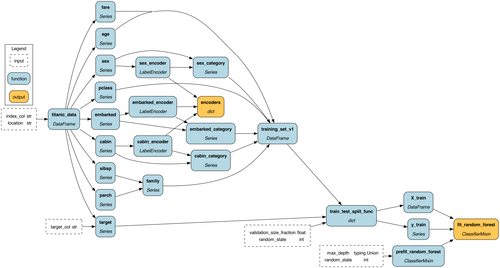

Example lineage graph generated by Apache Hamilton when you write Apache Hamilton code.

Here we showcase Apache Hamilton’s lineage abilities. We will use the Titanic
data set to model a hypothetical company set up where there is data engineering and data science team collaborating together.

If you want to see code and what it does we invite you to jump straight into browsing the [lineage\_snippets](https://github.com/apache/hamilton/blob/main/examples/lineage/lineage_snippets.ipynb) notebook.
For those coming from the lineage blog post, you can find the code shown in [lineage\_script.py](https://github.com/apache/hamilton/blob/main/examples/lineage/lineage_script.py).

For those who want to continue, let’s first talk about some common problems people encounter, then more formally frame what we mean by
lineage, and then explain how Apache Hamilton’s lineage capabilities help you solve common problems encountered with Data and Machine Learning.

Note: a quick word on terminology, we use `function` and `node` interchangeably because you write functions, that get turned
into nodes that are modeled in a DAG. So if you see `function` or `node` they mean the same thing effectively.

<a id="how-tos-use-hamilton-for-lineage--common-problems-and-therefore-questions"></a>

## Common Problems (and therefore questions)

As your data and ML work progresses, invariably time passes and someone runs into a problem such as:

- why is my model suddenly behaving badly? What columns does it use and what are its data sources?
- we used to be getting a value for this column/feature, but now we’re not. What has changed?
- we ingested some bad data, and we need to know who and what is impacted.
- a person on my team wants to make a change to X, but I’m afraid we’re going to break something.
- I have inherited some code running in production, and now something broke, where do I start?
- Governance is asking me for information about data sources to a model, and the work required seems arduous, how can I quickly get this information?
- I’m terrified of inheriting this code base, I don’t know what’s going on.
- I need to audit that we’re in compliance with GDPR, but that’s going to take forever.

These are all questions that can be answered with lineage information. Let’s talk about what we mean by lineage more concretely.

<a id="how-tos-use-hamilton-for-lineage--what-is-lineage"></a>

## What is “Lineage”?

In the context of machine learning and data work, “lineage” refers to the historical record or traceability of data, models, and processes. It encompasses the entire life cycle of data, from its origin to its final usage. Lineage helps
establish the provenance, quality, and reliability of data and aids in understanding how the data has been transformed.

In the context of machine learning models, lineage provides information about the training data, preprocessing steps, hyperparameters, and algorithms used to train the model. It helps researchers, data scientists, and stakeholders
understand how a model was developed and evaluate its reliability and potential biases.

For data pipelines and workflows, lineage tracks the flow of data through different processing steps, transformations, and analyses. It helps identify dependencies, troubleshoot issues, and reproduce results by capturing the sequence of
operations performed on the data.

Lineage information is valuable for various reasons, including:

- Reproducibility: Lineage enables the replication of experiments and analyses by recording the exact steps taken,
  ensuring that results can be reproduced reliably.
- Auditing and Compliance: Lineage provides transparency and accountability, which is crucial for regulatory
  compliance and ensuring data privacy.
- Troubleshooting and Debugging: Lineage helps identify errors, inconsistencies, or unexpected results by tracing
  data transformations and model training processes.
- Collaboration: Lineage allows different stakeholders to understand the data’s history, facilitating collaboration
  between teams working on different parts of a project.

<a id="how-tos-use-hamilton-for-lineage--apache-hamilton-s-lineage-capabilities"></a>

## Apache Hamilton’s Lineage Capabilities

*Good news*: Apache Hamilton provides a lot of the functionality needed for storing lineage and asking questions of it. Here
we’ll walk through a few features of Apache Hamilton that will help answer and empower teams targeting the four points above:

- reproducibility
- auditing and compliance
- troubleshooting and debugging
- collaboration

<a id="how-tos-use-hamilton-for-lineage--lineage-as-code"></a>

### Lineage as Code

To start, Apache Hamilton by design, encodes lineage information as code. This means, as you write each Apache Hamilton function, you are encoding lineage information required to compute it, i.e. by specifying a dataflow you have in effect, specified lineage! This means, as you write your code and commit to, for example a version control system, you have a record of how computation should happen. A huge benefit of this, is when the code changes, so does this
information – all without you having to manage a separate system!

TL;DR:

> No need for a separate system to store lineage information, it’s already in your code!

**The one thing you need to manage** is that Apache Hamilton does not store information on artifacts it produces. If you’re
producing a dataframe, a model, or some other object that your Apache Hamilton code computes, you need to store that. The good
news is, you’re likely already doing this! **But**, you’re probably not storing the lineage information that produced
that artifact, and that’s where Apache Hamilton comes in.

For each artifact you produce, you just need to associate the Apache Hamilton DAG that produced it. This is as simple as
storing the git SHA of the code and snapshot of configuration that created your Apache Hamilton DAG, so you can retrieve the
code and ask questions of it. Adding this extra information is easy since most destinations to store artifacts allow for
extra metadata to be stored, e.g. from MLFlow for models, Snowflake as table metadata for tables/dataframes, to flat
files on S3.

Let’s explain how using Apache Hamilton helps get at the four points above.

<a id="how-tos-use-hamilton-for-lineage--reproducibility"></a>

### Reproducibility

By writing Apache Hamilton code and connecting it with a version control system (e.g. git) you have by definition written
code that can reproduce results. This is because Apache Hamilton DAGs are deterministic. The version control system is a
straightforward way to store evolutions of your code and configuration, and therefore your DAGs.

By versioning code, you are therefore versioning lineage information. This means you can go back in time and ask
questions about the past. For example, you can ask what the lineage information was for a model that was trained at
a specific point in time. This is as simple as checking out the git SHA of the code that produced the model, and
asking Apache Hamilton to visualize (e.g. see [`visualize_execution()`](https://hamilton.apache.org/reference/drivers/Driver/#hamilton.driver.Driver.visualize_execution)), the DAG and ask questions of it.

<a id="how-tos-use-hamilton-for-lineage--auditing-and-compliance"></a>

### Auditing and Compliance

The [`@tag`](https://hamilton.apache.org/reference/decorators/tag) and (`@tag_outputs`) feature allows
you to annotate your functions with metadata. No extra YAML file to manage, just directly together with your Apache Hamilton code.
This means you can tag functions with information such as “PII”, “GDPR”, “HIPAA”, etc. and then ask Apache Hamilton to return
nodes with certain tags, e.g. get me all my “sources”, or “what is PII, and what consumes it?”, etc.

The [Apache Hamilton Driver](https://hamilton.apache.org/reference/drivers/Driver/#hamilton.driver.Driver)
has a lot of functions that allow you to ask questions of your DAGs to make (1) easier. The driver code can be run in
a CI/CD system, or as part of a reporting/auditing pipeline. For example, you can ask:

- What are all the functions and their tags via [`list_available_variables()`](https://hamilton.apache.org/reference/drivers/Driver/#hamilton.driver.Driver.list_available_variables)
- What are the possible places that consume the output of this function via [`what_is_downstream_of()`](https://hamilton.apache.org/reference/drivers/Driver/#hamilton.driver.Driver.what_is_downstream_of)
- What are the possible sources that feed into this function via [`what_is_upstream_of()`](https://hamilton.apache.org/reference/drivers/Driver/#hamilton.driver.Driver.what_is_upstream_of)

With these three functions you can the find functions with specific tags and then ask questions in relation to them.

<a id="how-tos-use-hamilton-for-lineage--troubleshooting-and-debugging"></a>

### Troubleshooting and Debugging

The good news is that what is great for reproducibility, auditing and reproducibility, is also great for
troubleshooting and debugging.

Debugging is methodical and procedural with Apache Hamilton. The way functions are written
and executed mean that one can easily walk through just the part of the DAG of interest to debug an issue.
To help with this, Apache Hamilton has various methods to visualize lineage so you can more easily see what you’re walking through connects to:

- [`display_all_functions()`](https://hamilton.apache.org/reference/drivers/Driver/#hamilton.driver.Driver.display_all_functions)
- [`display_downstream_of()`](https://hamilton.apache.org/reference/drivers/Driver/#hamilton.driver.Driver.display_downstream_of)
- [`display_upstream_of()`](https://hamilton.apache.org/reference/drivers/Driver/#hamilton.driver.Driver.display_upstream_of)
- [`visualize_execution()`](https://hamilton.apache.org/reference/drivers/Driver/#hamilton.driver.Driver.visualize_execution)
- [`visualize_path_between()`](https://hamilton.apache.org/reference/drivers/Driver/#hamilton.driver.Driver.visualize_path_between)

<a id="how-tos-use-hamilton-for-lineage--collaboration"></a>

### Collaboration

When any organization scales, or has personnel changes, it’s important to have a system that helps people get up to
in a self-service manner. Apache Hamilton’s lineage as code approach means that new team members can easily get up to speed
because functions are written in a standard way, and the lineage information is encoded in the code itself. The Apache Hamilton
Driver code enables one to ask questions of the DAGs, and therefore the code, to get up to speed quickly.

<a id="how-tos-use-hamilton-for-lineage--recipe-for-using-apache-hamilton-s-lineage-capabilities"></a>

## Recipe for using Apache Hamilton’s Lineage Capabilities

At a high level, the recipe for utilizing Apache Hamilton’s lineage capabilities is as follows:

1. Write Apache Hamilton code.
2. Use [`@tag`](https://hamilton.apache.org/reference/decorators/tag) and
   [`@tag_outputs`](https://hamilton.apache.org/reference/decorators/tag) to
   annotate functions.
3. Instantiate a Apache Hamilton Driver, it’ll then have a representation of how data and compute flow as defined by your
   Apache Hamilton code. The Driver object can then emit/provide information on lineage!
4. If you store Apache Hamilton code with your version control system, you can then go back in time to understand how lineage
   changes over time, since it’s encoded in code!

In code this should look something like the following:

(1) and (2) write Apache Hamilton code and annotate with `@tag` (and/or `@tag_outputs`).

```
@tag (owner ="data-science",importance ="production",artifact ="model") def
fit_random_forest (prefit_random_forest:base.ClassifierMixin,X_train:pd.DataFrame,y_train:pd.Series,) -> base.ClassifierMixin:
"""Returns a fit RF model.""" # ... contents of function not important ... code skipped for brevity
```

(3) Instantiate a Apache Hamilton Driver and ask questions of it.

```
from
hamilton
import base from
hamilton
import driver import
data_loading,
features,
model_pipeline,
sets # import modules config ={} # This example has no configuration.# instantiate the driver adapter =base.DefaultAdapter () dr =driver.Driver (config,data_loading,features,sets,model_pipeline,adapter =adapter) # ask questions of the driver # E.g. How do the feature encoders get computed and what flows into them? inputs ={"location":"data/train.csv","index_col":"passengerid","target_col":"survived","random_state":42,"max_depth":None,"validation_size_fraction":0.33,} dr.visualize_execution ([features.encoders ],"encoder_lineage",{"format":"png" },inputs =inputs) # what is upstream of the fit_random_forest node? upstream_nodes =dr.what_is_upstream_of ("fit_random_forest") # can now filter the nodes by tags, and pull that information out...# what is downstream of the titanic_data node? downstream_nodes =dr.what_is_downstream_of ("titanic_data") # can now filter the nodes by tags, and pull that information out...# what nodes are PII? pii_nodes =[n for n in dr.list_available_variables () if n.tags.get ("PII") =="true"] # what nodes are called between "age" and "fit_random_forest"? nodes_in_path =dr.what_is_the_path_between ("age","fit_random_forest") # etc
```

To see more code, we invite you to:

1. Browse the modules to see what the functions are and what they’re annotated with.
2. Browse either the [lineage\_snippets](https://github.com/apache/hamilton/blob/main/examples/lineage/lineage_snippets.ipynb) notebook
   or the [lineage\_script](https://github.com/apache/hamilton/blob/main/examples/lineage/lineage_script.py)
   to see how to use the Apache Hamilton Driver to ask questions of your DAGs.
3. We invite you to then go back in time, by checking out this repository and checking out an older commit and
   re-running the script or notebook and seeing how things change. The command to “go back in time” would be:


```
# see current lineage python lineage_script.py
# go back in time git checkout 7e2e92a79644b904856c0a81b8faa7f1ae00c64e
# see past lineage python lineage_script.py
# to reset to current lineage git checkout main
```

<a id="how-tos-use-hamilton-for-lineage--a-script-you-could-write-to-ask-questions-of-your-dags"></a>

## A script you could write to ask questions of your DAGs

To help you get programmatic access to your DAGs, we have an example script you could write
to quickly get lineage answers. The script is [lineage\_commands.py](https://github.com/apache/hamilton/blob/main/examples/lineage/lineage_commands.py).
The main point of the script, is to show you that it could encode a runbook for your team, or be used within your CI/CD system to query, visualize, and otherwise emit lineage information.

On this page

- [Lineage + Apache Hamilton](#how-tos-use-hamilton-for-lineage)
  - [Common Problems (and therefore questions)](#how-tos-use-hamilton-for-lineage--common-problems-and-therefore-questions)
  - [What is “Lineage”?](#how-tos-use-hamilton-for-lineage--what-is-lineage)
  - [Apache Hamilton’s Lineage Capabilities](#how-tos-use-hamilton-for-lineage--apache-hamilton-s-lineage-capabilities)
    - [Lineage as Code](#how-tos-use-hamilton-for-lineage--lineage-as-code)
    - [Reproducibility](#how-tos-use-hamilton-for-lineage--reproducibility)
    - [Auditing and Compliance](#how-tos-use-hamilton-for-lineage--auditing-and-compliance)
    - [Troubleshooting and Debugging](#how-tos-use-hamilton-for-lineage--troubleshooting-and-debugging)
    - [Collaboration](#how-tos-use-hamilton-for-lineage--collaboration)
  - [Recipe for using Apache Hamilton’s Lineage Capabilities](#how-tos-use-hamilton-for-lineage--recipe-for-using-apache-hamilton-s-lineage-capabilities)
  - [A script you could write to ask questions of your DAGs](#how-tos-use-hamilton-for-lineage--a-script-you-could-write-to-ask-questions-of-your-dags)

---

<a id="how-tos-scale-up"></a>

<!-- source_url: https://hamilton.incubator.apache.org/how-tos/scale-up/ -->

<!-- page_index: 40 -->

# Scaling computation ¶

[
<svg viewbox="0 0 24 24" xmlns="http://www.w3.org/2000/svg">
<path></path>
</svg>

Back to top](#how-tos-scale-up)

[
<svg><use href="#svg-eye"></use></svg>

View this page](https://github.com/apache/hamilton/blob/main/docs/how-tos/scale-up.rst?plain=true "View this page")

[
<svg><use href="#svg-pencil"></use></svg>

Edit this page](https://github.com/apache/hamilton/edit/main/docs/how-tos/scale-up.rst "Edit this page")

<svg><use href="#svg-toc"></use></svg>

<a id="how-tos-scale-up--scaling-computation"></a>

# Scaling computation

Apache Hamilton enables a variety of tools for allowing you to scale your data processing by integrating with third-party libraries.

Specifically, we have four examples that show how to scale Apache Hamilton both by parallelizing transformations (ray and dask) and running
on larger, distributed datasets (pandas on spark, pyspark map UDFs).

1. Integrating hamilton with [pandas on spark](https://github.com/apache/hamilton/tree/main/examples/spark/pandas_on_spark).
2. Integrating hamilton with [ray](https://github.com/apache/hamilton/tree/main/examples/ray).
3. Integrating hamilton with [dask](https://github.com/apache/hamilton/tree/main/examples/dask).
4. Integrating hamilton with [pyspark](https://github.com/apache/hamilton/tree/main/examples/spark/pyspark).

---

<a id="how-tos-microservice"></a>

<!-- source_url: https://hamilton.incubator.apache.org/how-tos/microservice/ -->

<!-- page_index: 41 -->

# Microservice ¶

[
<svg viewbox="0 0 24 24" xmlns="http://www.w3.org/2000/svg">
<path></path>
</svg>

Back to top](#how-tos-microservice)

[
<svg><use href="#svg-eye"></use></svg>

View this page](https://github.com/apache/hamilton/blob/main/docs/how-tos/microservice.rst?plain=true "View this page")

[
<svg><use href="#svg-pencil"></use></svg>

Edit this page](https://github.com/apache/hamilton/edit/main/docs/how-tos/microservice.rst "Edit this page")

<svg><use href="#svg-toc"></use></svg>

<a id="how-tos-microservice--microservice"></a>

# Microservice

While we’ve mainly been discussing running Apache Hamilton in a batch environment, it can easily be used
in a microservice/online setting. This is valuable if you want insight into exactly how your endpoints
transform/load data, or if you want to execute the same transforms you did in batch in an online setting.

The following example shows how to execute an asynchronous set of transforms in a microservice:

We will be releasing feature-specific examples shortly, as well.

<https://github.com/apache/hamilton/tree/main/examples/async>

---

<a id="how-tos-extensions-autoloading"></a>

<!-- source_url: https://hamilton.incubator.apache.org/how-tos/extensions-autoloading/ -->

<!-- page_index: 42 -->

# Extension autoloading ¶

[
<svg viewbox="0 0 24 24" xmlns="http://www.w3.org/2000/svg">
<path></path>
</svg>

Back to top](#how-tos-extensions-autoloading)

[
<svg><use href="#svg-eye"></use></svg>

View this page](https://github.com/apache/hamilton/blob/main/docs/how-tos/extensions-autoloading.rst?plain=true "View this page")

[
<svg><use href="#svg-pencil"></use></svg>

Edit this page](https://github.com/apache/hamilton/edit/main/docs/how-tos/extensions-autoloading.rst "Edit this page")

<svg><use href="#svg-toc"></use></svg>

<a id="how-tos-extensions-autoloading--extension-autoloading"></a>

# Extension autoloading

Under `hamilton.plugins`, there are many modules named `*_extensions` (e.g., `hamilton.plugins.pandas_extensions`, `hamilton.plugins.mlflow_extensions`). They implement Apache Hamilton features for 3rd party libraries, including `@extract_columns`, materializers (`to.parquet`, `from_.mlflow`), and more.

<a id="how-tos-extensions-autoloading--autoloading-behavior"></a>

## Autoloading behavior

By default, Apache Hamilton attempts to load all extensions one-by-one. This means that as you have more Python packages in your environment (e.g., `pandas`, `pyspark`, `mlflow`, `xgboost`), importing Apache Hamilton appears to become slower because it actually imports many packages.

This behavior can be less desirable when your Apache Hamilton dataflow doesn’t use any of these packages, but you need them in your Python environment nonetheless. For example, if only `pandas` is needed for your dataflow, but you have `mlflow` and `xgboost` in your environment their respective extensions will be loaded each time.

<a id="how-tos-extensions-autoloading--disable-autoloading"></a>

## Disable autoloading

Disabling extension autoloading allows to import Apache Hamilton without any extensions, which can reduce import time from 2-3 sec to less than 0.5 sec. This speedup is welcomed when you need to restart a notebook’s kernel often or you’re operating in a low RAM environment (some Python packages are larger than 50Mbs).

There are three ways to opt-out: programmatically, environment variables, configuration file. You must opt-out before having any other `hamilton` import.

<a id="how-tos-extensions-autoloading--1.-programmatically"></a>

### 1. Programmatically

```
from
hamilton
import registry registry.disable_autoload ()
```

<a id="how-tos-extensions-autoloading--2.-environment-variables"></a>

### 2. Environment variables

From the console

```

export HAMILTON_AUTOLOAD_EXTENSIONS=0
```

Programmatically via Python `os.environ`.

```
import
os os.environ ["HAMILTON_AUTOLOAD_EXTENSIONS"] ="0"
```

Programmatically in Jupyter notebooks

```

% env HAMILTON_AUTOLOAD_EXTENSIONS=0
```

<a id="how-tos-extensions-autoloading--3.-configuration-file"></a>

### 3. Configuration file

Using the following command disables autoloading via the configuration file `./hamilton.conf`. Apache Hamilton won’t autoload extensions anymore (i.e., you won’t need to use approach 1 or 2 each time).

```

hamilton-disable-autoload-extensions
```

To revert this configuration use the following command

```

hamilton-enable-autoload-extensions
```

To reenable autoloading in specific files, you can delete the environment variable or use `registry.enable_autoload()` before calling `registry.initialize()`

```
from
hamilton
import registry registry.enable_autoload () registry.initialize ()
```

<a id="how-tos-extensions-autoloading--manually-loading-extensions"></a>

## Manually loading extensions

If you disabled autoloading, extensions need to be loaded manually. You should load them before having any other `hamilton` import to avoid hard-to-track bugs. There are two ways.

<a id="how-tos-extensions-autoloading--1.-importing-the-extension"></a>

### 1. Importing the extension

```

from
 
hamilton.plugins
 
import
pandas_extensions
,
mlflow_extensions
```

<a id="how-tos-extensions-autoloading--2.-registering-the-extension"></a>

### 2. Registering the extension

This approach has good IDE support via `typing.Literal`

```
from
hamilton
import registry registry.load_extensions ("mlflow")
```

On this page

- [Extension autoloading](#how-tos-extensions-autoloading)
  - [Autoloading behavior](#how-tos-extensions-autoloading--autoloading-behavior)
  - [Disable autoloading](#how-tos-extensions-autoloading--disable-autoloading)
    - [1. Programmatically](#how-tos-extensions-autoloading--programmatically)
    - [2. Environment variables](#how-tos-extensions-autoloading--environment-variables)
    - [3. Configuration file](#how-tos-extensions-autoloading--configuration-file)
  - [Manually loading extensions](#how-tos-extensions-autoloading--manually-loading-extensions)
    - [1. Importing the extension](#how-tos-extensions-autoloading--importing-the-extension)
    - [2. Registering the extension](#how-tos-extensions-autoloading--registering-the-extension)

---

<a id="how-tos-wrapping-driver"></a>

<!-- source_url: https://hamilton.incubator.apache.org/how-tos/wrapping-driver/ -->

<!-- page_index: 43 -->

# Wrapping the Driver ¶

[
<svg viewbox="0 0 24 24" xmlns="http://www.w3.org/2000/svg">
<path></path>
</svg>

Back to top](#how-tos-wrapping-driver)

[
<svg><use href="#svg-eye"></use></svg>

View this page](https://github.com/apache/hamilton/blob/main/docs/how-tos/wrapping-driver.rst?plain=true "View this page")

[
<svg><use href="#svg-pencil"></use></svg>

Edit this page](https://github.com/apache/hamilton/edit/main/docs/how-tos/wrapping-driver.rst "Edit this page")

<svg><use href="#svg-toc"></use></svg>

<a id="how-tos-wrapping-driver--wrapping-the-driver"></a>

# Wrapping the Driver

The APIs that the Hamilton Driver is built on, are considered internal. So it is possible for you to define your own
driver in place of the stock Hamilton Driver, we suggest the following path if you don’t like how the current Apache Hamilton
Driver interface is designed:

Write a “Wrapper” class that delegates to the Hamilton Driver.

i.e.

```
from
hamilton
import driver class
MyCustomDriver (object ):def
__init__ (self,constructor_arg,...):self.constructor_arg =constructor_arg ...# some internal functions specific to your context # ...def
my_execute_function (self,arg1,arg2,...):
"""What actually calls the Hamilton""" dr =driver.Driver (self.constructor_arg,...) df =dr.execute (self.outputs) return self.augmetn (df)
```

That way, you can create the right API constructs to invoke Hamilton in your context, and then delegate to the stock
Hamilton Driver. By doing so, it will ensure that your code continues to work, since we intend to honor the Hamilton
Driver APIs with backwards compatibility as much as possible.

---

<a id="how-tos-cli-reference"></a>

<!-- source_url: https://hamilton.incubator.apache.org/how-tos/cli-reference/ -->

<!-- page_index: 44 -->

# Command line interface ¶

[
<svg viewbox="0 0 24 24" xmlns="http://www.w3.org/2000/svg">
<path></path>
</svg>

Back to top](#how-tos-cli-reference)

[
<svg><use href="#svg-eye"></use></svg>

View this page](https://github.com/apache/hamilton/blob/main/docs/how-tos/cli-reference.md?plain=true "View this page")

[
<svg><use href="#svg-pencil"></use></svg>

Edit this page](https://github.com/apache/hamilton/edit/main/docs/how-tos/cli-reference.md "Edit this page")

<svg><use href="#svg-toc"></use></svg>

<a id="how-tos-cli-reference--command-line-interface"></a>

# Command line interface

This page covers the Apache Hamilton CLI. It is built directly from the CLI, but note that the command `hamilton --help` always provide the most accurate documentation.

<a id="how-tos-cli-reference--installation"></a>

## Installation

The dependencies for the Apache Hamilton CLI can be installed via

```

pip install sf-hamilton[cli]
```

You can verify the installation with

```

hamilton --help
```

<a id="how-tos-cli-reference--hamilton-global"></a>

## `hamilton` (global)

**Options**:

- `--verbose / --no-verbose`: [default: no-verbose]
- `--json-out / --no-json-out`: [default: no-json-out]
- `--install-completion`: Install completion for the current shell.
- `--show-completion`: Show completion for the current shell, to copy it or customize the installation.
- `--help`: Show this message and exit.

**Commands**:

- `build`: Build a single Driver with MODULES
- `diff`: Diff between the current MODULES and their…
- `version`: Version NODES and DATAFLOW from dataflow…
- `view`: Build and visualize dataflow with MODULES

<a id="how-tos-cli-reference--hamilton-build"></a>

## `hamilton build`

Build a single Driver with MODULES

**Usage**:

```
$ hamilton build [OPTIONS] MODULES...
```

**Arguments**:

- `MODULES...`: [required]

**Options**:

- `--help`: Show this message and exit.

<a id="how-tos-cli-reference--hamilton-diff"></a>

## `hamilton diff`

Diff between the current MODULES and their specified GIT\_REFERENCE

**Usage**:

```
$ hamilton diff [OPTIONS] MODULES...
```

**Arguments**:

- `MODULES...`: [required]

**Options**:

- `--git-reference TEXT`: [default: HEAD]
- `--view / --no-view`: [default: no-view]
- `--output-file-path PATH`: [default: diff.png]
- `--help`: Show this message and exit.

<a id="how-tos-cli-reference--hamilton-version"></a>

## `hamilton version`

Version NODES and DATAFLOW from dataflow with MODULES

**Usage**:

```
$ hamilton version [OPTIONS] MODULES...
```

**Arguments**:

- `MODULES...`: [required]

**Options**:

- `--help`: Show this message and exit.

<a id="how-tos-cli-reference--hamilton-view"></a>

## `hamilton view`

Build and visualize dataflow with MODULES

**Usage**:

```
$ hamilton view [OPTIONS] MODULES...
```

**Arguments**:

- `MODULES...`: [required]

**Options**:

- `--output-file-path PATH`: [default: ./dag.png]
- `--help`: Show this message and exit.

On this page

- [Command line interface](#how-tos-cli-reference)
  - [Installation](#how-tos-cli-reference--installation)
  - [`hamilton` (global)](#how-tos-cli-reference--hamilton-global)
  - [`hamilton build`](#how-tos-cli-reference--hamilton-build)
  - [`hamilton diff`](#how-tos-cli-reference--hamilton-diff)
  - [`hamilton version`](#how-tos-cli-reference--hamilton-version)
  - [`hamilton view`](#how-tos-cli-reference--hamilton-view)

---

<a id="how-tos-pre-commit-hooks"></a>

<!-- source_url: https://hamilton.incubator.apache.org/how-tos/pre-commit-hooks/ -->

<!-- page_index: 45 -->

# pre-commit hooks ¶

> [!NOTE]
> [Back to top](#how-tos-pre-commit-hooks)
>
> [View this page](https://github.com/apache/hamilton/blob/main/docs/how-tos/pre-commit-hooks.md?plain=true "View this page")
>
> [Edit this page](https://github.com/apache/hamilton/edit/main/docs/how-tos/pre-commit-hooks.md "Edit this page")
>
> <a id="how-tos-pre-commit-hooks--pre-commit-hooks"></a>

>
> # pre-commit hooks
>
> <a id="how-tos-pre-commit-hooks--use-pre-commit-hooks-for-safer-apache-hamilton-code-changes"></a>

>
> ## Use pre-commit hooks for safer Apache Hamilton code changes
>
> This page gives an introduction to pre-commit hooks and how to use custom hooks to validate your Apache Hamilton code.
>
> <a id="how-tos-pre-commit-hooks--what-are-pre-commit-hooks"></a>

>
> ## What are pre-commit hooks?
>
> A pre-commit hook is a script or command that’s executed automatically before making a commit. The goal of these hooks is to standardize code formatting and catch erroneous code before being committed. For example, popular hooks include ensuring files have no syntax errors, sorting imports, and normalizing line breaks.
>
> Note that it’s different from testing, which focuses on the behavior of the code. You can think of pre-commit hooks as checks and formatting you would do everytime you save a file.
>
> <a id="how-tos-pre-commit-hooks--add-pre-commit-hooks-to-your-project"></a>

>
> ## Add pre-commit hooks to your project
>
> Hooks are a mechanism of the `git` version control system. You can find your project’s hooks under the `.git/hooks` directory (it might be hidden by default). There should be many files with the `.sample` extension that serve as example scripts.
>
> The preferred way of working with pre-commit hooks is through the [prek](https://github.com/j178/prek/) library. This library allows you to import and configure hooks for your repository with a `.pre-commit-config.yaml` file.
>
> <a id="how-tos-pre-commit-hooks--steps-to-get-started"></a>

>
> ### Steps to get started
>
> 1. install the prek library
>
> ```
>
> pip
> install
> prek
> ```
>
> 2. add a `.pre-commit-config.yaml` to your repository
>
> ```
> # .pre-commit-config.yaml repos:
> # repository with hook definitions -repo:https://github.com/pre-commit/pre-commit-hooks rev:v6.0.0
> # release version of the repo hooks:
> # list of hooks from the repo to include in this project -id:end-of-file-fixer -id:trailing-whitespace -id:check-yaml args:['--unsafe']
> # some accept arguments
> # download another repository with hooks -repo:https://github.com/psf/black rev:22.10.0 hooks:-id:black
> ```
>
> 3. install the hooks defined in `.pre-commit-config.yaml`
>
> ```
>
> prek install
> ```
>
>    Now, hooks will automatically run on `git commit`
> 4. to manually run hooks
>
> ```
>
> prek run --all-files
> ```
>
> <a id="how-tos-pre-commit-hooks--custom-apache-hamilton-pre-commit-hooks"></a>

>
> ## Custom Apache Hamilton pre-commit hooks
>
> pre-commit hooks are great developer tools, but off-the-shelf solutions aren’t aware of the Apache Hamilton framework. Hence, we developed a pre-commit hook to help you author Apache Hamilton dataflows! Under the hood, they leverage the `hamilton` CLI, so if you are unfamiliar with it, feel free to install it and view the `--help` messages.
>
> ```
>
> pip install sf-hamilton[cli]
> hamilton --help
> ```
>
> <a id="how-tos-pre-commit-hooks--checking-dataflow-definition"></a>

>
> ### Checking dataflow definition
>
> Apache Hamilton doesn’t have many syntactic constraints, but there’s a few things we want to catch:
>
> - functions parameters and return are type annotated
> - a node consistently has the same type (e.g., a parameter in multiple functions)
> - functions with a name starting with underscore (`_`) are ignored from the dataflow
> - functions with a `@config` decorator received a trailing double underscore with a suffix (e.g., `hello__weekday()`, `hello__weekend()`)
>
> Instead of reimplementing this logic, we can try to build the Hamilton Driver with the command `hamilton build MODULES` and catch errors. This also ensures the verification is always in sync with the actual build mechanism. This hook will help prevent us from committing invalid dataflow definitions.
>
> <a id="how-tos-pre-commit-hooks--checking-dataflow-paths"></a>

>
> ### Checking dataflow paths
>
> A dataflow definition might be valid, but it might break paths in unexpected ways. The command `hamilton validate` (which internally uses `Driver.validate_execution()`) can check if a node is reachable.
>
> For example, take a look at `my_module.py`, which contains the nodes `A, B, C`, and the changes between `v1` and `v2`.
>
> ```
> # my_module.py - v1 def A () -> int:...def B (A:int) -> float:...def C (A:int,B:float) -> None:...# driver code dr =driver.Builder ().with_modules (my_module).build () dr.validate_execution (final_vars =["C" ]) # <- success
> ```
>
> ```
> # my_module.py - v2 def B (X:int) -> float:...def C (A:int,B:float) -> None:...# driver code dr =driver.Builder ().with_modules (my_module).build () dr.validate_execution (final_vars =["C" ]) # <- failure. missing `A`
> ```
>
> 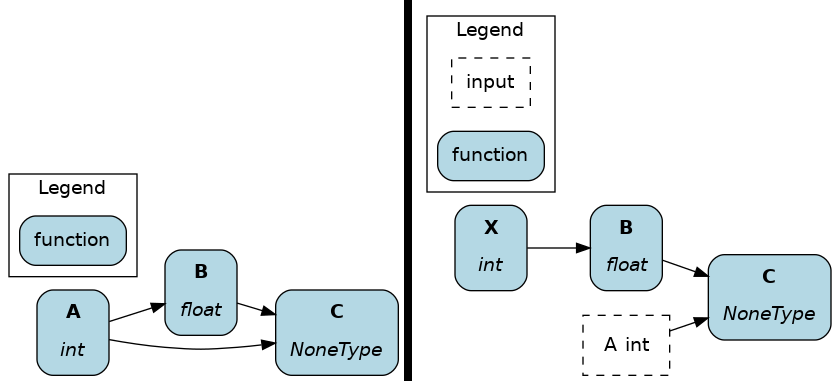
>
> In `v1`, the dataflow could be validated for `C` without any inputs. Now, a developer made `B` depend on `X` instead of `A` and removed `A`. This change accidentally impacted `C` which now depends on the external input `A`. Note that both `v1` and `v2` have a valid dataflow definition. To catch breaking changes to the path to `C`, we could use `hamilton validate --context context.json my_module.py` with the context:
>
> ```
> // context.json {
> "HAMILTON_FINAL_VARS":
> ["C"]
> } // will call .validate_execution(final_vars["C"])
> ```
>
> > [!NOTE]
> > **pre-commit hooks can prevent commits from breaking a core path, but you should use unit and integration tests for more robust checks.**
> >
>
> <a id="how-tos-pre-commit-hooks--add-apache-hamilton-pre-commit-to-your-project"></a>

>
> ## Add Apache Hamilton pre-commit to your project
>
> We alluded to the relationship between pre-commit hooks and the `hamilton` command line tool. In fact, the basic hook is designed to take a list of `hamilton` commands and will execute them in order when hooks are triggered.
>
> To use them, add this snippet to your `.pre-commit-config.yaml` and adapt it to your project:
>
> ```
> -
> repo:
> https://github.com/dagworks/hamilton-pre-commit
> rev:
> v0.1.2
> # use a ref >= 0.1.2 hooks:-id:cli-command name:Apache Hamilton CLI command args:[
> # list of CLI commands to execute hamilton build my_module.py,hamilton build my_module2.py,hamilton validate --context context.json my_module.py my_module2.py,]
> ```
>
> The above snippet would:
>
> - check the dataflow definition of `my_module.py`
> - check the dataflow definition of `my_module2.py`
> - validate the execution path specified in `context.json` for dataflow composed of `my_module.py` and `my_module2.py`
>
> You can pass any `hamilton` CLI command to the pre-commit hook, but it will only care about it succeeding or failing.
>
> On this page
>
> - [pre-commit hooks](#how-tos-pre-commit-hooks)
>   - [Use pre-commit hooks for safer Apache Hamilton code changes](#how-tos-pre-commit-hooks--use-pre-commit-hooks-for-safer-apache-hamilton-code-changes)
>   - [What are pre-commit hooks?](#how-tos-pre-commit-hooks--what-are-pre-commit-hooks)
>   - [Add pre-commit hooks to your project](#how-tos-pre-commit-hooks--add-pre-commit-hooks-to-your-project)
>     - [Steps to get started](#how-tos-pre-commit-hooks--steps-to-get-started)
>   - [Custom Apache Hamilton pre-commit hooks](#how-tos-pre-commit-hooks--custom-apache-hamilton-pre-commit-hooks)
>     - [Checking dataflow definition](#how-tos-pre-commit-hooks--checking-dataflow-definition)
>     - [Checking dataflow paths](#how-tos-pre-commit-hooks--checking-dataflow-paths)
>   - [Add Apache Hamilton pre-commit to your project](#how-tos-pre-commit-hooks--add-apache-hamilton-pre-commit-to-your-project)

---

<a id="hamilton-ui"></a>

<!-- source_url: https://hamilton.incubator.apache.org/hamilton-ui/ -->

<!-- page_index: 46 -->

# Apache Hamilton UI ¶

[
<svg viewbox="0 0 24 24" xmlns="http://www.w3.org/2000/svg">
<path></path>
</svg>

Back to top](#hamilton-ui)

[
<svg><use href="#svg-eye"></use></svg>

View this page](https://github.com/apache/hamilton/blob/main/docs/hamilton-ui/index.rst?plain=true "View this page")

[
<svg><use href="#svg-pencil"></use></svg>

Edit this page](https://github.com/apache/hamilton/edit/main/docs/hamilton-ui/index.rst "Edit this page")

<svg><use href="#svg-toc"></use></svg>

<a id="hamilton-ui--apache-hamilton-ui"></a>

# Apache Hamilton UI

<a id="hamilton-ui--reference"></a>

## Reference

- [UI Overview](#hamilton-ui-ui)
- [Local Mode](#hamilton-ui-ui--local-mode)
- [Docker/Deployed Mode](#hamilton-ui-ui--docker-deployed-mode)
  - [Install](#hamilton-ui-ui--install)
  - [Building the Docker Images locally](#hamilton-ui-ui--building-the-docker-images-locally)
  - [Self-Hosting](#hamilton-ui-ui--self-hosting)
  - [Running on Snowflake](#hamilton-ui-ui--running-on-snowflake)
- [Get started](#hamilton-ui-ui--get-started)
  - [Existing Apache Hamilton Code](#hamilton-ui-ui--existing-apache-hamilton-code)
  - [I need some Apache Hamilton code to run](#hamilton-ui-ui--i-need-some-apache-hamilton-code-to-run)
- [Features](#hamilton-ui-ui--features)
  - [Dataflow versioning](#hamilton-ui-ui--dataflow-versioning)
  - [Assets/features catalog](#hamilton-ui-ui--assets-features-catalog)
  - [Browser](#hamilton-ui-ui--browser)
  - [Run tracking + telemetry](#hamilton-ui-ui--run-tracking-telemetry)
- [SDK Configuration](#hamilton-ui-ui--sdk-configuration)
  - [Changing where data is sent](#hamilton-ui-ui--changing-where-data-is-sent)
  - [Changing behavior of what is captured](#hamilton-ui-ui--changing-behavior-of-what-is-captured)

On this page

- [Apache Hamilton UI](#hamilton-ui)
  - [Reference](#hamilton-ui--reference)

---

<a id="hamilton-ui-ui"></a>

<!-- source_url: https://hamilton.incubator.apache.org/hamilton-ui/ui/ -->

<!-- page_index: 47 -->

# UI Overview ¶

[
<svg viewbox="0 0 24 24" xmlns="http://www.w3.org/2000/svg">
<path></path>
</svg>

Back to top](#hamilton-ui-ui)

[
<svg><use href="#svg-eye"></use></svg>

View this page](https://github.com/apache/hamilton/blob/main/docs/hamilton-ui/ui.rst?plain=true "View this page")

[
<svg><use href="#svg-pencil"></use></svg>

Edit this page](https://github.com/apache/hamilton/edit/main/docs/hamilton-ui/ui.rst "Edit this page")

<svg><use href="#svg-toc"></use></svg>

<a id="hamilton-ui-ui--ui-overview"></a>

# UI Overview

Apache Hamilton comes with a fully open-source UI that can be run both for local deployment and on a remote server.
The UI consists of the following features:

1. Telemetry for hamilton executions – both on the history of executions and the data itself.
2. A feature/artifact catalog for browsing/connecting executions of nodes -> results.
3. A dataflow (i.e. DAG) visualizer for exploring and looking at your code, and determining lineage.
4. A project explorer for viewing curating projects and viewing versions of your Apache Hamilton dataflows.

In short, the Apache Hamilton UI aims to combine a large swath of MLOps/data observability systems in one simple application.


—

The Apache Hamilton UI has two modes:
1. Run locally using sqlite3
2. Run on docker images with postgres (meant for deployment)

<a id="hamilton-ui-ui--local-mode"></a>

# Local Mode

To run the hamilton UI in local mode, you can do the following:

```
pip install "sf-hamilton[ui,sdk]"
hamilton ui
# python -m hamilton.cli.__main__ ui # on windows
```

This will launch a browser window in localhost:8241. You can then navigate to the UI and start using it!
While this can potentially handle a small production workflow, you may want to run on postgres with a separate frontend/backend/db
for full scalability and a multi-read/write db.

<a id="hamilton-ui-ui--docker-deployed-mode"></a>

# Docker/Deployed Mode

The Apache Hamilton UI can be contained within a set of Docker images. You launch with [docker-compose](https://docs.docker.com/compose/), and it will start up the UI, the backend server, and a Postgres database. If you’d like a quick overview of some of the features, you can watch the following:

<iframe allow="accelerometer; autoplay; clipboard-write; encrypted-media; gyroscope; picture-in-picture; web-share" allowfullscreen="" frameborder="0" height="315" referrerpolicy="strict-origin-when-cross-origin" src="https://www.youtube.com/embed/0VIVSeN7Ij8?si=i3vTsfTNorzh5y2C" title="YouTube video player" width="560"></iframe>

Note: if you run into the “Invalid HTTP\_HOST” error, then please set the environment variable HAMILTON\_ALLOWED\_HOSTS=”\*” (or comma separated list of domains of choice) for the backend docker container. You can inject
this via -e or in the docker-compose[-prod].yml file itself.

<a id="hamilton-ui-ui--install"></a>

## Install

If you’d like a video walkthrough on getting set up, you can watch the following:

<iframe allow="accelerometer; autoplay; clipboard-write; encrypted-media; gyroscope; picture-in-picture; web-share" allowfullscreen="" frameborder="0" height="315" referrerpolicy="strict-origin-when-cross-origin" src="https://www.youtube.com/embed/DPfxlTwaNsM?si=gks5oOAWsNPSJbe_" title="YouTube video player" width="560"></iframe>

As prerequisites, you will need to have Docker installed – you can follow instructions [here](https://docs.docker.com/engine/install/).

1. Clone the Apache Hamilton repository locally

```
git clone https://github.com/apache/hamilton
```

2. Navigate to the `hamilton/ui` directory

```
cd hamilton/ui
```

3. Execute the installation script with the following command

```
./run.sh
```

This will:

- Pull all Docker images from the Docker Hub
- Start a local Postgres database
- Start the backend server
- Start the frontend server

This takes a bit of time! So be patient. The server will be running on port 8242.

4. Then navigate to `http://localhost:8242` in your browser, and enter your email (this will be the username used within the app).

<a id="hamilton-ui-ui--building-the-docker-images-locally"></a>

## Building the Docker Images locally

If building the Docker containers from scratch, increase your Docker memory to 10gb or more – you can do this in the Docker Desktop settings.

To build the images locally, you can run the following command:

```
# from the hamilton/ui directory./dev.sh --build
```

This will build the containers from scratch. If you just want to mount the local code, you can run just

```
./dev.sh
```

<a id="hamilton-ui-ui--self-hosting"></a>

## Self-Hosting

If you know docker, you should be good to go. The one environment variable to know is HAMILTON\_ALLOWED\_HOSTS, which you can set to \* to allow all hosts, or
a comma separated list of hosts you want to allow.

To host the UI on a subpath, set REACT\_APP\_HAMILTON\_SUB\_PATH to the subpath required. For example, to run on https://domain.com/hamilton:

```

-
 
REACT_APP_HAMILTON_SUB_PATH=/hamilton
```

Make sure that the sub path environment variable begins with / if set.

Please reach out to us if you want to deploy on your own infrastructure and need help - [join slack](https://join.slack.com/t/hamilton-opensource/shared_invite/zt-2niepkra8-DGKGf_tTYhXuJWBTXtIs4g).
More extensive self-hosting documentation is in the works, e.g. Snowflake, Databricks, AWS, GCP, Azure, etc.; we’d love a helm
chart contribution!

<a id="hamilton-ui-ui--running-on-snowflake"></a>

## Running on Snowflake

You can run the Apache Hamilton UI on Snowflake Container Services. For a detailed guide, see the blog post
[Observability of Python code and application logic with Apache Hamilton UI on Snowflake Container Services](https://medium.com/@pkantyka/observability-of-python-code-and-application-logic-with-hamilton-ui-on-snowflake-container-services-a26693b46635) by
[Greg Kantyka](https://medium.com/@pkantyka) and the [Apache Hamilton Snowflake Example](https://github.com/apache/hamilton/tree/main/examples/snowflake/hamilton_ui).

<a id="hamilton-ui-ui--get-started"></a>

# Get started

Now that you have your server running, you can run a simple dataflow and watch it in the UI!
You can follow instructions in the UI when you create a new project, or follow the instructions here.

First, install the SDK:

```
pip install "sf-hamilton[sdk]"
```

Then, navigate to the project page (dashboard/projects), in the running UI, and click the green `+ New DAG` button.


Remember the project ID – you’ll use it for the next steps.

<a id="hamilton-ui-ui--existing-apache-hamilton-code"></a>

## Existing Apache Hamilton Code

Add the following adapter to your code if you have existing Apache Hamilton code:

```
from
hamilton_sdk
import adapters tracker =adapters.HamiltonTracker (project_id =PROJECT_ID_FROM_ABOVE,username ="USERNAME/EMAIL_YOU_PUT_IN_THE_UI",dag_name ="my_version_of_the_dag",tags ={"environment":"DEV","team":"MY_TEAM","version":"X"}) dr =(driver.Builder ().with_config (your_config).with_modules (* your_modules).with_adapters (tracker).build ())
```

Then run your DAG, and follow the links in the logs! Note that the link is correct if you’re using
the local mode – if you’re on postgres it links to 8241 (but you’ll want to follow it to 8241).

<a id="hamilton-ui-ui--i-need-some-apache-hamilton-code-to-run"></a>

## I need some Apache Hamilton code to run

If you don’t have Apache Hamilton code to run this with, you can run Apache Hamilton UI example under [examples/hamilton\_ui](https://github.com/apache/hamilton/tree/main/examples/hamilton_ui):

```
# we assume you're in the Apache Hamilton repository root cd examples/hamilton_ui
# make sure you have the right python packages installed pip install -r requirements.txt
# run the pipeline providing the email and project_id you created in the UI python run.py --email <email> --project_id <project_id>
```

You should see links in the [logs to the UI](http://localhost:8242/dashboard/projects), where you can see the DAG run + the data summaries captured.

<a id="hamilton-ui-ui--features"></a>

# Features

Once you get to the UI, you can navigate to the projects page (left hand nav-bar). Assuming you have created a project
and logged to it, you can then navigate to view it and then more details about it. E.g. versions, code, lineage, catalog, execution runs.
See below for a few screenshots of the UI.

<a id="hamilton-ui-ui--dataflow-versioning"></a>

## Dataflow versioning

Select a dataflow versions to compare and visualize.


<a id="hamilton-ui-ui--assets-features-catalog"></a>

## Assets/features catalog

View functions, nodes, and assets across a history of runs.


<a id="hamilton-ui-ui--browser"></a>

## Browser

View dataflow structure and code.


<a id="hamilton-ui-ui--run-tracking-telemetry"></a>

## Run tracking + telemetry

View a history of runs, telemetry on runs/comparison, and data for specific runs:


<a id="hamilton-ui-ui--sdk-configuration"></a>

# SDK Configuration

This section documents HamiltonTracker configuration options.

<a id="hamilton-ui-ui--changing-where-data-is-sent"></a>

## Changing where data is sent

You can change where telemetry is logged by passing in hamilton\_api\_url and/or hamilton\_ui\_url to the
HamiltonTracker constructor. By default, these are set to localhost:8241/8242.

```
from
hamilton_sdk
import adapters tracker =adapters.HamiltonTracker (project_id =PROJECT_ID_FROM_ABOVE,username ="USERNAME/EMAIL_YOU_PUT_IN_THE_UI",dag_name ="my_version_of_the_dag",tags ={"environment":"DEV","team":"MY_TEAM","version":"X" },hamilton_api_url ="http://YOUR_DOMAIN_HERE:8241",hamilton_ui_url ="http://YOUR_DOMAIN_HERE:8242" # if using docker the UI is on 8242.) dr =(driver.Builder ().with_config (your_config).with_modules (* your_modules).with_adapters (tracker).build ())
```

<a id="hamilton-ui-ui--changing-behavior-of-what-is-captured"></a>

## Changing behavior of what is captured

By default, a lot is captured and sent to the Apache Hamilton UI.

Here are a few options that can change that - these can be found
in hamilton\_sdk.tracking.constants. You can either change the defaults by
directly changing the constants, by specifying them in a config file, or via environment variables.

Here we first explain the options:

| Option | Default | Explanation |
| --- | --- | --- |
| CAPTURE\_DATA\_STATISTICS | True | Whether to capture any data insights/statistics |
| MAX\_LIST\_LENGTH\_CAPTURE | 50 | Max length for list capture |
| MAX\_DICT\_LENGTH\_CAPTURE | 100 | Max length for dict capture |
| DEFAULT\_CONFIG\_URI | ~/.hamilton.conf | Default config file URI. |

To change the defaults via a config file, you can do the following:

```
[SDK_CONSTANTS] MAX_LIST_LENGTH_CAPTURE =100 MAX_DICT_LENGTH_CAPTURE =200 # save this to ~/.hamilton.conf
```

To change the defaults via environment variables, you can do the following, prefixing them with HAMILTON\_:

```
export HAMILTON_MAX_LIST_LENGTH_CAPTURE=100
export HAMILTON_MAX_DICT_LENGTH_CAPTURE=200
python run_my_hamilton_code.py
```

To change the defaults directly, you can do the following:

```
from
hamilton_sdk.tracking
import constants constants.MAX_LIST_LENGTH_CAPTURE =100 constants.MAX_DICT_LENGTH_CAPTURE =200 tracker =adapters.HamiltonTracker (project_id =PROJECT_ID_FROM_ABOVE,username ="USERNAME/EMAIL_YOU_PUT_IN_THE_UI",dag_name ="my_version_of_the_dag",tags ={"environment":"DEV","team":"MY_TEAM","version":"X"}) dr =(driver.Builder ().with_config (your_config).with_modules (* your_modules).with_adapters (tracker).build ()) dr.execute (...)
```

In terms of precedence, the order is:

1. Module default.
2. Config file values.
3. Environment variables.
4. Directly set values.

---

<a id="hamilton-vscode"></a>

<!-- source_url: https://hamilton.incubator.apache.org/hamilton-vscode/ -->

<!-- page_index: 48 -->

# IDE extension ¶

[
<svg viewbox="0 0 24 24" xmlns="http://www.w3.org/2000/svg">
<path></path>
</svg>

Back to top](#hamilton-vscode)

[
<svg><use href="#svg-eye"></use></svg>

View this page](https://github.com/apache/hamilton/blob/main/docs/hamilton-vscode/index.rst?plain=true "View this page")

[
<svg><use href="#svg-pencil"></use></svg>

Edit this page](https://github.com/apache/hamilton/edit/main/docs/hamilton-vscode/index.rst "Edit this page")

<svg><use href="#svg-toc"></use></svg>

<a id="hamilton-vscode--ide-extension"></a>

# IDE extension

<a id="hamilton-vscode--reference"></a>

## Reference

- [Apache Hamilton VSCode](#hamilton-vscode-vscode_extension)
  - [Features](#hamilton-vscode-vscode_extension--features)
  - [Roadmap](#hamilton-vscode-vscode_extension--roadmap)
- [Language Server](#hamilton-vscode-language_server)
  - [Installation](#hamilton-vscode-language_server--installation)
  - [Developers](#hamilton-vscode-language_server--developers)

On this page

- [IDE extension](#hamilton-vscode)
  - [Reference](#hamilton-vscode--reference)

---

<a id="hamilton-vscode-vscode_extension"></a>

<!-- source_url: https://hamilton.incubator.apache.org/hamilton-vscode/vscode_extension/ -->

<!-- page_index: 49 -->

# Apache Hamilton VSCode ¶

> [!WARNING]
> > [!NOTE]
> > > [!NOTE]
> > > [Back to top](#hamilton-vscode-vscode_extension)
> > >
> > > [View this page](https://github.com/apache/hamilton/blob/main/docs/hamilton-vscode/vscode_extension.rst?plain=true "View this page")
> > >
> > > [Edit this page](https://github.com/apache/hamilton/edit/main/docs/hamilton-vscode/vscode_extension.rst "Edit this page")
> > >
> > > <a id="hamilton-vscode-vscode_extension--apache-hamilton-vscode"></a>

> > >
> > > # Apache Hamilton VSCode
> > >
> > > > [!WARNING]
> > > > The Apache Hamilton VSCode extension is an experimental feature under active development. Edge cases, evolving features, and partial documentation are to be expected. Please open a GitHub issue or reach out on Slack for troubleshooting!
> > >
> > > The Apache Hamilton VSCode extension enables interactive dataflow development in VSCode. This developer productivity tool helps your editor understand how Apache Hamilton works (code completion, symbol navigation, etc.). It is powered by the [Apache Hamilton Language Server](#hamilton-vscode-language_server) and can be installed directly from the [VSCode marketplace](https://marketplace.visualstudio.com/items?itemName=DAGWorks.hamilton-vsc).
> > >
> > > <a id="hamilton-vscode-vscode_extension--features"></a>

> > >
> > > ## Features
> > >
> > > <a id="hamilton-vscode-vscode_extension--dataflow-visualization"></a>

> > >
> > > ### Dataflow visualization
> > >
> > > Visualize the dataflow defined in the current Python file. As you type and add functions, the visualization automatically updates. There is a UI button to rotate the visualization 90-degree.
> > >
> > > 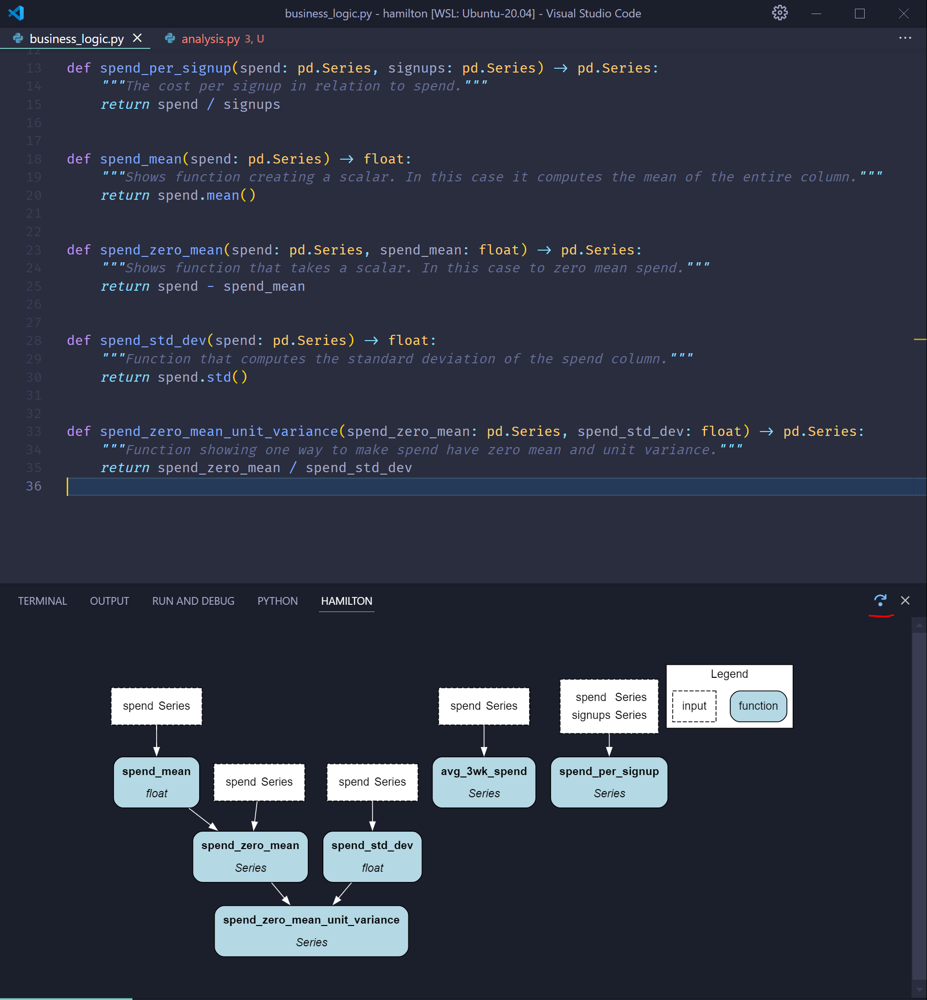
> > >
> > > > [!NOTE]
> > > > **We suggest moving the visualization tab to the VSCode panel ( CTRL+J ) or the secondary sidebar ( CTRL+ALT+B ) by drag-and-dropping the tab.**
> > > >
> > >
> > > <a id="hamilton-vscode-vscode_extension--completion-suggestions"></a>

> > >
> > > ### Completion suggestions
> > >
> > > Get completion suggestions when defining new nodes. It will even insert the appropriate type when selected! Completion suggestions have the `Node` type and can even display their docstring when hovered over.
> > >
> > > 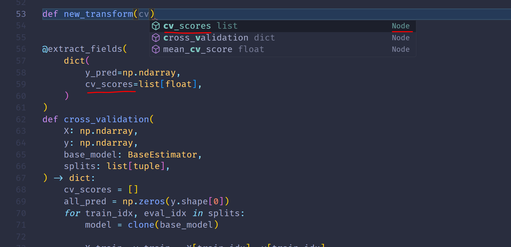
> > >
> > > <a id="hamilton-vscode-vscode_extension--outline"></a>

> > >
> > > ### Outline
> > >
> > > The **OUTLINE** menu now displays a **Apache Hamilton VSCode** entry. Nodes and inputs from the current Python file are listed and denoted by distinct icons.
> > >
> > > 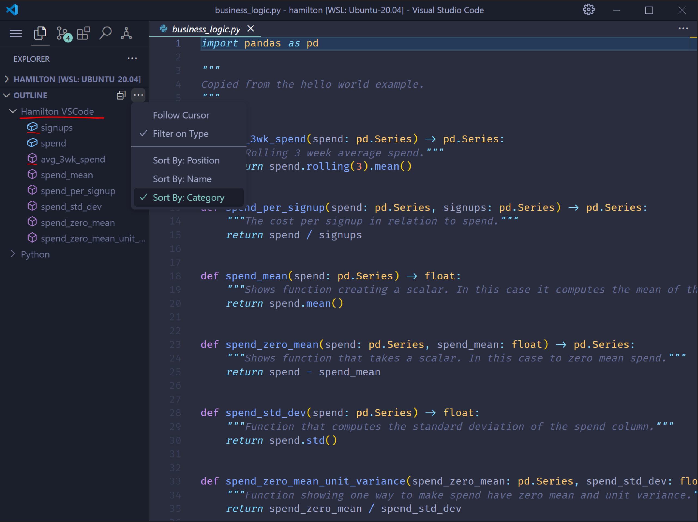
> > >
> > > <a id="hamilton-vscode-vscode_extension--symbol-navigation"></a>

> > >
> > > ### Symbol navigation
> > >
> > > When entering symbol navigation (`CTRL+SHIFT+O`), you can jump directly to any node definition. Notice from the screenshot that it even pickups node defined in a decorator.
> > >
> > > 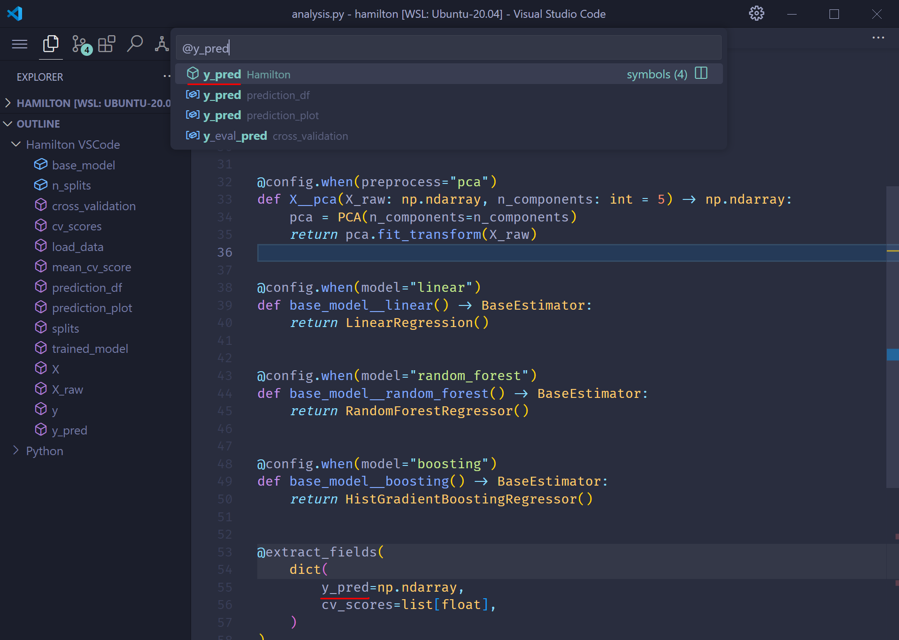
> > >
> > > <a id="hamilton-vscode-vscode_extension--extension-walkthrough"></a>

> > >
> > > ### Extension walkthrough
> > >
> > > Under the Apache Hamilton menu (the icon at the top), you can find a list of buttons. Selecting `Walkthrough` and then `Get started with Apache Hamilton` will launch an interactive menu to get you set up along with some tips.
> > >
> > > 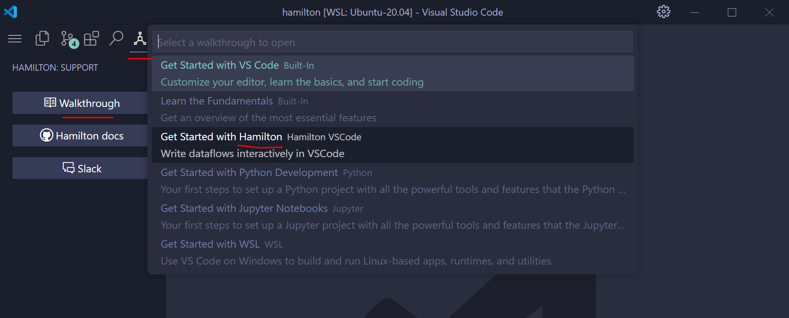
> > >
> > > > [!NOTE]
> > > > **Some of this content may become outdated since the extension is evolving quickly.**
> > > >
> > >
> > > <a id="hamilton-vscode-vscode_extension--roadmap"></a>

> > >
> > > ## Roadmap
> > >
> > > There are many features that we’d be interested in implementing. Let us know on [Slack](https://join.slack.com/t/hamilton-opensource/shared_invite/zt-2niepkra8-DGKGf_tTYhXuJWBTXtIs4g) your favorite ones!
> > >
> > > - Go To Definition: jump to where the node defined
> > > - Go To References: jump to where the node is a dependency
> > > - Rename: rename a node across locations (can be tricky when mentioned in a decorator)
> > > - Support dataflows spanning multiple modules
> > > - Configure the visualization (i.e., match the Python features)
> > > - Integrate with the Apache Hamilton UI (e.g., click a node to open it’s Apache Hamilton UI page and see execution details)
> > > - Visualize notebook cells using the Apache Hamilton Jupyter extension (seems possible)
>
> On this page
>
> - [Apache Hamilton VSCode](#hamilton-vscode-vscode_extension)
>   - [Features](#hamilton-vscode-vscode_extension--features)
>     - [Dataflow visualization](#hamilton-vscode-vscode_extension--dataflow-visualization)
>     - [Completion suggestions](#hamilton-vscode-vscode_extension--completion-suggestions)
>     - [Outline](#hamilton-vscode-vscode_extension--outline)
>     - [Symbol navigation](#hamilton-vscode-vscode_extension--symbol-navigation)
>     - [Extension walkthrough](#hamilton-vscode-vscode_extension--extension-walkthrough)
>   - [Roadmap](#hamilton-vscode-vscode_extension--roadmap)

---

<a id="hamilton-vscode-language_server"></a>

<!-- source_url: https://hamilton.incubator.apache.org/hamilton-vscode/language_server/ -->

<!-- page_index: 50 -->

# Language Server ¶

> [!WARNING]
> [Back to top](#hamilton-vscode-language_server)
>
> [View this page](https://github.com/apache/hamilton/blob/main/docs/hamilton-vscode/language_server.rst?plain=true "View this page")
>
> [Edit this page](https://github.com/apache/hamilton/edit/main/docs/hamilton-vscode/language_server.rst "Edit this page")
>
> <a id="hamilton-vscode-language_server--language-server"></a>

>
> # Language Server
>
> > [!WARNING]
> > The Apache Hamilton Language Server is an experimental feature under active development. Edge cases, evolving features, and partial documentation are to be expected. Please open a GitHub issue or reach out on Slack for troubleshooting!
>
> The Apache Hamilton Language Server is an implementation of the [Language Server Protocol (LSP)](https://microsoft.github.io/language-server-protocol/). It is designed to power the [Apache Hamilton VSCode extension](#hamilton-vscode-vscode_extension) which can be installed directly from the [VSCode marketplace](https://marketplace.visualstudio.com/items?itemName=DAGWorks.hamilton-vsc).
>
> Language servers power IDE features like completion suggestion, go to definition, collect document symbols, etc. The LSP standard was established to make servers portable across IDE frontends (e.g., VSCode, PyCharm, Emacs). [Learn more](https://code.visualstudio.com/api/language-extensions/language-server-extension-guide).
>
> <a id="hamilton-vscode-language_server--installation"></a>

>
> ## Installation
>
> If you’re using the Apache Hamilton VSCode extension, you will prompted to install the language server if it’s not found. Simply click the button and it will install it in your current Python interpreter.
>
> You can also manually install the language server in your Python environment via
>
> ```
> pip install "sf-hamilton[lsp]"
> ```
>
> <a id="hamilton-vscode-language_server--developers"></a>

>
> ## Developers
>
> If you want to dig in the internals of the language server and integrate it with another IDE, you can find the source code in the `dev tools/` section of the [Apache Hamilton GitHub repository](https://github.com/apache/hamilton/tree/main/dev_tools/lsp). It is also directly available on PyPi at [sf-hamilton-lsp](https://pypi.org/project/sf-hamilton-lsp/).
>
> Note that the package name is `hamilton_lsp` when used directly via Python code.
>
> On this page
>
> - [Language Server](#hamilton-vscode-language_server)
>   - [Installation](#hamilton-vscode-language_server--installation)
>   - [Developers](#hamilton-vscode-language_server--developers)

---

<a id="integrations"></a>

<!-- source_url: https://hamilton.incubator.apache.org/integrations/ -->

<!-- page_index: 51 -->

# Integrations ¶

[
<svg viewbox="0 0 24 24" xmlns="http://www.w3.org/2000/svg">
<path></path>
</svg>

Back to top](#integrations)

[
<svg><use href="#svg-eye"></use></svg>

View this page](https://github.com/apache/hamilton/blob/main/docs/integrations/index.rst?plain=true "View this page")

[
<svg><use href="#svg-pencil"></use></svg>

Edit this page](https://github.com/apache/hamilton/edit/main/docs/integrations/index.rst "Edit this page")

<svg><use href="#svg-toc"></use></svg>

<a id="integrations--integrations"></a>

# Integrations

This section showcases how Apache Hamilton integrates with popular frameworks.

- [dlt](#integrations-dlt)
  - [Extract, Transform, Load (ETL)](#integrations-dlt--extract-transform-load-etl)
    - [Extract](#integrations-dlt--extract)
    - [Transform](#integrations-dlt--transform)
    - [Load](#integrations-dlt--load)
    - [ETL Summary](#integrations-dlt--etl-summary)
  - [Extract, Load, Transform (ELT)](#integrations-dlt--extract-load-transform-elt)
    - [Extract & Load](#integrations-dlt--extract-load)
    - [Transform](#integrations-dlt--id1)
    - [ELT Summary](#integrations-dlt--elt-summary)
  - [dlt materializer plugin](#integrations-dlt--dlt-materializer-plugin)
    - [DataLoader](#integrations-dlt--dataloader)
    - [DataSaver](#integrations-dlt--datasaver)
    - [Combining both](#integrations-dlt--combining-both)
  - [Next steps](#integrations-dlt--next-steps)
- [FastAPI](#integrations-fastapi)
  - [Challenges](#integrations-fastapi--challenges)
    - [1. Test your FastAPI application](#integrations-fastapi--test-your-fastapi-application)
    - [2. Document your API](#integrations-fastapi--document-your-api)
  - [Apache Hamilton + FastAPI](#integrations-fastapi--apache-hamilton-fastapi)
    - [Example](#integrations-fastapi--example)
      - [Client](#integrations-fastapi--client)
      - [Backend dataflow with Apache Hamilton](#integrations-fastapi--backend-dataflow-with-apache-hamilton)
      - [Server definition with FastAPI](#integrations-fastapi--server-definition-with-fastapi)
      - [Visualize endpoints’ dataflow](#integrations-fastapi--visualize-endpoints-dataflow)
    - [Benefits](#integrations-fastapi--benefits)
- [Ibis](#integrations-ibis)
  - [Standalone Ibis](#integrations-ibis--standalone-ibis)
    - [Challenge 1 - Maintain and test large data transformations codebases](#integrations-ibis--challenge-1-maintain-and-test-large-data-transformations-codebases)
    - [Challenge 2 - Orchestrate Ibis code in production](#integrations-ibis--challenge-2-orchestrate-ibis-code-in-production)
  - [How Apache Hamilton complements Ibis](#integrations-ibis--how-apache-hamilton-complements-ibis)
    - [Write modular Ibis code](#integrations-ibis--write-modular-ibis-code)
      - [Table-level](#integrations-ibis--table-level)
      - [Column-level](#integrations-ibis--column-level)
    - [Orchestrate Ibis anywhere](#integrations-ibis--orchestrate-ibis-anywhere)
  - [How Ibis complements Apache Hamilton](#integrations-ibis--how-ibis-complements-apache-hamilton)
    - [Performance boost](#integrations-ibis--performance-boost)
    - [Atomic data transformation documentation](#integrations-ibis--atomic-data-transformation-documentation)
    - [Working across rows with user-defined functions (UDFs)](#integrations-ibis--working-across-rows-with-user-defined-functions-udfs)
  - [Ibis + Apache Hamilton - a natural pairing](#integrations-ibis--ibis-apache-hamilton-a-natural-pairing)
- [Streamlit](#integrations-streamlit)
  - [Challenges](#integrations-streamlit--challenges)
    - [1. Hard to read UI and data flows.](#integrations-streamlit--hard-to-read-ui-and-data-flows)
    - [2. Cache and state management](#integrations-streamlit--cache-and-state-management)
  - [Apache Hamilton + Streamlit](#integrations-streamlit--apache-hamilton-streamlit)
    - [Example](#integrations-streamlit--example)
    - [Benefits](#integrations-streamlit--benefits)
- [dbt](#integrations-dbt)
- [MLFlow](https://github.com/apache/hamilton/tree/main/examples/mlflow)
- [Airflow](https://github.com/apache/hamilton/tree/main/examples/airflow)
- [Amazon Web Services](https://github.com/apache/hamilton/tree/main/examples/aws)
- [Burr](https://github.com/apache/hamilton/tree/main/examples/LLM_Workflows/image_telephone)
- [Dagster](https://github.com/apache/hamilton/tree/main/examples/dagster)
- [Dask](https://github.com/apache/hamilton/tree/main/examples/dask)
- [Feast](https://github.com/apache/hamilton/tree/main/examples/feast)
- [Metaflow](https://github.com/outerbounds/hamilton-metaflow)
- [Pandera](https://github.com/apache/hamilton/tree/main/examples/data_quality/pandera)
- [Plotly](https://github.com/apache/hamilton/tree/main/examples/plotly)
- [Polars](https://github.com/apache/hamilton/tree/main/examples/polars)
- [Prefect](https://github.com/apache/hamilton/tree/main/examples/prefect)
- [Ray](https://github.com/apache/hamilton/tree/main/examples/ray)
- [Slack](https://github.com/apache/hamilton/tree/main/examples/slack)
- [Spark](https://github.com/apache/hamilton/tree/main/examples/spark)
- [Vaex](https://github.com/apache/hamilton/tree/main/examples/vaex)
- [Narwhals](https://github.com/apache/hamilton/tree/main/examples/narwhals)
- [OpenLineage](https://github.com/apache/hamilton/tree/main/examples/openlineage)

---

<a id="integrations-dlt"></a>

<!-- source_url: https://hamilton.incubator.apache.org/integrations/dlt/ -->

<!-- page_index: 52 -->

# dlt ¶

> [!NOTE]
> > [!NOTE]
> > [Back to top](#integrations-dlt)
> >
> > [View this page](https://github.com/apache/hamilton/blob/main/docs/integrations/dlt/index.md?plain=true "View this page")
> >
> > [Edit this page](https://github.com/apache/hamilton/edit/main/docs/integrations/dlt/index.md "Edit this page")
> >
> > <a id="integrations-dlt--dlt"></a>

> >
> > # dlt
> >
> > [dlt](https://dlthub.com/) stands for “data load tool”. It’s an open-source Python library providing a ton of data `Sources` (Slack, Stripe, Google Analytics, Zendesk, etc.) and `Destinations` (S3, Snowflake, BigQuery, Postgres, etc.). `Pipelines` make it easy to connect `Sources` and `Destinations` and provide advanced engineering features such as table normalization, incremental loading, and automatic schema evolution.
> >
> > dlt is an “extract and load” tool and Apache Hamilton is a “transform” tool, allowing various usage patterns.
> >
> > On this page, you’ll learn:
> >
> > - Extract, Transform, Load (ETL)
> > - Extract, Load, Transform (ELT)
> > - dlt materializer plugin for Apache Hamilton
> >
> > > [!NOTE]
> > > **See this blog post for a more detailed discussion about ETL with dlt + Apache Hamilton**
> > >
> >
> > <a id="integrations-dlt--extract-transform-load-etl"></a>

> >
> > ## Extract, Transform, Load (ETL)
> >
> > The key consideration for ETL is that the data has to move twice:
> >
> > > ingest raw data (dlt) -> transform (Apache Hamilton) -> store transformed data (dlt)
> >
> > 1. **Extract**: dlt moves the raw data to a processing server
> > 2. **Transform**: on the server, Apache Hamilton executes transformations
> > 3. **Load**: dlt moves the final data to its destination (database, dashboard, etc.)
> >
> > **Pros**
> >
> > - Reduce storage cost: raw data isn’t stored
> > - Data centralization: transformed data is better separated from raw and low quality data
> >
> > **Cons**
> >
> > - Increased latency: data has to move twice
> > - Reduced flexibility: to try new transformations, data needs to
> >
> > <a id="integrations-dlt--extract"></a>

> >
> > ### Extract
> >
> > 0. Create a dlt pipeline for raw data ingestion (see [dlt guide](https://dlthub.com/docs/walkthroughs/create-a-pipeline)).
> > 1. Write the dlt pipeline execution code in `run.py`
> >
> > ```
> > # run.py import dlt import slack # NOTE this is dlt code, not an official Slack library # define dlt pipeline to a local duckdb instance extract_pipeline =dlt.pipeline (pipeline_name ="slack_raw",destination ='duckdb',dataset_name ="slack_community_backup") # configure dlt slack source source =slack.slack_source (selected_channels =["general" ],replies =True) # moves data from source to destination raw_load_info =extract_pipeline.run (source)
> > ```
> >
> > <a id="integrations-dlt--transform"></a>

> >
> > ### Transform
> >
> > 2. Define the Apache Hamilton dataflow of transformations
> >
> > ```
> > # transform.py import dlt import pandas as pd def _table_to_df (client,table_name:str) -> pd.DataFrame:"""Load data as DataFrame using the dlt SQL client""" with client.execute_query ("SELECT * FROM %s " % table_name) as t:return t.df () def general_message (pipeline:dlt.Pipeline) -> pd.DataFrame:"""Load table `general_message` from dlt data""" with pipeline.sql_client () as client:return _table_to_df (client,"general_message") def general_replies_message (pipeline:dlt.Pipeline) -> pd.DataFrame:"""Load table `general_replies_message` from dlt data""" with pipeline.sql_client () as client:return _table_to_df (client,"general_replies_message") def threads (general_message:pd.DataFrame,general_replies_message:pd.DataFrame,) -> pd.DataFrame:"""Reassemble from the union of parent messages and replies""" columns =["thread_ts","ts","user","text"] return pd.concat ([general_message [columns ],general_replies_message [columns ]],axis =0)
> > ```
> >
> > 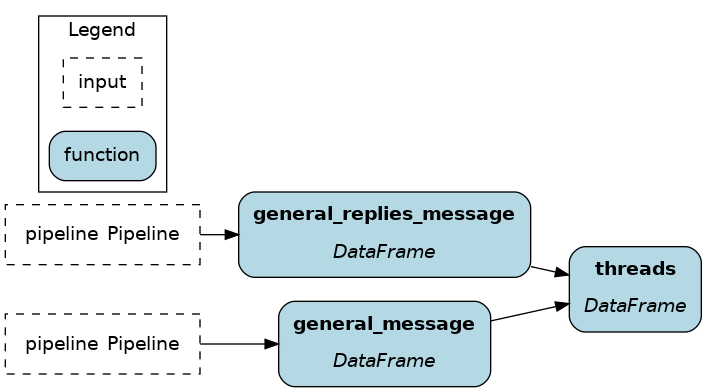
> >
> > 3. Add the Apache Hamilton dataflow execution code to `run.py`
> >
> > ```
> > # run.py from hamilton import driver import transform # module containing dataflow definition # pass the `transform` module dr =driver.Builder ().with_modules (transform).build () # request the node `threads`; pass the dlt `pipeline` as inputs results =dr.execute (["threads" ],inputs =dict (pipeline =extract_pipeline )) # `results` is a dictionary with key `threads`
> > ```
> >
> > <a id="integrations-dlt--load"></a>

> >
> > ### Load
> >
> > 4. Create a 2nd dlt pipeline to load the transformed data. The `pipeline_name` should be different from the **Extract** step.
> >
> > ```
> > # run.py # define dlt pipeline to bigquery (our prod env) load_pipeline =dlt.pipeline (pipeline_name ="slack_final",destination ='bigquery',dataset_name ="slack_community_backup") # pass the results from Apache Hamilton to dlt data =results ["threads"].to_dict (orient ="records") final_load_info =load_pipeline.run (data,table_name ="threads")
> > ```
> >
> > <a id="integrations-dlt--etl-summary"></a>

> >
> > ### ETL Summary
> >
> > You need to set up your dlt pipeline for raw and transformed data, and define your Apache Hamilton transformation dataflow. Then, your execution code consist of executing the ETL step in sequence. It should look like this:
> >
> > ```
> > # run.py import dlt from hamilton import driver import slack # NOTE this is dlt code, not an official Slack library import transform # module containing dataflow definition # EXTRACT extract_pipeline =dlt.pipeline (pipeline_name ="slack_raw",destination ='duckdb',dataset_name ="slack_community_backup") source =slack.slack_source (selected_channels =["general" ],replies =True) raw_load_info =extract_pipeline.run (source) # TRANSFORM dr =driver.Builder ().with_modules (transform).build () results =dr.execute (["threads" ],inputs =dict (pipeline =extract_pipeline )) # LOAD load_pipeline =dlt.pipeline (pipeline_name ="slack_final",destination ='bigquery',dataset_name ="slack_community_backup") data =results ["threads"].to_dict (orient ="records") final_load_info =load_pipeline.run (data,table_name ="threads")
> > ```
> >
> > <a id="integrations-dlt--extract-load-transform-elt"></a>

> >
> > ## Extract, Load, Transform (ELT)
> >
> > Compared to ETL, ELT moves data once.
> >
> > > ingest and store raw data (dlt) -> transform (Apache Hamilton)
> >
> > Transformations happen within the data destination, typically a data warehouse. To achieve this, we will leverage the [Ibis](https://ibis-project.org/) library, which allows to execute data transformations directly on the destination backend.
> >
> > 1. **Extract & Load**: dlt moves the raw data to the destination
> > 2. **Transform**: Apache Hamilton + Ibis execute transformations within the destination
> >
> > **Pros**
> >
> > - Deduplicate computation: redundant operations can be optimized using raw and intermediary data
> > - Simpler architecture: no transformation server is needed, unlike ETL
> >
> > **Cons**
> >
> > - Increased storage cost: more space is required to store raw and intermediary data
> > - Decreased data quality: the sprawl of data of various quality levels needs to be governed
> >
> > <a id="integrations-dlt--extract-load"></a>

> >
> > ### Extract & Load
> >
> > 0. Create a dlt pipeline for raw data ingestion (see [dlt guide](https://dlthub.com/docs/walkthroughs/create-a-pipeline)).
> > 1. Write the dlt pipeline execution code in `run.py`
> >
> > ```
> > # run.py import dlt import slack # NOTE this is dlt code, not an official Slack library # define dlt pipeline to duckdb pipeline =dlt.pipeline (pipeline_name ="slack",destination ='duckdb',dataset_name ="slack_community_backup") # load dlt slack source source =slack.slack_source (selected_channels =["general" ],replies =True) # execute dlt pipeline load_info =pipeline.run (source)
> > ```
> >
> > <a id="integrations-dlt--transform-2"></a>

> >
> > ### Transform
> >
> > 2. Define a dataflow of transformations using Apache Hamilton + Ibis
> >
> > ```
> > # transform.py import ibis import ibis.expr.types as ir def db_con (pipeline:dlt.Pipeline) -> ibis.BaseBackend:backend =ibis.connect (f " {pipeline.pipeline_name} .duckdb") ibis.set_backend (backend) return backend def general_message (db_con:ibis.BaseBackend,pipeline:dlt.Pipeline) -> ir.Table:"""Load table `general_message` from dlt data""" return db_con.table ("general_message",schema =pipeline.dataset_name,database =pipeline.pipeline_name).mutate (thread_ts =ibis._.thread_ts.cast (str ),ts =ibis._.ts.cast (str ),) def general_replies_message (db_con:ibis.BaseBackend,pipeline:dlt.Pipeline) -> ir.Table:"""Load table `general_replies_message` from dlt data""" return db_con.table ("general_replies_message",schema =pipeline.dataset_name,database =pipeline.pipeline_name) def threads (general_message:ir.Table,general_replies_message:ir.Table,) -> ir.Table:"""Create the union of `general_message` and `general_replies_message`""" columns =["thread_ts","ts","user","text"] return ibis.union (general_message.select (columns ),general_replies_message.select (columns ),) def insert_threads (threads:ir.Table) -> bool:db_con =ibis.get_backend () # retrieves the backend set in `db_con()` db_con.create_table ("threads",threads) return True
> > ```
> >
> > 3. Execute the Apache Hamilton dataflow to trigger transformations on the backend
> >
> > ```
> > # run.py # hamilton transform from hamilton import driver import transform # module containing dataflow definition dr =driver.Builder ().with_modules (transform).build () dr.execute (["insert_threads" ],# execute node `insert_threads` inputs =dict (pipeline =pipeline) # pass the dlt pipeline)
> > ```
> >
> > <a id="integrations-dlt--elt-summary"></a>

> >
> > ### ELT Summary
> >
> > You need to set up your dlt pipeline for raw, and define your Apache Hamilton transformation dataflow. Then, your execution code consist of using dlt to move data to the backend and Apache Hamilton + Ibis to execute transformations.
> >
> > ```
> > # run.py import dlt from hamilton import driver import slack # NOTE this is dlt code, not an official Slack library import transform # module containing dataflow definition # EXTRACT & LOAD pipeline =dlt.pipeline (pipeline_name ="slack",destination ='duckdb',dataset_name ="slack_community_backup") source =slack.slack_source (selected_channels =["general" ],replies =True) load_info =pipeline.run (source) # TRANSFORM dr =driver.Builder ().with_modules (transform).build () results =dr.execute (["insert_threads" ],# query the `threads` node inputs =dict (pipeline =pipeline) # pass the dlt load info)
> > ```
> >
> > <a id="integrations-dlt--dlt-materializer-plugin"></a>

> >
> > ## dlt materializer plugin
> >
> > We added custom Data Loader/Saver to plug dlt with Apache Hamilton. Compared to the previous approach, it allows to include the dlt operations as part of the Apache Hamilton dataflow and improve lineage / visibility.
> >
> > > [!NOTE]
> > > **See this notebook for a demo.**
> > >
> >
> > <a id="integrations-dlt--dataloader"></a>

> >
> > ### DataLoader
> >
> > The `DataLoader` allows to read in-memory data from a `dlt.Resource`. When working with `dlt.Source`, you can access individual `dlt.Resource` with `source.resource["source_name"]`. This removes the need to write utility functions to read data from dlt (with pandas or Ibis). Contrary to the previous ETL and ELT examples, this approach is useful when you don’t want to store the dlt Source data. It effectively connects dlt to Apache Hamilton to enable “Extract, Transform” (ET).
> >
> > ```
> > # run.py from hamilton import driver from hamilton.io.materialization import from_ import slack # NOTE this is dlt code, not an official Slack library import transform source =slack.source (selected_channels =["general" ],replies =True) dr =driver.Builder ().with_modules (transform).build () materializers =[from_.dlt (target ="general_message",# node name assigned to the data resource =source.resources ["general_message"] ),from_.dlt (target ="general_replies_message",resource =source.resources ["general_replies_message"] ),] # when using only loaders (i.e., `from_`), you need to specify # `additional_vars` to compute, like you would in `.execute(final_vars=["threads"])` dr.materialize (* materializers,additional_vars =["threads" ])
> > ```
> >
> > <a id="integrations-dlt--datasaver"></a>

> >
> > ### DataSaver
> >
> > The `DataSaver` allows to write node results to any `dlt.Destination`. You’ll need to define a `dlt.Pipeline` with the desired `dlt.Destination` and you can specify arguments for the `pipeline.run()` behavior (e.g., incremental loading, primary key, load\_file\_format). This provides a “Transform, Load” (TL) connector from Apache Hamilton to dlt.
> >
> > ```
> > # run.py import dlt from hamilton import driver from hamilton.io.materialization import to import slack # NOTE this is dlt code, not an official Slack library import transform pipeline =dlt.pipeline (pipeline_name ="slack",destination ='duckdb',dataset_name ="slack_community_backup") dr =driver.Builder ().with_modules (transform).build () materializers =[to.dlt (id ="threads__dlt",# node name dependencies =["threads" ],table_name ="slack_threads",pipeline =pipeline,)] dr.materialize (* materializers)
> > ```
> >
> > <a id="integrations-dlt--combining-both"></a>

> >
> > ### Combining both
> >
> > You can also combine both the `DataLoader` and `DataSaver`. You will see below that it’s almost identical to the ELT example, but now all operations are part of the Apache Hamilton dataflow!
> >
> > ```
> > # run.py import dlt from hamilton import driver from hamilton.io.materialization import from_,to import slack # NOTE this is dlt code, not an official Slack library import transform pipeline =dlt.pipeline (pipeline_name ="slack",destination ='duckdb',dataset_name ="slack_community_backup") source =slack.source (selected_channels =["general" ],replies =True) dr =driver.Builder ().with_modules (transform).build () materializers =[from_.dlt (target ="general_message",resource =source.resources ["general_message"] ),from_.dlt (target ="general_replies_message",resource =source.resources ["general_replies_message"] ),to.dlt (id ="threads__dlt",dependencies =["threads" ],table_name ="slack_threads",pipeline =pipeline,)] dr.materialize (* materializers)
> > ```
> >
> > 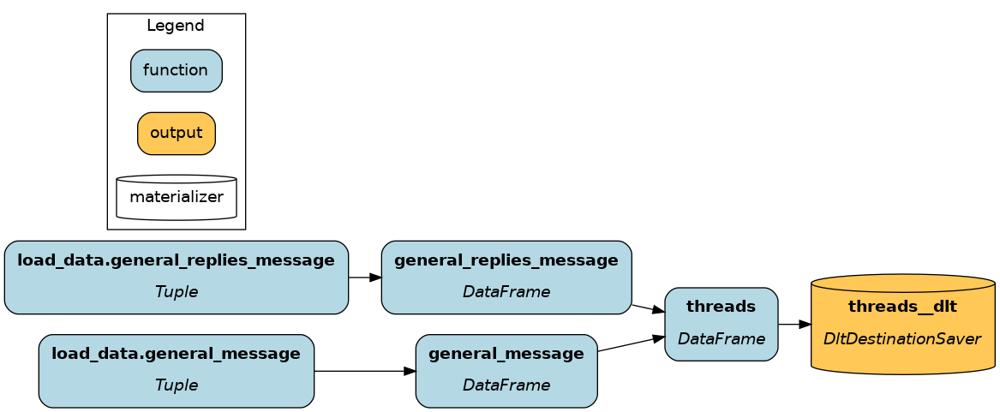
> >
> > <a id="integrations-dlt--next-steps"></a>

> >
> > ## Next steps
> >
> > - Our full [code example to ingest Slack data and generate thread summaries](https://github.com/apache/hamilton/tree/main/examples/dlt) is available on GitHub.
> > - Another important pattern in data engineering is reverse ETL, which consists of moving data analytics back to your sources (CRM, Hubspot, Zendesk, etc.). See this [dlt blog](https://dlthub.com/docs/blog/reverse-etl-dlt) to get started.

On this page

- [dlt](#integrations-dlt)
  - [Extract, Transform, Load (ETL)](#integrations-dlt--extract-transform-load-etl)
    - [Extract](#integrations-dlt--extract)
    - [Transform](#integrations-dlt--transform)
    - [Load](#integrations-dlt--load)
    - [ETL Summary](#integrations-dlt--etl-summary)
  - [Extract, Load, Transform (ELT)](#integrations-dlt--extract-load-transform-elt)
    - [Extract & Load](#integrations-dlt--extract-load)
    - [Transform](#integrations-dlt--id1)
    - [ELT Summary](#integrations-dlt--elt-summary)
  - [dlt materializer plugin](#integrations-dlt--dlt-materializer-plugin)
    - [DataLoader](#integrations-dlt--dataloader)
    - [DataSaver](#integrations-dlt--datasaver)
    - [Combining both](#integrations-dlt--combining-both)
  - [Next steps](#integrations-dlt--next-steps)

---

<a id="integrations-fastapi"></a>

<!-- source_url: https://hamilton.incubator.apache.org/integrations/fastapi/ -->

<!-- page_index: 53 -->

# FastAPI ¶

[
<svg viewbox="0 0 24 24" xmlns="http://www.w3.org/2000/svg">
<path></path>
</svg>

Back to top](#integrations-fastapi)

[
<svg><use href="#svg-eye"></use></svg>

View this page](https://github.com/apache/hamilton/blob/main/docs/integrations/fastapi.md?plain=true "View this page")

[
<svg><use href="#svg-pencil"></use></svg>

Edit this page](https://github.com/apache/hamilton/edit/main/docs/integrations/fastapi.md "Edit this page")

<svg><use href="#svg-toc"></use></svg>

<a id="integrations-fastapi--fastapi"></a>

# FastAPI

[FastAPI](https://fastapi.tiangolo.com/) is an open-source Python web framework to create APIs. It is a modern alternative to [Flask](https://flask.palletsprojects.com/en/3.0.x/) and a more lightweight option than [Django](https://www.djangoproject.com/). In FastAPI, endpoints are defined using Python functions. The parameters indicate the request specifications and the return value specifies the response. Decorators are used to specify the [HTTP methods](https://learn.microsoft.com/en-us/azure/architecture/best-practices/api-design) (GET, POST, etc.) and to route the request.

```
from
typing
import Union from
fastapi
import FastAPI app =FastAPI () # Instantiate the FastAPI server @app.get ("/") # GET method with base route "/" def
read_root ():return {"Hello":"World"} @app.get ("/items/ {item_id} ") # dynamic route with variable `item_id` def
read_item (item_id:int,q:Union [str,None] =None ):return {"item_id":item_id,"q":q} if __name__ =="__main__":# launch the server with `uvicorn` import
uvicorn uvicorn.run (app,host ="0.0.0.0",port =8000) # specify host and port
```

On this page, you’ll learn how Apache Hamilton can help you:

- Test you application
- Reduce the friction from proof-of-concept to production
- Document your API

<a id="integrations-fastapi--challenges"></a>

## Challenges

<a id="integrations-fastapi--1.-test-your-fastapi-application"></a>

### 1. Test your FastAPI application

FastAPI endpoints are simply decorated Python function, allowing a great deal of flexibility as to what is executed (functions, classes, web requests, etc.). On one hand, we want to test that endpoints are defined and behave properly by starting a server and testing the GET, POST, etc. requests. FastAPI provides great [documentation and tooling](https://fastapi.tiangolo.com/tutorial/testing/) to do so. On the other hand, these tests conflate the role of the FastAPI server and the endpoint behavior. To run them, a server-client pair need to be created, which will slow down your test suite, and [endpoints need to be mocked](https://jestjs.io/docs/mock-functions) to avoid connecting to a production environment. By coupling the role of the FastAPI server and the endpoint behavior, more efforts and resources are needed to write and run tests. The content of the endpoints and the structure of your codebase might make it difficult to test endpoint logic outside the context of a FastAPI server.

<a id="integrations-fastapi--2.-document-your-api"></a>

### 2. Document your API

FastAPI already does a great job at automating API documentation by integrating with [Swagger UI](https://fastapi.tiangolo.com/how-to/configure-swagger-ui/) and [OpenAPI](https://fastapi.tiangolo.com/how-to/separate-openapi-schemas/). It leverages the endpoints’ name, path, docstring, and type annotations, and also allows to add descriptions and example inputs. However, since docstrings, descriptions, and example inputs are not directly tied to the code, they risk becoming out of sync as changes are made.

<a id="integrations-fastapi--apache-hamilton-fastapi"></a>

## Apache Hamilton + FastAPI

Adding Apache Hamilton to your FastAPI server can provide a better separation between the dataflow and the API endpoints. Each endpoint can use `Driver.execute()` to request variables and wrap results into an HTTP response. Then, data transformations and interactions with resources (e.g., database, web service) are curated into standalone Python modules and decoupled from the server code.

Since Apache Hamilton dataflows will run the same way inside or outside FastAPI, you can write simpler unit tests for Hamilton functions without defining a mock server and client. Additionnally, visualizations for the defined Apache Hamilton dataflows can be added to the FastAPI [Swagger UI documentation](https://fastapi.tiangolo.com/features/#automatic-docs). They will remain in sync with the API behavior because they are generated from the code.

<a id="integrations-fastapi--example"></a>

### Example

In this example, we’ll build a backend for a PDF summarizer application.

> The full code can be found on [GitHub](https://github.com/apache/hamilton/tree/main/examples/LLM_Workflows/pdf_summarizer/backend/server.py)

<a id="integrations-fastapi--client"></a>

#### Client

The client defines an HTTP POST request to send a PDF file along a selected OpenAI GPT model, the content type of the PDF file, and a query for the summarization. The `files` parameter allows for [multipart encoding uploads](https://requests.readthedocs.io/en/latest/user/advanced/?highlight=files#post-multiple-multipart-encoded-files) and `data` sets the content of the body of the request.

```
# client.py from typing import IO import requests def post_summarize (uploaded_pdf:IO [bytes ],openai_gpt_model:str,content_type:str,user_query:str,) -> requests.Response:"""POST request to summarize a PDF via the `/summarize` endpoint""" return requests.post (url ="http://0.0.0.0:8000/summarize",# http://HOST:PORT/ENDPOINT as specified in server.py files =dict (pdf_file =uploaded_pdf ),data =dict (openai_gpt_model =openai_gpt_model,content_type =content_type,user_query =user_query,),)
```

> 💡 For more complex FastAPI applications, you can automatically [generate the client code](https://fastapi.tiangolo.com/advanced/generate-clients/) in Python and other languages (TypeScript, Rust, etc.)

<a id="integrations-fastapi--backend-dataflow-with-apache-hamilton"></a>

#### Backend dataflow with Apache Hamilton

Apache Hamilton transformations are defined in the module `summarization.py`. This includes loading and chunking the raw text, summarizing chunks with the OpenAI API, and reducing chunks into a final summary.

Visualization of the Apache Hamilton dataflow
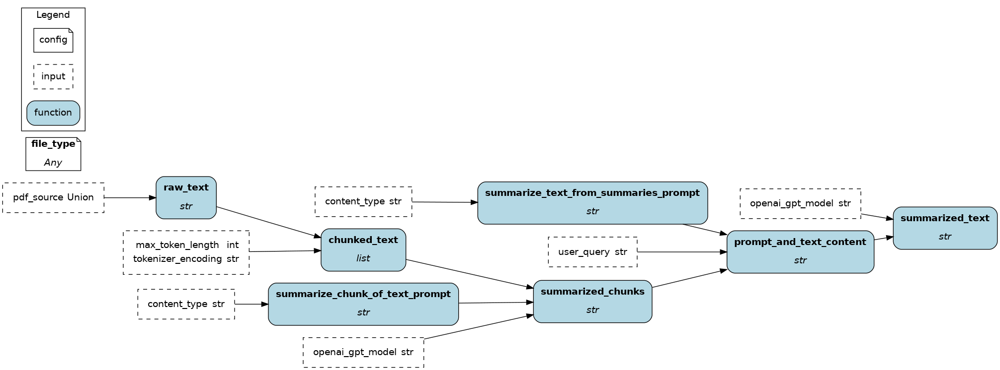

<a id="integrations-fastapi--server-definition-with-fastapi"></a>

#### Server definition with FastAPI

Then, the FastAPI server is defined in `server.py`. Notice a few things:

- the `Driver` is built only once in the global context.
- the endpoint types are set using `Annotated[...]` to [accept multipart encoded forms](https://fastapi.tiangolo.com/tutorial/request-forms-and-files/?h=form#__tabbed_2_1)
- the HTTP POST request is passed as `inputs` to `Driver.execute()`
- the Apache Hamilton results are wrapped into a Pydantic `SummarizeResponse` model

```
# server.py from typing import Annotated from fastapi import FastAPI,Form,UploadFile from pydantic import BaseModel from hamilton import driver import summarization app =FastAPI () # build the Hamilton Driver with the summarization module dr =(driver.Builder ().with_modules (summarization).build ()) class SummarizeResponse (BaseModel ):"""Response to the /summarize endpoint""" summary:str @app.post ("/summarize") # POST request, `/summarize` endpoint def summarize_pdf (pdf_file:Annotated [UploadFile,Form ()],openai_gpt_model:Annotated [str,Form ()],content_type:Annotated [str,Form ()],user_query:Annotated [str,Form ()],) -> SummarizeResponse:"""Summarize the text from the PDF file""" results =dr.execute (["summarized_text" ],inputs =dict (pdf_source =pdf_file.file,openai_gpt_model =openai_gpt_model,content_type =content_type,user_query =user_query,),) return SummarizeResponse (summary =results ["summarized_text" ]) if __name__ =="__main__":import uvicorn uvicorn.run (app,host ="0.0.0.0",port =8000) # specify host and port
```

<a id="integrations-fastapi--visualize-endpoints-dataflow"></a>

#### Visualize endpoints’ dataflow

The Apache Hamilton dataflow visualizations can be added to the automatically generated FastAPI [Swagger UI documentation](https://fastapi.tiangolo.com/features/#automatic-docs), which can be viewed at http://0.0.0.0:8000/docs

```
# server.py # ... after defining all endpoints # get the visualization visualization =dr.visualize_execution (["summarized_text" ],inputs =dict (pdf_source =bytes (),openai_gpt_model ="",user_query ="" )) # encode the PNG object into a base64 string base64_viz =base64.b64encode (visualization.pipe (format ="png" )).decode ("utf-8") # route[-1] is the last defined, i.e. `/summarize` # append the base64 string of a PNG to the API endpoint text description app.routes [- 1].description +=f """ 📞 If you are interested in a generic approach to add visualizations to all of your endpoints, please reach out to us on [Slack](https://join.slack.com/t/hamilton-opensource/shared_invite/zt-2niepkra8-DGKGf_tTYhXuJWBTXtIs4g)!

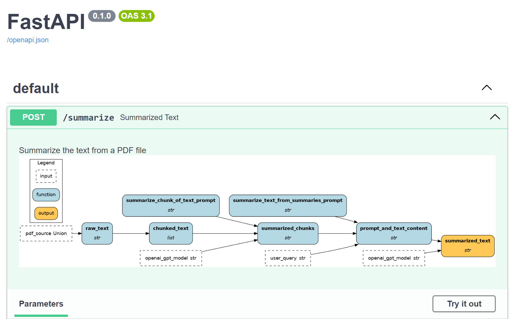

<a id="integrations-fastapi--benefits"></a>

### Benefits

- **Separation of concerns**: the decoupling between `server.py` and `summarization.py` makes it easier to extend and test the server separately from the data transformations.
- **Reusable code**: the module `summarization.py` can be reused elsewhere with Apache Hamilton. For instance, if you first started by building a proof-of-concept with [Streamlit + Apache Hamilton](https://hamilton.apache.org/integrations/streamlit), the logic you produced could be reused to power your FastAPI server.
- **Richer documentation**: Apache Hamilton allows to view and better understand the dataflow of an operation. This helps onboard new API users and greatly facilitates transferring the ownership of the API to other engineers.

On this page

- [FastAPI](#integrations-fastapi)
  - [Challenges](#integrations-fastapi--challenges)
    - [1. Test your FastAPI application](#integrations-fastapi--test-your-fastapi-application)
    - [2. Document your API](#integrations-fastapi--document-your-api)
  - [Apache Hamilton + FastAPI](#integrations-fastapi--apache-hamilton-fastapi)
    - [Example](#integrations-fastapi--example)
      - [Client](#integrations-fastapi--client)
      - [Backend dataflow with Apache Hamilton](#integrations-fastapi--backend-dataflow-with-apache-hamilton)
      - [Server definition with FastAPI](#integrations-fastapi--server-definition-with-fastapi)
      - [Visualize endpoints’ dataflow](#integrations-fastapi--visualize-endpoints-dataflow)
    - [Benefits](#integrations-fastapi--benefits)

---

<a id="integrations-ibis"></a>

<!-- source_url: https://hamilton.incubator.apache.org/integrations/ibis/ -->

<!-- page_index: 54 -->

# Ibis ¶

> [!NOTE]
> > [!NOTE]
> > [Back to top](#integrations-ibis)
> >
> > [View this page](https://github.com/apache/hamilton/blob/main/docs/integrations/ibis/index.md?plain=true "View this page")
> >
> > [Edit this page](https://github.com/apache/hamilton/edit/main/docs/integrations/ibis/index.md "Edit this page")
> >
> > > [!NOTE]
> > > <a id="integrations-ibis--ibis"></a>

> > >
> > > # Ibis
> > >
> > > [Ibis](https://ibis-project.org/) is the portable Python dataframe library. It allows you to define data transformations once and execute them in multiple backends (BigQuery, DuckDB, PySpark, SQLite, Snowflake, Postgres, Polars; [see the full list](https://ibis-project.org/support_matrix)). If you never used Ibis before, it should feel similar to SQL with a touch of dataframes (e.g., pandas). You’ll be primarily writing expressions (similar to an SQL query), which compute values only after calling for execution via `.to_pandas()` for example.
> > >
> > > On this page, you’ll learn how Ibis + Apache Hamilton can help:
> > >
> > > - Create a modular codebase for better collaboration and maintainability
> > > - Reduce the development-production gap
> > >
> > > <a id="integrations-ibis--standalone-ibis"></a>

> > >
> > > ## Standalone Ibis
> > >
> > > Here’s an Ibis code snippet to load data from a CSV, compute features, and select columns / filter rows. It illustrates typical feature engineering operations.
> > >
> > > Reading the code, you’ll notice that:
> > >
> > > - We use “expression chaining”, meaning there’s a series of `.method()` attached one after another.
> > > - The variable `ibis._` is a special character referring to the current expression e.g., `ibis._.pet` accesseses the column “pet” of the current table.
> > > - The table method `.mutate(col1=, col2=, ...)` assigns new columns or overwrites existing ones.
> > >
> > > ```
> > > import
> > > ibis raw_data_path =...feature_selection =["id","has_children","has_pet","is_summer_brazil","service_time","seasons","disciplinary_failure","absenteeism_time_in_hours",],# write the expression feature_set =(ibis.read_csv (sources =raw_data_path,table_name ="absenteism").rename ("snake_case").mutate (has_children =ibis.ifelse (ibis._.son> 0,1,0 ),has_pet =ibis.ifelse (ibis._.pet> 0,1,0 ),is_summer_brazil =ibis._.month_of_absence.isin ([1,2,12 ]).cast (int ),).select (* feature_selection).filter (ibis.ifelse (ibis._.has_pet ==1,True,False ))) # execute the expression feature_df =feature_set.to_pandas ()
> > > ```
> > >
> > > <a id="integrations-ibis--challenge-1-maintain-and-test-large-data-transformations-codebases"></a>

> > >
> > > ### Challenge 1 - Maintain and test large data transformations codebases
> > >
> > > Ibis has an SQL-like syntax and supports chaining operations, allowing for powerful queries in a few lines of code. Conversely, there’s a risk of sprawling complexity as expressions as statements are appended, making them harder to test and debug. Preventing this issue requires a lot of upfront discipline and refactoring.
> > >
> > > <a id="integrations-ibis--challenge-2-orchestrate-ibis-code-in-production"></a>

> > >
> > > ### Challenge 2 - Orchestrate Ibis code in production
> > >
> > > Ibis alleviates a major pain point by enabling data transformations to work across backends. However, moving from dev to prod still requires some code changes such as changing backend connectors, swapping unsupported operators, adding some orchestration and logging execution. This is outside the scope of the Ibis project and is expected to be enabled by other means.
> > >
> > > <a id="integrations-ibis--how-apache-hamilton-complements-ibis"></a>

> > >
> > > ## How Apache Hamilton complements Ibis
> > >
> > > <a id="integrations-ibis--write-modular-ibis-code"></a>

> > >
> > > ### Write modular Ibis code
> > >
> > > Apache Hamilton was initially developed to [structure pandas code for a large catalog of features](https://blog.dagworks.io/p/tidy-production-pandas-with-hamilton-3b759a2bf562), and has been adopted by multiple organizations since. Its syntax encourages users to chunk code into meaningful and reusable components, which facilitates documentation, unit testing, code reviews, and improves iteration speed. These benefits directly translate to organizing Ibis code.
> > >
> > > Now, we’ll refactor the above code to use Apache Hamilton. Users have the flexibility to chunk code at the table or the column-level depending on the needed granularity. This modularity is particularly beneficial to Ibis because:
> > >
> > > - Well-scoped functions with type annotations and docstring are easier to understand for new Ibis users and facilitate onboarding.
> > > - Unit testing and data validation becomes easier with smaller expressions. These checks become more important when working across backends since the [operation coverage varies](https://ibis-project.org/support_matrix) and bugs may arise.
> > >
> > > <a id="integrations-ibis--table-level"></a>

> > >
> > > #### Table-level
> > >
> > > Table-level operations might feel most familiar to SQL and Spark users. Also, Ibis + Apache Hamilton is reminiscent of dbt for the Python ecosystem.
> > >
> > > Working with tables is very efficient when your number of columns/features is limited, and you don’t need full lineage. As you want to reuse components, you can progressively breakdown “table-level code” in to “column-level code”.
> > >
> > > The initial Ibis code is now 3 functions with type annotations and docstrings. We have a clear sense of the expected external outputs and we could implement schema checks between functions.
> > >
> > > ```
> > > import
> > > ibis import
> > > ibis.expr.types
> > > as
> > > ir def
> > > raw_table (raw_data_path:str) -> ir.Table:
> > > """Load CSV from `raw_data_path` into a Table expression and format column names to snakecase """ return (ibis.read_csv (sources =raw_data_path,table_name ="absenteism").rename ("snake_case")) def
> > > feature_table (raw_table:ir.Table) -> ir.Table:
> > > """Add to `raw_table` the feature columns `has_children` `has_pet`, and `is_summer_brazil` """ return raw_table.mutate (has_children =(ibis.ifelse (ibis._.son> 0,True,False )),has_pet =ibis.ifelse (ibis._.pet> 0,True,False ),is_summer_brazil =ibis._.month_of_absence.isin ([1,2,12 ]),) def
> > > feature_set (feature_table:ir.Table,feature_selection:list [str ],condition:Optional [ibis.common.deferred.Deferred] =None,) -> ir.Table:
> > > """Select feature columns and filter rows""" return feature_table [feature_selection].filter (condition)
> > > ```
> > >
> > > 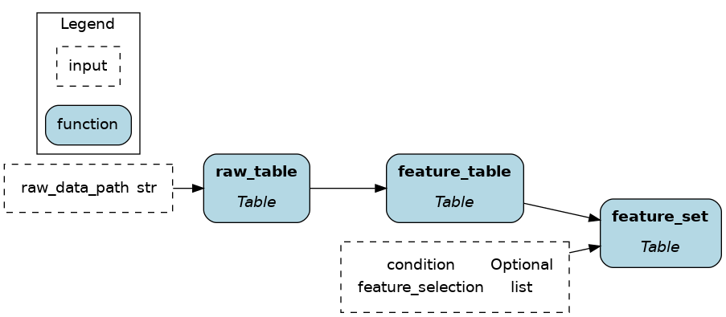
> > >
> > > <a id="integrations-ibis--column-level"></a>

> > >
> > > #### Column-level
> > >
> > > Apache Hamilton was built around column-level operations, which is most common in dataframe libraries (pandas, Dask, polars).
> > >
> > > Column-level code leads to fully-reusable feature definitions and a great level of lineage. Notably, this allows to [trace sensitive data and evaluate downstream impacts of code changes](#how-tos-use-hamilton-for-lineage). However, it is more verbose to get started with, but remember that code is more often read than written.
> > >
> > > Now, the `raw_table` is loaded and the columns `son`, `pet`, and `month_of_absence` are extracted to engineer new features. After transformations, features are joined with `raw_table` to create `feature_table`.
> > >
> > > ```
> > > import
> > > ibis import
> > > ibis.expr.types
> > > as
> > > ir from
> > > hamilton.function_modifiers
> > > import extract_columns from
> > > hamilton.plugins
> > > import ibis_extensions # extract specific columns from the table @extract_columns ("son","pet","month_of_absence") def
> > > raw_table (raw_data_path:str) -> ir.Table:
> > > """Load the CSV found at `raw_data_path` into a Table expression and format columns to snakecase """ return (ibis.read_csv (sources =raw_data_path,table_name ="absenteism").rename ("snake_case")) # accesses a single column from `raw_table` def
> > > has_children (son:ir.Column) -> ir.BooleanColumn:
> > > """True if someone has any children""" return ibis.ifelse (son> 0,True,False) # narrows the return type from `ir.Column` to `ir.BooleanColumn` def
> > > has_pet (pet:ir.Column) -> ir.BooleanColumn:
> > > """True if someone has any pets""" return ibis.ifelse (pet> 0,True,False).cast (bool) # typing and docstring provides business context to features def
> > > is_summer_brazil (month_of_absence:ir.Column) -> ir.BooleanColumn:
> > > """True if it is summer in Brazil during this month People in the northern hemisphere are likely to take vacations to warm places when it's cold locally """ return month_of_absence.isin ([1,2,12 ]) def
> > > feature_table (raw_table:ir.Table,has_children:ir.BooleanColumn,has_pet:ir.BooleanColumn,is_summer_brazil:ir.BooleanColumn,) -> ir.Table:
> > > """Join computed features to the `raw_data` table""" return raw_table.mutate (has_children =has_children,has_pet =has_pet,is_summer_brazil =is_summer_brazil,) def
> > > feature_set (feature_table:ir.Table,feature_selection:list [str ],condition:Optional [ibis.common.deferred.Deferred] =None,) -> ir.Table:
> > > """Select feature columns and filter rows""" return feature_table [feature_selection].filter (condition)
> > > ```
> > >
> > > 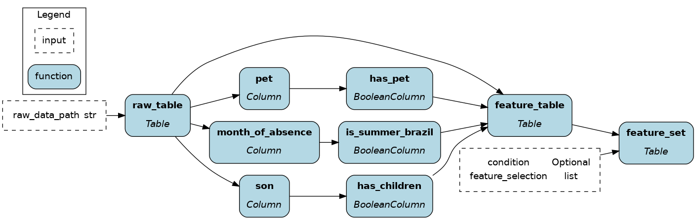
> > >
> > > > [!NOTE]
> > > > **If your code is already structured with Apache Hamilton, migrating from pandas to Ibis should be easy!**
> > > >
> > >
> > > <a id="integrations-ibis--orchestrate-ibis-anywhere"></a>

> > >
> > > ### Orchestrate Ibis anywhere
> > >
> > > Apache Hamilton is ideal orchestrate for Ibis because it has the lightest footprint and will run anywhere Python does (script, notebook, FastAPI, pyodide, etc.) In fact, the Apache Hamilton library only has 4 dependencies. You don’t need “framework code” to get started, just plain Python functions. When moving to production, Apache Hamilton has all the necessary features to complement Ibis such as swapping components, configurations, and lifecycle hooks for logging, alerting, and telemetry.
> > >
> > > A simple usage pattern of Apache Hamilton + Ibis is to use the [`@config.when` function modifier](#concepts-function-modifiers). In the following example, we have alternative implementations for the backend connection, which will be used for computing and storing results. When running your code, specify in your config `backend="duckdb"` or `backend="bigquery"` to swap between the two.
> > >
> > > ```
> > > # ibis_dataflow.py import ibis import ibis.expr.types as ir from hamilton.function_modifiers import config # ... entire dataflow definition @config.when (backend ="duckdb") def backend_connection__duckdb (connection_string:str) -> ibis.backends.BaseBackend:"""Connect to DuckDB backend""" return ibis.duckdb.connect (connection_string) @config.when (backend ="bigquery") def backend_connection__bigquery (project_id:str,dataset_id:str,) -> ibis.backends.BaseBackend:"""Connect to BigQuery backend Install dependencies via `pip install ibis-framework[bigquery]` """ return ibis.bigquery.connect (project_id =project_id,dataset_id =dataset_id,) def insert_results (backend_connection:ibis.backends.BaseBackend,result_table:ir.Table,table_name:str ):"""Execute expression and insert results""" backend_connection.insert (table_name =table_name,P obj =result_table)
> > > ```
> > >
> > > > [!NOTE]
> > > > A potential architecture for Ibis + Apache Hamilton would be running CRON jobs on GitHub actions to periodically launch AWS Lambda with the Apache Hamilton code to orchestrate Ibis data transformations directly on the backend. This has the potential to save meaningful cloud egress cost and greatly diminishes orchestration complexity.
> > >
> > > <a id="integrations-ibis--how-ibis-complements-apache-hamilton"></a>

> > >
> > > ## How Ibis complements Apache Hamilton
> > >
> > > <a id="integrations-ibis--performance-boost"></a>

> > >
> > > ### Performance boost
> > >
> > > Leveraging DuckDB as the default backend, Apache Hamilton users migrating to Ibis should immediately find performance improvements both for local dev and production. In addition, the portability of Ibis has the potential to greatly reduce development time.
> > >
> > > <a id="integrations-ibis--atomic-data-transformation-documentation"></a>

> > >
> > > ### Atomic data transformation documentation
> > >
> > > Apache Hamilton can directly produce a dataflow visualization from code, helping with project documentation. Ibis pushes this one step further by providing a detailed view of the query plan and schemas. See this Ibis visualization for the column-level Apache Hamilton dataflow defined above. It includes all renaming, type casting, and transformations steps (Please open the image in a new tab and zoom in 🔎).
> > >
> > > 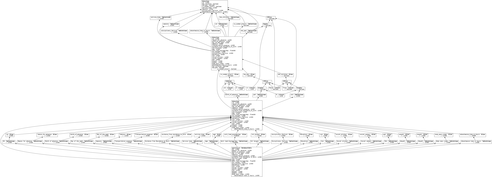
> > >
> > > <a id="integrations-ibis--working-across-rows-with-user-defined-functions-udfs"></a>

> > >
> > > ### Working across rows with user-defined functions (UDFs)
> > >
> > > Apache Hamilton and most backends are designed to work primarily on tables and columns, but sometimes you’d like to operate over a row (think of `pd.DataFrame.apply()`). However, pivoting tables is costly and manually iterating over rows to collect values and create a new column is quickly inconvenient. By [using scalar user-defined functions (UDFs)](https://ibis-project.org/reference/scalar-udfs), Ibis makes it possible to execute arbitrary Python code on rows directly on the backend.
> > >
> > > > [!NOTE]
> > > > Using `@ibis.udf.scalar.python` creates a non-vectorized function that iterates row-by-row. See [the docs](https://ibis-project.org/reference/scalar-udfs) to use backend-specific UDFs with `@ibis.udf.scalar.builtin` and create vectorized scalar UDFs.
> > >
> > > For instance, you could [embed rows of a text column using an LLM API](https://ibis-project.org/posts/duckdb-for-rag/) without leaving the datawarehouse.
> > >
> > > ```
> > > import
> > > ibis import
> > > ibis.expr.types
> > > as
> > > ir def
> > > documents (path:str) -> ir.Table:
> > > """load text documents from file""" return ibis.read_parquet (sources =path,table_name ="documents") # the function name would need to start # with `_` to avoid being added as a node @ibis.udf.scalar.python def
> > > _generate_summary (author:str,text:str,prompt_template:str) -> str:
> > > """UDF Function to call the OpenAI API line by line""" prompt =prompt_template.format (author =author,text =text) client =openai.OpenAI (...) try:response =client.chat.completions.create (...) return_value =response.choices [0].message.content except Exception:return_value ="" return return_value def
> > > prompt_template () -> str:return """summarize the following text from {author} and add contextual notes based on it biography and other written work TEXT
> > > {text} """ def
> > > summaries (documents:ir.Table,prompt_template:str) -> ir.Table
> > > """Compute the UDF against the family""" return documents.mutate (summary =_generated_summary (_.author,_.text,prompt_template =prompt_template))
> > > ```
> > >
> > > 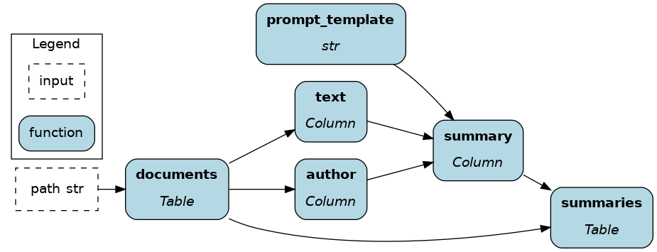
> > >
> > > <a id="integrations-ibis--ibis-apache-hamilton-a-natural-pairing"></a>

> > >
> > > ## Ibis + Apache Hamilton - a natural pairing
> > >
> > > - **What works in dev works in prod**: Ibis and Apache Hamilton allows you to write and structure code data transformations portable across backends for small and big data alike. The two being lightweight libraries, installing dependencies on remote workers is fast and you’re unlikely to ever encounter dependency conflicts.
> > > - **Maintainable and testable code**: Modular functions facilitates writing high quality code and promotes reusability, compounding your engineering efforts. It becomes easier for new users to contribute to a dataflow and pull requests are merged faster.
> > > - **Greater visibility**: With Apache Hamilton and Ibis, you have incredible visualizations directly derived from your code. This is a superpower for documentation, allowing users to make sense of a dataflow, and also reason about changes.

On this page

- [Ibis](#integrations-ibis)
  - [Standalone Ibis](#integrations-ibis--standalone-ibis)
    - [Challenge 1 - Maintain and test large data transformations codebases](#integrations-ibis--challenge-1-maintain-and-test-large-data-transformations-codebases)
    - [Challenge 2 - Orchestrate Ibis code in production](#integrations-ibis--challenge-2-orchestrate-ibis-code-in-production)
  - [How Apache Hamilton complements Ibis](#integrations-ibis--how-apache-hamilton-complements-ibis)
    - [Write modular Ibis code](#integrations-ibis--write-modular-ibis-code)
      - [Table-level](#integrations-ibis--table-level)
      - [Column-level](#integrations-ibis--column-level)
    - [Orchestrate Ibis anywhere](#integrations-ibis--orchestrate-ibis-anywhere)
  - [How Ibis complements Apache Hamilton](#integrations-ibis--how-ibis-complements-apache-hamilton)
    - [Performance boost](#integrations-ibis--performance-boost)
    - [Atomic data transformation documentation](#integrations-ibis--atomic-data-transformation-documentation)
    - [Working across rows with user-defined functions (UDFs)](#integrations-ibis--working-across-rows-with-user-defined-functions-udfs)
  - [Ibis + Apache Hamilton - a natural pairing](#integrations-ibis--ibis-apache-hamilton-a-natural-pairing)

---

<a id="integrations-streamlit"></a>

<!-- source_url: https://hamilton.incubator.apache.org/integrations/streamlit/ -->

<!-- page_index: 55 -->

# Streamlit ¶

[
<svg viewbox="0 0 24 24" xmlns="http://www.w3.org/2000/svg">
<path></path>
</svg>

Back to top](#integrations-streamlit)

[
<svg><use href="#svg-eye"></use></svg>

View this page](https://github.com/apache/hamilton/blob/main/docs/integrations/streamlit.md?plain=true "View this page")

[
<svg><use href="#svg-pencil"></use></svg>

Edit this page](https://github.com/apache/hamilton/edit/main/docs/integrations/streamlit.md "Edit this page")

<svg><use href="#svg-toc"></use></svg>

<a id="integrations-streamlit--streamlit"></a>

# Streamlit

[Streamlit](https://streamlit.io/) is an open-source Python library to create web applications with minimal effort. It’s an effective solution to create simple dashboards, interactive data visualizations, and proof-of-concepts for data science, machine learning, and LLM applications. On this page, you’ll learn how Apache Hamilton can help you:

- Write cleaner Streamlit applications
- Reduce friction transition between proof-of-concept and production
- Improve Streamlit performance

<a id="integrations-streamlit--challenges"></a>

## Challenges

<a id="integrations-streamlit--1.-hard-to-read-ui-and-data-flows."></a>

### 1. Hard to read UI and data flows.

Complex Streamlit applications become difficult to debug because of the complex flow of operations. In the simplest case, all the code is under the main function call `app()` and components are added to the UI from top to bottom. Components can be nested under `columns`, `containers`, `expanders`, `tabs`, and more to organize them on the page by using the `with` Python syntax. A good coding practice is to separate data transformations from UI, but Streamlit can blur these lines. Things are further complicated when components are added or updated outside the main scope `app()`. As user interactions, data transformations, state, and UI layout become difficult to trace, risks of breaking changes increase and debugging is more challenging.

```
import
streamlit
as
st # external function writing component def
greeting (name:str) -> None:st.write (f "Hello {name} ") def
app ():st.title ("Apache Hamilton + Streamlit 🐱🚀") main,settings =st.tabs (["Main","Settings" ]) left,right =st.columns (2) # nesting tabs and columns with main:with left:name =st.text_input ("What's your name",value ="Lambda") with right:greeting (name) if __name__ =="__main__":app ()
```

> ⚠ This example is illustratory and real applications quickly get more complex.

<a id="integrations-streamlit--2.-cache-and-state-management"></a>

### 2. Cache and state management

When the user interacts with the app, Streamlit reruns your entire Python code to update what’s displayed on screen ([reference](https://docs.streamlit.io/get-started/fundamentals/main-concepts#data-flow)). By default, no data is preserved between updates and all computations need to be executed again. Your application suffer slow downs if you handle large dataframes or load machine learning models in memory for instance. To overcome this limitation, Streamlit allows to [cache expensive operations](https://docs.streamlit.io/library/advanced-features/caching) via the decorators `@streamlit.cache_data` and `@streamlit.cache_resource` and [store state variables](https://docs.streamlit.io/library/api-reference/session-state) between reruns in the global dictionary `streamlit.session_state` or via `key` attributes of input widget. State management becomes particularly important when building a [multipage app](https://docs.streamlit.io/get-started/tutorials/create-a-multipage-app) where each page is defined in a separate Python file and can’t communicate by default.

```
import
pandas
as
pd import
streamlit
as
st @st.cache_data def
load_dataframe (path:str) -> pd.DataFrame:return pd.read_parquet (path) def
app ():st.title ("Apache Hamilton + Streamlit 🐱🚀") # load_dataframe() will only run the first time df =load_dataframe (path ="...") st.dataframe (df) # If favorite flavor is known, display it.if st.session_state ("favorite" ):st.write (f "Your favorite ice cream is:{st.session_state ['favorite']} ") # Ask for the favorite ice cream until an answer is given.else:st.text_input ("What's your favorite ice cream flavor?",key ="favorite",# key to st.session_state) if __name__ =="__main__":app ()
```

> ⚠ This example is illustratory and real applications quickly get more complex.

<a id="integrations-streamlit--apache-hamilton-streamlit"></a>

## Apache Hamilton + Streamlit

Adding Apache Hamilton to your Streamlit application can provide a better separation between the dataflow and the UI logic. They pair nicely together because Apache Hamilton is also stateless. Once defined, each call to `Driver.execute()` is independent. Therefore, on each Streamlit rerun, you use `Driver.execute()` to complete computations. Using Apache Hamilton this way allows you to write your dataflow into Python modules and outside of the Streamlit.

<a id="integrations-streamlit--example"></a>

### Example

In this example, we will build a simple financial dashboard based on the Kaggle [Bank Marketing Dataset](https://www.kaggle.com/datasets/janiobachmann/bank-marketing-dataset).

> The full code can be found on [GitHub](https://github.com/apache/hamilton/tree/main/examples/streamlit)

First, Apache Hamilton transformations are defined in the module `logic.py`. This includes downloading the data from the web, getting unique values for `job`, conducting groupby aggregates, and creating `plotly` figures.

```
# logic.py import pandas as pd import plotly.express as px from plotly.graph_objs import Figure def base_df () -> pd.DataFrame:path ="https://raw.githubusercontent.com/Lexie88rus/bank-marketing-analysis/master/bank.csv" return pd.read_csv (path) def all_jobs (base_df:pd.DataFrame) -> list [str ]:return base_df ["job"].unique ().tolist () def balance_per_job (base_df:pd.DataFrame) -> pd.DataFrame:return base_df.groupby ("job" )["balance"].describe ().astype (int) def balance_per_job_boxplot (base_df:pd.DataFrame) -> Figure:return px.box (base_df,x ="job",y ="balance") def job_df (base_df:pd.DataFrame,selected_job:str) -> pd.DataFrame:return base_df.loc [base_df ['job'] ==selected_job] def job_hist (job_df:pd.DataFrame) -> Figure:return px.histogram (job_df ["balance" ])
```

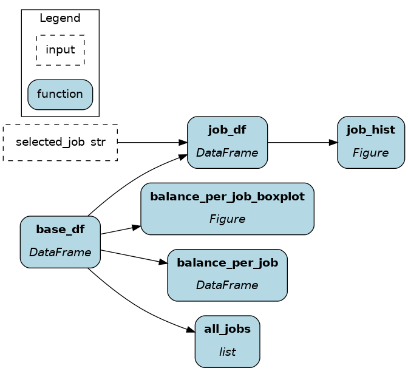

Then, the Streamlit UI is defined in `app.py`. Notice a few things:

- `app.py` doesn’t have to depend on `pandas` and `plotly`.
- `@cache_resource` allows to create the `Driver` only once.
- `@cache_data` on `_execute()` will automatically cache any Apache Hamilton result based on the combination of arguments (`final_vars`, `inputs`, and `overrides`)
- `get_state_inputs()` and `get_state_overrides()` will collect values from user inputs.
- `execute()` parses the inputs and overrides from the state and call `_execute()`.

```
# app.py from typing import Optional from hamilton import driver import streamlit as st import logic # cache to avoid rebuilding the Driver @st.cache_resource def get_hamilton_driver () -> driver.Driver:return (driver.Builder ().with_modules (logic).build ()) # cache results for the set of inputs @st.cache_data def _execute (final_vars:list [str ],inputs:Optional [dict] =None,overrides:Optional [dict] =None,) -> dict:"""Generic utility to cache Apache Hamilton results""" dr =get_hamilton_driver () return dr.execute (final_vars,inputs =inputs,overrides =overrides) def get_state_inputs () -> dict:keys =["selected_job"] return {k:v for k,v in st.session_state.items () if k in keys} def get_state_overrides () -> dict:keys =[] return {k:v for k,v in st.session_state.items () if k in keys} def execute (final_vars:list [str ]):return _execute (final_vars,get_state_inputs (),get_state_overrides ()) def app ():st.title ("Apache Hamilton + Streamlit 🐱🚀") # run the base data that always needs to be displayed data =execute (["all_jobs","balance_per_job","balance_per_job_boxplot" ]) # display the base dataframe and plotly chart st.dataframe (data ["balance_per_job" ]) st.plotly_chart (data ["balance_per_job_boxplot" ]) # get the selection options from `data` # store the selection in the state `selected_job` st.selectbox ("Select a job",options =data ["all_jobs" ],key ="selected_job") # get the value from the dict st.plotly_chart (execute (["job_hist" ])["job_hist" ]) if __name__ =="__main__":app ()
```

<a id="integrations-streamlit--benefits"></a>

### Benefits

- **Clearer scope**: the decoupling between `app.py` and `logic.py` makes it easier to add data transformations or extend UI, and debug errors associated with either.
- **Reusable code**: the module `logic.py` can be reused elsewhere with Apache Hamilton.

  - If you are building a proof-of-concept with Streamlit, your Apache Hamilton module will be able to grow with your project and be useful for your production pipelines.
  - If you are already building dataflows with Apache Hamilton, using it with Streamlit ensures your dashboard metrics have the same implementation with your production pipeline (i.e., prevent [implementation skew](https://building.nubank.com.br/dealing-with-train-serve-skew-in-real-time-ml-models-a-short-guide/))
- **Performance boost**: by caching the Hamilton Driver and its execution call, we are able to effectively cache all data operations in a few lines of code. Furthermore, Apache Hamilton can scale further by using a remote task executor on a separate machine from the Streamlit application.

On this page

- [Streamlit](#integrations-streamlit)
  - [Challenges](#integrations-streamlit--challenges)
    - [1. Hard to read UI and data flows.](#integrations-streamlit--hard-to-read-ui-and-data-flows)
    - [2. Cache and state management](#integrations-streamlit--cache-and-state-management)
  - [Apache Hamilton + Streamlit](#integrations-streamlit--apache-hamilton-streamlit)
    - [Example](#integrations-streamlit--example)
    - [Benefits](#integrations-streamlit--benefits)

---

<a id="integrations-dbt"></a>

<!-- source_url: https://hamilton.incubator.apache.org/integrations/dbt/ -->

<!-- page_index: 56 -->

# dbt ¶

[
<svg viewbox="0 0 24 24" xmlns="http://www.w3.org/2000/svg">
<path></path>
</svg>

Back to top](#integrations-dbt)

[
<svg><use href="#svg-eye"></use></svg>

View this page](https://github.com/apache/hamilton/blob/main/docs/integrations/dbt.rst?plain=true "View this page")

[
<svg><use href="#svg-pencil"></use></svg>

Edit this page](https://github.com/apache/hamilton/edit/main/docs/integrations/dbt.rst "Edit this page")

<svg><use href="#svg-toc"></use></svg>

<a id="integrations-dbt--dbt"></a>

# dbt

If you’re familiar with DBT, you likely noticed that it can fill a similar role to Apache Hamilton. What DBT does for SQL
files (organizing functions, providing lineage capabilities, making testing easier), Apache Hamilton does for python functions.

Many projects span the gap between SQL and python, and Apache Hamilton is a natural next step for an ML workflow after extracting data from DBT.

This example shows how you can use DBT’s [new python capabilities](https://docs.getdbt.com/docs/build/python-models) to integrate a Apache Hamilton dataflow
with a DBT pipeline.

Find the full, working dbt project [here](https://github.com/apache/hamilton/tree/main/examples/dbt).

---

<a id="code-comparisons"></a>

<!-- source_url: https://hamilton.incubator.apache.org/code-comparisons/ -->

<!-- page_index: 57 -->

# Code Comparisons ¶

[
<svg viewbox="0 0 24 24" xmlns="http://www.w3.org/2000/svg">
<path></path>
</svg>

Back to top](#code-comparisons)

[
<svg><use href="#svg-eye"></use></svg>

View this page](https://github.com/apache/hamilton/blob/main/docs/code-comparisons/index.rst?plain=true "View this page")

[
<svg><use href="#svg-pencil"></use></svg>

Edit this page](https://github.com/apache/hamilton/edit/main/docs/code-comparisons/index.rst "Edit this page")

<svg><use href="#svg-toc"></use></svg>

<a id="code-comparisons--code-comparisons"></a>

# Code Comparisons

This section showcases what Apache Hamilton code looks like in comparison to other popular libraries and frameworks.

- [Kedro](#code-comparisons-kedro)
  - [Imperative vs. Declarative](#code-comparisons-kedro--imperative-vs-declarative)
    - [1. Define steps](#code-comparisons-kedro--define-steps)
    - [2. Assemble dataflow](#code-comparisons-kedro--assemble-dataflow)
    - [3. Execute dataflow](#code-comparisons-kedro--execute-dataflow)
  - [Framework weight](#code-comparisons-kedro--framework-weight)
    - [Kedro](#code-comparisons-kedro--id1)
  - [Feature comparison](#code-comparisons-kedro--feature-comparison)
  - [More information](#code-comparisons-kedro--more-information)
- [Dagster](#code-comparisons-dagster)
  - [TL;DR](#code-comparisons-dagster--tl-dr)
  - [Dataflow definition](#code-comparisons-dagster--dataflow-definition)
  - [Dataflow execution](#code-comparisons-dagster--dataflow-execution)
  - [More information](#code-comparisons-dagster--more-information)
- [LangChain](#code-comparisons-langchain)
  - [A simple joke example](#code-comparisons-langchain--a-simple-joke-example)
  - [A streamed joke example](#code-comparisons-langchain--a-streamed-joke-example)
  - [A “batch” parallel joke example](#code-comparisons-langchain--a-batch-parallel-joke-example)
  - [A “async” joke example](#code-comparisons-langchain--a-async-joke-example)
  - [Switch LLM to completion for joke](#code-comparisons-langchain--switch-llm-to-completion-for-joke)
  - [Switch to using Anthropic](#code-comparisons-langchain--switch-to-using-anthropic)
  - [Logging](#code-comparisons-langchain--logging)
  - [Fallbacks](#code-comparisons-langchain--fallbacks)
- [Airflow](#code-comparisons-airflow)
  - [High-level differences:](#code-comparisons-airflow--high-level-differences)
  - [Code examples:](#code-comparisons-airflow--code-examples)
    - [Apache Hamilton:](#code-comparisons-airflow--apache-hamilton)
    - [Airflow:](#code-comparisons-airflow--id1)

---

<a id="code-comparisons-kedro"></a>

<!-- source_url: https://hamilton.incubator.apache.org/code-comparisons/kedro/ -->

<!-- page_index: 58 -->

# Kedro ¶

> [!NOTE]
> > [!NOTE]
> > [Back to top](#code-comparisons-kedro)
> >
> > [View this page](https://github.com/apache/hamilton/blob/main/docs/code-comparisons/kedro.rst?plain=true "View this page")
> >
> > [Edit this page](https://github.com/apache/hamilton/edit/main/docs/code-comparisons/kedro.rst "Edit this page")
> >
> > <a id="code-comparisons-kedro--kedro"></a>

> >
> > # Kedro
> >
> > Both `Kedro` and `Apache Hamilton` are Python tools to help define directed acyclic graph (DAG) of data transformations. While there’s overlap between the two in terms of features, we note two main differences:
> >
> > - `Kedro` is imperative and focuses on tasks; `Apache Hamilton` is declarative and focuses on assets.
> > - `Kedro` is heavier and comes with a project structure, YAML configs, and dataset definition to manage; `Apache Hamilton` is lighter to adopt and you can progressively opt-in features that you find valuable.
> >
> > On this page, we’ll dive into these differences, compare features, and present
> > some code snippets from both tools.
> >
> > > [!NOTE]
> > > **See this GitHub repository to compare a full project using Kedro or Apache Hamilton.**
> > >
> >
> > <a id="code-comparisons-kedro--imperative-vs.-declarative"></a>

> >
> > ## Imperative vs. Declarative
> >
> > There are 3 steps to build and run a dataflow (a DAG, a data pipeline, etc.)
> >
> > 1. Define transformation steps
> > 2. Assemble steps into a dataflow
> > 3. Execute the dataflow to produce data artifacts (tables, ML models, etc.)
> >
> > <a id="code-comparisons-kedro--1.-define-steps"></a>

> >
> > ### 1. Define steps
> >
> > Imperative (`Kedro`) vs. declarative (`Apache Hamilton`) leads to significant differences in **Step 2** and **Step 3** that will shape how you work with the tool. However, **Step 1** remains similar. In fact, both tools use the term **nodes** to refer to steps.
> >
> > <table class="docutils align-left">
> > <thead>
> > <tr><th><p>Kedro (imperative)</p></th>
> > <th><p>Apache Hamilton (declarative)</p></th>
> > </tr>
> > </thead>
> > <tbody>
> > <tr><td><div><div><pre><span></span><span># nodes.py</span>
> > <span>import</span><span> </span><span>pandas</span><span> </span><span>as</span><span> </span><span>pd</span>
> >
> > <span>def</span><span> </span><span>_is_true</span><span>(</span><span>x</span><span>:</span> <span>pd</span><span>.</span><span>Series</span><span>)</span> <span>-&gt;</span> <span>pd</span><span>.</span><span>Series</span><span>:</span>
> >     <span>return</span> <span>x</span> <span>==</span> <span>"t"</span>
> >
> > <span>def</span><span> </span><span>preprocess_companies</span><span>(</span><span>companies</span><span>:</span> <span>pd</span><span>.</span><span>DataFrame</span><span>)</span> <span>-&gt;</span> <span>pd</span><span>.</span><span>DataFrame</span><span>:</span>
> > <span>    </span><span>"""Preprocesses the data for companies."""</span>
> >     <span>companies</span><span>[</span><span>"iata_approved"</span><span>]</span> <span>=</span> <span>_is_true</span><span>(</span><span>companies</span><span>[</span><span>"iata_approved"</span><span>])</span>
> >     <span>return</span> <span>companies</span>
> >
> > <span>def</span><span> </span><span>preprocess_shuttles</span><span>(</span><span>shuttles</span><span>:</span> <span>pd</span><span>.</span><span>DataFrame</span><span>)</span> <span>-&gt;</span> <span>pd</span><span>.</span><span>DataFrame</span><span>:</span>
> > <span>    </span><span>"""Preprocesses the data for shuttles."""</span>
> >     <span>shuttles</span><span>[</span><span>"d_check_complete"</span><span>]</span> <span>=</span> <span>_is_true</span><span>(</span>
> >         <span>shuttles</span><span>[</span><span>"d_check_complete"</span><span>]</span>
> >     <span>)</span>
> >     <span>shuttles</span><span>[</span><span>"moon_clearance_complete"</span><span>]</span> <span>=</span> <span>_is_true</span><span>(</span>
> >         <span>shuttles</span><span>[</span><span>"moon_clearance_complete"</span><span>]</span>
> >     <span>)</span>
> >     <span>return</span> <span>shuttles</span>
> >
> > <span>def</span><span> </span><span>create_model_input_table</span><span>(</span>
> >     <span>shuttles</span><span>:</span> <span>pd</span><span>.</span><span>DataFrame</span><span>,</span> <span>companies</span><span>:</span> <span>pd</span><span>.</span><span>DataFrame</span><span>,</span>
> > <span>)</span> <span>-&gt;</span> <span>pd</span><span>.</span><span>DataFrame</span><span>:</span>
> > <span>    </span><span>"""Combines all data to create a model input table."""</span>
> >     <span>shuttles</span> <span>=</span> <span>shuttles</span><span>.</span><span>drop</span><span>(</span><span>"id"</span><span>,</span> <span>axis</span><span>=</span><span>1</span><span>)</span>
> >     <span>model_input_table</span> <span>=</span> <span>shuttles</span><span>.</span><span>merge</span><span>(</span>
> >         <span>companies</span><span>,</span> <span>left_on</span><span>=</span><span>"company_id"</span><span>,</span> <span>right_on</span><span>=</span><span>"id"</span>
> >     <span>)</span>
> >     <span>model_input_table</span> <span>=</span> <span>model_input_table</span><span>.</span><span>dropna</span><span>()</span>
> >     <span>return</span> <span>model_input_table</span>
> > </pre></div>
> > </div>
> > </td>
> > <td><div><div><pre><span></span><span># dataflow.py</span>
> > <span>import</span><span> </span><span>pandas</span><span> </span><span>as</span><span> </span><span>pd</span>
> >
> > <span>def</span><span> </span><span>_is_true</span><span>(</span><span>x</span><span>:</span> <span>pd</span><span>.</span><span>Series</span><span>)</span> <span>-&gt;</span> <span>pd</span><span>.</span><span>Series</span><span>:</span>
> >     <span>return</span> <span>x</span> <span>==</span> <span>"t"</span>
> >
> > <span>def</span><span> </span><span>companies_preprocessed</span><span>(</span><span>companies</span><span>:</span> <span>pd</span><span>.</span><span>DataFrame</span><span>)</span> <span>-&gt;</span> <span>pd</span><span>.</span><span>DataFrame</span><span>:</span>
> > <span>    </span><span>"""Companies with added column `iata_approved`"""</span>
> >     <span>companies</span><span>[</span><span>"iata_approved"</span><span>]</span> <span>=</span> <span>_is_true</span><span>(</span><span>companies</span><span>[</span><span>"iata_approved"</span><span>])</span>
> >     <span>return</span> <span>companies</span>
> >
> > <span>def</span><span> </span><span>shuttles_preprocessed</span><span>(</span><span>shuttles</span><span>:</span> <span>pd</span><span>.</span><span>DataFrame</span><span>)</span> <span>-&gt;</span> <span>pd</span><span>.</span><span>DataFrame</span><span>:</span>
> > <span>    </span><span>"""Shuttles with added columns `d_check_complete`</span>
> > <span>    and `moon_clearance_complete`."""</span>
> >     <span>shuttles</span><span>[</span><span>"d_check_complete"</span><span>]</span> <span>=</span> <span>_is_true</span><span>(</span>
> >         <span>shuttles</span><span>[</span><span>"d_check_complete"</span><span>]</span>
> >     <span>)</span>
> >     <span>shuttles</span><span>[</span><span>"moon_clearance_complete"</span><span>]</span> <span>=</span> <span>_is_true</span><span>(</span>
> >         <span>shuttles</span><span>[</span><span>"moon_clearance_complete"</span><span>]</span>
> >     <span>)</span>
> >     <span>return</span> <span>shuttles</span>
> >
> > <span>def</span><span> </span><span>model_input_table</span><span>(</span>
> >     <span>shuttles_preprocessed</span><span>:</span> <span>pd</span><span>.</span><span>DataFrame</span><span>,</span>
> >     <span>companies_preprocessed</span><span>:</span> <span>pd</span><span>.</span><span>DataFrame</span><span>,</span>
> > <span>)</span> <span>-&gt;</span> <span>pd</span><span>.</span><span>DataFrame</span><span>:</span>
> > <span>    </span><span>"""Table containing shuttles and companies data."""</span>
> >     <span>shuttles_preprocessed</span> <span>=</span> <span>shuttles_preprocessed</span><span>.</span><span>drop</span><span>(</span><span>"id"</span><span>,</span> <span>axis</span><span>=</span><span>1</span><span>)</span>
> >     <span>model_input_table</span> <span>=</span> <span>shuttles_preprocessed</span><span>.</span><span>merge</span><span>(</span>
> >         <span>companies_preprocessed</span><span>,</span> <span>left_on</span><span>=</span><span>"company_id"</span><span>,</span> <span>right_on</span><span>=</span><span>"id"</span>
> >     <span>)</span>
> >     <span>model_input_table</span> <span>=</span> <span>model_input_table</span><span>.</span><span>dropna</span><span>()</span>
> >     <span>return</span> <span>model_input_table</span>
> > </pre></div>
> > </div>
> > </td>
> > </tr>
> > </tbody>
> > </table>
> >
> > The function implementations are exactly the same. Yet, notice that the function names and docstrings were edited slightly. Imperative approaches like `Kedro` typically refer to steps as *tasks* and prefer verbs to describe “the action of the function”. Meanwhile, declarative approaches such as `Apache Hamilton` describe steps as *assets* and use nouns to refer to “the value returned by the function”. This might appear superficial, but it relates to the difference in **Step 2** and **Step 3**.
> >
> > <a id="code-comparisons-kedro--2.-assemble-dataflow"></a>

> >
> > ### 2. Assemble dataflow
> >
> > With `Kedro`, you need to take your functions from **Step 1** and create `node` objects, specifying the node’s name, inputs, and outputs. Then, you create a `pipeline` from a set of `nodes` and `Kedro` assembles the nodes into a DAG. Imperative approaches need to specify how tasks (Kedro nodes) relate to each other.
> >
> > With `Apache Hamilton`, you pass the module containing all functions from **Step 1** and let Apache Hamilton create the `nodes` and the `dataflow`. This is possible because in declarative approaches like Apache Hamilton, each function defines a transform **and** its dependencies on other functions. Notice how in **Step 1**, `model_input_table()` has parameters `shuttles_preprocessed` and `companies_preprocessed`, which refers to other functions in the module. This contains all the required information to build the DAG.
> >
> > <table class="docutils align-left">
> > <thead>
> > <tr><th><p>Kedro (imperative)</p></th>
> > <th><p>Apache Hamilton (declarative)</p></th>
> > </tr>
> > </thead>
> > <tbody>
> > <tr><td><div><div><pre><span></span><span># pipeline.py</span>
> > <span>from</span><span> </span><span>kedro.pipeline</span><span> </span><span>import</span> <span>Pipeline</span><span>,</span> <span>node</span><span>,</span> <span>pipeline</span>
> > <span>from</span><span> </span><span>nodes</span><span> </span><span>import</span> <span>(</span>
> >     <span>create_model_input_table</span><span>,</span>
> >     <span>preprocess_companies</span><span>,</span>
> >     <span>preprocess_shuttles</span>
> > <span>)</span>
> >
> > <span>def</span><span> </span><span>create_pipeline</span><span>(</span><span>**</span><span>kwargs</span><span>)</span> <span>-&gt;</span> <span>Pipeline</span><span>:</span>
> >     <span>return</span> <span>pipeline</span><span>(</span>
> >         <span>[</span>
> >             <span>node</span><span>(</span>
> >                 <span>func</span><span>=</span><span>preprocess_companies</span><span>,</span>
> >                 <span>inputs</span><span>=</span><span>"companies"</span><span>,</span>
> >                 <span>outputs</span><span>=</span><span>"preprocessed_companies"</span><span>,</span>
> >                 <span>name</span><span>=</span><span>"preprocess_companies_node"</span><span>,</span>
> >             <span>),</span>
> >             <span>node</span><span>(</span>
> >                 <span>func</span><span>=</span><span>preprocess_shuttles</span><span>,</span>
> >                 <span>inputs</span><span>=</span><span>"shuttles"</span><span>,</span>
> >                 <span>outputs</span><span>=</span><span>"preprocessed_shuttles"</span><span>,</span>
> >                 <span>name</span><span>=</span><span>"preprocess_shuttles_node"</span><span>,</span>
> >             <span>),</span>
> >             <span>node</span><span>(</span>
> >                 <span>func</span><span>=</span><span>create_model_input_table</span><span>,</span>
> >                 <span>inputs</span><span>=</span><span>[</span>
> >                     <span>"preprocessed_shuttles"</span><span>,</span>
> >                     <span>"preprocessed_companies"</span>
> >                 <span>],</span>
> >                 <span>outputs</span><span>=</span><span>"model_input_table"</span><span>,</span>
> >                 <span>name</span><span>=</span><span>"create_model_input_table_node"</span><span>,</span>
> >             <span>),</span>
> >         <span>]</span>
> >     <span>)</span>
> > </pre></div>
> > </div>
> > </td>
> > <td><div><div><pre><span></span><span># run.py</span>
> > <span>from</span><span> </span><span>hamilton</span><span> </span><span>import</span> <span>driver</span>
> > <span>import</span><span> </span><span>dataflow</span>  <span># module containing node definitions</span>
> >
> > <span># pass the module to the `Builder` to create a `Driver`</span>
> > <span>dr</span> <span>=</span> <span>driver</span><span>.</span><span>Builder</span><span>()</span><span>.</span><span>with_modules</span><span>(</span><span>dataflow</span><span>)</span><span>.</span><span>build</span><span>()</span>
> > </pre></div>
> > </div>
> > </td>
> > </tr>
> > </tbody>
> > </table>
> >
> > **Benefits of adopting a declarative approach**
> >
> > - Less errors since you skip manual node creation (i.e., strings **will** lead to typos).
> > - Handle complexity since assembling a dataflow remains the same for 10 or 1000 nodes.
> > - Maintainability improves since editing your functions (**Step 1**) modifies the structure of your DAG, removing the pipeline definition as a failure point.
> > - Readability improves because you can understand how functions relate to each other without jumping between files.
> >
> > These benefits of `Apache Hamilton` encourage developers to write smaller functions that are easier to debug and maintain, leading to major code quality gains. On the opposite, the burden of `node` and `pipeline` creation as projects grow in size lead to users stuffing more and more logic in a single node, making it increasingly harder to maintain.
> >
> > <a id="code-comparisons-kedro--3.-execute-dataflow"></a>

> >
> > ### 3. Execute dataflow
> >
> > The primary way to execute `Kedro` pipelines is to use the command line tool with `kedro run --pipeline=my_pipeline`. Pipelines are typically designed for all nodes to be executed while reading data and writing results while going through nodes. It is closer to macro-orchestration frameworks like Airflow in spirit.
> >
> > On the opposite, `Apache Hamilton` dataflows are primarily meant to be executed programmatically (i.e., via Python code) and return results in-memory. This makes it easy to use `Apache Hamilton` within a [FastAPI service](#integrations-fastapi) service or to power an LLM application.
> >
> > For comparable side-by-side code, we can dig into `Kedro` and use the `SequentialRunner` programmatically. To return pipeline results in-memory we would need to hack further with `kedro.io.MemoryDataset`.
> >
> > > [!NOTE]
> > > **Apache Hamilton also has rich support for I/O operations (see Feature comparison below)**
> > >
> >
> > <table class="docutils align-left">
> > <thead>
> > <tr><th><p>Kedro (imperative)</p></th>
> > <th><p>Apache Hamilton (declarative)</p></th>
> > </tr>
> > </thead>
> > <tbody>
> > <tr><td><div><div><pre><span></span><span># run.py</span>
> > <span>from</span><span> </span><span>kedro.runner</span><span> </span><span>import</span> <span>SequentialRunner</span>
> > <span>from</span><span> </span><span>kedro.framework.session</span><span> </span><span>import</span> <span>KedroSession</span>
> > <span>from</span><span> </span><span>kedro.framework.startup</span><span> </span><span>import</span> <span>bootstrap_project</span>
> > <span>from</span><span> </span><span>pipeline</span><span> </span><span>import</span> <span>create_pipeline</span>
> > <span># ^ from Step 2</span>
> >
> > <span>bootstrap_project</span><span>(</span><span>"."</span><span>)</span>
> > <span>with</span> <span>KedroSession</span><span>.</span><span>create</span><span>()</span> <span>as</span> <span>session</span><span>:</span>
> >     <span>context</span> <span>=</span> <span>session</span><span>.</span><span>load_context</span><span>()</span>
> >     <span>catalog</span> <span>=</span> <span>context</span><span>.</span><span>catalog</span>
> >
> > <span>pipeline</span> <span>=</span> <span>create_pipeline</span><span>()</span><span>.</span><span>to_nodes</span><span>(</span><span>"create_model_input_table"</span><span>)</span>
> > <span>SequentialRunner</span><span>()</span><span>.</span><span>run</span><span>(</span><span>pipeline</span><span>,</span> <span>catalog</span><span>)</span>
> > <span># doesn't return values in-memory</span>
> > </pre></div>
> > </div>
> > </td>
> > <td><div><div><pre><span></span><span># run.py</span>
> > <span>import</span><span> </span><span>pandas</span><span> </span><span>as</span><span> </span><span>pd</span>
> > <span>from</span><span> </span><span>hamilton</span><span> </span><span>import</span> <span>driver</span>
> > <span>import</span><span> </span><span>dataflow</span>
> >
> > <span>dr</span> <span>=</span> <span>driver</span><span>.</span><span>Builder</span><span>()</span><span>.</span><span>with_modules</span><span>(</span><span>dataflow</span><span>)</span><span>.</span><span>build</span><span>()</span>
> > <span># ^ from Step 2</span>
> > <span>inputs</span> <span>=</span> <span>dict</span><span>(</span>
> >     <span>companies</span><span>=</span><span>pd</span><span>.</span><span>read_parquet</span><span>(</span><span>"path/to/companies.parquet"</span><span>),</span>
> >     <span>shuttles</span><span>=</span><span>pd</span><span>.</span><span>read_parquet</span><span>(</span><span>"path/to/shuttles.parquet"</span><span>),</span>
> > <span>)</span>
> > <span>results</span> <span>=</span> <span>dr</span><span>.</span><span>execute</span><span>([</span><span>"model_input_table"</span><span>],</span> <span>inputs</span><span>=</span><span>inputs</span><span>)</span>
> > <span># results is a dict {"model_input_table": VALUE}</span>
> > </pre></div>
> > </div>
> > </td>
> > </tr>
> > </tbody>
> > </table>
> >
> > An imperative pipeline like `Kedro` is a series of step, just like a recipe. The user can specify “from nodes” or “to nodes” to *slice* the pipeline and not have to execute it in full.
> >
> > For declarative dataflows like `Apache Hamilton` you request assets / nodes by name and the tool will determine the required nodes to execute (here `"model_input_table"`) avoiding wasteful compute.
> >
> > The simple Python interface provided by `Apache Hamilton` allows you to potentially define and execute your dataflow from a single file, which is great to kickstart an analysis or project. Just use `python dataflow.py` to execute it!
> >
> > ```
> > # dataflow.py import pandas as pd def _is_true (x:pd.Series) -> pd.Series:return x =="t" def preprocess_companies (companies:pd.DataFrame) -> pd.DataFrame:"""Preprocesses the data for companies.""" companies ["iata_approved"] =_is_true (companies ["iata_approved" ]) return companies def preprocess_shuttles (shuttles:pd.DataFrame) -> pd.DataFrame:"""Preprocesses the data for shuttles.""" shuttles ["d_check_complete"] =_is_true (shuttles ["d_check_complete"]) shuttles ["moon_clearance_complete"] =_is_true (shuttles ["moon_clearance_complete"]) return shuttles def create_model_input_table (shuttles:pd.DataFrame,companies:pd.DataFrame,) -> pd.DataFrame:"""Combines all data to create a model input table.""" shuttles =shuttles.drop ("id",axis =1) model_input_table =shuttles.merge (companies,left_on ="company_id",right_on ="id") model_input_table =model_input_table.dropna () return model_input_table if __name__ =="__main__":from hamilton import driver import dataflow # import itself as a module dr =driver.Builder ().with_modules (dataflow).build () inputs =dict (companies =pd.read_parquet ("path/to/companies.parquet" ),shuttles =pd.read_parquet ("path/to/shuttles.parquet" ),) results =dr.execute (["model_input_table" ],inputs =inputs)
> > ```
> >
> > <a id="code-comparisons-kedro--framework-weight"></a>

> >
> > ## Framework weight
> >
> > After imperative vs. declarative, the next largest difference is the type of user experience they provide. `Kedro` is a more opiniated and heavier framework; `Apache Hamilton` is on the opposite end of the spectrum and tries to be the lightest library possible. This changes the learning curve, adoption, and how each tool will integrate with your stack.
> >
> > <a id="code-comparisons-kedro--kedro-2"></a>

> >
> > ### Kedro
> >
> > `Kedro` is opiniated and provides clear guardrails on how to do things. To begin using it, you’ll need to learn to:
> >
> > - Define nodes and register pipelines
> > - Register datasets using the data catalog construct
> > - Pass parameters to data runs
> > - Configure environment variables and credentials
> > - Navigate the project structure
> >
> > This provides guidance when building your first data pipeline, but it’s also a lot to take in at once. As you’ll see in the [project comparison on GitHub](https://github.com/apache/hamilton/tree/main/examples/kedro), `Kedro` involves more files making it harder to navigate. Also, it’s reliant on YAML which is [generally seen as an unreliable format](https://noyaml.com/). If you have an existing data stack or favorite library, it might clash with `Kedro`’s way of thing (e.g., you have credentials management tool; you prefer [Hydra](https://hydra.cc/) for configs).
> >
> > Apache Hamilton
> > w~~~~~~~~~~~~~~~
> >
> > `Apache Hamilton` attempts to get you started quickly. In fact, this page pretty much covered what you need to know:
> >
> > - Define nodes and a dataflow using regular Python functions (no need to even import `hamilton`!)
> > - Build a `Driver` with your dataflow module and call `.execute()` to get results
> >
> > `Apache Hamilton` allows you to start light and opt-in features as your project’s requirements evolve (data validation, scaling compute, testing, etc.). Python is a powerful language with rich editor support and tooling hence why it advocates for “everything in Python” instead of external configs in YAML or JSON. For example, parameters, data assets, and configurations can very much live as dataclasses within a `.py` file. `Apache Hamilton` was built with an extensive plugin system. There are many extensions, some contributed by users, to adapt Apache Hamilton to your project, and it’s easy for you to extend yourself for further customization.
> >
> > In fact, `Apache Hamilton` is so lightweight, you could even run it inside `Kedro`!
> >
> > <a id="code-comparisons-kedro--feature-comparison"></a>

> >
> > ## Feature comparison
> >
> > | Trait | Kedro | Apache Hamilton |
> > | --- | --- | --- |
> > | Focuses on | Tasks (imperative) | Assets (declarative) |
> > | Code structure | Opiniated. Makes assumptions about pipeline creation & registration and configuration. | Unopiniated. |
> > | In-memory execution | Execute using a [KedroSession](https://docs.kedro.org/en/stable/kedro_project_setup/session.html), but returning values in-memory is hacky. | Default |
> > | I/O execution | [Datasets and Data Catalog](https://docs.kedro.org/en/stable/data/data_catalog.html) | [Data Savers & Loaders](https://hamilton.apache.org/concepts/materialization/) |
> > | Expressive DAG definition | ⛔ | [Function modifiers](https://hamilton.apache.org/concepts/function-modifiers/) |
> > | Column-level transformations | ⛔ | ✅ |
> > | LLM applications | ⛔ Limited by in-memory execution and return values. | ✅ declarative API in-memory makes it easy ([RAG app](https://github.com/apache/hamilton/tree/main/examples/LLM_Workflows/retrieval_augmented_generation)). |
> > | Static DAG visualizations | Need `Kedro Viz` installed to export static visualizations. | Visualize entire dataflow, execution path, query what’s upstream, etc. directly in a notebook or output to a file (`.png`, `.svg`, etc.). Single dependency is `graphviz`. |
> > | Interactive DAG viewer | [Kedro Viz](https://github.com/kedro-org/kedro-viz) | [Apache Hamilton UI](https://github.com/apache/hamilton/tree/main/ui) |
> > | Data validation | [Community Pandera plugin](https://github.com/Galileo-Galilei/kedro-pandera/releases) | [Native and Pandera plugin](https://hamilton.apache.org/how-tos/run-data-quality-checks/) |
> > | Executors | [Sequential, multiprocessing, multi-threading](https://docs.kedro.org/en/stable/nodes_and_pipelines/run_a_pipeline.html) | Sequential, async, multiprocessing, multi-threading |
> > | Executor extension | [Spark integration](https://docs.kedro.org/en/stable/integrations/pyspark_integration.html) | [PySpark](https://blog.dagworks.io/p/expressing-pyspark-transformations), Dask, Ray, Modal |
> > | Dynamic branching | ⛔ | [Parallelizable/Collect](https://hamilton.apache.org/concepts/parallel-task/) for easy parallelization. |
> > | Command line tool (CLI) | ✅ | ✅ |
> > | Node and pipeline testing | ✅ | ✅ |
> > | Jupyter notebook extensions | ✅ | ✅ |
> >
> > Both `Kedro` and `Apache Hamilton` provide applications to view dataflows/pipelines and interact with their results. Here, `Kedro` provides a lighter webserver and UI, while `Apache Hamilton` offers a production-ready containerized application.
> >
> > | Trait | Kedro Viz | Apache Hamilton UI |
> > | --- | --- | --- |
> > | Interactive dataflow viewer | ✅ | ✅ |
> > | View code definition of nodes | ✅ | ✅ |
> > | Code versioning | Git SHA (may be out of sync with actual code) | Node-level versioning at runtime |
> > | Collapsible view | ✅ | ✅ |
> > | Tag nodes | ✅ | ✅ |
> > | Execution observability | ⛔ | ✅ |
> > | Artifact lineage and versioning | ⛔ | ✅ |
> > | Column-level lineage | ⛔ | ✅ |
> > | Compare run results | ✅ | ✅ |
> > | Rich artifact view | Preview 5 dataframe rows. Metadata about artifact (column count, row count, size). | Automatic statistical profiling of various dataframe libraries. |
> >
> > <a id="code-comparisons-kedro--more-information"></a>

> >
> > ## More information
> >
> > For a full side-by-side example of Kedro and Apache Hamilton, visit [this GitHub repository](https://github.com/apache/hamilton/tree/main/examples/kedro)
> >
> > For more questions, join our [Slack Channel](https://join.slack.com/t/hamilton-opensource/shared_invite/zt-2niepkra8-DGKGf_tTYhXuJWBTXtIs4g)

On this page

- [Kedro](#code-comparisons-kedro)
  - [Imperative vs. Declarative](#code-comparisons-kedro--imperative-vs-declarative)
    - [1. Define steps](#code-comparisons-kedro--define-steps)
    - [2. Assemble dataflow](#code-comparisons-kedro--assemble-dataflow)
    - [3. Execute dataflow](#code-comparisons-kedro--execute-dataflow)
  - [Framework weight](#code-comparisons-kedro--framework-weight)
    - [Kedro](#code-comparisons-kedro--id1)
  - [Feature comparison](#code-comparisons-kedro--feature-comparison)
  - [More information](#code-comparisons-kedro--more-information)

---

<a id="code-comparisons-dagster"></a>

<!-- source_url: https://hamilton.incubator.apache.org/code-comparisons/dagster/ -->

<!-- page_index: 59 -->

# Dagster ¶

[
<svg viewbox="0 0 24 24" xmlns="http://www.w3.org/2000/svg">
<path></path>
</svg>

Back to top](#code-comparisons-dagster)

[
<svg><use href="#svg-eye"></use></svg>

View this page](https://github.com/apache/hamilton/blob/main/docs/code-comparisons/dagster.rst?plain=true "View this page")

[
<svg><use href="#svg-pencil"></use></svg>

Edit this page](https://github.com/apache/hamilton/edit/main/docs/code-comparisons/dagster.rst "Edit this page")

<svg><use href="#svg-toc"></use></svg>

<a id="code-comparisons-dagster--dagster"></a>

# Dagster

Here are some code snippets to compare the macro orchestrator Dagster to the micro orchestrator Apache Hamilton. Apache Hamilton can run inside Dagster, but you wouldn’t run Dagster inside Apache Hamilton.

While the two have different scope, there’s a lot of overlap between the two both in terms of functionality and API. Indeed, Dagster’s software-defined assets introduced in 2022 matches Apache Hamilton’s declarative approach and should feel familiar to users of either.

<a id="code-comparisons-dagster--tl-dr"></a>

## TL;DR

| Trait | Apache Hamilton | Dagster |
| --- | --- | --- |
| Declarative API | ✅ | ✅ |
| Dependencies | Lightweight library with minimal dependencies (`numpy`, `pandas`, `typing_inspect`). Minimizes dependency conflicts. | Heavier framework/system with several dependencies (`pydantic`, `sqlalchemy`, `requests`, `Jinja2`, `protobuf`). `urllib3` on which depends `requests` introduced breaking changes several times and `pydantic` v1 and v2 are incompatible. |
| Macro orchestration | DIY or in tandem with Dagster, Airflow, Prefect, Metaflow, etc. | Includes: manual, schedules, sensors, conditional execution |
| Micro orchestration (i.e., `dbt`, `LangChain`) | Can run anywhere (locally, notebook, macro orchestrator, [FastAPI](https://hamilton.apache.org/integrations/fastapi/), [Streamlit](https://hamilton.apache.org/integrations/streamlit/), pyodide, etc.) | ❌ |
| Code structure | Since it’s micro, there are no restrictions. | Since it’s macro, a certain code structure is required to properly package code. The prevalent use of relative imports in the tutorial reduces code reusability. |
| LLM applications | Well-suited for [LLM applications](https://blog.dagworks.io/p/retrieval-augmented-generation-reference-arch) since it’s a micro orchestration framework. | ❌ |
| Lineage | Fine-grained / column-level lineage. Includes [utilities to explore lineage](https://hamilton.apache.org/how-tos/use-hamilton-for-lineage/). | Coarser operations to reduce orchestration and I/O overhead. |
| Visualization | [View the dataflow and produce visual artifacts](https://hamilton.apache.org/concepts/visualization/). Configurable and supports extensive custom styling. | Export Daster UI in `.svg`. No styling. |
| Run tracking | [DAGWorks](https://docs.dagworks.io/capabilities) (premium) | Dagster UI |
| Experiment Managers | Has an [experiment manager plugin](https://blog.dagworks.io/p/building-a-lightweight-experiment) | ❌ |
| Materializers | [Data Savers & Loaders](https://hamilton.apache.org/concepts/materialization/) | [IO Managers](https://docs.dagster.io/_apidocs/io-managers) |
| Data validation | [Native validators and pandera plugin](https://hamilton.apache.org/how-tos/run-data-quality-checks/) | [Asset checks](https://docs.dagster.io/_apidocs/asset-checks) (experimental), [pandera integration](https://docs.dagster.io/integrations/pandera) |
| Versioning operations | Nodes and dataflow versions are derived from code. | [Asset code version](https://docs.dagster.io/concepts/assets/software-defined-assets#asset-code-versions) is specified manually. |
| Versioning data | Automated code version + data value are used to read from cache or compute new results with [DiskCacheAdapter](https://docs.dagster.io/concepts/assets/software-defined-assets#asset-code-versions) | Manual asset code version + upstream changes are used to [trigger re-materialization](https://docs.dagster.io/concepts/assets/software-defined-assets#asset-code-versions) |
| In-memory Execution | Default | [Materialize in-memory](https://docs.dagster.io/_apidocs/io-managers) |
| Task-based Execution | [TaskBasedExecutor](https://hamilton.apache.org/reference/drivers/Driver/#taskbasedgraphexecutor) | Default |
| Dynamic branching | [Parallelizable/Collect](https://hamilton.apache.org/concepts/parallel-task/) | [Mapping/Collect](https://docs.dagster.io/_apidocs/dynamic) |
| Hooks | [Lifecycle hooks](https://hamilton.apache.org/reference/lifecycle-hooks/) (easier to extend) | [Op Hooks](https://docs.dagster.io/concepts/ops-jobs-graphs/op-hooks#op-hooks) |
| Plugins | [Spark](https://blog.dagworks.io/p/expressing-pyspark-transformations), Dask, Ray, [Datadog](https://hamilton.apache.org/reference/lifecycle-hooks/DDOGTracer/), polars, pandera, and more (Apache Hamilton is less restrictive and easier to extend) | [Spark, Dask, polars, pandera, Databricks, Snowflake, Great Expections, and more](https://docs.dagster.io/integrations) (Dagster integrations are more involved to develop) |
| Interactive Development | [Jupyter Magic](https://hamilton.apache.org/how-tos/use-in-jupyter-notebook/#use-hamilton-jupyter-magic), [VSCode extension](https://marketplace.visualstudio.com/items?itemName=ThierryJean.hamilton) | ❌ |

<a id="code-comparisons-dagster--dataflow-definition"></a>

## Dataflow definition

<table class="docutils align-left" id="id1">
<caption><span>HackerNews top stories</span></caption>
<thead>
<tr><th><p>Apache Hamilton</p></th>
<th><p>Dagster</p></th>
</tr>
</thead>
<tbody>
<tr><td><div><div><pre><span></span><span>from</span><span> </span><span>hamilton.function_modifiers</span><span> </span><span>import</span> <span>extract_columns</span>

<span>NEWSTORIES_URL</span> <span>=</span> <span>"https://hacker-news.firebaseio.com/v0/topstories.json"</span>

<span>def</span><span> </span><span>topstory_ids</span><span>(</span><span>newstories_url</span><span>:</span> <span>str</span> <span>=</span> <span>NEWSTORIES_URL</span><span>)</span> <span>-&gt;</span> <span>list</span><span>[</span><span>int</span><span>]:</span>
<span>    </span><span>"""Query the id of the top HackerNews stories"""</span>
    <span>return</span> <span>requests</span><span>.</span><span>get</span><span>(</span><span>newstories_url</span><span>)</span><span>.</span><span>json</span><span>()[:</span><span>100</span><span>]</span>

<span>@extract_columns</span><span>(</span><span>"title"</span><span>)</span>
<span>def</span><span> </span><span>topstories</span><span>(</span><span>topstory_ids</span><span>:</span> <span>list</span><span>[</span><span>int</span><span>])</span> <span>-&gt;</span> <span>pd</span><span>.</span><span>DataFrame</span><span>:</span>
<span>    </span><span>"""Query the top HackerNews stories based on ids"""</span>
    <span>results</span> <span>=</span> <span>[]</span>
    <span>for</span> <span>item_id</span> <span>in</span> <span>topstory_ids</span><span>:</span>
        <span>item</span> <span>=</span> <span>requests</span><span>.</span><span>get</span><span>(</span>
            <span>f</span><span>"https://hacker-news.firebaseio.com/v0/item/</span><span>{</span><span>item_id</span><span>}</span><span>.json"</span>
        <span>)</span><span>.</span><span>json</span><span>()</span>
        <span>results</span><span>.</span><span>append</span><span>(</span><span>item</span><span>)</span>
    <span>return</span> <span>pd</span><span>.</span><span>DataFrame</span><span>(</span><span>results</span><span>)</span>

<span>def</span><span> </span><span>most_frequent_words</span><span>(</span><span>title</span><span>:</span> <span>pd</span><span>.</span><span>Series</span><span>)</span> <span>-&gt;</span> <span>dict</span><span>[</span><span>str</span><span>,</span> <span>int</span><span>]:</span>
<span>    </span><span>"""Compute word frequency in HackerNews story titles"""</span>
    <span>STOPWORDS</span> <span>=</span> <span>[</span><span>"a"</span><span>,</span> <span>"the"</span><span>,</span> <span>"an"</span><span>,</span> <span>"of"</span><span>,</span> <span>"to"</span><span>,</span> <span>"in"</span><span>,</span>
                 <span>"for"</span><span>,</span> <span>"and"</span><span>,</span> <span>"with"</span><span>,</span> <span>"on"</span><span>,</span> <span>"is"</span><span>,</span> <span>"</span><span>\u2013</span><span>"</span><span>]</span>
    <span>word_counts</span> <span>=</span> <span>{}</span>
    <span>for</span> <span>raw_title</span> <span>in</span> <span>title</span><span>:</span>
        <span>for</span> <span>word</span> <span>in</span> <span>raw_title</span><span>.</span><span>lower</span><span>()</span><span>.</span><span>split</span><span>():</span>
            <span>word</span> <span>=</span> <span>word</span><span>.</span><span>strip</span><span>(</span><span>".,-!?:;()[]'</span><span>\"</span><span>-"</span><span>)</span>
            <span>if</span> <span>len</span><span>(</span><span>word</span><span>)</span> <span>==</span> <span>0</span><span>:</span>
                <span>continue</span>

            <span>if</span> <span>word</span> <span>in</span> <span>STOPWORDS</span><span>:</span>
                <span>continue</span>

            <span>word_counts</span><span>[</span><span>word</span><span>]</span> <span>=</span> <span>word_counts</span><span>.</span><span>get</span><span>(</span><span>word</span><span>,</span> <span>0</span><span>)</span> <span>+</span> <span>1</span>
    <span>return</span> <span>word_counts</span>

<span>def</span><span> </span><span>top_25_words_plot</span><span>(</span><span>most_frequent_words</span><span>:</span> <span>dict</span><span>[</span><span>str</span><span>,</span> <span>int</span><span>])</span> <span>-&gt;</span> <span>Figure</span><span>:</span>
<span>    </span><span>"""Bar plot of the frequency of the top 25 words in HackerNews titles"""</span>
    <span>top_words</span> <span>=</span> <span>{</span>
        <span>pair</span><span>[</span><span>0</span><span>]:</span> <span>pair</span><span>[</span><span>1</span><span>]</span>
        <span>for</span> <span>pair</span> <span>in</span> <span>sorted</span><span>(</span>
            <span>most_frequent_words</span><span>.</span><span>items</span><span>(),</span> <span>key</span><span>=</span><span>lambda</span> <span>x</span><span>:</span> <span>x</span><span>[</span><span>1</span><span>],</span> <span>reverse</span><span>=</span><span>True</span>
        <span>)[:</span><span>25</span><span>]</span>
    <span>}</span>

    <span>fig</span> <span>=</span> <span>plt</span><span>.</span><span>figure</span><span>(</span><span>figsize</span><span>=</span><span>(</span><span>10</span><span>,</span> <span>6</span><span>))</span>
    <span>plt</span><span>.</span><span>bar</span><span>(</span><span>list</span><span>(</span><span>top_words</span><span>.</span><span>keys</span><span>()),</span> <span>list</span><span>(</span><span>top_words</span><span>.</span><span>values</span><span>()))</span>
    <span>plt</span><span>.</span><span>xticks</span><span>(</span><span>rotation</span><span>=</span><span>45</span><span>,</span> <span>ha</span><span>=</span><span>"right"</span><span>)</span>
    <span>plt</span><span>.</span><span>title</span><span>(</span><span>"Top 25 Words in Hacker News Titles"</span><span>)</span>
    <span>plt</span><span>.</span><span>tight_layout</span><span>()</span>
    <span>return</span> <span>fig</span>

<span>@extract_columns</span><span>(</span><span>"registered_at"</span><span>)</span>
<span>def</span><span> </span><span>signups</span><span>(</span><span>hackernews_api</span><span>:</span> <span>DataGeneratorResource</span><span>)</span> <span>-&gt;</span> <span>pd</span><span>.</span><span>DataFrame</span><span>:</span>
<span>    </span><span>"""Query HackerNews signups using a mock API endpoint"""</span>
    <span>return</span> <span>pd</span><span>.</span><span>DataFrame</span><span>(</span><span>hackernews_api</span><span>.</span><span>get_signups</span><span>())</span>

<span>def</span><span> </span><span>earliest_signup</span><span>(</span><span>registered_at</span><span>:</span> <span>pd</span><span>.</span><span>Series</span><span>)</span> <span>-&gt;</span> <span>int</span><span>:</span>
<span>    </span><span>"""Earliest signup on HackerNews"""</span>
    <span>return</span> <span>registered_at</span><span>.</span><span>min</span><span>()</span>

<span>def</span><span> </span><span>latest_signup</span><span>(</span><span>registered_at</span><span>:</span> <span>pd</span><span>.</span><span>Series</span><span>)</span> <span>-&gt;</span> <span>int</span><span>:</span>
<span>    </span><span>"""Latest signup on HackerNews"""</span>
    <span>return</span> <span>registered_at</span><span>.</span><span>min</span><span>()</span>
</pre></div>
</div>
</td>
<td><div><div><pre><span></span><span>from</span><span> </span><span>dagster</span><span> </span><span>import</span> <span>AssetExecutionContext</span><span>,</span> <span>MetadataValue</span><span>,</span> <span>asset</span><span>,</span> <span>MaterializeResult</span>

<span>@asset</span>
<span>def</span><span> </span><span>topstory_ids</span><span>()</span> <span>-&gt;</span> <span>None</span><span>:</span>
    <span>newstories_url</span> <span>=</span> <span>"https://hacker-news.firebaseio.com/v0/topstories.json"</span>
    <span>top_new_story_ids</span> <span>=</span> <span>requests</span><span>.</span><span>get</span><span>(</span><span>newstories_url</span><span>)</span><span>.</span><span>json</span><span>()[:</span><span>100</span><span>]</span>

    <span>os</span><span>.</span><span>makedirs</span><span>(</span><span>"data"</span><span>,</span> <span>exist_ok</span><span>=</span><span>True</span><span>)</span>
    <span>with</span> <span>open</span><span>(</span><span>"data/topstory_ids.json"</span><span>,</span> <span>"w"</span><span>)</span> <span>as</span> <span>f</span><span>:</span>
        <span>json</span><span>.</span><span>dump</span><span>(</span><span>top_new_story_ids</span><span>,</span> <span>f</span><span>)</span>

<span>@asset</span><span>(</span><span>deps</span><span>=</span><span>[</span><span>topstory_ids</span><span>])</span>
<span>def</span><span> </span><span>topstories</span><span>(</span><span>context</span><span>:</span> <span>AssetExecutionContext</span><span>)</span> <span>-&gt;</span> <span>MaterializeResult</span><span>:</span>
    <span>with</span> <span>open</span><span>(</span><span>"data/topstory_ids.json"</span><span>,</span> <span>"r"</span><span>)</span> <span>as</span> <span>f</span><span>:</span>
        <span>topstory_ids</span> <span>=</span> <span>json</span><span>.</span><span>load</span><span>(</span><span>f</span><span>)</span>

    <span>results</span> <span>=</span> <span>[]</span>
    <span>for</span> <span>item_id</span> <span>in</span> <span>topstory_ids</span><span>:</span>
        <span>item</span> <span>=</span> <span>requests</span><span>.</span><span>get</span><span>(</span>
            <span>f</span><span>"https://hacker-news.firebaseio.com/v0/item/</span><span>{</span><span>item_id</span><span>}</span><span>.json"</span>
        <span>)</span><span>.</span><span>json</span><span>()</span>
        <span>results</span><span>.</span><span>append</span><span>(</span><span>item</span><span>)</span>

        <span>if</span> <span>len</span><span>(</span><span>results</span><span>)</span> <span>%</span> <span>20</span> <span>==</span> <span>0</span><span>:</span>
            <span>context</span><span>.</span><span>log</span><span>.</span><span>info</span><span>(</span><span>f</span><span>"Got </span><span>{</span><span>len</span><span>(</span><span>results</span><span>)</span><span>}</span><span> items so far."</span><span>)</span>

    <span>df</span> <span>=</span> <span>pd</span><span>.</span><span>DataFrame</span><span>(</span><span>results</span><span>)</span>
    <span>df</span><span>.</span><span>to_csv</span><span>(</span><span>"data/topstories.csv"</span><span>)</span>

    <span>return</span> <span>MaterializeResult</span><span>(</span>
        <span>metadata</span><span>=</span><span>{</span>
            <span>"num_records"</span><span>:</span> <span>len</span><span>(</span><span>df</span><span>),</span>
            <span>"preview"</span><span>:</span> <span>MetadataValue</span><span>.</span><span>md</span><span>(</span><span>df</span><span>.</span><span>head</span><span>()</span><span>.</span><span>to_markdown</span><span>()),</span>
        <span>}</span>
    <span>)</span>

<span>@asset</span><span>(</span><span>deps</span><span>=</span><span>[</span><span>topstories</span><span>])</span>
<span>def</span><span> </span><span>most_frequent_words</span><span>()</span> <span>-&gt;</span> <span>MaterializeResult</span><span>:</span>
    <span>stopwords</span> <span>=</span> <span>[</span><span>"a"</span><span>,</span> <span>"the"</span><span>,</span> <span>"an"</span><span>,</span> <span>"of"</span><span>,</span> <span>"to"</span><span>,</span> <span>"in"</span><span>,</span>
                 <span>"for"</span><span>,</span> <span>"and"</span><span>,</span> <span>"with"</span><span>,</span> <span>"on"</span><span>,</span> <span>"is"</span><span>]</span>
    <span>topstories</span> <span>=</span> <span>pd</span><span>.</span><span>read_csv</span><span>(</span><span>"data/topstories.csv"</span><span>)</span>

    <span>word_counts</span> <span>=</span> <span>{}</span>
    <span>for</span> <span>raw_title</span> <span>in</span> <span>topstories</span><span>[</span><span>"title"</span><span>]:</span>
        <span>title</span> <span>=</span> <span>raw_title</span><span>.</span><span>lower</span><span>()</span>
        <span>for</span> <span>word</span> <span>in</span> <span>title</span><span>.</span><span>split</span><span>():</span>
            <span>word</span> <span>=</span> <span>word</span><span>.</span><span>strip</span><span>(</span><span>".,-!?:;()[]'</span><span>\"</span><span>-"</span><span>)</span>
            <span>if</span> <span>cleaned_word</span> <span>in</span> <span>stopwords</span> <span>or</span> <span>len</span><span>(</span><span>cleaned_word</span><span>)</span> <span>&lt;</span> <span>0</span><span>:</span>
                <span>continue</span>

            <span>word_counts</span><span>[</span><span>cleaned_word</span><span>]</span> <span>=</span> <span>word_counts</span><span>.</span><span>get</span><span>(</span><span>word</span><span>,</span> <span>0</span><span>)</span> <span>+</span> <span>1</span>

    <span>top_words</span> <span>=</span> <span>{</span>
        <span>pair</span><span>[</span><span>0</span><span>]:</span> <span>pair</span><span>[</span><span>1</span><span>]</span>
        <span>for</span> <span>pair</span> <span>in</span> <span>sorted</span><span>(</span>
            <span>word_counts</span><span>.</span><span>items</span><span>(),</span> <span>key</span><span>=</span><span>lambda</span> <span>x</span><span>:</span> <span>x</span><span>[</span><span>1</span><span>],</span> <span>reverse</span><span>=</span><span>True</span>
        <span>)[:</span><span>25</span><span>]</span>
    <span>}</span>

    <span>plt</span><span>.</span><span>figure</span><span>(</span><span>figsize</span><span>=</span><span>(</span><span>10</span><span>,</span> <span>6</span><span>))</span>
    <span>plt</span><span>.</span><span>bar</span><span>(</span><span>list</span><span>(</span><span>top_words</span><span>.</span><span>keys</span><span>()),</span> <span>list</span><span>(</span><span>top_words</span><span>.</span><span>values</span><span>()))</span>
    <span>plt</span><span>.</span><span>xticks</span><span>(</span><span>rotation</span><span>=</span><span>45</span><span>,</span> <span>ha</span><span>=</span><span>"right"</span><span>)</span>
    <span>plt</span><span>.</span><span>title</span><span>(</span><span>"Top 25 Words in Hacker News Titles"</span><span>)</span>
    <span>plt</span><span>.</span><span>tight_layout</span><span>()</span>

    <span>buffer</span> <span>=</span> <span>BytesIO</span><span>()</span>
    <span>plt</span><span>.</span><span>savefig</span><span>(</span><span>buffer</span><span>,</span> <span>format</span><span>=</span><span>"png"</span><span>)</span>
    <span>image_data</span> <span>=</span> <span>base64</span><span>.</span><span>b64encode</span><span>(</span><span>buffer</span><span>.</span><span>getvalue</span><span>())</span>

    <span>md_content</span> <span>=</span> <span>f</span><span>"</span><span>}</span><span>)"</span>

    <span>with</span> <span>open</span><span>(</span><span>"data/most_frequent_words.json"</span><span>,</span> <span>"w"</span><span>)</span> <span>as</span> <span>f</span><span>:</span>
        <span>json</span><span>.</span><span>dump</span><span>(</span><span>top_words</span><span>,</span> <span>f</span><span>)</span>

    <span>return</span> <span>MaterializeResult</span><span>(</span>
        <span>metadata</span><span>=</span><span>{</span><span>"plot"</span><span>:</span> <span>MetadataValue</span><span>.</span><span>md</span><span>(</span><span>md_content</span><span>)}</span>
    <span>)</span>

<span>@asset</span>
<span>def</span><span> </span><span>signups</span><span>(</span><span>hackernews_api</span><span>:</span> <span>DataGeneratorResource</span><span>)</span> <span>-&gt;</span> <span>MaterializeResult</span><span>:</span>
    <span>signups</span> <span>=</span> <span>pd</span><span>.</span><span>DataFrame</span><span>(</span><span>hackernews_api</span><span>.</span><span>get_signups</span><span>())</span>

    <span>signups</span><span>.</span><span>to_csv</span><span>(</span><span>"data/signups.csv"</span><span>)</span>

    <span>return</span> <span>MaterializeResult</span><span>(</span>
        <span>metadata</span><span>=</span><span>{</span>
            <span>"Record Count"</span><span>:</span> <span>len</span><span>(</span><span>signups</span><span>),</span>
            <span>"Preview"</span><span>:</span> <span>MetadataValue</span><span>.</span><span>md</span><span>(</span><span>signups</span><span>.</span><span>head</span><span>()</span><span>.</span><span>to_markdown</span><span>()),</span>
            <span>"Earliest Signup"</span><span>:</span> <span>signups</span><span>[</span><span>"registered_at"</span><span>]</span><span>.</span><span>min</span><span>(),</span>
            <span>"Latest Signup"</span><span>:</span> <span>signups</span><span>[</span><span>"registered_at"</span><span>]</span><span>.</span><span>max</span><span>(),</span>
        <span>}</span>
    <span>)</span>
</pre></div>
</div>
</td>
</tr>
<tr><td>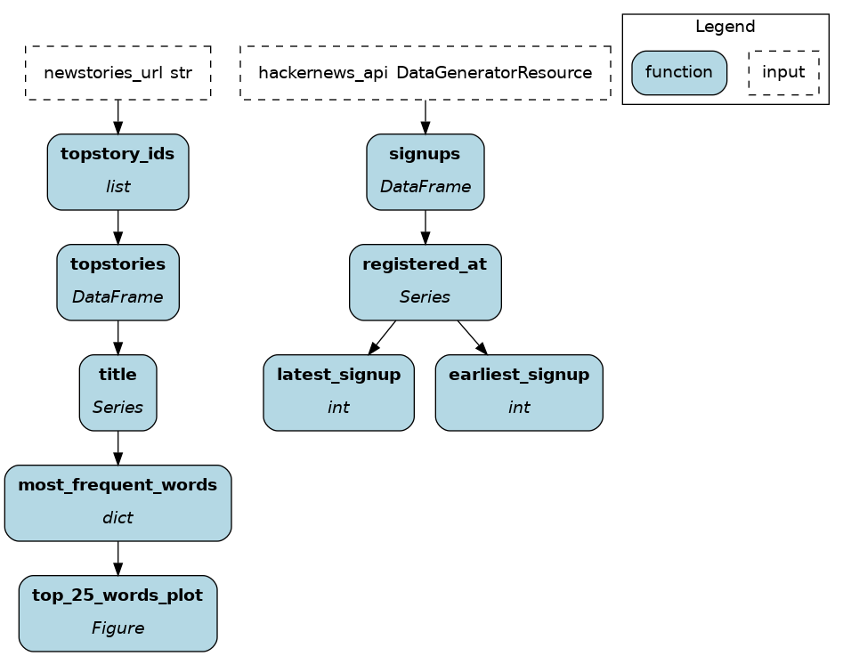
</td>
<td>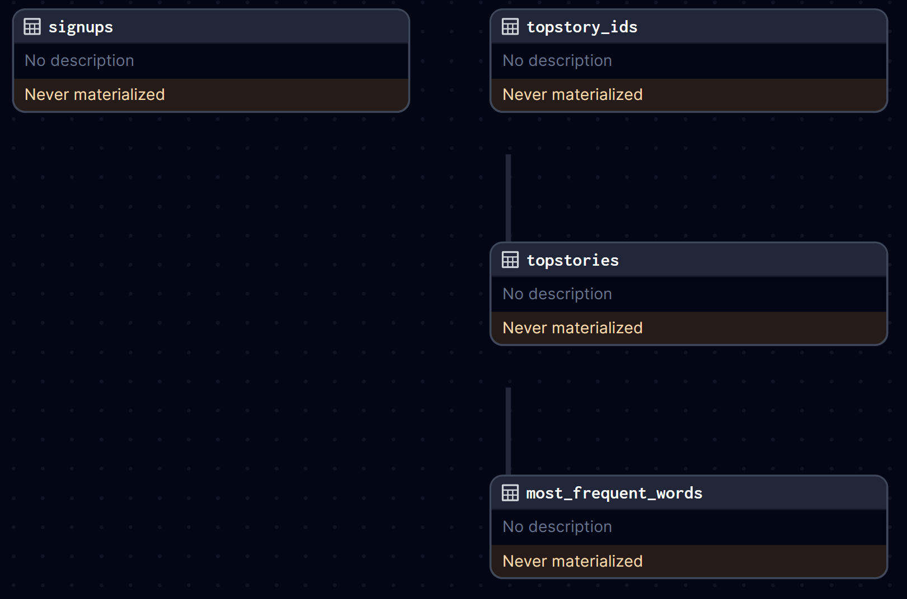
</td>
</tr>
</tbody>
</table>

| Trait | Apache Hamilton | Dagster |
| --- | --- | --- |
| Define operations | Uses the native Python function signature. The dataflow is assembled based on function/parameter names and type annotations. | Uses the `@asset` decorator to transform function in operations and specify dependencies by passing functions. |
| Data I/O | Loading/Saving is decoupled from the dataflow definition. The code becomes [more portable and facilitates moving from dev to prod](https://blog.dagworks.io/p/separate-data-io-from-transformation). | Each asset code operations is coupled with I/O. Hard-coding this behavior reduces maintainability. |
| Lineage | Favors granular operations and fine-grained lineage. For example, `most_frequent_words()` operates on a single column and the `top_25_words_plot` is its own function. | Favors chunking dataflow into meaningful assets to reduce the orchestration and I/O overhead per operation. Finer lineage is complex to achieve and requires using `@op`, `@graph`, `@job`, and `@asset` ([ref](https://docs.dagster.io/guides/dagster/how-assets-relate-to-ops-and-graphs)) |
| Documentation | Uses the native Python docstrings. Further metadata can be added using the `@tag` decorator. | Uses `MaterializeResult` to store metadata. |

<a id="code-comparisons-dagster--dataflow-execution"></a>

## Dataflow execution

<table class="docutils align-left" id="id3">
<caption><span>HackerNews top stories</span></caption>
<thead>
<tr><th><p>Apache Hamilton</p></th>
<th><p>Dagster</p></th>
</tr>
</thead>
<tbody>
<tr><td><div><div><pre><span></span><span>import</span><span> </span><span>os</span>

<span>from</span><span> </span><span>hamilton</span><span> </span><span>import</span> <span>driver</span>
<span>from</span><span> </span><span>hamilton.io.materialization</span><span> </span><span>import</span> <span>to</span>
<span>from</span><span> </span><span>hamilton.plugins</span><span> </span><span>import</span> <span>matplotlib_extensions</span>

<span>import</span><span> </span><span>dataflow</span>  <span># import module with dataflow definition</span>
<span>from</span><span> </span><span>mock_api</span><span> </span><span>import</span> <span>DataGeneratorResource</span>

<span>def</span><span> </span><span>main</span><span>():</span>
    <span>dr</span> <span>=</span> <span>(</span>
        <span>driver</span><span>.</span><span>Builder</span><span>()</span>
        <span>.</span><span>with_modules</span><span>(</span><span>dataflow</span><span>)</span>  <span># pass the module</span>
        <span>.</span><span>build</span><span>()</span>
    <span>)</span>

    <span># load environment variable</span>
    <span>num_days</span> <span>=</span> <span>os</span><span>.</span><span>environ</span><span>.</span><span>get</span><span>(</span><span>"HACKERNEWS_NUM_DAYS_WINDOW"</span><span>)</span>
    <span>inputs</span> <span>=</span> <span>dict</span><span>(</span> <span># mock an API connection</span>
        <span>hackernews_api</span><span>=</span><span>DataGeneratorResource</span><span>(</span><span>num_days</span><span>=</span><span>num_days</span><span>),</span>
    <span>)</span>

    <span># define I/O operations; decoupled from dataflow def</span>
    <span>materializers</span> <span>=</span> <span>[</span>
        <span>to</span><span>.</span><span>json</span><span>(</span>  <span># JSON file type</span>
            <span>id</span><span>=</span><span>"most_frequent_words.json"</span><span>,</span>
            <span>dependencies</span><span>=</span><span>[</span><span>"most_frequent_words"</span><span>],</span>
            <span>path</span><span>=</span><span>"data/most_frequent_words.json"</span><span>,</span>
        <span>),</span>
        <span>to</span><span>.</span><span>csv</span><span>(</span>  <span># CSV file type</span>
            <span>id</span><span>=</span><span>"topstories.csv"</span><span>,</span>
            <span>dependencies</span><span>=</span><span>[</span><span>"topstories"</span><span>],</span>
            <span>path</span><span>=</span><span>"data/topstories.csv"</span><span>,</span>
        <span>),</span>
        <span>to</span><span>.</span><span>csv</span><span>(</span>
            <span>id</span><span>=</span><span>"signups.csv"</span><span>,</span>
            <span>dependencies</span><span>=</span><span>[</span><span>"signups"</span><span>],</span>
            <span>path</span><span>=</span><span>"data/signups.csv"</span><span>,</span>
        <span>),</span>
        <span>to</span><span>.</span><span>plt</span><span>(</span>  <span># Use matplotlib.pyplot to render</span>
            <span>id</span><span>=</span><span>"top_25_words_plot.plt"</span><span>,</span>
            <span>dependencies</span><span>=</span><span>[</span><span>"top_25_words_plot"</span><span>],</span>
            <span>path</span><span>=</span><span>"data/top_25_words_plot.png"</span><span>,</span>
        <span>),</span>
    <span>]</span>

    <span># visualize materialization plan without executing code</span>
    <span>dr</span><span>.</span><span>visualize_materialization</span><span>(</span>
        <span>*</span><span>materializers</span><span>,</span>
        <span>inputs</span><span>=</span><span>inputs</span><span>,</span>
        <span>output_file_path</span><span>=</span><span>"dataflow.png"</span>
    <span>)</span>
    <span># pass I/O operations and inputs to materialize dataflow</span>
    <span>dr</span><span>.</span><span>materialize</span><span>(</span><span>*</span><span>materializers</span><span>,</span> <span>inputs</span><span>=</span><span>inputs</span><span>)</span>

<span>if</span> <span>__name__</span> <span>==</span> <span>"__main__"</span><span>:</span>
    <span>main</span><span>()</span>

</pre></div>
</div>
</td>
<td><div><div><pre><span></span><span>from</span><span> </span><span>dagster</span><span> </span><span>import</span> <span>(</span>
    <span>AssetSelection</span><span>,</span>
    <span>Definitions</span><span>,</span>
    <span>define_asset_job</span><span>,</span>
    <span>load_assets_from_modules</span><span>,</span>
    <span>EnvVar</span><span>,</span>
<span>)</span>

<span>from</span><span> </span><span>.</span><span> </span><span>import</span> <span>assets</span>
<span>from</span><span> </span><span>.resources</span><span> </span><span>import</span> <span>DataGeneratorResource</span>

<span># load assets from passed modules</span>
<span>all_assets</span> <span>=</span> <span>load_assets_from_modules</span><span>([</span><span>assets</span><span>])</span>
<span># select assets to include in the job</span>
<span>hackernews_job</span> <span>=</span> <span>define_asset_job</span><span>(</span><span>"hackernews_job"</span><span>,</span> <span>selection</span><span>=</span><span>AssetSelection</span><span>.</span><span>all</span><span>())</span>

<span># load environment variable</span>
<span>num_days</span> <span>=</span> <span>EnvVar</span><span>.</span><span>int</span><span>(</span><span>"HACKERNEWS_NUM_DAYS_WINDOW"</span><span>)</span>
<span>defs</span> <span>=</span> <span>Definitions</span><span>(</span>
    <span>assets</span><span>=</span><span>all_assets</span><span>,</span>
    <span>jobs</span><span>=</span><span>[</span><span>hackernews_job</span><span>],</span>
    <span>resources</span><span>=</span><span>{</span>  <span># register mock API connection</span>
        <span>"hackernews_api"</span><span>:</span> <span>DataGeneratorResource</span><span>(</span><span>num_days</span><span>=</span><span>num_days</span><span>),</span>
    <span>},</span>
<span>)</span>
</pre></div>
</div>
</td>
</tr>
</tbody>
</table>

| Trait | Apache Hamilton | Dagster |
| --- | --- | --- |
| Execution instructions | Define a `Driver` using the `Builder` object. It automatically assembles the graph from the dataflow definition found in `dataflow.py` | Load assets from Python modules using `load_assets_from_modules` then create an asset job by selecting assets to include. Finally, create a `Definitions` object to register on the orchestrator. |
| Execution plane | `Driver.materialize()` executes the dataflow in a Python process. Can be called as a script, [using the CLI](https://blog.dagworks.io/p/a-command-line-tool-to-improve-your), or programmatically. | The [asset job is executed by the orchestrator](https://docs.dagster.io/concepts/assets/asset-jobs), either through Dagster UI, by a scheduler/sensor/trigger, or via the CLI. |
| Data I/O | I/O is decoupled from dataflow definition. People responsible for deployment can manage data sources without refactoring the dataflow. (Data I/O can be coupled if wanted.) | Data I/O is coupled with data assets which simplifies the execution code at the code of reusability. |
| Framework code | Leverages a maximum of standard Python mechanisms (imports, env variables, etc.). | Most constructs requires Dagster-specific code to leverage protobuf serialization. |

<a id="code-comparisons-dagster--more-information"></a>

## More information

For a full side-by-side example of Dagster and Apache Hamilton, visit [this GitHub repository](https://github.com/apache/hamilton/tree/main/examples/dagster)

For more questions, join our [Slack Channel](https://join.slack.com/t/hamilton-opensource/shared_invite/zt-2niepkra8-DGKGf_tTYhXuJWBTXtIs4g)!

On this page

- [Dagster](#code-comparisons-dagster)
  - [TL;DR](#code-comparisons-dagster--tl-dr)
  - [Dataflow definition](#code-comparisons-dagster--dataflow-definition)
  - [Dataflow execution](#code-comparisons-dagster--dataflow-execution)
  - [More information](#code-comparisons-dagster--more-information)

---

<a id="code-comparisons-langchain"></a>

<!-- source_url: https://hamilton.incubator.apache.org/code-comparisons/langchain/ -->

<!-- page_index: 60 -->

# LangChain ¶

[
<svg viewbox="0 0 24 24" xmlns="http://www.w3.org/2000/svg">
<path></path>
</svg>

Back to top](#code-comparisons-langchain)

[
<svg><use href="#svg-eye"></use></svg>

View this page](https://github.com/apache/hamilton/blob/main/docs/code-comparisons/langchain.rst?plain=true "View this page")

[
<svg><use href="#svg-pencil"></use></svg>

Edit this page](https://github.com/apache/hamilton/edit/main/docs/code-comparisons/langchain.rst "Edit this page")

<svg><use href="#svg-toc"></use></svg>

<a id="code-comparisons-langchain--langchain"></a>

# LangChain

Here we have some code snippets that help compare a vanilla code implementation
with LangChain and Apache Hamilton.

LangChain’s focus is on hiding details and making code terse.

Apache Hamilton’s focus instead is on making code more readable, maintainable, and importantly customizeable.

So don’t be surprised that Apache Hamilton’s code is “longer” - that’s by design. There is
also little abstraction between you, and the underlying libraries with Apache Hamilton.
With LangChain they’re abstracted away, so you can’t really see easily what’s going on
underneath.

*Rhetorical question*: which code would you rather maintain, change, and update?

<a id="code-comparisons-langchain--a-simple-joke-example"></a>

## A simple joke example

<table class="docutils align-left" id="id1">
<caption><span>Simple Invocation</span></caption>
<thead>
<tr><th><p>Apache Hamilton</p></th>
<th><p>Vanilla</p></th>
<th><p>LangChain</p></th>
</tr>
</thead>
<tbody>
<tr><td><div><div><pre><span></span><span># hamilton_invoke.py</span>
<span>from</span><span> </span><span>typing</span><span> </span><span>import</span> <span>List</span>

<span>import</span><span> </span><span>openai</span>

<span>def</span><span> </span><span>llm_client</span><span>()</span> <span>-&gt;</span> <span>openai</span><span>.</span><span>OpenAI</span><span>:</span>
    <span>return</span> <span>openai</span><span>.</span><span>OpenAI</span><span>()</span>

<span>def</span><span> </span><span>joke_prompt</span><span>(</span><span>topic</span><span>:</span> <span>str</span><span>)</span> <span>-&gt;</span> <span>str</span><span>:</span>
    <span>return</span> <span>f</span><span>"Tell me a short joke about </span><span>{</span><span>topic</span><span>}</span><span>"</span>

<span>def</span><span> </span><span>joke_messages</span><span>(</span><span>joke_prompt</span><span>:</span> <span>str</span><span>)</span> <span>-&gt;</span> <span>List</span><span>[</span><span>dict</span><span>]:</span>
    <span>return</span> <span>[{</span><span>"role"</span><span>:</span> <span>"user"</span><span>,</span> <span>"content"</span><span>:</span> <span>joke_prompt</span><span>}]</span>

<span>def</span><span> </span><span>joke_response</span><span>(</span><span>llm_client</span><span>:</span> <span>openai</span><span>.</span><span>OpenAI</span><span>,</span>
                  <span>joke_messages</span><span>:</span> <span>List</span><span>[</span><span>dict</span><span>])</span> <span>-&gt;</span> <span>str</span><span>:</span>
    <span>response</span> <span>=</span> <span>llm_client</span><span>.</span><span>chat</span><span>.</span><span>completions</span><span>.</span><span>create</span><span>(</span>
        <span>model</span><span>=</span><span>"gpt-3.5-turbo"</span><span>,</span>
        <span>messages</span><span>=</span><span>joke_messages</span><span>,</span>
    <span>)</span>
    <span>return</span> <span>response</span><span>.</span><span>choices</span><span>[</span><span>0</span><span>]</span><span>.</span><span>message</span><span>.</span><span>content</span>

<span>if</span> <span>__name__</span> <span>==</span> <span>"__main__"</span><span>:</span>
    <span>import</span><span> </span><span>hamilton_invoke</span>

    <span>from</span><span> </span><span>hamilton</span><span> </span><span>import</span> <span>driver</span>

    <span>dr</span> <span>=</span> <span>(</span>
        <span>driver</span><span>.</span><span>Builder</span><span>()</span>
        <span>.</span><span>with_modules</span><span>(</span><span>hamilton_invoke</span><span>)</span>
        <span>.</span><span>build</span><span>()</span>
    <span>)</span>
    <span>dr</span><span>.</span><span>display_all_functions</span><span>(</span><span>"hamilton-invoke.png"</span><span>)</span>
    <span>print</span><span>(</span><span>dr</span><span>.</span><span>execute</span><span>([</span><span>"joke_response"</span><span>],</span>
                     <span>inputs</span><span>=</span><span>{</span><span>"topic"</span><span>:</span> <span>"ice cream"</span><span>}))</span>
</pre></div>
</div>
</td>
<td><div><div><pre><span></span><span>from</span><span> </span><span>typing</span><span> </span><span>import</span> <span>List</span>

<span>import</span><span> </span><span>openai</span>

<span>prompt_template</span> <span>=</span> <span>"Tell me a short joke about </span><span>{topic}</span><span>"</span>
<span>client</span> <span>=</span> <span>openai</span><span>.</span><span>OpenAI</span><span>()</span>

<span>def</span><span> </span><span>call_chat_model</span><span>(</span><span>messages</span><span>:</span> <span>List</span><span>[</span><span>dict</span><span>])</span> <span>-&gt;</span> <span>str</span><span>:</span>
    <span>response</span> <span>=</span> <span>client</span><span>.</span><span>chat</span><span>.</span><span>completions</span><span>.</span><span>create</span><span>(</span>
        <span>model</span><span>=</span><span>"gpt-3.5-turbo"</span><span>,</span>
        <span>messages</span><span>=</span><span>messages</span><span>,</span>
    <span>)</span>
    <span>return</span> <span>response</span><span>.</span><span>choices</span><span>[</span><span>0</span><span>]</span><span>.</span><span>message</span><span>.</span><span>content</span>

<span>def</span><span> </span><span>invoke_chain</span><span>(</span><span>topic</span><span>:</span> <span>str</span><span>)</span> <span>-&gt;</span> <span>str</span><span>:</span>
    <span>prompt_value</span> <span>=</span> <span>prompt_template</span><span>.</span><span>format</span><span>(</span><span>topic</span><span>=</span><span>topic</span><span>)</span>
    <span>messages</span> <span>=</span> <span>[{</span><span>"role"</span><span>:</span> <span>"user"</span><span>,</span> <span>"content"</span><span>:</span> <span>prompt_value</span><span>}]</span>
    <span>return</span> <span>call_chat_model</span><span>(</span><span>messages</span><span>)</span>

<span>if</span> <span>__name__</span> <span>==</span> <span>"__main__"</span><span>:</span>
    <span>print</span><span>(</span><span>invoke_chain</span><span>(</span><span>"ice cream"</span><span>))</span>
</pre></div>
</div>
</td>
<td><div><div><pre><span></span><span>from</span><span> </span><span>langchain_core.output_parsers</span><span> </span><span>import</span> <span>StrOutputParser</span>
<span>from</span><span> </span><span>langchain_core.prompts</span><span> </span><span>import</span> <span>ChatPromptTemplate</span>
<span>from</span><span> </span><span>langchain_core.runnables</span><span> </span><span>import</span> <span>RunnablePassthrough</span>
<span>from</span><span> </span><span>langchain_openai</span><span> </span><span>import</span> <span>ChatOpenAI</span>

<span>prompt</span> <span>=</span> <span>ChatPromptTemplate</span><span>.</span><span>from_template</span><span>(</span>
    <span>"Tell me a short joke about </span><span>{topic}</span><span>"</span><span>)</span>
<span>output_parser</span> <span>=</span> <span>StrOutputParser</span><span>()</span>
<span>model</span> <span>=</span> <span>ChatOpenAI</span><span>(</span><span>model</span><span>=</span><span>"gpt-3.5-turbo"</span><span>)</span>
<span>chain</span> <span>=</span> <span>(</span>
    <span>{</span><span>"topic"</span><span>:</span> <span>RunnablePassthrough</span><span>()}</span>
    <span>|</span> <span>prompt</span>
    <span>|</span> <span>model</span>
    <span>|</span> <span>output_parser</span>
<span>)</span>
<span>if</span> <span>__name__</span> <span>==</span> <span>"__main__"</span><span>:</span>
    <span>print</span><span>(</span><span>chain</span><span>.</span><span>invoke</span><span>(</span><span>"ice cream"</span><span>))</span>
</pre></div>
</div>
</td>
</tr>
</tbody>
</table>

[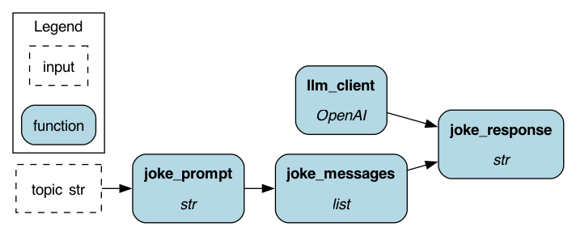](assets/images/hamilton-invoke_e086d9938a2f0c32.png)

The Hamilton DAG visualized.

<a id="code-comparisons-langchain--a-streamed-joke-example"></a>

## A streamed joke example

With Apache Hamilton we can just swap the call function to return a streamed response.
Note: you could use @config.when to include both streamed and non-streamed versions in the same DAG.

<table class="docutils align-left" id="id3">
<caption><span>Streamed Version</span></caption>
<thead>
<tr><th><p>Apache Hamilton</p></th>
<th><p>Vanilla</p></th>
<th><p>LangChain</p></th>
</tr>
</thead>
<tbody>
<tr><td><div><div><pre><span></span><span># hamilton_streamed.py</span>
<span>from</span><span> </span><span>typing</span><span> </span><span>import</span> <span>Iterator</span><span>,</span> <span>List</span>

<span>import</span><span> </span><span>openai</span>

<span>def</span><span> </span><span>llm_client</span><span>()</span> <span>-&gt;</span> <span>openai</span><span>.</span><span>OpenAI</span><span>:</span>
    <span>return</span> <span>openai</span><span>.</span><span>OpenAI</span><span>()</span>

<span>def</span><span> </span><span>joke_prompt</span><span>(</span><span>topic</span><span>:</span> <span>str</span><span>)</span> <span>-&gt;</span> <span>str</span><span>:</span>
    <span>return</span> <span>(</span>
        <span>f</span><span>"Tell me a short joke about </span><span>{</span><span>topic</span><span>}</span><span>"</span>
    <span>)</span>

<span>def</span><span> </span><span>joke_messages</span><span>(</span>
        <span>joke_prompt</span><span>:</span> <span>str</span><span>)</span> <span>-&gt;</span> <span>List</span><span>[</span><span>dict</span><span>]:</span>
    <span>return</span> <span>[{</span><span>"role"</span><span>:</span> <span>"user"</span><span>,</span>
             <span>"content"</span><span>:</span> <span>joke_prompt</span><span>}]</span>

<span>def</span><span> </span><span>joke_response</span><span>(</span>
        <span>llm_client</span><span>:</span> <span>openai</span><span>.</span><span>OpenAI</span><span>,</span>
        <span>joke_messages</span><span>:</span> <span>List</span><span>[</span><span>dict</span><span>])</span> <span>-&gt;</span> <span>Iterator</span><span>[</span><span>str</span><span>]:</span>
    <span>stream</span> <span>=</span> <span>llm_client</span><span>.</span><span>chat</span><span>.</span><span>completions</span><span>.</span><span>create</span><span>(</span>
        <span>model</span><span>=</span><span>"gpt-3.5-turbo"</span><span>,</span>
        <span>messages</span><span>=</span><span>joke_messages</span><span>,</span>
        <span>stream</span><span>=</span><span>True</span>
    <span>)</span>
    <span>for</span> <span>response</span> <span>in</span> <span>stream</span><span>:</span>
        <span>content</span> <span>=</span> <span>response</span><span>.</span><span>choices</span><span>[</span><span>0</span><span>]</span><span>.</span><span>delta</span><span>.</span><span>content</span>
        <span>if</span> <span>content</span> <span>is</span> <span>not</span> <span>None</span><span>:</span>
            <span>yield</span> <span>content</span>

<span>if</span> <span>__name__</span> <span>==</span> <span>"__main__"</span><span>:</span>
    <span>import</span><span> </span><span>hamilton_streaming</span>
    <span>from</span><span> </span><span>hamilton</span><span> </span><span>import</span> <span>driver</span>

    <span>dr</span> <span>=</span> <span>(</span>
        <span>driver</span><span>.</span><span>Builder</span><span>()</span>
        <span>.</span><span>with_modules</span><span>(</span><span>hamilton_streaming</span><span>)</span>
        <span>.</span><span>build</span><span>()</span>
    <span>)</span>
    <span>dr</span><span>.</span><span>display_all_functions</span><span>(</span>
        <span>"hamilton-streaming.png"</span>
    <span>)</span>
    <span>result</span> <span>=</span> <span>dr</span><span>.</span><span>execute</span><span>(</span>
        <span>[</span><span>"joke_response"</span><span>],</span>
        <span>inputs</span><span>=</span><span>{</span><span>"topic"</span><span>:</span> <span>"ice cream"</span><span>}</span>
    <span>)</span>
    <span>for</span> <span>chunk</span> <span>in</span> <span>result</span><span>[</span><span>"joke_response"</span><span>]:</span>
        <span>print</span><span>(</span><span>chunk</span><span>,</span> <span>end</span><span>=</span><span>""</span><span>,</span> <span>flush</span><span>=</span><span>True</span><span>)</span>
</pre></div>
</div>
</td>
<td><div><div><pre><span></span><span>from</span><span> </span><span>typing</span><span> </span><span>import</span> <span>List</span>
<span>from</span><span> </span><span>typing</span><span> </span><span>import</span> <span>Iterator</span>

<span>import</span><span> </span><span>openai</span>

<span>prompt_template</span> <span>=</span> <span>"Tell me a short joke about </span><span>{topic}</span><span>"</span>
<span>client</span> <span>=</span> <span>openai</span><span>.</span><span>OpenAI</span><span>()</span>

<span>def</span><span> </span><span>stream_chat_model</span><span>(</span>
        <span>messages</span><span>:</span> <span>List</span><span>[</span><span>dict</span><span>])</span> <span>-&gt;</span> <span>Iterator</span><span>[</span><span>str</span><span>]:</span>
    <span>stream</span> <span>=</span> <span>client</span><span>.</span><span>chat</span><span>.</span><span>completions</span><span>.</span><span>create</span><span>(</span>
        <span>model</span><span>=</span><span>"gpt-3.5-turbo"</span><span>,</span>
        <span>messages</span><span>=</span><span>messages</span><span>,</span>
        <span>stream</span><span>=</span><span>True</span><span>,</span>
    <span>)</span>
    <span>for</span> <span>response</span> <span>in</span> <span>stream</span><span>:</span>
        <span>content</span> <span>=</span> <span>response</span><span>.</span><span>choices</span><span>[</span><span>0</span><span>]</span><span>.</span><span>delta</span><span>.</span><span>content</span>
        <span>if</span> <span>content</span> <span>is</span> <span>not</span> <span>None</span><span>:</span>
            <span>yield</span> <span>content</span>

<span>def</span><span> </span><span>stream_chain</span><span>(</span><span>topic</span><span>:</span> <span>str</span><span>)</span> <span>-&gt;</span> <span>Iterator</span><span>[</span><span>str</span><span>]:</span>
    <span>prompt_value</span> <span>=</span> <span>prompt_template</span><span>.</span><span>format</span><span>(</span><span>topic</span><span>=</span><span>topic</span><span>)</span>
    <span>return</span> <span>stream_chat_model</span><span>(</span>
        <span>[{</span><span>"role"</span><span>:</span> <span>"user"</span><span>,</span> <span>"content"</span><span>:</span> <span>prompt_value</span><span>}])</span>

<span>if</span> <span>__name__</span> <span>==</span> <span>"__main__"</span><span>:</span>
    <span>for</span> <span>chunk</span> <span>in</span> <span>stream_chain</span><span>(</span><span>"ice cream"</span><span>):</span>
        <span>print</span><span>(</span><span>chunk</span><span>,</span> <span>end</span><span>=</span><span>""</span><span>,</span> <span>flush</span><span>=</span><span>True</span><span>)</span>
</pre></div>
</div>
</td>
<td><div><div><pre><span></span><span>from</span><span> </span><span>langchain_openai</span><span> </span><span>import</span> <span>ChatOpenAI</span>
<span>from</span><span> </span><span>langchain_core.prompts</span><span> </span><span>import</span> <span>ChatPromptTemplate</span>
<span>from</span><span> </span><span>langchain_core.output_parsers</span><span> </span><span>import</span> <span>StrOutputParser</span>

<span>from</span><span> </span><span>langchain_core.runnables</span><span> </span><span>import</span> <span>RunnablePassthrough</span>

<span>prompt</span> <span>=</span> <span>ChatPromptTemplate</span><span>.</span><span>from_template</span><span>(</span>
    <span>"Tell me a short joke about </span><span>{topic}</span><span>"</span>
<span>)</span>
<span>output_parser</span> <span>=</span> <span>StrOutputParser</span><span>()</span>
<span>model</span> <span>=</span> <span>ChatOpenAI</span><span>(</span><span>model</span><span>=</span><span>"gpt-3.5-turbo"</span><span>)</span>
<span>chain</span> <span>=</span> <span>(</span>
    <span>{</span><span>"topic"</span><span>:</span> <span>RunnablePassthrough</span><span>()}</span>
    <span>|</span> <span>prompt</span>
    <span>|</span> <span>model</span>
    <span>|</span> <span>output_parser</span>
<span>)</span>

<span>if</span> <span>__name__</span> <span>==</span> <span>'__main__'</span><span>:</span>
    <span>for</span> <span>chunk</span> <span>in</span> <span>chain</span><span>.</span><span>stream</span><span>(</span><span>"ice cream"</span><span>):</span>
        <span>print</span><span>(</span><span>chunk</span><span>,</span> <span>end</span><span>=</span><span>""</span><span>,</span> <span>flush</span><span>=</span><span>True</span><span>)</span>
</pre></div>
</div>
</td>
</tr>
</tbody>
</table>

[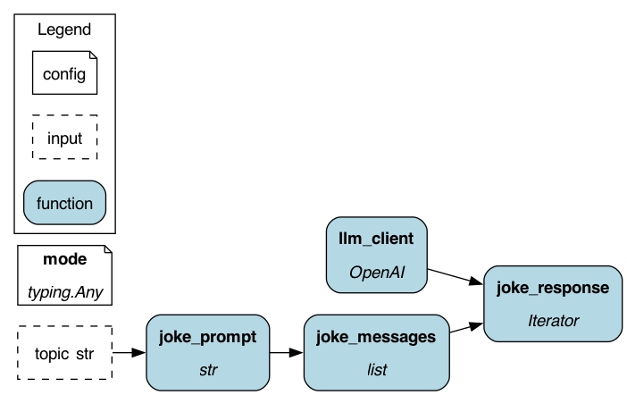](assets/images/hamilton-streamed_b0c489df83699d98.png)

The Hamilton DAG visualized.

<a id="code-comparisons-langchain--a-batch-parallel-joke-example"></a>

## A “batch” parallel joke example

In this batch example, the joke requests are parallelized.
Note: with Apache Hamilton you can delegate to many different backends for parallelization, e.g. Ray, Dask, etc. We use multi-threading here.

<table class="docutils align-left" id="id5">
<caption><span>Batch Parallel Version</span></caption>
<thead>
<tr><th><p>Apache Hamilton</p></th>
<th><p>Vanilla</p></th>
<th><p>LangChain</p></th>
</tr>
</thead>
<tbody>
<tr><td><div><div><pre><span></span><span># hamilton_batch.py</span>
<span>from</span><span> </span><span>typing</span><span> </span><span>import</span> <span>List</span>

<span>import</span><span> </span><span>openai</span>

<span>from</span><span> </span><span>hamilton.execution</span><span> </span><span>import</span> <span>executors</span>
<span>from</span><span> </span><span>hamilton.htypes</span><span> </span><span>import</span> <span>Collect</span>
<span>from</span><span> </span><span>hamilton.htypes</span><span> </span><span>import</span> <span>Parallelizable</span>

<span>def</span><span> </span><span>llm_client</span><span>()</span> <span>-&gt;</span> <span>openai</span><span>.</span><span>OpenAI</span><span>:</span>
    <span>return</span> <span>openai</span><span>.</span><span>OpenAI</span><span>()</span>

<span>def</span><span> </span><span>topic</span><span>(</span>
        <span>topics</span><span>:</span> <span>list</span><span>[</span><span>str</span><span>])</span> <span>-&gt;</span> <span>Parallelizable</span><span>[</span><span>str</span><span>]:</span>
    <span>for</span> <span>_topic</span> <span>in</span> <span>topics</span><span>:</span>
        <span>yield</span> <span>_topic</span>

<span>def</span><span> </span><span>joke_prompt</span><span>(</span><span>topic</span><span>:</span> <span>str</span><span>)</span> <span>-&gt;</span> <span>str</span><span>:</span>
    <span>return</span> <span>f</span><span>"Tell me a short joke about </span><span>{</span><span>topic</span><span>}</span><span>"</span>

<span>def</span><span> </span><span>joke_messages</span><span>(</span>
        <span>joke_prompt</span><span>:</span> <span>str</span><span>)</span> <span>-&gt;</span> <span>List</span><span>[</span><span>dict</span><span>]:</span>
    <span>return</span> <span>[{</span><span>"role"</span><span>:</span> <span>"user"</span><span>,</span>
             <span>"content"</span><span>:</span> <span>joke_prompt</span><span>}]</span>

<span>def</span><span> </span><span>joke_response</span><span>(</span><span>llm_client</span><span>:</span> <span>openai</span><span>.</span><span>OpenAI</span><span>,</span>
                  <span>joke_messages</span><span>:</span> <span>List</span><span>[</span><span>dict</span><span>])</span> <span>-&gt;</span> <span>str</span><span>:</span>
    <span>response</span> <span>=</span> <span>llm_client</span><span>.</span><span>chat</span><span>.</span><span>completions</span><span>.</span><span>create</span><span>(</span>
        <span>model</span><span>=</span><span>"gpt-3.5-turbo"</span><span>,</span>
        <span>messages</span><span>=</span><span>joke_messages</span><span>,</span>
    <span>)</span>
    <span>return</span> <span>response</span><span>.</span><span>choices</span><span>[</span><span>0</span><span>]</span><span>.</span><span>message</span><span>.</span><span>content</span>

<span>def</span><span> </span><span>joke_responses</span><span>(</span>
        <span>joke_response</span><span>:</span> <span>Collect</span><span>[</span><span>str</span><span>])</span> <span>-&gt;</span> <span>List</span><span>[</span><span>str</span><span>]:</span>
    <span>return</span> <span>list</span><span>(</span><span>joke_response</span><span>)</span>

<span>if</span> <span>__name__</span> <span>==</span> <span>"__main__"</span><span>:</span>
    <span>import</span><span> </span><span>hamilton_batch</span>

    <span>from</span><span> </span><span>hamilton</span><span> </span><span>import</span> <span>driver</span>

    <span>dr</span> <span>=</span> <span>(</span>
        <span>driver</span><span>.</span><span>Builder</span><span>()</span>
        <span>.</span><span>with_modules</span><span>(</span><span>hamilton_batch</span><span>)</span>
        <span>.</span><span>enable_dynamic_execution</span><span>(</span>
            <span>allow_experimental_mode</span><span>=</span><span>True</span>
        <span>)</span>
        <span>.</span><span>with_remote_executor</span><span>(</span>
            <span>executors</span><span>.</span><span>MultiThreadingExecutor</span><span>(</span><span>5</span><span>)</span>
        <span>)</span>
        <span>.</span><span>build</span><span>()</span>
    <span>)</span>
    <span>dr</span><span>.</span><span>display_all_functions</span><span>(</span><span>"hamilton-batch.png"</span><span>)</span>
    <span>print</span><span>(</span>
        <span>dr</span><span>.</span><span>execute</span><span>(</span>
            <span>[</span><span>"joke_responses"</span><span>],</span>
            <span>inputs</span><span>=</span><span>{</span>
                <span>"topics"</span><span>:</span> <span>[</span><span>"ice cream"</span><span>,</span>
                           <span>"spaghetti"</span><span>,</span>
                           <span>"dumplings"</span><span>]</span>
            <span>}</span>
        <span>)</span>
    <span>)</span>

    <span># can still run single chain with overrides</span>
    <span># and getting just one response</span>
    <span>print</span><span>(</span>
        <span>dr</span><span>.</span><span>execute</span><span>(</span>
            <span>[</span><span>"joke_response"</span><span>],</span>
            <span>overrides</span><span>=</span><span>{</span><span>"topic"</span><span>:</span> <span>"lettuce"</span><span>}</span>
        <span>)</span>
    <span>)</span>
</pre></div>
</div>
</td>
<td><div><div><pre><span></span><span>from</span><span> </span><span>concurrent.futures</span><span> </span><span>import</span> <span>ThreadPoolExecutor</span>
<span>from</span><span> </span><span>typing</span><span> </span><span>import</span> <span>List</span>

<span>import</span><span> </span><span>openai</span>

<span>prompt_template</span> <span>=</span> <span>"Tell me a short joke about </span><span>{topic}</span><span>"</span>
<span>client</span> <span>=</span> <span>openai</span><span>.</span><span>OpenAI</span><span>()</span>

<span>def</span><span> </span><span>call_chat_model</span><span>(</span><span>messages</span><span>:</span> <span>List</span><span>[</span><span>dict</span><span>])</span> <span>-&gt;</span> <span>str</span><span>:</span>
    <span>response</span> <span>=</span> <span>client</span><span>.</span><span>chat</span><span>.</span><span>completions</span><span>.</span><span>create</span><span>(</span>
        <span>model</span><span>=</span><span>"gpt-3.5-turbo"</span><span>,</span>
        <span>messages</span><span>=</span><span>messages</span><span>,</span>
    <span>)</span>
    <span>return</span> <span>response</span><span>.</span><span>choices</span><span>[</span><span>0</span><span>]</span><span>.</span><span>message</span><span>.</span><span>content</span>

<span>def</span><span> </span><span>invoke_chain</span><span>(</span><span>topic</span><span>:</span> <span>str</span><span>)</span> <span>-&gt;</span> <span>str</span><span>:</span>
    <span>prompt_value</span> <span>=</span> <span>prompt_template</span><span>.</span><span>format</span><span>(</span><span>topic</span><span>=</span><span>topic</span><span>)</span>
    <span>messages</span> <span>=</span> <span>[{</span><span>"role"</span><span>:</span> <span>"user"</span><span>,</span>
                 <span>"content"</span><span>:</span> <span>prompt_value</span><span>}]</span>
    <span>return</span> <span>call_chat_model</span><span>(</span><span>messages</span><span>)</span>

<span>def</span><span> </span><span>batch_chain</span><span>(</span><span>topics</span><span>:</span> <span>list</span><span>)</span> <span>-&gt;</span> <span>list</span><span>:</span>
    <span>with</span> <span>ThreadPoolExecutor</span><span>(</span><span>max_workers</span><span>=</span><span>5</span><span>)</span> <span>as</span> <span>executor</span><span>:</span>
        <span>return</span> <span>list</span><span>(</span>
            <span>executor</span><span>.</span><span>map</span><span>(</span><span>invoke_chain</span><span>,</span> <span>topics</span><span>)</span>
        <span>)</span>

<span>if</span> <span>__name__</span> <span>==</span> <span>"__main__"</span><span>:</span>
    <span>print</span><span>(</span>
        <span>batch_chain</span><span>(</span>
            <span>[</span><span>"ice cream"</span><span>,</span> <span>"spaghetti"</span><span>,</span> <span>"dumplings"</span><span>]</span>
        <span>)</span>
    <span>)</span>
</pre></div>
</div>
</td>
<td><div><div><pre><span></span><span>from</span><span> </span><span>langchain_core.output_parsers</span><span> </span><span>import</span> <span>StrOutputParser</span>
<span>from</span><span> </span><span>langchain_core.prompts</span><span> </span><span>import</span> <span>ChatPromptTemplate</span>
<span>from</span><span> </span><span>langchain_core.runnables</span><span> </span><span>import</span> <span>RunnablePassthrough</span>
<span>from</span><span> </span><span>langchain_openai</span><span> </span><span>import</span> <span>ChatOpenAI</span>

<span>prompt</span> <span>=</span> <span>ChatPromptTemplate</span><span>.</span><span>from_template</span><span>(</span>
    <span>"Tell me a short joke about </span><span>{topic}</span><span>"</span><span>)</span>
<span>output_parser</span> <span>=</span> <span>StrOutputParser</span><span>()</span>
<span>model</span> <span>=</span> <span>ChatOpenAI</span><span>(</span><span>model</span><span>=</span><span>"gpt-3.5-turbo"</span><span>)</span>
<span>chain</span> <span>=</span> <span>(</span>
    <span>{</span><span>"topic"</span><span>:</span> <span>RunnablePassthrough</span><span>()}</span>
    <span>|</span> <span>prompt</span>
    <span>|</span> <span>model</span>
    <span>|</span> <span>output_parser</span>
<span>)</span>
<span>if</span> <span>__name__</span> <span>==</span> <span>"__main__"</span><span>:</span>
    <span>print</span><span>(</span>
        <span>chain</span><span>.</span><span>batch</span><span>(</span>
            <span>[</span><span>"ice cream"</span><span>,</span>
             <span>"spaghetti"</span><span>,</span>
             <span>"dumplings"</span><span>]</span>
        <span>)</span>
    <span>)</span>
</pre></div>
</div>
</td>
</tr>
</tbody>
</table>

[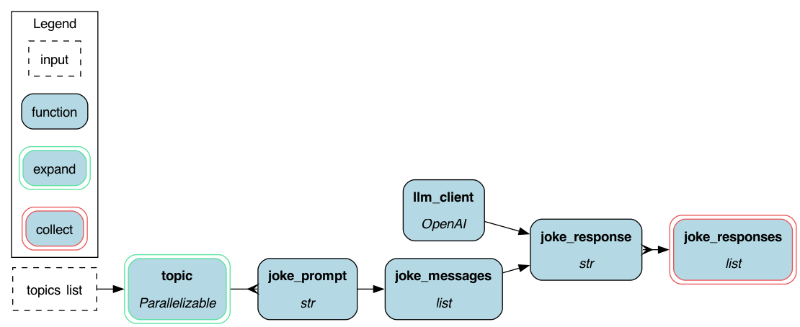](assets/images/hamilton-batch_da0212810237d7be.png)

The Hamilton DAG visualized.

<a id="code-comparisons-langchain--a-async-joke-example"></a>

## A “async” joke example

Here we show how to make the joke using async constructs. With Apache Hamilton
you can mix and match async and regular functions, the only change
is that you need to use the async Hamilton Driver.

<table class="docutils align-left" id="id7">
<caption><span>Async Version</span></caption>
<thead>
<tr><th><p>Apache Hamilton</p></th>
<th><p>Vanilla</p></th>
<th><p>LangChain</p></th>
</tr>
</thead>
<tbody>
<tr><td><div><div><pre><span></span><span># hamilton_async.py</span>
<span>from</span><span> </span><span>typing</span><span> </span><span>import</span> <span>List</span>

<span>import</span><span> </span><span>openai</span>

<span>def</span><span> </span><span>llm_client</span><span>()</span> <span>-&gt;</span> <span>openai</span><span>.</span><span>AsyncOpenAI</span><span>:</span>
    <span>return</span> <span>openai</span><span>.</span><span>AsyncOpenAI</span><span>()</span>

<span>def</span><span> </span><span>joke_prompt</span><span>(</span><span>topic</span><span>:</span> <span>str</span><span>)</span> <span>-&gt;</span> <span>str</span><span>:</span>
    <span>return</span> <span>(</span>
        <span>f</span><span>"Tell me a short joke about </span><span>{</span><span>topic</span><span>}</span><span>"</span>
    <span>)</span>

<span>def</span><span> </span><span>joke_messages</span><span>(</span>
        <span>joke_prompt</span><span>:</span> <span>str</span><span>)</span> <span>-&gt;</span> <span>List</span><span>[</span><span>dict</span><span>]:</span>
    <span>return</span> <span>[{</span><span>"role"</span><span>:</span> <span>"user"</span><span>,</span>
             <span>"content"</span><span>:</span> <span>joke_prompt</span><span>}]</span>

<span>async</span> <span>def</span><span> </span><span>joke_response</span><span>(</span>
        <span>llm_client</span><span>:</span> <span>openai</span><span>.</span><span>AsyncOpenAI</span><span>,</span>
        <span>joke_messages</span><span>:</span> <span>List</span><span>[</span><span>dict</span><span>])</span> <span>-&gt;</span> <span>str</span><span>:</span>
    <span>response</span> <span>=</span> <span>await</span> <span>(</span>
        <span>llm_client</span><span>.</span><span>chat</span><span>.</span><span>completions</span><span>.</span><span>create</span><span>(</span>
            <span>model</span><span>=</span><span>"gpt-3.5-turbo"</span><span>,</span>
            <span>messages</span><span>=</span><span>joke_messages</span><span>,</span>
        <span>)</span>
    <span>)</span>
    <span>return</span> <span>response</span><span>.</span><span>choices</span><span>[</span><span>0</span><span>]</span><span>.</span><span>message</span><span>.</span><span>content</span>

<span>if</span> <span>__name__</span> <span>==</span> <span>"__main__"</span><span>:</span>
    <span>import</span><span> </span><span>asyncio</span>

    <span>import</span><span> </span><span>hamilton_async</span>

    <span>from</span><span> </span><span>hamilton</span><span> </span><span>import</span> <span>base</span>
    <span>from</span><span> </span><span>hamilton</span><span> </span><span>import</span> <span>async_driver</span>

    <span>dr</span> <span>=</span> <span>async_driver</span><span>.</span><span>AsyncDriver</span><span>(</span>
        <span>{},</span>
        <span>hamilton_async</span><span>,</span>
        <span>result_builder</span><span>=</span><span>base</span><span>.</span><span>DictResult</span><span>()</span>
    <span>)</span>
    <span>dr</span><span>.</span><span>display_all_functions</span><span>(</span><span>"hamilton-async.png"</span><span>)</span>
    <span>loop</span> <span>=</span> <span>asyncio</span><span>.</span><span>get_event_loop</span><span>()</span>
    <span>result</span> <span>=</span> <span>loop</span><span>.</span><span>run_until_complete</span><span>(</span>
        <span>dr</span><span>.</span><span>execute</span><span>(</span>
            <span>[</span><span>"joke_response"</span><span>],</span>
            <span>inputs</span><span>=</span><span>{</span><span>"topic"</span><span>:</span> <span>"ice cream"</span><span>}</span>
        <span>)</span>
    <span>)</span>
    <span>print</span><span>(</span><span>result</span><span>)</span>
</pre></div>
</div>
</td>
<td><div><div><pre><span></span><span>from</span><span> </span><span>typing</span><span> </span><span>import</span> <span>List</span>

<span>import</span><span> </span><span>openai</span>

<span>prompt_template</span> <span>=</span> <span>"Tell me a short joke about </span><span>{topic}</span><span>"</span>
<span>client</span> <span>=</span> <span>openai</span><span>.</span><span>OpenAI</span><span>()</span>

<span>async_client</span> <span>=</span> <span>openai</span><span>.</span><span>AsyncOpenAI</span><span>()</span>

<span>async</span> <span>def</span><span> </span><span>acall_chat_model</span><span>(</span>
        <span>messages</span><span>:</span> <span>List</span><span>[</span><span>dict</span><span>])</span> <span>-&gt;</span> <span>str</span><span>:</span>
    <span>response</span> <span>=</span> <span>await</span> <span>(</span>
        <span>async_client</span><span>.</span><span>chat</span><span>.</span><span>completions</span><span>.</span><span>create</span><span>(</span>
            <span>model</span><span>=</span><span>"gpt-3.5-turbo"</span><span>,</span>
            <span>messages</span><span>=</span><span>messages</span><span>,</span>
        <span>)</span>
    <span>)</span>
    <span>return</span> <span>response</span><span>.</span><span>choices</span><span>[</span><span>0</span><span>]</span><span>.</span><span>message</span><span>.</span><span>content</span>

<span>async</span> <span>def</span><span> </span><span>ainvoke_chain</span><span>(</span><span>topic</span><span>:</span> <span>str</span><span>)</span> <span>-&gt;</span> <span>str</span><span>:</span>
    <span>prompt_value</span> <span>=</span> <span>prompt_template</span><span>.</span><span>format</span><span>(</span>
        <span>topic</span><span>=</span><span>topic</span>
    <span>)</span>
    <span>messages</span> <span>=</span> <span>[{</span><span>"role"</span><span>:</span> <span>"user"</span><span>,</span>
                 <span>"content"</span><span>:</span> <span>prompt_value</span><span>}]</span>
    <span>return</span> <span>await</span> <span>acall_chat_model</span><span>(</span><span>messages</span><span>)</span>

<span>if</span> <span>__name__</span> <span>==</span> <span>"__main__"</span><span>:</span>
    <span>import</span><span> </span><span>asyncio</span>

    <span>loop</span> <span>=</span> <span>asyncio</span><span>.</span><span>get_event_loop</span><span>()</span>
    <span>result</span> <span>=</span> <span>loop</span><span>.</span><span>run_until_complete</span><span>(</span>
        <span>ainvoke_chain</span><span>(</span><span>"ice cream"</span><span>)</span>
    <span>)</span>
    <span>print</span><span>(</span><span>result</span><span>)</span>
</pre></div>
</div>
</td>
<td><div><div><pre><span></span><span>from</span><span> </span><span>langchain_core.output_parsers</span><span> </span><span>import</span> <span>StrOutputParser</span>
<span>from</span><span> </span><span>langchain_core.prompts</span><span> </span><span>import</span> <span>ChatPromptTemplate</span>
<span>from</span><span> </span><span>langchain_core.runnables</span><span> </span><span>import</span> <span>RunnablePassthrough</span>
<span>from</span><span> </span><span>langchain_openai</span><span> </span><span>import</span> <span>ChatOpenAI</span>

<span>prompt</span> <span>=</span> <span>ChatPromptTemplate</span><span>.</span><span>from_template</span><span>(</span>
    <span>"Tell me a short joke about </span><span>{topic}</span><span>"</span><span>)</span>
<span>output_parser</span> <span>=</span> <span>StrOutputParser</span><span>()</span>
<span>model</span> <span>=</span> <span>ChatOpenAI</span><span>(</span><span>model</span><span>=</span><span>"gpt-3.5-turbo"</span><span>)</span>
<span>chain</span> <span>=</span> <span>(</span>
    <span>{</span><span>"topic"</span><span>:</span> <span>RunnablePassthrough</span><span>()}</span>
    <span>|</span> <span>prompt</span>
    <span>|</span> <span>model</span>
    <span>|</span> <span>output_parser</span>
<span>)</span>
<span>if</span> <span>__name__</span> <span>==</span> <span>"__main__"</span><span>:</span>
    <span>import</span><span> </span><span>asyncio</span>
    <span>loop</span> <span>=</span> <span>asyncio</span><span>.</span><span>get_event_loop</span><span>()</span>
    <span>result</span> <span>=</span> <span>loop</span><span>.</span><span>run_until_complete</span><span>(</span>
        <span>chain</span><span>.</span><span>ainvoke</span><span>(</span><span>"ice cream"</span><span>)</span>
    <span>)</span>
    <span>print</span><span>(</span><span>result</span><span>)</span>
</pre></div>
</div>
</td>
</tr>
</tbody>
</table>

[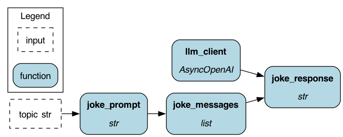](assets/images/hamilton-async_3f38edd833a53771.png)

The Hamilton DAG visualized.

<a id="code-comparisons-langchain--switch-llm-to-completion-for-joke"></a>

## Switch LLM to completion for joke

Here we show how to make the joke switching to a different openAI model that is for completion.
Note: we use the @config.when construct to augment the original DAG and add a new function
that uses the different OpenAI model.

<table class="docutils align-left" id="id9">
<caption><span>Completion Version</span></caption>
<thead>
<tr><th><p>Apache Hamilton</p></th>
<th><p>Vanilla</p></th>
<th><p>LangChain</p></th>
</tr>
</thead>
<tbody>
<tr><td><div><div><pre><span></span><span># hamilton_completion.py</span>
<span>from</span><span> </span><span>typing</span><span> </span><span>import</span> <span>List</span>

<span>import</span><span> </span><span>openai</span>

<span>from</span><span> </span><span>hamilton.function_modifiers</span><span> </span><span>import</span> <span>config</span>

<span>def</span><span> </span><span>llm_client</span><span>()</span> <span>-&gt;</span> <span>openai</span><span>.</span><span>OpenAI</span><span>:</span>
    <span>return</span> <span>openai</span><span>.</span><span>OpenAI</span><span>()</span>

<span>def</span><span> </span><span>joke_prompt</span><span>(</span><span>topic</span><span>:</span> <span>str</span><span>)</span> <span>-&gt;</span> <span>str</span><span>:</span>
    <span>return</span> <span>f</span><span>"Tell me a short joke about </span><span>{</span><span>topic</span><span>}</span><span>"</span>

<span>def</span><span> </span><span>joke_messages</span><span>(</span>
        <span>joke_prompt</span><span>:</span> <span>str</span><span>)</span> <span>-&gt;</span> <span>List</span><span>[</span><span>dict</span><span>]:</span>
    <span>return</span> <span>[{</span><span>"role"</span><span>:</span> <span>"user"</span><span>,</span>
             <span>"content"</span><span>:</span> <span>joke_prompt</span><span>}]</span>

<span>@config</span><span>.</span><span>when</span><span>(</span><span>type</span><span>=</span><span>"completion"</span><span>)</span>
<span>def</span><span> </span><span>joke_response__completion</span><span>(</span>
        <span>llm_client</span><span>:</span> <span>openai</span><span>.</span><span>OpenAI</span><span>,</span>
        <span>joke_prompt</span><span>:</span> <span>str</span><span>)</span> <span>-&gt;</span> <span>str</span><span>:</span>
    <span>response</span> <span>=</span> <span>llm_client</span><span>.</span><span>completions</span><span>.</span><span>create</span><span>(</span>
        <span>model</span><span>=</span><span>"gpt-3.5-turbo-instruct"</span><span>,</span>
        <span>prompt</span><span>=</span><span>joke_prompt</span><span>,</span>
    <span>)</span>
    <span>return</span> <span>response</span><span>.</span><span>choices</span><span>[</span><span>0</span><span>]</span><span>.</span><span>text</span>

<span>@config</span><span>.</span><span>when</span><span>(</span><span>type</span><span>=</span><span>"chat"</span><span>)</span>
<span>def</span><span> </span><span>joke_response__chat</span><span>(</span>
        <span>llm_client</span><span>:</span> <span>openai</span><span>.</span><span>OpenAI</span><span>,</span>
        <span>joke_messages</span><span>:</span> <span>List</span><span>[</span><span>dict</span><span>])</span> <span>-&gt;</span> <span>str</span><span>:</span>
    <span>response</span> <span>=</span> <span>llm_client</span><span>.</span><span>chat</span><span>.</span><span>completions</span><span>.</span><span>create</span><span>(</span>
        <span>model</span><span>=</span><span>"gpt-3.5-turbo"</span><span>,</span>
        <span>messages</span><span>=</span><span>joke_messages</span><span>,</span>
    <span>)</span>
    <span>return</span> <span>response</span><span>.</span><span>choices</span><span>[</span><span>0</span><span>]</span><span>.</span><span>message</span><span>.</span><span>content</span>

<span>if</span> <span>__name__</span> <span>==</span> <span>"__main__"</span><span>:</span>
    <span>import</span><span> </span><span>hamilton_completion</span>

    <span>from</span><span> </span><span>hamilton</span><span> </span><span>import</span> <span>driver</span>

    <span>dr</span> <span>=</span> <span>(</span>
        <span>driver</span><span>.</span><span>Builder</span><span>()</span>
        <span>.</span><span>with_modules</span><span>(</span><span>hamilton_completion</span><span>)</span>
        <span>.</span><span>with_config</span><span>({</span><span>"type"</span><span>:</span> <span>"completion"</span><span>})</span>
        <span>.</span><span>build</span><span>()</span>
    <span>)</span>
    <span>dr</span><span>.</span><span>display_all_functions</span><span>(</span>
        <span>"hamilton-completion.png"</span>
    <span>)</span>
    <span>print</span><span>(</span>
        <span>dr</span><span>.</span><span>execute</span><span>(</span>
            <span>[</span><span>"joke_response"</span><span>],</span>
            <span>inputs</span><span>=</span><span>{</span><span>"topic"</span><span>:</span> <span>"ice cream"</span><span>}</span>
        <span>)</span>
    <span>)</span>

    <span>dr</span> <span>=</span> <span>(</span>
        <span>driver</span><span>.</span><span>Builder</span><span>()</span>
        <span>.</span><span>with_modules</span><span>(</span><span>hamilton_completion</span><span>)</span>
        <span>.</span><span>with_config</span><span>({</span><span>"type"</span><span>:</span> <span>"chat"</span><span>})</span>
        <span>.</span><span>build</span><span>()</span>
    <span>)</span>
    <span>dr</span><span>.</span><span>display_all_functions</span><span>(</span><span>"hamilton-chat.png"</span><span>)</span>
    <span>print</span><span>(</span>
        <span>dr</span><span>.</span><span>execute</span><span>(</span>
            <span>[</span><span>"joke_response"</span><span>],</span>
            <span>inputs</span><span>=</span><span>{</span><span>"topic"</span><span>:</span> <span>"ice cream"</span><span>}</span>
        <span>)</span>
    <span>)</span>
</pre></div>
</div>
</td>
<td><div><div><pre><span></span><span>import</span><span> </span><span>openai</span>

<span>prompt_template</span> <span>=</span> <span>"Tell me a short joke about </span><span>{topic}</span><span>"</span>
<span>client</span> <span>=</span> <span>openai</span><span>.</span><span>OpenAI</span><span>()</span>

<span>def</span><span> </span><span>call_llm</span><span>(</span><span>prompt_value</span><span>:</span> <span>str</span><span>)</span> <span>-&gt;</span> <span>str</span><span>:</span>
    <span>response</span> <span>=</span> <span>client</span><span>.</span><span>completions</span><span>.</span><span>create</span><span>(</span>
        <span>model</span><span>=</span><span>"gpt-3.5-turbo-instruct"</span><span>,</span>
        <span>prompt</span><span>=</span><span>prompt_value</span><span>,</span>
    <span>)</span>
    <span>return</span> <span>response</span><span>.</span><span>choices</span><span>[</span><span>0</span><span>]</span><span>.</span><span>text</span>

<span>def</span><span> </span><span>invoke_llm_chain</span><span>(</span><span>topic</span><span>:</span> <span>str</span><span>)</span> <span>-&gt;</span> <span>str</span><span>:</span>
    <span>prompt_value</span> <span>=</span> <span>prompt_template</span><span>.</span><span>format</span><span>(</span><span>topic</span><span>=</span><span>topic</span><span>)</span>
    <span>return</span> <span>call_llm</span><span>(</span><span>prompt_value</span><span>)</span>

<span>if</span> <span>__name__</span> <span>==</span> <span>"__main__"</span><span>:</span>
    <span>print</span><span>(</span><span>invoke_llm_chain</span><span>(</span><span>"ice cream"</span><span>))</span>
</pre></div>
</div>
</td>
<td><div><div><pre><span></span><span>from</span><span> </span><span>langchain_core.output_parsers</span><span> </span><span>import</span> <span>StrOutputParser</span>
<span>from</span><span> </span><span>langchain_core.prompts</span><span> </span><span>import</span> <span>ChatPromptTemplate</span>
<span>from</span><span> </span><span>langchain_core.runnables</span><span> </span><span>import</span> <span>RunnablePassthrough</span>
<span>from</span><span> </span><span>langchain_openai</span><span> </span><span>import</span> <span>OpenAI</span>

<span>prompt</span> <span>=</span> <span>ChatPromptTemplate</span><span>.</span><span>from_template</span><span>(</span>
    <span>"Tell me a short joke about </span><span>{topic}</span><span>"</span><span>)</span>
<span>output_parser</span> <span>=</span> <span>StrOutputParser</span><span>()</span>
<span>llm</span> <span>=</span> <span>OpenAI</span><span>(</span><span>model</span><span>=</span><span>"gpt-3.5-turbo-instruct"</span><span>)</span>
<span>llm_chain</span> <span>=</span> <span>(</span>
    <span>{</span><span>"topic"</span><span>:</span> <span>RunnablePassthrough</span><span>()}</span>
    <span>|</span> <span>prompt</span>
    <span>|</span> <span>llm</span>
    <span>|</span> <span>output_parser</span>
<span>)</span>

<span>if</span> <span>__name__</span> <span>==</span> <span>"__main__"</span><span>:</span>
    <span>print</span><span>(</span><span>llm_chain</span><span>.</span><span>invoke</span><span>(</span><span>"ice cream"</span><span>))</span>
</pre></div>
</div>
</td>
</tr>
</tbody>
</table>

[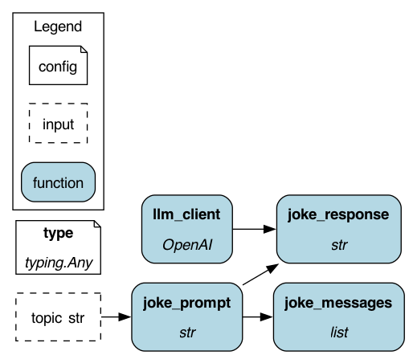](assets/images/hamilton-completion_39b9019eb2874950.png)

The Hamilton DAG visualized with configuration provided for the completion path. Note the dangling node - that’s normal, it’s not used in the completion path.

<a id="code-comparisons-langchain--switch-to-using-anthropic"></a>

## Switch to using Anthropic

Here we show how to make the joke switching to use a different model provider, in this case
it’s Anthropic.
Note: we use the @config.when construct to augment the original DAG and add a new functions
to use Anthropic.

<table class="docutils align-left" id="id11">
<caption><span>Anthropic Version</span></caption>
<thead>
<tr><th><p>Apache Hamilton</p></th>
<th><p>Vanilla</p></th>
<th><p>LangChain</p></th>
</tr>
</thead>
<tbody>
<tr><td><div><div><pre><span></span><span># hamilton_anthropic.py</span>
<span>import</span><span> </span><span>anthropic</span>
<span>import</span><span> </span><span>openai</span>

<span>from</span><span> </span><span>hamilton.function_modifiers</span><span> </span><span>import</span> <span>config</span>

<span>@config</span><span>.</span><span>when</span><span>(</span><span>provider</span><span>=</span><span>"openai"</span><span>)</span>
<span>def</span><span> </span><span>llm_client__openai</span><span>()</span> <span>-&gt;</span> <span>openai</span><span>.</span><span>OpenAI</span><span>:</span>
    <span>return</span> <span>openai</span><span>.</span><span>OpenAI</span><span>()</span>

<span>@config</span><span>.</span><span>when</span><span>(</span><span>provider</span><span>=</span><span>"anthropic"</span><span>)</span>
<span>def</span><span> </span><span>llm_client__anthropic</span><span>()</span> <span>-&gt;</span> <span>anthropic</span><span>.</span><span>Anthropic</span><span>:</span>
    <span>return</span> <span>anthropic</span><span>.</span><span>Anthropic</span><span>()</span>

<span>def</span><span> </span><span>joke_prompt</span><span>(</span><span>topic</span><span>:</span> <span>str</span><span>)</span> <span>-&gt;</span> <span>str</span><span>:</span>
    <span>return</span> <span>(</span>
        <span>"Human:</span><span>\n\n</span><span>"</span>
        <span>"Tell me a short joke about </span><span>{topic}</span><span>\n\n</span><span>"</span>
        <span>"Assistant:"</span>
    <span>)</span><span>.</span><span>format</span><span>(</span><span>topic</span><span>=</span><span>topic</span><span>)</span>

<span>@config</span><span>.</span><span>when</span><span>(</span><span>provider</span><span>=</span><span>"openai"</span><span>)</span>
<span>def</span><span> </span><span>joke_response__openai</span><span>(</span>
        <span>llm_client</span><span>:</span> <span>openai</span><span>.</span><span>OpenAI</span><span>,</span>
        <span>joke_prompt</span><span>:</span> <span>str</span><span>)</span> <span>-&gt;</span> <span>str</span><span>:</span>
    <span>response</span> <span>=</span> <span>llm_client</span><span>.</span><span>completions</span><span>.</span><span>create</span><span>(</span>
        <span>model</span><span>=</span><span>"gpt-3.5-turbo-instruct"</span><span>,</span>
        <span>prompt</span><span>=</span><span>joke_prompt</span><span>,</span>
    <span>)</span>
    <span>return</span> <span>response</span><span>.</span><span>choices</span><span>[</span><span>0</span><span>]</span><span>.</span><span>text</span>

<span>@config</span><span>.</span><span>when</span><span>(</span><span>provider</span><span>=</span><span>"anthropic"</span><span>)</span>
<span>def</span><span> </span><span>joke_response__anthropic</span><span>(</span>
        <span>llm_client</span><span>:</span> <span>anthropic</span><span>.</span><span>Anthropic</span><span>,</span>
        <span>joke_prompt</span><span>:</span> <span>str</span><span>)</span> <span>-&gt;</span> <span>str</span><span>:</span>
    <span>response</span> <span>=</span> <span>llm_client</span><span>.</span><span>completions</span><span>.</span><span>create</span><span>(</span>
        <span>model</span><span>=</span><span>"claude-2"</span><span>,</span>
        <span>prompt</span><span>=</span><span>joke_prompt</span><span>,</span>
        <span>max_tokens_to_sample</span><span>=</span><span>256</span>
    <span>)</span>
    <span>return</span> <span>response</span><span>.</span><span>completion</span>

<span>if</span> <span>__name__</span> <span>==</span> <span>"__main__"</span><span>:</span>
    <span>import</span><span> </span><span>hamilton_invoke_anthropic</span>

    <span>from</span><span> </span><span>hamilton</span><span> </span><span>import</span> <span>driver</span>

    <span>dr</span> <span>=</span> <span>(</span>
        <span>driver</span><span>.</span><span>Builder</span><span>()</span>
        <span>.</span><span>with_modules</span><span>(</span><span>hamilton_invoke_anthropic</span><span>)</span>
        <span>.</span><span>with_config</span><span>({</span><span>"provider"</span><span>:</span> <span>"anthropic"</span><span>})</span>
        <span>.</span><span>build</span><span>()</span>
    <span>)</span>
    <span>dr</span><span>.</span><span>display_all_functions</span><span>(</span>
        <span>"hamilton-anthropic.png"</span>
    <span>)</span>
    <span>print</span><span>(</span>
        <span>dr</span><span>.</span><span>execute</span><span>(</span>
        <span>[</span><span>"joke_response"</span><span>],</span>
        <span>inputs</span><span>=</span><span>{</span><span>"topic"</span><span>:</span> <span>"ice cream"</span><span>}</span>
        <span>)</span>
    <span>)</span>

    <span>dr</span> <span>=</span> <span>(</span>
        <span>driver</span><span>.</span><span>Builder</span><span>()</span>
        <span>.</span><span>with_modules</span><span>(</span><span>hamilton_invoke_anthropic</span><span>)</span>
        <span>.</span><span>with_config</span><span>({</span><span>"provider"</span><span>:</span> <span>"openai"</span><span>})</span>
        <span>.</span><span>build</span><span>()</span>
    <span>)</span>
    <span>print</span><span>(</span>
        <span>dr</span><span>.</span><span>execute</span><span>(</span>
            <span>[</span><span>"joke_response"</span><span>],</span>
            <span>inputs</span><span>=</span><span>{</span><span>"topic"</span><span>:</span> <span>"ice cream"</span><span>}</span>
        <span>)</span>
    <span>)</span>
</pre></div>
</div>
</td>
<td><div><div><pre><span></span><span>import</span><span> </span><span>anthropic</span>

<span>prompt_template</span> <span>=</span> <span>"Tell me a short joke about </span><span>{topic}</span><span>"</span>
<span>anthropic_template</span> <span>=</span> <span>f</span><span>"Human:</span><span>\n\n</span><span>{</span><span>prompt_template</span><span>}</span><span>\n\n</span><span>Assistant:"</span>
<span>anthropic_client</span> <span>=</span> <span>anthropic</span><span>.</span><span>Anthropic</span><span>()</span>

<span>def</span><span> </span><span>call_anthropic</span><span>(</span><span>prompt_value</span><span>:</span> <span>str</span><span>)</span> <span>-&gt;</span> <span>str</span><span>:</span>
    <span>response</span> <span>=</span> <span>anthropic_client</span><span>.</span><span>completions</span><span>.</span><span>create</span><span>(</span>
        <span>model</span><span>=</span><span>"claude-2"</span><span>,</span>
        <span>prompt</span><span>=</span><span>prompt_value</span><span>,</span>
        <span>max_tokens_to_sample</span><span>=</span><span>256</span><span>,</span>
    <span>)</span>
    <span>return</span> <span>response</span><span>.</span><span>completion</span>

<span>def</span><span> </span><span>invoke_anthropic_chain</span><span>(</span><span>topic</span><span>:</span> <span>str</span><span>)</span> <span>-&gt;</span> <span>str</span><span>:</span>
    <span>prompt_value</span> <span>=</span> <span>anthropic_template</span><span>.</span><span>format</span><span>(</span><span>topic</span><span>=</span><span>topic</span><span>)</span>
    <span>return</span> <span>call_anthropic</span><span>(</span><span>prompt_value</span><span>)</span>

<span>if</span> <span>__name__</span> <span>==</span> <span>"__main__"</span><span>:</span>
    <span>print</span><span>(</span><span>invoke_anthropic_chain</span><span>(</span><span>"ice cream"</span><span>))</span>
</pre></div>
</div>
</td>
<td><div><div><pre><span></span><span>from</span><span> </span><span>langchain_core.output_parsers</span><span> </span><span>import</span> <span>StrOutputParser</span>
<span>from</span><span> </span><span>langchain_core.prompts</span><span> </span><span>import</span> <span>ChatPromptTemplate</span>
<span>from</span><span> </span><span>langchain_core.runnables</span><span> </span><span>import</span> <span>RunnablePassthrough</span>
<span>from</span><span> </span><span>langchain_community.chat_models</span><span> </span><span>import</span> <span>ChatAnthropic</span>

<span>prompt</span> <span>=</span> <span>ChatPromptTemplate</span><span>.</span><span>from_template</span><span>(</span>
    <span>"Tell me a short joke about </span><span>{topic}</span><span>"</span><span>)</span>
<span>output_parser</span> <span>=</span> <span>StrOutputParser</span><span>()</span>
<span>anthropic</span> <span>=</span> <span>ChatAnthropic</span><span>(</span><span>model</span><span>=</span><span>"claude-2"</span><span>)</span>
<span>anthropic_chain</span> <span>=</span> <span>(</span>
    <span>{</span><span>"topic"</span><span>:</span> <span>RunnablePassthrough</span><span>()}</span>
    <span>|</span> <span>prompt</span>
    <span>|</span> <span>anthropic</span>
    <span>|</span> <span>output_parser</span>
<span>)</span>

<span>if</span> <span>__name__</span> <span>==</span> <span>"__main__"</span><span>:</span>
    <span>print</span><span>(</span><span>anthropic_chain</span><span>.</span><span>invoke</span><span>(</span><span>"ice cream"</span><span>))</span>
</pre></div>
</div>
</td>
</tr>
</tbody>
</table>

[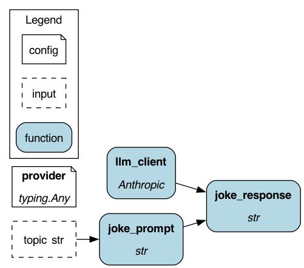](assets/images/hamilton-anthropic_42bff36dba263fb2.png)

The Hamilton DAG visualized with configuration provided to use Anthropic.

<a id="code-comparisons-langchain--logging"></a>

## Logging

Here we show how to log more information about the joke request. Apache Hamilton has
lots of customization options, and one out of the box is to log more information via
printing.

<table class="docutils align-left" id="id13">
<caption><span>Logging</span></caption>
<thead>
<tr><th><p>Apache Hamilton</p></th>
<th><p>Vanilla</p></th>
<th><p>LangChain</p></th>
</tr>
</thead>
<tbody>
<tr><td><div><div><pre><span></span><span># run.py</span>
<span>from</span><span> </span><span>hamilton</span><span> </span><span>import</span> <span>driver</span><span>,</span> <span>lifecycle</span>
<span>import</span><span> </span><span>hamilton_anthropic</span>

<span>dr</span> <span>=</span> <span>(</span>
    <span>driver</span><span>.</span><span>Builder</span><span>()</span>
    <span>.</span><span>with_modules</span><span>(</span><span>hamilton_anthropic</span><span>)</span>
    <span>.</span><span>with_config</span><span>({</span><span>"provider"</span><span>:</span> <span>"anthropic"</span><span>})</span>
    <span># we just need to add this line to get things printing</span>
    <span># to the console; see DAGWorks for a more off-the-shelf</span>
    <span># solution.</span>
    <span>.</span><span>with_adapters</span><span>(</span><span>lifecycle</span><span>.</span><span>PrintLn</span><span>(</span><span>verbosity</span><span>=</span><span>2</span><span>))</span>
    <span>.</span><span>build</span><span>()</span>
<span>)</span>
<span>print</span><span>(</span>
    <span>dr</span><span>.</span><span>execute</span><span>(</span>
        <span>[</span><span>"joke_response"</span><span>],</span>
        <span>inputs</span><span>=</span><span>{</span><span>"topic"</span><span>:</span> <span>"ice cream"</span><span>}</span>
    <span>)</span>
<span>)</span>
</pre></div>
</div>
</td>
<td><div><div><pre><span></span><span>import</span><span> </span><span>anthropic</span>

<span>prompt_template</span> <span>=</span> <span>"Tell me a short joke about </span><span>{topic}</span><span>"</span>
<span>anthropic_template</span> <span>=</span> <span>f</span><span>"Human:</span><span>\n\n</span><span>{</span><span>prompt_template</span><span>}</span><span>\n\n</span><span>Assistant:"</span>
<span>anthropic_client</span> <span>=</span> <span>anthropic</span><span>.</span><span>Anthropic</span><span>()</span>

<span>def</span><span> </span><span>call_anthropic</span><span>(</span><span>prompt_value</span><span>:</span> <span>str</span><span>)</span> <span>-&gt;</span> <span>str</span><span>:</span>
    <span>response</span> <span>=</span> <span>anthropic_client</span><span>.</span><span>completions</span><span>.</span><span>create</span><span>(</span>
        <span>model</span><span>=</span><span>"claude-2"</span><span>,</span>
        <span>prompt</span><span>=</span><span>prompt_value</span><span>,</span>
        <span>max_tokens_to_sample</span><span>=</span><span>256</span><span>,</span>
    <span>)</span>
    <span>return</span> <span>response</span><span>.</span><span>completion</span>

<span>def</span><span> </span><span>invoke_anthropic_chain_with_logging</span><span>(</span><span>topic</span><span>:</span> <span>str</span><span>)</span> <span>-&gt;</span> <span>str</span><span>:</span>
    <span>print</span><span>(</span><span>f</span><span>"Input: </span><span>{</span><span>topic</span><span>}</span><span>"</span><span>)</span>
    <span>prompt_value</span> <span>=</span> <span>anthropic_template</span><span>.</span><span>format</span><span>(</span><span>topic</span><span>=</span><span>topic</span><span>)</span>
    <span>print</span><span>(</span><span>f</span><span>"Formatted prompt: </span><span>{</span><span>prompt_value</span><span>}</span><span>"</span><span>)</span>
    <span>output</span> <span>=</span> <span>call_anthropic</span><span>(</span><span>prompt_value</span><span>)</span>
    <span>print</span><span>(</span><span>f</span><span>"Output: </span><span>{</span><span>output</span><span>}</span><span>"</span><span>)</span>
    <span>return</span> <span>output</span>

<span>if</span> <span>__name__</span> <span>==</span> <span>"__main__"</span><span>:</span>
    <span>print</span><span>(</span><span>invoke_anthropic_chain_with_logging</span><span>(</span><span>"ice cream"</span><span>))</span>
</pre></div>
</div>
</td>
<td><div><div><pre><span></span><span>from</span><span> </span><span>langchain_core.output_parsers</span><span> </span><span>import</span> <span>StrOutputParser</span>
<span>from</span><span> </span><span>langchain_core.prompts</span><span> </span><span>import</span> <span>ChatPromptTemplate</span>
<span>from</span><span> </span><span>langchain_core.runnables</span><span> </span><span>import</span> <span>RunnablePassthrough</span>
<span>from</span><span> </span><span>langchain_community.chat_models</span><span> </span><span>import</span> <span>ChatAnthropic</span>

<span>prompt</span> <span>=</span> <span>ChatPromptTemplate</span><span>.</span><span>from_template</span><span>(</span>
    <span>"Tell me a short joke about </span><span>{topic}</span><span>"</span><span>)</span>
<span>output_parser</span> <span>=</span> <span>StrOutputParser</span><span>()</span>
<span>anthropic</span> <span>=</span> <span>ChatAnthropic</span><span>(</span><span>model</span><span>=</span><span>"claude-2"</span><span>)</span>
<span>anthropic_chain</span> <span>=</span> <span>(</span>
    <span>{</span><span>"topic"</span><span>:</span> <span>RunnablePassthrough</span><span>()}</span>
    <span>|</span> <span>prompt</span>
    <span>|</span> <span>anthropic</span>
    <span>|</span> <span>output_parser</span>
<span>)</span>

<span>if</span> <span>__name__</span> <span>==</span> <span>"__main__"</span><span>:</span>
    <span>import</span><span> </span><span>os</span>
    <span>os</span><span>.</span><span>environ</span><span>[</span><span>"LANGCHAIN_API_KEY"</span><span>]</span> <span>=</span> <span>"..."</span>
    <span>os</span><span>.</span><span>environ</span><span>[</span><span>"LANGCHAIN_TRACING_V2"</span><span>]</span> <span>=</span> <span>"true"</span>
    <span># it's hard to customize the logging output of langchain</span>
    <span># so here's their way to try to make money from you!</span>
    <span>print</span><span>(</span><span>anthropic_chain</span><span>.</span><span>invoke</span><span>(</span><span>"ice cream"</span><span>))</span>
</pre></div>
</div>
</td>
</tr>
</tbody>
</table>

<a id="code-comparisons-langchain--fallbacks"></a>

## Fallbacks

Fallbacks are pretty situation and context dependent. It’s not that
hard to wrap a function in a try/except block. The key is to make sure
you know what’s going on, and that a fallback was triggered. So in our
opinion it’s better to be explicit about it.

<table class="docutils align-left" id="id14">
<caption><span>Logging</span></caption>
<thead>
<tr><th><p>Apache Hamilton</p></th>
<th><p>Vanilla</p></th>
<th><p>LangChain</p></th>
</tr>
</thead>
<tbody>
<tr><td><div><div><pre><span></span>
<span>import</span><span> </span><span>hamilton_anthropic</span>
<span>from</span><span> </span><span>hamilton</span><span> </span><span>import</span> <span>driver</span>

<span>anthropic_driver</span> <span>=</span> <span>(</span>
    <span>driver</span><span>.</span><span>Builder</span><span>()</span>
    <span>.</span><span>with_modules</span><span>(</span><span>hamilton_anthropic</span><span>)</span>
    <span>.</span><span>with_config</span><span>({</span><span>"provider"</span><span>:</span> <span>"anthropic"</span><span>})</span>
    <span>.</span><span>build</span><span>()</span>
<span>)</span>
<span>openai_driver</span> <span>=</span> <span>(</span>
    <span>driver</span><span>.</span><span>Builder</span><span>()</span>
    <span>.</span><span>with_modules</span><span>(</span><span>hamilton_anthropic</span><span>)</span>
    <span>.</span><span>with_config</span><span>({</span><span>"provider"</span><span>:</span> <span>"openai"</span><span>})</span>
    <span>.</span><span>build</span><span>()</span>
<span>)</span>
<span>try</span><span>:</span>
    <span>print</span><span>(</span>
        <span>anthropic_driver</span><span>.</span><span>execute</span><span>(</span>
            <span>[</span><span>"joke_response"</span><span>],</span>
            <span>inputs</span><span>=</span><span>{</span><span>"topic"</span><span>:</span> <span>"ice cream"</span><span>}</span>
        <span>)</span>
    <span>)</span>
<span>except</span> <span>Exception</span><span>:</span>
    <span># this is the current way to do fall backs</span>
    <span>print</span><span>(</span>
        <span>openai_driver</span><span>.</span><span>execute</span><span>(</span>
            <span>[</span><span>"joke_response"</span><span>],</span>
            <span>inputs</span><span>=</span><span>{</span><span>"topic"</span><span>:</span> <span>"ice cream"</span><span>}</span>
        <span>)</span>
    <span>)</span>
</pre></div>
</div>
</td>
<td><div><div><pre><span></span><span>def</span><span> </span><span>invoke_chain_with_fallback</span><span>(</span><span>topic</span><span>:</span> <span>str</span><span>)</span> <span>-&gt;</span> <span>str</span><span>:</span>
    <span>try</span><span>:</span>
        <span>return</span> <span>invoke_chain</span><span>(</span><span>topic</span><span>)</span>  <span># noqa: F821</span>
    <span>except</span> <span>Exception</span><span>:</span>
        <span>return</span> <span>invoke_anthropic_chain</span><span>(</span><span>topic</span><span>)</span>  <span># noqa: F821</span>

<span>if</span> <span>__name__</span> <span>==</span> <span>'__main__'</span><span>:</span>
    <span>print</span><span>(</span><span>invoke_chain_with_fallback</span><span>(</span><span>"ice cream"</span><span>))</span>
</pre></div>
</div>
</td>
<td><div><div><pre><span></span><span>from</span><span> </span><span>langchain_core.output_parsers</span><span> </span><span>import</span> <span>StrOutputParser</span>
<span>from</span><span> </span><span>langchain_core.prompts</span><span> </span><span>import</span> <span>ChatPromptTemplate</span>
<span>from</span><span> </span><span>langchain_core.runnables</span><span> </span><span>import</span> <span>RunnablePassthrough</span>
<span>from</span><span> </span><span>langchain_community.chat_models</span><span> </span><span>import</span> <span>ChatAnthropic</span>
<span>from</span><span> </span><span>langchain_community.chat_models</span><span> </span><span>import</span> <span>ChatOpenAI</span>

<span>prompt</span> <span>=</span> <span>ChatPromptTemplate</span><span>.</span><span>from_template</span><span>(</span>
    <span>"Tell me a short joke about </span><span>{topic}</span><span>"</span><span>)</span>
<span>output_parser</span> <span>=</span> <span>StrOutputParser</span><span>()</span>
<span>anthropic</span> <span>=</span> <span>ChatAnthropic</span><span>(</span><span>model</span><span>=</span><span>"claude-2"</span><span>)</span>
<span>anthropic_chain</span> <span>=</span> <span>(</span>
    <span>{</span><span>"topic"</span><span>:</span> <span>RunnablePassthrough</span><span>()}</span>
    <span>|</span> <span>prompt</span>
    <span>|</span> <span>anthropic</span>
    <span>|</span> <span>output_parser</span>
<span>)</span>
<span>model</span> <span>=</span> <span>ChatOpenAI</span><span>(</span><span>model</span><span>=</span><span>"gpt-3.5-turbo"</span><span>)</span>
<span>chain</span> <span>=</span> <span>(</span>
    <span>{</span><span>"topic"</span><span>:</span> <span>RunnablePassthrough</span><span>()}</span>
    <span>|</span> <span>prompt</span>
    <span>|</span> <span>model</span>
    <span>|</span> <span>output_parser</span>
<span>)</span>

<span>fallback_chain</span> <span>=</span> <span>chain</span><span>.</span><span>with_fallbacks</span><span>([</span><span>anthropic_chain</span><span>])</span>

<span>if</span> <span>__name__</span> <span>==</span> <span>"__main__"</span><span>:</span>
    <span>print</span><span>(</span><span>fallback_chain</span><span>.</span><span>invoke</span><span>(</span><span>"ice cream"</span><span>))</span>
</pre></div>
</div>
</td>
</tr>
</tbody>
</table>

---

<a id="code-comparisons-airflow"></a>

<!-- source_url: https://hamilton.incubator.apache.org/code-comparisons/airflow/ -->

<!-- page_index: 61 -->

# Airflow ¶

[
<svg viewbox="0 0 24 24" xmlns="http://www.w3.org/2000/svg">
<path></path>
</svg>

Back to top](#code-comparisons-airflow)

[
<svg><use href="#svg-eye"></use></svg>

View this page](https://github.com/apache/hamilton/blob/main/docs/code-comparisons/airflow.rst?plain=true "View this page")

[
<svg><use href="#svg-pencil"></use></svg>

Edit this page](https://github.com/apache/hamilton/edit/main/docs/code-comparisons/airflow.rst "Edit this page")

<svg><use href="#svg-toc"></use></svg>

<a id="code-comparisons-airflow--airflow"></a>

# Airflow

For more details see this [Apache Hamilton + Airflow blog post](https://blog.dagworks.io/p/supercharge-your-airflow-dag-with).

**TL;DR:**

1. Apache Hamilton complements Airflow. It’ll help you write better, more modular, and testable code.
2. Apache Hamilton does not replace Airflow.

<a id="code-comparisons-airflow--high-level-differences:"></a>

## High-level differences:

- Apache Hamilton is a micro-orchestator. Airflow is a macro-orchestrator.
- Apache Hamilton is a Python library standardizing how you express python pipelines, while Airflow is a complete platform and
  system for scheduling and executing pipelines.
- Apache Hamilton focuses on providing a lightweight, low dependency, flexible way to define data pipelines as Python functions,
  whereas Airflow is a whole system that comes with a web-based UI, scheduler, and executor.
- Apache Hamilton pipelines are defined using pure Python code, that can be run anywhere that Python runs. While Airflow uses
  Python to describe a DAG, this DAG can only be run by the Airflow system.
- Apache Hamilton complements Airflow, and you can use Apache Hamilton within Airflow. But the reverse is not true.
- You can use Apache Hamilton directly in a Jupyter Notebook, or Python web-service. You can’t do this with Airflow.

<a id="code-comparisons-airflow--code-examples:"></a>

## Code examples:

Looking at the two examples below, you can see that Apache Hamilton is a more lightweight and flexible way to define data pipelines.
There is no scheduling information, etc required to run the code because Apache Hamilton runs the pipeline in the same process as the
caller. This makes it easier to test and debug pipelines. Airflow, on the other hand, is a complete system for scheduling and
executing pipelines. It is more complex to set up and run. Note: If you stuck the contents of run.py in a function within
the example\_dag.py, the Apache Hamilton pipeline could be used in the Airflow PythonOperator!

<a id="code-comparisons-airflow--apache-hamilton:"></a>

### Apache Hamilton:

The below code here shows how you can define a simple data pipeline using Apache Hamilton. The pipeline consists of three functions
that are executed in sequence. The pipeline is defined in a module called pipeline.py, and then executed in a separate
script called run.py, which imports the pipeline module and executes it.

```
# pipeline.py def raw_data () -> list [int ]:return [1,2,3] def processed_data (raw_data:list [int ]) -> list [int ]:return [x * 2 for x in data] def load_data (process_data:list [int ],client:SomeClient) -> dict:metadata =client.send_data (process_data) return metadata # run.py -- this is the script that executes the pipeline import pipeline from hamilton import driver dr =driver.Builder ().with_modules (pipeline).build () metadata =dr.execute (['load_data' ],inputs =dict (client =SomeClient ()))
```

<a id="code-comparisons-airflow--airflow:"></a>

### Airflow:

The below code shows how you can define the same pipeline using Airflow. The pipeline consists of three tasks that are executed
in sequence. The entire pipeline is defined in a module called example\_dag.py, and then executed by the Airflow scheduler.

```
# example_dag.py from airflow import DAG from airflow.operators.python_operator import PythonOperator from datetime import datetime,timedelta default_args ={'owner':'airflow','depends_on_past':False,'start_date':datetime (2023,1,1 ),'email_on_failure':False,'email_on_retry':False,'retries':1,'retry_delay':timedelta (minutes =5 ),} dag =DAG ('example_dag',default_args =default_args,description ='A simple DAG',schedule_interval =timedelta (days =1 ),) def extract_data ():return [1,2,3] def transform_data (data ):return [x * 2 for x in data] def load_data (data ):client =SomeClient () client.send_data (data) extract_task =PythonOperator (task_id ='extract_data',python_callable =extract_data,dag =dag,) transform_task =PythonOperator (task_id ='transform_data',python_callable =transform_data,op_args =['{{ ti.xcom_pull(task_ids="extract_data") }}' ],dag =dag,) load_task =PythonOperator (task_id ='load_data',python_callable =load_data,op_args =['{{ ti.xcom_pull(task_ids="transform_data") }}' ],dag =dag,) extract_task >> transform_task >> load_task
```

On this page

- [Airflow](#code-comparisons-airflow)
  - [High-level differences:](#code-comparisons-airflow--high-level-differences)
  - [Code examples:](#code-comparisons-airflow--code-examples)
    - [Apache Hamilton:](#code-comparisons-airflow--apache-hamilton)
    - [Airflow:](#code-comparisons-airflow--id1)

---

<a id="asf-downloads"></a>

<!-- source_url: https://hamilton.incubator.apache.org/asf/downloads/ -->

<!-- page_index: 62 -->

# Downloads ¶

[
<svg viewbox="0 0 24 24" xmlns="http://www.w3.org/2000/svg">
<path></path>
</svg>

Back to top](#asf-downloads)

[
<svg><use href="#svg-eye"></use></svg>

View this page](https://github.com/apache/hamilton/blob/main/docs/asf/downloads.rst?plain=true "View this page")

[
<svg><use href="#svg-pencil"></use></svg>

Edit this page](https://github.com/apache/hamilton/edit/main/docs/asf/downloads.rst "Edit this page")

<svg><use href="#svg-toc"></use></svg>

<a id="asf-downloads--downloads"></a>

# Downloads

Official Apache Hamilton releases are available at the Apache Software Foundation distribution site.

<a id="asf-downloads--release-downloads"></a>

## Release Downloads

All releases can be found at: <https://downloads.apache.org/incubator/hamilton/>

Each release includes:

- Source distributions (.tar.gz, .zip)
- Checksums (SHA512)
- Digital signatures (.asc)

<a id="asf-downloads--verifying-releases"></a>

## Verifying Releases

To verify the integrity of downloaded files, you can:

1. Verify the checksum matches the published SHA512 sum
2. Verify the GPG signature using the KEYS file available at the downloads site

<a id="asf-downloads--release-history"></a>

## Release History

Visit the [downloads directory](https://downloads.apache.org/incubator/hamilton/) to see all available releases.

<a id="asf-downloads--installation"></a>

## Installation

After downloading and verifying a release, you can install it using pip:

```
pip install apache-hamilton-<version>.tar.gz
```

Or install directly from PyPI:

```
pip install apache-hamilton
```

For more information about installation options, see the [Get Started guide](#get-started).

<a id="asf-downloads--official-releases"></a>

## Official Releases

The following are the official Apache Hamilton releases:

- **1.89.0** (2025-10-11) - First Apache Hamilton release

  - [Source (tar.gz)](https://downloads.apache.org/incubator/hamilton/1.89.0/apache-hamilton-1.89.0-incubating.tar.gz)
  - [Checksums](https://downloads.apache.org/incubator/hamilton/1.89.0/apache-hamilton-1.89.0-incubating.tar.gz.sha512)
  - [Signature](https://downloads.apache.org/incubator/hamilton/1.89.0/apache-hamilton-1.89.0-incubating.tar.gz.asc)

On this page

- [Downloads](#asf-downloads)
  - [Release Downloads](#asf-downloads--release-downloads)
  - [Verifying Releases](#asf-downloads--verifying-releases)
  - [Release History](#asf-downloads--release-history)
  - [Installation](#asf-downloads--installation)
  - [Official Releases](#asf-downloads--official-releases)

---

<a id="community"></a>

<!-- source_url: https://hamilton.incubator.apache.org/community/ -->

<!-- page_index: 63 -->

# Meet-ups ¶

[
<svg viewbox="0 0 24 24" xmlns="http://www.w3.org/2000/svg">
<path></path>
</svg>

Back to top](#community)

[
<svg><use href="#svg-eye"></use></svg>

View this page](https://github.com/apache/hamilton/blob/main/docs/community/index.md?plain=true "View this page")

[
<svg><use href="#svg-pencil"></use></svg>

Edit this page](https://github.com/apache/hamilton/edit/main/docs/community/index.md "Edit this page")

<svg><use href="#svg-toc"></use></svg>

<a id="community--meet-ups"></a>

# Meet-ups

We have an active global meetup group that meets virtually once a month.

You can [sign up for the group here](https://www.meetup.com/global-hamilton-open-source-user-group-meetup/).

<a id="community--past-meet-ups"></a>

## Past Meet-ups

The below will be out of date. Please [see our youtube](https://www.youtube.com/@dagworks-inc) for the latest recordings on past meetups.

<a id="community--july-2025"></a>

### July 2025

- **Topic**: Apache Transition

<a id="community--december-2024"></a>

### December 2024

- **Topic**: Community spotlight by Jernej Frank on decorators framework

<a id="community--october-2024"></a>

### October 2024

- **Topic**: “Building a Decisioning Engine for Data Scientists” by Sholto Armstrong

<a id="community--august-2024"></a>

### August 2024

- **Topic**: “Finding Optimal DAGs for Machine Learning/AI/RAG projects” by Gilad Rubin
- [Recording](https://youtu.be/3LREcaewZbo?feature=shared)

<a id="community--june-2024"></a>

### June 2024

- [Recording](https://youtu.be/SsrIIM1ed4w?feature=shared)

<a id="community--april-2024"></a>

### April 2024

- [Recording](https://youtu.be/_-yXfnBtrlg?feature=shared)

<a id="community--march-2024"></a>

### March 2024

- [Recording](https://youtu.be/IJByeN41xHs?feature=shared)

<a id="community--february-2024"></a>

### February 2024

- [Recording](https://www.youtube.com/watch?v=ks672Lm0CJo)
- [Slides](https://github.com/skrawcz/talks/files/14351139/Hamilton.February.2024.Meetup.pdf)
- Community Spotlight: [Arthur Andres](https://www.linkedin.com/in/0x26res/) and [slides](https://dagworks-inc.github.io/meetups/hamilton-02202024/arthur_tradewell.html#/)

On this page

- [Meet-ups](#community)
  - [Past Meet-ups](#community--past-meet-ups)
    - [July 2025](#community--july-2025)
    - [December 2024](#community--december-2024)
    - [October 2024](#community--october-2024)
    - [August 2024](#community--august-2024)
    - [June 2024](#community--june-2024)
    - [April 2024](#community--april-2024)
    - [March 2024](#community--march-2024)
    - [February 2024](#community--february-2024)

---

<a id="ecosystem"></a>

<!-- source_url: https://hamilton.incubator.apache.org/ecosystem/ -->

<!-- page_index: 64 -->

# Ecosystem ¶

[
<svg viewbox="0 0 24 24" xmlns="http://www.w3.org/2000/svg">
<path></path>
</svg>

Back to top](#ecosystem)

[
<svg><use href="#svg-eye"></use></svg>

View this page](https://github.com/apache/hamilton/blob/main/docs/ecosystem/index.md?plain=true "View this page")

[
<svg><use href="#svg-pencil"></use></svg>

Edit this page](https://github.com/apache/hamilton/edit/main/docs/ecosystem/index.md "Edit this page")

<svg><use href="#svg-toc"></use></svg>

<a id="ecosystem--ecosystem"></a>

# Ecosystem

Welcome to the Apache Hamilton Ecosystem page! This page showcases the integrations, plugins, and external resources available for Apache Hamilton users.

---

<a id="ecosystem--interactive-tutorials"></a>

## 🚀 Interactive Tutorials

[tryhamilton.dev](https://www.tryhamilton.dev/)

Learn Apache Hamilton concepts through interactive, browser-based tutorials.

---

<a id="ecosystem--built-in-integrations"></a>

## Built-in Integrations

Apache Hamilton provides first-class support for many popular data science and engineering tools through built-in plugins and adapters. These integrations are maintained by the Apache Hamilton community and included in the core project.

<a id="ecosystem--data-frameworks"></a>

### Data Frameworks

Apache Hamilton integrates seamlessly with popular data manipulation libraries:

| Integration | Description | Documentation |
| --- | --- | --- |
|  **pandas** | DataFrame operations and transformations | [Examples](https://github.com/apache/hamilton/tree/main/examples/pandas) \| [ResultBuilder](#reference-result-builders-pandas) |
|  **Polars** | High-performance DataFrame library | [Examples](https://github.com/apache/hamilton/tree/main/examples/polars) \| [ResultBuilder](#reference-result-builders-polars) |
|  **PySpark** | Distributed data processing with Spark | [Examples](https://github.com/apache/hamilton/tree/main/examples/spark) \| [GraphAdapter](#reference-graph-adapters) |
|  **Dask** | Parallel computing and distributed arrays | [Examples](https://github.com/apache/hamilton/tree/main/examples/dask) \| [GraphAdapter](#reference-graph-adapters-daskgraphadapter) |
|  **Ray** | Distributed computing framework | [Examples](https://github.com/apache/hamilton/tree/main/examples/ray) \| [GraphAdapter](#reference-graph-adapters-raygraphadapter) |
|  **Ibis** | Portable DataFrame API across backends | [Integration Guide](#integrations-ibis) |
|  **Vaex** | Out-of-core DataFrame library | [Examples](https://github.com/apache/hamilton/tree/main/examples/vaex) |
|  **Narwhals** | DataFrame-agnostic interface | [Examples](https://github.com/apache/hamilton/tree/main/examples/narwhals) \| [Lifecycle Hook](#reference-lifecycle-hooks-narwhals) |
|  **NumPy** | Numerical computing arrays | [ResultBuilder](#reference-result-builders-numpy) |
|  **PyArrow** | Columnar in-memory data | [ResultBuilder](#reference-result-builders-pyarrow) |

<a id="ecosystem--machine-learning-data-science"></a>

### Machine Learning & Data Science

Build and deploy ML workflows with Apache Hamilton:

| Integration | Description | Documentation |
| --- | --- | --- |
|  **MLflow** | Experiment tracking and model registry | [Examples](https://github.com/apache/hamilton/tree/main/examples/mlflow) \| [Lifecycle Hook](#reference-lifecycle-hooks-mlflowtracker) |
|  **scikit-learn** | Machine learning algorithms | [Examples](https://github.com/apache/hamilton/tree/main/examples/scikit-learn) |
|  **XGBoost** | Gradient boosting framework | [IO Adapters](#reference-io-available-data-adapters) |
|  **LightGBM** | Gradient boosting framework | [IO Adapters](#reference-io-available-data-adapters) |
|  **Hugging Face** | Transformers and NLP models | [IO Adapters](#reference-io-available-data-adapters) |
|  **Pandera** | DataFrame validation | [Examples](https://github.com/apache/hamilton/tree/main/examples/data_quality/pandera) |
|  **Pydantic** | Data validation and settings | [Decorator](#reference-decorators-check_output) |

<a id="ecosystem--orchestration-workflow-systems"></a>

### Orchestration & Workflow Systems

Use Apache Hamilton within your existing orchestration infrastructure:

| Integration | Description | Documentation |
| --- | --- | --- |
|  **Airflow** | Workflow orchestration platform | [Examples](https://github.com/apache/hamilton/tree/main/examples/airflow) |
|  **Dagster** | Data orchestrator | [Examples](https://github.com/apache/hamilton/tree/main/examples/dagster) |
|  **Prefect** | Workflow orchestration | [Examples](https://github.com/apache/hamilton/tree/main/examples/prefect) |
|  **Kedro** | Data science pipelines | [Examples](https://github.com/apache/hamilton/tree/main/examples/kedro) |
|  **Metaflow** | ML infrastructure | [Integration](https://github.com/outerbounds/hamilton-metaflow) |
|  **dbt** | Data transformation tool | [Integration Guide](#integrations-dbt) |

<a id="ecosystem--data-engineering-etl"></a>

### Data Engineering & ETL

Tools for building robust data pipelines:

| Integration | Description | Documentation |
| --- | --- | --- |
|  **dlt** | Data loading and transformation | [Integration Guide](#integrations-dlt) |
|  **Feast** | Feature store | [Examples](https://github.com/apache/hamilton/tree/main/examples/feast) |
|  **FastAPI** | Web service framework | [Integration Guide](#integrations-fastapi) |
|  **Streamlit** | Interactive web applications | [Integration Guide](#integrations-streamlit) |

<a id="ecosystem--observability-monitoring"></a>

### Observability & Monitoring

Track and monitor your Apache Hamilton dataflows:

| Integration | Description | Documentation |
| --- | --- | --- |
|  **Datadog** | Monitoring and analytics | [Lifecycle Hook](#reference-lifecycle-hooks-ddogtracer) |
|  **OpenTelemetry** | Observability framework | [Examples](https://github.com/apache/hamilton/tree/main/examples/opentelemetry) |
|  **OpenLineage** | Data lineage tracking | [Examples](https://github.com/apache/hamilton/tree/main/examples/openlineage) \| [Lifecycle Hook](#reference-lifecycle-hooks-openlineageadapter) |
| **Hamilton UI** | Built-in execution tracking | [UI Guide](#hamilton-ui) |
| **Experiment Manager** | Lightweight experiment tracking | [Examples](https://github.com/apache/hamilton/tree/main/examples/experiment_management) |

<a id="ecosystem--visualization"></a>

### Visualization

Create visualizations from your dataflows:

| Integration | Description | Documentation |
| --- | --- | --- |
|  **Plotly** | Interactive plotting | [Examples](https://github.com/apache/hamilton/tree/main/examples/plotly) |
| 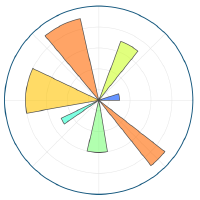 **Matplotlib** | Static plotting | [IO Adapters](#reference-io-available-data-adapters) |
|  **Rich** | Terminal formatting and progress | [Lifecycle Hook](#reference-lifecycle-hooks-richprogressbar) |

<a id="ecosystem--developer-tools"></a>

### Developer Tools

Improve your development workflow:

| Integration | Description | Documentation |
| --- | --- | --- |
|  **Jupyter** | Notebook magic commands | [Examples](https://github.com/apache/hamilton/tree/main/examples/jupyter_notebook_magic) |
|  **VS Code** | Language server and extension | [VS Code Guide](#hamilton-vscode) |
| **Claude Code** | AI assistant plugin for Hamilton development | [Plugin Guide](#ecosystem-claude-code-plugin) |
| **MCP Server** | LLM tool server for interactive DAG development | [MCP Guide](#ecosystem-mcp-server) |
|  **tqdm** | Progress bars | [Lifecycle Hook](#reference-lifecycle-hooks-progressbar) |

<a id="ecosystem--cloud-providers-infrastructure"></a>

### Cloud Providers & Infrastructure

Deploy Apache Hamilton to the cloud:

| Integration | Description | Documentation |
| --- | --- | --- |
|  **AWS** | Amazon Web Services | [Examples](https://github.com/apache/hamilton/tree/main/examples/aws) |
|  **Google Cloud** | Google Cloud Platform | [Scale-up Guide](#how-tos-scale-up) |
|  **Modal** | Serverless cloud functions | [Scale-up Guide](#how-tos-scale-up) |

<a id="ecosystem--storage-caching"></a>

### Storage & Caching

Persist and cache your data:

| Integration | Description | Documentation |
| --- | --- | --- |
|  **DiskCache** | Disk-based caching | [Examples](https://github.com/apache/hamilton/tree/main/examples/caching_nodes/diskcache_adapter) |
| **File-based caching** | Local file caching | [Caching Guide](#reference-caching) |

<a id="ecosystem--other-utilities"></a>

### Other Utilities

| Integration | Description | Documentation |
| --- | --- | --- |
|  **Slack** | Notifications and integrations | [Examples](https://github.com/apache/hamilton/tree/main/examples/slack) \| [Lifecycle Hook](#reference-lifecycle-hooks-slacknotifierhook) |
|  **GeoPandas** | Geospatial data analysis | [Type extension](https://github.com/apache/hamilton/blob/main/hamilton/plugins/geopandas_extensions.py) for GeoDataFrame support |
|  **YAML** | Configuration management | [IO Adapters](#reference-io-available-data-adapters) |
| **Neo4j** | Knowledge graph RAG | [Examples](https://github.com/apache/hamilton/tree/main/examples/LLM_Workflows/neo4j_graph_rag) |

---

<a id="ecosystem--external-resources"></a>

## External Resources

The following resources and services are provided by third parties and the broader Apache Hamilton community.

**⚠️ Important Notice:**

These resources and services are **not maintained, nor endorsed** by the Apache Hamilton Community and Apache Hamilton project (maintained by the Committers and the Apache Hamilton PMC). Use them at your sole discretion. The community does not verify the licenses nor validity of these tools, so it’s your responsibility to verify them.

<a id="ecosystem--community-resources"></a>

### Community Resources

<a id="ecosystem--dataflow-hub"></a>

#### 📚 Dataflow Hub

[hub.dagworks.io](https://hub.dagworks.io/docs/)

A repository of reusable Apache Hamilton dataflows contributed by the community. Browse and download pre-built dataflows for common use cases.

> [!NOTE]
> : It’s WIP to move the domain to be under Apache. DAGWorks Inc., which donated Hamilton, is not an operating entity anymore.

<a id="ecosystem--blog-tutorials"></a>

#### 📝 Blog & Tutorials

[blog.dagworks.io](https://blog.dagworks.io/)

Articles covering Apache Hamilton use cases, design patterns, reference architectures, and best practices.

> [!NOTE]
> : It’s WIP to move the contents to be under Apache. DAGWorks Inc., which donated Hamilton, is not an operating entity anymore.

<a id="ecosystem--video-content"></a>

#### 🎥 Video Content

[YouTube @DAGWorks-Inc](https://www.youtube.com/@DAGWorks-Inc)

Video tutorials, talks, and meetup recordings about Apache Hamilton.

> [!NOTE]
> : It’s WIP to move the contents to be under Apache. DAGWorks Inc., which donated Hamilton, is not an operating entity anymore.

---

<a id="ecosystem--contributing-to-the-ecosystem"></a>

## Contributing to the Ecosystem

<a id="ecosystem--adding-a-new-integration"></a>

### Adding a New Integration

If you’ve created a plugin or integration for Apache Hamilton, we’d love to include it in our ecosystem!

**For Built-in Integrations** (maintained by the Apache Hamilton project):

1. Create a plugin in the `hamilton/plugins/` directory
2. Add documentation and examples
3. Submit a pull request to the [Apache Hamilton repository](https://github.com/apache/hamilton)
4. Follow the [contribution guidelines](https://github.com/apache/hamilton/blob/main/CONTRIBUTING.md)

**For External Resources** (maintained by third parties):

1. Submit a pull request to add your resource to this page under “External Resources”
2. Include a clear description and link
3. Ensure your resource is relevant to Apache Hamilton users
4. Your resource must be properly licensed and actively maintained

<a id="ecosystem--support-questions"></a>

### Support & Questions

- 💬 [Slack Community](https://join.slack.com/t/hamilton-opensource/shared_invite/zt-2niepkra8-DGKGf_tTYhXuJWBTXtIs4g) - Real-time chat and community support
- 🐛 [GitHub Issues](https://github.com/apache/hamilton/issues) - Bug reports and feature requests
- 📖 [Documentation](https://hamilton.apache.org) - Comprehensive guides and API reference
- 📧 **Mailing List** - Join the Apache Hamilton users mailing list for discussions and announcements

  - **How to Subscribe**: Send an empty email to [users-subscribe@hamilton.apache.org](mailto:users-subscribe%40hamilton.apache.org). Use a subject line like “subscribe” to avoid spam filters. Await a confirmation message and follow the instructions to complete the process.
  - **How to Unsubscribe**: Send an empty message to [users-unsubscribe@hamilton.apache.org](mailto:users-unsubscribe%40hamilton.apache.org) from the same email address used to subscribe.
  - **How to Post**: Once subscribed, post messages to [users@hamilton.apache.org](mailto:users%40hamilton.apache.org)
  - **Archives**: [View past discussions](https://lists.apache.org/list.html?users@hamilton.apache.org)

---

<a id="ecosystem--stay-updated"></a>

## Stay Updated

- ⭐ Star us on [GitHub](https://github.com/apache/hamilton)
- 🐦 Follow [@hamilton\_os](https://twitter.com/hamilton_os) on Twitter/X
- 📧 Join the [mailing lists](#asf) for announcements

On this page

- [Ecosystem](#ecosystem)
  - [🚀 Interactive Tutorials](#ecosystem--interactive-tutorials)
  - [Built-in Integrations](#ecosystem--built-in-integrations)
    - [Data Frameworks](#ecosystem--data-frameworks)
    - [Machine Learning & Data Science](#ecosystem--machine-learning-data-science)
    - [Orchestration & Workflow Systems](#ecosystem--orchestration-workflow-systems)
    - [Data Engineering & ETL](#ecosystem--data-engineering-etl)
    - [Observability & Monitoring](#ecosystem--observability-monitoring)
    - [Visualization](#ecosystem--visualization)
    - [Developer Tools](#ecosystem--developer-tools)
    - [Cloud Providers & Infrastructure](#ecosystem--cloud-providers-infrastructure)
    - [Storage & Caching](#ecosystem--storage-caching)
    - [Other Utilities](#ecosystem--other-utilities)
  - [External Resources](#ecosystem--external-resources)
    - [Community Resources](#ecosystem--community-resources)
      - [📚 Dataflow Hub](#ecosystem--dataflow-hub)
      - [📝 Blog & Tutorials](#ecosystem--blog-tutorials)
      - [🎥 Video Content](#ecosystem--video-content)
  - [Contributing to the Ecosystem](#ecosystem--contributing-to-the-ecosystem)
    - [Adding a New Integration](#ecosystem--adding-a-new-integration)
    - [Support & Questions](#ecosystem--support-questions)
  - [Stay Updated](#ecosystem--stay-updated)

---

<a id="ecosystem-claude-code-plugin"></a>

<!-- source_url: https://hamilton.incubator.apache.org/ecosystem/claude-code-plugin/ -->

<!-- page_index: 65 -->

<a id="ecosystem-claude-code-plugin--claude-code-plugin-for-hamilton"></a>

# Claude Code Plugin for Hamilton

The Hamilton Claude Code plugin provides AI-powered assistance for developing Hamilton DAGs using [Claude Code](https://code.claude.com), Anthropic’s official CLI tool.

<a id="ecosystem-claude-code-plugin--what-is-claude-code"></a>

## What is Claude Code?

[Claude Code](https://code.claude.com) is an AI-powered CLI tool that helps you build software faster by providing intelligent code assistance, debugging help, and code generation capabilities. The Hamilton plugin extends Claude Code with deep knowledge of Hamilton patterns and best practices.

<a id="ecosystem-claude-code-plugin--features"></a>

## Features

The Hamilton Claude Code plugin provides expert assistance for:

- 🏗️ **Creating new Hamilton modules** with proper patterns and decorators
- 🔍 **Understanding existing DAGs** by explaining dataflow and dependencies
- 🎨 **Applying function modifiers** correctly (@parameterize, @config.when, @check\_output, etc.)
- 🐛 **Debugging issues** in DAG definitions and execution
- 🔄 **Converting Python scripts** to Hamilton modules
- ⚡ **Optimizing pipelines** with caching, parallelization, and best practices
- ✅ **Writing tests** for Hamilton functions
- 📊 **Generating visualizations** of your DAGs

<a id="ecosystem-claude-code-plugin--installation"></a>

## Installation

<a id="ecosystem-claude-code-plugin--prerequisites"></a>

### Prerequisites

First, install Claude Code:

```
# Install Claude Code CLI curl -fsSL https://cli.claude.ai/install.sh | sh
```

For more installation options, see the [Claude Code documentation](https://code.claude.com/docs/en/install.html).

<a id="ecosystem-claude-code-plugin--install-the-hamilton-plugin"></a>

### Install the Hamilton Plugin

Once Claude Code is installed, you can add the Hamilton plugin:

```
# Add the Hamilton plugin marketplace
/plugin marketplace add apache/hamilton

# Install the plugin (available across all projects)
/plugin install hamilton --scope user
```

Or combine into a single command:

```
claude plugin install hamilton@apache/hamilton --scope user
```

**Installation scopes:**

- `--scope user` - Available in all your projects (recommended)
- `--scope project` - Only in the current project
- `--scope local` - Testing/development only

<a id="ecosystem-claude-code-plugin--for-contributors"></a>

### For Contributors

If you’ve cloned the Hamilton repository, the skill is already available in `.claude/plugins/hamilton/skills/hamilton/` and will be automatically discovered by Claude Code when you work in the repo. No installation needed!

<a id="ecosystem-claude-code-plugin--usage"></a>

## Usage

<a id="ecosystem-claude-code-plugin--automatic-assistance"></a>

### Automatic Assistance

Claude Code will automatically use the Hamilton plugin when it detects you’re working with Hamilton code. Just ask questions or give instructions naturally:

```
claude "Help me create a Hamilton module for processing customer data"
claude "Explain what this DAG does"
claude "Convert this pandas script to Hamilton"
claude "Add caching to my expensive computation function"
claude "Why am I getting a circular dependency error?"
```

<a id="ecosystem-claude-code-plugin--manual-invocation"></a>

### Manual Invocation

You can explicitly invoke the skill using the `/hamilton` command:

```
claude /hamilton create a feature engineering module with rolling averages
claude /hamilton explain the dataflow in my_functions.py
claude /hamilton optimize this DAG for parallel execution
```

<a id="ecosystem-claude-code-plugin--interactive-mode"></a>

### Interactive Mode

For ongoing assistance, start an interactive session:

```
# Start Claude Code in your Hamilton project cd /path/to/your/hamilton/project claude
```

Then interact naturally:

```
You:I need to create a DAG that processes customer transactions Claude:I 'll help you create a Hamilton module for processing customer transactions...You:Add validation to ensure all amounts are positive Claude:I 'll add a @check_output decorator with validation...
```

<a id="ecosystem-claude-code-plugin--examples"></a>

## Examples

<a id="ecosystem-claude-code-plugin--creating-a-new-hamilton-module"></a>

### Creating a New Hamilton Module

**Prompt:**

```
Create a Hamilton module that loads sales data from
a CSV,removes nulls,calculates a 7 - day rolling average,and outputs the top 10 days by sales.
```

**Claude generates:**

```
"""Sales analysis DAG.""" import
pandas
as
pd def
raw_sales (csv_path:str) -> pd.DataFrame:
"""Load sales data from CSV.:param csv_path: Path to sales CSV file :return: Raw sales DataFrame """ return pd.read_csv (csv_path) def
cleaned_sales (raw_sales:pd.DataFrame) -> pd.DataFrame:
"""Remove null values from sales data.:param raw_sales: Raw sales data :return: Cleaned sales DataFrame """ return raw_sales.dropna () def
rolling_avg_7d (cleaned_sales:pd.DataFrame) -> pd.Series:
"""Calculate 7-day rolling average of sales.:param cleaned_sales: Cleaned sales data :return: 7-day rolling average """ return cleaned_sales ['sales'].rolling (window =7,min_periods =1).mean () def
top_10_sales_days (cleaned_sales:pd.DataFrame,rolling_avg_7d:pd.Series) -> pd.DataFrame:
"""Get top 10 days by rolling average.:param cleaned_sales: Cleaned sales data :param rolling_avg_7d: 7-day rolling average :return: Top 10 sales days """ result =cleaned_sales.copy () result ['rolling_avg'] =rolling_avg_7d return result.nlargest (10,'rolling_avg') # Usage:# from hamilton import driver # dr = driver.Driver({}, __name__) # results = dr.execute(['top_10_sales_days'], inputs={'csv_path': 'sales.csv'})
```

<a id="ecosystem-claude-code-plugin--converting-existing-code"></a>

### Converting Existing Code

**Prompt:**

```
Convert this script to Hamilton:import
pandas
as
pd df =pd.read_csv ('data.csv') df ['feature'] =df ['col_a'] * 2 + df ['col_b'] result =df.groupby ('category' )['feature'].mean ()
```

**Claude refactors to:**

```
"""Data processing DAG.""" import
pandas
as
pd def
raw_data (data_path:str) -> pd.DataFrame:
"""Load raw data from CSV.""" return pd.read_csv (data_path) def
feature (raw_data:pd.DataFrame) -> pd.Series:
"""Calculate feature from columns.""" return raw_data ['col_a'] * 2 + raw_data ['col_b'] def
data_with_feature (raw_data:pd.DataFrame,feature:pd.Series) -> pd.DataFrame:
"""Add feature column to dataset.""" result =raw_data.copy () result ['feature'] =feature return result def
result (data_with_feature:pd.DataFrame) -> pd.Series:
"""Calculate mean feature by category.""" return data_with_feature.groupby ('category' )['feature'].mean ()
```

<a id="ecosystem-claude-code-plugin--applying-decorators"></a>

### Applying Decorators

**Prompt:**

```
I need to create rolling averages for 7, 30, and 90 day windows.
How do I do this without repeating code?
```

**Claude suggests:**

```
from
hamilton.function_modifiers
import parameterize @parameterize (rolling_7d ={'window':7 },rolling_30d ={'window':30 },rolling_90d ={'window':90 },) def
rolling_average (sales:pd.Series,window:int) -> pd.Series:
"""Calculate rolling average for different windows.Creates three nodes: rolling_7d, rolling_30d, rolling_90d """ return sales.rolling (window =window,min_periods =1).mean ()
```

<a id="ecosystem-claude-code-plugin--debugging"></a>

### Debugging

**Prompt:**

```

I
'm getting: "Could not find parameter '
processed_data
' in graph"
```

**Claude analyzes:**

```
This error occurs when a function parameter references a node that doesn 't exist in your DAG.Common causes:1.Typo in parameter name (e.g.,'processed_data' vs 'process_data') 2.Missing function definition for 'processed_data' 3.Function excluded via @hamilton_exclude or @config.when Check your module for a function named 'processed_data'.If it doesn 't exist,either:- Add the function,or - Fix the parameter name to match an existing function
```

<a id="ecosystem-claude-code-plugin--what-the-plugin-knows"></a>

## What the Plugin Knows

The plugin has deep knowledge of Hamilton:

<a id="ecosystem-claude-code-plugin--core-concepts"></a>

### Core Concepts

- Function-based DAG definitions
- Driver configuration and execution
- Node dependencies via parameters
- Type hints and annotations

<a id="ecosystem-claude-code-plugin--function-modifiers"></a>

### Function Modifiers

- **Configuration**: @config.when, @hamilton\_exclude
- **Parameterization**: @parameterize, @parameterize\_sources, @parameterize\_values
- **Column extraction**: @extract\_columns, @extract\_fields
- **Data quality**: @check\_output, @check\_output\_custom, @schema
- **I/O**: @save\_to, @load\_from, @dataloader, @datasaver
- **Transformation**: @pipe, @does, @mutate, @step
- **Advanced**: @subdag, @resolve, @cache

<a id="ecosystem-claude-code-plugin--integration-patterns"></a>

### Integration Patterns

- Airflow orchestration
- FastAPI microservices
- Streamlit dashboards
- Jupyter notebooks
- Ray/Dask/Spark distributed execution

<a id="ecosystem-claude-code-plugin--llm-workflows"></a>

### LLM Workflows

- RAG pipeline patterns
- Document chunking
- Vector database operations
- Embedding generation

<a id="ecosystem-claude-code-plugin--best-practices"></a>

### Best Practices

- Testing strategies
- Code organization
- Error handling
- Performance optimization

<a id="ecosystem-claude-code-plugin--plugin-structure"></a>

## Plugin Structure

The plugin is organized as follows:

```
.claude/plugins/hamilton/
├── .claude-plugin/
│   ├── plugin.json           # Plugin manifest
│   └── marketplace.json      # Marketplace configuration
├── skills/
│   └── hamilton/
│       ├── SKILL.md          # Main skill instructions
│       ├── examples.md       # Code examples and patterns
│       └── README.md         # Skill documentation
└── README.md                 # Plugin documentation
```

For contributors, the skill exists in `.claude/plugins/hamilton/skills/hamilton/` for immediate use.

<a id="ecosystem-claude-code-plugin--contributing"></a>

## Contributing

Found a bug or want to improve the plugin? We’d love your help!

<a id="ecosystem-claude-code-plugin--report-issues"></a>

### Report Issues

Please [file an issue](https://github.com/apache/hamilton/issues/new) with:

- Clear description of the problem
- Steps to reproduce
- Expected vs actual behavior
- Hamilton and Claude Code versions

<a id="ecosystem-claude-code-plugin--submit-pull-requests"></a>

### Submit Pull Requests

1. Fork the repository: https://github.com/apache/hamilton
2. Make changes in `.claude/plugins/hamilton/skills/hamilton/`
3. Test thoroughly with various scenarios
4. Submit a PR with a clear description

**Contribution ideas:**

- 📚 Add new examples to `examples.md`
- 📝 Improve instructions in `SKILL.md`
- 🐛 Fix bugs or inaccuracies
- ✨ Add support for new Hamilton features
- 📖 Enhance documentation

See [CONTRIBUTING.md](https://github.com/apache/hamilton/blob/main/CONTRIBUTING.md) for guidelines.

<a id="ecosystem-claude-code-plugin--requirements"></a>

## Requirements

- **Claude Code CLI** - v0.1.0 or later
- **Hamilton** - v1.0.0 or later (plugin works with any version)
- **Python** - 3.9 or later

<a id="ecosystem-claude-code-plugin--troubleshooting"></a>

## Troubleshooting

<a id="ecosystem-claude-code-plugin--plugin-not-loading"></a>

### Plugin Not Loading

If the plugin isn’t recognized:

```
# Check installed plugins claude plugin list

# Reinstall if needed claude plugin uninstall hamilton claude plugin install hamilton@apache/hamilton --scope user
```

<a id="ecosystem-claude-code-plugin--skill-not-activating"></a>

### Skill Not Activating

If Claude doesn’t seem to use Hamilton knowledge:

```
# Manually invoke the skill claude /hamilton <your-question>

# Or mention Hamilton explicitly in your prompt claude "Using Hamilton framework, create a DAG for..."
```

<a id="ecosystem-claude-code-plugin--permission-errors"></a>

### Permission Errors

The plugin requests permission to:

- Read files (Read, Grep, Glob)
- Run Python code (python, pytest)
- Search files (find)

If prompted, approve these permissions for the best experience.

<a id="ecosystem-claude-code-plugin--learn-more"></a>

## Learn More

- **Hamilton Documentation**: https://hamilton.apache.org
- **Claude Code Documentation**: https://code.claude.com/docs
- **Hamilton GitHub**: https://github.com/apache/hamilton
- **Hamilton Examples**: https://github.com/apache/hamilton/tree/main/examples
- **Community Slack**: Join via Hamilton GitHub repo

<a id="ecosystem-claude-code-plugin--license"></a>

## License

This plugin is part of the Apache Hamilton project and is licensed under the Apache 2.0 License.

---

**Enhance your Hamilton development with AI! 🚀**

---

<a id="ecosystem-mcp-server"></a>

<!-- source_url: https://hamilton.incubator.apache.org/ecosystem/mcp-server/ -->

<!-- page_index: 66 -->

# MCP Server ¶

[
<svg viewbox="0 0 24 24" xmlns="http://www.w3.org/2000/svg">
<path></path>
</svg>

Back to top](#ecosystem-mcp-server)

[
<svg><use href="#svg-eye"></use></svg>

View this page](https://github.com/apache/hamilton/blob/main/docs/ecosystem/mcp-server.md?plain=true "View this page")

[
<svg><use href="#svg-pencil"></use></svg>

Edit this page](https://github.com/apache/hamilton/edit/main/docs/ecosystem/mcp-server.md "Edit this page")

<svg><use href="#svg-toc"></use></svg>

<a id="ecosystem-mcp-server--mcp-server"></a>

# MCP Server

The Hamilton MCP server exposes Hamilton’s DAG compilation, validation, and execution as tools for LLM clients via the [Model Context Protocol](https://modelcontextprotocol.io/) (MCP). It enables LLM-driven development workflows where you write Hamilton functions, validate the DAG, visualize dependencies, and execute pipelines – all through natural language interaction with clients such as Claude Desktop, Claude Code, or Cursor.

<a id="ecosystem-mcp-server--architecture"></a>

## Architecture

```

        graph LR
    A[LLM Client] -->|MCP stdio transport| B[Hamilton MCP Server]
    B -->|build & execute| C[Hamilton Driver]
    C -->|compile DAG from| D[User Code]
    
```

The server runs as a local process using **stdio transport**. The LLM client launches the server, sends tool calls over stdin/stdout, and receives structured JSON responses. Internally, the server compiles user-provided Python source into a Hamilton DAG via `hamilton.driver.Builder` (with dynamic execution enabled), then performs the requested operation (validate, list nodes, visualize, or execute).

<a id="ecosystem-mcp-server--installation"></a>

## Installation

The recommended way to run the MCP server is via `uvx`, which handles installation automatically:

```
uvx --from "apache-hamilton[mcp]" hamilton-mcp
```

This creates an ephemeral environment with Hamilton and [FastMCP](https://github.com/PrefectHQ/fastmcp), runs the server, and cleans up after. No pre-installation required.

Alternatively, install into your own environment:

```
pip install "apache-hamilton[mcp]"
```

<a id="ecosystem-mcp-server--optional-dependencies"></a>

### Optional dependencies

The server can compile and execute user code, so any libraries your code imports must be available in the server’s environment. When using `uvx`, pass `--with` to include them:

| Library | Install command | What it enables |
| --- | --- | --- |
| pandas | `pip install pandas` | DataFrame-based scaffold templates and result serialization |
| numpy | `pip install numpy` | ML pipeline scaffolds and ndarray serialization |
| polars | `pip install polars` | Polars DataFrame/Series serialization |
| graphviz | `pip install "apache-hamilton[visualization]"` | DAG visualization via `hamilton_visualize` |

For example, for a pandas/numpy project:

```
uvx --from "apache-hamilton[mcp]" --with pandas --with numpy hamilton-mcp
```

Or for a polars project:

```
uvx --from "apache-hamilton[mcp]" --with polars hamilton-mcp
```

<a id="ecosystem-mcp-server--running-the-server"></a>

## Running the Server

<a id="ecosystem-mcp-server--via-uvx-recommended"></a>

### Via uvx (recommended)

```
uvx --from "apache-hamilton[mcp]" hamilton-mcp
```

Include the libraries your code uses via `--with`:

```
# pandas/numpy project uvx --from "apache-hamilton[mcp]" --with pandas --with numpy hamilton-mcp

# polars project uvx --from "apache-hamilton[mcp]" --with polars hamilton-mcp
```

<a id="ecosystem-mcp-server--direct-cli"></a>

### Direct CLI

If Hamilton is already installed in your environment:

```
hamilton-mcp
```

<a id="ecosystem-mcp-server--programmatic"></a>

### Programmatic

You can also start the server from Python:

```
from
hamilton.plugins.h_mcp
import get_mcp_server mcp =get_mcp_server () mcp.run ()
```

The `get_mcp_server()` function returns a `FastMCP` instance. Call `.run()` to start the stdio transport loop.

<a id="ecosystem-mcp-server--connecting-to-an-llm-client"></a>

## Connecting to an LLM Client

<a id="ecosystem-mcp-server--claude-desktop"></a>

### Claude Desktop

Add the following to your Claude Desktop configuration file (`claude_desktop_config.json`). Add `"--with", "<library>"` pairs for whichever libraries your code uses:

```
{
"mcpServers":
{
"hamilton":
{
"command":
"uvx",
"args":
[
"--from",
"apache-hamilton[mcp]",
"--with",
"pandas",
"--with",
"numpy",
"hamilton-mcp"
]
}
}}
```

<a id="ecosystem-mcp-server--claude-code"></a>

### Claude Code

Add the server to your project configuration, including `--with` flags for your libraries:

```
claude mcp add hamilton -- uvx --from "apache-hamilton[mcp]" --with pandas --with numpy hamilton-mcp
```

Or add it to your `.mcp.json` file:

```
{
"mcpServers":
{
"hamilton":
{
"command":
"uvx",
"args":
[
"--from",
"apache-hamilton[mcp]",
"--with",
"pandas",
"--with",
"numpy",
"hamilton-mcp"
]
}
}}
```

See also the [Claude Code Plugin](#ecosystem-claude-code-plugin) for an accompanying skill that provides workflow guidance when using the MCP tools.

<a id="ecosystem-mcp-server--cursor"></a>

### Cursor

In Cursor, open **Settings > MCP Servers** and add (adjust `--with` flags to match your project):

```
{
"hamilton":
{
"command":
"uvx",
"args":
[
"--from",
"apache-hamilton[mcp]",
"--with",
"pandas",
"--with",
"numpy",
"hamilton-mcp"
]
}}
```

<a id="ecosystem-mcp-server--other-mcp-compatible-clients"></a>

### Other MCP-compatible clients

Any client that supports the MCP stdio transport can connect by launching the server as a subprocess. The server reads JSON-RPC messages from stdin and writes responses to stdout.

```
uvx --from "apache-hamilton[mcp]" hamilton-mcp
```

Add `--with <library>` for any libraries your code imports (e.g., `--with pandas --with numpy` or `--with polars`).

<a id="ecosystem-mcp-server--available-tools"></a>

## Available Tools

The server exposes seven tools. Each tool accepts and returns JSON.

<a id="ecosystem-mcp-server--hamilton_capabilities"></a>

### `hamilton_capabilities`

Report which optional libraries are installed and which features are available. Call this first to discover the environment before generating code. If the user specifies which libraries they use, pass them as `preferred_libraries` to filter scaffold patterns accordingly.

**Parameters:**

| Parameter | Type | Required | Description |
| --- | --- | --- | --- |
| `preferred_libraries` | `list[str] \| None` | No | Libraries the user wants to use (e.g., `["pandas", "numpy"]`). When provided, scaffolds are filtered to only those whose requirements are a subset of this list. When omitted, falls back to auto-detection. |

**Returns:** A dict with `libraries` (library name to boolean, reflecting what is installed) and `available_scaffolds` (list of scaffold pattern names filtered by preference or auto-detection).

---

<a id="ecosystem-mcp-server--hamilton_validate_dag"></a>

### `hamilton_validate_dag`

Validate Hamilton DAG code by building the Driver. Compiles Python source into a Hamilton DAG and checks for missing dependencies, type mismatches, and circular references without executing the code.

**Parameters:**

| Parameter | Type | Required | Description |
| --- | --- | --- | --- |
| `code` | `str` | Yes | Python source code defining Hamilton functions |
| `config` | `dict \| None` | No | Hamilton config dict passed to `Builder.with_config()` |

**Returns:** `{"valid": true, "node_count": N, "nodes": [...], "inputs": [...], "errors": []}` on success, or `{"valid": false, "node_count": 0, "nodes": [], "inputs": [], "errors": [...]}` on failure. Each error is a dict with `type`, `message`, `detail` (may be `null` for non-syntax errors), and `traceback` fields.

---

<a id="ecosystem-mcp-server--hamilton_list_nodes"></a>

### `hamilton_list_nodes`

List all nodes in a Hamilton DAG with their types and dependencies. Returns structured info for every node including name, output type, tags, whether it is an external input, and its required/optional dependencies.

**Parameters:**

| Parameter | Type | Required | Description |
| --- | --- | --- | --- |
| `code` | `str` | Yes | Python source code defining Hamilton functions |
| `config` | `dict \| None` | No | Hamilton config dict passed to `Builder.with_config()` |

**Returns:** `{"nodes": [...], "errors": []}`. Each node is a dict with `name`, `type`, `is_external_input`, `tags`, `required_dependencies`, `optional_dependencies`, and `documentation` fields.

---

<a id="ecosystem-mcp-server--hamilton_visualize"></a>

### `hamilton_visualize`

Visualize the Hamilton DAG as DOT graph source. Requires `graphviz` (`pip install "apache-hamilton[visualization]"`).

**Parameters:**

| Parameter | Type | Required | Description |
| --- | --- | --- | --- |
| `code` | `str` | Yes | Python source code defining Hamilton functions |
| `config` | `dict \| None` | No | Hamilton config dict passed to `Builder.with_config()` |
| `output_format` | `str` | No | Output format (default: `"dot"`). Currently only `"dot"` is supported; other values are accepted but ignored. |

**Returns:** A string containing the Graphviz DOT source for the dependency graph, or an error message if graphviz is not installed.

---

<a id="ecosystem-mcp-server--hamilton_execute"></a>

### `hamilton_execute`

Execute a Hamilton DAG and return the requested outputs. Builds the DAG from source, then calls `driver.execute()` with the given `final_vars` and `inputs`. Results are serialized to JSON-safe values. A timeout (default 30 seconds) guards against long-running code.

**Parameters:**

| Parameter | Type | Required | Description |
| --- | --- | --- | --- |
| `code` | `str` | Yes | Python source code defining Hamilton functions |
| `final_vars` | `list[str]` | Yes | Node names to compute |
| `inputs` | `dict \| None` | No | External input values |
| `config` | `dict \| None` | No | Hamilton config dict passed to `Builder.with_config()` |
| `timeout_seconds` | `int` | No | Execution timeout in seconds (default: `30`) |

**Returns:** `{"results": {...}, "execution_time_ms": N}` on success. On failure: `{"error": "..."}` for build errors or timeouts, or `{"error": "...", "execution_time_ms": N}` for runtime errors during execution. Results are serialized: pandas DataFrames/Series become dicts via `.to_dict()`, numpy arrays become lists via `.tolist()`, polars DataFrames become list-of-dicts via `.to_dicts()`, polars Series become lists via `.to_list()`, and all other types use `str()`.

**Warning:** This tool executes arbitrary Python code. Always validate with `hamilton_validate_dag` before executing.

---

<a id="ecosystem-mcp-server--hamilton_get_docs"></a>

### `hamilton_get_docs`

Get Hamilton documentation for a specific topic.

**Parameters:**

| Parameter | Type | Required | Description |
| --- | --- | --- | --- |
| `topic` | `str` | Yes | One of: `overview`, `decorators`, `driver`, `builder`, or any decorator name (`parameterize`, `extract_columns`, `config`, `check_output`, `tag`, `pipe`, `does`, `subdag`, etc.) |

**Returns:** A string containing the requested documentation.

---

<a id="ecosystem-mcp-server--hamilton_scaffold"></a>

### `hamilton_scaffold`

Generate a starter Hamilton module for a given pattern. Available patterns depend on installed or preferred libraries. Returns Python source code that is a valid Hamilton module, plus a driver script example.

**Parameters:**

| Parameter | Type | Required | Description |
| --- | --- | --- | --- |
| `pattern` | `str` | Yes | Scaffold pattern name (use `hamilton_capabilities` to discover available patterns) |
| `preferred_libraries` | `list[str] \| None` | No | Libraries the user wants to use. Filters available patterns the same way as in `hamilton_capabilities`. |

**Returns:** A string containing Python source code for the requested scaffold pattern, or an error listing available patterns if the name is invalid.

**Available scaffold patterns:**

| Pattern | Required libraries | Description |
| --- | --- | --- |
| `basic_pure_python` | None | Simple data processing pipeline using only built-in Python types |
| `basic` | pandas | DataFrame cleaning and row counting |
| `parameterized` | pandas | Using `@parameterize` to create multiple nodes from one function |
| `config_based` | pandas | Conditional logic with `@config.when` |
| `data_pipeline` | pandas | ETL workflow: ingest, clean, transform, aggregate |
| `ml_pipeline` | pandas, numpy | Feature engineering and train/test split |
| `data_quality` | pandas, numpy | Data validation with `@check_output` |

<a id="ecosystem-mcp-server--conditional-features"></a>

## Conditional Features

The MCP server adapts to the libraries installed in the current Python environment. At startup, it probes for four optional libraries:

- **pandas** – Enables DataFrame-based scaffold templates and DataFrame/Series result serialization
- **numpy** – Enables the ML pipeline and data quality scaffolds, plus ndarray serialization
- **polars** – Enables Polars DataFrame/Series result serialization
- **graphviz** – Enables DAG visualization via `hamilton_visualize`

The `hamilton_capabilities` tool reports which libraries are installed. Both `hamilton_capabilities` and `hamilton_scaffold` accept an optional `preferred_libraries` parameter: when provided, scaffolds are filtered to match the user’s stated preferences rather than relying on auto-detection. This is especially useful with `uvx`, where the server runs in an ephemeral environment that may not reflect the user’s project.

When no preference is given, the tools fall back to auto-detecting installed libraries.

<a id="ecosystem-mcp-server--usage-examples"></a>

## Usage Examples

<a id="ecosystem-mcp-server--example-1:-ask-the-user-discover-capabilities-and-scaffold"></a>

### Example 1: Ask the user, discover capabilities, and scaffold

Start by asking which libraries the user works with, then pass their preferences:

```
User: I want to build a Hamilton pipeline.

LLM: Which data libraries do you use? (e.g., pandas, numpy, polars)

User: I use pandas.

Tool call: hamilton_capabilities(preferred_libraries=["pandas"])
Response:
{
  "libraries": {
    "pandas": true,
    "numpy": true,
    "polars": false,
    "graphviz": true
  },
  "available_scaffolds": [
    "basic", "basic_pure_python", "config_based",
    "data_pipeline", "parameterized"
  ]
}

Tool call: hamilton_scaffold(pattern="data_pipeline", preferred_libraries=["pandas"])
Response:
"""Hamilton data pipeline: ingest -> clean -> transform -> aggregate."""
import pandas as pd

def raw_data(raw_data_input: pd.DataFrame) -> pd.DataFrame:
    """Ingest raw data."""
    return raw_data_input

def cleaned_data(raw_data: pd.DataFrame) -> pd.DataFrame:
    """Remove nulls and duplicates."""
    return raw_data.dropna().drop_duplicates()
...
```

<a id="ecosystem-mcp-server--example-2:-validate-and-fix-then-execute"></a>

### Example 2: Validate and fix, then execute

Write code, validate it, fix errors, and run:

```
Tool call:hamilton_validate_dag (code =""" import pandas as pd def raw_data(raw_data_input: pd.DataFrame) -> pd.DataFrame:return raw_data_input def cleaned(raw_data: pd.DataFrame) -> pd.DataFrame:return raw_data.dropna() def row_count(cleaned: pd.DataFrame) -> int:return len(cleaned) """) Response:{"valid":true,"node_count":3,"nodes":["cleaned","raw_data","row_count" ],"inputs":["raw_data_input" ],"errors":[]} Tool call:hamilton_execute (code ="...(same code)...",final_vars =["row_count" ],inputs ={"raw_data_input":{"a":[1,2,None ],"b":[4,None,6 ]}}) Response:{"results":{"row_count":"1" },"execution_time_ms":12.3}
```

<a id="ecosystem-mcp-server--example-3:-explore-documentation-on-decorators"></a>

### Example 3: Explore documentation on decorators

```

Tool
call
:
hamilton_get_docs
(
topic
=
"parameterize"
)
Response
:
@parameterize
Creates
multiple
nodes
from
 
a
single
function
definition
.
Each
parameterization
defines
a
new
node
name
and
the
argument
values
to
pass
to
the
function
...
```

<a id="ecosystem-mcp-server--recommended-workflow"></a>

## Recommended Workflow

The server instructions recommend the following sequence for interactive DAG development:

```
ask user -> capabilities -> scaffold -> validate -> visualize -> correct -> execute
```

1. **Ask the user** – Ask which data libraries they use (pandas, numpy, polars, etc.), then pass the answer as `preferred_libraries` to capabilities and scaffold.
2. **Capabilities** – Call `hamilton_capabilities` to discover the environment.
3. **Scaffold** – Use `hamilton_scaffold` to generate a starting point matched to the user’s preferred libraries.
4. **Validate** – Call `hamilton_validate_dag` to compile the DAG without executing it.
5. **Visualize** – Call `hamilton_visualize` to inspect the dependency graph (requires graphviz).
6. **Correct** – If validation fails, read the error, fix the code, and validate again.
7. **Execute** – Call `hamilton_execute` after validation passes.

<a id="ecosystem-mcp-server--accompanying-claude-code-skill"></a>

## Accompanying Claude Code Skill

The Hamilton [Claude Code Plugin](#ecosystem-claude-code-plugin) includes a dedicated **hamilton-mcp** skill that provides workflow guidance for using the MCP tools. The skill is defined in `.claude-plugin/skills/mcp/SKILL.md` and is registered in the plugin manifest.

The skill provides:

- **Golden path workflow** – Step-by-step instructions for the capabilities-scaffold-validate-visualize-correct-execute loop
- **Decision rules** – Guidance on choosing scaffolds based on available libraries
- **Error handling strategy** – Common errors, their causes, and fixes (missing modules, missing dependencies, timeouts, runtime vs. validation failures)
- **Retry policy** – Retry once on error, explain to the user on second failure, never retry more than twice on the same error
- **Success criteria** – A clear definition of what constitutes a successful interaction: zero validation errors, all inputs identified, results returned, and the user understands the DAG structure

When Claude Code detects the Hamilton MCP server, the skill activates automatically and guides the LLM through best-practice usage of the tools.

<a id="ecosystem-mcp-server--troubleshooting"></a>

## Troubleshooting

<a id="ecosystem-mcp-server--modulenotfounderror:-fastmcp-is-required"></a>

### `ModuleNotFoundError: FastMCP is required`

The MCP extra is not installed. Use `uvx` which handles installation automatically:

```
uvx --from "apache-hamilton[mcp]" hamilton-mcp
```

Or install manually: `pip install "apache-hamilton[mcp]"`

<a id="ecosystem-mcp-server--hamilton-mcp:-command-not-found"></a>

### `hamilton-mcp: command not found`

If running directly (without `uvx`), the CLI entrypoint may not be on your `PATH`. Either use `uvx` (recommended), activate the virtual environment where Hamilton is installed, or use the full path:

```
/path/to/your/venv/bin/hamilton-mcp
```

<a id="ecosystem-mcp-server--visualization-returns-an-error"></a>

### Visualization returns an error

The `hamilton_visualize` tool requires the `graphviz` Python package and the Graphviz system binary. Install both:

```
pip install "apache-hamilton[visualization]"

# On Ubuntu/Debian:sudo apt-get install graphviz

# On macOS:brew install graphviz
```

<a id="ecosystem-mcp-server--execution-times-out"></a>

### Execution times out

The default timeout is 30 seconds. For long-running pipelines, pass a higher `timeout_seconds` value to `hamilton_execute`. Alternatively, reduce the data size or simplify the computation.

<a id="ecosystem-mcp-server--validation-passes-but-execution-fails"></a>

### Validation passes but execution fails

Validation checks DAG structure (dependencies, types, circular references) but does not run function bodies. Common runtime failures include:

- Missing input values not provided in the `inputs` dict
- Exceptions inside function bodies (division by zero, key errors)
- Library-specific errors (e.g., column not found in a DataFrame)

<a id="ecosystem-mcp-server--learn-more"></a>

## Learn More

- [Hamilton documentation](https://hamilton.apache.org) – Full framework reference
- [Claude Code Plugin](#ecosystem-claude-code-plugin) – AI-powered Hamilton development in Claude Code
- [CLI reference](#how-tos-cli-reference) – The `hamilton` CLI for build, diff, version, and view
- [Model Context Protocol](https://modelcontextprotocol.io/) – MCP specification and ecosystem

---

<a id="reference-decorators"></a>

<!-- source_url: https://hamilton.incubator.apache.org/reference/decorators/ -->

<!-- page_index: 67 -->

# Decorators ¶

[
<svg viewbox="0 0 24 24" xmlns="http://www.w3.org/2000/svg">
<path></path>
</svg>

Back to top](#reference-decorators)

[
<svg><use href="#svg-eye"></use></svg>

View this page](https://github.com/apache/hamilton/blob/main/docs/reference/decorators/index.rst?plain=true "View this page")

[
<svg><use href="#svg-pencil"></use></svg>

Edit this page](https://github.com/apache/hamilton/edit/main/docs/reference/decorators/index.rst "Edit this page")

<svg><use href="#svg-toc"></use></svg>

<a id="reference-decorators--decorators"></a>

# Decorators

Apache Hamilton implements several decorators to promote business-logic deduplication, configuratibility, and add a layer of capabilities. These decorators can be found in the `hamilton.function_modifiers` submodule [GitHub](https://github.com/apache/hamilton/blob/main/hamilton/function_modifiers).

<a id="reference-decorators--custom-decorators"></a>

## Custom Decorators

If you have a use case for a custom decorator, tell us on [Slack](https://join.slack.com/t/hamilton-opensource/shared_invite/zt-1bjs72asx-wcUTgH7q7QX1igiQ5bbdcg)
or via a [GitHub issues](https://github.com/apache/hamilton/issues/new?assignees=&labels=&projects=&template=feature_request.md&title=). Knowing about your use case and talking through help ensures we aren’t duplicating effort, and that it’ll be using part of the API we don’t intend to change.

<a id="reference-decorators--reference"></a>

## Reference

- [check\_output\*](#reference-decorators-check_output)
  - [`check_output`](#reference-decorators-check_output--hamilton.function_modifiers.check_output)
  - [`check_output_custom`](#reference-decorators-check_output--hamilton.function_modifiers.check_output_custom)
  - [`AsyncDataValidator`](#reference-decorators-check_output--hamilton.data_quality.base.asyncdatavalidator)
  - [`AsyncBaseDefaultValidator`](#reference-decorators-check_output--hamilton.data_quality.base.asyncbasedefaultvalidator)
  - [`check_output`](#reference-decorators-check_output--hamilton.plugins.h_pandera.check_output)
  - [`check_output`](#reference-decorators-check_output--hamilton.plugins.h_pydantic.check_output)
- [config.when\*](#reference-decorators-config_when)
  - [`config`](#reference-decorators-config_when--hamilton.function_modifiers.config)
  - [`hamilton_exclude`](#reference-decorators-config_when--hamilton.function_modifiers.configuration.hamilton_exclude)
- [dataloader](#reference-decorators-dataloader)
  - [`dataloader`](#reference-decorators-dataloader--hamilton.function_modifiers.dataloader)
- [datasaver](#reference-decorators-datasaver)
  - [`datasaver`](#reference-decorators-datasaver--hamilton.function_modifiers.datasaver)
- [does](#reference-decorators-does)
  - [`does`](#reference-decorators-does--hamilton.function_modifiers.does)
- [unpack\_fields](#reference-decorators-unpack_fields)
  - [`unpack_fields`](#reference-decorators-unpack_fields--hamilton.function_modifiers.unpack_fields)
- [extract\_columns](#reference-decorators-extract_columns)
  - [`extract_columns`](#reference-decorators-extract_columns--hamilton.function_modifiers.extract_columns)
- [extract\_fields](#reference-decorators-extract_fields)
  - [`extract_fields`](#reference-decorators-extract_fields--hamilton.function_modifiers.extract_fields)
- [inject](#reference-decorators-inject)
  - [`inject`](#reference-decorators-inject--hamilton.function_modifiers.inject)
- [load\_from](#reference-decorators-load_from)
  - [`load_from`](#reference-decorators-load_from--hamilton.function_modifiers.load_from)
- [parameterize](#reference-decorators-parameterize)
  - [`ParameterizedExtract`](#reference-decorators-parameterize--hamilton.function_modifiers.parameterizedextract)
  - [`source`](#reference-decorators-parameterize--hamilton.function_modifiers.source)
  - [`value`](#reference-decorators-parameterize--hamilton.function_modifiers.value)
  - [`group`](#reference-decorators-parameterize--hamilton.function_modifiers.group)
  - [`parameterize`](#reference-decorators-parameterize--hamilton.function_modifiers.parameterize)
- [parameterize\_extract\_columns](#reference-decorators-parameterize_extract_columns)
  - [`parameterize_extract_columns`](#reference-decorators-parameterize_extract_columns--hamilton.function_modifiers.parameterize_extract_columns)
- [parameterize\_frame](#reference-decorators-parameterize_frame)
  - [`parameterize_frame`](#reference-decorators-parameterize_frame--hamilton.experimental.decorators.parameterize_frame.parameterize_frame)
- [parameterize\_sources](#reference-decorators-parameterize_sources)
  - [`parameterize_sources`](#reference-decorators-parameterize_sources--hamilton.function_modifiers.parameterize_sources)
- [parameterized\_subdag](#reference-decorators-parameterize_subdag)
  - [`parameterized_subdag`](#reference-decorators-parameterize_subdag--hamilton.function_modifiers.parameterized_subdag)
- [parameterize\_values](#reference-decorators-parameterize_values)
  - [`parameterize_values`](#reference-decorators-parameterize_values--hamilton.function_modifiers.parameterize_values)
- [pipe family](#reference-decorators-pipe)
  - [pipe](#reference-decorators-pipe--pipe)
  - [pipe\_input](#reference-decorators-pipe--pipe-input)
  - [pipe\_output](#reference-decorators-pipe--pipe-output)
  - [mutate](#reference-decorators-pipe--mutate)
- [resolve](#reference-decorators-resolve)
  - [`resolve`](#reference-decorators-resolve--hamilton.function_modifiers.resolve)
  - [`resolve_from_config`](#reference-decorators-resolve--hamilton.function_modifiers.resolve_from_config)
- [save\_to](#reference-decorators-save_to)
  - [`save_to`](#reference-decorators-save_to--hamilton.function_modifiers.save_to)
- [subdag](#reference-decorators-subdag)
  - [`subdag`](#reference-decorators-subdag--hamilton.function_modifiers.subdag)
- [schema](#reference-decorators-schema)
  - [`schema`](#reference-decorators-schema--hamilton.function_modifiers.schema)
- [tag\*](https://hamilton.incubator.apache.org/reference/decorators/tag/)
  - [`tag`](https://hamilton.incubator.apache.org/reference/decorators/tag/#hamilton.function_modifiers.tag)
  - [`tag_outputs`](https://hamilton.incubator.apache.org/reference/decorators/tag/#hamilton.function_modifiers.tag_outputs)
- [with\_columns](#reference-decorators-with_columns)
  - [Pandas](#reference-decorators-with_columns--pandas)
  - [Polar (Eager)](#reference-decorators-with_columns--polar-eager)
  - [Polars (Lazy)](#reference-decorators-with_columns--polars-lazy)
  - [PySpark](#reference-decorators-with_columns--pyspark)

On this page

- [Decorators](#reference-decorators)
  - [Custom Decorators](#reference-decorators--custom-decorators)
  - [Reference](#reference-decorators--reference)

---

<a id="reference-decorators-check_output"></a>

<!-- source_url: https://hamilton.incubator.apache.org/reference/decorators/check_output/ -->

<!-- page_index: 68 -->

# check_output* ¶

[
<svg viewbox="0 0 24 24" xmlns="http://www.w3.org/2000/svg">
<path></path>
</svg>

Back to top](#reference-decorators-check_output)

[
<svg><use href="#svg-eye"></use></svg>

View this page](https://github.com/apache/hamilton/blob/main/docs/reference/decorators/check_output.rst?plain=true "View this page")

[
<svg><use href="#svg-pencil"></use></svg>

Edit this page](https://github.com/apache/hamilton/edit/main/docs/reference/decorators/check_output.rst "Edit this page")

<svg><use href="#svg-toc"></use></svg>

<a id="reference-decorators-check_output--check_output"></a>

# check\_output\*

The `@check_output` decorator enables you to add simple data quality checks to your code.

For example:

```
import
pandas
as
pd import
numpy
as
np from
hamilton.function_modifiers
import check_output @check_output (data_type =np.int64,range =(0,100 ),) def
some_int_data_between_0_and_100 () -> pd.Series:pass
```

The check\_output validator takes in arguments that each correspond to one of the default validators. These arguments
tell it to add the default validator to the list. The above thus creates two validators, one that checks the datatype
of the series, and one that checks whether the data is in a certain range.

Note that you can also specify custom decorators using the `@check_output_custom` decorator.

For async validation (e.g., async database or API calls), use `AsyncDataValidator` or `AsyncBaseDefaultValidator`
from `hamilton.data_quality.base` as your base class instead of the sync variants. These define
`async def validate()` and work with `AsyncDriver`. You can mix sync and async validators in a single
`@check_output_custom` call — each gets the appropriate wrapper type automatically.

See [data\_quality](https://github.com/apache/hamilton/blob/main/data_quality.md) for more information on
available validators and how to build custom ones.

Note we also have a plugins that allow for validation with the pandera and pydantic libraries. There are two ways to access these:

1. `@check_output(schema=pandera_schema)` or `@check_output(model=pydantic_model)`
2. `@h_pandera.check_output()` or `@h_pydantic.check_output()` on the function that declares either a typed dataframe or a pydantic model.

---

**Reference Documentation**

class hamilton.function\_modifiers.check\_output(*importance: str = 'warn'*, *default\_validator\_candidates: list[type[BaseDefaultValidator]] = None*, *target\_: str | Collection[str] | None | EllipsisType = None*, *\*\*default\_validator\_kwargs: Any*)
:   The `@check_output` decorator enables you to add simple data quality checks to your code.

    For example:


```
import
pandas
as
pd import
numpy
as
np from
hamilton.function_modifiers
import check_output @check_output (data_type =np.int64,data_in_range =(0,100 ),importance ="warn",) def
some_int_data_between_0_and_100 () -> pd.Series:...
```

    The check\_output decorator takes in arguments that each correspond to one of the default validators. These arguments tell it to add the default validator to the list. The above thus creates two validators, one that checks the datatype of the series, and one that checks whether the data is in a certain range.

    Pandera example that shows how to use the check\_output decorator with a Pandera schema:


```
import
pandas
as
pd import
pandera
as
pa from
hamilton.function_modifiers
import check_output from
hamilton.function_modifiers
import extract_columns schema =pa.DataFrameSchema (...) @extract_columns ('col1','col2') @check_output (schema =schema,target_ ="builds_dataframe",importance ="fail") def
builds_dataframe (...) -> pd.DataFrame:...
```

    \_\_init\_\_(*importance: str = 'warn'*, *default\_validator\_candidates: list[type[BaseDefaultValidator]] = None*, *target\_: str | Collection[str] | None | EllipsisType = None*, *\*\*default\_validator\_kwargs: Any*)
    :   Creates the check\_output validator.

        This constructs the default validator class.

        Note: that this creates a whole set of default validators.
        TODO – enable construction of custom validators using check\_output.custom(\*validators).

        Parameters:
        :   - **importance** – For the default validator, how important is it that this passes.
            - **default\_validator\_candidates** – List of validators to be considerred for this check.
            - **default\_validator\_kwargs** – keyword arguments to be passed to the validator.
            - **target\_** – a target specifying which nodes to decorate. See the docs in check\_output\_custom for a quick overview and the docs in function\_modifiers.base.NodeTransformer for more detail.

class hamilton.function\_modifiers.check\_output\_custom(*\*validators: DataValidator*, *target\_: str | Collection[str] | None | EllipsisType = None*)
:   Class to use if you want to implement your own custom validators.

    Come chat to us in slack if you’re interested in this!

    \_\_init\_\_(*\*validators: DataValidator*, *target\_: str | Collection[str] | None | EllipsisType = None*)
    :   Creates a check\_output\_custom decorator. This allows passing of custom validators that implement the DataValidator interface.

        Parameters:
        :   - **validators** – Validator to use.
            - **target\_** –

              The nodes to check the output of. For more detail read the docs in function\_modifiers.base.NodeTransformer, but your options are:

              1. **None**: This will check just the “final node” (the node that is returned by the decorated function).
              2. **… (Ellipsis)**: This will check all nodes in the subDAG created by this.
              3. **string**: This will check the node with the given name.
              4. **Collection[str]**: This will check all nodes specified in the list.

              In all likelihood, you *don’t* want `...`, but the others are useful.

              Note: you cannot stack @check\_output\_custom decorators. If you want to use multiple custom validators, you should pass them all in as arguments to a single @check\_output\_custom decorator.

class hamilton.data\_quality.base.AsyncDataValidator(*importance: str*)
:   Base class for an async data quality operator. Use this when validation requires async operations
    (e.g. async database queries, async API calls). Must be used with AsyncDriver.

    abstractmethod applies\_to(*datatype: type[type]*) →
> [!NOTE]
> bool

    :   Whether or not this data validator can apply to the specified dataset

        Parameters:
        :   **datatype**

        Returns:
        :   True if it can be run on the specified type, false otherwise

    abstractmethod description() →
> [!NOTE]
> str

    :   Gives a description of this validator. E.G.
        Checks whether the entire dataset lies between 0 and 1.
        Note it should be able to access internal state (E.G. constructor arguments).
        :return: The description of the validator as a string

    abstractmethod classmethod name() →
> [!NOTE]
> str

    :   Returns the name for this validator.

    abstractmethod async validate(*dataset: Any*) →
> [!NOTE]
> ValidationResult

    :   Asynchronously performs the validation.

        Parameters:
        :   **dataset** – dataset to validate

        Returns:
        :   The result of validation

class hamilton.data\_quality.base.AsyncBaseDefaultValidator(*importance: str*)
:   Base class for an async default validator.
    Async variant of BaseDefaultValidator for validators that require async operations.
    Must be used with AsyncDriver.

    abstractmethod classmethod applies\_to(*datatype: type[type]*) →
> [!NOTE]
> bool

    :   Whether or not this data validator can apply to the specified dataset

        Parameters:
        :   **datatype**

        Returns:
        :   True if it can be run on the specified type, false otherwise

    abstractmethod classmethod arg() →
> [!NOTE]
> str

    :   Yields a string that represents this validator’s argument.
        @check\_output() will be passed a series of kwargs, each one of which will correspond to
        one of these default validators. Note that we have the limitation of allowing just a single
        argument.

        Returns:
        :   The argument that this needs.

    abstractmethod description() →
> [!NOTE]
> str

    :   Gives a description of this validator. E.G.
        Checks whether the entire dataset lies between 0 and 1.
        Note it should be able to access internal state (E.G. constructor arguments).
        :return: The description of the validator as a string

    classmethod name() →
> [!NOTE]
> str

    :   Returns the name for this validator.

    abstractmethod async validate(*data: Any*) →
> [!NOTE]
> ValidationResult

    :   Actually performs the validation. Note when you

        Parameters:
        :   **dataset** – dataset to validate

        Returns:
        :   The result of validation

class hamilton.plugins.h\_pandera.check\_output(*importance: str = 'warn'*, *target: str | Collection[str] | None | EllipsisType = None*)
:   \_\_init\_\_(*importance: str = 'warn'*, *target: str | Collection[str] | None | EllipsisType = None*)
    :   Specific output-checker for pandera schemas. This decorator utilizes the output type of the function, which has
        to be of type pandera.typing.pandas.DataFrame or pandera.typing.pandas.Series, with an annotation argument.

        Parameters:
        :   - **schema** – The schema to use for validation. If this is not provided, then the output type of the function is used.
            - **importance** – Importance level (either “warn” or “fail”) – see documentation for check\_output for more details.
            - **target** – The target of the decorator – see documentation for check\_output for more details.

        Let’s look at equivalent examples to demonstrate:


```
import
pandera
as
pa import
pandas
as
pd from
hamilton.plugins
import h_pandera from
pandera.typing.pandas
import DataFrame class
MySchema (pa.DataFrameModel ):a:int b:float c:str =pa.Field (nullable =True) # For example, allow None values d:float # US dollars @h_pandera.check_output () def
foo () -> DataFrame [MySchema ]:return pd.DataFrame () # will fail
```


```
from
hamilton
import function_modifiers schema =pa.DataFrameSchema ({"a":pa.Column (pa.Int ),"b":pa.Column (pa.Float ),"c":pa.Column (pa.String,nullable =True ),"d":pa.Column (pa.Float ),}) @function_modifiers.check_output (schema =schema) def
foo () -> pd.DataFrame:return pd.DataFrame () # will fail
```

        These two are functionally equivalent. Note that we do not (yet) support modification of the output.

class hamilton.plugins.h\_pydantic.check\_output(*importance: str = 'warn'*, *target: str | Collection[str] | None | EllipsisType = None*)
:   \_\_init\_\_(*importance: str = 'warn'*, *target: str | Collection[str] | None | EllipsisType = None*)
    :   Specific output-checker for pydantic models (requires `pydantic>=2.0`).
        This decorator utilizes the output type of the function, which can be any subclass of pydantic.BaseModel.
        The function output must be declared with a type hint.

        Parameters:
        :   - **model** – The pydantic model to use for validation. If this is not provided, then the output type of the function is used.
            - **importance** – Importance level (either “warn” or “fail”) – see documentation for check\_output for more details.
            - **target** – The target of the decorator – see documentation for check\_output for more details.

        Here is an example of how to use this decorator with a function that returns a pydantic model:


```
from
hamilton.plugins
import h_pydantic from
pydantic
import BaseModel class
MyModel (BaseModel ):a:int b:float c:str @h_pydantic.check_output () def
foo () -> MyModel:return MyModel (a =1,b =2.0,c ="hello")
```

        Alternatively, you can return a dictionary from the function (type checkers will probably
        complain about this):


```
from
hamilton.plugins
import h_pydantic from
pydantic
import BaseModel class
MyModel (BaseModel ):a:int b:float c:str @h_pydantic.check_output () def
foo () -> MyModel:return {"a":1,"b":2.0,"c":"hello"}
```

        You can also use pydantic validation through `function_modifiers.check_output` by
        providing the model as an argument:


```
from
typing
import Any from
hamilton
import function_modifiers from
pydantic
import BaseModel class
MyModel (BaseModel ):a:int b:float c:str @function_modifiers.check_output (model =MyModel) def
foo () -> dict [str,Any ]:return {"a":1,"b":2.0,"c":"hello"}
```

        Note, that because we do not (yet) support modification of the output, the validation is
        performed in strict mode, meaning that no data coercion is performed. For example, the
        following function will *fail* validation:


```
from
hamilton.plugins
import h_pydantic from
pydantic
import BaseModel class
MyModel (BaseModel ):a:int # Defined as an int @h_pydantic.check_output () # This will fail validation! def
foo () -> MyModel:return MyModel (a ="1") # Assigned as a string
```

        For more information about strict mode see the pydantic docs: <https://docs.pydantic.dev/latest/concepts/strict_mode/>

---

<a id="reference-decorators-config_when"></a>

<!-- source_url: https://hamilton.incubator.apache.org/reference/decorators/config_when/ -->

<!-- page_index: 69 -->

# config.when* ¶

[
<svg viewbox="0 0 24 24" xmlns="http://www.w3.org/2000/svg">
<path></path>
</svg>

Back to top](#reference-decorators-config_when)

[
<svg><use href="#svg-eye"></use></svg>

View this page](https://github.com/apache/hamilton/blob/main/docs/reference/decorators/config_when.rst?plain=true "View this page")

[
<svg><use href="#svg-pencil"></use></svg>

Edit this page](https://github.com/apache/hamilton/edit/main/docs/reference/decorators/config_when.rst "Edit this page")

<svg><use href="#svg-toc"></use></svg>

<a id="reference-decorators-config_when--config.when"></a>

# config.when\*

`@config.when` allows you to specify different implementations depending on configuration parameters.

Note the following:

- The function cannot have the same name in the same file (or python gets unhappy), so we name it with a \_\_ (dunderscore) as a suffix. The dunderscore is removed before it goes into the DAG.
- There is currently no `@config.otherwise(...)` decorator, so make sure to have `config.when` specify set of configuration possibilities. Any missing cases will not have that output column (and subsequent downstream nodes may error out if they ask for it). To make this easier, we have a few more `@config` decorators:

  - `@config.when_not(param=value)` Will be included if the parameter is \_not\_ equal to the value specified.
  - `@config.when_in(param=[value1, value2, ...])` Will be included if the parameter is equal to one of the specified values.
  - `@config.when_not_in(param=[value1, value2, ...])` Will be included if the parameter is not equal to any of the specified values.
  - `@config` If you’re feeling adventurous, you can pass in a lambda function that takes in the entire configuration and resolves to `True` or `False`. You probably don’t want to do this.
- To always exclude a function (such as helper functions) from the DAG the most straightforward and preferred pattern is to prefix it with “\_”, but you can also use `@hamilton_exclude`.

---

**Reference Documentation**

class hamilton.function\_modifiers.config(*resolves: Callable[[dict[str, Any]], bool]*, *target\_name: str = None*, *config\_used: list[str] = None*)
:   Decorator class that determines whether a function should be in the DAG based on some configuration variable.

    Notes:

    1. Currently, functions that exist in all configurations have to be disjoint.
    2. There is currently no `@config.otherwise(...)` decorator, so make sure to have `config.when` specify set of configuration possibilities. Any missing cases will not have that output (and subsequent downstream functions may error out if they ask for it).
    3. To make this easier, we have a few more `@config` decorators:
       :   - `@config.when_not(param=value)` Will be included if the parameter is \_not\_ equal to the value specified.
           - `@config.when_in(param=[value1, value2, ...])` Will be included if the parameter is equal to one of the specified values.
           - `@config.when_not_in(param=[value1, value2, ...])` Will be included if the parameter is not equal to any of the specified values.
           - `@config` If you’re feeling adventurous, you can pass in a lambda function that takes in the entire configuration and resolves to `True` or `False`. You probably don’t want to do this.

    Example:


```
@config.when_in (business_line =["mens","kids" ],region =["uk" ]) def
LEAD_LOG_BASS_MODEL_TIMES_TREND (TREND_BSTS_WOMENS_ACQUISITIONS:pd.Series,LEAD_LOG_BASS_MODEL_SIGNUPS_NON_REFERRAL:pd.Series) -> pd.Series:# logic ...
```

    Example - use of \_\_suffix to differentiate between functions with the same name. This is required if you want to
    use the same function name in multiple configurations. Hamilton will automatically drop the suffix for you. The
    following will ensure only one function is registered with the name my\_transform:


```
@config.when (region ="us") def
my_transform__us (some_input:pd.Series,some_input_b:pd.Series) -> pd.Series:# logic ...@config.when (region ="uk") def
my_transform__uk (some_input:pd.Series,some_input_c:pd.Series) -> pd.Series:# logic ...
```

    `@config` If you’re feeling adventurous, you can pass in a lambda function that takes in the entire configuration and resolves to `True` or `False`. You probably don’t want to do this.

    \_\_init\_\_(*resolves: Callable[[dict[str, Any]], bool]*, *target\_name: str = None*, *config\_used: list[str] = None*)
    :   Decorator that resolves a function based on the configuration…

        Parameters:
        :   - **resolves** – the python function to use to resolve whether the wrapped function should exist in the graph or not.
            - **target\_name** – Optional. The name of the “function”/”node” that we want to attach @config to.
            - **config\_used** – Optional. The list of config names that this function uses.

class hamilton.function\_modifiers.configuration.hamilton\_exclude
:   Decorator class that excludes a function from the DAG.

    The preferred way to hide functions from the Hamilton DAG is to prefix them with “\_”. However,
    for the exceptional case, it can be useful for decorating helper functions without the need to prefix
    them with “\_” and use them either inside other nodes or in conjunction with `step` or `apply_to`.


```
@hamilton_exclude def
helper (...) -> ...:
'''This will not be part of the DAG''' ...
```

    You may also want to use this decorator for excluding functions in legacy code that would raise
    and error in Hamilton (for example missing type hints).

On this page

- [config.when\*](#reference-decorators-config_when)
  - [`config`](#reference-decorators-config_when--hamilton.function_modifiers.config)
    - [`config.__init__()`](#reference-decorators-config_when--hamilton.function_modifiers.config.__init__)
  - [`hamilton_exclude`](#reference-decorators-config_when--hamilton.function_modifiers.configuration.hamilton_exclude)

---

<a id="reference-decorators-dataloader"></a>

<!-- source_url: https://hamilton.incubator.apache.org/reference/decorators/dataloader/ -->

<!-- page_index: 70 -->

# dataloader ¶

[
<svg viewbox="0 0 24 24" xmlns="http://www.w3.org/2000/svg">
<path></path>
</svg>

Back to top](#reference-decorators-dataloader)

[
<svg><use href="#svg-eye"></use></svg>

View this page](https://github.com/apache/hamilton/blob/main/docs/reference/decorators/dataloader.rst?plain=true "View this page")

[
<svg><use href="#svg-pencil"></use></svg>

Edit this page](https://github.com/apache/hamilton/edit/main/docs/reference/decorators/dataloader.rst "Edit this page")

<svg><use href="#svg-toc"></use></svg>

<a id="reference-decorators-dataloader--dataloader"></a>

# dataloader

**Reference Documentation**

class hamilton.function\_modifiers.dataloader
:   Decorator for specifying a data loading function within the Hamilton framework. This decorator
    is used to annotate functions that load data, allowing them to be treated specially in the Hamilton
    DAG (Directed Acyclic Graph). The decorated function should return a tuple
    containing the loaded data and a dictionary of metadata about the loading process.

    The dataloader decorator captures loading data metadata and ensures the function’s return
    type is correctly annotated to be a tuple, where the first element is the loaded data and the
    second element is a dictionary containing metadata about the data loading process.

    **Downstream functions need only to depend on the type of data loaded.**

    <a id="reference-decorators-dataloader--example-usage:"></a>

    ## Example Usage:

    Assuming you have a function that loads data from a JSON file and you want to expose the metadata in
    your Hamilton DAG to be captured in the Hamilton UI / adapters:


```
import
pandas
as
pd from
hamilton.function_modifiers
import dataloader @dataloader () # you need () def
load_json_data (json_path:str ="data/my_data.json") -> tuple [pd.DataFrame,dict ]:
'''Loads a dataframe from a JSON file.:return: A tuple containing two dictionaries:- The first dictionary contains the loaded JSON data as a dataframe - The second dictionary contains metadata about the loading process.''' # Load the data data =pd.read_json (json_path) # Metadata about the loading process metadata ={"source":json_path,"format":"json"} return data,metadata
```

    generate\_nodes(*fn: Callable*, *config*) →
> [!NOTE]
> list[Node]

    :   Generates two nodes. We have to add tags appropriately.

        The first one is just the fn - with a slightly different name.
        The second one uses the proper function name, but only returns
        the first part of the tuple that the first returns.

        Parameters:
        :   - **fn**
            - **config**

        Returns:

    validate(*fn: Callable*)
    :   Validates that the output type is correctly annotated.

On this page

- [dataloader](#reference-decorators-dataloader)
  - [`dataloader`](#reference-decorators-dataloader--hamilton.function_modifiers.dataloader)
    - [`dataloader.generate_nodes()`](#reference-decorators-dataloader--hamilton.function_modifiers.dataloader.generate_nodes)
    - [`dataloader.validate()`](#reference-decorators-dataloader--hamilton.function_modifiers.dataloader.validate)

---

<a id="reference-decorators-datasaver"></a>

<!-- source_url: https://hamilton.incubator.apache.org/reference/decorators/datasaver/ -->

<!-- page_index: 71 -->

# datasaver ¶

[
<svg viewbox="0 0 24 24" xmlns="http://www.w3.org/2000/svg">
<path></path>
</svg>

Back to top](#reference-decorators-datasaver)

[
<svg><use href="#svg-eye"></use></svg>

View this page](https://github.com/apache/hamilton/blob/main/docs/reference/decorators/datasaver.rst?plain=true "View this page")

[
<svg><use href="#svg-pencil"></use></svg>

Edit this page](https://github.com/apache/hamilton/edit/main/docs/reference/decorators/datasaver.rst "Edit this page")

<svg><use href="#svg-toc"></use></svg>

<a id="reference-decorators-datasaver--datasaver"></a>

# datasaver

**Reference Documentation**

class hamilton.function\_modifiers.datasaver
:   Decorator for specifying a data saving function within the Hamilton framework. This decorator
    is used to annotate functions that save data, allowing them to be treated specially in the Hamilton
    DAG (Directed Acyclic Graph). The decorated function should return a dictionary containing metadata
    about the saving process.

    The datasaver decorator captures saving data metadata and ensures the function’s return
    type is correctly annotated to be a dictionary, where the dictionary contains metadata about
    the data saving process, that then is exposed / captures for the Hamilton UI / adapters.

    <a id="reference-decorators-datasaver--example-usage:"></a>

    ## Example Usage:

    Assuming you have a function that saves data to a JSON file and you want to expose the metadata in
    your Hamilton DAG to be captured in the Hamilton UI / adapters:


```
import
pandas
as
pd from
hamilton.function_modifiers
import datasaver @datasaver () # you need () def
save_json_data (data:pd.DataFrame,json_path:str ="data/my_saved_data.json") -> dict:
'''Saves data to a JSON file and returns metadata about the saving process.:param data: The data to save.:param json_path: The path to save the data to.:return: metadata about what was saved.''' # Save the data with open (json_path,"w") as file:data.to_json (json_path) # Metadata about the saving process metadata ={"destination":json_path,"format":"json"} return metadata
```

    This function can now be used within the Hamilton framework as a node that saves data to
    a JSON file. The metadata returned alongside the data can be used for logging, debugging, or
    any other purpose that requires information about the data saving process as it can be pulled
    out by the Hamilton Tracker for the Hamilton UI or other adapters.

    generate\_nodes(*fn: Callable*, *config*) →
> [!NOTE]
> list[Node]

    :   Generates same node but all this does is add tags to it.
        :param fn:
        :param config:
        :return:

    validate(*fn: Callable*)
    :   Validates that the function output is a dict type.

On this page

- [datasaver](#reference-decorators-datasaver)
  - [`datasaver`](#reference-decorators-datasaver--hamilton.function_modifiers.datasaver)
    - [`datasaver.generate_nodes()`](#reference-decorators-datasaver--hamilton.function_modifiers.datasaver.generate_nodes)
    - [`datasaver.validate()`](#reference-decorators-datasaver--hamilton.function_modifiers.datasaver.validate)

---

<a id="reference-decorators-does"></a>

<!-- source_url: https://hamilton.incubator.apache.org/reference/decorators/does/ -->

<!-- page_index: 72 -->

# does ¶

[
<svg viewbox="0 0 24 24" xmlns="http://www.w3.org/2000/svg">
<path></path>
</svg>

Back to top](#reference-decorators-does)

[
<svg><use href="#svg-eye"></use></svg>

View this page](https://github.com/apache/hamilton/blob/main/docs/reference/decorators/does.rst?plain=true "View this page")

[
<svg><use href="#svg-pencil"></use></svg>

Edit this page](https://github.com/apache/hamilton/edit/main/docs/reference/decorators/does.rst "Edit this page")

<svg><use href="#svg-toc"></use></svg>

<a id="reference-decorators-does--does"></a>

# does

`@does` is a decorator that essentially allows you to run a function over all the input parameters. So you can’t pass
any old function to `@does`, instead the function passed has to take any amount of inputs and process them all in the
same way.

```
import
pandas
as
pd from
hamilton.function_modifiers
import does import
internal_package_with_logic def
sum_series (** series:pd.Series) -> pd.Series:
"""This function takes any number of inputs and sums them all together.""" ...@does (sum_series) def
D_XMAS_GC_WEIGHTED_BY_DAY (D_XMAS_GC_WEIGHTED_BY_DAY_1:pd.Series,D_XMAS_GC_WEIGHTED_BY_DAY_2:pd.Series) -> pd.Series:
"""Adds D_XMAS_GC_WEIGHTED_BY_DAY_1 and D_XMAS_GC_WEIGHTED_BY_DAY_2""" pass @does (internal_package_with_logic.identity_function) def
copy_of_x (x:pd.Series) -> pd.Series:
"""Just returns x""" pass
```

The example here is a function, that all that it does, is sum all the parameters together. So we can annotate it with
the `@does` decorator and pass it the `sum_series` function. The `@does` decorator is currently limited to just
allow functions that consist only of one argument, a generic \*\*kwargs.

---

**Reference Documentation**

class hamilton.function\_modifiers.does(*replacing\_function: Callable*, *\*\*argument\_mapping: str | list[str]*)
:   `@does` is a decorator that essentially allows you to run a function over all the input parameters. So you can’t pass any old function to `@does`, instead the function passed has to take any amount of inputs and process them all in the same way.


```
import
pandas
as
pd from
hamilton.function_modifiers
import does import
internal_package_with_logic def
sum_series (** series:pd.Series) -> pd.Series:
'''This function takes any number of inputs and sums them all together.''' ...@does (sum_series) def
D_XMAS_GC_WEIGHTED_BY_DAY (D_XMAS_GC_WEIGHTED_BY_DAY_1:pd.Series,D_XMAS_GC_WEIGHTED_BY_DAY_2:pd.Series) -> pd.Series:
'''Adds D_XMAS_GC_WEIGHTED_BY_DAY_1 and D_XMAS_GC_WEIGHTED_BY_DAY_2''' pass @does (internal_package_with_logic.identity_function) def
copy_of_x (x:pd.Series) -> pd.Series:
'''Just returns x''' pass
```

    The example here is a function, that all that it does, is sum all the parameters together. So we can annotate it with the `@does` decorator and pass it the `sum_series` function. The `@does` decorator is currently limited to just allow functions that consist only of one argument, a generic \*\*kwargs.

    \_\_init\_\_(*replacing\_function: Callable*, *\*\*argument\_mapping: str | list[str]*)
    :   Constructor for a modifier that replaces the annotated functions functionality with something else.
        Right now this has a very strict validation requirements to make compliance with the framework easy.

        Parameters:
        :   - **replacing\_function** – The function to replace the original function with.
            - **argument\_mapping** – A mapping of argument name in the replacing function to argument name in the decorating function.

On this page

- [does](#reference-decorators-does)
  - [`does`](#reference-decorators-does--hamilton.function_modifiers.does)
    - [`does.__init__()`](#reference-decorators-does--hamilton.function_modifiers.does.__init__)

---

<a id="reference-decorators-unpack_fields"></a>

<!-- source_url: https://hamilton.incubator.apache.org/reference/decorators/unpack_fields/ -->

<!-- page_index: 73 -->

# unpack_fields ¶

[
<svg viewbox="0 0 24 24" xmlns="http://www.w3.org/2000/svg">
<path></path>
</svg>

Back to top](#reference-decorators-unpack_fields)

[
<svg><use href="#svg-eye"></use></svg>

View this page](https://github.com/apache/hamilton/blob/main/docs/reference/decorators/unpack_fields.rst?plain=true "View this page")

[
<svg><use href="#svg-pencil"></use></svg>

Edit this page](https://github.com/apache/hamilton/edit/main/docs/reference/decorators/unpack_fields.rst "Edit this page")

<svg><use href="#svg-toc"></use></svg>

<a id="reference-decorators-unpack_fields--unpack_fields"></a>

# unpack\_fields

This decorator works on a function that outputs a tuple and unpacks its elements to make them individually available for consumption. Essentially, it expands the original function into n separate functions, each of which takes the original output tuple and, in return, outputs a specific field based on the index supplied to the `unpack_fields` decorator.

```
import
pandas
as
pd from
hamilton.function_modifiers
import unpack_fields @unpack_fields ('X_train','X_test','y_train','y_test') def
train_test_split_func (feature_matrix:np.ndarray,target:np.ndarray,test_size_fraction:float,shuffle_train_test_split:bool,) -> Tuple [np.ndarray,np.ndarray,np.ndarray,np.ndarray ]:...# Calculate the train-test split return X_train,X_test,y_train,y_test
```

The arguments to the decorator not only represent the names of the resulting fields but also determine their position in the output tuple. This means you can choose to unpack a subset of the fields or declare an indeterminate number of fields — as long as the number of requested fields does not exceed the number of elements in the output tuple.

```
import
pandas
as
pd from
hamilton.function_modifiers
import unpack_fields @unpack_fields ('X_train','X_test','y_train','y_test') def
train_test_split_func (feature_matrix:np.ndarray,target:np.ndarray,test_size_fraction:float,shuffle_train_test_split:bool,) -> Tuple [np.ndarray,...]:# indeterminate number of fields ...# Calculate the train-test split return X_train,X_test,y_train,y_test
```

---

**Reference Documentation**

class hamilton.function\_modifiers.unpack\_fields(*\*fields: str*)
:   Unpacks fields from a tuple output.

    Expands a single function into the following nodes:

    - 1 function that outputs the original tuple
    - n functions, each of which take in the original tuple and output a specific field

    The decorated function must have an return type of either tuple (python 3.9+) or
    typing.Tuple, and must specify either:
    - An explicit length tuple (e.g.`tuple[int, str]`, typing.Tuple[int, str])
    - An indeterminate length tuple (e.g. tuple[int, …], typing.Tuple[int, …])

    Parameters:
    :   **fields** – Fields to unpack from the return value of the decorated function.

    \_\_init\_\_(*\*fields: str*)
    :   Initializes the node transformer to only allow a single node to be transformed.
        Note this passes target=None to the superclass, which means that it will only
        apply to the ‘sink’ nodes produced.

On this page

- [unpack\_fields](#reference-decorators-unpack_fields)
  - [`unpack_fields`](#reference-decorators-unpack_fields--hamilton.function_modifiers.unpack_fields)
    - [`unpack_fields.__init__()`](#reference-decorators-unpack_fields--hamilton.function_modifiers.unpack_fields.__init__)

---

<a id="reference-decorators-extract_columns"></a>

<!-- source_url: https://hamilton.incubator.apache.org/reference/decorators/extract_columns/ -->

<!-- page_index: 74 -->

# extract_columns ¶

[
<svg viewbox="0 0 24 24" xmlns="http://www.w3.org/2000/svg">
<path></path>
</svg>

Back to top](#reference-decorators-extract_columns)

[
<svg><use href="#svg-eye"></use></svg>

View this page](https://github.com/apache/hamilton/blob/main/docs/reference/decorators/extract_columns.rst?plain=true "View this page")

[
<svg><use href="#svg-pencil"></use></svg>

Edit this page](https://github.com/apache/hamilton/edit/main/docs/reference/decorators/extract_columns.rst "Edit this page")

<svg><use href="#svg-toc"></use></svg>

<a id="reference-decorators-extract_columns--extract_columns"></a>

# extract\_columns

This works on a function that outputs a dataframe, that we want to extract the columns from and make them individually
available for consumption. So it expands a single function into n functions, each of which take in the output
dataframe and output a specific column as named in the `extract_columns` decorator.

```
import
pandas
as
pd from
hamilton.function_modifiers
import extract_columns @extract_columns ('fiscal_date','fiscal_week_name','fiscal_month','fiscal_quarter','fiscal_year') def
fiscal_columns (date_index:pd.Series,fiscal_dates:pd.DataFrame) -> pd.DataFrame:
"""Extracts the fiscal column data.We want to ensure that it has the same spine as date_index.:param fiscal_dates: the input dataframe to extract.:return:""" df =pd.DataFrame ({'date_index':date_index },index =date_index.index) merged =df.join (fiscal_dates,how ='inner') return merged
```

Note: if you have a list of columns to extract, then when you call `@extract_columns` you should call it with an
asterisk like this:

```
import
pandas
as
pd from
hamilton.function_modifiers
import extract_columns @extract_columns (* my_list_of_column_names) def
my_func (...) -> pd.DataFrame:
"""..."""
```

---

**Reference Documentation**

class hamilton.function\_modifiers.extract\_columns(*\*columns: tuple[str, str] | str*, *fill\_with: Any = None*)
:   \_\_init\_\_(*\*columns: tuple[str, str] | str*, *fill\_with: Any = None*)
    :   Constructor for a modifier that expands a single function into the following nodes:

        - n functions, each of which take in the original dataframe and output a specific column
        - 1 function that outputs the original dataframe

        Parameters:
        :   - **columns** – Columns to extract, that can be a list of tuples of (name, documentation) or just names.
            - **fill\_with** – If you want to extract a column that doesn’t exist, do you want to fill it with a default value? Or do you want to error out? Leave empty/None to error out, set fill\_value to dynamically create a column.

On this page

- [extract\_columns](#reference-decorators-extract_columns)
  - [`extract_columns`](#reference-decorators-extract_columns--hamilton.function_modifiers.extract_columns)
    - [`extract_columns.__init__()`](#reference-decorators-extract_columns--hamilton.function_modifiers.extract_columns.__init__)

---

<a id="reference-decorators-extract_fields"></a>

<!-- source_url: https://hamilton.incubator.apache.org/reference/decorators/extract_fields/ -->

<!-- page_index: 75 -->

# extract_fields ¶

[
<svg viewbox="0 0 24 24" xmlns="http://www.w3.org/2000/svg">
<path></path>
</svg>

Back to top](#reference-decorators-extract_fields)

[
<svg><use href="#svg-eye"></use></svg>

View this page](https://github.com/apache/hamilton/blob/main/docs/reference/decorators/extract_fields.rst?plain=true "View this page")

[
<svg><use href="#svg-pencil"></use></svg>

Edit this page](https://github.com/apache/hamilton/edit/main/docs/reference/decorators/extract_fields.rst "Edit this page")

<svg><use href="#svg-toc"></use></svg>

<a id="reference-decorators-extract_fields--extract_fields"></a>

# extract\_fields

This works on a function that outputs a dictionary, that we want to extract the fields from and make them individually
available for consumption. So it expands a single function into n functions, each of which take in the output
dictionary and output a specific field as named in the `extract_fields` decorator.

```
import
pandas
as
pd from
hamilton.function_modifiers
import extract_columns @function_modifiers.extract_fields ({'X_train':np.ndarray,'X_test':np.ndarray,'y_train':np.ndarray,'y_test':np.ndarray }) def
train_test_split_func (feature_matrix:np.ndarray,target:np.ndarray,test_size_fraction:float,shuffle_train_test_split:bool) -> Dict [str,np.ndarray ]:...return {'X_train':...}
```

The input to the decorator is a dictionary of `field_name` to `field_type` – this information is used for static
compilation to ensure downstream uses are expecting the right type.

---

**Reference Documentation**

class hamilton.function\_modifiers.extract\_fields(*fields: dict[str, Any] | list[str] | Any | None = None*, *\*others*, *fill\_with: Any = None*)
:   Extracts fields from a dictionary of output.

    \_\_init\_\_(*fields: dict[str, Any] | list[str] | Any | None = None*, *\*others*, *fill\_with: Any = None*)
    :   Constructor for a modifier that expands a single function into the following nodes:

        - n functions, each of which take in the original dict and output a specific field
        - 1 function that outputs the original dict

        Parameters:
        :   - **fields** – Fields to extract. Can be a dict of field names to types, a list of field names, or a single field name.
            - **others** – Additional fields names to extract - argument unpacking. Ignored if fields is a dict.
            - **fill\_with** – If you want to extract a field that doesn’t exist, do you want to fill it with a default value? Or do you want to error out? Leave empty/None to error out, set fill\_value to dynamically create a field value.

On this page

- [extract\_fields](#reference-decorators-extract_fields)
  - [`extract_fields`](#reference-decorators-extract_fields--hamilton.function_modifiers.extract_fields)
    - [`extract_fields.__init__()`](#reference-decorators-extract_fields--hamilton.function_modifiers.extract_fields.__init__)

---

<a id="reference-decorators-inject"></a>

<!-- source_url: https://hamilton.incubator.apache.org/reference/decorators/inject/ -->

<!-- page_index: 76 -->

# inject ¶

[
<svg viewbox="0 0 24 24" xmlns="http://www.w3.org/2000/svg">
<path></path>
</svg>

Back to top](#reference-decorators-inject)

[
<svg><use href="#svg-eye"></use></svg>

View this page](https://github.com/apache/hamilton/blob/main/docs/reference/decorators/inject.rst?plain=true "View this page")

[
<svg><use href="#svg-pencil"></use></svg>

Edit this page](https://github.com/apache/hamilton/edit/main/docs/reference/decorators/inject.rst "Edit this page")

<svg><use href="#svg-toc"></use></svg>

<a id="reference-decorators-inject--inject"></a>

# inject

**Reference Documentation**

class hamilton.function\_modifiers.inject(*\*\*key\_mapping: ParametrizedDependency*)
:   @inject allows you to replace parameters with values passed in. You can think of
    it as a @parameterize call that has only one parameterization, the result of which
    is the name of the function. See the following examples:


```
import
pandas
as
pd from
function_modifiers
import inject,source,value,group @inject (nums =group (source ('a' ),value (10 ),source ('b' ),value (2 ))) def
a_plus_10_plus_b_plus_2 (nums:List [int ]) -> int:return sum (nums) This would be equivalent to:@parameterize (a_plus_10_plus_b_plus_2 ={'nums':group (source ('a' ),value (10 ),source ('b' ),value (2 )) }) def
sum_numbers (nums:List [int ]) -> int:return sum (nums)
```

    Something to note – we currently do not support the case in which the same parameter is utilized
    multiple times as an injection. E.G. two lists, a list and a dict, two sources, etc…

    This is considered undefined behavior, and should be avoided.

    \_\_init\_\_(*\*\*key\_mapping: ParametrizedDependency*)
    :   Instantiates an @inject decorator with the given key\_mapping.

        Parameters:
        :   **key\_mapping** – A dictionary of string to dependency spec.
            This is the same as the input mapping in @parameterize.

On this page

- [inject](#reference-decorators-inject)
  - [`inject`](#reference-decorators-inject--hamilton.function_modifiers.inject)
    - [`inject.__init__()`](#reference-decorators-inject--hamilton.function_modifiers.inject.__init__)

---

<a id="reference-decorators-load_from"></a>

<!-- source_url: https://hamilton.incubator.apache.org/reference/decorators/load_from/ -->

<!-- page_index: 77 -->

# load_from ¶

[
<svg viewbox="0 0 24 24" xmlns="http://www.w3.org/2000/svg">
<path></path>
</svg>

Back to top](#reference-decorators-load_from)

[
<svg><use href="#svg-eye"></use></svg>

View this page](https://github.com/apache/hamilton/blob/main/docs/reference/decorators/load_from.rst?plain=true "View this page")

[
<svg><use href="#svg-pencil"></use></svg>

Edit this page](https://github.com/apache/hamilton/edit/main/docs/reference/decorators/load_from.rst "Edit this page")

<svg><use href="#svg-toc"></use></svg>

<a id="reference-decorators-load_from--load_from"></a>

# load\_from

**Reference Documentation**

class hamilton.function\_modifiers.load\_from
:   Decorator to inject externally loaded data into a function. Ideally, anything that is not
    a pure transform should either call this, or accept inputs from an external location.

    This decorator functions by “injecting” a parameter into the function. For example,
    the following code will load the json file, and inject it into the function as the parameter
    input\_data. Note that the path for the JSON file comes from another node called
    raw\_data\_path (which could also be passed in as an external input).


```
@load_from.json (path =source ("raw_data_path" )) def
raw_data (input_data:dict) -> dict:return input_data
```

    The decorator can also be used with value to inject a constant value into the loader.
    In the following case, we use the literal value “some/path.json” as the path to the JSON file.


```
@load_from.json (path =value ("some/path.json" )) def
raw_data (input_data:dict) -> dict:return input_data
```

    Note that, if neither source nor value is specified, the value will be passed in as a
    literal value.


```
@load_from.json (path ="some/path.json") def
raw_data (input_data:dict) -> dict:return input_data
```

    You can also utilize the inject\_ parameter in the loader if you want to inject the data
    into a specific param. For example, the following code will load the json file, and inject it
    into the function as the parameter data.


```
@load_from.json (path =source ("raw_data_path" ),inject_ ="data") def
raw_data (data:dict,valid_keys:List [str ]) -> dict:return [item for item in data if item in valid_keys]
```

    You can also utilize multiple data loaders with separate inject\_ parameters to
    load from multiple files.
    data loaders to a single function:


```
@load_from.json (path =source ("raw_data_path" ),inject_ ="data") @load_from.json (path =source ("raw_data_path2" ),inject_ ="data2") def
raw_data (data:dict,data2:dict) -> dict:return [item for item in data if item in data2]
```

    This is a highly pluggable functionality – here’s the basics of how it works:

    1. Every “key” (json above, but others include csv, literal, file, pickle, etc…) corresponds
    to a set of loader classes. For example, the json key corresponds to the JSONLoader class in
    default\_data\_loaders. They implement the classmethod name. Once they are registered with the
    central registry they pick

    2. Every data loader class (which are all dataclasses) implements the load\_targets method,
    which returns a list of types it can load to. For example, the JSONLoader class can load data
    of type dict. Note that the set of potential loading candidate classes are evaluated in
    reverse order, so the most recently registered loader class is the one that is used. That
    way, you can register custom ones.

    3. The loader class is instantiated with the kwargs passed to the decorator. For example, the
    JSONLoader class takes a path kwarg, which is the path to the JSON file.

    4. The decorator then creates a node that loads the data, and modifies the node that runs the
    function to accept that. It also returns metadata (customizable at the loader-class-level) to
    enable debugging after the fact. This is unstructured, but can be used down the line to describe
    any metadata to help debug.

    The “core” hamilton library contains a few basic data loaders that can be implemented within
    the confines of python’s standard library. pandas\_extensions contains a few more that require
    pandas to be installed.

    Note that these can have default arguments, specified by defaults in the dataclass fields.
    For the full set of “keys” and “types” (e.g. load\_from.json, etc…), look for all classes
    that inherit from DataLoader in the hamilton library. We plan to improve documentation shortly
    to make this discoverable.

    \_\_init\_\_()

On this page

- [load\_from](#reference-decorators-load_from)
  - [`load_from`](#reference-decorators-load_from--hamilton.function_modifiers.load_from)
    - [`load_from.__init__()`](#reference-decorators-load_from--hamilton.function_modifiers.load_from.__init__)

---

<a id="reference-decorators-parameterize"></a>

<!-- source_url: https://hamilton.incubator.apache.org/reference/decorators/parameterize/ -->

<!-- page_index: 78 -->

# parameterize ¶

[
<svg viewbox="0 0 24 24" xmlns="http://www.w3.org/2000/svg">
<path></path>
</svg>

Back to top](#reference-decorators-parameterize)

[
<svg><use href="#svg-eye"></use></svg>

View this page](https://github.com/apache/hamilton/blob/main/docs/reference/decorators/parameterize.rst?plain=true "View this page")

[
<svg><use href="#svg-pencil"></use></svg>

Edit this page](https://github.com/apache/hamilton/edit/main/docs/reference/decorators/parameterize.rst "Edit this page")

<svg><use href="#svg-toc"></use></svg>

<a id="reference-decorators-parameterize--parameterize"></a>

# parameterize

Expands a single function into n, each of which correspond to a function in which the parameter value is replaced either
by:

1. A specified value `value()`
2. The value from a specified upstream node `source()`.

Note if you’re confused by the other @paramterize\_\* decorators, don’t worry, they all delegate to this base decorator.

```
import
pandas
as
pd from
hamilton.function_modifiers
import parameterize from
hamilton.function_modifiers
import value,source @parameterize (D_ELECTION_2016_shifted =dict (n_off_date =source ('D_ELECTION_2016' ),shift_by =value (3 )),SOME_OUTPUT_NAME =dict (n_off_date =source ('SOME_INPUT_NAME' ),shift_by =value (1 )),) def
date_shifter (n_off_date:pd.Series,shift_by:int =1) -> pd.Series:
"""{one_off_date} shifted by shift_by to create {output_name}""" return n_off_date.shift (shift_by)
```

By choosing `value()` or `source()`, you can determine the source of your dependency. Note that you can also pass
documentation. If you don’t, it will use the parameterized docstring.

```
@parameterize (D_ELECTION_2016_shifted =(dict (n_off_date =source ('D_ELECTION_2016' ),shift_by =value (3 )),"D_ELECTION_2016 shifted by 3" ),SOME_OUTPUT_NAME =(dict (n_off_date =source ('SOME_INPUT_NAME' ),shift_by =value (1 )),"SOME_INPUT_NAME shifted by 1")) def
date_shifter (n_off_date:pd.Series,shift_by:int =1) -> pd.Series:
"""{one_off_date} shifted by shift_by to create {output_name}""" return n_off_date.shift (shift_by)
```

---

**Reference Documentation**

Classes to help with @parameterize (also can be used with [@inject](#reference-decorators-inject)):

class hamilton.function\_modifiers.ParameterizedExtract(*outputs: tuple[str, ...]*, *input\_mapping: dict[str, ParametrizedDependency]*)
:   Dataclass to hold inputs for @parameterize and @parameterize\_extract\_columns.

    Parameters:
    :   - **outputs** – A tuple of strings, each of which is the name of an output.
        - **input\_mapping** – A dictionary of string to ParametrizedDependency. The string is the name of the python parameter of the decorated function, and the value is a “source”/”value” which will be passed as input for that parameter to the function.

class hamilton.function\_modifiers.source(*dependency\_on: Any*)
:   Specifies that a parameterized dependency comes from an upstream source.

    This means that it comes from a node somewhere else. E.G. source(“foo”) means that it should
    be assigned the value that “foo” outputs.

    Parameters:
    :   **dependency\_on** – Upstream function (i.e. node) to come from.

    Returns:
    :   An UpstreamDependency object – a signifier to the internal framework of the dependency type.

class hamilton.function\_modifiers.value(*literal\_value: Any*)
:   Specifies that a parameterized dependency comes from a “literal” source.

    E.G. value(“foo”) means that the value is actually the string value “foo”.

    Parameters:
    :   **literal\_value** – Python literal value to use.

    Returns:
    :   A LiteralDependency object – a signifier to the internal framework of the dependency type.

class hamilton.function\_modifiers.group(*\*dependency\_args: ParametrizedDependency*, *\*\*dependency\_kwargs: ParametrizedDependency*)
:   Specifies that a parameterized dependency comes from a “grouped” source.

    This means that it gets injected into a list of dependencies that are grouped together. E.G.
    dep=group(source(“foo”), source(“bar”)) for the function:


```
@inject (dep =group (source ("foo" ),source ("bar" ))) def
f (dep:List [pd.Series ]) -> pd.Series:return ...
```

    Would result in dep getting foo and bar dependencies injected.

    Parameters:
    :   - **dependency\_args** – Dependencies, list of dependencies (e.g. source(“foo”), source(“bar”))
        - **dependency\_kwargs** – Dependencies, kwarg dependencies (e.g. foo=source(“foo”))

    Returns:

Parameterize documentation:

class hamilton.function\_modifiers.parameterize(*\*\*parametrization: dict[str, ParametrizedDependency] | tuple[dict[str, ParametrizedDependency], str]*)
:   Decorator to use to create many functions.

    Expands a single function into n, each of which correspond to a function in which the parameter value is replaced either by:

    1. A specified literal value, denoted value(‘literal\_value’).
    2. The output from a specified upstream function (i.e. node), denoted source(‘upstream\_function\_name’).

    Note that `parameterize` can take the place of `@parameterize_sources` or `@parameterize_values` decorators below. In fact, they delegate to this!

    Examples expressing different syntax:


```
@parameterize (# tuple of assignments (consisting of literals/upstream specifications), and docstring.replace_no_parameters =({},'fn with no parameters replaced' ),) def
no_param_function () -> Any:...@parameterize (# tuple of assignments (consisting of literals/upstream specifications), and docstring.replace_just_upstream_parameter =({'upstream_source':source ('foo_source' )},'fn with upstream_parameter set to node foo' ),) def
param_is_upstream_function (upstream_source:Any) -> Any:
'''Doc string that can also be parameterized: {upstream_source}.''' ...@parameterize (replace_just_literal_parameter ={'literal_parameter':value ('bar' )},) def
param_is_literal_value (literal_parameter:Any) -> Any:
'''Doc string that can also be parameterized: {literal_parameter}.''' ...@parameterize (replace_both_parameters ={'upstream_parameter':source ('foo_source' ),'literal_parameter':value ('bar')}) def
concat (upstream_parameter:Any,literal_parameter:str) -> Any:
'''Adding {literal_parameter} to {upstream_parameter} to create {output_name}.''' return upstream_parameter + literal_parameter
```

    You also have the capability to “group” parameters, which will combine them into a list.


```
@parameterize (a_plus_b_plus_c ={'to_concat':group (source ('a' ),value ('b' ),source ('c' ))}) def
concat (to_concat:List [str ]) -> Any:
'''Adding {literal_parameter} to {upstream_parameter} to create {output_name}.''' return sum (to_concat,'')
```

    \_\_init\_\_(*\*\*parametrization: dict[str, ParametrizedDependency] | tuple[dict[str, ParametrizedDependency], str]*)
    :   Decorator to use to create many functions.

        Parameters:
        :   **parametrization** –

            \*\*kwargs with one of two things:

            - a tuple of assignments (consisting of literals/upstream specifications), and docstring.
            - just assignments, in which case it parametrizes the existing docstring.

On this page

- [parameterize](#reference-decorators-parameterize)
  - [`ParameterizedExtract`](#reference-decorators-parameterize--hamilton.function_modifiers.parameterizedextract)
  - [`source`](#reference-decorators-parameterize--hamilton.function_modifiers.source)
  - [`value`](#reference-decorators-parameterize--hamilton.function_modifiers.value)
  - [`group`](#reference-decorators-parameterize--hamilton.function_modifiers.group)
  - [`parameterize`](#reference-decorators-parameterize--hamilton.function_modifiers.parameterize)
    - [`parameterize.__init__()`](#reference-decorators-parameterize--hamilton.function_modifiers.parameterize.__init__)

---

<a id="reference-decorators-parameterize_extract_columns"></a>

<!-- source_url: https://hamilton.incubator.apache.org/reference/decorators/parameterize_extract_columns/ -->

<!-- page_index: 79 -->

# parameterize_extract_columns ¶

[
<svg viewbox="0 0 24 24" xmlns="http://www.w3.org/2000/svg">
<path></path>
</svg>

Back to top](#reference-decorators-parameterize_extract_columns)

[
<svg><use href="#svg-eye"></use></svg>

View this page](https://github.com/apache/hamilton/blob/main/docs/reference/decorators/parameterize_extract_columns.rst?plain=true "View this page")

[
<svg><use href="#svg-pencil"></use></svg>

Edit this page](https://github.com/apache/hamilton/edit/main/docs/reference/decorators/parameterize_extract_columns.rst "Edit this page")

<svg><use href="#svg-toc"></use></svg>

<a id="reference-decorators-parameterize_extract_columns--parameterize_extract_columns"></a>

# parameterize\_extract\_columns

**Reference Documentation**

class hamilton.function\_modifiers.parameterize\_extract\_columns(*\*extract\_config: [ParameterizedExtract](#reference-decorators-parameterize--hamilton.function_modifiers.parameterizedextract "hamilton.function_modifiers.expanders.ParameterizedExtract")*, *reassign\_columns: bool = True*)
:   @parameterize\_extract\_columns gives you the power of both @extract\_columns and @parameterize in one decorator.

    It takes in a list of Parameterized\_Extract objects, each of which is composed of:
    1. A list of columns to extract, and
    2. A parameterization that gets used

    In the following case, we produce four columns, two for each parameterization:


```
import
pandas
as
pd from
function_modifiers
import parameterize_extract_columns,ParameterizedExtract,source,value @parameterize_extract_columns (ParameterizedExtract (("outseries1a","outseries2a" ),{"input1":source ("inseries1a" ),"input2":source ("inseries1b" ),"input3":value (10 )},),ParameterizedExtract (("outseries1b","outseries2b" ),{"input1":source ("inseries2a" ),"input2":source ("inseries2b" ),"input3":value (100 )},),) def
fn (input1:pd.Series,input2:pd.Series,input3:float) -> pd.DataFrame:return pd.concat ([input1 * input2 * input3,input1 + input2 + input3 ],axis =1)
```

    \_\_init\_\_(*\*extract\_config: [ParameterizedExtract](#reference-decorators-parameterize--hamilton.function_modifiers.parameterizedextract "hamilton.function_modifiers.expanders.ParameterizedExtract")*, *reassign\_columns: bool = True*)
    :   Initializes a parameterized\_extract decorator. Note this currently works for series,
        but the plan is to extend it to fields as well…

        Parameters:
        :   - **extract\_config** – A configuration consisting of a list ParameterizedExtract classes These contain the information of a @parameterized and @extract… together.
            - **reassign\_columns** – Whether we want to reassign the columns as part of the function.

On this page

- [parameterize\_extract\_columns](#reference-decorators-parameterize_extract_columns)
  - [`parameterize_extract_columns`](#reference-decorators-parameterize_extract_columns--hamilton.function_modifiers.parameterize_extract_columns)
    - [`parameterize_extract_columns.__init__()`](#reference-decorators-parameterize_extract_columns--hamilton.function_modifiers.parameterize_extract_columns.__init__)

---

<a id="reference-decorators-parameterize_frame"></a>

<!-- source_url: https://hamilton.incubator.apache.org/reference/decorators/parameterize_frame/ -->

<!-- page_index: 80 -->

# parameterize_frame ¶

[
<svg viewbox="0 0 24 24" xmlns="http://www.w3.org/2000/svg">
<path></path>
</svg>

Back to top](#reference-decorators-parameterize_frame)

[
<svg><use href="#svg-eye"></use></svg>

View this page](https://github.com/apache/hamilton/blob/main/docs/reference/decorators/parameterize_frame.rst?plain=true "View this page")

[
<svg><use href="#svg-pencil"></use></svg>

Edit this page](https://github.com/apache/hamilton/edit/main/docs/reference/decorators/parameterize_frame.rst "Edit this page")

<svg><use href="#svg-toc"></use></svg>

<a id="reference-decorators-parameterize_frame--parameterize_frame"></a>

# parameterize\_frame

**Reference Documentation**

class hamilton.experimental.decorators.parameterize\_frame.parameterize\_frame(*parameterization: DataFrame*)
:   EXPERIMENTAL! Instantiates a parameterize\_extract decorator using a dataframe to specify a set of extracts + parameterizations.

    This is an experimental decorator and the API may change in the future; please provide feedback whether this API does or does not work for you.

    Parameters:
    :   **parameterization** – Parameterization dataframe. See below.

    This is of a specific shape:

    > 1. Index - Level 0: list of parameter names
    > 2. Index - Level 1: types of things to inject, either:
    >
    >    > - “out” (meaning this is an output),
    >    > - “value” (meaning this is a literal value)
    >    > - “source” (meaning this node comes from an upstream value)
    > 3. Contents:
    >
    > > - Each row corresponds to the index. Each of these corresponds to an output node from this.

    Note your function has to take in the column-names and output a dataframe with those names – we will likely change it so that’s not the case, and it can just use the position of the columns.

    Example usage:


```
from
hamilton.experimental.decorators.parameterize_frame
import parameterize_frame df =pd.DataFrame ([["outseries1a","outseries2a","inseries1a","inseries2a",5.0 ],["outseries1b","outseries2b","inseries1b","inseries2b",0.2 ],],# specify column names corresponding to function arguments and # if outputting multiple columns, output dataframe columns.columns =[["output1","output2","input1","input2","input3" ],["out","out","source","source","value" ],]) @parameterize_frame (df) def
my_func (input1:pd.Series,input2:pd.Series,input3:float) -> pd.DataFrame:...
```

    \_\_init\_\_(*parameterization: DataFrame*)
    :   Initializes a parameterized\_extract decorator. Note this currently works for series,
        but the plan is to extend it to fields as well…

        Parameters:
        :   - **extract\_config** – A configuration consisting of a list ParameterizedExtract classes These contain the information of a @parameterized and @extract… together.
            - **reassign\_columns** – Whether we want to reassign the columns as part of the function.

On this page

- [parameterize\_frame](#reference-decorators-parameterize_frame)
  - [`parameterize_frame`](#reference-decorators-parameterize_frame--hamilton.experimental.decorators.parameterize_frame.parameterize_frame)
    - [`parameterize_frame.__init__()`](#reference-decorators-parameterize_frame--hamilton.experimental.decorators.parameterize_frame.parameterize_frame.__init__)

---

<a id="reference-decorators-parameterize_sources"></a>

<!-- source_url: https://hamilton.incubator.apache.org/reference/decorators/parameterize_sources/ -->

<!-- page_index: 81 -->

# parameterize_sources ¶

[
<svg viewbox="0 0 24 24" xmlns="http://www.w3.org/2000/svg">
<path></path>
</svg>

Back to top](#reference-decorators-parameterize_sources)

[
<svg><use href="#svg-eye"></use></svg>

View this page](https://github.com/apache/hamilton/blob/main/docs/reference/decorators/parameterize_sources.rst?plain=true "View this page")

[
<svg><use href="#svg-pencil"></use></svg>

Edit this page](https://github.com/apache/hamilton/edit/main/docs/reference/decorators/parameterize_sources.rst "Edit this page")

<svg><use href="#svg-toc"></use></svg>

<a id="reference-decorators-parameterize_sources--parameterize_sources"></a>

# parameterize\_sources

Expands a single function into n, each of which corresponds to a function in which the parameters specified are
mapped to the specified inputs. Note this decorator and `@parameterize_values` are quite similar, except that the
input here is another DAG node(s), i.e. column/input, rather than a specific scalar/static value.

```
import
pandas
as
pd from
hamilton.function_modifiers
import parameterize_sources @parameterize_sources (D_ELECTION_2016_shifted =dict (one_off_date ='D_ELECTION_2016' ),SOME_OUTPUT_NAME =dict (one_off_date ='SOME_INPUT_NAME')) def
date_shifter (one_off_date:pd.Series) -> pd.Series:
"""{one_off_date} shifted by 1 to create {output_name}""" return one_off_date.shift (1)
```

We see here that `parameterize_sources` allows you to keep your code DRY by reusing the same function to create
multiple distinct outputs. The key word arguments passed have to have the following structure:

```

OUTPUT_NAME
=
Mapping
of
function
argument
to
input
that
should
go
into
it
.
```

So in the example, `D_ELECTION_2016_shifted` is an \_output\_ that will correspond to replacing `one_off_date` with
`D_ELECTION_2016`. Then similarly `SOME_OUTPUT_NAME` is an \_output\_ that will correspond to replacing
`one_off_date` with `SOME_INPUT_NAME`. The documentation for both uses the same function doc and will replace
values that are templatized with the input parameter names, and the reserved value `output_name`.

To help visualize what the above is doing, it is equivalent to writing the following two function definitions:

```
def
D_ELECTION_2016_shifted (D_ELECTION_2016:pd.Series) -> pd.Series:
"""D_ELECTION_2016 shifted by 1 to create D_ELECTION_2016_shifted""" return D_ELECTION_2016.shift (1) def
SOME_OUTPUT_NAME (SOME_INPUT_NAME:pd.Series) -> pd.Series:
"""SOME_INPUT_NAME shifted by 1 to create SOME_OUTPUT_NAME""" return SOME_INPUT_NAME.shift (1)
```

Note: that the different input variables must all have compatible types with the original decorated input variable.

---

**Reference Documentation**

class hamilton.function\_modifiers.parameterize\_sources(*\*\*parameterization: dict[str, str]*)
:   Expands a single function into n, each of which corresponds to a function in which the parameters specified are mapped to the specified inputs. Note this decorator and `@parameterize_values` are quite similar, except that the input here is another DAG node(s), i.e. column/input, rather than a specific scalar/static value.


```
import
pandas
as
pd from
hamilton.function_modifiers
import parameterize_sources @parameterize_sources (D_ELECTION_2016_shifted =dict (one_off_date ='D_ELECTION_2016' ),SOME_OUTPUT_NAME =dict (one_off_date ='SOME_INPUT_NAME')) def
date_shifter (one_off_date:pd.Series) -> pd.Series:
'''{one_off_date} shifted by 1 to create {output_name}''' return one_off_date.shift (1)
```

    \_\_init\_\_(*\*\*parameterization: dict[str, str]*)
    :   Constructor for a modifier that expands a single function into n, each of which corresponds to replacing some subset of the specified parameters with specific upstream nodes.

        Note this decorator and @parametrized\_input are similar, except this one allows multiple parameters to be mapped to multiple function arguments (and it fixes the spelling mistake).

        parameterized\_sources allows you keep your code DRY by reusing the same function but replace the inputs to create multiple corresponding distinct outputs. We see here that parameterized\_inputs allows you to keep your code DRY by reusing the same function to create multiple distinct outputs. The key word arguments passed have to have the following structure:
        :   > OUTPUT\_NAME = Mapping of function argument to input that should go into it.

        The documentation for the output is taken from the function. The documentation string can be templatized with the parameter names of the function and the reserved value output\_name - those will be replaced with the corresponding values from the parameterization.

        Parameters:
        :   **\*\*parameterization** – kwargs of output name to dict of parameter mappings.

Note: this was previously called @parameterized\_inputs.

On this page

- [parameterize\_sources](#reference-decorators-parameterize_sources)
  - [`parameterize_sources`](#reference-decorators-parameterize_sources--hamilton.function_modifiers.parameterize_sources)
    - [`parameterize_sources.__init__()`](#reference-decorators-parameterize_sources--hamilton.function_modifiers.parameterize_sources.__init__)

---

<a id="reference-decorators-parameterize_subdag"></a>

<!-- source_url: https://hamilton.incubator.apache.org/reference/decorators/parameterize_subdag/ -->

<!-- page_index: 82 -->

# parameterized_subdag ¶

[
<svg viewbox="0 0 24 24" xmlns="http://www.w3.org/2000/svg">
<path></path>
</svg>

Back to top](#reference-decorators-parameterize_subdag)

[
<svg><use href="#svg-eye"></use></svg>

View this page](https://github.com/apache/hamilton/blob/main/docs/reference/decorators/parameterize_subdag.rst?plain=true "View this page")

[
<svg><use href="#svg-pencil"></use></svg>

Edit this page](https://github.com/apache/hamilton/edit/main/docs/reference/decorators/parameterize_subdag.rst "Edit this page")

<svg><use href="#svg-toc"></use></svg>

<a id="reference-decorators-parameterize_subdag--parameterized_subdag"></a>

# parameterized\_subdag

**Reference Documentation**

class hamilton.function\_modifiers.parameterized\_subdag(*\*load\_from: ModuleType | Callable*, *inputs: dict[str, ParametrizedDependency | LiteralDependency] = None*, *config: dict[str, Any] = None*, *external\_inputs: list[str] = None*, *\*\*parameterization: SubdagParams*)
:   parameterized subdag is when you want to create multiple subdags at one time.
    Why might you want to do this?

    1. You have multiple data sets you want to run the same feature engineering pipeline on.
    2. You want to run some sort of optimization routine with a variety of results
    3. You want to run some sort of pipeline over slightly different configuration (E.G. region/business line)

    Note that this really is just syntactic sugar for creating multiple subdags, just as @parameterize
    is syntactic sugar for creating multiple nodes from a function. That said, it is common that you
    won’t know what you want until compile time (E.G. when you have the config available), so this
    decorator along with the `@resolve decorator is a good way to make that feasible. Note that
    we are getting into *advanced* Hamilton here – we don’t recommend starting with this. In fact,
    we generally recommend repeating subdags multiple times if you don’t have too many. That said,
    that can get cumbersome if you have a lot, so this decorator is a good way to help with that.

    Let’s take a look at an example:


```
@parameterized_subdag (feature_modules,from_datasource_1 ={"inputs":{"data":value ("datasource_1.csv" )}},from_datasource_2 ={"inputs":{"data":value ("datasource_2.csv" )}},from_datasource_3 ={"inputs":{"data":value ("datasource_3.csv" )},"config":{"filter":"only_even_client_ids"}}) def
feature_engineering (feature_df:pd.DataFrame) -> pd.DataFrame:return feature_df
```

    This is (obviously) contrived, but what it does is create three subdags, each with a different
    data source. The third one also applies a configuration to that subdags. Note that we can also
    pass in inputs/config to the decorator itself, which will be applied to all subdags.

    This is effectively the same as the example above.


```
@parameterized_subdag (feature_modules,inputs ={"data":value ("datasource_1.csv" )},from_datasource_1 ={},from_datasource_2 ={"inputs":{"data":value ("datasource_2.csv" )} },from_datasource_3 ={"inputs":{"data":value ("datasource_3.csv" )},"config":{"filter":"only_even_client_ids" },})
```

    Again, think about whether this feature is really the one you want – often times, verbose,
    static DAGs are far more readable than very concise, highly parameterized DAGs.

    \_\_init\_\_(*\*load\_from: ModuleType | Callable*, *inputs: dict[str, ParametrizedDependency | LiteralDependency] = None*, *config: dict[str, Any] = None*, *external\_inputs: list[str] = None*, *\*\*parameterization: SubdagParams*)
    :   Initializes a parameterized\_subdag decorator.

        Parameters:
        :   - **load\_from** – Modules to load from
            - **inputs** – Inputs for each subdag generated by the decorated function
            - **config** – Config for each subdag generated by the decorated function
            - **external\_inputs** – External inputs to all parameterized subdags. Note that
              if you pass in any external inputs from local subdags, it overrides this (does not merge).
            - **parameterization** –

              Parameterizations for each subdag generated.
              Note that this *overrides* any inputs/config passed to the decorator itself.

              Furthermore, note the following:

              1. The parameterizations passed to the constructor are \*\*kwargs, so you are not
              allowed to name these load\_from, inputs, or config. That’s a good thing, as these
              are not good names for variables anyway.

              2. Any empty items (not included) will default to an empty dict (or an empty list in
              the case of parameterization)

On this page

- [parameterized\_subdag](#reference-decorators-parameterize_subdag)
  - [`parameterized_subdag`](#reference-decorators-parameterize_subdag--hamilton.function_modifiers.parameterized_subdag)
    - [`parameterized_subdag.__init__()`](#reference-decorators-parameterize_subdag--hamilton.function_modifiers.parameterized_subdag.__init__)

---

<a id="reference-decorators-parameterize_values"></a>

<!-- source_url: https://hamilton.incubator.apache.org/reference/decorators/parameterize_values/ -->

<!-- page_index: 83 -->

# parameterize_values ¶

[
<svg viewbox="0 0 24 24" xmlns="http://www.w3.org/2000/svg">
<path></path>
</svg>

Back to top](#reference-decorators-parameterize_values)

[
<svg><use href="#svg-eye"></use></svg>

View this page](https://github.com/apache/hamilton/blob/main/docs/reference/decorators/parameterize_values.rst?plain=true "View this page")

[
<svg><use href="#svg-pencil"></use></svg>

Edit this page](https://github.com/apache/hamilton/edit/main/docs/reference/decorators/parameterize_values.rst "Edit this page")

<svg><use href="#svg-toc"></use></svg>

<a id="reference-decorators-parameterize_values--parameterize_values"></a>

# parameterize\_values

Expands a single function into n, each of which corresponds to a function in which the parameter value is replaced by
that specific value.

```
import
pandas
as
pd from
hamilton.function_modifiers
import parameterize_values import
internal_package_with_logic ONE_OFF_DATES ={#output name        # doc string               # input value to function ('D_ELECTION_2016','US Election 2016 Dummy' ):'2016-11-12',('SOME_OUTPUT_NAME','Doc string for this thing' ):'value to pass to function',} # parameter matches the name of the argument in the function below @parameterize_values (parameter ='one_off_date',assigned_output =ONE_OFF_DATES) def
create_one_off_dates (date_index:pd.Series,one_off_date:str) -> pd.Series:
"""Given a date index, produces a series where a 1 is placed at the date index that would contain that event.""" one_off_dates =internal_package_with_logic.get_business_week (one_off_date) return internal_package_with_logic.bool_to_int (date_index.isin ([one_off_dates ]))
```

We see here that `parameterize` allows you keep your code DRY by reusing the same function to create multiple
distinct outputs. The parameter key word argument has to match one of the arguments in the function. The rest of the
arguments are pulled from outside the DAG. The \_assigned\_output\_ key word argument takes in a dictionary of
tuple(Output Name, Documentation string) -> value.

---

**Reference Documentation**

class hamilton.function\_modifiers.parameterize\_values(*parameter: str*, *assigned\_output: dict[tuple[str, str], Any]*)
:   Expands a single function into n, each of which corresponds to a function in which the parameter value is replaced by that specific value.


```
import
pandas
as
pd from
hamilton.function_modifiers
import parameterize_values import
internal_package_with_logic ONE_OFF_DATES ={#output name        # doc string               # input value to function ('D_ELECTION_2016','US Election 2016 Dummy' ):'2016-11-12',('SOME_OUTPUT_NAME','Doc string for this thing' ):'value to pass to function',} # parameter matches the name of the argument in the function below @parameterize_values (parameter ='one_off_date',assigned_output =ONE_OFF_DATES) def
create_one_off_dates (date_index:pd.Series,one_off_date:str) -> pd.Series:
'''Given a date index, produces a series where a 1 is placed at the date index that would contain that event.''' one_off_dates =internal_package_with_logic.get_business_week (one_off_date) return internal_package_with_logic.bool_to_int (date_index.isin ([one_off_dates ]))
```

    \_\_init\_\_(*parameter: str*, *assigned\_output: dict[tuple[str, str], Any]*)
    :   Constructor for a modifier that expands a single function into n, each of which
        corresponds to a function in which the parameter value is replaced by that *specific value*.

        Parameters:
        :   - **parameter** – Parameter to expand on.
            - **assigned\_output** – A map of tuple of [parameter names, documentation] to values

Note: this was previously called @parametrized.

On this page

- [parameterize\_values](#reference-decorators-parameterize_values)
  - [`parameterize_values`](#reference-decorators-parameterize_values--hamilton.function_modifiers.parameterize_values)
    - [`parameterize_values.__init__()`](#reference-decorators-parameterize_values--hamilton.function_modifiers.parameterize_values.__init__)

---

<a id="reference-decorators-pipe"></a>

<!-- source_url: https://hamilton.incubator.apache.org/reference/decorators/pipe/ -->

<!-- page_index: 84 -->

# pipe family ¶

[
<svg viewbox="0 0 24 24" xmlns="http://www.w3.org/2000/svg">
<path></path>
</svg>

Back to top](#reference-decorators-pipe)

[
<svg><use href="#svg-eye"></use></svg>

View this page](https://github.com/apache/hamilton/blob/main/docs/reference/decorators/pipe.rst?plain=true "View this page")

[
<svg><use href="#svg-pencil"></use></svg>

Edit this page](https://github.com/apache/hamilton/edit/main/docs/reference/decorators/pipe.rst "Edit this page")

<svg><use href="#svg-toc"></use></svg>

<a id="reference-decorators-pipe--pipe-family"></a>

# pipe family

We have a family of decorators that represent a chained set of transformations. This specifically solves the “node redefinition”
problem, and is meant to represent a pipeline of chaining/redefinitions. This is similar (and can happily be
used in conjunction with) `pipe` in pandas. In Pyspark this is akin to the common operation of redefining a dataframe
with new columns.

For some examples have a look at: <https://github.com/apache/hamilton/tree/main/examples/scikit-learn/species_distribution_modeling>

While it is generally reasonable to contain constructs within a node’s function, you should consider the pipe family for any of the following reasons:

1. You want the transformations to display as nodes in the DAG, with the possibility of storing or visualizing
the result.

2. You want to pull in functions from an external repository, and build the DAG a little more procedurally.

3. You want to use the same function multiple times, but with different parameters – while `@does` / `@parameterize` can
do this, this presents an easier way to do this, especially in a chain.

---

**Reference Documentation**

<a id="reference-decorators-pipe--pipe"></a>

## pipe

**DeprecationWarning from 2.0.0: use pipe\_input instead**

class hamilton.function\_modifiers.macros.pipe(*\*transforms: Applicable*, *namespace: str | EllipsisType | None = Ellipsis*, *on\_input: str | Collection[str] | None | EllipsisType = None*, *collapse=False*, *\_chain=False*)
:   \_\_init\_\_(*\*transforms: Applicable*, *namespace: str | EllipsisType | None = Ellipsis*, *on\_input: str | Collection[str] | None | EllipsisType = None*, *collapse=False*, *\_chain=False*)
    :   Instantiates a `@pipe_input` decorator.

        Parameters:
        :   - **transforms** – step transformations to be applied, in order
            - **namespace** – namespace to apply to all nodes in the pipe. This can be “…” (the default), which resolves to the name of the decorated function, None (which means no namespace), or a string (which means that all nodes will be namespaced with that string). Note that you can either use this *or* namespaces inside `pipe_input()`…
            - **on\_input** – setting the target parameter for all steps in the pipe. Leave empty to select only the first argument.
            - **collapse** – Whether to collapse this into a single node. This is not currently supported.
            - **\_chain** – Whether to chain the first parameter. This is the only mode that is supported. Furthermore, this is not externally exposed. `@flow` will make use of this.

<a id="reference-decorators-pipe--pipe_input"></a>

## pipe\_input

class hamilton.function\_modifiers.macros.pipe\_input(*\*transforms: Applicable*, *namespace: str | EllipsisType | None = Ellipsis*, *on\_input: str | Collection[str] | None | EllipsisType = None*, *collapse=False*, *\_chain=False*)
:   Running a series of transformations on the input of the function.

    To demonstrate the rules for chaining nodes, we’ll be using the following example. This is
    using primitives to demonstrate, but as hamilton is just functions of any python objects, this works perfectly with
    dataframes, series, etc…


```
from
hamilton.function_modifiers
import step,pipe_input,value,source def
_add_one (x:int) -> int:return x + 1 def
_sum (x:int,y:int) -> int:return x + y def
_multiply (x:int,y:int,z:int =10) -> int:return x * y * z @pipe_input (step (_add_one ),step (_multiply,y =2 ),step (_sum,y =value (3 )),step (_multiply,y =source ("upstream_node_to_multiply" )),) def
final_result (upstream_int:int) -> int:return upstream_int
```


```
upstream_int =...# result from upstream upstream_node_to_multiply =...# result from upstream output =final_result (_multiply (_sum (_multiply (_add_one (upstream_int ),y =2 ),y =3 ),y =upstream_node_to_multiply))
```


```
upstream_int =...# result from upstream upstream_node_to_multiply =...# result from upstream one_added =_add_one (upstream_int) multiplied =_multiply (one_added,y =2) summed =_sum (multiplied,y =3) multiplied_again =_multiply (summed,y =upstream_node_to_multiply) output =final_result (multiplied_again)
```

    Note that functions must have no position-only arguments (this is rare in python, but hamilton does not handle these).
    This basically means that the functions must be defined similarly to `def fn(x, y, z=10)` and not `def fn(x, y, /, z=10)`.
    In fact, all arguments must be named and “kwarg-friendly”, meaning that the function can happily be called with `**kwargs`,
    where kwargs are some set of resolved upstream values. So, no `*args` are allowed, and `**kwargs` (variable keyword-only) are not
    permitted. Note that this is not a design limitation, rather an implementation detail – if you feel like you need this, please
    reach out.

    Furthermore, the function should be typed, as a Hamilton function would be.

    One has three ways to tune the shape/implementation of the subsequent nodes:

    1. `when`/`when_not`/`when_in`/`when_not_in` – these are used to filter the application of the function.
       :   This is valuable to reflect if/else conditions in the structure of the DAG, pulling it out of functions, rather
           than buried within the logic itself. It is functionally equivalent to `@config.when`.

           For instance, if you want to include a function in the chain only when a config parameter is set to a certain value, you can do:


```
@pipe_input (step (_add_one).when (foo ="bar" ),step (_add_two,y =source ("other_node_to_add").when (foo ="baz" ),) def
final_result (upstream_int:int) -> int:return upstream_int
```

           This will only apply the first function when the config parameter `foo` is set to `bar`, and the second when it is set to `baz`.
    2. `named` – this is used to name the node. This is useful if you want to refer to intermediate results.
       :   If this is left out, hamilton will automatically name the functions in a globally unique manner. The names of
           these functions will not necessarily be stable/guaranteed by the API, so if you want to refer to them, you should use `named`.
           The default namespace will always be the name of the decorated function (which will be the last node in the chain).

           `named` takes in two parameters – required is the `name` – this will assign the nodes with a single name and *no* global namespace.
           For instance:


```
@pipe_input (step (_add_one).named ("a" ),step (_add_two,y =source ("upstream_node" )).named ("b" ),) def
final_result (upstream_int:int) -> int:return upstream_int
```

           The above will create two nodes, `a` and `b`. `a` will be the result of `_add_one`, and `b` will be the result of `_add_two`.
           `final_result` will then be called with the output of `b`. Note that, if these are part of a namespaced operation (a subdag, in particular),
           they *will* get the same namespace as the subdag.

           The second parameter is `namespace`. This is used to specify a namespace for the node. This is useful if you want
           to either (a) ensure that the nodes are namespaced but share a common one to avoid name clashes (usual case), or (b)
           if you want a custom namespace (unusual case). To indicate a custom namespace, one need simply pass in a string.

           To indicate that a node should share a namespace with the rest of the step(…) operations in a pipe, one can pass in `...` (the ellipsis).


```
@pipe_input (step (_add_one).named ("a",namespace ="foo" ),# foo.a step (_add_two,y =source ("upstream_node" )).named ("b",namespace =...),# final_result.b) def
final_result (upstream_int:int) -> int:return upstream_int
```

           Note that if you pass a namespace argument to the `pipe_input` function, it will set the namespace on each step operation.
           This is useful if you want to ensure that all the nodes in a pipe have a common namespace, but you want to rename them.


```
@pipe_input (step (_add_one).named ("a" ),# a step (_add_two,y =source ("upstream_node" )).named ("b" ),# foo.b namespace =...,# default -- final_result.a and final_result.b, OR namespace =None,# no namespace -- a and b are exposed as that, OR namespace ="foo",# foo.a and foo.b) def
final_result (upstream_int:int) -> int:return upstream_int
```

           In all likelihood, you should not be using this, and this is only here in case you want to expose a node for
           consumption/output later. Setting the namespace in individual nodes as well as in `pipe_input` is not yet supported.
    3. `on_input` – this selects which input we will run the pipeline on.
       :   In case `on_input` is set to None (default), we apply `pipe_input` on the first parameter. Let us know if you wish to expand to other use-cases.
           You can track the progress on this topic via: <https://github.com/apache/hamilton/issues/1177>

           The following would apply function *\_add\_one* and *\_add\_two* to `p2`:


```
@pipe_input (step (_add_one) step (_add_two,y =source ("upstream_node" )),on_input ="p2") def
final_result (p1:int,p2:int,p3:int) -> int:return upstream_int
```

    \_\_init\_\_(*\*transforms: Applicable*, *namespace: str | EllipsisType | None = Ellipsis*, *on\_input: str | Collection[str] | None | EllipsisType = None*, *collapse=False*, *\_chain=False*)
    :   Instantiates a `@pipe_input` decorator.

        Parameters:
        :   - **transforms** – step transformations to be applied, in order
            - **namespace** – namespace to apply to all nodes in the pipe. This can be “…” (the default), which resolves to the name of the decorated function, None (which means no namespace), or a string (which means that all nodes will be namespaced with that string). Note that you can either use this *or* namespaces inside `pipe_input()`…
            - **on\_input** – setting the target parameter for all steps in the pipe. Leave empty to select only the first argument.
            - **collapse** – Whether to collapse this into a single node. This is not currently supported.
            - **\_chain** – Whether to chain the first parameter. This is the only mode that is supported. Furthermore, this is not externally exposed. `@flow` will make use of this.

<a id="reference-decorators-pipe--pipe_output"></a>

## pipe\_output

class hamilton.function\_modifiers.macros.pipe\_output(*\*transforms: Applicable*, *namespace: str | EllipsisType | None = Ellipsis*, *on\_output: str | Collection[str] | None | EllipsisType = None*, *collapse=False*, *\_chain=False*)
:   Running a series of transformation on the output of the function.

    The decorated function declares the dependency, the body of the function gets executed, and then
    we run a series of transformations on the result of the function specified by `pipe_output`.

    If we have nodes **A –> B –> C** in the DAG and decorate **B** with `pipe_output` like


```
@pipe_output (step (B1 ),step (B2)) def
B (...):return ...
```

    we obtain the new DAG **A –> B.raw –> B1 –> B2 –> B –> C**, where we can think of the **B.raw –> B1 –> B2 –> B** as a “pipe” that takes the raw output of **B**, applies to it
    **B1**, takes the output of **B1** applies to it **B2** and then gets renamed to **B** to re-connect to the rest of the DAG.

    The rules for chaining nodes are the same as for `pipe_input`.

    For extra control in case of multiple output nodes, for example after `extract_field`/ `extract_columns` we can also specify the output node that we wish to mutate.
    The following apply *A* to all fields while *B* only to `field_1`


```
@extract_columns ("col_1","col_2") def
A (...):return ...def
B (...):return ...@pipe_output (step (A ),step (B).on_output ("field_1" ),) @extract_fields ({"field_1":int,"field_2":int,"field_3":int}) def
foo (a:int) -> Dict [str,int ]:return {"field_1":1,"field_2":2,"field_3":3}
```

    We can also do this on the global level (but cannot do on both levels at the same time). The following would apply function *A* and function *B* to only `field_1` and `field_2`


```
@pipe_output (step (A ),step (B ),on_output =["field_1","field_2]) @extract_fields ({"field_1":int,"field_2":int,"field_3":int}) def
foo (a:int) -> Dict [str,int ]:return {"field_1":1,"field_2":2,"field_3":3}
```

    \_\_init\_\_(*\*transforms: Applicable*, *namespace: str | EllipsisType | None = Ellipsis*, *on\_output: str | Collection[str] | None | EllipsisType = None*, *collapse=False*, *\_chain=False*)
    :   Instantiates a `@pipe_output` decorator.

        Warning: if there is a global pipe\_output target, the individual `step(...).target` would only choose
        from the subset pre-selected from the global pipe\_output target. We have disabled this for now to avoid
        confusion. Leave global pipe\_output target empty if you want to choose between all the nodes on the individual step level.

        Parameters:
        :   - **transforms** – step transformations to be applied, in order
            - **namespace** – namespace to apply to all nodes in the pipe. This can be “…” (the default), which resolves to the name of the decorated function, None (which means no namespace), or a string (which means that all nodes will be namespaced with that string). Note that you can either use this *or* namespaces inside `pipe_output()`…
            - **on\_output** – setting the target node for all steps in the pipe. Leave empty to select all the output nodes.
            - **collapse** – Whether to collapse this into a single node. This is not currently supported.
            - **\_chain** – Whether to chain the first parameter. This is the only mode that is supported. Furthermore, this is not externally exposed. `@flow` will make use of this.

<a id="reference-decorators-pipe--mutate"></a>

## mutate

class hamilton.function\_modifiers.macros.mutate(*\*target\_functions: Applicable | Callable*, *collapse: bool = False*, *\_chain: bool = False*, *\*\*mutating\_function\_kwargs: SingleDependency | Any*)
:   Running a transformation on the outputs of a series of functions.

    This is closely related to `pipe_output` as it effectively allows you to run transformations on the output of a node without touching that node.
    We choose which target functions we wish to mutate by the transformation we are decorating. For now, the target functions, that will be mutated,
    have to be in the same module (come speak to us if you need this capability over multiple modules).

    We suggest you define them with an prefixed underscore to only have them displayed in the transform pipeline of the target node.

    If we wish to apply `_transform1` to the output of **A** and **B** and `_transform2` only to the output
    of node **B**, we can do this like


```
def
A (...):return ...def
B (...):return ...@mutate (A,B) def
_transform1 (...):return ...@mutate (B) def
_transform2 (...):return ...
```

    we obtain the new pipe-like subDAGs **A.raw –> \_transform1 –> A** and **B.raw –> \_transform1 –> \_transform2 –> B**,
    where the behavior is the same as `pipe_output`.

    While it is generally reasonable to use `pipe_output`, you should consider `mutate` in the following scenarios:

    1. Loading data and applying pre-cleaning step.
    2. Feature engineering via joining, filtering, sorting, etc.
    3. Experimenting with different transformations across nodes by selectively turning transformations on / off.

    We assume the first argument of the decorated function to be the output of the function we are targeting.
    For transformations with multiple arguments you can use key word arguments coupled with `step` or `value`
    the same as with other `pipe`-family decorators


```
@mutate (A,B,arg2 =step ('upstream_node' ),arg3 =value (some_literal ),...) def
_transform1 (output_from_target:correct_type,arg2:arg2_type,arg3:arg3_type,...):return ...
```

    You can also select individual args that will be applied to each target node by adding `apply_to(...)`


```
@mutate (apply_to (A,arg2 =step ('upstream_node_1' ),arg3 =value (some_literal_1 )),apply_to (B,arg2 =step ('upstream_node_2' ),arg3 =value (some_literal_2 )),) def
_transform1 (output_from_target:correct_type,arg2:arg2_type,arg3:arg3_type,...):return ...
```

    In case of multiple output nodes, for example after `extract_field` / `extract_columns` we can also specify the output node that we wish to mutate.
    The following would mutate all columns of *A* individually while in the case of function *B* only `field_1`


```
@extract_columns ("col_1","col_2") def
A (...):return ...@extract_fields ({"field_1":int,"field_2":int,"field_3":int}) def
B (...):return ...@mutate (apply_to (A ),apply_to (B).on_output ("field_1" ),) def
foo (a:int) -> Dict [str,int ]:return {"field_1":1,"field_2":2,"field_3":3}
```

    \_\_init\_\_(*\*target\_functions: Applicable | Callable*, *collapse: bool = False*, *\_chain: bool = False*, *\*\*mutating\_function\_kwargs: SingleDependency | Any*)
    :   Instantiates a `mutate` decorator.

        We assume the first argument of the decorated function to be the output of the function we are targeting.

        Parameters:
        :   - **target\_functions** – functions we wish to mutate the output of
            - **collapse** – Whether to collapse this into a single node. This is not currently supported.
            - **\_chain** – Whether to chain the first parameter. This is the only mode that is supported. Furthermore, this is not externally exposed. `@flow` will make use of this.
            - **\*\*mutating\_function\_kwargs** – other kwargs that the decorated function has. Must be validly called as `f(**kwargs)`, and have a 1-to-1 mapping of kwargs to parameters. This will be applied for all `target_functions`, unless `apply_to` already has the mutator function kwargs, in which case it takes those.

---

<a id="reference-decorators-resolve"></a>

<!-- source_url: https://hamilton.incubator.apache.org/reference/decorators/resolve/ -->

<!-- page_index: 85 -->

# resolve ¶

[
<svg viewbox="0 0 24 24" xmlns="http://www.w3.org/2000/svg">
<path></path>
</svg>

Back to top](#reference-decorators-resolve)

[
<svg><use href="#svg-eye"></use></svg>

View this page](https://github.com/apache/hamilton/blob/main/docs/reference/decorators/resolve.rst?plain=true "View this page")

[
<svg><use href="#svg-pencil"></use></svg>

Edit this page](https://github.com/apache/hamilton/edit/main/docs/reference/decorators/resolve.rst "Edit this page")

<svg><use href="#svg-toc"></use></svg>

<a id="reference-decorators-resolve--resolve"></a>

# resolve

**Reference Documentation**

class hamilton.function\_modifiers.resolve(*\**, *when: ResolveAt*, *decorate\_with: Callable[[...], NodeTransformLifecycle]*)
:   Decorator class to delay evaluation of decorators until after the configuration is available.
    Note: this is a power-user feature, and you have to enable power-user mode! To do so, you have
    to add the configuration hamilton.enable\_power\_user\_mode=True to the config you pass into the
    driver.

    If not, this will break when it tries to instantiate a DAG.

    This is particularly useful when you don’t know how you want your functions to resolve until
    configuration time. Say, for example, we want to add two series, and we need to pass the set of
    series to add as a configuration parameter, as we’ll be changing it regularly. Without this,
    you would have to have them as part of the same dataframe. E.G.


```
@parameterize_sources (series_sum_1 ={"s1":"series_1","s2":"series_2" },series_sum_2 ={"s1":"series_3","s2":"series_4" },) def
summation (df:pd.DataFrame,s1:str,s2:str) -> pd.Series:return df [s1] + df [s2]
```

    Note that there are a lot of benefits to this code, but it is a workaround for the fact that
    we cannot configure the dependencies. With the @resolve decorator, we can actually dynamically
    set the shape of the DAG based on config:


```
from
hamilton.function_modifiers
import resolve,ResolveAt @resolve (when =ResolveAt.CONFIG_AVAILABLE,decorate_with =lambda first_series_sum,second_series_sum:parameterize_sources (series_sum_1 ={"s1":first_series_sum [0 ],"s2":second_series_sum [1 ]},series_sum_2 ={"s1":second_series_sum [1 ],"s2":second_series_sum [2 ]},),) def
summation (s1:pd.Series,s2:pd.Series) -> pd.Series:return s1 + s2
```

    Note how this works:

    1. The decorate\_with argument is a function that gives you the decorator you want to apply.
    Currently its “hamilton-esque” – while we do not require it to be typed, you can use a separate
    configuration-reoslver function (and include type information). This lambda function must return
    a decorator.

    2. The when argument is the point at which you want to resolve the decorator. Currently, we
    only support ResolveAt.CONFIG\_AVAILABLE, which means that the decorator will be resolved at compile
    time, E.G. when the driver is instantiated.

    3. This is then run and dynamically resolved.

    This is powerful, but the code is uglier. It’s meant to be used in some very specific cases,
    E.G. When you want time-series data on a per-column basis (E.G. once per month), and don’t want
    that hardcoded. While it is possible to store this up in a JSON file and run parameterization on
    the loaded result as a global variable, it is much cleaner to pass it through the DAG, which
    is why we support it. However, since the code goes against one of Hamilton’s primary tenets (
    that all code is highly readable), we require that you enable power\_user\_mode.

    We *highly* recommend that you put all functions decorated with this in their own module,
    keeping it separate from the rest of your functions. This way, you can import/build DAGs from
    the rest of your functions without turning on power-user mode.

    \_\_init\_\_(*\**, *when: ResolveAt*, *decorate\_with: Callable[[...], NodeTransformLifecycle]*)
    :   Initializes a delayed decorator that gets called at some specific resolution time.

        Parameters:
        :   - **decorate\_with** – Function that takes required and optional parameters/returns a decorator.
            - **when** – When to resolve the decorator. Currently only supports ResolveAt.CONFIG\_AVAILABLE.

class hamilton.function\_modifiers.resolve\_from\_config(*\**, *decorate\_with: Callable[[...], NodeTransformLifecycle]*)
:   Decorator class to delay evaluation of decorators until after the configuration is available.
    Note: this is a power-user feature, and you have to enable power-user mode! To do so, you have
    to add the configuration hamilton.enable\_power\_user\_mode=True to the config you pass into the
    driver.

    This is a convenience decorator that is a subclass of resolve and passes
    ResolveAt.CONFIG\_AVAILABLE to the when argument such that the decorator is resoled at
    compile time, E.G. when the driver is instantiated.


```
from
hamilton.function_modifiers
import resolve,ResolveAt @resolve_from_config (decorate_with =lambda first_series_sum,second_series_sum:parameterize_sources (series_sum_1 ={"s1":first_series_sum [0 ],"s2":second_series_sum [1 ]},series_sum_2 ={"s1":second_series_sum [1 ],"s2":second_series_sum [2 ]},)) def
summation (s1:pd.Series,s2:pd.Series) -> pd.Series:return s1 + s2
```

    \_\_init\_\_(*\**, *decorate\_with: Callable[[...], NodeTransformLifecycle]*)
    :   Initializes a delayed decorator that gets called at some specific resolution time.

        Parameters:
        :   - **decorate\_with** – Function that takes required and optional parameters/returns a decorator.
            - **when** – When to resolve the decorator. Currently only supports ResolveAt.CONFIG\_AVAILABLE.

On this page

- [resolve](#reference-decorators-resolve)
  - [`resolve`](#reference-decorators-resolve--hamilton.function_modifiers.resolve)
    - [`resolve.__init__()`](#reference-decorators-resolve--hamilton.function_modifiers.resolve.__init__)
  - [`resolve_from_config`](#reference-decorators-resolve--hamilton.function_modifiers.resolve_from_config)
    - [`resolve_from_config.__init__()`](#reference-decorators-resolve--hamilton.function_modifiers.resolve_from_config.__init__)

---

<a id="reference-decorators-save_to"></a>

<!-- source_url: https://hamilton.incubator.apache.org/reference/decorators/save_to/ -->

<!-- page_index: 86 -->

# save_to ¶

[
<svg viewbox="0 0 24 24" xmlns="http://www.w3.org/2000/svg">
<path></path>
</svg>

Back to top](#reference-decorators-save_to)

[
<svg><use href="#svg-eye"></use></svg>

View this page](https://github.com/apache/hamilton/blob/main/docs/reference/decorators/save_to.rst?plain=true "View this page")

[
<svg><use href="#svg-pencil"></use></svg>

Edit this page](https://github.com/apache/hamilton/edit/main/docs/reference/decorators/save_to.rst "Edit this page")

<svg><use href="#svg-toc"></use></svg>

<a id="reference-decorators-save_to--save_to"></a>

# save\_to

**Reference Documentation**

class hamilton.function\_modifiers.save\_to
:   Decorator that outputs data to some external source. You can think
    about this as the inverse of load\_from.

    This decorates a function, takes the final node produced by that function
    and then appends an additional node that saves the output of that function.

    As the load\_from decorator does, this decorator can be referred to in a
    dynamic way. For instance, @save\_to.json will save the output of the function
    to a json file. Note that this means that the output of the function must
    be a dictionary (or subclass thereof), otherwise the decorator will fail.

    Looking at the json example:


```
@save_to.json (path =source ("raw_data_path" ),output_name_ ="data_save_output") def
final_output (data:dict,valid_keys:List [str ]) -> dict:return [item for item in data if item in valid_keys]
```

    This adds a final node to the DAG with the name “data\_save\_output” that
    accepts the output of the function “final\_output” and saves it to a json.
    In this case, the JSONSaver accepts a path parameter, which is provided
    by the upstream node (or input) named “raw\_data\_path”. The output\_name\_
    parameter then says how to refer to the output of this node in the DAG.

    If you called this with the driver:


```
dr =driver.Driver (my_module) output =dr.execute (["final_output" ],{"raw_data_path":"/path/my_data.json" })
```

    You would *just* get the final result, and nothing would be saved.

    If you called this with the driver:


```
dr =driver.Driver (my_module) output =dr.execute (["data_save_output" ],{"raw_data_path":"/path/my_data.json" })
```

    You would get a dictionary of metadata (about the saving output), and the final result would
    be saved to a path.

    Note that you can also hardcode the path, rather than using a dependency:


```
@save_to.json (path =value ("/path/my_data.json" ),output_name_ ="data_save_output") def
final_output (data:dict,valid_keys:List [str ]) -> dict:return [item for item in data if item in valid_keys]
```

    Note that, like the loader function, you can use literal values as kwargs and they’ll get interpreted as values.
    If you needs savers, you should also look into .materialize on the driver – it’s a clean way to do this in a more
    ad-hoc/decoupled manner.

    If you want to layer savers, you’ll have to use the target\_ parameter, which tells the saver which node to use.


```
@save_to.json (path =source ("raw_data_path" ),output_name_ ="data_save_output",target_ ="data") @save_to.json (path =source ("raw_data_path2" ),output_name_ ="data_save_output2",target_ ="data") def
final_output (data:dict,valid_keys:List [str ]) -> dict:return [item for item in data if item in valid_keys]
```

    \_\_init\_\_()

On this page

- [save\_to](#reference-decorators-save_to)
  - [`save_to`](#reference-decorators-save_to--hamilton.function_modifiers.save_to)
    - [`save_to.__init__()`](#reference-decorators-save_to--hamilton.function_modifiers.save_to.__init__)

---

<a id="reference-decorators-subdag"></a>

<!-- source_url: https://hamilton.incubator.apache.org/reference/decorators/subdag/ -->

<!-- page_index: 87 -->

# subdag ¶

[
<svg viewbox="0 0 24 24" xmlns="http://www.w3.org/2000/svg">
<path></path>
</svg>

Back to top](#reference-decorators-subdag)

[
<svg><use href="#svg-eye"></use></svg>

View this page](https://github.com/apache/hamilton/blob/main/docs/reference/decorators/subdag.rst?plain=true "View this page")

[
<svg><use href="#svg-pencil"></use></svg>

Edit this page](https://github.com/apache/hamilton/edit/main/docs/reference/decorators/subdag.rst "Edit this page")

<svg><use href="#svg-toc"></use></svg>

<a id="reference-decorators-subdag--subdag"></a>

# subdag

**Reference Documentation**

class hamilton.function\_modifiers.subdag(*\*load\_from: ModuleType | Callable*, *inputs: dict[str, ParametrizedDependency] = None*, *config: dict[str, Any] = None*, *namespace: str = None*, *final\_node\_name: str = None*, *external\_inputs: list[str] = None*)
:   The @subdag decorator enables you to rerun components of your DAG with varying parameters.
    That is, it enables you to “chain” what you could express with a driver into a single DAG.

    That is, instead of using Hamilton within itself:


```
def
feature_engineering (source_path:str) -> pd.DataFrame:
'''You could recursively use Hamilton within itself.''' dr =driver.Driver ({},feature_modules) df =dr.execute (["feature_df" ],inputs ={"path":source_path }) return df
```

    You instead can use the @subdag decorator to do the same thing, with the added benefit of visibility into the whole DAG:


```
@subdag (feature_modules,inputs ={"path":source ("source_path" )},config ={}) def
feature_engineering (feature_df:pd.DataFrame) -> pd.DataFrame:return feature_df
```

    Note that this is immensely powerful – if we draw analogies from Hamilton to standard procedural programming paradigms, we might have the following correspondence:

    - config.when + friends – if/else statements
    - parameterize/extract\_columns – for loop
    - does – effectively macros

    And so on. @subdag takes this one step further:

    - @subdag – subroutine definition

    E.G. take a certain set of nodes, and run them with specified parameters.

    @subdag declares parameters that are outputs of its subdags. Note that, if you want to use outputs of other
    components of the DAG, you can use the external\_inputs parameter to declare the parameters that do *not* come
    from the subDAG.

    Why might you want to use this? Let’s take a look at some examples:

    1. You have a feature engineering pipeline that you want to run on multiple datasets. If its exactly the same, this is perfect. If not, this works perfectly as well, you just have to utilize different functions in each or the config.when + config parameter to rerun it.
    2. You want to train multiple models in the same DAG that share some logic (in features or training) – this allows you to reuse and continually add more.
    3. You want to combine multiple similar DAGs (e.g. one for each business line) into one so you can build a cross-business line model.

    This basically bridges the gap between the flexibility of non-declarative pipelining frameworks with the readability/maintainability of declarative ones.

    \_\_init\_\_(*\*load\_from: ModuleType | Callable*, *inputs: dict[str, ParametrizedDependency] = None*, *config: dict[str, Any] = None*, *namespace: str = None*, *final\_node\_name: str = None*, *external\_inputs: list[str] = None*)
    :   Adds a subDAG to the main DAG.

        Parameters:
        :   - **load\_from** – The functions that will be used to generate this subDAG.
            - **inputs** – Parameterized dependencies to inject into all sources of this subDAG.
              This should *not* be an intermediate node in the subDAG.
            - **config** – A configuration dictionary for *just* this subDAG. Note that this passed in
              value takes precedence over the DAG’s config.
            - **namespace** – Namespace with which to prefix nodes. This is optional – if not included,
              this will default to the function name.
            - **final\_node\_name** – Name of the final node in the subDAG. This is optional – if not included,
              this will default to the function name.
            - **external\_inputs** – Parameters in the function that are not produced by the functions
              passed to the subdag. This is useful if you want to perform some logic with other inputs
              in the subdag’s processing function. Note that this is currently required to
              differentiate and clarify the inputs to the subdag.

On this page

- [subdag](#reference-decorators-subdag)
  - [`subdag`](#reference-decorators-subdag--hamilton.function_modifiers.subdag)
    - [`subdag.__init__()`](#reference-decorators-subdag--hamilton.function_modifiers.subdag.__init__)

---

<a id="reference-decorators-schema"></a>

<!-- source_url: https://hamilton.incubator.apache.org/reference/decorators/schema/ -->

<!-- page_index: 88 -->

# schema ¶

[
<svg viewbox="0 0 24 24" xmlns="http://www.w3.org/2000/svg">
<path></path>
</svg>

Back to top](#reference-decorators-schema)

[
<svg><use href="#svg-eye"></use></svg>

View this page](https://github.com/apache/hamilton/blob/main/docs/reference/decorators/schema.rst?plain=true "View this page")

[
<svg><use href="#svg-pencil"></use></svg>

Edit this page](https://github.com/apache/hamilton/edit/main/docs/reference/decorators/schema.rst "Edit this page")

<svg><use href="#svg-toc"></use></svg>

<a id="reference-decorators-schema--schema"></a>

# schema

@schema is a function modifier that allows you to specify a schema for the
function’s inputs/outputs. This can be used to validate data at runtime, visualize, etc…

**Reference Documentation**

class hamilton.function\_modifiers.schema
:   Container class for schema stuff. This is purely so we can have a nice API for it – E.G. Schema.output

    static output(*\*fields: tuple[str, str]*, *target\_: str | None = None*) →
> [!NOTE]
> SchemaOutput

    :   Initializes a @schema.output decorator. This takes in a list of fields, which are tuples of the form
        (field\_name, field\_type). The field type must be one of the function\_modifiers.SchemaTypes types.

        Parameters:
        :   - **target** – Target node to decorate – if None it’ll decorate all final nodes (E.G. sinks in the subdag),
              otherwise it will decorate the specified node.
            - **fields** – List of fields to add to the schema. Each field is a tuple of the form (field\_name, field\_type)

        This is implemented using tags, but that might change. Thus you should not
        rely on the tags created by this decorator (which is why they are prefixed with internal).

        To use this, you should decorate a node with @schema.output

        Example usage:


```
@schema.output (("a","int" ),("b","float" ),("c","str")) def
example_schema () -> pd.DataFrame:return pd.DataFrame.from_records ({"a":[1 ],"b":[2.0 ],"c":["3" ]})
```

        Then, when drawing the DAG, the schema will be displayed as sub-elements in the node for the DAG (if display\_schema is selected).

On this page

- [schema](#reference-decorators-schema)
  - [`schema`](#reference-decorators-schema--hamilton.function_modifiers.schema)
    - [`schema.output()`](#reference-decorators-schema--hamilton.function_modifiers.schema.output)

---

<a id="reference-decorators-with_columns"></a>

<!-- source_url: https://hamilton.incubator.apache.org/reference/decorators/with_columns/ -->

<!-- page_index: 89 -->

# with_columns ¶

[
<svg viewbox="0 0 24 24" xmlns="http://www.w3.org/2000/svg">
<path></path>
</svg>

Back to top](#reference-decorators-with_columns)

[
<svg><use href="#svg-eye"></use></svg>

View this page](https://github.com/apache/hamilton/blob/main/docs/reference/decorators/with_columns.rst?plain=true "View this page")

[
<svg><use href="#svg-pencil"></use></svg>

Edit this page](https://github.com/apache/hamilton/edit/main/docs/reference/decorators/with_columns.rst "Edit this page")

<svg><use href="#svg-toc"></use></svg>

<a id="reference-decorators-with_columns--with_columns"></a>

# with\_columns

We support the with\_columns operation that appends the results as new columns to the original dataframe for several libraries:

<a id="reference-decorators-with_columns--pandas"></a>

## Pandas

**Reference Documentation**

class hamilton.plugins.h\_pandas.with\_columns(*\*load\_from: Callable | ModuleType*, *columns\_to\_pass: list[str] = None*, *pass\_dataframe\_as: str = None*, *on\_input: str = None*, *select: list[str] = None*, *namespace: str = None*, *config\_required: list[str] = None*)
:   Initializes a with\_columns decorator for pandas. This allows you to efficiently run groups of map operations on a dataframe.

    Here’s an example of calling it – if you’ve seen `@subdag`, you should be familiar with
    the concepts:


```
# my_module.py def a (a_from_df:pd.Series) -> pd.Series:return _process (a) def b (b_from_df:pd.Series) -> pd.Series:return _process (b) def a_b_average (a_from_df:pd.Series,b_from_df:pd.Series) -> pd.Series:return (a_from_df + b_from_df) / 2
```


```
# with_columns_module.py def a_plus_b (a:pd.Series,b:pd.Series) -> pd.Series:return a + b # the with_columns call @with_columns (* [my_module ],# Load from any module * [a_plus_b ],# or list operations directly columns_to_pass =["a_from_df","b_from_df" ],# The columns to pass from the dataframe to # the subdag select =["a","b","a_plus_b","a_b_average" ],# The columns to select from the dataframe) def final_df (initial_df:pd.DataFrame) -> pd.DataFrame:# process, or just return unprocessed ...
```

    In this instance the `initial_df` would get two columns added: `a_plus_b` and `a_b_average`.

    The operations are applied in topological order. This allows you to
    express the operations individually, making it easy to unit-test and reuse.

    Note that the operation is “append”, meaning that the columns that are selected are appended
    onto the dataframe.

    If the function takes multiple dataframes, the dataframe input to process will always be
    the first argument. This will be passed to the subdag, transformed, and passed back to the function.
    This follows the hamilton rule of reference by parameter name. To demonstarte this, in the code
    above, the dataframe that is passed to the subdag is initial\_df. That is transformed
    by the subdag, and then returned as the final dataframe.

    You can read it as:

    “final\_df is a function that transforms the upstream dataframe initial\_df, running the transformations
    from my\_module. It starts with the columns a\_from\_df and b\_from\_df, and then adds the columns
    a, b, and a\_plus\_b to the dataframe. It then returns the dataframe, and does some processing on it.”

    In case you need more flexibility you can alternatively use `on_input`, for example,


```
# with_columns_module.py def a_from_df (initial_df:pd.Series) -> pd.Series:return initial_df ["a_from_df"] / 100 def b_from_df (initial_df:pd.Series) -> pd.Series:return initial_df ["b_from_df"] / 100 # the with_columns call @with_columns (* [my_module ],* [a_from_df ],on_input ="initial_df",select =["a_from_df","b_from_df","a","b","a_plus_b","a_b_average" ],) def final_df (initial_df:pd.DataFrame,...) -> pd.DataFrame:# process, or just return unprocessed ...
```

    the above would output a dataframe where the two columns `a_from_df` and `b_from_df` get
    overwritten.

    \_\_init\_\_(*\*load\_from: Callable | ModuleType*, *columns\_to\_pass: list[str] = None*, *pass\_dataframe\_as: str = None*, *on\_input: str = None*, *select: list[str] = None*, *namespace: str = None*, *config\_required: list[str] = None*)
    :   Instantiates a `@with_columns` decorator.

        Parameters:
        :   - **load\_from** – The functions or modules that will be used to generate the group of map operations.
            - **columns\_to\_pass** – The initial schema of the dataframe. This is used to determine which
              upstream inputs should be taken from the dataframe, and which shouldn’t. Note that, if this is
              left empty (and external\_inputs is as well), we will assume that all dependencies come
              from the dataframe. This cannot be used in conjunction with on\_input.
            - **on\_input** – The name of the dataframe that we’re modifying, as known to the subdag.
              If you pass this in, you are responsible for extracting columns out. If not provided, you have
              to pass columns\_to\_pass in, and we will extract the columns out on the first parameter for you.
            - **select** – The end nodes that represent columns to be appended to the original dataframe
              via with\_columns. Existing columns will be overridden. The selected nodes need to have the
              corresponding column type, in this case pd.Series, to be appended to the original dataframe.
            - **namespace** – The namespace of the nodes, so they don’t clash with the global namespace
              and so this can be reused. If its left out, there will be no namespace (in which case you’ll want
              to be careful about repeating it/reusing the nodes in other parts of the DAG.)
            - **config\_required** – the list of config keys that are required to resolve any functions. Pass in None if you want the functions/modules to have access to all possible config.

<a id="reference-decorators-with_columns--polar-eager"></a>

## Polar (Eager)

**Reference Documentation**

class hamilton.plugins.h\_polars.with\_columns(*\*load\_from: Callable | ModuleType*, *columns\_to\_pass: list[str] = None*, *pass\_dataframe\_as: str = None*, *on\_input: str = None*, *select: list[str] = None*, *namespace: str = None*, *config\_required: list[str] = None*)
:   Initializes a with\_columns decorator for polars.

    This allows you to efficiently run groups of map operations on a dataframe. We support
    both eager and lazy mode in polars. In case of using eager mode the type should be
    pl.DataFrame and the subsequent operations run on columns with type pl.Series.

    Here’s an example of calling in eager mode – if you’ve seen `@subdag`, you should be familiar with
    the concepts:


```
# my_module.py def a_b_average (a:pl.Series,b:pl.Series) -> pl.Series:return (a + b) / 2
```


```
# with_columns_module.py def a_plus_b (a:pl.Series,b:pl.Series) -> pl.Series:return a + b # the with_columns call @with_columns (* [my_module ],# Load from any module * [a_plus_b ],# or list operations directly columns_to_pass =["a","b" ],# The columns to pass from the dataframe to # the subdag select =["a_plus_b","a_b_average" ],# The columns to append to the dataframe) def final_df (initial_df:pl.DataFrame) -> pl.DataFrame:# process, or just return unprocessed ...
```

    In this instance the `initial_df` would get two columns added: `a_plus_b` and `a_b_average`.

    Note that the operation is “append”, meaning that the columns that are selected are appended
    onto the dataframe.

    If the function takes multiple dataframes, the dataframe input to process will always be
    the first argument. This will be passed to the subdag, transformed, and passed back to the function.
    This follows the hamilton rule of reference by parameter name. To demonstarte this, in the code
    above, the dataframe that is passed to the subdag is initial\_df. That is transformed
    by the subdag, and then returned as the final dataframe.

    You can read it as:

    “final\_df is a function that transforms the upstream dataframe initial\_df, running the transformations
    from my\_module. It starts with the columns a\_from\_df and b\_from\_df, and then adds the columns
    a, b, and a\_plus\_b to the dataframe. It then returns the dataframe, and does some processing on it.”

    In case you need more flexibility you can alternatively use `on_input`, for example,


```
# with_columns_module.py def a_from_df () -> pl.Expr:return pl.col (a).alias ("a") / 100 def b_from_df () -> pl.Expr:return pl.col (b).alias ("b") / 100 # the with_columns call @with_columns (* [my_module ],on_input ="initial_df",select =["a_from_df","b_from_df","a_plus_b","a_b_average" ],) def final_df (initial_df:pl.DataFrame) -> pl.DataFrame:# process, or just return unprocessed ...
```

    the above would output a dataframe where the two columns `a` and `b` get
    overwritten.

    \_\_init\_\_(*\*load\_from: Callable | ModuleType*, *columns\_to\_pass: list[str] = None*, *pass\_dataframe\_as: str = None*, *on\_input: str = None*, *select: list[str] = None*, *namespace: str = None*, *config\_required: list[str] = None*)
    :   Instantiates a `@with_columns` decorator.

        Parameters:
        :   - **load\_from** – The functions or modules that will be used to generate the group of map operations.
            - **columns\_to\_pass** – The initial schema of the dataframe. This is used to determine which
              upstream inputs should be taken from the dataframe, and which shouldn’t. Note that, if this is
              left empty (and external\_inputs is as well), we will assume that all dependencies come
              from the dataframe. This cannot be used in conjunction with on\_input.
            - **on\_input** – The name of the dataframe that we’re modifying, as known to the subdag.
              If you pass this in, you are responsible for extracting columns out. If not provided, you have
              to pass columns\_to\_pass in, and we will extract the columns out on the first parameter for you.
            - **select** – The end nodes that represent columns to be appended to the original dataframe
              via with\_columns. Existing columns will be overridden. The selected nodes need to have the
              corresponding column type, in this case pl.Series, to be appended to the original dataframe.
            - **namespace** – The namespace of the nodes, so they don’t clash with the global namespace
              and so this can be reused. If its left out, there will be no namespace (in which case you’ll want
              to be careful about repeating it/reusing the nodes in other parts of the DAG.)
            - **config\_required** – the list of config keys that are required to resolve any functions. Pass in None if you want the functions/modules to have access to all possible config.

<a id="reference-decorators-with_columns--polars-lazy"></a>

## Polars (Lazy)

**Reference Documentation**

class hamilton.plugins.h\_polars\_lazyframe.with\_columns(*\*load\_from: Callable | ModuleType*, *columns\_to\_pass: list[str] = None*, *pass\_dataframe\_as: str = None*, *on\_input: str = None*, *select: list[str] = None*, *namespace: str = None*, *config\_required: list[str] = None*)
:   Initializes a with\_columns decorator for polars.

    This allows you to efficiently run groups of map operations on a dataframe. We support
    both eager and lazy mode in polars. For lazy execution, use pl.LazyFrame and the subsequent
    operations should be typed as pl.Expr. See examples/polars/with\_columns for a practical
    implementation in both variations.

    The lazy execution would be:


```
# my_module.py def a_b_average (a:pl.Expr,b:pl.Expr) -> pl.Expr:return (a + b) / 2
```


```
# with_columns_module.py def a_plus_b (a:pl.Expr,b:pl.Expr) -> pl.Expr:return a + b # the with_columns call @with_columns (* [my_module ],# Load from any module * [a_plus_b ],# or list operations directly columns_to_pass =["a_from_df","b_from_df" ],# The columns to pass from the dataframe to # the subdag select =["a_plus_b","a_b_average" ],# The columns to append to the dataframe) def final_df (initial_df:pl.LazyFrame) -> pl.LazyFrame:# process, or just return unprocessed ...
```

    Note that the operation is “append”, meaning that the columns that are selected are appended
    onto the dataframe.

    If the function takes multiple dataframes, the dataframe input to process will always be
    the first argument. This will be passed to the subdag, transformed, and passed back to the function.
    This follows the hamilton rule of reference by parameter name. To demonstarte this, in the code
    above, the dataframe that is passed to the subdag is initial\_df. That is transformed
    by the subdag, and then returned as the final dataframe.

    You can read it as:

    “final\_df is a function that transforms the upstream dataframe initial\_df, running the transformations
    from my\_module. It starts with the columns a\_from\_df and b\_from\_df, and then adds the columns
    a, b, and a\_plus\_b to the dataframe. It then returns the dataframe, and does some processing on it.”

    In case you need more flexibility you can alternatively use `on_input`, for example,


```
# with_columns_module.py def a_from_df () -> pl.Expr:return pl.col (a).alias ("a") / 100 def b_from_df () -> pd.Expr:return pl.col (a).alias ("b") / 100 # the with_columns call @with_columns (* [my_module ],on_input ="initial_df",select =["a_from_df","b_from_df","a_plus_b","a_b_average" ],) def final_df (initial_df:pl.LazyFrame) -> pl.LazyFrame:# process, or just return unprocessed ...
```

    the above would output a dataframe where the two columns `a` and `b` get
    overwritten.

    \_\_init\_\_(*\*load\_from: Callable | ModuleType*, *columns\_to\_pass: list[str] = None*, *pass\_dataframe\_as: str = None*, *on\_input: str = None*, *select: list[str] = None*, *namespace: str = None*, *config\_required: list[str] = None*)
    :   Instantiates a `@with_columns` decorator.

        Parameters:
        :   - **load\_from** – The functions or modules that will be used to generate the group of map operations.
            - **columns\_to\_pass** – The initial schema of the dataframe. This is used to determine which
              upstream inputs should be taken from the dataframe, and which shouldn’t. Note that, if this is
              left empty (and external\_inputs is as well), we will assume that all dependencies come
              from the dataframe. This cannot be used in conjunction with on\_input.
            - **on\_input** – The name of the dataframe that we’re modifying, as known to the subdag.
              If you pass this in, you are responsible for extracting columns out. If not provided, you have
              to pass columns\_to\_pass in, and we will extract the columns out on the first parameter for you.
            - **select** – The end nodes that represent columns to be appended to the original dataframe
              via with\_columns. Existing columns will be overridden. The selected nodes need to have the
              corresponding column type, in this case pl.Expr, to be appended to the original dataframe.
            - **namespace** – The namespace of the nodes, so they don’t clash with the global namespace
              and so this can be reused. If its left out, there will be no namespace (in which case you’ll want
              to be careful about repeating it/reusing the nodes in other parts of the DAG.)
            - **config\_required** – the list of config keys that are required to resolve any functions. Pass in None if you want the functions/modules to have access to all possible config.

<a id="reference-decorators-with_columns--pyspark"></a>

## PySpark

This is part of the hamilton pyspark integration. To install, run:

pip install sf-hamilton[pyspark]

**Reference Documentation**

class hamilton.plugins.h\_spark.with\_columns(*\*load\_from: Callable | ModuleType*, *columns\_to\_pass: list[str] = None*, *pass\_dataframe\_as: str = None*, *on\_input: str = None*, *select: list[str] = None*, *namespace: str = None*, *mode: str = 'append'*, *config\_required: list[str] = None*)
:   \_\_init\_\_(*\*load\_from: Callable | ModuleType*, *columns\_to\_pass: list[str] = None*, *pass\_dataframe\_as: str = None*, *on\_input: str = None*, *select: list[str] = None*, *namespace: str = None*, *mode: str = 'append'*, *config\_required: list[str] = None*)
    :   Initializes a with\_columns decorator for spark. This allows you to efficiently run
        :   groups of map operations on a dataframe, represented as pandas/primitives UDFs. This
            effectively “linearizes” compute – meaning that a DAG of map operations can be run
            as a set of .withColumn operations on a single dataframe – ensuring that you don’t have
            to do a complex extract then join process on spark, which can be inefficient.

            Here’s an example of calling it – if you’ve seen @subdag, you should be familiar with
            the concepts:


```
# my_module.py def a (a_from_df:pd.Series) -> pd.Series:return _process (a) def b (b_from_df:pd.Series) -> pd.Series:return _process (b) def a_plus_b (a_from_df:pd.Series,b_from_df:pd.Series) -> pd.Series:return a + b # the with_columns call @with_columns (load_from =[my_module ],# Load from any module columns_to_pass =["a_from_df","b_from_df" ],# The columns to pass from the dataframe to # the subdag select =["a","b","a_plus_b" ],# The columns to select from the dataframe) def final_df (initial_df:ps.DataFrame) -> ps.DataFrame:# process, or just return unprocessed ...
```

            You can think of the above as a series of withColumn calls on the dataframe, where the
            operations are applied in topological order. This is significantly more efficient than
            extracting out the columns, applying the maps, then joining, but *also* allows you to
            express the operations individually, making it easy to unit-test and reuse.

            Note that the operation is “append”, meaning that the columns that are selected are appended
            onto the dataframe. We will likely add an option to have this be either “select” or “append”
            mode.

            If the function takes multiple dataframes, the dataframe input to process will always be
            the first one. This will be passed to the subdag, transformed, and passed back to the functions.
            This follows the hamilton rule of reference by parameter name. To demonstarte this, in the code
            above, the dataframe that is passed to the subdag is initial\_df. That is transformed
            by the subdag, and then returned as the final dataframe.

            You can read it as:

            “final\_df is a function that transforms the upstream dataframe initial\_df, running the transformations
            from my\_module. It starts with the columns a\_from\_df and b\_from\_df, and then adds the columns
            a, b, and a\_plus\_b to the dataframe. It then returns the dataframe, and does some processing on it.”

        Parameters:
        :   - **load\_from** – The functions that will be used to generate the group of map operations.
            - **columns\_to\_pass** – The initial schema of the dataframe. This is used to determine which
              upstream inputs should be taken from the dataframe, and which shouldn’t. Note that, if this is
              left empty (and external\_inputs is as well), we will assume that all dependencies come
              from the dataframe. This cannot be used in conjunction with pass\_dataframe\_as.
            - **pass\_dataframe\_as** – The name of the dataframe that we’re modifying, as known to the subdag.
              If you pass this in, you are responsible for extracting columns out. If not provided, you have
              to pass columns\_to\_pass in, and we will extract the columns out for you.
            - **select** – Outputs to select from the subdag, i.e. functions/module passed int. If this is left
              blank it will add all possible columns from the subdag to the dataframe.
            - **namespace** – The namespace of the nodes, so they don’t clash with the global namespace
              and so this can be reused. If its left out, there will be no namespace (in which case you’ll want
              to be careful about repeating it/reusing the nodes in other parts of the DAG.)
            - **mode** – The mode of the operation. This can be either “append” or “select”.
              If it is “append”, it will keep all original columns in the dataframe, and append what’s in select.
              If it is “select”, it will do a global select of columns in the dataframe from the select parameter.
              Note that, if the select parameter is left blank, it will add all columns in the dataframe
              that are in the subdag. This defaults to append. If you’re using select, use the @select decorator
              instead.
            - **config\_required** – the list of config keys that are required to resolve any functions. Pass in None if you want the functions/modules to have access to all possible config.

---

<a id="reference-drivers"></a>

<!-- source_url: https://hamilton.incubator.apache.org/reference/drivers/ -->

<!-- page_index: 90 -->

# Drivers ¶

[
<svg viewbox="0 0 24 24" xmlns="http://www.w3.org/2000/svg">
<path></path>
</svg>

Back to top](#reference-drivers)

[
<svg><use href="#svg-eye"></use></svg>

View this page](https://github.com/apache/hamilton/blob/main/docs/reference/drivers/index.rst?plain=true "View this page")

[
<svg><use href="#svg-pencil"></use></svg>

Edit this page](https://github.com/apache/hamilton/edit/main/docs/reference/drivers/index.rst "Edit this page")

<svg><use href="#svg-toc"></use></svg>

<a id="reference-drivers--drivers"></a>

# Drivers

Currently, we have one [main driver](https://github.com/apache/hamilton/blob/main/hamilton/driver.py).
It’s highly parameterizable, allowing you to customize:

- The way the DAG is executed (how each node is executed), i.e. either locally, in parallel, or on a cluster!
- How the results are materialized back to you – e.g. a DataFrame, a dictionary, your custom object!

To tune the above, pass in a Graph Adapter, a Result Builder, and/or anotehr lifecycle method – see [ResultBuilders](#reference-result-builders), [GraphAdapters](#reference-graph-adapters).

Let’s walk through how you might use the Hamilton Driver.

<a id="reference-drivers--instantiation"></a>

## Instantiation

1. Determine the configuration required to setup the DAG.
2. Provide the python modules that should be crawled to create the DAG.
3. Optional. Determine the return type of the object you want `execute()` to return. Default is to create a Pandas DataFrame.

```
from
hamilton
import driver from
hamilton
import base # 1. Setup config. See the Parameterizing the DAG section for usage config ={} # 2. we need to tell hamilton where to load function definitions from module_name ='my_functions' module =importlib.import_module (module_name) # or simply "import my_functions" # 3. Determine the return type -- default is a pandas.DataFrame.adapter =base.SimplePythonDataFrameGraphAdapter () # See GraphAdapter docs for more details.# These all feed into creating the driver & thus DAG.dr =driver.Driver (config,module,adapter =adapter)
```

<a id="reference-drivers--execution"></a>

## Execution

<a id="reference-drivers--using-a-dag-once"></a>

### Using a DAG once

This approach assumes that all inputs were passed in with the `config` dictionary above.

```
output =['output1','output2',...] df =dr.execute (output)
```

<a id="reference-drivers--using-a-dag-multiple-times"></a>

### Using a DAG multiple times

This approach assumes that at least one input is not provided in the `config` dictionary provided to the constructor, and instead you provide that input to each `execute` invocation.

```
output =['output1','output2',...] for data in dataset:# if data is a dict of values.df =dr.execute (output,inputs =data)
```

<a id="reference-drivers--short-circuiting-some-dag-computation"></a>

### Short circuiting some DAG computation

This will force Apache Hamilton to short circuit a particular computation path, and use the passed in override as a result of
that particular node.

```
output =['output1','output2',...] df =dr.execute (output,overrides ={'intermediate_node':intermediate_value })
```

<a id="reference-drivers--reference"></a>

#### Reference

- [Builder](#reference-drivers-driver)
  - [`Builder`](#reference-drivers-driver--hamilton.driver.builder)
- [Driver](#reference-drivers-driver--driver)
  - [`Driver`](#reference-drivers-driver--hamilton.driver.driver)
- [DefaultGraphExecutor](#reference-drivers-driver--defaultgraphexecutor)
  - [`DefaultGraphExecutor`](#reference-drivers-driver--hamilton.driver.defaultgraphexecutor)
- [TaskBasedGraphExecutor](#reference-drivers-driver--taskbasedgraphexecutor)
  - [`TaskBasedGraphExecutor`](#reference-drivers-driver--hamilton.driver.taskbasedgraphexecutor)
- [AsyncDriver](#reference-drivers-asyncdriver)
  - [`AsyncDriver`](#reference-drivers-asyncdriver--hamilton.async_driver.asyncdriver)
  - [Async Builder](#reference-drivers-asyncdriver--async-builder)
- [Custom Driver](#reference-drivers-custom)

On this page

- [Drivers](#reference-drivers)
  - [Instantiation](#reference-drivers--instantiation)
  - [Execution](#reference-drivers--execution)
    - [Using a DAG once](#reference-drivers--using-a-dag-once)
    - [Using a DAG multiple times](#reference-drivers--using-a-dag-multiple-times)
    - [Short circuiting some DAG computation](#reference-drivers--short-circuiting-some-dag-computation)
      - [Reference](#reference-drivers--reference)

---

<a id="reference-drivers-driver"></a>

<!-- source_url: https://hamilton.incubator.apache.org/reference/drivers/Driver/ -->

<!-- page_index: 91 -->

# Builder ¶

[
<svg viewbox="0 0 24 24" xmlns="http://www.w3.org/2000/svg">
<path></path>
</svg>

Back to top](#reference-drivers-driver)

[
<svg><use href="#svg-eye"></use></svg>

View this page](https://github.com/apache/hamilton/blob/main/docs/reference/drivers/Driver.rst?plain=true "View this page")

[
<svg><use href="#svg-pencil"></use></svg>

Edit this page](https://github.com/apache/hamilton/edit/main/docs/reference/drivers/Driver.rst "Edit this page")

<svg><use href="#svg-toc"></use></svg>

<a id="reference-drivers-driver--builder"></a>

# Builder

Use this to instantiate a driver.

class hamilton.driver.Builder
:   \_\_init\_\_()
    :   Constructs a driver builder. No parameters as you call methods to set fields.

    allow\_module\_overrides() →
> [!NOTE]
> Self

    :   Same named functions in different modules get overwritten.
        If multiple modules have same named functions, the later module overrides the previous one(s).
        The order of listing the modules is important, since later ones will overwrite the previous ones. This is a global call affecting all imported modules.
        See <https://github.com/apache/hamilton/tree/main/examples/module_overrides> for more info.

        Returns:
        :   self

    build() →
> [!NOTE]
> [Driver](#reference-drivers-driver--hamilton.driver.driver "hamilton.driver.Driver")

    :   Builds the driver – note that this can return a different class, so you’ll likely
        want to have a sense of what it returns.

        Note: this defaults to a dictionary adapter if no adapter is set.

        Returns:
        :   The driver you specified.

    property cache: [HamiltonCacheAdapter](#reference-caching-caching-logic--hamilton.caching.adapter.hamiltoncacheadapter "hamilton.caching.adapter.HamiltonCacheAdapter") | None
    :   Attribute to check if a cache was set, either via .with\_cache() or
        .with\_adapters(SmartCacheAdapter())

        Required for the check .\_require\_field\_unset()

    copy() →
> [!NOTE]
> [Builder](#reference-drivers-driver--hamilton.driver.builder "hamilton.driver.Builder")

    :   Creates a copy of the current state of this Builder.

        NOTE. The copied Builder currently holds reference of Builder attributes

    enable\_dynamic\_execution(*\**, *allow\_experimental\_mode: bool = False*) →
> [!NOTE]
> Self

    :   Enables the Parallelizable[] type, which in turn enables:
        1. Grouped execution into tasks
        2. Parallel execution
        :return: self

    with\_adapter(*adapter: [HamiltonGraphAdapter](#reference-graph-adapters-hamiltongraphadapter--hamilton.base.hamiltongraphadapter "hamilton.base.HamiltonGraphAdapter")*) →
> [!NOTE]
> Self

    :   Sets the adapter to use.

        Parameters:
        :   **adapter** – Adapter to use.

        Returns:
        :   self

    with\_adapters(*\*adapters: BasePreDoAnythingHook | BaseDoCheckEdgeTypesMatch | BaseDoValidateInput | BaseValidateNode | BaseValidateGraph | BasePostGraphConstruct | BasePostGraphConstructAsync | BasePreGraphExecute | BasePreGraphExecuteAsync | BasePostTaskGroup | BasePostTaskExpand | BasePreTaskSubmission | BasePostTaskReturn | BasePreTaskExecute | BasePreTaskExecuteAsync | BasePreNodeExecute | BasePreNodeExecuteAsync | BaseDoNodeExecute | BaseDoNodeExecuteAsync | BasePostNodeExecute | BasePostNodeExecuteAsync | BasePostTaskExecute | BasePostTaskExecuteAsync | BasePostGraphExecute | BasePostGraphExecuteAsync | BaseDoBuildResult*) →
> [!NOTE]
> Self

    :   Sets the adapter to use.

        Parameters:
        :   **adapter** – Adapter to use.

        Returns:
        :   self

    with\_cache(*path: str | Path = '.hamilton\_cache'*, *metadata\_store: [MetadataStore](#reference-caching-stores--hamilton.caching.stores.base.metadatastore "hamilton.caching.stores.base.MetadataStore") | None = None*, *result\_store: [ResultStore](#reference-caching-stores--hamilton.caching.stores.base.resultstore "hamilton.caching.stores.base.ResultStore") | None = None*, *default: Literal[True] | Sequence[str] | None = None*, *recompute: Literal[True] | Sequence[str] | None = None*, *ignore: Literal[True] | Sequence[str] | None = None*, *disable: Literal[True] | Sequence[str] | None = None*, *default\_behavior: Literal['default', 'recompute', 'disable', 'ignore'] = 'default'*, *default\_loader\_behavior: Literal['default', 'recompute', 'disable', 'ignore'] = 'default'*, *default\_saver\_behavior: Literal['default', 'recompute', 'disable', 'ignore'] = 'default'*, *log\_to\_file: bool = False*) →
> [!NOTE]
> Self

    :   Add the caching adapter to the Driver

        Parameters:
        :   - **path** – path where the cache metadata and results will be stored
            - **metadata\_store** – BaseStore handling metadata for the cache adapter
            - **result\_store** – BaseStore caching dataflow execution results
            - **default** – Set caching behavior to DEFAULT for specified node names. If True, apply to all nodes.
            - **recompute** – Set caching behavior to RECOMPUTE for specified node names. If True, apply to all nodes.
            - **ignore** – Set caching behavior to IGNORE for specified node names. If True, apply to all nodes.
            - **disable** – Set caching behavior to DISABLE for specified node names. If True, apply to all nodes.
            - **default\_behavior** – Set the default caching behavior.
            - **default\_loader\_behavior** – Set the default caching behavior DataLoader nodes.
            - **default\_saver\_behavior** – Set the default caching behavior DataSaver nodes.

        Log\_to\_file:
        :   If True, the cache adapter logs will be stored in JSONL format under the metadata\_store directory

        Returns:
        :   self

        Learn more on the [Caching](#concepts-caching) Concepts page.


```
from
hamilton
import driver import
my_dataflow dr =(driver.Builder ().with_module (my_dataflow).with_cache ().build ()) # execute twice dr.execute ([...]) dr.execute ([...]) # view cache logs dr.cache.logs ()
```

    with\_config(*config: dict[str, Any]*) →
> [!NOTE]
> Self

    :   Adds the specified configuration to the config.
        This can be called multilple times – later calls will take precedence.

        Parameters:
        :   **config** – Config to use.

        Returns:
        :   self

    with\_execution\_manager(*execution\_manager: ExecutionManager*) →
> [!NOTE]
> Self

    :   Sets the execution manager to use. Note that this cannot be used if local\_executor
        or remote\_executor are also set

        Parameters:
        :   **execution\_manager**

        Returns:
        :   self

    with\_grouping\_strategy(*grouping\_strategy: GroupingStrategy*) →
> [!NOTE]
> Self

    :   Sets a node grouper, which tells the driver how to group nodes into tasks for execution.

        Parameters:
        :   **node\_grouper** – Node grouper to use.

        Returns:
        :   self

    with\_local\_executor(*local\_executor: TaskExecutor*) →
> [!NOTE]
> Self

    :   Sets the execution manager to use. Note that this cannot be used if local\_executor
        or remote\_executor are also set

        Parameters:
        :   **local\_executor** – Local executor to use

        Returns:
        :   self

    with\_materializers(*\*materializers: ExtractorFactory | MaterializerFactory*) →
> [!NOTE]
> Self

    :   Add materializer nodes to the Driver
        The generated nodes can be referenced by name in .execute()

        Parameters:
        :   **materializers** – materializers to add to the dataflow

        Returns:
        :   self

    with\_modules(*\*modules: ModuleType*) →
> [!NOTE]
> Self

    :   Adds the specified modules to the modules list.
        This can be called multiple times.

        Parameters:
        :   **modules** – Modules to use.

        Returns:
        :   self

    with\_remote\_executor(*remote\_executor: TaskExecutor*) →
> [!NOTE]
> Self

    :   Sets the execution manager to use. Note that this cannot be used if local\_executor
        or remote\_executor are also set

        Parameters:
        :   **remote\_executor** – Remote executor to use

        Returns:
        :   self

<a id="reference-drivers-driver--driver"></a>

# Driver

Use this driver in a general python context. E.g. batch, jupyter notebook, etc.

class hamilton.driver.Driver(*config: dict[str, Any]*, *\*modules: ModuleType*, *adapter: BasePreDoAnythingHook | BaseDoCheckEdgeTypesMatch | BaseDoValidateInput | BaseValidateNode | BaseValidateGraph | BasePostGraphConstruct | BasePostGraphConstructAsync | BasePreGraphExecute | BasePreGraphExecuteAsync | BasePostTaskGroup | BasePostTaskExpand | BasePreTaskSubmission | BasePostTaskReturn | BasePreTaskExecute | BasePreTaskExecuteAsync | BasePreNodeExecute | BasePreNodeExecuteAsync | BaseDoNodeExecute | BaseDoNodeExecuteAsync | BasePostNodeExecute | BasePostNodeExecuteAsync | BasePostTaskExecute | BasePostTaskExecuteAsync | BasePostGraphExecute | BasePostGraphExecuteAsync | BaseDoBuildResult | list[BasePreDoAnythingHook | BaseDoCheckEdgeTypesMatch | BaseDoValidateInput | BaseValidateNode | BaseValidateGraph | BasePostGraphConstruct | BasePostGraphConstructAsync | BasePreGraphExecute | BasePreGraphExecuteAsync | BasePostTaskGroup | BasePostTaskExpand | BasePreTaskSubmission | BasePostTaskReturn | BasePreTaskExecute | BasePreTaskExecuteAsync | BasePreNodeExecute | BasePreNodeExecuteAsync | BaseDoNodeExecute | BaseDoNodeExecuteAsync | BasePostNodeExecute | BasePostNodeExecuteAsync | BasePostTaskExecute | BasePostTaskExecuteAsync | BasePostGraphExecute | BasePostGraphExecuteAsync | BaseDoBuildResult] | None = None*, *allow\_module\_overrides: bool = False*, *\_materializers: Sequence[ExtractorFactory | MaterializerFactory] = None*, *\_graph\_executor: GraphExecutor = None*, *\_use\_legacy\_adapter: bool = True*)
:   This class orchestrates creating and executing the DAG to create a dataframe.


```
from
hamilton
import driver from
hamilton
import base # 1. Setup config or invariant input.config ={} # 2. we need to tell hamilton where to load function definitions from import
my_functions # or programmatically (e.g. you can script module loading) module_name ="my_functions" my_functions =importlib.import_module (module_name) # 3. Determine the return type -- default is a pandas.DataFrame.adapter =base.SimplePythonDataFrameGraphAdapter () # See GraphAdapter docs for more details.# These all feed into creating the driver & thus DAG.dr =driver.Driver (config,module,adapter =adapter)
```

    \_\_init\_\_(*config: dict[str, Any]*, *\*modules: ModuleType*, *adapter: BasePreDoAnythingHook | BaseDoCheckEdgeTypesMatch | BaseDoValidateInput | BaseValidateNode | BaseValidateGraph | BasePostGraphConstruct | BasePostGraphConstructAsync | BasePreGraphExecute | BasePreGraphExecuteAsync | BasePostTaskGroup | BasePostTaskExpand | BasePreTaskSubmission | BasePostTaskReturn | BasePreTaskExecute | BasePreTaskExecuteAsync | BasePreNodeExecute | BasePreNodeExecuteAsync | BaseDoNodeExecute | BaseDoNodeExecuteAsync | BasePostNodeExecute | BasePostNodeExecuteAsync | BasePostTaskExecute | BasePostTaskExecuteAsync | BasePostGraphExecute | BasePostGraphExecuteAsync | BaseDoBuildResult | list[BasePreDoAnythingHook | BaseDoCheckEdgeTypesMatch | BaseDoValidateInput | BaseValidateNode | BaseValidateGraph | BasePostGraphConstruct | BasePostGraphConstructAsync | BasePreGraphExecute | BasePreGraphExecuteAsync | BasePostTaskGroup | BasePostTaskExpand | BasePreTaskSubmission | BasePostTaskReturn | BasePreTaskExecute | BasePreTaskExecuteAsync | BasePreNodeExecute | BasePreNodeExecuteAsync | BaseDoNodeExecute | BaseDoNodeExecuteAsync | BasePostNodeExecute | BasePostNodeExecuteAsync | BasePostTaskExecute | BasePostTaskExecuteAsync | BasePostGraphExecute | BasePostGraphExecuteAsync | BaseDoBuildResult] | None = None*, *allow\_module\_overrides: bool = False*, *\_materializers: Sequence[ExtractorFactory | MaterializerFactory] = None*, *\_graph\_executor: GraphExecutor = None*, *\_use\_legacy\_adapter: bool = True*)
    :   Constructor: creates a DAG given the configuration & modules to crawl.

        Parameters:
        :   - **config** – This is a dictionary of initial data & configuration.
              The contents are used to help create the DAG.
            - **modules** – Python module objects you want to inspect for Hamilton Functions.
            - **adapter** – Optional. A way to wire in another way of “executing” a hamilton graph.
              Defaults to using original Hamilton adapter which is single threaded in memory python.
            - **allow\_module\_overrides** – Optional. Same named functions get overridden by later modules.
              The order of listing the modules is important, since later ones will overwrite the previous ones.
              This is a global call affecting all imported modules.
              See <https://github.com/apache/hamilton/tree/main/examples/module_overrides> for more info.
            - **\_materializers** – Not public facing, do not use this parameter. This is injected by the builder.
            - **\_graph\_executor** – Not public facing, do not use this parameter. This is injected by the builder.
              If you need to tune execution, use the builder to do so.
            - **\_use\_legacy\_adapter** – Not public facing, do not use this parameter.
              This represents whether or not to use the legacy adapter. Defaults to True, as this should be
              backwards compatible. In Hamilton 2.0.0, this will be removed.

    property cache: [HamiltonCacheAdapter](#reference-caching-caching-logic--hamilton.caching.adapter.hamiltoncacheadapter "hamilton.caching.adapter.HamiltonCacheAdapter")
    :   Directly access the cache adapter

    display\_all\_functions(*output\_file\_path: str = None*, *render\_kwargs: dict = None*, *graphviz\_kwargs: dict = None*, *show\_legend: bool = True*, *orient: str = 'LR'*, *hide\_inputs: bool = False*, *deduplicate\_inputs: bool = False*, *show\_schema: bool = True*, *custom\_style\_function: Callable = None*, *keep\_dot: bool = False*) →
> [!NOTE]
> graphviz.Digraph | None

    :   Displays the graph of all functions loaded!

        Parameters:
        :   - **output\_file\_path** – the full URI of path + file name to save the dot file to.
              E.g. ‘some/path/graph-all.dot’. Optional. No need to pass it in if you’re in a Jupyter Notebook.
            - **render\_kwargs** – a dictionary of values we’ll pass to graphviz render function. Defaults to viewing.
              If you do not want to view the file, pass in {‘view’:False}.
              See <https://graphviz.readthedocs.io/en/stable/api.html#graphviz.Graph.render> for other options.
            - **graphviz\_kwargs** – Optional. Kwargs to be passed to the graphviz graph object to configure it.
              E.g. dict(graph\_attr={‘ratio’: ‘1’}) will set the aspect ratio to be equal of the produced image.
              See <https://graphviz.org/doc/info/attrs.html> for options.
            - **show\_legend** – If True, add a legend to the visualization based on the DAG’s nodes.
            - **orient** – LR stands for “left to right”. Accepted values are TB, LR, BT, RL.
              orient will be overwridden by the value of graphviz\_kwargs[‘graph\_attr’][‘rankdir’]
              see (<https://graphviz.org/docs/attr-types/rankdir/>)
            - **hide\_inputs** – If True, no input nodes are displayed.
            - **deduplicate\_inputs** – If True, remove duplicate input nodes.
              Can improve readability depending on the specifics of the DAG.
            - **show\_schema** – If True, display the schema of the DAG if
              the nodes have schema data provided
            - **custom\_style\_function** – Optional. Custom style function. See example in repository for example use.
            - **keep\_dot** – If true, produce a DOT file (ref: <https://graphviz.org/doc/info/lang.html>)

        Returns:
        :   the graphviz object if you want to do more with it.
            If returned as the result in a Jupyter Notebook cell, it will render.

    display\_downstream\_of(*\*node\_names: str*, *output\_file\_path: str = None*, *render\_kwargs: dict = None*, *graphviz\_kwargs: dict = None*, *show\_legend: bool = True*, *orient: str = 'LR'*, *hide\_inputs: bool = False*, *deduplicate\_inputs: bool = False*, *show\_schema: bool = True*, *custom\_style\_function: Callable = None*, *keep\_dot: bool = False*) →
> [!NOTE]
> graphviz.Digraph | None

    :   Creates a visualization of the DAG starting from the passed in function name(s).

        Note: for any “node” visualized, we will also add its parents to the visualization as well, so
        there could be more nodes visualized than strictly what is downstream of the passed in function name(s).

        Parameters:
        :   - **node\_names** – names of function(s) that are starting points for traversing the graph.
            - **output\_file\_path** – the full URI of path + file name to save the dot file to.
              E.g. ‘some/path/graph.dot’. Optional. No need to pass it in if you’re in a Jupyter Notebook.
            - **render\_kwargs** – a dictionary of values we’ll pass to graphviz render function. Defaults to viewing.
              If you do not want to view the file, pass in {‘view’:False}.
            - **graphviz\_kwargs** – Kwargs to be passed to the graphviz graph object to configure it.
              E.g. dict(graph\_attr={‘ratio’: ‘1’}) will set the aspect ratio to be equal of the produced image.
            - **show\_legend** – If True, add a legend to the visualization based on the DAG’s nodes.
            - **orient** – LR stands for “left to right”. Accepted values are TB, LR, BT, RL.
              orient will be overwridden by the value of graphviz\_kwargs[‘graph\_attr’][‘rankdir’]
              see (<https://graphviz.org/docs/attr-types/rankdir/>)
            - **hide\_inputs** – If True, no input nodes are displayed.
            - **deduplicate\_inputs** – If True, remove duplicate input nodes.
              Can improve readability depending on the specifics of the DAG.
            - **show\_schema** – If True, display the schema of the DAG if nodes have schema data provided
            - **custom\_style\_function** – Optional. Custom style function.
            - **keep\_dot** – If true, produce a DOT file (ref: <https://graphviz.org/doc/info/lang.html>)

        Returns:
        :   the graphviz object if you want to do more with it.
            If returned as the result in a Jupyter Notebook cell, it will render.

    display\_upstream\_of(*\*node\_names: str*, *output\_file\_path: str = None*, *render\_kwargs: dict = None*, *graphviz\_kwargs: dict = None*, *show\_legend: bool = True*, *orient: str = 'LR'*, *hide\_inputs: bool = False*, *deduplicate\_inputs: bool = False*, *show\_schema: bool = True*, *custom\_style\_function: Callable = None*, *keep\_dot: bool = False*) →
> [!NOTE]
> graphviz.Digraph | None

    :   Creates a visualization of the DAG going backwards from the passed in function name(s).

        Note: for any “node” visualized, we will also add its parents to the visualization as well, so
        there could be more nodes visualized than strictly what is upstream of the passed in function name(s).

        Parameters:
        :   - **node\_names** – names of function(s) that are starting points for traversing the graph.
            - **output\_file\_path** – the full URI of path + file name to save the dot file to.
              E.g. ‘some/path/graph.dot’. Optional. No need to pass it in if you’re in a Jupyter Notebook.
            - **render\_kwargs** – a dictionary of values we’ll pass to graphviz render function. Defaults to viewing.
              If you do not want to view the file, pass in {‘view’:False}. Optional.
            - **graphviz\_kwargs** – Kwargs to be passed to the graphviz graph object to configure it.
              E.g. dict(graph\_attr={‘ratio’: ‘1’}) will set the aspect ratio to be equal of the produced image. Optional.
            - **show\_legend** – If True, add a legend to the visualization based on the DAG’s nodes.
            - **orient** – LR stands for “left to right”. Accepted values are TB, LR, BT, RL.
              orient will be overwridden by the value of graphviz\_kwargs[‘graph\_attr’][‘rankdir’]
              see (<https://graphviz.org/docs/attr-types/rankdir/>)
            - **hide\_inputs** – If True, no input nodes are displayed.
            - **deduplicate\_inputs** – If True, remove duplicate input nodes.
              Can improve readability depending on the specifics of the DAG.
            - **show\_schema** – If True, display the schema of the DAG if nodes have schema data provided
            - **custom\_style\_function** – Optional. Custom style function.
            - **keep\_dot** – If true, produce a DOT file (ref: <https://graphviz.org/doc/info/lang.html>)

        Returns:
        :   the graphviz object if you want to do more with it.
            If returned as the result in a Jupyter Notebook cell, it will render.

    execute(*final\_vars: list[str | Callable | HamiltonNode]*, *overrides: dict[str, Any] = None*, *display\_graph: bool = False*, *inputs: dict[str, Any] = None*) →
> [!NOTE]
> Any

    :   Executes computation.

        Parameters:
        :   - **final\_vars** – the final list of outputs we want to compute.
            - **overrides** – values that will override “nodes” in the DAG.
            - **display\_graph** – DEPRECATED. Whether we want to display the graph being computed.
            - **inputs** – Runtime inputs to the DAG.

        Returns:
        :   an object consisting of the variables requested, matching the type returned by the GraphAdapter.
            See constructor for how the GraphAdapter is initialized. The default one right now returns a pandas
            dataframe.

    export\_execution(*final\_vars: list[str]*, *inputs: dict[str, Any] = None*, *overrides: dict[str, Any] = None*) →
> [!NOTE]
> str

    :   Method to create JSON representation of the Graph.

        Parameters:
        :   - **final\_vars** – The final variables to compute.
            - **inputs** – Optional. The inputs to the DAG.
            - **overrides** – Optional. Overrides to the DAG.

        Returns:
        :   JSON string representation of the graph.

    has\_cycles(*final\_vars: list[str | Callable | HamiltonNode]*, *\_fn\_graph: FunctionGraph = None*) →
> [!NOTE]
> bool

    :   Checks that the created graph does not have cycles.

        Parameters:
        :   - **final\_vars** – the outputs we want to compute.
            - **\_fn\_graph** – the function graph to check for cycles, used internally

        Returns:
        :   boolean True for cycles, False for no cycles.

    list\_available\_variables(*\**, *tag\_filter: dict[str, str | None | list[str]] = None*) →
> [!NOTE]
> list[HamiltonNode]

    :   Returns available variables, i.e. outputs.

        These variables correspond 1:1 with nodes in the DAG, and contain the following information:

        > 1. name: the name of the node
        > 2. tags: the tags associated with this node
        > 3. type: The type of data this node returns
        > 4. is\_external\_input: Whether this node represents an external input (required from outside), or not (has a function specifying its behavior).


```
# gets all dr.list_available_variables () # gets exact matching tag name and tag value dr.list_available_variables ({"TAG_NAME":"TAG_VALUE" }) # gets all matching tag name and at least one of the values in the list dr.list_available_variables ({"TAG_NAME":["TAG_VALUE1","TAG_VALUE2" ]}) # gets all with matching tag name, irrespective of value dr.list_available_variables ({"TAG_NAME":None }) # AND query between the two tags (i.e. both need to match) dr.list_available_variables ({"TAG_NAME":"TAG_VALUE","TAG_NAME2":"TAG_VALUE2"}
```

        Parameters:
        :   **tag\_filter** – A dictionary of tags to filter by. Only nodes matching the tags and their values will
            be returned. If the value for a tag is None, then we will return all nodes with that tag. If the value
            is non-empty we will return all nodes with that tag and that value.

        Returns:
        :   list of available variables (i.e. outputs).

    materialize(*\*materializers: MaterializerFactory | ExtractorFactory*, *additional\_vars: list[str | Callable | HamiltonNode] = None*, *overrides: dict[str, Any] = None*, *inputs: dict[str, Any] = None*) →
> [!NOTE]
> tuple[Any, dict[str, Any]]

    :   Executes and materializes with ad-hoc materializers (to) and extractors (from\_).This does the following:

        1. Creates a new graph, appending the desired materialization nodes and prepending the desired extraction nodes
        2. Runs the portion of the DAG upstream of the materialization nodes outputted, as well as any additional nodes requested (which can be empty)
        3. Returns a Tuple[Materialization metadata, additional vars result]

        For instance, say you want to load data, process it, then materialize the output of a node to CSV:


```
from
hamilton
import driver,base from
hamilton.io.materialization
import to dr =driver.Driver (my_module,{}) # foo, bar are pd.Series metadata,result =dr.materialize (from_.csv (target ="input_data",path ="./input.csv" ),to.csv (path ="./output.csv" id ="foo_bar_csv",dependencies =["foo","bar" ],combine =base.PandasDataFrameResult () ),additional_vars =["foo","bar"])
```

        The code above will do the following:

        1. Load the CSV at “./input.csv” and inject it into he DAG as input\_data
        2. Run the nodes in the DAG on which “foo” and “bar” depend
        3. Materialize the dataframe with “foo” and “bar” as columns, saving it as a CSV file at “./output.csv”. The metadata will contain any additional relevant information, and result will be a dictionary with the keys “foo” and “bar” containing the original data.

        Note that we pass in a ResultBuilder as the combine argument to to, as we may be materializing
        several nodes. This is not relevant in from\_ as we are only loading one dataset.

        additional\_vars is used for debugging – E.G. if you want to both realize side-effects and
        return an output for inspection. If left out, it will return an empty dictionary.

        You can bypass the combine keyword for to if only one output is required. In this circumstance
        “combining/joining” isn’t required, e.g. you do that yourself in a function and/or the output of the function
        can be directly used. In the case below the output can be turned in to a CSV.


```
from
hamilton
import driver,base from
hamilton.io.materialization
import to dr =driver.Driver (my_module,{}) # foo, bar are pd.Series metadata,_ =dr.materialize (from_.csv (target ="input_data",path ="./input.csv" ),to.csv (path ="./output.csv" id ="foo_bar_csv",dependencies =["foo_bar_already_joined],),)
```

        This will just save it to a csv.

        Note that materializers can be any valid DataSaver – these have an isomorphic relationship
        with the @save\_to decorator, which means that any key utilizable in save\_to can be used
        in a materializer. The constructor arguments for a materializer are the same as the
        arguments for @save\_to, with an additional trick – instead of requiring
        everything to be a source or value, you can pass in a literal, and it will be interpreted
        as a value.

        That said, if you want to parameterize your materializer based on input or some node in the
        DAG, you can easily do that as well:


```
from
hamilton
import driver,base from
hamilton.function_modifiers
import source from
hamilton.io.materialization
import to dr =driver.Driver (my_module,{}) # foo, bar are pd.Series metadata,result =dr.Materialize (from_.csv (target ="input_data",path =source ("load_path") ),to.csv (path =source ("save_path" ),id ="foo_bar_csv",dependencies =["foo","bar" ],combine =base.PandasDataFrameResult (),),additional_vars =["foo","bar" ],inputs ={"save_path":"./output.csv" },)
```

        While this is a contrived example, you could imagine something more powerful. Say, for
        instance, say you have created and registered a custom model\_registry materializer that
        applies to an argument of your model class, and requires training\_data to infer the
        signature. You could call it like this:


```
from
hamilton
import driver,base from
hamilton.function_modifiers
import source from
hamilton.io.materialization
import to dr =driver.Driver (my_module,{}) metadata,_ =dr.Materialize (to.model_registry (training_data =source ("training_data" ),id ="foo_model_registry",tags ={"run_id":...,"training_date":...,...},dependencies =["foo_model"] ),)
```

        In this case, we bypass a result builder (as there’s only one model), the single
        node we depend on gets saved, and we pass in the training data as an input so the
        materializer can infer the signature.

        You could also imagine a driver that loads up a model, runs inference, then saves the result:


```
from
hamilton
import driver,base from
hamilton.function_modifiers
import source from
hamilton.io.materialization
import to dr =driver.Driver (my_module,{}) metadata,_ =dr.Materialize (from_.model_registry (target ="input_model",query_tags ={"training_date":...,model_version:...,},# query based on run_id, model_version ),to.csv (path =source ("save_path" ),id ="save_inference_data",dependencies =["inference_data" ],),)
```

        Note that the “from” extractor has an interesting property – it effectively functions as overrides. This
        means that it can *replace* nodes within a DAG, short-circuiting their behavior. Similar to passing overrides, but they
        are dynamically computed with the DAG, rather than statically included from the beginning.

        This is customizable through a few APIs:
        :   1. Custom data savers ( [Function modifiers](#concepts-function-modifiers))
            2. Custom result builders
            3. Custom data loaders ( [Function modifiers](#concepts-function-modifiers))

        If you find yourself writing these, please consider contributing back! We would love
        to round out the set of available materialization tools.

        Parameters:
        :   - **materializers** – Materializer/extractors to use, created with to.xyz or from.xyz
            - **additional\_vars** – Additional variables to return from the graph
            - **overrides** – Overrides to pass to execution
            - **inputs** – Inputs to pass to execution

        Returns:
        :   Tuple[Materialization metadata|data, additional\_vars result]

    static normalize\_adapter\_input(*adapter: BasePreDoAnythingHook | BaseDoCheckEdgeTypesMatch | BaseDoValidateInput | BaseValidateNode | BaseValidateGraph | BasePostGraphConstruct | BasePostGraphConstructAsync | BasePreGraphExecute | BasePreGraphExecuteAsync | BasePostTaskGroup | BasePostTaskExpand | BasePreTaskSubmission | BasePostTaskReturn | BasePreTaskExecute | BasePreTaskExecuteAsync | BasePreNodeExecute | BasePreNodeExecuteAsync | BaseDoNodeExecute | BaseDoNodeExecuteAsync | BasePostNodeExecute | BasePostNodeExecuteAsync | BasePostTaskExecute | BasePostTaskExecuteAsync | BasePostGraphExecute | BasePostGraphExecuteAsync | BaseDoBuildResult | list[BasePreDoAnythingHook | BaseDoCheckEdgeTypesMatch | BaseDoValidateInput | BaseValidateNode | BaseValidateGraph | BasePostGraphConstruct | BasePostGraphConstructAsync | BasePreGraphExecute | BasePreGraphExecuteAsync | BasePostTaskGroup | BasePostTaskExpand | BasePreTaskSubmission | BasePostTaskReturn | BasePreTaskExecute | BasePreTaskExecuteAsync | BasePreNodeExecute | BasePreNodeExecuteAsync | BaseDoNodeExecute | BaseDoNodeExecuteAsync | BasePostNodeExecute | BasePostNodeExecuteAsync | BasePostTaskExecute | BasePostTaskExecuteAsync | BasePostGraphExecute | BasePostGraphExecuteAsync | BaseDoBuildResult] | LifecycleAdapterSet | None*, *use\_legacy\_adapter: bool = True*) →
> [!NOTE]
> LifecycleAdapterSet

    :   Normalizes the adapter argument in the driver to a list of adapters. Adds back the legacy adapter if needed.

        Note that, in the past, hamilton required a graph adapter. Now it is only required to be included in the legacy case
        default behavior has been modified to handle anything a result builder did.

        Parameters:
        :   - **adapter** – Adapter to include
            - **use\_legacy\_adapter** – Whether to use the legacy adapter. Defaults to True.

        Returns:
        :   A lifecycle adapter set.

    raw\_execute(*final\_vars: list[str]*, *overrides: dict[str, Any] = None*, *display\_graph: bool = False*, *inputs: dict[str, Any] = None*, *\_fn\_graph: FunctionGraph = None*) →
> [!NOTE]
> dict[str, Any]

    :   Raw execute function that does the meat of execute.

        Don’t use this entry point for execution directly. Always go through .execute() or .materialize().
        In case you are using .raw\_execute() directly, please switch to .execute() using a
        base.DictResult(). Note: base.DictResult() is the default return of execute if you are
        using the driver.Builder() class to create a Driver() object.

        Parameters:
        :   - **final\_vars** – Final variables to compute
            - **overrides** – Overrides to run.
            - **display\_graph** – DEPRECATED. DO NOT USE. Whether or not to display the graph when running it
            - **inputs** – Runtime inputs to the DAG

        Returns:

    validate\_execution(*final\_vars: list[str | Callable | HamiltonNode]*, *overrides: dict[str, Any] = None*, *inputs: dict[str, Any] = None*)
    :   Validates execution of the graph. One can call this to validate execution, independently of actually executing.
        Note this has no return – it will raise a ValueError if there is an issue.

        Parameters:
        :   - **final\_vars** – Final variables to compute
            - **overrides** – Overrides to pass to execution.
            - **inputs** – Inputs to pass to execution.

        Raises:
        :   **ValueError** – if any issues with executino can be detected.

    static validate\_inputs(*fn\_graph: FunctionGraph*, *adapter: BasePreDoAnythingHook | BaseDoCheckEdgeTypesMatch | BaseDoValidateInput | BaseValidateNode | BaseValidateGraph | BasePostGraphConstruct | BasePostGraphConstructAsync | BasePreGraphExecute | BasePreGraphExecuteAsync | BasePostTaskGroup | BasePostTaskExpand | BasePreTaskSubmission | BasePostTaskReturn | BasePreTaskExecute | BasePreTaskExecuteAsync | BasePreNodeExecute | BasePreNodeExecuteAsync | BaseDoNodeExecute | BaseDoNodeExecuteAsync | BasePostNodeExecute | BasePostNodeExecuteAsync | BasePostTaskExecute | BasePostTaskExecuteAsync | BasePostGraphExecute | BasePostGraphExecuteAsync | BaseDoBuildResult | list[BasePreDoAnythingHook | BaseDoCheckEdgeTypesMatch | BaseDoValidateInput | BaseValidateNode | BaseValidateGraph | BasePostGraphConstruct | BasePostGraphConstructAsync | BasePreGraphExecute | BasePreGraphExecuteAsync | BasePostTaskGroup | BasePostTaskExpand | BasePreTaskSubmission | BasePostTaskReturn | BasePreTaskExecute | BasePreTaskExecuteAsync | BasePreNodeExecute | BasePreNodeExecuteAsync | BaseDoNodeExecute | BaseDoNodeExecuteAsync | BasePostNodeExecute | BasePostNodeExecuteAsync | BasePostTaskExecute | BasePostTaskExecuteAsync | BasePostGraphExecute | BasePostGraphExecuteAsync | BaseDoBuildResult] | LifecycleAdapterSet*, *user\_nodes: Collection[Node]*, *inputs: dict[str, Any] | None = None*, *nodes\_set: Collection[Node] = None*)
    :   Validates that inputs meet our expectations. This means that:
        1. The runtime inputs don’t clash with the graph’s config
        2. All expected graph inputs are provided, either in config or at runtime

        Parameters:
        :   - **fn\_graph** – The function graph to validate.
            - **adapter** – The adapter to use for validation.
            - **user\_nodes** – The required nodes we need for computation.
            - **inputs** – the user inputs provided.
            - **nodes\_set** – the set of nodes to use for validation; Optional.

    validate\_materialization(*\*materializers: MaterializerFactory*, *additional\_vars: list[str | Callable | HamiltonNode] = None*, *overrides: dict[str, Any] = None*, *inputs: dict[str, Any] = None*)
    :   Validates materialization of the graph. Effectively .materialize() with a dry-run.
        Note this has no return – it will raise a ValueError if there is an issue.

        Parameters:
        :   - **materializers** – Materializers to use, see the materialize() function
            - **additional\_vars** – Additional variables to compute (in addition to materializers)
            - **overrides** – Overrides to pass to execution. Optional.
            - **inputs** – Inputs to pass to execution. Optional.

        Raises:
        :   **ValueError** – if any issues with materialization can be detected.

    visualize\_execution(*final\_vars: list[str | Callable | HamiltonNode]*, *output\_file\_path: str = None*, *render\_kwargs: dict = None*, *inputs: dict[str, Any] = None*, *graphviz\_kwargs: dict = None*, *overrides: dict[str, Any] = None*, *show\_legend: bool = True*, *orient: str = 'LR'*, *hide\_inputs: bool = False*, *deduplicate\_inputs: bool = False*, *show\_schema: bool = True*, *custom\_style\_function: Callable = None*, *bypass\_validation: bool = False*, *keep\_dot: bool = False*) →
> [!NOTE]
> graphviz.Digraph | None

    :   Visualizes Execution.

        Note: overrides are not handled at this time.

        Shapes:

        > - ovals are nodes/functions
        > - rectangles are nodes/functions that are requested as output
        > - shapes with dotted lines are inputs required to run the DAG.

        Parameters:
        :   - **final\_vars** – the outputs we want to compute. They will become rectangles in the graph.
            - **output\_file\_path** – the full URI of path + file name to save the dot file to.
              E.g. ‘some/path/graph.dot’. Optional. No need to pass it in if you’re in a Jupyter Notebook.
            - **render\_kwargs** – a dictionary of values we’ll pass to graphviz render function. Defaults to viewing.
              If you do not want to view the file, pass in {‘view’:False}.
              See <https://graphviz.readthedocs.io/en/stable/api.html#graphviz.Graph.render> for other options.
            - **inputs** – Optional. Runtime inputs to the DAG.
            - **graphviz\_kwargs** – Optional. Kwargs to be passed to the graphviz graph object to configure it.
              E.g. dict(graph\_attr={‘ratio’: ‘1’}) will set the aspect ratio to be equal of the produced image.
              See <https://graphviz.org/doc/info/attrs.html> for options.
            - **overrides** – Optional. Overrides to the DAG.
            - **show\_legend** – If True, add a legend to the visualization based on the DAG’s nodes.
            - **orient** – LR stands for “left to right”. Accepted values are TB, LR, BT, RL.
              orient will be overwridden by the value of graphviz\_kwargs[‘graph\_attr’][‘rankdir’]
              see (<https://graphviz.org/docs/attr-types/rankdir/>)
            - **hide\_inputs** – If True, no input nodes are displayed.
            - **deduplicate\_inputs** – If True, remove duplicate input nodes.
              Can improve readability depending on the specifics of the DAG.
            - **show\_schema** – If True, display the schema of the DAG if nodes have schema data provided
            - **custom\_style\_function** – Optional. Custom style function.
            - **keep\_dot** – If true, produce a DOT file (ref: <https://graphviz.org/doc/info/lang.html>)

        Returns:
        :   the graphviz object if you want to do more with it.
            If returned as the result in a Jupyter Notebook cell, it will render.

    visualize\_materialization(*\*materializers: MaterializerFactory | ExtractorFactory*, *output\_file\_path: str = None*, *render\_kwargs: dict = None*, *additional\_vars: list[str | Callable | HamiltonNode] = None*, *inputs: dict[str, Any] = None*, *graphviz\_kwargs: dict = None*, *overrides: dict[str, Any] = None*, *show\_legend: bool = True*, *orient: str = 'LR'*, *hide\_inputs: bool = False*, *deduplicate\_inputs: bool = False*, *show\_schema: bool = True*, *custom\_style\_function: Callable = None*, *bypass\_validation: bool = False*, *keep\_dot: bool = False*) →
> [!NOTE]
> graphviz.Digraph | None

    :   Visualizes materialization. This helps give you a sense of how materialization
        will impact the DAG.

        Parameters:
        :   - **materializers** – Materializers/Extractors to use, see the materialize() function
            - **additional\_vars** – Additional variables to compute (in addition to materializers)
            - **output\_file\_path** – Path to output file. Optional. Skip if in a Jupyter Notebook.
            - **render\_kwargs** – Arguments to pass to render. Optional.
            - **inputs** – Inputs to pass to execution. Optional.
            - **graphviz\_kwargs** – Arguments to pass to graphviz. Optional.
            - **overrides** – Overrides to pass to execution. Optional.
            - **show\_legend** – If True, add a legend to the visualization based on the DAG’s nodes.
            - **orient** – LR stands for “left to right”. Accepted values are TB, LR, BT, RL.
              orient will be overwridden by the value of graphviz\_kwargs[‘graph\_attr’][‘rankdir’]
              see (<https://graphviz.org/docs/attr-types/rankdir/>)
            - **hide\_inputs** – If True, no input nodes are displayed.
            - **deduplicate\_inputs** – If True, remove duplicate input nodes.
              Can improve readability depending on the specifics of the DAG.
            - **show\_schema** – If True, show the schema of the materialized nodes
              if nodes have schema metadata attached.
            - **custom\_style\_function** – Optional. Custom style function.
            - **bypass\_validation** – If True, bypass validation. Optional.

        Returns:
        :   The graphviz graph, if you want to do something with it

    visualize\_path\_between(*upstream\_node\_name: str*, *downstream\_node\_name: str*, *output\_file\_path: str | None = None*, *render\_kwargs: dict = None*, *graphviz\_kwargs: dict = None*, *strict\_path\_visualization: bool = False*, *show\_legend: bool = True*, *orient: str = 'LR'*, *hide\_inputs: bool = False*, *deduplicate\_inputs: bool = False*, *show\_schema: bool = True*, *custom\_style\_function: Callable = None*, *keep\_dot: bool = False*) →
> [!NOTE]
> graphviz.Digraph | None

    :   Visualizes the path between two nodes.

        This is useful for debugging and understanding the path between two nodes.

        Parameters:
        :   - **upstream\_node\_name** – the name of the node that we want to start from.
            - **downstream\_node\_name** – the name of the node that we want to end at.
            - **output\_file\_path** – the full URI of path + file name to save the dot file to.
              E.g. ‘some/path/graph.dot’. Pass in None to skip saving any file.
            - **render\_kwargs** – a dictionary of values we’ll pass to graphviz render function. Defaults to viewing.
              If you do not want to view the file, pass in {‘view’:False}.
            - **graphviz\_kwargs** – Kwargs to be passed to the graphviz graph object to configure it.
              E.g. dict(graph\_attr={‘ratio’: ‘1’}) will set the aspect ratio to be equal of the produced image.
            - **strict\_path\_visualization** – If True, only the nodes in the path will be visualized. If False, the
              nodes in the path and their dependencies, i.e. parents, will be visualized.
            - **show\_legend** – If True, add a legend to the visualization based on the DAG’s nodes.
            - **orient** – LR stands for “left to right”. Accepted values are TB, LR, BT, RL.
              orient will be overwridden by the value of graphviz\_kwargs[‘graph\_attr’][‘rankdir’]
              see (<https://graphviz.org/docs/attr-types/rankdir/>)
            - **hide\_inputs** – If True, no input nodes are displayed.
            - **deduplicate\_inputs** – If True, remove duplicate input nodes.
              Can improve readability depending on the specifics of the DAG.
            - **show\_schema** – If True, display the schema of the DAG if nodes have schema data provided
            - **custom\_style\_function** – Optional. Custom style function.
            - **keep\_dot** – If true, produce a DOT file (ref: <https://graphviz.org/doc/info/lang.html>)

        Returns:
        :   graphviz object.

        Raises:
        :   **ValueError** – if the upstream or downstream node names are not found in the graph,
            or there is no path between them.

    what\_is\_downstream\_of(*\*node\_names: str*) →
> [!NOTE]
> list[HamiltonNode]

    :   Tells you what is downstream of this function(s), i.e. node(s).

        Parameters:
        :   **node\_names** – names of function(s) that are starting points for traversing the graph.

        Returns:
        :   list of “variables” (i.e. nodes), inclusive of the function names, that are downstream of the passed
            in function names.

    what\_is\_the\_path\_between(*upstream\_node\_name: str*, *downstream\_node\_name: str*) →
> [!NOTE]
> list[HamiltonNode]

    :   Tells you what nodes are on the path between two nodes.

        Note: this is inclusive of the two nodes, and returns an unsorted list of nodes.

        Parameters:
        :   - **upstream\_node\_name** – the name of the node that we want to start from.
            - **downstream\_node\_name** – the name of the node that we want to end at.

        Returns:
        :   Nodes representing the path between the two nodes, inclusive of the two nodes, unsorted.
            Returns empty list if no path exists.

        Raises:
        :   **ValueError** – if the upstream or downstream node name is not in the graph.

    what\_is\_upstream\_of(*\*node\_names: str*) →
> [!NOTE]
> list[HamiltonNode]

    :   Tells you what is upstream of this function(s), i.e. node(s).

        Parameters:
        :   **node\_names** – names of function(s) that are starting points for traversing the graph backwards.

        Returns:
        :   list of “variables” (i.e. nodes), inclusive of the function names, that are upstream of the passed
            in function names.

<a id="reference-drivers-driver--defaultgraphexecutor"></a>

# DefaultGraphExecutor

This is the default graph executor. It can handle limited parallelism
through graph adapters, and conducts execution using a simple recursive depth first traversal.
Note this cannot handle parallelism with Parallelizable[]/Collect[]. Note that this is only
exposed through the Builder (and it comes default on Driver instantiation) –
it is here purely for documentation, and you should never need to instantiate it directly.

class hamilton.driver.DefaultGraphExecutor(*adapter: LifecycleAdapterSet | None = None*)
:   \_\_init\_\_(*adapter: LifecycleAdapterSet | None = None*)
    :   Constructor for the default graph executor.

        Parameters:
        :   **adapter** – Adapter to use for execution (optional).

    execute(*fg: FunctionGraph*, *final\_vars: list[str]*, *overrides: dict[str, Any]*, *inputs: dict[str, Any]*, *run\_id: str*) →
> [!NOTE]
> dict[str, Any]

    :   Basic executor for a function graph. Does no task-based execution, just does a DFS
        and executes the graph in order, in memory.

    validate(*nodes\_to\_execute: list[Node]*)
    :   The default graph executor cannot handle parallelizable[]/collect[] nodes.

        Parameters:
        :   **nodes\_to\_execute**

        Raises:
        :   **InvalidExecutorException** – if the graph contains parallelizable[]/collect[] nodes.

<a id="reference-drivers-driver--taskbasedgraphexecutor"></a>

# TaskBasedGraphExecutor

This is a task based graph executor. It can handle parallelism with the Parallelizable/Collect constructs, allowing it to spawn dynamic tasks and execute them as a group. Note that this is only
exposed through the Builder when called with enable\_dynamic\_execution(allow\_experimental\_mode: bool) –
it is here purely for documentation, and you should never need to instantiate it directly.

class hamilton.driver.TaskBasedGraphExecutor(*execution\_manager: ExecutionManager*, *grouping\_strategy: GroupingStrategy*, *adapter: LifecycleAdapterSet*)
:   \_\_init\_\_(*execution\_manager: ExecutionManager*, *grouping\_strategy: GroupingStrategy*, *adapter: LifecycleAdapterSet*)
    :   Executor for task-based execution. This enables grouping of nodes into tasks, as
        well as parallel execution/dynamic spawning of nodes.

        Parameters:
        :   - **execution\_manager** – Utility to assign task executors to node groups
            - **grouping\_strategy** – Utility to group nodes into tasks
            - **result\_builder** – Utility to build the final result

    execute(*fg: FunctionGraph*, *final\_vars: list[str]*, *overrides: dict[str, Any]*, *inputs: dict[str, Any]*, *run\_id: str*) →
> [!NOTE]
> dict[str, Any]

    :   Executes a graph, task by task. This blocks until completion.

        This does the following:
        1. Groups the nodes into tasks
        2. Creates an execution state and a results cache
        3. Runs it to completion, populating the results cache
        4. Returning the results from the results cache

    validate(*nodes\_to\_execute: list[Node]*)
    :   Currently this can run every valid graph

On this page

- [Builder](#reference-drivers-driver)
  - [`Builder`](#reference-drivers-driver--hamilton.driver.builder)
    - [`Builder.__init__()`](#reference-drivers-driver--hamilton.driver.builder.__init__)
    - [`Builder.allow_module_overrides()`](#reference-drivers-driver--hamilton.driver.builder.allow_module_overrides)
    - [`Builder.build()`](#reference-drivers-driver--hamilton.driver.builder.build)
    - [`Builder.cache`](#reference-drivers-driver--hamilton.driver.builder.cache)
    - [`Builder.copy()`](#reference-drivers-driver--hamilton.driver.builder.copy)
    - [`Builder.enable_dynamic_execution()`](#reference-drivers-driver--hamilton.driver.builder.enable_dynamic_execution)
    - [`Builder.with_adapter()`](#reference-drivers-driver--hamilton.driver.builder.with_adapter)
    - [`Builder.with_adapters()`](#reference-drivers-driver--hamilton.driver.builder.with_adapters)
    - [`Builder.with_cache()`](#reference-drivers-driver--hamilton.driver.builder.with_cache)
    - [`Builder.with_config()`](#reference-drivers-driver--hamilton.driver.builder.with_config)
    - [`Builder.with_execution_manager()`](#reference-drivers-driver--hamilton.driver.builder.with_execution_manager)
    - [`Builder.with_grouping_strategy()`](#reference-drivers-driver--hamilton.driver.builder.with_grouping_strategy)
    - [`Builder.with_local_executor()`](#reference-drivers-driver--hamilton.driver.builder.with_local_executor)
    - [`Builder.with_materializers()`](#reference-drivers-driver--hamilton.driver.builder.with_materializers)
    - [`Builder.with_modules()`](#reference-drivers-driver--hamilton.driver.builder.with_modules)
    - [`Builder.with_remote_executor()`](#reference-drivers-driver--hamilton.driver.builder.with_remote_executor)
- [Driver](#reference-drivers-driver--driver)
  - [`Driver`](#reference-drivers-driver--hamilton.driver.driver)
    - [`Driver.__init__()`](#reference-drivers-driver--hamilton.driver.driver.__init__)
    - [`Driver.cache`](#reference-drivers-driver--hamilton.driver.driver.cache)
    - [`Driver.display_all_functions()`](#reference-drivers-driver--hamilton.driver.driver.display_all_functions)
    - [`Driver.display_downstream_of()`](#reference-drivers-driver--hamilton.driver.driver.display_downstream_of)
    - [`Driver.display_upstream_of()`](#reference-drivers-driver--hamilton.driver.driver.display_upstream_of)
    - [`Driver.execute()`](#reference-drivers-driver--hamilton.driver.driver.execute)
    - [`Driver.export_execution()`](#reference-drivers-driver--hamilton.driver.driver.export_execution)
    - [`Driver.has_cycles()`](#reference-drivers-driver--hamilton.driver.driver.has_cycles)
    - [`Driver.list_available_variables()`](#reference-drivers-driver--hamilton.driver.driver.list_available_variables)
    - [`Driver.materialize()`](#reference-drivers-driver--hamilton.driver.driver.materialize)
    - [`Driver.normalize_adapter_input()`](#reference-drivers-driver--hamilton.driver.driver.normalize_adapter_input)
    - [`Driver.raw_execute()`](#reference-drivers-driver--hamilton.driver.driver.raw_execute)
    - [`Driver.validate_execution()`](#reference-drivers-driver--hamilton.driver.driver.validate_execution)
    - [`Driver.validate_inputs()`](#reference-drivers-driver--hamilton.driver.driver.validate_inputs)
    - [`Driver.validate_materialization()`](#reference-drivers-driver--hamilton.driver.driver.validate_materialization)
    - [`Driver.visualize_execution()`](#reference-drivers-driver--hamilton.driver.driver.visualize_execution)
    - [`Driver.visualize_materialization()`](#reference-drivers-driver--hamilton.driver.driver.visualize_materialization)
    - [`Driver.visualize_path_between()`](#reference-drivers-driver--hamilton.driver.driver.visualize_path_between)
    - [`Driver.what_is_downstream_of()`](#reference-drivers-driver--hamilton.driver.driver.what_is_downstream_of)
    - [`Driver.what_is_the_path_between()`](#reference-drivers-driver--hamilton.driver.driver.what_is_the_path_between)
    - [`Driver.what_is_upstream_of()`](#reference-drivers-driver--hamilton.driver.driver.what_is_upstream_of)
- [DefaultGraphExecutor](#reference-drivers-driver--defaultgraphexecutor)
  - [`DefaultGraphExecutor`](#reference-drivers-driver--hamilton.driver.defaultgraphexecutor)
    - [`DefaultGraphExecutor.__init__()`](#reference-drivers-driver--hamilton.driver.defaultgraphexecutor.__init__)
    - [`DefaultGraphExecutor.execute()`](#reference-drivers-driver--hamilton.driver.defaultgraphexecutor.execute)
    - [`DefaultGraphExecutor.validate()`](#reference-drivers-driver--hamilton.driver.defaultgraphexecutor.validate)
- [TaskBasedGraphExecutor](#reference-drivers-driver--taskbasedgraphexecutor)
  - [`TaskBasedGraphExecutor`](#reference-drivers-driver--hamilton.driver.taskbasedgraphexecutor)
    - [`TaskBasedGraphExecutor.__init__()`](#reference-drivers-driver--hamilton.driver.taskbasedgraphexecutor.__init__)
    - [`TaskBasedGraphExecutor.execute()`](#reference-drivers-driver--hamilton.driver.taskbasedgraphexecutor.execute)
    - [`TaskBasedGraphExecutor.validate()`](#reference-drivers-driver--hamilton.driver.taskbasedgraphexecutor.validate)

---

<a id="reference-drivers-asyncdriver"></a>

<!-- source_url: https://hamilton.incubator.apache.org/reference/drivers/AsyncDriver/ -->

<!-- page_index: 92 -->

# AsyncDriver ¶

[
<svg viewbox="0 0 24 24" xmlns="http://www.w3.org/2000/svg">
<path></path>
</svg>

Back to top](#reference-drivers-asyncdriver)

[
<svg><use href="#svg-eye"></use></svg>

View this page](https://github.com/apache/hamilton/blob/main/docs/reference/drivers/AsyncDriver.rst?plain=true "View this page")

[
<svg><use href="#svg-pencil"></use></svg>

Edit this page](https://github.com/apache/hamilton/edit/main/docs/reference/drivers/AsyncDriver.rst "Edit this page")

<svg><use href="#svg-toc"></use></svg>

<a id="reference-drivers-asyncdriver--asyncdriver"></a>

# AsyncDriver

Use this driver in an async context. E.g. for use with FastAPI.

class hamilton.async\_driver.AsyncDriver(*config*, *\*modules*, *result\_builder: [ResultMixin](#reference-result-builders-generic--hamilton.base.resultmixin "hamilton.base.ResultMixin") | None = None*, *adapters: list[BasePreDoAnythingHook | BaseDoCheckEdgeTypesMatch | BaseDoValidateInput | BaseValidateNode | BaseValidateGraph | BasePostGraphConstruct | BasePostGraphConstructAsync | BasePreGraphExecute | BasePreGraphExecuteAsync | BasePostTaskGroup | BasePostTaskExpand | BasePreTaskSubmission | BasePostTaskReturn | BasePreTaskExecute | BasePreTaskExecuteAsync | BasePreNodeExecute | BasePreNodeExecuteAsync | BaseDoNodeExecute | BaseDoNodeExecuteAsync | BasePostNodeExecute | BasePostNodeExecuteAsync | BasePostTaskExecute | BasePostTaskExecuteAsync | BasePostGraphExecute | BasePostGraphExecuteAsync | BaseDoBuildResult] = None*, *allow\_module\_overrides: bool = False*)
:   Async driver. This is a driver that uses the AsyncGraphAdapter to execute the graph.


```
dr =async_driver.AsyncDriver ({},async_module,result_builder =base.DictResult ()) df =await dr.execute ([...],inputs =...)
```

    \_\_init\_\_(*config*, *\*modules*, *result\_builder: [ResultMixin](#reference-result-builders-generic--hamilton.base.resultmixin "hamilton.base.ResultMixin") | None = None*, *adapters: list[BasePreDoAnythingHook | BaseDoCheckEdgeTypesMatch | BaseDoValidateInput | BaseValidateNode | BaseValidateGraph | BasePostGraphConstruct | BasePostGraphConstructAsync | BasePreGraphExecute | BasePreGraphExecuteAsync | BasePostTaskGroup | BasePostTaskExpand | BasePreTaskSubmission | BasePostTaskReturn | BasePreTaskExecute | BasePreTaskExecuteAsync | BasePreNodeExecute | BasePreNodeExecuteAsync | BaseDoNodeExecute | BaseDoNodeExecuteAsync | BasePostNodeExecute | BasePostNodeExecuteAsync | BasePostTaskExecute | BasePostTaskExecuteAsync | BasePostGraphExecute | BasePostGraphExecuteAsync | BaseDoBuildResult] = None*, *allow\_module\_overrides: bool = False*)
    :   Instantiates an asynchronous driver.

        You will also need to call ainit to initialize the driver if you have any hooks/adapters.

        Note that this is not the desired API – you should be using the [`hamilton.async_driver.Builder`](#reference-drivers-asyncdriver--hamilton.async_driver.builder "hamilton.async_driver.Builder") class to create the driver.

        This will only (currently) work properly with asynchronous lifecycle hooks, and does not support methods or validators.
        You can still pass in synchronous lifecycle hooks, but they may behave strangely.

        Parameters:
        :   - **config** – Config to build the graph
            - **modules** – Modules to crawl for fns/graph nodes
            - **result\_builder** – Results mixin to compile the graph’s final results. TBD whether this should be included in the long run.
            - **adapters** – Adapters to use for lifecycle methods.
            - **allow\_module\_overrides** – Optional. Same named functions get overridden by later modules.
              The order of listing the modules is important, since later ones will overwrite the previous ones.
              This is a global call affecting all imported modules.
              See <https://github.com/apache/hamilton/tree/main/examples/module_overrides> for more info.

    async ainit() →
> [!NOTE]
> [AsyncDriver](#reference-drivers-asyncdriver--hamilton.async_driver.asyncdriver "hamilton.async_driver.AsyncDriver")

    :   Initializes the driver when using async. This only exists for backwards compatibility.
        In Hamilton 2.0, we will be using an asynchronous constructor.
        See <https://dev.to/akarshan/asynchronous-python-magic-how-to-create-awaitable-constructors-with-asyncmixin-18j5>.

    async execute(*final\_vars: list[str]*, *overrides: dict[str, Any] = None*, *display\_graph: bool = False*, *inputs: dict[str, Any] = None*) →
> [!NOTE]
> Any

    :   Executes computation.

        Parameters:
        :   - **final\_vars** – the final list of variables we want to compute.
            - **overrides** – values that will override “nodes” in the DAG.
            - **display\_graph** – DEPRECATED. Whether we want to display the graph being computed.
            - **inputs** – Runtime inputs to the DAG.

        Returns:
        :   an object consisting of the variables requested, matching the type returned by the GraphAdapter.
            See constructor for how the GraphAdapter is initialized. The default one right now returns a pandas
            dataframe.

    async raw\_execute(*final\_vars: list[str]*, *overrides: dict[str, Any] = None*, *display\_graph: bool = False*, *inputs: dict[str, Any] = None*, *\_fn\_graph: FunctionGraph = None*) →
> [!NOTE]
> dict[str, Any]

    :   Executes the graph, returning a dictionary of strings (node keys) to final results.

        Parameters:
        :   - **final\_vars** – Variables to execute (+ upstream)
            - **overrides** – Overrides for nodes
            - **display\_graph** – whether or not to display graph – this is not supported.
            - **inputs** – Inputs for DAG runtime calculation
            - **\_fn\_graph** – Function graph for compatibility with superclass – unused

        Returns:
        :   A dict of key -> result

<a id="reference-drivers-asyncdriver--async-builder"></a>

## Async Builder

Builds a driver in an async context – use `await builder....build()`.

class hamilton.async\_driver.Builder
:   Builder for the async driver. This is equivalent to the standard builder, but has a more limited API.
    Note this does not support dynamic execution or materializers (for now).

    Here is an example of how you might use it to get the tracker working:


```
from
hamilton_sdk
import tracker tracker_async =adapters.AsyncHamiltonTracker (project_id =1,username ="elijah",dag_name ="async_tracker",) dr =(await async_driver.Builder ().with_modules (async_module).with_adapters (tracking_async).build ())
```

    \_\_init\_\_()
    :   Constructs a driver builder. No parameters as you call methods to set fields.

    async build() →
> [!NOTE]
> [AsyncDriver](#reference-drivers-asyncdriver--hamilton.async_driver.asyncdriver "hamilton.async_driver.AsyncDriver")

    :   Builds the async driver. This also initializes it, hence the async definition.
        If you don’t want to use async, you can use build\_without\_init and call ainit later,
        but we recommend using this in an asynchronous lifespan management function (E.G. in fastAPI),
        or something similar.

        Returns:
        :   The fully

    build\_without\_init() →
> [!NOTE]
> [AsyncDriver](#reference-drivers-asyncdriver--hamilton.async_driver.asyncdriver "hamilton.async_driver.AsyncDriver")

    :   Allows you to build the async driver without initialization. Use this at
        your own risk – we highly recommend calling .ainit on the final result.

        Returns:

    enable\_dynamic\_execution(*\**, *allow\_experimental\_mode: bool = False*) →
> [!NOTE]
> [Builder](#reference-drivers-asyncdriver--hamilton.async_driver.builder "hamilton.async_driver.Builder")

    :   Enables the Parallelizable[] type, which in turn enables:
        1. Grouped execution into tasks
        2. Parallel execution
        :return: self

    with\_adapter(*adapter: [HamiltonGraphAdapter](#reference-graph-adapters-hamiltongraphadapter--hamilton.base.hamiltongraphadapter "hamilton.base.HamiltonGraphAdapter")*) →
> [!NOTE]
> [Builder](#reference-drivers-asyncdriver--hamilton.async_driver.builder "hamilton.async_driver.Builder")

    :   Sets the adapter to use.

        Parameters:
        :   **adapter** – Adapter to use.

        Returns:
        :   self

    with\_materializers(*\*materializers: ExtractorFactory | MaterializerFactory*) →
> [!NOTE]
> [Builder](#reference-drivers-asyncdriver--hamilton.async_driver.builder "hamilton.async_driver.Builder")

    :   Add materializer nodes to the Driver
        The generated nodes can be referenced by name in .execute()

        Parameters:
        :   **materializers** – materializers to add to the dataflow

        Returns:
        :   self

On this page

- [AsyncDriver](#reference-drivers-asyncdriver)
  - [`AsyncDriver`](#reference-drivers-asyncdriver--hamilton.async_driver.asyncdriver)
    - [`AsyncDriver.__init__()`](#reference-drivers-asyncdriver--hamilton.async_driver.asyncdriver.__init__)
    - [`AsyncDriver.ainit()`](#reference-drivers-asyncdriver--hamilton.async_driver.asyncdriver.ainit)
    - [`AsyncDriver.execute()`](#reference-drivers-asyncdriver--hamilton.async_driver.asyncdriver.execute)
    - [`AsyncDriver.raw_execute()`](#reference-drivers-asyncdriver--hamilton.async_driver.asyncdriver.raw_execute)
  - [Async Builder](#reference-drivers-asyncdriver--async-builder)
    - [`Builder`](#reference-drivers-asyncdriver--hamilton.async_driver.builder)
      - [`Builder.__init__()`](#reference-drivers-asyncdriver--hamilton.async_driver.builder.__init__)
      - [`Builder.build()`](#reference-drivers-asyncdriver--hamilton.async_driver.builder.build)
      - [`Builder.build_without_init()`](#reference-drivers-asyncdriver--hamilton.async_driver.builder.build_without_init)
      - [`Builder.enable_dynamic_execution()`](#reference-drivers-asyncdriver--hamilton.async_driver.builder.enable_dynamic_execution)
      - [`Builder.with_adapter()`](#reference-drivers-asyncdriver--hamilton.async_driver.builder.with_adapter)
      - [`Builder.with_materializers()`](#reference-drivers-asyncdriver--hamilton.async_driver.builder.with_materializers)

---

<a id="reference-drivers-custom"></a>

<!-- source_url: https://hamilton.incubator.apache.org/reference/drivers/Custom/ -->

<!-- page_index: 93 -->

# Custom Driver ¶

[
<svg viewbox="0 0 24 24" xmlns="http://www.w3.org/2000/svg">
<path></path>
</svg>

Back to top](#reference-drivers-custom)

[
<svg><use href="#svg-eye"></use></svg>

View this page](https://github.com/apache/hamilton/blob/main/docs/reference/drivers/Custom.rst?plain=true "View this page")

[
<svg><use href="#svg-pencil"></use></svg>

Edit this page](https://github.com/apache/hamilton/edit/main/docs/reference/drivers/Custom.rst "Edit this page")

<svg><use href="#svg-toc"></use></svg>

<a id="reference-drivers-custom--custom-driver"></a>

# Custom Driver

If you have a use case for a custom Driver, tell us on [Slack](https://join.slack.com/t/hamilton-opensource/shared_invite/zt-1bjs72asx-wcUTgH7q7QX1igiQ5bbdcg)
or via a [GitHub issues](https://github.com/apache/hamilton/issues/new?assignees=&labels=&projects=&template=feature_request.md&title=). Knowing about your use case and talking through help ensures we aren’t duplicating effort, and that it’ll be using part of the API we don’t intend to change.

---

<a id="reference-caching"></a>

<!-- source_url: https://hamilton.incubator.apache.org/reference/caching/ -->

<!-- page_index: 94 -->

# Caching ¶

[
<svg viewbox="0 0 24 24" xmlns="http://www.w3.org/2000/svg">
<path></path>
</svg>

Back to top](#reference-caching)

[
<svg><use href="#svg-eye"></use></svg>

View this page](https://github.com/apache/hamilton/blob/main/docs/reference/caching/index.rst?plain=true "View this page")

[
<svg><use href="#svg-pencil"></use></svg>

Edit this page](https://github.com/apache/hamilton/edit/main/docs/reference/caching/index.rst "Edit this page")

<svg><use href="#svg-toc"></use></svg>

<a id="reference-caching--caching"></a>

# Caching

<a id="reference-caching--reference"></a>

## Reference

- [Caching logic](#reference-caching-caching-logic)
  - [Caching Behavior](#reference-caching-caching-logic--caching-behavior)
  - [`@cache` decorator](#reference-caching-caching-logic--cache-decorator)
  - [Logging](#reference-caching-caching-logic--logging)
  - [Adapter](#reference-caching-caching-logic--adapter)
  - [Quirks and limitations](#reference-caching-caching-logic--quirks-and-limitations)
- [Data versioning](#reference-caching-data-versioning)
  - [`hash_bytes()`](#reference-caching-data-versioning--hamilton.caching.fingerprinting.hash_bytes)
  - [`hash_mapping()`](#reference-caching-data-versioning--hamilton.caching.fingerprinting.hash_mapping)
  - [`hash_none()`](#reference-caching-data-versioning--hamilton.caching.fingerprinting.hash_none)
  - [`hash_numpy_array()`](#reference-caching-data-versioning--hamilton.caching.fingerprinting.hash_numpy_array)
  - [`hash_pandas_obj()`](#reference-caching-data-versioning--hamilton.caching.fingerprinting.hash_pandas_obj)
  - [`hash_polars_column()`](#reference-caching-data-versioning--hamilton.caching.fingerprinting.hash_polars_column)
  - [`hash_polars_dataframe()`](#reference-caching-data-versioning--hamilton.caching.fingerprinting.hash_polars_dataframe)
  - [`hash_primitive()`](#reference-caching-data-versioning--hamilton.caching.fingerprinting.hash_primitive)
  - [`hash_repr()`](#reference-caching-data-versioning--hamilton.caching.fingerprinting.hash_repr)
  - [`hash_sequence()`](#reference-caching-data-versioning--hamilton.caching.fingerprinting.hash_sequence)
  - [`hash_set()`](#reference-caching-data-versioning--hamilton.caching.fingerprinting.hash_set)
  - [`hash_unordered_mapping()`](#reference-caching-data-versioning--hamilton.caching.fingerprinting.hash_unordered_mapping)
  - [`hash_value()`](#reference-caching-data-versioning--hamilton.caching.fingerprinting.hash_value)
  - [`set_max_depth()`](#reference-caching-data-versioning--hamilton.caching.fingerprinting.set_max_depth)
- [Stores](#reference-caching-stores)
  - [stores.base](#reference-caching-stores--module-hamilton.caching.stores.base)
  - [stores.file](#reference-caching-stores--module-hamilton.caching.stores.file)
  - [stores.sqlite](#reference-caching-stores--module-hamilton.caching.stores.sqlite)
  - [stores.memory](#reference-caching-stores--module-hamilton.caching.stores.memory)

On this page

- [Caching](#reference-caching)
  - [Reference](#reference-caching--reference)

---

<a id="reference-caching-caching-logic"></a>

<!-- source_url: https://hamilton.incubator.apache.org/reference/caching/caching-logic/ -->

<!-- page_index: 95 -->

# Caching logic ¶

[
<svg viewbox="0 0 24 24" xmlns="http://www.w3.org/2000/svg">
<path></path>
</svg>

Back to top](#reference-caching-caching-logic)

[
<svg><use href="#svg-eye"></use></svg>

View this page](https://github.com/apache/hamilton/blob/main/docs/reference/caching/caching-logic.rst?plain=true "View this page")

[
<svg><use href="#svg-pencil"></use></svg>

Edit this page](https://github.com/apache/hamilton/edit/main/docs/reference/caching/caching-logic.rst "Edit this page")

<svg><use href="#svg-toc"></use></svg>

<a id="reference-caching-caching-logic--caching-logic"></a>

# Caching logic

<a id="reference-caching-caching-logic--caching-behavior"></a>

## Caching Behavior

class hamilton.caching.adapter.CachingBehavior(*value*)
:   Behavior applied by the caching adapter

    DEFAULT:
    :   Try to retrieve result from cache instead of executing the node. If the node is executed, store the result.
        Compute the result data version and store it too.

    RECOMPUTE:
    :   Don’t try to retrieve result from cache and always execute the node. Otherwise, behaves as default.
        Useful when nodes are stochastic (e.g., model training) or interact with external
        components (e.g., read from database).

    DISABLE:
    :   Node is executed as if the caching feature wasn’t enabled.
        It never tries to retrieve results. Results are never stored nor versioned.
        Behaves like IGNORE, but the node remains a dependency for downstream nodes.
        This means downstream cache lookup will likely fail systematically (i.e., if the cache is empty).

    IGNORE:
    :   Node is executed as if the caching feature wasn’t enable.
        It never tries to retrieve results. Results are never stored nor versioned.
        IGNORE means downstream nodes will ignore this node as a dependency for lookup.
        Ignoring clients and connections can be useful since they shouldn’t directly impact the downstream results.

    classmethod from\_string(*string: str*) →
> [!NOTE]
> [CachingBehavior](#reference-caching-caching-logic--hamilton.caching.adapter.cachingbehavior "hamilton.caching.adapter.CachingBehavior")

    :   Create a caching behavior from a string of the enum value. This is
        leveraged by the `hamilton.lifecycle.caching.SmartCacheAdapter` and
        the `hamilton.function_modifiers.metadata.cache` decorator.


```

CachingBehavior
.
from_string
(
"recompute"
)
```

<a id="reference-caching-caching-logic--cache-decorator"></a>

## `@cache` decorator

class hamilton.function\_modifiers.metadata.cache(*\**, *behavior: Literal['default', 'recompute', 'ignore', 'disable'] | None = None*, *format: Literal['json', 'file', 'pickle', 'parquet', 'csv', 'feather', 'orc', 'excel'] | str | None = None*, *target\_: str | Collection[str] | None | EllipsisType = Ellipsis*)
:   BEHAVIOR\_KEY = 'cache.behavior'

    FORMAT\_KEY = 'cache.format'

    \_\_init\_\_(*\**, *behavior: Literal['default', 'recompute', 'ignore', 'disable'] | None = None*, *format: Literal['json', 'file', 'pickle', 'parquet', 'csv', 'feather', 'orc', 'excel'] | str | None = None*, *target\_: str | Collection[str] | None | EllipsisType = Ellipsis*)
    :   The `@cache` decorator can define the behavior and format of a specific node.

        This feature is implemented via tags, but that could change. Thus you should not
        rely on these tags for other purposes.


```
@cache (behavior ="recompute",format ="parquet") def
raw_data () -> pd.DataFrame:...
```

        If the function uses other function modifiers and define multiple nodes, you can
        set `target_` to specify which nodes to cache. The following only caches the `performance` node.


```
@cache (format ="json",target_ ="performance") @extract_fields (trained_model =LinearRegression,performance:dict) def
model_training () -> dict:# ...performance ={"rmse":0.1,"mae":0.2} return {"trained_model":trained_model,"performance":performance}
```

        Parameters:
        :   - **behavior** – The behavior of the cache. This can be one of the following:
              \* **default**: caching is enabled
              \* **recompute**: always compute the node instead of retrieving
              \* **ignore**: the data version won’t be part of downstream keys
              \* **disable**: act as if caching wasn’t enabled.
            - **format** – The format of the cache. This can be one of the following:
              \* **json**: JSON format
              \* **file**: file format
              \* **pickle**: pickle format
              \* **parquet**: parquet format
              \* **csv**: csv format
              \* **feather**: feather format
              \* **orc**: orc format
              \* **excel**: excel format
            - **target\_** – Target nodes to decorate. This can be one of the following:
              \* **None**: tag all nodes outputted by this that are “final” (E.g. do not have a node outputted by this that depend on them)
              \* **Ellipsis (…)**: tag *all* nodes outputted by this
              \* **Collection[str]**: tag *only* the nodes with the specified names
              \* **str**: tag *only* the node with the specified name

    decorate\_node(*node\_: Node*) →
> [!NOTE]
> Node

    :   Decorates the nodes with the cache tags.

        Parameters:
        :   **node** – Node to decorate

        Returns:
        :   Copy of the node, with tags assigned

<a id="reference-caching-caching-logic--logging"></a>

## Logging

class hamilton.caching.adapter.CachingEvent(*run\_id: str, actor: ~typing.Literal['adapter', 'metadata\_store', 'result\_store'], event\_type: ~hamilton.caching.adapter.CachingEventType, node\_name: str, task\_id: str | None = None, msg: str | None = None, value: ~typing.Any | None = None, timestamp: float = <factory>*)
:   Event logged by the caching adapter

    \_\_init\_\_(*run\_id: str, actor: ~typing.Literal['adapter', 'metadata\_store', 'result\_store'], event\_type: ~hamilton.caching.adapter.CachingEventType, node\_name: str, task\_id: str | None = None, msg: str | None = None, value: ~typing.Any | None = None, timestamp: float = <factory>*) →
> [!NOTE]
> None

class hamilton.caching.adapter.CachingEventType(*value*)
:   Event types logged by the caching adapter

<a id="reference-caching-caching-logic--adapter"></a>

## Adapter

class hamilton.caching.adapter.HamiltonCacheAdapter(*path: str | Path = '.hamilton\_cache'*, *metadata\_store: [MetadataStore](#reference-caching-stores--hamilton.caching.stores.base.metadatastore "hamilton.caching.stores.base.MetadataStore") | None = None*, *result\_store: [ResultStore](#reference-caching-stores--hamilton.caching.stores.base.resultstore "hamilton.caching.stores.base.ResultStore") | None = None*, *default: Literal[True] | Collection[str] | None = None*, *recompute: Literal[True] | Collection[str] | None = None*, *ignore: Literal[True] | Collection[str] | None = None*, *disable: Literal[True] | Collection[str] | None = None*, *default\_behavior: Literal['default', 'recompute', 'ignore', 'disable'] | None = None*, *default\_loader\_behavior: Literal['default', 'recompute', 'ignore', 'disable'] | None = None*, *default\_saver\_behavior: Literal['default', 'recompute', 'ignore', 'disable'] | None = None*, *log\_to\_file: bool = False*, *\*\*kwargs*)
:   Adapter enabling Hamilton’s caching feature through `Builder.with_cache()`


```
from
hamilton
import driver import
my_dataflow dr =(driver.Builder ().with_modules (my_dataflow).with_cache ().build ()) # then, you can access the adapter via dr.cache
```

    \_\_init\_\_(*path: str | Path = '.hamilton\_cache'*, *metadata\_store: [MetadataStore](#reference-caching-stores--hamilton.caching.stores.base.metadatastore "hamilton.caching.stores.base.MetadataStore") | None = None*, *result\_store: [ResultStore](#reference-caching-stores--hamilton.caching.stores.base.resultstore "hamilton.caching.stores.base.ResultStore") | None = None*, *default: Literal[True] | Collection[str] | None = None*, *recompute: Literal[True] | Collection[str] | None = None*, *ignore: Literal[True] | Collection[str] | None = None*, *disable: Literal[True] | Collection[str] | None = None*, *default\_behavior: Literal['default', 'recompute', 'ignore', 'disable'] | None = None*, *default\_loader\_behavior: Literal['default', 'recompute', 'ignore', 'disable'] | None = None*, *default\_saver\_behavior: Literal['default', 'recompute', 'ignore', 'disable'] | None = None*, *log\_to\_file: bool = False*, *\*\*kwargs*)
    :   Initialize the cache adapter.

        Parameters:
        :   - **path** – path where the cache metadata and results will be stored
            - **metadata\_store** – BaseStore handling metadata for the cache adapter
            - **result\_store** – BaseStore caching dataflow execution results
            - **default** – Set caching behavior to DEFAULT for specified node names. If True, apply to all nodes.
            - **recompute** – Set caching behavior to RECOMPUTE for specified node names. If True, apply to all nodes.
            - **ignore** – Set caching behavior to IGNORE for specified node names. If True, apply to all nodes.
            - **disable** – Set caching behavior to DISABLE for specified node names. If True, apply to all nodes.
            - **default\_behavior** – Set the default caching behavior.
            - **default\_loader\_behavior** – Set the default caching behavior DataLoader nodes.
            - **default\_saver\_behavior** – Set the default caching behavior DataSaver nodes.
            - **log\_to\_file** – If True, append cache event logs as they happen in JSONL format.

    do\_node\_execute(*\**, *run\_id: str*, *node\_: Node*, *kwargs: dict[str, Any]*, *task\_id: str | None = None*, *\*\*future\_kwargs*)
    :   Try to retrieve stored result from previous executions or execute the node.

        Use the previously created cache\_key to retrieve the data\_version from memory or the metadata\_store.
        If data\_version is retrieved try to retrieve the result. If it fails, execute the node.
        Else, execute the node.

    get\_cache\_key(*run\_id: str*, *node\_name: str*, *task\_id: str | None = None*) →
> [!NOTE]
> str | S

    :   Get the `cache_key` stored in-memory for a specific `run_id`, `node_name`, and `task_id`.

        This method is public-facing and can be used directly to inspect the cache.

        Parameters:
        :   - **run\_id** – Id of the Hamilton execution run.
            - **node\_name** – Name of the node associated with the cache key. `node_name` is a unique identifier
              if task-based execution is not used.
            - **task\_id** – Id of the task when task-based execution is used. Then, the tuple `(node_name, task_id)`
              is a unique identifier.

        Returns:
        :   The cache key if it exists, otherwise return a sentinel value.


```
from
hamilton
import driver import
my_dataflow dr =driver.Builder ().with_modules (my_dataflow).with_cache ().build () dr.execute (...) dr.cache.get_cache_key (run_id =dr.last_run_id,node_name ="my_node",task_id =None)
```

    get\_data\_version(*run\_id: str*, *node\_name: str*, *cache\_key: str | None = None*, *task\_id: str | None = None*) →
> [!NOTE]
> str | S

    :   Get the `data_version` for a specific `run_id`, `node_name`, and `task_id`.

        This method is public-facing and can be used directly to inspect the cache. This will check data versions
        stored both in-memory and in the metadata store.

        Parameters:
        :   - **run\_id** – Id of the Hamilton execution run.
            - **node\_name** – Name of the node associated with the data version. `node_name` is a unique identifier
              if task-based execution is not used.
            - **task\_id** – Id of the task when task-based execution is used. Then, the tuple `(node_name, task_id)`
              is a unique identifier.

        Returns:
        :   The data version if it exists, otherwise return a sentinel value.

        ..code-block:: python

        > from hamilton import driver
        > import my\_dataflow
        >
        > dr = driver.Builder().with\_modules(my\_dataflow).with\_cache().build()
        > dr.execute(…)
        >
        > dr.cache.get\_data\_version(run\_id=dr.last\_run\_id, node\_name=”my\_node”, task\_id=None)

    property last\_run\_id
    :   Run id of the last started run. Not necessarily the last to complete.

    logs(*run\_id: str | None = None*, *level: Literal['debug', 'info'] = 'info'*) →
> [!NOTE]
> dict

    :   Execution logs of the cache adapter.

        Parameters:
        :   - **run\_id** – If `None`, return all logged runs. If provided a `run_id`, group logs by node.
            - **level** – If `"debug"` log all events. If `"info"` only log if result is retrieved or executed.

        Returns:
        :   a mapping between node/task and a list of logged events


```
from
hamilton
import driver import
my_dataflow dr =driver.Builder ().with_modules (my_dataflow).with_cache ().build () dr.execute (...) dr.execute (...) all_logs =dr.cache.logs () # all_logs is a dictionary with run_ids as keys and lists of CachingEvent as values.# {#    run_id_1: [CachingEvent(...), CachingEvent(...)],#    run_id_2: [CachingEvent(...), CachingEvent(...)],# } run_logs =dr.cache.logs (run_id =dr.last_run_id) # run_logs are keyed by ``node_name`` # {node_name: [CachingEvent(...), CachingEvent(...)], ...} # or ``(node_name, task_id)`` if task-based execution is used.# {(node_name_1, task_id_1): [CachingEvent(...), CachingEvent(...)], ...}
```

    post\_node\_execute(*\**, *run\_id: str*, *node\_: Node*, *result: str | None*, *success: bool = True*, *error: Exception | None = None*, *task\_id: str | None = None*, *\*\*future\_kwargs*)
    :   Get the cache\_key and data\_version stored in memory (respectively from
        pre\_node\_execute and do\_node\_execute) and store the result in result\_store
        if it doesn’t exist.

    pre\_graph\_execute(*\**, *run\_id: str*, *graph: FunctionGraph*, *final\_vars: list[str]*, *inputs: dict[str, Any]*, *overrides: dict[str, Any]*)
    :   Set up the state of the adapter for a new execution.

        Most attributes need to be keyed by run\_id to prevent potential conflicts because
        the same adapter instance is shared between across all `Driver.execute()` calls.

    pre\_node\_execute(*\**, *run\_id: str*, *node\_: Node*, *kwargs: dict[str, Any]*, *task\_id: str | None = None*, *\*\*future\_kwargs*)
    :   Before node execution or retrieval, create the cache\_key and set it in memory.
        The cache\_key is created based on the node’s code version and its dependencies’ data versions.

        Collecting `data_version` for upstream dependencies requires handling special cases when
        task-based execution is used:
        - If the current node is `COLLECT` , the dependency annotated with `Collect[]` needs to
        be versioned item by item instead of versioning the full container. This is because the
        collect order is inconsistent.
        - If the current node is `INSIDE` and the dependency is `EXPAND`, this means the
        `kwargs` dictionary contains a single item. We need to version this individual item because
        it will not be available from “inside” the branch for some executors (multiprocessing, multithreading)
        because they lose access to the data\_versions of `OUTSIDE` nodes stored in `self.data_versions`.

    resolve\_behaviors(*run\_id: str*) →
> [!NOTE]
> dict[str, [CachingBehavior](#reference-caching-caching-logic--hamilton.caching.adapter.cachingbehavior "hamilton.caching.adapter.CachingBehavior")]

    :   Resolve the caching behavior for each node based on the `@cache` decorator
        and the `Builder.with_cache()` parameters for a specific `run_id`.

        This is a user-facing method.

        Behavior specified via `Builder.with_cache()` have precedence. If no parameters are specified,
        the `CachingBehavior.DEFAULT` is used. If a node is `Parallelizable` (i.e., `@expand`),
        the `CachingBehavior` is set to `CachingBehavior.RECOMPUTE` to ensure the yielded items
        are versioned individually. Internally, this uses the `FunctionGraph` stored for each `run_id` and logs
        the resolved caching behavior for each node.

        Parameters:
        :   **run\_id** – Id of the Hamilton execution run.

        Returns:
        :   A dictionary of `{node name: caching behavior}`.

    resolve\_code\_versions(*run\_id: str*, *final\_vars: list[str] | None = None*, *inputs: dict[str, Any] | None = None*, *overrides: dict[str, Any] | None = None*) →
> [!NOTE]
> dict[str, str]

    :   Resolve the code version for each node for a specific `run_id`.

        This is a user-facing method.

        If `final_vars` is None, all nodes will be versioned. If `final_vars` is provided,
        the `inputs` and `overrides` are used to determine the execution path and only
        version the code for these nodes.

        Parameters:
        :   - **run\_id** – Id of the Hamilton execution run.
            - **final\_vars** – Nodes requested for execution.
            - **inputs** – Input node values.
            - **overrides** – Override node values.

        Returns:
        :   A dictionary of `{node name: code version}`.

    version\_code(*node\_name: str*, *run\_id: str | None = None*) →
> [!NOTE]
> str

    :   Create a unique code version for the source code defining the node

    version\_data(*result: Any*, *run\_id: str = None*) →
> [!NOTE]
> str

    :   Create a unique data version for the result

        This is a user-facing method.

    view\_run(*run\_id: str | None = None*, *output\_file\_path: str | None = None*)
    :   View the dataflow execution, including cache hits/misses.

        Parameters:
        :   - **run\_id** – If `None`, view the last run. If provided a `run_id`, view that run.
            - **output\_file\_path** – If provided a path, save the visualization to a file.


```
from
hamilton
import driver import
my_dataflow dr =driver.Builder ().with_modules (my_dataflow).with_cache ().build () # execute 3 times dr.execute (...) dr.execute (...) dr.execute (...) # view the last run dr.cache.view_run () # this is equivalent to dr.cache.view_run (run_id =dr.last_run_id) # get a specific run id run_id =dr.cache.run_ids [1] dr.cache.view_run (run_id =run_id)
```

<a id="reference-caching-caching-logic--quirks-and-limitations"></a>

## Quirks and limitations

Caching is a large and complex feature. This section is an attempt to list quirks and limitations, known and theoretical, to help debugging and guide feature development

- The standard library includes a lot of types which are not primitives. Thus, Apache Hamilton might not be supporting them explicitly. It should be simple to add, so ping us if you need it.
- The `ResultStore` could be architectured better to support custom formats. Right now, we use a `DataSaver` to produce the `.parquet` file and we pickle the `DataLoader` for later retrieval. Then, the metadata and result stores are completely unaware of the `.parquet` file making it difficult to handle cache eviction.
- When a function with default parameter values passes through lifecycle hooks, the default values are not part of the `node_kwargs`. They need to be retrieved manually from the `node.Node` object.
- supporting the Apache Hamilton `AsyncDriver` would require making the adapter async, but also the stores. A potential challenge is ensuring that you can use the same cache (i.e., same SQLite db and filesystem) for both sync and async drivers.
- If the `@cache` allows to specify the `format` (e.g., `json`, `parquet`), we probably want `.with_cache()` to support the same feature.
- Apache Hamilton allows a single `do_node_execute()` hook. Since the caching feature uses it, it is currently incompatible with other adapters leveraging it (`PDBDebugger`, `CacheAdapter` (deprecated), `GracefulErrorAdapter` (somewhat redundant with caching), `DiskCacheAdapter` (deprecated), `NarwhalsAdapter` (could be refactored))
- the presence of MD5 hashing can be seen as a security risk and prevent adoption. [read more in DVC issues](https://github.com/iterative/dvc/issues/3069)
- when hitting the base case of `fingerprinting.hash_value()` we return the constant `UNHASHABLE_VALUE`. If the adapter receives this value, it will append a random UUID to it. This is to prevent collision between unhashable types. This `data_version` is no longer deterministic, but the value can still be retrieved or be part of another node’s `cache_key`.
- having `@functools.singledispatch(object)` allows to override the base case of `hash_value()` because it will catch all types.

---

<a id="reference-caching-data-versioning"></a>

<!-- source_url: https://hamilton.incubator.apache.org/reference/caching/data-versioning/ -->

<!-- page_index: 96 -->

# Data versioning ¶

[
<svg viewbox="0 0 24 24" xmlns="http://www.w3.org/2000/svg">
<path></path>
</svg>

Back to top](#reference-caching-data-versioning)

[
<svg><use href="#svg-eye"></use></svg>

View this page](https://github.com/apache/hamilton/blob/main/docs/reference/caching/data-versioning.rst?plain=true "View this page")

[
<svg><use href="#svg-pencil"></use></svg>

Edit this page](https://github.com/apache/hamilton/edit/main/docs/reference/caching/data-versioning.rst "Edit this page")

<svg><use href="#svg-toc"></use></svg>

<a id="reference-caching-data-versioning--data-versioning"></a>

# Data versioning

This module contains hashing functions for Python objects. It uses
functools.singledispatch to allow specialized implementations based on type.
Singledispatch automatically applies the most specific implementation

This module houses implementations for the Python standard library. Supporting
all types is considerable endeavor, so we’ll add support as types are requested
by users.

Otherwise, 3rd party types can be supported via the h\_databackends module.
This registers abstract types that can be checked without having to import the
3rd party library. For instance, there are implementations for pandas.DataFrame
and polars.DataFrame despite these libraries not being imported here.

IMPORTANT all container types that make a recursive call to hash\_value or a specific
implementation should pass the depth parameter to prevent RecursionError.

hamilton.caching.fingerprinting.hash\_bytes(*obj*, *\*args*, *\*\*kwargs*) →
> [!NOTE]
> str

:   Convert the primitive to a string and hash it

    Primitive type returns a hash and doesn’t have to handle depth.

hamilton.caching.fingerprinting.hash\_mapping(*obj*, *\**, *ignore\_order: bool = True*, *depth: int = 0*, *\*\*kwargs*) →
> [!NOTE]
> str

:   Hash each key then its value.

    The mapping is always sorted first because order shouldn’t matter
    in a mapping.

    NOTE Since Python 3.7, dictionary store insertion order. However, this
    function assumes that they key order doesn’t matter to uniquely identify
    the dictionary.


```
foo ={"key":3,"key2":13} bar ={"key2":13,"key":3} hash_mapping (foo) ==hash_mapping (bar)
```

hamilton.caching.fingerprinting.hash\_none(*obj*, *\*args*, *\*\*kwargs*) →
> [!NOTE]
> str

:   Hash for None is <none>

    Primitive type returns a hash and doesn’t have to handle depth.

hamilton.caching.fingerprinting.hash\_numpy\_array(*obj*, *\*args*, *depth: int = 0*, *\*\*kwargs*) →
> [!NOTE]
> str

:   Get the bytes representation of the array raw data and hash it.

    Might not be ideal because different higher-level numpy objects could have
    the same underlying array representation (e.g., masked arrays).
    Unsure, but it’s an area to investigate.

hamilton.caching.fingerprinting.hash\_pandas\_obj(*obj*, *\*args*, *depth: int = 0*, *\*\*kwargs*) →
> [!NOTE]
> str

:   Convert a pandas dataframe, series, or index to
    a dictionary of {index: row\_hash} then hash it.

    Given the hashing for mappings, the physical ordering or rows doesn’t matter.
    For example, if the index is a date, the hash will represent the {date: row\_hash},
    and won’t preserve how dates were ordered in the DataFrame.

hamilton.caching.fingerprinting.hash\_polars\_column(*obj*, *\*args*, *depth: int = 0*, *\*\*kwargs*) →
> [!NOTE]
> str

:   Promote the single Series to a dataframe and hash it

hamilton.caching.fingerprinting.hash\_polars\_dataframe(*obj*, *\*args*, *depth: int = 0*, *\*\*kwargs*) →
> [!NOTE]
> str

:   Convert a polars dataframe, series, or index to
    a list of hashes then hash it.

hamilton.caching.fingerprinting.hash\_primitive(*obj*, *\*args*, *\*\*kwargs*) →
> [!NOTE]
> str

:   Convert the primitive to a string and hash it

    Primitive type returns a hash and doesn’t have to handle depth.

hamilton.caching.fingerprinting.hash\_repr(*obj*, *\*args*, *\*\*kwargs*) →
> [!NOTE]
> str

:   Use the built-in repr() to get a string representation of the object
    and hash it.

    While .\_\_repr\_\_() might not be implemented for all classes, the function
    repr() will handle it, along with exceptions, to always return a value.

    Primitive type returns a hash and doesn’t have to handle depth.

hamilton.caching.fingerprinting.hash\_sequence(*obj*, *\*args*, *depth: int = 0*, *\*\*kwargs*) →
> [!NOTE]
> str

:   Hash each object of the sequence.

    Orders matters for the hash since orders matters in a sequence.

hamilton.caching.fingerprinting.hash\_set(*obj*, *\*args*, *depth: int = 0*, *\*\*kwargs*) →
> [!NOTE]
> str

:   Hash each element of the set, then sort hashes, and
    create a hash of hashes.

    For the same objects in the set, the hashes will be the
    same.

hamilton.caching.fingerprinting.hash\_unordered\_mapping(*obj*, *\*args*, *depth: int = 0*, *\*\*kwargs*) →
> [!NOTE]
> str

:   When hashing an unordered mapping, the two following dict have the same hash.


```
foo ={"key":3,"key2":13} bar ={"key2":13,"key":3} hash_mapping (foo) ==hash_mapping (bar)
```

hamilton.caching.fingerprinting.hash\_value(*obj*, *\*args*, *depth=0*, *\*\*kwargs*) →
> [!NOTE]
> str

hamilton.caching.fingerprinting.hash\_value(*obj: None*, *\*args*, *\*\*kwargs*) →
> [!NOTE]
> str

hamilton.caching.fingerprinting.hash\_value(*obj: bool*, *\*args*, *\*\*kwargs*) →
> [!NOTE]
> str

hamilton.caching.fingerprinting.hash\_value(*obj: float*, *\*args*, *\*\*kwargs*) →
> [!NOTE]
> str

hamilton.caching.fingerprinting.hash\_value(*obj: int*, *\*args*, *\*\*kwargs*) →
> [!NOTE]
> str

hamilton.caching.fingerprinting.hash\_value(*obj: str*, *\*args*, *\*\*kwargs*) →
> [!NOTE]
> str

hamilton.caching.fingerprinting.hash\_value(*obj: bytes*, *\*args*, *\*\*kwargs*) →
> [!NOTE]
> str

hamilton.caching.fingerprinting.hash\_value(*obj: Sequence*, *\*args*, *depth: int = 0*, *\*\*kwargs*) →
> [!NOTE]
> str

hamilton.caching.fingerprinting.hash\_value(*obj: Mapping*, *\**, *ignore\_order: bool = True*, *depth: int = 0*, *\*\*kwargs*) →
> [!NOTE]
> str

hamilton.caching.fingerprinting.hash\_value(*obj: Set*, *\*args*, *depth: int = 0*, *\*\*kwargs*) →
> [!NOTE]
> str

hamilton.caching.fingerprinting.hash\_value(*obj: AbstractPandasColumn*, *\*args*, *depth: int = 0*, *\*\*kwargs*) →
> [!NOTE]
> str

hamilton.caching.fingerprinting.hash\_value(*obj: AbstractPandasDataFrame*, *\*args*, *depth: int = 0*, *\*\*kwargs*) →
> [!NOTE]
> str

hamilton.caching.fingerprinting.hash\_value(*obj: AbstractPolarsDataFrame*, *\*args*, *depth: int = 0*, *\*\*kwargs*) →
> [!NOTE]
> str

hamilton.caching.fingerprinting.hash\_value(*obj: AbstractPolarsColumn*, *\*args*, *depth: int = 0*, *\*\*kwargs*) →
> [!NOTE]
> str

hamilton.caching.fingerprinting.hash\_value(*obj: AbstractNumpyArray*, *\*args*, *depth: int = 0*, *\*\*kwargs*) →
> [!NOTE]
> str

:   Fingerprinting strategy that computes a hash of the
    full Python object.

    The default case hashes the \_\_dict\_\_ attribute of the
    object (recursive).

hamilton.caching.fingerprinting.set\_max\_depth(*depth: int*) →
> [!NOTE]
> None

:   Set the maximum recursion depth for fingerprinting non-supported types.

    Parameters:
    :   **depth** – The maximum depth for fingerprinting.

On this page

- [Data versioning](#reference-caching-data-versioning)
  - [`hash_bytes()`](#reference-caching-data-versioning--hamilton.caching.fingerprinting.hash_bytes)
  - [`hash_mapping()`](#reference-caching-data-versioning--hamilton.caching.fingerprinting.hash_mapping)
  - [`hash_none()`](#reference-caching-data-versioning--hamilton.caching.fingerprinting.hash_none)
  - [`hash_numpy_array()`](#reference-caching-data-versioning--hamilton.caching.fingerprinting.hash_numpy_array)
  - [`hash_pandas_obj()`](#reference-caching-data-versioning--hamilton.caching.fingerprinting.hash_pandas_obj)
  - [`hash_polars_column()`](#reference-caching-data-versioning--hamilton.caching.fingerprinting.hash_polars_column)
  - [`hash_polars_dataframe()`](#reference-caching-data-versioning--hamilton.caching.fingerprinting.hash_polars_dataframe)
  - [`hash_primitive()`](#reference-caching-data-versioning--hamilton.caching.fingerprinting.hash_primitive)
  - [`hash_repr()`](#reference-caching-data-versioning--hamilton.caching.fingerprinting.hash_repr)
  - [`hash_sequence()`](#reference-caching-data-versioning--hamilton.caching.fingerprinting.hash_sequence)
  - [`hash_set()`](#reference-caching-data-versioning--hamilton.caching.fingerprinting.hash_set)
  - [`hash_unordered_mapping()`](#reference-caching-data-versioning--hamilton.caching.fingerprinting.hash_unordered_mapping)
  - [`hash_value()`](#reference-caching-data-versioning--hamilton.caching.fingerprinting.hash_value)
  - [`set_max_depth()`](#reference-caching-data-versioning--hamilton.caching.fingerprinting.set_max_depth)

---

<a id="reference-caching-stores"></a>

<!-- source_url: https://hamilton.incubator.apache.org/reference/caching/stores/ -->

<!-- page_index: 97 -->

<a id="reference-caching-stores--stores"></a>

# Stores

<a id="reference-caching-stores--stores.base"></a>

## stores.base

class hamilton.caching.stores.base.MetadataStore
:   abstractmethod delete(*cache\_key: str*) →
> [!NOTE]
> None

    :   Delete `data_version` keyed by `cache_key`.

    abstractmethod delete\_all() →
> [!NOTE]
> None

    :   Delete all stored metadata.

    abstractmethod exists(*cache\_key: str*) →
> [!NOTE]
> bool

    :   boolean check if a `data_version` is found for `cache_key`
        If True, `.get()` should successfully retrieve the `data_version`.

    abstractmethod get(*cache\_key: str*, *\*\*kwargs*) →
> [!NOTE]
> str | None

    :   Try to retrieve `data_version` keyed by `cache_key`.
        If retrieval misses return `None`.

    get\_last\_run() →
> [!NOTE]
> Any

    :   Return the metadata from the last started run.

    abstractmethod get\_run(*run\_id: str*) →
> [!NOTE]
> Sequence[dict]

    :   Return a list of node metadata associated with a run.

        For each node, the metadata should include `cache_key` (created or used)
        and `data_version`. These values allow to manually query the MetadataStore
        or ResultStore.

        Decoding the `cache_key` gives the `node_name`, `code_version`, and
        `dependencies_data_versions`. Individual implementations may add more
        information or decode the `cache_key` before returning metadata.

    abstractmethod get\_run\_ids() →
> [!NOTE]
> Sequence[str]

    :   Return a list of run ids, sorted from oldest to newest start time.
        A `run_id` is registered when the metadata\_store `.initialize()` is called.

    abstractmethod initialize(*run\_id: str*) →
> [!NOTE]
> None

    :   Setup the metadata store and log the start of the run

    property last\_run\_id: str
    :   Return

    abstractmethod set(*cache\_key: str*, *data\_version: str*, *\*\*kwargs*) →
> [!NOTE]
> Any | None

    :   Store the mapping `cache_key -> data_version`.
        Can include other metadata (e.g., node name, run id, code version) depending
        on the implementation.

    property size: int
    :   Number of unique entries (i.e., cache\_keys) in the metadata\_store

exception hamilton.caching.stores.base.ResultRetrievalError
:   Raised by the SmartCacheAdapter when ResultStore.get() fails.

class hamilton.caching.stores.base.ResultStore
:   abstractmethod delete(*data\_version: str*) →
> [!NOTE]
> None

    :   Delete `result` keyed by `data_version`.

    abstractmethod delete\_all() →
> [!NOTE]
> None

    :   Delete all stored results.

    abstractmethod exists(*data\_version: str*) →
> [!NOTE]
> bool

    :   boolean check if a `result` is found for `data_version`
        If True, `.get()` should successfully retrieve the `result`.

    abstractmethod get(*data\_version: str*, *\*\*kwargs*) →
> [!NOTE]
> Any | None

    :   Try to retrieve `result` keyed by `data_version`.
        If retrieval misses, return `None`.

    abstractmethod set(*data\_version: str*, *result: Any*, *\*\*kwargs*) →
> [!NOTE]
> None

    :   Store `result` keyed by `data_version`.

hamilton.caching.stores.base.search\_data\_adapter\_registry(*name: str*, *type\_: type*) →
> [!NOTE]
> tuple[type[[DataSaver](#reference-io-adapter-documentation--hamilton.io.data_adapters.datasaver "hamilton.io.data_adapters.DataSaver")], type[[DataLoader](#reference-io-adapter-documentation--hamilton.io.data_adapters.dataloader "hamilton.io.data_adapters.DataLoader")]]

:   Find pair of DataSaver and DataLoader registered with name and supporting type\_

<a id="reference-caching-stores--stores.file"></a>

## stores.file

class hamilton.caching.stores.file.FileResultStore(*path: str*, *create\_dir: bool = True*)
:   delete(*data\_version: str*) →
> [!NOTE]
> None

    :   Delete `result` keyed by `data_version`.

    delete\_all() →
> [!NOTE]
> None

    :   Delete all stored results.

    exists(*data\_version: str*) →
> [!NOTE]
> bool

    :   boolean check if a `result` is found for `data_version`
        If True, `.get()` should successfully retrieve the `result`.

    get(*data\_version: str*) →
> [!NOTE]
> Any | None

    :   Try to retrieve `result` keyed by `data_version`.
        If retrieval misses, return `None`.

    set(*data\_version: str*, *result: Any*, *saver\_cls: [DataSaver](#reference-io-adapter-documentation--hamilton.io.data_adapters.datasaver "hamilton.io.data_adapters.DataSaver") | None = None*, *loader\_cls: [DataLoader](#reference-io-adapter-documentation--hamilton.io.data_adapters.dataloader "hamilton.io.data_adapters.DataLoader") | None = None*) →
> [!NOTE]
> None

    :   Store `result` keyed by `data_version`.

<a id="reference-caching-stores--stores.sqlite"></a>

## stores.sqlite

class hamilton.caching.stores.sqlite.SQLiteMetadataStore(*path: str*, *connection\_kwargs: dict | None = None*)
:   property connection: Connection
    :   Connection to the SQLite database.

    delete(*cache\_key: str*) →
> [!NOTE]
> None

    :   Delete metadata associated with `cache_key`.

    delete\_all() →
> [!NOTE]
> None

    :   Delete all existing tables from the database

    exists(*cache\_key: str*) →
> [!NOTE]
> bool

    :   boolean check if a `data_version` is found for `cache_key`
        If True, `.get()` should successfully retrieve the `data_version`.

    get(*cache\_key: str*) →
> [!NOTE]
> str | None

    :   Try to retrieve `data_version` keyed by `cache_key`.
        If retrieval misses return `None`.

    get\_run(*run\_id: str*) →
> [!NOTE]
> list[dict]

    :   Return a list of node metadata associated with a run.

        Parameters:
        :   **run\_id** – ID of the run to retrieve

        Returns:
        :   List of node metadata which includes `cache_key`, `data_version`,
            `node_name`, and `code_version`. The list can be empty if a run was initialized
            but no nodes were executed.

        Raises:
        :   **IndexError** – if the `run_id` is not found in metadata store.

    get\_run\_ids() →
> [!NOTE]
> list[str]

    :   Return a list of run ids, sorted from oldest to newest start time.

    initialize(*run\_id*) →
> [!NOTE]
> None

    :   Call initialize when starting a run. This will create database tables
        if necessary.

    set(*\**, *cache\_key: str*, *data\_version: str*, *run\_id: str*, *node\_name: str = None*, *code\_version: str = None*, *\*\*kwargs*) →
> [!NOTE]
> None

    :   Store the mapping `cache_key -> data_version`.
        Can include other metadata (e.g., node name, run id, code version) depending
        on the implementation.

<a id="reference-caching-stores--stores.memory"></a>

## stores.memory

class hamilton.caching.stores.memory.InMemoryMetadataStore
:   delete(*cache\_key: str*) →
> [!NOTE]
> None

    :   Delete the `data_version` for `cache_key`.

    delete\_all() →
> [!NOTE]
> None

    :   Delete all stored metadata.

    exists(*cache\_key: str*) →
> [!NOTE]
> bool

    :   Indicate if `cache_key` exists and it can retrieve a `data_version`.

    get(*cache\_key: str*) →
> [!NOTE]
> str | None

    :   Retrieve the `data_version` for `cache_key`.

    get\_run(*run\_id: str*) →
> [!NOTE]
> list[dict[str, str]]

    :   Return a list of node metadata associated with a run.

    get\_run\_ids() →
> [!NOTE]
> list[str]

    :   Return a list of all `run_id` values stored.

    initialize(*run\_id: str*) →
> [!NOTE]
> None

    :   Set up and log the beginning of the run.

    classmethod load\_from(*metadata\_store: [MetadataStore](#reference-caching-stores--hamilton.caching.stores.base.metadatastore "hamilton.caching.stores.base.MetadataStore")*) →
> [!NOTE]
> [InMemoryMetadataStore](#reference-caching-stores--hamilton.caching.stores.memory.inmemorymetadatastore "hamilton.caching.stores.memory.InMemoryMetadataStore")

    :   Load in-memory metadata from another MetadataStore instance.

        Parameters:
        :   **metadata\_store** – MetadataStore instance to load from.

        Returns:
        :   InMemoryMetadataStore copy of the `metadata_store`.


```
from
hamilton
import driver from
hamilton.caching.stores.sqlite
import SQLiteMetadataStore from
hamilton.caching.stores.memory
import InMemoryMetadataStore import
my_dataflow sqlite_metadata_store =SQLiteMetadataStore (path ="./.hamilton_cache") in_memory_metadata_store =InMemoryMetadataStore.load_from (sqlite_metadata_store) # create the Driver with the in-memory metadata store dr =(driver.Builder ().with_modules (my_dataflow).with_cache (metadata_store =in_memory_metadata_store).build ())
```

    persist\_to(*metadata\_store: [MetadataStore](#reference-caching-stores--hamilton.caching.stores.base.metadatastore "hamilton.caching.stores.base.MetadataStore") | None = None*) →
> [!NOTE]
> None

    :   Persist in-memory metadata using another MetadataStore implementation.

        Parameters:
        :   **metadata\_store** – MetadataStore implementation to use for persistence.
            If None, a SQLiteMetadataStore is created with the default path “./.hamilton\_cache”.


```
from
hamilton
import driver from
hamilton.caching.stores.sqlite
import SQLiteMetadataStore from
hamilton.caching.stores.memory
import InMemoryMetadataStore import
my_dataflow dr =(driver.Builder ().with_modules (my_dataflow).with_cache (metadata_store =InMemoryMetadataStore ()).build ()) # execute the Driver several time. This will populate the in-memory metadata store dr.execute (...) # persist to disk in-memory metadata dr.cache.metadata_store.persist_to (SQLiteMetadataStore (path ="./.hamilton_cache" ))
```

    set(*cache\_key: str*, *data\_version: str*, *run\_id: str*, *\*\*kwargs*) →
> [!NOTE]
> Any | None

    :   Set the `data_version` for `cache_key` and associate it with the `run_id`.

class hamilton.caching.stores.memory.InMemoryResultStore(*persist\_on\_exit: bool = False*)
:   delete(*data\_version: str*) →
> [!NOTE]
> None

    :   Delete `result` keyed by `data_version`.

    delete\_all() →
> [!NOTE]
> None

    :   Delete all stored results.

    exists(*data\_version: str*) →
> [!NOTE]
> bool

    :   boolean check if a `result` is found for `data_version`
        If True, `.get()` should successfully retrieve the `result`.

    get(*data\_version: str*) →
> [!NOTE]
> Any | None

    :   Try to retrieve `result` keyed by `data_version`.
        If retrieval misses, return `None`.

    classmethod load\_from(*result\_store: [ResultStore](#reference-caching-stores--hamilton.caching.stores.base.resultstore "hamilton.caching.stores.base.ResultStore")*, *metadata\_store: [MetadataStore](#reference-caching-stores--hamilton.caching.stores.base.metadatastore "hamilton.caching.stores.base.MetadataStore") | None = None*, *data\_versions: Sequence[str] | None = None*) →
> [!NOTE]
> [InMemoryResultStore](#reference-caching-stores--hamilton.caching.stores.memory.inmemoryresultstore "hamilton.caching.stores.memory.InMemoryResultStore")

    :   Load in-memory results from another ResultStore instance.

        Since result stores do not store an index of their keys, you must provide a
        `MetadataStore` instance or a list of `data_version` for which results
        should be loaded in memory.

        Parameters:
        :   - **result\_store** – `ResultStore` instance to load results from.
            - **metadata\_store** – `MetadataStore` instance from which all `data_version` are retrieved.

        Returns:
        :   InMemoryResultStore copy of the `result_store`.


```
from
hamilton
import driver from
hamilton.caching.stores.sqlite
import SQLiteMetadataStore from
hamilton.caching.stores.memory
import InMemoryMetadataStore import
my_dataflow sqlite_metadata_store =SQLiteMetadataStore (path ="./.hamilton_cache") in_memory_metadata_store =InMemoryMetadataStore.load_from (sqlite_metadata_store) # create the Driver with the in-memory metadata store dr =(driver.Builder ().with_modules (my_dataflow).with_cache (metadata_store =in_memory_metadata_store).build ())
```

    persist\_to(*result\_store: [ResultStore](#reference-caching-stores--hamilton.caching.stores.base.resultstore "hamilton.caching.stores.base.ResultStore") | None = None*) →
> [!NOTE]
> None

    :   Persist in-memory results using another `ResultStore` implementation.

        Parameters:
        :   **result\_store** – ResultStore implementation to use for persistence.
            If None, a FileResultStore is created with the default path “./.hamilton\_cache”.

    set(*data\_version: str*, *result: Any*, *\*\*kwargs*) →
> [!NOTE]
> None

    :   Store `result` keyed by `data_version`.

---

<a id="reference-graph-adapters"></a>

<!-- source_url: https://hamilton.incubator.apache.org/reference/graph-adapters/ -->

<!-- page_index: 98 -->

# GraphAdapters ¶

[
<svg viewbox="0 0 24 24" xmlns="http://www.w3.org/2000/svg">
<path></path>
</svg>

Back to top](#reference-graph-adapters)

[
<svg><use href="#svg-eye"></use></svg>

View this page](https://github.com/apache/hamilton/blob/main/docs/reference/graph-adapters/index.rst?plain=true "View this page")

[
<svg><use href="#svg-pencil"></use></svg>

Edit this page](https://github.com/apache/hamilton/edit/main/docs/reference/graph-adapters/index.rst "Edit this page")

<svg><use href="#svg-toc"></use></svg>

<a id="reference-graph-adapters--graphadapters"></a>

# GraphAdapters

This section helps determine ways to execute Apache Hamilton.
Note that these are special cases of the [Lifecycle Adapters](#reference-lifecycle-hooks) meant to help with execution. They implement multiple lifecycle customizations in a single place.

<a id="reference-graph-adapters--reference"></a>

## Reference

- [SimplePythonDataFrameGraphAdapter](#reference-graph-adapters-simplepythondataframegraphadapter)
  - [`SimplePythonDataFrameGraphAdapter`](#reference-graph-adapters-simplepythondataframegraphadapter--hamilton.base.simplepythondataframegraphadapter)
- [SimplePythonGraphAdapter](#reference-graph-adapters-simplepythongraphadapter)
  - [`SimplePythonGraphAdapter`](#reference-graph-adapters-simplepythongraphadapter--hamilton.base.simplepythongraphadapter)
- [HamiltonGraphAdapter](#reference-graph-adapters-hamiltongraphadapter)
  - [`HamiltonGraphAdapter`](#reference-graph-adapters-hamiltongraphadapter--hamilton.base.hamiltongraphadapter)
- [h\_async.AsyncGraphAdapter](#reference-graph-adapters-asyncgraphadapter)
  - [`AsyncGraphAdapter`](#reference-graph-adapters-asyncgraphadapter--hamilton.async_driver.asyncgraphadapter)
- [h\_threadpool.FutureAdapter](#reference-graph-adapters-threadpoolfutureadapter)
  - [`FutureAdapter`](#reference-graph-adapters-threadpoolfutureadapter--hamilton.plugins.h_threadpool.futureadapter)
- [CachingGraphAdapter](#reference-graph-adapters-cachinggraphadapter)
  - [`CachingGraphAdapter`](#reference-graph-adapters-cachinggraphadapter--hamilton.experimental.h_cache.cachinggraphadapter)
- [h\_dask.DaskGraphAdapter](#reference-graph-adapters-daskgraphadapter)
  - [`DaskGraphAdapter`](#reference-graph-adapters-daskgraphadapter--hamilton.plugins.h_dask.daskgraphadapter)
- [h\_spark.PySparkUDFGraphAdapter](#reference-graph-adapters-pysparkudfgraphadapter)
  - [`PySparkUDFGraphAdapter`](#reference-graph-adapters-pysparkudfgraphadapter--hamilton.plugins.h_spark.pysparkudfgraphadapter)
- [h\_ray.RayGraphAdapter](#reference-graph-adapters-raygraphadapter)
  - [`RayGraphAdapter`](#reference-graph-adapters-raygraphadapter--hamilton.plugins.h_ray.raygraphadapter)
- [h\_spark.SparkKoalasGraphAdapter](#reference-graph-adapters-sparkkoalasgraphadapter)
  - [`SparkKoalasGraphAdapter`](#reference-graph-adapters-sparkkoalasgraphadapter--hamilton.plugins.h_spark.sparkkoalasgraphadapter)

On this page

- [GraphAdapters](#reference-graph-adapters)
  - [Reference](#reference-graph-adapters--reference)

---

<a id="reference-graph-adapters-simplepythondataframegraphadapter"></a>

<!-- source_url: https://hamilton.incubator.apache.org/reference/graph-adapters/SimplePythonDataFrameGraphAdapter/ -->

<!-- page_index: 99 -->

# SimplePythonDataFrameGraphAdapter ¶

[
<svg viewbox="0 0 24 24" xmlns="http://www.w3.org/2000/svg">
<path></path>
</svg>

Back to top](#reference-graph-adapters-simplepythondataframegraphadapter)

[
<svg><use href="#svg-eye"></use></svg>

View this page](https://github.com/apache/hamilton/blob/main/docs/reference/graph-adapters/SimplePythonDataFrameGraphAdapter.rst?plain=true "View this page")

[
<svg><use href="#svg-pencil"></use></svg>

Edit this page](https://github.com/apache/hamilton/edit/main/docs/reference/graph-adapters/SimplePythonDataFrameGraphAdapter.rst "Edit this page")

<svg><use href="#svg-toc"></use></svg>

<a id="reference-graph-adapters-simplepythondataframegraphadapter--simplepythondataframegraphadapter"></a>

# SimplePythonDataFrameGraphAdapter

class hamilton.base.SimplePythonDataFrameGraphAdapter
:   This is the original Hamilton graph adapter. It uses plain python and builds a dataframe result.

    This executes the Hamilton dataflow locally on a machine in a single threaded,
    single process fashion. It assumes a pandas dataframe as a result.

    Use this when you want to execute on a single machine, without parallelization, and you want a
    pandas dataframe as output.

    static check\_input\_type(*node\_type: type*, *input\_value: Any*) →
> [!NOTE]
> bool

    :   Used to check whether the user inputs match what the execution strategy & functions can handle.

        Static purely for legacy reasons.

        Parameters:
        :   - **node\_type** – The type of the node.
            - **input\_value** – An actual value that we want to inspect matches our expectation.

        Returns:
        :   True if the input is valid, False otherwise.

    static check\_node\_type\_equivalence(*node\_type: type*, *input\_type: type*) →
> [!NOTE]
> bool

    :   Used to check whether two types are equivalent.

        Static, purely for legacy reasons.

        This is used when the function graph is being created and we’re statically type checking the annotations
        for compatibility.

        Parameters:
        :   - **node\_type** – The type of the node.
            - **input\_type** – The type of the input that would flow into the node.

        Returns:
        :   True if the types are equivalent, False otherwise.

    execute\_node(*node: Node*, *kwargs: dict[str, Any]*) →
> [!NOTE]
> Any

    :   Given a node that represents a hamilton function, execute it.
        Note, in some adapters this might just return some type of “future”.

        Parameters:
        :   - **node** – the Hamilton Node
            - **kwargs** – the kwargs required to exercise the node function.

        Returns:
        :   the result of exercising the node.

On this page

- [SimplePythonDataFrameGraphAdapter](#reference-graph-adapters-simplepythondataframegraphadapter)
  - [`SimplePythonDataFrameGraphAdapter`](#reference-graph-adapters-simplepythondataframegraphadapter--hamilton.base.simplepythondataframegraphadapter)
    - [`SimplePythonDataFrameGraphAdapter.check_input_type()`](#reference-graph-adapters-simplepythondataframegraphadapter--hamilton.base.simplepythondataframegraphadapter.check_input_type)
    - [`SimplePythonDataFrameGraphAdapter.check_node_type_equivalence()`](#reference-graph-adapters-simplepythondataframegraphadapter--hamilton.base.simplepythondataframegraphadapter.check_node_type_equivalence)
    - [`SimplePythonDataFrameGraphAdapter.execute_node()`](#reference-graph-adapters-simplepythondataframegraphadapter--hamilton.base.simplepythondataframegraphadapter.execute_node)

---

<a id="reference-graph-adapters-simplepythongraphadapter"></a>

<!-- source_url: https://hamilton.incubator.apache.org/reference/graph-adapters/SimplePythonGraphAdapter/ -->

<!-- page_index: 100 -->

# SimplePythonGraphAdapter ¶

[
<svg viewbox="0 0 24 24" xmlns="http://www.w3.org/2000/svg">
<path></path>
</svg>

Back to top](#reference-graph-adapters-simplepythongraphadapter)

[
<svg><use href="#svg-eye"></use></svg>

View this page](https://github.com/apache/hamilton/blob/main/docs/reference/graph-adapters/SimplePythonGraphAdapter.rst?plain=true "View this page")

[
<svg><use href="#svg-pencil"></use></svg>

Edit this page](https://github.com/apache/hamilton/edit/main/docs/reference/graph-adapters/SimplePythonGraphAdapter.rst "Edit this page")

<svg><use href="#svg-toc"></use></svg>

<a id="reference-graph-adapters-simplepythongraphadapter--simplepythongraphadapter"></a>

# SimplePythonGraphAdapter

class hamilton.base.SimplePythonGraphAdapter(*result\_builder: [ResultMixin](#reference-result-builders-generic--hamilton.base.resultmixin "hamilton.base.ResultMixin") = None*)
:   This class allows you to swap out the build\_result very easily.

    This executes the Hamilton dataflow locally on a machine in a single threaded, single process fashion. It allows you to specify a ResultBuilder to control the return type of what `execute()` returns.

    Currently this extends SimplePythonDataFrameGraphAdapter, although that’s largely for legacy reasons (and can probably be changed).

    TODO – change this to extend the right class.

    \_\_init\_\_(*result\_builder: [ResultMixin](#reference-result-builders-generic--hamilton.base.resultmixin "hamilton.base.ResultMixin") = None*)
    :   Allows you to swap out the build\_result very easily.

        Parameters:
        :   **result\_builder** – A ResultMixin object that will be used to build the result.

    static build\_dataframe\_with\_dataframes(*outputs: dict[str, Any]*) →
> [!NOTE]
> DataFrame

    :   Builds a dataframe from the outputs in an “outer join” manner based on index.

        The behavior of pd.Dataframe(outputs) is that it will do an outer join based on indexes of the Series passed in.
        To handle dataframes, we unpack the dataframe into a dict of series, check to ensure that no columns are
        redefined in a rolling fashion going in order of the outputs requested. This then results in an “enlarged”
        outputs dict that is then passed to pd.Dataframe(outputs) to get the final dataframe.

        Parameters:
        :   **outputs** – The outputs to build the dataframe from.

        Returns:
        :   A dataframe with the outputs.

    build\_result(*\*\*outputs: dict[str, Any]*) →
> [!NOTE]
> Any

    :   Delegates to the result builder function supplied.

    static check\_input\_type(*node\_type: type*, *input\_value: Any*) →
> [!NOTE]
> bool

    :   Used to check whether the user inputs match what the execution strategy & functions can handle.

        Static purely for legacy reasons.

        Parameters:
        :   - **node\_type** – The type of the node.
            - **input\_value** – An actual value that we want to inspect matches our expectation.

        Returns:
        :   True if the input is valid, False otherwise.

    static check\_node\_type\_equivalence(*node\_type: type*, *input\_type: type*) →
> [!NOTE]
> bool

    :   Used to check whether two types are equivalent.

        Static, purely for legacy reasons.

        This is used when the function graph is being created and we’re statically type checking the annotations
        for compatibility.

        Parameters:
        :   - **node\_type** – The type of the node.
            - **input\_type** – The type of the input that would flow into the node.

        Returns:
        :   True if the types are equivalent, False otherwise.

    static check\_pandas\_index\_types\_match(*all\_index\_types: dict[str, list[str]]*, *time\_indexes: dict[str, list[str]]*, *no\_indexes: dict[str, list[str]]*) →
> [!NOTE]
> bool

    :   Checks that pandas index types match.

        This only logs warning errors, and if debug is enabled, a debug statement to list index types.

    do\_build\_result(*outputs: dict[str, Any]*) →
> [!NOTE]
> Any

    :   Implements the do\_build\_result method from the BaseDoBuildResult class.
        This is kept from the user as the public-facing API is build\_result, allowing us to change the
        API/implementation of the internal set of hooks

    do\_check\_edge\_types\_match(*type\_from: type*, *type\_to: type*) →
> [!NOTE]
> bool

    :   Method that checks whether two types are equivalent. This is used when the function graph is being created.

        Parameters:
        :   - **type\_from** – The type of the node that is the source of the edge.
            - **type\_to** – The type of the node that is the destination of the edge.

        Return bool:
        :   Whether or not they are equivalent

    do\_node\_execute(*run\_id: str*, *node\_: Node*, *kwargs: dict[str, Any]*, *task\_id: str | None = None*) →
> [!NOTE]
> Any

    :   Method that is called to implement node execution. This can replace the execution of a node
        with something all together, augment it, or delegate it.

        Parameters:
        :   - **run\_id** – ID of the run, unique in scope of the driver.
            - **node** – Node that is being executed
            - **kwargs** – Keyword arguments that are being passed into the node
            - **task\_id** – ID of the task, defaults to None if not in a task setting

    do\_validate\_input(*node\_type: type*, *input\_value: Any*) →
> [!NOTE]
> bool

    :   Method that an input value maches an expected type.

        Parameters:
        :   - **node\_type** – The type of the node.
            - **input\_value** – The value that we want to validate.

        Returns:
        :   Whether or not the input value matches the expected type.

    execute\_node(*node: Node*, *kwargs: dict[str, Any]*) →
> [!NOTE]
> Any

    :   Given a node that represents a hamilton function, execute it.
        Note, in some adapters this might just return some type of “future”.

        Parameters:
        :   - **node** – the Hamilton Node
            - **kwargs** – the kwargs required to exercise the node function.

        Returns:
        :   the result of exercising the node.

    input\_types() →
> [!NOTE]
> list[type[type]]

    :   Currently this just shoves anything into a dataframe. We should probably
        tighten this up.

    output\_type() →
> [!NOTE]
> type

    :   Returns the output type of this result builder
        :return: the type that this creates

    static pandas\_index\_types(*outputs: dict[str, Any]*) →
> [!NOTE]
> tuple[dict[str, list[str]], dict[str, list[str]], dict[str, list[str]]]

    :   This function creates three dictionaries according to whether there is an index type or not.

        The three dicts we create are:
        1. Dict of index type to list of outputs that match it.
        2. Dict of time series / categorical index types to list of outputs that match it.
        3. Dict of no-index key to list of outputs with no index type.

        Parameters:
        :   **outputs** – the dict we’re trying to create a result from.

        Returns:
        :   dict of all index types, dict of time series/categorical index types, dict if there is no index

On this page

- [SimplePythonGraphAdapter](#reference-graph-adapters-simplepythongraphadapter)
  - [`SimplePythonGraphAdapter`](#reference-graph-adapters-simplepythongraphadapter--hamilton.base.simplepythongraphadapter)
    - [`SimplePythonGraphAdapter.__init__()`](#reference-graph-adapters-simplepythongraphadapter--hamilton.base.simplepythongraphadapter.__init__)
    - [`SimplePythonGraphAdapter.build_dataframe_with_dataframes()`](#reference-graph-adapters-simplepythongraphadapter--hamilton.base.simplepythongraphadapter.build_dataframe_with_dataframes)
    - [`SimplePythonGraphAdapter.build_result()`](#reference-graph-adapters-simplepythongraphadapter--hamilton.base.simplepythongraphadapter.build_result)
    - [`SimplePythonGraphAdapter.check_input_type()`](#reference-graph-adapters-simplepythongraphadapter--hamilton.base.simplepythongraphadapter.check_input_type)
    - [`SimplePythonGraphAdapter.check_node_type_equivalence()`](#reference-graph-adapters-simplepythongraphadapter--hamilton.base.simplepythongraphadapter.check_node_type_equivalence)
    - [`SimplePythonGraphAdapter.check_pandas_index_types_match()`](#reference-graph-adapters-simplepythongraphadapter--hamilton.base.simplepythongraphadapter.check_pandas_index_types_match)
    - [`SimplePythonGraphAdapter.do_build_result()`](#reference-graph-adapters-simplepythongraphadapter--hamilton.base.simplepythongraphadapter.do_build_result)
    - [`SimplePythonGraphAdapter.do_check_edge_types_match()`](#reference-graph-adapters-simplepythongraphadapter--hamilton.base.simplepythongraphadapter.do_check_edge_types_match)
    - [`SimplePythonGraphAdapter.do_node_execute()`](#reference-graph-adapters-simplepythongraphadapter--hamilton.base.simplepythongraphadapter.do_node_execute)
    - [`SimplePythonGraphAdapter.do_validate_input()`](#reference-graph-adapters-simplepythongraphadapter--hamilton.base.simplepythongraphadapter.do_validate_input)
    - [`SimplePythonGraphAdapter.execute_node()`](#reference-graph-adapters-simplepythongraphadapter--hamilton.base.simplepythongraphadapter.execute_node)
    - [`SimplePythonGraphAdapter.input_types()`](#reference-graph-adapters-simplepythongraphadapter--hamilton.base.simplepythongraphadapter.input_types)
    - [`SimplePythonGraphAdapter.output_type()`](#reference-graph-adapters-simplepythongraphadapter--hamilton.base.simplepythongraphadapter.output_type)
    - [`SimplePythonGraphAdapter.pandas_index_types()`](#reference-graph-adapters-simplepythongraphadapter--hamilton.base.simplepythongraphadapter.pandas_index_types)

---

<a id="reference-graph-adapters-hamiltongraphadapter"></a>

<!-- source_url: https://hamilton.incubator.apache.org/reference/graph-adapters/HamiltonGraphAdapter/ -->

<!-- page_index: 101 -->

# HamiltonGraphAdapter ¶

[
<svg viewbox="0 0 24 24" xmlns="http://www.w3.org/2000/svg">
<path></path>
</svg>

Back to top](#reference-graph-adapters-hamiltongraphadapter)

[
<svg><use href="#svg-eye"></use></svg>

View this page](https://github.com/apache/hamilton/blob/main/docs/reference/graph-adapters/HamiltonGraphAdapter.rst?plain=true "View this page")

[
<svg><use href="#svg-pencil"></use></svg>

Edit this page](https://github.com/apache/hamilton/edit/main/docs/reference/graph-adapters/HamiltonGraphAdapter.rst "Edit this page")

<svg><use href="#svg-toc"></use></svg>

<a id="reference-graph-adapters-hamiltongraphadapter--hamiltongraphadapter"></a>

# HamiltonGraphAdapter

Graph adapters control how functions are executed as the graph is walked.

class hamilton.base.HamiltonGraphAdapter
:   Legacy graph adapter – see lifecycle methods for more information.

On this page

- [HamiltonGraphAdapter](#reference-graph-adapters-hamiltongraphadapter)
  - [`HamiltonGraphAdapter`](#reference-graph-adapters-hamiltongraphadapter--hamilton.base.hamiltongraphadapter)

---

<a id="reference-graph-adapters-asyncgraphadapter"></a>

<!-- source_url: https://hamilton.incubator.apache.org/reference/graph-adapters/AsyncGraphAdapter/ -->

<!-- page_index: 102 -->

# h_async.AsyncGraphAdapter ¶

[
<svg viewbox="0 0 24 24" xmlns="http://www.w3.org/2000/svg">
<path></path>
</svg>

Back to top](#reference-graph-adapters-asyncgraphadapter)

[
<svg><use href="#svg-eye"></use></svg>

View this page](https://github.com/apache/hamilton/blob/main/docs/reference/graph-adapters/AsyncGraphAdapter.rst?plain=true "View this page")

[
<svg><use href="#svg-pencil"></use></svg>

Edit this page](https://github.com/apache/hamilton/edit/main/docs/reference/graph-adapters/AsyncGraphAdapter.rst "Edit this page")

<svg><use href="#svg-toc"></use></svg>

<a id="reference-graph-adapters-asyncgraphadapter--h_async.asyncgraphadapter"></a>

# h\_async.AsyncGraphAdapter

class hamilton.async\_driver.AsyncGraphAdapter(*result\_builder: [ResultMixin](#reference-result-builders-generic--hamilton.base.resultmixin "hamilton.base.ResultMixin") = None*, *async\_lifecycle\_adapters: LifecycleAdapterSet | None = None*)
:   Graph adapter for use with the [`AsyncDriver`](#reference-drivers-asyncdriver--hamilton.async_driver.asyncdriver "hamilton.async_driver.AsyncDriver") class.

    \_\_init\_\_(*result\_builder: [ResultMixin](#reference-result-builders-generic--hamilton.base.resultmixin "hamilton.base.ResultMixin") = None*, *async\_lifecycle\_adapters: LifecycleAdapterSet | None = None*)
    :   Creates an AsyncGraphAdapter class. Note this will *only* work with the AsyncDriver class.

        Some things to note:

        > 1. This executes everything at the end (recursively). E.G. the final DAG nodes are awaited
        > 2. This does *not* work with decorators when the async function is being decorated. That is because that function is called directly within the decorator, so we cannot await it.

    build\_result(*\*\*outputs: Any*) →
> [!NOTE]
> Any

    :   Given a set of outputs, build the result.

        Parameters:
        :   **outputs** – the outputs from the execution of the graph.

        Returns:
        :   the result of the execution of the graph.

    do\_build\_result(*outputs: dict[str, Any]*) →
> [!NOTE]
> Any

    :   Implements the do\_build\_result method from the BaseDoBuildResult class.
        This is kept from the user as the public-facing API is build\_result, allowing us to change the
        API/implementation of the internal set of hooks

    do\_node\_execute(*\**, *run\_id: str*, *node\_: Node*, *kwargs: dict[str, Any]*, *task\_id: str | None = None*) →
> [!NOTE]
> Any

    :   Executes a node. Note this doesn’t actually execute it – rather, it returns a task.
        This does *not* use async def, as we want it to be awaited on later – this await is done
        in processing parameters of downstream functions/final results. We can ensure that as
        we also run the driver that this corresponds to.

        Note that this assumes that everything is awaitable, even if it isn’t.
        In that case, it just wraps it in one.

        Parameters:
        :   - **task\_id**
            - **node**
            - **run\_id**
            - **node** – Node to wrap
            - **kwargs** – Keyword arguments (either coroutines or raw values) to call it with

        Returns:
        :   A task

    input\_types() →
> [!NOTE]
> list[type[type]]

    :   Gives the applicable types to this result builder.
        This is optional for backwards compatibility, but is recommended.

        Returns:
        :   A list of types that this can apply to.

    output\_type() →
> [!NOTE]
> type

    :   Returns the output type of this result builder
        :return: the type that this creates

On this page

- [h\_async.AsyncGraphAdapter](#reference-graph-adapters-asyncgraphadapter)
  - [`AsyncGraphAdapter`](#reference-graph-adapters-asyncgraphadapter--hamilton.async_driver.asyncgraphadapter)
    - [`AsyncGraphAdapter.__init__()`](#reference-graph-adapters-asyncgraphadapter--hamilton.async_driver.asyncgraphadapter.__init__)
    - [`AsyncGraphAdapter.build_result()`](#reference-graph-adapters-asyncgraphadapter--hamilton.async_driver.asyncgraphadapter.build_result)
    - [`AsyncGraphAdapter.do_build_result()`](#reference-graph-adapters-asyncgraphadapter--hamilton.async_driver.asyncgraphadapter.do_build_result)
    - [`AsyncGraphAdapter.do_node_execute()`](#reference-graph-adapters-asyncgraphadapter--hamilton.async_driver.asyncgraphadapter.do_node_execute)
    - [`AsyncGraphAdapter.input_types()`](#reference-graph-adapters-asyncgraphadapter--hamilton.async_driver.asyncgraphadapter.input_types)
    - [`AsyncGraphAdapter.output_type()`](#reference-graph-adapters-asyncgraphadapter--hamilton.async_driver.asyncgraphadapter.output_type)

---

<a id="reference-graph-adapters-threadpoolfutureadapter"></a>

<!-- source_url: https://hamilton.incubator.apache.org/reference/graph-adapters/ThreadPoolFutureAdapter/ -->

<!-- page_index: 103 -->

# h_threadpool.FutureAdapter ¶

[
<svg viewbox="0 0 24 24" xmlns="http://www.w3.org/2000/svg">
<path></path>
</svg>

Back to top](#reference-graph-adapters-threadpoolfutureadapter)

[
<svg><use href="#svg-eye"></use></svg>

View this page](https://github.com/apache/hamilton/blob/main/docs/reference/graph-adapters/ThreadPoolFutureAdapter.rst?plain=true "View this page")

[
<svg><use href="#svg-pencil"></use></svg>

Edit this page](https://github.com/apache/hamilton/edit/main/docs/reference/graph-adapters/ThreadPoolFutureAdapter.rst "Edit this page")

<svg><use href="#svg-toc"></use></svg>

<a id="reference-graph-adapters-threadpoolfutureadapter--h_threadpool.futureadapter"></a>

# h\_threadpool.FutureAdapter

This is an adapter to delegate execution of the individual nodes in a Apache Hamilton graph to a threadpool.
This is useful when you have a graph with many nodes that can be executed in parallel.

class hamilton.plugins.h\_threadpool.FutureAdapter(*max\_workers: int = None*, *thread\_name\_prefix: str = ''*, *result\_builder: [ResultBuilder](#reference-lifecycle-hooks-resultbuilder--hamilton.lifecycle.api.resultbuilder "hamilton.lifecycle.api.ResultBuilder") = None*)
:   Adapter that lazily submits each function for execution to a ThreadpoolExecutor.

    This adapter has similar behavior to the async Hamilton driver which allows for parallel execution of functions.

    This adapter works because we don’t have to worry about object serialization.

    Caveats:
    - DAGs with lots of CPU intense functions will limit usefulness of this adapter, unless they release the GIL.
    - DAGs with lots of I/O bound work will benefit from this adapter, e.g. making API calls.
    - The max parallelism is limited by the number of threads in the ThreadPoolExecutor.

    Unsupported behavior:
    - The FutureAdapter does not support DAGs with Parallelizable & Collect functions. This is due to laziness
    rather than anything inherently technical. If you’d like this feature, please open an issue on the Hamilton
    repository.

    \_\_init\_\_(*max\_workers: int = None*, *thread\_name\_prefix: str = ''*, *result\_builder: [ResultBuilder](#reference-lifecycle-hooks-resultbuilder--hamilton.lifecycle.api.resultbuilder "hamilton.lifecycle.api.ResultBuilder") = None*)
    :   Constructor.
        :param max\_workers: The maximum number of threads that can be used to execute the given calls.
        :param thread\_name\_prefix: An optional name prefix to give our threads.
        :param result\_builder: Optional. Result builder to use for building the result.

    build\_result(*\*\*outputs: Any*) →
> [!NOTE]
> Any

    :   Given a set of outputs, build the result.

        This function will block until all futures are resolved.

        Parameters:
        :   **outputs** – the outputs from the execution of the graph.

        Returns:
        :   the result of the execution of the graph.

    do\_build\_result(*outputs: dict[str, Any]*) →
> [!NOTE]
> Any

    :   Implements the do\_build\_result method from the BaseDoBuildResult class.
        This is kept from the user as the public-facing API is build\_result, allowing us to change the
        API/implementation of the internal set of hooks

    do\_remote\_execute(*\**, *execute\_lifecycle\_for\_node: Callable*, *node: Node*, *\*\*kwargs: dict[str, Any]*) →
> [!NOTE]
> Any

    :   Function that submits the passed in function to the ThreadPoolExecutor to be executed
        after wrapping it with the \_new\_fn function.

        Parameters:
        :   - **node** – Node that is being executed
            - **execute\_lifecycle\_for\_node** – Function executing lifecycle\_hooks and lifecycle\_methods
            - **kwargs** – Keyword arguments that are being passed into the function

    input\_types() →
> [!NOTE]
> list[type[type]]

    :   Gives the applicable types to this result builder.
        This is optional for backwards compatibility, but is recommended.

        Returns:
        :   A list of types that this can apply to.

    output\_type() →
> [!NOTE]
> type

    :   Returns the output type of this result builder
        :return: the type that this creates

On this page

- [h\_threadpool.FutureAdapter](#reference-graph-adapters-threadpoolfutureadapter)
  - [`FutureAdapter`](#reference-graph-adapters-threadpoolfutureadapter--hamilton.plugins.h_threadpool.futureadapter)
    - [`FutureAdapter.__init__()`](#reference-graph-adapters-threadpoolfutureadapter--hamilton.plugins.h_threadpool.futureadapter.__init__)
    - [`FutureAdapter.build_result()`](#reference-graph-adapters-threadpoolfutureadapter--hamilton.plugins.h_threadpool.futureadapter.build_result)
    - [`FutureAdapter.do_build_result()`](#reference-graph-adapters-threadpoolfutureadapter--hamilton.plugins.h_threadpool.futureadapter.do_build_result)
    - [`FutureAdapter.do_remote_execute()`](#reference-graph-adapters-threadpoolfutureadapter--hamilton.plugins.h_threadpool.futureadapter.do_remote_execute)
    - [`FutureAdapter.input_types()`](#reference-graph-adapters-threadpoolfutureadapter--hamilton.plugins.h_threadpool.futureadapter.input_types)
    - [`FutureAdapter.output_type()`](#reference-graph-adapters-threadpoolfutureadapter--hamilton.plugins.h_threadpool.futureadapter.output_type)

---

<a id="reference-graph-adapters-cachinggraphadapter"></a>

<!-- source_url: https://hamilton.incubator.apache.org/reference/graph-adapters/CachingGraphAdapter/ -->

<!-- page_index: 104 -->

<a id="reference-graph-adapters-cachinggraphadapter--cachinggraphadapter"></a>

# CachingGraphAdapter

This is an experimental GraphAdapter; there is a possibility of their API changing. That said, the code is stable, and you should feel comfortable giving the code for a spin - let us know how it goes, and what the rough edges are if
you find any. We’d love feedback if you are using these to know how to improve them or graduate them.

class hamilton.experimental.h\_cache.CachingGraphAdapter(*cache\_path: str*, *\*args*, *force\_compute: set[str] | None = None*, *writers: dict[str, Callable[[Any, str, str], None]] | None = None*, *readers: dict[str, Callable[[Any, str], Any]] | None = None*, *\*\*kwargs*)
:   Caching adapter.

    Any node with tag “cache” will be cached (or loaded from cache) in the format defined by the
    tag’s value. There are a handful of formats supported, and other formats’ readers and writers
    can be provided to the constructor.

    Values are loaded from cache if the node’s file exists, unless one of these is true:
    :   - node is explicitly forced to be computed with a constructor argument,
        - any of its (potentially transitive) dependencies that are configured to be cached
          was nevertheless computed (either forced or missing cached file).

    <a id="reference-graph-adapters-cachinggraphadapter--custom-serializers"></a>

    ## Custom Serializers

    One can provide custom readers and writers for any format by passing them to the constructor.
    These readers and writers will override the default ones. If you don’t want to override, but
    rather extend the default ones, you can do so by registering them with the register method
    on the appropriate function.

    Writer functions need to have the following signature:
    def write\_<format>(data: Any, filepath: str, name: str) -> None: …
    where data is the data to be written, filepath is the path to the file to be written to,
    and name is the name of the node that is being written.

    Reader functions need to have the following signature:
    def read\_<format>(data: Any, filepath: str) -> Any: …
    where data is an EMPTY OBJECT of the type you wish to instantiate, and filepath is the
    path to the file to be read from.

    For example, if you want to extend JSON reader/writer to work with your custom type T,
    you can do the following:


```
@write_json.register (T) def
write_json_pd1 (data:T,filepath:str,name:str) -> None:...@read_json.register (T) def
read_json_dict (data:T,filepath:str) -> T:...
```

    <a id="reference-graph-adapters-cachinggraphadapter--usage"></a>

    ## Usage

    This is a simple example of the usage of CachingGraphAdapter.

    First, let’s define some nodes in nodes.py:


```
import
pandas
as
pd from
hamilton.function_modifiers
import tag def
data_a () -> pd.DataFrame:...@tag (cache ="parquet") def
data_b () -> pd.DataFrame:...def
transformed (data_a:pd.DataFrame,data_b:pd.DataFrame) -> pd.DataFrame:...
```

    Notice that data\_b is configured to be cached in a parquet file.

    We then simply initialize the driver with a caching adapter:


```
from
hamilton
import base from
hamilton.driver
import Driver from
hamilton.experimental
import h_cache import
nodes adapter =h_cache.CachingGraphAdapter (cache_path,base.PandasDataFrameResult ()) dr =Driver (config,nodes,adapter =adapter) result =dr.execute (["transformed" ]) # Because `data_b` has been cached now, only `data_a` and `transformed` nodes # will actually run.result =dr.execute (["transformed" ])
```

    \_\_init\_\_(*cache\_path: str*, *\*args*, *force\_compute: set[str] | None = None*, *writers: dict[str, Callable[[Any, str, str], None]] | None = None*, *readers: dict[str, Callable[[Any, str], Any]] | None = None*, *\*\*kwargs*)
    :   Constructs the adapter.

        Parameters:
        :   - **cache\_path** – Path to the directory where cached files are stored.
            - **force\_compute** – Set of nodes that should be forced to compute even if cache exists.
            - **writers** – A dictionary of writers for custom formats.
            - **readers** – A dictionary of readers for custom formats.

    static build\_dataframe\_with\_dataframes(*outputs: dict[str, Any]*) →
> [!NOTE]
> DataFrame

    :   Builds a dataframe from the outputs in an “outer join” manner based on index.

        The behavior of pd.Dataframe(outputs) is that it will do an outer join based on indexes of the Series passed in.
        To handle dataframes, we unpack the dataframe into a dict of series, check to ensure that no columns are
        redefined in a rolling fashion going in order of the outputs requested. This then results in an “enlarged”
        outputs dict that is then passed to pd.Dataframe(outputs) to get the final dataframe.

        Parameters:
        :   **outputs** – The outputs to build the dataframe from.

        Returns:
        :   A dataframe with the outputs.

    build\_result(*\*\*outputs: dict[str, Any]*) →
> [!NOTE]
> Any

    :   Clears the computed nodes information and delegates to the super class.

    static check\_input\_type(*node\_type: type*, *input\_value: Any*) →
> [!NOTE]
> bool

    :   Used to check whether the user inputs match what the execution strategy & functions can handle.

        Static purely for legacy reasons.

        Parameters:
        :   - **node\_type** – The type of the node.
            - **input\_value** – An actual value that we want to inspect matches our expectation.

        Returns:
        :   True if the input is valid, False otherwise.

    static check\_node\_type\_equivalence(*node\_type: type*, *input\_type: type*) →
> [!NOTE]
> bool

    :   Used to check whether two types are equivalent.

        Static, purely for legacy reasons.

        This is used when the function graph is being created and we’re statically type checking the annotations
        for compatibility.

        Parameters:
        :   - **node\_type** – The type of the node.
            - **input\_type** – The type of the input that would flow into the node.

        Returns:
        :   True if the types are equivalent, False otherwise.

    static check\_pandas\_index\_types\_match(*all\_index\_types: dict[str, list[str]]*, *time\_indexes: dict[str, list[str]]*, *no\_indexes: dict[str, list[str]]*) →
> [!NOTE]
> bool

    :   Checks that pandas index types match.

        This only logs warning errors, and if debug is enabled, a debug statement to list index types.

    do\_build\_result(*outputs: dict[str, Any]*) →
> [!NOTE]
> Any

    :   Implements the do\_build\_result method from the BaseDoBuildResult class.
        This is kept from the user as the public-facing API is build\_result, allowing us to change the
        API/implementation of the internal set of hooks

    do\_check\_edge\_types\_match(*type\_from: type*, *type\_to: type*) →
> [!NOTE]
> bool

    :   Method that checks whether two types are equivalent. This is used when the function graph is being created.

        Parameters:
        :   - **type\_from** – The type of the node that is the source of the edge.
            - **type\_to** – The type of the node that is the destination of the edge.

        Return bool:
        :   Whether or not they are equivalent

    do\_node\_execute(*run\_id: str*, *node\_: Node*, *kwargs: dict[str, Any]*, *task\_id: str | None = None*) →
> [!NOTE]
> Any

    :   Method that is called to implement node execution. This can replace the execution of a node
        with something all together, augment it, or delegate it.

        Parameters:
        :   - **run\_id** – ID of the run, unique in scope of the driver.
            - **node** – Node that is being executed
            - **kwargs** – Keyword arguments that are being passed into the node
            - **task\_id** – ID of the task, defaults to None if not in a task setting

    do\_validate\_input(*node\_type: type*, *input\_value: Any*) →
> [!NOTE]
> bool

    :   Method that an input value maches an expected type.

        Parameters:
        :   - **node\_type** – The type of the node.
            - **input\_value** – The value that we want to validate.

        Returns:
        :   Whether or not the input value matches the expected type.

    execute\_node(*node: Node*, *kwargs: dict[str, Any]*) →
> [!NOTE]
> Any

    :   Executes nodes conditionally according to caching rules.

        This node is executed if at least one of these is true:

        - no cache is present,
        - it is explicitly forced by passing it to the adapter in `force_compute`,
        - at least one of its upstream nodes that had a @cache annotation was computed,
          either due to lack of cache or being explicitly forced.

    input\_types() →
> [!NOTE]
> list[type[type]]

    :   Currently this just shoves anything into a dataframe. We should probably
        tighten this up.

    output\_type() →
> [!NOTE]
> type

    :   Returns the output type of this result builder
        :return: the type that this creates

    static pandas\_index\_types(*outputs: dict[str, Any]*) →
> [!NOTE]
> tuple[dict[str, list[str]], dict[str, list[str]], dict[str, list[str]]]

    :   This function creates three dictionaries according to whether there is an index type or not.

        The three dicts we create are:
        1. Dict of index type to list of outputs that match it.
        2. Dict of time series / categorical index types to list of outputs that match it.
        3. Dict of no-index key to list of outputs with no index type.

        Parameters:
        :   **outputs** – the dict we’re trying to create a result from.

        Returns:
        :   dict of all index types, dict of time series/categorical index types, dict if there is no index

---

<a id="reference-graph-adapters-daskgraphadapter"></a>

<!-- source_url: https://hamilton.incubator.apache.org/reference/graph-adapters/DaskGraphAdapter/ -->

<!-- page_index: 105 -->

<a id="reference-graph-adapters-daskgraphadapter--h_dask.daskgraphadapter"></a>

# h\_dask.DaskGraphAdapter

Runs the entire Hamilton DAG on dask.

class hamilton.plugins.h\_dask.DaskGraphAdapter(*dask\_client: Client*, *result\_builder: [ResultMixin](#reference-result-builders-generic--hamilton.base.resultmixin "hamilton.base.ResultMixin") = None*, *visualize\_kwargs: dict = None*, *use\_delayed: bool = True*, *compute\_at\_end: bool = True*)
:   Class representing what’s required to make Hamilton run on Dask.

    This walks the graph and translates it to run onto [Dask](https://dask.org/).

    Use pip install sf-hamilton[dask] to get the dependencies required to run this.

    Try this adapter when:

    > 1. Dask is a good choice to scale computation when you really can’t do things in memory anymore with pandas. For most simple pandas operations, you should not have to do anything to scale! You just need to load in data via dask rather than pandas.
    > 2. Dask can help scale to larger data sets if running on a cluster – you’ll just have to switch to natively using their object types if that’s the case (set use\_delayed=False, and compute\_at\_end=False).
    > 3. Use this adapter if you want to utilize multiple cores on a single machine, or you want to scale to large data set sizes with a Dask cluster that you can connect to.
    > 4. The ONLY CAVEAT really is whether you use delayed or dask datatypes (or both).

    Please read the following notes about its limitations.

    <a id="reference-graph-adapters-daskgraphadapter--notes-on-scaling:"></a>

    ## Notes on scaling:

    > - Multi-core on single machine ✅
    > - Distributed computation on a Dask cluster ✅
    > - Scales to any size of data supported by Dask ✅; assuming you load it appropriately via Dask loaders.
    > - Works best with Pandas 2.0+ and pyarrow backend.

    <a id="reference-graph-adapters-daskgraphadapter--function-return-object-types-supported:"></a>

    ## Function return object types supported:

    > - Works for any python object that can be serialized by the Dask framework. ✅

    <a id="reference-graph-adapters-daskgraphadapter--pandas"></a>

    ## Pandas?

    Dask implements a good subset of the Pandas API:
    :   - You might be able to get away with scaling without having to change your code at all!
        - See <https://docs.dask.org/en/latest/dataframe-api.html> for Pandas supported APIs.
        - If it is not supported by their API, you have to then read up and think about how to structure you hamilton function computation – <https://docs.dask.org/en/latest/dataframe.html>
        - if paired with DaskDataFrameResult & use\_delayed=False & compute\_at\_end=False, it will help you produce a dask dataframe as a result that you can then convert back to pandas if you want.

    <a id="reference-graph-adapters-daskgraphadapter--loading-data:"></a>

    ## Loading Data:

    > - see <https://docs.dask.org/en/latest/best-practices.html#load-data-with-dask>.
    > - we recommend creating a python module specifically encapsulating functions that help you load data.

    <a id="reference-graph-adapters-daskgraphadapter--caveats-with-use_delayed-true:"></a>

    ## CAVEATS with use\_delayed=True:

    > - If using use\_delayed=True serialization costs can outweigh the benefits of parallelism, so you should benchmark your code to see if it’s worth it.
    > - With this adapter & use\_delayed=True, it can naively wrap all your functions with delayed, which will mean they will be executed and scheduled across the dask workers. This is a good choice if your computation is slow, or Hamilton graph is highly parallelizable.

    DISCLAIMER – this class is experimental, so signature changes are a possibility! But we’ll aim to be backwards
    compatible where possible.

    \_\_init\_\_(*dask\_client: Client*, *result\_builder: [ResultMixin](#reference-result-builders-generic--hamilton.base.resultmixin "hamilton.base.ResultMixin") = None*, *visualize\_kwargs: dict = None*, *use\_delayed: bool = True*, *compute\_at\_end: bool = True*)
    :   Constructor

        You have the ability to pass in a ResultMixin object to the constructor to control the return type that gets produced by running on Dask.

        Parameters:
        :   - **dask\_client** – the dask client – we don’t do anything with it, but thought that it would be useful to wire through here.
            - **result\_builder** – The function that will build the result. Optional, defaults to pandas dataframe.
            - **visualize\_kwargs** – Arguments to visualize the graph using dask’s internals. **None**, means no visualization. **Dict**, means visualize – see <https://docs.dask.org/en/latest/api.html?highlight=visualize#dask.visualize> for what to pass in.
            - **use\_delayed** – Default is True for backwards compatibility. Whether to use dask.delayed to wrap every
              function. Note: it is probably not necessary to mix this with using dask objects, e.g. dataframes/series.
              They are by nature lazily computed and operate over the dask data types, so you don’t need to wrap them
              with delayed. Use delayed if you want to farm out computation.
            - **compute\_at\_end** – Default is True for backwards compatibility. Whether to compute() at the end.
              That is, should .compute() be called in the result builder to quick off computation.

    build\_result(*\*\*outputs: dict[str, Any]*) →
> [!NOTE]
> Any

    :   Builds the result and brings it back to this running process.

        Parameters:
        :   **outputs** – the dictionary of key -> Union[delayed object reference | value]

        Returns:
        :   The type of object returned by self.result\_builder. Note the following behaviors:
            - if you use\_delayed=True, then the result will be a delayed object.
            - if you use\_delayed=True & computed\_at\_end=True, then the result will be the return type
            of self.result\_builder.
            - if you use\_delayed=False & computed\_at\_end=True, this will only work if the self.result\_builder
            returns a dask type, as we will try to compute it.
            - if you use\_delayed=False & computed\_at\_end=False, this will return the result of self.result\_builder.

    static check\_input\_type(*node\_type: type*, *input\_value: Any*) →
> [!NOTE]
> bool

    :   Used to check whether the user inputs match what the execution strategy & functions can handle.

        Static purely for legacy reasons.

        Parameters:
        :   - **node\_type** – The type of the node.
            - **input\_value** – An actual value that we want to inspect matches our expectation.

        Returns:
        :   True if the input is valid, False otherwise.

    static check\_node\_type\_equivalence(*node\_type: type*, *input\_type: type*) →
> [!NOTE]
> bool

    :   Used to check whether two types are equivalent.

        Static, purely for legacy reasons.

        This is used when the function graph is being created and we’re statically type checking the annotations
        for compatibility.

        Parameters:
        :   - **node\_type** – The type of the node.
            - **input\_type** – The type of the input that would flow into the node.

        Returns:
        :   True if the types are equivalent, False otherwise.

    do\_build\_result(*outputs: dict[str, Any]*) →
> [!NOTE]
> Any

    :   Implements the do\_build\_result method from the BaseDoBuildResult class.
        This is kept from the user as the public-facing API is build\_result, allowing us to change the
        API/implementation of the internal set of hooks

    do\_check\_edge\_types\_match(*type\_from: type*, *type\_to: type*) →
> [!NOTE]
> bool

    :   Method that checks whether two types are equivalent. This is used when the function graph is being created.

        Parameters:
        :   - **type\_from** – The type of the node that is the source of the edge.
            - **type\_to** – The type of the node that is the destination of the edge.

        Return bool:
        :   Whether or not they are equivalent

    do\_node\_execute(*run\_id: str*, *node\_: Node*, *kwargs: dict[str, Any]*, *task\_id: str | None = None*) →
> [!NOTE]
> Any

    :   Method that is called to implement node execution. This can replace the execution of a node
        with something all together, augment it, or delegate it.

        Parameters:
        :   - **run\_id** – ID of the run, unique in scope of the driver.
            - **node** – Node that is being executed
            - **kwargs** – Keyword arguments that are being passed into the node
            - **task\_id** – ID of the task, defaults to None if not in a task setting

    do\_validate\_input(*node\_type: type*, *input\_value: Any*) →
> [!NOTE]
> bool

    :   Method that an input value maches an expected type.

        Parameters:
        :   - **node\_type** – The type of the node.
            - **input\_value** – The value that we want to validate.

        Returns:
        :   Whether or not the input value matches the expected type.

    execute\_node(*node: Node*, *kwargs: dict[str, Any]*) →
> [!NOTE]
> Any

    :   Function that is called as we walk the graph to determine how to execute a hamilton function.

        Parameters:
        :   - **node** – the node from the graph.
            - **kwargs** – the arguments that should be passed to it.

        Returns:
        :   returns a dask delayed object.

    input\_types() →
> [!NOTE]
> list[type[type]]

    :   Gives the applicable types to this result builder.
        This is optional for backwards compatibility, but is recommended.

        Returns:
        :   A list of types that this can apply to.

    output\_type() →
> [!NOTE]
> type

    :   Returns the output type of this result builder
        :return: the type that this creates

---

<a id="reference-graph-adapters-pysparkudfgraphadapter"></a>

<!-- source_url: https://hamilton.incubator.apache.org/reference/graph-adapters/PySparkUDFGraphAdapter/ -->

<!-- page_index: 106 -->

# h_spark.PySparkUDFGraphAdapter ¶

[
<svg viewbox="0 0 24 24" xmlns="http://www.w3.org/2000/svg">
<path></path>
</svg>

Back to top](#reference-graph-adapters-pysparkudfgraphadapter)

[
<svg><use href="#svg-eye"></use></svg>

View this page](https://github.com/apache/hamilton/blob/main/docs/reference/graph-adapters/PySparkUDFGraphAdapter.rst?plain=true "View this page")

[
<svg><use href="#svg-pencil"></use></svg>

Edit this page](https://github.com/apache/hamilton/edit/main/docs/reference/graph-adapters/PySparkUDFGraphAdapter.rst "Edit this page")

<svg><use href="#svg-toc"></use></svg>

<a id="reference-graph-adapters-pysparkudfgraphadapter--h_spark.pysparkudfgraphadapter"></a>

# h\_spark.PySparkUDFGraphAdapter

This is an experimental GraphAdapter; there is a possibility of their API changing. That said, the code is stable, and you should feel comfortable giving the code for a spin - let us know how it goes, and what the rough edges are if
you find any. We’d love feedback if you are using these to know how to improve them or graduate them.

class hamilton.plugins.h\_spark.PySparkUDFGraphAdapter
:   UDF graph adapter for PySpark.

    This graph adapter enables one to write Hamilton functions that can be executed as UDFs in PySpark.

    Core to this is the mapping of function arguments to Spark columns available in the passed in dataframe.

    This adapter currently supports:

    - regular UDFs, these are executed in a row based fashion.
    - and a single variant of Pandas UDFs: func(series+) -> series
    - can also run regular Hamilton functions, which will execute spark driver side.

    DISCLAIMER – this class is experimental, so signature changes are a possibility!

    \_\_init\_\_()

    build\_result(*\*\*outputs: dict[str, Any]*) →
> [!NOTE]
> DataFrame

    :   Builds the result and brings it back to this running process.

        Parameters:
        :   **outputs** – the dictionary of key -> Union[ray object reference | value]

        Returns:
        :   The type of object returned by self.result\_builder.

    static check\_input\_type(*node\_type: type*, *input\_value: Any*) →
> [!NOTE]
> bool

    :   If the input is a pyspark dataframe, skip, else delegate the check.

    static check\_node\_type\_equivalence(*node\_type: type*, *input\_type: type*) →
> [!NOTE]
> bool

    :   Checks for the htype.column annotation and deals with it.

    execute\_node(*node: Node*, *kwargs: dict[str, Any]*) →
> [!NOTE]
> Any

    :   Given a node to execute, process it and apply a UDF if applicable.

        Parameters:
        :   - **node** – the node we’re processing.
            - **kwargs** – the inputs to the function.

        Returns:
        :   the result of the function.

On this page

- [h\_spark.PySparkUDFGraphAdapter](#reference-graph-adapters-pysparkudfgraphadapter)
  - [`PySparkUDFGraphAdapter`](#reference-graph-adapters-pysparkudfgraphadapter--hamilton.plugins.h_spark.pysparkudfgraphadapter)
    - [`PySparkUDFGraphAdapter.__init__()`](#reference-graph-adapters-pysparkudfgraphadapter--hamilton.plugins.h_spark.pysparkudfgraphadapter.__init__)
    - [`PySparkUDFGraphAdapter.build_result()`](#reference-graph-adapters-pysparkudfgraphadapter--hamilton.plugins.h_spark.pysparkudfgraphadapter.build_result)
    - [`PySparkUDFGraphAdapter.check_input_type()`](#reference-graph-adapters-pysparkudfgraphadapter--hamilton.plugins.h_spark.pysparkudfgraphadapter.check_input_type)
    - [`PySparkUDFGraphAdapter.check_node_type_equivalence()`](#reference-graph-adapters-pysparkudfgraphadapter--hamilton.plugins.h_spark.pysparkudfgraphadapter.check_node_type_equivalence)
    - [`PySparkUDFGraphAdapter.execute_node()`](#reference-graph-adapters-pysparkudfgraphadapter--hamilton.plugins.h_spark.pysparkudfgraphadapter.execute_node)

---

<a id="reference-graph-adapters-raygraphadapter"></a>

<!-- source_url: https://hamilton.incubator.apache.org/reference/graph-adapters/RayGraphAdapter/ -->

<!-- page_index: 107 -->

# h_ray.RayGraphAdapter ¶

[
<svg viewbox="0 0 24 24" xmlns="http://www.w3.org/2000/svg">
<path></path>
</svg>

Back to top](#reference-graph-adapters-raygraphadapter)

[
<svg><use href="#svg-eye"></use></svg>

View this page](https://github.com/apache/hamilton/blob/main/docs/reference/graph-adapters/RayGraphAdapter.rst?plain=true "View this page")

[
<svg><use href="#svg-pencil"></use></svg>

Edit this page](https://github.com/apache/hamilton/edit/main/docs/reference/graph-adapters/RayGraphAdapter.rst "Edit this page")

<svg><use href="#svg-toc"></use></svg>

<a id="reference-graph-adapters-raygraphadapter--h_ray.raygraphadapter"></a>

# h\_ray.RayGraphAdapter

The graph adapter to delegate execution of the individual nodes in a Apache Hamilton graph to Ray.

class hamilton.plugins.h\_ray.RayGraphAdapter(*result\_builder: [ResultMixin](#reference-result-builders-generic--hamilton.base.resultmixin "hamilton.base.ResultMixin")*, *ray\_init\_config: dict[str, Any] = None*, *shutdown\_ray\_on\_completion: bool = False*)
:   Class representing what’s required to make Hamilton run on Ray.

    This walks the graph and translates it to run onto [Ray](https://ray.io/).

    Use pip install sf-hamilton[ray] to get the dependencies required to run this.

    Use this if:

    > - you want to utilize multiple cores on a single machine, or you want to scale to larger data set sizes with a Ray cluster that you can connect to. Note (1): you are still constrained by machine memory size with Ray; you can’t just scale to any dataset size. Note (2): serialization costs can outweigh the benefits of parallelism so you should benchmark your code to see if it’s worth it.

    <a id="reference-graph-adapters-raygraphadapter--notes-on-scaling:"></a>

    ## Notes on scaling:

    > - Multi-core on single machine ✅
    > - Distributed computation on a Ray cluster ✅
    > - Scales to any size of data ⛔️; you are LIMITED by the memory on the instance/computer 💻.

    <a id="reference-graph-adapters-raygraphadapter--function-return-object-types-supported:"></a>

    ## Function return object types supported:

    > - Works for any python object that can be serialized by the Ray framework. ✅

    <a id="reference-graph-adapters-raygraphadapter--pandas"></a>

    ## Pandas?

    > - ⛔️ Ray DOES NOT do anything special about Pandas.

    <a id="reference-graph-adapters-raygraphadapter--caveats"></a>

    ## CAVEATS

    > - Serialization costs can outweigh the benefits of parallelism, so you should benchmark your code to see if it’s worth it.

    DISCLAIMER – this class is experimental, so signature changes are a possibility!

    \_\_init\_\_(*result\_builder: [ResultMixin](#reference-result-builders-generic--hamilton.base.resultmixin "hamilton.base.ResultMixin")*, *ray\_init\_config: dict[str, Any] = None*, *shutdown\_ray\_on\_completion: bool = False*)
    :   Constructor

        You have the ability to pass in a ResultMixin object to the constructor to control the return type that gets produce by running on Ray.

        Parameters:
        :   - **result\_builder** – Required. An implementation of base.ResultMixin.
            - **ray\_init\_config** – allows to connect to an existing cluster or start a new one with custom configuration (<https://docs.ray.io/en/latest/ray-core/api/doc/ray.init.html>)
            - **shutdown\_ray\_on\_completion** – by default we leave the cluster open, but we can also shut it down

    do\_build\_result(*outputs: dict[str, Any]*) →
> [!NOTE]
> Any

    :   Builds the result and brings it back to this running process.

        Parameters:
        :   **outputs** – the dictionary of key -> Union[ray object reference | value]

        Returns:
        :   The type of object returned by self.result\_builder.

    static do\_check\_edge\_types\_match(*type\_from: type*, *type\_to: type*) →
> [!NOTE]
> bool

    :   Method that checks whether two types are equivalent. This is used when the function graph is being created.

        Parameters:
        :   - **type\_from** – The type of the node that is the source of the edge.
            - **type\_to** – The type of the node that is the destination of the edge.

        Return bool:
        :   Whether or not they are equivalent

    do\_remote\_execute(*\**, *execute\_lifecycle\_for\_node: Callable*, *node: Node*, *\*\*kwargs: dict[str, Any]*) →
> [!NOTE]
> Any

    :   Function that is called as we walk the graph to determine how to execute a hamilton function.

        Parameters:
        :   - **execute\_lifecycle\_for\_node** – wrapper function that executes lifecycle hooks and methods
            - **kwargs** – the arguments that should be passed to it.

        Returns:
        :   returns a ray object reference.

    static do\_validate\_input(*node\_type: type*, *input\_value: Any*) →
> [!NOTE]
> bool

    :   Method that an input value maches an expected type.

        Parameters:
        :   - **node\_type** – The type of the node.
            - **input\_value** – The value that we want to validate.

        Returns:
        :   Whether or not the input value matches the expected type.

    post\_graph\_execute(*\*args*, *\*\*kwargs*)
    :   We have the option to close the cluster down after execution.

On this page

- [h\_ray.RayGraphAdapter](#reference-graph-adapters-raygraphadapter)
  - [`RayGraphAdapter`](#reference-graph-adapters-raygraphadapter--hamilton.plugins.h_ray.raygraphadapter)
    - [`RayGraphAdapter.__init__()`](#reference-graph-adapters-raygraphadapter--hamilton.plugins.h_ray.raygraphadapter.__init__)
    - [`RayGraphAdapter.do_build_result()`](#reference-graph-adapters-raygraphadapter--hamilton.plugins.h_ray.raygraphadapter.do_build_result)
    - [`RayGraphAdapter.do_check_edge_types_match()`](#reference-graph-adapters-raygraphadapter--hamilton.plugins.h_ray.raygraphadapter.do_check_edge_types_match)
    - [`RayGraphAdapter.do_remote_execute()`](#reference-graph-adapters-raygraphadapter--hamilton.plugins.h_ray.raygraphadapter.do_remote_execute)
    - [`RayGraphAdapter.do_validate_input()`](#reference-graph-adapters-raygraphadapter--hamilton.plugins.h_ray.raygraphadapter.do_validate_input)
    - [`RayGraphAdapter.post_graph_execute()`](#reference-graph-adapters-raygraphadapter--hamilton.plugins.h_ray.raygraphadapter.post_graph_execute)

---

<a id="reference-graph-adapters-sparkkoalasgraphadapter"></a>

<!-- source_url: https://hamilton.incubator.apache.org/reference/graph-adapters/SparkKoalasGraphAdapter/ -->

<!-- page_index: 108 -->

# h_spark.SparkKoalasGraphAdapter ¶

[
<svg viewbox="0 0 24 24" xmlns="http://www.w3.org/2000/svg">
<path></path>
</svg>

Back to top](#reference-graph-adapters-sparkkoalasgraphadapter)

[
<svg><use href="#svg-eye"></use></svg>

View this page](https://github.com/apache/hamilton/blob/main/docs/reference/graph-adapters/SparkKoalasGraphAdapter.rst?plain=true "View this page")

[
<svg><use href="#svg-pencil"></use></svg>

Edit this page](https://github.com/apache/hamilton/edit/main/docs/reference/graph-adapters/SparkKoalasGraphAdapter.rst "Edit this page")

<svg><use href="#svg-toc"></use></svg>

<a id="reference-graph-adapters-sparkkoalasgraphadapter--h_spark.sparkkoalasgraphadapter"></a>

# h\_spark.SparkKoalasGraphAdapter

This is an experimental GraphAdapter; there is a possibility of their API changing. That said, the code is stable, and you should feel comfortable giving the code for a spin - let us know how it goes, and what the rough edges are if
you find any. We’d love feedback if you are using these to know how to improve them or graduate them.

class hamilton.plugins.h\_spark.SparkKoalasGraphAdapter(*spark\_session*, *result\_builder: [ResultMixin](#reference-result-builders-generic--hamilton.base.resultmixin "hamilton.base.ResultMixin")*, *spine\_column: str*)
:   Class representing what’s required to make Hamilton run on Spark with Koalas, i.e. Pandas on Spark.

    This walks the graph and translates it to run onto [Apache Spark](https://spark.apache.org/") using the [Pandas API on Spark](https://spark.apache.org/docs/latest/api/python/user_guide/pandas_on_spark/index.html)

    Use pip install sf-hamilton[spark] to get the dependencies required to run this.

    Currently, this class assumes you’re running SPARK 3.2+. You’d generally use this if you have an existing spark cluster running in your workplace, and you want to scale to very large data set sizes.

    Some tips on koalas (before it was merged into spark 3.2):

    > - <https://databricks.com/blog/2020/03/31/10-minutes-from-pandas-to-koalas-on-apache-spark.html>
    > - <https://spark.apache.org/docs/latest/api/python/user_guide/pandas_on_spark/index.html>

    Spark is a more heavyweight choice to scale computation for Hamilton graphs creating a Pandas Dataframe.

    <a id="reference-graph-adapters-sparkkoalasgraphadapter--notes-on-scaling:"></a>

    ## Notes on scaling:

    > - Multi-core on single machine ✅ (if you setup Spark locally to do so)
    > - Distributed computation on a Spark cluster ✅
    > - Scales to any size of data as permitted by Spark ✅

    <a id="reference-graph-adapters-sparkkoalasgraphadapter--function-return-object-types-supported:"></a>

    ## Function return object types supported:

    > - ⛔ Not generic. This does not work for every Hamilton graph.
    > - ✅ Currently we’re targeting this at Pandas/Koalas types [dataframes, series].

    <a id="reference-graph-adapters-sparkkoalasgraphadapter--pandas"></a>

    ## Pandas?

    > - ✅ Koalas on Spark 3.2+ implements a good subset of the pandas API. Keep it simple and you should be good to go!

    <a id="reference-graph-adapters-sparkkoalasgraphadapter--caveats"></a>

    ## CAVEATS

    > - Serialization costs can outweigh the benefits of parallelism, so you should benchmark your code to see if it’s worth it.

    DISCLAIMER – this class is experimental, so signature changes are a possibility!

    \_\_init\_\_(*spark\_session*, *result\_builder: [ResultMixin](#reference-result-builders-generic--hamilton.base.resultmixin "hamilton.base.ResultMixin")*, *spine\_column: str*)
    :   Constructor

        You only have the ability to return either a Pandas on Spark Dataframe or a Pandas Dataframe. To do that you either use the stock [base.PandasDataFrameResult](https://github.com/apache/hamilton/blob/main/hamilton/base.py#L39) class, or you use [h\_spark.KoalasDataframeResult](https://github.com/apache/hamilton/blob/main/hamilton/experimental/h_spark.py#L16).

        Parameters:
        :   - **spark\_session** – the spark session to use.
            - **result\_builder** – the function to build the result – currently on Pandas and Koalas are “supported”.
            - **spine\_column** – the column we should use first as the spine and then subsequently join against.

    build\_result(*\*\*outputs: dict[str, Any]*) →
> [!NOTE]
> DataFrame | DataFrame | dict

    :   Given a set of outputs, build the result.

        Parameters:
        :   **outputs** – the outputs from the execution of the graph.

        Returns:
        :   the result of the execution of the graph.

    static check\_input\_type(*node\_type: type*, *input\_value: Any*) →
> [!NOTE]
> bool

    :   Function to equate an input value, with expected node type.

        We need this to equate pandas and koalas objects/types.

        Parameters:
        :   - **node\_type** – the declared node type
            - **input\_value** – the actual input value

        Returns:
        :   whether this is okay, or not.

    static check\_node\_type\_equivalence(*node\_type: type*, *input\_type: type*) →
> [!NOTE]
> bool

    :   Function to help equate pandas with koalas types.

        Parameters:
        :   - **node\_type** – the declared node type.
            - **input\_type** – the type of what we want to pass into it.

        Returns:
        :   whether this is okay, or not.

    do\_build\_result(*outputs: dict[str, Any]*) →
> [!NOTE]
> Any

    :   Implements the do\_build\_result method from the BaseDoBuildResult class.
        This is kept from the user as the public-facing API is build\_result, allowing us to change the
        API/implementation of the internal set of hooks

    do\_check\_edge\_types\_match(*type\_from: type*, *type\_to: type*) →
> [!NOTE]
> bool

    :   Method that checks whether two types are equivalent. This is used when the function graph is being created.

        Parameters:
        :   - **type\_from** – The type of the node that is the source of the edge.
            - **type\_to** – The type of the node that is the destination of the edge.

        Return bool:
        :   Whether or not they are equivalent

    do\_node\_execute(*run\_id: str*, *node\_: Node*, *kwargs: dict[str, Any]*, *task\_id: str | None = None*) →
> [!NOTE]
> Any

    :   Method that is called to implement node execution. This can replace the execution of a node
        with something all together, augment it, or delegate it.

        Parameters:
        :   - **run\_id** – ID of the run, unique in scope of the driver.
            - **node** – Node that is being executed
            - **kwargs** – Keyword arguments that are being passed into the node
            - **task\_id** – ID of the task, defaults to None if not in a task setting

    do\_validate\_input(*node\_type: type*, *input\_value: Any*) →
> [!NOTE]
> bool

    :   Method that an input value maches an expected type.

        Parameters:
        :   - **node\_type** – The type of the node.
            - **input\_value** – The value that we want to validate.

        Returns:
        :   Whether or not the input value matches the expected type.

    execute\_node(*node: Node*, *kwargs: dict[str, Any]*) →
> [!NOTE]
> Any

    :   Function that is called as we walk the graph to determine how to execute a hamilton function.

        Parameters:
        :   - **node** – the node from the graph.
            - **kwargs** – the arguments that should be passed to it.

        Returns:
        :   returns a koalas column

    input\_types() →
> [!NOTE]
> list[type[type]]

    :   Gives the applicable types to this result builder.
        This is optional for backwards compatibility, but is recommended.

        Returns:
        :   A list of types that this can apply to.

    output\_type() →
> [!NOTE]
> type

    :   Returns the output type of this result builder
        :return: the type that this creates

On this page

- [h\_spark.SparkKoalasGraphAdapter](#reference-graph-adapters-sparkkoalasgraphadapter)
  - [`SparkKoalasGraphAdapter`](#reference-graph-adapters-sparkkoalasgraphadapter--hamilton.plugins.h_spark.sparkkoalasgraphadapter)
    - [`SparkKoalasGraphAdapter.__init__()`](#reference-graph-adapters-sparkkoalasgraphadapter--hamilton.plugins.h_spark.sparkkoalasgraphadapter.__init__)
    - [`SparkKoalasGraphAdapter.build_result()`](#reference-graph-adapters-sparkkoalasgraphadapter--hamilton.plugins.h_spark.sparkkoalasgraphadapter.build_result)
    - [`SparkKoalasGraphAdapter.check_input_type()`](#reference-graph-adapters-sparkkoalasgraphadapter--hamilton.plugins.h_spark.sparkkoalasgraphadapter.check_input_type)
    - [`SparkKoalasGraphAdapter.check_node_type_equivalence()`](#reference-graph-adapters-sparkkoalasgraphadapter--hamilton.plugins.h_spark.sparkkoalasgraphadapter.check_node_type_equivalence)
    - [`SparkKoalasGraphAdapter.do_build_result()`](#reference-graph-adapters-sparkkoalasgraphadapter--hamilton.plugins.h_spark.sparkkoalasgraphadapter.do_build_result)
    - [`SparkKoalasGraphAdapter.do_check_edge_types_match()`](#reference-graph-adapters-sparkkoalasgraphadapter--hamilton.plugins.h_spark.sparkkoalasgraphadapter.do_check_edge_types_match)
    - [`SparkKoalasGraphAdapter.do_node_execute()`](#reference-graph-adapters-sparkkoalasgraphadapter--hamilton.plugins.h_spark.sparkkoalasgraphadapter.do_node_execute)
    - [`SparkKoalasGraphAdapter.do_validate_input()`](#reference-graph-adapters-sparkkoalasgraphadapter--hamilton.plugins.h_spark.sparkkoalasgraphadapter.do_validate_input)
    - [`SparkKoalasGraphAdapter.execute_node()`](#reference-graph-adapters-sparkkoalasgraphadapter--hamilton.plugins.h_spark.sparkkoalasgraphadapter.execute_node)
    - [`SparkKoalasGraphAdapter.input_types()`](#reference-graph-adapters-sparkkoalasgraphadapter--hamilton.plugins.h_spark.sparkkoalasgraphadapter.input_types)
    - [`SparkKoalasGraphAdapter.output_type()`](#reference-graph-adapters-sparkkoalasgraphadapter--hamilton.plugins.h_spark.sparkkoalasgraphadapter.output_type)

---

<a id="reference-lifecycle-hooks"></a>

<!-- source_url: https://hamilton.incubator.apache.org/reference/lifecycle-hooks/ -->

<!-- page_index: 109 -->

# Lifecycle Adapters ¶

[
<svg viewbox="0 0 24 24" xmlns="http://www.w3.org/2000/svg">
<path></path>
</svg>

Back to top](#reference-lifecycle-hooks)

[
<svg><use href="#svg-eye"></use></svg>

View this page](https://github.com/apache/hamilton/blob/main/docs/reference/lifecycle-hooks/index.rst?plain=true "View this page")

[
<svg><use href="#svg-pencil"></use></svg>

Edit this page](https://github.com/apache/hamilton/edit/main/docs/reference/lifecycle-hooks/index.rst "Edit this page")

<svg><use href="#svg-toc"></use></svg>

<a id="reference-lifecycle-hooks--lifecycle-adapters"></a>

# Lifecycle Adapters

Currently a few of the API extensions are still experimental. Note this doesn’t mean they’re not well-tested or thought out – rather that we’re actively looking for feedback. More docs upcoming, but for now fish around the [experimental package](https://github.com/apache/hamilton/tree/main/hamilton/experimental), and give the extensions a try!

The other extensions live within [plugins](https://github.com/apache/hamilton/tree/main/hamilton/plugins). These are fully supported and will be backwards compatible across major versions.

<a id="reference-lifecycle-hooks--customization"></a>

## Customization

The subsequent documents contain public-facing APIs for customizing Apache Hamilton’s
execution. Note that the public-facing APIs are still a work in progress – we
will be improving the documentation. We plan for the APIs, however, to be stable
looking forward.

- [lifecycle.ResultBuilder](#reference-lifecycle-hooks-resultbuilder)
  - [`ResultBuilder`](#reference-lifecycle-hooks-resultbuilder--hamilton.lifecycle.api.resultbuilder)
    - [`ResultBuilder.build_result()`](#reference-lifecycle-hooks-resultbuilder--hamilton.lifecycle.api.resultbuilder.build_result)
    - [`ResultBuilder.do_build_result()`](#reference-lifecycle-hooks-resultbuilder--hamilton.lifecycle.api.resultbuilder.do_build_result)
    - [`ResultBuilder.input_types()`](#reference-lifecycle-hooks-resultbuilder--hamilton.lifecycle.api.resultbuilder.input_types)
    - [`ResultBuilder.output_type()`](#reference-lifecycle-hooks-resultbuilder--hamilton.lifecycle.api.resultbuilder.output_type)
- [lifecycle.LegacyResultMixin](#reference-lifecycle-hooks-legacyresultmixin)
  - [`LegacyResultMixin`](#reference-lifecycle-hooks-legacyresultmixin--hamilton.lifecycle.api.legacyresultmixin)
    - [`LegacyResultMixin.build_result()`](#reference-lifecycle-hooks-legacyresultmixin--hamilton.lifecycle.api.legacyresultmixin.build_result)
    - [`LegacyResultMixin.do_build_result()`](#reference-lifecycle-hooks-legacyresultmixin--hamilton.lifecycle.api.legacyresultmixin.do_build_result)
    - [`LegacyResultMixin.input_types()`](#reference-lifecycle-hooks-legacyresultmixin--hamilton.lifecycle.api.legacyresultmixin.input_types)
    - [`LegacyResultMixin.output_type()`](#reference-lifecycle-hooks-legacyresultmixin--hamilton.lifecycle.api.legacyresultmixin.output_type)
- [lifecycle.api.GraphAdapter](#reference-lifecycle-hooks-graphadapter)
  - [`GraphAdapter`](#reference-lifecycle-hooks-graphadapter--hamilton.lifecycle.api.graphadapter)
    - [`GraphAdapter.build_result()`](#reference-lifecycle-hooks-graphadapter--hamilton.lifecycle.api.graphadapter.build_result)
    - [`GraphAdapter.check_input_type()`](#reference-lifecycle-hooks-graphadapter--hamilton.lifecycle.api.graphadapter.check_input_type)
    - [`GraphAdapter.check_node_type_equivalence()`](#reference-lifecycle-hooks-graphadapter--hamilton.lifecycle.api.graphadapter.check_node_type_equivalence)
    - [`GraphAdapter.do_build_result()`](#reference-lifecycle-hooks-graphadapter--hamilton.lifecycle.api.graphadapter.do_build_result)
    - [`GraphAdapter.do_check_edge_types_match()`](#reference-lifecycle-hooks-graphadapter--hamilton.lifecycle.api.graphadapter.do_check_edge_types_match)
    - [`GraphAdapter.do_node_execute()`](#reference-lifecycle-hooks-graphadapter--hamilton.lifecycle.api.graphadapter.do_node_execute)
    - [`GraphAdapter.do_validate_input()`](#reference-lifecycle-hooks-graphadapter--hamilton.lifecycle.api.graphadapter.do_validate_input)
    - [`GraphAdapter.execute_node()`](#reference-lifecycle-hooks-graphadapter--hamilton.lifecycle.api.graphadapter.execute_node)
    - [`GraphAdapter.input_types()`](#reference-lifecycle-hooks-graphadapter--hamilton.lifecycle.api.graphadapter.input_types)
    - [`GraphAdapter.output_type()`](#reference-lifecycle-hooks-graphadapter--hamilton.lifecycle.api.graphadapter.output_type)
- [lifecycle.NodeExecutionHook](#reference-lifecycle-hooks-nodeexecutionhook)
  - [`NodeExecutionHook`](#reference-lifecycle-hooks-nodeexecutionhook--hamilton.lifecycle.api.nodeexecutionhook)
    - [`NodeExecutionHook.post_node_execute()`](#reference-lifecycle-hooks-nodeexecutionhook--hamilton.lifecycle.api.nodeexecutionhook.post_node_execute)
    - [`NodeExecutionHook.pre_node_execute()`](#reference-lifecycle-hooks-nodeexecutionhook--hamilton.lifecycle.api.nodeexecutionhook.pre_node_execute)
    - [`NodeExecutionHook.run_after_node_execution()`](#reference-lifecycle-hooks-nodeexecutionhook--hamilton.lifecycle.api.nodeexecutionhook.run_after_node_execution)
    - [`NodeExecutionHook.run_before_node_execution()`](#reference-lifecycle-hooks-nodeexecutionhook--hamilton.lifecycle.api.nodeexecutionhook.run_before_node_execution)
- [lifecycle.api.GraphExecutionHook](#reference-lifecycle-hooks-graphexecutionhook)
  - [`GraphExecutionHook`](#reference-lifecycle-hooks-graphexecutionhook--hamilton.lifecycle.api.graphexecutionhook)
    - [`GraphExecutionHook.post_graph_execute()`](#reference-lifecycle-hooks-graphexecutionhook--hamilton.lifecycle.api.graphexecutionhook.post_graph_execute)
    - [`GraphExecutionHook.pre_graph_execute()`](#reference-lifecycle-hooks-graphexecutionhook--hamilton.lifecycle.api.graphexecutionhook.pre_graph_execute)
    - [`GraphExecutionHook.run_after_graph_execution()`](#reference-lifecycle-hooks-graphexecutionhook--hamilton.lifecycle.api.graphexecutionhook.run_after_graph_execution)
    - [`GraphExecutionHook.run_before_graph_execution()`](#reference-lifecycle-hooks-graphexecutionhook--hamilton.lifecycle.api.graphexecutionhook.run_before_graph_execution)
- [lifecycle.api.EdgeConnectionHook](#reference-lifecycle-hooks-edgeconnectionhook)
  - [`EdgeConnectionHook`](#reference-lifecycle-hooks-edgeconnectionhook--hamilton.lifecycle.api.edgeconnectionhook)
    - [`EdgeConnectionHook.check_edge_types_match()`](#reference-lifecycle-hooks-edgeconnectionhook--hamilton.lifecycle.api.edgeconnectionhook.check_edge_types_match)
    - [`EdgeConnectionHook.do_check_edge_types_match()`](#reference-lifecycle-hooks-edgeconnectionhook--hamilton.lifecycle.api.edgeconnectionhook.do_check_edge_types_match)
    - [`EdgeConnectionHook.do_validate_input()`](#reference-lifecycle-hooks-edgeconnectionhook--hamilton.lifecycle.api.edgeconnectionhook.do_validate_input)
    - [`EdgeConnectionHook.validate_input()`](#reference-lifecycle-hooks-edgeconnectionhook--hamilton.lifecycle.api.edgeconnectionhook.validate_input)
- [lifecycle.api.NodeExecutionMethod](#reference-lifecycle-hooks-nodeexecutionmethod)
  - [`NodeExecutionMethod`](#reference-lifecycle-hooks-nodeexecutionmethod--hamilton.lifecycle.api.nodeexecutionmethod)
    - [`NodeExecutionMethod.do_node_execute()`](#reference-lifecycle-hooks-nodeexecutionmethod--hamilton.lifecycle.api.nodeexecutionmethod.do_node_execute)
    - [`NodeExecutionMethod.run_to_execute_node()`](#reference-lifecycle-hooks-nodeexecutionmethod--hamilton.lifecycle.api.nodeexecutionmethod.run_to_execute_node)
- [lifecycle.api.StaticValidator](#reference-lifecycle-hooks-staticvalidator)
  - [`StaticValidator`](#reference-lifecycle-hooks-staticvalidator--hamilton.lifecycle.api.staticvalidator)
    - [`StaticValidator.run_to_validate_graph()`](#reference-lifecycle-hooks-staticvalidator--hamilton.lifecycle.api.staticvalidator.run_to_validate_graph)
    - [`StaticValidator.run_to_validate_node()`](#reference-lifecycle-hooks-staticvalidator--hamilton.lifecycle.api.staticvalidator.run_to_validate_node)
    - [`StaticValidator.validate_graph()`](#reference-lifecycle-hooks-staticvalidator--hamilton.lifecycle.api.staticvalidator.validate_graph)
    - [`StaticValidator.validate_node()`](#reference-lifecycle-hooks-staticvalidator--hamilton.lifecycle.api.staticvalidator.validate_node)
- [lifecycle.api.GraphConstructionHook](#reference-lifecycle-hooks-graphconstructionhook)
  - [`GraphConstructionHook`](#reference-lifecycle-hooks-graphconstructionhook--hamilton.lifecycle.api.graphconstructionhook)
    - [`GraphConstructionHook.post_graph_construct()`](#reference-lifecycle-hooks-graphconstructionhook--hamilton.lifecycle.api.graphconstructionhook.post_graph_construct)
    - [`GraphConstructionHook.run_after_graph_construction()`](#reference-lifecycle-hooks-graphconstructionhook--hamilton.lifecycle.api.graphconstructionhook.run_after_graph_construction)
- [lifecycle.api.TaskSubmissionHook](#reference-lifecycle-hooks-tasksubmissionhook)
  - [`TaskSubmissionHook`](#reference-lifecycle-hooks-tasksubmissionhook--hamilton.lifecycle.api.tasksubmissionhook)
    - [`TaskSubmissionHook.pre_task_submission()`](#reference-lifecycle-hooks-tasksubmissionhook--hamilton.lifecycle.api.tasksubmissionhook.pre_task_submission)
    - [`TaskSubmissionHook.run_before_task_submission()`](#reference-lifecycle-hooks-tasksubmissionhook--hamilton.lifecycle.api.tasksubmissionhook.run_before_task_submission)
- [lifecycle.api.TaskReturnHook](#reference-lifecycle-hooks-taskreturnhook)
  - [`TaskReturnHook`](#reference-lifecycle-hooks-taskreturnhook--hamilton.lifecycle.api.taskreturnhook)
    - [`TaskReturnHook.post_task_return()`](#reference-lifecycle-hooks-taskreturnhook--hamilton.lifecycle.api.taskreturnhook.post_task_return)
    - [`TaskReturnHook.run_after_task_return()`](#reference-lifecycle-hooks-taskreturnhook--hamilton.lifecycle.api.taskreturnhook.run_after_task_return)
- [lifecycle.api.TaskExecutionHook](#reference-lifecycle-hooks-taskexecutionhook)
  - [`TaskExecutionHook`](#reference-lifecycle-hooks-taskexecutionhook--hamilton.lifecycle.api.taskexecutionhook)
    - [`TaskExecutionHook.post_task_execute()`](#reference-lifecycle-hooks-taskexecutionhook--hamilton.lifecycle.api.taskexecutionhook.post_task_execute)
    - [`TaskExecutionHook.pre_task_execute()`](#reference-lifecycle-hooks-taskexecutionhook--hamilton.lifecycle.api.taskexecutionhook.pre_task_execute)
    - [`TaskExecutionHook.run_after_task_execution()`](#reference-lifecycle-hooks-taskexecutionhook--hamilton.lifecycle.api.taskexecutionhook.run_after_task_execution)
    - [`TaskExecutionHook.run_before_task_execution()`](#reference-lifecycle-hooks-taskexecutionhook--hamilton.lifecycle.api.taskexecutionhook.run_before_task_execution)
- [lifecycle.api.TaskGroupingHook](#reference-lifecycle-hooks-taskgroupinghook)
  - [`TaskGroupingHook`](#reference-lifecycle-hooks-taskgroupinghook--hamilton.lifecycle.api.taskgroupinghook)
    - [`TaskGroupingHook.post_task_expand()`](#reference-lifecycle-hooks-taskgroupinghook--hamilton.lifecycle.api.taskgroupinghook.post_task_expand)
    - [`TaskGroupingHook.post_task_group()`](#reference-lifecycle-hooks-taskgroupinghook--hamilton.lifecycle.api.taskgroupinghook.post_task_group)
    - [`TaskGroupingHook.run_after_task_expansion()`](#reference-lifecycle-hooks-taskgroupinghook--hamilton.lifecycle.api.taskgroupinghook.run_after_task_expansion)
    - [`TaskGroupingHook.run_after_task_grouping()`](#reference-lifecycle-hooks-taskgroupinghook--hamilton.lifecycle.api.taskgroupinghook.run_after_task_grouping)

<a id="reference-lifecycle-hooks--available-adapters"></a>

## Available Adapters

In addition to the base classes for lifecycle adapters, we have a few adapters implemented and available for use.
Note that some of these are plugins, meaning they require installing additional (external) libraries.

Recall to add lifecycle adapters, you just need to call the `with_adapters` method of the driver:

```
dr =(driver.Builder ().with_modules (...).with_adapters (Adapter1 (...),Adapter2 (...),* more_adapters) ...build ())
```

- [lifecycle.PDBDebugger](#reference-lifecycle-hooks-pdbdebugger)
  - [`PDBDebugger`](#reference-lifecycle-hooks-pdbdebugger--hamilton.lifecycle.default.pdbdebugger)
    - [`PDBDebugger.__init__()`](#reference-lifecycle-hooks-pdbdebugger--hamilton.lifecycle.default.pdbdebugger.__init__)
    - [`PDBDebugger.do_node_execute()`](#reference-lifecycle-hooks-pdbdebugger--hamilton.lifecycle.default.pdbdebugger.do_node_execute)
    - [`PDBDebugger.post_node_execute()`](#reference-lifecycle-hooks-pdbdebugger--hamilton.lifecycle.default.pdbdebugger.post_node_execute)
    - [`PDBDebugger.pre_node_execute()`](#reference-lifecycle-hooks-pdbdebugger--hamilton.lifecycle.default.pdbdebugger.pre_node_execute)
    - [`PDBDebugger.run_after_node_execution()`](#reference-lifecycle-hooks-pdbdebugger--hamilton.lifecycle.default.pdbdebugger.run_after_node_execution)
    - [`PDBDebugger.run_before_node_execution()`](#reference-lifecycle-hooks-pdbdebugger--hamilton.lifecycle.default.pdbdebugger.run_before_node_execution)
    - [`PDBDebugger.run_to_execute_node()`](#reference-lifecycle-hooks-pdbdebugger--hamilton.lifecycle.default.pdbdebugger.run_to_execute_node)
- [lifecycle.PrintLn](#reference-lifecycle-hooks-println)
  - [`PrintLn`](#reference-lifecycle-hooks-println--hamilton.lifecycle.default.println)
    - [`PrintLn.__init__()`](#reference-lifecycle-hooks-println--hamilton.lifecycle.default.println.__init__)
    - [`PrintLn.post_node_execute()`](#reference-lifecycle-hooks-println--hamilton.lifecycle.default.println.post_node_execute)
    - [`PrintLn.pre_node_execute()`](#reference-lifecycle-hooks-println--hamilton.lifecycle.default.println.pre_node_execute)
    - [`PrintLn.run_after_node_execution()`](#reference-lifecycle-hooks-println--hamilton.lifecycle.default.println.run_after_node_execution)
    - [`PrintLn.run_before_node_execution()`](#reference-lifecycle-hooks-println--hamilton.lifecycle.default.println.run_before_node_execution)
- [plugins.h\_tqdm.ProgressBar](#reference-lifecycle-hooks-progressbar)
  - [`ProgressBar`](#reference-lifecycle-hooks-progressbar--hamilton.plugins.h_tqdm.progressbar)
    - [`ProgressBar.__init__()`](#reference-lifecycle-hooks-progressbar--hamilton.plugins.h_tqdm.progressbar.__init__)
    - [`ProgressBar.post_graph_execute()`](#reference-lifecycle-hooks-progressbar--hamilton.plugins.h_tqdm.progressbar.post_graph_execute)
    - [`ProgressBar.post_node_execute()`](#reference-lifecycle-hooks-progressbar--hamilton.plugins.h_tqdm.progressbar.post_node_execute)
    - [`ProgressBar.pre_graph_execute()`](#reference-lifecycle-hooks-progressbar--hamilton.plugins.h_tqdm.progressbar.pre_graph_execute)
    - [`ProgressBar.pre_node_execute()`](#reference-lifecycle-hooks-progressbar--hamilton.plugins.h_tqdm.progressbar.pre_node_execute)
    - [`ProgressBar.run_after_graph_execution()`](#reference-lifecycle-hooks-progressbar--hamilton.plugins.h_tqdm.progressbar.run_after_graph_execution)
    - [`ProgressBar.run_after_node_execution()`](#reference-lifecycle-hooks-progressbar--hamilton.plugins.h_tqdm.progressbar.run_after_node_execution)
    - [`ProgressBar.run_before_graph_execution()`](#reference-lifecycle-hooks-progressbar--hamilton.plugins.h_tqdm.progressbar.run_before_graph_execution)
    - [`ProgressBar.run_before_node_execution()`](#reference-lifecycle-hooks-progressbar--hamilton.plugins.h_tqdm.progressbar.run_before_node_execution)
- [plugins.h\_rich.RichProgressBar](#reference-lifecycle-hooks-richprogressbar)
  - [`RichProgressBar`](#reference-lifecycle-hooks-richprogressbar--hamilton.plugins.h_rich.richprogressbar)
    - [`RichProgressBar.__init__()`](#reference-lifecycle-hooks-richprogressbar--hamilton.plugins.h_rich.richprogressbar.__init__)
    - [`RichProgressBar.post_graph_execute()`](#reference-lifecycle-hooks-richprogressbar--hamilton.plugins.h_rich.richprogressbar.post_graph_execute)
    - [`RichProgressBar.post_node_execute()`](#reference-lifecycle-hooks-richprogressbar--hamilton.plugins.h_rich.richprogressbar.post_node_execute)
    - [`RichProgressBar.post_task_execute()`](#reference-lifecycle-hooks-richprogressbar--hamilton.plugins.h_rich.richprogressbar.post_task_execute)
    - [`RichProgressBar.post_task_expand()`](#reference-lifecycle-hooks-richprogressbar--hamilton.plugins.h_rich.richprogressbar.post_task_expand)
    - [`RichProgressBar.post_task_group()`](#reference-lifecycle-hooks-richprogressbar--hamilton.plugins.h_rich.richprogressbar.post_task_group)
    - [`RichProgressBar.pre_graph_execute()`](#reference-lifecycle-hooks-richprogressbar--hamilton.plugins.h_rich.richprogressbar.pre_graph_execute)
    - [`RichProgressBar.pre_node_execute()`](#reference-lifecycle-hooks-richprogressbar--hamilton.plugins.h_rich.richprogressbar.pre_node_execute)
    - [`RichProgressBar.pre_task_execute()`](#reference-lifecycle-hooks-richprogressbar--hamilton.plugins.h_rich.richprogressbar.pre_task_execute)
    - [`RichProgressBar.run_after_graph_execution()`](#reference-lifecycle-hooks-richprogressbar--hamilton.plugins.h_rich.richprogressbar.run_after_graph_execution)
    - [`RichProgressBar.run_after_node_execution()`](#reference-lifecycle-hooks-richprogressbar--hamilton.plugins.h_rich.richprogressbar.run_after_node_execution)
    - [`RichProgressBar.run_after_task_execution()`](#reference-lifecycle-hooks-richprogressbar--hamilton.plugins.h_rich.richprogressbar.run_after_task_execution)
    - [`RichProgressBar.run_after_task_expansion()`](#reference-lifecycle-hooks-richprogressbar--hamilton.plugins.h_rich.richprogressbar.run_after_task_expansion)
    - [`RichProgressBar.run_after_task_grouping()`](#reference-lifecycle-hooks-richprogressbar--hamilton.plugins.h_rich.richprogressbar.run_after_task_grouping)
    - [`RichProgressBar.run_before_graph_execution()`](#reference-lifecycle-hooks-richprogressbar--hamilton.plugins.h_rich.richprogressbar.run_before_graph_execution)
    - [`RichProgressBar.run_before_node_execution()`](#reference-lifecycle-hooks-richprogressbar--hamilton.plugins.h_rich.richprogressbar.run_before_node_execution)
    - [`RichProgressBar.run_before_task_execution()`](#reference-lifecycle-hooks-richprogressbar--hamilton.plugins.h_rich.richprogressbar.run_before_task_execution)
- [plugins.h\_ddog.DDOGTracer](#reference-lifecycle-hooks-ddogtracer)
  - [`DDOGTracer`](#reference-lifecycle-hooks-ddogtracer--hamilton.plugins.h_ddog.ddogtracer)
    - [`DDOGTracer.__init__()`](#reference-lifecycle-hooks-ddogtracer--hamilton.plugins.h_ddog.ddogtracer.__init__)
    - [`DDOGTracer.post_graph_execute()`](#reference-lifecycle-hooks-ddogtracer--hamilton.plugins.h_ddog.ddogtracer.post_graph_execute)
    - [`DDOGTracer.post_node_execute()`](#reference-lifecycle-hooks-ddogtracer--hamilton.plugins.h_ddog.ddogtracer.post_node_execute)
    - [`DDOGTracer.post_task_execute()`](#reference-lifecycle-hooks-ddogtracer--hamilton.plugins.h_ddog.ddogtracer.post_task_execute)
    - [`DDOGTracer.pre_graph_execute()`](#reference-lifecycle-hooks-ddogtracer--hamilton.plugins.h_ddog.ddogtracer.pre_graph_execute)
    - [`DDOGTracer.pre_node_execute()`](#reference-lifecycle-hooks-ddogtracer--hamilton.plugins.h_ddog.ddogtracer.pre_node_execute)
    - [`DDOGTracer.pre_task_execute()`](#reference-lifecycle-hooks-ddogtracer--hamilton.plugins.h_ddog.ddogtracer.pre_task_execute)
    - [`DDOGTracer.run_after_graph_execution()`](#reference-lifecycle-hooks-ddogtracer--hamilton.plugins.h_ddog.ddogtracer.run_after_graph_execution)
    - [`DDOGTracer.run_after_node_execution()`](#reference-lifecycle-hooks-ddogtracer--hamilton.plugins.h_ddog.ddogtracer.run_after_node_execution)
    - [`DDOGTracer.run_after_task_execution()`](#reference-lifecycle-hooks-ddogtracer--hamilton.plugins.h_ddog.ddogtracer.run_after_task_execution)
    - [`DDOGTracer.run_before_graph_execution()`](#reference-lifecycle-hooks-ddogtracer--hamilton.plugins.h_ddog.ddogtracer.run_before_graph_execution)
    - [`DDOGTracer.run_before_node_execution()`](#reference-lifecycle-hooks-ddogtracer--hamilton.plugins.h_ddog.ddogtracer.run_before_node_execution)
    - [`DDOGTracer.run_before_task_execution()`](#reference-lifecycle-hooks-ddogtracer--hamilton.plugins.h_ddog.ddogtracer.run_before_task_execution)
  - [`AsyncDDOGTracer`](#reference-lifecycle-hooks-ddogtracer--hamilton.plugins.h_ddog.asyncddogtracer)
    - [`AsyncDDOGTracer.__init__()`](#reference-lifecycle-hooks-ddogtracer--hamilton.plugins.h_ddog.asyncddogtracer.__init__)
    - [`AsyncDDOGTracer.post_graph_construct()`](#reference-lifecycle-hooks-ddogtracer--hamilton.plugins.h_ddog.asyncddogtracer.post_graph_construct)
    - [`AsyncDDOGTracer.post_graph_execute()`](#reference-lifecycle-hooks-ddogtracer--hamilton.plugins.h_ddog.asyncddogtracer.post_graph_execute)
    - [`AsyncDDOGTracer.post_node_execute()`](#reference-lifecycle-hooks-ddogtracer--hamilton.plugins.h_ddog.asyncddogtracer.post_node_execute)
    - [`AsyncDDOGTracer.pre_graph_execute()`](#reference-lifecycle-hooks-ddogtracer--hamilton.plugins.h_ddog.asyncddogtracer.pre_graph_execute)
    - [`AsyncDDOGTracer.pre_node_execute()`](#reference-lifecycle-hooks-ddogtracer--hamilton.plugins.h_ddog.asyncddogtracer.pre_node_execute)
- [lifecycle.FunctionInputOutputTypeChecker](#reference-lifecycle-hooks-functioninputoutputtypechecker)
  - [`FunctionInputOutputTypeChecker`](#reference-lifecycle-hooks-functioninputoutputtypechecker--hamilton.lifecycle.default.functioninputoutputtypechecker)
    - [`FunctionInputOutputTypeChecker.__init__()`](#reference-lifecycle-hooks-functioninputoutputtypechecker--hamilton.lifecycle.default.functioninputoutputtypechecker.__init__)
    - [`FunctionInputOutputTypeChecker.post_node_execute()`](#reference-lifecycle-hooks-functioninputoutputtypechecker--hamilton.lifecycle.default.functioninputoutputtypechecker.post_node_execute)
    - [`FunctionInputOutputTypeChecker.pre_node_execute()`](#reference-lifecycle-hooks-functioninputoutputtypechecker--hamilton.lifecycle.default.functioninputoutputtypechecker.pre_node_execute)
    - [`FunctionInputOutputTypeChecker.run_after_node_execution()`](#reference-lifecycle-hooks-functioninputoutputtypechecker--hamilton.lifecycle.default.functioninputoutputtypechecker.run_after_node_execution)
    - [`FunctionInputOutputTypeChecker.run_before_node_execution()`](#reference-lifecycle-hooks-functioninputoutputtypechecker--hamilton.lifecycle.default.functioninputoutputtypechecker.run_before_node_execution)
- [plugins.h\_slack.SlackNotifier](#reference-lifecycle-hooks-slacknotifierhook)
  - [`SlackNotifier`](#reference-lifecycle-hooks-slacknotifierhook--hamilton.plugins.h_slack.slacknotifier)
    - [`SlackNotifier.__init__()`](#reference-lifecycle-hooks-slacknotifierhook--hamilton.plugins.h_slack.slacknotifier.__init__)
    - [`SlackNotifier.post_node_execute()`](#reference-lifecycle-hooks-slacknotifierhook--hamilton.plugins.h_slack.slacknotifier.post_node_execute)
    - [`SlackNotifier.pre_node_execute()`](#reference-lifecycle-hooks-slacknotifierhook--hamilton.plugins.h_slack.slacknotifier.pre_node_execute)
    - [`SlackNotifier.run_after_node_execution()`](#reference-lifecycle-hooks-slacknotifierhook--hamilton.plugins.h_slack.slacknotifier.run_after_node_execution)
    - [`SlackNotifier.run_before_node_execution()`](#reference-lifecycle-hooks-slacknotifierhook--hamilton.plugins.h_slack.slacknotifier.run_before_node_execution)
- [lifecycle.GracefulErrorAdapter](#reference-lifecycle-hooks-gracefulerroradapter)
  - [`GracefulErrorAdapter`](#reference-lifecycle-hooks-gracefulerroradapter--hamilton.lifecycle.default.gracefulerroradapter)
    - [`GracefulErrorAdapter.__init__()`](#reference-lifecycle-hooks-gracefulerroradapter--hamilton.lifecycle.default.gracefulerroradapter.__init__)
  - [`default.accept_error_sentinels()`](#reference-lifecycle-hooks-gracefulerroradapter--hamilton.lifecycle.default.accept_error_sentinels)
- [plugins.h\_spark.SparkInputValidator](#reference-lifecycle-hooks-sparkinputvalidator)
  - [`SparkInputValidator`](#reference-lifecycle-hooks-sparkinputvalidator--hamilton.plugins.h_spark.sparkinputvalidator)
    - [`SparkInputValidator.do_validate_input()`](#reference-lifecycle-hooks-sparkinputvalidator--hamilton.plugins.h_spark.sparkinputvalidator.do_validate_input)
- [plugins.h\_narhwals.NarwhalsAdapter](#reference-lifecycle-hooks-narwhals)
  - [`NarwhalsAdapter`](#reference-lifecycle-hooks-narwhals--hamilton.plugins.h_narwhals.narwhalsadapter)
    - [`NarwhalsAdapter.do_node_execute()`](#reference-lifecycle-hooks-narwhals--hamilton.plugins.h_narwhals.narwhalsadapter.do_node_execute)
    - [`NarwhalsAdapter.run_to_execute_node()`](#reference-lifecycle-hooks-narwhals--hamilton.plugins.h_narwhals.narwhalsadapter.run_to_execute_node)
- [plugins.h\_narhwals.NarwhalsDataFrameResultBuilder](#reference-lifecycle-hooks-narwhals--plugins-h-narhwals-narwhalsdataframeresultbuilder)
  - [`NarwhalsDataFrameResultBuilder`](#reference-lifecycle-hooks-narwhals--hamilton.plugins.h_narwhals.narwhalsdataframeresultbuilder)
    - [`NarwhalsDataFrameResultBuilder.__init__()`](#reference-lifecycle-hooks-narwhals--hamilton.plugins.h_narwhals.narwhalsdataframeresultbuilder.__init__)
    - [`NarwhalsDataFrameResultBuilder.build_result()`](#reference-lifecycle-hooks-narwhals--hamilton.plugins.h_narwhals.narwhalsdataframeresultbuilder.build_result)
    - [`NarwhalsDataFrameResultBuilder.do_build_result()`](#reference-lifecycle-hooks-narwhals--hamilton.plugins.h_narwhals.narwhalsdataframeresultbuilder.do_build_result)
    - [`NarwhalsDataFrameResultBuilder.input_types()`](#reference-lifecycle-hooks-narwhals--hamilton.plugins.h_narwhals.narwhalsdataframeresultbuilder.input_types)
    - [`NarwhalsDataFrameResultBuilder.output_type()`](#reference-lifecycle-hooks-narwhals--hamilton.plugins.h_narwhals.narwhalsdataframeresultbuilder.output_type)
- [plugins.h\_mlflow.MLFlowTracker](#reference-lifecycle-hooks-mlflowtracker)
  - [`MLFlowTracker`](#reference-lifecycle-hooks-mlflowtracker--hamilton.plugins.h_mlflow.mlflowtracker)
    - [`MLFlowTracker.__init__()`](#reference-lifecycle-hooks-mlflowtracker--hamilton.plugins.h_mlflow.mlflowtracker.__init__)
    - [`MLFlowTracker.post_graph_construct()`](#reference-lifecycle-hooks-mlflowtracker--hamilton.plugins.h_mlflow.mlflowtracker.post_graph_construct)
    - [`MLFlowTracker.post_graph_execute()`](#reference-lifecycle-hooks-mlflowtracker--hamilton.plugins.h_mlflow.mlflowtracker.post_graph_execute)
    - [`MLFlowTracker.post_node_execute()`](#reference-lifecycle-hooks-mlflowtracker--hamilton.plugins.h_mlflow.mlflowtracker.post_node_execute)
    - [`MLFlowTracker.pre_graph_execute()`](#reference-lifecycle-hooks-mlflowtracker--hamilton.plugins.h_mlflow.mlflowtracker.pre_graph_execute)
    - [`MLFlowTracker.pre_node_execute()`](#reference-lifecycle-hooks-mlflowtracker--hamilton.plugins.h_mlflow.mlflowtracker.pre_node_execute)
    - [`MLFlowTracker.run_after_graph_construction()`](#reference-lifecycle-hooks-mlflowtracker--hamilton.plugins.h_mlflow.mlflowtracker.run_after_graph_construction)
    - [`MLFlowTracker.run_after_graph_execution()`](#reference-lifecycle-hooks-mlflowtracker--hamilton.plugins.h_mlflow.mlflowtracker.run_after_graph_execution)
    - [`MLFlowTracker.run_after_node_execution()`](#reference-lifecycle-hooks-mlflowtracker--hamilton.plugins.h_mlflow.mlflowtracker.run_after_node_execution)
    - [`MLFlowTracker.run_before_graph_execution()`](#reference-lifecycle-hooks-mlflowtracker--hamilton.plugins.h_mlflow.mlflowtracker.run_before_graph_execution)
    - [`MLFlowTracker.run_before_node_execution()`](#reference-lifecycle-hooks-mlflowtracker--hamilton.plugins.h_mlflow.mlflowtracker.run_before_node_execution)
- [lifecycle.NoEdgeAndInputTypeChecking](#reference-lifecycle-hooks-noedgeandinputtypechecking)
  - [`NoEdgeAndInputTypeChecking`](#reference-lifecycle-hooks-noedgeandinputtypechecking--hamilton.lifecycle.default.noedgeandinputtypechecking)
    - [`NoEdgeAndInputTypeChecking.check_edge_types_match()`](#reference-lifecycle-hooks-noedgeandinputtypechecking--hamilton.lifecycle.default.noedgeandinputtypechecking.check_edge_types_match)
    - [`NoEdgeAndInputTypeChecking.do_check_edge_types_match()`](#reference-lifecycle-hooks-noedgeandinputtypechecking--hamilton.lifecycle.default.noedgeandinputtypechecking.do_check_edge_types_match)
    - [`NoEdgeAndInputTypeChecking.do_validate_input()`](#reference-lifecycle-hooks-noedgeandinputtypechecking--hamilton.lifecycle.default.noedgeandinputtypechecking.do_validate_input)
    - [`NoEdgeAndInputTypeChecking.validate_input()`](#reference-lifecycle-hooks-noedgeandinputtypechecking--hamilton.lifecycle.default.noedgeandinputtypechecking.validate_input)
- [plugins.h\_openlineage.OpenLineageAdapter](#reference-lifecycle-hooks-openlineageadapter)
  - [`OpenLineageAdapter`](#reference-lifecycle-hooks-openlineageadapter--hamilton.plugins.h_openlineage.openlineageadapter)
    - [`OpenLineageAdapter.__init__()`](#reference-lifecycle-hooks-openlineageadapter--hamilton.plugins.h_openlineage.openlineageadapter.__init__)
    - [`OpenLineageAdapter.post_graph_execute()`](#reference-lifecycle-hooks-openlineageadapter--hamilton.plugins.h_openlineage.openlineageadapter.post_graph_execute)
    - [`OpenLineageAdapter.post_node_execute()`](#reference-lifecycle-hooks-openlineageadapter--hamilton.plugins.h_openlineage.openlineageadapter.post_node_execute)
    - [`OpenLineageAdapter.pre_graph_execute()`](#reference-lifecycle-hooks-openlineageadapter--hamilton.plugins.h_openlineage.openlineageadapter.pre_graph_execute)
    - [`OpenLineageAdapter.pre_node_execute()`](#reference-lifecycle-hooks-openlineageadapter--hamilton.plugins.h_openlineage.openlineageadapter.pre_node_execute)

On this page

- [Lifecycle Adapters](#reference-lifecycle-hooks)
  - [Customization](#reference-lifecycle-hooks--customization)
  - [Available Adapters](#reference-lifecycle-hooks--available-adapters)

---

<a id="reference-lifecycle-hooks-resultbuilder"></a>

<!-- source_url: https://hamilton.incubator.apache.org/reference/lifecycle-hooks/ResultBuilder/ -->

<!-- page_index: 110 -->

# lifecycle.ResultBuilder ¶

[
<svg viewbox="0 0 24 24" xmlns="http://www.w3.org/2000/svg">
<path></path>
</svg>

Back to top](#reference-lifecycle-hooks-resultbuilder)

[
<svg><use href="#svg-eye"></use></svg>

View this page](https://github.com/apache/hamilton/blob/main/docs/reference/lifecycle-hooks/ResultBuilder.rst?plain=true "View this page")

[
<svg><use href="#svg-pencil"></use></svg>

Edit this page](https://github.com/apache/hamilton/edit/main/docs/reference/lifecycle-hooks/ResultBuilder.rst "Edit this page")

<svg><use href="#svg-toc"></use></svg>

<a id="reference-lifecycle-hooks-resultbuilder--lifecycle.resultbuilder"></a>

# lifecycle.ResultBuilder

class hamilton.lifecycle.api.ResultBuilder
:   Abstract class for building results. All result builders should inherit from this class and implement the build\_result function.
    Note that applicable\_input\_type and output\_type are optional, but recommended, for backwards
    compatibility. They let us type-check this. They will default to Any, which means that they’ll
    connect to anything.

    abstractmethod build\_result(*\*\*outputs: Any*) →
> [!NOTE]
> Any

    :   Given a set of outputs, build the result.

        Parameters:
        :   **outputs** – the outputs from the execution of the graph.

        Returns:
        :   the result of the execution of the graph.

    final do\_build\_result(*outputs: dict[str, Any]*) →
> [!NOTE]
> Any

    :   Implements the do\_build\_result method from the BaseDoBuildResult class.
        This is kept from the user as the public-facing API is build\_result, allowing us to change the
        API/implementation of the internal set of hooks

    input\_types() →
> [!NOTE]
> list[type[type]]

    :   Gives the applicable types to this result builder.
        This is optional for backwards compatibility, but is recommended.

        Returns:
        :   A list of types that this can apply to.

    output\_type() →
> [!NOTE]
> type

    :   Returns the output type of this result builder
        :return: the type that this creates

On this page

- [lifecycle.ResultBuilder](#reference-lifecycle-hooks-resultbuilder)
  - [`ResultBuilder`](#reference-lifecycle-hooks-resultbuilder--hamilton.lifecycle.api.resultbuilder)
    - [`ResultBuilder.build_result()`](#reference-lifecycle-hooks-resultbuilder--hamilton.lifecycle.api.resultbuilder.build_result)
    - [`ResultBuilder.do_build_result()`](#reference-lifecycle-hooks-resultbuilder--hamilton.lifecycle.api.resultbuilder.do_build_result)
    - [`ResultBuilder.input_types()`](#reference-lifecycle-hooks-resultbuilder--hamilton.lifecycle.api.resultbuilder.input_types)
    - [`ResultBuilder.output_type()`](#reference-lifecycle-hooks-resultbuilder--hamilton.lifecycle.api.resultbuilder.output_type)

---

<a id="reference-lifecycle-hooks-legacyresultmixin"></a>

<!-- source_url: https://hamilton.incubator.apache.org/reference/lifecycle-hooks/LegacyResultMixin/ -->

<!-- page_index: 111 -->

# lifecycle.LegacyResultMixin ¶

[
<svg viewbox="0 0 24 24" xmlns="http://www.w3.org/2000/svg">
<path></path>
</svg>

Back to top](#reference-lifecycle-hooks-legacyresultmixin)

[
<svg><use href="#svg-eye"></use></svg>

View this page](https://github.com/apache/hamilton/blob/main/docs/reference/lifecycle-hooks/LegacyResultMixin.rst?plain=true "View this page")

[
<svg><use href="#svg-pencil"></use></svg>

Edit this page](https://github.com/apache/hamilton/edit/main/docs/reference/lifecycle-hooks/LegacyResultMixin.rst "Edit this page")

<svg><use href="#svg-toc"></use></svg>

<a id="reference-lifecycle-hooks-legacyresultmixin--lifecycle.legacyresultmixin"></a>

# lifecycle.LegacyResultMixin

class hamilton.lifecycle.api.LegacyResultMixin
:   Backwards compatible legacy result builder. This utilizes a static method as we used to do that,
    although often times they got confused. If you want a result builder, use ResultBuilder above instead.

    static build\_result(*\*\*outputs: Any*) →
> [!NOTE]
> Any

    :   Given a set of outputs, build the result.

        Parameters:
        :   **outputs** – the outputs from the execution of the graph.

        Returns:
        :   the result of the execution of the graph.

    do\_build\_result(*outputs: dict[str, Any]*) →
> [!NOTE]
> Any

    :   Implements the do\_build\_result method from the BaseDoBuildResult class.
        This is kept from the user as the public-facing API is build\_result, allowing us to change the
        API/implementation of the internal set of hooks

    input\_types() →
> [!NOTE]
> list[type[type]]

    :   Gives the applicable types to this result builder.
        This is optional for backwards compatibility, but is recommended.

        Returns:
        :   A list of types that this can apply to.

    output\_type() →
> [!NOTE]
> type

    :   Returns the output type of this result builder
        :return: the type that this creates

On this page

- [lifecycle.LegacyResultMixin](#reference-lifecycle-hooks-legacyresultmixin)
  - [`LegacyResultMixin`](#reference-lifecycle-hooks-legacyresultmixin--hamilton.lifecycle.api.legacyresultmixin)
    - [`LegacyResultMixin.build_result()`](#reference-lifecycle-hooks-legacyresultmixin--hamilton.lifecycle.api.legacyresultmixin.build_result)
    - [`LegacyResultMixin.do_build_result()`](#reference-lifecycle-hooks-legacyresultmixin--hamilton.lifecycle.api.legacyresultmixin.do_build_result)
    - [`LegacyResultMixin.input_types()`](#reference-lifecycle-hooks-legacyresultmixin--hamilton.lifecycle.api.legacyresultmixin.input_types)
    - [`LegacyResultMixin.output_type()`](#reference-lifecycle-hooks-legacyresultmixin--hamilton.lifecycle.api.legacyresultmixin.output_type)

---

<a id="reference-lifecycle-hooks-graphadapter"></a>

<!-- source_url: https://hamilton.incubator.apache.org/reference/lifecycle-hooks/GraphAdapter/ -->

<!-- page_index: 112 -->

# lifecycle.api.GraphAdapter ¶

[
<svg viewbox="0 0 24 24" xmlns="http://www.w3.org/2000/svg">
<path></path>
</svg>

Back to top](#reference-lifecycle-hooks-graphadapter)

[
<svg><use href="#svg-eye"></use></svg>

View this page](https://github.com/apache/hamilton/blob/main/docs/reference/lifecycle-hooks/GraphAdapter.rst?plain=true "View this page")

[
<svg><use href="#svg-pencil"></use></svg>

Edit this page](https://github.com/apache/hamilton/edit/main/docs/reference/lifecycle-hooks/GraphAdapter.rst "Edit this page")

<svg><use href="#svg-toc"></use></svg>

<a id="reference-lifecycle-hooks-graphadapter--lifecycle.api.graphadapter"></a>

# lifecycle.api.GraphAdapter

class hamilton.lifecycle.api.GraphAdapter
:   This is an implementation of HamiltonGraphAdapter, which has now been
    implemented with lifecycle methods/hooks.

    static build\_result(*\*\*outputs: Any*) →
> [!NOTE]
> Any

    :   Given a set of outputs, build the result.

        Parameters:
        :   **outputs** – the outputs from the execution of the graph.

        Returns:
        :   the result of the execution of the graph.

    abstractmethod static check\_input\_type(*node\_type: type*, *input\_value: Any*) →
> [!NOTE]
> bool

    :   Used to check whether the user inputs match what the execution strategy & functions can handle.

        Static purely for legacy reasons.

        Parameters:
        :   - **node\_type** – The type of the node.
            - **input\_value** – An actual value that we want to inspect matches our expectation.

        Returns:
        :   True if the input is valid, False otherwise.

    abstractmethod static check\_node\_type\_equivalence(*node\_type: type*, *input\_type: type*) →
> [!NOTE]
> bool

    :   Used to check whether two types are equivalent.

        Static, purely for legacy reasons.

        This is used when the function graph is being created and we’re statically type checking the annotations
        for compatibility.

        Parameters:
        :   - **node\_type** – The type of the node.
            - **input\_type** – The type of the input that would flow into the node.

        Returns:
        :   True if the types are equivalent, False otherwise.

    do\_build\_result(*outputs: dict[str, Any]*) →
> [!NOTE]
> Any

    :   Implements the do\_build\_result method from the BaseDoBuildResult class.
        This is kept from the user as the public-facing API is build\_result, allowing us to change the
        API/implementation of the internal set of hooks

    final do\_check\_edge\_types\_match(*type\_from: type*, *type\_to: type*) →
> [!NOTE]
> bool

    :   Method that checks whether two types are equivalent. This is used when the function graph is being created.

        Parameters:
        :   - **type\_from** – The type of the node that is the source of the edge.
            - **type\_to** – The type of the node that is the destination of the edge.

        Return bool:
        :   Whether or not they are equivalent

    final do\_node\_execute(*run\_id: str*, *node\_: Node*, *kwargs: dict[str, Any]*, *task\_id: str | None = None*) →
> [!NOTE]
> Any

    :   Method that is called to implement node execution. This can replace the execution of a node
        with something all together, augment it, or delegate it.

        Parameters:
        :   - **run\_id** – ID of the run, unique in scope of the driver.
            - **node** – Node that is being executed
            - **kwargs** – Keyword arguments that are being passed into the node
            - **task\_id** – ID of the task, defaults to None if not in a task setting

    final do\_validate\_input(*node\_type: type*, *input\_value: Any*) →
> [!NOTE]
> bool

    :   Method that an input value maches an expected type.

        Parameters:
        :   - **node\_type** – The type of the node.
            - **input\_value** – The value that we want to validate.

        Returns:
        :   Whether or not the input value matches the expected type.

    abstractmethod execute\_node(*node: Node*, *kwargs: dict[str, Any]*) →
> [!NOTE]
> Any

    :   Given a node that represents a hamilton function, execute it.
        Note, in some adapters this might just return some type of “future”.

        Parameters:
        :   - **node** – the Hamilton Node
            - **kwargs** – the kwargs required to exercise the node function.

        Returns:
        :   the result of exercising the node.

    input\_types() →
> [!NOTE]
> list[type[type]]

    :   Gives the applicable types to this result builder.
        This is optional for backwards compatibility, but is recommended.

        Returns:
        :   A list of types that this can apply to.

    output\_type() →
> [!NOTE]
> type

    :   Returns the output type of this result builder
        :return: the type that this creates

On this page

- [lifecycle.api.GraphAdapter](#reference-lifecycle-hooks-graphadapter)
  - [`GraphAdapter`](#reference-lifecycle-hooks-graphadapter--hamilton.lifecycle.api.graphadapter)
    - [`GraphAdapter.build_result()`](#reference-lifecycle-hooks-graphadapter--hamilton.lifecycle.api.graphadapter.build_result)
    - [`GraphAdapter.check_input_type()`](#reference-lifecycle-hooks-graphadapter--hamilton.lifecycle.api.graphadapter.check_input_type)
    - [`GraphAdapter.check_node_type_equivalence()`](#reference-lifecycle-hooks-graphadapter--hamilton.lifecycle.api.graphadapter.check_node_type_equivalence)
    - [`GraphAdapter.do_build_result()`](#reference-lifecycle-hooks-graphadapter--hamilton.lifecycle.api.graphadapter.do_build_result)
    - [`GraphAdapter.do_check_edge_types_match()`](#reference-lifecycle-hooks-graphadapter--hamilton.lifecycle.api.graphadapter.do_check_edge_types_match)
    - [`GraphAdapter.do_node_execute()`](#reference-lifecycle-hooks-graphadapter--hamilton.lifecycle.api.graphadapter.do_node_execute)
    - [`GraphAdapter.do_validate_input()`](#reference-lifecycle-hooks-graphadapter--hamilton.lifecycle.api.graphadapter.do_validate_input)
    - [`GraphAdapter.execute_node()`](#reference-lifecycle-hooks-graphadapter--hamilton.lifecycle.api.graphadapter.execute_node)
    - [`GraphAdapter.input_types()`](#reference-lifecycle-hooks-graphadapter--hamilton.lifecycle.api.graphadapter.input_types)
    - [`GraphAdapter.output_type()`](#reference-lifecycle-hooks-graphadapter--hamilton.lifecycle.api.graphadapter.output_type)

---

<a id="reference-lifecycle-hooks-nodeexecutionhook"></a>

<!-- source_url: https://hamilton.incubator.apache.org/reference/lifecycle-hooks/NodeExecutionHook/ -->

<!-- page_index: 113 -->

# lifecycle.NodeExecutionHook ¶

[
<svg viewbox="0 0 24 24" xmlns="http://www.w3.org/2000/svg">
<path></path>
</svg>

Back to top](#reference-lifecycle-hooks-nodeexecutionhook)

[
<svg><use href="#svg-eye"></use></svg>

View this page](https://github.com/apache/hamilton/blob/main/docs/reference/lifecycle-hooks/NodeExecutionHook.rst?plain=true "View this page")

[
<svg><use href="#svg-pencil"></use></svg>

Edit this page](https://github.com/apache/hamilton/edit/main/docs/reference/lifecycle-hooks/NodeExecutionHook.rst "Edit this page")

<svg><use href="#svg-toc"></use></svg>

<a id="reference-lifecycle-hooks-nodeexecutionhook--lifecycle.nodeexecutionhook"></a>

# lifecycle.NodeExecutionHook

class hamilton.lifecycle.api.NodeExecutionHook
:   Implement this to hook into the node execution lifecycle. You can call anything before and after the driver

    final post\_node\_execute(*\**, *run\_id: str*, *node\_: Node*, *kwargs: dict[str, Any]*, *success: bool*, *error: Exception | None*, *result: Any | None*, *task\_id: str | None = None*)
    :   Wraps the after\_execution method, providing a bridge to an external-facing API. Do not override this!

    final pre\_node\_execute(*\**, *run\_id: str*, *node\_: Node*, *kwargs: dict[str, Any]*, *task\_id: str | None = None*)
    :   Wraps the before\_execution method, providing a bridge to an external-facing API. Do not override this!

    abstractmethod run\_after\_node\_execution(*\**, *node\_name: str*, *node\_tags: dict[str, Any]*, *node\_kwargs: dict[str, Any]*, *node\_return\_type: type*, *result: Any*, *error: Exception | None*, *success: bool*, *task\_id: str | None*, *run\_id: str*, *\*\*future\_kwargs: Any*)
    :   Hook that is executed post node execution.

        Parameters:
        :   - **node\_name** – Name of the node in question
            - **node\_tags** – Tags of the node
            - **node\_kwargs** – Keyword arguments passed to the node
            - **node\_return\_type** – Return type of the node
            - **result** – Output of the node, None if an error occurred
            -
> [!CAUTION]
> **error**
> – Error that occurred, None if no error occurred

            -
> [!TIP]
> **success**
> – Whether the node executed successfully

            - **task\_id** – The ID of the task, none if not in a task-based environment
            - **run\_id** – Run ID (unique in process scope) of the current run. Use this to track state.
            - **future\_kwargs** – Additional keyword arguments – this is kept for backwards compatibility

    abstractmethod run\_before\_node\_execution(*\**, *node\_name: str*, *node\_tags: dict[str, Any]*, *node\_kwargs: dict[str, Any]*, *node\_return\_type: type*, *task\_id: str | None*, *run\_id: str*, *node\_input\_types: dict[str, Any]*, *\*\*future\_kwargs: Any*)
    :   Hook that is executed prior to node execution.

        Parameters:
        :   - **node\_name** – Name of the node.
            - **node\_tags** – Tags of the node
            - **node\_kwargs** – Keyword arguments to pass to the node
            - **node\_return\_type** – Return type of the node
            - **task\_id** – The ID of the task, none if not in a task-based environment
            - **run\_id** – Run ID (unique in process scope) of the current run. Use this to track state.
            - **node\_input\_types** – the input types to the node and what it is expecting
            - **future\_kwargs** – Additional keyword arguments – this is kept for backwards compatibility

On this page

- [lifecycle.NodeExecutionHook](#reference-lifecycle-hooks-nodeexecutionhook)
  - [`NodeExecutionHook`](#reference-lifecycle-hooks-nodeexecutionhook--hamilton.lifecycle.api.nodeexecutionhook)
    - [`NodeExecutionHook.post_node_execute()`](#reference-lifecycle-hooks-nodeexecutionhook--hamilton.lifecycle.api.nodeexecutionhook.post_node_execute)
    - [`NodeExecutionHook.pre_node_execute()`](#reference-lifecycle-hooks-nodeexecutionhook--hamilton.lifecycle.api.nodeexecutionhook.pre_node_execute)
    - [`NodeExecutionHook.run_after_node_execution()`](#reference-lifecycle-hooks-nodeexecutionhook--hamilton.lifecycle.api.nodeexecutionhook.run_after_node_execution)
    - [`NodeExecutionHook.run_before_node_execution()`](#reference-lifecycle-hooks-nodeexecutionhook--hamilton.lifecycle.api.nodeexecutionhook.run_before_node_execution)

---

<a id="reference-lifecycle-hooks-graphexecutionhook"></a>

<!-- source_url: https://hamilton.incubator.apache.org/reference/lifecycle-hooks/GraphExecutionHook/ -->

<!-- page_index: 114 -->

# lifecycle.api.GraphExecutionHook ¶

[
<svg viewbox="0 0 24 24" xmlns="http://www.w3.org/2000/svg">
<path></path>
</svg>

Back to top](#reference-lifecycle-hooks-graphexecutionhook)

[
<svg><use href="#svg-eye"></use></svg>

View this page](https://github.com/apache/hamilton/blob/main/docs/reference/lifecycle-hooks/GraphExecutionHook.rst?plain=true "View this page")

[
<svg><use href="#svg-pencil"></use></svg>

Edit this page](https://github.com/apache/hamilton/edit/main/docs/reference/lifecycle-hooks/GraphExecutionHook.rst "Edit this page")

<svg><use href="#svg-toc"></use></svg>

<a id="reference-lifecycle-hooks-graphexecutionhook--lifecycle.api.graphexecutionhook"></a>

# lifecycle.api.GraphExecutionHook

class hamilton.lifecycle.api.GraphExecutionHook
:   Implement this to execute code before and after graph execution. This is useful for logging, etc…

    final post\_graph\_execute(*\**, *run\_id: str*, *graph: FunctionGraph*, *success: bool*, *error: Exception | None*, *results: dict[str, Any] | None*)
    :   Just delegates to the interface method, passing in the right data.

    final pre\_graph\_execute(*\**, *run\_id: str*, *graph: FunctionGraph*, *final\_vars: list[str]*, *inputs: dict[str, Any]*, *overrides: dict[str, Any]*)
    :   Implementation of the pre\_graph\_execute hook. This just converts the inputs to
        the format the user-facing hook is expecting – performing a walk of the DAG to pass in
        the set of nodes to execute. Delegates to the interface method.

    abstractmethod run\_after\_graph\_execution(*\**, *graph: HamiltonGraph*, *success: bool*, *error: Exception | None*, *results: dict[str, Any] | None*, *run\_id: str*, *\*\*future\_kwargs: Any*)
    :   This is run after graph execution. This allows you to do anything you want after the graph executes,
        knowing the results of the execution/any errors.

        Parameters:
        :   - **graph** – Graph that is being executed
            - **results** – Results of the graph execution
            -
> [!CAUTION]
> **error**
> – Error that occurred, None if no error occurred

            -
> [!TIP]
> **success**
> – Whether the graph executed successfully

            - **run\_id** – Run ID (unique in process scope) of the current run. Use this to track state.
            - **future\_kwargs** – Additional keyword arguments – this is kept for backwards compatibility

    abstractmethod run\_before\_graph\_execution(*\**, *graph: HamiltonGraph*, *final\_vars: list[str]*, *inputs: dict[str, Any]*, *overrides: dict[str, Any]*, *execution\_path: Collection[str]*, *run\_id: str*, *\*\*future\_kwargs: Any*)
    :   This is run prior to graph execution. This allows you to do anything you want before the graph executes,
        knowing the basic information that was passed in.

        Parameters:
        :   - **graph** – Graph that is being executed
            - **final\_vars** – Output variables of the graph
            - **inputs** – Input variables passed to the graph
            - **overrides** – Overrides passed to the graph
            - **execution\_path** – Collection of nodes that will be executed –
              these are just the nodes (not input nodes) that will be run during the course of execution.
            - **run\_id** – Run ID (unique in process scope) of the current run. Use this to track state.
            - **future\_kwargs** – Additional keyword arguments – this is kept for backwards compatibility

On this page

- [lifecycle.api.GraphExecutionHook](#reference-lifecycle-hooks-graphexecutionhook)
  - [`GraphExecutionHook`](#reference-lifecycle-hooks-graphexecutionhook--hamilton.lifecycle.api.graphexecutionhook)
    - [`GraphExecutionHook.post_graph_execute()`](#reference-lifecycle-hooks-graphexecutionhook--hamilton.lifecycle.api.graphexecutionhook.post_graph_execute)
    - [`GraphExecutionHook.pre_graph_execute()`](#reference-lifecycle-hooks-graphexecutionhook--hamilton.lifecycle.api.graphexecutionhook.pre_graph_execute)
    - [`GraphExecutionHook.run_after_graph_execution()`](#reference-lifecycle-hooks-graphexecutionhook--hamilton.lifecycle.api.graphexecutionhook.run_after_graph_execution)
    - [`GraphExecutionHook.run_before_graph_execution()`](#reference-lifecycle-hooks-graphexecutionhook--hamilton.lifecycle.api.graphexecutionhook.run_before_graph_execution)

---

<a id="reference-lifecycle-hooks-edgeconnectionhook"></a>

<!-- source_url: https://hamilton.incubator.apache.org/reference/lifecycle-hooks/EdgeConnectionHook/ -->

<!-- page_index: 115 -->

# lifecycle.api.EdgeConnectionHook ¶

[
<svg viewbox="0 0 24 24" xmlns="http://www.w3.org/2000/svg">
<path></path>
</svg>

Back to top](#reference-lifecycle-hooks-edgeconnectionhook)

[
<svg><use href="#svg-eye"></use></svg>

View this page](https://github.com/apache/hamilton/blob/main/docs/reference/lifecycle-hooks/EdgeConnectionHook.rst?plain=true "View this page")

[
<svg><use href="#svg-pencil"></use></svg>

Edit this page](https://github.com/apache/hamilton/edit/main/docs/reference/lifecycle-hooks/EdgeConnectionHook.rst "Edit this page")

<svg><use href="#svg-toc"></use></svg>

<a id="reference-lifecycle-hooks-edgeconnectionhook--lifecycle.api.edgeconnectionhook"></a>

# lifecycle.api.EdgeConnectionHook

class hamilton.lifecycle.api.EdgeConnectionHook
:   Implement this to customize edges that are allowed in the graph. You can do customizations around typing here.

    abstractmethod check\_edge\_types\_match(*type\_from: type*, *type\_to: type*, *\*\*kwargs: Any*) →
> [!NOTE]
> bool

    :   This is run to check if edge types match. Note that this is an OR functionality
        – this is run after we do some default checks, so this can only be permissive.
        Reach out if you want to be more restrictive than the default checks.

        Parameters:
        :   - **type\_from** – The type of the node that is the source of the edge.
            - **type\_to** – The type of the node that is the destination of the edge.
            - **kwargs** – This is kept for future backwards compatibility.

        Returns:
        :   Whether or not the two node types form a valid edge.

    final do\_check\_edge\_types\_match(*\**, *type\_from: type*, *type\_to: type*) →
> [!NOTE]
> bool

    :   Wraps the check\_edge\_types\_match method, providing a bridge to an external-facing API. Do not override this!

    final do\_validate\_input(*\**, *node\_type: type*, *input\_value: Any*) →
> [!NOTE]
> bool

    :   Wraps the validate\_input method, providing a bridge to an external-facing API. Do not override this!

    abstractmethod validate\_input(*node\_type: type*, *input\_value: Any*, *\*\*kwargs: Any*) →
> [!NOTE]
> bool

    :   This is run to check if the input is valid for the node type. Note that this is an OR functionality
        – this is run after we do some default checks, so this can only be permissive.
        Reach out if you want to be more restrictive than the default checks.

        Parameters:
        :   - **node\_type** – Type of the node that is accepting the input.
            - **input\_value** – Value of the input
            - **kwargs** – Keyword arguments – this is kept for future backwards compatibility.

        Returns:
        :   Whether the input is valid for the node type.

On this page

- [lifecycle.api.EdgeConnectionHook](#reference-lifecycle-hooks-edgeconnectionhook)
  - [`EdgeConnectionHook`](#reference-lifecycle-hooks-edgeconnectionhook--hamilton.lifecycle.api.edgeconnectionhook)
    - [`EdgeConnectionHook.check_edge_types_match()`](#reference-lifecycle-hooks-edgeconnectionhook--hamilton.lifecycle.api.edgeconnectionhook.check_edge_types_match)
    - [`EdgeConnectionHook.do_check_edge_types_match()`](#reference-lifecycle-hooks-edgeconnectionhook--hamilton.lifecycle.api.edgeconnectionhook.do_check_edge_types_match)
    - [`EdgeConnectionHook.do_validate_input()`](#reference-lifecycle-hooks-edgeconnectionhook--hamilton.lifecycle.api.edgeconnectionhook.do_validate_input)
    - [`EdgeConnectionHook.validate_input()`](#reference-lifecycle-hooks-edgeconnectionhook--hamilton.lifecycle.api.edgeconnectionhook.validate_input)

---

<a id="reference-lifecycle-hooks-nodeexecutionmethod"></a>

<!-- source_url: https://hamilton.incubator.apache.org/reference/lifecycle-hooks/NodeExecutionMethod/ -->

<!-- page_index: 116 -->

# lifecycle.api.NodeExecutionMethod ¶

[
<svg viewbox="0 0 24 24" xmlns="http://www.w3.org/2000/svg">
<path></path>
</svg>

Back to top](#reference-lifecycle-hooks-nodeexecutionmethod)

[
<svg><use href="#svg-eye"></use></svg>

View this page](https://github.com/apache/hamilton/blob/main/docs/reference/lifecycle-hooks/NodeExecutionMethod.rst?plain=true "View this page")

[
<svg><use href="#svg-pencil"></use></svg>

Edit this page](https://github.com/apache/hamilton/edit/main/docs/reference/lifecycle-hooks/NodeExecutionMethod.rst "Edit this page")

<svg><use href="#svg-toc"></use></svg>

<a id="reference-lifecycle-hooks-nodeexecutionmethod--lifecycle.api.nodeexecutionmethod"></a>

# lifecycle.api.NodeExecutionMethod

class hamilton.lifecycle.api.NodeExecutionMethod
:   API for executing a node. This takes in tags, callable, node name, and kwargs, and is
    responsible for executing the node and returning the result. Note this is not (currently)
    able to be layered together, although we may add that soon.

    final do\_node\_execute(*\**, *run\_id: str*, *node\_: Node*, *kwargs: dict[str, Any]*, *task\_id: str | None = None*) →
> [!NOTE]
> Any

    :   Method that is called to implement node execution. This can replace the execution of a node
        with something all together, augment it, or delegate it.

        Parameters:
        :   - **run\_id** – ID of the run, unique in scope of the driver.
            - **node** – Node that is being executed
            - **kwargs** – Keyword arguments that are being passed into the node
            - **task\_id** – ID of the task, defaults to None if not in a task setting

    abstractmethod run\_to\_execute\_node(*\**, *node\_name: str*, *node\_tags: dict[str, Any]*, *node\_callable: Any*, *node\_kwargs: dict[str, Any]*, *task\_id: str | None*, *is\_expand: bool*, *is\_collect: bool*, *\*\*future\_kwargs: Any*) →
> [!NOTE]
> Any

    :   This method is responsible for executing the node and returning the result.

        Parameters:
        :   - **node\_name** – Name of the node.
            - **node\_tags** – Tags of the node.
            - **node\_callable** – Callable of the node.
            - **node\_kwargs** – Keyword arguments to pass to the node.
            - **task\_id** – The ID of the task, none if not in a task-based environment
            - **is\_expand** – Whether the node is parallelizable.
            - **is\_collect** – Whether the node is a collect node.
            - **future\_kwargs** – Additional keyword arguments – this is kept for backwards compatibility

        Returns:
        :   The result of the node execution – up to you to return this.

On this page

- [lifecycle.api.NodeExecutionMethod](#reference-lifecycle-hooks-nodeexecutionmethod)
  - [`NodeExecutionMethod`](#reference-lifecycle-hooks-nodeexecutionmethod--hamilton.lifecycle.api.nodeexecutionmethod)
    - [`NodeExecutionMethod.do_node_execute()`](#reference-lifecycle-hooks-nodeexecutionmethod--hamilton.lifecycle.api.nodeexecutionmethod.do_node_execute)
    - [`NodeExecutionMethod.run_to_execute_node()`](#reference-lifecycle-hooks-nodeexecutionmethod--hamilton.lifecycle.api.nodeexecutionmethod.run_to_execute_node)

---

<a id="reference-lifecycle-hooks-staticvalidator"></a>

<!-- source_url: https://hamilton.incubator.apache.org/reference/lifecycle-hooks/StaticValidator/ -->

<!-- page_index: 117 -->

# lifecycle.api.StaticValidator ¶

[
<svg viewbox="0 0 24 24" xmlns="http://www.w3.org/2000/svg">
<path></path>
</svg>

Back to top](#reference-lifecycle-hooks-staticvalidator)

[
<svg><use href="#svg-eye"></use></svg>

View this page](https://github.com/apache/hamilton/blob/main/docs/reference/lifecycle-hooks/StaticValidator.rst?plain=true "View this page")

[
<svg><use href="#svg-pencil"></use></svg>

Edit this page](https://github.com/apache/hamilton/edit/main/docs/reference/lifecycle-hooks/StaticValidator.rst "Edit this page")

<svg><use href="#svg-toc"></use></svg>

<a id="reference-lifecycle-hooks-staticvalidator--lifecycle.api.staticvalidator"></a>

# lifecycle.api.StaticValidator

class hamilton.lifecycle.api.StaticValidator
:   Performs static validation of the DAG. Note that this has the option to perform default validation for each method –
    this means that if you don’t implement one of these it is OK.


```
class
MyTagValidator (api.StaticValidator ):
'''Validates tags on a node''' def
run_to_validate_node (self,*,node:HamiltonNode,** future_kwargs) -> tuple [bool,Optional [str ]]:if node.tags.get ("node_type","") =="output":table_name =node.tags.get ("table_name") if not table_name:# None or empty error_msg =(f "Node {node.tags ['module']}.{node.name} " "is an output node, but does not have a table_name tag.") return False,error_msg return True,None
```

    run\_to\_validate\_graph(*graph: HamiltonGraph*, *\*\*future\_kwargs*) →
> [!NOTE]
> tuple[bool, str | None]

    :   Override this to build custom DAG validations! Default to just returning that the graph is valid, so you don’t have to implement it if you want to just implement a single method.
        Runs post graph construction to validate a graph. You have access to a bunch of metadata about the graph, stored in the graph argument.

        Parameters:
        :   - **graph** – Graph to validate.
            - **future\_kwargs** – Additional keyword arguments – this is kept for backwards compatibility

        Returns:
        :   A tuple of whether the graph is valid and an error message in the case of failure. Return [True, None] for a valid graph.
            Otherwise, return a detailed error message – this should have all context/debugging information.

    run\_to\_validate\_node(*\**, *node: HamiltonNode*, *\*\*future\_kwargs*) →
> [!NOTE]
> tuple[bool, str | None]

    :   Override this to build custom node validations! Defaults to just returning that a node is valid so you don’t have to implement it if you want to just implement a single method.
        Runs post node construction to validate a node. You have access to a bunch of metadata about the node, stored in the hamilton\_node argument

        Parameters:
        :   - **node** – Node to validate
            - **future\_kwargs** – Additional keyword arguments – this is kept for backwards compatibility

        Returns:
        :   A tuple of whether the node is valid and an error
            message in the case of failure. Return [True, None] for a valid node.Otherwise, return a detailed error message – this should have all context/debugging information, but does not need to
            mention the node name (it will be aggregated with others).

    final validate\_graph(*\**, *graph: FunctionGraph*, *modules: list[ModuleType]*, *config: dict[str, Any]*) →
> [!NOTE]
> tuple[bool, Exception | None]

    :   Validates the graph. This will raise an InvalidNodeException

        Parameters:
        :   - **graph** – Graph that has been constructed.
            - **modules** – Modules passed into the graph
            - **config** – Config passed into the graph

        Returns:
        :   A (is\_valid, error\_message) tuple

    final validate\_node(*\**, *created\_node: Node*) →
> [!NOTE]
> tuple[bool, Exception | None]

    :   Validates a node. This will raise an InvalidNodeException
        if the node is invalid.

        Parameters:
        :   **created\_node** – Node that was created.

        Raises:
        :   **InvalidNodeException** – If the node is invalid.

On this page

- [lifecycle.api.StaticValidator](#reference-lifecycle-hooks-staticvalidator)
  - [`StaticValidator`](#reference-lifecycle-hooks-staticvalidator--hamilton.lifecycle.api.staticvalidator)
    - [`StaticValidator.run_to_validate_graph()`](#reference-lifecycle-hooks-staticvalidator--hamilton.lifecycle.api.staticvalidator.run_to_validate_graph)
    - [`StaticValidator.run_to_validate_node()`](#reference-lifecycle-hooks-staticvalidator--hamilton.lifecycle.api.staticvalidator.run_to_validate_node)
    - [`StaticValidator.validate_graph()`](#reference-lifecycle-hooks-staticvalidator--hamilton.lifecycle.api.staticvalidator.validate_graph)
    - [`StaticValidator.validate_node()`](#reference-lifecycle-hooks-staticvalidator--hamilton.lifecycle.api.staticvalidator.validate_node)

---

<a id="reference-lifecycle-hooks-graphconstructionhook"></a>

<!-- source_url: https://hamilton.incubator.apache.org/reference/lifecycle-hooks/GraphConstructionHook/ -->

<!-- page_index: 118 -->

# lifecycle.api.GraphConstructionHook ¶

[
<svg viewbox="0 0 24 24" xmlns="http://www.w3.org/2000/svg">
<path></path>
</svg>

Back to top](#reference-lifecycle-hooks-graphconstructionhook)

[
<svg><use href="#svg-eye"></use></svg>

View this page](https://github.com/apache/hamilton/blob/main/docs/reference/lifecycle-hooks/GraphConstructionHook.rst?plain=true "View this page")

[
<svg><use href="#svg-pencil"></use></svg>

Edit this page](https://github.com/apache/hamilton/edit/main/docs/reference/lifecycle-hooks/GraphConstructionHook.rst "Edit this page")

<svg><use href="#svg-toc"></use></svg>

<a id="reference-lifecycle-hooks-graphconstructionhook--lifecycle.api.graphconstructionhook"></a>

# lifecycle.api.GraphConstructionHook

class hamilton.lifecycle.api.GraphConstructionHook
:   Hook that is run after graph construction. This allows you to register/capture info on the graph.
    Note that, in the case of materialization, this may be called multiple times (once when we create the graph,
    once when we materialize). Currently information into that is not exposed to the user, but we will be adding that in future
    iterations.

    post\_graph\_construct(*\**, *graph: FunctionGraph*, *modules: list[ModuleType]*, *config: dict[str, Any]*)
    :   Hooks that is called after the graph is constructed.

        Parameters:
        :   - **graph** – Graph that has been constructed.
            - **modules** – Modules passed into the graph
            - **config** – Config passed into the graph

    abstractmethod run\_after\_graph\_construction(*\**, *graph: HamiltonGraph*, *config: dict[str, Any]*, *\*\*future\_kwargs: Any*)
    :   Hook that is run post graph construction. This allows you to register/capture info on the graph.
        A common pattern is to store something in your object’s state here so that you can use it later
        (E.G. compute a hash on the graph)

        Parameters:
        :   - **graph** – Graph that was constructed
            - **config** – Configuration used to construct the graph
            - **future\_kwargs** – Reserved for backwards compatibility.

On this page

- [lifecycle.api.GraphConstructionHook](#reference-lifecycle-hooks-graphconstructionhook)
  - [`GraphConstructionHook`](#reference-lifecycle-hooks-graphconstructionhook--hamilton.lifecycle.api.graphconstructionhook)
    - [`GraphConstructionHook.post_graph_construct()`](#reference-lifecycle-hooks-graphconstructionhook--hamilton.lifecycle.api.graphconstructionhook.post_graph_construct)
    - [`GraphConstructionHook.run_after_graph_construction()`](#reference-lifecycle-hooks-graphconstructionhook--hamilton.lifecycle.api.graphconstructionhook.run_after_graph_construction)

---

<a id="reference-lifecycle-hooks-tasksubmissionhook"></a>

<!-- source_url: https://hamilton.incubator.apache.org/reference/lifecycle-hooks/TaskSubmissionHook/ -->

<!-- page_index: 119 -->

# lifecycle.api.TaskSubmissionHook ¶

[
<svg viewbox="0 0 24 24" xmlns="http://www.w3.org/2000/svg">
<path></path>
</svg>

Back to top](#reference-lifecycle-hooks-tasksubmissionhook)

[
<svg><use href="#svg-eye"></use></svg>

View this page](https://github.com/apache/hamilton/blob/main/docs/reference/lifecycle-hooks/TaskSubmissionHook.rst?plain=true "View this page")

[
<svg><use href="#svg-pencil"></use></svg>

Edit this page](https://github.com/apache/hamilton/edit/main/docs/reference/lifecycle-hooks/TaskSubmissionHook.rst "Edit this page")

<svg><use href="#svg-toc"></use></svg>

<a id="reference-lifecycle-hooks-tasksubmissionhook--lifecycle.api.tasksubmissionhook"></a>

# lifecycle.api.TaskSubmissionHook

class hamilton.lifecycle.api.TaskSubmissionHook
:   Implement this to hook into the task submission process. Tasks are submitted to an executor,
    which then controls how and where the nodes associated with the task are run.

    pre\_task\_submission(*\**, *run\_id: str*, *task\_id: str*, *nodes: list[Node]*, *inputs: dict[str, Any]*, *overrides: dict[str, Any]*, *spawning\_task\_id: str | None*, *purpose: None*)
    :   Hook that is called immediately prior to task submission to an executor as a task future.
        Note that this is only useful in dynamic execution, although we reserve the right to add this back
        into the standard hamilton execution pattern.

        Parameters:
        :   - **run\_id** – ID of the run, unique in scope of the driver.
            - **task\_id** – ID of the task.
            - **nodes** – Nodes that are being executed.
            - **inputs** – Inputs to the task.
            - **overrides** – Overrides to task execution.
            - **spawning\_task\_id** – ID of the task that spawned this task.
            - **purpose** – Purpose of the current task group.

    abstractmethod run\_before\_task\_submission(*\**, *run\_id: str*, *task\_id: str*, *nodes: list[Node]*, *inputs: dict[str, Any]*, *overrides: dict[str, Any]*, *spawning\_task\_id: str | None*, *purpose: None*, *\*\*future\_kwargs*)
    :   Runs prior to a task being submitted to an executor. By definition this is run *outside*
        of the task executor, on the process that executed the driver.

        Parameters:
        :   - **run\_id** – ID of the run this is under.
            - **task\_id** – ID of the task we’re launching.
            - **nodes** – Nodes that are part of this task
            - **inputs** – Inputs to the task
            - **overrides** – Overrides passed to the task
            - **spawning\_task\_id** – ID of the task that spawned this task
            - **purpose** – Purpose of the current task group
            - **future\_kwargs** – Reserved for backwards compatibility.

On this page

- [lifecycle.api.TaskSubmissionHook](#reference-lifecycle-hooks-tasksubmissionhook)
  - [`TaskSubmissionHook`](#reference-lifecycle-hooks-tasksubmissionhook--hamilton.lifecycle.api.tasksubmissionhook)
    - [`TaskSubmissionHook.pre_task_submission()`](#reference-lifecycle-hooks-tasksubmissionhook--hamilton.lifecycle.api.tasksubmissionhook.pre_task_submission)
    - [`TaskSubmissionHook.run_before_task_submission()`](#reference-lifecycle-hooks-tasksubmissionhook--hamilton.lifecycle.api.tasksubmissionhook.run_before_task_submission)

---

<a id="reference-lifecycle-hooks-taskreturnhook"></a>

<!-- source_url: https://hamilton.incubator.apache.org/reference/lifecycle-hooks/TaskReturnHook/ -->

<!-- page_index: 120 -->

# lifecycle.api.TaskReturnHook ¶

[
<svg viewbox="0 0 24 24" xmlns="http://www.w3.org/2000/svg">
<path></path>
</svg>

Back to top](#reference-lifecycle-hooks-taskreturnhook)

[
<svg><use href="#svg-eye"></use></svg>

View this page](https://github.com/apache/hamilton/blob/main/docs/reference/lifecycle-hooks/TaskReturnHook.rst?plain=true "View this page")

[
<svg><use href="#svg-pencil"></use></svg>

Edit this page](https://github.com/apache/hamilton/edit/main/docs/reference/lifecycle-hooks/TaskReturnHook.rst "Edit this page")

<svg><use href="#svg-toc"></use></svg>

<a id="reference-lifecycle-hooks-taskreturnhook--lifecycle.api.taskreturnhook"></a>

# lifecycle.api.TaskReturnHook

class hamilton.lifecycle.api.TaskReturnHook
:   Implement this to hook into the task return process. Tasks are submitted to an executor,
    which executes the task and returns the results (or raises an error).

    post\_task\_return(*\**, *run\_id: str*, *task\_id: str*, *nodes: list[Node]*, *result: Any*, *success: bool*, *error: Exception | None*, *spawning\_task\_id: str | None*, *purpose: None*)
    :   Hook called immediately after a task returns from an executor. Note that this is only
        useful in dynamic execution, although we reserve the right to add this back into the
        standard hamilton execution pattern.

        Parameters:
        :   - **run\_id** – ID of the run, unique in scope of the driver.
            - **task\_id** – ID of the task
            - **result** – Return value of the task.
            -
> [!TIP]
> **success**
> – Whether or not the task executed successfully

            -
> [!CAUTION]
> **error**
> – The error that was raised, if any

            - **spawning\_task\_id** – ID of the task that spawned this task
            - **purpose** – Purpose of the current task group

    abstractmethod run\_after\_task\_return(*\**, *run\_id: str*, *task\_id: str*, *nodes: list[Node]*, *result: Any*, *success: bool*, *error: Exception | None*, *spawning\_task\_id: str | None*, *purpose: None*, *\*\*future\_kwargs*)
    :   Runs after a task has been returned from a executor. By definition this is run *outside*
        of the task executor, on the process that executed the driver.

        Parameters:
        :   - **run\_id** – ID of the run this is under.
            - **task\_id** – ID of the task that was just executed.
            - **nodes** – Nodes that were part of this task
            - **result** – Result of the task
            -
> [!TIP]
> **success**
> – Whether the task was successful

            -
> [!CAUTION]
> **error**
> – The error the task threw, if any

            - **spawning\_task\_id** – ID of the task that spawned this task
            - **purpose** – Purpose of the current task group
            - **future\_kwargs** – Reserved for backwards compatibility.

On this page

- [lifecycle.api.TaskReturnHook](#reference-lifecycle-hooks-taskreturnhook)
  - [`TaskReturnHook`](#reference-lifecycle-hooks-taskreturnhook--hamilton.lifecycle.api.taskreturnhook)
    - [`TaskReturnHook.post_task_return()`](#reference-lifecycle-hooks-taskreturnhook--hamilton.lifecycle.api.taskreturnhook.post_task_return)
    - [`TaskReturnHook.run_after_task_return()`](#reference-lifecycle-hooks-taskreturnhook--hamilton.lifecycle.api.taskreturnhook.run_after_task_return)

---

<a id="reference-lifecycle-hooks-taskexecutionhook"></a>

<!-- source_url: https://hamilton.incubator.apache.org/reference/lifecycle-hooks/TaskExecutionHook/ -->

<!-- page_index: 121 -->

# lifecycle.api.TaskExecutionHook ¶

[
<svg viewbox="0 0 24 24" xmlns="http://www.w3.org/2000/svg">
<path></path>
</svg>

Back to top](#reference-lifecycle-hooks-taskexecutionhook)

[
<svg><use href="#svg-eye"></use></svg>

View this page](https://github.com/apache/hamilton/blob/main/docs/reference/lifecycle-hooks/TaskExecutionHook.rst?plain=true "View this page")

[
<svg><use href="#svg-pencil"></use></svg>

Edit this page](https://github.com/apache/hamilton/edit/main/docs/reference/lifecycle-hooks/TaskExecutionHook.rst "Edit this page")

<svg><use href="#svg-toc"></use></svg>

<a id="reference-lifecycle-hooks-taskexecutionhook--lifecycle.api.taskexecutionhook"></a>

# lifecycle.api.TaskExecutionHook

class hamilton.lifecycle.api.TaskExecutionHook
:   Implement this to hook into the task execution process. Tasks consist of a group of one or
    more nodes that are run on a task executor.

    post\_task\_execute(*\**, *run\_id: str*, *task\_id: str*, *nodes: list[Node]*, *results: dict[str, Any] | None*, *success: bool*, *error: Exception*, *spawning\_task\_id: str | None*, *purpose: None*)
    :   Hook called immediately after task execution. Note that this is only useful in dynamic
        execution, although we reserve the right to add this back into the standard hamilton execution pattern.

        Parameters:
        :   - **run\_id** – ID of the run, unique in scope of the driver.
            - **task\_id** – ID of the task
            - **nodes** – Nodes that were executed
            - **results** – Results of the task
            -
> [!TIP]
> **success**
> – Whether or not the task executed successfully

            -
> [!CAUTION]
> **error**
> – The error that was raised, if any

            - **spawning\_task\_id** – ID of the task that spawned this task
            - **purpose** – Purpose of the current task group

    pre\_task\_execute(*\**, *run\_id: str*, *task\_id: str*, *nodes: list[Node]*, *inputs: dict[str, Any]*, *overrides: dict[str, Any]*, *spawning\_task\_id: str | None*, *purpose: None*)
    :   Hook that is called immediately prior to task execution. Note that this is only useful in dynamic
        execution, although we reserve the right to add this back into the standard hamilton execution pattern.

        Parameters:
        :   - **run\_id** – ID of the run, unique in scope of the driver.
            - **task\_id** – ID of the task, unique in scope of the driver.
            - **nodes** – Nodes that are being executed
            - **inputs** – Inputs to the task
            - **overrides** – Overrides to task execution
            - **spawning\_task\_id** – ID of the task that spawned this task
            - **purpose** – Purpose of the current task group

    abstractmethod run\_after\_task\_execution(*\**, *task\_id: str*, *run\_id: str*, *nodes: list[HamiltonNode]*, *results: dict[str, Any] | None*, *success: bool*, *error: Exception*, *spawning\_task\_id: str | None*, *purpose: None*, *\*\*future\_kwargs*)
    :   Runs after all of the nodes associated with a task have been executed. By definition this
        is run *inside* of the executor and therefore may be run on separate or distributed processes.

        Parameters:
        :   - **task\_id** – ID of the task that was just executed
            - **run\_id** – ID of the run this was under.
            - **nodes** – Nodes that were part of this task
            - **results** – Results of the task, per-node
            -
> [!TIP]
> **success**
> – Whether the task was successful

            -
> [!CAUTION]
> **error**
> – The error the task threw, if any

            - **future\_kwargs** – Reserved for backwards compatibility.
            - **spawning\_task\_id** – ID of the task that spawned this task
            - **purpose** – Purpose of the current task group

    abstractmethod run\_before\_task\_execution(*\**, *task\_id: str*, *run\_id: str*, *nodes: list[HamiltonNode]*, *inputs: dict[str, Any]*, *overrides: dict[str, Any]*, *spawning\_task\_id: str | None*, *purpose: None*, *\*\*future\_kwargs*)
    :   Runs prior to any of the nodes associated with a task. By definition this is run *inside*
        of the executor and therefore may be run on separate or distributed processes.

        Parameters:
        :   - **task\_id** – ID of the task we’re launching.
            - **run\_id** – ID of the run this is under.
            - **nodes** – Nodes that are part of this task
            - **inputs** – Inputs to the task
            - **overrides** – Overrides passed to the task
            - **future\_kwargs** – Reserved for backwards compatibility.
            - **spawning\_task\_id** – ID of the task that spawned this task
            - **purpose** – Purpose of the current task group

On this page

- [lifecycle.api.TaskExecutionHook](#reference-lifecycle-hooks-taskexecutionhook)
  - [`TaskExecutionHook`](#reference-lifecycle-hooks-taskexecutionhook--hamilton.lifecycle.api.taskexecutionhook)
    - [`TaskExecutionHook.post_task_execute()`](#reference-lifecycle-hooks-taskexecutionhook--hamilton.lifecycle.api.taskexecutionhook.post_task_execute)
    - [`TaskExecutionHook.pre_task_execute()`](#reference-lifecycle-hooks-taskexecutionhook--hamilton.lifecycle.api.taskexecutionhook.pre_task_execute)
    - [`TaskExecutionHook.run_after_task_execution()`](#reference-lifecycle-hooks-taskexecutionhook--hamilton.lifecycle.api.taskexecutionhook.run_after_task_execution)
    - [`TaskExecutionHook.run_before_task_execution()`](#reference-lifecycle-hooks-taskexecutionhook--hamilton.lifecycle.api.taskexecutionhook.run_before_task_execution)

---

<a id="reference-lifecycle-hooks-taskgroupinghook"></a>

<!-- source_url: https://hamilton.incubator.apache.org/reference/lifecycle-hooks/TaskGroupingHook/ -->

<!-- page_index: 122 -->

# lifecycle.api.TaskGroupingHook ¶

[
<svg viewbox="0 0 24 24" xmlns="http://www.w3.org/2000/svg">
<path></path>
</svg>

Back to top](#reference-lifecycle-hooks-taskgroupinghook)

[
<svg><use href="#svg-eye"></use></svg>

View this page](https://github.com/apache/hamilton/blob/main/docs/reference/lifecycle-hooks/TaskGroupingHook.rst?plain=true "View this page")

[
<svg><use href="#svg-pencil"></use></svg>

Edit this page](https://github.com/apache/hamilton/edit/main/docs/reference/lifecycle-hooks/TaskGroupingHook.rst "Edit this page")

<svg><use href="#svg-toc"></use></svg>

<a id="reference-lifecycle-hooks-taskgroupinghook--lifecycle.api.taskgroupinghook"></a>

# lifecycle.api.TaskGroupingHook

class hamilton.lifecycle.api.TaskGroupingHook
:   Implement this to run something after task grouping or task expansion. This will allow you to
    capture information about the tasks during Parallelize/Collect blocks in dynamic DAG execution.

    final post\_task\_expand(*\**, *run\_id: str*, *task\_id: str*, *parameters: dict[str, Any]*)
    :   Hook that is called immediately after a task is expanded into parallelizable tasks. Note that this is only useful
        in dynamic execution.

        Parameters:
        :   - **run\_id** – ID of the run, unique in scope of the driver.
            - **task\_id** – ID of the task.
            - **parameters** – Parameters that are being passed to each of the expanded tasks.

    final post\_task\_group(*\**, *run\_id: str*, *task\_ids: list[str]*)
    :   Hook that is called immediately after a task group is created. Note that this is only useful in dynamic
        execution, although we reserve the right to add this back into the standard hamilton execution pattern.

        Parameters:
        :   - **run\_id** – ID of the run, unique in scope of the driver.
            - **task\_ids** – IDs of tasks that are in the group.

    abstractmethod run\_after\_task\_expansion(*\**, *run\_id: str*, *task\_id: str*, *parameters: dict[str, Any]*, *\*\*future\_kwargs*)
    :   Runs after task expansion in Parallelize/Collect blocks. This allows you to capture information
        about the task that was expanded.

        Parameters:
        :   - **run\_id** – ID of the run, unique in scope of the driver.
            - **task\_id** – ID of the task that was expanded.
            - **parameters** – Parameters that were passed to the task.
            - **future\_kwargs** – Additional keyword arguments – this is kept for backwards compatibility.

    abstractmethod run\_after\_task\_grouping(*\**, *run\_id: str*, *task\_ids: list[str]*, *\*\*future\_kwargs*)
    :   Runs after task grouping. This allows you to capture information about which tasks were
        created for a given run.

        Parameters:
        :   - **run\_id** – ID of the run, unique in scope of the driver.
            - **task\_ids** – List of tasks that were grouped together.
            - **future\_kwargs** – Additional keyword arguments – this is kept for backwards compatibility.

On this page

- [lifecycle.api.TaskGroupingHook](#reference-lifecycle-hooks-taskgroupinghook)
  - [`TaskGroupingHook`](#reference-lifecycle-hooks-taskgroupinghook--hamilton.lifecycle.api.taskgroupinghook)
    - [`TaskGroupingHook.post_task_expand()`](#reference-lifecycle-hooks-taskgroupinghook--hamilton.lifecycle.api.taskgroupinghook.post_task_expand)
    - [`TaskGroupingHook.post_task_group()`](#reference-lifecycle-hooks-taskgroupinghook--hamilton.lifecycle.api.taskgroupinghook.post_task_group)
    - [`TaskGroupingHook.run_after_task_expansion()`](#reference-lifecycle-hooks-taskgroupinghook--hamilton.lifecycle.api.taskgroupinghook.run_after_task_expansion)
    - [`TaskGroupingHook.run_after_task_grouping()`](#reference-lifecycle-hooks-taskgroupinghook--hamilton.lifecycle.api.taskgroupinghook.run_after_task_grouping)

---

<a id="reference-lifecycle-hooks-pdbdebugger"></a>

<!-- source_url: https://hamilton.incubator.apache.org/reference/lifecycle-hooks/PDBDebugger/ -->

<!-- page_index: 123 -->

# lifecycle.PDBDebugger ¶

[
<svg viewbox="0 0 24 24" xmlns="http://www.w3.org/2000/svg">
<path></path>
</svg>

Back to top](#reference-lifecycle-hooks-pdbdebugger)

[
<svg><use href="#svg-eye"></use></svg>

View this page](https://github.com/apache/hamilton/blob/main/docs/reference/lifecycle-hooks/PDBDebugger.rst?plain=true "View this page")

[
<svg><use href="#svg-pencil"></use></svg>

Edit this page](https://github.com/apache/hamilton/edit/main/docs/reference/lifecycle-hooks/PDBDebugger.rst "Edit this page")

<svg><use href="#svg-toc"></use></svg>

<a id="reference-lifecycle-hooks-pdbdebugger--lifecycle.pdbdebugger"></a>

# lifecycle.PDBDebugger

class hamilton.lifecycle.default.PDBDebugger(*node\_filter: Callable[[str, dict[str, Any]], bool] | list[str] | str | None*, *before: bool = False*, *during: bool = False*, *after: bool = False*)
:   Class to inject a PDB debugger into a node execution. This is still somewhat experimental as it is a debugging utility.
    We reserve the right to change the API and the implementation of this class in the future.

    \_\_init\_\_(*node\_filter: Callable[[str, dict[str, Any]], bool] | list[str] | str | None*, *before: bool = False*, *during: bool = False*, *after: bool = False*)
    :   Creates a PDB debugger. This has three possible modes:
        :   1. Before – places you in a function with (a) node information, and (b) inputs
            2. During – runs the node with pdb.run. Note this may not always work or give what you expect as
               :   node functions are often wrapped in multiple levels of input modifications/whatnot. That said, it should give you something.
                   Also note that this is not (currently) compatible with graph adapters.
            3. After – places you in a function with (a) node information, (b) inputs, and (c) results

        Parameters:
        :   - **node\_filter** – A function that takes a node name and a node tags dict and returns a boolean. If the boolean is True, the node will be printed out.
            - **before** – Whether to place you in a PDB debugger before a node executes
            - **during** – Whether to place you in a PDB debugger during a node’s execution
            - **after** – Whether to place you in a PDB debugger after a node executes

    do\_node\_execute(*\**, *run\_id: str*, *node\_: Node*, *kwargs: dict[str, Any]*, *task\_id: str | None = None*) →
> [!NOTE]
> Any

    :   Method that is called to implement node execution. This can replace the execution of a node
        with something all together, augment it, or delegate it.

        Parameters:
        :   - **run\_id** – ID of the run, unique in scope of the driver.
            - **node** – Node that is being executed
            - **kwargs** – Keyword arguments that are being passed into the node
            - **task\_id** – ID of the task, defaults to None if not in a task setting

    post\_node\_execute(*\**, *run\_id: str*, *node\_: Node*, *kwargs: dict[str, Any]*, *success: bool*, *error: Exception | None*, *result: Any | None*, *task\_id: str | None = None*)
    :   Wraps the after\_execution method, providing a bridge to an external-facing API. Do not override this!

    pre\_node\_execute(*\**, *run\_id: str*, *node\_: Node*, *kwargs: dict[str, Any]*, *task\_id: str | None = None*)
    :   Wraps the before\_execution method, providing a bridge to an external-facing API. Do not override this!

    run\_after\_node\_execution(*\**, *node\_name: str*, *node\_tags: dict[str, Any]*, *node\_kwargs: dict[str, Any]*, *node\_return\_type: type*, *result: Any*, *error: Exception | None*, *success: bool*, *task\_id: str | None*, *\*\*future\_kwargs: Any*)
    :   Executes after a node, whether or not it was successful. Does nothing, just runs pdb.set\_trace().

        Parameters:
        :   - **node\_name** – Name of the node
            - **node\_tags** – Tags of the node
            - **node\_kwargs** – Keyword arguments passed to the node
            - **node\_return\_type** – Return type of the node
            - **result** – Result of the node, None if there was an error
            -
> [!CAUTION]
> **error**
> – Error of the node, None if there was no error

            -
> [!TIP]
> **success**
> – Whether the node ran successful or not

            - **task\_id** – Task ID of the node, if any
            - **future\_kwargs** – Additional keyword arguments that may be passed to the hook yet are ignored for now

    run\_before\_node\_execution(*\**, *node\_name: str*, *node\_tags: dict[str, Any]*, *node\_kwargs: dict[str, Any]*, *node\_return\_type: type*, *task\_id: str | None*, *\*\*future\_kwargs: Any*)
    :   Executes before a node executes. Does nothing, just runs pdb.set\_trace()

        Parameters:
        :   - **node\_name** – Name of the node
            - **node\_tags** – Tags of the node
            - **node\_kwargs** – Keyword arguments passed to the node
            - **node\_return\_type** – Return type of the node
            - **task\_id** – ID of the task that the node is in, if any
            - **future\_kwargs** – Additional keyword arguments that may be passed to the hook yet are ignored for now

        Returns:
        :   Result of the node

    run\_to\_execute\_node(*\**, *node\_name: str*, *node\_tags: dict[str, Any]*, *node\_callable: Any*, *node\_kwargs: dict[str, Any]*, *task\_id: str | None*, *\*\*future\_kwargs: Any*) →
> [!NOTE]
> Any

    :   Executes the node with a PDB debugger. This modifies the global PDBDebugger.CONTEXT variable to contain information about the node,
        :   so you can access it while debugging.

        Parameters:
        :   - **node\_name** – Name of the node
            - **node\_tags** – Tags of the node
            - **node\_callable** – Callable function of the node
            - **node\_kwargs** – Keyword arguments passed to the node
            - **task\_id** – ID of the task that the node is in, if any
            - **future\_kwargs** – Additional keyword arguments that may be passed to the hook yet are ignored for now

        Returns:
        :   Result of the node

On this page

- [lifecycle.PDBDebugger](#reference-lifecycle-hooks-pdbdebugger)
  - [`PDBDebugger`](#reference-lifecycle-hooks-pdbdebugger--hamilton.lifecycle.default.pdbdebugger)
    - [`PDBDebugger.__init__()`](#reference-lifecycle-hooks-pdbdebugger--hamilton.lifecycle.default.pdbdebugger.__init__)
    - [`PDBDebugger.do_node_execute()`](#reference-lifecycle-hooks-pdbdebugger--hamilton.lifecycle.default.pdbdebugger.do_node_execute)
    - [`PDBDebugger.post_node_execute()`](#reference-lifecycle-hooks-pdbdebugger--hamilton.lifecycle.default.pdbdebugger.post_node_execute)
    - [`PDBDebugger.pre_node_execute()`](#reference-lifecycle-hooks-pdbdebugger--hamilton.lifecycle.default.pdbdebugger.pre_node_execute)
    - [`PDBDebugger.run_after_node_execution()`](#reference-lifecycle-hooks-pdbdebugger--hamilton.lifecycle.default.pdbdebugger.run_after_node_execution)
    - [`PDBDebugger.run_before_node_execution()`](#reference-lifecycle-hooks-pdbdebugger--hamilton.lifecycle.default.pdbdebugger.run_before_node_execution)
    - [`PDBDebugger.run_to_execute_node()`](#reference-lifecycle-hooks-pdbdebugger--hamilton.lifecycle.default.pdbdebugger.run_to_execute_node)

---

<a id="reference-lifecycle-hooks-println"></a>

<!-- source_url: https://hamilton.incubator.apache.org/reference/lifecycle-hooks/PrintLn/ -->

<!-- page_index: 124 -->

# lifecycle.PrintLn ¶

[
<svg viewbox="0 0 24 24" xmlns="http://www.w3.org/2000/svg">
<path></path>
</svg>

Back to top](#reference-lifecycle-hooks-println)

[
<svg><use href="#svg-eye"></use></svg>

View this page](https://github.com/apache/hamilton/blob/main/docs/reference/lifecycle-hooks/PrintLn.rst?plain=true "View this page")

[
<svg><use href="#svg-pencil"></use></svg>

Edit this page](https://github.com/apache/hamilton/edit/main/docs/reference/lifecycle-hooks/PrintLn.rst "Edit this page")

<svg><use href="#svg-toc"></use></svg>

<a id="reference-lifecycle-hooks-println--lifecycle.println"></a>

# lifecycle.PrintLn

Use this hook to print out data before/after a node’s execution for debugging

class hamilton.lifecycle.default.PrintLn(*verbosity: int = 1, print\_fn: ~collections.abc.Callable[[str], None] = <built-in function print>, node\_filter: ~collections.abc.Callable[[str, dict[str, ~typing.Any]], bool] | list[str] | str | None = None*)
:   Basic hook to print out information before/after node execution.

    \_\_init\_\_(*verbosity: int = 1, print\_fn: ~collections.abc.Callable[[str], None] = <built-in function print>, node\_filter: ~collections.abc.Callable[[str, dict[str, ~typing.Any]], bool] | list[str] | str | None = None*)
    :   Prints out information before/after node execution.

        Parameters:
        :   - **verbosity** – The verbosity level to print out at.
              verbosity=1 Print out just the node name and time it took to execute
              verbosity=2. Print out inputs of the node + results on execute
            - **print\_fn** – A function that takes a string and prints it out – defaults to print. Pass in a logger function, etc… if you so choose.
            - **node\_filter** – A function that takes a node name and a node tags dict and returns a boolean. If the boolean is True, the node will be printed out.
              If False, it will not be printed out.

    post\_node\_execute(*\**, *run\_id: str*, *node\_: Node*, *kwargs: dict[str, Any]*, *success: bool*, *error: Exception | None*, *result: Any | None*, *task\_id: str | None = None*)
    :   Wraps the after\_execution method, providing a bridge to an external-facing API. Do not override this!

    pre\_node\_execute(*\**, *run\_id: str*, *node\_: Node*, *kwargs: dict[str, Any]*, *task\_id: str | None = None*)
    :   Wraps the before\_execution method, providing a bridge to an external-facing API. Do not override this!

    run\_after\_node\_execution(*\**, *node\_name: str*, *node\_tags: dict[str, Any]*, *node\_kwargs: dict[str, Any]*, *result: Any*, *error: Exception | None*, *success: bool*, *task\_id: str | None*, *\*\*future\_kwargs: Any*)
    :   Runs after a node executes. Prints out the node name and time it took, the output if verbosity is 1.

        Parameters:
        :   - **node\_name** – Name of the node
            - **node\_tags** – Tags of the node
            - **node\_kwargs** – Keyword arguments passed to the node
            - **result** – Result of the node
            -
> [!CAUTION]
> **error**
> – Error of the node

            -
> [!TIP]
> **success**
> – Whether the node was successful or not

            - **task\_id** – ID of the task that the node is in, if any
            - **future\_kwargs** – Additional keyword arguments that may be passed to the hook yet are ignored for now

    run\_before\_node\_execution(*\**, *node\_name: str*, *node\_tags: dict[str, Any]*, *node\_kwargs: dict[str, Any]*, *task\_id: str | None*, *\*\*future\_kwargs: Any*)
    :   Runs before a node executes. Prints out the node name and inputs if verbosity is 2.

        Parameters:
        :   - **node\_name** – Name of the node
            - **node\_tags** – Tags of the node
            - **node\_kwargs** – Keyword arguments of the node
            - **task\_id** – ID of the task that the node is in, if any
            - **future\_kwargs** – Additional keyword arguments that may be passed to the hook yet are ignored for now

On this page

- [lifecycle.PrintLn](#reference-lifecycle-hooks-println)
  - [`PrintLn`](#reference-lifecycle-hooks-println--hamilton.lifecycle.default.println)
    - [`PrintLn.__init__()`](#reference-lifecycle-hooks-println--hamilton.lifecycle.default.println.__init__)
    - [`PrintLn.post_node_execute()`](#reference-lifecycle-hooks-println--hamilton.lifecycle.default.println.post_node_execute)
    - [`PrintLn.pre_node_execute()`](#reference-lifecycle-hooks-println--hamilton.lifecycle.default.println.pre_node_execute)
    - [`PrintLn.run_after_node_execution()`](#reference-lifecycle-hooks-println--hamilton.lifecycle.default.println.run_after_node_execution)
    - [`PrintLn.run_before_node_execution()`](#reference-lifecycle-hooks-println--hamilton.lifecycle.default.println.run_before_node_execution)

---

<a id="reference-lifecycle-hooks-progressbar"></a>

<!-- source_url: https://hamilton.incubator.apache.org/reference/lifecycle-hooks/ProgressBar/ -->

<!-- page_index: 125 -->

# plugins.h_tqdm.ProgressBar ¶

[
<svg viewbox="0 0 24 24" xmlns="http://www.w3.org/2000/svg">
<path></path>
</svg>

Back to top](#reference-lifecycle-hooks-progressbar)

[
<svg><use href="#svg-eye"></use></svg>

View this page](https://github.com/apache/hamilton/blob/main/docs/reference/lifecycle-hooks/ProgressBar.rst?plain=true "View this page")

[
<svg><use href="#svg-pencil"></use></svg>

Edit this page](https://github.com/apache/hamilton/edit/main/docs/reference/lifecycle-hooks/ProgressBar.rst "Edit this page")

<svg><use href="#svg-toc"></use></svg>

<a id="reference-lifecycle-hooks-progressbar--plugins.h_tqdm.progressbar"></a>

# plugins.h\_tqdm.ProgressBar

Provides a progress bar for Apache Hamilton execution. Must have tqdm installed to use it:

pip install sf-hamilton[tqdm] (use quotes if using zsh)

class hamilton.plugins.h\_tqdm.ProgressBar(*desc: str = 'Graph execution'*, *max\_node\_name\_width: int = 50*, *\*\*kwargs*)
:   An adapter that uses tqdm to show progress bars for the graph execution.

    Note: you need to have tqdm installed for this to work.
    If you don’t have it installed, you can install it with pip install tqdm
    (or pip install sf-hamilton[tqdm] – use quotes if you’re using zsh).


```
from
hamilton.plugins
import h_tqdm dr =(driver.Builder ().with_config ({}).with_modules (some_modules).with_adapters (h_tqdm.ProgressBar (desc ="DAG-NAME" )).build ()) # and then when you call .execute() or .materialize() you'll get a progress bar!
```

    \_\_init\_\_(*desc: str = 'Graph execution'*, *max\_node\_name\_width: int = 50*, *\*\*kwargs*)
    :   Create a new Progress Bar adapter.

        Parameters:
        :   - **desc** – The description to show in the progress bar. E.g. DAG Name is a good choice.
            - **kwargs** – Additional kwargs to pass to TQDM. See TQDM docs for more info.
            - **node\_name\_target\_width** – the target width for the node name so that the progress bar is consistent. If this is None, it will take the longest, until it hits max\_node\_name\_width.

    post\_graph\_execute(*\**, *run\_id: str*, *graph: FunctionGraph*, *success: bool*, *error: Exception | None*, *results: dict[str, Any] | None*)
    :   Just delegates to the interface method, passing in the right data.

    post\_node\_execute(*\**, *run\_id: str*, *node\_: Node*, *kwargs: dict[str, Any]*, *success: bool*, *error: Exception | None*, *result: Any | None*, *task\_id: str | None = None*)
    :   Wraps the after\_execution method, providing a bridge to an external-facing API. Do not override this!

    pre\_graph\_execute(*\**, *run\_id: str*, *graph: FunctionGraph*, *final\_vars: list[str]*, *inputs: dict[str, Any]*, *overrides: dict[str, Any]*)
    :   Implementation of the pre\_graph\_execute hook. This just converts the inputs to
        the format the user-facing hook is expecting – performing a walk of the DAG to pass in
        the set of nodes to execute. Delegates to the interface method.

    pre\_node\_execute(*\**, *run\_id: str*, *node\_: Node*, *kwargs: dict[str, Any]*, *task\_id: str | None = None*)
    :   Wraps the before\_execution method, providing a bridge to an external-facing API. Do not override this!

    run\_after\_graph\_execution(*\**, *success: bool = True*, *\*\*future\_kwargs*)
    :   This is run after graph execution. This allows you to do anything you want after the graph executes,
        knowing the results of the execution/any errors.

        Parameters:
        :   - **graph** – Graph that is being executed
            - **results** – Results of the graph execution
            -
> [!CAUTION]
> **error**
> – Error that occurred, None if no error occurred

            -
> [!TIP]
> **success**
> – Whether the graph executed successfully

            - **run\_id** – Run ID (unique in process scope) of the current run. Use this to track state.
            - **future\_kwargs** – Additional keyword arguments – this is kept for backwards compatibility

    run\_after\_node\_execution(*\*\*future\_kwargs*)
    :   Hook that is executed post node execution.

        Parameters:
        :   - **node\_name** – Name of the node in question
            - **node\_tags** – Tags of the node
            - **node\_kwargs** – Keyword arguments passed to the node
            - **node\_return\_type** – Return type of the node
            - **result** – Output of the node, None if an error occurred
            -
> [!CAUTION]
> **error**
> – Error that occurred, None if no error occurred

            -
> [!TIP]
> **success**
> – Whether the node executed successfully

            - **task\_id** – The ID of the task, none if not in a task-based environment
            - **run\_id** – Run ID (unique in process scope) of the current run. Use this to track state.
            - **future\_kwargs** – Additional keyword arguments – this is kept for backwards compatibility

    run\_before\_graph\_execution(*\**, *graph: HamiltonGraph*, *final\_vars: list[str]*, *inputs: dict[str, Any]*, *overrides: dict[str, Any]*, *execution\_path: Collection[str]*, *\*\*future\_kwargs: Any*)
    :   This is run prior to graph execution. This allows you to do anything you want before the graph executes,
        knowing the basic information that was passed in.

        Parameters:
        :   - **graph** – Graph that is being executed
            - **final\_vars** – Output variables of the graph
            - **inputs** – Input variables passed to the graph
            - **overrides** – Overrides passed to the graph
            - **execution\_path** – Collection of nodes that will be executed –
              these are just the nodes (not input nodes) that will be run during the course of execution.
            - **run\_id** – Run ID (unique in process scope) of the current run. Use this to track state.
            - **future\_kwargs** – Additional keyword arguments – this is kept for backwards compatibility

    run\_before\_node\_execution(*\**, *node\_name: str*, *node\_tags: dict[str, Any]*, *node\_kwargs: dict[str, Any]*, *node\_return\_type: type*, *task\_id: str | None*, *\*\*future\_kwargs: Any*)
    :   Hook that is executed prior to node execution.

        Parameters:
        :   - **node\_name** – Name of the node.
            - **node\_tags** – Tags of the node
            - **node\_kwargs** – Keyword arguments to pass to the node
            - **node\_return\_type** – Return type of the node
            - **task\_id** – The ID of the task, none if not in a task-based environment
            - **run\_id** – Run ID (unique in process scope) of the current run. Use this to track state.
            - **node\_input\_types** – the input types to the node and what it is expecting
            - **future\_kwargs** – Additional keyword arguments – this is kept for backwards compatibility

On this page

- [plugins.h\_tqdm.ProgressBar](#reference-lifecycle-hooks-progressbar)
  - [`ProgressBar`](#reference-lifecycle-hooks-progressbar--hamilton.plugins.h_tqdm.progressbar)
    - [`ProgressBar.__init__()`](#reference-lifecycle-hooks-progressbar--hamilton.plugins.h_tqdm.progressbar.__init__)
    - [`ProgressBar.post_graph_execute()`](#reference-lifecycle-hooks-progressbar--hamilton.plugins.h_tqdm.progressbar.post_graph_execute)
    - [`ProgressBar.post_node_execute()`](#reference-lifecycle-hooks-progressbar--hamilton.plugins.h_tqdm.progressbar.post_node_execute)
    - [`ProgressBar.pre_graph_execute()`](#reference-lifecycle-hooks-progressbar--hamilton.plugins.h_tqdm.progressbar.pre_graph_execute)
    - [`ProgressBar.pre_node_execute()`](#reference-lifecycle-hooks-progressbar--hamilton.plugins.h_tqdm.progressbar.pre_node_execute)
    - [`ProgressBar.run_after_graph_execution()`](#reference-lifecycle-hooks-progressbar--hamilton.plugins.h_tqdm.progressbar.run_after_graph_execution)
    - [`ProgressBar.run_after_node_execution()`](#reference-lifecycle-hooks-progressbar--hamilton.plugins.h_tqdm.progressbar.run_after_node_execution)
    - [`ProgressBar.run_before_graph_execution()`](#reference-lifecycle-hooks-progressbar--hamilton.plugins.h_tqdm.progressbar.run_before_graph_execution)
    - [`ProgressBar.run_before_node_execution()`](#reference-lifecycle-hooks-progressbar--hamilton.plugins.h_tqdm.progressbar.run_before_node_execution)

---

<a id="reference-lifecycle-hooks-richprogressbar"></a>

<!-- source_url: https://hamilton.incubator.apache.org/reference/lifecycle-hooks/RichProgressBar/ -->

<!-- page_index: 126 -->

<a id="reference-lifecycle-hooks-richprogressbar--plugins.h_rich.richprogressbar"></a>

# plugins.h\_rich.RichProgressBar

Provides a progress bar for Apache Hamilton execution. Must have rich installed to use it:

pip install sf-hamilton[rich] (use quotes if using zsh)

class hamilton.plugins.h\_rich.RichProgressBar(*run\_desc: str = ''*, *collect\_desc: str = ''*, *columns: list[str | ProgressColumn] | None = None*, *\*\*kwargs*)
:   An adapter that uses rich to show simple progress bars for the graph execution.

    Note: you need to have rich installed for this to work. If you don’t have it installed, you can
    install it with pip install rich (or pip install sf-hamilton[rich] – use quotes if you’re
    using zsh).


```
from
hamilton
import driver from
hamilton.plugins
import h_rich dr =(driver.Builder ().with_config ({}).with_modules (some_modules).with_adapters (h_rich.RichProgressBar ()).build ())
```

    and then when you call .execute() or .materialize() you’ll get a progress bar!

    Additionally, this progress bar will also work with task-based execution, showing the progress
    of overall execution as well as the tasks within a parallelized group.


```
from
hamilton
import driver from
hamilton.execution
import executors from
hamilton.plugins
import h_rich dr =(driver.Builder ().with_modules (__main__).enable_dynamic_execution (allow_experimental_mode =True).with_adapters (RichProgressBar ()).with_local_executor (executors.SynchronousLocalTaskExecutor ()).with_remote_executor (executors.SynchronousLocalTaskExecutor ()).build ())
```

    \_\_init\_\_(*run\_desc: str = ''*, *collect\_desc: str = ''*, *columns: list[str | ProgressColumn] | None = None*, *\*\*kwargs*) →
> [!NOTE]
> None

    :   Create a new Rich Progress Bar adapter.

        Parameters:
        :   - **run\_desc** – The description to show for the running phase.
            - **collect\_desc** – The description to show for the collecting phase (if applicable).
            - **columns** – Column configuration for the progress bar. See rich docs for more info.
            - **kwargs** – Additional kwargs to pass to rich.progress.Progress. See rich docs for more info.

    post\_graph\_execute(*\**, *run\_id: str*, *graph: FunctionGraph*, *success: bool*, *error: Exception | None*, *results: dict[str, Any] | None*)
    :   Just delegates to the interface method, passing in the right data.

    post\_node\_execute(*\**, *run\_id: str*, *node\_: Node*, *kwargs: dict[str, Any]*, *success: bool*, *error: Exception | None*, *result: Any | None*, *task\_id: str | None = None*)
    :   Wraps the after\_execution method, providing a bridge to an external-facing API. Do not override this!

    post\_task\_execute(*\**, *run\_id: str*, *task\_id: str*, *nodes: list[Node]*, *results: dict[str, Any] | None*, *success: bool*, *error: Exception*, *spawning\_task\_id: str | None*, *purpose: None*)
    :   Hook called immediately after task execution. Note that this is only useful in dynamic
        execution, although we reserve the right to add this back into the standard hamilton execution pattern.

        Parameters:
        :   - **run\_id** – ID of the run, unique in scope of the driver.
            - **task\_id** – ID of the task
            - **nodes** – Nodes that were executed
            - **results** – Results of the task
            -
> [!TIP]
> **success**
> – Whether or not the task executed successfully

            -
> [!CAUTION]
> **error**
> – The error that was raised, if any

            - **spawning\_task\_id** – ID of the task that spawned this task
            - **purpose** – Purpose of the current task group

    post\_task\_expand(*\**, *run\_id: str*, *task\_id: str*, *parameters: dict[str, Any]*)
    :   Hook that is called immediately after a task is expanded into parallelizable tasks. Note that this is only useful
        in dynamic execution.

        Parameters:
        :   - **run\_id** – ID of the run, unique in scope of the driver.
            - **task\_id** – ID of the task.
            - **parameters** – Parameters that are being passed to each of the expanded tasks.

    post\_task\_group(*\**, *run\_id: str*, *task\_ids: list[str]*)
    :   Hook that is called immediately after a task group is created. Note that this is only useful in dynamic
        execution, although we reserve the right to add this back into the standard hamilton execution pattern.

        Parameters:
        :   - **run\_id** – ID of the run, unique in scope of the driver.
            - **task\_ids** – IDs of tasks that are in the group.

    pre\_graph\_execute(*\**, *run\_id: str*, *graph: FunctionGraph*, *final\_vars: list[str]*, *inputs: dict[str, Any]*, *overrides: dict[str, Any]*)
    :   Implementation of the pre\_graph\_execute hook. This just converts the inputs to
        the format the user-facing hook is expecting – performing a walk of the DAG to pass in
        the set of nodes to execute. Delegates to the interface method.

    pre\_node\_execute(*\**, *run\_id: str*, *node\_: Node*, *kwargs: dict[str, Any]*, *task\_id: str | None = None*)
    :   Wraps the before\_execution method, providing a bridge to an external-facing API. Do not override this!

    pre\_task\_execute(*\**, *run\_id: str*, *task\_id: str*, *nodes: list[Node]*, *inputs: dict[str, Any]*, *overrides: dict[str, Any]*, *spawning\_task\_id: str | None*, *purpose: None*)
    :   Hook that is called immediately prior to task execution. Note that this is only useful in dynamic
        execution, although we reserve the right to add this back into the standard hamilton execution pattern.

        Parameters:
        :   - **run\_id** – ID of the run, unique in scope of the driver.
            - **task\_id** – ID of the task, unique in scope of the driver.
            - **nodes** – Nodes that are being executed
            - **inputs** – Inputs to the task
            - **overrides** – Overrides to task execution
            - **spawning\_task\_id** – ID of the task that spawned this task
            - **purpose** – Purpose of the current task group

    run\_after\_graph\_execution(*\*\*kwargs: Any*)
    :   This is run after graph execution. This allows you to do anything you want after the graph executes,
        knowing the results of the execution/any errors.

        Parameters:
        :   - **graph** – Graph that is being executed
            - **results** – Results of the graph execution
            -
> [!CAUTION]
> **error**
> – Error that occurred, None if no error occurred

            -
> [!TIP]
> **success**
> – Whether the graph executed successfully

            - **run\_id** – Run ID (unique in process scope) of the current run. Use this to track state.
            - **future\_kwargs** – Additional keyword arguments – this is kept for backwards compatibility

    run\_after\_node\_execution(*\*\*kwargs*)
    :   Hook that is executed post node execution.

        Parameters:
        :   - **node\_name** – Name of the node in question
            - **node\_tags** – Tags of the node
            - **node\_kwargs** – Keyword arguments passed to the node
            - **node\_return\_type** – Return type of the node
            - **result** – Output of the node, None if an error occurred
            -
> [!CAUTION]
> **error**
> – Error that occurred, None if no error occurred

            -
> [!TIP]
> **success**
> – Whether the node executed successfully

            - **task\_id** – The ID of the task, none if not in a task-based environment
            - **run\_id** – Run ID (unique in process scope) of the current run. Use this to track state.
            - **future\_kwargs** – Additional keyword arguments – this is kept for backwards compatibility

    run\_after\_task\_execution(*\**, *purpose: NodeGroupPurpose*, *\*\*kwargs*)
    :   Runs after all of the nodes associated with a task have been executed. By definition this
        is run *inside* of the executor and therefore may be run on separate or distributed processes.

        Parameters:
        :   - **task\_id** – ID of the task that was just executed
            - **run\_id** – ID of the run this was under.
            - **nodes** – Nodes that were part of this task
            - **results** – Results of the task, per-node
            -
> [!TIP]
> **success**
> – Whether the task was successful

            -
> [!CAUTION]
> **error**
> – The error the task threw, if any

            - **future\_kwargs** – Reserved for backwards compatibility.
            - **spawning\_task\_id** – ID of the task that spawned this task
            - **purpose** – Purpose of the current task group

    run\_after\_task\_expansion(*\**, *parameters: dict[str, Any]*, *\*\*kwargs*)
    :   Runs after task expansion in Parallelize/Collect blocks. This allows you to capture information
        about the task that was expanded.

        Parameters:
        :   - **run\_id** – ID of the run, unique in scope of the driver.
            - **task\_id** – ID of the task that was expanded.
            - **parameters** – Parameters that were passed to the task.
            - **future\_kwargs** – Additional keyword arguments – this is kept for backwards compatibility.

    run\_after\_task\_grouping(*\**, *task\_ids: list[str]*, *\*\*kwargs*)
    :   Runs after task grouping. This allows you to capture information about which tasks were
        created for a given run.

        Parameters:
        :   - **run\_id** – ID of the run, unique in scope of the driver.
            - **task\_ids** – List of tasks that were grouped together.
            - **future\_kwargs** – Additional keyword arguments – this is kept for backwards compatibility.

    run\_before\_graph\_execution(*\**, *execution\_path: Collection[str]*, *\*\*kwargs: Any*)
    :   This is run prior to graph execution. This allows you to do anything you want before the graph executes,
        knowing the basic information that was passed in.

        Parameters:
        :   - **graph** – Graph that is being executed
            - **final\_vars** – Output variables of the graph
            - **inputs** – Input variables passed to the graph
            - **overrides** – Overrides passed to the graph
            - **execution\_path** – Collection of nodes that will be executed –
              these are just the nodes (not input nodes) that will be run during the course of execution.
            - **run\_id** – Run ID (unique in process scope) of the current run. Use this to track state.
            - **future\_kwargs** – Additional keyword arguments – this is kept for backwards compatibility

    run\_before\_node\_execution(*\*\*kwargs*)
    :   Hook that is executed prior to node execution.

        Parameters:
        :   - **node\_name** – Name of the node.
            - **node\_tags** – Tags of the node
            - **node\_kwargs** – Keyword arguments to pass to the node
            - **node\_return\_type** – Return type of the node
            - **task\_id** – The ID of the task, none if not in a task-based environment
            - **run\_id** – Run ID (unique in process scope) of the current run. Use this to track state.
            - **node\_input\_types** – the input types to the node and what it is expecting
            - **future\_kwargs** – Additional keyword arguments – this is kept for backwards compatibility

    run\_before\_task\_execution(*\**, *purpose: NodeGroupPurpose*, *\*\*kwargs*)
    :   Runs prior to any of the nodes associated with a task. By definition this is run *inside*
        of the executor and therefore may be run on separate or distributed processes.

        Parameters:
        :   - **task\_id** – ID of the task we’re launching.
            - **run\_id** – ID of the run this is under.
            - **nodes** – Nodes that are part of this task
            - **inputs** – Inputs to the task
            - **overrides** – Overrides passed to the task
            - **future\_kwargs** – Reserved for backwards compatibility.
            - **spawning\_task\_id** – ID of the task that spawned this task
            - **purpose** – Purpose of the current task group

---

<a id="reference-lifecycle-hooks-ddogtracer"></a>

<!-- source_url: https://hamilton.incubator.apache.org/reference/lifecycle-hooks/DDOGTracer/ -->

<!-- page_index: 127 -->

<a id="reference-lifecycle-hooks-ddogtracer--plugins.h_ddog.ddogtracer"></a>

# plugins.h\_ddog.DDOGTracer

class hamilton.plugins.h\_ddog.DDOGTracer(*root\_name: str*, *include\_causal\_links: bool = False*, *service: str = None*)
:   Lifecycle adapter to use datadog to run tracing on node execution. This works with the following execution environments:
    1. Vanilla Hamilton – no task-based computation, just nodes
    2. Task-based, synchronous
    3. Task-based with Multithreading, Ray, and Dask
    It will likely work with others, although we have not yet tested them. This does not work with async (yet).

    Note that this is not a typical use of Datadog if you’re not using hamilton for a microservice. It does work quite nicely, however!
    Monitoring ETLs is not a typical datadog case (you can’t see relationships between nodes/tasks or data summaries),
    but it is easy enough to work with and gives some basic information.

    This tracer bypasses context management so we can more accurately track relationships between nodes/tags. Also, we plan to
    get this working with OpenTelemetry, and use that for datadog integration.

    To use this, you’ll want to run pip install apache-hamilton[datadog] (or pip install “apache-hamilton[datadog]” if using zsh)

    \_\_init\_\_(*root\_name: str*, *include\_causal\_links: bool = False*, *service: str = None*)
    :   Creates a DDOGTracer. This has the option to specify some parameters.

        Parameters:
        :   - **root\_name** – Name of the root trace/span. Due to the way datadog inherits, this will inherit an active span.
            - **include\_causal\_links** – Whether or not to include span causal links. Note that there are some edge-cases here, and
              This is in beta for datadog, and actually broken in the current client, but it has been fixed and will be released shortly:
              <https://github.com/DataDog/dd-trace-py/issues/8049>. Furthermore, the query on datadog is slow for displaying causal links.
              We’ve disabled this by default, but feel free to test it out – its likely they’ll be improving the docum
            - **service** – Service name – will pick it up from the environment through DDOG if not available.

    post\_graph\_execute(*\**, *run\_id: str*, *graph: FunctionGraph*, *success: bool*, *error: Exception | None*, *results: dict[str, Any] | None*)
    :   Just delegates to the interface method, passing in the right data.

    post\_node\_execute(*\**, *run\_id: str*, *node\_: Node*, *kwargs: dict[str, Any]*, *success: bool*, *error: Exception | None*, *result: Any | None*, *task\_id: str | None = None*)
    :   Wraps the after\_execution method, providing a bridge to an external-facing API. Do not override this!

    post\_task\_execute(*\**, *run\_id: str*, *task\_id: str*, *nodes: list[Node]*, *results: dict[str, Any] | None*, *success: bool*, *error: Exception*, *spawning\_task\_id: str | None*, *purpose: None*)
    :   Hook called immediately after task execution. Note that this is only useful in dynamic
        execution, although we reserve the right to add this back into the standard hamilton execution pattern.

        Parameters:
        :   - **run\_id** – ID of the run, unique in scope of the driver.
            - **task\_id** – ID of the task
            - **nodes** – Nodes that were executed
            - **results** – Results of the task
            -
> [!TIP]
> **success**
> – Whether or not the task executed successfully

            -
> [!CAUTION]
> **error**
> – The error that was raised, if any

            - **spawning\_task\_id** – ID of the task that spawned this task
            - **purpose** – Purpose of the current task group

    pre\_graph\_execute(*\**, *run\_id: str*, *graph: FunctionGraph*, *final\_vars: list[str]*, *inputs: dict[str, Any]*, *overrides: dict[str, Any]*)
    :   Implementation of the pre\_graph\_execute hook. This just converts the inputs to
        the format the user-facing hook is expecting – performing a walk of the DAG to pass in
        the set of nodes to execute. Delegates to the interface method.

    pre\_node\_execute(*\**, *run\_id: str*, *node\_: Node*, *kwargs: dict[str, Any]*, *task\_id: str | None = None*)
    :   Wraps the before\_execution method, providing a bridge to an external-facing API. Do not override this!

    pre\_task\_execute(*\**, *run\_id: str*, *task\_id: str*, *nodes: list[Node]*, *inputs: dict[str, Any]*, *overrides: dict[str, Any]*, *spawning\_task\_id: str | None*, *purpose: None*)
    :   Hook that is called immediately prior to task execution. Note that this is only useful in dynamic
        execution, although we reserve the right to add this back into the standard hamilton execution pattern.

        Parameters:
        :   - **run\_id** – ID of the run, unique in scope of the driver.
            - **task\_id** – ID of the task, unique in scope of the driver.
            - **nodes** – Nodes that are being executed
            - **inputs** – Inputs to the task
            - **overrides** – Overrides to task execution
            - **spawning\_task\_id** – ID of the task that spawned this task
            - **purpose** – Purpose of the current task group

    run\_after\_graph\_execution(*\**, *error: Exception | None*, *run\_id: str*, *\*\*future\_kwargs: Any*)
    :   Runs after graph execution. Garbage collects + finishes the root span.

        Parameters:
        :   -
> [!CAUTION]
> **error**
> – Error the graph raised when running, if any

            - **run\_id** – ID of the run
            - **future\_kwargs** – reserved for future keyword arguments/backwards compatibility.

    run\_after\_node\_execution(*\**, *node\_name: str*, *error: Exception | None*, *task\_id: str | None*, *run\_id: str*, *\*\*future\_kwargs: Any*)
    :   Runs after a node’s execution – completes the span.

        Parameters:
        :   - **node\_name** – Name of the node
            -
> [!CAUTION]
> **error**
> – Error that the node raised, if any

            - **task\_id** – Task ID that spawned the node
            - **run\_id** – ID of the run.
            - **future\_kwargs** – reserved for future keyword arguments/backwards compatibility.

    run\_after\_task\_execution(*\**, *task\_id: str*, *run\_id: str*, *error: Exception*, *\*\*future\_kwargs*)
    :   Rusn after task execution. Finishes task-level spans.

        Parameters:
        :   - **task\_id** – ID of the task, ID of the run.
            - **run\_id** – ID of the run
            -
> [!CAUTION]
> **error**
> – Error the graph raised when running, if any

            - **future\_kwargs** – Future keyword arguments for backwards compatibility

    run\_before\_graph\_execution(*\**, *run\_id: str*, *\*\*future\_kwargs: Any*)
    :   Runs before graph execution – sets the state so future ones can reference it.

        Parameters:
        :   - **run\_id** – ID of the run
            - **future\_kwargs** – reserved for future keyword arguments/backwards compatibility.

    run\_before\_node\_execution(*\**, *node\_name: str*, *node\_kwargs: dict[str, Any]*, *node\_tags: dict[str, Any]*, *task\_id: str | None*, *run\_id: str*, *\*\*future\_kwargs: Any*)
    :   Runs before a node’s execution. Sets up/stores spans.

        Parameters:
        :   - **node\_name** – Name of the node.
            - **node\_kwargs** – Keyword arguments of the node.
            - **node\_tags** – Tags of the node (they’ll get stored as datadog tags)
            - **task\_id** – Task ID that spawned the node
            - **run\_id** – ID of the run.
            - **future\_kwargs** – reserved for future keyword arguments/backwards compatibility.

    run\_before\_task\_execution(*\**, *task\_id: str*, *run\_id: str*, *\*\*future\_kwargs*)
    :   Runs before task execution. Sets up the task span.

        Parameters:
        :   - **task\_id** – ID of the task
            - **run\_id** – ID of the run,
            - **future\_kwargs** – reserved for future keyword arguments/backwards compatibility.

class hamilton.plugins.h\_ddog.AsyncDDOGTracer(*root\_name: str*, *include\_causal\_links: bool = False*, *service: str | None = None*)
:   \_\_init\_\_(*root\_name: str*, *include\_causal\_links: bool = False*, *service: str | None = None*)
    :   Creates a AsyncDDOGTracer, the asyncio-friendly version of DDOGTracer.

        This has the option to specify some parameters:

        Parameters:
        :   - **root\_name** – Name of the root trace/span. Due to the way datadog inherits, this will inherit an active span.
            - **include\_causal\_links** – Whether or not to include span causal links. Note that there are some edge-cases here, and
              This is in beta for datadog, and actually broken in the current client, but it has been fixed and will be released shortly:
              <https://github.com/DataDog/dd-trace-py/issues/8049>. Furthermore, the query on datadog is slow for displaying causal links.
              We’ve disabled this by default, but feel free to test it out – its likely they’ll be improving the docum
            - **service** – Service name – will pick it up from the environment through DDOG if not available.

    async post\_graph\_construct(*graph: FunctionGraph*, *modules: list[ModuleType]*, *config: dict[str, Any]*) →
> [!NOTE]
> None

    :   Runs after graph construction. This is a no-op for this plugin.

        Parameters:
        :   - **graph** – Graph that has been constructed.
            - **modules** – Modules passed into the graph
            - **config** – Config passed into the graph

    async post\_graph\_execute(*run\_id: str*, *graph: FunctionGraph*, *success: bool*, *error: Exception | None*, *results: dict[str, Any] | None*) →
> [!NOTE]
> None

    :   Runs after graph execution. Garbage collects + finishes the root span.

        Parameters:
        :   - **run\_id** – ID of the run, unique in scope of the driver.
            - **graph** – Graph that was executed
            -
> [!TIP]
> **success**
> – Whether or not the graph executed successfully

            -
> [!CAUTION]
> **error**
> – Error that was raised, if any

            - **results** – Results of the graph execution

    async post\_node\_execute(*run\_id: str*, *node\_: Node*, *success: bool*, *error: Exception | None*, *result: Any*, *task\_id: str | None = None*, *\*\*future\_kwargs: dict*) →
> [!NOTE]
> None

    :   Runs after a node’s execution – completes the span.

        Parameters:
        :   - **run\_id** – ID of the run, unique in scope of the driver.
            - **node** – Node that is being executed
            - **kwargs** – Keyword arguments that are being passed into the node
            -
> [!TIP]
> **success**
> – Whether or not the node executed successfully

            -
> [!CAUTION]
> **error**
> – The error that was raised, if any

            - **result** – The result of the node execution, if no error was raised
            - **task\_id** – ID of the task, defaults to None if not in a task-based execution

    async pre\_graph\_execute(*run\_id: str*, *graph: FunctionGraph*, *final\_vars: list[str]*, *inputs: dict[str, Any]*, *overrides: dict[str, Any]*) →
> [!NOTE]
> None

    :   Runs before graph execution – sets the state so future ones can reference it.

        Parameters:
        :   - **run\_id** – ID of the run, unique in scope of the driver.
            - **graph** – Graph that is being executed
            - **final\_vars** – Variables we are extracting from the graph
            - **inputs** – Inputs to the graph
            - **overrides** – Overrides to graph execution

    async pre\_node\_execute(*run\_id: str*, *node\_: Node*, *kwargs: dict[str, Any]*, *task\_id: str | None = None*) →
> [!NOTE]
> None

    :   Runs before a node’s execution. Sets up/stores spans.

        Parameters:
        :   - **run\_id** – ID of the run, unique in scope of the driver.
            - **node** – Node that is being executed
            - **kwargs** – Keyword arguments that are being passed into the node
            - **task\_id** – ID of the task, defaults to None if not in a task setting

---

<a id="reference-lifecycle-hooks-functioninputoutputtypechecker"></a>

<!-- source_url: https://hamilton.incubator.apache.org/reference/lifecycle-hooks/FunctionInputOutputTypeChecker/ -->

<!-- page_index: 128 -->

# lifecycle.FunctionInputOutputTypeChecker ¶

[
<svg viewbox="0 0 24 24" xmlns="http://www.w3.org/2000/svg">
<path></path>
</svg>

Back to top](#reference-lifecycle-hooks-functioninputoutputtypechecker)

[
<svg><use href="#svg-eye"></use></svg>

View this page](https://github.com/apache/hamilton/blob/main/docs/reference/lifecycle-hooks/FunctionInputOutputTypeChecker.rst?plain=true "View this page")

[
<svg><use href="#svg-pencil"></use></svg>

Edit this page](https://github.com/apache/hamilton/edit/main/docs/reference/lifecycle-hooks/FunctionInputOutputTypeChecker.rst "Edit this page")

<svg><use href="#svg-toc"></use></svg>

<a id="reference-lifecycle-hooks-functioninputoutputtypechecker--lifecycle.functioninputoutputtypechecker"></a>

# lifecycle.FunctionInputOutputTypeChecker

Use this hook to print out data before/after a node’s execution for debugging

class hamilton.lifecycle.default.FunctionInputOutputTypeChecker(*check\_input: bool = True*, *check\_output: bool = True*)
:   This lifecycle hook checks the input and output types of a function.

    It is a simple, but very strict type check against the declared type with what was actually received.
    E.g. if you don’t want to check the types of a dictionary, don’t annotate it with a type.

    \_\_init\_\_(*check\_input: bool = True*, *check\_output: bool = True*)
    :   Constructor.

        Parameters:
        :   - **check\_input** – check inputs to all functions
            - **check\_output** – check outputs to all functions

    post\_node\_execute(*\**, *run\_id: str*, *node\_: Node*, *kwargs: dict[str, Any]*, *success: bool*, *error: Exception | None*, *result: Any | None*, *task\_id: str | None = None*)
    :   Wraps the after\_execution method, providing a bridge to an external-facing API. Do not override this!

    pre\_node\_execute(*\**, *run\_id: str*, *node\_: Node*, *kwargs: dict[str, Any]*, *task\_id: str | None = None*)
    :   Wraps the before\_execution method, providing a bridge to an external-facing API. Do not override this!

    run\_after\_node\_execution(*node\_name: str*, *node\_tags: dict[str, Any]*, *node\_kwargs: dict[str, Any]*, *node\_return\_type: type*, *result: Any*, *error: Exception | None*, *success: bool*, *task\_id: str | None*, *run\_id: str*, *\*\*future\_kwargs: Any*)
    :   Checks that the result type matches the expected node return type.

    run\_before\_node\_execution(*node\_name: str*, *node\_tags: dict[str, Any]*, *node\_kwargs: dict[str, Any]*, *node\_return\_type: type*, *task\_id: str | None*, *run\_id: str*, *node\_input\_types: dict[str, Any]*, *\*\*future\_kwargs: Any*)
    :   Checks that the result type matches the expected node return type.

On this page

- [lifecycle.FunctionInputOutputTypeChecker](#reference-lifecycle-hooks-functioninputoutputtypechecker)
  - [`FunctionInputOutputTypeChecker`](#reference-lifecycle-hooks-functioninputoutputtypechecker--hamilton.lifecycle.default.functioninputoutputtypechecker)
    - [`FunctionInputOutputTypeChecker.__init__()`](#reference-lifecycle-hooks-functioninputoutputtypechecker--hamilton.lifecycle.default.functioninputoutputtypechecker.__init__)
    - [`FunctionInputOutputTypeChecker.post_node_execute()`](#reference-lifecycle-hooks-functioninputoutputtypechecker--hamilton.lifecycle.default.functioninputoutputtypechecker.post_node_execute)
    - [`FunctionInputOutputTypeChecker.pre_node_execute()`](#reference-lifecycle-hooks-functioninputoutputtypechecker--hamilton.lifecycle.default.functioninputoutputtypechecker.pre_node_execute)
    - [`FunctionInputOutputTypeChecker.run_after_node_execution()`](#reference-lifecycle-hooks-functioninputoutputtypechecker--hamilton.lifecycle.default.functioninputoutputtypechecker.run_after_node_execution)
    - [`FunctionInputOutputTypeChecker.run_before_node_execution()`](#reference-lifecycle-hooks-functioninputoutputtypechecker--hamilton.lifecycle.default.functioninputoutputtypechecker.run_before_node_execution)

---

<a id="reference-lifecycle-hooks-slacknotifierhook"></a>

<!-- source_url: https://hamilton.incubator.apache.org/reference/lifecycle-hooks/SlackNotifierHook/ -->

<!-- page_index: 129 -->

# plugins.h_slack.SlackNotifier ¶

[
<svg viewbox="0 0 24 24" xmlns="http://www.w3.org/2000/svg">
<path></path>
</svg>

Back to top](#reference-lifecycle-hooks-slacknotifierhook)

[
<svg><use href="#svg-eye"></use></svg>

View this page](https://github.com/apache/hamilton/blob/main/docs/reference/lifecycle-hooks/SlackNotifierHook.rst?plain=true "View this page")

[
<svg><use href="#svg-pencil"></use></svg>

Edit this page](https://github.com/apache/hamilton/edit/main/docs/reference/lifecycle-hooks/SlackNotifierHook.rst "Edit this page")

<svg><use href="#svg-toc"></use></svg>

<a id="reference-lifecycle-hooks-slacknotifierhook--plugins.h_slack.slacknotifier"></a>

# plugins.h\_slack.SlackNotifier

Provides a Slack notifier for Apache Hamilton execution. Must have slack\_sdk installed to use it:

pip install sf-hamilton[slack] (use quotes if using zsh)

class hamilton.plugins.h\_slack.SlackNotifier(*api\_key: str*, *channel: str*, *\*\*kwargs*)
:   This is a adapter that sends a message to a slack channel when a node is executed & fails.

    Note: you need to have slack\_sdk installed for this to work.
    If you don’t have it installed, you can install it with pip install slack\_sdk
    (or pip install sf-hamilton[slack] – use quotes if you’re using zsh).


```
from
hamilton.plugins
import h_slack dr =(driver.Builder ().with_config ({}).with_modules (some_modules).with_adapters (h_slack.SlackNotifier (api_key ="YOUR_API_KEY",channel ="YOUR_CHANNEL" )).build ()) # and then when you call .execute() or .materialize() you'll get a message in your slack channel!
```

    \_\_init\_\_(*api\_key: str*, *channel: str*, *\*\*kwargs*)
    :   Constructor.

        Parameters:
        :   - **api\_key** – API key to use for sending messages.
            - **channel** – Channel to send messages to.

    post\_node\_execute(*\**, *run\_id: str*, *node\_: Node*, *kwargs: dict[str, Any]*, *success: bool*, *error: Exception | None*, *result: Any | None*, *task\_id: str | None = None*)
    :   Wraps the after\_execution method, providing a bridge to an external-facing API. Do not override this!

    pre\_node\_execute(*\**, *run\_id: str*, *node\_: Node*, *kwargs: dict[str, Any]*, *task\_id: str | None = None*)
    :   Wraps the before\_execution method, providing a bridge to an external-facing API. Do not override this!

    run\_after\_node\_execution(*node\_name: str*, *node\_tags: dict[str, Any]*, *node\_kwargs: dict[str, Any]*, *node\_return\_type: type*, *result: Any*, *error: Exception | None*, *success: bool*, *task\_id: str | None*, *run\_id: str*, *\*\*future\_kwargs: Any*)
    :   Sends a message to the slack channel after a node is executed.

    run\_before\_node\_execution(*node\_name: str*, *node\_tags: dict[str, Any]*, *node\_kwargs: dict[str, Any]*, *node\_return\_type: type*, *\*\*future\_kwargs: Any*)
    :   Placeholder required to subclass NodeExecutionMethod

On this page

- [plugins.h\_slack.SlackNotifier](#reference-lifecycle-hooks-slacknotifierhook)
  - [`SlackNotifier`](#reference-lifecycle-hooks-slacknotifierhook--hamilton.plugins.h_slack.slacknotifier)
    - [`SlackNotifier.__init__()`](#reference-lifecycle-hooks-slacknotifierhook--hamilton.plugins.h_slack.slacknotifier.__init__)
    - [`SlackNotifier.post_node_execute()`](#reference-lifecycle-hooks-slacknotifierhook--hamilton.plugins.h_slack.slacknotifier.post_node_execute)
    - [`SlackNotifier.pre_node_execute()`](#reference-lifecycle-hooks-slacknotifierhook--hamilton.plugins.h_slack.slacknotifier.pre_node_execute)
    - [`SlackNotifier.run_after_node_execution()`](#reference-lifecycle-hooks-slacknotifierhook--hamilton.plugins.h_slack.slacknotifier.run_after_node_execution)
    - [`SlackNotifier.run_before_node_execution()`](#reference-lifecycle-hooks-slacknotifierhook--hamilton.plugins.h_slack.slacknotifier.run_before_node_execution)

---

<a id="reference-lifecycle-hooks-gracefulerroradapter"></a>

<!-- source_url: https://hamilton.incubator.apache.org/reference/lifecycle-hooks/GracefulErrorAdapter/ -->

<!-- page_index: 130 -->

# lifecycle.GracefulErrorAdapter ¶

[
<svg viewbox="0 0 24 24" xmlns="http://www.w3.org/2000/svg">
<path></path>
</svg>

Back to top](#reference-lifecycle-hooks-gracefulerroradapter)

[
<svg><use href="#svg-eye"></use></svg>

View this page](https://github.com/apache/hamilton/blob/main/docs/reference/lifecycle-hooks/GracefulErrorAdapter.rst?plain=true "View this page")

[
<svg><use href="#svg-pencil"></use></svg>

Edit this page](https://github.com/apache/hamilton/edit/main/docs/reference/lifecycle-hooks/GracefulErrorAdapter.rst "Edit this page")

<svg><use href="#svg-toc"></use></svg>

<a id="reference-lifecycle-hooks-gracefulerroradapter--lifecycle.gracefulerroradapter"></a>

# lifecycle.GracefulErrorAdapter

class hamilton.lifecycle.default.GracefulErrorAdapter(*error\_to\_catch: type[Exception]*, *sentinel\_value: Any = None*, *try\_all\_parallel: bool = True*, *allow\_injection: bool = True*)
:   Gracefully handles errors in a graph’s execution. This allows you to proceed despite failure,
    dynamically pruning branches. While it still runs every node, it replaces them with no-ops if any upstream
    required dependencies fail (including optional dependencies).

    \_\_init\_\_(*error\_to\_catch: type[Exception]*, *sentinel\_value: Any = None*, *try\_all\_parallel: bool = True*, *allow\_injection: bool = True*)
    :   Initializes the adapter. Allows you to customize the error to catch (which exception
        your graph will throw to indicate failure), as well as the sentinel value to use in place of
        a node’s result if it fails (this defaults to `None`).

        Note that this is currently only compatible with the dict-based result builder (use at your
        own risk with pandas series, etc…).

        Be careful using `None` as the default – feel free to replace it with a sentinel value
        of your choice (this could negatively impact your graph’s execution if you actually *do* intend
        to use `None` return values).

        You can use this as follows:


```
# my_module.py # custom exception class DoNotProceed (Exception ):pass def wont_proceed () -> int:raise DoNotProceed () def will_proceed () -> int:return 1 def never_reached (wont_proceed:int) -> int:return 1 # this should not be reached dr =(driver.Builder ().with_modules (my_module).with_adapters (default.GracefulErrorAdapter (error_to_catch =DoNotProceed,sentinel_value =None)).build ()) dr.execute (["will_proceed","never_reached"]) # will return {'will_proceed': 1, 'never_reached': None}
```

        Note you can customize the error you want it to fail on and the sentinel value to use in place of a node’s result if it fails.

        For Parallelizable nodes, this adapter will attempt to iterate over the node outputs.
        If an error occurs, the sentinel value is returned and no more iterations over the node
        will occur. Meaning if item (3) fails out of 1,2,3,4,5, 4/5 will not run. If you set
        `try_all_parallel` to be False, it only sends one sentinel value into the parallelize sub-dag.

        Here’s an example for parallelizable to demonstrate try\_all\_parallel:


```
# parallel_module.py # custom exception class DoNotProceed (Exception ):pass def start_point () -> Parallelizable [int ]:for i in range (5 ):if i ==3:raise DoNotProceed () yield i def inner (start_point:int) -> int:return start_point def gather (inner:Collect [int ]) -> list [int ]:return inner dr =(driver.Builder ().with_modules (parallel_module).with_adapters (default.GracefulErrorAdapter (error_to_catch =DoNotProceed,sentinel_value =None,try_all_parallel =True,)).build ()) dr.execute (["gather" ]) # will return {'gather': [0,1,2,None]} dr =(driver.Builder ().with_modules (parallel_module).with_adapters (default.GracefulErrorAdapter (error_to_catch =DoNotProceed,sentinel_value =None,try_all_parallel =False,)).build ()) dr.execute (["gather" ]) # will return {'gather': [None]}
```

        Parameters:
        :   - **error\_to\_catch** – The error to catch
            - **sentinel\_value** – The sentinel value to use in place of a node’s result if it fails
            - **try\_all\_parallel** – Gather parallelizable outputs until a failure, then add a Sentinel.
            - **allow\_injection** – Flag for considering the `accept_error_sentinels` tag. Defaults to True.

default.accept\_error\_sentinels()
:   Tag a function to allow passing in error sentinels.

    For use with `GracefulErrorAdapter`. The standard adapter behavior is to skip a node
    when an error sentinel is one of its inputs. This decorator will cause the node to
    run, and place the error sentinel into the appropriate input.

    Take care to ensure your sentinels are easily distinguishable if you do this - see the
    note in the GracefulErrorAdapater docstring.

    A use case is any data or computation aggregation step that still wants partial results,
    or considers a failure interesting enough to log or notify.


```
SENTINEL =object () ...@accept_error_sentinels def
results_gathering (result_1:float,result_2:float) -> dict [str,Any ]:answer ={} for name,res in zip (["result 1","result 2" ],[result_1,result_2 ]) answer [name] =res if res is SENTINEL:answer [name] ="Node failure: no result" # You may want side-effects for a failure._send_text_that_your_runs_errored () return answer ...adapter =GracefulErrorAdapter (sentinel_value =SENTINEL) ...
```

On this page

- [lifecycle.GracefulErrorAdapter](#reference-lifecycle-hooks-gracefulerroradapter)
  - [`GracefulErrorAdapter`](#reference-lifecycle-hooks-gracefulerroradapter--hamilton.lifecycle.default.gracefulerroradapter)
    - [`GracefulErrorAdapter.__init__()`](#reference-lifecycle-hooks-gracefulerroradapter--hamilton.lifecycle.default.gracefulerroradapter.__init__)
  - [`default.accept_error_sentinels()`](#reference-lifecycle-hooks-gracefulerroradapter--hamilton.lifecycle.default.accept_error_sentinels)

---

<a id="reference-lifecycle-hooks-sparkinputvalidator"></a>

<!-- source_url: https://hamilton.incubator.apache.org/reference/lifecycle-hooks/SparkInputValidator/ -->

<!-- page_index: 131 -->

# plugins.h_spark.SparkInputValidator ¶

[
<svg viewbox="0 0 24 24" xmlns="http://www.w3.org/2000/svg">
<path></path>
</svg>

Back to top](#reference-lifecycle-hooks-sparkinputvalidator)

[
<svg><use href="#svg-eye"></use></svg>

View this page](https://github.com/apache/hamilton/blob/main/docs/reference/lifecycle-hooks/SparkInputValidator.rst?plain=true "View this page")

[
<svg><use href="#svg-pencil"></use></svg>

Edit this page](https://github.com/apache/hamilton/edit/main/docs/reference/lifecycle-hooks/SparkInputValidator.rst "Edit this page")

<svg><use href="#svg-toc"></use></svg>

<a id="reference-lifecycle-hooks-sparkinputvalidator--plugins.h_spark.sparkinputvalidator"></a>

# plugins.h\_spark.SparkInputValidator

class hamilton.plugins.h\_spark.SparkInputValidator
:   This is a graph hook adapter that allows you to get past a <4.0.0 limitation in spark.
    Spark has the option to choose between spark connect and spark, which largely have the same API.
    That said, they don’t have the proper subclass relationships, which make hamilton fail on the input type checking.

    See the following for more information as to why this is necessary:
    - <https://community.databricks.com/t5/data-engineering/pyspark-sql-connect-dataframe-dataframe-vs-pyspark-sql-dataframe/td-p/71055>
    - <https://issues.apache.org/jira/browse/SPARK-47909>

    You can access an instance of this through the convenience variable SPARK\_INPUT\_CHECK.
    This allows you to bypass that. This has to be used with the driver builder pattern – this will look as follows:


```
from
hamilton
import driver from
hamilton.plugins
import h_spark dr =driver.Builder ().with_modules (...).with_adapters (h_spark.SPARK_INPUT_CHECK).build ()
```

    Then run it as you would normally. Note that in spark==4.0.0, you will only need the spark session check,
    not the dataframe check.

    do\_validate\_input(*\**, *node\_type: type*, *input\_value: Any*) →
> [!NOTE]
> bool

    :   Validates the input. Treats connect/classic sessios/dataframe as interchangeable.

On this page

- [plugins.h\_spark.SparkInputValidator](#reference-lifecycle-hooks-sparkinputvalidator)
  - [`SparkInputValidator`](#reference-lifecycle-hooks-sparkinputvalidator--hamilton.plugins.h_spark.sparkinputvalidator)
    - [`SparkInputValidator.do_validate_input()`](#reference-lifecycle-hooks-sparkinputvalidator--hamilton.plugins.h_spark.sparkinputvalidator.do_validate_input)

---

<a id="reference-lifecycle-hooks-narwhals"></a>

<!-- source_url: https://hamilton.incubator.apache.org/reference/lifecycle-hooks/Narwhals/ -->

<!-- page_index: 132 -->

# plugins.h_narhwals.NarwhalsAdapter ¶

[
<svg viewbox="0 0 24 24" xmlns="http://www.w3.org/2000/svg">
<path></path>
</svg>

Back to top](#reference-lifecycle-hooks-narwhals)

[
<svg><use href="#svg-eye"></use></svg>

View this page](https://github.com/apache/hamilton/blob/main/docs/reference/lifecycle-hooks/Narwhals.rst?plain=true "View this page")

[
<svg><use href="#svg-pencil"></use></svg>

Edit this page](https://github.com/apache/hamilton/edit/main/docs/reference/lifecycle-hooks/Narwhals.rst "Edit this page")

<svg><use href="#svg-toc"></use></svg>

<a id="reference-lifecycle-hooks-narwhals--plugins.h_narhwals.narwhalsadapter"></a>

# plugins.h\_narhwals.NarwhalsAdapter

Provides a convenience wrapper for the Narwhals library; use the Narwhals decorator
underneath. Must have Narwhals installed to use it:

pip install “sf-hamilton[narwhals]”

class hamilton.plugins.h\_narwhals.NarwhalsAdapter
:   Adapter to make it simpler to use narwhals with Hamilton.


```
from
hamilton
import base,driver from
hamilton.plugins
import h_narwhals import
example # pandas dr =(driver.Builder ().with_config ({"load":"pandas" }).with_modules (example).with_adapters (h_narwhals.NarwhalsAdapter (),h_narwhals.NarwhalsDataFrameResultBuilder (base.PandasDataFrameResult () ),).build ()) result =dr.execute ([example.group_by_mean,example.example1 ],inputs ={"col_name":"a"})
```

    do\_node\_execute(*\**, *run\_id: str*, *node\_: Node*, *kwargs: dict[str, Any]*, *task\_id: str | None = None*) →
> [!NOTE]
> Any

    :   Method that is called to implement node execution. This can replace the execution of a node
        with something all together, augment it, or delegate it.

        Parameters:
        :   - **run\_id** – ID of the run, unique in scope of the driver.
            - **node** – Node that is being executed
            - **kwargs** – Keyword arguments that are being passed into the node
            - **task\_id** – ID of the task, defaults to None if not in a task setting

    run\_to\_execute\_node(*\**, *node\_name: str*, *node\_tags: dict[str, Any]*, *node\_callable: Any*, *node\_kwargs: dict[str, Any]*, *task\_id: str | None*, *\*\*future\_kwargs: Any*) →
> [!NOTE]
> Any

    :   This method is responsible for executing the node and returning the result.

        It uses nw\_kwargs from the node tags to know if any special flags should be passed to the narwhals
        decorator function.

        Parameters:
        :   - **node\_name** – Name of the node.
            - **node\_tags** – Tags of the node.
            - **node\_callable** – Callable of the node.
            - **node\_kwargs** – Keyword arguments to pass to the node.
            - **task\_id** – The ID of the task, none if not in a task-based environment
            - **future\_kwargs** – Additional keyword arguments – this is kept for backwards compatibility

        Returns:
        :   The result of the node execution – up to you to return this.

<a id="reference-lifecycle-hooks-narwhals--plugins.h_narhwals.narwhalsdataframeresultbuilder"></a>

# plugins.h\_narhwals.NarwhalsDataFrameResultBuilder

Result builder to be used with the NarwhalsAdapter. Must have Narwhals installed to use it:

pip install “sf-hamilton[narwhals]”

class hamilton.plugins.h\_narwhals.NarwhalsDataFrameResultBuilder(*result\_builder: [ResultBuilder](#reference-lifecycle-hooks-resultbuilder--hamilton.lifecycle.api.resultbuilder "hamilton.lifecycle.api.ResultBuilder") | [LegacyResultMixin](#reference-lifecycle-hooks-legacyresultmixin--hamilton.lifecycle.api.legacyresultmixin "hamilton.lifecycle.api.LegacyResultMixin")*)
:   Builds the result. It unwraps the narwhals parts of it and delegates to the passed in result builder.


```
from
hamilton
import base,driver from
hamilton.plugins
import h_narwhals,h_polars import
example # polars dr =(driver.Builder ().with_config ({"load":"polars" }).with_modules (example).with_adapters (h_narwhals.NarwhalsAdapter (),h_narwhals.NarwhalsDataFrameResultBuilder (h_polars.PolarsDataFrameResult () ),).build ()) result =dr.execute (["group_by_mean","example1" ],inputs ={"col_name":"a"})
```

    \_\_init\_\_(*result\_builder: [ResultBuilder](#reference-lifecycle-hooks-resultbuilder--hamilton.lifecycle.api.resultbuilder "hamilton.lifecycle.api.ResultBuilder") | [LegacyResultMixin](#reference-lifecycle-hooks-legacyresultmixin--hamilton.lifecycle.api.legacyresultmixin "hamilton.lifecycle.api.LegacyResultMixin")*)

    build\_result(*\*\*outputs: Any*) →
> [!NOTE]
> Any

    :   Given a set of outputs, build the result.

        Parameters:
        :   **outputs** – the outputs from the execution of the graph.

        Returns:
        :   the result of the execution of the graph.

    do\_build\_result(*outputs: dict[str, Any]*) →
> [!NOTE]
> Any

    :   Implements the do\_build\_result method from the BaseDoBuildResult class.
        This is kept from the user as the public-facing API is build\_result, allowing us to change the
        API/implementation of the internal set of hooks

    input\_types() →
> [!NOTE]
> list[type[type]]

    :   Gives the applicable types to this result builder.
        This is optional for backwards compatibility, but is recommended.

        Returns:
        :   A list of types that this can apply to.

    output\_type() →
> [!NOTE]
> type

    :   Returns the output type of this result builder
        :return: the type that this creates

On this page

- [plugins.h\_narhwals.NarwhalsAdapter](#reference-lifecycle-hooks-narwhals)
  - [`NarwhalsAdapter`](#reference-lifecycle-hooks-narwhals--hamilton.plugins.h_narwhals.narwhalsadapter)
    - [`NarwhalsAdapter.do_node_execute()`](#reference-lifecycle-hooks-narwhals--hamilton.plugins.h_narwhals.narwhalsadapter.do_node_execute)
    - [`NarwhalsAdapter.run_to_execute_node()`](#reference-lifecycle-hooks-narwhals--hamilton.plugins.h_narwhals.narwhalsadapter.run_to_execute_node)
- [plugins.h\_narhwals.NarwhalsDataFrameResultBuilder](#reference-lifecycle-hooks-narwhals--plugins-h-narhwals-narwhalsdataframeresultbuilder)
  - [`NarwhalsDataFrameResultBuilder`](#reference-lifecycle-hooks-narwhals--hamilton.plugins.h_narwhals.narwhalsdataframeresultbuilder)
    - [`NarwhalsDataFrameResultBuilder.__init__()`](#reference-lifecycle-hooks-narwhals--hamilton.plugins.h_narwhals.narwhalsdataframeresultbuilder.__init__)
    - [`NarwhalsDataFrameResultBuilder.build_result()`](#reference-lifecycle-hooks-narwhals--hamilton.plugins.h_narwhals.narwhalsdataframeresultbuilder.build_result)
    - [`NarwhalsDataFrameResultBuilder.do_build_result()`](#reference-lifecycle-hooks-narwhals--hamilton.plugins.h_narwhals.narwhalsdataframeresultbuilder.do_build_result)
    - [`NarwhalsDataFrameResultBuilder.input_types()`](#reference-lifecycle-hooks-narwhals--hamilton.plugins.h_narwhals.narwhalsdataframeresultbuilder.input_types)
    - [`NarwhalsDataFrameResultBuilder.output_type()`](#reference-lifecycle-hooks-narwhals--hamilton.plugins.h_narwhals.narwhalsdataframeresultbuilder.output_type)

---

<a id="reference-lifecycle-hooks-mlflowtracker"></a>

<!-- source_url: https://hamilton.incubator.apache.org/reference/lifecycle-hooks/MLFlowTracker/ -->

<!-- page_index: 133 -->

# plugins.h_mlflow.MLFlowTracker ¶

[
<svg viewbox="0 0 24 24" xmlns="http://www.w3.org/2000/svg">
<path></path>
</svg>

Back to top](#reference-lifecycle-hooks-mlflowtracker)

[
<svg><use href="#svg-eye"></use></svg>

View this page](https://github.com/apache/hamilton/blob/main/docs/reference/lifecycle-hooks/MLFlowTracker.rst?plain=true "View this page")

[
<svg><use href="#svg-pencil"></use></svg>

Edit this page](https://github.com/apache/hamilton/edit/main/docs/reference/lifecycle-hooks/MLFlowTracker.rst "Edit this page")

<svg><use href="#svg-toc"></use></svg>

<a id="reference-lifecycle-hooks-mlflowtracker--plugins.h_mlflow.mlflowtracker"></a>

# plugins.h\_mlflow.MLFlowTracker

class hamilton.plugins.h\_mlflow.MLFlowTracker(*tracking\_uri: str | None = None*, *registry\_uri: str | None = None*, *artifact\_location: str | None = None*, *experiment\_name: str = 'Hamilton'*, *experiment\_tags: dict | None = None*, *experiment\_description: str | None = None*, *run\_id: str | None = None*, *run\_name: str | None = None*, *run\_tags: dict | None = None*, *run\_description: str | None = None*, *log\_system\_metrics: bool = False*)
:   Driver adapter logging Hamilton execution results to an MLFlow server.

    \_\_init\_\_(*tracking\_uri: str | None = None*, *registry\_uri: str | None = None*, *artifact\_location: str | None = None*, *experiment\_name: str = 'Hamilton'*, *experiment\_tags: dict | None = None*, *experiment\_description: str | None = None*, *run\_id: str | None = None*, *run\_name: str | None = None*, *run\_tags: dict | None = None*, *run\_description: str | None = None*, *log\_system\_metrics: bool = False*)
    :   Configure the MLFlow client and experiment for the lifetime of the tracker

        Parameters:
        :   - **tracking\_uri** – Destination of the logged artifacts and metadata. It can be a filesystem, database, or server. [reference](<https://mlflow.org/docs/latest/getting-started/tracking-server-overview/index.html>)
            - **registry\_uri** – Destination of the registered models. By default it’s the same as the tracking destination, but they can be different. [reference](<https://mlflow.org/docs/latest/getting-started/registering-first-model/index.html>)
            - **artifact\_location** – Root path on tracking server where experiment is stored
            - **experiment\_name** – MLFlow experiment name used to group runs.
            - **experiment\_tags** – Tags to query experiments programmatically (not displayed).
            - **experiment\_description** – Description of the experiment displayed
            - **run\_id** – Run id to log to an existing run (every execution logs to the same run)
            - **run\_name** – Run name displayed and used to query runs. You can have multiple runs with the same name but different run ids.
            - **run\_tags** – Tags to query runs and appears as columns in the UI for filtering and grouping. It automatically includes serializable inputs and Driver config.
            - **run\_description** – Description of the run displayed
            - **log\_system\_metrics** – Log system metrics to display (requires additonal dependencies)

    post\_graph\_construct(*\**, *graph: FunctionGraph*, *modules: list[ModuleType]*, *config: dict[str, Any]*)
    :   Hooks that is called after the graph is constructed.

        Parameters:
        :   - **graph** – Graph that has been constructed.
            - **modules** – Modules passed into the graph
            - **config** – Config passed into the graph

    post\_graph\_execute(*\**, *run\_id: str*, *graph: FunctionGraph*, *success: bool*, *error: Exception | None*, *results: dict[str, Any] | None*)
    :   Just delegates to the interface method, passing in the right data.

    post\_node\_execute(*\**, *run\_id: str*, *node\_: Node*, *kwargs: dict[str, Any]*, *success: bool*, *error: Exception | None*, *result: Any | None*, *task\_id: str | None = None*)
    :   Wraps the after\_execution method, providing a bridge to an external-facing API. Do not override this!

    pre\_graph\_execute(*\**, *run\_id: str*, *graph: FunctionGraph*, *final\_vars: list[str]*, *inputs: dict[str, Any]*, *overrides: dict[str, Any]*)
    :   Implementation of the pre\_graph\_execute hook. This just converts the inputs to
        the format the user-facing hook is expecting – performing a walk of the DAG to pass in
        the set of nodes to execute. Delegates to the interface method.

    pre\_node\_execute(*\**, *run\_id: str*, *node\_: Node*, *kwargs: dict[str, Any]*, *task\_id: str | None = None*)
    :   Wraps the before\_execution method, providing a bridge to an external-facing API. Do not override this!

    run\_after\_graph\_construction(*\**, *config: dict[str, Any]*, *\*\*kwargs*)
    :   Store the Driver config before creating the graph

    run\_after\_graph\_execution(*success: bool*, *\*args*, *\*\*kwargs*)
    :   End the MLFlow run

    run\_after\_node\_execution(*\**, *node\_name: str*, *node\_return\_type: type*, *node\_tags: dict*, *node\_kwargs: dict*, *result: Any*, *\*\*kwargs*)
    :   Log materializers and final vars as artifacts

    run\_before\_graph\_execution(*\**, *run\_id: str*, *final\_vars: list[str]*, *inputs: dict[str, Any]*, *graph: HamiltonGraph*, *\*\*kwargs*)
    :   Create and start MLFlow run. Log graph version, run\_id, inputs, overrides

    run\_before\_node\_execution(*\*args*, *\*\*kwargs*)
    :   Placeholder required to subclass NodeExecutionHook

On this page

- [plugins.h\_mlflow.MLFlowTracker](#reference-lifecycle-hooks-mlflowtracker)
  - [`MLFlowTracker`](#reference-lifecycle-hooks-mlflowtracker--hamilton.plugins.h_mlflow.mlflowtracker)
    - [`MLFlowTracker.__init__()`](#reference-lifecycle-hooks-mlflowtracker--hamilton.plugins.h_mlflow.mlflowtracker.__init__)
    - [`MLFlowTracker.post_graph_construct()`](#reference-lifecycle-hooks-mlflowtracker--hamilton.plugins.h_mlflow.mlflowtracker.post_graph_construct)
    - [`MLFlowTracker.post_graph_execute()`](#reference-lifecycle-hooks-mlflowtracker--hamilton.plugins.h_mlflow.mlflowtracker.post_graph_execute)
    - [`MLFlowTracker.post_node_execute()`](#reference-lifecycle-hooks-mlflowtracker--hamilton.plugins.h_mlflow.mlflowtracker.post_node_execute)
    - [`MLFlowTracker.pre_graph_execute()`](#reference-lifecycle-hooks-mlflowtracker--hamilton.plugins.h_mlflow.mlflowtracker.pre_graph_execute)
    - [`MLFlowTracker.pre_node_execute()`](#reference-lifecycle-hooks-mlflowtracker--hamilton.plugins.h_mlflow.mlflowtracker.pre_node_execute)
    - [`MLFlowTracker.run_after_graph_construction()`](#reference-lifecycle-hooks-mlflowtracker--hamilton.plugins.h_mlflow.mlflowtracker.run_after_graph_construction)
    - [`MLFlowTracker.run_after_graph_execution()`](#reference-lifecycle-hooks-mlflowtracker--hamilton.plugins.h_mlflow.mlflowtracker.run_after_graph_execution)
    - [`MLFlowTracker.run_after_node_execution()`](#reference-lifecycle-hooks-mlflowtracker--hamilton.plugins.h_mlflow.mlflowtracker.run_after_node_execution)
    - [`MLFlowTracker.run_before_graph_execution()`](#reference-lifecycle-hooks-mlflowtracker--hamilton.plugins.h_mlflow.mlflowtracker.run_before_graph_execution)
    - [`MLFlowTracker.run_before_node_execution()`](#reference-lifecycle-hooks-mlflowtracker--hamilton.plugins.h_mlflow.mlflowtracker.run_before_node_execution)

---

<a id="reference-lifecycle-hooks-noedgeandinputtypechecking"></a>

<!-- source_url: https://hamilton.incubator.apache.org/reference/lifecycle-hooks/NoEdgeAndInputTypeChecking/ -->

<!-- page_index: 134 -->

# lifecycle.NoEdgeAndInputTypeChecking ¶

[
<svg viewbox="0 0 24 24" xmlns="http://www.w3.org/2000/svg">
<path></path>
</svg>

Back to top](#reference-lifecycle-hooks-noedgeandinputtypechecking)

[
<svg><use href="#svg-eye"></use></svg>

View this page](https://github.com/apache/hamilton/blob/main/docs/reference/lifecycle-hooks/NoEdgeAndInputTypeChecking.rst?plain=true "View this page")

[
<svg><use href="#svg-pencil"></use></svg>

Edit this page](https://github.com/apache/hamilton/edit/main/docs/reference/lifecycle-hooks/NoEdgeAndInputTypeChecking.rst "Edit this page")

<svg><use href="#svg-toc"></use></svg>

<a id="reference-lifecycle-hooks-noedgeandinputtypechecking--lifecycle.noedgeandinputtypechecking"></a>

# lifecycle.NoEdgeAndInputTypeChecking

Use this hook turn off edge and input type checking during graph construction and execution; the only time you’d
really want this is during some really fast and loose development. Otherwise production use of this
should be frowned upon.

class hamilton.lifecycle.default.NoEdgeAndInputTypeChecking
:   Permissive adapter to help you skip edge and input type checking.

    Useful for development.


```
from
hamilton
import driver from
hamilton.lifecycle
import NoEdgeAndInputTypeChecking dr =driver.Builder ().with_adapters (NoEdgeAndInputTypeChecking ()).build () # now driver is built without any type checking dr.execute ([...],...)
```

    check\_edge\_types\_match(*type\_from: type*, *type\_to: type*, *\*\*kwargs: Any*) →
> [!NOTE]
> bool

    :   This is run to check if edge types match. Note that this is an OR functionality
        – this is run after we do some default checks, so this can only be permissive.
        Return True - always

    do\_check\_edge\_types\_match(*\**, *type\_from: type*, *type\_to: type*) →
> [!NOTE]
> bool

    :   Wraps the check\_edge\_types\_match method, providing a bridge to an external-facing API. Do not override this!

    do\_validate\_input(*\**, *node\_type: type*, *input\_value: Any*) →
> [!NOTE]
> bool

    :   Wraps the validate\_input method, providing a bridge to an external-facing API. Do not override this!

    validate\_input(*node\_type: type*, *input\_value: Any*, *\*\*kwargs: Any*) →
> [!NOTE]
> bool

    :   This is run to check if the input is valid for the node type. Note that this is an OR functionality
        – this is run after we do some default checks, so this can only be permissive.
        Returns True - always.

On this page

- [lifecycle.NoEdgeAndInputTypeChecking](#reference-lifecycle-hooks-noedgeandinputtypechecking)
  - [`NoEdgeAndInputTypeChecking`](#reference-lifecycle-hooks-noedgeandinputtypechecking--hamilton.lifecycle.default.noedgeandinputtypechecking)
    - [`NoEdgeAndInputTypeChecking.check_edge_types_match()`](#reference-lifecycle-hooks-noedgeandinputtypechecking--hamilton.lifecycle.default.noedgeandinputtypechecking.check_edge_types_match)
    - [`NoEdgeAndInputTypeChecking.do_check_edge_types_match()`](#reference-lifecycle-hooks-noedgeandinputtypechecking--hamilton.lifecycle.default.noedgeandinputtypechecking.do_check_edge_types_match)
    - [`NoEdgeAndInputTypeChecking.do_validate_input()`](#reference-lifecycle-hooks-noedgeandinputtypechecking--hamilton.lifecycle.default.noedgeandinputtypechecking.do_validate_input)
    - [`NoEdgeAndInputTypeChecking.validate_input()`](#reference-lifecycle-hooks-noedgeandinputtypechecking--hamilton.lifecycle.default.noedgeandinputtypechecking.validate_input)

---

<a id="reference-lifecycle-hooks-openlineageadapter"></a>

<!-- source_url: https://hamilton.incubator.apache.org/reference/lifecycle-hooks/OpenLineageAdapter/ -->

<!-- page_index: 135 -->

# plugins.h_openlineage.OpenLineageAdapter ¶

[
<svg viewbox="0 0 24 24" xmlns="http://www.w3.org/2000/svg">
<path></path>
</svg>

Back to top](#reference-lifecycle-hooks-openlineageadapter)

[
<svg><use href="#svg-eye"></use></svg>

View this page](https://github.com/apache/hamilton/blob/main/docs/reference/lifecycle-hooks/OpenLineageAdapter.rst?plain=true "View this page")

[
<svg><use href="#svg-pencil"></use></svg>

Edit this page](https://github.com/apache/hamilton/edit/main/docs/reference/lifecycle-hooks/OpenLineageAdapter.rst "Edit this page")

<svg><use href="#svg-toc"></use></svg>

<a id="reference-lifecycle-hooks-openlineageadapter--plugins.h_openlineage.openlineageadapter"></a>

# plugins.h\_openlineage.OpenLineageAdapter

class hamilton.plugins.h\_openlineage.OpenLineageAdapter(*client: OpenLineageClient*, *namespace: str*, *job\_name: str*)
:   This adapter emits OpenLineage events.


```
# create the openlineage client from openlineage.client import OpenLineageClient # write to file from openlineage.client.transport.file import FileConfig,FileTransport file_config =FileConfig (log_file_path ="/path/to/your/file",append =False,) client =OpenLineageClient (transport =FileTransport (file_config )) # write to HTTP, e.g. marquez client =OpenLineageClient (url ="http://localhost:5000") # create the adapter adapter =OpenLineageAdapter (client,"my_namespace","my_job_name") # add to Hamilton # import your pipeline code dr =driver.Builder ().with_modules (YOUR_MODULES).with_adapters (adapter).build () # execute as normal -- and openlineage events will be emitted dr.execute (...)
```

    Note for data lineage to be emitted, you must use the “materializer” abstraction to provide
    metadata. See <https://hamilton.apache.org/concepts/materialization/>.
    This can be done via the @datasaver() and @dataloader() decorators, or
    using the @load\_from or @save\_to decorators, as well as passing in data savers
    and data loaders via .with\_materializers() on the Driver Builder, or via .materialize()
    on the driver object.

    \_\_init\_\_(*client: OpenLineageClient*, *namespace: str*, *job\_name: str*)
    :   Constructor. You pass in the OLClient.

        Parameters:
        :   - **self**
            - **client**
            - **namespace**
            - **job\_name**

        Returns:

    post\_graph\_execute(*run\_id: str*, *graph: FunctionGraph*, *success: bool*, *error: Exception | None*, *results: dict[str, Any] | None*)
    :   Emits a Run COMPLETE or FAIL event.

        Parameters:
        :   - **run\_id**
            - **graph**

> [!TIP]
> **success**
>


> [!CAUTION]
> **error**
>
- **results**

        Returns:

    post\_node\_execute(*run\_id: str*, *node\_: Node*, *kwargs: dict[str, Any]*, *success: bool*, *error: Exception | None*, *result: Any | None*, *task\_id: str | None = None*)
    :   Run Event: will emit a RUNNING event with updates on input/outputs.

        A Job Event will be emitted for graph execution, and additional SQLJob facet if data was loaded
        from a SQL source.

        A Dataset Event will be emitted if a dataloader or datasaver was used:

        > - input data set if loader
        > - output data set if saver
        > - appropriate facets will be added to the dataset where it makes sense.

        TODO: attach statistics facets

        Parameters:
        :   - **run\_id**
            - **node**
            - **kwargs**

> [!TIP]
> **success**
>


> [!CAUTION]
> **error**
>
- **result**
            - **task\_id**

        Returns:

    pre\_graph\_execute(*run\_id: str*, *graph: FunctionGraph*, *final\_vars: list[str]*, *inputs: dict[str, Any]*, *overrides: dict[str, Any]*)
    :   Emits a Run START event.
        Emits a Job Event with the sourceCode Facet for the entire DAG as the job.

        Parameters:
        :   - **run\_id**
            - **graph**
            - **final\_vars**
            - **inputs**
            - **overrides**

        Returns:

    pre\_node\_execute(*run\_id: str*, *node\_: Node*, *kwargs: dict[str, Any]*, *task\_id: str | None = None*)
    :   No event emitted.

On this page

- [plugins.h\_openlineage.OpenLineageAdapter](#reference-lifecycle-hooks-openlineageadapter)
  - [`OpenLineageAdapter`](#reference-lifecycle-hooks-openlineageadapter--hamilton.plugins.h_openlineage.openlineageadapter)
    - [`OpenLineageAdapter.__init__()`](#reference-lifecycle-hooks-openlineageadapter--hamilton.plugins.h_openlineage.openlineageadapter.__init__)
    - [`OpenLineageAdapter.post_graph_execute()`](#reference-lifecycle-hooks-openlineageadapter--hamilton.plugins.h_openlineage.openlineageadapter.post_graph_execute)
    - [`OpenLineageAdapter.post_node_execute()`](#reference-lifecycle-hooks-openlineageadapter--hamilton.plugins.h_openlineage.openlineageadapter.post_node_execute)
    - [`OpenLineageAdapter.pre_graph_execute()`](#reference-lifecycle-hooks-openlineageadapter--hamilton.plugins.h_openlineage.openlineageadapter.pre_graph_execute)
    - [`OpenLineageAdapter.pre_node_execute()`](#reference-lifecycle-hooks-openlineageadapter--hamilton.plugins.h_openlineage.openlineageadapter.pre_node_execute)

---

<a id="reference-result-builders"></a>

<!-- source_url: https://hamilton.incubator.apache.org/reference/result-builders/ -->

<!-- page_index: 136 -->

# ResultBuilders ¶

[
<svg viewbox="0 0 24 24" xmlns="http://www.w3.org/2000/svg">
<path></path>
</svg>

Back to top](#reference-result-builders)

[
<svg><use href="#svg-eye"></use></svg>

View this page](https://github.com/apache/hamilton/blob/main/docs/reference/result-builders/index.rst?plain=true "View this page")

[
<svg><use href="#svg-pencil"></use></svg>

Edit this page](https://github.com/apache/hamilton/edit/main/docs/reference/result-builders/index.rst "Edit this page")

<svg><use href="#svg-toc"></use></svg>

<a id="reference-result-builders--resultbuilders"></a>

# ResultBuilders

This section helps determine what comes out of the box for determining how to construct a return type from `execute`.

<a id="reference-result-builders--reference"></a>

## Reference

- [Generic](#reference-result-builders-generic)
  - [`ResultMixin`](#reference-result-builders-generic--hamilton.base.resultmixin)
  - [`DictResult`](#reference-result-builders-generic--hamilton.base.dictresult)
- [Numpy](#reference-result-builders-numpy)
  - [`NumpyMatrixResult`](#reference-result-builders-numpy--hamilton.base.numpymatrixresult)
- [Pandas](#reference-result-builders-pandas)
  - [`PandasDataFrameResult`](#reference-result-builders-pandas--hamilton.base.pandasdataframeresult)
  - [`StrictIndexTypePandasDataFrameResult`](#reference-result-builders-pandas--hamilton.base.strictindextypepandasdataframeresult)
- [Polars](#reference-result-builders-polars)
  - [`PolarsDataFrameResult`](#reference-result-builders-polars--hamilton.plugins.h_polars.polarsdataframeresult)
- [Dask](#reference-result-builders-dask)
  - [`DaskDataFrameResult`](#reference-result-builders-dask--hamilton.plugins.h_dask.daskdataframeresult)
- [plugins.h\_pyarrow.PyarrowTableResult](#reference-result-builders-pyarrow)
  - [`PyarrowTableResult`](#reference-result-builders-pyarrow--hamilton.plugins.h_pyarrow.pyarrowtableresult)
- [Custom ResultBuilder](#reference-result-builders-custom)
  - [What you need to do](#reference-result-builders-custom--what-you-need-to-do)
  - [How to use it](#reference-result-builders-custom--how-to-use-it)

On this page

- [ResultBuilders](#reference-result-builders)
  - [Reference](#reference-result-builders--reference)

---

<a id="reference-result-builders-generic"></a>

<!-- source_url: https://hamilton.incubator.apache.org/reference/result-builders/Generic/ -->

<!-- page_index: 137 -->

# Generic ¶

[
<svg viewbox="0 0 24 24" xmlns="http://www.w3.org/2000/svg">
<path></path>
</svg>

Back to top](#reference-result-builders-generic)

[
<svg><use href="#svg-eye"></use></svg>

View this page](https://github.com/apache/hamilton/blob/main/docs/reference/result-builders/Generic.rst?plain=true "View this page")

[
<svg><use href="#svg-pencil"></use></svg>

Edit this page](https://github.com/apache/hamilton/edit/main/docs/reference/result-builders/Generic.rst "Edit this page")

<svg><use href="#svg-toc"></use></svg>

<a id="reference-result-builders-generic--generic"></a>

# Generic

Result builders help you augment what is returned by the driver’s execute() function. Here are the generic ones.

class hamilton.base.ResultMixin
:   Legacy result builder – see lifecycle methods for more information.

class hamilton.base.DictResult
:   Simple function that returns the dict of column -> value results.

    It returns the results as a dictionary, where the keys map to outputs requested,
    and values map to what was computed for those values.

    Use this when you want to:

    > 1. debug dataflows.
    > 2. have heterogeneous return types.
    > 3. Want to manually transform the result into something of your choosing.


```
from
hamilton
import base,driver dict_builder =base.DictResult () adapter =base.SimplePythonGraphAdapter (dict_builder) dr =driver.Driver (config,* modules,adapter =adapter) dict_result =dr.execute ([...],inputs =...)
```

    Note, if you just want the dict result + the SimplePythonGraphAdapter, you can use the
    DefaultAdapter


```

adapter
=
base
.
DefaultAdapter
()
```

    static build\_result(*\*\*outputs: dict[str, Any]*) →
> [!NOTE]
> dict

    :   This function builds a simple dict of output -> computed values.

    input\_types() →
> [!NOTE]
> list[type[type]] | None

    :   Gives the applicable types to this result builder.
        This is optional for backwards compatibility, but is recommended.

        Returns:
        :   A list of types that this can apply to.

    output\_type() →
> [!NOTE]
> type

    :   Returns the output type of this result builder
        :return: the type that this creates

On this page

- [Generic](#reference-result-builders-generic)
  - [`ResultMixin`](#reference-result-builders-generic--hamilton.base.resultmixin)
  - [`DictResult`](#reference-result-builders-generic--hamilton.base.dictresult)
    - [`DictResult.build_result()`](#reference-result-builders-generic--hamilton.base.dictresult.build_result)
    - [`DictResult.input_types()`](#reference-result-builders-generic--hamilton.base.dictresult.input_types)
    - [`DictResult.output_type()`](#reference-result-builders-generic--hamilton.base.dictresult.output_type)

---

<a id="reference-result-builders-numpy"></a>

<!-- source_url: https://hamilton.incubator.apache.org/reference/result-builders/Numpy/ -->

<!-- page_index: 138 -->

# Numpy ¶

[
<svg viewbox="0 0 24 24" xmlns="http://www.w3.org/2000/svg">
<path></path>
</svg>

Back to top](#reference-result-builders-numpy)

[
<svg><use href="#svg-eye"></use></svg>

View this page](https://github.com/apache/hamilton/blob/main/docs/reference/result-builders/Numpy.rst?plain=true "View this page")

[
<svg><use href="#svg-pencil"></use></svg>

Edit this page](https://github.com/apache/hamilton/edit/main/docs/reference/result-builders/Numpy.rst "Edit this page")

<svg><use href="#svg-toc"></use></svg>

<a id="reference-result-builders-numpy--numpy"></a>

# Numpy

class hamilton.base.NumpyMatrixResult
:   Mixin for building a Numpy Matrix from the result of walking the graph.

    All inputs to the build\_result function are expected to be numpy arrays.


```
from
hamilton
import base,driver adapter =base.SimplePythonGraphAdapter (base.NumpyMatrixResult ()) dr =driver.Driver (config,* modules,adapter =adapter) numpy_matrix =dr.execute ([...],inputs =...)
```

    static build\_result(*\*\*outputs: dict[str, Any]*) →
> [!NOTE]
> matrix

    :   Builds a numpy matrix from the passed in, inputs.

        Note: this does not check that the inputs are all numpy arrays/array like things.

        Parameters:
        :   **outputs** – function\_name -> np.array.

        Returns:
        :   numpy matrix

On this page

- [Numpy](#reference-result-builders-numpy)
  - [`NumpyMatrixResult`](#reference-result-builders-numpy--hamilton.base.numpymatrixresult)
    - [`NumpyMatrixResult.build_result()`](#reference-result-builders-numpy--hamilton.base.numpymatrixresult.build_result)

---

<a id="reference-result-builders-pandas"></a>

<!-- source_url: https://hamilton.incubator.apache.org/reference/result-builders/Pandas/ -->

<!-- page_index: 139 -->

# Pandas ¶

[
<svg viewbox="0 0 24 24" xmlns="http://www.w3.org/2000/svg">
<path></path>
</svg>

Back to top](#reference-result-builders-pandas)

[
<svg><use href="#svg-eye"></use></svg>

View this page](https://github.com/apache/hamilton/blob/main/docs/reference/result-builders/Pandas.rst?plain=true "View this page")

[
<svg><use href="#svg-pencil"></use></svg>

Edit this page](https://github.com/apache/hamilton/edit/main/docs/reference/result-builders/Pandas.rst "Edit this page")

<svg><use href="#svg-toc"></use></svg>

<a id="reference-result-builders-pandas--pandas"></a>

# Pandas

class hamilton.base.PandasDataFrameResult
:   Mixin for building a pandas dataframe from the result.

    It returns the results as a Pandas Dataframe, where the columns map to outputs requested, and values map to what was computed for those values. Note: this only works if the computed values are pandas series, or scalar values.

    Use this when you want to create a pandas dataframe.

    Example:


```
from
hamilton
import base,driver df_builder =base.PandasDataFrameResult () adapter =base.SimplePythonGraphAdapter (df_builder) dr =driver.Driver (config,* modules,adapter =adapter) df =dr.execute ([...],inputs =...)
```

    static build\_result(*\*\*outputs: dict[str, Any]*) →
> [!NOTE]
> DataFrame

    :   Builds a Pandas DataFrame from the outputs.

        This function will check the index types of the outputs, and log warnings if they don’t match.
        The behavior of pd.Dataframe(outputs) is that it will do an outer join based on indexes of the Series passed in.

        Parameters:
        :   **outputs** – the outputs to build a dataframe from.

class hamilton.base.StrictIndexTypePandasDataFrameResult
:   A ResultBuilder that produces a dataframe only if the index types match exactly.

    Note: If there is no index type on some outputs, e.g. the value is a scalar, as long as there exists a single pandas index type, no error will be thrown, because a dataframe can be easily created.

    Use this when you want to create a pandas dataframe from the outputs, but you want to ensure that the index types match exactly.

    To use:


```
from
hamilton
import base,driver strict_builder =base.StrictIndexTypePandasDataFrameResult () adapter =base.SimplePythonGraphAdapter (strict_builder) dr =driver.Driver (config,* modules,adapter =adapter) df =dr.execute ([...],inputs =...) # this will now error if index types mismatch.
```

    static build\_result(*\*\*outputs: dict[str, Any]*) →
> [!NOTE]
> DataFrame

    :   Builds a Pandas DataFrame from the outputs.

        This function will check the index types of the outputs, and log warnings if they don’t match.
        The behavior of pd.Dataframe(outputs) is that it will do an outer join based on indexes of the Series passed in.

        Parameters:
        :   **outputs** – the outputs to build a dataframe from.

On this page

- [Pandas](#reference-result-builders-pandas)
  - [`PandasDataFrameResult`](#reference-result-builders-pandas--hamilton.base.pandasdataframeresult)
    - [`PandasDataFrameResult.build_result()`](#reference-result-builders-pandas--hamilton.base.pandasdataframeresult.build_result)
  - [`StrictIndexTypePandasDataFrameResult`](#reference-result-builders-pandas--hamilton.base.strictindextypepandasdataframeresult)
    - [`StrictIndexTypePandasDataFrameResult.build_result()`](#reference-result-builders-pandas--hamilton.base.strictindextypepandasdataframeresult.build_result)

---

<a id="reference-result-builders-polars"></a>

<!-- source_url: https://hamilton.incubator.apache.org/reference/result-builders/Polars/ -->

<!-- page_index: 140 -->

# Polars ¶

[
<svg viewbox="0 0 24 24" xmlns="http://www.w3.org/2000/svg">
<path></path>
</svg>

Back to top](#reference-result-builders-polars)

[
<svg><use href="#svg-eye"></use></svg>

View this page](https://github.com/apache/hamilton/blob/main/docs/reference/result-builders/Polars.rst?plain=true "View this page")

[
<svg><use href="#svg-pencil"></use></svg>

Edit this page](https://github.com/apache/hamilton/edit/main/docs/reference/result-builders/Polars.rst "Edit this page")

<svg><use href="#svg-toc"></use></svg>

<a id="reference-result-builders-polars--polars"></a>

# Polars

class hamilton.plugins.h\_polars.PolarsDataFrameResult
:   A ResultBuilder that produces a polars dataframe.

    Use this when you want to create a polars dataframe from the outputs. Caveat: you need to ensure that the length
    of the outputs is the same, otherwise you will get an error; mixed outputs aren’t that well handled.

    To use:


```
from
hamilton
import base,driver from
hamilton.plugins
import polars_extensions polars_builder =polars_extensions.PolarsDataFrameResult () adapter =base.SimplePythonGraphAdapter (polars_builder) dr =driver.Driver (config,* modules,adapter =adapter) df =dr.execute ([...],inputs =...) # returns polars dataframe
```

    Note: this is just a first attempt at something for Polars. Think it should handle more? Come chat/open a PR!

    build\_result(*\*\*outputs: dict[str, Series | DataFrame | Any]*) →
> [!NOTE]
> DataFrame

    :   This is the method that Hamilton will call to build the final result. It will pass in the results
        of the requested outputs that you passed in to the execute() method.

        Note: this function could do smarter things; looking for contributions here!

        Parameters:
        :   **outputs** – The results of the requested outputs.

        Returns:
        :   a polars DataFrame.

On this page

- [Polars](#reference-result-builders-polars)
  - [`PolarsDataFrameResult`](#reference-result-builders-polars--hamilton.plugins.h_polars.polarsdataframeresult)
    - [`PolarsDataFrameResult.build_result()`](#reference-result-builders-polars--hamilton.plugins.h_polars.polarsdataframeresult.build_result)

---

<a id="reference-result-builders-dask"></a>

<!-- source_url: https://hamilton.incubator.apache.org/reference/result-builders/Dask/ -->

<!-- page_index: 141 -->

# Dask ¶

[
<svg viewbox="0 0 24 24" xmlns="http://www.w3.org/2000/svg">
<path></path>
</svg>

Back to top](#reference-result-builders-dask)

[
<svg><use href="#svg-eye"></use></svg>

View this page](https://github.com/apache/hamilton/blob/main/docs/reference/result-builders/Dask.rst?plain=true "View this page")

[
<svg><use href="#svg-pencil"></use></svg>

Edit this page](https://github.com/apache/hamilton/edit/main/docs/reference/result-builders/Dask.rst "Edit this page")

<svg><use href="#svg-toc"></use></svg>

<a id="reference-result-builders-dask--dask"></a>

# Dask

class hamilton.plugins.h\_dask.DaskDataFrameResult
:   static build\_result(*\*\*outputs: dict[str, Any]*) →
> [!NOTE]
> Any

    :   Builds a dask dataframe from the outputs.

        This has some assumptions:
        :   1. the order specified in the output will mirror the order of “joins” here.
            2. it tries to massage types into dask types where it can
            3. otherwise it duplicates any “scalars/objects” using the first valid input with an index as the
               template. It assumes a single partition.

On this page

- [Dask](#reference-result-builders-dask)
  - [`DaskDataFrameResult`](#reference-result-builders-dask--hamilton.plugins.h_dask.daskdataframeresult)
    - [`DaskDataFrameResult.build_result()`](#reference-result-builders-dask--hamilton.plugins.h_dask.daskdataframeresult.build_result)

---

<a id="reference-result-builders-pyarrow"></a>

<!-- source_url: https://hamilton.incubator.apache.org/reference/result-builders/PyArrow/ -->

<!-- page_index: 142 -->

# plugins.h_pyarrow.PyarrowTableResult ¶

[
<svg viewbox="0 0 24 24" xmlns="http://www.w3.org/2000/svg">
<path></path>
</svg>

Back to top](#reference-result-builders-pyarrow)

[
<svg><use href="#svg-eye"></use></svg>

View this page](https://github.com/apache/hamilton/blob/main/docs/reference/result-builders/PyArrow.rst?plain=true "View this page")

[
<svg><use href="#svg-pencil"></use></svg>

Edit this page](https://github.com/apache/hamilton/edit/main/docs/reference/result-builders/PyArrow.rst "Edit this page")

<svg><use href="#svg-toc"></use></svg>

<a id="reference-result-builders-pyarrow--plugins.h_pyarrow.pyarrowtableresult"></a>

# plugins.h\_pyarrow.PyarrowTableResult

class hamilton.plugins.h\_pyarrow.PyarrowTableResult
:   Add this result builder to a materializer’s combine statement to convert your dataframe
    object to a pyarrow representation and make it compatible with pyarrow DataSavers.

    It implicitly support input\_type == Any, but it expects dataframe objects implementing
    the dataframe interchange protocol: ref: <https://arrow.apache.org/docs/python/interchange_protocol.html>
    for example:
    - pandas
    - polars
    - dask
    - vaex
    - ibis
    - duckdb results

    build\_result(*\*\*outputs: Any*) →
> [!NOTE]
> Any

    :   This function converts objects implementing the \_\_dataframe\_\_ protocol to
        a pyarrow table. It doesn’t support receiving multiple outputs because it can’t
        handle any joining logic.

        ref: <https://arrow.apache.org/docs/python/interchange_protocol.html>

    do\_build\_result(*outputs: dict[str, Any]*) →
> [!NOTE]
> Any

    :   Implements the do\_build\_result method from the BaseDoBuildResult class.
        This is kept from the user as the public-facing API is build\_result, allowing us to change the
        API/implementation of the internal set of hooks

    input\_types() →
> [!NOTE]
> list[type[type]]

    :   Gives the applicable types to this result builder.
        This is optional for backwards compatibility, but is recommended.

        Returns:
        :   A list of types that this can apply to.

    output\_type() →
> [!NOTE]
> type

    :   Returns the output type of this result builder
        :return: the type that this creates

On this page

- [plugins.h\_pyarrow.PyarrowTableResult](#reference-result-builders-pyarrow)
  - [`PyarrowTableResult`](#reference-result-builders-pyarrow--hamilton.plugins.h_pyarrow.pyarrowtableresult)
    - [`PyarrowTableResult.build_result()`](#reference-result-builders-pyarrow--hamilton.plugins.h_pyarrow.pyarrowtableresult.build_result)
    - [`PyarrowTableResult.do_build_result()`](#reference-result-builders-pyarrow--hamilton.plugins.h_pyarrow.pyarrowtableresult.do_build_result)
    - [`PyarrowTableResult.input_types()`](#reference-result-builders-pyarrow--hamilton.plugins.h_pyarrow.pyarrowtableresult.input_types)
    - [`PyarrowTableResult.output_type()`](#reference-result-builders-pyarrow--hamilton.plugins.h_pyarrow.pyarrowtableresult.output_type)

---

<a id="reference-result-builders-custom"></a>

<!-- source_url: https://hamilton.incubator.apache.org/reference/result-builders/Custom/ -->

<!-- page_index: 143 -->

# Custom ResultBuilder ¶

[
<svg viewbox="0 0 24 24" xmlns="http://www.w3.org/2000/svg">
<path></path>
</svg>

Back to top](#reference-result-builders-custom)

[
<svg><use href="#svg-eye"></use></svg>

View this page](https://github.com/apache/hamilton/blob/main/docs/reference/result-builders/Custom.rst?plain=true "View this page")

[
<svg><use href="#svg-pencil"></use></svg>

Edit this page](https://github.com/apache/hamilton/edit/main/docs/reference/result-builders/Custom.rst "Edit this page")

<svg><use href="#svg-toc"></use></svg>

<a id="reference-result-builders-custom--custom-resultbuilder"></a>

# Custom ResultBuilder

If you have a use case for a custom ResultBuilder, tell us on [Slack](https://join.slack.com/t/hamilton-opensource/shared_invite/zt-1bjs72asx-wcUTgH7q7QX1igiQ5bbdcg)
or via a [GitHub issues](https://github.com/apache/hamilton/issues/new?assignees=&labels=&projects=&template=feature_request.md&title=). Knowing about your use case and talking through help ensures we aren’t duplicating effort, and that it’ll be using part of the API we don’t intend to change.

<a id="reference-result-builders-custom--what-you-need-to-do"></a>

## What you need to do

You need to implement a class that implements a single function - see [GitHub](https://github.com/apache/hamilton/blob/main/hamilton/base.py#L18-L28):

```
class
ResultBuilder (object ):
"""Base class housing the result builder""" @abc.abstractmethod def
build_result (self,** outputs:typing.Dict [str,typing.Any ]) -> typing.Any:
"""This function builds the result given the computed values.""" pass
```

For example:

```
import
typing from
hamilton
import lifecycle class
MyCustomBuilder (lifecycle.ResultBuilder ):# add a constructor if you need to @staticmethod def
build_result (** outputs:typing.Dict [str,typing.Any ]) -> YOUR_RETURN_TYPE:
"""Custom function you fill in""" # your logic would go here return OBJECT_OF_YOUR_CHOOSING
```

<a id="reference-result-builders-custom--how-to-use-it"></a>

## How to use it

You would then have the option to pair that with a graph adapter that takes in a ResultMixin object. E.g. `SimplePythonGraphAdapter`.
See [GraphAdapters](#reference-graph-adapters) for which ones take in a custom ResultMixin object.

You can pass the result builder or a graph adapters to the `driver.Builder(result_builder).with_adapters(...)`
function.

On this page

- [Custom ResultBuilder](#reference-result-builders-custom)
  - [What you need to do](#reference-result-builders-custom--what-you-need-to-do)
  - [How to use it](#reference-result-builders-custom--how-to-use-it)

---

<a id="reference-io"></a>

<!-- source_url: https://hamilton.incubator.apache.org/reference/io/ -->

<!-- page_index: 144 -->

# I/O ¶

[
<svg viewbox="0 0 24 24" xmlns="http://www.w3.org/2000/svg">
<path></path>
</svg>

Back to top](#reference-io)

[
<svg><use href="#svg-eye"></use></svg>

View this page](https://github.com/apache/hamilton/blob/main/docs/reference/io/index.rst?plain=true "View this page")

[
<svg><use href="#svg-pencil"></use></svg>

Edit this page](https://github.com/apache/hamilton/edit/main/docs/reference/io/index.rst "Edit this page")

<svg><use href="#svg-toc"></use></svg>

<a id="reference-io--i-o"></a>

# I/O

This section contains any information about I/O within Apache Hamilton. If you’re using materializers
or the save\_to/load\_from decorator, you’ll need this page to help you find the
set of available loading/saving targets.

<a id="reference-io--reference"></a>

## Reference

- [Using Data Adapters](#reference-io-available-data-adapters)
- [Data Loaders](#reference-io-available-data-adapters--data-loaders)
- [Data Savers](#reference-io-available-data-adapters--data-savers)
- [Data Adapters](#reference-io-adapter-documentation)
  - [`DataLoader`](#reference-io-adapter-documentation--hamilton.io.data_adapters.dataloader)
  - [`DataSaver`](#reference-io-adapter-documentation--hamilton.io.data_adapters.datasaver)
  - [`AdapterCommon`](#reference-io-adapter-documentation--hamilton.io.data_adapters.adaptercommon)

On this page

- [I/O](#reference-io)
  - [Reference](#reference-io--reference)

---

<a id="reference-io-available-data-adapters"></a>

<!-- source_url: https://hamilton.incubator.apache.org/reference/io/available-data-adapters/ -->

<!-- page_index: 145 -->

# Using Data Adapters ¶

[
<svg viewbox="0 0 24 24" xmlns="http://www.w3.org/2000/svg">
<path></path>
</svg>

Back to top](#reference-io-available-data-adapters)

[
<svg><use href="#svg-eye"></use></svg>

View this page](https://github.com/apache/hamilton/blob/main/docs/reference/io/available-data-adapters.rst?plain=true "View this page")

[
<svg><use href="#svg-pencil"></use></svg>

Edit this page](https://github.com/apache/hamilton/edit/main/docs/reference/io/available-data-adapters.rst "Edit this page")

<svg><use href="#svg-toc"></use></svg>

<a id="reference-io-available-data-adapters--using-data-adapters"></a>

# Using Data Adapters

This is an index of all the available data adapters, both savers and loaders.
Note that some savers and loaders are the same (certain classes can handle both), but some are different. You will want to reference this when calling out to any of the following:

1. Using [save\_to](#reference-decorators-save_to) [or for just exposing metadata [datasaver](#reference-decorators-datasaver)].
2. Using [load\_from](#reference-decorators-load_from) [or for just exposing metadata [dataloader](#reference-decorators-dataloader)].
3. Using [materializers](#reference-drivers-driver).

To read these tables, you want to first look at the key to determine which format you want –
these should be human-readable and familiar to you. Then you’ll want to look at the types field
to figure out which is the best for your case (the object you want to load from or save to).

Finally, look up the adapter params to see what parameters you can pass to the data adapters.
The optional params come with their default value specified.

If you want more information, click on the module, it will send you to the code that implements
it to see how the parameters are used.

As an example, say we wanted to save a pandas dataframe to a CSV file. We would first find the
key csv, which would inform us that we want to call save\_to.csv (or to.csv in the case
of materialize). Then, we would look at the types field, finding that there is a pandas
dataframe adapter. Finally, we would look at the params field, finding that we can pass
path, and (optionally) sep (which we’d realize defaults to , when looking at the code).

All together, we’d end up with:

```
import
pandas
as
pd from
hamilton.function_modifiers
import value,save_to @save_to.csv (path =value ("my_file.csv" )) def
my_data (...) -> pd.DataFrame:...
```

For a less “abstracted” approach, where you just expose metadata from saving and loading, you can
annotated your saving/loading functions to do so, e.g. analogous to the above you could do:

```
import
pandas
as
pd from
hamilton.function_modifiers
import datasaver def
my_data (...) -> pd.DataFrame:# your function ...return _df # return some df @datasaver def
my_data_saver (my_data:pd.DataFrame,path:str) -> dict:# code to save my_data return {"path":path,"type":"csv",...} # add other metadata
```

See [dataloader](#reference-decorators-dataloader) for more information on how to load data and expose metadata
via this more lighter weight way.

If you want to extend the @save\_to or @load\_from decorators, see [Using Data Adapters](#reference-io-available-data-adapters) for documentation, and [the example](https://github.com/apache/hamilton/blob/main/examples/materialization/README.md)
in the repository for an example of how to do so.

Note that you will need to call registry.register\_adapters (or import a module that does that)
prior to dynamically referring to these in the code – otherwise we won’t know about them, and
won’t be able to access that key!

<a id="reference-io-available-data-adapters--data-loaders"></a>

# Data Loaders

<table class="docutils align-default">
<thead>
<tr><th><p>key</p></th>
<th><p>loader params</p></th>
<th><p>types</p></th>
<th><p>module</p></th>
</tr>
</thead>
<tbody>
<tr><td>json</td>
<td>
path<code><span>str</span></code>
</td>
<td>
<code><span>dict</span></code>
<code><span>list</span></code>

</td>
<td><a href="https://github.com/apache/hamilton/blob/main/hamilton/io/default_data_loaders.py#L31-L46">hamilton.io.default_data_loaders</a></td>
</tr>
<tr><td>json</td>
<td>
filepath_or_buffer<code><span>str</span> <span>|</span> <span>pathlib.Path</span> <span>|</span> <span>_io.BytesIO</span> <span>|</span> <span>_io.BufferedReader</span></code>
chunksize<code><span>int</span> <span>|</span> <span>None=None</span></code>
compression<code><span>str</span> <span>|</span> <span>dict[str,</span> <span>typing.Any]</span> <span>|</span> <span>None=infer</span></code>
convert_axes<code><span>bool</span> <span>|</span> <span>None=None</span></code>
convert_dates<code><span>bool</span> <span>|</span> <span>list[str]=True</span></code>
date_unit<code><span>str</span> <span>|</span> <span>None=None</span></code>
dtype<code><span>Union=None</span></code>
dtype_backend<code><span>str</span> <span>|</span> <span>None=None</span></code>
encoding<code><span>str</span> <span>|</span> <span>None=None</span></code>
encoding_errors<code><span>str</span> <span>|</span> <span>None=strict</span></code>
engine<code><span>str=ujson</span></code>
keep_default_dates<code><span>bool=True</span></code>
lines<code><span>bool=False</span></code>
nrows<code><span>int</span> <span>|</span> <span>None=None</span></code>
orient<code><span>str</span> <span>|</span> <span>None=None</span></code>
precise_float<code><span>bool=False</span></code>
storage_options<code><span>dict[str,</span> <span>typing.Any]</span> <span>|</span> <span>None=None</span></code>
typ<code><span>str=frame</span></code>
</td>
<td>
<code><span>DataFrame</span></code>

</td>
<td><a href="https://github.com/apache/hamilton/blob/main/hamilton/plugins/pandas_extensions.py#L548-L629">hamilton.plugins.pandas_extensions</a></td>
</tr>
<tr><td>json</td>
<td>
source<code><span>str</span> <span>|</span> <span>pathlib.Path</span> <span>|</span> <span>io.IOBase</span> <span>|</span> <span>bytes</span></code>
schema<code><span>collections.abc.Mapping[str,</span> <span>typing.Union[ForwardRef('DataTypeClass'),</span> <span>ForwardRef('DataType'),</span> <span>type[int],</span> <span>type[float],</span> <span>type[bool],</span> <span>type[str],</span> <span>type['date'],</span> <span>type['time'],</span> <span>type['datetime'],</span> <span>type['timedelta'],</span> <span>type[list[typing.Any]],</span> <span>type[tuple[typing.Any,</span> <span>...]],</span> <span>type[bytes],</span> <span>type[object],</span> <span>type['Decimal'],</span> <span>type[None],</span> <span>NoneType]]</span> <span>|</span> <span>collections.abc.Sequence[str</span> <span>|</span> <span>tuple[str,</span> <span>typing.Union[ForwardRef('DataTypeClass'),</span> <span>ForwardRef('DataType'),</span> <span>type[int],</span> <span>type[float],</span> <span>type[bool],</span> <span>type[str],</span> <span>type['date'],</span> <span>type['time'],</span> <span>type['datetime'],</span> <span>type['timedelta'],</span> <span>type[list[typing.Any]],</span> <span>type[tuple[typing.Any,</span> <span>...]],</span> <span>type[bytes],</span> <span>type[object],</span> <span>type['Decimal'],</span> <span>type[None],</span> <span>NoneType]]]=None</span></code>
schema_overrides<code><span>collections.abc.Mapping[str,</span> <span>typing.Union[ForwardRef('DataTypeClass'),</span> <span>ForwardRef('DataType'),</span> <span>type[int],</span> <span>type[float],</span> <span>type[bool],</span> <span>type[str],</span> <span>type['date'],</span> <span>type['time'],</span> <span>type['datetime'],</span> <span>type['timedelta'],</span> <span>type[list[typing.Any]],</span> <span>type[tuple[typing.Any,</span> <span>...]],</span> <span>type[bytes],</span> <span>type[object],</span> <span>type['Decimal'],</span> <span>type[None],</span> <span>NoneType]]</span> <span>|</span> <span>collections.abc.Sequence[str</span> <span>|</span> <span>tuple[str,</span> <span>typing.Union[ForwardRef('DataTypeClass'),</span> <span>ForwardRef('DataType'),</span> <span>type[int],</span> <span>type[float],</span> <span>type[bool],</span> <span>type[str],</span> <span>type['date'],</span> <span>type['time'],</span> <span>type['datetime'],</span> <span>type['timedelta'],</span> <span>type[list[typing.Any]],</span> <span>type[tuple[typing.Any,</span> <span>...]],</span> <span>type[bytes],</span> <span>type[object],</span> <span>type['Decimal'],</span> <span>type[None],</span> <span>NoneType]]]=None</span></code>
</td>
<td>
<code><span>DataFrame</span></code>

</td>
<td><a href="https://github.com/apache/hamilton/blob/main/hamilton/plugins/polars_post_1_0_0_extensions.py#L501-L532">hamilton.plugins.polars_post_1_0_0_extensions</a></td>
</tr>
<tr><td>json</td>
<td>
path<code><span>str</span> <span>|</span> <span>bytearray</span> <span>|</span> <span>os.PathLike</span></code>
</td>
<td>
<code><span>XGBModel</span></code>
<code><span>Booster</span></code>

</td>
<td><a href="https://github.com/apache/hamilton/blob/main/hamilton/plugins/xgboost_extensions.py#L58-L79">hamilton.plugins.xgboost_extensions</a></td>
</tr>
<tr><td>literal</td>
<td>
value<code><span>Any</span></code>
</td>
<td>
<code><span>Any</span></code>

</td>
<td><a href="https://github.com/apache/hamilton/blob/main/hamilton/io/default_data_loaders.py#L178-L192">hamilton.io.default_data_loaders</a></td>
</tr>
<tr><td>file</td>
<td>
path<code><span>str</span></code>
encoding<code><span>str=utf-8</span></code>
</td>
<td>
<code><span>str</span></code>

</td>
<td><a href="https://github.com/apache/hamilton/blob/main/hamilton/io/default_data_loaders.py#L66-L82">hamilton.io.default_data_loaders</a></td>
</tr>
<tr><td>file</td>
<td>
path<code><span>str</span> <span>|</span> <span>pathlib.Path</span></code>
</td>
<td>
<code><span>LGBMModel</span></code>
<code><span>Booster</span></code>
<code><span>CVBooster</span></code>

</td>
<td><a href="https://github.com/apache/hamilton/blob/main/hamilton/plugins/lightgbm_extensions.py#L67-L87">hamilton.plugins.lightgbm_extensions</a></td>
</tr>
<tr><td>pickle</td>
<td>
path<code><span>str</span></code>
</td>
<td>
<code><span>object</span></code>
<code><span>Any</span></code>

</td>
<td><a href="https://github.com/apache/hamilton/blob/main/hamilton/io/default_data_loaders.py#L127-L142">hamilton.io.default_data_loaders</a></td>
</tr>
<tr><td>pickle</td>
<td>
filepath_or_buffer<code><span>str</span> <span>|</span> <span>pathlib.Path</span> <span>|</span> <span>_io.BytesIO</span> <span>|</span> <span>_io.BufferedReader=None</span></code>
path<code><span>str</span> <span>|</span> <span>pathlib.Path</span> <span>|</span> <span>_io.BytesIO</span> <span>|</span> <span>_io.BufferedReader=None</span></code>
compression<code><span>str</span> <span>|</span> <span>dict[str,</span> <span>typing.Any]</span> <span>|</span> <span>None=infer</span></code>
storage_options<code><span>dict[str,</span> <span>typing.Any]</span> <span>|</span> <span>None=None</span></code>
</td>
<td>
<code><span>DataFrame</span></code>

</td>
<td><a href="https://github.com/apache/hamilton/blob/main/hamilton/plugins/pandas_extensions.py#L457-L507">hamilton.plugins.pandas_extensions</a></td>
</tr>
<tr><td>environment</td>
<td>
names<code><span>tuple</span></code>
</td>
<td>
<code><span>dict</span></code>

</td>
<td><a href="https://github.com/apache/hamilton/blob/main/hamilton/io/default_data_loaders.py#L162-L176">hamilton.io.default_data_loaders</a></td>
</tr>
<tr><td>yaml</td>
<td>
path<code><span>str</span> <span>|</span> <span>pathlib.Path</span></code>
</td>
<td>
<code><span>str</span></code>
<code><span>int</span></code>
<code><span>float</span></code>
<code><span>bool</span></code>
<code><span>dict</span></code>
<code><span>list</span></code>

</td>
<td><a href="https://github.com/apache/hamilton/blob/main/hamilton/plugins/yaml_extensions.py#L36-L55">hamilton.plugins.yaml_extensions</a></td>
</tr>
<tr><td>npy</td>
<td>
path<code><span>str</span> <span>|</span> <span>pathlib.Path</span> <span>|</span> <span>typing.IO</span></code>
mmap_mode<code><span>str</span> <span>|</span> <span>None=None</span></code>
allow_pickle<code><span>bool</span> <span>|</span> <span>None=None</span></code>
fix_imports<code><span>bool</span> <span>|</span> <span>None=None</span></code>
encoding<code><span>Literal=ASCII</span></code>
</td>
<td>
<code><span>ndarray</span></code>

</td>
<td><a href="https://github.com/apache/hamilton/blob/main/hamilton/plugins/numpy_extensions.py#L61-L93">hamilton.plugins.numpy_extensions</a></td>
</tr>
<tr><td>csv</td>
<td>
path<code><span>str</span> <span>|</span> <span>pathlib.Path</span> <span>|</span> <span>_io.BytesIO</span> <span>|</span> <span>_io.BufferedReader</span></code>
sep<code><span>str</span> <span>|</span> <span>None=,</span></code>
delimiter<code><span>str</span> <span>|</span> <span>None=None</span></code>
header<code><span>Union=infer</span></code>
names<code><span>collections.abc.Sequence</span> <span>|</span> <span>None=None</span></code>
index_col<code><span>Union=None</span></code>
usecols<code><span>list[collections.abc.Hashable]</span> <span>|</span> <span>collections.abc.Callable</span> <span>|</span> <span>tuple</span> <span>|</span> <span>None=None</span></code>
dtype<code><span>Union=None</span></code>
engine<code><span>Optional=None</span></code>
converters<code><span>collections.abc.Mapping</span> <span>|</span> <span>None=None</span></code>
true_values<code><span>list</span> <span>|</span> <span>None=None</span></code>
false_values<code><span>list</span> <span>|</span> <span>None=None</span></code>
skipinitialspace<code><span>bool</span> <span>|</span> <span>None=False</span></code>
skiprows<code><span>list[int]</span> <span>|</span> <span>int</span> <span>|</span> <span>collections.abc.Callable[[collections.abc.Hashable],</span> <span>bool]</span> <span>|</span> <span>None=None</span></code>
skipfooter<code><span>int=0</span></code>
nrows<code><span>int</span> <span>|</span> <span>None=None</span></code>
na_values<code><span>collections.abc.Hashable</span> <span>|</span> <span>collections.abc.Iterable</span> <span>|</span> <span>collections.abc.Mapping</span> <span>|</span> <span>None=None</span></code>
keep_default_na<code><span>bool=True</span></code>
na_filter<code><span>bool=True</span></code>
verbose<code><span>bool</span> <span>|</span> <span>None=None</span></code>
skip_blank_lines<code><span>bool=True</span></code>
parse_dates<code><span>bool</span> <span>|</span> <span>collections.abc.Sequence</span> <span>|</span> <span>None=False</span></code>
keep_date_col<code><span>bool</span> <span>|</span> <span>None=None</span></code>
date_format<code><span>str</span> <span>|</span> <span>None=None</span></code>
dayfirst<code><span>bool=False</span></code>
cache_dates<code><span>bool=True</span></code>
iterator<code><span>bool=False</span></code>
chunksize<code><span>int</span> <span>|</span> <span>None=None</span></code>
compression<code><span>Union=infer</span></code>
thousands<code><span>str</span> <span>|</span> <span>None=None</span></code>
decimal<code><span>str=.</span></code>
lineterminator<code><span>str</span> <span>|</span> <span>None=None</span></code>
quotechar<code><span>str</span> <span>|</span> <span>None=None</span></code>
quoting<code><span>int=0</span></code>
doublequote<code><span>bool=True</span></code>
escapechar<code><span>str</span> <span>|</span> <span>None=None</span></code>
comment<code><span>str</span> <span>|</span> <span>None=None</span></code>
encoding<code><span>str=utf-8</span></code>
encoding_errors<code><span>Union=strict</span></code>
dialect<code><span>str</span> <span>|</span> <span>csv.Dialect</span> <span>|</span> <span>None=None</span></code>
on_bad_lines<code><span>Union=error</span></code>
delim_whitespace<code><span>bool</span> <span>|</span> <span>None=None</span></code>
low_memory<code><span>bool=True</span></code>
memory_map<code><span>bool=False</span></code>
float_precision<code><span>Optional=None</span></code>
storage_options<code><span>dict[str,</span> <span>typing.Any]</span> <span>|</span> <span>None=None</span></code>
dtype_backend<code><span>Literal=numpy_nullable</span></code>
</td>
<td>
<code><span>DataFrame</span></code>

</td>
<td><a href="https://github.com/apache/hamilton/blob/main/hamilton/plugins/pandas_extensions.py#L104-L270">hamilton.plugins.pandas_extensions</a></td>
</tr>
<tr><td>csv</td>
<td>
file<code><span>str</span> <span>|</span> <span>typing.TextIO</span> <span>|</span> <span>_io.BytesIO</span> <span>|</span> <span>pathlib.Path</span> <span>|</span> <span>typing.BinaryIO</span> <span>|</span> <span>bytes</span></code>
has_header<code><span>bool=True</span></code>
include_header<code><span>bool=True</span></code>
columns<code><span>collections.abc.Sequence[int]</span> <span>|</span> <span>collections.abc.Sequence[str]=None</span></code>
new_columns<code><span>Sequence=None</span></code>
separator<code><span>str=,</span></code>
comment_char<code><span>str=None</span></code>
quote_char<code><span>str="</span></code>
skip_rows<code><span>int=0</span></code>
dtypes<code><span>collections.abc.Mapping[str,</span> <span>typing.Any]</span> <span>|</span> <span>collections.abc.Sequence[typing.Any]=None</span></code>
null_values<code><span>str</span> <span>|</span> <span>collections.abc.Sequence[str]</span> <span>|</span> <span>dict[str,</span> <span>str]=None</span></code>
missing_utf8_is_empty_string<code><span>bool=False</span></code>
ignore_errors<code><span>bool=False</span></code>
try_parse_dates<code><span>bool=False</span></code>
n_threads<code><span>int=None</span></code>
infer_schema_length<code><span>int=100</span></code>
batch_size<code><span>int=8192</span></code>
n_rows<code><span>int=None</span></code>
encoding<code><span>Union=utf8</span></code>
low_memory<code><span>bool=False</span></code>
rechunk<code><span>bool=True</span></code>
use_pyarrow<code><span>bool=False</span></code>
storage_options<code><span>dict=None</span></code>
skip_rows_after_header<code><span>int=0</span></code>
row_count_name<code><span>str=None</span></code>
row_count_offset<code><span>int=0</span></code>
sample_size<code><span>int=1024</span></code>
eol_char<code><span>str=</span>
</code>
raise_if_empty<code><span>bool=True</span></code>
</td>
<td>
<code><span>DataFrame</span></code>

</td>
<td><a href="https://github.com/apache/hamilton/blob/main/hamilton/plugins/polars_post_1_0_0_extensions.py#L70-L176">hamilton.plugins.polars_post_1_0_0_extensions</a></td>
</tr>
<tr><td>csv</td>
<td>
file<code><span>str</span> <span>|</span> <span>typing.TextIO</span> <span>|</span> <span>_io.BytesIO</span> <span>|</span> <span>pathlib.Path</span> <span>|</span> <span>typing.BinaryIO</span> <span>|</span> <span>bytes</span></code>
has_header<code><span>bool=True</span></code>
columns<code><span>collections.abc.Sequence[int]</span> <span>|</span> <span>collections.abc.Sequence[str]=None</span></code>
new_columns<code><span>Sequence=None</span></code>
separator<code><span>str=,</span></code>
comment_char<code><span>str=None</span></code>
quote_char<code><span>str="</span></code>
skip_rows<code><span>int=0</span></code>
dtypes<code><span>collections.abc.Mapping[str,</span> <span>typing.Any]</span> <span>|</span> <span>collections.abc.Sequence[typing.Any]=None</span></code>
null_values<code><span>str</span> <span>|</span> <span>collections.abc.Sequence[str]</span> <span>|</span> <span>dict[str,</span> <span>str]=None</span></code>
missing_utf8_is_empty_string<code><span>bool=False</span></code>
ignore_errors<code><span>bool=False</span></code>
try_parse_dates<code><span>bool=False</span></code>
n_threads<code><span>int=None</span></code>
infer_schema_length<code><span>int=100</span></code>
batch_size<code><span>int=8192</span></code>
n_rows<code><span>int=None</span></code>
encoding<code><span>type</span> <span>|</span> <span>str=utf8</span></code>
low_memory<code><span>bool=False</span></code>
rechunk<code><span>bool=True</span></code>
use_pyarrow<code><span>bool=False</span></code>
storage_options<code><span>dict=None</span></code>
skip_rows_after_header<code><span>int=0</span></code>
row_count_name<code><span>str=None</span></code>
row_count_offset<code><span>int=0</span></code>
eol_char<code><span>str=</span>
</code>
raise_if_empty<code><span>bool=True</span></code>
</td>
<td>
<code><span>LazyFrame</span></code>

</td>
<td><a href="https://github.com/apache/hamilton/blob/main/hamilton/plugins/polars_lazyframe_extensions.py#L84-L184">hamilton.plugins.polars_lazyframe_extensions</a></td>
</tr>
<tr><td>csv</td>
<td>
spark<code><span>SparkSession</span></code>
path<code><span>str</span></code>
header<code><span>bool=True</span></code>
sep<code><span>str=,</span></code>
</td>
<td>
<code><span>DataFrame</span></code>

</td>
<td><a href="https://github.com/apache/hamilton/blob/main/hamilton/plugins/spark_extensions.py#L53-L69">hamilton.plugins.spark_extensions</a></td>
</tr>
<tr><td>parquet</td>
<td>
path<code><span>str</span> <span>|</span> <span>pathlib.Path</span> <span>|</span> <span>_io.BytesIO</span> <span>|</span> <span>_io.BufferedReader</span></code>
engine<code><span>Literal=auto</span></code>
columns<code><span>list[str]</span> <span>|</span> <span>None=None</span></code>
storage_options<code><span>dict[str,</span> <span>typing.Any]</span> <span>|</span> <span>None=None</span></code>
use_nullable_dtypes<code><span>bool=False</span></code>
dtype_backend<code><span>Literal=numpy_nullable</span></code>
filesystem<code><span>str</span> <span>|</span> <span>None=None</span></code>
filters<code><span>list[tuple]</span> <span>|</span> <span>list[list[tuple]]</span> <span>|</span> <span>None=None</span></code>
</td>
<td>
<code><span>DataFrame</span></code>

</td>
<td><a href="https://github.com/apache/hamilton/blob/main/hamilton/plugins/pandas_extensions.py#L362-L410">hamilton.plugins.pandas_extensions</a></td>
</tr>
<tr><td>parquet</td>
<td>
file<code><span>str</span> <span>|</span> <span>typing.TextIO</span> <span>|</span> <span>_io.BytesIO</span> <span>|</span> <span>pathlib.Path</span> <span>|</span> <span>typing.BinaryIO</span> <span>|</span> <span>bytes</span></code>
columns<code><span>list[int]</span> <span>|</span> <span>list[str]=None</span></code>
n_rows<code><span>int=None</span></code>
use_pyarrow<code><span>bool=False</span></code>
memory_map<code><span>bool=True</span></code>
storage_options<code><span>dict=None</span></code>
parallel<code><span>Any=auto</span></code>
row_count_name<code><span>str=None</span></code>
row_count_offset<code><span>int=0</span></code>
low_memory<code><span>bool=False</span></code>
pyarrow_options<code><span>dict=None</span></code>
use_statistics<code><span>bool=True</span></code>
rechunk<code><span>bool=True</span></code>
</td>
<td>
<code><span>DataFrame</span></code>

</td>
<td><a href="https://github.com/apache/hamilton/blob/main/hamilton/plugins/polars_post_1_0_0_extensions.py#L241-L302">hamilton.plugins.polars_post_1_0_0_extensions</a></td>
</tr>
<tr><td>parquet</td>
<td>
file<code><span>str</span> <span>|</span> <span>typing.TextIO</span> <span>|</span> <span>_io.BytesIO</span> <span>|</span> <span>pathlib.Path</span> <span>|</span> <span>typing.BinaryIO</span> <span>|</span> <span>bytes</span></code>
columns<code><span>list[int]</span> <span>|</span> <span>list[str]=None</span></code>
n_rows<code><span>int=None</span></code>
use_pyarrow<code><span>bool=False</span></code>
memory_map<code><span>bool=True</span></code>
storage_options<code><span>dict=None</span></code>
parallel<code><span>Any=auto</span></code>
row_count_name<code><span>str=None</span></code>
row_count_offset<code><span>int=0</span></code>
low_memory<code><span>bool=False</span></code>
use_statistics<code><span>bool=True</span></code>
rechunk<code><span>bool=True</span></code>
</td>
<td>
<code><span>LazyFrame</span></code>

</td>
<td><a href="https://github.com/apache/hamilton/blob/main/hamilton/plugins/polars_lazyframe_extensions.py#L186-L240">hamilton.plugins.polars_lazyframe_extensions</a></td>
</tr>
<tr><td>parquet</td>
<td>
spark<code><span>SparkSession</span></code>
path<code><span>str</span></code>
</td>
<td>
<code><span>DataFrame</span></code>

</td>
<td><a href="https://github.com/apache/hamilton/blob/main/hamilton/plugins/spark_extensions.py#L71-L83">hamilton.plugins.spark_extensions</a></td>
</tr>
<tr><td>sql</td>
<td>
query_or_table<code><span>str</span></code>
db_connection<code><span>str</span> <span>|</span> <span>sqlite3.Connection</span></code>
chunksize<code><span>int</span> <span>|</span> <span>None=None</span></code>
coerce_float<code><span>bool=True</span></code>
columns<code><span>list[str]</span> <span>|</span> <span>None=None</span></code>
dtype<code><span>Union=None</span></code>
dtype_backend<code><span>str</span> <span>|</span> <span>None=None</span></code>
index_col<code><span>str</span> <span>|</span> <span>list[str]</span> <span>|</span> <span>None=None</span></code>
params<code><span>list</span> <span>|</span> <span>tuple</span> <span>|</span> <span>dict</span> <span>|</span> <span>None=None</span></code>
parse_dates<code><span>list</span> <span>|</span> <span>dict</span> <span>|</span> <span>None=None</span></code>
</td>
<td>
<code><span>DataFrame</span></code>

</td>
<td><a href="https://github.com/apache/hamilton/blob/main/hamilton/plugins/pandas_extensions.py#L698-L755">hamilton.plugins.pandas_extensions</a></td>
</tr>
<tr><td>xml</td>
<td>
path_or_buffer<code><span>str</span> <span>|</span> <span>pathlib.Path</span> <span>|</span> <span>_io.BytesIO</span> <span>|</span> <span>_io.BufferedReader</span></code>
xpath<code><span>str</span> <span>|</span> <span>None=./*</span></code>
namespace<code><span>dict[str,</span> <span>str]</span> <span>|</span> <span>None=None</span></code>
elems_only<code><span>bool</span> <span>|</span> <span>None=False</span></code>
attrs_only<code><span>bool</span> <span>|</span> <span>None=False</span></code>
names<code><span>list[str]</span> <span>|</span> <span>None=None</span></code>
dtype<code><span>dict[str,</span> <span>typing.Any]</span> <span>|</span> <span>None=None</span></code>
converters<code><span>dict[int</span> <span>|</span> <span>str,</span> <span>typing.Any]</span> <span>|</span> <span>None=None</span></code>
parse_dates<code><span>bool</span> <span>|</span> <span>list[int</span> <span>|</span> <span>str</span> <span>|</span> <span>list[list]</span> <span>|</span> <span>dict[str,</span> <span>list[int]]]=False</span></code>
encoding<code><span>str</span> <span>|</span> <span>None=utf-8</span></code>
parser<code><span>str=lxml</span></code>
stylesheet<code><span>str</span> <span>|</span> <span>pathlib.Path</span> <span>|</span> <span>_io.BytesIO</span> <span>|</span> <span>_io.BufferedReader=None</span></code>
iterparse<code><span>dict[str,</span> <span>list[str]]</span> <span>|</span> <span>None=None</span></code>
compression<code><span>str</span> <span>|</span> <span>dict[str,</span> <span>typing.Any]</span> <span>|</span> <span>None=infer</span></code>
storage_options<code><span>dict[str,</span> <span>typing.Any]</span> <span>|</span> <span>None=None</span></code>
dtype_backend<code><span>str=numpy_nullable</span></code>
</td>
<td>
<code><span>DataFrame</span></code>

</td>
<td><a href="https://github.com/apache/hamilton/blob/main/hamilton/plugins/pandas_extensions.py#L813-L890">hamilton.plugins.pandas_extensions</a></td>
</tr>
<tr><td>html</td>
<td>
io<code><span>str</span> <span>|</span> <span>pathlib.Path</span> <span>|</span> <span>_io.BytesIO</span> <span>|</span> <span>_io.BufferedReader</span></code>
match<code><span>str</span> <span>|</span> <span>None=.+</span></code>
flavor<code><span>str</span> <span>|</span> <span>collections.abc.Sequence</span> <span>|</span> <span>None=None</span></code>
header<code><span>int</span> <span>|</span> <span>collections.abc.Sequence</span> <span>|</span> <span>None=None</span></code>
index_col<code><span>int</span> <span>|</span> <span>collections.abc.Sequence</span> <span>|</span> <span>None=None</span></code>
skiprows<code><span>int</span> <span>|</span> <span>collections.abc.Sequence</span> <span>|</span> <span>slice</span> <span>|</span> <span>None=None</span></code>
attrs<code><span>dict[str,</span> <span>str]</span> <span>|</span> <span>None=None</span></code>
parse_dates<code><span>bool</span> <span>|</span> <span>None=None</span></code>
thousands<code><span>str</span> <span>|</span> <span>None=,</span></code>
encoding<code><span>str</span> <span>|</span> <span>None=None</span></code>
decimal<code><span>str=.</span></code>
converters<code><span>dict[typing.Any,</span> <span>typing.Any]</span> <span>|</span> <span>None=None</span></code>
na_values<code><span>Iterable=None</span></code>
keep_default_na<code><span>bool=True</span></code>
displayed_only<code><span>bool=True</span></code>
extract_links<code><span>Optional=None</span></code>
dtype_backend<code><span>Literal=numpy_nullable</span></code>
storage_options<code><span>dict[str,</span> <span>typing.Any]</span> <span>|</span> <span>None=None</span></code>
</td>
<td>
<code><span>DataFrame</span></code>

</td>
<td><a href="https://github.com/apache/hamilton/blob/main/hamilton/plugins/pandas_extensions.py#L965-L1043">hamilton.plugins.pandas_extensions</a></td>
</tr>
<tr><td>stata</td>
<td>
filepath_or_buffer<code><span>str</span> <span>|</span> <span>pathlib.Path</span> <span>|</span> <span>_io.BytesIO</span> <span>|</span> <span>_io.BufferedReader</span></code>
convert_dates<code><span>bool=True</span></code>
convert_categoricals<code><span>bool=True</span></code>
index_col<code><span>str</span> <span>|</span> <span>None=None</span></code>
convert_missing<code><span>bool=False</span></code>
preserve_dtypes<code><span>bool=True</span></code>
columns<code><span>collections.abc.Sequence</span> <span>|</span> <span>None=None</span></code>
order_categoricals<code><span>bool=True</span></code>
chunksize<code><span>int</span> <span>|</span> <span>None=None</span></code>
iterator<code><span>bool=False</span></code>
compression<code><span>Union=infer</span></code>
storage_options<code><span>dict[str,</span> <span>typing.Any]</span> <span>|</span> <span>None=None</span></code>
</td>
<td>
<code><span>DataFrame</span></code>

</td>
<td><a href="https://github.com/apache/hamilton/blob/main/hamilton/plugins/pandas_extensions.py#L1138-L1200">hamilton.plugins.pandas_extensions</a></td>
</tr>
<tr><td>feather</td>
<td>
path<code><span>str</span> <span>|</span> <span>pathlib.Path</span> <span>|</span> <span>_io.BytesIO</span> <span>|</span> <span>_io.BufferedReader</span></code>
columns<code><span>collections.abc.Sequence</span> <span>|</span> <span>None=None</span></code>
use_threads<code><span>bool=True</span></code>
storage_options<code><span>dict[str,</span> <span>typing.Any]</span> <span>|</span> <span>None=None</span></code>
dtype_backend<code><span>Literal=numpy_nullable</span></code>
</td>
<td>
<code><span>DataFrame</span></code>

</td>
<td><a href="https://github.com/apache/hamilton/blob/main/hamilton/plugins/pandas_extensions.py#L1264-L1303">hamilton.plugins.pandas_extensions</a></td>
</tr>
<tr><td>feather</td>
<td>
source<code><span>str</span> <span>|</span> <span>typing.BinaryIO</span> <span>|</span> <span>_io.BytesIO</span> <span>|</span> <span>pathlib.Path</span> <span>|</span> <span>bytes</span></code>
columns<code><span>list[str]</span> <span>|</span> <span>list[int]</span> <span>|</span> <span>None=None</span></code>
n_rows<code><span>int</span> <span>|</span> <span>None=None</span></code>
use_pyarrow<code><span>bool=False</span></code>
memory_map<code><span>bool=True</span></code>
storage_options<code><span>dict[str,</span> <span>typing.Any]</span> <span>|</span> <span>None=None</span></code>
row_count_name<code><span>str</span> <span>|</span> <span>None=None</span></code>
row_count_offset<code><span>int=0</span></code>
rechunk<code><span>bool=True</span></code>
</td>
<td>
<code><span>DataFrame</span></code>

</td>
<td><a href="https://github.com/apache/hamilton/blob/main/hamilton/plugins/polars_post_1_0_0_extensions.py#L352-L402">hamilton.plugins.polars_post_1_0_0_extensions</a></td>
</tr>
<tr><td>feather</td>
<td>
source<code><span>str</span> <span>|</span> <span>typing.BinaryIO</span> <span>|</span> <span>_io.BytesIO</span> <span>|</span> <span>pathlib.Path</span> <span>|</span> <span>bytes</span></code>
columns<code><span>list[str]</span> <span>|</span> <span>list[int]</span> <span>|</span> <span>None=None</span></code>
n_rows<code><span>int</span> <span>|</span> <span>None=None</span></code>
use_pyarrow<code><span>bool=False</span></code>
memory_map<code><span>bool=True</span></code>
storage_options<code><span>dict[str,</span> <span>typing.Any]</span> <span>|</span> <span>None=None</span></code>
row_count_name<code><span>str</span> <span>|</span> <span>None=None</span></code>
row_count_offset<code><span>int=0</span></code>
rechunk<code><span>bool=True</span></code>
</td>
<td>
<code><span>LazyFrame</span></code>

</td>
<td><a href="https://github.com/apache/hamilton/blob/main/hamilton/plugins/polars_lazyframe_extensions.py#L242-L290">hamilton.plugins.polars_lazyframe_extensions</a></td>
</tr>
<tr><td>orc</td>
<td>
path<code><span>str</span> <span>|</span> <span>pathlib.Path</span> <span>|</span> <span>_io.BytesIO</span> <span>|</span> <span>_io.BufferedReader</span></code>
columns<code><span>list[str]</span> <span>|</span> <span>None=None</span></code>
dtype_backend<code><span>Literal=numpy_nullable</span></code>
filesystem<code><span>pyarrow._fs.FileSystem</span> <span>|</span> <span>fsspec.spec.AbstractFileSystem</span> <span>|</span> <span>None=None</span></code>
</td>
<td>
<code><span>DataFrame</span></code>

</td>
<td><a href="https://github.com/apache/hamilton/blob/main/hamilton/plugins/pandas_extensions.py#L1350-L1387">hamilton.plugins.pandas_extensions</a></td>
</tr>
<tr><td>excel</td>
<td>
path<code><span>str</span> <span>|</span> <span>pathlib.Path</span> <span>|</span> <span>_io.BytesIO</span> <span>|</span> <span>_io.BufferedReader=None</span></code>
sheet_name<code><span>str</span> <span>|</span> <span>int</span> <span>|</span> <span>list[int</span> <span>|</span> <span>str]</span> <span>|</span> <span>None=0</span></code>
header<code><span>int</span> <span>|</span> <span>collections.abc.Sequence</span> <span>|</span> <span>None=0</span></code>
names<code><span>collections.abc.Sequence</span> <span>|</span> <span>None=None</span></code>
index_col<code><span>int</span> <span>|</span> <span>str</span> <span>|</span> <span>collections.abc.Sequence</span> <span>|</span> <span>None=None</span></code>
usecols<code><span>int</span> <span>|</span> <span>str</span> <span>|</span> <span>collections.abc.Sequence</span> <span>|</span> <span>collections.abc.Callable[[str],</span> <span>bool]</span> <span>|</span> <span>None=None</span></code>
dtype<code><span>Union=None</span></code>
engine<code><span>Optional=None</span></code>
converters<code><span>dict[str,</span> <span>collections.abc.Callable]</span> <span>|</span> <span>dict[int,</span> <span>collections.abc.Callable]</span> <span>|</span> <span>None=None</span></code>
true_values<code><span>collections.abc.Iterable</span> <span>|</span> <span>None=None</span></code>
false_values<code><span>collections.abc.Iterable</span> <span>|</span> <span>None=None</span></code>
skiprows<code><span>collections.abc.Sequence</span> <span>|</span> <span>int</span> <span>|</span> <span>collections.abc.Callable[[int],</span> <span>object]</span> <span>|</span> <span>None=None</span></code>
nrows<code><span>int</span> <span>|</span> <span>None=None</span></code>
keep_default_na<code><span>bool=True</span></code>
na_filter<code><span>bool=True</span></code>
verbose<code><span>bool</span> <span>|</span> <span>None=None</span></code>
parse_dates<code><span>list[int</span> <span>|</span> <span>str]</span> <span>|</span> <span>dict[str,</span> <span>list[int</span> <span>|</span> <span>str]]</span> <span>|</span> <span>bool=False</span></code>
date_format<code><span>dict[collections.abc.Hashable,</span> <span>str]</span> <span>|</span> <span>str</span> <span>|</span> <span>None=None</span></code>
thousands<code><span>str</span> <span>|</span> <span>None=None</span></code>
decimal<code><span>str=.</span></code>
comment<code><span>str</span> <span>|</span> <span>None=None</span></code>
skipfooter<code><span>int=0</span></code>
storage_options<code><span>dict[str,</span> <span>typing.Any]</span> <span>|</span> <span>None=None</span></code>
dtype_backend<code><span>Literal=numpy_nullable</span></code>
engine_kwargs<code><span>dict[str,</span> <span>typing.Any]</span> <span>|</span> <span>None=None</span></code>
</td>
<td>
<code><span>DataFrame</span></code>

</td>
<td><a href="https://github.com/apache/hamilton/blob/main/hamilton/plugins/pandas_extensions.py#L1426-L1493">hamilton.plugins.pandas_extensions</a></td>
</tr>
<tr><td>table</td>
<td>
filepath_or_buffer<code><span>str</span> <span>|</span> <span>pathlib.Path</span> <span>|</span> <span>_io.BytesIO</span> <span>|</span> <span>_io.BufferedReader</span></code>
sep<code><span>str</span> <span>|</span> <span>None=None</span></code>
delimiter<code><span>str</span> <span>|</span> <span>None=None</span></code>
header<code><span>int</span> <span>|</span> <span>collections.abc.Sequence</span> <span>|</span> <span>str</span> <span>|</span> <span>None=infer</span></code>
names<code><span>collections.abc.Sequence</span> <span>|</span> <span>None=None</span></code>
index_col<code><span>int</span> <span>|</span> <span>str</span> <span>|</span> <span>collections.abc.Sequence</span> <span>|</span> <span>None=None</span></code>
usecols<code><span>collections.abc.Sequence</span> <span>|</span> <span>None=None</span></code>
dtype<code><span>Union=None</span></code>
engine<code><span>Optional=None</span></code>
converters<code><span>dict[collections.abc.Hashable,</span> <span>collections.abc.Callable]</span> <span>|</span> <span>None=None</span></code>
true_values<code><span>collections.abc.Iterable</span> <span>|</span> <span>None=None</span></code>
false_values<code><span>collections.abc.Iterable</span> <span>|</span> <span>None=None</span></code>
skipinitialspace<code><span>bool=False</span></code>
skiprows<code><span>list[int]</span> <span>|</span> <span>int</span> <span>|</span> <span>list[collections.abc.Callable]</span> <span>|</span> <span>None=None</span></code>
skipfooter<code><span>int=0</span></code>
nrows<code><span>int</span> <span>|</span> <span>None=None</span></code>
na_values<code><span>collections.abc.Hashable</span> <span>|</span> <span>collections.abc.Iterable</span> <span>|</span> <span>dict[collections.abc.Hashable,</span> <span>collections.abc.Iterable]</span> <span>|</span> <span>None=None</span></code>
keep_default_na<code><span>bool=True</span></code>
na_filter<code><span>bool=True</span></code>
verbose<code><span>bool</span> <span>|</span> <span>None=None</span></code>
skip_blank_lines<code><span>bool=True</span></code>
parse_dates<code><span>list[int</span> <span>|</span> <span>str]</span> <span>|</span> <span>dict[str,</span> <span>list[int</span> <span>|</span> <span>str]]</span> <span>|</span> <span>bool=False</span></code>
infer_datetime_format<code><span>bool=False</span></code>
keep_date_col<code><span>bool</span> <span>|</span> <span>None=None</span></code>
date_parser<code><span>collections.abc.Callable</span> <span>|</span> <span>None=None</span></code>
date_format<code><span>str</span> <span>|</span> <span>None=None</span></code>
dayfirst<code><span>bool=False</span></code>
cache_dates<code><span>bool=True</span></code>
iterator<code><span>bool=False</span></code>
chunksize<code><span>int</span> <span>|</span> <span>None=None</span></code>
compression<code><span>str</span> <span>|</span> <span>dict=infer</span></code>
thousands<code><span>str</span> <span>|</span> <span>None=None</span></code>
decimal<code><span>str=.</span></code>
lineterminator<code><span>str</span> <span>|</span> <span>None=None</span></code>
quotechar<code><span>str</span> <span>|</span> <span>None="</span></code>
quoting<code><span>int=0</span></code>
doublequote<code><span>bool=True</span></code>
escapechar<code><span>str</span> <span>|</span> <span>None=None</span></code>
comment<code><span>str</span> <span>|</span> <span>None=None</span></code>
encoding<code><span>str</span> <span>|</span> <span>None=None</span></code>
encoding_errors<code><span>str</span> <span>|</span> <span>None=strict</span></code>
dialect<code><span>str</span> <span>|</span> <span>None=None</span></code>
on_bad_lines<code><span>Union=error</span></code>
delim_whitespace<code><span>bool</span> <span>|</span> <span>None=None</span></code>
low_memory<code><span>bool=True</span></code>
memory_map<code><span>bool=False</span></code>
float_precision<code><span>Optional=None</span></code>
storage_options<code><span>dict</span> <span>|</span> <span>None=None</span></code>
dtype_backend<code><span>Literal=numpy_nullable</span></code>
</td>
<td>
<code><span>DataFrame</span></code>

</td>
<td><a href="https://github.com/apache/hamilton/blob/main/hamilton/plugins/pandas_extensions.py#L1574-L1654">hamilton.plugins.pandas_extensions</a></td>
</tr>
<tr><td>fwf</td>
<td>
filepath_or_buffer<code><span>str</span> <span>|</span> <span>pathlib.Path</span> <span>|</span> <span>_io.BytesIO</span> <span>|</span> <span>_io.BufferedReader</span></code>
colspecs<code><span>str</span> <span>|</span> <span>list[tuple[int,</span> <span>int]]</span> <span>|</span> <span>tuple[int,</span> <span>int]=infer</span></code>
widths<code><span>list[int]</span> <span>|</span> <span>None=None</span></code>
infer_nrows<code><span>int=100</span></code>
dtype_backend<code><span>Literal=numpy_nullable</span></code>
</td>
<td>
<code><span>DataFrame</span></code>

</td>
<td><a href="https://github.com/apache/hamilton/blob/main/hamilton/plugins/pandas_extensions.py#L1656-L1692">hamilton.plugins.pandas_extensions</a></td>
</tr>
<tr><td>spss</td>
<td>
path<code><span>str</span> <span>|</span> <span>pathlib.Path</span></code>
usecols<code><span>list[collections.abc.Hashable]</span> <span>|</span> <span>collections.abc.Callable[[str],</span> <span>bool]</span> <span>|</span> <span>None=None</span></code>
convert_categoricals<code><span>bool=True</span></code>
dtype_backend<code><span>Literal=numpy_nullable</span></code>
</td>
<td>
<code><span>DataFrame</span></code>

</td>
<td><a href="https://github.com/apache/hamilton/blob/main/hamilton/plugins/pandas_extensions.py#L1694-L1729">hamilton.plugins.pandas_extensions</a></td>
</tr>
<tr><td>avro</td>
<td>
file<code><span>str</span> <span>|</span> <span>typing.TextIO</span> <span>|</span> <span>_io.BytesIO</span> <span>|</span> <span>pathlib.Path</span> <span>|</span> <span>typing.BinaryIO</span> <span>|</span> <span>bytes</span></code>
columns<code><span>list[int]</span> <span>|</span> <span>list[str]</span> <span>|</span> <span>None=None</span></code>
n_rows<code><span>int</span> <span>|</span> <span>None=None</span></code>
</td>
<td>
<code><span>DataFrame</span></code>

</td>
<td><a href="https://github.com/apache/hamilton/blob/main/hamilton/plugins/polars_post_1_0_0_extensions.py#L436-L467">hamilton.plugins.polars_post_1_0_0_extensions</a></td>
</tr>
<tr><td>ndjson</td>
<td>
source<code><span>str</span> <span>|</span> <span>pathlib.Path</span> <span>|</span> <span>io.IOBase</span> <span>|</span> <span>bytes</span></code>
schema<code><span>collections.abc.Mapping[str,</span> <span>typing.Union[ForwardRef('DataTypeClass'),</span> <span>ForwardRef('DataType'),</span> <span>type[int],</span> <span>type[float],</span> <span>type[bool],</span> <span>type[str],</span> <span>type['date'],</span> <span>type['time'],</span> <span>type['datetime'],</span> <span>type['timedelta'],</span> <span>type[list[typing.Any]],</span> <span>type[tuple[typing.Any,</span> <span>...]],</span> <span>type[bytes],</span> <span>type[object],</span> <span>type['Decimal'],</span> <span>type[None],</span> <span>NoneType]]</span> <span>|</span> <span>collections.abc.Sequence[str</span> <span>|</span> <span>tuple[str,</span> <span>typing.Union[ForwardRef('DataTypeClass'),</span> <span>ForwardRef('DataType'),</span> <span>type[int],</span> <span>type[float],</span> <span>type[bool],</span> <span>type[str],</span> <span>type['date'],</span> <span>type['time'],</span> <span>type['datetime'],</span> <span>type['timedelta'],</span> <span>type[list[typing.Any]],</span> <span>type[tuple[typing.Any,</span> <span>...]],</span> <span>type[bytes],</span> <span>type[object],</span> <span>type['Decimal'],</span> <span>type[None],</span> <span>NoneType]]]=None</span></code>
schema_overrides<code><span>collections.abc.Mapping[str,</span> <span>typing.Union[ForwardRef('DataTypeClass'),</span> <span>ForwardRef('DataType'),</span> <span>type[int],</span> <span>type[float],</span> <span>type[bool],</span> <span>type[str],</span> <span>type['date'],</span> <span>type['time'],</span> <span>type['datetime'],</span> <span>type['timedelta'],</span> <span>type[list[typing.Any]],</span> <span>type[tuple[typing.Any,</span> <span>...]],</span> <span>type[bytes],</span> <span>type[object],</span> <span>type['Decimal'],</span> <span>type[None],</span> <span>NoneType]]</span> <span>|</span> <span>collections.abc.Sequence[str</span> <span>|</span> <span>tuple[str,</span> <span>typing.Union[ForwardRef('DataTypeClass'),</span> <span>ForwardRef('DataType'),</span> <span>type[int],</span> <span>type[float],</span> <span>type[bool],</span> <span>type[str],</span> <span>type['date'],</span> <span>type['time'],</span> <span>type['datetime'],</span> <span>type['timedelta'],</span> <span>type[list[typing.Any]],</span> <span>type[tuple[typing.Any,</span> <span>...]],</span> <span>type[bytes],</span> <span>type[object],</span> <span>type['Decimal'],</span> <span>type[None],</span> <span>NoneType]]]=None</span></code>
</td>
<td>
<code><span>DataFrame</span></code>

</td>
<td><a href="https://github.com/apache/hamilton/blob/main/hamilton/plugins/polars_post_1_0_0_extensions.py#L559-L590">hamilton.plugins.polars_post_1_0_0_extensions</a></td>
</tr>
<tr><td>database</td>
<td>
query<code><span>str</span></code>
connection<code><span>Union</span></code>
iter_batches<code><span>bool=False</span></code>
batch_size<code><span>int</span> <span>|</span> <span>None=None</span></code>
schema_overrides<code><span>dict[str,</span> <span>typing.Any]</span> <span>|</span> <span>None=None</span></code>
infer_schema_length<code><span>int</span> <span>|</span> <span>None=None</span></code>
execute_options<code><span>dict[str,</span> <span>typing.Any]</span> <span>|</span> <span>None=None</span></code>
</td>
<td>
<code><span>DataFrame</span></code>

</td>
<td><a href="https://github.com/apache/hamilton/blob/main/hamilton/plugins/polars_post_1_0_0_extensions.py#L771-L816">hamilton.plugins.polars_post_1_0_0_extensions</a></td>
</tr>
<tr><td>spreadsheet</td>
<td>
source<code><span>str</span> <span>|</span> <span>pathlib.Path</span> <span>|</span> <span>io.IOBase</span> <span>|</span> <span>bytes</span></code>
sheet_id<code><span>int</span> <span>|</span> <span>collections.abc.Sequence[int]</span> <span>|</span> <span>None=None</span></code>
sheet_name<code><span>str</span> <span>|</span> <span>list[str]</span> <span>|</span> <span>tuple[str]</span> <span>|</span> <span>None=None</span></code>
engine<code><span>Literal=xlsx2csv</span></code>
engine_options<code><span>dict[str,</span> <span>typing.Any]</span> <span>|</span> <span>None=None</span></code>
read_options<code><span>dict[str,</span> <span>typing.Any]</span> <span>|</span> <span>None=None</span></code>
schema_overrides<code><span>dict[str,</span> <span>typing.Any]</span> <span>|</span> <span>None=None</span></code>
raise_if_empty<code><span>bool=True</span></code>
</td>
<td>
<code><span>DataFrame</span></code>

</td>
<td><a href="https://github.com/apache/hamilton/blob/main/hamilton/plugins/polars_post_1_0_0_extensions.py#L617-L664">hamilton.plugins.polars_post_1_0_0_extensions</a></td>
</tr>
<tr><td>dlt</td>
<td>
resource<code><span>DltResource</span></code>
</td>
<td>
<code><span>DataFrame</span></code>

</td>
<td><a href="https://github.com/apache/hamilton/blob/main/hamilton/plugins/dlt_extensions.py#L58-L96">hamilton.plugins.dlt_extensions</a></td>
</tr>
<tr><td>mlflow</td>
<td>
model_uri<code><span>str</span> <span>|</span> <span>None=None</span></code>
mode<code><span>Literal=tracking</span></code>
run_id<code><span>str</span> <span>|</span> <span>None=None</span></code>
path<code><span>str</span> <span>|</span> <span>pathlib.Path=model</span></code>
model_name<code><span>str</span> <span>|</span> <span>None=None</span></code>
version<code><span>str</span> <span>|</span> <span>int</span> <span>|</span> <span>None=None</span></code>
version_alias<code><span>str</span> <span>|</span> <span>None=None</span></code>
flavor<code><span>module</span> <span>|</span> <span>str</span> <span>|</span> <span>None=None</span></code>
mlflow_kwargs<code><span>dict=None</span></code>
</td>
<td>
<code><span>Any</span></code>

</td>
<td><a href="https://github.com/apache/hamilton/blob/main/hamilton/plugins/mlflow_extensions.py#L113-L203">hamilton.plugins.mlflow_extensions</a></td>
</tr>
</tbody>
</table>

<a id="reference-io-available-data-adapters--data-savers"></a>

# Data Savers

<table class="docutils align-default">
<thead>
<tr><th><p>key</p></th>
<th><p>saver params</p></th>
<th><p>types</p></th>
<th><p>module</p></th>
</tr>
</thead>
<tbody>
<tr><td>json</td>
<td>
path<code><span>str</span></code>
</td>
<td>
<code><span>dict</span></code>
<code><span>list</span></code>

</td>
<td><a href="https://github.com/apache/hamilton/blob/main/hamilton/io/default_data_loaders.py#L48-L64">hamilton.io.default_data_loaders</a></td>
</tr>
<tr><td>json</td>
<td>
filepath_or_buffer<code><span>str</span> <span>|</span> <span>pathlib.Path</span> <span>|</span> <span>_io.BytesIO</span> <span>|</span> <span>_io.BufferedReader</span></code>
compression<code><span>str=infer</span></code>
date_format<code><span>str=epoch</span></code>
date_unit<code><span>str=ms</span></code>
default_handler<code><span>collections.abc.Callable[[typing.Any],</span> <span>str</span> <span>|</span> <span>float</span> <span>|</span> <span>bool</span> <span>|</span> <span>list</span> <span>|</span> <span>dict</span> <span>|</span> <span>None]</span> <span>|</span> <span>None=None</span></code>
double_precision<code><span>int=10</span></code>
force_ascii<code><span>bool=True</span></code>
index<code><span>bool</span> <span>|</span> <span>None=None</span></code>
indent<code><span>int=0</span></code>
lines<code><span>bool=False</span></code>
mode<code><span>str=w</span></code>
orient<code><span>str</span> <span>|</span> <span>None=None</span></code>
storage_options<code><span>dict[str,</span> <span>typing.Any]</span> <span>|</span> <span>None=None</span></code>
</td>
<td>
<code><span>DataFrame</span></code>

</td>
<td><a href="https://github.com/apache/hamilton/blob/main/hamilton/plugins/pandas_extensions.py#L631-L696">hamilton.plugins.pandas_extensions</a></td>
</tr>
<tr><td>json</td>
<td>
file<code><span>io.IOBase</span> <span>|</span> <span>str</span> <span>|</span> <span>pathlib.Path</span></code>
</td>
<td>
<code><span>DataFrame</span></code>
<code><span>LazyFrame</span></code>

</td>
<td><a href="https://github.com/apache/hamilton/blob/main/hamilton/plugins/polars_post_1_0_0_extensions.py#L534-L557">hamilton.plugins.polars_post_1_0_0_extensions</a></td>
</tr>
<tr><td>json</td>
<td>
path<code><span>str</span> <span>|</span> <span>os.PathLike</span></code>
</td>
<td>
<code><span>XGBModel</span></code>
<code><span>Booster</span></code>

</td>
<td><a href="https://github.com/apache/hamilton/blob/main/hamilton/plugins/xgboost_extensions.py#L37-L56">hamilton.plugins.xgboost_extensions</a></td>
</tr>
<tr><td>file</td>
<td>
path<code><span>str</span></code>
encoding<code><span>str=utf-8</span></code>
</td>
<td>
<code><span>str</span></code>

</td>
<td><a href="https://github.com/apache/hamilton/blob/main/hamilton/io/default_data_loaders.py#L84-L101">hamilton.io.default_data_loaders</a></td>
</tr>
<tr><td>file</td>
<td>
path<code><span>pathlib.Path</span> <span>|</span> <span>str</span></code>
</td>
<td>
<code><span>bytes</span></code>
<code><span>BytesIO</span></code>

</td>
<td><a href="https://github.com/apache/hamilton/blob/main/hamilton/io/default_data_loaders.py#L103-L125">hamilton.io.default_data_loaders</a></td>
</tr>
<tr><td>file</td>
<td>
path<code><span>str</span> <span>|</span> <span>pathlib.Path</span></code>
num_iteration<code><span>int</span> <span>|</span> <span>None=None</span></code>
start_iteration<code><span>int=0</span></code>
importance_type<code><span>Literal=split</span></code>
</td>
<td>
<code><span>LGBMModel</span></code>
<code><span>Booster</span></code>
<code><span>CVBooster</span></code>

</td>
<td><a href="https://github.com/apache/hamilton/blob/main/hamilton/plugins/lightgbm_extensions.py#L37-L65">hamilton.plugins.lightgbm_extensions</a></td>
</tr>
<tr><td>pickle</td>
<td>
path<code><span>str</span></code>
</td>
<td>
<code><span>object</span></code>

</td>
<td><a href="https://github.com/apache/hamilton/blob/main/hamilton/io/default_data_loaders.py#L144-L160">hamilton.io.default_data_loaders</a></td>
</tr>
<tr><td>pickle</td>
<td>
path<code><span>str</span> <span>|</span> <span>pathlib.Path</span> <span>|</span> <span>_io.BytesIO</span> <span>|</span> <span>_io.BufferedReader</span></code>
compression<code><span>str</span> <span>|</span> <span>dict[str,</span> <span>typing.Any]</span> <span>|</span> <span>None=infer</span></code>
protocol<code><span>int=5</span></code>
storage_options<code><span>dict[str,</span> <span>typing.Any]</span> <span>|</span> <span>None=None</span></code>
</td>
<td>
<code><span>DataFrame</span></code>

</td>
<td><a href="https://github.com/apache/hamilton/blob/main/hamilton/plugins/pandas_extensions.py#L512-L546">hamilton.plugins.pandas_extensions</a></td>
</tr>
<tr><td>memory</td>
<td>

</td>
<td>
<code><span>Any</span></code>

</td>
<td><a href="https://github.com/apache/hamilton/blob/main/hamilton/io/default_data_loaders.py#L194-L211">hamilton.io.default_data_loaders</a></td>
</tr>
<tr><td>yaml</td>
<td>
path<code><span>str</span> <span>|</span> <span>pathlib.Path</span></code>
</td>
<td>
<code><span>str</span></code>
<code><span>int</span></code>
<code><span>float</span></code>
<code><span>bool</span></code>
<code><span>dict</span></code>
<code><span>list</span></code>

</td>
<td><a href="https://github.com/apache/hamilton/blob/main/hamilton/plugins/yaml_extensions.py#L57-L76">hamilton.plugins.yaml_extensions</a></td>
</tr>
<tr><td>plt</td>
<td>
path<code><span>str</span> <span>|</span> <span>os.PathLike</span> <span>|</span> <span>typing.IO</span></code>
dpi<code><span>float</span> <span>|</span> <span>str</span> <span>|</span> <span>None=None</span></code>
format<code><span>str</span> <span>|</span> <span>None=None</span></code>
metadata<code><span>dict</span> <span>|</span> <span>None=None</span></code>
bbox_inches<code><span>str</span> <span>|</span> <span>matplotlib.transforms.Bbox</span> <span>|</span> <span>None=None</span></code>
pad_inches<code><span>float</span> <span>|</span> <span>str</span> <span>|</span> <span>None=None</span></code>
facecolor<code><span>str</span> <span>|</span> <span>float</span> <span>|</span> <span>tuple</span> <span>|</span> <span>None=None</span></code>
edgecolor<code><span>str</span> <span>|</span> <span>float</span> <span>|</span> <span>tuple</span> <span>|</span> <span>None=None</span></code>
backend<code><span>str</span> <span>|</span> <span>None=None</span></code>
orientation<code><span>str</span> <span>|</span> <span>None=None</span></code>
papertype<code><span>str</span> <span>|</span> <span>None=None</span></code>
transparent<code><span>bool</span> <span>|</span> <span>None=None</span></code>
bbox_extra_artists<code><span>list[matplotlib.artist.Artist]</span> <span>|</span> <span>None=None</span></code>
pil_kwargs<code><span>dict</span> <span>|</span> <span>None=None</span></code>
</td>
<td>
<code><span>Figure</span></code>

</td>
<td><a href="https://github.com/apache/hamilton/blob/main/hamilton/plugins/matplotlib_extensions.py#L35-L97">hamilton.plugins.matplotlib_extensions</a></td>
</tr>
<tr><td>npy</td>
<td>
path<code><span>str</span> <span>|</span> <span>pathlib.Path</span> <span>|</span> <span>typing.IO</span></code>
allow_pickle<code><span>bool</span> <span>|</span> <span>None=None</span></code>
fix_imports<code><span>bool</span> <span>|</span> <span>None=None</span></code>
</td>
<td>
<code><span>ndarray</span></code>

</td>
<td><a href="https://github.com/apache/hamilton/blob/main/hamilton/plugins/numpy_extensions.py#L35-L59">hamilton.plugins.numpy_extensions</a></td>
</tr>
<tr><td>csv</td>
<td>
path<code><span>str</span> <span>|</span> <span>pathlib.Path</span> <span>|</span> <span>_io.BytesIO</span> <span>|</span> <span>_io.BufferedReader</span></code>
sep<code><span>str</span> <span>|</span> <span>None=,</span></code>
na_rep<code><span>str=</span></code>
float_format<code><span>str</span> <span>|</span> <span>collections.abc.Callable</span> <span>|</span> <span>None=None</span></code>
columns<code><span>collections.abc.Sequence</span> <span>|</span> <span>None=None</span></code>
header<code><span>bool</span> <span>|</span> <span>list[str]</span> <span>|</span> <span>None=True</span></code>
index<code><span>bool</span> <span>|</span> <span>None=False</span></code>
index_label<code><span>collections.abc.Hashable</span> <span>|</span> <span>collections.abc.Iterator[collections.abc.Hashable]</span> <span>|</span> <span>None=None</span></code>
mode<code><span>str=w</span></code>
encoding<code><span>str</span> <span>|</span> <span>None=None</span></code>
compression<code><span>Union=infer</span></code>
quoting<code><span>int</span> <span>|</span> <span>None=None</span></code>
quotechar<code><span>str</span> <span>|</span> <span>None="</span></code>
lineterminator<code><span>str</span> <span>|</span> <span>None=None</span></code>
chunksize<code><span>int</span> <span>|</span> <span>None=None</span></code>
date_format<code><span>str</span> <span>|</span> <span>None=None</span></code>
doublequote<code><span>bool=True</span></code>
escapechar<code><span>str</span> <span>|</span> <span>None=None</span></code>
decimal<code><span>str=.</span></code>
errors<code><span>str=strict</span></code>
storage_options<code><span>dict[str,</span> <span>typing.Any]</span> <span>|</span> <span>None=None</span></code>
</td>
<td>
<code><span>DataFrame</span></code>

</td>
<td><a href="https://github.com/apache/hamilton/blob/main/hamilton/plugins/pandas_extensions.py#L272-L360">hamilton.plugins.pandas_extensions</a></td>
</tr>
<tr><td>csv</td>
<td>
file<code><span>_io.BytesIO</span> <span>|</span> <span>_io.TextIOWrapper</span> <span>|</span> <span>str</span> <span>|</span> <span>pathlib.Path</span></code>
include_header<code><span>bool=True</span></code>
separator<code><span>str=,</span></code>
line_terminator<code><span>str=</span>
</code>
quote_char<code><span>str="</span></code>
batch_size<code><span>int=1024</span></code>
datetime_format<code><span>str=None</span></code>
date_format<code><span>str=None</span></code>
time_format<code><span>str=None</span></code>
float_precision<code><span>int=None</span></code>
null_value<code><span>str=None</span></code>
quote_style<code><span>type=None</span></code>
</td>
<td>
<code><span>DataFrame</span></code>
<code><span>LazyFrame</span></code>

</td>
<td><a href="https://github.com/apache/hamilton/blob/main/hamilton/plugins/polars_post_1_0_0_extensions.py#L178-L239">hamilton.plugins.polars_post_1_0_0_extensions</a></td>
</tr>
<tr><td>parquet</td>
<td>
path<code><span>str</span> <span>|</span> <span>pathlib.Path</span> <span>|</span> <span>_io.BytesIO</span> <span>|</span> <span>_io.BufferedReader</span></code>
engine<code><span>Literal=auto</span></code>
compression<code><span>str</span> <span>|</span> <span>None=snappy</span></code>
index<code><span>bool</span> <span>|</span> <span>None=None</span></code>
partition_cols<code><span>list[str]</span> <span>|</span> <span>None=None</span></code>
storage_options<code><span>dict[str,</span> <span>typing.Any]</span> <span>|</span> <span>None=None</span></code>
extra_kwargs<code><span>dict[str,</span> <span>typing.Any]</span> <span>|</span> <span>None=None</span></code>
</td>
<td>
<code><span>DataFrame</span></code>

</td>
<td><a href="https://github.com/apache/hamilton/blob/main/hamilton/plugins/pandas_extensions.py#L412-L455">hamilton.plugins.pandas_extensions</a></td>
</tr>
<tr><td>parquet</td>
<td>
file<code><span>_io.BytesIO</span> <span>|</span> <span>_io.TextIOWrapper</span> <span>|</span> <span>str</span> <span>|</span> <span>pathlib.Path</span></code>
compression<code><span>Any=zstd</span></code>
compression_level<code><span>int=None</span></code>
statistics<code><span>bool=False</span></code>
row_group_size<code><span>int=None</span></code>
use_pyarrow<code><span>bool=False</span></code>
pyarrow_options<code><span>dict=None</span></code>
</td>
<td>
<code><span>DataFrame</span></code>
<code><span>LazyFrame</span></code>

</td>
<td><a href="https://github.com/apache/hamilton/blob/main/hamilton/plugins/polars_post_1_0_0_extensions.py#L304-L350">hamilton.plugins.polars_post_1_0_0_extensions</a></td>
</tr>
<tr><td>sql</td>
<td>
table_name<code><span>str</span></code>
db_connection<code><span>Any</span></code>
chunksize<code><span>int</span> <span>|</span> <span>None=None</span></code>
dtype<code><span>Union=None</span></code>
if_exists<code><span>str=fail</span></code>
index<code><span>bool=True</span></code>
index_label<code><span>collections.abc.Hashable</span> <span>|</span> <span>collections.abc.Iterator[collections.abc.Hashable]</span> <span>|</span> <span>None=None</span></code>
method<code><span>str</span> <span>|</span> <span>collections.abc.Callable</span> <span>|</span> <span>None=None</span></code>
schema<code><span>str</span> <span>|</span> <span>None=None</span></code>
</td>
<td>
<code><span>DataFrame</span></code>

</td>
<td><a href="https://github.com/apache/hamilton/blob/main/hamilton/plugins/pandas_extensions.py#L757-L811">hamilton.plugins.pandas_extensions</a></td>
</tr>
<tr><td>xml</td>
<td>
path_or_buffer<code><span>str</span> <span>|</span> <span>pathlib.Path</span> <span>|</span> <span>_io.BytesIO</span> <span>|</span> <span>_io.BufferedReader</span></code>
index<code><span>bool=True</span></code>
root_name<code><span>str=data</span></code>
row_name<code><span>str=row</span></code>
na_rep<code><span>str</span> <span>|</span> <span>None=None</span></code>
attr_cols<code><span>list[str]</span> <span>|</span> <span>None=None</span></code>
elems_cols<code><span>list[str]</span> <span>|</span> <span>None=None</span></code>
namespaces<code><span>dict[str,</span> <span>str]</span> <span>|</span> <span>None=None</span></code>
prefix<code><span>str</span> <span>|</span> <span>None=None</span></code>
encoding<code><span>str=utf-8</span></code>
xml_declaration<code><span>bool=True</span></code>
pretty_print<code><span>bool=True</span></code>
parser<code><span>str=lxml</span></code>
stylesheet<code><span>str</span> <span>|</span> <span>pathlib.Path</span> <span>|</span> <span>_io.BytesIO</span> <span>|</span> <span>_io.BufferedReader</span> <span>|</span> <span>None=None</span></code>
compression<code><span>str</span> <span>|</span> <span>dict[str,</span> <span>typing.Any]</span> <span>|</span> <span>None=infer</span></code>
storage_options<code><span>dict[str,</span> <span>typing.Any]</span> <span>|</span> <span>None=None</span></code>
</td>
<td>
<code><span>DataFrame</span></code>

</td>
<td><a href="https://github.com/apache/hamilton/blob/main/hamilton/plugins/pandas_extensions.py#L892-L963">hamilton.plugins.pandas_extensions</a></td>
</tr>
<tr><td>html</td>
<td>
buf<code><span>str</span> <span>|</span> <span>pathlib.Path</span> <span>|</span> <span>_io.StringIO</span> <span>|</span> <span>None=None</span></code>
columns<code><span>list[str]</span> <span>|</span> <span>None=None</span></code>
col_space<code><span>str</span> <span>|</span> <span>int</span> <span>|</span> <span>list</span> <span>|</span> <span>dict</span> <span>|</span> <span>None=None</span></code>
header<code><span>bool</span> <span>|</span> <span>None=True</span></code>
index<code><span>bool</span> <span>|</span> <span>None=True</span></code>
na_rep<code><span>str</span> <span>|</span> <span>None=NaN</span></code>
formatters<code><span>list</span> <span>|</span> <span>tuple</span> <span>|</span> <span>dict</span> <span>|</span> <span>None=None</span></code>
float_format<code><span>str</span> <span>|</span> <span>None=None</span></code>
sparsify<code><span>bool</span> <span>|</span> <span>None=True</span></code>
index_names<code><span>bool</span> <span>|</span> <span>None=True</span></code>
justify<code><span>str=None</span></code>
max_rows<code><span>int</span> <span>|</span> <span>None=None</span></code>
max_cols<code><span>int</span> <span>|</span> <span>None=None</span></code>
show_dimensions<code><span>bool=False</span></code>
decimal<code><span>str=.</span></code>
bold_rows<code><span>bool=True</span></code>
classes<code><span>str</span> <span>|</span> <span>list[str]</span> <span>|</span> <span>tuple</span> <span>|</span> <span>None=None</span></code>
escape<code><span>bool</span> <span>|</span> <span>None=True</span></code>
notebook<code><span>Literal=False</span></code>
border<code><span>int=None</span></code>
table_id<code><span>str</span> <span>|</span> <span>None=None</span></code>
render_links<code><span>bool=False</span></code>
encoding<code><span>str</span> <span>|</span> <span>None=utf-8</span></code>
</td>
<td>
<code><span>DataFrame</span></code>

</td>
<td><a href="https://github.com/apache/hamilton/blob/main/hamilton/plugins/pandas_extensions.py#L1045-L1136">hamilton.plugins.pandas_extensions</a></td>
</tr>
<tr><td>stata</td>
<td>
path<code><span>str</span> <span>|</span> <span>pathlib.Path</span> <span>|</span> <span>_io.BufferedReader=None</span></code>
convert_dates<code><span>dict[collections.abc.Hashable,</span> <span>str]</span> <span>|</span> <span>None=None</span></code>
write_index<code><span>bool=True</span></code>
byteorder<code><span>str</span> <span>|</span> <span>None=None</span></code>
time_stamp<code><span>datetime.datetime</span> <span>|</span> <span>None=None</span></code>
data_label<code><span>str</span> <span>|</span> <span>None=None</span></code>
variable_labels<code><span>dict[collections.abc.Hashable,</span> <span>str]</span> <span>|</span> <span>None=None</span></code>
version<code><span>Literal=114</span></code>
convert_strl<code><span>str</span> <span>|</span> <span>None=None</span></code>
compression<code><span>Union=infer</span></code>
storage_options<code><span>dict[str,</span> <span>typing.Any]</span> <span>|</span> <span>None=None</span></code>
value_labels<code><span>dict[collections.abc.Hashable,</span> <span>str]</span> <span>|</span> <span>None=None</span></code>
</td>
<td>
<code><span>DataFrame</span></code>

</td>
<td><a href="https://github.com/apache/hamilton/blob/main/hamilton/plugins/pandas_extensions.py#L1202-L1262">hamilton.plugins.pandas_extensions</a></td>
</tr>
<tr><td>feather</td>
<td>
path<code><span>str</span> <span>|</span> <span>pathlib.Path</span> <span>|</span> <span>_io.BytesIO</span> <span>|</span> <span>_io.BufferedReader</span></code>
dest<code><span>str</span> <span>|</span> <span>None=None</span></code>
compression<code><span>Literal=None</span></code>
compression_level<code><span>int</span> <span>|</span> <span>None=None</span></code>
chunksize<code><span>int</span> <span>|</span> <span>None=None</span></code>
version<code><span>int</span> <span>|</span> <span>None=2</span></code>
</td>
<td>
<code><span>DataFrame</span></code>

</td>
<td><a href="https://github.com/apache/hamilton/blob/main/hamilton/plugins/pandas_extensions.py#L1305-L1348">hamilton.plugins.pandas_extensions</a></td>
</tr>
<tr><td>feather</td>
<td>
file<code><span>typing.BinaryIO</span> <span>|</span> <span>_io.BytesIO</span> <span>|</span> <span>str</span> <span>|</span> <span>pathlib.Path</span> <span>|</span> <span>None=None</span></code>
compression<code><span>type=uncompressed</span></code>
</td>
<td>
<code><span>DataFrame</span></code>
<code><span>LazyFrame</span></code>

</td>
<td><a href="https://github.com/apache/hamilton/blob/main/hamilton/plugins/polars_post_1_0_0_extensions.py#L404-L434">hamilton.plugins.polars_post_1_0_0_extensions</a></td>
</tr>
<tr><td>orc</td>
<td>
path<code><span>str</span> <span>|</span> <span>pathlib.Path</span> <span>|</span> <span>_io.BytesIO</span> <span>|</span> <span>_io.BufferedReader</span></code>
engine<code><span>Literal=pyarrow</span></code>
index<code><span>bool</span> <span>|</span> <span>None=None</span></code>
engine_kwargs<code><span>dict[str,</span> <span>typing.Any]</span> <span>|</span> <span>None=None</span></code>
</td>
<td>
<code><span>DataFrame</span></code>

</td>
<td><a href="https://github.com/apache/hamilton/blob/main/hamilton/plugins/pandas_extensions.py#L1389-L1424">hamilton.plugins.pandas_extensions</a></td>
</tr>
<tr><td>excel</td>
<td>
path<code><span>str</span> <span>|</span> <span>pathlib.Path</span> <span>|</span> <span>_io.BytesIO</span></code>
sheet_name<code><span>str=Sheet1</span></code>
na_rep<code><span>str=</span></code>
float_format<code><span>str</span> <span>|</span> <span>None=None</span></code>
columns<code><span>collections.abc.Sequence</span> <span>|</span> <span>None=None</span></code>
header<code><span>collections.abc.Sequence</span> <span>|</span> <span>bool=True</span></code>
index<code><span>bool=True</span></code>
index_label<code><span>collections.abc.Hashable</span> <span>|</span> <span>collections.abc.Iterator[collections.abc.Hashable]</span> <span>|</span> <span>None=None</span></code>
startrow<code><span>int=0</span></code>
startcol<code><span>int=0</span></code>
engine<code><span>Optional=None</span></code>
merge_cells<code><span>bool=True</span></code>
inf_rep<code><span>str=inf</span></code>
freeze_panes<code><span>tuple[int,</span> <span>int]</span> <span>|</span> <span>None=None</span></code>
storage_options<code><span>dict[str,</span> <span>typing.Any]</span> <span>|</span> <span>None=None</span></code>
engine_kwargs<code><span>dict[str,</span> <span>typing.Any]</span> <span>|</span> <span>None=None</span></code>
mode<code><span>Optional=w</span></code>
if_sheet_exists<code><span>Optional=None</span></code>
datetime_format<code><span>str=None</span></code>
date_format<code><span>str=None</span></code>
</td>
<td>
<code><span>DataFrame</span></code>

</td>
<td><a href="https://github.com/apache/hamilton/blob/main/hamilton/plugins/pandas_extensions.py#L1495-L1572">hamilton.plugins.pandas_extensions</a></td>
</tr>
<tr><td>avro</td>
<td>
file<code><span>_io.BytesIO</span> <span>|</span> <span>_io.TextIOWrapper</span> <span>|</span> <span>str</span> <span>|</span> <span>pathlib.Path</span></code>
compression<code><span>Any=uncompressed</span></code>
</td>
<td>
<code><span>DataFrame</span></code>
<code><span>LazyFrame</span></code>

</td>
<td><a href="https://github.com/apache/hamilton/blob/main/hamilton/plugins/polars_post_1_0_0_extensions.py#L469-L499">hamilton.plugins.polars_post_1_0_0_extensions</a></td>
</tr>
<tr><td>ndjson</td>
<td>
file<code><span>io.IOBase</span> <span>|</span> <span>str</span> <span>|</span> <span>pathlib.Path</span></code>
</td>
<td>
<code><span>DataFrame</span></code>
<code><span>LazyFrame</span></code>

</td>
<td><a href="https://github.com/apache/hamilton/blob/main/hamilton/plugins/polars_post_1_0_0_extensions.py#L592-L615">hamilton.plugins.polars_post_1_0_0_extensions</a></td>
</tr>
<tr><td>database</td>
<td>
table_name<code><span>str</span></code>
connection<code><span>Union</span></code>
if_table_exists<code><span>Literal=fail</span></code>
engine<code><span>Literal=sqlalchemy</span></code>
</td>
<td>
<code><span>DataFrame</span></code>
<code><span>LazyFrame</span></code>

</td>
<td><a href="https://github.com/apache/hamilton/blob/main/hamilton/plugins/polars_post_1_0_0_extensions.py#L818-L855">hamilton.plugins.polars_post_1_0_0_extensions</a></td>
</tr>
<tr><td>spreadsheet</td>
<td>
workbook<code><span>type</span> <span>|</span> <span>_io.BytesIO</span> <span>|</span> <span>pathlib.Path</span> <span>|</span> <span>str</span></code>
worksheet<code><span>str</span> <span>|</span> <span>None=None</span></code>
position<code><span>tuple[int,</span> <span>int]</span> <span>|</span> <span>str=A1</span></code>
table_style<code><span>str</span> <span>|</span> <span>dict[str,</span> <span>typing.Any]</span> <span>|</span> <span>None=None</span></code>
table_name<code><span>str</span> <span>|</span> <span>None=None</span></code>
column_formats<code><span>collections.abc.Mapping[str</span> <span>|</span> <span>tuple[str,</span> <span>...],</span> <span>str</span> <span>|</span> <span>collections.abc.Mapping[str,</span> <span>str]]</span> <span>|</span> <span>None=None</span></code>
dtype_formats<code><span>dict[polars.datatypes.classes.DataType</span> <span>|</span> <span>polars.datatypes.classes.DataTypeClass,</span> <span>str]</span> <span>|</span> <span>None=None</span></code>
conditional_formats<code><span>collections.abc.Mapping[str</span> <span>|</span> <span>collections.abc.Collection[str],</span> <span>str</span> <span>|</span> <span>collections.abc.Mapping[str,</span> <span>typing.Any]</span> <span>|</span> <span>collections.abc.Sequence[str</span> <span>|</span> <span>collections.abc.Mapping[str,</span> <span>typing.Any]]]</span> <span>|</span> <span>None=None</span></code>
header_format<code><span>dict[str,</span> <span>typing.Any]</span> <span>|</span> <span>None=None</span></code>
column_totals<code><span>collections.abc.Mapping[typing.Union[ForwardRef('str'),</span> <span>ForwardRef('Selector'),</span> <span>tuple[typing.Union[ForwardRef('str'),</span> <span>ForwardRef('Selector')]]],</span> <span>str]</span> <span>|</span> <span>collections.abc.Sequence[str]</span> <span>|</span> <span>bool</span> <span>|</span> <span>None=None</span></code>
column_widths<code><span>collections.abc.Mapping[str,</span> <span>tuple[str,</span> <span>...]</span> <span>|</span> <span>int]</span> <span>|</span> <span>int</span> <span>|</span> <span>None=None</span></code>
row_totals<code><span>collections.abc.Mapping[str,</span> <span>str</span> <span>|</span> <span>collections.abc.Collection[str]]</span> <span>|</span> <span>collections.abc.Collection[str]</span> <span>|</span> <span>bool</span> <span>|</span> <span>None=None</span></code>
row_heights<code><span>dict[int</span> <span>|</span> <span>tuple[int,</span> <span>...],</span> <span>int]</span> <span>|</span> <span>int</span> <span>|</span> <span>None=None</span></code>
sparklines<code><span>dict[str,</span> <span>collections.abc.Sequence[str]</span> <span>|</span> <span>dict[str,</span> <span>typing.Any]]</span> <span>|</span> <span>None=None</span></code>
formulas<code><span>dict[str,</span> <span>str</span> <span>|</span> <span>dict[str,</span> <span>str]]</span> <span>|</span> <span>None=None</span></code>
float_precision<code><span>int=3</span></code>
include_header<code><span>bool=True</span></code>
autofilter<code><span>bool=True</span></code>
autofit<code><span>bool=False</span></code>
hidden_columns<code><span>collections.abc.Sequence[str]</span> <span>|</span> <span>str</span> <span>|</span> <span>None=None</span></code>
hide_gridlines<code><span>bool=None</span></code>
sheet_zoom<code><span>int</span> <span>|</span> <span>None=None</span></code>
freeze_panes<code><span>str</span> <span>|</span> <span>tuple[int,</span> <span>int]</span> <span>|</span> <span>tuple[str,</span> <span>int,</span> <span>int]</span> <span>|</span> <span>tuple[int,</span> <span>int,</span> <span>int,</span> <span>int]</span> <span>|</span> <span>None=None</span></code>
</td>
<td>
<code><span>DataFrame</span></code>
<code><span>LazyFrame</span></code>

</td>
<td><a href="https://github.com/apache/hamilton/blob/main/hamilton/plugins/polars_post_1_0_0_extensions.py#L666-L769">hamilton.plugins.polars_post_1_0_0_extensions</a></td>
</tr>
<tr><td>png</td>
<td>
path<code><span>str</span> <span>|</span> <span>os.PathLike</span></code>
dpi<code><span>float=200</span></code>
format<code><span>str=png</span></code>
metadata<code><span>dict</span> <span>|</span> <span>None=None</span></code>
bbox_inches<code><span>str=None</span></code>
pad_inches<code><span>float=0.1</span></code>
backend<code><span>str</span> <span>|</span> <span>None=None</span></code>
papertype<code><span>str=None</span></code>
transparent<code><span>bool=None</span></code>
bbox_extra_artists<code><span>list</span> <span>|</span> <span>None=None</span></code>
pil_kwargs<code><span>dict</span> <span>|</span> <span>None=None</span></code>
</td>
<td>
<code><span>ConfusionMatrixDisplay</span></code>
<code><span>DetCurveDisplay</span></code>
<code><span>PrecisionRecallDisplay</span></code>
<code><span>PredictionErrorDisplay</span></code>
<code><span>RocCurveDisplay</span></code>
<code><span>DecisionBoundaryDisplay</span></code>
<code><span>LearningCurveDisplay</span></code>
<code><span>PartialDependenceDisplay</span></code>
<code><span>ValidationCurveDisplay</span></code>
<code><span>Figure</span></code>

</td>
<td><a href="https://github.com/apache/hamilton/blob/main/hamilton/plugins/sklearn_plot_extensions.py#L65-L120">hamilton.plugins.sklearn_plot_extensions</a></td>
</tr>
<tr><td>dlt</td>
<td>
pipeline<code><span>Pipeline</span></code>
table_name<code><span>str</span></code>
primary_key<code><span>str</span> <span>|</span> <span>None=None</span></code>
write_disposition<code><span>Optional=None</span></code>
columns<code><span>collections.abc.Sequence[dlt.common.schema.typing.TColumnSchema]</span> <span>|</span> <span>None=None</span></code>
schema<code><span>dlt.common.schema.schema.Schema</span> <span>|</span> <span>None=None</span></code>
loader_file_format<code><span>Optional=None</span></code>
</td>
<td>
<code><span>Iterable</span></code>
<code><span>DataFrame</span></code>
<code><span>Table</span></code>
<code><span>RecordBatch</span></code>

</td>
<td><a href="https://github.com/apache/hamilton/blob/main/hamilton/plugins/dlt_extensions.py#L99-L150">hamilton.plugins.dlt_extensions</a></td>
</tr>
<tr><td>mlflow</td>
<td>
path<code><span>str</span> <span>|</span> <span>pathlib.Path=model</span></code>
register_as<code><span>str</span> <span>|</span> <span>None=None</span></code>
flavor<code><span>str</span> <span>|</span> <span>module</span> <span>|</span> <span>None=None</span></code>
run_id<code><span>str</span> <span>|</span> <span>None=None</span></code>
mlflow_kwargs<code><span>dict=None</span></code>
</td>
<td>
<code><span>Any</span></code>

</td>
<td><a href="https://github.com/apache/hamilton/blob/main/hamilton/plugins/mlflow_extensions.py#L33-L111">hamilton.plugins.mlflow_extensions</a></td>
</tr>
</tbody>
</table>

---

<a id="reference-io-adapter-documentation"></a>

<!-- source_url: https://hamilton.incubator.apache.org/reference/io/adapter-documentation/ -->

<!-- page_index: 146 -->

<a id="reference-io-adapter-documentation--data-adapters"></a>

# Data Adapters

Reference for data adapter base classes:

class hamilton.io.data\_adapters.DataLoader
:   Base class for data loaders. Data loaders are used to load data from a data source.
    Note that they are inherently polymorphic – they declare what type(s) they can load to,
    and may choose to load differently depending on the type they are loading to.

    abstractmethod classmethod applicable\_types() →
> [!NOTE]
> Collection[type]

    :   Returns the types that this data loader can load to.
        These will be checked against the desired type to determine
        whether this is a suitable loader for that type.

        Note that a loader can load to multiple types. This is the function to
        override if you want to add a new type to a data loader.

        Note if you have any specific requirements for loading types (generic/whatnot),
        you can override applies\_to as well, but it will make it much harder to document/determine
        what is happening.

        Returns:

    classmethod applies\_to(*type\_: type[type]*) →
> [!NOTE]
> bool

    :   Tells whether or not this data loader can load to a specific type.
        For instance, a CSV data loader might be able to load to a dataframe,
        a json, but not an integer.

        I.e. is the adapter type a subclass of the passed in type?

        This is a classmethod as it will be easier to validate, and we have to
        construct this, delayed, with a factory.

        Parameters:
        :   **type** – Candidate type

        Returns:
        :   True if this data loader can load to the type, False otherwise.

    classmethod can\_load() →
> [!NOTE]
> bool

    :   Returns whether this adapter can “load” data.
        Subclasses are meant to implement this function to
        tell the framework what to do with them.

        Returns:

    classmethod can\_save() →
> [!NOTE]
> bool

    :   Returns whether this adapter can “save” data.
        Subclasses are meant to implement this function to
        tell the framework what to do with them.

        Returns:

    classmethod get\_optional\_arguments() →
> [!NOTE]
> dict[str, type[type]]

    :   Gives the optional arguments for the class.
        Note that this just uses the type hints from the dataclass.

        Returns:
        :   The optional arguments for the class.

    classmethod get\_required\_arguments() →
> [!NOTE]
> dict[str, type[type]]

    :   Gives the required arguments for the class.
        Note that this just uses the type hints from the dataclass.

        Returns:
        :   The required arguments for the class.

    abstractmethod load\_data(*type\_: type[type]*) →
> [!NOTE]
> tuple[type, dict[str, Any]]

    :   Loads the data from the data source.
        Note this uses the constructor parameters to determine
        how to load the data.

        Returns:
        :   The type specified

    abstractmethod classmethod name() →
> [!NOTE]
> str

    :   Returns the name of the data loader. This is used to register the data loader
        with the load\_from decorator.

        Returns:
        :   The name of the data loader.

class hamilton.io.data\_adapters.DataSaver
:   Base class for data savers. Data savers are used to save data to a data source.
    Note that they are inherently polymorphic – they declare what type(s) they can save from,
    and may choose to save differently depending on the type they are saving from.

    abstractmethod classmethod applicable\_types() →
> [!NOTE]
> Collection[type]

    :   Returns the types that this data loader can load to.
        These will be checked against the desired type to determine
        whether this is a suitable loader for that type.

        Note that a loader can load to multiple types. This is the function to
        override if you want to add a new type to a data loader.

        Note if you have any specific requirements for loading types (generic/whatnot),
        you can override applies\_to as well, but it will make it much harder to document/determine
        what is happening.

        Returns:

    classmethod applies\_to(*type\_: type[type]*) →
> [!NOTE]
> bool

    :   Tells whether or not this data saver can ingest a specific type to save it.

        I.e. is the adapter type a superclass of the passed in type?

        This is a classmethod as it will be easier to validate, and we have to
        construct this, delayed, with a factory.

        Parameters:
        :   **type** – Candidate type

        Returns:
        :   True if this data saver can handle to the type, False otherwise.

    classmethod can\_load() →
> [!NOTE]
> bool

    :   Returns whether this adapter can “load” data.
        Subclasses are meant to implement this function to
        tell the framework what to do with them.

        Returns:

    classmethod can\_save() →
> [!NOTE]
> bool

    :   Returns whether this adapter can “save” data.
        Subclasses are meant to implement this function to
        tell the framework what to do with them.

        Returns:

    classmethod get\_optional\_arguments() →
> [!NOTE]
> dict[str, type[type]]

    :   Gives the optional arguments for the class.
        Note that this just uses the type hints from the dataclass.

        Returns:
        :   The optional arguments for the class.

    classmethod get\_required\_arguments() →
> [!NOTE]
> dict[str, type[type]]

    :   Gives the required arguments for the class.
        Note that this just uses the type hints from the dataclass.

        Returns:
        :   The required arguments for the class.

    abstractmethod classmethod name() →
> [!NOTE]
> str

    :   Returns the name of the data loader. This is used to register the data loader
        with the load\_from decorator.

        Returns:
        :   The name of the data loader.

    abstractmethod save\_data(*data: Any*) →
> [!NOTE]
> dict[str, Any]

    :   Saves the data to the data source.
        :   Note this uses the constructor parameters to determine
            how to save the data.

        Returns:
        :   Any relevant metadata. This is up the the data saver, but will likely
            include the URI, etc… This is going to be similar to the metadata returned
            by the data loader in the loading tuple.

class hamilton.io.data\_adapters.AdapterCommon
:   abstractmethod classmethod applicable\_types() →
> [!NOTE]
> Collection[type]

    :   Returns the types that this data loader can load to.
        These will be checked against the desired type to determine
        whether this is a suitable loader for that type.

        Note that a loader can load to multiple types. This is the function to
        override if you want to add a new type to a data loader.

        Note if you have any specific requirements for loading types (generic/whatnot),
        you can override applies\_to as well, but it will make it much harder to document/determine
        what is happening.

        Returns:

    abstractmethod classmethod applies\_to(*type\_: type[type]*) →
> [!NOTE]
> bool

    :   Tells whether or not this adapter applies to the given type.

        Note: you need to understand the edge direction to properly determine applicability.
        For loading data, the loader type needs to be a subclass of the type being loaded into.
        For saving data, the saver type needs to be a superclass of the type being passed in.

        This is a classmethod as it will be easier to validate, and we have to
        construct this, delayed, with a factory.

        Parameters:
        :   **type** – Candidate type

        Returns:
        :   True if this adapter can be used with that type, False otherwise.

    classmethod can\_load() →
> [!NOTE]
> bool

    :   Returns whether this adapter can “load” data.
        Subclasses are meant to implement this function to
        tell the framework what to do with them.

        Returns:

    classmethod can\_save() →
> [!NOTE]
> bool

    :   Returns whether this adapter can “save” data.
        Subclasses are meant to implement this function to
        tell the framework what to do with them.

        Returns:

    classmethod get\_optional\_arguments() →
> [!NOTE]
> dict[str, type[type]]

    :   Gives the optional arguments for the class.
        Note that this just uses the type hints from the dataclass.

        Returns:
        :   The optional arguments for the class.

    classmethod get\_required\_arguments() →
> [!NOTE]
> dict[str, type[type]]

    :   Gives the required arguments for the class.
        Note that this just uses the type hints from the dataclass.

        Returns:
        :   The required arguments for the class.

    abstractmethod classmethod name() →
> [!NOTE]
> str

    :   Returns the name of the data loader. This is used to register the data loader
        with the load\_from decorator.

        Returns:
        :   The name of the data loader.

---

<a id="reference-dataflows"></a>

<!-- source_url: https://hamilton.incubator.apache.org/reference/dataflows/ -->

<!-- page_index: 147 -->

# Dataflows ¶

[
<svg viewbox="0 0 24 24" xmlns="http://www.w3.org/2000/svg">
<path></path>
</svg>

Back to top](#reference-dataflows)

[
<svg><use href="#svg-eye"></use></svg>

View this page](https://github.com/apache/hamilton/blob/main/docs/reference/dataflows/index.rst?plain=true "View this page")

[
<svg><use href="#svg-pencil"></use></svg>

Edit this page](https://github.com/apache/hamilton/edit/main/docs/reference/dataflows/index.rst "Edit this page")

<svg><use href="#svg-toc"></use></svg>

<a id="reference-dataflows--dataflows"></a>

# Dataflows

Here lies reference documentation for dataflows module functions that
enable you to discover and use community-contributed dataflows. See the [ecosystem page](#ecosystem)
for available dataflow resources.

<a id="reference-dataflows--reference"></a>

## Reference

- [clear\_storage()](#reference-dataflows-clear_storage)
- [copy()](#reference-dataflows-copy)
- [find()](#reference-dataflows-find)
- [import\_module()](#reference-dataflows-import_module)
- [inspect()](#reference-dataflows-inspect)
- [inspect\_module()](#reference-dataflows-inspect_module)
- [install\_dependencies\_string()](#reference-dataflows-install_dependencies_string)
- [latest\_commit()](#reference-dataflows-latest_commit)
- [list()](#reference-dataflows-list)
- [pull\_module()](#reference-dataflows-pull_module)

On this page

- [Dataflows](#reference-dataflows)
  - [Reference](#reference-dataflows--reference)

---

<a id="reference-dataflows-clear_storage"></a>

<!-- source_url: https://hamilton.incubator.apache.org/reference/dataflows/clear_storage/ -->

<!-- page_index: 148 -->

# clear_storage() ¶

[
<svg viewbox="0 0 24 24" xmlns="http://www.w3.org/2000/svg">
<path></path>
</svg>

Back to top](#reference-dataflows-clear_storage)

[
<svg><use href="#svg-eye"></use></svg>

View this page](https://github.com/apache/hamilton/blob/main/docs/reference/dataflows/clear_storage.rst?plain=true "View this page")

[
<svg><use href="#svg-pencil"></use></svg>

Edit this page](https://github.com/apache/hamilton/edit/main/docs/reference/dataflows/clear_storage.rst "Edit this page")

<svg><use href="#svg-toc"></use></svg>

<a id="reference-dataflows-clear_storage--clear_storage"></a>

# clear\_storage()

hamilton.dataflows.clear\_storage()
:   Clears all the data under DATAFLOW\_FOLDER. By default its “~/.hamilton/dataflows”.

On this page

- [clear\_storage()](#reference-dataflows-clear_storage)
  - [`clear_storage()`](#reference-dataflows-clear_storage--hamilton.dataflows.clear_storage)

---

<a id="reference-dataflows-copy"></a>

<!-- source_url: https://hamilton.incubator.apache.org/reference/dataflows/copy/ -->

<!-- page_index: 149 -->

# copy() ¶

[
<svg viewbox="0 0 24 24" xmlns="http://www.w3.org/2000/svg">
<path></path>
</svg>

Back to top](#reference-dataflows-copy)

[
<svg><use href="#svg-eye"></use></svg>

View this page](https://github.com/apache/hamilton/blob/main/docs/reference/dataflows/copy.rst?plain=true "View this page")

[
<svg><use href="#svg-pencil"></use></svg>

Edit this page](https://github.com/apache/hamilton/edit/main/docs/reference/dataflows/copy.rst "Edit this page")

<svg><use href="#svg-toc"></use></svg>

<a id="reference-dataflows-copy--copy"></a>

# copy()

hamilton.dataflows.copy(*dataflow: ModuleType*, *destination\_path: str*, *overwrite: bool = False*, *renamed\_module: str = None*)
:   Copies a dataflow module to the passed in path.


```
from
hamilton
import dataflows # dynamically pull and then copy NAME_OF_DATAFLOW =dataflow.import_module ("NAME_OF_DATAFLOW","NAME_OF_USER") dataflow.copy (NAME_OF_DATAFLOW,destination_path ="PATH_TO_DIRECTORY") # copy from the installed library from
hamilton.contrib.user.NAME_OF_USER
import NAME_OF_DATAFLOW dataflow.copy (NAME_OF_DATAFLOW,destination_path ="PATH_TO_DIRECTORY")
```

    Parameters:
    :   - **dataflow** – the module to copy.
        - **destination\_path** – the path to a directory to place the module in.
        - **overwrite** – whether to overwrite the destination. Default is False and raise an error.
        - **renamed\_module** – whether to rename the copied module. Default is None and will use the original name.

On this page

- [copy()](#reference-dataflows-copy)
  - [`copy()`](#reference-dataflows-copy--hamilton.dataflows.copy)

---

<a id="reference-dataflows-find"></a>

<!-- source_url: https://hamilton.incubator.apache.org/reference/dataflows/find/ -->

<!-- page_index: 150 -->

# find() ¶

[
<svg viewbox="0 0 24 24" xmlns="http://www.w3.org/2000/svg">
<path></path>
</svg>

Back to top](#reference-dataflows-find)

[
<svg><use href="#svg-eye"></use></svg>

View this page](https://github.com/apache/hamilton/blob/main/docs/reference/dataflows/find.rst?plain=true "View this page")

[
<svg><use href="#svg-pencil"></use></svg>

Edit this page](https://github.com/apache/hamilton/edit/main/docs/reference/dataflows/find.rst "Edit this page")

<svg><use href="#svg-toc"></use></svg>

<a id="reference-dataflows-find--find"></a>

# find()

hamilton.dataflows.find(*query: str*, *version: str = None*, *user: str = None*)
:   Searches for locally downloaded dataflows based on a query string.

    Parameters:
    :   - **query** – key words to search for.
        - **version** – the version to inspect. “latest” will resolve to the most recent commit, else pass a commit SHA.
        - **user** – the github name of the user.

    Returns:
    :   list of tuples of (version, user, dataflow)

On this page

- [find()](#reference-dataflows-find)
  - [`find()`](#reference-dataflows-find--hamilton.dataflows.find)

---

<a id="reference-dataflows-import_module"></a>

<!-- source_url: https://hamilton.incubator.apache.org/reference/dataflows/import_module/ -->

<!-- page_index: 151 -->

# import_module() ¶

[
<svg viewbox="0 0 24 24" xmlns="http://www.w3.org/2000/svg">
<path></path>
</svg>

Back to top](#reference-dataflows-import_module)

[
<svg><use href="#svg-eye"></use></svg>

View this page](https://github.com/apache/hamilton/blob/main/docs/reference/dataflows/import_module.rst?plain=true "View this page")

[
<svg><use href="#svg-pencil"></use></svg>

Edit this page](https://github.com/apache/hamilton/edit/main/docs/reference/dataflows/import_module.rst "Edit this page")

<svg><use href="#svg-toc"></use></svg>

<a id="reference-dataflows-import_module--import_module"></a>

# import\_module()

hamilton.dataflows.import\_module(*dataflow: str*, *user: str = None*, *version: str = 'latest'*, *overwrite: bool = False*) →
> [!NOTE]
> ModuleType

:   Pulls & imports dataflow code from github and returns a module.


```
from
hamilton
import dataflows,driver # downloads into ~/.hamilton/dataflows and loads the module -- WARNING: ensure you know what code you're importing! # NAME_OF_DATAFLOW = dataflow.import_module("NAME_OF_DATAFLOW") # if using official dataflow NAME_OF_DATAFLOW =dataflow.import_module ("NAME_OF_DATAFLOW","NAME_OF_USER") dr =(driver.Builder ().with_config ({}) # replace with configuration as appropriate.with_modules (NAME_OF_DATAFLOW).build ()) # execute the dataflow, specifying what you want back. Will return a dictionary.result =dr.execute ([NAME_OF_DATAFLOW.FUNCTION_NAME,...],# this specifies what you want back inputs ={...} # pass in inputs as appropriate)
```

    Parameters:
    :   - **dataflow** – the name of the dataflow.
        - **user** – Optional. If none it assumes official.
        - **version** – the version to get. “latest” will resolve to the most recent commit. Otherwise pass a the commit SHA you want to pull.
        - **overwrite** – whether to overwrite the local path. Default is False.

    Returns:
    :   a Module that you can then pass to Hamilton.

On this page

- [import\_module()](#reference-dataflows-import_module)
  - [`import_module()`](#reference-dataflows-import_module--hamilton.dataflows.import_module)

---

<a id="reference-dataflows-inspect"></a>

<!-- source_url: https://hamilton.incubator.apache.org/reference/dataflows/inspect/ -->

<!-- page_index: 152 -->

# inspect() ¶

[
<svg viewbox="0 0 24 24" xmlns="http://www.w3.org/2000/svg">
<path></path>
</svg>

Back to top](#reference-dataflows-inspect)

[
<svg><use href="#svg-eye"></use></svg>

View this page](https://github.com/apache/hamilton/blob/main/docs/reference/dataflows/inspect.rst?plain=true "View this page")

[
<svg><use href="#svg-pencil"></use></svg>

Edit this page](https://github.com/apache/hamilton/edit/main/docs/reference/dataflows/inspect.rst "Edit this page")

<svg><use href="#svg-toc"></use></svg>

<a id="reference-dataflows-inspect--inspect"></a>

# inspect()

Use this to get cursory information about a Apache Hamilton module.

class hamilton.dataflows.InspectResult(*version*, *user*, *dataflow*, *python\_dependencies*, *configurations*)

hamilton.dataflows.inspect(*dataflow: str*, *user: str = None*, *version: str = 'latest'*) →
> [!NOTE]
> [InspectResult](#reference-dataflows-inspect--hamilton.dataflows.inspectresult "hamilton.dataflows.InspectResult")

:   Inspects a dataflow for information.

    This is a helper function to get information about a dataflow that exists locally.
    It does not get more information because we don’t want to assume we can import the module.


```
from
hamilton
import dataflows info =dataflows.inspect ("text_summarization","zilto")
```

    Parameters:
    :   - **dataflow** – the dataflow name.
        - **user** – the github name of the user. None for DAGWorks official.
        - **version** – the version to inspect. “latest” will resolve to the most recent commit, else pass a commit SHA.

    Returns:
    :   hamilton.dataflow.InspectResult object that contains version, user URL, dataflow URL, python dependencies, configurations.

On this page

- [inspect()](#reference-dataflows-inspect)
  - [`InspectResult`](#reference-dataflows-inspect--hamilton.dataflows.inspectresult)
  - [`inspect()`](#reference-dataflows-inspect--hamilton.dataflows.inspect)

---

<a id="reference-dataflows-inspect_module"></a>

<!-- source_url: https://hamilton.incubator.apache.org/reference/dataflows/inspect_module/ -->

<!-- page_index: 153 -->

# inspect_module() ¶

[
<svg viewbox="0 0 24 24" xmlns="http://www.w3.org/2000/svg">
<path></path>
</svg>

Back to top](#reference-dataflows-inspect_module)

[
<svg><use href="#svg-eye"></use></svg>

View this page](https://github.com/apache/hamilton/blob/main/docs/reference/dataflows/inspect_module.rst?plain=true "View this page")

[
<svg><use href="#svg-pencil"></use></svg>

Edit this page](https://github.com/apache/hamilton/edit/main/docs/reference/dataflows/inspect_module.rst "Edit this page")

<svg><use href="#svg-toc"></use></svg>

<a id="reference-dataflows-inspect_module--inspect_module"></a>

# inspect\_module()

Use this to get deep information about a Apache Hamilton module.

class hamilton.dataflows.InspectModuleResult(*version*, *user*, *dataflow*, *python\_dependencies*, *configurations*, *possible\_inputs*, *nodes*, *designated\_outputs*)

hamilton.dataflows.inspect\_module(*module: ModuleType*) →
> [!NOTE]
> [InspectModuleResult](#reference-dataflows-inspect_module--hamilton.dataflows.inspectmoduleresult "hamilton.dataflows.InspectModuleResult")

:   Inspects the import module for information.

    This does more than inspect because the module has been loaded and thus
    we can put it into a Hamilton driver and ask questions of it.


```
from
hamilton.contrib.user.zilto
import text_summarization from
hamilton
import dataflows info =dataflows.inspect_module (text_summarization)
```

    Parameters:
    :   **module** – the module with Hamilton code to deeply introspect.

    Returns:
    :   hamilton.dataflow.InspectModuleResult object.

On this page

- [inspect\_module()](#reference-dataflows-inspect_module)
  - [`InspectModuleResult`](#reference-dataflows-inspect_module--hamilton.dataflows.inspectmoduleresult)
  - [`inspect_module()`](#reference-dataflows-inspect_module--hamilton.dataflows.inspect_module)

---

<a id="reference-dataflows-install_dependencies_string"></a>

<!-- source_url: https://hamilton.incubator.apache.org/reference/dataflows/install_dependencies_string/ -->

<!-- page_index: 154 -->

# install_dependencies_string() ¶

[
<svg viewbox="0 0 24 24" xmlns="http://www.w3.org/2000/svg">
<path></path>
</svg>

Back to top](#reference-dataflows-install_dependencies_string)

[
<svg><use href="#svg-eye"></use></svg>

View this page](https://github.com/apache/hamilton/blob/main/docs/reference/dataflows/install_dependencies_string.rst?plain=true "View this page")

[
<svg><use href="#svg-pencil"></use></svg>

Edit this page](https://github.com/apache/hamilton/edit/main/docs/reference/dataflows/install_dependencies_string.rst "Edit this page")

<svg><use href="#svg-toc"></use></svg>

<a id="reference-dataflows-install_dependencies_string--install_dependencies_string"></a>

# install\_dependencies\_string()

hamilton.dataflows.install\_dependencies\_string(*dataflow: str*, *user: str = None*, *version: str = 'latest'*) →
> [!NOTE]
> str

:   Returns a string for the user to install dependencies.

    Parameters:
    :   - **dataflow** – the name of the dataflow.
        - **user** – the github name of the user.
        - **version** – the version to inspect. “latest” will resolve to the most recent commit, else pass a commit SHA.

    Returns:
    :   pip install string to use.

On this page

- [install\_dependencies\_string()](#reference-dataflows-install_dependencies_string)
  - [`install_dependencies_string()`](#reference-dataflows-install_dependencies_string--hamilton.dataflows.install_dependencies_string)

---

<a id="reference-dataflows-latest_commit"></a>

<!-- source_url: https://hamilton.incubator.apache.org/reference/dataflows/latest_commit/ -->

<!-- page_index: 155 -->

# latest_commit() ¶

[
<svg viewbox="0 0 24 24" xmlns="http://www.w3.org/2000/svg">
<path></path>
</svg>

Back to top](#reference-dataflows-latest_commit)

[
<svg><use href="#svg-eye"></use></svg>

View this page](https://github.com/apache/hamilton/blob/main/docs/reference/dataflows/latest_commit.rst?plain=true "View this page")

[
<svg><use href="#svg-pencil"></use></svg>

Edit this page](https://github.com/apache/hamilton/edit/main/docs/reference/dataflows/latest_commit.rst "Edit this page")

<svg><use href="#svg-toc"></use></svg>

<a id="reference-dataflows-latest_commit--latest_commit"></a>

# latest\_commit()

hamilton.dataflows.latest\_commit(*dataflow: str*, *user: str = None*) →
> [!NOTE]
> str

:   Determines the latest commit for a dataflow.

    This is useful to know if you want to pull the latest version of a dataflow.

    Parameters:
    :   - **dataflow** – the string name of the dataflow
        - **user** – the name of the user. None if official.

    Returns:
    :   the commit sha.

On this page

- [latest\_commit()](#reference-dataflows-latest_commit)
  - [`latest_commit()`](#reference-dataflows-latest_commit--hamilton.dataflows.latest_commit)

---

<a id="reference-dataflows-list"></a>

<!-- source_url: https://hamilton.incubator.apache.org/reference/dataflows/list/ -->

<!-- page_index: 156 -->

# list() ¶

[
<svg viewbox="0 0 24 24" xmlns="http://www.w3.org/2000/svg">
<path></path>
</svg>

Back to top](#reference-dataflows-list)

[
<svg><use href="#svg-eye"></use></svg>

View this page](https://github.com/apache/hamilton/blob/main/docs/reference/dataflows/list.rst?plain=true "View this page")

[
<svg><use href="#svg-pencil"></use></svg>

Edit this page](https://github.com/apache/hamilton/edit/main/docs/reference/dataflows/list.rst "Edit this page")

<svg><use href="#svg-toc"></use></svg>

<a id="reference-dataflows-list--list"></a>

# list()

hamilton.dataflows.list(*version: str = 'latest'*, *user: str = None*) →
> [!NOTE]
> list

:   Lists dataflows locally downloaded based on commit\_ish and user.

    Parameters:
    :   - **version** – the version to inspect. “latest” will resolve to the most recent commit, else pass a commit SHA.
        - **user** – the github name of the user.

    Returns:
    :   list of tuples of (version, user, dataflow)

On this page

- [list()](#reference-dataflows-list)
  - [`list()`](#reference-dataflows-list--hamilton.dataflows.list)

---

<a id="reference-dataflows-pull_module"></a>

<!-- source_url: https://hamilton.incubator.apache.org/reference/dataflows/pull_module/ -->

<!-- page_index: 157 -->

# pull_module() ¶

[
<svg viewbox="0 0 24 24" xmlns="http://www.w3.org/2000/svg">
<path></path>
</svg>

Back to top](#reference-dataflows-pull_module)

[
<svg><use href="#svg-eye"></use></svg>

View this page](https://github.com/apache/hamilton/blob/main/docs/reference/dataflows/pull_module.rst?plain=true "View this page")

[
<svg><use href="#svg-pencil"></use></svg>

Edit this page](https://github.com/apache/hamilton/edit/main/docs/reference/dataflows/pull_module.rst "Edit this page")

<svg><use href="#svg-toc"></use></svg>

<a id="reference-dataflows-pull_module--pull_module"></a>

# pull\_module()

hamilton.dataflows.pull\_module(*dataflow: str*, *user: str = None*, *version: str = 'latest'*, *overwrite: bool = False*)
:   Pulls a dataflow module.

    Saves to hamilton.dataflow.USER\_PATH. An import should just work right after doing this.

    It performs the following:

    > 1. Creates a URL to pull from github.
    > 2. Pulls the code for the dataflow.
    > 3. Save to the local location based on hamilton.dataflow.USER\_PATH.

    Parameters:
    :   - **dataflow** – the dataflow name.
        - **user** – the user’s github handle.
        - **version** – the commit version. “latest” will resolve to the most recent commit, else pass a commit SHA.
        - **overwrite** – whether to overwrite. Default is False.

On this page

- [pull\_module()](#reference-dataflows-pull_module)
  - [`pull_module()`](#reference-dataflows-pull_module--hamilton.dataflows.pull_module)

---

<a id="asf"></a>

<!-- source_url: https://hamilton.incubator.apache.org/asf/ -->

<!-- page_index: 158 -->

# ASF ¶

[
<svg viewbox="0 0 24 24" xmlns="http://www.w3.org/2000/svg">
<path></path>
</svg>

Back to top](#asf)

[
<svg><use href="#svg-eye"></use></svg>

View this page](https://github.com/apache/hamilton/blob/main/docs/asf/index.rst?plain=true "View this page")

[
<svg><use href="#svg-pencil"></use></svg>

Edit this page](https://github.com/apache/hamilton/edit/main/docs/asf/index.rst "Edit this page")

<svg><use href="#svg-toc"></use></svg>

<a id="asf--asf"></a>

# ASF

Apache Software Foundation links.

- [Downloads](#asf-downloads)
- [Foundation](https://www.apache.org/)
- [License](https://www.apache.org/licenses/)
- [Events](https://www.apache.org/events/current-event.html)
- [Privacy](https://privacy.apache.org/policies/privacy-policy-public.html)
- [Security](https://www.apache.org/security/)
- [Sponsorship](https://www.apache.org/foundation/sponsorship.html)
- [Thanks](https://www.apache.org/foundation/thanks.html)
- [Code of Conduct](https://www.apache.org/foundation/policies/conduct.html)

<a id="asf--mailing-lists"></a>

## Mailing Lists

Apache Hamilton uses mailing lists for project discussions, announcements, and community engagement.

<a id="asf--users-mailing-list"></a>

### Users Mailing List

For general questions, discussions, and user support.

**How to Subscribe**

Send an empty email to [users-subscribe@hamilton.apache.org](mailto:users-subscribe%40hamilton.apache.org). Use a subject line like “subscribe” to avoid spam filters. You will receive a confirmation message with instructions to complete the subscription process.

**How to Unsubscribe**

Send an empty message to [users-unsubscribe@hamilton.apache.org](mailto:users-unsubscribe%40hamilton.apache.org) from the same email address used to subscribe.

**How to Post**

Once subscribed, send messages to [users@hamilton.apache.org](mailto:users%40hamilton.apache.org)

**Archives**

[View users list archives](https://lists.apache.org/list.html?users@hamilton.apache.org)

<a id="asf--dev-mailing-list"></a>

### Dev Mailing List

For development discussions, design proposals, and contributing to Apache Hamilton.

**How to Subscribe**

Send an empty email to [dev-subscribe@hamilton.apache.org](mailto:dev-subscribe%40hamilton.apache.org). Use a subject line like “subscribe” to avoid spam filters. You will receive a confirmation message with instructions to complete the subscription process.

**How to Unsubscribe**

Send an empty message to [dev-unsubscribe@hamilton.apache.org](mailto:dev-unsubscribe%40hamilton.apache.org) from the same email address used to subscribe.

**How to Post**

Once subscribed, send messages to [dev@hamilton.apache.org](mailto:dev%40hamilton.apache.org)

**Archives**

[View dev list archives](https://lists.apache.org/list.html?dev@hamilton.apache.org)

On this page

- [ASF](#asf)
  - [Mailing Lists](#asf--mailing-lists)
    - [Users Mailing List](#asf--users-mailing-list)
    - [Dev Mailing List](#asf--dev-mailing-list)

---
