# Helix Tutorial

## Navigation

- Tutorial Outline
  - [Participant](#tutorial_participant)
  - [Spectator](#tutorial_spectator)
  - [Controller](#tutorial_controller)
  - [Rebalancing Algorithms](#tutorial_rebalance)
  - [User-Defined Rebalancing](#tutorial_user_def_rebalancer)
  - [State Machines](#tutorial_state)
  - [Messaging](#tutorial_messaging)
  - [Customized health check](#tutorial_health)
  - [Throttling](#tutorial_throttling)
  - [Application Property Store](#tutorial_propstore)
  - [Admin Interface](#tutorial_admin)
  - [YAML Cluster Setup](#tutorial_yaml)
  - [Helix Agent (for non-JVM systems)](#tutorial_agent)
  - [Task Framework](#tutorial_task_framework)
    - [Task with User Defined Content Store](#tutorial_user_content_store)
    - [Task Throttling](#tutorial_task_throttling)
    - [Quota-based Scheduling](#quota_scheduling)
  - [Helix REST Service 2.0](#tutorial_rest_service)
  - [Helix UI Setup](#tutorial_ui)
  - [Helix Customized View](#tutorial_customized_view)
  - [Helix Cloud Support](#tutorial_cloud_support)
  - [Helix Distributed Lock](#tutorial_distributed_lock)
- Other pages
  - [Apache Helix – Build Instructions](#building)
  - [Apache Helix – Helix Monitoring Metrics](#metrics)
  - [Apache Helix – Quickstart](#quickstart)
  - [Helix Tutorial](#tutorial)
  - [CrushED (Crush-based rebalancer with Even Distribution)](#design_crushed)
  - [Apache Helix – Helix 1.4.3 Documentation](#index)
  - [Apache Helix – Distributed Lock Manager](#recipes-lock_manager)
  - [Apache Helix – RabbitMQ Consumer Group](#recipes-rabbitmq_consumer_group)
  - [Apache Helix – Near-Realtime Rsync Replicated File System](#recipes-rsync_replicated_file_store)
  - [Apache Helix – Service Discovery](#recipes-service_discovery)
  - [Apache Helix – Distributed Task Execution](#recipes-task_dag_execution)

## Content

<a id="tutorial_participant"></a>

<!-- source_url: https://helix.apache.org/1.4.3-docs/tutorial_participant.html -->

<!-- page_index: 1 -->

<a id="tutorial_participant--helix_tutorial:_participant"></a>
<a id="tutorial_participant--helix-tutorial-:-participant"></a>

## [Helix Tutorial](#tutorial): Participant

In this chapter, we'll learn how to implement a **Participant**, which is a primary functional component of a distributed system.

<a id="tutorial_participant--start_a_connection"></a>
<a id="tutorial_participant--start-a-connection"></a>

### Start a Connection

The Helix manager is a common component that connects each system component with the controller.

It requires the following parameters:

- clusterName: A logical name to represent the group of nodes
- instanceName: A logical name of the process creating the manager instance. Generally this is host:port
- instanceType: Type of the process. This can be one of the following types, in this case, use PARTICIPANT
  - CONTROLLER: Process that controls the cluster, any number of controllers can be started but only one will be active at any given time
  - PARTICIPANT: Process that performs the actual task in the distributed system
  - SPECTATOR: Process that observes the changes in the cluster
  - ADMIN: To carry out system admin actions
- zkConnectString: Connection string to ZooKeeper. This is of the form host1:port1,host2:port2,host3:port3

After the Helix manager instance is created, the only thing that needs to be registered is the state model factory. The methods of the state model will be called when controller sends transitions to the participant. In this example, we'll use the OnlineOffline factory. Other options include:

- MasterSlaveStateModelFactory
- LeaderStandbyStateModelFactory
- BootstrapHandler

```
manager = HelixManagerFactory.getZKHelixManager(clusterName,
                                                instanceName,
                                                InstanceType.PARTICIPANT,
                                                zkConnectString);
StateMachineEngine stateMach = manager.getStateMachineEngine();

//create a stateModelFactory that returns a statemodel object for each partition.
stateModelFactory = new OnlineOfflineStateModelFactory();
stateMach.registerStateModelFactory(stateModelType, stateModelFactory);
manager.connect();
```

<a id="tutorial_participant--example_state_model_factory"></a>
<a id="tutorial_participant--example-state-model-factory"></a>

### Example State Model Factory

Helix doesn't know what it means to change from OFFLINE-->ONLINE or ONLINE-->OFFLINE. The following code snippet shows where you insert your system logic for these two state transitions.

```
public class OnlineOfflineStateModelFactory extends StateModelFactory<StateModel> {@Override public StateModel createNewStateModel(String stateUnitKey) {OnlineOfflineStateModel stateModel = new OnlineOfflineStateModel(); return stateModel;} @StateModelInfo(states = "{'OFFLINE','ONLINE'}", initialState = "OFFINE") public static class OnlineOfflineStateModel extends StateModel {@Transition(from = "OFFLINE", to = "ONLINE") public void onBecomeOnlineFromOffline(Message message,NotificationContext context) {System.out.println("OnlineOfflineStateModel.onBecomeOnlineFromOffline()");
//////////////////////////////////////////////////////////////////////////////////////////////// // Application logic to handle transition                                                     // // For example, you might start a service, run initialization, etc                            // ////////////////////////////////////////////////////////////////////////////////////////////////}
@Transition(from = "ONLINE", to = "OFFLINE") public void onBecomeOfflineFromOnline(Message message,NotificationContext context) {System.out.println("OnlineOfflineStateModel.onBecomeOfflineFromOnline()");
//////////////////////////////////////////////////////////////////////////////////////////////// // Application logic to handle transition                                                     // // For example, you might shutdown a service, log this event, or change monitoring settings   // ////////////////////////////////////////////////////////////////////////////////////////////////}}}
```

[Back to top](#tutorial_participant)

Copyright ©2026 [Apache Software Foundation](http://www.apache.org). All Rights Reserved.

[Reflow Maven skin](https://github.com/olamy/reflow-maven-skin "Reflow Maven skin") maintained by [Olivier Lamy](https://twitter.com/olamy "Olivier Lamy").

Apache Helix, Apache, the Apache feather logo, and the Apache Helix project logos are trademarks of The Apache Software Foundation.
All other marks mentioned may be trademarks or registered trademarks of their respective owners.

[Privacy Policy](https://helix.apache.org/1.4.3-docs/privacy-policy.html)

---

<a id="tutorial_spectator"></a>

<!-- source_url: https://helix.apache.org/1.4.3-docs/tutorial_spectator.html -->

<!-- page_index: 2 -->

<a id="tutorial_spectator--helix_tutorial:_spectator"></a>
<a id="tutorial_spectator--helix-tutorial-:-spectator"></a>

## [Helix Tutorial](#tutorial): Spectator

Next, we'll learn how to implement a **spectator**. Typically, a spectator needs to react to changes within the distributed system. Examples: a client that needs to know where to send a request, a topic consumer in a consumer group. The spectator is automatically informed of changes in the *external state* of the cluster, but it does not have to add any code to keep track of other components in the system.

<a id="tutorial_spectator--start_a_connection"></a>
<a id="tutorial_spectator--start-a-connection"></a>

### Start a Connection

Same as for a participant, The Helix manager is the common component that connects each system component with the cluster.

It requires the following parameters:

- clusterName: A logical name to represent the group of nodes
- instanceName: A logical name of the process creating the manager instance. Generally this is host:port
- instanceType: Type of the process. This can be one of the following types, in this case, use SPECTATOR:
  - CONTROLLER: Process that controls the cluster, any number of controllers can be started but only one will be active at any given time
  - PARTICIPANT: Process that performs the actual task in the distributed system
  - SPECTATOR: Process that observes the changes in the cluster
  - ADMIN: To carry out system admin actions
- zkConnectString: Connection string to ZooKeeper. This is of the form host1:port1,host2:port2,host3:port3

After the Helix manager instance is created, the only thing that needs to be registered is the listener. When the ExternalView changes, the listener is notified.

A spectator observes the cluster and is notified when the state of the system changes. Helix consolidates the state of entire cluster in one Znode called ExternalView. Helix provides a default implementation RoutingTableProvider that caches the cluster state and updates it when there is a change in the cluster.

```
manager = HelixManagerFactory.getZKHelixManager(clusterName,
                                                instanceName,
                                                InstanceType.SPECTATOR,
                                                zkConnectString);
manager.connect();
RoutingTableProvider routingTableProvider = new RoutingTableProvider();
manager.addExternalViewChangeListener(routingTableProvider);
```

<a id="tutorial_spectator--spectator_code"></a>
<a id="tutorial_spectator--spectator-code"></a>

### Spectator Code

In the following code snippet, the application sends the request to a valid instance by interrogating the external view. Suppose the desired resource for this request is in the partition myDB\_1.

```
// instances = routingTableProvider.getInstances(, "PARTITION_NAME", "PARTITION_STATE"); instances = routingTableProvider.getInstances("myDB", "myDB_1", "ONLINE");
//////////////////////////////////////////////////////////////////////////////////////////////// // Application-specific code to send a request to one of the instances                        // ////////////////////////////////////////////////////////////////////////////////////////////////
theInstance = instances.get(0);  // should choose an instance and throw an exception if none are available result = theInstance.sendRequest(yourApplicationRequest, responseObject);
```

When the external view changes, the application needs to react by sending requests to a different instance.

[Back to top](#tutorial_spectator)

Copyright ©2026 [Apache Software Foundation](http://www.apache.org). All Rights Reserved.

[Reflow Maven skin](https://github.com/olamy/reflow-maven-skin "Reflow Maven skin") maintained by [Olivier Lamy](https://twitter.com/olamy "Olivier Lamy").

Apache Helix, Apache, the Apache feather logo, and the Apache Helix project logos are trademarks of The Apache Software Foundation.
All other marks mentioned may be trademarks or registered trademarks of their respective owners.

[Privacy Policy](https://helix.apache.org/1.4.3-docs/privacy-policy.html)

---

<a id="tutorial_controller"></a>

<!-- source_url: https://helix.apache.org/1.4.3-docs/tutorial_controller.html -->

<!-- page_index: 3 -->

<a id="tutorial_controller--helix_tutorial:_controller"></a>
<a id="tutorial_controller--helix-tutorial-:-controller"></a>

## [Helix Tutorial](#tutorial): Controller

Next, let's implement the controller. This is the brain of the cluster. Helix makes sure there is exactly one active controller running the cluster.

<a id="tutorial_controller--start_a_connection"></a>
<a id="tutorial_controller--start-a-connection"></a>

### Start a Connection

The Helix manager requires the following parameters:

- clusterName: A logical name to represent the group of nodes
- instanceName: A logical name of the process creating the manager instance. Generally this is host:port
- instanceType: Type of the process. This can be one of the following types, in this case use CONTROLLER:
  - CONTROLLER: Process that controls the cluster, any number of controllers can be started but only one will be active at any given time
  - PARTICIPANT: Process that performs the actual task in the distributed system
  - SPECTATOR: Process that observes the changes in the cluster
  - ADMIN: To carry out system admin actions
- zkConnectString: Connection string to ZooKeeper. This is of the form host1:port1,host2:port2,host3:port3

```
manager = HelixManagerFactory.getZKHelixManager(clusterName,
                                                instanceName,
                                                instanceType,
                                                zkConnectString);
```

<a id="tutorial_controller--controller_code"></a>
<a id="tutorial_controller--controller-code"></a>

### Controller Code

The Controller needs to know about all changes in the cluster. Helix takes care of this with the default implementation. If you need additional functionality, see GenericHelixController on how to configure the pipeline.

```
manager = HelixManagerFactory.getZKHelixManager(clusterName,
                                                instanceName,
                                                InstanceType.CONTROLLER,
                                                zkConnectString);
manager.connect();
```

The snippet above shows how the controller is started. You can also start the controller using command line interface.

```
cd helix/helix-core/target/helix-core-pkg/bin
./run-helix-controller.sh --zkSvr <Zookeeper ServerAddress (Required)>  --cluster <Cluster name (Required)>
```

<a id="tutorial_controller--controller_deployment_modes"></a>
<a id="tutorial_controller--controller-deployment-modes"></a>

### Controller Deployment Modes

Helix provides multiple options to deploy the controller.

<a id="tutorial_controller--standalone"></a>

#### STANDALONE

The Controller can be started as a separate process to manage a cluster. This is the recommended approach. However, since one controller can be a single point of failure, multiple controller processes are required for reliability. Even if multiple controllers are running, only one will be actively managing the cluster at any time and is decided by a leader-election process. If the leader fails, another leader will take over managing the cluster.

Even though we recommend this method of deployment, it has the drawback of having to manage an additional service for each cluster. See the Controller as a Service option.

<a id="tutorial_controller--embedded"></a>

#### EMBEDDED

If setting up a separate controller process is not viable, then it is possible to embed the controller as a library in each of the participants.

<a id="tutorial_controller--controller_as_a_service"></a>
<a id="tutorial_controller--controller-as-a-service"></a>

#### CONTROLLER AS A SERVICE

One of the cool features we added in Helix was to use a set of controllers to manage a large number of clusters.

For example if you have X clusters to be managed, instead of deploying X\*3 (3 controllers for fault tolerance) controllers for each cluster, one can deploy just 3 controllers. Each controller can manage X/3 clusters. If any controller fails, the remaining two will manage X/2 clusters.

Next, let's implement the controller. This is the brain of the cluster. Helix makes sure there is exactly one active controller running the cluster.

<a id="tutorial_controller--start_the_helix_agent"></a>
<a id="tutorial_controller--start-the-helix-agent"></a>

### Start the Helix agent

It requires the following parameters:

- clusterName: A logical name to represent the group of nodes
- instanceName: A logical name of the process creating the manager instance. Generally this is host:port.
- instanceType: Type of the process. This can be one of the following types, in this case use CONTROLLER:
  - CONTROLLER: Process that controls the cluster, any number of controllers can be started but only one will be active at any given time.
  - PARTICIPANT: Process that performs the actual task in the distributed system.
  - SPECTATOR: Process that observes the changes in the cluster.
  - ADMIN: To carry out system admin actions.
- zkConnectString: Connection string to Zookeeper. This is of the form host1:port1,host2:port2,host3:port3.

```
      manager = HelixManagerFactory.getZKHelixManager(clusterName,
                                                      instanceName,
                                                      instanceType,
                                                      zkConnectString);
```

<a id="tutorial_controller--controller_code-2"></a>
<a id="tutorial_controller--controller-code-2"></a>

### Controller Code

The Controller needs to know about all changes in the cluster. Helix takes care of this with the default implementation. If you need additional functionality, see GenericHelixController on how to configure the pipeline.

```
      manager = HelixManagerFactory.getZKHelixManager(clusterName,
                                                          instanceName,
                                                          InstanceType.CONTROLLER,
                                                          zkConnectString);
     manager.connect();
     GenericHelixController controller = new GenericHelixController();
     manager.addControllerListener(controller);
     manager.addInstanceConfigChangeListener(controller);
     manager.addResourceConfigChangeListener(controller);
     manager.addClusterfigChangeListener(controller);
     manager.addCustomizedStateConfigChangeListener(controller);
     manager.addLiveInstanceChangeListener(controller);
     manager.addIdealStateChangeListener(controller);
```

The snippet above shows how the controller is started. You can also start the controller using command line interface.

```
cd helix/helix-core/target/helix-core-pkg/bin
./run-helix-controller.sh --zkSvr <Zookeeper ServerAddress (Required)>  --cluster <Cluster name (Required)>
```

<a id="tutorial_controller--controller_deployment_modes-2"></a>
<a id="tutorial_controller--controller-deployment-modes-2"></a>

### Controller Deployment Modes

Helix provides multiple options to deploy the controller.

<a id="tutorial_controller--standalone-2"></a>

#### STANDALONE

The Controller can be started as a separate process to manage a cluster. This is the recommended approach. However, since one controller can be a single point of failure, multiple controller processes are required for reliability. Even if multiple controllers are running, only one will be actively managing the cluster at any time and is decided by a leader-election process. If the leader fails, another leader will take over managing the cluster.

Even though we recommend this method of deployment, it has the drawback of having to manage an additional service for each cluster. See Controller As a Service option.

<a id="tutorial_controller--embedded-2"></a>

#### EMBEDDED

If setting up a separate controller process is not viable, then it is possible to embed the controller as a library in each of the participants.

<a id="tutorial_controller--controller_as_a_service-2"></a>
<a id="tutorial_controller--controller-as-a-service-2"></a>

#### CONTROLLER AS A SERVICE

One of the cool features we added in Helix is to use a set of controllers to manage a large number of clusters.

For example if you have X clusters to be managed, instead of deploying X\*3 (3 controllers for fault tolerance) controllers for each cluster, one can deploy just 3 controllers. Each controller can manage X/3 clusters. If any controller fails, the remaining two will manage X/2 clusters.

---

<a id="tutorial_rebalance"></a>

<!-- source_url: https://helix.apache.org/1.4.3-docs/tutorial_rebalance.html -->

<!-- page_index: 4 -->

<a id="tutorial_rebalance--helix_tutorial:_rebalancing_algorithms"></a>
<a id="tutorial_rebalance--helix-tutorial-:-rebalancing-algorithms"></a>

## [Helix Tutorial](#tutorial): Rebalancing Algorithms

The placement of partitions in a distributed system is essential for the reliability and scalability of the system. For example, when a node fails, it is important that the partitions hosted on that node are reallocated evenly among the remaining nodes. Consistent hashing is one such algorithm that can satisfy this guarantee. Helix provides a variant of consistent hashing based on the RUSH algorithm, among others.

This means given a number of partitions, replicas and number of nodes, Helix does the automatic assignment of partition to nodes such that:

- Each node has the same number of partitions
- Replicas of the same partition do not stay on the same node
- When a node fails, the partitions will be equally distributed among the remaining nodes
- When new nodes are added, the number of partitions moved will be minimized along with satisfying the above criteria

Helix employs a rebalancing algorithm to compute the *ideal state* of the system. When the *current state* differs from the *ideal state*, Helix uses it as the target state of the system and computes the appropriate transitions needed to bring it to the *ideal state*.

Helix makes it easy to perform this operation, while giving you control over the algorithm. In this section, we'll see how to implement the desired behavior.

Helix has four options for rebalancing, in increasing order of customization by the system builder:

- FULL\_AUTO
- SEMI\_AUTO
- CUSTOMIZED
- USER\_DEFINED

```
            |FULL_AUTO     |  SEMI_AUTO | CUSTOMIZED|  USER_DEFINED  |
            ---------------------------------------------------------|
   LOCATION | HELIX        |  APP       |  APP      |      APP       |
            ---------------------------------------------------------|
      STATE | HELIX        |  HELIX     |  APP      |      APP       |
            ----------------------------------------------------------
```

<a id="tutorial_rebalance--full_auto"></a>

### FULL\_AUTO

When the rebalance mode is set to FULL\_AUTO, Helix controls both the location of the replica along with the state. This option is useful for applications where creation of a replica is not expensive.

For example, consider this system that uses a LeaderStandby state model, with 3 partitions and 2 replicas in the ideal state.

```
{"id" : "MyResource","simpleFields" : {"REBALANCE_MODE" : "FULL_AUTO","NUM_PARTITIONS" : "3","REPLICAS" : "2","STATE_MODEL_DEF_REF" : "LeaderStandby",} "listFields" : {"MyResource_0" : [],"MyResource_1" : [],"MyResource_2" : [] },"mapFields" : {}}
```

If there are 3 nodes in the cluster, then Helix will balance the leaders and standbys equally. The ideal state is therefore:

```
{"id" : "MyResource","simpleFields" : {"NUM_PARTITIONS" : "3","REPLICAS" : "2","STATE_MODEL_DEF_REF" : "LeaderStandby",},"mapFields" : {"MyResource_0" : {"N1" : "LEADER","N2" : "STANDBY",},"MyResource_1" : {"N2" : "LEADER","N3" : "STANDBY",},"MyResource_2" : {"N3" : "LEADER","N1" : "STANDBY",}}}
```

Another typical example is evenly distributing a group of tasks among the currently healthy processes. For example, if there are 60 tasks and 4 nodes, Helix assigns 15 tasks to each node. When one node fails, Helix redistributes its 15 tasks to the remaining 3 nodes, resulting in a balanced 20 tasks per node. Similarly, if a node is added, Helix re-allocates 3 tasks from each of the 4 nodes to the 5th node, resulting in a balanced distribution of 12 tasks per node..

<a id="tutorial_rebalance--semi_auto"></a>

### SEMI\_AUTO

When the application needs to control the placement of the replicas, use the SEMI\_AUTO rebalance mode.

Example: In the ideal state below, the partition 'MyResource\_0' is constrained to be placed only on node1 or node2. The choice of *state* is still controlled by Helix. That means MyResource\_0.LEADER could be on node1 and MyResource\_0.STANDBY on node2, or vice-versa but neither would be placed on node3.

```
{"id" : "MyResource","simpleFields" : {"REBALANCE_MODE" : "SEMI_AUTO","NUM_PARTITIONS" : "3","REPLICAS" : "2","STATE_MODEL_DEF_REF" : "LeaderStandby",} "listFields" : {"MyResource_0" : [node1, node2],"MyResource_1" : [node2, node3],"MyResource_2" : [node3, node1] },"mapFields" : {}}
```

The LeaderStandby state model requires that a partition has exactly one LEADER at all times, and the other replicas should be STANDBYs. In this simple example with 2 replicas per partition, there would be one LEADER and one STANDBY. Upon failover, a STANDBY has to assume leadership, and a new STANDBY will be generated.

In this mode when node1 fails, unlike in FULL\_AUTO mode the partition is *not* moved from node1 to node3. Instead, Helix will decide to change the state of MyResource\_0 on node2 from STANDBY to LEADER, based on the system constraints.

<a id="tutorial_rebalance--customized"></a>

### CUSTOMIZED

Helix offers a third mode called CUSTOMIZED, in which the application controls the placement *and* state of each replica. The application needs to implement a callback interface that Helix invokes when the cluster state changes. Within this callback, the application can recompute the idealstate. Helix will then issue appropriate transitions such that *Idealstate* and *Currentstate* converges.

Here's an example, again with 3 partitions, 2 replicas per partition, and the LeaderStandby state model:

```
{"id" : "MyResource","simpleFields" : {"REBALANCE_MODE" : "CUSTOMIZED","NUM_PARTITIONS" : "3","REPLICAS" : "2","STATE_MODEL_DEF_REF" : "LeaderStandby",},"mapFields" : {"MyResource_0" : {"N1" : "LEADER","N2" : "STANDBY",},"MyResource_1" : {"N2" : "LEADER","N3" : "STANDBY",},"MyResource_2" : {"N3" : "LEADER","N1" : "STANDBY",}}}
```

Suppose the current state of the system is ‘MyResource\_0’ -> {N1:LEADER, N2:STANDBY} and the application changes the ideal state to ‘MyResource\_0’ -> {N1:STANDBY,N2:LEADER}. While the application decides which node is LEADER and which is STANDBY, Helix will not blindly issue LEADER-->STANDBY to N1 and STANDBY-->LEADER to N2 in parallel, since that might result in a transient state where both N1 and N2 are leaders, which violates the LeaderStandby constraint that there is exactly one LEADER at a time. Helix will first issue LEADER-->STANDBY to N1 and after it is completed, it will issue STANDBY-->LEADER to N2.

<a id="tutorial_rebalance--user_defined"></a>

### USER\_DEFINED

For maximum flexibility, Helix exposes an interface that can allow applications to plug in custom rebalancing logic. By providing the name of a class that implements the Rebalancer interface, Helix will automatically call the contained method whenever there is a change to the live participants in the cluster. For more, see [User-Defined Rebalancer](#tutorial_user_def_rebalancer).

<a id="tutorial_rebalance--backwards_compatibility"></a>
<a id="tutorial_rebalance--backwards-compatibility"></a>

### Backwards Compatibility

In previous versions, FULL\_AUTO was called AUTO\_REBALANCE and SEMI\_AUTO was called AUTO. Furthermore, they were presented as the IDEAL\_STATE\_MODE. Helix supports both IDEAL\_STATE\_MODE and REBALANCE\_MODE, but IDEAL\_STATE\_MODE is now deprecated and may be phased out in future versions.

---

<a id="tutorial_user_def_rebalancer"></a>

<!-- source_url: https://helix.apache.org/1.4.3-docs/tutorial_user_def_rebalancer.html -->

<!-- page_index: 5 -->

<a id="tutorial_user_def_rebalancer--helix_tutorial:_user-defined_rebalancing"></a>
<a id="tutorial_user_def_rebalancer--helix-tutorial-:-user-defined-rebalancing"></a>

## [Helix Tutorial](#tutorial): User-Defined Rebalancing

Even though Helix can compute both the location and the state of replicas internally using a default fully-automatic rebalancer, specific applications may require rebalancing strategies that optimize for different requirements. Thus, Helix allows applications to plug in arbitrary rebalancer algorithms that implement a provided interface. One of the main design goals of Helix is to provide maximum flexibility to any distributed application. Thus, it allows applications to fully implement the rebalancer, which is the core constraint solver in the system, if the application developer so chooses.

Whenever the state of the cluster changes, as is the case when participants join or leave the cluster, Helix automatically calls the rebalancer to compute a new mapping of all the replicas in the resource. When using a pluggable rebalancer, the only required step is to register it with Helix. Subsequently, no additional bootstrapping steps are necessary. Helix uses reflection to look up and load the class dynamically at runtime. As a result, it is also technically possible to change the rebalancing strategy used at any time.

The Rebalancer interface is as follows:

```
void init(HelixManager manager);

IdealState computeNewIdealState(String resourceName, IdealState currentIdealState,
    final CurrentStateOutput currentStateOutput, final ClusterDataCache clusterData);
```

The first parameter is the resource to rebalance, the second is pre-existing ideal mappings, the third is a snapshot of the actual placements and state assignments, and the fourth is a full cache of all of the cluster data available to Helix. Internally, Helix implements the same interface for its own rebalancing routines, so a user-defined rebalancer will be cognizant of the same information about the cluster as an internal implementation. Helix strives to provide applications the ability to implement algorithms that may require a large portion of the entire state of the cluster to make the best placement and state assignment decisions possible.

An IdealState is a full representation of the location of each replica of each partition of a given resource. This is a simple representation of the placement that the algorithm believes is the best possible. If the placement meets all defined constraints, this is what will become the actual state of the distributed system.

<a id="tutorial_user_def_rebalancer--specifying_a_rebalancer"></a>
<a id="tutorial_user_def_rebalancer--specifying-a-rebalancer"></a>

### Specifying a Rebalancer

For implementations that set up the cluster through existing code, the following HelixAdmin calls will update the Rebalancer class:

```
IdealState idealState = helixAdmin.getResourceIdealState(clusterName, resourceName);
idealState.setRebalanceMode(RebalanceMode.USER_DEFINED);
idealState.setRebalancerClassName(className);
helixAdmin.setResourceIdealState(clusterName, resourceName, idealState);
```

There are two key fields to set to specify that a pluggable rebalancer should be used. First, the rebalance mode should be set to USER\_DEFINED, and second the rebalancer class name should be set to a class that implements Rebalancer and is within the scope of the project. The class name is a fully-qualified class name consisting of its package and its name. Without specification of the USER\_DEFINED mode, the user-defined rebalancer class will not be used even if specified. Furthermore, Helix will not attempt to rebalance the resources through its standard routines if its mode is USER\_DEFINED, regardless of whether or not a rebalancer class is registered.

<a id="tutorial_user_def_rebalancer--example"></a>

### Example

In the next release (0.7.0), we will provide a full recipe of a user-defined rebalancer in action.

Consider the case where partitions are locks in a lock manager and 6 locks are to be distributed evenly to a set of participants, and only one participant can hold each lock. We can define a rebalancing algorithm that simply takes the modulus of the lock number and the number of participants to evenly distribute the locks across participants. Helix allows capping the number of partitions a participant can accept, but since locks are lightweight, we do not need to define a restriction in this case. The following is a succinct implementation of this algorithm.

```
@Override
IdealState computeNewIdealState(String resourceName, IdealState currentIdealState,
    final CurrentStateOutput currentStateOutput, final ClusterDataCache clusterData) {
  // Get the list of live participants in the cluster
  List<String> liveParticipants = new ArrayList<String>(clusterData.getLiveInstances().keySet());

  // Count the number of participants allowed to lock each lock (in this example, this is 1)
  int lockHolders = Integer.parseInt(currentIdealState.getReplicas());

  // Fairly assign the lock state to the participants using a simple mod-based sequential
  // assignment. For instance, if each lock can be held by 3 participants, lock 0 would be held
  // by participants (0, 1, 2), lock 1 would be held by (1, 2, 3), and so on, wrapping around the
  // number of participants as necessary.
  int i = 0;
  for (String partition : currentIdealState.getPartitionSet()) {
    List<String> preferenceList = new ArrayList<String>();
    for (int j = i; j < i + lockHolders; j++) {
      int participantIndex = j % liveParticipants.size();
      String participant = liveParticipants.get(participantIndex);
      // enforce that a participant can only have one instance of a given lock
      if (!preferenceList.contains(participant)) {
        preferenceList.add(participant);
      }
    }
    currentIdealState.setPreferenceList(partition, preferenceList);
    i++;
  }
  return assignment;
}
```

Here are the IdealState preference lists emitted by the user-defined rebalancer for a 3-participant system whenever there is a change to the set of participants.

- Participant\_A joins

```
{"lock_0": ["Participant_A"],"lock_1": ["Participant_A"],"lock_2": ["Participant_A"],"lock_3": ["Participant_A"],"lock_4": ["Participant_A"],"lock_5": ["Participant_A"],}
```

A preference list is a mapping for each resource of partition to the participants serving each replica. The state model is a simple LOCKED/RELEASED model, so participant A holds all lock partitions in the LOCKED state.

- Participant\_B joins

```
{"lock_0": ["Participant_A"],"lock_1": ["Participant_B"],"lock_2": ["Participant_A"],"lock_3": ["Participant_B"],"lock_4": ["Participant_A"],"lock_5": ["Participant_B"],}
```

Now that there are two participants, the simple mod-based function assigns every other lock to the second participant. On any system change, the rebalancer is invoked so that the application can define how to redistribute its resources.

- Participant\_C joins (steady state)

```
{"lock_0": ["Participant_A"],"lock_1": ["Participant_B"],"lock_2": ["Participant_C"],"lock_3": ["Participant_A"],"lock_4": ["Participant_B"],"lock_5": ["Participant_C"],}
```

This is the steady state of the system. Notice that four of the six locks now have a different owner. That is because of the naïve modulus-based assignmemt approach used by the user-defined rebalancer. However, the interface is flexible enough to allow you to employ consistent hashing or any other scheme if minimal movement is a system requirement.

- Participant\_B fails

```
{"lock_0": ["Participant_A"],"lock_1": ["Participant_C"],"lock_2": ["Participant_A"],"lock_3": ["Participant_C"],"lock_4": ["Participant_A"],"lock_5": ["Participant_C"],}
```

On any node failure, as in the case of node addition, the rebalancer is invoked automatically so that it can generate a new mapping as a response to the change. Helix ensures that the Rebalancer has the opportunity to reassign locks as required by the application.

- Participant\_B (or the replacement for the original Participant\_B) rejoins

```
{"lock_0": ["Participant_A"],"lock_1": ["Participant_B"],"lock_2": ["Participant_C"],"lock_3": ["Participant_A"],"lock_4": ["Participant_B"],"lock_5": ["Participant_C"],}
```

The rebalancer was invoked once again and the resulting IdealState preference lists reflect the steady state.

<a id="tutorial_user_def_rebalancer--caveats"></a>

### Caveats

- The rebalancer class must be available at runtime, or else Helix will not attempt to rebalance at all
- The Helix controller will only take into account the preference lists in the new IdealState for this release. In 0.7.0, Helix rebalancers will be able to compute the full resource assignment, including the states.
- Helix does not currently persist the new IdealState computed by the user-defined rebalancer. However, the Helix property store is available for saving any computed state. In 0.7.0, Helix will persist the result of running the rebalancer.

---

<a id="tutorial_state"></a>

<!-- source_url: https://helix.apache.org/1.4.3-docs/tutorial_state.html -->

<!-- page_index: 6 -->

<a id="tutorial_state--helix_tutorial:_state_machine_configuration"></a>
<a id="tutorial_state--helix-tutorial-:-state-machine-configuration"></a>

## [Helix Tutorial](#tutorial): State Machine Configuration

In this chapter, we'll learn about the state models provided by Helix, and how to create your own custom state model.

<a id="tutorial_state--state_models"></a>
<a id="tutorial_state--state-models"></a>

### State Models

Helix comes with 3 default state models that are commonly used. It is possible to have multiple state models in a cluster. Every resource that is added should be configured to use a state model that govern its *ideal state*.

<a id="tutorial_state--master-slave"></a>

#### MASTER-SLAVE

- 3 states: OFFLINE, SLAVE, MASTER
- Maximum number of masters: 1
- Slaves are based on the replication factor. The replication factor can be specified while adding the resource.

<a id="tutorial_state--online-offline"></a>

#### ONLINE-OFFLINE

- Has 2 states: OFFLINE and ONLINE. This simple state model is a good starting point for most applications.

<a id="tutorial_state--leader-standby"></a>

#### LEADER-STANDBY

- 1 Leader and multiple stand-bys. The idea is that exactly one leader accomplishes a designated task, the stand-bys are ready to take over if the leader fails.

<a id="tutorial_state--constraints"></a>

### Constraints

In addition to the state machine configuration, one can specify the constraints of states and transitions.

For example, one can say:

- LEADER:1 Maximum number of replicas in LEADER state at any time is 1
- OFFLINE-STANDBY:5 Maximum number of OFFLINE-STANDBY transitions that can happen concurrently in the system is 5 in this example.

<a id="tutorial_state--dynamic_state_constraints"></a>
<a id="tutorial_state--dynamic-state-constraints"></a>

#### Dynamic State Constraints

We also support two dynamic upper bounds for the number of replicas in each state:

- N: The number of replicas in the state is at most the number of live participants in the cluster
- R: The number of replicas in the state is at most the specified replica count for the partition

<a id="tutorial_state--state_priority"></a>
<a id="tutorial_state--state-priority"></a>

#### State Priority

Helix uses a greedy approach to satisfy the state constraints. For example, if the state machine configuration says it needs 1 LEADER and 2 STANDBYS, but only 1 node is active, Helix must promote it to LEADER. This behavior is achieved by providing the state priority list as [LEADER, STANDBY].

<a id="tutorial_state--state_transition_priority"></a>
<a id="tutorial_state--state-transition-priority"></a>

#### State Transition Priority

Helix tries to fire as many transitions as possible in parallel to reach the stable state without violating constraints. By default, Helix simply sorts the transitions alphabetically and fires as many as it can without violating the constraints. You can control this by overriding the priority order.

<a id="tutorial_state--special_states"></a>
<a id="tutorial_state--special-states"></a>

### Special States

There are a few Helix-defined states that are important to be aware of.

<a id="tutorial_state--dropped"></a>

#### DROPPED

The DROPPED state is used to signify a replica that was served by a given participant, but is no longer served. This allows Helix and its participants to effectively clean up. There are two requirements that every new state model should follow with respect to the DROPPED state:

- The DROPPED state must be defined
- There must be a path to DROPPED for every state in the model

<a id="tutorial_state--error"></a>

#### ERROR

The ERROR state is used whenever the participant serving a partition encountered an error and cannot continue to serve the partition. HelixAdmin has "reset" functionality to allow for participants to recover from the ERROR state.

<a id="tutorial_state--annotated_example"></a>
<a id="tutorial_state--annotated-example"></a>

### Annotated Example

Below is a complete definition of a Leader-Standby state model. Notice the fields marked REQUIRED; these are essential for any state model definition.

```
StateModelDefinition stateModel = new StateModelDefinition.Builder("LeaderStandby")
  // OFFLINE is the state that the system starts in (initial state is REQUIRED)
  .initialState("OFFLINE")

  // Lowest number here indicates highest priority, no value indicates lowest priority
  .addState("LEADER", 1)
  .addState("STANDBY", 2)
  .addState("OFFLINE")

  // Note the special inclusion of the DROPPED state (REQUIRED)
  .addState(HelixDefinedState.DROPPED.toString())

  // No more than one leader allowed
  .upperBound("LEADER", 1)

  // R indicates an upper bound of number of replicas for each partition
  .dynamicUpperBound("STANDBY", "R")

  // Add some high-priority transitions
  .addTransition("STANDBY", "LEADER", 1)
  .addTransition("OFFLINE", "STANDBY", 2)

  // Using the same priority value indicates that these transitions can fire in any order
  .addTransition("LEADER", "STANDBY", 3)
  .addTransition("STANDBY", "OFFLINE", 3)

  // Not specifying a value defaults to lowest priority
  // Notice the inclusion of the OFFLINE to DROPPED transition
  // Since every state has a path to OFFLINE, they each now have a path to DROPPED (REQUIRED)
  .addTransition("OFFLINE", HelixDefinedState.DROPPED.toString())

  // Create the StateModelDefinition instance
  .build();

  // Use the isValid() function to make sure the StateModelDefinition will work without issues
  Assert.assertTrue(stateModel.isValid());
```

---

<a id="tutorial_messaging"></a>

<!-- source_url: https://helix.apache.org/1.4.3-docs/tutorial_messaging.html -->

<!-- page_index: 7 -->

<a id="tutorial_messaging--helix_tutorial:_messaging"></a>
<a id="tutorial_messaging--helix-tutorial-:-messaging"></a>

## [Helix Tutorial](#tutorial): Messaging

In this chapter, we'll learn about messaging, a convenient feature in Helix for sending messages between nodes of a cluster. This is an interesting feature that is quite useful in practice. It is common that nodes in a distributed system require a mechanism to interact with each other.

<a id="tutorial_messaging--example:_bootstrapping_a_replica"></a>
<a id="tutorial_messaging--example:-bootstrapping-a-replica"></a>

### Example: Bootstrapping a Replica

Consider a search system where the index replica starts up and it does not have an index. A typical solution is to get the index from a common location, or to copy the index from another replica.

Helix provides a messaging API for intra-cluster communication between nodes in the system. This API provides a mechanism to specify the message recipient in terms of resource, partition, and state rather than specifying hostnames. Helix ensures that the message is delivered to all of the required recipients. In this particular use case, the instance can specify the recipient criteria as all replicas of the desired partition to bootstrap. Since Helix is aware of the global state of the system, it can send the message to the appropriate nodes. Once the nodes respond, Helix provides the bootstrapping replica with all the responses.

This is a very generic API and can also be used to schedule various periodic tasks in the cluster, such as data backups, log cleanup, etc. System Admins can also perform ad-hoc tasks, such as on-demand backups or a system command (such as rm -rf ;) across all nodes of the cluster

```
ClusterMessagingService messagingService = manager.getMessagingService();

// Construct the Message
Message requestBackupUriRequest = new Message(
    MessageType.USER_DEFINE_MSG, UUID.randomUUID().toString());
requestBackupUriRequest
    .setMsgSubType(BootstrapProcess.REQUEST_BOOTSTRAP_URL);
requestBackupUriRequest.setMsgState(MessageState.NEW);

// Set the Recipient criteria: all nodes that satisfy the criteria will receive the message
Criteria recipientCriteria = new Criteria();
recipientCriteria.setInstanceName("%");
recipientCriteria.setRecipientInstanceType(InstanceType.PARTICIPANT);
recipientCriteria.setResource("MyDB");
recipientCriteria.setPartition("");

// Should be processed only by process(es) that are active at the time of sending the message
// This means if the recipient is restarted after message is sent, it will not be processe.
recipientCriteria.setSessionSpecific(true);

// wait for 30 seconds
int timeout = 30000;

// the handler that will be invoked when any recipient responds to the message.
BootstrapReplyHandler responseHandler = new BootstrapReplyHandler();

// this will return only after all recipients respond or after timeout
int sentMessageCount = messagingService.sendAndWait(recipientCriteria,
    requestBackupUriRequest, responseHandler, timeout);
```

See HelixManager.DefaultMessagingService in the [Javadocs](http://helix.apache.org/apidocs/reference/org/apache/helix/messaging/DefaultMessagingService.html) for more information.

[Back to top](#tutorial_messaging)

Copyright ©2026 [Apache Software Foundation](http://www.apache.org). All Rights Reserved.

[Reflow Maven skin](https://github.com/olamy/reflow-maven-skin "Reflow Maven skin") maintained by [Olivier Lamy](https://twitter.com/olamy "Olivier Lamy").

Apache Helix, Apache, the Apache feather logo, and the Apache Helix project logos are trademarks of The Apache Software Foundation.
All other marks mentioned may be trademarks or registered trademarks of their respective owners.

[Privacy Policy](https://helix.apache.org/1.4.3-docs/privacy-policy.html)

---

<a id="tutorial_health"></a>

<!-- source_url: https://helix.apache.org/1.4.3-docs/tutorial_health.html -->

<!-- page_index: 8 -->

<a id="tutorial_health--helix_tutorial:_customizing_health_checks"></a>
<a id="tutorial_health--helix-tutorial-:-customizing-health-checks"></a>

## [Helix Tutorial](#tutorial): Customizing Health Checks

In this chapter, we'll learn how to customize health checks based on metrics of your distributed system.

<a id="tutorial_health--health_checks"></a>
<a id="tutorial_health--health-checks"></a>

### Health Checks

Note: *this in currently in development mode, not yet ready for production.*

Helix provides the ability for each node in the system to report health metrics on a periodic basis.

Helix supports multiple ways to aggregate these metrics:

- SUM
- AVG
- EXPONENTIAL DECAY
- WINDOW

Helix persists the aggregated value only.

Applications can define a threshold on the aggregate values according to the SLAs, and when the SLA is violated Helix will fire an alert. Currently Helix only fires an alert, but in a future release we plan to use these metrics to either mark the node dead or load balance the partitions. This feature will be valuable for distributed systems that support multi-tenancy and have a large variation in work load patterns. In addition, this can be used to detect skewed partitions (hotspots) and rebalance the cluster.

[Back to top](#tutorial_health)

Copyright ©2026 [Apache Software Foundation](http://www.apache.org). All Rights Reserved.

[Reflow Maven skin](https://github.com/olamy/reflow-maven-skin "Reflow Maven skin") maintained by [Olivier Lamy](https://twitter.com/olamy "Olivier Lamy").

Apache Helix, Apache, the Apache feather logo, and the Apache Helix project logos are trademarks of The Apache Software Foundation.
All other marks mentioned may be trademarks or registered trademarks of their respective owners.

[Privacy Policy](https://helix.apache.org/1.4.3-docs/privacy-policy.html)

---

<a id="tutorial_throttling"></a>

<!-- source_url: https://helix.apache.org/1.4.3-docs/tutorial_throttling.html -->

<!-- page_index: 9 -->

<a id="tutorial_throttling--helix_tutorial:_throttling"></a>
<a id="tutorial_throttling--helix-tutorial-:-throttling"></a>

## [Helix Tutorial](#tutorial): Throttling

In this chapter, we'll learn how to control the parallel execution of cluster tasks. Only a centralized cluster manager with global knowledge (i.e. Helix) is capable of coordinating this decision.

<a id="tutorial_throttling--throttling"></a>

### Throttling

Since all state changes in the system are triggered through transitions, Helix can control the number of transitions that can happen in parallel. Some of the transitions may be lightweight, but some might involve moving data, which is quite expensive from a network and IOPS perspective.

Helix allows applications to set a threshold on transitions. The threshold can be set at multiple scopes:

- MessageType e.g STATE\_TRANSITION
- TransitionType e.g STANDBY-LEADER
- Resource e.g database
- Node i.e per-node maximum transitions in parallel

[Back to top](#tutorial_throttling)

Copyright ©2026 [Apache Software Foundation](http://www.apache.org). All Rights Reserved.

[Reflow Maven skin](https://github.com/olamy/reflow-maven-skin "Reflow Maven skin") maintained by [Olivier Lamy](https://twitter.com/olamy "Olivier Lamy").

Apache Helix, Apache, the Apache feather logo, and the Apache Helix project logos are trademarks of The Apache Software Foundation.
All other marks mentioned may be trademarks or registered trademarks of their respective owners.

[Privacy Policy](https://helix.apache.org/1.4.3-docs/privacy-policy.html)

---

<a id="tutorial_propstore"></a>

<!-- source_url: https://helix.apache.org/1.4.3-docs/tutorial_propstore.html -->

<!-- page_index: 10 -->

<a id="tutorial_propstore--helix_tutorial:_application_property_store"></a>
<a id="tutorial_propstore--helix-tutorial-:-application-property-store"></a>

## [Helix Tutorial](#tutorial): Application Property Store

In this chapter, we'll learn how to use the application property store.

<a id="tutorial_propstore--property_store"></a>
<a id="tutorial_propstore--property-store"></a>

### Property Store

It is common that an application needs support for distributed, shared data structures. Helix uses ZooKeeper to store the application data and hence provides notifications when the data changes.

While you could use ZooKeeper directly, Helix supports caching the data with a write-through cache. This is far more efficient than reading from ZooKeeper for every access.

See [HelixManager.getHelixPropertyStore](http://helix.apache.org/apidocs/reference/org/apache/helix/store/package-summary.html) for details.

[Back to top](#tutorial_propstore)

Copyright ©2026 [Apache Software Foundation](http://www.apache.org). All Rights Reserved.

[Reflow Maven skin](https://github.com/olamy/reflow-maven-skin "Reflow Maven skin") maintained by [Olivier Lamy](https://twitter.com/olamy "Olivier Lamy").

Apache Helix, Apache, the Apache feather logo, and the Apache Helix project logos are trademarks of The Apache Software Foundation.
All other marks mentioned may be trademarks or registered trademarks of their respective owners.

[Privacy Policy](https://helix.apache.org/1.4.3-docs/privacy-policy.html)

---

<a id="tutorial_admin"></a>

<!-- source_url: https://helix.apache.org/1.4.3-docs/tutorial_admin.html -->

<!-- page_index: 11 -->

<a id="tutorial_admin--helix_tutorial:_admin_operations"></a>
<a id="tutorial_admin--helix-tutorial-:-admin-operations"></a>

## [Helix Tutorial](#tutorial): Admin Operations

Helix provides a set of admin APIs for cluster management operations. They are supported via:

- Java API
- Command Line Interface
- REST Interface via helix-admin-webapp

<a id="tutorial_admin--java_api"></a>
<a id="tutorial_admin--java-api"></a>

### Java API

See interface [*org.apache.helix.HelixAdmin*](http://helix.apache.org/apidocs/reference/org/apache/helix/HelixAdmin.html)

<a id="tutorial_admin--command_line_interface"></a>
<a id="tutorial_admin--command-line-interface"></a>

### Command Line Interface

The command line tool comes with helix-core package:

Get the command line tool:

```
git clone https://git-wip-us.apache.org/repos/asf/helix.git
cd helix
git checkout tags/helix-1.4.3
./build
cd helix-core/target/helix-core-pkg/bin
chmod +x *.sh
```

Get help:

```
./helix-admin.sh --help
```

All other commands have this form:

```
./helix-admin.sh --zkSvr <ZookeeperServerAddress> <command> <parameters>
```

<a id="tutorial_admin--supported_commands"></a>
<a id="tutorial_admin--supported-commands"></a>

#### Supported Commands

| Command Syntax | Description |
| --- | --- |
| *--activateCluster <clusterName controllerCluster true/false>* | Enable/disable a cluster in distributed controller mode |
| *--addCluster <clusterName>* | Add a new cluster |
| *--addIdealState <clusterName resourceName fileName.json>* | Add an ideal state to a cluster |
| *--addInstanceTag <clusterName instanceName tag>* | Add a tag to an instance |
| *--addNode <clusterName instanceId>* | Add an instance to a cluster |
| *--addResource <clusterName resourceName partitionNumber stateModelName>* | Add a new resource to a cluster |
| *--addResourceProperty <clusterName resourceName propertyName propertyValue>* | Add a resource property |
| *--addStateModelDef <clusterName fileName.json>* | Add a State model definition to a cluster |
| *--dropCluster <clusterName>* | Delete a cluster |
| *--dropNode <clusterName instanceId>* | Remove a node from a cluster |
| *--dropResource <clusterName resourceName>* | Remove an existing resource from a cluster |
| *--enableCluster <clusterName true/false>* | Enable/disable a cluster |
| *--enableInstance <clusterName instanceId true/false>* | Enable/disable an instance |
| *--enablePartition <true/false clusterName nodeId resourceName partitionName>* | Enable/disable a partition |
| *--getConfig <configScope configScopeArgs configKeys>* | Get user configs |
| *--getConstraints <clusterName constraintType>* | Get constraints |
| *--help* | print help information |
| *--instanceGroupTag <instanceTag>* | Specify instance group tag, used with rebalance command |
| *--listClusterInfo <clusterName>* | Show information of a cluster |
| *--listClusters* | List all clusters |
| *--listInstanceInfo <clusterName instanceId>* | Show information of an instance |
| *--listInstances <clusterName>* | List all instances in a cluster |
| *--listPartitionInfo <clusterName resourceName partitionName>* | Show information of a partition |
| *--listResourceInfo <clusterName resourceName>* | Show information of a resource |
| *--listResources <clusterName>* | List all resources in a cluster |
| *--listStateModel <clusterName stateModelName>* | Show information of a state model |
| *--listStateModels <clusterName>* | List all state models in a cluster |
| *--maxPartitionsPerNode <maxPartitionsPerNode>* | Specify the max partitions per instance, used with addResourceGroup command |
| *--rebalance <clusterName resourceName replicas>* | Rebalance a resource |
| *--removeConfig <configScope configScopeArgs configKeys>* | Remove user configs |
| *--removeConstraint <clusterName constraintType constraintId>* | Remove a constraint |
| *--removeInstanceTag <clusterName instanceId tag>* | Remove a tag from an instance |
| *--removeResourceProperty <clusterName resourceName propertyName>* | Remove a resource property |
| *--resetInstance <clusterName instanceId>* | Reset all erroneous partitions on an instance |
| *--resetPartition <clusterName instanceId resourceName partitionName>* | Reset an erroneous partition |
| *--resetResource <clusterName resourceName>* | Reset all erroneous partitions of a resource |
| *--setConfig <configScope configScopeArgs configKeyValueMap>* | Set user configs |
| *--setConstraint <clusterName constraintType constraintId constraintKeyValueMap>* | Set a constraint |
| *--swapInstance <clusterName oldInstance newInstance>* | Swap an old instance with a new instance |
| *--zkSvr <ZookeeperServerAddress>* | Provide zookeeper address |

<a id="tutorial_admin--rest_interface"></a>
<a id="tutorial_admin--rest-interface"></a>

### REST Interface

The REST interface comes wit helix-admin-webapp package:

```
git clone https://git-wip-us.apache.org/repos/asf/helix.git
cd helix
git checkout tags/helix-1.4.3
./build
cd helix-admin-webapp/target/helix-admin-webapp-pkg/bin
chmod +x *.sh
./run-rest-admin.sh --zkSvr <zookeeperAddress> --port <port> // make sure ZooKeeper is running
```

<a id="tutorial_admin--url_and_support_methods"></a>
<a id="tutorial_admin--url-and-support-methods"></a>

#### URL and support methods

- */clusters*

  - List all clusters


```
curl http://localhost:8100/clusters
```

  - Add a cluster


```
curl -d 'jsonParameters={"command":"addCluster","clusterName":"MyCluster"}' -H "Content-Type: application/json" http://localhost:8100/clusters
```

- */clusters/{clusterName}*

  - List cluster information


```
curl http://localhost:8100/clusters/MyCluster
```

  - Enable/disable a cluster in distributed controller mode


```
curl -d 'jsonParameters={"command":"activateCluster","grandCluster":"MyControllerCluster","enabled":"true"}' -H "Content-Type: application/json" http://localhost:8100/clusters/MyCluster
```

  - Remove a cluster


```
curl -X DELETE http://localhost:8100/clusters/MyCluster
```

- */clusters/{clusterName}/resourceGroups*

  - List all resources in a cluster


```
curl http://localhost:8100/clusters/MyCluster/resourceGroups
```

  - Add a resource to cluster


```
curl -d 'jsonParameters={"command":"addResource","resourceGroupName":"MyDB","partitions":"8","stateModelDefRef":"LeaderStandby" }' -H "Content-Type: application/json" http://localhost:8100/clusters/MyCluster/resourceGroups
```

- */clusters/{clusterName}/resourceGroups/{resourceName}*

  - List resource information


```
curl http://localhost:8100/clusters/MyCluster/resourceGroups/MyDB
```

  - Drop a resource


```
curl -X DELETE http://localhost:8100/clusters/MyCluster/resourceGroups/MyDB
```

  - Reset all erroneous partitions of a resource


```
curl -d 'jsonParameters={"command":"resetResource"}' -H "Content-Type: application/json" http://localhost:8100/clusters/MyCluster/resourceGroups/MyDB
```

- */clusters/{clusterName}/resourceGroups/{resourceName}/idealState*

  - Rebalance a resource


```
curl -d 'jsonParameters={"command":"rebalance","replicas":"3"}' -H "Content-Type: application/json" http://localhost:8100/clusters/MyCluster/resourceGroups/MyDB/idealState
```

  - Add an ideal state


```
echo jsonParameters={"command":"addIdealState" }&newIdealState={"id" : "MyDB","simpleFields" : {"IDEAL_STATE_MODE" : "AUTO","NUM_PARTITIONS" : "8","REBALANCE_MODE" : "SEMI_AUTO","REPLICAS" : "0","STATE_MODEL_DEF_REF" : "LeaderStandby","STATE_MODEL_FACTORY_NAME" : "DEFAULT" },"listFields" : {},"mapFields" : {"MyDB_0" : {"localhost_1001" : "LEADER","localhost_1002" : "STANDBY"}}} > newIdealState.json curl -d @'./newIdealState.json' -H 'Content-Type: application/json' http://localhost:8100/clusters/MyCluster/resourceGroups/MyDB/idealState
```

  - Add resource property


```
curl -d 'jsonParameters={"command":"addResourceProperty","REBALANCE_TIMER_PERIOD":"500"}' -H "Content-Type: application/json" http://localhost:8100/clusters/MyCluster/resourceGroups/MyDB/idealState
```

- */clusters/{clusterName}/resourceGroups/{resourceName}/externalView*

  - Show resource external view


```
curl http://localhost:8100/clusters/MyCluster/resourceGroups/MyDB/externalView
```

- */clusters/{clusterName}/instances*

  - List all instances


```
curl http://localhost:8100/clusters/MyCluster/instances
```

  - Add an instance


```
curl -d 'jsonParameters={"command":"addInstance","instanceNames":"localhost_1001"}' -H "Content-Type: application/json" http://localhost:8100/clusters/MyCluster/instances
```

  - Swap an instance


```
curl -d 'jsonParameters={"command":"swapInstance","oldInstance":"localhost_1001", "newInstance":"localhost_1002"}' -H "Content-Type: application/json" http://localhost:8100/clusters/MyCluster/instances
```

- */clusters/{clusterName}/instances/{instanceName}*

  - Show instance information


```
curl http://localhost:8100/clusters/MyCluster/instances/localhost_1001
```

  - Enable/disable an instance


```
curl -d 'jsonParameters={"command":"enableInstance","enabled":"false"}' -H "Content-Type: application/json" http://localhost:8100/clusters/MyCluster/instances/localhost_1001
```

  - Drop an instance


```
curl -X DELETE http://localhost:8100/clusters/MyCluster/instances/localhost_1001
```

  - Disable/enable partitions on an instance


```
curl -d 'jsonParameters={"command":"enablePartition","resource": "MyDB","partition":"MyDB_0",  "enabled" : "false"}' -H "Content-Type: application/json" http://localhost:8100/clusters/MyCluster/instances/localhost_1001
```

  - Reset an erroneous partition on an instance


```
curl -d 'jsonParameters={"command":"resetPartition","resource": "MyDB","partition":"MyDB_0"}' -H "Content-Type: application/json" http://localhost:8100/clusters/MyCluster/instances/localhost_1001
```

  - Reset all erroneous partitions on an instance


```
curl -d 'jsonParameters={"command":"resetInstance"}' -H "Content-Type: application/json" http://localhost:8100/clusters/MyCluster/instances/localhost_1001
```

- */clusters/{clusterName}/configs*

  - Get user cluster level config


```
curl http://localhost:8100/clusters/MyCluster/configs/cluster
```

  - Set user cluster level config


```
curl -d 'jsonParameters={"command":"setConfig","configs":"key1=value1,key2=value2"}' -H "Content-Type: application/json" http://localhost:8100/clusters/MyCluster/configs/cluster
```

  - Remove user cluster level config


```
curl -d 'jsonParameters={"command":"removeConfig","configs":"key1,key2"}' -H "Content-Type: application/json" http://localhost:8100/clusters/MyCluster/configs/cluster
```

  - Get/set/remove user participant level config


```
curl -d 'jsonParameters={"command":"setConfig","configs":"key1=value1,key2=value2"}' -H "Content-Type: application/json" http://localhost:8100/clusters/MyCluster/configs/participant/localhost_1001
```

  - Get/set/remove resource level config


```
curl -d 'jsonParameters={"command":"setConfig","configs":"key1=value1,key2=value2"}' -H "Content-Type: application/json" http://localhost:8100/clusters/MyCluster/configs/resource/MyDB
```

- */clusters/{clusterName}/controller*

  - Show controller information


```
curl http://localhost:8100/clusters/MyCluster/Controller
```

  - Enable/disable cluster


```
curl -d 'jsonParameters={"command":"enableCluster","enabled":"false"}' -H "Content-Type: application/json" http://localhost:8100/clusters/MyCluster/Controller
```

- */zkPath/{path}*

  - Get information for zookeeper path


```
curl http://localhost:8100/zkPath/MyCluster
```

- */clusters/{clusterName}/StateModelDefs*

  - Show all state model definitions


```
curl http://localhost:8100/clusters/MyCluster/StateModelDefs
```

  - Add a state mdoel definition


```
echo jsonParameters={"command":"addStateModelDef" }&newStateModelDef={"id" : "OnlineOffline","simpleFields" : {"INITIAL_STATE" : "OFFLINE" },"listFields" : {"STATE_PRIORITY_LIST" : [ "ONLINE", "OFFLINE", "DROPPED" ],"STATE_TRANSITION_PRIORITYLIST" : [ "OFFLINE-ONLINE", "ONLINE-OFFLINE", "OFFLINE-DROPPED" ] },"mapFields" : {"DROPPED.meta" : {"count" : "-1" },"OFFLINE.meta" : {"count" : "-1" },"OFFLINE.next" : {"DROPPED" : "DROPPED","ONLINE" : "ONLINE" },"ONLINE.meta" : {"count" : "R" },"ONLINE.next" : {"DROPPED" : "OFFLINE","OFFLINE" : "OFFLINE"}}} > newStateModelDef.json curl -d @'./untitled.txt' -H 'Content-Type: application/json' http://localhost:8100/clusters/MyCluster/StateModelDefs
```

- */clusters/{clusterName}/StateModelDefs/{stateModelDefName}*

  - Show a state model definition


```
curl http://localhost:8100/clusters/MyCluster/StateModelDefs/OnlineOffline
```

- */clusters/{clusterName}/constraints/{constraintType}*

  - Show all contraints


```
curl http://localhost:8100/clusters/MyCluster/constraints/MESSAGE_CONSTRAINT
```

  - Set a contraint


```
curl -d 'jsonParameters={"constraintAttributes":"RESOURCE=MyDB,CONSTRAINT_VALUE=1"}' -H "Content-Type: application/json" http://localhost:8100/clusters/MyCluster/constraints/MESSAGE_CONSTRAINT/MyConstraint
```

  - Remove a constraint


```
curl -X DELETE http://localhost:8100/clusters/MyCluster/constraints/MESSAGE_CONSTRAINT/MyConstraint
```

[Back to top](#tutorial_admin)

Copyright ©2026 [Apache Software Foundation](http://www.apache.org). All Rights Reserved.

[Reflow Maven skin](https://github.com/olamy/reflow-maven-skin "Reflow Maven skin") maintained by [Olivier Lamy](https://twitter.com/olamy "Olivier Lamy").

Apache Helix, Apache, the Apache feather logo, and the Apache Helix project logos are trademarks of The Apache Software Foundation.
All other marks mentioned may be trademarks or registered trademarks of their respective owners.

[Privacy Policy](https://helix.apache.org/1.4.3-docs/privacy-policy.html)

---

<a id="tutorial_yaml"></a>

<!-- source_url: https://helix.apache.org/1.4.3-docs/tutorial_yaml.html -->

<!-- page_index: 12 -->

<a id="tutorial_yaml--helix_tutorial:_yaml_cluster_setup"></a>
<a id="tutorial_yaml--helix-tutorial-:-yaml-cluster-setup"></a>

## [Helix Tutorial](#tutorial): YAML Cluster Setup

As an alternative to using Helix Admin to set up the cluster, its resources, constraints, and the state model, Helix supports bootstrapping a cluster configuration based on a YAML file. Below is an annotated example of such a file for a simple distributed lock manager where a lock can only be LOCKED or RELEASED, and each lock only allows a single participant to hold it in the LOCKED state.

```
clusterName: lock-manager-custom-rebalancer # unique name for the cluster (required)
resources:
  - name: lock-group # unique resource name (required)
    rebalancer: # required
      mode: USER_DEFINED # required - USER_DEFINED means we will provide our own rebalancer
      class: org.apache.helix.userdefinedrebalancer.LockManagerRebalancer # required for USER_DEFINED
    partitions:
      count: 12 # number of partitions for the resource (default is 1)
      replicas: 1 # number of replicas per partition (default is 1)
    stateModel:
      name: lock-unlock # model name (required)
      states: [LOCKED, RELEASED, DROPPED] # the list of possible states (required if model not built-in)
      transitions: # the list of possible transitions (required if model not built-in)
        - name: Unlock
          from: LOCKED
          to: RELEASED
        - name: Lock
          from: RELEASED
          to: LOCKED
        - name: DropLock
          from: LOCKED
          to: DROPPED
        - name: DropUnlock
          from: RELEASED
          to: DROPPED
        - name: Undrop
          from: DROPPED
          to: RELEASED
      initialState: RELEASED # (required if model not built-in)
    constraints:
      state:
        counts: # maximum number of replicas of a partition that can be in each state (required if model not built-in)
          - name: LOCKED
            count: "1"
          - name: RELEASED
            count: "-1"
          - name: DROPPED
            count: "-1"
        priorityList: [LOCKED, RELEASED, DROPPED] # states in order of priority (all priorities equal if not specified)
      transition: # transitions priority to enforce order that transitions occur
        priorityList: [Unlock, Lock, Undrop, DropUnlock, DropLock] # all priorities equal if not specified
participants: # list of nodes that can serve replicas (optional if dynamic joining is active, required otherwise)
  - name: localhost_12001
    host: localhost
    port: 12001
  - name: localhost_12002
    host: localhost
    port: 12002
  - name: localhost_12003
    host: localhost
    port: 12003
```

Using a file like the one above, the cluster can be set up either with the command line:

```
helix/helix-core/target/helix-core/pkg/bin/YAMLClusterSetup.sh localhost:2199 lock-manager-config.yaml
```

or with code:

```
YAMLClusterSetup setup = new YAMLClusterSetup(zkAddress);
InputStream input =
    Thread.currentThread().getContextClassLoader()
        .getResourceAsStream("lock-manager-config.yaml");
YAMLClusterSetup.YAMLClusterConfig config = setup.setupCluster(input);
```

Some notes:

- A rebalancer class is only required for the USER\_DEFINED mode. It is ignored otherwise.
- Built-in state models, like OnlineOffline, LeaderStandby, and MasterSlave, or state models that have already been added only require a name for stateModel. If partition and/or replica counts are not provided, a value of 1 is assumed.

[Back to top](#tutorial_yaml)

Copyright ©2026 [Apache Software Foundation](http://www.apache.org). All Rights Reserved.

[Reflow Maven skin](https://github.com/olamy/reflow-maven-skin "Reflow Maven skin") maintained by [Olivier Lamy](https://twitter.com/olamy "Olivier Lamy").

Apache Helix, Apache, the Apache feather logo, and the Apache Helix project logos are trademarks of The Apache Software Foundation.
All other marks mentioned may be trademarks or registered trademarks of their respective owners.

[Privacy Policy](https://helix.apache.org/1.4.3-docs/privacy-policy.html)

---

<a id="tutorial_agent"></a>

<!-- source_url: https://helix.apache.org/1.4.3-docs/tutorial_agent.html -->

<!-- page_index: 13 -->

<a id="tutorial_agent--helix_tutorial:_helix_agent_.28for_non-jvm_systems.29"></a>
<a id="tutorial_agent--helix-tutorial-:-helix-agent-for-non-jvm-systems"></a>

## [Helix Tutorial](#tutorial): Helix Agent (for non-JVM systems)

Not every distributed system is written on the JVM, but many systems would benefit from the cluster management features that Helix provides. To make a non-JVM system work with Helix, you can use the Helix Agent module.

<a id="tutorial_agent--what_is_helix_agent.3f"></a>
<a id="tutorial_agent--what-is-helix-agent"></a>

### What is Helix Agent?

Helix is built on the following assumption: if your distributed resource is modeled by a finite state machine, then Helix can tell participants when they should transition between states. In the Java API, this means implementing transition callbacks. In the Helix agent API, this means providing commands than can run for each transition.

These commands could do anything behind the scenes; Helix only requires that they exit once the state transition is complete.

<a id="tutorial_agent--configuring_transition_commands"></a>
<a id="tutorial_agent--configuring-transition-commands"></a>

### Configuring Transition Commands

Here's how to tell Helix which commands to run on state transitions:

<a id="tutorial_agent--java"></a>

#### Java

Using the Java API, first get a configuration scope (the Helix agent supports both cluster and resource scopes, picking resource first if it is available):

```
// Cluster scope
HelixConfigScope scope =
    new HelixConfigScopeBuilder(ConfigScopeProperty.CLUSTER).forCluster(clusterName).build();

// Resource scope
HelixConfigScope scope =
    new HelixConfigScopeBuilder(ConfigScopeProperty.RESOURCE).forCluster(clusterName).forResource(resourceName).build();
```

Then, specify the command to run for each state transition:

```
// Get the configuration accessor
ConfigAccessor configAccessor = new ConfigAccessor(_gZkClient);

// Specify the script for OFFLINE --> ONLINE
CommandConfig.Builder builder = new CommandConfig.Builder();
CommandConfig cmdConfig =
    builder.setTransition("OFFLINE", "ONLINE").setCommand("simpleHttpClient.py OFFLINE-ONLINE")
        .setCommandWorkingDir(workingDir)
        .setCommandTimeout("5000L") // optional: ms to wait before failing
        .setPidFile(pidFile) // optional: for daemon-like systems that will write the process id to a file
        .build();
configAccessor.set(scope, cmdConfig.toKeyValueMap());

// Specify the script for ONLINE --> OFFLINE
builder = new CommandConfig.Builder();
cmdConfig =
    builder.setTransition("ONLINE", "OFFLINE").setCommand("simpleHttpClient.py ONLINE-OFFLINE")
        .setCommandWorkingDir(workingDir)
        .build();
configAccessor.set(scope, cmdConfig.toKeyValueMap());

// Specify NOP for OFFLINE --> DROPPED
builder = new CommandConfig.Builder();
cmdConfig =
    builder.setTransition("OFFLINE", "DROPPED")
        .setCommand(CommandAttribute.NOP.getName())
        .build();
configAccessor.set(scope, cmdConfig.toKeyValueMap());
```

In this example, we have a program called simpleHttpClient.py that we call for all transitions, only changing the arguments that are passed in. However, there is no requirement that each transition invoke the same program; this API allows running arbitrary commands in arbitrary directories with arbitrary arguments.

Notice that that for the OFFLINE --> DROPPED transition, we do not run any command (specifically, we specify the NOP command). This just tells Helix that the system doesn't care about when things are dropped, and it can consider the transition already done.

<a id="tutorial_agent--command_line"></a>
<a id="tutorial_agent--command-line"></a>

#### Command Line

It is also possible to configure everything directly from the command line. Here's how that would look for cluster-wide configuration:

```
# Specify the script for OFFLINE --> ONLINE
/helix-admin.sh --zkSvr localhost:2181 --setConfig CLUSTER clusterName OFFLINE-ONLINE.command="simpleHttpClient.py OFFLINE-ONLINE",OFFLINE-ONLINE.command.workingDir="/path/to/script", OFFLINE-ONLINE.command.pidfile="/path/to/pidfile"

# Specify the script for ONLINE --> OFFLINE
/helix-admin.sh --zkSvr localhost:2181 --setConfig CLUSTER clusterName ONLINE-OFFLINE.command="simpleHttpClient.py ONLINE-OFFLINE",ONLINE-OFFLINE.workingDir="/path/to/script", OFFLINE-ONLINE.command.pidfile="/path/to/pidfile"

# Specify NOP for OFFLINE --> DROPPED
/helix-admin.sh --zkSvr localhost:2181 --setConfig CLUSTER clusterName ONLINE-OFFLINE.command="nop"
```

Like in the Java configuration, it is also possible to specify a resource scope instead of a cluster scope:

```
# Specify the script for OFFLINE --> ONLINE
/helix-admin.sh --zkSvr localhost:2181 --setConfig RESOURCE clusterName,resourceName OFFLINE-ONLINE.command="simpleHttpClient.py OFFLINE-ONLINE",OFFLINE-ONLINE.command.workingDir="/path/to/script", OFFLINE-ONLINE.command.pidfile="/path/to/pidfile"
```

<a id="tutorial_agent--starting_the_agent"></a>
<a id="tutorial_agent--starting-the-agent"></a>

### Starting the Agent

There should be an agent running for every participant you have running. Ideally, its lifecycle should match that of the participant. Here, we have a simple long-running participant called simpleHttpServer.py. Its only purpose is to record state transitions.

Here are some ways that you can start the Helix agent:

<a id="tutorial_agent--java-2"></a>

#### Java

```
// Start your application process
ExternalCommand serverCmd = ExternalCommand.start(workingDir + "/simpleHttpServer.py");

// Start the agent
Thread agentThread = new Thread() {
  @Override
  public void run() {
    while(!isInterrupted()) {
      try {
        HelixAgentMain.main(new String[] {
            "--zkSvr", zkAddr, "--cluster", clusterName, "--instanceName", instanceName,
            "--stateModel", "OnlineOffline"
        });
      } catch (InterruptedException e) {
        LOG.info("Agent thread interrupted", e);
        interrupt();
      } catch (Exception e) {
        LOG.error("Exception start helix-agent", e);
      }
    }
  }
};
agentThread.start();

// Wait for the process to terminate (either intentionally or unintentionally)
serverCmd.waitFor();

// Kill the agent
agentThread.interrupt();
```

<a id="tutorial_agent--command_line-2"></a>
<a id="tutorial_agent--command-line-2"></a>

#### Command Line

```
# Build Helix and start the agent mvn clean install -DskipTests chmod +x helix-agent/target/helix-agent-pkg/bin/* helix-agent/target/helix-agent-pkg/bin/start-helix-agent.sh --zkSvr zkAddr1,zkAddr2 --cluster clusterName --instanceName instanceName --stateModel OnlineOffline

# Here, you can define your own logic to terminate this agent when your process terminates...
```

<a id="tutorial_agent--example"></a>

### Example

[Here](https://git-wip-us.apache.org/repos/asf?p=helix.git;a=blob;f=helix-agent/src/test/java/org/apache/helix/agent/TestHelixAgent.java;h=ccf64ce5544207c7e48261682ea69945b71da7f1;hb=refs/heads/master) is a basic system that uses the Helix agent package.

<a id="tutorial_agent--notes"></a>

### Notes

As you may have noticed from the examples, the participant program and the state transition program are two different programs. The former is a *long-running* process that is directly tied to the Helix agent. The latter is a process that only exists while a state transition is underway. Despite this, these two processes should be intertwined. The transition command will need to communicate to the participant to actually complete the state transition and the participant will need to communicate whether or not this was successful. The implementation of this protocol is the responsibility of the system.

---

<a id="tutorial_task_framework"></a>

<!-- source_url: https://helix.apache.org/1.4.3-docs/tutorial_task_framework.html -->

<!-- page_index: 14 -->

<a id="tutorial_task_framework--helix_tutorial:_task_framework"></a>
<a id="tutorial_task_framework--helix-tutorial-:-task-framework"></a>

## [Helix Tutorial](#tutorial): Task Framework

Task framework, in Helix, provides executable task scheduling and workflow management. In Helix, three layers of task abstraction have been offered to user for defining their logics of dependencies. The graph shows the relationships between three layers. Workflow can contain multiple jobs. One job can depend on other one. Multiple tasks, including same task different partition and different task different partition, can be added in one job. Task framework not only can abstract three layers task logics but also helps doing task assignment and rebalancing. User can create a workflow (or a job queue) at first beginning. Then jobs can be added into workflow. Those jobs contain the executable tasks implemented by user. Once workflow is completed, Helix will schedule the works based on the condition user provided.

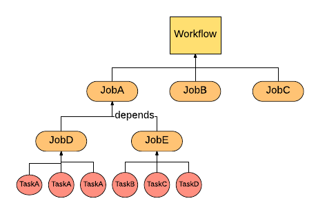

<a id="tutorial_task_framework--key_concepts"></a>
<a id="tutorial_task_framework--key-concepts"></a>

### Key Concepts

- Task is the smallest unit of work in Helix Task Framework. It represents a single runnable logics that user prefer to execute for each partition (distributed units).
- Job defines one time operation across all the partitions. It contains multiple Tasks and configuration of tasks, such as how many tasks, timeout per task and so on.
- Workflow is a directed acyclic graph that represents the relationships and running orders of Jobs. In addition, a workflow can also provide customized configuration, for example, Job dependencies.
- JobQueue is another type of Workflow. Different from normal one, JobQueue is not terminated until user kill it. Also JobQueue can keep accepting newly coming jobs.

<a id="tutorial_task_framework--implement_your_task"></a>
<a id="tutorial_task_framework--implement-your-task"></a>

### Implement Your Task

<a id="tutorial_task_framework--task_interface"></a>
<a id="tutorial_task_framework--task-interface"></a>

#### [Task Interface](https://github.com/apache/helix/blob/helix-0.6.x/helix-core/src/main/java/org/apache/helix/task/Task.java)

The task interface contains two methods: run and cancel. User can implement his or her own logic in run function and cancel / roll back logic in cancel function.

```
public class MyTask implements Task {@Override TaskResult run() {// Task logic}
@Override void cancel() {// Cancel logic}}
```

<a id="tutorial_task_framework--taskconfig"></a>

#### [TaskConfig](https://github.com/apache/helix/blob/helix-0.6.x/helix-core/src/main/java/org/apache/helix/task/TaskConfig.java)

In helix, usually an object config represents the abstraction of that object, such as TaskConfig, JobConfig and WorkflowConfig. TaskConfig contains configurable task conditions. TaskConfig does not require to have any input to create a new object:

```
TaskConfig taskConfig = new TaskConfig(null, null, null, null);
```

For these four fields:

- Command: The task command, will use Job command if this is null
- ID: Task unique id, will generate a new ID for this task if input is null
- TaskTargetPartition: Target partition of a target. Could be null
- ConfigMap: Task property key-value map containing all other property stated above, such as command, ID.

<a id="tutorial_task_framework--share_content_across_tasks_and_jobs"></a>
<a id="tutorial_task_framework--share-content-across-tasks-and-jobs"></a>

#### Share Content Across Tasks and Jobs

Task framework also provides a feature that user can store the key-value data per task, job and workflow. The content stored at workflow layer can shared by different jobs belong to this workflow. Similarly, content persisted at job layer can shared by different tasks nested in this job. Currently, user can extend the abstract class [UserContentStore](https://github.com/apache/helix/blob/helix-0.6.x/helix-core/src/main/java/org/apache/helix/task/UserContentStore.java) and use two methods putUserContent and getUserContent. It's similar to HashMap put and get method except for the additional param Scope. The Scope defines which layer this key-value pair to be persisted.

```
public class MyTask extends UserContentStore implements Task {@Override TaskResult run() {putUserContent("KEY", "WORKFLOWVALUE", SCOPE.WORKFLOW); putUserContent("KEY", "JOBVALUE", SCOPE.JOB); putUserContent("KEY", "TASKVALUE", SCOPE.TASK); String taskValue = getUserContent("KEY", SCOPE.TASK);} ...}
```

<a id="tutorial_task_framework--return_task_results"></a>
<a id="tutorial_task_framework--return-task-results"></a>

#### Return [Task Results](https://github.com/apache/helix/blob/helix-0.6.x/helix-core/src/main/java/org/apache/helix/task/TaskResult.java)

User can define the TaskResult for a task once it is at final stage (complete or failed). The TaskResult contains two fields: status and info. Status is current Task Status including COMPLETED, CANCELLED, FAILED and FATAL\_FAILED. The difference between FAILED and FATAL\_FAILED is that once the task defined as FATAL\_FAILED, helix will not do the retry for this task and abort it. The other field is information, which is a String type. User can pass any information including error message, description and so on.

```
TaskResult run() {
    ....
    return new TaskResult(TaskResult.Status.FAILED, "ERROR MESSAGE OR OTHER INFORMATION");
}
```

<a id="tutorial_task_framework--task_retry_and_abort"></a>
<a id="tutorial_task_framework--task-retry-and-abort"></a>

#### Task Retry and Abort

Helix provides retry logics to users. User can specify the number of task failures to allow under a job. It is a method will be introduced in Following Job Section. Another choice offered to user that if user thinks a task is very critical and do not want to do the retry once it is failed, user can return a TaskResult stated above with FATAL\_FAILED status. Then Helix will not do the retry for that task.

```
return new TaskResult(TaskResult.Status.FATAL_FAILED, "DO NOT WANT TO RETRY, ERROR MESSAGE");
```

<a id="tutorial_task_framework--taskdriver"></a>

#### [TaskDriver](https://github.com/apache/helix/blob/helix-0.6.x/helix-core/src/main/java/org/apache/helix/task/TaskDriver.java)

All the control operation related to workflow and job are based on TaskDriver object. TaskDriver offers several APIs to controller, modify and track the tasks. Those APIs will be introduced in each section when they are necessary. TaskDriver object can be created either by [HelixManager](https://github.com/apache/helix/blob/helix-0.6.x/helix-core/src/main/java/org/apache/helix/HelixManager.java) or [ZkClient](https://github.com/apache/helix/blob/helix-0.6.x/helix-core/src/main/java/org/apache/helix/manager/zk/ZkClient.java) with cluster name:

```
HelixManager manager = new ZKHelixManager(CLUSTER_NAME, INSTANCE_NAME, InstanceType.PARTICIPANT, ZK_ADDRESS);
TaskDriver taskDriver1 = new TaskDriver(manager);
 
TaskDriver taskDriver2 = new TaskDriver(zkclient, CLUSTER_NAME);
```

<a id="tutorial_task_framework--propagate_task_error_message_to_helix"></a>
<a id="tutorial_task_framework--propagate-task-error-message-to-helix"></a>

#### Propagate Task Error Message to Helix

When task encounter an error, it could be returned by TaskResult. Unfortunately, user can not get this TaskResult object directly. But Helix provides error messages persistent. Thus user can fetch the error messages from Helix via TaskDriver, which introduced above. The error messages will be stored in Info field per Job. Thus user have to get JobContext, which is the job status and result object.

```
taskDriver.getJobContext("JOBNAME").getInfo();
```

<a id="tutorial_task_framework--creating_a_workflow"></a>
<a id="tutorial_task_framework--creating-a-workflow"></a>

### Creating a Workflow

<a id="tutorial_task_framework--one-time_workflow"></a>
<a id="tutorial_task_framework--one-time-workflow"></a>

#### One-time Workflow

As common use, one-time workflow will be the default workflow as user created. The first step is to create a WorkflowConfig.Builder object with workflow name. Then all configs can be set in WorkflowConfig.Builder. Once the configuration is done, [WorkflowConfig](https://github.com/apache/helix/blob/helix-0.6.x/helix-core/src/main/java/org/apache/helix/task/WorkflowConfig.java) object can be got from WorkflowConfig.Builder object. We have two rules to validate the Workflow configuration:

- Expiry time should not be less than 0
- Schedule config should be valid either one-time or a positive interval magnitude (Recurrent workflow)

Example:

```
Workflow.Builder myWorkflowBuilder = new Workflow.Builder("MyWorkflow");
myWorkflowBuilder.setExpiry(5000L);
Workflow myWorkflow = myWorkflowBuilder.build();
```

<a id="tutorial_task_framework--recurrent_workflow"></a>
<a id="tutorial_task_framework--recurrent-workflow"></a>

#### Recurrent Workflow

Recurrent workflow is the workflow scheduled periodically. The only config different from One-time workflow is to set a recurrent [ScheduleConfig](https://github.com/apache/helix/blob/helix-0.6.x/helix-core/src/main/java/org/apache/helix/task/ScheduleConfig.java). There two methods in ScheduleConfig can help you to create a ScheduleConfig object: recurringFromNow and recurringFromDate. Both of them needs recurUnit (time unit for recurrent) and recurInteval (magnitude of recurrent interval). Here's the example:

```
ScheduleConfig myConfig1 = ScheduleConfig.recurringFFromNow(TimeUnit.MINUTES, 5L);
ScheduleConfig myConfig2 = ScheduleConfig.recurringFFromDate(Calendar.getInstance.getTime, TimeUnit.HOURS, 10L);
```

Once this schedule config is created. It could be set in the workflow config:

```
Workflow.Builder myWorkflowBuilder = new Workflow.Builder("MyWorkflow");
myWorkflowBuilder.setExpiry(2000L)
                 .setScheduleConfig(ScheduleConfig.recurringFromNow(TimeUnit.DAYS, 5));
Workflow myWorkflow = myWorkflowBuilder.build();
```

<a id="tutorial_task_framework--start_a_workflow"></a>
<a id="tutorial_task_framework--start-a-workflow"></a>

#### Start a Workflow

Start a workflow is just using taskdrive to start it. Since this is an async call, after start the workflow, user can keep doing actions.

```
taskDriver.start(myWorkflow);
```

<a id="tutorial_task_framework--stop_a_workflow"></a>
<a id="tutorial_task_framework--stop-a-workflow"></a>

#### Stop a Workflow

Stop workflow can be executed via TaskDriver:

```
taskDriver.stop(myWorkflow);
```

<a id="tutorial_task_framework--resume_a_workflow"></a>
<a id="tutorial_task_framework--resume-a-workflow"></a>

#### Resume a Workflow

Once the workflow is stopped, it does not mean the workflow is gone. Thus user can resume the workflow that has been stopped. Using TaskDriver resume the workflow:

```
taskDriver.resume(myWorkflow);
```

<a id="tutorial_task_framework--delete_a_workflow"></a>
<a id="tutorial_task_framework--delete-a-workflow"></a>

#### Delete a Workflow

Similar to start, stop and resume, delete operation is supported by TaskDriver.

```
taskDriver.delete(myWorkflow);
```

<a id="tutorial_task_framework--add_a_job"></a>
<a id="tutorial_task_framework--add-a-job"></a>

#### Add a Job

WARNING: Job can only be added to WorkflowConfig.Builder. Once WorkflowConfig is built, no job can be added! For creating a Job, please refer to the following section (Create a Job)

```
myWorkflowBuilder.addJob("JobName", jobConfigBuilder);
```

<a id="tutorial_task_framework--add_a_job_dependency"></a>
<a id="tutorial_task_framework--add-a-job-dependency"></a>

#### Add a Job dependency

Jobs can have dependencies. If one job2 depends on job1, job2 will not be scheduled until job1 finished.

```
myWorkflowBuilder.addParentChildDependency(ParentJobName, ChildJobName);
```

<a id="tutorial_task_framework--schedule_a_workflow_for_executing_in_a_future_time"></a>
<a id="tutorial_task_framework--schedule-a-workflow-for-executing-in-a-future-time"></a>

#### Schedule a workflow for executing in a future time

Application can create a workflow with a ScheduleConfig so as to schedule it to be executed in a future time.

```
myWorkflowBuilder.setScheduleConfig(ScheduleConfig.oneTimeDelayedStart(new Date(inFiveSeconds)));
```

<a id="tutorial_task_framework--additional_workflow_options"></a>
<a id="tutorial_task_framework--additional-workflow-options"></a>

#### Additional Workflow Options

| Additional Config Options | Detail |
| --- | --- |
| *setJobDag(JobDag v)* | If user already defined the job DAG, it could be set with this method. |
| *setExpiry(long v, TimeUnit unit)* | Set the expiration time for this workflow. |
| *setFailureThreshold(int failureThreshold)* | Set the failure threshold for this workflow, once job failures reach this number, the workflow will be failed. |
| *setWorkflowType(String workflowType)* | Set the user defined workflowType for this workflow. |
| *setTerminable(boolean isTerminable)* | Specify whether this workflow is terminable or not. |
| *setCapacity(int capacity)* | Set the number of jobs that workflow can hold before reject further jobs. Only used when workflow is not terminable. |
| *setTargetState(TargetState v)* | Set the final state of this workflow. |

<a id="tutorial_task_framework--creating_a_queue"></a>
<a id="tutorial_task_framework--creating-a-queue"></a>

### Creating a Queue

[Job queue](https://github.com/apache/helix/blob/helix-0.6.x/helix-core/src/main/java/org/apache/helix/task/JobQueue.java) is another shape of workflow. Here listed different between a job queue and workflow:

| Property | Workflow | Job Queue |
| --- | --- | --- |
| Existing time | Workflow will be deleted after it is done. | Job queue will be there until user delete it. |
| Add jobs | Once workflow is build, no job can be added. | Job queue can keep accepting jobs. |
| Parallel run | Allows parallel run for jobs without dependencies | No parallel run allowed except setting *ParallelJobs* |

For creating a job queue, user have to provide queue name and workflow config (please refer above Create a Workflow). Similar to other task object, create a JobQueue.Builder first. Then JobQueue can be validated and generated via build function.

```
WorkflowConfig.Builder myWorkflowCfgBuilder = new WorkflowConfig.Builder().setWorkFlowType("MyType");
JobQueue jobQueue = new JobQueue.Builder("MyQueueName").setWorkflowConfig(myWorkflowCfgBuilder.build()).build();
```

####Append Job to Queue

WARNING:Different from normal workflow, job for JobQueue can be append even in anytime. Similar to workflow add a job, job can be appended via enqueueJob function via TaskDriver.

```
jobQueueBuilder.enqueueJob("JobName", jobConfigBuilder);
```

####Delete Job from Queue

Helix allowed user to delete a job from existing queue. We offer delete API in TaskDriver to do this. The queue has to be stopped in order for a job to be deleted. User can resume the queue once deletion succeeds.

```
taskDriver.stop("QueueName");
taskDriver.deleteJob("QueueName", "JobName");
taskDriver.resume("QueueName");
```

####Additional Option for JobQueue

*setParallelJobs(int parallelJobs)* : Set the how many jobs can parallel running, except there is any dependencies.

###Create a Job

Before generate a [JobConfig](https://github.com/apache/helix/blob/helix-0.6.x/helix-core/src/main/java/org/apache/helix/task/JobConfig.java) object, user still have to use JobConfig.Builder to build JobConfig.

```
JobConfig.Builder myJobCfgBuilder = new JobConfig.Builder();
JobConfig myJobCfg = myJobCfgBuilder.build();
```

Helix has couple rules to validate a job:

- Each job must at least have one task to execute. For adding tasks and task rules please refer following section Add Tasks.
- Task timeout should not less than zero.
- Number of concurrent tasks per instances should not less than one.
- Maximum attempts per task should not less than one
- There must be a workflow name

<a id="tutorial_task_framework--add_tasks"></a>
<a id="tutorial_task_framework--add-tasks"></a>

#### Add Tasks

There are two ways of adding tasks:

- Add by TaskConfig. Tasks can be added via adding TaskConfigs. User can create a List of TaskConfigs or add TaskConfigMap, which is a task id to TaskConfig mapping.

```
TaskConfig taskCfg = new TaskConfig(null, null, null, null);
List<TaskConfig> taskCfgs = new ArrayList<TaskConfig>();
myJobCfg.addTaskConfigs(taskCfgs);
 
Map<String, TaskConfig> taskCfgMap = new HashMap<String, TaskConfig>();
taskCfgMap.put(taskCfg.getId(), taskCfg);
myJobCfg.addTaskConfigMap(taskCfgMap);
```

- Add by Job command. If user does not want to specify each TaskConfig, we can create identical tasks based on Job command with number of tasks.

```
myJobCfg.setCommand("JobCommand").setNumberOfTasks(10);
```

WARNING: Either user provides TaskConfigs / TaskConfigMap or both of Job command and number tasks (except Targeted Job, refer following section) . Otherwise, validation will be failed.

<a id="tutorial_task_framework--generic_job"></a>
<a id="tutorial_task_framework--generic-job"></a>

#### Generic Job

Generic Job is the default job created. It does not have targeted resource. Thus this generic job could be assigned to one of eligble instances.

<a id="tutorial_task_framework--targeted_job"></a>
<a id="tutorial_task_framework--targeted-job"></a>

#### Targeted Job

Targeted Job has set up the target resource. For this kind of job, Job command is necessary, but number of tasks is not. The tasks will depends on the partion number of targeted resource. To set target resource, just put target resource name to JobConfig.Builder.

```
myJobCfgBuilder.setTargetResource("TargetResourceName");
```

In addition, user can specify the instance target state. For example, if user want to run the Task on “Master” state instance, setTargetPartitionState method can help to set the partition to assign to specific instance.

```
myJobCfgBuilder.setTargetPartitionState(Arrays.asList(new String[]{"Master", "Slave"}));
```

<a id="tutorial_task_framework--instance_group"></a>
<a id="tutorial_task_framework--instance-group"></a>

#### Instance Group

Grouping jobs with targeted group of instances feature has been supported. User firstly have to define the instance group tag for instances, which means label some instances with specific tag. Then user can put those tags to a job that only would like to assigned to those instances. For example, customer data only available on instance 1, 2, 3. These three instances can be tagged as “CUSTOMER” and customer data related jobs can set the instance group tag “CUSTOMER”. Thus customer data related jobs will only assign to instance 1, 2, 3. To add instance group tag, just set it in JobConfig.Builder:

```
jobCfg.setInstanceGroupTag("INSTANCEGROUPTAG");
```

<a id="tutorial_task_framework--delayed_scheduling_job"></a>
<a id="tutorial_task_framework--delayed-scheduling-job"></a>

#### Delayed scheduling job

Set up a schedule plan for the job. If both items are set, Helix will calculate and use the later one.

```
myJobCfgBuilder.setExecutionDelay(delayMs);
myJobCfgBuilder.setExecutionStart(startTimeMs);
```

Note that the scheduled job needs to be runnable first. Then Helix will start checking it's configuration for scheduling. If any parent jobs are not finished, the job won't be scheduled even the scheduled timestamp has already passed.

<a id="tutorial_task_framework--additional_job_options"></a>
<a id="tutorial_task_framework--additional-job-options"></a>

#### Additional Job Options

| Operation | Detail |
| --- | --- |
| *setWorkflow(String workflowName)* | Set the workflow that this job belongs to |
| *setTargetPartions(List<String> targetPartionNames)* | Set list of partition names |
| *setTargetPartionStates(Set<String>)* | Set the partition states |
| *setCommand(String command)* | Set the job command |
| *setJobCommandConfigMap(Map<String, String> v)* | Set the job command config maps |
| *setTimeoutPerTask(long v)* | Set the timeout for each task |
| *setNumConcurrentTasksPerInstance(int v)* | Set number of tasks can concurrent run on same instance |
| *setMaxAttemptsPerTask(int v)* | Set times of retry for a task |
| *setFailureThreshold(int v)* | Set failure tolerance of tasks for this job |
| *setTaskRetryDelay(long v)* | Set the delay time before a task retry |
| *setIgnoreDependentJobFailure(boolean ignoreDependentJobFailure)* | Set whether ignore the job failure of parent job of this job |
| *setJobType(String jobType)* | Set the job type of this job |
| *setExecutionDelay(String delay)* | Set the delay time to schedule job execution |
| *setExecutionStart(String start)* | Set the start time to schedule job execution |

<a id="tutorial_task_framework--monitor_the_status_of_your_job"></a>
<a id="tutorial_task_framework--monitor-the-status-of-your-job"></a>

### Monitor the status of your job

As we introduced the excellent util TaskDriver in Workflow Section, we have extra more functionality that provided to user. The user can synchronized wait Job or Workflow until it reaches certain STATES. The function Helix have API pollForJobState and pollForWorkflowState. For pollForJobState, it accepts arguments:

- Workflow name, required
- Job name, required
- Timeout, not required, will be three minutes if user choose function without timeout argument. Time unit is milisecond.
- TaskStates, at least one state. This function can accept multiple TaskState, will end function until one of those TaskState reaches.

For example:

```
taskDriver.pollForJobState("MyWorkflowName", "MyJobName", 180000L, TaskState.FAILED, TaskState.FATAL_FAILED);
taskDriver.pollForJobState("MyWorkflowName", "MyJobName", TaskState.COMPLETED);
```

For pollForWorkflowState, it accepts similar arguments except Job name. For example:

```
taskDriver.pollForWorkflowState("MyWorkflowName", 180000L, TaskState.FAILED, TaskState.FATAL_FAILED);
taskDriver.pollForWorkflowState("MyWorkflowName", TaskState.COMPLETED);
```

[Back to top](#tutorial_task_framework)

Copyright ©2026 [Apache Software Foundation](http://www.apache.org). All Rights Reserved.

[Reflow Maven skin](https://github.com/olamy/reflow-maven-skin "Reflow Maven skin") maintained by [Olivier Lamy](https://twitter.com/olamy "Olivier Lamy").

Apache Helix, Apache, the Apache feather logo, and the Apache Helix project logos are trademarks of The Apache Software Foundation.
All other marks mentioned may be trademarks or registered trademarks of their respective owners.

[Privacy Policy](https://helix.apache.org/1.4.3-docs/privacy-policy.html)

---

<a id="tutorial_user_content_store"></a>

<!-- source_url: https://helix.apache.org/1.4.3-docs/tutorial_user_content_store.html -->

<!-- page_index: 15 -->

<a id="tutorial_user_content_store--helix_tutorial:_user_defined_content_store_for_tasks"></a>
<a id="tutorial_user_content_store--helix-tutorial-:-user-defined-content-store-for-tasks"></a>

## [Helix Tutorial](#tutorial): User Defined Content Store for Tasks

The purpose of user defined content store is to provide an easy use feature for some task dedicated meta temporary store. In this chapter, we'll learn how to implement and use content store in the user defined tasks.

<a id="tutorial_user_content_store--content_store_implementation"></a>
<a id="tutorial_user_content_store--content-store-implementation"></a>

### Content Store Implementation

Extends abstract class UserContentStore.

```
private static class ContentStoreTask extends UserContentStore implements Task {@Override public TaskResult run() {...} @Override public void cancel() {...}}
```

The default methods support 3 types of scopes:

1. WORKFLOW: Define the content store in workflow level
2. JOB: Define the content store in job level
3. TASK: Define the content store in task level

<a id="tutorial_user_content_store--content_store_usage"></a>
<a id="tutorial_user_content_store--content-store-usage"></a>

### Content Store Usage

Access content store in Task.run() method.

```
  private static class ContentStoreTask extends UserContentStore implements Task {
    @Override public TaskResult run() {
      // put values into the store
      putUserContent("ContentTest", "Value1", Scope.JOB);
      putUserContent("ContentTest", "Value2", Scope.WORKFLOW);
      putUserContent("ContentTest", "Value3", Scope.TASK);
      
      // get the values with the same key in the different scopes
      if (!getUserContent("ContentTest", Scope.JOB).equals("Value1") ||
          !getUserContent("ContentTest", Scope.WORKFLOW).equals("Value2") ||
          !getUserContent("ContentTest", Scope.TASK).equals("Value3")) {
        return new TaskResult(TaskResult.Status.FAILED, null);
      }
      
      return new TaskResult(TaskResult.Status.COMPLETED, null);
    }
  }
```

[Back to top](#tutorial_user_content_store)

Copyright ©2026 [Apache Software Foundation](http://www.apache.org). All Rights Reserved.

[Reflow Maven skin](https://github.com/olamy/reflow-maven-skin "Reflow Maven skin") maintained by [Olivier Lamy](https://twitter.com/olamy "Olivier Lamy").

Apache Helix, Apache, the Apache feather logo, and the Apache Helix project logos are trademarks of The Apache Software Foundation.
All other marks mentioned may be trademarks or registered trademarks of their respective owners.

[Privacy Policy](https://helix.apache.org/1.4.3-docs/privacy-policy.html)

---

<a id="tutorial_task_throttling"></a>

<!-- source_url: https://helix.apache.org/1.4.3-docs/tutorial_task_throttling.html -->

<!-- page_index: 16 -->

<a id="tutorial_task_throttling--helix_tutorial:_task_throttling"></a>
<a id="tutorial_task_throttling--helix-tutorial-:-task-throttling"></a>

## [Helix Tutorial](#tutorial): Task Throttling

In this chapter, we'll learn how to control the parallel execution of tasks in the task framework.

<a id="tutorial_task_throttling--task_throttling_configuration"></a>
<a id="tutorial_task_throttling--task-throttling-configuration"></a>

### Task Throttling Configuration

Helix can control the number of tasks that are executed in parallel according to multiple thresholds. Applications can set these thresholds in the following configuration items:

- JobConfig.ConcurrentTasksPerInstance The number of concurrent tasks in this job that are allowed to run on an instance.
- InstanceConfig.MAX\_CONCURRENT\_TASK The number of total concurrent tasks that are allowed to run on an instance.

Also see [WorkflowConfig.ParallelJobs](#tutorial_task_framework).

<a id="tutorial_task_throttling--job_priority_for_task_throttling"></a>
<a id="tutorial_task_throttling--job-priority-for-task-throttling"></a>

### Job Priority for Task Throttling

Whenever there are too many tasks to be scheduled according to the threshold, Helix will prioritize the older jobs. The age of a job is calculated based on the job start time.

[Back to top](#tutorial_task_throttling)

Copyright ©2026 [Apache Software Foundation](http://www.apache.org). All Rights Reserved.

[Reflow Maven skin](https://github.com/olamy/reflow-maven-skin "Reflow Maven skin") maintained by [Olivier Lamy](https://twitter.com/olamy "Olivier Lamy").

Apache Helix, Apache, the Apache feather logo, and the Apache Helix project logos are trademarks of The Apache Software Foundation.
All other marks mentioned may be trademarks or registered trademarks of their respective owners.

[Privacy Policy](https://helix.apache.org/1.4.3-docs/privacy-policy.html)

---

<a id="quota_scheduling"></a>

<!-- source_url: https://helix.apache.org/1.4.3-docs/quota_scheduling.html -->

<!-- page_index: 17 -->

<a id="quota_scheduling--quota-based-task-scheduling"></a>

# Quota-based Task Scheduling

<a id="quota_scheduling--introduction"></a>

## Introduction

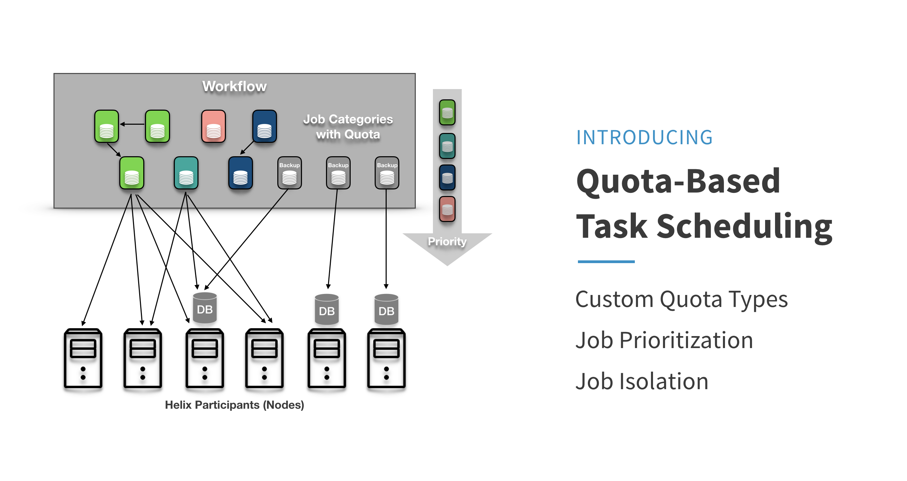

Quota-based task scheduling is a feature addition to Helix Task Framework that enables users of Task Framework to apply the notion of categories in distributed task management.

<a id="quota_scheduling--purpose"></a>

## Purpose

As Helix Task Framework gains usage in other open-source frameworks such as [Apache Gobblin](https://gobblin.apache.org/) and [Apache Pinot](http://pinot.incubator.apache.org/), it has also seen an increase in the variety in the types of distributed tasks it was managing. There have also been explicit feature requests to Helix for differentiating different types of tasks by creating corresponding quotas.

Quota-based task scheduling aims to fulfill these requests by allowing users to define a quota profile consisting of quota types and their corresponding quotas. The goal of this feature is threefold: 1) the user will have the ability to prioritize one type of workflows/jobs/tasks over another and 2) achieve isolation among the type of tasks and 3) make monitoring easier by tracking the status of distributed execution by type.

<a id="quota_scheduling--glossary_and_definitions"></a>
<a id="quota_scheduling--glossary-and-definitions"></a>

## Glossary and Definitions

- Task Framework: a component of Apache Helix. A framework on which users can define and run workflows, jobs, and tasks in a distributed way.
- Workflow: the largest unit of work in Task Framework. A workflow consists of one or more jobs. There are two types of workflows:
  - Generic workflow: a generic workflow is a workflow consisting of jobs (a job DAG) that are used for general purposes. **A generic workflow may be removed if expired or timed out.**
  - Job queue: a job queue is a special type of workflow consisting of jobs that tend to have a linear dependency (this dependency is configurable, however). **There is no expiration for job queues** - it lives on until it is deleted.
- Job: the second largest unit of work in Task Framework. A job consists of one or more mutually independent tasks. There are two types of jobs:
  - Generic job: a generic job is a job consisting of one or more tasks.
  - Targeted job: a targeted job differs from generic jobs in that these jobs must have a *target resource*, and the tasks belonging to such jobs will be scheduled alongside the partitions of the target resource. To illustrate, an Espresso user of Task Framework may wish to schedule a backup job on one of their DBs called *MemberDataDB*. This DB will be divided into multiple partitions (\_MemberDataDB\_1, \_MemberDataDB\_2, … *MemberDataDB\_N)*\_\_, and suppose that a targeted job is submitted such that its tasks will be paired up with each of those partitions. This “pairing-up” is necessary because this task is a backup task that needs to be on the same physical machine as those partitions the task is backing up.
- Task: the **smallest unit of work** in Task Framework. A task is an independent unit of work.
- Quota resource type: denotes a particular type of resource. Examples would be JVM thread count, memory, CPU resources, etc.. Generally, each task that runs on a Helix Participant (= instance, worker, node) occupies a set amount of resources. **Note that only JVM thread count is the only quota resource type currently supported by Task Framework, with each task occupying 1 thread out of 40 threads available per Helix Participant (instance).**
- Quota type: denotes which category a given job and its underlying tasks should be classified as. For example, you may define a quota configuration with two quota types, type “Backup”, and type “Aggregation” and a default type “DEFAULT”. You may prioritize the backup type by giving it a higher quota ratio - such as 20:10:10, respectively. When there are streams of jobs being submitted, you can expect each Participant, assuming that it has a total of 40 JVM threads, will have 20 “Backup” tasks, 10 “Aggregation” tasks, and 10 “DEFAULT” tasks. **Quota types are defined and applied at the job level, meaning all tasks belonging to a particular job with a quota type will be of that quota type.** Note that if a quota type is set for a workflow, then all jobs belonging to that workflow will *inherit* the type from the workflow.
- Quota: a number referring to a **relative ratio** that determines what portion of given resources should be allotted to a particular quota type.
  - E.g.) TYPE\_0: 40, TYPE\_1: 20, …, DEFAULT: 40
- Quota config: a set of string-integer mappings that indicate the quota resource type, quota types, and corresponding quotas. **Task Framework stores the quota config in ClusterConfig.**

<a id="quota_scheduling--architecture"></a>

## Architecture

<a id="quota_scheduling--assignableinstance"></a>

### AssignableInstance

AssignableInstance is an abstraction that represents each live Participant that is able to take on tasks from the Controller. Each AssignableInstance will cache what tasks it has running as well as remaining task counts from the quota-based capacity calculation.

<a id="quota_scheduling--assignableinstancemanager"></a>

### AssignableInstanceManager

AssignableInstanceManager manages all AssignableInstances. It also serves as a connecting layer between the Controller and each AssignableInstance. AssignableInstanceManager also provides a set of interfaces that allows the Controller to easily determine whether an AssignableInstance is able to take on more tasks.

<a id="quota_scheduling--taskassigner"></a>

### TaskAssigner

The TaskAssigner interface provides basic API methods that involve assignments of tasks based on quota constraints. Currently, Task Framework only concerns the number of Participant-side JVM threads, each of which corresponds to an active task.

<a id="quota_scheduling--runtimejobdag_.28jobdagiterator.29"></a>
<a id="quota_scheduling--runtimejobdag-jobdagiterator"></a>

### RuntimeJobDag (JobDagIterator)

This new component serves as an iterator for JobDAGs for the Controller. Previously, task assignment required the Controller to iterate through all jobs and their underlying tasks to determine whether there were any tasks that needed to be assigned and scheduled. This proved to be inefficient and did not scale with the increasing load we were putting on Task Framework. Each RuntimeJobDag records states, that is, it knows what task needs to be offered up to the Controller for scheduling. This saves the redundant computation for the Controller every time it goes through the TaskSchedulingStage of the Task pipeline.

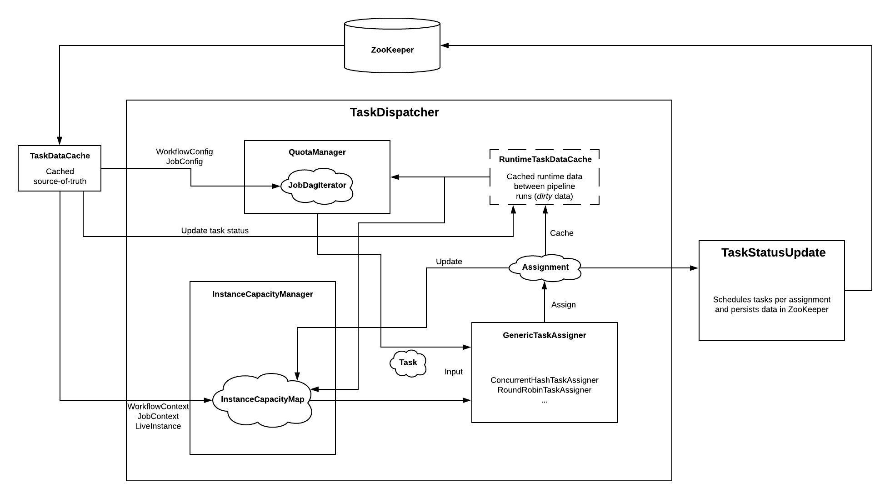

<a id="quota_scheduling--user_manual"></a>
<a id="quota_scheduling--user-manual"></a>

## User Manual

<a id="quota_scheduling--how_it_works"></a>
<a id="quota_scheduling--how-it-works"></a>

### How it works

Quota-based task scheduling works as follows. If a quota type is set, Task Framework will calculate a ratio against the sum of all quota config numbers for each quota type. Then it will apply that ratio to find the actual resource amount allotted to each quota type. Here is an example to illustrate this: Suppose the quota config is as follows:

```json
"QUOTA_TYPES":{
  "A":"2"
  ,"B":"1"
  ,"DEFAULT":"1"
}
```

Based on these raw numbers, Task Framework will compute the ratios. With the ratios, Task Framework will apply them to find the actual resource amount per quota type. The following table summarizes these calculations with **the assumption of 40 JVM threads per instance**:

| Quota Type | Quota Config | Ratio | Actual Resource Allotted (# of JVM Threads) |
| --- | --- | --- | --- |
| A | 2 | 50% | 20 |
| B | 1 | 25% | 10 |
| DEFAULT | 1 | 25% | 10 |

Every instance (node) will have a quota profile that looks like this. This has a few implications. First, this allows for **prioritization of certain jobs by allotting a greater amount of resources to corresponding quota types**. In that sense, you may treat quota config numbers/ratios as user-defined priority values. More specifically, take the quota profile in the example above. In this case, when there are 100 jobs submitted for each quota type, jobs of type A will finish faster; in other words, quota type A will see twice as much throughput when there is a continuous stream of jobs due to its quota ratio being twice that of other quota types.

Quota-based task scheduling also allows for **isolation/compartmentalization in scheduling jobs**. Suppose there are two categories of jobs, with the first category being *urgent* jobs that are short-lived but need to be run right away. On the other hand, suppose that the second category of jobs tend to take longer, but they aren't as urgent and can take their time running. Previously, these two types of jobs will get assigned, scheduled, and run in a mix, and it was indeed difficult to ensure that jobs in the first category be processed in an urgent manner. Quota-based scheduling solves this problem by allowing the user to create quota types that model “categories” with different characteristics and requirements.

<a id="quota_scheduling--how_to_use"></a>
<a id="quota_scheduling--how-to-use"></a>

### How to use

- Setting a Quota Config in ClusterConfig

In order to use quota-based task scheduling, you must establish a quota config first. This is a one-time operation, and once you verified that your ClusterConfig has a quota config set, there is no need to set it again. See the following code snippet for example:

```java
ClusterConfig clusterConfig = _manager.getConfigAccessor().getClusterConfig(CLUSTER_NAME); // Retrieve ClusterConfig
clusterConfig.resetTaskQuotaRatioMap(); // Optional: you may want to reset the quota config before creating a new quota config
clusterConfig.setTaskQuotaRatio(DEFAULT_QUOTA_TYPE, 10); // Define the default quota (DEFAULT_QUOTA_TYPE = "DEFAULT")
clusterConfig.setTaskQuotaRatio("A", 20); // Define quota type A
clusterConfig.setTaskQuotaRatio("B", 10); // Define quota type B
_manager.getConfigAccessor().setClusterConfig(CLUSTER_NAME, clusterConfig); // Set the new ClusterConfig
```

A word of caution - if you do set the quota config, you **must** **always define the default quota type (with the key “DEFAULT”)**. Otherwise, jobs with no type information will no longer be scheduled and run. If you have been using Task Framework prior to the inception of quota-based scheduling, you might have recurrent workflows whose jobs do not have any type set. If you neglect to include the default quota type, these recurrent workflows will not execute properly.

Upon setting the quota config in ClusterConfig, you will see the updated field in your ZooKeeper cluster config ZNode in the JSON format. See an example below:

```json
{"id":"Example_Cluster" ,"simpleFields":{"allowParticipantAutoJoin":"true"} ,"listFields":{} ,"mapFields":{"QUOTA_TYPES":{"A":"20" ,"B":"10" ,"DEFAULT":"10"}}}
```

- Setting a quota type for workflows and jobs The Builders for WorkflowConfig and JobConfig provides a method for setting the quota type for the job. See below:

```java
JobConfig.Builder jobBuilderA =
    new JobConfig.Builder().setCommand(JOB_COMMAND).setJobCommandConfigMap(_jobCommandMap)
        .addTaskConfigs(taskConfigsA).setNumConcurrentTasksPerInstance(50).setJobType("A"); // Setting the job quota type as "A"
workflowBuilder.addJob("JOB_A", jobBuilderA);
```

<a id="quota_scheduling--faq"></a>

## FAQ

- What happens if I don't set a quota config in ClusterConfig?
  - When no quota config is found in ClusterConfig, Task Framework will treat all incoming jobs as DEFAULT and will give 100% of quota resources to the default type.
- What happens if my job doesn't have a quota type set?
  - If Task Framework encounters a job without a quota type (that is, either the quotaType field is missing, is an empty String, or a literal “null”), then the job will be treated as a DEFAULT job.
- What if there is a workflow/job whose quota type does not exist in the quota config I have in ClusterConfig?
  - Task Framework will **not** be able to locate the correct quota type, so it would **treat it as the DEFAULT type** and will assign and schedule accordingly using the quota for the DEFAULT type.
- What about targeted jobs?
  - Quotas will also apply to targeted jobs, each task of the targeted job taking up a pre-set resource amount (currently each task occupies 1 JVM thread).
- What about job queues?
  - Quota-based scheduling applies to all types of workflows - both generic workflows and job queues. A word of caution for the user is to be careful and always verify whether a job's quota type has been properly set. Task Framework will **not** automatically delete or inform the user of the jobs that are stuck due to an invalid quota type, so we caution all users to make sure the quota type exists by querying their settings in ClusterConfig.

<a id="quota_scheduling--future_steps"></a>
<a id="quota_scheduling--future-steps"></a>

## Future Steps

Quota-based task scheduling has been tested internally at LinkedIn and has been integrated into [Apache Gobblin](https://gobblin.apache.org/), enabling users of Helix Task Framework and Gobblin's Job Launcher to define categories and corresponding quota values. There are a few immediate to-do's that will improve the usability of this feature:

- More fine-grained quota profile

Currently, quota profiles apply across the entire cluster; that is, one quota profile defined in ClusterConfig will apply globally for all Participants. However, some use cases may require that each Participant have a different quota profile.

- Making Participants' maximum JVM thread capacity configurable

Helix Task Framework has the maximum number of task threads set at 40. Making this configurable will potentially allow some users to increase throughput of tasks depending on the duration of execution of such tasks.

- Adding more dimensions to quota resource type

Currently, the number of JVM threads per Participant is the only dimension where Helix Task Framework defines quota in. However, as discussed in earlier sections, this is extendable to commonly-used constraints such as CPU usage, memory usage, or disk usage. As new dimensions are added, there will need to be additional implementation of the TaskAssigner interface that produces assignments for tasks based on constraints.

[Back to top](#quota_scheduling)

Copyright ©2026 [Apache Software Foundation](http://www.apache.org). All Rights Reserved.

[Reflow Maven skin](https://github.com/olamy/reflow-maven-skin "Reflow Maven skin") maintained by [Olivier Lamy](https://twitter.com/olamy "Olivier Lamy").

Apache Helix, Apache, the Apache feather logo, and the Apache Helix project logos are trademarks of The Apache Software Foundation.
All other marks mentioned may be trademarks or registered trademarks of their respective owners.

[Privacy Policy](https://helix.apache.org/1.4.3-docs/privacy-policy.html)

---

<a id="tutorial_rest_service"></a>

<!-- source_url: https://helix.apache.org/1.4.3-docs/tutorial_rest_service.html -->

<!-- page_index: 18 -->

<a id="tutorial_rest_service--helix_tutorial:_rest_service_2.0"></a>
<a id="tutorial_rest_service--helix-tutorial-:-rest-service-2.0"></a>

## [Helix Tutorial](#tutorial): REST Service 2.0

New Helix REST service supported features:

- Expose all admin operations via restful API.
  - All of Helix admin operations, include these defined in HelixAdmin.java and ConfigAccessor.java, etc, are exposed via rest API.
- Support all task framework API via restful.Current task framework operations are supported from rest API too.
- More standard Restful API
  - Use the standard HTTP methods if possible, GET, POST, PUT, DELETE, instead of customized command as it today.
  - Customized command will be used if there is no corresponding HTTP methods, for example, rebalance a resource, disable an instance, etc.
- Make Helix restful service an separately deployable service.
- Enable Access/Audit log for all write access.

<a id="tutorial_rest_service--installation"></a>

### Installation

The command line tool comes with helix-core package:

Get the command line tool:

```
git clone https://git-wip-us.apache.org/repos/asf/helix.git
cd helix
git checkout tags/helix-1.4.3
./build
cd helix-rest/target/helix-rest-pkg/bin
chmod +x *.sh
```

Get help:

```
./run-rest-admin.sh --help
```

Start the REST server

```
./run-rest-admin.sh --port 1234 --zkSvr localhost:2121
```

<a id="tutorial_rest_service--helix_rest_2.0_endpoint"></a>
<a id="tutorial_rest_service--helix-rest-2.0-endpoint"></a>

### Helix REST 2.0 Endpoint

Helix REST 2.0 endpoint will start with /admin/v2 prefix, and the rest will mostly follow the current URL convention. This allows us to support v2.0 endpoint at the same time with the current Helix web interface. Some sample v2.0 endpoints would look like the following:

```
curl -X GET http://localhost:12345/admin/v2/clusters
curl -X POST http://localhost:12345/admin/v2/clusters/myCluster
curl -X POST http://localhost:12345/admin/v2/clusters/myCluster?command=activate&supercluster=controler_cluster
curl http://localhost:12345/admin/v2/clusters/myCluster/resources/myResource/IdealState
```

<a id="tutorial_rest_service--rest_endpoints_and_supported_operations"></a>
<a id="tutorial_rest_service--rest-endpoints-and-supported-operations"></a>

### REST Endpoints and Supported Operations

<a id="tutorial_rest_service--operations_on_helix_cluster"></a>
<a id="tutorial_rest_service--operations-on-helix-cluster"></a>

#### Operations on Helix Cluster

- **“/clusters”**

  - Represents all helix managed clusters connected to given zookeeper
  - **GET** – List all Helix managed clusters. Example: curl <http://localhost:1234/admin/v2/clusters>


```
$curl http://localhost:1234/admin/v2/clusters
{
  "clusters" : [ "cluster1", "cluster2", "cluster3"]
}
```

- **“/clusters/{clusterName}”**

  - Represents a helix cluster with name {clusterName}
  - **GET** – return the cluster info. Example: curl <http://localhost:1234/admin/v2/clusters/myCluster>


```
$curl http://localhost:1234/admin/v2/clusters/myCluster
{
  "id" : "myCluster",
  "paused" : true,
  "disabled" : true,
  "controller" : "helix.apache.org:1234",
  "instances" : [ "aaa.helix.apache.org:1234", "bbb.helix.apache.org:1234" ],
  "liveInstances" : ["aaa.helix.apache.org:1234"],
  "resources" : [ "resource1", "resource2", "resource3" ],
  "stateModelDefs" : [ "MasterSlave", "LeaderStandby", "OnlineOffline" ]
}
```

  - **PUT** – create a new cluster with {clusterName}, it returns 200 if the cluster already exists. Example: curl -X PUT <http://localhost:1234/admin/v2/clusters/myCluster>
  - **DELETE** – delete this cluster. Example: curl -X DELETE <http://localhost:1234/admin/v2/clusters/myCluster>
  - **activate** – Link this cluster to a Helix super (controller) cluster, i.e, add the cluster as a resource to the super cluster. Example: curl -X POST <http://localhost:1234/admin/v2/clusters/myCluster?command=activate&superCluster=myCluster>
  - **expand** – In the case that a set of new node is added in the cluster, use this command to balance the resources on the existing instances to new added instances. Example: curl -X POST <http://localhost:1234/admin/v2/clusters/myCluster?command=expand>
  - **enable** – enable/resume the cluster. Example: curl -X POST <http://localhost:1234/admin/v2/clusters/myCluster?command=enable>
  - **disable** – disable/pause the cluster. Example: curl -X POST <http://localhost:1234/admin/v2/clusters/myCluster?command=disable>
- **“/clusters/{clusterName}/configs”**

  - Represents cluster level configs for cluster with {clusterName}
  - **GET**: get all configs.


```
$curl http://localhost:1234/admin/v2/clusters/myCluster/configs {"id" : "myCluster","simpleFields" : {"PERSIST_BEST_POSSIBLE_ASSIGNMENT" : "true" },"listFields" : {},"mapFields" : {}}
```

  - **POST**: update or delete one/some config entries. update – Update the entries included in the input.


```
$curl -X POST -H "Content-Type: application/json" http://localhost:1234/admin/v2/clusters/myCluster/configs?command=update -d ' {"id" : "myCluster","simpleFields" : {"PERSIST_BEST_POSSIBLE_ASSIGNMENT" : "true" },"listFields" : {"disabledPartition" : ["p1", "p2", "p3"] },"mapFields" : {} }'
```


```
delete -- Remove the entries included in the input from current config.
```


```
$curl -X POST -H "Content-Type: application/json" http://localhost:1234/admin/v2/clusters/myCluster/configs?command=update -d ' {"id" : "myCluster","simpleFields" : {},"listFields" : {"disabledPartition" : ["p1", "p3"] },"mapFields" : {} }'
```

- **“/clusters/{clusterName}/controller”**

  - Represents the controller for cluster {clusterName}.
  - **GET** – return controller information


```
$curl http://localhost:1234/admin/v2/clusters/myCluster/controller {"id" : "myCluster","controller" : "test.helix.apache.org:1234","HELIX_VERSION":"1.4.3","LIVE_INSTANCE":"16261@test.helix.apache.org:1234","SESSION_ID":"35ab496aba54c99"}
```

- **“/clusters/{clusterName}/controller/errors”**

  - Represents error information for the controller of cluster {clusterName}. This is new endpoint in v2.0.
  - **GET** – get all error information.
  - **DELETE** – clean up all error logs.
- **“/clusters/{clusterName}/controller/history”**

  - Represents the change history of leader controller of cluster {clusterName}. This is new endpoint in v2.0.
  - **GET** – get the leader controller history.


```
$curl http://localhost:1234/admin/v2/clusters/myCluster/controller/history {"id" : "myCluster","history" ["{DATE=2017-03-21-16:57:14, CONTROLLER=test1.helix.apache.org:1234, TIME=1490115434248}","{DATE=2017-03-27-22:35:16, CONTROLLER=test3.helix.apache.org:1234, TIME=1490654116484}","{DATE=2017-03-27-22:35:24, CONTROLLER=test2.helix.apache.org:1234, TIME=1490654114236}"]}
```

- **/clusters/{clusterName}/controller/messages"**

  - Represents all uncompleted messages currently received by the controller of cluster {clusterName}. This is new endpoint in v2.0.
  - **GET** – list all uncompleted messages received by the controller.


```
$curl http://localhost:1234/admin/v2/clusters/myCluster/controller/messages {"id" : "myCluster","count" : 5,"messages" ["0b8df4f2-776c-4325-96e7-8fad07bd9048","13a8c0af-b77e-4f5c-81a9-24fedb62cf58"]}
```

- **“/clusters/{clusterName}/controller/messages/{messageId}”**

  - Represents the messages currently received by the controller of cluster {clusterName} with id {messageId}. This is new endpoint in v2.0.
  - **GET** - get the message with {messageId} received by the controller.
  - **DELETE** - delete the message with {messageId}
- **“/clusters/{clusterName}/statemodeldefs/”**

  - Represents all the state model definitions defined in cluster {clusterName}. This is new endpoint in v2.0.
  - **GET** - get all the state model definition in the cluster.


```
$curl -X POST -H "Content-Type: application/json" http://localhost:1234/admin/v2/clusters/myCluster/statemodeldefs
{
  "id" : "myCluster",
  "stateModelDefs" : [ "MasterSlave", "LeaderStandby", "OnlineOffline" ]
}
```

- **“/clusters/{clusterName}/statemodeldefs/{statemodeldef}”**

  - Represents the state model definition {statemodeldef} defined in cluster {clusterName}. This is new endpoint in v2.0.
  - **GET** - get the state model definition


```
$curl -X POST -H "Content-Type: application/json" http://localhost:1234/admin/v2/clusters/myCluster/statemodeldefs/LeaderStandby {"id" : "STANDBY","simpleFields" : {"INITIAL_STATE" : "OFFLINE" },"mapFields" : {"DROPPED.meta" : {"count" : "-1" },"ERROR.meta" : {"count" : "-1" },"ERROR.next" : {"DROPPED" : "DROPPED","OFFLINE" : "OFFLINE" },"LEADER.meta" : {"count" : "1" },"LEADER.next" : {"STANDBY" : "STANDBY","DROPPED" : "STANDBY","OFFLINE" : "STANDBY" },"OFFLINE.meta" : {"count" : "-1" },"OFFLINE.next" : {"STANDBY" : "STANDBY","LEADER" : "STANDBY","DROPPED" : "DROPPED" },"STANDBY.meta" : {"count" : "R" },"STANDBY.next" : {"LEADER" : "LEADER","DROPPED" : "OFFLINE","OFFLINE" : "OFFLINE"} },"listFields" : {"STATE_PRIORITY_LIST" : [ "LEADER", "STANDBY", "OFFLINE", "DROPPED", "ERROR" ],"STATE_TRANSITION_PRIORITYLIST" : [ "LEADER-STANDBY", "STANDBY-LEADER", "OFFLINE-STANDBY", "STANDBY-OFFLINE", "OFFLINE-DROPPED" ]}}
```

  - **POST** - add a new state model definition with {statemodeldef}
  - **DELETE** - delete the state model definition

<a id="tutorial_rest_service--helix_.e2.80.9cresource.e2.80.9d_and_its_sub-resources"></a>
<a id="tutorial_rest_service--helix-resource-and-its-sub-resources"></a>

#### Helix “Resource” and its sub-resources

- **“/clusters/{clusterName}/resources”**

  - Represents all resources in a cluster.
  - **GET** - list all resources with their IdealStates and ExternViews.


```
$curl http://localhost:1234/admin/v2/clusters/myCluster/resources
{
  "id" : "myCluster",
  "idealstates" : [ "idealstate1", "idealstate2", "idealstate3" ],
  "externalviews" : [ "idealstate1", "idealstate3" ]
}
```

- **“/clusters/{clusterName}/resources/{resourceName}”**

  - Represents a resource in cluster {clusterName} with name {resourceName}
  - **GET** - get resource info


```
$curl http://localhost:1234/admin/v2/clusters/myCluster/resources/resource1
{
  "id" : "resource1",
  "resourceConfig" : {},
  "idealState" : {},
  "externalView" : {}
}
```

  - **PUT** - add a resource with {resourceName}


```
$curl -X PUT -H "Content-Type: application/json" http://localhost:1234/admin/v2/clusters/myCluster/resources/myResource -d '
{
  "id":"myResource",
  "simpleFields":{
    "STATE_MODEL_FACTORY_NAME":"DEFAULT"
    ,"EXTERNAL_VIEW_DISABLED":"true"
    ,"NUM_PARTITIONS":"1"
    ,"REBALANCE_MODE":"TASK"
    ,"REPLICAS":"1"
    ,"IDEAL_STATE_MODE":"AUTO"
    ,"STATE_MODEL_DEF_REF":"Task"
    ,"REBALANCER_CLASS_NAME":"org.apache.helix.task.WorkflowRebalancer"
  }
}'
```

  - **DELETE** - delete a resource. Example: curl -X DELETE <http://localhost:1234/admin/v2/clusters/myCluster/resources/myResource>
  - **enable** enable the resource. Example: curl -X POST <http://localhost:1234/admin/v2/clusters/myCluster/resources/myResource?command=enable>
  - **disable** - disable the resource. Example: curl -X POST <http://localhost:1234/admin/v2/clusters/myCluster/resources/myResource?command=disable>
  - **rebalance** - rebalance the resource. Example: curl -X POST <http://localhost:1234/admin/v2/clusters/myCluster/resources/myResource?command=rebalance>
- **“/clusters/{clusterName}/resources/{resourceName}/idealState”**

  - Represents the ideal state of a resource with name {resourceName} in cluster {clusterName}. This is new endpoint in v2.0.
  - **GET** - get idealstate.


```
$curl http://localhost:1234/admin/v2/clusters/myCluster/resources/myResource/idealState {"id":"myResource" ,"simpleFields":{"IDEAL_STATE_MODE":"AUTO" ,"NUM_PARTITIONS":"2" ,"REBALANCE_MODE":"SEMI_AUTO" ,"REPLICAS":"2" ,"STATE_MODEL_DEF_REF":"STANDBY"} ,"listFields":{"myResource_0":["host1", "host2"] ,"myResource_1":["host2", "host1"]} ,"mapFields":{"myResource_0":{"host1":"LEADER" ,"host2":"STANDBY"} ,"myResource_1":{"host1":"STANDBY" ,"host2":"LEADER"}}}
```

- **“/clusters/{clusterName}/resources/{resourceName}/externalView”**

  - Represents the external view of a resource with name {resourceName} in cluster {clusterName}
  - **GET** - get the externview


```
$curl http://localhost:1234/admin/v2/clusters/myCluster/resources/myResource/externalView {"id":"myResource" ,"simpleFields":{"IDEAL_STATE_MODE":"AUTO" ,"NUM_PARTITIONS":"2" ,"REBALANCE_MODE":"SEMI_AUTO" ,"REPLICAS":"2" ,"STATE_MODEL_DEF_REF":"STANDBY"} ,"listFields":{"myResource_0":["host1", "host2"] ,"myResource_1":["host2", "host1"]} ,"mapFields":{"myResource_0":{"host1":"LEADER" ,"host2":"OFFLINE"} ,"myResource_1":{"host1":"STANDBY" ,"host2":"LEADER"}}}
```

- **“/clusters/{clusterName}/resources/{resourceName}/configs”**

  - Represents resource level of configs for resource with name {resourceName} in cluster {clusterName}. This is new endpoint in v2.0.
  - **GET** - get resource configs.


```
$curl http://localhost:1234/admin/v2/clusters/myCluster/resources/myResource/configs
{
  "id":"myDB"
  "UserDefinedProperty" : "property"
}
```

<a id="tutorial_rest_service--helix_instance_and_its_sub-resources"></a>
<a id="tutorial_rest_service--helix-instance-and-its-sub-resources"></a>

#### Helix Instance and its sub-resources

- **“/clusters/{clusterName}/instances”**

  - Represents all instances in a cluster {clusterName}
  - **GET** - list all instances in this cluster.


```
$curl http://localhost:1234/admin/v2/clusters/myCluster/instances
{
  "id" : "myCluster",
  "instances" : [ "host1", "host2", "host3", "host4"],
  "online" : ["host1", "host4"],
  "disabled" : ["host2"]
}
```

  - **POST** - enable/disable instances.


```
$curl -X POST -H "Content-Type: application/json" http://localhost:1234/admin/v2/clusters/myCluster/instances/command=enable -d {"instances" : [ "host1", "host3" ]} $curl -X POST -H "Content-Type: application/json" http://localhost:1234/admin/v2/clusters/myCluster/instances/command=disable -d {"instances" : [ "host2", "host4" ]}
```

- **“/clusters/{clusterName}/instances/{instanceName}”**

  - Represents a instance in cluster {clusterName} with name {instanceName}
  - **GET** - get instance information.


```
$curl http://localhost:1234/admin/v2/clusters/myCluster/instances/host_1234 {"id" : "host_1234","configs" : {"HELIX_ENABLED" : "true","HELIX_HOST" : "host","HELIX_PORT" : "1234","HELIX_DISABLED_PARTITION" : [ ]} "liveInstance" : {"HELIX_VERSION":"0.6.6.3","LIVE_INSTANCE":"4526@host","SESSION_ID":"359619c2d7efc14"}}
```

  - **PUT** - add a new instance with {instanceName}


```
$curl -X PUT -H "Content-Type: application/json" http://localhost:1234/admin/v2/clusters/myCluster/instances/host_1234 -d ' {"id" : "host_1234","simpleFields" : {"HELIX_ENABLED" : "true","HELIX_HOST" : "host","HELIX_PORT" : "1234",} }'
```

  There's one important restriction for this operation: the {instanceName} should match exactly HELIX\_HOST + “\_” + HELIX\_PORT. For example, if host is localhost, and port is 1234, the instance name should be localhost\_1234. Otherwise, the response won't contain any error but the configurations are not able to be filled in.

  - **DELETE** - delete the instance. Example: curl -X DELETE <http://localhost:1234/admin/v2/clusters/myCluster/instances/host_1234>
  - **enable** - enable the instance. Example: curl -X POST <http://localhost:1234/admin/v2/clusters/myCluster/instances/host_1234?command=enable>
  - **disable** - disable the instance. Example: curl -X POST <http://localhost:1234/admin/v2/clusters/myCluster/instances/host_1234?command=disable>
  - **addInstanceTag** - add tags to this instance.


```
$curl -X POST -H "Content-Type: application/json" http://localhost:1234/admin/v2/clusters/myCluster/instances/host_1234?command=addInstanceTag -d '
{
  "id" : "host_1234",
  "instanceTags" : [ "tag_1", "tag_2, "tag_3" ]
}'
```

  - **removeInstanceTag** - remove a tag from this instance.


```
$curl -X POST -H "Content-Type: application/json" http://localhost:1234/admin/v2/clusters/myCluster/instances/host_1234?command=removeInstanceTag -d '
{
  "id" : "host_1234",
  "instanceTags" : [ "tag_1", "tag_2, "tag_3" ]
}'
```

- **“/clusters/{clusterName}/instances/{instanceName}/resources”**

  - Represents all resources and their partitions locating on the instance in cluster {clusterName} with name {instanceName}. This is new endpoint in v2.0.
  - **GET** - return all resources that have partitions in the instance.


```
$curl http://localhost:1234/admin/v2/clusters/myCluster/instances/host_1234/resources
{
  "id" : "host_1234",
  "resources" [ "myResource1", "myResource2", "myResource3"]
}
```

- **“/clusters/{clusterName}/instances/{instanceName}/resources/{resource}”**

  - Represents all partitions of the {resource} locating on the instance in cluster {clusterName} with name {instanceName}. This is new endpoint in v2.0.
  - **GET** - return all partitions of the resource in the instance.


```
$curl http://localhost:1234/admin/v2/clusters/myCluster/instances/localhost_1234/resources/myResource1 {"id":"myResource1" ,"simpleFields":{"STATE_MODEL_DEF":"STANDBY" ,"STATE_MODEL_FACTORY_NAME":"DEFAULT" ,"BUCKET_SIZE":"0" ,"SESSION_ID":"359619c2d7f109b"} ,"listFields":{} ,"mapFields":{"myResource1_2":{"CURRENT_STATE":"STANDBY" ,"INFO":""} ,"myResource1_3":{"CURRENT_STATE":"LEADER" ,"INFO":""} ,"myResource1_0":{"CURRENT_STATE":"LEADER" ,"INFO":""} ,"myResource1_1":{"CURRENT_STATE":"STANDBY" ,"INFO":""}}}
```

- **“/clusters/{clusterName}/instances/{instanceName}/configs”**

  - Represents instance configs in cluster {clusterName} with name {instanceName}. This is new endpoint in v2.0.
  - **GET** - return configs for the instance.


```
$curl http://localhost:1234/admin/v2/clusters/myCluster/instances/host_1234/configs {"id":"host_1234" "configs" : {"HELIX_ENABLED" : "true","HELIX_HOST" : "host" "HELIX_PORT" : "1234","HELIX_DISABLED_PARTITION" : [ ]}
```

  - **PUT** - PLEASE NOTE THAT THIS PUT IS FULLY OVERRIDE THE INSTANCE CONFIG


```
$curl -X PUT -H "Content-Type: application/json" http://localhost:1234/admin/v2/clusters/myCluster/instances/host_1234/configs {"id":"host_1234" "configs" : {"HELIX_ENABLED" : "true","HELIX_HOST" : "host" "HELIX_PORT" : "1234","HELIX_DISABLED_PARTITION" : [ ]}
```

- **“/clusters/{clusterName}/instances/{instanceName}/errors”**

  - List all the mapping of sessionId to partitions of resources. This is new endpoint in v2.0.
  - **GET** - get mapping


```
$curl http://localhost:1234/admin/v2/clusters/myCluster/instances/host_1234/errors {"id":"host_1234" "errors":{"35sfgewngwese":{"resource1":["p1","p2","p5"],"resource2":["p2","p7"]}}}
```

  - **DELETE** - clean up all error information from Helix.
- **“/clusters/{clusterName}/instances/{instanceName}/errors/{sessionId}/{resourceName}/{partitionName}”**

  - Represents error information for the partition {partitionName} of the resource {resourceName} under session {sessionId} in instance with {instanceName} in cluster {clusterName}. This is new endpoint in v2.0.
  - **GET** - get all error information.


```
$curl http://localhost:1234/admin/v2/clusters/myCluster/instances/host_1234/errors/35sfgewngwese/resource1/p1 {"id":"35sfgewngwese_resource1" ,"simpleFields":{} ,"listFields":{} ,"mapFields":{"HELIX_ERROR     20170521-070822.000561 STATE_TRANSITION b819a34d-41b5-4b42-b497-1577501eeecb":{"AdditionalInfo":"Exception while executing a state transition task ..." ,"MSG_ID":"4af79e51-5f83-4892-a271-cfadacb0906f" ,"Message state":"READ"}}}
```

- **“/clusters/{clusterName}/instances/{instanceName}/history”**

  - Represents instance session change history for the instance with {instanceName} in cluster {clusterName}. This is new endpoint in v2.0.
  - **GET** - get the instance change history.


```
$curl http://localhost:1234/admin/v2/clusters/myCluster/instances/host_1234/history
{
  "id": "host_1234",
  "LAST_OFFLINE_TIME": "183948792",
  "HISTORY": [
    "{DATE=2017-03-02T19:25:18:915, SESSION=459014c82ef3f5b, TIME=1488482718915}",
    "{DATE=2017-03-10T22:24:53:246, SESSION=15982390e5d5c91, TIME=1489184693246}",
    "{DATE=2017-03-11T02:03:52:776, SESSION=15982390e5d5d85, TIME=1489197832776}",
    "{DATE=2017-03-13T18:15:00:778, SESSION=15982390e5d678d, TIME=1489428900778}",
    "{DATE=2017-03-21T02:47:57:281, SESSION=459014c82effa82, TIME=1490064477281}",
    "{DATE=2017-03-27T14:51:06:802, SESSION=459014c82f01a07, TIME=1490626266802}",
    "{DATE=2017-03-30T00:05:08:321, SESSION=5590144234e2c78, TIME=1490832308321}",
    "{DATE=2017-03-30T01:17:34:339, SESSION=2591d53b0421864, TIME=1490836654339}",
    "{DATE=2017-03-30T17:31:09:880, SESSION=2591d53b0421b2a, TIME=1490895069880}",
    "{DATE=2017-03-30T18:05:38:220, SESSION=359619c2d7f109b, TIME=1490897138220}"
  ]
}
```

- **“/clusters/{clusterName}/instances/{instanceName}/messages”**

  - Represents all uncompleted messages currently received by the instance. This is new endpoint in v2.0.
  - **GET** - list all uncompleted messages received by the controller.


```
$curl http://localhost:1234/admin/v2/clusters/myCluster/instances/host_1234/messages {"id": "host_1234","new_messages": ["0b8df4f2-776c-4325-96e7-8fad07bd9048", "13a8c0af-b77e-4f5c-81a9-24fedb62cf58"],"read_messages": ["19887b07-e9b8-4fa6-8369-64146226c454"] "total_message_count" : 100,"read_message_count" : 50}
```

- **"/clusters/{clusterName}/instances/{instanceName}/messages/{messageId}**

  - Represents the messages currently received by by the instance with message given message id. This is new endpoint in v2.0.
  - **GET** - get the message content with {messageId} received by the instance.


```
$curl http://localhost:1234/admin/v2/clusters/myCluster/instances/localhost_1234/messages/0b8df4f2-776c-4325-96e7-8fad07bd9048
{
  "id": "0b8df4f2-776c-4325-96e7-8fad07bd9048",
  "CREATE_TIMESTAMP":"1489997469400",
  "ClusterEventName":"messageChange",
  "FROM_STATE":"OFFLINE",
  "MSG_ID":"0b8df4f2-776c-4325-96e7-8fad07bd9048",
  "MSG_STATE":"new",
  "MSG_TYPE":"STATE_TRANSITION",
  "PARTITION_NAME":"Resource1_243",
  "RESOURCE_NAME":"Resource1",
  "SRC_NAME":"controller_1234",
  "SRC_SESSION_ID":"15982390e5d5a76",
  "STATE_MODEL_DEF":"LeaderStandby",
  "STATE_MODEL_FACTORY_NAME":"myFactory",
  "TGT_NAME":"host_1234",
  "TGT_SESSION_ID":"459014c82efed9b",
  "TO_STATE":"DROPPED"
}
```

  - **DELETE** - delete the message with {messageId}. Example: $curl -X DELETE <http://localhost:1234/admin/v2/clusters/myCluster/instances/host_1234/messages/0b8df4f2-776c-4325-96e7-8fad07bd9048>
- **“/clusters/{clusterName}/instances/{instanceName}/healthreports”**

  - Represents all health reports in the instance in cluster {clusterName} with name {instanceName}. This is new endpoint in v2.0.
  - **GET** - return the name of health reports collected from the instance.


```
$curl http://localhost:1234/admin/v2/clusters/myCluster/instances/host_1234/healthreports
{
  "id" : "host_1234",
  "healthreports" [ "report1", "report2", "report3" ]
}
```

- **“/clusters/{clusterName}/instances/{instanceName}/healthreports/{reportName}”**

  - Represents the health report with {reportName} in the instance in cluster {clusterName} with name {instanceName}. This is new endpoint in v2.0.
  - **GET** - return the content of health report collected from the instance.


```
$curl http://localhost:1234/admin/v2/clusters/myCluster/instances/host_1234/healthreports/ClusterStateStats {"id":"ClusterStateStats" ,"simpleFields":{"CREATE_TIMESTAMP":"1466753504476" ,"TimeStamp":"1466753504476"} ,"listFields":{} ,"mapFields":{"UserDefinedData":{"Data1":"0" ,"Data2":"0.0"}}}
```

<a id="tutorial_rest_service--helix_workflow_and_its_sub-resources"></a>
<a id="tutorial_rest_service--helix-workflow-and-its-sub-resources"></a>

#### Helix Workflow and its sub-resources

- **“/clusters/{clusterName}/workflows”**

  - Represents all workflows in cluster {clusterName}
  - **GET** - list all workflows in this cluster. Example : curl <http://localhost:1234/admin/v2/clusters/TestCluster/workflows>


```
{
  "Workflows" : [ "Workflow1", "Workflow2" ]
}
```

- **“/clusters/{clusterName}/workflows/{workflowName}”**

  - Represents workflow with name {workflowName} in cluster {clusterName}
  - **GET** - return workflow information. Example : curl <http://localhost:1234/admin/v2/clusters/TestCluster/workflows/Workflow1>


```
{
   "id" : "Workflow1",
   "WorkflowConfig" : {
       "Expiry" : "43200000",
       "FailureThreshold" : "0",
       "IsJobQueue" : "true",
       "LAST_PURGE_TIME" : "1490820801831",
       "LAST_SCHEDULED_WORKFLOW" : "Workflow1_20170329T000000",
       "ParallelJobs" : "1",
       "RecurrenceInterval" : "1",
       "RecurrenceUnit" : "DAYS",
       "START_TIME" : "1482176880535",
       "STATE" : "STOPPED",
       "StartTime" : "12-19-2016 00:00:00",
       "TargetState" : "START",
       "Terminable" : "false",
       "capacity" : "500"
    },
   "WorkflowContext" : {
       "JOB_STATES": {
         "Job1": "COMPLETED",
         "Job2": "COMPLETED"
       },
       "StartTime": {
         "Job1": "1490741582339",
         "Job2": "1490741580204"
       },
       "FINISH_TIME": "1490741659135",
       "START_TIME": "1490741580196",
       "STATE": "COMPLETED"
   },
   "Jobs" : ["Job1","Job2","Job3"],
   "ParentJobs" : {
        "Job1":["Job2", "Job3"],
        "Job2":["Job3"]
   }
}
```

  - **PUT** - create a workflow with {workflowName}. Example : curl -X PUT -H “Content-Type: application/json” -d [WorkflowExample.json](assets/files/workflowexample_f85d3c3981ae939f.json) <http://localhost:1234/admin/v2/clusters/TestCluster/workflows/Workflow1>
  - **DELETE** - delete the workflow. Example : curl -X DELETE <http://localhost:1234/admin/v2/clusters/TestCluster/workflows/Workflow1>
  - **start** - start the workflow. Example : curl -X POST -H “Content-Type: application/json” <http://localhost:1234/admin/v2/clusters/TestCluster/workflows/Workflow1?command=start>
  - **stop** - pause the workflow. Example : curl -X POST -H “Content-Type: application/json” <http://localhost:1234/admin/v2/clusters/TestCluster/workflows/Workflow1?command=stop>
  - **resume** - resume the workflow. Example : curl -X POST -H “Content-Type: application/json” <http://localhost:1234/admin/v2/clusters/TestCluster/workflows/Workflow1?command=resume>
  - **cleanup** - cleanup all expired jobs in the workflow, this operation is only allowed if the workflow is a JobQueue. Example : curl -X POST -H “Content-Type: application/json” <http://localhost:1234/admin/v2/clusters/TestCluster/workflows/Workflow1?command=clean>
- **“/clusters/{clusterName}/workflows/{workflowName}/configs”**

  - Represents workflow config with name {workflowName} in cluster {clusterName}. This is new endpoint in v2.0.
  - **GET** - return workflow configs. Example : curl <http://localhost:1234/admin/v2/clusters/TestCluster/workflows/Workflow1/configs>


```
{
    "id": "Workflow1",
    "Expiry" : "43200000",
    "FailureThreshold" : "0",
    "IsJobQueue" : "true",
    "START_TIME" : "1482176880535",
    "StartTime" : "12-19-2016 00:00:00",
    "TargetState" : "START",
    "Terminable" : "false",
    "capacity" : "500"
}
```

- **“/clusters/{clusterName}/workflows/{workflowName}/context”**

  - Represents workflow runtime information with name {workflowName} in cluster {clusterName}. This is new endpoint in v2.0.
  - **GET** - return workflow runtime information. Example : curl <http://localhost:1234/admin/v2/clusters/TestCluster/workflows/Workflow1/context>


```
{"id": "WorkflowContext","JOB_STATES": {"Job1": "COMPLETED","Job2": "COMPLETED" },"StartTime": {"Job1": "1490741582339","Job2": "1490741580204" },"FINISH_TIME": "1490741659135","START_TIME": "1490741580196","STATE": "COMPLETED"}
```

<a id="tutorial_rest_service--helix_job_and_its_sub-resources"></a>
<a id="tutorial_rest_service--helix-job-and-its-sub-resources"></a>

#### Helix Job and its sub-resources

- **“/clusters/{clusterName}/workflows/{workflowName}/jobs”**

  - Represents all jobs in workflow {workflowName} in cluster {clusterName}
  - **GET** return all job names in this workflow. Example : curl <http://localhost:1234/admin/v2/clusters/TestCluster/workflows/Workflow1/jobs>


```
{
    "id":"Jobs"
    "Jobs":["Job1","Job2","Job3"]
}
```

- **“/clusters/{clusterName}/workflows/{workflowName}/jobs/{jobName}”**

  - Represents job with {jobName} within {workflowName} in cluster {clusterName}
  - **GET** return job information. Example : curl <http://localhost:1234/admin/v2/clusters/TestCluster/workflows/Workflow1/jobs/Job1>


```
{"id":"Job1" "JobConfig":{"WorkflowID":"Workflow1","IgnoreDependentJobFailure":"false","MaxForcedReassignmentsPerTask":"3" },"JobContext":{"START_TIME":"1491005863291","FINISH_TIME":"1491005902612","Tasks":[{"id":"0","ASSIGNED_PARTICIPANT":"P1","FINISH_TIME":"1491005898905" "INFO":"" "NUM_ATTEMPTS":"1" "START_TIME":"1491005863307" "STATE":"COMPLETED" "TARGET":"DB_0" },{"id":"1","ASSIGNED_PARTICIPANT":"P5","FINISH_TIME":"1491005895443" "INFO":"" "NUM_ATTEMPTS":"1" "START_TIME":"1491005863307" "STATE":"COMPLETED" "TARGET":"DB_1"}]}}
```

  - **PUT** - insert a job with {jobName} into the workflow, this operation is only allowed if the workflow is a JobQueue. Example : curl -X PUT -H “Content-Type: application/json” -d [JobExample.json](assets/files/jobexample_29adc2fe4d29e314.json) <http://localhost:1234/admin/v2/clusters/TestCluster/workflows/Workflow1/jobs/Job1>
  - **DELETE** - delete the job from the workflow, this operation is only allowed if the workflow is a JobQueue. Example : curl -X DELETE <http://localhost:1234/admin/v2/clusters/TestCluster/workflows/Workflow1/jobs/Job1>
- **“/clusters/{clusterName}/workflows/{workflowName}/jobs/{jobName}/configs”**

  - Represents job config for {jobName} within workflow {workflowName} in cluster {clusterName}. This is new endpoint in v2.0.
  - **GET** - return job config. Example : curl <http://localhost:1234/admin/v2/clusters/TestCluster/workflows/Workflow1/jobs/Job1/configs>


```
{
  "id":"JobConfig"
  "WorkflowID":"Workflow1",
  "IgnoreDependentJobFailure":"false",
  "MaxForcedReassignmentsPerTask":"3"
}
```

- **“/clusters/{clusterName}/workflows/{workflowName}/jobs/{jobName}/context”**

  - Represents job runtime information with {jobName} in {workflowName} in cluster {clusterName}. This is new endpoint in v2.0.
  - **GET** - return job runtime information. Example : curl <http://localhost:1234/admin/v2/clusters/TestCluster/workflows/Workflow1/jobs/Job1/context>


```
{"id":"JobContext":"START_TIME":"1491005863291","FINISH_TIME":"1491005902612","Tasks":[{"id":"0","ASSIGNED_PARTICIPANT":"P1","FINISH_TIME":"1491005898905" "INFO":"" "NUM_ATTEMPTS":"1" "START_TIME":"1491005863307" "STATE":"COMPLETED" "TARGET":"DB_0" },{"id":"1","ASSIGNED_PARTICIPANT":"P5","FINISH_TIME":"1491005895443" "INFO":"" "NUM_ATTEMPTS":"1" "START_TIME":"1491005863307" "STATE":"COMPLETED" "TARGET":"DB_1"}]}
```

[Back to top](#tutorial_rest_service)

Copyright ©2026 [Apache Software Foundation](http://www.apache.org). All Rights Reserved.

[Reflow Maven skin](https://github.com/olamy/reflow-maven-skin "Reflow Maven skin") maintained by [Olivier Lamy](https://twitter.com/olamy "Olivier Lamy").

Apache Helix, Apache, the Apache feather logo, and the Apache Helix project logos are trademarks of The Apache Software Foundation.
All other marks mentioned may be trademarks or registered trademarks of their respective owners.

[Privacy Policy](https://helix.apache.org/1.4.3-docs/privacy-policy.html)

---

<a id="tutorial_ui"></a>

<!-- source_url: https://helix.apache.org/1.4.3-docs/tutorial_ui.html -->

<!-- page_index: 19 -->

<a id="tutorial_ui--helix_tutorial:_helix_ui_setup"></a>
<a id="tutorial_ui--helix-tutorial-:-helix-ui-setup"></a>

## [Helix Tutorial](#tutorial): Helix UI Setup

Helix now provides a modern web user interface for users to manage Helix clusters in a more convenient way (aka Helix UI). Currently the following features are supported via Helix UI:

- View all Helix clusters exposed by Helix REST service
- View detailed cluster information
- View resources / instances in a Helix cluster
- View partition placement and health status in a resource
- Create new Helix clusters
- Enable / Disable a cluster / resource / instance
- Add an instance into a Helix cluster

<a id="tutorial_ui--prerequisites"></a>

### Prerequisites

Since Helix UI is talking with Helix REST service to manage Helix clusters, a well deployed Helix REST service is required and necessary. Please refer to this tutorial to setup a functional Helix REST service: [Helix REST Service 2.0](#tutorial_rest_service).

<a id="tutorial_ui--installation"></a>

### Installation

To get and run Helix UI locally, simply use the following command lines:

```
git clone https://git-wip-us.apache.org/repos/asf/helix.git
cd helix/helix-front
git checkout tags/helix-1.4.3
../build
cd target/helix-front-pkg/bin
chmod +x *.sh
```

<a id="tutorial_ui--configuration"></a>

### Configuration

Helix UI does not need any configuration if you have started Helix REST service without specifying a port ( Helix REST service will be serving through <http://localhost:8100/admin/v2> ). If you have specified a customized port or you need to wire in additional REST services, please navigate to `../dist/server/config.js` and edit the following section accordingly:

```
...exports.HELIX_ENDPOINTS = {<service nickname>: [{<nickname of REST endpoint>: '<REST endpoint url>'}] }; ...
```

For example, if you have multiple Helix REST services deployed (all listening on port 12345), and you want to divide them into two services, and each service will contain two groups (e.g. staging and production), and each group will contain two fabrics as well, you may configure the above section like this:

```
...exports.HELIX_ENDPOINTS = {service1: [{staging1: 'http://staging1.service1.com:12345/admin/v2',staging2: 'http://staging2.service1.com:12345/admin/v2' },{production1: 'http://production1.service1.com:12345/admin/v2',production2: 'http://production2.service1.com:12345/admin/v2'} ],service2: [{staging1: 'http://staging1.service2.com:12345/admin/v2',staging2: 'http://staging2.service2.com:12345/admin/v2' },{production1: 'http://production1.service2.com:12345/admin/v2',production2: 'http://production2.service2.com:12345/admin/v2'}] }; ...
```

<a id="tutorial_ui--launch_helix_ui"></a>
<a id="tutorial_ui--launch-helix-ui"></a>

### Launch Helix UI

```
./start-helix-ui.sh
```

Helix UI will be listening on your port `3000` by default. Just use any browser to navigate to <http://localhost:3000> to get started.

<a id="tutorial_ui--introduction"></a>

### Introduction

The primary UI will look like this:

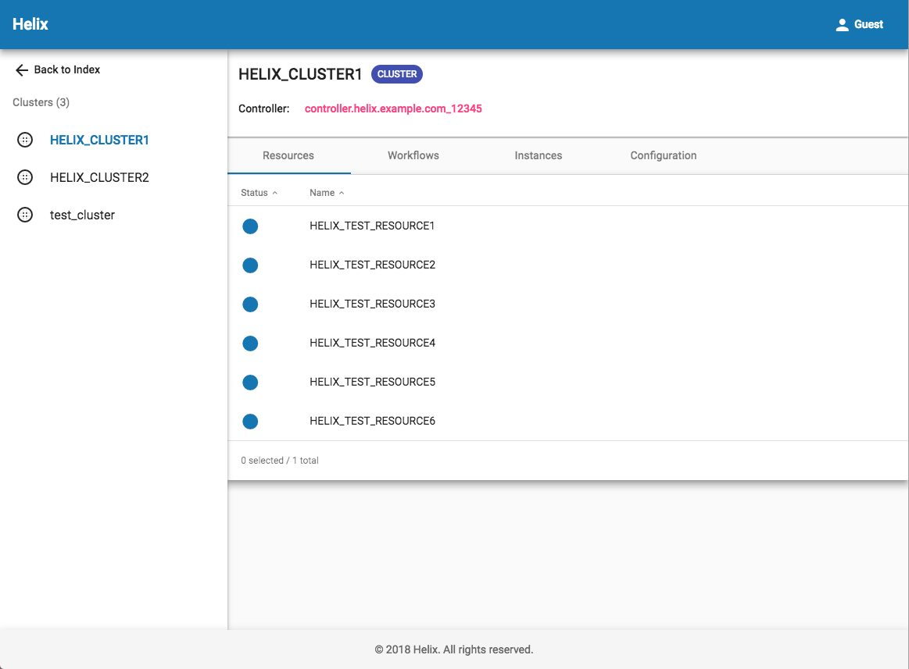

The left side is the cluster list, and the right side is the detailed cluster view if you click one on the left. You will find resource list, workflow list and instance list of the cluster as well as the cluster configurations.

When navigating into a single resource, Helix UI will show the partition placement with comparison of idealStates and externalViews like this:

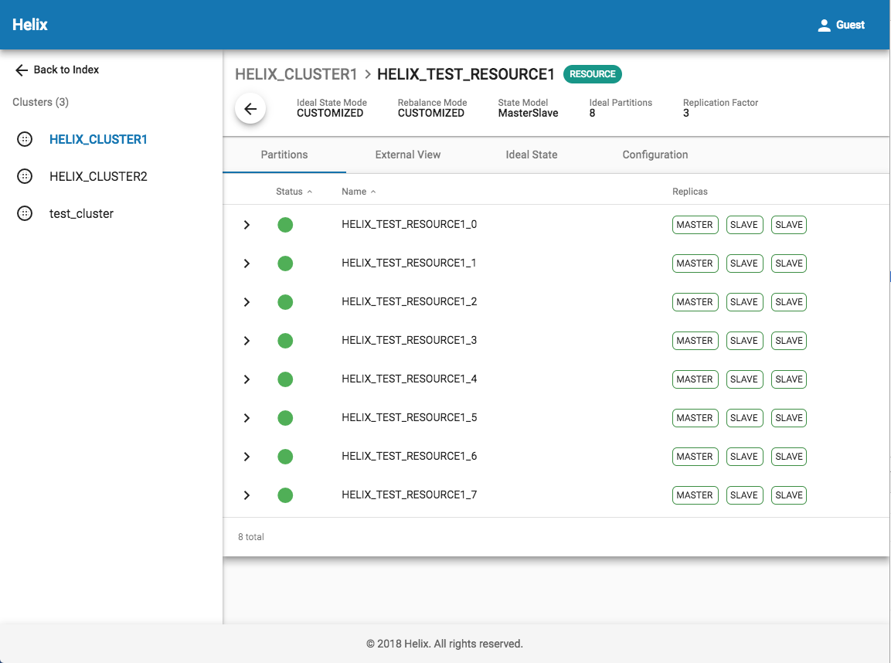

---

<a id="tutorial_customized_view"></a>

<!-- source_url: https://helix.apache.org/1.4.3-docs/tutorial_customized_view.html -->

<!-- page_index: 20 -->

<a id="tutorial_customized_view--helix_tutorial:_customized_view"></a>
<a id="tutorial_customized_view--helix-tutorial-:-customized-view"></a>

## [Helix Tutorial](#tutorial): Customized View

Helix supports users to define their own per partition states that are different from the states appeared in the state model. These states are called customized states. Helix also provides aggregation function for these per partition states across all participants to facilitate the use of them. The aggregated customized state result is called customized view. Usually users would only need to listen on the customized view change to capture customized state updates.

The relationship between customized states and customized view is very similar to that between current states and external view. Helix controller uses similar logic to aggregate external view and customized view. But the two views are designed for different purposes. External view is mainly used to represent Helix state transition status, while customized view is to record users' own state status. This tutorial provides information for users to get started with using customized view, which needs more user input than external view.

The following figure shows the high level architecture of customized view aggregation. 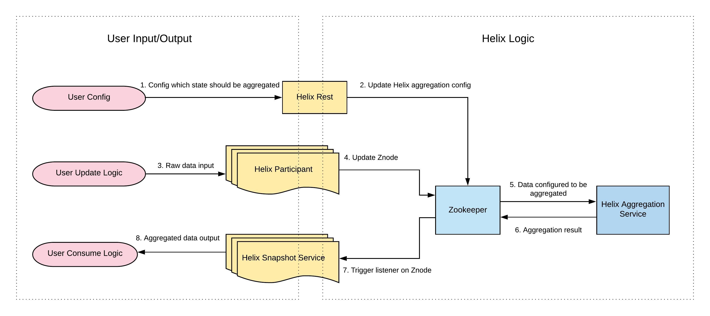

<a id="tutorial_customized_view--terminologies"></a>

### Terminologies

- Customized state: A per partition state defined by users in a string format. Customized state exists under each participant. It may include different types of states. Each type of state is represented as a Znode itself and has different resources as its child Znode.
- Customized state config: A cluster level config specifically used for customized state related config. For example, it can include a list of customized states that should be aggregated.
- Customized view: An aggregation result for customized states across all participants. It exists under the cluster and can also have a few different types of states depending on users' input. Each type of state is represented as a Znode itself and has different resources as its child Znode.

<a id="tutorial_customized_view--how_to_use_customized_view"></a>
<a id="tutorial_customized_view--how-to-use-customized-view"></a>

### How to Use Customized View

<a id="tutorial_customized_view--define_your_own_customized_state"></a>
<a id="tutorial_customized_view--define-your-own-customized-state"></a>

#### Define Your Own Customized State

Users are responsible for updating customized states in their application code. Helix provides a singleton factory called [Customized State Provider Factory](https://github.com/apache/helix/blob/master/helix-core/src/main/java/org/apache/helix/customizedstate/CustomizedStateProviderFactory.java), and users should instantiate it if they want to use customized state.

After instantiation, users should call the function in the factory with user defined parameters to build a [Customized State Provider](https://github.com/apache/helix/blob/master/helix-core/src/main/java/org/apache/helix/customizedstate/CustomizedStateProvider.java) object.

There are two ways to build [Customized State Provider](https://github.com/apache/helix/blob/master/helix-core/src/main/java/org/apache/helix/customizedstate/CustomizedStateProvider.java), and the difference is what kind of [HelixManager](https://github.com/apache/helix/blob/master/helix-core/src/main/java/org/apache/helix/HelixManager.java) is passed in. As the following code shows, the first one relies on a Helix provided manager, while the second one needs a user-created Helix manager.

```
  public CustomizedStateProvider buildCustomizedStateProvider(String instanceName,
      String clusterName, String zkAddress) {
    HelixManager helixManager = HelixManagerFactory
        .getZKHelixManager(clusterName, instanceName, InstanceType.ADMINISTRATOR, zkAddress);
    return new CustomizedStateProvider(helixManager, instanceName);
  }

  public CustomizedStateProvider buildCustomizedStateProvider(HelixManager helixManager,
      String instanceName) {
    return new CustomizedStateProvider(helixManager, instanceName);
  }
```

Helix provides a a couple of functions in [Customized State Provider](https://github.com/apache/helix/blob/master/helix-core/src/main/java/org/apache/helix/customizedstate/CustomizedStateProvider.java) that handle operations such as update, get, delete, etc. The underlying logic is already written in an efficient and thread safe way. Users only need to call these functions to update customized states to Zookeeper whenever they want.

```
  public void updateCustomizedState(String customizedStateName, String resourceName,
      String partitionName, String customizedState);

  public void updateCustomizedState(String customizedStateName, String resourceName,
      String partitionName, Map<String, String> customizedStateMap);

  public CustomizedState getCustomizedState(String customizedStateName, String resourceName);

  public Map<String, String> getPerPartitionCustomizedState(String customizedStateName,
      String resourceName, String partitionName);

  public void deletePerPartitionCustomizedState(String customizedStateName, String resourceName,
      String partitionName);
```

Here are some additional guidelines about how to use [Customized State Provider](https://github.com/apache/helix/blob/master/helix-core/src/main/java/org/apache/helix/customizedstate/CustomizedStateProvider.java):

- When a user would like to drop a certain instance by calling Helix delete instance API, Helix will delete the instance as well as all sub-paths under it with recursive deletion. Therefore, the customized state will also be deleted, and customized view will be updated when the instance is gone.
- When a user would like to drop a certain resource by calling Helix delete resource API, he/she will be responsible for deleting customized state of all partitions for that resource across all instances. This operation can be implemented in users' state transition logic.
- When Helix rebalance happens, and a certain partition on a certain instance is moved to another instance, customers will need to handle the cleanup in the callback function currently provided by Helix in the state transition logic.
- When an unexpected disconnection happens in client side from Zookeeper, but does not trigger rebalance, Helix will still keep the customized state as it is and wait for the connection to be reset.

<a id="tutorial_customized_view--enable_customized_state_aggregation_in_config"></a>
<a id="tutorial_customized_view--enable-customized-state-aggregation-in-config"></a>

#### Enable Customized State Aggregation in Config

To use Helix customized state and aggregated view, users should firstly call a Helix REST API or a Helix java API to set a cluster level config, called [Customized State Config](https://github.com/apache/helix/blob/master/helix-core/src/main/java/org/apache/helix/model/CustomizedStateConfig.java). If users do not config this field properly, they can still use Helix to record their customized states, but Helix will by default skip the aggregation process, as the aggregation will take a fair amount of computing and storage resources. Only when users correctly notify Helix that they want the aggregation by adding the state type in the aggregation config list field, Helix will do the aggregation and output the results to Zookeeper.

There are two ways to update customized state config. One is through JAVA API inside [ZK Helix Admin](https://github.com/apache/helix/blob/master/helix-core/src/main/java/org/apache/helix/manager/zk/ZKHelixAdmin.java), and the other is through REST API in [Cluster Accessor](https://github.com/apache/helix/blob/master/helix-rest/src/main/java/org/apache/helix/rest/server/resources/helix/ClusterAccessor.java).

The JAVA API provides four different functions as follows.

```
  public void addCustomizedStateConfig(String clusterName, CustomizedStateConfig customizedStateConfig);

  public void removeCustomizedStateConfig(String clusterName);

  public void addTypeToCustomizedStateConfig(String clusterName, String type);

  public void removeTypeFromCustomizedStateConfig(String clusterName, String type);
```

Every JAVA API has a corresponding REST API. For example, the function `addCustomizedStateConfig` can be performed by the following REST call.

```
$curl -X PUT -H "Content-Type: application/json" http://localhost:1234/admin/v2/clusters/myCluster/customized-state-config -d ' {"id" : "CustomizedStateConfig","listFields" : {"AGGREGATION_ENABLED_TYPES" : ["CUSTOMIZED_STATE_TYPE_0", "CUSTOMIZED_STATE_TYPE_1""] },"simpleFields" : {},"mapFields" : {} }'
```

<a id="tutorial_customized_view--update_consuming_logic_to_listen_on_customized_view_change"></a>
<a id="tutorial_customized_view--update-consuming-logic-to-listen-on-customized-view-change"></a>

#### Update Consuming Logic to Listen on Customized View Change

The aggregated results is updated in [RoutingTableProvider](https://github.com/apache/helix/blob/master/helix-core/src/main/java/org/apache/helix/spectator/RoutingTableProvider.java). Users need to properly construct the routing table provider in their consuming logic to use the snapshot that contains customized view. [RoutingTableProvider](https://github.com/apache/helix/blob/master/helix-core/src/main/java/org/apache/helix/spectator/RoutingTableProvider.java) has three different constructors for backward compatibility.

```
public RoutingTableProvider(HelixManager helixManager) throws HelixException {this(helixManager, ImmutableMap.of(PropertyType.EXTERNALVIEW, Collections.emptyList()), true,DEFAULT_PERIODIC_REFRESH_INTERVAL);}
public RoutingTableProvider(HelixManager helixManager, PropertyType sourceDataType) throws HelixException {this(helixManager, ImmutableMap.of(sourceDataType, Collections.emptyList()), true,DEFAULT_PERIODIC_REFRESH_INTERVAL);}
public RoutingTableProvider(HelixManager helixManager, Map<PropertyType, List<String>> sourceDataTypeMap) {this(helixManager, sourceDataTypeMap, true, DEFAULT_PERIODIC_REFRESH_INTERVAL);}
```

If users would like to use customized states and customized view, they need to initialize [RoutingTableProvider](https://github.com/apache/helix/blob/master/helix-core/src/main/java/org/apache/helix/spectator/RoutingTableProvider.java) with the last constructor. They also need to define the `sourceDataMap`. For example, if users would like to listen to both external view and customized view, they can do

```
Map<PropertyType, List<String>> sourceDataTypeMap = new Hashmap<>();
sourceDataTypeMap.put(PropertyType.CUSTOMIZEDVIEW, Arrays.asList(CUSTOMIZED_STATE_0, CUSTOMIZED_STATE_1))
sourceDataTypeMap.put(PropertyType.EXTERNALVIEW, Collections.emptyList());

routingTableProvider = new RoutingTableProvider(helixManager, sourceDataTypeMap);
```

<a id="tutorial_customized_view--verify_customized_view_generated_properly"></a>
<a id="tutorial_customized_view--verify-customized-view-generated-properly"></a>

#### Verify Customized View Generated Properly

After finishing all the steps above, users could verify whether the customized view is generated probably based on customized states. For example, if you have two instances: P0 and P1, one resource: MyResource, with two partitions: MyResource\_0 and MyResource\_1, and each partition has one state in CUSTOMIZED\_STATE\_TYPE\_1, which includes STATE\_NAME\_0, STATE\_NAME\_1 and STATE\_NAME\_2. At a certain time, the customized states may look like something similar to the following.

```
P0:{"id": "MyResource","listFields": {},"mapFields": {"MyResource_0": {"CURRENT_STATE": "STATE_NAME_1","PREVIOUS_STATE": "STATE_NAME_0","START_TIME": "1580221789100","END_TIME": "1580221.4.397",},"MyResource_1": {"CURRENT_STATE": "STATE_NAME_2","PREVIOUS_STATE": "STATE_NAME1","START_TIME": "1580221789880","END_TIME": "1580221.4.317"}}}
P1:{"id": "MyResource","listFields": {},"mapFields": {"MyResource_0": {"CURRENT_STATE": "STATE_NAME_2","PREVIOUS_STATE": "STATE_NAME_0","START_TIME": "1570221125566","END_TIME": "15744432835197",},"MyResource_1": {"CURRENT_STATE": "STATE_NAME_0","PREVIOUS_STATE": "STATE_NAME1","START_TIME": "1570221723440","END_TIME": "1570321.4.317"}}}
```

After Helix controller aggregation, the customized view should look like the following:

```
{ "id": "MyResource","listFields": {},"mapFields": {"MyResource_0": {"P0": "STATE_NAME_1","P1": "STATE_NAME_2" },"MyResource_1": {"P0": "STATE_NAME_2","P1": "STATE_NAME_0"}}
```

[Back to top](#tutorial_customized_view)

Copyright ©2026 [Apache Software Foundation](http://www.apache.org). All Rights Reserved.

[Reflow Maven skin](https://github.com/olamy/reflow-maven-skin "Reflow Maven skin") maintained by [Olivier Lamy](https://twitter.com/olamy "Olivier Lamy").

Apache Helix, Apache, the Apache feather logo, and the Apache Helix project logos are trademarks of The Apache Software Foundation.
All other marks mentioned may be trademarks or registered trademarks of their respective owners.

[Privacy Policy](https://helix.apache.org/1.4.3-docs/privacy-policy.html)

---

<a id="tutorial_cloud_support"></a>

<!-- source_url: https://helix.apache.org/1.4.3-docs/tutorial_cloud_support.html -->

<!-- page_index: 21 -->

<a id="tutorial_cloud_support--helix_tutorial:_cloud_support"></a>
<a id="tutorial_cloud_support--helix-tutorial-:-cloud-support"></a>

## [Helix Tutorial](#tutorial): Cloud Support

There are emerging cases to use Helix in a cloud environment, especially in those well-known public cloud, e.g. Azure, AWS, GCP, etc. Compared to previous on premise use cases, Helix has faced both challenges and opportunities in providing cloud related support.

As a first step, Helix implemented the support for participant auto registration in a cloud environment, which leverages the common feature of public cloud and facilitates Helix users when they need to create a cluster and register the participants to the cluster.

After a Helix cluster is created, there are two ways to add instances (or participants, we will use them interchangeably in this tutorial) to the cluster. One is manual add, where users call their own scripts to add instance config to the cluster for each participant; and the other is auto join, where users set the auto join config of the cluster to be true, and each participant populates its own hostname, port number, and other information in instance config during connection. However, in an on premise environment, the auto join only works perfectly when users use Helix in a non rack-aware environment, meaning there is no fault domain concept. For a rack-aware environment, users still need to manually input the domain information to the instance config as it is hard for each participant to get its own fault domain information. Considering most users would use Helix in a rack-aware environment, it means manual work is still required.

In a cloud environment, there is a good opportunity to achieve full automation as public cloud providers give domain information to each individual instance through a metadata endpoint. All of the above mentioned public cloud providers use a unique non-routable IP address (169.254.169.254) for this purpose. It can be accessed only from within the instance to retrieve the instance metadata information, which you can use to configure or manage the running instance.

More specifically, in AWS, Azure, and GCP, the query to the fixed IP address <http://169.254.169.254/> inside each instance will return its metadata information that contains domain information. In AWS, the field is named as “placement”; in Azure, the field is named as “PlatformUpdateDomain”; and in GCP, the field is named as “zone”. It is usually just an integer denoting which fault domain the instance belongs to. This particular feature of public cloud is leveraged by Helix in cluster creation and partition registration process.

<a id="tutorial_cloud_support--what_helix_provides_for_cloud_environment"></a>
<a id="tutorial_cloud_support--what-helix-provides-for-cloud-environment"></a>

### What Helix Provides for Cloud Environment

- Provide definition of Helix cloud configs at cluster level and participant level
- Provide enhanced REST and Java APIs for cluster creation and cloud config update
- Provide generic interface for fetching and parsing cloud instance information
- Provide the implementation of Azure cloud instance information processor
- Provide the implementation of participant auto registration logic

<a id="tutorial_cloud_support--how_to_use_cloud_support"></a>
<a id="tutorial_cloud_support--how-to-use-cloud-support"></a>

### How to Use Cloud Support

First of all, you need to make sure that your environment is indeed a cloud environment. Otherwise, all the assumptions in this support will not hold. Then depending on what kind of cloud environment you are in, you will need to perform some or all of the following steps.

<a id="tutorial_cloud_support--define_cloud_config_at_cluster_level"></a>
<a id="tutorial_cloud_support--define-cloud-config-at-cluster-level"></a>

#### Define Cloud config at Cluster Level

Helix provides cloud configs at two different levels, one is at cluster level, and the other is at participant level. We describe them separately.

At cluster level, we have a new Znode called CloudConfig. It has a few fields that store the relatively static cloud information for the whole cluster. Similar to other existing configs, Helix provides cloud config builder, validation, get/set functions. As the following table shows, the first two fields are required, and the last three fields are optional.

`CLOUD_ENABLED` must be set to true if the user would like to use Helix cloud support. `CLOUD_PROVIDER` is the type of the cloud environment. Besides the few well-known public cloud providers, the user can also define his/her cloud environment as “CUSTOMIZED”. `CLOUD_ID` is an optional field. It can be used to record any specific metadata information the user would like to record, e.g. the ID for the particular cluster inside a cloud environment, etc. If the user chooses to use the provider that already has default implementations in Helix, e.g., Azure, he does not need to provide the last two fields, as Helix already provides the default value for these two fields in system property, which is considered as a bundle with Azure implementation that would be discussed later. If the user uses customized providers, or chooses some other cloud environment that has not been implemented in Helix yet, the user needs to provide the last two fields and/or `CLOUD_ID` depending on his/her usage.

| Field | Meaning |
| --- | --- |
| CLOUD\_ENABLED | determine whether the cluster is inside cloud environment and use Helix cloud support |
| CLOUD\_PROVIDER | denote what kind of cloud environment the cluster is in, e.g. Azure, AWS, GCP, or CUSTOMIZED |
| CLOUD\_ID | the specific id in cloud environment that belongs to this cluster |
| CLOUD\_INFO\_SOURCE | the source for retrieving the cloud information. |
| CLOUD\_INFO\_PROCESSOR\_NAME | the name of the function that processes the fetching and parsing of cloud information |

Users could use either REST API or Java API to set these configs.

<a id="tutorial_cloud_support--rest_api_examples"></a>
<a id="tutorial_cloud_support--rest-api-examples"></a>

##### REST API Examples

Helix enhanced current cluster creation REST API as well as Java API with extra fields that represent cloud related input. For example, in the following modified `createCluster` API, `addCloudConfig` is a Boolean value denotes whether to create with cloud config, and the `cloudConfigManifest` is the cloud config string, which will be converted to a Znode record.

```
@PUT
  @Path("{clusterId}")
  public Response createCluster(@PathParam("clusterId") String clusterId, @DefaultValue("false") @QueryParam("recreate") String recreate,
      @DefaultValue("false") @QueryParam("addCloudConfig") String addCloudConfig, String cloudConfigManifest)
```

Besides the enhanced cluster creation API, Helix also provides a set of cloud specific APIs in Java and REST that handles the get/add/update of cloud config.

- Create cluster and add meanwhile cloud config related information to ZK.

```
$ curl -X PUT -H "Content-Type: application/json" http://localhost:1234/admin/v2/clusters/myCluster?addCloudConfig=true -d ' {"simpleFields" :{"CLOUD_ENABLED" : "true","CLOUD_PROVIDER": "AWS","CLOUD_ID" : "12345" "CLOUD_INFO_SOURCE": {"http://169.254.169.254/"} "CLOUD_INFO_PROCESSOR_NAME": "AWSCloudInformationProcesser"} }'
```

- Add cloud config to an existing cluster

```
$ curl -X PUT -H "Content-Type: application/json" http://localhost:1234/admin/v2/clusters/myCluster/cloudconfig -d ' {"simpleFields" :{"CLOUD_ENABLED" : "true","CLOUD_PROVIDER": "AWS","CLOUD_ID" : "12345" "CLOUD_INFO_SOURCE": {"http://169.254.169.254/"} "CLOUD_INFO_PROCESSOR_NAME": "AWSCloudInformationProcesser"} }'
```

- Delete the cloud config of a cluster

```
$ curl -X DELETE http://localhost:1234/admin/v2/clusters/myCluster/cloudconfig
```

- Get the cloud config of a cluster

```
$ curl -X GET http://localhost:1234/admin/v2/clusters/myCluster/cloudconfig
```

- Update the cloud config of a cluster

```
$ curl -X POST -H "Content-Type: application/json" http://localhost:1234/admin/v2/clusters/myCluster/cloudconfig?command=update -d ' {"simpleFields" : {"CLOUD_ID" : "12345"}}'
```

- Delete some of the fields in the cloud config

```
$ curl -X POST -H "Content-Type: application/json" http://localhost:1234/admin/v2/clusters/myCluster/cloudconfig?command=delete -d ' {"simpleFields" : {"CLOUD_ID" : "12345"}}'
```

<a id="tutorial_cloud_support--define_cloud_configs_at_participant_level"></a>
<a id="tutorial_cloud_support--define-cloud-configs-at-participant-level"></a>

#### Define Cloud Configs at Participant Level

At participant level, Helix allows users to provide detailed cloud properties, which is more related to the participant’s actions. For default value, Helix provides [Azure cloud properties](https://github.com/apache/helix/blob/master/helix-core/src/main/resources/azure-cloud.properties), including not only the default cluster level config values for Azure, like `CLOUD_INFO_SOURCE` and `CLOUD_INFO_PROCESSOR_NAME`, but also some participant specific values, such as http timeout when querying AIMS (Azure Instance Metadata Service) in Azure, max retry times, etc.

```
cloud_info_source=http://169.254.169.254/metadata/instance?api-version=2019-06-04
cloud_info_processor_name=AzureCloudInstanceInformationProcessor
cloud_max_retry=5
connection_timeout_ms=5000
request_timeout_ms=5000
```

If users would like to use their customized config for participants, they can input the specific properties through [Helix Manager Property](https://github.com/apache/helix/blob/master/helix-core/src/main/java/org/apache/helix/HelixManagerProperty.java) when composing [Zk Helix Manager](https://github.com/apache/helix/blob/master/helix-core/src/main/java/org/apache/helix/manager/zk/ZKHelixManager.java), which is passed into participants. [Helix Manager Property](https://github.com/apache/helix/blob/master/helix-core/src/main/java/org/apache/helix/HelixManagerProperty.java) includes [Helix Cloud Property](https://github.com/apache/helix/blob/master/helix-core/src/main/java/org/apache/helix/HelixCloudProperty.java) which includes commonly used cloud properties and also any kind of user defined cloud properties.

```
public ZKHelixManager(String clusterName, String instanceName, InstanceType instanceType,
    String zkAddress, HelixManagerStateListener stateListener, HelixManagerProperty helixManagerProperty)
```

<a id="tutorial_cloud_support--implement_cloud_instance_information_.28if_necessary.29"></a>
<a id="tutorial_cloud_support--implement-cloud-instance-information-if-necessary"></a>

#### Implement Cloud Instance Information (if necessary)

Helix has predefined a few fields in the interface of [CloudInstanceInformation](https://github.com/apache/helix/blob/master/helix-core/src/main/java/org/apache/helix/api/cloud/CloudInstanceInformation.java) that are commonly used in participant. Users are free to define other fields in the instance metadata that they think are useful.

```
public interface CloudInstanceInformation {/** * Get the the value of a specific cloud instance field by name * @return the value of the field */ String get(String key);
/** * The enum contains all the required cloud instance field in Helix */ enum CloudInstanceField {INSTANCE_NAME,FAULT_DOMAIN,INSTANCE_SET_NAME}}
```

<a id="tutorial_cloud_support--implement_cloud_instance_information_processor_.28if_necessary.29"></a>
<a id="tutorial_cloud_support--implement-cloud-instance-information-processor-if-necessary"></a>

#### Implement Cloud Instance Information Processor (if necessary)

Helix provides an interface to fetch and parse cloud instance information as follows. Helix makes the interface generic enough so that users may implement their own fetching and parsing logic with maximum freedom.

```
/** * Generic interface to fetch and parse cloud instance information */ public interface CloudInstanceInformationProcessor<T extends Object> {
/** * Get the raw cloud instance information * @return raw cloud instance information */ List<T> fetchCloudInstanceInformation();
/** * Parse the raw cloud instance information in responses and compose required cloud instance information * @return required cloud instance information */ CloudInstanceInformation parseCloudInstanceInformation(List<T> responses);}
```

Helix also implements an example processor for Azure in [AzureCloudInstanceInformationProcessor](https://github.com/apache/helix/blob/master/helix-core/src/main/java/org/apache/helix/cloud/azure/AzureCloudInstanceInformationProcessor.java). The implementation includes fetching and parsing Azure cloud instance information. The fetching function retrieves instance information from Azure AIMS, and the parsing function validates the response, and selects the fields needed for participant auto registration. If users would like to use Helix in an Azure environment, they do not need to implement it by themselves.

If users need to use Helix in another cloud environment, they can implement their own information processor. The implementation would be similar to Azure implementation, and the main difference would be in how to parse the response and retrieve interested fields.

<a id="tutorial_cloud_support--config_properly_for_participant_auto_registration_to_work"></a>
<a id="tutorial_cloud_support--config-properly-for-participant-auto-registration-to-work"></a>

#### Config Properly for Participant Auto Registration to Work

To make the participant auto registration work, users would need to make sure their cluster config is set properly. The most important one is the `allowParticipantAutoJoin` field in cluster config.

```
{"id": "clusterName","listFields": {},"mapFields": {},"simpleFields": {......"allowParticipantAutoJoin": "true" ......}}
```

This field is used in participant manager logic as a prerequisite for participants to do auto registration. The detailed logic is shown in the following flow chart. The related code is in [Participant Manager](https://github.com/apache/helix/blob/master/helix-core/src/main/java/org/apache/helix/manager/zk/ParticipantManager.java).

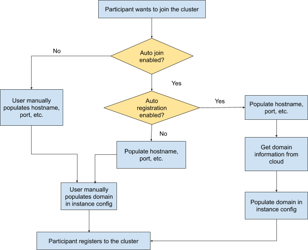

If the participant decides that it should do auto registration based on the config, it will first query cloud config and decide what environment it is in. Based on this information, the participant will call the corresponding cloud instance information processor. Then with all the information, especially the domain information, the participant can auto register to the cluster without any manual effort.

[Back to top](#tutorial_cloud_support)

Copyright ©2026 [Apache Software Foundation](http://www.apache.org). All Rights Reserved.

[Reflow Maven skin](https://github.com/olamy/reflow-maven-skin "Reflow Maven skin") maintained by [Olivier Lamy](https://twitter.com/olamy "Olivier Lamy").

Apache Helix, Apache, the Apache feather logo, and the Apache Helix project logos are trademarks of The Apache Software Foundation.
All other marks mentioned may be trademarks or registered trademarks of their respective owners.

[Privacy Policy](https://helix.apache.org/1.4.3-docs/privacy-policy.html)

---

<a id="tutorial_distributed_lock"></a>

<!-- source_url: https://helix.apache.org/1.4.3-docs/tutorial_distributed_lock.html -->

<!-- page_index: 22 -->

<a id="tutorial_distributed_lock--helix_tutorial:_distributed_lock"></a>
<a id="tutorial_distributed_lock--helix-tutorial-:-distributed-lock"></a>

## [Helix Tutorial](#tutorial): Distributed Lock

In a distributed system, there are many cases that we need a mechanism to make sure different processes can cooperate correctly. For example, if two processes that run on different machines, or different networks, or even different data centers would like to work on the same resource, we must have a mutually exclusive lock to ensure that their operations do not step on each other. Only when a process acquires the lock, it can perform the operation.

Since Helix is built on top of ZooKeeper, which is a widely used framework to manage coordination across a cluster of machines, a natural solution for implementing a distributed lock is to leverage ZooKeeper. Specifically, we can represent the lock itself as a znode. Currently, many distributed systems use Apache Helix as a generic cluster management framework to automatically manage resources hosted on a cluster of nodes. Implementing a distributed lock in Helix would allow Helix's existing customers to use a reliable lock with little overhead.

<a id="tutorial_distributed_lock--helix_lock_interface"></a>
<a id="tutorial_distributed_lock--helix-lock-interface"></a>

### Helix Lock Interface

Helix provides a generic lock interface that can be implemented with different kinds of locks. Several key functions are defined in the interface.

```
/** * Generic interface for Helix distributed lock */ public interface DistributedLock {/** * Blocking call to acquire a lock if it is free at the time of request * @return true if the lock was successfully acquired,* false if the lock could not be acquired */ boolean tryLock();
/** * Blocking call to unlock a lock * @return true if the lock was successfully released or if the locked is not currently locked,* false if the lock is not locked by the user or the unlock operation failed */ boolean unlock();
/** * Retrieve the information of the current lock on the resource this lock object specifies, e.g. lock timeout, lock message, etc.* @return lock metadata information */ LockInfo getCurrentLockInfo();
/** * If the user is current lock owner of the resource * @return true if the user is the lock owner,* false if the user is not the lock owner or the lock doesn't have a owner */ boolean isCurrentOwner();
/** * Call this method to close the lock's zookeeper connection * The lock has to be unlocked or expired before this method can be called */ void close();}
```

Currently, Helix supports two kinds of locks. One is basic lock, and the other is priority lock. We will describe their definition and usage as follows.

<a id="tutorial_distributed_lock--helix_basic_lock"></a>
<a id="tutorial_distributed_lock--helix-basic-lock"></a>

### Helix Basic Lock

<a id="tutorial_distributed_lock--features"></a>

#### Features

- Non-blocking lock. It means every request to acquire the lock will immediately get a result (success or failure) instead of waiting until the lock is successfully acquired.
- Timeout support. A client needs to input the timeout when it tries to acquire the lock. We use lazy timeout for the lock. It means even after the timeout, if no other client tries to get the lock, the client can still keep the lock, if other client tries to acquire the lock, and finds the previous client already timed out, the previous client will automatically lose the lock.
- Lock message support. A client can input the reason for the lock (as a string) when it tries to acquire the lock. This enables future lock operation, when fails, can know the reason from the lock message of the current lock.
- Java API support for clients to use the lock.
- No notification support. When a client loses its lock after the timeout or due to some urgent maintenance work who does not check the lock, there is no notification sent out to the previous lock owner.

<a id="tutorial_distributed_lock--how_to_use_helix_basic_lock"></a>
<a id="tutorial_distributed_lock--how-to-use-helix-basic-lock"></a>

#### How to Use Helix Basic Lock

The implementation of Helix lock is called “ZkHelixNonblockingLock”. It has two different constructors as shown below. One constructor takes clusterName, and HelixConfigScope as inputs. HelixConfigScope can be “cluster”, “participant”, or “resource”. The other constructor takes a lockPath string as input.

```
/** * Initialize the lock with Helix scope.*/ public ZKHelixNonblockingLock(String clusterName, HelixConfigScope scope, String zkAddress,Long timeout, String lockMsg)
/** * Initialize the lock with lock path under zookeeper.*/ public ZKHelixNonblockingLock(String lockPath, String zkAddress, Long timeout, String lockMsg)
```

The client can use the lock in two different ways. If the client would like to use the lock for some specific Helix resource, it can use the first constructor which requires clusterName and HelixConfigScope. We show an example below on how to use Helix scope. Or the client may choose to use the lock for generic purpose, basically on any resource they have. In this case, the client needs to provide the lock path, which is a string, and it represents where the lock should exist under zookeeper.

```
    List<String> pathKeys = new ArrayList<>();
    pathKeys.add(clusterName);
    HelixLockScope participantScope = new HelixLockScope(HelixLockScope.LockScopeProperty.CLUSTER, pathKeys);
```

Note that if users have onboarded to ZooScalability that has multiple realms, they should instead use the builder instead of the above constructors.

<a id="tutorial_distributed_lock--helix_priority_lock"></a>
<a id="tutorial_distributed_lock--helix-priority-lock"></a>

### Helix Priority Lock

<a id="tutorial_distributed_lock--features-2"></a>

#### Features

- Priority support. A client with higher priority can override lock owned by a client with lower priority.
- Notification support. After the higher priority client overrides the lock owned by lower priority client, the low priority client will get notified.
- Cleanup support. The low priority client will be given some time to do the cleanup and roll back the system to normal state when its lock is preempted.

<a id="tutorial_distributed_lock--priority_lock_definitions"></a>
<a id="tutorial_distributed_lock--priority-lock-definitions"></a>

#### Priority Lock Definitions

There are a few concepts defined for priority lock.

<a id="tutorial_distributed_lock--definition_1:_priority_of_the_lock."></a>
<a id="tutorial_distributed_lock--definition-1:-priority-of-the-lock."></a>

##### Definition 1: Priority of the lock.

Any client that wants to acquire a lock needs to have a priority so that Helix knows what to do when there are multiple clients that want the same lock. We accept non-negative integers as meaningful priority representation. The lowest priority is 0. The larger the number, the higher the priority is. Same number denotes the same priority. We do not have an upper limit for the priority definition. However, we reserve the value of INT\_MAX for emergency use by SREs, i.e., they may override all other priorities in case of urgent operations. If a client does not have a priority defined when it tries to acquire the lock, the default value 0 will be assigned to the client and thus the client is with lowest priority.

<a id="tutorial_distributed_lock--definition_2:_timeout_of_the_lock."></a>
<a id="tutorial_distributed_lock--definition-2:-timeout-of-the-lock."></a>

##### Definition 2: Timeout of the lock.

When a request for a lock is issued, there can be three types of timeout associated with the lock. We explain them respectively as follows.

- lease timeout: it is the user's requirement of how long the lease it needs. It denotes how long it takes to finish the work by the client that requires the locked resource. This is the same concept as the timeout in basic lock. This field must be set to a positive value. Otherwise the lock is meaningless.
- cleanup timeout: it defines how long it takes for a client to clean up the work done with the locked resource and bring back the resource to a clean state if the client is preempted by a higher priority client. If a user does not define this field, the clean up timeout will be set to the default value 0, meaning no cleanup work is needed. Once there is a higher priority client requested the lock, the lock will be immediately given to the high priority one after the notification is sent to the low priority client.
- waiting timeout: it defines how long the client that requests the lock can wait for the lower priority client to finish the cleanup work. Specifically, if the work is urgent to get executed, a client should set a shorter waiting timeout. To the extreme, if users set the waiting timeout to be 0, the lock will be acquired immediately. If the waiting timeout is not set, it will be default as infinite, meaning that the high priority client will not get the lock until the low priority client finishes all the cleanup work.

The three timeout are specific to the particular client that requests the lock and should be independent of each other. In short, the lease timeout includes all the time needed in normal operation (perform the work, clean up when work is completed, etc.); cleanup timeout is user's best estimate of time needed for reverting the system to previous stable state in case of preemption; waiting timeout shows how urgent the client needs to acquire the lock. Please note that it is possible that a client's waiting timeout is shorter than the other client's cleanup timeout. In this case, the client's waiting timeout will override the other client's cleanup timeout. We always honor the waiting timeout of the high priority client before cleanup timeout of the low priority client when there is a contention for the lock. Lock users should be responsible for setting up different timeout of their locks. However, it is possible that at the beginning they can only provide an estimation for the timeout which is not accurate enough. Either Helix or user code could implement some statistic logic to analyze the real execution or clean up times used. For example, Helix may be able to calculate how many times the workflow finishes the cleanup job in the designated cleanup timeout, and if not, what is the real cleanup time (in case that the waiting timeout is larger). Based on the results, users could tune their timeout to better handle lock preemption.

<a id="tutorial_distributed_lock--definition_3:_forcefulness_of_the_lock"></a>
<a id="tutorial_distributed_lock--definition-3:-forcefulness-of-the-lock"></a>

##### Definition 3: Forcefulness of the lock

Forcefulness means whether a lock requested by a client is forceful or not in case of a preemption. If it is a forceful lock, when time is out, no matter whether the cleanup work of low priority client is finished or not, the high priority client will grab the lock from low priority client. However, if it is not a forceful lock, the high priority client will receive an exception, knowing that the low priority client has not finished its work yet. Then it is up to human beings to decide what is the next step. We could trigger an alert based on this kind of exception. Users can set up an approval workflow to act based on the alert. They may manually check the exception and the previous lock owner to make the decision on whether they will respect the previous owner's work or forcefully grab the lock. Or later with some experience on handling these exceptions, they can also make the process fully automatic. For example, with low priority client A and high priority client B, if in the case of exception thrown during preemption, user always chooses to forcefully grab the lock and assign the lock owner to B, we may have a rule set up for this condition which will automatically transfer the lock owner.

<a id="tutorial_distributed_lock--priority_lock_workflow"></a>
<a id="tutorial_distributed_lock--priority-lock-workflow"></a>

#### Priority Lock Workflow

To better visualize the above analysis, we draw the following diagram shows how a client may go through the possible scenarios. 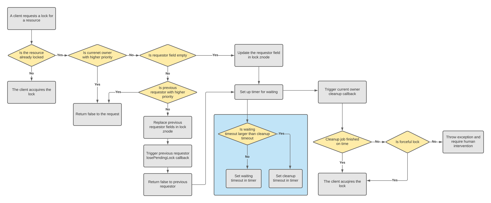

<a id="tutorial_distributed_lock--priority_lock_usage"></a>
<a id="tutorial_distributed_lock--priority-lock-usage"></a>

#### Priority Lock Usage

<a id="tutorial_distributed_lock--lock_information_definition"></a>
<a id="tutorial_distributed_lock--lock-information-definition"></a>

##### Lock information Definition

```
  public enum LockInfoAttribute {
    OWNER,
    MESSAGE,
    TIMEOUT,
    PRIORITY,
    WAITING_TIMEOUT,
    CLEANUP_TIMEOUT,
    REQUESTOR_ID,
    REQUESTOR_PRIORITY,
    REQUESTOR_WAITING_TIMEOUT,
    REQUESTING_TIMESTAMP
  }
```

<a id="tutorial_distributed_lock--priority_lock_constructor"></a>
<a id="tutorial_distributed_lock--priority-lock-constructor"></a>

##### Priority Lock Constructor

```
  /**
   * Internal construction of the lock with user provided information, e.g., lock path under
   * zookeeper, etc.
   * @param lockPath the path of the lock under Zookeeper
   * @param leaseTimeout the leasing timeout period of the lock
   * @param lockMsg the reason for having this lock
   * @param userId a universal unique userId for lock owner identity
   * @param priority the priority of the lock
   * @param waitingTimeout the waiting timeout period of the lock when the tryLock request is issued
   * @param cleanupTimeout the time period needed to finish the cleanup work by the lock when it
   *                      is preempted
   * @param isForceful whether the lock is a forceful one. This determines the behavior when the
   *                   lock encountered an exception during preempting lower priority lock
   * @param lockListener the listener associated to the lock
   * @param baseDataAccessor baseDataAccessor instance to do I/O against ZK with
   */
  private ZKDistributedNonblockingLock(String lockPath, Long leaseTimeout, String lockMsg,
      String userId, int priority, long waitingTimeout, long cleanupTimeout, boolean isForceful,
      LockListener lockListener, BaseDataAccessor<ZNRecord> baseDataAccessor) 
```

<a id="tutorial_distributed_lock--priority_lock_usage_example:"></a>
<a id="tutorial_distributed_lock--priority-lock-usage-example:"></a>

##### Priority Lock Usage Example:

```
    ZKDistributedNonblockingLock.Builder lockBuilder = new ZKDistributedNonblockingLock.Builder();
    lockBuilder.setLockScope(new HelixLockScope(HelixLockScope.LockScopeProperty.CLUSTER, pathKeys)).setZkAddress(ZK_ADDR).setTimeout(3600000L)
        .setLockMsg("test lock").setUserId("test Id").setPriority(0).setWaitingTimeout(1000)
        .setCleanupTimeout(2000).setIsForceful(false)
        .setLockListener(new LockListener() {@Override public void onCleanupNotification() {});
    ZKDistributedNonblockingLock testLock = lockBuilder.build();
```

[Back to top](#tutorial_distributed_lock)

Copyright ©2026 [Apache Software Foundation](http://www.apache.org). All Rights Reserved.

[Reflow Maven skin](https://github.com/olamy/reflow-maven-skin "Reflow Maven skin") maintained by [Olivier Lamy](https://twitter.com/olamy "Olivier Lamy").

Apache Helix, Apache, the Apache feather logo, and the Apache Helix project logos are trademarks of The Apache Software Foundation.
All other marks mentioned may be trademarks or registered trademarks of their respective owners.

[Privacy Policy](https://helix.apache.org/1.4.3-docs/privacy-policy.html)

---

<a id="building"></a>

<!-- source_url: https://helix.apache.org/1.4.3-docs/Building.html -->

<!-- page_index: 23 -->

<a id="building--build_instructions"></a>
<a id="building--build-instructions"></a>

## Build Instructions

<a id="building--from_source"></a>
<a id="building--from-source"></a>

### From Source

Requirements: JDK 1.8+, Maven 3.5.0+

```
git clone https://git-wip-us.apache.org/repos/asf/helix.git
cd helix
git checkout tags/helix-1.4.3
mvn install package -DskipTests
```

<a id="building--maven_dependency"></a>
<a id="building--maven-dependency"></a>

### Maven Dependency

```
<dependency>
  <groupId>org.apache.helix</groupId>
  <artifactId>helix-core</artifactId>
  <version>1.4.3</version>
</dependency>
```

[Back to top](#building)

Copyright ©2026 [Apache Software Foundation](http://www.apache.org). All Rights Reserved.

[Reflow Maven skin](https://github.com/olamy/reflow-maven-skin "Reflow Maven skin") maintained by [Olivier Lamy](https://twitter.com/olamy "Olivier Lamy").

Apache Helix, Apache, the Apache feather logo, and the Apache Helix project logos are trademarks of The Apache Software Foundation.
All other marks mentioned may be trademarks or registered trademarks of their respective owners.

[Privacy Policy](https://helix.apache.org/1.4.3-docs/privacy-policy.html)

---

<a id="metrics"></a>

<!-- source_url: https://helix.apache.org/1.4.3-docs/Metrics.html -->

<!-- page_index: 24 -->

<a id="metrics--helix_monitoring_metrics"></a>
<a id="metrics--helix-monitoring-metrics"></a>

## Helix Monitoring Metrics

Helix monitoring metrics are exposed as the MBeans attributes. The MBeans are registered based on instance role.

The easiest way to see the available metrics is using jconsole and point it at a running Helix instance. This will allow browsing all metrics with JMX.

Note that if not mentioned in the attribute name, all attributes are gauge by default.

<a id="metrics--metrics_on_both_controller_and_participant"></a>
<a id="metrics--metrics-on-both-controller-and-participant"></a>

### Metrics on Both Controller and Participant

<a id="metrics--mbean_zkclientmonitor"></a>
<a id="metrics--mbean-zkclientmonitor"></a>

#### MBean ZkClientMonitor

ObjectName: “HelixZkClient:type=[client-type],key=[specified-client-key],PATH=[zk-client-listening-path]”

| Attributes | Description |
| --- | --- |
| ReadCounter | Zk Read counter. Which could be used to identify unusually high/low ZK traffic |
| WriteCounter | Same as above |
| ReadBytesCounter | Same as above |
| WriteBytesCounter | Same as above |
| StateChangeEventCounter | Zk connection state change counter. Which could be used to identify ZkClient unstable connection |
| DataChangeEventCounter | Zk node data change counter. which could be used to identify unusual high/low ZK events occurrence or slow event processing |
| PendingCallbackGauge | Number of the pending Zk callbacks. |
| TotalCallbackCounter | Number of total received Zk callbacks. |
| TotalCallbackHandledCounter | Number of total handled Zk callbacks. |
| ReadTotalLatencyCounter | Total read latency in ms. |
| WriteTotalLatencyCounter | Total write latency in ms. |
| WriteFailureCounter | Total write failures. |
| ReadFailureCounter | Total read failures. |
| ReadLatencyGauge | Histogram (with all statistic data) of read latency. |
| WriteLatencyGauge | Histogram (with all statistic data) of write latency. |
| ReadBytesGauge | Histogram (with all statistic data) of read bytes of single Zk access. |
| WriteBytesGauge | Histogram (with all statistic data) of write bytes of single Zk access. |

<a id="metrics--mbean_helixcallbackmonitor"></a>
<a id="metrics--mbean-helixcallbackmonitor"></a>

#### MBean HelixCallbackMonitor

ObjectName: “HelixCallback:Type=[callback-type],Key=[cluster-name].[instance-name],Change=[callback-change-type]”

| Attributes | Description |
| --- | --- |
| Counter | Zk Callback counter for each Helix callback type. |
| UnbatchedCounter | Unbatched Zk Callback counter for each helix callback type. |
| LatencyCounter | Callback handler latency counter in ms. |
| LatencyGauge | Histogram (with all statistic data) of Callback handler latency. |

<a id="metrics--mbean_messagequeuemonitor"></a>
<a id="metrics--mbean-messagequeuemonitor"></a>

#### MBean MessageQueueMonitor

ObjectName: “ClusterStatus:cluster=[cluster-name],messageQueue=[instance-name]”

| Attributes | Description |
| --- | --- |
| MessageQueueBacklog | Get the message queue size |

<a id="metrics--metrics_on_controller_only"></a>
<a id="metrics--metrics-on-controller-only"></a>

### Metrics on Controller only

<a id="metrics--mbean_clusterstatusmonitor"></a>
<a id="metrics--mbean-clusterstatusmonitor"></a>

#### MBean ClusterStatusMonitor

ObjectName: “ClusterStatus:cluster=[cluster-name]”

| Attributes | Description |
| --- | --- |
| DisabledInstancesGauge | Current number of disabled instances |
| DisabledPartitionsGauge | Current number of disabled partitions number |
| DownInstanceGauge | Current down instances number |
| InstanceMessageQueueBacklog | The sum of all message queue sizes for instances in this cluster |
| InstancesGauge | Current live instances number |
| MaxMessageQueueSizeGauge | The maximum message queue size across all instances including controller |
| RebalanceFailureGauge | None 0 if previous rebalance failed unexpectedly. The Gauge will be set every time rebalance is done. |
| RebalanceFailureCounter | The number of failures during rebalance pipeline. |
| Enabled | 1 if cluster is enabled, otherwise 0 |
| Maintenance | 1 if cluster is in maintenance mode, otherwise 0 |
| Paused | 1 if cluster is paused, otherwise 0 |

<a id="metrics--mbean_clustereventmonitor"></a>
<a id="metrics--mbean-clustereventmonitor"></a>

#### MBean ClusterEventMonitor

ObjectName: “ClusterStatus:cluster=[cluster-name],eventName=ClusterEvent,phaseName=[event-handling-phase]”

| Attributes | Description |
| --- | --- |
| TotalDurationCounter | Total event process duration for each stage. |
| MaxSingleDurationGauge | Max event process duration for each stage within the recent hour. |
| EventCounter | The count of processed event in each stage. |
| DurationGauge | Histogram (with all statistic data) of event process duration for each stage. |

<a id="metrics--mbean_instancemonitor"></a>
<a id="metrics--mbean-instancemonitor"></a>

#### MBean InstanceMonitor

ObjectName: “ClusterStatus:cluster=[cluster-name],instanceName=[instance-name]”

| Attributes | Description |
| --- | --- |
| Online | This instance is Online (1) or Offline (0) |
| Enabled | This instance is Enabled (1) or Disabled (0) |
| TotalMessageReceived | Number of messages sent to this instance by controller |
| DisabledPartitions | Get the total disabled partitions number for this instance |

<a id="metrics--mbean_resourcemonitor"></a>
<a id="metrics--mbean-resourcemonitor"></a>

#### MBean ResourceMonitor

ObjectName: “ClusterStatus:cluster=[cluster-name],resourceName=[resource-name]”

| Attributes | Description |
| --- | --- |
| PartitionGauge | Get number of partitions of the resource in best possible ideal state for this resource |
| ErrorPartitionGauge | Get the number of current partitions in ERORR state for this resource |
| DifferenceWithIdealStateGauge | Get the number of how many replicas' current state are different from ideal state for this resource |
| MissingTopStatePartitionGauge | Get the number of partitions do not have top state for this resource |
| ExternalViewPartitionGauge | Get number of partitions in ExternalView for this resource |
| TotalMessageReceived | Get number of messages sent to this resource by controller |
| LoadRebalanceThrottledPartitionGauge | Get number of partitions that need load rebalance but were throttled. |
| RecoveryRebalanceThrottledPartitionGauge | Get number of partitions that need recovery rebalance but were throttled. |
| PendingLoadRebalancePartitionGauge | Get number of partitions that have pending load rebalance requests. |
| PendingRecoveryRebalancePartitionGauge | Get number of partitions that have pending recovery rebalance requests. |
| MissingReplicaPartitionGauge | Get number of partitions that have replica number smaller than expected. |
| MissingMinActiveReplicaPartitionGauge | Get number of partitions that have replica number smaller than the minimum requirement. |
| MaxSinglePartitionTopStateHandoffDurationGauge | Get the max duration recorded when the top state is missing in any single partition. |
| FailedTopStateHandoffCounter | Get the number of total top state transition failure. |
| SucceededTopStateHandoffCounter | Get the number of total top state transition done successfully. |
| SuccessfulTopStateHandoffDurationCounter | Get the total duration of all top state transitions. |
| PartitionTopStateHandoffDurationGauge | Histogram (with all statistic data) of top state transition duration. |

<a id="metrics--mbean_perinstanceresourcemonitor"></a>
<a id="metrics--mbean-perinstanceresourcemonitor"></a>

#### MBean PerInstanceResourceMonitor

ObjectName: “ClusterStatus:cluster=[cluster-name],instanceName=[instance-name],resourceName=[resource-name]”

| Attributes | Description |
| --- | --- |
| PartitionGauge | Get number of partitions of the resource in best possible ideal state for this resource on specific instance |

<a id="metrics--mbean_jobmonitor"></a>
<a id="metrics--mbean-jobmonitor"></a>

#### MBean JobMonitor

ObjectName: “ClusterStatus:cluster=[cluster-name],jobType=[job-type]”

| Attributes | Description |
| --- | --- |
| SuccessfulJobCount | Get number of the succeeded jobs |
| FailedJobCount | Get number of failed jobs |
| AbortedJobCount | Get number of the aborted jobs |
| ExistingJobGauge | Get number of existing jobs registered |
| QueuedJobGauge | Get numbers of queued jobs, which are not running jobs |
| RunningJobGauge | Get numbers of running jobs |
| MaximumJobLatencyGauge | Get maximum latency of jobs running time. It will be cleared every hour |
| JobLatencyCount | Get total job latency counter. |

<a id="metrics--mbean_workflowmonitor"></a>
<a id="metrics--mbean-workflowmonitor"></a>

#### MBean WorkflowMonitor

ObjectName: “ClusterStatus:cluster=[cluster-name],workflowType=[workflow-type]”

| Attributes | Description |
| --- | --- |
| SuccessfulWorkflowCount | Get number of succeeded workflows |
| FailedWorkflowCount | Get number of failed workflows |
| FailedWorkflowGauge | Get number of current failed workflows |
| ExistingWorkflowGauge | Get number of current existing workflows |
| QueuedWorkflowGauge | Get number of queued but not started workflows |
| RunningWorkflowGauge | Get number of running workflows |
| WorkflowLatencyCount | Get workflow latency count |
| MaximumWorkflowLatencyGauge | Get maximum workflow latency gauge. It will be reset in 1 hour. |

<a id="metrics--metrics_on_participant_only"></a>
<a id="metrics--metrics-on-participant-only"></a>

### Metrics on Participant only

<a id="metrics--mbean_statetransitionstatmonitor"></a>
<a id="metrics--mbean-statetransitionstatmonitor"></a>

#### MBean StateTransitionStatMonitor

ObjectName: “CLMParticipantReport:Cluster=[cluster-name],Resource=[resource-name],Transition=[transaction-id]”

| Attributes | Description |
| --- | --- |
| TotalStateTransitionGauge | Get the number of total state transitions |
| TotalFailedTransitionGauge | Get the number of total failed state transitions |
| TotalSuccessTransitionGauge | Get the number of total succeeded state transitions |
| MeanTransitionLatency | Get the average state transition latency (from message read to finish) |
| MaxTransitionLatency | Get the maximum state transition latency |
| MinTransitionLatency | Get the minimum state transition latency |
| PercentileTransitionLatency | Get the percentile of state transitions latency |
| MeanTransitionExecuteLatency | Get the average execution latency of state transition (from task started to finish) |
| MaxTransitionExecuteLatency | Get the maximum execution latency of state transition |
| MinTransitionExecuteLatency | Get the minimum execution latency of state transition |
| PercentileTransitionExecuteLatency | Get the percentile of execution latency of state transitions |

<a id="metrics--mbean_threadpoolexecutormonitor"></a>
<a id="metrics--mbean-threadpoolexecutormonitor"></a>

#### MBean ThreadPoolExecutorMonitor

ObjectName: “HelixThreadPoolExecutor:Type=[threadpool-type]” (threadpool-type in Message.MessageType, BatchMessageExecutor, Task)

| Attributes | Description |
| --- | --- |
| ThreadPoolCoreSizeGauge | Thread pool size is as configured. Aggregate total thread pool size for the whole cluster. |
| ThreadPoolMaxSizeGauge | Same as above |
| NumOfActiveThreadsGauge | Number of running threads. |
| QueueSizeGauge | Queue size. Could be used to identify if too many HelixTask blocked in participant. |

<a id="metrics--mbean_messagelatencymonitor"></a>
<a id="metrics--mbean-messagelatencymonitor"></a>

#### MBean MessageLatencyMonitor

ObjectName: “CLMParticipantReport:ParticipantName=[instance-name],MonitorType=MessageLatencyMonitor”

| Attributes | Description |
| --- | --- |
| TotalMessageCount | Total message count |
| TotalMessageLatency | Total message latency in ms |
| MessagelatencyGauge | Histogram (with all statistic data) of message processing latency. |

<a id="metrics--mbean_participantmessagemonitor"></a>
<a id="metrics--mbean-participantmessagemonitor"></a>

#### MBean ParticipantMessageMonitor

ObjectName: “CLMParticipantReport:ParticipantName=[instance-name]”

| Attributes | Description |
| --- | --- |
| ReceivedMessages | Number of received messages |
| DiscardedMessages | Number of discarded messages |
| CompletedMessages | Number of completed messages |
| FailedMessages | Number of failed messages |
| PendingMessages | Number of pending messages to be processed |

[Back to top](#metrics)

Copyright ©2026 [Apache Software Foundation](http://www.apache.org). All Rights Reserved.

[Reflow Maven skin](https://github.com/olamy/reflow-maven-skin "Reflow Maven skin") maintained by [Olivier Lamy](https://twitter.com/olamy "Olivier Lamy").

Apache Helix, Apache, the Apache feather logo, and the Apache Helix project logos are trademarks of The Apache Software Foundation.
All other marks mentioned may be trademarks or registered trademarks of their respective owners.

[Privacy Policy](https://helix.apache.org/1.4.3-docs/privacy-policy.html)

---

<a id="quickstart"></a>

<!-- source_url: https://helix.apache.org/1.4.3-docs/Quickstart.html -->

<!-- page_index: 25 -->

<a id="quickstart--quickstart"></a>

## Quickstart

<a id="quickstart--get_helix"></a>
<a id="quickstart--get-helix"></a>

## Get Helix

First, let's get Helix. Either build it, or download it.

<a id="quickstart--build"></a>

### Build

```
git clone https://git-wip-us.apache.org/repos/asf/helix.git
cd helix
git checkout tags/helix-1.4.3
mvn install package -DskipTests
cd helix-core/target/helix-core-pkg/bin # This folder contains all the scripts used in following sections
chmod +x *
```

<a id="quickstart--download"></a>

### Download

Download the 1.4.3 release package [here](https://helix.apache.org/1.4.3-docs/download.html)

<a id="quickstart--overview"></a>

## Overview

In this Quickstart, we'll set up a leader-standby replicated, partitioned system. Then we'll demonstrate how to add a node, rebalance the partitions, and show how Helix manages failover.

<a id="quickstart--let.27s_do_it"></a>
<a id="quickstart--let-s-do-it"></a>

## Let's Do It

Helix provides command line interfaces to set up the cluster and view the cluster state. The best way to understand how Helix views a cluster is to build a cluster.

<a id="quickstart--get_to_the_tools_directory"></a>
<a id="quickstart--get-to-the-tools-directory"></a>

### Get to the Tools Directory

If you built the code:

```
cd helix/helix/helix-core/target/helix-core-pkg/bin
```

If you downloaded the release package, extract it.

<a id="quickstart--short_version"></a>
<a id="quickstart--short-version"></a>

## Short Version

You can observe the components working together in this demo, which does the following:

- Create a cluster
- Add 2 nodes (participants) to the cluster
- Set up a resource with 6 partitions and 2 replicas: 1 Leader, and 1 Standby per partition
- Show the cluster state after Helix balances the partitions
- Add a third node
- Show the cluster state. Note that the third node has taken leadership of 2 partitions.
- Kill the third node (Helix takes care of failover)
- Show the cluster state. Note that the two surviving nodes take over leadership of the partitions from the failed node

<a id="quickstart--run_the_demo"></a>
<a id="quickstart--run-the-demo"></a>

### Run the Demo

```
cd helix/helix/helix-core/target/helix-core-pkg/bin
./quickstart.sh
```

<a id="quickstart--the_initial_setup"></a>
<a id="quickstart--the-initial-setup"></a>

#### The Initial Setup

2 nodes are set up and the partitions are rebalanced.

The cluster state is as follows:

```
CLUSTER STATE: After starting 2 nodes
                localhost_12000    localhost_12001
MyResource_0           L                  S
MyResource_1           S                  L
MyResource_2           L                  S
MyResource_3           L                  S
MyResource_4           S                  L
MyResource_5           S                  L
```

Note there is one leader and one standby per partition.

<a id="quickstart--add_a_node"></a>
<a id="quickstart--add-a-node"></a>

#### Add a Node

A third node is added and the cluster is rebalanced.

The cluster state changes to:

```
CLUSTER STATE: After adding a third node
               localhost_12000    localhost_12001    localhost_12002
MyResource_0          S                  L                  S
MyResource_1          S                  S                  L
MyResource_2          L                  S                  S
MyResource_3          S                  S                  L
MyResource_4          L                  S                  S
MyResource_5          S                  L                  S
```

Note there is one leader and *two* standbys per partition. This is expected because there are three nodes.

<a id="quickstart--kill_a_node"></a>
<a id="quickstart--kill-a-node"></a>

#### Kill a Node

Finally, a node is killed to simulate a failure

Helix makes sure each partition has a leader. The cluster state changes to:

```
CLUSTER STATE: After the 3rd node stops/crashes
               localhost_12000    localhost_12001    localhost_12002
MyResource_0          S                  L                  -
MyResource_1          S                  L                  -
MyResource_2          L                  S                  -
MyResource_3          L                  S                  -
MyResource_4          L                  S                  -
MyResource_5          S                  L                  -
```

<a id="quickstart--long_version"></a>
<a id="quickstart--long-version"></a>

## Long Version

Now you can run the same steps by hand. In this detailed version, we'll do the following:

- Define a cluster
- Add two nodes to the cluster
- Add a 6-partition resource with 1 leader and 2 standby replicas per partition
- Verify that the cluster is healthy and inspect the Helix view
- Expand the cluster: add a few nodes and rebalance the partitions
- Failover: stop a node and verify the leadership transfer

<a id="quickstart--install_and_start_zookeeper"></a>
<a id="quickstart--install-and-start-zookeeper"></a>

### Install and Start ZooKeeper

Zookeeper can be started in standalone mode or replicated mode.

More information is available at

- <http://zookeeper.apache.org/doc/r3.3.3/zookeeperStarted.html>
- <http://zookeeper.apache.org/doc/trunk/zookeeperAdmin.html#sc_zkMulitServerSetup>

In this example, let's start zookeeper in local mode.

<a id="quickstart--start_zookeeper_locally_on_port_2199"></a>
<a id="quickstart--start-zookeeper-locally-on-port-2199"></a>

#### Start ZooKeeper Locally on Port 2199

```
./start-standalone-zookeeper.sh 2199 &
```

<a id="quickstart--define_the_cluster"></a>
<a id="quickstart--define-the-cluster"></a>

### Define the Cluster

The helix-admin tool is used for cluster administration tasks. In the Quickstart, we'll use the command line interface. Helix supports a REST interface as well.

zookeeper\_address is of the format host:port e.g localhost:2199 for standalone or host1:port,host2:port for multi-node.

Next, we'll set up a cluster MYCLUSTER cluster with these attributes:

- 3 instances running on localhost at ports 12913,12914,12915
- One database named myDB with 6 partitions
- Each partition will have 3 replicas with 1 leader, 2 standbys
- ZooKeeper running locally at localhost:2199

<a id="quickstart--create_the_cluster_mycluster"></a>
<a id="quickstart--create-the-cluster-mycluster"></a>

#### Create the Cluster MYCLUSTER

```
# ./helix-admin.sh --zkSvr <zk_address> --addCluster <clustername>./helix-admin.sh --zkSvr localhost:2199 --addCluster MYCLUSTER
```

<a id="quickstart--add_nodes_to_the_cluster"></a>
<a id="quickstart--add-nodes-to-the-cluster"></a>

### Add Nodes to the Cluster

In this case we'll add three nodes: localhost:12913, localhost:12914, localhost:12915

```
# helix-admin.sh --zkSvr <zk_address> --addNode <clustername> <host:port>./helix-admin.sh --zkSvr localhost:2199 --addNode MYCLUSTER localhost:12913./helix-admin.sh --zkSvr localhost:2199 --addNode MYCLUSTER localhost:12914./helix-admin.sh --zkSvr localhost:2199 --addNode MYCLUSTER localhost:12915
```

<a id="quickstart--define_the_resource_and_partitioning"></a>
<a id="quickstart--define-the-resource-and-partitioning"></a>

### Define the Resource and Partitioning

In this example, the resource is a database, partitioned 6 ways. Note that in a production system, it's common to over-partition for better load balancing. Helix has been used in production to manage hundreds of databases each with 10s or 100s of partitions running on 10s of physical nodes.

<a id="quickstart--create_a_database_with_6_partitions_using_the_leaderstandby_state_model"></a>
<a id="quickstart--create-a-database-with-6-partitions-using-the-leaderstandby-state-model"></a>

#### Create a Database with 6 Partitions using the LeaderStandby State Model

Helix ensures there will be exactly one leader for each partition.

```
# helix-admin.sh --zkSvr <zk_address> --addResource <clustername> <resourceName> <numPartitions> <StateModelName>./helix-admin.sh --zkSvr localhost:2199 --addResource MYCLUSTER myDB 6 LeaderStandby
```

<a id="quickstart--let_helix_assign_partitions_to_nodes"></a>
<a id="quickstart--let-helix-assign-partitions-to-nodes"></a>

#### Let Helix Assign Partitions to Nodes

This command will distribute the partitions amongst all the nodes in the cluster. In this example, each partition has 3 replicas.

```
# helix-admin.sh --zkSvr <zk_address> --rebalance <clustername> <resourceName> <replication factor>./helix-admin.sh --zkSvr localhost:2199 --rebalance MYCLUSTER myDB 3
```

Now the cluster is defined in ZooKeeper. The nodes (localhost:12913, localhost:12914, localhost:12915) and resource (myDB, with 6 partitions using the LeaderStandby model) are all properly configured. And the *IdealState* has been calculated, assuming a replication factor of 3.

<a id="quickstart--start_the_helix_controller"></a>
<a id="quickstart--start-the-helix-controller"></a>

### Start the Helix Controller

Now that the cluster is defined in ZooKeeper, the Helix controller can manage the cluster.

```
# Start the cluster manager, which will manage MYCLUSTER./run-helix-controller.sh --zkSvr localhost:2199 --cluster MYCLUSTER 2>&1 > /tmp/controller.log &
```

<a id="quickstart--start_up_the_cluster_to_be_managed"></a>
<a id="quickstart--start-up-the-cluster-to-be-managed"></a>

### Start up the Cluster to be Managed

We've started up ZooKeeper, defined the cluster, the resources, the partitioning, and started up the Helix controller. Next, we'll start up the nodes of the system to be managed. Each node is a Participant, which is an instance of the system component to be managed. Helix assigns work to Participants, keeps track of their roles and health, and takes action when a node fails.

```
# start up each instance. These are mock implementations that are actively managed by Helix./start-helix-participant.sh --zkSvr localhost:2199 --cluster MYCLUSTER --host localhost --port 12913 --stateModelType LeaderStandby 2>&1 > /tmp/participant_12913.log./start-helix-participant.sh --zkSvr localhost:2199 --cluster MYCLUSTER --host localhost --port 12914 --stateModelType LeaderStandby 2>&1 > /tmp/participant_12914.log./start-helix-participant.sh --zkSvr localhost:2199 --cluster MYCLUSTER --host localhost --port 12915 --stateModelType LeaderStandby 2>&1 > /tmp/participant_12915.log
```

<a id="quickstart--inspect_the_cluster"></a>
<a id="quickstart--inspect-the-cluster"></a>

### Inspect the Cluster

Now, let's see the Helix view of our cluster. We'll work our way down as follows:

```
Clusters -> MYCLUSTER -> instances -> instance detail
                      -> resources -> resource detail
                      -> partitions
```

A single Helix controller can manage multiple clusters, though so far, we've only defined one cluster. Let's see:

```
# List existing clusters./helix-admin.sh --zkSvr localhost:2199 --listClusters

Existing clusters:
MYCLUSTER
```

Now, let's see the Helix view of MYCLUSTER:

```
# helix-admin.sh --zkSvr <zk_address> --listClusterInfo <clusterName>./helix-admin.sh --zkSvr localhost:2199 --listClusterInfo MYCLUSTER

Existing resources in cluster MYCLUSTER:
myDB
Instances in cluster MYCLUSTER:
localhost_12915
localhost_12914
localhost_12913
```

Let's look at the details of an instance:

```
# ./helix-admin.sh --zkSvr <zk_address> --listInstanceInfo <clusterName> <InstanceName> ./helix-admin.sh --zkSvr localhost:2199 --listInstanceInfo MYCLUSTER localhost_12913 InstanceConfig: {"id" : "localhost_12913","mapFields" : {},"listFields" : {},"simpleFields" : {"HELIX_ENABLED" : "true","HELIX_HOST" : "localhost","HELIX_PORT" : "12913"}}
```

<a id="quickstart--query_information_about_a_resource"></a>
<a id="quickstart--query-information-about-a-resource"></a>

#### Query Information about a Resource

```
# helix-admin.sh --zkSvr <zk_address> --listResourceInfo <clusterName> <resourceName> ./helix-admin.sh --zkSvr localhost:2199 --listResourceInfo MYCLUSTER myDB IdealState for myDB:{"id" : "myDB","mapFields" : {"myDB_0" : {"localhost_12913" : "STANDBY","localhost_12914" : "LEADER","localhost_12915" : "STANDBY" },"myDB_1" : {"localhost_12913" : "STANDBY","localhost_12914" : "STANDBY","localhost_12915" : "LEADER" },"myDB_2" : {"localhost_12913" : "LEADER","localhost_12914" : "STANDBY","localhost_12915" : "STANDBY" },"myDB_3" : {"localhost_12913" : "STANDBY","localhost_12914" : "STANDBY","localhost_12915" : "LEADER" },"myDB_4" : {"localhost_12913" : "LEADER","localhost_12914" : "STANDBY","localhost_12915" : "STANDBY" },"myDB_5" : {"localhost_12913" : "STANDBY","localhost_12914" : "LEADER","localhost_12915" : "STANDBY"} },"listFields" : {"myDB_0" : [ "localhost_12914", "localhost_12913", "localhost_12915" ],"myDB_1" : [ "localhost_12915", "localhost_12913", "localhost_12914" ],"myDB_2" : [ "localhost_12913", "localhost_12915", "localhost_12914" ],"myDB_3" : [ "localhost_12915", "localhost_12913", "localhost_12914" ],"myDB_4" : [ "localhost_12913", "localhost_12914", "localhost_12915" ],"myDB_5" : [ "localhost_12914", "localhost_12915", "localhost_12913" ] },"simpleFields" : {"IDEAL_STATE_MODE" : "AUTO","REBALANCE_MODE" : "SEMI_AUTO","NUM_PARTITIONS" : "6","REPLICAS" : "3","STATE_MODEL_DEF_REF" : "LeaderStandby","STATE_MODEL_FACTORY_NAME" : "DEFAULT"}} ExternalView for myDB:{"id" : "myDB","mapFields" : {"myDB_0" : {"localhost_12913" : "STANDBY","localhost_12914" : "LEADER","localhost_12915" : "STANDBY" },"myDB_1" : {"localhost_12913" : "STANDBY","localhost_12914" : "STANDBY","localhost_12915" : "LEADER" },"myDB_2" : {"localhost_12913" : "LEADER","localhost_12914" : "STANDBY","localhost_12915" : "STANDBY" },"myDB_3" : {"localhost_12913" : "STANDBY","localhost_12914" : "STANDBY","localhost_12915" : "LEADER" },"myDB_4" : {"localhost_12913" : "LEADER","localhost_12914" : "STANDBY","localhost_12915" : "STANDBY" },"myDB_5" : {"localhost_12913" : "STANDBY","localhost_12914" : "LEADER","localhost_12915" : "STANDBY"} },"listFields" : {},"simpleFields" : {"BUCKET_SIZE" : "0"}}
```

Now, let's look at one of the partitions:

```
# helix-admin.sh --zkSvr <zk_address> --listResourceInfo <clusterName> <partition>./helix-admin.sh --zkSvr localhost:2199 --listResourceInfo mycluster myDB_0
```

<a id="quickstart--expand_the_cluster"></a>
<a id="quickstart--expand-the-cluster"></a>

### Expand the Cluster

Next, we'll show how Helix does the work that you'd otherwise have to build into your system. When you add capacity to your cluster, you want the work to be evenly distributed. In this example, we started with 3 nodes, with 6 partitions. The partitions were evenly balanced, 2 leaders and 4 standbys per node. Let's add 3 more nodes: localhost:12916, localhost:12917, localhost:12918

```
./helix-admin.sh --zkSvr localhost:2199  --addNode MYCLUSTER localhost:12916
./helix-admin.sh --zkSvr localhost:2199  --addNode MYCLUSTER localhost:12917
./helix-admin.sh --zkSvr localhost:2199  --addNode MYCLUSTER localhost:12918
```

And start up these instances:

```
# start up each instance. These are mock implementations that are actively managed by Helix./start-helix-participant.sh --zkSvr localhost:2199 --cluster MYCLUSTER --host localhost --port 12916 --stateModelType LeaderStandby 2>&1 > /tmp/participant_12916.log./start-helix-participant.sh --zkSvr localhost:2199 --cluster MYCLUSTER --host localhost --port 12917 --stateModelType LeaderStandby 2>&1 > /tmp/participant_12917.log./start-helix-participant.sh --zkSvr localhost:2199 --cluster MYCLUSTER --host localhost --port 12918 --stateModelType LeaderStandby 2>&1 > /tmp/participant_12918.log
```

And now, let Helix do the work for you. To shift the work, simply rebalance. After the rebalance, each node will have one leader and two standbys.

```
./helix-admin.sh --zkSvr localhost:2199 --rebalance MYCLUSTER myDB 3
```

<a id="quickstart--view_the_cluster"></a>
<a id="quickstart--view-the-cluster"></a>

### View the Cluster

OK, let's see how it looks:

```
./helix-admin.sh --zkSvr localhost:2199 --listResourceInfo MYCLUSTER myDB
IdealState for myDB:{"id" : "myDB","mapFields" : {"myDB_0" : {"localhost_12913" : "STANDBY","localhost_12914" : "STANDBY","localhost_12917" : "LEADER" },"myDB_1" : {"localhost_12916" : "STANDBY","localhost_12917" : "STANDBY","localhost_12918" : "LEADER" },"myDB_2" : {"localhost_12913" : "LEADER","localhost_12917" : "STANDBY","localhost_12918" : "STANDBY" },"myDB_3" : {"localhost_12915" : "LEADER","localhost_12917" : "STANDBY","localhost_12918" : "STANDBY" },"myDB_4" : {"localhost_12916" : "LEADER","localhost_12917" : "STANDBY","localhost_12918" : "STANDBY" },"myDB_5" : {"localhost_12913" : "STANDBY","localhost_12914" : "LEADER","localhost_12915" : "STANDBY"} },"listFields" : {"myDB_0" : [ "localhost_12917", "localhost_12913", "localhost_12914" ],"myDB_1" : [ "localhost_12918", "localhost_12917", "localhost_12916" ],"myDB_2" : [ "localhost_12913", "localhost_12917", "localhost_12918" ],"myDB_3" : [ "localhost_12915", "localhost_12917", "localhost_12918" ],"myDB_4" : [ "localhost_12916", "localhost_12917", "localhost_12918" ],"myDB_5" : [ "localhost_12914", "localhost_12915", "localhost_12913" ] },"simpleFields" : {"IDEAL_STATE_MODE" : "AUTO","REBALANCE_MODE" : "SEMI_AUTO","NUM_PARTITIONS" : "6","REPLICAS" : "3","STATE_MODEL_DEF_REF" : "LeaderStandby","STATE_MODEL_FACTORY_NAME" : "DEFAULT"}}
ExternalView for myDB:{"id" : "myDB","mapFields" : {"myDB_0" : {"localhost_12913" : "STANDBY","localhost_12914" : "STANDBY","localhost_12917" : "LEADER" },"myDB_1" : {"localhost_12916" : "STANDBY","localhost_12917" : "STANDBY","localhost_12918" : "LEADER" },"myDB_2" : {"localhost_12913" : "LEADER","localhost_12917" : "STANDBY","localhost_12918" : "STANDBY" },"myDB_3" : {"localhost_12915" : "LEADER","localhost_12917" : "STANDBY","localhost_12918" : "STANDBY" },"myDB_4" : {"localhost_12916" : "LEADER","localhost_12917" : "STANDBY","localhost_12918" : "STANDBY" },"myDB_5" : {"localhost_12913" : "STANDBY","localhost_12914" : "LEADER","localhost_12915" : "STANDBY"} },"listFields" : {},"simpleFields" : {"BUCKET_SIZE" : "0"}}
```

Mission accomplished. The partitions are nicely balanced.

<a id="quickstart--how_about_failover.3f"></a>
<a id="quickstart--how-about-failover"></a>

### How about Failover?

Building a fault tolerant system isn't trivial, but with Helix, it's easy. Helix detects a failed instance, and triggers leadership transfer automatically.

First, let's fail an instance. In this example, we'll kill localhost:12918 to simulate a failure.

We lost localhost:12918, so myDB\_1 lost its LEADER. Helix can fix that, it will transfer leadership to a healthy node that is currently a STANDBY, say localhost:12197. Helix balances the load as best as it can, given there are 6 partitions on 5 nodes. Let's see:

```
./helix-admin.sh --zkSvr localhost:2199 --listResourceInfo MYCLUSTER myDB
IdealState for myDB:{"id" : "myDB","mapFields" : {"myDB_0" : {"localhost_12913" : "STANDBY","localhost_12914" : "STANDBY","localhost_12917" : "LEADER" },"myDB_1" : {"localhost_12916" : "STANDBY","localhost_12917" : "STANDBY","localhost_12918" : "LEADER" },"myDB_2" : {"localhost_12913" : "LEADER","localhost_12917" : "STANDBY","localhost_12918" : "STANDBY" },"myDB_3" : {"localhost_12915" : "LEADER","localhost_12917" : "STANDBY","localhost_12918" : "STANDBY" },"myDB_4" : {"localhost_12916" : "LEADER","localhost_12917" : "STANDBY","localhost_12918" : "STANDBY" },"myDB_5" : {"localhost_12913" : "STANDBY","localhost_12914" : "LEADER","localhost_12915" : "STANDBY"} },"listFields" : {"myDB_0" : [ "localhost_12917", "localhost_12913", "localhost_12914" ],"myDB_1" : [ "localhost_12918", "localhost_12917", "localhost_12916" ],"myDB_2" : [ "localhost_12913", "localhost_12918", "localhost_12917" ],"myDB_3" : [ "localhost_12915", "localhost_12918", "localhost_12917" ],"myDB_4" : [ "localhost_12916", "localhost_12917", "localhost_12918" ],"myDB_5" : [ "localhost_12914", "localhost_12915", "localhost_12913" ] },"simpleFields" : {"IDEAL_STATE_MODE" : "AUTO","REBALANCE_MODE" : "SEMI_AUTO","NUM_PARTITIONS" : "6","REPLICAS" : "3","STATE_MODEL_DEF_REF" : "LeaderStandby","STATE_MODEL_FACTORY_NAME" : "DEFAULT"}}
ExternalView for myDB:{"id" : "myDB","mapFields" : {"myDB_0" : {"localhost_12913" : "STANDBY","localhost_12914" : "STANDBY","localhost_12917" : "LEADER" },"myDB_1" : {"localhost_12916" : "STANDBY","localhost_12917" : "LEADER" },"myDB_2" : {"localhost_12913" : "LEADER","localhost_12917" : "STANDBY" },"myDB_3" : {"localhost_12915" : "LEADER","localhost_12917" : "STANDBY" },"myDB_4" : {"localhost_12916" : "LEADER","localhost_12917" : "STANDBY" },"myDB_5" : {"localhost_12913" : "STANDBY","localhost_12914" : "LEADER","localhost_12915" : "STANDBY"} },"listFields" : {},"simpleFields" : {"BUCKET_SIZE" : "0"}}
```

As we've seen in this Quickstart, Helix takes care of partitioning, load balancing, elasticity, failure detection and recovery.

<a id="quickstart--zooinspector"></a>

### ZooInspector

You can view all of the underlying data by going direct to zookeeper. Use ZooInspector that comes with zookeeper to browse the data. This is a java applet (make sure you have X windows)

To start zooinspector run the following command from <zk\_install\_directory>/contrib/ZooInspector

```
java -cp zookeeper-3.3.3-ZooInspector.jar:lib/jtoaster-1.4.3.jar:../../lib/log4j-1.2.15.jar:../../zookeeper-3.3.3.jar org.apache.zookeeper.inspector.ZooInspector
```

<a id="quickstart--next"></a>

### Next

Now that you understand the idea of Helix, read the [tutorial](#tutorial) to learn how to choose the right state model and constraints for your system, and how to implement it. In many cases, the built-in features meet your requirements. And best of all, Helix is a customizable framework, so you can plug in your own behavior, while retaining the automation provided by Helix.

[Back to top](#quickstart)

Copyright ©2026 [Apache Software Foundation](http://www.apache.org). All Rights Reserved.

[Reflow Maven skin](https://github.com/olamy/reflow-maven-skin "Reflow Maven skin") maintained by [Olivier Lamy](https://twitter.com/olamy "Olivier Lamy").

Apache Helix, Apache, the Apache feather logo, and the Apache Helix project logos are trademarks of The Apache Software Foundation.
All other marks mentioned may be trademarks or registered trademarks of their respective owners.

[Privacy Policy](https://helix.apache.org/1.4.3-docs/privacy-policy.html)

---

<a id="tutorial"></a>

<!-- source_url: https://helix.apache.org/1.4.3-docs/Tutorial.html -->

<!-- page_index: 26 -->

<a id="tutorial--helix-tutorial"></a>

# Helix Tutorial

In this tutorial, we will cover the roles of a Helix-managed cluster, and show the code you need to write to integrate with it. In many cases, there is a simple default behavior that is often appropriate, but you can also customize the behavior.

Convention: we first cover the *basic* approach, which is the easiest to implement. Then, we'll describe *advanced* options, which give you more control over the system behavior, but require you to write more code.

<a id="tutorial--prerequisites"></a>

### Prerequisites

1. Read [Concepts/Terminology](https://helix.apache.org/Concepts.html) and [Architecture](https://helix.apache.org/Architecture.html)
2. Read the [Quickstart guide](#quickstart) to learn how Helix models and manages a cluster
3. Install Helix source. See: [Quickstart](#quickstart) for the steps.

<a id="tutorial--tutorial_outline"></a>
<a id="tutorial--tutorial-outline"></a>

### Tutorial Outline

1. [Participant](#tutorial_participant)
2. [Spectator](#tutorial_spectator)
3. [Controller](#tutorial_controller)
4. [Rebalancing Algorithms](#tutorial_rebalance)
5. [User-Defined Rebalancing](#tutorial_user_def_rebalancer)
6. [State Machines](#tutorial_state)
7. [Messaging](#tutorial_messaging)
8. [Customized health check](#tutorial_health)
9. [Throttling](#tutorial_throttling)
10. [Application Property Store](#tutorial_propstore)
11. [Admin Interface](#tutorial_admin)
12. [YAML Cluster Setup](#tutorial_yaml)
13. [Helix Agent (for non-JVM systems)](#tutorial_agent)
14. [Task Framework](#tutorial_task_framework)
    1. [Task with User Defined Content Store](#tutorial_user_content_store)
    2. [Task Throttling](#tutorial_task_throttling)
    3. [Quota-based Scheduling](#quota_scheduling)
15. [Helix REST Service 2.0](#tutorial_rest_service)
16. [Helix UI Setup](#tutorial_ui)
17. [Helix Customized View](#tutorial_customized_view)
18. [Helix Cloud Support](#tutorial_cloud_support)
19. [Helix Distributed Lock](#tutorial_distributed_lock)

<a id="tutorial--preliminaries"></a>

### Preliminaries

First, we need to set up the system. Let's walk through the steps in building a distributed system using Helix.

<a id="tutorial--start_zookeeper"></a>
<a id="tutorial--start-zookeeper"></a>

#### Start ZooKeeper

This starts a zookeeper in standalone mode. For production deployment, see [Apache ZooKeeper](http://zookeeper.apache.org) for instructions.

```
./start-standalone-zookeeper.sh 2199 &
```

<a id="tutorial--create_a_cluster"></a>
<a id="tutorial--create-a-cluster"></a>

#### Create a Cluster

Creating a cluster will define the cluster in appropriate znodes on ZooKeeper.

Using the Java API:

```
// Create setup tool instance
// Note: ZK_ADDRESS is the host:port of Zookeeper
String ZK_ADDRESS = "localhost:2199";
admin = new ZKHelixAdmin(ZK_ADDRESS);

String CLUSTER_NAME = "helix-demo";
//Create cluster namespace in zookeeper
admin.addCluster(CLUSTER_NAME);
```

OR

Using the command-line interface:

```
./helix-admin.sh --zkSvr localhost:2199 --addCluster helix-demo
```

<a id="tutorial--configure_the_nodes_of_the_cluster"></a>
<a id="tutorial--configure-the-nodes-of-the-cluster"></a>

#### Configure the Nodes of the Cluster

First we'll add new nodes to the cluster, then configure the nodes in the cluster. Each node in the cluster must be uniquely identifiable. The most commonly used convention is hostname:port.

```
String CLUSTER_NAME = "helix-demo";
int NUM_NODES = 2;
String hosts[] = new String[]{"localhost","localhost"};
String ports[] = new String[]{"7000","7001"};
for (int i = 0; i < NUM_NODES; i++)
{
  InstanceConfig instanceConfig = new InstanceConfig(hosts[i]+ "_" + ports[i]);
  instanceConfig.setHostName(hosts[i]);
  instanceConfig.setPort(ports[i]);
  instanceConfig.setInstanceEnabled(true);

  //Add additional system specific configuration if needed. These can be accessed during the node start up.
  instanceConfig.getRecord().setSimpleField("key", "value");
  admin.addInstance(CLUSTER_NAME, instanceConfig);
}
```

<a id="tutorial--configure_the_resource"></a>
<a id="tutorial--configure-the-resource"></a>

#### Configure the Resource

A **resource** represents the actual task performed by the nodes. It can be a database, index, topic, queue or any other processing entity. A resource can be divided into many sub-parts known as **partitions**.

<a id="tutorial--define_the_state_model_and_constraints"></a>
<a id="tutorial--define-the-state-model-and-constraints"></a>

##### Define the State Model and Constraints

For scalability and fault tolerance, each partition can have one or more replicas. The **state model** allows one to declare the system behavior by first enumerating the various STATES, and the TRANSITIONS between them. A simple model is ONLINE-OFFLINE where ONLINE means the task is active and OFFLINE means it's not active. You can also specify how many replicas must be in each state, these are known as **constraints**. For example, in a search system, one might need more than one node serving the same index to handle the load.

The allowed states:

- LEADER
- STANDBY
- OFFLINE

The allowed transitions:

- OFFLINE to STANDBY
- STANDBY to OFFLINE
- STANDBY to LEADER
- LEADER to STANDBY

The constraints:

- no more than 1 LEADER per partition
- the rest of the replicas should be STANDBYs

The following snippet shows how to declare the state model and constraints for the LEADER-STANDBY model.

```
String STATE_MODEL_NAME = "LeaderStandby";
StateModelDefinition.Builder builder = new StateModelDefinition.Builder(STATE_MODEL_NAME);
// Define your own states: those are opaque strings to Helix
// Only the topology of the state machine (initial state, transitions, priorities, final DROPPED state) is meaningful to Helix
String LEADER = "LEADER";
String STANDBY = "STANDBY";
String OFFLINE = "OFFLINE";

// Add states and their rank to indicate priority. A lower rank corresponds to a higher priority
builder.addState(LEADER, 1);
builder.addState(STANDBY, 2);
builder.addState(OFFLINE);
// Note the special inclusion of the DROPPED state (REQUIRED)
builder.addState(HelixDefinedState.DROPPED.name());

// Set the initial state when the node starts
builder.initialState(OFFLINE);

// Add transitions between the states.
builder.addTransition(OFFLINE, STANDBY);
builder.addTransition(STANDBY, OFFLINE);
builder.addTransition(STANDBY, LEADER);
builder.addTransition(LEADER, STANDBY);

// There must be a path to DROPPED from each state (REQUIRED)
builder.addTransition(OFFLINE, HelixDefinedState.DROPPED.name());

// set constraints on states

// static constraint: upper bound of 1 LEADER
builder.upperBound(LEADER, 1);

// dynamic constraint: R means it should be derived based on the replication factor for the cluster
// this allows a different replication factor for each resource without
// having to define a new state model

builder.dynamicUpperBound(STANDBY, "R");

StateModelDefinition myStateModel = builder.build();
admin.addStateModelDef(CLUSTER_NAME, STATE_MODEL_NAME, myStateModel);
```

<a id="tutorial--assigning_partitions_to_nodes"></a>
<a id="tutorial--assigning-partitions-to-nodes"></a>

##### Assigning Partitions to Nodes

The final goal of Helix is to ensure that the constraints on the state model are satisfied. Helix does this by assigning a **state** to a partition (such as LEADER, STANDBY), and placing it on a particular node.

There are 3 assignment modes Helix can operate in:

- FULL\_AUTO: Helix decides the placement and state of a partition.
- SEMI\_AUTO: Application decides the placement but Helix decides the state of a partition.
- CUSTOMIZED: Application controls the placement and state of a partition.

For more information on the assignment modes, see the [Rebalancing Algorithms](#tutorial_rebalance) section of this tutorial.

```
String RESOURCE_NAME = "MyDB";
int NUM_PARTITIONS = 6;
String STATE_MODEL_NAME = "LeaderStandby";
String MODE = "SEMI_AUTO";
int NUM_REPLICAS = 2;

admin.addResource(CLUSTER_NAME, RESOURCE_NAME, NUM_PARTITIONS, STATE_MODEL_NAME, MODE);
admin.rebalance(CLUSTER_NAME, RESOURCE_NAME, NUM_REPLICAS);
```

---

<a id="design_crushed"></a>

<!-- source_url: https://helix.apache.org/1.4.3-docs/design_crushed.html -->

<!-- page_index: 27 -->

<a id="design_crushed--crushed-crush-based-rebalancer-with-even-distribution"></a>

# CrushED (Crush-based rebalancer with Even Distribution)

<a id="design_crushed--overview"></a>

## Overview

Helix provides AutoRebalanceStrategy which is based on card dealing strategy. This strategy takes the current mapping as an input, and computes new mappings only for the partitions that need to be moved. This provides minimum partition movement, but the mapping is not deterministic, and moreover, fault-zone aware mapping (i.e. rack-aware partitioning) is not possible.

CRUSH-based partitioning scheme was implemented to provide fault-zone aware mapping and deterministic partition assignment. CrushRebalanceStrategy (and MultiRoundCrushRebalanceStrategy) algorithm uses pseudo-random partition placement to ensure consistent partition distribution. As the number of placed items (i.e partitions) approaches infinity, the distribution will be perfectly uniform. However, with a small number of placed items, especially for resources (i.e. databases) with a small number of partitions, the placement algorithm may result in fairly uneven partition distribution.

We want to provide a new rebalance strategy that provides a deterministic and fault-zone aware mapping while providing even partition distribution in all cases. In this document, we propose a hybrid algorithm that uses CRUSH, card dealing strategy, and consistent hashing to ensure both even distribution and minimal partition movement (while cluster topology remains the same). We call it CrushED (Crush w/ Even Distribution). Compared to CRUSH, CrushED results in a much more uniform distribution and minimal partition movements as long as topology remains the same, at the cost of additional run time computation.

<a id="design_crushed--design"></a>

## Design

In addition to what we already achieved in CrushRebalanceStrategy, we have 2 high level goals :

1. Even distribution.
2. Minimize partition movements when instances go up/down.

CrushRebalanceStrategy has very small movement count, but the distribution is not optimal. MultiRoundCrushRebalanceStrategy was designed to solve this problem by running CRUSH multiple times on partition assignments that contribute to uneven mapping. However, due to potentially high number of rounds, computation cost is high, we observed significantly more partition movements when the cluster topology is changed.

Since we have a good base strategy, CrushRebalanceStrategy, we built CrushEDRebalanceStrategy on top of it. Sample mapping of both strategies are as following. Note that blue parts remain unchanged before and after.

Before (CRUSH)

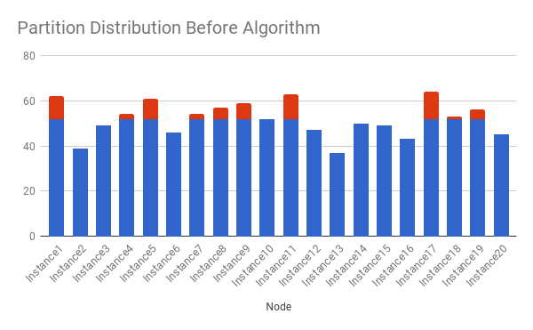

After (new strategy)

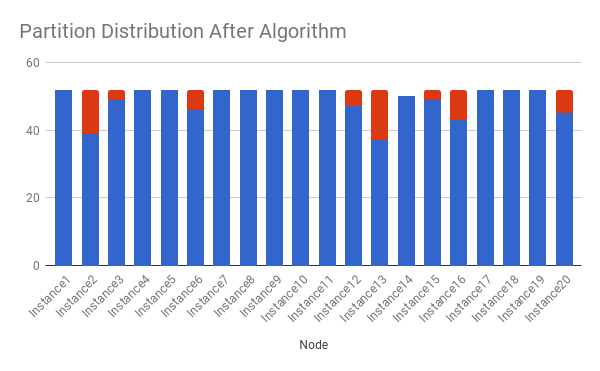

Since the problem is NP-hard. We are not expecting the best assignment. A greedy algorithm works good enough. After we tried different designs, we found it's hard to achieve both goals (even distribution and fewer movements) using a single strategy. So we decided to apply a hybrid algorithm that finishes the work step by step.

**Step 1, run CRUSH to get a base assignment.** The base assignment usually contains a certain number of uneven partitions(i.e. extra partitions above perfect distribution), so we need the following steps to re-distribute them.

**Step 2, run a card dealing algorithm on the uneven parts.** Assign extra partitions to under-loaded nodes, using card dealing strategy. This algorithm is conceptually simple. The result ensures that all partitions are assigned to instances with minimum difference. When gauranteeing fault-zone safe assignment, our greedy algorithm may not be able to calculate possible results because of fault-zone conflict.

Example of assignments after step 2,

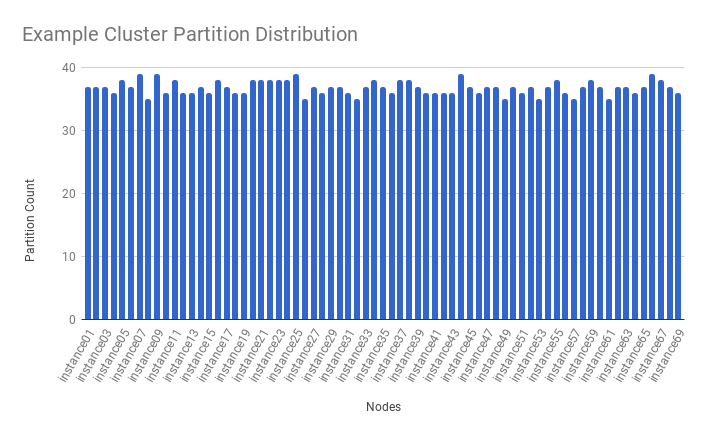

**Step 3, Shuffle partitions' preference lists.** State assignments (i.e. Master, Slave, Online, Offline, etc) are made according to preflist, ordered node. When using randomly ordered lists, State assignment is also random, and it may result in uneven state distribution. To resolve this issue, CrushED assigns scores to nodes as it computes pref list, to give all nodes equal chances in appearing at the top of the pref list. This operation results in a much more even state distribution.

Example of master distribution before step 3,

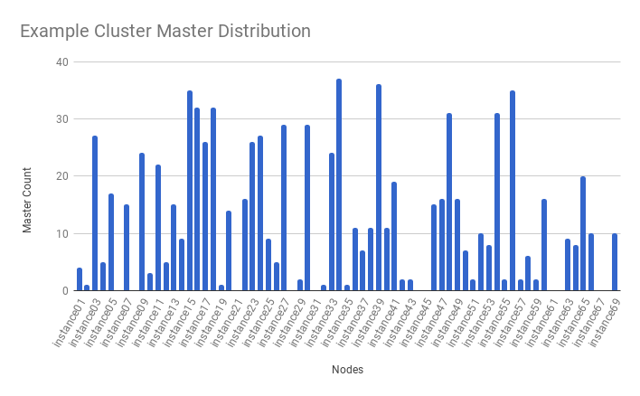

Example of master distribution after step 3,

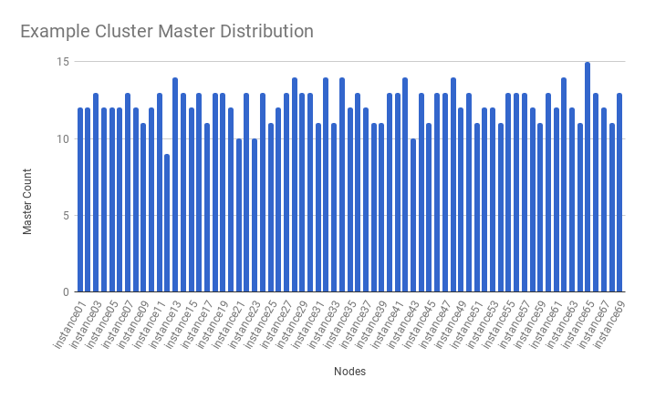

**Step 4, re-calculate the assignment for the partitions on temporarily disabled nodes using a consistent hashing algorithm.** Consistent hashing ensures minimize partition movement. Note that the first 3 steps are using full node list, regardless of disabled or offline nodes. So the assignment will be stable even the algorithm contains random factors such hashCode. Then step 4 ensures all the disabled nodes are handled correctly without causing huge partition movements.

Pseudocode of above algorithm is as follows :

**Pseudo Code**

```
// Round 1: Calculate mapping using the base strategy.
// Note to use all nodes for minimizing the influence of live node changes.
origPartitionMap = getBaseRebalanceStrategy().computePartitionAssignment(allNodes, clusterData);

// Transform current assignment to instance->partitions map, and get total partitions
nodeToPartitionMap = convertMap(origPartitionMap);

// Round 2: Rebalance mapping using card dealing algorithm.
Topology allNodeTopo = new Topology(allNodes, clusterData);
cardDealer.computeMapping(allNodeTopo, nodeToPartitionMap);

// Since states are assigned according to preference list order, shuffle preference list for even states distribution.
shufflePreferenceList(nodeToPartitionMap);

// Round 3: Re-mapping the partitions on non-live nodes using consistent hashing for reducing movement.
// Consistent hashing ensures minimum movements when nodes are disabled unexpectedly.
if (!liveNodes.containsAll(allNodes)) {
  Topology liveNodeTopo = new Topology(liveNodes, clusterData);
  hashPlacement.computeMapping(liveNodeTopo, nodeToPartitionMap);
}

if (!nodeToPartitionMap.isEmpty()) {
  // Round 2 and 3 is done successfully
  return convertMap(nodeToPartitionMap);
} else {
  return getBaseRebalanceStrategy().computePartitionAssignment(liveNodes, clusterData);
}
```

<a id="design_crushed--maximum_uneven_partition_assignment_using_crushed"></a>
<a id="design_crushed--maximum-uneven-partition-assignment-using-crushed"></a>

### Maximum uneven partition assignment using CrushED

Helix cluster typically manages 1 or more resources (i.e. databases). For each resource, CrushED makes the best effort to ensure the partition count difference is at most 1 across all the instances. Assuming such assignment is possible considering fault-zone configuration, the worst partition distribution happens when all one off partitions are located in one node. So N resources in a cluster can theoretically have their extra partitions in one node, so the node will have N additional partitions in total. Thus, the maximum difference between the most heavily loaded node and the least is **the number of resources** in a cluster.

<a id="design_crushed--experiment"></a>

## Experiment

We tested CrushED by simulating real production cluster topology data. And we tested multiple scenarios:

- Distribution based on cluster topology.
- Disabling hosts to simulate hosts down.
- Adding hosts to simulate expansion.
- Rolling upgrade.

All results show that CrushED generates more uniform global distribution compared with CRUSH. Moreover, partition movements in most scenarios are minimized. When topology changes (i.e. cluster expansion), there can be significantly more partition movements, but we can control the impact by using State Transition Throttling feature.

<a id="design_crushed--partition_distribution"></a>
<a id="design_crushed--partition-distribution"></a>

### Partition Distribution

Following charts demonstrate the worst cases (min load vs. max load) and STDEVs of partition/master distributions from some sample clusters data. If we measure the improvement by STDEV, CrushED improves the partition distribution evenness by 87% on average compared with CRUSH. And for state assignment (i.e. Mastership assignment) the evenness improvement is 68% on average.

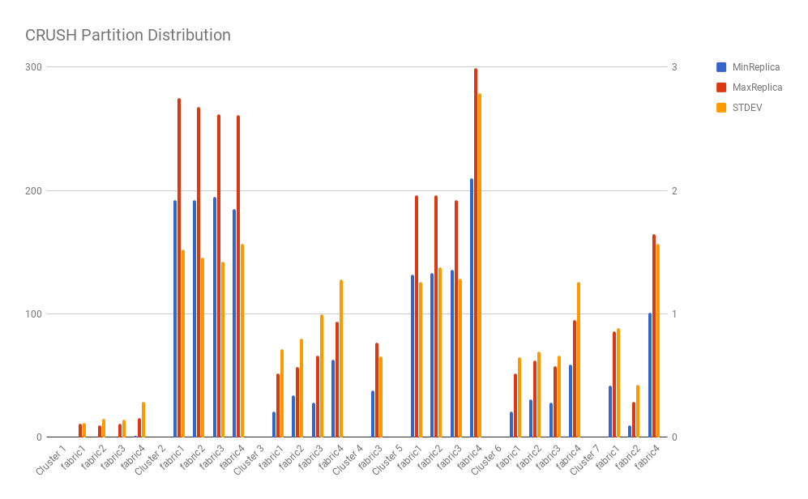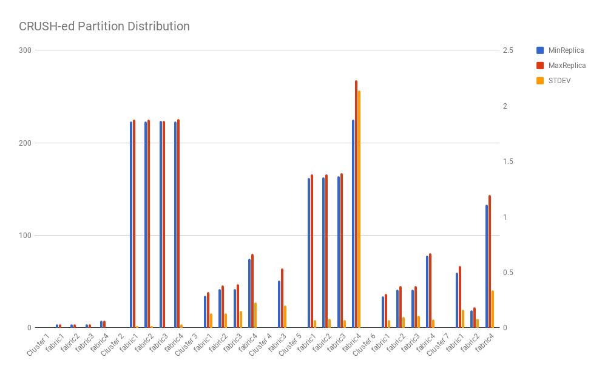

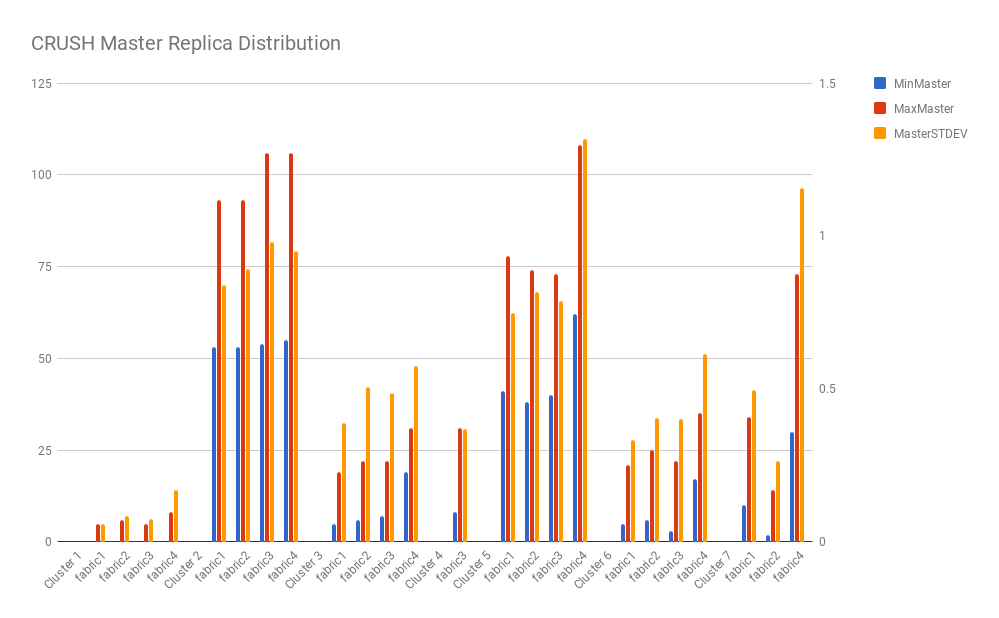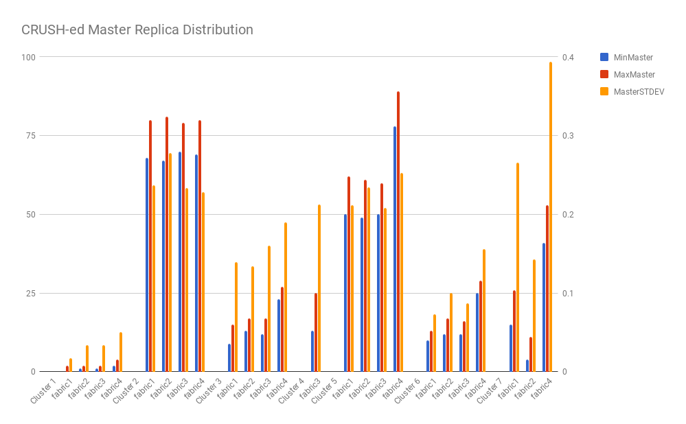

<a id="design_crushed--disabling_nodes"></a>
<a id="design_crushed--disabling-nodes"></a>

### Disabling Nodes

When nodes are offline or disabled, CrushED will re-assign the partitions to other live nodes. The algorithm move only the necessary partitions. We simulated disabling nodes, and measured partition movement changes and mastership changes. We also used the expected movement (the partitions/masters count on the disabled nodes) as a baseline to measure extra movements.

The results show that movement is highly correlated to the number of disabled nodes, and extra movements are minor (in most cases 0 movements).

Note that **Rate** in this document is **the changed number / total partition or master count**.

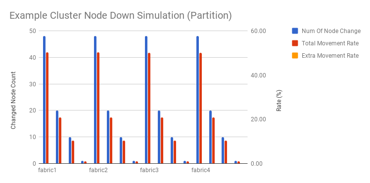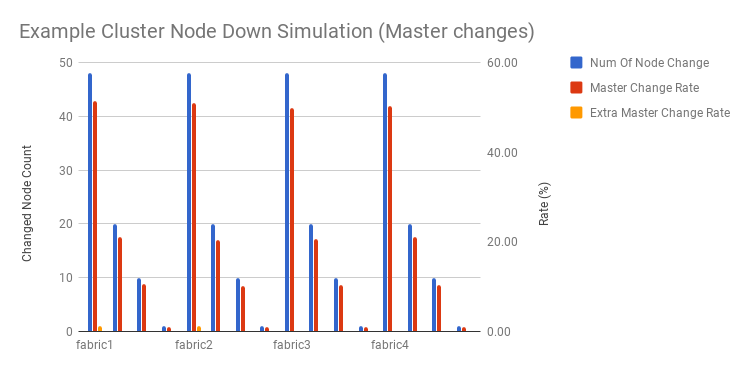

<a id="design_crushed--rolling_upgrade"></a>
<a id="design_crushed--rolling-upgrade"></a>

### Rolling upgrade

Rolling upgrade is different from disabling nodes. Since nodes are reset one by one, in this test we assume the difference could be 2 nodes in maximum (for example, upgrading Node A then upgrading Node B). In this case, movements are still minimized. Even in the worst case scenario, extra partition movements and mastership changes are still close to 0%.

Note that in real production clusters, we can completely avoid partition movements while doing rolling upgrade, by enabling Delayed Rebalancing.

<a id="design_crushed--adding_nodes"></a>
<a id="design_crushed--adding-nodes"></a>

### Adding Nodes

Adding nodes (i.e. cluster expansion) changes topology. CrushED uses card dealing strategy to provide even distribution, so when topology changes, there are a lot of additional partition movements than CRUSH.

Note that the extra change rate is not correlated with the number of additional nodes. So our recommendation is finishing expansion in one operation so as to do only one partition shuffling.

<a id="design_crushed--algorithm_performance"></a>
<a id="design_crushed--algorithm-performance"></a>

### Algorithm Performance

We compared CrushED with CRUSH algorithms using different instance numbers. The tests are executed multiple times and we recorded median computation time. CrushED does not cost much additional computation time for regular rebalancing. In some of the worst cases, 30% more runtime was observed, compared with CRUSH, but it is quicker than MultiRoundCRUSH.

However, when there are down nodes since CrushED needs to run an additional consistent hashing based re-distribution, the computation time will be much longer. In some cases, we saw more than 3 times compared to CRUSH.

With some **performance improvements**, such as using cache to avoid duplicate calculation, we achieved to greatly reduce CrushED's running time. According to our experiment, it is now close to MultiRound CRUSH.

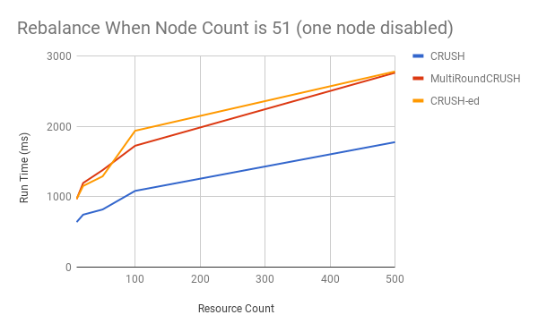

<a id="design_crushed--conclusion"></a>

## Conclusion

CrushED achieves more uniform distribution compared with CRUSH at the cost of higher rebalance computation and more partition movement when the cluster topology changes.

<a id="design_crushed--simple_user_guide"></a>
<a id="design_crushed--simple-user-guide"></a>

## Simple User Guide

1. Ensure the resouce is using FULL\_AUTO mode.
2. Set rebalance strategy to be “org.apache.helix.controller.rebalancer.strategy.CrushEdRebalanceStrategy”.
3. Expect more partition movement on topology changes when using the new strategy.

**IdeaState SimpleFields Example**

```
HELIX_ENABLED : "true"
IDEAL\_STATE\_MODE : "AUTO_REBALANCE"
REBALANCE\_MODE : "FULL\_AUTO"
REBALANCE_STRATEGY : "org.apache.helix.controller.rebalancer.strategy.CrushRebalanceStrategy"
MIN\_ACTIVE\_REPLICAS : "0"
NUM_PARTITIONS : "64"
REBALANCER\_CLASS\_NAME : "org.apache.helix.controller.rebalancer.DelayedAutoRebalancer"
REPLICAS : "1"
STATE\_MODEL\_DEF_REF : "LeaderStandby"
```

[Back to top](#design_crushed)

Copyright ©2026 [Apache Software Foundation](http://www.apache.org). All Rights Reserved.

[Reflow Maven skin](https://github.com/olamy/reflow-maven-skin "Reflow Maven skin") maintained by [Olivier Lamy](https://twitter.com/olamy "Olivier Lamy").

Apache Helix, Apache, the Apache feather logo, and the Apache Helix project logos are trademarks of The Apache Software Foundation.
All other marks mentioned may be trademarks or registered trademarks of their respective owners.

[Privacy Policy](https://helix.apache.org/1.4.3-docs/privacy-policy.html)

---

<a id="index"></a>

<!-- source_url: https://helix.apache.org/1.4.3-docs/index.html -->

<!-- page_index: 28 -->

<a id="index--get_helix"></a>
<a id="index--get-helix"></a>

### Get Helix

[Download](https://helix.apache.org/1.4.3-docs/download.html)

[Building](#building)

[Release Notes](https://helix.apache.org/1.4.3-docs/releasenotes/release-1.4.3.html)

<a id="index--hands-on"></a>

### Hands-On

[Quickstart](#quickstart)

[Tutorial](#tutorial)

[Javadocs](http://helix.apache.org/apidocs/index.html)

<a id="index--recipes"></a>

### Recipes

[Distributed lock manager](#recipes-lock_manager)

[Rabbit MQ consumer group](#recipes-rabbitmq_consumer_group)

[Rsync replicated file store](#recipes-rsync_replicated_file_store)

[Service discovery](#recipes-service_discovery)

[Distributed task DAG execution](#recipes-task_dag_execution)

<a id="index--operation"></a>

### Operation

[Monitoring Metrics](#metrics)

<a id="index--design"></a>

### Design

[CRUSH-ed for even distribution](#design_crushed)

[Back to top](#index)

Copyright ©2026 [Apache Software Foundation](http://www.apache.org). All Rights Reserved.

[Reflow Maven skin](https://github.com/olamy/reflow-maven-skin "Reflow Maven skin") maintained by [Olivier Lamy](https://twitter.com/olamy "Olivier Lamy").

Apache Helix, Apache, the Apache feather logo, and the Apache Helix project logos are trademarks of The Apache Software Foundation.
All other marks mentioned may be trademarks or registered trademarks of their respective owners.

[Privacy Policy](https://helix.apache.org/1.4.3-docs/privacy-policy.html)

---

<a id="recipes-lock_manager"></a>

<!-- source_url: https://helix.apache.org/1.4.3-docs/recipes/lock_manager.html -->

<!-- page_index: 29 -->

<a id="recipes-lock_manager--distributed_lock_manager"></a>
<a id="recipes-lock_manager--distributed-lock-manager"></a>

## Distributed Lock Manager

Distributed locks are used to synchronize accesses shared resources. Most applications today use ZooKeeper to model distributed locks.

The simplest way to model a lock using ZooKeeper is (See ZooKeeper leader recipe for an exact and more advanced solution)

- Each process tries to create an emphemeral node
- If the node is successfully created, the process acquires the lock
- Otherwise, it will watch the ZNode and try to acquire the lock again if the current lock holder disappears

This is good enough if there is only one lock. But in practice, an application will need many such locks. Distributing and managing the locks among difference process becomes challenging. Extending such a solution to many locks will result in:

- Uneven distribution of locks among nodes; the node that starts first will acquire all the locks. Nodes that start later will be idle.
- When a node fails, how the locks will be distributed among remaining nodes is not predicable.
- When new nodes are added the current nodes don't relinquish the locks so that new nodes can acquire some locks

In other words we want a system to satisfy the following requirements.

- Distribute locks evenly among all nodes to get better hardware utilization
- If a node fails, the locks that were acquired by that node should be evenly distributed among other nodes
- If nodes are added, locks must be evenly re-distributed among nodes.

Helix provides a simple and elegant solution to this problem. Simply specify the number of locks and Helix will ensure that above constraints are satisfied.

To quickly see this working run the `lock-manager-demo` script where 12 locks are evenly distributed among three nodes, and when a node fails, the locks get re-distributed among remaining two nodes. Note that Helix does not re-shuffle the locks completely, instead it simply distributes the locks relinquished by dead node among 2 remaining nodes evenly.

---

<a id="recipes-lock_manager--short_version"></a>
<a id="recipes-lock_manager--short-version"></a>

### Short Version

This version starts multiple threads within the same process to simulate a multi node deployment. Try the long version to get a better idea of how it works.

```
git clone https://git-wip-us.apache.org/repos/asf/helix.git
cd helix
git checkout tags/helix-1.4.3
mvn clean install package -DskipTests
cd recipes/distributed-lock-manager/target/distributed-lock-manager-pkg/bin
chmod +x *
./lock-manager-demo
```

<a id="recipes-lock_manager--output"></a>

#### Output

```
./lock-manager-demo
STARTING localhost_12000
STARTING localhost_12002
STARTING localhost_12001
STARTED localhost_12000
STARTED localhost_12002
STARTED localhost_12001
localhost_12001 acquired lock:lock-group_3
localhost_12000 acquired lock:lock-group_8
localhost_12001 acquired lock:lock-group_2
localhost_12001 acquired lock:lock-group_4
localhost_12002 acquired lock:lock-group_1
localhost_12002 acquired lock:lock-group_10
localhost_12000 acquired lock:lock-group_7
localhost_12001 acquired lock:lock-group_5
localhost_12002 acquired lock:lock-group_11
localhost_12000 acquired lock:lock-group_6
localhost_12002 acquired lock:lock-group_0
localhost_12000 acquired lock:lock-group_9
lockName    acquired By
======================================
lock-group_0    localhost_12002
lock-group_1    localhost_12002
lock-group_10    localhost_12002
lock-group_11    localhost_12002
lock-group_2    localhost_12001
lock-group_3    localhost_12001
lock-group_4    localhost_12001
lock-group_5    localhost_12001
lock-group_6    localhost_12000
lock-group_7    localhost_12000
lock-group_8    localhost_12000
lock-group_9    localhost_12000
Stopping localhost_12000
localhost_12000 Interrupted
localhost_12001 acquired lock:lock-group_9
localhost_12001 acquired lock:lock-group_8
localhost_12002 acquired lock:lock-group_6
localhost_12002 acquired lock:lock-group_7
lockName    acquired By
======================================
lock-group_0    localhost_12002
lock-group_1    localhost_12002
lock-group_10    localhost_12002
lock-group_11    localhost_12002
lock-group_2    localhost_12001
lock-group_3    localhost_12001
lock-group_4    localhost_12001
lock-group_5    localhost_12001
lock-group_6    localhost_12002
lock-group_7    localhost_12002
lock-group_8    localhost_12001
lock-group_9    localhost_12001
```

---

<a id="recipes-lock_manager--long_version"></a>
<a id="recipes-lock_manager--long-version"></a>

### Long version

This provides more details on how to setup the cluster and where to plugin application code.

<a id="recipes-lock_manager--start_zookeeper"></a>
<a id="recipes-lock_manager--start-zookeeper"></a>

#### Start ZooKeeper

```
./start-standalone-zookeeper 2199
```

<a id="recipes-lock_manager--create_a_cluster"></a>
<a id="recipes-lock_manager--create-a-cluster"></a>

#### Create a Cluster

```
./helix-admin --zkSvr localhost:2199 --addCluster lock-manager-demo
```

<a id="recipes-lock_manager--create_a_lock_group"></a>
<a id="recipes-lock_manager--create-a-lock-group"></a>

#### Create a Lock Group

Create a lock group and specify the number of locks in the lock group.

```
./helix-admin --zkSvr localhost:2199  --addResource lock-manager-demo lock-group 6 OnlineOffline --mode AUTO_REBALANCE
```

<a id="recipes-lock_manager--start_the_nodes"></a>
<a id="recipes-lock_manager--start-the-nodes"></a>

#### Start the Nodes

Create a Lock class that handles the callbacks.

```
public class Lock extends StateModel {private String lockName;
public Lock(String lockName) {this.lockName = lockName;}
public void lock(Message m, NotificationContext context) {System.out.println(" acquired lock:"+ lockName );}
public void release(Message m, NotificationContext context) {System.out.println(" releasing lock:"+ lockName );}
}
```

and a LockFactory that creates Locks

```
public class LockFactory extends StateModelFactory<Lock> {
    /* Instantiates the lock handler, one per lockName */
    public Lock create(String lockName) {
        return new Lock(lockName);
    }
}
```

At node start up, simply join the cluster and Helix will invoke the appropriate callbacks on the appropriate Lock instance. One can start any number of nodes and Helix detects that a new node has joined the cluster and re-distributes the locks automatically.

```
public class LockProcess {
  public static void main(String args) {
    String zkAddress= "localhost:2199";
    String clusterName = "lock-manager-demo";
    //Give a unique id to each process, most commonly used format hostname_port
    String instanceName ="localhost_12000";
    ZKHelixAdmin helixAdmin = new ZKHelixAdmin(zkAddress);
    //configure the instance and provide some metadata
    InstanceConfig config = new InstanceConfig(instanceName);
    config.setHostName("localhost");
    config.setPort("12000");
    admin.addInstance(clusterName, config);
    //join the cluster
    HelixManager manager;
    manager = HelixManagerFactory.getHelixManager(clusterName,
                                                  instanceName,
                                                  InstanceType.PARTICIPANT,
                                                  zkAddress);
    manager.getStateMachineEngine().registerStateModelFactory("OnlineOffline", modelFactory);
    manager.connect();
    Thread.currentThread.join();
  }
}
```

<a id="recipes-lock_manager--start_the_controller"></a>
<a id="recipes-lock_manager--start-the-controller"></a>

#### Start the Controller

The controller can be started either as a separate process or can be embedded within each node process

<a id="recipes-lock_manager--separate_process"></a>
<a id="recipes-lock_manager--separate-process"></a>

##### Separate Process

This is recommended when number of nodes in the cluster > 100. For fault tolerance, you can run multiple controllers on different boxes.

```
./run-helix-controller --zkSvr localhost:2199 --cluster lock-manager-demo 2>&1 > /tmp/controller.log &
```

<a id="recipes-lock_manager--embedded_within_the_node_process"></a>
<a id="recipes-lock_manager--embedded-within-the-node-process"></a>

##### Embedded Within the Node Process

This is recommended when the number of nodes in the cluster is less than 100. To start a controller from each process, simply add the following lines to MyClass

```
public class LockProcess {
  public static void main(String args) {
    String zkAddress= "localhost:2199";
    String clusterName = "lock-manager-demo";
    // .
    // .
    manager.connect();
    HelixManager controller;
    controller = HelixControllerMain.startHelixController(zkAddress,
                                                          clusterName,
                                                          "controller",
                                                          HelixControllerMain.STANDALONE);
    Thread.currentThread.join();
  }
}
```

---

<a id="recipes-rabbitmq_consumer_group"></a>

<!-- source_url: https://helix.apache.org/1.4.3-docs/recipes/rabbitmq_consumer_group.html -->

<!-- page_index: 30 -->

<a id="recipes-rabbitmq_consumer_group--rabbitmq_consumer_group"></a>
<a id="recipes-rabbitmq_consumer_group--rabbitmq-consumer-group"></a>

## RabbitMQ Consumer Group

[RabbitMQ](http://www.rabbitmq.com/) is well-known open source software the provides robust messaging for applications.

One of the commonly implemented recipes using this software is a work queue. <http://www.rabbitmq.com/tutorials/tutorial-four-java.html> describes the use case where

- A producer sends a message with a routing key
- The message is routed to the queue whose binding key exactly matches the routing key of the message
- There are multiple consumers and each consumer is interested in processing only a subset of the messages by binding to the interested keys

The example provided [here](http://www.rabbitmq.com/tutorials/tutorial-four-java.html) describes how multiple consumers can be started to process all the messages.

While this works, in production systems one needs the following:

- Ability to handle failures: when a consumer fails, another consumer must be started or the other consumers must start processing these messages that should have been processed by the failed consumer
- When the existing consumers cannot keep up with the task generation rate, new consumers will be added. The tasks must be redistributed among all the consumers

In this recipe, we demonstrate handling of consumer failures and new consumer additions using Helix.

Mapping this usecase to Helix is pretty easy as the binding key/routing key is equivalent to a partition.

Let's take an example. Lets say the queue has 6 partitions, and we have 2 consumers to process all the queues. What we want is all 6 queues to be evenly divided among 2 consumers. Eventually when the system scales, we add more consumers to keep up. This will make each consumer process tasks from 2 queues. Now let's say that a consumer failed, reducing the number of active consumers to 2. This means each consumer must process 3 queues.

We showcase how such a dynamic application can be developed using Helix. Even though we use RabbitMQ as the pub/sub system one can extend this solution to other pub/sub systems.

<a id="recipes-rabbitmq_consumer_group--try_it"></a>
<a id="recipes-rabbitmq_consumer_group--try-it"></a>

### Try It

```
git clone https://git-wip-us.apache.org/repos/asf/helix.git
cd helix
git checkout tags/helix-1.4.3
mvn clean install package -DskipTests
cd recipes/rabbitmq-consumer-group/bin
chmod +x *
export HELIX_PKG_ROOT=`pwd`/helix-core/target/helix-core-pkg
export HELIX_RABBITMQ_ROOT=`pwd`/recipes/rabbitmq-consumer-group/
chmod +x $HELIX_PKG_ROOT/bin/*
chmod +x $HELIX_RABBITMQ_ROOT/bin/*
```

<a id="recipes-rabbitmq_consumer_group--install_rabbitmq"></a>
<a id="recipes-rabbitmq_consumer_group--install-rabbitmq"></a>

#### Install RabbitMQ

Setting up RabbitMQ on a local box is straightforward. You can find the instructions here <http://www.rabbitmq.com/download.html>

<a id="recipes-rabbitmq_consumer_group--start_zk"></a>
<a id="recipes-rabbitmq_consumer_group--start-zk"></a>

#### Start ZK

Start ZooKeeper at port 2199

```
$HELIX_PKG_ROOT/bin/start-standalone-zookeeper 2199
```

<a id="recipes-rabbitmq_consumer_group--setup_the_consumer_group_cluster"></a>
<a id="recipes-rabbitmq_consumer_group--setup-the-consumer-group-cluster"></a>

#### Setup the Consumer Group Cluster

This will setup the cluster by creating a “rabbitmq-consumer-group” cluster and adds a “topic” with “6” queues.

```
$HELIX_RABBITMQ_ROOT/bin/setup-cluster.sh localhost:2199
```

<a id="recipes-rabbitmq_consumer_group--add_consumers"></a>
<a id="recipes-rabbitmq_consumer_group--add-consumers"></a>

#### Add Consumers

Start 2 consumers in 2 different terminals. Each consumer is given a unique ID.

```
//start-consumer.sh zookeeperAddress (e.g. localhost:2181) consumerId , rabbitmqServer (e.g. localhost)
$HELIX_RABBITMQ_ROOT/bin/start-consumer.sh localhost:2199 0 localhost
$HELIX_RABBITMQ_ROOT/bin/start-consumer.sh localhost:2199 1 localhost
```

<a id="recipes-rabbitmq_consumer_group--start_the_helix_controller"></a>
<a id="recipes-rabbitmq_consumer_group--start-the-helix-controller"></a>

#### Start the Helix Controller

Now start a Helix controller that starts managing the “rabbitmq-consumer-group” cluster.

```
$HELIX_RABBITMQ_ROOT/bin/start-cluster-manager.sh localhost:2199
```

<a id="recipes-rabbitmq_consumer_group--send_messages_to_the_topic"></a>
<a id="recipes-rabbitmq_consumer_group--send-messages-to-the-topic"></a>

#### Send Messages to the Topic

Start sending messages to the topic. This script randomly selects a routing key (1-6) and sends the message to topic. Based on the key, messages gets routed to the appropriate queue.

```
$HELIX_RABBITMQ_ROOT/bin/send-message.sh localhost 20
```

After running this, you should see all 20 messages being processed by 2 consumers.

<a id="recipes-rabbitmq_consumer_group--add_another_consumer"></a>
<a id="recipes-rabbitmq_consumer_group--add-another-consumer"></a>

#### Add Another Consumer

Once a new consumer is started, Helix detects it. In order to balance the load between 3 consumers, it deallocates 1 partition from the existing consumers and allocates it to the new consumer. We see that each consumer is now processing only 2 queues. Helix makes sure that old nodes are asked to stop consuming before the new consumer is asked to start consuming for a given partition. But the transitions for each partition can happen in parallel.

```
$HELIX_RABBITMQ_ROOT/bin/start-consumer.sh localhost:2199 2 localhost
```

Send messages again to the topic

```
$HELIX_RABBITMQ_ROOT/bin/send-message.sh localhost 100
```

You should see that messages are now received by all 3 consumers.

<a id="recipes-rabbitmq_consumer_group--stop_a_consumer"></a>
<a id="recipes-rabbitmq_consumer_group--stop-a-consumer"></a>

#### Stop a Consumer

In any terminal press CTRL^C and notice that Helix detects the consumer failure and distributes the 2 partitions that were processed by failed consumer to the remaining 2 active consumers.

<a id="recipes-rabbitmq_consumer_group--how_does_this_work.3f"></a>
<a id="recipes-rabbitmq_consumer_group--how-does-this-work"></a>

### How does this work?

Find the entire code [here](https://git-wip-us.apache.org/repos/asf?p=helix.git;a=tree;f=recipes/rabbitmq-consumer-group/src/main/java/org/apache/helix/recipes/rabbitmq).

<a id="recipes-rabbitmq_consumer_group--cluster_setup"></a>
<a id="recipes-rabbitmq_consumer_group--cluster-setup"></a>

#### Cluster Setup

This step creates ZNode on ZooKeeper for the cluster and adds the state model. We use online offline state model since there is no need for other states. The consumer is either processing a queue or it is not.

It creates a resource called “rabbitmq-consumer-group” with 6 partitions. The execution mode is set to AUTO\_REBALANCE. This means that the Helix controls the assignment of partition to consumers and automatically distributes the partitions evenly among the active consumers. When a consumer is added or removed, it ensures that a minimum number of partitions are shuffled.

```
zkclient = new ZkClient(zkAddr, ZkClient.DEFAULT_SESSION_TIMEOUT,
    ZkClient.DEFAULT_CONNECTION_TIMEOUT, new ZNRecordSerializer());
ZKHelixAdmin admin = new ZKHelixAdmin(zkclient);

// add cluster
admin.addCluster(clusterName, true);

// add state model definition
StateModelConfigGenerator generator = new StateModelConfigGenerator();
admin.addStateModelDef(clusterName, "OnlineOffline",
    new StateModelDefinition(generator.generateConfigForOnlineOffline()));

// add resource "topic" which has 6 partitions
String resourceName = "rabbitmq-consumer-group";
admin.addResource(clusterName, resourceName, 6, "OnlineOffline", "AUTO_REBALANCE");
```

<a id="recipes-rabbitmq_consumer_group--starting_the_consumers"></a>
<a id="recipes-rabbitmq_consumer_group--starting-the-consumers"></a>

### Starting the Consumers

The only thing consumers need to know is the ZooKeeper address, cluster name and consumer ID. It does not need to know anything else.

```
_manager = HelixManagerFactory.getZKHelixManager(_clusterName,
                                                 _consumerId,
                                                 InstanceType.PARTICIPANT,
                                                 _zkAddr);

StateMachineEngine stateMach = _manager.getStateMachineEngine();
ConsumerStateModelFactory modelFactory =
    new ConsumerStateModelFactory(_consumerId, _mqServer);
stateMach.registerStateModelFactory("OnlineOffline", modelFactory);

_manager.connect();
```

Once the consumer has registered the state model and the controller is started, the consumer starts getting callbacks (onBecomeOnlineFromOffline) for the partition it needs to host. All it needs to do as part of the callback is to start consuming messages from the appropriate queue. Similarly, when the controller deallocates a partitions from a consumer, it fires onBecomeOfflineFromOnline for the same partition. As a part of this transition, the consumer will stop consuming from a that queue.

```
@Transition(to = "ONLINE", from = "OFFLINE")
public void onBecomeOnlineFromOffline(Message message, NotificationContext context) {
  LOG.debug(_consumerId + " becomes ONLINE from OFFLINE for " + _partition);
  if (_thread == null) {
    LOG.debug("Starting ConsumerThread for " + _partition + "...");
    _thread = new ConsumerThread(_partition, _mqServer, _consumerId);
    _thread.start();
    LOG.debug("Starting ConsumerThread for " + _partition + " done");

  }
}

@Transition(to = "OFFLINE", from = "ONLINE")
public void onBecomeOfflineFromOnline(Message message, NotificationContext context)
    throws InterruptedException {
  LOG.debug(_consumerId + " becomes OFFLINE from ONLINE for " + _partition);
  if (_thread != null) {
    LOG.debug("Stopping " + _consumerId + " for " + _partition + "...");
    _thread.interrupt();
    _thread.join(2000);
    _thread = null;
    LOG.debug("Stopping " +  _consumerId + " for " + _partition + " done");
  }
}
```

---

<a id="recipes-rsync_replicated_file_store"></a>

<!-- source_url: https://helix.apache.org/1.4.3-docs/recipes/rsync_replicated_file_store.html -->

<!-- page_index: 31 -->

<a id="recipes-rsync_replicated_file_store--near-realtime_rsync_replicated_file_system"></a>
<a id="recipes-rsync_replicated_file_store--near-realtime-rsync-replicated-file-system"></a>

## Near-Realtime Rsync Replicated File System

<a id="recipes-rsync_replicated_file_store--quick_demo"></a>
<a id="recipes-rsync_replicated_file_store--quick-demo"></a>

### Quick Demo

- This demo starts 3 instances with id's as `localhost_12001, localhost_12002, localhost_12003`
- Each instance stores its files under `/tmp/<id>/filestore`
- `localhost_12001` is designated as the master, and `localhost_12002` and `localhost_12003` are the slaves
- Files written to the master are replicated to the slaves automatically. In this demo, a.txt and b.txt are written to `/tmp/localhost_12001/filestore` and they get replicated to other folders.
- When the master is stopped, `localhost_12002` is promoted to master.
- The other slave `localhost_12003` stops replicating from `localhost_12001` and starts replicating from new master `localhost_12002`
- Files written to new master `localhost_12002` are replicated to `localhost_12003`
- In the end state of this quick demo, `localhost_12002` is the master and `localhost_12003` is the slave. Manually create files under `/tmp/localhost_12002/filestore` and see that appear in `/tmp/localhost_12003/filestore`
- Ignore the interrupted exceptions on the console :-)

```
git clone https://git-wip-us.apache.org/repos/asf/helix.git
cd helix
git checkout tags/helix-1.4.3
cd recipes/rsync-replicated-file-system/
mvn clean install package -DskipTests
cd target/rsync-replicated-file-system-pkg/bin
chmod +x *
./quickdemo
```

<a id="recipes-rsync_replicated_file_store--overview"></a>

### Overview

There are many applications that require storage for storing large number of relatively small data files. Examples include media stores to store small videos, images, mail attachments etc. Each of these objects is typically kilobytes, often no larger than a few megabytes. An additional distinguishing feature of these use cases is that files are typically only added or deleted, rarely updated. When there are updates, they do not have any concurrency requirements.

These are much simpler requirements than what general purpose distributed file system have to satisfy; these would include concurrent access to files, random access for reads and updates, posix compliance, and others. To satisfy those requirements, general DFSs are also pretty complex that are expensive to build and maintain.

A different implementation of a distributed file system includes HDFS which is inspired by Google's GFS. This is one of the most widely used distributed file system that forms the main data storage platform for Hadoop. HDFS is primary aimed at processing very large data sets and distributes files across a cluster of commodity servers by splitting up files in fixed size chunks. HDFS is not particularly well suited for storing a very large number of relatively tiny files.

<a id="recipes-rsync_replicated_file_store--file_store"></a>
<a id="recipes-rsync_replicated_file_store--file-store"></a>

### File Store

It's possible to build a vastly simpler system for the class of applications that have simpler requirements as we have pointed out.

- Large number of files but each file is relatively small
- Access is limited to create, delete and get entire files
- No updates to files that are already created (or it's feasible to delete the old file and create a new one)

We call this system a Partitioned File Store (PFS) to distinguish it from other distributed file systems. This system needs to provide the following features:

- CRD access to large number of small files
- Scalability: Files should be distributed across a large number of commodity servers based on the storage requirement
- Fault-tolerance: Each file should be replicated on multiple servers so that individual server failures do not reduce availability
- Elasticity: It should be possible to add capacity to the cluster easily

Apache Helix is a generic cluster management framework that makes it very easy to provide scalability, fault-tolerance and elasticity features. rsync can be easily used as a replication channel between servers so that each file gets replicated on multiple servers.

<a id="recipes-rsync_replicated_file_store--design"></a>

### Design

<a id="recipes-rsync_replicated_file_store--high_level"></a>
<a id="recipes-rsync_replicated_file_store--high-level"></a>

#### High Level

- Partition the file system based on the file name
- At any time a single writer can write, we call this a master
- For redundancy, we need to have additional replicas called slave. Slaves can optionally serve reads
- Slave replicates data from the master
- When a master fails, a slave gets promoted to master

<a id="recipes-rsync_replicated_file_store--transaction_log"></a>
<a id="recipes-rsync_replicated_file_store--transaction-log"></a>

#### Transaction Log

Every write on the master will result in creation/deletion of one or more files. In order to maintain timeline consistency slaves need to apply the changes in the same order To facilitate this, the master logs each transaction in a file and each transaction is associated with an 64 bit ID in which the 32 LSB represents a sequence number and MSB represents the generation number The sequence number gets incremented on every transaction and the generation is incremented when a new master is elected

<a id="recipes-rsync_replicated_file_store--replication"></a>

#### Replication

Replication is required for slaves to keep up with changes on the master. Every time the slave applies a change it checkpoints the last applied transaction ID. During restarts, this allows the slave to pull changes from the last checkpointed ID. Similar to master, the slave logs each transaction to the transaction logs but instead of generating new transaction ID, it uses the same ID generated by the master.

<a id="recipes-rsync_replicated_file_store--failover"></a>

#### Failover

When a master fails, a new slave will be promoted to master. If the previous master node is reachable, then the new master will flush all the changes from previous the master before taking up mastership. The new master will record the end transaction ID of the current generation and then start a new generation with sequence starting from 1. After this the master will begin accepting writes.

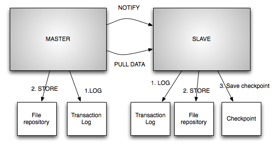

<a id="recipes-rsync_replicated_file_store--rsync-based_solution"></a>
<a id="recipes-rsync_replicated_file_store--rsync-based-solution"></a>

### Rsync-based Solution

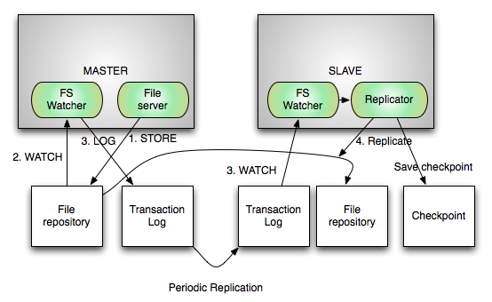

This application demonstrates a file store that uses rsync as the replication mechanism. One can envision a similar system where instead of using rsync, one can implement a custom solution to notify the slave of the changes and also provide an api to pull the change files.

<a id="recipes-rsync_replicated_file_store--concepts"></a>

#### Concepts

- file\_store\_dir: Root directory for the actual data files
- change\_log\_dir: The transaction logs are generated under this folder
- check\_point\_dir: The slave stores the check points ( last processed transaction) here

<a id="recipes-rsync_replicated_file_store--master"></a>

#### Master

- File server: This component supports file uploads and downloads and writes the files to `file_store_dir`. This is not included in this application. The idea is that most applications have different ways of implementing this component and have some associated business logic. It is not hard to come up with such a component if needed.
- File store watcher: This component watches the `file_store_dir` directory on the local file system for any changes and notifies the registered listeners of the changes
- Change log generator: This registers as a listener of the file store watcher and on each notification logs the changes into a file under `change_log_dir`

<a id="recipes-rsync_replicated_file_store--slave"></a>

#### Slave

- File server: This component on the slave will only support reads
- Cluster state observer: Slave observes the cluster state and is able to know who is the current master
- Replicator: This has two subcomponents
  - Periodic rsync of change log: This is a background process that periodically rsyncs the `change_log_dir` of the master to its local directory
  - Change Log Watcher: This watches the `change_log_dir` for changes and notifies the registered listeners of the change
  - On demand rsync invoker: This is registered as a listener to change log watcher and on every change invokes rsync to sync only the changed file

<a id="recipes-rsync_replicated_file_store--coordination"></a>

#### Coordination

The coordination between nodes is done by Helix. Helix does the partition management and assigns the partition to multiple nodes based on the replication factor. It elects one the nodes as master and designates others as slaves. It provides notifications to each node in the form of state transitions (Offline to Slave, Slave to Master). It also provides notifications when there is change is cluster state. This allows the slave to stop replicating from current master and start replicating from new master.

In this application, we have only one partition but its very easy to extend it to support multiple partitions. By partitioning the file store, one can add new nodes and Helix will automatically re-distribute partitions among the nodes. To summarize, Helix provides partition management, fault tolerance and facilitates automated cluster expansion.

---

<a id="recipes-service_discovery"></a>

<!-- source_url: https://helix.apache.org/1.4.3-docs/recipes/service_discovery.html -->

<!-- page_index: 32 -->

<a id="recipes-service_discovery--service_discovery"></a>
<a id="recipes-service_discovery--service-discovery"></a>

## Service Discovery

One of the common usage of ZooKeeper is to enable service discovery. The basic idea is that when a server starts up it advertises its configuration/metadata such as its hostname and port on ZooKeeper. This allows clients to dynamically discover the servers that are currently active. One can think of this like a service registry to which a server registers when it starts and is automatically deregistered when it shutdowns or crashes. In many cases it serves as an alternative to VIPs.

The core idea behind this is to use ZooKeeper ephemeral nodes. The ephemeral nodes are created when the server registers and all its metadata is put into a ZNode. When the server shutdowns, ZooKeeper automatically removes this ZNode.

There are two ways the clients can dynamically discover the active servers:

<a id="recipes-service_discovery--zookeeper_watch"></a>
<a id="recipes-service_discovery--zookeeper-watch"></a>

### ZooKeeper Watch

Clients can set a child watch under specific path on ZooKeeper. When a new service is registered/deregistered, ZooKeeper notifies the client via a watch event and the client can read the list of services. Even though this looks trivial, there are lot of things one needs to keep in mind like ensuring that you first set the watch back on ZooKeeper before reading data.

<a id="recipes-service_discovery--poll"></a>

### Poll

Another approach is for the client to periodically read the ZooKeeper path and get the list of services.

Both approaches have pros and cons, for example setting a watch might trigger herd effect if there are large number of clients. This is problematic, especially when servers are starting up. But the advantage to setting watches is that clients are immediately notified of a change which is not true in case of polling. In some cases, having both watches and polls makes sense; watch allows one to get notifications as soon as possible while poll provides a safety net if a watch event is missed because of code bug or ZooKeeper fails to notify.

<a id="recipes-service_discovery--other_developer_considerations"></a>
<a id="recipes-service_discovery--other-developer-considerations"></a>

### Other Developer Considerations

- What happens when the ZooKeeper session expires? All the watches and ephemeral nodes previously added or created by this server are lost. One needs to add the watches again, recreate the ephemeral nodes, and so on.
- Due to network issues or Java GC pauses session expiry might happen again and again; this phenomenon is known as flapping. It's important for the server to detect this and deregister itself.

<a id="recipes-service_discovery--other_operational_considerations"></a>
<a id="recipes-service_discovery--other-operational-considerations"></a>

### Other Operational Considerations

- What if the node is behaving badly? One might kill the server, but it will lose the ability to debug. It would be nice to have the ability to mark a server as disabled and clients know that a node is disabled and will not contact that node.

<a id="recipes-service_discovery--configuration_ownership"></a>
<a id="recipes-service_discovery--configuration-ownership"></a>

### Configuration Ownership

This is an important aspect that is often ignored in the initial stages of your development. Typically, the service discovery pattern means that servers start up with some configuration which it simply puts into ZooKeeper. While this works well in the beginning, configuration management becomes very difficult since the servers themselves are statically configured. Any change in server configuration implies restarting the server. Ideally, it will be nice to have the ability to change configuration dynamically without having to restart a server.

Ideally you want a hybrid solution, a node starts with minimal configuration and gets the rest of configuration from ZooKeeper.

<a id="recipes-service_discovery--using_helix_for_service_discovery"></a>
<a id="recipes-service_discovery--using-helix-for-service-discovery"></a>

### Using Helix for Service Discovery

Even though Helix has a higher-level abstraction in terms of state machines, constraints and objectives, service discovery is one of things has been a prevalent use case from the start. The controller uses the exact mechanism we described above to discover when new servers join the cluster. We create these ZNodes under /CLUSTERNAME/LIVEINSTANCES. Since at any time there is only one controller, we use a ZK watch to track the liveness of a server.

This recipe simply demonstrates how one can re-use that part for implementing service discovery. This demonstrates multiple modes of service discovery:

- POLL: The client reads from zookeeper at regular intervals 30 seconds. Use this if you have 100's of clients
- WATCH: The client sets up watcher and gets notified of the changes. Use this if you have 10's of clients
- NONE: This does neither of the above, but reads directly from zookeeper when ever needed

Helix provides these additional features compared to other implementations available elsewhere:

- It has the concept of disabling a node which means that a badly behaving node can be disabled using the Helix admin API
- It automatically detects if a node connects/disconnects from zookeeper repeatedly and disables the node
- Configuration management
  - Allows one to set configuration via the admin API at various granulaties like cluster, instance, resource, partition
  - Configurations can be dynamically changed
  - The server is notified when configurations change

<a id="recipes-service_discovery--checkout_and_build"></a>
<a id="recipes-service_discovery--checkout-and-build"></a>

### Checkout and Build

```
git clone https://git-wip-us.apache.org/repos/asf/helix.git
cd helix
git checkout tags/helix-1.0.4
mvn clean install package -DskipTests
cd recipes/service-discovery/target/service-discovery-pkg/bin
chmod +x *
```

<a id="recipes-service_discovery--start_zookeeper"></a>
<a id="recipes-service_discovery--start-zookeeper"></a>

### Start ZooKeeper

```
./start-standalone-zookeeper 2199
```

<a id="recipes-service_discovery--run_the_demo"></a>
<a id="recipes-service_discovery--run-the-demo"></a>

### Run the Demo

```
./service-discovery-demo.sh
```

<a id="recipes-service_discovery--output"></a>

### Output

```
START:Service discovery demo mode:WATCH
	Registering service
		host.x.y.z_12000
		host.x.y.z_12001
		host.x.y.z_12002
		host.x.y.z_12003
		host.x.y.z_12004
	SERVICES AVAILABLE
		SERVICENAME 	HOST 			PORT
		myServiceName 	host.x.y.z 		12000
		myServiceName 	host.x.y.z 		12001
		myServiceName 	host.x.y.z 		12002
		myServiceName 	host.x.y.z 		12003
		myServiceName 	host.x.y.z 		12004
	Deregistering service:
		host.x.y.z_12002
	SERVICES AVAILABLE
		SERVICENAME 	HOST 			PORT
		myServiceName 	host.x.y.z 		12000
		myServiceName 	host.x.y.z 		12001
		myServiceName 	host.x.y.z 		12003
		myServiceName 	host.x.y.z 		12004
	Registering service:host.x.y.z_12002
END:Service discovery demo mode:WATCH
=============================================
START:Service discovery demo mode:POLL
	Registering service
		host.x.y.z_12000
		host.x.y.z_12001
		host.x.y.z_12002
		host.x.y.z_12003
		host.x.y.z_12004
	SERVICES AVAILABLE
		SERVICENAME 	HOST 			PORT
		myServiceName 	host.x.y.z 		12000
		myServiceName 	host.x.y.z 		12001
		myServiceName 	host.x.y.z 		12002
		myServiceName 	host.x.y.z 		12003
		myServiceName 	host.x.y.z 		12004
	Deregistering service:
		host.x.y.z_12002
	Sleeping for poll interval:30000
	SERVICES AVAILABLE
		SERVICENAME 	HOST 			PORT
		myServiceName 	host.x.y.z 		12000
		myServiceName 	host.x.y.z 		12001
		myServiceName 	host.x.y.z 		12003
		myServiceName 	host.x.y.z 		12004
	Registering service:host.x.y.z_12002
END:Service discovery demo mode:POLL
=============================================
START:Service discovery demo mode:NONE
	Registering service
		host.x.y.z_12000
		host.x.y.z_12001
		host.x.y.z_12002
		host.x.y.z_12003
		host.x.y.z_12004
	SERVICES AVAILABLE
		SERVICENAME 	HOST 			PORT
		myServiceName 	host.x.y.z 		12000
		myServiceName 	host.x.y.z 		12001
		myServiceName 	host.x.y.z 		12002
		myServiceName 	host.x.y.z 		12003
		myServiceName 	host.x.y.z 		12004
	Deregistering service:
		host.x.y.z_12000
	SERVICES AVAILABLE
		SERVICENAME 	HOST 			PORT
		myServiceName 	host.x.y.z 		12001
		myServiceName 	host.x.y.z 		12002
		myServiceName 	host.x.y.z 		12003
		myServiceName 	host.x.y.z 		12004
	Registering service:host.x.y.z_12000
END:Service discovery demo mode:NONE
=============================================
```

---

<a id="recipes-task_dag_execution"></a>

<!-- source_url: https://helix.apache.org/1.4.3-docs/recipes/task_dag_execution.html -->

<!-- page_index: 33 -->

<a id="recipes-task_dag_execution--distributed_task_execution"></a>
<a id="recipes-task_dag_execution--distributed-task-execution"></a>

## Distributed Task Execution

This recipe is intended to demonstrate how task dependencies can be modeled using primitives provided by Helix. A given task can be run with the desired amount of parallelism and will start only when upstream dependencies are met. The demo executes the task DAG described below using 10 workers. Although the demo starts the workers as threads, there is no requirement that all the workers need to run in the same process. In reality, these workers run on many different boxes on a cluster. When worker fails, Helix takes care of re-assigning a failed task partition to a new worker.

Redis is used as a result store. Any other suitable implementation for TaskResultStore can be plugged in.

<a id="recipes-task_dag_execution--workflow"></a>

### Workflow

<a id="recipes-task_dag_execution--input"></a>

#### Input

10000 impression events and around 100 click events are pre-populated in task result store (redis).

- **ImpEvent**: format: id,isFraudulent,country,gender
- **ClickEvent**: format: id,isFraudulent,impEventId

<a id="recipes-task_dag_execution--stages"></a>

#### Stages

- **FilterImps**: Filters impression where isFraudulent=true.
- **FilterClicks**: Filters clicks where isFraudulent=true
- **impCountsByGender**: Generates impression counts grouped by gender. It does this by incrementing the count for ‘impression\_gender\_counts:<gender\_value>’ in the task result store (redis hash). Depends on: **FilterImps**
- **impCountsByCountry**: Generates impression counts grouped by country. It does this by incrementing the count for ‘impression\_country\_counts:<country\_value>’ in the task result store (redis hash). Depends on: **FilterClicks**
- **impClickJoin**: Joins clicks with corresponding impression event using impEventId as the join key. Join is needed to pull dimensions not present in click event. Depends on: **FilterImps, FilterClicks**
- **clickCountsByGender**: Generates click counts grouped by gender. It does this by incrementing the count for click\_gender\_counts:<gender\_value> in the task result store (redis hash). Depends on: **impClickJoin**
- **clickCountsByGender**: Generates click counts grouped by country. It does this by incrementing the count for click\_country\_counts:<country\_value> in the task result store (redis hash). Depends on: **impClickJoin**
- **report**: Reads from all aggregates generated by previous stages and prints them. Depends on: **impCountsByGender, impCountsByCountry, clickCountsByGender,clickCountsByGender**

<a id="recipes-task_dag_execution--creating_a_dag"></a>
<a id="recipes-task_dag_execution--creating-a-dag"></a>

### Creating a DAG

Each stage is represented as a Node along with the upstream dependency and desired parallelism. Each stage is modeled as a resource in Helix using OnlineOffline state model. As part of an Offline to Online transition, we watch the external view of upstream resources and wait for them to transition to the online state. See Task.java for additional info.

```
Dag dag = new Dag();
dag.addNode(new Node("filterImps", 10, ""));
dag.addNode(new Node("filterClicks", 5, ""));
dag.addNode(new Node("impClickJoin", 10, "filterImps,filterClicks"));
dag.addNode(new Node("impCountsByGender", 10, "filterImps"));
dag.addNode(new Node("impCountsByCountry", 10, "filterImps"));
dag.addNode(new Node("clickCountsByGender", 5, "impClickJoin"));
dag.addNode(new Node("clickCountsByCountry", 5, "impClickJoin"));
dag.addNode(new Node("report",1,"impCountsByGender,impCountsByCountry,clickCountsByGender,clickCountsByCountry"));
```

<a id="recipes-task_dag_execution--demo"></a>

### Demo

In order to run the demo, use the following steps

See <http://redis.io/topics/quickstart> on how to install redis server

```
Start redis e.g:
./redis-server --port 6379

git clone https://git-wip-us.apache.org/repos/asf/helix.git
cd helix
git checkout helix-1.4.3
cd recipes/task-execution
mvn clean install package -DskipTests
cd target/task-execution-pkg/bin
chmod +x task-execution-demo.sh
./task-execution-demo.sh 2181 localhost 6379
```

Here's a visual representation of the DAG.

```


                       +-----------------+       +----------------+
                       |   filterImps    |       |  filterClicks  |
                       | (parallelism=10)|       | (parallelism=5)|
                       +----------+-----++       +-------+--------+
                       |          |     |                |
                       |          |     |                |
                       |          |     |                |
                       |          |     +------->--------v------------+
      +--------------<-+   +------v-------+    |  impClickJoin        |
      |impCountsByGender   |impCountsByCountry | (parallelism=10)     |
      |(parallelism=10)    |(parallelism=10)   ++-------------------+-+
      +-----------+--+     +---+----------+     |                   |
                  |            |                |                   |
                  |            |                |                   |
                  |            |       +--------v---------+       +-v-------------------+
                  |            |       |clickCountsByGender       |clickCountsByCountry |
                  |            |       |(parallelism=5)   |       |(parallelism=5)      |
                  |            |       +----+-------------+       +---------------------+
                  |            |            |                     |
                  |            |            |                     |
                  |            |            |                     |
                  +----->+-----+>-----------v----+<---------------+
                         | report                |
                         |(parallelism=1)        |
                         +-----------------------+
```

(credit for above ascii art: <http://www.asciiflow.com>)

<a id="recipes-task_dag_execution--output"></a>

#### Output

```
Done populating dummy data
Executing filter task for filterImps_3 for impressions_demo
Executing filter task for filterImps_2 for impressions_demo
Executing filter task for filterImps_0 for impressions_demo
Executing filter task for filterImps_1 for impressions_demo
Executing filter task for filterImps_4 for impressions_demo
Executing filter task for filterClicks_3 for clicks_demo
Executing filter task for filterClicks_1 for clicks_demo
Executing filter task for filterImps_8 for impressions_demo
Executing filter task for filterImps_6 for impressions_demo
Executing filter task for filterClicks_2 for clicks_demo
Executing filter task for filterClicks_0 for clicks_demo
Executing filter task for filterImps_7 for impressions_demo
Executing filter task for filterImps_5 for impressions_demo
Executing filter task for filterClicks_4 for clicks_demo
Executing filter task for filterImps_9 for impressions_demo
Running AggTask for impCountsByGender_3 for filtered_impressions_demo gender
Running AggTask for impCountsByGender_2 for filtered_impressions_demo gender
Running AggTask for impCountsByGender_0 for filtered_impressions_demo gender
Running AggTask for impCountsByGender_9 for filtered_impressions_demo gender
Running AggTask for impCountsByGender_1 for filtered_impressions_demo gender
Running AggTask for impCountsByGender_4 for filtered_impressions_demo gender
Running AggTask for impCountsByCountry_4 for filtered_impressions_demo country
Running AggTask for impCountsByGender_5 for filtered_impressions_demo gender
Executing JoinTask for impClickJoin_2
Running AggTask for impCountsByCountry_3 for filtered_impressions_demo country
Running AggTask for impCountsByCountry_1 for filtered_impressions_demo country
Running AggTask for impCountsByCountry_0 for filtered_impressions_demo country
Running AggTask for impCountsByCountry_2 for filtered_impressions_demo country
Running AggTask for impCountsByGender_6 for filtered_impressions_demo gender
Executing JoinTask for impClickJoin_1
Executing JoinTask for impClickJoin_0
Executing JoinTask for impClickJoin_3
Running AggTask for impCountsByGender_8 for filtered_impressions_demo gender
Executing JoinTask for impClickJoin_4
Running AggTask for impCountsByGender_7 for filtered_impressions_demo gender
Running AggTask for impCountsByCountry_5 for filtered_impressions_demo country
Running AggTask for impCountsByCountry_6 for filtered_impressions_demo country
Executing JoinTask for impClickJoin_9
Running AggTask for impCountsByCountry_8 for filtered_impressions_demo country
Running AggTask for impCountsByCountry_7 for filtered_impressions_demo country
Executing JoinTask for impClickJoin_5
Executing JoinTask for impClickJoin_6
Running AggTask for impCountsByCountry_9 for filtered_impressions_demo country
Executing JoinTask for impClickJoin_8
Executing JoinTask for impClickJoin_7
Running AggTask for clickCountsByCountry_1 for joined_clicks_demo country
Running AggTask for clickCountsByCountry_0 for joined_clicks_demo country
Running AggTask for clickCountsByCountry_2 for joined_clicks_demo country
Running AggTask for clickCountsByCountry_3 for joined_clicks_demo country
Running AggTask for clickCountsByGender_1 for joined_clicks_demo gender
Running AggTask for clickCountsByCountry_4 for joined_clicks_demo country
Running AggTask for clickCountsByGender_3 for joined_clicks_demo gender
Running AggTask for clickCountsByGender_2 for joined_clicks_demo gender
Running AggTask for clickCountsByGender_4 for joined_clicks_demo gender
Running AggTask for clickCountsByGender_0 for joined_clicks_demo gender
Running reports task
Impression counts per country
{CANADA=1940, US=1958, CHINA=2014, UNKNOWN=2022, UK=1946}
Click counts per country
{US=24, CANADA=14, CHINA=26, UNKNOWN=14, UK=22}
Impression counts per gender
{F=3325, UNKNOWN=3259, M=3296}
Click counts per gender
{F=33, UNKNOWN=32, M=35}
```

---
