# Overview

## Navigation

- [Getting Started](#overview)
  - [Overview](#overview)
  - [Spark Quick Start](#quick-start-guide)
  - [Flink Quick Start](#flink-quick-start-guide)
  - [Python/Rust Quick Start](#python-rust-quick-start-guide)
  - [Docker Demo](#docker_demo)
  - [Notebooks](#notebooks)
  - [Use Cases](#use_cases)
- [Design & Concepts](#hudi_stack)
  - [The Hudi Stack](#hudi_stack)
  - [Timeline](#timeline)
  - [Storage Layouts](#storage_layouts)
  - [Write Operations](#write_operations)
  - [Table & Query Types](#table_types)
  - [Key Generation](#key_generation)
  - [Record Merger](#record_merger)
  - [Table Metadata](#metadata)
  - [Indexes](#indexes)
  - [Concurrency Control](#concurrency_control)
  - [Schema Evolution](#schema_evolution)
- [Ingestion](#hoodie_streaming_ingestion)
  - [Using Spark](#hoodie_streaming_ingestion)
  - [Using Flink](#ingestion_flink)
  - [Using Kafka Connect](#ingestion_kafka_connect)
- [Writing Tables](#sql_ddl)
  - [SQL DDL](#sql_ddl)
  - [SQL DML](#sql_dml)
  - [Batch Writes](#writing_data)
  - [Streaming Writes](#writing_tables_streaming_writes)
- [Reading Tables](#sql_queries)
  - [SQL Queries](#sql_queries)
  - [Batch Reads](#reading_tables_batch_reads)
  - [Streaming Reads](#reading_tables_streaming_reads)
- [Table Services](#compaction)
  - [Compaction](#compaction)
  - [Clustering](#clustering)
  - [Cleaning](#cleaning)
  - [Indexing](#metadata_indexing)
  - [File Sizing](#file_sizing)
  - [Auto Rollbacks](#rollbacks)
  - [Marker Mechanism](#markers)
- [Data Catalogs](#syncing_aws_glue_data_catalog)
  - [AWS Glue Data Catalog](#syncing_aws_glue_data_catalog)
  - [Google BigQuery](#gcp_bigquery)
  - [DataHub](#syncing_datahub)
  - [Apache Hive Metastore](#syncing_metastore)
  - [Apache XTable (Incubating)](#syncing_xtable)
  - [Apache Polaris (Incubating)](#catalog_polaris)
- [Platform & Tools](#snapshot_exporter)
  - [Exporter](#snapshot_exporter)
  - [Data Quality](#precommit_validator)
  - [Post-commit Callback](#platform_services_post_commit_callback)
  - [Disaster Recovery](#disaster_recovery)
  - [Bootstrapping](#migration_guide)
- [Operating Hudi](#performance)
  - [Performance](#performance)
  - [Deployment](#deployment)
  - [SQL Procedures](#procedures)
  - [CLI](#cli)
  - [Metrics](#metrics)
  - [Encryption](#encryption)
  - [Troubleshooting](#troubleshooting)
  - [Spark Tuning Guide](#tuning-guide)
  - [Flink Tuning Guide](#flink_tuning)
- [Configurations](#basic_configurations)
  - [Basic Configurations](#basic_configurations)
  - [All Configurations](#configurations)
  - [Storage Configurations](#cloud)
    - [Cloud Storage](#cloud)
    - [AWS S3](#s3_hoodie)
    - [Google Cloud](#gcs_hoodie)
    - [Alibaba Cloud](#oss_hoodie)
    - [Microsoft Azure](#azure_hoodie)
    - [Tencent Cloud](#cos_hoodie)
    - [IBM Cloud](#ibm_cos_hoodie)
    - [Baidu Cloud](#bos_hoodie)
    - [JuiceFS](#jfs_hoodie)
    - [Oracle Cloud Infrastructure](#oci_hoodie)
    - [KS3 Filesystem](#ks3_hoodie)

## Content

<a id="overview"></a>

<!-- source_url: https://hudi.apache.org/docs/overview/ -->

<!-- page_index: 1 -->

# Overview

Version: 1.1.1

Hello there! This overview will provide a high level summary of what Apache Hudi is and will orient you on
how to learn more to get started.

Apache Hudi (pronounced "hoodie") pioneered the concept of "[transactional data lakes](https://www.uber.com/blog/hoodie/)", which is more popularly known today as
the data lakehouse architecture. Today, Hudi has grown into an [open data lakehouse platform](https://hudi.apache.org/blog/2021/07/21/streaming-data-lake-platform), with a open table format purpose-built for high performance writes on
incremental data pipelines and fast query performance due to comprehensive table optimizations.

Hudi brings core database functionality directly to a data lake - [tables](#sql_ddl), [transactions](#timeline), [efficient upserts/deletes](#write_operations), [advanced indexes](#indexes), [ingestion services](#hoodie_streaming_ingestion), data [clustering](#clustering)/[compaction](#compaction) optimizations, and [concurrency control](#concurrency_control) all while keeping your data in open file formats. Not only is Apache Hudi great for streaming workloads, but it also allows you to create efficient incremental batch pipelines. Apache Hudi can easily be used on any [cloud storage platform](#cloud).
Hudi’s advanced performance optimizations, make analytical queries/pipelines faster with any of the popular query engines including, Apache Spark, Flink, Presto, Trino, Hive, etc.

Read the docs for more [use case descriptions](#use_cases) and check out [who's using Hudi](https://hudi.apache.org/powered-by), to see how some of the
largest data lakes in the world including [Uber](https://www.uber.com/en-IN/blog/uber-big-data-platform/), [Amazon](https://aws.amazon.com/blogs/big-data/how-amazon-transportation-service-enabled-near-real-time-event-analytics-at-petabyte-scale-using-aws-glue-with-apache-hudi/), [ByteDance](http://hudi.apache.org/blog/2021/09/01/building-eb-level-data-lake-using-hudi-at-bytedance), [Robinhood](https://s.apache.org/hudi-robinhood-talk) and more are transforming their production data lakes with Hudi.

[Hudi-rs](https://github.com/apache/hudi-rs) is the native Rust implementation for Apache Hudi, which also provides bindings to Python. It
expands the use of Apache Hudi for a diverse range of use cases in the non-JVM ecosystems.

If you are relatively new to Apache Hudi, it is important to be familiar with a few core concepts:

- [Hudi Timeline](#timeline) – How Hudi manages transactions and other table services
- [Hudi File Layout](#storage_layouts) - How the files are laid out on storage
- [Hudi Table Types](#table_types) – `COPY_ON_WRITE` and `MERGE_ON_READ`
- [Hudi Query Types](#table_types--query-types) – Snapshot Queries, Incremental Queries, Read-Optimized Queries

See more in the "Design & Concepts" section of the docs.

Take a look at recent [blog posts](https://hudi.apache.org/blog) that go in depth on certain topics or use cases.

Sometimes the fastest way to learn is by doing. Try out these Quick Start resources to get up and running in minutes:

- [Spark Quick Start Guide](#quick-start-guide) – if you primarily use Apache Spark
- [Flink Quick Start Guide](#flink-quick-start-guide) – if you primarily use Apache Flink
- [Python/Rust Quick Start Guide (Hudi-rs)](#python-rust-quick-start-guide) - if you primarily use Python or Rust

If you want to experience Apache Hudi integrated into an end to end demo with Kafka, Spark, Hive, Presto, etc, try out the [Docker Demo](#docker_demo)

Apache Hudi is community-focused and community-led and welcomes new-comers with open arms. Leverage the following
resources to learn more, engage, and get help as you get started.

See all the ways to [engage with the community here](https://hudi.apache.org/community/get-involved). Two most popular methods include:

- [Hudi Slack Channel](https://join.slack.com/t/apache-hudi/shared_invite/zt-3ti2pdss5-f0gQLt9Ih2cWqz9_er9Y5g)
- [Hudi mailing list](mailto:users-subscribe@hudi.apache.org) - (send any msg to subscribe)

Weekly office hours are [posted here](https://hudi.apache.org/community/office_hours)

Attend [monthly community calls](https://hudi.apache.org/community/syncs#monthly-community-call) to learn best practices and see what others are building.

Apache Hudi welcomes you to join in on the fun and make a lasting impact on the industry as a whole. See our
[contributor guide](https://hudi.apache.org/contribute/how-to-contribute) to learn more, and don’t hesitate to directly reach out to any of the
current committers to learn more.

Have an idea, an ask, or feedback about a pain-point, but don’t have time to contribute? Join the [Hudi Slack Channel](https://join.slack.com/t/apache-hudi/shared_invite/zt-3ti2pdss5-f0gQLt9Ih2cWqz9_er9Y5g)
and share!

---

<a id="quick-start-guide"></a>

<!-- source_url: https://hudi.apache.org/docs/quick-start-guide/ -->

<!-- page_index: 2 -->

# Spark Quick Start

Version: 1.1.1

> [!NOTE]
> The *default build* Spark version indicates how we build `hudi-spark3-bundle`.

---

<a id="flink-quick-start-guide"></a>

<!-- source_url: https://hudi.apache.org/docs/flink-quick-start-guide/ -->

<!-- page_index: 3 -->

# Flink Quick Start

Version: 1.1.1

> [!NOTE]
> The `UPDATE` statement is supported since Flink 1.17, so only Hudi Flink bundle compiled with Flink 1.17+ supplies this functionality.
> Only **batch** queries on Hudi table with record key work correctly.

---

<a id="python-rust-quick-start-guide"></a>

<!-- source_url: https://hudi.apache.org/docs/python-rust-quick-start-guide/ -->

<!-- page_index: 4 -->

# Python/Rust Quick Start

Version: 1.1.1

This guide will help you get started with [Hudi-rs](https://github.com/apache/hudi-rs), the native Rust implementation for Apache Hudi with Python bindings. Learn how to install, set up, and perform basic operations using both Python and Rust interfaces.

```bash
# Python pip install hudi
 
# Rust cargo add hudi
```

> [!NOTE]
> These examples expect a Hudi table exists at `/tmp/trips_table`, created using
> the [quick start guide](#quick-start-guide).

Snapshot query reads the latest version of the data from the table. The table API also accepts partition filters.

```python
from hudi import HudiTableBuilder 
import pyarrow as pa 
 
hudi_table = HudiTableBuilder.from_base_uri("/tmp/trips_table").build() 
batches = hudi_table.read_snapshot(filters=[("city", "=", "san_francisco")]) 
 
# convert to PyArrow table 
arrow_table = pa.Table.from_batches(batches) 
result = arrow_table.select(["rider", "city", "ts", "fare"]) 
print(result) 
```

```rust
use hudi::error::Result; 
use hudi::table::builder::TableBuilder as HudiTableBuilder; 
use arrow::compute::concat_batches; 
 
#[tokio::main] 
async fn main() -> Result<()> { 
    let hudi_table = HudiTableBuilder::from_base_uri("/tmp/trips_table").build().await?; 
    let batches = hudi_table.read_snapshot(&[("city", "=", "san_francisco")]).await?; 
    let batch = concat_batches(&batches[0].schema(), &batches)?; 
    let columns = vec!["rider", "city", "ts", "fare"]; 
    for col_name in columns { 
        let idx = batch.schema().index_of(col_name).unwrap(); 
        println!("{}: {}", col_name, batch.column(idx)); 
    } 
    Ok(()) 
} 
```

To run read-optimized (RO) query on Merge-on-Read (MOR) tables, set `hoodie.read.use.read_optimized.mode` when creating the table.

```python
hudi_table = ( 
    HudiTableBuilder 
    .from_base_uri("/tmp/trips_table") 
    .with_option("hoodie.read.use.read_optimized.mode", "true") 
    .build() 
) 
```

```rust
let hudi_table = 
    HudiTableBuilder::from_base_uri("/tmp/trips_table") 
    .with_option("hoodie.read.use.read_optimized.mode", "true") 
    .build().await?; 
```

> [!NOTE]
> Currently reading MOR tables is limited to tables with Parquet data blocks.

Time-travel query reads the data at a specific timestamp from the table. The table API also accepts partition filters.

```python
batches = ( 
    hudi_table 
    .read_snapshot_as_of("20241231123456789", filters=[("city", "=", "san_francisco")]) 
) 
```

```rust
let batches = 
    hudi_table 
    .read_snapshot_as_of("20241231123456789", &[("city", "=", "san_francisco")]).await?; 
```

Incremental query reads the changed data from the table for a given time range.

```python
# read the records between t1 (exclusive) and t2 (inclusive) 
batches = hudi_table.read_incremental_records(t1, t2) 
 
# read the records after t1 
batches = hudi_table.read_incremental_records(t1) 
```

```rust
// read the records between t1 (exclusive) and t2 (inclusive) 
let batches = hudi_table.read_incremental_records(t1, Some(t2)).await?; 
 
// read the records after t1 
let batches = hudi_table.read_incremental_records(t1, None).await?; 
```

> [!NOTE]
> Currently the only supported format for the timestamp arguments is Hudi Timeline format: `yyyyMMddHHmmssSSS` or `yyyyMMddHHmmss`.

Hudi-rs provides APIs to support integration with query engines. The sections below highlight some commonly used APIs.

Create a Hudi table instance using its constructor or the `TableBuilder` API.

| Stage | API | Description |
| --- | --- | --- |
| Query planning | `get_file_slices()` | For snapshot query, get a list of file slices. |
|  | `get_file_slices_splits()` | For snapshot query, get a list of file slices in splits. |
|  | `get_file_slices_as_of()` | For time-travel query, get a list of file slices at a given time. |
|  | `get_file_slices_splits_as_of()` | For time-travel query, get a list of file slices in splits at a given time. |
|  | `get_file_slices_between()` | For incremental query, get a list of changed file slices between a time range. |
| Query execution | `create_file_group_reader_with_options()` | Create a file group reader instance with the table instance's configs. |

Create a Hudi file group reader instance using its constructor or the Hudi table API `create_file_group_reader_with_options()`.

| Stage | API | Description |
| --- | --- | --- |
| Query execution | `read_file_slice()` | Read records from a given file slice; based on the configs, read records from only base file, or from base file and log files, and merge records based on the configured strategy. |

Enabling the `hudi` crate with `datafusion` feature will provide a [DataFusion](https://datafusion.apache.org/)
extension to query Hudi tables.

> [!NOTE]
> **Add crate hudi with datafusion feature to your application to query a Hudi table.**
> ```shell
> cargo new my_project --bin && cd my_project
> cargo add tokio@1 datafusion@43
> cargo add hudi --features datafusion
> ```
>
> Update `src/main.rs` with the code snippet below then `cargo run`.

```rust
use std::sync::Arc; 
 
use datafusion::error::Result; 
use datafusion::prelude::{DataFrame, SessionContext}; 
use hudi::HudiDataSource; 
 
#[tokio::main] 
async fn main() -> Result<()> { 
    let ctx = SessionContext::new(); 
    let hudi = HudiDataSource::new_with_options( 
        "/tmp/trips_table", 
        [("hoodie.read.input.partitions", "5")]).await?; 
    ctx.register_table("trips_table", Arc::new(hudi))?; 
    let df: DataFrame = ctx.sql("SELECT * from trips_table where city = 'san_francisco'").await?; 
    df.show().await?; 
    Ok(()) 
} 
```

Hudi is also integrated with

- [Daft](https://docs.daft.ai/en/stable/io/hudi/)
- [Ray](https://docs.ray.io/en/latest/data/api/doc/ray.data.read_hudi.html#ray.data.read_hudi)

Ensure cloud storage credentials are set properly as environment variables, e.g., `AWS_*`, `AZURE_*`, or `GOOGLE_*`.
Relevant storage environment variables will then be picked up. The target table's base uri with schemes such
as `s3://`, `az://`, or `gs://` will be processed accordingly.

Alternatively, you can pass the storage configuration as options via Table APIs.

```python
from hudi import HudiTableBuilder 
 
hudi_table = ( 
    HudiTableBuilder 
    .from_base_uri("s3://bucket/trips_table") 
    .with_option("aws_region", "us-west-2") 
    .build() 
) 
```

```rust
use hudi::table::builder::TableBuilder as HudiTableBuilder; 
 
async fn main() -> Result<()> { 
    let hudi_table = 
        HudiTableBuilder::from_base_uri("s3://bucket/trips_table") 
        .with_option("aws_region", "us-west-2") 
        .build().await?; 
} 
```

Check out the [contributing guide](https://github.com/apache/hudi-rs/blob/main/CONTRIBUTING.md) for all the details about making contributions to the project.

---

<a id="docker_demo"></a>

<!-- source_url: https://hudi.apache.org/docs/docker_demo/ -->

<!-- page_index: 5 -->

# Docker Demo

Version: 1.1.1

Let's use a real world example to see how Hudi works end to end. For this purpose, a self contained
data infrastructure is brought up in a local Docker cluster within your computer. It requires the
Hudi repo to have been cloned locally.

The steps have been tested on a Mac laptop

- Clone the [Hudi repository](https://github.com/apache/hudi) to your local machine.
- Docker Setup : For Mac, Please follow the steps as defined in [Install Docker Desktop on Mac](https://docs.docker.com/desktop/install/mac-install/). For running Spark-SQL queries, please ensure atleast 6 GB and 4 CPUs are allocated to Docker (See Docker -> Preferences -> Advanced). Otherwise, spark-SQL queries could be killed because of memory issues.
- kcat : A command-line utility to publish/consume from kafka topics. Use `brew install kcat` to install kcat.
- /etc/hosts : The demo references many services running in container by the hostname. Add the following settings to /etc/hosts


```java
127.0.0.1 adhoc-1 
127.0.0.1 adhoc-2 
127.0.0.1 namenode 
127.0.0.1 datanode1 
127.0.0.1 hiveserver 
127.0.0.1 hivemetastore 
127.0.0.1 kafkabroker 
127.0.0.1 sparkmaster 
127.0.0.1 zookeeper 
```

- Java : Java SE Development Kit 8.
- Maven : A build automation tool for Java projects.
- jq : A lightweight and flexible command-line JSON processor. Use `brew install jq` to install jq.

Also, this has not been tested on some environments like Docker on Windows.

> [!NOTE]
> The first step is to build Hudi. This step builds Hudi on supported scala version - 2.12.

NOTE: Make sure you've cloned the [Hudi repository](https://github.com/apache/hudi) first.

```java
cd <HUDI_WORKSPACE> 
mvn clean package -Pintegration-tests -DskipTests -Dspark3.5 -Dscala-2.12 
```

The next step is to run the Docker compose script and setup configs for bringing up the cluster. These files are in the [Hudi repository](https://github.com/apache/hudi) which you should already have locally on your machine from the previous steps.

<div class="theme-tabs-container tabs-container tabList__CuJ"><ul><li>Note</li></ul><div><div><ul><li> The demo must be built and run using the master branch. </li><li> Presto and Trino are not supported in the current demo. </li></ul><p>Build the required Docker images locally for this demo by running the following command.</p><div><div><pre><code><span><span>cd docker</span> </span><span><span>./build_docker_images.sh</span> </span></code></pre></div></div><p>This should setup the Docker cluster.</p><div><div><pre><code><span><span>cd docker</span> </span><span><span>./setup_demo.sh</span> </span><span><span>....</span> </span><span><span>....</span> </span><span><span>....</span> </span><span><span>[+] Running 10/13</span> </span><span><span>⠿ Container zookeeper             Removed                 8.6s</span> </span><span><span>⠿ Container datanode1             Removed                18.3s</span> </span><span><span>⠿ Container spark-worker-1        Removed                16.7s</span> </span><span><span>⠿ Container adhoc-2               Removed                16.9s</span> </span><span><span>⠿ Container graphite              Removed                16.9s</span> </span><span><span>⠿ Container kafkabroker           Removed                14.1s</span> </span><span><span>⠿ Container adhoc-1               Removed                14.1s</span> </span><span><span>.......</span> </span><span><span>......</span> </span><span><span>[+] Running 13/13</span> </span><span><span>⠿ adhoc-1 Pulled                                          2.9s</span> </span><span><span>⠿ graphite Pulled                                         2.8s</span> </span><span><span>⠿ spark-worker-1 Pulled                                   3.0s</span> </span><span><span>⠿ kafka Pulled                                            2.9s</span> </span><span><span>⠿ datanode1 Pulled                                        2.9s</span> </span><span><span>⠿ hivemetastore Pulled                                    2.9s</span> </span><span><span>⠿ hiveserver Pulled                                       3.0s</span> </span><span><span>⠿ hive-metastore-postgresql Pulled                        2.8s</span> </span><span><span>⠿ namenode Pulled                                         2.9s</span> </span><span><span>⠿ sparkmaster Pulled                                      2.9s</span> </span><span><span>⠿ zookeeper Pulled                                        2.8s</span> </span><span><span>⠿ adhoc-2 Pulled                                          2.9s</span> </span><span><span>⠿ historyserver Pulled                                    2.9s</span> </span><span><span>[+] Running 13/13</span> </span><span><span>⠿ Container zookeeper                  Started           41.0s</span> </span><span><span>⠿ Container kafkabroker                Started           41.7s</span> </span><span><span>⠿ Container graphite                   Started           41.5s</span> </span><span><span>⠿ Container hive-metastore-postgresql  Running            0.0s</span> </span><span><span>⠿ Container namenode                   Running            0.0s</span> </span><span><span>⠿ Container hivemetastore              Running            0.0s</span> </span><span><span>⠿ Container historyserver              Started           41.0s</span> </span><span><span>⠿ Container datanode1                  Started           49.9s</span> </span><span><span>⠿ Container hiveserver                 Running            0.0s</span> </span><span><span>⠿ Container sparkmaster                Started           41.9s</span> </span><span><span>⠿ Container spark-worker-1             Started           50.2s</span> </span><span><span>⠿ Container adhoc-2                    Started           38.5s</span> </span><span><span>⠿ Container adhoc-1                    Started           38.5s</span> </span><span><span>Copying spark default config and setting up configs</span> </span><span><span>Copying spark default config and setting up configs</span> </span><span><span>$ docker ps</span> </span></code></pre></div></div></div></div></div>

At this point, the Docker cluster will be up and running. The demo cluster brings up the following services

- HDFS Services (NameNode, DataNode)
- Spark Master and Worker
- Hive Services (Metastore, HiveServer2 along with PostgresDB)
- Kafka Broker and a Zookeeper Node (Kafka will be used as upstream source for the demo)
- Adhoc containers to run Hudi/Hive CLI commands

Stock Tracker data will be used to showcase different Hudi query types and the effects of Compaction.

Take a look at the directory `docker/demo/data`. There are 2 batches of stock data - each at 1 minute granularity.
The first batch contains stocker tracker data for some stock symbols during the first hour of trading window
(9:30 a.m to 10:30 a.m). The second batch contains tracker data for next 30 mins (10:30 - 11 a.m). Hudi will
be used to ingest these batches to a table which will contain the latest stock tracker data at hour level granularity.
The batches are windowed intentionally so that the second batch contains updates to some of the rows in the first batch.

Upload the first batch to Kafka topic 'stock ticks'

`cat demo/data/batch_1.json | kcat -b kafkabroker -t stock_ticks -P`

To check if the new topic shows up, use

```java
kcat -b kafkabroker -L -J | jq .{"originating_broker": {"id": 1001,"name": "kafkabroker:9092/1001" },"query": {"topic": "*" },"brokers": [{"id": 1001,"name": "kafkabroker:9092"} ],"topics": [{"topic": "stock_ticks","partitions": [{"partition": 0,"leader": 1001,"replicas": [{"id": 1001} ],"isrs": [{"id": 1001}]}]}]}
```

Hudi comes with a tool named Hudi Streamer. This tool can connect to variety of data sources (including Kafka) to
pull changes and apply to Hudi table using upsert/insert primitives. Here, we will use the tool to download
json data from kafka topic and ingest to both COW and MOR tables we initialized in the previous step. This tool
automatically initializes the tables in the file-system if they do not exist yet.

```java
docker exec -it adhoc-2 /bin/bash 
 
# Run the following spark-submit command to execute the Hudi Streamer and ingest to stock_ticks_cow table in HDFS 
spark-submit \ 
  --class org.apache.hudi.utilities.streamer.HoodieStreamer $HUDI_UTILITIES_BUNDLE \ 
  --table-type COPY_ON_WRITE \ 
  --source-class org.apache.hudi.utilities.sources.JsonKafkaSource \ 
  --source-ordering-field ts  \ 
  --target-base-path /user/hive/warehouse/stock_ticks_cow \ 
  --target-table stock_ticks_cow --props /var/demo/config/kafka-source.properties \ 
  --schemaprovider-class org.apache.hudi.utilities.schema.FilebasedSchemaProvider 
 
# Run the following spark-submit command to execute the Hudi Streamer and ingest to stock_ticks_mor table in HDFS 
spark-submit \ 
  --class org.apache.hudi.utilities.streamer.HoodieStreamer $HUDI_UTILITIES_BUNDLE \ 
  --table-type MERGE_ON_READ \ 
  --source-class org.apache.hudi.utilities.sources.JsonKafkaSource \ 
  --source-ordering-field ts \ 
  --target-base-path /user/hive/warehouse/stock_ticks_mor \ 
  --target-table stock_ticks_mor \ 
  --props /var/demo/config/kafka-source.properties \ 
  --schemaprovider-class org.apache.hudi.utilities.schema.FilebasedSchemaProvider \ 
  --disable-compaction 
 
# As part of the setup (Look at setup_demo.sh), the configs needed for Hudi Streamer is uploaded to HDFS. The configs 
# contain mostly Kafa connectivity settings, the avro-schema to be used for ingesting along with key and partitioning fields. 
 
exit 
```

You can use HDFS web-browser to look at the tables
`http://namenode:9870/explorer.html#/user/hive/warehouse/stock_ticks_cow`.

You can explore the new partition folder created in the table along with a "commit" / "deltacommit"
file under .hoodie which signals a successful commit.

There will be a similar setup when you browse the MOR table
`http://namenode:9870/explorer.html#/user/hive/warehouse/stock_ticks_mor`

At this step, the tables are available in HDFS. We need to sync with Hive to create new Hive tables and add partitions
inorder to run Hive queries against those tables.

```java
docker exec -it adhoc-2 /bin/bash 
 
# This command takes in HiveServer URL and COW Hudi table location in HDFS and sync the HDFS state to Hive 
/var/hoodie/ws/hudi-sync/hudi-hive-sync/run_sync_tool.sh \ 
  --jdbc-url jdbc:hive2://hiveserver:10000 \ 
  --user hive \ 
  --pass hive \ 
  --partitioned-by dt \ 
  --base-path /user/hive/warehouse/stock_ticks_cow \ 
  --database default \ 
  --table stock_ticks_cow \ 
  --partition-value-extractor org.apache.hudi.hive.SlashEncodedDayPartitionValueExtractor 
..... 
2025-09-26 13:57:58,718 INFO  [main] hive.HiveSyncTool (HiveSyncTool.java:syncHoodieTable(281)) - Sync complete for stock_ticks_cow 
..... 
 
# Now run hive-sync for the second data-set in HDFS using Merge-On-Read (MOR table type) 
/var/hoodie/ws/hudi-sync/hudi-hive-sync/run_sync_tool.sh \ 
  --jdbc-url jdbc:hive2://hiveserver:10000 \ 
  --user hive \ 
  --pass hive \ 
  --partitioned-by dt \ 
  --base-path /user/hive/warehouse/stock_ticks_mor \ 
  --database default \ 
  --table stock_ticks_mor \ 
  --partition-value-extractor org.apache.hudi.hive.SlashEncodedDayPartitionValueExtractor 
... 
2025-09-26 13:58:36,052 INFO  [main] hive.HiveSyncTool (HiveSyncTool.java:syncHoodieTable(281)) - Sync complete for stock_ticks_mor_ro 
... 
2025-09-26 13:58:36,184 INFO  [main] hive.HiveSyncTool (HiveSyncTool.java:syncHoodieTable(281)) - Sync complete for stock_ticks_mor_rt 
... 
2025-09-26 13:58:36,308 INFO  [main] hive.HiveSyncTool (HiveSyncTool.java:syncHoodieTable(281)) - Sync complete for stock_ticks_mor 
.... 
 
exit 
```

After executing the above command, you will notice

1. A hive table named `stock_ticks_cow` created which supports Snapshot and Incremental queries on Copy On Write table.
2. Two new tables `stock_ticks_mor_rt` and `stock_ticks_mor_ro` created for the Merge On Read table. The former
   supports Snapshot and Incremental queries (providing near-real time data) while the later supports ReadOptimized queries.

Run a hive query to find the latest timestamp ingested for stock symbol 'GOOG'. You will notice that both snapshot
(for both COW and MOR \_rt table) and read-optimized queries (for MOR \_ro table) give the same value "10:29 a.m" as Hudi create a
parquet file for the first batch of data.

```java
docker exec -it adhoc-2 /bin/bash
beeline -u jdbc:hive2://hiveserver:10000 \ --hiveconf hive.input.format=org.apache.hadoop.hive.ql.io.HiveInputFormat \ --hiveconf hive.stats.autogather=false \ --hiveconf hive.vectorized.input.format.excludes=org.apache.hudi.hadoop.HoodieParquetInputFormat \ --hiveconf parquet.column.index.access=true
# List Tables 0: jdbc:hive2://hiveserver:10000> show tables; +---------------------+--+ |      tab_name       | +---------------------+--+ | stock_ticks_cow     | | stock_ticks_mor     | | stock_ticks_mor_ro  | | stock_ticks_mor_rt  | +---------------------+--+ 4 rows selected (1.099 seconds) 0: jdbc:hive2://hiveserver:10000>
# Look at partitions that were added 0: jdbc:hive2://hiveserver:10000> show partitions stock_ticks_mor_rt; +----------------+--+ |   partition    | +----------------+--+ | dt=2018-08-31  | +----------------+--+ 1 row selected (0.24 seconds)
# COPY-ON-WRITE Queries:=========================
0: jdbc:hive2://hiveserver:10000> select symbol, max(ts) from stock_ticks_cow group by symbol HAVING symbol = 'GOOG'; +---------+----------------------+--+ | symbol  |         _c1          | +---------+----------------------+--+ | GOOG    | 2018-08-31 10:29:00  | +---------+----------------------+--+
Now, run a projection query:
0: jdbc:hive2://hiveserver:10000> select `_hoodie_commit_time`, symbol, ts, volume, open, close  from stock_ticks_cow where  symbol = 'GOOG'; +----------------------+---------+----------------------+---------+------------+-----------+--+ | _hoodie_commit_time  | symbol  |          ts          | volume  |    open    |   close   | +----------------------+---------+----------------------+---------+------------+-----------+--+ | 20250926135641514    | GOOG    | 2018-08-31 09:59:00  | 6330    | 1230.5     | 1230.02   | | 20250926135641514    | GOOG    | 2018-08-31 10:29:00  | 3391    | 1230.1899  | 1230.085  | +----------------------+---------+----------------------+---------+------------+-----------+--+
# Merge-On-Read Queries:==========================
Lets run similar queries against M-O-R table. Lets look at both ReadOptimized and Snapshot(realtime data) queries supported by M-O-R table
# Run ReadOptimized Query. Notice that the latest timestamp is 10:29 0: jdbc:hive2://hiveserver:10000> select symbol, max(ts) from stock_ticks_mor_ro group by symbol HAVING symbol = 'GOOG'; WARNING: Hive-on-MR is deprecated in Hive 2 and may not be available in the future versions. Consider using a different execution engine (i.e. spark, tez) or using Hive 1.X releases.+---------+----------------------+--+ | symbol  |         _c1          | +---------+----------------------+--+ | GOOG    | 2018-08-31 10:29:00  | +---------+----------------------+--+ 1 row selected (6.326 seconds)
# Run Snapshot Query. Notice that the latest timestamp is again 10:29
0: jdbc:hive2://hiveserver:10000> select symbol, max(ts) from stock_ticks_mor_rt group by symbol HAVING symbol = 'GOOG'; WARNING: Hive-on-MR is deprecated in Hive 2 and may not be available in the future versions. Consider using a different execution engine (i.e. spark, tez) or using Hive 1.X releases.+---------+----------------------+--+ | symbol  |         _c1          | +---------+----------------------+--+ | GOOG    | 2018-08-31 10:29:00  | +---------+----------------------+--+ 1 row selected (1.606 seconds)
# Run Read Optimized and Snapshot project queries
0: jdbc:hive2://hiveserver:10000> select `_hoodie_commit_time`, symbol, ts, volume, open, close  from stock_ticks_mor_ro where  symbol = 'GOOG'; +----------------------+---------+----------------------+---------+------------+-----------+--+ | _hoodie_commit_time  | symbol  |          ts          | volume  |    open    |   close   | +----------------------+---------+----------------------+---------+------------+-----------+--+ | 20250926135725397    | GOOG    | 2018-08-31 09:59:00  | 6330    | 1230.5     | 1230.02   | | 20250926135725397    | GOOG    | 2018-08-31 10:29:00  | 3391    | 1230.1899  | 1230.085  | +----------------------+---------+----------------------+---------+------------+-----------+--+
0: jdbc:hive2://hiveserver:10000> select `_hoodie_commit_time`, symbol, ts, volume, open, close  from stock_ticks_mor_rt where  symbol = 'GOOG'; +----------------------+---------+----------------------+---------+------------+-----------+--+ | _hoodie_commit_time  | symbol  |          ts          | volume  |    open    |   close   | +----------------------+---------+----------------------+---------+------------+-----------+--+ | 20250926135725397    | GOOG    | 2018-08-31 09:59:00  | 6330    | 1230.5     | 1230.02   | | 20250926135725397    | GOOG    | 2018-08-31 10:29:00  | 3391    | 1230.1899  | 1230.085  | +----------------------+---------+----------------------+---------+------------+-----------+--+
exit
```

Hudi support Spark as query processor just like Hive. Here are the same hive queries
running in spark-sql

```java
docker exec -it adhoc-1 /bin/bash
$SPARK_INSTALL/bin/spark-shell \ --jars $HUDI_SPARK_BUNDLE \ --master local[2] \ --driver-class-path $HADOOP_CONF_DIR \ --conf spark.sql.hive.convertMetastoreParquet=false \ --deploy-mode client \ --driver-memory 1G \ --executor-memory 3G \ --num-executors 1 ...
Welcome to ____              __ / __/__  ___ _____/ /__ _\ \/ _ \/ _ `/ __/  '_/ /___/ .__/\_,_/_/ /_/\_\   version 3.5.3 /_/
Using Scala version 2.12.18 (OpenJDK 64-Bit Server VM, Java 1.8.0_342) Type in expressions to have them evaluated.Type :help for more information.
scala> spark.sql("show tables").show(100, false) +--------+------------------+-----------+ |database|tableName         |isTemporary| +--------+------------------+-----------+ |default |stock_ticks_cow   |false      | |default |stock_ticks_mor   |false      | |default |stock_ticks_mor_ro|false      | |default |stock_ticks_mor_rt|false      | +--------+------------------+-----------+
# Copy-On-Write Table
## Run max timestamp query against COW table
scala> spark.sql("select symbol, max(ts) from stock_ticks_cow group by symbol HAVING symbol = 'GOOG'").show(100, false) [Stage 0:>                                                          (0 + 1) / 1]SLF4J: Failed to load class "org.slf4j.impl.StaticLoggerBinder".SLF4J: Defaulting to no-operation (NOP) logger implementation SLF4J: See http://www.slf4j.org/codes#StaticLoggerBinder for further details.+------+-------------------+ |symbol|max(ts)            | +------+-------------------+ |GOOG  |2018-08-31 10:29:00| +------+-------------------+
## Projection Query
scala> spark.sql("select `_hoodie_commit_time`, symbol, ts, volume, open, close  from stock_ticks_cow where  symbol = 'GOOG'").show(100, false) +-------------------+------+-------------------+------+---------+--------+ |_hoodie_commit_time|symbol|ts                 |volume|open     |close   | +-------------------+------+-------------------+------+---------+--------+ |20250926135641514  |GOOG  |2018-08-31 09:59:00|6330  |1230.5   |1230.02 | |20250926135641514  |GOOG  |2018-08-31 10:29:00|3391  |1230.1899|1230.085| +-------------------+------+-------------------+------+---------+--------+
# Merge-On-Read Queries:==========================
Lets run similar queries against M-O-R table. Lets look at both ReadOptimized and Snapshot queries supported by M-O-R table
# Run ReadOptimized Query. Notice that the latest timestamp is 10:29 scala> spark.sql("select symbol, max(ts) from stock_ticks_mor_ro group by symbol HAVING symbol = 'GOOG'").show(100, false) +------+-------------------+ |symbol|max(ts)            | +------+-------------------+ |GOOG  |2018-08-31 10:29:00| +------+-------------------+
# Run Snapshot Query. Notice that the latest timestamp is again 10:29
scala> spark.sql("select symbol, max(ts) from stock_ticks_mor_rt group by symbol HAVING symbol = 'GOOG'").show(100, false) +------+-------------------+ |symbol|max(ts)            | +------+-------------------+ |GOOG  |2018-08-31 10:29:00| +------+-------------------+
# Run Read Optimized and Snapshot project queries
scala> spark.sql("select `_hoodie_commit_time`, symbol, ts, volume, open, close  from stock_ticks_mor_ro where  symbol = 'GOOG'").show(100, false) +-------------------+------+-------------------+------+---------+--------+ |_hoodie_commit_time|symbol|ts                 |volume|open     |close   | +-------------------+------+-------------------+------+---------+--------+ |20250926135725397  |GOOG  |2018-08-31 09:59:00|6330  |1230.5   |1230.02 | |20250926135725397  |GOOG  |2018-08-31 10:29:00|3391  |1230.1899|1230.085| +-------------------+------+-------------------+------+---------+--------+
scala> spark.sql("select `_hoodie_commit_time`, symbol, ts, volume, open, close  from stock_ticks_mor_rt where  symbol = 'GOOG'").show(100, false) +-------------------+------+-------------------+------+---------+--------+ |_hoodie_commit_time|symbol|ts                 |volume|open     |close   | +-------------------+------+-------------------+------+---------+--------+ |20250926135725397  |GOOG  |2018-08-31 09:59:00|6330  |1230.5   |1230.02 | |20250926135725397  |GOOG  |2018-08-31 10:29:00|3391  |1230.1899|1230.085| +-------------------+------+-------------------+------+---------+--------+
```

Upload the second batch of data and ingest this batch using Hudi Streamer. As this batch does not bring in any new
partitions, there is no need to run hive-sync

```java
cat demo/data/batch_2.json | kcat -b kafkabroker -t stock_ticks -P 
 
# Within Docker container, run the ingestion command 
docker exec -it adhoc-2 /bin/bash 
 
# Run the following spark-submit command to execute the Hudi Streamer and ingest to stock_ticks_cow table in HDFS 
spark-submit \ 
  --class org.apache.hudi.utilities.streamer.HoodieStreamer $HUDI_UTILITIES_BUNDLE \ 
  --table-type COPY_ON_WRITE \ 
  --source-class org.apache.hudi.utilities.sources.JsonKafkaSource \ 
  --source-ordering-field ts \ 
  --target-base-path /user/hive/warehouse/stock_ticks_cow \ 
  --target-table stock_ticks_cow \ 
  --props /var/demo/config/kafka-source.properties \ 
  --schemaprovider-class org.apache.hudi.utilities.schema.FilebasedSchemaProvider 
 
# Run the following spark-submit command to execute the Hudi Streamer and ingest to stock_ticks_mor table in HDFS 
spark-submit \ 
  --class org.apache.hudi.utilities.streamer.HoodieStreamer $HUDI_UTILITIES_BUNDLE \ 
  --table-type MERGE_ON_READ \ 
  --source-class org.apache.hudi.utilities.sources.JsonKafkaSource \ 
  --source-ordering-field ts \ 
  --target-base-path /user/hive/warehouse/stock_ticks_mor \ 
  --target-table stock_ticks_mor \ 
  --props /var/demo/config/kafka-source.properties \ 
  --schemaprovider-class org.apache.hudi.utilities.schema.FilebasedSchemaProvider \ 
  --disable-compaction 
 
exit 
```

With Copy-On-Write table, the second ingestion by Hudi Streamer resulted in a new version of Parquet file getting created.
See `http://namenode:9870/explorer.html#/user/hive/warehouse/stock_ticks_cow/2018/08/31`

With Merge-On-Read table, the second ingestion merely appended the batch to an unmerged delta (log) file.
Take a look at the HDFS filesystem to get an idea: `http://namenode:9870/explorer.html#/user/hive/warehouse/stock_ticks_mor/2018/08/31`

With Copy-On-Write table, the Snapshot query immediately sees the changes as part of second batch once the batch
got committed as each ingestion creates newer versions of parquet files.

With Merge-On-Read table, the second ingestion merely appended the batch to an unmerged delta (log) file.
This is the time, when ReadOptimized and Snapshot queries will provide different results. ReadOptimized query will still
return "10:29 am" as it will only read from the Parquet file. Snapshot query will do on-the-fly merge and return
latest committed data which is "10:59 a.m".

```java
docker exec -it adhoc-2 /bin/bash
beeline -u jdbc:hive2://hiveserver:10000 \ --hiveconf hive.input.format=org.apache.hadoop.hive.ql.io.HiveInputFormat \ --hiveconf hive.stats.autogather=false \ --hiveconf hive.vectorized.input.format.excludes=org.apache.hudi.hadoop.HoodieParquetInputFormat \ --hiveconf parquet.column.index.access=true
# Copy On Write Table:
0: jdbc:hive2://hiveserver:10000> select symbol, max(ts) from stock_ticks_cow group by symbol HAVING symbol = 'GOOG'; WARNING: Hive-on-MR is deprecated in Hive 2 and may not be available in the future versions. Consider using a different execution engine (i.e. spark, tez) or using Hive 1.X releases.+---------+----------------------+--+ | symbol  |         _c1          | +---------+----------------------+--+ | GOOG    | 2018-08-31 10:59:00  | +---------+----------------------+--+ 1 row selected (1.932 seconds)
0: jdbc:hive2://hiveserver:10000> select `_hoodie_commit_time`, symbol, ts, volume, open, close  from stock_ticks_cow where  symbol = 'GOOG'; +----------------------+---------+----------------------+---------+------------+-----------+--+ | _hoodie_commit_time  | symbol  |          ts          | volume  |    open    |   close   | +----------------------+---------+----------------------+---------+------------+-----------+--+ | 20250926135641514    | GOOG    | 2018-08-31 09:59:00  | 6330    | 1230.5     | 1230.02   | | 20250926141521148    | GOOG    | 2018-08-31 10:59:00  | 9021    | 1227.1993  | 1227.215  | +----------------------+---------+----------------------+---------+------------+-----------+--+
As you can notice, the above queries now reflect the changes that came as part of ingesting second batch.
# Merge On Read Table:
# Read Optimized Query 0: jdbc:hive2://hiveserver:10000> select symbol, max(ts) from stock_ticks_mor_ro group by symbol HAVING symbol = 'GOOG'; WARNING: Hive-on-MR is deprecated in Hive 2 and may not be available in the future versions. Consider using a different execution engine (i.e. spark, tez) or using Hive 1.X releases.+---------+----------------------+--+ | symbol  |         _c1          | +---------+----------------------+--+ | GOOG    | 2018-08-31 10:29:00  | +---------+----------------------+--+ 1 row selected (1.6 seconds)
0: jdbc:hive2://hiveserver:10000> select `_hoodie_commit_time`, symbol, ts, volume, open, close  from stock_ticks_mor_ro where  symbol = 'GOOG'; +----------------------+---------+----------------------+---------+------------+-----------+--+ | _hoodie_commit_time  | symbol  |          ts          | volume  |    open    |   close   | +----------------------+---------+----------------------+---------+------------+-----------+--+ | 20250926135725397    | GOOG    | 2018-08-31 09:59:00  | 6330    | 1230.5     | 1230.02   | | 20250926135725397    | GOOG    | 2018-08-31 10:29:00  | 3391    | 1230.1899  | 1230.085  | +----------------------+---------+----------------------+---------+------------+-----------+--+
# Snapshot Query 0: jdbc:hive2://hiveserver:10000> select symbol, max(ts) from stock_ticks_mor_rt group by symbol HAVING symbol = 'GOOG'; WARNING: Hive-on-MR is deprecated in Hive 2 and may not be available in the future versions. Consider using a different execution engine (i.e. spark, tez) or using Hive 1.X releases.+---------+----------------------+--+ | symbol  |         _c1          | +---------+----------------------+--+ | GOOG    | 2018-08-31 10:59:00  | +---------+----------------------+--+
0: jdbc:hive2://hiveserver:10000> select `_hoodie_commit_time`, symbol, ts, volume, open, close  from stock_ticks_mor_rt where  symbol = 'GOOG'; +----------------------+---------+----------------------+---------+------------+-----------+--+ | _hoodie_commit_time  | symbol  |          ts          | volume  |    open    |   close   | +----------------------+---------+----------------------+---------+------------+-----------+--+ | 20250926135725397    | GOOG    | 2018-08-31 09:59:00  | 6330    | 1230.5     | 1230.02   | | 20250926141535482    | GOOG    | 2018-08-31 10:59:00  | 9021    | 1227.1993  | 1227.215  | +----------------------+---------+----------------------+---------+------------+-----------+--+
exit
```

Running the same queries in Spark-SQL:

```java
docker exec -it adhoc-1 /bin/bash
$SPARK_INSTALL/bin/spark-shell \ --jars $HUDI_SPARK_BUNDLE \ --driver-class-path $HADOOP_CONF_DIR \ --conf spark.sql.hive.convertMetastoreParquet=false \ --deploy-mode client \ --driver-memory 1G \ --master local[2] \ --executor-memory 3G \ --num-executors 1
# Copy On Write Table:
scala> spark.sql("select symbol, max(ts) from stock_ticks_cow group by symbol HAVING symbol = 'GOOG'").show(100, false) +------+-------------------+ |symbol|max(ts)            | +------+-------------------+ |GOOG  |2018-08-31 10:59:00| +------+-------------------+
scala> spark.sql("select `_hoodie_commit_time`, symbol, ts, volume, open, close  from stock_ticks_cow where  symbol = 'GOOG'").show(100, false)
+----------------------+---------+----------------------+---------+------------+-----------+--+ | _hoodie_commit_time  | symbol  |          ts          | volume  |    open    |   close   | +----------------------+---------+----------------------+---------+------------+-----------+--+ | 20250926135641514    | GOOG    | 2018-08-31 09:59:00  | 6330    | 1230.5     | 1230.02   | | 20250926141521148    | GOOG    | 2018-08-31 10:59:00  | 9021    | 1227.1993  | 1227.215  | +----------------------+---------+----------------------+---------+------------+-----------+--+
As you can notice, the above queries now reflect the changes that came as part of ingesting second batch.
# Merge On Read Table:
# Read Optimized Query scala> spark.sql("select symbol, max(ts) from stock_ticks_mor_ro group by symbol HAVING symbol = 'GOOG'").show(100, false) +---------+----------------------+ | symbol  |         _c1          | +---------+----------------------+ | GOOG    | 2018-08-31 10:29:00  | +---------+----------------------+ 1 row selected (1.6 seconds)
scala> spark.sql("select `_hoodie_commit_time`, symbol, ts, volume, open, close  from stock_ticks_mor_ro where  symbol = 'GOOG'").show(100, false) +----------------------+---------+----------------------+---------+------------+-----------+ | _hoodie_commit_time  | symbol  |          ts          | volume  |    open    |   close   | +----------------------+---------+----------------------+---------+------------+-----------+ | 20250926135725397    | GOOG    | 2018-08-31 09:59:00  | 6330    | 1230.5     | 1230.02   | | 20250926135725397    | GOOG    | 2018-08-31 10:29:00  | 3391    | 1230.1899  | 1230.085  | +----------------------+---------+----------------------+---------+------------+-----------+
# Snapshot Query scala> spark.sql("select symbol, max(ts) from stock_ticks_mor_rt group by symbol HAVING symbol = 'GOOG'").show(100, false) +---------+----------------------+ | symbol  |         _c1          | +---------+----------------------+ | GOOG    | 2018-08-31 10:59:00  | +---------+----------------------+
scala> spark.sql("select `_hoodie_commit_time`, symbol, ts, volume, open, close  from stock_ticks_mor_rt where  symbol = 'GOOG'").show(100, false) +----------------------+---------+----------------------+---------+------------+-----------+ | _hoodie_commit_time  | symbol  |          ts          | volume  |    open    |   close   | +----------------------+---------+----------------------+---------+------------+-----------+ | 20250926135725397    | GOOG    | 2018-08-31 09:59:00  | 6330    | 1230.5     | 1230.02   | | 20250926141535482    | GOOG    | 2018-08-31 10:59:00  | 9021    | 1227.1993  | 1227.215  | +----------------------+---------+----------------------+---------+------------+-----------+
exit
```

With 2 batches of data ingested, lets showcase the support for incremental queries in Hudi Copy-On-Write tables

Lets take the same projection query example

```java
docker exec -it adhoc-2 /bin/bash
beeline -u jdbc:hive2://hiveserver:10000 \ --hiveconf hive.input.format=org.apache.hadoop.hive.ql.io.HiveInputFormat \ --hiveconf hive.stats.autogather=false \ --hiveconf hive.vectorized.input.format.excludes=org.apache.hudi.hadoop.HoodieParquetInputFormat \ --hiveconf parquet.column.index.access=true
0: jdbc:hive2://hiveserver:10000> select `_hoodie_commit_time`, symbol, ts, volume, open, close  from stock_ticks_cow where  symbol = 'GOOG'; +----------------------+---------+----------------------+---------+------------+-----------+--+ | _hoodie_commit_time  | symbol  |          ts          | volume  |    open    |   close   | +----------------------+---------+----------------------+---------+------------+-----------+--+ | 20250926135641514    | GOOG    | 2018-08-31 09:59:00  | 6330    | 1230.5     | 1230.02   | | 20250926141521148    | GOOG    | 2018-08-31 10:59:00  | 9021    | 1227.1993  | 1227.215  | +----------------------+---------+----------------------+---------+------------+-----------+--+
```

As you notice from the above queries, there are 2 commits - 20250926135641514 and 20250926141521148 in timeline order.
When you follow the steps, you will be getting different timestamps for commits. Substitute them
in place of the above timestamps.

To show the effects of incremental-query, let us assume that a reader has already seen the changes as part of
ingesting first batch. Now, for the reader to see effect of the second batch, he/she has to keep the start timestamp to
the commit time of the first batch (20250926135641514) and run incremental query

Hudi incremental mode provides efficient scanning for incremental queries by filtering out files that do not have any
candidate rows using hudi-managed metadata.

```java
docker exec -it adhoc-2 /bin/bash 
 
beeline -u jdbc:hive2://hiveserver:10000 \ 
  --hiveconf hive.input.format=org.apache.hadoop.hive.ql.io.HiveInputFormat \ 
  --hiveconf hive.stats.autogather=false \ 
  --hiveconf hive.vectorized.input.format.excludes=org.apache.hudi.hadoop.HoodieParquetInputFormat \ 
  --hiveconf parquet.column.index.access=true 
 
0: jdbc:hive2://hiveserver:10000> set hoodie.stock_ticks_cow.consume.mode=INCREMENTAL; 
No rows affected (0.009 seconds) 
0: jdbc:hive2://hiveserver:10000> set hoodie.stock_ticks_cow.consume.max.commits=3; 
No rows affected (0.009 seconds) 
0: jdbc:hive2://hiveserver:10000> set hoodie.stock_ticks_cow.consume.start.timestamp=20250926135641514; 
```

With the above setting, file-ids that do not have any updates from the commit 20250926141521148 is filtered out without scanning.
Here is the incremental query :

```java
0: jdbc:hive2://hiveserver:10000> 0: jdbc:hive2://hiveserver:10000> select `_hoodie_commit_time`, symbol, ts, volume, open, close  from stock_ticks_cow where  symbol = 'GOOG' and `_hoodie_commit_time` > '20250926135641514'; +----------------------+---------+----------------------+---------+------------+-----------+--+ | _hoodie_commit_time  | symbol  |          ts          | volume  |    open    |   close   | +----------------------+---------+----------------------+---------+------------+-----------+--+ | 20250926141521148    | GOOG    | 2018-08-31 10:59:00  | 9021    | 1227.1993  | 1227.215  | +----------------------+---------+----------------------+---------+------------+-----------+--+ 1 row selected (0.83 seconds) 0: jdbc:hive2://hiveserver:10000>
```

```java
docker exec -it adhoc-1 /bin/bash 
 
$SPARK_INSTALL/bin/spark-shell \ 
  --jars $HUDI_SPARK_BUNDLE \ 
  --driver-class-path $HADOOP_CONF_DIR \ 
  --conf spark.sql.hive.convertMetastoreParquet=false \ 
  --deploy-mode client \ 
  --driver-memory 1G \ 
  --master local[2] \ 
  --executor-memory 3G \ 
  --num-executors 1 
 
Welcome to 
      ____              __ 
     / __/__  ___ _____/ /__ 
    _\ \/ _ \/ _ `/ __/  '_/ 
   /___/ .__/\_,_/_/ /_/\_\   version 3.5.3 
      /_/ 
 
Using Scala version 2.12.18 (OpenJDK 64-Bit Server VM, Java 1.8.0_342) 
Type in expressions to have them evaluated. 
Type :help for more information. 
 
# In the below query, 20250926135641514 is the first commit's timestamp 
scala> val hoodieIncViewDF = spark.read.format("org.apache.hudi").option("hoodie.datasource.query.type", "incremental").option("hoodie.datasource.read.begin.instanttime", "20250926135641514").load("/user/hive/warehouse/stock_ticks_cow") 
SLF4J: Failed to load class "org.slf4j.impl.StaticLoggerBinder". 
SLF4J: Defaulting to no-operation (NOP) logger implementation 
SLF4J: See http://www.slf4j.org/codes#StaticLoggerBinder for further details. 
hoodieIncViewDF: org.apache.spark.sql.DataFrame = [_hoodie_commit_time: string, _hoodie_commit_seqno: string ... 15 more fields] 
 
scala> hoodieIncViewDF.registerTempTable("stock_ticks_cow_incr_tmp1") 
warning: there was one deprecation warning; re-run with -deprecation for details 
 
scala> spark.sql("select `_hoodie_commit_time`, symbol, ts, volume, open, close  from stock_ticks_cow_incr_tmp1 where  symbol = 'GOOG'").show(100, false); 
+----------------------+---------+----------------------+---------+------------+-----------+ 
| _hoodie_commit_time  | symbol  |          ts          | volume  |    open    |   close   | 
+----------------------+---------+----------------------+---------+------------+-----------+ 
| 20250926141521148    | GOOG    | 2018-08-31 10:59:00  | 9021    | 1227.1993  | 1227.215  | 
+----------------------+---------+----------------------+---------+------------+-----------+ 
```

Lets schedule and run a compaction to create a new version of columnar file so that read-optimized readers will see fresher data.
Again, You can use Hudi CLI to manually schedule and run compaction

```java
docker exec -it adhoc-1 /bin/bash 
 
root@adhoc-1:/opt# /var/hoodie/ws/packaging/hudi-cli-bundle/hudi-cli-with-bundle.sh 
... 
Table command getting loaded 
HoodieSplashScreen loaded 
=================================================================== 
*         ___                          ___                        * 
*        /\__\          ___           /\  \           ___         * 
*       / /  /         /\__\         /  \  \         /\  \        * 
*      / /__/         / /  /        / /\ \  \        \ \  \       * 
*     /  \  \ ___    / /  /        / /  \ \__\       /  \__\      * 
*    / /\ \  /\__\  / /__/  ___   / /__/ \ |__|     / /\/__/      * 
*    \/  \ \/ /  /  \ \  \ /\__\  \ \  \ / /  /  /\/ /  /         * 
*         \  /  /    \ \  / /  /   \ \  / /  /   \  /__/          * 
*         / /  /      \ \/ /  /     \ \/ /  /     \ \__\          * 
*        / /  /        \  /  /       \  /  /       \/__/          * 
*        \/__/          \/__/         \/__/    Apache Hudi CLI    * 
*                                                                 * 
=================================================================== 
 
Welcome to Apache Hudi CLI. Please type help if you are looking for help. 
hudi->connect --path /user/hive/warehouse/stock_ticks_mor 
14512 [main] WARN  org.apache.hadoop.util.NativeCodeLoader [] - Unable to load native-hadoop library for your platform... using builtin-java classes where applicable 
14711 [main] INFO  org.apache.hudi.common.table.HoodieTableMetaClient [] - Loading HoodieTableMetaClient from /user/hive/warehouse/stock_ticks_mor 
14711 [main] INFO  org.apache.hudi.common.table.HoodieTableConfig [] - Loading table properties from /user/hive/warehouse/stock_ticks_mor/.hoodie/hoodie.properties 
14855 [main] INFO  org.apache.hudi.common.table.HoodieTableMetaClient [] - Finished Loading Table of type MERGE_ON_READ(version=2) from /user/hive/warehouse/stock_ticks_mor 
Metadata for table stock_ticks_mor loaded 
hoodie:stock_ticks_mor->compactions show all 
73614 [main] INFO  org.apache.hudi.common.table.timeline.versioning.v2.ActiveTimelineV2 [] - Loaded instants upto : Option{val=[20250926141535482__20250926141539083__deltacommit__COMPLETED]} 
 
╔═════════════════════════╤═══════╤═══════════════════════════════╗ 
║ Compaction Instant Time │ State │ Total FileIds to be Compacted ║ 
╠═════════════════════════╧═══════╧═══════════════════════════════╣ 
║ (empty)                                                         ║ 
╚═════════════════════════════════════════════════════════════════╝ 
 
# Schedule a compaction. This will use Spark Launcher to schedule compaction 
hoodie:stock_ticks_mor->compaction schedule --hoodieConfigs hoodie.compact.inline.max.delta.commits=1 
.... 
Attempted to schedule compaction for stock_ticks_mor 
 
# Now refresh and check again. You will see that there is a new compaction requested 
 
hoodie:stock_ticks_mor->refresh 
185420 [main] INFO  org.apache.hudi.common.table.HoodieTableMetaClient [] - Loading HoodieTableMetaClient from /user/hive/warehouse/stock_ticks_mor 
185420 [main] INFO  org.apache.hudi.common.table.HoodieTableConfig [] - Loading table properties from /user/hive/warehouse/stock_ticks_mor/.hoodie/hoodie.properties 
185443 [main] INFO  org.apache.hudi.common.table.HoodieTableMetaClient [] - Finished Loading Table of type MERGE_ON_READ(version=2) from /user/hive/warehouse/stock_ticks_mor 
Metadata for table stock_ticks_mor refreshed. 
 
hoodie:stock_ticks_mor->compactions show all 
216313 [main] INFO  org.apache.hudi.common.table.timeline.versioning.v2.ActiveTimelineV2 [] - Loaded instants upto : Option{val=[==>20250926143925260__compaction__REQUESTED]} 
 
╔═════════════════════════╤═══════════╤═══════════════════════════════╗ 
║ Compaction Instant Time │ State     │ Total FileIds to be Compacted ║ 
╠═════════════════════════╪═══════════╪═══════════════════════════════╣ 
║ 20250926143925260       │ REQUESTED │ 1                             ║ 
╚═════════════════════════╧═══════════╧═══════════════════════════════╝ 
 
# Execute the compaction. The compaction instant value passed below must be the one displayed in the above "compactions show all" query 
hoodie:stock_ticks_mor->compaction run --compactionInstant  20250926143925260 --parallelism 2 --sparkMemory 1G  --schemaFilePath /var/demo/config/schema.avsc --retry 1   
.... 
Compaction successfully completed for 20250926143925260 
 
## Now check if compaction is completed 
 
hoodie:stock_ticks_mor->refresh 
282367 [main] INFO  org.apache.hudi.common.table.HoodieTableMetaClient [] - Loading HoodieTableMetaClient from /user/hive/warehouse/stock_ticks_mor 
282367 [main] INFO  org.apache.hudi.common.table.HoodieTableConfig [] - Loading table properties from /user/hive/warehouse/stock_ticks_mor/.hoodie/hoodie.properties 
282383 [main] INFO  org.apache.hudi.common.table.HoodieTableMetaClient [] - Finished Loading Table of type MERGE_ON_READ(version=2) from /user/hive/warehouse/stock_ticks_mor 
Metadata for table stock_ticks_mor refreshed. 
 
hoodie:stock_ticks_mor->compactions show all 
298704 [main] INFO  org.apache.hudi.common.table.timeline.versioning.v2.ActiveTimelineV2 [] - Loaded instants upto : Option{val=[20250926143925260__20250926144127165__commit__COMPLETED]} 
 
╔═════════════════════════╤═══════════╤═══════════════════════════════╗ 
║ Compaction Instant Time │ State     │ Total FileIds to be Compacted ║ 
╠═════════════════════════╪═══════════╪═══════════════════════════════╣ 
║ 20250926143925260       │ COMPLETED │ 1                             ║ 
╚═════════════════════════╧═══════════╧═══════════════════════════════╝ 
 
```

You will see that both ReadOptimized and Snapshot queries will show the latest committed data.
Lets also run the incremental query for MOR table.
From looking at the below query output, it will be clear that the fist commit time for the MOR table is 20250926135725397
and the second commit time is 20250926141535482

```java
docker exec -it adhoc-2 /bin/bash
beeline -u jdbc:hive2://hiveserver:10000 \ --hiveconf hive.input.format=org.apache.hadoop.hive.ql.io.HiveInputFormat \ --hiveconf hive.stats.autogather=false \ --hiveconf hive.vectorized.input.format.excludes=org.apache.hudi.hadoop.HoodieParquetInputFormat \ --hiveconf parquet.column.index.access=true
# Read Optimized Query 0: jdbc:hive2://hiveserver:10000> select symbol, max(ts) from stock_ticks_mor_ro group by symbol HAVING symbol = 'GOOG'; WARNING: Hive-on-MR is deprecated in Hive 2 and may not be available in the future versions. Consider using a different execution engine (i.e. spark, tez) or using Hive 1.X releases.+---------+----------------------+--+ | symbol  |         _c1          | +---------+----------------------+--+ | GOOG    | 2018-08-31 10:59:00  | +---------+----------------------+--+ 1 row selected (1.6 seconds)
0: jdbc:hive2://hiveserver:10000> select `_hoodie_commit_time`, symbol, ts, volume, open, close  from stock_ticks_mor_ro where  symbol = 'GOOG'; +----------------------+---------+----------------------+---------+------------+-----------+--+ | _hoodie_commit_time  | symbol  |          ts          | volume  |    open    |   close   | +----------------------+---------+----------------------+---------+------------+-----------+--+ | 20250926135725397    | GOOG    | 2018-08-31 09:59:00  | 6330    | 1230.5     | 1230.02   | | 20250926141535482    | GOOG    | 2018-08-31 10:59:00  | 9021    | 1227.1993  | 1227.215  | +----------------------+---------+----------------------+---------+------------+-----------+--+
# Snapshot Query 0: jdbc:hive2://hiveserver:10000> select symbol, max(ts) from stock_ticks_mor_rt group by symbol HAVING symbol = 'GOOG'; WARNING: Hive-on-MR is deprecated in Hive 2 and may not be available in the future versions. Consider using a different execution engine (i.e. spark, tez) or using Hive 1.X releases.+---------+----------------------+--+ | symbol  |         _c1          | +---------+----------------------+--+ | GOOG    | 2018-08-31 10:59:00  | +---------+----------------------+--+
0: jdbc:hive2://hiveserver:10000> select `_hoodie_commit_time`, symbol, ts, volume, open, close  from stock_ticks_mor_rt where  symbol = 'GOOG'; +----------------------+---------+----------------------+---------+------------+-----------+--+ | _hoodie_commit_time  | symbol  |          ts          | volume  |    open    |   close   | +----------------------+---------+----------------------+---------+------------+-----------+--+ | 20250926135725397    | GOOG    | 2018-08-31 09:59:00  | 6330    | 1230.5     | 1230.02   | | 20250926141535482    | GOOG    | 2018-08-31 10:59:00  | 9021    | 1227.1993  | 1227.215  | +----------------------+---------+----------------------+---------+------------+-----------+--+
# Incremental Query:
0: jdbc:hive2://hiveserver:10000> set hoodie.stock_ticks_mor.consume.mode=INCREMENTAL; No rows affected (0.008 seconds) # Max-Commits covers both second batch and compaction commit 0: jdbc:hive2://hiveserver:10000> set hoodie.stock_ticks_mor.consume.max.commits=3; No rows affected (0.007 seconds) 0: jdbc:hive2://hiveserver:10000> set hoodie.stock_ticks_mor.consume.start.timestamp=20250926135725397; No rows affected (0.013 seconds) # Query:0: jdbc:hive2://hiveserver:10000> select `_hoodie_commit_time`, symbol, ts, volume, open, close  from stock_ticks_mor_ro where  symbol = 'GOOG' and `_hoodie_commit_time` > '20250926135725397'; +----------------------+---------+----------------------+---------+------------+-----------+--+ | _hoodie_commit_time  | symbol  |          ts          | volume  |    open    |   close   | +----------------------+---------+----------------------+---------+------------+-----------+--+ | 20250926141535482    | GOOG    | 2018-08-31 10:59:00  | 9021    | 1227.1993  | 1227.215  | +----------------------+---------+----------------------+---------+------------+-----------+--+
exit
```

```java
docker exec -it adhoc-1 /bin/bash
$SPARK_INSTALL/bin/spark-shell \ --jars $HUDI_SPARK_BUNDLE \ --driver-class-path $HADOOP_CONF_DIR \ --conf spark.sql.hive.convertMetastoreParquet=false \ --deploy-mode client \ --driver-memory 1G \ --master local[2] \ --executor-memory 3G \ --num-executors 1
# Read Optimized Query scala> spark.sql("select symbol, max(ts) from stock_ticks_mor_ro group by symbol HAVING symbol = 'GOOG'").show(100, false) +---------+----------------------+ | symbol  |        max(ts)       | +---------+----------------------+ | GOOG    | 2018-08-31 10:59:00  | +---------+----------------------+
scala> spark.sql("select `_hoodie_commit_time`, symbol, ts, volume, open, close  from stock_ticks_mor_ro where  symbol = 'GOOG'").show(100, false) +----------------------+---------+----------------------+---------+------------+-----------+ | _hoodie_commit_time  | symbol  |          ts          | volume  |    open    |   close   | +----------------------+---------+----------------------+---------+------------+-----------+ | 20250926135725397    | GOOG    | 2018-08-31 09:59:00  | 6330    | 1230.5     | 1230.02   | | 20250926141535482    | GOOG    | 2018-08-31 10:59:00  | 9021    | 1227.1993  | 1227.215  | +----------------------+---------+----------------------+---------+------------+-----------+
# Snapshot Query scala> spark.sql("select symbol, max(ts) from stock_ticks_mor_rt group by symbol HAVING symbol = 'GOOG'").show(100, false) +---------+----------------------+ | symbol  |     max(ts)          | +---------+----------------------+ | GOOG    | 2018-08-31 10:59:00  | +---------+----------------------+
scala> spark.sql("select `_hoodie_commit_time`, symbol, ts, volume, open, close  from stock_ticks_mor_rt where  symbol = 'GOOG'").show(100, false) +----------------------+---------+----------------------+---------+------------+-----------+ | _hoodie_commit_time  | symbol  |          ts          | volume  |    open    |   close   | +----------------------+---------+----------------------+---------+------------+-----------+ | 20250926135725397    | GOOG    | 2018-08-31 09:59:00  | 6330    | 1230.5     | 1230.02   | | 20250926141535482    | GOOG    | 2018-08-31 10:59:00  | 9021    | 1227.1993  | 1227.215  | +----------------------+---------+----------------------+---------+------------+-----------+
```

This brings the demo to an end.

You can bring up a Hadoop Docker environment containing Hadoop, Hive and Spark services with support for Hudi.

```java
$ mvn pre-integration-test -DskipTests 
```

The above command builds Docker images for all the services with
current Hudi source installed at /var/hoodie/ws and also brings up the services using a compose file. We
currently use Hadoop (v3.3.4), Hive (v3.1.3) and Spark (v3.5.3) in Docker images.

To bring down the containers

```java
$ cd hudi-integ-test 
$ mvn docker-compose:down 
```

If you want to bring up the Docker containers, use

```java
$ cd hudi-integ-test 
$ mvn docker-compose:up -DdetachedMode=true 
```

Hudi is a library that is operated in a broader data analytics/ingestion environment
involving Hadoop, Hive and Spark. Interoperability with all these systems is a key objective for us. We are
actively adding integration-tests under **hudi-integ-test/src/test/java** that makes use of this
docker environment (See **hudi-integ-test/src/test/java/org/apache/hudi/integ/ITTestHoodieSanity.java** )

The Docker images required for demo and running integration test are already in docker-hub. The Docker images
and compose scripts are carefully implemented so that they serve dual-purpose

1. The Docker images have inbuilt Hudi jar files with environment variable pointing to those jars (HUDI\_HADOOP\_BUNDLE, ...)
2. For running integration-tests, we need the jars generated locally to be used for running services within docker. The
   docker-compose scripts (see `docker/compose/docker-compose_hadoop334_hive313_spark353_arm64.yml`) ensures local jars override
   inbuilt jars by mounting local Hudi workspace over the Docker location
3. As these Docker containers have mounted local Hudi workspace, any changes that happen in the workspace would automatically
   reflect in the containers. This is a convenient way for developing and verifying Hudi for
   developers who do not own a distributed environment. Note that this is how integration tests are run.

This helps avoid maintaining separate Docker images and avoids the costly step of building Hudi Docker images locally.
But if users want to test Hudi from locations with lower network bandwidth, they can still build local images
run the script
`docker/build_local_docker_images.sh` to build local Docker images before running `docker/setup_demo.sh`

Here are the commands:

```java
cd docker 
./build_local_docker_images.sh 
..... 
 
[INFO] Reactor Summary: 
[INFO] 
[INFO] Hudi ............................................... SUCCESS [  2.507 s] 
[INFO] hudi-common ........................................ SUCCESS [ 15.181 s] 
[INFO] hudi-aws ........................................... SUCCESS [  2.621 s] 
[INFO] hudi-timeline-service .............................. SUCCESS [  1.811 s] 
[INFO] hudi-client ........................................ SUCCESS [  0.065 s] 
[INFO] hudi-client-common ................................. SUCCESS [  8.308 s] 
[INFO] hudi-hadoop-mr ..................................... SUCCESS [  3.733 s] 
[INFO] hudi-spark-client .................................. SUCCESS [ 18.567 s] 
[INFO] hudi-sync-common ................................... SUCCESS [  0.794 s] 
[INFO] hudi-hive-sync ..................................... SUCCESS [  3.691 s] 
[INFO] hudi-spark-datasource .............................. SUCCESS [  0.121 s] 
[INFO] hudi-spark-common_2.12 ............................. SUCCESS [ 12.979 s] 
[INFO] hudi-spark2_2.12 ................................... SUCCESS [ 12.516 s] 
[INFO] hudi-spark_2.12 .................................... SUCCESS [ 35.649 s] 
[INFO] hudi-utilities_2.12 ................................ SUCCESS [  5.881 s] 
[INFO] hudi-utilities-bundle_2.12 ......................... SUCCESS [ 12.661 s] 
[INFO] hudi-cli ........................................... SUCCESS [ 19.858 s] 
[INFO] hudi-java-client ................................... SUCCESS [  3.221 s] 
[INFO] hudi-flink-client .................................. SUCCESS [  5.731 s] 
[INFO] hudi-spark3_2.12 ................................... SUCCESS [  8.627 s] 
[INFO] hudi-dla-sync ...................................... SUCCESS [  1.459 s] 
[INFO] hudi-sync .......................................... SUCCESS [  0.053 s] 
[INFO] hudi-hadoop-mr-bundle .............................. SUCCESS [  5.652 s] 
[INFO] hudi-hive-sync-bundle .............................. SUCCESS [  1.623 s] 
[INFO] hudi-spark-bundle_2.12 ............................. SUCCESS [ 10.930 s] 
[INFO] hudi-presto-bundle ................................. SUCCESS [  3.652 s] 
[INFO] hudi-timeline-server-bundle ........................ SUCCESS [  4.804 s] 
[INFO] hudi-trino-bundle .................................. SUCCESS [  5.991 s] 
[INFO] hudi-hadoop-docker ................................. SUCCESS [  2.061 s] 
[INFO] hudi-hadoop-base-docker ............................ SUCCESS [ 53.372 s] 
[INFO] hudi-hadoop-base-java11-docker ..................... SUCCESS [ 48.545 s] 
[INFO] hudi-hadoop-namenode-docker ........................ SUCCESS [  6.098 s] 
[INFO] hudi-hadoop-datanode-docker ........................ SUCCESS [  4.825 s] 
[INFO] hudi-hadoop-history-docker ......................... SUCCESS [  3.829 s] 
[INFO] hudi-hadoop-hive-docker ............................ SUCCESS [ 52.660 s] 
[INFO] hudi-hadoop-sparkbase-docker ....................... SUCCESS [01:02 min] 
[INFO] hudi-hadoop-sparkmaster-docker ..................... SUCCESS [ 12.661 s] 
[INFO] hudi-hadoop-sparkworker-docker ..................... SUCCESS [  4.350 s] 
[INFO] hudi-hadoop-sparkadhoc-docker ...................... SUCCESS [ 59.083 s] 
[INFO] hudi-hadoop-presto-docker .......................... SUCCESS [01:31 min] 
[INFO] hudi-hadoop-trinobase-docker ....................... SUCCESS [02:40 min] 
[INFO] hudi-hadoop-trinocoordinator-docker ................ SUCCESS [ 14.003 s] 
[INFO] hudi-hadoop-trinoworker-docker ..................... SUCCESS [ 12.100 s] 
[INFO] hudi-integ-test .................................... SUCCESS [ 13.581 s] 
[INFO] hudi-integ-test-bundle ............................. SUCCESS [ 27.212 s] 
[INFO] hudi-examples ...................................... SUCCESS [  8.090 s] 
[INFO] hudi-flink_2.12 .................................... SUCCESS [  4.217 s] 
[INFO] hudi-kafka-connect ................................. SUCCESS [  2.966 s] 
[INFO] hudi-flink-bundle_2.12 ............................. SUCCESS [ 11.155 s] 
[INFO] hudi-kafka-connect-bundle .......................... SUCCESS [ 12.369 s] 
[INFO] ------------------------------------------------------------------------ 
[INFO] BUILD SUCCESS 
[INFO] ------------------------------------------------------------------------ 
[INFO] Total time:  14:35 min 
[INFO] Finished at: 2025-09-26T18:41:27-08:00 
[INFO] ------------------------------------------------------------------------ 
```

---

<a id="notebooks"></a>

<!-- source_url: https://hudi.apache.org/docs/notebooks/ -->

<!-- page_index: 6 -->

# Notebooks

Version: 1.1.1

Get hands-on with Apache Hudi using interactive notebooks!

This demo environment is designed to help you explore Hudi's capabilities end-to-end using real-world scenarios. It runs entirely within a local Docker-based infrastructure, making it easy to get started without any external dependencies. The setup includes all required services, such as Spark, Hive, and a local S3-compatible store, bundled and orchestrated via Docker Compose.

All you need is a cloned copy of the Hudi repository and Docker installed on your system. These notebooks have been tested on macOS.

- Clone the [Hudi repository](https://github.com/apache/hudi) to your local machine.
- Docker Setup: For macOS, follow the steps in [Install Docker Desktop on Mac](https://docs.docker.com/desktop/install/mac-install/). For Spark SQL queries, ensure at least 6 GB of memory and 4 CPUs are allocated to Docker (see Docker > Preferences > Advanced).
- Build Docker Images


```shell
# under Hudi repo root dir cd hudi-notebooks sh build.sh
```

- Start the Environment


```shell
sh run_spark_hudi.sh start 
```

You can explore and practice our example notebooks directly from your browser! Once your environment is up and running, open <http://localhost:8888> to access Jupyter Notebook. From there, you can explore, edit, and run the provided notebooks, and build hands-on experience in a fully interactive workspace.

This notebook is a beginner-friendly, practical guide to working with Apache Hudi using PySpark. It walks you through the essential CRUD operations (Create, Read, Update, Delete) on Hudi tables, while also helping you understand key table types such as Copy-On-Write (COW) and Merge-On-Read (MOR).

For storage, we use MinIO as an S3-compatible backend.

**What you will learn:**

- How to create and update Hudi tables using PySpark
- The difference between COW and MOR tables
- Reading data using snapshot and incremental queries
- How Hudi handles upserts and deletes

This notebook is your hands-on guide to mastering Apache Hudi's advanced query capabilities. You will explore practical examples of various read modes such as Snapshot, Read-Optimized (RO), Incremental, Time Travel, and Change Data Capture (CDC) so you can understand when and how to use each for building efficient, real-world data pipelines.

**What you will learn:**

- How to perform Snapshot and Read-Optimized queries
- Using incremental pulls for near-real-time data processing
- Querying historical data with Time Travel
- Capturing changes with CDC for downstream consumption

Dive into this practical guide on implementing two key data warehousing patterns - Slowly Changing Dimensions (SCD) Type 2 and Type 4 using Apache Hudi.

SCDs help track changes in dimension data over time without losing historical context. Instead of overwriting records, these patterns let you maintain a full history of data changes. Leveraging Hudi's upsert capabilities and rich metadata, this notebook simplifies what is traditionally a complex process.

**What you will learn:**

- SCD Type 2: How to track changes by adding new rows to your dimension tables
- SCD Type 4: How to manage historical data in a separate history table

In real-world data lakehouse environments, schema changes are not just common—they are expected. Whether you are adding new data attributes, adjusting existing types, or refactoring nested structures, it is essential that your pipelines adapt without introducing instability.

Apache Hudi supports powerful schema evolution capabilities that help you maintain schema flexibility while ensuring data consistency. In this notebook, we will explore how Hudi enables safe and efficient schema changes, both at write time and read time.

**What you will learn:**

- Schema Evolution on Write:
  Apache Hudi allows safe, backward-compatible schema changes during write operations. This ensures that you can evolve your schema without rewriting existing data or breaking your ingestion pipelines.
- Schema Evolution on Read:
  Hudi also supports schema evolution during reads, enabling more flexible transformations that do not require rewriting the dataset.

Apache Hudi provides a suite of powerful built-in procedures that can be executed directly from Spark SQL using the familiar CALL syntax.

These procedures enable you to perform advanced table maintenance, auditing, and data management tasks without writing any custom code or scripts. Whether you are compacting data, cleaning old versions, or retrieving metadata, Hudi SQL procedures make it easy and SQL-friendly.

**What you will learn:**

In this guide, we will explore how to use various Hudi SQL procedures through practical, real-world examples. You will learn how to invoke these operations using Spark SQL and understand when and why to use each one.

Apache Hudi integrates seamlessly with modern query engines such as Trino, enabling fast interactive SQL analytics on lakehouse data. With trino-hudi connector, you can query Hudi tables stored in your data lake while leveraging Trino’s distributed query capabilities.

This notebook demonstrates how to create a Hudi dataset using Spark and query it using Trino through the Hive Metastore catalog. By the end of this guide, you will understand how to set up the environment, register Hudi tables, and run analytical queries using Trino SQL.

**What you will learn:**

Learn how to generate sample data with Apache Spark, create and register a Hudi table with Hive Metastore, and run interactive SQL queries on the dataset using Trino.

Presto provides a powerful distributed SQL engine for querying large-scale datasets stored in data lakes. With presto-hudi connector, you can efficiently read Hudi tables and enable interactive SQL queries on lakehouse data.

This notebook introduces querying Apache Hudi tables with Presto, enabling high-performance, interactive SQL analytics on your Hudi datasets. You will run SQL directly against Hudi tables stored in object storage and explore Presto’s integration with Hudi’s table formats.

**What you will learn:**

Learn how to ingest sample data into a Hudi table using Apache Spark, synchronize it with Hive Metastore, and query the dataset using Presto for interactive SQL analytics.

---

<a id="use_cases"></a>

<!-- source_url: https://hudi.apache.org/docs/use_cases/ -->

<!-- page_index: 7 -->

# Use Cases

Version: 1.1.1

Apache Hudi is a powerful [data lakehouse platform](https://hudi.apache.org/blog/2021/07/21/streaming-data-lake-platform) that shines in a variety of use cases due to its high-performance design, rich feature set, and
unique strengths tailored to modern data engineering needs. This document explores its key use cases and differentiation, to help you understand when and why Hudi is an excellent choice for your data lakehouse.

Hudi excels at handling incremental data updates, making it a perfect fit for CDC pipelines which replicate frequent updates, inserts, and deletes from an upstream database
like MySQL or PostgresSQL to a downstream data lakehouse table. This "raw data" layer of the data lake often forms the foundation on which all subsequent data workloads
from BI to AI are built. Though ingesting data from OLTP sources like (event logs, databases, external sources) into a [Data Lake](http://martinfowler.com/bliki/DataLake.html) is an important problem, it is unfortunately often solved in a piecemeal fashion, using a medley of ingestion tools.

- Unique design choices like Merge-On-Read tables, record-level indexes and asynchronous compaction, approach theoretical optimality for absorbing changes to tables quickly and efficiently.
- Built-in ingestion tools on [Spark](#hoodie_streaming_ingestion), [Flink](#ingestion_flink) and [Kafka Connect](#ingestion_kafka_connect), that let you ingest data with a single command.
- Support for incremental ingestion with automatic checkpoint management from streaming sources (Kafka, Pulsar, ...), Cloud storage (S3, GCS, ADLS, etc.) and even JDBC.
- Support for widely used data formats (Protobuf, Avro, JSON), file formats (parquet, orc, avro, etc.) and change log formats like [Debezium](http://debezium.io/).
- Even for scalable de-duplication for high-volume append-only streaming data, by employing bloom filter indexes and advanced data structures like interval trees for efficient range pruning.
- Integration with popular schema registries, to automatically and safely evolve tables to new schemas on-the-fly as they change in the source system.
- Hudi supports event time ordering and late data handling for streaming workloads using RecordPayload/RecordMerger APIs let you merge updates in the database LSN order, in addition to latest writer wins semantics. Without this capability, the table can go back in (event) time, if the input records are out-of-order/late-arriving (which will inevitably happen in real life).

As organizations scale, traditional ETL operations and data storage in data warehouses become prohibitively expensive. Hudi offers an efficient way to migrate these workloads
to a data lakehouse, significantly reducing costs without compromising on performance.

- Hudi lets you store data in your own cloud accounts or storage systems in open data formats, away from vendor lock-in and avoiding additional storage costs from vendors. This also lets you open up data to other compute engines, including a plethora of open-source query engines like Presto, Trino, Starrocks.
- Tools like [hudi-dbt](https://docs.getdbt.com/reference/resource-configs/spark-configs#incremental-models) adapter plugin makes it easy to migrate existing SQL ETL pipelines over to Apache Spark SQL. Users can then take advantage fast/efficient write performance of Hudi to cut down cost of '*L*' in ETL pipelines.
- Hudi's storage format is optimized to efficiently compute "diffs" between two points in time on a table, allowing large SQL joins to be re-written efficiently by eliminating costly scans of large fact tables. This cuts down cost of '*E*' in ETL pipelines.
- Additionally, Hudi offers a fully-fledged set of table services, that can automatically optimize, cluster, and compact data in the background, resulting in significant cost savings over using proprietary compute services from a data warehouse.
- Hudi combined with a stream processing like Flink and Dynamic Tables, can help replace slow, expensive warehouse ETLs, while also dramatically improving data freshness.

Over the past couple of years, there is a growing trend with data warehouses to support reads/writes on top of an "open table format" layer. The Table Format consists of one or more open
file formats, metadata around how the files constitute the table and a protocol for concurrently reading/writing to such tables. Though Hudi offers more than such a table format layer, it packs a powerful native open table format designed for high performance even on the largest tables in the world.

- Hudi format stores metadata in both an event log (timeline) and snapshot representations (metadata table), allowing for minimal storage overhead for keeping lots of versions of table, while still offering fast access for planning snapshot queries.
- Metadata about the table is also stored in an indexed fashion, conducive to efficient query processing. For e.g. statistics about columns, partitions are stored using an SSTable like file format, to ensure only smaller amounts of metadata, relevant to columns part of a query are read.
- Hudi is designed from ground up with an indexing component that improves write/query performance, at the cost of relatively small increased storage overhead. Various indexes like hash-based record indexes, bloom filter indexes are available, with more on the way.
- When it comes to concurrency control (CC), Hudi judiciously treats writers, readers and table services maintaining the table as separate entities. This design enables Hudi helps achieve multi-version concurrency control (MVCC) between writer and compaction/indexing, that allows writers to safely write without getting blocked or retrying on conflicts which waste a lot of compute resources in other approaches.
- Between two writers, Hudi uses Optimistic Concurrency Control (OCC) to provide serializability on write completion time (commit time ordering) and a novel non-blocking concurrency control (NBCC) with record merging based on event-time (event-time processing).
- With these design choices and interoperability provided with [Apache XTable](https://xtable.apache.org/) to other table formats, Hudi tables are quite often the fastest backing tables for other table formats like Delta Lake or Apache Iceberg.

Many organizations seek to build a data platform that is open, future-proof and extensible. This requires open-source components that provide data formats, APIs and data compute services, that can be mixed and matched
together to build out the platform. Such an open platform is also essential for organizations to take advantage of the latest technologies and tools, without being beholden to a single vendor's roadmap.

- Hudi only operates on data in open data, file and table formats. Hudi is not locked to any particular data format or storage system.
- While open data formats help, Hudi unlocks complete freedom by also providing open compute services for ingesting, optimizing, indexing and querying data. For e.g Hudi's writers come with
  a self-managing table service runtime that can maintain tables automatically in the background on each write. Often times, Hudi and your favorite open query engine is all
  you need to get an open data platform up and running.
- Examples of open services that make performance optimization or management easy include: [auto file sizing](#file_sizing) to solve the "small files" problem,
  [clustering](#clustering) to co-locate data next to each other, [compaction](#compaction) to allow tuning of low latency ingestion + fast read queries,
  [indexing](#indexes) - for faster writes/queries, Multi-Dimensional Partitioning (Z-Ordering), automatic cleanup of uncommitted data with marker mechanism,
  [auto cleaning](#cleaning) to automatically removing old versions of files.
- Hudi provides rich options for pre-sorting/loading data efficiently and then follow on with rich set of data clustering techniques to manage file sizes and data distribution within a table. In each case, Hudi provides high-degree of configurability in terms of when/how often these services are scheduled, planned and executed. For e.g. Hudi ships with a handful of common planning strategies for compaction and clustering.
- Along with compatibility with other open table formats like [Apache Iceberg](https://iceberg.apache.org/)/[Delta Lake](https://delta.io/), and catalog sync services to various data catalogs, Hudi is one of the most open choices for your data foundation.

Organizations spend close to 50% of their budgets on data pipelines, that transform and prepare data for consumption. As data volumes increase, so does the cost of running these pipelines.
Hudi has a unique combination of features that make it a very efficient choice for data pipelines, by introducing a new paradigm for incremental processing of data. The current state-of-the-art
prescribes two completely different data stacks for data processing. Batch processing stack stores data as files/objects on or cloud storage, processed by engines such as Spark, Hive and so on. On the other hand, the
stream processing stack stores data as events in independent storage systems like Kafka, processed by engines such as Flink. Even as processing engines provide unified APIs for these two styles of data processing, the underlying storage differences make it impossible to use one stack for the other. Hudi offers a unified data lakehouse stack that can be used for both batch and streaming processing models.

Hudi introduces "incremental processing" to bring stream processing model (i.e. processing only newly added or changed data every X seconds/minutes) on top of batch storage (i.e. data lakehouse built on open data formats
on the cloud), combining the best of both worlds. Incremental processing requires the ability to write changes quickly into tables using indexes, while also making the data available for querying efficiently.
Another requirement is to be able to efficiently compute the exact set of changes to a table between two points in time for pipelines to efficiently only process new data each run, without having to scan the entire table.
For the more curious, a more detailed explanation of the benefits of *incremental processing* can be found [here](https://www.oreilly.com/ideas/ubers-case-for-incremental-processing-on-hadoop).

- By bringing streaming primitives to data lake storage, Hudi opens up new possibilities by being able to ingest/process data within few minutes and eliminate need for specialized real-time analytics systems.
- Hudi groups records into file groups, with updates being tied to the same file group, limiting the amount of data scanned for the query i.e only log files within the same file group need to be scanned for a given base file
- Hudi adds low-overhead record level metadata and supplemental logging of metadata to compute CDC streams, to track how a given changes/moves within the table, in the face of writes and background table services. For e.g. Hudi is able to preserve change history even if many small files are combined into another file due to clustering
  and does not have any dependency on how table snapshots are maintained. In snapshot based approaches to tracking metadata, expiring a single snapshot can lead to loss of change history.
- Hudi can encode updates natively without being forced to turn them into deletes and inserts, which tends to continuously redistribute records randomly across files, reducing data skipping efficiency. Hudi associates a given delete or update to the original file group that the record was inserted to (or latest clustered to), which preserves the spatial locality of clustered data or temporal order in which record were inserted. As a result, queries that filter on time (e.g querying events/logs by time window), can efficiently only scan few file groups to return results.
- Building on top of this, Hudi also supports partial update encoding for encoding partial updates efficiently into delta logs. For columnar data, this means write/merge costs are proportional to number of columns in a merge/update statement.
- The idea with MoR is to reduce write costs/latencies, by writing delta logs (Hudi), positional delete files (iceberg). Hudi employs about 4 types of indexing to quickly locate the file that the updates records belong to. Formats relying on a scan of the table can quickly bottleneck on write performance. e.g updating 1GB into a 1TB table every 5-10 mins.
- Hudi is the only lakehouse storage system that natively supports event time ordering and late data handling for streaming workloads where MoR is employed heavily.

---

<a id="hudi_stack"></a>

<!-- source_url: https://hudi.apache.org/docs/hudi_stack/ -->

<!-- page_index: 8 -->

# The Hudi Stack

Version: 1.1.1

Hudi adds core warehouse and database functionality directly to a data lake (more recently known as the data lakehouse architecture) elevating it from a collection of
objects/files to well-managed tables. Hudi adds table abstraction over open file formats like Apache Parquet/ORC using a table format layer, that is optimized for frequent writes, large-scale queries on a table snapshot as well efficient incremental scans. To understand the Hudi stack, we can simply translate the components to the seminal paper
on "[Architecture of a Database System](https://dsf.berkeley.edu/papers/fntdb07-architecture.pdf)", with modernized names.

On top of this foundation, Hudi adds [storage engine](https://en.wikipedia.org/wiki/Database_engine) functionality found in many databases ("transactional storage manager" in the paper), enabling transactional capabilities such as concurrency control, indexing, change capture and updates/deletes. The storage engine also consists of essential table services
to manage/maintain the tables, that are tightly integrated with the underlying storage layer and executed automatically by upper-layer writers or platform components
like an independent table management service.

Hudi then defined clear read/write APIs that help interact with the tables, from a variety of SQL engines and code written in many programming languages using their popular data
processing frameworks. Hudi also comes with several platform services that help tune performance, operate tables, monitor tables, ingest data, import/export data, and more.

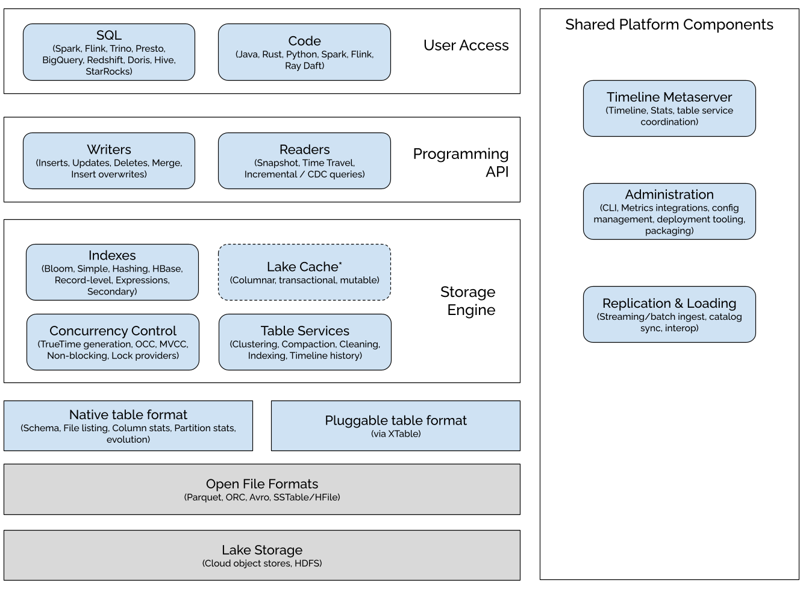

The Hudi stack

Thus, when all things considered, the Hudi stack expands out of being just a 'table format' to a comprehensive and robust [data lakehouse](https://hudi.apache.org/blog/2024/07/11/what-is-a-data-lakehouse/) platform. In this section, we will explore the Hudi stack and deconstruct the layers of software components that constitute Hudi. The features marked with an asterisk (\*) represent work in progress, and
the dotted boxes indicate planned future work. These components collectively aim to fulfill the [vision](https://github.com/apache/hudi/blob/master/rfc/rfc-69/rfc-69.md) for the project.

The storage layer is where the data files/objects (such as Parquet) as well as all table format metadata are stored. Hudi interacts with the storage layer through Cloud native and [Hadoop FileSystem API](https://hadoop.apache.org/docs/stable/api/org/apache/hadoop/fs/FileSystem.html), enabling compatibility
with various systems including HDFS for fast appends, and various cloud stores such as Amazon S3, Google Cloud Storage (GCS), and Azure Blob Storage. Additionally, Hudi offers its own storage APIs that can rely on Hadoop-independent file system
implementation to simplify the integration of various file systems. Hudi adds a custom wrapper filesystem that lays out the foundation for improved storage optimizations.

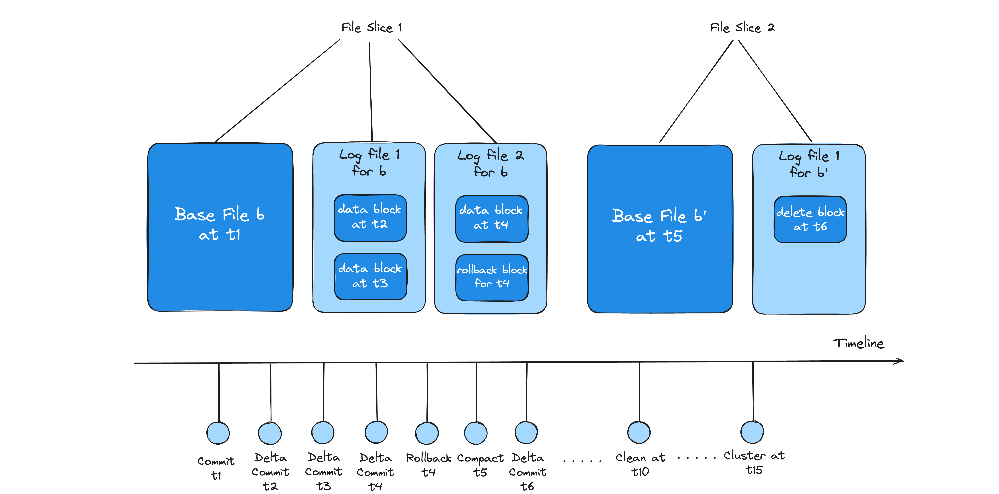

File format structure in Hudi

File formats hold the actual data and are physically stored on the lake storage. Hudi operates on logical structures of File Groups and File Slices, which consist of Base File and Log Files.
Log files store updates/deletes/inserts on top of records stored in base files, and periodically log files are compacted into small set of log files (log compaction) or base files (compaction).
Future updates aim to integrate diverse formats like unstructured data (e.g., JSON, images), and compatibility with different storage layers in event-streaming, OLAP engines, and warehouses.
Hudi's layout scheme encodes all changes to a Log File as a sequence of blocks (data, delete, rollback). By making data available in open file formats (such as Parquet/Avro), Hudi enables users to
bring any compute engine for specific workloads.

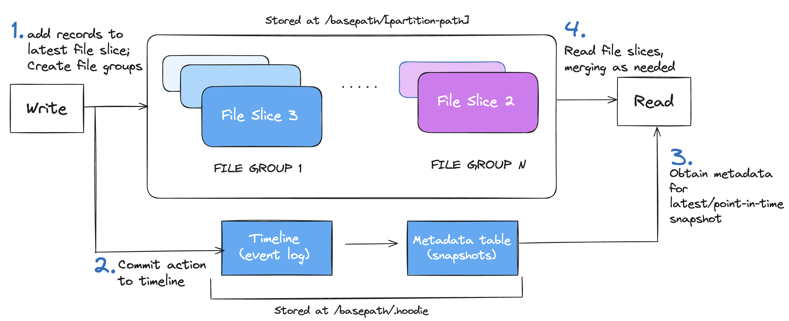

Hudi's Native Table format

Drawing an analogy to file formats, a table format simply concerns with how files are distributed with the table, partitioning schemes, schema and metadata tracking changes. Hudi organizes files within a table or partition into
File Groups. Updates are captured in log files tied to these File Groups, ensuring efficient merges. There are three major components related to Hudi’s table format.

- **Timeline** : Hudi's [timeline](#timeline), stored in the `/.hoodie/timeline` folder, is a crucial event log recording all table actions in an ordered manner,
  with events kept for a specified period. Hudi uniquely designs each File Group as a self-contained log, enabling record state reconstruction through delta logs, even after archival of historical actions. This approach effectively limits metadata size based on table activity frequency, essential for managing tables with frequent updates.
- **File Group and File Slice** : Within each partition the data is physically stored as base and Log Files and organized into logical concepts as [File groups](https://hudi.apache.org/tech-specs-1point0/#storage-layout) and
  File Slices. File groups contain multiple versions of File Slices and are split into multiple File Slices. A File Slice comprises the Base and Log File. Each File Slice within
  the file-group is uniquely identified by the write that created its base file or the first log file, which helps order the File Slices.
- **Metadata Table** : Implemented as another merge-on-read Hudi table, the [metadata table](#metadata) efficiently handles quick updates with low write amplification.
  It leverages a [SSTable](https://cassandra.apache.org/doc/stable/cassandra/architecture/storage-engine.html#sstables) based file format for quick, indexed key lookups,
  storing vital information like file paths, column statistics and schema. This approach streamlines operations by reducing the necessity for expensive cloud file listings.

Hudi's approach of recording updates into Log Files is more efficient and involves low merge overhead than systems like Hive ACID, where merging all delta records against
all Base Files is required. Read more about the various table types in Hudi [table types documentation](#table_types).

Starting with Hudi 1.1, Hudi introduces a pluggable table format framework that extends Hudi's powerful storage engine capabilities beyond its native format to other table formats like Apache Iceberg and Delta Lake. This framework decouples Hudi's core capabilities—transaction management, indexing, concurrency control, and table services—from the specific storage format used for data files.

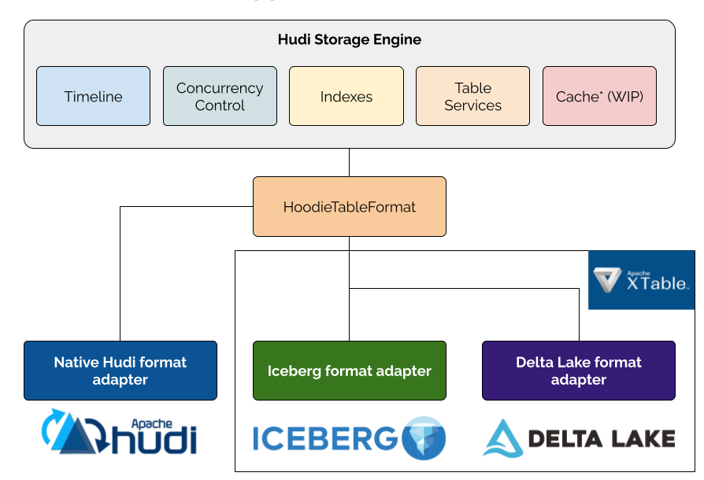

Pluggable Table Format

Hudi provides native format support (configured via `hoodie.table.format=native` by default), while [Apache XTable (incubating)](https://xtable.apache.org/) supplies pluggable format adapters for formats like Iceberg and Delta Lake. The framework enables organizations to choose the right format for each use case while maintaining a unified operational experience and leveraging Hudi's sophisticated storage engine across all formats. For example, you can write high-frequency updates to a Hudi table efficiently with Hudi's record-level indexing capability while maintaining Iceberg metadata through the Iceberg adapter, which supports a wide range of catalogs for reads. This architecture prevents vendor lock-in and embraces the open lakehouse ecosystem.

The storage layer of Hudi comprises the core components that are responsible for the fundamental operations and services that enable Hudi to store, retrieve, and manage data
efficiently on [data lakehouse](https://hudi.apache.org/blog/2024/07/11/what-is-a-data-lakehouse/) storages. This functionality is comparable to that of roles play by storage engines in popular databases like PostgreSQL, MySQL, MongoDB, Cassandra and Clickhouse.

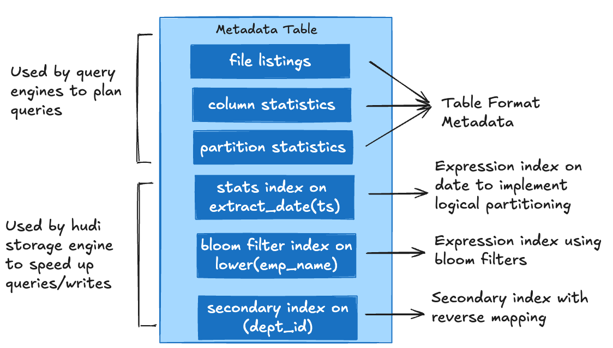

Indexes in Hudi

[Indexes](#indexes) in Hudi enhance query planning, minimizing I/O, speeding up response times and providing faster writes with low merge costs. The [metadata table](#metadata) acts
as an additional [indexing system](#metadata) and brings the benefits of indexes generally to both the readers and writers. Compute engines can leverage various indexes in the metadata
table, like file listings, column statistics, bloom filters, record-level indexes, and [expression indexes](https://github.com/apache/hudi/blob/master/rfc/rfc-63/rfc-63.md) to quickly generate optimized query plans and improve read
performance. In addition to the metadata table indexes, Hudi supports simple join based indexing, bloom filters stored in base file footers, external key-value stores like HBase, and optimized storage techniques like bucketing , to efficiently locate File Groups containing specific record keys. Hudi also provides reader indexes such as [expression](https://github.com/apache/hudi/blob/master/rfc/rfc-63/rfc-63.md) and
secondary indexes to boost reads. The table partitioning scheme in Hudi is consciously exploited for implementing global and non-global indexing strategies, that limit scope of a record's
uniqueness to a given partition or globally across all partitions.

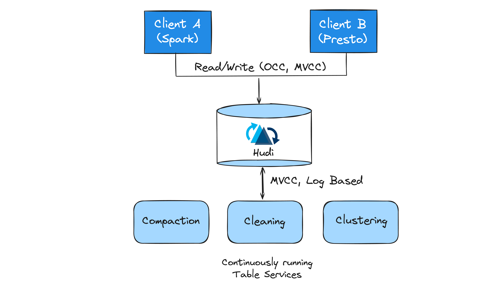

Table services in Hudi

Hudi offers various table services to help keep the table storage layout and metadata management performant. Hudi was designed with built-in table services that enables
running them in inline, semi-asynchronous or full-asynchronous modes. Furthermore, Spark and Flink streaming writers can run in continuous mode, and invoke table services
asynchronously sharing the underlying executors intelligently with writers. Let’s take a look at these services.

The [clustering](#clustering) service, akin to features in cloud data warehouses, allows users to group frequently queried records using sort keys or merge smaller Base Files into
larger ones for optimal file size management. It's fully integrated with other timeline actions like cleaning and compaction, enabling smart optimizations such as avoiding
compaction for File Groups undergoing clustering, thereby saving on I/O.

Hudi's [compaction](#compaction) service, featuring strategies like date partitioning and I/O bounding, merges Base Files with delta logs to create updated Base Files. It allows
concurrent writes to the same File Froup, enabled by Hudi's file grouping and flexible log merging. This facilitates non-blocking execution of deletes even during concurrent
record updates.

[Cleaner](http://hudi.apache.org/blog/2021/06/10/employing-right-configurations-for-hudi-cleaner) service works off the timeline incrementally, removing File Slices that are past the configured retention period for incremental queries, while also allowing sufficient time for long running batch jobs (e.g Hive ETLs) to finish running. This allows users to reclaim storage space, thereby saving on costs.

Hudi's scalable metadata table contains auxiliary data about the table. This subsystem encompasses various indices, including files, column\_stats, and bloom\_filters, facilitating efficient record location and data skipping. Balancing write throughput with index updates presents a fundamental challenge, as traditional indexing methods, like locking out writes during indexing, are impractical for large tables due to lengthy processing times. Hudi addresses this with its innovative asynchronous [metadata indexing](#metadata_indexing), enabling the creation of various indices without impeding writes. This approach not only improves write latency but also minimizes resource waste by reducing contention between writing and indexing activities.

[Concurrency control](#concurrency_control) defines how different writers/readers/table services coordinate access to the table. Hudi uses monotonically increasing time to sequence and order various
changes to table state. Much like databases, Hudi take an approach of clearly differentiating between writers (responsible for upserts/deletes), table services
(focusing on storage optimization and bookkeeping), and readers (for query execution). Hudi provides snapshot isolation, offering a consistent view of the table across
these different operations. It employs lock-free, non-blocking MVCC for concurrency between writers and table-services, as well as between different table services, and
optimistic concurrency control (OCC) for multi-writers with early conflict detection. With [Hudi 1.0](https://github.com/apache/hudi/blob/master/rfc/rfc-69/rfc-69.md), non-blocking concurrency control ([NBCC](https://github.com/apache/hudi/blob/master/rfc/rfc-66/rfc-66.md))
is introduced, allowing multiple writers to concurrently operate on the table with non-blocking conflict resolution.

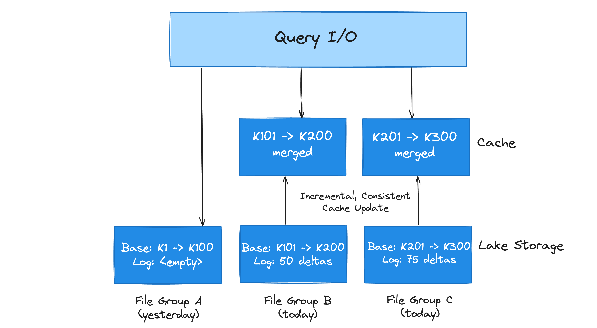

Proposed Lake Cache in Hudi

Data lakes today face a tradeoff between fast data writing and optimal query performance. Writing smaller files or logging deltas enhances writing speed, but superior query performance typically requires opening fewer files and pre-materializing merges. Most databases use a buffer pool to reduce storage access costs. Hudi’s design supports creating a multi-tenant caching tier that can store pre-merged File Slices. Hudi’s timeline can then be used to simply communicate caching policies. Traditionally, caching is near query engines or in-memory file systems. Integrating a [caching layer](https://github.com/apache/hudi/issues/16072) with Hudi's transactional storage enables shared caching across query engines, supporting updates and deletions, and reducing costs. The goal is to build a buffer pool for lakes, compatible with all major engines, with the contributions from the rest of the community.

Hudi tables can be used as sinks for Spark/Flink pipelines and the Hudi writing path provides several enhanced capabilities over file writing done by vanilla parquet/avro sinks. It categorizes write operations into incremental (`insert`, `upsert`, `delete`) and batch/bulk (`insert_overwrite`, `delete_partition`, `bulk_insert`) with specific functionalities. `upsert` and `delete` efficiently merge records with identical keys and integrate with the file sizing mechanism, while `insert` operations smartly bypass certain steps like pre-combining, maintaining pipeline benefits. Similarly, `bulk_insert` operation offers control over file sizes for data imports. Batch operations integrate MVCC for seamless transitions between incremental and batch processing. Additionally, the write pipeline includes optimizations like handling large merges via rocksDB and concurrent I/O, enhancing write performance.

Hudi provides snapshot isolation for writers and readers, enabling consistent table snapshot queries across major query engines (Spark, Hive, Flink, Presto, Trino, Impala) and cloud warehouses. It optimizes query performance by utilizing lightweight processes, especially for base columnar file reads, and integrates engine-specific vectorized readers like in Presto and Trino. This scalable model surpasses the need for separate readers and taps into each engine's unique optimizations, such as Presto and Trino's data/metadata caches. For queries merging Base and Log Files, Hudi employs mechanisms such as spillable maps and lazy reading to boost merge performance. Additionally, Hudi offers a read-optimized query option, trading off data freshness for improved query speed. There are also recently added features such as positional merge, encoding partial Log File to only changed columns and support for Parquet as the Log File format to improve MoR snapshot query performance.

Hudi is compatible with a wide array of SQL query engines, catering to various analytical needs. For distributed ETL batch processing, Apache Spark is frequently utilized, leveraging its efficient handling of large-scale data. In the realm of streaming use cases, compute engines such as Apache Flink and Apache Spark's Structured Streaming provide
robust support when paired with Hudi. Moreover, Hudi supports modern data lake query engines such as Trino and Presto, as well as modern analytical databases such as ClickHouse
and StarRocks. This diverse support of compute engines positions Hudi as a flexible and adaptable platform for a broad spectrum of use cases.

While SQL still rules the roost when it comes to data engineering, an equally important and widespread data engineering/data science practice is to write code in different
languages like Java, Scala, Python and R, to analyze data using sophisticated algorithms with full expressiveness of the language. To this end, Hudi supports several
popular data processing frameworks like Apache Spark and Apache Flink, as well as python based distributed frameworks like Daft, Ray and native bindings in Rust for easy
integration with engines written in C/C++.

...

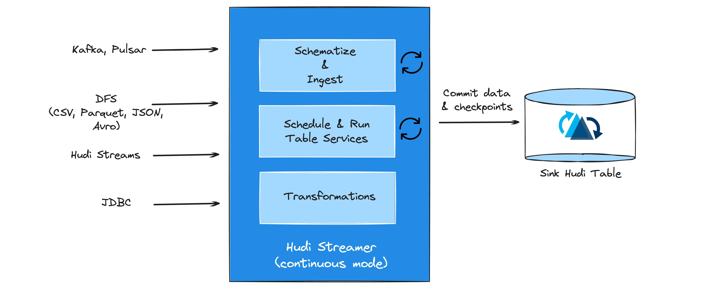

Various platform services in Hudi

Platform services offer functionality that is specific to data and workloads, and they sit directly on top of the table services, interfacing with writers and readers.
Services, like [Hudi Streamer](#hoodie_streaming_ingestion--hudi-streamer) (or its Flink counterpart), are specialized in handling data and workloads, seamlessly integrating with Kafka streams and various
formats to build data lakes. They support functionalities like automatic checkpoint management, integration with major schema registries (including Confluent), and
deduplication of data. Hudi Streamer also offers features for backfills, one-off runs, and continuous mode operation with Spark/Flink streaming writers. Additionally, Hudi provides tools for [snapshotting](#snapshot_exporter) and incrementally [exporting](#snapshot_exporter--examples) Hudi tables, importing new tables, and [post-commit callback](#platform_services_post_commit_callback) for analytics or
workflow management, enhancing the deployment of production-grade incremental pipelines. Apart from these services, Hudi also provides broad support for different
catalogs such as [Hive Metastore](#syncing_metastore), [AWS Glue](#syncing_aws_glue_data_catalog), [Google BigQuery](#gcp_bigquery), [DataHub](#syncing_datahub), etc. that allows syncing of Hudi tables to be queried by
interactive engines such as Trino and Presto.

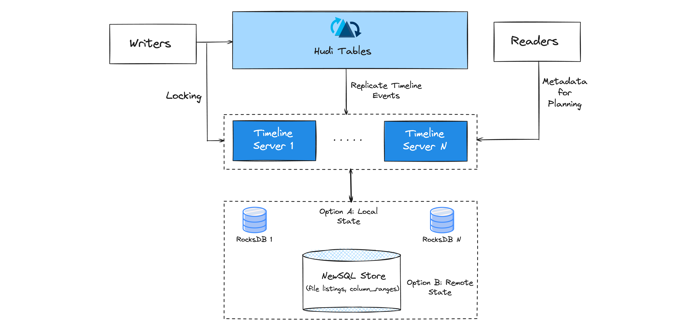

Proposed Metaserver in Hudi

Storing table metadata on lake storage, while scalable, is less efficient than RPCs to a scalable meta server. Hudi addresses this with its metadata server, called "metaserver,"
an efficient alternative for managing table metadata for a large number of tables. Currently, the timeline server, embedded in Hudi's writer processes, uses a local rocksDB store and [Javalin](https://javalin.io/) REST API to serve file listings, reducing cloud storage listings.
Since version 0.6.0, there's a trend towards standalone timeline servers, aimed at horizontal scaling and improved security. These developments are set to create a more efficient lake [metastore](https://github.com/apache/hudi/issues/15011)
for future needs.

---

<a id="timeline"></a>

<!-- source_url: https://hudi.apache.org/docs/timeline/ -->

<!-- page_index: 9 -->

# Timeline

Version: 1.1.1

Changes to table state (writes, table services, schema changes, etc) are recorded as ***actions*** in the Hudi ***timeline***. The Hudi timeline is a log of all actions performed
on the table at different ***instants*** (points in time). It is a key component of Hudi's architecture, acting as a source of truth for the state of the table. All instant times
used on the timeline follow [TrueTime](https://research.google/pubs/spanner-truetime-and-the-cap-theorem/) semantics, and are monotonically increasing globally across various
processes involved. See TrueTime section below for more details.

Each action has the following attributes associated with it.

- **requested instant** : Instant time representing when the action was requested on the timeline and acts as the transaction id. An immutable plan for the action should be generated before the action is requested.
- **completed instant** : Instant time representing when the action was completed on the timeline. All relevant changes to table data/metadata should be made before the action is completed.
- **state** : state of the action. valid states are `REQUESTED`, `INFLIGHT` and `COMPLETED` during an action's lifecycle.
- **type** : the kind of action performed. See below for full list of actions.

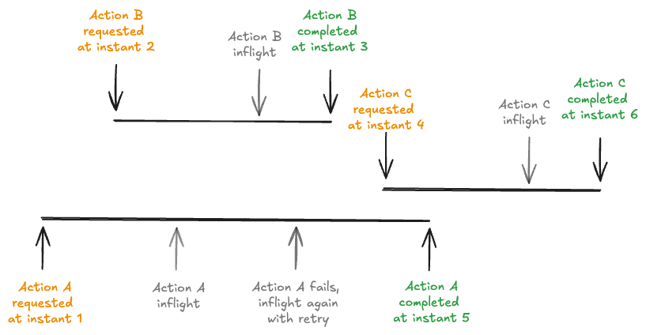

Figure: Actions in the timeline

Following are the valid action types.

- **COMMIT** - Write operation denoting an atomic write of a batch of records into a base files in the table.
- **DELTA\_COMMIT** - Write operation denoting an atomic write of a batch of records into merge-on-read type table, where some/all of the data could be just written to delta logs.
- **REPLACE\_COMMIT** - Write operation that atomically replaces a set of file groups in the table with another. Used for implementing batch write operations like *insert\_overwrite*, *delete\_partition* etc, as well as table services
  like clustering.
- **CLEANS** - Table service that removes older file slices that are no longer needed from the table, by deleting those files.
- **COMPACTION** - Table service to reconcile differential data between base and delta files, by merging delta files into base files.
- **LOGCOMPACTION** - Table service to merge multiple small log files into a bigger log file in the same file slice.
- **CLUSTERING** - Table service to rewrite existing file groups with optimized sort order or storage layouts, as new file groups in the table.
- **INDEXING** - Table service to build an index of a requested type on a column of the table, consistent with the state of the table at the completed instant in face of ongoing writes.
- **ROLLBACK** - Indicates that an unsuccessful write operation was rolled back, removing any partial/uncommitted files produced during such a write from storage.
- **SAVEPOINT** - Marks certain file slices as "saved", such that cleaner will not delete them. It helps restore the table to a point on the timeline, in case of disaster/data recovery scenarios or perform time-travel queries as of those instants.
- **RESTORE** - Restores a table to a given savepoint on the timeline, in case of disaster/data recovery scenarios.

In some cases, action types in the completed state may be different from requested/inflight states, but still tracked by the same requested instant. For e.g. *CLUSTERING* as in requested/inflight state, becomes *REPLACE\_COMMIT* in completed state. Compactions complete as *COMMIT* action on the timeline producing new base files. In general, multiple write operations from the storage engine
may map to the same action on the timeline.

Actions go through state transitions on the timeline, with each transition recorded by a file of the pattern `<requsted instant>.<action>.<state>`(for other states) or
`<requsted instant>_<completed instant>.<action>` (for COMPLETED state). Hudi guarantees that the state transitions are atomic and timeline consistent based on the instant time.
Atomicity is achieved by relying on the atomic operations on the underlying storage (e.g. PUT calls to S3/Cloud Storage).

Valid state transitions are as follows:

- `[ ] -> REQUESTED` - Denotes an action has been scheduled, but has not initiated by any process yet.
  Note that the process requesting the action can be different from the process that will perform/complete the action.
- `REQUESTED -> INFLIGHT` - Denotes that the action is currently being performed by some process.
- `INFLIGHT -> REQUESTED` or `INFLIGHT -> INFLIGHT` - A process can safely fail many times while performing the action.
- `INFLIGHT -> COMPLETED` - Denotes that the action has been completed successfully.

The current state of an action on the timeline is the highest state recorded for that action on the timeline, with states ordered as `REQUESTED < INFLIGHT < COMPLETED`.

Time in distributed systems has been studied literally for [decades](https://lamport.azurewebsites.net/pubs/chandy.pdf). Google Spanner’s
[TrueTime](https://research.google/pubs/spanner-truetime-and-the-cap-theorem/) API addresses the challenges of managing time in distributed systems by providing a globally
synchronized clock with bounded uncertainty. Traditional systems struggle with clock drift and lack of a consistent timeline, but TrueTime ensures that all nodes operate with
a common notion of time, defined by a strict interval of uncertainty. This enables Spanner to achieve external consistency in distributed transactions, allowing it to assign
timestamps with confidence that no other operation in the past or future will conflict, solving age-old issues of clock synchronization and causality. Several OLTP databases
like Spanner, [CockroachDB](https://www.cockroachlabs.com/blog/living-without-atomic-clocks/) rely on TrueTime.

Hudi uses these semantics for instant times on the timeline, to provide unique monotonically increasing instant values. TrueTime can be generated by a single shared time generator
process or by having each process generate its own time and waiting for time >= maximum expected clock drift across all processes within a distributed lock. Locking ensures only one
process is generating time at a time and waiting ensures enough time passes such that any new time generated is guaranteed to be greater than the previous time.

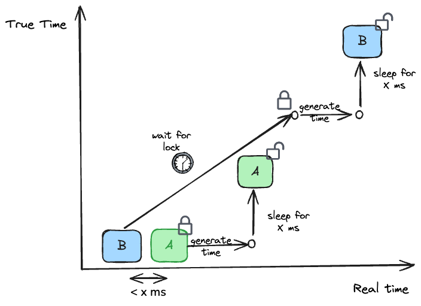

Figure: TrueTime generation for processes A & B

The figure above shows how time generated by process A and B are monotonically increasing, even though process B has a lower local clock than A at the start, by waiting for uncertainty window of x ms to pass.
In fact, given Hudi targets transaction durations > 1 second, we can afford to operate with a much higher uncertainty bound (> 100ms) guaranteeing extremely high fidelity time generation.

Thus, actions appear on the timeline as an interval starting at the requested instant and ending at the completed instant. Such actions can be ordered by completion time to

- **Commit time ordering** : To obtain serializable execution order of writes performed consistent with typical relational databases, the actions can be ordered by completed instant.
- **Event time ordering**: Data lakehouses ultimately deal with streams of data (CDC, events, slowly changing data etc), where ordering is dependent on business fields in
  the data. In such cases, actions can be ordered by commit time, while the records themselves are further merged in order of a specified event time field.

Hudi relies on ordering of requested instants of certain actions against completed instants of other actions, to implement non-blocking table service operations or concurrent streaming model
writes with event time ordering.

Hudi implements the timeline as a Log Structured Merge ([LSM](https://en.wikipedia.org/wiki/Log-structured_merge-tree)) tree under the `.hoodie/timeline` directory. Unlike typical LSM implementations, the memory component and the write-ahead-log are at once replaced by [avro](https://avro.apache.org/) serialized files containing individual actions (***active timeline***) for high durability and inter-process co-ordination.
All actions on the Hudi table are created in the active timeline a new entry and periodically actions are archived from the active timeline to the LSM structure (timeline history).
As the name suggests active timeline is consulted all the time to build a consistent view of data and archiving completed actions ensures reads on the timeline does not incur unnecessary latencies
as timeline grows. The key invariant around such archiving is that any side effects from completed/pending actions (e.g. uncommitted files) are removed from storage, before archiving them.

As mentioned above, active timeline has limited log history to be fast, while archived timeline is expensive to access
during reads or writes, especially with high write throughput. To overcome this limitation, Hudi introduced the LSM (
log-structured merge) tree based timeline. Completed actions, their plans and completion metadata are stored in a more
scalable LSM tree based archived timeline organized in an ***history*** storage folder under the `.hoodie/timeline` metadata
path. It consists of Apache Parquet files with action instant data and bookkeeping metadata files, in the following
manner.

```bash
/.hoodie/timeline/history/ 					 
├── _version_      					        <-- stores the manifest version that is current 
├── manifest_1                              <-- manifests store list of files in timeline 
├── manifest_2                              <-- compactions, cleaning, writes produce new manifest files 
├── ...                                       
├── manifest_<N>                            <-- there can be many manifest files at any given time 
├── <min_time>_<max_time>_<level>.parquet   <-- files storing actual action details 
```

One can read more about the details of LSM timeline in Hudi 1.0 specs. To understand it better, here is an example.

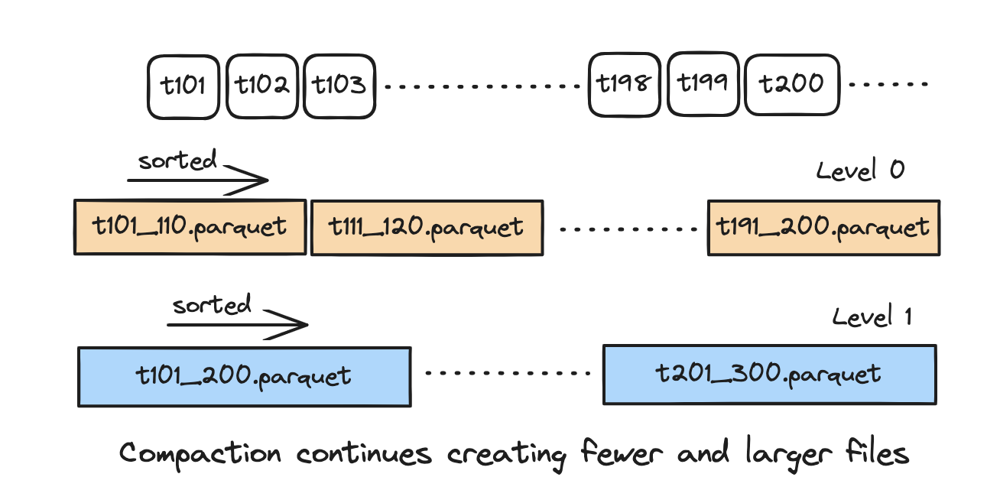

In the above figure, each level is a tree sorted by instant times. We can see that for a bunch of commits the metadata
is stored in a parquet file. As and when more commits are accumulated, they get compacted and pushed down to lower level
of the tree. Each new operation to the timeline yields a new snapshot version. The advantage of such a structure is that
we can keep the top level in memory if needed, and still load the remaining levels efficiently from the disk if we need to walk
back longer history. The LSM timeline compaction frequency is controlled by`hoodie.timeline.compaction.batch.size` i.e.
for every *N* parquet files in the current level, they are merged and flush as a compacted file in the next level.

Basic configurations that control archival.

| Config Name | Default | Description |
| --- | --- | --- |
| hoodie.keep.max.commits | 30 (Optional) | Archiving service moves older entries from timeline into an archived log after each write, to keep the metadata overhead constant, even as the table size grows. This config controls the maximum number of instants to retain in the active timeline. |
| hoodie.keep.min.commits | 20 (Optional) | Similar to hoodie.keep.max.commits, but controls the minimum number of instants to retain in the active timeline. |
| hoodie.timeline.compaction.batch.size | 10 (Optional) | Controls the number of parquet files to compact in a single compaction run at the current level of the LSM tree. |

For more advanced configs refer [here](https://hudi.apache.org/docs/next/configurations#Archival-Configs-advanced-configs).

Flink jobs using the SQL can be configured through the options in WITH clause. The actual datasource level configs are listed below.

| Config Name | Default | Description |
| --- | --- | --- |
| archive.max\_commits | 50 (Optional) | Max number of commits to keep before archiving older commits into a sequential log, default 50 `Config Param: ARCHIVE_MAX_COMMITS` |
| archive.min\_commits | 40 (Optional) | Min number of commits to keep before archiving older commits into a sequential log, default 40 `Config Param: ARCHIVE_MIN_COMMITS` |
| hoodie.timeline.compaction.batch.size | 10 (Optional) | Controls the number of parquet files to compact in a single compaction run at the current level of the LSM tree. |

Refer [here](https://hudi.apache.org/docs/next/configurations#Flink-Options) for more details.

<a id="timeline--blogs"></a>

### Blogs

- [Apache Hudi Timeline: Foundational pillar for ACID transactions](https://medium.com/@simpsons/hoodie-timeline-foundational-pillar-for-acid-transactions-be871399cbae)

---

<a id="storage_layouts"></a>

<!-- source_url: https://hudi.apache.org/docs/storage_layouts/ -->

<!-- page_index: 10 -->

# Storage Layouts

Version: 1.1.1

The following describes the general organization of files in storage for a Hudi table.

- Hudi organizes data tables into a directory structure under a ***base path*** on a storage.
- Tables are optionally broken up into ***partitions***, based on partition columns defined in the table schema.
- Within each partition, files are organized into ***file groups***, uniquely identified by a file ID (uuid)
- Each file group contains several ***file slices***.
- Each slice contains a ***base file*** (parquet/orc/hfile) (defined by the config - [hoodie.table.base.file.format](https://hudi.apache.org/docs/next/configurations/#hoodietablebasefileformat) )
  written by a commit that completed at a certain instant, along with set of ***log files*** (*.log.*) written by commits that completed
  before the next base file's requested instant.
- Hudi employs Multiversion Concurrency Control (MVCC), where [compaction](#compaction) action merges logs and base files to produce new
  file slices and [cleaning](#cleaning) action gets rid of unused/older file slices to reclaim space on the file system.
- All metadata including timeline, metadata table are stored in a special `.hoodie` directory under the base path.

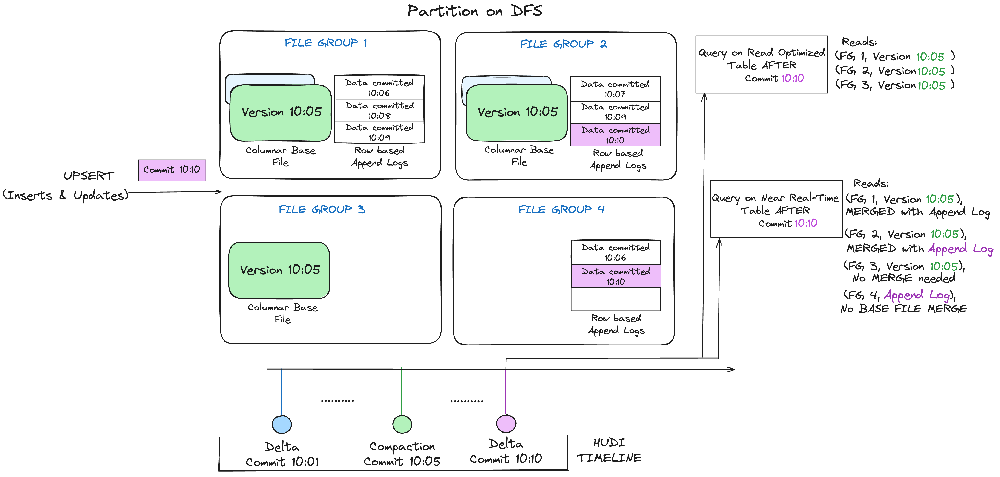

Please refer the **[tech spec](https://hudi.apache.org/tech-specs#file-layout-hierarchy)** for a more detailed description of the file layouts.

Base files store full records, against which change records are stored in delta log files below. Hudi currently supports following
base file formats.

- columnar formats for vectorized reads, columnar compression and efficient column based access for analytics/data science.
- row-oriented avro files for fast scans for reading whole records.
- random access optimized HFiles for efficient searching for indexed records (based on [SSTable](https://github.com/facebook/rocksdb/wiki/A-Tutorial-of-RocksDB-SST-formats) format)

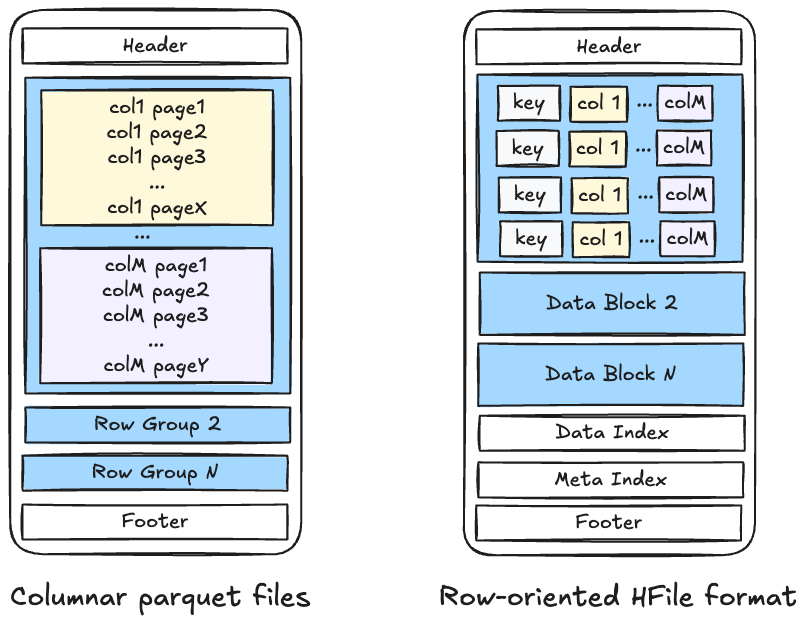

Log files store incremental changes (partial or full) to a base file, such as updates, inserts, and deletes, after the base file was created.
Log files contain different blocks (data, command, delete blocks etc.) that encode specific changes to the base file. The data block
encodes updates/inserts to the base file, with customizability to support different needs.

- row-oriented avro files for fast/lightweight writing
- random access optimized HFiles for efficient searching for indexed records (based on [SSTable](https://github.com/facebook/rocksdb/wiki/A-Tutorial-of-RocksDB-SST-formats) format)
- columnar parquet files for vectorized log merging.

Elements of Hudi's storage format like log format, log block structure, timeline file/data schema are all versioned and tied to a given
table version. The ***table version*** is a monotonically increasing number that is bumped up everytime some bits produced in storage change.

**Backwards compatible reading**: Hudi releases are backwards compatible to ensure new software releases can read recent older table versions. The recommended way to upgrade
Hudi across different engines, is by first upgrading all readers (e.g. interactive query engines that consume tables) and then upgrading
any/all writers and table services. Hudi storage engine also implements auto upgrade capability that can gracefully perform a table version
upgrade on the subsequent write operation, by automatically performing any necessary steps without downtime to queries/reads.

**Backwards compatible writing**: However, this may not be possible at all times given data platforms built on Hudi could have multi-stage pipelines that can act as readers and
writers at the same time. In such cases, Hudi upgrade needs to be performed by upgrading the most downstream jobs first, tracking all the way to
the first Hudi tables written possibly by ingestion systems. To ease this process, Hudi allows also writing recent older table versions, such that
the new Hudi software binaries can first be rolled out across the entire deployment on top of the same older table version. Once all jobs and engines
have the new binary, then upgrade to newer table version can happen in any order and readers will dynamically adapt.

The following writer configs control writing older table versions and auto upgrade behavior.

| Config Name | Default | Description |
| --- | --- | --- |
| hoodie.write.table.version | latest (Optional) | The table version this writer is storing the table in. This should match the current table version, if table already exists. Set this to a lower version when upgrade as described above. |
| hoodie.write.auto.upgrade | true (Optional) | If enabled, writers automatically migrate the table to the specified write table version if the current table version is lower. |

Please refer [here](https://hudi.apache.org/docs/next/configurations/#Layout-Configs) for additional configs that control storage layout and data distribution, which defines how the files are organized within a table.

---

<a id="write_operations"></a>

<!-- source_url: https://hudi.apache.org/docs/write_operations/ -->

<!-- page_index: 11 -->

# Write Operations

Version: 1.1.1

It may be helpful to understand the different write operations supported by Hudi and how best to leverage them. These operations
can be chosen/changed across writes issued against the table. Each write operation maps to an action type on the
timeline.

At its core, Hudi provides a high-performance storage engine that efficiently implements these operations, on top of the timeline and
the storage format. Write operations can be classified into two types, for ease of understanding.

- **Batch/Bulk operations**: Without functionality provided by Hudi, the most common way for writing data relies on overwriting entire
  tables and/or partitions entirely every few hours. For e.g. a job computing aggregates for the given week, will scan the entire data
  periodically and recompute the results from scratch and publish output by an `insert_overwrite` operation. Hudi supports all such
  bulk or typical "batch processing" write operations, while providing atomicity and other storage features discussed here.
- **Incremental operations**: However, Hudi is purpose built to change this processing model into a more incremental approach, as illustrated
  below. To do so, the storage engine implements incremental write operations that excel at applying incremental changes to a table. For e.g.
  the same processing can be now performed by just obtaining changed records from upstream system or a Hudi incremental query, and then directly
  updating the aggregates on the target table only for specific records that changed.

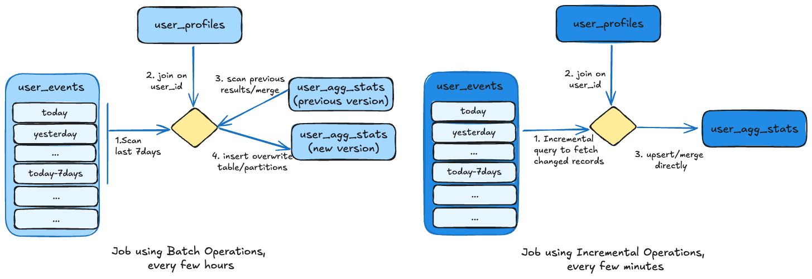

**Type**: *Incremental*, **Action**: *COMMIT (CoW), DELTA\_COMMIT (MoR)*

This is the default operation where the input records are first tagged as inserts or updates by looking up the index.
The records are ultimately written after heuristics are run to determine how best to pack them on storage to optimize for things like file sizing.
This operation is recommended for use-cases like database change capture where the input almost certainly contains updates. The target table will never show duplicates.

**Type**: *Incremental*, **Action**: *COMMIT (CoW), DELTA\_COMMIT (MoR)*

This operation is very similar to upsert in terms of heuristics/file sizing but completely skips the index lookup step. Thus, it can be a lot faster than upserts
for use-cases like log de-duplication (in conjunction with options to filter duplicates mentioned below) by skipping the index tagging step. This is also suitable
for use-cases where the table can tolerate duplicates, but just need the transactional writes/incremental query/storage management capabilities of Hudi.

**Type**: *Batch*, **Action**: *COMMIT (CoW), DELTA\_COMMIT (MoR)*

Both upsert and insert operations keep input records in memory to speed up storage heuristics computations faster (among other things) and thus can be cumbersome for
initial loading/bootstrapping large amount of data at first. Bulk insert provides the same semantics as insert, while implementing a sort-based data writing algorithm, which can scale very well for several hundred TBs
of initial load. However, this just does a best-effort job at sizing files vs guaranteeing file sizes like inserts/upserts do.

**Type**: *Incremental*, **Action**: *COMMIT (CoW), DELTA\_COMMIT (MoR)*

Hudi supports implementing two types of deletes on data stored in Hudi tables, by enabling the user to specify a different record payload implementation.

- **Soft Deletes** : Retain the record key and just null out the values for all the other fields.
  This can be achieved by ensuring the appropriate fields are nullable in the table schema and simply upserting the table after setting these fields to null.
- **Hard Deletes** : This method entails completely eradicating all evidence of a record from the table, including any duplicates. There are three distinct approaches to accomplish this:
  - Using DataSource, set `"hoodie.datasource.write.operation"` to `"delete"`. This will remove all the records in the DataSet being submitted.
  - Using DataSource, set `PAYLOAD_CLASS_OPT_KEY` to `"org.apache.hudi.EmptyHoodieRecordPayload"`. This will remove all the records in the DataSet being submitted.
  - Using DataSource or Hudi Streamer, add a column named `_hoodie_is_deleted` to DataSet. The value of this column must be set to `true` for all the records to be deleted and either `false` or left null for any records which are to be upserted.

Hudi supports migrating your existing large tables into a Hudi table using the `bootstrap` operation. There are a couple of ways to approach this. Please refer to
[bootstrapping page](#migration_guide) for more details.

**Type**: *Batch*, **Action**: *REPLACE\_COMMIT (CoW + MoR)*

This operation is used to rewrite the all the partitions that are present in the input. This operation can be faster
than `upsert` for batch ETL jobs, that are recomputing entire target partitions at once (as opposed to incrementally
updating the target tables). This is because, we are able to bypass indexing, precombining and other repartitioning
steps in the upsert write path completely. This comes in handy if you are doing any backfill or any such type of use-cases.

**Type**: *Batch*, **Action**: *REPLACE\_COMMIT (CoW + MoR)*

This operation can be used to overwrite the entire table for whatever reason. The Hudi cleaner will eventually clean up
the previous table snapshot's file groups asynchronously based on the configured cleaning policy. This operation is much
faster than issuing explicit deletes.

**Type**: *Batch*, **Action**: *REPLACE\_COMMIT (CoW + MoR)*

In addition to deleting individual records, Hudi supports deleting entire partitions in bulk using this operation.
Deletion of specific partitions can be done using the config
[`hoodie.datasource.write.partitions.to.delete`](#configurations--hoodiedatasourcewritepartitionstodelete).

Here are the basic configs relevant to the write operations types mentioned above. Please refer to [Write Options](#configurations--write-options) for more Spark based configs and [Flink options](https://hudi.apache.org/docs/next/configurations#Flink-Options) for Flink based configs.

**Spark based configs:**

<table><thead><tr><th>Config Name</th><th>Default</th><th>Description</th></tr></thead><tbody><tr><td>hoodie.datasource.write.operation</td><td>upsert (Optional)</td><td>Whether to do upsert, insert or bulk_insert for the write operation. Use bulk_insert to load new data into a table, and there on use upsert/insert. bulk insert uses a disk based write path to scale to load large inputs without need to cache it.

<code>Config Param: OPERATION</code></td></tr><tr><td>hoodie.table.ordering.fields</td><td>(N/A) (Optional)</td><td>Comma separated fields used in records merging comparison. By default, when two records have the same key value, the largest value for the ordering field determined by Object.compareTo(..), is picked. If there are multiple fields configured, comparison is made on the first field. If the first field values are same, comparison is made on the second field and so on.
<code>Config Param: ORDERING_FIELDS</code></td></tr><tr><td>hoodie.combine.before.insert</td><td>false (Optional)</td><td>When inserted records share same key, controls whether they should be first combined (i.e de-duplicated) before writing to storage.

<code>Config Param: COMBINE_BEFORE_INSERT</code></td></tr><tr><td>hoodie.datasource.write.insert.drop.duplicates</td><td>false (Optional)</td><td>If set to true, records from the incoming dataframe will not overwrite existing records with the same key during the write operation. This config is deprecated as of 0.14.0. Please use hoodie.datasource.insert.dup.policy instead.

<code>Config Param: INSERT_DROP_DUPS</code></td></tr><tr><td>hoodie.bulkinsert.sort.mode</td><td>NONE (Optional)</td><td>org.apache.hudi.execution.bulkinsert.BulkInsertSortMode: Modes for sorting records during bulk insert. <ul><li><code>NONE(default)</code>: No sorting. Fastest and matches <code>spark.write.parquet()</code> in number of files and overhead.</li><li><code>GLOBAL_SORT</code>: This ensures best file sizes, with lowest memory overhead at cost of sorting.</li><li><code>PARTITION_SORT</code>: Strikes a balance by only sorting within a Spark RDD partition, still keeping the memory overhead of writing low. File sizing is not as good as <code>GLOBAL_SORT</code>.</li><li><code>PARTITION_PATH_REPARTITION</code>: This ensures that the data for a single physical partition in the table is written by the same Spark executor. This should only be used when input data is evenly distributed across different partition paths. If data is skewed (most records are intended for a handful of partition paths among all) then this can cause an imbalance among Spark executors.</li><li><code>PARTITION_PATH_REPARTITION_AND_SORT</code>: This ensures that the data for a single physical partition in the table is written by the same Spark executor. This should only be used when input data is evenly distributed across different partition paths. Compared to <code>PARTITION_PATH_REPARTITION</code>, this sort mode does an additional step of sorting the records based on the partition path within a single Spark partition, given that data for multiple physical partitions can be sent to the same Spark partition and executor. If data is skewed (most records are intended for a handful of partition paths among all) then this can cause an imbalance among Spark executors.</li></ul>
<code>Config Param: BULK_INSERT_SORT_MODE</code></td></tr><tr><td>hoodie.bootstrap.base.path</td><td>N/A <strong>(Required)</strong></td><td><strong>Applicable only when</strong> operation type is <code>bootstrap</code>. Base path of the dataset that needs to be bootstrapped as a Hudi table

<code>Config Param: BASE_PATH</code>
<code>Since Version: 0.6.0</code></td></tr><tr><td>hoodie.bootstrap.mode.selector</td><td>org.apache.hudi.client.bootstrap.selector.MetadataOnlyBootstrapModeSelector (Optional)</td><td>Selects the mode in which each file/partition in the bootstrapped dataset gets bootstrapped
Possible values:<ul><li><code>org.apache.hudi.client.bootstrap.selector.MetadataOnlyBootstrapModeSelector</code>: In this mode, the full record data is not copied into Hudi therefore it avoids full cost of rewriting the dataset. Instead, 'skeleton' files containing just the corresponding metadata columns are added to the Hudi table. Hudi relies on the data in the original table and will face data-loss or corruption if files in the original table location are deleted or modified.</li><li><code>org.apache.hudi.client.bootstrap.selector.FullRecordBootstrapModeSelector</code>: In this mode, the full record data is copied into hudi and metadata columns are added. A full record bootstrap is functionally equivalent to a bulk-insert. After a full record bootstrap, Hudi will function properly even if the original table is modified or deleted.</li><li><code>org.apache.hudi.client.bootstrap.selector.BootstrapRegexModeSelector</code>: A bootstrap selector which employs bootstrap mode by specified partitions.</li></ul>
<code>Config Param: MODE_SELECTOR_CLASS_NAME</code>
<code>Since Version: 0.6.0</code></td></tr><tr><td>hoodie.datasource.write.partitions.to.delete</td><td>N/A <strong>(Required)</strong></td><td><strong>Applicable only when</strong> operation type is <code>delete_partition</code>. Comma separated list of partitions to delete. Allows use of wildcard *

<code>Config Param: PARTITIONS_TO_DELETE</code></td></tr></tbody></table>

**Flink based configs:**

| Config Name | Default | Description |
| --- | --- | --- |
| write.operation | upsert (Optional) | The write operation, that this write should do `Config Param: OPERATION` |
| ordering.fields | (no default) (Optional) | Fields used for ordering records before actual write. When two records have the same key value, we will pick the one with the largest value for the ordering field, determined by Object.compareTo(..). Note: The old config `precombine.field` is deprecated. `Config Param: ORDERING_FIELDS` |
| write.precombine | false (Optional) | Flag to indicate whether to drop duplicates before insert/upsert. By default these cases will accept duplicates, to gain extra performance: 1) insert operation; 2) upsert for MOR table, the MOR table deduplicate on reading `Config Param: PRE_COMBINE` |
| write.bulk\_insert.sort\_input | true (Optional) | Whether to sort the inputs by specific fields for bulk insert tasks, default true `Config Param: WRITE_BULK_INSERT_SORT_INPUT` |
| write.bulk\_insert.sort\_input.by\_record\_key | false (Optional) | Whether to sort the inputs by record keys for bulk insert tasks, default false `Config Param: WRITE_BULK_INSERT_SORT_INPUT_BY_RECORD_KEY` |

The following is an inside look on the Hudi write path and the sequence of events that occur during a write.

1. [Deduping](#configurations--hoodiecombinebeforeinsert) : First your input records may have duplicate keys within the same batch and duplicates need to be combined or reduced by key.
2. [Index Lookup](#indexes) : Next, an index lookup is performed to try and match the input records to identify which file groups they belong to.
3. [File Sizing](#file_sizing): Then, based on the average size of previous commits, Hudi will make a plan to add enough records to a small file to get it close to the configured maximum limit.
4. [Partitioning](#storage_layouts): We now arrive at partitioning where we decide what file groups certain updates and inserts will be placed in or if new file groups will be created
5. Write I/O :Now we actually do the write operations which is either creating a new base file, appending to the log file,
   or versioning an existing base file.
6. Update [Index](#indexes): Now that the write is performed, we will go back and update the index.
7. Commit: Finally we commit all of these changes atomically. ([Post-commit callback](#platform_services_post_commit_callback) can be configured.)
8. [Clean](#cleaning) (if needed): Following the commit, cleaning is invoked if needed.
9. [Compaction](#compaction): If you are using MOR tables, compaction will either run inline, or be scheduled asynchronously
10. Archive : Lastly, we perform an archival step which moves old [timeline](#timeline) items to an archive folder.

Here is a diagramatic representation of the flow.

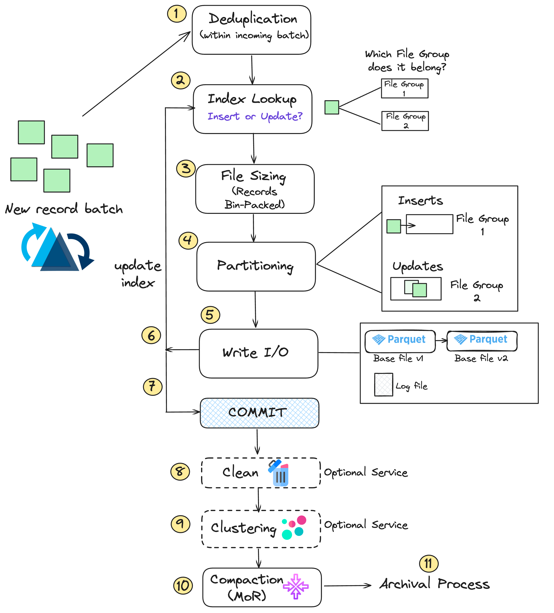
<a id="write_operations--videos"></a>

### Videos

- [Insert | Update | Delete On Datalake (S3) with Apache Hudi and glue Pyspark](https://youtu.be/94DPKkzDm-8)
- [Insert|Update|Read|Write|SnapShot| Time Travel |incremental Query on Apache Hudi datalake (S3)](https://youtu.be/hK1G7CPBL2M)
- [Apache Hudi Bulk Insert Sort Modes a summary of two incredible blogs](https://www.youtube.com/watch?v=AuZoREO8_zs)

---

<a id="table_types"></a>

<!-- source_url: https://hudi.apache.org/docs/table_types/ -->

<!-- page_index: 12 -->

# Table & Query Types

Version: 1.1.1

Hudi ***table types*** define how data is stored and how write operations are implemented on top of the table (i.e how data is written).
In turn, ***query types*** define how the underlying data is exposed to the queries (i.e. how data is read).

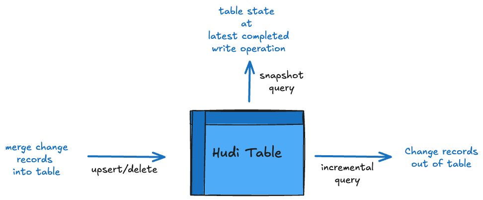

Figure: Tables & Queries

Hudi introduced the following table types, which are now used industry-wide, to reason about similar trade-offs.

**[Copy On Write](#table_types--copy-on-write-table)** : The Copy-on-Write (CoW) table type is optimized for read-heavy workloads. In this mode, record updates or deletes
trigger the creation of new base files in a file group and there are no log files written. This ensures that each query reads only the base files, offering high read performance with no need to merge log files dynamically. While CoW tables are ideal for OLAP scans/queries, their write operations
can be slower due to the overhead of rewriting base files during updates or deletes, even if small percentage of records are modified in each file.

**[Merge On Read](#table_types--merge-on-read-table)** : The Merge-on-Read (MoR) table type balances the write and read performance by combining
lightweight log files with the base file using periodic compaction. Data updates and deletes are written to log files (in row based formats like Avro or
columnar/base file formats) and these changes in log files are then merged dynamically with base files during query execution. This approach reduces write
latency and supports near real-time data availability. However, query performance may vary depending on whether the log files are compacted.

Core transactional capabilities like atomic writes, indexes as well as unique new features like incremental queries, automatic file-sizing and scalable table metadata tracking, are provided across both, independent of the table type.

Following illustrates how this works conceptually, when data is written into copy-on-write table and two queries running on top of it.

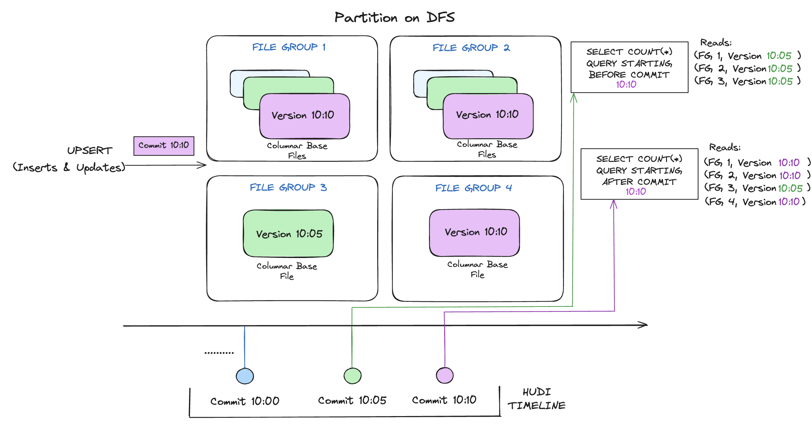

As data gets written, updates to existing file groups produce a new slice for that file group stamped associated with the commit's requested instant time, while inserts allocate a new file group and write its first slice for that file group. These file slices and their commit completed instant times are color coded above.
SQL queries running against such a table (eg: `select count(*)` counting the total records in that partition), first checks the timeline for the completed writes
and filters all but latest file slices of each file group. As you can see, the older query does not see the current inflight commit's files (color coded in pink)
but a new query starting after the commit picks up the new data. Thus, queries are immune to any write failures/partial writes and only read committed data.

Following are good use-cases for CoW tables.

- **Batch ETLs/Data Pipelines**: Provides a simple, easy to operate option for moving SQL based ETLs from data warehouses or authoring complex code based pipelines that run every few hours. These typically tend to be tables derived from raw/ingestion layer downstream.
- **Data Warehousing on Data Lakes**: Given the excellent read performance, CoW tables can be used for running fast OLAP queries combined with other table services to optimize the layout based on these queries.
- **Static or Slowly Changing Data**: Owing to their simplicity, CoW tables are an excellent choice for reference tables, or very slowly updates tables that rarely change.

Following illustrates how a MoR table works, and shows two types of queries - snapshot query and a read optimized query.


There are a lot of interesting things happening in this example, which bring out the subtleties in the approach.

- We now have more frequent commits every 1 minute or so, given the writing is lighter weight.
- Within each file group, now there are delta log files, which holds incoming updates to records in the base columnar files. In the example, the delta log files hold
  all the data written by commits completed from 10:05 to 10:10.
- The base columnar files are versioned with the compaction (commit action). Thus, if one were to simply look at base files alone, then the table layout looks exactly like a copy on write table.
- A periodic compaction process reconciles these changes from the delta log and produces a new version of base file, just like what happened at 10:05 in the example.
- There are two ways of querying the same underlying table: Read Optimized query and Snapshot query, depending on whether we chose query performance or freshness of data.
- The semantics around when data from a commit is available to a query changes in a subtle way for a read optimized query. Note, that such a query
  running at 10:10, wont see data after 10:05 above, while a snapshot query always sees the freshest data. So, it's important to align this with how you choose to compact the table.
- When we trigger compaction & what it decides to compact hold all the key to solving these hard problems. By implementing a compacting
  strategy, where we aggressively compact the latest partitions compared to older partitions, we could ensure the read optimized queries see data
  published within X minutes in a consistent fashion.

The intention of merge on read table is to enable near real-time processing directly on top of DFS, as opposed to copying
data out to specialized systems, which may not be able to handle the data volume. There are also a few secondary side benefits to
this table such as reduced write amplification by avoiding synchronous merge of data, i.e, the amount of data written per 1 bytes of data in a batch

MoR tables are a great fit for the following use-cases:

- **Change Data Capture Pipelines**: Combined with the right index selection, MoR tables provide industry-leading performance that keep up with change capture streams from
  the most demanding write patterns in upstream RBDMS or NoSQL stores.
- **Streaming Data Ingestion**: MoR tables do a great job at landing data as quickly as possible into row-oriented formats, while still leveraging async background compaction
  to batch convert them into columnar formats (e.g Hudi Kafka Connect Sink/Flink integrations). This ensures great data freshness as well better compression ratio and thus
  excellent query performance for columnar files longer term.
- **Hybrid Batch + Streaming workloads**: MoR tables can bring latencies down to minute-levels often eliminating the need for specialized streaming storage, Serving both
  low-latency operational queries and batch analytics on the same dataset. Also, given the streaming-friendly nature of MoR (think of a delta log as reading from a Kafka segment)
  some of the existing stream processing jobs can be run more cost-effectively on Hudi source/sink tables versus Kafka.
- **Frequent Updates and Deletes**: Tables with high-frequency updates, such as user activity logs, transaction tracking, payment consolidation or inventory tracking can all benefit
  from MoR tables. Similarly, enforcing compliance programmes like GDPR/CCPA which require data deletion, can benefit from MoR's ability to accumulate deletes trickling in through the day
  and later do one compaction to amortize the cost of rewriting base files, lowering overall costs 10x or even more.

Following table summarizes the trade-offs between these two table types at a high-level.

| Trade-off | Copy-On-Write | Merge-On-Read |
| --- | --- | --- |
| Write Latency | Higher | Lower |
| Query Latency | Lower | Higher |
| Update cost | Higher (rewrite entire base files) | Lower (append to delta log) |
| Base File Size | Needs to be smaller to avoid high update(I/0) cost | Can be larger, since update cost is low and amortized |
| Read Amplification | 0 | For file groups read by queries: *O(records\_changed)* |
| Write Amplification | Highest for given update/delete pattern, *O(file\_groups\_written)* | For file groups written: *O(records\_changed)* |

Here, read amplification is defined as number of bytes read for 1 byte of actual data and write amplification is defined as number of
bytes written into storage for every 1 byte of actual change data.

Hudi supports the following query types.

- **Snapshot Queries** : Queries see the latest snapshot of the table as of the latest completed action. These are the regular SQL queries everyone is used to running on a table.
  Hudi storage engine accelerates these snapshot queries with indexes whenever possible, on supported query engines.
- **Time Travel Queries** : Queries a snapshot of a table as of a given instant in the past. Time-Travel queries help access multiple versions of a table (for e.g. Machine learning feature stores, to
  score algorithms/models on exact data used to train them) on instants in the active timeline or savepoints in the past.
- **Read Optimized Queries (Only MoR tables)** : Read-optimized queries provides excellent snapshot query performance via purely columnar files (e.g. [Parquet base files](https://parquet.apache.org/)).
  Users typically use a compaction strategy that aligns with a transaction boundary, to provide older consistent views of table/partitions. This is useful to integrate Hudi tables from data warehouses
  that typically only query columnar base files as external tables or latency insensitive ML/AI training jobs that favor efficiency over data freshness.
- **Incremental Queries (Latest State)** : Incremental queries only return new data written to the table since an instant on the timeline.
  Provides latest value of records inserted/updated (i.e 1 record output by query for each record key), since a given point in time of the table.
  Can be used to "diff" table states between two points in time.
- ***Incremental Queries(CDC)*** : These are another type of incremental queries, that provides database like change data capture streams out of Hudi tables.
  Output of a CDC query contain records inserted or updated or deleted since a point in time or between two points in time with both before and after images for each change record,
  along with operations that caused the change.

Following table summarizes the trade-offs between the Snapshot and Read Optimized query types.

| Trade-off | Snapshot | Read Optimized |
| --- | --- | --- |
| Data Latency | Lower | Higher |
| Query Latency | Higher (merge base / columnar file + row based delta / log files) | Lower (raw base / columnar file performance) |

For users new to streaming systems or change data capture, this section provides a small example to put incremental queries into perspective. When
employed correctly to data pipelines, these queries have the power to dramatically lower costs and increase efficiency many folds.

To do this, we take a Hudi table storing `orders` with hourly partitions denoting that hour the order was placed. The table is continuously
getting updates from an upstream source.

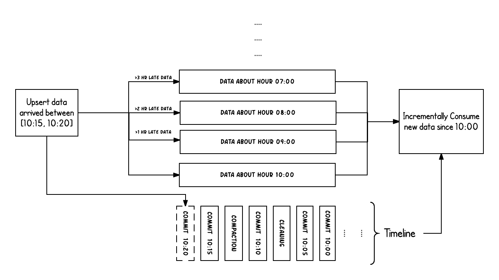

Example above shows upserts happenings between 10:00 and 10:20 on a Hudi table, roughly every 5 mins, leaving commit metadata on the Hudi timeline, along
with other background cleaning/compactions. Two key concepts in the [streaming world beyond batch](https://www.oreilly.com/radar/the-world-beyond-batch-streaming-101/) processing
are easily understood based on this simple example. When there is late arriving data (orders created for hour 9:00 updated/inserted >1 hr late at 10:20), we can see the upsert
producing new data into older hourly partitions. The commit instant in the timeline indicates the `arrival time` of the data (10:20 AM), while the actual data organization
reflects the actual time value the record belongs to or `event time`, the data was intended for (hourly buckets from 09:00).

Knowing what records have changed across both event and arrival time helps author very efficient [incremental processing](https://www.oreilly.com/content/ubers-case-for-incremental-processing-on-hadoop/) pipelines.
With the help of the timeline and record level metadata, an incremental query attempting to get all new data that was committed successfully since 10:00 hours, is able to
very efficiently consume only the changed records without say scanning all the time buckets > 07:00, which is typical approach in batch ETL jobs/sql. Further, it lets
easy filtering based on event time using regular filters (e.g. where hourly\_partition='09').

For configs related to query types refer [below](#table_types--query-configs).

Following are the configs relevant to different query types.

| Config Name | Default | Description |
| --- | --- | --- |
| hoodie.datasource.query.type | snapshot (Optional) | Whether data needs to be read, in `incremental` mode (new data since an instantTime) (or) `read_optimized` mode (obtain latest view, based on base files) (or) `snapshot` mode (obtain latest view, by merging base and (if any) log files) `Config Param: QUERY_TYPE` |
| hoodie.datasource.read.begin.instanttime | N/A **(Required)** | Required when `hoodie.datasource.query.type` is set to `incremental`. Represents the instant time to start incrementally pulling data from. The instanttime here need not necessarily correspond to an instant on the timeline. New data written with an instant\_time > BEGIN\_INSTANTTIME are fetched out. For e.g: ‘20170901080000’ will get all new data written after Sep 1, 2017 08:00AM. Note that if `hoodie.datasource.read.handle.hollow.commit` set to USE\_STATE\_TRANSITION\_TIME, will use instant's `stateTransitionTime` to perform comparison. Accepted formats: `yyyyMMddHHmmss[SSS]`, `yyyy-MM-dd`, `yyyy-MM-dd HH:mm:ss[.SSS]`, `yyyy-MM-ddTHH:mm:ss[.SSS]`, epoch seconds (10-digit), epoch millis (13-digit), or `earliest`. Invalid values throw an error immediately. `Config Param: BEGIN_INSTANTTIME` |
| hoodie.datasource.read.end.instanttime | N/A **(Required)** | Used when `hoodie.datasource.query.type` is set to `incremental`. Represents the instant time to limit incrementally fetched data to. When not specified latest commit time from timeline is assumed by default. When specified, new data written with an instant\_time <= END\_INSTANTTIME are fetched out. Point in time type queries make more sense with begin and end instant times specified. Note that if `hoodie.datasource.read.handle.hollow.commit` set to `USE_STATE_TRANSITION_TIME`, will use instant's `stateTransitionTime` to perform comparison. Accepted formats: `yyyyMMddHHmmss[SSS]`, `yyyy-MM-dd`, `yyyy-MM-dd HH:mm:ss[.SSS]`, `yyyy-MM-ddTHH:mm:ss[.SSS]`, epoch seconds (10-digit), epoch millis (13-digit), or `earliest`. Invalid values throw an error immediately. `Config Param: END_INSTANTTIME` |
| hoodie.datasource.query.incremental.format | latest\_state (Optional) | This config is used alone with the 'incremental' query type.When set to `latest_state`, it returns the latest records' values. When set to `cdc`, it returns the cdc data. `Config Param: INCREMENTAL_FORMAT` `Since Version: 0.13.0` |
| as.of.instant | N/A **(Required)** | The query instant for time travel. Required only in the context of time travel queries. If not specified, query will return the latest snapshot. Accepted formats: `yyyyMMddHHmmss[SSS]`, `yyyy-MM-dd`, `yyyy-MM-dd HH:mm:ss[.SSS]`, `yyyy-MM-ddTHH:mm:ss[.SSS]`, epoch seconds (10-digit), epoch millis (13-digit). Invalid values throw an error immediately. `Config Param: TIME_TRAVEL_AS_OF_INSTANT` |

Refer [here](https://hudi.apache.org/docs/next/configurations#Read-Options) for more details

| Config Name | Default | Description |
| --- | --- | --- |
| hoodie.datasource.query.type | snapshot (Optional) | Decides how data files need to be read, in 1) Snapshot mode (obtain latest view, based on row & columnar data); 2) incremental mode (new data since an instantTime). If `cdc.enabled` is set incremental queries on cdc data are possible; 3) Read Optimized mode (obtain latest view, based on columnar data) .Default: snapshot `Config Param: QUERY_TYPE` |
| read.start-commit | N/A **(Required)** | Required in case of incremental queries. Start commit instant for reading, the commit time format should be 'yyyyMMddHHmmss', by default reading from the latest instant for streaming read `Config Param: READ_START_COMMIT` |
| read.end-commit | N/A **(Required)** | Used in the context of incremental queries. End commit instant for reading, the commit time format should be 'yyyyMMddHHmmss' `Config Param: READ_END_COMMIT` |

Refer [here](https://hudi.apache.org/docs/next/configurations#Flink-Options) for more details.

<a id="table_types--videos"></a>

### Videos

- [Comparing Apache Hudi's MOR and COW Tables, Use Cases from Uber](https://youtu.be/BiTXyzFNHlA)
- [Different table types in Apache Hudi, MOR and COW, Deep Dive](https://youtu.be/vyEvlt57L-s)
- [How to Query Hudi Tables in Incremental Fashion and Get only New data on AWS Glue | Hands on Lab](https://www.youtube.com/watch?v=c6DCJR91rBQx)

---

<a id="key_generation"></a>

<!-- source_url: https://hudi.apache.org/docs/key_generation/ -->

<!-- page_index: 13 -->

# Key Generation

Version: 1.1.1

Hudi needs some way to point to records in the table, so that base/log files can be merged efficiently for updates/deletes, index entries can reference these rows and records can move around within the table from clustering without side effects.
In fact, most databases adopt similar techniques. Every record in Hudi is uniquely identified a pair of record key and an optional
partition path that can limit the scope of the key's uniqueness (non-global indexing). For tables with a global index, records are
identified by just the record key such that uniqueness is applied across partitions.

Using keys, Hudi can impose partition/table level uniqueness integrity constraint as well as enable fast updates and deletes on records. Record keys are materialized in a
special `_hoodie_record_key` field in the table, to ensure key uniqueness is maintained even when the record generation is changed
during the table's lifetime. Without materialization, there are no guarantees that the past data written for a new key is unique across the table.

Hudi offers many ways to generate record keys from the input data during writes.

- For Java client/Spark/Flink writers, Hudi provides built-in key generator classes (described below) as well as an [interface](https://github.com/apache/hudi/blob/master/hudi-common/src/main/java/org/apache/hudi/keygen/KeyGenerator.java)
  to write custom implementations.
- SQL engines offer options to pass in key fields and use `PARTITIONED BY` clauses to control partitioning.

By default, Hudi auto-generates keys for INSERT, BULK\_INSERT write operations, that are efficient
for compute, storage and read to meet the uniqueness requirements of the primary key. Auto generated keys are highly
compressible compared to UUIDs costing about $0.023 per GB in cloud storage and 3-10x computationally lighter to generate
than base64/uuid encoded keys.

Hudi provides several key generators out of the box for JVM users can use based on their need, while having a pluggable
interface for users to implement and use their own.

Before diving into different types of key generators, let’s go over some of the common configs relevant to key generators.

<table><thead><tr><th>Config Name</th><th>Default</th><th>Description</th></tr></thead><tbody><tr><td>hoodie.datasource.write.recordkey.field</td><td>N/A (Optional)</td><td>Record key field. Value to be used as the <code>recordKey</code> component of <code>HoodieKey</code>. <ul><li>When configured, actual value will be obtained by invoking .toString() on the field value. Nested fields can be specified using the dot notation eg: <code>a.b.c</code>. </li><li>When not configured record key will be automatically generated by Hudi. This feature is handy for use cases like log ingestion that do not have a naturally present record key.</li></ul>
<code>Config Param: RECORDKEY_FIELD_NAME</code></td></tr><tr><td>hoodie.datasource.write.partitionpath.field</td><td>N/A (Optional)</td><td>Partition path field. Value to be used at the partitionPath component of HoodieKey. This needs to be specified if a partitioned table is desired. Actual value obtained by invoking .toString()
<code>Config Param: PARTITIONPATH_FIELD_NAME</code></td></tr><tr><td>hoodie.datasource.write.keygenerator.type</td><td>SIMPLE</td><td>String representing key generator type

<code>Config Param: KEYGENERATOR_TYPE</code></td></tr><tr><td>hoodie.datasource.write.keygenerator.class</td><td>N/A (Optional)</td><td>Key generator class, that implements <code>org.apache.hudi.keygen.KeyGenerator</code> extract a key out of incoming records. <ul><li>When set, the configured value takes precedence to be in effect and automatic inference is not triggered.</li><li>When not configured, if <code>hoodie.datasource.write.keygenerator.type</code> is set, the configured value is used else automatic inference is triggered.</li><li>In case of auto generated record keys, if neither the key generator class nor type are configured, Hudi will also auto infer the partitioning. for eg, if partition field is not configured, hudi will assume its non-partitioned. </li></ul>
<code>Config Param: KEYGENERATOR_CLASS_NAME</code></td></tr><tr><td>hoodie.datasource.write.hive_style_partitioning</td><td>false (Optional)</td><td>Flag to indicate whether to use Hive style partitioning. If set true, the names of partition folders follow &lt;partition_column_name&gt;=&lt;partition_value&gt; format. By default false (the names of partition folders are only partition values)

<code>Config Param: HIVE_STYLE_PARTITIONING_ENABLE</code></td></tr><tr><td>hoodie.datasource.write.partitionpath.urlencode</td><td>false (Optional)</td><td>Should we url encode the partition path value, before creating the folder structure.

<code>Config Param: URL_ENCODE_PARTITIONING</code></td></tr></tbody></table>

For all advanced configs refer [here](https://hudi.apache.org/docs/next/configurations#KEY_GENERATOR).

This is the most commonly used option. Record key is generated from two fields from the schema, one for record key and one for partition path. Values are interpreted as is from dataframe and converted to string.

Both record key and partition paths comprise one or more than one field by name(combination of multiple fields). Fields
are expected to be comma separated in the config value. For example `"Hoodie.datasource.write.recordkey.field" : “col1,col4”`

If your hudi dataset is not partitioned, you could use this “NonpartitionedKeyGenerator” which will return an empty
partition for all records. In other words, all records go to the same partition (which is empty “”)

This is a generic implementation of KeyGenerator where users are able to leverage the benefits of SimpleKeyGenerator, ComplexKeyGenerator and TimestampBasedKeyGenerator all at the same time. One can configure record key and partition
paths as a single field or a combination of fields.

```java
hoodie.datasource.write.recordkey.field 
hoodie.datasource.write.partitionpath.field 
hoodie.datasource.write.keygenerator.class=org.apache.hudi.keygen.CustomKeyGenerator 
```

This keyGenerator is particularly useful if you want to define
complex partition paths involving regular fields and timestamp based fields. It expects value for prop `"hoodie.datasource.write.partitionpath.field"`
in a specific format. The format should be "field1:PartitionKeyType1,field2:PartitionKeyType2..."

The complete partition path is created as
`<value for field1 basis PartitionKeyType1>/<value for field2 basis PartitionKeyType2>`
and so on. Each partition key type could either be SIMPLE or TIMESTAMP.

Example config value: `“field_3:simple,field_5:timestamp”`

RecordKey config value is either single field incase of SimpleKeyGenerator or a comma separate field names if referring to ComplexKeyGenerator.
Example:

```java
hoodie.datasource.write.recordkey.field=field1,field2 
```

This will create your record key in the format `field1:value1,field2:value2` and so on, otherwise you can specify only one field in case of simple record keys. `CustomKeyGenerator` class defines an enum `PartitionKeyType` for configuring partition paths. It can take two possible values - SIMPLE and TIMESTAMP.
The value for `hoodie.datasource.write.partitionpath.field` property in case of partitioned tables needs to be provided in the format `field1:PartitionKeyType1,field2:PartitionKeyType2` and so on. For example, if you want to create partition path using 2 fields `country` and `date` where the latter has timestamp based values and needs to be customised in a given format, you can specify the following

```java
hoodie.datasource.write.partitionpath.field=country:SIMPLE,date:TIMESTAMP 
```

This will create the partition path in the format `<country_name>/<date>` or `country=<country_name>/date=<date>` depending on whether you want hive style partitioning or not.

This key generator relies on timestamps for the partition field. The field values are interpreted as timestamps
and not just converted to string while generating partition path value for records. Record key is same as before where it is chosen by
field name. Users are expected to set few more configs to use this KeyGenerator.

Configs to be set:

| Config Name | Default | Description |
| --- | --- | --- |
| hoodie.keygen.timebased.timestamp.type | N/A **(Required)** | Required only when the key generator is TimestampBasedKeyGenerator. One of the timestamp types supported(UNIX\_TIMESTAMP, DATE\_STRING, MIXED, EPOCHMILLISECONDS, SCALAR) |
| hoodie.keygen.timebased.output.dateformat | "" (Optional) | Output date format such as `yyyy-MM-dd'T'HH:mm:ss.SSSZ` |
| hoodie.keygen.timebased.timezone | "UTC" (Optional) | Timezone of both input and output timestamp if they are the same, such as `UTC`. Please use `hoodie.keygen.timebased.input.timezone` and `hoodie.keygen.timebased.output.timezone` instead if the input and output timezones are different. |
| hoodie.keygen.timebased.input.dateformat | "" (Optional) | Input date format such as `yyyy-MM-dd'T'HH:mm:ss.SSSZ`. |

Let's go over some example values for TimestampBasedKeyGenerator.

| Config Name | Value |
| --- | --- |
| `hoodie.streamer.keygen.timebased.timestamp.type` | "EPOCHMILLISECONDS" |
| `hoodie.streamer.keygen.timebased.output.dateformat` | "yyyy-MM-dd hh" |
| `hoodie.streamer.keygen.timebased.timezone` | "GMT+8:00" |

Input Field value: “1578283932000L”
Partition path generated from key generator: “2020-01-06 12”

If input field value is null for some rows.
Partition path generated from key generator: “1970-01-01 08”

| Config Name | Value |
| --- | --- |
| `hoodie.streamer.keygen.timebased.timestamp.type` | "DATE\_STRING" |
| `hoodie.streamer.keygen.timebased.output.dateformat` | "yyyy-MM-dd hh" |
| `hoodie.streamer.keygen.timebased.timezone` | "GMT+8:00" |
| `hoodie.streamer.keygen.timebased.input.dateformat` | "yyyy-MM-dd hh:mm:ss" |

Input field value: “2020-01-06 12:12:12”
Partition path generated from key generator: “2020-01-06 12”

If input field value is null for some rows.
Partition path generated from key generator: “1970-01-01 12:00:00”

| Config Name | Value |
| --- | --- |
| `hoodie.streamer.keygen.timebased.timestamp.type` | "SCALAR" |
| `hoodie.streamer.keygen.timebased.output.dateformat` | "yyyy-MM-dd hh" |
| `hoodie.streamer.keygen.timebased.timezone` | "GMT" |
| `hoodie.streamer.keygen.timebased.timestamp.scalar.time.unit` | "days" |

Input field value: “20000L”
Partition path generated from key generator: “2024-10-04 12”

If input field value is null.
Partition path generated from key generator: “1970-01-02 12”

| Config Name | Value |
| --- | --- |
| `hoodie.streamer.keygen.timebased.timestamp.type` | "DATE\_STRING" |
| `hoodie.streamer.keygen.timebased.input.dateformat` | "yyyy-MM-dd'T'HH:mm:ss.SSSZ" |
| `hoodie.streamer.keygen.timebased.input.dateformat.list.delimiter.regex` | "" |
| `hoodie.streamer.keygen.timebased.input.timezone` | "" |
| `hoodie.streamer.keygen.timebased.output.dateformat` | "yyyyMMddHH" |
| `hoodie.streamer.keygen.timebased.output.timezone` | "GMT" |

Input field value: "2020-04-01T13:01:33.428Z"
Partition path generated from key generator: "2020040113"

| Config Name | Value |
| --- | --- |
| `hoodie.streamer.keygen.timebased.timestamp.type` | "DATE\_STRING" |
| `hoodie.streamer.keygen.timebased.input.dateformat` | "yyyy-MM-dd'T'HH:mm:ssZ,yyyy-MM-dd'T'HH:mm:ss.SSSZ" |
| `hoodie.streamer.keygen.timebased.input.dateformat.list.delimiter.regex` | "" |
| `hoodie.streamer.keygen.timebased.input.timezone` | "" |
| `hoodie.streamer.keygen.timebased.output.dateformat` | "yyyyMMddHH" |
| `hoodie.streamer.keygen.timebased.output.timezone` | "UTC" |

Input field value: "2020-04-01T13:01:33.428Z"
Partition path generated from key generator: "2020040113"

| Config Name | Value |
| --- | --- |
| `hoodie.streamer.keygen.timebased.timestamp.type` | "DATE\_STRING" |
| `hoodie.streamer.keygen.timebased.input.dateformat` | "yyyy-MM-dd'T'HH:mm:ssZ,yyyy-MM-dd'T'HH:mm:ss.SSSZ" |
| `hoodie.streamer.keygen.timebased.input.dateformat.list.delimiter.regex` | "" |
| `hoodie.streamer.keygen.timebased.input.timezone` | "" |
| `hoodie.streamer.keygen.timebased.output.dateformat` | "yyyyMMddHH" |
| `hoodie.streamer.keygen.timebased.output.timezone` | "UTC" |

Input field value: "2020-04-01T13:01:33-**05:00**"
Partition path generated from key generator: "2020040118"

| Config Name | Value |
| --- | --- |
| `hoodie.streamer.keygen.timebased.timestamp.type` | "DATE\_STRING" |
| `hoodie.streamer.keygen.timebased.input.dateformat` | "yyyy-MM-dd'T'HH:mm:ssZ,yyyy-MM-dd'T'HH:mm:ss.SSSZ,yyyyMMdd" |
| `hoodie.streamer.keygen.timebased.input.dateformat.list.delimiter.regex` | "" |
| `hoodie.streamer.keygen.timebased.input.timezone` | "UTC" |
| `hoodie.streamer.keygen.timebased.output.dateformat` | "MM/dd/yyyy" |
| `hoodie.streamer.keygen.timebased.output.timezone` | "UTC" |

Input field value: "20200401"
Partition path generated from key generator: "04/01/2020"

<a id="key_generation--blogs"></a>

### Blogs

- [Hudi metafields demystified](https://www.onehouse.ai/blog/hudi-metafields-demystified)
- [Primary key and Partition Generators with Apache Hudi](https://medium.com/@simpsons/primary-key-and-partition-generators-with-apache-hudi-f0e4d71d9d26)

---

<a id="record_merger"></a>

<!-- source_url: https://hudi.apache.org/docs/record_merger/ -->

<!-- page_index: 14 -->

# Record Merger

Version: 1.1.1

> [!NOTE]
> The merge mode should not be altered once a table is created to avoid inconsistent behavior due to compaction producing different merge results when switching between modes.

---

<a id="metadata"></a>

<!-- source_url: https://hudi.apache.org/docs/metadata/ -->

<!-- page_index: 15 -->

# Table Metadata

Version: 1.1.1

> [!NOTE]
> If you turn off the metadata table after enabling, be sure to wait for a few commits so that the metadata table is fully
> cleaned up, before re-enabling the metadata table again.

---

<a id="indexes"></a>

<!-- source_url: https://hudi.apache.org/docs/indexes/ -->

<!-- page_index: 16 -->

# Indexes

Version: 1.1.1

In databases, indexes are auxiliary data structures maintained to quickly locate records needed, without reading unnecessary data
from storage. Given that Hudi’s design has been heavily optimized for handling mutable change streams, with different
write patterns, Hudi considers [indexing](#indexes--mapping-keys-to-file-groups) as an integral part of its design and has uniquely supported
[indexing capabilities](https://hudi.apache.org/blog/2020/11/11/hudi-indexing-mechanisms/) from its inception, to speed
up writes on the [data lakehouse](https://hudi.apache.org/blog/2024/07/11/what-is-a-data-lakehouse/), while still providing
columnar query performance.

The most foundational index mechanism in Hudi tracks a mapping from a given key (record key + optionally partition path) consistently to a file id. Other types of indexes like secondary indexes, build on this foundation. This mapping between record key and file group/file id rarely changes once the first version of a record has been written to a file group.
Only clustering or cross-partition updates that are implemented as deletes + inserts remap the record key to a different file group. Even then, a given record key is associated with exactly one
file group at any completed instant on the timeline.

For [Copy-On-Write tables](#table_types--copy-on-write-table), indexing enables fast upsert/delete operations, by avoiding the need to join against the entire dataset to determine which files to rewrite.
For [Merge-On-Read tables](#table_types--merge-on-read-table), indexing allows Hudi to bound the amount of change records any given base file needs to be merged against. Specifically, a given base file needs to be merged
only against updates for records that are part of that base file.

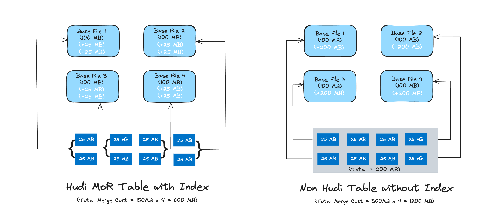

Figure: Comparison of merge cost for updates (dark blue blocks) against base files (light blue blocks)

In contrast,

- Designs without an indexing component (e.g: [Apache Hive/Apache Iceberg](https://cwiki.apache.org/confluence/display/Hive/Hive+Transactions)) end up having to merge all the base files against all incoming updates/delete records
  (10-100x more [read amplification](#table_types--comparison)).
- Designs that implement heavily write-optimized OLTP data structures like LSM trees do not require an indexing component. But they perform poorly scan heavy workloads
  against cloud storage making them unsuitable for serving analytical queries.

Hudi shines by achieving both great write performance and read performance, at the extra storage costs of an index, which can however unlock a lot more, as we explore below.

[Multi-modal indexing](https://www.onehouse.ai/blog/introducing-multi-modal-index-for-the-lakehouse-in-apache-hudi), introduced in [0.11.0 Hudi release](https://hudi.apache.org/releases/release-0.11.0/#multi-modal-index), is a re-imagination of what a general purpose indexing subsystem should look like for the lake. Multi-modal indexing is
implemented by enhancing the metadata table with the flexibility to extend to new index types as new partitions, along with an [asynchronous index](#metadata_indexing--setup-async-indexing) building

Hudi supports a multi-modal index by augmenting the metadata table with the capability to incorporate new types of indexes, complemented by an
asynchronous mechanism for [index construction](#metadata_indexing). This enhancement supports a range of indexes within
the [metadata table](#metadata--metadata-table), significantly improving the efficiency of both writing to and reading from the table.


Figure: Indexes in Hudi

[Bloom filter](https://github.com/apache/hudi/blob/46f41d186c6c84a6af2c54a907ff2736b6013e15/rfc/rfc-37/rfc-37.md) indexes as *bloom\_filter* partition in the metadata table.
This index employs range-based pruning on the minimum and maximum values of the record keys and bloom-filter-based lookups to tag incoming records. For large tables, this
involves reading the footers of all matching data files for bloom filters, which can be expensive in the case of random
updates across the entire dataset. This index stores bloom filters of all data files centrally to avoid scanning the
footers directly from all data files.

Following are configurations that control enabling and configuring bloom filters.

| Config Name | Default | Description |
| --- | --- | --- |
| hoodie.metadata.index.bloom.filter.enable | false | Enable indexing bloom filters of user data files under metadata table. When enabled, metadata table will have a partition to store the bloom filter index and will be used during the index lookups. `Config Param: ENABLE_METADATA_INDEX_BLOOM_FILTER` `Since Version: 0.11.0` |
| hoodie.bloom.index.prune.by.ranges | true | Only applies if index type is BLOOM. When true, range information from files to leverage speed up index lookups. Particularly helpful, if the key has a monotonically increasing prefix, such as timestamp. If the record key is completely random, it is better to turn this off, since range pruning will only add an extra overhead to the index lookup. `Config Param: BLOOM_INDEX_PRUNE_BY_RANGES` |
| hoodie.bloom.index.update.partition.path | true | Only applies if index type is GLOBAL\_BLOOM. When set to true, an update including the partition path of a record that already exists will result in inserting the incoming record into the new partition and deleting the original record in the old partition. When set to false, the original record will only be updated in the old partition `Config Param: BLOOM_INDEX_UPDATE_PARTITION_PATH_ENABLE` |
| hoodie.bloom.index.use.metadata | false | Only applies if index type is BLOOM.When true, the index lookup uses bloom filters and column stats from metadata table when available to speed up the process. `Config Param: BLOOM_INDEX_USE_METADATA` `Since Version: 0.11.0` |
| hoodie.metadata.index.bloom.filter.column.list | (N/A) | Comma-separated list of columns for which bloom filter index will be built. If not set, only record key will be indexed. `Config Param: BLOOM_FILTER_INDEX_FOR_COLUMNS` `Since Version: 0.11.0` |
| hoodie.metadata.index.bloom.filter.file.group.count | 4 | Metadata bloom filter index partition file group count. This controls the size of the base and log files and read parallelism in the bloom filter index partition. The recommendation is to size the file group count such that the base files are under 1GB. `Config Param: METADATA_INDEX_BLOOM_FILTER_FILE_GROUP_COUNT` `Since Version: 0.11.0` |

The record index is stored in the `record_index/` partition in the metadata table.
Contains the mapping of the record key to location. This index aids in locating records faster than
other existing indexes and can provide a speedup orders of magnitude faster in large deployments where index lookup dominates write latencies. To accommodate very high scales, it utilizes hash-based
sharding of the key space. Additionally, when it comes to reading data, the index allows for point lookups significantly speeding up index mapping retrieval process.

Hudi supports two variants of the Record Index:

- **Global Record Index**: Enforces key uniqueness across all partitions in the table. This is the default variant introduced in 0.14.0.
- **Partitioned Record Index**: Guarantees uniqueness for partition path and record key pairs. This variant speeds up lookups in very large partitioned datasets by limiting index lookups to the relevant partitions. Introduced in 1.1.0.

Following are configurations that control enabling record index building and maintenance on the writer.

| Config Name | Default | Description |
| --- | --- | --- |
| hoodie.metadata.record.index.enable | false | Create the HUDI Global Record Index within the Metadata Table (deprecated in favor of `hoodie.metadata.global.record.level.index.enable`) `Config Param: RECORD_INDEX_ENABLE_PROP` `Since Version: 0.14.0` |
| hoodie.metadata.global.record.level.index.enable | false | Enable global Record Index within the metadata table. When enabled, enforces key uniqueness across all partitions in the table. `Config Param: GLOBAL_RECORD_LEVEL_INDEX_ENABLE_PROP` `Since Version: 0.14.0` |
| hoodie.metadata.record.level.index.enable | false | Enable partitioned Record Index within the metadata table. When enabled, guarantees uniqueness for partition path and record key pairs, speeding up lookups in very large partitioned datasets. `Config Param: RECORD_LEVEL_INDEX_ENABLE_PROP` `Since Version: 1.1.0` |
| hoodie.metadata.record.index.growth.factor | 2.0 | The current number of records are multiplied by this number when estimating the number of file groups to create automatically. This helps account for growth in the number of records in the dataset. `Config Param: RECORD_INDEX_GROWTH_FACTOR_PROP` `Since Version: 0.14.0` |
| hoodie.metadata.record.index.max.filegroup.count | 10000 | Maximum number of file groups to use for Record Index. `Config Param: RECORD_INDEX_MAX_FILE_GROUP_COUNT_PROP` `Since Version: 0.14.0` |
| hoodie.metadata.record.index.max.filegroup.size | 1073741824 | Maximum size in bytes of a single file group. Large file group takes longer to compact. `Config Param: RECORD_INDEX_MAX_FILE_GROUP_SIZE_BYTES_PROP` `Since Version: 0.14.0` |
| hoodie.metadata.record.index.min.filegroup.count | 10 | Minimum number of file groups to use for Global Record Index. `Config Param: RECORD_INDEX_MIN_FILE_GROUP_COUNT_PROP` `Since Version: 0.14.0` **Note:** For global record index, use `hoodie.metadata.global.record.level.index.min.filegroup.count` instead. |
| hoodie.metadata.global.record.level.index.min.filegroup.count | 10 | Minimum number of file groups to use for Global Record Index. `Config Param: GLOBAL_RECORD_LEVEL_INDEX_MIN_FILE_GROUP_COUNT_PROP` `Since Version: 0.14.0` |
| hoodie.metadata.global.record.level.index.max.filegroup.count | 10000 | Maximum number of file groups to use for Global Record Index. `Config Param: GLOBAL_RECORD_LEVEL_INDEX_MAX_FILE_GROUP_COUNT_PROP` `Since Version: 0.14.0` |
| hoodie.metadata.record.level.index.min.filegroup.count | 1 | Minimum number of file groups to use for Partitioned Record Index. `Config Param: RECORD_LEVEL_INDEX_MIN_FILE_GROUP_COUNT_PROP` `Since Version: 1.1.0` |
| hoodie.metadata.record.level.index.max.filegroup.count | 10 | Maximum number of file groups to use for Partitioned Record Index. `Config Param: RECORD_LEVEL_INDEX_MAX_FILE_GROUP_COUNT_PROP` `Since Version: 1.1.0` |
| hoodie.record.index.update.partition.path | false | Similar to Key: 'hoodie.bloom.index.update.partition.path' , default: true , isAdvanced: true , description: Only applies if index type is GLOBAL\_BLOOM. When set to true, an update including the partition path of a record that already exists will result in inserting the incoming record into the new partition and deleting the original record in the old partition. When set to false, the original record will only be updated in the old partition since version: version is not defined deprecated after: version is not defined, but for record index. `Config Param: RECORD_INDEX_UPDATE_PARTITION_PATH_ENABLE` `Since Version: 0.14.0` |

An [expression index](https://github.com/apache/hudi/blob/3789840be3d041cbcfc6b24786740210e4e6d6ac/rfc/rfc-63/rfc-63.md) is an index on a function of a column. If a query has a predicate on a function of a column, the expression index can
be used to speed up the query. Expression index is stored in *expr\_index\_* prefixed partitions (one for each
expression index) under metadata table. Expression index can be created using SQL syntax. Please check out SQL DDL
docs [SQL DDL docs](#sql_ddl--create-expression-index) for more details.

Following are configurations that control enabling expression index building and maintenance on the writer.

| Config Name | Default | Description |
| --- | --- | --- |
| hoodie.metadata.index.expression.enable | false | Enable expression index within the metadata table. When this configuration property is enabled (`true`), the Hudi writer automatically keeps all expression indexes consistent with the data table. When disabled (`false`), all expression indexes are deleted. Note that individual expression index can only be created through a `CREATE INDEX` and deleted through a `DROP INDEX` statement in Spark SQL. `Config Param: EXPRESSION_INDEX_ENABLE_PROP` `Since Version: 1.0.0` |
| hoodie.metadata.index.expression.file.group.count | 2 | Metadata expression index partition file group count. `Config Param: EXPRESSION_INDEX_FILE_GROUP_COUNT` `Since Version: 1.0.0` |
| hoodie.expression.index.function | (N/A) | Function to be used for building the expression index. `Config Param: INDEX_FUNCTION` `Since Version: 1.0.0` |
| hoodie.expression.index.name | (N/A) | Name of the expression index. This is also used for the partition name in the metadata table. `Config Param: INDEX_NAME` `Since Version: 1.0.0` |
| hoodie.expression.index.type | COLUMN\_STATS | Type of the expression index. Default is `column_stats` if there are no functions and expressions in the command. Valid options could be BITMAP, COLUMN\_STATS, LUCENE, etc. If index\_type is not provided, and there are functions or expressions in the command then a expression index using column stats will be created. `Config Param: INDEX_TYPE` `Since Version: 1.0.0` |

Secondary indexes allow users to create indexes on columns that are not part of record key columns in Hudi tables (for
record key fields, Hudi supports [Record-level Index](https://hudi.apache.org/blog/2023/11/01/record-level-index). Secondary indexes
can be used to speed up queries with predicate on columns other than record key columns.

Following are configurations that control enabling secondary index building and maintenance on the writer.

| Config Name | Default | Description |
| --- | --- | --- |
| hoodie.metadata.index.secondary.enable | true (Optional) | Enable secondary index within the metadata table. When this configuration property is enabled (`true`), the Hudi writer automatically keeps all secondary indexes consistent with the data table. When disabled (`false`), all secondary indexes are deleted. Note that individual secondary index can only be created through a `CREATE INDEX` and deleted through a `DROP INDEX` statement in Spark SQL. `Config Param: SECONDARY_INDEX_ENABLE_PROP` `Since Version: 1.0.0` |
| hoodie.datasource.write.secondarykey.column | (N/A) | Columns that constitute the secondary key component. Actual value will be obtained by invoking .toString() on the field value. Nested fields can be specified using the dot notation eg: `a.b.c` `Config Param: SECONDARYKEY_COLUMN_NAME` |

All the indexes discussed above are available both readers/writers using integration with metadata table. There are also indexing mechanisms
implemented by the storage engine, by efficiently reading/joining/processing incoming input records against information stored in base/log
files themselves (e.g. bloom filters stored in parquet file footers) or intelligent data layout (e.g. bucket index).

Currently, Hudi supports the following index types. Default is SIMPLE on Spark engine, and INMEMORY on Flink and Java
engines. Writers can pick one of these options using `hoodie.index.type` config option.

- **SIMPLE (default for Spark & Java engines)**: This is the standard index type for the Spark engine. It executes an efficient join of incoming records with keys retrieved from the table stored on disk. It requires keys to be partition-level unique so it can function correctly.
- **RECORD\_INDEX (deprecated)**: Use the global record index from section above as the writer side index. This was introduced in 0.14.0. **Deprecated** - use `GLOBAL_RECORD_LEVEL_INDEX` for global uniqueness or `RECORD_LEVEL_INDEX` for partition-level uniqueness instead.
- **RECORD\_LEVEL\_INDEX** : Use the partitioned record index as the writer side index. This variant guarantees uniqueness for partition path and record key pairs and is optimized for large partitioned datasets. Available from 1.1.0.
- **GLOBAL\_RECORD\_LEVEL\_INDEX** : Use the global record index as the writer side index. This variant enforces key uniqueness across all partitions in the table. Available from 1.1.0.
- **BLOOM**: Uses bloom filters generated from record keys, with the option to further narrow down candidate files based on the ranges of the record keys. It requires keys to be partition-level unique so it can function correctly.
- **GLOBAL\_BLOOM**: Utilizes bloom filters created from record keys, and may also refine the selection of candidate files by using the ranges of record keys. It requires keys to be table/global-level unique so it can function correctly.
- **GLOBAL\_SIMPLE**: Performs a lean join of the incoming records against keys extracted from the table on storage. It requires keys to be table/global-level unique so it can function correctly.
- **HBASE**: Manages the index mapping through an external table in Apache HBase.
- **INMEMORY**: Uses in-memory hashmap in Spark and Java engine and Flink in-memory state in Flink for indexing. Note that this is an alias for `FLINK_STATE` when used for Flink writers.
- **FLINK\_STATE (default for Flink)**: Uses the Flink state backend to store the index data: mappings of record keys to their residing file group's file IDs.
- **BUCKET**: Utilizes bucket hashing to identify the file group that houses the records, which proves to be particularly advantageous on a large scale. The bucket index has three variants based on how buckets are configured and managed:

  - **Simple Bucket Index (default)**: Employs a fixed number of buckets across all partitions. The bucket count is immutable once set and cannot increase or decrease. Applicable to both COW and MOR tables. Set via `hoodie.index.bucket.engine=SIMPLE` and `hoodie.bucket.index.num.buckets`. Due to the uniform bucket count across all partitions, this may not be ideal for tables with varying partition sizes or data skew.
  - **Partition-Level Bucket Index**: Allows different fixed bucket counts for different partitions based on regex pattern matching. Existing simple bucket index tables can be upgraded to partition-level using the Spark `partition_bucket_index_manager` procedure, which rescales affected partitions. After upgrade, writers (Flink/Spark) automatically load partition-specific bucket configurations from table metadata. This addresses the limitation of uniform bucket counts while maintaining immutable buckets per partition. Applicable to both COW and MOR tables. Configure via `hoodie.index.bucket.engine=SIMPLE`, `hoodie.bucket.index.partition.expressions`, and `hoodie.bucket.index.partition.rule.type=regex`.
  - **Consistent Hashing Bucket Index**: Accommodates a dynamic number of buckets with automatic resizing capability via clustering. Starts with an initial bucket count and can grow or shrink within configured min/max bounds based on file sizes. This addresses data skew in high-volume partitions by allowing dynamic resizing. Flink can schedule clustering plans, but execution currently requires Spark. Exclusively compatible with MOR tables. Configure via `hoodie.index.bucket.engine=CONSISTENT_HASHING`, `hoodie.bucket.index.num.buckets` (initial count), `hoodie.bucket.index.min.num.buckets`, and `hoodie.bucket.index.max.num.buckets`.
- **Bring your own implementation:** You can extend this [public API](https://github.com/apache/hudi/blob/master/hudi-client/hudi-client-common/src/main/java/org/apache/hudi/index/HoodieIndex.java)
  and supply a subclass of `SparkHoodieIndex` (for Apache Spark writers) using `hoodie.index.class` to implement custom indexing.

Another key aspect worth understanding is the difference between global and non-global indexes. Both bloom and simple index have
global options - `hoodie.index.type=GLOBAL_BLOOM` and `hoodie.index.type=GLOBAL_SIMPLE` - respectively. Record index supports both global and partitioned variants:

- Global Record Index (`RECORD_INDEX` or `GLOBAL_RECORD_LEVEL_INDEX`): Enforces uniqueness across all partitions
- Partitioned Record Index (`RECORD_LEVEL_INDEX`): Enforces uniqueness within each partition

HBase index is by nature a global index.

- **Global index:** Global indexes enforce uniqueness of keys across all partitions of a table i.e., guarantees that exactly
  one record exists in the table for a given record key. Global indexes offer stronger guarantees, but the update/delete
  cost can still grow with size of the table `O(size of table)`, since the record could belong to any partition in storage.
  In case of non-global index, lookup involves file groups only for the matching partitions from the incoming records and
  so it is not impacted by the total size of the table. These global indexes(GLOBAL\_SIMPLE or GLOBAL\_BLOOM), might be
  acceptable for decent sized tables, but for large tables, a newly added index (0.14.0) called Record Level Index (RLI),
  can offer pretty good index lookup performance compared to other global indexes(GLOBAL\_SIMPLE or GLOBAL\_BLOOM) or
  Hbase and also avoids the operational overhead of maintaining external systems.
- **Non Global index:** On the other hand, the default index implementations enforce this constraint only within a specific partition.
  As one might imagine, non global indexes depend on the writer to provide the same consistent partition path for a given record key during update/delete,
  but can deliver much better performance since the index lookup operation becomes `O(number of records updated/deleted)` and
  scales well with write volume.

For Spark DataSource, Spark SQL, Hudi Streamer and Structured Streaming following are the key configs that control
indexing behavior. Please refer to [Advanced Configs](https://hudi.apache.org/docs/next/configurations#Common-Index-Configs-advanced-configs)
for more details. All these, support the index types mentioned [above](#indexes--additional-writer-side-indexes).

<table><thead><tr><th>Config Name</th><th>Default</th><th>Description</th></tr></thead><tbody><tr><td>hoodie.index.type</td><td>N/A <strong>(Required)</strong></td><td>org.apache.hudi.index.HoodieIndex$IndexType: Determines how input records are indexed, i.e., looked up based on the key for the location in the existing table. Default is SIMPLE on Spark engine, and INMEMORY on Flink and Java engines. Possible Values:
 <ul><li>BLOOM</li><li>GLOBAL_BLOOM</li><li>SIMPLE</li><li>GLOBAL_SIMPLE</li><li>HBASE</li><li>INMEMORY</li><li>FLINK_STATE</li><li>BUCKET</li><li>RECORD_INDEX</li><li>RECORD_LEVEL_INDEX</li><li>GLOBAL_RECORD_LEVEL_INDEX</li></ul>
<code>Config Param: INDEX_TYPE</code></td></tr><tr><td>hoodie.index.bucket.engine</td><td>SIMPLE (Optional)</td><td>org.apache.hudi.index.HoodieIndex$BucketIndexEngineType: Determines the type of bucketing or hashing to use when <code>hoodie.index.type</code> is set to <code>BUCKET</code>.    Possible Values:
 <ul><li>SIMPLE</li><li>CONSISTENT_HASHING</li></ul>
<code>Config Param: BUCKET_INDEX_ENGINE_TYPE</code>
<code>Since Version: 0.11.0</code></td></tr><tr><td>hoodie.index.class</td><td>(Optional)</td><td>Full path of user-defined index class and must be a subclass of HoodieIndex class. It will take precedence over the hoodie.index.type configuration if specified

<code>Config Param: INDEX_CLASS_NAME</code></td></tr><tr><td>hoodie.simple.index.update.partition.path</td><td>true (Optional)</td><td>Similar to Key: 'hoodie.bloom.index.update.partition.path' , Only applies if index type is GLOBAL_SIMPLE. When set to true, an update including the partition path of a record that already exists will result in inserting the incoming record into the new partition and deleting the original record in the old partition. When set to false, the original record will only be updated in the old partition, ignoring the new incoming partition if there is a mis-match between partition value for an incoming record with what's in storage.

<code>Config Param: SIMPLE_INDEX_UPDATE_PARTITION_PATH_ENABLE</code></td></tr><tr><td>hoodie.hbase.index.update.partition.path</td><td>false (Optional)</td><td>Only applies if index type is HBASE. When an already existing record is upserted to a new partition compared to what's in storage, this config when set, will delete old record in old partition and will insert it as new record in new partition.

<code>Config Param: UPDATE_PARTITION_PATH_ENABLE</code></td></tr></tbody></table>

For Flink DataStream and Flink SQL, Bucket index and Flink state index are supported.
Following are the basic configs that control the indexing behavior. Please refer [the Flink configurations](#configurations--flink-options-advanced-configs) for advanced configs.

<table><thead><tr><th>Config Name</th><th>Default</th><th>Description</th></tr></thead><tbody><tr><td>index.type</td><td>FLINK_STATE (Optional)</td><td>Index type of Flink write job, default is using state backed index. Possible values:
 <ul><li>FLINK_STATE</li><li>BUCKET</li></ul>
<code>Config Param: INDEX_TYPE</code></td></tr><tr><td>hoodie.index.bucket.engine</td><td>SIMPLE (Optional)</td><td>org.apache.hudi.index.HoodieIndex$BucketIndexEngineType: Determines the type of bucketing or hashing to use when <code>hoodie.index.type</code> is set to <code>BUCKET</code>.    Possible Values:
 <ul><li>SIMPLE</li><li>CONSISTENT_HASHING</li></ul></td></tr></tbody></table>

Since data comes in at different volumes, velocity and has different access patterns, different indexes could be used for different workload types.
Let’s walk through some typical workload types and see how to leverage the right Hudi index for such use-cases.
This is based on our experience and you should diligently decide if the same strategies are best for your workloads.

Many companies store large volumes of transactional data in NoSQL data stores. For eg, trip tables in case of ride-sharing, buying and selling of shares, orders in an e-commerce site. These tables are usually ever growing with random updates on most recent data with long tail updates going to older data, either
due to transactions settling at a later date/data corrections. In other words, most updates go into the latest partitions with few updates going to older ones.

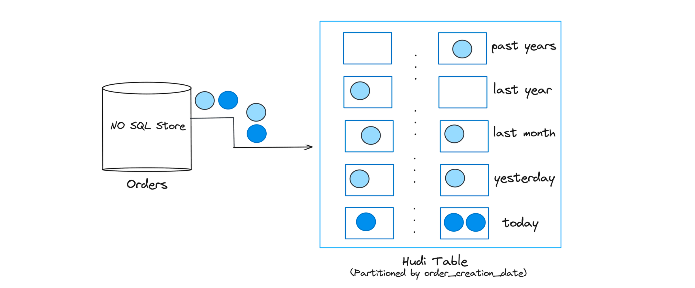

Figure: Typical update pattern for Fact tables

For such workloads, the `BLOOM` index performs well, since index look-up will prune a lot of data files based on a well-sized bloom filter.
Additionally, if the keys can be constructed such that they have a certain ordering, the number of files to be compared is further reduced by range pruning.
Hudi constructs an interval tree with all the file key ranges and efficiently filters out the files that don't match any key ranges in the updates/deleted records.

In order to efficiently compare incoming record keys against bloom filters i.e with minimal number of bloom filter reads and uniform distribution of work across
the executors, Hudi leverages caching of input records and employs a custom partitioner that can iron out data skews using statistics. At times, if the bloom filter
false positive ratio is high, it could increase the amount of data shuffled to perform the lookup. Hudi supports dynamic bloom filters
(enabled using `hoodie.bloom.index.filter.type=DYNAMIC_V0`), which adjusts its size based on the number of records stored in a given file to deliver the
configured false positive ratio.

Event Streaming is everywhere. Events coming from Apache Kafka or similar message bus are typically 10-100x the size of fact tables and often treat "time" (event's arrival time/processing
time) as a first class citizen. For eg, IoT event stream, click stream data, ad impressions etc. Inserts and updates only span the last few partitions as these are mostly append only data.
Given duplicate events can be introduced anywhere in the end-to-end pipeline, de-duplication before storing on the data lake is a common requirement.

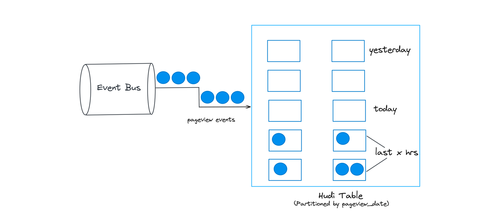

Figure showing the spread of updates for Event table.

In general, this is a very challenging problem to solve at lower cost. Although, we could even employ a key value store to perform this de-duplication with HBASE index, the index storage
costs would grow linear with number of events and thus can be prohibitively expensive. In fact, `BLOOM` index with range pruning is the optimal solution here. One can leverage the fact
that time is often a first class citizen and construct a key such as `event_ts + event_id` such that the inserted records have monotonically increasing keys. This yields great returns
by pruning large amounts of files even within the latest table partitions.

These types of tables usually contain high-dimensional data and hold reference data e.g., user profile, merchant information. These are high fidelity tables where the updates are often small but also spread
across a lot of partitions and data files ranging across the dataset from old to new. Often times, these tables are also un-partitioned, since there is also not a good way to partition these tables.


Figure showing the spread of updates for Dimensions table.

As discussed before, the `BLOOM` index may not yield benefits if a good number of files cannot be pruned out by comparing ranges/filters. In such a random write workload, updates end up touching
most files within the table and thus bloom filters will typically indicate a true positive for all files based on some incoming update. Consequently, we would end up comparing ranges/filters, only
to finally check the incoming updates against all files. The `SIMPLE` Index will be a better fit as it does not do any upfront pruning, but directly joins with the interested fields from every data file.
`HBASE` index can be employed, if the operational overhead is acceptable and would provide much better lookup times for these tables.

When using a global index, users should also consider setting `hoodie.bloom.index.update.partition.path=true` or `hoodie.simple.index.update.partition.path=true` to deal with cases where the
partition path value could change due to an update e.g., users table partitioned by home city; user relocates to a different city. These tables are also excellent candidates for the Merge-On-Read table type.

<a id="indexes--blogs"></a>

### Blogs

- [Introducing Multi-Modal Index for the Lakehouse in Apache Hudi](https://www.onehouse.ai/blog/introducing-multi-modal-index-for-the-lakehouse-in-apache-hudi)
- [Global vs Non-global index in Apache Hudi](https://medium.com/@simpsons/global-vs-non-global-index-in-apache-hudi-ac880b031cbc)

<a id="indexes--videos"></a>

### Videos

- [Global Bloom Index: Remove duplicates & guarantee uniqueness - Hudi Labs](https://youtu.be/XlRvMFJ7g9c)
- [Multi-Modal Index for the Lakehouse in Apache Hudi](https://www.onehouse.ai/blog/introducing-multi-modal-index-for-the-lakehouse-in-apache-hudi)

---

<a id="concurrency_control"></a>

<!-- source_url: https://hudi.apache.org/docs/concurrency_control/ -->

<!-- page_index: 17 -->

# Concurrency Control

Version: 1.1.1

> [!NOTE]
> If there is only one process performing writing AND async/inline table services on the table, you can avoid the overhead of a distributed lock requirement by configuring the in-process lock provider.
>
> ```properties
> hoodie.write.lock.provider=org.apache.hudi.client.transaction.lock.InProcessLockProvider
> ```

---

<a id="schema_evolution"></a>

<!-- source_url: https://hudi.apache.org/docs/schema_evolution/ -->

<!-- page_index: 18 -->

# Schema Evolution

Version: 1.1.1

> [!NOTE]
> **info**
> We recommend employing this approach as much as possible. This is a practical and efficient way to evolve schemas, proven at large-scale
> data lakes at companies like Uber, Walmart, and LinkedIn. It is also implemented at scale by vendors like Confluent for streaming data.
> Given the continuous nature of streaming data, there are no boundaries to define a schema change that can be incompatible with
> the previous schema (e.g., renaming a column).

---

<a id="hoodie_streaming_ingestion"></a>

<!-- source_url: https://hudi.apache.org/docs/hoodie_streaming_ingestion/ -->

<!-- page_index: 19 -->

# Using Spark

Version: 1.1.1

> [!IMPORTANT]
> The following classes were renamed and relocated to `org.apache.hudi.utilities.streamer` package.
>
> - `DeltastreamerMultiWriterCkptUpdateFunc` is renamed to `StreamerMultiWriterCkptUpdateFunc`
> - `DeltaSync` is renamed to `StreamSync`
> - `HoodieDeltaStreamer` is renamed to `HoodieStreamer`
> - `HoodieDeltaStreamerMetrics` is renamed to `HoodieStreamerMetrics`
> - `HoodieMultiTableDeltaStreamer` is renamed to `HoodieMultiTableStreamer`
>
> To maintain backward compatibility, the original classes are still present in the `org.apache.hudi.utilities.deltastreamer`
> package, but have been deprecated.

---

<a id="ingestion_flink"></a>

<!-- source_url: https://hudi.apache.org/docs/ingestion_flink/ -->

<!-- page_index: 20 -->

# Using Flink

Version: 1.1.1

> [!NOTE]
> If the upstream data cannot guarantee ordering, you need to explicitly specify the `ordering.fields` option.

---

<a id="ingestion_kafka_connect"></a>

<!-- source_url: https://hudi.apache.org/docs/ingestion_kafka_connect/ -->

<!-- page_index: 21 -->

# Using Kafka Connect

Version: 1.1.1

[Kafka Connect](https://kafka.apache.org/documentation/#connect) is a popularly used framework for integrating and moving streaming data between various systems.
Hudi provides a sink for Kafka Connect, that can ingest/stream records from Apache Kafka to Hudi Tables. To do so, while providing the same transactional features
the sink implements transaction co-ordination across the tasks and workers in the Kafka Connect framework.

See [readme](https://github.com/apache/hudi/tree/master/hudi-kafka-connect) for a full demo, build instructions and configurations.

At a high level, the sink treats the connect task/worker owning partition 0 of the source topic as the transaction coordinator.
The transaction coordinator implements a safe two-phase commit protocol that periodically commits data into the table. Transaction
co-ordination between the coordinator and workers reading messages from source topic partitions and writing to Hudi file groups
happens via a special kafka control topic, that all processes are listening to.

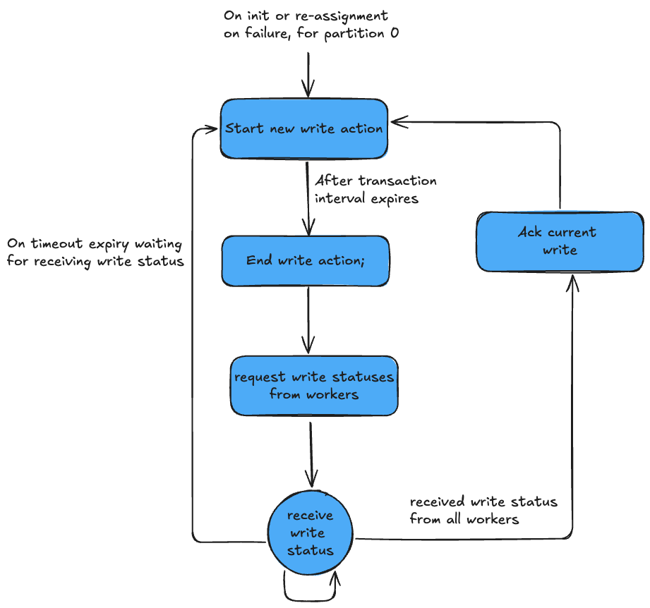

Figure: Transaction Coordinator State Machine

This distributed coordination helps the sink achieve high throughput, low-latency while still limiting the number of write actions
on the timeline to just 1 every commit interval. This helps scale table metadata even in the face large volume of writes, compared to
approaches where each worker commits a separate action independently leading to 10s-100s of commits per interval.

The Hudi Kafka Connect sink uses `Merge-On-Read` by default to reduce memory pressure of writing columnar/base files (typical scaling/operational problem with the
Kafka Connect parquet sink) and inserts/appends the kafka records directly to the log file(s). Asynchronously, compaction service can be executed to merge the log files
into base file (Parquet format). Alternatively, users have the option to reconfigure the table type to `COPY_ON_WRITE` in config-sink.json if desired.

To use the Hudi sink, use `connector.class=org.apache.hudi.connect.HudiSinkConnector` in Kafka Connect. Below lists additional configurations for the sink.

| Config Name | Default | Description |
| --- | --- | --- |
| target.base.path | **Required** | base path of the Hudi table written. |
| target.table.name | **Required** | name of the table |
| hoodie.kafka.control.topic | hudi-control-topic (optional) | topic used for transaction co-ordination |
| hoodie.kafka.commit.interval.secs | 60 (optional) | The frequency at which the Sink will commit data into the table |

See [RFC](https://cwiki.apache.org/confluence/display/HUDI/RFC-32+Kafka+Connect+Sink+for+Hudi) for more details.

- Only append-only or insert operations are supported at this time.
- Limited support for metadata table (file listings) with no support for advanced indexing during write operations.

---

<a id="sql_ddl"></a>

<!-- source_url: https://hudi.apache.org/docs/sql_ddl/ -->

<!-- page_index: 22 -->

# SQL DDL

Version: 1.1.1

This page describes support for creating and altering tables using SQL across various engines.

You can create tables using standard CREATE TABLE syntax, which supports partitioning and passing table properties.

```sql
CREATE TABLE [IF NOT EXISTS] [db_name.]table_name 
  [(col_name data_type [COMMENT col_comment], ...)] 
  [COMMENT table_comment] 
  [PARTITIONED BY (col_name, ...)] 
  [ROW FORMAT row_format] 
  [STORED AS file_format] 
  [LOCATION path] 
  [TBLPROPERTIES (property_name=property_value, ...)] 
  [AS select_statement]; 
```

> [!NOTE]
> **NOTE:**
> For users running this tutorial locally and have a Spark-Hive(HMS) integration in their environment: If you use
> `default` database or if you don't provide `[LOCATION path]` with the DDL statement, Spark will return
> `java.io.IOException: Mkdirs failed to create file:/user/hive/warehouse/hudi_table/.hoodie` error.
> To get around this, you can follow either of the two options mentioned below:
>
> 1. Create a database i.e. `CREATE DATABASE hudidb;` and use it i.e. `USE hudidb;` before running the DDL statement.
> 2. Or provide a path using `LOCATION` keyword to persist the data with the DDL statement.

Creating a non-partitioned table is as simple as creating a regular table.

```sql
-- create a Hudi table 
CREATE TABLE IF NOT EXISTS hudi_table ( 
  id INT, 
  name STRING, 
  price DOUBLE 
) USING hudi; 
```

A partitioned table can be created by adding a `partitioned by` clause. Partitioning helps to organize the data into multiple folders
based on the partition columns. It can also help speed up queries and index lookups by limiting the amount of metadata, index and data scanned.

```sql
CREATE TABLE IF NOT EXISTS hudi_table_partitioned ( 
  id BIGINT, 
  name STRING, 
  dt STRING, 
  hh STRING 
) USING hudi 
TBLPROPERTIES ( 
  type = 'cow' 
) 
PARTITIONED BY (dt); 
```

> [!NOTE]
> You can also create a table partitioned by multiple fields by supplying comma-separated field names.
> When creating a table partitioned by multiple fields, ensure that you specify the columns in the `PARTITIONED BY` clause
> in the same order as they appear in the `CREATE TABLE` schema. For example, for the above table, the partition fields
> should be specified as `PARTITIONED BY (dt, hh)`.

As discussed [here](#quick-start-guide--keys), tables track each record in the table using a record key. Hudi auto-generated a highly compressed
key for each new record in the examples so far. If you want to use an existing field as the key, you can set the `primaryKey` option.
Typically, this is also accompanied by configuring ordering fields (via `orderingFields` option) to deal with out-of-order data and potential
duplicate records with the same key in the incoming writes.

> [!NOTE]
> You can choose multiple fields as primary keys for a given table on a need basis. For eg, "primaryKey = 'id, name'", and
> this materializes a composite key of the two fields, which can be useful for exploring the table.

Here is an example of creating a table using both options. Typically, a field that denotes the time of the event or
fact, e.g., order creation time, event generation time etc., is used as the ordering field (via `orderingFields`). Hudi resolves multiple versions
of the same record by ordering based on this field when queries are run on the table.

```sql
CREATE TABLE IF NOT EXISTS hudi_table_keyed ( 
  id INT, 
  name STRING, 
  price DOUBLE, 
  ts BIGINT 
) USING hudi 
TBLPROPERTIES ( 
  type = 'cow', 
  primaryKey = 'id', 
  orderingFields = 'ts' 
); 
```

Hudi supports different [record merge modes](#record_merger) to handle merge of incoming records with existing
records. To create a table with specific record merge mode, you can set `recordMergeMode` option.

```sql
CREATE TABLE IF NOT EXISTS hudi_table_merge_mode ( 
  id INT, 
  name STRING, 
  ts LONG, 
  price DOUBLE 
) USING hudi 
TBLPROPERTIES ( 
  type = 'mor', 
  primaryKey = 'id', 
  orderingFields = 'ts', 
  recordMergeMode = 'EVENT_TIME_ORDERING' 
) 
LOCATION 'file:///tmp/hudi_table_merge_mode/'; 
```

With `EVENT_TIME_ORDERING`, the record with the larger event time (specified via `orderingFields`) overwrites the record with the
smaller event time on the same key, regardless of transaction's commit time. Users can set `CUSTOM` mode to provide their own
merge logic. With `CUSTOM` merge mode, you can provide a custom class that implements the merge logic. The interfaces
to implement is explained in detail [here](#record_merger--custom).

```sql
CREATE TABLE IF NOT EXISTS hudi_table_merge_mode_custom ( 
  id INT, 
  name STRING, 
  ts LONG, 
  price DOUBLE 
) USING hudi 
TBLPROPERTIES ( 
  type = 'mor', 
  primaryKey = 'id', 
  orderingFields = 'ts', 
  recordMergeMode = 'CUSTOM', 
  'hoodie.record.merge.strategy.id' = '<unique-uuid>' 
) 
LOCATION 'file:///tmp/hudi_table_merge_mode_custom/'; 
```

Often, Hudi tables are created from streaming writers like the [streamer tool](#hoodie_streaming_ingestion--hudi-streamer), which
may later need some SQL statements to run on them. You can create an External table using the `location` statement.

```sql
CREATE TABLE hudi_table_external 
USING hudi 
LOCATION 'file:///tmp/hudi_table/'; 
```

> [!TIP]
> You don't need to specify the schema and any properties except the partitioned columns if they exist. Hudi can automatically
> recognize the schema and configurations.

Hudi supports CTAS(Create table as select) to support initial loads into Hudi tables. To ensure this is done efficiently, even for large loads, CTAS uses **bulk insert** as the write operation

```sql
# create managed parquet table 
CREATE TABLE parquet_table 
USING parquet 
LOCATION 'file:///tmp/parquet_dataset/'; 
 
# CTAS by loading data into Hudi table 
CREATE TABLE hudi_table_ctas 
USING hudi 
TBLPROPERTIES ( 
  type = 'cow', 
  orderingFields = 'ts' 
) 
PARTITIONED BY (dt) 
AS SELECT * FROM parquet_table; 
```

You can create a non-partitioned table as well

```sql
# create managed parquet table 
CREATE TABLE parquet_table 
USING parquet 
LOCATION 'file:///tmp/parquet_dataset/'; 
 
# CTAS by loading data into Hudi table 
CREATE TABLE hudi_table_ctas 
USING hudi 
TBLPROPERTIES ( 
  type = 'cow', 
  orderingFields = 'ts' 
) 
AS SELECT * FROM parquet_table; 
```

If you prefer explicitly setting the record keys, you can do so by setting `primaryKey` config in table properties.

```sql
CREATE TABLE hudi_table_ctas 
USING hudi 
TBLPROPERTIES ( 
  type = 'cow', 
  primaryKey = 'id' 
) 
PARTITIONED BY (dt) 
AS 
SELECT 1 AS id, 'a1' AS name, 10 AS price, 1000 AS dt; 
```

You can also use CTAS to copy data across external locations

```sql
# create managed parquet table 
CREATE TABLE parquet_table 
USING parquet 
LOCATION 'file:///tmp/parquet_dataset/*.parquet'; 
 
# CTAS by loading data into hudi table 
CREATE TABLE hudi_table_ctas 
USING hudi 
LOCATION 'file:///tmp/hudi/hudi_tbl/' 
TBLPROPERTIES ( 
  type = 'cow' 
) 
AS SELECT * FROM parquet_table; 
```

Hudi supports creating and dropping different types of indexes on a table. For more information on different
type of indexes please refer [multi-modal indexing](#indexes--multi-modal-indexing). Secondary
index, expression index and record indexes can be created using SQL create index command.

```sql
-- Create Index 
CREATE INDEX [IF NOT EXISTS] index_name ON [TABLE] table_name  
[USING index_type]  
(column_name1 [OPTIONS(key1=value1, key2=value2, ...)], column_name2 [OPTIONS(key1=value1, key2=value2, ...)], ...)  
[OPTIONS (key1=value1, key2=value2, ...)] 
 
-- Record index syntax 
CREATE INDEX indexName ON tableIdentifier (primaryKey1 [, primayKey2 ...]); 
 
-- Secondary Index Syntax 
CREATE INDEX indexName ON tableIdentifier (nonPrimaryKey); 
 
-- Expression Index Syntax 
CREATE INDEX indexName ON tableIdentifier USING column_stats(col) OPTIONS(expr='expr_val', format='format_val'); 
CREATE INDEX indexName ON tableIdentifier USING bloom_filters(col) OPTIONS(expr='expr_val'); 
 
-- Drop Index 
DROP INDEX [IF EXISTS] index_name ON [TABLE] table_name 
```

- `index_name` is the name of the index to be created or dropped.
- `table_name` is the name of the table on which the index is created or dropped.
- `index_type` is the type of the index to be created. Currently, only `column_stats` and `bloom_filters` is supported.
  If the `using ..` clause is omitted, a secondary record index is created.
- `column_name` is the name of the column on which the index is created.

Both index and column on which the index is created can be qualified with some options in the form of key-value pairs.

> [!NOTE]
> Please note in order to create secondary index:
>
> 1. The table must have a primary key and merge mode should be [COMMIT\_TIME\_ORDERING](#record_merger--commit_time_ordering).
> 2. Record index must be enabled. This can be done by setting `hoodie.metadata.record.index.enable=true` and then creating `record_index`. Please note the example below.
> 3. Secondary index is not supported for [complex types](https://avro.apache.org/docs/1.11.1/specification/#complex-types).

**Examples**

```sql
-- Create a table with primary key 
CREATE TABLE hudi_indexed_table ( 
    ts BIGINT, 
    uuid STRING, 
    rider STRING, 
    driver STRING, 
    fare DOUBLE, 
    city STRING 
) USING HUDI 
options( 
    primaryKey ='uuid', 
    hoodie.write.record.merge.mode = "COMMIT_TIME_ORDERING" 
) 
PARTITIONED BY (city); 
 
-- Add some data. 
INSERT INTO hudi_indexed_table 
VALUES 
 ... 
 
-- Create bloom filter expression index on driver column 
CREATE INDEX idx_bloom_driver ON hudi_indexed_table USING bloom_filters(driver) OPTIONS(expr='identity'); 
-- It would show bloom filter expression index 
SHOW INDEXES FROM hudi_indexed_table; 
-- Query on driver column would prune the data using the idx_bloom_driver index 
SELECT uuid, rider FROM hudi_indexed_table WHERE driver = 'driver-S'; 
 
-- Create column stat expression index on ts column 
CREATE INDEX idx_column_ts ON hudi_indexed_table USING column_stats(ts) OPTIONS(expr='from_unixtime', format = 'yyyy-MM-dd'); 
-- Shows both expression indexes 
SHOW INDEXES FROM hudi_indexed_table; 
-- Query on ts column would prune the data using the idx_column_ts index 
SELECT * FROM hudi_indexed_table WHERE from_unixtime(ts, 'yyyy-MM-dd') = '2023-09-24'; 
 
-- Create secondary index on rider column 
CREATE INDEX record_index ON hudi_indexed_table (uuid); 
CREATE INDEX idx_rider ON hudi_indexed_table (rider); 
SET hoodie.metadata.record.index.enable=true; 
-- Expression index and secondary index should show up 
SHOW INDEXES FROM hudi_indexed_table; 
-- Query on rider column would leverage the secondary index idx_rider 
SELECT * FROM hudi_indexed_table WHERE rider = 'rider-E'; 
 
```

A [expression index](https://github.com/apache/hudi/blob/00ece7bce0a4a8d0019721a28049723821e01842/rfc/rfc-63/rfc-63.md) is an index on a function of a column.
It is a new addition to Hudi's [multi-modal indexing](https://hudi.apache.org/blog/2022/05/17/Introducing-Multi-Modal-Index-for-the-Lakehouse-in-Apache-Hudi)
subsystem. Expression indexes can be used to implement logical partitioning of a table, by creating `column_stats` indexes
on an expression of a column. For e.g. an expression index extracting a date from a timestamp field, can effectively implement
date based partitioning, provide same benefits to queries, even if the physical layout is different.

```sql
-- Create an expression index on the column `ts` (unix epoch) of the table `hudi_table` using the function `from_unixtime` with the format `yyyy-MM-dd` 
CREATE INDEX IF NOT EXISTS ts_datestr ON hudi_table  
  USING column_stats(ts)  
  OPTIONS(expr='from_unixtime', format='yyyy-MM-dd'); 
-- Create an expression index on the column `ts` (timestamp in yyyy-MM-dd HH:mm:ss) of the table `hudi_table` using the function `hour` 
CREATE INDEX ts_hour ON hudi_table  
  USING column_stats(ts)  
  options(expr='hour'); 
```

> [!NOTE]
> 1. Expression index can only be created for Spark engine using SQL. It is not supported yet with Spark DataSource API.
> 2. Expression index is not yet supported for [complex types](https://avro.apache.org/docs/1.11.1/specification/#complex-types).
> 3. Expression index is supported for unary and certain binary expressions. Please check [SQL DDL docs](#sql_ddl--create-expression-index) for more details.

The `expr` option is required for creating expression index, and it should be a valid Spark SQL function. Please check the syntax
for the above functions in the [Spark SQL documentation](https://spark.apache.org/docs/latest/sql-ref-functions.html) and provide the options accordingly. For example, the `format` option is required for `from_unixtime` function.

Some useful functions that are supported are listed below.

- `identity`
- `from_unixtime`
- `date_format`
- `to_date`
- `to_timestamp`
- `year`
- `month`
- `day`
- `hour`
- `lower`
- `upper`
- `substring`
- `regexp_extract`
- `regexp_replace`
- `concat`
- `length`

Note that, only functions that take a single column as input are supported currently and UDFs are not supported.

> [!NOTE]
> **Full example of creating and using expression index**
> ```sql
> CREATE TABLE hudi_table_expr_index (
>     ts STRING,
>     uuid STRING,
>     rider STRING,
>     driver STRING,
>     fare DOUBLE,
>     city STRING
> ) USING HUDI
> tblproperties (primaryKey = 'uuid')
> PARTITIONED BY (city)
> location 'file:///tmp/hudi_table_expr_index';
>
> -- Query with hour function filter but no index yet --
> spark-sql> SELECT city, fare, rider, driver FROM  hudi_table_expr_index WHERE  city NOT IN ('chennai') AND hour(ts) > 12;
> san_francisco	93.5	rider-E	driver-O
> san_francisco	33.9	rider-D	driver-L
> sao_paulo	43.4	rider-G	driver-Q
> Time taken: 0.208 seconds, Fetched 3 row(s)
>
> spark-sql> EXPLAIN COST SELECT city, fare, rider, driver FROM  hudi_table_expr_index WHERE  city NOT IN ('chennai') AND hour(ts) > 12;
> == Optimized Logical Plan ==
> Project [city#3465, fare#3464, rider#3462, driver#3463], Statistics(sizeInBytes=899.5 KiB)
> +- Filter ((isnotnull(city#3465) AND isnotnull(ts#3460)) AND (NOT (city#3465 = chennai) AND (hour(cast(ts#3460 as timestamp), Some(Asia/Kolkata)) > 12))), Statistics(sizeInBytes=2.5 MiB)
>    +- Relation default.hudi_table_expr_index[_hoodie_commit_time#3455,_hoodie_commit_seqno#3456,_hoodie_record_key#3457,_hoodie_partition_path#3458,_hoodie_file_name#3459,ts#3460,uuid#3461,rider#3462,driver#3463,fare#3464,city#3465] parquet, Statistics(sizeInBytes=2.5 MiB)
>
> == Physical Plan ==
> *(1) Project [city#3465, fare#3464, rider#3462, driver#3463]
> +- *(1) Filter (isnotnull(ts#3460) AND (hour(cast(ts#3460 as timestamp), Some(Asia/Kolkata)) > 12))
>    +- *(1) ColumnarToRow
>       +- FileScan parquet default.hudi_table_expr_index[ts#3460,rider#3462,driver#3463,fare#3464,city#3465] Batched: true, DataFilters: [isnotnull(ts#3460), (hour(cast(ts#3460 as timestamp), Some(Asia/Kolkata)) > 12)], Format: Parquet, Location: HoodieFileIndex(1 paths)[file:/tmp/hudi_table_expr_index], PartitionFilters: [isnotnull(city#3465), NOT (city#3465 = chennai)], PushedFilters: [IsNotNull(ts)], ReadSchema: struct<ts:string,rider:string,driver:string,fare:double>
>
> -- create the expression index --
> CREATE INDEX ts_hour ON hudi_table_expr_index USING column_stats(ts) options(expr='hour');
>
> -- query after creating the index --
> spark-sql> SELECT city, fare, rider, driver FROM  hudi_table_expr_index WHERE  city NOT IN ('chennai') AND hour(ts) > 12;
> san_francisco	93.5	rider-E	driver-O
> san_francisco	33.9	rider-D	driver-L
> sao_paulo	43.4	rider-G	driver-Q
> Time taken: 0.202 seconds, Fetched 3 row(s)
> spark-sql> EXPLAIN COST SELECT city, fare, rider, driver FROM  hudi_table_expr_index WHERE  city NOT IN ('chennai') AND hour(ts) > 12;
> == Optimized Logical Plan ==
> Project [city#2970, fare#2969, rider#2967, driver#2968], Statistics(sizeInBytes=449.8 KiB)
> +- Filter ((isnotnull(city#2970) AND isnotnull(ts#2965)) AND (NOT (city#2970 = chennai) AND (hour(cast(ts#2965 as timestamp), Some(Asia/Kolkata)) > 12))), Statistics(sizeInBytes=1278.3 KiB)
>    +- Relation default.hudi_table_expr_index[_hoodie_commit_time#2960,_hoodie_commit_seqno#2961,_hoodie_record_key#2962,_hoodie_partition_path#2963,_hoodie_file_name#2964,ts#2965,uuid#2966,rider#2967,driver#2968,fare#2969,city#2970] parquet, Statistics(sizeInBytes=1278.3 KiB)
>
> == Physical Plan ==
> *(1) Project [city#2970, fare#2969, rider#2967, driver#2968]
> +- *(1) Filter (isnotnull(ts#2965) AND (hour(cast(ts#2965 as timestamp), Some(Asia/Kolkata)) > 12))
>    +- *(1) ColumnarToRow
>       +- FileScan parquet default.hudi_table_expr_index[ts#2965,rider#2967,driver#2968,fare#2969,city#2970] Batched: true, DataFilters: [isnotnull(ts#2965), (hour(cast(ts#2965 as timestamp), Some(Asia/Kolkata)) > 12)], Format: Parquet, Location: HoodieFileIndex(1 paths)[file:/tmp/hudi_table_expr_index], PartitionFilters: [isnotnull(city#2970), NOT (city#2970 = chennai)], PushedFilters: [IsNotNull(ts)], ReadSchema: struct<ts:string,rider:string,driver:string,fare:double>
>
> ```

Partition stats index is similar to column stats, in the sense that it tracks - `min, max, null, count, ..` statistics on columns in the
table, useful in query planning. The key difference being, while `column_stats` tracks statistics about files, the partition\_stats index
tracks aggregated statistics at the storage partition path level, to help more efficiently skip entire folder paths during query planning
and execution.

To enable partition stats index, simply set `hoodie.metadata.index.partition.stats.enable = 'true'` in create table options.

> [!NOTE]
> 1. `column_stats` index is required to be enabled for `partition_stats` index. Both go hand in hand.
> 2. `partition_stats` index is not created automatically for all columns. Users must specify list of columns for which they want to create partition stats index.
> 3. `column_stats` and `partition_stats` index is not yet supported for [complex types](https://avro.apache.org/docs/1.11.1/specification/#complex-types).

Secondary indexes are record level indexes built on any column in the table. It supports multiple records having the same
secondary column value efficiently and is built on top of the existing record level index built on the table's record key.
Secondary indexes are hash based indexes that offer horizontally scalable write performance by splitting key space into shards
by hashing, as well as fast lookups by employing row-based file formats.

Let us now look at an example of creating a table with multiple indexes and how the query leverage the indexes for both
partition pruning and data skipping.

```sql
DROP TABLE IF EXISTS hudi_table; 
-- Let us create a table with multiple partition fields, and enable record index and partition stats index  
CREATE TABLE hudi_table ( 
    ts BIGINT, 
    id STRING, 
    rider STRING, 
    driver STRING, 
    fare DOUBLE, 
    city STRING, 
    state STRING 
) USING hudi 
 OPTIONS( 
    primaryKey ='id', 
    hoodie.metadata.record.index.enable = 'true', -- enable record index 
    hoodie.metadata.index.partition.stats.enable = 'true', -- enable partition stats index 
    hoodie.metadata.index.column.stats.enable = 'true', -- enable column stats 
    hoodie.metadata.index.column.stats.column.list = 'rider', -- create column stats index on rider column 
    hoodie.write.record.merge.mode = "COMMIT_TIME_ORDERING" -- enable commit time ordering, required for secondary index 
) 
PARTITIONED BY (city, state) 
LOCATION 'file:///tmp/hudi_test_table'; 
 
INSERT INTO hudi_table VALUES (1695159649,'trip1','rider-A','driver-K',19.10,'san_francisco','california'); 
INSERT INTO hudi_table VALUES (1695091554,'trip2','rider-C','driver-M',27.70,'sunnyvale','california'); 
INSERT INTO hudi_table VALUES (1695332066,'trip3','rider-E','driver-O',93.50,'austin','texas'); 
INSERT INTO hudi_table VALUES (1695516137,'trip4','rider-F','driver-P',34.15,'houston','texas'); 
     
-- simple partition predicate -- 
select * from hudi_table where city = 'sunnyvale'; 
20240710215107477	20240710215107477_0_0	trip2	city=sunnyvale/state=california	1dcb14a9-bc4a-4eac-aab5-015f2254b7ec-0_0-40-75_20240710215107477.parquet	1695091554	trip2	rider-C	driver-M	27.7	sunnyvale	california 
Time taken: 0.58 seconds, Fetched 1 row(s) 
 
-- simple partition predicate on other partition field -- 
select * from hudi_table where state = 'texas'; 
20240710215119846	20240710215119846_0_0	trip4	city=houston/state=texas	08c6ed2c-a87b-4798-8f70-6d8b16cb1932-0_0-74-133_20240710215119846.parquet	1695516137	trip4	rider-F	driver-P	34.15	houston	texas 
20240710215110584	20240710215110584_0_0	trip3	city=austin/state=texas	0ab2243c-cc08-4da3-8302-4ce0b4c47a08-0_0-57-104_20240710215110584.parquet	1695332066	trip3	rider-E	driver-O	93.5	austin	texas 
Time taken: 0.124 seconds, Fetched 2 row(s) 
 
-- predicate on a column for which partition stats are present -- 
select id, rider, city, state from hudi_table where rider > 'rider-D'; 
trip4	rider-F	houston	texas 
trip3	rider-E	austin	texas 
Time taken: 0.703 seconds, Fetched 2 row(s) 
       
-- record key predicate -- 
SELECT id, rider, driver FROM hudi_table WHERE id = 'trip1'; 
trip1	rider-A	driver-K 
Time taken: 0.368 seconds, Fetched 1 row(s) 
       
-- create secondary index on driver -- 
CREATE INDEX driver_idx ON hudi_table (driver); 
 
-- secondary key predicate -- 
SELECT id, driver, city, state FROM hudi_table WHERE driver IN ('driver-K', 'driver-M'); 
trip1	driver-K	san_francisco	california 
trip2	driver-M	sunnyvale	california 
Time taken: 0.83 seconds, Fetched 2 row(s) 
```

Bloom filter indexes store a bloom filter per file, on the column or column expression being index. It can be very
effective in skipping files that don't contain a high cardinality column value e.g. uuids.

```sql
-- Create a bloom filter index on the column derived from expression `lower(rider)` of the table `hudi_table` 
CREATE INDEX idx_bloom_rider ON hudi_indexed_table USING bloom_filters(rider) OPTIONS(expr='lower'); 
```

There are different ways you can pass the configs for a given hudi table.

You can use the **set** command to set any of Hudi's write configs. This will apply to operations across the whole spark session.

```sql
set hoodie.insert.shuffle.parallelism = 100; 
set hoodie.upsert.shuffle.parallelism = 100; 
set hoodie.delete.shuffle.parallelism = 100; 
```

You can also configure table options when creating a table. This will be applied only for the table and override any SET command values.

```sql
CREATE TABLE IF NOT EXISTS tableName ( 
  colName1 colType1, 
  colName2 colType2, 
  ... 
) USING hudi 
TBLPROPERTIES ( 
  primaryKey = '${colName1}', 
  type = 'cow', 
  ${hoodie.config.key1} = '${hoodie.config.value1}', 
  ${hoodie.config.key2} = '${hoodie.config.value2}', 
  .... 
); 
 
e.g. 
CREATE TABLE IF NOT EXISTS hudi_table ( 
  id BIGINT, 
  name STRING, 
  price DOUBLE 
) USING hudi 
TBLPROPERTIES ( 
  primaryKey = 'id', 
  type = 'cow', 
  hoodie.cleaner.fileversions.retained = '20', 
  hoodie.keep.max.commits = '20' 
); 
```

Users can set table properties while creating a table. The important table properties are discussed below.

| Parameter Name | Default | Description |
| --- | --- | --- |
| type | cow | The table type to create. `type = 'cow'` creates a COPY-ON-WRITE table, while `type = 'mor'` creates a MERGE-ON-READ table. Same as `hoodie.datasource.write.table.type`. More details can be found [here](#table_types) |
| primaryKey | uuid | The primary key field names of the table separated by commas. Same as `hoodie.datasource.write.recordkey.field`. If this config is ignored, hudi will auto-generate primary keys. If explicitly set, primary key generation will honor user configuration. |
| orderingFields |  | The ordering field(s) of the table. It is used for resolving the final version of the record among multiple versions. Generally, `event time` or another similar column will be used for ordering purposes. Hudi will be able to handle out-of-order data using the ordering field value. |

> [!NOTE]
> `primaryKey`, `orderingFields`, and `type` and other properties are case-sensitive.

Hudi requires a lock provider to support concurrent writers or asynchronous table services when using OCC
and [NBCC](#concurrency_control--non-blocking-concurrency-control) (Non-Blocking Concurrency Control)
concurrency mode. For NBCC mode, locking is only used to write the commit metadata file in the timeline. Writes are
serialized by completion time. Users can pass these table properties into *TBLPROPERTIES* as well. Below is an example
for a Zookeeper based configuration.

```sql
-- Properties to use Lock configurations to support Multi Writers 
TBLPROPERTIES( 
  hoodie.write.lock.zookeeper.url = "zookeeper", 
  hoodie.write.lock.zookeeper.port = "2181", 
  hoodie.write.lock.zookeeper.lock_key = "tableName", 
  hoodie.write.lock.provider = "org.apache.hudi.client.transaction.lock.ZookeeperBasedLockProvider", 
  hoodie.write.concurrency.mode = "optimistic_concurrency_control", 
  hoodie.write.lock.zookeeper.base_path = "/tableName" 
) 
```

Hudi provides the ability to leverage rich metadata and index about the table, speed up DMLs and queries.
For e.g: collection of column statistics can be enabled to perform quick data skipping or a record-level index can be used to perform fast updates or point lookups
using the following table properties.

For more, see [Metadata Configurations](#configurations--metadata-configs)

```sql
TBLPROPERTIES( 
  'hoodie.metadata.index.column.stats.enable' = 'true' 
  'hoodie.metadata.record.index.enable' = 'true'  
) 
```

**Syntax**

```sql
-- Alter table name 
ALTER TABLE oldTableName RENAME TO newTableName; 
 
-- Alter table add columns 
ALTER TABLE tableIdentifier ADD COLUMNS(colAndType [, colAndType]); 
```

**Examples**

```sql
--rename to: 
ALTER TABLE hudi_table RENAME TO hudi_table_renamed; 
 
--add column: 
ALTER TABLE hudi_table ADD COLUMNS(remark STRING); 
```

**Syntax**

```sql
-- alter table ... set|unset 
ALTER TABLE tableIdentifier SET|UNSET TBLPROPERTIES (table_property = 'property_value'); 
```

**Examples**

```sql
ALTER TABLE hudi_table SET TBLPROPERTIES (hoodie.keep.max.commits = '10'); 
ALTER TABLE hudi_table SET TBLPROPERTIES ("note" = "don't drop this table"); 
 
ALTER TABLE hudi_table UNSET TBLPROPERTIES IF EXISTS (hoodie.keep.max.commits); 
ALTER TABLE hudi_table UNSET TBLPROPERTIES IF EXISTS ('note'); 
```

> [!NOTE]
> Currently, trying to change the column type may throw an error `ALTER TABLE CHANGE COLUMN is not supported for changing column colName with oldColType to colName with newColType.`, due to an [open SPARK issue](https://issues.apache.org/jira/browse/SPARK-21823)

You can also alter the write config for a table by the **ALTER TABLE SET SERDEPROPERTIES**

**Syntax**

```sql
-- alter table ... set|unset 
ALTER TABLE tableName SET SERDEPROPERTIES ('property' = 'property_value'); 
```

**Example**

```sql
 ALTER TABLE hudi_table SET SERDEPROPERTIES ('key1' = 'value1'); 
```

**Syntax**

```sql
-- Show partitions 
SHOW PARTITIONS tableIdentifier; 
 
-- Drop partition 
ALTER TABLE tableIdentifier DROP PARTITION ( partition_col_name = partition_col_val [ , ... ] ); 
```

**Examples**

```sql
--Show partition: 
SHOW PARTITIONS hudi_table; 
 
--Drop partition： 
ALTER TABLE hudi_table DROP PARTITION (dt='2021-12-09', hh='10'); 
```

**Syntax**

```sql
-- Show Indexes 
SHOW INDEXES FROM tableIdentifier; 
 
-- Drop partition 
DROP INDEX indexIdentifier ON tableIdentifier; 
```

**Examples**

```sql
-- Show indexes 
SHOW INDEXES FROM hudi_indexed_table; 
 
-- Drop Index 
DROP INDEX record_index ON hudi_indexed_table; 
```

**Syntax**

```sql
SHOW CREATE TABLE tableIdentifier; 
```

**Examples**

```sql
SHOW CREATE TABLE hudi_table; 
```

Hudi currently has the following limitations when using Spark SQL, to create/alter tables.

- `ALTER TABLE ... RENAME TO ...` is not supported when using AWS Glue Data Catalog as hive metastore as Glue itself does
  not support table renames.
- A new Hudi table created by Spark SQL will by default set `hoodie.datasource.write.hive_style_partitioning=true`, for ease
  of use. This can be overridden using table properties.

The catalog helps to manage the SQL tables, the table can be shared among sessions if the catalog persists the table definitions.
For `hms` mode, the catalog also supplements the hive syncing options.

**Example**

```sql
CREATE CATALOG hoodie_catalog 
  WITH ( 
    'type'='hudi', 
    'catalog.path' = '${catalog default root path}', 
    'hive.conf.dir' = '${directory where hive-site.xml is located}', 
    'mode'='hms' -- supports 'dfs' mode that uses the DFS backend for table DDLs persistence 
  ); 
```

| Option Name | Required | Default | Remarks |
| --- | --- | --- | --- |
| `catalog.path` | true | -- | Default path for the catalog's table storage, the path is used to infer the table path automatically, the default table path: `${catalog.path}/${db_name}/${table_name}` |
| `default-database` | false | default | default database name |
| `hive.conf.dir` | false | -- | The directory where hive-site.xml is located, only valid in `hms` mode |
| `mode` | false | dfs | Supports `hms` mode that uses HMS to persist the table options |
| `table.external` | false | false | Whether to create the external table, only valid in `hms` mode |

You can create tables using standard FLINK SQL CREATE TABLE syntax, which supports partitioning and passing Flink options using WITH.

```sql
CREATE TABLE [IF NOT EXISTS] [catalog_name.][db_name.]table_name ({ <physical_column_definition> [ <table_constraint> ][ , ...n]) [COMMENT table_comment] [PARTITIONED BY (partition_column_name1, partition_column_name2, ...)] WITH (key1=val1, key2=val2, ...)
```

Creating a non-partitioned table is as simple as creating a regular table.

```sql
-- create a Hudi table 
CREATE TABLE hudi_table( 
  id BIGINT, 
  name STRING, 
  price DOUBLE 
) 
WITH ( 
'connector' = 'hudi', 
'path' = 'file:///tmp/hudi_table', 
'table.type' = 'MERGE_ON_READ' 
); 
```

The following is an example of creating a Flink partitioned table.

```sql
CREATE TABLE hudi_table( 
  id BIGINT, 
  name STRING, 
  dt STRING, 
  hh STRING 
) 
PARTITIONED BY (`dt`) 
WITH ( 
'connector' = 'hudi', 
'path' = 'file:///tmp/hudi_table', 
'table.type' = 'MERGE_ON_READ' 
); 
```

The following is an example of creating a Flink table with record key and ordering field similarly to spark.

```sql
CREATE TABLE hudi_table( 
  id BIGINT PRIMARY KEY NOT ENFORCED, 
  name STRING, 
  price DOUBLE, 
  ts BIGINT 
) 
PARTITIONED BY (`dt`) 
WITH ( 
'connector' = 'hudi', 
'path' = 'file:///tmp/hudi_table', 
'table.type' = 'MERGE_ON_READ', 
'ordering.fields' = 'ts' 
); 
```

The following is an example of creating a Flink table in [Non-Blocking Concurrency Control mode](#concurrency_control--non-blocking-concurrency-control).

```sql
-- This is a datagen source that can generate records continuously 
CREATE TABLE sourceT ( 
  uuid VARCHAR(20), 
  name VARCHAR(10), 
  age INT, 
  ts TIMESTAMP(3), 
  `partition` AS 'par1' 
) WITH ( 
  'connector' = 'datagen', 
  'rows-per-second' = '200' 
); 
 
-- pipeline1: by default, enable the compaction and cleaning services 
CREATE TABLE t1 ( 
  uuid VARCHAR(20), 
  name VARCHAR(10), 
  age INT, 
  ts TIMESTAMP(3), 
  `partition` VARCHAR(20) 
) WITH ( 
  'connector' = 'hudi', 
  'path' = '/tmp/hudi-demo/t1', 
  'table.type' = 'MERGE_ON_READ', 
  'index.type' = 'BUCKET', 
  'hoodie.write.concurrency.mode' = 'NON_BLOCKING_CONCURRENCY_CONTROL', 
  'write.tasks' = '2' 
); 
 
-- pipeline2: disable the compaction and cleaning services manually 
CREATE TABLE t1_2 ( 
  uuid VARCHAR(20), 
  name VARCHAR(10), 
  age INT, 
  ts TIMESTAMP(3), 
  `partition` VARCHAR(20) 
) WITH ( 
  'connector' = 'hudi', 
  'path' = '/tmp/hudi-demo/t1', 
  'table.type' = 'MERGE_ON_READ', 
  'index.type' = 'BUCKET', 
  'hoodie.write.concurrency.mode' = 'NON_BLOCKING_CONCURRENCY_CONTROL', 
  'write.tasks' = '2', 
  'compaction.schedule.enabled' = 'false', 
  'compaction.async.enabled' = 'false', 
  'clean.async.enabled' = 'false' 
); 
 
-- Submit the pipelines 
INSERT INTO t1 
SELECT * FROM sourceT; 
 
INSERT INTO t1_2 
SELECT * FROM sourceT; 
 
SELECT * FROM t1 LIMIT 20; 
```

```sql
ALTER TABLE tableA RENAME TO tableB; 
```

You can configure hoodie configs in table options when creating a table. You can refer Flink specific hoodie configs [here](#configurations--flink_sql)
These configs will be applied to all the operations on that table.

```sql
CREATE TABLE IF NOT EXISTS tableName (colName1 colType1 PRIMARY KEY NOT ENFORCED,colName2 colType2,...) WITH ('connector' = 'hudi','path' = '${path}',${hoodie.config.key1} = '${hoodie.config.value1}',${hoodie.config.key2} = '${hoodie.config.value2}',....);
e.g.CREATE TABLE hudi_table(id BIGINT PRIMARY KEY NOT ENFORCED,name STRING,price DOUBLE,ts BIGINT) PARTITIONED BY (`dt`) WITH ('connector' = 'hudi','path' = 'file:///tmp/hudi_table','table.type' = 'MERGE_ON_READ','ordering.fields' = 'ts','hoodie.cleaner.fileversions.retained' = '20','hoodie.keep.max.commits' = '20','hoodie.datasource.write.hive_style_partitioning' = 'true' );
```

| Spark | Hudi | Notes |
| --- | --- | --- |
| boolean | boolean |  |
| byte | int |  |
| short | int |  |
| integer | int |  |
| long | long |  |
| date | date |  |
| timestamp | timestamp |  |
| float | float |  |
| double | double |  |
| string | string |  |
| decimal | decimal |  |
| binary | bytes |  |
| array | array |  |
| map | map |  |
| struct | struct |  |
| char |  | not supported |
| varchar |  | not supported |
| numeric |  | not supported |
| null |  | not supported |
| object |  | not supported |

---

<a id="sql_dml"></a>

<!-- source_url: https://hudi.apache.org/docs/sql_dml/ -->

<!-- page_index: 23 -->

# SQL DML

Version: 1.1.1

> [!NOTE]
> **info**
> `INSERT INTO` statement does not support evolving table schema. Please use DDL (e.g., `ALTER TABLE`) or Datasource write (`df.write.format("hudi")....save(basePath)`) to evolve table schema.

---

<a id="writing_data"></a>

<!-- source_url: https://hudi.apache.org/docs/writing_data/ -->

<!-- page_index: 24 -->

# Batch Writes

Version: 1.1.1

> [!NOTE]
> **info**
> `mode(Overwrite)` overwrites and recreates the table if it already exists.
> You can check the data generated under `/tmp/hudi_trips_cow/<region>/<country>/<city>/`. We provided a record key
> (`uuid` in [schema](https://github.com/apache/hudi/blob/6f9b02decb5bb2b83709b1b6ec04a97e4d102c11/hudi-spark-datasource/hudi-spark/src/main/java/org/apache/hudi/QuickstartUtils.java#L60)), partition field (`region/country/city`) and combine logic (`ts` in
> [schema](https://github.com/apache/hudi/blob/6f9b02decb5bb2b83709b1b6ec04a97e4d102c11/hudi-spark-datasource/hudi-spark/src/main/java/org/apache/hudi/QuickstartUtils.java#L60)) to ensure trip records are unique within each partition. For more info, refer to
> [Modeling data stored in Hudi](https://hudi.apache.org/faq/general/#how-do-i-model-the-data-stored-in-hudi)
> and for info on ways to ingest data into Hudi, refer to [Writing Hudi Tables](#hoodie_streaming_ingestion).
> Here we are using the default write operation : `upsert`. If you have a workload without updates, you can also issue
> `insert` or `bulk_insert` operations which could be faster. To know more, refer to [Write operations](#write_operations)

---

<a id="writing_tables_streaming_writes"></a>

<!-- source_url: https://hudi.apache.org/docs/writing_tables_streaming_writes/ -->

<!-- page_index: 25 -->

# Streaming Writes

Version: 1.1.1

You can write Hudi tables using spark's structured streaming.

<div class="theme-tabs-container tabs-container tabList__CuJ"><ul><li>Scala</li><li>Python</li></ul><div><div><div><div><pre><code><span><span>// spark-shell</span> </span><span><span>// prepare to stream write to new table</span> </span><span><span>import org.apache.spark.sql.streaming.Trigger</span> </span><span><span></span> </span><span><span>val streamingTableName = "hudi_trips_cow_streaming"</span> </span><span><span>val baseStreamingPath = "file:///tmp/hudi_trips_cow_streaming"</span> </span><span><span>val checkpointLocation = "file:///tmp/checkpoints/hudi_trips_cow_streaming"</span> </span><span><span></span> </span><span><span>// create streaming df</span> </span><span><span>val df = spark.readStream.</span> </span><span><span>        format("hudi").</span> </span><span><span>        load(basePath)</span> </span><span><span></span> </span><span><span>// write stream to new hudi table</span> </span><span><span>df.writeStream.format("hudi").</span> </span><span><span>  options(getQuickstartWriteConfigs).</span> </span><span><span>  option("hoodie.table.ordering.fields", "ts").</span> </span><span><span>  option("hoodie.datasource.write.recordkey.field", "uuid").</span> </span><span><span>  option("hoodie.datasource.write.partitionpath.field", "partitionpath").</span> </span><span><span>  option("hoodie.table.name", streamingTableName).</span> </span><span><span>  outputMode("append").</span> </span><span><span>  option("path", baseStreamingPath).</span> </span><span><span>  option("checkpointLocation", checkpointLocation).</span> </span><span><span>  trigger(Trigger.Once()).</span> </span><span><span>  start()</span> </span><span><span></span> </span></code></pre></div></div></div><div><div><div><pre><code><span><span># pyspark</span><span></span> </span><span><span></span><span># prepare to stream write to new table</span><span></span> </span><span><span>streamingTableName </span><span>=</span><span> </span><span>"hudi_trips_cow_streaming"</span><span></span> </span><span><span>baseStreamingPath </span><span>=</span><span> </span><span>"file:///tmp/hudi_trips_cow_streaming"</span><span></span> </span><span><span>checkpointLocation </span><span>=</span><span> </span><span>"file:///tmp/checkpoints/hudi_trips_cow_streaming"</span><span></span> </span><span><span></span> </span><span><span>hudi_streaming_options </span><span>=</span><span> </span><span>{</span><span></span> </span><span><span>    </span><span>'hoodie.table.name'</span><span>:</span><span> streamingTableName</span><span>,</span><span></span> </span><span><span>    </span><span>'hoodie.datasource.write.recordkey.field'</span><span>:</span><span> </span><span>'uuid'</span><span>,</span><span></span> </span><span><span>    </span><span>'hoodie.datasource.write.partitionpath.field'</span><span>:</span><span> </span><span>'partitionpath'</span><span>,</span><span></span> </span><span><span>    </span><span>'hoodie.datasource.write.table.name'</span><span>:</span><span> streamingTableName</span><span>,</span><span></span> </span><span><span>    </span><span>'hoodie.datasource.write.operation'</span><span>:</span><span> </span><span>'upsert'</span><span>,</span><span></span> </span><span><span>    </span><span>'hoodie.table.ordering.fields'</span><span>:</span><span> </span><span>'ts'</span><span>,</span><span></span> </span><span><span>    </span><span>'hoodie.upsert.shuffle.parallelism'</span><span>:</span><span> </span><span>2</span><span>,</span><span></span> </span><span><span>    </span><span>'hoodie.insert.shuffle.parallelism'</span><span>:</span><span> </span><span>2</span><span></span> </span><span><span></span><span>}</span><span></span> </span><span><span></span> </span><span><span></span><span># create streaming df</span><span></span> </span><span><span>df </span><span>=</span><span> spark</span><span>.</span><span>readStream </span> </span><span><span>    </span><span>.</span><span>format</span><span>(</span><span>"hudi"</span><span>)</span><span> </span> </span><span><span>    </span><span>.</span><span>load</span><span>(</span><span>basePath</span><span>)</span><span></span> </span><span><span></span> </span><span><span></span><span># write stream to new hudi table</span><span></span> </span><span><span>df</span><span>.</span><span>writeStream</span><span>.</span><span>format</span><span>(</span><span>"hudi"</span><span>)</span><span> </span> </span><span><span>    </span><span>.</span><span>options</span><span>(</span><span>**</span><span>hudi_streaming_options</span><span>)</span><span> </span> </span><span><span>    </span><span>.</span><span>outputMode</span><span>(</span><span>"append"</span><span>)</span><span> </span> </span><span><span>    </span><span>.</span><span>option</span><span>(</span><span>"path"</span><span>,</span><span> baseStreamingPath</span><span>)</span><span> </span> </span><span><span>    </span><span>.</span><span>option</span><span>(</span><span>"checkpointLocation"</span><span>,</span><span> checkpointLocation</span><span>)</span><span> </span> </span><span><span>    </span><span>.</span><span>trigger</span><span>(</span><span>once</span><span>=</span><span>True</span><span>)</span><span> </span> </span><span><span>    </span><span>.</span><span>start</span><span>(</span><span>)</span><span></span> </span><span><span></span> </span></code></pre></div></div></div></div></div>

<a id="writing_tables_streaming_writes--blogs"></a>

### Blogs

- [An Introduction to the Hudi and Flink Integration](https://www.onehouse.ai/blog/intro-to-hudi-and-flink)
- [Bulk Insert Sort Modes with Apache Hudi](https://medium.com/@simpsons/bulk-insert-sort-modes-with-apache-hudi-c781e77841bc)

---

<a id="sql_queries"></a>

<!-- source_url: https://hudi.apache.org/docs/sql_queries/ -->

<!-- page_index: 26 -->

# SQL Queries

Version: 1.1.1

Hudi stores and organizes data on storage while providing different ways of [querying](https://hudi.apache.org/docs/concepts#query-types), across a wide range of query engines.
This page will show how to issue different queries and discuss any specific instructions for each query engine.

The Spark [quickstart](#quick-start-guide) provides a good overview of how to use Spark SQL to query Hudi tables. This section will go into more advanced configurations and functionalities.

Snapshot queries are the most common query type for Hudi tables. Spark SQL supports snapshot queries on both COPY\_ON\_WRITE and MERGE\_ON\_READ tables.
Using session properties, you can specify options around indexing to optimize query performance, as shown below.

```sql
-- You can turn on relevant options for indexing.  
 
-- Turn on use of column stat index, to perform range queries. 
SET hoodie.metadata.column.stats.enable=true; 
SELECT * FROM hudi_table 
WHERE price > 1.0 and price < 10.0 
 
-- Turn on use of record level index, to perform point queries. 
SET hoodie.metadata.record.index.enable=true; 
SELECT * FROM hudi_table  
WHERE uuid = 'c8abbe79-8d89-47ea-b4ce-4d224bae5bfa' 
```

> [!NOTE]
> **Integration with Spark**
> Users are encouraged to migrate to Hudi versions > 0.12.x, for the best spark experience and discouraged from using any older approaches
> using path filters. We expect that native integration with Spark's optimized table readers along with Hudi's automatic table
> management will yield great performance benefits in those versions.

In this section we would go over the various indexes and how they help in data skipping in Hudi. We will first create
a hudi table without any index.

```sql
-- Create a table with primary key 
CREATE TABLE hudi_indexed_table ( 
    ts BIGINT, 
    uuid STRING, 
    rider STRING, 
    driver STRING, 
    fare DOUBLE, 
    city STRING 
) USING HUDI 
options( 
    primaryKey ='uuid', 
    hoodie.write.record.merge.mode = "COMMIT_TIME_ORDERING" 
) 
PARTITIONED BY (city); 
 
INSERT INTO hudi_indexed_table 
VALUES 
(1695159649,'334e26e9-8355-45cc-97c6-c31daf0df330','rider-A','driver-K',19.10,'san_francisco'), 
(1695091554,'e96c4396-3fad-413a-a942-4cb36106d721','rider-C','driver-M',27.70 ,'san_francisco'), 
(1695046462,'9909a8b1-2d15-4d3d-8ec9-efc48c536a00','rider-D','driver-L',33.90 ,'san_francisco'), 
(1695332066,'1dced545-862b-4ceb-8b43-d2a568f6616b','rider-E','driver-O',93.50,'san_francisco'), 
(1695516137,'e3cf430c-889d-4015-bc98-59bdce1e530c','rider-F','driver-P',34.15,'sao_paulo'    ), 
(1695376420,'7a84095f-737f-40bc-b62f-6b69664712d2','rider-G','driver-Q',43.40 ,'sao_paulo'    ), 
(1695173887,'3eeb61f7-c2b0-4636-99bd-5d7a5a1d2c04','rider-I','driver-S',41.06 ,'chennai'      ), 
(1695115999,'c8abbe79-8d89-47ea-b4ce-4d224bae5bfa','rider-J','driver-T',17.85,'chennai'); 
UPDATE hudi_indexed_table SET rider = 'rider-B', driver = 'driver-N', ts = '1697516137' WHERE rider = 'rider-A'; 
```

With the query run below, we will see no data skipping or pruning since there is no index created yet in the table as can
be seen in the image below. All the files are scanned in the table to fetch the data. Let's create a secondary index on the rider column.

```sql
SHOW INDEXES FROM hudi_indexed_table; 
SELECT * FROM hudi_indexed_table WHERE rider = 'rider-B'; 
```

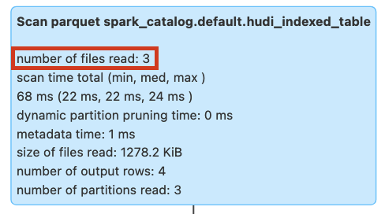

Figure: Query pruning without secondary index

We will run the query again after creating secondary index on rider column. The query would now
show the files scanned as 1 compared to 3 files scanned without index.

> [!NOTE]
> Please note in order to create secondary index:
>
> 1. The table must have a primary key and merge mode should be [COMMIT\_TIME\_ORDERING](#record_merger--commit_time_ordering).
> 2. Record index must be enabled. This can be done by setting `hoodie.metadata.record.index.enable=true` and then creating `record_index`. Please note the example below.

```sql
-- We will first create a record index since secondary index is dependent upon it 
CREATE INDEX record_index ON hudi_indexed_table (uuid); 
-- We create a secondary index on rider column 
CREATE INDEX idx_rider ON hudi_indexed_table (rider); 
-- We run the same query again 
SELECT * FROM hudi_indexed_table WHERE rider = 'rider-B'; 
DROP INDEX record_index on hudi_indexed_table; 
DROP INDEX secondary_index_idx_rider on hudi_indexed_table; 
```

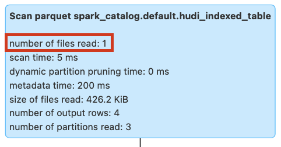

Figure: Query pruning with secondary index

With the query run below, we will see no data skipping or pruning since there is no index created yet on the `driver` column.
All the files are scanned in the table to fetch the data.

```sql
SHOW INDEXES FROM hudi_indexed_table; 
SELECT * FROM hudi_indexed_table WHERE driver = 'driver-N'; 
```

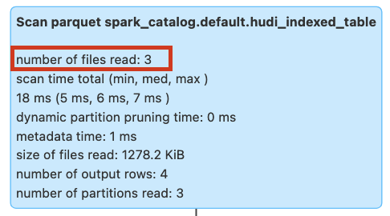

Figure: Query pruning without bloom filter expression index

We will run the query again after creating bloom filter expression index on rider column. The query would now
show the files scanned as 1 compared to 3 files scanned without index.

```sql
-- We create a bloom filter expression index on driver column 
CREATE INDEX idx_bloom_driver ON hudi_indexed_table USING bloom_filters(driver) OPTIONS(expr='identity'); 
-- We run the same query again 
SELECT * FROM hudi_indexed_table WHERE driver = 'driver-N'; 
DROP INDEX expr_index_idx_bloom_driver on hudi_indexed_table; 
```

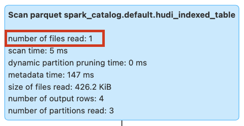

Figure: Query pruning with bloom filter expression index

With the query run below, we will see no data skipping or pruning since there is no index created yet in the table as can
be seen in the image below. All the files are scanned in the table to fetch the data.

```sql
SHOW INDEXES FROM hudi_indexed_table; 
SELECT uuid, rider FROM hudi_indexed_table WHERE from_unixtime(ts, 'yyyy-MM-dd') = '2023-10-17'; 
```

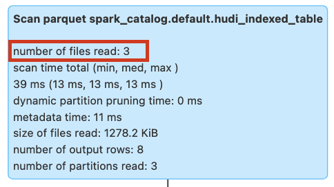

Figure: Query pruning without column stat expression index

We will run the query again after creating column stat expression index on ts column. The query would now
show the files scanned as 1 compared to 3 files scanned without index.

```sql
-- We create a column stat expression index on ts column 
CREATE INDEX idx_column_ts ON hudi_indexed_table USING column_stats(ts) OPTIONS(expr='from_unixtime', format = 'yyyy-MM-dd'); 
-- We run the same query again 
SELECT uuid, rider FROM hudi_indexed_table WHERE from_unixtime(ts, 'yyyy-MM-dd') = '2023-10-17'; 
DROP INDEX expr_index_idx_column_ts on hudi_indexed_table; 
```

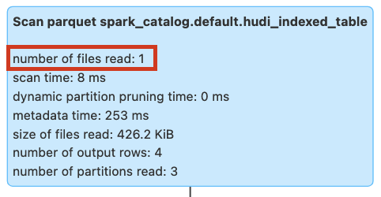

Figure: Query pruning with column stat expression index

With the query run below, we will see no data skipping or pruning since there is no partition stats index created yet in the table as can
be seen in the image below. All the partitions are scanned in the table to fetch the data.

```sql
SHOW INDEXES FROM hudi_indexed_table; 
SELECT * FROM hudi_indexed_table WHERE rider >= 'rider-H'; 
```

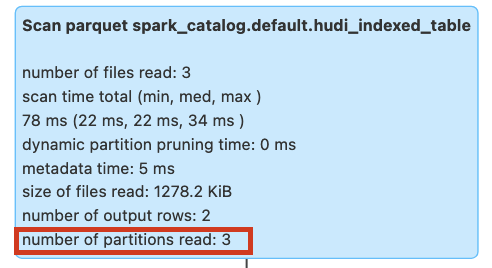

Figure: Query pruning without partition stats index

We will run the query again after creating partition stats index. The query would now show the partitions scanned as 1
compared to 3 partitions scanned without index.

```sql
-- We will need to enable column stats as well since partition stats index leverages it 
SET hoodie.metadata.index.partition.stats.enable=true; 
SET hoodie.metadata.index.column.stats.enable=true; 
INSERT INTO hudi_indexed_table 
VALUES 
(1695159649,'854g46e0-8355-45cc-97c6-c31daf0df330','rider-H','driver-T',19.10,'chennai'); 
-- Run the query again on the table with partition stats index 
SELECT * FROM hudi_indexed_table WHERE rider >= 'rider-H'; 
DROP INDEX column_stats on hudi_indexed_table; 
DROP INDEX partition_stats on hudi_indexed_table; 
```

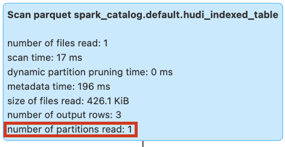

Figure: Query pruning with partition stats index

Hudi supports different [record merge modes](#record_merger) for merging the records from the same key. Event
time ordering is one of the merge modes where the records are merged based on the event time. Let's create a table with
event time ordering merge mode.

```sql
CREATE TABLE IF NOT EXISTS hudi_table_merge_mode ( 
  id INT, 
  name STRING, 
  ts LONG, 
  price DOUBLE 
) USING hudi 
TBLPROPERTIES ( 
  type = 'mor', 
  primaryKey = 'id', 
  orderingFields = 'ts', 
  recordMergeMode = 'EVENT_TIME_ORDERING' 
) 
LOCATION 'file:///tmp/hudi_table_merge_mode/'; 
 
-- insert a record 
INSERT INTO hudi_table_merge_mode VALUES (1, 'a1', 1000, 10.0); 
 
-- another record with the same key but lower ts 
INSERT INTO hudi_table_merge_mode VALUES (1, 'a1', 900, 20.0); 
 
-- query the table, result should be id=1, name=a1, ts=1000, price=10.0 
SELECT id, name, ts, price FROM hudi_table_merge_mode; 
```

With `EVENT_TIME_ORDERING`, the record with the larger event time (specified via `orderingFields`) overwrites the record with the
smaller event time on the same key, regardless of transaction time.

Users can set `CUSTOM` mode to provide their own merge logic. With `CUSTOM` merge mode, you also need to provide your
payload class that implements the merge logic. For example, you can use `PartialUpdateAvroPayload` to merge the records
as below.

```sql
CREATE TABLE IF NOT EXISTS hudi_table_merge_mode_custom ( 
  id INT, 
  name STRING, 
  ts LONG, 
  price DOUBLE 
) USING hudi 
TBLPROPERTIES ( 
  type = 'mor', 
  primaryKey = 'id', 
  orderingFields = 'ts', 
  recordMergeMode = 'CUSTOM', 
  'hoodie.datasource.write.payload.class' = 'org.apache.hudi.common.model.PartialUpdateAvroPayload' 
) 
LOCATION 'file:///tmp/hudi_table_merge_mode_custom/'; 
 
-- insert a record 
INSERT INTO hudi_table_merge_mode_custom VALUES (1, 'a1', 1000, 10.0); 
 
-- another record with the same key but set higher ts and name as null to show partial update 
INSERT INTO hudi_table_merge_mode_custom VALUES (1, null, 2000, 20.0); 
 
-- query the table, result should be id=1, name=a1, ts=2000, price=20.0 
SELECT id, name, ts, price FROM hudi_table_merge_mode_custom; 
```

As you can see, not only the record with higher ordering field overwrites the record with lower ordering value, but also
the name field is partially updated.

You can also query the table at a specific commit time using the `AS OF` syntax. This is useful for debugging and auditing purposes, as well as for
machine learning pipelines where you want to train models on a specific point in time.

```sql
SELECT * FROM <table name>  
TIMESTAMP AS OF '<timestamp in yyyy-MM-dd HH:mm:ss.SSS or yyyy-MM-dd or yyyyMMddHHmmssSSS>'  
WHERE <filter conditions> 
```

Change Data Capture (CDC) queries are useful when you want to obtain all changes to a Hudi table within a given time window, along with before/after images and change operation
of the changed records. Similar to many relational database counterparts, Hudi provides flexible ways of controlling supplemental logging levels, to balance storage/logging costs
by materializing more versus compute costs of computing the changes on the fly, using `hoodie.table.cdc.supplemental.logging.mode` configuration.

```sql
-- Supported through the hudi_table_changes TVF  
SELECT *  
FROM hudi_table_changes( 
  <pathToTable | tableName>,  
  'cdc',  
  <'earliest' | <time to capture from>>  
  [, <time to capture to>] 
) 
```

<a id="sql_queries--add-note-on-checkpoint-translation-from-0.x-to-1.x.-same-for-incremental-query-below"></a>

# add note on checkpoint translation from 0.x to 1.x. same for incremental query below

> [!NOTE]
> **CDC Query Checkpointing between Hudi 0.x and 1.x**
> In Hudi 1.0, we switch the incremental and CDC queries to used completion time, instead of requested instant time, to determine the
> range of commits to incrementally pull from. The checkpoint stored for Hudi incremental source and related sources is
> also changed to use completion time. To seamless migration without downtime or data duplication, Hudi does an automatic checkpoint
> translation from requested instant time to completion time depending on the source table version.

Incremental queries are useful when you want to obtain the latest values for all records that have changed after a given commit time. They help author incremental data pipelines with
orders of magnitude efficiency over batch counterparts by only processing the changed records. Hudi users have realized [large gains](https://www.uber.com/blog/ubers-lakehouse-architecture/) in
query efficiency by using incremental queries in this fashion. Hudi supports incremental queries on both COPY\_ON\_WRITE and MERGE\_ON\_READ tables.

```sql
-- Supported through the hudi_table_changes TVF  
SELECT *  
FROM hudi_table_changes( 
  <pathToTable | tableName>,  
  'latest_state',  
  <'earliest' | <time to capture from>>  
  [, <time to capture to>] 
) 
```

> [!NOTE]
> **Incremental vs CDC Queries**
> Incremental queries offer even better query efficiency than even the CDC queries above, since they amortize the cost of compactions across your data lake.
> For e.g the table has received 10 million modifications across 1 million records over a time window, incremental queries can fetch the latest value for
> 1 million records using Hudi's record level metadata. On the other hand, the CDC queries will process 10 million records and useful in cases, where you want to
> see all changes in a given time window and not just the latest values.

Please refer to [configurations](#basic_configurations) section for the important configuration options.

> [!NOTE]
> **Incremental Query Checkpointing between Hudi 0.x and 1.0.**
> In Hudi 1.0, we switch the incremental and CDC query to used completion time, instead of instant time, to determine the
> range of commits to incrementally pull from. The checkpoint stored for Hudi incremental source and related sources is
> also changed to use completion time. To support compatiblity, Hudi does a checkpoint translation from requested instant
> time to completion time depending on the source table version.

Hudi also allows users to directly query the metadata partitions and check the metadata corresponding to the table
and the various indexes. In this section we will check the various queries which can be used for this purpose.

Let's first create a table with various indexes created.

```sql
-- Create a table with primary key 
CREATE TABLE hudi_indexed_table ( 
    ts BIGINT, 
    uuid STRING, 
    rider STRING, 
    driver STRING, 
    fare DOUBLE, 
    city STRING 
) USING HUDI 
options( 
    primaryKey ='uuid', 
    hoodie.write.record.merge.mode = "COMMIT_TIME_ORDERING" 
) 
PARTITIONED BY (city); 
 
-- Create partition stat index 
SET hoodie.metadata.index.partition.stats.enable=true; 
SET hoodie.metadata.index.column.stats.enable=true; 
 
INSERT INTO hudi_indexed_table 
VALUES 
(1695159649,'334e26e9-8355-45cc-97c6-c31daf0df330','rider-A','driver-K',19.10,'san_francisco'), 
(1695091554,'e96c4396-3fad-413a-a942-4cb36106d721','rider-C','driver-M',27.70 ,'san_francisco'), 
(1695046462,'9909a8b1-2d15-4d3d-8ec9-efc48c536a00','rider-D','driver-L',33.90 ,'san_francisco'), 
(1695332066,'1dced545-862b-4ceb-8b43-d2a568f6616b','rider-E','driver-O',93.50,'san_francisco'), 
(1695516137,'e3cf430c-889d-4015-bc98-59bdce1e530c','rider-F','driver-P',34.15,'sao_paulo'    ), 
(1695376420,'7a84095f-737f-40bc-b62f-6b69664712d2','rider-G','driver-Q',43.40 ,'sao_paulo'    ), 
(1695173887,'3eeb61f7-c2b0-4636-99bd-5d7a5a1d2c04','rider-I','driver-S',41.06 ,'chennai'      ), 
(1695115999,'c8abbe79-8d89-47ea-b4ce-4d224bae5bfa','rider-J','driver-T',17.85,'chennai'); 
 
-- Create column stat expression index on ts column 
CREATE INDEX idx_column_ts ON hudi_indexed_table USING column_stats(ts) OPTIONS(expr='from_unixtime', format = 'yyyy-MM-dd'); 
-- Create secondary index on rider column 
CREATE INDEX record_index ON hudi_indexed_table (uuid); 
CREATE INDEX idx_rider ON hudi_indexed_table (rider); 
SET hoodie.metadata.record.index.enable=true; 
```

```sql
-- Query the secondary keys stores in the secondary index partition 
SELECT key FROM hudi_metadata('hudi_indexed_table') WHERE type=7; 
 
-- Query the column stat records stored in the column stat indexes or column stat expression index 
select ColumnStatsMetadata.columnName, ColumnStatsMetadata.minValue, ColumnStatsMetadata.maxValue from hudi_metadata('hudi_indexed_table') where type=3;  
-- Query can be further refined to get nested fields and exact values for a particular partition.  
-- Below query fetches the column stats metadata for column stat expression index on ts column. 
select ColumnStatsMetadata.columnName, ColumnStatsMetadata.minValue.member6.value, ColumnStatsMetadata.maxValue.member6.value from hudi_metadata('hudi_indexed_table') where type=3 AND ColumnStatsMetadata.columnName='ts'; 
 
-- Query the partition stat index records for rider column. Partition stat index records use the same schema as column stat index records 
select ColumnStatsMetadata.columnName, ColumnStatsMetadata.minValue.member6.value, ColumnStatsMetadata.maxValue.member6.value from hudi_metadata('hudi_indexed_table') where type=6 AND ColumnStatsMetadata.columnName='rider'; 
```

All the different index types can be queries by specifying the type column for that index. Here are the metadata partitions
and the corresponding type column value.

| MDT Partition | Type Column Value |
| --- | --- |
| Files | 2 |
| Column Stat | 3 |
| Bloom Filters | 4 |
| Record Index | 5 |
| Secondary Index | 7 |
| Partition Stats | 6 |

Once the Flink Hudi tables have been registered to the Flink catalog, they can be queried using the Flink SQL. It supports all query types across both Hudi table types, relying on the custom Hudi input formats like Hive. Typically, notebook users and Flink SQL CLI users leverage flink sql for querying Hudi tables. Please add hudi-flink-bundle as described in the [Flink Quickstart](#flink-quick-start-guide).

By default, Flink SQL will try to use its optimized native readers (for e.g. reading parquet files) instead of Hive SerDes.
Additionally, partition pruning is applied by Flink if a partition predicate is specified in the filter. Filters push down may not be supported yet (please check Flink roadmap).

```sql
select * from hudi_table/*+ OPTIONS('metadata.enabled'='true', 'read.data.skipping.enabled'='false','hoodie.metadata.index.column.stats.enable'='true')*/; 
```

| Option Name | Required | Default | Remarks |
| --- | --- | --- | --- |
| `metadata.enabled` | `false` | false | Set to `true` to enable |
| `read.data.skipping.enabled` | `false` | false | Whether to enable data skipping for batch snapshot read, by default disabled |
| `hoodie.metadata.index.column.stats.enable` | `false` | false | Whether to enable column statistics (max/min) |
| `hoodie.metadata.index.column.stats.column.list` | `false` | N/A | Columns(separated by comma) to collect the column statistics |

By default, the hoodie table is read as batch, that is to read the latest snapshot data set and returns. Turns on the streaming read
mode by setting option `read.streaming.enabled` as `true`. Sets up option `read.start-commit` to specify the read start offset, specifies the
value as `earliest` if you want to consume all the history data set.

```sql
select * from hudi_table/*+ OPTIONS('read.streaming.enabled'='true', 'read.start-commit'='earliest')*/; 
```

| Option Name | Required | Default | Remarks |
| --- | --- | --- | --- |
| `read.streaming.enabled` | false | `false` | Specify `true` to read as streaming |
| `read.start-commit` | false | the latest commit | Start commit time in format 'yyyyMMddHHmmss', use `earliest` to consume from the start commit |
| `read.streaming.skip_compaction` | false | `false` | Whether to skip compaction instants for streaming read, generally for two purpose: 1) Avoid consuming duplications from compaction instants created for created by Hudi versions < 0.11.0 or when `hoodie.compaction.preserve.commit.metadata` is disabled 2) When change log mode is enabled, to only consume change for right semantics. |
| `clean.retain_commits` | false | `10` | The max number of commits to retain before cleaning, when change log mode is enabled, tweaks this option to adjust the change log live time. For example, the default strategy keeps 50 minutes of change logs if the checkpoint interval is set up as 5 minutes. |

> [!NOTE]
> Users are encouraged to use Hudi versions > 0.12.3, for the best experience and discouraged from using any older versions.
> Specifically, `read.streaming.skip_compaction` should only be enabled if the MOR table is compacted by Hudi with versions `< 0.11.0`.
> This is so as the `hoodie.compaction.preserve.commit.metadata` feature is only introduced in Hudi versions `>=0.11.0`.
> Older versions will overwrite the original commit time for each row with the compaction plan's instant time and cause
> row-level instant range checks to not work properly.

There are 3 use cases for incremental query:

1. Streaming query: specify the start commit with option `read.start-commit`;
2. Batch query: specify the start commit with option `read.start-commit` and end commit with option `read.end-commit`,
   the interval is a closed one: both start commit and end commit are inclusive;
3. Time Travel: consume as batch for an instant time, specify the `read.end-commit` is enough because the start commit is latest by default.

```sql
select * from hudi_table/*+ OPTIONS('read.start-commit'='earliest', 'read.end-commit'='20231122155636355')*/; 
```

| Option Name | Required | Default | Remarks |
| --- | --- | --- | --- |
| `read.start-commit` | `false` | the latest commit | Specify `earliest` to consume from the start commit |
| `read.end-commit` | `false` | the latest commit | -- |

A Hudi catalog can manage the tables created by Flink, table metadata is persisted to avoid redundant table creation.
The catalog in `hms` mode will supplement the Hive syncing parameters automatically.

A SQL demo for Catalog SQL in hms mode:

```sql
CREATE CATALOG hoodie_catalog 
WITH ( 
  'type'='hudi', 
  'catalog.path' = '${catalog root path}', -- only valid if the table options has no explicit declaration of table path 
  'hive.conf.dir' = '${dir path where hive-site.xml is located}', 
  'mode'='hms' -- also support 'dfs' mode so that all the table metadata are stored with the filesystem 
); 
```

| Option Name | Required | Default | Remarks |
| --- | --- | --- | --- |
| `catalog.path` | `true` | -- | Default catalog root path, it is used to infer a full table path in format: `${catalog.path}/${db_name}/${table_name}` |
| `default-database` | `false` | `default` | Default database name |
| `hive.conf.dir` | `false` | -- | Directory where hive-site.xml is located, only valid in `hms` mode |
| `mode` | `false` | `dfs` | Specify as `hms` to keep the table metadata with Hive metastore |
| `table.external` | `false` | `false` | Whether to create external tables, only valid under `hms` mode |

Flink SQL now supports querying the virtual metadata columns from Hudi tables. These special columns provide access to
internal Hudi metadata such as commit time, record key, and partition path. The following virtual metadata columns are supported:

| Metadata Column Name | Description |
| --- | --- |
| `_hoodie_commit_time` | The commit time when the record was committed |
| `_hoodie_commit_seqno` | The commit requence number of the record |
| `_hoodie_record_key` | The record key of the record |
| `_hoodie_partition_path` | The partition path of the record |
| `_hoodie_file_name` | The file name where the record is stored |
| `_hoodie_operation` | The changelog operation of the record, enabled by 'changelog.enabled' = 'true' |

Before selecting these columns in your SQL queries, you have to define them in the DDL through the [virtual metadata
column](https://nightlies.apache.org/flink/flink-docs-master/docs/dev/table/sql/create/#columns) syntax of Flink SQL.

Example usage:

```sql
CREATE TABLE hudi_table( 
    _hoodie_commit_time STRING METADATA VIRTUAL, 
    _hoodie_record_key STRING METADATA VIRTUAL, 
    ts BIGINT, 
    uuid VARCHAR(40) PRIMARY KEY NOT ENFORCED, 
    rider VARCHAR(20), 
    driver VARCHAR(20), 
    fare DOUBLE, 
    city VARCHAR(20) 
) 
PARTITIONED BY (`city`) 
WITH ( 
  'connector' = 'hudi', 
  'path' = 'file:///tmp/hudi_table', 
  'table.type' = 'MERGE_ON_READ' 
); 
 
-- Insert some records into the table 
INSERT INTO hudi_table 
VALUES 
(1695159649087,'334e26e9-8355-45cc-97c6-c31daf0df330','rider-A','driver-K',19.10,'san_francisco'), 
(1695091554788,'e96c4396-3fad-413a-a942-4cb36106d721','rider-C','driver-M',27.70 ,'san_francisco'), 
(1695046462179,'9909a8b1-2d15-4d3d-8ec9-efc48c536a00','rider-D','driver-L',33.90 ,'san_francisco'), 
(1695332066204,'1dced545-862b-4ceb-8b43-d2a568f6616b','rider-E','driver-O',93.50,'san_francisco'), 
(1695516137016,'e3cf430c-889d-4015-bc98-59bdce1e530c','rider-F','driver-P',34.15,'sao_paulo'), 
(1695376420876,'7a84095f-737f-40bc-b62f-6b69664712d2','rider-G','driver-Q',43.40 ,'sao_paulo'), 
(1695173887231,'3eeb61f7-c2b0-4636-99bd-5d7a5a1d2c04','rider-I','driver-S',41.06 ,'chennai'), 
(1695115999911,'c8abbe79-8d89-47ea-b4ce-4d224bae5bfa','rider-J','driver-T',17.85,'chennai'); 
 
-- Query a Hudi table with virtual metadata columns 
SELECT 
    _hoodie_commit_time, 
    _hoodie_record_key, 
    uuid, 
    rider, 
    fare 
FROM hudi_table; 
```

> [!NOTE]
> Virtual metadata columns are read-only, which means you can simply ignore them in an INSERT statement and only provide
> values for the regular data columns.

[Hive](https://hive.apache.org/) has support for snapshot and incremental queries (with limitations) on Hudi tables.

In order for Hive to recognize Hudi tables and query correctly, the `hudi-hadoop-mr-bundle-<hudi.version>.jar` needs to be
provided to Hive2Server [aux jars path](https://www.cloudera.com/documentation/enterprise/5-6-x/topics/cm_mc_hive_udf.html#concept_nc3_mms_lr), as well as
additionally, the bundle needs to be put on the hadoop/hive installation across the cluster. In addition to setup above, for beeline cli access, the `hive.input.format` variable needs to be set to the fully qualified path name of the inputformat `org.apache.hudi.hadoop.HoodieParquetInputFormat`.
For Tez, additionally, the `hive.tez.input.format` needs to be set to `org.apache.hadoop.hive.ql.io.HiveInputFormat`.

Then users should be able to issue snapshot queries against the table like any other Hive table.

```sql
# set hive session properties for incremental querying like below 
# type of query on the table 
set hoodie.<table_name>.consume.mode=INCREMENTAL; 
# Specify start timestamp to fetch first commit after this timestamp. 
set hoodie.<table_name>.consume.start.timestamp=20180924064621; 
# Max number of commits to consume from the start commit. Set this to -1 to get all commits after the starting commit. 
set hoodie.<table_name>.consume.max.commits=3; 
 
# usual hive query on hoodie table 
select `_hoodie_commit_time`, col_1, col_2, col_4  from hudi_table where  col_1 = 'XYZ' and `_hoodie_commit_time` > '20180924064621'; 
```

> [!NOTE]
> **Hive incremental queries that are executed using Fetch task**
> Since Hive Fetch tasks invoke InputFormat.listStatus() per partition, metadata can be listed in
> every such listStatus() call. In order to avoid this, it might be useful to disable fetch tasks
> using the hive session property for incremental queries: `set hive.fetch.task.conversion=none;` This
> would ensure Map Reduce execution is chosen for a Hive query, which combines partitions (comma
> separated) and calls InputFormat.listStatus() only once with all those partitions.

[AWS Athena](https://aws.amazon.com/athena/) is an interactive query service that makes it easy to analyze data in Amazon S3 using standard SQL.
It supports [querying Hudi tables](https://docs.aws.amazon.com/athena/latest/ug/querying-hudi.html) using the Hive connector.
Currently, it supports snapshot queries on COPY\_ON\_WRITE tables, and snapshot and read optimized queries on MERGE\_ON\_READ Hudi tables.

[Presto](https://prestodb.io/) is a popular query engine for interactive query performance. Support for querying Hudi tables using PrestoDB is offered
via two connectors - Hive connector and Hudi connector (Presto version 0.275 onwards). Both connectors currently support snapshot queries on
COPY\_ON\_WRITE tables and snapshot and read optimized queries on MERGE\_ON\_READ Hudi tables.

Since Presto-Hudi integration has evolved over time, the installation instructions for PrestoDB would vary based on versions.
Please check the below table for query types supported and installation instructions.

| **PrestoDB Version** | **Installation description** | **Query types supported** |
| --- | --- | --- |
| < 0.233 | Requires the `hudi-presto-bundle` jar to be placed into `<presto_install>/plugin/hive-hadoop2/`, across the installation. | Snapshot querying on COW tables. Read optimized querying on MOR tables. |
| > = 0.233 | No action needed. Hudi (0.5.1-incubating) is a compile time dependency. | Snapshot querying on COW tables. Read optimized querying on MOR tables. |
| > = 0.240 | No action needed. Hudi 0.5.3 version is a compile time dependency. | Snapshot querying on both COW and MOR tables. |
| > = 0.268 | No action needed. Hudi 0.9.0 version is a compile time dependency. | Snapshot querying on bootstrap tables. |
| > = 0.272 | No action needed. Hudi 0.10.1 version is a compile time dependency. | File listing optimizations. Improved query performance. |
| > = 0.275 | No action needed. Hudi 0.11.0 version is a compile time dependency. | All of the above. Native Hudi connector that is on par with Hive connector. |

> [!NOTE]
> Incremental queries and point in time queries are not supported either through the Hive connector or Hudi
> connector. However, it is in our roadmap, and you can track the development
> under [this GitHub issue](https://github.com/apache/hudi/issues/14992).

To use the Hudi connector, please configure hudi catalog in `/presto-server-0.2xxx/etc/catalog/hudi.properties` as follows:

```properties
connector.name=hudi 
hive.metastore.uri=thrift://xxx.xxx.xxx.xxx:9083 
hive.config.resources=.../hadoop-2.x/etc/hadoop/core-site.xml,.../hadoop-2.x/etc/hadoop/hdfs-site.xml 
```

To learn more about the usage of Hudi connector, please read [prestodb documentation](https://prestodb.io/docs/current/connector/hudi.html).

Similar to PrestoDB, Trino allows querying Hudi tables via either the [Hive](https://trino.io/docs/current/connector/hive.html) connector or
the native [Hudi](https://trino.io/docs/current/connector/hudi.html) connector (introduced in version 398). For Trino version 411 or newer, the Hive connector redirects to the Hudi catalog for Hudi table reads. Ensure you configure the necessary settings for
table redirection when using the Hive connector on these versions.

```properties
hive.hudi-catalog-name=hudi 
```

> [!NOTE]
> **Installation instructions**
> We recommend using `hudi-trino-bundle` version 0.12.2 or later for optimal query performance with Hive connector. Table below
> summarizes how the support for Hudi is achieved across different versions of Trino.
>
> | **Trino Version** | **Installation description** | **Query types supported** |
> | --- | --- | --- |
> | < 398 | NA - can only use Hive connector to query Hudi tables | Same as that of Hive connector version < 406. |
> | > = 398 | NA - no need to place bundle jars manually, as they are compile-time dependency | Snapshot querying on COW tables. Read optimized querying on MOR tables. |
> | < 406 | `hudi-trino-bundle` jar to be placed into `<trino_install>/plugin/hive` | Snapshot querying on COW tables. Read optimized querying on MOR tables. |
> | > = 406 | `hudi-trino-bundle` jar to be placed into `<trino_install>/plugin/hive` | Snapshot querying on COW tables. Read optimized querying on MOR tables. **Redirection to Hudi catalog also supported.** |
> | > = 411 | NA | Snapshot querying on COW tables. Read optimized querying on MOR tables. Hudi tables can be **only** queried by [table redirection](https://trino.io/docs/current/connector/hive.html#table-redirection). |

For details on the Hudi connector, see the [connector documentation](https://trino.io/docs/current/connector/hudi.html).
Both connectors offer 'Snapshot' queries for COW tables and 'Read Optimized' queries for MOR tables.
Support for [MOR table snapshot queries](https://github.com/trinodb/trino/pull/14786) is anticipated shortly.

Impala (versions > 3.4) is able to query Hudi Copy-on-write tables as an [EXTERNAL TABLES](https://docs.cloudera.com/documentation/enterprise/6/6.3/topics/impala_tables.html#external_tables).

To create a Hudi read optimized table on Impala:

```sql
CREATE EXTERNAL TABLE database.table_name 
LIKE PARQUET '/path/to/load/xxx.parquet' 
STORED AS HUDIPARQUET 
LOCATION '/path/to/load'; 
```

Impala is able to take advantage of the partition pruning to improve the query performance, using traditional Hive style partitioning.
To create a partitioned table, the folder should follow the naming convention like `year=2020/month=1`.

To create a partitioned Hudi table on Impala:

```sql
CREATE EXTERNAL TABLE database.table_name 
LIKE PARQUET '/path/to/load/xxx.parquet' 
PARTITION BY (year int, month int, day int) 
STORED AS HUDIPARQUET 
LOCATION '/path/to/load'; 
ALTER TABLE database.table_name RECOVER PARTITIONS; 
```

After Hudi made a new commit, refresh the Impala table to get the latest snapshot exposed to queries.

```sql
REFRESH database.table_name 
```

Copy on Write Tables in Apache Hudi versions 0.5.2, 0.6.0, 0.7.0, 0.8.0, 0.9.0, 0.10.x and 0.11.x can be queried
via Amazon Redshift Spectrum external tables. To be able to query Hudi versions 0.10.0 and above please try latest
versions of Redshift.

> [!NOTE]
> Hudi tables are supported only when AWS Glue Data Catalog is used. It's not supported when you use an Apache
> Hive metastore as the external catalog.

Please refer
to [Redshift Spectrum Integration with Apache Hudi](https://docs.aws.amazon.com/redshift/latest/dg/c-spectrum-external-tables.html#c-spectrum-column-mapping-hudi)
for more details.

The Doris integration currently support Copy on Write and Merge On Read tables in Hudi since version 0.10.0. You can query Hudi tables via Doris from Doris version 2.0. Doris offers a multi-catalog, which is designed to make it easier to connect to external data catalogs to enhance Doris's data lake analysis and federated data query capabilities. Please refer
to [Doris Hudi Catalog](https://doris.apache.org/docs/lakehouse/datalake-analytics/hudi/) for more details on the setup.

> [!NOTE]
> The current default supported version of Hudi is 0.10.0 ~ 0.13.1, and has not been tested in other versions. More versions will be supported in the future.

For Copy-on-Write tables StarRocks provides support for Snapshot queries and for Merge-on-Read tables, StarRocks provides support for Snapshot and Read Optimized queries.
Please refer [StarRocks docs](https://docs.starrocks.io/docs/data_source/catalog/hudi_catalog/) for more details.

[ClickHouse](https://clickhouse.com/docs/en/intro) is a column-oriented database for online analytical processing. It
provides a read-only integration with Copy on Write Hudi tables. To query such Hudi tables, first we need
to create a table in Clickhouse using `Hudi` [table function](https://clickhouse.com/docs/en/sql-reference/table-functions/hudi).

```sql
CREATE TABLE hudi_table 
    ENGINE = Hudi(s3_base_path, [aws_access_key_id, aws_secret_access_key,]) 
```

Please refer [Clickhouse docs](https://clickhouse.com/docs/en/engines/table-engines/integrations/hudi/) for more
details.

Following tables show whether a given query is supported on specific query engine.

| Query Engine | Snapshot Queries | Incremental Queries |
| --- | --- | --- |
| **Hive** | Y | Y |
| **Spark SQL** | Y | Y |
| **Flink SQL** | Y | N |
| **PrestoDB** | Y | N |
| **Trino** | Y | N |
| **AWS Athena** | Y | N |
| **BigQuery** | Y | N |
| **Impala** | Y | N |
| **Redshift Spectrum** | Y | N |
| **Doris** | Y | N |
| **StarRocks** | Y | N |
| **ClickHouse** | Y | N |

| Query Engine | Snapshot Queries | Incremental Queries | Read Optimized Queries |
| --- | --- | --- | --- |
| **Hive** | Y | Y | Y |
| **Spark SQL** | Y | Y | Y |
| **Spark Datasource** | Y | Y | Y |
| **Flink SQL** | Y | Y | Y |
| **PrestoDB** | Y | N | Y |
| **AWS Athena** | Y | N | Y |
| **Big Query** | Y | N | Y |
| **Trino** | N | N | Y |
| **Impala** | N | N | Y |
| **Redshift Spectrum** | N | N | Y |
| **Doris** | Y | N | Y |
| **StarRocks** | Y | N | Y |
| **ClickHouse** | N | N | N |

---

<a id="reading_tables_batch_reads"></a>

<!-- source_url: https://hudi.apache.org/docs/reading_tables_batch_reads/ -->

<!-- page_index: 27 -->

# Batch Reads

Version: 1.1.1

The `hudi-spark` module offers the DataSource API to read a Hudi table into a Spark DataFrame.

A time-travel query example:

```scala
val tripsDF = spark.read. 
    option("as.of.instant", "2021-07-28 14:11:08.000"). 
    format("hudi"). 
    load(basePath) 
tripsDF.where(tripsDF.fare > 20.0).show() 
```

[Daft](https://www.daft.ai/) supports reading Hudi tables using `daft.read_hudi()` function.

```python
# Read Apache Hudi table into a Daft DataFrame. 
import daft 
 
df = daft.read_hudi("some-table-uri") 
df = df.where(df["foo"] > 5) 
df.show() 
```

Check out the Daft docs for [Hudi integration](https://docs.daft.ai/en/latest/io/hudi/).

---

<a id="reading_tables_streaming_reads"></a>

<!-- source_url: https://hudi.apache.org/docs/reading_tables_streaming_reads/ -->

<!-- page_index: 28 -->

# Streaming Reads

Version: 1.1.1

> [!NOTE]
> **info**
> Spark SQL can be used within ForeachBatch sink to do INSERT, UPDATE, DELETE and MERGE INTO.
> Target table must exist before write.

---

<a id="compaction"></a>

<!-- source_url: https://hudi.apache.org/docs/compaction/ -->

<!-- page_index: 29 -->

# Compaction

Version: 1.1.1

> [!NOTE]
> Please refer to [advanced configs](https://hudi.apache.org/docs/next/configurations#Compaction-Configs) for more details.

---

<a id="clustering"></a>

<!-- source_url: https://hudi.apache.org/docs/clustering/ -->

<!-- page_index: 30 -->

# Clustering

Version: 1.1.1

Apache Hudi brings stream processing to big data, providing fresh data while being an order of magnitude efficient over traditional batch processing. In a data lake/warehouse, one of the key trade-offs is between ingestion speed and query performance. Data ingestion typically prefers small files to improve parallelism and make data available to queries as soon as possible. However, query performance degrades poorly with a lot of small files. Also, during ingestion, data is typically co-located based on arrival time. However, the query engines perform better when the data frequently queried is co-located together. In most architectures each of these systems tend to add optimizations independently to improve performance which hits limitations due to un-optimized data layouts. This doc introduces a new kind of table service called clustering [[RFC-19]](https://cwiki.apache.org/confluence/display/HUDI/RFC+-+19+Clustering+data+for+freshness+and+query+performance) to reorganize data for improved query performance without compromising on ingestion speed.

Hudi is modeled like a log-structured storage engine with multiple versions of the data.
Particularly, [Merge-on-Read](#table_types--merge-on-read-table)
tables in Hudi store data using a combination of base file in columnar format and row-based delta logs that contain
updates. Compaction is a way to merge the delta logs with base files to produce the latest file slices with the most
recent snapshot of data. Compaction helps to keep the query performance in check (larger delta log files would incur
longer merge times on query side). On the other hand, clustering is a data layout optimization technique. One can stitch
together small files into larger files using clustering. Additionally, data can be clustered by sort key so that queries
can take advantage of data locality.

At a high level, Hudi provides different operations such as insert/upsert/bulk\_insert through it’s write client API to be able to write data to a Hudi table. To be able to choose a trade-off between file size and ingestion speed, Hudi provides a knob `hoodie.parquet.small.file.limit` to be able to configure the smallest allowable file size. Users are able to configure the small file [soft limit](#configurations--hoodieparquetsmallfilelimit) to `0` to force new data to go into a new set of filegroups or set it to a higher value to ensure new data gets “padded” to existing files until it meets that limit that adds to ingestion latencies.

To be able to support an architecture that allows for fast ingestion without compromising query performance, we have introduced a ‘clustering’ service to rewrite the data to optimize Hudi data lake file layout.

Clustering table service can run asynchronously or synchronously adding a new action type called “REPLACE”, that will mark the clustering action in the Hudi metadata timeline.

1. Scheduling clustering: Create a clustering plan using a pluggable clustering strategy.
2. Execute clustering: Process the plan using an execution strategy to create new files and replace old files.

Following steps are followed to schedule clustering.

1. Identify files that are eligible for clustering: Depending on the clustering strategy chosen, the scheduling logic will identify the files eligible for clustering.
2. Group files that are eligible for clustering based on specific criteria. Each group is expected to have data size in multiples of 'targetFileSize'. Grouping is done as part of 'strategy' defined in the plan. Additionally, there is an option to put a cap on group size to improve parallelism and avoid shuffling large amounts of data.
3. Finally, the clustering plan is saved to the timeline in an avro [metadata format](https://github.com/apache/hudi/blob/master/hudi-common/src/main/avro/HoodieClusteringPlan.avsc).

Hudi supports incremental scheduling for clustering operations, which significantly improves performance on tables with a large number of partitions. Instead of scanning all partitions during each clustering scheduling run, incremental scheduling only processes partitions that have changed since the last completed clustering operation.

This feature is enabled by default via `hoodie.table.services.incremental.enabled`. When enabled, clustering scheduling will:

1. Identify partitions that have been modified since the last completed clustering operation by analyzing commit metadata within the time window between the last completed clustering and the current scheduling instant
2. Include any partitions that were marked as missing from previous scheduling runs (e.g., due to IO limits or group size restrictions)
3. Only scan and process those incremental partitions
4. Fall back to scanning all partitions if the last completed clustering instant cannot be found (e.g., due to archival) or if an exception occurs during incremental partition retrieval

For tables with many partitions, this optimization can dramatically reduce scheduling overhead and improve overall job stability.

1. Read the clustering plan and get the ‘clusteringGroups’ that mark the file groups that need to be clustered.
2. For each group, we instantiate appropriate strategy class with strategyParams (example: sortColumns) and apply that strategy to rewrite the data.
3. Create a “REPLACE” commit and update the metadata in [HoodieReplaceCommitMetadata](https://github.com/apache/hudi/blob/master/hudi-common/src/main/java/org/apache/hudi/common/model/HoodieReplaceCommitMetadata.java).

Clustering Service builds on Hudi’s MVCC based design to allow for writers to continue to insert new data while clustering action runs in the background to reformat data layout, ensuring snapshot isolation between concurrent readers and writers.

NOTE: Clustering can only be scheduled for tables / partitions not receiving any concurrent updates. In the future, concurrent updates use-case will be supported as well.

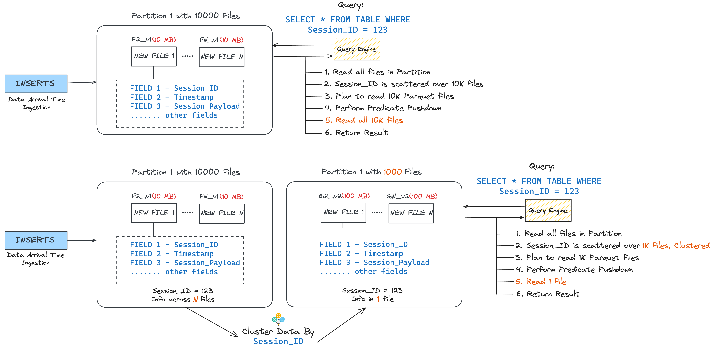
*Figure: Illustrating query performance improvements by clustering*

As mentioned in the intro, streaming ingestion generally results in smaller files in your data lake. But having a lot of
such small files could lead to higher query latency. From our experience supporting community users, there are quite a
few users who are using Hudi just for small file handling capabilities. So, you could employ clustering to batch a lot
of such small files into larger ones.

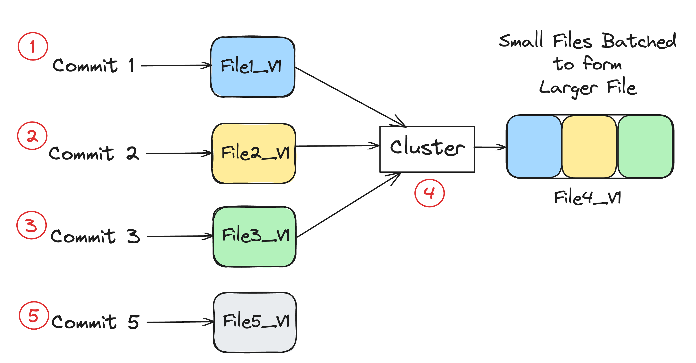

Another classic problem in data lake is the arrival time vs event time problem. Generally you write data based on
arrival time, while query predicates do not sit well with it. With clustering, you can re-write your data by sorting
based on query predicates and so, your data skipping will be very efficient and your query can ignore scanning a lot of
unnecessary data.

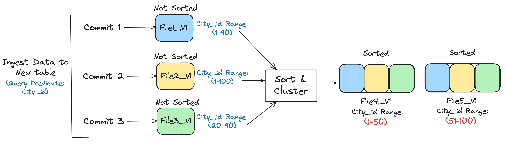

On a high level, clustering creates a plan based on a configurable strategy, groups eligible files based on specific
criteria and then executes the plan. As mentioned before, clustering plan as well as execution depends on configurable
strategy. These strategies can be broadly classified into three types: clustering plan strategy, execution strategy and
update strategy.

This strategy comes into play while creating clustering plan. It helps to decide what file groups should be clustered
and how many output file groups should the clustering produce. Note that these strategies are easily pluggable using the
config [hoodie.clustering.plan.strategy.class](#configurations--hoodieclusteringplanstrategyclass).

Different plan strategies are as follows:

This strategy creates clustering groups based on max size allowed per group. Also, it excludes files that are greater
than the small file limit from the clustering plan. Available strategies depending on write client
are: `SparkSizeBasedClusteringPlanStrategy`, `FlinkSizeBasedClusteringPlanStrategy`
and `JavaSizeBasedClusteringPlanStrategy`. Furthermore, Hudi provides flexibility to include or exclude partitions for
clustering, tune the file size limits, maximum number of output groups. Please refer to [hoodie.clustering.plan.strategy.small.file.limit](https://hudi.apache.org/docs/next/configurations/#hoodieclusteringplanstrategysmallfilelimit)
, [hoodie.clustering.plan.strategy.max.num.groups](https://hudi.apache.org/docs/next/configurations/#hoodieclusteringplanstrategymaxnumgroups), [hoodie.clustering.plan.strategy.max.bytes.per.group](https://hudi.apache.org/docs/next/configurations/#hoodieclusteringplanstrategymaxbytespergroup)
, [hoodie.clustering.plan.strategy.target.file.max.bytes](https://hudi.apache.org/docs/next/configurations/#hoodieclusteringplanstrategytargetfilemaxbytes) for more details.

<table><thead><tr><th>Config Name</th><th>Default</th><th>Description</th></tr></thead><tbody><tr><td>hoodie.clustering.plan.strategy.partition.selected</td><td>N/A <strong>(Required)</strong></td><td>Comma separated list of partitions to run clustering

<code>Config Param: PARTITION_SELECTED</code>
<code>Since Version: 0.11.0</code></td></tr><tr><td>hoodie.clustering.plan.strategy.partition.regex.pattern</td><td>N/A <strong>(Required)</strong></td><td>Filter clustering partitions that matched regex pattern

<code>Config Param: PARTITION_REGEX_PATTERN</code>
<code>Since Version: 0.11.0</code></td></tr><tr><td>hoodie.clustering.plan.partition.filter.mode</td><td>NONE (Optional)</td><td>Partition filter mode used in the creation of clustering plan. Possible values:
<ul><li><code>NONE</code>: Do not filter partitions. The clustering plan will include all partitions that have clustering candidates.</li><li><code>RECENT_DAYS</code>: This filter assumes that your data is partitioned by date. The clustering plan will only include partitions from K days ago to N days ago, where K &gt;= N. K is determined by <code>hoodie.clustering.plan.strategy.daybased.lookback.partitions</code> and N is determined by <code>hoodie.clustering.plan.strategy.daybased.skipfromlatest.partitions</code>.</li><li><code>SELECTED_PARTITIONS</code>: The clustering plan will include only partition paths with names that sort within the inclusive range [<code>hoodie.clustering.plan.strategy.cluster.begin.partition</code>, <code>hoodie.clustering.plan.strategy.cluster.end.partition</code>].</li><li><code>DAY_ROLLING</code>: To determine the partitions in the clustering plan, the eligible partitions will be sorted in ascending order. Each partition will have an index i in that list. The clustering plan will only contain partitions such that i mod 24 = H, where H is the current hour of the day (from 0 to 23).</li></ul>
<code>Config Param: PLAN_PARTITION_FILTER_MODE_NAME</code>
<code>Since Version: 0.11.0</code></td></tr></tbody></table>

In this strategy, clustering group for each partition is built in the same way as `SparkSizeBasedClusteringPlanStrategy`
. The difference is that the output group is 1 and file group id remains the same, while `SparkSizeBasedClusteringPlanStrategy` can create multiple file groups with newer fileIds.

This strategy is specifically used for consistent bucket index. This will be leveraged to expand your bucket index (from
static partitioning to dynamic). Typically, users don’t need to use this strategy. Hudi internally uses this for
dynamically expanding the buckets for bucket index datasets.

> [!NOTE]
> **The latter two strategies are applicable only for the Spark engine.**
>

After building the clustering groups in the planning phase, Hudi applies execution strategy, for each group, primarily
based on sort columns and size. The strategy can be specified using the
config [hoodie.clustering.execution.strategy.class](#configurations--hoodieclusteringexecutionstrategyclass). By
default, Hudi sorts the file groups in the plan by the specified columns, while meeting the configured target file
sizes.

| Config Name | Default | Description |
| --- | --- | --- |
| hoodie.clustering.execution.strategy.class | org.apache.hudi.client.clustering.run.strategy.SparkSortAndSizeExecutionStrategy (Optional) | Config to provide a strategy class (subclass of RunClusteringStrategy) to define how the clustering plan is executed. By default, we sort the file groups in th plan by the specified columns, while meeting the configured target file sizes. `Config Param: EXECUTION_STRATEGY_CLASS_NAME` `Since Version: 0.7.0` |

The available strategies are as follows:

1. `SPARK_SORT_AND_SIZE_EXECUTION_STRATEGY`: Uses bulk\_insert to re-write data from input file groups.
   1. Set `hoodie.clustering.execution.strategy.class`
      to `org.apache.hudi.client.clustering.run.strategy.SparkSortAndSizeExecutionStrategy`.
   2. `hoodie.clustering.plan.strategy.sort.columns`: Columns to sort the data while clustering. This goes in
      conjunction with layout optimization strategies depending on your query predicates. One can set comma separated
      list of columns that needs to be sorted in this config.
2. `JAVA_SORT_AND_SIZE_EXECUTION_STRATEGY`: Similar to `SPARK_SORT_AND_SIZE_EXECUTION_STRATEGY`, for the Java and Flink
   engines. Set `hoodie.clustering.execution.strategy.class`
   to `org.apache.hudi.client.clustering.run.strategy.JavaSortAndSizeExecutionStrategy`.
3. `SPARK_CONSISTENT_BUCKET_EXECUTION_STRATEGY`: As the name implies, this is applicable to dynamically expand
   consistent bucket index and only applicable to the Spark engine. Set `hoodie.clustering.execution.strategy.class`
   to `org.apache.hudi.client.clustering.run.strategy.SparkConsistentBucketClusteringExecutionStrategy`.

Currently, clustering can only be scheduled for tables/partitions not receiving any concurrent updates. By default, the config for update strategy - [`hoodie.clustering.updates.strategy`](#configurations--hoodieclusteringupdatesstrategy) is set to **SparkRejectUpdateStrategy**. If some file group has updates during clustering then it will reject updates and throw an
exception. However, in some use-cases updates are very sparse and do not touch most file groups. The default strategy to
simply reject updates does not seem fair. In such use-cases, users can set the config to **SparkAllowUpdateStrategy**.

We discussed the critical strategy configurations. All other configurations related to clustering are
listed [clustering configurations](#configurations--clustering-configs). Out of this list, a few configurations that will be very useful
for inline or async clustering are shown below with code samples.

Inline clustering happens synchronously with the regular ingestion writer or as part of the data ingestion pipeline. This means the next round of ingestion cannot proceed until the clustering is complete With inline clustering, Hudi will schedule, plan clustering operations after each commit is completed and execute the clustering plans after it’s created. This is the simplest deployment model to run because it’s easier to manage than running different asynchronous Spark jobs. This mode is supported on Spark Datasource, Flink, Spark-SQL and Hudi Streamer in a sync-once mode.

For this deployment mode, please enable and set: `hoodie.clustering.inline`

To choose how often clustering is triggered, also set: `hoodie.clustering.inline.max.commits`.

Inline clustering can be setup easily using spark dataframe options.
See sample below:

```scala
import org.apache.hudi.QuickstartUtils._ 
import scala.collection.JavaConversions._ 
import org.apache.spark.sql.SaveMode._ 
import org.apache.hudi.DataSourceReadOptions._ 
import org.apache.hudi.DataSourceWriteOptions._ 
import org.apache.hudi.config.HoodieWriteConfig._ 
val df =  //generate data frame 
df.write.format("org.apache.hudi"). 
        options(getQuickstartWriteConfigs). 
        option("hoodie.table.ordering.fields", "ts"). 
        option("hoodie.datasource.write.recordkey.field", "uuid"). 
        option("hoodie.datasource.write.partitionpath.field", "partitionpath"). 
        option("hoodie.table.name", "tableName"). 
        option("hoodie.parquet.small.file.limit", "0"). 
        option("hoodie.clustering.inline", "true"). 
        option("hoodie.clustering.inline.max.commits", "4"). 
        option("hoodie.clustering.plan.strategy.target.file.max.bytes", "1073741824"). 
        option("hoodie.clustering.plan.strategy.small.file.limit", "629145600"). 
        option("hoodie.clustering.plan.strategy.sort.columns", "column1,column2"). //optional, if sorting is needed as part of rewriting data 
        mode(Append). 
        save("dfs://location"); 
```

Async clustering runs the clustering table service in the background without blocking the regular ingestions writers. There are three different ways to deploy an asynchronous clustering process:

- **Asynchronous execution within the same process**: In this deployment mode, Hudi will schedule and plan the clustering operations after each commit is completed as part of the ingestion pipeline. Separately, Hudi spins up another thread within the same job and executes the clustering table service. This is supported by Spark Streaming, Flink and Hudi Streamer in continuous mode. For this deployment mode, please enable `hoodie.clustering.async.enabled` and `hoodie.clustering.async.max.commits`.
- **Asynchronous scheduling and execution by a separate process**: In this deployment mode, the application will write data to a Hudi table as part of the ingestion pipeline. A separate clustering job will schedule, plan and execute the clustering operation. By running a different job for the clustering operation, it rebalances how Hudi uses compute resources: fewer compute resources are needed for the ingestion, which makes ingestion latency stable, and an independent set of compute resources are reserved for the clustering process. Please configure the lock providers for the concurrency control among all jobs (both writer and table service jobs). In general, configure lock providers when there are two different jobs or two different processes occurring. All writers support this deployment model. For this deployment mode, no clustering configs should be set for the ingestion writer.
- **Scheduling inline and executing async**: In this deployment mode, the application ingests data and schedules the clustering in one job; in another, the application executes the clustering plan. The supported writers (see below) won’t be blocked from ingesting data. If the metadata table is enabled, a lock provider is not needed. However, if the metadata table is enabled, please ensure all jobs have the lock providers configured for concurrency control. All writers support this deployment option. For this deployment mode, please enable, `hoodie.clustering.schedule.inline` and `hoodie.clustering.async.enabled`.

Hudi supports [multi-writers](#concurrency_control--enabling-multi-writing) which provides
snapshot isolation between multiple table services, thus allowing writers to continue with ingestion while clustering
runs in the background.

| Config Name | Default | Description |
| --- | --- | --- |
| hoodie.clustering.async.enabled | false (Optional) | Enable running of clustering service, asynchronously as inserts happen on the table. `Config Param: ASYNC_CLUSTERING_ENABLE` `Since Version: 0.7.0` |
| hoodie.clustering.async.max.commits | 4 (Optional) | Config to control frequency of async clustering `Config Param: ASYNC_CLUSTERING_MAX_COMMITS` `Since Version: 0.9.0` |

Users can leverage [HoodieClusteringJob](https://cwiki.apache.org/confluence/display/HUDI/RFC+-+19+Clustering+data+for+freshness+and+query+performance#RFC19Clusteringdataforfreshnessandqueryperformance-SetupforAsyncclusteringJob)
to setup 2-step asynchronous clustering.

By specifying the `scheduleAndExecute` mode both schedule as well as clustering can be achieved in the same step.
The appropriate mode can be specified using `-mode` or `-m` option. There are three modes:

1. `schedule`: Make a clustering plan. This gives an instant which can be passed in execute mode.
2. `execute`: Execute a clustering plan at a particular instant. If no instant-time is specified, HoodieClusteringJob will execute for the earliest instant on the Hudi timeline.
3. `scheduleAndExecute`: Make a clustering plan first and execute that plan immediately.

Note that to run this job while the original writer is still running, please enable multi-writing:

```properties
hoodie.write.concurrency.mode=optimistic_concurrency_control 
hoodie.write.lock.provider=org.apache.hudi.client.transaction.lock.ZookeeperBasedLockProvider 
```

A sample spark-submit command to setup HoodieClusteringJob is as below:

```bash
spark-submit \ 
--jars "packaging/hudi-utilities-slim-bundle/target/hudi-utilities-slim-bundle_2.12-1.0.2.jar,packaging/hudi-spark-bundle/target/hudi-spark3.5-bundle_2.12-1.0.2.jar" \ 
--class org.apache.hudi.utilities.HoodieClusteringJob \ 
/path/to/hudi-utilities-slim-bundle/target/hudi-utilities-slim-bundle_2.12-1.0.2.jar \ 
--props /path/to/config/clusteringjob.properties \ 
--mode scheduleAndExecute \ 
--base-path /path/to/hudi_table/basePath \ 
--table-name hudi_table_schedule_clustering \ 
--spark-memory 1g 
```

A sample `clusteringjob.properties` file:

```properties
hoodie.clustering.async.enabled=true 
hoodie.clustering.async.max.commits=4 
hoodie.clustering.plan.strategy.target.file.max.bytes=1073741824 
hoodie.clustering.plan.strategy.small.file.limit=629145600 
hoodie.clustering.execution.strategy.class=org.apache.hudi.client.clustering.run.strategy.SparkSortAndSizeExecutionStrategy 
hoodie.clustering.plan.strategy.sort.columns=column1,column2 
```

This brings us to our users' favorite utility in Hudi. Now, we can trigger asynchronous clustering with Hudi Streamer.
Just set the `hoodie.clustering.async.enabled` config to true and specify other clustering config in properties file
whose location can be pased as `—props` when starting the Hudi Streamer (just like in the case of HoodieClusteringJob).

A sample spark-submit command to setup Hudi Streamer is as below:

```bash
spark-submit \ 
--jars "packaging/hudi-utilities-slim-bundle/target/hudi-utilities-slim-bundle_2.12-1.0.2.jar,packaging/hudi-spark-bundle/target/hudi-spark3.5-bundle_2.12-1.0.2.jar" \ 
--class org.apache.hudi.utilities.streamer.HoodieStreamer \ 
/path/to/hudi-utilities-slim-bundle/target/hudi-utilities-slim-bundle_2.12-1.0.2.jar \ 
--props /path/to/config/clustering_kafka.properties \ 
--schemaprovider-class org.apache.hudi.utilities.schema.SchemaRegistryProvider \ 
--source-class org.apache.hudi.utilities.sources.AvroKafkaSource \ 
--source-ordering-field impresssiontime \ 
--table-type COPY_ON_WRITE \ 
--target-base-path /path/to/hudi_table/basePath \ 
--target-table impressions_cow_cluster \ 
--op INSERT \ 
--hoodie-conf hoodie.clustering.async.enabled=true \ 
--continuous 
```

We can also enable asynchronous clustering with Spark structured streaming sink as shown below.

```scala
val commonOpts = Map( 
   "hoodie.insert.shuffle.parallelism" -> "4", 
   "hoodie.upsert.shuffle.parallelism" -> "4", 
   "hoodie.datasource.write.recordkey.field" -> "_row_key", 
   "hoodie.datasource.write.partitionpath.field" -> "partition", 
   "hoodie.table.ordering.fields" -> "timestamp", 
   "hoodie.table.name" -> "hoodie_test" 
) 
 
def getAsyncClusteringOpts(isAsyncClustering: String, 
                           clusteringNumCommit: String, 
                           executionStrategy: String):Map[String, String] = { 
   commonOpts + (DataSourceWriteOptions.ASYNC_CLUSTERING_ENABLE.key -> isAsyncClustering, 
           HoodieClusteringConfig.ASYNC_CLUSTERING_MAX_COMMITS.key -> clusteringNumCommit, 
           HoodieClusteringConfig.EXECUTION_STRATEGY_CLASS_NAME.key -> executionStrategy 
   ) 
} 
 
def initStreamingWriteFuture(hudiOptions: Map[String, String]): Future[Unit] = { 
   val streamingInput = // define the source of streaming 
   Future { 
      println("streaming starting") 
      streamingInput 
              .writeStream 
              .format("org.apache.hudi") 
              .options(hudiOptions) 
              .option("checkpointLocation", basePath + "/checkpoint") 
              .mode(Append) 
              .start() 
              .awaitTermination(10000) 
      println("streaming ends") 
   } 
} 
 
def structuredStreamingWithClustering(): Unit = { 
   val df = //generate data frame 
   val hudiOptions = getClusteringOpts("true", "1", "org.apache.hudi.client.clustering.run.strategy.SparkSortAndSizeExecutionStrategy") 
   val f1 = initStreamingWriteFuture(hudiOptions) 
   Await.result(f1, Duration.Inf) 
} 
```

Clustering is also supported via Java client. Plan strategy `org.apache.hudi.client.clustering.plan.strategy.JavaSizeBasedClusteringPlanStrategy`
and execution strategy `org.apache.hudi.client.clustering.run.strategy.JavaSortAndSizeExecutionStrategy` are supported
out-of-the-box. Note that as of now only linear sort is supported in Java execution strategy.

<a id="clustering--blogs"></a>

### Blogs

[Apache Hudi Z-Order and Hilbert Space Filling Curves](https://www.onehouse.ai/blog/apachehudi-z-order-and-hilbert-space-filling-curves)
[Hudi Z-Order and Hilbert Space-filling Curves](https://medium.com/apache-hudi-blogs/hudi-z-order-and-hilbert-space-filling-curves-68fa28bffaf0)<a id="clustering--videos"></a>

### Videos

---

<a id="cleaning"></a>

<!-- source_url: https://hudi.apache.org/docs/cleaning/ -->

<!-- page_index: 31 -->

# Cleaning

Version: 1.1.1

Cleaning is a table service employed by Hudi to reclaim space occupied by older versions of data and keep storage costs
in check. Apache Hudi provides snapshot isolation between writers and readers by managing multiple versioned files with **MVCC**
concurrency. These file versions provide history and enable time travel and rollbacks, but it is important to manage
how much history you keep to balance your costs. Cleaning service plays a crucial role in manging the tradeoff between
retaining long history of data and the associated storage costs.

Hudi enables [Automatic Hudi cleaning](#configurations--hoodiecleanautomatic) by default. Cleaning is invoked
immediately after each commit, to delete older file slices. It's recommended to leave this enabled to ensure metadata
and data storage growth is bounded. Cleaner can also be scheduled after every few commits instead of after every commit by
configuring [hoodie.clean.max.commits](#configurations--hoodiecleanmaxcommits).

When cleaning old files, you should be careful not to remove files that are being actively used by long running queries.

For spark based:

| Config Name | Default | Description |
| --- | --- | --- |
| hoodie.clean.policy | KEEP\_LATEST\_COMMITS (Optional) | org.apache.hudi.common.model.HoodieCleaningPolicy: Cleaning policy to be used. `Config Param: CLEANER_POLICY` |

The corresponding config for Flink based engine is [`clean.policy`](#configurations--cleanpolicy).

Hudi cleaner currently supports the below cleaning policies to keep a certain number of commits or file versions:

- **KEEP\_LATEST\_COMMITS**: This is the default policy. This is a temporal cleaning policy that ensures the effect of
  having lookback into all the changes that happened in the last X commits. Suppose a writer is ingesting data
  into a Hudi dataset every 30 minutes and the longest running query can take 5 hours to finish, then the user should
  retain atleast the last 10 commits. With such a configuration, we ensure that the oldest version of a file is kept on
  disk for at least 5 hours, thereby preventing the longest running query from failing at any point in time. Incremental
  cleaning is also possible using this policy.
  Number of commits to retain can be configured by [`hoodie.clean.commits.retained`](https://analytics.google.com/analytics/web/#/p300324801/reports/intelligenthome).
  The corresponding Flink related config is [`clean.retain_commits`](#configurations--cleanretain_commits).
- **KEEP\_LATEST\_FILE\_VERSIONS**: This policy has the effect of keeping N number of file versions irrespective of time.
  This policy is useful when it is known how many MAX versions of the file does one want to keep at any given time.
  To achieve the same behaviour as before of preventing long running queries from failing, one should do their calculations
  based on data patterns. Alternatively, this policy is also useful if a user just wants to maintain 1 latest version of the file.
  Number of file versions to retain can be configured by [`hoodie.clean.fileversions.retained`](#configurations--hoodiecleanerfileversionsretained).
  The corresponding Flink related config is [`clean.retain_file_versions`](#configurations--cleanretain_file_versions).
- **KEEP\_LATEST\_BY\_HOURS**: This policy clean up based on hours.It is simple and useful when knowing that you want to
  keep files at any given time. Corresponding to commits with commit times older than the configured number of hours to
  be retained are cleaned. Currently you can configure by parameter [`hoodie.clean.hours.retained`](#configurations--hoodiecleanerhoursretained).
  The corresponding Flink related config is [`clean.retain_hours`](#configurations--cleanretain_hours).

For details about all possible configurations and their default values see the [configuration docs](https://hudi.apache.org/docs/next/configurations/#Clean-Configs).
For Flink related configs refer [here](https://hudi.apache.org/docs/next/configurations/#FLINK_SQL).

By default, in Spark based writing, cleaning is run inline after every commit using the default policy of `KEEP_LATEST_COMMITS`. It's recommended
to keep this enabled, to ensure metadata and data storage growth is bounded. To enable this, users do not have to set any configs. Following are the relevant basic configs.

| Config Name | Default | Description |
| --- | --- | --- |
| hoodie.clean.automatic | true (Optional) | When enabled, the cleaner table service is invoked immediately after each commit, to delete older file slices. It's recommended to enable this, to ensure metadata and data storage growth is bounded. `Config Param: AUTO_CLEAN` |
| hoodie.clean.commits.retained | 10 (Optional) | Number of commits to retain, without cleaning. This will be retained for num\_of\_commits \* time\_between\_commits (scheduled). This also directly translates into how much data retention the table supports for incremental queries. `Config Param: CLEANER_COMMITS_RETAINED` |

In case you wish to run the cleaner service asynchronously along with writing, please enable the [`hoodie.clean.async`](#configurations--hoodiecleanasync) as shown below:

```java
hoodie.clean.automatic=true 
hoodie.clean.async=true 
```

For Flink based writing, this is the default mode of cleaning. Please refer to [`clean.async.enabled`](#configurations--cleanasyncenabled) for details.

Hoodie Cleaner can also be run as a separate process. Following is the command for running the cleaner independently:

```text
spark-submit --master local \ 
  --packages org.apache.hudi:hudi-utilities-slim-bundle_2.12:1.0.2,org.apache.hudi:hudi-spark3.5-bundle_2.12:1.0.2 \ 
  --class org.apache.hudi.utilities.HoodieCleaner `ls packaging/hudi-utilities-slim-bundle/target/hudi-utilities-slim-bundle-*.jar` --help 
        Usage: <main class> [options] 
        Options: 
        --help, -h 
 
        --hoodie-conf 
        Any configuration that can be set in the properties file (using the CLI 
        parameter "--props") can also be passed command line using this 
        parameter. This can be repeated 
        Default: [] 
        --props 
        path to properties file on localfs or dfs, with configurations for 
        hoodie client for cleaning 
        --spark-master 
        spark master to use. 
        Default: local[2] 
        * --target-base-path 
        base path for the hoodie table to be cleaner. 
```

Some examples to run the cleaner.
Keep the latest 10 commits

```text
spark-submit --master local \ 
  --packages org.apache.hudi:hudi-utilities-slim-bundle_2.12:1.0.2,org.apache.hudi:hudi-spark3.5-bundle_2.12:1.0.2 \ 
  --class org.apache.hudi.utilities.HoodieCleaner `ls packaging/hudi-utilities-slim-bundle/target/hudi-utilities-slim-bundle-*.jar` \ 
  --target-base-path /path/to/hoodie_table \ 
  --hoodie-conf hoodie.clean.policy=KEEP_LATEST_COMMITS \ 
  --hoodie-conf hoodie.clean.commits.retained=10 \ 
  --hoodie-conf hoodie.clean.parallelism=200 
```

Keep the latest 3 file versions

```text
spark-submit --master local \ 
  --packages org.apache.hudi:hudi-utilities-slim-bundle_2.12:1.0.2,org.apache.hudi:hudi-spark3.5-bundle_2.12:1.0.2 \ 
  --class org.apache.hudi.utilities.HoodieCleaner `ls packaging/hudi-utilities-slim-bundle/target/hudi-utilities-slim-bundle-*.jar` \ 
  --hoodie-conf hoodie.clean.policy=KEEP_LATEST_FILE_VERSIONS \ 
  --hoodie-conf hoodie.clean.fileversions.retained=3 \ 
  --hoodie-conf hoodie.clean.parallelism=200 
```

Clean commits older than 24 hours

```text
spark-submit --master local \ 
  --packages org.apache.hudi:hudi-utilities-slim-bundle_2.12:1.0.2,org.apache.hudi:hudi-spark3.5-bundle_2.12:1.0.2 \ 
  --class org.apache.hudi.utilities.HoodieCleaner `ls packaging/hudi-utilities-slim-bundle/target/hudi-utilities-slim-bundle-*.jar` \ 
  --target-base-path /path/to/hoodie_table \ 
  --hoodie-conf hoodie.clean.policy=KEEP_LATEST_BY_HOURS \ 
  --hoodie-conf hoodie.clean.hours.retained=24 \ 
  --hoodie-conf hoodie.clean.parallelism=200 
```

Note: The parallelism takes the min value of number of partitions to clean and `hoodie.clean.parallelism`.

You can also use [Hudi CLI](#cli) to run Hoodie Cleaner.

CLI provides the below commands for cleaner service:

- `cleans show`
- `clean showpartitions`
- `cleans run`

Example of cleaner keeping the latest 10 commits

```text
cleans run --sparkMaster local --hoodieConfigs hoodie.clean.policy=KEEP_LATEST_COMMITS hoodie.clean.commits.retained=10 hoodie.clean.parallelism=200 
```

You can find more details and the relevant code for these commands in [`org.apache.hudi.cli.commands.CleansCommand`](https://github.com/apache/hudi/blob/master/hudi-cli/src/main/java/org/apache/hudi/cli/commands/CleansCommand.java) class.

<a id="cleaning--blogs"></a>

### Blogs

- [Cleaner and Archival in Apache Hudi](https://medium.com/@simpsons/cleaner-and-archival-in-apache-hudi-9e15b08b2933)

<a id="cleaning--videos"></a>

### Videos

- [Cleaner Service: Save up to 40% on data lake storage costs | Hudi Labs](https://youtu.be/mUvRhJDoO3w)
- [Efficient Data Lake Management with Apache Hudi Cleaner: Benefits of Scheduling Data Cleaning #1](https://www.youtube.com/watch?v=CEzgFtmVjx4)
- [Efficient Data Lake Management with Apache Hudi Cleaner: Benefits of Scheduling Data Cleaning #2](https://www.youtube.com/watch?v=RbBF9Ys2GqM)

---

<a id="metadata_indexing"></a>

<!-- source_url: https://hudi.apache.org/docs/metadata_indexing/ -->

<!-- page_index: 32 -->

# Indexing

Version: 1.1.1

> [!NOTE]
> Please note in order to create secondary index:
>
> 1. The table must have a primary key and merge mode should be [COMMIT\_TIME\_ORDERING](#record_merger--commit_time_ordering).
> 2. Record index must be enabled. This can be done by setting `hoodie.metadata.record.index.enable=true` and then creating `record_index`. Please note the example below.

---

<a id="file_sizing"></a>

<!-- source_url: https://hudi.apache.org/docs/file_sizing/ -->

<!-- page_index: 33 -->

# File Sizing

Version: 1.1.1

> [!NOTE]
> the bulk\_insert write operation does not have auto-sizing capabilities during ingestion

---

<a id="rollbacks"></a>

<!-- source_url: https://hudi.apache.org/docs/rollbacks/ -->

<!-- page_index: 34 -->

# Auto Rollbacks

Version: 1.1.1

Your pipelines could fail due to numerous reasons like crashes, valid bugs in the code, unavailability of any external
third-party system (like a lock provider), or user could kill the job midway to change some properties. A well-designed
system should detect such partially failed commits, ensure dirty data is not exposed to the queries, and clean them up.
Hudi's rollback mechanism takes care of cleaning up such failed writes.

Hudi’s timeline forms the core for reader and writer isolation. If a commit has not transitioned to complete as per the
hudi timeline, the readers will ignore the data from the respective write. And so partially failed writes are never read
by any readers (for all query types). But the curious question is, how is the partially written data eventually deleted?
Does it require manual command to be executed from time to time or should it be automatically handled by the system? This
page presents insights on how "rollback" in Hudi can automatically clean up handling partially failed writes without
manual input from users.

Hudi has a lot of platformization built in so as to ease the operationalization of [lakehouse](https://hudi.apache.org/blog/2024/07/11/what-is-a-data-lakehouse/) tables. One such feature
is the automatic cleanup of partially failed commits. Users don’t need to run any additional commands to clean up dirty
data or the data produced by failed commits. If you continue to write to hudi tables, one of your future commits will
take care of cleaning up older data that failed midway during a write/commit. We call this cleanup of a failed commit a
"rollback". A rollback will revert everything about a commit, including deleting data and removal from the timeline.
Additionally, the restore operation utilizes a series rollbacks to undo completed commits.

Let’s zoom in a bit and understand how such cleanups happen and the challenges involved in such cleaning when
multi-writers are involved.

In case of single writer model, the rollback logic is fairly straightforward. Every action in Hudi's timeline goes
through 3 states, namely requested, inflight and completed. Whenever a new commit starts, hudi checks the timeline
for any actions/commits that is not yet committed and that refers to partially failed commit. So, immediately rollback
is triggered and all dirty data is cleaned up followed by cleaning up the commit instants from the timeline.

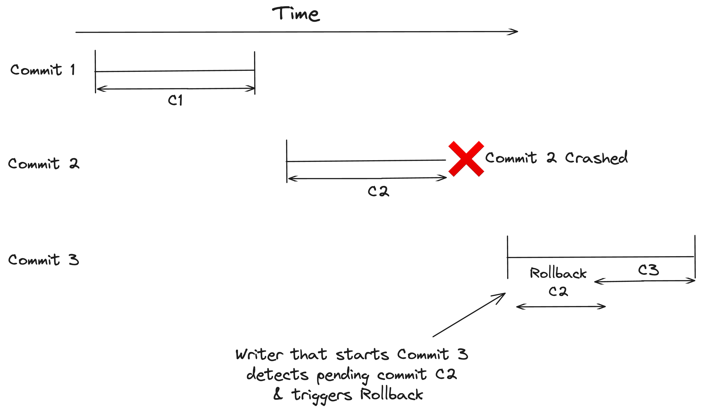
*Figure 1: single writer with eager rollbacks*

The challenging part is when multi-writers are invoked. Just because a commit is still non-completed as per the
timeline, it does not mean current writer (new) can assume that it's a partially failed commit. Because, there could be
a concurrent writer that’s currently making progress. Hudi has been designed to not have any centralized server
running always and in such a case Hudi has an ingenious way to deduce such partially failed writes.

We are leveraging heartbeats to our rescue here. Each commit will keep emitting heartbeats from the start of the
write until its completion. During rollback deduction, Hudi checks for heartbeat timeouts for all ongoing or incomplete
commits and detects partially failed commits on such timeouts. For any ongoing commits, the heartbeat should not
have elapsed the timeout. For example, if a commit’s heartbeat is not updated for 10+ mins, we can safely assume the
original writer has failed/crashed and is the incomplete commit is safe to clean up. So, the rollbacks in case of
multi-writers are lazy and is not eager as we saw with single writer model. But it is still automatic and users don’t
need to execute any explicit command to trigger such cleanup of failed writes. When such lazy rollback kicks in, both
data files and timeline files for the failed writes are deleted.

Hudi employs a simple yet effective heartbeat mechanism to notify that a commit is still making progress. A heartbeat
file is created for every commit under “.hoodie/.heartbeat/” (for eg, “.hoodie/.heartbeat/20230819183853177”).
The writer will start a background thread which will keep updating this heartbeat file at a regular cadence to refresh
the last modification time of the file. So, checking for last modification time of the heartbeat file gives us
information whether the writer that started the commit of interest is still making progress or not. On completion of
the commit, the heartbeat file is deleted. Or if the write failed midway, the last modification time of the heartbeat
file is no longer updated, so other writers can deduce the failed write after a period of time elapses.

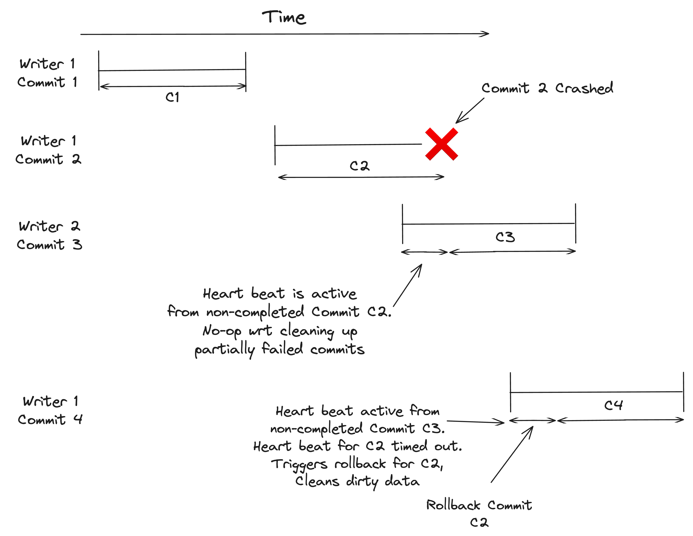
*Figure 2: multi-writer with lazy cleaning of failed commits*

<a id="rollbacks--videos"></a>

### Videos

- [How to Rollback to Previous Checkpoint during Disaster in Apache Hudi using Glue 4.0 Demo](https://www.youtube.com/watch?v=Vi25q4vzogs)

---

<a id="markers"></a>

<!-- source_url: https://hudi.apache.org/docs/markers/ -->

<!-- page_index: 35 -->

# Marker Mechanism

Version: 1.1.1

A write operation can fail before it completes, leaving partial or corrupt data files on storage. Markers are used to track
and cleanup any partial or failed write operations. As a write operation begins, a marker is created indicating
that a file write is in progress. When the write commit succeeds, the marker is deleted. If a write operation fails part
way through, a marker is left behind which indicates that the file is incomplete. Two important operations that use markers include:

- **Removing duplicate/partial data files**:
  - In Spark, the Hudi write client delegates the data file writing to multiple executors. One executor can fail the task,
    leaving partial data files written, and Spark retries the task in this case until it succeeds.
  - When speculative execution is enabled, there can also be multiple successful attempts at writing out the same data
    into different files, only one of which is finally handed to the Spark driver process for committing.
    The markers help efficiently identify the partial data files written, which contain duplicate data compared to the data
    files written by the successful trial later, and these duplicate data files are cleaned up when the commit is finalized.
- **Rolling back failed commits**: If a write operation fails, the next write client will roll back the failed commit before proceeding with the new write. The rollback is done with the help of markers to identify the data files written as part of the failed commit.

If we did not have markers to track the per-commit data files, we would have to list all files in the file system, correlate that with the files seen in timeline and then delete the ones that belong to partial write failures.
As you could imagine, this would be very costly in a very large installation of a datalake.

Each marker entry is composed of three parts, the data file name, the marker extension (`.marker`), and the I/O operation created the file (`CREATE` - inserts, `MERGE` - updates/deletes, or `APPEND` - either). For example, the marker `91245ce3-bb82-4f9f-969e-343364159174-0_140-579-0_20210820173605.parquet.marker.CREATE` indicates
that the corresponding data file is `91245ce3-bb82-4f9f-969e-343364159174-0_140-579-0_20210820173605.parquet` and the I/O type is `CREATE`.

There are two ways to write Markers:

- Directly writing markers to storage, which is a legacy configuration.
- Writing markers to the Timeline Server which batches marker requests before writing them to storage (Default). This option improves write performance of large files as described below.

Directly writing to storage creates a new marker file corresponding to each data file, with the marker filename as described above.
The marker file does not have any content, i.e., empty. Each marker file is written to storage in the same directory
hierarchy, i.e., commit instant and partition path, under a temporary folder `.hoodie/.temp` under the base path of the Hudi table.
For example, the figure below shows one example of the marker files created and the corresponding data files when writing
data to the Hudi table. When getting or deleting all the marker file paths, the mechanism first lists all the paths
under the temporary folder, `.hoodie/.temp/<commit_instant>`, and then does the operation.

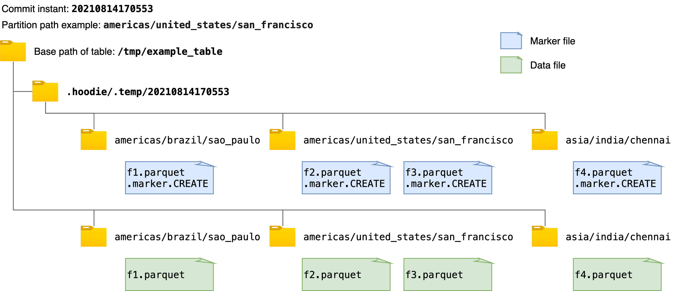

While it's much efficient over scanning the entire table for uncommitted data files, as the number of data files to write
increases, so does the number of marker files to create. For large writes which need to write significant number of data
files, e.g., 10K or more, this can create performance bottlenecks for cloud storage such as AWS S3. In AWS S3, each
file create and delete call triggers an HTTP request and there is [rate-limiting](https://docs.aws.amazon.com/AmazonS3/latest/userguide/optimizing-performance.html)
on how many requests can be processed per second per prefix in a bucket. When the number of data files to write concurrently
and the number of marker files is huge, the marker file operations could take up non-trivial time during the write operation, sometimes on the order of a few minutes or more.

To address the performance bottleneck due to rate-limiting of AWS S3 explained above, we introduce a new marker mechanism
leveraging the timeline server, which optimizes the marker-related latency for storage with non-trivial file I/O latency.
In the diagram below you can see the timeline-server-based marker mechanism delegates the marker creation and other marker-related
operations from individual executors to the timeline server for centralized processing. The timeline server batches the
marker creation requests and writes the markers to a bounded set of files in the file system at configurable batch intervals (default 50ms).
In this way, the number of actual file operations and latency related to markers can be significantly reduced even with
a huge number of data files, leading to improved performance of large writes.

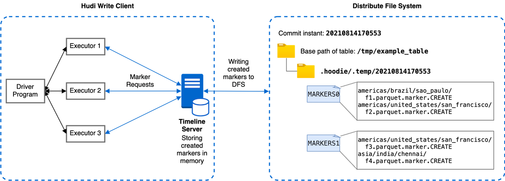

Each marker creation request is handled asynchronously in the Javalin timeline server and queued before processing.
For every batch interval, the timeline server pulls the pending marker creation requests from the queue and
writes all markers to the next file in a round robin fashion. Inside the timeline server, such batch processing is
multi-threaded, designed and implemented to guarantee consistency and correctness. Both the batch interval and the batch
concurrency can be configured through the write options.

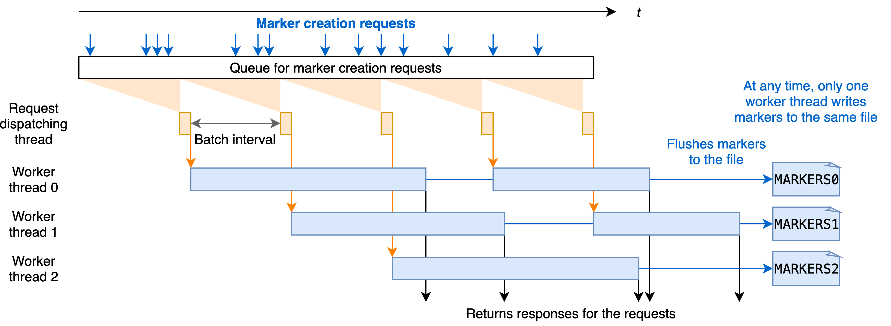

Note that the worker thread always checks whether the marker has already been created by comparing the marker name from
the request with the memory copy of all markers maintained at the timeline server. The underlying files storing the
markers are only read upon the first marker request (lazy loading). The responses of requests are only sent back once the
new markers are flushed to the files, so that in the case of the timeline server failure, the timeline server can recover
the already created markers. These ensure consistency between storage and the in-memory copy, and improve the performance
of processing marker requests.

**NOTE:** Timeline based markers are not yet supported for HDFS, however, users may barely notice performance challenges
with direct markers because the file system metadata is efficiently cached in memory and doesn't face the same rate-limiting as S3.

| Property Name | Default | Meaning |
| --- | --- | --- |
| `hoodie.write.markers.type` | timeline\_server\_based | Marker type to use. Two modes are supported: (1) `direct`: individual marker file corresponding to each data file is directly created by the executor; (2) `timeline_server_based`: marker operations are all handled at the timeline service which serves as a proxy. New marker entries are batch processed and stored in a limited number of underlying files for efficiency. |
| `hoodie.markers.timeline_server_based.batch.num_threads` | 20 | Number of threads to use for batch processing marker creation requests at the timeline server. |
| `hoodie.markers.timeline_server_based.batch.interval_ms` | 50 | The batch interval in milliseconds for marker creation batch processing. |
<a id="markers--blogs"></a>

### Blogs

[Timeline Server in Apache Hudi](https://medium.com/@simpsons/timeline-server-in-apache-hudi-b5be25f85e47)

---

<a id="syncing_aws_glue_data_catalog"></a>

<!-- source_url: https://hudi.apache.org/docs/syncing_aws_glue_data_catalog/ -->

<!-- page_index: 36 -->

# AWS Glue Data Catalog

Version: 1.1.1

Hudi tables can sync to AWS Glue Data Catalog directly via AWS SDK. Piggyback on `HiveSyncTool`
, `org.apache.hudi.aws.sync.AwsGlueCatalogSyncTool` makes use of all the configurations that are taken by `HiveSyncTool`
and send them to AWS Glue.

Most of the configurations for `AwsGlueCatalogSyncTool` are shared with `HiveSyncTool`. The example showed in
[Sync to Hive Metastore](#syncing_metastore) can be used as is for sync with Glue Data Catalog, provided that the hive metastore
URL (either JDBC or thrift URI) can proxied to Glue Data Catalog, which is usually done within AWS EMR or Glue job environment.

For Hudi streamer, users can set

```shell
--sync-tool-classes org.apache.hudi.aws.sync.AwsGlueCatalogSyncTool 
```

For Spark data source writers, users can set

```shell
hoodie.meta.sync.client.tool.class=org.apache.hudi.aws.sync.AwsGlueCatalogSyncTool 
```

Tables stored in Glue Data Catalog are versioned. And by default, every Hudi commit triggers a sync operation if enabled, regardless of having relevant metadata changes.
This can lead to too many versions kept in the catalog and eventually failing the sync operation.

Meta-sync can be set to conditional - only sync when there are schema change or partition change. This can avoid creating
excessive versions in the catalog. Users can enable it by setting

```text
hoodie.datasource.meta_sync.condition.sync=true 
```

Sync to Glue Data Catalog can be optimized with other configs like

```text
hoodie.datasource.meta.sync.glue.all_partitions_read_parallelism 
hoodie.datasource.meta.sync.glue.changed_partitions_read_parallelism 
hoodie.datasource.meta.sync.glue.partition_change_parallelism 
```

[Partition indexes](https://docs.aws.amazon.com/glue/latest/dg/partition-indexes.html) can also be used by setting

```text
hoodie.datasource.meta.sync.glue.partition_index_fields.enable 
hoodie.datasource.meta.sync.glue.partition_index_fields 
```

To write a Hudi table to Amazon S3 and catalog it in AWS Glue Data Catalog, you can use the options mentioned in the
[AWS documentation](https://docs.aws.amazon.com/glue/latest/dg/aws-glue-programming-etl-format-hudi.html#aws-glue-programming-etl-format-hudi-write)

If you're running HiveSyncTool on an EMR cluster backed by Glue Data Catalog as external metastore, you can simply run the sync from command line like below:

```shell
cd /usr/lib/hudi/bin 
 
./run_sync_tool.sh --base-path s3://<bucket_name>/<prefix>/<table_name> --database <database_name> --table <table_name> --partitioned-by <column_name> 
```

---

<a id="gcp_bigquery"></a>

<!-- source_url: https://hudi.apache.org/docs/gcp_bigquery/ -->

<!-- page_index: 37 -->

# Google BigQuery

Version: 1.1.1

Hudi tables can be queried from [Google Cloud BigQuery](https://cloud.google.com/bigquery) as external tables. As of
now, the Hudi-BigQuery integration only works for hive-style partitioned Copy-On-Write and Read-Optimized Merge-On-Read tables.

As of version 0.14.0, the `BigQuerySyncTool` supports syncing table to BigQuery using [manifests](https://cloud.google.com/blog/products/data-analytics/bigquery-manifest-file-support-for-open-table-format-queries). On the first run, the tool will create a manifest file representing the current base files in the table and a table in BigQuery based on the provided configurations. The tool produces a new manifest file on each subsequent run and will update the schema of the table in BigQuery if the schema changes in your Hudi table.

1. Only the files in the manifest can be scanned leading to less cost and better performance for your queries
2. The schema is now synced from the Hudi commit metadata allowing for proper schema evolution
3. Lists no longer have unnecessary nesting when querying in BigQuery as list inference is enabled by default
4. Partition column no longer needs to be dropped from the files due to new schema handling improvements

To enable this feature, set `hoodie.gcp.bigquery.sync.use_bq_manifest_file` to true.

This is the current default behavior to preserve compatibility as users upgrade to 0.14.0 and beyond.
After run, the sync tool will create 2 tables and 1 view in the target dataset in BigQuery. The tables and the view
share the same name prefix, which is taken from the Hudi table name. Query the view for the same results as querying the
Copy-on-Write Hudi table.
**NOTE:** The view can scan all of the parquet files under your table's base path so it is recommended to upgrade to the manifest based approach for improved cost and performance.

Hudi uses `org.apache.hudi.gcp.bigquery.BigQuerySyncTool` to sync tables. It works with Hudi Streamer via
setting sync tool class. A few BigQuery-specific configurations are required.

| Config | Notes |
| --- | --- |
| `hoodie.gcp.bigquery.sync.project_id` | The target Google Cloud project |
| `hoodie.gcp.bigquery.sync.dataset_name` | BigQuery dataset name; create before running the sync tool |
| `hoodie.gcp.bigquery.sync.dataset_location` | Region info of the dataset; same as the GCS bucket that stores the Hudi table |
| `hoodie.gcp.bigquery.sync.source_uri` | A wildcard path pattern pointing to the first level partition; partition key can be specified or auto-inferred. Only required for partitioned tables |
| `hoodie.gcp.bigquery.sync.source_uri_prefix` | The common prefix of the `source_uri`, usually it's the path to the Hudi table, trailing slash does not matter. |
| `hoodie.gcp.bigquery.sync.base_path` | The usual basepath config for Hudi table. |
| `hoodie.gcp.bigquery.sync.use_bq_manifest_file` | Set to true to enable the manifest based sync |
| `hoodie.gcp.bigquery.sync.require_partition_filter` | Introduced in Hudi version 0.14.1, this configuration accepts a BOOLEAN value, with the default being false. When enabled (set to true), you must create a partition filter (a WHERE clause) for all queries, targeting the partitioning column of a partitioned table. Queries lacking such a filter will result in an error. |

Refer to `org.apache.hudi.gcp.bigquery.BigQuerySyncConfig` for the complete configuration list.

In addition to the BigQuery-specific configs, you will need to use hive style partitioning for partition pruning in BigQuery. On top of that, the value in partition path will be the value returned for that field in your query. For example if you partition on a time-millis field, `time`, with an output format of `time=yyyy-MM-dd`, the query will return `time` values with day level granularity instead of the original milliseconds so keep this in mind while setting up your tables.

```text
hoodie.datasource.write.hive_style_partitioning = 'true' 
```

For the view based sync you must also specify the following configurations:

```text
hoodie.datasource.write.drop.partition.columns  = 'true' 
hoodie.partition.metafile.use.base.format       = 'true' 
```

Below shows an example for running `BigQuerySyncTool` with Hudi Streamer.

```shell
spark-submit --master yarn \ 
--packages com.google.cloud:google-cloud-bigquery:2.10.4 \ 
--jars "/opt/hudi-gcp-bundle-0.13.0.jar,/opt/hudi-utilities-slim-bundle_2.12-1.0.1.jar,/opt/hudi-spark3.5-bundle_2.12-1.0.1.jar" \ 
--class org.apache.hudi.utilities.streamer.HoodieStreamer \ 
/opt/hudi-utilities-slim-bundle_2.12-1.0.1.jar \ 
--target-base-path gs://my-hoodie-table/path \ 
--target-table mytable \ 
--table-type COPY_ON_WRITE \ 
--base-file-format PARQUET \ 
# ... other Hudi Streamer options --enable-sync \ --sync-tool-classes org.apache.hudi.gcp.bigquery.BigQuerySyncTool \ --hoodie-conf hoodie.streamer.source.dfs.root=gs://my-source-data/path \ --hoodie-conf hoodie.gcp.bigquery.sync.project_id=hudi-bq \ --hoodie-conf hoodie.gcp.bigquery.sync.dataset_name=rxusandbox \ --hoodie-conf hoodie.gcp.bigquery.sync.dataset_location=asia-southeast1 \ --hoodie-conf hoodie.gcp.bigquery.sync.table_name=mytable \ --hoodie-conf hoodie.gcp.bigquery.sync.base_path=gs://rxusandbox/testcases/stocks/data/target/${NOW} \ --hoodie-conf hoodie.gcp.bigquery.sync.partition_fields=year,month,day \ --hoodie-conf hoodie.gcp.bigquery.sync.source_uri=gs://my-hoodie-table/path/year=* \ --hoodie-conf hoodie.gcp.bigquery.sync.source_uri_prefix=gs://my-hoodie-table/path/ \ --hoodie-conf hoodie.gcp.bigquery.sync.use_file_listing_from_metadata=true \ --hoodie-conf hoodie.gcp.bigquery.sync.assume_date_partitioning=false \ --hoodie-conf hoodie.datasource.hive_sync.mode=jdbc \ --hoodie-conf hoodie.datasource.hive_sync.jdbcurl=jdbc:hive2://localhost:10000 \ --hoodie-conf hoodie.datasource.hive_sync.skip_ro_suffix=true \ --hoodie-conf hoodie.datasource.hive_sync.ignore_exceptions=false \ --hoodie-conf hoodie.datasource.hive_sync.database=mydataset \ --hoodie-conf hoodie.datasource.hive_sync.table=mytable \ --hoodie-conf hoodie.datasource.write.recordkey.field=mykey \ --hoodie-conf hoodie.datasource.write.partitionpath.field=year,month,day \ --hoodie-conf hoodie.table.ordering.fields=ts \ --hoodie-conf hoodie.datasource.write.keygenerator.type=COMPLEX \ --hoodie-conf hoodie.datasource.write.hive_style_partitioning=true \ --hoodie-conf hoodie.datasource.write.drop.partition.columns=true \ --hoodie-conf hoodie.partition.metafile.use.base.format=true \
```

---

<a id="syncing_datahub"></a>

<!-- source_url: https://hudi.apache.org/docs/syncing_datahub/ -->

<!-- page_index: 38 -->

# DataHub

Version: 1.1.1

[DataHub](https://datahub.com/) is a rich metadata platform that supports features like data discovery, data
obeservability, federated governance, etc.

Since Hudi 0.11.0, you can now sync to a DataHub instance by setting `DataHubSyncTool` as one of the sync tool classes
for Hudi Streamer.

The target Hudi table will be sync'ed to DataHub as a `Dataset`, which will be created with the following properties:

- Hudi table properties and partitioning information
  - This includes: `hudi.table.type`, `hudi.table.version` and `hudi.base.path`
  - As well as: `hudi.partition.fields` (if and only if `hoodie.datasource.hive_sync.partition_fields` is properly set
    in the Hudi Config)
- Spark-related properties
- User-defined properties (see `hoodie.meta.sync.datahub.table.properties` in the "Configurations" section)
- The last commit and the last commit completion timestamps

Additionally, the `Dataset` object will include the following metadata:

- sub-type as `Table`
- browse path
- parent container
- Avro schema
- optionally, attached with a `Domain` object

Also, the parent database will be sync'ed to DataHub as a `Container`, including the following metadata:

- sub-type as `Database`
- browse paths
- optionally, attached with a `Domain` object

`DataHubSyncTool` makes use of DataHub's Java Emitter to send the metadata via HTTP REST APIs. It is required to
set `hoodie.meta.sync.datahub.emitter.server` to the URL of the DataHub instance for sync.

If needs auth token, set `hoodie.meta.sync.datahub.emitter.token`.

If needs customized creation of the emitter object, implement `org.apache.hudi.sync.datahub.config.DataHubEmitterSupplier` and supply the implementation's FQCN
to `hoodie.meta.sync.datahub.emitter.supplier.class`.

By default, the sync config's database name and table name will be used to make the target `Dataset`'s URN.
Subclass `HoodieDataHubDatasetIdentifier` and set it to `hoodie.meta.sync.datahub.dataset.identifier.class` to customize
the URN creation.

Optionally, sync'ed `Dataset` and `Container` objects can be attached with a `Domain` object. To do this, set
`hoodie.meta.sync.datahub.domain.name` to a valid `Domain` URN. Also, sync'ed `Dataset` can be attached with
user defined properties. To do this, set `hoodie.meta.sync.datahub.table.properties` to a comma-separated key-value
string (*eg* `key1=val1,key2=val2`).

The following shows an example configuration to run Hudi Streamer with `DataHubSyncTool`.

In addition to `hudi-utilities-slim-bundle` that contains Hudi Streamer, you also add `hudi-datahub-sync-bundle` to
the classpath.

```shell
spark-submit --master yarn \ 
--packages org.apache.hudi:hudi-utilities-slim-bundle_2.12:1.0.1,org.apache.hudi:hudi-spark3.5-bundle_2.12:1.0.1 \ 
--jars /opt/hudi-datahub-sync-bundle-1.0.1.jar \ 
--class org.apache.hudi.utilities.streamer.HoodieStreamer \ 
/opt/hudi-utilities-slim-bundle_2.12-1.0.1.jar \ 
--target-table mytable \ 
# ... other Hudi Streamer's configs --enable-sync \ --sync-tool-classes org.apache.hudi.sync.datahub.DataHubSyncTool \ --hoodie-conf hoodie.meta.sync.datahub.emitter.server=http://url-to-datahub-instance:8080 \ --hoodie-conf hoodie.datasource.hive_sync.database=mydb \ --hoodie-conf hoodie.datasource.hive_sync.table=mytable \
```

---

<a id="syncing_metastore"></a>

<!-- source_url: https://hudi.apache.org/docs/syncing_metastore/ -->

<!-- page_index: 39 -->

# Apache Hive Metastore

Version: 1.1.1

> [!NOTE]
> If prefer to use JDBC instead of HMS sync mode, omit `hoodie.datasource.hive_sync.metastore.uris` and configure these instead
>
> ```text
> hoodie.datasource.hive_sync.mode=jdbc
> hoodie.datasource.hive_sync.jdbcurl=<e.g., jdbc:hive2://hiveserver:10000>
> hoodie.datasource.hive_sync.username=<username>
> hoodie.datasource.hive_sync.password=<password>
> ```

---

<a id="syncing_xtable"></a>

<!-- source_url: https://hudi.apache.org/docs/syncing_xtable/ -->

<!-- page_index: 40 -->

# Apache XTable (Incubating)

Version: 1.1.1

> [!NOTE]
> If you're using one of the JVM languages to work with Hudi/Delta/Iceberg, you can directly use XTable as a [dependency](https://github.com/apache/incubator-xtable/packages/1986830) in your project.
> This is highlighted in this [demo](https://xtable.apache.org/docs/demo/docker).

---

<a id="catalog_polaris"></a>

<!-- source_url: https://hudi.apache.org/docs/catalog_polaris/ -->

<!-- page_index: 41 -->

# Apache Polaris (Incubating)

Version: 1.1.1

> [!WARNING]
> **Polaris Integration Status**
> Hudi 1.1.0 added support for Apache Polaris catalog integration (see [PR #13558](https://github.com/apache/hudi/pull/13558)). However, a Polaris release that includes [this PR](https://github.com/apache/polaris/pull/1862) is pending before this integration to be available.

Apache Hudi integrates with [Apache Polaris](https://polaris.apache.org/) (Incubating) catalog by delegating table creation operations to the Polaris Spark client. This integration allows Hudi tables to be automatically registered in the Polaris Catalog when created through Spark SQL, enabling unified metadata management across your data lakehouse.

The integration works by detecting when Polaris catalog is configured in your Spark session and delegating the `createTable` operation to the Polaris Spark catalog implementation, ensuring that Hudi table metadata is properly registered in Polaris.

When Polaris catalog is configured, Hudi automatically detects it and routes table creation operations to Polaris. This means:

- Hudi tables created via Spark SQL are automatically registered in the Polaris catalog
- Tables remain fully functional Hudi tables with all Hudi features (time travel, incremental queries, etc.)
- Tables are discoverable and queryable through Polaris catalog interfaces

To enable Polaris catalog integration, you need to configure both the Polaris catalog in Spark and specify the catalog class name in Hudi configuration.

First, configure the Polaris catalog in your Spark session:

```sql
set spark.sql.catalog.polaris_catalog=org.apache.polaris.spark.SparkCatalog 
```

Configure Hudi to use the Polaris catalog class:

```properties
hoodie.spark.polaris.catalog.class=org.apache.polaris.spark.SparkCatalog 
```

**Configuration Property:**

| Property | Default | Description |
| --- | --- | --- |
| `hoodie.spark.polaris.catalog.class` | `org.apache.polaris.spark.SparkCatalog` | Fully qualified class name of the catalog that is used by the Polaris Spark client |

This configuration property was introduced in Hudi 1.1.0 and is marked as advanced. The default value matches the standard Polaris Spark catalog implementation.

Once Polaris catalog is configured, you can create Hudi tables using Spark SQL. Hudi will automatically detect the Polaris catalog configuration and delegate table registration to Polaris:

```sql
CREATE TABLE IF NOT EXISTS mydb.hudi_table ( 
  id INT, 
  name STRING, 
  ts BIGINT, 
  dt STRING 
) USING hudi 
PARTITIONED BY (dt) 
TBLPROPERTIES ( 
  primaryKey = 'id' 
) 
```

You can write data to Hudi tables using `INSERT INTO` SQL statements:

```sql
INSERT INTO mydb.hudi_table 
SELECT 1 AS id, 'John' AS name, 1695159649087 AS ts, '2024-01-01' AS dt; 
 
-- Insert with dynamic partitioning 
INSERT INTO mydb.hudi_table PARTITION(dt) 
SELECT 2 AS id, 'Jane' AS name, 1695159649088 AS ts, '2024-01-02' AS dt; 
```

Query Hudi tables normally - they will be accessible through the configured catalog:

```sql
SELECT * FROM mydb.hudi_table 
WHERE dt = '2024-01-01' 
```

---

<a id="snapshot_exporter"></a>

<!-- source_url: https://hudi.apache.org/docs/snapshot_exporter/ -->

<!-- page_index: 42 -->

# Exporter

Version: 1.1.1

HoodieSnapshotExporter allows you to copy data from one location to another for backups or other purposes.
You can write data as Hudi, Json, Orc, or Parquet file formats. In addition to copying data, you can also repartition data
with a provided field or implement custom repartitioning by extending a class shown in detail below.

HoodieSnapshotExporter accepts a reference to a source path and a destination path. The utility will issue a
query, perform any repartitioning if required and will write the data as Hudi, parquet, or json format.

| Argument | Description | Required | Note |
| --- | --- | --- | --- |
| --source-base-path | Base path for the source Hudi dataset to be snapshotted | required |  |
| --target-output-path | Output path for storing a particular snapshot | required |  |
| --output-format | Output format for the exported dataset; accept these values: json,parquet,hudi | required |  |
| --output-partition-field | A field to be used by Spark repartitioning | optional | Ignored when "Hudi" or when --output-partitioner is specified.The output dataset's default partition field will inherent from the source Hudi dataset. |
| --output-partitioner | A class to facilitate custom repartitioning | optional | Ignored when using output-format "Hudi" |
| --transformer-class | A subclass of org.apache.hudi.utilities.transform.Transformer. Allows transforming raw source Dataset to a target Dataset (conforming to target schema) before writing. | optional | Ignored when using output-format "Hudi". Available transformers: org.apache.hudi.utilities.transform.SqlQueryBasedTransformer, org.apache.hudi.utilities.transform.SqlFileBasedTransformer, org.apache.hudi.utilities.transform.FlatteningTransformer, org.apache.hudi.utilities.transform.AWSDmsTransformer. |
| --transformer-sql | sql-query template be used to transform the source before writing. The query should reference the source as a table named "<SRC>". | optional | Is required for SqlQueryBasedTransformer transformer class, ignored in other cases |
| --transformer-sql | File with a SQL query to be executed during write. The query should reference the source as a table named "<SRC>". | optional | Is required for SqlFileBasedTransformer, ignored in other cases |

Exporter scans the source dataset and then makes a copy of it to the target output path.

```bash
spark-submit \ 
  --jars "packaging/hudi-spark-bundle/target/hudi-spark3.5-bundle_2.12-1.0.1.jar" \ 
  --deploy-mode "client" \ 
  --class "org.apache.hudi.utilities.HoodieSnapshotExporter" \ 
      packaging/hudi-utilities-slim-bundle/target/hudi-utilities-slim-bundle_2.12-1.0.1.jar \ 
  --source-base-path "/tmp/" \ 
  --target-output-path "/tmp/exported/hudi/" \ 
  --output-format "hudi" 
```

The Exporter can also convert the source dataset into other formats. Currently only "json" and "parquet" are supported.

```bash
spark-submit \ 
  --jars "packaging/hudi-spark-bundle/target/hudi-spark3.5-bundle_2.12-1.0.1.jar" \ 
  --deploy-mode "client" \ 
  --class "org.apache.hudi.utilities.HoodieSnapshotExporter" \ 
      packaging/hudi-utilities-slim-bundle/target/hudi-utilities-slim-bundle_2.12-1.0.1.jar \ 
  --source-base-path "/tmp/" \ 
  --target-output-path "/tmp/exported/json/" \ 
  --output-format "json"  # or "parquet" 
```

The Exporter supports custom transformation/filtering on records before writing to json or parquet dataset. This is done by supplying
implementation of `org.apache.hudi.utilities.transform.Transformer` via `--transformer-class` option.

```bash
spark-submit \ 
  --jars "packaging/hudi-spark-bundle/target/hudi-spark3.5-bundle_2.12-1.0.1.jar" \ 
  --deploy-mode "client" \ 
  --class "org.apache.hudi.utilities.HoodieSnapshotExporter" \ 
      packaging/hudi-utilities-slim-bundle/target/hudi-utilities-slim-bundle_2.12-1.0.1.jar \ 
  --source-base-path "/tmp/" \ 
  --target-output-path "/tmp/exported/json/" \ 
  --transformer-class "org.apache.hudi.utilities.transform.SqlQueryBasedTransformer" \ 
  --transformer-sql "SELECT substr(rider,1,10) as rider, trip_type as tripType FROM <SRC> WHERE trip_type = 'BLACK' LIMIT 10" \ 
  --output-format "json"  # or "parquet" 
```

When exporting to a different format, the Exporter takes the `--output-partition-field` parameter to do some custom re-partitioning.
Note: All `_hoodie_*` metadata fields will be stripped during export, so make sure to use an existing non-metadata field as the output partitions.

By default, if no partitioning parameters are given, the output dataset will have no partition.

Example:

```bash
spark-submit \ 
  --jars "packaging/hudi-spark-bundle/target/hudi-spark3.5-bundle_2.12-1.0.1.jar" \ 
  --deploy-mode "client" \ 
  --class "org.apache.hudi.utilities.HoodieSnapshotExporter" \ 
      packaging/hudi-utilities-slim-bundle/target/hudi-utilities-slim-bundle_2.12-1.0.1.jar \   
  --source-base-path "/tmp/" \ 
  --target-output-path "/tmp/exported/json/" \ 
  --output-format "json" \ 
  --output-partition-field "symbol"  # assume the source dataset contains a field `symbol` 
```

The output directory will look like this

```bash
`_SUCCESS symbol=AMRS symbol=AYX symbol=CDMO symbol=CRC symbol=DRNA ...` 
```

`--output-partitioner` parameter takes in a fully-qualified name of a class that implements `HoodieSnapshotExporter.Partitioner`.
This parameter takes higher precedence than `--output-partition-field`, which will be ignored if this is provided.

An example implementation is shown below:

**MyPartitioner.java**

```java
package com.foo.bar; 
public class MyPartitioner implements HoodieSnapshotExporter.Partitioner { 
 
  private static final String PARTITION_NAME = "date"; 
  
  @Override 
  public DataFrameWriter<Row> partition(Dataset<Row> source) { 
    // use the current hoodie partition path as the output partition 
    return source 
        .withColumnRenamed(HoodieRecord.PARTITION_PATH_METADATA_FIELD, PARTITION_NAME) 
        .repartition(new Column(PARTITION_NAME)) 
        .write() 
        .partitionBy(PARTITION_NAME); 
  } 
} 
```

After putting this class in `my-custom.jar`, which is then placed on the job classpath, the submit command will look like this:

```bash
spark-submit \ 
  --jars "packaging/hudi-spark-bundle/target/hudi-spark3.5-bundle_2.12-1.0.1.jar,my-custom.jar" \ 
  --deploy-mode "client" \ 
  --class "org.apache.hudi.utilities.HoodieSnapshotExporter" \ 
      packaging/hudi-utilities-slim-bundle/target/hudi-utilities-slim-bundle_2.12-1.0.1.jar \ 
  --source-base-path "/tmp/" \ 
  --target-output-path "/tmp/exported/json/" \ 
  --output-format "json" \ 
  --output-partitioner "com.foo.bar.MyPartitioner" 
```

---

<a id="precommit_validator"></a>

<!-- source_url: https://hudi.apache.org/docs/precommit_validator/ -->

<!-- page_index: 43 -->

# Data Quality

Version: 1.1.1

> [!NOTE]
> Pre-commit validators are skipped when using the [BULK\_INSERT](#write_operations--bulk_insert) write operation type.

---

<a id="platform_services_post_commit_callback"></a>

<!-- source_url: https://hudi.apache.org/docs/platform_services_post_commit_callback/ -->

<!-- page_index: 44 -->

# Post-commit Callback

Version: 1.1.1

Apache Hudi provides the ability to post a callback notification about a write commit. This may be valuable if you need
an event notification stream to take actions with other services after a Hudi write commit.
You can push a write commit callback notification into HTTP endpoints or to a Kafka server.

You can push a commit notification to an HTTP URL and can specify custom values by extending a callback class defined below.

| Config | Description | Required | Default |
| --- | --- | --- | --- |
| TURN\_CALLBACK\_ON | Turn commit callback on/off | optional | false (*callbacks off*) |
| CALLBACK\_HTTP\_URL | Callback host to be sent along with callback messages | required | N/A |
| CALLBACK\_HTTP\_TIMEOUT\_IN\_SECONDS | Callback timeout in seconds | optional | 3 |
| CALLBACK\_CLASS\_NAME | Full path of callback class and must be a subclass of HoodieWriteCommitCallback class, org.apache.hudi.callback.impl.HoodieWriteCommitHttpCallback by default | optional | org.apache.hudi.callback.impl.HoodieWriteCommitHttpCallback |
| CALLBACK\_HTTP\_API\_KEY\_VALUE | Http callback API key | optional | hudi\_write\_commit\_http\_callback |
| CALLBACK\_HTTP\_CUSTOM\_HEADERS | Http callback custom headers. Format: HeaderName1:HeaderValue1;HeaderName2:HeaderValue2 | optional | N/A |

You can push a commit notification to a Kafka topic so it can be used by other real time systems.

| Config | Description | Required | Default |
| --- | --- | --- | --- |
| TOPIC | Kafka topic name to publish timeline activity into. | required | N/A |
| PARTITION | It may be desirable to serialize all changes into a single Kafka partition for providing strict ordering. By default, Kafka messages are keyed by table name, which guarantees ordering at the table level, but not globally (or when new partitions are added) | required | N/A |
| RETRIES | Times to retry the produce | optional | 3 |
| ACKS | kafka acks level, all by default to ensure strong durability | optional | all |
| BOOTSTRAP\_SERVERS | Bootstrap servers of kafka cluster, to be used for publishing commit metadata | required | N/A |

You can push a commit notification to a Pulsar topic so it can be used by other real time systems.

| Config | Description | Required | Default |
| --- | --- | --- | --- |
| hoodie.write.commit.callback.pulsar.broker.service.url | Server's Url of pulsar cluster to use to publish commit metadata. | required | N/A |
| hoodie.write.commit.callback.pulsar.topic | Pulsar topic name to publish timeline activity into | required | N/A |
| hoodie.write.commit.callback.pulsar.producer.route-mode | Message routing logic for producers on partitioned topics. | optional | RoundRobinPartition |
| hoodie.write.commit.callback.pulsar.producer.pending-queue-size | The maximum size of a queue holding pending messages. | optional | 1000 |
| hoodie.write.commit.callback.pulsar.producer.pending-total-size | The maximum number of pending messages across partitions. | required | 50000 |
| hoodie.write.commit.callback.pulsar.producer.block-if-queue-full | When the queue is full, the method is blocked instead of an exception is thrown. | optional | true |
| hoodie.write.commit.callback.pulsar.producer.send-timeout | The timeout in each sending to pulsar. | optional | 30s |
| hoodie.write.commit.callback.pulsar.operation-timeout | Duration of waiting for completing an operation. | optional | 30s |
| hoodie.write.commit.callback.pulsar.connection-timeout | Duration of waiting for a connection to a broker to be established. | optional | 10s |
| hoodie.write.commit.callback.pulsar.request-timeout | Duration of waiting for completing a request. | optional | 60s |
| hoodie.write.commit.callback.pulsar.keepalive-interval | Duration of keeping alive interval for each client broker connection. | optional | 30s |

You can extend the HoodieWriteCommitCallback class to implement your own way to asynchronously handle the callback
of a successful write. Use this public API:

<https://github.com/apache/hudi/blob/master/hudi-client/hudi-client-common/src/main/java/org/apache/hudi/callback/HoodieWriteCommitCallback.java>

---

<a id="disaster_recovery"></a>

<!-- source_url: https://hudi.apache.org/docs/disaster_recovery/ -->

<!-- page_index: 45 -->

# Disaster Recovery

Version: 1.1.1

Disaster Recovery is very much mission-critical for any software. Especially when it comes to data systems, the impact could be very serious
leading to delay in business decisions or even wrong business decisions at times. Apache Hudi has two operations to assist you in recovering
data from a previous state: `savepoint` and `restore`.

As the name suggest, `savepoint` saves the table as of the commit time, so that it lets you restore the table to this
savepoint at a later point in time if need be. Care is taken to ensure cleaner will not clean up any files that are savepointed.
On similar lines, savepoint cannot be triggered on a commit that is already cleaned up. In simpler terms, this is synonymous
to taking a backup, just that we don't make a new copy of the table, but just save the state of the table elegantly so that
we can restore it later when in need.

This operation lets you restore your table to one of the savepoint commit. This operation cannot be undone (or reversed) and so care
should be taken before doing a restore. Hudi will delete all data files and commit files (timeline files) greater than the
savepoint commit to which the table is being restored. You should pause all writes to the table when performing
a restore since they are likely to fail while the restore is in progress. Also, reads could also fail since snapshot queries
will be hitting latest files which has high possibility of getting deleted with restore.

Savepoint and restore can be triggered via [Hudi CLI](#cli) and [SQL Procedures](#procedures). Let's walk through an example of how
one can take savepoint and later restore the state of the table.

**Note:** When using the Hudi CLI, we need to specify the *table path*, whereas when using SQL procedures, we need to provide the *table name*.

Let's create a hudi table via `spark-shell` and trigger a batch of inserts.

```scala
import org.apache.hudi.QuickstartUtils._ 
import scala.collection.JavaConversions._ 
import org.apache.spark.sql.SaveMode._ 
import org.apache.hudi.DataSourceReadOptions._ 
import org.apache.hudi.DataSourceWriteOptions._ 
import org.apache.hudi.config.HoodieWriteConfig._ 
 
val tableName = "hudi_trips_cow" 
val basePath = "file:///tmp/hudi_trips_cow" 
val dataGen = new DataGenerator 
 
val inserts = convertToStringList(dataGen.generateInserts(10)) 
val df = spark.read.json(spark.sparkContext.parallelize(inserts, 2)) 
df.write.format("hudi"). 
  options(getQuickstartWriteConfigs). 
  option("hoodie.table.ordering.fields", "ts"). 
  option("hoodie.datasource.write.recordkey.field", "uuid"). 
  option("hoodie.datasource.write.partitionpath.field", "partitionpath"). 
  option("hoodie.table.name", tableName). 
  mode(Overwrite). 
  save(basePath) 
```

Let's add four more batches of inserts.

```scala
for (_ <- 1 to 4) { 
  val inserts = convertToStringList(dataGen.generateInserts(10)) 
  val df = spark.read.json(spark.sparkContext.parallelize(inserts, 2)) 
  df.write.format("hudi"). 
    options(getQuickstartWriteConfigs). 
    option("hoodie.table.ordering.fields", "ts"). 
    option("hoodie.datasource.write.recordkey.field", "uuid"). 
    option("hoodie.datasource.write.partitionpath.field", "partitionpath"). 
    option("hoodie.table.name", tableName). 
    mode(Append). 
    save(basePath) 
} 
```

Total record count should be 50.

```scala
val tripsSnapshotDF = spark.read.format("hudi").load(basePath) tripsSnapshotDF.createOrReplaceTempView("hudi_trips_snapshot")
spark.sql("select count(partitionpath, uuid) from  hudi_trips_snapshot").show()
+--------------------------+ |count(partitionpath, uuid)| +--------------------------+ |                        50| +--------------------------+
```

Let's take a look at the timeline after 5 batches of inserts.

```shell
ls -ltr /tmp/hudi_trips_cow/.hoodie  
total 128 
drwxr-xr-x  2 nsb  wheel    64 Jan 28 16:00 archived 
-rw-r--r--  1 nsb  wheel   546 Jan 28 16:00 hoodie.properties 
-rw-r--r--  1 nsb  wheel     0 Jan 28 16:00 20220128160040171.commit.requested 
-rw-r--r--  1 nsb  wheel  2594 Jan 28 16:00 20220128160040171.inflight 
-rw-r--r--  1 nsb  wheel  4374 Jan 28 16:00 20220128160040171.commit 
-rw-r--r--  1 nsb  wheel     0 Jan 28 16:01 20220128160124637.commit.requested 
-rw-r--r--  1 nsb  wheel  2594 Jan 28 16:01 20220128160124637.inflight 
-rw-r--r--  1 nsb  wheel  4414 Jan 28 16:01 20220128160124637.commit 
-rw-r--r--  1 nsb  wheel     0 Jan 28 16:02 20220128160226172.commit.requested 
-rw-r--r--  1 nsb  wheel  2594 Jan 28 16:02 20220128160226172.inflight 
-rw-r--r--  1 nsb  wheel  4427 Jan 28 16:02 20220128160226172.commit 
-rw-r--r--  1 nsb  wheel     0 Jan 28 16:02 20220128160229636.commit.requested 
-rw-r--r--  1 nsb  wheel  2594 Jan 28 16:02 20220128160229636.inflight 
-rw-r--r--  1 nsb  wheel  4428 Jan 28 16:02 20220128160229636.commit 
-rw-r--r--  1 nsb  wheel     0 Jan 28 16:02 20220128160245447.commit.requested 
-rw-r--r--  1 nsb  wheel  2594 Jan 28 16:02 20220128160245447.inflight 
-rw-r--r--  1 nsb  wheel  4428 Jan 28 16:02 20220128160245447.commit 
```

Savepoints can be created via [Hudi CLI](#cli) or [SQL Procedures](#procedures).

Let's trigger a savepoint as of the latest commit.

1. Launch the Hudi CLI.
2. Specify the SPARK\_HOME if it's not specified.

```sh
cd hudi-cli 
./hudi-cli.sh 
set --conf SPARK_HOME=<SPARK_HOME> 
```

3. Connect to the table using the table path for example `/tmp/hudi_trips_cow/`.
4. Run the `commits show` command to display the commits from the table.
5. Run the `savepoint create` command by specifying the `commit_time` to create the Savepoint.

```sh
connect --path /tmp/hudi_trips_cow/ 
commits show 
savepoint create --commit 20220128160245447 --sparkMaster local[2] 
```

> [!NOTE]
> **NOTE:**
> Make sure you replace 20220128160245447 with the latest commit in your table.

1. Launch the `spark-sql` shell by specifying Spark version and Hudi version. For example,

```shell
export SPARK_VERSION=3.5 
export HUDI_VERSION=1.0.2 
 
spark-sql --packages org.apache.hudi:hudi-spark$SPARK_VERSION-bundle_2.12:$HUDI_VERSION \ 
--conf 'spark.serializer=org.apache.spark.serializer.KryoSerializer' \ 
--conf 'spark.sql.extensions=org.apache.spark.sql.hudi.HoodieSparkSessionExtension' \ 
--conf 'spark.sql.catalog.spark_catalog=org.apache.spark.sql.hudi.catalog.HoodieCatalog' \ 
--conf 'spark.kryo.registrator=org.apache.spark.HoodieSparkKryoRegistrar' 
```

2. Run the `show_commits` command to display the commits from the table.
3. Run the `create_savepoint` command by specifying the commit\_time to create the Savepoint.

```sql
call show_commits(table => 'hudi_trips_cow'); 
call create_savepoint(table => 'hudi_trips_cow', commit_time => '20220128160245447'); 
```

> [!NOTE]
> **NOTE:**
> Make sure you replace 20220128160245447 with the latest commit in your table.

Let's check the timeline after savepoint.

```shell
ls -ltr /tmp/hudi_trips_cow/.hoodie 
total 136 
drwxr-xr-x  2 nsb  wheel    64 Jan 28 16:00 archived 
-rw-r--r--  1 nsb  wheel   546 Jan 28 16:00 hoodie.properties 
-rw-r--r--  1 nsb  wheel     0 Jan 28 16:00 20220128160040171.commit.requested 
-rw-r--r--  1 nsb  wheel  2594 Jan 28 16:00 20220128160040171.inflight 
-rw-r--r--  1 nsb  wheel  4374 Jan 28 16:00 20220128160040171.commit 
-rw-r--r--  1 nsb  wheel     0 Jan 28 16:01 20220128160124637.commit.requested 
-rw-r--r--  1 nsb  wheel  2594 Jan 28 16:01 20220128160124637.inflight 
-rw-r--r--  1 nsb  wheel  4414 Jan 28 16:01 20220128160124637.commit 
-rw-r--r--  1 nsb  wheel     0 Jan 28 16:02 20220128160226172.commit.requested 
-rw-r--r--  1 nsb  wheel  2594 Jan 28 16:02 20220128160226172.inflight 
-rw-r--r--  1 nsb  wheel  4427 Jan 28 16:02 20220128160226172.commit 
-rw-r--r--  1 nsb  wheel     0 Jan 28 16:02 20220128160229636.commit.requested 
-rw-r--r--  1 nsb  wheel  2594 Jan 28 16:02 20220128160229636.inflight 
-rw-r--r--  1 nsb  wheel  4428 Jan 28 16:02 20220128160229636.commit 
-rw-r--r--  1 nsb  wheel     0 Jan 28 16:02 20220128160245447.commit.requested 
-rw-r--r--  1 nsb  wheel  2594 Jan 28 16:02 20220128160245447.inflight 
-rw-r--r--  1 nsb  wheel  4428 Jan 28 16:02 20220128160245447.commit 
-rw-r--r--  1 nsb  wheel     0 Jan 28 16:05 20220128160245447.savepoint.inflight 
-rw-r--r--  1 nsb  wheel  1168 Jan 28 16:05 20220128160245447.savepoint 
```

You could notice that savepoint meta files are added which keeps track of the files that are part of the latest table snapshot.

Now, let's continue adding three more batches of inserts.

```scala
for (_ <- 1 to 3) { 
  val inserts = convertToStringList(dataGen.generateInserts(10)) 
  val df = spark.read.json(spark.sparkContext.parallelize(inserts, 2)) 
  df.write.format("hudi"). 
    options(getQuickstartWriteConfigs). 
    option("hoodie.table.ordering.fields", "ts"). 
    option("hoodie.datasource.write.recordkey.field", "uuid"). 
    option("hoodie.datasource.write.partitionpath.field", "partitionpath"). 
    option("hoodie.table.name", tableName). 
    mode(Append). 
    save(basePath) 
} 
```

Total record count will be 80 since we have done 8 batches in total. (5 until savepoint and 3 after savepoint)

```scala
val tripsSnapshotDF = spark.read.format("hudi").load(basePath) tripsSnapshotDF.createOrReplaceTempView("hudi_trips_snapshot")
spark.sql("select count(partitionpath, uuid) from  hudi_trips_snapshot").show() +--------------------------+ |count(partitionpath, uuid)| +--------------------------+ |                        80| +--------------------------+
```

Let's say something bad happened, and you want to restore your table to an older snapshot. We can perform a restore operation via [Hudi CLI](#cli) or [SQL Procedures](#procedures). And do remember to bring down all of your writer processes while doing a restore.

Let's checkout timeline once, before we trigger the restore.

```shell
ls -ltr /tmp/hudi_trips_cow/.hoodie 
total 208 
drwxr-xr-x  2 nsb  wheel    64 Jan 28 16:00 archived 
-rw-r--r--  1 nsb  wheel   546 Jan 28 16:00 hoodie.properties 
-rw-r--r--  1 nsb  wheel     0 Jan 28 16:00 20220128160040171.commit.requested 
-rw-r--r--  1 nsb  wheel  2594 Jan 28 16:00 20220128160040171.inflight 
-rw-r--r--  1 nsb  wheel  4374 Jan 28 16:00 20220128160040171.commit 
-rw-r--r--  1 nsb  wheel     0 Jan 28 16:01 20220128160124637.commit.requested 
-rw-r--r--  1 nsb  wheel  2594 Jan 28 16:01 20220128160124637.inflight 
-rw-r--r--  1 nsb  wheel  4414 Jan 28 16:01 20220128160124637.commit 
-rw-r--r--  1 nsb  wheel     0 Jan 28 16:02 20220128160226172.commit.requested 
-rw-r--r--  1 nsb  wheel  2594 Jan 28 16:02 20220128160226172.inflight 
-rw-r--r--  1 nsb  wheel  4427 Jan 28 16:02 20220128160226172.commit 
-rw-r--r--  1 nsb  wheel     0 Jan 28 16:02 20220128160229636.commit.requested 
-rw-r--r--  1 nsb  wheel  2594 Jan 28 16:02 20220128160229636.inflight 
-rw-r--r--  1 nsb  wheel  4428 Jan 28 16:02 20220128160229636.commit 
-rw-r--r--  1 nsb  wheel     0 Jan 28 16:02 20220128160245447.commit.requested 
-rw-r--r--  1 nsb  wheel  2594 Jan 28 16:02 20220128160245447.inflight 
-rw-r--r--  1 nsb  wheel  4428 Jan 28 16:02 20220128160245447.commit 
-rw-r--r--  1 nsb  wheel     0 Jan 28 16:05 20220128160245447.savepoint.inflight 
-rw-r--r--  1 nsb  wheel  1168 Jan 28 16:05 20220128160245447.savepoint 
-rw-r--r--  1 nsb  wheel     0 Jan 28 16:06 20220128160620557.commit.requested 
-rw-r--r--  1 nsb  wheel  2594 Jan 28 16:06 20220128160620557.inflight 
-rw-r--r--  1 nsb  wheel  4428 Jan 28 16:06 20220128160620557.commit 
-rw-r--r--  1 nsb  wheel     0 Jan 28 16:06 20220128160627501.commit.requested 
-rw-r--r--  1 nsb  wheel  2594 Jan 28 16:06 20220128160627501.inflight 
-rw-r--r--  1 nsb  wheel  4428 Jan 28 16:06 20220128160627501.commit 
-rw-r--r--  1 nsb  wheel     0 Jan 28 16:06 20220128160630785.commit.requested 
-rw-r--r--  1 nsb  wheel  2594 Jan 28 16:06 20220128160630785.inflight 
-rw-r--r--  1 nsb  wheel  4428 Jan 28 16:06 20220128160630785.commit 
```

1. Launch the Hudi CLI or use the existing Hudi CLI.
2. Specify the SPARK\_HOME if it's not specified.

```shell
cd hudi-cli 
./hudi-cli.sh 
set --conf SPARK_HOME=<SPARK_HOME> 
```

3. Connect to the Hudi table using the specified table path, for example `/tmp/hudi_trips_cow/`.
4. Execute the `refresh` command to update the table state to its latest version.
5. Run the `savepoints show` command to display the all savepoints.
6. Run the `savepoint rollback` specifying the savepoint **instant\_time** to perform the rollback.
7. (Optional) Run the `savepoint delete` command to delete the savepoint **instant\_time** from the existing savepoints.

```sh
connect --path /tmp/hudi_trips_cow/ 
refresh 
savepoints show 
╔═══════════════════╗ 
║ SavepointTime     ║ 
╠═══════════════════╣ 
║ 20220128160245447 ║ 
╚═══════════════════╝ 
savepoint rollback --savepoint 20220128160245447 --sparkMaster local[2] 
savepoint delete --commit 20220128160245447 --sparkMaster local[2] 
```

> [!NOTE]
> **NOTE:**
> Make sure you replace 20220128160245447 with the latest savepoint in your table.

1. Launch the `spark-sql` shell by specifying Spark version and Hudi version or use the existing `spark-sql` shell.

```sh
export SPARK_VERSION=3.5 
export HUDI_VERSION=1.0.2 
 
spark-sql --packages org.apache.hudi:hudi-spark$SPARK_VERSION-bundle_2.12:$HUDI_VERSION \ 
--conf 'spark.serializer=org.apache.spark.serializer.KryoSerializer' \ 
--conf 'spark.sql.extensions=org.apache.spark.sql.hudi.HoodieSparkSessionExtension' \ 
--conf 'spark.sql.catalog.spark_catalog=org.apache.spark.sql.hudi.catalog.HoodieCatalog' \ 
--conf 'spark.kryo.registrator=org.apache.spark.HoodieSparkKryoRegistrar' 
```

2. Run the `show_savepoints` command to display all the savepoints from the table.
3. Run the `rollback_to_savepoint` command by specifying the savepoint **instant\_time** to rollback.
4. (Optional) Run the `delete_savepoint` command to delete the savepoint **instant\_time** from the existing savepoints.

```sql
call show_savepoints(table => 'hudi_trips_cow'); 
call rollback_to_savepoint(table => 'hudi_trips_cow', instant_time => '20220128160245447'); 
call delete_savepoint(table => 'hudi_trips_cow', instant_time => '20220128160245447'); 
```

> [!NOTE]
> **NOTE:**
> Make sure you replace 20220128160245447 with the latest savepoint in your table.

Hudi table should have been restored to the savepointed commit 20220128160245447. Both data files and timeline files should have
been deleted.

```shell
ls -ltr /tmp/hudi_trips_cow/.hoodie 
total 152 
drwxr-xr-x  2 nsb  wheel    64 Jan 28 16:00 archived 
-rw-r--r--  1 nsb  wheel   546 Jan 28 16:00 hoodie.properties 
-rw-r--r--  1 nsb  wheel     0 Jan 28 16:00 20220128160040171.commit.requested 
-rw-r--r--  1 nsb  wheel  2594 Jan 28 16:00 20220128160040171.inflight 
-rw-r--r--  1 nsb  wheel  4374 Jan 28 16:00 20220128160040171.commit 
-rw-r--r--  1 nsb  wheel     0 Jan 28 16:01 20220128160124637.commit.requested 
-rw-r--r--  1 nsb  wheel  2594 Jan 28 16:01 20220128160124637.inflight 
-rw-r--r--  1 nsb  wheel  4414 Jan 28 16:01 20220128160124637.commit 
-rw-r--r--  1 nsb  wheel     0 Jan 28 16:02 20220128160226172.commit.requested 
-rw-r--r--  1 nsb  wheel  2594 Jan 28 16:02 20220128160226172.inflight 
-rw-r--r--  1 nsb  wheel  4427 Jan 28 16:02 20220128160226172.commit 
-rw-r--r--  1 nsb  wheel     0 Jan 28 16:02 20220128160229636.commit.requested 
-rw-r--r--  1 nsb  wheel  2594 Jan 28 16:02 20220128160229636.inflight 
-rw-r--r--  1 nsb  wheel  4428 Jan 28 16:02 20220128160229636.commit 
-rw-r--r--  1 nsb  wheel     0 Jan 28 16:02 20220128160245447.commit.requested 
-rw-r--r--  1 nsb  wheel  2594 Jan 28 16:02 20220128160245447.inflight 
-rw-r--r--  1 nsb  wheel  4428 Jan 28 16:02 20220128160245447.commit 
-rw-r--r--  1 nsb  wheel     0 Jan 28 16:05 20220128160245447.savepoint.inflight 
-rw-r--r--  1 nsb  wheel  1168 Jan 28 16:05 20220128160245447.savepoint 
-rw-r--r--  1 nsb  wheel     0 Jan 28 16:07 20220128160732437.restore.inflight 
-rw-r--r--  1 nsb  wheel  4152 Jan 28 16:07 20220128160732437.restore 
```

Let's check the total record count in the table. Should match the records we had, just before we triggered the savepoint.

```scala
val tripsSnapshotDF = spark.read.format("hudi").load(basePath) tripsSnapshotDF.createOrReplaceTempView("hudi_trips_snapshot")
spark.sql("select count(partitionpath, uuid) from  hudi_trips_snapshot").show() +--------------------------+ |count(partitionpath, uuid)| +--------------------------+ |                        50| +--------------------------+
```

As you could see, entire table state is restored back to the commit which was savepointed. Users can choose to trigger savepoint
at regular cadence and keep deleting older savepoints when new ones are created. Please do remember that cleaner may not clean the files
that are savepointed. And so users should ensure they delete the savepoints from time to time. If not, the storage reclamation may not happen.

**Note:** Savepoint and restore for **MOR** table is available only from **0.11**.

<a id="disaster_recovery--videos"></a>

### Videos

- [Use Glue 4.0 to take regular save points for your Hudi tables for backup or disaster Recovery](https://www.youtube.com/watch?v=VgIMPSK7rFAa)
- [How to Rollback to Previous Checkpoint during Disaster in Apache Hudi using Glue 4.0 Demo](https://www.youtube.com/watch?v=Vi25q4vzogs)

---

<a id="migration_guide"></a>

<!-- source_url: https://hudi.apache.org/docs/migration_guide/ -->

<!-- page_index: 46 -->

# Bootstrapping

Version: 1.1.1

Hudi maintains metadata such as commit timeline and indexes to manage a table. The commit timelines helps to understand the actions happening on a table as well as the current state of a table. Indexes are used by Hudi to maintain a record key to file id mapping to efficiently locate a record. At the moment, Hudi supports writing only parquet columnar formats.
To be able to start using Hudi for your existing table, you will need to migrate your existing table into a Hudi managed table. There are a couple of ways to achieve this.

Hudi can be used to manage an existing table without affecting/altering the historical data already present in the
table. Hudi has been implemented to be compatible with such a mixed table with a caveat that either the complete
Hive partition is Hudi managed or not. Thus the lowest granularity at which Hudi manages a table is a Hive
partition. Start using the datasource API or the WriteClient to write to the table and make sure you start writing
to a new partition or convert your last N partitions into Hudi instead of the entire table. Note, since the historical
partitions are not managed by HUDI, none of the primitives provided by HUDI work on the data in those partitions. More concretely, one cannot perform upserts or incremental pull on such older partitions not managed by the HUDI table.
Take this approach if your table is an append only type of table and you do not expect to perform any updates to existing (or non Hudi managed) partitions.

Import your existing table into a Hudi managed table. Since all the data is Hudi managed, none of the limitations
of Approach 1 apply here. Updates spanning any partitions can be applied to this table and Hudi will efficiently
make the update available to queries. Note that not only do you get to use all Hudi primitives on this table, there are other additional advantages of doing this. Hudi automatically manages file sizes of a Hudi managed table
. You can define the desired file size when converting this table and Hudi will ensure it writes out files
adhering to the config. It will also ensure that smaller files later get corrected by routing some new inserts into
small files rather than writing new small ones thus maintaining the health of your cluster.

There are a few options when choosing this approach.

Use the [Hudi Streamer](#hoodie_streaming_ingestion--hudi-streamer) tool. Hudi Streamer supports bootstrap with
--run-bootstrap command line option. There are two types of bootstrap, METADATA\_ONLY and FULL\_RECORD. METADATA\_ONLY will
generate just skeleton base files with keys/footers, avoiding full cost of rewriting the dataset. FULL\_RECORD will
perform a full copy/rewrite of the data as a Hudi table. Additionally, once can choose selective partitions using regex
patterns to apply one of the above bootstrap modes.

Here is an example for running FULL\_RECORD bootstrap on all partitions that match the regex pattern `.*` and keeping
hive style partition with Hudi Streamer. This example configures
[hoodie.bootstrap.mode.selector](#configurations--hoodiebootstrapmodeselector) to
`org.apache.hudi.client.bootstrap.selector.BootstrapRegexModeSelector` which allows applying `FULL_RECORD` bootstrap
mode to selective partitions based on the regex pattern [hoodie.bootstrap.mode.selector.regex](#configurations--hoodiebootstrapmodeselectorregex)

```text
spark-submit --master local \ 
--jars "packaging/hudi-utilities-slim-bundle/target/hudi-utilities-slim-bundle_2.12-1.0.0.jar,packaging/hudi-spark-bundle/target/hudi-spark3.5-bundle_2.12-1.0.0.jar" \ 
--conf 'spark.serializer=org.apache.spark.serializer.KryoSerializer' \ 
--class org.apache.hudi.utilities.streamer.HoodieStreamer `ls packaging/hudi-utilities-slim-bundle/target/hudi-utilities-slim-bundle-*.jar` \ 
--run-bootstrap \ 
--target-base-path /tmp/hoodie/bootstrap_table \ 
--target-table bootstrap_table \ 
--table-type COPY_ON_WRITE \ 
--hoodie-conf hoodie.bootstrap.base.path=/tmp/source_table \ 
--hoodie-conf hoodie.datasource.write.recordkey.field=${KEY_FIELD} \ 
--hoodie-conf hoodie.datasource.write.partitionpath.field=${PARTITION_FIELD} \ 
--hoodie-conf hoodie.table.ordering.fields=${ORDERING_FIELDS} \ 
--hoodie-conf hoodie.bootstrap.keygen.class=org.apache.hudi.keygen.SimpleKeyGenerator \ 
--hoodie-conf hoodie.bootstrap.mode.selector=org.apache.hudi.client.bootstrap.selector.BootstrapRegexModeSelector \ 
--hoodie-conf hoodie.bootstrap.mode.selector.regex='.*' \ 
--hoodie-conf hoodie.bootstrap.mode.selector.regex.mode=FULL_RECORD \ 
--hoodie-conf hoodie.datasource.write.hive_style_partitioning=true 
```

For huge tables, this could be as simple as :

```java
for partition in [list of partitions in source table] { 
        val inputDF = spark.read.format("any_input_format").load("partition_path") 
        inputDF.write.format("org.apache.hudi").option()....save("basePath") 
} 
```

Refer to [Bootstrap procedure](https://hudi.apache.org/docs/next/procedures#bootstrap) for more details.

Write your own custom logic of how to load an existing table into a Hudi managed one. Please read about the RDD API
[here](#quick-start-guide). Using the bootstrap run CLI. Once hudi has been built via `mvn clean install -DskipTests`, the shell can be
fired by via `cd hudi-cli && ./hudi-cli.sh`.

```java
hudi->bootstrap run --srcPath /tmp/source_table --targetPath /tmp/hoodie/bootstrap_table --tableName bootstrap_table --tableType COPY_ON_WRITE --rowKeyField ${KEY_FIELD} --partitionPathField ${PARTITION_FIELD} --sparkMaster local --hoodieConfigs hoodie.datasource.write.hive_style_partitioning=true --selectorClass org.apache.hudi.client.bootstrap.selector.FullRecordBootstrapModeSelector 
```

Unlike Hudi Streamer, FULL\_RECORD or METADATA\_ONLY is set with --selectorClass, see details with help "bootstrap run".

Here are the basic configs that control bootstrapping.

<table><thead><tr><th>Config Name</th><th>Default</th><th>Description</th></tr></thead><tbody><tr><td>hoodie.bootstrap.base.path</td><td>N/A <strong>(Required)</strong></td><td>Base path of the dataset that needs to be bootstrapped as a Hudi table

<code>Config Param: BASE_PATH</code>
<code>Since Version: 0.6.0</code></td></tr><tr><td>hoodie.bootstrap.mode.selector</td><td>org.apache.hudi.client.bootstrap.selector.MetadataOnlyBootstrapModeSelector (Optional)</td><td>Selects the mode in which each file/partition in the bootstrapped dataset gets bootstrapped
Possible values:<ul><li><code>org.apache.hudi.client.bootstrap.selector.MetadataOnlyBootstrapModeSelector</code>: In this mode, the full record data is not copied into Hudi therefore it avoids full cost of rewriting the dataset. Instead, 'skeleton' files containing just the corresponding metadata columns are added to the Hudi table. Hudi relies on the data in the original table and will face data-loss or corruption if files in the original table location are deleted or modified.</li><li><code>org.apache.hudi.client.bootstrap.selector.FullRecordBootstrapModeSelector</code>: In this mode, the full record data is copied into hudi and metadata columns are added. A full record bootstrap is functionally equivalent to a bulk-insert. After a full record bootstrap, Hudi will function properly even if the original table is modified or deleted.</li><li><code>org.apache.hudi.client.bootstrap.selector.BootstrapRegexModeSelector</code>: A bootstrap selector which employs bootstrap mode by specified partitions.</li></ul>
<code>Config Param: MODE_SELECTOR_CLASS_NAME</code>
<code>Since Version: 0.6.0</code></td></tr><tr><td>hoodie.bootstrap.mode.selector.regex</td><td>.* (Optional)</td><td>Matches each bootstrap dataset partition against this regex and applies the mode below to it. This is <strong>applicable only when</strong> <code>hoodie.bootstrap.mode.selector</code> equals <code>org.apache.hudi.client.bootstrap.selector.BootstrapRegexModeSelector</code>
<code>Config Param: PARTITION_SELECTOR_REGEX_PATTERN</code>
<code>Since Version: 0.6.0</code></td></tr><tr><td>hoodie.bootstrap.mode.selector.regex.mode</td><td>METADATA_ONLY (Optional)</td><td>When specified, applies one of the possible <a href="https://github.com/apache/hudi/blob/bc583b4158684c23f35d787de5afda13c2865ad4/hudi-client/hudi-client-common/src/main/java/org/apache/hudi/client/bootstrap/BootstrapMode.java" rel="noopener noreferrer" target="_blank">Bootstrap Modes</a> to the partitions that match the regex provided as part of the <code>hoodie.bootstrap.mode.selector.regex</code>. For unmatched partitions the other Bootstrap Mode is applied. This is <strong>applicable only when</strong> <code>hoodie.bootstrap.mode.selector</code> equals <code>org.apache.hudi.client.bootstrap.selector.BootstrapRegexModeSelector</code>.
Possible values: <ul><li><a href="https://github.com/apache/hudi/blob/bc583b4158684c23f35d787de5afda13c2865ad4/hudi-client/hudi-client-common/src/main/java/org/apache/hudi/client/bootstrap/BootstrapMode.java#L36C5-L36C5" rel="noopener noreferrer" target="_blank">FULL_RECORD</a></li><li><a href="https://github.com/apache/hudi/blob/bc583b4158684c23f35d787de5afda13c2865ad4/hudi-client/hudi-client-common/src/main/java/org/apache/hudi/client/bootstrap/BootstrapMode.java#L44C4-L44C4" rel="noopener noreferrer" target="_blank">METADATA_ONLY</a></li></ul>
<code>Config Param: PARTITION_SELECTOR_REGEX_MODE</code>
<code>Since Version: 0.6.0</code></td></tr></tbody></table>

By default, with only `hoodie.bootstrap.base.path` being provided METADATA\_ONLY mode is selected. For other options, please refer [bootstrap configs](https://hudi.apache.org/docs/next/configurations#Bootstrap-Configs) for more details.

<a id="migration_guide--videos"></a>

### Videos

- [Bootstrapping in Apache Hudi on EMR Serverless with Lab](https://www.youtube.com/watch?v=iTNLqbW3YYA)

---

<a id="performance"></a>

<!-- source_url: https://hudi.apache.org/docs/performance/ -->

<!-- page_index: 47 -->

# Performance

Version: 1.1.1

> [!NOTE]
> If you're planning on enabling Column Stats Index for already existing table, please check out the [Metadata Indexing](#metadata_indexing) guide on how to build Metadata Table Indices (such as Column Stats Index) for existing tables.

---

<a id="deployment"></a>

<!-- source_url: https://hudi.apache.org/docs/deployment/ -->

<!-- page_index: 48 -->

# Deployment

Version: 1.1.1

> [!WARNING]
> **caution**
> Most things are seamlessly handled by the auto upgrade process, but there are some limitations. Please read through the
> limitations of the upgrade downgrade process before proceeding to migrate. Please
> check [RFC-78](https://github.com/apache/hudi/blob/master/rfc/rfc-78/rfc-78.md#support-matrix-for-different-readers-and-writers)
> for more details.

---

<a id="procedures"></a>

<!-- source_url: https://hudi.apache.org/docs/procedures/ -->

<!-- page_index: 49 -->

# SQL Procedures

Version: 1.1.1

> [!NOTE]
> The system here has no practical meaning, the complete procedure name is system.procedure\_name.

---

<a id="cli"></a>

<!-- source_url: https://hudi.apache.org/docs/cli/ -->

<!-- page_index: 50 -->

# CLI

Version: 1.1.1

> [!NOTE]
> Table upgrade is automatically handled by the Hudi write client in different deployment modes such as Hudi Streamer
> after upgrading the Hudi library so that the user does not have to do manual upgrade. Such automatic table upgrade
> is the **recommended** way in general, instead of using `upgrade` CLI command.
>
> Table upgrade from table version ONE to TWO requires key generator related configs such as
> "hoodie.datasource.write.recordkey.field", which is only available when user configures the write job. So the table
> upgrade from version ONE to TWO through CLI is not supported, and user should rely on the automatic upgrade in the write
> client instead.

---

<a id="metrics"></a>

<!-- source_url: https://hudi.apache.org/docs/metrics/ -->

<!-- page_index: 51 -->

# Metrics

Version: 1.1.1

In this section, we will introduce the `MetricsReporter` and `HoodieMetrics` in Hudi. You can view the metrics-related configurations [here](#configurations--metrics).

MetricsReporter provides APIs for reporting `HoodieMetrics` to user-specified backends. Currently, the implementations include InMemoryMetricsReporter, JmxMetricsReporter, MetricsGraphiteReporter and DatadogMetricsReporter. Since InMemoryMetricsReporter is only used for testing, we will introduce the other three implementations.

JmxMetricsReporter is an implementation of JMX reporter, which used to report JMX metrics.

The following is an example of `JmxMetricsReporter`. More detailed configurations can be referenced [here](#configurations--metrics-configurations-for-jmx).

```properties
hoodie.metrics.on=true 
hoodie.metrics.reporter.type=JMX 
hoodie.metrics.jmx.host=192.168.0.106 
hoodie.metrics.jmx.port=4001 
```

As configured above, JmxMetricsReporter will started JMX server on port 4001. We can start a jconsole to connect to 192.168.0.106:4001. Below is an illustration of monitoring Hudi JMX metrics through jconsole.

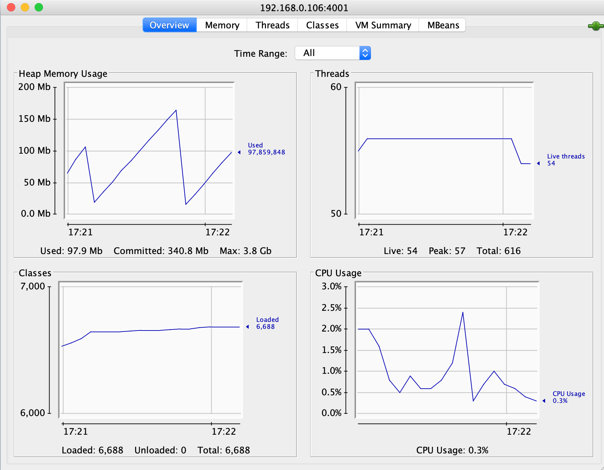

MetricsGraphiteReporter is an implementation of Graphite reporter, which connects to a Graphite server, and send `HoodieMetrics` to it.

The following is an example of `MetricsGraphiteReporter`. More detaile configurations can be referenced [here](#configurations--metrics-configurations-for-graphite).

```properties
hoodie.metrics.on=true 
hoodie.metrics.reporter.type=GRAPHITE 
hoodie.metrics.graphite.host=192.168.0.106 
hoodie.metrics.graphite.port=2003 
hoodie.metrics.graphite.metric.prefix=<your metrics prefix> 
```

As configured above, assuming a Graphite server is running on host 192.168.0.106 and port 2003, a running Hudi job will connect and report metrics data to it. Below is an illustration of monitoring hudi metrics through Graphite.

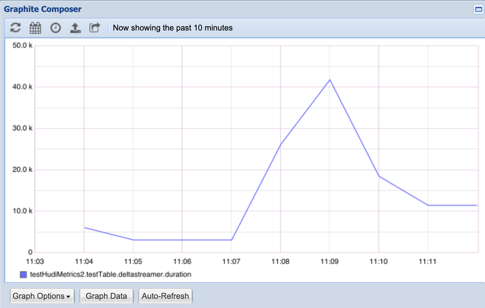

DatadogMetricsReporter is an implementation of Datadog reporter.
A reporter which publishes metric values to Datadog monitoring service via Datadog HTTP API.

The following is an example of `DatadogMetricsReporter`. More detailed configurations can be referenced [here](#configurations--metrics-configurations-for-datadog-reporter).

```properties
hoodie.metrics.on=true 
hoodie.metrics.reporter.type=DATADOG 
hoodie.metrics.datadog.api.site=EU # or US 
hoodie.metrics.datadog.api.key=<your api key> 
hoodie.metrics.datadog.metric.prefix=<your metrics prefix> 
```

- `hoodie.metrics.datadog.api.site` will set the Datadog API site, which determines whether the requests will be sent to api.datadoghq.eu (EU) or api.datadoghq.com (US). Set this according to your Datadog account settings.
- `hoodie.metrics.datadog.api.key` will set the api key.
- `hoodie.metrics.datadog.metric.prefix` will help segregate metrics by setting different prefixes for different jobs. Note that it will use `.` to delimit the prefix and the metric name. For example, if the prefix is set to `foo`, then `foo.` will be prepended to the metric name.

In this demo, we ran a Hudi Streamer job with `HoodieMetrics` turned on and other configurations set properly.

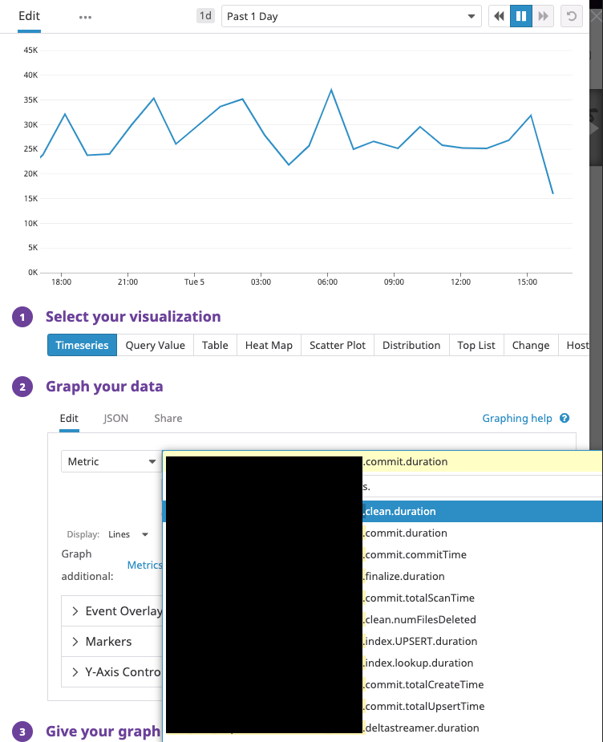

As shown above, we were able to collect Hudi's action-related metrics like

- `<prefix>.<table name>.commit.totalScanTime`
- `<prefix>.<table name>.clean.duration`
- `<prefix>.<table name>.index.lookup.duration`

as well as Hudi-Streamer-specific metrics

- `<prefix>.<table name>.deltastreamer.duration`
- `<prefix>.<table name>.deltastreamer.hiveSyncDuration`

[Prometheus](https://prometheus.io/) is an open source systems monitoring and alerting toolkit.
Prometheus has a [PushGateway](https://prometheus.io/docs/practices/pushing/) that Apache Hudi can leverage for metrics reporting.
Follow [Prometheus documentation](https://prometheus.io/docs/introduction/first_steps/) for basic setup instructions.

Similar to other supported reporters, the following attributes are required to enable pushgateway reporters:

```scala
hoodie.metrics.on=true 
hoodie.metrics.reporter.type=PROMETHEUS_PUSHGATEWAY 
```

The following properties are used to configure the address and port number of pushgateway. The default address is
localhost, and the default port is 9091

```scala
hoodie.metrics.pushgateway.host=xxxx 
hoodie.metrics.pushgateway.port=9091 
```

You can configure whether to delete the monitoring information from pushgateway at the end of the task, the default is true

```scala
hoodie.metrics.pushgateway.delete.on.shutdown=false 
```

You can configure the task name prefix and whether a random suffix is required. The default is true

```scala
hoodie.metrics.pushgateway.job.name=xxxx 
hoodie.metrics.pushgateway.random.job.name.suffix=false 
```

Hudi supports publishing metrics to Amazon CloudWatch. It can be configured by setting [`hoodie.metrics.reporter.type`](https://hudi.apache.org/docs/next/configurations#hoodiemetricsreportertype)
to “CLOUDWATCH”. Static AWS credentials to be used can be configured using
[`hoodie.aws.access.key`](https://hudi.apache.org/docs/next/configurations#hoodieawsaccesskey), [`hoodie.aws.secret.key`](https://hudi.apache.org/docs/next/configurations#hoodieawssecretkey), [`hoodie.aws.session.token`](https://hudi.apache.org/docs/next/configurations#hoodieawssessiontoken) properties.
In the absence of static AWS credentials being configured, `DefaultAWSCredentialsProviderChain` will be used to get
credentials by checking environment properties. Additional Amazon CloudWatch reporter specific properties that can be
tuned are in the `HoodieMetricsCloudWatchConfig` class.

Allows users to define a custom metrics reporter.

The following is an example of `UserDefinedMetricsReporter`. More detailed configurations can be referenced [here](#configurations--metrics-configurations).

```properties
hoodie.metrics.on=true 
hoodie.metrics.reporter.class=test.TestUserDefinedMetricsReporter 
```

In this simple demo, TestMetricsReporter will print all gauges every 10 seconds

```java
public static class TestUserDefinedMetricsReporter extends AbstractUserDefinedMetricsReporter {private static final Logger log = LogManager.getLogger(DummyMetricsReporter.class);
private ScheduledExecutorService exec = Executors.newScheduledThreadPool(1, r -> {Thread t = Executors.defaultThreadFactory().newThread(r); t.setDaemon(true); return t; });
public TestUserDefinedMetricsReporter(Properties props, MetricRegistry registry) {super(props, registry);}
@Override public void start() {exec.schedule(this::report, 10, TimeUnit.SECONDS);}
@Override public void report() {this.getRegistry().getGauges().forEach((key, value) -> log.info("key: " + key + " value: " + value.getValue().toString()));}
@Override public Closeable getReporter() {return null;}
@Override public void stop() {exec.shutdown();}}
```

Once the Hudi writer is configured with the right table and environment for `HoodieMetrics`, it produces the following `HoodieMetrics`, that aid in debugging hudi tables

- **Commit Duration** - The amount of time it took to successfully commit a batch of records
- **Rollback Duration** - Similarly, the amount of time taken to undo partial data left over by a failed commit (rollback happens automatically after a failing write)
- **File Level metrics** - Shows the amount of new files added, versions, deleted (cleaned) in each commit
- **Record Level Metrics** - Total records inserted/updated etc per commit
- **Partition Level metrics** - number of partitions upserted (super useful to understand sudden spikes in commit duration)

These `HoodieMetrics` can then be plotted on a standard tool like grafana. Below is a sample commit duration chart.

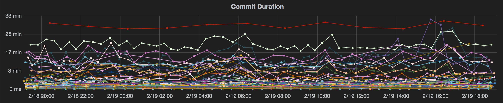

The below metrics are available in all timeline operations that involves a commit such as deltacommit, compaction, clustering and rollback.

| Name | Description |
| --- | --- |
| commitFreshnessInMs | Milliseconds from the commit end time and the maximum event time of the incoming records |
| commitLatencyInMs | Milliseconds from the commit end time and the minimum event time of incoming records |
| commitTime | Time of commit in epoch milliseconds |
| duration | Total time taken for the commit/rollback in milliseconds |
| numFilesDeleted | Number of files deleted during a clean/rollback |
| numFilesFinalized | Number of files finalized in a write |
| totalBytesWritten | Bytes written in a HoodieCommit |
| totalCompactedRecordsUpdated | Number of records updated in a compaction operation |
| totalCreateTime | Time taken for file creation during a Hoodie Insert operation |
| totalFilesInsert | Number of newly written files in a HoodieCommit |
| totalFilesUpdate | Number of files updated in a HoodieCommit |
| totalInsertRecordsWritten | Number of records inserted or converted to updates(for small file handling) in a HoodieCommit |
| totalLogFilesCompacted | Number of log files under a base file in a file group compacted |
| totalLogFilesSize | Total size in bytes of all log files under a base file in a file group |
| totalPartitionsWritten | Number of partitions that took writes in a HoodieCommit |
| totalRecordsWritten | Number of records written in a HoodieCommit. For inserts, it is the total numbers of records inserted. And for updates, it the total number of records in the file. |
| totalScanTime | Time taken for reading and merging logblocks in a log file |
| totalUpdateRecordsWritten | Number of records that got changed in a HoodieCommit |
| totalUpsertTime | Time taken for Hoodie Merge |

These metrics can be found at org.apache.hudi.metrics.HoodieMetrics and referenced from
org.apache.hudi.common.model.HoodieCommitMetadata and org.apache.hudi.common.model.HoodieWriteStat

---

<a id="encryption"></a>

<!-- source_url: https://hudi.apache.org/docs/encryption/ -->

<!-- page_index: 52 -->

# Encryption

Version: 1.1.1

Since Hudi 0.11.0, Spark 3.2 support has been added and accompanying that, Parquet 1.12 has been included, which brings encryption feature to Hudi. In this section, we will show a guide on how to enable encryption in Hudi tables.

First, make sure Hudi Spark 3.2 bundle jar is used.

Then, set the following Parquet configurations to make data written to Hudi COW tables encrypted.

```java
// Activate Parquet encryption, driven by Hadoop properties 
jsc.hadoopConfiguration().set("parquet.crypto.factory.class", "org.apache.parquet.crypto.keytools.PropertiesDrivenCryptoFactory") 
// Explicit master keys (base64 encoded) - required only for mock InMemoryKMS 
jsc.hadoopConfiguration().set("parquet.encryption.kms.client.class" , "org.apache.parquet.crypto.keytools.mocks.InMemoryKMS") 
jsc.hadoopConfiguration().set("parquet.encryption.key.list", "k1:AAECAwQFBgcICQoLDA0ODw==, k2:AAECAAECAAECAAECAAECAA==") 
// Write encrypted dataframe files.  
// Column "rider" will be protected with master key "key2". 
// Parquet file footers will be protected with master key "key1" 
jsc.hadoopConfiguration().set("parquet.encryption.footer.key", "k1") 
jsc.hadoopConfiguration().set("parquet.encryption.column.keys", "k2:rider") 
     
spark.read().format("org.apache.hudi").load("path").show(); 
```

Here is an example.

```java
JavaSparkContext jsc = new JavaSparkContext(spark.sparkContext()); 
jsc.hadoopConfiguration().set("parquet.crypto.factory.class", "org.apache.parquet.crypto.keytools.PropertiesDrivenCryptoFactory"); 
jsc.hadoopConfiguration().set("parquet.encryption.kms.client.class" , "org.apache.parquet.crypto.keytools.mocks.InMemoryKMS"); 
jsc.hadoopConfiguration().set("parquet.encryption.footer.key", "k1"); 
jsc.hadoopConfiguration().set("parquet.encryption.column.keys", "k2:rider"); 
jsc.hadoopConfiguration().set("parquet.encryption.key.list", "k1:AAECAwQFBgcICQoLDA0ODw==, k2:AAECAAECAAECAAECAAECAA=="); 
 
QuickstartUtils.DataGenerator dataGen = new QuickstartUtils.DataGenerator(); 
List<String> inserts = convertToStringList(dataGen.generateInserts(3)); 
Dataset<Row> inputDF1 = spark.read().json(jsc.parallelize(inserts, 1)); 
inputDF1.write().format("org.apache.hudi") 
    .option("hoodie.table.name", "encryption_table") 
    .option("hoodie.upsert.shuffle.parallelism","2") 
    .option("hoodie.insert.shuffle.parallelism","2") 
    .option("hoodie.delete.shuffle.parallelism","2") 
    .option("hoodie.bulkinsert.shuffle.parallelism","2") 
    .mode(SaveMode.Overwrite) 
    .save("path"); 
 
spark.read().format("org.apache.hudi").load("path").select("rider").show(); 
```

Reading the table works if configured correctly

```text
+---------+ 
|rider    | 
+---------+ 
|rider-213| 
|rider-213| 
|rider-213| 
+---------+ 
```

Read more from [Spark docs](https://spark.apache.org/docs/latest/sql-data-sources-parquet.html#columnar-encryption) and [Parquet docs](https://github.com/apache/parquet-format/blob/master/Encryption.md).

This feature is currently only available for COW tables due to only Parquet base files present there.

---

<a id="troubleshooting"></a>

<!-- source_url: https://hudi.apache.org/docs/troubleshooting/ -->

<!-- page_index: 53 -->

# Troubleshooting

Version: 1.1.1

For performance related issues, please refer to the [tuning guide](#tuning-guide)

It is recommended that schema should evolve in [backwards compatible way](https://docs.confluent.io/platform/current/schema-registry/avro.html) while using Hudi. Please refer here for more information on avro schema resolution - <https://avro.apache.org/docs/1.8.2/spec.html>. This error generally occurs when the schema has evolved in backwards **incompatible** way by deleting some column 'col1' and we are trying to update some record in parquet file which has ay been written with previous schema (which had 'col1'). In such cases, parquet tries to find all the present fields in the incoming record and when it finds 'col1' is not present, the mentioned exception is thrown.

The fix for this is to try and create uber schema using all the schema versions evolved so far for the concerned event and use this uber schema as the target schema. One of the good approaches can be fetching schema from hive metastore and merging it with the current schema.

Sample stacktrace where a field named "toBeDeletedStr" was omitted from new batch of updates : <https://gist.github.com/nsivabalan/cafc53fc9a8681923e4e2fa4eb2133fe>

This error will again occur due to schema evolutions in non-backwards compatible way. Basically there is some incoming update U for a record R which is already written to your Hudi dataset in the concerned parquet file. R contains field F which is having certain data type, let us say long. U has the same field F with updated data type of int type. Such incompatible data type conversions are not supported by Parquet FS.

For such errors, please try to ensure only valid data type conversions are happening in your primary data source from where you are trying to ingest.

Sample stacktrace when trying to evolve a field from Long type to Integer type with Hudi : <https://gist.github.com/nsivabalan/0d81cd60a3e7a0501e6a0cb50bfaacea>

This can possibly occur if your schema has some non-nullable field whose value is not present or is null. It is recommended to evolve schema in backwards compatible ways. In essence, this means either have every newly added field as nullable or define default values for every new field. See [Schema Evolution](#schema_evolution) docs for more.

[https://hudi.apache.org/docs/configurations#hoodiedatasourcehive\_syncsupport\_timestamp](#configurations--hoodiedatasourcehive_syncsupport_timestamp)

Please note that in cloud stores that do not support log append operations, Hudi is forced to create new archive files to archive old metadata operations.
You can increase `hoodie.commits.archival.batch` moving forward to increase the number of commits archived per archive file.
In addition, you can increase the difference between the 2 watermark configurations : `hoodie.keep.max.commits` (default : 30)
and `hoodie.keep.min.commits` (default : 20). This way, you can reduce the number of archive files created and also
at the same time increase the number of metadata archived per archive file. Note that post 0.7.0 release where we are
adding consolidated Hudi metadata ([RFC-15](https://cwiki.apache.org/confluence/pages/viewpage.action?pageId=147427331)), the follow up work would involve re-organizing archival metadata so that we can do periodic compactions to control
file-sizing of these archive files.

From 0.11.0 release, we have upgraded the HBase version to 2.4.9, which is released based on Hadoop 2.x. Hudi's metadata

table uses HFile as the base file format, relying on the HBase library. When enabling metadata table in a Hudi table on

HDFS using Hadoop 3.x, NoSuchMethodError can be thrown due to compatibility issues between Hadoop 2.x and 3.x.

To address this, here's the workaround:

(1) Download HBase source code from [`https://github.com/apache/hbase`](https://github.com/apache/hbase);

(2) Switch to the source code of 2.4.9 release with the tag `rel/2.4.9`:

```bash
git checkout rel/2.4.9 
```

(3) Package a new version of HBase 2.4.9 with Hadoop 3 version:

```bash
mvn clean install -Denforcer.skip -DskipTests -Dhadoop.profile=3.0 -Psite-install-step 
```

(4) Package Hudi again.

This usually happens when there are other HBase libs provided by the runtime environment in the classpath, such as

Cloudera CDP stack, causing the conflict. To get around the RuntimeException, you can set the

`hbase.defaults.for.version.skip` to `true` in the `hbase-site.xml` configuration file, e.g., overwriting the config

within the Cloudera manager.

This is a known issue with enabling row-writer for bulk\_insert operation. When you do a bulk\_insert followed by another
write operation such as upsert/insert this might be observed for timestamp fields specifically. For example, bulk\_insert might produce
timestamp `2016-12-29 09:54:00.0` for record key whereas non bulk\_insert write operation might produce a long value like
`1483023240000000` for the record key thus creating two different records. To fix this, starting 0.10.1 a new config [hoodie.datasource.write.keygenerator.consistent.logical.timestamp.enabled](#configurations--hoodiedatasourcewritekeygeneratorconsistentlogicaltimestampenabled)
is introduced to bring consistency irrespective of whether row writing is enabled on not. However, for the sake of
backwards compatibility and not breaking existing pipelines, this config is set to false by default and will have to be enabled explicitly.

Unless Hive sync is enabled, the dataset written by Hudi using one of the methods above can simply be queries via the Spark datasource like any other source.

```scala
val hudiSnapshotQueryDF = spark 
     .read() 
     .format("hudi") 
     .option("hoodie.datasource.query.type", "snapshot") 
     .load(basePath)  
val hudiIncQueryDF = spark.read().format("hudi") 
     .option("hoodie.datasource.query.type", "incremental") 
     .option("hoodie.datasource.read.begin.instanttime", <beginInstantTime>) 
     .load(basePath); 
```

if Hive Sync is enabled in [Hudi Streamer](https://github.com/apache/hudi/blob/f5f0ef6549fedf93863526a2110fe262a3460432/hudi-utilities/src/main/java/org/apache/hudi/utilities/streamer/HoodieStreamer.java#L334) or [datasource](#configurations--hoodiedatasourcehive_syncenable), the dataset is available in Hive as a couple of tables, that can now be read using HiveQL, Presto or SparkSQL. See [here](https://hudi.apache.org/docs/querying_data/) for more.

Section below generally aids in debugging Hudi failures. Off the bat, the following metadata is added to every record to help triage issues easily using standard Hadoop SQL engines (Hive/PrestoDB/Spark)

- **\_hoodie\_record\_key** - Treated as a primary key within each DFS partition, basis of all updates/inserts
- **\_hoodie\_commit\_time** - Last commit that touched this record
- **\_hoodie\_commit\_seqno** - This field contains a unique sequence number for each record within each transaction.
- **\_hoodie\_file\_name** - Actual file name containing the record (super useful to triage duplicates)
- **\_hoodie\_partition\_path** - Path from basePath that identifies the partition containing this record

Please check if there were any write errors using the admin commands, during the window at which the record could have been written.

If you do find errors, then the record was not actually written by Hudi, but handed back to the application to decide what to do with it.

First of all, please confirm if you do indeed have duplicates **AFTER** ensuring the query is accessing the Hudi table [properly](https://hudi.apache.org/docs/querying_data/) .

- If confirmed, please use the metadata fields above, to identify the physical files & partition files containing the records .
- If duplicates span files across partitionpath, then this means your application is generating different partitionPaths for same recordKey, Please fix your app
- if duplicates span multiple files within the same partitionpath, please engage with mailing list. This should not happen. You can use the `records deduplicate` command to fix your data.

This might happen if you are ingesting from Kafka source, your cluster is ssl enabled by default and you are using some version of Hudi older than 0.5.1. Previous versions of Hudi were using spark-streaming-kafka-0-8 library. With the release of 0.5.1 version of Hudi, spark was upgraded to 2.4.4 and spark-streaming-kafka library was upgraded to spark-streaming-kafka-0-10. SSL support was introduced from spark-streaming-kafka-0-10. Please see here for reference.

The workaround can be either use Kafka cluster which is not ssl enabled, else upgrade Hudi version to at least 0.5.1 or spark-streaming-kafka library to spark-streaming-kafka-0-10.

This might happen when you are trying to ingest from ssl enabled kafka source and your setup is not able to read jars.conf file and its properties. To fix this, you need to pass the required property as part of your spark-submit command something like

```plain
--files jaas.conf,failed_tables.json --conf 'spark.driver.extraJavaOptions=-Djava.security.auth.login.config=jaas.conf' --conf 'spark.executor.extraJavaOptions=-Djava.security.auth.login.config=jaas.conf' 
```

If you encounter below stacktrace, please set the spark config as suggested below.

```plain
--conf 'spark.hadoop.fs.gs.outputstream.pipe.type=NIO_CHANNEL_PIPE' 
```

```plain
 at org.apache.hudi.io.storage.HoodieAvroParquetWriter.close(HoodieAvroParquetWriter.java:84) 
	Suppressed: java.io.IOException: Upload failed for 'gs://bucket/b0ee4274-5193-4a26-bcff-d60654fd7b24-0_0-42-671_20230228055305900.parquet' 
		at... 
		... 44 more 
	Caused by: java.io.IOException: Write end dead 
		at java.base/java.io.PipedInputStream.read(PipedInputStream.java:310) 
		at java.base/java.io.PipedInputStream.read(PipedInputStream.java:377) 
		at com.google.cloud.hadoop.repackaged.gcs.com.google.api.client.util.ByteStreams.read(ByteStreams.java:172) 
		at ... 
		... 3 more 
Caused by: [CIRCULAR REFERENCE: java.io.IOException: Write end dead] 
```

We have an active patch(<https://github.com/apache/hudi/pull/7245>) on fixing the issue. Until we land this, you can use above config to bypass the issue.

```plain
Error while processing statement: FAILED: Execution Error, return code 1 from org.apache.hadoop.hive.ql.exec.DDLTask. Unable to alter table. The following columns have types incompatible with the existing columns in their respective positions : col1,col2 
```

This will usually happen when you are trying to add a new column to existing hive table using our [HiveSyncTool.java](https://github.com/apache/hudi/blob/be4dfccbb24794dfac3714818971229870d24a2c/hudi-sync/hudi-hive-sync/src/main/java/org/apache/hudi/hive/HiveSyncTool.java) class. Databases usually will not allow to modify a column datatype from a higher order to lower order or cases where the datatypes may clash with the data that is already stored/will be stored in the table. To fix the same, try setting the following property -

```plain
set hive.metastore.disallow.incompatible.col.type.changes=false; 
```

This occurs because HiveSyncTool currently supports only few compatible data type conversions. Doing any other incompatible change will throw this exception. Please check the data type evolution for the concerned field and verify if it indeed can be considered as a valid data type conversion as per Hudi code base.

This generally occurs if you are trying to do Hive sync for your Hudi dataset and the configured hive\_sync database does not exist. Please create the corresponding database on your Hive cluster and try again.

This issue is caused by hive version conflicts, hudi built with hive-2.3.x version, so if still want hudi work with older hive version

```plain
Steps: (build with hive-2.1.0) 
1. git clone git@github.com:apache/incubator-hudi.git 
2. rm hudi-hadoop-mr/src/main/java/org/apache/hudi/hadoop/hive/HoodieCombineHiveInputFormat.java 
3. mvn clean package -DskipTests -DskipITs -Dhive.version=2.1.0 
```

This issue could occur when syncing to hive. Possible reason is that, hive does not play well if your table name has upper and lower case letter. Try to have all lower case letters for your table name and it should likely get fixed. Related issue: <https://github.com/apache/hudi/issues/2409>

This will occur when capital letters are used in the table name. Metastores such as Hive automatically convert table names

to lowercase. While we allow capitalization on Hudi tables, if you would like to use a metastore you may be required to

use all lowercase letters. More details on how this issue presents can be found [here](https://github.com/apache/hudi/issues/6832).

####

---

<a id="tuning-guide"></a>

<!-- source_url: https://hudi.apache.org/docs/tuning-guide/ -->

<!-- page_index: 54 -->

# Spark Tuning Guide

Version: 1.1.1

> [!NOTE]
> **Profiling Tip**
> To get a better understanding of where your Hudi jobs is spending its time, use a tool like [YourKit Java Profiler](https://www.yourkit.com/download/), to obtain heap dumps/flame graphs.

Writing data via Hudi happens as a Spark job and thus general rules of spark debugging applies here too. Below is a list of things to keep in mind, if you are looking to improving performance or reliability.

**Input Parallelism** : By default, Hudi follows the input parallelism. Bump this up accordingly if you have larger inputs, that can cause more shuffles. We recommend tuning shuffle parallelism hoodie.[insert|upsert|bulkinsert].shuffle.parallelism such that its at least input\_data\_size/500MB.

**Off-heap memory** : Hudi writes parquet files and that needs good amount of off-heap memory proportional to schema width. Consider setting something like spark.executor.memoryOverhead or spark.driver.memoryOverhead, if you are running into such failures.

**Spark Memory** : Typically, hudi needs to be able to read a single file into memory to perform merges or compactions and thus the executor memory should be sufficient to accomodate this. In addition, Hudi caches the input to be able to intelligently place data and thus leaving some `spark.memory.storageFraction` will generally help boost performance.

**Sizing files**: Set target file sizes judiciously, to balance ingest/write latency vs number of files & consequently metadata overhead associated with it.

**Timeseries/Log data** : Default configs are tuned for database/nosql changelogs where individual record sizes are large. Another very popular class of data is timeseries/event/log data that tends to be more volumnious with lot more records per partition. In such cases consider tuning the bloom filter accuracy to achieve your target index look up time or use a bucketed index configuration. Also, consider making a key that is prefixed with time of the event, which will enable range pruning & significantly speeding up index lookup.

Typical upsert() DAG looks like below. Note that Hudi client also caches intermediate RDDs to intelligently profile workload and size files and spark parallelism.
Also Spark UI shows sortByKey twice due to the probe job also being shown, nonetheless its just a single sort.

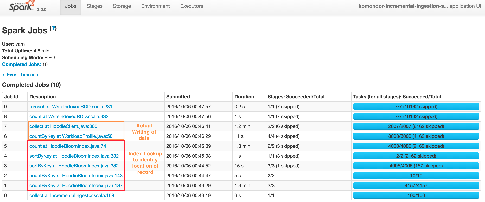

**At a high level, there are two steps**:

*Index Lookup to identify files to be changed*

- Job 1 : Triggers the input data read, converts to HoodieRecord object and then stops at obtaining a spread of input records to target partition paths
- Job 2 : Load the set of file names which we need check against
- Job 3 & 4 : Actual lookup after smart sizing of spark join parallelism, by joining RDDs in 1 & 2 above
- Job 5 : Have a tagged RDD of recordKeys with locations

*Performing the actual writing of data*

- Job 6 : Lazy join of incoming records against recordKey, location to provide a final set of HoodieRecord which now contain the information about which file/partitionpath they are found at (or null if insert). Then also profile the workload again to determine sizing of files
- Job 7 : Actual writing of data (update + insert + insert turned to updates to maintain file size)

Depending on the exception source (Hudi/Spark), the above knowledge of the DAG can be used to pinpoint the actual issue. The most often encountered failures result from YARN/DFS temporary failures.
In the future, a more sophisticated debug/management UI would be added to the project, that can help automate some of this debugging.

When upsert large input data, hudi spills part of input data to disk when reach the max memory for merge. if there is enough memory, please increase spark executor's memory and `hoodie.memory.merge.fraction` option, for example
`option("hoodie.memory.merge.fraction", "0.8")`

First, let's understand what the term parallelism means in the context of Hudi jobs. For any Hudi job using Spark, parallelism equals to the number of spark partitions that should be generated for a particular stage in the DAG. To understand more about spark partitions, read this [article](https://www.projectpro.io/article/how-data-partitioning-in-spark-helps-achieve-more-parallelism/297). In spark, each spark partition is mapped to a spark task that can be executed on an executor. Typically, for a spark application the following hierarchy holds true

(Spark Application → N Spark Jobs → M Spark Stages → T Spark Tasks) on (E executors with C cores)

A spark application can be given E number of executors to run the spark application on. Each executor might hold 1 or more spark cores. Every spark task will require atleast 1 core to execute, so imagine T number of tasks to be done in Z time depending on C cores. The higher C, Z is smaller.

With this understanding, if you want your DAG stage to run faster, bring T as close or higher to C. Additionally, this parallelism finally controls the number of output files you write using a Hudi based job. Let's understand the different kinds of knobs available:

[BulkInsertParallelism](#configurations--hoodiebulkinsertshuffleparallelism) → This is used to control the parallelism with which output files will be created by a Hudi job. The higher this parallelism, the more number of tasks are created and hence the more number of output files will eventually be created. Even if you define [parquet-max-file-size](#configurations--hoodieparquetmaxfilesize) to be of a high value, if you make parallelism really high, the max file size cannot be honored since the spark tasks are working on smaller amounts of data.

[Upsert](#configurations--hoodieupsertshuffleparallelism) / [Insert Parallelism](#configurations--hoodieinsertshuffleparallelism) → This is used to control how fast the read process should be when reading data into the job. Find more details [here](#configurations).

Please be sure to follow garbage collection tuning tips from Spark tuning guide to avoid OutOfMemory errors. Must Use G1/CMS Collector. Sample CMS Flags to add to spark.executor.extraJavaOptions:

```java
-XX:NewSize=1g -XX:SurvivorRatio=2 -XX:+UseCompressedOops -XX:+UseConcMarkSweepGC -XX:+UseParNewGC -XX:CMSInitiatingOccupancyFraction=70 -XX:+PrintGCDetails -XX:+PrintGCTimeStamps -XX:+PrintGCDateStamps -XX:+PrintGCApplicationStoppedTime -XX:+PrintGCApplicationConcurrentTime -XX:+PrintTenuringDistribution -XX:+HeapDumpOnOutOfMemoryError -XX:HeapDumpPath=/tmp/hoodie-heapdump.hprof 
```

**OutOfMemory Errors**: If it keeps OOMing still, reduce spark memory conservatively: spark.memory.fraction=0.2, spark.memory.storageFraction=0.2 allowing it to spill rather than OOM. (reliably slow vs crashing intermittently)

Below is a full working production config used at Uber (HDFS/Yarn), for their ingest platform.

```scala
spark.driver.extraClassPath /etc/hive/conf 
spark.driver.extraJavaOptions -XX:+PrintTenuringDistribution -XX:+PrintGCDetails -XX:+PrintGCDateStamps -XX:+PrintGCApplicationStoppedTime -XX:+PrintGCApplicationConcurrentTime -XX:+PrintGCTimeStamps -XX:+HeapDumpOnOutOfMemoryError -XX:HeapDumpPath=/tmp/hoodie-heapdump.hprof 
spark.driver.maxResultSize 2g 
spark.driver.memory 4g 
spark.executor.cores 1 
spark.executor.extraJavaOptions -XX:+PrintFlagsFinal -XX:+PrintReferenceGC -verbose:gc -XX:+PrintGCDetails -XX:+PrintGCTimeStamps -XX:+PrintAdaptiveSizePolicy -XX:+UnlockDiagnosticVMOptions -XX:+HeapDumpOnOutOfMemoryError -XX:HeapDumpPath=/tmp/hoodie-heapdump.hprof 
spark.executor.id driver 
spark.executor.instances 300 
spark.executor.memory 6g 
spark.rdd.compress true 
 
spark.kryoserializer.buffer.max 512m 
spark.serializer org.apache.spark.serializer.KryoSerializer 
spark.shuffle.service.enabled true 
spark.submit.deployMode cluster 
spark.task.cpus 1 
spark.task.maxFailures 4 
 
spark.driver.memoryOverhead 1024 
spark.executor.memoryOverhead 3072 
spark.yarn.max.executor.failures 100 
```

---

<a id="flink_tuning"></a>

<!-- source_url: https://hudi.apache.org/docs/flink_tuning/ -->

<!-- page_index: 55 -->

# Flink Tuning Guide

Version: 1.1.1

> [!NOTE]
> When optimizing memory, we need to pay attention to the memory configuration
> and the number of taskManagers, parallelism of write tasks (write.tasks : 4) first. After confirm each write task to be
> allocated with enough memory, we can try to set these memory options.

---

<a id="basic_configurations"></a>

<!-- source_url: https://hudi.apache.org/docs/basic_configurations/ -->

<!-- page_index: 56 -->

# Basic Configurations

Version: 1.1.1

> [!NOTE]
> In the tables below **(N/A)** means there is no default value set

---

<a id="configurations"></a>

<!-- source_url: https://hudi.apache.org/docs/configurations/ -->

<!-- page_index: 57 -->

# All Configurations

Version: 1.1.1

> [!NOTE]
> In the tables below **(N/A)** means there is no default value set

---

<a id="cloud"></a>

<!-- source_url: https://hudi.apache.org/docs/cloud/ -->

<!-- page_index: 58 -->

# Cloud Storage

Version: 1.1.1

> [!NOTE]
> Many cloud object storage systems like [Amazon S3](https://docs.aws.amazon.com/s3/) allow you to set
> lifecycle policies, such as [S3 Lifecycle](https://docs.aws.amazon.com/AmazonS3/latest/userguide/object-lifecycle-mgmt.html), to manage objects. One of the policies is related to object expiration. If your organisation has configured such policies, then please ensure to exclude (or have a longer expiry period) for Hudi tables.

---

<a id="s3_hoodie"></a>

<!-- source_url: https://hudi.apache.org/docs/s3_hoodie/ -->

<!-- page_index: 59 -->

# AWS S3

Version: 1.1.1

In this page, we explain how to get your Hudi spark job to store into AWS S3.

There are two configurations required for Hudi-S3 compatibility:

- Adding AWS Credentials for Hudi
- Adding required Jars to classpath

The simplest way to use Hudi with S3, is to configure your `SparkSession` or `SparkContext` with S3 credentials. Hudi will automatically pick this up and talk to S3.

Alternatively, add the required configs in your core-site.xml from where Hudi can fetch them. Replace the `fs.defaultFS` with your S3 bucket name and Hudi should be able to read/write from the bucket.

```xml
  <property> 
    <name>fs.defaultFS</name> 
    <value>s3://ysharma</value> 
  </property> 
 
  <property> 
    <name>fs.s3.awsAccessKeyId</name> 
    <value>AWS_KEY</value> 
  </property> 
 
  <property> 
    <name>fs.s3.awsSecretAccessKey</name> 
    <value>AWS_SECRET</value> 
  </property> 
 
  <property> 
    <name>fs.s3a.awsAccessKeyId</name> 
    <value>AWS_KEY</value> 
  </property> 
 
  <property> 
    <name>fs.s3a.awsSecretAccessKey</name> 
    <value>AWS_SECRET</value> 
  </property> 
 
  <property> 
    <name>fs.s3a.endpoint</name> 
    <value>http://IP-Address:Port</value> 
  </property> 
 
  <property> 
    <name>fs.s3a.path.style.access</name> 
    <value>true</value> 
  </property> 
 
  <property> 
    <name>fs.s3a.signing-algorithm</name> 
    <value>S3SignerType</value> 
  </property> 
```

Utilities such as hudi-cli or Hudi Streamer tool, can pick up s3 creds via environmental variable prefixed with `HOODIE_ENV_`. For e.g below is a bash snippet to setup
such variables and then have cli be able to work on datasets stored in s3

```java
export HOODIE_ENV_fs_DOT_s3a_DOT_access_DOT_key=$accessKey 
export HOODIE_ENV_fs_DOT_s3a_DOT_secret_DOT_key=$secretKey 
export HOODIE_ENV_fs_DOT_s3_DOT_awsAccessKeyId=$accessKey 
export HOODIE_ENV_fs_DOT_s3_DOT_awsSecretAccessKey=$secretKey 
```

AWS hadoop libraries to add to our classpath

- com.amazonaws:aws-java-sdk:1.10.34
- org.apache.hadoop:hadoop-aws:2.7.3

AWS glue data libraries are needed if AWS glue data is used

- com.amazonaws.glue:aws-glue-datacatalog-hive2-client:1.11.0
- com.amazonaws:aws-java-sdk-glue:1.11.475

With versioned buckets any object deleted creates a [Delete Marker](https://docs.aws.amazon.com/AmazonS3/latest/userguide/DeleteMarker.html), as Hudi cleans up files using [Cleaner utility](https://hudi.apache.org/docs/hoodie_cleaner) the number of Delete Markers increases over time.
It is important to configure the [Lifecycle Rule](https://docs.aws.amazon.com/AmazonS3/latest/userguide/object-lifecycle-mgmt.html) correctly
to clean up these delete markers as the List operation can choke if the number of delete markers reaches 1000.
We recommend cleaning up Delete Markers after 1 day in Lifecycle Rule.

---

<a id="gcs_hoodie"></a>

<!-- source_url: https://hudi.apache.org/docs/gcs_hoodie/ -->

<!-- page_index: 60 -->

# Google Cloud

Version: 1.1.1

For Hudi storage on GCS, **regional** buckets provide an DFS API with strong consistency.

There are two configurations required for Hudi GCS compatibility:

- Adding GCS Credentials for Hudi
- Adding required jars to classpath

Add the required configs in your core-site.xml from where Hudi can fetch them. Replace the `fs.defaultFS` with your GCS bucket name and Hudi should be able to read/write from the bucket.

```xml
  <property> 
    <name>fs.defaultFS</name> 
    <value>gs://hudi-bucket</value> 
  </property> 
 
  <property> 
    <name>fs.gs.impl</name> 
    <value>com.google.cloud.hadoop.fs.gcs.GoogleHadoopFileSystem</value> 
    <description>The FileSystem for gs: (GCS) uris.</description> 
  </property> 
 
  <property> 
    <name>fs.AbstractFileSystem.gs.impl</name> 
    <value>com.google.cloud.hadoop.fs.gcs.GoogleHadoopFS</value> 
    <description>The AbstractFileSystem for gs: (GCS) uris.</description> 
  </property> 
 
  <property> 
    <name>fs.gs.project.id</name> 
    <value>GCS_PROJECT_ID</value> 
  </property> 
  <property> 
    <name>google.cloud.auth.service.account.enable</name> 
    <value>true</value> 
  </property> 
  <property> 
    <name>google.cloud.auth.service.account.email</name> 
    <value>GCS_SERVICE_ACCOUNT_EMAIL</value> 
  </property> 
  <property> 
    <name>google.cloud.auth.service.account.keyfile</name> 
    <value>GCS_SERVICE_ACCOUNT_KEYFILE</value> 
  </property> 
```

GCS hadoop libraries to add to our classpath

- com.google.cloud.bigdataoss:gcs-connector:1.6.0-hadoop2

---

<a id="oss_hoodie"></a>

<!-- source_url: https://hudi.apache.org/docs/oss_hoodie/ -->

<!-- page_index: 61 -->

# Alibaba Cloud

Version: 1.1.1

In this page, we explain how to get your Hudi spark job to store into Aliyun OSS.

There are two configurations required for Hudi-OSS compatibility:

- Adding Aliyun OSS Credentials for Hudi
- Adding required Jars to classpath

Add the required configs in your core-site.xml from where Hudi can fetch them. Replace the `fs.defaultFS` with your OSS bucket name, replace `fs.oss.endpoint` with your OSS endpoint, replace `fs.oss.accessKeyId` with your OSS key, replace `fs.oss.accessKeySecret` with your OSS secret. Hudi should be able to read/write from the bucket.

```xml
<property> 
  <name>fs.defaultFS</name> 
  <value>oss://bucketname/</value> 
</property> 
 
<property> 
  <name>fs.oss.endpoint</name> 
  <value>oss-endpoint-address</value> 
  <description>Aliyun OSS endpoint to connect to.</description> 
</property> 
 
<property> 
  <name>fs.oss.accessKeyId</name> 
  <value>oss_key</value> 
  <description>Aliyun access key ID</description> 
</property> 
 
<property> 
  <name>fs.oss.accessKeySecret</name> 
  <value>oss-secret</value> 
  <description>Aliyun access key secret</description> 
</property> 
 
<property> 
  <name>fs.oss.impl</name> 
  <value>org.apache.hadoop.fs.aliyun.oss.AliyunOSSFileSystem</value> 
</property> 
```

Aliyun hadoop libraries jars to add to our pom.xml. Since hadoop-aliyun depends on the version of hadoop 2.9.1+, you need to use the version of hadoop 2.9.1 or later.

```xml
<dependency> 
  <groupId>org.apache.hadoop</groupId> 
  <artifactId>hadoop-aliyun</artifactId> 
  <version>3.2.1</version> 
</dependency> 
<dependency> 
  <groupId>com.aliyun.oss</groupId> 
  <artifactId>aliyun-sdk-oss</artifactId> 
  <version>3.8.1</version> 
</dependency> 
<dependency> 
  <groupId>org.jdom</groupId> 
  <artifactId>jdom</artifactId> 
  <version>1.1</version> 
</dependency> 
```

---

<a id="azure_hoodie"></a>

<!-- source_url: https://hudi.apache.org/docs/azure_hoodie/ -->

<!-- page_index: 62 -->

# Microsoft Azure

Version: 1.1.1

In this page, we explain how to use Hudi on Microsoft Azure.

This page is maintained by the Hudi community.
If the information is inaccurate or you have additional information to add.
Please feel free to create a GitHub issue. Contribution is highly appreciated.

There are two storage systems support Hudi .

- Azure Blob Storage
- Azure Data Lake Gen 2

This combination works out of the box. No extra config needed.

- Import Hudi jar to databricks workspace
- Mount the file system to dbutils.


```scala
dbutils.fs.mount( 
  source = "abfss://xxx@xxx.dfs.core.windows.net", 
  mountPoint = "/mountpoint", 
  extraConfigs = configs) 
```

- When writing Hudi dataset, use abfss URL


```scala
inputDF.write 
  .format("org.apache.hudi") 
  .options(opts) 
  .mode(SaveMode.Append) 
  .save("abfss://<<storage-account>>.dfs.core.windows.net/hudi-tables/customer") 
```

- When reading Hudi dataset, use the mounting point


```scala
spark.read 
  .format("org.apache.hudi") 
  .load("/mountpoint/hudi-tables/customer") 
```

<a id="azure_hoodie--blogs"></a>

### Blogs

- [How to use Apache Hudi with Databricks](https://www.onehouse.ai/blog/how-to-use-apache-hudi-with-databricks)

---

<a id="cos_hoodie"></a>

<!-- source_url: https://hudi.apache.org/docs/cos_hoodie/ -->

<!-- page_index: 63 -->

# Tencent Cloud

Version: 1.1.1

In this page, we explain how to get your Hudi spark job to store into Tencent Cloud COS.

There are two configurations required for Hudi-COS compatibility:

- Adding Tencent Cloud COS Credentials for Hudi
- Adding required Jars to classpath

Add the required configs in your core-site.xml from where Hudi can fetch them. Replace the `fs.defaultFS` with your COS bucket name, replace `fs.cosn.userinfo.secretId` with your COS secret Id, replace `fs.cosn.userinfo.secretKey` with your COS key. Hudi should be able to read/write from the bucket.

```xml
    <property> 
        <name>fs.defaultFS</name> 
        <value>cosn://bucketname</value> 
        <description>COS bucket name</description> 
    </property> 
 
    <property> 
        <name>fs.cosn.userinfo.secretId</name> 
        <value>cos-secretId</value> 
        <description>Tencent Cloud Secret Id</description> 
    </property> 
 
    <property> 
        <name>fs.cosn.userinfo.secretKey</name> 
        <value>cos-secretkey</value> 
        <description>Tencent Cloud Secret Key</description> 
    </property> 
 
    <property> 
        <name>fs.cosn.bucket.region</name> 
        <value>ap-region</value> 
        <description>The region where the bucket is located.</description> 
    </property> 
 
    <property> 
        <name>fs.cosn.bucket.endpoint_suffix</name> 
        <value>cos.endpoint.suffix</value> 
        <description> 
          COS endpoint to connect to.  
          For public cloud users, it is recommended not to set this option, and only the correct area field is required. 
        </description> 
    </property> 
 
    <property> 
        <name>fs.cosn.impl</name> 
        <value>org.apache.hadoop.fs.CosFileSystem</value> 
        <description>The implementation class of the CosN Filesystem.</description> 
    </property> 
 
    <property> 
        <name>fs.AbstractFileSystem.cosn.impl</name> 
        <value>org.apache.hadoop.fs.CosN</value> 
        <description>The implementation class of the CosN AbstractFileSystem.</description> 
    </property> 
 
```

COS hadoop libraries to add to our classpath

- org.apache.hadoop:hadoop-cos:2.8.5

---

<a id="ibm_cos_hoodie"></a>

<!-- source_url: https://hudi.apache.org/docs/ibm_cos_hoodie/ -->

<!-- page_index: 64 -->

# IBM Cloud

Version: 1.1.1

In this page, we explain how to get your Hudi spark job to store into IBM Cloud Object Storage.

There are two configurations required for Hudi-IBM Cloud Object Storage compatibility:

- Adding IBM COS Credentials for Hudi
- Adding required Jars to classpath

Simplest way to use Hudi with IBM Cloud Object Storage, is to configure your `SparkSession` or `SparkContext` with IBM Cloud Object Storage credentials using [Stocator](https://github.com/CODAIT/stocator) storage connector for Spark. Hudi will automatically pick this up and talk to IBM Cloud Object Storage.

Alternatively, add the required configs in your `core-site.xml` from where Hudi can fetch them. Replace the `fs.defaultFS` with your IBM Cloud Object Storage bucket name and Hudi should be able to read/write from the bucket.

For example, using HMAC keys and service name `myCOS`:

```xml
  <property> 
      <name>fs.defaultFS</name> 
      <value>cos://myBucket.myCOS</value> 
  </property> 
 
  <property> 
      <name>fs.cos.flat.list</name> 
      <value>true</value> 
  </property> 
 
  <property> 
      <name>fs.stocator.scheme.list</name> 
      <value>cos</value> 
  </property> 
 
  <property> 
      <name>fs.cos.impl</name> 
      <value>com.ibm.stocator.fs.ObjectStoreFileSystem</value> 
  </property> 
 
  <property> 
      <name>fs.stocator.cos.impl</name> 
      <value>com.ibm.stocator.fs.cos.COSAPIClient</value> 
  </property> 
 
  <property> 
      <name>fs.stocator.cos.scheme</name> 
      <value>cos</value> 
  </property> 
 
  <property> 
      <name>fs.cos.myCos.access.key</name> 
      <value>ACCESS KEY</value> 
  </property> 
 
  <property> 
      <name>fs.cos.myCos.endpoint</name> 
      <value>http://s3-api.us-geo.objectstorage.softlayer.net</value> 
  </property> 
 
  <property> 
      <name>fs.cos.myCos.secret.key</name> 
      <value>SECRET KEY</value> 
  </property> 
 
```

For more options see Stocator [documentation](https://github.com/CODAIT/stocator/blob/master/README.md).

IBM Cloud Object Storage hadoop libraries to add to our classpath

- com.ibm.stocator:stocator:1.1.3

---

<a id="bos_hoodie"></a>

<!-- source_url: https://hudi.apache.org/docs/bos_hoodie/ -->

<!-- page_index: 65 -->

# Baidu Cloud

Version: 1.1.1

In this page, we explain how to get your Hudi job to store into Baidu BOS.

There are two configurations required for Hudi-BOS compatibility:

- Adding Baidu BOS Credentials for Hudi
- Adding required Jars to classpath

Add the required configs in your core-site.xml from where Hudi can fetch them. Replace the `fs.defaultFS` with your BOS bucket name, replace `fs.bos.endpoint` with your bos endpoint, replace `fs.bos.access.key` with your bos key, replace `fs.bos.secret.access.key` with your bos secret key. Hudi should be able to read/write from the bucket.

```xml
<property> 
  <name>fs.defaultFS</name> 
  <value>bos://bucketname/</value> 
</property> 
 
<property> 
  <name>fs.bos.endpoint</name> 
  <value>bos-endpoint-address</value> 
  <description>Baidu bos endpoint to connect to,for example : http://bj.bcebos.com</description> 
</property> 
 
<property> 
  <name>fs.bos.access.key</name> 
  <value>bos-key</value> 
  <description>Baidu access key</description> 
</property> 
 
<property> 
  <name>fs.bos.secret.access.key</name> 
  <value>bos-secret-key</value> 
  <description>Baidu secret key.</description> 
</property> 
 
<property> 
  <name>fs.bos.impl</name> 
  <value>org.apache.hadoop.fs.bos.BaiduBosFileSystem</value> 
</property> 
```

Baidu hadoop libraries jars to add to our classpath

- com.baidubce:bce-java-sdk:0.10.165
- bos-hdfs-sdk-1.0.2-community.jar

You can download the bos-hdfs-sdk jar from [here](https://sdk.bce.baidu.com/console-sdk/bos-hdfs-sdk-1.0.2-community.jar.zip) , and then unzip it.

---

<a id="jfs_hoodie"></a>

<!-- source_url: https://hudi.apache.org/docs/jfs_hoodie/ -->

<!-- page_index: 66 -->

# JuiceFS

Version: 1.1.1

In this page, we explain how to use Hudi with JuiceFS.

[JuiceFS](https://github.com/juicedata/juicefs) is a high-performance distributed file system. Any data stored into JuiceFS, the data itself will be persisted in object storage (e.g. Amazon S3), and the metadata corresponding to the data can be persisted in various database engines such as Redis, MySQL, and TiKV according to the needs of the scene.

There are three configurations required for Hudi-JuiceFS compatibility:

1. Creating JuiceFS file system
2. Adding JuiceFS configuration for Hudi
3. Adding required JAR to `classpath`

JuiceFS supports multiple [metadata engines](https://juicefs.com/docs/community/databases_for_metadata) such as Redis, MySQL, SQLite, and TiKV. And supports almost all [object storage](https://juicefs.com/docs/community/how_to_setup_object_storage#supported-object-storage) as data storage, e.g. Amazon S3, Google Cloud Storage, Azure Blob Storage.

The following example uses Redis as "Metadata Engine" and Amazon S3 as "Data Storage" in Linux environment.

```shell
$ JFS_LATEST_TAG=$(curl -s https://api.github.com/repos/juicedata/juicefs/releases/latest | grep 'tag_name' | cut -d '"' -f 4 | tr -d 'v')
$ wget "https://github.com/juicedata/juicefs/releases/download/v${JFS_LATEST_TAG}/juicefs-${JFS_LATEST_TAG}-linux-amd64.tar.gz"
```

```shell
$ mkdir juice && tar -zxvf "juicefs-${JFS_LATEST_TAG}-linux-amd64.tar.gz" -C juice
$ sudo install juice/juicefs /usr/local/bin
```

```shell
$ juicefs format \ --storage s3 \ --bucket https://<bucket>.s3.<region>.amazonaws.com \ --access-key <your-access-key-id> \ --secret-key <your-access-key-secret> \ redis://:<password>@<redis-host>:6379/1 \ myjfs
```

For more information, please refer to ["JuiceFS Quick Start Guide"](https://juicefs.com/docs/community/quick_start_guide).

Add the required configurations in your `core-site.xml` from where Hudi can fetch them.

```xml
<property> 
    <name>fs.defaultFS</name> 
    <value>jfs://myjfs</value> 
    <description>Optional, you can also specify full path "jfs://myjfs/path-to-dir" with location to use JuiceFS</description> 
</property> 
<property> 
    <name>fs.jfs.impl</name> 
    <value>io.juicefs.JuiceFileSystem</value> 
</property> 
<property> 
    <name>fs.AbstractFileSystem.jfs.impl</name> 
    <value>io.juicefs.JuiceFS</value> 
</property> 
<property> 
    <name>juicefs.meta</name> 
    <value>redis://:<password>@<redis-host>:6379/1</value> 
</property> 
<property> 
    <name>juicefs.cache-dir</name> 
    <value>/path-to-your-disk</value> 
</property> 
<property> 
    <name>juicefs.cache-size</name> 
    <value>1024</value> 
</property> 
<property> 
    <name>juicefs.access-log</name> 
    <value>/tmp/juicefs.access.log</value> 
</property> 
```

You can visit [here](https://juicefs.com/docs/community/hadoop_java_sdk#client-configurations) for more configuration information.

You can download latest JuiceFS Hadoop Java SDK from [here](http://github.com/juicedata/juicefs/releases/latest) (download the file called like `juicefs-hadoop-X.Y.Z-linux-amd64.jar`), and place it to the `classpath`. You can also [compile](https://juicefs.com/docs/community/hadoop_java_sdk#client-compilation) it by yourself.

For example, if you use Hudi in Spark, please put the JAR in `$SPARK_HOME/jars`.

---

<a id="oci_hoodie"></a>

<!-- source_url: https://hudi.apache.org/docs/oci_hoodie/ -->

<!-- page_index: 67 -->

# Oracle Cloud Infrastructure

Version: 1.1.1

The [Oracle Object Storage](https://docs.oracle.com/en-us/iaas/Content/Object/Concepts/objectstorageoverview.htm) system provides strongly-consistent operations on all buckets in all regions. OCI Object Storage provides an [HDFS Connector](https://docs.oracle.com/en-us/iaas/Content/API/SDKDocs/hdfsconnector.htm) your Application will need to access data.

To use HUDI on OCI Object Storage you must:

- Configure the HDFS Connector using an API key
- Include the HDFS Connector and dependencies in your application
- Construct an OCI HDFS URI

The OCI HDFS Connector requires configurations from an API key to authenticate and select the correct region. Start by [generating an API key](https://docs.oracle.com/en-us/iaas/Content/API/Concepts/apisigningkey.htm).

If you are using Hadoop, include these in your core-site.xml:

```xml
  <property> 
    <name>fs.oci.client.auth.tenantId</name> 
    <value>ocid1.tenancy.oc1..[tenant]</value> 
    <description>The OCID of your OCI tenancy</description> 
  </property> 
 
  <property> 
    <name>fs.oci.client.auth.userId</name> 
    <value>ocid1.user.oc1..[user]</value> 
    <description>The OCID of your OCI user</description> 
  </property> 
 
  <property> 
    <name>fs.oci.client.auth.fingerprint</name> 
    <value>XX::XX</value> 
    <description>Your 32-digit hexidecimal public key fingerprint</description> 
  </property> 
 
  <property> 
    <name>fs.oci.client.auth.pemfilepath</name> 
    <value>/path/to/file</value> 
    <description>Local path to your private key file</description> 
  </property> 
 
  <property> 
    <name>fs.oci.client.auth.hostname</name> 
    <value>https://objectstorage.[region].oraclecloud.com</value> 
    <description>HTTPS endpoint of your regional object store</description> 
  </property> 
```

If you are using Spark outside of Hadoop, set these configurations in your Spark Session:

| Key | Description |
| --- | --- |
| spark.hadoop.fs.oci.client.auth.tenantId | The OCID of your OCI tenancy |
| spark.hadoop.fs.oci.client.auth.userId | The OCID of your OCI user |
| spark.hadoop.fs.oci.client.auth.fingerprint | Your 32-digit hexidecimal public key fingerprint |
| spark.hadoop.fs.oci.client.auth.pemfilepath | Local path to your private key file |
| spark.hadoop.fs.oci.client.hostname | HTTPS endpoint of your regional object store |

If you are running Spark in OCI Data Flow you do not need to configure these settings, object storage access is configured for you.

These libraries need to be added to your application. The versions below are a reference, the libraries are continuously updated and you should check for later releases in Maven Central.

- com.oracle.oci.sdk:oci-java-sdk-core:2.18.0
- com.oracle.oci.sdk:oci-hdfs-connector:3.3.0.5

OCI HDFS URIs have the form of:

`oci://<bucket>@<namespace>/<path>`

The HDFS connector allows you to treat these locations similar to an `HDFS` location on Hadoop. Your tenancy has a unique Object Storage namespace. If you're not sure what your namespace is you can find it by installing the [OCI CLI](https://docs.oracle.com/en-us/iaas/Content/API/SDKDocs/cliinstall.htm) and running `oci os ns get`.

---

<a id="ks3_hoodie"></a>

<!-- source_url: https://hudi.apache.org/docs/ks3_hoodie/ -->

<!-- page_index: 68 -->

# KS3 Filesystem

Version: 1.1.1

In this page, we explain how to get your Hudi spark job to store into KS3.

There are two configurations required for Hudi-KS3 compatibility:

- Adding KS3 Credentials for Hudi
- Adding required Jars to classpath

Simplest way to use Hudi with KS3, is to configure your `SparkSession` or `SparkContext` with KS3 credentials. Hudi will automatically pick this up and talk to KS3.

Alternatively, add the required configs in your core-site.xml from where Hudi can fetch them. Replace the `fs.defaultFS` with your KS3 bucket name and Hudi should be able to read/write from the bucket.

```xml
  <property> 
      <name>fs.defaultFS</name> 
      <value>hdfs://ks3node</value> 
  </property> 
 
  <property> 
      <name>fs.ks3.impl</name> 
      <value>com.ksyun.kmr.hadoop.fs.Ks3FileSystem</value> 
  </property> 
 
  <property> 
      <name>fs.ks3.AccessKey</name> 
      <value>KS3_KEY</value> 
  </property> 
 
  <property> 
       <name>fs.ks3.AccessSecret</name> 
       <value>KS3_SECRET</value> 
  </property> 
 
```

KS3 hadoop libraries to add to our classpath

- com.ksyun:ks3-kss-java-sdk:1.0.2

---
