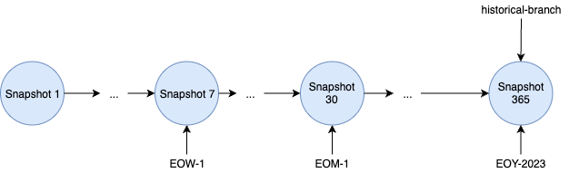
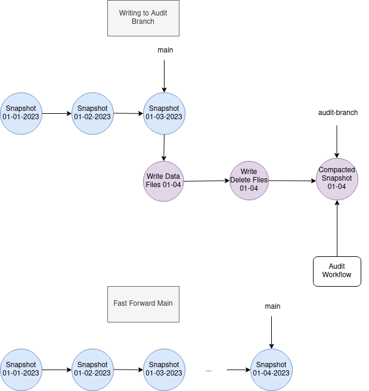
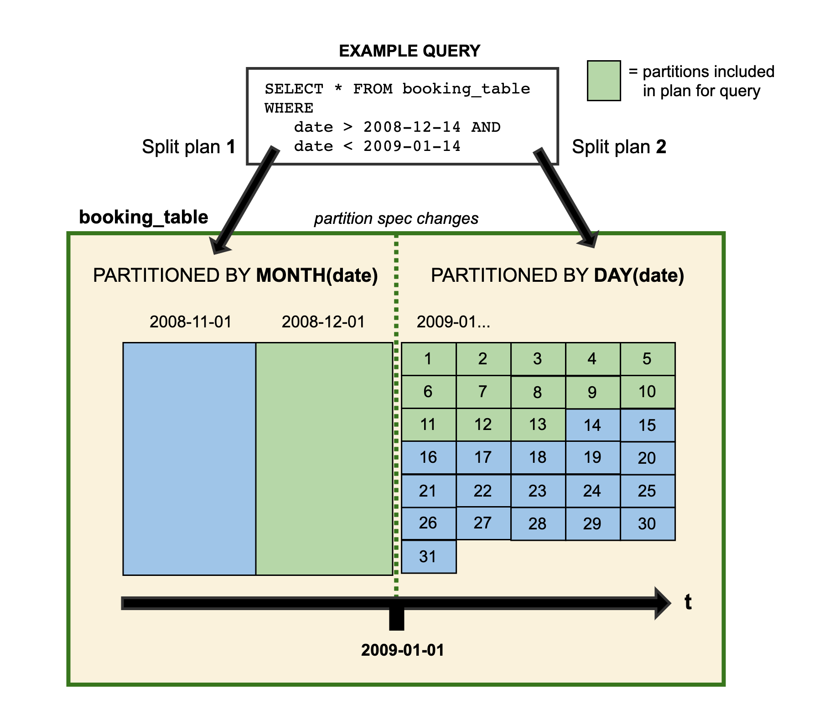
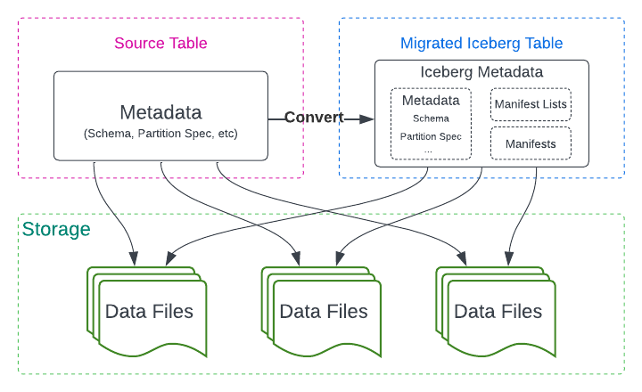
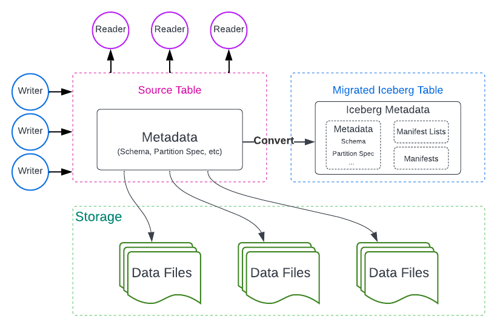
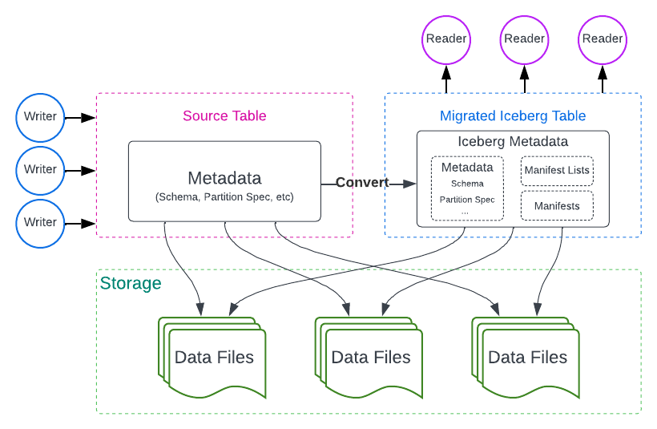
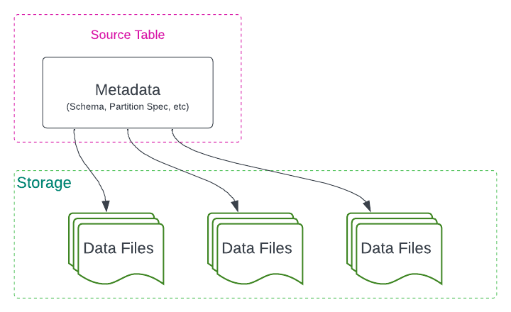
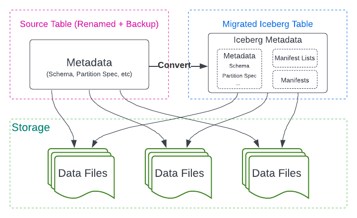
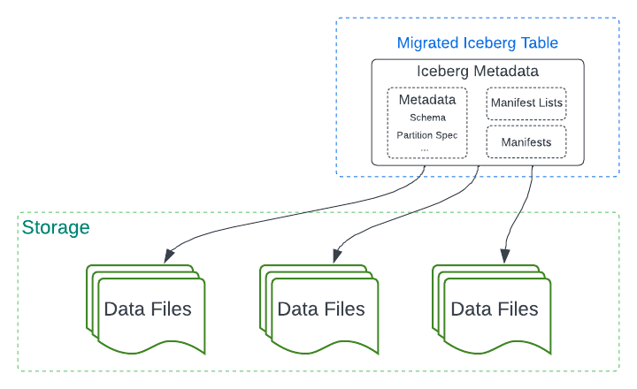

# Documentation 🔗

## Navigation

- Docs
  - Java
    - Nightly
      - [Introduction](#nightly)
      - Concepts
        - Tables
          - [Branching and Tagging](#nightly-branching)
          - [Configuration](#nightly-configuration)
          - [Encryption](#nightly-encryption)
          - [Evolution](#nightly-evolution)
          - [Maintenance](#nightly-maintenance)
          - [Metrics Reporting](#nightly-metrics-reporting)
          - [Partitioning](#nightly-partitioning)
          - [Performance](#nightly-performance)
          - [Reliability](#nightly-reliability)
          - [Schemas](#nightly-schemas)
        - Views
          - [Configuration](#nightly-view-configuration)
      - API
        - [Quickstart](#nightly-java-api-quickstart)
        - [API](#nightly-api)
        - [File I/O](#nightly-fileio)
      - Integrations
        - Apache Spark
          - [Getting Started](#nightly-spark-getting-started)
          - [Configuration](#nightly-spark-configuration)
          - [DDL](#nightly-spark-ddl)
          - [Procedures](#nightly-spark-procedures)
          - [Queries](#nightly-spark-queries)
          - [Structured Streaming](#nightly-spark-structured-streaming)
          - [Writes](#nightly-spark-writes)
        - Apache Flink
          - [Getting Started](#nightly-flink)
          - [Flink Connector](#nightly-flink-connector)
          - [Flink DDL](#nightly-flink-ddl)
          - [Flink Queries](#nightly-flink-queries)
          - [Flink Writes](#nightly-flink-writes)
          - [Flink TableMaintenance](#nightly-flink-maintenance)
          - [Flink Configuration](#nightly-flink-configuration)
        - [Kafka Connect](#nightly-kafka-connect)
        - [Apache Hive](#nightly-hive)
      - Migration
        - [Overview](#nightly-table-migration)
        - [Hive Migration](#nightly-hive-migration)
        - [Delta Lake Migration](#nightly-delta-lake-migration)
      - Catalogs
        - [Catalog properties](#nightly-catalog-properties)
        - [AWS Glue](#nightly-aws--glue-catalog)
        - [AWS DynamoDB](#nightly-aws--dynamodb-catalog)
        - [HiveCatalog](#nightly-hive--global-hive-catalog)
        - [JDBC](#nightly-jdbc)
        - [Java Custom Catalog](#nightly-custom-catalog)
        - [Nessie](#nightly-nessie)
      - Storage
        - [AWS S3](#nightly-aws--s3-fileio)
        - [Dell ECS](#nightly-dell)
    - Latest (1.10.1)
      - [Introduction](#latest)

## Content

<a id="nightly"></a>

<!-- source_url: https://iceberg.apache.org/docs/nightly/ -->

<!-- page_index: 1 -->

<a id="nightly--documentation"></a>

# Documentation

**Apache Iceberg is an open table format for huge analytic datasets.** Iceberg adds tables to compute engines including Spark, Trino, PrestoDB, Flink, Hive and Impala using a high-performance table format that works just like a SQL table.

<a id="nightly--user-experience"></a>

### User experience

Iceberg avoids unpleasant surprises. Schema evolution works and won't inadvertently un-delete data. Users don't need to know about partitioning to get fast queries.

- [Schema evolution](#nightly-evolution--schema-evolution) supports add, drop, update, or rename, and has [no side-effects](#nightly-evolution--correctness)
- [Hidden partitioning](#nightly-partitioning) prevents user mistakes that cause silently incorrect results or extremely slow queries
- [Partition layout evolution](#nightly-evolution--partition-evolution) can update the layout of a table as data volume or query patterns change
- [Time travel](#nightly-spark-queries--time-travel) enables reproducible queries that use exactly the same table snapshot, or lets users easily examine changes
- Version rollback allows users to quickly correct problems by resetting tables to a good state

<a id="nightly--reliability-and-performance"></a>

### Reliability and performance

Iceberg was built for huge tables. Iceberg is used in production where a single table can contain tens of petabytes of data and even these huge tables can be read without a distributed SQL engine.

- [Scan planning is fast](#nightly-performance--scan-planning) -- a distributed SQL engine isn't needed to read a table or find files
- [Advanced filtering](#nightly-performance--data-filtering) -- data files are pruned with partition and column-level stats, using table metadata

Iceberg was designed to solve correctness problems in eventually-consistent cloud object stores.

- [Works with any cloud store](#nightly-reliability) and reduces NN congestion when in HDFS, by avoiding listing and renames
- [Serializable isolation](#nightly-reliability) -- table changes are atomic and readers never see partial or uncommitted changes
- [Multiple concurrent writers](#nightly-reliability--concurrent-write-operations) use optimistic concurrency and will retry to ensure that compatible updates succeed, even when writes conflict

<a id="nightly--open-standard"></a>

### Open standard

Iceberg has been designed and developed to be an open community standard with a [specification](https://iceberg.apache.org/spec/) to ensure compatibility across languages and implementations.

[Apache Iceberg is open source](https://iceberg.apache.org/community/), and is developed at the [Apache Software Foundation](https://www.apache.org/).

---

<a id="nightly-branching"></a>

<!-- source_url: https://iceberg.apache.org/docs/nightly/branching/ -->

<!-- page_index: 2 -->

<a id="nightly-branching--branching-and-tagging"></a>

# Branching and Tagging

<a id="nightly-branching--overview"></a>

## Overview

Iceberg table metadata maintains a snapshot log, which represents the changes applied to a table.
Snapshots are fundamental in Iceberg as they are the basis for reader isolation and time travel queries.
For controlling metadata size and storage costs, Iceberg provides snapshot lifecycle management procedures such as [`expire_snapshots`](#nightly-spark-procedures--expire-snapshots) for removing unused snapshots and no longer necessary data files based on table snapshot retention properties.

**For more sophisticated snapshot lifecycle management, Iceberg supports branches and tags which are named references to snapshots with their own independent lifecycles. This lifecycle is controlled by branch and tag level retention policies.**
Branches are independent lineages of snapshots and point to the head of the lineage.
Branches and tags have a maximum reference age property which control when the reference to the snapshot itself should be expired.
Branches have retention properties which define the minimum number of snapshots to retain on a branch as well as the maximum age of individual snapshots to retain on the branch.
These properties are used when the expireSnapshots procedure is run.
For details on the algorithm for expireSnapshots, refer to the [spec](https://iceberg.apache.org/spec/#snapshot-retention-policy).

<a id="nightly-branching--use-cases"></a>

## Use Cases

Branching and tagging can be used for handling GDPR requirements and retaining important historical snapshots for auditing.
Branches can also be used as part of data engineering workflows, for enabling experimental branches for testing and validating new jobs.
See below for some examples of how branching and tagging can facilitate these use cases.

<a id="nightly-branching--historical-tags"></a>

### Historical Tags

Tags can be used for retaining important historical snapshots for auditing purposes.



The above diagram demonstrates retaining important historical snapshot with the following retention policy, defined
via Spark SQL.

1. Retain 1 snapshot per week for 1 month. This can be achieved by tagging the weekly snapshot and setting the tag retention to be a month.
   snapshots will be kept, and the branch reference itself will be retained for 1 week.


```
-- Create a tag for the first end of week snapshot. Retain the snapshot for a week
ALTER TABLE prod.db.table CREATE TAG `EOW-01` AS OF VERSION 7 RETAIN 7 DAYS;
```

2. Retain 1 snapshot per month for 6 months. This can be achieved by tagging the monthly snapshot and setting the tag retention to be 6 months.


```
-- Create a tag for the first end of month snapshot. Retain the snapshot for 6 months
ALTER TABLE prod.db.table CREATE TAG `EOM-01` AS OF VERSION 30 RETAIN 180 DAYS;
```

3. Retain 1 snapshot per year forever. This can be achieved by tagging the annual snapshot. The default retention for branches and tags is forever.


```
-- Create a tag for the end of the year and retain it forever.
ALTER TABLE prod.db.table CREATE TAG `EOY-2023` AS OF VERSION 365;
```

4. Create a temporary "test-branch" which is retained for 7 days and the latest 2 snapshots on the branch are retained.


```
-- Create a branch "test-branch" which will be retained for 7 days along with the  latest 2 snapshots
ALTER TABLE prod.db.table CREATE BRANCH `test-branch` RETAIN 7 DAYS WITH SNAPSHOT RETENTION 2 SNAPSHOTS;
```

<a id="nightly-branching--audit-branch"></a>

### Audit Branch



The above diagram shows an example of using an audit branch for validating a write workflow.

1. First ensure `write.wap.enabled` is set.


```
ALTER TABLE db.table SET TBLPROPERTIES (
    'write.wap.enabled'='true'
);
```

2. Create `audit-branch` starting from snapshot 3, which will be written to and retained for 1 week.


```
ALTER TABLE db.table CREATE BRANCH `audit-branch` AS OF VERSION 3 RETAIN 7 DAYS;
```

3. Writes are performed on a separate `audit-branch` independent from the main table history.


```
-- WAP Branch write
SET spark.wap.branch = audit-branch
INSERT INTO prod.db.table VALUES (3, 'c');
```

4. A validation workflow can validate (e.g. data quality) the state of `audit-branch`.
5. After validation, the main branch can be `fastForward` to the head of `audit-branch` to update the main table state.


```
CALL catalog_name.system.fast_forward('prod.db.table', 'main', 'audit-branch');
```

6. The branch reference will be removed when `expireSnapshots` is run 1 week later.

<a id="nightly-branching--usage"></a>

## Usage

Creating, querying and writing to branches and tags are supported in the Iceberg Java library, and in Spark and Flink engine integrations.

- [Iceberg Java Library](#nightly-java-api-quickstart--branching-and-tagging)
- [Spark DDLs](#nightly-spark-ddl--branching-and-tagging-ddl)
- [Spark Reads](#nightly-spark-queries--time-travel)
- [Spark Branch Writes](#nightly-spark-writes--writing-to-branches)
- [Flink Reads](#nightly-flink-queries--reading-branches-and-tags-with-sql)
- [Flink Branch Writes](#nightly-flink-writes--branch-writes)

<a id="nightly-branching--schema-selection-with-branches-and-tags"></a>

## Schema selection with branches and tags

It is important to understand that the schema tracked for a table is valid across all branches.
When working with branches, the table's schema is used as that's the schema being validated when writing data to a branch.
On the other hands, querying a tag uses the snapshot's schema, which is the schema id that snapshot pointed to when the snapshot was created.

The below examples show which schema is being used when working with branches.

Create a table and insert some data:

```
CREATE TABLE db.table (id bigint, data string, col float);
INSERT INTO db.table VALUES (1, 'a', 1.0), (2, 'b', 2.0), (3, 'c', 3.0);
SELECT * FROM db.table;
1   a   1.0
2   b   2.0
3   c   3.0
```

Create a branch `test_branch` that points to the current snapshot and read data from the branch:

```
ALTER TABLE db.table CREATE BRANCH test_branch;

SELECT * FROM db.table.branch_test_branch;
1   a   1.0
2   b   2.0
3   c   3.0
```

Modify the table's schema by dropping the `col` column and adding a new column named `new_col`:

```
ALTER TABLE db.table DROP COLUMN col;

ALTER TABLE db.table ADD COLUMN new_col date;

INSERT INTO db.table VALUES (4, 'd', date('2024-04-04')), (5, 'e', date('2024-05-05'));

SELECT * FROM db.table;
1   a   NULL
2   b   NULL
3   c   NULL
4   d   2024-04-04
5   e   2024-05-05
```

Querying the head of the branch using one of the below statements will return data using the **table's schema**:

```
SELECT * FROM db.table.branch_test_branch;
1   a   NULL
2   b   NULL
3   c   NULL

SELECT * FROM db.table VERSION AS OF 'test_branch';
1   a   NULL
2   b   NULL
3   c   NULL
```

Performing a time travel query using the snapshot id uses the **snapshot's schema**:

```
SELECT * FROM db.table.refs;
test_branch BRANCH  8109744798576441359 NULL    NULL    NULL
main        BRANCH  6910357365743665710 NULL    NULL    NULL


SELECT * FROM db.table VERSION AS OF 8109744798576441359;
1   a   1.0
2   b   2.0
3   c   3.0
```

When writing to the branch, the **table's schema** is used for validation:

```
INSERT INTO db.table.branch_test_branch VALUES (6, 'e', date('2024-06-06')), (7, 'g', date('2024-07-07'));

SELECT * FROM db.table.branch_test_branch;
6   e   2024-06-06
7   g   2024-07-07
1   a   NULL
2   b   NULL
3   c   NULL
```

---

<a id="nightly-configuration"></a>

<!-- source_url: https://iceberg.apache.org/docs/nightly/configuration/ -->

<!-- page_index: 3 -->

<a id="nightly-configuration--configuration"></a>

# Configuration

<a id="nightly-configuration--table-properties"></a>

## Table properties

Iceberg tables support table properties to configure table behavior, like the default split size for readers.

<a id="nightly-configuration--read-properties"></a>

### Read properties

| Property | Default | Description |
| --- | --- | --- |
| read.split.target-size | 134217728 (128 MB) | Target size when combining data input splits |
| read.split.metadata-target-size | 33554432 (32 MB) | Target size when combining metadata input splits |
| read.split.planning-lookback | 10 | Number of bins to consider when combining input splits |
| read.split.open-file-cost | 4194304 (4 MB) | The estimated cost to open a file, used as a minimum weight when combining splits. |
| read.parquet.vectorization.enabled | true | Controls whether Parquet vectorized reads are used |
| read.parquet.vectorization.batch-size | 5000 | The batch size for parquet vectorized reads |
| read.orc.vectorization.enabled | false | Controls whether orc vectorized reads are used |
| read.orc.vectorization.batch-size | 5000 | The batch size for orc vectorized reads |

<a id="nightly-configuration--write-properties"></a>

### Write properties

| Property | Default | Description |
| --- | --- | --- |
| write.format.default | parquet | Default file format for the table; parquet, avro, or orc |
| write.delete.format.default | data file format | Default delete file format for the table; parquet, avro, or orc |
| write.parquet.row-group-size-bytes | 134217728 (128 MB) | Parquet row group size |
| write.parquet.page-size-bytes | 1048576 (1 MB) | Parquet page size |
| write.parquet.page-version | v1 | Parquet data page version: v1 (DataPage V1) or v2 (DataPage V2) |
| write.parquet.page-row-limit | 20000 | Parquet page row limit |
| write.parquet.dict-size-bytes | 2097152 (2 MB) | Parquet dictionary page size |
| write.parquet.compression-codec | zstd | Parquet compression codec: zstd, brotli, lz4, gzip, snappy, uncompressed |
| write.parquet.compression-level | null | Parquet compression level |
| write.parquet.shred-variants | false | When true, variant columns are written with shredded Parquet encoding for improved query performance |
| write.parquet.variant-inference-buffer-size | 100 | Number of rows to buffer for schema inference when variant shredding is enabled |
| write.parquet.bloom-filter-enabled.column.col1 | (not set) | Hint to parquet to write a bloom filter for the column: 'col1' |
| write.parquet.bloom-filter-max-bytes | 1048576 (1 MB) | The maximum number of bytes for a bloom filter bitset |
| write.parquet.bloom-filter-fpp.column.col1 | 0.01 | The false positive probability for a bloom filter applied to 'col1' (must > 0.0 and < 1.0) |
| write.parquet.bloom-filter-ndv.column.col1 | (not set) | The expected number of distinct values for a bloom filter applied to 'col1' (must > 0) |
| write.parquet.stats-enabled.column.col1 | (not set) | Controls whether to collect parquet column statistics for column 'col1' |
| write.avro.compression-codec | gzip | Avro compression codec: gzip(deflate with 9 level), zstd, snappy, uncompressed |
| write.avro.compression-level | null | Avro compression level |
| write.orc.stripe-size-bytes | 67108864 (64 MB) | Define the default ORC stripe size, in bytes |
| write.orc.block-size-bytes | 268435456 (256 MB) | Define the default file system block size for ORC files |
| write.orc.compression-codec | zlib | ORC compression codec: zstd, lz4, lzo, zlib, snappy, none |
| write.orc.compression-strategy | speed | ORC compression strategy: speed, compression |
| write.orc.bloom.filter.columns | (not set) | Comma separated list of column names for which a Bloom filter must be created |
| write.orc.bloom.filter.fpp | 0.05 | False positive probability for Bloom filter (must > 0.0 and < 1.0) |
| write.location-provider.impl | null | Optional custom implementation for LocationProvider |
| write.metadata.compression-codec | none | Metadata compression codec; none or gzip |
| write.metadata.metrics.max-inferred-column-defaults | 100 | Defines the maximum number of columns for which metrics are collected. Columns are included with a pre-order traversal of the schema: top level fields first; then all elements of the first nested struct; then the next nested struct and so on. |
| write.metadata.metrics.default | truncate(16) | Default metrics mode for all columns in the table; none, counts, truncate(length), or full |
| write.metadata.metrics.column.col1 | (not set) | Metrics mode for column 'col1' to allow per-column tuning; none, counts, truncate(length), or full |
| write.target-file-size-bytes | 536870912 (512 MB) | Controls the size of files generated to target about this many bytes |
| write.delete.target-file-size-bytes | 67108864 (64 MB) | Controls the size of delete files generated to target about this many bytes |
| write.distribution-mode | not set, see engines for specific defaults, for example [Spark Writes](#nightly-spark-writes--writing-distribution-modes) | Defines distribution of write data: **none**: don't shuffle rows; **hash**: hash distribute by partition key ; **range**: range distribute by partition key or sort key if table has an SortOrder |
| write.delete.distribution-mode | (not set) | Defines distribution of write delete data |
| write.update.distribution-mode | (not set) | Defines distribution of write update data |
| write.merge.distribution-mode | (not set) | Defines distribution of write merge data |
| write.wap.enabled | false | Enables write-audit-publish writes |
| write.summary.partition-limit | 0 | Includes partition-level summary stats in snapshot summaries if the changed partition count is less than this limit |
| write.metadata.delete-after-commit.enabled | false | Controls whether to delete the oldest **tracked** version metadata files after each table commit. See the [Remove old metadata files](#nightly-maintenance--remove-old-metadata-files) section for additional details |
| write.metadata.previous-versions-max | 100 | The max number of previous version metadata files to track |
| write.spark.fanout.enabled | false | Enables the fanout writer in Spark that does not require data to be clustered; uses more memory |
| write.object-storage.enabled | false | Enables the object storage location provider that adds a hash component to file paths |
| write.object-storage.partitioned-paths | true | Includes the partition values in the file path |
| write.data.path | table location + /data | Base location for data files |
| write.metadata.path | table location + /metadata | Base location for metadata files |
| write.delete.mode | copy-on-write | Mode used for delete commands: copy-on-write or merge-on-read (v2 and above) |
| write.delete.isolation-level | serializable | Isolation level for delete commands: serializable or snapshot |
| write.update.mode | copy-on-write | Mode used for update commands: copy-on-write or merge-on-read (v2 and above) |
| write.update.isolation-level | serializable | Isolation level for update commands: serializable or snapshot |
| write.merge.mode | copy-on-write | Mode used for merge commands: copy-on-write or merge-on-read (v2 and above) |
| write.merge.isolation-level | serializable | Isolation level for merge commands: serializable or snapshot |
| write.delete.granularity | partition | Controls the granularity of generated delete files: partition or file |

<a id="nightly-configuration--encryption-properties"></a>

### Encryption properties

| Property | Default | Description |
| --- | --- | --- |
| encryption.key-id | (not set) | ID of the master key of the table |
| encryption.data-key-length | 16 (bytes) | Length of keys used for encryption of table files. Valid values are 16, 24, 32 bytes |

See the [Encryption](#nightly-encryption) document for additional details.

<a id="nightly-configuration--table-behavior-properties"></a>

### Table behavior properties

| Property | Default | Description |
| --- | --- | --- |
| commit.retry.num-retries | 4 | Number of times to retry a commit before failing |
| commit.retry.min-wait-ms | 100 | Minimum time in milliseconds to wait before retrying a commit |
| commit.retry.max-wait-ms | 60000 (1 min) | Maximum time in milliseconds to wait before retrying a commit |
| commit.retry.total-timeout-ms | 1800000 (30 min) | Total retry timeout period in milliseconds for a commit |
| commit.status-check.num-retries | 3 | Number of times to check whether a commit succeeded after a connection is lost before failing due to an unknown commit state |
| commit.status-check.min-wait-ms | 1000 (1s) | Minimum time in milliseconds to wait before retrying a status-check |
| commit.status-check.max-wait-ms | 60000 (1 min) | Maximum time in milliseconds to wait before retrying a status-check |
| commit.status-check.total-timeout-ms | 1800000 (30 min) | Total timeout period in which the commit status-check must succeed, in milliseconds |
| commit.manifest.target-size-bytes | 8388608 (8 MB) | Target size when merging manifest files |
| commit.manifest.min-count-to-merge | 100 | Minimum number of manifests to accumulate before merging |
| commit.manifest-merge.enabled | true | Controls whether to automatically merge manifests on writes |
| history.expire.max-snapshot-age-ms | 432000000 (5 days) | Default max age of snapshots to keep on the table and all of its branches while expiring snapshots |
| history.expire.min-snapshots-to-keep | 1 | Default min number of snapshots to keep on the table and all of its branches while expiring snapshots |
| history.expire.max-ref-age-ms | `Long.MAX_VALUE` (forever) | For snapshot references except the `main` branch, default max age of snapshot references to keep while expiring snapshots. The `main` branch never expires. |
| gc.enabled | true | Allows garbage collection operations such as expiring snapshots and removing orphan files |

<a id="nightly-configuration--reserved-table-properties"></a>

### Reserved table properties

Reserved table properties are only used to control behaviors when creating or updating a table.
The value of these properties are not persisted as a part of the table metadata.

| Property | Default | Description |
| --- | --- | --- |
| format-version | 2 | Table's format version as defined in the [Spec](https://iceberg.apache.org/spec/#format-versioning). Defaults to 2 since version 1.4.0. |

<a id="nightly-configuration--informational-properties"></a>

### Informational properties

Informational properties can be set to provide additional context about a table. They can be useful for documentation, discovery, and integration with external tools. They do not affect read/write behavior or query semantics.

| Property | Default | Description |
| --- | --- | --- |
| comment | (not set) | A table-level description that documents the business meaning and usage context. |

<a id="nightly-configuration--compatibility-flags"></a>

### Compatibility flags

| Property | Default | Description |
| --- | --- | --- |
| compatibility.snapshot-id-inheritance.enabled | false | Enables committing snapshots without explicit snapshot IDs (always true if the format version is > 1) |

---

<a id="nightly-encryption"></a>

<!-- source_url: https://iceberg.apache.org/docs/nightly/encryption/ -->

<!-- page_index: 4 -->

<a id="nightly-encryption--encryption"></a>

# Encryption

Iceberg table encryption protects confidentiality and integrity of table data in an untrusted storage. The `data`, `delete`, `manifest` and `manifest list` files are encrypted and tamper-proofed before being sent to the storage backend.

The `metadata.json` file does not contain data or stats, and is therefore not encrypted.

Currently, encryption is supported in the Hive and REST catalogs for tables with Parquet and Avro data formats.

Two parameters are required to activate encryption of a table:

1. Catalog property that specifies the KMS ("key management service"). It can be either `encryption.kms-type` for pre-defined KMS clients (`aws`, `azure` or `gcp`) or `encryption.kms-impl` with the client class path for custom KMS clients.
2. Table property `encryption.key-id`, that specifies the ID of a master key used to encrypt and decrypt the table. Master keys are stored and managed in the KMS.

For more details on table encryption, see the "Appendix: Internals Overview" [subsection](#nightly-encryption--appendix-internals-overview).

<a id="nightly-encryption--example"></a>

## Example

```
spark-sql --packages org.apache.iceberg:iceberg-spark-runtime-4.0_2.13:1.10.1\
    --conf spark.sql.extensions=org.apache.iceberg.spark.extensions.IcebergSparkSessionExtensions \
    --conf spark.sql.catalog.spark_catalog=org.apache.iceberg.spark.SparkSessionCatalog \
    --conf spark.sql.catalog.spark_catalog.type=hive \
    --conf spark.sql.catalog.local=org.apache.iceberg.spark.SparkCatalog \
    --conf spark.sql.catalog.local.type=hive \
    --conf spark.sql.catalog.local.encryption.kms-type=aws
```

```
CREATE TABLE local.db.table (id bigint, data string) USING iceberg
TBLPROPERTIES ('encryption.key-id'='<master-key-id>');
```

Inserted data will be automatically encrypted,

```
INSERT INTO local.db.table VALUES (1, 'a'), (2, 'b'), (3, 'c');
```

To verify encryption, the contents of data, manifest and manifest list files can be dumped in the command line with

```
hexdump -C <path/to/file> | more
```

The Parquet files must start with the "PARE" magic string (PARquet Encrypted footer mode), and manifest/list files must start with "AGS1" magic string (Aes Gcm Stream version 1).

Queried data will be automatically decrypted,

```
SELECT * FROM local.db.table;
```

<a id="nightly-encryption--catalog-security-requirements"></a>

## Catalog security requirements

1. Catalogs must ensure the `encryption.key-id` property is not modified or removed during table lifetime.
2. To function properly, Iceberg table encryption requires the catalog implementations not to retrieve the metadata directly from metadata.json files, if these files are kept unprotected in a storage vulnerable to tampering:

   - Catalogs may keep the metadata in a trusted independent object store.
   - Catalogs may work with metadata.json files in a tamper-proof storage.
   - Catalogs may use checksum techniques to verify integrity of metadata.json files in a storage vulnerable to tampering
     (the checksums must be kept in a separate trusted storage).

<a id="nightly-encryption--key-management-clients"></a>

## Key Management Clients

Currently, Iceberg has clients for the AWS, GCP and Azure KMS systems. A custom client can be built for other key management systems by implementing the `org.apache.iceberg.encryption.KeyManagementClient` interface.

This interface has the following main methods,

```
/** * Initialize the KMS client with given properties.* * @param properties kms client properties (taken from catalog properties) */ void initialize(Map<String, String> properties);
/** * Wrap a secret key, using a wrapping/master key which is stored in KMS and referenced by an ID.* Wrapping means encryption of the secret key with the master key, and adding optional * KMS-specific metadata that allows the KMS to decrypt the secret key in an unwrapping call.* * @param key a secret key being wrapped * @param wrappingKeyId a key ID that represents a wrapping key stored in KMS * @return wrapped key material */ ByteBuffer wrapKey(ByteBuffer key, String wrappingKeyId);
/** * Unwrap a secret key, using a wrapping/master key which is stored in KMS and referenced by an * ID.* * @param wrappedKey wrapped key material (encrypted key and optional KMS metadata, returned by *     the wrapKey method) * @param wrappingKeyId a key ID that represents a wrapping key stored in KMS * @return raw key bytes */ ByteBuffer unwrapKey(ByteBuffer wrappedKey, String wrappingKeyId);
```

<a id="nightly-encryption--appendix-internals-overview"></a>
<a id="nightly-encryption--appendix:-internals-overview"></a>

## Appendix: Internals Overview

The standard Iceberg encryption manager generates an encryption key and a unique file ID ("AAD prefix")
for each data and delete file. The generation is performed in the worker nodes, by using a secure random
number generator. For Parquet data files, these parameters are passed to the native Parquet Modular
Encryption [mechanism](https://parquet.apache.org/docs/file-format/data-pages/encryption). For Avro data files, these parameters are passed to the AES GCM Stream encryption [mechanism](https://iceberg.apache.org/gcm-stream-spec/).

The parent manifest file stores the encryption key and AAD prefix for each data and delete file in the
`key_metadata` [field](https://iceberg.apache.org/spec/#data-file-fields). For Avro data tables, the data file length
is also added to the `key_metadata`.
The manifest file is encrypted by the AES GCM Stream encryption mechanism, using an encryption key and an
AAD prefix generated by the standard encryption manager. The generation is performed in the driver nodes, by using a secure random number generator.

The parent manifest list file stores the encryption key, AAD prefix and file length for each manifest file
in the `key_metadata` [field](https://iceberg.apache.org/spec/#manifest-lists). The manifest list file is encrypted by
the AES GCM Stream encryption mechanism, using an encryption key and an AAD prefix generated by the standard encryption manager.

The manifest list encryption key, AAD prefix and file length are packed in a key metadata object. This object
is serialized and encrypted with a "key encryption key" (KEK), using the KEK creation timestamp as the AES
GCM AAD. A KEK and its unique KEK\_ID are generated by using a secure random number generator. For each
snapshot, the KEK\_ID of the encryption key that encrypts the manifest list key metadata is kept in the
`key-id` field in the table metadata snapshot [structure](https://iceberg.apache.org/spec/#snapshots). The encrypted
manifest list key metadata is kept in the `encryption-keys` list in the table metadata
[structure](https://iceberg.apache.org/spec/#table-metadata-fields).

The KEK is encrypted by the table master key via the KMS client. The result is kept in the `encryption-keys`
list in the table metadata structure. The KEK is re-used for a period allowed by the NIST SP 800-57
specification. Then, it is rotated - a new KEK and KEK\_ID are generated for encryption of new manifest list
key metadata objects. The new KEK is encrypted by the table master key and stored in the `encryption-keys`
list in the table metadata structure. The previous KEKs are retained for the existing table snapshots.

---

<a id="nightly-evolution"></a>

<!-- source_url: https://iceberg.apache.org/docs/nightly/evolution/ -->

<!-- page_index: 5 -->

<a id="nightly-evolution--evolution"></a>

# Evolution

Iceberg supports **in-place table evolution**. You can [evolve a table schema](#nightly-evolution--schema-evolution) just like SQL -- even in nested structures -- or [change partition layout](#nightly-evolution--partition-evolution) when data volume changes. Iceberg does not require costly distractions, like rewriting table data or migrating to a new table.

For example, Hive table partitioning cannot change so moving from a daily partition layout to an hourly partition layout requires a new table. And because queries are dependent on partitions, queries must be rewritten for the new table. In some cases, even changes as simple as renaming a column are either not supported, or can cause [data correctness](#nightly-evolution--correctness) problems.

<a id="nightly-evolution--schema-evolution"></a>

## Schema evolution

Iceberg supports the following schema evolution changes:

- **Add** -- add a new column to the table or to a nested struct
- **Drop** -- remove an existing column from the table or a nested struct
- **Rename** -- rename an existing column or field in a nested struct
- **Update** -- widen the type of a column, struct field, map key, map value, or list element
- **Reorder** -- change the order of columns or fields in a nested struct

Iceberg schema updates are **metadata changes**, so no data files need to be rewritten to perform the update.

Note that map keys do not support adding or dropping struct fields that would change equality.

<a id="nightly-evolution--correctness"></a>

### Correctness

Iceberg guarantees that **schema evolution changes are independent and free of side-effects**, without rewriting files:

1. Added columns never read existing values from another column.
2. Dropping a column or field does not change the values in any other column.
3. Updating a column or field does not change values in any other column.
4. Changing the order of columns or fields in a struct does not change the values associated with a column or field name.

Iceberg uses unique IDs to track each column in a table. When you add a column, it is assigned a new ID so existing data is never used by mistake.

- Formats that track columns by name can inadvertently un-delete a column if a name is reused, which violates #1.
- Formats that track columns by position cannot delete columns without changing the names that are used for each column, which violates #2.

<a id="nightly-evolution--partition-evolution"></a>

## Partition evolution

Iceberg table partitioning can be updated in an existing table because queries do not reference partition values directly.

When you evolve a partition spec, the old data written with an earlier spec remains unchanged. New data is written using the new spec in a new layout. Metadata for each of the partition versions is kept separately. Because of this, when you start writing queries, you get split planning. This is where each partition layout plans files separately using the filter it derives for that specific partition layout. Here's a visual representation of a contrived example:


*The data for 2008 is partitioned by month. Starting from 2009 the table is updated so that the data is instead partitioned by day. Both partitioning layouts are able to coexist in the same table.*

Iceberg uses [hidden partitioning](#nightly-partitioning), so you don't *need* to write queries for a specific partition layout to be fast. Instead, you can write queries that select the data you need, and Iceberg automatically prunes out files that don't contain matching data.

Partition evolution is a metadata operation and does not eagerly rewrite files.

Iceberg's Java table API provides `updateSpec` API to update partition spec.
For example, the following code could be used to update the partition spec to add a new partition field that places `id` column values into 8 buckets and remove an existing partition field `category`:

```
Table sampleTable = ...;
sampleTable.updateSpec()
    .addField(bucket("id", 8))
    .removeField("category")
    .commit();
```

Spark supports updating partition spec through its `ALTER TABLE` SQL statement, see more details in [Spark SQL](#nightly-spark-ddl--alter-table-add-partition-field).

<a id="nightly-evolution--sort-order-evolution"></a>

## Sort order evolution

Similar to partition spec, Iceberg sort order can also be updated in an existing table.
When you evolve a sort order, the old data written with an earlier order remains unchanged.
Engines can always choose to write data in the latest sort order or unsorted when sorting is prohibitively expensive.

Iceberg's Java table API provides `replaceSortOrder` API to update sort order.
For example, the following code could be used to create a new sort order
with `id` column sorted in ascending order with nulls last, and `category` column sorted in descending order with nulls first:

```
Table sampleTable = ...;
sampleTable.replaceSortOrder()
   .asc("id", NullOrder.NULLS_LAST)
   .dec("category", NullOrder.NULL_FIRST)
   .commit();
```

Spark supports updating sort order through its `ALTER TABLE` SQL statement, see more details in [Spark SQL](#nightly-spark-ddl--alter-table-write-ordered-by).

---

<a id="nightly-maintenance"></a>

<!-- source_url: https://iceberg.apache.org/docs/nightly/maintenance/ -->

<!-- page_index: 6 -->

<a id="nightly-maintenance--maintenance"></a>

# Maintenance

> [!NOTE]
> **Info**
> Maintenance operations require the `Table` instance. Please refer [Java API quickstart](#nightly-java-api-quickstart--create-a-table) page to refer how to load an existing table.

<a id="nightly-maintenance--recommended-maintenance"></a>

## Recommended Maintenance

<a id="nightly-maintenance--expire-snapshots"></a>

### Expire Snapshots

Each write to an Iceberg table creates a new *snapshot*, or version, of a table. Snapshots can be used for time-travel queries, or the table can be rolled back to any valid snapshot.

Snapshots accumulate until they are expired by the [`expireSnapshots`](https://iceberg.apache.org/javadoc/1.10.1/org/apache/iceberg/Table.html#expireSnapshots--) operation. Regularly expiring snapshots is recommended to delete data files that are no longer needed, and to keep the size of table metadata small.

This example expires snapshots that are older than 1 day:

```
Table table = ...
long tsToExpire = System.currentTimeMillis() - (1000 * 60 * 60 * 24); // 1 day
table.expireSnapshots()
     .expireOlderThan(tsToExpire)
     .commit();
```

See the [`ExpireSnapshots` Javadoc](https://iceberg.apache.org/javadoc/1.10.1/org/apache/iceberg/ExpireSnapshots.html) to see more configuration options.

There is also a Spark action that can run table expiration in parallel for large tables:

```
Table table = ...
SparkActions
    .get()
    .expireSnapshots(table)
    .expireOlderThan(tsToExpire)
    .execute();
```

Expiring old snapshots removes them from metadata, so they are no longer available for time travel queries.

> [!NOTE]
> **Info**
> Data files are not deleted until they are no longer referenced by a snapshot that may be used for time travel or rollback.
> Regularly expiring snapshots deletes unused data files.

<a id="nightly-maintenance--remove-old-metadata-files"></a>

### Remove old metadata files

Iceberg keeps track of table metadata using JSON files. Each change to a table produces a new metadata file to provide atomicity.

Old metadata files are kept for history by default. Tables with frequent commits, like those written by streaming jobs, may need to regularly clean metadata files.

Each metadata file tracks the older metadata files in the `metadata-log` field. The number of metadata files being tracked is defined by `write.metadata.previous-versions-max`.

To automatically delete older metadata files, set `write.metadata.delete-after-commit.enabled=true` in table properties. This will keep some metadata files as tracked (up to `write.metadata.previous-versions-max`), and will delete the oldest metadata file every time a new one is created.
Note that this will only delete metadata files that are **tracked** in the metadata log and will not delete orphaned metadata files.

Untracked metadata files are also deleted as part of [orphan file deletion](#nightly-maintenance--delete-orphan-files).

| Property | Default | Description |
| --- | --- | --- |
| write.metadata.delete-after-commit.enabled | false | Controls whether to delete the oldest **tracked** version metadata files after each table commit |
| write.metadata.previous-versions-max | 100 | The max number of previous version metadata files to track |

Examples:

- With `write.metadata.delete-after-commit.enabled=false` and `write.metadata.previous-versions-max=10`, after 100 commits, one will have 10 tracked metadata files and 90 orphaned metadata files. These 90 orphaned metadata files cannot be deleted by setting `write.metadata.delete-after-commit.enabled=true` because they are already untracked. They can only be cleaned with an orphan file deletion procedure.
- With `write.metadata.delete-after-commit.enabled=true` and `write.metadata.previous-versions-max=20`, after 21 commits, one will have 20 tracked metadata files, with the oldest metadata file being deleted by the writer after committing. With each additional commit, the oldest metadata file will be deleted.

See [table write properties](#nightly-configuration--write-properties) for more details.

<a id="nightly-maintenance--delete-orphan-files"></a>

### Delete orphan files

In Spark and other distributed processing engines, task or job failures can leave files that are not referenced by table metadata, and in some cases normal snapshot expiration may not be able to determine a file is no longer needed and delete it.

To clean up these "orphan" files under a table location, use the `deleteOrphanFiles` action.

```
Table table = ...
SparkActions
    .get()
    .deleteOrphanFiles(table)
    .execute();
```

See the [DeleteOrphanFiles Javadoc](https://iceberg.apache.org/javadoc/1.10.1/org/apache/iceberg/actions/DeleteOrphanFiles.html) to see more configuration options.

This action may take a long time to finish if you have lots of files in data and metadata directories. It is recommended to execute this periodically, but you may not need to execute this often.

> [!NOTE]
> **Info**
> It is dangerous to remove orphan files with a retention interval shorter than the time expected for any write to complete because it
> might corrupt the table if in-progress files are considered orphaned and are deleted. The default interval is 3 days.

> [!NOTE]
> **Info**
> Iceberg uses the string representations of paths when determining which files need to be removed. On some file systems, the path can change over time, but it still represents the same file. For example, if you change authorities for an HDFS cluster, none of the old path urls used during creation will match those that appear in a current listing. *This will lead to data loss when
> RemoveOrphanFiles is run*. Please be sure the entries in your MetadataTables match those listed by the Hadoop
> FileSystem API to avoid unintentional deletion.

<a id="nightly-maintenance--optional-maintenance"></a>

## Optional Maintenance

Some tables require additional maintenance. For example, streaming queries may produce small data files that should be [compacted into larger files](#nightly-maintenance--compact-data-files). And some tables can benefit from [rewriting manifest files](#nightly-maintenance--rewrite-manifests) to make locating data for queries much faster.

<a id="nightly-maintenance--compact-data-files"></a>

### Compact data files

Iceberg tracks each data file in a table. More data files leads to more metadata stored in manifest files, and small data files causes an unnecessary amount of metadata and less efficient queries from file open costs.

Iceberg can compact data files in parallel using Spark with the `rewriteDataFiles` action. This will combine small files into larger files to reduce metadata overhead and runtime file open cost.

```
Table table = ...
SparkActions
    .get()
    .rewriteDataFiles(table)
    .filter(Expressions.equal("date", "2020-08-18"))
    .option("target-file-size-bytes", Long.toString(500 * 1024 * 1024)) // 500 MB
    .execute();
```

The `files` metadata table is useful for inspecting data file sizes and determining when to compact partitions.

See the [`RewriteDataFiles` Javadoc](https://iceberg.apache.org/javadoc/1.10.1/org/apache/iceberg/actions/RewriteDataFiles.html) to see more configuration options.

<a id="nightly-maintenance--rewrite-manifests"></a>

### Rewrite manifests

Iceberg uses metadata in its manifest list and manifest files to speed up query planning and to prune unnecessary data files. The metadata tree functions as an index over a table's data.

Manifests in the metadata tree are automatically compacted in the order they are added, which makes queries faster when the write pattern aligns with read filters. For example, writing hourly-partitioned data as it arrives is aligned with time range query filters.

When a table's write pattern doesn't align with the query pattern, metadata can be rewritten to re-group data files into manifests using `rewriteManifests` or the `rewriteManifests` action (for parallel rewrites using Spark).

This example rewrites small manifests and groups data files by the first partition field.

```
Table table = ...
SparkActions
    .get()
    .rewriteManifests(table)
    .rewriteIf(file -> file.length() < 10 * 1024 * 1024) // 10 MB
    .execute();
```

See the [`RewriteManifests` Javadoc](https://iceberg.apache.org/javadoc/1.10.1/org/apache/iceberg/actions/RewriteManifests.html) to see more configuration options.

---

<a id="nightly-metrics-reporting"></a>

<!-- source_url: https://iceberg.apache.org/docs/nightly/metrics-reporting/ -->

<!-- page_index: 7 -->

<a id="nightly-metrics-reporting--metrics-reporting"></a>

# Metrics Reporting

As of 1.1.0 Iceberg supports the [`MetricsReporter`](https://github.com/apache/iceberg/blob/main/api/src/main/java/org/apache/iceberg/metrics/MetricsReporter.java) and the [`MetricsReport`](https://github.com/apache/iceberg/blob/main/api/src/main/java/org/apache/iceberg/metrics/MetricsReport.java) APIs. These two APIs allow expressing different metrics reports while supporting a pluggable way of reporting these reports.

<a id="nightly-metrics-reporting--type-of-reports"></a>

## Type of Reports

<a id="nightly-metrics-reporting--scanreport"></a>

### ScanReport

A [`ScanReport`](https://github.com/apache/iceberg/blob/main/core/src/main/java/org/apache/iceberg/metrics/ScanReport.java) carries metrics being collected during scan planning against a given table. Amongst some general information about the involved table, such as the snapshot id or the table name, it includes metrics like:

- total scan planning duration
- number of data/delete files included in the result
- number of data/delete manifests scanned/skipped
- number of data/delete files scanned/skipped
- number of equality/positional delete files scanned

<a id="nightly-metrics-reporting--commitreport"></a>

### CommitReport

A [`CommitReport`](https://github.com/apache/iceberg/blob/main/core/src/main/java/org/apache/iceberg/metrics/CommitReport.java) carries metrics being collected after committing changes to a table (aka producing a snapshot). Amongst some general information about the involved table, such as the snapshot id or the table name, it includes metrics like:

- total duration
- number of attempts required for the commit to succeed
- number of added/removed data/delete files
- number of added/removed equality/positional delete files
- number of added/removed equality/positional deletes

<a id="nightly-metrics-reporting--available-metrics-reporters"></a>

## Available Metrics Reporters

<a id="nightly-metrics-reporting--loggingmetricsreporter"></a>

### [`LoggingMetricsReporter`](https://github.com/apache/iceberg/blob/main/api/src/main/java/org/apache/iceberg/metrics/LoggingMetricsReporter.java)

This is the default metrics reporter when nothing else is configured and its purpose is to log results to the log file. Example output would look as shown below:

```
INFO org.apache.iceberg.metrics.LoggingMetricsReporter - Received metrics report: 
ScanReport{
    tableName=scan-planning-with-eq-and-pos-delete-files, 
    snapshotId=2, 
    filter=ref(name="data") == "(hash-27fa7cc0)", 
    schemaId=0, 
    projectedFieldIds=[1, 2], 
    projectedFieldNames=[id, data], 
    scanMetrics=ScanMetricsResult{
        totalPlanningDuration=TimerResult{timeUnit=NANOSECONDS, totalDuration=PT0.026569404S, count=1}, 
        resultDataFiles=CounterResult{unit=COUNT, value=1}, 
        resultDeleteFiles=CounterResult{unit=COUNT, value=2}, 
        totalDataManifests=CounterResult{unit=COUNT, value=1}, 
        totalDeleteManifests=CounterResult{unit=COUNT, value=1}, 
        scannedDataManifests=CounterResult{unit=COUNT, value=1}, 
        skippedDataManifests=CounterResult{unit=COUNT, value=0}, 
        totalFileSizeInBytes=CounterResult{unit=BYTES, value=10}, 
        totalDeleteFileSizeInBytes=CounterResult{unit=BYTES, value=20}, 
        skippedDataFiles=CounterResult{unit=COUNT, value=0}, 
        skippedDeleteFiles=CounterResult{unit=COUNT, value=0}, 
        scannedDeleteManifests=CounterResult{unit=COUNT, value=1}, 
        skippedDeleteManifests=CounterResult{unit=COUNT, value=0}, 
        indexedDeleteFiles=CounterResult{unit=COUNT, value=2}, 
        equalityDeleteFiles=CounterResult{unit=COUNT, value=1}, 
        positionalDeleteFiles=CounterResult{unit=COUNT, value=1}}, 
    metadata={
        iceberg-version=Apache Iceberg 1.4.0-SNAPSHOT (commit 4868d2823004c8c256a50ea7c25cff94314cc135)}}
```

```
INFO org.apache.iceberg.metrics.LoggingMetricsReporter - Received metrics report: 
CommitReport{
    tableName=scan-planning-with-eq-and-pos-delete-files, 
    snapshotId=1, 
    sequenceNumber=1, 
    operation=append, 
    commitMetrics=CommitMetricsResult{
        totalDuration=TimerResult{timeUnit=NANOSECONDS, totalDuration=PT0.098429626S, count=1}, 
        attempts=CounterResult{unit=COUNT, value=1}, 
        addedDataFiles=CounterResult{unit=COUNT, value=1}, 
        removedDataFiles=null, 
        totalDataFiles=CounterResult{unit=COUNT, value=1}, 
        addedDeleteFiles=null, 
        addedEqualityDeleteFiles=null, 
        addedPositionalDeleteFiles=null, 
        removedDeleteFiles=null, 
        removedEqualityDeleteFiles=null, 
        removedPositionalDeleteFiles=null, 
        totalDeleteFiles=CounterResult{unit=COUNT, value=0}, 
        addedRecords=CounterResult{unit=COUNT, value=1}, 
        removedRecords=null, 
        totalRecords=CounterResult{unit=COUNT, value=1}, 
        addedFilesSizeInBytes=CounterResult{unit=BYTES, value=10}, 
        removedFilesSizeInBytes=null, 
        totalFilesSizeInBytes=CounterResult{unit=BYTES, value=10}, 
        addedPositionalDeletes=null, 
        removedPositionalDeletes=null, 
        totalPositionalDeletes=CounterResult{unit=COUNT, value=0}, 
        addedEqualityDeletes=null, 
        removedEqualityDeletes=null, 
        totalEqualityDeletes=CounterResult{unit=COUNT, value=0}}, 
    metadata={
        iceberg-version=Apache Iceberg 1.4.0-SNAPSHOT (commit 4868d2823004c8c256a50ea7c25cff94314cc135)}}
```

<a id="nightly-metrics-reporting--restmetricsreporter"></a>

### [`RESTMetricsReporter`](https://github.com/apache/iceberg/blob/main/core/src/main/java/org/apache/iceberg/rest/RESTMetricsReporter.java)

This is the default when using the [`RESTCatalog`](https://github.com/apache/iceberg/blob/main/core/src/main/java/org/apache/iceberg/rest/RESTCatalog.java) and its purpose is to send metrics to a REST server at the `/v1/{prefix}/namespaces/{namespace}/tables/{table}/metrics` endpoint as defined in the [REST OpenAPI spec](https://github.com/apache/iceberg/blob/main/open-api/rest-catalog-open-api.yaml).

Sending metrics via REST can be controlled with the `rest-metrics-reporting-enabled` (defaults to `true`) property.

<a id="nightly-metrics-reporting--implementing-a-custom-metrics-reporter"></a>

## Implementing a custom Metrics Reporter

Implementing the [`MetricsReporter`](https://github.com/apache/iceberg/blob/main/api/src/main/java/org/apache/iceberg/metrics/MetricsReporter.java) API gives full flexibility in dealing with incoming [`MetricsReport`](https://github.com/apache/iceberg/blob/main/api/src/main/java/org/apache/iceberg/metrics/MetricsReport.java) instances. For example, it would be possible to send results to a Prometheus endpoint or any other observability framework/system.

Below is a short example illustrating an `InMemoryMetricsReporter` that stores reports in a list and makes them available:

```
public class InMemoryMetricsReporter implements MetricsReporter {
private List<MetricsReport> metricsReports = Lists.newArrayList();
@Override public void report(MetricsReport report) {metricsReports.add(report);}
public List<MetricsReport> reports() {return metricsReports;}}
```

<a id="nightly-metrics-reporting--registering-a-custom-metrics-reporter"></a>

## Registering a custom Metrics Reporter

<a id="nightly-metrics-reporting--via-catalog-configuration"></a>

### Via Catalog Configuration

The [catalog property](#nightly-catalog-properties) `metrics-reporter-impl` allows registering a given [`MetricsReporter`](https://github.com/apache/iceberg/blob/main/api/src/main/java/org/apache/iceberg/metrics/MetricsReporter.java) by specifying its fully-qualified class name, e.g. `metrics-reporter-impl=org.apache.iceberg.metrics.InMemoryMetricsReporter`.

<a id="nightly-metrics-reporting--via-the-java-api-during-scan-planning"></a>

### Via the Java API during Scan planning

Independently of the [`MetricsReporter`](https://github.com/apache/iceberg/blob/main/api/src/main/java/org/apache/iceberg/metrics/MetricsReporter.java) being registered at the catalog level via the `metrics-reporter-impl` property, it is also possible to supply additional reporters during scan planning as shown below:

```
TableScan tableScan = 
    table
        .newScan()
        .metricsReporter(customReporterOne)
        .metricsReporter(customReporterTwo);

try (CloseableIterable<FileScanTask> fileScanTasks = tableScan.planFiles()) {
  // ...
}
```

---

<a id="nightly-partitioning"></a>

<!-- source_url: https://iceberg.apache.org/docs/nightly/partitioning/ -->

<!-- page_index: 8 -->

<a id="nightly-partitioning--partitioning"></a>

# Partitioning

<a id="nightly-partitioning--what-is-partitioning"></a>

## What is partitioning?

Partitioning is a way to make queries faster by grouping similar rows together when writing.

For example, queries for log entries from a `logs` table would usually include a time range, like this query for logs between 10 and 12 AM:

```
SELECT level, message FROM logs
WHERE event_time BETWEEN '2018-12-01 10:00:00' AND '2018-12-01 12:00:00';
```

Configuring the `logs` table to partition by the date of `event_time` will group log events into files with the same event date. Iceberg keeps track of that date and will use it to skip files for other dates that don't have useful data.

Iceberg can partition timestamps by year, month, day, and hour granularity. It can also use a categorical column, like `level` in this logs example, to store rows together and speed up queries.

<a id="nightly-partitioning--what-does-iceberg-do-differently"></a>

## What does Iceberg do differently?

Other tables formats like Hive support partitioning, but Iceberg supports *hidden partitioning*.

- Iceberg handles the tedious and error-prone task of producing partition values for rows in a table.
- Iceberg avoids reading unnecessary partitions automatically. Consumers don't need to know how the table is partitioned and add extra filters to their queries.
- Iceberg partition layouts can evolve as needed.

<a id="nightly-partitioning--partitioning-in-hive"></a>

### Partitioning in Hive

To demonstrate the difference, consider how Hive would handle a `logs` table.

In Hive, partitions are explicit and appear as a column, so the `logs` table would have a column called `event_date`. When writing, an insert needs to supply the data for the `event_date` column:

```
INSERT INTO logs PARTITION (event_date)
  SELECT level, message, event_time, format_time(event_time, 'YYYY-MM-dd')
  FROM unstructured_log_source;
```

Similarly, queries that search through the `logs` table must have an `event_date` filter in addition to an `event_time` filter.

```
SELECT level, count(1) as count FROM logs
WHERE event_time BETWEEN '2018-12-01 10:00:00' AND '2018-12-01 12:00:00'
  AND event_date = '2018-12-01';
```

If the `event_date` filter were missing, Hive would scan through every file in the table because it doesn't know that the `event_time` column is related to the `event_date` column.

<a id="nightly-partitioning--problems-with-hive-partitioning"></a>

### Problems with Hive partitioning

Hive must be given partition values. In the logs example, it doesn't know the relationship between `event_time` and `event_date`.

This leads to several problems:

- Hive can't validate partition values -- it is up to the writer to produce the correct value
  - Using the wrong format, `2018-12-01` instead of `20181201`, produces silently incorrect results, not query failures
  - Using the wrong source column, like `processing_time`, or time zone also causes incorrect results, not failures
- It is up to the user to write queries correctly
  - Using the wrong format also leads to silently incorrect results
  - Users that don't understand a table's physical layout get needlessly slow queries -- Hive can't translate filters automatically
- Working queries are tied to the table's partitioning scheme, so partitioning configuration cannot be changed without breaking queries

<a id="nightly-partitioning--icebergs-hidden-partitioning"></a>
<a id="nightly-partitioning--iceberg-s-hidden-partitioning"></a>

### Iceberg's hidden partitioning

Iceberg produces partition values by taking a column value and optionally transforming it. Iceberg is responsible for converting `event_time` into `event_date`, and keeps track of the relationship.

Table partitioning is configured using these relationships. The `logs` table would be partitioned by `day(event_time)` and `level`.

Because Iceberg doesn't require user-maintained partition columns, it can hide partitioning. Partition values are produced correctly every time and always used to speed up queries, when possible. Producers and consumers wouldn't even see `event_date`.

Most importantly, queries no longer depend on a table's physical layout. With a separation between physical and logical, Iceberg tables can evolve partition schemes over time as data volume changes. Misconfigured tables can be fixed without an expensive migration.

For details about all the supported hidden partition transformations, see the [Partition Transforms](https://iceberg.apache.org/spec/#partition-transforms) section.

For details about updating a table's partition spec, see the [partition evolution](#nightly-evolution--partition-evolution) section.

---

<a id="nightly-performance"></a>

<!-- source_url: https://iceberg.apache.org/docs/nightly/performance/ -->

<!-- page_index: 9 -->

<a id="nightly-performance--performance"></a>

# Performance

- Iceberg is designed for huge tables and is used in production where a *single table* can contain tens of petabytes of data.
- Even multi-petabyte tables can be read from a single node, without needing a distributed SQL engine to sift through table metadata.

<a id="nightly-performance--scan-planning"></a>

## Scan planning

Scan planning is the process of finding the files in a table that are needed for a query.

Planning in an Iceberg table fits on a single node because Iceberg's metadata can be used to prune *metadata* files that aren't needed, in addition to filtering *data* files that don't contain matching data.

Fast scan planning from a single node enables:

- Lower latency SQL queries -- by eliminating a distributed scan to plan a distributed scan
- Access from any client -- stand-alone processes can read data directly from Iceberg tables

<a id="nightly-performance--metadata-filtering"></a>

### Metadata filtering

Iceberg uses two levels of metadata to track the files in a snapshot.

- **Manifest files** store a list of data files, along each data file's partition data and column-level stats
- A **manifest list** stores the snapshot's list of manifests, along with the range of values for each partition field

For fast scan planning, Iceberg first filters manifests using the partition value ranges in the manifest list. Then, it reads each manifest to get data files. With this scheme, the manifest list acts as an index over the manifest files, making it possible to plan without reading all manifests.

In addition to partition value ranges, a manifest list also stores the number of files added or deleted in a manifest to speed up operations like snapshot expiration.

<a id="nightly-performance--data-filtering"></a>

### Data filtering

Manifest files include a tuple of partition data and column-level stats for each data file.

During planning, query predicates are automatically converted to predicates on the partition data and applied first to filter data files. Next, column-level value counts, null counts, lower bounds, and upper bounds are used to eliminate files that cannot match the query predicate.

By using upper and lower bounds to filter data files at planning time, Iceberg uses clustered data to eliminate splits without running tasks. In some cases, this is a [10x performance improvement](https://conferences.oreilly.com/strata/strata-ny-2018/cdn.oreillystatic.com/en/assets/1/event/278/Introducing%20Iceberg_%20Tables%20designed%20for%20object%20stores%20Presentation.pdf).

---

<a id="nightly-reliability"></a>

<!-- source_url: https://iceberg.apache.org/docs/nightly/reliability/ -->

<!-- page_index: 10 -->

<a id="nightly-reliability--reliability"></a>

# Reliability

Iceberg was designed to solve correctness problems that affect Hive tables running in S3.

Hive tables track data files using both a central metastore for partitions and a file system for individual files. This makes atomic changes to a table's contents impossible, and eventually consistent stores like S3 may return incorrect results due to the use of listing files to reconstruct the state of a table. It also requires job planning to make many slow listing calls: O(n) with the number of partitions.

Iceberg tracks the complete list of data files in each [snapshot](https://iceberg.apache.org/terms/#snapshot) using a persistent tree structure. Every write or delete produces a new snapshot that reuses as much of the previous snapshot's metadata tree as possible to avoid high write volumes.

Valid snapshots in an Iceberg table are stored in the table metadata file, along with a reference to the current snapshot. Commits replace the path of the current table metadata file using an atomic operation. This ensures that all updates to table data and metadata are atomic, and is the basis for [serializable isolation](https://en.wikipedia.org/wiki/Isolation_(database_systems)#Serializable).

This results in improved reliability guarantees:

- **Serializable isolation**: All table changes occur in a linear history of atomic table updates
- **Reliable reads**: Readers always use a consistent snapshot of the table without holding a lock
- **Version history and rollback**: Table snapshots are kept as history and tables can roll back if a job produces bad data
- **Safe file-level operations**. By supporting atomic changes, Iceberg enables new use cases, like safely compacting small files and safely appending late data to tables

This design also has performance benefits:

- **O(1) RPCs to plan**: Instead of listing O(n) directories in a table to plan a job, reading a snapshot requires O(1) RPC calls
- **Distributed planning**: File pruning and predicate push-down is distributed to jobs, removing the metastore as a bottleneck
- **Finer granularity partitioning**: Distributed planning and O(1) RPC calls remove the current barriers to finer-grained partitioning

<a id="nightly-reliability--concurrent-write-operations"></a>

## Concurrent write operations

Iceberg supports multiple concurrent writes using optimistic concurrency.

Each writer assumes that no other writers are operating and writes out new table metadata for an operation. Then, the writer attempts to commit by atomically swapping the new table metadata file for the existing metadata file.

If the atomic swap fails because another writer has committed, the failed writer retries by writing a new metadata tree based on the new current table state.

<a id="nightly-reliability--cost-of-retries"></a>

### Cost of retries

Writers avoid expensive retry operations by structuring changes so that work can be reused across retries.

For example, appends usually create a new manifest file for the appended data files, which can be added to the table without rewriting the manifest on every attempt.

<a id="nightly-reliability--retry-validation"></a>

### Retry validation

Commits are structured as assumptions and actions. After a conflict, a writer checks that the assumptions are met by the current table state. If the assumptions are met, then it is safe to re-apply the actions and commit.

For example, a compaction might rewrite `file_a.avro` and `file_b.avro` as `merged.parquet`. This is safe to commit as long as the table still contains both `file_a.avro` and `file_b.avro`. If either file was deleted by a conflicting commit, then the operation must fail. Otherwise, it is safe to remove the source files and add the merged file.

<a id="nightly-reliability--compatibility"></a>

## Compatibility

By avoiding file listing and rename operations, Iceberg tables are compatible with any object store. No consistent listing is required.

---

<a id="nightly-schemas"></a>

<!-- source_url: https://iceberg.apache.org/docs/nightly/schemas/ -->

<!-- page_index: 11 -->

<a id="nightly-schemas--schemas"></a>

# Schemas

Iceberg tables support the following types:

| Type | Description | Notes |
| --- | --- | --- |
| **`boolean`** | True or false |  |
| **`int`** | 32-bit signed integers | Can promote to `long` |
| **`long`** | 64-bit signed integers |  |
| **`float`** | [32-bit IEEE 754](https://en.wikipedia.org/wiki/IEEE_754) floating point | Can promote to `double` |
| **`double`** | [64-bit IEEE 754](https://en.wikipedia.org/wiki/IEEE_754) floating point |  |
| **`decimal(P,S)`** | Fixed-point decimal; precision P, scale S | Scale is fixed and precision must be 38 or less |
| **`date`** | Calendar date without timezone or time |  |
| **`time`** | Time of day without date, timezone | Stored as microseconds |
| **`timestamp`** | Timestamp without timezone | Stored as microseconds |
| **`timestamptz`** | Timestamp with timezone | Stored as microseconds |
| **`timestamp_ns`** | Timestamp without timezone, nanosecond precision | Stored as nanoseconds; added in v3 |
| **`timestamptz_ns`** | Timestamp with timezone, nanosecond precision | Stored as nanoseconds; added in v3 |
| **`string`** | Arbitrary-length character sequences | Encoded with UTF-8 |
| **`uuid`** | Universally unique identifiers |  |
| **`fixed(L)`** | Fixed-length byte array of length L |  |
| **`binary`** | Arbitrary-length byte array |  |
| **`variant`** | Semi-structured data (JSON-like) | Added in v3 |
| **`geometry(C)`** | Geospatial features with CRS parameter | Linear edge-interpolation; added in v3 |
| **`geography(C, A)`** | Geospatial features with CRS and edge algorithm | Non-linear edge-interpolation; added in v3 |
| **`unknown`** | Placeholder type for undetermined columns | Must be optional; added in v3 |
| **`struct<...>`** | A record with named fields of any data type |  |
| **`list<E>`** | A list with elements of any data type |  |
| **`map<K, V>`** | A map with keys and values of any data type |  |

Iceberg tracks each field in a table schema using an ID that is never reused in a table. See [correctness guarantees](#nightly-evolution--correctness) for more information.

---

<a id="nightly-view-configuration"></a>

<!-- source_url: https://iceberg.apache.org/docs/nightly/view-configuration/ -->

<!-- page_index: 12 -->

<a id="nightly-view-configuration--configuration"></a>

# Configuration

<a id="nightly-view-configuration--view-properties"></a>

## View properties

Iceberg views support properties to configure view behavior. Below is an overview of currently available view properties.

| Property | Default | Description |
| --- | --- | --- |
| write.metadata.compression-codec | gzip | Metadata compression codec: `none` or `gzip` |
| version.history.num-entries | 10 | Controls the number of `versions` to retain |
| replace.drop-dialect.allowed | false | Controls whether a SQL dialect is allowed to be dropped during a replace operation |

<a id="nightly-view-configuration--view-behavior-properties"></a>

### View behavior properties

| Property | Default | Description |
| --- | --- | --- |
| commit.retry.num-retries | 4 | Number of times to retry a commit before failing |
| commit.retry.min-wait-ms | 100 | Minimum time in milliseconds to wait before retrying a commit |
| commit.retry.max-wait-ms | 60000 (1 min) | Maximum time in milliseconds to wait before retrying a commit |
| commit.retry.total-timeout-ms | 1800000 (30 min) | Total retry timeout period in milliseconds for a commit |

---

<a id="nightly-java-api-quickstart"></a>

<!-- source_url: https://iceberg.apache.org/docs/nightly/java-api-quickstart/ -->

<!-- page_index: 13 -->

<a id="nightly-java-api-quickstart--java-api-quickstart"></a>

# Java API Quickstart

<a id="nightly-java-api-quickstart--create-a-table"></a>

## Create a table

Tables are created using either a [`Catalog`](https://iceberg.apache.org/javadoc/1.10.1/org/apache/iceberg/catalog/Catalog.html) or an implementation of the [`Tables`](https://iceberg.apache.org/javadoc/1.10.1/org/apache/iceberg/Tables.html) interface.

<a id="nightly-java-api-quickstart--using-a-hive-catalog"></a>

### Using a Hive catalog

The Hive catalog connects to a Hive metastore to keep track of Iceberg tables.
You can initialize a Hive catalog with a name and some properties.
(see: [Catalog properties](#nightly-catalog-properties))

```
import java.util.HashMap;
import java.util.Map;

import org.apache.iceberg.hive.HiveCatalog;

HiveCatalog catalog = new HiveCatalog();
catalog.setConf(spark.sparkContext().hadoopConfiguration());  // Optionally use Spark's Hadoop configuration

Map <String, String> properties = new HashMap<String, String>();
properties.put("warehouse", "...");
properties.put("uri", "...");

catalog.initialize("hive", properties);
```

`HiveCatalog` implements the `Catalog` interface, which defines methods for working with tables, like `createTable`, `loadTable`, `renameTable`, and `dropTable`.
To create a table, pass an `Identifier` and a `Schema` along with other initial metadata:

```
import org.apache.iceberg.Table;
import org.apache.iceberg.catalog.TableIdentifier;

TableIdentifier name = TableIdentifier.of("logging", "logs");
Table table = catalog.createTable(name, schema, spec);

// or to load an existing table, use the following line
Table table = catalog.loadTable(name);
```

The table's [schema](#nightly-java-api-quickstart--create-a-schema) and [partition spec](#nightly-java-api-quickstart--create-a-partition-spec) are created below.

<a id="nightly-java-api-quickstart--using-a-hadoop-catalog"></a>

### Using a Hadoop catalog

A Hadoop catalog doesn't need to connect to a Hive MetaStore, but can only be used with HDFS or similar file systems that support atomic rename. Concurrent writes with a Hadoop catalog are not safe with a local FS or S3. To create a Hadoop catalog:

```
import org.apache.hadoop.conf.Configuration;
import org.apache.iceberg.hadoop.HadoopCatalog;

Configuration conf = new Configuration();
String warehousePath = "hdfs://host:8020/warehouse_path";
HadoopCatalog catalog = new HadoopCatalog(conf, warehousePath);
```

Like the Hive catalog, `HadoopCatalog` implements `Catalog`, so it also has methods for working with tables, like `createTable`, `loadTable`, and `dropTable`.

This example creates a table with Hadoop catalog:

```
import org.apache.iceberg.Table;
import org.apache.iceberg.catalog.TableIdentifier;

TableIdentifier name = TableIdentifier.of("logging", "logs");
Table table = catalog.createTable(name, schema, spec);

// or to load an existing table, use the following line
Table table = catalog.loadTable(name);
```

The table's [schema](#nightly-java-api-quickstart--create-a-schema) and [partition spec](#nightly-java-api-quickstart--create-a-partition-spec) are created below.

<a id="nightly-java-api-quickstart--tables-in-spark"></a>

### Tables in Spark

Spark can work with table by name using `HiveCatalog`.

```
// spark.sql.catalog.hive_prod = org.apache.iceberg.spark.SparkCatalog
// spark.sql.catalog.hive_prod.type = hive
spark.table("logging.logs");
```

Spark can also load table created by `HadoopCatalog` by path.

```
spark.read.format("iceberg").load("hdfs://host:8020/warehouse_path/logging/logs");
```

<a id="nightly-java-api-quickstart--schemas"></a>

## Schemas

<a id="nightly-java-api-quickstart--create-a-schema"></a>

### Create a schema

This example creates a schema for a `logs` table:

```
import org.apache.iceberg.Schema;
import org.apache.iceberg.types.Types;

Schema schema = new Schema(
      Types.NestedField.required(1, "level", Types.StringType.get()),
      Types.NestedField.required(2, "event_time", Types.TimestampType.withZone()),
      Types.NestedField.required(3, "message", Types.StringType.get()),
      Types.NestedField.optional(4, "call_stack", Types.ListType.ofRequired(5, Types.StringType.get()))
    );
```

When using the Iceberg API directly, type IDs are required. Conversions from other schema formats, like Spark, Avro, and Parquet will automatically assign new IDs.

When a table is created, all IDs in the schema are re-assigned to ensure uniqueness.

<a id="nightly-java-api-quickstart--convert-a-schema-from-avro"></a>

### Convert a schema from Avro

To create an Iceberg schema from an existing Avro schema, use converters in `AvroSchemaUtil`:

```
import org.apache.avro.Schema;
import org.apache.avro.Schema.Parser;
import org.apache.iceberg.avro.AvroSchemaUtil;

Schema avroSchema = new Parser().parse("{\"type\": \"record\" , ... }");
Schema icebergSchema = AvroSchemaUtil.toIceberg(avroSchema);
```

<a id="nightly-java-api-quickstart--convert-a-schema-from-spark"></a>

### Convert a schema from Spark

To create an Iceberg schema from an existing table, use converters in `SparkSchemaUtil`:

```
import org.apache.iceberg.spark.SparkSchemaUtil;

Schema schema = SparkSchemaUtil.schemaForTable(sparkSession, tableName);
```

<a id="nightly-java-api-quickstart--partitioning"></a>

## Partitioning

<a id="nightly-java-api-quickstart--create-a-partition-spec"></a>

### Create a partition spec

Partition specs describe how Iceberg should group records into data files. Partition specs are created for a table's schema using a builder.

This example creates a partition spec for the `logs` table that partitions records by the hour of the log event's timestamp and by log level:

```
import org.apache.iceberg.PartitionSpec;

PartitionSpec spec = PartitionSpec.builderFor(schema)
      .hour("event_time")
      .identity("level")
      .build();
```

For more information on the different partition transforms that Iceberg offers, visit [this page](https://iceberg.apache.org/spec/#partitioning).

<a id="nightly-java-api-quickstart--branching-and-tagging"></a>

## Branching and Tagging

<a id="nightly-java-api-quickstart--creating-branches-and-tags"></a>

### Creating branches and tags

New branches and tags can be created via the Java library's ManageSnapshots API.

```
/* Create a branch test-branch which is retained for 1 week, and the latest 2 snapshots on test-branch will always be retained. 
Snapshots on test-branch which are created within the last hour will also be retained. */

String branch = "test-branch";
table.manageSnapshots()
    .createBranch(branch, 3)
    .setMinSnapshotsToKeep(branch, 2)
    .setMaxSnapshotAgeMs(branch, 3600000)
    .setMaxRefAgeMs(branch, 604800000)
    .commit();

// Create a tag historical-tag at snapshot 10 which is retained for a day
String tag = "historical-tag"
table.manageSnapshots()
    .createTag(tag, 10)
    .setMaxRefAgeMs(tag, 86400000)
    .commit();
```

<a id="nightly-java-api-quickstart--committing-to-branches"></a>

### Committing to branches

Writing to a branch can be performed by specifying `toBranch` in the operation. For the full list refer to [UpdateOperations](#nightly-api--update-operations).

```
// Append FILE_A to branch test-branch 
String branch = "test-branch";

table.newAppend()
    .appendFile(FILE_A)
    .toBranch(branch)
    .commit();


// Perform row level updates on "test-branch"
table.newRowDelta()
    .addRows(DATA_FILE)
    .addDeletes(DELETES)
    .toBranch(branch)
    .commit();


// Perform a rewrite operation replacing SMALL_FILE_1 and SMALL_FILE_2 on "test-branch" with compactedFile.
table.newRewrite()
    .rewriteFiles(ImmutableSet.of(SMALL_FILE_1, SMALL_FILE_2), ImmutableSet.of(compactedFile))
    .toBranch(branch)
    .commit();
```

<a id="nightly-java-api-quickstart--reading-from-branches-and-tags"></a>

### Reading from branches and tags

Reading from a branch or tag can be done as usual via the Table Scan API, by passing in a branch or tag in the `useRef` API. When a branch is passed in, the snapshot that's used is the head of the branch. Note that currently reading from a branch and specifying an `asOfSnapshotId` in the scan is not supported.

```
// Read from the head snapshot of test-branch
TableScan branchRead = table.newScan().useRef("test-branch");

// Read from the snapshot referenced by audit-tag
TableScan tagRead = table.newScan().useRef("audit-tag");
```

<a id="nightly-java-api-quickstart--replacing-and-fast-forwarding-branches-and-tags"></a>

### Replacing and fast forwarding branches and tags

The snapshots which existing branches and tags point to can be updated via the `replace` APIs. The fast forward operation is similar to git fast-forwarding. Fast forward can be used to advance a target branch to the head of a source branch or a tag when the target branch is an ancestor of the source. For both fast forward and replace, retention properties of the target branch are maintained by default.

```
// Update "test-branch" to point to snapshot 4
table.manageSnapshots()
     .replaceBranch(branch, 4)
     .commit()

String tag = "audit-tag";
// Replace "audit-tag" to point to snapshot 3 and update its retention
table.manageSnapshots()
     .replaceBranch(tag, 4)
     .setMaxRefAgeMs(1000)
     .commit()
```

<a id="nightly-java-api-quickstart--updating-retention-properties"></a>

### Updating retention properties

Retention properties for branches and tags can be updated as well.
Use the setMaxRefAgeMs for updating the retention property of the branch or tag itself. Branch snapshot retention properties can be updated via the `setMinSnapshotsToKeep` and `setMaxSnapshotAgeMs` APIs.

```
String branch = "test-branch";
// Update retention properties for test-branch
table.manageSnapshots()
    .setMinSnapshotsToKeep(branch, 10)
    .setMaxSnapshotAgeMs(branch, 7200000)
    .setMaxRefAgeMs(branch, 604800000)
    .commit();

// Update retention properties for test-tag
table.manageSnapshots()
    .setMaxRefAgeMs("test-tag", 604800000)
    .commit();
```

<a id="nightly-java-api-quickstart--removing-branches-and-tags"></a>

### Removing branches and tags

Branches and tags can be removed via the `removeBranch` and `removeTag` APIs respectively

```
// Remove test-branch
table.manageSnapshots()
     .removeBranch("test-branch")
     .commit()

// Remove test-tag
table.manageSnapshots()
     .removeTag("test-tag")
     .commit()
```

---

<a id="nightly-api"></a>

<!-- source_url: https://iceberg.apache.org/docs/nightly/api/ -->

<!-- page_index: 14 -->

<a id="nightly-api--iceberg-java-api"></a>

# Iceberg Java API

<a id="nightly-api--tables"></a>

## Tables

The main purpose of the Iceberg API is to manage table metadata, like schema, partition spec, metadata, and data files that store table data.

Table metadata and operations are accessed through the `Table` interface. This interface will return table information.

<a id="nightly-api--table-metadata"></a>

### Table metadata

The [`Table` interface](https://iceberg.apache.org/javadoc/1.10.1/org/apache/iceberg/Table.html) provides access to the table metadata:

- `schema` returns the current table [schema](#nightly-schemas)
- `spec` returns the current table partition spec
- `properties` returns a map of key-value [properties](#nightly-configuration)
- `currentSnapshot` returns the current table snapshot
- `snapshots` returns all valid snapshots for the table
- `snapshot(id)` returns a specific snapshot by ID
- `location` returns the table's base location

Tables also provide `refresh` to update the table to the latest version, and expose helpers:

- `io` returns the `FileIO` used to read and write table files
- `locationProvider` returns a `LocationProvider` used to create paths for data and metadata files

<a id="nightly-api--scanning"></a>

### Scanning

<a id="nightly-api--file-level"></a>

#### File level

Iceberg table scans start by creating a `TableScan` object with `newScan`.

```
TableScan scan = table.newScan();
```

To configure a scan, call `filter` and `select` on the `TableScan` to get a new `TableScan` with those changes.

```
TableScan filteredScan = scan.filter(Expressions.equal("id", 5))
```

Calls to configuration methods create a new `TableScan` so that each `TableScan` is immutable and won't change unexpectedly if shared across threads.

When a scan is configured, `planFiles`, `planTasks`, and `schema` are used to return files, tasks, and the read projection.

```
TableScan scan = table.newScan()
    .filter(Expressions.equal("id", 5))
    .select("id", "data");

Schema projection = scan.schema();
Iterable<CombinedScanTask> tasks = scan.planTasks();
```

Use `asOfTime` or `useSnapshot` to configure the table snapshot for time travel queries.

<a id="nightly-api--row-level"></a>

#### Row level

Iceberg table scans start by creating a `ScanBuilder` object with `IcebergGenerics.read`.

```
ScanBuilder scanBuilder = IcebergGenerics.read(table)
```

To configure a scan, call `where` and `select` on the `ScanBuilder` to get a new `ScanBuilder` with those changes.

```
scanBuilder.where(Expressions.equal("id", 5))
```

When a scan is configured, call method `build` to execute scan. `build` return `CloseableIterable<Record>`

```
CloseableIterable<Record> result = IcebergGenerics.read(table)
        .where(Expressions.lessThan("id", 5))
        .build();
```

where `Record` is Iceberg record for iceberg-data module `org.apache.iceberg.data.Record`.

<a id="nightly-api--update-operations"></a>

### Update operations

`Table` also exposes operations that update the table. These operations use a builder pattern, [`PendingUpdate`](https://iceberg.apache.org/javadoc/1.10.1/org/apache/iceberg/PendingUpdate.html), that commits when `PendingUpdate#commit` is called.

For example, updating the table schema is done by calling `updateSchema`, adding updates to the builder, and finally calling `commit` to commit the pending changes to the table:

```
table.updateSchema()
    .addColumn("count", Types.LongType.get())
    .commit();
```

Available operations to update a table are:

- `updateSchema` -- update the table schema
- `updateSpec` -- modify a table's partition spec
- `updateStatistics` -- update statistics files of a table
- `updatePartitionStatistics` -- update statistics for a specific partition in table
- `updateProperties` -- update table properties
- `updateLocation` -- update the table's base location
- `expireSnapshots` -- used to remove old snapshots from table
- `manageSnapshots` -- used to manage table snapshots
- `newAppend` -- used to append data files
- `newFastAppend` -- used to append data files, will not compact metadata
- `newOverwrite` -- used to append data files and remove files that are overwritten
- `newDelete` -- used to delete data files
- `newRewrite` -- used to rewrite data files; will replace existing files with new versions
- `newRowDelta` -- used to remove or replace rows in existing data files
- `newTransaction` -- create a new table-level transaction
- `rewriteManifests` -- rewrite manifest data by clustering files, for faster scan planning
- `replaceSortOrder` -- for replacing table sort order with a newly created order
- `newReplacePartitions` -- used to dynamically overwrite partitions in the table with new data

<a id="nightly-api--transactions"></a>

### Transactions

Transactions are used to commit multiple table changes in a single atomic operation. A transaction is used to create individual operations using factory methods, like `newAppend`, just like working with a `Table`. Operations created by a transaction are committed as a group when `commitTransaction` is called.

For example, deleting and appending a file in the same transaction:

```
Transaction t = table.newTransaction();

// commit operations to the transaction
t.newDelete().deleteFromRowFilter(filter).commit();
t.newAppend().appendFile(data).commit();

// commit all the changes to the table
t.commitTransaction();
```

<a id="nightly-api--types"></a>

## Types

Iceberg data types are located in the [`org.apache.iceberg.types` package](https://iceberg.apache.org/javadoc/1.10.1/org/apache/iceberg/types/package-summary.html).

<a id="nightly-api--primitives"></a>

### Primitives

Primitive type instances are available from static methods in each type class. Types without parameters use `get`, and types like `decimal` use factory methods:

```
Types.IntegerType.get()    // int
Types.DoubleType.get()     // double
Types.DecimalType.of(9, 2) // decimal(9, 2)
```

<a id="nightly-api--nested-types"></a>

### Nested types

Structs, maps, and lists are created using factory methods in type classes.

Like struct fields, map keys or values and list elements are tracked as nested fields. Nested fields track [field IDs](#nightly-evolution--correctness) and nullability.

Struct fields are created using `NestedField.optional` or `NestedField.required`. Map value and list element nullability is set in the map and list factory methods.

```
// struct<1 id: int, 2 data: optional string>
StructType struct = Struct.of(
    Types.NestedField.required(1, "id", Types.IntegerType.get()),
    Types.NestedField.optional(2, "data", Types.StringType.get())
  )
```

```
// map<1 key: int, 2 value: optional string>
MapType map = MapType.ofOptional(
    1, 2,
    Types.IntegerType.get(),
    Types.StringType.get()
  )
```

```
// array<1 element: int>
ListType list = ListType.ofRequired(1, IntegerType.get());
```

<a id="nightly-api--expressions"></a>

## Expressions

Iceberg's expressions are used to configure table scans. To create expressions, use the factory methods in [`Expressions`](https://iceberg.apache.org/javadoc/1.10.1/org/apache/iceberg/expressions/Expressions.html).

Supported predicate expressions are:

- `isNull`
- `notNull`
- `equal`
- `notEqual`
- `lessThan`
- `lessThanOrEqual`
- `greaterThan`
- `greaterThanOrEqual`
- `in`
- `notIn`
- `startsWith`
- `notStartsWith`

Supported expression operations are:

- `and`
- `or`
- `not`

Constant expressions are:

- `alwaysTrue`
- `alwaysFalse`

<a id="nightly-api--expression-binding"></a>

### Expression binding

When created, expressions are unbound. Before an expression is used, it will be bound to a data type to find the field ID the expression name represents, and to convert predicate literals.

For example, before using the expression `lessThan("x", 10)`, Iceberg needs to determine which column `"x"` refers to and convert `10` to that column's data type.

If the expression could be bound to the type `struct<1 x: long, 2 y: long>` or to `struct<11 x: int, 12 y: int>`.

<a id="nightly-api--expression-example"></a>

### Expression example

```
table.newScan()
    .filter(Expressions.greaterThanOrEqual("x", 5))
    .filter(Expressions.lessThan("x", 10))
```

<a id="nightly-api--modules"></a>

## Modules

Iceberg table support is organized in library modules:

- `iceberg-common` contains utility classes used in other modules
- `iceberg-api` contains the public Iceberg API, including expressions, types, tables, and operations
- `iceberg-arrow` is an implementation of the Iceberg type system for reading and writing data stored in Iceberg tables using Apache Arrow as the in-memory data format
- `iceberg-aws` contains implementations of the Iceberg API to be used with tables stored on AWS S3 and/or for tables defined using the AWS Glue data catalog
- `iceberg-core` contains implementations of the Iceberg API and support for Avro data files, **this is what processing engines should depend on**
- `iceberg-parquet` is an optional module for working with tables backed by Parquet files
- `iceberg-orc` is an optional module for working with tables backed by ORC files (*experimental*)
- `iceberg-hive-metastore` is an implementation of Iceberg tables backed by the Hive metastore Thrift client

This project Iceberg also has modules for adding Iceberg support to processing engines and associated tooling:

- `iceberg-spark` is an implementation of Spark's Datasource V2 API for Iceberg with submodules for each spark versions (use runtime jars for a shaded version)
- `iceberg-flink` is an implementation of Flink's Table and DataStream API for Iceberg (use iceberg-flink-runtime for a shaded version)
- `iceberg-mr` is an implementation of MapReduce and Hive InputFormats and SerDes for Iceberg (use iceberg-hive-runtime for a shaded version for use with Hive)
- `iceberg-nessie` is a module used to integrate Iceberg table metadata history and operations with [Project Nessie](https://projectnessie.org/)
- `iceberg-data` is a client library used to read Iceberg tables from JVM applications
- `iceberg-runtime` generates a shaded runtime jar for Spark to integrate with iceberg tables

---

<a id="nightly-fileio"></a>

<!-- source_url: https://iceberg.apache.org/docs/nightly/fileio/ -->

<!-- page_index: 15 -->

<a id="nightly-fileio--iceberg-fileio"></a>

# Iceberg FileIO

<a id="nightly-fileio--overview"></a>

## Overview

Iceberg comes with a flexible abstraction around reading and writing data and metadata files. The FileIO interface allows the Iceberg library to communicate with the underlying storage layer. FileIO is used for all metadata operations during the job planning and commit stages.

<a id="nightly-fileio--iceberg-files"></a>

## Iceberg Files

The metadata for an Iceberg table tracks the absolute path for data files which allows greater abstraction over the physical layout. Additionally, changes to table state are performed by writing new metadata files and never involve renaming files. This allows a much smaller set of requirements for file operations. The essential functionality for a FileIO implementation is that it can read files, write files, and seek to any position within a stream.

<a id="nightly-fileio--usage-in-processing-engines"></a>

## Usage in Processing Engines

The responsibility of reading and writing data files lies with the processing engines and happens during task execution. However, after data files are written, processing engines use FileIO to write new Iceberg metadata files that capture the new state of the table.

Different FileIO implementations are used depending on the type of storage. Iceberg comes with a set of FileIO implementations for popular storage providers.

- Amazon S3
- Google Cloud Storage
- Object Service Storage (including https)
- Dell Enterprise Cloud Storage
- Hadoop (adapts any Hadoop FileSystem implementation)

---

<a id="nightly-spark-getting-started"></a>

<!-- source_url: https://iceberg.apache.org/docs/nightly/spark-getting-started/ -->

<!-- page_index: 16 -->

<a id="nightly-spark-getting-started--getting-started"></a>

# Getting Started

The latest version of Iceberg is [1.10.1](https://iceberg.apache.org/releases/).

Spark is currently the most feature-rich compute engine for Iceberg operations.
We recommend you to get started with Spark to understand Iceberg concepts and features with examples.
You can also view documentations of using Iceberg with other compute engine under the [Multi-Engine Support](https://iceberg.apache.org/multi-engine-support/) page.

<a id="nightly-spark-getting-started--using-iceberg-in-spark"></a>

## Using Iceberg in Spark

To use Iceberg in a Spark shell, use the `--packages` option:

```
spark-shell --packages org.apache.iceberg:iceberg-spark-runtime-4.0_2.13:1.10.1
```

> [!NOTE]
> **Info**
> If you want to include Iceberg in your Spark installation, add the [`iceberg-spark-runtime-4.0_2.13` Jar](https://search.maven.org/remotecontent?filepath=org/apache/iceberg/iceberg-spark-runtime-4.0_2.13/1.10.1/iceberg-spark-runtime-4.0_2.13-1.10.1.jar) to Spark's `jars` folder.

<a id="nightly-spark-getting-started--adding-catalogs"></a>

### Adding catalogs

Iceberg comes with [catalogs](#nightly-spark-configuration--catalogs) that enable SQL commands to manage tables and load them by name. Catalogs are configured using properties under `spark.sql.catalog.(catalog_name)`.

This command creates a path-based catalog named `local` for tables under `$PWD/warehouse` and adds support for Iceberg tables to Spark's built-in catalog:

```
spark-sql --packages org.apache.iceberg:iceberg-spark-runtime-4.0_2.13:1.10.1\
    --conf spark.sql.extensions=org.apache.iceberg.spark.extensions.IcebergSparkSessionExtensions \
    --conf spark.sql.catalog.spark_catalog=org.apache.iceberg.spark.SparkSessionCatalog \
    --conf spark.sql.catalog.spark_catalog.type=hive \
    --conf spark.sql.catalog.local=org.apache.iceberg.spark.SparkCatalog \
    --conf spark.sql.catalog.local.type=hadoop \
    --conf spark.sql.catalog.local.warehouse=$PWD/warehouse
```

<a id="nightly-spark-getting-started--creating-a-table"></a>

### Creating a table

To create your first Iceberg table in Spark, use the `spark-sql` shell or `spark.sql(...)` to run a [`CREATE TABLE`](#nightly-spark-ddl--create-table) command:

```
-- local is the path-based catalog defined above
CREATE TABLE local.db.table (id bigint, data string) USING iceberg;
CREATE TABLE source (id bigint, data string) USING parquet;
CREATE TABLE updates (id bigint, data string) USING parquet;
```

Iceberg catalogs support the full range of SQL DDL commands, including:

- [`CREATE TABLE ... PARTITIONED BY`](#nightly-spark-ddl--create-table)
- [`CREATE TABLE ... AS SELECT`](#nightly-spark-ddl--create-table-as-select)
- [`ALTER TABLE`](#nightly-spark-ddl--alter-table)
- [`DROP TABLE`](#nightly-spark-ddl--drop-table)

<a id="nightly-spark-getting-started--writing"></a>

### Writing

Once your table is created, insert data using [`INSERT INTO`](#nightly-spark-writes--insert-into):

```
INSERT INTO local.db.table VALUES (1, 'a'), (2, 'b'), (3, 'c');
INSERT INTO source VALUES (10, 'd'), (11, 'ee');
INSERT INTO updates VALUES (1, 'x'), (2, 'x'), (4, 'z');
INSERT INTO local.db.table SELECT id, data FROM source WHERE length(data) = 1;
```

Iceberg also adds row-level SQL updates to Spark, [`MERGE INTO`](#nightly-spark-writes--merge-into) and [`DELETE FROM`](#nightly-spark-writes--delete-from):

```
MERGE INTO local.db.table t USING (SELECT * FROM updates) u ON t.id = u.id
WHEN MATCHED THEN UPDATE SET t.data = u.data
WHEN NOT MATCHED THEN INSERT *;
```

Iceberg supports writing DataFrames using the new [v2 DataFrame write API](#nightly-spark-writes--writing-with-dataframes):

```
spark.table("source").select("id", "data")
     .writeTo("local.db.table").append()
```

The old `write` API is supported, but *not* recommended.

<a id="nightly-spark-getting-started--reading"></a>

### Reading

To read with SQL, use the Iceberg table's name in a `SELECT` query:

```
SELECT count(1) as count, data
FROM local.db.table
GROUP BY data;
```

SQL is also the recommended way to [inspect tables](#nightly-spark-queries--inspecting-tables). To view all snapshots in a table, use the `snapshots` metadata table:

```
SELECT * FROM local.db.table.snapshots;
```

```
+-------------------------+----------------+-----------+-----------+----------------------------------------------------+-----+ | committed_at            | snapshot_id    | parent_id | operation | manifest_list                                      | ... | +-------------------------+----------------+-----------+-----------+----------------------------------------------------+-----+ | 2019-02-08 03:29:51.215 | 57897183625154 | null      | append    | s3://.../table/metadata/snap-57897183625154-1.avro | ... | |                         |                |           |           |                                                    | ... | |                         |                |           |           |                                                    | ... | | ...                     | ...            | ...       | ...       | ...                                                | ... | +-------------------------+----------------+-----------+-----------+----------------------------------------------------+-----+
```

[DataFrame reads](#nightly-spark-queries--querying-with-dataframes) are supported and can now reference tables by name using `spark.table`:

```
val df = spark.table("local.db.table")
df.count()
```

<a id="nightly-spark-getting-started--type-compatibility"></a>

### Type compatibility

Spark and Iceberg support different set of types. Iceberg does the type conversion automatically, but not for all combinations, so you may want to understand the type conversion in Iceberg in prior to design the types of columns in your tables.

<a id="nightly-spark-getting-started--spark-type-to-iceberg-type"></a>

#### Spark type to Iceberg type

This type conversion table describes how Spark types are converted to the Iceberg types. The conversion applies on both creating Iceberg table and writing to Iceberg table via Spark.

| Spark | Iceberg | Notes |
| --- | --- | --- |
| boolean | boolean |  |
| short | integer |  |
| byte | integer |  |
| integer | integer |  |
| long | long |  |
| float | float |  |
| double | double |  |
| date | date |  |
| timestamp | timestamp with timezone |  |
| timestamp\_ntz | timestamp without timezone |  |
| char | string |  |
| varchar | string |  |
| string | string |  |
| binary | binary |  |
| decimal | decimal |  |
| struct | struct |  |
| array | list |  |
| map | map |  |

> [!NOTE]
> **Info**
> The table is based on representing conversion during creating table. In fact, broader supports are applied on write. Here're some points on write:
>
> - Iceberg numeric types (`integer`, `long`, `float`, `double`, `decimal`) support promotion during writes. e.g. You can write Spark types `short`, `byte`, `integer`, `long` to Iceberg type `long`.
> - You can write to Iceberg `fixed` type using Spark `binary` type. Note that assertion on the length will be performed.

<a id="nightly-spark-getting-started--iceberg-type-to-spark-type"></a>

#### Iceberg type to Spark type

This type conversion table describes how Iceberg types are converted to the Spark types. The conversion applies on reading from Iceberg table via Spark.

| Iceberg | Spark | Note |
| --- | --- | --- |
| boolean | boolean |  |
| integer | integer |  |
| long | long |  |
| float | float |  |
| double | double |  |
| date | date |  |
| time |  | Not supported |
| timestamp with timezone | timestamp |  |
| timestamp without timezone | timestamp\_ntz |  |
| string | string |  |
| uuid | string |  |
| fixed | binary |  |
| binary | binary |  |
| decimal | decimal |  |
| struct | struct |  |
| list | array |  |
| map | map |  |
| nanosecond timestamp |  | Not supported |
| nanosecond timestamp with timezone |  | Not supported |
| unknown | null | Spark 4.0+ |
| variant | variant | Spark 4.0+ |
| geometry |  | Not supported |
| geography |  | Not supported |

<a id="nightly-spark-getting-started--next-steps"></a>

### Next steps

Next, you can learn more about Iceberg tables in Spark:

- [DDL commands](#nightly-spark-ddl): `CREATE`, `ALTER`, and `DROP`
- [Querying data](#nightly-spark-queries): `SELECT` queries and metadata tables
- [Writing data](#nightly-spark-writes): `INSERT INTO` and `MERGE INTO`
- [Maintaining tables](#nightly-spark-procedures) with stored procedures

---

<a id="nightly-spark-configuration"></a>

<!-- source_url: https://iceberg.apache.org/docs/nightly/spark-configuration/ -->

<!-- page_index: 17 -->

<a id="nightly-spark-configuration--spark-configuration"></a>

# Spark Configuration

<a id="nightly-spark-configuration--catalogs"></a>

## Catalogs

Spark adds an API to plug in table catalogs that are used to load, create, and manage Iceberg tables. Spark catalogs are configured by setting Spark properties under `spark.sql.catalog`.

This creates an Iceberg catalog named `hive_prod` that loads tables from a Hive metastore:

```
spark.sql.catalog.hive_prod = org.apache.iceberg.spark.SparkCatalog
spark.sql.catalog.hive_prod.type = hive
spark.sql.catalog.hive_prod.uri = thrift://metastore-host:port
# omit uri to use the same URI as Spark: hive.metastore.uris in hive-site.xml
```

Below is an example for a REST catalog named `rest_prod` that loads tables from REST URL `http://localhost:8080`:

```
spark.sql.catalog.rest_prod = org.apache.iceberg.spark.SparkCatalog
spark.sql.catalog.rest_prod.type = rest
spark.sql.catalog.rest_prod.uri = http://localhost:8080
```

Iceberg also supports a directory-based catalog in HDFS that can be configured using `type=hadoop`:

```
spark.sql.catalog.hadoop_prod = org.apache.iceberg.spark.SparkCatalog
spark.sql.catalog.hadoop_prod.type = hadoop
spark.sql.catalog.hadoop_prod.warehouse = hdfs://nn:8020/warehouse/path
```

> [!NOTE]
> **Info**
> The Hive-based catalog only loads Iceberg tables. To load non-Iceberg tables in the same Hive metastore, use a [session catalog](#nightly-spark-configuration--replacing-the-session-catalog).

<a id="nightly-spark-configuration--catalog-configuration"></a>

### Catalog configuration

A catalog is created and named by adding a property `spark.sql.catalog.(catalog-name)` with an implementation class for its value.

Iceberg supplies two implementations:

- `org.apache.iceberg.spark.SparkCatalog` supports a Hive Metastore or a Hadoop warehouse as a catalog
- `org.apache.iceberg.spark.SparkSessionCatalog` adds support for Iceberg tables to Spark's built-in catalog, and delegates to the built-in catalog for non-Iceberg tables

Both catalogs are configured using properties nested under the catalog name. Common configuration properties for Hive and Hadoop are:

| Property | Values | Description |
| --- | --- | --- |
| spark.sql.catalog.*catalog-name*.type | `hive`, `hadoop`, `rest`, `glue`, `jdbc` or `nessie` | The underlying Iceberg catalog implementation, `HiveCatalog`, `HadoopCatalog`, `RESTCatalog`, `GlueCatalog`, `JdbcCatalog`, `NessieCatalog` or left unset if using a custom catalog |
| spark.sql.catalog.*catalog-name*.catalog-impl |  | The custom Iceberg catalog implementation. If `type` is null, `catalog-impl` must not be null. |
| spark.sql.catalog.*catalog-name*.io-impl |  | The custom FileIO implementation. |
| spark.sql.catalog.*catalog-name*.metrics-reporter-impl |  | The custom MetricsReporter implementation. |
| spark.sql.catalog.*catalog-name*.default-namespace | default | The default current namespace for the catalog |
| spark.sql.catalog.*catalog-name*.uri | thrift://host:port | Hive metastore URL for hive typed catalog, REST URL for REST typed catalog |
| spark.sql.catalog.*catalog-name*.warehouse | hdfs://nn:8020/warehouse/path | Base path for the warehouse directory |
| spark.sql.catalog.*catalog-name*.cache-enabled | `true` or `false` | Whether to enable catalog cache, default value is `true` |
| spark.sql.catalog.*catalog-name*.cache.expiration-interval-ms | `30000` (30 seconds) | Duration after which cached catalog entries are expired; Only effective if `cache-enabled` is `true`. `-1` disables cache expiration and `0` disables caching entirely, irrespective of `cache-enabled`. Default is `30000` (30 seconds) |
| spark.sql.catalog.*catalog-name*.table-default.*propertyKey* |  | Default Iceberg table property value for property key *propertyKey*, which will be set on tables created by this catalog if not overridden |
| spark.sql.catalog.*catalog-name*.table-override.*propertyKey* |  | Enforced Iceberg table property value for property key *propertyKey*, which cannot be overridden on table creation by user |
| spark.sql.catalog.*catalog-name*.view-default.*propertyKey* |  | Default Iceberg view property value for property key *propertyKey*, which will be set on views created by this catalog if not overridden |
| spark.sql.catalog.*catalog-name*.view-override.*propertyKey* |  | Enforced Iceberg view property value for property key *propertyKey*, which cannot be overridden on view creation by user |
| spark.sql.catalog.*catalog-name*.use-nullable-query-schema | `true` or `false` | Whether to preserve fields' nullability when creating the table using CTAS and RTAS. If set to `true`, all fields will be marked as nullable. If set to `false`, fields' nullability will be preserved. The default value is `true`. Available in Spark 3.5 and above. |

Additional properties can be found in common [catalog configuration](#nightly-catalog-properties).

<a id="nightly-spark-configuration--using-catalogs"></a>

### Using catalogs

Catalog names are used in SQL queries to identify a table. In the examples above, `hive_prod` and `hadoop_prod` can be used to prefix database and table names that will be loaded from those catalogs.

```
SELECT * FROM hive_prod.db.table; -- load db.table from catalog hive_prod
```

Spark 3 keeps track of the current catalog and namespace, which can be omitted from table names.

```
USE hive_prod.db;
SELECT * FROM table; -- load db.table from catalog hive_prod
```

To see the current catalog and namespace, run `SHOW CURRENT NAMESPACE`.

<a id="nightly-spark-configuration--replacing-the-session-catalog"></a>

### Replacing the session catalog

To add Iceberg table support to Spark's built-in catalog, configure `spark_catalog` to use Iceberg's `SparkSessionCatalog`.

```
spark.sql.catalog.spark_catalog = org.apache.iceberg.spark.SparkSessionCatalog
spark.sql.catalog.spark_catalog.type = hive
```

Spark's built-in catalog supports existing v1 and v2 tables tracked in a Hive Metastore. This configures Spark to use Iceberg's `SparkSessionCatalog` as a wrapper around that session catalog. When a table is not an Iceberg table, the built-in catalog will be used to load it instead.

This configuration can use same Hive Metastore for both Iceberg and non-Iceberg tables.

`SparkSessionCatalog` is useful when you want `spark_catalog` to work with both Iceberg and non-Iceberg
tables in the same metastore.

> [!NOTE]
> Spark before 4.2.0 does not support `V2Function` in the session catalog. See
> [SPARK-54760](https://issues.apache.org/jira/browse/SPARK-54760) ([apache/spark#53531](https://github.com/apache/spark/pull/53531)) for details. As a result, catalog-scoped SQL functions such as `system.bucket`, `system.days`, and `system.iceberg_version`
> are not available through `spark_catalog`. To work around this limitation, configure a separate
> Iceberg catalog with `org.apache.iceberg.spark.SparkCatalog` and call them through that catalog.

<a id="nightly-spark-configuration--using-catalog-specific-hadoop-configuration-values"></a>

### Using catalog specific Hadoop configuration values

Similar to configuring Hadoop properties by using `spark.hadoop.*`, it's possible to set per-catalog Hadoop configuration values when using Spark by adding the property for the catalog with the prefix `spark.sql.catalog.(catalog-name).hadoop.*`. These properties will take precedence over values configured globally using `spark.hadoop.*` and will only affect Iceberg tables.

```
spark.sql.catalog.hadoop_prod.hadoop.fs.s3a.endpoint = http://aws-local:9000
```

<a id="nightly-spark-configuration--loading-a-custom-catalog"></a>

### Loading a custom catalog

Spark supports loading a custom Iceberg `Catalog` implementation by specifying the `catalog-impl` property. Here is an example:

```
spark.sql.catalog.custom_prod = org.apache.iceberg.spark.SparkCatalog
spark.sql.catalog.custom_prod.catalog-impl = com.my.custom.CatalogImpl
spark.sql.catalog.custom_prod.my-additional-catalog-config = my-value
```

<a id="nightly-spark-configuration--sql-extensions"></a>

## SQL Extensions

Iceberg 0.11.0 and later add an extension module to Spark to add new SQL commands, like `CALL` for stored procedures or `ALTER TABLE ... WRITE ORDERED BY`.

Using those SQL commands requires adding Iceberg extensions to your Spark environment using the following Spark property:

| Spark extensions property | Iceberg extensions implementation |
| --- | --- |
| `spark.sql.extensions` | `org.apache.iceberg.spark.extensions.IcebergSparkSessionExtensions` |

<a id="nightly-spark-configuration--runtime-configuration"></a>

## Runtime configuration

<a id="nightly-spark-configuration--precedence-of-configuration-settings"></a>

### Precedence of Configuration Settings

Iceberg allows configurations to be specified at different levels. The effective configuration for a read or write operation is determined based on the following order of precedence:

1. DataSource API Read/Write Options – Explicitly passed to `.option(...)` in a read/write operation.
2. Spark Session Configuration - Set globally in Spark via `spark.conf.set(...)`, `spark-defaults.conf`, or `--conf` in spark-submit.
3. Table Properties – Defined on the Iceberg table via `ALTER TABLE SET TBLPROPERTIES`.
4. Default Value.

If a setting is not defined at a higher level, the next level is used as fallback. This allows flexibility while enabling global defaults when needed.

<a id="nightly-spark-configuration--spark-sql-options"></a>

### Spark SQL Options

Iceberg supports setting various global behaviors using Spark SQL configuration options. These can be set via `spark.conf`, `SparkSession` settings, or Spark submit arguments.
For example:

```
// disabling vectorization
val spark = SparkSession.builder()
  .appName("IcebergExample")
  .master("local[*]")
  .config("spark.sql.catalog.my_catalog", "org.apache.iceberg.spark.SparkCatalog")
  .config("spark.sql.extensions", "org.apache.iceberg.spark.extensions.IcebergSparkSessionExtensions")
  .config("spark.sql.iceberg.vectorization.enabled", "false")
  .getOrCreate()
```

| Spark option | Default | Description |
| --- | --- | --- |
| spark.sql.iceberg.vectorization.enabled | Table default | Enables vectorized reads of data files |
| spark.sql.iceberg.check-nullability | true | Validate that the write schema's nullability matches the table's nullability |
| spark.sql.iceberg.check-ordering | true | Validates the write schema column order matches the table schema order |
| spark.sql.iceberg.planning.preserve-data-grouping | false | When true, co-locate scan tasks for the same partition in the same read split, used in Storage Partitioned Joins |
| spark.sql.iceberg.aggregate-push-down.enabled | true | Enables pushdown of aggregate functions (MAX, MIN, COUNT) |
| spark.sql.iceberg.distribution-mode | See [Spark Writes](#nightly-spark-writes--writing-distribution-modes) | Controls distribution strategy during writes |
| spark.wap.id | null | [Write-Audit-Publish](#nightly-branching--audit-branch) snapshot staging ID |
| spark.wap.branch | null | WAP branch name for snapshot commit |
| spark.sql.iceberg.shred-variants | Table default | When true, variant columns are written with shredded Parquet encoding for improved query performance |
| spark.sql.iceberg.variant-inference-buffer-size | Table default | Number of rows to buffer for schema inference when variant shredding is enabled |
| spark.sql.iceberg.compression-codec | Table default | Write compression codec (e.g., `zstd`, `snappy`) |
| spark.sql.iceberg.compression-level | Table default | Compression level for Parquet/Avro |
| spark.sql.iceberg.compression-strategy | Table default | Compression strategy for ORC |
| spark.sql.iceberg.data-planning-mode | AUTO | Scan planning mode for data files (`AUTO`, `LOCAL`, `DISTRIBUTED`) |
| spark.sql.iceberg.delete-planning-mode | AUTO | Scan planning mode for delete files (`AUTO`, `LOCAL`, `DISTRIBUTED`) |
| spark.sql.iceberg.advisory-partition-size | Table default | Advisory size (bytes) used for writing to the Table when Spark's Adaptive Query Execution is enabled. Used to size output files |
| spark.sql.iceberg.locality.enabled | false | Report locality information for Spark task placement on executors |
| spark.sql.iceberg.executor-cache.enabled | true | Enables cache for executor-side (currently used to cache Delete Files) |
| spark.sql.iceberg.executor-cache.timeout | 10 | Timeout in minutes for executor cache entries |
| spark.sql.iceberg.executor-cache.max-entry-size | 67108864 (64MB) | Max size per cache entry (bytes) |
| spark.sql.iceberg.executor-cache.max-total-size | 134217728 (128MB) | Max total executor cache size (bytes) |
| spark.sql.iceberg.executor-cache.locality.enabled | false | Enables locality-aware executor cache usage |
| spark.sql.iceberg.merge-schema | false | Enables modifying the table schema to match the write schema. Only adds columns missing columns |
| spark.sql.iceberg.report-column-stats | true | Report Puffin Table Statistics if available to Spark's Cost Based Optimizer. CBO must be enabled for this to be effective |
| spark.sql.iceberg.async-micro-batch-planning-enabled | false | Enables asynchronous microbatch planning to reduce planning latency by pre-fetching file scan tasks |

<a id="nightly-spark-configuration--read-options"></a>

### Read options

Spark read options are passed when configuring the DataFrameReader, like this:

```
// time travel
spark.read
    .option("snapshot-id", 10963874102873L)
    .table("catalog.db.table")
```

| Spark option | Default | Description |
| --- | --- | --- |
| snapshot-id | (latest) | Snapshot ID of the table snapshot to read |
| as-of-timestamp | (latest) | A timestamp in milliseconds; the snapshot used will be the snapshot current at this time. |
| split-size | As per table property | Overrides this table's read.split.target-size and read.split.metadata-target-size |
| lookback | As per table property | Overrides this table's read.split.planning-lookback |
| file-open-cost | As per table property | Overrides this table's read.split.open-file-cost |
| vectorization-enabled | As per table property | Overrides this table's read.parquet.vectorization.enabled |
| batch-size | As per table property | Overrides this table's read.parquet.vectorization.batch-size |
| stream-from-timestamp | (none) | A timestamp in milliseconds to stream from; if before the oldest known ancestor snapshot, the oldest will be used |
| streaming-max-files-per-micro-batch | INT\_MAX | Maximum number of files per microbatch |
| streaming-max-rows-per-micro-batch | INT\_MAX | "Soft maximum" number of rows per microbatch; always includes all rows in next unprocessed file, excludes additional files if their inclusion would exceed the soft max limit |
| async-micro-batch-planning-enabled | false | Enables asynchronous microbatch planning to reduce planning latency by pre-fetching file scan tasks |
| streaming-snapshot-polling-interval-ms | 30000 | Overrides the polling time for async planner to refresh and detect new snapshots. Only affects when async-micro-batch-planning-enabled is set |
| async-queue-preload-file-limit | 100 | Overrides the number of files loaded to background queue initially. Tune to prevent queue starvation. Only affects when async-micro-batch-planning-enabled is set |
| async-queue-preload-row-limit | 100000 | Overrides the number of rows loaded to background queue initially. Tune to prevent queue starvation. Only affects when async-micro-batch-planning-enabled is set |

<a id="nightly-spark-configuration--write-options"></a>

### Write options

Spark write options are passed when configuring the DataFrameWriterV2, like this:

```
// write with Avro instead of Parquet
df.writeTo("catalog.db.table")
    .option("write-format", "avro")
    .option("snapshot-property.key", "value")
    .append()
```

| Spark option | Default | Description |
| --- | --- | --- |
| write-format | Table write.format.default | File format to use for this write operation; parquet, avro, or orc |
| target-file-size-bytes | As per table property | Overrides this table's write.target-file-size-bytes |
| check-nullability | true | Sets the nullable check on fields |
| snapshot-property.*custom-key* | null | Adds an entry with custom-key and corresponding value in the snapshot summary (the `snapshot-property.` prefix is only required for DSv2) |
| fanout-enabled | false | Overrides this table's write.spark.fanout.enabled |
| check-ordering | true | Checks if input schema and table schema are same |
| isolation-level | null | Desired isolation level for Dataframe overwrite operations. `null` => no checks (for idempotent writes), `serializable` => check for concurrent inserts or deletes in destination partitions, `snapshot` => checks for concurrent deletes in destination partitions. |
| validate-from-snapshot-id | null | If isolation level is set, id of base snapshot from which to check concurrent write conflicts into a table. Should be the snapshot before any reads from the table. Can be obtained via [Table API](#nightly-api--table-metadata) or [Snapshots table](#nightly-spark-queries--snapshots). If null, the table's oldest known snapshot is used. |
| compression-codec | Table write.(fileformat).compression-codec | Overrides this table's compression codec for this write |
| compression-level | Table write.(fileformat).compression-level | Overrides this table's compression level for Parquet and Avro tables for this write |
| compression-strategy | Table write.orc.compression-strategy | Overrides this table's compression strategy for ORC tables for this write |
| distribution-mode | See [Spark Writes](#nightly-spark-writes--writing-distribution-modes) for defaults | Override this table's distribution mode for this write |
| delete-granularity | file | Override this table's delete granularity for this write |
| shred-variants | false | Overrides this table's write.parquet.shred-variants for this write |
| variant-inference-buffer-size | 100 | Overrides this table's write.parquet.variant-inference-buffer-size for this write |

CommitMetadata provides an interface to add custom metadata to a snapshot summary during a SQL execution, which can be beneficial for purposes such as auditing or change tracking. If properties start with `snapshot-property.`, then that prefix will be removed from each property. Here is an example:

```
import org.apache.iceberg.spark.CommitMetadata;

Map<String, String> properties = Maps.newHashMap();
properties.put("property_key", "property_value");
CommitMetadata.withCommitProperties(properties,
        () -> {
            spark.sql("DELETE FROM " + tableName + " where id = 1");
            return 0;
        },
        RuntimeException.class);
```

---

<a id="nightly-spark-ddl"></a>

<!-- source_url: https://iceberg.apache.org/docs/nightly/spark-ddl/ -->

<!-- page_index: 18 -->

<a id="nightly-spark-ddl--spark-ddl"></a>

# Spark DDL

To use Iceberg in Spark, first configure [Spark catalogs](#nightly-spark-configuration). Iceberg uses Apache Spark's DataSourceV2 API for data source and catalog implementations.

<a id="nightly-spark-ddl--create-table"></a>

## `CREATE TABLE`

Spark 3 can create tables in any Iceberg catalog with the clause `USING iceberg`:

```
CREATE TABLE prod.db.sample (
    id bigint NOT NULL COMMENT 'unique id',
    data string)
USING iceberg;
```

Iceberg will convert the column type in Spark to corresponding Iceberg type. Please check the section of [type compatibility on creating table](#nightly-spark-getting-started--spark-type-to-iceberg-type) for details.

Table create commands, including CTAS and RTAS, support the full range of Spark create clauses, including:

- `PARTITIONED BY (partition-expressions)` to configure partitioning
- `LOCATION '(fully-qualified-uri)'` to set the table location
- `COMMENT 'table documentation'` to set a table description
- `TBLPROPERTIES ('key'='value', ...)` to set [table configuration](#nightly-configuration)

Create commands may also set the default format with the `USING` clause. This is only supported for `SparkCatalog` because Spark handles the `USING` clause differently for the built-in catalog.

`CREATE TABLE ... LIKE ...` syntax is not supported.

<a id="nightly-spark-ddl--partitioned-by"></a>

### `PARTITIONED BY`

To create a partitioned table, use `PARTITIONED BY`:

```
CREATE TABLE prod.db.sample (
    id bigint,
    data string,
    category string)
USING iceberg
PARTITIONED BY (category);
```

The `PARTITIONED BY` clause supports transform expressions to create [hidden partitions](#nightly-partitioning).

```
CREATE TABLE prod.db.sample (
    id bigint,
    data string,
    category string,
    ts timestamp)
USING iceberg
PARTITIONED BY (bucket(16, id), days(ts), category);
```

Supported transformations are:

- `year(ts)`: partition by year
- `month(ts)`: partition by month
- `day(ts)` or `date(ts)`: equivalent to dateint partitioning
- `hour(ts)` or `date_hour(ts)`: equivalent to dateint and hour partitioning
- `bucket(N, col)`: partition by hashed value mod N buckets
- `truncate(L, col)`: partition by value truncated to L
  - Strings are truncated to the given length
  - Integers and longs truncate to bins: `truncate(10, i)` produces partitions 0, 10, 20, 30, ...

Note: Old syntax of `years(ts)`, `months(ts)`, `days(ts)` and `hours(ts)` are also supported for compatibility.

The same transforms are also available as Spark SQL functions under the `system` namespace. See
[Spark SQL functions](#nightly-spark-queries--spark-sql-functions).

<a id="nightly-spark-ddl--create-table-as-select"></a>
<a id="nightly-spark-ddl--create-table-...-as-select"></a>

## `CREATE TABLE ... AS SELECT`

Iceberg supports CTAS as an atomic operation when using a [`SparkCatalog`](#nightly-spark-configuration--catalog-configuration). CTAS is supported, but is not atomic when using [`SparkSessionCatalog`](#nightly-spark-configuration--replacing-the-session-catalog).

```
CREATE TABLE prod.db.sample
USING iceberg
AS SELECT ...
```

The newly created table won't inherit the partition spec and table properties from the source table in SELECT, you can use PARTITIONED BY and TBLPROPERTIES in CTAS to declare partition spec and table properties for the new table.

```
CREATE TABLE prod.db.sample
USING iceberg
PARTITIONED BY (part)
TBLPROPERTIES ('key'='value')
AS SELECT ...
```

<a id="nightly-spark-ddl--replace-table-as-select"></a>
<a id="nightly-spark-ddl--replace-table-...-as-select"></a>

## `REPLACE TABLE ... AS SELECT`

Iceberg supports RTAS as an atomic operation when using a [`SparkCatalog`](#nightly-spark-configuration--catalog-configuration). RTAS is supported, but is not atomic when using [`SparkSessionCatalog`](#nightly-spark-configuration--replacing-the-session-catalog).

Atomic table replacement creates a new snapshot with the results of the `SELECT` query, but keeps table history.

```
REPLACE TABLE prod.db.sample
USING iceberg
AS SELECT ...
```

```
REPLACE TABLE prod.db.sample
USING iceberg
PARTITIONED BY (part)
TBLPROPERTIES ('key'='value')
AS SELECT ...
```

```
CREATE OR REPLACE TABLE prod.db.sample
USING iceberg
AS SELECT ...
```

The schema and partition spec will be replaced if changed. To avoid modifying the table's schema and partitioning, use `INSERT OVERWRITE` instead of `REPLACE TABLE`.
The new table properties in the `REPLACE TABLE` command will be merged with any existing table properties. The existing table properties will be updated if changed else they are preserved.

<a id="nightly-spark-ddl--drop-table"></a>

## `DROP TABLE`

The drop table behavior changed in 0.14.

Prior to 0.14, running `DROP TABLE` would remove the table from the catalog and delete the table contents as well.

From 0.14 onwards, `DROP TABLE` would only remove the table from the catalog.
In order to delete the table contents `DROP TABLE PURGE` should be used.

<a id="nightly-spark-ddl--drop-table_1"></a>
<a id="nightly-spark-ddl--drop-table-2"></a>

### `DROP TABLE`

To drop the table from the catalog, run:

```
DROP TABLE prod.db.sample;
```

<a id="nightly-spark-ddl--drop-table-purge"></a>

### `DROP TABLE PURGE`

To drop the table from the catalog and delete the table's contents, run:

```
DROP TABLE prod.db.sample PURGE;
```

<a id="nightly-spark-ddl--alter-table"></a>

## `ALTER TABLE`

Iceberg has full `ALTER TABLE` support in Spark 3, including:

- Renaming a table
- Setting or removing table properties
- Adding, deleting, and renaming columns
- Adding, deleting, and renaming nested fields
- Reordering top-level columns and nested struct fields
- Widening the type of `int`, `float`, and `decimal` fields
- Making required columns optional

In addition, [SQL extensions](#nightly-spark-configuration--sql-extensions) can be used to add support for partition evolution and setting a table's write order

> [!WARNING]
> **Hive Catalog Limitation**
> The Hive Metastore (HMS) validates schema changes by comparing column types **positionally**
> (`hive.metastore.disallow.incompatible.col.type.changes`, default `true`). Any schema evolution
> operation that shifts column positions will fail when using a Hive catalog. Affected operations
> include:
>
> - `ADD COLUMN` with `FIRST` or `AFTER` clauses
> - `ALTER COLUMN` with `FIRST` or `AFTER` clauses (reordering)
> - `DROP COLUMN` on a non-last column
>
> To work around this, disable the HMS schema compatibility check by setting
> `hive.metastore.disallow.incompatible.col.type.changes=false`:
>
> - **Remote HMS:** Set this property in the HMS server's `hive-site.xml`.
> - **Embedded HMS:** Pass `--conf spark.hadoop.hive.metastore.disallow.incompatible.col.type.changes=false` when starting Spark.
>
> **Trade-off:** After disabling this check, the Hive engine may no longer be able to read the table
> correctly due to the schema mismatch in the Hive Metastore. Iceberg-aware engines (Spark, Flink, Trino, etc.) will continue to work correctly, as they read schema from Iceberg metadata rather
> than HMS.

<a id="nightly-spark-ddl--alter-table-rename-to"></a>
<a id="nightly-spark-ddl--alter-table-...-rename-to"></a>

### `ALTER TABLE ... RENAME TO`

```
ALTER TABLE prod.db.sample RENAME TO prod.db.new_name;
```

<a id="nightly-spark-ddl--alter-table-set-tblproperties"></a>
<a id="nightly-spark-ddl--alter-table-...-set-tblproperties"></a>

### `ALTER TABLE ... SET TBLPROPERTIES`

```
ALTER TABLE prod.db.sample SET TBLPROPERTIES (
    'read.split.target-size'='268435456'
);
```

Iceberg uses table properties to control table behavior. For a list of available properties, see [Table configuration](#nightly-configuration).

`UNSET` is used to remove properties:

```
ALTER TABLE prod.db.sample UNSET TBLPROPERTIES ('read.split.target-size');
```

`SET TBLPROPERTIES` can also be used to set the table comment (description):

```
ALTER TABLE prod.db.sample SET TBLPROPERTIES (
    'comment' = 'A table comment.'
);
```

<a id="nightly-spark-ddl--alter-table-add-column"></a>
<a id="nightly-spark-ddl--alter-table-...-add-column"></a>

### `ALTER TABLE ... ADD COLUMN`

To add a column to Iceberg, use the `ADD COLUMNS` clause with `ALTER TABLE`:

```
ALTER TABLE prod.db.sample
ADD COLUMNS (
    new_column string comment 'new_column docs'
);
```

Multiple columns can be added at the same time, separated by commas.

Nested columns should be identified using the full column name:

```
-- create a struct column
ALTER TABLE prod.db.sample
ADD COLUMN point struct<x: double, y: double>;

-- add a field to the struct
ALTER TABLE prod.db.sample
ADD COLUMN point.z double;
```

```
-- create a nested array column of struct
ALTER TABLE prod.db.sample
ADD COLUMN points array<struct<x: double, y: double>>;

-- add a field to the struct within an array. Using keyword 'element' to access the array's element column.
ALTER TABLE prod.db.sample
ADD COLUMN points.element.z double;
```

```
-- create a map column of struct key and struct value
ALTER TABLE prod.db.sample
ADD COLUMN points map<struct<x: int>, struct<a: int>>;

-- add a field to the value struct in a map. Using keyword 'value' to access the map's value column.
ALTER TABLE prod.db.sample
ADD COLUMN points.value.b int;
```

Note: Altering a map 'key' column by adding columns is not allowed. Only map values can be updated.

Add columns in any position by adding `FIRST` or `AFTER` clauses:

```
ALTER TABLE prod.db.sample
ADD COLUMN new_column bigint AFTER other_column;
```

```
ALTER TABLE prod.db.sample
ADD COLUMN nested.new_column bigint FIRST;
```

> [!WARNING]
> **Hive Catalog Limitation**
> When using a Hive catalog, adding a column with `FIRST` or `AFTER` may fail due to HMS positional
> schema validation. See the warning above for details
> and workaround.

<a id="nightly-spark-ddl--alter-table-rename-column"></a>
<a id="nightly-spark-ddl--alter-table-...-rename-column"></a>

### `ALTER TABLE ... RENAME COLUMN`

Iceberg allows any field to be renamed. To rename a field, use `RENAME COLUMN`:

```
ALTER TABLE prod.db.sample RENAME COLUMN data TO payload;
ALTER TABLE prod.db.sample RENAME COLUMN location.lat TO latitude;
```

Note that nested rename commands only rename the leaf field. The above command renames `location.lat` to `location.latitude`

<a id="nightly-spark-ddl--alter-table-alter-column"></a>
<a id="nightly-spark-ddl--alter-table-...-alter-column"></a>

### `ALTER TABLE ... ALTER COLUMN`

Alter column is used to widen types, make a field optional, set comments, and reorder fields.

Iceberg allows updating column types if the update is safe. Safe updates are:

- `int` to `bigint`
- `float` to `double`
- `decimal(P,S)` to `decimal(P2,S)` when P2 > P (scale cannot change)

```
ALTER TABLE prod.db.sample ALTER COLUMN measurement TYPE double;
```

To add or remove columns from a struct, use `ADD COLUMN` or `DROP COLUMN` with a nested column name.

Column comments can also be updated using `ALTER COLUMN`:

```
ALTER TABLE prod.db.sample ALTER COLUMN measurement TYPE double COMMENT 'unit is bytes per second';
ALTER TABLE prod.db.sample ALTER COLUMN measurement COMMENT 'unit is kilobytes per second';
```

Iceberg allows reordering top-level columns or columns in a struct using `FIRST` and `AFTER` clauses:

```
ALTER TABLE prod.db.sample ALTER COLUMN col FIRST;
```

```
ALTER TABLE prod.db.sample ALTER COLUMN nested.col AFTER other_col;
```

> [!WARNING]
> **Hive Catalog Limitation**
> When using a Hive catalog, reordering columns may fail due to HMS positional schema validation.
> See the Hive Catalog Limitation note above for details and workaround.

Nullability for a non-nullable column can be changed using `DROP NOT NULL`:

```
ALTER TABLE prod.db.sample ALTER COLUMN id DROP NOT NULL;
```

> [!NOTE]
> **Info**
> It is not possible to change a nullable column to a non-nullable column with `SET NOT NULL` because Iceberg doesn't know whether there is existing data with null values.

> [!NOTE]
> **Info**
> `ALTER COLUMN` is not used to update `struct` types. Use `ADD COLUMN` and `DROP COLUMN` to add or remove struct fields.

<a id="nightly-spark-ddl--alter-table-drop-column"></a>
<a id="nightly-spark-ddl--alter-table-...-drop-column"></a>

### `ALTER TABLE ... DROP COLUMN`

To drop columns, use `ALTER TABLE ... DROP COLUMN`:

```
ALTER TABLE prod.db.sample DROP COLUMN id;
ALTER TABLE prod.db.sample DROP COLUMN point.z;
```

> [!WARNING]
> **Hive Catalog Limitation**
> When using a Hive catalog, dropping a non-last column may fail due to HMS positional schema
> validation. See the earlier Hive Catalog Limitation warning above for details and
> workaround.

<a id="nightly-spark-ddl--alter-table-sql-extensions"></a>

## `ALTER TABLE` SQL extensions

These commands are available in Spark 3 when using Iceberg [SQL extensions](#nightly-spark-configuration--sql-extensions).

<a id="nightly-spark-ddl--alter-table-add-partition-field"></a>
<a id="nightly-spark-ddl--alter-table-...-add-partition-field"></a>

### `ALTER TABLE ... ADD PARTITION FIELD`

Iceberg supports adding new partition fields to a spec using `ADD PARTITION FIELD`:

```
ALTER TABLE prod.db.sample ADD PARTITION FIELD catalog; -- identity transform
```

[Partition transforms](#nightly-spark-ddl--partitioned-by) are also supported:

```
ALTER TABLE prod.db.sample ADD PARTITION FIELD bucket(16, id);
ALTER TABLE prod.db.sample ADD PARTITION FIELD truncate(4, data);
ALTER TABLE prod.db.sample ADD PARTITION FIELD year(ts);
-- use optional AS keyword to specify a custom name for the partition field 
ALTER TABLE prod.db.sample ADD PARTITION FIELD bucket(16, id) AS shard;
```

Adding a partition field is a metadata operation and does not change any of the existing table data. New data will be written with the new partitioning, but existing data will remain in the old partition layout. Old data files will have null values for the new partition fields in metadata tables.

Dynamic partition overwrite behavior will change when the table's partitioning changes because dynamic overwrite replaces partitions implicitly. To overwrite explicitly, use the new `DataFrameWriterV2` API.

> [!NOTE]
> To migrate from daily to hourly partitioning with transforms, it is not necessary to drop the daily partition field. Keeping the field ensures existing metadata table queries continue to work.

> [!CAUTION]
> **Danger**
> **Dynamic partition overwrite behavior will change** when partitioning changes
> For example, if you partition by days and move to partitioning by hours, overwrites will overwrite hourly partitions but not days anymore.

<a id="nightly-spark-ddl--alter-table-drop-partition-field"></a>
<a id="nightly-spark-ddl--alter-table-...-drop-partition-field"></a>

### `ALTER TABLE ... DROP PARTITION FIELD`

Partition fields can be removed using `DROP PARTITION FIELD`:

```
ALTER TABLE prod.db.sample DROP PARTITION FIELD catalog;
ALTER TABLE prod.db.sample DROP PARTITION FIELD bucket(16, id);
ALTER TABLE prod.db.sample DROP PARTITION FIELD truncate(4, data);
ALTER TABLE prod.db.sample DROP PARTITION FIELD year(ts);
ALTER TABLE prod.db.sample DROP PARTITION FIELD shard;
```

Note that although the partition is removed, the column will still exist in the table schema.

Dropping a partition field is a metadata operation and does not change any of the existing table data. New data will be written with the new partitioning, but existing data will remain in the old partition layout.

> [!CAUTION]
> **Danger**
> **Dynamic partition overwrite behavior will change** when partitioning changes
> For example, if you partition by days and move to partitioning by hours, overwrites will overwrite hourly partitions but not days anymore.

> [!CAUTION]
> **Danger**
> Be careful when dropping a partition field because it will change the schema of metadata tables, like `files`, and may cause metadata queries to fail or produce different results.

<a id="nightly-spark-ddl--alter-table-replace-partition-field"></a>
<a id="nightly-spark-ddl--alter-table-...-replace-partition-field"></a>

### `ALTER TABLE ... REPLACE PARTITION FIELD`

A partition field can be replaced by a new partition field in a single metadata update by using `REPLACE PARTITION FIELD`:

```
ALTER TABLE prod.db.sample REPLACE PARTITION FIELD ts_day WITH day(ts);
-- use optional AS keyword to specify a custom name for the new partition field 
ALTER TABLE prod.db.sample REPLACE PARTITION FIELD ts_day WITH day(ts) AS day_of_ts;
```

<a id="nightly-spark-ddl--alter-table-write-ordered-by"></a>
<a id="nightly-spark-ddl--alter-table-...-write-ordered-by"></a>

### `ALTER TABLE ... WRITE ORDERED BY`

Iceberg tables can be configured with a sort order that is used to automatically sort data that is written to the table in some engines. For example, `MERGE INTO` in Spark will use the table ordering.

To set the write order for a table, use `WRITE ORDERED BY`:

```
ALTER TABLE prod.db.sample WRITE ORDERED BY category, id
-- use optional ASC/DESC keyword to specify sort order of each field (default ASC)
ALTER TABLE prod.db.sample WRITE ORDERED BY category ASC, id DESC
-- use optional NULLS FIRST/NULLS LAST keyword to specify null order of each field (default FIRST)
ALTER TABLE prod.db.sample WRITE ORDERED BY category ASC NULLS LAST, id DESC NULLS FIRST
```

> [!NOTE]
> **Info**
> Table write order does not guarantee data order for queries. It only affects how data is written to the table.

`WRITE ORDERED BY` sets a global ordering where rows are ordered across tasks, like using `ORDER BY` in an `INSERT` command:

```
INSERT INTO prod.db.sample
SELECT id, data, category, ts FROM another_table
ORDER BY ts, category
```

To order within each task, not across tasks, use `LOCALLY ORDERED BY`:

```
ALTER TABLE prod.db.sample WRITE LOCALLY ORDERED BY category, id
```

To unset the sort order of the table, use `UNORDERED`:

```
ALTER TABLE prod.db.sample WRITE UNORDERED
```

<a id="nightly-spark-ddl--alter-table-write-distributed-by-partition"></a>
<a id="nightly-spark-ddl--alter-table-...-write-distributed-by-partition"></a>

### `ALTER TABLE ... WRITE DISTRIBUTED BY PARTITION`

`WRITE DISTRIBUTED BY PARTITION` will request that each partition is handled by one writer, the default implementation is hash distribution.

```
ALTER TABLE prod.db.sample WRITE DISTRIBUTED BY PARTITION
```

`DISTRIBUTED BY PARTITION` and `LOCALLY ORDERED BY` may be used together, to distribute by partition and locally order rows within each task.

```
ALTER TABLE prod.db.sample WRITE DISTRIBUTED BY PARTITION LOCALLY ORDERED BY category, id
```

<a id="nightly-spark-ddl--alter-table-set-identifier-fields"></a>
<a id="nightly-spark-ddl--alter-table-...-set-identifier-fields"></a>

### `ALTER TABLE ... SET IDENTIFIER FIELDS`

Iceberg supports setting [identifier fields](https://iceberg.apache.org/spec/#identifier-field-ids) to a spec using `SET IDENTIFIER FIELDS`:
Spark table can support Flink SQL upsert operation if the table has identifier fields.

```
ALTER TABLE prod.db.sample SET IDENTIFIER FIELDS id
-- single column
ALTER TABLE prod.db.sample SET IDENTIFIER FIELDS id, data
-- multiple columns
```

Identifier fields must be `NOT NULL` columns when they are created or added.
The later `ALTER` statement will overwrite the previous setting.

<a id="nightly-spark-ddl--alter-table-drop-identifier-fields"></a>
<a id="nightly-spark-ddl--alter-table-...-drop-identifier-fields"></a>

### `ALTER TABLE ... DROP IDENTIFIER FIELDS`

Identifier fields can be removed using `DROP IDENTIFIER FIELDS`:

```
ALTER TABLE prod.db.sample DROP IDENTIFIER FIELDS id
-- single column
ALTER TABLE prod.db.sample DROP IDENTIFIER FIELDS id, data
-- multiple columns
```

Note that although the identifier is removed, the column will still exist in the table schema.

<a id="nightly-spark-ddl--branching-and-tagging-ddl"></a>

### Branching and Tagging DDL

<a id="nightly-spark-ddl--alter-table-create-branch"></a>
<a id="nightly-spark-ddl--alter-table-...-create-branch"></a>

#### `ALTER TABLE ... CREATE BRANCH`

Branches can be created via the `CREATE BRANCH` statement with the following options:

- Do not fail if the branch already exists with `IF NOT EXISTS`
- Update the branch if it already exists with `CREATE OR REPLACE`
- Create a branch at a specific snapshot
- Create a branch with a specified retention period

```
-- CREATE audit-branch at current snapshot with default retention.
ALTER TABLE prod.db.sample CREATE BRANCH `audit-branch`

-- CREATE audit-branch at current snapshot with default retention if it doesn't exist.
ALTER TABLE prod.db.sample CREATE BRANCH IF NOT EXISTS `audit-branch`

-- CREATE audit-branch at current snapshot with default retention or REPLACE it if it already exists.
ALTER TABLE prod.db.sample CREATE OR REPLACE BRANCH `audit-branch`

-- CREATE audit-branch at snapshot 1234 with default retention.
ALTER TABLE prod.db.sample CREATE BRANCH `audit-branch`
AS OF VERSION 1234

-- CREATE audit-branch at snapshot 1234, retain audit-branch for 30 days, and retain the latest 30 days. The latest 3 snapshot snapshots, and 2 days worth of snapshots. 
ALTER TABLE prod.db.sample CREATE BRANCH `audit-branch`
AS OF VERSION 1234 RETAIN 30 DAYS 
WITH SNAPSHOT RETENTION 3 SNAPSHOTS 2 DAYS
```

<a id="nightly-spark-ddl--alter-table-create-tag"></a>
<a id="nightly-spark-ddl--alter-table-...-create-tag"></a>

#### `ALTER TABLE ... CREATE TAG`

Tags can be created via the `CREATE TAG` statement with the following options:

- Do not fail if the tag already exists with `IF NOT EXISTS`
- Update the tag if it already exists with `CREATE OR REPLACE`
- Create a tag at a specific snapshot
- Create a tag with a specified retention period

```
-- CREATE historical-tag at current snapshot with default retention.
ALTER TABLE prod.db.sample CREATE TAG `historical-tag`

-- CREATE historical-tag at current snapshot with default retention if it doesn't exist.
ALTER TABLE prod.db.sample CREATE TAG IF NOT EXISTS `historical-tag`

-- CREATE historical-tag at current snapshot with default retention or REPLACE it if it already exists.
ALTER TABLE prod.db.sample CREATE OR REPLACE TAG `historical-tag`

-- CREATE historical-tag at snapshot 1234 with default retention.
ALTER TABLE prod.db.sample CREATE TAG `historical-tag` AS OF VERSION 1234

-- CREATE historical-tag at snapshot 1234 and retain it for 1 year. 
ALTER TABLE prod.db.sample CREATE TAG `historical-tag` 
AS OF VERSION 1234 RETAIN 365 DAYS
```

<a id="nightly-spark-ddl--alter-table-replace-branch"></a>
<a id="nightly-spark-ddl--alter-table-...-replace-branch"></a>

#### `ALTER TABLE ... REPLACE BRANCH`

The snapshot which a branch references can be updated via
the `REPLACE BRANCH` sql. Retention can also be updated in this statement.

```
-- REPLACE audit-branch to reference snapshot 4567 and update the retention to 60 days.
ALTER TABLE prod.db.sample REPLACE BRANCH `audit-branch`
AS OF VERSION 4567 RETAIN 60 DAYS
```

<a id="nightly-spark-ddl--alter-table-replace-tag"></a>
<a id="nightly-spark-ddl--alter-table-...-replace-tag"></a>

#### `ALTER TABLE ... REPLACE TAG`

The snapshot which a tag references can be updated via
the `REPLACE TAG` sql. Retention can also be updated in this statement.

```
-- REPLACE historical-tag to reference snapshot 4567 and update the retention to 60 days.
ALTER TABLE prod.db.sample REPLACE TAG `historical-tag`
AS OF VERSION 4567 RETAIN 60 DAYS
```

<a id="nightly-spark-ddl--alter-table-drop-branch"></a>
<a id="nightly-spark-ddl--alter-table-...-drop-branch"></a>

#### `ALTER TABLE ... DROP BRANCH`

Branches can be removed via the `DROP BRANCH` sql

```
ALTER TABLE prod.db.sample DROP BRANCH `audit-branch`
```

<a id="nightly-spark-ddl--alter-table-drop-tag"></a>
<a id="nightly-spark-ddl--alter-table-...-drop-tag"></a>

#### `ALTER TABLE ... DROP TAG`

Tags can be removed via the `DROP TAG` sql

```
ALTER TABLE prod.db.sample DROP TAG `historical-tag`
```

<a id="nightly-spark-ddl--iceberg-views-in-spark"></a>

### Iceberg views in Spark

Iceberg views are a [common representation](https://iceberg.apache.org/view-spec/) of a SQL view that aim to be interpreted across multiple query engines.
This section covers how to create and manage views in Spark using Spark 3.4 and above (earlier versions of Spark are not supported).

> [!NOTE]
> All the SQL examples in this section follow the official Spark SQL syntax:
>
> - [CREATE VIEW](https://spark.apache.org/docs/latest/sql-ref-syntax-ddl-create-view.html#create-view)
> - [ALTER VIEW](https://spark.apache.org/docs/latest/sql-ref-syntax-ddl-alter-view.html)
> - [DROP VIEW](https://spark.apache.org/docs/latest/sql-ref-syntax-ddl-drop-view.html)
> - [SHOW VIEWS](https://spark.apache.org/docs/latest/sql-ref-syntax-aux-show-views.html)
> - [SHOW TBLPROPERTIES](https://spark.apache.org/docs/latest/sql-ref-syntax-aux-show-tblproperties.html)
> - [SHOW CREATE TABLE](https://spark.apache.org/docs/latest/sql-ref-syntax-aux-show-create-table.html)

<a id="nightly-spark-ddl--creating-a-view"></a>

#### Creating a view

Create a simple view without any comments or properties:

```
CREATE VIEW <viewName> AS SELECT * FROM <tableName>
```

Using `IF NOT EXISTS` prevents the SQL statement from failing in case the view already exists:

```
CREATE VIEW IF NOT EXISTS <viewName> AS SELECT * FROM <tableName>
```

Create a view with a comment, including aliased and commented columns that are different from the source table:

```
CREATE VIEW <viewName> (ID COMMENT 'Unique ID', ZIP COMMENT 'Zipcode')
    COMMENT 'View Comment'
    AS SELECT id, zip FROM <tableName>
```

<a id="nightly-spark-ddl--creating-a-view-with-properties"></a>

#### Creating a view with properties

Create a view with properties using `TBLPROPERTIES`:

```
CREATE VIEW <viewName>
    TBLPROPERTIES ('key1' = 'val1', 'key2' = 'val2')
    AS SELECT * FROM <tableName>
```

Display view properties:

```
SHOW TBLPROPERTIES <viewName>
```

<a id="nightly-spark-ddl--creating-a-view-with-location"></a>

#### Creating a view with location

To specify the view metadata location, use `TBLPROPERTIES ('location'='fully-qualified-uri')`:

```
CREATE VIEW <viewName>
    TBLPROPERTIES ('location' = '/path/to/custom-location')
AS SELECT * FROM <tableName>
```

The view metadata is stored in the specified location with `/metadata` appended, such as `/path/to/custom-location/metadata`.

<a id="nightly-spark-ddl--dropping-a-view"></a>

#### Dropping a view

Drop an existing view:

```
DROP VIEW <viewName>
```

Using `IF EXISTS` prevents the SQL statement from failing if the view does not exist:

```
DROP VIEW IF EXISTS <viewName>
```

<a id="nightly-spark-ddl--replacing-a-view"></a>

#### Replacing a view

Update a view's schema, its properties, or the underlying SQL statement using `CREATE OR REPLACE`:

```
CREATE OR REPLACE VIEW <viewName> (updated_id COMMENT 'updated ID')
    TBLPROPERTIES ('key1' = 'new_val1')
    AS SELECT id FROM <tableName>
```

<a id="nightly-spark-ddl--setting-and-removing-view-properties"></a>

#### Setting and removing view properties

Set the properties of an existing view using `ALTER VIEW ... SET TBLPROPERTIES`:

```
ALTER VIEW <viewName> SET TBLPROPERTIES ('key1' = 'val1', 'key2' = 'val2')
```

Remove the properties from an existing view using `ALTER VIEW ... UNSET TBLPROPERTIES`:

```
ALTER VIEW <viewName> UNSET TBLPROPERTIES ('key1', 'key2')
```

<a id="nightly-spark-ddl--showing-available-views"></a>

#### Showing available views

List all views in the currently set namespace (via `USE <namespace>`):

```
SHOW VIEWS
```

List all available views in the defined catalog and/or namespace using one of the below variations:

```
SHOW VIEWS IN <catalog>
```

```
SHOW VIEWS IN <namespace>
```

```
SHOW VIEWS IN <catalog>.<namespace>
```

<a id="nightly-spark-ddl--showing-the-create-statement-of-a-view"></a>

#### Showing the CREATE statement of a view

Show the CREATE statement of a view:

```
SHOW CREATE TABLE <viewName>
```

<a id="nightly-spark-ddl--displaying-view-details"></a>

#### Displaying view details

Display additional view details using `DESCRIBE`:

```
DESCRIBE [EXTENDED] <viewName>
```

---

<a id="nightly-spark-procedures"></a>

<!-- source_url: https://iceberg.apache.org/docs/nightly/spark-procedures/ -->

<!-- page_index: 19 -->

<a id="nightly-spark-procedures--spark-procedures"></a>

# Spark Procedures

To use Iceberg in Spark, first configure [Spark catalogs](#nightly-spark-configuration).
For Spark 3.x, stored procedures are only available when using [Iceberg SQL extensions](#nightly-spark-configuration--sql-extensions) in Spark.
For Spark 4.0, stored procedures are supported natively without requiring the Iceberg SQL extensions. However, note that they are **case-sensitive** in Spark 4.0.

<a id="nightly-spark-procedures--usage"></a>

## Usage

Procedures can be used from any configured Iceberg catalog with `CALL`. All procedures are in the namespace `system`.

`CALL` supports passing arguments by name (recommended) or by position. Mixing position and named arguments is not supported.

<a id="nightly-spark-procedures--named-arguments"></a>

### Named arguments

All procedure arguments are named. When passing arguments by name, arguments can be in any order and any optional argument can be omitted.

```
CALL catalog_name.system.procedure_name(arg_name_2 => arg_2, arg_name_1 => arg_1);
```

<a id="nightly-spark-procedures--positional-arguments"></a>

### Positional arguments

When passing arguments by position, only the ending arguments may be omitted if they are optional.

```
CALL catalog_name.system.procedure_name(arg_1, arg_2, ... arg_n);
```

<a id="nightly-spark-procedures--snapshot-management"></a>

## Snapshot management

<a id="nightly-spark-procedures--rollback_to_snapshot"></a>

### `rollback_to_snapshot`

Roll back a table to a specific snapshot ID.

To roll back to a specific time, use [`rollback_to_timestamp`](#nightly-spark-procedures--rollback_to_timestamp).

> [!NOTE]
> **Info**
> This procedure invalidates all cached Spark plans that reference the affected table.

<a id="nightly-spark-procedures--usage_1"></a>
<a id="nightly-spark-procedures--usage-2"></a>

#### Usage

| Argument Name | Required? | Type | Description |
| --- | --- | --- | --- |
| `table` | ✔️ | string | Name of the table to update |
| `snapshot_id` | ✔️ | long | Snapshot ID to rollback to |

<a id="nightly-spark-procedures--output"></a>

#### Output

| Output Name | Type | Description |
| --- | --- | --- |
| `previous_snapshot_id` | long | The current snapshot ID before the rollback |
| `current_snapshot_id` | long | The new current snapshot ID |

<a id="nightly-spark-procedures--example"></a>

#### Example

Roll back table `db.sample` to snapshot ID `1`:

```
CALL catalog_name.system.rollback_to_snapshot('db.sample', 1);
```

<a id="nightly-spark-procedures--rollback_to_timestamp"></a>

### `rollback_to_timestamp`

Roll back a table to the snapshot that was current at some time.

> [!NOTE]
> **Info**
> This procedure invalidates all cached Spark plans that reference the affected table.

<a id="nightly-spark-procedures--usage_2"></a>
<a id="nightly-spark-procedures--usage-3"></a>

#### Usage

| Argument Name | Required? | Type | Description |
| --- | --- | --- | --- |
| `table` | ✔️ | string | Name of the table to update |
| `timestamp` | ✔️ | timestamp | A timestamp to rollback to |

<a id="nightly-spark-procedures--output_1"></a>
<a id="nightly-spark-procedures--output-2"></a>

#### Output

| Output Name | Type | Description |
| --- | --- | --- |
| `previous_snapshot_id` | long | The current snapshot ID before the rollback |
| `current_snapshot_id` | long | The new current snapshot ID |

<a id="nightly-spark-procedures--example_1"></a>
<a id="nightly-spark-procedures--example-2"></a>

#### Example

Roll back `db.sample` to a specific day and time.

```
CALL catalog_name.system.rollback_to_timestamp('db.sample', TIMESTAMP '2021-06-30 00:00:00.000');
```

<a id="nightly-spark-procedures--set_current_snapshot"></a>

### `set_current_snapshot`

Sets the current snapshot ID for a table.

Unlike rollback, the snapshot is not required to be an ancestor of the current table state.

> [!NOTE]
> **Info**
> This procedure invalidates all cached Spark plans that reference the affected table.

<a id="nightly-spark-procedures--usage_3"></a>
<a id="nightly-spark-procedures--usage-4"></a>

#### Usage

| Argument Name | Required? | Type | Description |
| --- | --- | --- | --- |
| `table` | ✔️ | string | Name of the table to update |
| `snapshot_id` |  | long | Snapshot ID to set as current |
| `ref` |  | string | Snapshot Reference (branch or tag) to set as current |

Either `snapshot_id` or `ref` must be provided but not both.

<a id="nightly-spark-procedures--output_2"></a>
<a id="nightly-spark-procedures--output-3"></a>

#### Output

| Output Name | Type | Description |
| --- | --- | --- |
| `previous_snapshot_id` | long | The current snapshot ID before the rollback |
| `current_snapshot_id` | long | The new current snapshot ID |

<a id="nightly-spark-procedures--example_2"></a>
<a id="nightly-spark-procedures--example-3"></a>

#### Example

Set the current snapshot for `db.sample` to 1:

```
CALL catalog_name.system.set_current_snapshot('db.sample', 1);
```

Set the current snapshot for `db.sample` to tag `s1`:

```
CALL catalog_name.system.set_current_snapshot(table => 'db.sample', ref => 's1');
```

<a id="nightly-spark-procedures--cherrypick_snapshot"></a>

### `cherrypick_snapshot`

Cherry-picks changes from a snapshot into the current table state.

Cherry-picking creates a new snapshot from an existing snapshot without altering or removing the original.

Only append and dynamic overwrite snapshots can be cherry-picked.

> [!NOTE]
> **Info**
> This procedure invalidates all cached Spark plans that reference the affected table.

<a id="nightly-spark-procedures--usage_4"></a>
<a id="nightly-spark-procedures--usage-5"></a>

#### Usage

| Argument Name | Required? | Type | Description |
| --- | --- | --- | --- |
| `table` | ✔️ | string | Name of the table to update |
| `snapshot_id` | ✔️ | long | The snapshot ID to cherry-pick |

<a id="nightly-spark-procedures--output_3"></a>
<a id="nightly-spark-procedures--output-4"></a>

#### Output

| Output Name | Type | Description |
| --- | --- | --- |
| `source_snapshot_id` | long | The table's current snapshot before the cherry-pick |
| `current_snapshot_id` | long | The snapshot ID created by applying the cherry-pick |

<a id="nightly-spark-procedures--examples"></a>

#### Examples

Cherry-pick snapshot 1

```
CALL catalog_name.system.cherrypick_snapshot('my_table', 1);
```

Cherry-pick snapshot 1 with named args

```
CALL catalog_name.system.cherrypick_snapshot(snapshot_id => 1, table => 'my_table' );
```

<a id="nightly-spark-procedures--publish_changes"></a>

### `publish_changes`

Publish changes from a staged WAP ID into the current table state.

publish\_changes creates a new snapshot from an existing snapshot without altering or removing the original.

Only append and dynamic overwrite snapshots can be successfully published.

The `publish_changes` procedure will fail if there are multiple snapshots in the table with the provided `wap_id`.

> [!NOTE]
> **Info**
> This procedure invalidates all cached Spark plans that reference the affected table.

<a id="nightly-spark-procedures--usage_5"></a>
<a id="nightly-spark-procedures--usage-6"></a>

#### Usage

| Argument Name | Required? | Type | Description |
| --- | --- | --- | --- |
| `table` | ✔️ | string | Name of the table to update |
| `wap_id` | ✔️ | string | The wap\_id to be published from stage to prod |

<a id="nightly-spark-procedures--output_4"></a>
<a id="nightly-spark-procedures--output-5"></a>

#### Output

| Output Name | Type | Description |
| --- | --- | --- |
| `source_snapshot_id` | long | The table's current snapshot before publishing the change |
| `current_snapshot_id` | long | The snapshot ID created by applying the change |

<a id="nightly-spark-procedures--examples_1"></a>
<a id="nightly-spark-procedures--examples-2"></a>

#### Examples

publish\_changes with WAP ID 'wap\_id\_1'

```
CALL catalog_name.system.publish_changes('my_table', 'wap_id_1');
```

publish\_changes with named args

```
CALL catalog_name.system.publish_changes(wap_id => 'wap_id_2', table => 'my_table');
```

<a id="nightly-spark-procedures--fast_forward"></a>

### `fast_forward`

Fast-forward the current snapshot of one branch to the latest snapshot of another.

<a id="nightly-spark-procedures--usage_6"></a>
<a id="nightly-spark-procedures--usage-7"></a>

#### Usage

| Argument Name | Required? | Type | Description |
| --- | --- | --- | --- |
| `table` | ✔️ | string | Name of the table to update |
| `branch` | ✔️ | string | Name of the branch to fast-forward |
| `to` | ✔️ | string |  |

<a id="nightly-spark-procedures--output_5"></a>
<a id="nightly-spark-procedures--output-6"></a>

#### Output

| Output Name | Type | Description |
| --- | --- | --- |
| `branch_updated` | string | Name of the branch that has been fast-forwarded |
| `previous_ref` | long | The snapshot ID before applying fast-forward |
| `updated_ref` | long | The current snapshot ID after applying fast-forward |

<a id="nightly-spark-procedures--examples_2"></a>
<a id="nightly-spark-procedures--examples-3"></a>

#### Examples

Fast-forward the main branch to the head of `audit-branch`

```
CALL catalog_name.system.fast_forward('my_table', 'main', 'audit-branch');
```

<a id="nightly-spark-procedures--metadata-management"></a>

## Metadata management

Many [maintenance actions](#nightly-maintenance) can be performed using Iceberg stored procedures.

<a id="nightly-spark-procedures--expire_snapshots"></a>

### `expire_snapshots`

Each write/update/delete/upsert/compaction in Iceberg produces a new snapshot while keeping the old data and metadata
around for snapshot isolation and time travel. The `expire_snapshots` procedure can be used to remove older snapshots
and their files which are no longer needed.

This procedure will remove old snapshots and data files which are uniquely required by those old snapshots. This means
the `expire_snapshots` procedure will never remove files which are still required by a non-expired snapshot.

<a id="nightly-spark-procedures--usage_7"></a>
<a id="nightly-spark-procedures--usage-8"></a>

#### Usage

| Argument Name | Required? | Type | Description |
| --- | --- | --- | --- |
| `table` | ✔️ | string | Name of the table to update |
| `older_than` | ️ | timestamp | Timestamp before which snapshots will be removed (Default: 5 days ago) |
| `retain_last` |  | int | Number of ancestor snapshots to preserve regardless of `older_than` (defaults to 1) |
| `max_concurrent_deletes` |  | int | Size of the thread pool used for delete file actions (by default, no thread pool is used) |
| `stream_results` |  | boolean | When true, deletion files will be sent to Spark driver by RDD partition (by default, all the files will be sent to Spark driver). This option is recommended to set to `true` to prevent Spark driver OOM from large file size |
| `snapshot_ids` |  | array of long | Array of snapshot IDs to expire. |
| `clean_expired_metadata` |  | boolean | When true, cleans up metadata such as partition specs and schemas that are no longer referenced by snapshots. |

If `older_than` and `retain_last` are omitted, the table's [expiration properties](#nightly-configuration--table-behavior-properties) will be used.
Snapshots that are still referenced by branches or tags won't be removed. By default, branches and tags never expire, but their retention policy can be changed with the table property `history.expire.max-ref-age-ms`. The `main` branch never expires.

<a id="nightly-spark-procedures--output_6"></a>
<a id="nightly-spark-procedures--output-7"></a>

#### Output

| Output Name | Type | Description |
| --- | --- | --- |
| `deleted_data_files_count` | long | Number of data files deleted by this operation |
| `deleted_position_delete_files_count` | long | Number of position delete files deleted by this operation |
| `deleted_equality_delete_files_count` | long | Number of equality delete files deleted by this operation |
| `deleted_manifest_files_count` | long | Number of manifest files deleted by this operation |
| `deleted_manifest_lists_count` | long | Number of manifest list files deleted by this operation |
| `deleted_statistics_files_count` | long | Number of statistics files deleted by this operation |

<a id="nightly-spark-procedures--examples_3"></a>
<a id="nightly-spark-procedures--examples-4"></a>

#### Examples

Remove snapshots older than specific day and time, but retain the last 100 snapshots:

```
CALL hive_prod.system.expire_snapshots('db.sample', TIMESTAMP '2021-06-30 00:00:00.000', 100);
```

Remove snapshots with snapshot ID `123` (note that this snapshot ID should not be the current snapshot):

```
CALL hive_prod.system.expire_snapshots(table => 'db.sample', snapshot_ids => ARRAY(123));
```

<a id="nightly-spark-procedures--remove_orphan_files"></a>

### `remove_orphan_files`

Used to remove files which are not referenced in any metadata files of an Iceberg table and can thus be considered "orphaned".

<a id="nightly-spark-procedures--usage_8"></a>
<a id="nightly-spark-procedures--usage-9"></a>

#### Usage

<table>
<thead>
<tr>
<th>Argument Name</th>
<th>Required?</th>
<th>Type</th>
<th>Description</th>
</tr>
</thead>
<tbody>
<tr>
<td><code>table</code></td>
<td>✔️</td>
<td>string</td>
<td>Name of the table to clean</td>
</tr>
<tr>
<td><code>older_than</code></td>
<td>️</td>
<td>timestamp</td>
<td>Remove orphan files created before this timestamp (Defaults to 3 days ago)</td>
</tr>
<tr>
<td><code>location</code></td>
<td></td>
<td>string</td>
<td>Directory to look for files in (defaults to the table's location)</td>
</tr>
<tr>
<td><code>dry_run</code></td>
<td></td>
<td>boolean</td>
<td>When true, don't actually remove files (defaults to false)</td>
</tr>
<tr>
<td><code>max_concurrent_deletes</code></td>
<td></td>
<td>int</td>
<td>Size of the thread pool used for delete file actions (by default, no thread pool is used)</td>
</tr>
<tr>
<td><code>stream_results</code></td>
<td></td>
<td>boolean</td>
<td>When true, orphan files will be sent to Spark driver by RDD partition (by default, all the files will be sent to Spark driver). This option is recommended to set to <code>true</code> to prevent Spark driver OOM from large file size. When enabled, the output will contain a sample of up to 20,000 file paths</td>
</tr>
<tr>
<td><code>file_list_view</code></td>
<td></td>
<td>string</td>
<td>Dataset to look for files in (skipping the directory listing)</td>
</tr>
<tr>
<td><code>equal_schemes</code></td>
<td></td>
<td>map</td>
<td>Mapping of file system schemes to be considered equal. Key is a comma-separated list of schemes and value is a scheme (defaults to <code>map('s3a,s3n','s3')</code>).</td>
</tr>
<tr>
<td><code>equal_authorities</code></td>
<td></td>
<td>map</td>
<td>Mapping of file system authorities to be considered equal. Key is a comma-separated list of authorities and value is an authority.</td>
</tr>
<tr>
<td><code>prefix_mismatch_mode</code></td>
<td></td>
<td>string</td>
<td>Action behavior when location prefixes (schemes/authorities) mismatch: <ul><li>ERROR - throw an exception. (default) </li><li>IGNORE - no action.</li><li>DELETE - delete files.</li></ul></td>
</tr>
<tr>
<td><code>prefix_listing</code></td>
<td></td>
<td>boolean</td>
<td>When true, use prefix-based file listing via the <code>SupportsPrefixOperations</code> interface. The Table FileIO implementation must support <code>SupportsPrefixOperations</code> when this flag is enabled (defaults to false)</td>
</tr>
</tbody>
</table>

<a id="nightly-spark-procedures--output_7"></a>
<a id="nightly-spark-procedures--output-8"></a>

#### Output

| Output Name | Type | Description |
| --- | --- | --- |
| `orphan_file_location` | String | The path to each file determined to be an orphan by this command |

<a id="nightly-spark-procedures--examples_4"></a>
<a id="nightly-spark-procedures--examples-5"></a>

#### Examples

List all the files that are candidates for removal by performing a dry run of the `remove_orphan_files` command on this table without actually removing them:

```
CALL catalog_name.system.remove_orphan_files(table => 'db.sample', dry_run => true);
```

Remove any files in the `tablelocation/data` folder which are not known to the table `db.sample`.

```
CALL catalog_name.system.remove_orphan_files(table => 'db.sample', location => 'tablelocation/data');
```

Remove any files in the `files_view` view which are not known to the table `db.sample`.

```
Dataset<Row> compareToFileList =
    spark
        .createDataFrame(allFiles, FilePathLastModifiedRecord.class)
        .withColumnRenamed("filePath", "file_path")
        .withColumnRenamed("lastModified", "last_modified");
String fileListViewName = "files_view";
compareToFileList.createOrReplaceTempView(fileListViewName);
```

```
CALL catalog_name.system.remove_orphan_files(table => 'db.sample', file_list_view => 'files_view');
```

When a file matches references in metadata files except for location prefix (scheme/authority), an error is thrown by default.
The error can be ignored and the file will be skipped by setting `prefix_mismatch_mode` to `IGNORE`.

```
CALL catalog_name.system.remove_orphan_files(table => 'db.sample', prefix_mismatch_mode => 'IGNORE');
```

The file can still be deleted by setting `prefix_mismatch_mode` to `DELETE`.

```
CALL catalog_name.system.remove_orphan_files(table => 'db.sample', prefix_mismatch_mode => 'DELETE');
```

The file can also be deleted by considering the mismatched prefixes equal.

```
CALL catalog_name.system.remove_orphan_files(table => 'db.sample', equal_schemes => map('file', 'file1'));
```

```
CALL catalog_name.system.remove_orphan_files(table => 'db.sample', equal_authorities => map('ns1', 'ns2'));
```

List all the files that are candidates for removal using prefix listing.

```
CALL catalog_name.system.remove_orphan_files(table => 'db.sample', prefix_listing => true);
```

<a id="nightly-spark-procedures--rewrite_data_files"></a>

### `rewrite_data_files`

Iceberg tracks each data file in a table. More data files leads to more metadata stored in manifest files, and small data files causes an unnecessary amount of metadata and less efficient queries from file open costs.

Iceberg can compact data files in parallel using Spark with the `rewriteDataFiles` action. This will combine small files into larger files to reduce metadata overhead and runtime file open cost.

<a id="nightly-spark-procedures--usage_9"></a>
<a id="nightly-spark-procedures--usage-10"></a>

#### Usage

| Argument Name | Required? | Type | Description |
| --- | --- | --- | --- |
| `table` | ✔️ | string | Name of the table to update |
| `strategy` |  | string | Name of the strategy - binpack or sort. Defaults to binpack strategy |
| `sort_order` |  | string | For Zorder use a comma separated list of columns within zorder(). Example: zorder(c1,c2,c3). Else, Comma separated sort orders in the format (ColumnName SortDirection NullOrder). Where SortDirection can be ASC or DESC. NullOrder can be NULLS FIRST or NULLS LAST. Defaults to the table's sort order |
| `options` | ️ | map | Options to be used for actions |
| `where` | ️ | string | predicate as a string used for filtering the files. Note that all files that may contain data matching the filter will be selected for rewriting |

<a id="nightly-spark-procedures--options"></a>

#### Options

<a id="nightly-spark-procedures--general-options"></a>

##### General Options

<table>
<thead>
<tr>
<th>Name</th>
<th>Default Value</th>
<th>Description</th>
</tr>
</thead>
<tbody>
<tr>
<td><code>max-concurrent-file-group-rewrites</code></td>
<td>5</td>
<td>Maximum number of file groups to be simultaneously rewritten</td>
</tr>
<tr>
<td><code>partial-progress.enabled</code></td>
<td>false</td>
<td>Enable committing groups of files prior to the entire rewrite completing</td>
</tr>
<tr>
<td><code>partial-progress.max-commits</code></td>
<td>10</td>
<td>Maximum amount of commits that this rewrite is allowed to produce if partial progress is enabled</td>
</tr>
<tr>
<td><code>partial-progress.max-failed-commits</code></td>
<td>value of <code>partial-progress.max-commits</code></td>
<td>Maximum amount of failed commits allowed before job failure, if partial progress is enabled</td>
</tr>
<tr>
<td><code>use-starting-sequence-number</code></td>
<td>true</td>
<td>Use the sequence number of the snapshot at compaction start time instead of that of the newly produced snapshot</td>
</tr>
<tr>
<td><code>rewrite-job-order</code></td>
<td>none</td>
<td>Force the rewrite job order based on the value. <ul><li>If rewrite-job-order=bytes-asc, then rewrite the smallest job groups first.</li><li>If rewrite-job-order=bytes-desc, then rewrite the largest job groups first.</li><li>If rewrite-job-order=files-asc, then rewrite the job groups with the least files first.</li><li>If rewrite-job-order=files-desc, then rewrite the job groups with the most files first.</li><li>If rewrite-job-order=none, then rewrite job groups in the order they were planned (no specific ordering).</li></ul></td>
</tr>
<tr>
<td><code>target-file-size-bytes</code></td>
<td>536870912 (512 MB, default value of <code>write.target-file-size-bytes</code> from <a href="#nightly-configuration--write-properties">table properties</a>)</td>
<td>Target output file size</td>
</tr>
<tr>
<td><code>min-file-size-bytes</code></td>
<td>75% of target file size</td>
<td>Files under this threshold will be considered for rewriting regardless of any other criteria</td>
</tr>
<tr>
<td><code>max-file-size-bytes</code></td>
<td>180% of target file size</td>
<td>Files with sizes above this threshold will be considered for rewriting regardless of any other criteria</td>
</tr>
<tr>
<td><code>min-input-files</code></td>
<td>5</td>
<td>Any file group with this number of files or more will be rewritten regardless of other criteria (the file group should have at least two files)</td>
</tr>
<tr>
<td><code>rewrite-all</code></td>
<td>false</td>
<td>Force rewriting of all provided files overriding other options</td>
</tr>
<tr>
<td><code>max-file-group-size-bytes</code></td>
<td>107374182400 (100GB)</td>
<td>Largest amount of data that should be rewritten in a single file group. The entire rewrite operation is broken down into pieces based on partitioning and within partitions based on size into file-groups.  This helps with breaking down the rewriting of very large partitions which may not be rewritable otherwise due to the resource constraints of the cluster.</td>
</tr>
<tr>
<td><code>delete-file-threshold</code></td>
<td>2147483647</td>
<td>Minimum number of deletes that needs to be associated with a data file for it to be considered for rewriting</td>
</tr>
<tr>
<td><code>delete-ratio-threshold</code></td>
<td>0.3</td>
<td>Minimum deletion ratio that needs to be associated with a data file for it to be considered for rewriting</td>
</tr>
<tr>
<td><code>output-spec-id</code></td>
<td>current partition spec id</td>
<td>Identifier of the output partition spec. Data will be reorganized during the rewrite to align with the output partitioning.</td>
</tr>
<tr>
<td><code>remove-dangling-deletes</code></td>
<td>false</td>
<td>Remove dangling position and equality deletes after rewriting. A delete file is considered dangling if it does not apply to any live data files. Enabling this will generate an additional commit for the removal.</td>
</tr>
<tr>
<td><code>max-files-to-rewrite</code></td>
<td>null</td>
<td>This option sets an upper limit on the number of eligible files that will be rewritten. If this option is not specified, all eligible files will be rewritten.</td>
</tr>
</tbody>
</table>

> [!NOTE]
> **Info**
> Dangling delete files are removed based solely on data sequence numbers. This action does not apply to global
> equality deletes or invalid equality deletes if their delete conditions do not match any data files, nor to position delete files containing position deletes no longer matching any live data files.

<a id="nightly-spark-procedures--options-for-sort-strategy"></a>

##### Options for sort strategy

| Name | Default Value | Description |
| --- | --- | --- |
| `compression-factor` | 1.0 | The number of shuffle partitions and consequently the number of output files created by the Spark sort is based on the size of the input data files used in this file rewriter. Due to compression, the disk file sizes may not accurately represent the size of files in the output. This parameter lets the user adjust the file size used for estimating actual output data size. A factor greater than 1.0 would generate more files than we would expect based on the on-disk file size. A value less than 1.0 would create fewer files than we would expect based on the on-disk size. |
| `shuffle-partitions-per-file` | 1 | Number of shuffle partitions to use for each output file. Iceberg will use a custom coalesce operation to stitch these sorted partitions back together into a single sorted file. |

<a id="nightly-spark-procedures--options-for-sort-strategy-with-zorder-sort_order"></a>

##### Options for sort strategy with zorder sort\_order

| Name | Default Value | Description |
| --- | --- | --- |
| `var-length-contribution` | 8 | Number of bytes considered from an input column of a type with variable length (String, Binary) |
| `max-output-size` | 2147483647 | Amount of bytes interleaved in the ZOrder algorithm |

<a id="nightly-spark-procedures--output_8"></a>
<a id="nightly-spark-procedures--output-9"></a>

#### Output

| Output Name | Type | Description |
| --- | --- | --- |
| `rewritten_data_files_count` | int | Number of data which were re-written by this command |
| `added_data_files_count` | int | Number of new data files which were written by this command |
| `rewritten_bytes_count` | long | Number of bytes which were written by this command |
| `failed_data_files_count` | int | Number of data files that failed to be rewritten when `partial-progress.enabled` is true |
| `removed_delete_files_count` | int | Number of delete files removed by this command |

<a id="nightly-spark-procedures--examples_5"></a>
<a id="nightly-spark-procedures--examples-6"></a>

#### Examples

Rewrite the data files in table `db.sample` using the default rewrite algorithm of bin-packing to combine small files
and also split large files according to the default write size of the table.

```
CALL catalog_name.system.rewrite_data_files('db.sample');
```

Rewrite the data files in table `db.sample` by sorting all the data on id and name
using the same defaults as bin-pack to determine which files to rewrite.

```
CALL catalog_name.system.rewrite_data_files(table => 'db.sample', strategy => 'sort', sort_order => 'id DESC NULLS LAST,name ASC NULLS FIRST');
```

Rewrite the data files in table `db.sample` by zOrdering on column c1 and c2.
Using the same defaults as bin-pack to determine which files to rewrite.

```
CALL catalog_name.system.rewrite_data_files(table => 'db.sample', strategy => 'sort', sort_order => 'zorder(c1,c2)');
```

Rewrite the data files in table `db.sample` using bin-pack strategy in any partition where at least two files need rewriting, and then remove any dangling delete files.

```
CALL catalog_name.system.rewrite_data_files(table => 'db.sample', options => map('min-input-files', '2', 'remove-dangling-deletes', 'true'));
```

Rewrite the data files in table `db.sample` and select the files that may contain data matching the filter (id = 3 and name = "foo") to be rewritten.

```
CALL catalog_name.system.rewrite_data_files(table => 'db.sample', where => 'id = 3 and name = "foo"');
```

<a id="nightly-spark-procedures--rewrite_manifests"></a>

### `rewrite_manifests`

Rewrite manifests for a table to optimize scan planning.

Data files in manifests are sorted by fields in the partition spec. This procedure runs in parallel using a Spark job.

> [!NOTE]
> **Info**
> This procedure invalidates all cached Spark plans that reference the affected table.

<a id="nightly-spark-procedures--usage_10"></a>
<a id="nightly-spark-procedures--usage-11"></a>

#### Usage

| Argument Name | Required? | Type | Description |
| --- | --- | --- | --- |
| `table` | ✔️ | string | Name of the table to update |
| `use_caching` | ️ | boolean | Use Spark caching during operation (defaults to false). Enabling caching can increase memory footprint on executors. |
| `spec_id` | ️ | int | Spec id of the manifests to rewrite (defaults to current spec id) |
| `sort_by` | ️ | array | List of partition transform names to cluster manifests by. Choosing frequently queried partition transforms can reduce planning time by skipping unnecessary manifests. If not set, manifests will be sorted by all partition transforms in spec order. |

<a id="nightly-spark-procedures--output_9"></a>
<a id="nightly-spark-procedures--output-10"></a>

#### Output

| Output Name | Type | Description |
| --- | --- | --- |
| `rewritten_manifests_count` | int | Number of manifests which were re-written by this command |
| `added_manifests_count` | int | Number of new manifest files which were written by this command |

<a id="nightly-spark-procedures--examples_6"></a>
<a id="nightly-spark-procedures--examples-7"></a>

#### Examples

Rewrite the manifests in table `db.sample` and align manifest files with table partitioning.

```
CALL catalog_name.system.rewrite_manifests('db.sample');
```

Rewrite the manifests on the partition spec `1` in table `db.sample`.

```
CALL catalog_name.system.rewrite_manifests(table => 'db.sample', spec_id => 1);
```

Rewrite the manifests in table `db.sample` and cluster manifest entries by partition field `category`.
This can improve scan planning performance when queries frequently filter on `category`.

```
CALL catalog_name.system.rewrite_manifests(table => 'db.sample', sort_by => array('category'));
```

<a id="nightly-spark-procedures--rewrite_position_delete_files"></a>

### `rewrite_position_delete_files`

Iceberg can rewrite position delete files, which serves two purposes:

- Minor Compaction: Compact small position delete files into larger ones. This reduces the size of metadata stored in manifest files and overhead of opening small delete files.
- Remove Dangling Deletes: Filter out position delete records that refer to data files that are no longer live. After rewrite\_data\_files, position delete records pointing to the rewritten data files are not always marked for removal, and can remain tracked by the table's live snapshot metadata. This is known as the 'dangling delete' problem.

<a id="nightly-spark-procedures--usage_11"></a>
<a id="nightly-spark-procedures--usage-12"></a>

#### Usage

| Argument Name | Required? | Type | Description |
| --- | --- | --- | --- |
| `table` | ✔️ | string | Name of the table to update |
| `options` | ️ | map | Options to be used for procedure |
| `where` | ️ | string | predicate as a string used for filtering the files. |

Dangling deletes are always filtered out during rewriting.

<a id="nightly-spark-procedures--options_1"></a>
<a id="nightly-spark-procedures--options-2"></a>

#### Options

<table>
<thead>
<tr>
<th>Name</th>
<th>Default Value</th>
<th>Description</th>
</tr>
</thead>
<tbody>
<tr>
<td><code>max-concurrent-file-group-rewrites</code></td>
<td>5</td>
<td>Maximum number of file groups to be simultaneously rewritten</td>
</tr>
<tr>
<td><code>partial-progress.enabled</code></td>
<td>false</td>
<td>Enable committing groups of files prior to the entire rewrite completing</td>
</tr>
<tr>
<td><code>partial-progress.max-commits</code></td>
<td>10</td>
<td>Maximum amount of commits that this rewrite is allowed to produce if partial progress is enabled</td>
</tr>
<tr>
<td><code>rewrite-job-order</code></td>
<td>none</td>
<td>Force the rewrite job order based on the value. <ul><li>If rewrite-job-order=bytes-asc, then rewrite the smallest job groups first.</li><li>If rewrite-job-order=bytes-desc, then rewrite the largest job groups first.</li><li>If rewrite-job-order=files-asc, then rewrite the job groups with the least files first.</li><li>If rewrite-job-order=files-desc, then rewrite the job groups with the most files first.</li><li>If rewrite-job-order=none, then rewrite job groups in the order they were planned (no specific ordering).</li></ul></td>
</tr>
<tr>
<td><code>target-file-size-bytes</code></td>
<td>67108864 (64MB, default value of <code>write.delete.target-file-size-bytes</code> from <a href="#nightly-configuration--write-properties">table properties</a>)</td>
<td>Target output file size</td>
</tr>
<tr>
<td><code>min-file-size-bytes</code></td>
<td>75% of target file size</td>
<td>Files under this threshold will be considered for rewriting regardless of any other criteria</td>
</tr>
<tr>
<td><code>max-file-size-bytes</code></td>
<td>180% of target file size</td>
<td>Files with sizes above this threshold will be considered for rewriting regardless of any other criteria</td>
</tr>
<tr>
<td><code>min-input-files</code></td>
<td>5</td>
<td>Any file group exceeding this number of files will be rewritten regardless of other criteria</td>
</tr>
<tr>
<td><code>rewrite-all</code></td>
<td>false</td>
<td>Force rewriting of all provided files overriding other options</td>
</tr>
<tr>
<td><code>max-file-group-size-bytes</code></td>
<td>107374182400 (100GB)</td>
<td>Largest amount of data that should be rewritten in a single file group. The entire rewrite operation is broken down into pieces based on partitioning and within partitions based on size into file-groups.  This helps with breaking down the rewriting of very large partitions which may not be rewritable otherwise due to the resource constraints of the cluster.</td>
</tr>
<tr>
<td><code>max-files-to-rewrite</code></td>
<td>null</td>
<td>This option sets an upper limit on the number of eligible files that will be rewritten. If this option is not specified, all eligible files will be rewritten.</td>
</tr>
</tbody>
</table>

<a id="nightly-spark-procedures--output_10"></a>
<a id="nightly-spark-procedures--output-11"></a>

#### Output

| Output Name | Type | Description |
| --- | --- | --- |
| `rewritten_delete_files_count` | int | Number of delete files which were removed by this command |
| `added_delete_files_count` | int | Number of delete files which were added by this command |
| `rewritten_bytes_count` | long | Count of bytes across delete files which were removed by this command |
| `added_bytes_count` | long | Count of bytes across all new delete files which were added by this command |

<a id="nightly-spark-procedures--examples_7"></a>
<a id="nightly-spark-procedures--examples-8"></a>

#### Examples

Rewrite position delete files in table `db.sample`. This selects position delete files that fit default rewrite criteria, and writes new files of target size `target-file-size-bytes`. Dangling deletes are removed from rewritten delete files.

```
CALL catalog_name.system.rewrite_position_delete_files('db.sample');
```

Rewrite all position delete files in table `db.sample`, writing new files `target-file-size-bytes`. Dangling deletes are removed from rewritten delete files.

```
CALL catalog_name.system.rewrite_position_delete_files(table => 'db.sample', options => map('rewrite-all', 'true'));
```

Rewrite position delete files in table `db.sample`. This selects position delete files in partitions where 2 or more position delete files need to be rewritten based on size criteria. Dangling deletes are removed from rewritten delete files.

```
CALL catalog_name.system.rewrite_position_delete_files(table => 'db.sample', options => map('min-input-files','2'));
```

<a id="nightly-spark-procedures--table-migration"></a>

## Table migration

The `snapshot` and `migrate` procedures help test and migrate existing Hive or Spark tables to Iceberg.

<a id="nightly-spark-procedures--snapshot"></a>

### `snapshot`

Create a light-weight temporary copy of a table for testing, without changing the source table.

The newly created table can be changed or written to without affecting the source table, but the snapshot uses the original table's data files.

When inserts or overwrites run on the snapshot, new files are placed in the snapshot table's location rather than the original table location.

When finished testing a snapshot table, clean it up by running `DROP TABLE`.

> [!NOTE]
> **Info**
> Because tables created by `snapshot` are not the sole owners of their data files, they are prohibited from
> actions like `expire_snapshots` which would physically delete data files. Iceberg deletes, which only effect metadata, are still allowed. In addition, any operations which affect the original data files will disrupt the Snapshot's
> integrity. DELETE statements executed against the original Hive table will remove original data files and the
> `snapshot` table will no longer be able to access them.

See [`migrate`](#nightly-spark-procedures--migrate) to replace an existing table with an Iceberg table.

<a id="nightly-spark-procedures--usage_12"></a>
<a id="nightly-spark-procedures--usage-13"></a>

#### Usage

| Argument Name | Required? | Type | Description |
| --- | --- | --- | --- |
| `source_table` | ✔️ | string | Name of the table to snapshot |
| `table` | ✔️ | string | Name of the new Iceberg table to create |
| `location` |  | string | Table location for the new table (delegated to the catalog by default) |
| `properties` | ️ | map | Properties to add to the newly created table |
| `parallelism` |  | int | Number of threads to use for file reading (defaults to 1) |

<a id="nightly-spark-procedures--output_11"></a>
<a id="nightly-spark-procedures--output-12"></a>

#### Output

| Output Name | Type | Description |
| --- | --- | --- |
| `imported_files_count` | long | Number of files added to the new table |

<a id="nightly-spark-procedures--examples_8"></a>
<a id="nightly-spark-procedures--examples-9"></a>

#### Examples

Make an isolated Iceberg table which references table `db.sample` named `db.snap` at the
catalog's default location for `db.snap`.

```
CALL catalog_name.system.snapshot('db.sample', 'db.snap');
```

Migrate an isolated Iceberg table which references table `db.sample` named `db.snap` at
a manually specified location `/tmp/temptable/`.

```
CALL catalog_name.system.snapshot('db.sample', 'db.snap', '/tmp/temptable/');
```

<a id="nightly-spark-procedures--migrate"></a>

### `migrate`

Replace a table with an Iceberg table, loaded with the source's data files.

Table schema, partitioning, properties, and location will be copied from the source table.

Migrate will fail if any table partition uses an unsupported format. Supported formats are Avro, Parquet, and ORC.
Migrate will also fail if the table is bucketed, as the bucketing will not be preserved.
Existing data files are added to the Iceberg table's metadata and can be read using a name-to-id mapping created from the original table schema.

To leave the original table intact while testing, use [`snapshot`](#nightly-spark-procedures--snapshot) to create new temporary table that shares source data files and schema.

By default, the original table is retained with the name `table_BACKUP_`.

<a id="nightly-spark-procedures--usage_13"></a>
<a id="nightly-spark-procedures--usage-14"></a>

#### Usage

| Argument Name | Required? | Type | Description |
| --- | --- | --- | --- |
| `table` | ✔️ | string | Name of the table to migrate |
| `properties` | ️ | map | Properties for the new Iceberg table |
| `drop_backup` |  | boolean | When true, the original table will not be retained as backup (defaults to false) |
| `backup_table_name` |  | string | Name of the table that will be retained as backup (defaults to `table_BACKUP_`) |
| `parallelism` |  | int | Number of threads to use for file reading (defaults to 1) |

<a id="nightly-spark-procedures--output_12"></a>
<a id="nightly-spark-procedures--output-13"></a>

#### Output

| Output Name | Type | Description |
| --- | --- | --- |
| `migrated_files_count` | long | Number of files appended to the Iceberg table |

<a id="nightly-spark-procedures--examples_9"></a>
<a id="nightly-spark-procedures--examples-10"></a>

#### Examples

Migrate the table `db.sample` in Spark's default catalog to an Iceberg table and add a property 'foo' set to 'bar':

```
CALL catalog_name.system.migrate('spark_catalog.db.sample', map('foo', 'bar'));
```

Migrate `db.sample` in the current catalog to an Iceberg table without adding any additional properties:

```
CALL catalog_name.system.migrate('db.sample');
```

<a id="nightly-spark-procedures--add_files"></a>

### `add_files`

Attempts to directly add files from a Hive or file based table into a given Iceberg table. Unlike migrate or
snapshot, `add_files` can import files from a specific partition or partitions and does not create a new Iceberg table.
This command will create metadata for the new files and will not move them. This procedure will not analyze the schema
of the files to determine if they actually match the schema of the Iceberg table. Upon completion, the Iceberg table
will then treat these files as if they are part of the set of files owned by Iceberg. This means any subsequent
`expire_snapshot` calls will be able to physically delete the added files. This method should not be used if
`migrate` or `snapshot` are possible.

> [!WARNING]
> Keep in mind the `add_files` procedure will fetch the Parquet metadata from each file being added just once. If you're using tiered storage, (such as [Amazon S3 Intelligent-Tiering storage class](https://aws.amazon.com/s3/storage-classes/intelligent-tiering/)), the underlying, file will be retrieved from the archive, and will remain on a higher tier for a set period of time.

<a id="nightly-spark-procedures--usage_14"></a>
<a id="nightly-spark-procedures--usage-15"></a>

#### Usage

| Argument Name | Required? | Type | Description |
| --- | --- | --- | --- |
| `table` | ✔️ | string | Table which will have files added to |
| `source_table` | ✔️ | string | Table where files should come from, paths are also possible in the form of `file\_format`.`path` |
| `partition_filter` | ️ | map | A map of partitions in the source table to import from |
| `check_duplicate_files` | ️ | boolean | Whether to prevent files existing in the table from being added (defaults to true) |
| `parallelism` |  | int | Number of threads to use for file reading (defaults to 1) |

Warning : Schema is not validated, adding files with different schema to the Iceberg table will cause issues.

Warning : Files added by this method can be physically deleted by Iceberg operations

<a id="nightly-spark-procedures--output_13"></a>
<a id="nightly-spark-procedures--output-14"></a>

#### Output

| Output Name | Type | Description |
| --- | --- | --- |
| `added_files_count` | long | The number of files added by this command |
| `changed_partition_count` | long | The number of partitioned changed by this command (if known) |

> [!WARNING]
> changed\_partition\_count will be NULL when table property `compatibility.snapshot-id-inheritance.enabled` is set to true or if the table format version is > 1.

<a id="nightly-spark-procedures--examples_10"></a>
<a id="nightly-spark-procedures--examples-11"></a>

#### Examples

Add the files from table `db.src_table`, a Hive or Spark table registered in the session Catalog, to Iceberg table
`db.tbl`. Only add files that exist within partitions where `part_col_1` is equal to `A`.

```
CALL spark_catalog.system.add_files(
  table => 'db.tbl',
  source_table => 'db.src_tbl',
  partition_filter => map('part_col_1', 'A')
);
```

Add files from a `parquet` file based table at location `path/to/table` to the Iceberg table `db.tbl`. Add all
files regardless of what partition they belong to.

```
CALL spark_catalog.system.add_files(
  table => 'db.tbl',
  source_table => '`parquet`.`path/to/table`'
);
```

<a id="nightly-spark-procedures--register_table"></a>

### `register_table`

Creates a catalog entry for a metadata.json file which already exists but does not have a corresponding catalog identifier.

<a id="nightly-spark-procedures--usage_15"></a>
<a id="nightly-spark-procedures--usage-16"></a>

#### Usage

| Argument Name | Required? | Type | Description |
| --- | --- | --- | --- |
| `table` | ✔️ | string | Table which is to be registered |
| `metadata_file` | ✔️ | string | Metadata file which is to be registered as a new catalog identifier |

> [!WARNING]
> Having the same metadata.json registered in more than one catalog can lead to missing updates, loss of data, and table corruption.
> Only use this procedure when the table is no longer registered in an existing catalog, or you are moving a table between catalogs.

<a id="nightly-spark-procedures--output_14"></a>
<a id="nightly-spark-procedures--output-15"></a>

#### Output

| Output Name | Type | Description |
| --- | --- | --- |
| `current_snapshot_id` | long | The current snapshot ID of the newly registered Iceberg table |
| `total_records_count` | long | Total records count of the newly registered Iceberg table |
| `total_data_files_count` | long | Total data files count of the newly registered Iceberg table |

<a id="nightly-spark-procedures--examples_11"></a>
<a id="nightly-spark-procedures--examples-12"></a>

#### Examples

Register a new table as `db.tbl` to `spark_catalog` pointing to metadata.json file `path/to/metadata/file.json`.

```
CALL spark_catalog.system.register_table(
  table => 'db.tbl',
  metadata_file => 'path/to/metadata/file.json'
);
```

<a id="nightly-spark-procedures--metadata-information"></a>

## Metadata information

<a id="nightly-spark-procedures--ancestors_of"></a>

### `ancestors_of`

Report the live snapshot IDs of parents of a specified snapshot

<a id="nightly-spark-procedures--usage_16"></a>
<a id="nightly-spark-procedures--usage-17"></a>

#### Usage

| Argument Name | Required? | Type | Description |
| --- | --- | --- | --- |
| `table` | ✔️ | string | Name of the table to report live snapshot IDs |
| `snapshot_id` | ️ | long | Use a specified snapshot to get the live snapshot IDs of parents |

> tip : Using snapshot\_id
>
> Given snapshots history with roll back to B and addition of C' -> D'
>
>
```
A -> B - > C -> D
      \ -> C' -> (D')
```

>
> Not specifying the snapshot ID would return A -> B -> C' -> D', while providing the snapshot ID of
> D as an argument would return A-> B -> C -> D

<a id="nightly-spark-procedures--output_15"></a>
<a id="nightly-spark-procedures--output-16"></a>

#### Output

| Output Name | Type | Description |
| --- | --- | --- |
| `snapshot_id` | long | the ancestor snapshot id |
| `timestamp` | long | snapshot creation time |

<a id="nightly-spark-procedures--examples_12"></a>
<a id="nightly-spark-procedures--examples-13"></a>

#### Examples

Get all the snapshot ancestors of current snapshots(default)

```
CALL spark_catalog.system.ancestors_of('db.tbl');
```

Get all the snapshot ancestors by a particular snapshot

```
CALL spark_catalog.system.ancestors_of('db.tbl', 1);
CALL spark_catalog.system.ancestors_of(snapshot_id => 1, table => 'db.tbl');
```

<a id="nightly-spark-procedures--change-data-capture"></a>

## Change Data Capture

<a id="nightly-spark-procedures--create_changelog_view"></a>

### `create_changelog_view`

Creates a view that contains the changes from a given table.

<a id="nightly-spark-procedures--usage_17"></a>
<a id="nightly-spark-procedures--usage-18"></a>

#### Usage

| Argument Name | Required? | Type | Description |
| --- | --- | --- | --- |
| `table` | ✔️ | string | Name of the source table for the changelog |
| `changelog_view` |  | string | Name of the view to create |
| `options` |  | map | A map of Spark read options to use |
| `net_changes` |  | boolean | Whether to output net changes (see below for more information). Defaults to false. It must be false when `compute_updates` is true. |
| `compute_updates` |  | boolean | Whether to compute pre/post update images (see below for more information). Defaults to true if `identifer_columns` are provided; otherwise, defaults to false. |
| `identifier_columns` |  | array | The list of identifier columns to compute updates. If the argument `compute_updates` is set to true and `identifier_columns` are not provided, the table’s current identifier fields will be used. |

Here is a list of commonly used Spark read options:

- `start-snapshot-id`: the exclusive start snapshot ID. If not provided, it reads from the table’s first snapshot inclusively.
- `end-snapshot-id`: the inclusive end snapshot id, default to table's current snapshot.
- `start-timestamp`: the exclusive start timestamp. If not provided, it reads from the table’s first snapshot inclusively.
- `end-timestamp`: the inclusive end timestamp, default to table's current snapshot.

<a id="nightly-spark-procedures--output_16"></a>
<a id="nightly-spark-procedures--output-17"></a>

#### Output

| Output Name | Type | Description |
| --- | --- | --- |
| `changelog_view` | string | The name of the created changelog view |

<a id="nightly-spark-procedures--examples_13"></a>
<a id="nightly-spark-procedures--examples-14"></a>

#### Examples

Create a changelog view `tbl_changes` based on the changes that happened between snapshot `1` (exclusive) and `2` (inclusive).

```
CALL spark_catalog.system.create_changelog_view(
  table => 'db.tbl',
  options => map('start-snapshot-id','1','end-snapshot-id', '2')
);
```

Create a changelog view `my_changelog_view` based on the changes that happened between timestamp `1678335750489` (exclusive) and `1678992105265` (inclusive).

```
CALL spark_catalog.system.create_changelog_view(
  table => 'db.tbl',
  options => map('start-timestamp','1678335750489','end-timestamp', '1678992105265'),
  changelog_view => 'my_changelog_view'
);
```

Create a changelog view that computes updates based on the identifier columns `id` and `name`.

```
CALL spark_catalog.system.create_changelog_view(
  table => 'db.tbl',
  options => map('start-snapshot-id','1','end-snapshot-id', '2'),
  identifier_columns => array('id', 'name')
);
```

Once the changelog view is created, you can query the view to see the changes that happened between the snapshots.

```
SELECT * FROM tbl_changes;
```

```
SELECT * FROM tbl_changes where _change_type = 'INSERT' AND id = 3 ORDER BY _change_ordinal;
```

Please note that the changelog view includes Change Data Capture(CDC) metadata columns
that provide additional information about the changes being tracked. These columns are:

- `_change_type`: the type of change. It has one of the following values: `INSERT`, `DELETE`, `UPDATE_BEFORE`, or `UPDATE_AFTER`.
- `_change_ordinal`: the order of changes
- `_commit_snapshot_id`: the snapshot ID where the change occurred

Here is an example of corresponding results. It shows that the first snapshot inserted 2 records, and the
second snapshot deleted 1 record.

| id | name | \_change\_type | \_change\_ordinal | \_commit\_snapshot\_id |
| --- | --- | --- | --- | --- |
| 1 | Alice | INSERT | 0 | 5390529835796506035 |
| 2 | Bob | INSERT | 0 | 5390529835796506035 |
| 1 | Alice | DELETE | 1 | 8764748981452218370 |

<a id="nightly-spark-procedures--net-changes"></a>

#### Net Changes

The procedure can remove intermediate changes across multiple snapshots, and only outputs the net changes. Here is an example to create a changelog view that computes net changes.

```
CALL spark_catalog.system.create_changelog_view(
  table => 'db.tbl',
  options => map('end-snapshot-id', '87647489814522183702'),
  net_changes => true
);
```

With the net changes, the above changelog view only contains the following row since Alice was inserted in the first snapshot and deleted in the second snapshot.

| id | name | \_change\_type | \_change\_ordinal | \_commit\_snapshot\_id |
| --- | --- | --- | --- | --- |
| 2 | Bob | INSERT | 0 | 5390529835796506035 |

<a id="nightly-spark-procedures--carry-over-rows"></a>

#### Carry-over Rows

The procedure removes the carry-over rows by default. Carry-over rows are the result of row-level operations(`MERGE`, `UPDATE` and `DELETE`)
when using copy-on-write. For example, given a file which contains row1 `(id=1, name='Alice')` and row2 `(id=2, name='Bob')`.
A copy-on-write delete of row2 would require erasing this file and preserving row1 in a new file. The changelog table
reports this as the following pair of rows, despite it not being an actual change to the table.

| id | name | \_change\_type |
| --- | --- | --- |
| 1 | Alice | DELETE |
| 1 | Alice | INSERT |

To see carry-over rows, query `SparkChangelogTable` as follows:

```
SELECT * FROM spark_catalog.db.tbl.changes;
```

<a id="nightly-spark-procedures--prepost-update-images"></a>
<a id="nightly-spark-procedures--pre-post-update-images"></a>

#### Pre/Post Update Images

The procedure computes the pre/post update images if configured. Pre/post update images are converted from a
pair of a delete row and an insert row. Identifier columns are used for determining whether an insert and a delete record
refer to the same row. If the two records share the same values for the identity columns they are considered to be before
and after states of the same row. You can either set identifier fields in the table schema or input them as the procedure parameters.

The following example shows pre/post update images computation with an identifier column(`id`), where a row deletion
and an insertion with the same `id` are treated as a single update operation. Specifically, suppose we have the following pair of rows:

| id | name | \_change\_type |
| --- | --- | --- |
| 3 | Robert | DELETE |
| 3 | Dan | INSERT |

In this case, the procedure marks the row before the update as an `UPDATE_BEFORE` image and the row after the update
as an `UPDATE_AFTER` image, resulting in the following pre/post update images:

| id | name | \_change\_type |
| --- | --- | --- |
| 3 | Robert | UPDATE\_BEFORE |
| 3 | Dan | UPDATE\_AFTER |

<a id="nightly-spark-procedures--table-statistics"></a>

## Table Statistics

<a id="nightly-spark-procedures--compute_table_stats"></a>

### `compute_table_stats`

This procedure calculates the [Number of Distinct Values (NDV) statistics](https://iceberg.apache.org/puffin-spec/#apache-datasketches-theta-v1-blob-type) for a specific table.
By default, statistics are computed for all columns using the table's current snapshot.
The procedure can be optionally configured to compute statistics for a specific snapshot and/or a subset of columns.

| Argument Name | Required? | Type | Description |
| --- | --- | --- | --- |
| `table` | ✔️ | string | Name of the table |
| `snapshot_id` |  | string | Id of the snapshot to collect stats |
| `columns` |  | array | Columns to collect stats |

<a id="nightly-spark-procedures--output_17"></a>
<a id="nightly-spark-procedures--output-18"></a>

#### Output

| Output Name | Type | Description |
| --- | --- | --- |
| `statistics_file` | string | Path to stats file created from by this command |

<a id="nightly-spark-procedures--examples_14"></a>
<a id="nightly-spark-procedures--examples-15"></a>

#### Examples

Collect statistics of the latest snapshot of table `my_table`

```
CALL catalog_name.system.compute_table_stats('my_table');
```

Collect statistics of the snapshot with id `snap1` of table `my_table`

```
CALL catalog_name.system.compute_table_stats(table => 'my_table', snapshot_id => 'snap1' );
```

Collect statistics of the snapshot with id `snap1` of table `my_table` for columns `col1` and `col2`

```
CALL catalog_name.system.compute_table_stats(table => 'my_table', snapshot_id => 'snap1', columns => array('col1', 'col2'));
```

<a id="nightly-spark-procedures--partition-statistics"></a>

## Partition Statistics

<a id="nightly-spark-procedures--compute_partition_stats"></a>

### `compute_partition_stats`

This procedure computes the [partition stats](https://iceberg.apache.org/spec/#partition-statistics) incrementally from the last snapshot that has a `PartitionStatisticsFile`
until the given snapshot (uses current snapshot if not specified) and writes the combined result into a `PartitionStatisticsFile`.
It performs a full compute if the previous partition statistics file does not exist. It also registers the
`PartitionStatisticsFile` to the table metadata.

| Argument Name | Required? | Type | Description |
| --- | --- | --- | --- |
| `table` | ✔️ | string | Name of the table |
| `snapshot_id` |  | string | Id of the snapshot to compute partition stats. Defaults to current snapshot id |

<a id="nightly-spark-procedures--output_18"></a>
<a id="nightly-spark-procedures--output-19"></a>

#### Output

| Output Name | Type | Description |
| --- | --- | --- |
| `partition_statistics_file` | string | Path to the partition stats file created from by command |

<a id="nightly-spark-procedures--examples_15"></a>
<a id="nightly-spark-procedures--examples-16"></a>

#### Examples

Collect partition statistics of the latest snapshot of table `my_table`

```
CALL catalog_name.system.compute_partition_stats('my_table');
```

Collect partition statistics of the snapshot with id `snap1` of table `my_table`

```
CALL catalog_name.system.compute_partition_stats(table => 'my_table', snapshot_id => 'snap1');
```

<a id="nightly-spark-procedures--table-replication"></a>

## Table Replication

The `rewrite_table_path` procedure prepares an Iceberg table for copying to another location.

<a id="nightly-spark-procedures--rewrite_table_path"></a>

### `rewrite_table_path`

Stages a copy of the Iceberg table's metadata files where every absolute path source prefix is replaced by the specified target prefix.
This can be the starting point to fully or incrementally copy an Iceberg table to a new location.

> [!NOTE]
> **Info**
> This procedure only stages rewritten metadata files and prepares a list of files to copy. The actual file copy is not included in this procedure.

| Argument Name | Required? | default | Type | Description |
| --- | --- | --- | --- | --- |
| `table` | ✔️ |  | string | Name of the table |
| `source_prefix` | ✔️ |  | string | The existing prefix to be replaced |
| `target_prefix` | ✔️ |  | string | The replacement prefix for `source_prefix` |
| `start_version` |  | first metadata.json in table's metadata log | string | The name or path of the chronologically first metadata.json to rewrite |
| `end_version` |  | latest metadata.json in table's metadata log | string | The name or path of the chronologically last metadata.json to rewrite |
| `staging_location` |  | new directory under table's metadata directory | string | The output location for newly rewritten metadata files |
| `create_file_list` |  | true | boolean | Whether to generate a file list containing the paths of rewritten metadata |

<a id="nightly-spark-procedures--modes-of-operation"></a>

#### Modes of operation

- Full Rewrite: A full rewrite will rewrite all reachable metadata files (this includes metadata.json, manifest lists, manifests, and position delete files), and will return all reachable files in the `file_list_location`. This is the default mode of operation for this procedure.
- Incremental Rewrite: Optionally, `start_version` and `end_version` can be provided to limit the scope to an incremental rewrite. An incremental rewrite will only rewrite metadata files added between `start_version` and `end_version`, and will only return files added in this range in the `file_list_location`.

<a id="nightly-spark-procedures--output_19"></a>
<a id="nightly-spark-procedures--output-20"></a>

#### Output

| Output Name | Type | Description |
| --- | --- | --- |
| `latest_version` | string | Name of the latest metadata file rewritten by this procedure |
| `file_list_location` | string | Path to a CSV file containing a mapping of source to target paths |
| `rewritten_manifest_file_paths_count` | int | Number of manifest files with rewritten paths |
| `rewritten_delete_file_paths_count` | int | Number of delete files with rewritten paths |

<a id="nightly-spark-procedures--file-list"></a>

##### File List

The file contains the copy plan for all files added to the table between `start_version` and `end_version`.

For each file, it specifies:

- Source Path: The original file path in the table, or the staging location if the file has been rewritten
- Target Path: The path with the replacement prefix

The following example shows a copy plan for three files:

```
sourcepath/datafile1.parquet,targetpath/datafile1.parquet
sourcepath/datafile2.parquet,targetpath/datafile2.parquet
stagingpath/manifest.avro,targetpath/manifest.avro
```

<a id="nightly-spark-procedures--examples_16"></a>
<a id="nightly-spark-procedures--examples-17"></a>

#### Examples

This example fully rewrites metadata paths of `my_table` from source location in HDFS to a target location in S3.
It will produce a new set of metadata in the default staging location under the table's metadata directory.

```
CALL catalog_name.system.rewrite_table_path(
    table => 'db.my_table',
    source_prefix => 'hdfs://nn:8020/path/to/source_table',
    target_prefix => 's3a://bucket/prefix/db.db/my_table'
);
```

This example incrementally rewrites metadata paths of `my_table` between metadata versions `v2.metadata.json` and `v20.metadata.json`, with new metadata files written to an explicit staging location.

```
CALL catalog_name.system.rewrite_table_path(
    table => 'db.my_table',
    source_prefix => 's3a://bucketOne/prefix/db.db/my_table',
    target_prefix => 's3a://bucketTwo/prefix/db.db/my_table',
    start_version => 'v2.metadata.json',
    end_version => 'v20.metadata.json',
    staging_location => 's3a://bucketStaging/my_table'  
);
```

Once the rewrite completes, third-party tools (
eg. [Distcp](https://hadoop.apache.org/docs/current/hadoop-distcp/DistCp.html)) can copy the newly created
metadata files and data files to the target location.

Lastly, the [register\_table](#nightly-spark-procedures--register_table) procedure can be used to register the copied table in the target location with a catalog.

> [!WARNING]
> Iceberg tables with partition statistics files are not currently supported for path rewrite.

---

<a id="nightly-spark-queries"></a>

<!-- source_url: https://iceberg.apache.org/docs/nightly/spark-queries/ -->

<!-- page_index: 20 -->

<a id="nightly-spark-queries--spark-queries"></a>

# Spark Queries

To use Iceberg in Spark, first configure [Spark catalogs](#nightly-spark-configuration). Iceberg uses Apache Spark's DataSourceV2 API for data source and catalog implementations.

<a id="nightly-spark-queries--querying-with-sql"></a>

## Querying with SQL

In Spark, tables use identifiers that include a [catalog name](#nightly-spark-configuration--using-catalogs).

```
SELECT * FROM prod.db.table; -- catalog: prod, namespace: db, table: table
```

Metadata tables, like `history` and `snapshots`, can use the Iceberg table name as a namespace.

For example, to read from the `files` metadata table for `prod.db.table`:

```
SELECT * FROM prod.db.table.files;
```

| content | file\_path | file\_format | spec\_id | partition | record\_count | file\_size\_in\_bytes | column\_sizes | value\_counts | null\_value\_counts | nan\_value\_counts | lower\_bounds | upper\_bounds | key\_metadata | split\_offsets | equality\_ids | sort\_order\_id |
| --- | --- | --- | --- | --- | --- | --- | --- | --- | --- | --- | --- | --- | --- | --- | --- | --- |
| 0 | s3:/.../table/data/00000-3-8d6d60e8-d427-4809-bcf0-f5d45a4aad96.parquet | PARQUET | 0 | {1999-01-01, 01} | 1 | 597 | [1 -> 90, 2 -> 62] | [1 -> 1, 2 -> 1] | [1 -> 0, 2 -> 0] | [] | [1 -> , 2 -> c] | [1 -> , 2 -> c] | null | [4] | null | null |
| 0 | s3:/.../table/data/00001-4-8d6d60e8-d427-4809-bcf0-f5d45a4aad96.parquet | PARQUET | 0 | {1999-01-01, 02} | 1 | 597 | [1 -> 90, 2 -> 62] | [1 -> 1, 2 -> 1] | [1 -> 0, 2 -> 0] | [] | [1 -> , 2 -> b] | [1 -> , 2 -> b] | null | [4] | null | null |
| 0 | s3:/.../table/data/00002-5-8d6d60e8-d427-4809-bcf0-f5d45a4aad96.parquet | PARQUET | 0 | {1999-01-01, 03} | 1 | 597 | [1 -> 90, 2 -> 62] | [1 -> 1, 2 -> 1] | [1 -> 0, 2 -> 0] | [] | [1 -> , 2 -> a] | [1 -> , 2 -> a] | null | [4] | null | null |

<a id="nightly-spark-queries--spark-sql-functions"></a>

### Spark SQL functions

Iceberg adds SQL functions to each Iceberg catalog for inspecting transform results in queries and for
writing filters that match Iceberg partition transforms. These functions are available only through an
[Iceberg catalog](#nightly-spark-configuration--catalog-configuration); they are not registered in Spark's
built-in catalog.

> [!NOTE]
> Spark before 4.2.0 does not support `V2Function` in the session catalog.
> Queries such as `SELECT spark_catalog.system.bucket(16, id)` fail even when
> `spark_catalog` is configured with `org.apache.iceberg.spark.SparkSessionCatalog`.
> See [SPARK-54760](https://issues.apache.org/jira/browse/SPARK-54760) ([apache/spark#53531](https://github.com/apache/spark/pull/53531)) for details.
> To use Iceberg SQL functions, call them through a catalog configured with
> `org.apache.iceberg.spark.SparkCatalog`.

Use the `system` namespace when calling these functions:

```
SELECT system.iceberg_version();

SELECT system.bucket(16, id), system.days(ts)
FROM prod.db.table;
```

When you want to be explicit about the catalog, qualify the function with the catalog name:

```
SELECT prod.system.bucket(16, id)
FROM prod.db.table;
```

> [!NOTE]
> **Info**
> `PARTITIONED BY` clauses use singular transform expressions such as `year(ts)` and `month(ts)`.
> The SQL functions use `system.years(ts)` and `system.months(ts)`.

| Function | Supported input types | Return type | Example |
| --- | --- | --- | --- |
| `system.iceberg_version()` | none | `string` | `SELECT system.iceberg_version();` |
| `system.bucket(numBuckets, col)` | `date`, `tinyint`, `smallint`, `int`, `bigint`, `timestamp`, `timestamp_ntz`, `decimal`, `string`, `binary` | `int` | `SELECT system.bucket(16, id) FROM prod.db.table;` |
| `system.years(col)` | `date`, `timestamp`, `timestamp_ntz` | `int` | `SELECT system.years(ts) FROM prod.db.table;` |
| `system.months(col)` | `date`, `timestamp`, `timestamp_ntz` | `int` | `SELECT system.months(ts) FROM prod.db.table;` |
| `system.days(col)` | `date`, `timestamp`, `timestamp_ntz` | `date` | `SELECT * FROM prod.db.table WHERE system.days(ts) = date('2025-03-01');` |
| `system.hours(col)` | `timestamp`, `timestamp_ntz` | `int` | `SELECT system.hours(ts) FROM prod.db.table;` |
| `system.truncate(width, col)` | `tinyint`, `smallint`, `int`, `bigint`, `decimal`, `string`, `binary` | same type as `col` | `SELECT system.truncate(4, data) FROM prod.db.table;` |

All transform functions return `NULL` for `NULL` inputs.

`system.years`, `system.months`, `system.days`, and `system.hours` return Iceberg transform values
rather than extracted calendar fields. For example, `system.years` returns years since 1970-01-01, `system.months` returns months since 1970-01, and `system.hours` returns hours since
1970-01-01T00:00. `system.days` returns a `date` value representing the date part of the input
(for `date` inputs it returns the same value unchanged; for timestamps it discards the time component).

For numeric inputs, `system.truncate(width, col)` rounds down to the nearest multiple of `width`.
For `string` and `binary` inputs, it keeps the first `width` characters or bytes.

These functions are especially useful when you want to inspect how Iceberg transforms values or
when writing filters for queries and row-level operations that align with partition transforms.

<a id="nightly-spark-queries--time-travel-queries-with-sql"></a>

### Time travel Queries with SQL

Spark supports time travel in SQL queries using `TIMESTAMP AS OF` or `VERSION AS OF` clauses.
The `VERSION AS OF` clause can contain a long snapshot ID or a string branch or tag name.

> [!NOTE]
> **Info**
> Note: If the name of a branch or tag is the same as a snapshot ID, then the snapshot which is selected for time travel is the snapshot
> with the given snapshot ID. For example, consider the case where there is a tag named '1' and it references snapshot with ID 2.
> If the version travel clause is `VERSION AS OF '1'`, time travel will be done to the snapshot with ID 1.
> If this is not desired, rename the tag or branch with a well-defined prefix such as 'snapshot-1'.

```
-- time travel to October 26, 1986 at 01:21:00
SELECT * FROM prod.db.table TIMESTAMP AS OF '1986-10-26 01:21:00';

-- time travel to snapshot with id 10963874102873L
SELECT * FROM prod.db.table VERSION AS OF 10963874102873;

-- time travel to the head snapshot of audit-branch
SELECT * FROM prod.db.table VERSION AS OF 'audit-branch';

-- time travel to the snapshot referenced by the tag historical-snapshot
SELECT * FROM prod.db.table VERSION AS OF 'historical-snapshot';
```

In addition, `FOR SYSTEM_TIME AS OF` and `FOR SYSTEM_VERSION AS OF` clauses are also supported:

```
SELECT * FROM prod.db.table FOR SYSTEM_TIME AS OF '1986-10-26 01:21:00';
SELECT * FROM prod.db.table FOR SYSTEM_VERSION AS OF 10963874102873;
SELECT * FROM prod.db.table FOR SYSTEM_VERSION AS OF 'audit-branch';
SELECT * FROM prod.db.table FOR SYSTEM_VERSION AS OF 'historical-snapshot';
```

Timestamps may also be supplied as a Unix timestamp, in seconds:

```
-- timestamp in seconds
SELECT * FROM prod.db.table TIMESTAMP AS OF 499162860;
SELECT * FROM prod.db.table FOR SYSTEM_TIME AS OF 499162860;
```

The branch or tag may also be specified using a similar syntax to metadata tables, with `branch_<branchname>` or `tag_<tagname>`:

```
SELECT * FROM prod.db.table.`branch_audit-branch`;
SELECT * FROM prod.db.table.`tag_historical-snapshot`;
```

(Identifiers with "-" are not valid, and so must be escaped using back quotes.)

Note that the identifier with branch or tag may not be used in combination with `VERSION AS OF`.

<a id="nightly-spark-queries--schema-selection-in-time-travel-queries"></a>

#### Schema selection in time travel queries

The different time travel queries mentioned in the previous section can use either the snapshot's schema or the table's schema:

```
-- time travel to October 26, 1986 at 01:21:00 -> uses the snapshot's schema
SELECT * FROM prod.db.table TIMESTAMP AS OF '1986-10-26 01:21:00';

-- time travel to snapshot with id 10963874102873L -> uses the snapshot's schema
SELECT * FROM prod.db.table VERSION AS OF 10963874102873;

-- time travel to the head of audit-branch -> uses the table's schema
SELECT * FROM prod.db.table VERSION AS OF 'audit-branch';
SELECT * FROM prod.db.table.`branch_audit-branch`;

-- time travel to the snapshot referenced by the tag historical-snapshot -> uses the snapshot's schema
SELECT * FROM prod.db.table VERSION AS OF 'historical-snapshot';
SELECT * FROM prod.db.table.`tag_historical-snapshot`;
```

For example, consider a table that evolves its schema over time, and see how each type of time travel query selects its schema:

```
-- snapshot S1: initial schema (id, status)
CREATE TABLE prod.db.orders (
  id BIGINT,
  status STRING
) USING iceberg;

INSERT INTO prod.db.orders VALUES (1, 'NEW'), (2, 'PAID');

-- record snapshot S1's snapshot_id and committed_at timestamp
-- e.g. snapshot_id = 101, committed_at = '2025-01-01 10:00:00'

-- snapshot S2: add a new column "total" and write new data
ALTER TABLE prod.db.orders ADD COLUMN total DOUBLE;

INSERT INTO prod.db.orders VALUES (3, 'PAID', 100.0);

-- now S2 is the current snapshot with schema (id, status, total)
```

Time travel queries that select a specific snapshot or timestamp use the
snapshot's schema:

```
-- uses the snapshot schema of S1: columns (id, status)
SELECT * FROM prod.db.orders VERSION AS OF 101;

SELECT * FROM prod.db.orders TIMESTAMP AS OF '2025-01-01 10:00:00';
```

In both queries above, the result only has `id` and `status`. The `total`
column does not exist in the S1 schema and is not visible, even though the
current table schema includes `total`.

Now create a branch and a tag that both reference S1:

```
-- branch "audit_branch" points to snapshot S1
ALTER TABLE prod.db.orders CREATE BRANCH audit_branch AS OF VERSION 101;

-- tag "first_load" also points to snapshot S1
ALTER TABLE prod.db.orders CREATE TAG first_load AS OF VERSION 101;
```

When you query a branch, Spark uses the table's current schema:

```
-- uses the table schema: columns (id, status, total)
SELECT * FROM prod.db.orders VERSION AS OF 'audit_branch';

-- equivalent identifier form
SELECT * FROM prod.db.orders.`branch_audit_branch`;
```

In these queries, the result has columns `(id, status, total)`. For the rows
from S1, `total` is returned as `NULL` because that column did not exist when
those rows were written.

When you query a tag, Spark uses the snapshot's schema referenced by the tag:

```
-- uses the snapshot schema of S1: columns (id, status)
SELECT * FROM prod.db.orders VERSION AS OF 'first_load';

-- equivalent identifier form
SELECT * FROM prod.db.orders.`tag_first_load`;
```

These queries only return `id` and `status`, because tags are bound to a
specific snapshot and use that snapshot's schema, even if the table's current
schema has evolved.

<a id="nightly-spark-queries--querying-with-dataframes"></a>

## Querying with DataFrames

To load a table as a DataFrame, use `table`:

```
val df = spark.table("prod.db.table")
```

<a id="nightly-spark-queries--catalogs-with-dataframereader"></a>

### Catalogs with DataFrameReader

Paths and table names can be loaded with Spark's `DataFrameReader` interface. How tables are loaded depends on how
the identifier is specified. When using `spark.read.format("iceberg").load(table)` or `spark.table(table)` the `table`
variable can take a number of forms as listed below:

- `file:///path/to/table`: loads a HadoopTable at given path
- `tablename`: loads `currentCatalog.currentNamespace.tablename`
- `catalog.tablename`: loads `tablename` from the specified catalog.
- `namespace.tablename`: loads `namespace.tablename` from current catalog
- `catalog.namespace.tablename`: loads `namespace.tablename` from the specified catalog.
- `namespace1.namespace2.tablename`: loads `namespace1.namespace2.tablename` from current catalog

The above list is in order of priority. For example: a matching catalog will take priority over any namespace resolution.

<a id="nightly-spark-queries--time-travel-queries-with-dataframe"></a>

### Time travel Queries with DataFrame

To select a specific table snapshot or the snapshot at some time in the DataFrame API, Iceberg supports four Spark read options:

- `snapshot-id` selects a specific table snapshot
- `as-of-timestamp` selects the current snapshot at a timestamp, in milliseconds
- `branch` selects the head snapshot of the specified branch. Note that currently branch cannot be combined with as-of-timestamp.
- `tag` selects the snapshot associated with the specified tag. Tags cannot be combined with `as-of-timestamp`.

```
// time travel to October 26, 1986 at 01:21:00
spark.read
    .option("as-of-timestamp", "499162860000")
    .format("iceberg")
    .load("path/to/table")
```

```
// time travel to snapshot with ID 10963874102873L
spark.read
    .option("snapshot-id", 10963874102873L)
    .format("iceberg")
    .load("path/to/table")
```

```
// time travel to tag historical-snapshot
spark.read
    .option(SparkReadOptions.TAG, "historical-snapshot")
    .format("iceberg")
    .load("path/to/table")
```

```
// time travel to the head snapshot of audit-branch
spark.read
    .option(SparkReadOptions.BRANCH, "audit-branch")
    .format("iceberg")
    .load("path/to/table")
```

<a id="nightly-spark-queries--incremental-read"></a>

### Incremental read

To read appended data incrementally, use:

- `start-snapshot-id` Start snapshot ID used in incremental scans (exclusive).
- `end-snapshot-id` End snapshot ID used in incremental scans (inclusive). This is optional. Omitting it will default to the current snapshot.

```
// get the data added after start-snapshot-id (10963874102873L) until end-snapshot-id (63874143573109L)
spark.read
  .format("iceberg")
  .option("start-snapshot-id", "10963874102873")
  .option("end-snapshot-id", "63874143573109")
  .load("path/to/table")
```

> [!NOTE]
> **Info**
> Currently gets only the data from `append` operation. Cannot support `replace`, `overwrite`, `delete` operations.
> Incremental read works with both V1 and V2 format-version.
> Incremental read is not supported by Spark's SQL syntax.

<a id="nightly-spark-queries--inspecting-tables"></a>

## Inspecting tables

To inspect a table's history, snapshots, and other metadata, Iceberg supports metadata tables.

Metadata tables are identified by adding the metadata table name after the original table name. For example, history for `db.table` is read using `db.table.history`.

<a id="nightly-spark-queries--history"></a>

### History

To show table history:

```
SELECT * FROM prod.db.table.history;
```

| made\_current\_at | snapshot\_id | parent\_id | is\_current\_ancestor |
| --- | --- | --- | --- |
| 2019-02-08 03:29:51.215 | 5781947118336215154 | NULL | true |
| 2019-02-08 03:47:55.948 | 5179299526185056830 | 5781947118336215154 | true |
| 2019-02-09 16:24:30.13 | 296410040247533544 | 5179299526185056830 | false |
| 2019-02-09 16:32:47.336 | 2999875608062437330 | 5179299526185056830 | true |
| 2019-02-09 19:42:03.919 | 8924558786060583479 | 2999875608062437330 | true |
| 2019-02-09 19:49:16.343 | 6536733823181975045 | 8924558786060583479 | true |

> [!NOTE]
> **Info**
> **This shows a commit that was rolled back.** The example has two snapshots with the same parent, and one is *not* an ancestor of the current table state.

<a id="nightly-spark-queries--metadata-log-entries"></a>

### Metadata Log Entries

To show table metadata log entries:

```
SELECT * from prod.db.table.metadata_log_entries;
```

| timestamp | file | latest\_snapshot\_id | latest\_schema\_id | latest\_sequence\_number |
| --- | --- | --- | --- | --- |
| 2022-07-28 10:43:52.93 | s3://.../table/metadata/00000-9441e604-b3c2-498a-a45a-6320e8ab9006.metadata.json | null | null | null |
| 2022-07-28 10:43:57.487 | s3://.../table/metadata/00001-f30823df-b745-4a0a-b293-7532e0c99986.metadata.json | 170260833677645300 | 0 | 1 |
| 2022-07-28 10:43:58.25 | s3://.../table/metadata/00002-2cc2837a-02dc-4687-acc1-b4d86ea486f4.metadata.json | 958906493976709774 | 0 | 2 |

<a id="nightly-spark-queries--snapshots"></a>

### Snapshots

To show the valid snapshots for a table:

```
SELECT * FROM prod.db.table.snapshots;
```

| committed\_at | snapshot\_id | parent\_id | operation | manifest\_list | summary |
| --- | --- | --- | --- | --- | --- |
| 2019-02-08 03:29:51.215 | 57897183625154 | null | append | s3://.../table/metadata/snap-57897183625154-1.avro | { added-records -> 2478404, total-records -> 2478404, added-data-files -> 438, total-data-files -> 438, spark.app.id -> application\_1520379288616\_155055 } |

You can also join snapshots to table history. For example, this query will show table history, with the application ID that wrote each snapshot:

```
select
    h.made_current_at,
    s.operation,
    h.snapshot_id,
    h.is_current_ancestor,
    s.summary['spark.app.id']
from prod.db.table.history h
join prod.db.table.snapshots s
  on h.snapshot_id = s.snapshot_id
order by made_current_at;
```

| made\_current\_at | operation | snapshot\_id | is\_current\_ancestor | summary[spark.app.id] |
| --- | --- | --- | --- | --- |
| 2019-02-08 03:29:51.215 | append | 57897183625154 | true | application\_1520379288616\_155055 |
| 2019-02-09 16:24:30.13 | delete | 29641004024753 | false | application\_1520379288616\_151109 |
| 2019-02-09 16:32:47.336 | append | 57897183625154 | true | application\_1520379288616\_155055 |
| 2019-02-08 03:47:55.948 | overwrite | 51792995261850 | true | application\_1520379288616\_152431 |

<a id="nightly-spark-queries--entries"></a>

### Entries

To show all the table's current manifest entries for both data and delete files.

```
SELECT * FROM prod.db.table.entries;
```

| status | snapshot\_id | sequence\_number | file\_sequence\_number | data\_file | readable\_metrics |
| --- | --- | --- | --- | --- | --- |
| 2 | 57897183625154 | 0 | 0 | {"content":0,"file\_path":"s3:/.../table/data/00047-25-833044d0-127b-415c-b874-038a4f978c29-00612.parquet","file\_format":"PARQUET","spec\_id":0,"record\_count":15,"file\_size\_in\_bytes":473,"column\_sizes":{1:103},"value\_counts":{1:15},"null\_value\_counts":{1:0},"nan\_value\_counts":{},"lower\_bounds":{1:},"upper\_bounds":{1:},"key\_metadata":null,"split\_offsets":[4],"equality\_ids":null,"sort\_order\_id":0} | {"c1":{"column\_size":103,"value\_count":15,"null\_value\_count":0,"nan\_value\_count":null,"lower\_bound":1,"upper\_bound":3}} |

Note:

1. The columns in the `entries` table correspond to the [manifest entry fields](https://iceberg.apache.org/spec/#manifest-entry-fields):
   - `status`: Used to track additions and deletions
   - `snapshot_id`: The ID of the snapshot in which the file was added or removed
   - `sequence_number`: Used for ordering changes across snapshots
   - `file_sequence_number`: Indicates when the file was added
   - `data_file`: A struct containing metadata about the data file, see the [data file fields](https://iceberg.apache.org/spec/#data-file-fields)
2. The `readable_metrics` column provides a human-readable map of extended column-level metrics derived from the `data_file` column, making it easier to inspect and debug file-level statistics.

<a id="nightly-spark-queries--files"></a>

### Files

To show a table's current files:

```
SELECT * FROM prod.db.table.files;
```

| content | file\_path | file\_format | spec\_id | record\_count | file\_size\_in\_bytes | column\_sizes | value\_counts | null\_value\_counts | nan\_value\_counts | lower\_bounds | upper\_bounds | key\_metadata | split\_offsets | equality\_ids | sort\_order\_id | readable\_metrics |
| --- | --- | --- | --- | --- | --- | --- | --- | --- | --- | --- | --- | --- | --- | --- | --- | --- |
| 0 | s3:/.../table/data/00042-3-a9aa8b24-20bc-4d56-93b0-6b7675782bb5-00001.parquet | PARQUET | 0 | 1 | 652 | {1:52,2:48} | {1:1,2:1} | {1:0,2:0} | {} | {1:,2:d} | {1:,2:d} | NULL | [4] | NULL | 0 | {"data":{"column\_size":48,"value\_count":1,"null\_value\_count":0,"nan\_value\_count":null,"lower\_bound":"d","upper\_bound":"d"},"id":{"column\_size":52,"value\_count":1,"null\_value\_count":0,"nan\_value\_count":null,"lower\_bound":1,"upper\_bound":1}} |
| 0 | s3:/.../table/data/00000-0-f9709213-22ca-4196-8733-5cb15d2afeb9-00001.parquet | PARQUET | 0 | 1 | 643 | {1:46,2:48} | {1:1,2:1} | {1:0,2:0} | {} | {1:,2:a} | {1:,2:a} | NULL | [4] | NULL | 0 | {"data":{"column\_size":48,"value\_count":1,"null\_value\_count":0,"nan\_value\_count":null,"lower\_bound":"a","upper\_bound":"a"},"id":{"column\_size":46,"value\_count":1,"null\_value\_count":0,"nan\_value\_count":null,"lower\_bound":1,"upper\_bound":1}} |
| 0 | s3:/.../table/data/00001-1-f9709213-22ca-4196-8733-5cb15d2afeb9-00001.parquet | PARQUET | 0 | 2 | 644 | {1:49,2:51} | {1:2,2:2} | {1:0,2:0} | {} | {1:,2:b} | {1:,2:c} | NULL | [4] | NULL | 0 | {"data":{"column\_size":51,"value\_count":2,"null\_value\_count":0,"nan\_value\_count":null,"lower\_bound":"b","upper\_bound":"c"},"id":{"column\_size":49,"value\_count":2,"null\_value\_count":0,"nan\_value\_count":null,"lower\_bound":2,"upper\_bound":3}} |
| 1 | s3:/.../table/data/00081-4-a9aa8b24-20bc-4d56-93b0-6b7675782bb5-00001-deletes.parquet | PARQUET | 0 | 1 | 1560 | {2147483545:46,2147483546:152} | {2147483545:1,2147483546:1} | {2147483545:0,2147483546:0} | {} | {2147483545:,2147483546:s3:/.../table/data/00000-0-f9709213-22ca-4196-8733-5cb15d2afeb9-00001.parquet} | {2147483545:,2147483546:s3:/.../table/data/00000-0-f9709213-22ca-4196-8733-5cb15d2afeb9-00001.parquet} | NULL | [4] | NULL | NULL | {"data":{"column\_size":null,"value\_count":null,"null\_value\_count":null,"nan\_value\_count":null,"lower\_bound":null,"upper\_bound":null},"id":{"column\_size":null,"value\_count":null,"null\_value\_count":null,"nan\_value\_count":null,"lower\_bound":null,"upper\_bound":null}} |
| 2 | s3:/.../table/data/00047-25-833044d0-127b-415c-b874-038a4f978c29-00612.parquet | PARQUET | 0 | 126506 | 28613985 | {100:135377,101:11314} | {100:126506,101:126506} | {100:105434,101:11} | {} | {100:0,101:17} | {100:404455227527,101:23} | NULL | NULL | [1] | 0 | {"id":{"column\_size":135377,"value\_count":126506,"null\_value\_count":105434,"nan\_value\_count":null,"lower\_bound":0,"upper\_bound":404455227527},"data":{"column\_size":11314,"value\_count":126506,"null\_value\_count": 11,"nan\_value\_count":null,"lower\_bound":17,"upper\_bound":23}} |

> [!NOTE]
> **Info**
> Content refers to type of content stored by the data file:
>
> - 0 - Data
> - 1 - Position Deletes
> - 2 - Equality Deletes

To show only data files or delete files, query `prod.db.table.data_files` and `prod.db.table.delete_files` respectively.
To show all files, data files and delete files across all tracked snapshots, query `prod.db.table.all_files`, `prod.db.table.all_data_files` and `prod.db.table.all_delete_files` respectively.

<a id="nightly-spark-queries--manifests"></a>

### Manifests

To show a table's current file manifests:

```
SELECT * FROM prod.db.table.manifests;
```

| content | path | length | partition\_spec\_id | added\_snapshot\_id | added\_data\_files\_count | existing\_data\_files\_count | deleted\_data\_files\_count | added\_delete\_files\_count | existing\_delete\_files\_count | deleted\_delete\_files\_count | partition\_summaries |
| --- | --- | --- | --- | --- | --- | --- | --- | --- | --- | --- | --- |
| 0 | s3://.../table/metadata/45b5290b-ee61-4788-b324-b1e2735c0e10-m0.avro | 4479 | 0 | 6668963634911763636 | 8 | 0 | 0 | 0 | 0 | 0 | [[false,null,2019-05-13,2019-05-15]] |

Note:

1. Fields within `partition_summaries` column of the manifests table correspond to `field_summary` structs within [manifest list](https://iceberg.apache.org/spec/#manifest-lists), with the following order:
   - `contains_null`
   - `contains_nan`
   - `lower_bound`
   - `upper_bound`
2. `contains_nan` could return null, which indicates that this information is not available from the file's metadata.
   This usually occurs when reading from V1 table, where `contains_nan` is not populated.

<a id="nightly-spark-queries--partitions"></a>

### Partitions

To show a table's current partitions:

```
SELECT * FROM prod.db.table.partitions;
```

| partition | spec\_id | record\_count | file\_count | total\_data\_file\_size\_in\_bytes | position\_delete\_record\_count | position\_delete\_file\_count | equality\_delete\_record\_count | equality\_delete\_file\_count | last\_updated\_at(μs) | last\_updated\_snapshot\_id |
| --- | --- | --- | --- | --- | --- | --- | --- | --- | --- | --- |
| {20211001, 11} | 0 | 1 | 1 | 100 | 2 | 1 | 0 | 0 | 1633086034192000 | 9205185327307503337 |
| {20211002, 11} | 0 | 4 | 3 | 500 | 1 | 1 | 0 | 0 | 1633172537358000 | 867027598972211003 |
| {20211001, 10} | 0 | 7 | 4 | 700 | 0 | 0 | 0 | 0 | 1633082598716000 | 3280122546965981531 |
| {20211002, 10} | 0 | 3 | 2 | 400 | 0 | 0 | 1 | 1 | 1633169159489000 | 6941468797545315876 |

Note:

1. For unpartitioned tables, the partitions table will not contain the partition and spec\_id fields.
2. The partitions metadata table shows partitions with data files or delete files in the current snapshot. However, delete files are not applied, and so in some cases partitions may be shown even though all their data rows are marked deleted by delete files.

<a id="nightly-spark-queries--positional-delete-files"></a>

### Positional Delete Files

To show all positional delete files from the current snapshot of table:

```
SELECT * from prod.db.table.position_deletes;
```

| file\_path | pos | row | partition | spec\_id | delete\_file\_path |
| --- | --- | --- | --- | --- | --- |
| s3:/.../table/data/00042-3-a9aa8b24-20bc-4d56-93b0-6b7675782bb5-00001.parquet | 1 | 0 | {20211001, 11} | 0 | s3:/.../table/data/00191-1933-25e9f2f3-d863-4a69-a5e1-f9aeeebe60bb-00001-deletes.parquet |

<a id="nightly-spark-queries--all-metadata-tables"></a>

### All Metadata Tables

These tables are unions of the metadata tables specific to the current snapshot, and return metadata across all snapshots.

> [!CAUTION]
> **Danger**
> The "all" metadata tables may produce more than one row per data file or manifest file because metadata files may be part of more than one table snapshot.

<a id="nightly-spark-queries--all-data-files"></a>

#### All Data Files

To show all of the table's data files and each file's metadata:

```
SELECT * FROM prod.db.table.all_data_files;
```

| content | file\_path | file\_format | spec\_id | partition | record\_count | file\_size\_in\_bytes | column\_sizes | value\_counts | null\_value\_counts | nan\_value\_counts | lower\_bounds | upper\_bounds | key\_metadata | split\_offsets | equality\_ids | sort\_order\_id | readable\_metrics |
| --- | --- | --- | --- | --- | --- | --- | --- | --- | --- | --- | --- | --- | --- | --- | --- | --- | --- |
| 0 | s3://.../dt=20210102/00000-0-756e2512-49ae-45bb-aae3-c0ca475e7879-00001.parquet | PARQUET | 0 | {20210102} | 14 | 2444 | {1 -> 94, 2 -> 17} | {1 -> 14, 2 -> 14} | {1 -> 0, 2 -> 0} | {} | {1 -> 1, 2 -> 20210102} | {1 -> 2, 2 -> 20210102} | null | [4] | null | 0 | {"id":{"column\_size":94,"value\_count":14,"null\_value\_count":0,"nan\_value\_count":null,"lower\_bound":1,"upper\_bound":2},"data":{"column\_size":17,"value\_count":14,"null\_value\_count": 0,"nan\_value\_count":null,"lower\_bound":20210102,"upper\_bound":20210102}} |
| 0 | s3://.../dt=20210103/00000-0-26222098-032f-472b-8ea5-651a55b21210-00001.parquet | PARQUET | 0 | {20210103} | 14 | 2444 | {1 -> 94, 2 -> 17} | {1 -> 14, 2 -> 14} | {1 -> 0, 2 -> 0} | {} | {1 -> 1, 2 -> 20210103} | {1 -> 3, 2 -> 20210103} | null | [4] | null | 0 | {"id":{"column\_size":94,"value\_count":14,"null\_value\_count":0,"nan\_value\_count":null,"lower\_bound":1,"upper\_bound":3},"data":{"column\_size":17,"value\_count":14,"null\_value\_count": 0,"nan\_value\_count":null,"lower\_bound":20210103,"upper\_bound":20210103}} |
| 0 | s3://.../dt=20210104/00000-0-a3bb1927-88eb-4f1c-bc6e-19076b0d952e-00001.parquet | PARQUET | 0 | {20210104} | 14 | 2444 | {1 -> 94, 2 -> 17} | {1 -> 14, 2 -> 14} | {1 -> 0, 2 -> 0} | {} | {1 -> 1, 2 -> 20210104} | {1 -> 3, 2 -> 20210104} | null | [4] | null | 0 | {"id":{"column\_size":94,"value\_count":14,"null\_value\_count":0,"nan\_value\_count":null,"lower\_bound":1,"upper\_bound":3},"data":{"column\_size":17,"value\_count":14,"null\_value\_count": 0,"nan\_value\_count":null,"lower\_bound":20210104,"upper\_bound":20210104}} |

<a id="nightly-spark-queries--all-delete-files"></a>

#### All Delete Files

To show the table's delete files and each file's metadata from all the snapshots:

```
SELECT * FROM prod.db.table.all_delete_files;
```

| content | file\_path | file\_format | spec\_id | partition | record\_count | file\_size\_in\_bytes | column\_sizes | value\_counts | null\_value\_counts | nan\_value\_counts | lower\_bounds | upper\_bounds | key\_metadata | split\_offsets | equality\_ids | sort\_order\_id | readable\_metrics |
| --- | --- | --- | --- | --- | --- | --- | --- | --- | --- | --- | --- | --- | --- | --- | --- | --- | --- |
| 1 | s3:/.../table/data/00081-4-a9aa8b24-20bc-4d56-93b0-6b7675782bb5-00001-deletes.parquet | PARQUET | 0 | {20210102} | 1 | 1560 | {2147483545:46,2147483546:152} | {2147483545:1,2147483546:1} | {2147483545:0,2147483546:0} | {} | {2147483545:,2147483546:s3:/.../table/data/00000-0-f9709213-22ca-4196-8733-5cb15d2afeb9-00001.parquet} | {2147483545:,2147483546:s3:/.../table/data/00000-0-f9709213-22ca-4196-8733-5cb15d2afeb9-00001.parquet} | NULL | [4] | NULL | NULL | {"data":{"column\_size":null,"value\_count":null,"null\_value\_count":null,"nan\_value\_count":null,"lower\_bound":null,"upper\_bound":null},"id":{"column\_size":null,"value\_count":null,"null\_value\_count":null,"nan\_value\_count":null,"lower\_bound":null,"upper\_bound":null}} |
| 2 | s3:/.../table/data/00047-25-833044d0-127b-415c-b874-038a4f978c29-00612.parquet | PARQUET | 0 | {20210103} | 126506 | 28613985 | {100:135377,101:11314} | {100:126506,101:126506} | {100:105434,101:11} | {} | {100:0,101:17} | {100:404455227527,101:23} | NULL | NULL | [1] | 0 | {"id":{"column\_size":135377,"value\_count":126506,"null\_value\_count":105434,"nan\_value\_count":null,"lower\_bound":0,"upper\_bound":404455227527},"data":{"column\_size":11314,"value\_count":126506,"null\_value\_count": 11,"nan\_value\_count":null,"lower\_bound":17,"upper\_bound":23}} |

<a id="nightly-spark-queries--all-entries"></a>

#### All Entries

To show the table's manifest entries from all the snapshots for both data and delete files:

```
SELECT * FROM prod.db.table.all_entries;
```

| status | snapshot\_id | sequence\_number | file\_sequence\_number | data\_file | readable\_metrics |
| --- | --- | --- | --- | --- | --- |
| 2 | 57897183625154 | 0 | 0 | {"content":0,"file\_path":"s3:/.../table/data/00047-25-833044d0-127b-415c-b874-038a4f978c29-00612.parquet","file\_format":"PARQUET","spec\_id":0,"record\_count":15,"file\_size\_in\_bytes":473,"column\_sizes":{1:103},"value\_counts":{1:15},"null\_value\_counts":{1:0},"nan\_value\_counts":{},"lower\_bounds":{1:},"upper\_bounds":{1:},"key\_metadata":null,"split\_offsets":[4],"equality\_ids":null,"sort\_order\_id":0} | {"c1":{"column\_size":103,"value\_count":15,"null\_value\_count":0,"nan\_value\_count":null,"lower\_bound":1,"upper\_bound":3}} |

<a id="nightly-spark-queries--all-manifests"></a>

#### All Manifests

To show all of the table's manifest files:

```
SELECT * FROM prod.db.table.all_manifests;
```

| content | path | length | partition\_spec\_id | added\_snapshot\_id | added\_data\_files\_count | existing\_data\_files\_count | deleted\_data\_files\_count | added\_delete\_files\_count | existing\_delete\_files\_count | deleted\_delete\_files\_count | partition\_summaries | reference\_snapshot\_id |
| --- | --- | --- | --- | --- | --- | --- | --- | --- | --- | --- | --- | --- |
| 0 | s3://.../metadata/a85f78c5-3222-4b37-b7e4-faf944425d48-m0.avro | 6376 | 0 | 6272782676904868561 | 2 | 0 | 0 | 0 | 0 | 0 | [{false, false, 20210101, 20210101}] | 57897183625154 |

Note:

1. Fields within `partition_summaries` column of the manifests table correspond to `field_summary` structs within [manifest list](https://iceberg.apache.org/spec/#manifest-lists), with the following order:
   - `contains_null`
   - `contains_nan`
   - `lower_bound`
   - `upper_bound`
2. `contains_nan` could return null, which indicates that this information is not available from the file's metadata.
   This usually occurs when reading from V1 table, where `contains_nan` is not populated.

<a id="nightly-spark-queries--references"></a>

### References

To show a table's known snapshot references:

```
SELECT * FROM prod.db.table.refs;
```

| name | type | snapshot\_id | max\_reference\_age\_in\_ms | min\_snapshots\_to\_keep | max\_snapshot\_age\_in\_ms |
| --- | --- | --- | --- | --- | --- |
| main | BRANCH | 4686954189838128572 | 10 | 20 | 30 |
| testTag | TAG | 4686954189838128572 | 10 | null | null |

<a id="nightly-spark-queries--inspecting-with-dataframes"></a>

### Inspecting with DataFrames

Metadata tables can be loaded using the DataFrameReader API:

```
// named metastore table
spark.read.format("iceberg").load("db.table.files")
// Hadoop path table
spark.read.format("iceberg").load("hdfs://nn:8020/path/to/table#files")
```

<a id="nightly-spark-queries--time-travel-with-metadata-tables"></a>

### Time Travel with Metadata Tables

To inspect a tables's metadata with the time travel feature:

```
-- get the table's file manifests at timestamp Sep 20, 2021 08:00:00
SELECT * FROM prod.db.table.manifests TIMESTAMP AS OF '2021-09-20 08:00:00';

-- get the table's partitions with snapshot id 10963874102873L
SELECT * FROM prod.db.table.partitions VERSION AS OF 10963874102873;
```

Metadata tables can also be inspected with time travel using the DataFrameReader API:

```
// load the table's file metadata at snapshot-id 10963874102873 as DataFrame
spark.read.format("iceberg").option("snapshot-id", 10963874102873L).load("db.table.files")
```

---

<a id="nightly-spark-structured-streaming"></a>

<!-- source_url: https://iceberg.apache.org/docs/nightly/spark-structured-streaming/ -->

<!-- page_index: 21 -->

<a id="nightly-spark-structured-streaming--spark-structured-streaming"></a>

# Spark Structured Streaming

Iceberg uses Apache Spark's DataSourceV2 API for data source and catalog implementations. Spark DSv2 is an evolving API with different levels of support in Spark versions.

<a id="nightly-spark-structured-streaming--streaming-reads"></a>

## Streaming Reads

Iceberg supports processing incremental data in spark structured streaming jobs which starts from a historical timestamp:

```
val df = spark.readStream
    .format("iceberg")
    .option("stream-from-timestamp", Long.toString(streamStartTimestamp))
    .load("database.table_name")
```

> [!WARNING]
> Iceberg only supports reading data from append snapshots. Overwrite snapshots cannot be processed and will cause an exception by default. Overwrites may be ignored by setting `streaming-skip-overwrite-snapshots=true`. Similarly, delete snapshots will cause an exception by default, and deletes may be ignored by setting `streaming-skip-delete-snapshots=true`.

<a id="nightly-spark-structured-streaming--limit-input-rate"></a>

### Limit input rate

To control the size of micro-batches in the DataFrame API, Iceberg supports two read options:

- `streaming-max-files-per-micro-batch` Maximum number of files to be processed in every micro-batch.
- `streaming-max-rows-per-micro-batch` A "soft max" on the number of rows to be processed in every micro-batch. A batch will always include all the rows in the next unprocessed data file but additional files will not be included if doing so would exceed the soft max limit.

If both options are set, the micro-batch size will be limited by whichever option is reached first.

```
// Read a hard limit of 1 file per micro-batch
val df = spark.readStream
    .format("iceberg")
    .option("streaming-max-files-per-micro-batch", "1")
    .load("database.table_name")
```

```
// Read files until the number of included rows >= 1000 per micro-batch
val df = spark.readStream
    .format("iceberg")
    .option("streaming-max-rows-per-micro-batch", "1000")
    .load("database.table_name")
```

> [!NOTE]
> **Info**
> Note: In addition to limiting micro-batch sizes on queries that use the default trigger (i.e. `Trigger.ProcessingTime`), rate limiting options can be applied to queries that use `Trigger.AvailableNow` to split one-time processing of all available source data into multiple micro-batches for better query scalability. Rate limiting options will be ignored when using the deprecated `Trigger.Once` trigger.

<a id="nightly-spark-structured-streaming--asynchronous-micro-batch-planning"></a>

### Asynchronous Micro-Batch Planning

Users can enable asynchronous micro-batch planning by setting `async-micro-batch-planning-enabled` to true. With this option enabled, Iceberg will start processing the current micro-batch while planning the next micro-batches in parallel.
This can help improve query throughput by reducing idle time between micro-batches. Users should weigh the tradeoffs, which include higher memory usage and increased snapshot detection latency.

Users can also set additional options to control the behavior of asynchronous micro-batch planning, found in the [spark configuration](#nightly-spark-configuration--read-options).

<a id="nightly-spark-structured-streaming--streaming-writes"></a>

## Streaming Writes

To write values from streaming query to Iceberg table, use `DataStreamWriter`:

```
data.writeStream
    .format("iceberg")
    .outputMode("append")
    .trigger(Trigger.ProcessingTime(1, TimeUnit.MINUTES))
    .option("checkpointLocation", checkpointPath)
    .toTable("database.table_name")
```

In the case of the directory-based Hadoop catalog:

```
data.writeStream
    .format("iceberg")
    .outputMode("append")
    .trigger(Trigger.ProcessingTime(1, TimeUnit.MINUTES))
    .option("path", "hdfs://nn:8020/path/to/table") 
    .option("checkpointLocation", checkpointPath)
    .start()
```

Iceberg supports `append` and `complete` output modes:

- `append`: appends the rows of every micro-batch to the table
- `complete`: replaces the table contents every micro-batch

Prior to starting the streaming query, ensure you created the table. Refer to the [SQL create table](#nightly-spark-ddl--create-table) documentation to learn how to create the Iceberg table.

Iceberg doesn't support experimental [continuous processing](https://spark.apache.org/docs/latest/structured-streaming-programming-guide.html#continuous-processing), as it doesn't provide the interface to "commit" the output.

<a id="nightly-spark-structured-streaming--partitioned-table"></a>

### Partitioned table

Iceberg requires sorting data by partition per task prior to writing the data. In Spark tasks are split by Spark partition
against partitioned table. For batch queries you're encouraged to do explicit sort to fulfill the requirement
(see [here](#nightly-spark-writes--writing-distribution-modes)), but the approach would bring additional latency as
repartition and sort are considered as heavy operations for streaming workload. To avoid additional latency, you can
enable fanout writer to eliminate the requirement.

```
data.writeStream
    .format("iceberg")
    .outputMode("append")
    .trigger(Trigger.ProcessingTime(1, TimeUnit.MINUTES))
    .option("fanout-enabled", "true")
    .option("checkpointLocation", checkpointPath)
    .toTable("database.table_name")
```

Fanout writer opens the files per partition value and doesn't close these files till the write task finishes. Avoid using the fanout writer for batch writing, as explicit sort against output rows is cheap for batch workloads.

<a id="nightly-spark-structured-streaming--maintenance-for-streaming-tables"></a>

## Maintenance for streaming tables

Streaming writes can create new table versions quickly, creating lots of table metadata to track those versions.
Maintaining metadata by tuning the rate of commits, expiring old snapshots, and automatically cleaning up metadata files
is highly recommended.

<a id="nightly-spark-structured-streaming--tune-the-rate-of-commits"></a>

### Tune the rate of commits

Having a high rate of commits produces data files, manifests, and snapshots which leads to additional maintenance. It is recommended to have a trigger interval of 1 minute at the minimum and increase the interval if needed.

The triggers section in [Structured Streaming Programming Guide](https://spark.apache.org/docs/latest/structured-streaming-programming-guide.html#triggers)
documents how to configure the interval.

<a id="nightly-spark-structured-streaming--expire-old-snapshots"></a>

### Expire old snapshots

Each batch written to a table produces a new snapshot. Iceberg tracks snapshots in table metadata until they are expired. Snapshots accumulate quickly with frequent commits, so it is highly recommended that tables written by streaming queries are [regularly maintained](#nightly-maintenance--expire-snapshots). [Snapshot expiration](#nightly-spark-procedures--expire_snapshots) is the procedure of removing the metadata and any data files that are no longer needed. By default, the procedure will expire the snapshots older than five days.

<a id="nightly-spark-structured-streaming--compacting-data-files"></a>

### Compacting data files

The amount of data written from a streaming process is typically small, which can cause the table metadata to track lots of small files. [Compacting small files into larger files](#nightly-maintenance--compact-data-files) reduces the metadata needed by the table, and increases query efficiency. Iceberg and Spark [comes with the `rewrite_data_files` procedure](#nightly-spark-procedures--rewrite_data_files).

<a id="nightly-spark-structured-streaming--rewrite-manifests"></a>

### Rewrite manifests

To optimize write latency on a streaming workload, Iceberg can write the new snapshot with a "fast" append that does not automatically compact manifests.
This could lead lots of small manifest files. Iceberg can [rewrite the number of manifest files to improve query performance](#nightly-maintenance--rewrite-manifests). Iceberg and Spark [come with the `rewrite_manifests` procedure](#nightly-spark-procedures--rewrite_manifests).

---

<a id="nightly-spark-writes"></a>

<!-- source_url: https://iceberg.apache.org/docs/nightly/spark-writes/ -->

<!-- page_index: 22 -->

<a id="nightly-spark-writes--spark-writes"></a>

# Spark Writes

To use Iceberg in Spark, first configure [Spark catalogs](#nightly-spark-configuration).

Some plans are only available when using [Iceberg SQL extensions](#nightly-spark-configuration--sql-extensions).

Iceberg uses Apache Spark's DataSourceV2 API for data source and catalog implementations. Spark DSv2 is an evolving API with different levels of support in Spark versions:

| Feature support | Spark | Notes |
| --- | --- | --- |
| [SQL insert into](#nightly-spark-writes--insert-into) | ✔️ | ⚠ Requires `spark.sql.storeAssignmentPolicy=ANSI` (default since Spark 3.0) |
| [SQL merge into](#nightly-spark-writes--merge-into) | ✔️ | ⚠ Requires Iceberg Spark extensions |
| [SQL insert overwrite](#nightly-spark-writes--insert-overwrite) | ✔️ | ⚠ Requires `spark.sql.storeAssignmentPolicy=ANSI` (default since Spark 3.0) |
| [SQL delete from](#nightly-spark-writes--delete-from) | ✔️ | ⚠ Row-level delete requires Iceberg Spark extensions |
| [SQL update](#nightly-spark-writes--update) | ✔️ | ⚠ Requires Iceberg Spark extensions |
| [DataFrame append](#nightly-spark-writes--appending-data) | ✔️ |  |
| [DataFrame overwrite](#nightly-spark-writes--overwriting-data) | ✔️ |  |
| [DataFrame CTAS and RTAS](#nightly-spark-writes--creating-tables) | ✔️ | ⚠ Requires DSv2 API |
| [DataFrame merge into](#nightly-spark-writes--merging-data) | ✔️ | ⚠ Requires DSv2 API (Spark 4.0 and later) |

<a id="nightly-spark-writes--writing-with-sql"></a>

## Writing with SQL

Spark supports SQL `INSERT INTO`, `MERGE INTO`, and `INSERT OVERWRITE`, as well as the new `DataFrameWriterV2` API.

<a id="nightly-spark-writes--insert-into"></a>

### `INSERT INTO`

To append new data to a table, use `INSERT INTO`.

```
INSERT INTO prod.db.table VALUES (1, 'a'), (2, 'b')
```

```
INSERT INTO prod.db.table SELECT ...
```

<a id="nightly-spark-writes--merge-into"></a>

### `MERGE INTO`

Spark supports `MERGE INTO` queries that can express row-level updates.

Iceberg supports `MERGE INTO` by rewriting data files that contain rows that need to be updated in an `overwrite` commit.

**`MERGE INTO` is recommended instead of `INSERT OVERWRITE`** because Iceberg can replace only the affected data files, and because the data overwritten by a dynamic overwrite may change if the table's partitioning changes.

<a id="nightly-spark-writes--merge-into-syntax"></a>

#### `MERGE INTO` syntax

`MERGE INTO` updates a table, called the *target* table, using a set of updates from another query, called the *source*. The update for a row in the target table is found using the `ON` clause that is like a join condition.

```
MERGE INTO prod.db.target t   -- a target table
USING (SELECT ...) s          -- the source updates
ON t.id = s.id                -- condition to find updates for target rows
WHEN ...                      -- updates
```

Updates to rows in the target table are listed using `WHEN MATCHED ... THEN ...`. Multiple `MATCHED` clauses can be added with conditions that determine when each match should be applied. The first matching expression is used.

```
WHEN MATCHED AND s.op = 'delete' THEN DELETE
WHEN MATCHED AND t.count IS NULL AND s.op = 'increment' THEN UPDATE SET t.count = 0
WHEN MATCHED AND s.op = 'increment' THEN UPDATE SET t.count = t.count + 1
```

Source rows (updates) that do not match can be inserted:

```
WHEN NOT MATCHED THEN INSERT *
```

Inserts also support additional conditions:

```
WHEN NOT MATCHED AND s.event_time > still_valid_threshold THEN INSERT (id, count) VALUES (s.id, 1)
```

Only one record in the source data can update any given row of the target table, or else an error will be thrown.

Spark 3.5 added support for `WHEN NOT MATCHED BY SOURCE ... THEN ...` to update or delete rows that are not present in the source data:

```
WHEN NOT MATCHED BY SOURCE THEN UPDATE SET status = 'invalid'
```

<a id="nightly-spark-writes--snapshot-summary"></a>

#### Snapshot summary

After a `MERGE INTO` commit, the [snapshot summary](https://iceberg.apache.org/spec/#optional-snapshot-summary-fields) may include the following fields. Each value is the string form of a non-negative count. A field is omitted when the value is unknown (e.g., not reported by Spark).

> [!NOTE]
> **Info**
> Only available in Spark 4.1 and higher.

| Field | Description |
| --- | --- |
| **`spark.merge-into.num-target-rows-copied`** | Number of target rows copied unmodified because they did not match any action |
| **`spark.merge-into.num-target-rows-deleted`** | Number of target rows deleted |
| **`spark.merge-into.num-target-rows-updated`** | Number of target rows updated |
| **`spark.merge-into.num-target-rows-inserted`** | Number of target rows inserted |
| **`spark.merge-into.num-target-rows-matched-updated`** | Number of target rows updated by a MATCHED clause |
| **`spark.merge-into.num-target-rows-matched-deleted`** | Number of target rows deleted by a MATCHED clause |
| **`spark.merge-into.num-target-rows-not-matched-by-source-updated`** | Number of target rows updated by a NOT MATCHED BY SOURCE clause |
| **`spark.merge-into.num-target-rows-not-matched-by-source-deleted`** | Number of target rows deleted by a NOT MATCHED BY SOURCE clause |

<a id="nightly-spark-writes--insert-overwrite"></a>

### `INSERT OVERWRITE`

`INSERT OVERWRITE` can replace data in the table with the result of a query. Overwrites are atomic operations for Iceberg tables.

The partitions that will be replaced by `INSERT OVERWRITE` depends on Spark's partition overwrite mode and the partitioning of a table. `MERGE INTO` can rewrite only affected data files and has more easily understood behavior, so it is recommended instead of `INSERT OVERWRITE`.

<a id="nightly-spark-writes--overwrite-behavior"></a>

#### Overwrite behavior

Spark's default overwrite mode is **static**, but **dynamic overwrite mode is recommended when writing to Iceberg tables.** Static overwrite mode determines which partitions to overwrite in a table by converting the `PARTITION` clause to a filter, but the `PARTITION` clause can only reference table columns.

Dynamic overwrite mode is configured by setting `spark.sql.sources.partitionOverwriteMode=dynamic`.

To demonstrate the behavior of dynamic and static overwrites, consider a `logs` table defined by the following DDL:

```
CREATE TABLE prod.my_app.logs (
    uuid string NOT NULL,
    level string NOT NULL,
    ts timestamp NOT NULL,
    message string)
USING iceberg
PARTITIONED BY (level, hours(ts))
```

<a id="nightly-spark-writes--dynamic-overwrite"></a>

#### Dynamic overwrite

When Spark's overwrite mode is dynamic, partitions that have rows produced by the `SELECT` query will be replaced.

For example, this query removes duplicate log events from the example `logs` table.

```
INSERT OVERWRITE prod.my_app.logs
SELECT uuid, first(level), first(ts), first(message)
FROM prod.my_app.logs
WHERE cast(ts as date) = '2020-07-01'
GROUP BY uuid
```

In dynamic mode, this will replace any partition with rows in the `SELECT` result. Because the date of all rows is restricted to 1 July, only hours of that day will be replaced.

<a id="nightly-spark-writes--static-overwrite"></a>

#### Static overwrite

When Spark's overwrite mode is static, the `PARTITION` clause is converted to a filter that is used to delete from the table. If the `PARTITION` clause is omitted, all partitions will be replaced.

Because there is no `PARTITION` clause in the query above, it will drop all existing rows in the table when run in static mode, but will only write the logs from 1 July.

To overwrite just the partitions that were loaded, add a `PARTITION` clause that aligns with the `SELECT` query filter:

```
INSERT OVERWRITE prod.my_app.logs
PARTITION (level = 'INFO')
SELECT uuid, first(level), first(ts), first(message)
FROM prod.my_app.logs
WHERE level = 'INFO'
GROUP BY uuid
```

Note that this mode cannot replace hourly partitions like the dynamic example query because the `PARTITION` clause can only reference table columns, not hidden partitions.

<a id="nightly-spark-writes--delete-from"></a>

### `DELETE FROM`

Spark supports `DELETE FROM` queries to remove data from tables.

Delete queries accept a filter to match rows to delete.

```
DELETE FROM prod.db.table
WHERE ts >= '2020-05-01 00:00:00' and ts < '2020-06-01 00:00:00'

DELETE FROM prod.db.all_events
WHERE session_time < (SELECT min(session_time) FROM prod.db.good_events)

DELETE FROM prod.db.orders AS t1
WHERE EXISTS (SELECT oid FROM prod.db.returned_orders WHERE t1.oid = oid)
```

If the delete filter matches entire partitions of the table, Iceberg will perform a metadata-only delete. If the filter matches individual rows of a table, then Iceberg will rewrite only the affected data files.

<a id="nightly-spark-writes--update"></a>

### `UPDATE`

Update queries accept a filter to match rows to update.

```
UPDATE prod.db.table
SET c1 = 'update_c1', c2 = 'update_c2'
WHERE ts >= '2020-05-01 00:00:00' and ts < '2020-06-01 00:00:00'

UPDATE prod.db.all_events
SET session_time = 0, ignored = true
WHERE session_time < (SELECT min(session_time) FROM prod.db.good_events)

UPDATE prod.db.orders AS t1
SET order_status = 'returned'
WHERE EXISTS (SELECT oid FROM prod.db.returned_orders WHERE t1.oid = oid)
```

For more complex row-level updates based on incoming data, see the section on `MERGE INTO`.

<a id="nightly-spark-writes--writing-to-branches"></a>

## Writing to Branches

The branch must exist before performing write. Operations do **not** create the branch if it does not exist.
A branch can be created using [Spark DDL](#nightly-spark-ddl--branching-and-tagging-ddl).

> [!NOTE]
> **Info**
> Note: When writing to a branch, the current schema of the table will be used for validation.

<a id="nightly-spark-writes--via-sql"></a>

### Via SQL

Branch writes can be performed by providing a branch identifier, `branch_yourBranch` in the operation.

Branch writes can also be performed as part of a write-audit-publish (WAP) workflow by specifying the `spark.wap.branch` config.
Note WAP branch and branch identifier cannot both be specified.

```
-- INSERT (1,' a') (2, 'b') into the audit branch.
INSERT INTO prod.db.table.branch_audit VALUES (1, 'a'), (2, 'b');

-- MERGE INTO audit branch
MERGE INTO prod.db.table.branch_audit t 
USING (SELECT ...) s        
ON t.id = s.id          
WHEN ...

-- UPDATE audit branch
UPDATE prod.db.table.branch_audit AS t1
SET val = 'c'

-- DELETE FROM audit branch
DELETE FROM prod.db.table.branch_audit WHERE id = 2;

-- WAP Branch write
SET spark.wap.branch = audit-branch
INSERT INTO prod.db.table VALUES (3, 'c');
```

<a id="nightly-spark-writes--via-dataframes"></a>

### Via DataFrames

Branch writes via DataFrames can be performed by providing a branch identifier, `branch_yourBranch` in the operation.

```
// To insert into `audit` branch
val data: DataFrame = ...
data.writeTo("prod.db.table.branch_audit").append()
```

```
// To overwrite `audit` branch
val data: DataFrame = ...
data.writeTo("prod.db.table.branch_audit").overwritePartitions()
```

<a id="nightly-spark-writes--writing-with-dataframes"></a>

## Writing with DataFrames

Spark introduced the new `DataFrameWriterV2` API for writing to tables using data frames. The v2 API is recommended for several reasons:

- CTAS, RTAS, and overwrite by filter are supported
- All operations consistently write columns to a table by name
- Hidden partition expressions are supported in `partitionedBy`
- Overwrite behavior is explicit, either dynamic or by a user-supplied filter
- The behavior of each operation corresponds to SQL statements
  - `df.writeTo(t).create()` is equivalent to `CREATE TABLE AS SELECT`
  - `df.writeTo(t).replace()` is equivalent to `REPLACE TABLE AS SELECT`
  - `df.writeTo(t).append()` is equivalent to `INSERT INTO`
  - `df.writeTo(t).overwritePartitions()` is equivalent to dynamic `INSERT OVERWRITE`

The v1 DataFrame `write` API is still supported, but is not recommended.

> [!CAUTION]
> **Danger**
> When writing with the v1 DataFrame API in Spark, use `saveAsTable` or `insertInto` to load tables with a catalog.
> Using `format("iceberg")` loads an isolated table reference that will not automatically refresh tables used by queries.

<a id="nightly-spark-writes--appending-data"></a>

### Appending data

To append a dataframe to an Iceberg table, use `append`:

```
val data: DataFrame = ...
data.writeTo("prod.db.table").append()
```

<a id="nightly-spark-writes--overwriting-data"></a>

### Overwriting data

To overwrite partitions dynamically, use `overwritePartitions()`:

```
val data: DataFrame = ...
data.writeTo("prod.db.table").overwritePartitions()
```

To explicitly overwrite partitions, use `overwrite` to supply a filter:

```
data.writeTo("prod.db.table").overwrite($"level" === "INFO")
```

<a id="nightly-spark-writes--creating-tables"></a>

### Creating tables

To run a CTAS or RTAS, use `create`, `replace`, or `createOrReplace` operations:

```
val data: DataFrame = ...
data.writeTo("prod.db.table").create()
```

If you have replaced the default Spark catalog (`spark_catalog`) with Iceberg's `SparkSessionCatalog`, do:

```
val data: DataFrame = ...
data.writeTo("db.table").using("iceberg").create()
```

Create and replace operations support table configuration methods, like `partitionedBy` and `tableProperty`:

```
data.writeTo("prod.db.table")
    .tableProperty("write.format.default", "orc")
    .partitionedBy($"level", days($"ts"))
    .createOrReplace()
```

The Iceberg table location can also be specified by the `location` table property:

```
data.writeTo("prod.db.table")
    .tableProperty("location", "/path/to/location")
    .createOrReplace()
```

<a id="nightly-spark-writes--merging-data"></a>

### Merging data

Spark 4.0 added support for performing a MERGE INTO query using the `DataFrameWriterV2` API.

A MERGE INTO query updates a *target* table using a set of updates from the *source*, which in this case, is a `DataFrame`:

```
val source: DataFrame = ...                               // e.g., read from a table, "source"
source.mergeInto("target", $"source.id" === $"target.id") // second argument is the ON condition
    .whenMatched($"target.id" === 1)                      // argument is the additional condition
    .updateAll()                                          // UPDATE SET *
    .whenMatched($"target.id" === 2)
    .delete()
    .whenNotMatched()
    .insertAll()                                          // INSERT *
    .whenNotMatchedBySource($"target.id" === 3)
    .update(Map("status" -> lit("invalid")))              // set column name(s) to expression(s)
    .merge()
```

<a id="nightly-spark-writes--schema-merge"></a>

### Schema Merge

While inserting or updating Iceberg is capable of resolving schema mismatch at runtime. If configured, Iceberg will perform an automatic schema evolution as follows:

- A new column is present in the source but not in the target table.

  The new column is added to the target table. Column values are set to `NULL` in all the rows already present in the table
- A column is present in the target but not in the source.

  The target column value is set to `NULL` when inserting or left unchanged when updating the row.

The target table must be configured to accept any schema change by setting the property `write.spark.accept-any-schema` to `true`.

```
ALTER TABLE prod.db.sample SET TBLPROPERTIES (
  'write.spark.accept-any-schema'='true'
)
```

The writer must enable the `mergeSchema` option.

```
data.writeTo("prod.db.sample").option("mergeSchema","true").append()
```

<a id="nightly-spark-writes--writing-distribution-modes"></a>

## Writing Distribution Modes

Iceberg's default Spark writers require that the data in each spark task is clustered by partition values. This
distribution is required to minimize the number of file handles that are held open while writing. By default, starting
in Iceberg 1.2.0, Iceberg also requests that Spark pre-sort data to be written to fit this distribution. The
request to Spark is done through the table property `write.distribution-mode` with the value `hash`. Spark doesn't respect
distribution mode in CTAS/RTAS before 3.5.0.

Let's go through writing the data against below sample table:

```
CREATE TABLE prod.db.sample (
    id bigint,
    data string,
    category string,
    ts timestamp)
USING iceberg
PARTITIONED BY (days(ts), category)
```

To write data to the sample table, data needs to be sorted by `days(ts), category` but this is taken care
of automatically by the default `hash` distribution. Previously this would have required manually sorting, but this
is no longer the case.

```
INSERT INTO prod.db.sample
SELECT id, data, category, ts FROM another_table
```

There are 3 options for `write.distribution-mode`

- `none` - This is the previous default for Iceberg.
  This mode does not request any shuffles or sort to be performed automatically by Spark. Because no work is done
  automatically by Spark, the data must be *manually* sorted by partition value. The data must be sorted either within
  each spark task, or globally within the entire dataset. A global sort will minimize the number of output files.
  A sort can be avoided by using the Spark [write fanout](#nightly-spark-configuration--write-options) property but this will cause all
  file handles to remain open until each write task has completed.
- `hash` - This mode is the new default and requests that Spark uses a hash-based exchange to shuffle the incoming
  write data before writing.
  Practically, this means that each row is hashed based on the row's partition value and then placed
  in a corresponding Spark task based upon that value. Further division and coalescing of tasks may take place because of
  [Spark's Adaptive Query planning](#nightly-spark-writes--controlling-file-sizes).
- `range` - This mode requests that Spark perform a range based exchange to shuffle the data before writing.
  This is a two stage procedure which is more expensive than the `hash` mode. The first stage samples the data to
  be written based on the partition and sort columns. The second stage uses the range information to shuffle the input data into Spark
  tasks. Each task gets an exclusive range of the input data which clusters the data by partition and also globally sorts.
  While this is more expensive than the hash distribution, the global ordering can be beneficial for read performance if
  sorted columns are used during queries. This mode is used by default if a table is created with a
  sort-order. Further division and coalescing of tasks may take place because of
  [Spark's Adaptive Query planning](#nightly-spark-writes--controlling-file-sizes).

<a id="nightly-spark-writes--controlling-file-sizes"></a>

## Controlling File Sizes

When writing data to Iceberg with Spark, it's important to note that Spark cannot write a file larger than a Spark
task and a file cannot span an Iceberg partition boundary. This means although Iceberg will always roll over a file
when it grows to [`write.target-file-size-bytes`](#nightly-configuration--write-properties), but unless the Spark task is
large enough that will not happen. The size of the file created on disk will also be much smaller than the Spark task
since the on disk data will be both compressed and in columnar format as opposed to Spark's uncompressed row
representation. This means a 100 megabyte Spark task will create a file much smaller than 100 megabytes even if that
task is writing to a single Iceberg partition. If the task writes to multiple partitions, the files will be even
smaller than that.

To control what data ends up in each Spark task use a [`write distribution mode`](#nightly-spark-writes--writing-distribution-modes)
or manually repartition the data.

To adjust Spark's task size it is important to become familiar with Spark's various Adaptive Query Execution (AQE)
parameters. When the `write.distribution-mode` is not `none`, AQE will control the coalescing and splitting of Spark
tasks during the exchange to try to create tasks of `spark.sql.adaptive.advisoryPartitionSizeInBytes` size. These
settings will also affect any user performed re-partitions or sorts.
It is important again to note that this is the in-memory Spark row size and not the on disk
columnar-compressed size, so a larger value than the target file size will need to be specified. The ratio of
in-memory size to on disk size is data dependent. Future work in Spark should allow Iceberg to automatically adjust this
parameter at write time to match the `write.target-file-size-bytes`.

---

<a id="nightly-flink"></a>

<!-- source_url: https://iceberg.apache.org/docs/nightly/flink/ -->

<!-- page_index: 23 -->

<a id="nightly-flink--getting-started"></a>

# Getting Started

> [!TIP]
> For an overview of using Iceberg with Flink, see the [Flink Quickstart](https://iceberg.apache.org/flink-quickstart)

Apache Iceberg supports both [Apache Flink](https://flink.apache.org/)'s DataStream API and Table API. See the [Multi-Engine Support](https://iceberg.apache.org/multi-engine-support/#apache-flink) page for the integration of Apache Flink.

| Feature support | Flink | Notes |
| --- | --- | --- |
| [SQL create catalog](#nightly-flink-ddl--create-catalog) | ✔️ |  |
| [SQL create database](#nightly-flink-ddl--create-database) | ✔️ |  |
| [SQL create table](#nightly-flink-ddl--create-table) | ✔️ |  |
| [SQL create table like](#nightly-flink-ddl--create-table-like) | ✔️ |  |
| [SQL alter table](#nightly-flink-ddl--alter-table) | ✔️ | Only support altering table properties, column and partition changes are not supported |
| [SQL drop\_table](#nightly-flink-ddl--drop-table) | ✔️ |  |
| [SQL select](#nightly-flink-queries--reading-with-sql) | ✔️ | Support both streaming and batch mode |
| [SQL insert into](#nightly-flink-writes--insert-into) | ✔️ ️ | Support both streaming and batch mode |
| [SQL insert overwrite](#nightly-flink-writes--insert-overwrite) | ✔️ ️ |  |
| [DataStream read](#nightly-flink-queries--reading-with-datastream) | ✔️ ️ |  |
| [DataStream append](#nightly-flink-writes--appending-data) | ✔️ ️ |  |
| [DataStream overwrite](#nightly-flink-writes--overwrite-data) | ✔️ ️ |  |
| [Metadata tables](#nightly-flink-queries--inspecting-tables) | ✔️ |  |
| [Rewrite files action](#nightly-flink-maintenance--rewrite-files-action) | ✔️ ️ |  |

<a id="nightly-flink--preparation-when-using-flink-sql-client"></a>

## Preparation when using Flink SQL Client

To create Iceberg table in Flink, it is recommended to use [Flink SQL Client](https://ci.apache.org/projects/flink/flink-docs-release-2.0/dev/table/sqlClient.html) as it's easier for users to understand the concepts.

Download Flink from the [Apache download page](https://flink.apache.org/downloads.html). Iceberg uses Scala 2.12 when compiling the Apache `iceberg-flink-runtime` jar, so it's recommended to use Flink 2.0 bundled with Scala 2.12.

```
FLINK_VERSION=2.0.0
SCALA_VERSION=2.12
APACHE_FLINK_URL=https://archive.apache.org/dist/flink/
wget ${APACHE_FLINK_URL}/flink-${FLINK_VERSION}/flink-${FLINK_VERSION}-bin-scala_${SCALA_VERSION}.tgz
tar xzvf flink-${FLINK_VERSION}-bin-scala_${SCALA_VERSION}.tgz
```

Start a standalone Flink cluster within Hadoop environment:

```
# HADOOP_HOME is your hadoop root directory after unpack the binary package.
APACHE_HADOOP_URL=https://archive.apache.org/dist/hadoop/
HADOOP_VERSION=2.8.5
wget ${APACHE_HADOOP_URL}/common/hadoop-${HADOOP_VERSION}/hadoop-${HADOOP_VERSION}.tar.gz
tar xzvf hadoop-${HADOOP_VERSION}.tar.gz
HADOOP_HOME=`pwd`/hadoop-${HADOOP_VERSION}

export HADOOP_CLASSPATH=`$HADOOP_HOME/bin/hadoop classpath`

# Start the flink standalone cluster cd flink-${FLINK_VERSION}/./bin/start-cluster.sh
```

Start the Flink SQL client. There is a separate `flink-runtime` module in the Iceberg project to generate a bundled jar, which could be loaded by Flink SQL client directly. To build the `flink-runtime` bundled jar manually, build the `iceberg` project, and it will generate the jar under `<iceberg-root-dir>/flink-runtime/build/libs`. Or download the `flink-runtime` jar from the [Apache repository](https://repo.maven.apache.org/maven2/org/apache/iceberg/iceberg-flink-runtime-2.0/1.10.1/).

```
# HADOOP_HOME is your hadoop root directory after unpack the binary package. export HADOOP_CLASSPATH=`$HADOOP_HOME/bin/hadoop classpath`

# Below works for Flink 1.15 or earlier./bin/sql-client.sh embedded -j <flink-runtime-directory>/iceberg-flink-runtime-2.0-1.10.1.jar shell

# Flink 1.16+ has a regression in loading external jars via -j. See FLINK-30035 for details.
# put iceberg-flink-runtime-2.0-1.10.1.jar in flink/lib dir./bin/sql-client.sh embedded shell
```

By default, Iceberg ships with Hadoop jars for Hadoop catalog. To use Hive catalog, load the Hive jars when opening the Flink SQL client. Fortunately, Flink has provided a [bundled hive jar](https://repo.maven.apache.org/maven2/org/apache/flink/flink-sql-connector-hive-2.3.9_2.12/2.0.0/flink-sql-connector-hive-2.3.9_2.12-2.0.0.jar) for the SQL client. An example on how to download the dependencies and get started:

```
# HADOOP_HOME is your hadoop root directory after unpack the binary package. export HADOOP_CLASSPATH=`$HADOOP_HOME/bin/hadoop classpath`

ICEBERG_VERSION=1.10.1
MAVEN_URL=https://repo1.maven.org/maven2
ICEBERG_MAVEN_URL=${MAVEN_URL}/org/apache/iceberg
ICEBERG_PACKAGE=iceberg-flink-runtime
FLINK_VERSION_MAJOR=2.0
wget ${ICEBERG_MAVEN_URL}/${ICEBERG_PACKAGE}-${FLINK_VERSION_MAJOR}/${ICEBERG_VERSION}/${ICEBERG_PACKAGE}-${FLINK_VERSION_MAJOR}-${ICEBERG_VERSION}.jar -P lib/

HIVE_VERSION=2.3.9
SCALA_VERSION=2.12
FLINK_VERSION=2.0.0
FLINK_CONNECTOR_URL=${MAVEN_URL}/org/apache/flink
FLINK_CONNECTOR_PACKAGE=flink-sql-connector-hive
wget ${FLINK_CONNECTOR_URL}/${FLINK_CONNECTOR_PACKAGE}-${HIVE_VERSION}_${SCALA_VERSION}/${FLINK_VERSION}/${FLINK_CONNECTOR_PACKAGE}-${HIVE_VERSION}_${SCALA_VERSION}-${FLINK_VERSION}.jar

./bin/sql-client.sh embedded shell
```

<a id="nightly-flink--flinks-python-api"></a>
<a id="nightly-flink--flink-s-python-api"></a>

## Flink's Python API

> [!NOTE]
> **Info**
> PyFlink 1.6.1 has a known issue on macOS with Apple Silicon. See [FLINK-28786](https://issues.apache.org/jira/browse/FLINK-28786).

Install the Apache Flink dependency using `pip`:

```
pip install apache-flink==2.0.0
```

Provide a `file://` path to the `iceberg-flink-runtime` jar, which can be obtained by building the project and looking at `<iceberg-root-dir>/flink-runtime/build/libs`, or downloading it from the [Apache official repository](https://repo.maven.apache.org/maven2/org/apache/iceberg/iceberg-flink-runtime/). Third-party jars can be added to `pyflink` via:

- `env.add_jars("file:///my/jar/path/connector.jar")`
- `table_env.get_config().get_configuration().set_string("pipeline.jars", "file:///my/jar/path/connector.jar")`

This is also mentioned in the official [docs](https://ci.apache.org/projects/flink/flink-docs-release-2.0/docs/dev/python/dependency_management/). The example below uses `env.add_jars(..)`:

```
import os

from pyflink.datastream import StreamExecutionEnvironment

env = StreamExecutionEnvironment.get_execution_environment()
iceberg_flink_runtime_jar = os.path.join(os.getcwd(), "iceberg-flink-runtime-2.0-1.10.1.jar")

env.add_jars("file://{}".format(iceberg_flink_runtime_jar))
```

Next, create a `StreamTableEnvironment` and execute Flink SQL statements. The below example shows how to create a custom catalog via the Python Table API:

```
from pyflink.table import StreamTableEnvironment
table_env = StreamTableEnvironment.create(env)
table_env.execute_sql("""
CREATE CATALOG my_catalog WITH (
    'type'='iceberg', 
    'catalog-impl'='com.my.custom.CatalogImpl',
    'my-additional-catalog-config'='my-value'
)
""")
```

Run a query:

```
(table_env
    .sql_query("SELECT PULocationID, DOLocationID, passenger_count FROM my_catalog.nyc.taxis LIMIT 5")
    .execute()
    .print()) 
```

```
+----+----------------------+----------------------+--------------------------------+ | op |         PULocationID |         DOLocationID |                passenger_count | +----+----------------------+----------------------+--------------------------------+ | +I |                  249 |                   48 |                            1.0 | | +I |                  132 |                  233 |                            1.0 | | +I |                  164 |                  107 |                            1.0 | | +I |                   90 |                  229 |                            1.0 | | +I |                  137 |                  249 |                            1.0 | +----+----------------------+----------------------+--------------------------------+ 5 rows in set
```

For more details, please refer to the [Python Table API](https://ci.apache.org/projects/flink/flink-docs-release-2.0/docs/dev/python/table/intro_to_table_api/).

<a id="nightly-flink--adding-catalogs"></a>

## Adding catalogs

Flink supports creating catalogs using Flink SQL.

<a id="nightly-flink--catalog-configuration"></a>

### Catalog Configuration

A catalog is created and named by executing the following query (replace `<catalog_name>` with your catalog name and
`'<config_key>' = '<config_value>'` with catalog implementation config):

```
CREATE CATALOG <catalog_name> WITH (
  'type'='iceberg',
  '<config_key>' = '<config_value>'
);
```

The following properties can be set globally and are not limited to a specific catalog implementation:

- `type`: Must be `iceberg`. (required)
- `catalog-type`: `hive`, `hadoop`, `rest`, `glue`, `jdbc` or `nessie` for built-in catalogs, or left unset for custom catalog implementations using catalog-impl. (Optional)
- `catalog-impl`: The fully-qualified class name of a custom catalog implementation. Must be set if `catalog-type` is unset. (Optional)
- `property-version`: Version number to describe the property version. This property can be used for backwards compatibility in case the property format changes. The current property version is `1`. (Optional)
- `cache-enabled`: Whether to enable catalog cache, default value is `true`. (Optional)
- `cache.expiration-interval-ms`: How long catalog entries are locally cached, in milliseconds; negative values like `-1` will disable expiration, value 0 is not allowed to set. default value is `-1`. (Optional)

<a id="nightly-flink--hive-catalog"></a>

### Hive catalog

This creates an Iceberg catalog named `hive_catalog` that can be configured using `'catalog-type'='hive'`, which loads tables from Hive metastore:

```
CREATE CATALOG hive_catalog WITH (
  'type'='iceberg',
  'catalog-type'='hive',
  'uri'='thrift://localhost:9083',
  'clients'='5',
  'property-version'='1',
  'warehouse'='hdfs://nn:8020/warehouse/path'
);
```

<a id="nightly-flink--rest-catalog"></a>

### REST catalog

This creates an iceberg catalog named `rest_catalog` that can be configured using `'catalog-type'='rest'`, which loads tables from a REST catalog:

```
CREATE CATALOG rest_catalog WITH (
  'type'='iceberg',
  'catalog-type'='rest',
  'uri'='https://localhost/'
);
```

<a id="nightly-flink--creating-a-table"></a>

## Creating a table

```
CREATE TABLE `hive_catalog`.`default`.`sample` (
    id BIGINT COMMENT 'unique id',
    data STRING
);
```

<a id="nightly-flink--writing"></a>

## Writing

To append new data to a table with a Flink streaming job, use `INSERT INTO`:

```
INSERT INTO `hive_catalog`.`default`.`sample` VALUES (1, 'a');
INSERT INTO `hive_catalog`.`default`.`sample` SELECT id, data from other_kafka_table;
```

To replace data in the table with the result of a query, use `INSERT OVERWRITE` in a batch job (Flink streaming jobs do not support `INSERT OVERWRITE`). Overwrites are atomic operations for Iceberg tables.

Partitions that have rows produced by the SELECT query will be replaced, for example:

```
INSERT OVERWRITE `hive_catalog`.`default`.`sample` VALUES (1, 'a');
```

Iceberg also supports overwriting given partitions by the `SELECT` values:

```
INSERT OVERWRITE `hive_catalog`.`default`.`sample` PARTITION(data='a') SELECT 6;
```

Flink supports writing `DataStream<RowData>` and `DataStream<Row>` to the sink iceberg table natively.

```
StreamExecutionEnvironment env = ...;

DataStream<RowData> input = ... ;
Configuration hadoopConf = new Configuration();
TableLoader tableLoader = TableLoader.fromHadoopTable("hdfs://nn:8020/warehouse/path", hadoopConf);

FlinkSink.forRowData(input)
    .tableLoader(tableLoader)
    .append();

env.execute("Test Iceberg DataStream");
```

<a id="nightly-flink--branch-writes"></a>

### Branch Writes

Writing to branches in Iceberg tables is also supported via the `toBranch` API in `FlinkSink`.

For more information on branches please refer to [branches](#nightly-branching).

```
FlinkSink.forRowData(input)
    .tableLoader(tableLoader)
    .toBranch("audit-branch")
    .append();
```

<a id="nightly-flink--reading"></a>

## Reading

Submit a Flink **batch** job using the following statements:

```
-- Execute the flink job in batch mode for current session context
SET execution.runtime-mode = batch;
SELECT * FROM `hive_catalog`.`default`.`sample`;
```

Iceberg supports processing incremental data in Flink **streaming** jobs that start from a historical snapshot ID:

```
-- Submit the flink job in streaming mode for current session.
SET execution.runtime-mode = streaming;

-- Enable this switch because streaming read SQL will provide few job options in flink SQL hint options.
SET table.dynamic-table-options.enabled=true;

-- Read all the records from the iceberg current snapshot, and then read incremental data starting from that snapshot.
SELECT * FROM `hive_catalog`.`default`.`sample` /*+ OPTIONS('streaming'='true', 'monitor-interval'='1s')*/ ;

-- Read all incremental data starting from the snapshot-id '3821550127947089987' (records from this snapshot will be excluded).
SELECT * FROM `hive_catalog`.`default`.`sample` /*+ OPTIONS('streaming'='true', 'monitor-interval'='1s', 'start-snapshot-id'='3821550127947089987')*/ ;
```

SQL is also the recommended way to inspect tables. To view all of the snapshots in a table, use the snapshots metadata table:

```
SELECT * FROM `hive_catalog`.`default`.`sample$snapshots`;
```

Iceberg supports streaming or batch reads in the Java API:

```
DataStream<RowData> batch = FlinkSource.forRowData()
     .env(env)
     .tableLoader(tableLoader)
     .streaming(false)
     .build();
```

<a id="nightly-flink--type-conversion"></a>

## Type conversion

Iceberg's integration for Flink automatically converts between Flink and Iceberg types. When writing to a table with types that are not supported by Flink, like UUID, Iceberg will accept and convert values from the Flink type.

<a id="nightly-flink--flink-to-iceberg"></a>

### Flink to Iceberg

Flink types are converted to Iceberg types according to the following table:

| Flink | Iceberg | Notes |
| --- | --- | --- |
| boolean | boolean |  |
| tinyint | integer |  |
| smallint | integer |  |
| integer | integer |  |
| bigint | long |  |
| float | float |  |
| double | double |  |
| char | string |  |
| varchar | string |  |
| string | string |  |
| binary | binary |  |
| varbinary | fixed |  |
| decimal | decimal |  |
| date | date |  |
| time | time |  |
| timestamp | timestamp without timezone |  |
| timestamp\_ltz | timestamp with timezone |  |
| array | list |  |
| map | map |  |
| multiset | map |  |
| row | struct |  |
| raw |  | Not supported |
| interval |  | Not supported |
| structured |  | Not supported |
| timestamp with zone |  | Not supported |
| distinct |  | Not supported |
| null |  | Not supported |
| symbol |  | Not supported |
| logical |  | Not supported |

<a id="nightly-flink--iceberg-to-flink"></a>

### Iceberg to Flink

Iceberg types are converted to Flink types according to the following table:

| Iceberg | Flink | Notes |
| --- | --- | --- |
| boolean | boolean |  |
| struct | row |  |
| list | array |  |
| map | map |  |
| integer | integer |  |
| long | bigint |  |
| float | float |  |
| double | double |  |
| date | date |  |
| time | time |  |
| timestamp without timezone | timestamp(6) |  |
| timestamp with timezone | timestamp\_ltz(6) |  |
| string | varchar(2147483647) |  |
| uuid | binary(16) |  |
| fixed(N) | binary(N) |  |
| binary | varbinary(2147483647) |  |
| decimal(P, S) | decimal(P, S) |  |
| nanosecond timestamp | timestamp(9) |  |
| nanosecond timestamp with timezone | timestamp\_ltz(9) |  |
| unknown | null |  |
| variant |  | Not supported |
| geometry |  | Not supported |
| geography |  | Not supported |

<a id="nightly-flink--future-improvements"></a>

## Future improvements

There are some features that are not yet supported in the current Flink Iceberg integration:

- Creation of Iceberg table with hidden partitioning. [Discussion](http://mail-archives.apache.org/mod_mbox/flink-dev/202008.mbox/%3cCABi+2jQCo3MsOa4+ywaxV5J-Z8TGKNZDX-pQLYB-dG+dVUMiMw@mail.gmail.com%3e) in flink mail list.
- Creation of Iceberg table with computed column.

---

<a id="nightly-flink-connector"></a>

<!-- source_url: https://iceberg.apache.org/docs/nightly/flink-connector/ -->

<!-- page_index: 24 -->

<a id="nightly-flink-connector--flink-connector"></a>

# Flink Connector

Apache Flink supports creating Iceberg table directly without creating the explicit Flink catalog in Flink SQL. That means we can just create an iceberg table by specifying `'connector'='iceberg'` table option in Flink SQL which is similar to usage in the Flink official [document](https://nightlies.apache.org/flink/flink-docs-release-2.0/docs/connectors/table/overview/).

In Flink, the SQL `CREATE TABLE test (..) WITH ('connector'='iceberg', ...)` will create a Flink table in current Flink catalog (use [GenericInMemoryCatalog](https://ci.apache.org/projects/flink/flink-docs-release-2.0/docs/dev/table/catalogs/#genericinmemorycatalog) by default), which is just mapping to the underlying iceberg table instead of maintaining iceberg table directly in current Flink catalog.

To create the table in Flink SQL by using SQL syntax `CREATE TABLE test (..) WITH ('connector'='iceberg', ...)`, Flink iceberg connector allows setting the catalog properties through table properties. The valid property values are described on the [Flink Configuration](#nightly-flink-configuration--catalog-configuration) page in detail.

<a id="nightly-flink-connector--table-managed-in-hive-catalog"></a>
<a id="nightly-flink-connector--table-managed-in-hive-catalog."></a>

## Table managed in Hive catalog.

Before executing the following SQL, please make sure you've configured the Flink SQL client correctly according to the [quick start documentation](#nightly-flink).

The following SQL will create a Flink table in the current Flink catalog, which maps to the iceberg table `default_database.flink_table` managed in iceberg catalog.

```
CREATE TABLE flink_table (
    id   BIGINT,
    data STRING
) WITH (
    'connector'='iceberg',
    'catalog-name'='hive_prod',
    'uri'='thrift://localhost:9083',
    'warehouse'='hdfs://nn:8020/path/to/warehouse'
);
```

If you want to create a Flink table mapping to a different iceberg table managed in Hive catalog (such as `hive_db.hive_iceberg_table` in Hive), then you can create Flink table as following:

```
CREATE TABLE flink_table (
    id   BIGINT,
    data STRING
) WITH (
    'connector'='iceberg',
    'catalog-name'='hive_prod',
    'catalog-database'='hive_db',
    'catalog-table'='hive_iceberg_table',
    'uri'='thrift://localhost:9083',
    'warehouse'='hdfs://nn:8020/path/to/warehouse'
);
```

> [!NOTE]
> **Info**
> The underlying catalog database (`hive_db` in the above example) will be created automatically if it does not exist when writing records into the Flink table.

<a id="nightly-flink-connector--table-managed-in-hadoop-catalog"></a>

## Table managed in hadoop catalog

The following SQL will create a Flink table in current Flink catalog, which maps to the iceberg table `default_database.flink_table` managed in hadoop catalog.

```
CREATE TABLE flink_table (
    id   BIGINT,
    data STRING
) WITH (
    'connector'='iceberg',
    'catalog-name'='hadoop_prod',
    'catalog-type'='hadoop',
    'warehouse'='hdfs://nn:8020/path/to/warehouse'
);
```

<a id="nightly-flink-connector--table-managed-in-rest-catalog"></a>

## Table managed in REST catalog

The following SQL will create a Flink table in current Flink catalog, which maps to the iceberg table `default_database.flink_table` managed in REST catalog

```
CREATE TABLE flink_table (
    id   BIGINT,
    data STRING
) WITH (
    'connector'='iceberg',
    'catalog-name'='rest_prod',
    'catalog-type'='rest',
    'uri'='https://localhost/'
    'credential'='xxxx' -- Optional
    'token'='xxxx' -- Optional
    'scope'='xxxx' -- Optional
     ...
);
```

<a id="nightly-flink-connector--table-managed-in-custom-catalog"></a>

## Table managed in custom catalog

The following SQL will create a Flink table in current Flink catalog, which maps to the iceberg table `default_database.flink_table` managed in
a custom catalog of type `com.my.custom.CatalogImpl`.

```
CREATE TABLE flink_table (
    id   BIGINT,
    data STRING
) WITH (
    'connector'='iceberg',
    'catalog-name'='custom_prod',
    'catalog-impl'='com.my.custom.CatalogImpl',
     -- More table properties for the customized catalog
    'my-additional-catalog-config'='my-value',
     ...
);
```

Please check sections under the Integrations tab for all custom catalogs.

<a id="nightly-flink-connector--a-complete-example"></a>
<a id="nightly-flink-connector--a-complete-example."></a>

## A complete example.

Take the Hive catalog as an example:

```
CREATE TABLE flink_table (
    id   BIGINT,
    data STRING
) WITH (
    'connector'='iceberg',
    'catalog-name'='hive_prod',
    'uri'='thrift://localhost:9083',
    'warehouse'='file:///path/to/warehouse'
);

INSERT INTO flink_table VALUES (1, 'AAA'), (2, 'BBB'), (3, 'CCC');

SET execution.result-mode=tableau;
SELECT * FROM flink_table;

+----+------+
| id | data |
+----+------+
|  1 |  AAA |
|  2 |  BBB |
|  3 |  CCC |
+----+------+
3 rows in set
```

For more details, please refer to the Iceberg [Flink documentation](#nightly-flink).

---

<a id="nightly-flink-ddl"></a>

<!-- source_url: https://iceberg.apache.org/docs/nightly/flink-ddl/ -->

<!-- page_index: 25 -->

<a id="nightly-flink-ddl--flink-ddl"></a>

# Flink DDL

<a id="nightly-flink-ddl--ddl-commands"></a>

## DDL commands

<a id="nightly-flink-ddl--create-catalog"></a>

### `CREATE Catalog`

<a id="nightly-flink-ddl--hive-catalog"></a>

#### Hive catalog

This creates an Iceberg catalog named `hive_catalog` that can be configured using `'catalog-type'='hive'`, which loads tables from Hive metastore:

```
CREATE CATALOG hive_catalog WITH (
  'type'='iceberg',
  'catalog-type'='hive',
  'uri'='thrift://localhost:9083',
  'clients'='5',
  'property-version'='1',
  'warehouse'='hdfs://nn:8020/warehouse/path'
);
```

The following properties can be set if using the Hive catalog:

- `uri`: The Hive metastore's thrift URI. (Required)
- `clients`: The Hive metastore client pool size, default value is 2. (Optional)
- `warehouse`: The Hive warehouse location, users should specify this path if neither set the `hive-conf-dir` to specify a location containing a `hive-site.xml` configuration file nor add a correct `hive-site.xml` to classpath.
- `hive-conf-dir`: Path to a directory containing a `hive-site.xml` configuration file which will be used to provide custom Hive configuration values. The value of `hive.metastore.warehouse.dir` from `<hive-conf-dir>/hive-site.xml` (or hive configure file from classpath) will be overwritten with the `warehouse` value if setting both `hive-conf-dir` and `warehouse` when creating iceberg catalog.
- `hadoop-conf-dir`: Path to a directory containing `core-site.xml` and `hdfs-site.xml` configuration files which will be used to provide custom Hadoop configuration values.

> [!WARNING]
> **Hive Catalog Limitation**
> The Hive Metastore (HMS) validates schema changes by comparing column types **positionally**
> (`hive.metastore.disallow.incompatible.col.type.changes`, default `true`). When using a Hive catalog, schema evolution operations that change column positions — such as dropping a non-last column or
> reordering columns — may fail regardless of which engine performs the change (Spark, Flink Java API, etc.).
>
> To work around this, disable the HMS schema compatibility check by setting
> `hive.metastore.disallow.incompatible.col.type.changes=false`:
>
> - **Remote HMS:** Set this property in the HMS server's `hive-site.xml`.
> - **Embedded HMS:** Add the equivalent property to the Hive catalog configuration.
>
> **Trade-off:** After disabling this check, the Hive engine may no longer be able to read the table
> correctly due to the schema mismatch in the Hive Metastore. Iceberg-aware engines (Spark, Flink, Trino, etc.) will continue to work correctly, as they read schema from Iceberg metadata rather
> than the Hive Metastore.

<a id="nightly-flink-ddl--hadoop-catalog"></a>

#### Hadoop catalog

Iceberg also supports a directory-based catalog in HDFS that can be configured using `'catalog-type'='hadoop'`:

```
CREATE CATALOG hadoop_catalog WITH (
  'type'='iceberg',
  'catalog-type'='hadoop',
  'warehouse'='hdfs://nn:8020/warehouse/path',
  'property-version'='1'
);
```

The following properties can be set if using the Hadoop catalog:

- `warehouse`: The HDFS directory to store metadata files and data files. (Required)

Execute the sql command `USE CATALOG hadoop_catalog` to set the current catalog.

<a id="nightly-flink-ddl--rest-catalog"></a>

#### REST catalog

This creates an iceberg catalog named `rest_catalog` that can be configured using `'catalog-type'='rest'`, which loads tables from a REST catalog:

```
CREATE CATALOG rest_catalog WITH (
  'type'='iceberg',
  'catalog-type'='rest',
  'uri'='https://localhost/'
);
```

The following properties can be set if using the REST catalog:

- `uri`: The URL to the REST Catalog (Required)
- `credential`: A credential to exchange for a token in the OAuth2 client credentials flow (Optional)
- `token`: A token which will be used to interact with the server (Optional)

<a id="nightly-flink-ddl--custom-catalog"></a>

#### Custom catalog

Flink also supports loading a custom Iceberg `Catalog` implementation by specifying the `catalog-impl` property:

```
CREATE CATALOG my_catalog WITH (
  'type'='iceberg',
  'catalog-impl'='com.my.custom.CatalogImpl',
  'my-additional-catalog-config'='my-value'
);
```

<a id="nightly-flink-ddl--create-through-yaml-config"></a>

#### Create through YAML config

Catalogs can be registered in `sql-client-defaults.yaml` before starting the SQL client.

```
catalogs: 
  - name: my_catalog
    type: iceberg
    catalog-type: hadoop
    warehouse: hdfs://nn:8020/warehouse/path
```

<a id="nightly-flink-ddl--create-through-sql-files"></a>

#### Create through SQL Files

The Flink SQL Client supports the `-i` startup option to execute an initialization SQL file to set up environment when starting up the SQL Client.

```
-- define available catalogs
CREATE CATALOG hive_catalog WITH (
  'type'='iceberg',
  'catalog-type'='hive',
  'uri'='thrift://localhost:9083',
  'warehouse'='hdfs://nn:8020/warehouse/path'
);

USE CATALOG hive_catalog;
```

Using `-i <init.sql>` option to initialize SQL Client session:

```
/path/to/bin/sql-client.sh -i /path/to/init.sql
```

<a id="nightly-flink-ddl--create-database"></a>

### `CREATE DATABASE`

By default, Iceberg will use the `default` database in Flink. Using the following example to create a separate database in order to avoid creating tables under the `default` database:

```
CREATE DATABASE iceberg_db;
USE iceberg_db;
```

<a id="nightly-flink-ddl--create-table"></a>

### `CREATE TABLE`

```
CREATE TABLE `hive_catalog`.`default`.`sample` (
    id BIGINT COMMENT 'unique id',
    data STRING NOT NULL
) WITH ('format-version'='2');
```

Table create commands support the commonly used [Flink create clauses](https://nightlies.apache.org/flink/flink-docs-release-2.0/docs/dev/table/sql/create/) including:

- `PARTITION BY (column1, column2, ...)` to configure partitioning, Flink does not yet support hidden partitioning.
- `COMMENT 'table document'` to set a table description.
- `WITH ('key'='value', ...)` to set [table configuration](#nightly-configuration) which will be stored in Iceberg table properties.

To specify the table location, use `WITH ('location'='fully-qualified-uri')`:

```
CREATE TABLE `hive_catalog`.`default`.`sample` (
    id BIGINT COMMENT 'unique id',
    data STRING NOT NULL
) WITH (
    'format-version'='2', 
    'location'='hdfs//nn:8020/custom-path'
);
```

Currently, it does not support computed column and watermark definition etc.

<a id="nightly-flink-ddl--primary-key"></a>

#### `PRIMARY KEY`

Primary key constraint can be declared for a column or a set of columns, which must be unique and do not contain null.
It's required for [`UPSERT` mode](#nightly-flink-writes--upsert).

```
CREATE TABLE `hive_catalog`.`default`.`sample` (
    id BIGINT COMMENT 'unique id',
    data STRING NOT NULL,
    PRIMARY KEY(`id`) NOT ENFORCED
) WITH ('format-version'='2');
```

<a id="nightly-flink-ddl--partitioned-by"></a>

#### `PARTITIONED BY`

To create a partition table, use `PARTITIONED BY`:

```
CREATE TABLE `hive_catalog`.`default`.`sample` (
    id BIGINT COMMENT 'unique id',
    data STRING NOT NULL
) 
PARTITIONED BY (data) 
WITH ('format-version'='2');
```

Iceberg supports hidden partitioning but Flink doesn't support partitioning by a function on columns. There is no way to support hidden partitions in the Flink DDL.

<a id="nightly-flink-ddl--create-table-like"></a>

### `CREATE TABLE LIKE`

To create a table with the same schema, partitioning, and table properties as another table, use `CREATE TABLE LIKE`.

```
CREATE TABLE `hive_catalog`.`default`.`sample` (
    id BIGINT COMMENT 'unique id',
    data STRING
);

CREATE TABLE  `hive_catalog`.`default`.`sample_like` LIKE `hive_catalog`.`default`.`sample`;
```

For more details, refer to the [Flink `CREATE TABLE` documentation](https://nightlies.apache.org/flink/flink-docs-release-2.0/docs/dev/table/sql/create/).

<a id="nightly-flink-ddl--alter-table"></a>

### `ALTER TABLE`

Iceberg only support altering table properties:

```
ALTER TABLE `hive_catalog`.`default`.`sample` SET ('write.format.default'='avro');
```

<a id="nightly-flink-ddl--alter-table-rename-to"></a>
<a id="nightly-flink-ddl--alter-table-..-rename-to"></a>

### `ALTER TABLE .. RENAME TO`

```
ALTER TABLE `hive_catalog`.`default`.`sample` RENAME TO `hive_catalog`.`default`.`new_sample`;
```

<a id="nightly-flink-ddl--drop-table"></a>

### `DROP TABLE`

To delete a table, run:

```
DROP TABLE `hive_catalog`.`default`.`sample`;
```

---

<a id="nightly-flink-queries"></a>

<!-- source_url: https://iceberg.apache.org/docs/nightly/flink-queries/ -->

<!-- page_index: 26 -->

<a id="nightly-flink-queries--flink-queries"></a>

# Flink Queries

Iceberg support streaming and batch read With [Apache Flink](https://flink.apache.org/)'s DataStream API and Table API.

<a id="nightly-flink-queries--reading-with-sql"></a>

## Reading with SQL

Iceberg support both streaming and batch read in Flink. Execute the following sql command to switch execution mode from `streaming` to `batch`, and vice versa:

```
-- Execute the flink job in streaming mode for current session context
SET execution.runtime-mode = streaming;

-- Execute the flink job in batch mode for current session context
SET execution.runtime-mode = batch;
```

<a id="nightly-flink-queries--flink-batch-read"></a>

### Flink batch read

Submit a Flink **batch** job using the following sentences:

```
-- Execute the flink job in batch mode for current session context
SET execution.runtime-mode = batch;
SELECT * FROM sample;
```

<a id="nightly-flink-queries--flink-streaming-read"></a>

### Flink streaming read

Iceberg supports processing incremental data in Flink streaming jobs which starts from a historical snapshot-id:

```
-- Submit the flink job in streaming mode for current session.
SET execution.runtime-mode = streaming;

-- Enable this switch because streaming read SQL will provide few job options in flink SQL hint options.
SET table.dynamic-table-options.enabled=true;

-- Read all the records from the iceberg current snapshot, and then read incremental data starting from that snapshot.
SELECT * FROM sample /*+ OPTIONS('streaming'='true', 'monitor-interval'='1s')*/ ;

-- Read all incremental data starting from the snapshot-id '3821550127947089987' (records from this snapshot will be excluded).
SELECT * FROM sample /*+ OPTIONS('streaming'='true', 'monitor-interval'='1s', 'start-snapshot-id'='3821550127947089987')*/ ;
```

There are some options that could be set in Flink SQL hint options for streaming job, see [read options](#nightly-flink-queries--read-options) for details.

<a id="nightly-flink-queries--flip-27-source-for-sql"></a>

### FLIP-27 source for SQL

Here is the SQL setting to opt in or out of the
[FLIP-27 source](https://cwiki.apache.org/confluence/display/FLINK/FLIP-27%3A+Refactor+Source+Interface).

```
-- Opt out the FLIP-27 source.
-- Default is false for Flink 1.19 and below, and true for Flink 1.20 and above.
SET table.exec.iceberg.use-flip27-source = false;
```

All other SQL settings and options documented above are applicable to the FLIP-27 source.

<a id="nightly-flink-queries--reading-branches-and-tags-with-sql"></a>

### Reading branches and tags with SQL

Branch and tags can be read via SQL by specifying options. For more details
refer to [Flink Configuration](#nightly-flink-configuration--read-options)

```
--- Read from branch b1
SELECT * FROM table /*+ OPTIONS('branch'='b1') */ ;

--- Read from tag t1
SELECT * FROM table /*+ OPTIONS('tag'='t1') */;

--- Incremental scan from tag t1 to tag t2
SELECT * FROM table /*+ OPTIONS('streaming'='true', 'monitor-interval'='1s', 'start-tag'='t1', 'end-tag'='t2') */;
```

<a id="nightly-flink-queries--reading-with-datastream"></a>

## Reading with DataStream

Iceberg support streaming or batch read in Java API now.

<a id="nightly-flink-queries--batch-read"></a>

### Batch Read

This example will read all records from iceberg table and then print to the stdout console in flink batch job:

```
StreamExecutionEnvironment env = StreamExecutionEnvironment.createLocalEnvironment();
TableLoader tableLoader = TableLoader.fromHadoopTable("hdfs://nn:8020/warehouse/path");
DataStream<RowData> batch = FlinkSource.forRowData()
     .env(env)
     .tableLoader(tableLoader)
     .streaming(false)
     .build();

// Print all records to stdout.
batch.print();

// Submit and execute this batch read job.
env.execute("Test Iceberg Batch Read");
```

<a id="nightly-flink-queries--streaming-read"></a>

### Streaming read

This example will read incremental records which start from snapshot-id '3821550127947089987' and print to stdout console in flink streaming job:

```
StreamExecutionEnvironment env = StreamExecutionEnvironment.createLocalEnvironment();
TableLoader tableLoader = TableLoader.fromHadoopTable("hdfs://nn:8020/warehouse/path");
DataStream<RowData> stream = FlinkSource.forRowData()
     .env(env)
     .tableLoader(tableLoader)
     .streaming(true)
     .startSnapshotId(3821550127947089987L)
     .build();

// Print all records to stdout.
stream.print();

// Submit and execute this streaming read job.
env.execute("Test Iceberg Streaming Read");
```

There are other options that can be set, please see the [FlinkSource#Builder](https://iceberg.apache.org/javadoc/1.10.1/org/apache/iceberg/flink/source/FlinkSource.html).

<a id="nightly-flink-queries--reading-with-datastream-flip-27-source"></a>

## Reading with DataStream (FLIP-27 source)

[FLIP-27 source interface](https://cwiki.apache.org/confluence/display/FLINK/FLIP-27%3A+Refactor+Source+Interface)
was introduced in Flink 1.12. It aims to solve several shortcomings of the old `SourceFunction`
streaming source interface. It also unifies the source interfaces for both batch and streaming executions.
Most source connectors (like Kafka, file) in Flink repo have migrated to the FLIP-27 interface.
Flink is planning to deprecate the old `SourceFunction` interface in the near future.

A FLIP-27 based Flink `IcebergSource` is added in `iceberg-flink` module. The FLIP-27 `IcebergSource` is currently an experimental feature.

<a id="nightly-flink-queries--batch-read_1"></a>
<a id="nightly-flink-queries--batch-read-2"></a>

### Batch Read

This example will read all records from iceberg table and then print to the stdout console in flink batch job:

```
StreamExecutionEnvironment env = StreamExecutionEnvironment.createLocalEnvironment();
TableLoader tableLoader = TableLoader.fromHadoopTable("hdfs://nn:8020/warehouse/path");

IcebergSource<RowData> source = IcebergSource.forRowData()
    .tableLoader(tableLoader)
    .assignerFactory(new SimpleSplitAssignerFactory())
    .build();

DataStream<RowData> batch = env.fromSource(
    source,
    WatermarkStrategy.noWatermarks(),
    "My Iceberg Source",
    TypeInformation.of(RowData.class));

// Print all records to stdout.
batch.print();

// Submit and execute this batch read job.
env.execute("Test Iceberg Batch Read");
```

<a id="nightly-flink-queries--streaming-read_1"></a>
<a id="nightly-flink-queries--streaming-read-2"></a>

### Streaming read

This example will start the streaming read from the latest table snapshot (inclusive).
Every 60s, it polls Iceberg table to discover new append-only snapshots.
CDC read is not supported yet.

```
StreamExecutionEnvironment env = StreamExecutionEnvironment.createLocalEnvironment();
TableLoader tableLoader = TableLoader.fromHadoopTable("hdfs://nn:8020/warehouse/path");

IcebergSource source = IcebergSource.forRowData()
    .tableLoader(tableLoader)
    .assignerFactory(new SimpleSplitAssignerFactory())
    .streaming(true)
    .streamingStartingStrategy(StreamingStartingStrategy.INCREMENTAL_FROM_LATEST_SNAPSHOT)
    .monitorInterval(Duration.ofSeconds(60))
    .build();

DataStream<RowData> stream = env.fromSource(
    source,
    WatermarkStrategy.noWatermarks(),
    "My Iceberg Source",
    TypeInformation.of(RowData.class));

// Print all records to stdout.
stream.print();

// Submit and execute this streaming read job.
env.execute("Test Iceberg Streaming Read");
```

There are other options that could be set by Java API, please see the
[IcebergSource#Builder](https://iceberg.apache.org/javadoc/1.10.1/org/apache/iceberg/flink/source/IcebergSource.html).

<a id="nightly-flink-queries--reading-branches-and-tags-with-datastream"></a>

### Reading branches and tags with DataStream

Branches and tags can also be read via the DataStream API

```
StreamExecutionEnvironment env = StreamExecutionEnvironment.createLocalEnvironment();
TableLoader tableLoader = TableLoader.fromHadoopTable("hdfs://nn:8020/warehouse/path");
// Read from branch
DataStream<RowData> batch = FlinkSource.forRowData()
    .env(env)
    .tableLoader(tableLoader)
    .branch("test-branch")
    .streaming(false)
    .build();

// Read from tag
DataStream<RowData> batch = FlinkSource.forRowData()
    .env(env)
    .tableLoader(tableLoader)
    .tag("test-tag")
    .streaming(false)
    .build();

// Streaming read from start-tag
DataStream<RowData> batch = FlinkSource.forRowData()
    .env(env)
    .tableLoader(tableLoader)
    .streaming(true)
    .startTag("test-tag")
    .build();
```

<a id="nightly-flink-queries--read-as-avro-genericrecord"></a>

### Read as Avro GenericRecord

FLIP-27 Iceberg source provides `AvroGenericRecordReaderFunction` that converts
Flink `RowData` Avro `GenericRecord`. You can use the convert to read from
Iceberg table as Avro GenericRecord DataStream.

Please make sure `flink-avro` jar is included in the classpath.
Also `iceberg-flink-runtime` shaded bundle jar can't be used
because the runtime jar shades the avro package.
Please use non-shaded `iceberg-flink` jar instead.

```
TableLoader tableLoader = ...;
Table table;
try (TableLoader loader = tableLoader) {
    loader.open();
    table = loader.loadTable();
}

AvroGenericRecordReaderFunction readerFunction = AvroGenericRecordReaderFunction.fromTable(table);

IcebergSource<GenericRecord> source =
    IcebergSource.<GenericRecord>builder()
        .tableLoader(tableLoader)
        .readerFunction(readerFunction)
        .assignerFactory(new SimpleSplitAssignerFactory())
        ...
        .build();

DataStream<Row> stream = env.fromSource(source, WatermarkStrategy.noWatermarks(),
    "Iceberg Source as Avro GenericRecord", new GenericRecordAvroTypeInfo(avroSchema));
```

<a id="nightly-flink-queries--emitting-watermarks"></a>

### Emitting watermarks

Emitting watermarks from the source itself could be beneficial for several purposes, like harnessing the
[Flink Watermark Alignment](https://nightlies.apache.org/flink/flink-docs-release-2.0/docs/dev/datastream/event-time/generating_watermarks/#watermark-alignment), or prevent triggering [windows](https://nightlies.apache.org/flink/flink-docs-release-2.0/docs/dev/datastream/operators/windows/)
too early when reading multiple data files concurrently.

Enable watermark generation for an `IcebergSource` by setting the `watermarkColumn`.
The supported column types are `timestamp`, `timestamptz` and `long`.
Iceberg `timestamp` or `timestamptz` inherently contains the time precision. So there is no need
to specify the time unit. But `long` type column doesn't contain time unit information. Use
`watermarkTimeUnit` to configure the conversion for long columns.

The watermarks are generated based on column metrics stored for data files and emitted once per split.
If multiple smaller files with different time ranges are combined into a single split, it can increase
the out-of-orderliness and extra data buffering in the Flink state. The main purpose of watermark alignment
is to reduce out-of-orderliness and excess data buffering in the Flink state. Hence it is recommended to
set `read.split.open-file-cost` to a very large value to prevent combining multiple smaller files into a
single split. The negative impact (of not combining small files into a single split) is on read throughput, especially if there are many small files. In typical stateful processing jobs, source read throughput is not
the bottleneck. Hence this is probably a reasonable tradeoff.

This feature requires column-level min-max stats. Make sure stats are generated for the watermark column
during write phase. By default, the column metrics are collected for the first 100 columns of the table.
If watermark column doesn't have stats enabled by default, use
[write properties](#nightly-configuration--write-properties) starting with `write.metadata.metrics` when needed.

The following example could be useful if watermarks are used for windowing. The source reads Iceberg data files
in order, using a timestamp column and emits watermarks:

```
StreamExecutionEnvironment env = StreamExecutionEnvironment.createLocalEnvironment();
TableLoader tableLoader = TableLoader.fromHadoopTable("hdfs://nn:8020/warehouse/path");

DataStream<RowData> stream =
    env.fromSource(
        IcebergSource.forRowData()
            .tableLoader(tableLoader)
            // Watermark using timestamp column
            .watermarkColumn("timestamp_column")
            .build(),
        // Watermarks are generated by the source, no need to generate it manually
        WatermarkStrategy.<RowData>noWatermarks()
            // Extract event timestamp from records
            .withTimestampAssigner((record, eventTime) -> record.getTimestamp(pos, precision).getMillisecond()),
        SOURCE_NAME,
        TypeInformation.of(RowData.class));
```

Example for reading Iceberg table using a long event column for watermark alignment:

```
StreamExecutionEnvironment env = StreamExecutionEnvironment.createLocalEnvironment();
TableLoader tableLoader = TableLoader.fromHadoopTable("hdfs://nn:8020/warehouse/path");

DataStream<RowData> stream =
    env.fromSource(
        IcebergSource source = IcebergSource.forRowData()
            .tableLoader(tableLoader)
            // Disable combining multiple files to a single split
            .set(FlinkReadOptions.SPLIT_FILE_OPEN_COST, String.valueOf(TableProperties.SPLIT_SIZE_DEFAULT))
            // Watermark using long column
            .watermarkColumn("long_column")
            .watermarkTimeUnit(TimeUnit.MILLI_SCALE)
            .build(),
        // Watermarks are generated by the source, no need to generate it manually
        WatermarkStrategy.<RowData>noWatermarks()
            .withWatermarkAlignment(watermarkGroup, maxAllowedWatermarkDrift),
        SOURCE_NAME,
        TypeInformation.of(RowData.class));
```

<a id="nightly-flink-queries--options"></a>

## Options

<a id="nightly-flink-queries--read-options"></a>

### Read options

Flink read options are passed when configuring the Flink IcebergSource:

```
IcebergSource.forRowData()
    .tableLoader(TableLoader.fromCatalog(...))
    .assignerFactory(new SimpleSplitAssignerFactory())
    .streaming(true)
    .streamingStartingStrategy(StreamingStartingStrategy.INCREMENTAL_FROM_LATEST_SNAPSHOT)
    .startSnapshotId(3821550127947089987L)
    .monitorInterval(Duration.ofMillis(10L)) // or .set("monitor-interval", "10s") \ set(FlinkReadOptions.MONITOR_INTERVAL, "10s")
    .build()
```

For Flink SQL, read options can be passed in via SQL hints like this:

```
SELECT * FROM tableName /*+ OPTIONS('monitor-interval'='10s') */
...
```

Options can be passed in via Flink configuration, which will be applied to current session. Note that not all options support this mode.

```
env.getConfig()
    .getConfiguration()
    .set(FlinkReadOptions.SPLIT_FILE_OPEN_COST_OPTION, 1000L);
...
```

Check out all the options here: [read-options](#nightly-flink-configuration--read-options)

<a id="nightly-flink-queries--inspecting-tables"></a>

## Inspecting tables

To inspect a table's history, snapshots, and other metadata, Iceberg supports metadata tables.

Metadata tables are identified by adding the metadata table name after the original table name. For example, history for `db.table` is read using `db.table$history`.

<a id="nightly-flink-queries--history"></a>

### History

To show table history:

```
SELECT * FROM prod.db.table$history;
```

| made\_current\_at | snapshot\_id | parent\_id | is\_current\_ancestor |
| --- | --- | --- | --- |
| 2019-02-08 03:29:51.215 | 5781947118336215154 | NULL | true |
| 2019-02-08 03:47:55.948 | 5179299526185056830 | 5781947118336215154 | true |
| 2019-02-09 16:24:30.13 | 296410040247533544 | 5179299526185056830 | false |
| 2019-02-09 16:32:47.336 | 2999875608062437330 | 5179299526185056830 | true |
| 2019-02-09 19:42:03.919 | 8924558786060583479 | 2999875608062437330 | true |
| 2019-02-09 19:49:16.343 | 6536733823181975045 | 8924558786060583479 | true |

> [!NOTE]
> **Info**
> **This shows a commit that was rolled back.** In this example, snapshot 296410040247533544 and 2999875608062437330 have the same parent snapshot 5179299526185056830. Snapshot 296410040247533544 was rolled back and is *not* an ancestor of the current table state.

<a id="nightly-flink-queries--metadata-log-entries"></a>

### Metadata Log Entries

To show table metadata log entries:

```
SELECT * from prod.db.table$metadata_log_entries;
```

| timestamp | file | latest\_snapshot\_id | latest\_schema\_id | latest\_sequence\_number |
| --- | --- | --- | --- | --- |
| 2022-07-28 10:43:52.93 | s3://.../table/metadata/00000-9441e604-b3c2-498a-a45a-6320e8ab9006.metadata.json | null | null | null |
| 2022-07-28 10:43:57.487 | s3://.../table/metadata/00001-f30823df-b745-4a0a-b293-7532e0c99986.metadata.json | 170260833677645300 | 0 | 1 |
| 2022-07-28 10:43:58.25 | s3://.../table/metadata/00002-2cc2837a-02dc-4687-acc1-b4d86ea486f4.metadata.json | 958906493976709774 | 0 | 2 |

<a id="nightly-flink-queries--snapshots"></a>

### Snapshots

To show the valid snapshots for a table:

```
SELECT * FROM prod.db.table$snapshots;
```

| committed\_at | snapshot\_id | parent\_id | operation | manifest\_list | summary |
| --- | --- | --- | --- | --- | --- |
| 2019-02-08 03:29:51.215 | 57897183625154 | null | append | s3://.../table/metadata/snap-57897183625154-1.avro | { added-records -> 2478404, total-records -> 2478404, added-data-files -> 438, total-data-files -> 438, flink.job-id -> 2e274eecb503d85369fb390e8956c813 } |

You can also join snapshots to table history. For example, this query will show table history, with the application ID that wrote each snapshot:

```
select
    h.made_current_at,
    s.operation,
    h.snapshot_id,
    h.is_current_ancestor,
    s.summary['flink.job-id']
from prod.db.table$history h
join prod.db.table$snapshots s
  on h.snapshot_id = s.snapshot_id
order by made_current_at;
```

| made\_current\_at | operation | snapshot\_id | is\_current\_ancestor | summary[flink.job-id] |
| --- | --- | --- | --- | --- |
| 2019-02-08 03:29:51.215 | append | 57897183625154 | true | 2e274eecb503d85369fb390e8956c813 |

<a id="nightly-flink-queries--files"></a>

### Files

To show a table's current data files:

```
SELECT * FROM prod.db.table$files;
```

| content | file\_path | file\_format | spec\_id | partition | record\_count | file\_size\_in\_bytes | column\_sizes | value\_counts | null\_value\_counts | nan\_value\_counts | lower\_bounds | upper\_bounds | key\_metadata | split\_offsets | equality\_ids | sort\_order\_id |
| --- | --- | --- | --- | --- | --- | --- | --- | --- | --- | --- | --- | --- | --- | --- | --- | --- |
| 0 | s3:/.../table/data/00000-3-8d6d60e8-d427-4809-bcf0-f5d45a4aad96.parquet | PARQUET | 0 | {1999-01-01, 01} | 1 | 597 | [1 -> 90, 2 -> 62] | [1 -> 1, 2 -> 1] | [1 -> 0, 2 -> 0] | [] | [1 -> , 2 -> c] | [1 -> , 2 -> c] | null | [4] | null | null |
| 0 | s3:/.../table/data/00001-4-8d6d60e8-d427-4809-bcf0-f5d45a4aad96.parquet | PARQUET | 0 | {1999-01-01, 02} | 1 | 597 | [1 -> 90, 2 -> 62] | [1 -> 1, 2 -> 1] | [1 -> 0, 2 -> 0] | [] | [1 -> , 2 -> b] | [1 -> , 2 -> b] | null | [4] | null | null |
| 0 | s3:/.../table/data/00002-5-8d6d60e8-d427-4809-bcf0-f5d45a4aad96.parquet | PARQUET | 0 | {1999-01-01, 03} | 1 | 597 | [1 -> 90, 2 -> 62] | [1 -> 1, 2 -> 1] | [1 -> 0, 2 -> 0] | [] | [1 -> , 2 -> a] | [1 -> , 2 -> a] | null | [4] | null | null |

<a id="nightly-flink-queries--manifests"></a>

### Manifests

To show a table's current file manifests:

```
SELECT * FROM prod.db.table$manifests;
```

| path | length | partition\_spec\_id | added\_snapshot\_id | added\_data\_files\_count | existing\_data\_files\_count | deleted\_data\_files\_count | partition\_summaries |
| --- | --- | --- | --- | --- | --- | --- | --- |
| s3://.../table/metadata/45b5290b-ee61-4788-b324-b1e2735c0e10-m0.avro | 4479 | 0 | 6668963634911763636 | 8 | 0 | 0 | [[false,null,2019-05-13,2019-05-15]] |

Note:

1. Fields within `partition_summaries` column of the manifests table correspond to `field_summary` structs within [manifest list](https://iceberg.apache.org/spec/#manifest-lists), with the following order:
   - `contains_null`
   - `contains_nan`
   - `lower_bound`
   - `upper_bound`
2. `contains_nan` could return null, which indicates that this information is not available from the file's metadata.
   This usually occurs when reading from V1 table, where `contains_nan` is not populated.

<a id="nightly-flink-queries--partitions"></a>

### Partitions

To show a table's current partitions:

```
SELECT * FROM prod.db.table$partitions;
```

| partition | spec\_id | record\_count | file\_count | total\_data\_file\_size\_in\_bytes | position\_delete\_record\_count | position\_delete\_file\_count | equality\_delete\_record\_count | equality\_delete\_file\_count | last\_updated\_at(μs) | last\_updated\_snapshot\_id |
| --- | --- | --- | --- | --- | --- | --- | --- | --- | --- | --- |
| {20211001, 11} | 0 | 1 | 1 | 100 | 2 | 1 | 0 | 0 | 1633086034192000 | 9205185327307503337 |
| {20211002, 11} | 0 | 4 | 3 | 500 | 1 | 1 | 0 | 0 | 1633172537358000 | 867027598972211003 |
| {20211001, 10} | 0 | 7 | 4 | 700 | 0 | 0 | 0 | 0 | 1633082598716000 | 3280122546965981531 |
| {20211002, 10} | 0 | 3 | 2 | 400 | 0 | 0 | 1 | 1 | 1633169159489000 | 6941468797545315876 |

Note:
For unpartitioned tables, the partitions table will not contain the partition and spec\_id fields.

<a id="nightly-flink-queries--all-metadata-tables"></a>

### All Metadata Tables

These tables are unions of the metadata tables specific to the current snapshot, and return metadata across all snapshots.

> [!CAUTION]
> **Danger**
> The "all" metadata tables may produce more than one row per data file or manifest file because metadata files may be part of more than one table snapshot.

<a id="nightly-flink-queries--all-data-files"></a>

#### All Data Files

To show all of the table's data files and each file's metadata:

```
SELECT * FROM prod.db.table$all_data_files;
```

| content | file\_path | file\_format | partition | record\_count | file\_size\_in\_bytes | column\_sizes | value\_counts | null\_value\_counts | nan\_value\_counts | lower\_bounds | upper\_bounds | key\_metadata | split\_offsets | equality\_ids | sort\_order\_id |
| --- | --- | --- | --- | --- | --- | --- | --- | --- | --- | --- | --- | --- | --- | --- | --- |
| 0 | s3://.../dt=20210102/00000-0-756e2512-49ae-45bb-aae3-c0ca475e7879-00001.parquet | PARQUET | {20210102} | 14 | 2444 | {1 -> 94, 2 -> 17} | {1 -> 14, 2 -> 14} | {1 -> 0, 2 -> 0} | {} | {1 -> 1, 2 -> 20210102} | {1 -> 2, 2 -> 20210102} | null | [4] | null | 0 |
| 0 | s3://.../dt=20210103/00000-0-26222098-032f-472b-8ea5-651a55b21210-00001.parquet | PARQUET | {20210103} | 14 | 2444 | {1 -> 94, 2 -> 17} | {1 -> 14, 2 -> 14} | {1 -> 0, 2 -> 0} | {} | {1 -> 1, 2 -> 20210103} | {1 -> 3, 2 -> 20210103} | null | [4] | null | 0 |
| 0 | s3://.../dt=20210104/00000-0-a3bb1927-88eb-4f1c-bc6e-19076b0d952e-00001.parquet | PARQUET | {20210104} | 14 | 2444 | {1 -> 94, 2 -> 17} | {1 -> 14, 2 -> 14} | {1 -> 0, 2 -> 0} | {} | {1 -> 1, 2 -> 20210104} | {1 -> 3, 2 -> 20210104} | null | [4] | null | 0 |

<a id="nightly-flink-queries--all-manifests"></a>

#### All Manifests

To show all of the table's manifest files:

```
SELECT * FROM prod.db.table$all_manifests;
```

| path | length | partition\_spec\_id | added\_snapshot\_id | added\_data\_files\_count | existing\_data\_files\_count | deleted\_data\_files\_count | partition\_summaries |
| --- | --- | --- | --- | --- | --- | --- | --- |
| s3://.../metadata/a85f78c5-3222-4b37-b7e4-faf944425d48-m0.avro | 6376 | 0 | 6272782676904868561 | 2 | 0 | 0 | [{false, false, 20210101, 20210101}] |

Note:

1. Fields within `partition_summaries` column of the manifests table correspond to `field_summary` structs within [manifest list](https://iceberg.apache.org/spec/#manifest-lists), with the following order:
   - `contains_null`
   - `contains_nan`
   - `lower_bound`
   - `upper_bound`
2. `contains_nan` could return null, which indicates that this information is not available from the file's metadata.
   This usually occurs when reading from V1 table, where `contains_nan` is not populated.

<a id="nightly-flink-queries--references"></a>

### References

To show a table's known snapshot references:

```
SELECT * FROM prod.db.table$refs;
```

| name | type | snapshot\_id | max\_reference\_age\_in\_ms | min\_snapshots\_to\_keep | max\_snapshot\_age\_in\_ms |
| --- | --- | --- | --- | --- | --- |
| main | BRANCH | 4686954189838128572 | 10 | 20 | 30 |
| testTag | TAG | 4686954189838128572 | 10 | null | null |

---

<a id="nightly-flink-writes"></a>

<!-- source_url: https://iceberg.apache.org/docs/nightly/flink-writes/ -->

<!-- page_index: 27 -->

<a id="nightly-flink-writes--flink-writes"></a>

# Flink Writes

Iceberg support batch and streaming writes with [Apache Flink](https://flink.apache.org/)'s DataStream API and Table API.

The Flink Iceberg sink guarantees exactly-once semantics.

<a id="nightly-flink-writes--writing-with-sql"></a>

## Writing with SQL

Iceberg support both `INSERT INTO` and `INSERT OVERWRITE`.

<a id="nightly-flink-writes--insert-into"></a>

### `INSERT INTO`

To append new data to a table with a Flink streaming job, use `INSERT INTO`:

```
INSERT INTO `hive_catalog`.`default`.`sample` VALUES (1, 'a');
INSERT INTO `hive_catalog`.`default`.`sample` SELECT id, data from other_kafka_table;
```

<a id="nightly-flink-writes--insert-overwrite"></a>

### `INSERT OVERWRITE`

To replace data in the table with the result of a query, use `INSERT OVERWRITE` in batch job (flink streaming job does not support `INSERT OVERWRITE`). Overwrites are atomic operations for Iceberg tables.

Partitions that have rows produced by the SELECT query will be replaced, for example:

```
INSERT OVERWRITE sample VALUES (1, 'a');
```

Iceberg also support overwriting given partitions by the `select` values:

```
INSERT OVERWRITE `hive_catalog`.`default`.`sample` PARTITION(data='a') SELECT 6;
```

For a partitioned iceberg table, when all the partition columns are set a value in `PARTITION` clause, it is inserting into a static partition, otherwise if partial partition columns (prefix part of all partition columns) are set a value in `PARTITION` clause, it is writing the query result into a dynamic partition.
For an unpartitioned iceberg table, its data will be completely overwritten by `INSERT OVERWRITE`.

<a id="nightly-flink-writes--upsert"></a>

### `UPSERT`

Iceberg supports `UPSERT` based on the primary key when writing data into v2 table format. There are two ways to enable upsert.

1. Enable the `UPSERT` mode as table-level property `write.upsert.enabled`. Here is an example SQL statement to set the table property when creating a table. It would be applied for all write paths to this table (batch or streaming) unless overwritten by write options as described later.


```
CREATE TABLE `hive_catalog`.`default`.`sample` (
    `id` INT COMMENT 'unique id',
    `data` STRING NOT NULL,
    PRIMARY KEY(`id`) NOT ENFORCED
) with ('format-version'='2', 'write.upsert.enabled'='true');
```

2. Enabling `UPSERT` mode using `upsert-enabled` in the [write options](#nightly-flink-writes--write-options) provides more flexibility than a table level config. Note that you still need to use v2 table format and specify the [primary key](#nightly-flink-ddl--primary-key) or [identifier fields](https://iceberg.apache.org/spec/#identifier-field-ids) when creating the table.


```
INSERT INTO tableName /*+ OPTIONS('upsert-enabled'='true') */
...
```

> [!NOTE]
> **Info**
> OVERWRITE and UPSERT modes are mutually exclusive and cannot be enabled at the same time. When using UPSERT mode with a partitioned table, source columns of corresponding partition fields must be included in the equality fields. For example, if the partition field is `days(ts)`, then `ts` must be part of the equality fields.

<a id="nightly-flink-writes--writing-with-datastream"></a>

## Writing with DataStream

Iceberg support writing to iceberg table from different DataStream input.

<a id="nightly-flink-writes--appending-data"></a>

### Appending data

Flink supports writing `DataStream<RowData>` and `DataStream<Row>` to the sink iceberg table natively.

```
StreamExecutionEnvironment env = ...;

DataStream<RowData> input = ... ;
Configuration hadoopConf = new Configuration();
TableLoader tableLoader = TableLoader.fromHadoopTable("hdfs://nn:8020/warehouse/path", hadoopConf);

FlinkSink.forRowData(input)
    .tableLoader(tableLoader)
    .append();

env.execute("Test Iceberg DataStream");
```

<a id="nightly-flink-writes--overwrite-data"></a>

### Overwrite data

Set the `overwrite` flag in FlinkSink builder to overwrite the data in existing iceberg tables:

```
StreamExecutionEnvironment env = ...;

DataStream<RowData> input = ... ;
Configuration hadoopConf = new Configuration();
TableLoader tableLoader = TableLoader.fromHadoopTable("hdfs://nn:8020/warehouse/path", hadoopConf);

FlinkSink.forRowData(input)
    .tableLoader(tableLoader)
    .overwrite(true)
    .append();

env.execute("Test Iceberg DataStream");
```

<a id="nightly-flink-writes--upsert-data"></a>

### Upsert data

Set the `upsert` flag in FlinkSink builder to upsert the data in existing iceberg table. The table must use v2 table format and have a primary key.

```
StreamExecutionEnvironment env = ...;

DataStream<RowData> input = ... ;
Configuration hadoopConf = new Configuration();
TableLoader tableLoader = TableLoader.fromHadoopTable("hdfs://nn:8020/warehouse/path", hadoopConf);

FlinkSink.forRowData(input)
    .tableLoader(tableLoader)
    .upsert(true)
    .append();

env.execute("Test Iceberg DataStream");
```

> [!NOTE]
> **Info**
> OVERWRITE and UPSERT modes are mutually exclusive and cannot be enabled at the same time. When using UPSERT mode with a partitioned table, source columns of corresponding partition fields must be included in the equality fields. For example, if the partition field is `days(ts)`, then `ts` must be part of the equality fields.

<a id="nightly-flink-writes--write-with-avro-genericrecord"></a>

### Write with Avro GenericRecord

Flink Iceberg sink provides `AvroGenericRecordToRowDataMapper` that converts
Avro `GenericRecord` to Flink `RowData`. You can use the mapper to write
Avro GenericRecord DataStream to Iceberg.

Please make sure `flink-avro` jar is included in the classpath.
Also `iceberg-flink-runtime` shaded bundle jar can't be used
because the runtime jar shades the avro package.
Please use non-shaded `iceberg-flink` jar instead.

```
DataStream<org.apache.avro.generic.GenericRecord> dataStream = ...;

Schema icebergSchema = table.schema();


// The Avro schema converted from Iceberg schema can't be used
// due to precision difference between how Iceberg schema (micro)
// and Flink AvroToRowDataConverters (milli) deal with time type.
// Instead, use the Avro schema defined directly.
// See AvroGenericRecordToRowDataMapper Javadoc for more details.
org.apache.avro.Schema avroSchema = AvroSchemaUtil.convert(icebergSchema, table.name());

GenericRecordAvroTypeInfo avroTypeInfo = new GenericRecordAvroTypeInfo(avroSchema);
RowType rowType = FlinkSchemaUtil.convert(icebergSchema);

FlinkSink.builderFor(
    dataStream,
    AvroGenericRecordToRowDataMapper.forAvroSchema(avroSchema),
    FlinkCompatibilityUtil.toTypeInfo(rowType))
  .table(table)
  .tableLoader(tableLoader)
  .append();
```

<a id="nightly-flink-writes--branch-writes"></a>

### Branch Writes

Writing to branches in Iceberg tables is also supported via the `toBranch` API in `FlinkSink`
For more information on branches please refer to [branches](#nightly-branching).

```
FlinkSink.forRowData(input)
    .tableLoader(tableLoader)
    .toBranch("audit-branch")
    .append();
```

<a id="nightly-flink-writes--metrics"></a>

### Metrics

The following Flink metrics are provided by the Flink Iceberg sink.

Parallel writer metrics are added under the sub group of `IcebergStreamWriter`.
They should have the following key-value tags.

- table: full table name (like iceberg.my\_db.my\_table)
- subtask\_index: writer subtask index starting from 0

| Metric name | Metric type | Description |
| --- | --- | --- |
| lastFlushDurationMs | Gauge | The duration (in milli) that writer subtasks take to flush and upload the files during checkpoint. |
| flushedDataFiles | Counter | Number of data files flushed and uploaded. |
| flushedDeleteFiles | Counter | Number of delete files flushed and uploaded. |
| flushedReferencedDataFiles | Counter | Number of data files referenced by the flushed delete files. |
| dataFilesSizeHistogram | Histogram | Histogram distribution of data file sizes (in bytes). |
| deleteFilesSizeHistogram | Histogram | Histogram distribution of delete file sizes (in bytes). |

The `Histogram` metrics above require `org.apache.flink:flink-metrics-dropwizard` on the classpath, which is not shipped by Flink by default. Please add this artifact to your classpath to see histogram metrics.
If not present, histogram metrics will be missing. All other metric types will continue to get published.

Committer metrics are added under the sub group of `IcebergFilesCommitter`.
They should have the following key-value tags.

- table: full table name (like iceberg.my\_db.my\_table)

| Metric name | Metric type | Description |
| --- | --- | --- |
| lastCheckpointDurationMs | Gauge | The duration (in milli) that the committer operator checkpoints its state. |
| lastCommitDurationMs | Gauge | The duration (in milli) that the Iceberg table commit takes. |
| committedDataFilesCount | Counter | Number of data files committed. |
| committedDataFilesRecordCount | Counter | Number of records contained in the committed data files. |
| committedDataFilesByteCount | Counter | Number of bytes contained in the committed data files. |
| committedDeleteFilesCount | Counter | Number of delete files committed. |
| committedDeleteFilesRecordCount | Counter | Number of records contained in the committed delete files. |
| committedDeleteFilesByteCount | Counter | Number of bytes contained in the committed delete files. |
| elapsedSecondsSinceLastSuccessfulCommit | Gauge | Elapsed time (in seconds) since last successful Iceberg commit. |

`elapsedSecondsSinceLastSuccessfulCommit` is an ideal alerting metric
to detect failed or missing Iceberg commits.

- Iceberg commit happened after successful Flink checkpoint in the `notifyCheckpointComplete` callback.
  It could happen that Iceberg commits failed (for whatever reason), while Flink checkpoints succeeding.
- It could also happen that `notifyCheckpointComplete` wasn't triggered (for whatever bug).
  As a result, there won't be any Iceberg commits attempted.

If the checkpoint interval (and expected Iceberg commit interval) is 5 minutes, set up alert with rule like `elapsedSecondsSinceLastSuccessfulCommit > 60 minutes` to detect failed or missing Iceberg commits in the past hour.

<a id="nightly-flink-writes--options"></a>

## Options

<a id="nightly-flink-writes--write-options"></a>

### Write options

Flink write options are passed when configuring the FlinkSink, like this:

```
FlinkSink.Builder builder = FlinkSink.forRow(dataStream, SimpleDataUtil.FLINK_SCHEMA)
    .table(table)
    .tableLoader(tableLoader)
    .set("write-format", "orc")
    .set(FlinkWriteOptions.OVERWRITE_MODE, "true");
```

For Flink SQL, write options can be passed in via SQL hints like this:

```
INSERT INTO tableName /*+ OPTIONS('upsert-enabled'='true') */
...
```

Check out all the options here: [write-options](#nightly-flink-configuration--write-options)

<a id="nightly-flink-writes--distribution-mode"></a>

## Distribution mode

Flink streaming writer supports both `HASH` and `RANGE` distribution mode.
You can enable it via `FlinkSink#Builder#distributionMode(DistributionMode)`
or via [write-options](#nightly-flink-configuration--write-options).

<a id="nightly-flink-writes--hash-distribution"></a>

### Hash distribution

HASH distribution shuffles data by partition key (partitioned table) or
equality fields (non-partitioned table). It simply leverages Flink's
`DataStream#keyBy` to distribute the data.

HASH distribution has a few limitations.

- It doesn't handle skewed data well. E.g. some partitions have a lot more data than others.- It can result in unbalanced traffic distribution if cardinality of the partition key or
    equality fields is low as demonstrated by [PR 4228](https://github.com/apache/iceberg/pull/4228).- Writer parallelism is limited to the cardinality of the hash key.
      If the cardinality is 10, only at most 10 writer tasks would get the traffic.
      Having higher writer parallelism (even if traffic volume requires) won't help.

<a id="nightly-flink-writes--range-distribution-experimental"></a>

### Range distribution (experimental)

RANGE distribution shuffles data by partition key or sort order via a custom range partitioner.
Range distribution collects traffic statistics to guide the range partitioner to
evenly distribute traffic to writer tasks.

Range distribution only shuffle the data via range partitioner. Rows are *not* sorted within
a data file, which Flink streaming writer doesn't support yet.

<a id="nightly-flink-writes--use-cases"></a>

#### Use cases

RANGE distribution can be applied to an Iceberg table that either is partitioned or
has SortOrder defined. For a partitioned table without SortOrder, partition columns
are used as sort order. If SortOrder is explicitly defined for the table, it is used by
the range partitioner.

Range distribution can handle skewed data. E.g.

- Table is partitioned by event time. Typically, recent hours have more data,
  while the long-tail hours have less and less data.- Table is partitioned by country code, where some countries (like US) have
    a lot more traffic and smaller countries have a lot less data- Table is partitioned by event type, where some types have a lot more data than others.

Range distribution can also cluster data on non-partition columns.
E.g., table is partitioned hourly on ingestion time. Queries often include
predicate on a non-partition column like `device_id` or `country_code`.
Range partition would improve the query performance by clustering on the non-partition column
when table `SortOrder` is defined with the non-partition column.

<a id="nightly-flink-writes--traffic-statistics"></a>

#### Traffic statistics

Statistics are collected by every shuffle operator subtask and aggregated by the coordinator
for every checkpoint cycle. Aggregated statistics are broadcast to all subtasks and
applied to the range partitioner in the next checkpoint. So it may take up to two checkpoint
cycles to detect traffic distribution change and apply the new statistics to range partitioner.

Range distribution can work with low cardinality (like `country_code`)
or high cardinality (like `device_id`) scenarios.

- For low cardinality scenario (like hundreds or thousands),
  HashMap is used to track traffic distribution for every key.
  If a new sort key value shows up, range partitioner would just
  round-robin it to the writer tasks before traffic distribution has been learned
  about the new key.- For high cardinality scenario (like millions or billions),
    uniform random sampling (reservoir sampling) is used to compute range bounds
    that split the sort key space evenly.
    It keeps the memory footprint and network exchange low.
    Reservoir sampling work well if key distribution is relatively even.
    If a single hot key has unbalanced large share of the traffic,
    range split by uniform sampling probably won't work very well.

<a id="nightly-flink-writes--usage"></a>

#### Usage

Here is how to enable range distribution in Java. There are two optional advanced configs. Default should
work well for most cases. See [write-options](#nightly-flink-configuration--write-options) for details.

```
FlinkSink.forRowData(input)
    ...
    .distributionMode(DistributionMode.RANGE)
    .rangeDistributionStatisticsType(StatisticsType.Auto)
    .rangeDistributionSortKeyBaseWeight(0.0d)
    .append();
```

<a id="nightly-flink-writes--overhead"></a>

### Overhead

Data shuffling (hash or range) has computational overhead of serialization/deserialization
and network I/O. Expect some increase of CPU utilization.

Range distribution also collect and aggregate data distribution statistics.
That would also incur some CPU overhead. Memory overhead is typically
small if using default statistics type of `Auto`. Don't use `Map` statistics
type if key cardinality is high. That could result in significant memory footprint
and large network exchange for statistics aggregation.

<a id="nightly-flink-writes--notes"></a>

## Notes

Flink streaming write jobs rely on snapshot summary to keep the last committed checkpoint ID, and
store uncommitted data as temporary files. Therefore, [expiring snapshots](#nightly-maintenance--expire-snapshots)
and [deleting orphan files](#nightly-maintenance--delete-orphan-files) could possibly corrupt
the state of the Flink job. To avoid that, make sure to keep the last snapshot created by the Flink
job (which can be identified by the `flink.job-id` property in the summary), and only delete
orphan files that are old enough.

<a id="nightly-flink-writes--sink-v2-based-implementation"></a>

## Sink V2 based implementation

At the time when the current default, `FlinkSink` implementation was created, Flink Sink's interface had some
limitations that were not acceptable for the Iceberg tables purpose. Due to these limitations, `FlinkSink` is based
on a custom chain of `StreamOperator`s terminated by `DiscardingSink`.

In the 1.15 version of Flink [SinkV2 interface](https://cwiki.apache.org/confluence/display/FLINK/FLIP-191%3A+Extend+unified+Sink+interface+to+support+small+file+compaction)
was introduced. This interface is used in the new `IcebergSink` implementation which is available in the `iceberg-flink` module.
The new implementation is a base for further work on features such as [table maintenance](#nightly-maintenance).
The SinkV2 based implementation is currently an experimental feature so use it with caution.

<a id="nightly-flink-writes--writing-with-sql_1"></a>
<a id="nightly-flink-writes--writing-with-sql-2"></a>

### Writing with SQL

To turn on SinkV2 based implementation in SQL, set this configuration option:

```
SET table.exec.iceberg.use-v2-sink = true;
```

<a id="nightly-flink-writes--writing-with-datastream_1"></a>
<a id="nightly-flink-writes--writing-with-datastream-2"></a>

### Writing with DataStream

To use SinkV2 based implementation, replace `FlinkSink` with `IcebergSink` in the provided snippets.

> [!WARNING]
> There are some slight differences between these implementations:
>
> - The `RANGE` distribution mode is not yet available for the `IcebergSink`
> - When using `IcebergSink` use `uidSuffix` instead of the `uidPrefix`

<a id="nightly-flink-writes--flink-dynamic-iceberg-sink"></a>

## Flink Dynamic Iceberg Sink

The Flink Dynamic Iceberg Sink (Dynamic Sink) allows:

1. **Writing to any number of tables**
   A single sink can dynamically route records to multiple Iceberg tables.
2. **Dynamic table creation and updates**
   Tables are created and updated based on user-defined routing logic.
3. **Dynamic schema and partition evolution**
   Table schemas and partition specs update during streaming execution.

All configurations are controlled through the `DynamicRecord` class, eliminating the need for Flink job restarts when requirements change.

```
    DynamicIcebergSink.forInput(dataStream)
        .generator((inputRecord, out) -> out.collect(
                new DynamicRecord(
                        TableIdentifier.of("db", "table"),
                        "branch",
                        SCHEMA,
                        (RowData) inputRecord,
                        PartitionSpec.unpartitioned(),
                        DistributionMode.HASH,
                        2)))
        .catalogLoader(CatalogLoader.hive("hive", new Configuration(), Map.of()))
        .writeParallelism(10)
        .immediateTableUpdate(true)
        .append();
```

<a id="nightly-flink-writes--configuration-example"></a>

### Configuration Example

```
DynamicIcebergSink.Builder<RowData> builder = DynamicIcebergSink.forInput(inputStream);

// Set common properties
builder
    .set("write.parquet.compression-codec", "gzip");

// Set Dynamic Sink specific options
builder
    .writeParallelism(4)
    .uidPrefix("dynamic-sink")
    .cacheMaxSize(500)
    .cacheRefreshMs(5000);

// Add generator and append sink
builder.generator(new CustomRecordGenerator());
builder.append();
```

<a id="nightly-flink-writes--dynamic-routing-configuration"></a>

### Dynamic Routing Configuration

Dynamic table routing can be customized by implementing the `DynamicRecordGenerator` interface:

```
public class CustomRecordGenerator implements DynamicRecordGenerator<RowData> {
    @Override
    public DynamicRecord generate(RowData row) {
        DynamicRecord record = new DynamicRecord();
        // Set table name based on business logic
        TableIdentifier tableIdentifier = TableIdentifier.of(database, tableName);
        record.setTableIdentifier(tableIdentifier);
        record.setData(row);
        // Set the maximum number of parallel writers for a given table/branch/schema/spec
        record.writeParallelism(2);
        return record;
    }
}

// Set custom record generator when building the sink
DynamicIcebergSink.Builder<RowData> builder = DynamicIcebergSink.forInput(inputStream);
builder.generator(new CustomRecordGenerator());
// ... other config ...
builder.append();
```

The user should provide a converter which converts the input record to a DynamicRecord.
We need the following information (DynamicRecord) for every record:

| Property | Description |
| --- | --- |
| `TableIdentifier` | The target table to which the record will be written. |
| `Branch` | The target branch for writing the record (optional). |
| `Schema` | The schema of the record. |
| `Spec` | The expected partitioning specification for the record. |
| `RowData` | The actual row data to be written. |
| `DistributionMode` | The distribution mode for writing the record (NONE, HASH or `null`). When `null`, the record won't be shuffled at all. |
| `Parallelism` | The maximum number of parallel writers for a given table/branch/schema/spec (WriteTarget). |
| `UpsertMode` | Overrides this table's write.upsert.enabled (optional). |
| `EqualityFields` | The equality fields for the table(optional). |

<a id="nightly-flink-writes--schema-evolution"></a>

### Schema Evolution

The dynamic sink tries to match the schema provided in `DynamicRecord` with the existing table schemas.
- If there is a direct match with one of the existing table schemas, that table schema will be used for writing to the table.
- If there is no direct match, DynamicSink tries to adapt the provided schema such that it matches one of table schemas. For example, if there is an additional optional column in the table schema, a null value will be added to the RowData provided via DynamicRecord.
- Otherwise, we evolve the table schema to match the input schema, within the constraints described below.

The dynamic sink maintains an LRU cache for both table metadata and incoming schemas, with eviction based on size and time constraints. When a DynamicRecord contains a schema that is incompatible with the current table schema, a schema update is triggered. This update can occur either immediately or via a centralized executor, depending on the `immediateTableUpdate` configuration. While centralized updates reduce load on the Catalog, they may introduce backpressure on the sink.

<a id="nightly-flink-writes--supported-schema-updates"></a>

#### Supported schema updates

- Adding new columns
- Widening existing column types (e.g., Integer → Long, Float → Double)
- Making required columns optional
- Dropping columns (disabled by default)

Dropping columns is disabled by default to prevent issues with late or out-of-order data, as removed fields cannot be easily restored without data loss.

You can opt-in to allow dropping columns (see the configuration options below). Once a column has been dropped, it is
technically still possible to write data to that column because Iceberg maintains all past table schemas. However, regular queries won't be able to reference the column. If the field was to re-appear as part of a new schema, an
entirely new column would be added, which apart from the name, has nothing in common with the old column, i.e. queries
for the new column will never return data of the old column.

<a id="nightly-flink-writes--unsupported-schema-updates"></a>

##### Unsupported schema updates

- Renaming columns

Renaming is unsupported because schema comparison is name-based, and renames would require additional metadata or hints to resolve.

<a id="nightly-flink-writes--caching"></a>

### Caching

There are two distinct caches involved: the table metadata cache and the input schema cache.

- The table metadata cache holds metadata such as schema definitions and partition specs to reduce repeated Catalog lookups. Its size is governed by the `cacheMaxSize` setting.
- The input schema cache stores incoming schemas per table along with their compatibility resolution results. Its size is controlled by `inputSchemasPerTableCacheMaxSize`.

To improve cache hit rates and performance, reuse the same DynamicRecord.schema instance if the record schema is unchanged.

<a id="nightly-flink-writes--dynamic-sink-configuration"></a>

### Dynamic Sink Configuration

The Dynamic Iceberg Flink Sink is configured using the Builder pattern. Here are the key configuration methods:

| Method | Description |
| --- | --- |
| `overwrite(boolean enabled)` | Enable overwrite mode |
| `writeParallelism(int parallelism)` | Set writer parallelism |
| `uidPrefix(String prefix)` | Set operator UID prefix |
| `snapshotProperties(Map<String, String> properties)` | Set snapshot metadata properties |
| `toBranch(String branch)` | Write to a specific branch |
| `cacheMaxSize(int maxSize)` | Set cache size for table metadata |
| `cacheRefreshMs(long refreshMs)` | Set cache refresh interval |
| `inputSchemasPerTableCacheMaxSize(int size)` | Set max input schemas to cache per table |
| `immediateTableUpdate(boolean enabled)` | Controls whether table metadata (schema/partition spec) updates immediately (default: false) |
| `set(String property, String value)` | Set any Iceberg write property (e.g., `"write.format"`, `"write.upsert.enabled"`).Check out all the options here: [write-options](#nightly-flink-configuration--write-options) |
| `setAll(Map<String, String> properties)` | Set multiple properties at once |
| `tableCreator(TableCreator creator)` | When DynamicIcebergSink creates new Iceberg tables, allows overriding how tables are created - setting custom table properties and location based on the table name. |
| `dropUnusedColumns(boolean enabled)` | When enabled, drops all columns from the current table schema which are not contained in the input schema (see the caveats above on dropping columns). |

<a id="nightly-flink-writes--distribution-modes"></a>

### Distribution Modes

The `DistributionMode` set on each `DynamicRecord` controls how that record is routed from the processor to the writer:

| Mode | Behavior |
| --- | --- |
| `NONE` | Records are distributed across writer subtasks in a round-robin fashion (or by equality fields if set). |
| `HASH` | Records are distributed by partition key (partitioned tables) or equality fields (unpartitioned tables). Ensures that records for the same partition are handled by the same writer subtask. |
| `null` | Forward mode: bypasses distribution entirely and sends records directly via a forward edge (see below). |

<a id="nightly-flink-writes--forward-mode"></a>

#### Forward Mode

Using the `DynamicRecord` constructor overload without `distributionMode` parameter bypasses distribution entirely. This is designed for high-throughput pipelines where every partition already has a large volume of data and the serialization and network shuffle cost is prohibitive. Records are sent directly from the processor to the writer using a forward edge, enabling Flink operator chaining. Table metadata updates are always performed immediately inside the processor (regardless of `immediateTableUpdate` setting), because a dedicated table-update operator was deliberately omitted to avoid introducing extra data shuffles.

Forward and regular records can be mixed in the same pipeline. The processor routes records to two separate sink outputs:

- **Shuffle sink**: receives shuffling records. These go through the normal distribution topology (hash/round-robin) before reaching the writer.
- **Forward sink**: receives records without a `distributionMode`. These skip distribution entirely and flow via a forward edge from the processor, allowing Flink operator chaining. Suited for high-throughput tables where avoiding shuffle overhead is critical. The sink's `writeParallelism` config does not apply to this path.

> [!WARNING]
>

1. In the forward path, schema changes are always applied immediately because records must pass straight through via the forward edge. For the intended high-volume use case, this can cause many conflicting commits to the Iceberg catalog and temporarily delay data processing. Consider either updating the schema externally before publishing records with the new schema, or planning for a temporary disruption in throughput when a new schema is introduced from upstream.
2. Because the forward path skips distribution entirely, users are responsible for distributing the data correctly in the upstream before the records reach the dynamic Iceberg sink. Otherwise, writes could be unbalanced.

<a id="nightly-flink-writes--notes_1"></a>
<a id="nightly-flink-writes--notes-2"></a>

### Notes

- **Range distribution mode**: Currently, the dynamic sink does not support the `RANGE` distribution mode, if set, it will fall back to `HASH`.
- **Property Precedence Note**: When conflicts occur between table properties and sink properties, the sink properties will override the table properties configuration.
- **Table Format Version upgrade**: Dynamic sink does not support upgrading a table with dynamic records. The job should not be running while the V2 to V3 upgrade is in progress.

---

<a id="nightly-flink-maintenance"></a>

<!-- source_url: https://iceberg.apache.org/docs/nightly/flink-maintenance/ -->

<!-- page_index: 28 -->

<a id="nightly-flink-maintenance--flink-tablemaintenance"></a>

# Flink TableMaintenance

<a id="nightly-flink-maintenance--flink-table-maintenance-batchmode"></a>

## Flink Table Maintenance BatchMode

<a id="nightly-flink-maintenance--rewrite-files-action"></a>

### Rewrite files action

Iceberg provides API to rewrite small files into large files by submitting Flink batch jobs. The behavior of this Flink action is the same as Spark's [rewriteDataFiles](#nightly-maintenance--compact-data-files).

```
import org.apache.iceberg.flink.actions.Actions;

TableLoader tableLoader = TableLoader.fromCatalog(
    CatalogLoader.hive("my_catalog", configuration, properties),
    TableIdentifier.of("database", "table")
);

Table table = tableLoader.loadTable();
RewriteDataFilesActionResult result = Actions.forTable(table)
        .rewriteDataFiles()
        .execute();
```

For more details of the rewrite files action, please refer to [RewriteDataFilesAction](https://iceberg.apache.org/javadoc/1.10.1/org/apache/iceberg/flink/actions/RewriteDataFilesAction.html)

<a id="nightly-flink-maintenance--flink-table-maintenance-streamingmode"></a>

## Flink Table Maintenance StreamingMode

<a id="nightly-flink-maintenance--overview"></a>

### Overview

In **Apache Iceberg** deployments within **Flink streaming environments**, implementing automated table maintenance operations—including `snapshot expiration`, `small file compaction`, and `orphan file cleanup`—is critical for optimal query performance and storage efficiency.

Traditionally, these maintenance operations were exclusively accessible through **Iceberg Spark Actions**, necessitating the deployment and management of dedicated Spark clusters. This dependency on **Spark infrastructure** solely for table optimization introduces significant **architectural complexity** and **operational overhead**.

The `TableMaintenance` API in **Apache Iceberg** empowers **Flink jobs** to execute maintenance tasks **natively**, either embedded within existing streaming pipelines or deployed as standalone Flink jobs. This eliminates dependencies on external systems, thereby **streamlining architecture**, **reducing operational costs**, and **enhancing automation capabilities**.

<a id="nightly-flink-maintenance--supported-features-flink"></a>

### Supported Features (Flink)

<a id="nightly-flink-maintenance--expiresnapshots"></a>

#### ExpireSnapshots

Removes old snapshots and their files. Internally uses `cleanExpiredFiles(true)` when committing, so expired metadata/files are cleaned up automatically.

```
.add(ExpireSnapshots.builder()
    .maxSnapshotAge(Duration.ofDays(7))
    .retainLast(10)
    .deleteBatchSize(1000))
```

<a id="nightly-flink-maintenance--rewritedatafiles"></a>

#### RewriteDataFiles

Compacts small files to optimize file sizes. Supports partial progress commits and limiting maximum rewritten bytes per run.

```
.add(RewriteDataFiles.builder()
    .targetFileSizeBytes(256 * 1024 * 1024)
    .minFileSizeBytes(32 * 1024 * 1024)
    .partialProgressEnabled(true)
    .partialProgressMaxCommits(5))
```

<a id="nightly-flink-maintenance--deleteorphanfiles"></a>

#### DeleteOrphanFiles

Used to remove files which are not referenced in any metadata files of an Iceberg table and can thus be considered "orphaned".The table location is checked for such files.

```
.add(DeleteOrphanFiles.builder()
    .minAge(Duration.ofDays(3))
    .deleteBatchSize(1000))
```

<a id="nightly-flink-maintenance--lock-management"></a>

### Lock Management

The `TriggerLockFactory` is essential for coordinating maintenance tasks. It prevents concurrent maintenance operations on the same table, which could lead to conflicts or data corruption. This locking mechanism is necessary even for a single job, as multiple instances of the same task could otherwise conflict.

<a id="nightly-flink-maintenance--why-locks-are-needed"></a>

#### Why Locks Are Needed

- **Concurrent Access**: Multiple Flink jobs may attempt maintenance simultaneously
- **Data Consistency**: Ensures only one maintenance operation runs per table at a time
- **Resource Management**: Prevents resource conflicts and scheduling issues
- **Avoid Duplicate Work**: Even when only a single compaction job is scheduled, multiple instances could attempt the same operation, leading to redundant work and wasted resources.

<a id="nightly-flink-maintenance--supported-lock-types"></a>

#### Supported Lock Types

<a id="nightly-flink-maintenance--jdbc-lock-factory"></a>

##### JDBC Lock Factory

Uses a database table to manage distributed locks:

```
Map<String, String> jdbcProps = new HashMap<>();
jdbcProps.put("jdbc.user", "flink");
jdbcProps.put("jdbc.password", "flinkpw");
jdbcProps.put("flink-maintenance.lock.jdbc.init-lock-tables", "true"); // Auto-create lock table if it doesn't exist

TriggerLockFactory lockFactory = new JdbcLockFactory(
    "jdbc:postgresql://localhost:5432/iceberg", // JDBC URL
    "catalog.db.table",                         // Lock ID (unique identifier)
    jdbcProps                                   // JDBC connection properties
);
```

<a id="nightly-flink-maintenance--zookeeper-lock-factory"></a>

##### ZooKeeper Lock Factory

Uses Apache ZooKeeper for distributed locks:

```
TriggerLockFactory lockFactory = new ZkLockFactory(
    "localhost:2181",       // ZooKeeper connection string
    "catalog.db.table",     // Lock ID (unique identifier)
    60000,                  // sessionTimeoutMs
    15000,                  // connectionTimeoutMs
    3000,                   // baseSleepTimeMs
    3                       // maxRetries
);
```

<a id="nightly-flink-maintenance--flink-maintained-lock"></a>

#### Flink-maintained lock

Maintain the lock within Flink itself. This does not require configuring external systems. The only prerequisite is that there are no parallel table maintenance jobs for a given table.

<a id="nightly-flink-maintenance--quick-start"></a>

### Quick Start

The following example demonstrates the implementation of automated maintenance for an Iceberg table within a Flink environment.

```
StreamExecutionEnvironment env = StreamExecutionEnvironment.getExecutionEnvironment();

TableLoader tableLoader = TableLoader.fromCatalog(
    CatalogLoader.hive("my_catalog", configuration, properties),  
    TableIdentifier.of("database", "table")
);

Map<String, String> jdbcProps = new HashMap<>();
jdbcProps.put("jdbc.user", "flink");
jdbcProps.put("jdbc.password", "flinkpw");

// JdbcLockFactory Example
TriggerLockFactory lockFactory = new JdbcLockFactory(
    "jdbc:postgresql://localhost:5432/iceberg", // JDBC URL
    "catalog.db.table",                         // Lock ID (unique identifier)
    jdbcProps                                   // JDBC connection properties
);

// Option 1: With external lock factory (plan to deprecate this Option since 1.12)
TableMaintenance.forTable(env, tableLoader, lockFactory)
// Option 2: With Flink-managed lock (no external lock required)
TableMaintenance.forTable(env, tableLoader)
    .uidSuffix("my-maintenance-job")
    .rateLimit(Duration.ofMinutes(10))
    .lockCheckDelay(Duration.ofSeconds(10))
    .add(ExpireSnapshots.builder()
        .scheduleOnCommitCount(10)
        .maxSnapshotAge(Duration.ofMinutes(10))
        .retainLast(5)
        .deleteBatchSize(5)
        .parallelism(8))
    .add(RewriteDataFiles.builder()
        .scheduleOnDataFileCount(10)
        .targetFileSizeBytes(128 * 1024 * 1024)
        .partialProgressEnabled(true)
        .partialProgressMaxCommits(10))
    .append();

env.execute("Table Maintenance Job");
```

<a id="nightly-flink-maintenance--configuration-options"></a>

### Configuration Options

<a id="nightly-flink-maintenance--tablemaintenance-builder"></a>

#### TableMaintenance Builder

| Method | Description | Default |
| --- | --- | --- |
| `uidSuffix(String)` | Unique identifier suffix for the job | Random UUID |
| `rateLimit(Duration)` | Minimum interval between task executions | 60 seconds |
| `lockCheckDelay(Duration)` | Delay for checking lock availability | 30 seconds |
| `parallelism(int)` | Default parallelism for maintenance tasks | System default |
| `maxReadBack(int)` | Max snapshots to check during initialization | 100 |

<a id="nightly-flink-maintenance--maintenance-task-common-options"></a>

#### Maintenance Task Common Options

| Method | Description | Default Value | Type |
| --- | --- | --- | --- |
| `scheduleOnCommitCount(int)` | Trigger after N commits | No automatic scheduling | int |
| `scheduleOnDataFileCount(int)` | Trigger after N data files | No automatic scheduling | int |
| `scheduleOnDataFileSize(long)` | Trigger after total data file size (bytes) | No automatic scheduling | long |
| `scheduleOnPosDeleteFileCount(int)` | Trigger after N positional delete files | No automatic scheduling | int |
| `scheduleOnPosDeleteRecordCount(long)` | Trigger after N positional delete records | No automatic scheduling | long |
| `scheduleOnEqDeleteFileCount(int)` | Trigger after N equality delete files | No automatic scheduling | int |
| `scheduleOnEqDeleteRecordCount(long)` | Trigger after N equality delete records | No automatic scheduling | long |
| `scheduleOnInterval(Duration)` | Trigger after time interval | No automatic scheduling | Duration |

<a id="nightly-flink-maintenance--expiresnapshots-configuration"></a>

#### ExpireSnapshots Configuration

| Method | Description | Default Value | Type |
| --- | --- | --- | --- |
| `maxSnapshotAge(Duration)` | Maximum age of snapshots to retain | 5 days | Duration |
| `retainLast(int)` | Minimum number of snapshots to retain | 1 | int |
| `deleteBatchSize(int)` | Number of files to delete in each batch | 1000 | int |
| `planningWorkerPoolSize(int)` | Number of worker threads for planning snapshot expiration | Shared worker pool | int |
| `cleanExpiredMetadata(boolean)` | Remove expired metadata files when expiring snapshots | true | boolean |

<a id="nightly-flink-maintenance--rewritedatafiles-configuration"></a>

#### RewriteDataFiles Configuration

| Method | Description | Default Value | Type |
| --- | --- | --- | --- |
| `targetFileSizeBytes(long)` | Target size for rewritten files | Table property or 512MB | long |
| `minFileSizeBytes(long)` | Minimum size of files eligible for compaction | 75% of target file size | long |
| `maxFileSizeBytes(long)` | Maximum size of files eligible for compaction | 180% of target file size | long |
| `minInputFiles(int)` | Minimum number of files to trigger rewrite | 5 | int |
| `deleteFileThreshold(int)` | Minimum delete-file count per data file to force rewrite | Integer.MAX\_VALUE | int |
| `rewriteAll(boolean)` | Rewrite all data files regardless of thresholds | false | boolean |
| `maxFileGroupSizeBytes(long)` | Maximum total size of a file group | 107374182400 (100GB) | long |
| `maxFilesToRewrite(int)` | If this option is not specified, all eligible files will be rewritten | null | int |
| `partialProgressEnabled(boolean)` | Enable partial progress commits | false | boolean |
| `partialProgressMaxCommits(int)` | Maximum commits allowed for partial progress when partialProgressEnabled is true | 10 | int |
| `maxRewriteBytes(long)` | Maximum bytes to rewrite per execution | Long.MAX\_VALUE | long |
| `filter(Expression)` | Filter expression for selecting files to rewrite | Expressions.alwaysTrue() | Expression |
| `maxFileGroupInputFiles(long)` | Maximum allowed number of input files within a file group | Long.MAX\_VALUE | long |

<a id="nightly-flink-maintenance--deleteorphanfiles-configuration"></a>

#### DeleteOrphanFiles Configuration

<table>
<thead>
<tr>
<th>Method</th>
<th>Description</th>
<th>Default Value</th>
<th>Type</th>
</tr>
</thead>
<tbody>
<tr>
<td><code>location(string)</code></td>
<td>The location to start the recursive listing of the candidate files for removal.</td>
<td>Table's location</td>
<td>String</td>
</tr>
<tr>
<td><code>usePrefixListing(boolean)</code></td>
<td>When true, use prefix-based file listing via the SupportsPrefixOperations interface. The Table FileIO implementation must support SupportsPrefixOperations when this flag is enabled.(Note: Setting it to False will use a recursive method to obtain file information. If the underlying storage is object storage, it will repeatedly call the API to get the path.)</td>
<td>True</td>
<td>boolean</td>
</tr>
<tr>
<td><code>prefixMismatchMode(PrefixMismatchMode)</code></td>
<td>Action behavior when location prefixes (schemes/authorities) mismatch: <ul><li>ERROR - throw an exception. </li><li>IGNORE - no action.</li><li>DELETE - delete files.</li></ul></td>
<td>ERROR</td>
<td>PrefixMismatchMode</td>
</tr>
<tr>
<td><code>equalSchemes(Map&lt;String, String&gt;)</code></td>
<td>Mapping of file system schemes to be considered equal. Key is a comma-separated list of schemes and value is a scheme</td>
<td>"s3n"=&gt;"s3","s3a"=&gt;"s3"</td>
<td>Map</td>
</tr>
<tr>
<td><code>equalAuthorities(Map&lt;String, String&gt;)</code></td>
<td>Mapping of file system authorities to be considered equal. Key is a comma-separated list of authorities and value is an authority.</td>
<td>Empty map</td>
<td>Map</td>
</tr>
<tr>
<td><code>minAge(Duration)</code></td>
<td>Remove orphan files created before this timestamp</td>
<td>3 days ago</td>
<td>Duration</td>
</tr>
<tr>
<td><code>planningWorkerPoolSize(int)</code></td>
<td>Number of worker threads for planning snapshot expiration</td>
<td>Shared worker pool</td>
<td>int</td>
</tr>
</tbody>
</table>

<a id="nightly-flink-maintenance--complete-example"></a>

### Complete Example

```
public class TableMaintenanceJob {
    public static void main(String[] args) throws Exception {
        StreamExecutionEnvironment env = StreamExecutionEnvironment.getExecutionEnvironment();
        env.enableCheckpointing(60000); // Enable checkpointing

        // Configure table loader
        TableLoader tableLoader = TableLoader.fromCatalog(
            CatalogLoader.hive("my_catalog", configuration),
            TableIdentifier.of("database", "table")
        );

        // Set up JDBC lock factory
        Map<String, String> jdbcProps = new HashMap<>();
        jdbcProps.put("jdbc.user", "flink");
        jdbcProps.put("jdbc.password", "flinkpw");
        jdbcProps.put("flink-maintenance.lock.jdbc.init-lock-tables", "true");

        TriggerLockFactory lockFactory = new JdbcLockFactory(
            "jdbc:postgresql://localhost:5432/iceberg",
            "catalog.db.table",
            jdbcProps
        );

        // Set up maintenance with comprehensive configuration
        TableMaintenance.forTable(env, tableLoader, lockFactory)
            .uidSuffix("production-maintenance")
            .rateLimit(Duration.ofMinutes(15))
            .lockCheckDelay(Duration.ofSeconds(30))
            .parallelism(4)

            // Daily snapshot cleanup
            .add(ExpireSnapshots.builder()
                .maxSnapshotAge(Duration.ofDays(7))
                .retainLast(10))

            // Continuous file optimization
            .add(RewriteDataFiles.builder()
                .targetFileSizeBytes(256 * 1024 * 1024)
                .minFileSizeBytes(32 * 1024 * 1024)
                .scheduleOnDataFileCount(20)
                .partialProgressEnabled(true)
                .partialProgressMaxCommits(5)
                .maxRewriteBytes(2L * 1024 * 1024 * 1024)
                .parallelism(6))

            // Delete orphans files created more than five days ago
            .add(DeleteOrphanFiles.builder()
                        .minAge(Duration.ofDays(5)))  

            .append();

        env.execute("Iceberg Table Maintenance");
    }
}
```

<a id="nightly-flink-maintenance--icebergsink-with-post-commit-integration"></a>

### IcebergSink with Post-Commit Integration

Apache Iceberg Sink V2 for Flink allows automatic execution of maintenance tasks after data is committed to the table, using the addPostCommitTopology(...) method.

<a id="nightly-flink-maintenance--datastream-api"></a>

#### DataStream API

<a id="nightly-flink-maintenance--builder"></a>

##### Builder

```
IcebergSink.forRowData(dataStream)
    .table(table)
    .tableLoader(tableLoader)
    .rewriteDataFiles(Map.of(
        RewriteDataFilesConfig.MAX_BYTES, "1073741824"))
    .expireSnapshots(Map.of(
        ExpireSnapshotsConfig.RETAIN_LAST, "5",
        ExpireSnapshotsConfig.MAX_SNAPSHOT_AGE_SECONDS, "604800"))
    .deleteOrphanFiles(Map.of(
        DeleteOrphanFilesConfig.MIN_AGE_SECONDS, "259200"))
    .append();
```

<a id="nightly-flink-maintenance--config"></a>

##### Config

All maintenance tasks are configured through string properties:

```
Map<String, String> flinkConf = new HashMap<>();

// Enable maintenance tasks
flinkConf.put("flink-maintenance.rewrite.enabled", "true");
flinkConf.put("flink-maintenance.expire-snapshots.enabled", "true");
flinkConf.put("flink-maintenance.delete-orphan-files.enabled", "true");

// Configure rewrite data files
flinkConf.put("flink-maintenance.rewrite.max-bytes", "1073741824");

// Configure expire snapshots
flinkConf.put("flink-maintenance.expire-snapshots.retain-last", "5");
flinkConf.put("flink-maintenance.expire-snapshots.max-snapshot-age-seconds", "604800");

// Configure delete orphan files
flinkConf.put("flink-maintenance.delete-orphan-files.min-age-seconds", "259200");

// Configure JDBC lock settings (deprecated, lock configuration is no longer required for a single Flink job)
flinkConf.put("flink-maintenance.lock.type", "jdbc");
flinkConf.put("flink-maintenance.lock.jdbc.uri", "jdbc:postgresql://localhost:5432/iceberg");
flinkConf.put("flink-maintenance.lock.lock-id", "catalog.db.table");

IcebergSink.forRowData(dataStream)
    .table(table)
    .tableLoader(tableLoader)
    .setAll(flinkConf)
    .append();
```

<a id="nightly-flink-maintenance--sql-examples"></a>

#### SQL Examples

You can enable maintenance and configure locks using SQL before executing writes:

```
-- Enable Iceberg V2 Sink and maintenance tasks
SET 'table.exec.iceberg.use.v2.sink' = 'true';
SET 'flink-maintenance.rewrite.enabled' = 'true';
SET 'flink-maintenance.expire-snapshots.enabled' = 'true';
SET 'flink-maintenance.delete-orphan-files.enabled' = 'true';

-- Configure rewrite data files
SET 'flink-maintenance.rewrite.max-bytes' = '1073741824';

-- Configure expire snapshots
SET 'flink-maintenance.expire-snapshots.retain-last' = '5';

-- Configure delete orphan files
SET 'flink-maintenance.delete-orphan-files.min-age-seconds' = '259200';

-- Configure maintenance lock (JDBC)
SET 'flink-maintenance.lock.type' = 'jdbc';
SET 'flink-maintenance.lock.lock-id' = 'catalog.db.table';
SET 'flink-maintenance.lock.jdbc.uri' = 'jdbc:postgresql://localhost:5432/iceberg';
SET 'flink-maintenance.lock.jdbc.init-lock-tables' = 'true';

-- Now run writes; maintenance will be scheduled post-commit
INSERT INTO db.tbl SELECT ...;
```

Or specify options in table DDL:

```
CREATE TABLE db.tbl (
  ...
) WITH (
  'connector' = 'iceberg',
  'catalog-name' = 'my_catalog',
  'catalog-database' = 'db',
  'catalog-table' = 'tbl',
  'flink-maintenance.rewrite.enabled' = 'true',
  'flink-maintenance.expire-snapshots.enabled' = 'true',
  'flink-maintenance.delete-orphan-files.enabled' = 'true',

  'flink-maintenance.rewrite.max-bytes' = '1073741824',
  'flink-maintenance.expire-snapshots.retain-last' = '5',
  'flink-maintenance.delete-orphan-files.min-age-seconds' = '259200',

  'flink-maintenance.lock.type' = 'jdbc',
  'flink-maintenance.lock.lock-id' = 'catalog.db.table',
  'flink-maintenance.lock.jdbc.uri' = 'jdbc:postgresql://localhost:5432/iceberg',
  'flink-maintenance.lock.jdbc.init-lock-tables' = 'true'
);
```

<a id="nightly-flink-maintenance--icebergsink-maintenance-configuration-sql"></a>

### IcebergSink Maintenance Configuration (SQL)

These keys are used in SQL (SET or table WITH options) or via `IcebergSink.Builder.set()` / `setAll()`.

<a id="nightly-flink-maintenance--enable-flags"></a>

#### Enable Flags

| Key | Description | Default |
| --- | --- | --- |
| `flink-maintenance.rewrite.enabled` | Enable compaction (rewrite data files) | `false` |
| `flink-maintenance.expire-snapshots.enabled` | Enable expire snapshots | `false` |
| `flink-maintenance.delete-orphan-files.enabled` | Enable delete orphan files | `false` |

<a id="nightly-flink-maintenance--rewrite-data-files-configuration"></a>

#### Rewrite Data Files Configuration

| Key | Description | Default |
| --- | --- | --- |
| `flink-maintenance.rewrite.schedule.commit-count` | Trigger after N commits | `10` |
| `flink-maintenance.rewrite.schedule.data-file-count` | Trigger after N data files | `1000` |
| `flink-maintenance.rewrite.schedule.data-file-size` | Trigger after total data file size (bytes) | `107374182400` (100GB) |
| `flink-maintenance.rewrite.schedule.interval-second` | Trigger after time interval (seconds) | `600` |
| `flink-maintenance.rewrite.max-bytes` | Maximum bytes to rewrite per execution | `Long.MAX_VALUE` |
| `flink-maintenance.rewrite.partial-progress.enabled` | Enable partial progress commits | `false` |
| `flink-maintenance.rewrite.partial-progress.max-commits` | Maximum commits for partial progress | `10` |

<a id="nightly-flink-maintenance--expire-snapshots-configuration"></a>

#### Expire Snapshots Configuration

| Key | Description | Default |
| --- | --- | --- |
| `flink-maintenance.expire-snapshots.schedule.commit-count` | Trigger after N commits | `10` |
| `flink-maintenance.expire-snapshots.schedule.interval-second` | Trigger after time interval (seconds) | `3600` (1 hour) |
| `flink-maintenance.expire-snapshots.max-snapshot-age-seconds` | Maximum age of snapshots to retain (seconds) | Not set |
| `flink-maintenance.expire-snapshots.retain-last` | Minimum number of snapshots to retain | Not set |
| `flink-maintenance.expire-snapshots.delete-batch-size` | Batch size for deleting expired files | `1000` |
| `flink-maintenance.expire-snapshots.clean-expired-metadata` | Remove expired metadata (partition specs, schemas) | `true` |
| `flink-maintenance.expire-snapshots.planning-worker-pool-size` | Worker pool size for planning | Shared pool |

<a id="nightly-flink-maintenance--delete-orphan-files-configuration"></a>

#### Delete Orphan Files Configuration

| Key | Description | Default |
| --- | --- | --- |
| `flink-maintenance.delete-orphan-files.schedule.interval-second` | Trigger after time interval (seconds) | `3600` (1 hour) |
| `flink-maintenance.delete-orphan-files.min-age-seconds` | Minimum age of files to consider for deletion (seconds) | `259200` (3 days) |
| `flink-maintenance.delete-orphan-files.delete-batch-size` | Batch size for deleting orphan files | `1000` |
| `flink-maintenance.delete-orphan-files.location` | Location to start recursive listing | Table location |
| `flink-maintenance.delete-orphan-files.use-prefix-listing` | Use prefix listing for file discovery | `true` |
| `flink-maintenance.delete-orphan-files.planning-worker-pool-size` | Worker pool size for planning | Shared pool |
| `flink-maintenance.delete-orphan-files.equal-schemes` | Equivalent schemes (format: `s3n=s3,s3a=s3`) | `s3n=s3,s3a=s3` |
| `flink-maintenance.delete-orphan-files.equal-authorities` | Equivalent authorities (format: `auth1=auth2`) | Not set |
| `flink-maintenance.delete-orphan-files.prefix-mismatch-mode` | Behavior on prefix mismatch: `ERROR`, `IGNORE`, `DELETE` | `ERROR` |

<a id="nightly-flink-maintenance--lock-configuration-sql"></a>

### Lock Configuration (SQL)

These keys are used in SQL (SET or table WITH options) and are applicable when writing with maintenance enabled.

- JDBC

| Key | Description | Default |
| --- | --- | --- |
| `flink-maintenance.lock.type` | Set to `jdbc` |  |
| `flink-maintenance.lock.lock-id` | Unique lock ID per table |  |
| `flink-maintenance.lock.jdbc.uri` | JDBC URI |  |
| `flink-maintenance.lock.jdbc.init-lock-tables` | Auto-create lock table | `false` |

- ZooKeeper

| Key | Description | Default |
| --- | --- | --- |
| `flink-maintenance.lock.type` | Set to `zookeeper` |  |
| `flink-maintenance.lock.lock-id` | Unique lock ID per table |  |
| `flink-maintenance.lock.zookeeper.uri` | ZK connection URI |  |
| `flink-maintenance.lock.zookeeper.session-timeout-ms` | Session timeout (ms) | `60000` |
| `flink-maintenance.lock.zookeeper.connection-timeout-ms` | Connection timeout (ms) | `15000` |
| `flink-maintenance.lock.zookeeper.max-retries` | Max retries | `3` |
| `flink-maintenance.lock.zookeeper.base-sleep-ms` | Base sleep between retries (ms) | `3000` |
| `flink-maintenance.lock.zookeeper.max-sleep-ms` | Maximum sleep time (ms) between retries. Caps the exponential backoff delay. | `10000` |
| `flink-maintenance.lock.zookeeper.retry-policy` | Retry policy name for ZooKeeper client. Supported values include: ONE\_TIME, N\_TIME, BOUNDED\_EXPONENTIAL\_BACKOFF, UNTIL\_ELAPSED, EXPONENTIAL\_BACKOFF. | `EXPONENTIAL_BACKOFF` |

- COORDINATOR LOCK

| Key | Description | Default |
| --- | --- | --- |
| `flink-maintenance.lock.type` | Set to `` or not set |  |

<a id="nightly-flink-maintenance--best-practices"></a>

### Best Practices

<a id="nightly-flink-maintenance--resource-management"></a>

#### Resource Management

- Use dedicated slot sharing groups for maintenance tasks
- Set appropriate parallelism based on cluster resources
- Enable checkpointing for fault tolerance

<a id="nightly-flink-maintenance--scheduling-strategy"></a>

#### Scheduling Strategy

- Avoid too frequent executions with `rateLimit`
- Use `scheduleOnCommitCount` for write-heavy tables
- Use `scheduleOnDataFileCount` for fine-grained control

<a id="nightly-flink-maintenance--performance-tuning"></a>

#### Performance Tuning

- Adjust `deleteBatchSize` based on storage performance
- Enable `partialProgressEnabled` for large rewrite operations
- Set reasonable `maxRewriteBytes` limits
- Setting an appropriate `maxFileGroupSizeBytes` can break down large FileGroups into smaller ones, thereby increasing the speed of parallel processing

<a id="nightly-flink-maintenance--troubleshooting"></a>

### Troubleshooting

<a id="nightly-flink-maintenance--outofmemoryerror-during-file-deletion"></a>

#### OutOfMemoryError during file deletion

**Scenario:** This can occur when the maintenance task attempts to delete a very large number of files in a single batch, especially in tables with long retention histories or after bulk deletions.
**Cause:** Each file deletion involves metadata and object store operations, which together can consume significant memory. Large batches magnify this effect and may exhaust the JVM heap.
**Recommendation:** Reduce the batch size to limit memory usage during deletion.

```
.deleteBatchSize(500) // Example: 500 files per batch
```

<a id="nightly-flink-maintenance--lock-conflicts"></a>

#### Lock conflicts

**Scenario:** In multi-job or high-availability environments, two or more Flink jobs may attempt maintenance on the same table simultaneously.
**Cause:** Concurrent jobs compete for the same distributed lock, causing retries and possible delays.
**Recommendation:** Increase lock check delay and rate limit so that failed attempts back off and reduce contention.

```
.lockCheckDelay(Duration.ofMinutes(1)) // Wait longer before re-checking lock
.rateLimit(Duration.ofMinutes(10))     // Reduce frequency of task execution
```

<a id="nightly-flink-maintenance--slow-rewrite-operations"></a>

#### Slow rewrite operations

**Scenario:** Large tables with many small files can require rewriting terabytes of data in a single run, which may overwhelm available resources.
**Cause:** Without limits, rewrite tasks attempt to process all eligible files at once, leading to long execution times and possible job failures.
**Recommendation:** Enable partial progress so that rewritten files can be committed in smaller batches, and cap the maximum data rewritten in each execution.

```
.partialProgressEnabled(true) // Commit progress incrementally
.partialProgressMaxCommits(3) // Allow up to 3 commits per run
.maxRewriteBytes(1L * 1024 * 1024 * 1024) // Limit to ~1GB per run
```

---

<a id="nightly-flink-configuration"></a>

<!-- source_url: https://iceberg.apache.org/docs/nightly/flink-configuration/ -->

<!-- page_index: 29 -->

<a id="nightly-flink-configuration--flink-configuration"></a>

# Flink Configuration

<a id="nightly-flink-configuration--catalog-configuration"></a>

## Catalog Configuration

A catalog is created and named by executing the following query (replace `<catalog_name>` with your catalog name and
`<config_key>`=`<config_value>` with catalog implementation config):

```
CREATE CATALOG <catalog_name> WITH (
  'type'='iceberg',
  `<config_key>`=`<config_value>`
); 
```

The following properties can be set globally and are not limited to a specific catalog implementation:

| Property | Required | Values | Description |
| --- | --- | --- | --- |
| type | ✔️ | iceberg | Must be `iceberg`. |
| catalog-type |  | `hive`, `hadoop`, `rest`, `glue`, `jdbc` or `nessie` | The underlying Iceberg catalog implementation, `HiveCatalog`, `HadoopCatalog`, `RESTCatalog`, `GlueCatalog`, `JdbcCatalog`, `NessieCatalog` or left unset if using a custom catalog implementation via catalog-impl |
| catalog-impl |  |  | The fully-qualified class name of a custom catalog implementation. Must be set if `catalog-type` is unset. |
| property-version |  |  | Version number to describe the property version. This property can be used for backwards compatibility in case the property format changes. The current property version is `1`. |
| cache-enabled |  | `true` or `false` | Whether to enable catalog cache, default value is `true`. |
| cache.expiration-interval-ms |  |  | How long catalog entries are locally cached, in milliseconds; negative values like `-1` will disable expiration, value 0 is not allowed to set. default value is `-1`. |

The following properties can be set if using the Hive catalog:

| Property | Required | Values | Description |
| --- | --- | --- | --- |
| uri | ✔️ |  | The Hive metastore's thrift URI. |
| clients |  |  | The Hive metastore client pool size, default value is 2. |
| warehouse |  |  | The Hive warehouse location, users should specify this path if neither set the `hive-conf-dir` to specify a location containing a `hive-site.xml` configuration file nor add a correct `hive-site.xml` to classpath. |
| hive-conf-dir |  |  | Path to a directory containing a `hive-site.xml` configuration file which will be used to provide custom Hive configuration values. The value of `hive.metastore.warehouse.dir` from `<hive-conf-dir>/hive-site.xml` (or hive configure file from classpath) will be overwritten with the `warehouse` value if setting both `hive-conf-dir` and `warehouse` when creating iceberg catalog. |
| hadoop-conf-dir |  |  | Path to a directory containing `core-site.xml` and `hdfs-site.xml` configuration files which will be used to provide custom Hadoop configuration values. |

The following properties can be set if using the Hadoop catalog:

| Property | Required | Values | Description |
| --- | --- | --- | --- |
| warehouse | ✔️ |  | The HDFS directory to store metadata files and data files. |

The following properties can be set if using the REST catalog:

| Property | Required | Values | Description |
| --- | --- | --- | --- |
| uri | ✔️ |  | The URL to the REST Catalog. |
| credential |  |  | A credential to exchange for a token in the OAuth2 client credentials flow. |
| token |  |  | A token which will be used to interact with the server. |

<a id="nightly-flink-configuration--runtime-configuration"></a>

## Runtime configuration

<a id="nightly-flink-configuration--read-options"></a>

### Read options

Flink read options are passed when configuring the Flink IcebergSource:

```
IcebergSource.forRowData()
    .tableLoader(TableLoader.fromCatalog(...))
    .assignerFactory(new SimpleSplitAssignerFactory())
    .streaming(true)
    .streamingStartingStrategy(StreamingStartingStrategy.INCREMENTAL_FROM_SNAPSHOT_ID)
    .startSnapshotId(3821550127947089987L)
    .monitorInterval(Duration.ofMillis(10L)) // or .set("monitor-interval", "10s") \ set(FlinkReadOptions.MONITOR_INTERVAL, "10s")
    .build()
```

For Flink SQL, read options can be passed in via SQL hints like this:

```
SELECT * FROM tableName /*+ OPTIONS('monitor-interval'='10s') */
...
```

Options can be passed in via Flink configuration, which will be applied to current session. Note that not all options support this mode.

```
env.getConfig()
    .getConfiguration()
    .set(FlinkReadOptions.SPLIT_FILE_OPEN_COST_OPTION, 1000L);
...
```

`Read option` has the highest priority, followed by `Flink configuration` and then `Table property`.

| Read option | Flink configuration | Table property | Default | Description |
| --- | --- | --- | --- | --- |
| snapshot-id | N/A | N/A | null | For time travel in batch mode. Read data from the specified snapshot-id. |
| case-sensitive | connector.iceberg.case-sensitive | N/A | false | If true, match column name in a case sensitive way. |
| as-of-timestamp | N/A | N/A | null | For time travel in batch mode. Read data from the most recent snapshot as of the given time in milliseconds. |
| starting-strategy | connector.iceberg.starting-strategy | N/A | INCREMENTAL\_FROM\_LATEST\_SNAPSHOT | Starting strategy for streaming execution. TABLE\_SCAN\_THEN\_INCREMENTAL: Do a regular table scan then switch to the incremental mode. The incremental mode starts from the current snapshot exclusive. INCREMENTAL\_FROM\_LATEST\_SNAPSHOT: Start incremental mode from the latest snapshot inclusive. If it is an empty table, all future append snapshots should be discovered. INCREMENTAL\_FROM\_LATEST\_SNAPSHOT\_EXCLUSIVE: Start incremental mode from the latest snapshot exclusive. If it is an empty table, all future append snapshots should be discovered. INCREMENTAL\_FROM\_EARLIEST\_SNAPSHOT: Start incremental mode from the earliest snapshot inclusive. If it is an empty table, all future append snapshots should be discovered. INCREMENTAL\_FROM\_SNAPSHOT\_ID: Start incremental mode from a snapshot with a specific id inclusive. INCREMENTAL\_FROM\_SNAPSHOT\_TIMESTAMP: Start incremental mode from a snapshot with a specific timestamp inclusive. If the timestamp is between two snapshots, it should start from the snapshot after the timestamp. Just for FIP27 Source. |
| start-snapshot-timestamp | N/A | N/A | null | Start to read data from the most recent snapshot as of the given time in milliseconds. |
| start-snapshot-id | N/A | N/A | null | Start to read data from the specified snapshot-id. |
| end-snapshot-id | N/A | N/A | The latest snapshot id | Specifies the end snapshot. |
| branch | N/A | N/A | main | Specifies the branch to read from in batch mode |
| tag | N/A | N/A | null | Specifies the tag to read from in batch mode |
| start-tag | N/A | N/A | null | Specifies the starting tag to read from for incremental reads |
| end-tag | N/A | N/A | null | Specifies the ending tag to to read from for incremental reads |
| split-size | connector.iceberg.split-size | read.split.target-size | 128 MB | Target size when combining input splits. |
| split-lookback | connector.iceberg.split-file-open-cost | read.split.planning-lookback | 10 | Number of bins to consider when combining input splits. |
| split-file-open-cost | connector.iceberg.split-file-open-cost | read.split.open-file-cost | 4MB | The estimated cost to open a file, used as a minimum weight when combining splits. |
| streaming | connector.iceberg.streaming | N/A | false | Sets whether the current task runs in streaming or batch mode. |
| monitor-interval | connector.iceberg.monitor-interval | N/A | 60s | Monitor interval to discover splits from new snapshots. Applicable only for streaming read. |
| include-column-stats | connector.iceberg.include-column-stats | N/A | false | Create a new scan from this that loads the column stats with each data file. Column stats include: value count, null value count, lower bounds, and upper bounds. |
| max-planning-snapshot-count | connector.iceberg.max-planning-snapshot-count | N/A | Integer.MAX\_VALUE | Max number of snapshots limited per split enumeration. Applicable only to streaming read. |
| limit | connector.iceberg.limit | N/A | -1 | Limited output number of rows. |
| max-allowed-planning-failures | connector.iceberg.max-allowed-planning-failures | N/A | 3 | Max allowed consecutive failures for scan planning before failing the job. Set to -1 for never failing the job for scan planning failure. |
| watermark-column | connector.iceberg.watermark-column | N/A | null | Specifies the watermark column to use for watermark generation. If this option is present, the `splitAssignerFactory` will be overridden with `OrderedSplitAssignerFactory`. |
| watermark-column-time-unit | connector.iceberg.watermark-column-time-unit | N/A | TimeUnit.MICROSECONDS | Specifies the watermark time unit to use for watermark generation. The possible values are DAYS, HOURS, MINUTES, SECONDS, MILLISECONDS, MICROSECONDS, NANOSECONDS. |

<a id="nightly-flink-configuration--write-options"></a>

### Write options

Flink write options are passed when configuring the FlinkSink, like this:

```
FlinkSink.Builder builder = FlinkSink.forRow(dataStream, SimpleDataUtil.FLINK_SCHEMA)
    .table(table)
    .tableLoader(tableLoader)
    .set("write-format", "orc")
    .set(FlinkWriteOptions.OVERWRITE_MODE, "true");
```

For Flink SQL, write options can be passed in via SQL hints like this:

```
INSERT INTO tableName /*+ OPTIONS('upsert-enabled'='true') */
...
```

| Flink option | Default | Description |
| --- | --- | --- |
| write-format | Table write.format.default | File format to use for this write operation; parquet, avro, or orc |
| target-file-size-bytes | As per table property | Overrides this table's write.target-file-size-bytes |
| upsert-enabled | Table write.upsert.enabled | Overrides this table's write.upsert.enabled |
| overwrite-enabled | false | Overwrite the table's data, overwrite mode shouldn't be enable when configuring to use UPSERT data stream. |
| distribution-mode | Table write.distribution-mode | Overrides this table's write.distribution-mode. RANGE distribution is in experimental status. |
| range-distribution-statistics-type | Auto | Range distribution data statistics collection type: Map, Sketch, Auto. See details [here](#nightly-flink-configuration--range-distribution-statistics-type). |
| range-distribution-sort-key-base-weight | 0.0 (double) | Base weight for every sort key relative to target traffic weight per writer task. See details [here](#nightly-flink-configuration--range-distribution-sort-key-base-weight). |
| compression-codec | Table write.(fileformat).compression-codec | Overrides this table's compression codec for this write |
| compression-level | Table write.(fileformat).compression-level | Overrides this table's compression level for Parquet and Avro tables for this write |
| compression-strategy | Table write.orc.compression-strategy | Overrides this table's compression strategy for ORC tables for this write |
| write-parallelism | Upstream operator parallelism | Overrides the writer parallelism |
| uid-suffix | As per table property | Overrides the uid suffix used in the underlying IcebergSink for this table |

<a id="nightly-flink-configuration--range-distribution-statistics-type"></a>

#### Range distribution statistics type

Config value is a enum type: `Map`, `Sketch`, `Auto`.

- Map: collects accurate sampling count for every single key.
  It should be used for low cardinality scenarios (like hundreds or thousands).- Sketch: constructs a uniform random sampling via reservoir sampling.
    It fits well for high cardinality scenarios (like millions), as memory footprint is kept low.- Auto: starts with Maps statistics. But if cardinality is detected higher
      than a threshold (currently 10,000), statistics are automatically switched to Sketch.

<a id="nightly-flink-configuration--range-distribution-sort-key-base-weight"></a>

#### Range distribution sort key base weight

`range-distribution-sort-key-base-weight`: `0.0`.

If sort order contains partition columns, each sort key would map to one partition and data
file. This relative weight can avoid placing too many small files for sort keys with low
traffic. It is a double value that defines the minimal weight for each sort key. `0.02` means
each key has a base weight of `2%` of the targeted traffic weight per writer task.

E.g. the sink Iceberg table is partitioned daily by event time. Assume the data stream
contains events from now up to 180 days ago. With event time, traffic weight distribution
across different days typically has a long tail pattern. Current day contains the most
traffic. The older days (long tail) contain less and less traffic. Assume writer parallelism
is `10`. The total weight across all 180 days is `10,000`. Target traffic weight per writer
task would be `1,000`. Assume the weight sum for the oldest 150 days is `1,000`. Normally, the range partitioner would put all the oldest 150 days in one writer task. That writer task
would write to 150 small files (one per day). Keeping 150 open files can potentially consume
large amount of memory. Flushing and uploading 150 files (however small) at checkpoint time
can also be potentially slow. If this config is set to `0.02`. It means every sort key has a
base weight of `2%` of targeted weight of `1,000` for every write task. It would essentially
avoid placing more than `50` data files (one per day) on one writer task no matter how small
they are.

This is only applicable to [`StatisticsType.Map`](https://iceberg.apache.org/javadoc/1.10.1/org/apache/iceberg/flink/sink/shuffle/StatisticsType.html#Map) for low-cardinality scenario. For [`StatisticsType.Sketch`](https://iceberg.apache.org/javadoc/1.10.1/org/apache/iceberg/flink/sink/shuffle/StatisticsType.html#Sketch) high-cardinality sort columns, they are usually not used as
partition columns. Otherwise, too many partitions and small files may be generated during
write. Sketch range partitioner simply splits high-cardinality keys into ordered ranges.

---

<a id="nightly-kafka-connect"></a>

<!-- source_url: https://iceberg.apache.org/docs/nightly/kafka-connect/ -->

<!-- page_index: 30 -->

<a id="nightly-kafka-connect--kafka-connect"></a>

# Kafka Connect

[Kafka Connect](https://kafka.apache.org/documentation/#connect) is a popular framework for moving data
in and out of Apache Kafka via connectors. There are many different connectors available, such as the S3 sink
for writing data from Kafka to S3 and Debezium source connectors for writing change data capture records from relational
databases to Kafka.

It has a straightforward, decentralized, distributed architecture. A cluster consists of a number of worker processes, and a connector runs tasks on these processes to perform the work. Connector deployment is configuration driven, so
generally no code needs to be written to run a connector.

<a id="nightly-kafka-connect--apache-iceberg-sink-connector"></a>

## Apache Iceberg Sink Connector

The Apache Iceberg Sink Connector for Kafka Connect is a sink connector for writing data from Kafka into Iceberg tables.

<a id="nightly-kafka-connect--features"></a>

## Features

- Commit coordination for centralized Iceberg commits
- Exactly-once delivery semantics
- Multi-table fan-out
- Automatic table creation and schema evolution
- Field name mapping via Iceberg’s column mapping functionality

<a id="nightly-kafka-connect--installation"></a>

## Installation

The connector zip archive is created as part of the Iceberg build. You can run the build via:

```
./gradlew -x test -x integrationTest clean build
```

The zip archive will be found under `./kafka-connect/kafka-connect-runtime/build/distributions`. There is
one distribution that bundles the Hive Metastore client and related dependencies, and one that does not.
Copy the distribution archive into the Kafka Connect plugins directory on all nodes.

<a id="nightly-kafka-connect--requirements"></a>

## Requirements

The sink relies on [KIP-447](https://cwiki.apache.org/confluence/display/KAFKA/KIP-447%3A+Producer+scalability+for+exactly+once+semantics)
for exactly-once semantics. This requires Kafka 2.5 or later.

<a id="nightly-kafka-connect--configuration"></a>

## Configuration

| Property | Description |
| --- | --- |
| iceberg.tables | Comma-separated list of destination tables |
| iceberg.tables.dynamic-enabled | Set to `true` to route to a table specified in `routeField` instead of using `routeRegex`, default is `false` |
| iceberg.tables.route-field | For multi-table fan-out, the name of the field used to route records to tables |
| iceberg.tables.default-commit-branch | Default branch for commits, main is used if not specified |
| iceberg.tables.default-id-columns | Default comma-separated list of columns that identify a row in tables (primary key) |
| iceberg.tables.default-partition-by | Default comma-separated list of partition field names to use when creating tables |
| iceberg.tables.auto-create-enabled | Set to `true` to automatically create destination tables, default is `false` |
| iceberg.tables.evolve-schema-enabled | Set to `true` to add any missing record fields to the table schema, default is `false` |
| iceberg.tables.schema-force-optional | Set to `true` to set columns as optional during table create and evolution, default is `false` to respect schema |
| iceberg.tables.schema-case-insensitive | Set to `true` to look up table columns by case-insensitive name, default is `false` for case-sensitive |
| iceberg.tables.auto-create-props.\* | Properties set on new tables during auto-create |
| iceberg.tables.write-props.\* | Properties passed through to Iceberg writer initialization, these take precedence |
| iceberg.table.<*table-name*>.commit-branch | Table-specific branch for commits, use `iceberg.tables.default-commit-branch` if not specified |
| iceberg.table.<*table-name*>.id-columns | Comma-separated list of columns that identify a row in the table (primary key) |
| iceberg.table.<*table-name*>.partition-by | Comma-separated list of partition fields to use when creating the table |
| iceberg.table.<*table-name*>.route-regex | The regex used to match a record's `routeField` to a table |
| iceberg.control.topic | Name of the control topic, default is `control-iceberg` |
| iceberg.control.group-id-prefix | Prefix for the control consumer group, default is `cg-control` |
| iceberg.control.commit.interval-ms | Commit interval in msec, default is 300,000 (5 min) |
| iceberg.control.commit.timeout-ms | Commit timeout interval in msec, default is 30,000 (30 sec) |
| iceberg.control.commit.threads | Number of threads to use for commits, default is (`cores * 2`) |
| iceberg.coordinator.transactional.prefix | Prefix for the transactional id to use for the coordinator producer, default is to use no/empty prefix |
| iceberg.catalog | Name of the catalog, default is `iceberg` |
| iceberg.catalog.\* | Properties passed through to Iceberg catalog initialization |
| iceberg.hadoop-conf-dir | If specified, Hadoop config files in this directory will be loaded |
| iceberg.hadoop.\* | Properties passed through to the Hadoop configuration |
| iceberg.kafka.\* | Properties passed through to control topic Kafka client initialization |

If `iceberg.tables.dynamic-enabled` is `false` (the default) then you must specify `iceberg.tables`. If
`iceberg.tables.dynamic-enabled` is `true` then you must specify `iceberg.tables.route-field` which will
contain the name of the table.

<a id="nightly-kafka-connect--kafka-configuration"></a>

### Kafka configuration

By default the connector will attempt to use Kafka client config from the worker properties for connecting to
the control topic. If that config cannot be read for some reason, Kafka client settings
can be set explicitly using `iceberg.kafka.*` properties.

<a id="nightly-kafka-connect--message-format"></a>

#### Message format

Messages should be converted to a struct or map using the appropriate Kafka Connect converter.

<a id="nightly-kafka-connect--catalog-configuration"></a>

### Catalog configuration

The `iceberg.catalog.*` properties are required for connecting to the Iceberg catalog. The core catalog
types are included in the default distribution, including REST, Glue, DynamoDB, Hadoop, Nessie, JDBC, Hive and BigQuery Metastore. JDBC drivers are not included in the default distribution, so you will need to include
those if needed. When using a Hive catalog, you can use the distribution that includes the Hive metastore client, otherwise you will need to include that yourself.

To set the catalog type, you can set `iceberg.catalog.type` to `rest`, `hive`, or `hadoop`. For other
catalog types, you need to instead set `iceberg.catalog.catalog-impl` to the name of the catalog class.

<a id="nightly-kafka-connect--rest-example"></a>

#### REST example

```
"iceberg.catalog.type": "rest",
"iceberg.catalog.uri": "https://catalog-service",
"iceberg.catalog.credential": "<credential>",
"iceberg.catalog.warehouse": "<warehouse>",
```

<a id="nightly-kafka-connect--hive-example"></a>

#### Hive example

NOTE: Use the distribution that includes the HMS client (or include the HMS client yourself). Use `S3FileIO` when
using S3 for storage and `GCSFileIO` when using GCS (the default is `HadoopFileIO` with `HiveCatalog`).

```
"iceberg.catalog.type": "hive",
"iceberg.catalog.uri": "thrift://hive:9083",
"iceberg.catalog.io-impl": "org.apache.iceberg.aws.s3.S3FileIO",
"iceberg.catalog.warehouse": "s3a://bucket/warehouse",
"iceberg.catalog.client.region": "us-east-1",
"iceberg.catalog.s3.access-key-id": "<AWS access>",
"iceberg.catalog.s3.secret-access-key": "<AWS secret>",
```

<a id="nightly-kafka-connect--glue-example"></a>

#### Glue example

```
"iceberg.catalog.catalog-impl": "org.apache.iceberg.aws.glue.GlueCatalog",
"iceberg.catalog.warehouse": "s3a://bucket/warehouse",
"iceberg.catalog.io-impl": "org.apache.iceberg.aws.s3.S3FileIO",
```

<a id="nightly-kafka-connect--nessie-example"></a>

#### Nessie example

```
"iceberg.catalog.catalog-impl": "org.apache.iceberg.nessie.NessieCatalog",
"iceberg.catalog.uri": "http://localhost:19120/api/v2",
"iceberg.catalog.ref": "main",
"iceberg.catalog.warehouse": "s3a://bucket/warehouse",
"iceberg.catalog.io-impl": "org.apache.iceberg.aws.s3.S3FileIO",
```

<a id="nightly-kafka-connect--bigquery-metastore-example"></a>

#### BigQuery Metastore example

```
"iceberg.catalog.catalog-impl": "org.apache.iceberg.gcp.bigquery.BigQueryMetastoreCatalog",
"iceberg.catalog.gcp.bigquery.project-id": "my-project",
"iceberg.catalog.gcp.bigquery.location": "us-east1",
"iceberg.catalog.warehouse": "gs://bucket/warehouse",
"iceberg.catalog.io-impl": "org.apache.iceberg.gcp.gcs.GCSFileIO",
"iceberg.tables.auto-create-props.bq_connection": "projects/my-project/locations/us-east1/connections/my-connection",
```

<a id="nightly-kafka-connect--notes"></a>

#### Notes

Depending on your setup, you may need to also set `iceberg.catalog.s3.endpoint`, `iceberg.catalog.s3.staging-dir`, or `iceberg.catalog.s3.path-style-access`. See the [Iceberg docs](#latest) for
full details on configuring catalogs.

<a id="nightly-kafka-connect--azure-adls-configuration-example"></a>

### Azure ADLS configuration example

When using ADLS, Azure requires the passing of AZURE\_CLIENT\_ID, AZURE\_TENANT\_ID, and AZURE\_CLIENT\_SECRET for its Java SDK.
If you're running Kafka Connect in a container, be sure to inject those values as environment variables. See the
[Azure Identity Client library for Java](https://learn.microsoft.com/en-us/java/api/overview/azure/identity-readme?view=azure-java-stable) for more information.

An example of these would be:

```
AZURE_CLIENT_ID=e564f687-7b89-4b48-80b8-111111111111
AZURE_TENANT_ID=95f2f365-f5b7-44b1-88a1-111111111111
AZURE_CLIENT_SECRET="XXX"
```

Where the CLIENT\_ID is the Application ID of a registered application under
[App Registrations](https://portal.azure.com/#view/Microsoft_AAD_RegisteredApps/ApplicationsListBlade), the TENANT\_ID is
from your [Azure Tenant Properties](https://portal.azure.com/#view/Microsoft_AAD_IAM/TenantProperties.ReactView), and
the CLIENT\_SECRET is created within the "Certificates & Secrets" section, under "Manage" after choosing your specific
App Registration. You might have to choose "Client secrets" in the middle panel and the "+" in front of "New client secret"
to generate one. Be sure to set this variable to the Value and not the Id.

It's also important that the App Registration is granted the Role Assignment "Storage Blob Data Contributor" in your
Storage Account's Access Control (IAM), or it won't be able to write new files there.

Then, within the Connector's configuration, you'll want to include the following:

```
"iceberg.catalog.type": "rest",
"iceberg.catalog.uri": "https://catalog:8181",
"iceberg.catalog.warehouse": "abfss://storage-container-name@storageaccount.dfs.core.windows.net/warehouse",
"iceberg.catalog.io-impl": "org.apache.iceberg.azure.adlsv2.ADLSFileIO",
"iceberg.catalog.include-credentials": "true"
```

Where `storage-container-name` is the container name within your Azure Storage Account, `/warehouse` is the location
within that container where your Apache Iceberg files will be written by default (or if iceberg.tables.auto-create-enabled=true), and the `include-credentials` parameter passes along the Azure Java client credentials along. This will configure the
Iceberg Sink connector to connect to the REST catalog implementation at `iceberg.catalog.uri` to obtain the required
Connection String for the ADLSv2 client

<a id="nightly-kafka-connect--google-gcs-configuration-example"></a>

### Google GCS configuration example

By default, Application Default Credentials (ADC) will be used to connect to GCS. Details on how ADC works can
be found in the [Google Cloud documentation](https://cloud.google.com/docs/authentication/application-default-credentials).

```
"iceberg.catalog.type": "rest",
"iceberg.catalog.uri": "https://catalog:8181",
"iceberg.catalog.warehouse": "gs://bucket-name/warehouse",
"iceberg.catalog.io-impl": "org.apache.iceberg.gcp.gcs.GCSFileIO"
```

<a id="nightly-kafka-connect--hadoop-configuration"></a>

### Hadoop configuration

When using HDFS or Hive, the sink will initialize the Hadoop configuration. First, config files
from the classpath are loaded. Next, if `iceberg.hadoop-conf-dir` is specified, config files
are loaded from that location. Finally, any `iceberg.hadoop.*` properties from the sink config are
applied. When merging these, the order of precedence is sink config > config dir > classpath.

<a id="nightly-kafka-connect--examples"></a>

## Examples

<a id="nightly-kafka-connect--initial-setup"></a>

### Initial setup

<a id="nightly-kafka-connect--source-topic"></a>

#### Source topic

This assumes the source topic already exists and is named `events`.

<a id="nightly-kafka-connect--control-topic"></a>

#### Control topic

If your Kafka cluster has `auto.create.topics.enable` set to `true` (the default), then the control topic will be
automatically created. If not, then you will need to create the topic first. The default topic name is `control-iceberg`:

```
bin/kafka-topics.sh  \
  --command-config command-config.props \
  --bootstrap-server ${CONNECT_BOOTSTRAP_SERVERS} \
  --create \
  --topic control-iceberg \
  --partitions 1
```

*NOTE: Clusters running on Confluent Cloud have `auto.create.topics.enable` set to `false` by default.*

<a id="nightly-kafka-connect--iceberg-catalog-configuration"></a>

#### Iceberg catalog configuration

Configuration properties with the prefix `iceberg.catalog.` will be passed to Iceberg catalog initialization.
See the [Iceberg docs](#latest) for details on how to configure
a particular catalog.

<a id="nightly-kafka-connect--single-destination-table"></a>

### Single destination table

This example writes all incoming records to a single table.

<a id="nightly-kafka-connect--create-the-destination-table"></a>

#### Create the destination table

```
CREATE TABLE default.events (
    id STRING,
    type STRING,
    ts TIMESTAMP,
    payload STRING)
PARTITIONED BY (hours(ts))
```

<a id="nightly-kafka-connect--connector-config"></a>

#### Connector config

This example config connects to a Iceberg REST catalog.

```
{"name": "events-sink","config": {"connector.class": "org.apache.iceberg.connect.IcebergSinkConnector","tasks.max": "2","topics": "events","iceberg.tables": "default.events","iceberg.catalog.type": "rest","iceberg.catalog.uri": "https://localhost","iceberg.catalog.credential": "<credential>","iceberg.catalog.warehouse": "<warehouse name>"}}
```

<a id="nightly-kafka-connect--multi-table-fan-out-static-routing"></a>

### Multi-table fan-out, static routing

This example writes records with `type` set to `list` to the table `default.events_list`, and
writes records with `type` set to `create` to the table `default.events_create`. Other records
will be skipped.

<a id="nightly-kafka-connect--create-two-destination-tables"></a>

#### Create two destination tables

```
CREATE TABLE default.events_list (
    id STRING,
    type STRING,
    ts TIMESTAMP,
    payload STRING)
PARTITIONED BY (hours(ts));

CREATE TABLE default.events_create (
    id STRING,
    type STRING,
    ts TIMESTAMP,
    payload STRING)
PARTITIONED BY (hours(ts));
```

<a id="nightly-kafka-connect--connector-config_1"></a>
<a id="nightly-kafka-connect--connector-config-2"></a>

#### Connector config

```
{
  "name": "events-sink",
  "config": {
    "connector.class": "org.apache.iceberg.connect.IcebergSinkConnector",
    "tasks.max": "2",
    "topics": "events",
    "iceberg.tables": "default.events_list,default.events_create",
    "iceberg.tables.route-field": "type",
    "iceberg.table.default.events_list.route-regex": "list",
    "iceberg.table.default.events_create.route-regex": "create",
    "iceberg.catalog.type": "rest",
    "iceberg.catalog.uri": "https://localhost",
    "iceberg.catalog.credential": "<credential>",
    "iceberg.catalog.warehouse": "<warehouse name>"
  }
}
```

<a id="nightly-kafka-connect--multi-table-fan-out-dynamic-routing"></a>

### Multi-table fan-out, dynamic routing

This example writes to tables with names from the value in the `db_table` field. If a table with
the name does not exist, then the record will be skipped. For example, if the record's `db_table`
field is set to `default.events_list`, then the record is written to the `default.events_list` table.

<a id="nightly-kafka-connect--create-two-destination-tables_1"></a>
<a id="nightly-kafka-connect--create-two-destination-tables-2"></a>

#### Create two destination tables

See above for creating two tables.

<a id="nightly-kafka-connect--connector-config_2"></a>
<a id="nightly-kafka-connect--connector-config-3"></a>

#### Connector config

```
{"name": "events-sink","config": {"connector.class": "org.apache.iceberg.connect.IcebergSinkConnector","tasks.max": "2","topics": "events","iceberg.tables.dynamic-enabled": "true","iceberg.tables.route-field": "db_table","iceberg.catalog.type": "rest","iceberg.catalog.uri": "https://localhost","iceberg.catalog.credential": "<credential>","iceberg.catalog.warehouse": "<warehouse name>"}}
```

<a id="nightly-kafka-connect--smts-for-the-apache-iceberg-sink-connector"></a>

## SMTs for the Apache Iceberg Sink Connector

This project contains some SMTs that could be useful when transforming Kafka data for use by
the Iceberg sink connector.

<a id="nightly-kafka-connect--copyvalue"></a>

### CopyValue

*(Experimental)*

The `CopyValue` SMT copies a value from one field to a new field.

<a id="nightly-kafka-connect--configuration_1"></a>
<a id="nightly-kafka-connect--configuration-2"></a>

#### Configuration

| Property | Description |
| --- | --- |
| source.field | Source field name |
| target.field | Target field name |

<a id="nightly-kafka-connect--example"></a>

#### Example

```
"transforms": "copyId",
"transforms.copyId.type": "org.apache.iceberg.connect.transforms.CopyValue",
"transforms.copyId.source.field": "id",
"transforms.copyId.target.field": "id_copy",
```

<a id="nightly-kafka-connect--dmstransform"></a>

### DmsTransform

*(Experimental)*

The `DmsTransform` SMT transforms an AWS DMS formatted message for use by the sink's CDC feature.
It will promote the `data` element fields to top level and add the following metadata fields:
`_cdc.op`, `_cdc.ts`, and `_cdc.source`.

<a id="nightly-kafka-connect--configuration_2"></a>
<a id="nightly-kafka-connect--configuration-3"></a>

##### Configuration

The SMT currently has no configuration.

<a id="nightly-kafka-connect--debeziumtransform"></a>

### DebeziumTransform

*(Experimental)*

The `DebeziumTransform` SMT transforms a Debezium formatted message for use by the sink's CDC feature.
It will promote the `before` or `after` element fields to top level and add the following metadata fields:
`_cdc.op`, `_cdc.ts`, `_cdc.offset`, `_cdc.source`, `_cdc.target`, and `_cdc.key`.

<a id="nightly-kafka-connect--configuration_3"></a>
<a id="nightly-kafka-connect--configuration-4"></a>

##### Configuration

| Property | Description |
| --- | --- |
| cdc.target.pattern | Pattern to use for setting the CDC target field value, default is `{db}.{table}` |

<a id="nightly-kafka-connect--jsontomaptransform"></a>

### JsonToMapTransform

*(Experimental)*

The `JsonToMapTransform` SMT parses Strings as Json object payloads to infer schemas. The iceberg-kafka-connect
connector for schema-less data (e.g. the Map produced by the Kafka supplied JsonConverter) is to convert Maps into Iceberg
Structs. This is fine when the JSON is well-structured, but when you have JSON objects with dynamically
changing keys, it will lead to an explosion of columns in the Iceberg table due to schema evolutions.

This SMT is useful in situations where the JSON is not well-structured, in order to get data into Iceberg where
it can be further processed by query engines into a more manageable form. It will convert nested objects to
Maps and include Map type in the Schema. The connector will respect the Schema and create Iceberg tables with Iceberg
Map (String) columns for the JSON objects.

Note:

- You must use the `stringConverter` as the `value.converter` setting for your connector, not `jsonConverter`
  - It expects JSON objects (`{...}`) in those strings.
- Message keys, tombstones, and headers are not transformed and are passed along as-is by the SMT

<a id="nightly-kafka-connect--configuration_4"></a>
<a id="nightly-kafka-connect--configuration-5"></a>

##### Configuration

| Property | Description (default value) |
| --- | --- |
| json.root | (false) Boolean value to start at root |

The `transforms.IDENTIFIER_HERE.json.root` is meant for the most inconsistent data. It will construct a Struct with a single field
called `payload` with a Schema of `Map<String, String>`.

If `transforms.IDENTIFIER_HERE.json.root` is false (the default), it will construct a Struct with inferred schemas for primitive and
array fields. Nested objects become fields of type `Map<String, String>`.

Keys with empty arrays and empty objects are filtered out from the final schema. Arrays will be typed unless the
json arrays have mixed types in which case they are converted to arrays of strings.

Example json:

```
{
  "key": 1,
  "array": [1,"two",3],
  "empty_obj": {},
  "nested_obj": {"some_key": ["one", "two"]}
}
```

Will become the following if `json.root` is true:

```
SinkRecord.schema: 
  "payload" : (Optional) Map<String, String>

Sinkrecord.value (Struct): 
  "payload"  : Map(
    "key" : "1",
    "array" : "[1,"two",3]"
    "empty_obj": "{}"
    "nested_obj": "{"some_key":["one","two"]}"
  )
```

Will become the following if `json.root` is false

```
SinkRecord.schema: 
  "key": (Optional) Int32,
  "array": (Optional) Array<String>,
  "nested_object": (Optional) Map<string, String>

SinkRecord.value (Struct):
  "key" 1, 
  "array" ["1", "two", "3"] 
  "nested_object" Map ("some_key" : "["one", "two"]") 
```

<a id="nightly-kafka-connect--kafkametadatatransform"></a>

### KafkaMetadataTransform

*(Experimental)*

The `KafkaMetadata` injects `topic`, `partition`, `offset`, `timestamp` which are properties are the Kafka message.

<a id="nightly-kafka-connect--configuration_5"></a>
<a id="nightly-kafka-connect--configuration-6"></a>

#### Configuration

| Property | Description (default value) |
| --- | --- |
| field\_name | (\_kafka\_metadata) prefix for fields |
| nested | (false) if true, nests data on a struct else adds to top level as prefixed fields |
| external\_field | (none) appends a constant `key,value` to the metadata (e.g. cluster name) |

If `nested` is on:

`_kafka_metadata.topic`, `_kafka_metadata.partition`, `_kafka_metadata.offset`, `_kafka_metadata.timestamp`

If `nested` is off:
`_kafka_metadata_topic`, `_kafka_metadata_partition`, `_kafka_metadata_offset`, `_kafka_metadata_timestamp`

<a id="nightly-kafka-connect--mongodebeziumtransform"></a>

### MongoDebeziumTransform

*(Experimental)*

The `MongoDebeziumTransform` SMT transforms a Mongo Debezium formatted message with `before`/`after` BSON
strings into `before`/`after` typed Structs that the `DebeziumTransform` SMT expects.

It does not (yet) support renaming columns if mongodb column is not supported by your underlying
catalog type.

<a id="nightly-kafka-connect--configuration_6"></a>
<a id="nightly-kafka-connect--configuration-7"></a>

#### Configuration

| Property | Description |
| --- | --- |
| array\_handling\_mode | `array` or `document` to set array handling mode |

Value array (the default) will encode arrays as the array datatype. It is user’s responsibility to ensure that
all elements for a given array instance are of the same type. This option is a restricting one but offers
easy processing of arrays by downstream clients.

Value document will convert the array into a struct of structs in the similar way as done by BSON serialization.
The main struct contains fields named \_0, \_1, \_2 etc. where the name represents the index of the element in the array.
Every element is then passed as the value for the given field.

---

<a id="nightly-hive"></a>

<!-- source_url: https://iceberg.apache.org/docs/nightly/hive/ -->

<!-- page_index: 31 -->

<a id="nightly-hive--hive"></a>

# Hive

Iceberg supports reading and writing Iceberg tables through [Hive](https://hive.apache.org) by using
a [StorageHandler](https://cwiki.apache.org/confluence/display/Hive/StorageHandlers).

<a id="nightly-hive--feature-support"></a>

## Feature support

Hive supports the following features with Hive version 4.0.0 and above:

- Creating an Iceberg table.
- Creating an Iceberg identity-partitioned table.
- Creating an Iceberg table with any partition spec, including the various transforms supported by Iceberg.
- Creating a table from an existing table (CTAS table).
- Dropping a table.
- Altering a table while keeping Iceberg and Hive schemas in sync.
- Altering the partition schema (updating columns).
- Altering the partition schema by specifying partition transforms.
- Truncating a table / partition, dropping a partition.
- Migrating tables in Avro, Parquet, or ORC (Non-ACID) format to Iceberg.
- Reading an Iceberg table.
- Reading the schema of a table.
- Querying Iceberg metadata tables.
- Time travel applications.
- Inserting into a table / partition (INSERT INTO).
- Inserting data overwriting existing data (INSERT OVERWRITE) in a table / partition.
- Copy-on-write support for delete, update and merge queries, CRUD support for Iceberg V1 tables.
- Altering a table with expiring snapshots.
- Create a table like an existing table (CTLT table).
- Support adding parquet compression type via Table properties [Compression types](https://spark.apache.org/docs/2.4.3/sql-data-sources-parquet.html#configuration).
- Altering a table metadata location.
- Supporting table rollback.
- Honors sort orders on existing tables when writing a table [Sort orders specification](https://iceberg.apache.org/spec/#sort-orders).
- Creating, writing to and dropping an Iceberg branch / tag.
- Allowing expire snapshots by Snapshot ID, by time range, by retention of last N snapshots and using table properties.
- Set current snapshot using snapshot ID for an Iceberg table.
- Support for renaming an Iceberg table.
- Altering a table to convert to an Iceberg table.
- Fast forwarding, cherry-picking commit to an Iceberg branch.
- Creating a branch from an Iceberg tag.
- Set current snapshot using branch/tag for an Iceberg table.
- Delete orphan files for an Iceberg table.
- Allow full table compaction of Iceberg tables.
- Support of showing partition information for Iceberg tables (SHOW PARTITIONS).

> [!WARNING]
> DML operations work only with Tez execution engine.

<a id="nightly-hive--enabling-iceberg-support-in-hive"></a>

## Enabling Iceberg support in Hive

Starting from 1.8.0 Iceberg doesn't release Hive runtime connector. For Hive query engine integration (specifically
with Hive 2.x and 3.x) use Hive runtime connector coming with Iceberg 1.6.1, or use Hive 4.0.0 or later
which is released with embedded Iceberg integration.

<a id="nightly-hive--hive-41x-42x"></a>
<a id="nightly-hive--hive-4.1.x-4.2.x"></a>

### Hive 4.1.x, 4.2.x

Hive 4.1.x and 4.2.x come with Iceberg 1.9.1 included.

<a id="nightly-hive--hive-40x"></a>
<a id="nightly-hive--hive-4.0.x"></a>

### Hive 4.0.x

Hive 4.0.x comes with Iceberg 1.4.3 included.

<a id="nightly-hive--enabling-support"></a>

#### Enabling support

If the Iceberg storage handler is not in Hive's classpath, then Hive cannot load or update the metadata for an Iceberg
table when the storage handler is set. To avoid the appearance of broken tables in Hive, Iceberg will not add the
storage handler to a table unless Hive support is enabled. The storage handler is kept in sync (added or removed) every
time Hive engine support for the table is updated, i.e. turned on or off in the table properties. There are two ways to
enable Hive support: globally in Hadoop Configuration and per-table using a table property.

<a id="nightly-hive--hadoop-configuration"></a>

##### Hadoop configuration

To enable Hive support globally for an application, set `iceberg.engine.hive.enabled=true` in its Hadoop configuration.
For example, setting this in the `hive-site.xml` loaded by Spark will enable the storage handler for all tables created
by Spark.

<a id="nightly-hive--table-property-configuration"></a>

##### Table property configuration

Alternatively, the property `engine.hive.enabled` can be set to `true` and added to the table properties when creating
the Iceberg table. Here is an example of doing it programmatically:

```
Catalog catalog=...;
    Map<String, String> tableProperties=Maps.newHashMap();
    tableProperties.put(TableProperties.ENGINE_HIVE_ENABLED,"true"); // engine.hive.enabled=true
    catalog.createTable(tableId,schema,spec,tableProperties);
```

The table level configuration overrides the global Hadoop configuration.

<a id="nightly-hive--catalog-management"></a>

## Catalog Management

<a id="nightly-hive--global-hive-catalog"></a>

### Global Hive catalog

HiveCatalog integration supports Hive 2.3.10 or 3.1.3 or later.

From the Hive engine's perspective, there is only one global data catalog that is defined in the Hadoop configuration in
the runtime environment. In contrast, Iceberg supports multiple different data catalog types such as Hive, Hadoop, AWS
Glue, or custom catalog implementations. Iceberg also allows loading a table directly based on its path in the file
system. Those tables do not belong to any catalog. Users might want to read these cross-catalog and path-based tables
through the Hive engine for use cases like join.

To support this, a table in the Hive metastore can represent three different ways of loading an Iceberg table, depending
on the table's `iceberg.catalog` property:

1. The table will be loaded using a `HiveCatalog` that corresponds to the metastore configured in the Hive environment
   if no `iceberg.catalog` is set
2. The table will be loaded using a custom catalog if `iceberg.catalog` is set to a catalog name (see below)
3. The table can be loaded directly using the table's root location if `iceberg.catalog` is set
   to `location_based_table`

For cases 2 and 3 above, users can create an overlay of an Iceberg table in the Hive metastore, so that different table
types can work together in the same Hive environment. See [CREATE EXTERNAL TABLE](#nightly-hive--create-external-table-overlaying-an-existing-iceberg-table)
and [CREATE TABLE](#nightly-hive--create-table) for more details.

<a id="nightly-hive--custom-iceberg-catalogs"></a>

### Custom Iceberg catalogs

To globally register different catalogs, set the following Hadoop configurations:

| Config Key | Description |
| --- | --- |
| iceberg.catalog.<catalog\_name>.type | type of catalog: `hive`, `hadoop`, or left unset if using a custom catalog |
| iceberg.catalog.<catalog\_name>.catalog-impl | catalog implementation, must not be null if type is empty |
| iceberg.catalog.<catalog\_name>.<key> | any config key and value pairs for the catalog |

Here are some examples using Hive CLI:

Register a `HiveCatalog` called `another_hive`:

```
SET iceberg.catalog.another_hive.type=hive;
SET iceberg.catalog.another_hive.uri=thrift://example.com:9083;
SET iceberg.catalog.another_hive.clients=10;
SET iceberg.catalog.another_hive.warehouse=hdfs://example.com:8020/warehouse;
```

Register a `HadoopCatalog` called `hadoop`:

```
SET iceberg.catalog.hadoop.type=hadoop;
SET iceberg.catalog.hadoop.warehouse=hdfs://example.com:8020/warehouse;
```

Register an AWS `GlueCatalog` called `glue`:

```
SET iceberg.catalog.glue.type=glue;
SET iceberg.catalog.glue.warehouse=s3://my-bucket/my/key/prefix;
SET iceberg.catalog.glue.lock.table=myGlueLockTable;
```

<a id="nightly-hive--ddl-commands"></a>

## DDL Commands

<a id="nightly-hive--create-table"></a>

### CREATE TABLE

<a id="nightly-hive--non-partitioned-tables"></a>

#### Non partitioned tables

The Hive `CREATE EXTERNAL TABLE` command creates an Iceberg table when you specify the storage handler as follows:

```
CREATE EXTERNAL TABLE x (i int) STORED BY ICEBERG;
```

If you want to create external tables using CREATE TABLE, configure the MetaStoreMetadataTransformer on the cluster, and `CREATE TABLE` commands are transformed to create external tables. For example:

```
CREATE TABLE x (i int) STORED BY ICEBERG;
```

You can specify the default file format (Avro, Parquet, ORC) at the time of the table creation.
The default is Parquet:

```
CREATE TABLE x (i int) STORED BY ICEBERG STORED AS ORC;
```

<a id="nightly-hive--partitioned-tables"></a>

#### Partitioned tables

You can create Iceberg partitioned tables using a command familiar to those who create non-Iceberg tables:

```
CREATE TABLE x (i int) PARTITIONED BY (j int) STORED BY ICEBERG;
```

> [!NOTE]
> **Info**
> The resulting table does not create partitions in HMS, but instead, converts partition data into Iceberg identity partitions.

Use the DESCRIBE command to get information about the Iceberg identity partitions:

```
DESCRIBE x;
```

The result is:

| col\_name | data\_type | comment |
| --- | --- | --- |
| i | int |  |
| j | int |  |
|  | NULL | NULL |
| # Partition Transform Information | NULL | NULL |
| # col\_name | transform\_type | NULL |
| j | IDENTITY | NULL |

You can create Iceberg partitions using the following Iceberg partition specification syntax
(supported only from Hive 4.0.0):

```
CREATE TABLE x (i int, ts timestamp) PARTITIONED BY SPEC (month(ts), bucket(2, i)) STORED BY ICEBERG;
DESCRIBE x;
```

The result is:

| col\_name | data\_type | comment |
| --- | --- | --- |
| i | int |  |
| ts | timestamp |  |
|  | NULL | NULL |
| # Partition Transform Information | NULL | NULL |
| # col\_name | transform\_type | NULL |
| ts | MONTH | NULL |
| i | BUCKET[2] | NULL |

The supported transformations for Hive are the same as for Spark:

- years(ts): partition by year
- months(ts): partition by month
- days(ts) or date(ts): equivalent to dateint partitioning
- hours(ts) or date\_hour(ts): equivalent to dateint and hour partitioning
- bucket(N, col): partition by hashed value mod N buckets
- truncate(L, col): partition by value truncated to L
  - Strings are truncated to the given length
  - Integers and longs truncate to bins: truncate(10, i) produces partitions 0, 10, 20, 30,

> [!NOTE]
> **Info**
> The resulting table does not create partitions in HMS, but instead, converts partition data into Iceberg partitions.

<a id="nightly-hive--create-table-as-select"></a>

### CREATE TABLE AS SELECT

`CREATE TABLE AS SELECT` operation resembles the native Hive operation with a single important difference.
The Iceberg table and the corresponding Hive table are created at the beginning of the query execution.
The data is inserted / committed when the query finishes. So for a transient period the table already exists but contains no data.

```
CREATE TABLE target PARTITIONED BY SPEC (year(year_field), identity_field) STORED BY ICEBERG AS
    SELECT * FROM source;
```

<a id="nightly-hive--create-table-like-table"></a>

### CREATE TABLE LIKE TABLE

```
CREATE TABLE target LIKE source STORED BY ICEBERG;
```

<a id="nightly-hive--create-external-table-overlaying-an-existing-iceberg-table"></a>

### CREATE EXTERNAL TABLE overlaying an existing Iceberg table

The `CREATE EXTERNAL TABLE` command is used to overlay a Hive table "on top of" an existing Iceberg table. Iceberg
tables are created using either a [`Catalog`](https://iceberg.apache.org/javadoc/1.10.1/org/apache/iceberg/catalog/Catalog.html), or an implementation of the [`Tables`](https://iceberg.apache.org/javadoc/1.10.1/org/apache/iceberg/Tables.html) interface, and Hive needs to be configured accordingly to operate on these different types of table.

<a id="nightly-hive--hive-catalog-tables"></a>

#### Hive catalog tables

As described before, tables created by the `HiveCatalog` with Hive engine feature enabled are directly visible by the
Hive engine, so there is no need to create an overlay.

<a id="nightly-hive--custom-catalog-tables"></a>

#### Custom catalog tables

For a table in a registered catalog, specify the catalog name in the statement using table property `iceberg.catalog`.
For example, the SQL below creates an overlay for a table in a `hadoop` type catalog named `hadoop_cat`:

```
SET
iceberg.catalog.hadoop_cat.type=hadoop;
SET
iceberg.catalog.hadoop_cat.warehouse=hdfs://example.com:8020/hadoop_cat;

CREATE
EXTERNAL TABLE database_a.table_a
STORED BY 'org.apache.iceberg.mr.hive.HiveIcebergStorageHandler'
TBLPROPERTIES ('iceberg.catalog'='hadoop_cat');
```

When `iceberg.catalog` is missing from both table properties and the global Hadoop configuration, `HiveCatalog` will be
used as default.

<a id="nightly-hive--path-based-hadoop-tables"></a>

#### Path-based Hadoop tables

Iceberg tables created using `HadoopTables` are stored entirely in a directory in a filesystem like HDFS. These tables
are considered to have no catalog. To indicate that, set `iceberg.catalog` property to `location_based_table`. For
example:

```
CREATE
EXTERNAL TABLE table_a 
STORED BY 'org.apache.iceberg.mr.hive.HiveIcebergStorageHandler' 
LOCATION 'hdfs://some_bucket/some_path/table_a'
TBLPROPERTIES ('iceberg.catalog'='location_based_table');
```

<a id="nightly-hive--create-table-overlaying-an-existing-iceberg-table"></a>

#### CREATE TABLE overlaying an existing Iceberg table

You can also create a new table that is managed by a custom catalog. For example, the following code creates a table in
a custom Hadoop catalog:

```
SET
iceberg.catalog.hadoop_cat.type=hadoop;
SET
iceberg.catalog.hadoop_cat.warehouse=hdfs://example.com:8020/hadoop_cat;

CREATE TABLE database_a.table_a
(
    id   bigint,
    name string
) PARTITIONED BY (
  dept string
) STORED BY 'org.apache.iceberg.mr.hive.HiveIcebergStorageHandler'
TBLPROPERTIES ('iceberg.catalog'='hadoop_cat');
```

> [!CAUTION]
> **Danger**
> If the table to create already exists in the custom catalog, this will create a managed overlay
> table. This means technically you can omit the `EXTERNAL` keyword when creating an overlay table. However, this is **not
> recommended** because creating managed overlay tables could pose a risk to the shared data files in case of accidental
> drop table commands from the Hive side, which would unintentionally remove all the data in the table.

<a id="nightly-hive--alter-table"></a>

### ALTER TABLE

<a id="nightly-hive--table-properties"></a>

#### Table properties

For HiveCatalog tables the Iceberg table properties and the Hive table properties stored in HMS are kept in sync.

> [!NOTE]
> **Info**
> IMPORTANT: This feature is not available for other Catalog implementations.

```
ALTER TABLE t SET TBLPROPERTIES('...'='...');
```

<a id="nightly-hive--schema-evolution"></a>

#### Schema evolution

The Hive table schema is kept in sync with the Iceberg table. If an outside source (Impala/Spark/Java API/etc)
changes the schema, the Hive table immediately reflects the changes. You alter the table schema using Hive commands:

- Rename a table


```
ALTER TABLE orders RENAME TO renamed_orders;
```

- Add a column


```
ALTER TABLE orders ADD COLUMNS (nickname string);
```

- Rename a column


```
ALTER TABLE orders CHANGE COLUMN item fruit string;
```

- Reorder columns


```
ALTER TABLE orders CHANGE COLUMN quantity quantity int AFTER price;
```

- Change a column type - only if the Iceberg defined the column type change as safe


```
ALTER TABLE orders CHANGE COLUMN price price long;
```

- Drop column by using REPLACE COLUMN to remove the old column


```
ALTER TABLE orders REPLACE COLUMNS (remaining string);
```

> [!NOTE]
> **Info**
> Note, that dropping columns is only thing REPLACE COLUMNS can be used for
> i.e. if columns are specified out-of-order an error will be thrown signalling this limitation.

<a id="nightly-hive--partition-evolution"></a>

#### Partition evolution

You change the partitioning schema using the following commands:

- Change the partitioning schema to new identity partitions:


```
ALTER TABLE default.customers SET PARTITION SPEC (last_name);
```

- Alternatively, provide a partition specification:


```
ALTER TABLE order SET PARTITION SPEC (month(ts));
```

<a id="nightly-hive--table-migration"></a>

#### Table migration

You can migrate Avro / Parquet / ORC external tables to Iceberg tables using the following command:

```
ALTER TABLE t SET TBLPROPERTIES ('storage_handler'='org.apache.iceberg.mr.hive.HiveIcebergStorageHandler');
```

During the migration the data files are not changed, only the appropriate Iceberg metadata files are created.
After the migration, handle the table as a normal Iceberg table.

<a id="nightly-hive--drop-partitions"></a>

#### Drop partitions

You can drop partitions based on a single / multiple partition specification using the following commands:

```
ALTER TABLE orders DROP PARTITION (buy_date == '2023-01-01', market_price > 1000), PARTITION (buy_date == '2024-01-01', market_price <= 2000);
```

The partition specification supports only identity-partition columns. Transform columns in partition specification are not supported.

<a id="nightly-hive--branches-and-tags"></a>

#### Branches and tags

`ALTER TABLE ... CREATE BRANCH`

Branches can be created via the CREATE BRANCH statement with the following options:

- Create a branch using default properties.
- Create a branch at a specific snapshot ID.
- Create a branch using system time.
- Create a branch with a specified number of snapshot retentions.
- Create a branch using specific tag.

```
-- CREATE branch1 with default properties.
ALTER TABLE test CREATE BRANCH branch1;

-- CREATE branch1 at a specific snapshot ID.
ALTER TABLE test CREATE BRANCH branch1 FOR SYSTEM_VERSION AS OF 3369973735913135680;

-- CREATE branch1 using system time.
ALTER TABLE test CREATE BRANCH branch1 FOR SYSTEM_TIME AS OF '2023-09-16 09:46:38.939 Etc/UTC';

-- CREATE branch1 with a specified number of snapshot retentions.
ALTER TABLE test CREATE BRANCH branch1 FOR SYSTEM_VERSION AS OF 3369973735913135680 WITH SNAPSHOT RETENTION 5 SNAPSHOTS;

-- CREATE branch1 using a specific tag.
ALTER TABLE test CREATE BRANCH branch1 FOR TAG AS OF tag1;
```

`ALTER TABLE ... CREATE TAG`

Tags can be created via the CREATE TAG statement with the following options:

- Create a tag using default properties.
- Create a tag at a specific snapshot ID.
- Create a tag using system time.

```
-- CREATE tag1 with default properties.
ALTER TABLE test CREATE TAG tag1;

-- CREATE tag1 at a specific snapshot ID.
ALTER TABLE test CREATE TAG tag1 FOR SYSTEM_VERSION AS OF 3369973735913135680;

-- CREATE tag1 using system time.
ALTER TABLE test CREATE TAG tag1 FOR SYSTEM_TIME AS OF '2023-09-16 09:46:38.939 Etc/UTC';
```

`ALTER TABLE ... DROP BRANCH`

Branches can be dropped via the DROP BRANCH statement with the following options:

- Do not fail if the branch does not exist with IF EXISTS

```
-- DROP branch1
ALTER TABLE test DROP BRANCH branch1;

-- DROP branch1 IF EXISTS
ALTER TABLE test DROP BRANCH IF EXISTS branch1;
```

`ALTER TABLE ... DROP TAG`

Tags can be dropped via the DROP TAG statement with the following options:

- Do not fail if the tag does not exist with IF EXISTS

```
-- DROP tag1
ALTER TABLE test DROP TAG tag1;

-- DROP tag1 IF EXISTS
ALTER TABLE test DROP TAG IF EXISTS tag1;
```

`ALTER TABLE ... EXECUTE FAST-FORWARD`

An iceberg branch which is an ancestor of another branch can be fast-forwarded to the state of the other branch.

```
-- This fast-forwards the branch1 to the state of main branch of the Iceberg table.
ALTER table test EXECUTE FAST-FORWARD 'branch1' 'main';

-- This fast-forwards the branch1 to the state of branch2.
ALTER table test EXECUTE FAST-FORWARD 'branch1' 'branch2';
```

<a id="nightly-hive--alter-table-execute-cherry-pick"></a>
<a id="nightly-hive--alter-table-...-execute-cherry-pick"></a>

#### `ALTER TABLE ... EXECUTE CHERRY-PICK`

Cherry-pick of a snapshot requires the ID of the snapshot. Cherry-pick of snapshots as of now is supported only on the main branch of an Iceberg table.

```
 ALTER table test EXECUTE CHERRY-PICK 8602659039622823857;
```

<a id="nightly-hive--truncate-table"></a>

### TRUNCATE TABLE

The following command truncates the Iceberg table:

```
TRUNCATE TABLE t;
```

<a id="nightly-hive--truncate-table-partition"></a>
<a id="nightly-hive--truncate-table-...-partition"></a>

#### TRUNCATE TABLE ... PARTITION

The following command truncates the partition in an Iceberg table:

```
TRUNCATE TABLE orders PARTITION (customer_id = 1, first_name = 'John');
```

The partition specification supports only identity-partition columns. Transform columns in partition specification are not supported.

<a id="nightly-hive--drop-table"></a>

### DROP TABLE

Tables can be dropped using the `DROP TABLE` command:

```
DROP TABLE [IF EXISTS] table_name [PURGE];
```

<a id="nightly-hive--metadata-location"></a>

### METADATA LOCATION

The metadata location (snapshot location) only can be changed if the new path contains the exact same metadata json.
It can be done only after migrating the table to Iceberg, the two operation cannot be done in one step.

```
ALTER TABLE t set TBLPROPERTIES ('metadata_location'='<path>/hivemetadata/00003-a1ada2b8-fc86-4b5b-8c91-400b6b46d0f2.metadata.json');
```

<a id="nightly-hive--dml-commands"></a>

## DML Commands

<a id="nightly-hive--select"></a>

### SELECT

Select statements work the same on Iceberg tables in Hive. You will see the Iceberg benefits over Hive in compilation and execution:

- **No file system listings** - especially important on blob stores, like S3
- **No partition listing from** the Metastore
- **Advanced partition filtering** - the partition keys are not needed in the queries when they could be calculated
- Could handle **higher number of partitions** than normal Hive tables

Here are the features highlights for Iceberg Hive read support:

1. **Predicate pushdown**: Pushdown of the Hive SQL `WHERE` clause has been implemented so that these filters are used at the Iceberg `TableScan` level as well as by the Parquet and ORC Readers.
2. **Column projection**: Columns from the Hive SQL `SELECT` clause are projected down to the Iceberg readers to reduce the number of columns read.
3. **Hive query engines**: With Hive 4.x, the Tez query execution engine is supported.

Some of the advanced / little used optimizations are not yet implemented for Iceberg tables, so you should check your individual queries.
Also currently the statistics stored in the MetaStore are used for query planning. This is something we are planning to improve in the future.

Hive 4 supports select operations on branches which also work similar to the table level select operations. However, the branch must be provided as follows -

```
-- Branches should be specified as <database_name>.<table_name>.branch_<branch_name>
SELECT * FROM default.test.branch_branch1;
```

<a id="nightly-hive--insert-into"></a>

### INSERT INTO

Hive supports the standard single-table INSERT INTO operation:

```
INSERT INTO table_a
VALUES ('a', 1);
INSERT INTO table_a
SELECT...;
```

Multi-table insert is also supported, but it will not be atomic. Commits occur one table at a time.
Partial changes will be visible during the commit process and failures can leave partial changes committed.
Changes within a single table will remain atomic.

Insert-into operations on branches also work similar to the table level select operations. However, the branch must be provided as follows -

```
-- Branches should be specified as <database_name>.<table_name>.branch_<branch_name>
INSERT INTO default.test.branch_branch1
VALUES ('a', 1);
INSERT INTO default.test.branch_branch1
SELECT...;
```

Here is an example of inserting into multiple tables at once in Hive SQL:

```
FROM customers
   INSERT INTO target1 SELECT customer_id, first_name
   INSERT INTO target2 SELECT last_name, customer_id;
```

<a id="nightly-hive--insert-into-partition"></a>
<a id="nightly-hive--insert-into-...-partition"></a>

#### INSERT INTO ... PARTITION

Hive 4 supports partition-level INSERT INTO operation:

```
INSERT INTO table_a PARTITION (customer_id = 1, first_name = 'John')
VALUES (1,2);
INSERT INTO table_a PARTITION (customer_id = 1, first_name = 'John')
SELECT...;
```

The partition specification supports only identity-partition columns. Transform columns in partition specification are not supported.

<a id="nightly-hive--insert-overwrite"></a>

### INSERT OVERWRITE

INSERT OVERWRITE can replace data in the table with the result of a query. Overwrites are atomic operations for Iceberg tables.
For nonpartitioned tables the content of the table is always removed. For partitioned tables the partitions
that have rows produced by the SELECT query will be replaced.

```
INSERT OVERWRITE TABLE target SELECT * FROM source;
```

<a id="nightly-hive--insert-overwrite-partition"></a>
<a id="nightly-hive--insert-overwrite-...-partition"></a>

#### INSERT OVERWRITE ... PARTITION

Hive 4 supports partition-level INSERT OVERWRITE operation:

```
INSERT OVERWRITE TABLE target PARTITION (customer_id = 1, first_name = 'John') SELECT * FROM source;
```

The partition specification supports only identity-partition columns. Transform columns in partition specification are not supported.

<a id="nightly-hive--delete-from"></a>

### DELETE FROM

Hive 4 supports DELETE FROM queries to remove data from tables.

Delete queries accept a filter to match rows to delete.

```
DELETE FROM target WHERE id > 1 AND id < 10;

DELETE FROM target WHERE id IN (SELECT id FROM source);

DELETE FROM target WHERE id IN (SELECT min(customer_id) FROM source);
```

If the delete filter matches entire partitions of the table, Iceberg will perform a metadata-only delete. If the filter matches individual rows of a table, then Iceberg will rewrite only the affected data files.

<a id="nightly-hive--update"></a>

### UPDATE

Hive 4 supports UPDATE queries which accept a filter to match rows to update.

```
UPDATE target SET first_name = 'Raj' WHERE id > 1 AND id < 10;

UPDATE target SET first_name = 'Raj' WHERE id IN (SELECT id FROM source);

UPDATE target SET first_name = 'Raj' WHERE id IN (SELECT min(customer_id) FROM source);
```

For more complex row-level updates based on incoming data, see the section on MERGE INTO.

<a id="nightly-hive--merge-into"></a>

### MERGE INTO

Hive 4 added support for MERGE INTO queries that can express row-level updates.

MERGE INTO updates a table, called the target table, using a set of updates from another query, called the source. The update for a row in the target table is found using the ON clause that is like a join condition.

```
MERGE INTO target AS t        -- a target table
USING source s                -- the source updates
ON t.id = s.id                -- condition to find updates for target rows
WHEN ...                      -- updates
```

Updates to rows in the target table are listed using WHEN MATCHED ... THEN .... Multiple MATCHED clauses can be added with conditions that determine when each match should be applied. The first matching expression is used.

```
WHEN MATCHED AND s.op = 'delete' THEN DELETE
WHEN MATCHED AND t.count IS NULL AND s.op = 'increment' THEN UPDATE SET t.count = 0
WHEN MATCHED AND s.op = 'increment' THEN UPDATE SET t.count = t.count + 1
```

Source rows (updates) that do not match can be inserted:

```
WHEN NOT MATCHED THEN INSERT VALUES (s.a, s.b, s.c)
```

Only one record in the source data can update any given row of the target table, or else an error will be thrown.

<a id="nightly-hive--querying-metadata-tables"></a>

### QUERYING METADATA TABLES

Hive supports querying of the Iceberg Metadata tables. The tables could be used as normal
Hive tables, so it is possible to use projections / joins / filters / etc.
To reference a metadata table the full name of the table should be used, like:
...

Currently the following metadata tables are available in Hive:

- all\_data\_files
- all\_delete\_files
- all\_entries
- all\_files
- all\_manifests
- data\_files
- delete\_files
- entries
- files
- history
- manifests
- metadata\_log\_entries
- partitions
- refs
- snapshots

```
SELECT * FROM default.table_a.files;
```

<a id="nightly-hive--timetravel"></a>

### TIMETRAVEL

Hive supports snapshot id based and time base timetravel queries.
For these views it is possible to use projections / joins / filters / etc.
The function is available with the following syntax:

```
SELECT * FROM table_a FOR SYSTEM_TIME AS OF '2021-08-09 10:35:57';
SELECT * FROM table_a FOR SYSTEM_VERSION AS OF 1234567;
```

You can expire snapshots of an Iceberg table using an ALTER TABLE query from Hive. You should periodically expire snapshots to delete data files that is no longer needed, and reduce the size of table metadata.

Each write to an Iceberg table from Hive creates a new snapshot, or version, of a table. Snapshots can be used for time-travel queries, or the table can be rolled back to any valid snapshot. Snapshots accumulate until they are expired by the expire\_snapshots operation.
Enter a query to expire snapshots having the following timestamp: `2021-12-09 05:39:18.689000000`

```
ALTER TABLE test_table EXECUTE expire_snapshots('2021-12-09 05:39:18.689000000');
```

<a id="nightly-hive--delete-orphan-files"></a>

### `DELETE ORPHAN-FILES`

Used to remove files which are not referenced in any metadata files of an Iceberg table and can thus be considered "orphaned".
The function is available with the following syntax:

```
ALTER TABLE table_a EXECUTE DELETE ORPHAN-FILES;
ALTER TABLE table_a EXECUTE DELETE ORPHAN-FILES OLDER THAN ('2021-12-09 05:39:18.689000000');
```

<a id="nightly-hive--type-compatibility"></a>

### Type compatibility

Hive and Iceberg support different set of types. Iceberg can perform type conversion automatically, but not for all
combinations, so you may want to understand the type conversion in Iceberg in prior to design the types of columns in
your tables. You can enable auto-conversion through Hadoop configuration (not enabled by default):

| Config key | Default | Description |
| --- | --- | --- |
| iceberg.mr.schema.auto.conversion | false | if Hive should perform type auto-conversion |

<a id="nightly-hive--hive-type-to-iceberg-type"></a>

### Hive type to Iceberg type

This type conversion table describes how Hive types are converted to the Iceberg types. The conversion applies on both
creating Iceberg table and writing to Iceberg table via Hive.

| Hive | Iceberg | Notes |
| --- | --- | --- |
| boolean | boolean |  |
| short | integer | auto-conversion |
| byte | integer | auto-conversion |
| integer | integer |  |
| long | long |  |
| float | float |  |
| double | double |  |
| date | date |  |
| timestamp | timestamp without timezone |  |
| timestamplocaltz | timestamp with timezone | Hive 3 only |
| interval\_year\_month |  | not supported |
| interval\_day\_time |  | not supported |
| char | string | auto-conversion |
| varchar | string | auto-conversion |
| string | string |  |
| binary | binary |  |
| decimal | decimal |  |
| struct | struct |  |
| list | list |  |
| map | map |  |
| union |  | not supported |

<a id="nightly-hive--table-rollback"></a>

### Table rollback

Rolling back iceberg table's data to the state at an older table snapshot.

Rollback to the last snapshot before a specific timestamp

```
ALTER TABLE ice_t EXECUTE ROLLBACK('2022-05-12 00:00:00')
```

Rollback to a specific snapshot ID

```
ALTER TABLE ice_t EXECUTE ROLLBACK(1111);
```

<a id="nightly-hive--compaction"></a>

### Compaction

Hive 4 supports full table compaction of Iceberg tables using the following commands:

```
-- Using the ALTER TABLE ... COMPACT syntax
ALTER TABLE t COMPACT 'major';

-- Using the OPTIMIZE TABLE ... REWRITE DATA syntax
OPTIMIZE TABLE t REWRITE DATA;
```

Both these syntax have the same effect of performing full table compaction on an Iceberg table.

---

<a id="nightly-table-migration"></a>

<!-- source_url: https://iceberg.apache.org/docs/nightly/table-migration/ -->

<!-- page_index: 32 -->

<a id="nightly-table-migration--table-migration"></a>

# Table Migration

Apache Iceberg supports converting existing tables in other formats to Iceberg tables. This section introduces the general concept of table migration, its approaches, and existing implementations in Iceberg.

<a id="nightly-table-migration--migration-approaches"></a>

## Migration Approaches

There are two methods for executing table migration: full data migration and in-place metadata migration.

Full data migration involves copying all data files from the source table to the new Iceberg table. This method makes the new table fully isolated from the source table, but is slower and doubles the space.
In practice, users can use operations like [Create-Table-As-Select](#nightly-spark-ddl--create-table-as-select), [INSERT](#nightly-spark-writes--insert-into), and Change-Data-Capture pipelines to perform such migration.

In-place metadata migration preserves the existing data files while incorporating Iceberg metadata on top of them.
This method is not only faster but also eliminates the need for data duplication. However, the new table and the source table are not fully isolated. In other words, if any processes vacuum data files from the source table, the new table will also be affected.

In this doc, we will describe more about in-place metadata migration.



Apache Iceberg supports the in-place metadata migration approach, which includes three important actions: **Snapshot Table**, **Migrate Table**, and **Add Files**.

<a id="nightly-table-migration--snapshot-table"></a>

## Snapshot Table

The Snapshot Table action creates a new iceberg table with a different name and with the same schema and partitioning as the source table, leaving the source table unchanged during and after the action.

- Create a new Iceberg table with the same metadata (schema, partition spec, etc.) as the source table and a different name. Readers and Writers on the source table can continue to work.



- Commit all data files across all partitions to the new Iceberg table. The source table remains unchanged. Readers can be switched to the new Iceberg table.



- Eventually, all writers can be switched to the new Iceberg table. Once all writers are transitioned to the new Iceberg table, the migration process will be considered complete.

<a id="nightly-table-migration--migrate-table"></a>

## Migrate Table

The Migrate Table action also creates a new Iceberg table with the same schema and partitioning as the source table. However, during the action execution, it locks and drops the source table from the catalog.
Consequently, Migrate Table requires all modifications working on the source table to be stopped before the action is performed.

Stop all writers interacting with the source table. Readers that also support Iceberg may continue reading.



- Create a new Iceberg table with the same identifier and metadata (schema, partition spec, etc.) as the source table. Rename the source table for a backup in case of failure and rollback.



- Commit all data files across all partitions to the new Iceberg table. Drop the source table. Writers can start writing to the new Iceberg table.



<a id="nightly-table-migration--add-files"></a>

## Add Files

After the initial step (either Snapshot Table or Migrate Table), it is common to find some data files that have not been migrated. These files often originate from concurrent writers who continue writing to the source table during or after the migration process.
In practice, these files can be new data files in Hive tables or new snapshots (versions) of Delta Lake tables. The Add Files action is essential for incorporating these files into the Iceberg table.

<a id="nightly-table-migration--migrating-from-different-table-formats"></a>

# Migrating From Different Table Formats

- [From Hive to Iceberg](#nightly-hive-migration)
- [From Delta Lake to Iceberg](#nightly-delta-lake-migration)

---

<a id="nightly-hive-migration"></a>

<!-- source_url: https://iceberg.apache.org/docs/nightly/hive-migration/ -->

<!-- page_index: 33 -->

<a id="nightly-hive-migration--hive-table-migration"></a>

# Hive Table Migration

Apache Hive supports ORC, Parquet, and Avro file formats that could be migrated to Iceberg.
When migrating data to an Iceberg table, which provides versioning and transactional updates, only the most recent data files need to be migrated.

Iceberg supports all three migration actions: Snapshot Table, Migrate Table, and Add Files for migrating from Hive tables to Iceberg tables. Since Hive tables do not maintain snapshots, the migration process essentially involves creating a new Iceberg table with the existing schema and committing all data files across all partitions to the new Iceberg table.
After the initial migration, any new data files are added to the new Iceberg table using the Add Files action.

<a id="nightly-hive-migration--enabling-migration-from-hive-to-iceberg"></a>

## Enabling Migration from Hive to Iceberg

The Hive table migration actions are supported by the Spark Integration module via Spark Procedures.
The procedures are bundled in the Spark runtime jar, which is available in the [Iceberg Release Downloads](https://iceberg.apache.org/releases/#downloads).

<a id="nightly-hive-migration--snapshot-hive-table-to-iceberg"></a>

## Snapshot Hive Table to Iceberg

To snapshot a Hive table, users can run the following Spark SQL:

```
CALL catalog_name.system.snapshot('db.source', 'db.dest')
```

See [Spark Procedure: snapshot](#nightly-spark-procedures--snapshot) for more details.

<a id="nightly-hive-migration--migrate-hive-table-to-iceberg"></a>

## Migrate Hive Table To Iceberg

To migrate a Hive table to Iceberg, users can run the following Spark SQL:

```
CALL catalog_name.system.migrate('db.sample')
```

See [Spark Procedure: migrate](#nightly-spark-procedures--migrate) for more details.

<a id="nightly-hive-migration--add-files-from-hive-table-to-iceberg"></a>

## Add Files From Hive Table to Iceberg

To add data files from a Hive table to a given Iceberg table, users can run the following Spark SQL:

```
CALL spark_catalog.system.add_files(
table => 'db.tbl',
source_table => 'db.src_tbl'
)
```

See [Spark Procedure: add\_files](#nightly-spark-procedures--add_files) for more details.

---

<a id="nightly-delta-lake-migration"></a>

<!-- source_url: https://iceberg.apache.org/docs/nightly/delta-lake-migration/ -->

<!-- page_index: 34 -->

<a id="nightly-delta-lake-migration--delta-lake-table-migration"></a>

# Delta Lake Table Migration

Delta Lake is a table format that supports Parquet file format and provides time travel and versioning features. When migrating data from Delta Lake to Iceberg, it is common to migrate all snapshots to maintain the history of the data.

Currently, Iceberg supports the Snapshot Table action for migrating from Delta Lake to Iceberg tables.
Since Delta Lake tables maintain transactions, all available transactions will be committed to the new Iceberg table as transactions in order.
For Delta Lake tables, any additional data files added after the initial migration will be included in their corresponding transactions and subsequently added to the new Iceberg table using the Add Transaction action.
The Add Transaction action, a variant of the Add File action, is still under development.

<a id="nightly-delta-lake-migration--enabling-migration-from-delta-lake-to-iceberg"></a>

## Enabling Migration from Delta Lake to Iceberg

The `iceberg-delta-lake` module is not bundled with Spark and Flink engine runtimes. To enable migration from delta lake features, the minimum required dependencies are:

- [iceberg-delta-lake](https://repo1.maven.org/maven2/org/apache/iceberg/iceberg-delta-lake/1.2.1/iceberg-delta-lake-1.2.1.jar)
- [delta-standalone-0.6.0](https://repo1.maven.org/maven2/io/delta/delta-standalone_2.13/0.6.0/delta-standalone_2.13-0.6.0.jar)
- [delta-storage-2.2.0](https://repo1.maven.org/maven2/io/delta/delta-storage/2.2.0/delta-storage-2.2.0.jar)

<a id="nightly-delta-lake-migration--compatibilities"></a>

### Compatibilities

The module is built and tested with `Delta Standalone:0.6.0` and supports Delta Lake tables with the following protocol version:

- `minReaderVersion`: 1
- `minWriterVersion`: 2

Please refer to [Delta Lake Table Protocol Versioning](https://docs.delta.io/latest/versioning.html) for more details about Delta Lake protocol versions.

<a id="nightly-delta-lake-migration--api"></a>

### API

The `iceberg-delta-lake` module provides an interface named `DeltaLakeToIcebergMigrationActionsProvider`, which contains actions that helps converting from Delta Lake to Iceberg.
The supported actions are:

- `snapshotDeltaLakeTable`: snapshot an existing Delta Lake table to an Iceberg table

<a id="nightly-delta-lake-migration--default-implementation"></a>

### Default Implementation

The `iceberg-delta-lake` module also provides a default implementation of the interface which can be accessed by

```
DeltaLakeToIcebergMigrationActionsProvider defaultActions = DeltaLakeToIcebergMigrationActionsProvider.defaultActions()
```

<a id="nightly-delta-lake-migration--snapshot-delta-lake-table-to-iceberg"></a>

## Snapshot Delta Lake Table to Iceberg

The action `snapshotDeltaLakeTable` reads the Delta Lake table's transactions and converts them to a new Iceberg table with the same schema and partitioning in one iceberg transaction.
The original Delta Lake table remains unchanged.

The newly created table can be changed or written to without affecting the source table, but the snapshot uses the original table's data files.
Existing data files are added to the Iceberg table's metadata and can be read using a name-to-id mapping created from the original table schema.

When inserts or overwrites run on the snapshot, new files are placed in the snapshot table's location. The location is default to be the same as that
of the source Delta Lake Table. Users can also specify a different location for the snapshot table.

> [!NOTE]
> **Info**
> Because tables created by `snapshotDeltaLakeTable` are not the sole owners of their data files, they are prohibited from
> actions like `expire_snapshots` which would physically delete data files. Iceberg deletes, which only effect metadata, are still allowed. In addition, any operations which affect the original data files will disrupt the Snapshot's
> integrity. DELETE statements executed against the original Delta Lake table will remove original data files and the
> `snapshotDeltaLakeTable` table will no longer be able to access them.

<a id="nightly-delta-lake-migration--usage"></a>

#### Usage

| Required Input | Configured By | Description |
| --- | --- | --- |
| Source Table Location | Argument [`sourceTableLocation`](https://iceberg.apache.org/javadoc/latest/org/apache/iceberg/delta/DeltaLakeToIcebergMigrationActionsProvider.html#snapshotDeltaLakeTable(java.lang.String)) | The location of the source Delta Lake table |
| New Iceberg Table Identifier | Configuration API [`as`](https://iceberg.apache.org/javadoc/latest/org/apache/iceberg/delta/SnapshotDeltaLakeTable.html#as(org.apache.iceberg.catalog.TableIdentifier)) | The identifier specifies the namespace and table name for the new iceberg table |
| Iceberg Catalog | Configuration API [`icebergCatalog`](https://iceberg.apache.org/javadoc/latest/org/apache/iceberg/delta/SnapshotDeltaLakeTable.html#icebergCatalog(org.apache.iceberg.catalog.Catalog)) | The catalog used to create the new iceberg table |
| Hadoop Configuration | Configuration API [`deltaLakeConfiguration`](https://iceberg.apache.org/javadoc/latest/org/apache/iceberg/delta/SnapshotDeltaLakeTable.html#deltaLakeConfiguration(org.apache.hadoop.conf.Configuration)) | The Hadoop Configuration used to read the source Delta Lake table. |

For detailed usage and other optional configurations, please refer to the [SnapshotDeltaLakeTable API](https://iceberg.apache.org/javadoc/latest/org/apache/iceberg/delta/SnapshotDeltaLakeTable.html)

<a id="nightly-delta-lake-migration--output"></a>

#### Output

| Output Name | Type | Description |
| --- | --- | --- |
| `imported_files_count` | long | Number of files added to the new table |

<a id="nightly-delta-lake-migration--added-table-properties"></a>

#### Added Table Properties

The following table properties are added to the Iceberg table to be created by default:

| Property Name | Value | Description |
| --- | --- | --- |
| `snapshot_source` | `delta` | Indicates that the table is snapshot from a delta lake table |
| `original_location` | location of the delta lake table | The absolute path to the location of the original delta lake table |
| `schema.name-mapping.default` | JSON name mapping derived from the schema | The name mapping string used to read Delta Lake table's data files |

<a id="nightly-delta-lake-migration--examples"></a>

#### Examples

```
import org.apache.iceberg.catalog.TableIdentifier;
import org.apache.iceberg.catalog.Catalog;
import org.apache.hadoop.conf.Configuration;
import org.apache.iceberg.delta.DeltaLakeToIcebergMigrationActionsProvider;

String sourceDeltaLakeTableLocation = "s3://my-bucket/delta-table";
String destTableLocation = "s3://my-bucket/iceberg-table";
TableIdentifier destTableIdentifier = TableIdentifier.of("my_db", "my_table");
Catalog icebergCatalog = ...; // Iceberg Catalog fetched from engines like Spark or created via CatalogUtil.loadCatalog
Configuration hadoopConf = ...; // Hadoop Configuration fetched from engines like Spark and have proper file system configuration to access the Delta Lake table.

DeltaLakeToIcebergMigrationActionsProvider.defaultActions()
    .snapshotDeltaLakeTable(sourceDeltaLakeTableLocation)
    .as(destTableIdentifier)
    .icebergCatalog(icebergCatalog)
    .tableLocation(destTableLocation)
    .deltaLakeConfiguration(hadoopConf)
    .tableProperty("my_property", "my_value")
    .execute();
```

---

<a id="nightly-catalog-properties"></a>

<!-- source_url: https://iceberg.apache.org/docs/nightly/catalog-properties/ -->

<!-- page_index: 35 -->

<a id="nightly-catalog-properties--catalog-properties"></a>

# Catalog properties

<a id="nightly-catalog-properties--common-properties"></a>

## Common properties

Iceberg catalogs support using catalog properties to configure catalog behaviors. Here is a list of commonly used catalog properties:

| Property | Default | Description |
| --- | --- | --- |
| catalog-impl | null | a custom `Catalog` implementation to use by an engine |
| io-impl | null | a custom `FileIO` implementation to use in a catalog |
| warehouse | null | the root path of the data warehouse |
| uri | null | a URI string, such as Hive metastore URI |
| clients | 2 | client pool size |
| cache-enabled | true | Whether to cache catalog entries |
| cache.expiration-interval-ms | 30000 | How long catalog entries are locally cached, in milliseconds; 0 disables caching, negative values disable expiration |
| metrics-reporter-impl | org.apache.iceberg.metrics.LoggingMetricsReporter | Custom `MetricsReporter` implementation to use in a catalog. See the [Metrics reporting](#nightly-metrics-reporting) section for additional details |
| unique-table-location | false | Whether to use a unique location for new tables |
| encryption.kms-impl | null | a custom `KeyManagementClient` implementation to use in a catalog for interactions with KMS (key management service). See the [Encryption](#nightly-encryption) document for additional details |

`HadoopCatalog` and `HiveCatalog` can access the properties in their constructors.
Any other custom catalog can access the properties by implementing `Catalog.initialize(catalogName, catalogProperties)`.
The properties can be manually constructed or passed in from a compute engine like Spark or Flink.
Spark uses its session properties as catalog properties, see more details in the [Spark configuration](#nightly-spark-configuration--catalog-configuration) section.
Flink passes in catalog properties through `CREATE CATALOG` statement, see more details in the [Flink](#nightly-flink--adding-catalogs) section.

<a id="nightly-catalog-properties--rest-catalog-properties"></a>

## REST catalog properties

The following properties configure the behavior of the REST catalog client.

| Property | Default | Description |
| --- | --- | --- |
| `snapshot-loading-mode` | `ALL` | Controls how snapshots are loaded from the REST server. Supported values: `ALL` (load all snapshots), `REFS` (load only referenced snapshots). |
| `rest-metrics-reporting-enabled` | `true` | Whether to enable metrics reporting to the REST server. |
| `view-endpoints-supported` | `false` | For backwards compatibility with older REST servers. Set to `true` if the server supports view endpoints but doesn't send the `endpoints` field in the ConfigResponse. |
| `rest-page-size` | null | The page size to use when listing namespaces, tables, or other paginated resources. |
| `namespace-separator` | `%1F` | The separator character used for namespace levels when communicating with the REST server. |
| `scan-planning-mode` | `CLIENT` | Controls where scan planning is performed. Supported values: `CLIENT` (client-side planning), `SERVER` (server-side planning). Can be overridden per-table by the server in LoadTableResponse. |

<a id="nightly-catalog-properties--table-cache-properties"></a>

### Table cache properties

The following properties configure the table cache used for freshness-aware table loading. Note, this cache is different from the one that can be configured at catalog level in general.

| Property | Default | Description |
| --- | --- | --- |
| `rest-table-cache.expire-after-write-ms` | `300000` (5 min) | Time in milliseconds after which cached table entries expire. |
| `rest-table-cache.max-entries` | `100` | Maximum number of table entries to cache. |

<a id="nightly-catalog-properties--auth-properties"></a>

### Auth properties

The following catalog properties configure authentication for the REST catalog.
They support Basic, OAuth2, SigV4, and Google authentication.

<a id="nightly-catalog-properties--rest-auth-properties"></a>

#### REST auth properties

| Property | Default | Description |
| --- | --- | --- |
| `rest.auth.type` | `none` | Authentication mechanism for REST catalog access. Supported values: `none`, `basic`, `oauth2`, `sigv4`, `google`. |
| `rest.auth.basic.username` | null | Username for Basic authentication. Required if `rest.auth.type` = `basic`. |
| `rest.auth.basic.password` | null | Password for Basic authentication. Required if `rest.auth.type` = `basic`. |
| `rest.auth.sigv4.delegate-auth-type` | `oauth2` | Auth type to delegate to after `sigv4` signing. |

<a id="nightly-catalog-properties--oauth2-auth-properties"></a>

#### OAuth2 auth properties

Required and optional properties to include while using `oauth2` authentication

| Property | Default | Description |
| --- | --- | --- |
| `token` | null | A Bearer token to interact with the server. Either `token` or `credential` is required. |
| `credential` | null | Credential string in the form of `client_id:client_secret` to exchange for a token in the OAuth2 client credentials flow. Either `token` or `credential` is required. |
| `oauth2-server-uri` | `v1/oauth/tokens` | OAuth2 token endpoint URI. Required if the REST catalog is not the OAuth2 authentication server. |
| `token-expires-in-ms` | 3600000 (1 hour) | Time in milliseconds after which a bearer token is considered expired. Used to decide when to refresh or re-exchange a token. |
| `token-refresh-enabled` | true | Determines whether tokens are automatically refreshed when expiration details are available. |
| `token-exchange-enabled` | true | Determines whether to use the token exchange flow to acquire new tokens. Disabling this will allow fallback to the client credential flow. |
| `scope` | `catalog` | Additional scope for `oauth2`. |
| `audience` | null | Optional param to specify token `audience` |
| `resource` | null | Optional param to specify `resource` |

<a id="nightly-catalog-properties--google-auth-properties"></a>

#### Google auth properties

Required and optional properties to include while using `google` authentication

| Property | Default | Description |
| --- | --- | --- |
| `gcp.auth.credentials-path` | Application Default Credentials (ADC) | Path to a service account JSON key file. |
| `gcp.auth.credentials-json` | Application Default Credentials (ADC) | JSON string of a service account credential. |
| `gcp.auth.scopes` | `https://www.googleapis.com/auth/cloud-platform` | Comma-separated list of OAuth scopes to request. |

<a id="nightly-catalog-properties--lock-catalog-properties"></a>

## Lock catalog properties

Here are the catalog properties related to locking. They are used by some catalog implementations to control the locking behavior during commits.

| Property | Default | Description |
| --- | --- | --- |
| lock-impl | null | a custom implementation of the lock manager, the actual interface depends on the catalog used |
| lock.table | null | an auxiliary table for locking, such as in [AWS DynamoDB lock manager](#nightly-aws--dynamodb-lock-manager) |
| lock.acquire-interval-ms | 5000 (5 s) | the interval to wait between each attempt to acquire a lock |
| lock.acquire-timeout-ms | 180000 (3 min) | the maximum time to try acquiring a lock |
| lock.heartbeat-interval-ms | 3000 (3 s) | the interval to wait between each heartbeat after acquiring a lock |
| lock.heartbeat-timeout-ms | 15000 (15 s) | the maximum time without a heartbeat to consider a lock expired |

<a id="nightly-catalog-properties--hadoop-configuration"></a>

## Hadoop configuration

<a id="nightly-catalog-properties--hadooptables-lock-configuration"></a>

### HadoopTables Lock Configuration

When using `HadoopTables` (tables without a catalog), lock properties from the [Lock catalog properties](#nightly-catalog-properties--lock-catalog-properties) section can be configured by prefixing them with `iceberg.tables.hadoop.`. This ensures atomic commits on file systems like S3 that lack native write mutual exclusion.

> [!NOTE]
> **Info**
> To use DynamoDB as a lock manager with `HadoopTables`, set `iceberg.tables.hadoop.lock-impl` to `org.apache.iceberg.aws.dynamodb.DynamoDbLockManager` and `iceberg.tables.hadoop.lock.table` to your DynamoDB table name. See [DynamoDB Lock Manager](#nightly-aws--dynamodb-lock-manager) for more details.

<a id="nightly-catalog-properties--hive-metastore-configuration"></a>

### Hive Metastore Configuration

The following properties from the Hadoop configuration are used by the Hive Metastore connector.
The HMS table locking is a 2-step process:

1. Lock Creation: Create lock in HMS and queue for acquisition
2. Lock Check: Check if lock successfully acquired

| Property | Default | Description |
| --- | --- | --- |
| iceberg.hive.client-pool-size | 5 | The size of the Hive client pool when tracking tables in HMS |
| iceberg.hive.lock-creation-timeout-ms | 180000 (3 min) | Maximum time in milliseconds to create a lock in the HMS |
| iceberg.hive.lock-creation-min-wait-ms | 50 | Minimum time in milliseconds between retries of creating the lock in the HMS |
| iceberg.hive.lock-creation-max-wait-ms | 5000 | Maximum time in milliseconds between retries of creating the lock in the HMS |
| iceberg.hive.lock-timeout-ms | 180000 (3 min) | Maximum time in milliseconds to acquire a lock |
| iceberg.hive.lock-check-min-wait-ms | 50 | Minimum time in milliseconds between checking the acquisition of the lock |
| iceberg.hive.lock-check-max-wait-ms | 5000 | Maximum time in milliseconds between checking the acquisition of the lock |
| iceberg.hive.lock-heartbeat-interval-ms | 240000 (4 min) | The heartbeat interval for the HMS locks. |
| iceberg.hive.metadata-refresh-max-retries | 2 | Maximum number of retries when the metadata file is missing |
| iceberg.hive.table-level-lock-evict-ms | 600000 (10 min) | The timeout for the JVM table lock is |
| iceberg.engine.hive.lock-enabled | true | Use HMS locks to ensure atomicity of commits |

Note: `iceberg.hive.lock-check-max-wait-ms` and `iceberg.hive.lock-heartbeat-interval-ms` should be less than the [transaction timeout](https://cwiki.apache.org/confluence/display/Hive/Configuration+Properties#ConfigurationProperties-hive.txn.timeout)
of the Hive Metastore (`hive.txn.timeout` or `metastore.txn.timeout` in the newer versions). Otherwise, the heartbeats on the lock (which happens during the lock checks) would end up expiring in the
Hive Metastore before the lock is retried from Iceberg.

Warn: Setting `iceberg.engine.hive.lock-enabled`=`false` will cause HiveCatalog to commit to tables without using Hive locks.
This should only be set to `false` if all following conditions are met:

- [HIVE-26882](https://issues.apache.org/jira/browse/HIVE-26882)
  is available on the Hive Metastore server
- [HIVE-28121](https://issues.apache.org/jira/browse/HIVE-28121)
  is available on the Hive Metastore server, if it is backed by MySQL or MariaDB
- All other HiveCatalogs committing to tables that this HiveCatalog commits to are also on Iceberg 1.3 or later
- All other HiveCatalogs committing to tables that this HiveCatalog commits to have also disabled Hive locks on commit.

**Failing to ensure these conditions risks corrupting the table.**

Even with `iceberg.engine.hive.lock-enabled` set to `false`, a HiveCatalog can still use locks for individual tables by setting the table property `engine.hive.lock-enabled`=`true`.
This is useful in the case where other HiveCatalogs cannot be upgraded and set to commit without using Hive locks.

---

<a id="nightly-aws"></a>

<!-- source_url: https://iceberg.apache.org/docs/nightly/aws/ -->

<!-- page_index: 36 -->

<a id="nightly-aws--iceberg-aws-integrations"></a>

# Iceberg AWS Integrations

Iceberg provides integration with different AWS services through the `iceberg-aws` module.
This section describes how to use Iceberg with AWS.

<a id="nightly-aws--enabling-aws-integration"></a>

## Enabling AWS Integration

The `iceberg-aws` module is bundled with Spark and Flink engine runtimes for all versions from `0.11.0` onwards.
However, the AWS clients are not bundled so that you can use the same client version as your application.
You will need to provide the AWS v2 SDK because that is what Iceberg depends on.
You can choose to use the [AWS SDK bundle](https://mvnrepository.com/artifact/software.amazon.awssdk/bundle), or individual AWS client packages (Glue, S3, DynamoDB, KMS, STS) if you would like to have a minimal dependency footprint.

All the default AWS clients use the [Apache HTTP Client](https://mvnrepository.com/artifact/software.amazon.awssdk/apache-client)
for HTTP connection management.
This dependency is not part of the AWS SDK bundle and needs to be added separately.
To choose a different HTTP client library such as [URL Connection HTTP Client](https://mvnrepository.com/artifact/software.amazon.awssdk/url-connection-client), see the section [client customization](#nightly-aws--aws-client-customization) for more details.

All the AWS module features can be loaded through custom catalog properties, you can go to the documentations of each engine to see how to load a custom catalog.
Here are some examples.

<a id="nightly-aws--spark"></a>

### Spark

For example, to use AWS features with Spark 3.4 (with scala 2.12) and AWS clients (which is packaged in the `iceberg-aws-bundle`), you can start the Spark SQL shell with:

```
# start Spark SQL client shell spark-sql --packages org.apache.iceberg:iceberg-spark-runtime-3.4_2.12:1.10.1,org.apache.iceberg:iceberg-aws-bundle:1.10.1 \ --conf spark.sql.defaultCatalog=my_catalog \ --conf spark.sql.catalog.my_catalog=org.apache.iceberg.spark.SparkCatalog \ --conf spark.sql.catalog.my_catalog.warehouse=s3://my-bucket/my/key/prefix \ --conf spark.sql.catalog.my_catalog.type=glue \ --conf spark.sql.catalog.my_catalog.io-impl=org.apache.iceberg.aws.s3.S3FileIO
```

As you can see, In the shell command, we use `--packages` to specify the additional `iceberg-aws-bundle` that contains all relevant AWS dependencies.

<a id="nightly-aws--flink"></a>

### Flink

To use AWS module with Flink, you can download the necessary dependencies and specify them when starting the Flink SQL client:

```
# download Iceberg dependency
ICEBERG_VERSION=1.10.1
MAVEN_URL=https://repo1.maven.org/maven2
ICEBERG_MAVEN_URL=$MAVEN_URL/org/apache/iceberg

wget $ICEBERG_MAVEN_URL/iceberg-flink-runtime/$ICEBERG_VERSION/iceberg-flink-runtime-$ICEBERG_VERSION.jar

wget $ICEBERG_MAVEN_URL/iceberg-aws-bundle/$ICEBERG_VERSION/iceberg-aws-bundle-$ICEBERG_VERSION.jar

# start Flink SQL client shell
/path/to/bin/sql-client.sh embedded \
    -j iceberg-flink-runtime-$ICEBERG_VERSION.jar \
    -j iceberg-aws-bundle-$ICEBERG_VERSION.jar \
    shell
```

With those dependencies, you can create a Flink catalog like the following:

```
CREATE CATALOG my_catalog WITH (
  'type'='iceberg',
  'warehouse'='s3://my-bucket/my/key/prefix',
  'catalog-type'='glue',
  'io-impl'='org.apache.iceberg.aws.s3.S3FileIO'
);
```

You can also specify the catalog configurations in `sql-client-defaults.yaml` to preload it:

```
catalogs: 
  - name: my_catalog
    type: iceberg
    warehouse: s3://my-bucket/my/key/prefix
    catalog-type: glue
    io-impl: org.apache.iceberg.aws.s3.S3FileIO
```

<a id="nightly-aws--hive"></a>

### Hive

To use AWS module with Hive, you can download the necessary dependencies similar to the Flink example, and then add them to the Hive classpath or add the jars at runtime in CLI:

```
add jar /my/path/to/iceberg-hive-runtime.jar;
add jar /my/path/to/aws/bundle.jar;
```

With those dependencies, you can register a Glue catalog and create external tables in Hive at runtime in CLI by:

```
SET iceberg.engine.hive.enabled=true;
SET hive.vectorized.execution.enabled=false;
SET iceberg.catalog.glue.type=glue;
SET iceberg.catalog.glue.warehouse=s3://my-bucket/my/key/prefix;

-- suppose you have an Iceberg table database_a.table_a created by GlueCatalog
CREATE EXTERNAL TABLE database_a.table_a
STORED BY 'org.apache.iceberg.mr.hive.HiveIcebergStorageHandler'
TBLPROPERTIES ('iceberg.catalog'='glue');
```

You can also preload the catalog by setting the configurations above in `hive-site.xml`.

<a id="nightly-aws--catalogs"></a>

## Catalogs

There are multiple different options that users can choose to build an Iceberg catalog with AWS.

<a id="nightly-aws--glue-catalog"></a>

### Glue Catalog

Iceberg enables the use of [AWS Glue](https://aws.amazon.com/glue) as the `Catalog` implementation.
When used, an Iceberg namespace is stored as a [Glue Database](https://docs.aws.amazon.com/glue/latest/dg/aws-glue-api-catalog-databases.html), an Iceberg table is stored as a [Glue Table](https://docs.aws.amazon.com/glue/latest/dg/aws-glue-api-catalog-tables.html), and every Iceberg table version is stored as a [Glue TableVersion](https://docs.aws.amazon.com/glue/latest/dg/aws-glue-api-catalog-tables.html#aws-glue-api-catalog-tables-TableVersion).
You can start using Glue catalog by specifying the `catalog-impl` as `org.apache.iceberg.aws.glue.GlueCatalog`
or by setting `catalog-type` as `glue`, just like what is shown in the [enabling AWS integration](#nightly-aws--enabling-aws-integration) section above.
More details about loading the catalog can be found in individual engine pages, such as [Spark](#nightly-spark-configuration--loading-a-custom-catalog) and [Flink](#nightly-flink--creating-catalogs-and-using-catalogs).

<a id="nightly-aws--glue-catalog-id"></a>

#### Glue Catalog ID

There is a unique Glue metastore in each AWS account and each AWS region.
By default, `GlueCatalog` chooses the Glue metastore to use based on the user's default AWS client credential and region setup.
You can specify the Glue catalog ID through `glue.id` catalog property to point to a Glue catalog in a different AWS account.
The Glue catalog ID is your numeric AWS account ID.
If the Glue catalog is in a different region, you should configure your AWS client to point to the correct region, see more details in [AWS client customization](#nightly-aws--aws-client-customization).

<a id="nightly-aws--skip-archive"></a>

#### Skip Archive

AWS Glue has the ability to archive older table versions and a user can roll back the table to any historical version if needed.
By default, the Iceberg Glue Catalog will skip the archival of older table versions.
If a user wishes to archive older table versions, they can set `glue.skip-archive` to false.
Do note for streaming ingestion into Iceberg tables, setting `glue.skip-archive` to false will quickly create a lot of Glue table versions.
For more details, please read [Glue Quotas](https://docs.aws.amazon.com/general/latest/gr/glue.html) and the [UpdateTable API](https://docs.aws.amazon.com/glue/latest/webapi/API_UpdateTable.html).

<a id="nightly-aws--skip-name-validation"></a>

#### Skip Name Validation

Allow user to skip name validation for table name and namespaces.
It is recommended to stick to [Glue best practices](https://docs.aws.amazon.com/athena/latest/ug/glue-best-practices.html)
to make sure operations are Hive compatible.
This is only added for users that have existing conventions using non-standard characters. When database name
and table name validation are skipped, there is no guarantee that downstream systems would all support the names.

<a id="nightly-aws--optimistic-locking"></a>

#### Optimistic Locking

By default, Iceberg uses Glue's optimistic locking for concurrent updates to a table.
With optimistic locking, each table has a version id.
If users retrieve the table metadata, Iceberg records the version id of that table.
Users can update the table as long as the version ID on the server side remains unchanged.
Version mismatch occurs if someone else modified the table before you did, causing an update failure.
Iceberg then refreshes metadata and checks if there is a conflict.
If there is no commit conflict, the operation will be retried.
Optimistic locking guarantees atomic transaction of Iceberg tables in Glue.
It also prevents others from accidentally overwriting your changes.

> [!NOTE]
> **Info**
> Please use AWS SDK version >= 2.17.131 to leverage Glue's Optimistic Locking.
> If the AWS SDK version is below 2.17.131, only in-memory lock is used. To ensure atomic transaction, you need to set up a [DynamoDb Lock Manager](#nightly-aws--dynamodb-lock-manager).

<a id="nightly-aws--warehouse-location"></a>

#### Warehouse Location

Similar to all other catalog implementations, `warehouse` is a required catalog property to determine the root path of the data warehouse in storage.
By default, Glue only allows a warehouse location in S3 because of the use of `S3FileIO`.
To store data in a different local or cloud store, Glue catalog can switch to use `HadoopFileIO` or any custom FileIO by setting the `io-impl` catalog property.
Details about this feature can be found in the [custom FileIO](#nightly-custom-catalog--custom-file-io-implementation) section.

<a id="nightly-aws--table-location"></a>

#### Table Location

By default, the root location for a table `my_table` of namespace `my_ns` is at `my-warehouse-location/my-ns.db/my-table`.
This default root location can be changed at both namespace and table level.

To use a different path prefix for all tables under a namespace, use AWS console or any AWS Glue client SDK you like to update the `locationUri` attribute of the corresponding Glue database.
For example, you can update the `locationUri` of `my_ns` to `s3://my-ns-bucket`, then any newly created table will have a default root location under the new prefix.
For instance, a new table `my_table_2` will have its root location at `s3://my-ns-bucket/my_table_2`.

To use a completely different root path for a specific table, set the `location` table property to the desired root path value you want.
For example, in Spark SQL you can do:

```
CREATE TABLE my_catalog.my_ns.my_table (
    id bigint,
    data string,
    category string)
USING iceberg
OPTIONS ('location'='s3://my-special-table-bucket')
PARTITIONED BY (category);
```

For engines like Spark that support the `LOCATION` keyword, the above SQL statement is equivalent to:

```
CREATE TABLE my_catalog.my_ns.my_table (
    id bigint,
    data string,
    category string)
USING iceberg
LOCATION 's3://my-special-table-bucket'
PARTITIONED BY (category);
```

<a id="nightly-aws--dynamodb-catalog"></a>

### DynamoDB Catalog

Iceberg supports using a [DynamoDB](https://aws.amazon.com/dynamodb) table to record and manage database and table information.

<a id="nightly-aws--configurations"></a>

#### Configurations

The DynamoDB catalog supports the following configurations:

| Property | Default | Description |
| --- | --- | --- |
| dynamodb.table-name | iceberg | name of the DynamoDB table used by DynamoDbCatalog |

<a id="nightly-aws--internal-table-design"></a>

#### Internal Table Design

The DynamoDB table is designed with the following columns:

| Column | Key | Type | Description |
| --- | --- | --- | --- |
| identifier | partition key | string | table identifier such as `db1.table1`, or string `NAMESPACE` for namespaces |
| namespace | sort key | string | namespace name. A [global secondary index (GSI)](https://docs.aws.amazon.com/amazondynamodb/latest/developerguide/GSI.html) is created with namespace as partition key, identifier as sort key, no other projected columns |
| v |  | string | row version, used for optimistic locking |
| updated\_at |  | number | timestamp (millis) of the last update |
| created\_at |  | number | timestamp (millis) of the table creation |
| p.<property\_key> |  | string | Iceberg-defined table properties including `table_type`, `metadata_location` and `previous_metadata_location` or namespace properties |

This design has the following benefits:

1. it avoids potential [hot partition issue](https://aws.amazon.com/premiumsupport/knowledge-center/dynamodb-table-throttled/) if there are heavy write traffic to the tables within the same namespace because the partition key is at the table level
2. namespace operations are clustered in a single partition to avoid affecting table commit operations
3. a sort key to partition key reverse GSI is used for list table operation, and all other operations are single row ops or single partition query. No full table scan is needed for any operation in the catalog.
4. a string UUID version field `v` is used instead of `updated_at` to avoid 2 processes committing at the same millisecond
5. multi-row transaction is used for `catalog.renameTable` to ensure idempotency
6. properties are flattened as top level columns so that user can add custom GSI on any property field to customize the catalog. For example, users can store owner information as table property `owner`, and search tables by owner by adding a GSI on the `p.owner` column.

<a id="nightly-aws--rds-jdbc-catalog"></a>

### RDS JDBC Catalog

Iceberg also supports the JDBC catalog which uses a table in a relational database to manage Iceberg tables.
You can configure to use the JDBC catalog with relational database services like [AWS RDS](https://aws.amazon.com/rds).
Read [the JDBC integration page](#nightly-jdbc--jdbc-catalog) for guides and examples about using the JDBC catalog.
Read [this AWS documentation](https://docs.aws.amazon.com/AmazonRDS/latest/UserGuide/UsingWithRDS.IAMDBAuth.Connecting.Java.html) for more details about configuring the JDBC catalog with IAM authentication.

<a id="nightly-aws--which-catalog-to-choose"></a>

### Which catalog to choose?

With all the available options, we offer the following guidelines when choosing the right catalog to use for your application:

1. if your organization has an existing Glue metastore or plans to use the AWS analytics ecosystem including Glue, [Athena](https://aws.amazon.com/athena), [EMR](https://aws.amazon.com/emr), [Redshift](https://aws.amazon.com/redshift) and [LakeFormation](https://aws.amazon.com/lake-formation), Glue catalog provides the easiest integration.
2. if your application requires frequent updates to table or high read and write throughput (e.g. streaming write), Glue and DynamoDB catalogs provide the best performance through optimistic locking.
3. if you would like to enforce access control for tables in a catalog, Glue tables can be managed as an [IAM resource](https://docs.aws.amazon.com/service-authorization/latest/reference/list_awsglue.html), whereas DynamoDB catalog tables can only be managed through [item-level permission](https://docs.aws.amazon.com/amazondynamodb/latest/developerguide/specifying-conditions.html) which is much more complicated.
4. if you would like to query tables based on table property information without the need to scan the entire catalog, DynamoDB catalog allows you to build secondary indexes for any arbitrary property field and provides efficient query performance.
5. if you would like to have the benefit of DynamoDB catalog while also connect to Glue, you can enable [DynamoDB stream with Lambda trigger](https://docs.aws.amazon.com/amazondynamodb/latest/developerguide/Streams.Lambda.Tutorial.html) to asynchronously update your Glue metastore with table information in the DynamoDB catalog.
6. if your organization already maintains an existing relational database in RDS or uses [serverless Aurora](https://aws.amazon.com/rds/aurora/serverless/) to manage tables, the JDBC catalog provides the easiest integration.

<a id="nightly-aws--dynamodb-lock-manager"></a>

## DynamoDb Lock Manager

[Amazon DynamoDB](https://aws.amazon.com/dynamodb) can be used by `HadoopCatalog` or `HadoopTables` so that for every commit, the catalog first obtains a lock using a helper DynamoDB table and then try to safely modify the Iceberg table.
This is necessary for a file system-based catalog to ensure atomic transaction in storages like S3 that do not provide file write mutual exclusion.

This feature requires the following lock related catalog properties:

1. Set `lock-impl` as `org.apache.iceberg.aws.dynamodb.DynamoDbLockManager`.
2. Set `lock.table` as the DynamoDB table name you would like to use. If the lock table with the given name does not exist in DynamoDB, a new table is created with billing mode set as [pay-per-request](https://aws.amazon.com/blogs/aws/amazon-dynamodb-on-demand-no-capacity-planning-and-pay-per-request-pricing).

Other lock related catalog properties can also be used to adjust locking behaviors such as heartbeat interval.
For more details, please refer to [Lock catalog properties](#nightly-catalog-properties--lock-catalog-properties).

<a id="nightly-aws--s3-fileio"></a>

## S3 FileIO

Iceberg allows users to write data to S3 through `S3FileIO`.
`GlueCatalog` by default uses this `FileIO`, and other catalogs can load this `FileIO` using the `io-impl` catalog property.

<a id="nightly-aws--progressive-multipart-upload"></a>

### Progressive Multipart Upload

`S3FileIO` implements a customized progressive multipart upload algorithm to upload data.
Data files are uploaded by parts in parallel as soon as each part is ready, and each file part is deleted as soon as its upload process completes.
This provides maximized upload speed and minimized local disk usage during uploads.
Here are the configurations that users can tune related to this feature:

| Property | Default | Description |
| --- | --- | --- |
| s3.multipart.num-threads | the available number of processors in the system | number of threads to use for uploading parts to S3 (shared across all output streams) |
| s3.multipart.part-size-bytes | 32MB | the size of a single part for multipart upload requests |
| s3.multipart.threshold | 1.5 | the threshold expressed as a factor times the multipart size at which to switch from uploading using a single put object request to uploading using multipart upload |
| s3.staging-dir | `java.io.tmpdir` property value | the directory to hold temporary files |

<a id="nightly-aws--s3-server-side-encryption"></a>

### S3 Server Side Encryption

`S3FileIO` supports all 3 S3 server side encryption modes:

- [SSE-S3](https://docs.aws.amazon.com/AmazonS3/latest/dev/UsingServerSideEncryption.html): When you use Server-Side Encryption with Amazon S3-Managed Keys (SSE-S3), each object is encrypted with a unique key. As an additional safeguard, it encrypts the key itself with a master key that it regularly rotates. Amazon S3 server-side encryption uses one of the strongest block ciphers available, 256-bit Advanced Encryption Standard (AES-256), to encrypt your data.
- [SSE-KMS](https://docs.aws.amazon.com/AmazonS3/latest/dev/UsingKMSEncryption.html): Server-Side Encryption with Customer Master Keys (CMKs) Stored in AWS Key Management Service (SSE-KMS) is similar to SSE-S3, but with some additional benefits and charges for using this service. There are separate permissions for the use of a CMK that provides added protection against unauthorized access of your objects in Amazon S3. SSE-KMS also provides you with an audit trail that shows when your CMK was used and by whom. Additionally, you can create and manage customer managed CMKs or use AWS managed CMKs that are unique to you, your service, and your Region.
- [DSSE-KMS](https://docs.aws.amazon.com/AmazonS3/latest/userguide/UsingDSSEncryption.html): Dual-layer Server-Side Encryption with AWS Key Management Service keys (DSSE-KMS) is similar to SSE-KMS, but applies two layers of encryption to objects when they are uploaded to Amazon S3. DSSE-KMS can be used to fulfill compliance standards that require you to apply multilayer encryption to your data and have full control of your encryption keys.
- [SSE-C](https://docs.aws.amazon.com/AmazonS3/latest/dev/ServerSideEncryptionCustomerKeys.html): With Server-Side Encryption with Customer-Provided Keys (SSE-C), you manage the encryption keys and Amazon S3 manages the encryption, as it writes to disks, and decryption when you access your objects.

To enable server side encryption, use the following configuration properties:

| Property | Default | Description |
| --- | --- | --- |
| s3.sse.type | `none` | `none`, `s3`, `kms`, `dsse-kms` or `custom` |
| s3.sse.key | `aws/s3` for `kms` and `dsse-kms` types, null otherwise | A KMS Key ID or ARN for `kms` and `dsse-kms` types, or a custom base-64 AES256 symmetric key for `custom` type. |
| s3.sse.md5 | null | If SSE type is `custom`, this value must be set as the base-64 MD5 digest of the symmetric key to ensure integrity. |

<a id="nightly-aws--s3-access-control-list"></a>

### S3 Access Control List

`S3FileIO` supports S3 access control list (ACL) for detailed access control.
User can choose the ACL level by setting the `s3.acl` property.
For more details, please read [S3 ACL Documentation](https://docs.aws.amazon.com/AmazonS3/latest/dev/acl-overview.html).

<a id="nightly-aws--object-store-file-layout"></a>

### Object Store File Layout

S3 and many other cloud storage services [throttle requests based on object prefix](https://aws.amazon.com/premiumsupport/knowledge-center/s3-request-limit-avoid-throttling/).
Data stored in S3 with a traditional Hive storage layout can face S3 request throttling as objects are stored under the same file path prefix.

Iceberg by default uses the Hive storage layout but can be switched to use the `ObjectStoreLocationProvider`.
With `ObjectStoreLocationProvider`, a deterministic hash is generated for each stored file, with the hash appended
directly after the `write.data.path`. This ensures files written to S3 are equally distributed across multiple
[prefixes](https://aws.amazon.com/premiumsupport/knowledge-center/s3-object-key-naming-pattern/) in the S3 bucket;
resulting in minimized throttling and maximized throughput for S3-related IO operations. When using `ObjectStoreLocationProvider`
having a shared `write.data.path` across your Iceberg tables will improve performance.

For more information on how S3 scales API QPS, check out the 2018 re:Invent session on [Best Practices for Amazon S3 and Amazon S3 Glacier](https://youtu.be/rHeTn9pHNKo?t=3219). At [53:39](https://youtu.be/rHeTn9pHNKo?t=3219) it covers how S3 scales/partitions & at [54:50](https://youtu.be/rHeTn9pHNKo?t=3290) it discusses the 30-60 minute wait time before new partitions are created.

To use the `ObjectStorageLocationProvider` add `'write.object-storage.enabled'=true` in the table's properties.
Below is an example Spark SQL command to create a table using the `ObjectStorageLocationProvider`:

```
CREATE TABLE my_catalog.my_ns.my_table (
    id bigint,
    data string,
    category string)
USING iceberg
OPTIONS (
    'write.object-storage.enabled'=true, 
    'write.data.path'='s3://my-table-data-bucket/my_table')
PARTITIONED BY (category);
```

We can then insert a single row into this new table

```
INSERT INTO my_catalog.my_ns.my_table VALUES (1, "Pizza", "orders");
```

Which will write the data to S3 with a 20-bit base2 hash (`01010110100110110010`) appended directly after the `write.object-storage.path`, ensuring reads to the table are spread evenly across [S3 bucket prefixes](https://docs.aws.amazon.com/AmazonS3/latest/userguide/optimizing-performance.html), and improving performance.
Previously provided base64 hash was updated to base2 in order to provide an improved auto-scaling behavior on S3 General Purpose Buckets.

As part of this update, we have also divided the entropy into multiple directories in order to improve the efficiency of the
orphan clean up process for Iceberg since directories are used as a mean to divide the work across workers for faster traversal. You
can see from the example below that we divide the hash to create 4-bit directories with a depth of 3 and attach the final part of the hash to
the end.

```
s3://my-table-data-bucket/my_ns.db/my_table/0101/0110/1001/10110010/category=orders/00000-0-5affc076-96a4-48f2-9cd2-d5efbc9f0c94-00001.parquet
```

Note, the path resolution logic for `ObjectStoreLocationProvider` is `write.data.path` then `<tableLocation>/data`.

However, for the older versions up to 0.12.0, the logic is as follows:

- before 0.12.0, `write.object-storage.path` must be set.
- at 0.12.0, `write.object-storage.path` then `write.folder-storage.path` then `<tableLocation>/data`.
- at 2.0.0 `write.object-storage.path` and `write.folder-storage.path` will be removed

For more details, please refer to the [LocationProvider Configuration](#nightly-custom-catalog--custom-location-provider-implementation) section.

We have also added a new table property `write.object-storage.partitioned-paths` that if set to false(default=true), this will
omit the partition values from the file path. Iceberg does not need these values in the file path and setting this value to false
can further reduce the key size. In this case, we also append the final 8 bit of entropy directly to the file name.
Inserted key would look like the following with this config set, note that `category=orders` is removed:

```
s3://my-table-data-bucket/my_ns.db/my_table/1101/0100/1011/00111010-00000-0-5affc076-96a4-48f2-9cd2-d5efbc9f0c94-00001.parquet
```

<a id="nightly-aws--s3-retries"></a>

### S3 Retries

Workloads which encounter S3 throttling should persistently retry, with exponential backoff, to make progress while S3
automatically scales. We provide the configurations below to adjust S3 retries for this purpose. For workloads that encounter
throttling and fail due to retry exhaustion, we recommend retry count to set 32 in order allow S3 to auto-scale. Note that
workloads with exceptionally high throughput against tables that S3 has not yet scaled, it may be necessary to increase the retry count further.

| Property | Default | Description |
| --- | --- | --- |
| s3.retry.num-retries | 5 | Number of times to retry S3 operations. Recommended 32 for high-throughput workloads. |
| s3.retry.min-wait-ms | 2s | Minimum wait time to retry a S3 operation. |
| s3.retry.max-wait-ms | 20s | Maximum wait time to retry a S3 read operation. |

<a id="nightly-aws--s3-strong-consistency"></a>

### S3 Strong Consistency

In November 2020, S3 announced [strong consistency](https://aws.amazon.com/s3/consistency/) for all read operations, and Iceberg is updated to fully leverage this feature.
There is no redundant consistency wait and check which might negatively impact performance during IO operations.

<a id="nightly-aws--hadoop-s3a-filesystem"></a>

### Hadoop S3A FileSystem

> [!IMPORTANT]
> **S3FileIO is recommended** for S3 use cases rather than the `S3A FileSystem` (`HadoopFileIO`).

Before `S3FileIO` was introduced, many Iceberg users choose to use `HadoopFileIO` to write data to S3 through the [S3A FileSystem](https://github.com/apache/hadoop/blob/trunk/hadoop-tools/hadoop-aws/src/main/java/org/apache/hadoop/fs/s3a/S3AFileSystem.java).
As introduced in the previous sections, `S3FileIO` adopts the latest AWS clients and S3 features for optimized security and performance.

`S3FileIO` writes data with `s3://` URI scheme, but it is also compatible with schemes written by the S3A FileSystem.
This means for any table manifests containing `s3a://` or `s3n://` file paths, `S3FileIO` is still able to read them.
This feature allows people to easily switch from S3A to `S3FileIO`.

If for any reason you have to use S3A, here are the instructions:

1. To store data using S3A, specify the `warehouse` catalog property to be an S3A path, e.g. `s3a://my-bucket/my-warehouse`
2. For `HiveCatalog`, to also store metadata using S3A, specify the Hadoop config property `hive.metastore.warehouse.dir` to be an S3A path.
3. Add [hadoop-aws](https://mvnrepository.com/artifact/org.apache.hadoop/hadoop-aws) as a runtime dependency of your compute engine.
4. Configure AWS settings based on [hadoop-aws documentation](https://hadoop.apache.org/docs/current/hadoop-aws/tools/hadoop-aws/index.html) (make sure you check the version, S3A configuration varies a lot based on the version you use).

<a id="nightly-aws--s3-write-checksum-verification"></a>

### S3 Write Checksum Verification

To ensure integrity of uploaded objects, checksum validations for S3 writes can be turned on by setting catalog property `s3.checksum-enabled` to `true`.
This is turned off by default.

<a id="nightly-aws--s3-tags"></a>

### S3 Tags

Custom [tags](https://docs.aws.amazon.com/AmazonS3/latest/userguide/object-tagging.html) can be added to S3 objects while writing and deleting.
For example, to write S3 tags with Spark 3.5, you can start the Spark SQL shell with:

```
spark-sql --conf spark.sql.catalog.my_catalog=org.apache.iceberg.spark.SparkCatalog \
    --conf spark.sql.catalog.my_catalog.warehouse=s3://my-bucket/my/key/prefix \
    --conf spark.sql.catalog.my_catalog.type=glue \
    --conf spark.sql.catalog.my_catalog.io-impl=org.apache.iceberg.aws.s3.S3FileIO \
    --conf spark.sql.catalog.my_catalog.s3.write.tags.my_key1=my_val1 \
    --conf spark.sql.catalog.my_catalog.s3.write.tags.my_key2=my_val2
```

For the above example, the objects in S3 will be saved with tags: `my_key1=my_val1` and `my_key2=my_val2`. Do note that the specified write tags will be saved only while object creation.

When the catalog property `s3.delete-enabled` is set to `false`, the objects are not hard-deleted from S3.
This is expected to be used in combination with S3 delete tagging, so objects are tagged and removed using [S3 lifecycle policy](https://docs.aws.amazon.com/AmazonS3/latest/userguide/object-lifecycle-mgmt.html).
The property is set to `true` by default.

With the `s3.delete.tags` config, objects are tagged with the configured key-value pairs before deletion.
Users can configure tag-based object lifecycle policy at bucket level to transition objects to different tiers.
For example, to add S3 delete tags with Spark 3.5, you can start the Spark SQL shell with:

```
sh spark-sql --conf spark.sql.catalog.my_catalog=org.apache.iceberg.spark.SparkCatalog \
    --conf spark.sql.catalog.my_catalog.warehouse=s3://iceberg-warehouse/s3-tagging \
    --conf spark.sql.catalog.my_catalog.type=glue \
    --conf spark.sql.catalog.my_catalog.io-impl=org.apache.iceberg.aws.s3.S3FileIO \
    --conf spark.sql.catalog.my_catalog.s3.delete.tags.my_key3=my_val3 \
    --conf spark.sql.catalog.my_catalog.s3.delete-enabled=false
```

For the above example, the objects in S3 will be saved with tags: `my_key3=my_val3` before deletion.
Users can also use the catalog property `s3.delete.num-threads` to mention the number of threads to be used for adding delete tags to the S3 objects.

When the catalog property `s3.write.table-tag-enabled` and `s3.write.namespace-tag-enabled` is set to `true` then the objects in S3 will be saved with tags: `iceberg.table=<table-name>` and `iceberg.namespace=<namespace-name>`.
Users can define access and data retention policy per namespace or table based on these tags.
For example, to write table and namespace name as S3 tags with Spark 3.5, you can start the Spark SQL shell with:

```
sh spark-sql --conf spark.sql.catalog.my_catalog=org.apache.iceberg.spark.SparkCatalog \
    --conf spark.sql.catalog.my_catalog.warehouse=s3://iceberg-warehouse/s3-tagging \
    --conf spark.sql.catalog.my_catalog.type=glue \
    --conf spark.sql.catalog.my_catalog.io-impl=org.apache.iceberg.aws.s3.S3FileIO \
    --conf spark.sql.catalog.my_catalog.s3.write.table-tag-enabled=true \
    --conf spark.sql.catalog.my_catalog.s3.write.namespace-tag-enabled=true
```

For more details on tag restrictions, please refer [User-Defined Tag Restrictions](https://docs.aws.amazon.com/AmazonS3/latest/userguide/tagging-managing.html).

<a id="nightly-aws--s3-access-points"></a>

### S3 Access Points

[Access Points](https://docs.aws.amazon.com/AmazonS3/latest/userguide/using-access-points.html) can be used to perform
S3 operations by specifying a mapping of bucket to access points. This is useful for multi-region access, cross-region access, disaster recovery, etc.

For using cross-region access points, we need to additionally set `use-arn-region-enabled` catalog property to
`true` to enable `S3FileIO` to make cross-region calls, it's not required for same / multi-region access points.

For example, to use S3 access-point with Spark 3.5, you can start the Spark SQL shell with:

```
spark-sql --conf spark.sql.catalog.my_catalog=org.apache.iceberg.spark.SparkCatalog \
    --conf spark.sql.catalog.my_catalog.warehouse=s3://my-bucket2/my/key/prefix \
    --conf spark.sql.catalog.my_catalog.type=glue \
    --conf spark.sql.catalog.my_catalog.io-impl=org.apache.iceberg.aws.s3.S3FileIO \
    --conf spark.sql.catalog.my_catalog.s3.use-arn-region-enabled=false \
    --conf spark.sql.catalog.my_catalog.s3.access-points.my-bucket1=arn:aws:s3::<ACCOUNT_ID>:accesspoint/<MRAP_ALIAS> \
    --conf spark.sql.catalog.my_catalog.s3.access-points.my-bucket2=arn:aws:s3::<ACCOUNT_ID>:accesspoint/<MRAP_ALIAS>
```

For the above example, the objects in S3 on `my-bucket1` and `my-bucket2` buckets will use `arn:aws:s3::<ACCOUNT_ID>:accesspoint/<MRAP_ALIAS>`
access-point for all S3 operations.

For more details on using access-points, please refer [Using access points with compatible Amazon S3 operations](https://docs.aws.amazon.com/AmazonS3/latest/userguide/access-points-usage-examples.html), [Sample notebook](https://github.com/aws-samples/quant-research/tree/main) .

<a id="nightly-aws--s3-access-grants"></a>

### S3 Access Grants

[S3 Access Grants](https://aws.amazon.com/s3/features/access-grants/) can be used to grant accesses to S3 data using IAM Principals.
In order to enable S3 Access Grants to work in Iceberg, you can set the `s3.access-grants.enabled` catalog property to `true` after
you add the [S3 Access Grants Plugin jar](https://github.com/aws/aws-s3-accessgrants-plugin-java-v2) to your classpath. A link
to the Maven listing for this plugin can be found [here](https://mvnrepository.com/artifact/software.amazon.s3.accessgrants/aws-s3-accessgrants-java-plugin).

In addition, we allow the [fallback-to-IAM configuration](https://github.com/aws/aws-s3-accessgrants-plugin-java-v2) which allows
you to fallback to using your IAM role (and its permission sets directly) to access your S3 data in the case the S3 Access Grants
is unable to authorize your S3 call. This can be done using the `s3.access-grants.fallback-to-iam` boolean catalog property. By default, this property is set to `false`.

For example, to add the S3 Access Grants Integration with Spark 3.5, you can start the Spark SQL shell with:

```
spark-sql --conf spark.sql.catalog.my_catalog=org.apache.iceberg.spark.SparkCatalog \
    --conf spark.sql.catalog.my_catalog.warehouse=s3://my-bucket2/my/key/prefix \
    --conf spark.sql.catalog.my_catalog.catalog-impl=org.apache.iceberg.aws.glue.GlueCatalog \
    --conf spark.sql.catalog.my_catalog.io-impl=org.apache.iceberg.aws.s3.S3FileIO \
    --conf spark.sql.catalog.my_catalog.s3.access-grants.enabled=true \
    --conf spark.sql.catalog.my_catalog.s3.access-grants.fallback-to-iam=true
```

For more details on using S3 Access Grants, please refer to [Managing access with S3 Access Grants](https://docs.aws.amazon.com/AmazonS3/latest/userguide/access-grants.html).

<a id="nightly-aws--s3-cross-region-access"></a>

### S3 Cross-Region Access

S3 Cross-Region bucket access can be turned on by setting catalog property `s3.cross-region-access-enabled` to `true`.
This is turned off by default to avoid first S3 API call increased latency.

For example, to enable S3 Cross-Region bucket access with Spark 3.5, you can start the Spark SQL shell with:

```
spark-sql --conf spark.sql.catalog.my_catalog=org.apache.iceberg.spark.SparkCatalog \
    --conf spark.sql.catalog.my_catalog.warehouse=s3://my-bucket2/my/key/prefix \
    --conf spark.sql.catalog.my_catalog.type=glue \
    --conf spark.sql.catalog.my_catalog.io-impl=org.apache.iceberg.aws.s3.S3FileIO \
    --conf spark.sql.catalog.my_catalog.s3.cross-region-access-enabled=true
```

For more details, please refer to [Cross-Region access for Amazon S3](https://docs.aws.amazon.com/sdk-for-java/latest/developer-guide/s3-cross-region.html).

<a id="nightly-aws--s3-acceleration"></a>

### S3 Acceleration

[S3 Acceleration](https://aws.amazon.com/s3/transfer-acceleration/) can be used to speed up transfers to and from Amazon S3 by as much as 50-500% for long-distance transfer of larger objects.

To use S3 Acceleration, we need to set `s3.acceleration-enabled` catalog property to `true` to enable `S3FileIO` to make accelerated S3 calls.

For example, to use S3 Acceleration with Spark 3.5, you can start the Spark SQL shell with:

```
spark-sql --conf spark.sql.catalog.my_catalog=org.apache.iceberg.spark.SparkCatalog \
    --conf spark.sql.catalog.my_catalog.warehouse=s3://my-bucket2/my/key/prefix \
    --conf spark.sql.catalog.my_catalog.type=glue \
    --conf spark.sql.catalog.my_catalog.io-impl=org.apache.iceberg.aws.s3.S3FileIO \
    --conf spark.sql.catalog.my_catalog.s3.acceleration-enabled=true
```

For more details on using S3 Acceleration, please refer to [Configuring fast, secure file transfers using Amazon S3 Transfer Acceleration](https://docs.aws.amazon.com/AmazonS3/latest/userguide/transfer-acceleration.html).

<a id="nightly-aws--s3-analytics-accelerator"></a>

### S3 Analytics Accelerator

The [Analytics Accelerator Library for Amazon S3](https://github.com/awslabs/analytics-accelerator-s3) helps you accelerate access to Amazon S3 data from your applications. This open-source solution reduces processing times and compute costs for your data analytics workloads.

In order to enable S3 Analytics Accelerator Library to work in Iceberg, you can set the `s3.analytics-accelerator.enabled` catalog property to `true`. By default, this property is set to `false`.

For example, to use S3 Analytics Accelerator with Spark, you can start the Spark SQL shell with:

```
spark-sql --conf spark.sql.catalog.my_catalog=org.apache.iceberg.spark.SparkCatalog \
    --conf spark.sql.catalog.my_catalog.warehouse=s3://my-bucket2/my/key/prefix \
    --conf spark.sql.catalog.my_catalog.type=glue \
    --conf spark.sql.catalog.my_catalog.io-impl=org.apache.iceberg.aws.s3.S3FileIO \
    --conf spark.sql.catalog.my_catalog.s3.analytics-accelerator.enabled=true
```

The Analytics Accelerator Library can work with either the [S3 CRT client](https://docs.aws.amazon.com/sdk-for-java/latest/developer-guide/crt-based-s3-client.html) or the [S3AsyncClient](https://sdk.amazonaws.com/java/api/latest/software/amazon/awssdk/services/s3/S3AsyncClient.html). The library recommends that you use the S3 CRT client due to its enhanced connection pool management and [higher throughput on downloads](https://aws.amazon.com/blogs/developer/introducing-crt-based-s3-client-and-the-s3-transfer-manager-in-the-aws-sdk-for-java-2-x/).

<a id="nightly-aws--client-configuration"></a>

#### Client Configuration

| Property | Default | Description |
| --- | --- | --- |
| s3.crt.enabled | `true` | Controls if the S3 Async clients should be created using CRT |
| s3.crt.max-concurrency | `500` | Max concurrency for S3 CRT clients |

Additional library specific configurations are organized into the following sections:

<a id="nightly-aws--logical-io-configuration"></a>

#### Logical IO Configuration

| Property | Default | Description |
| --- | --- | --- |
| s3.analytics-accelerator.logicalio.prefetch.footer.enabled | `true` | Controls whether footer prefetching is enabled |
| s3.analytics-accelerator.logicalio.prefetch.page.index.enabled | `true` | Controls whether page index prefetching is enabled |
| s3.analytics-accelerator.logicalio.prefetch.file.metadata.size | `32KB` | Size of metadata to prefetch for regular files |
| s3.analytics-accelerator.logicalio.prefetch.large.file.metadata.size | `1MB` | Size of metadata to prefetch for large files |
| s3.analytics-accelerator.logicalio.prefetch.file.page.index.size | `1MB` | Size of page index to prefetch for regular files |
| s3.analytics-accelerator.logicalio.prefetch.large.file.page.index.size | `8MB` | Size of page index to prefetch for large files |
| s3.analytics-accelerator.logicalio.large.file.size | `1GB` | Threshold to consider a file as large |
| s3.analytics-accelerator.logicalio.small.objects.prefetching.enabled | `true` | Controls prefetching for small objects |
| s3.analytics-accelerator.logicalio.small.object.size.threshold | `3MB` | Size threshold for small object prefetching |
| s3.analytics-accelerator.logicalio.parquet.metadata.store.size | `45` | Size of the parquet metadata store |
| s3.analytics-accelerator.logicalio.max.column.access.store.size | `15` | Maximum size of column access store |
| s3.analytics-accelerator.logicalio.parquet.format.selector.regex | `^.*.(parquet\\|par)$` | Regex pattern to identify parquet files |
| s3.analytics-accelerator.logicalio.prefetching.mode | `ROW_GROUP` | Prefetching mode (valid values: `OFF`, `ALL`, `ROW_GROUP`, `COLUMN_BOUND`) |

<a id="nightly-aws--physical-io-configuration"></a>

#### Physical IO Configuration

| Property | Default | Description |
| --- | --- | --- |
| s3.analytics-accelerator.physicalio.metadatastore.capacity | `50` | Capacity of the metadata store |
| s3.analytics-accelerator.physicalio.blocksizebytes | `8MB` | Size of blocks for data transfer |
| s3.analytics-accelerator.physicalio.readaheadbytes | `64KB` | Number of bytes to read ahead |
| s3.analytics-accelerator.physicalio.maxrangesizebytes | `8MB` | Maximum size of range requests |
| s3.analytics-accelerator.physicalio.partsizebytes | `8MB` | Size of individual parts for transfer |
| s3.analytics-accelerator.physicalio.sequentialprefetch.base | `2.0` | Base factor for sequential prefetch sizing |
| s3.analytics-accelerator.physicalio.sequentialprefetch.speed | `1.0` | Speed factor for sequential prefetch growth |

<a id="nightly-aws--telemetry-configuration"></a>

#### Telemetry Configuration

| Property | Default | Description |
| --- | --- | --- |
| s3.analytics-accelerator.telemetry.level | `STANDARD` | Telemetry detail level (valid values: `CRITICAL`, `STANDARD`, `VERBOSE`) |
| s3.analytics-accelerator.telemetry.std.out.enabled | `false` | Enable stdout telemetry output |
| s3.analytics-accelerator.telemetry.logging.enabled | `true` | Enable logging telemetry output |
| s3.analytics-accelerator.telemetry.aggregations.enabled | `false` | Enable telemetry aggregations |
| s3.analytics-accelerator.telemetry.aggregations.flush.interval.seconds | `-1` | Interval to flush aggregated telemetry |
| s3.analytics-accelerator.telemetry.logging.level | `INFO` | Log level for telemetry |
| s3.analytics-accelerator.telemetry.logging.name | `com.amazon.connector.s3.telemetry` | Logger name for telemetry |
| s3.analytics-accelerator.telemetry.format | `default` | Telemetry output format (valid values: `json`, `default`) |

<a id="nightly-aws--object-client-configuration"></a>

#### Object Client Configuration

| Property | Default | Description |
| --- | --- | --- |
| s3.analytics-accelerator.useragentprefix | `null` | Custom prefix to add to the `User-Agent` string in S3 requests |

<a id="nightly-aws--s3-dual-stack"></a>

### S3 Dual-stack

[S3 Dual-stack](https://docs.aws.amazon.com/AmazonS3/latest/userguide/dual-stack-endpoints.html) allows a client to access an S3 bucket through a dual-stack endpoint.
When clients request a dual-stack endpoint, the bucket URL resolves to an IPv6 address if possible, otherwise fallback to IPv4.

To use S3 Dual-stack, we need to set `s3.dualstack-enabled` catalog property to `true` to enable `S3FileIO` to make dual-stack S3 calls.

For example, to use S3 Dual-stack with Spark 3.5, you can start the Spark SQL shell with:

```
spark-sql --conf spark.sql.catalog.my_catalog=org.apache.iceberg.spark.SparkCatalog \
    --conf spark.sql.catalog.my_catalog.warehouse=s3://my-bucket2/my/key/prefix \
    --conf spark.sql.catalog.my_catalog.type=glue \
    --conf spark.sql.catalog.my_catalog.io-impl=org.apache.iceberg.aws.s3.S3FileIO \
    --conf spark.sql.catalog.my_catalog.s3.dualstack-enabled=true
```

For more details on using S3 Dual-stack, please refer [Using dual-stack endpoints from the AWS CLI and the AWS SDKs](https://docs.aws.amazon.com/AmazonS3/latest/userguide/dual-stack-endpoints.html#dual-stack-endpoints-cli)

<a id="nightly-aws--aws-client-customization"></a>

## AWS Client Customization

Many organizations have customized their way of configuring AWS clients with their own credential provider, access proxy, retry strategy, etc.
Iceberg allows users to plug in their own implementation of `org.apache.iceberg.aws.AwsClientFactory` by setting the `client.factory` catalog property.

<a id="nightly-aws--cross-account-and-cross-region-access"></a>

### Cross-Account and Cross-Region Access

It is a common use case for organizations to have a centralized AWS account for Glue metastore and S3 buckets, and use different AWS accounts and regions for different teams to access those resources.
In this case, a [cross-account IAM role](https://docs.aws.amazon.com/IAM/latest/UserGuide/id_roles_use.html) is needed to access those centralized resources.
Iceberg provides an AWS client factory `AssumeRoleAwsClientFactory` to support this common use case.
This also serves as an example for users who would like to implement their own AWS client factory.

This client factory has the following configurable catalog properties:

| Property | Default | Description |
| --- | --- | --- |
| client.assume-role.arn | null, requires user input | ARN of the role to assume, e.g. arn:aws:iam::123456789:role/myRoleToAssume |
| client.assume-role.region | null, requires user input | All AWS clients except the STS client will use the given region instead of the default region chain |
| client.assume-role.external-id | null | An optional [external ID](https://docs.aws.amazon.com/IAM/latest/UserGuide/id_roles_create_for-user_externalid.html) |
| client.assume-role.timeout-sec | 1 hour | Timeout of each assume role session. At the end of the timeout, a new set of role session credentials will be fetched through an STS client. |

By using this client factory, an STS client is initialized with the default credential and region to assume the specified role.
The Glue, S3 and DynamoDB clients are then initialized with the assume-role credential and region to access resources.
Here is an example to start Spark shell with this client factory:

```
spark-sql --packages org.apache.iceberg:iceberg-spark-runtime-3.4_2.12:1.10.1,org.apache.iceberg:iceberg-aws-bundle:1.10.1 \
    --conf spark.sql.catalog.my_catalog=org.apache.iceberg.spark.SparkCatalog \
    --conf spark.sql.catalog.my_catalog.warehouse=s3://my-bucket/my/key/prefix \    
    --conf spark.sql.catalog.my_catalog.type=glue \
    --conf spark.sql.catalog.my_catalog.client.factory=org.apache.iceberg.aws.AssumeRoleAwsClientFactory \
    --conf spark.sql.catalog.my_catalog.client.assume-role.arn=arn:aws:iam::123456789:role/myRoleToAssume \
    --conf spark.sql.catalog.my_catalog.client.assume-role.region=ap-northeast-1
```

<a id="nightly-aws--http-client-configurations"></a>

### HTTP Client Configurations

AWS clients support two types of HTTP Client, [URL Connection HTTP Client](https://mvnrepository.com/artifact/software.amazon.awssdk/url-connection-client)
and [Apache HTTP Client](https://mvnrepository.com/artifact/software.amazon.awssdk/apache-client).
By default, AWS clients use **Apache** HTTP Client to communicate with the service.
This HTTP client supports various functionalities and customized settings, such as expect-continue handshake and TCP KeepAlive, at the cost of extra dependency and additional startup latency.
In contrast, URL Connection HTTP Client optimizes for minimum dependencies and startup latency but supports less functionality than other implementations.

For more details of configuration, see sections [URL Connection HTTP Client Configurations](#nightly-aws--url-connection-http-client-configurations) and [Apache HTTP Client Configurations](#nightly-aws--apache-http-client-configurations).

Configurations for the HTTP client can be set via catalog properties. Below is an overview of available configurations:

| Property | Default | Description |
| --- | --- | --- |
| http-client.type | apache | Types of HTTP Client. `urlconnection`: URL Connection HTTP Client `apache`: Apache HTTP Client |
| http-client.proxy-endpoint | null | An optional proxy endpoint to use for the HTTP client. |
| http-client.proxy-use-system-property-values | null, enabled by default | An optional `true/false` setting that controls whether proxy configuration is read from Java system properties (`http.proxyHost`, `http.proxyPort`, `http.nonProxyHosts`, etc.). |
| http-client.proxy-use-environment-variable-values | null, enabled by default | An optional `true/false` setting that controls whether proxy configuration is read from environment variables (`HTTP_PROXY`, `HTTPS_PROXY`, `NO_PROXY`, etc.). |

<a id="nightly-aws--url-connection-http-client-configurations"></a>

#### URL Connection HTTP Client Configurations

URL Connection HTTP Client has the following configurable properties:

| Property | Default | Description |
| --- | --- | --- |
| http-client.urlconnection.socket-timeout-ms | null | An optional [socket timeout](https://sdk.amazonaws.com/java/api/latest/software/amazon/awssdk/http/urlconnection/UrlConnectionHttpClient.Builder.html#socketTimeout(java.time.Duration)) in milliseconds |
| http-client.urlconnection.connection-timeout-ms | null | An optional [connection timeout](https://sdk.amazonaws.com/java/api/latest/software/amazon/awssdk/http/urlconnection/UrlConnectionHttpClient.Builder.html#connectionTimeout(java.time.Duration)) in milliseconds |

Users can use catalog properties to override the defaults. For example, to configure the socket timeout for URL Connection HTTP Client when starting a spark shell, one can add:

```
--conf spark.sql.catalog.my_catalog.http-client.urlconnection.socket-timeout-ms=80
```

<a id="nightly-aws--apache-http-client-configurations"></a>

#### Apache HTTP Client Configurations

Apache HTTP Client has the following configurable properties:

| Property | Default | Description |
| --- | --- | --- |
| http-client.apache.socket-timeout-ms | null | An optional [socket timeout](https://sdk.amazonaws.com/java/api/latest/software/amazon/awssdk/http/apache/ApacheHttpClient.Builder.html#socketTimeout(java.time.Duration)) in milliseconds |
| http-client.apache.connection-timeout-ms | null | An optional [connection timeout](https://sdk.amazonaws.com/java/api/latest/software/amazon/awssdk/http/apache/ApacheHttpClient.Builder.html#connectionTimeout(java.time.Duration)) in milliseconds |
| http-client.apache.connection-acquisition-timeout-ms | null | An optional [connection acquisition timeout](https://sdk.amazonaws.com/java/api/latest/software/amazon/awssdk/http/apache/ApacheHttpClient.Builder.html#connectionAcquisitionTimeout(java.time.Duration)) in milliseconds |
| http-client.apache.connection-max-idle-time-ms | null | An optional [connection max idle timeout](https://sdk.amazonaws.com/java/api/latest/software/amazon/awssdk/http/apache/ApacheHttpClient.Builder.html#connectionMaxIdleTime(java.time.Duration)) in milliseconds |
| http-client.apache.connection-time-to-live-ms | null | An optional [connection time to live](https://sdk.amazonaws.com/java/api/latest/software/amazon/awssdk/http/apache/ApacheHttpClient.Builder.html#connectionTimeToLive(java.time.Duration)) in milliseconds |
| http-client.apache.expect-continue-enabled | null, disabled by default | An optional `true/false` setting that controls whether [expect continue](https://sdk.amazonaws.com/java/api/latest/software/amazon/awssdk/http/apache/ApacheHttpClient.Builder.html#expectContinueEnabled(java.lang.Boolean)) is enabled |
| http-client.apache.max-connections | null | An optional [max connections](https://sdk.amazonaws.com/java/api/latest/software/amazon/awssdk/http/apache/ApacheHttpClient.Builder.html#maxConnections(java.lang.Integer)) in integer |
| http-client.apache.tcp-keep-alive-enabled | null, disabled by default | An optional `true/false` setting that controls whether [tcp keep alive](https://sdk.amazonaws.com/java/api/latest/software/amazon/awssdk/http/apache/ApacheHttpClient.Builder.html#tcpKeepAlive(java.lang.Boolean)) is enabled |
| http-client.apache.use-idle-connection-reaper-enabled | null, enabled by default | An optional `true/false` setting that controls whether [use idle connection reaper](https://sdk.amazonaws.com/java/api/latest/software/amazon/awssdk/http/apache/ApacheHttpClient.Builder.html#useIdleConnectionReaper(java.lang.Boolean)) is used |

Users can use catalog properties to override the defaults. For example, to configure the max connections for Apache HTTP Client when starting a spark shell, one can add:

```
--conf spark.sql.catalog.my_catalog.http-client.apache.max-connections=5
```

<a id="nightly-aws--run-iceberg-on-aws"></a>

## Run Iceberg on AWS

<a id="nightly-aws--amazon-athena"></a>

### Amazon Athena

[Amazon Athena](https://aws.amazon.com/athena/) provides a serverless query engine that could be used to perform read, write, update and optimization tasks against Iceberg tables.
More details could be found [here](https://docs.aws.amazon.com/athena/latest/ug/querying-iceberg.html).

<a id="nightly-aws--amazon-emr"></a>

### Amazon EMR

[Amazon EMR](https://aws.amazon.com/emr/) can provision clusters with [Spark](https://docs.aws.amazon.com/emr/latest/ReleaseGuide/emr-spark.html) (EMR 6 for Spark 3, EMR 5 for Spark 2), [Hive](https://docs.aws.amazon.com/emr/latest/ReleaseGuide/emr-hive.html), [Flink](https://docs.aws.amazon.com/emr/latest/ReleaseGuide/emr-flink.html), [Trino](https://docs.aws.amazon.com/emr/latest/ReleaseGuide/emr-presto.html) that can run Iceberg.

Starting with EMR version 6.5.0, EMR clusters can be configured to have the necessary Apache Iceberg dependencies installed without requiring bootstrap actions.
Please refer to the [official documentation](https://docs.aws.amazon.com/emr/latest/ReleaseGuide/emr-iceberg-use-cluster.html) on how to create a cluster with Iceberg installed.

For versions before 6.5.0, you can use a [bootstrap action](https://docs.aws.amazon.com/emr/latest/ManagementGuide/emr-plan-bootstrap.html) similar to the following to pre-install all necessary dependencies:

```
#!/bin/bash

ICEBERG_VERSION=1.10.1
MAVEN_URL=https://repo1.maven.org/maven2
ICEBERG_MAVEN_URL=$MAVEN_URL/org/apache/iceberg
# NOTE: this is just an example shared class path between Spark and Flink,
#  please choose a proper class path for production.
LIB_PATH=/usr/share/aws/aws-java-sdk/


ICEBERG_PACKAGES=(
  "iceberg-spark-runtime-3.5_2.12"
  "iceberg-flink-runtime"
  "iceberg-aws-bundle"
)

install_dependencies () {
  install_path=$1
  download_url=$2
  version=$3
  shift
  pkgs=("$@")
  for pkg in "${pkgs[@]}"; do
    sudo wget -P $install_path $download_url/$pkg/$version/$pkg-$version.jar
  done
}

install_dependencies $LIB_PATH $ICEBERG_MAVEN_URL $ICEBERG_VERSION "${ICEBERG_PACKAGES[@]}"
```

<a id="nightly-aws--aws-glue"></a>

### AWS Glue

[AWS Glue](https://aws.amazon.com/glue/) provides a serverless data integration service
that could be used to perform read, write and update tasks against Iceberg tables.
More details could be found [here](https://docs.aws.amazon.com/glue/latest/dg/aws-glue-programming-etl-format-iceberg.html).

<a id="nightly-aws--aws-eks"></a>

### AWS EKS

[AWS Elastic Kubernetes Service (EKS)](https://aws.amazon.com/eks/) can be used to start any Spark, Flink, Hive, Presto or Trino clusters to work with Iceberg.

<a id="nightly-aws--amazon-kinesis"></a>

### Amazon Kinesis

[Amazon Kinesis Data Analytics](https://aws.amazon.com/about-aws/whats-new/2019/11/you-can-now-run-fully-managed-apache-flink-applications-with-apache-kafka/) provides a platform
to run fully managed Apache Flink applications. You can include Iceberg in your application Jar and run it in the platform.

<a id="nightly-aws--aws-redshift"></a>

### AWS Redshift

[AWS Redshift Spectrum or Redshift Serverless](https://docs.aws.amazon.com/redshift/latest/dg/querying-iceberg.html) supports querying Apache Iceberg tables cataloged in the AWS Glue Data Catalog.

<a id="nightly-aws--amazon-data-firehose"></a>

### Amazon Data Firehose

You can use [Firehose](https://docs.aws.amazon.com/firehose/latest/dev/apache-iceberg-destination.html) to directly deliver streaming data to Apache Iceberg Tables in Amazon S3. With this feature, you can route records from a single stream into different Apache Iceberg Tables, and automatically apply insert, update, and delete operations to records in the Apache Iceberg Tables. This feature requires using the AWS Glue Data Catalog.

---

<a id="nightly-jdbc"></a>

<!-- source_url: https://iceberg.apache.org/docs/nightly/jdbc/ -->

<!-- page_index: 37 -->

<a id="nightly-jdbc--iceberg-jdbc-integration"></a>

# Iceberg JDBC Integration

<a id="nightly-jdbc--jdbc-catalog"></a>

## JDBC Catalog

Iceberg supports using a table in a relational database to manage Iceberg tables through JDBC.
The database that JDBC connects to must support atomic transaction to allow the JDBC catalog implementation to
properly support atomic Iceberg table commits and read serializable isolation.

<a id="nightly-jdbc--configurations"></a>

### Configurations

Because each database and database service provider might require different configurations, the JDBC catalog allows arbitrary configurations through:

| Property | Default | Description |
| --- | --- | --- |
| uri |  | the JDBC connection string |
| jdbc.<property\_key> |  | any key value pairs to configure the JDBC connection |

<a id="nightly-jdbc--examples"></a>

### Examples

<a id="nightly-jdbc--spark"></a>

#### Spark

You can start a Spark session with a MySQL JDBC connection using the following configurations:

```
spark-sql --packages org.apache.iceberg:iceberg-spark-runtime-3.5_2.12:1.10.1 \
    --conf spark.sql.catalog.my_catalog=org.apache.iceberg.spark.SparkCatalog \
    --conf spark.sql.catalog.my_catalog.warehouse=s3://my-bucket/my/key/prefix \
    --conf spark.sql.catalog.my_catalog.type=jdbc \
    --conf spark.sql.catalog.my_catalog.uri=jdbc:mysql://test.1234567890.us-west-2.rds.amazonaws.com:3306/default \
    --conf spark.sql.catalog.my_catalog.jdbc.verifyServerCertificate=true \
    --conf spark.sql.catalog.my_catalog.jdbc.useSSL=true \
    --conf spark.sql.catalog.my_catalog.jdbc.user=admin \
    --conf spark.sql.catalog.my_catalog.jdbc.password=pass
```

<a id="nightly-jdbc--java-api"></a>

#### Java API

```
Class.forName("com.mysql.cj.jdbc.Driver"); // ensure JDBC driver is at runtime classpath
Map<String, String> properties = new HashMap<>();
properties.put(CatalogProperties.CATALOG_IMPL, JdbcCatalog.class.getName());
properties.put(CatalogProperties.URI, "jdbc:mysql://localhost:3306/test");
properties.put(JdbcCatalog.PROPERTY_PREFIX + "user", "admin");
properties.put(JdbcCatalog.PROPERTY_PREFIX + "password", "pass");
properties.put(CatalogProperties.WAREHOUSE_LOCATION, "s3://warehouse/path");
Configuration hadoopConf = new Configuration(); // configs if you use HadoopFileIO
JdbcCatalog catalog = CatalogUtil.buildIcebergCatalog("test_jdbc_catalog", properties, hadoopConf);
```

---

<a id="nightly-custom-catalog"></a>

<!-- source_url: https://iceberg.apache.org/docs/nightly/custom-catalog/ -->

<!-- page_index: 38 -->

<a id="nightly-custom-catalog--custom-catalog"></a>

# Custom Catalog

It's possible to read an iceberg table either from an hdfs path or from a hive table. It's also possible to use a custom metastore in place of hive. The steps to do that are as follows.

- [Custom TableOperations](#nightly-custom-catalog--custom-table-operations-implementation)
- [Custom Catalog](#nightly-custom-catalog--custom-catalog-implementation)
- [Custom FileIO](#nightly-custom-catalog--custom-file-io-implementation)
- [Custom LocationProvider](#nightly-custom-catalog--custom-location-provider-implementation)
- [Custom IcebergSource](#nightly-custom-catalog--custom-icebergsource)

Note: To work with encrypted tables, custom catalogs must address a number of security [requirements](#nightly-encryption--catalog-security-requirements).

<a id="nightly-custom-catalog--custom-table-operations-implementation"></a>

### Custom table operations implementation

Extend `BaseMetastoreTableOperations` to provide implementation on how to read and write metadata

Example:

```
class CustomTableOperations extends BaseMetastoreTableOperations {
  private String dbName;
  private String tableName;
  private Configuration conf;
  private FileIO fileIO;

  protected CustomTableOperations(Configuration conf, String dbName, String tableName) {
    this.conf = conf;
    this.dbName = dbName;
    this.tableName = tableName;
  }

  // The doRefresh method should provide implementation on how to get the metadata location
  @Override
  public void doRefresh() {

    // Example custom service which returns the metadata location given a dbName and tableName
    String metadataLocation = CustomService.getMetadataForTable(conf, dbName, tableName);

    // When updating from a metadata file location, call the helper method
    refreshFromMetadataLocation(metadataLocation);

  }

  // The doCommit method should provide implementation on how to update with metadata location atomically
  @Override
  public void doCommit(TableMetadata base, TableMetadata metadata) {
    String oldMetadataLocation = base.location();

    // Write new metadata using helper method
    String newMetadataLocation = writeNewMetadata(metadata, currentVersion() + 1);

    // Example custom service which updates the metadata location for the given db and table atomically
    CustomService.updateMetadataLocation(dbName, tableName, oldMetadataLocation, newMetadataLocation);

  }

  // The io method provides a FileIO which is used to read and write the table metadata files
  @Override
  public FileIO io() {
    if (fileIO == null) {
      fileIO = new HadoopFileIO(conf);
    }
    return fileIO;
  }
}
```

A `TableOperations` instance is usually obtained by calling `Catalog.newTableOps(TableIdentifier)`.
See the next section about implementing and loading a custom catalog.

<a id="nightly-custom-catalog--custom-catalog-implementation"></a>

### Custom catalog implementation

Extend `BaseMetastoreCatalog` to provide default warehouse locations and instantiate `CustomTableOperations`

Example:

```
public class CustomCatalog extends BaseMetastoreCatalog {

  private Configuration configuration;

  // must have a no-arg constructor to be dynamically loaded
  // initialize(String name, Map<String, String> properties) will be called to complete initialization
  public CustomCatalog() {
  }

  public CustomCatalog(Configuration configuration) {
    this.configuration = configuration;
  }

  @Override
  protected TableOperations newTableOps(TableIdentifier tableIdentifier) {
    String dbName = tableIdentifier.namespace().level(0);
    String tableName = tableIdentifier.name();
    // instantiate the CustomTableOperations
    return new CustomTableOperations(configuration, dbName, tableName);
  }

  @Override
  protected String defaultWarehouseLocation(TableIdentifier tableIdentifier) {

    // Can choose to use any other configuration name
    String tableLocation = configuration.get("custom.iceberg.warehouse.location");

    // Can be an s3 or hdfs path
    if (tableLocation == null) {
      throw new RuntimeException("custom.iceberg.warehouse.location configuration not set!");
    }

    return String.format(
            "%s/%s.db/%s", tableLocation,
            tableIdentifier.namespace().levels()[0],
            tableIdentifier.name());
  }

  @Override
  public boolean dropTable(TableIdentifier identifier, boolean purge) {
    // Example service to delete table
    CustomService.deleteTable(identifier.namespace().level(0), identifier.name());
  }

  @Override
  public void renameTable(TableIdentifier from, TableIdentifier to) {
    Preconditions.checkArgument(from.namespace().level(0).equals(to.namespace().level(0)),
            "Cannot move table between databases");
    // Example service to rename table
    CustomService.renameTable(from.namespace().level(0), from.name(), to.name());
  }

  // implement this method to read catalog name and properties during initialization
  public void initialize(String name, Map<String, String> properties) {
  }
}
```

Catalog implementations can be dynamically loaded in most compute engines.
For Spark and Flink, you can specify the `catalog-impl` catalog property to load it.
Read the [Configuration](#nightly-catalog-properties) section for more details.
For MapReduce, implement `org.apache.iceberg.mr.CatalogLoader` and set Hadoop property `iceberg.mr.catalog.loader.class` to load it.
If your catalog must read Hadoop configuration to access certain environment properties, make your catalog implement `org.apache.hadoop.conf.Configurable`.

<a id="nightly-custom-catalog--custom-file-io-implementation"></a>

### Custom file IO implementation

Extend `FileIO` and provide implementation to read and write data files

Example:

```
public class CustomFileIO implements FileIO {
// must have a no-arg constructor to be dynamically loaded // initialize(Map<String, String> properties) will be called to complete initialization public CustomFileIO() {}
@Override public InputFile newInputFile(String s) {// you also need to implement the InputFile interface for a custom input file return new CustomInputFile(s);}
@Override public OutputFile newOutputFile(String s) {// you also need to implement the OutputFile interface for a custom output file return new CustomOutputFile(s);}
@Override public void deleteFile(String path) {Path toDelete = new Path(path); FileSystem fs = Util.getFs(toDelete); try {fs.delete(toDelete, false /* not recursive */); } catch (IOException e) {throw new RuntimeIOException(e, "Failed to delete file: %s", path);}}
// implement this method to read catalog properties during initialization public void initialize(Map<String, String> properties) {}}
```

If you are already implementing your own catalog, you can implement `TableOperations.io()` to use your custom `FileIO`.
In addition, custom `FileIO` implementations can also be dynamically loaded in `HadoopCatalog` and `HiveCatalog` by specifying the `io-impl` catalog property.
Read the [Configuration](#nightly-catalog-properties) section for more details.
If your `FileIO` must read Hadoop configuration to access certain environment properties, make your `FileIO` implement `org.apache.hadoop.conf.Configurable`.

<a id="nightly-custom-catalog--custom-location-provider-implementation"></a>

### Custom location provider implementation

Extend `LocationProvider` and provide implementation to determine the file path to write data

Example:

```
public class CustomLocationProvider implements LocationProvider {
private String tableLocation;
// must have a 2-arg constructor like this, or a no-arg constructor public CustomLocationProvider(String tableLocation, Map<String, String> properties) {this.tableLocation = tableLocation;}
@Override public String newDataLocation(String filename) {// can use any custom method to generate a file path given a file name return String.format("%s/%s/%s", tableLocation, UUID.randomUUID().toString(), filename);}
@Override public String newDataLocation(PartitionSpec spec, StructLike partitionData, String filename) {// can use any custom method to generate a file path given a partition info and file name return newDataLocation(filename);}}
```

If you are already implementing your own catalog, you can override `TableOperations.locationProvider()` to use your custom default `LocationProvider`.
To use a different custom location provider for a specific table, specify the implementation when creating the table using table property `write.location-provider.impl`

Example:

```
CREATE TABLE hive.default.my_table (
  id bigint,
  data string,
  category string)
USING iceberg
OPTIONS (
  'write.location-provider.impl'='com.my.CustomLocationProvider'
)
PARTITIONED BY (category);
```

<a id="nightly-custom-catalog--custom-icebergsource"></a>

### Custom IcebergSource

Extend `IcebergSource` and provide implementation to read from `CustomCatalog`

Example:

```
public class CustomIcebergSource extends IcebergSource {

  @Override
  protected Table findTable(DataSourceOptions options, Configuration conf) {
    Optional<String> path = options.get("path");
    Preconditions.checkArgument(path.isPresent(), "Cannot open table: path is not set");

    // Read table from CustomCatalog
    CustomCatalog catalog = new CustomCatalog(conf);
    TableIdentifier tableIdentifier = TableIdentifier.parse(path.get());
    return catalog.loadTable(tableIdentifier);
  }
}
```

Register the `CustomIcebergSource` by updating `META-INF/services/org.apache.spark.sql.sources.DataSourceRegister` with its fully qualified name

---

<a id="nightly-nessie"></a>

<!-- source_url: https://iceberg.apache.org/docs/nightly/nessie/ -->

<!-- page_index: 39 -->

<a id="nightly-nessie--iceberg-nessie-integration"></a>

# Iceberg Nessie Integration

Iceberg provides integration with Nessie through the `iceberg-nessie` module.
This section describes how to use Iceberg with Nessie. Nessie provides several key features on top of Iceberg:

- multi-table transactions
- git-like operations (eg branches, tags, commits)
- hive-like metastore capabilities

See [Project Nessie](https://projectnessie.org) for more information on Nessie. Nessie requires a server to run, see
[Getting Started](https://projectnessie.org/try/) to start a Nessie server.

<a id="nightly-nessie--enabling-nessie-catalog"></a>

## Enabling Nessie Catalog

The `iceberg-nessie` module is bundled with Spark and Flink runtimes for all versions from `0.11.0`. To get started
with Nessie (with spark-3.5) and Iceberg simply add the Iceberg runtime to your process. Eg: `spark-sql --packages
org.apache.iceberg:iceberg-spark-runtime-3.5_2.12:1.10.1`.

<a id="nightly-nessie--spark-sql-extensions"></a>

## Spark SQL Extensions

Nessie SQL extensions can be used to manage the Nessie repo as shown below.
Example for Spark 3.5 with scala 2.12:

```
bin/spark-sql 
  --packages "org.apache.iceberg:iceberg-spark-runtime-3.5_2.12:1.10.1,org.projectnessie.nessie-integrations:nessie-spark-extensions-3.5_2.12:0.104.5"
  --conf spark.sql.extensions="org.apache.iceberg.spark.extensions.IcebergSparkSessionExtensions,org.projectnessie.spark.extensions.NessieSparkSessionExtensions"
  --conf <other settings>
```

Please refer [Nessie SQL extension document](https://projectnessie.org/tools/sql/) to learn more about it.

<a id="nightly-nessie--nessie-catalog"></a>

## Nessie Catalog

One major feature introduced in release `0.11.0` is the ability to easily interact with a [Custom Catalog](#nightly-custom-catalog) from Spark and Flink. See [Spark Configuration](#nightly-spark-configuration--catalog-configuration)
and [Flink Configuration](#nightly-flink--custom-catalog) for instructions for adding a custom catalog to Iceberg.

To use the Nessie Catalog the following properties are required:

- `warehouse`. Like most other catalogs the warehouse property is a file path to where this catalog should store tables.
- `uri`. This is the Nessie server base uri. Eg `http://localhost:19120/api/v2`.
- `ref` (optional). This is the Nessie branch or tag you want to work in.

To run directly in Java this looks like:

```
Map<String, String> options = new HashMap<>();
options.put("warehouse", "/path/to/warehouse");
options.put("ref", "main");
options.put("uri", "https://localhost:19120/api/v2");
Catalog nessieCatalog = CatalogUtil.loadCatalog("org.apache.iceberg.nessie.NessieCatalog", "nessie", options, hadoopConfig);
```

and in Spark:

```
conf.set("spark.sql.catalog.nessie.warehouse", "/path/to/warehouse");
conf.set("spark.sql.catalog.nessie.uri", "http://localhost:19120/api/v2")
conf.set("spark.sql.catalog.nessie.ref", "main")
conf.set("spark.sql.catalog.nessie.type", "nessie")
conf.set("spark.sql.catalog.nessie", "org.apache.iceberg.spark.SparkCatalog")
conf.set("spark.sql.extensions", "org.apache.iceberg.spark.extensions.IcebergSparkSessionExtensions,org.projectnessie.spark.extensions.NessieSparkSessionExtensions")
```

This is how it looks in Flink via the Python API (additional details can be found [here](#nightly-flink--preparation-when-using-flinks-python-api)):

```
import os
from pyflink.datastream import StreamExecutionEnvironment
from pyflink.table import StreamTableEnvironment

env = StreamExecutionEnvironment.get_execution_environment()
iceberg_flink_runtime_jar = os.path.join(os.getcwd(), "iceberg-flink-runtime-1.10.1.jar")
env.add_jars("file://{}".format(iceberg_flink_runtime_jar))
table_env = StreamTableEnvironment.create(env)

table_env.execute_sql("CREATE CATALOG nessie_catalog WITH ("
                      "'type'='iceberg', "
                      "'type'='nessie', "
                      "'uri'='http://localhost:19120/api/v2', "
                      "'ref'='main', "
                      "'warehouse'='/path/to/warehouse')")
```

There is nothing special above about the `nessie` name. A spark catalog can have any name, the important parts are the
settings for the `type` or `catalog-impl` and the required config to start Nessie correctly.
Once you have a Nessie catalog you have access to your entire Nessie repo. You can then perform create/delete/merge
operations on branches and perform commits on branches. Each Iceberg table in a Nessie Catalog is identified by an
arbitrary length namespace and table name (eg `data.base.name.table`). These namespaces must be explicitly created
as mentioned [here](https://projectnessie.org/blog/namespace-enforcement/).
Any transaction on a Nessie enabled Iceberg table is a single commit in Nessie. Nessie commits
can encompass an arbitrary number of actions on an arbitrary number of tables, however in Iceberg this will be limited
to the set of single table transactions currently available.

Further operations such as merges, viewing the commit log or diffs are performed by direct interaction with the
`NessieClient` in java or by using the python client or cli. See [Nessie CLI](https://projectnessie.org/tools/cli/) for
more details on the CLI and [Spark Guide](https://projectnessie.org/tools/iceberg/spark/) for a more complete description of
Nessie functionality.

<a id="nightly-nessie--nessie-and-iceberg"></a>

## Nessie and Iceberg

For most cases Nessie acts just like any other Catalog for Iceberg: providing a logical organization of a set of tables
and providing atomicity to transactions. However, using Nessie opens up other interesting possibilities. When using Nessie with
Iceberg every Iceberg transaction becomes a Nessie commit. This history can be listed, merged or cherry-picked across branches.

<a id="nightly-nessie--loosely-coupled-transactions"></a>

### Loosely coupled transactions

By creating a branch and performing a set of operations on that branch you can approximate a multi-table transaction.
A sequence of commits can be performed on the newly created branch and then merged back into the main branch atomically.
This gives the appearance of a series of connected changes being exposed to the main branch simultaneously. While downstream
consumers will see multiple transactions appear at once this isn't a true multi-table transaction on the database. It is
effectively a fast-forward merge of multiple commits (in git language) and each operation from the branch is its own distinct
transaction and commit. This is different from a real multi-table transaction where all changes would be in the same commit.
This does allow multiple applications to take part in modifying a branch and for this distributed set of transactions to be
exposed to the downstream users simultaneously.

<a id="nightly-nessie--experimentation"></a>

### Experimentation

Changes to a table can be tested in a branch before merging back into main. This is particularly useful when performing
large changes like schema evolution or partition evolution. A partition evolution could be performed in a branch and you
would be able to test out the change (eg performance benchmarks) before merging it. This provides great flexibility in
performing on-line table modifications and testing without interrupting downstream use cases. If the changes are
incorrect or not performant the branch can be dropped without being merged.

<a id="nightly-nessie--further-use-cases"></a>

### Further use cases

Please see the [Nessie Documentation](https://projectnessie.org/features/) for further descriptions of
Nessie features.

> [!CAUTION]
> **Danger**
> Regular table maintenance in Iceberg is complicated when using nessie. Please consult
> [Management Services](https://projectnessie.org/features/management/) before performing any
> [table maintenance](#nightly-maintenance).

<a id="nightly-nessie--example"></a>

## Example

Please have a look at the [Nessie Demos repo](https://github.com/projectnessie/nessie-demos)
for different examples of Nessie and Iceberg in action together.

<a id="nightly-nessie--future-improvements"></a>

## Future Improvements

- Iceberg multi-table transactions. Changes to multiple Iceberg tables in the same transaction, isolation levels etc

---

<a id="nightly-dell"></a>

<!-- source_url: https://iceberg.apache.org/docs/nightly/dell/ -->

<!-- page_index: 40 -->

<a id="nightly-dell--iceberg-dell-integration"></a>

# Iceberg Dell Integration

<a id="nightly-dell--dell-ecs-integration"></a>

## Dell ECS Integration

Iceberg can be used with Dell's Enterprise Object Storage (ECS) by using the ECS catalog since 0.15.0.

See [Dell ECS](https://www.dell.com/en-us/dt/storage/ecs/index.htm) for more information on Dell ECS.

<a id="nightly-dell--parameters"></a>

### Parameters

When using Dell ECS with Iceberg, these configuration parameters are required:

| Name | Description |
| --- | --- |
| ecs.s3.endpoint | ECS S3 service endpoint |
| ecs.s3.access-key-id | ECS Username |
| ecs.s3.secret-access-key | S3 Secret Key |
| warehouse | The location of data and metadata |

The warehouse should use the following formats:

| Example | Description |
| --- | --- |
| ecs://bucket-a | Use the whole bucket as the data |
| ecs://bucket-a/ | Use the whole bucket as the data. The last `/` is ignored. |
| ecs://bucket-a/namespace-a | Use a prefix to access the data only in this specific namespace |

The Iceberg `runtime` jar supports different versions of Spark and Flink. You should pick the correct version.

Even though the [Dell ECS client](https://github.com/EMCECS/ecs-object-client-java) jar is backward compatible, Dell EMC still recommends using the latest version of the client.

<a id="nightly-dell--spark"></a>

### Spark

To use the Dell ECS catalog with Spark 3.5.0, you should create a Spark session like:

```
ICEBERG_VERSION=1.4.2
SPARK_VERSION=3.5_2.12
ECS_CLIENT_VERSION=3.3.2

DEPENDENCIES="org.apache.iceberg:iceberg-spark-runtime-${SPARK_VERSION}:${ICEBERG_VERSION},\
org.apache.iceberg:iceberg-dell:${ICEBERG_VERSION},\
com.emc.ecs:object-client-bundle:${ECS_CLIENT_VERSION}"

spark-sql --packages ${DEPENDENCIES} \
    --conf spark.sql.extensions=org.apache.iceberg.spark.extensions.IcebergSparkSessionExtensions \
    --conf spark.sql.catalog.my_catalog=org.apache.iceberg.spark.SparkCatalog \
    --conf spark.sql.catalog.my_catalog.warehouse=ecs://bucket-a/namespace-a \
    --conf spark.sql.catalog.my_catalog.catalog-impl=org.apache.iceberg.dell.ecs.EcsCatalog \
    --conf spark.sql.catalog.my_catalog.ecs.s3.endpoint=http://10.x.x.x:9020 \
    --conf spark.sql.catalog.my_catalog.ecs.s3.access-key-id=<Your-ecs-s3-access-key> \
    --conf spark.sql.catalog.my_catalog.ecs.s3.secret-access-key=<Your-ecs-s3-secret-access-key>
```

Then, use `my_catalog` to access the data in ECS. You can use `SHOW NAMESPACES IN my_catalog` and `SHOW TABLES IN my_catalog` to fetch the namespaces and tables of the catalog.

The related problems of catalog usage:

1. The `SparkSession.catalog` won't access the 3rd-party catalog of Spark in both Python and Scala, so please use DDL SQL to list all tables and namespaces.

<a id="nightly-dell--flink"></a>

### Flink

Use the Dell ECS catalog with Flink, you first must create a Flink environment.

```
# HADOOP_HOME is your hadoop root directory after unpack the binary package. export HADOOP_CLASSPATH=`$HADOOP_HOME/bin/hadoop classpath`

# download Iceberg dependency
MAVEN_URL=https://repo1.maven.org/maven2
ICEBERG_VERSION=0.15.0
FLINK_VERSION=1.14
wget ${MAVEN_URL}/org/apache/iceberg/iceberg-flink-runtime-${FLINK_VERSION}/${ICEBERG_VERSION}/iceberg-flink-runtime-${FLINK_VERSION}-${ICEBERG_VERSION}.jar
wget ${MAVEN_URL}/org/apache/iceberg/iceberg-dell/${ICEBERG_VERSION}/iceberg-dell-${ICEBERG_VERSION}.jar

# download ECS object client
ECS_CLIENT_VERSION=3.3.2
wget ${MAVEN_URL}/com/emc/ecs/object-client-bundle/${ECS_CLIENT_VERSION}/object-client-bundle-${ECS_CLIENT_VERSION}.jar

# open the SQL client.
/path/to/bin/sql-client.sh embedded \
    -j iceberg-flink-runtime-${FLINK_VERSION}-${ICEBERG_VERSION}.jar \
    -j iceberg-dell-${ICEBERG_VERSION}.jar \
    -j object-client-bundle-${ECS_CLIENT_VERSION}.jar \
    shell
```

Then, use Flink SQL to create a catalog named `my_catalog`:

```
CREATE CATALOG my_catalog WITH (
    'type'='iceberg',
    'warehouse' = 'ecs://bucket-a/namespace-a',
    'catalog-impl'='org.apache.iceberg.dell.ecs.EcsCatalog',
    'ecs.s3.endpoint' = 'http://10.x.x.x:9020',
    'ecs.s3.access-key-id' = '<Your-ecs-s3-access-key>',
    'ecs.s3.secret-access-key' = '<Your-ecs-s3-secret-access-key>');
```

Then, you can run `USE CATALOG my_catalog`, `SHOW DATABASES`, and `SHOW TABLES` to fetch the namespaces and tables of the catalog.

<a id="nightly-dell--limitations"></a>

### Limitations

When you use the catalog with Dell ECS only, you should care about these limitations:

1. `RENAME` statements are supported without other protections. When you try to rename a table, you need to guarantee all commits are finished in the original table.
2. `RENAME` statements only rename the table without moving any data files. This can lead to a table's data being stored in a path outside of the configured warehouse path.
3. The CAS operations used by table commits are based on the checksum of the object. There is a very small probability of a checksum conflict.

---

<a id="latest"></a>

<!-- source_url: https://iceberg.apache.org/docs/latest/ -->

<!-- page_index: 41 -->

<a id="latest--documentation"></a>

# Documentation

**Apache Iceberg is an open table format for huge analytic datasets.** Iceberg adds tables to compute engines including Spark, Trino, PrestoDB, Flink, Hive and Impala using a high-performance table format that works just like a SQL table.

<a id="latest--user-experience"></a>

### User experience

Iceberg avoids unpleasant surprises. Schema evolution works and won't inadvertently un-delete data. Users don't need to know about partitioning to get fast queries.

- [Schema evolution](https://iceberg.apache.org/docs/latest/evolution/#schema-evolution) supports add, drop, update, or rename, and has [no side-effects](https://iceberg.apache.org/docs/latest/evolution/#correctness)
- [Hidden partitioning](https://iceberg.apache.org/docs/latest/partitioning/) prevents user mistakes that cause silently incorrect results or extremely slow queries
- [Partition layout evolution](https://iceberg.apache.org/docs/latest/evolution/#partition-evolution) can update the layout of a table as data volume or query patterns change
- [Time travel](https://iceberg.apache.org/docs/latest/spark-queries/#time-travel) enables reproducible queries that use exactly the same table snapshot, or lets users easily examine changes
- Version rollback allows users to quickly correct problems by resetting tables to a good state

<a id="latest--reliability-and-performance"></a>

### Reliability and performance

Iceberg was built for huge tables. Iceberg is used in production where a single table can contain tens of petabytes of data and even these huge tables can be read without a distributed SQL engine.

- [Scan planning is fast](https://iceberg.apache.org/docs/latest/performance/#scan-planning) -- a distributed SQL engine isn't needed to read a table or find files
- [Advanced filtering](https://iceberg.apache.org/docs/latest/performance/#data-filtering) -- data files are pruned with partition and column-level stats, using table metadata

Iceberg was designed to solve correctness problems in eventually-consistent cloud object stores.

- [Works with any cloud store](https://iceberg.apache.org/docs/latest/reliability/) and reduces NN congestion when in HDFS, by avoiding listing and renames
- [Serializable isolation](https://iceberg.apache.org/docs/latest/reliability/) -- table changes are atomic and readers never see partial or uncommitted changes
- [Multiple concurrent writers](https://iceberg.apache.org/docs/latest/reliability/#concurrent-write-operations) use optimistic concurrency and will retry to ensure that compatible updates succeed, even when writes conflict

<a id="latest--open-standard"></a>

### Open standard

Iceberg has been designed and developed to be an open community standard with a [specification](https://iceberg.apache.org/spec/) to ensure compatibility across languages and implementations.

[Apache Iceberg is open source](https://iceberg.apache.org/community/), and is developed at the [Apache Software Foundation](https://www.apache.org/).

---
